{0}------------------------------------------------

# LURK: Server-Controlled TLS Delegation

Ioana Boureanu1 , Daniel Migault2 Stere Preda2 , Hyame Assem Alamedine2 , Sanjay Mishra4 , Frederic Fieau5 , and Mohammad Mannan6

- 1 University of Surrey, UK, i.boureanu@surrey.ac.uk, 2 Ericsson Security, CA, firstname.lastname@ericsson.com
  - 3 Verizon, USA, sanjay.mishra@verizon.com
  - 4 Orange, FR, frederic.fieau@orange.com
  - 5 Concordia University, m.mannan@concordia.ca

Abstract. By design, TLS (Transport Layer Security) is a 2-party, endto-end protocol. Yet, in practice, TLS delegation is often deployed: that is, middlebox proxies inspect and even modify TLS traffic between the endpoints. Recently, industry-leaders (e.g., Akamai, Cloudflare, Telefonica, Ericcson), standardization bodies (e.g., IETF, ETSI), and academic researchers have proposed numerous ways of achieving safer TLS delegation. We present LURK the LURK (Limited Use of Remote Keys) extension for TLS 1.2, a suite of designs for TLS delegation, where the TLS-server is aware of the middlebox. We implement and test LURK. We also cryptographically prove and formally verify, in Proverif, the security of LURK. Finally, we comprehensively analyze how our designs balance (provable) security and competitive performance.

## 1 Introduction

Decades ago, Internet protocols were designed such that the application logic operated only at the endpoints. However, today, this end-to-end paradigm is impeded primarily by the fact that traffic is now processed by a series of middleboxes before it is presented to the end user, normally in a personalised form (e.g., via user-customised web-acceleration and compression). Content delivery networks (CDN) have traditionally been at the core of this, but now they are just one of the many players in the field, alongside massive IoT (Internet of Things) and the rising 5G networks enabled by edge computing. We shall refer to this internet-traffic mediation by middleboxes as "collaborative content-delivery". The latter is forecast [\[55\]](#page-31-0) to increase even further the number of players collaborating in the delivery of content and services over the Internet. To this end, tech giants (Akamai, Cloudflare, Telefonica, Ericcson) and standardisation bodies (ETSI, IETF) alike have recently devoted considerable attention to third-partydriven security [\[54\]](#page-31-1).

For unencrypted traffic, collaborative content-delivery fits the following architecture. A third party which is "on path" between the end-client and the end-server simply processes packets, and in this way, using a principle called implicit signalling [\[18\]](#page-29-0). The endpoints are largely unaware of the mediated contentdelivery by the third party. Since this design implies a high level of trust placed 

{1}------------------------------------------------

on the mediating point, we will refer to it as a TTP (trusted third party). On the other hand, encryption of application-data, e.g., via TLS has become much more common. Normally, the record layer of TLS follows a design of end-to-end encryption between two purported interlocutors, e.g., a client and a server. Yet, as we already mentioned, collaborative content-delivery and/or traffic servicing is both a chronic and an acute need. As such, collaborative delivery over TLSencrypted traffic is already largely adopted, e.g., by CDNs. This is most often referred to as SSL inspection or TLS delegation. Their edge servers hold a valid X.509 certificate for the domain(s) and an associated private key on behalf of the web-servers for which they deliver content. In this way, the CDN-owned TTP is still invisible to the end-user, as it impersonates the end web-server in a manner akin to that of implicit signaling.

At the same time as collaborative delivery with implicit signaling has become ubiquitous, the Internet Architecture Board (IAB) calls for making all proxies collaborating in traffic delivery visible to the endpoints [\[18\]](#page-29-0). Meanwhile, there exist architectures that meet somewhere in the middle: they are more practical than fully visible proxying, and side with the IAB on reducing the TTP's invisibility. Concretely, in these cases, the mediating party is still invisible to the client, but not to the web-server, at least during the secure-channel establishment, e.g., the TLS handshake. We refer to these as server-controlled TLS delegations. Such designs appeared first in a patent by the CDN-giant Akamai [\[16\]](#page-29-1). In this modus operandi, the CDN provisions the public key and associated X.509 certificate for the domain it delivers, but the associated private key remains on the web-servers' side. The CDN queries the web-server via an API for operations where designated private key is needed. In 2015, Cloudflare commercialized a version of this, in a product called Keyless SSL [\[49\]](#page-31-2). However, these designs obviously require modifications to the TLS server and sometimes even the TLS handshake (i.e., the secure-channel establishment part of TLS). Also, the resulting three-party "TLS-like" protocol arguably raises questions w.r.t. what it should guarantee and what it does actually guarantee. To this end, in 2017, Bhargavan et al. [\[5\]](#page-28-0) used a provable-security approach to show several vulnerabilities on Keyless SSL. They also advanced 3(S)ACCE-K-SSL, an alternative design of a 2 party Authenticated and Confidential Channel Establishment (ACCE) where the handshake is run in the presence of middleboxes such as CDN edge servers. 3(S)ACCE-K-SSL provably achieves stronger security goals than Keyless SSL, albeit with reduced design-efficiency.

#### Contributions

1. We propose a suite of new designs for practical and provably secure servercontrolled TLS delegation, in which the mediating party has limited and remote access to end-server. We call our designs LURK that meets in the middle between the (insecure) Keyless SSL [\[49\]](#page-31-2) and the (provably secure but inefficient) 3(S)ACCE-K-SSL [\[5\]](#page-28-0). In fact, LURK has different variants which offer a balance between security and practicality. For instance, we remove the content-soundness requirement in 3(S)ACCE-K-SSL [\[5\]](#page-28-0), as it needs an expensive PKI. Similarly, for efficiency reasons, only certain LURK variants attain a new TLS-delegation 

{2}------------------------------------------------

property called accountability [\[5\]](#page-28-0). Meanwhile, all LURK designs require channel security and entity authentication in the collaborative, 3-party setting. Also, LURK does takes into account recommendations made for KeylessSSL w.r.t. its replay-driven insecurities based on corruption of content-delivery party [\[5\]](#page-28-0), by building in new mechanisms to avoid replay attacks.

- 2. LURK is a generic design to accommodate most authenticated key-exchange (AKE) protocols. In this paper, we instantiated it with TLS 1.2, which we call LURK.
- 3. Using the recent 3(S)ACCE formal security model for proxied AKE [\[5\]](#page-28-0), we provide cryptographic proofs that LURK achieves its security goals.
- 4. In LURK, we include a "freshness mechanism" to counter replay attacks [6](#page-2-0) . As such, we encode LURK in RSA mode in the automatic protocol-verifier ProVerif and we formally check that perfect forward secrecy holds in LURK in RSA mode. With a further formalisation in ProVerif, we show that the elusion of our "freshness mechanism" would in fact lead to the same type of attacks as found in Keyless SSL. Thus, we formally prove that our "freshness mechanism" does indeed aid to ensure perfect forward secrecy in LURK in RSA mode.
- 5. We implement the more efficient variants of LURK and test them in practice.

Why LURK? The purpose of LURK based on TLS 1.2 is to provide the necessary agility required during the transition from TLS 1.2 to TLS 1.3, all the while preventing that bespoke TLS 1.2 communications operate insecurely. While TLS 1.3 has seen a remarkably fast adoption from large companies (Facebook, Google, Microsoft, Akamai) as well as standardization bodies such as 3GPP, TLS 1.2 is the de-facto version of TLS used worldwide. It is likely that the transition from TLS 1.2 to TLS 1.3 "in the wild" will take some time. In fact, many services rely on so-called legacy devices, such as video on demand being provided by Customer Premises Equipment (CPE); for these, the move to TLS 1.3 is expected to take significantly longer. One of LURK's aim is to bridge this gap and improve the security of existing TLS 1.2 deployment.

## 2 LURK's Use Cases

Our proposed architecture, LURK, practically splits a TLS server into two micro-services: the LURK Engine and the Cryptographic Service (Crypto Service). This enables that the ownership of long-term cryptographic credentials and the execution of the bulk of the TLS handshake be operated by independent parties. The following use-cases could grasp the benefits of such an architecture.

6 Since TLS 1.2 RSA mode does not ensure forward secrecy, placing a mediating party in between the client and the server can lead to replay attacks. This was shown for Keyless SSL TLS 1.2 in RSA mode, and a repair was proposed via the 3(S)ACCE-K-SSL design [\[5\]](#page-28-0); our replay-prevention mechanism differs from this design.

{3}------------------------------------------------

## 2.1 Complex CDN-ing

Firstly, the Streaming Video Alliance (SVA) [\[51\]](#page-31-3) brings together content providers, commercial CDN operators and network operators to collaborate on a partnership that allows to seamlessly provide abilities to offload video-based content to caches deep into the network-operator's edge. Secondly, leveraging work of the IETF CDN Interconnection Working Group (CDNI) [\[12\]](#page-29-2), the Open Caching Working Group (OCWG) [\[40\]](#page-30-0) has specified an architecture as well as an API to enable the delegation of content from between CDNs. An upstream CDN (uCDN) is a CDN that is willing to delegate content to a downstream CDN (dCDN). CDNI and OCWG look at making this type of uCDN-to-dCDN delegation more workable. However, in this case of complex CDN-ing, placing trust on possibly unknown dCDNs to handle private keys on behalf of the content-owner is a big ask. So, this type of CDN-ing can benefit from the LURK architecture to enable delegation of encrypted content without sharing the private keys. Concretely, the LURK architecture allows uCDNs to delegate across the different administrative domains to dCDNs, without sharing long-term security credentials.

Current implementations of this architecture, in the absence of LURK, are forced to implement inferior solutions. For instance, they use short expiry of keys which cause operations overheads. Or, they create dedicated sub-domains for the dCDN's use, which cause security risks. Lastly, sometimes the usage of the dCDN's domain is enforced, simply to avoid sharing long-term security credentials.

The LURK framework allows for encrypted TLS handshake without sharing the private key to the delegated CDN. This makes LURK a natural fit for delegation of video streaming sessions across different administrative domains. The latency overhead could be solved by leveraging TEE and extending the trusted domain of the delegating CDN into the delegated CDN's infrastructure.

## 2.2 Service-to-Service Platforms

In service-based architectures, there are often service-mesh technologies called upon to create representation of a service as the interconnection of micro-services. In middle parties in these interconnections are called mesh proxies or sidecars. A recurrent feature is the interconnection of sidecars with TLS based on short lived private keys. An example is Istio [\[25\]](#page-29-3), running on the Kubernetes Engine. In Istio, a particular component in the service-mesh control-plane is in charge of frequently triggering private-key rotation (e.g., Istio Citadel). It is a fact that such component plays a critical role and its corruption may lead to exposure of the managed secrets.

To solve the problem of the large amount of trust placed on the service-mesh control-plane, we could look at the LURK Crypto Service be deployed in virtual multi-tenant environments. To solve the issue, in fact, we would need an in-extremis solution where we colocate the Crypto Service with the TLS Engine. Bearing in mind that the latter can be deployed on untrusted platforms, a requirement is the availability of a root-of-trust, such as TEEs (Trusted Execution 

{4}------------------------------------------------

Environments, e.g., Intel SGX [\[24\]](#page-29-4), in order to instantiate the Crypto Service inside it.

At an initial assessment, we expect that a LURK deployment with the Crypto Service inside a TEE and the Engine implemented by sidecars: (1) enables a tighten control over the private keys alongside the necessary cryptographic operations on it; and (2) reduces the critical role of entities in charge of frequent key rotation and certificate renewal. Nonetheless, a challenge remains provisioning of TEE and managing the lifecycle of the Crypto Service inside it. IETF created the Trusted Execution Environment Provisioning Working Group (TEEP) [\[52\]](#page-31-4) which we follow closely.

## 3 Related Work

### 3.1 Client-Invisible, Server-Controlled TLS Delegation

By server-controlled and client-invisible delegation, we mean that the TLS client is unaware of the middlebox and the latter is mandated/commissioned to delegate traffic by the TLS server.

Up to date, there are seven comprehensive such mechanisms, all used for or by CDNs. In Table [1,](#page-5-0) we summarise these as well as LURK , from the viewpoint of: a) the changes needed to the TLS Client; b) the important credentials over which the TLS Server (content owner) maintains control during the delegation; c) the ability of the TLS Server (content owner) to audit the delegated TLS session.

From LURK 's stance, as we envisage this used with legacy clients, the TLS Client must not be updated. For security reasons, the ability to audit the middlebox is clearly also vital. As such, we see from Table [1,](#page-5-0) that LURK is a competitive solution on this desirable space of secure, backwards-aware TLS delegation. More details on every mechanism listed in Table [1](#page-5-0) are provided in Appendix [D.](#page-36-0)

We now detail Table [1.](#page-5-0) Liang et al. [\[30\]](#page-30-1) show that CDN providers are depending on TLS delegation, yet that TLS delegation is not appropriately handled. To this end, Liang et al. measured that 19 out of 20 CDNs and found that only 31.2 % of web sites on CDN using HTTPS present a Valid Certificate. Nonetheless, we recount all TLS delegation mechanisms for CDN-ing.

First, Liang et al. [\[30\]](#page-30-1) showed that sharing the private key and names is a common practice for CDNs. In this way, the content owner gives up all its identity credentials with no control over them, which constitutes an obvious security threat.

Second, another way to provide collaborative delivery is to delegate using certificates or equivalent. The content owner may issue a signing intermediary CA to delegate the emission of keys owned by the CDN associated to the content owner name. However, the X.509 Name Constraints certificate extension [\[8\]](#page-28-1) does not apply to the Subject Alternative Name (SAN), but only to the Common Name (CN) in the Distinguished Name (DN) while certificate validation

{5}------------------------------------------------

| Mechanism          | Impact on TLS Client | CO∗ control capabilities  | CO∗ audit capabilities |  |
|--------------------|-------------------------|------------------------------|------------------------------|--|
| Shared long-term   |                         |                              | –                            |  |
| private key [30]   | –                       | –                            |                              |  |
| X.509 Name         |                         |                              | –                            |  |
| Constraints [8]    | X.509 parsing           | long-term private key, name  |                              |  |
| Delegated          |                         |                              | –                            |  |
| Credentials [3]    | TLS ext.                | name                         |                              |  |
| STAR [44]          | –                       | name                         | –                            |  |
| DANE [20]          | DNSSEC                  | name                         | –                            |  |
| Stickler [29]      |                         | long-term private key, name, | –                            |  |
|                    |                         | browser plugin content    |                              |  |
| KeylesSSL [49]     | –                       | long-term private key, name  | –                            |  |
| 3(S)ACCE-K-SSL [5] | –                       | long-term private key, name  | yes                          |  |
| LURK               | –                       | long-term private key, name  | yes                          |  |

Table 1: Client-Invisible, Server-Controlled TLS Delegation for CDNs —(\*) CO: Content Owner

considers DNS names in DN/CN or in SAN. As a result, there is not enough control in the certificates that may be validated.

Third, one has the option of delegated credentials [\[3\]](#page-28-2). This is similar in essence to certificate delegation but the delegation is performed on a TLS specific structure and validated by the Client. Client integration does not make the mechanism viable for legacy TLS 1.2 Clients.

Fourth, Short-Term, Automatically-Renewed (STAR) certificates [\[44\]](#page-30-2), [\[43\]](#page-30-3) describes a method where the domain name owner or the content owner authorides the Certificate Authority (CA) to renew the certificate when requested by the CDN - using using ACME [\[2\]](#page-28-3). For both Delegated credentials and STAR, the content-owner will regain control of the identity/ credentials after the delegation expires, however, during the delegation, the content-owner has little control or audit-powers over the CDN machines.

Fifth, the DANE design [\[20\]](#page-29-5) takes advantage of DNSSEC to provide keys used to establish the TLS session. Although an elegant solution, there is currently not enough support for DANE by browser vendors.

Sixth, Gilad et al. [\[17\]](#page-29-7) and Levy et al. [\[29\]](#page-29-6) present an alternative, called Stickler, which involves decryption by the browser, that is at the application layer. With Stickler, upon downloading the home page, the content-origin provides a Loader. The Loader is sent over the secure TLS channel and can retrieve the JavaScript (RootJS) from the proxy, validating the software. The software is then able to retrieve the signed objects from the mirror and checks them.

Seventh, KeylessSSL [\[5\]](#page-28-0) is said –by their proprietors Cloudflare– not perform delegation but split the TLS into services and provide the ability for the content owner to keep the control of the identity credentials while other part of the delivery is let to the CDN. As no changes are required on the Client, it can be of use 

{6}------------------------------------------------

with legacy devices. But, in 2017, Bhargavan et al. [\[5\]](#page-28-0) used a provable-security approach to show several vulnerabilities on KeylessSSL; they also advanced an alternative design, called 3(S)ACCE-K-SSL, that provably achieve stronger security goals, albeit via a much less efficient design.

We also carried out the same type of comparison with TLS-delegation mechanisms where the client is aware of the middlebox, i.e, Client-visible TLS Delegation.

### 3.2 Client-visible TLS Delegation

On the client side, CDN-ing (as per the above) is not explicitly signalled. In other words, the CDN provider is assimilated to the content owner from the client's perspective. While this might be acceptable with one-to-one configurations, automated CDN collaborations like those envisioned by CDNI [\[12\]](#page-29-2) seem to introduce a federated platform for content where the TLS termination is hardly controlled by the Client or the content owner, but where the TLS communication is composed of multiple intermediaries. In this context, the client and content owner may be willing to have a closer view on the different intermediaries. Indeed, multiple initiatives have been taken to have middleboxes partake in TLS sessions with an explicit agreement and negotiation of all parties involved [\[36\]](#page-30-4), [\[39\]](#page-30-5). We recount these initiatives below.

First, SplitTLS [\[47\]](#page-31-5) is commonly seen as the simplest architecture where the middlebox impersonates the endpoint. The client side requires to trust the root certificate of the middlebox that impersonates all servers. On the server side, such architecture could be interpreted as a TLS front end or a security gateway.

Second, Explicit Trusted Proxy [\[31\]](#page-30-6) moves a step forward and lets the client indicate the use of a proxy but did not provide additional control on the proxy.

Third, TLS ProxyInfo [\[33\]](#page-30-7) and TLS Keyshare Extension [\[38\]](#page-30-8) ensure that both endpoints are aware of the existence of the proxy, while enabling client to authenticate the server. Yet, arguably, a shared key does not provide sufficient accountability or control on what is actually performed by the middlebox.

Fourth, multi-context TLS (mcTLS) [\[37\]](#page-30-9) allows for the endpoints and middboxes to establish different access-level keys (read/write keys) per middlebox and per different data-fragments (e.g., HTTP headers, body).

Fifth, [\[4\]](#page-28-4) showed mcTLS to be insecure and proposed a new provably-secure but less efficient design, in the same vain of visible and accountable proxying over TLS.

Sixth, Transport Layer Middlebox Security Protocol (TLMSP) [\[15\]](#page-29-8) also improves on mcTLS by adding more measures to evaluate the transformations on data performed by each middlebox. Yet this design does not enable incremental deployment.

Seventh, Middlebox TLS (mbTLS) enables middleboxes to leverage SGX to attest processing performed by them, while middlebox aware TLS (maTLS) [\[28\]](#page-29-9) uses a specific certification model.

Eighth, BlindBox [\[45\]](#page-30-10) and Embark [\[27\]](#page-29-10) adopt a different approach where middleboxes operate over encrypted content.

{7}------------------------------------------------

Table [2](#page-7-0) recounts most of the aforementioned initiatives w.r.t the main challenges each attempts to overcome: 1). the ability to authenticate end points as well as middleboxes (Auth); 2). the ability to restrict or control operations performed by each intermediary node (Content); 3). the ability for one endpoint to evaluate the overall security of the channel (E2E). Ensuring these capabilities impact the complexity of the establishment of the TLS session; this determines whether it can be implemented via a TLS extension (TLS ext.), like LURK is, or via more complex settings (New setup).

| Mechanism          | Auth | Content                                    | E2E | TLS Impact |
|--------------------|------|--------------------------------------------|-----|------------|
| Split TLS (client) | –    | –                                          | –   | Root Cert. |
| Split TLS (server) | –    | –                                          | –   |            |
| Explicit Trusted   | –    | –                                          | –   | TLS ext.   |
| Proxy              |      |                                            |     |            |
| TLS ProxyInfo      | x    | –                                          | x   | TLS ext.   |
| TLS Keyshare       | x    | –                                          | x   | TLS ext    |
| mcTLS              | x    | data, action (read, write)                 | x   | New setup  |
| TLMSP              | x    | data, actions, path order, modification | x   | New setup  |
| mbTLS              | x    | TEE                                        | x   | New setup  |
| maTLS              | x    | certification                              | x   | New setup, |
| Blindbox, Embark   | x    | encryption                                 | x   | New setup  |

Table 2: Mechanisms for Client-Visible TLS Delegation

#### 3.3 Keyless SSL and 3(S)ACCE-K-SSL

As we can see from Table [1,](#page-5-0) LURK aligns itself most with KeylessSSL [\[49\]](#page-31-2) and 3(S)ACCE-K-SSL [\[5\]](#page-28-0). In fact, these CDN-driven architectures appeared first in a patent by Akamai [\[16\]](#page-29-1): i.e., TLS-delegation systems where the TLS long-term private key stays on the server-side and the associated certificate goes with the middlebox, who can therefore impersonate the server in a way invisible to the client. In 2015, Cloudflare commercialised a version of this, in a product called KeylessSSL [\[49\]](#page-31-2). However, KeylessSSL obviously required modifications to the TLS handshake (i.e., the secure-channel establishment part of TLS). Also, the resulting three-party "TLS-like" protocol arguably raises questions w.r.t. what it should guarantee and what it does actually guarantee. To this end, in 2017, Bhargavan et al. [\[5\]](#page-28-0) used a provable-security approach to show several vulnerabilities on KeylessSSL: e.g., forward-secrecy attacks, signing oracle attacks or cross-protocol attacks, etc. So, Bhargavan et al. [\[5\]](#page-28-0) advanced an alternative design, called 3(S)ACCE-K-SSL, that provably achieves stronger security goals than KeylessSSL, albeit with reduced design-efficiency.

{8}------------------------------------------------

By cherry-picking just the security guarantees achievable in the real-world[7](#page-8-0) and by some different design choices[8](#page-8-1) , LURK offers a more efficient design than 3(S)ACCE-K-SSL. Concretely, just to fix the forward-secrecy attack in KeylessSSL, the 3-(S)ACCE-K-SSL design requires 3 RTTs, which is prohibitive for the provided benefit. LURK addresses this concern by providing similar level of security with a single RTT. What is more, unlike 3(S)ACCE-K-SSL, we implemented and extensively tested LURK 's performance, to aid further still with particular option/implementation choices.

Note that 3-(S)ACCE-K-SSL aims to achieve a strong property called contentsoundness, for which it requires one certificate per every content-unit (e.g., 1 HTML page, 1 HTTP header, etc.) delivered. This is arguably un-achievable in real life. Yet, the content-soundness property is interesting in that it cryptographically certifies each content-unit that the middlebox is allowed to deliver; but, in practice, the solutions are weaker, based on CDN configurations and access-control policies.

Last but not least, we offer several variants of LURK, each with different options (e.g., LURK Variant 1 can support session ID resumption if needed, whereas LURK Variant 2 does not and does attain accountability like 3-(S)ACCE-K-SSL). To this end, it could be considered that our LURK Variant 1 is a secure version of KeylessSSL, whereas our LURK Variant 2 is an even more secure, being real-life alternatives to 3-(S)ACCE-K-SSL.

Here are some further comparisons with KeylessSSL.

On Decrypting Oracles When RSA authentication is used by the TLS client to authenticate the TLS server, the TLS client provides an encrypted premaster secret that is decrypted by the TLS server and used to generate the master secret. With KeylessSSL, the decryption is performed by the Crypto Service, while the computation of the master secret is performed by the Engine[9](#page-8-2) . Such design makes the key server subject to chosen ciphertext attack as an attacker that gains access to the Crypto Service is able to gather information by obtaining the decryption of chosen ciphertexts. Opening such attacks raises at least three concerns: 1) placing the Crypto Service under a DoS-like attack, 2) opening the Crypto Service to cryptanalysis attacks (cipher text attacks) to recover the key, 3) opening the Crypto Service to replay attacks with old premaster and compromise an old session. These problems were signaled and discussed at length in [\[5\]](#page-28-0).

With LURK , even in its weaker version 1, the Crypto Service outputs the master secret which prevents cipher text attack. In addition, a freshness mechanism protects LURK against replay attacks. As a result, the Crypto Service makes these attacks unfeasible by design.

7 We do not require 3(S)ACCE-K-SSL's content-soundness.

8 To add Perfect Forward Secrecy (PFS) to LURK in RSA mode, we do not run the whole handshake on behalf of the Engine (which 3(S)ACCE-K-SSL did to repair KeylessSSL).

9 In KeylessSSL, the terminology is not that of a Crypto Service and an Engine, but we use this for easiness.

{9}------------------------------------------------

In LURK, we implement two ways for the Crypto Service to generate the master secret: RSA and Extended RSA. This makes LURK a bit more complex than KeylessSSL, but we do avoid the aforementioned worries w.r.t. KeylessSSL's Crypto Service returning the premaster secret.

As per the above, the LURK Engine needs to send different parameters depending on the authentication method used to establish the TLS session. In the case of RSA Extended, the full handshake needs to be provided which results in a significant increase of the payload. As per Section [7,](#page-21-0) hen the Crypto Service and the LURK Engine are located in the same data center, in the worst case, RSA extended mode has 2.09-time greater latency than in RSA mode. With TCP TLS, this means an observed latency is 20 ms, which is unlikely to be perceived by the end user.

When the Crypto Service and the LURK Engine are not located in the same data center, the experimented latency will be the one associated between the two sites. While RSA and Extended RSA will experiment that same propagation time that is directly associated to the distances, they will experiment a difference depending of the transmission which is directly related to the capacity of the link. In the light of KeylessSSL measurements provided by Cloudflare [\[50\]](#page-31-6) between a data center in London and San Francisco the observed propagation can be roughly be estimated to 10,840 ms. A low entry bar of 10 Gbps inter-data center connectivity would make a few additional kilo bytes unnoticed. As a potential drawbacks introduced by LURK over KeylessSSL seems insignificant compared to the additional security provided by LURK.

On LURK 's Proof of Handshake The proof of handshake consists in attesting that the LURK request occurs in a context of a TLS exchange which is based on the computation of the Finished message. In TLS RSA mode, the handshakeexchange can be entirely computed by an attacker acting as both the TLS client and the TLS server. To this end, the PoH also proves that the TLS client knows the premaster secret, which makes such an attack meaningless, without any need to decrypt the premaster secret.

On Signing Oracles ECDHE (Elliptic Curve Diffie Hellman) authentication in TLS includes the following operations: 1) generation of some ingredients including the public part of the TLS-server DH public key and the TLS randoms; 2) these ingredients are hashed and then signed. With KeylessSSL only the signing operation is performed by the Crypto Service. Because the Crypto Service receives the output of the hash, it is not able to check whether it is actually signing TLS parameters of a given session. Instead it is blindly signing some random bits of a given length. This is discussed in [\[5\]](#page-28-0).

Unlike in KeylessSSL, the LURK 's Crypto Service performs both the hashing and the signing operation. I.e., it is the ingredients of the hash and not the hash that the LURK Engine provides to the Crypto Service. This enables the Crypto Service to check the input parameters and validate these parameters. E.g., typically only specific curves may be provided. Upon receiving a public 

{10}------------------------------------------------

value, the Crypto Service needs to check the public value is on the specified curve.

To enforce further checks, LURK adds also the Proof of Ownership (PoO) that proves the knowledge by the LURK Engine of the private key.

So, like in RSA mode, in DHE mode LURK provides larger parameters to the Crypto Service than KeylessSSL does. Yet, for the same reasons as above, the efficiency impact visible to the end-user is limited and do not overweight the extra security provided by LURK.

The table below summarises the comparisons made between these 3 designs

|                 | RTT | PFS / Anti-Replay | PoO | PoH | Decrypting oracle protection | Signing oracle Protection |
|-----------------|-----|----------------------|-----|-----|------------------------------------|---------------------------------|
| LURK            | 1   | φ                    | yes | yes | yes                                | yes                             |
| 3(S) ACCE-K-SSL | 3   | 2-ACCE               | no  | yes | yes                                | yes                             |
| Keyless SSL     | 1   | –                    | no  | –   | no                                 | no                              |

Table 3: Novelty of LURK versus 3(S) ACCE-K-SSL and KeylessSSL

## 4 LURK: Delegated Secure Delivery with Server Control

LURK is a suite of designs to delegate TLS 1.2 credentials without any changes on the TLS Client, whilst it does split the standard TLS Server into two services: 1). a Cryptographic Service ("Crypto Service" for short), denoted by S, which performs cryptographic operations associated to the private key of the TLS Server; 2). a LURK Engine ("Engine" for short), denoted by E, which performs the remainder of the TLS server-side process. The Crypto service and the LURK Engine can be collocated[10](#page-10-0) services or not. These two services communicate using the LURK protocol. In other words, LURK facilitates "oracle"-like calls that the Engine E makes to Crypto Service S, needed for the signing or decryption operations that a TLS-server normally does. The queries from the LURK Engine to the Crypto Service are performed over a mutually-authenticated and secure channel with exported keys (e.g., EAP-TLS or other "TLS-like" protocol), which —as shown by [\[11\]](#page-29-11)—can be transformed into a provably secure authenticated key exchange protocol where the exported keys are indistinguishable from random. Whilst the limited and restricted use of the Crypto Service is akin to that of an HSM (Hardware Security Module), the enforcement mechanisms in place to achieve such restricted usage in LURK differ from those in an HSM.

10 In CDN, the LURK Engine is hosted by the CDN provider at the edge node, while the Cryptographic Service is hosted by the content owner.

{11}------------------------------------------------

#### **4.1** The LURK Designs

LURK instantiated with TLS 1.2, called LURK, is parametric in a security parameter s, as well as on a function11 called the "freshness function" and denoted  $\varphi$ . This is a pseudorandom function (PRF). There is a fresh key k, indistinguishable from random, exported from the AKE protocol run between the Engine and the Crypto Service, at each run of LURK. In each such run, the key k is also used to key an instance of the PRF  $\varphi$ . In that sense, when we sometimes write " $\varphi(\cdot)$ " we mean  $\varphi_k(\cdot)$ , where both  $\varphi$  and k are re-chosen/re-established at every new session.

LURK in RSA Mode. Figure 1 presents the LURK protocol12. based on TLS 1.2 in RSA-mode. We propose two slightly different variants of LURK in RSA mode.

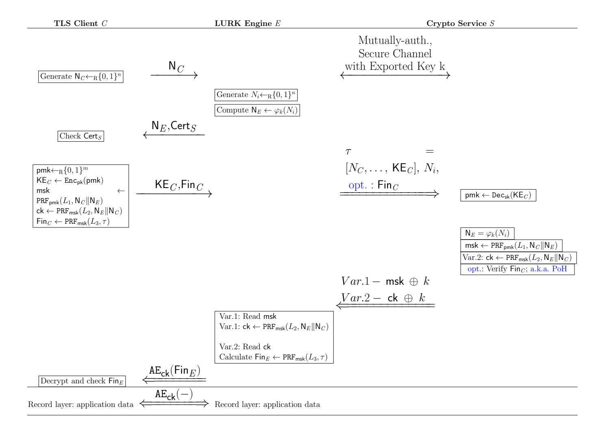

Fig. 1: LURK based on TLS 1.2 in RSA mode: Two Variants

&lt;sup>11 We do not hard code this function in the design as per the guidelines of [21]. In this way, if concrete implementations have already allocated the space for different possibilities, then deprecation of specific choices and replacements are more easily made.

&lt;sup>12 Please see Appendix A of the long version of the paper [32] for details on TLS 1.2

{12}------------------------------------------------

As per Fig. [1,](#page-11-1) the handshake starts as expected on the client side. Thereafter, there are some differences. First, the server-nonce, here denoted NE, is computed by the LURK Engine in a different manner than in TLS 1.2. RSA mode. The LURK Engine generates a nonce Ni at random; the length of Ni is parametric in a security parameter. In practice, in line with TLS parameters, this length can be chosen to be, e.g., 28×8 bits. Second, the LURK Engine applies the ϕ function to Ni . It is the result of ϕ(Ni), i.e., NE = ϕ(Ni), that stands in for the "TLS server random" and is sent back by the LURK Engine to the Client. Third, the TLS Client then sends the client key-exchange message KEC containing the encrypted pre-master secret pmk, alongside the client-finished messages FinC . Fourth, the LURK Engine forwards these (with or without the FinC ), along with Ni and all elements of the transcript τ to the Crypto Service. Then, the Crypto Service computes NE as ϕ(Ni), retrieves the pmk, verifies the FinC message (if it was sent) and then computes the master secret msk. Note that the sending by the Engine of the FinC message to be verified by the Crypto Service is optional and we also refer to it as the Proof of Handshake (PoH).

Henceforth, LURK branches out in two variants. In Variant 1, the Crypto Service sends back the master-secret msk to the LURK Engine, whereas in Variant 2, the channel key ck is sent back to the LURK Engine. Either message, msk or ck, is sent encrypted with the exported key. Then, the protocol between the Engine and the TLS Client follows the normal TLS interaction and record-layer communication.

LURK in RSA Extended Mode. LURK in RSA Extended mode only differs from LURK in RSA in that the master secret msk is generated using the transcripts of the handshake instead of the nonces NC and NE.

LURK in DHE Mode. W.r.t. LURK in DHE mode, we also propose two variants. The first is presented in Figure [2,](#page-13-0) and the second in Figure [9](#page-37-0) —found in Appendix [C.](#page-36-1) In the first variant of LURK in DHE mode (Fig. [2\)](#page-13-0), the LURK Engine generates the DHE keypair (v, gv mod p) and KEE . It sends the key share KEE to the Crypto Service together with NC and Ni , as well as —optionally —a Proof of Ownership of v, denoted P oO(v); the latter can be seen as a non-interactive proof of knowledge of the secret exponent v.

The Crypto Service would only accept a specific data-structure for the messages received at this step and it will decline the communication otherwise. Then, the Crypto Service verifies the P oO (if it was sent), it then computes the hash sv, and signs this hash. Then, the Crypto Service returns this signature to the LURK Engine. From here on, the Crypto Service continues the TLS handshake with the Client as expected. After the use of the DHE keypair and the Ni nonce, the LURK Engine deletes them off its memory.

In the second variant of LURK in DHE modeFigure [9](#page-37-0) —found in Appendix [C\)](#page-36-1), the Crypto Service executes more operations on behalf of the Engine than in Variant 1. Namely, the Crypto Service generates the ephemeral DHE exponent v, it therefore generates the pmk value and it only returns to the LURK Engine the channel key. In fact, our Variant 2 of LURK in DHE mode is an efficiency-driven variation of the 3(S)ACCE-K-SSL design proposed in [\[5\]](#page-28-0). Con-

{13}------------------------------------------------

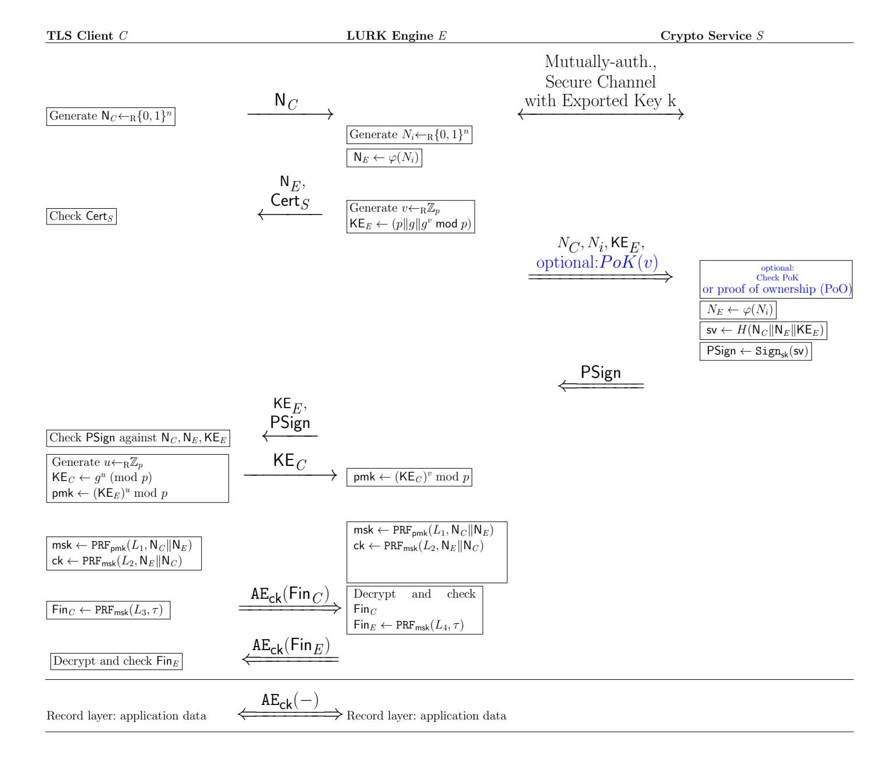

Fig. 2: LURK based on TLS 1.2 in DHE mode: Variant 1

cretely, our Variant 2 of LURK in DHE mode does not require the heavy PKI that 3(S)ACCE-K-SSL needs for the content-soundness property (i.e., one certificate per each fragment delivered), as we do not aim to achieve this property—see section 3.3.

Note: A detailed specification of LURK, to the level of the network layer, packet formats, inner options, etc. is available at [35]. Section 6 will also provide detail in this regard.

#### **4.2** *LURK*'S SECURITY GOALS

TLS is a 2-party authenticated key exchange (AKE) protocol and LURK is a 3-party AKE protocol. The security of AKEs like TLS, i.e., AKEs with a key confirmation step, is formalised via the authenticated and confidential channel establishment (ACCE) model [26]. Meanwhile, [5] put forward 3(S)ACCE, an ACCE-based model with formalisms and security requirements for "server-side delegated authenticated key-exchanges". So, for assessing LURK's security, we

{14}------------------------------------------------

use the 3(S)ACCE model. We describe below the threat model and security requirements at the high-level; for the formal version, please refer to Appendix [B](#page-32-0) , where we recall both the ACCE and the 3(S)ACCE models.

Threat Model. To recall, ACCE models are session-based: i.e., Clients, Engines and Services are parties which have multiple instances/sessions running, and the security definitions rest on "data agreements" and no "bad" event occurring in the interleaving of these sessions, even in the presence of an adversary. Our attacker is a 3(S)ACCE adversary who can compromise the LURK Engine, as well as the different end-points, i.e., the Client and the Crypto Service. Not all 3 parties can be compromised in the same LURK execution. The attacker also controls the network, within the realms of the type of channel (i.e., he cannot change a secure channel into an insecure one). In the 3(S)ACCE model (recalled in Appendix [B\)](#page-32-0), these adversarial actions are formalised via oracle calls to a challenger simulating the protocol-execution.

Security Requirements for LURK. The 3(S)ACCE formalism introduces four security requirements for proxied AKE protocols as described below (given formally in Appendix [B\)](#page-32-0).

Entity Authentication (EA) [\[5\]](#page-28-0). An EA attacker can corrupt parties (i.e., making them do arbitrary actions), can open new sessions, can probe the results of sessions and can send its own messages. We say that there is an EA attack by an EA attacker if there exists a session of type X ending correctly, but there is no honest session of type Y that was started with X. Above, X, Y can either be Client or Crypto Service and X is different from Y . In most cases, we are interested in the case where X is "Client" and Y is "Crypto Service", i.e., the EA views the authentication of the Crypto Service being forged to a given Client. We say a server-side delegated authenticated key exchange achieves entity-authentication if there is no EA attack onto the protocol.

In the 3(S)ACCE formal model [\[5\]](#page-28-0), the notion of "mixed-2-ACCE entity authentication" also appears; it is called mixed because "to the left" of the Engine —there is an unilateral authentication protocol, and "to the right" of the Engine —there is a mutually authenticated protocol, and the attacker needs to play the EA game both to the left and to the right at the same time.

Channel Security. We say a server-side delegated authenticated key exchange achieves channel security if no channel attacker can find the channel key of a session belonging to a party it did not corrupt. Notably, the attacker can corrupt a LURK Engine at a time t and thus can learn its full state at that time, and use it henceforth to find the channel key of sessions that took place before time t. This type of attack is known as an attack against perfect forward secrecy (PFS). It is well-known that TLS 1.2 in RSA mode does not achieve perfect forward secrecy, and nor does Keyless SSL in RSA mode [\[5\]](#page-28-0).

Accountability [\[5\]](#page-28-0). We say a server-side delegated authenticated key exchange achieves accountability if the Crypto Service is able to compute the channel keys used by the Client and the middle party, which in our case is the LURK Engine. This empowers the Crypto Service to audit the activity of the LURK Service at the record layer, should this be required.

{15}------------------------------------------------

So, the LURK designs are expected to achieve channel security, entity authentication and accountability. Our position is that the first two requirements are essential (and should be demanded of all LURK designs); meanwhile, we view accountability as an optional security requirement, which one can consider trading off for the sake of efficiency.

### 4.3 LURK's Design Choices: Different Levels of Security & Efficiency

LURK's Freshness Function ϕ. We included this mechanism in LURK in RSA mode to aid the enforcing of (channel security with) perfect forward secrecy. In simple terms, if an adversary A gathers plaintext information from a handshake, then A will get NE and KEC but not the Ni nonce sent on the secure channel between the Engine and the Crypto Service. If later on, at time t, the adversary A corrupts the Engine E, said adversary will not find the old the Ni nonce in E's memory; we specifically require that Ni be deleted from E's memory at the end of its use. As such, since we require ϕ to be a non-programmable[13](#page-15-0) PRF [\[10\]](#page-28-5), the value NE produced as ϕ(Ni) cannot be guessed by the attacker. Since ϕ is a PRF, ϕ is also non-invertible and the adversary A cannot produce Ni out of NE neither. So, A cannot present an old query to the Crypto Service. We will further discuss the PFS guarantees of LURK in RSA mode in Section [5.](#page-16-0)

We note that —whilst some cryptographic assumptions are needed—LURK in RSA mode builds in a PFS-enforcing mechanism that is more communicationeffective than the repairs made to Keyless SSL via 3(S)ACCE-K-SSL in [\[5\]](#page-28-0) (i.e., in LURK , the Crypto Service does not need to send NE to the Engine at the beginning of the handshake).

LURK: Session Resumption vs. Accountability. Session resumption is a mechanism whereby the middle party in a proxied TLS connection can produce a new channel key ck without contacting the end-server, just by exchanging new nonces with the client and using an old msk. Variant 1 of LURK in RSA mode, the msk is returned to the TLS Engine E, and so the latter could perform session resumption. That said, LURK does not provide a mechanism for session resumption in its specification. And, in Variant 2 of LURK in RSA mode, the channel key ck is returned to the TLS Engine E, and so the latter can simply not perform session resumption.

So, if we modified LURK to explicitly open for session resumption, then —in practice—Variant 1 of LURK in RSA mode could become more communicationefficient than Variant 2 of LURK in RSA mode. Yet, Variant 2 of LURK in RSA mode achieves the aforementioned security requirement called accountability[14](#page-15-1) . Thus, Variant 2 of LURK in RSA mode is closer to 3(S)ACCE-K-SSL in RSA mode in [\[5\]](#page-28-0) (which also attains accountability); however, recall that LURK in

13 Non-programmability is just a detail pertaining to formal proofs: the great majority PRFs are non-programmable; see Appendix [B](#page-32-0) for details.

14 Following [\[5\]](#page-28-0), it is known that session-resumption and accountability are mutually exclusive.

{16}------------------------------------------------

RSA mode is more efficient that 3(S)ACCE-K-SSL in obtaining channel security with PFS.

Protection Against Signing Oracles. In LURK, based on TLS 1.2, in RSA mode, the role of ϕ is to enforce freshness and as such prevent replay attacks.

Protection Against Malicious Services. In practical settings, the ephemeral secret v of the Engine may not always be regenerated, e.g, see Section 6.4 of RFC7525. As such, if the Engine operated with a static v, plus a malicious Crypto Service learnt this value v at a given time and thereafter became malicious, then the said Crypto Service could impersonate the Engine and inject unwanted messages to the Client. This can not only compromise the Client's security, but breaks the assumptions of the collaborative setup whereby the Engine always mediates the LURK connections between the Client and the Service. This is why we do not send the ephemeral secret v, from the Engine to the Crypto Service.

Protection Against Cross-Protocol Attacks. In the design-description, we mentioned the fact the Crypto Service would only accept specific data-structures for incoming messages and it will decline the communication otherwise. This is detailed further in our low-level specification found at [\[35\]](#page-30-12). These elements protect against cross-protocol attacks or injection attacks by a malicious Engine who would send illicit data to the Service.

## 5 Formal Security Proofs & Analyses

We now discuss our formal security analysis of LURK in two parts. First, in Subsection [5.1,](#page-16-1) we provide the computational-security results [15](#page-16-2) for Variants 1 and 2 of LURK in RSA mode and for Variant 1 of LURK in DHE mode. This is done w.r.t. all security requirements mentioned in Section [4,](#page-10-1) including accountability.

Secondly, in Subsection [5.2,](#page-17-0) we use symbolic verification to show that LURK in RSA mode achieves PFS within its channel-security property.

## 5.1 Cryptographic-Analysis of LURK

In what follows, we state our provable-security results w.r.t. LURK. Using the 3(S)ACCE model in [\[5\]](#page-28-0), we present the formal theorems and proofs of these statements in Appendix [E.](#page-40-0)

#### Entity-Authentication Result.

15 Computational or provable-security formalisms for security analysis consider messages as bitstrings, attackers to be probabilistic polynomial-time algorithms who will attempt to subvert cryptographic primitives, and attacks to have a probabilistic dimension the security parameters; e.g., [\[5\]](#page-28-0) is a provable-security model for serverside delegated authenticated key exchange. Contrarily, symbolic models for security analysis abstract messages to algebraic terms, cryptographic primitives to be ideal and not subject to subversion by the adversary, and the attacks be possibilistic flaws mounted via a set of Dolev-Yao rules [\[14\]](#page-29-14) applied over interleaved protocol executions.

{17}------------------------------------------------

If TLS 1.2 is secure w.r.t. unilateral entity authentication, if the protocol between the Engine and the Service is a secure AKE protocol with exported keys indistinguishable from random [\[11\]](#page-29-11), if the two protocols ensure 3(S)ACCE mixed entity authentication [\[5\]](#page-28-0), if the signature and hash in TLS 1.2 DHE mode are secure in their respective threat models, if the encryption in TLS 1.2 RSA mode is secure, then Variant 1 of LURK in DHE mode and Variants 1 and 2 of LURK in RSA mode are entity-authentication secure in the 3(S)ACCE model.

This is formalised and proven in Theorem [1](#page-40-1) in Appendix [E.](#page-40-0)

### Channel Security Result.

If TLS 1.2 is secure w.r.t. unilateral entity authentication, if the protocol between the Engine and the Service is a secure AKE protocol with exported keys indistinguishable from random [\[11\]](#page-29-11), if the two protocols ensure 3(S)ACCE mixed entity authentication [\[5\]](#page-28-0), if the signature in TLS 1.2 DHE mode is secure in its threat models plus, respectively, if the encryption in TLS 1.2 in RSA mode is secure and the freshness function is a non-programmable PRF [\[9\]](#page-28-6), then Variant 1 of LURK in DHE mode and, respectively, Variants 1 and 2 of LURK in RSA mode attain channel security in the 3(S)ACCE model.

This is formalised and proven in in Theorem [2](#page-43-0) in Appendix [E.](#page-40-0)

### Accountability Result.

If TLS 1.2 is secure w.r.t. unilateral entity authentication, if the protocol between the Engine and the Service is a secure AKE protocol with exported keys indistinguishable from random [\[11\]](#page-29-11), if the two protocols ensure 3(S)ACCE mixed entity authentication, and the freshness function is a non-programmable PRF [\[9\]](#page-28-6), then Variant 2 of LURK in RSA mode attains accountability in the 3(S)ACCE model.

This is formalised and proven in Theorem [3](#page-44-0) in Appendix [E.](#page-40-0)

## 5.2 Symbolic Verification of LURK in RSA Mode

In Appendix [E](#page-40-0) and Subsection [5.1,](#page-16-1) we prove and respectively recount that LURK in RSA mode attains channel security. Now, we aim to focus on the PFS side of the channel security property. Namely, we use computer-assisted analysis to show that the bespoke way in which LURK in RSA mode introduces and uses the freshness function ϕ –which henceforth we call the "freshness mechanism"– does indeed attain channel security with PFS.

We use the ProVerif [\[6\]](#page-28-7) symbolic verifier given that it is fully automated, supports an unlimitted number of protocol sessions and can prove various security properties such as secrecy and correspondence [\[7\]](#page-28-8). ProVerif is based on applied pi-calculus [\[1\]](#page-28-9). As such, the protocol entities in our protocol (i.e., the Client, the LURK Engine, the Crypto Service) are modelled as applied-pi processes executing in parallel. The attacker is a separate process modelling a Dolev-Yao adversary [\[14\]](#page-29-14).

Weak LURK. To reach our goal, we also model and check a modified version of LURK in RSA mode, in which the freshness function is not present. In simple terms, in this version the Engine chooses the nonce NE directly and sends it to the client and the Crypto Service, without locally generating Ni and inputting it 

{18}------------------------------------------------

to the freshness function  $\varphi$  to compute  $N_E$ . These differences, which yield what we refer to as "weak-LURK", are presented in Figure 3.

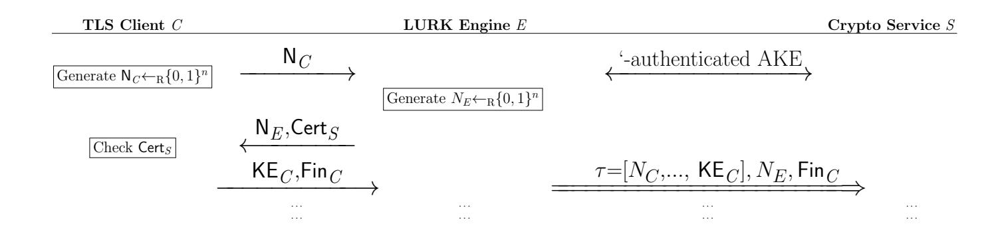

Fig. 3: "Weak LURK": LURK in RSA mode stripped of the freshness mechanism

Symbolic Formalisation of *LURK*'s Requirements. First, recall that if an attacker corrupting the Engine can get hold of the master secret msk from an old session and he has observed the handshake of said session, then the attacker can compute the channel key for that session. This would be failing the property of channel security with PFS. Second, we need to formalise the property of channel security (with PFS) in ProVerif.

In the verification process, part of the aspects above would be abstracted into property over execution-traces, encoding that a master secret msk cannot be learnt by an attacker who corrupts the Engine. More generally, in symbolic-verification tools, this would be a secrecy property, which allows one to verify that particular sensitive data is never inferred by the attacker in any protocol execution. But, we are also interested in seeing if ProVerif would find an actual replay attack whereby an attacker who corrupts the Engine learns not any msk but specifically an old msk. In ProVerif, this can be done via a correspondence property, which allows one to verify associations between stages in protocol executions, such as links between event occurring. That is, we formalise the verification of channel security (with PFS) via a secrecy property w.r.t. (old) master secrets, together with a correspondence property which checks if it is possible to re-query the Crypto Server on past cryptographic material such as old client or server random values. We check these properties in "weak LURK" vs (Variant 1 of) LURK in RSA mode, both encoded in ProVerif.

Symbolic Analysis of Channel Security with PFS in "Weak LURK". Our results show that "weak LURK" fails to achieve security against corrupted Engines performing replay attacks. Failure of the anti-replay properties implies PFS failure: the attacker is able to query the Crypto Service and retrieve old master secrets. This is also confirmed by violating the secrecy property over the client master secret. ProVerif is able to show an attack trace with the attacker acting as an Engine and retrieving an old master secret as a result of querying the Crypto Service with captured data on the public channel.

Symbolic Analysis of Channel Security with PFS in LURK. As opposed to "weak LURK", LURK introduces the freshness mechanism. We model

{19}------------------------------------------------

the freshness function ϕ as a pseudorandom function which cannot be inverted by the attacker (i.e., we rely on the "private" attribute in ProVerif). The results of the analysis show that, in LURK, clear server random values can be accessed only by legitimate parties, i.e., received by the Crypto Service. In addition, the correspondence property holds for LURK, guaranteeing that retrieval of past master secrets is no longer possible by querying the Crypto Service with cryptographic material inferred from the public channel. This formally proves that LURK employing the freshness mechanism is resilient against replay attacks from corrupted Engines.

As by product, our ProVerif-based demonstration that Weak LURK fails to ensure PFS (PFS) is also a new and automatic way of showing that Keyless SSL in RSA mode has a replay attack and does not attain PFS; this was only shown with "pen and paper" before, in [\[5\]](#page-28-0). To this end, the two analyses above also prove that our freshness mechanism represents a viable alternative to the solution proposed in [\[5\]](#page-28-0) to patch the Keyless SSL protocol's PFS problems (which was to have the end-server generate the server random for the middlebox).

Analysis of Channel Security with PFS: Summary. Table [4](#page-20-0) gives details on the property-encoding and summarises the results of the verification. Our ProVerif code can be found at [\[41\]](#page-30-13).

## 6 System Implementation

pylurk [\[42\]](#page-30-14), a Python implementation of LURK , follows a modular Python implementation depicting a client/server setup between a LURK client (i.e., engine) and a LURK server (i.e., crypto service). We implemented Variants 1 of LURK in RSA and DHE mode. Our implementation supports UDP, TCP, TCP+TLS, HTTP and HTTPS for the interaction between the engine and the crypto service. UDP + DTLS has not been implemented because we were not able to find a suitable DTLS library in Python. Furthermore, UDP+DTLS would end up in a stateful protocol which removes the main characteristics of UDP. As a result, we followed the similar design as DoT [\[23\]](#page-29-15) and DoH [\[19\]](#page-29-16) and limited our scope for the CDN use case to TCP+TLS and HTTPS. UDP is left to the usage of LURK in a TEE (Trusted Execution Environment) or in containerised environments where exchanges are performed on a given platform without exposure to the network.

We leveraged the socketserver module [\[46\]](#page-30-15) for TCP and UDP implementation, the http.server [\[22\]](#page-29-17) module for the HTTP implementation and SSL [\[48\]](#page-31-8) as a TLS/SSL wrapper for socket objects to enable packets protection. We modified the TCPServer module implementation to allow multiple requests exchange per established session, eventually protected by TLS, with the client, which improves the performance. However, we left the http.server class unchanged. Hence, when HTTP is used in combination with TLS, a TLS exchange is performed for each TCP session per request which results in a non optimal case.

As LURK server provides cryptographic services, we use the Cryptodome [\[13\]](#page-29-18) package to allow the server to enforce cryptography primitives, while specific

{20}------------------------------------------------

| Security with PFS     | Code Excerpt                                                                                                                                                                                               | Comments                                                                                                                                                                                                                                                                                                                                                                                                                             |  |  |  |
|--------------------------|------------------------------------------------------------------------------------------------------------------------------------------------------------------------------------------------------------|--------------------------------------------------------------------------------------------------------------------------------------------------------------------------------------------------------------------------------------------------------------------------------------------------------------------------------------------------------------------------------------------------------------------------------------|--|--|--|
|                          | "Weak LURK", without the freshness mechanism                                                                                                                                                               |                                                                                                                                                                                                                                                                                                                                                                                                                                      |  |  |  |
| Secrecy                  | query secret mastersecretclient. query secret srv rnd.                                                                                                                                                  | Result: False. Both properties fail. Attack: an attacker assuming the role of the Engine obtains an old master secret with a replay at tack.                                                                                                                                                                                                                                                                    |  |  |  |
| Antireplay / Corresp. | query encpremaster :bitstring, srvrand:bitstring; inj-event(keyserver received − encpremaster (encpremaster , srvrand)) =⇒ inj-event(edge resent encpremaster (encpremaster , srvrand)). | Result: False. The query asserts that reception by the Crypto Ser vice of a distinct pair of encrypted premaster secret with a server ran dom NE occurring only once in the same protocol run. The property fails, Attack: trace showing a re play of the same encrypted pre master Enc(pmk) and same server random NE in two distinct in stances of the Crypto Service pro cess. |  |  |  |
|                          | LURK in RSA mode (Variant 1 encoded), with freshness mechanism                                                                                                                                             |                                                                                                                                                                                                                                                                                                                                                                                                                                      |  |  |  |
| Secrecy                  | query secret mastersecretclient. query secret clearSrvRnd.                                                                                                                                              | Result: True. Both properties hold. Server random values may now be accessed only by legitimate parties and old master secrets can not be obtained/inferred by the at tacker.                                                                                                                                                                                                                                |  |  |  |
| Antireplay / Corresp. | query srvRand:bitstring; inj-event(keyserver recvd srvrnd − clear(srvRand)) =⇒ inj-event(edge sent srvrnd clear (srvRand)).                                                                    | Result: True. The query asserts that reception by the Crypto Ser vice of one given server random NE occurs only once, as a result of an Engine transmitting this value. The property holds, guaranteeing that retrieval of old master secrets is no longer possible by re-querying Crypto Service with cryptographic material inferred from the public channel.                                     |  |  |  |

Table 4: ProVerif Analysis of Channel Security of "Weak LURK" and LURK in RSA Mode.

{21}------------------------------------------------

elliptic curve operations, such as the proof of ownership (PoO) of the DHE exponent, are enabled through tinyec [\[53\]](#page-31-9). Our implementation allows the use of SHA256, SHA384 and SHA512 for the generation of the master secret. The freshness function ϕ is specified as SHA256. Other options can easily be added.

In RSA mode, the TLS Handshake is provided to the crypto service which also enforces the usage of specific cipher suites. In our case, we enforced the following cipher suites: TLS RSA WITH AES 128 GCM SHA256 and TLS RSA WITH AES 256 GCM SHA384. Encryption of the premaster secret was performed using a 2048-bit public key.

In DHE mode, namely ECDHE (Elliptic Curve Diffie Hellman), we enforced the use of secure hash functions in the signature scheme (SHA256 and SHA512) for both RSA and ECDSA. Similarly, secure elliptic curves (secp256r1, secp384r1, secp521r1) have been implemented for the generation of ECDHE, as well as for ECDSA signature. Experiments have limited the test to an RSA signature with SHA256 using a 2048-bit public key. ECDHE was performed using secp256r1. Again, other options can easily be added to the implementation.

Lastly, in RSA mode, the last message between the crypto service and the engine is sent (e.g., msk) instead of its encryption under the exported key k. This is because the channel is already secure and the said encryption is simply needed for strong 3(S)ACCE provable-security results but adds nothing to practical security. Note that more details on the system implementation can be found in Section 3 of our long version of this manuscript [\[32\]](#page-30-11).

## 7 Performance Evaluation

We now investigate the performance of LURK vs. that of a classical TLS 1.2 handshake, and study how different design and implementation choices in LURK impact its overall performance in terms of latency and CPU overhead. Further, we provide a comprehensive comparison of LURK with other works in the literature in Section 6 of our long version of this manuscript [\[32\]](#page-30-11), given the space limitation herein. For all experiments, we use the Variants 1 of LURK in the pylurk [\[42\]](#page-30-14) implementation (Section [6\)](#page-19-0). Our prototype runs on Xubuntu 18.04, on an Intel i7-2820QM CPU (2.3GHz) with 16GB RAM. All our results are derived by averaging over 50 iterations.

#### 7.1 Latency

For a given configuration, lLURK = preq + RT T + presp, is the measured latency where preq and presp represent the latency introduced by the treatment of the request and response, respectively, at various layers such as application (parsing, building, processing the LURK messages) and transport (handling HTTP, TCP, TLS with associated interruption or processing). RTT is the round-trip time between the Engine and the Crypto Service. We measure RTT on a local network, approximating the latency within a data center. The overhead of LURK compared to a standard TLS handshake can roughly be approximated as the latency 

{22}------------------------------------------------

between the Engine and the Crypto Service and can be estimated to:  $\delta = \frac{l_{LURK}}{l_{TLS}}$ . Note that such overhead is negligible if a UDP exchange is performed on a local host between the LURK Engine and the Crypto Service.

Figure 4a shows the latency in seconds for different LURK modes (i.e., RSA, RSA-extended and ECDHE) for different transport configurations (i.e., local UDP, UDP, TCP, HTTP). Figure 4b depicts the latency ratio of having LURK in RSA mode over TCP+TLS and HTTPS, compared to LURK in RSA mode over TCP, HTTP. In these cases, the PRF function in TLS and the  $\varphi$  freshness function we introduced in LURK are set to SHA256. Figures 5a – 6b show the latency ratio of LURK with particular options enabled vs. the average-times of a reference implementation without those options in place. We also consider a particular instantiation of  $\varphi$  freshness function, the PRF used in generating the master secret, the use of a PoH, the use of a specific PoO vs. the respective lack of such choices. The measurements shown in Figures 5a – 6b are performed over UDP.

On transport protocols The increased latency overhead introduced by TCP over UDP (i.e., a factor of 1.02 in RSA mode, 1.16 in RSA-Extended mode, and 1.02 in ECHDE mode) is a result of the TCP session establishment between an engine and the Crypto Service for all the requests (Figure 4a). In contrast, the additional latency overhead observed by HTTP over TCP (i.e., a factor of 1.46 in RSA mode, 1.25 in RSA-Extended mode and 1.50 for *LURK* in ECDHE mode) and by HTTPS over TCP+TLS depicted in Figure 4a and Figure 4b respectively, is due to the TCP session establishment for each new request between an engine and the Crypto Service.

While UDP provides optimal performance, the lack of delivery control makes it a poor candidate for *LURK*. Further, we identify no clear benefit from using HTTP instead of TCP, as for instance, the use of HTTP generates larger payloads. TLS does not impose measurable latency. As a result, we recommend that the engine and the Crypto Service be connected via a long term TCP session protected by TLS.

Further, we note that the latency overhead introduced by LURK over TLS is limited in ECDHE mode but not in RSA mode, given that LURK implied more changes to TLS 1.2 in RSA mode (e.g., use of freshness function, more interaction between the engine and the Crypto Service) than that in DHE mode. Figure 4b shows that in RSA mode, the additional costs added onto TLS (e.g., via the introduction of the freshness function) are negligible for TCP+TLS; however, for HTTPS, LURK (vs. TLS) increases the latency by a factor of 1.3. With TCP+TLS, the overhead of using LURK over the standard TLS 1.2 is estimated to be:  $\delta_{RSA} = 1.27$ ,  $\delta_{RSAExt} = 1.24$ ,  $\delta_{ECDHE} = 1.05$ .

On TLS modes Figure 4a depicts that the latency of LURK varies with the underlying TLS mode. In fact, increased latency overhead is observed when using RSA extended and ECDHE modes in comparison to RSA mode. For example, LURK increases the latency by a factor of 2.2 and 3.73, in RSA Extended and ECDHE modes respectively, in comparison to RSA mode for TCP connections. The difference between RSA and RSA Extended is due to the additional pro-

{23}------------------------------------------------

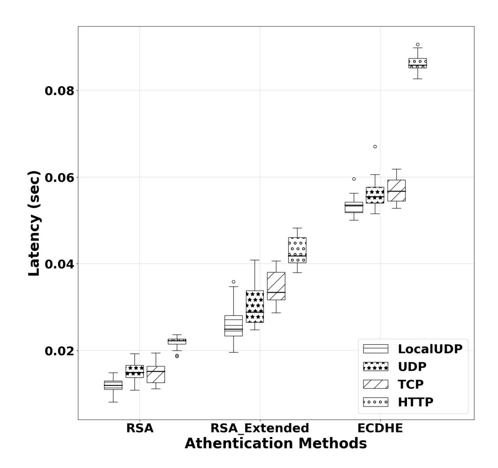

(a) LURK over secure transport protocols.

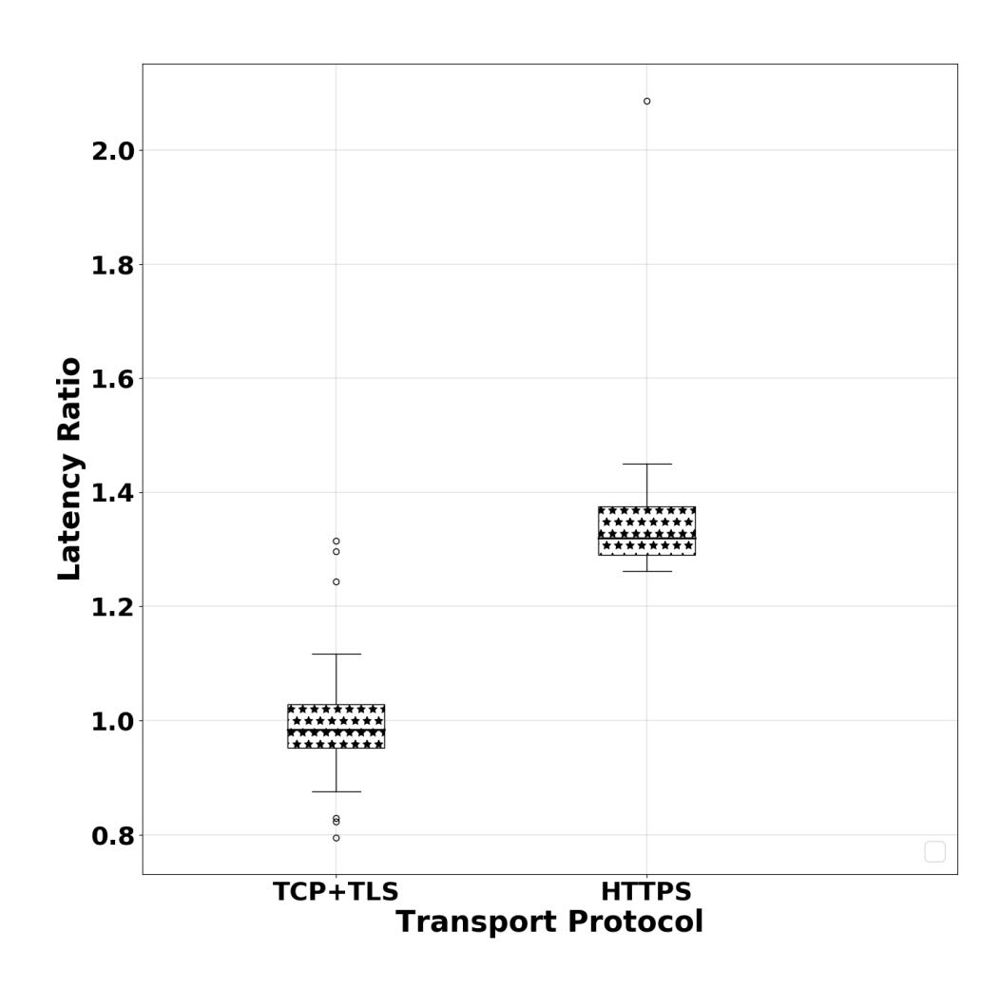

(b) LURK in RSA mode over secure transport.

Fig. 4: Latency Measurements

{24}------------------------------------------------

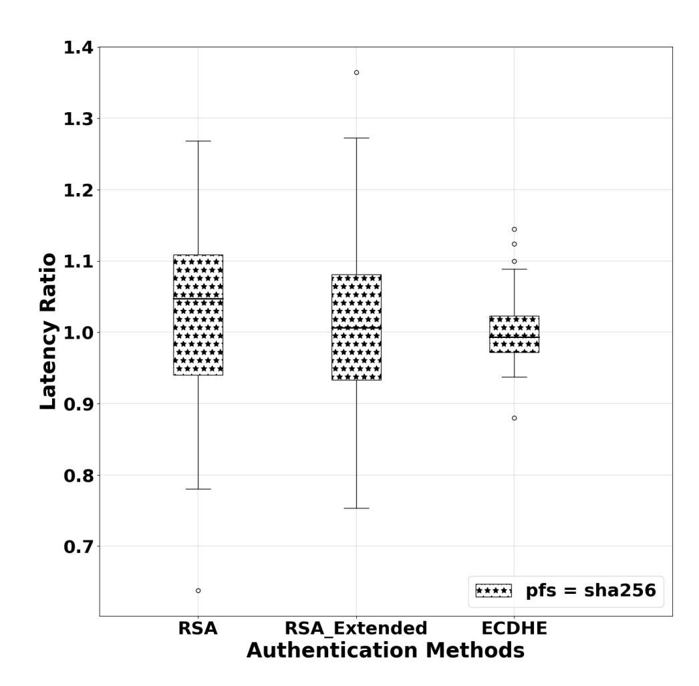

(a) Freshness function overhead.

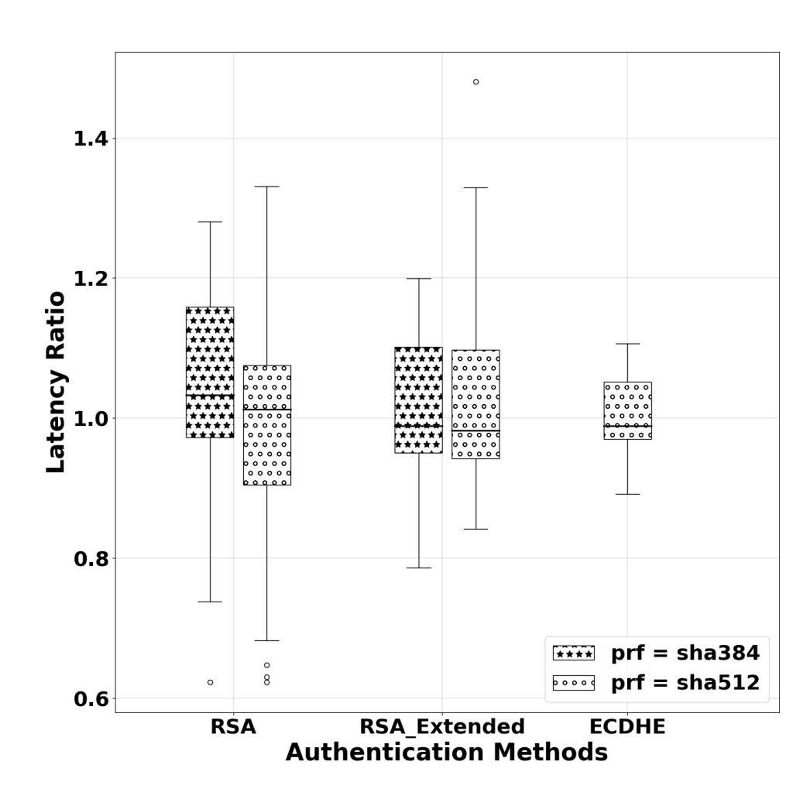

(b) TLS PRF overhead.

Fig. 5: Latency Measurements (cont'd)

{25}------------------------------------------------

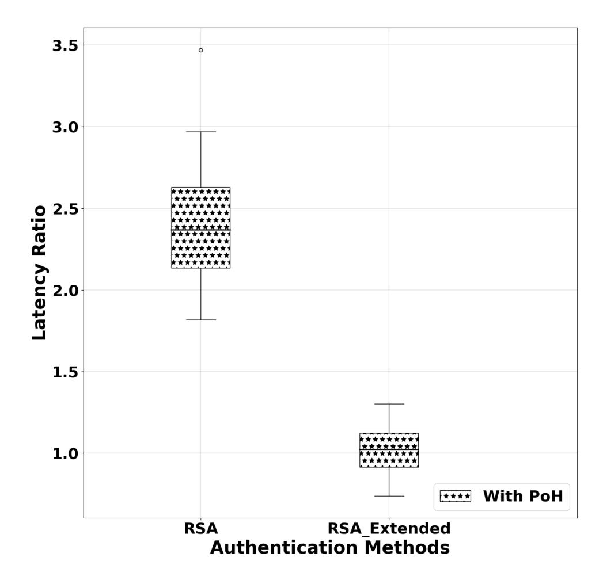

(a) PoH overhead.

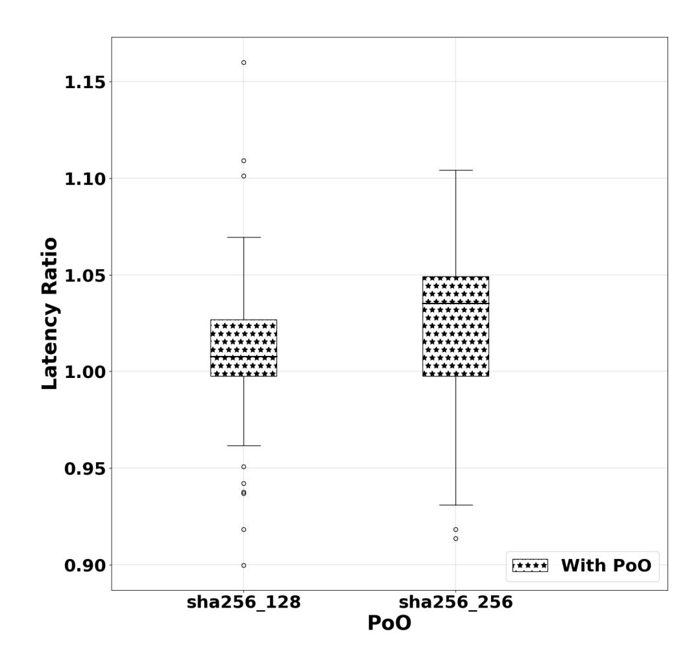

(b) PoO overhead.

Fig. 6: Latency Measurements (cont'd)

{26}------------------------------------------------

cessing and communication of the full TLS handshake. Whereas, the difference between ECDHE and RSA is mostly due to the cryptographic operations involved (e.g., more costly mathematical computations in ECHDE).

Other choices Figure [5a](#page-24-0) shows the latency ratio of ϕ being set to SHA256 vs. ϕ being non-existent. The measured ratio is 1.016, 0.99 and 1.00 for RSA, RSA Extended and ECDHE modes, respectively which implies that the impact of ϕ on the overall latency is negligible. Figure [5b](#page-24-0) depicts the RTT-degradation when TLS 1.2's PRF is being set to SHA384 and SHA512, compared to the more-standard SHA256; this choice has negligible impact on the overall latency.

Figure [6a](#page-25-0) shows that our added PoH has negligible impact (1.066) on RSA-Extended, given that a full handshake-transcript is already provided. In contrast, our added PoH increases the latency by 2.39 for RSA mode. However, note that the latency of LURK in RSA mode with added PoH is comparable to that of TLS 1.2 in RSA-Extended mode. Figure [6b](#page-25-0) depicts the impact of our added PoO of the DHE exponent over the average ECDHE latency. The impact observed is relatively negligible.

### 7.2 CPU Overhead

We load the Crypto Service with a rate of 100 requests per second, with a number of blocking clients operating in parallel. The results, shown in Fig. [7,](#page-27-0) confirm that the use of TLS over TCP has little impact on the performance of just TCP itself, which is due to an efficient TLS library. HTTP and HTTPS seem to perform better than TCP, especially for LURK in RSA-Extended mode. This is due to the efficient input/output processing managed by the HTTP libraries used, on one hand. On the other hand, the TCP implementation requires additional processing given the increased interactions between the user and the kernel (i.e., reading the LURK Header and the remaining bytes of the LURK request)

CPU consumption for LURK in ECDHE mode remained quite stable for different transport protocols. This is in part due to the fact that the additional processing required for handshakes is quite minimal compared to the cryptographic operations. But, processing the handshakes yield additional CPU overhead in the case of using LURK in RSA and RSA-Extended modes. Concretely, the Crypto Service in RSA-Extended mode requires 1.39 times more resources than for LURK in RSA mode. In ECDHE mode, it requires 2.08 times more than for LURK in RSA mode.

## 8 Discussions, Future Work & Conclusions

Our suite of designs, called LURK, aim to offer provably secure server-controlled TLS delegation, in a manner that achieves competitive performance. Our drive for this was motivated in real-life use-cases calling for server-controlled TLS delegation, such as complex CDN-delegations and service-to-service platforms. On the one hand, one can see LURK as a way to improve the security of KeylessSSL [\[49\]](#page-31-2), in a spirit similar to that of the recent 3(S)ACCE-KSL protocol

{27}------------------------------------------------

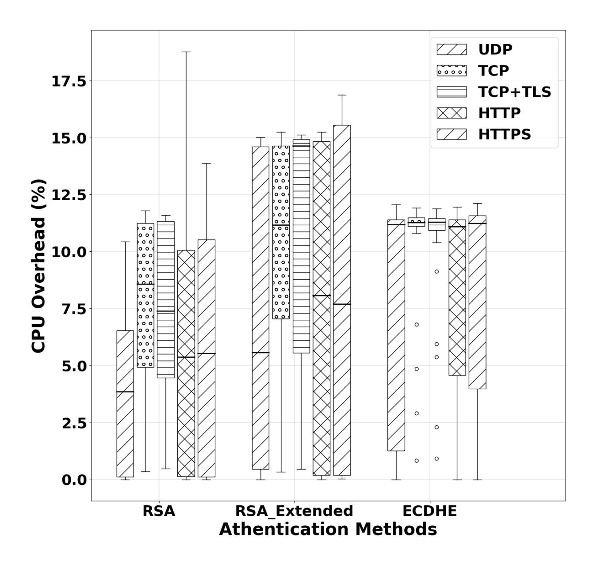

Fig. 7: CPU Overheads of the Crypto Service in different LURK modes.

in [\[4\]](#page-28-4). On the other hand, unlike the 3(S)ACCE-KSL scheme, we do not require that LURK attains the expensive, content-soundness requirement w.r.t. TLSdelegation, which –in turn– does away with the need for an arguably infeasible PKI infrastructure. Meanwhile, in some of its variants, LURK attains all other relevant security requirements of 3(S)ACCE-KSL, i.e., channel security, entity authentication and accountability; for these, in the long version [\[32\]](#page-30-11), we provide cryptographic proofs in a suited 3-party authenticated key-exchange formal model. Moreover, we use protocol-verification (in ProVerif) to show that designmechanisms that specifically separate LURK from KeylessSSL while achieving their intended, specific goals, i.e., enforce forward secrecy. Our studies focus on LURK instantiated with TLS 1.2, as this is still the most widely used version of TLS and will likely remain so for some foreseeable future, especially for legacy devices. Our specifications go down to the API level, providing details down to network and packet level for the communications within the TLS delegation. This 

{28}------------------------------------------------

delegation, in LURK, is envisaged as a modular design, where the middle entity and the end-server operate in a service-to-service fashion. Lastly, our Python implementation and performance-testing of LURK show that it is a competitive solution for TLS-delegation. Overall, in this paper, our LURK constructs show that server-controlled TLS delegation is possible with both provable guarantees of real-world security and competitive efficiency.

W.r.t. future directions, we are actively working towards LURK based on TLS 1.3 [\[34\]](#page-30-16). In the long version of this paper [\[32\]](#page-30-11), there are more details on this.

Also, the primary objective of our implementation, pylurk, was to build an initial testbed. Immediate future work involves, for instance, the extension of the interface to gRPC to better fit containerised environments. In addition, the integration of Curve25519 and Curve448 for both signatures (Ed25519, Ed448) as well as ECDHE (X25519, X448) are expected to be supported. One parallel line focuses on a C implementation of the Crypto Service, in line with the most notable TLS libraries.

## References

- 1. Mart´ın Abadi and C´edric Fournet. Mobile values, new names, and secure communication. In POPL'01: Proceedings of the 28th ACM SIGPLAN-SIGACT Symposium on Principles of Programming Languages, pages 104–115. ACM Press, 2001.
- 2. Richard Barnes, Jacob Hoffman-Andrews, Daniel McCarney, and James Kasten. Automatic Certificate Management Environment (ACME). RFC 8555, March 2019.
- 3. Richard Barnes, Subodh Iyengar, Nick Sullivan, and Eric Rescorla. Delegated Credentials for TLS. Internet-Draft draft-draft-ietf-tls-subcerts, Internet Engineering Task Force, June 2020. Work in Progress.
- 4. Karthikeyan Bhargavan, Ioana Boureanu, Antoine Delignat-Lavaud, Pierre-Alain Fouque, and Cristina Onete. A Formal Treatment of Accountable Proxying over TLS. In Proceedings of IEEE S&P. IEEE, 2018.
- 5. Karthikeyan Bhargavan, Ioana Boureanu, Pierre-Alain Fouque, Cristina Onete, and Benjamin Richard. Content delivery over TLS: a cryptographic analysis of Keyless SSL. In Proceedings of Euro S&P, 2017.
- 6. B. Blanchet. An Efficient Cryptographic Protocol Verifier Based on Prolog Rules. In IEEE Computer Security Foundations Workshop, pages 82–96, Nova Scotia, Canada, 2001. IEEE Computer Society Press.
- 7. B. Blanchet. Modeling and Verifying Security Protocols with the Applied Pi Calculus and ProVerif. 2016.
- 8. Sharon Boeyen, Stefan Santesson, Tim Polk, Russ Housley, Stephen Farrell, and Dave Cooper. Internet X.509 Public Key Infrastructure Certificate and Certificate Revocation List (CRL) Profile. RFC 5280, May 2008.
- 9. Ioana Boureanu, Aikaterini Mitrokotsa, and Serge Vaudenay. On the pseudorandom function assumption in (secure) distance-bounding protocols. In Progress in Cryptology – LATINCRYPT 2012, pages 100–120, Berlin, Heidelberg, 2012. Springer Berlin Heidelberg.
- 10. Ioana Boureanu, Aikaterini Mitrokotsa, and Serge Vaudenay. On the Pseudorandom Function Assumption in (Secure) Distance-Bounding Protocols - PRF-ness alone Does Not Stop the Frauds! In in LATINCRYPT 2012, pages 100–120, 2012.

{29}------------------------------------------------

- 11. Christina Brzuska, H˚akon Jacobsen, and Douglas Stebila. Safely exporting keys from secure channels: on the security of EAP-TLS and TLS key exporters. In EuroCrypt, 2016.
- 12. IETF Content Delivery Networks Interconnection Working Group (CDNI). [https:](https://datatracker.ietf.org/wg/cdni/about/) [//datatracker.ietf.org/wg/cdni/about/](https://datatracker.ietf.org/wg/cdni/about/), 2019.
- 13. PyCryptodome: a self-contained Python package of low-level cryptographic primitives. <https://pycryptodome.readthedocs.io>, 2019.
- 14. D. Dolev and A. Yao. On the Security of Public-Key Protocols. IEEE Transactionson Information Theory 29, 29(2), 1983.
- 15. ETSI. CYBER; Middlebox Security Protocol; Part 3: Profile for enterprise network and data centre access control. In ETSI TS 103 523-3 V1.1.1, 2018. [.](https://www.etsi.org/deliver/etsi_ts/103500_103599/10352303/01.01.01_60/ts_10352303v010101p.pdf)
- 16. C.E. Gero, J.N. Shapiro, and D.J. Burd. Terminating ssl connections without locally-accessible private keys, June 20 2013. WO Patent App. PCT/US2012/070075.
- 17. Yossi Gilad, Amir Herzberg, Michael Sudkovitch, and Michael Goberman. CDNon-Demand: An affordable DDoS Defense via Untrusted Clouds. In 23rd Annual Network and Distributed System Security Symposium, NDSS 2016, San Diego, California, USA, February 21-24, 2016, 2016.
- 18. Ted Hardie. Transport Protocol Path Signals. RFC 8558, April 2019.
- 19. Paul E. Hoffman and Patrick McManus. DNS Queries over HTTPS (DoH). RFC 8484, October 2018.
- 20. Paul E. Hoffman and Jakob Schlyter. The DNS-Based Authentication of Named Entities (DANE) Transport Layer Security (TLS) Protocol: TLSA. RFC 6698, August 2012.
- 21. Russ Housley. Guidelines for Cryptographic Algorithm Agility and Selecting Mandatory-to-Implement Algorithms. RFC 7696, November 2015.
- 22. http.server: HTTP Servers. [https://docs.python.org/3.4/library/http.](https://docs.python.org/3.4/library/http.server.html) [server.html](https://docs.python.org/3.4/library/http.server.html), 2018.
- 23. Zi Hu, Liang Zhu, John Heidemann, Allison Mankin, Duane Wessels, and Paul E. Hoffman. Specification for DNS over Transport Layer Security (TLS). RFC 7858, May 2016.
- 24. Intel. SGX: Software Guard Extensions. https://software.intel.com/en-us/sgx, 2019.
- 25. Istio. An Open Platform to Connect, Manage, and Secure Microservices. [https:](https://github.com/istio/istio) [//github.com/istio/istio](https://github.com/istio/istio), 2019.
- 26. Tibor Jager, Florian Kohlar, Sven Sch¨age, and J¨org Schwenk. On the security of TLS-DHE in the standard model. In Proceedings of CRYPTO 2012, volume 7417 of LNCS, pages 273–293, 2012.
- 27. Chang Lan, Justine Sherry, Raluca Ada Popa, Sylvia Ratnasamy, and Zhi Liu. Embark: Securely Outsourcing Middleboxes to the Cloud. In Katerina J. Argyraki and Rebecca Isaacs, editors, 13th USENIX Symposium on Networked Systems Design and Implementation, NSDI 2016, Santa Clara, CA, USA, March 16-18, 2016, pages 255–273. USENIX Association, 2016.
- 28. Hyunwoo Lee, Zach Smith, Junghwan Lim, Gyeongjae Choi, Selin Chun, Taejoong Chung, and Ted Taekyoung Kwon. matls: How to make TLS middlebox-aware? In 26th Annual Network and Distributed System Security Symposium, NDSS 2019, San Diego, California, USA, February 24-27, 2019, 2019.
- 29. A. Levy, H. Corrigan-Gibbs, and D. Boneh. Stickler: Defending against Malicious Content Distribution Networks in an Unmodified Browser. IEEE Security Privacy, 14(2):22–28, 2016.

{30}------------------------------------------------

- 30. J. Liang, J. Jiang, H. Duan, K. Li, T. Wan, and J. Wu. When HTTPS Meets CDN: A Case of Authentication in Delegated Service. In 2014 IEEE Symposium on Security and Privacy, pages 67–82, May 2014.
- 31. Salvatore Loreto, John Preuß Mattsson, Robert Skog, Hans Spaak, Dan Druta, and Mohammad Hafeez. Explicit Trusted Proxy in HTTP/2.0. Internet-Draft draftdraft-loreto-httpbis-trusted-proxy20, Internet Engineering Task Force, February 2014. Work in Progress.
- 32. Lurk: Practical and secure server-controlled tls delegation (long version). [https:](https://github.com/anon-data/anon_src/blob/master/long_version.pdf) [//github.com/anon-data/anon\\_src/blob/master/long\\_version.pdf](https://github.com/anon-data/anon_src/blob/master/long_version.pdf), 2020.
- 33. David McGrew, Dan Wing, and Philip Gladstone. TLS Proxy Server Extension. Internet-Draft draft-draft-mcgrew-tls-proxy-server, Internet Engineering Task Force, July 2012. Work in Progress.
- 34. Daniel Migault. LURK Extension version 1 for (D)TLS 1.3 Authentication. Internet-Draft draft-draft-mglt-lurk-tls13, Internet Engineering Task Force, April 2020. Work in Progress.
- 35. Daniel Migault and Ioana Boureanu. LURK Extension version 1 for (D)TLS 1.2 Authentication. Internet-Draft draft-draft-mglt-lurk-tls12, Internet Engineering Task Force, July 2020. Work in Progress.
- 36. Vidya Narayanan. Explicit Proxying in HTTP - Problem Statement And Goals. Internet-Draft draft-draft-vidya-httpbis-explicit-proxy-ps, Internet Engineering Task Force, October 2013. Work in Progress.
- 37. David Naylor, Kyle Schomp, Matteo Varvello, Ilias Leontiadis, Jeremy Blackburn, Diego R. L´opez, Konstantina Papagiannaki, Pablo Rodriguez Rodriguez, and Peter Steenkiste. Multi-Context TLS (mcTLS): Enabling Secure In-Network Functionality in TLS. In Proceedings of SIGCOMM 2015, pages 199–212. ACM, 2015.
- 38. Yoav Nir. A Method for Sharing Record Protocol Keys with a Middlebox in TLS. Internet-Draft draft-draft-nir-tls-keyshare, Internet Engineering Task Force, March 2012. Work in Progress.
- 39. Mark Nottingham. Problems with Proxies in HTTP. Internet-Draft draftdraft-nottingham-http-proxy-problem, Internet Engineering Task Force, July 2014. Work in Progress.
- 40. SVA Open Caching Working Group. [https://www.streamingvideoalliance.org/](https://www.streamingvideoalliance.org/technical-work/working-groups/open-caching/) [technical-work/working-groups/open-caching/](https://www.streamingvideoalliance.org/technical-work/working-groups/open-caching/), 2019.
- 41. Symbolic analysis of LURK1.2 with ProVerif. [https://github.com/anon-data/](https://github.com/anon-data/anon_src/tree/master/pv) [anon\\_src/tree/master/pv](https://github.com/anon-data/anon_src/tree/master/pv), 2019. anonymised for submission.
- 42. pylurk – a Python implementation of LURK. [https://github.com/mglt/pylurk](https://github.com/mglt/pylurk ), 2019.
- 43. Yaron Sheffer, Diego Lopez, Oscar Gonzalez de Dios, Antonio Pastor, and Thomas Fossati. Generating Certificate Requests for Short-Term, Automatically-Renewed (STAR) Certificates. Internet-Draft draft-draft-sheffer-acme-star-request, Internet Engineering Task Force, June 2018. Work in Progress.
- 44. Yaron Sheffer, Diego Lopez, Oscar Gonzalez de Dios, Antonio Pastor, and Thomas Fossati. Support for Short-Term, Automatically Renewed (STAR) Certificates in the Automated Certificate Management Environment (ACME). RFC 8739, March 2020.
- 45. Justine Sherry, Chang Lan, Raluca Ada Popa, and Sylvia Ratnasamy. Blindbox: Deep packet inspection over encrypted traffic. Computer Communication Review, 45(5):213–226, 2015.
- 46. socketserver: A framework for network servers. [https://docs.python.org/3.4/](https://docs.python.org/3.4/library/socketserver.html) [library/socketserver.html](https://docs.python.org/3.4/library/socketserver.html), 2018.

{31}------------------------------------------------

- 47. SplitTLS. https://github.com/indutny/splittls.
- 48. SSL: TLS/SSL wrapper for socket objects. https://docs.python.org/3.4/library/ssl.html, 2018.
- 49. Douglas Stebila and Nick Sullivan. An analysis of tls handshake proxying. In *Trustcom/BigDataSE/ISPA*, 2015 IEEE, volume 1, pages 279–286, Aug 2015.
- 50. Nick Sullivan. Keyless ssl: The nitty gritty technical details. https://blog.cloudflare.com/keyless-ssl-the-nitty-gritty-technical-details/, September 2014.
- 51. Streaming Video Alliance (SVA). https://www.streamingvideoalliance.org/technical-work/working-groups/open-caching/, 2019.
- 52. IETF Trusted Execution Environment Provisioning Working Group (TEEP). https://datatracker.ietf.org/wg/teep/about/, 2019.
- 53. tinyec. https://github.com/alexmgr/tinyec, 2018.
- 54. CYBER; Middlebox Security Protocol; Part 2: Transport layer MSP, profile for fine grained access control. In *DTS/CYBER-0027-2*, number TS 103 523-2, October 2020.
- 55. Rob van der Meulen. What Edge Computing Means for Infrastructure and Operations Leaders. October 2018.

### A TLS 1.2

We show the TLS 1.2 handshake (i.e., the secure-channel establishment part of TLS 1.2) in Figure 8.

| Client                                                                                                                                                                                                                                                                                                                                   | Server                                                                                                                                                                                                                     | Client                                                                                                                                                                                                                                                                                                                                                                                                                                                                                                                                                                                                                                                             | Server                                                                                                                                                                                                                                                                                                                                                                                                                                                                                                                                                                                                                                                                                                                                |
|------------------------------------------------------------------------------------------------------------------------------------------------------------------------------------------------------------------------------------------------------------------------------------------------------------------------------------------|----------------------------------------------------------------------------------------------------------------------------------------------------------------------------------------------------------------------------|--------------------------------------------------------------------------------------------------------------------------------------------------------------------------------------------------------------------------------------------------------------------------------------------------------------------------------------------------------------------------------------------------------------------------------------------------------------------------------------------------------------------------------------------------------------------------------------------------------------------------------------------------------------------|---------------------------------------------------------------------------------------------------------------------------------------------------------------------------------------------------------------------------------------------------------------------------------------------------------------------------------------------------------------------------------------------------------------------------------------------------------------------------------------------------------------------------------------------------------------------------------------------------------------------------------------------------------------------------------------------------------------------------------------|
| pk                                                                                                                                                                                                                                                                                                                                       | sk                                                                                                                                                                                                                         | pk                                                                                                                                                                                                                                                                                                                                                                                                                                                                                                                                                                                                                                                                 | sk                                                                                                                                                                                                                                                                                                                                                                                                                                                                                                                                                                                                                                                                                                                                    |
| $N_C \leftarrow_R \{0, 1\}^{8 \cdot 28}$                                                                                                                                                                                                                                                                                                 | $\xrightarrow{N_C} N_S \leftarrow_{R} \{0,1\}^{8 \cdot 28}$                                                                                                                                                                | $N_C \leftarrow_R \{0, 1\}^{8 \cdot 28}$ ——                                                                                                                                                                                                                                                                                                                                                                                                                                                                                                                                                                                                                        | $\begin{array}{c} \xrightarrow{\mathbf{N}_{C}} \\ & \xrightarrow{\mathbf{N}_{S} \leftarrow_{\mathbf{R}} \{0,1\}^{8 \cdot 28}} \\ ^{*} \text{ Choose DH group } (p,q,g) \\ & v \leftarrow_{\mathbf{R}} \mathbb{Z}_{q}. \text{ Set } KE_{S} \leftarrow g^{v} \pmod{p} \\ & \text{ * Set PSign} := Sign_{sk}(\tau_{[N_{C},g]}). \end{array}$                                                                                                                                                                                                                                                                                                                                                                                             |
|                                                                                                                                                                                                                                                                                                                                          | SHello,Cert S                                                                                                                                                                                                   | SHello,                                                                                                                                                                                                                                                                                                                                                                                                                                                                                                                                                                                                                                                            | $\frac{Cert_S,KE_S,p,g}{}$                                                                                                                                                                                                                                                                                                                                                                                                                                                                                                                                                                                                                                                                                                            |
| Verify $Cert_S$ , get $pk$ $pmk \leftarrow_{R} \{0,1\}^{46\cdot 8}$ Set $KE_C \leftarrow Enc_{pk}(pmk)$                                                                                                                                                                                                                            | $KE_C$                                                                                                                                                                                                                     |                                                                                                                                                                                                                                                                                                                                                                                                                                                                                                                                                                                                                                                                    | *PSign $KE_C$                                                                                                                                                                                                                                                                                                                                                                                                                                                                                                                                                                                                                                                                                                                         |
| $\begin{split} & msk \leftarrow PRF_{pmk}(N_C \  N_S) \\ & ck \leftarrow PRF_{msk}(L_1, N_S \  N_C) \\ & Fin_C \leftarrow PRF_{msk}(L_2 \  1 \  \tau_{[N_C, KE_C]}) \\ & \varGamma_C \leftarrow AE_{ck}(Fin_C) \\ & Fin_S \leftarrow PRF_{msk}(L_2 \  2 \  \tau_{[N_C, \varGamma_C]}) \\ & Decrypt \ \varGamma_S, \ verify. \end{split}$ | $ \begin{aligned} & \operatorname{Fin}_{C} \leftarrow \operatorname{PRF}_{msk}(L_{2} \  1 \  \tau_{[N_{C},KE_{C}]} \\ & \longrightarrow & \operatorname{Decrypt} \ \varGamma_{C}, \ \operatorname{verify}. \end{aligned} $ | $\begin{array}{l} \operatorname{pmk} \leftarrow (g^v)^u \ (\operatorname{mod} \ p) \\ \operatorname{msk} \leftarrow \operatorname{PRF}_{\operatorname{pmk}}(N_C    N_S) \\ \operatorname{ck} \leftarrow \operatorname{PRF}_{\operatorname{msk}}(L_1, N_S    N_C) \\ \operatorname{Fin}_C \leftarrow \operatorname{PRF}_{\operatorname{msk}}(L_2    1    \tau_{[N_C, KE_C]}) \\ \varGamma_C \leftarrow \operatorname{AE}_{\operatorname{ck}}(\operatorname{Fin}_C) \\ \operatorname{Fin}_S \leftarrow \operatorname{PRF}_{\operatorname{msk}}(L_2    2    \tau_{[N_C, \varGamma_C]}) \\ \operatorname{Decrypt} \ \varGamma_S, \ \operatorname{verify}. \end{array}$ | $\begin{aligned} & \operatorname{pmk} \leftarrow (g^u)^v \pmod p \\ & \operatorname{msk} \leftarrow \operatorname{PRF}_{\operatorname{pmk}}(N_C \  N_S) \\ & \operatorname{ck} \leftarrow \operatorname{PRF}_{\operatorname{msk}}(L_1, N_S \  N_C) \\ & \operatorname{Fin}_C \leftarrow \operatorname{PRF}_{\operatorname{msk}}(L_2 \  1 \  \tau_{[N_C, KE_C]}) \end{aligned}$ $\xrightarrow{\varGamma_C} \qquad \qquad \operatorname{Decrypt} \ \varGamma_C, \ \operatorname{verify}.$ $\operatorname{Fin}_S \leftarrow \operatorname{PRF}_{\operatorname{msk}}(L_2 \  2 \  \tau_{[N_C, \varGamma_C]})$ $\xrightarrow{\varGamma_C} \qquad \qquad \varGamma_S \leftarrow \operatorname{AE}_{\operatorname{ck}}(\operatorname{Fin}_S)$ |
| Record layer messages                                                                                                                                                                                                                                                                                                                    | ← Record layer messages                                                                                                                                                                                                    | Record layer messages                                                                                                                                                                                                                                                                                                                                                                                                                                                                                                                                                                                                                                              |                                                                                                                                                                                                                                                                                                                                                                                                                                                                                                                                                                                                                                                                                                                                       |

Fig. 8: TLS 1.2 handshake. Left: in RSA mode; Right: in DHE mode.

**TLS 1.2 Handshake in RSA Mode.** The client C sends a nonce  $N_C$  to the server S, which responds with its own nonce  $N_S$  and a certificate  $Cert_S$  containing an RSA public key. The client then generates and sends a *pre-master* 

{32}------------------------------------------------

secret pmk encrypted under the server's public key. The server decrypts pmk and the client and server both compute a master secret msk using pmk and the two nonces. To complete the handshake, both client and server use msk to MAC the full handshake transcript and send (in an encrypted form) these MACs to each other in finished messages (FinC , FinS ). At the end of the handshake, both client and server derive channel keys ck from msk and the two nonces, used for authenticated encryption of record-layer data.

TLS 1.2 in RSA mode does not provide forward secrecy, which means that if an adversary records a TLS 1.2-RSA connection and later compromises the server's private key, it can decrypt the pmk, derive the connection keys, and read old application data.

TLS 1.2 Handshake in RSA Mode. The client and server first exchange nonces and the server certificate as in RSA mode. Then the server chooses a Diffie-Hellman group (p, q, g) (represented by an elliptic curve or by an explicit prime field) and generates a keypair (v, gv (mod p)). It signs the nonces, the group, and its Diffie-Hellman public value with its certificate private key and sends them to the client, which then generates its own keypair (u, gu (mod p)). Both client and server then compute the pre-master secret pmk as g uv (mod p). The rest of the protocol and computations (msk, ck, FinC , FinS ) proceed as in the RSA mode.

## B The 3(S)ACCE Model, Other Security Details

#### B.1 The (S)ACCE Models [\[26\]](#page-29-13)

We briefly describe the authenticated and confidential channel establishment (ACCE) security model. We use the notations Brzuska et al. [\[11\]](#page-29-11).

Parties and instances. The ACCE model considers a set P of parties, which can be either clients C ∈ C or servers S ∈ S . Parties are associated with private keys sk and their corresponding, certified public keys pk. The adversary can interact with parties in concurrent or sequential executions, called sessions, associated with single party instances. We denote by π m i the m-th instance (execution) of party Pi . Each instance is associated with the following attributes:

- the instance's secret, resp. public keys π m i .sk := ski and π m i .pk := pki of Pi . In unilaterally-authenticated handshakes, clients have no such parameters, thus we set π m i .sk = π m i .pk := ⊥.
- the role of Pi as either the initiator or responder of the protocol, π m i .ρ ∈ {init, resp}.
- the session identifier, π m i .sid of an instance, set to ⊥ for non-existent sessions.
- the partner identifier, π m i .pid set to ⊥ for non-existent sessions. This attribute stores either a party identifier Pj , indicating the party that Pi believes it is running the protocol with (in unilateral authentication, clients are associated with a label "Client").

{33}------------------------------------------------

- the **acceptance-flag**  $\pi_i^m.\alpha$ , originally set to  $\bot$  while the session is ongoing, but which turns to 1 or 0 as the party accepts or rejects the partner's authentication.
- the **channel-key**,  $\pi_i^m$ .ck, which is set to  $\bot$  at the beginning of the session, and becomes a non-null bitstring once  $\pi_i^m$  ends in an accepting state.
- $\circ$  the **left-or-right** bit  $\pi_i^m$ .b, sampled at random when the instance is generated. This bit is used in the key-indistinguishability and channel-security games.
- $\circ$  the **transcript**  $\pi_i^m.\tau$  of the instance, containing the suite of messages received and sent by this instance, as well as all public information known to all parties.

The definition of ACCE security heavily relies on the notion of partnering. Two instances  $\pi_i^m$  and  $\pi_j^n$  are said to be **partnered** if  $\pi_i^m$ .sid =  $\pi_j^n$ .sid  $\neq \perp$ .

Games and adversarial queries. In ACCE security, the adversary interacts with parties by calling oracles. It can generate new instances of  $P_i$  by calling the NewSession $(P_i, \rho, pid)$  oracle. It can send messages by calling the Send $(\pi_i^m, M)$  oracle. It can learn the party's secret keys via Corrupt $(P_i)$  queries, and it can learn channel keys (for accepting instances) by querying Reveal $(\pi_i^m)$ . A Test $(\pi_i^m)$  query outputs either the real channel keys  $\pi_i^m$ .ck computed by the accepting instance  $\pi_i^m$  or random keys of the same size. As opposed to standard AKE security, in the ACCE game, the adversary is also given access to two oracles, Encrypt $(\pi_i^m, l, M_0, M_1, H)$  and Decrypt $(\pi_i^m, C, H)$ , which allow some access to the secure channel established by two instances. The output of both these oracles depends on the hidden bit  $\pi_i^m$ .b for any instance  $\pi_i^m$ .

The adversary's *advantage* to win is defined in terms of its success in two security games, namely *entity authentication* and *channel security*, the latter of which is subject to the following freshness definition.

**Session freshness.** A session  $\pi_i^m$  is fresh with intended partner  $P_j$ , if, upon the last query of the adversary  $\mathscr{A}$ , the uncorrupted instance  $\pi_i^m$  has finished its session in an accepting state, with  $\pi_i^m.\mathsf{pid} = P_j$ , for an uncorrupted  $P_j$ , such that no Reveal query was made on  $\pi_i^m, \pi_j^n$ .

**ACCE Entity Authentication (EA).** In the EA game, the adversary queries the first four oracles above and its goal is to make one instance,  $\pi_i^m$  of an uncorrupted  $P_i$  accept maliciously. That is,  $\pi_i^m$  must end in an accepting state, with partner ID  $P_j$ , also uncorrupted, such that no other unique instance of  $P_j$  partnering  $\pi_i^m$  exists. The adversary's advantage in this game is its winning probability.

ACCE Security of the Channel (SC). In this game, the adversary  $\mathscr{A}$  can use all the oracles except Test and must output, for a fresh instance  $\pi_i^m$ , the bit  $\pi_i^m$ .b of that instance. The adversary's advantage is the absolute difference between its winning probability and  $\frac{1}{2}$ .

Mixed-ACCE Entity Authentication (mEA) [5]. In the mEA game, specific to proxied AKE, the adversary queries the first four oracles above and its

{34}------------------------------------------------

goal is to make one instance,  $\pi_i^m$  of an uncorrupted  $P_i$  accept maliciously. That is,  $\pi_i^m$  must end in an accepting state, with partner ID  $P_j$  also uncorrupted, such that no other unique instance of  $P_j$  partnering  $\pi_i^m$  exists. Furthermore, let  $\mathsf{flag}_i^m$  denote the mode-flag for the instance  $\pi_i^m$ . Furthermore, if  $\mathsf{flag}_i^m = 0$ , then  $P_i$  must be a client only. The adversary's advantage in this game is its winning probability.

### B.2 The 3(S)ACCE Model [5]

In [5], an adaptation of the (S)ACCE model for 3 parties was introduced. It was called 3(S)ACCE and it covers also the case where a middle party collaborates in the exchange as per LURK, that is in a server-mandated manner. However, 3(S)ACCE also covers the case where the client is aware of the middle party. This does not concern the case of LURK.

3(S)ACCE introduces several new notions compared to ACCE which are instrumental in the formalisation: pre-channel keys (i.e., the equivalent in pmk in TLS), modification/additions of ACCE attributes (e.g., the partner attribute returns as set of instances), new notion of freshness for sessions, new adversarial oracles to account for the corruption of the middle party, etc. Some of these directly view the 3(S)ACCE security notion of content soundness that does not concern us.

3(S)ACCE Partnering. One essential modification from the (S)ACCE model to the 3(S)ACCE is concerning the notion of partnering of sessions. We do not detail all the intricacies of 3(S)ACCE partnering, but we summarise its crux. For LURK, there are 4 instances of parties that form one partnering: a Client instance, one Engine instance (for the left-side communication), another Engine instance (for the right-side communication), a Service instance. This type of partnering, allows [5] to re-use 2-party security definitions for authentication and channel security.

Accountability is a new security notion introduced in [5] specifically for server-mandated collaborative delivery. Since the Client has no way of distinguishing the Engine from the Service, the Service is given enough cryptographic material of the handshake such that it is able to audit the secure channel established between the Client and the Engine. The aim is that in this way one makes sure that the Engine is unable to "hurt" the Client.

Without giving details of all of the oracles (as they will be clear from the context and the ACCE definition above), we do re-count below all the 3(S)ACCE security definitions that concern us.

Main 3(S)ACCE Security Definitions [5].

Entity Authentication (EA) [5]. In the entity authentication game, the adversary  $\mathscr{A}$  can query the new oracle RegParty and traditional 2-ACCE oracles. Finally,  $\mathscr{A}$  ends the game by outputting a special string "Finished" to its challenger. The adversary wins the EA game if there exists a party instance  $\pi_i^m$  maliciously accepting a partner  $P_j \in \{\mathscr{S}, \mathscr{E}\}$ , according to the following definition.

{35}------------------------------------------------

**Definition 1 (Winning condition – EA game).** An instance  $\pi_i^m$  of some party  $P_i$  is said to maliciously accept with partner  $P_j \in \{\mathcal{S}, \mathcal{E}\}$  if the following holds:

- $-\pi_i^m.\alpha=1$  with  $\pi_i^m.\mathsf{pid}=P_j.\mathsf{name}\neq \mathsf{"Client"};$
- No party in  $\pi_i^m$ . PSet is corrupted, no party in  $\pi_i^m$ . InstSet was queried in Reveal queries;
- There exists no unique  $\pi_j^n \in P_j$ .Instances such that  $\pi_j^n$ .sid =  $\pi_i^m$ .sid;
- If  $P_i \in \mathscr{C}$ , there exists no party  $P_k \in \mathscr{E}$  such that: RegParty $(P_k, \cdot, P_j)$  has been queried, and there exists an instance  $\pi_k^\ell \in \pi_i^m$ .InstSet.

The adversary's advantage, denoted  $\mathsf{Adv}_{II}^{\mathsf{EA}}(\mathscr{A})$ , is defined as its winning probability i.e.:

$$\mathsf{Adv}^{\mathsf{EA}}_\Pi(\mathscr{A}) := \mathbb{P}[\mathscr{A} \text{ wins the EA game}],$$

where the probability is taken over the random coins of all the  $N_P$  parties in the system.

Channel Security (CS) [5]. In the channel security game, the adversary  $\mathscr{A}$  can use all the oracles (including RegParty) adaptively, and finally outputs a tuple consisting of a fresh party instance  $\pi_i^j$  and a bit b'. The winning condition is defined below:

**Definition 2 (Winning Conditions – CS Game).** An adversary  $\mathscr{A}$  breaks the channel security of a 3(S)ACCE protocol, if it terminates the channel security game with a tuple  $(\pi_i^j, b')$  such that:

-  $\pi_i^m$  is fresh with partner  $P_j$ ; -  $\pi_i^m$ .b = b'.

The advantage of the adversary  $\mathscr{A}$  is defined as follows:

$$\mathsf{Adv}^\mathsf{SC}_{\varPi}(\mathscr{A}) := \big| \mathbb{P}[\mathscr{A} \text{ wins the SC game}] - \frac{1}{2} \big|,$$

where the probability is taken over the random coins of all the  $N_P$  parties in the system.

Accountability (Acc) [5]. In the *accountability* game the adversary may arbitrarily use all the oracles in the previous section, finally halting by outputting a "Finished" string to its challenger. We say  $\mathscr{A}$  wins if there exists an instance  $\pi_i^m$  of a client  $P_i$  such that the following condition applies.

**Definition 3 (Winning Conditions** – **Acc).** An adversary  $\mathscr A$  breaks the accountability for instance  $\pi_i^m$  of  $P_i \in \mathscr C$ , if the following holds simultaneously:

- (a)  $\pi_i^m \cdot \alpha = 1$  such that  $\pi_i^m \cdot \text{pid} = P_j \cdot \text{name for an uncorrupted } P_j \in \mathscr{S}$ ;
- (b) There exists no instance  $\pi_j^n \in P_j$ .Instances such that  $\pi_j^n.ck = \pi_i^m.ck$ ;
- (c) There exists no probabilistic algorithm Sim (polynomial in the security parameter) which given the view of  $P_j$  (namely all instances  $\pi_j^n \in P_j$ .Instances with all their attributes), outputs  $\pi_i^m$ .ck.

{36}------------------------------------------------

The adversary's advantage is defined as its winning probability, i.e.:

$$\mathsf{Adv}^{\mathsf{Acc}}_{v2-LURK-RSA}(\mathscr{A}) := \mathbb{P}[\mathscr{A} \text{ wins the Acc game}],$$

where the probability is taken over the random coins of all the NP parties in the system.

#### B.3 Programmable PRFs

"Programmable PRFs" [\[10\]](#page-28-5) capture PRFs that behave randomly to someone who does not know the key of its instances, but not to someone who knows said keys. In other words, there exist functions called "programmable PRFs" that are PRFs, but that contain trapdoors, i.e., there exist chosen input values related to the key of the PRF instances, and for these inputs the PRF output is not random to those having provided the input. The notion of non-programmable PRFs comes to fill in the gap of security proofs that would need the PRF assumption at their bases, yet the adversary knows the keys of said PRF and/or the key of the PRF instance is used somewhere else in the protocol (and thus the "classical" PRF assumption does not apply).

Dishonest Engines do know their keys of PRF instances used in our construction, so they can exploit programmable PRFs. Also the key exported from the AKE protocol run between the Engine and the Service is used to key said PRF as well as at the end of the LURK handshake between the Engine and the Service. As such, we will need to assume that, e.g., the freshness function φ, is a non-programmable PRF. Note that most PRFs are non-programmable PRFs.

## C LURK in DHE mode —Variant 2

Variant 2 of LURK in DHE mode is in fact the same as the 3(S)ACCE-K-SSL design [\[5\]](#page-28-0), with the exception that we do not require that each fragment of data delivered by the Engine be certified by a X.509 certificate. As such, our handshake is lighter with fewer verifications, but our design cannot achieve the content-soundness property that 3(S)ACCE-K-SSL can achieve. However, due to the similarities mentioned, we do not include cryptographic proofs for Variant 2 of LURK in DHE mode, as for channel security, entity authentication and accountability these would be same as for the 3(S)ACCE-K-SSL design in [\[5\]](#page-28-0).

## D Related-work Details

### D.1 More Details on Client-Invisible, Server-Controlled TLS Delegation

We now detail Table [1.](#page-5-0) Liang et al. [\[30\]](#page-30-1) show that CDN providers are depending on TLS delegation, yet that TLS delegation is not appropriately handled. To

{37}------------------------------------------------

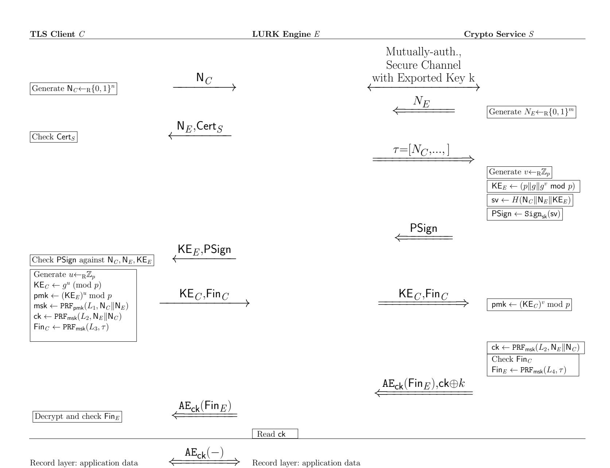

Fig. 9: LURK based on TLS 1.2 in DHE mode: Variant 2; in line with the 3(S)ACCE-K-SSL design [5]

this end, Liang et al. measured that 19 out of 20 CDNs and found that only 31.2 % of web sites on CDN using HTTPS present a Valid Certificate. Nonetheless, we recount all TLS delegation mechanisms for CDN-ing.

First, Liang et al. [30] showed that *sharing the private key* and names is a common practice for CDNs. In this way, the content owner gives up all its identity credentials with no control over them, which constitutes an obvious security threat.

Second, another way to provide collaborative delivery is to delegate using certificates or equivalent. The content owner may issue a signing intermediary CA to delegate the emission of keys owned by the CDN associated to the content owner name. However, the  $X.509\ Name\ Constraints$  certificate extension [8] does not apply to the Subject Alternative Name (SAN), but only to the Common Name (CN) in the Distinguished Name (DN) while certificate validation

{38}------------------------------------------------

considers DNS names in DN/CN or in SAN. As a result, there is not enough control in the certificates that may be validated.

Third, one has the option of delegated credentials [\[3\]](#page-28-2). This is similar in essence to certificate delegation but the delegation is performed on a TLS specific structure and validated by the Client. Client integration does not make the mechanism viable for legacy TLS 1.2 Clients.

Fourth, Short-Term, Automatically-Renewed (STAR) certificates [\[44\]](#page-30-2), [\[43\]](#page-30-3) describes a method where the domain name owner or the content owner authorides the Certificate Authority (CA) to renew the certificate when requested by the CDN - using using ACME [\[2\]](#page-28-3). For both Delegated credentials and STAR, the content-owner will regain control of the identity/ credentials after the delegation expires, however, during the delegation, the content-owner has little control or audit-powers over the CDN machines.

Fifth, the DANE design [\[20\]](#page-29-5) takes advantage of DNSSEC to provide keys used to establish the TLS session. Although an elegant solution, there is currently not enough support for DANE by browser vendors.

Sixth, Gilad et al. [\[17\]](#page-29-7) and Levy et al. [\[29\]](#page-29-6) present an alternative, called Stickler, which involves decryption by the browser, that is at the application layer. With Stickler, upon downloading the home page, the content-origin provides a Loader. The Loader is sent over the secure TLS channel and can retrieve the JavaScript (RootJS) from the proxy, validating the software. The software is then able to retrieve the signed objects from the mirror and checks them.

Seventh, KeylessSSL [\[5\]](#page-28-0) is said –by their proprietors Cloudflare– not perform delegation but split the TLS into services and provide the ability for the content owner to keep the control of the identity credentials while other part of the delivery is let to the CDN. As no changes are required on the Client, it can be of use with legacy devices. But, in 2017, Bhargavan et al. [\[5\]](#page-28-0) used a provable-security approach to show several vulnerabilities on KeylessSSL; they also advanced an alternative design, called 3(S)ACCE-K-SSL, that provably achieve stronger security goals, albeit via a much less efficient design.

#### D.2 More Details on Client-visible TLS Delegation

On the client side, CDN-ing (as per the above) is not explicitly signalled. In other words, the CDN provider is assimilated to the content owner from the client's perspective. While this might be acceptable with one-to-one configurations, automated CDN collaborations like those envisioned by CDNI [\[12\]](#page-29-2) seem to introduce a federated platform for content where the TLS termination is hardly controlled by the Client or the content owner, but where the TLS communication is composed of multiple intermediaries. In this context, the client and content owner may be willing to have a closer view on the different intermediaries. Indeed, multiple initiatives have been taken to have middleboxes partake in TLS sessions with an explicit agreement and negotiation of all parties involved [\[36\]](#page-30-4), [\[39\]](#page-30-5). We recount these initiatives below.

First, SplitTLS [\[47\]](#page-31-5) is commonly seen as the simplest architecture where the middlebox impersonates the endpoint. The client side requires to trust the root 

{39}------------------------------------------------

certificate of the middlebox that impersonates all servers. On the server side, such architecture could be interpreted as a TLS front end or a security gateway.

Second, Explicit Trusted Proxy [\[31\]](#page-30-6) moves a step forward and lets the client indicate the use of a proxy but did not provide additional control on the proxy.

Third, TLS ProxyInfo [\[33\]](#page-30-7) and TLS Keyshare Extension [\[38\]](#page-30-8) ensure that both endpoints are aware of the existence of the proxy, while enabling client to authenticate the server. Yet, arguably, a shared key does not provide sufficient accountability or control on what is actually performed by the middlebox.

Fourth, multi-context TLS (mcTLS) [\[37\]](#page-30-9) allows for the endpoints and middboxes to establish different access-level keys (read/write keys) per middlebox and per different data-fragments (e.g., HTTP headers, body).

Fifth, [\[4\]](#page-28-4) showed mcTLS to be insecure and proposed a new provably-secure but less efficient design, in the same vain of visible and accountable proxying over TLS.

Sixth, Transport Layer Middlebox Security Protocol (TLMSP) [\[15\]](#page-29-8) also improves on mcTLS by adding more measures to evaluate the transformations on data performed by each middlebox. Yet this design does not enable incremental deployment.

Seventh, Middlebox TLS (mbTLS) enables middleboxes to leverage SGX to attest processing performed by them, while middlebox aware TLS (maTLS) [\[28\]](#page-29-9) uses a specific certification model.

Eighth, BlindBox [\[45\]](#page-30-10) and Embark [\[27\]](#page-29-10) adopt a different approach where middleboxes operate over encrypted content.

Table [5](#page-39-0) recounts most of the aforementioned initiatives w.r.t the main challenges each attempts to overcome: 1). the ability to authenticate end points as well as middleboxes (Auth); 2). the ability to restrict or control operations performed by each intermediary node (Content); 3). the ability for one endpoint to evaluate the overall security of the channel (E2E). Ensuring these capabilities impact the complexity of the establishment of the TLS session; this determines whether it can be implemented via a TLS extension (TLS ext.), like LURK is, or via more complex settings (New setup).

| Mechanism              | Auth | Content                                 |   | E2E TLS Impact |
|------------------------|------|-----------------------------------------|---|----------------|
| Split TLS (client)     | –    | –                                       | – | Root Cert.     |
| Split TLS (server)     | –    | –                                       | – |                |
| Explicit Trusted Proxy | –    | –                                       | – | TLS ext.       |
| TLS ProxyInfo          | x    | –                                       | x | TLS ext.       |
| TLS Keyshare           | x    | –                                       | x | TLS ext        |
| mcTLS                  | x    | data, action (read, write)              | x | New setup      |
| TLMSP                  | x    | data, actions, path order, modification | x | New setup      |
| mbTLS                  | x    | TEE                                     | x | New setup      |
| maTLS                  | x    | certification                           | x | New setup      |
| Blindbox, Embark       | x    | encryption                              | x | New setup      |

Table 5: Mechanisms for Client-Visible TLS Delegation

{40}------------------------------------------------

#### E LURK's Proofs

We now present different security proofs for LURK, using the 3(S)ACCE model in [5] and recalled in Section B.

#### E.1 Entity Authentication Proofs

We now prove the entity-authentication security of LURK in all variants.

**Theorem 1.** Let P be the unilaterally-authenticated TLS 1.2 handshake (as seen by the Client) and P' be the AKE protocol between Engine and Crypto Service which, at each session, exports a key k indistinguishable from random. Assume that P and P' are together mEA-secure.

We denote by nP the number of parties in the system.

Consider a (t,q)-adversary  $\mathscr A$  against the EA-security of the protocol LURK, running at most t queries and creating at most q party instances per party, where  $\mathscr A$ 's advantage is written  $\mathsf{Adv}_H^{\mathsf{EA}}(\mathscr A)$ .

If such an adversary exists, then there exist adversaries  $\mathscr{A}_1$  against the SACCE security of P,  $\mathscr{A}_2$  against the ACCE security of P',  $\mathscr{A}_3$  against the mEA security of P and P',  $\mathscr{A}_4$  against the AKE security of P' with exported key k,  $\mathscr{A}_5$  -in the TLS-DHE mode—against the existential unforgeability (EUF-CMA) of the signature used to generate PSign and  $\mathscr{A}_6$  against the hash function H, or  $\mathscr{A}_7$  -in the TLS-RSA mode—against the channel security of P, each adversary running in time  $t' \sim O(t)$  and instantiating at most q' = q instances per party, such that

• For Variant 1 of LURK in DHE mode:

$$\begin{split} \mathsf{Adv}^{\mathsf{EA}}_{\varPi}(\mathscr{A}) &\leq 2\mathsf{n_P}^2 \cdot \mathsf{Adv}^{2\text{-ACCE}}_{P'}(\mathscr{A}_2) + \\ & 2\mathsf{n_P}^3 \cdot \mathsf{Adv}^{mEA}_{P,P'}(\mathscr{A}_3) + \\ & \mathsf{n_P} \cdot \mathsf{Adv}^{\mathsf{Unforg}}_{\mathsf{Sign}}(\mathscr{A}_5) + \mathsf{n_P} \cdot \mathsf{Adv}^{\mathsf{Coll.Res}}_{H}(\mathscr{A}_6) + \\ & \mathsf{n_P}^3 \cdot \mathsf{Adv}^{2\text{-ACCE}}_{P'}(\mathscr{A}_2) + 2\mathsf{n_P}^3 \cdot \mathsf{Adv}^{\mathsf{AKE}}(\mathscr{A}_4). \end{split}$$

• For Variants 1 and 2 of LURK in RSA mode:

$$\begin{split} \mathsf{Adv}^{\mathsf{EA}}_{\varPi}(\mathscr{A}) &\leq 2\mathsf{n_P}^2 \cdot \mathsf{Adv}^{2\text{-ACCE}}_{P'}(\mathscr{A}_2) + \\ &2\mathsf{n_P}^3 \cdot \mathsf{Adv}^{mEA}_{P,P'}(\mathscr{A}_3) + \\ &\mathsf{n_P}^2 \cdot \mathsf{Adv}^{\mathsf{SC-SACCE}}_{P}(\mathscr{A}_7) \\ &\mathsf{n_P}^3 \cdot \mathsf{Adv}^{2\text{-ACCE}}_{P'}(\mathscr{A}_2) + \\ &\mathsf{n_P}^3 \cdot \mathsf{Adv}^{\mathsf{AKE}}_{P'}(\mathscr{A}_4) \end{split}$$

*Proof.* Our proof has the following hops:

**Game**  $\mathbb{G}_0$ : This game works as the EA-game recalled in Section B.

**Game**  $\mathbb{G}_1$ : This is the same game as the EA-game, except that the adversary can no longer win if its winning instance  $\pi_i^m$  belongs to a Service.

{41}------------------------------------------------

In the EA definition, the only way the adversary can win if the party  $P_i$  is a Service is if the accepting instance  $\pi_i^m$  for which  $\mathscr A$  wins has to accept for  $\pi_i^m$ .pid =  $P_j$ .name with  $P_j$  is an Engine. Since such an attacker must guess the identity of the Service that will maliciously accept, and the Engine that is being impersonated, we have that

$$|\mathbf{Pr}[\mathscr{A}_{\mathbb{G}_0} \text{ wins}] - \mathbf{Pr}[\mathscr{A}_{\mathbb{G}_1} \text{ wins}]| \leq \mathsf{n_P}^2 \cdot \mathsf{Adv}_{P'}^{2-\mathsf{ACCE}}(\mathscr{A}_2).$$

**Game**  $\mathbb{G}_2$ : This game behaves as  $\mathbb{G}_1$ , except we now rule out the possibility that the party  $P_i$ , holding the "winning" instance, is an Engine. If that is the case, then its partner party  $P_j$  can only be a Service. In a similar way to the above, we can reduce this to the ACCE-EA security of P', namely,

$$|\mathbf{Pr}[\mathscr{A}_{\mathbb{G}_1} \text{ wins}] - \mathbf{Pr}[\mathscr{A}_{\mathbb{G}_2} \text{ wins}]| \leq \mathsf{n_P}^2 \cdot \mathsf{Adv}_{P'}^{2-\mathsf{ACCE}}(\mathscr{A}_2).$$

**Game**  $\mathbb{G}_3$ : In this game, the adversary may only win against an instance  $\pi_i^m$  of a client.

In this game, we rule out the possibility of the adversary winning in a direct Client-Service handshake. More formally, we rule out the possibility that  $\pi_i^m.\mathsf{pid} = P_j.\mathsf{name}$  such that  $P_j$  is a Service and  $P_i$  is a client, such that there exists an instance  $\pi_j^n$  such that  $\pi_i^m.\mathsf{sid} = \pi_j^n.\mathsf{sid}$ . In other words,  $\mathbb{G}_3$  corresponds to  $\mathbb{G}_0$  with the restriction that  $P_i$  is a client and the targeted instance  $\pi_i^m$  has the related partnering:  $\pi_i^m.\mathsf{pid} = P_j.\mathsf{name}$  with  $P_j$  being a Service and such that there exists some Engine  $P_k$  and an instance  $\pi_k^p$  such that  $\pi_k^p$  and  $\pi_i^m$  are 2-partnered (they have the same session ID).

So, the advantage of the adversary in  $\mathbb{G}_3$  is basically building on the advantage of  $\mathscr{A}_3$  (with  $\mathscr{A}_3$  playing in the mEA game and as being interested in the sessions where he queries with the flag  $\mathsf{flag}_i^m$  being 0, since we are in the case of P is a client). Next, we will show more clearly that

$$|\mathbf{Pr}[\mathscr{A}_{\mathbb{G}_3} \text{ wins}] - \mathbf{Pr}[\mathscr{A}_{\mathbb{G}_2} \text{ wins}]| \leq \mathsf{n_P}^3 \cdot \mathsf{Adv}_{P,P'}^{mEA}(\mathscr{A}_3) + \Delta,$$

where  $\Delta$  is obtained as per the below.

We first prove that, not only is an Engine the real partner and a Service is the intended partner, but it also holds that: there exists a matching instance  $\pi_k^{\ell}$  such that  $\pi_k^{\ell}$  and  $\pi_j^n$  are also 2-partnered, and furthermore, the session key  $\pi_i^m$ .ck is computed as expected from the premaster secret pmk of  $\pi_j^n$  and the transcript of  $\pi_i^m$ . In this case, we recall that the partnering in 3(S)ACCE gives  $\pi_i^m$  these "party-partners"  $\pi_i^m$ .PSet=  $\{P_i, P_j, P_k\}$  and these "instance-partners"  $\pi_i^m$ .InstSet= $\{\pi_i^m, \pi_j^n, \pi_k^p, \pi_k^\ell\}$ .

#### Impersonation Successe in $\mathbb{G}_3$ :

• **TLS-DHE** To begin with, we focus on the transcript of  $\pi_i^m$ .

We now rule out the possibility that the client accepts  $P_x$  as if it were  $P_k$ , which is bounded, first by the collision-resistance of the hash function H, and secondly, by the unforgeability in the signature PSign:  $n_P \cdot \mathsf{Adv}^{\mathsf{Unforg}}_{\mathsf{Sign}}(\mathscr{A}_5)$ , accounting for getting which party the signature is generated for.

• TLS-RSA In this setting, the equivalent security is guaranteed by the fact that the encryption is under the public key of the purported partner  $P_k$  of  $\pi_i^m$ .

{42}------------------------------------------------

The only adversarial success-option is the case of having a party that is not  $P_k$  decrypt the encrypted pre-master key.

To this end, we can build a reduction to the SACCE security of the underlying protocol P, such that the adversary can learn the secret bit of instance  $\pi_i^m$  (by learning the pre-master secret and then computing the channel key). The probability  $\mathbf{Pr}[\mathscr{A}_{\mathbb{G}_3} \text{ wins}]$  is increased by  $\mathsf{n_P}^2 \cdot \mathsf{Adv}_P^{\mathsf{CS-SACCE}}(\mathscr{A}_7)$ .

We now resume our proof on  $\mathbb{G}_3$ , fixing the three parties  $P_i, P_j, P_k$ . (This implies a factor of  $n_P^3$  in all the added advantages below).

We reduce the remaining winning probability in our EA game in our protocol to mEA-security assumption with respect to P and P'. The adversary  $\mathscr{A}_{\mathbb{G}_3}$  is fed information by the adversary  $\mathscr{A}_3$  which plays the mEA game with respect to the P and P' protocols. Whenever  $\mathscr{A}_{\mathbb{G}_3}$  queries information for Client-Engine sessions, the queries made via  $\mathscr{A}_3$  are with  $\mathsf{flag}_i^m = 0$ . Whenever  $\mathscr{A}_{\mathbb{G}_3}$  queries Engine-Service information, the queries made via  $\mathscr{A}_3$  are with  $\mathsf{flag}_k^l = 1$ . So, the probability  $\mathbf{Pr}[\mathscr{A}_{\mathbb{G}_3} \text{ wins}]$  is increased by the factor  $\mathsf{nP}^3 \cdot \mathsf{Adv}_{P,P'}^{mEA}(\mathscr{A}_3)^{16}$ .

W.r.t. our current EA game, we also note that the EA definition further stipulates that no Reveal query can be made on the instances  $\pi_i^m$ .InstSet partnered with  $\pi_i^m$ . W.r.t. the our current EA game and the mEA-game, the simulation for RegParty, NewSession, Corrupt, Reveal clearly work with no issue, as in the 2(S)ACCE, TLS cases. The difference (between the our 3-party EA setting and the 2-party mEA setting) occurs for the Send oracle, since in order to simulate correctly the record-layer transcript of the Engine-Service session between  $\pi_k^\ell$  and  $\pi_j^n$ . Here, on this Engine-Server side, we need to reduce to the capabilities of adversary  $\mathscr{A}_2$  who is challenging the security of the ACCE protocol P'. The adversary  $\mathscr{A}_2$  will query Reveal on this session (this is allowed in the EA game) and simulate the rest.

In particular, in RSA mode, to simulate sending  $\mathsf{ck} \oplus k$  or  $\mathsf{msk} \oplus k$ , the adversary  $\mathscr{A}_3$  (who can challenge the security of the inner P' in the mEA game) chooses at random a value r and sends r, sending this to the Engine. Thus, in RSA mode, the probability that  $\mathscr{A}_{\mathbb{G}_3}$  win is increased is augmented by  $\mathsf{n_P}^3 \cdot \mathsf{Adv}^{2-\mathsf{ACCE}}(\mathscr{A}_2) + \mathsf{n_P}^3 \cdot \mathsf{Adv}^{\mathsf{AKE}}(\mathscr{A}_4)$ . The above simulation for  $\mathbb{G}_3$  is perfect. In particular, note that with protocol P' not containing a key-confirmation step and k is indistinguishable from random. So, sending r simulates perfectly sending  $\mathsf{msk} \oplus k$  or  $\mathsf{ck} \oplus k$ . In DHE mode, there is nothing to simulate, and the probability that  $\mathscr{A}_{\mathbb{G}_3}$  win is increased is augmented by  $\mathsf{n_P}^3 \cdot \mathsf{Adv}_{P'}^{2-\mathsf{ACCE}}(\mathscr{A}_2)$ 

If the adversary  $\mathscr{A}_{\mathbb{G}_3}$  wins for some session  $\pi_i^m$ , then  $\mathscr{A}_3$  (in the mEA game with the flag  $\mathsf{flag}_i^m$  being 0) verifies if there exists a unique instance  $\pi_k^p$  such that  $\pi_i^m.\mathsf{sid} = \pi_k^p.\mathsf{sid}$ . If this instance does not exist, this  $\mathscr{A}_3$  will have  $\pi_i^m$  as its own winning instance. Otherwise, if the adversary  $\mathscr{A}_{\mathbb{G}_3}$  does not win, it must be that  $\mathscr{A}_4$  will find an instance  $\pi_j^n$  of  $P_j$  holding  $\mathsf{pmk}$  (in RSA) or

Note that in this bound we only give the dominant fact, since we do not count specifically the C-E sessions of P as per the queries with  $\mathsf{flag}_i^m$  being 0, even though we are in the case of P is a client.

{43}------------------------------------------------

 $(p, g, KE_S; Cert_E; PSign)$  (in DHE mode) corresponding to  $\pi_i^m$ .ck, but such that there exists no matching, unique  $\pi_k^\ell$ , also holding that  $\mathsf{pmkor}(p, g, KE_S; Cert_E; PSign)$ , so that  $\pi_k^\ell, \pi_j^n$  are 2-partnered. In this latter case,  $\mathscr{A}_4$  wins.

This concludes the proof and, step-by-step, we yielded the indicated bound.

#### E.2 Channel Security Proofs

**Theorem 2.** Let P be the unilaterally-authenticated TLS 1.2 handshake (as seen by the Client), and P' be the AKE protocol between Engine and Crypto Service which, at each session, exports a key k indistinguishable from random.

Consider a (t,q)-adversary  $\mathscr A$  against the SC-security of the protocol LURK running at most t queries and creating at most q party instances per party. We denote by  $\mathsf{n}_\mathsf{P}$  the number of parties in the system, and denote  $\mathscr A$ 's advantage by  $\mathsf{Adv}_H^{\mathsf{SC}}(\mathscr A)$ .

If such an adversary exists, then there exist adversaries  $\mathscr{A}_1$  against the SACCE security of P,  $\mathscr{A}_2$  against the ACCE security of P',  $\mathscr{A}_3$  against the AKE security of P' with exported key k and either:  $\mathscr{A}_4$  against the existential unforgeability (EUF-CMA) of the signature algorithm used to generate PSign (for TLS-DHE), or  $\mathscr{A}_4$  against the channel security of P (for TLS-RSA), each adversary running in time  $t' \sim O(t)$  and instantiating at most q' = q instances per party,  $\mathscr{A}_5$  against the non-programmable PRF  $\varphi$ , such that

• For Variant 1 of LURK in DHE mode:

$$\begin{split} \mathsf{Adv}^{\mathsf{SC}}_{\varPi}(\mathscr{A}) &\leq (2\mathsf{n_P}^2 + 2\mathsf{n_P}^3) \cdot \mathsf{Adv}^{2\text{-ACCE}}_{P'}(\mathscr{A}_2) \\ &+ \mathsf{n_P}^2 \mathsf{Adv}^{2\text{-SACCE}}_{P}(\mathscr{A}_1) + \mathsf{n_P} \mathsf{Adv}^{\mathsf{Unforg}}_{\mathsf{Sign}}(\mathscr{A}_4) \\ &+ \mathsf{n_P}^3 (\mathsf{Adv}^{\mathsf{AKE}}(\mathscr{A}_3) + \mathsf{Adv}^{2\text{-SACCE}}_{P}(\mathscr{A}_1)). \end{split}$$

• For Variants 1 and 2 of LURK in RSA mode:

$$\begin{split} \mathsf{Adv}_{\varPi}^{\mathsf{SC}}(\mathscr{A}) &\leq (2\mathsf{n}_{\mathsf{P}}^{\,2} + 2\mathsf{n}_{\mathsf{P}}^{\,3}) \cdot \mathsf{Adv}_{P'}^{2\text{-ACCE}}(\mathscr{A}_{2}) + (\mathsf{n}_{\mathsf{P}}^{\,3} + \\ &+ \mathsf{n}_{\mathsf{P}}^{\,2}) \mathsf{Adv}_{P}^{2\text{-SACCE}}(\mathscr{A}_{1}) + \mathsf{n}_{\mathsf{P}}^{\,3} \mathsf{Adv}^{\mathsf{AKE}}(\mathscr{A}_{3}) \\ &+ \mathsf{n}_{\mathsf{P}}^{\,2} \mathsf{Adv}_{P}^{\mathsf{SC-SACCE}}(\mathscr{A}_{4}) + \mathsf{n}_{\mathsf{P}}^{\,3} \cdot \mathsf{Adv}^{\mathsf{npPRF}}(\mathscr{A}_{5}). \end{split}$$

*Proof.* Our proof has the following hops:

**Game**  $\mathbb{G}_0$ : This game works as the SC-game recounted in Appendix B.

Games  $\mathbb{G}_0$ - $\mathbb{G}_3$ : We make similar successive reductions as in the previous proof to obtain the game  $\mathbb{G}_3$  which behaves as the original game but with the restriction that  $P_i$  is a client, and for the targeted instance  $\pi_i^m$  it holds that:  $\pi_i^m$ .pid =  $P_j$ .name with  $P_j$  being a Service and such that there exists some Engine  $P_k$  and an instance  $\pi_k^p$  such that  $\pi_k^p$  and  $\pi_i^m$  are 2-partnered (they have the same session ID).

The loss through to game  $\mathbb{G}_3$  is as follows:

$$\begin{split} \mathbf{Pr}[\mathscr{A}_{\mathbb{G}_2} \text{ wins}] &\leq \mathbf{Pr}[\mathscr{A}_{\mathbb{G}_3} \text{ wins}] + \mathsf{n_P}^2 \cdot \mathsf{Adv}_P^{2\text{-SACCE}}(\mathscr{A}_1) \\ &+ 2\mathsf{n_P}^2 \cdot \mathsf{Adv}_{P'}^{2\text{-ACCE}}(\mathscr{A}_2). \end{split}$$

{44}------------------------------------------------

Winning game 3: This proof goes similarly to the one before, except that in the simulation of adversaries  $\mathscr{A}_1$  and  $\mathscr{A}_2$  we use a simulation akin to that of the SC-game, in particular with respect to simulating the encryption and decryption queries. The total success probability of the adversary is given by:

- For DHE:

$$\begin{split} \Pr[\mathscr{A}_{\mathbb{G}_3} \text{ wins}] & \leq \frac{1}{2} + \mathsf{n_P}^3(\mathsf{Adv}^{\mathsf{AKE}}(\mathscr{A}_3) + \mathsf{Adv}_P^{2\mathsf{-SACCE}}(\mathscr{A}_1) \\ & + \mathsf{Adv}_{P'}^{2\mathsf{-ACCE}}(\mathscr{A}_2)) + \mathsf{n_P} \cdot \mathsf{Adv}_{\mathsf{Sign}}^{\mathsf{Unforg}}(\mathscr{A}_4). \end{split}$$

- For RSA:

$$\begin{split} \Pr[\mathscr{A}_{\mathbb{G}_3} \text{ wins}] &\leq \frac{1}{2} + \mathsf{n_P}^3(\mathsf{Adv}^{\mathsf{AKE}}(\mathscr{A}_3) + \mathsf{Adv}^{2\text{-SACCE}}_P(\mathscr{A}_1) \\ &+ \mathsf{Adv}^{2\text{-ACCE}}_{P'}(\mathscr{A}_2)) + \mathsf{n_P}^2 \cdot \mathsf{Adv}^{\mathsf{AKE}}(\mathscr{A}_3) \\ &\mathsf{n_P}^3 \cdot \mathsf{Adv}^{\mathsf{npPRF}}(\mathscr{A}_5). \end{split}$$

In the last probability, the  $n_P^3 \cdot Adv^{npPRF}(\mathscr{A}_5)$  factor comes from the attacker in game 3 looking to break the non-programmable PRF assumption and produce an adaptive  $N_E$  across several session to learn msk or ck for a new session.

### E.3 Accountability Proofs

**Theorem 3.** Let P be the unilaterally-authenticated TLS 1.2 handshake (as seen by the Client), and P' be the AKE protocol between Engine and Crypto Service which, at each session, exports a key k indistinguishable from random.

Consider a (t,q)-adversary  $\mathscr A$  against the Acc-security of Variant 2 of LURK in RSA Mode, running at most t queries and creating at most q party instances per party. We denote by  $\mathsf{n}_\mathsf{P}$  the number of parties in the system, and denote  $\mathscr A$ 's advantage by  $\mathsf{Adv}^{\mathsf{Acc}}_{v2-\mathsf{LURK}-RSA}(\mathscr A)$ . If such an adversary exists, then there exists adversary  $\mathscr A_1$  against the SACCE security of P running in time  $t' \sim O(t)$  and instantiating at most q' = q instances per party, such that:  $\mathsf{Adv}^{\mathsf{Acc}}_{v2-\mathsf{LURK}-RSA}(\mathscr A) \leq 2 \cdot \mathsf{n}_\mathsf{P}^2 \cdot \mathsf{Adv}^{2-\mathsf{SACCE}}_P(\mathscr A_1)$ 

*Proof.* Our proof has the following hops:

**Game 0:** This game works as the Acc- game recalled Appendix B. We say that an adversary  $\mathscr{A}$  breaks the accountability for an instance  $\pi_i^m$  with  $P_i \in \mathscr{C}$ , if the following conditions are verified:

- (a) the acceptance flag for  $\pi_i^m$  is set (i.e.,  $\pi_i^m \cdot \alpha = 1$ ) such that  $\pi_i^m \cdot \mathsf{pid} = P_j \cdot \mathsf{name}$  for an  $\mathit{uncorrupted}\ P_j \in \mathscr{S}\ \mathrm{and}\ \pi_i^m \cdot \mathsf{ck} = \mathsf{ck};$
- (b) There exists no instance  $\pi_i^n \in P_j$ .Instances such that  $\pi_i^n.ck = \pi_i^m.ck$ ;
- (c) There exists no probabilistic polynomial algorithm Sim which given the view of  $P_j$  (namely all instances  $\pi_j^n \in P_j$ .Instances with all their attributes), outputs ck.

{45}------------------------------------------------

We wish to show that, whenever condition (a) holds, then either the reverse of (b) or the reverse of condition (c) holds (except with negligible probability). We also need a simulator that fulfils condition (c). We first rule out a few exceptions. **Game**  $\mathbb{G}_1$ : The adversary begins by guessing the identities of the targeted client  $P_i$  and of the server  $P_j$  such that  $\pi_i^m$  is the instance for which accountability is broken, and for which it holds  $\pi_i^m$ .pid =  $P_j$ .name. As a consequence, we have:

$$\mathbf{Pr}[\mathscr{A}_{\mathbb{G}_0} \text{ wins}] \leq \mathsf{n_P}^2 \cdot \mathbf{Pr}[\mathscr{A}_{\mathbb{G}_1} \text{ wins}].$$

We assume there exists an Engine party  $P_k$  such that there exists an instance  $\pi_k^p$  with  $\pi_k^p$ .sid =  $\pi_i^m$ .sid. There are two options.

First, the Engine could try to run the handshake on its own (there exist no instances  $\pi_j^n, \pi_x^\ell$  such that  $\pi_i^m.\mathsf{pck}$  is in fact  $\pi_i^m.\mathsf{ck}$  as per the protocol description). Note that for this first option it does not necessarily have to hold that  $\pi_x^\ell$  is an instance of  $P_k$ , *i.e.*, the Engine talking to the Client. In that case ,we can construct a reduction from this case to the server-impersonation security of the protocol P' (recall that the honest server  $P_j$  cannot be corrupted). For TLS-RSA, this is equivalent to decrypting the premaster secret; so, we lose a term  $\mathsf{Adv}_P^{2-\mathsf{SACCE}}(\mathscr{A}_1)$ .

Or, there exist instances  $\pi_j^n, \pi_x^\ell$  such that  $\pi_i^m.\mathsf{pck}$  is in fact  $\pi_i^m.\mathsf{ck}$  as per the protocol description. In this case, the simulator is trivial, namely, the simulator consists in simply seeking an instance  $\pi_j^n$  such that the record transcript of that instance contains the transcript of  $\pi_i^m.\tau$ , *i.e.*, the same tuple of nonces, key-exchange elements, and a verifying client finished message. Output the key ck sent to the Engine by that instance as the key of  $\pi_i^m$ . We also note that if the client finished message does not verify, then the Engine has to generate its own Finished message; if the adversary does that, we can construct a reduction from this game to the SACCE-security of P' (*i.e.*, the standard TLS 1.2 handshake run between the client and the uncorrupted server), in which the adversary (possibly a collusion of all the malicious Engine) simulates all but parties  $P_i$ ,  $P_j$  and will win by outputting the same instance and random sampling bit as the underlying adversary. So, we lose another term  $\mathsf{Adv}_P^{2-\mathsf{SACCE}}(\mathscr{A}_1)$ .

This yields the given bound, i.e.,

$$\mathbf{Pr}[\mathscr{A}_{\mathbb{G}_0} \; \mathsf{wins}] \leq 2 \cdot \mathsf{n_P}^2 \cdot \mathsf{Adv}_P^{2\operatorname{\mathsf{-SACCE}}}(\mathscr{A}_1).$$