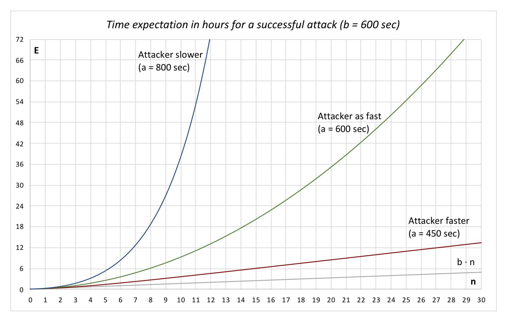
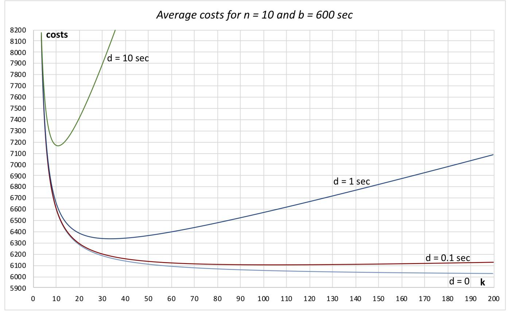
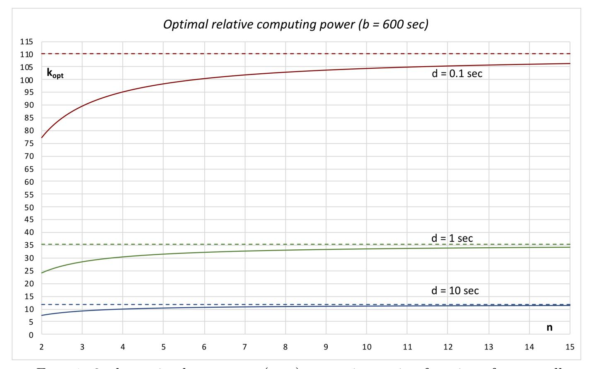
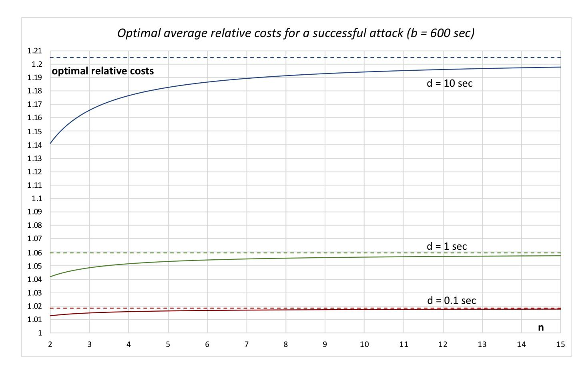
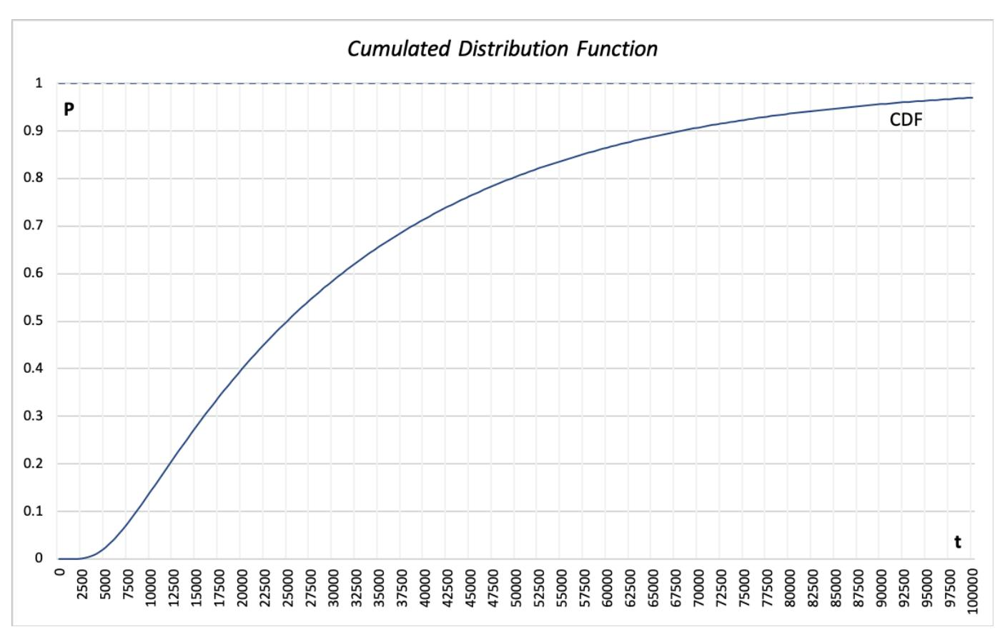
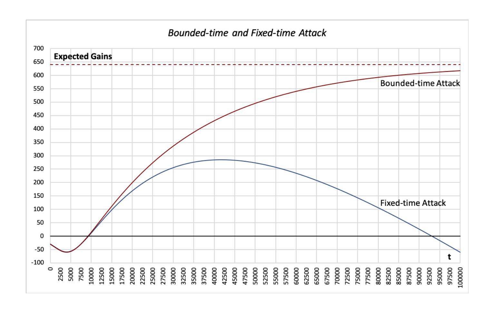

{0}------------------------------------------------

# Costs of an Attack Against Proof-of-Work

Loïc Etienne, PwC Zürich, loic.etienne@pwc.ch October 30, 2020

#### **Abstract**

Bitcoin is a blockchain whose immutability relies on Proof-of-Work: Before appending a new block, some so-called miner has to solve a cryptographic challenge by brute force. The blockchain is spread over a network of faithful miners, whose cumulated computing power is assumed to be so large that, among other things, it should be too expensive for an attacker to mine a secret fork *n* blocks longer than the main blockchain, provided that *n* is big enough. For a given targeted advance of *n* blocks, we investigate the expected time for the attacker to mine such a secret fork, the underlying cumulative distribution function, and some related optimization problems.

*Keywords—* Bitcoin, Blockchain, Proof-of-Work, Double-spending

## **1 Introduction**

**An attack not considered here** In Bitcoin's original white paper, the following attack is quantified: The attacker has to rewrite the history, launching his secret fork from a given block in the past, initially *n* blocks behind the topmost block. He then wins whenever he catches up. This is the well-known gambler's ruin problem: If the attacker has less computing power than the main blockchain's miners, his probability of eventually winning decreases exponentially with *n*. The question is thus: *What is the probability that the attacker wins eventually?*

**The attack considered here** The attack we consider here, essentially less difficult, is also mentioned in Bitcoin's original white paper, but not properly quantified there. In this attack, the attacker has to forewrite the future, launching his secret fork from any block. He then wins whenever he has mined a fork which is *n* blocks longer than the main blockchain. He never has to catch up, because he is allowed, at any time, to drop his current secret fork and begin a new one, from the main blockchain's current topmost block. As we will show, this restart rule ensures that his probability of eventually winning is 1, independently of his computing power. The question is thus: *What is the expected time for the attacker to win?*

**Some practical considerations** This is arguably the most powerful attack purely against Proof-of-Work, that is: The attacker first mines a secret fork until it is *n* blocks longer than the main blockchain; subsequently, he executes a payment 

{1}------------------------------------------------

on the main blockchain; finally, later on, he spreads his secret fork, while it is still longer than the main blockchain, such that it prevails and thus erases the payment in question, whose amount can then be double-spent.

The average costs of doing so are proportional to the average time needed (in addition, perhaps, to the fixed costs of the initial setup), whereas the gains are the amount of the payment in question; comparing both yields whether the attack is profitable or not, on average, for a given number *n* of blocks. For a given amount, the respective computing powers being given as well, since the profitability decreases as *n* increases, the minimal *n* can be determined such that the attack is not profitable. For this minimal *n*, the payment in question is secure (in our model) if it lays *n* blocks behind the current top of the main blockchain (such a payment is also said to have *n* confirmations).

**Out of scope matters** The costs of the attack per time unit, expressed in the crypto-currency, is an essential parameter which, however, is not considered here. It depends, among other things, on the value of the crypto-currency (which is typically volatile, and may be affected by a successful attack), on the costs per time unit of the attack with a given computing power, and on the mining rewards and fees (to be deducted from the costs).

Whenever the attacker and the honest miners mine a block simultaneously, it is indifferent, in our model, whether the attacker chooses to restarts or not, such that the fees and rewards of such a block are not taken into account.

During the attack, the attacker may receive payments on the main blockchain. Our model assumes that the attacker is able to include such payments into his secret fork, such that they are immaterial.

The most simple fork choice rule is assumed: The longer fork prevails and orphaned blocks are discarded. More sophisticated algorithms and their possible impact on the considered attack are not considered.

A successful attack may erase a given payment unintentionally, as a side effect: Indeed, the proper target of an attack may be any set of payments, whose total amount is possibly much greater than the amount of a given payment whose security is to be assessed, and which may or may not belong to the set of payments targeted by the attacker. For instance, the payment of a mere coffee may be erased because some earlier multi-million payment has been successfully attacked. Thus, the expected time of the attack considered here is only one of many factors which may be taken into account for assessing the security of a given payment.

In the following, the main results are summarized, whereas their proofs are given later.

### **1.1 Expected time in the continuous-time model**

The expected time for the attacker to win is a function of, among other, the respective computing powers of the attacker and the attackee.

**Definition 1.1.1** (Variables for the continuous-time model)**.**

- *n Targeted advance, in blocks, of the attacker's secret fork, integer,* 0 *≤ n.*
- *a Average time for the attacker to mine one block, a >* 1*.*
- *b Average time for the attackee (the honest miners) to mine one block, b >* 1*.*
- *s a / b.*
- *E Expected time for the attacker to mine a fork with the targeted advance.*

{2}------------------------------------------------

**Theorem 1.1.2** (Expected time in the continuous-time model).

For 
$$a \neq b$$
:  $E = a \cdot b \cdot (a \cdot (s^n - 1) - (a - b) \cdot n) / (a - b)^2$   
For  $a = b$ :  $E = a \cdot n \cdot (n + 1) / 2$ 

Notice that if a > b (that is, s > 1), then the attacker is slower and thus has less computing power than the attackee. Thus, the asymptotic growth of E as function of n is: exponential if the attacker has less computing power than the attackee; quadratic if he has the same computing power; linear if he has more computing power.

**Examples** In the following examples, b is set to 600, because it is the average number of seconds for the honest miners to mine a single block on Bitcoin. Then, the expected time E for a successful attack is displayed for: a faster attacker (a = 450), an equally fast attacker (a = 600), and a slower attacker (a = 800). The expected mining time  $b \cdot n$  for the honest miners to mine n blocks is also given, as a reference value.

|     |                        | T /                                       | 1                      | C 1 (1 1)              |
|-----|------------------------|-------------------------------------------|------------------------|------------------------|
|     |                        | E (expected time for a successful attack) |                        |                        |
| n   | Honest miners          | Attacker faster                           | Attacker as fast       | Attacker slower        |
|     | (b = 600  secs)        | (a = 450  secs)                           | (a = 600  secs)        | (a = 800  secs)        |
| 1   | 10.00 min              | 7.51 min                                  | 10.02 min              | 13.36 min              |
| 2   | $20.00 \mathrm{\ min}$ | $20.66 \min$                              | $30.05 \min$           | 44.53 min              |
| 3   | $30.00 \min$           | $38.02 \min$                              | 1.00 h                 | 1.66 h                 |
| 4   | $40.00 \mathrm{\ min}$ | $58.55 \min$                              | 1.67 h                 | 3.10 h                 |
| 5   | $50.00 \mathrm{min}$   | 1.36 h                                    | 2.50 h                 | 5.25 h                 |
| 6   | 1.00 h                 | 1.77 h                                    | 3.51 h                 | 8.34 h                 |
| 7   | 1.17 h                 | $2.20 \ h$                                | 4.67 h                 | 12.68 h                |
| 8   | 1.33 h                 | 2.65  h                                   | 6.01 h                 | 18.70 h                |
| 9   | 1.50 h                 | 3.12 h                                    | 7.51 h                 | 1.12 days              |
| 10  | 1.67 h                 | 3.59  h                                   | 9.18 h                 | $1.59 \mathrm{\ days}$ |
| 15  | 2.50 h                 | 6.02  h                                   | 20.03 h                | 7.83 days              |
| 20  | 3.33 h                 | 8.51 h                                    | 1.46 days              | 34.62 days             |
| 25  | 4.17 h                 | 11.00 h                                   | $2.26 \mathrm{\ days}$ | 148.20 days            |
| 30  | 5.00 h                 | 13.50 h                                   | $3.23 \mathrm{\ days}$ | 1.72 years             |
| 40  | 6.67 h                 | 18.50 h                                   | $5.70 \mathrm{\ days}$ | 30.72 years            |
| 50  | 8.33 h                 | 23.50  h                                  | 8.87 days              | 5.48e+02  years        |
| 100 | 16.67 h                | $2.02 \mathrm{\ days}$                    | 35.13 days             | 9.88e+08 years         |

{3}------------------------------------------------



Notice that the faster attacker is not necessarily asymptotically slower than the honest miners: The respective asymptotic slopes depend on *a* (in particular, they agree if *a* = *b /* 2).

**Limitations** The respective computing powers and the difficulty of the cryptographic challenge to be solved for mining a block are assumed to remain the same for the whole duration of the attack; that is, *a* and *b* are assumed to be constant. Furthermore, although mining is actually a discrete-time stochastic process (the frequency of the mining process, at which one guess, or several guesses in parallel, can be validated, is limited, ultimately by the clock rate of the underlying hardware), the attack is modeled here as a continuous-time stochastic process (where the respective average times for mining a block are given), because, in a practical setup, the frequency of the mining process is high in comparison to *a* and *b*. Doing so is acceptable for assessing the security of the attackee, because the continuous-time model (arbitrary high frequency) yields lesser an expected time than the discrete-time model (any finite frequency), as we will show in Claim 2.5; in other words, the efficiency of the attacker is slightly overestimated in the continuous-time model.

### **1.2 Optimal computing power in the discrete-time model**

In the formulae above, the computing power of the attacker resp. of the attackee is implicitly given by *a* resp. *b*, the average time for the attacker resp. for the attackee to mine a block. For determining the optimal computing power of the attacker, we assume that both the attacker and the attackee use the same kind of hardware units, in parallel, and that the attacker has *κ* times as many of them as the attackee. Thus, the relative computing power *κ* can be chosen freely by the attacker, but is assumed to remain the same for the whole duration of the attack. Then, the average costs of a successful attack are, up to the initial setup, *proportional* to *κ · E* (where *E* also depends on *κ*, decreasingly), which are to be minimized as a function of *κ*.

For the optimization problem to be well-posed, we model the race as a simplistic

{4}------------------------------------------------

discrete-time stochastic process, whose time unit is the duration d of the period of the frequency, assumed common to both the attacker and the attackee, at which they are notified upon the progress of the race, where the probability of success per period of duration d is, for the attacker, c = d / b (geometric distribution), whereas it is, for the attackee,  $1 - (1 - c)^{\kappa} = d / a$ . In this discrete-time model, the optimal relative computing power  $\kappa_{opt}$  is then well-defined (as we will show later on): For  $\kappa > 0$  (or  $\kappa \geq 0$  if n = 1),  $\kappa \cdot E(\kappa)$  has, as a function of  $\kappa$ , a unique minimum, taken at  $\kappa = \kappa_{opt}$ .

**Theorem 1.2.1** (Expected costs in the discrete-time model). For b, d, n given and  $\kappa > 0$  (or  $\kappa \geq 0$  if n = 1):  $costs(\kappa) = \kappa \cdot E(\kappa)$  is strictly convex function of  $\kappa$  having a unique minimum, where

$$c = d / b$$

$$s(\kappa) = (c / (1 - c)) \cdot (1 - c)^{\kappa} / (1 - (1 - c)^{\kappa})$$

$$f(s) = (s \cdot (s^{n} - 1) - n \cdot (s - 1)) / (s - 1)^{2}$$

$$E(\kappa) = b \cdot (s(\kappa) + c / (1 - c)) \cdot f(s(\kappa))$$

Estimation of the frequency period A reasonable estimate for the order of magnitude of the frequency period d may be one second. Indeed, whereas the amount of time needed by a single hardware unit for guessing and validating a single solution of a given cryptographic challenge may be much shorter, the synchronization overhead prevails, because, several hardware units, running in parallel, must be coordinated: They all work on the same cryptographic challenge until one of them guesses a correct solution, on which event (whose propagation is not immediate) the attacker determines the next cryptographic challenge, and subsequently notifies all hardware units accordingly (which also takes time). Furthermore, the main blockchain must be monitored as well (involving even slower internet communication), and, whenever it becomes longer, the attacker then drops his secret fork and restarts anew, again by notifying all hardware units accordingly. Hence, the communication and coordination overhead limits the maximal frequency at which hardware units can be notified, that is, ultimately, the maximal frequency (if each guess happens to be correct) at which blocks can be produced.

Further considerations upon the frequency period Thus, we assume that both the attacker and the attackee mine at the same frequency, but with different probabilities of success per period of duration d. It is arguably an over-simplification, in particular because the frequency at which the attacker coordinates its hardware units and the frequency at which he is notified about the progress of the main blockchain may be very different. The former prevails whenever the attacker is ahead, whereas the latter prevails whenever the attacker has no advance yet.

**Examples** For the special case n = 1, the costs are, for  $\kappa \geq 0$ , a strictly increasing and convex function of  $\kappa$ , such that  $\kappa_{opt} = 0$ . This case pertains to a miner, which is indeed an attacker targeting an advance of only one block, if the the most simple fork management strategy is assumed, where a miner restarts (dropping his own fork) whenever another miner wins the race by spreading a new block. Which is arguably not the best strategy, in particular in the event that the attacker and another miner spread a block about simultaneously (in this case, in our model, it is indifferent whether the attacker drops his secret fork or not, whereas, in practice, he should keep working on it, because of the associated rewards, which are not considered separately in our

{5}------------------------------------------------

model). Up to this simplification, *κopt* = 0 means that, in our model, the return of investment (not the absolute revenue per time unit) of a mining pool drops with its size. Miners are not investigated any further here, they just happen to be related to the special case *n* = 1, which is otherwise not relevant for a practical attack.

For *n ≥* 2, the costs are, for *κ >* 0, a strictly convex function of *κ*, and *κopt >* . Furthermore the costs are unbounded for *κ* arbitrarily small, and have a linear asymptote (of slope *n · b · d /* (*b − d*)) for *κ* arbitrarily big.

|     | costs for n = 10 and b = 600 |          |          |          |
|-----|------------------------------|----------|----------|----------|
| r   | d = 0                        | d = 0.1  | d = 1    | d = 10   |
| 1   | 33000.00                     | 33005.50 | 33055.09 | 33559.32 |
| 2   | 10801.17                     | 10803.17 | 10821.20 | 11004.47 |
| 3   | 8550.01                      | 8552.26  | 8572.55  | 8779.49  |
| 4   | 7733.33                      | 7736.00  | 7760.06  | 8006.09  |
| 5   | 7312.50                      | 7315.63  | 7343.83  | 7633.03  |
| 10  | 6592.59                      | 6598.15  | 6648.37  | 7170.36  |
| 15  | 6382.65                      | 6390.69  | 6463.44  | 7229.79  |
| 20  | 6282.55                      | 6293.08  | 6388.52  | 7407.18  |
| 25  | 6223.96                      | 6236.99  | 6355.22  | 7633.54  |
| 30  | 6185.49                      | 6201.03  | 6342.14  | 7887.22  |
| 40  | 6138.07                      | 6158.61  | 6345.71  | 8445.14  |
| 50  | 6109.95                      | 6135.50  | 6368.90  | 9049.83  |
| 75  | 6072.86                      | 6110.95  | 6461.30  | 10709.64 |
| 100 | 6054.48                      | 6105.14  | 6574.17  | 12540.72 |
| 125 | 6043.51                      | 6106.74  | 6696.18  | 14514.80 |
| 150 | 6036.21                      | 6112.04  | 6823.62  | 16609.57 |
| 200 | 6027.12                      | 6128.19  | 7089.16  | 21081.36 |



For *n ≥* 2, the optimal computing power *κopt* is an increasing function of *n*, which is, for *n →* +*∞*, bounded by a constant depending decreasingly on *d* (the frequency

{6}------------------------------------------------

period), and significantly greater than 1 for d small. This means that, in our model, the frequency (of period d) limits the attacker's computing power, if his goal is to minimize the costs of the attack. Of course, there are also practical limitations to the computing power the attacker may have at his disposal, as well as to the time (not arbitrarily short) he may use it.

|           | $ \kappa_{opt} \text{ for } b = 600 \text{ sec} $ |              |             |
|-----------|---------------------------------------------------|--------------|-------------|
| n         | d = 0.1  sec                                      | $d = 1 \sec$ | d = 10  sec |
| 2         | 77.29                                             | 24.33        | 7.59        |
| 3         | 89.72                                             | 28.55        | 9.18        |
| 4         | 95.28                                             | 30.41        | 9.87        |
| 5         | 98.46                                             | 31.46        | 10.25       |
| 10        | 104.51                                            | 33.44        | 10.95       |
| 15        | 106.44                                            | 34.07        | 11.17       |
| 20        | 107.40                                            | 34.38        | 11.27       |
| 50        | 109.09                                            | 34.93        | 11.46       |
| 100       | 109.65                                            | 35.12        | 11.52       |
| $+\infty$ | 110.21                                            | 35.30        | 11.59       |



For  $n \geq 2$ , the optimal costs  $costs(\kappa_{opt})$  are an increasing function of n, as well as the ratio  $costs(\kappa_{opt}) / (b \cdot n)$ , the optimal average costs relative to the average costs for the main block chain to mine n blocks. This ratio is, for  $n \to +\infty$ , bounded by a constant, depending increasingly on d (the frequency period), and, in a practical setup (d much smaller than b), not much greater than 1. This means that a payment with n confirmations is secure, in our model, only if costs for the miners to mine those n blocks are about as high as the total amount of the payment(s) in question.

{7}------------------------------------------------

|     | costs(κopt) for b = 600 sec |           |            |
|-----|-----------------------------|-----------|------------|
| n   | d = 0.1 sec                 | d = 1 sec | d = 10 sec |
| 2   | 1.0130                      | 1.0419    | 1.1410     |
| 3   | 1.0151                      | 1.0486    | 1.1657     |
| 4   | 1.0160                      | 1.0517    | 1.1766     |
| 5   | 1.0165                      | 1.0534    | 1.1827     |
| 10  | 1.0175                      | 1.0567    | 1.1941     |
| 15  | 1.0178                      | 1.0577    | 1.1978     |
| 20  | 1.0180                      | 1.0582    | 1.1996     |
| 50  | 1.0183                      | 1.0592    | 1.2027     |
| 100 | 1.0184                      | 1.0595    | 1.2038     |
| +∞  | 1.0185                      | 1.0598    | 1.2048     |



### **1.3 Cumulative distribution function in the continuoustime model**

The probability that the attacker wins in a given time *t* (or less) is given by an exponential polynomial *P*(*t*), as given by the following theorem, which is a special case of Claim 4*.*10 and Claim 4*.*13.

**Theorem 1.3.1** (Cumulative distribution function in the continuous-time model)**.**

$$P(t) = 1 - \sum_{j=0}^{n-1} c_j \cdot \mu_j^t$$

*where*

{8}------------------------------------------------

n, a and b are those of Definition 1.1.1  $U_{i}(z) \text{ are the Chebyshev polynomials of the second kind}$   $z_{j} \text{ are the n roots of } U_{n}(z) - \sqrt{a/b} \cdot U_{n-1}(z)$   $\mu_{j} = \exp\left(\frac{2 \cdot \sqrt{a \cdot b} \cdot z_{j} - (a+b)}{a \cdot b}\right)$   $c_{j} = 4 \cdot \frac{(\sqrt{b/a})^{n-1} \cdot U_{n-1}(z_{j})}{-\ln(\mu_{j}) \cdot a} \cdot \frac{z_{j}^{2} - 1}{U_{2 \cdot n}(z_{j}) - U_{2 \cdot n}(1)}$ 

Also, the roots  $z_j$  are real, pairwise distinct, and, by convention, indexed in decreasing order ( $z_0$  is the greatest root), and thus the eigenvalues  $\mu_j$  are indexed in decreasing order ( $\mu_0$  is the greatest root). Furthermore,  $z_0 > 0$  and, for 0 < j < n,  $|z_j| < 1$ , and, if  $z_0 = 1$ , by singularity removal,  $(z_0^2 - 1)/(U_{2 \cdot n}(z_0) - U_{2 \cdot n}(1)) = 3/(2 \cdot n \cdot (n+1) \cdot (2 \cdot n+1))$ . Moreover,  $0 < \mu_j < 1$ ,  $c_0 > 0$ ,  $c_j \neq 0$ , and the j-ordered coefficients  $c_j$  have alternating signs.

Furthermore, P(t) is strictly increasing, from 0 (at t = 0) to 1 (for  $t \to +\infty$ ), and is, for t big enough, strictly concave; also, P(t) has, for t > 0, a unique convexity change if n > 1, and no convexity change if n = 1.

P(t) is illustrated below for a=600, b=600 and n=10, where the expectation E is 33000 and the standard deviation SD is 27066.585.

| Cumulative Distribution Function |       |                      |  |
|----------------------------------|-------|----------------------|--|
| t                                | P(t)  |                      |  |
| 0                                | 0.000 |                      |  |
| 20000                            | 0.399 |                      |  |
| 33000                            | 0.629 | t = E                |  |
| 40000                            | 0.714 |                      |  |
| 60000                            | 0.864 |                      |  |
| 60067                            | 0.865 | $t = E + 1 \cdot SD$ |  |
| 80000                            | 0.936 |                      |  |
| 87133                            | 0.951 | $t = E + 2 \cdot SD$ |  |
| 100000                           | 0.969 |                      |  |
| $+\infty$                        | 1.000 |                      |  |

{9}------------------------------------------------



An attacker may have a given amount of time *t* at his disposal for an attack, where the attacked amount, the costs per time unit, and the initial setup costs are given, such that the expected gains can be computed from *P*(*t*). Two variants are possible: A fixed-time attack ends when *t* time units have elapsed (whether the attacker wins earlier or not), whereas a bounded-time attack ends when *t* time units have elapsed or when the attacker wins (whichever happens first). The expected gains for a fixed-time attack are positive if *t >* 0 belongs to a bounded (or empty) interval (see Section 5); furthermore, if this interval is not empty, there is a unique optimal *t* on this interval. The expected gains for a bounded-time attack are positive if *t >* 0 blongs to a rightunbounded (or empty) interval (see Section 6); furthermore, if this interval is not empty, the expected gains grow with *t* on this interval.

These attacks are illustrated below for *a* = 600, *b* = 600, *n* = 10, where the attacked amount is 1000, the costs per time unit are 0*.*01 and the costs of the initial setup are 30.

|        | Expected gains    |                     |  |
|--------|-------------------|---------------------|--|
| Time   | Fixed-time attack | Bounded-time attack |  |
| 0      | -30.000           | -30.000             |  |
| 9158   | -3.025            | 0.008               |  |
| 9335   | 0.011             | 3.257               |  |
| 20000  | 168.683           | 200.326             |  |
| 40000  | 284.162           | 430.937             |  |
| 41671  | 284.692           | 443.547             |  |
| 60000  | 234.250           | 540.712             |  |
| 80000  | 105.530           | 592.846             |  |
| 93031  | 0.002             | 610.972             |  |
| 100000 | -60.618           | 617.606             |  |
| +∞     | −∞                | 640.000             |  |

{10}------------------------------------------------



## **2 Time Expectation and Variance**

**Sequential mining at a given frequency** Mining a block is a discrete-time stochastic process where a cryptographic challenge needs to be solved by brute force, that is, by repeated guessing and validating until success. Each attempt requires a fixed amount of time, depending on the underlying hardware. This also holds in a parallelized computing environment, where several guesses can be validated at once, because blocks are chained: The cryptographic challenge for a block depends on a particular solution of the challenge for the previous block. In other words, whereas several guesses can be validated in parallel, different blocks cannot be mined in parallel. Except perhaps if the computing power is so huge that guessing correctly at once for several consecutive blocks has a non-negligible probability of success, which we deem, however, unrealistic. Thus, the mining process has a given frequency, at which, with a given probability, a new block is appended to the blockchain.

We assume that both the attacker and the attackee mine at the same frequency (but with possibly different computing powers, that is, different probabilities of guessing correctly in a frequency period of duration *d*) and that this common frequency is high in comparison to the amount of time the attacker or the attackee needs on average to mine one block.

The frequency is not known a priori, and has thus, in principle, to be estimated. Whereas one guess or several guesses in parallel per second may be a reasonable estimate (taking into account the synchronization between several hardware units, and also with the main blockchain being attacked), the estimate is actually not essential in the current context: As we will show in Claim 2.5, higher an estimated frequency (the respective average times for mining a block remaining the same) yields lesser an expected time for a successful attack. This can also be understood intuitively: Assuming higher a frequency, the attacker is notified earlier whenever he has guessed a valid solution of the current cryptographic challenge, or whenever he lays behind the 

{11}------------------------------------------------

main blockchain, to the extent of which he can thus avoid wasting computing power on an obsolete cryptographic challenge.

In the following discrete-time model, we first assume, for the sake of simplicity, that the frequency period matches the time unit: One guess, or several guesses in parallel, are validated in one time unit. Also, we say that the attacker resp. the attackee wins a single round whenever he guesses, in one frequency period, a valid solution of the cryptographic challenge.

#### **Definition 2.1** (Variables for the discrete-time model).

- n Targeted advance, in blocks, of the attacker's secret fork, integer,  $1 \le n$ .
- m Initial advance, in blocks, of the attacker's secret fork, integer,  $0 \le m < n$ .
- a Average time for the attacker to mine one block, a > 1.
- b Average time for the attackee (the honest miners) to mine one block, b > 1.
- P Probability that the attacker wins a single round.
- Q Probability that the attackee wins a single round.
- p Probability that the attacker wins a single round alone (no draws).
- q Probability that the attackee wins a single round alone (no draws).
- s q/p.
- $N \quad n \cdot (n+1).$
- $M m \cdot (m+1)$ .

Notice that this definition of s (pertaining to the discrete-time model) does not agree with Definition 1.1.1 (pertaining to the continuous-time model, investigated later on). However, they agree in the limit case of arbitrarily short a frequency period.

The probabilities P and Q are assumed to be constant, such that the mining process follows the geometric distribution, and thus P=1/a and Q=1/b. Accordingly, the probability that the attacker resp. the attackee wins a single round alone (excluding draws) is:  $p=P\cdot(1-Q)$  resp.  $q=Q\cdot(1-P)$ . Notice that the latter probabilities, for a and b remaining the same, depend non-linearly on the frequency period. This dependency is investigated later on, but for the time being, the frequency period (the duration of a single round) and the time unit agree.

**Claim 2.2** (Bounds for p+q). For p and q of Definition 2.1, the following inequalities holds:

$$2 \cdot \sqrt{p \cdot q} \le p + q \le 1 - 2 \cdot \sqrt{p \cdot q}$$

*Proof.* Using twice the inequality between the arithmetic and geometric mean yields: 
$$2 \cdot \sqrt{p \cdot q} \leq p + q = 1 - (P \cdot Q + (1-P) \cdot (1-Q)) \leq 1 - 2 \cdot \sqrt{P \cdot Q \cdot (1-P) \cdot (1-Q)} = 1 - 2 \cdot \sqrt{p \cdot q}$$

With a single round having the duration of one time unit, let T(m) (a random variable) be the time the attacker needs to increase the number of blocks his secret fork is longer than the attackee's chain, from initially m blocks to n blocks. Let A resp. B be the Bernoulli variable indicating that the attacker resp. the attackee wins a single round alone, that is: E(A) = p, E(B) = q (A and B match the given probabilities),  $A \cdot B = 0$  (A and B are mutually exclusive, since the attacker and the attackee cannot both win the same single round alone), A and B are independent of T(m) (the respective probabilities of guessing correctly are constant).

Thus, T(m) is uniquely defined by the first of the following constrained linear recurrence relations (the time unit being a single round), from which those for its expectation E(T(m)) and its variance Var(T(m)) can be derived by using standard

{12}------------------------------------------------

formulae for computing the expectation and the variance of composite random variables. The derivation of the variance is not immediate, but presents no particular difficulty, and is thus left to the reader.

Constrained linear recurrence relations For 0 < m < n:

$$\begin{split} T(m) &= 1 + A \cdot T(m+1) + (1-A-B) \cdot T(m) + B \cdot T(m-1) \\ T(0) &= 1 + A \cdot T(1) + (1-A) \cdot T(0) \\ T(n) &= 0 \\ E(T(m)) &= 1 + p \cdot E(T(m+1)) + (1-p-q) \cdot E(T(m)) + q \cdot E(T(m-1)) \\ E(T(0)) &= 1 + p \cdot E(T(1)) + (1-p) \cdot E(T(0)) \\ E(T(n)) &= 0 \\ Var(T(m)) &= p \cdot Var(T(m+1)) + (1-p-q) \cdot Var(T(m)) + q \cdot Var(T(m-1)) \\ &+ p \cdot (1-p) \cdot (E(T(m)) - E(T(m+1)))^2 \\ &+ q \cdot (1-q) \cdot (E(T(m-1)) - E(T(m)))^2 \\ &+ 2 \cdot p \cdot q \cdot (E(T(m)) - E(T(m+1))) \cdot (E(T(m-1)) - E(T(m))) \\ Var(T(0)) &= p \cdot Var(T(1)) + (1-p) \cdot Var(T(0)) + (1-p) / p \\ Var(T(n)) &= 0 \end{split}$$

Solutions of the constrained linear recurrence relations These constrained linear recurrence relations can be solved by using standard techniques (involving roots of the characteristic equation), which requires quite some work. We give the solutions without their formal derivation, since they are unique (as many constraints as degrees of freedom) and can be verified without particular difficulty.

For  $a \neq b$ :

$$p = \frac{(b-1) / (a \cdot b)}{s}$$

$$s = \frac{(a-1) / (b-1)}{(b-1)}$$

$$E(T(m)) = \frac{(1/p) \cdot (s \cdot (s^n - s^m) - (n-m) \cdot (s-1)) / (s-1)^2}{(s^2 \cdot (s^{2 \cdot n} - s^{2 \cdot m})) - (4 \cdot s \cdot (s-1) \cdot (n \cdot s^n - m \cdot s^m) + s \cdot (4 - p \cdot (s-1)^2) \cdot (s^n - s^m) - (n-m) \cdot ((s+1) - p \cdot (s-1)^2) \cdot (s-1) - (n-m) \cdot (s-1)^4}$$
For  $a = b$ :
$$E(T(m)) = \frac{(1/p) \cdot (N-M) / 2}{(N \cdot (N+1-3 \cdot p) - M \cdot (M+1-3 \cdot p)) / 6}$$

**Dependency on the estimated frequency** The above results depend on the frequency period, that is, the duration of a single round: Given are the durations a and b (the average times for the attacker resp. the attackee to mine one block), which do not depend on the frequency period, whereas probabilities p and q (that the attacker resp. the attackee wins a single round alone) depend non-linearly on the frequency

{13}------------------------------------------------

period.

Now, we refine the discrete-time model and consider more generally a single round of arbitrary but given duration d (instead of 1 heretofore), with  $0 < d < \min(a, b)$ . Consequently:  $P_d = d/a$  and  $Q_d = d/b$ . Substituting these d-parameterized definitions of P and Q in the above formulae and scaling the time values back to the original time unit yields  $T_d(m) = d \cdot T(m)$ , with corresponding factors d resp.  $d^2$  for the expectation resp. the variance.

First, d-parameterized formulae for the time expectation and variance are given. Then it is shown that the time expectation is an increasing function of d, such that the time expectation in the continuous-time model (the limit case of arbitrarily short a frequency period), is a lower bound, that is, an overestimation the attacker's power, which is acceptable for assessing the security of the attackee. Also, the continuous-time model yields simpler formulae, which agree, for m = 0, with those of Theorem 1.1.2, and which are good approximations if d is much smaller than a and b (which is likely in a practical setup).

#### Expectation and variance parameterized with d

For  $a \neq b$ :

$$s = q / p = (a - d) / (b - d)$$

$$E(T_d(m)) = (a \cdot b / (a - b)) \cdot (s \cdot (s^n - s^m) - (n - m) \cdot (s - 1)) / (s - 1)$$

$$Var(T_d(m)) = (a \cdot b / (a - b))^2 \cdot (s^2 \cdot (s^{2 \cdot n} - s^{2 \cdot m})) - 4 \cdot s \cdot (s - 1) \cdot (n \cdot s^n - m \cdot s^m) + 4 \cdot s \cdot (s^n - s^m) - (n - m) \cdot (s^2 - 1)$$

For a = b:

$$E(T_d(m)) = (a^2 / (a - d)) \cdot (N - M) / 2$$

$$Var(T_d(m)) = (a^2 / (a - d))^2 \cdot (N - M) \cdot (N + M + 1) / 6 - d \cdot E(T_d(m))$$

For  $a \neq b$ , the analysis of the expectation  $E(T_d(m))$  as function of d is facilitated by redefining it as a function of s, which s is in turn a function of d.

**Definition 2.3** ( $E(T_d(m))$ ) with function composition).

$$s(d) = (a - d) / (b - d)$$
  

$$f(s) = (s \cdot (s^n - s^m) - (n - m) \cdot (s - 1)) / (s - 1)^2$$
  

$$E(T_d(m)) = (a \cdot b / (a - b)) \cdot (s(d) - 1) \cdot f(s(d))$$

Claim 2.4 (Analysis of f(s)). For  $0 \le m < n$ , f(s) is a polynomial of degree n-1 with positive coefficients. The same holds for  $f(s) + (s-1) \cdot f'(s)$ , too. Furthermore, f(0) = (n-m),  $f(1) = (n-m) \cdot ((n+m)+1)/2$  and  $f'(1) = (n-m) \cdot ((n^2+n\cdot m+m^2)-1)/6$ .

*Proof.* The formula for geometric sums and some rearrangements yields:  $f(s) = (\sum_{i=0}^{m-1} (n-m) \cdot s^i) + (\sum_{i=m}^{n-1} (n-i) \cdot s^i)$ , and by calculus follows:  $f(s) + (s-1) \cdot f'(s) = \sum_{i=m}^{n-1} (i+1) \cdot s^i$ . Both are thus polynomials with the claimed properties. The computation of f(0), f(1) and f'(1) presents no particular difficulty, and is thus left to the reader.

{14}------------------------------------------------

Claim 2.5 (Time expectation relatively to d). For d with  $0 < d < \min(a, b)$ ,  $E(T_d(m))$  is a strictly increasing function of d.

Proof.

For  $a \neq b$ , s is positive, such that, with  $g(s) = (s-1) \cdot f(s)$ :  $E = (a \cdot b / (a - b)) \cdot g(s(d))$   $\partial g / \partial s = f + (s - 1) \cdot \partial f / \partial s > 0 \quad \text{(by Claim 2.4)}$   $\partial s / \partial d = (a - b) / (b - d)^2$   $\partial E / \partial d = (a \cdot b / (a - b)) \cdot \partial g / \partial s \cdot \partial s / \partial d = (a \cdot b / (b - d)^2) \cdot \partial g / \partial s > 0$ For a = b:  $E = (a^2 / (a - d)) \cdot (N - M) / 2$   $\partial E / \partial d = (a^2 / (a - d)^2) \cdot (N - M) / 2 > 0$ 

Now, we can compute the formulae for the continuous-time model, which is, by Claim 2.5, the lower-bound of the discrete-time model for  $d \to 0$ . In particular, with m = 0, this proves Theorem 1.1.2 and the related considerations of Section 1.1. Also, in the limit case, the Definitions 1.1.1 and 2.1 agree.

#### Limits of the expectation and the variance for $d \to 0$

For  $a \neq b$ :

$$s = a / b$$

$$E(T_0(m)) = a \cdot b \cdot (a \cdot (s^n - s^m) - (a - b) \cdot (n - m)) / (a - b)^2$$

$$Var(T_0(m)) = a^2 \cdot b^2 \cdot ($$

$$a^2 \cdot (s^{2 \cdot n} - s^{2 \cdot m})$$

$$- 4 \cdot a \cdot (a - b) \cdot (n \cdot s^n - m \cdot s^m)$$

$$+ 4 \cdot a \cdot b \cdot (s^n - s^m)$$

$$- (a^2 - b^2) \cdot (n - m)$$

$$) / (a - b)^4$$

For a = b:

$$E(T_0(m)) = a \cdot (N - M) / 2$$
  

$$Var(T_0(m)) = (2 / 3) \cdot E(T_0(m))^2 \cdot (N + M + 1) / (N - M)$$

## 3 Optimal Computing Power

Summary of the previous considerations Given the computing infrastructures of the attacker resp. the attacker, which both have a basic cycle of computation of duration d, after which (but not before) it is known whether a solution of the cryptographic challenge has been guessed correctly or not, we have given a formula for the expected time E for the attacker to win, starting being m blocks longer and aiming to be n blocks longer (m and n are integers with  $0 \le m < n$ ), with the computing powers of the attacker resp. the attackee given by the average time a resp. b needed to successfully mine a single block. For the duration d of a basic computing cycle,  $0 < d < \min(a, b)$  must hold, which is implicitly assumed from now on.

{15}------------------------------------------------

Arbitrarily powerful attacker Now we consider an ideal attacker having as much computing power as he wants, under the sole condition that it has to pay for it proportionally. The attacker has thus  $\kappa$  times as many computing resources as the attackee, in parallel. The higher the relative computing power  $\kappa$ , the lower the expected time E, and the total costs are then, up to the initial setup, proportional to  $\kappa \cdot E$  (where E also depends on  $\kappa$ , decreasingly), which should be minimized as function of  $\kappa$ . We will show that this minimum exists and is unique (Claim 3.2), depends noticeably on d, and is bounded below by  $b \cdot (n-m)$ , the limit for d arbitrarily small and  $\kappa$  arbitrarily big (Claim 3.3 and 3.4).

The attacker's costs as function of its computing power  $\kappa$  Let c be the probability for the attackee to mine a block in one basic computation cycle of duration d. Then, in regard to the mining time, the cumulative distribution function (CDF) and mean for the attackee to successfully mine a block follow the geometric distribution:  $CDF = 1 - (1-c)^{t/d}$  and b = mean = d/c. Analogously, for the attacker, having  $\kappa$  times as much computing power in parallel, this yields:  $CDF = 1 - ((1-c)^{\kappa})^{t/d}$  and  $a = mean = d/(1-(1-c)^{\kappa})$ . For b and d given, the adaptation of the previous formulae yield thus:

```
c = d / b \text{ (thus } 0 < c < 1)
s(\kappa) = (a - d) / (b - d) = (c / (1 - c)) \cdot (1 - c)^{\kappa} / (1 - (1 - c)^{\kappa}) \text{ (thus } 0 < s)
f(s) = (s \cdot (s^{n} - s^{m}) - (n - m) \cdot (s - 1)) / (s - 1)^{2}
E(\kappa) = b \cdot (s(\kappa) + c / (1 - c)) \cdot f(s(\kappa))
costs(\kappa) = \kappa \cdot E(\kappa)
```

Furthermore, by elementary algebra and calculus:

```
s(\kappa) = s(\kappa) / (1-c)^{\kappa} - c / (1-c)
s'(\kappa) = (c / (1-c)) \cdot \ln(1-c) \cdot (1-c)^{\kappa} / (1-(1-c)^{\kappa})^{2}
s'(\kappa) = s(\kappa) \cdot \ln(1-c) / (1-(1-c)^{\kappa})
s''(\kappa) = (c / (1-c)) \cdot \ln(1-c)^{2} \cdot (1-c)^{\kappa} \cdot (1+(1-c)^{\kappa}) / (1-(1-c)^{\kappa})^{3}
```

Claim 3.1 (Observation about  $s(\kappa)$ ). For  $\kappa > 0$  and 0 < c < 1:  $2 \cdot s'(\kappa) + \kappa \cdot s''(\kappa) > 0$ .

*Proof.* For 0 < c < 1,  $2 \cdot s'(\kappa) + \kappa \cdot s''(\kappa)$  has the same sign as  $2 \cdot ((1-c)^{\kappa} - 1) - \kappa \cdot \ln(1-c) \cdot ((1-c)^{\kappa} + 1)$ . With the substitution  $v = -\kappa \cdot \ln(1-c)$ , the claim is equivalent to: For v > 0,  $v + 2 + (v - 2) \cdot \exp(v)$  is strictly positive. Which is true, because it has a root of multiplicity 3 at v = 0 and is strictly convex for v > 0.

Claim 3.2 ( $\kappa$ -optimal costs well-defined). For  $\kappa > 0$  (or  $\kappa \geq 0$  if n = 1) and 0 < c < 1,  $costs(\kappa)$  is a strictly convex function of  $\kappa$  having a unique minimum. If n = 1, the minimum is taken at  $\kappa = 0$ . If  $n \geq 2$ , the minimum is taken at some  $\kappa$  with  $\kappa > 1$ .

```
Proof. Let g(s) = (s + c / (1 - c)) \cdot f(s), such that costs(\kappa) = b \cdot \kappa \cdot g(s(\kappa))
costs'(\kappa) = b \cdot (g(s(\kappa)) + \kappa \cdot g'(s(\kappa)) \cdot s'(\kappa))
costs''(\kappa) = b \cdot ((2 \cdot s'(\kappa) + \kappa \cdot s''(\kappa)) \cdot g'(s(\kappa)) + \kappa \cdot g''(s(\kappa)) \cdot s'(\kappa)^{2})
```

Since 0 < c < 1, c / (1 - c) is strictly positive, and thus, by Claim 2.4, g(s) is the product of two polynomials in s with strictly positive coefficients, and its degree is at

{16}------------------------------------------------

least 1. Hence, for  $s \ge 0$ , g(s) > 0, g'(s) > 0 and  $g''(s) \ge 0$ , such that, by Claim 3.1, for  $\kappa > 0$ ,  $costs''(\kappa)$  is strictly positive.

Furthermore,  $b \cdot g(0) \cdot \kappa$ , that is, by Claim 2.4,  $b \cdot (c / (1 - c)) \cdot (n - m) \cdot \kappa$ , is an asymptote of  $costs(\kappa)$  for  $\kappa \to +\infty$ ; indeed,  $s(\kappa)$  is exponentially decreasing in  $\kappa$ , and thus, for  $\kappa \to +\infty$ ,  $\kappa \cdot s(\kappa) = 0$  and  $s(\kappa) = 0$ , such that, for  $\kappa \to +\infty$ :

```
costs(\kappa) - b \cdot g(0) \cdot \kappa
= b \cdot (\kappa \cdot s(\kappa)) \cdot (g(s(\kappa)) - g(0)) / s(\kappa)
= b \cdot 0 \cdot g'(0)
```

Thus,  $costs(\kappa)$  is strictly convex for  $\kappa > 0$  and unbounded for  $\kappa \to +\infty$ , such that, for  $\kappa \geq 0$ , it has a unique minimum (notice that for  $n \geq 2$ , its limit for  $\kappa \to 0$  is  $+\infty$ ).

If n = 1, then f(s) = 1, such that  $costs(\kappa) = b \cdot (c/(1-c)) \cdot \kappa/(1-(1-c)^{\kappa})$ . By calculus, for 0 < c < 1,  $costs'(\kappa)$  has the same sign as  $1 - (1 - \kappa \cdot \ln(1-c)) \cdot (1-c)^{\kappa}$ , which is strictly positive, because, with the substitution  $v = -\kappa \cdot \ln(1-c)$ , it has the same sign as  $\exp(v) - (1+v)$ , which is, for  $v \neq 0$  (that is, for  $\kappa > 0$  and 0 < c < 1), strictly positive, since  $1 + v < \exp(v)$ . Thus, for  $0 \le \kappa$ ,  $costs(\kappa)$  takes its minimum  $b \cdot c/(-\ln(1-c) \cdot (1-c))$  at  $\kappa = 0$ .

It remains to prove the claim for  $n \geq 2$ , which is assumed from now on. Since  $costs(\kappa)$  is strictly convex, it is enough to show costs'(1) < 0. By rearrangement, costs'(1) < 0 is equivalent to  $-c / \ln(1-c) - (1-c) < f'(1) / f(1)$ . Thus it is enough to show:  $-c / \ln(1-c) - (1-c) < 1 / 3$  and  $1 / 3 \leq f'(1) / f(1)$ .

For 0 < c < 1,  $-c / \ln(1-c) - (1-c) < 1 / 3$  is equivalent to  $4 / (4-3 \cdot c) - 1 < -\ln(1-c)$ , which is true because the equality is reached at c = 0, since the strict inequality holds for the respective derivatives if  $0 < (3 \cdot c - 2)^2$  and 0 < c < 1.

For  $0 \le m < n$ , by Claim 2.4,  $f'(1) / f(1) = (1/3) \cdot (n^2 + n \cdot m + m^2 - 1) / (n + m + 1)$ , which is, by calculus, an increasing function of m and thus takes, its minimum  $(1/3) \cdot (n-1)$  at m=0, which establishes the lower bound 1/3, since  $n \ge 2$  is assumed.

With m=0, the above proves Theorem 1.2.1, and the related considerations of Section 1.2 are implicitly proved below.

The special case n=1 is interesting, because it almost corresponds to a miner, considered as an attacker targeting an advance of one block only, up to the draws where both the attacker and the attackee win simultaneously, in which case the miner would keep growing his fork (of the same length), such that, should he eventually be the first to win alone, he would then additionally receive the rewards of such draws. However, in a practical setup (high frequency in comparison to the average time for mining a block), such draws are very unlikely, and thus we do not expect that they affect the gains of the attacker significantly (however, it should be investigated properly, but it is not in the scope of this paper, reason why we limit ourselves merely to plausible considerations for interpreting the case n=1). Under this likely but unproved assumption, Claim 3.2 shows that, in our model, the return on investment of a miner is achieved with as few computing power as possible, that is, one hardware unit, assuming that the other participants have similar hardware units in parallel; otherwise, faster hardware units would be an obvious advantage, but it is not considered in our model. Despite the limitations of our model, this may be an incentive for smaller miners: They may be viable, even more than bigger ones, although they mine fewer blocks in a given time. Intuitively, this is due to the fact that, in a parallelized computing environment, the hardware units are competing against each other, which is not amortized if an advance of one block only is targeted.

{17}------------------------------------------------

As to the case  $n \geq 2$ , the fact that there is a basic computing cycle of non-zero duration d makes the costs increase linearly with  $\kappa$ , asymptotically, for  $\kappa$  big enough, such that there is a unique minimum of the costs as function of  $\kappa$ , which can be computed numerically. The dependency on d is investigated further in the following.

Claim 3.3 (Costs relatively to d). For 0 < d < b and the other parameters being given,  $\partial costs/\partial d > 0$ .

*Proof.* costs can be considered as a function of c:  $costs(c) = b \cdot \kappa \cdot u(c) \cdot f(s(c))$ , with the auxiliary functions  $s(c) = (c/(1-c)) \cdot (1-c)^{\kappa}/(1-(1-c)^{\kappa})$ , u(c) = s(c)+c/(1-c), and f(s) as defined above. Since c is an increasing function of d, costs'(c) > 0 is equivalently to be shown.

If  $\kappa = 1$ , then s = 1 and thus  $costs = b \cdot f(1) / (1 - c)$ , such that costs'(c) > 0. It remains to prove the claim for  $\kappa \neq 1$ , which is assumed from now on.

By calculus, u'(c) and  $\kappa \cdot (1-c)^{\kappa+1} - (\kappa+1) \cdot (1-c)^{\kappa} + 1$  have the same sign; the latter has a root of multiplicity 2 at c=0, and, by Descartes' rule of signs, no other root with 0 < c < 1, such that u'(c) is strictly positive. For n=1, f(s)=1 and thus  $costs=b\cdot\kappa\cdot u(c)$ , such that costs'(c)>0. It remains to prove the claim for  $n\geq 2$ , which is assumed from now on.

By calculus, s'(c) and  $(1-c)^{\kappa} - \kappa \cdot (1-c) + (\kappa - 1)$  have opposite signs; the latter has a root of multiplicity 2 at c = 0, and, by Descartes' rule of signs, no other root with 0 < c < 1. Hence, s'(c) and  $\kappa - 1$  have opposite signs.

By calculus, costs'(c) and  $u'(c) \cdot f(s(c)) / f'(s(c)) + u(c) \cdot s'(c)$  have the same sign. For  $\kappa < 1$ , s'(c) and thus all factors of the latter are positive, and its first term is strictly positive. It remains to prove the claim for  $\kappa > 1$ , which is assumed from now on; in particular, s < 1 holds.

By Claim 2.4,  $f(s) + (s-1) \cdot f'(s)$  is strictly positive for s > 0, and since 1 < n is assumed and thus  $f'(s) \neq 0$ , (1-s) < f(s) / f'(s) follows. Therefore, for  $\kappa > 1$ , it is enough to show that  $u'(c) \cdot (1-s(c)) + u(c) \cdot s'(c)$  is positive. By calculus, it has the same sign as  $(\kappa - 1) \cdot (1-c)^{\kappa} - \kappa \cdot (1-c)^{\kappa-1} + 1$ , which has a root of multiplicity 2 at c = 0, and, by Descartes' rule of signs, no other root with 0 < c < 1, such that it is positive in this range.

Thus, by Claim 3.2, for any d with  $0 < d < \min(a, b)$ , the other parameters except  $\kappa$  being constants, there exist a unique  $\kappa$ , which we define as  $\kappa_{opt}(d)$ , for which costs, as function of  $\kappa$ , is minimal. Furthermore, by to Claim 3.3, costs is, for any  $\kappa$  given, an increasing function of d, such that  $costs(\kappa_{opt}(d))$  is an increasing function of d as well. In the following, costs for  $d \to 0$  is investigated, for a better understanding of  $\kappa_{opt}(d)$  and  $costs(\kappa_{opt}(d))$ .

Claim 3.4 (Costs for d arbitrarily small).  $\lim_{d\to 0} costs(\kappa) = b \cdot f(1/\kappa)$ , which is a decreasing function of  $\kappa$ , with horizontal asymptote  $\lim_{\kappa\to +\infty} b \cdot f(1/\kappa) = b \cdot (n-m)$ .

Proof. Since c is an increasing function of d,  $d \to 0$  and  $c \to 0$  are equivalent. By calculus,  $\lim_{c\to 0} s(\kappa) = 1 / \kappa$ , such that  $\lim_{d\to 0} costs(\kappa) = b \cdot f(1/\kappa)$ , as claimed (see the auxiliary functions used in the proof of Claim 3.3 for details). For n=1, f(s)=1=n-m, such that  $b\cdot f(1/\kappa)=b\cdot (n-m)$ , independently of  $\kappa$ . For  $n\geq 2$ , by Claim 2.4, f(s) is a strictly increasing function of s (since s>0) and f(0)=n-m, such that  $b\cdot f(1/\kappa)$  is a strictly decreasing function of  $\kappa$  whose limit for  $\kappa\to +\infty$  is  $b\cdot (n-m)$ , as claimed.

{18}------------------------------------------------

Thus, Claim 3.4 shows that, for any d and  $\kappa$  with  $0 < d < \min(a, b)$  and  $0 < \kappa$ , the function costs has the tight lower bound  $b \cdot (n - m)$ , which is also the average costs of the attackee for mining the n - m blocks missing to the attacker. That is, d determines how more expensive it is, on average, for the attacker with arbitrary computing power (he has, however, to pay for) to increase its block advance from m to n blocks, than for the attackee to mine n - m blocks. In our idealized model, for practical values, it is not order of magnitudes more expensive, such that the attackee's costs has to be about as high (or at least of the same order of magnitude) as the amount supposed to be secured by Proof-of-Work.

Also, Claim 3.4 shows that  $\lim_{d\to 0} \kappa_{opt}(d) = +\infty$ . Indeed,  $costs(\kappa_{opt}(d))$  has a unique preimage  $\kappa_{lo}(d)$  under  $b \cdot f(1/\kappa)$ , which is a decreasing function of  $\kappa$  and strictly less than  $costs(\kappa)$ , such that  $\kappa_{lo}(d) < \kappa_{opt}(d)$ . Furthermore,  $\kappa_{lo}(d)$  increases indefinitely for  $d\to 0$ , since, by Claim 3.3,  $costs(\kappa_{opt}(d))$  is an increasing function of d, whose limit for  $d\to 0$  is, by Claim 3.4,  $b\cdot (n-m)$ .

But  $\kappa_{opt}(d)$  is most likely *not* in decreasing function of d. Indeed, we observed numerically that, for b=1, n=2, m=0 and 0.84005 < d < 0.99750, it is an increasing function of d. We found no other counter-example and have no explanation for this unexpected behavior.

In the following, for d (that is, c) given, we define  $\kappa_{up}$  as the unique positive solution of a suitable equation, such that it is an upper bound of  $\kappa_{opt}$  depending on d only (that is, independent of n), and show it is the limit of  $\kappa_{opt}$  for  $n \to +\infty$ . Then, assuming that the attacker and the attackee both use the same kind of hardware units (the underlying discrete-time stochastic processes having then the same frequency period d), but in possibly different numbers, in parallel, and that the costs of running them for a given duration are equally proportional to their number and to the duration in question, we investigate the average costs of the attacker (for increasing from m to n the number of blocks his secret fork is longer than the attackee's chain, which is  $\kappa \cdot E$ ) relatively to the average costs of the attackee (for mining n-m blocks, which is by definition  $b \cdot (n-m)$ ), and show that the ratio of the attacker's costs by the attackee's costs has a tight upper bound independent of n, too, and which can be computed from  $\kappa_{up}$ . The ratio in question is, in a practical setup (d much smaller than b), not much greater than 1, as we already mentioned above, without, however, quantifying it.

Claim 3.5 (Upper bound for  $\kappa_{opt}$ ). For  $n \geq 2$ ,  $0 \leq m < n$  and 0 < c < 1 given,  $\kappa_{opt} < \kappa_{up}$ , where  $\kappa_{up}$  is the unique positive solution of  $1 - \kappa \cdot \ln(1 - c) = (1 - c)^{1 - \kappa}$ , and is also the limit of  $\kappa_{opt}$  for  $n \to +\infty$ . Furthermore, the closed form approximation  $1 + \sqrt{-2/\ln(1-c)}$  is an upper bound of  $\kappa_{up}$ .

*Proof.* For  $\kappa > 0$ ,  $costs(\kappa)$  is, by Claim 3.2, convex and has a single minimum at  $\kappa = \kappa_{opt}$ , and  $\kappa_{opt} > 1$ . Hence, the upper bound condition  $\kappa_{opt} < \kappa$  holds if and only if  $0 < costs'(\kappa)$ , which is equivalent, by calculus, and using the substitution  $v = -\kappa \cdot \ln(1-c)$  (and thus  $s(v) = (\exp(v/\kappa) - 1) / (\exp(v) - 1)$ ), to:

$$s(v) \cdot f'(s(v)) / f(s(v)) < (\exp(v) - (v+1)) / (v \cdot \exp(v))$$

Since  $\kappa_{opt} > 1$ , then  $\kappa > 1$  (i.e. 0 < s < 1) can be assumed as well. Then, by Claim 2.4, f'(s) / f(s) < 1 / (1-s), such that a sufficient condition for  $\kappa_{opt} < \kappa$  is:

$$s(v) / (1 - s(v)) \le (\exp(v) - (v+1)) / (v \cdot \exp(v))$$

That is, after due simplification:

$$v + 1 \le \exp(v - v / \kappa)$$

{19}------------------------------------------------

By substituting back  $v = -\kappa \cdot \ln(1 - c)$ , this yields:

$$1 - \kappa \cdot \ln(1 - c) \le (1 - c)^{1 - \kappa}$$

The equality case in the latter equation has a unique positive solution (which defines  $\kappa_{up}$ ), because the left-hand side is an affine function of  $\kappa$  whereas the right-hand side is an increasing exponential function of  $\kappa$ , and because the former is strictly greater than the latter at  $\kappa = 0$ . Also, for v > 0,  $\exp(v - v / \kappa)$  is greater than its Taylor polynomial of degree 2, which yields, after substituting back  $v = -\kappa \cdot \ln(1-c)$ , the stronger condition:

$$1 + \sqrt{-2/\ln(1-c)} < \kappa$$

The upper bound f'(s(v)) / f(s(v)) < 1 / (1-s) used above is tight for  $n \to +\infty$ . By calculus,  $\lim_{n \to +\infty} \frac{\partial}{\partial \kappa} costs = \frac{\partial}{\partial \kappa} \lim_{n \to +\infty} costs$ , with  $\kappa$ -uniform convergence on closed  $\kappa$ -intervals strictly left-bounded by 1, and the limit in question has, for  $\kappa > 1$ , a unique root at  $\kappa = \kappa_{up}$ , such that  $\lim_{n \to +\infty} \kappa_{opt} = \kappa_{up}$ .

Claim 3.6 (Relative costs relatively to n). For  $0 \le m < n$  and  $\kappa > 1$  (i.e. 0 < s < 1),  $costs(\kappa) / (b \cdot (n-m))$  is a positive, increasing and concave function of n, whose limit for  $n \to +\infty$  is  $c \cdot \kappa / ((1-c)-(1-c)^{\kappa})$ , which has a single minimum at  $\kappa = \kappa_{up}$  (as defined in Claim 3.5).

Proof. Since  $costs(\kappa) / (b \cdot (n-m)) = \kappa \cdot (s(\kappa) + c / (1-c)) \cdot f(s(\kappa)) / (n-m)$ , the analysis of f(s)/(n-m) suffices, the other factor being independent of n. By calculus,  $\frac{\partial}{\partial n} f(s) / (n-m)$  has the same sign as  $s^m - s^n \cdot (1 - \ln(s) \cdot (n-m))$ , which has a unique minimum, 0, at n = m, and is thus strictly positive for  $n \neq m$ . By calculus,  $(\frac{\partial}{\partial n})^2 f(s)/(n-m)$  has the same sign as  $(s^n \cdot ((\ln(s) \cdot (n-m)-1)^2 + 1) - 2 \cdot s^m)/(n-m)$ , which, by further analysis, has the same sign as  $\ln(s)$ , and is thus strictly negative, since 0 < s < 1 is assumed.

By rearrangement,  $1/(1-s)-f(s)/(n-m)=s^{m+1}\cdot(1-s^{n-m})/((1-s)^2\cdot(n-m))$ , which, for  $n\to +\infty$  and after due simplifications, yields:  $\lim_{n\to +\infty} costs(\kappa)/(b\cdot(n-m))=c\cdot\kappa/((1-c)-(1-c)^{\kappa})$ . As the limit of a  $\kappa$ -convex function, the latter is  $\kappa$ -convex as well, and its  $\kappa$ -derivative has, by calculus, the same sign as  $(1-c)^{1-\kappa}-(1-\kappa\cdot\ln(1-c))$ , which has, according to Claim 3.5, a unique root at  $\kappa=\kappa_{up}$ . Thus, at  $\kappa=\kappa_{up}$ , the function in question, being convex, has a unique minimum.

It follows that the  $\kappa$ -optimal relative costs  $costs(\kappa_{opt}) / (b \cdot (n-m))$ , being the minimum of an increasing function of n, are an increasing function of n, too.

Claim 3.7 ( $\kappa_{up}$  relatively to c).  $\kappa_{up}$  (as defined in Claim 3.5) is a decreasing function of c.

*Proof.* For 0 < c < 1,  $\kappa_{up}$  is the implicit function of c defined by  $1 - \kappa_{up} \cdot \ln(1 - c) = (1 - c)^{1 - \kappa_{up}}$ . With the substitution  $v = -\kappa_{up} \cdot \ln(1 - c)$ , it is equivalent to:  $v + 1 = \exp(v - v / \kappa_{up})$ . Observing that  $\ln(1 - c) = -v / \kappa_{up}$  yields the following v-parameterization:

c 
$$= (\exp(v) - (1+v)) / \exp(v)$$
  

$$\kappa_{up} = v / (v - \ln(1+v))$$

The v-derivatives of c and  $\kappa_{up}$  are then:

$$\partial c/\partial v = v / \exp(v) > 0$$

$$\partial \kappa_{up}/\partial v = (v / (v+1) - \ln(v+1)) / (v - \ln(v+1))^2 < 0$$
Thus, 
$$\partial \kappa_{up}/\partial c = (\partial \kappa_{up}/\partial v) / (\partial c/\partial v) < 0.$$

{20}------------------------------------------------

Claim 3.8 ( $\kappa_{opt}$  relatively to n). For  $n \geq 2$ ,  $\kappa_{opt}$  is a strictly increasing function of n.

*Proof.* Since, by Claim 3.2,  $\kappa_{opt} > 1$ , and thus 0 < s < 1. Let g(n,s) be defined as in the proof of Claim 3.2 (with n, notationally, as an explicit parameter). Assuming  $\frac{\partial}{\partial \kappa} costs(n, \kappa_0) = 0$ , it is enough to show  $\frac{\partial}{\partial \kappa} costs(n+1, \kappa_0) < 0$ , since  $costs(n+1, \kappa)$  is, by Claim 3.2,  $\kappa$ -convex and has a unique  $\kappa$ -minimum, which must then be greater than  $\kappa_0$ . Equivalently,  $\frac{\partial}{\partial \kappa} (costs(n+1,\kappa_0) - costs(n,\kappa_0)) < 0$  is to be shown, that is, after rearrangements and simplifications (using the positivity, shown below, of the numerator and denominator of the left-hand side of the following inequality):

$$\frac{g(n+1,s(\kappa_0)) - g(n,s(\kappa_0))}{s(\kappa_0) \cdot \frac{\partial}{\partial s} (g(n+1,s(\kappa_0)) - g(n,s(\kappa_0)))} < -\kappa_0 \cdot \frac{s'(\kappa_0)}{s(\kappa_0)}$$

This is true because, for any strictly positive  $\kappa$  (not only at  $\kappa = \kappa_0$ ), the left-hand side is strictly less than 1, whereas the right-hand side is strictly greater than 1, as shown below.

By elementary algebra and calculus:

$$\frac{g(n+1,s) - g(n,s)}{s} = \frac{s^{n+1} - 1}{(s-1) \cdot (1-c)^{\kappa}}$$
$$\frac{\partial}{\partial s} (g(n+1,s) - g(n,s)) = \frac{(n+1) \cdot s^{n+2} - (n+2) \cdot s^{n+1} + 1}{(s-1)^2 \cdot (1-c)^{\kappa}}$$

Both are polynomials in s with strictly positive coefficients, such that they are strictly positive for 0 < s; furthermore, since 0 < s < 1 is assumed (and thus (s - 1) < 0), their quotient is strictly less than 1 if and only if  $0 < n \cdot s^{n+1} - (n+1) \cdot s^n + 1$ , which is true, because it has a zero of multiplicity 2 at s = 1 and, by Descartes' rule of signs, no other strictly positive root.

It remains to show  $1 < -\kappa \cdot s'(\kappa) / s(\kappa)$ , that is,  $1 - (1 - c)^{\kappa} < -\kappa \cdot \ln(1 - c)$ . This is true, because equality holds at  $\kappa = 0$ , and, for  $\kappa > 0$ , inequality holds for the respective  $\kappa$ -derivatives.

## 4 Attack success probability in a given time

The discrete-time stochastic process of Section 2 is a Markov chain, and can thus be described as iterated matrix operations, which yields the cumulative distribution function of the probability for the attacker to win in a given time or less. The variables of Definition 2.1 are reused here and, additionally, we define r as the probability that a single round is a draw. Thus, by definition and by Claim 2.2:

$$\begin{array}{ll} 0 \leq m < n & (m \text{ and } n \text{ are integer advances in blocks}) \\ 0 < p, q < 1 & (p \text{ and } q \text{ are probabilities}) \\ p + q + 2 \cdot \sqrt{p \cdot q} \leq p + q + r = 1 & (\text{Claim 2.2 and definition of } r) \end{array}$$

As is Section 2, the frequency period of the discrete-time model (the duration of a single round) and the time unit are first assumed to agree. For each round, the probabilities y(t) (a column vector) for the attacker to have a given advance, are updated by multiplication by the transition matrix A, as illustrated below (with n = 5 and m = 0 for the sake of simplicity, the generalization for any integers n and m with

{21}------------------------------------------------

 $0 \le m < n$  presenting no difficulty). Thus, for n = 5 and m = 0, after t rounds, the probabilities are given by  $\mathbf{A}^t \cdot \mathbf{y}(0) = \mathbf{y}(t)$ , that is:

$$\begin{pmatrix}
1 & p & 0 & 0 & 0 & 0 \\
0 & r & p & 0 & 0 & 0 \\
0 & q & r & p & 0 & 0 \\
0 & 0 & q & r & p & 0 \\
0 & 0 & 0 & q & r & p \\
0 & 0 & 0 & 0 & q & r+q
\end{pmatrix}^{t} \cdot \begin{pmatrix}
0 \\ 0 \\ 0 \\ 0 \\ 0 \\ 1
\end{pmatrix} = \begin{pmatrix}
y_{0}(t) \\
y_{1}(t) \\
y_{2}(t) \\
y_{3}(t) \\
y_{4}(t) \\
y_{5}(t)
\end{pmatrix}$$

where  $y_k(t)$  is the probability that the attacker has an advance of n-k blocks, such that, for an attacker with an initial advance of m blocks, the initial value  $\mathbf{y}(0)$  is  $\mathbf{e}_{n-m}$ , the (n-m)-th (0-based) vector of the standard basis of  $\mathbb{R}^{n+1}$ .

Let T(m) (a random variable) be the time needed for a successful attack with a given initial advance of m blocks. The probability for the attacker to win in t or less rounds is thus  $y_0(t) = P(T(m) \le t)$ , which we abbreviate as  $P_m(t)$  in the following. Since  $y_0(t) = 1 - \sum_{i=1}^n y_i(t)$ , and since  $e_0$  (the first vector of the standard basis of  $\mathbb{R}^{n+1}$ ) is an eigenvector of A, the first row and column of A need not be considered explicitly, such that the submatrix B can be considered instead of A for computing  $y_0(t)$ :

$$\begin{pmatrix} r & p & 0 & 0 & 0 \\ q & r & p & 0 & 0 \\ 0 & q & r & p & 0 \\ 0 & 0 & q & r & p \\ 0 & 0 & 0 & q & r+q \end{pmatrix}^{t} \cdot \begin{pmatrix} 0 \\ 0 \\ 0 \\ 0 \\ 1 \end{pmatrix} = \begin{pmatrix} x_{0}(t) \\ x_{1}(t) \\ x_{2}(t) \\ x_{3}(t) \\ x_{4}(t) \end{pmatrix}$$

where  $x_k(t) = y_{k+1}(t)$ , for the indices to remain 0-based, such that:  $y_0(t) = 1 - \sum_{i=1}^{n} y_i(t) = 1 - \sum_{i=0}^{n-1} x_i(t)$  and the initial value x(0) is  $e_{n-1-m}$ , the (n-1-m)-th (0-based) vector of the standard basis of  $\mathbb{R}^n$ . Thus, with k = n - 1 - m, we have:

$$P_m(t) = P(T(m) \le t) = y_0(t) = 1 - \langle \mathbf{1}, \boldsymbol{x}(t) \rangle = 1 - \langle \mathbf{1}, \boldsymbol{B}^t \cdot \boldsymbol{e}_k \rangle$$

Our goal is to give a matrix-free representation of  $y_0(t)$ , suitable for further analysis. To this end, we will first show that  $\mathbf{B}$  has n pairwise distinct eigenvalues, which are real numbers strictly between 0 and 1, and we denote thus these eigenvalues with  $\lambda_j$  (for  $0 \leq j < n$ ), indexed in decreasing order, that is,  $\lambda_j > \lambda_{j+1}$ . Also, for each eigenvalue  $\lambda_j$  of  $\mathbf{B}$ , we will compute the corresponding eigenvector  $\mathbf{v}_j$  of  $\mathbf{B}$  and the corresponding eigenvector  $\mathbf{w}_j$  of the transpose of  $\mathbf{B}$ , which then yields the diagonalization of  $\mathbf{B}$  (since the eigenbases of  $\mathbf{B}$  and of its transpose are, if scaled suitably, dual), and, ultimately, the matrix-free representation of  $P_m(t)$  we are looking for.

By diagonalizing B, we will also consider some quantities related to the eigenvectors, needed later on for expressing  $y_0(t)$ , and simplify them with the following formulae. Notice that, from now on, the symbol I denotes the imaginary unit (instead of the more usual i, which is used here for denoting indices and exponents).

Claim 4.1 (Trigonometric summation formulae). For complex numbers c,  $\phi$  and  $\eta$ :

{22}------------------------------------------------

$$\sum_{i=0}^{n-1} c^i \cdot \cos(\eta + i \cdot \phi) = \frac{\begin{bmatrix} \cos(\eta) - c \cdot \cos(\eta - \phi) \\ -c^n \cdot (\cos(\eta + n \cdot \phi) - c \cdot \cos(\eta + (n-1) \cdot \phi)) \end{bmatrix}}{1 - 2 \cdot c \cdot \cos(\phi) + c^2}$$
$$\sum_{i=0}^{n-1} c^i \cdot \sin(\eta + i \cdot \phi) = \frac{\begin{bmatrix} \sin(\eta) - c \cdot \sin(\eta - \phi) \\ -c^n \cdot (\sin(\eta + n \cdot \phi) - c \cdot \sin(\eta + (n-1) \cdot \phi)) \end{bmatrix}}{1 - 2 \cdot c \cdot \cos(\phi) + c^2}$$

Furthermore, the equalities also hold if sin resp. cos are replaced by their hyperbolic counterparts sinh resp. cosh.

*Proof.* Assuming first that c,  $\phi$  and  $\eta$  are real, the sums in question are then, by Euler's formula, the imaginary part resp. the real part of the corresponding exponential sum:

$$\sum_{i=0}^{n-1} c^{i} \cdot (\cos(\eta + i \cdot \phi) + I \cdot \sin(\eta + i \cdot \phi))$$

$$= \sum_{i=0}^{n-1} c^{i} \cdot \exp(I \cdot (\eta + i \cdot \phi))$$

$$= \exp(I \cdot \eta) \cdot \sum_{i=0}^{n-1} (c \cdot \exp(I \cdot \phi))^{i}$$

$$= \exp(I \cdot \eta) \cdot \frac{(c \cdot \exp(I \cdot \phi))^{n} - 1}{c \cdot \exp(I \cdot \phi) - 1}$$

$$= \exp(I \cdot \eta) \cdot \frac{((c \cdot \exp(I \cdot n \cdot \phi)) - 1) \cdot (c \cdot \exp(-I \cdot \phi) - 1)}{(c \cdot \exp(I \cdot \phi) - 1) \cdot (c \cdot \exp(-I \cdot \phi) - 1)}$$

Expanding all multiplications of the last expression and then splitting the exponential functions into their real and imaginary parts (by Euler's formula again) yields, after suitable rearrangements, the claimed equalities (notice that the denominator,  $1-2 \cdot c \cdot \cos(\phi) + c^2$ , is real). Since the sums in question are holomorphic functions of each of c,  $\phi$  and  $\eta$ , the singularity at  $c = \exp(\pm I \cdot \phi)$  is removable, and the equalities hold for complex arguments as well. In particular, since  $\sinh(\phi) = -I \cdot \sin(I \cdot \phi)$  and  $\cosh(\phi) = \cos(I \cdot \phi)$ , the equalities hold for the corresponding hyperbolic functions, too.

Constraints for the eigenvalues of B The defining constraints for an eigenvalue  $\lambda_j$  and the corresponding eigenvector  $v_j$  of B are (with n = 5 for the sake of simplicity):

$$-(\lambda_{j} - r) \cdot v_{0,j} + p \cdot v_{1,j} = 0$$

$$q \cdot v_{0,j} - (\lambda_{j} - r) \cdot v_{1,j} + p \cdot v_{2,j} = 0$$

$$q \cdot v_{1,j} - (\lambda_{j} - r) \cdot v_{2,j} + p \cdot v_{3,j} = 0$$

$$q \cdot v_{2,j} - (\lambda_{j} - r) \cdot v_{3,j} + p \cdot v_{4,j} = 0$$

$$q \cdot v_{3,j} - (\lambda_{j} - r) \cdot v_{4,j} + q \cdot v_{4,j} = 0$$

such that, with the substitution  $l_j = \lambda_j - r$  and the homogenization with the additional, constrained variables  $v_{-1,j}$  and  $w_{n,j}$ , the following constrained linear recurrence

{23}------------------------------------------------

relation is to be solved:

$$v_{-1,j} = 0$$

$$v_{n,j} / v_{n-1,j} = q / p$$

$$p \cdot v_{i+1,j} - l_j \cdot v_{i,j} + q \cdot v_{i-1,j} = 0$$

whose characteristic polynomial is:

$$p \cdot v^2 - l_j \cdot v + q = p \cdot (v - \zeta_j) \cdot (v - \xi_j)$$

A partial resolution of the linear recurrence relation, after applying the constraint  $v_{-1,j} = 0$ , yields the following, equivalent constraints (the eigenvector being scaled for accommodating the limit case  $\zeta_j = \xi_j$ ):

$$v_{i,j} = (\zeta_j^{i+1} - \xi_j^{i+1}) / (\zeta_j - \xi_j)$$

$$v_{n,j} / v_{n-1,j} = q / p$$

$$\zeta_j + \xi_j = l_j / p$$

$$\zeta_j \cdot \xi_j = q / p$$

As roots of a real polynomial of degree two,  $\zeta_j$  and  $\xi_j$  are both real, or otherwise complex conjugates, and may agree or not, which cases are analyzed separately below (and later on unified with Chebyshev polynomials of the second kind). In particular, it is shown that there exists at most one solution where both  $\zeta_j$  and  $\xi_j$  are real, and that this solution, if it exists, yields the greatest eigenvalue, that is, by convention, the  $\lambda_j$  with the lowest index. Anticipating this result, we denote accordingly the real solutions, if they exists, with  $\zeta_0$  and  $\xi_0$ , and the corresponding eigenvalue with  $\lambda_0$ . Also notice that, for  $0 \le i < n$ ,  $v_{i,j} \ne 0$  (which result is immediate if  $\zeta_j \ne \xi_j$ , and is otherwise established directly by the explicit formula given below for the case  $\zeta_j = \xi_j$ ).

For the case that  $\zeta_j$  and  $\xi_j$  are both real, we define the following auxiliary function.

$$qsh(\phi) = \frac{\sinh((n+1)\cdot\phi)}{\sinh(n\cdot\phi)}$$

Claim 4.2 (Analysis of  $qsh(\phi)$ ). For  $0 < \phi$ ,  $qsh(\phi)$  is strictly increasing.

*Proof.* By calculus and hyperbolic trigonometric identities, it is enough to show

$$n \cdot \sinh(\phi) < \cosh((n+1) \cdot \phi) \cdot \sinh(n \cdot \phi)$$

For  $0 < \phi$ , we observe that  $\cosh((n+1) \cdot \phi)$  is strictly greater than 1 and that  $\sinh(n \cdot \phi)$  is strictly positive, such that, for the range in question, it is enough to show  $n \cdot \sinh(\phi) \le \sinh(n \cdot \phi)$ . Since both sides agree at  $\phi = 0$ , it is enough to show that their respective  $\phi$ -derivatives compare the same, that is,  $n \cdot \cosh(\phi) \le n \cdot \cosh(n \cdot \phi)$ , which is true, because  $\phi \le n \cdot \phi$  and  $\cosh(\phi)$  is increasing in the range in question.

Claim 4.3 (Bounds for qsh). For  $\phi > 0$ :

$$\exp(\phi) < qsh(\phi) < \exp(\phi) + 1 / (n \cdot \exp(n \cdot \phi)) < \exp(\phi) + 1 / n$$

{24}------------------------------------------------

Proof. The first inequality is, by representing  $qsh(\phi)$  with exponential functions and after suitable simplifications and rearrangements, equivalent to  $1 < \exp(\phi)^2$ , which is true for  $0 < \phi$ . The second inequality, by the same device, is equivalent to  $0 < \exp(\phi)^{2 \cdot n} - n \cdot \exp(\phi)^{n+1} + n \cdot \exp(\phi)^{n-1} - 1$ , which is, by replacing  $\exp(\phi)$  by x, a polynomial in x with a root of multiplicity 3 at x = 1 and has, by Descartes' rule of signs, no other strictly positive root, and which is thus, for x > 1 (that is,  $\phi > 0$ ), strictly positive. The third inequality is immediate.

Case  $\zeta_0$  and  $\xi_0$  real and  $\zeta_0 \neq \xi_0$  Since  $\zeta_0 \cdot \xi_0 = q / p > 0$ , both  $\zeta_0$  and  $\xi_0$  have the same sign. Also, since  $v_{n,0} / v_{n-1,0} = q / p > 0$ , both  $\zeta_0$  and  $\xi_0$  are positive, and distinct by hypothesis, such that, by symmetry,  $\xi_0 < \zeta_0$  can be assumed without loss of generality. Thus, a unique  $\phi_0$  exists such that:

$$0 \le \phi_0$$

$$\zeta_0 = \sqrt{q/p} \cdot \exp(+\phi_0)$$

$$\xi_0 = \sqrt{q/p} \cdot \exp(-\phi_0)$$

Then, the constraint  $v_{n,0} / v_{n-1,0} = q / p > 0$  becomes  $qsh(\phi_0) = \sqrt{q/p}$ . For  $\phi$  with  $0 < \phi$ ,  $qsh(\phi)$  is, by Claim 4.2 strictly increasing. Thus  $(n+1)/n = qsh(0) \le qsh(\phi_0)$ , such that the constraint  $qsh(\phi_0) = \sqrt{q/p}$  has a positive solution  $\phi_0$  if and only if  $\sqrt{q/p} \ge (n+1)/n$ , which solution is then unique. Notice, however, that the solution  $\phi_0 = 0$  if  $\sqrt{q/p} = (n+1)/n$  is, by hypothesis  $(\zeta_0 \ne \xi_0)$ , excluded. Furthermore, an upper bound for  $\cosh(\phi_0)$  can be derived from Claim 4.3:

$$qsh(\phi_0) = \sqrt{q/p}$$

$$\Rightarrow \exp(\phi_0) < \sqrt{q/p}$$

$$\Leftrightarrow \exp(\phi_0) - \exp(-\phi_0) < \sqrt{q/p} - \sqrt{p/q}$$

$$\Leftrightarrow 2 \cdot \sqrt{p \cdot q} \cdot \sinh(\phi_0) < q - p$$

$$\Leftrightarrow 4 \cdot p \cdot q \cdot \sinh(\phi_0)^2 < (p - q)^2$$

$$\Leftrightarrow 4 \cdot p \cdot q \cdot \cosh(\phi_0)^2 < (p + q)^2$$

$$\Leftrightarrow 2 \cdot \sqrt{p \cdot q} \cdot \cosh(\phi_0)$$

Thus, for the corresponding eigenvalue  $\lambda_0$  of  $\boldsymbol{B}$ , we have:

$$l_0 = 2 \cdot \sqrt{p \cdot q} \cdot \cosh(\phi_0)$$
  

$$\lambda_0 = r + 2 \cdot \sqrt{p \cdot q} \cdot \cosh(\phi_0)$$
  

$$0 < r + 2 \cdot \sqrt{p \cdot q} < \lambda_0 < r + p + q = 1$$

and, for the corresponding eigenvector  $\mathbf{v}_0$  (for  $0 \le i < n$ ):

$$v_{i,0} = (\sqrt{q/p})^i \cdot \frac{\sinh((i+1) \cdot \phi_0)}{\sinh(\phi_0)}$$
$$\langle \mathbf{1}, \mathbf{v}_0 \rangle = \sum_{i=0}^{n-1} v_{i,0} = \frac{p}{1 - \lambda_0}$$

where the last equation is established by applying Claim 4.1, and then by simplifying the result using the constraint  $qsh(\phi_0) = \sqrt{q/p}$ . Notice that  $v_{i,0}$  is strictly positive (because  $0 < \phi_0$  and thus  $\sinh((i+1) \cdot \phi_0) > 0$ ) and that  $\langle \mathbf{1}, \mathbf{v}_0 \rangle$  is strictly positive as well (because  $0 < \lambda_0 < 1$ ).

{25}------------------------------------------------

Numerically, for  $0 < \phi_0$ ,  $qsh(\phi_0) = \sqrt{q/p}$  can be solved (assuming  $(n+1)/n < \sqrt{q/p}$ ) with the monotonically strictly decreasing substitution  $u = \exp(-2 \cdot \phi_0)$  and, accordingly,  $u_0 = \exp(-2 \cdot \phi_0)$ . For  $0 < \phi_0$ , by Claim 4.3, the inequality  $\exp(\phi_0) < qsh(\phi_0) < \exp(\phi_0) + 1/n$  holds, from which the following interval containing  $u_0$  can be deduced:  $p/q < u_0 < 1/(\sqrt{q/p} - 1/n)^2$ . In particular,  $0 < u_0 < 1$ . Furthermore, equivalent constraints are then (for  $\phi \neq 0$ , that is,  $u \neq 1$ ):

$$qsh(\phi) = \sqrt{q/p}$$
 (resp. <)  

$$\iff \sinh((n+1) \cdot \phi) = \sqrt{q/p} \cdot \sinh(n \cdot \phi)$$
 (resp. <)  

$$\iff u^{n+1} + \sqrt{q/p} \cdot \sqrt{u} \cdot (1-u^n) - 1 = 0$$
 (resp. >)

The unique root  $u_0$  (with  $0 < u_0 < 1$ ) of the left-hand side of the last condition is in the interval given above, and the left-hand side of the last condition can be evaluated at the boundaries of this interval, yielding non-zero values of opposite signs. Thus, the conditions for a generic root-finding algorithm hold. The eigenvalue and eigenvector can then be expressed as functions of  $u_0$  (with the auxiliary variables S and T):

$$S = \sqrt{p/q} \cdot \zeta_0 = 1 / \sqrt{u_0}$$

$$T = \sqrt{p/q} \cdot \xi_0 = \sqrt{u_0}$$

$$\lambda_0 = r + \sqrt{p \cdot q} \cdot (S + T)$$

$$v_{i,0} = (\sqrt{q/p})^i \cdot (S^{i+1} - T^{i+1}) / (S - T)$$

Also, anticipating later developments, we define  $z_0$  and give further relations:

$$z_0 = \cosh(\phi_0) = (S+T) / 2$$

$$z_0^2 - 1 = (u_0 - 1)^2 / (4 \cdot u_0)$$

$$\phi_0 = \ln(S)$$

$$\sinh((i+1) \cdot \phi_0) / \sinh(\phi_0) = (S^{i+1} - T^{i+1}) / (S-T)$$

For the case that  $\zeta_j$  and  $\xi_j$  are complex conjugates, we define the following auxiliary function.

$$qs(\phi) = \frac{\sin((n+1)\cdot\phi)}{\sin(n\cdot\phi)}$$

Claim 4.4 (Analysis of  $qs(\phi)$ ). For  $0 < \phi < \pi$ ,  $qs(\phi)$  is strictly decreasing (except at its poles).

*Proof.* By calculus and trigonometric identities, it is enough to show

$$\cos((n+1)\cdot\phi)\cdot\sin(n\cdot\phi) < n\cdot\sin(\phi)$$

To this end, the range of  $0 < \phi < \pi$  is decomposed in three subranges.

For the first subrange,  $0 < \phi \le \pi / (2 \cdot n)$ , we observe that  $\cos((n+1) \cdot \phi)$  is strictly less than 1 and that  $\sin(n \cdot \phi)$  is strictly positive, such that, in the first subrange, it is enough to show  $\sin(n \cdot \phi) \le n \cdot \sin(\phi)$ . Since both sides agree at  $\phi = 0$ , it is enough to show that their respective  $\phi$ -derivatives compare the same, that is,  $n \cdot \cos(n \cdot \phi) \le n \cdot \cos(\phi)$ , which is true, because  $n \cdot \phi \ge \phi$  and  $\cos(\phi)$  is strictly decreasing in the first subrange (as well as  $\cos(n \cdot \phi)$ ), such that the strict inequality to be shown holds in the first subrange.

For the second subrange  $\pi / (2 \cdot n) < \phi \le \pi / 2$ , we observe that  $n \cdot \sin(\phi)$  is increasing and thus strictly greater than 1 (since this is true at  $\phi = \pi / (2 \cdot n)$ , as

{26}------------------------------------------------

shown above). But 1 is an upper bound of  $\cos((n+1)\cdot\phi)\cdot\sin(n\cdot\phi)$ , such that the strict inequality to be shown holds in the second subrange, too.

For the third subrange  $\pi/2 < \phi < \pi$ , we observe that, by trigonometric identities (with the case analysis n odd or n even), both  $\cos((n+1)\cdot\phi)\cdot\sin(n\cdot\phi)$  and  $n\cdot\sin(\phi)$  assume the same value at  $\phi$  and at  $\pi-\phi$ , and thus, by symmetry, the strict inequality to be shown holds in the third subrange, too.

Case  $\zeta_j$  and  $\xi_j$  complex conjugates and  $\zeta_j \neq \xi_j$  By symmetry, the real part of  $\zeta_j$  can be assumed to be positive without loss of generality. Thus, a unique  $\phi_j$  exists such that:

$$0 \le \phi_j < \pi$$

$$\zeta_j = \sqrt{q/p} \cdot \exp(+I \cdot \phi_j)$$

$$\xi_j = \sqrt{q/p} \cdot \exp(-I \cdot \phi_j)$$

Then, the constraint  $v_{n,j} / v_{n-1,j} = q / p > 0$  becomes  $qs(\phi_j) = \sqrt{q/p}$ . For  $\phi$  with  $0 < \phi < \pi$ ,  $qs(\phi)$  is, by Claim 4.4, strictly decreasing (except at its poles), it at has n roots at  $\phi = \pi \cdot (j+1) / (n+1)$  (for  $0 \le j < n$ ), and it has n-1 poles at  $\phi = \pi \cdot j / n$  (for 0 < j < n). In the open interval  $(0, \pi / (n+1))$  (at whose left boundary qs assumes the value (n+1) / n and whose right boundary is the first root of qs, with no root and no pole and thus no sign change in between, such that, since qs is strictly decreasing, each value strictly between (n+1) / n and 0 is assumed exactly once), the constraint  $qs(\phi) = \sqrt{q/p}$  has a positive solution  $\phi_0$  if and only if  $\sqrt{q/p} \le (n+1) / n$ , which solution is then unique. Notice, however, that the solution  $\phi_0 = 0$  if  $\sqrt{q/p} = (n+1) / n$  is, by hypothesis  $(\zeta_j \ne \xi_j)$ , excluded. Furthermore, for 0 < j < n, in each of the disjoint open intervals  $(\pi \cdot j / n, \pi \cdot (j+1) / (n+1))$  (whose left boundary is a pole of qs and whose right boundary is a root of qs, with no root and no pole and thus no sign change in between, such that, since qs is strictly decreasing, each strictly positive value is assumed exactly once), the constraint  $qs(\phi) = \sqrt{q/p}$  has a unique solution  $\phi_j$ .

Thus, **B** has, if  $\sqrt{q/p} < (n+1)/n$ , n such eigenvalues  $(\lambda_j \text{ for } 0 \leq j < n)$ , and otherwise n-1 such eigenvalues  $(\lambda_j \text{ for } 0 < j < n)$ , the solution  $\phi_0 = 0$  if  $\sqrt{q/p} = (n+1)/n$  being, by hypothesis, excluded). Furthermore, for these eigenvalues  $\lambda_j$ , we have:

$$l_{j} = 2 \cdot \sqrt{p \cdot q} \cdot \cos(\phi_{j})$$

$$\lambda_{j} = r + 2 \cdot \sqrt{p \cdot q} \cdot \cos(\phi_{j})$$

$$0 \le r - 2 \cdot \sqrt{p \cdot q} < \lambda_{j} < r + 2 \cdot \sqrt{p \cdot q} \le r + p + q = 1$$

and, for the corresponding eigenvectors  $v_j$  (for  $0 \le i < n$ ):

$$v_{i,j} = (\sqrt{q/p})^i \cdot \frac{\sin((i+1) \cdot \phi_j)}{\sin(\phi_j)}$$
$$\langle \mathbf{1}, \mathbf{v}_j \rangle = \sum_{i=0}^{n-1} v_{i,j} = \frac{p}{1 - \lambda_j}$$

where the last equation is established by applying Claim 4.1, and then by simplifying the result using the constraint  $qs(\phi_0) = \sqrt{q/p}$ . Notice that  $v_{i,0}$  (if defined here) is strictly positive (because  $0 < \phi_0 < \pi / (n+1)$  and thus  $\sin((i+1) \cdot \phi_0) > 0$ ) and that  $\langle \mathbf{1}, \mathbf{v}_i \rangle$  is strictly positive as well (because  $0 < \lambda_i < 1$ ).

{27}------------------------------------------------

Numerically, for  $0 < \phi_j < \pi$ , the constraint  $qs(\phi_j) = \sqrt{q/p}$  can be be reformulated as

$$\sin((n+1)\cdot\phi) - \sqrt{q/p}\cdot\sin(n\cdot\phi) = 0$$

which is, for  $0 < \phi < \pi$ , an equivalent constraint. For  $j \neq 0$ , each of the open intervals  $(\pi \cdot j/n, \pi \cdot (j+1)/(n+1))$  contains a solution  $\phi_j$ , and the left-hand side of the constraint above can be evaluated at the boundaries of these interval, yielding non-zero values of opposite signs (since  $qs(\phi)$  is positive in these intervals). Thus the conditions for a generic root-finding algorithm hold. But, if  $\phi_0$  exists (that is, if  $\sqrt{q/p} < (n+1)/n$ ), the interval  $(0, \pi/(n+1))$ , containing  $\phi_0$ , is not suitable, because the left-hand side of the constraint above yields 0 at  $\phi = 0$ . The following derivation of a non-zero lower bound for  $\phi_0$  (using a Taylor polynomial of degree 3 resp. 1 as a lower resp. upper bound for sin, which bounds are strict because, by hypothesis,  $\phi_0 \neq 0$ ) solves this issue:

$$\frac{\sin((n+1)\cdot\phi_0)}{\sin(n\cdot\phi_0)} = \sqrt{q/p}$$

$$\Rightarrow \frac{((n+1)\cdot\phi_0 - (n+1)^3\cdot\phi_0^3/6)}{n\cdot\phi_0} < \sqrt{q/p}$$

$$\Leftrightarrow \frac{\sqrt{6\cdot(1-\sqrt{q/p}\cdot\frac{n}{n+1})}}{n+1} < \phi_0$$

Case  $\zeta_0 = \xi_0$  This case corresponds to  $\phi_0 = 0$  in either case above ( $\zeta_0$  and  $\xi_0$  are both real, but complex conjugates as well), such that:

$$\zeta_0 = \sqrt{q/p}$$

Then, the constraint  $v_{n,0} / v_{n-1,0} = q / p > 0$  becomes  $(n+1) / n = \sqrt{q / p}$ . Thus, for the corresponding eigenvalue  $\lambda_0$  of  $\boldsymbol{B}$ , we have:

$$l_0 = 2 \cdot \sqrt{p \cdot q}$$

$$\lambda_0 = r + 2 \cdot \sqrt{p \cdot q}$$

$$0 < r + 2 \cdot \sqrt{p \cdot q} = \lambda_0 < r + p + q = 1$$

and, for the corresponding eigenvector  $v_0$  (for  $0 \le i < n$ ):

$$v_{i,0} = (\sqrt{q/p})^i \cdot (i+1)$$
$$\langle \mathbf{1}, \mathbf{v}_0 \rangle = \sum_{i=0}^{n-1} v_{i,0} = n^2 = p / (1 - \lambda_0)$$

Notice that  $v_{i,0}$  is strictly positive and that  $\langle \mathbf{1}, \mathbf{v}_0 \rangle$  is strictly positive as well.

Summary of the previous results So far, we have computed, for  $0 \le j < n$ , the eigenvalues  $\lambda_j$  and the eigenvectors  $\boldsymbol{v}_j$  of  $\boldsymbol{B}$ . We have also shown that the eigenvalues are indexed in decreasing order. Indeed, if  $\sqrt{q/p} < (n+1)/n$ :

$$\pi \cdot j / n < \phi_j < \pi \cdot (j+1) / (n+1)$$
 for  $0 \le j \le n-1$   

$$\lambda_j = r + 2 \cdot \sqrt{p \cdot q} \cdot \cos(\phi_j) < r + 2 \cdot \sqrt{p \cdot q}$$
 for  $0 \le j \le n-1$   

$$\phi_j < \phi_{j+1}$$
 for  $0 \le j < n-1$   

$$\lambda_{j+1} < \lambda_j$$
 for  $0 \le j < n-1$ 

{28}------------------------------------------------

and if otherwise  $\sqrt{q/p} \ge (n+1)/n$ :

$$0 \le \phi_0$$

$$\lambda_0 = r + 2 \cdot \sqrt{p \cdot q} \cdot \cosh(\phi_0) \ge r + 2 \cdot \sqrt{p \cdot q}$$

$$\pi \cdot j / n < \phi_j < \pi \cdot (j+1) / (n+1)$$
for  $1 \le j \le n-1$ 

$$\lambda_j = r + 2 \cdot \sqrt{p \cdot q} \cdot \cos(\phi_j) < r + 2 \cdot \sqrt{p \cdot q}$$
for  $1 \le j \le n-1$ 

$$\phi_j < \phi_{j+1}$$
for  $1 \le j < n-1$ 

$$for  $1 \le j < n-1$ 
for  $0 \le j < n-1$$$

For diagonalizing B, the eigenvectors  $w_j$  of the transpose of B are needed, too, and are computed below (the eigenvalues being the same).

Constraints for the eigenvalues of the transpose of B The transpose of B is (with n = 5 for the sake of simplicity):

$$\begin{pmatrix} r & q & 0 & 0 & 0 \\ p & r & q & 0 & 0 \\ 0 & p & r & q & 0 \\ 0 & 0 & p & r & q \\ 0 & 0 & 0 & p & r+q \end{pmatrix}$$

and the defining constraints for an eigenvalue  $\lambda_j$  and the corresponding eigenvector  $\boldsymbol{w}_j$  are:

$$-(\lambda_{j} - r) \cdot w_{0,j} + q \cdot w_{1,j} = 0$$

$$p \cdot w_{0,j} - (\lambda_{j} - r) \cdot w_{1,j} + q \cdot w_{2,j} = 0$$

$$p \cdot w_{1,j} - (\lambda_{j} - r) \cdot w_{2,j} + q \cdot w_{3,j} = 0$$

$$p \cdot w_{2,j} - (\lambda_{j} - r) \cdot w_{3,j} + q \cdot w_{4,j} = 0$$

$$p \cdot w_{3,j} - (\lambda_{j} - r) \cdot w_{4,j} + q \cdot w_{4,j} = 0$$

such that, with the substitution  $l_j = \lambda_j - r$  and the homogenization with the additional, constrained variables  $w_{-1,j}$  and  $w_{n,j}$ , the following constrained linear recurrence relation is to be solved:

$$w_{-1,j} = 0$$

$$w_n / w_{n-1,j} = 1$$

$$q \cdot w_{i+1,j} - l_j \cdot w_{i,j} + p \cdot w_{i-1,j} = 0$$

whose characteristic polynomial is:

$$q \cdot w^2 - l_j \cdot w + p = q \cdot (w - \zeta_j) \cdot (w - \xi_j)$$

A partial resolution of the linear recurrence relation, after applying the constraint  $w_{-1,j} = 0$ , yields the following, equivalent constraints (the eigenvector being scaled for accommodating the limit case  $\zeta_j = \xi_j$ ):

$$w_{i,j} = (\zeta_j^{i+1} - \xi_j^{i+1}) / (\zeta_j - \xi_j)$$

$$w_n / w_{n-1} = 1$$

$$\zeta_j + \xi_j = l_j / q$$

$$\zeta_j \cdot \xi_j = p / q$$

Notice that, for  $0 \le i < n, w_{i,j} \ne 0$  (which result is immediate if  $\zeta_j \ne \xi_j$ , and is otherwise established directly by the explicit formula given below for the case  $\zeta_j = \xi_j$ ).

{29}------------------------------------------------

Case  $\zeta_0$  and  $\xi_0$  real and  $\zeta_0 \neq \xi_0$  Since  $\zeta_0 \cdot \xi_0 = p / q > 0$ , both  $\zeta_0$  and  $\xi_0$  have the same sign. Also, since  $w_{n,0} / w_{n-1,0} = p / q > 0$ , both  $\zeta_0$  and  $\xi_0$  are positive, and distinct by hypothesis, such that, by symmetry,  $\xi_0 < \zeta_0$  can be assumed without loss of generality. Thus, a unique  $\phi_0$  exists such that:

$$0 \le \phi_0$$

$$\zeta_0 = \sqrt{p/q} \cdot \exp(+\phi_0)$$

$$\xi_0 = \sqrt{p/q} \cdot \exp(-\phi_0)$$

Then, the constraint  $w_{n,0} / w_{n-1,0} = 1 > 0$  becomes  $qsh(\phi_0) = \sqrt{q/p}$ , which is the same as the corresponding constraint for  $\boldsymbol{B}$ , such that  $\phi_0$  and  $\lambda_0$  are the same as well. Thus, for the corresponding eigenvector  $\boldsymbol{w}_0$  of the transpose of  $\boldsymbol{B}$ , we have (for 0 < i < n):

$$w_{i,0} = (\sqrt{p/q})^{i} \cdot \frac{\sinh((i+1) \cdot \phi_{0})}{\sinh(\phi_{0})}$$
$$\langle \boldsymbol{w}_{0}, \boldsymbol{v}_{0} \rangle = \sum_{i=0}^{n-1} v_{i,0} \cdot w_{i,0} = \frac{\sinh((2 \cdot n + 1) \cdot \phi_{0}) / \sinh(\phi_{0}) - (2 \cdot n + 1)}{4 \cdot \cosh(\phi_{0})^{2} - 4}$$

where the last equation is established first by observing that  $v_{i,0} \cdot w_{i,0} = \sinh((i+1) \cdot \phi_0)^2 / \sinh(\phi_0)^2 = 2 \cdot (\cosh(2 \cdot (i+1) \cdot \phi_0) - 1) / (4 \cdot \cosh(\phi_0)^2 - 4)$ , then by applying Claim 4.1, and finally by simplifying the result with hyperbolic trigonometric identities. Notice that  $w_{i,0}$  is strictly positive (by the same argument as for  $v_{i,0}$ ) and that  $\langle \mathbf{w}_0, \mathbf{v}_0 \rangle \geq 1$ , because it is a sum of squares, the first of which being 1.

Case  $\zeta_j$  and  $\xi_j$  complex conjugates and  $\zeta_j \neq \xi_j$  By symmetry, the real part of  $\zeta_j$  can be assumed to be positive without loss of generality. Thus, a unique  $\phi_j$  exists such that:

$$0 \le \phi_j < \pi$$

$$\zeta_j = \sqrt{p/q} \cdot \exp(+I \cdot \phi_j)$$

$$\xi_j = \sqrt{p/q} \cdot \exp(-I \cdot \phi_j)$$

Then, the constraint  $w_{n,j} / w_{n-1,j} = 1 > 0$  becomes  $qs(\phi_j) = \sqrt{q/p}$ , which is the same as the corresponding constraint for  $\boldsymbol{B}$ , such that  $\phi_j$  and  $\lambda_j$  are the same as well. Thus, for the corresponding eigenvectors  $\boldsymbol{w}_j$  of the transpose of  $\boldsymbol{B}$ , we have (for  $0 \le i < n$ ):

$$w_{i,j} = (\sqrt{p/q})^i \cdot \frac{\sin((i+1) \cdot \phi_j)}{\sin(\phi_j)}$$
$$\langle \boldsymbol{w}_j, \boldsymbol{v}_j \rangle = \sum_{i=0}^{n-1} v_{i,j} \cdot w_{i,j} = \frac{\sin((2 \cdot n + 1) \cdot \phi_j) / \sin(\phi_j) - (2 \cdot n + 1)}{4 \cdot \cos(\phi_j)^2 - 4}$$

where the last equation is established first by observing that  $v_{i,j} \cdot w_{i,j} = \sin((i+1) \cdot \phi_j)^2 / \sin(\phi_j)^2 = 2 \cdot (\cos(2 \cdot (i+1) \cdot \phi_j) - 1) / (4 \cdot \cos(\phi_j)^2 - 4)$ , then by applying Claim 4.1, and finally by simplifying the result with trigonometric identities. Notice that  $w_{i,0}$  is strictly positive (by the same argument as for  $v_{i,0}$ ) and that  $\langle \mathbf{w}_j, \mathbf{v}_j \rangle \geq 1$ , because it is a sum of squares, the first of which being 1.

{30}------------------------------------------------

Case  $\zeta_0 = \xi_0$  This case corresponds to  $\phi_0 = 0$  in either case above ( $\zeta_0$  and  $\xi_0$  are both real, but complex conjugates as well), such that:

$$\zeta_0 = \sqrt{p/q}$$

Then, the constraint  $w_{n,0} / w_{n-1,0} = 1 > 0$  becomes  $(n+1) / n = \sqrt{q/p}$ , which is the same as the corresponding constraint for  $\mathbf{B}$ , and  $\lambda_0 = r + 2 \cdot \sqrt{p \cdot q}$  is the same as well. Thus, for the corresponding eigenvector  $\mathbf{w}_0$  of the transpose of  $\mathbf{B}$ , we have (for  $0 \le i < n$ ):

$$w_{i,0} = (\sqrt{p/q})^i \cdot (i+1)$$
$$\langle \boldsymbol{w}_0, \boldsymbol{v}_0 \rangle = \sum_{i=0}^{n-1} v_{i,0} \cdot w_{i,0} = n \cdot (n+1) \cdot (2 \cdot n+1) / 6$$

where the last equation is established by observing that  $v_{i,0} \cdot w_{i,0} = (i+1)^2$ . Notice that  $w_{i,0}$  is strictly positive and that  $\langle \boldsymbol{w}_0, \boldsymbol{v}_0 \rangle$  is strictly positive as well.

Matrix-free representation of  $P_m(t)$  Now, we have computed the quantities necessary for diagonalizing  $\boldsymbol{B}$ . Let  $\boldsymbol{V}$  resp.  $\boldsymbol{W}$  be the matrix whose columns are  $\boldsymbol{v}_j$  resp.  $\boldsymbol{w}_j$  (the eigenvectors of  $\boldsymbol{B}$  resp. of its transpose), such that  $\boldsymbol{S} = \boldsymbol{W}^* \cdot \boldsymbol{V}$  (where \* denotes the transposition) is diagonal with entries  $\langle \boldsymbol{w}_j, \boldsymbol{v}_j \rangle$ . In other words,  $\boldsymbol{V} \cdot \boldsymbol{S}^{-1} \cdot \boldsymbol{W}^*$  is the identity matrix. It follows that  $\boldsymbol{B} = \boldsymbol{V} \cdot \boldsymbol{L} \cdot \boldsymbol{V}^{-1} = \boldsymbol{V} \cdot \boldsymbol{L} \cdot \boldsymbol{S}^{-1} \cdot \boldsymbol{W}^*$ , where  $\boldsymbol{L}$  is diagonal with entries  $\lambda_j$  (the eigenvalues of  $\boldsymbol{B}$ ).

Hence, with m the initial advance of the attacker, k = n - 1 - m and  $e_k$  the k-th (0-based) standard basis vector of  $\mathbb{R}^n$ , we have:

$$P_m(t) = 1 - \langle \mathbf{1}, \mathbf{B}^t \cdot e_k \rangle = 1 - \langle \mathbf{1}, \mathbf{V} \cdot \mathbf{L}^t \cdot \mathbf{S}^{-1} \cdot \mathbf{W}^* \cdot \mathbf{e}_k \rangle = 1 - \sum_{j=0}^{n-1} c_{k,j} \cdot \lambda_j^t$$

where 
$$c_{k,j} = \frac{\langle \mathbf{1}, \boldsymbol{v}_j \rangle}{\langle \boldsymbol{w}_j, \boldsymbol{v}_j \rangle} \cdot w_{k,j}$$
.

Unification with the Chebyshev polynomials  $U_i(z)$  The Chebyshev polynomials of the second kind  $U_i(z)$  (for i integer with  $i \ge 0$ ) are defined recursively as:

- $U_0(z) = 1$
- $U_1(z) = 2 \cdot z$
- $U_i(z) = 2 \cdot z \cdot U_{i-1}(z) U_{i-2}(z)$

such that

 $U_i(\cosh(\phi)) = \sinh((i+1) \cdot \phi) / \sinh(\phi)$ 

- $U_i(\cos(\phi)) = \sin((i+1)\cdot\phi) / \sin(\phi)$
- $U_i(1) = i + 1$
- $U'_{i}(1) = i \cdot (i+1) \cdot (i+2) / 3$

For  $0 \le j < n$ , the eigenvalue  $\lambda_j$  and eigenvector  $\boldsymbol{v}_j$  resp.  $\boldsymbol{w}_j$  of  $\boldsymbol{B}$  resp. of its transpose depend, as we have shown above, upon a positive parameter  $\phi_j$ , which corresponds

{31}------------------------------------------------

bijectively to the parameter  $z_i$  defined as follow:

$$z_0 = \cosh(\phi_0)$$
 if  $\sqrt{q/p} \ge (n+1)/n$  with  $0 \le \phi_0$   
 $z_0 = \cos(\phi_0)$  if  $\sqrt{q/p} < (n+1)/n$  with  $0 < \phi_j < \pi/(n+1)$   
 $z_j = \cos(\phi_j)$  for  $0 < j < n$  with  $\pi \cdot j/n < \phi_j < \pi \cdot (j+1)/(n+1)$ 

Thus, the  $z_j$  are indexed in decreasing order and  $z_0 > 0$ . Furthermore, our previous results can be reformulated without case analysis:

$$\lambda_{j} = r + 2 \cdot \sqrt{p \cdot q} \cdot z_{j}$$

$$v_{i,j} = (\sqrt{q/p})^{i} \cdot U_{i}(z_{j})$$

$$w_{i,j} = (\sqrt{p/q})^{i} \cdot U_{i}(z_{j})$$

$$\langle \mathbf{1}, \mathbf{v}_{j} \rangle = p / (1 - \lambda_{j})$$

$$\langle \mathbf{w}_{j}, \mathbf{v}_{j} \rangle = (U_{2 \cdot n}(z_{j}) - U_{2 \cdot n}(1)) / (4 \cdot z_{j}^{2} - 4)$$

where, for the limit case  $z_0 = 1$  (that is,  $\sqrt{q/p} = (n+1)/n$ ):

$$\langle 1, \boldsymbol{v}_0 \rangle = n^2$$
  
 $\langle \boldsymbol{w}_0, \boldsymbol{v}_0 \rangle = n \cdot (n+1) \cdot (2 \cdot n + 1) / 6$ 

Also, our previous results have established (for j each in the suitable range):

$$0 < \lambda_{j+1} < \lambda_j < 1 \quad \text{(and thus } z_{j+1} < z_j)$$
 $w_{i,0} > 0$ 
 $w_{i,j} \neq 0$ 
 $\langle \mathbf{1}, \boldsymbol{v}_j \rangle > 0$ 
 $\langle \boldsymbol{w}_j, \boldsymbol{v}_j \rangle \geq 1$ 

Furthermore, the defining constraints  $qsh(\phi_j) = \sqrt{q/p}$  (for j = 0 and  $\sqrt{q/p} \ge (n+1)/n$ ) and  $qs(\phi_j) = \sqrt{q/p}$  (otherwise) become:  $U_n(z_j) - \sqrt{q/p} \cdot U_{n-1}(z_j) = 0$ , such that the parameters  $z_j$  are the roots (in decreasing order) of the corresponding polynomial in z, which yields, by replacing z with  $(\lambda - r)/(2 \cdot \sqrt{p \cdot q})$ , and by multiplying the result with  $(\sqrt{p \cdot q})^n$ , the characteristic polynomial in  $\lambda$  of  $\boldsymbol{B}$ .

These results, pertaining to the discrete-time model, are recapitulated in the following claim.

Claim 4.5 ( $P_m(t)$  in the discrete-time model). In the discrete-time model (with k = n - 1 - m):

$$P_m(t) = 1 - \sum_{j=0}^{n-1} c_{k,j} \cdot \lambda_j^t$$

where

 $U_i(z)$  are the Chebyshev polynomials of the second kind  $z_j$  are the n roots of  $U_n(z) - \sqrt{q/p} \cdot U_{n-1}(z)$   $\lambda_j = 1 - (p+q) + 2 \cdot \sqrt{p \cdot q} \cdot z_j$   $c_{k,j} = 4 \cdot (\sqrt{p/q})^k \cdot U_k(z_j) \cdot \frac{p}{1-\lambda_j} \cdot \frac{z_j^2 - 1}{U_{2\cdot n}(z_j) - U_{2\cdot n}(1)}$ 

Also, the roots  $z_j$  are real, pairwise distinct, and, by convention, indexed in decreasing order ( $z_0$  is the greatest root), and thus the eigenvalues  $\lambda_j$  are indexed in decreasing order ( $\lambda_0$  is the greatest root). Furthermore,  $z_0 > 0$  and, for 0 < j < n,  $|z_j| < 1$ , and, if  $z_0 = 1$ , by singularity removal,  $(z_0^2 - 1)/(U_{2 \cdot n}(z_0) - U_{2 \cdot n}(1)) = 3/(2 \cdot n \cdot (n+1) \cdot (2 \cdot n+1))$ .

{32}------------------------------------------------

Moreover,  $0 < \lambda_j < 1$ , and  $c_{k,j}$  has the same sign as  $U_k(z_j)$ , where  $c_{k,0} > 0$  and  $c_{k,j} \neq 0$ .

The expectation and variance of T(m) in the discrete-time model can be computed with the formulae given in Section 2, but they can be computed from  $P_m(t)$  as well, such that the results of an implementation can be cross-checked numerically.

Claim 4.6 (Expectation and variance of T(m) in the discrete-time model). In the discrete-time model (with k = n - 1 - m), the time expectation and variance for the attacker to win are:

$$E(T(m)) = \sum_{j=0}^{n-1} c_{k,j} \cdot \frac{1}{1 - \lambda_j}$$

$$E(T(m)^2) = \sum_{j=0}^{n-1} c_{k,j} \cdot \frac{1 + \lambda_j}{(1 - \lambda_j)^2}$$

$$Var(T(m)) = E(T(m)^2) - E(T(m))^2$$

*Proof.* By definition:

$$E(T(m)) = \sum_{t=1}^{+\infty} t \cdot (P_m(t) - P_m(t-1)) \qquad E(T(m)^2) = \sum_{t=1}^{+\infty} t^2 \cdot (P_m(t) - P_m(t-1))$$

Observing that, for  $t \geq 1$ ,  $P_m(t) - P_m(t-1) = \sum_{j=0}^{n-1} c_{k,j} \cdot (1-\lambda_j) \cdot \lambda_j^{t-1}$ , the formula  $\sum_{t=0}^{+\infty} \lambda^t = \frac{1}{1-\lambda}$  (for  $0 < \lambda < 1$ ) and its  $\lambda$ -derivatives yield the claimed results.

Claim 4.7 (Analysis of  $P_m(t)$  in the discrete-time model). In the discrete-time model (with k = n - 1 - m),  $P_m(t)$  has k + 1 roots of multiplicity 1 at each integer in the closed interval [0, k], and no other real root; also, the j-ordered coefficients  $c_{k,j}$  of  $P_m(t)$  (see Claim 4.5) have exactly k sign changes. For  $\ell \geq 1$ ,  $(\frac{\partial}{\partial t})^{\ell}P_m(t)$  has k strictly positive roots of multiplicity 1, and no other real root; furthermore, for  $\hat{\imath}$  and  $\hat{\jmath}$  indexes with  $0 \leq \hat{\imath} < \hat{\jmath} \leq k$ , if  $1 \leq \ell \leq \hat{\jmath} - \hat{\imath}$ , then  $(\frac{\partial}{\partial t})^{\ell}P_m(t)$  has at least  $\hat{\jmath} - \hat{\imath} + 1 - \ell$  roots in the open interval  $(\hat{\imath}, \hat{\jmath})$ .

*Proof.* By Claim 4.5,  $P_m(t)$  can be represented as an exponential polynomial:

$$P_m(t) = 1 - \sum_{j=0}^{n-1} c_{k,j} \cdot \exp(-t)^{-\ln(\lambda_j)}$$

where k = n - 1 - m, the exponents  $-\ln(\lambda_j)$  are strictly positive and strictly increasing with j, the coefficients  $c_{k,j}$  have the same sign as  $U_k(z_j)$ , and  $c_{k,0}$  is strictly positive.

 $P_m(t)$  has at least k+1 roots, at each integer t with  $0 \le t \le k$ , because the attacker cannot possibly win in less than n-m (that is, k+1) rounds, as can also be shown by considering the matrix  $P_m(t)$  is obtained from. Also, the j-ordered coefficients  $c_{k,j}$  of the non-constant terms of  $P_m(t)$  have (since  $c_{k,j}$  has the same sign as  $U_k(z_j)$ , and the roots  $z_j$  are indexed in decreasing order, and  $U_k(z)$  is a polynomial of degree k), at most k sign changes, such that all coefficients (including now the constant term 1) of  $P_m(t)$  have at most k+1 sign changes. Thus, by Descartes' rule of signs, the coefficients of  $P_m(t)$  have exactly k+1 sign changes and  $P_m(t)$  has exactly k+1 real roots, each of multiplicity 1, at each integer t with  $0 \le t \le k$ . Notice that this is another proof that  $c_{k,0}$ , the coefficient of the non-constant term of lowest degree, is

{33}------------------------------------------------

strictly positive, since the constant term 1 and  $-c_{k,0}$  must have different signs for the total number of sign changes k+1 to be reached; moreover, the j-ordered coefficients  $c_{k,j}$  have exactly k sign changes.

The first t-derivative of  $P_m(t)$  is:

$$P'_m(t) = -\sum_{j=0}^{n-1} c_{k,j} \cdot \ln(\lambda_j) \cdot \exp(-t)^{-\ln(\lambda_j)}$$

 $P'_m(t)$  has at least k roots, one in each of the open intervals (t, t+1) for t integer with  $0 \le t \le k-1$ , because the boundaries of these intervals are roots of  $P_m(t)$ . Also, the coefficients of the non-constant terms of  $P'_m(t)$  and the corresponding coefficients of  $P_m(t)$  have opposite signs, and there is no constant term any longer (which induced a sign change), such that the coefficients of  $P'_m(t)$  have exactly k sign changes. Thus, by Descartes' rule of signs,  $P'_m(t)$  has exactly k real roots, each of multiplicity 1 and in the open interval (0, k). Furthermore, for  $\hat{\imath}$  and  $\hat{\jmath}$  indexes with  $0 \le \hat{\imath} < \hat{\jmath} \le k$ ,  $\frac{\partial}{\partial t} P_m(t)$  has at least  $\hat{\jmath} - \hat{\imath}$  roots in the open interval  $(\hat{\imath}, \hat{\jmath})$ , namely between the roots of  $P_m(t)$ .

If k=0,  $P'_m(t)$  and higher derivatives have no real root, because their terms have no sign change (by differentiation, the terms flip their sign and do not vanish). If  $k \geq 1$ , by induction, each higher derivative  $(\frac{\partial}{\partial t})^{\ell} P_m(t)$  (with  $\ell \geq 2$ ) has at least k-1 distinct strictly positive roots strictly between the k such roots of the previous derivative, and, moreover, a root strictly greater than the greatest root of the previous derivative (because the latter, a weighted sum of decreasing exponentials, vanishes for  $t \to +\infty$ ), such that  $(\frac{\partial}{\partial t})^{\ell} P_m(t)$  has at least k distinct strictly positive roots, while its terms have exactly k sign changes (by differentiation, the terms flip their sign and do not vanish), such that, by Descartes' rule of signs, it has exactly k real roots (counted with multiplicity), and thus k strictly positive roots of multiplicity 1, and no other real root. Furthermore, for  $\hat{i}$  and  $\hat{j}$  indexes with  $0 \leq \hat{i} < \hat{j} \leq k$ , if  $\ell \leq \hat{j} - \hat{i}$ , then  $(\frac{\partial}{\partial t})^{\ell} P_m(t)$  has at least  $\hat{j} - \hat{i} + 1 - \ell$  roots in the open interval  $(\hat{i}, \hat{j})$ , namely between the  $\hat{j} - \hat{i} + 2 - \ell$  roots of the previous derivative.

Claim 4.8 (Main features of  $P_m(t)$  in the discrete-time model). In the discrete-time model (with k = n - 1 - m),  $P_m(k) = 0$  and, for  $t \ge k$ ,  $P_m(t)$  is strictly increasing towards 1. If k = 0, then  $P_m(t)$  is, for t real, strictly increasing and strictly concave. If  $k \ge 1$ , then  $P_m(t)$  has a greatest inflection point, at  $t = \tau_{infl} > 0$ , and it is, on the open (and possibly empty) interval  $(k, \tau_{infl})$ , strictly convex, whereas it is, on the open interval  $(\tau_{infl}, +\infty)$ , strictly concave.

Proof.  $\lim_{t\to +\infty} P_m(t) = 1$ , because the constant term of  $P_m(t)$  is 1 while the non-constant terms (decreasing exponentials) vanish for  $t\to +\infty$ . By Claim 4.7,  $P_m(k)=0$  and  $\frac{\partial}{\partial t}P_m(t)$  has no root greater than or equal to k (and no real root if k=0), such that  $P_m(t)$  is, for  $t\geq k$  (and for any t real if k=0), strictly monotonic, and thus strictly increasing, because  $P_m(k)=0$  and  $\lim_{t\to +\infty} P_m(t)=1$ . Furthermore, by Claim 4.7 again,  $(\frac{\partial}{\partial t})^2 P_m(t)$  has k roots, each of multiplicity 1, such that it is either strictly convex or strictly concave for t big enough, and thus strictly concave for t big enough, because  $P_m(k)$  is increasing and bounded. If k=0, then  $P_m(t)$  has, for any t real, no convexity change and is thus strictly concave. If  $k\geq 1$ , then  $(\frac{\partial}{\partial t})^2 P_m(t)$  has a greatest root,  $\tau_{infl}$ , of multiplicity 1, which is the only root possibly greater than or equal to k (since it has k strictly positive roots, each of multiplicity 1, of which at least k-1 are in the open interval (0,k)), such that  $P_m(t)$  is, in the open (and possibly empty) interval  $(k,\tau_{infl})$ , strictly convex, whereas it is, for  $t>\tau_{infl}$ , strictly concave.

{34}------------------------------------------------

 $P_m(t)$  in the continuous-time model So far, we have computed  $P_m(t)$  for the discrete-time model, where the duration of a single round is 1 time unit. Now, we will compute  $P_m(T)$  for the continuous-time model. To this end, we introduce, as in Section 2, a new parameter d (with  $0 < d < \min(a, b)$ ), the duration of a single round, whereas a resp. b (the average time needed by the attacker resp. the attackee for mining a block) remain the same, such that the attacker resp. the attackee wins a single round alone with probability  $p(d) = d \cdot (b - d) / (a \cdot b)$  resp.  $q(d) = d \cdot (a - d) / (a \cdot b)$ . From now on, we assume that these d-parameterized definitions of p and q are substituted in  $P_m(t)$ , which we will compute for  $d \to 0$ .

Conjecture 4.9.  $P_m(t)$  is, for  $t \ge k$  and 0 < d < 1, a strictly decreasing function of d.

The parameters  $z_j(d)$  are, by definition, the n roots of the polynomial  $U_n(z) - \sqrt{q(d)/p(d)} \cdot U_{n-1}(z)$ , which roots are real and of multiplicity 1, such that each  $z_j(d)$  depends analytically on the coefficients of this polynomial, and thus on d. Hence, for d = 0, since q(0)/p(0) = a/b, the parameters  $z_j(0)$  are the roots of:

$$U_n(z) - \sqrt{a/b} \cdot U_{n-1}(z)$$

which are real and distinct, too, because we have shown that it is the case in the discrete-time model, that is for  $U_n(z) - \sqrt{q/p} \cdot U_{n-1}(z)$ , where  $\sqrt{q/p}$  can assume any strictly positive value. Also, by the same device,  $U_k(z_j(0)) > 0$  and  $U_k(z_j(0)) \neq 0$ , and, since  $U_k(z_j(d))$  depends analytically on d and is non-zero, it has the same sign as  $U_k(z_j(0))$ .

The *d*-derivative at d=0 of p(d) resp. q(d) is, by calculus, 1/a resp. 1/b, and we define  $\ln(\mu_j)$  as the *d*-derivative at d=0 of  $\lambda_j(d)=1-p(d)-q(d)+2\cdot\sqrt{p(d)\cdot q(d)}\cdot z_j(d)$ , which is, by calculus,  $(2\cdot\sqrt{a\cdot b}\cdot z_j(0)-(a+b))/(a\cdot b)$ . Thus, for d=0, by L'Hospital's rule:

$$c_{k,j}(0) = 4 \cdot \frac{(\sqrt{b/a})^k \cdot U_k(z_j(0))}{-\ln(\mu_j) \cdot a} \cdot \frac{z_j(0)^2 - 1}{U_{2 \cdot n}(z_j(0)) - U_{2 \cdot n}(1)}$$

which has, by the same device as in the discrete-time model, the same sign as  $U_k(z_j(0))$ , that is, as shown above, the same sign as in the discrete-time model, such that the j-ordered coefficients  $c_{k,j}$  have, by Claim 4.7, exactly k sign changes.

Thus, for  $d \to 0$ , we have computed the constant coefficients of  $P_m(t)$ . The variables of  $P_m(t)$  are, by scaling t suitably,  $\lambda_j(d)^{t/d}$ , and their limit for  $d \to 0$  is, by L'Hospital's rule,  $\lambda_j(d)^{t/d} = \exp(\ln(\lambda_j(d)) / d)^t = \exp(\lambda'_j(0) / \lambda_j(0))^t = \mu_j^t$ , such that  $P_m(t) = 1 - \sum_{j=0}^{n-1} c_{k,j}(0) \cdot \mu_j^t$ .

These results, pertaining to the continuous-time model, are recapitulated in the following claim (which yields, with m = 0, Theorem 1.3.1).

Claim 4.10 ( $P_m(t)$  in the continuous-time model). In the continuous-time model (with k = n - 1 - m):

$$P_m(t) = 1 - \sum_{j=0}^{n-1} c_{k,j} \cdot \mu_j^t$$

where

{35}------------------------------------------------

 $U_i(z)$  are the Chebyshev polynomials of the second kind  $z_i$  are the n roots of  $U_n(z) - \sqrt{a/b} \cdot U_{n-1}(z)$ 

$$\mu_j = \exp\left(\frac{2 \cdot \sqrt{a \cdot b} \cdot z_j - (a+b)}{a \cdot b}\right)$$

$$c_{k,j} = 4 \cdot \frac{(\sqrt{b/a})^k \cdot U_k(z_j)}{-\ln(\mu_j) \cdot a} \cdot \frac{z_j^2 - 1}{U_{2 \cdot n}(z_j) - U_{2 \cdot n}(1)}$$

Also, the roots  $z_j$  are real, pairwise distinct, and, by convention, indexed in decreasing order  $(z_0$  is the greatest root), and thus the eigenvalues  $\mu_j$  are indexed in decreasing order  $(\mu_0$  is the greatest root). Furthermore,  $z_0 > 0$  and, for 0 < j < n,  $|z_j| < 1$ , and, if  $z_0 = 1$ , by singularity removal,  $(z_0^2 - 1)/(U_{2 \cdot n}(z_0) - U_{2 \cdot n}(1)) = 3/(2 \cdot n \cdot (n+1) \cdot (2 \cdot n+1))$ . Moreover,  $0 < \mu_j < 1$ , and  $c_{k,j}$  has the same sign as  $U_k(z_j)$ , where  $c_{k,0} > 0$ ,  $c_{k,j} \neq 0$ , and  $c_{k,j}$  has the same sign as in the discrete-time model, such that the j-ordered coefficients  $c_{k,j}$  have exactly k sign changes.

The expectation and variance of T(m) in the continuous-time model can be computed with the formulae given in Section 2, but they can be computed from  $P_m(t)$  as well, such that the results of an implementation can be cross-checked numerically.

Claim 4.11 (Expectation and variance of T(m) in the continuous-time model). In the continuous-time model (with k = n - 1 - m), the time expectation and variance for the attacker to win are:

$$E(T(m)) = \sum_{j=0}^{n-1} \frac{c_{k,j}}{-\ln(\mu_j)}$$

$$E(T(m)^2) = \sum_{j=0}^{n-1} \frac{2 \cdot c_{k,j}}{\ln(\mu_j)^2}$$

$$Var(T(m)) = E(T(m)^2) - E(T(m))^2$$

*Proof.* By definition:

$$E(T(m)) = \int_0^{+\infty} t \cdot \frac{\partial}{\partial t} P_m(t) dt \qquad E(T(m)^2) = \int_0^{+\infty} t^2 \cdot \frac{\partial}{\partial t} P_m(t) dt$$

Observing that  $\frac{\partial}{\partial t}P_m(t) = \sum_{j=0}^{n-1} -c_{k,j} \cdot \ln(\mu_j) \cdot \mu_j^t$ , the formula  $\int_0^{+\infty} \mu^t dt = \frac{-1}{\ln(\mu)}$  (for  $0 < \mu < 1$ ) and its  $\mu$ -derivative yield the claimed results.

Claim 4.12 (Analysis of  $P_m(t)$  in the continuous-time model). In the continuous-time model (with k = n - 1 - m),  $P_m(t)$  has one root of multiplicity k + 1 at t = 0, and no other real root; also, the j-ordered coefficients  $c_{k,j}$  of  $P_m(t)$  (see Claim 4.10) have exactly k sign changes. For  $1 \le \ell \le k$ ,  $(\frac{\partial}{\partial t})^{\ell}P_m(t)$  has one root of multiplicity  $k + 1 - \ell$  at t = 0, and  $\ell - 1$  strictly positive roots of multiplicity 1, and no other real root. For  $k < \ell$ ,  $(\frac{\partial}{\partial t})^{\ell}P_m(t)$  has k strictly positive roots of multiplicity 1, and no other real root.

Proof. For  $d \to 0$ ,  $P_m(t)$  and its derivatives converges uniformly in t in left-bounded intervals. Indeed,  $z_j$  and thus the coefficients  $c_{k,j}(d)$  and the bases  $\lambda_d$  are analytic in d, and the variables  $\lambda_j(d)^{t/d}$  are decreasing exponential functions. Furthermore, by calculus, the d-limit and the t-derivative commute, such that  $\lim_{d\to 0} P_m(t)$  resp. its derivatives have at least the k+1 resp. k real roots established by Claim 4.7 (mutatis

{36}------------------------------------------------

mutandis, for d > 0 instead of d = 1), counted, however, with multiplicity. Indeed, some roots may collapse, yielding thus a single root, whose multiplicity is then at least the sum of the multiplicities of the collapsing roots in question, essentially because there is some extremum between two real roots, which argument can then be applied inductively to the derivatives.

By Claim 4.7 (mutatis mutandis, for d > 0 instead of d = 1),  $P_m(t)$  has k+1 roots in the closed interval  $[0, d \cdot k]$ , which, for  $d \to 0$ , collapse into one root of multiplicity at least k+1 at t=0. By the same argument as in the proof of Claim 4.7, the j-ordered coefficients 1 and  $c_{k,j}$  of  $\lim_{d\to 0} P_m(t)$  (see Claim 4.10) have exactly k+1 sign changes and  $\lim_{d\to 0} P_m(t)$  has exactly one real root, of multiplicity k+1, at t=0. By the same device, the j-ordered coefficients  $c_{k,j}$  of the derivatives of  $\lim_{d\to 0} P_m(t)$  have exactly k sign changes and exactly k real roots, counted with multiplicity.

Thus, for  $1 \leq \ell \leq k$ ,  $(\frac{\partial}{\partial t})^{\ell} \lim_{d\to 0} P_m(t)$  have one root of multiplicity  $k+1-\ell$  at t=0, and  $\ell-1$  strictly positive roots, counted with multiplicity; and, for  $k<\ell$ ,  $(\frac{\partial}{\partial t})^{\ell} \lim_{d\to 0} P_m(t)$  have k strictly positive roots, counted with multiplicity.

Furthermore, the strictly positive roots of the derivatives of  $\lim_{d\to 0} P_m(t)$  do not collapse, that is, equivalently: For  $1 \leq \ell \leq k$ ,  $(\frac{\partial}{\partial t})^{\ell} \lim_{d\to 0} P_m(t)$  has at least (and thus exactly)  $\ell$  distinct real roots, and, for  $k < \ell$ , at least (and thus exactly) k distinct real roots. We prove it now by induction over  $\ell$ . For k=0, no real root exists, such that  $k \geq 1$  can be assumed. For  $\ell = 1$ ,  $\frac{\partial}{\partial t} \lim_{d\to 0} P_m(t)$  has one root of multiplicity k at t=0, such that it has  $\ell$  distinct real roots. For  $2\leq \ell\leq k$ ,  $(\frac{\partial}{\partial t})^{\ell-1}\lim_{d\to 0}P_m(t)$  has, by induction over  $\ell$ ,  $\ell-1$  distinct real roots, and thus  $\ell-2$  distinct extrema strictly between them, and, moreover, an extremum strictly greater than the greatest of these real roots (since the function in question, a weighted sum of decreasing exponentials, vanishes for  $t \to +\infty$ ), such that  $(\frac{\partial}{\partial t})^{\ell} \lim_{d\to 0} P_m(t)$  has  $\ell-1$  distinct strictly positive roots and one root of multiplicity  $k+1-\ell$  at t=0, that is,  $\ell$  distinct positive roots. For  $k < \ell$ ,  $(\frac{\partial}{\partial t})^{\ell-1} \lim_{d\to 0} P_m(t)$  has, by induction over  $\ell$ , k distinct real roots, and thus k-1 distinct extrema strictly between them, and, moreover, an extremum strictly greater than the greatest of these real roots (since the function in question, a weighted sum of decreasing exponentials, vanishes for  $t \to +\infty$ ), such that  $(\frac{\partial}{\partial t})^{\ell} \lim_{d\to 0} P_m(t)$ has k distinct strictly positive roots. 

Claim 4.13 (Main features of  $P_m(t)$  in the continuous-time model). In the continuous-time model (with k = n - 1 - m),  $P_m(0) = 0$  and, for t > 0,  $P_m(t)$  is strictly increasing towards 1. If k = 0, then  $P_m(t)$  is, for t real, strictly increasing and strictly concave. If  $k \geq 1$ , then  $\frac{\partial}{\partial t}P_m(0) = 0$  and  $P_m(t)$  has, for t > 0, exactly one inflection point, at  $t = \tau_{infl} > 0$ , and it is, on the open (and non-empty) interval  $(0, \tau_{infl})$ , strictly convex, whereas it is on the open interval  $(\tau_{infl}, +\infty)$ , strictly concave.

Proof.  $\lim_{t\to +\infty} P_m(t) = 1$ , because the constant term of  $P_m(t)$  is 1 while the non-constant terms (decreasing exponentials) vanish for  $t\to +\infty$ . By Claim 4.12,  $P_m(0)=0$  and  $\frac{\partial}{\partial t}P_m(t)$  has no strictly positive root (and no real root if k=0), such that  $P_m(t)$  is, for t>0 (and for any t real if k=0), strictly monotonic, and thus strictly increasing, because  $P_m(0)=0$  and  $\lim_{t\to +\infty} P_m(t)=1$ . Furthermore, by Claim 4.12 again,  $(\frac{\partial}{\partial t})^2 P_m(t)$  has k roots, counted with multiplicity, such that it is either strictly convex or strictly concave for t big enough, and thus strictly concave for t big enough, because  $P_m(k)$  is increasing and bounded. If k=0, then  $P_m(t)$  has, for any t real, no convexity change and is thus strictly concave. If  $k \geq 1$ , then  $(\frac{\partial}{\partial t})^2 P_m(t)$  has exactly one strictly positive root,  $\tau_{infl}$ , of multiplicity 1 (since it has k positive roots, counted with multiplicity, of which one of multiplicity k-1 at t=0), such that  $P_m(t)$  is, in the

{37}------------------------------------------------

open (and non-empty) interval  $(0, \tau_{infl})$ , strictly convex, whereas it is, for  $t > \tau_{infl}$ , strictly concave.

### 5 Fixed-Time Attack

**Definition 5.1** (Fixed-time attack). If the duration of an attack is a fixed time to (that is, the attack ends if to time units have elapsed, independently of the success of the attack), then the expected gains are

$$G_{fix}(t) = amt \cdot P_m(t) - cpu \cdot t - ini$$

where amt > 0 is the amount being attacked, cpu > 0 are the costs per time unit, and  $ini \ge 0$  are the costs of the initial setup, all expressed in the cryptocurrency in question, and where  $P_m(t)$  is the probability of success of such an attack (according to Claim 4.5 in the discrete-time model resp. Claim 4.10 in the continuous-time model).

Claim 5.2 (Boundaries of  $G_{fix}(t)$  in the discrete-time model). In the discrete-time model (with k = n - 1 - m),  $G_{fix}(t)$  is, at t = k, negative (strictly if  $k \ge 1$ ). Furthermore,  $G_{fix}(t)$  has, for  $t \to +\infty$ , a strictly decreasing affine asymptote amt –  $cpu \cdot t - ini$ .

Proof. By Claim 4.7,  $P_m(k) = 0$ , such that, by Definition 5.1,  $G_{fix}(k) = -cpu \cdot k - ini$ , which is negative (strictly if  $k \geq 1$ ). By Claim 4.5,  $0 < \lambda_j < 1$ , and thus  $\lim_{t \to +\infty} P_m(t) = 1$ , such that, by Definition 5.1,  $\lim_{t \to +\infty} G_{fix}(t) - (amt - cpu \cdot t - ini) = 0$ .

Claim 5.3 (Boundaries of  $G_{fix}(t)$  in the continuous-time model). In the continuous-time model (with k = n-1-m),  $G_{fix}(0) = -ini \le 0$ , and, if  $k \ge 1$ ,  $G'_{fix}(0) = -cpu < 0$ . Furthermore,  $G_{fix}(t)$  has, for  $t \to +\infty$ , a strictly decreasing affine asymptote  $amt - cpu \cdot t - ini$ .

Proof. By Claim 4.12,  $P_m(0) = 0$ , such that, by Definition 5.1,  $G_{fix}(0) = -ini$ . By Claim 4.10,  $0 < \mu_j < 1$ , and thus  $\lim_{t \to +\infty} P_m(t) = 1$ , such that, by Definition 5.1,  $\lim_{t \to +\infty} G_{fix}(t) - (amt - cpu \cdot t - ini) = 0$ . Furthermore, if  $k \ge 1$ , by Claim 4.12,  $P'_m(0) = 0$ , such that  $G'_{fix}(0) = -cpu$ .

**Definition 5.4** (Strict unimodality). A function f(t) is strictly unimodal on a closed interval I if  $t_{max}$  exists in I such that f(t) (restricted to I) is strictly increasing resp. strictly decreasing for  $t < t_{max}$  resp.  $t > t_{max}$ .

Claim 5.2 resp. Claim 5.3 provides, for  $t \geq k$ , boundary information about the shape of  $G_{fix}(t)$ , and the following claims show that, for t > k (in the discrete-time model) resp. t > 0 (in the continuous-time model),  $G_{fix}(t)$  has at most two roots and is strictly positive on an open, bounded and possibly empty interval, on which the fixed-time attack is profitable, and on the closure of which  $G_{fix}(t)$  is strictly unimodal; also, they give a procedure to decide the presence, for t > k resp. t > 0, of the roots and of the positive maximum of  $G_{fix}(t)$ , and for computing them, where the conditions for generic root-finding and maximum-finding algorithms hold.

Claim 5.5 (Analysis of  $G_{fix}(t)$  in the discrete-time model). In the discrete-time model (with k = n - 1 - m), if k = 0, then  $G_{fix}(t)$  is, at t = 0, negative, and it is, for  $t \ge 0$ , strictly unimodal, with a unique local maximum at  $t = \tau_{max} \ge 0$ ; if moreover  $G_{fix}(t)$ 

{38}------------------------------------------------

has, for  $t \geq 0$ , a maximum of strictly positive value, then it has, for  $t \geq 0$ , exactly two roots (one on each side of  $\tau_{max}$ ), and it is, between these roots, strictly unimodal. If  $k \geq 1$ , then  $G_{fix}(t)$  is, at t = k, strictly negative, and it has, for t > k, at most one local maximum; also,  $P_m(t) / t$  is, for  $t \geq k$ , strictly unimodal, with a unique local maximum at  $t = \tau_{crit} > k$ , and  $G_{fix}(t)$  is, for  $t \geq \tau_{crit}$ , strictly unimodal; furthermore, if  $G_{fix}(t)$  has, for t > k, a local maximum of positive value, at  $t = \tau_{max}$ , then  $\tau_{max} \geq \tau_{crit}$  (and  $G_{fix}(\tau_{crit}) \geq -ini$ ), and  $G_{fix}(t)$  has, for  $t \geq k$ , exactly two roots (one on each side of  $\tau_{max}$ ), and it is, between these roots, strictly unimodal.

*Proof.* By calculus,  $G_{fix}(t)$  and  $P_m(t)$  have the same convexity.

If k = 0, by Claim 4.8,  $G_{fix}(t)$  is, for t real, strictly concave; furthermore, by Claim 5.2,  $G_{fix}(t)$  is, at t = 0, negative, and it has, for  $t \to +\infty$ , a strictly decreasing affine asymptote; hence,  $G_{fix}(t)$  has, for  $t \geq 0$ , a unique local maximum, at  $t = \tau_{max} \geq 0$ , and if this maximum is of strictly positive value, then  $G_{fix}(t)$  has, for  $t \geq 0$ , exactly two roots (one on each side of  $\tau_{max}$ ), and is, between these roots, strictly unimodal.

If  $k \geq 1$ , by Claim 4.8,  $G_{fix}(t)$  has a greatest inflection point at  $t = \tau_{infl}$  and it is, for  $k < t < \tau_{infl}$ , strictly convex, and, for  $t > \tau_{infl}$ , strictly concave; furthermore, by Claim 5.2 with  $k \geq 1$ ,  $G_{fix}(t)$  is, at t = k, strictly negative, and it has, for  $t \rightarrow +\infty$ , a strictly decreasing affine asymptote; hence,  $G_{fix}(t)$  has, for t > k, at most one local maximum, and if it has a local maximum of positive strictly value, at  $t = \tau_{max}$ , then it has, for  $t \geq k$ , exactly two roots (one on each side of  $\tau_{max}$ ), and is, between these roots, strictly unimodal.

If  $k \geq 1$ , the derivative of  $P_m(t) / t$  has, for  $t \geq k$ , by calculus, the same sign as  $P'_m(t) \cdot t - P_m(t)$ ; the latter is, at t = k, strictly positive (since, by Claim 4.8,  $P'_m(k) > 0$  and  $P_m(k) = 0$ ) and has, for  $t \geq k$ , by calculus, the same monotonicity as  $P'_m(t)$  and is thus, by Claim 4.8 with  $k \geq 1$ , strictly unimodal, with a unique maximum of strictly positive value at  $t = \max(\tau_{infl}, k)$ , while its limit for  $t \to +\infty$  is -1 (see Claim 4.5), such that it has, for  $t \geq k$ , exactly one root, at  $t = \tau_{crit} > \max(\tau_{infl}, k)$  (with sign change from positive to negative); that is,  $P_m(t) / t$  is, for  $t \geq k$ , strictly unimodal, with a unique maximum at  $t = \tau_{crit} > k$ ; also,  $P'_m(\tau_{crit}) = P_m(\tau_{crit}) / \tau_{crit}$ ; furthermore,  $G_{fix}(t)$  is, for  $t > \tau_{infl}$  (and thus in particular for  $t \geq \tau_{crit}$ ), by Claim 4.8 with  $k \geq 1$ , strictly concave, and it has, for  $t \to +\infty$ , by Claim 5.2 a strictly decreasing affine asymptote, such that it is, for  $t \geq \tau_{crit}$ , strictly unimodal.

If  $k \geq 1$  and  $G_{fix}(t)$  has, for t > k, a local maximum of positive value, at  $t = \tau_{max} > k$ , then  $P'_m(\tau_{crit}) = P_m(\tau_{crit}) / \tau_{crit} \geq P_m(\tau_{max}) / \tau_{max} \geq cpu / amt$  (the first inequality because, as shown above,  $P_m(t) / t$  is, for  $t \geq k$ , maximal at  $t = \tau_{crit}$ , and the second inequality because, by hypothesis,  $G_{fix}(\tau_{max}) \geq 0$ , and, by Definition 5.1,  $ini \geq 0$ ); thus,  $P'_m(\tau_{crit}) \geq cpu / amt$ , or, equivalently, by Definition 5.1,  $G'_{fix}(\tau_{crit}) \geq 0$  and  $G_{fix}(\tau_{crit}) \geq -ini$ ; furthermore, as shown above,  $\tau_{crit} > \max(\tau_{infl}, k)$ , such that  $G_{fix}(t)$  is, for  $t \geq \tau_{crit}$ , strictly concave; also,  $G_{fix}(t)$  has, for  $t \rightarrow +\infty$ , by Claim 5.2, a strictly decreasing affine asymptote, such that it has, for t > k, at a local maximum at some  $t \geq \tau_{crit}$  (where, equivalently, by strict concavity,  $G'_{fix}(t)$  has a root), and since it has, for t > k, as shown above, at most one local maximum,  $\tau_{max} \geq \tau_{crit}$ .

Claim 5.6 (Analysis of  $G_{fix}(t)$  in the continuous-time model). In the continuous-time model (with k = n - 1 - m), if k = 0, then  $G_{fix}(t)$  is, at t = 0, negative, and it is, for  $t \geq 0$ , strictly unimodal, with a unique local maximum at  $t = \tau_{max} \geq 0$ ; if moreover  $G_{fix}(t)$  has, for  $t \geq 0$ , a maximum of strictly positive value, then it has, for  $t \geq 0$ , exactly two roots (one on each side of  $\tau_{max}$ ), and it is, between these roots,

{39}------------------------------------------------

strictly unimodal. If  $k \geq 1$ , then  $G_{fix}(t)$  is, at t = 0, negative (strictly if  $ini \neq 0$ ), and it has, for t > 0, at most one local maximum; also,  $P_m(t) / t$  has, at t = 0, a root (up to singularity removal) and it is, for  $t \geq 0$ , strictly unimodal, with a unique local maximum at  $t = \tau_{crit} > 0$ , and  $G_{fix}(t)$  is, for  $t \geq \tau_{crit}$ , strictly unimodal; furthermore, if  $G_{fix}(t)$  has, for t > 0, a local maximum of positive value, at  $t = \tau_{max}$ , then  $\tau_{max} \geq \tau_{crit}$  (and  $G_{fix}(\tau_{crit}) \geq -ini$ ), and  $G_{fix}(t)$  has, for t > 0, exactly two roots (one on each side of  $\tau_{max}$ ), and it is, between these roots, strictly unimodal (if moreover ini = 0, then  $G_{fix}(t)$  has, at t = 0, an extra root, but  $G_{fix}(t) / t$  does not, since, at t = 0, by singularity removal,  $G_{fix}(t) / t = -cpu < 0$ , such that the unique root of  $G_{fix}(t)$  for  $0 < t \leq \tau_{max}$  is the unique root of  $G_{fix}(t) / t$  for  $0 \leq t \leq \tau_{max}$ ).

*Proof.* By calculus,  $G_{fix}(t)$  and  $P_m(t)$  have the same convexity.

If k = 0, by Claim 4.13,  $G_{fix}(t)$  is, for t real, strictly concave; furthermore, by Claim 5.3,  $G_{fix}(t)$  is, at t = 0, negative, and it has, for  $t \to +\infty$ , a strictly decreasing affine asymptote; hence,  $G_{fix}(t)$  has, for  $t \geq 0$ , a unique local maximum, at  $t = \tau_{max} \geq 0$ , and if this maximum is of strictly positive value, then  $G_{fix}(t)$  has, for  $t \geq 0$ , exactly two roots (one on each side of  $\tau_{max}$ ), and is, between these roots, strictly unimodal.

If  $k \geq 1$ , by Claim 4.13,  $G_{fix}(t)$  has a greatest inflection point at  $t = \tau_{infl}$  and it is, for  $0 < t < \tau_{infl}$ , strictly convex, and, for  $t > \tau_{infl}$ , strictly concave; furthermore, by Claim 5.3 with  $k \geq 1$ ,  $G_{fix}(t)$  is, at t = 0, negative (strictly if  $ini \neq 0$ ) and strictly decreasing, and it has, for  $t \to +\infty$ , a strictly decreasing affine asymptote; hence,  $G_{fix}(t)$  has, for t > 0, at most one local maximum, and if it has a local maximum of positive strictly value, at  $t = \tau_{max}$ , then it has, for t > 0, exactly two roots (one on each side of  $\tau_{max}$ ), and is, between these roots, strictly unimodal (if moreover ini = 0, then, by Definition 5.1, by Claim 4.13 with  $k \geq 1$  ( $P_m(0) = P'_m(0) = 0$ ), and by L'Hospital's rule, at t = 0,  $G_{fix}(t) = 0$  and  $G_{fix}(t) / t = -cpu$ ).

If  $k \geq 1$ , the derivative of  $P_m(t) / t$  has, for t > 0, by calculus, the same sign as  $P'_m(t) \cdot t - P_m(t)$ ; the latter has, at t = 0, a root (since, by Claim 4.13,  $P_m(0) = 0$ ) and has, for t > 0, by calculus, the same monotonicity as  $P'_m(t)$  and is thus, by Claim 4.13 with  $k \geq 1$ , strictly unimodal, with a unique maximum of strictly positive value at  $t = \tau_{infl} > 0$ , while its limit for  $t \to +\infty$  is -1 (see Claim 4.10), such that it has, for t > 0, exactly one root, at  $t = \tau_{crit} > \tau_{infl} > 0$  (with sign change from positive to negative); that is,  $P_m(t) / t$  is, for  $t \geq 0$ , strictly unimodal, with a unique maximum at  $t = \tau_{crit} > 0$ , and with a root at t = 0 (by L'Hospital's rule, since, by Claim 4.13 with  $k \geq 1$ ,  $P_m(0) = P'_m(0) = 0$ ); also,  $P'_m(\tau_{crit}) = P_m(\tau_{crit}) / \tau_{crit}$ ; furthermore,  $G_{fix}(t)$  is, for  $t > \tau_{infl}$  (and thus in particular for  $t \geq \tau_{crit}$ ), by Claim 4.13 with  $k \geq 1$ , strictly concave, and it has, for  $t \to +\infty$ , by Claim 5.3 a strictly decreasing affine asymptote, such that it is, for  $t \geq \tau_{crit}$ , strictly unimodal.

If  $k \geq 1$  and  $G_{fix}(t)$  has, for t > 0, a local maximum of positive value, at  $t = \tau_{max} > 0$ , then  $P'_m(\tau_{crit}) = P_m(\tau_{crit}) / \tau_{crit} \geq P_m(\tau_{max}) / \tau_{max} \geq cpu / amt$  (the first inequality because, as shown above,  $P_m(t) / t$  is, for  $t \geq 0$ , maximal at  $t = \tau_{crit}$ , and the second inequality because, by hypothesis,  $G_{fix}(\tau_{max}) \geq 0$ , and, by Definition 5.1,  $ini \geq 0$ ); thus,  $P'_m(\tau_{crit}) \geq cpu / amt$ , or, equivalently, by Definition 5.1,  $G'_{fix}(\tau_{crit}) \geq 0$  and  $G_{fix}(\tau_{crit}) \geq -ini$ ; furthermore, as shown above,  $\tau_{crit} > \tau_{infl} > 0$ , such that  $G_{fix}(t)$  is, for  $t \geq \tau_{crit}$ , strictly concave; also,  $G_{fix}(t)$  has, for  $t \rightarrow +\infty$ , by Claim 5.3, a strictly decreasing affine asymptote, such that it has, for t > 0, at a local maximum at some  $t \geq \tau_{crit}$  (where, equivalently, by strict concavity,  $G'_{fix}(t)$  has a root), and since it has, for t > 0, as shown above, at most one local maximum,  $\tau_{max} \geq \tau_{crit}$ .  $\square$ 

{40}------------------------------------------------

### 6 Bounded-Time Attack

**Definition 6.1** (Bounded-time attack). If the duration of an attack is bounded by a given time t (that is, the attack ends if t time units have elapsed, or if the attack is successful, whichever happens first), then the expected gains are

$$G_{bnd}(t) = amt \cdot P_m(t) - cpu \cdot E_m(t) - ini$$

where amt > 0 is the amount being attacked, cpu > 0 are the costs per time unit, and  $ini \ge 0$  are the costs of the initial setup, all expressed in the cryptocurrency in question, where  $P_m(t)$  is the probability of success of such an attack (according to Claim 4.5 in the discrete-time model resp. Claim 4.10 in the continuous-time model), and where  $E_m(t)$  is the expected time of such and attack, that is,

$$E_m(t) = E(\min(t, T(m)))$$

In the following, the bounded-time attack is analyzed in the discrete-time model. If an attack is time-bounded by k+1 or less time units, its duration always reaches this bound, since an earlier win, ending the attack, is impossible, because at least k+1 time units are required for the attacker to win (see Claim 6.2). Also, the expected duration  $E_m(t)$  of a time-bounded attack is a strictly increasing function of t (see Claim 6.6), and converges, as t increases, to E(T(m)), the expected duration of a time-unbounded attack (see Claim 4.6 and Claim 6.2).

Claim 6.2 ( $E_m(t)$  in the discrete-time model). In the discrete-time model (with k = n - 1 - m):

$$E_m(t) = E(T(m)) - \sum_{j=0}^{n-1} \frac{c_{k,j}}{1 - \lambda_j} \cdot \lambda_j^t$$

where E(T(m)) is that of Claim 4.6, and where  $c_{k,j}$  and  $\lambda_j$  are those of Claim 4.5. Furthermore, for t integer with  $0 \le t \le k+1$ ,  $E_m(t) = t$ .

*Proof.* By the definition of the expectation, by Claim 4.5 (representation of  $P_m(t)$ ), by Claim 4.6 (representation of E(T(m))), and by the formula  $\sum_{t=0}^{+\infty} \lambda^t = \frac{1}{1-\lambda}$  (for  $0 < \lambda < 1$ ) and its  $\lambda$ -derivative:

$$E_{m}(t)$$

$$= E(\min(t, T(m)))$$

$$= \sum_{T=1}^{+\infty} \min(t, T) \cdot (P_{m}(T) - P_{m}(T-1))$$

$$= \sum_{T=1}^{+\infty} T \cdot (P_{m}(T) - P_{m}(T-1)) - \sum_{T=t+1}^{+\infty} (T-t) \cdot (P_{m}(T) - P_{m}(T-1))$$

$$= E(T(m)) - \sum_{T=1}^{+\infty} T \cdot (P_{m}(T+t) - P_{m}(T+t-1))$$

$$= E(T(m)) - \sum_{j=0}^{n-1} (1 - \lambda_{j}) \cdot \left(\sum_{T=1}^{+\infty} T \cdot \lambda_{j}^{T-1}\right) \cdot c_{k,j} \cdot \lambda_{j}^{t}$$

$$= E(T(m)) - \sum_{j=0}^{n-1} \frac{c_{k,j}}{1 - \lambda_{j}} \cdot \lambda_{j}^{t}$$

Furthermore,  $P_m(T) - P_m(T-1)$  decreases exponentially with T, and, for t integer

{41}------------------------------------------------

with  $0 \le t \le k$ ,  $P_m(t) = 0$ , such that, for t integer with  $0 \le t \le k + 1$ :

$$E_m(t)$$

$$= \sum_{T=1}^{+\infty} (P_m(T) - P_m(T-1)) \cdot \min(t, T)$$

$$= \sum_{T=k+1}^{+\infty} (P_m(T) - P_m(T-1)) \cdot t$$

$$= \lim_{T \to +\infty} P_m(T) \cdot t$$

$$= t$$

In the discrete-time model, the analysis of  $G_{bnd}(t)$  resp.  $E_m(t)$  is facilitated by considering  $\hat{G}_m(\alpha,t)$  resp.  $\hat{E}_m(t)$ , defined below, which have related convexities, but are easier to analyze, because they have a high number of real roots, such that Descartes's rule of sign imposes strong constraints. In the following, knowledge about those functions is built up, with the aim to describe and compute, for  $t \geq k$ , the roots and positive extrema of  $G_{bnd}(t)$ , mainly from the knowledge of its convexity, which has, for  $t \geq k$ , at most two changes (see Claim 6.11), and from the fact that it is, at t = k, negative, and that it it has, for  $t \to +\infty$ , a horizontal asymptote (see Claim 6.12).

**Definition 6.3**  $(\hat{E}_m(t) \text{ and } \hat{G}_m(\alpha,t))$ .

$$\alpha = cpu / amt$$

$$\hat{E}_m(t) = t - E_m(t)$$

$$\hat{G}_m(\alpha, t) = P_m(t) + \alpha \cdot \hat{E}_m(t)$$

Also, ' denotes  $\frac{\partial}{\partial t}$  when applied to  $\hat{E}_m(t)$ ,  $\hat{G}_m(\alpha,t)$ ,  $P_m(t)$ , or  $G_{bnd}(t)$ .

By construction, the second derivative of  $\hat{E}_m(t)$  resp.  $\hat{G}_m(\alpha, t)$  is closely related to that of  $E_m(t)$  resp.  $G_{bnd}(t)$ . Also,  $\hat{E}_m(t)$  and  $\hat{G}_m(\alpha, t)$  happen to fulfill a simple functional equation, which facilitates further investigations.

Claim 6.4 (Relations with  $\hat{E}_m(t)$  and  $\hat{G}_m(\alpha, t)$  in the discrete-time model). In the discrete-time model (with k = n - 1 - m):

$$\hat{E}_{m}(t) = t - E(T(m)) + \sum_{j=0}^{n-1} (c_{k,j} / (1 - \lambda_{j})) \cdot \lambda_{j}^{t} 
P_{m}(t) = \hat{E}_{m}(t+1) - \hat{E}_{m}(t) 
\hat{G}_{m}(\alpha, t) = \hat{E}_{m}(t+1) - (1 - \alpha) \cdot \hat{E}_{m}(t) 
E''_{m}(t) = -\hat{E}''_{m}(t) 
G''_{bnd}(t) = amt \cdot \hat{G}''_{m}(\alpha, t)$$

*Proof.* The first equality is established by Claim 6.2 and Definition 6.3. The second equality is established by Claim 4.5 and by direct computation. The third equality follows, by Definition 6.3 and elementary algebra, from the second. The fourth equality is established by Definition 6.3. The fifth equality is established by Definition 6.1 and Definition 6.3.

Claim 6.5 (Analysis of  $\hat{E}_m(t)$  in the discrete-time model). In the discrete-time model (with k = n - 1 - m),  $\hat{E}_m(t)$  has k + 2 roots of multiplicity 1, one at each integer in the

{42}------------------------------------------------

closed interval [0, k+1], and no other real root;  $\hat{E}'_m(t)$  has k+1 roots of multiplicity 1 in the open interval (0, k+1), and no other real root;  $\hat{E}''_m(t)$  has k roots of multiplicity 1 in the open interval (0, k+1), and no other real root. If k = 0,  $\hat{E}''_m(t)$  is, for t real, strictly positive. If  $k \geq 1$ ,  $\hat{E}''_m(t)$  assumes its greatest real root, of multiplicity 1, at  $t = \sigma_{infl}$ , with  $k-1 < \sigma_{infl} < k+1$ , and is, for  $t > \sigma_{infl}$ , strictly positive; also, for  $\alpha$  given and real,  $\hat{G}''_m(\alpha, t)$  and has at least k-1 distinct t-roots in the open interval (0, k).

*Proof.*  $\hat{E}_m(t)$  equals, by Definition 6.3,  $t - E_m(t)$ , such that it has, by Claim 6.2, at least k + 2 distinct real roots, one at each integer in the closed interval [0, k + 1].

 $\hat{E}'_m(T)$  has at least k+1 distinct real roots in the open interval (0, k+1), namely strictly between those of  $\hat{E}_m(t)$ , and, by Claim 6.4,

$$\hat{E}'_{m}(t) = 1 + \sum_{j=0}^{n-1} (c_{k,j} / (1 - \lambda_{j})) \cdot \ln(\lambda_{j}) \cdot \lambda_{j}^{t}$$

such that  $\hat{E}'_m(t)$  is an exponential polynomial whose *j*-ordered coefficients have, by Descartes' rule of signs, k+1 sign changes (indeed, by Claim 4.7, the *j*-ordered factors  $c_{k,j}$  have exactly k sign changes, and, by Claim 4.5,  $c_{k,0} > 0$  and  $0 < \lambda_j < 1$ , such that,  $0 < 1 - \lambda_j < 1$  and  $\ln(\lambda_j) < 0$ ); hence,  $\hat{E}'_m(t)$  has k+1 real roots of multiplicity 1, and no other real root.

Consequently,  $\hat{E}_m(t)$  has at most k+2 real roots, counted with multiplicity (otherwise  $\hat{E}'_m(t)$  would have more than k+1 real roots, counted with multiplicity), and has thus exactly k+2 real roots of multiplicity 1, and no other real root.

 $\hat{E}''_m(T)$  has at least k distinct real roots in the open interval (0, k+1), namely strictly between those of  $\hat{E}'_m(t)$ , and, by Claim 6.4,

$$\hat{E}''_{m}(t) = \sum_{j=0}^{n-1} (c_{k,j} / (1 - \lambda_{j})) \cdot \ln(\lambda_{j})^{2} \cdot \lambda_{j}^{t}$$

such that  $\hat{E}''_m(t)$  is an exponential polynomial whose *j*-ordered coefficients have, by Descartes' rule of signs, k sign changes (by the same device as above); hence,  $\hat{E}''_m(t)$  has k real roots of multiplicity 1, and no other real root.

If  $k \geq 1$ , then  $\hat{E}''_m(t)$  has a greatest real root, at  $t = \sigma_{infl}$ , with  $k-1 < \sigma_{infl} < k+1$  (indeed,  $\sigma_{infl}$  lays strictly between the two greatest roots of  $\hat{E}'_m(t)$ , which in turn lay strictly between k-1 and k resp. k and k+1); also,  $\hat{E}''_m(t)$  has, for  $t > \sigma_{infl}$ , no real root, and is thus strictly positive (indeed, by Claim 4.5,  $c_{k,0} > 0$  and  $\lambda_0$  is the greatest eigenvalue, such that, for t big enough, the most significant term of  $\hat{E}''_m(t)$  is  $(c_{k,0} / (1 - \lambda_0)) \cdot \ln(\lambda_0)^2 \cdot \lambda_0^t$ , which is strictly positive).

If k = 0,  $\hat{E}''_m(t)$  has no real root and is, for the same reason as above, strictly positive.

Also,  $P_m(t)$  has, by Claim 4.7, exactly k+1 real roots, one of multiplicity 1 at each integer in the closed interval [0, k], and thus  $\hat{G}_m(\alpha, t)$  (that is, by Definition 6.3,  $P_m(t) + \alpha \cdot \hat{E}_m(t)$ ) has, for  $\alpha$  given and real, at least the k+1 distinct real t-roots common to  $P_m(t)$  and  $\hat{E}_m(t)$ , that is, one at each integer in the closed interval [0, k]; hence, for  $\alpha$  given and real,  $\hat{G}'_m(\alpha, t)$  has at least k distinct real t-roots in the open interval (0, k) (between those of  $\hat{G}_m(\alpha, t)$ ) and, if  $k \geq 1$ ,  $\hat{G}''_m(\alpha, t)$  has at least k-1 distinct real t-roots in the open interval (0, k) (between those of  $\hat{G}'_m(\alpha, t)$ ).

{43}------------------------------------------------

Claim 6.6 (Positivity of  $E_m(t)$  and  $E'_m(t)$  in the discrete-time model). In the discrete-time model (with k = n - 1 - m),  $E'_m(t)$  is, for  $t \ge k$ , strictly positive, and  $E_m(t)$  is, for  $t \ge k$  and  $t \ne 0$ , strictly positive. For amt, ini and t given with  $t \ge k$  and  $t \ne 0$ ,  $G_{bnd}(t)$  resp.  $G'_{bnd}(t)$  are strictly decreasing affine functions of cpu.

Proof. Since, by Definition 6.1,  $G_{bnd}(t) = amt \cdot P_m(t) - cpu \cdot E_m(t) - ini$ , and since, by Claim 6.2,  $E_m(k) = k \geq 0$ , it is enough to show that  $E'_m(t)$  is, for  $t \geq k$ , strictly positive. By Claim 4.8,  $P'_m(t)$  is, for  $t \geq k$ , positive, such that it is enough to show  $E'_m(t) - P'_m(t) > 0$ . By Claim 6.4,  $E'_m(t) - P'_m(t)$  equals  $E'_m(t) + \hat{E}'_m(t) - \hat{E}'_m(t+1)$ , which, by Definition 6.3, equals  $E'_m(t+1)$ . By Claim 6.5,  $\hat{E}_m(t+1)$  is, for  $t > \sigma_{infl} - 1$  (thus in particular for  $t \geq k$ ), strictly convex, such that  $E_m(t+1)$ , having, by Definition 6.3, the opposite convexity, is, for  $t \geq k$ , strictly concave, and thus strictly increasing (otherwise, its limit for  $t \to +\infty$  would be  $-\infty$ , in contradiction to Claim 6.2, by which  $E_m(t)$  has, for  $t \to +\infty$ , a horizontal asymptote).

Claim 6.7 (Convexity of  $\hat{G}_m(\alpha, t)$  in the discrete-time model). If  $k \geq 1$ , then  $k-1 < \sigma_{infl} < \tau_{infl}$  (where  $\sigma_{infl}$  is the greatest real root of  $\hat{E}''_m(t)$  and  $\tau_{infl}$  is the greatest real root of  $P''_m(t)$ ) and  $\hat{G}''_m(\alpha, t)$  is, for t given with  $t > \sigma_{infl}$ , a strictly increasing function of  $\alpha$ ; also, for  $\alpha \geq 0$  given,  $\hat{G}_m(\alpha, t)$  is, for  $\sigma_{infl} \leq t < \tau_{infl}$ , strictly t-convex. If k = 0,  $\hat{G}''_m(\alpha, t)$  is, for t given and real, a strictly increasing function of  $\alpha$ .

Proof. If  $k \geq 1$ ,  $\hat{E}''_m(t)$  has, by Claim 6.5, a greatest real root, at  $t = \sigma_{infl} > k - 1$ , at with sign change from negative to positive, such that  $\hat{E}''_m(\sigma_{infl} + 1) - \hat{E}''_m(\sigma_{infl}) = \hat{E}''_m(\sigma_{infl} + 1) > 0$ , that is, by Claim 6.4,  $P''_m(\sigma_{infl}) > 0$ ; on the other hand, by Claim 4.8,  $P''_m(t)$  is, for  $t \geq \tau_{infl}$ , negative or zero, such that  $\sigma_{infl} < \tau_{infl}$ ; also, by Definition 6.3, for  $\epsilon$  real,  $\hat{G}''_m(\alpha + \epsilon, t) = \hat{G}''_m(\alpha, t) + \epsilon \cdot \hat{E}''_m(t)$ , and, for  $t > \sigma_{infl}$ ,  $\hat{E}''_m(t) > 0$ , such that  $\hat{G}''_m(\alpha, t)$  is, for t given with  $t > \sigma_{infl}$ , a strictly increasing function of  $\alpha$ .

If k = 0,  $\hat{E}''_m(t)$  is, for t real, by Claim 6.5, strictly positive, such that, by the same device,  $\hat{G}''_m(\alpha, t)$  is, for t given and real, a strictly increasing function of  $\alpha$ .

If  $k \geq 1$ , as shown above,  $P''_m(t)$  is, at  $t = \sigma_{infl}$ , strictly positive, and has, at  $t = \tau_{infl}$ , by Claim 4.8, a sign change from positive to negative, such that it has, for  $\sigma_{infl} \leq t \leq \tau_{infl}$ , an odd number of roots, counted with multiplicity, and thus has exactly one root of multiplicity 1, namely at  $t = \tau_{infl}$  (otherwise, it would have at least three roots, counted with multiplicity, greater than  $\sigma_{infl}$ , thus in particular greater than k-1, a contradiction to Claim 4.7, by which  $P''_m(t)$  has most two roots greater than k-1); hence,  $P''_m(t)$  (that is, by Definition 6.3,  $\hat{G}''_m(0,t)$ ) is, for  $\sigma_{infl} \leq t < \tau_{infl}$ , strictly positive, while  $\hat{G}''_m(\alpha,t)$  is, for t given with  $t > \sigma_{infl}$ , a strictly increasing function of  $\alpha$ , such that, for  $\alpha$  given and  $\alpha \geq 0$ ,  $\hat{G}''_m(\alpha,t)$  is, for  $\sigma_{infl} \leq t < \tau_{infl}$ , strictly positive.

In the following, the dependency of  $G_{bnd}(t)$  upon its parameters amt, cpu and ini (see Definition 6.1) is investigated. It will be shown that its shape depends essentially on  $\alpha = cpu / amt$  and, if  $k \ge 1$ , on the sign of  $c_{k,1}$ .

**Definition 6.8** (Factors  $\gamma_j$  in the discrete-time model). For  $0 \le j < n$ :

$$\gamma_i = amt - cpu / (1 - \lambda_i)$$

Claim 6.9  $(G_{bnd}(t))$  with the factors  $\gamma_j$  in the discrete-time model). In the discrete-time model (with k = n - 1 - m):

{44}------------------------------------------------

$$G_{bnd}(t) = amt - cpu \cdot E(T(m)) - ini - \sum_{j=0}^{n-1} \gamma_j \cdot c_{k,j} \cdot \lambda_j^t$$
$$\hat{G}_m''(\alpha, t) = \sum_{j=0}^{n-1} (-\gamma_j \cdot c_{k,j} \cdot \ln(\lambda_j)^2 / amt) \cdot \lambda_j^t$$

*Proof.* The first equality is established from Definition 6.1 by expanding  $P_m(t)$  (as given by Claim 4.5) and  $E_m(t)$  (as given by Claim 6.2), and then by using Definition 6.8. The second equality is established from the first and by Claim 6.4  $(\hat{G}''_m(\alpha, t) = G''_{bnd}(t) / amt)$ .

Claim 6.10 (Basic facts about the factors  $\gamma_j$  in the discrete-time model). The factors  $\gamma_j$  of Definition 6.8 are strictly increasing with j. Also,  $\gamma_j$  is positive resp. negative if  $\alpha = cpu / amt$  is smaller resp. greater than  $1 - \lambda_j$ . Furthermore, the j-ordered coefficients  $\gamma_j \cdot c_{k,j}$  of  $G_{bnd}(t)$  (see Claim 6.9) have at most k+1 sign changes.

Proof. Since the eigenvalues  $\lambda_j$  are, by Claim 4.5, strictly between 0 and 1 and strictly decreasing with j, the factors  $\gamma_j$  are, by elementary algebra, strictly increasing with j, and  $\gamma_j$  is positive resp. negative if  $\alpha = cpu / amt$  is smaller resp. greater than  $1 - \lambda_j$ . Furthermore, by Claim 4.7, the j-ordered factors  $c_{k,j}$  have exactly k sign changes, while, by increasing  $\alpha$  gradually (from zero onward), the j-ordered factors  $\gamma_j$  successively flip their signs, such that the j-ordered coefficients  $c_{k,j} \cdot \gamma_j$  of  $G_{bnd}(t)$  have at most k+1 sign changes.

Claim 6.11 (Convexity of  $G_{bnd}(t)$  in the discrete-time model). In the discrete-time model (with k = n - 1 - m), if  $k \ge 1$ , then, for  $G''_{bnd}(t)$  has, for  $t \ge k$ , at most two roots (counted with multiplicity). If  $n \ge 2$  (in particular if  $k \ge 1$ ), the sign of  $G''_{bnd}(t)$  is, for t big enough, the sign of its leading coefficient  $-\gamma_j \cdot c_{k,j}$ , where j = 0 if  $\gamma_0 \ne 0$ , and j = 1 if  $\gamma_0 = 0$ ; also,  $c_{k,0} > 0$ .

Proof: If  $k \geq 1$ , by Claim 6.10 and by Descartes' rule of signs,  $G''_{bnd}(t)$  has at most k+1 real roots (counted with multiplicity) and, by Claim 6.5, it has at least k-1 real roots (counted with multiplicity) in the open interval (0,k), such that it has, for  $t \geq k$ , at most two real roots (counted with multiplicity). If  $n \geq 2$ , by Claim 4.5,  $\lambda_0$  is the greatest eigenvalue,  $\lambda_1$  is the second greatest eigenvalue, and all  $\lambda_j$  are strictly between 0 and 1, such that the most significant term of  $G''_{bnd}(t)$  for t big enough is, by Claim 6.9,  $-\gamma_j \cdot c_{k,j} \cdot \ln(\lambda_j)^2 \cdot \lambda_j^t$ , where j = 0 if  $\gamma_0 \neq 0$ , and j = 1 if  $\gamma_0 = 0$ . Also, by Claim 4.5,  $c_{k,0} > 0$ .

Claim 6.12 (Boundaries of  $G_{bnd}(t)$  in the discrete-time model). In the discrete-time model (with k = n - 1 - m),  $G_{bnd}(k) = -cpu \cdot k - ini$  is negative (strictly if  $k \ge 1$ ), and  $G_{bnd}(t)$  has, for  $t \to +\infty$ , a horizontal asymptote  $amt - cpu \cdot E(T(m)) - ini$ .

Proof. By Claim 4.7,  $P_m(k) = 0$ , and by Claim 6.2,  $E_m(k) = k$ , such that, by Definition 6.1,  $G_{bnd}(k) = -cpu \cdot k - ini$ , which is negative (strictly if  $k \ge 1$ ). By Claim 4.5,  $0 < \lambda_j < 1$ , such that, by Claim 6.9,  $\lim_{t \to +\infty} G_{bnd}(t) = amt - cpu \cdot E(T(m)) - ini$ .  $\square$ 

Claim 6.12 provides, for  $t \geq k$ , boundary information about the shape of  $G_{bnd}(t)$ , and the following claims show that, for t > k,  $G_{bnd}(t)$  has at most two roots and is strictly positive on an open and possibly empty interval, on which the bounded-time attack is profitable, and on the closure of which  $G_{bnd}(t)$  is either strictly unimodal or strictly increasing; also, they give a procedure to decide the presence, for t > k, of the

{45}------------------------------------------------

roots and of the positive maximum of  $G_{bnd}(t)$ , and for computing them, where the conditions for generic root-finding and maximum-finding algorithms hold.

Claim 6.13 (Analysis of  $G_{bnd}(t)$  in the discrete-time model, case A). General hypothesis: amt, cpu, ini and  $G_{bnd}(t)$  given according to Definition 6.1 in the discrete-time model, with  $k = n - 1 - m \ge 1$  and  $c_{k,1} < 0$ . In particular, by Claim 6.12 with  $k \ge 1$ ,  $G_{bnd}(t)$  is, at t = k, strictly negative, and it has, for  $t \to +\infty$ , a horizontal asymptote (simply referred to as asymptote in the following).

If  $G_{bnd}(t)$  has a strictly positive asymptote, then it has, for  $t \geq k$ , a unique root, at  $t = \tau_{root} > k$ , and it is, for  $t \geq \tau_{root}$ , strictly increasing; whereas if  $G_{bnd}(t)$  has a negative asymptote, then it is, for  $t \geq k$ , strictly negative.

Notice that the conditions of Claim 6.13 hold if  $n \geq 2$  and m = 0, because the n j-ordered factors  $c_{k,j}$  have, by Claim 4.7, k = n - 1 sign changes, such that their signs alternate, and thus  $c_{k,1} < 0$  (since, by Claim 4.5,  $c_{k,0} > 0$ ).

Proof. For  $\alpha$  given with  $0 \leq \alpha < 1 - \lambda_0$ ,  $\gamma_j$  is, for  $0 \leq j < n$ , strictly positive (see Claim 6.10), such that the j-ordered coefficients  $-\gamma_j \cdot c_{k,j} \cdot \ln(\lambda_j)^2 / amt$  of  $\hat{G}_m''(\alpha,t)$  (see Claim 6.9) have as many sign changes than the j-ordered factors  $c_{k,j}$ , that is, by Claim 4.7, exactly k sign changes; furthermore, since  $\hat{G}_m''(\alpha,t)$  has, by Claim 6.5 with  $k \geq 1$ , at least k-1 distinct t-roots in the open interval (0,k), it has, by Descartes' rule of signs, exactly k real t-roots (counted with multiplicity), and thus, for  $t \geq k$ , at most one t-root (counted with multiplicity).

Correspondingly (by Claim 6.4,  $G''_{bnd}(t) = amt \cdot \hat{G}''_{m}(\alpha, t)$ ), for amt, cpu and ini given with  $0 \le \alpha = cpu / amt < 1 - \lambda_0$ ,  $G''_{bnd}(t)$  has, for  $t \ge k$ , at most one root, counted with multiplicity, and  $G_{bnd}(t)$  is, for t big enough, by Claim 6.11 with  $k \ge 1$  and  $\gamma_0 > 0$ , strictly concave, and thus strictly increasing (since it has, for  $t \to +\infty$ , by Claim 6.12, a horizontal asymptote); hence, the maximal open subset  $Inc(\alpha)$  of  $(k, +\infty)$ , on which  $G_{bnd}(t)$  is strictly increasing, is not empty, and it consists of a single open interval (since  $G''_{bnd}(t)$  has, for  $t \ge k$ , at most one root, counted with multiplicity), which interval is right-unbounded (since  $G_{bnd}(t)$  is, for t big enough, strictly increasing), such that  $G_{bnd}(t)$  has, for  $t \ge k$ , a unique local minimum, at  $t = \tau_{min}(\alpha) \ge k$ , the left bound of  $Inc(\alpha)$ ; also,  $G_{bnd}(t)$  is, at t = k, by Claim 6.12, strictly negative, and thus, at  $t = \tau_{min}(\alpha)$ , strictly negative as well, and it is, for  $t \ge t$ , and thus at most one root, depending on the sign of the asymptote).

For  $\alpha$  given with  $\alpha = 1 - \lambda_0$ ,  $\gamma_0 = 0$  and  $\gamma_j$  is, for 0 < j < n, strictly positive (see Claim 6.10), while  $c_{k,0}$  is, by Claim 4.5, strictly positive, and  $c_{k,1}$  is, by hypothesis, strictly negative, such that the j-ordered coefficients  $-\gamma_j \cdot c_{k,j} \cdot \ln(\lambda_j)^2 / amt$  of  $\hat{G}''_m(\alpha, t)$  (see Claim 6.9) have one less sign change than the j-ordered factors  $c_{k,j}$ , that is, by Claim 4.7, exactly k-1 sign changes; furthermore, since  $\hat{G}''_m(\alpha, t)$  has, by Claim 6.5 with  $k \ge 1$ , at least k-1 distinct t-roots in the open interval (0, k), it has, by Descartes' rule of signs, exactly k-1 real t-roots (counted with multiplicity), and thus, for  $t \ge k$ , no t-root.

Correspondingly (by Claim 6.4,  $G''_{bnd}(t) = amt \cdot \hat{G}''_{m}(\alpha, t)$ ), for amt, cpu and ini given with  $\alpha = cpu / amt = 1 - \lambda_0$ ,  $G''_{bnd}(t)$  has, for  $t \geq k$ , no root, and  $G_{bnd}(t)$  is, for t big enough, by Claim 6.11 with  $k \geq 1$ ,  $\gamma_0 = 0$ ,  $\gamma_1 > 0$  and  $c_{k,1} < 0$ , strictly convex, and thus strictly decreasing (since it has, for  $t \to +\infty$ , by Claim 6.12, a horizontal asymptote); also,  $G_{bnd}(t)$  is, at t = k, by Claim 6.12, strictly negative, and it is, for  $t \geq k$ , strictly decreasing, and thus strictly negative as well; moreover, its horizontal asymptote is strictly negative.

{46}------------------------------------------------

For amt, ini and t given with  $t \geq k$ , and for cpu such that  $cpu / amt \geq 1 - \lambda_0$ ,  $G_{bnd}(t)$  is, as shown above, strictly negative if  $cpu / amt = 1 - \lambda_0$ , and, by Claim 6.6 with  $k \geq 1$ , it is a strictly decreasing function of cpu, such that  $G_{bnd}(t)$  is strictly negative for  $cpu / amt \geq 1 - \lambda_0$ , too; moreover, for amt, cpu and ini given with  $cpu / amt \geq 1 - \lambda_0$ , by the same device, the horizontal asymptote of  $G_{bnd}(t)$  for  $t \to +\infty$  is strictly negative.

Claim 6.14 (Analysis of  $G_{bnd}(t)$  in the discrete-time model, case B). General hypothesis: amt, cpu, ini and  $G_{bnd}(t)$  given according to Definition 6.1 in the discrete-time model, with  $k = n - 1 - m \ge 1$  and  $c_{k,1} > 0$ . In particular, by Claim 6.12 with  $k \ge 1$ ,  $G_{bnd}(t)$  is, at t = k, strictly negative, and it has, for  $t \to +\infty$ , a horizontal asymptote (simply referred to as asymptote in the following).

For cpu / amt  $\leq 1 - \lambda_0$ , if  $G_{bnd}(t)$  has a strictly positive asymptote, then it has, for  $t \geq k$ , a unique root, at  $t = \tau_{root} > k$ , and it is, for  $t \geq \tau_{root}$ , strictly increasing; whereas if  $G_{bnd}(t)$  has a negative asymptote, then it is, for  $t \geq k$ , strictly negative.

For  $cpu / amt > 1 - \lambda_0$  and  $1 / E(T(m)) \le 1 - \lambda_0$ ,  $G_{bnd}(t)$  is, for  $t \ge k$ , strictly negative.

For cpu / amt > 1 -  $\lambda_0$  and 1 / E(T(m)) > 1 -  $\lambda_0$ ,  $G_{bnd}(t)$  has, for t > k, at most one local maximum; also,  $P_m(t)$  /  $E_m(t)$  is, for  $t \geq k$ , strictly unimodal, with a unique local maximum at  $t = \tau_{crit} > k$ , and  $G_{bnd}(t)$  is, for  $t \geq \tau_{crit}$ , strictly unimodal; furthermore, if  $G_{bnd}(t)$  has, for t > k, a local maximum of positive value, at  $t = \tau_{max}$ , then  $\tau_{max} \geq \tau_{crit}$  (and  $G_{bnd}(\tau_{crit}) \geq -ini$ ), and  $G_{bnd}(t)$  has, for  $k \leq t \leq \tau_{max}$ , a unique root, at  $t = \tau_{root}$ , and is, for  $t \geq \tau_{root}$ , strictly unimodal, such that it has, for  $t \geq \tau_{max}$ , a unique root if its asymptote is strictly negative, and no real root otherwise.

Proof. For  $\alpha$  given with  $0 \le \alpha \le 1 - \lambda_0$ ,  $\gamma_0 \ge 0$  and  $\gamma_j$  is, for 0 < j < n, strictly positive (see Claim 6.10), such that the j-ordered coefficients  $-\gamma_j \cdot c_{k,j} \cdot \ln(\lambda_j)^2 / amt$  of  $\hat{G}''_m(\alpha,t)$  (see Claim 6.9) have as many sign changes than the j-ordered factors  $c_{k,j}$  (also if  $\gamma_0 = 0$ , because, by Claim 4.5,  $c_{k,0} > 0$  and, by hypothesis,  $c_{k,1} > 0$ ), that is, by Claim 4.7, exactly k sign changes; furthermore, since  $\hat{G}''_m(\alpha,t)$  has, by Claim 6.5 with  $k \ge 1$ , at least k-1 distinct t-roots in the open interval (0,k), it has, by Descartes' rule of signs, exactly k real t-roots counted with multiplicity, and thus, for  $t \ge k$ , at most one t-root counted with multiplicity.

Correspondingly (by Claim 6.4,  $G''_{bnd}(t) = amt \cdot \hat{G}''_{m}(\alpha, t)$ ), for amt, cpu and ini given with  $0 \le \alpha = cpu / amt \le 1 - \lambda_0$ ,  $G''_{bnd}(t)$  has, for  $t \ge k$ , at most one root, and  $G_{bnd}(t)$  is, for t big enough, by Claim 6.11 with  $k \ge 1$ ,  $\gamma_0 \ge 0$ ,  $\gamma_1 > 0$  and  $c_{k,1} > 0$ , strictly concave, and thus strictly increasing (since it has, for  $t \to +\infty$ , by Claim 6.12, a horizontal asymptote); hence, the maximal open subset  $Inc(\alpha)$  of  $(k, +\infty)$ , on which  $G_{bnd}(t)$  is strictly increasing, is not empty, and it consists of a single open interval (since  $G''_{bnd}(t)$  has, for  $t \ge k$ , at most one root counted with multiplicity), which interval is right-unbounded (since  $G_{bnd}(t)$  is, for t big enough, strictly increasing), such that  $G_{bnd}(t)$  has, for  $t \ge k$ , a unique local minimum, at  $t = \tau_{min}(\alpha) \ge k$ , the left bound of  $Inc(\alpha)$ ; also,  $G_{bnd}(t)$  is, at t = k, by Claim 6.12, strictly negative, and thus, at  $t = \tau_{min}(\alpha)$ , strictly negative as well, and it is, for  $t > \tau_{min}(\alpha)$ , strictly increasing towards its horizontal asymptote (and has thus at most one root, depending on the sign of the asymptote).

If  $1/E(T(m)) \leq 1-\lambda_0$ , then, for amt, cpu and ini given with  $\alpha = cpu/amt = 1-\lambda_0$ ,  $G_{bnd}(t)$  has, for  $t \to +\infty$ , a negative horizontal asymptote (indeed, by Claim 6.12, its limit smaller than -ini), and is thus, for  $t \geq k$ , as shown above, strictly negative; hence, for amt, ini and t given with  $t \geq k$ , and for cpu such that  $\alpha = cpu/amt > 1-\lambda_0$ ,

{47}------------------------------------------------

 $G_{bnd}(t)$  is, by Claim 6.6 with  $k \geq 1$ , a strictly decreasing function of cpu, such that  $G_{bnd}(t)$  is strictly negative, too.

From now on,  $1 - \lambda_0 < \alpha = cpu / amt$  and  $1 / E(T(m)) > 1 - \lambda_0$  is assumed, since otherwise, for  $t \ge k$ , the roots and positive extrema of  $G_{bnd}(t)$  are already described by the above; furthermore, ini = 0 is assumed (the generalization for ini > 0, a mere translation, which does not affect the monotonicity of  $G_{bnd}(t)$  this claim mainly is about, presents no particular difficulty, and is left to the reader).

For amt, cpu and ini given with  $1 - \lambda_0 < \alpha = cpu / amt$  (in particular, by Claim 6.10,  $\gamma_0 < 0$ ) and ini = 0, by Claim 6.11 with  $k \ge 1$  and  $\gamma_0 < 0$ ,  $G''_{bnd}(t)$  has, for  $t \ge k$ , at most two roots, counted with multiplicity, and  $G_{bnd}(t)$  is, for t big enough, strictly convex, and thus strictly decreasing (since it has, for  $t \to +\infty$ , by Claim 6.12, a horizontal asymptote); hence, the maximal open subset  $Inc(\alpha)$  of  $(k, +\infty)$ , on which  $G_{bnd}(t)$  is strictly increasing, is bounded (since  $G_{bnd}(t)$  is, for t big enough, strictly decreasing), and it consists of a single interval (since  $G''_{bnd}(t)$  has, for  $t \ge k$ , at most two roots, counted with multiplicity, and it is, for t big enough, strictly positive).

If  $Inc(\alpha)$  is not empty, with left bound  $\tau_{min}(\alpha) \geq k$  and right bound  $\tau_{max}(\alpha) > k$ , then  $G_{bnd}(t)$  has, for t > k, a unique local maximum at  $t = \tau_{max}(\alpha)$  (where its derivative vanishes, since it is analytic and  $\tau_{max}(\alpha) > k$ ); furthermore,  $G''_{bnd}(t)$  has, at  $t = \tau_{max}(\alpha)$ , a root of even (possibly zero) multiplicity, from negative to negative, and is, for t big enough, strictly positive, while it has, for  $t \geq k$ , at most two roots, counted with multiplicity; hence  $G''_{bnd}(t)$  has, at  $t = \tau_{max}(\alpha)$ , no root, and it is thus strictly negative, while it has, for  $t \geq \tau_{max}(\alpha)$ , a unique root, of multiplicity 1, at  $t = \rho(\alpha) > \tau_{max}(\alpha)$ ; therefore,  $G_{bnd}(t)$  is, for  $\tau_{max}(\alpha) \leq t < \rho(\alpha)$ , strictly concave, and thus, for  $\tau_{max}(\alpha) < t \leq \rho(\alpha)$ , strictly decreasing, whereas it is, for  $t > \rho(\alpha)$ , strictly convex, and thus strictly decreasing as well (since it has, for  $t \rightarrow +\infty$ , by Claim 6.12, a horizontal asymptote); moreover,  $G_{bnd}(t)$  is, at t = k, by Claim 6.12 with  $k \geq 1$ , strictly negative, and is, for  $k < t \leq \tau_{min}(\alpha)$ , decreasing, and thus strictly negative as well; if follows that  $G'_{bnd}(t)$  has, at  $t = \tau_{max}(\alpha)$ , a root of multiplicity 1, and that  $G_{bnd}(t) = G'_{bnd}(t) = 0$  has, for  $t \geq k$ , a unique solution if  $G_{bnd}(\tau_{max}(\alpha)) = 0$ , and no solution otherwise.

Thus, the fact that  $Inc(\alpha)$  is an open bounded interval, and that  $G_{bnd}(k) < 0$ , provides already significant information about the shape of  $G_{bnd}(t)$  for  $t \geq k$ , which is classified and analyzed further in the following case analysis.

For amt, cpu and ini given with  $1 - \lambda_0 < \alpha = cpu / amt$  and ini = 0, if  $Inc(\alpha)$  is not empty and  $G_{bnd}(\tau_{max}(\alpha)) > 0$ , then  $G_{bnd}(t)$  has, for t > k, a unique local maximum, of strictly positive value, at  $t = \tau_{max}(\alpha)$ , where  $G_{bnd}(t) > 0$ ,  $G'_{bnd}(t) = 0$  and  $G''_{bnd}(t) < 0$ ; also,  $G_{bnd}(t)$  is, for  $k \leq t = \tau_{min}(\alpha)$ , strictly negative, and it is, for  $\tau_{min}(\alpha) < t < \tau_{max}(\alpha)$  strictly increasing, and it has thus, for  $k \leq t \leq \tau_{max}(\alpha)$ , a unique root, at  $t = \tau_{root}(\alpha)$ , where  $G_{bnd}(t) = 0$  and  $G'_{bnd}(t) > 0$ ; furthermore,  $k < \tau_{root}(\alpha) < \tau_{max}(\alpha)$ , and  $G_{bnd}(t)$  is, for  $\tau_{root}(\alpha) \leq t < \tau_{max}(\alpha)$ , strictly increasing, and, for  $t > \tau_{max}(\alpha)$ , strictly decreasing, such that it is, for  $t \geq \tau_{root}(\alpha)$ , strictly unimodal.

For amt, cpu and ini given with  $1-\lambda_0 < \alpha = cpu/amt$  and ini = 0, if  $Inc(\alpha)$  is not empty and  $G_{bnd}(\tau_{max}(\alpha)) = 0$ , then  $G_{bnd}(t)$  has, for t > k, a unique local maximum, of zero value, at  $t = \tau_{max}(\alpha)$ , where  $G_{bnd}(t) = 0$ ,  $G'_{bnd}(t) = 0$  and  $G''_{bnd}(t) < 0$ ; also,  $G_{bnd}(t)$  is, for  $k \le t \le \tau_{min}(\alpha)$ , strictly negative, and it is, for  $\tau_{min}(\alpha) < t < \tau_{max}(\alpha)$  strictly increasing, and it has thus, for  $k \le t \le \tau_{max}(\alpha)$ , a unique root, at  $t = \tau_{root}(\alpha) = \tau_{max}(\alpha)$ , and  $G_{bnd}(t)$  is, for  $t > \tau_{root}(\alpha)$ , strictly decreasing, and thus, for  $t \ge \tau_{root}(\alpha)$ , strictly unimodal.

For amt, cpu and ini given with  $1 - \lambda_0 < \alpha = cpu / amt$  and ini = 0, if  $Inc(\alpha)$  is

{48}------------------------------------------------

not empty and  $G_{bnd}(\tau_{max}(\alpha)) < 0$ , or if  $Inc(\alpha)$  is empty, then  $G_{bnd}(t)$  has, for  $t \geq k$ , no root, and is thus strictly negative.

There exist at most one  $\alpha = cpu / amt$  such that  $G_{bnd}(t)$  has, for t > k, a maximum of zero value; indeed, if  $\hat{\alpha}$  exists such that, for amt, cpu and ini given with  $\alpha = cpu / amt = \hat{\alpha}$  and ini = 0,  $G_{bnd}(t)$  has, for t > k, a unique local maximum of zero value at  $t = \tau_{max}(\hat{\alpha})$ , then, for amt, ini and t given with ini = 0 and  $t \ge k$ ,  $G_{bnd}(t)$  is, if  $\alpha = cpu / amt = \hat{\alpha}$ , negative, and, by Claim 6.6 with  $k \ge 1$ , it is a strictly decreasing function of cpu, such that  $G_{bnd}(t)$  is, if  $\alpha = cpu / amt > \hat{\alpha}$ , strictly negative, and, if  $\alpha = cpu / amt < \hat{\alpha}$  and  $t = \tau_{max}(\hat{\alpha})$ , strictly positive.

Therefore, there exists at most one  $\hat{\alpha}$  real and at most one  $\hat{t} \geq k$  such that, for amt, cpu and ini given with  $\alpha = cpu / amt = \hat{\alpha}$  and ini = 0,  $G_{bnd}(\hat{t}) = G'_{bnd}(\hat{t}) = 0$ ; furthermore, if such an  $\hat{\alpha}$  exists, then the maximum of  $G_{bnd}(t)$  for  $t \geq k$  is strictly positive resp. negative if  $\alpha < \hat{\alpha}$  resp.  $\alpha > \hat{\alpha}$ . In the following, such an  $\hat{\alpha}$  and such a  $\hat{t}$  are shown to exist (in the course of which the assumption  $1 - \lambda_0 < 1 / E(T(m))$  is essential), and a procedure is given to compute them.

For amt, cpu and ini given with  $1 - \lambda_0 < \alpha = cpu / amt = 1 / E(T(m))$  and ini = 0, by Claim 6.12 with  $k \ge 1$  and ini = 0,  $G_{bnd}(t)$  is, at t = k, strictly negative, and it has has, for  $t \to +\infty$ , a zero horizontal asymptote, such that  $Inc(\alpha)$  is not empty and  $G_{bnd}(t)$  has, for t > k, as shown above, a unique local maximum, at  $t = \tau_{max}(\alpha)$ , of strictly positive value (since it converges, for  $t \to +\infty$ , to zero, and it is, for t big enough, as shown above, strictly convex and decreasing), and it has, for  $k \le t \le \tau_{max}(\alpha)$ , a unique root, at  $t = \tau_{root}(\alpha)$ , with  $k < \tau_{root}(\alpha) < \tau_{max}(\alpha)$ ; furthermore, by Claim 6.6,  $E_m(t)$  is, for t > k, strictly positive, such that,  $P_m(t)/E_m(t)$  has a maximum of value  $\alpha_{crit}$  on the closed interval  $I_{crit} = [\tau_{root}(\alpha), \tau_{max}(\alpha)]$  (with  $\alpha = 1 / E(T(m))$ ).

For amt, cpu and ini given with  $\alpha = cpu / amt = \alpha_{crit}$  and ini = 0, and for t in  $I_{crit}$ ,  $G_{bnd}(t) = amt \cdot (P_m(t)/E_m(t) - \alpha_{crit}) \cdot E_m(t) \leq 0$ , with equality at some t in  $I_{crit}$ ; by the same device, if  $\alpha < \alpha_{crit}$  resp.  $\alpha > \alpha_{crit}$ , then  $G_{bnd}(t)$  has a maximum of strictly positive resp. strictly negative value on  $I_{crit}$ ; in particular, if  $1 - \lambda_0 < \alpha = 1/E(T(m))$ , then  $\tau_{max}(\alpha)$  is the right bound of  $I_{crit}$ , where  $G_{bnd}(t)$  is, as shown above, strictly positive, and thus  $G_{bnd}(t)$  has a maximum of strictly positive value on  $I_{crit}$ , such that  $\alpha = 1/E(T(m)) < \alpha_{crit}$ ; furthermore, since  $1/E(T(m)) > 1 - \lambda_0$  is assumed,  $1 - \lambda_0 < \alpha_{crit}$ .

Now, our knowledge about  $G_{bnd}(t)$  for  $t \geq k$  can be consolidated in order to give a condition equivalent to the existence of a positive maximum (namely, as will be shown:  $1 - \lambda_0 < \alpha = cpu / amt \leq \alpha_{crit}$ , where, as assumed implicitly at this point,  $1 / E(T(m)) > 1 - \lambda_0$ ).

For amt, cpu and ini given with  $1 - \lambda_0 < \alpha = cpu / amt < \alpha_{crit}$  and ini = 0, by Claim 6.12 with  $k \geq 1$ ,  $G_{bnd}(t)$  is, at t = k, strictly negative, and it is, as shown above, strictly positive at some t in  $I_{crit}$ , such that  $Inc(\alpha)$  is not empty, and thus, as shown above,  $G_{bnd}(t)$  has, for t > k, a unique local maximum of strictly positive value, at  $t = \tau_{max}(\alpha)$  (where  $G_{bnd}(t) > 0$ ,  $G'_{bnd}(t) = 0$ , and  $G''_{bnd}(t) < 0$ ), and it has, for  $k \leq t \leq \tau_{max}(\alpha)$ , a unique root, at  $t = \tau_{root}(\alpha)$  (where  $G_{bnd}(t) = 0$  and  $G'_{bnd}(t) > 0$ ), with  $k < \tau_{root}(\alpha) < \tau_{max}(\alpha)$ ; in particular,  $\tau_{root}(\alpha)$  resp.  $\tau_{max}(\alpha)$  is (defined at a root of multiplicity 1 of  $G_{bnd}(t)$  resp.  $G'_{bnd}(t)$ ), by the implicit function theorem, an analytic function of  $\alpha$ , and, by Definition 6.1 and by calculus,

$$\tau'_{root}(\alpha) = amt \cdot E_m(\tau_{root}(\alpha)) / G'_{bnd}(\tau_{root}(\alpha))$$
  
$$\tau'_{max}(\alpha) = amt \cdot E'_m(\tau_{max}(\alpha)) / G''_{bnd}(\tau_{max}(\alpha))$$

{49}------------------------------------------------

where, by Claim 6.6,  $E_m(\tau_{root}(\alpha)) > 0$  and  $E'_m(\tau_{max}(\alpha)) > 0$ , such that  $\tau_{root}(\alpha)$  resp.  $\tau_{max}(\alpha)$  is a strictly increasing resp. strictly decreasing analytic function of  $\alpha$ .

For amt, cpu and ini given with  $1 - \lambda_0 < \alpha = cpu / amt = \alpha_{crit}$  and ini = 0, by Claim 6.12 with  $k \geq 1$ ,  $G_{bnd}(t)$  is, at t = k, strictly negative, and it is, as shown above, zero at some t in  $I_{crit}$ , such that  $Inc(\alpha)$  is not empty and  $G_{bnd}(t)$  has, for t > k, a unique local maximum, of positive value, at  $t = \tau_{max}(\alpha)$  (where  $G_{bnd}(t) \geq 0$ ,  $G'_{bnd}(t) = 0$  and  $G''_{bnd}(t) < 0$ ), such that  $\tau_{max}(\alpha)$  is still analytical at  $\alpha = \alpha_{crit}$ , and thus  $\tau_{max}(\alpha_{crit}) = \lim_{\alpha \to \alpha_{crit}} \tau_{max}(\alpha)$ ; also, for  $1 - \lambda_0 < \alpha < \alpha_{crit}$ , as shown above,  $k < \tau_{root}(\alpha) < \tau_{max}(\alpha)$  and  $\tau_{root}(\alpha)$  resp.  $\tau_{max}(\alpha)$  is a strictly increasing resp. strictly decreasing analytical function of  $\alpha$ , such that the limit for  $\alpha \to \alpha_{crit}$  of  $\tau_{root}(\alpha)$  resp.  $\tau_{max}(\alpha)$  exists and belongs to  $I_{crit}$ , and is, by continuity, a root of  $G_{bnd}(t)$  resp.  $G'_{bnd}(t)$ ; in particular,  $\tau_{max}(\alpha_{crit})$  belongs to  $I_{crit}$ , on which interval, for  $\alpha = \alpha_{crit}$ , the maximum of  $G_{bnd}(t)$  is zero, such that  $G_{bnd}(\tau_{max}(\alpha_{crit})) = 0$ ; hence, for  $\alpha = \alpha_{crit}$ , as shown above,  $G_{bnd}(t)$  has, for  $k \leq t \leq \tau_{max}(\alpha)$ , a unique root, at  $t = \tau_{root}(\alpha_{crit})$  (which thus agrees with  $\lim_{\alpha \to \alpha_{crit}} \tau_{root}(\alpha)$ ), and  $k < \tau_{root}(\alpha_{crit}) = \tau_{max}(\alpha_{crit})$ ; in the following,  $\tau_{max}(\alpha_{crit})$  is referred to as  $\tau_{crit}$ .

Therefore, for amt, cpu and ini given with  $1 - \lambda_0 < \alpha = cpu / amt < \alpha_{crit}$  and ini = 0, by strict monotonicity of  $\tau_{root}(\alpha)$  and  $\tau_{max}(\alpha)$ ,

$$k < \tau_{root}(\alpha) < \tau_{crit} < \tau_{max}(\alpha)$$

such that, as shown above,  $G_{bnd}(t)$  is, at  $t = \tau_{crit}$ , strictly positive, and it is, for  $t \geq \tau_{root}(\alpha)$ , and thus in particular for  $t \geq \tau_{crit}$ , strictly unimodal.

Furthermore, for amt, cpu and ini given with  $1 - \lambda_0 < \alpha = cpu / amt = \alpha_{crit}$  and ini = 0,

$$k < \tau_{root}(\alpha) = \tau_{crit} = \tau_{max}(\alpha)$$

such that, as shown above,  $G_{bnd}(t)$  has, at  $t = \tau_{crit}$ , a root, and it is, for  $t \geq \tau_{crit}$  strictly unimodal.

Finally, for amt, ini and t given with ini = 0 and  $t \ge k$ , and for cpu such that  $\alpha = cpu / amt \ge \alpha_{crit}$ , if  $\alpha = \alpha_{crit}$ ,  $G_{bnd}(t)$  is, as shown above, negative, and, by Claim 6.6 with  $k \ge 1$ , it is a strictly decreasing function of cpu, such that, if  $\alpha > \alpha_{crit}$ , it is strictly negative; also, if  $\alpha = cpu / amt = \alpha_{crit}$  and  $t \ge \tau_{crit}$ ,  $G'_{bnd}(t)$  is, as shown above, negative, and, by Claim 6.6, it is a strictly decreasing function of cpu, such that, if  $\alpha = cpu / amt > \alpha_{crit}$  and  $t \ge \tau_{crit}$ , it is strictly negative; thus, for amt, cpu and ini given with  $\alpha = cpu / amt > \alpha_{crit}$  and ini = 0,  $G_{bnd}(t)$  is, for  $t \ge k$  (in particular at  $t = \tau_{crit}$ ), strictly negative, and it is, for  $t \ge \tau_{crit}$ , strictly decreasing, and thus strictly unimodal.

It remains to give a procedure to compute  $\tau_{crit}$  and  $\alpha_{crit}$ , that is to solve  $G_{bnd}(t) = G'_{bnd}(t) = 0$ , which has, as shown above, a unique solution, for  $\alpha$  real and  $t \geq k$ , namely  $\alpha = \alpha_{crit}$  and  $t = \tau_{crit}$ . By Definition 6.1 with ini = 0, and by observing that, by Claim 6.6 with  $k \geq 1$ ,  $E_m(t)$  and  $E'_m(t)$  are, for  $t \geq k$ , strictly positive, the following equivalences follow (where  $\alpha$  real and  $t \geq k$  is implicitly assumed):

$$G_{bnd}(t) = G'_{bnd}(t) = 0$$

$$\iff P_m(t) - \alpha \cdot E_m(t) = P'_m(t) - \alpha \cdot E'_m(t) = 0$$

$$\iff P_m(t) / E_m(t) = P'_m(t) / E'_m(t) = \alpha$$

$$\iff P'_m(t) \cdot E_m(t) - P_m(t) \cdot E'_m(t) = 0$$

$$\iff \frac{\partial}{\partial t} P_m(t) / E_m(t) = 0$$

{50}------------------------------------------------

where the last condition is independent of  $\alpha$  and has, for  $t \geq k$ , a unique solution  $t = \tau_{crit}$  (and  $\alpha_{crit}$  is then  $P_m(\tau_{crit}) / E_m(\tau_{crit})$ ); moreover, for amt, cpu and ini given with  $\alpha = cpu / amt = \alpha_{crit}$  and ini = 0,  $G_{bnd}(t)$  is, for t in a punctured neighborhood of  $\tau_{crit}$ , strictly negative, such that  $P_m(t) / E_m(t) < \alpha$ ; hence, for  $t \geq k$ ,  $P_m(t) / E_m(t)$  has a unique local maximum (and its derivative has a unique root) at  $t = \tau_{crit} > k$ , and it is thus strictly unimodal.

Claim 6.15 (Analysis of  $G_{bnd}(t)$  in the discrete-time model, case C). General hypothesis: amt, cpu, ini and  $G_{bnd}(t)$  given according to Definition 6.1 in the discrete-time model, with k = n - 1 - m = 0 and  $n \ge 2$ . In particular, by Claim 6.12,  $G_{bnd}(t)$  is, at t = 0, negative, and it has, for  $t \to +\infty$ , a horizontal asymptote (simply referred to as asymptote in the following).

For cpu / amt  $\leq 1 - \lambda_0$ , if  $G_{bnd}(t)$  has a strictly positive asymptote, then it has, for  $t \geq 0$ , a unique root, at  $t = \tau_{root} \geq 0$ , and it is, for  $t \geq \tau_{root}$ , strictly increasing; whereas if  $G_{bnd}(t)$  has a negative asymptote, then it is, for  $t \geq 0$ , strictly negative.

For cpu / amt > 1 -  $\lambda_0$ ,  $G_{bnd}(t)$  is, for  $t \geq 0$ , strictly unimodal; furthermore, if  $G_{bnd}(t)$  has, for  $t \geq 0$ , a local maximum of strictly positive value, at  $t = \tau_{max}$ , then it has, for  $0 \leq t \leq \tau_{max} > 0$ , a unique root (and it has, for  $t \geq \tau_{max}$ , a unique root if its asymptote is strictly negative, and no real root otherwise).

*Proof.* By Claim 4.5 and Claim 4.7 with k=0, the factors  $c_{k,j}$  are strictly positive.

For  $\alpha$  given with  $0 \le \alpha \le 1 - \lambda_0$ ,  $\gamma_0 \ge 0$  and  $\gamma_j$  is, for 0 < j < n, strictly positive (see Claim 6.10), while the factors  $c_{k,j}$  are strictly positive, such that the terms  $(-\gamma_j \cdot c_{k,j} \cdot \ln(\lambda_j)^2 / amt) \cdot \lambda_j^t$  of  $\hat{G}_m''(\alpha,t)$  (see Claim 6.9) are negative, and strictly negative for 0 < j < n, and, since  $n \ge 2$ , at least one of them is strictly negative.

Correspondingly (by Claim 6.4,  $G''_{bnd}(t) = amt \cdot \hat{G}''_{m}(\alpha, t)$ ), for amt, cpu and ini given with  $0 \le \alpha = cpu / amt \le 1 - \lambda_0$ , and for t real,  $G_{bnd}(t)$  is strictly concave, and thus strictly increasing (since it has, for  $t \to +\infty$ , by Claim 6.12, a horizontal asymptote).

For  $\alpha$  given with  $1 - \lambda_0 < \alpha$ ,  $\gamma_0 < 0$  and the *j*-ordered factors  $\gamma_j$  have at most one sign change (see Claim 6.10), while the factors  $c_{k,j}$  are strictly positive, such that the *j*-ordered coefficients  $-\gamma_j \cdot c_{k,j} \cdot \ln(\lambda_j)^2 / amt$  of  $\hat{G}''_m(\alpha,t)$  (see Claim 6.9) have at most one sign change, and thus  $\hat{G}''_m(\alpha,t)$  has, by Descartes' rule of signs, at most one real *t*-root.

Correspondingly (by Claim 6.4,  $G''_{bnd}(t) = amt \cdot \hat{G}''_{m}(\alpha, t)$ ), for amt, cpu and ini given with  $1 - \lambda_0 < \alpha = cpu / amt$ , and for t real,  $G''_{bnd}(t)$  has at most one root, and  $G_{bnd}(t)$  is, for t big enough, by Claim 6.11 with  $n \geq 2$  and  $\gamma_0 < 0$ , strictly convex, and thus strictly decreasing (since it has, for  $t \to +\infty$ , by Claim 6.12, a horizontal asymptote), therefore,  $G_{bnd}(t)$  is, for  $t \geq k$ , strictly unimodal.

Claim 6.16 (Analysis of  $G_{bnd}(t)$  in the discrete-time model, case D). General hypothesis: amt, cpu, ini and  $G_{bnd}(t)$  given according to Definition 6.1 in the discrete-time model, with k = n - 1 - m = 0 and n = 1. In particular, by Claim 6.12,  $G_{bnd}(t)$  is, at t = 0, negative, and it has, for  $t \to +\infty$ , a horizontal asymptote (simply referred to as asymptote in the following).

For cpu / amt < 1 -  $\lambda_0$ , if  $G_{bnd}(t)$  has a strictly positive asymptote, then it has, for  $t \geq 0$ , a unique root, at  $t = \tau_{root} \geq 0$ , and it is, for  $t \geq \tau_{root}$ , strictly increasing; whereas if  $G_{bnd}(t)$  has a negative asymptote, then it is, for  $t \geq 0$ , strictly negative.

For  $cpu / amt = 1 - \lambda_0$ ,  $G_{bnd}(t)$  is, for t real, constantly equal to  $-ini \le 0$ . For  $cpu / amt > 1 - \lambda_0$ ,  $G_{bnd}(t)$  is, for t > 0, strictly negative. 

{51}------------------------------------------------

Notice that the conditions of Claim 6.16 hold if n = 1 (and thus m = 0).

Proof. By Claim 6.9 with n = 1,  $G_{bnd}(t) = amt - cpu \cdot E(T(m)) - ini - \gamma_0 \cdot c_{0,0} \cdot \lambda_0^t$ , and, by Claim 4.5,  $c_{0,0} > 0$  and  $0 < \lambda_0 < 1$  (or, more exactly,  $c_{0,0} = 1$  and  $\lambda_0 = 1 - p$ ), such that, by Claim 6.10,  $G_{bnd}(t)$  is, for t real, strictly increasing if  $cpu / amt < 1 - \lambda_0$  (that is,  $\gamma_0 > 0$ ), constant if  $cpu / amt = 1 - \lambda_0$  (that is,  $\gamma_0 = 0$ ), and strictly decreasing if  $cpu / amt > 1 - \lambda_0$  (that is,  $\gamma_0 < 0$ ).

By Definition 6.1, by Claim 4.7  $(P_m(0) = 0)$ , and by Claim 6.2  $(E_m(0) = 0)$ ,  $G_{bnd}(0) = -ini$ ; in particular, if  $G_{bnd}(t)$  is constant  $(\gamma_0 = 0)$ , then  $G_{bnd}(t) = G_{bnd}(0) = -ini$ , and if  $G_{bnd}(t)$  is strictly decreasing  $(\gamma_0 < 0)$ , then  $G_{bnd}(t)$  is, for t > k, strictly negative.

This concludes our investigation of the expected gains  $G_{bnd}(t)$  of a bounded-time attack in the discrete-time model. Similar statements hold for the continuous-time model (where, by Claim 4.12, the *j*-ordered factors  $c_{k,j}$  have exactly k sign changes, as in the discrete-time model), which can be established, mutatis mutandis, in the same manner, as sketched in the following.

Claim 6.17  $(E_m(t))$  in the continuous-time model). In the continuous-time model (with k = n - 1 - m):

$$E_m(t) = E(T(m)) - \sum_{j=0}^{n-1} \frac{c_{k,j}}{-\ln(\mu_j)} \cdot \mu_j^t$$

where E(T(m)) is that of Claim 4.11, and where  $c_{k,j}$  and  $\mu_j$  are those of Claim 4.10. Furthermore  $E_m(t) = 0$  and  $E'_m(t) = 1 - P_m(t)$ ; in particular,  $E'_m(0) = 1$ , and  $E_m(t)$  is, for t > 0, strictly increasing and strictly concave, and its second derivative has, at t = 0, a root of multiplicity k, and no other real root.

*Proof.* By the definition of the expectation, by Claim 4.10 (representation of  $P_m(t)$ ), by Claim 4.11 (representation of E(T(m))), and by the formula  $\int_0^{+\infty} \mu^t dt = \frac{-1}{\ln(\mu)}$  (for  $0 < \mu < 1$ ) and its  $\mu$ -derivative:

$$E_{m}(t)$$

$$= E(\min(t, T(m)))$$

$$= \int_{0}^{+\infty} \min(t, T) \cdot P'_{m}(T) dT$$

$$= \int_{0}^{+\infty} T \cdot P'_{m}(T) dT - \int_{t}^{+\infty} (T - t) \cdot P'_{m}(T) dT$$

$$= E(T(m)) - \int_{0}^{+\infty} T \cdot P'_{m}(T + t) dT$$

$$= E(T(m)) - \sum_{j=0}^{n-1} -\ln(\mu_{j}) \cdot \left(\int_{0}^{+\infty} T \cdot \mu_{j}^{T} dT\right) \cdot c_{k,j} \cdot \mu_{j}^{t}$$

$$= E(T(m)) - \sum_{j=0}^{n-1} \frac{c_{k,j}}{-\ln(\mu_{j})} \cdot \mu_{j}^{t}$$

Furthermore, by Claim 4.11 and Claim 4.10,  $E_m(0) = 0$  and  $E'_m(t) = 1 - P_m(t)$ , such that the remaining claimed properties of  $E_m(t)$  follow from Claim 4.13 and Claim 4.12 (indeed,  $1 - P_m(t)$  is, at t = 0, equal to 1, and it is, for t > 0, strictly positive and strictly decreasing towards 0, and its derivative has, at t = 0, a root of multiplicity k, and no other real root).

{52}------------------------------------------------

Claim 6.18 (Convexity of  $G_{bnd}(t)$  in the continuous-time model). In the continuous-time model (with k = n - 1 - m), if  $k \ge 1$ , then  $G''_{bnd}(t)$  has, for t > 0, at most two roots (counted with multiplicity).

Proof. At t = 0,  $P''_m(t)$  has, by Claim 4.12 with  $k \ge 1$ , a root of multiplicity k - 1, and  $E''_m(t)$  has, by Claim 6.17, a root of multiplicity k, such that  $G''_{bnd}(t) = amt \cdot P''_m(t) - cpu \cdot E''_m(t)$  (see Definition 6.1) has root of multiplicity k - 1 or more. By the same device as in the discrete-time model, the j-ordered coefficients of  $G''_{bnd}(t)$  have at most k + 1 sign changes, such that  $G''_{bnd}(t)$  has at most k + 1 real roots (counted with multiplicity), that is, for t > 0, at most two roots (counted with multiplicity).

Claim 6.19 (Boundaries of  $G_{bnd}(t)$  in the continuous-time model). In the continuous-time model (with k = n - 1 - m),  $G_{bnd}(0) = -ini \le 0$ , and, if  $k \ge 1$ ,  $G'_{bnd}(0) = -cpu < 0$ ; furthermore,  $G_{bnd}(t)$  has, for  $t \to +\infty$ , a horizontal asymptote  $amt - cpu \cdot E(T(m)) - ini$ .

Proof. By Claim 4.10 (in particular  $0 < \mu_j < 1$ ), Claim 4.12 and Claim 6.17,  $P_m(0) = 0$ ,  $E_m(0) = 0$ ,  $\lim_{t \to +\infty} P_m(t) = 1$ , and  $\lim_{t \to +\infty} E_m(t) = E(T(m))$ , such that, by Definition 6.1,  $G_{bnd}(0) = -ini$  and  $\lim_{t \to +\infty} G_{bnd}(t) = amt - cpu \cdot E(T(m)) - ini$ . Furthermore, if  $k \ge 1$ , by Claim 4.12 and Claim 6.17,  $P'_m(0) = 0$  and  $E'_m(0) = 1$ , such that  $G'_{bnd}(t) = -cpu$ .

The following claims about the roots and positive extrema of  $G_{bnd}(t)$  for  $t \geq 0$  in the continuous-time model correspond closely to those about the roots and extrema of  $G_{bnd}(t)$  for  $t \geq k$  in the discrete-time model, and their proofs are essentially the same (mainly based on the features of  $G_{bnd}(t)$  at t = k resp. t = 0, on its few convexity changes for  $t \geq k$  resp. t > 0, on its convexity for t big enough, and on the presence of a horizontal asymptote for  $t \to +\infty$ ). The adaptation of the proofs for the continuous-time model present no particular difficulty, and is left to the reader.

Claim 6.20 (Analysis of  $G_{bnd}(t)$  in the continuous-time model, case A). General hypothesis: amt, cpu, ini and  $G_{bnd}(t)$  given according to Definition 6.1 in the continuous-time model, with  $k = n - 1 - m \ge 1$  and  $c_{k,1} < 0$ . In particular, by Claim 6.19 with  $k \ge 1$ ,  $G_{bnd}(t)$  is, at t = 0, negative (strictly if  $ini \ne 0$ ) and strictly decreasing, and it has, for  $t \to +\infty$ , a horizontal asymptote (simply referred to as asymptote in the following).

If  $G_{bnd}(t)$  has a strictly positive asymptote, then it has, for t > 0, a unique root, at  $t = \tau_{root} > 0$ , and it is, for  $t \geq \tau_{root}$ , strictly increasing (if moreover ini = 0, then  $G_{bnd}(t)$  has, at t = 0, an extra root, but  $G_{bnd}(t)$  / t does not, since, at t = 0, by singularity removal,  $G_{bnd}(t)$  / t = -cpu < 0, such that the unique root of  $G_{bnd}(t)$  for t > 0 is the unique root of  $G_{bnd}(t)$  / t for  $t \geq 0$ ); whereas if  $G_{bnd}(t)$  has a negative asymptote, then it is, for t > 0, strictly negative.

Notice that the conditions of Claim 6.20 hold if  $n \geq 2$  and m = 0, because the n j-ordered factors  $c_{k,j}$  have, by Claim 4.12, k = n - 1 sign changes, such that their signs alternate, and thus  $c_{k,1} < 0$  (since, by Claim 4.10,  $c_{k,0} > 0$ ). This corresponds, for n > 2, to the case considered in Section 1.3.

Claim 6.21 (Analysis of  $G_{bnd}(t)$  in the continuous-time model, case B). General hypothesis: amt, cpu, ini and  $G_{bnd}(t)$  given according to Definition 6.1 in the continuous-time model, with  $k = n - 1 - m \ge 1$  and  $c_{k,1} > 0$ . In particular, by Claim 6.19 with  $k \ge 1$ ,  $G_{bnd}(t)$  is, at t = 0, negative (strictly if  $ini \ne 0$ ) and strictly decreasing, and

{53}------------------------------------------------

it has, for  $t \to +\infty$ , a horizontal asymptote (simply referred to as asymptote in the following).

For cpu / amt  $\leq 1 - \mu_0$ , if  $G_{bnd}(t)$  has a strictly positive asymptote, then it has, for t > 0, a unique root, at  $t = \tau_{root} > 0$ , and it is, for  $t \geq \tau_{root}$ , strictly increasing (if moreover ini = 0, then  $G_{bnd}(t)$  has, at t = 0, an extra root, but  $G_{bnd}(t)$  / t does not, since, at t = 0, by singularity removal,  $G_{bnd}(t)$  / t = -cpu < 0, such that the unique root of  $G_{bnd}(t)$  for t > 0 is the unique root of  $G_{bnd}(t)$  / t for  $t \geq 0$ ); whereas if  $G_{bnd}(t)$  has a negative asymptote, then it is, for t > 0, strictly negative.

For  $cpu / amt > 1 - \mu_0$  and  $1 / E(T(m)) \le 1 - \mu_0$ ,  $G_{bnd}(t)$  is, for t > 0, strictly negative.

For cpu / amt > 1 -  $\mu_0$  and 1 / E(T(m)) > 1 -  $\mu_0$ ,  $G_{bnd}(t)$  has, for t > 0, at most one local maximum; also,  $P_m(t)$  /  $E_m(t)$  has, at t=0, by singularity removal, a root, and is, for  $t \ge 0$ , strictly unimodal, with a unique local maximum at  $t=\tau_{crit}>0$ , and  $G_{bnd}(t)$  is, for  $t \ge \tau_{crit}$ , strictly unimodal; furthermore, if  $G_{bnd}(t)$  has, for t>0, a local maximum of positive value, at  $t=\tau_{max}$ , then  $\tau_{max} \ge \tau_{crit}$  (and  $G_{bnd}(\tau_{crit}) \ge -ini$ ), and  $G_{bnd}(t)$  has, for  $0 < t \le \tau_{max}$ , a unique root, at  $t=\tau_{root}$ , and is, for  $t \ge \tau_{root}$ , strictly unimodal, such that it has, for  $t \ge \tau_{max}$ , a unique root if its asymptote is strictly negative, and no real root otherwise (if moreover ini = 0, then  $G_{bnd}(t)$  has, at t=0, an extra root, but  $G_{bnd}(t)$  / t does not, since, at t=0, by singularity removal,  $G_{bnd}(t)$  / t=-cpu<0, such that the unique root of  $G_{bnd}(t)$  for  $0 < t \le \tau_{max}$  is the unique root of  $G_{bnd}(t)$  / t for  $0 \le t \le \tau_{max}$ ).

Claim 6.22 (Analysis of  $G_{bnd}(t)$  in the continuous-time model, case C). General hypothesis: amt, cpu, ini and  $G_{bnd}(t)$  given according to Definition 6.1 in the continuous-time model, with k = n - 1 - m = 0 and  $n \ge 2$ . In particular, by Claim 6.19,  $G_{bnd}(t)$  is, at t = 0, negative, and it has, for  $t \to +\infty$ , a horizontal asymptote (simply referred to as asymptote in the following).

For  $cpu / amt \le 1 - \mu_0$ , if  $G_{bnd}(t)$  has a strictly positive asymptote, then it has, for  $t \ge 0$ , a unique root, at  $t = \tau_{root} \ge 0$ , and it is, for  $t \ge \tau_{root}$ , strictly increasing; whereas if  $G_{bnd}(t)$  has a negative asymptote, then it is, for  $t \ge 0$ , strictly negative.

For cpu / amt > 1 -  $\mu_0$ ,  $G_{bnd}(t)$  is, for  $t \geq 0$ , strictly unimodal; furthermore, if  $G_{bnd}(t)$  has, for  $t \geq 0$ , a local maximum of strictly positive value, at  $t = \tau_{max} > 0$ , then it has, for  $0 \leq t \leq \tau_{max}$ , a unique root (and it has, for  $t \geq \tau_{max}$ , a unique root if its asymptote is strictly negative, and no real root otherwise).

Claim 6.23 (Analysis of  $G_{bnd}(t)$  in the continuous-time model, case D). General hypothesis: amt, cpu, ini and  $G_{bnd}(t)$  given according to Definition 6.1 in the continuous-time model, with k = n - 1 - m = 0 and n = 1. In particular, by Claim 6.19,  $G_{bnd}(t)$  is, at t = 0, negative, and it has, for  $t \to +\infty$ , a horizontal asymptote (simply referred to as asymptote in the following).

For cpu / amt < 1 -  $\mu_0$ , if  $G_{bnd}(t)$  has a strictly positive asymptote, then it has, for  $t \geq 0$ , a unique root, at  $t = \tau_{root} \geq 0$ , and it is, for  $t \geq \tau_{root}$ , strictly increasing; whereas if  $G_{bnd}(t)$  has a negative asymptote, then it is, for  $t \geq 0$ , strictly negative.

For  $cpu / amt = 1 - \mu_0$ ,  $G_{bnd}(t)$  is, for t real, constantly equal to  $-ini \le 0$ . For  $cpu / amt > 1 - \mu_0$ ,  $G_{bnd}(t)$  is, for t > 0, strictly negative.

Notice that the conditions of Claim 6.23 hold if n = 1 (and thus m = 0). This corresponds, for n = 1, to the case considered in Section 1.3.

{54}------------------------------------------------

## **7 Further Research**

**Dependency of** *Pm*(*t*) **upon the frequency period** We proved that, in the discrete-time model, the expected time of the attack considered decreases as the frequency period decreases (see Section 2 and Claim 2.5). But we were not able to prove Conjecture 4.9, which states that, in the discrete-time model, the probability for the attacker to win in a given time increases as the frequency period decreases. If this conjecture is true, then the continuous-time model is a legitimate approximation in the sense that the probability for the attacker to win in a given time is overestimated, and not only in the sense that the expected time of an attack is underestimated.

**Expected advance of the attacker after a given time** The expected advance of the attacker after a given time has elapsed has not been investigated. This could also be investigated in a different model, where the attack never ends (instead of ending when a given advance of *n* blocks is reached). In particular, an attacker, as weak a his computing power may be, is always able to reach a given advance of *n* blocks, because he is allowed to restart whenever he is behind (we quantified the expected time to do so, which is always finite, see Section 2). If the attacker is less powerful than the attackee, he is most likely no able to stay ahead (and his expected advance is thus most likely a bounded function of the elapsed time); if the attacker is equally powerful or more powerful, it is unclear how the expected advance depends on the elapsed time; if the attacker is more powerful, the dependency in question is most likely asymptotically linear. A related question pertains to the expected number of times the attacker restarts until he reaches an advance of *n* blocks.

**Total length of a fork of given advance** *n* When the attacker manages to mine a secret fork *n* blocks ahead of the main blockchain, the forking point is, in general, not the topmost block of the main blockchain. Thus, the total length of the fork (measured from the fork point, not from the topmost block of the main blockchain) is greater than or equal to *n*. The total length (including initial draws) of such a fork has not been investigated; while it is irrelevant in the attack model considered, the mining fees depend on it, and it has thus an impact on the profitability of the attack considered, which impact has been neglected, under the assumption that the amount attacked is significantly greater than the total of the mining fees.

**Miners and mining fees** However, for miners (*n* = 1), there is no amount attacked, and the profitability depends mainly on the fees (which may be variable), and thus on total length of the fork in question, too. Also, a miner could choose, unlike in the attack model considered, not to drop his private fork as soon as another miner is ahead, because of the mining fees he earns if he catches up; the optimal strategy regarding this could be investigated as well.