{0}------------------------------------------------

# On the Worst-Case Side-Channel Security of ECC Point Randomization in Embedded Devices

Melissa Azouaoui1,2 , Fran¸cois Durvaux1,3 , Romain Poussier4 , Fran¸cois-Xavier Standaert1 , Kostas Papagiannopoulos2 , Vincent Verneuil2

 Universit´e Catholique de Louvain, Belgium NXP Semiconductors, Germany Silex Insight, Belgium Temasek Laboratories, Nanyang Technological University, Singapore

Abstract. Point randomization is an important countermeasure to protect Elliptic Curve Cryptography (ECC) implementations against sidechannel attacks. In this paper, we revisit its worst-case security in front of advanced side-channel adversaries taking advantage of analytical techniques in order to exploit all the leakage samples of an implementation. Our main contributions in this respect are the following: first, we show that due to the nature of the attacks against the point randomization (which can be viewed as Simple Power Analyses), the gain of using analytical techniques over simpler divide-and-conquer attacks is limited. Second, we take advantage of this observation to evaluate the theoretical noise levels necessary for the point randomization to provide strong security guarantees and compare different elliptic curve coordinates systems. Then, we turn this simulated analysis into actual experiments and show that reasonable security levels can be achieved by implementations even on low-cost (e.g. 8-bit) embedded devices. Finally, we are able to bound the security on 32-bit devices against worst-case adversaries.

Keywords: Side-Channel Analysis, Elliptic Curve Cryptography, Point Randomization, Belief Propagation, Single-Trace Attacks

### 1 Introduction

Elliptic Curve Cryptography (ECC) is a building block of many security components and critical applications including: passports, ID cards, banking cards, digital certificates and TLS. Its relative efficiency (compared to other publickey cryptosystems) is usually considered as an advantage for implementation in small embedded devices. As a result, it is also a natural target for side-channel attackers. In this context, the Elliptic Curve Scalar Multiplication (ECSM) operation is critical, and many attacks against it are described in the literature [24, 8, 3, 6, 28, 16, 29]. These attacks can exploit different sources of secret-dependent leakages, under different assumptions on the attack model. As a result, countermeasures have been developed, for example based on regular execution [19], scalar randomization [7] and point blinding/randomization [8].

{1}------------------------------------------------

In the last years, the research on Side-Channel Analysis (SCA) has been shifting towards more powerful attacks in order to exploit as much available information as possible, with the goal to assess (or at least estimate) the worstcase security level of cryptographic implementations. For example the use of Soft-Analytical Side-Channel Attacks (SASCA) in the context of AES implementations [34, 14, 12] and more recently lattice-based cryptography [30], aim at exploiting more secret-dependent leakages that cannot be easily exploited by classical Divide-and-Conquer (D&C) attacks (e.g. the leakage of the MixColumns operation for the AES). Following this direction, Poussier et al. designed a nearly worst-case single-trace horizontal attack against ECSM implementations [29]. Their attack exploits all the single-precision multiplications executed during one step of the Montgomery ladder ECSM. Since this attack relies on the knowledge of the input point of the ECSM, it seems natural to use point randomization as a countermeasure against it, and the evaluation of this countermeasure was left as an important direction for further research.

In this work, we aim at assessing the possibility of recovering the randomized input point so that the attack of Poussier et al. (or more generally horizontal attacks) can be applied again. Besides its importance for the understanding of side-channel protected ECC implementations in general, we note that it is also of interest for pairing-based cryptography [23] and isogeny-based cryptography [25]. Our first contribution in this respect is to show how to efficiently apply SASCA in the case of point randomization by targeting field multiplications. We study the impact of different parameters of the implementation's graph representation required to perform SASCA. Then, in order to compare the efficiency of SASCA to a (simpler) D&C method, we extend the Local Random Probing Model (LRPM) introduced by Guo et al. [15] to our use case. Using this extension, we show that for realistic noise levels, SASCA does not provide a significant gain over the D&C strategy, especially when augmented with enumeration. The latter matches the intuition that such analytical attacks work best in the continuous setting of a Differential Power Analysis (DPA), while we are in the context of a Simple Power Analysis (SPA). Yet, we also show that this is not the case for very high Signal-to-Noise Ratio (SNR) values, especially for 32-bit implementations and the Jacobian coordinates system.

Based on this result, we then infer on the required SNR for such implementations to be secure against SCA. We show that it is relatively low (in comparison, for example, with the high noise levels required for practically-secure higherorder masked implementations [2, 5]), and should enable secure implementations even in low-cost (e.g. 8-bit) micro-controllers. We also compare different elliptic curve coordinates systems w.r.t. their side-channel resistance against advanced side-channel attackers targeting the point randomization countermeasure. In addition, we evaluate the concrete security of the point randomization countermeasure on such low-cost devices. For this purpose, we consider two different options for implementing multi-precision multiplications. Interestingly, we observe that the level of optimization of the multiplication significantly impacts the level of leakage of the implementation. Concretely, we show that, while a naive school

{2}------------------------------------------------

book multiplication leads to successful single-trace attacks on an Atmel ATmega target, the operands caching optimization reduces the SNR enough such that attacks become hard, even with high enumeration power.

Finally, we discuss the cases of two other implementations, one using Jacobian coordinates on an 8-bit device, and one using homogeneous coordinates on a 32-bit device. Based on our detailed analyses of 8-bit implementations we show how the guessing entropy of the randomized point can be bounded using the LRPM for 32-bit implementations even against worst-case attackers.

### 2 Background

#### 2.1 Elliptic curve cryptography

In the following, we will introduce the necessary background on elliptic curve cryptography for the understanding of this paper. We only consider elliptic curves over a field of prime characteristic > 3. An elliptic curve  $\mathcal{E}(\mathbb{F}_p)$  over a field of prime characteristic  $p \neq 2,3$  can be defined using a short Weierstrass equation:

$$E: y^2 = x^3 + ax + b,$$

where  $a, b \in \mathbb{F}_p$  and  $4a^3 + 27b^2 \neq 0$ . Associated to a point addition operation +, the points  $(x, y) \in \mathbb{F}_p^2$  verifying the equation E, along with the point at infinity  $\mathcal{O}$  as the neutral element, form an Abelian group. Point arithmetic (addition and doubling) in affine coordinates (using 2 coordinates x and y) requires field inversions, which are expensive compared to other field operations. In order to avoid them, most elliptic curve implementations use projective coordinates (X:Y:Z), such as the homogeneous ones where x=X/Z and y=Y/Z with  $X,Y,Z\in\mathbb{F}_p$  and  $Z\neq 0$ . The equation of the curve is then given by:

$$Y^2Z = X^3 + aXZ^2 + bZ^3.$$

so that each point (x, y) can be mapped to  $(\lambda x : \lambda y : \lambda)$  for any  $\lambda \in \mathbb{F}_p^*$ . Alternatively, considering the Jacobian projective Weierstrass equation:

$$Y^2 = X^3 + aXZ^4 + bZ^6,$$

a point (x, y) of the curve can this time be represented using so-called Jacobian projective coordinates as  $(\lambda^2 x : \lambda^3 y : \lambda)$ , with  $\lambda \in \mathbb{F}_p^*$ .

In the rest of this paper, the NIST P-256 curve [31] is used to illustrate the principle of our security assessment. Note that this choice is not restrictive, as the study is fully independent of the curve's choice.

#### 2.2 Problem statement

At CHES 2017, Poussier et al. designed a nearly worst-case single-trace horizontal differential SCA (HDPA) against an implementation of the Montgomery ladder ECSM [29]. This attack relies on the knowledge of the input point and

{3}------------------------------------------------

the operations executed. It aims at distinguishing between the two possible sequences of intermediate values depending on the processed scalar bit. Once the first bit has been recovered, the current state of the algorithm is known. The following intermediate values corresponding to the following scalar bit can then also be predicted and matched against the side-channel leakages.

Randomizing the input point naturally prevents HDPA: considering an implementation using projective coordinates, for each execution, a random value  $\lambda \in \mathbb{F}_p^*$  is generated and the representation of the point P = (x, y) is replaced by  $(\lambda x, \lambda y, \lambda)$  before the scalar multiplication takes place. Thus the hypothesis space to recover one bit using HDPA is increased from 2 to  $2^{|\lambda|+1}$ , with  $|\lambda|$  the size of  $\lambda$  in bits. If  $|\lambda|$  is large enough, it renders the attack impractical.

Given that HDPA is close to a worst-case attack against the ECSM, we want to investigate the security of the point randomization that is considered as its natural countermeasure. More precisely: could a side-channel adversary exploiting the additional information brought by the randomization process itself recover a sufficient amount of information about  $\lambda$  (e.g. by reducing the number of  $\lambda$  candidates to an enumerable set) so that an HDPA can again be applied. For that purpose, we examine two types of profiled attacks that are detailed in the next section.

#### 3 Attacking and evaluating the point randomization

Let's consider the homogeneous projective coordinates randomization method previously described. For each execution, a modular multiplication is performed between the coordinates of the input point (for instance the public base point G) and a random value  $\lambda$ . For an elliptic curve system, the implementation of an optimized modular multiplication depends on the underlying field and of various compromises. For instance, one can perform first a multiplication then a modular reduction. Alternatively, these steps can be interleaved to reduce memory footprint. In order to illustrate our two approaches to attack the point randomization, we first focus on this initial multiplication, for which an abstract architecture is given in Fig. 1. The Figure represents the overall functioning of a school-book like multiplication of two 256-bit operands yielding a 512-bit result, implemented on an 8-bit platform:  $\{\lambda_0, \lambda_1, ..., \lambda_{31}\}$  correspond to the words of  $\lambda$ ,  $\{x_{G_0}, x_{G_1}, ..., x_{G_{31}}\}$  to the known words of  $x_G$  (the x coordinate of the base point G), and  $c = \{c_0, c_1, ..., c_{63}\}$  to the 512-bit result. Every word of  $\lambda$  is multiplied by every word of  $x_G$ . The resulting 2048 low (R0) and high (R1) parts of the single-precision multiplications are then combined in a series of additions (shown by the accumulation block in Fig. 1) to yield the 64-word result.

Given this abstract view of multiplication, we identified two profiled single-trace side-channel attacks that can be used to defeat the point randomization countermeasure. Our aim is to compare them to assess the most optimal security evaluation strategy. We emphasize that both methods can be used, independently of the point randomization algorithm.

{4}------------------------------------------------

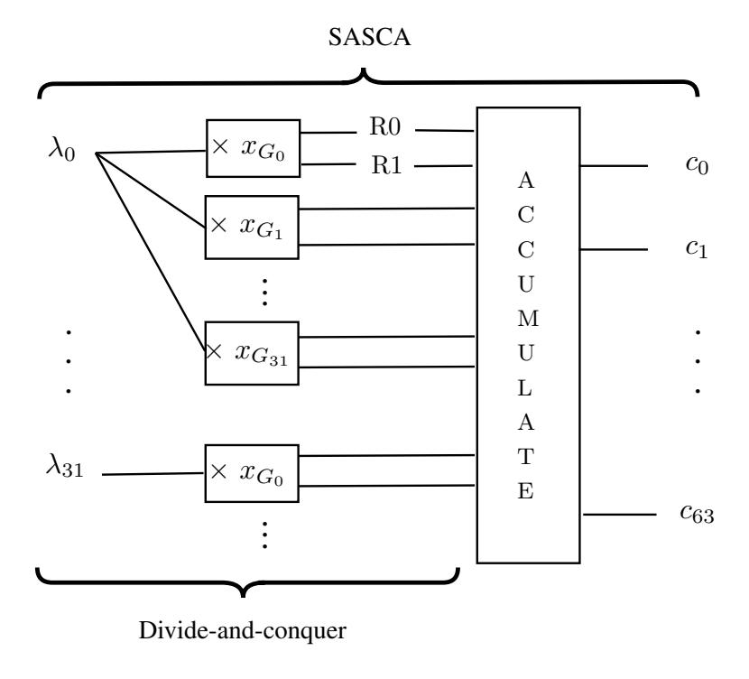

Fig. 1: Multi-precision multiplication of 256-bit operands on an 8-bit device.

#### 3.1 Horizontal divide-and-conquer attack with enumeration

The Horizontal Divide-and-Conquer attack (HD&C) is applied independently and similarly to each word of  $\lambda$ . Following Fig. 1,  $\lambda_0$  is multiplied by 32 known values  $\{x_{G_0}, x_{G_1}, ..., x_{G_{31}}\}$  resulting in the lower parts and the higher parts:  $(\lambda_0 \times x_{G_j})\%256$  and  $(\lambda_0 \times x_{G_j})\backslash256$  (where % and  $\backslash$  denote the modulus and the integer division) for  $j \in \{0, 1, ..., 31\}$ . The attacker exploits the direct leakage on the value of  $\lambda_0$  but additionally observes the leakage of these 64 intermediates. The side-channel information is extracted by characterizing the joint conditional distribution:

$$\Pr[\lambda_0|\mathcal{L}(\lambda_0),\mathcal{L}((\lambda_0 \times x_{G_0})\%256),...,\mathcal{L}((\lambda_0 \times x_{G_{31}})\backslash 256)],$$

where  $\mathcal{L}(v)$  denotes the side-channel leakage of a value v. Assuming the algorithmic independence of the targeted intermediates, which is verified in this case, and additionally the independence of the noise (i.e. that the leakage of each intermediate is independent of the leakage of other intermediates)1, the joint distribution can be factorized into:

$$\Pr[\lambda_0|\mathcal{L}(\lambda_0)] \times \prod_{j=0}^{31} \Pr[\lambda_0|\mathcal{L}((\lambda_0 \times x_{G_j})\%256)] \times \Pr[\lambda_0|\mathcal{L}((\lambda_0 \times x_{G_j})\backslash 256)].$$

For a given word of  $\lambda$ , the exploitation of this information gives to the attacker a list of probabilities for each value this word can take. If the correct word is

This is referred to as Independent Operations' Leakages (IOL) and is a commonly used assumption in SCA and was shown to be reasonable [13]. For our case study it can be easily verified by plotting a covariance matrix.

{5}------------------------------------------------

ranked first for all the λi , the attack trivially succeeds. However, recovering λ directly is not necessary. Indeed, a D&C attack allows the use of enumeration as a post-processing technique [32]. As a result, reducing the entropy of λ until the value of the randomized point can be reached through enumeration is enough.

We note that there is no straightforward way to verify if the correct point has been found. Indeed, only the result of its multiplication by the full value of the secret scalar k is revealed at the end of the ECSM. Yet, the attacker can feed the points given by enumeration as inputs to (e.g.) an HDPA attack. If the right point has been recovered, it is very likely that the HDPA will be able to easily distinguish the scalar bits. Otherwise if the hypothesis on the input point is wrong it will assign the possible values on the scalar bits equal probabilities.

#### 3.2 Soft analytical side-channel attack

SASCA was introduced in [34] by Veyrat-Charvillon et al. as a new approach that combines the noise tolerance of standard DPA with the optimal data complexity of algebraic attacks. SASCA works in three steps: first it builds a large graphical model, called a factor graph, containing the intermediate variables linked by constraints corresponding to the operations executed during the target algorithm. Then it extracts the posterior distributions of the intermediate values from the leakage traces. Finally, it propagates the side-channel information throughout the factor graph using the Belief Propagation (BP) algorithm [20], to find the marginal distribution of the secret key, given the distributions of all intermediate variables. SASCA exploits a larger number of intermediates in comparison to D&C attacks as illustrated in Fig. 1. For instance, it can use the leakage coming from the addition operations in the accumulator that combine intermediates that depend on multiple words of λ. The optimized information combination approach of SASCA implies that it is an appropriate tool to approximate the worst-case security of cryptographic implementations. In the following, we provide a comprehensive description of BP based attacks and related works.

Factor graph. A factor graph is a bipartite graph representing the factorization of a function. The nodes of the graph are the variables of the function and the factors of which the function is a product of. Each variable node (represented by a circle) is connected to a factor node (represented by a square or a rectangle) by an edge if the factor depends on it. For example the factor graph of the computation: z = Sbox(x ⊕ k) is given by:

$$f_{\oplus}(x,k,y) = \begin{cases} 1 & if \ x \oplus k = y, \\ 0 & otherwise. \end{cases} \qquad f_{\mathrm{Sbox}}(y,z) = \begin{cases} 1 & if \ \mathrm{Sbox}(y) = z, \\ 0 & otherwise. \end{cases}$$

{6}------------------------------------------------

Belief Propagation (BP). The belief propagation or sum-product algorithm is a message-passing algorithm for inference on graphical models such as factor graphs. It allows to efficiently compute the exact marginal distribution of a variable in the graph if it is tree-like. We follow the description of the belief propagation algorithm given by MacKay [26]. We denote by  $\mathbf{x}$  the set of N variables in the graph  $\{x_n\}_{n=1}^N$ . The  $m^{th}$  factor is denoted by  $f_m$  and the set of variables it depends on by  $\mathbf{x}_m$ . The set of variables  $\mathbf{x}_m$  excluding  $x_n$  is denoted  $\mathbf{x}_m|_n$ . We refer by  $\mathcal{N}(m)$  to the set of indices of  $\mathbf{x}_m$ , and by  $\mathcal{N}(m)|_n$  to the set  $\mathcal{N}(m)$  excluding n. We also denote the set of factors in which a variable  $x_n$  is involved by  $\mathcal{M}(n)$ , and the set of factors in which a variable  $x_n$  is involved excluding  $f_m$  by  $\mathcal{M}(n)|_m$ . The belief propagation algorithm works by passing two different types of messages on the edges of the graph:

From variable to factor: 
$$q_{n\to m}(x_n) = \prod_{m'\in\mathcal{M}(n)|_m} r_{m'\to n}(x_n).$$
From factor to variable: 
$$r_{n\to m}(x_n) = \sum_{\mathbf{x}_m|_n} \left( f_m(\mathbf{x}_m) \prod_{n'\in\mathcal{N}(m)|_n} q_{n'\to m}(x'_n) \right).$$

At first, all messages from variables to factors are initialized to the variables' probabilities or to 1 (assuming uniformity) and to 1 also for initial messages from factors to variables. Then, a node sends a message to a neighbor based on all the messages received from its other neighbors and following the previously described belief propagation rules. The number of steps required to get all messages to converge is equal to the longest path in the graph (the diameter). Once convergence occurs, the marginal distribution of a variable  $x_n$  can be recovered by multiplying together all its incoming messages:  $\prod_{m \in \mathcal{M}(n)} r_{m \to n}(x_n)$ .

The BP algorithm returns the exact marginals of variables when the graph is a tree. When the graph contains cycles, the BP algorithm can still be applied by initializing the messages and iterating the BP multiple times until the convergence of the messages or no significant difference occurs after the message passing. This method is called loopy belief propagation and usually provides a good approximation of the marginals.

Local Random Probing Model (LRPM). Running the BP algorithm on a factor graph of a cryptographic implementation is time-consuming. Its time complexity is dominated by  $(2^{vs})^{deg}$  (corresponding to the factor to variable message update) with vs the variable size (for e.g. 8 bits or 32 bits) and deg the degree of the largest factors (number of variables connected to it). This message passing is then repeated for each factor and for the number of iterations required for the BP algorithm to converge. For that reason, Guo et al. introduced the Local Random Probing Model (LRPM) [15], which bounds the information that can be obtained by decoding the factor graph using BP without running the BP algorithm. Concretely, the LRPM propagates the amount of information collected throughout the graph using approximations employed in coding theory. Assuming that the variables' distributions are not too correlated, information

{7}------------------------------------------------

coming from neighboring factors is summed at variable nodes. At factor nodes the information coming from neighboring variables is multiplied. The information is not in bits but instead computed in base log the size of the variables (such that the information is always between 0 and 1). These rules are depicted on Fig. 2 and we refer to [34] for more details on the LRPM.

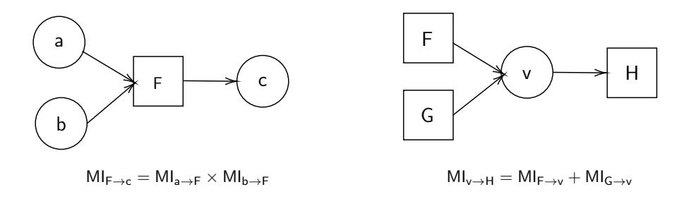

Fig. 2: LRPM information propagation rules.

The LRPM provides an upper bound on the information propagated through a generic factor function, but generally the actual information propagated by a specifc logic or arithmetic operation is significantly lower. For instance, Guo et al. noted that information can be diluted when propagated through a XOR operation: when XORing two values with partial information, we may end with even less information on the result than their product. Based on this observation, they refine the model by introducing the XOR loss: a coefficient 0 < α < 1 that is multiplied by the information and reduces the model's approximation for the XOR operation to a value of information that is closer to the one that is observed. In practice, α is estimated as the ratio between the upper bound on the information evaluated using the model and the information estimated from actually running BP on the XOR factor.

### 4 Analysis of the field multiplication factor graph

Prior to comparing the attacks identified in Section 3, we investigate the application of SASCA on a multi-precision multiplication factor graph. The nodes included in the graph and its structure can impact the performance of the BP algorithm. In the following, we investigate the impact of these characteristics. For this purpose, we build the factor graph of the first block from the assembly description of the operand-caching multiplication2 of Hutter and Wenger [18, Appendix A] on an 8-bit micro-controller. This graph G is presented in Fig. 3. Given the size of this graph, it is possible to run multiple experiments of the BP algorithm to get meaningful averaged results. The conclusions drawn from our analysis can be generalized to the full graph and any multiplication that follows the abstract architecture in Fig. 1 because of its very regular structure.

2 The operand-caching multiplication is an optimized schoolbook-like multiplication that minimizes the number of operand word loads. It is specifically designed for small embedded devices in order to improve efficiency by minimizing memory operations.

{8}------------------------------------------------

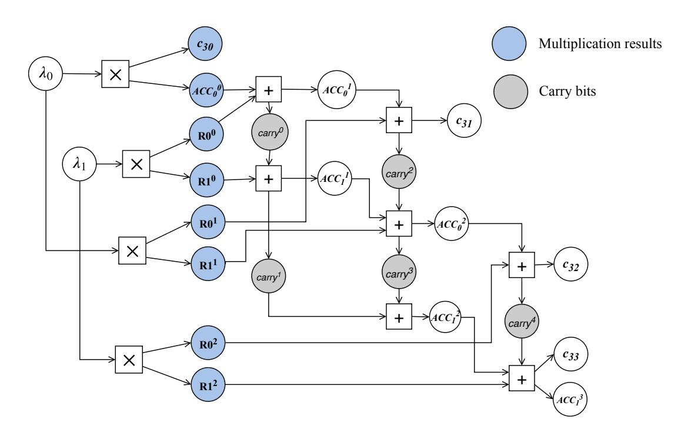

Fig. 3: Factor graph G: first block of the operand caching multiplication.

There are two aspects to consider before running BP on this graph that we detail and investigate hereafter. First, G is a cyclic graph and BP convergence to the correct marginals is not guaranteed [26]. Second, while for previous applications of SASCA to the AES [34] and lattice-based encryption [30], the factor graphs contained factors of at most degree 3, G contains factors of degree 4 and 5 due to the additions with carry propagations. Although carry bits are small variables, we note that their values and possibly errors on their values may ripple through all the following steps of the computation. To investigate the effect of cycles and carry bits, we construct four other factor graphs. G no cycles is an acyclic version of G built by following the strategy from Green et al. [12]: removing factors causing the cycles and severing edges. G no carry is constructed by deleting carry bit variable nodes and integrating both possible values of a carry into the factors as described by the diagram below, where the carry (resp. carry') variable node corresponds to the input (resp. output) carry. It is given by the diagram below for the addition with carry operation but is done similarly for all carry operations. Finally, G no carry no cycles is G no carry where remaining cycles have been removed.

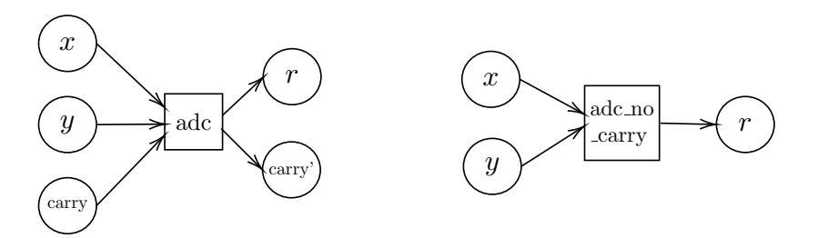

with fadc and fadc no carry defined as:

$$f_{\text{adc}}(x, y, \text{carry}, r, \text{carry}') = \begin{cases} 1 & \text{if } r = (x + y + \text{carry}) \% 256 \text{ and } \text{carry}' = (x + y + \text{carry})/256, \\ 0 & \text{otherwise}. \end{cases}$$

{9}------------------------------------------------

$$f_{\text{adc\_no\_carry}}(x, y, r) = \begin{cases} 1 & \text{if } r = (x + y) \% 256 \text{ or } r = (x + y + 1) \% 256, \\ 0 & \text{otherwise.} \end{cases}$$

To compare the different graphs, we use simulated leakages for all intermediate variables (Hamming weight leakage with Gaussian noise). We estimate the single-trace attack success rate (SR), average across λ0 and λ1 for different noise levels. The results of these experiments are plotted in Fig. 4. First, we notice that for high SNR values, the cyclic graphs (G and G no carry) perform better than the acylic ones (G no cycles and G no carry no cycles). This can be explained by the fact that cycles typically exacerbate side-channel errors but in this case are less detrimental since errors from side-channel observations are less likely to occur for high SNR. Additionally, the acyclic graphs are constructed by removing factors which contribute the most to the connectedness of the graph and as a result lose some information. When moving to the (more realistic) low SNR range (below 2), G no carry yields marginally better results, as it still benefits from the additional information provided by factors in cycles, and is also not prone to errors on carry bits. For even lower SNR (below 0.05), the experiments indicate that the best graph option is G no carry no cycles, which reflects previous observations on the impact of cycles and carry bits.

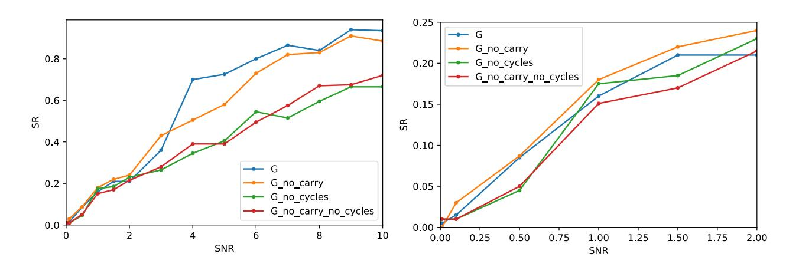

Fig. 4: Average single-trace success rate. Right: close-up for low SNR values.

### 5 Comparison of SASCA and HD&C attack

In this section, we begin our investigation of the security level that can be achieved by the point randomization countermeasure by comparing SASCA and an HD&C attack. We still consider the 8-bit implementation of the operand caching multiplicaton. Since SASCA comes at a higher computational cost than an HD&C attack, it is worth evaluating the advantage of SASCA over an HD&C attack. For this purpose we make use of the LRPM's efficiency and introduce new extensions of it such that it is applicable to the target factor graph.

{10}------------------------------------------------

#### 5.1 Applying the LRPM to multi-precision multiplication

To investigate the relevance of the LRPM, Guo et al. [15] consider the AES as a target, for which all atomic operations have one output only and LRPM rules apply straightforwardly. To apply the LRPM to the full factor graph of the multiprecision multiplication, we extend the LRPM rules to operations with multiple outputs. This new rule is described below and is based on the factorization principle of BP. An example factorization for an addition factor is given in Appendix A.

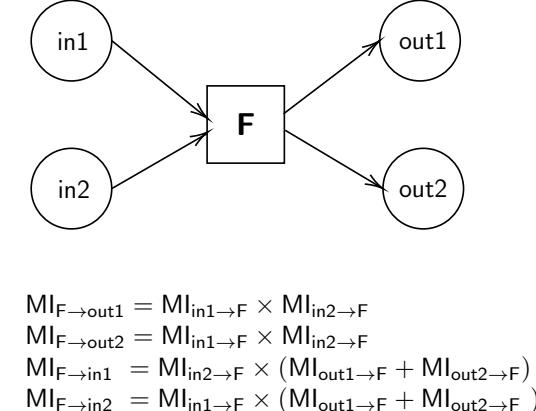

Additionally, based on the work of Guo et al. and as explained in Section 3.2, in order to avoid too pessimistic upper bounds on the information, we estimate loss coefficients for all variables for every kind of operation in the graph. We estimated the loss coefficients assuming a Hamming weight leakage function as the ratio between the information computed after performing BP and the one predicted by the LPRM rules.

Prior to using the LRPM to compare SASCA and HD&C attacks, we confirm in Fig. 5 that the LRPM's MI predictions fit the experimental SR on G and its variants. We ran the LRPM assuming MI values that correspond to the simulated SR experiments and we focus on reasonable and realistic noise levels for software implementations. The left part of Fig. 5 corresponds to the MI on one word of  $\lambda$  of each graph as a function of the SNR, and the right part to the SR. The efficiency orderings of the different graphs in terms of MI and SR are similar. Slight discrepancies might be due to the experimental estimation of the SR. Decisively, the LRPM and the SR estimations agree on the fact that the best graph option is G\_no\_carry for a reasonable SNR < 2, while for even lower SNR all seem to perform similarly.

#### 5.2 SASCA vs. HD&C

Based on our previous results, we build the full graph of the multi-precision multiplication with carry bits integrated in factors. Notably, this graph option is not only the best based on the previously shown experiments and LRPM predictions, but also the most pragmatic one. Indeed, the full graph of the multi-precision

{11}------------------------------------------------

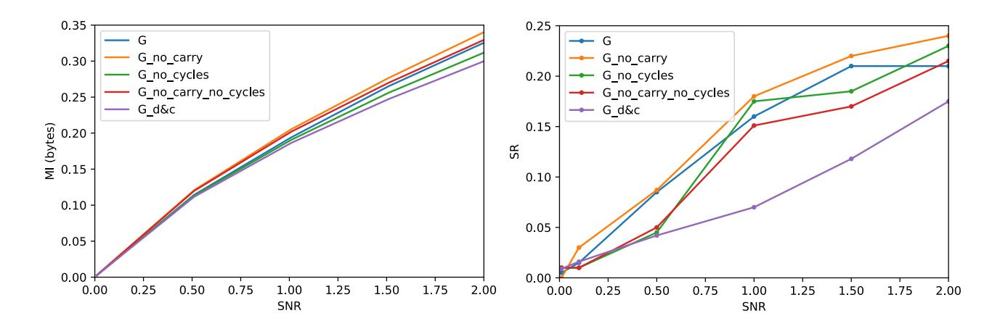

Fig. 5: Left: MI evaluated with the LRPM with loss coefficients for the different graphs. Right: the SR of SASCA for different graphs.

multiplication is highly connected. Attempting to remove all cycles will render the graph very close to the one exploited by the HD&C strategy. Accordingly, we build the full graph which consists of 1024 multiplication factors and 3216 addition factors, then the factor graph corresponding to the HD&C attack that only contains the multiplication factors and related variables. We additionally build the full graph of the randomization procedure including the modular reduction implemented as suggested in [31]. In comparison to the efficient HD&C attack, running the BP algorithm for a single iteration on the factor graph of the multi-precision multiplication would naively require more than 237 operations, or more than 229 operations with specific factor message passing optimizations.

For all three graphs, we use the LRPM to upper bound the information extracted in bytes on a word of λ. Results are given in Fig. 6. We observe that both BP and D&C attacks reach the maximal information of one byte across all words of λ when the SNR exceeds 0.4. The horizontal attack succeeds right after SASCA and, for lower SNR values, the gain is negligible considering the running time and the effort required to mount a BP-based attack. This is in-line with the results from [15] (e.g. for the AES): when the number of attack traces is too low (e.g. in a DPA), SASCA does not provide any gain over a D&C template attack. Things naturally get worse for lower SNR values.

Our results therefore indicate that classical D&C attacks (on our particular target) come very close to the worst-case attack for low SNR cases (which are essentially the most interesting ones for side-channel investigations). This fact can be additionally highlighted by the limited information provided by the addition of the modular reduction to the factor graph compared to solely the multiplication. An analogy can be made with the AES MixColumns: since the operations contained in these examples (MixColumns, modular reduction by a Mersenne prime) diffuse already limited information (by combining noisy leakages of multiple intermediates), they do not contribute significantly to the overall information on the targeted secret for low and reasonable SNR values.

Overall, this result shows that SASCA, which exploits all the available information, barely improves the results compared to a D&C attack. Moreover, as

{12}------------------------------------------------

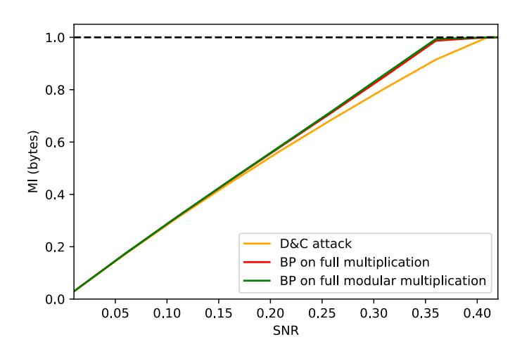

Fig. 6: Comparison of SASCA on the full graph of the field multiplication, including the modular reduction, and the HD&C attack on register multiplications.

SASCA does not allow optimal enumeration: adding the use of computational power to HD&C mitigates even more the already small gap between them. As a result, the rest of this paper considers the HD&C strategy in order to evaluate the security of the point randomization countermeasure. This naturally raises the question of how much noise is necessary to make the attack fail, which we investigate in the following section.

## 6 Security graphs and necessary noise levels

In this section, we investigate the nearly worst-case security of the point randomization countermeasure. For this purpose, we use the HD&C strategy, identified in the previous section to achieve comparable efficiency to the worst-case BP-based attack. Since the HD&C attack strategy is extremely efficient computationally (in comparison to SASCA), it allows us to investigate different implementation cases. For our experiments, we choose a homogeneous projective coordinates system to represent the points and later discuss the case of Jacobian projective coordinates. A homogeneous coordinates system allows for a very efficient point randomization procedure as it requires at most two field multiplications. We consider the case where both the affine coordinates of a point are randomized, and additionally the fast parallel point addition and doubling Montgomery ladder from Fischer et al. [10], where only the x coordinate is required and thus randomized. The field multiplication is as described previously: a multi-precision multiplication followed by a modular reduction. We also take into account a 256-bit randomizing parameter λ and a 128-bit alternative.

The goal of this section is to provide a characterization of the security level expected as a function of the measurements' SNR. For this purpose, we plot security graphs based on [33] for the different cases of the point randomization procedure. These graphs are produced by performing 100 independent attacks and rank estimations for different SNR values. These experiments provide sampled ranks for each SNR value. Using these samples, the rank distributions can 

{13}------------------------------------------------

be easily estimated using kernel density estimation. The most interesting conclusions can be deduced from the cumulative distribution function (CDF) of the rank. The CDF of the rank for a specific SNR tells us about the probability that the rank of the secret lies above a certain enumeration effort, and thus the probability for an adversary to recover the secret. This is visually represented by a gray-scale on a security graph: the darker (resp. lighter) the zone is, the higher (resp. lower) is the probability of recovering the secret.

For the following results, we performed HD&C attacks and corresponding rank estimations on simulated leakages of every 8-bit word of λ and every result of a register multiplication following the classical side-channel model: HW and Gaussian noise. This leads to 65 leakages per target byte (one for the byte itself and 64 for the 2 parts of the 32 multiplication results). We produce in Fig. 7 the security graph for a 128-bit λ, when randomizing only the x coordinate of the base point (Fig. 7a) and when randomizing both coordinates (Fig. 7b). Fig. 8 gives the corresponding security graphs for a 256-bit λ.

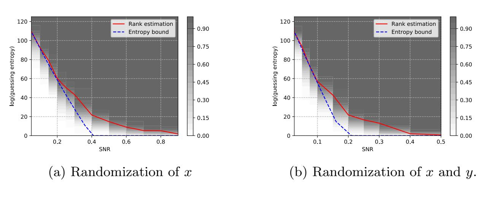

Fig. 7: Security graph of the point randomization countermeasure for λ ∈ F2 128 .

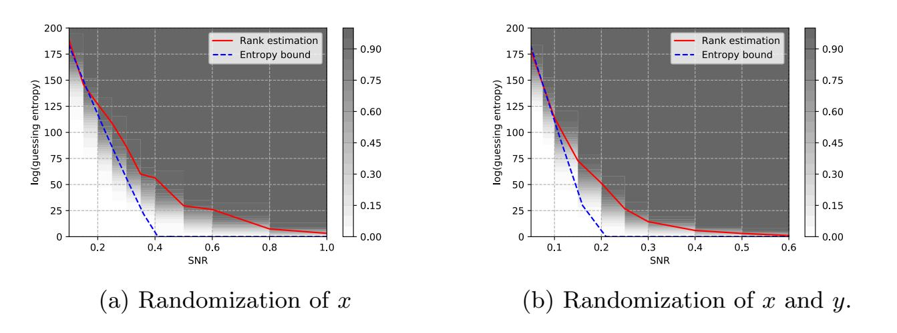

Fig. 8: Security graph of the point randomization countermeasure for λ ∈ F2 256 .

{14}------------------------------------------------

The red line corresponds to the log2 of the guessing entropy. The security graphs shown in Fig. 7 and 8 encompass a great deal of information on the security of the target. For e.g. to achieve security against an adversary attacking only the x coordinate randomization using a 256-bit parameter, who can enumerate up to 250 candidates, the SNR needs to be lower than 0.3 based on the results displayed in Fig. 8a. The comparison of Fig. 7a and Fig. 7b highlights the expected fact that the information is simply doubled when exploiting λ × xG and λ × yG compared to only λ × xG. Subsequently, to get the same level of security, the SNR has to be halved. The same applies to Fig. 8a and Fig. 8b. Moreover, the security graphs for the 128-bit case and the 256-bit case illustrate the trade-off between the randomness requirements (i.e. the size of λ) and the side-channel noise necessary to make the point randomization robust against nearly worst-case adversaries. Additionally, since the LRPM provides an upper bound on the information that can be extracted from a factor graph (in this case of the D&C attack), in all security graphs we plot the corresponding remaining entropy as a lower bound of the actual guessing entropy. This bound is quite helpful particularly in cases where performing multiple attacks and rank estimations is not possible.

### 7 Experimental evaluations

In this section, we analyze two different implementations of a long-integer multiplication both written in assembly. First, a naively implemented schoolbook multiplication with two nested unrolled loops and no specific optimizations. The second multiplication is the operand-caching multiplication of Hutter and Wenger [18] that we presented above. We performed our experiments on an 8-bit AVR ATmega328p microcontroller mounted on an Arduino UNO board running at 16 MHz. Using a custom probe, the measurements are captured on a Pico-Scope5244D oscilloscope synchronized with a trigger at the beginning of each execution, at a sampling rate of 125 MSam/s. The traces are preprocessed using amplitude demodulation.

Hereafter we describe the HD&C attack applied to both implementations. First, we first performed a preliminary Points Of Interest (POIs) selection step using a correlation test [9] to find the samples that correspond to leakages of intermediate values depending on the target byte. We then use a dimensionality reduction technique, namely Principal Component Analysis (PCA) [1], to further reduce the number of dimensions. This can be done since as the coordinate of the base point is fixed and known, the leakage only depends on the bytes of λ. Using the compressed traces, we build multivariate Gaussian templates using 49k traces based on the values of the bytes. Note that while the noise is independent for the attack on simulations presented in Section 6, it is not perfectly the case for real traces. We thus take the dependency into account in order to improve the results and perform a single-trace template attack on each secret byte. Finally, we combine the results of all the bytes using the Glowacz et al. histogram-based rank estimation algorithm [11].

{15}------------------------------------------------

#### 7.1 Classical schoolbook multiplication

In this section, we show the results of the HD&C attack on the non-optimized schoolbook multiplication. This multiplication loads every byte of the secret 32 times, displaying notable leakages on λ. As a first step, we examine the bytes' guessing entropies as a function of the number of PCA components retained. These results are shown in Fig. 9. Typically, when applying PCA to side-channel leakages of symmetric cryptography implementations, the relevant information is located in a few principal directions (e.g. the recent [4] uses 10). For our specific target, more dimensions are useful, as shown by Fig. 9. This is presumably due to the large amount of intermediate values that relate to the secret bytes, and the amount of different single-precision operations manipulating these intermediates. From Fig. 9, we observe that the logarithms of the guessing entropies of all bytes decrease similarly and are mostly below 4 bits (less than 16 candidates) when the number of components is above 350. The guessing entropies keep on decreasing as the number of components increases.

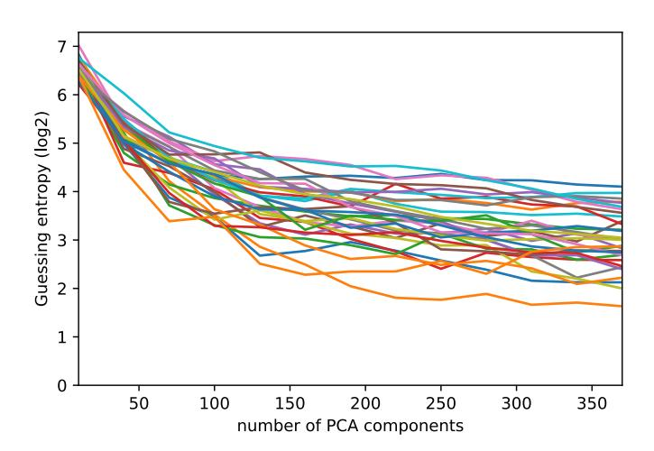

Fig. 9: Logarithm of the guessing entropy of the 32 bytes of λ as a function of the number of PCA components for the non-optimized schoolbook multiplication.

The next step of the evaluation is to assess if a single-trace recovery is feasible on the full value of λ. For each execution, we combine the results obtained from the independent attacks on the bytes of λ and plot the results of rank estimation in Fig. 10. We show the distribution of the logarithm of the ranks. The red vertical line denotes the mean log rank observed. We also focus on two sizes for λ, namely 128 and 256 bits, in order to evaluate the impact of the HD&C attack on the required randomness for each execution. First, for a 128-bit randomizing parameter, we observe that approximately half of the randomized points can be recovered with a minimal enumeration of less than 216. The results for a 256-bit randomizing parameter are given in Fig. 10b. In this case, while the rank of the secret is higher than for the 128-bit case, the implementation can still be considered vulnerable with an average rank of 50 bits. Moreover, some 

{16}------------------------------------------------

parameters are easily recovered. For instance approximately 20% of all λs are fully recovered using an enumeration effort of 216 .

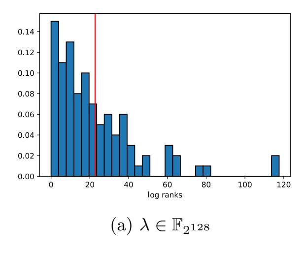

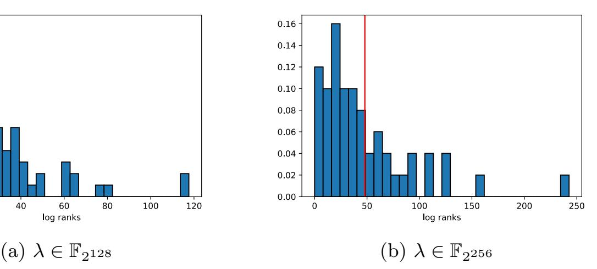

Fig. 10: Distribution of log rank of λ for the schoolbook multiplication.

#### 7.2 Operand caching multiplication

The second part of our experiment consists of applying the same process of HD&C attack against an optimized implementation, namely the operand-caching one. This method is a variant of the long-integer multiplication that reduces the number of memory accesses to gain in efficiency, thereby reducing the amount of leakage. For each byte of λ, we perform the same systematic steps as for the non-optimized implementation. In Fig. 11, we plot the evolution of the guessing entropies for the different bytes as a function of the number of PCA components. Bytes are color coded according to the number of times they are loaded. First, we observe the same behavior as for the previous implementation when it comes to the number of PCA components: we require a large number of components. Next, we clearly notice the impact of the amount of loads on the guessing entropy. That is, less loads tend to lead to a higher entropy in comparison with the nonoptimized implementation. It is clear that the limited leakages in this case do not allow reaching guessing entropies below 20 candidates, which is significantly more than on the naive schoolbook multiplication.

Next, we plot the distribution of the log ranks for both 128- and 256-bit λ in Fig. 12. We observe that due to the optimizations applied for the operand caching, the leakages are minimized, leading to significantly different results compared to the non-optimized implementation. For the 128-bit (resp. 256-bit) size parameter, we obtain an average log rank of 100 bits (resp. 200 bits). The entropy of λ is only marginally reduced and its value cannot be recovered with a reasonable enumeration effort.

Overall, the comparison of the non-optimized multiplication and the optimized one highlights how point randomization can be made quite robust against nearly worst-case adversaries without much performance overheads: as clear

{17}------------------------------------------------

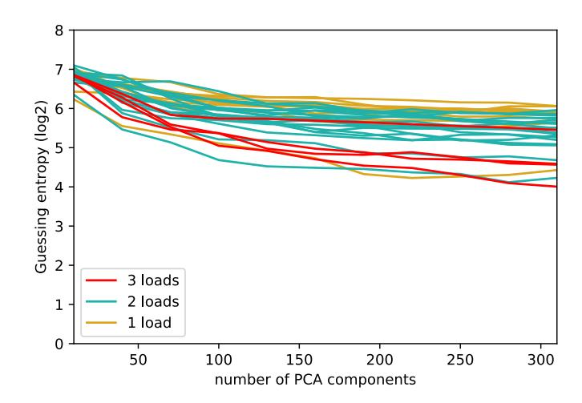

Fig. 11: Logarithm of the guessing entropy of the 32 bytes of λ as a function of the number of PCA components for the optimized operand-caching multiplication.

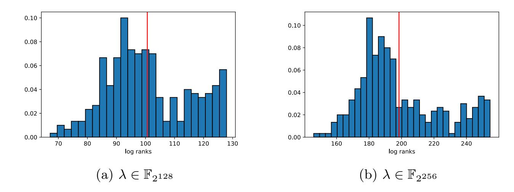

Fig. 12: Distributon of log rank of λ for the operand caching multiplication.

from [17], the additional cost of point randomization is limited for (already expensive) ECC implementations. That is, a few design considerations and optimizations suffice to reduce the overall leakages that can be exploited by an adversary, so that horizontal attacks become impractical. We note that, as usual in experimental side-channel attacks, these results obviously depend on the measurement setup and the preprocessing applied to the traces, which can possibly be improved. Yet, the conclusion that limited SNR reductions are enough to secure point randomization, and that simple optimizations (that are motivated by general performance concerns) are good for this purpose, should hold in general.

### 8 Projective coordinates system comparison

In our preliminary analysis, we focused on an homogeneous projective point representation. This section investigates the use of a different coordinates system, namely Jacobian coordinates, and the possible consequences regarding sidechannel resistance. For this purpose, using the LRPM and its extensions pro

{18}------------------------------------------------

posed in this paper, we further extend our analysis by comparing the randomization in homogeneous and Jacobian projective coordinates. In the Jacobian case, the computation of λ 2 is required. Therefore, we consider again two cases: one where a generic multiplication is used to perform the squaring, and one where the squaring is implemented efficiently (avoiding the re-calculation of equal cross products). The results of our evaluations are depicted in Fig. 13 where MI upper bounds are plotted as a function of the SNR.

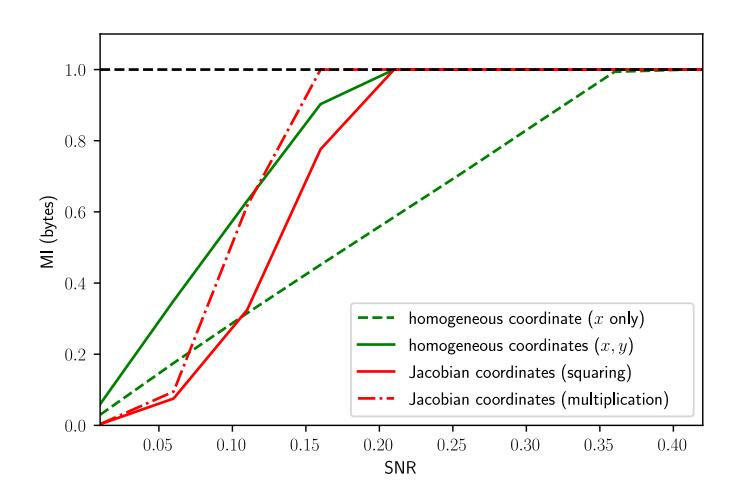

Fig. 13: Comparison of SASCA on homogeneous projective coordinates randomization and Jacobian projective coordinates randomization

.

First, and as previously shown, we confirm that for homogeneous coordinates since λx and λy are independent operations when targeting λ, the overall information is simply doubled. Secondly, when it comes to Jacobian coordinates, using a squaring instead of a multiplication for λ 2 leads to improved security. Regarding the comparison, while the coordinates system used is typically dictated by the ECSM's overall performance, the results shown in Fig. 13 lead to interesting conclusions. These results suggest that for low SNR (< 0.1), Jacobian coordinates randomization is more resistant to worst-case side-channel adversaries than homogeneous coordinates. For SNR > 0.1, the x-only homogeneous projective randomization is the best option, followed by the Jacobian coordinates randomization with a dedicated squaring operation.

### 9 Worst-case evaluation of 32-bit implementations

In this section, we translate our previous investigation on 8-bit implementations to the practically-relevant case of 32-bit devices. First, we emphasize that implementing an actual attack against a 32-bit implementation is much more challenging. While profiling 32-bit leakage is feasible by using a linear regression based approach, exploitation on the other hand is very demanding since it would require enumerating 232 values, leading to large computation and storage 

{19}------------------------------------------------

efforts. Some workarounds are possible by trading computational complexity for algorithmic noise.

As we focus on worst-case security, we analyze the information obtained by a strong attacker able to perform attacks on 32-bit leakages directly. For that purpose, we use the LRPM. As shown in Section 6 in Fig. 7 and 8, the LRPM provides a lower bound on the guessing entropy after the attack. Based on this observation, we bound the guessing entropy when targeting a 32-bit implementation for different attacks (D&C and SASCA) and for different SNR levels. The results of this analysis are plotted in Fig. 14 for high (left) and low SNR (right) cases. First, we note that when the SNR is low the gain of analytical strategies over D&C strategies is still very limited as for the 8-bit case. But more interestingly, we observe that implementations of the point randomization on 32 bit devices are able to resist worst-case adversaries as shown by the pessimistic lower bounds on the guessing entropy in Fig. 14. Concretely, for an SNR ≈ 0.9 as measured in a recent attack targeting an STM32F405 [21] it is possible to achieve excellent concrete security even against attackers exploiting all the possible leakage of the point randomization. This is a positive result that suggests that securing 32-bit ECC implementations (for e.g. on ARM devices) against very powerful attackers might be feasible in practice.

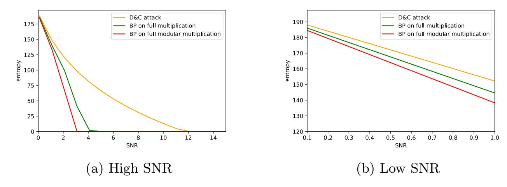

Fig. 14: Entropy lower bound comparison of SASCA on the full graph of the field multiplication, and the HD&C attack for a 32-bit implementation with λ ∈ F2 256 .

### 10 Conclusion and future works

In this work, we investigated the security of the point randomization countermeasure w.r.t. worst-case attackers. We showed how to apply SASCA when targeting point randomization and additionally adapted a recent and efficient evaluation methodology for SASCA using the LRPM to this asymmetric use case. Second, and using that model, we showed that, for realistic noise levels for 8-bit devices, there is almost no gain in mounting a complex SASCA making use 

{20}------------------------------------------------

of all the available information compared to a simpler horizontal D&C attack that can be complemented with enumeration. As a result, we estimate the required SNR needed by implementations in small embedded devices to be secure. Somewhat surprisingly, we observe that the point randomization technique can be implemented quite securely even in 8-bit devices.

We then perform practical experiments against basic and optimized implementations to further illustrate the impact of performance optimizations: while the naive implementation is shown to be broken, the optimized one leads to ranks that are not reachable with enumeration. Finally, we provide guessing entropy lower bounds for challenging attacks on 32-bit implementations which again confirm the resistance of point randomization against side-channel attacks. Interestingly, our results indicate that the point randomization on 32-bit devices provides excellent concrete security against worst-case adversaries. This leads to the positive conclusion that secure 32-bit ECC implementations might be feasible in practice.

While we studied different implementation options of the point randomization, there is still room for analyzing other options to implement elliptic curve based systems and evaluate the security provided by side-channel countermeasures. For instance, then this additional leakage that does not depend on the secret scalar bit could potentially be exploited. Besides, different multiplication algorithms have been described in the literature. We focused on multiplications that share the same abstract architecture as a classical schoolbook multiplication, but other long-integer multiplication algorithms such as the Karatsuba algorithm [22] or modular multiplication methods such as the Montgomery multiplication [27] remain to be studied.

Acknowledgement. François-Xavier Standaert is a senior research associate of the Belgian fund for scientific research (FNRS-F.R.S.). This work has been funded in parts by the ERC project 724725 (SWORD) and by the European Commission through the H2020 project 731591 (acronym REASSURE). The authors acknowledge the support from the Singapore National Research Foundation ("SOCure" grant NRF2018NCR-NCR002-0001 – www.green-ic.org/socure).

### A Factorization of $f_{\text{add}}$

The LPRM rules for information propagation for factors with multiple outputs are deduced from the factorization of a factor with two outputs into two factors with one output each, as shown by the diagram below for the addition operation:

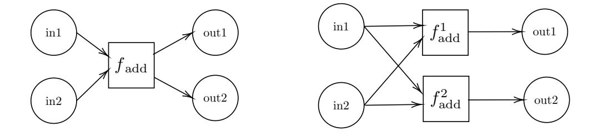

{21}------------------------------------------------

Where in1 and in2 refer to the two inputs to the addition. out1 to the result of the addition and out2 to the output carry bit. Then the add factor is defined as:

$$f_{\rm add}({\rm in1,in2,out1,out2}) = \begin{cases} 1 & if \ \ {\rm out1} = ({\rm in1+in2}) \ \% \ 256 \ \ and \ \ {\rm out2} = ({\rm in1+in2})/256 \\ 0 & otherwise \end{cases}$$

The add factor can be factorized into  $f_{\text{add}}^1$  and  $f_{\text{add}}^2$  which are defined as:

$$f_{\mathrm{add}}^{1}(\mathsf{in1},\mathsf{in2},\mathsf{out1}) = \begin{cases} 1 & if \ \mathsf{out1} = (\mathsf{in1} + \mathsf{in2}) \ \% \ 256 \\ 0 & otherwise \end{cases}$$

$$f_{\mathrm{add}}^{2}(\mathrm{in1},\mathrm{in2},\mathrm{out2}) = \begin{cases} 1 & if \ \mathrm{out2} = (\mathrm{in1} + \mathrm{in2})/256 \\ 0 & otherwise \end{cases}$$

The LRPM propagation rules applied to the factorized factor yield for the variable in1:

$$\mathsf{MI}_{f_{\mathrm{add}}^1 \to \mathrm{in1}} = \mathsf{MI}_{\mathrm{in2}} \times \mathsf{MI}_{\mathrm{out1}} \ \mathrm{and} \ \mathsf{MI}_{f_{\mathrm{add}}^2 \to \mathrm{in1}} = \mathsf{MI}_{\mathrm{in2}} \times \mathsf{MI}_{\mathrm{out2}}$$

Since information at variable node is summed we have:

$$\mathsf{MI}_{(f_{\mathrm{add}}^1, f_{\mathrm{add}}^2) \to \mathsf{in1}} = \mathsf{MI}_{f_{\mathrm{add}} \to \mathsf{in1}} = \mathsf{MI}_{\mathsf{in2}} \times (\mathsf{MI}_{\mathsf{out1}} + \mathsf{MI}_{\mathsf{out2}})$$

### References

- 1. C. Archambeau, E. Peeters, F. X. Standaert, and J. J. Quisquater. Template attacks in principal subspaces. In Louis Goubin and Mitsuru Matsui, editors, Cryptographic Hardware and Embedded Systems CHES 2006, pages 1–14, Berlin, Heidelberg, 2006. Springer Berlin Heidelberg.
- 2. Alberto Battistello, Jean-Sébastien Coron, Emmanuel Prouff, and Rina Zeitoun. Horizontal side-channel attacks and countermeasures on the ISW masking scheme. In *CHES*, volume 9813 of *Lecture Notes in Computer Science*, pages 23–39. Springer, 2016.
- 3. Aurélie Bauer, Eliane Jaulmes, Emmanuel Prouff, and Justine Wild. Horizontal collision correlation attack on elliptic curves. In Tanja Lange, Kristin Lauter, and Petr Lisoněk, editors, Selected Areas in Cryptography SAC 2013, pages 553–570, Berlin, Heidelberg, 2014. Springer Berlin Heidelberg.
- 4. Olivier Bronchain and François-Xavier Standaert. Side-channel countermeasures' dissection and the limits of closed source security evaluations. *IACR Cryptology ePrint Archive*, 2019:1008, 2019.
- 5. Gaetan Cassiers and François-Xavier Standaert. Towards globally optimized masking: From low randomness to low noise rate or probe isolating multiplications with reduced randomness and security against horizontal attacks. *IACR Trans. Cryptogr. Hardw. Embed. Syst.*, 2019(2):162–198, 2019.
- 6. Christophe Clavier, Benoit Feix, Georges Gagnerot, Mylène Roussellet, and Vincent Verneuil. Horizontal correlation analysis on exponentiation. In *Information and Communications Security 12th International Conference*, *ICICS 2010*, Barcelona, Spain, December 15-17, 2010. Proceedings, pages 46-61, 2010.

{22}------------------------------------------------

- 7. Christophe Clavier and Marc Joye. Universal exponentiation algorithm. In Cryptographic Hardware and Embedded Systems - CHES 2001, Third International Workshop, Paris, France, May 14-16, 2001, Proceedings, number Generators, pages 300– 308, 2001.
- 8. Jean-S´ebastien Coron. Resistance against differential power analysis for elliptic curve cryptosystems. In C¸ etin K. Ko¸c and Christof Paar, editors, Cryptographic Hardware and Embedded Systems, pages 292–302, Berlin, Heidelberg, 1999. Springer Berlin Heidelberg.
- 9. Fran¸cois Durvaux and Fran¸cois-Xavier Standaert. From improved leakage detection to the detection of points of interests in leakage traces. In Marc Fischlin and Jean-S´ebastien Coron, editors, Advances in Cryptology – EUROCRYPT 2016, pages 240–262, Berlin, Heidelberg, 2016. Springer Berlin Heidelberg.
- 10. Wieland Fischer, Christophe Giraud, Erik Woodward Knudsen, and Jean-Pierre Seifert. Parallel scalar multiplication on general elliptic curves over fp hedged against non-differential side-channel attacks. IACR Cryptology ePrint Archive, 2002:7, 2002.
- 11. Cezary Glowacz, Vincent Grosso, Romain Poussier, Joachim Sch¨uth, and Fran¸cois-Xavier Standaert. Simpler and more efficient rank estimation for side-channel security assessment. In Gregor Leander, editor, Fast Software Encryption, pages 117–129, Berlin, Heidelberg, 2015. Springer Berlin Heidelberg.
- 12. Joey Green, Arnab Roy, and Elisabeth Oswald. A systematic study of the impact of graphical models on inference-based attacks on aes. Cryptology ePrint Archive, Report 2018/671, 2018. https://eprint.iacr.org/2018/671.
- 13. Vincent Grosso and Fran¸cois-Xavier Standaert. Masking proofs are tight and how to exploit it in security evaluations. In Jesper Buus Nielsen and Vincent Rijmen, editors, Advances in Cryptology - EUROCRYPT 2018 - 37th Annual International Conference on the Theory and Applications of Cryptographic Techniques, Tel Aviv, Israel, April 29 - May 3, 2018 Proceedings, Part II, volume 10821 of Lecture Notes in Computer Science, pages 385–412. Springer, 2018.
- 14. Vincent Grosso and Fran¸cois-Xavier Standaert. Asca, sasca and dpa with enumeration: Which one beats the other and when? Cryptology ePrint Archive, Report 2015/535, 2015. https://eprint.iacr.org/2015/535.
- 15. Qian Guo, Vincent Grosso, and Fran¸cois-Xavier Standaert. Modeling soft analytical side-channel attacks from a coding theory viewpoint. Cryptology ePrint Archive, Report 2018/498, 2018. https://eprint.iacr.org/2018/498.
- 16. Neil Hanley, HeeSeok Kim, and Michael Tunstall. Exploiting collisions in addition chain-based exponentiation algorithms using a single trace. In Topics in Cryptology - CT-RSA 2015, The Cryptographer's Track at the RSA Conference 2015, San Francisco, CA, USA, April 20-24, 2015. Proceedings, pages 431–448, 2015.
- 17. Michael Hutter and Peter Schwabe. Nacl on 8-bit AVR microcontrollers. In AFRICACRYPT, volume 7918 of Lecture Notes in Computer Science, pages 156– 172. Springer, 2013.
- 18. Michael Hutter and Erich Wenger. Fast multi-precision multiplication for publickey cryptography on embedded microprocessors. In Bart Preneel and Tsuyoshi Takagi, editors, Cryptographic Hardware and Embedded Systems – CHES 2011, pages 459–474, Berlin, Heidelberg, 2011. Springer Berlin Heidelberg.
- 19. Marc Joye and Sung-Ming Yen. The montgomery powering ladder. In Cryptographic Hardware and Embedded Systems - CHES 2002, 4th International Workshop, Redwood Shores, CA, USA, August 13-15, 2002, Revised Papers, pages 291– 302, 2002.

{23}------------------------------------------------

- 20. Pearl Judea. Reverend bayes on inference engines: A distributed hierarchical approach. In Proceedings of the Second AAAI Conference on Artificial Intelligence, AAAI'82, pages 133–136. AAAI Press, 1982.
- 21. Matthias J. Kannwischer, Peter Pessl, and Robert Primas. Single-trace attacks on keccak. Cryptology ePrint Archive, Report 2020/371, 2020. https://eprint.iacr.org/2020/371.
- 22. A. Karatsuba and Yu. Ofman. Multiplication of many-digital numbers by automatic computers. In Dokl. Akad. Nauk SSSR., volume 145, pages 293–294, 1962.
- 23. Tae Hyun Kim, Tsuyoshi Takagi, Dong-Guk Han, Ho Won Kim, and Jongin Lim. Side channel attacks and countermeasures on pairing based cryptosystems over binary fields. In David Pointcheval, Yi Mu, and Kefei Chen, editors, Cryptology and Network Security, pages 168–181, Berlin, Heidelberg, 2006. Springer Berlin Heidelberg.
- 24. Paul C. Kocher. Timing attacks on implementations of diffie-hellman, rsa, dss, and other systems. In Neal Koblitz, editor, Advances in Cryptology — CRYPTO '96, pages 104–113, Berlin, Heidelberg, 1996. Springer Berlin Heidelberg.
- 25. Brian Koziel, A-Bon Ackie, Rami El Khatib, Reza Azarderakhsh, and Mehran Mozaffari-Kermani. Sike'd up: Fast and secure hardware architectures for supersingular isogeny key encapsulation. Cryptology ePrint Archive, Report 2019/711, 2019. https://eprint.iacr.org/2019/711.
- 26. David J. C. MacKay. Information Theory, Inference & Learning Algorithms. Cambridge University Press, New York, NY, USA, 2002.
- 27. Peter Montgomery. Modular multiplication without trial division. Mathematics of Computation, 44:519–521, April 1985.
- 28. Erick Nascimento and Lukasz Chmielewski. Applying horizontal clustering sidechannel attacks on embedded ecc implementations. In Thomas Eisenbarth and Yannick Teglia, editors, Smart Card Research and Advanced Applications, pages 213–231, Cham, 2018. Springer International Publishing.
- 29. Romain Poussier, Yuanyuan Zhou, and Fran¸cois-Xavier Standaert. A systematic approach to the side-channel analysis of ECC implementations with worst-case horizontal attacks. In Cryptographic Hardware and Embedded Systems - CHES 2017 - 19th International Conference, Taipei, Taiwan, September 25-28, 2017, Proceedings, pages 534–554, 2017.
- 30. Robert Primas, Peter Pessl, and Stefan Mangard. Single-trace side-channel attacks on masked lattice-based encryption. In Wieland Fischer and Naofumi Homma, editors, Cryptographic Hardware and Embedded Systems – CHES 2017, pages 513– 533, Cham, 2017. Springer International Publishing.
- 31. NIST FIPS PUB. 186-2: Digital signature standard (dss). National Institute for Standards and Technology, 2000.
- 32. Nicolas Veyrat-Charvillon, Benoˆıt G´erard, Mathieu Renauld, and Fran¸cois-Xavier Standaert. An optimal key enumeration algorithm and its application to sidechannel attacks. In Selected Areas in Cryptography, 19th International Conference, SAC 2012, Windsor, ON, Canada, August 15-16, 2012, Revised Selected Papers, pages 390–406, 2012.
- 33. Nicolas Veyrat-Charvillon, Benoˆıt G´erard, and Fran¸cois-Xavier Standaert. Security evaluations beyond computing power. In Thomas Johansson and Phong Q. Nguyen, editors, Advances in Cryptology – EUROCRYPT 2013, pages 126–141, Berlin, Heidelberg, 2013. Springer Berlin Heidelberg.
- 34. Nicolas Veyrat-Charvillon, Benoˆıt G´erard, and Fran¸cois-Xavier Standaert. Soft analytical side-channel attacks. In Palash Sarkar and Tetsu Iwata, editors, Ad-

{24}------------------------------------------------

vances in Cryptology – ASIACRYPT 2014, pages 282–296, Berlin, Heidelberg, 2014. Springer Berlin Heidelberg.