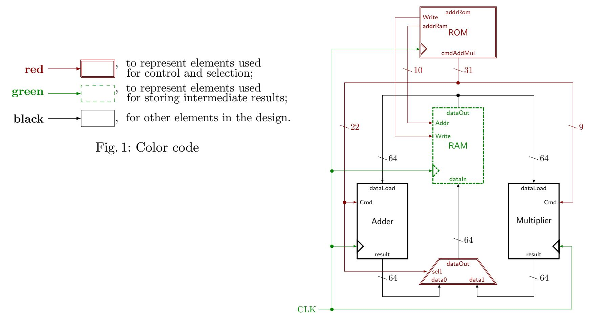
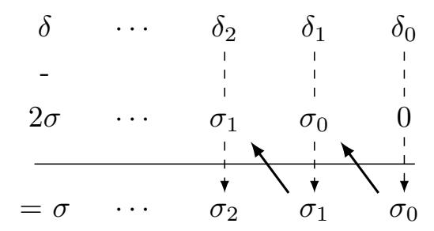
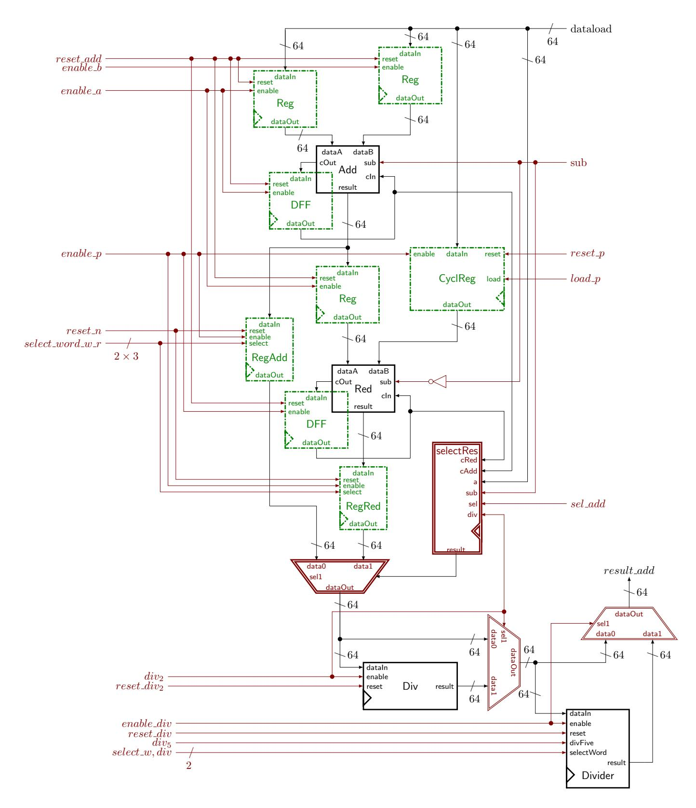

{0}------------------------------------------------

## Multiplication over Extension Fields for Pairing-based Cryptography

## an Hardware Point of View

Arthur Lavice<sup>1,2,3</sup>, Nadia El Mrabet<sup>1</sup>, Alexandre Berzati<sup>2</sup>, and Jean-Baptiste Rigaud<sup>1</sup>

<sup>1</sup> Mines Saint-Etienne, CEA-Tech, Centre CMP, Gardanne, France, firstname.lastname@emse.fr 

<sup>2</sup> Thales DIS Design Services SAS, Meyreuil, France,

firstname.lastname@thalesgroup.com  $^3$  ARMINES, Paris, France

**Abstract.** New Number Field Sieves (NFS) attacks on the discrete logarithm problem have led to increase the key size of pairing-based cryptography and more precisely pairings on most popular curves like BN. To ensure 128-bit security level, recent costs estimations recommand to switch for BLS24 curves. However, using BLS24 curves for pairing requires to have an efficient arithmetic in  $\mathbb{F}_{n^4}$ .

In this paper, we transposed previous work on multiplication over extension fields using Newton's interpolation to construct a new formula for multiplication in  $\mathbb{F}_{p^4}$  and propose  $time \times area$  efficient hardware implementation of this operation.

This co-processor is implemented on Kintex-7 Xilinx<sup>®</sup> FPGA. The efficiency of our design in terms of  $time \times area$  is almost 3 times better than previous specific architecture for multiplication in  $\mathbb{F}_{p^4}$ . Our architecture is used to estimate the efficiency of hardware implementations of full pairings on BLS12 and BLS24 curves with a 128-bit security level. This co-processeur can be easily modified to anticipate further curve changes.

 $\textbf{Keywords:} \ \ pairing-based \ \ cryptography \cdot \ multiplication \ \ over \ extension \ fields \cdot \ polynomial \ interpolation \cdot \ Newton's \ formula \cdot exact \ divisions \cdot hardware \ implementation \cdot FPGA$ 

## 1 Introduction

Pairings are mathematical objects known for a long time but recently considered for supporting cryptographic functions such as identity-based encryption [8], short signature [9] or zero-knowledge Succinct Non-interactive ARgument of Knowledge (zk-SNARK) [7]. These applications legitimate the search of efficient implementations of cryptographic pairings in both software [14] and hardware [21]. These researches make pairing-based cryptography a key element of real-life use cases as in Zcash<sup>™</sup> cryptocurrency.

Pairings are bilinear function  $e: \mathbb{G}_1 \times \mathbb{G}_2 \to \mathbb{G}_3$  which relied on elliptic curves and extension fields arithmetic. The efficiency of pairings computation highly depends on the choice of the pairings family. Therefore most attention was given on pairings on BN or BLS12 because it allows several algorithmic optimisations.

However, the Number Field Sieve (NFS) attack against discrete logarithms problems presented in [17] reduced the security of many pairings families. Barbulescu and al. [3,4] computed the new required key size and estimated pairing computation time on various curves and for different security levels. Their results were confirmed at 128-bit security level in [13].

{1}------------------------------------------------

authors in [4] have estimated that pairings using extension fields of degree multiple of 4 like BLS24 are theoretically more efficient than other pairings family at 128-bit and 192-bit security levels. In [4], the authors estimate the complexity of multiplication over extension fields with the number of modular multiplications required by the formulae given in [18] and [11]. These formulae are based on Newton's interpolation which minimizes the number of modular multiplications required to compute multiplication over extension fields. However Newton's interpolation requires many other operations to be properly implemented like modular addition or division.

Our contributions: The first contribution of the paper is to update cost estimations of multiplications over extension fields. Hence we have proposed an hardware design that minimizes the impact of underestimated extra operations. It implements the multiplier proposed in [15] and a custom "adder" used to accelerate the additional modular operations required for Newton's interpolation: addition, subtraction, double, division by 2 and the exact division by a small constant prime. This co-processor is built to compute modular multiplication in parallel with other operations and to support multiplications over different extension fields required for pairing-based cryptography.

We also provide a way to preserve the divisibility properties of numbers during Newton's interpolation while using modular arithmetic. The implementation of divisions during Newton's interpolation is based on the method proposed in [11] to compute them within the time of modular additions. We implement Karatsuba's [18] formulae to compare hardware implementation of both methods for extension fields of degree 4.

We propose a new formula to efficiently compute multiplication over these fields. The efficiency of our co-processor in terms of ratio  $time \times area$  outperforms previous works on hardware implementation of multiplication over these fields.

Organization of the paper: Section 2 provides some mathematical background for pairing-based cryptography. An efficient formula for multiplication over extension fields of degree 4 is presented in Section 3. Section 4 details our ALU for modular arithmetic and divisions with concurrent custom adder and multiplier. In Section 5, we present the performances of our ALU for multiplications over extension fields of various degrees. Then Section 6 compares our performance with previous work and gives estimations of pairings performances on BLS12 and BLS24 curves. Finally, we summarize our work and discuss future research directions in Section 7.

## <span id="page-1-0"></span>2 Background

#### 2.1 Notation

```
\mathbb{F}_p: A finite fields of characteristic p, for p a prime number and n = \log_2(p). \mathbb{F}_{p^k}: Extension field of degree k of \mathbb{F}_p. M_p (resp. I_p, A_p, Dbl_p, Div2_p): Multiplication (resp. Inversion, Addition, Double, Division by 2) in \mathbb{F}_p. D_i: Exact division by i=3 or 5. \mathbb{G} (resp. \mathbb{G}[r]) a group (resp. a subgroup of order r of \mathbb{G}). \omega (resp, e): Size of the word (resp, number of words) used to represent numbers in \mathbb{F}_p.
```

#### 2.2 Arithmetic for pairing-based cryptography

This section briefly recalls the basics of pairings. The reader is invited to refer to [19] for more information about pairings and their applications. Let E be an elliptic curve defined over a finite

{2}------------------------------------------------

field  $\mathbb{F}_p$  and r a prime factor of the cardinal of E (denoted #(E)) such that  $r^2$  does not divide #(E). Let k be the smallest integer such that r divide  $p^k - 1$ , k is called the embedding degree of E with respect to r. The definition of a pairing is given in Definition 1.

#### **Definition 1.** (Pairing)

Let  $\mathbb{G}_1$ ,  $\mathbb{G}_2$  be subgroups of order r of E. A pairing is a bilinear and non degenerate function e:

<span id="page-2-0"></span>
$$e: \mathbb{G}_1 \times \mathbb{G}_2 \to \mathbb{G}_3, \ (R, S) \to e(R, S).$$

Generally, we have  $\mathbb{G}_1$  in  $E(\mathbb{F}_p)[r]$ ,  $\mathbb{G}_2$  in  $E(\mathbb{F}_{p^k})[r]$  and  $\mathbb{G}_3$  in  $\mathbb{F}_{p^k}[r]$ .

Pairing-based cryptography relies on the security of the Discrete Logarithm Problem (DLP) over elliptic curves  $(E(\mathbb{F}_p))$  and  $E(\mathbb{F}_{p^k})$  and over finite fields  $(\mathbb{F}_{p^k})$ . The DLP can be computed for instance with Pollard's rho algorithm. Efficient computations of pairings depend on the construction of pairing friendly elliptic curves over  $\mathbb{F}_p$ . The most studied construction are KSS [16], BLS [5] and BN [6]. There exists other pairings friendly elliptic curves presented in the taxonomy of Freeman and al. [12]. An elliptic curve is defined by several parameters: its construction method (ex: BN), its embedding degree: k, and the order r of the groups  $\mathbb{G}_1$ ,  $\mathbb{G}_2$  and  $\mathbb{G}_3$ .

These parameters are use by the Extended Tower Number Field Sieve attack presented in [17] to reduced the security of many pairings families. Barbulescu and al. [3,4] computed the new required key size and estimated pairing computation time on various curves and for different security levels. Their results were confirmed at 128-bit security level in [13].

#### 2.3 Key size update and complexity evaluation

Before the key size update, much attention was given to Optimal Ate pairings [20] on BN or BLS12 curves. But the extended tower NFS attack presents in [17] is more efficient on these families than on families like BLS24. Since the efficiency of the attack is not the same for all curves, the security impact is also different. In [4], the authors estimate pairing computation complexity with the number of modular multiplications and inversions. They estimate the cost of multiplication in  $\mathbb{F}_p$  as  $M_p = e^2$  with e the number of words used to represent p. Before the NFS attack, it was more efficient to compute pairings on BN or BLS12 curves. However, the authors in [4] show that BLS24 curves could be as interesting as BLS12 curves for the 128-bit security level.

Arithmetic used to implement these operations depends on the pairing family as explained in [4]. Modular ( $\mathbb{F}_p$ ) and extension fields ( $\mathbb{F}_{p^k}$ ) arithmetic are the basis of pairings arithmetic. Hence searching for cost-efficient hardware coprocessor to compute these operations is a way to enhance the efficiency of pairings implementation.

#### 2.4 Multiplications over extension fields

The two main methods to compute multiplications over extension fields are Newton's interpolation from [11] and Karatsuba's formulae from [18].

An element A of an extension field of degree k of  $\mathbb{F}_p$  (denoted  $\mathbb{F}_{p^k}$ ) is a polynomial of degree n, with  $0 \le n \le k-1$  with coefficient in  $\mathbb{F}_p$ . Let P be an irreducible polynomial in  $\mathbb{F}_p$  (with no root in  $\mathbb{F}_p$ ). Let A and B be two elements of  $\mathbb{F}_{p^k}$ . The results C of the multiplication of A by B is defined as the Euclidean remainder of the polynomial  $A \times B$  by the polynomial P. In this paper, we consider the following extension fields:

$$\mathbb{F}_{p^2} = \mathbb{F}_p[i]$$
, with  $i^2 = -1$ 

{3}------------------------------------------------

 $\mathbb{F}_{p^4} = \mathbb{F}_{p^2}[v]$ , with  $v^2 = i + 1$ 

These polynomial are commonly used for pairing on BN curves as explained in [2]. Explicit formulae are given bellow.

#### Karatsuba formulae

Let  $A = a_0 + a_1 X$ ,  $B = b_0 + b_1 X$  and  $C = c_0 + c_1 X$ ,  $A, B \in \mathbb{F}_{p^2}$ . Then the Karatsuba formula to compute  $C = A \times B \mod X^2 + 1$  is:

<span id="page-3-0"></span>
$$C = (a_0 + a_1 X)(b_0 + b_1 X),$$
  
=  $a_0 b_0 + (a_0 + a_1)(b_0 + b_1)X + a_1 b_1 X^2.$  (1)

The cost of these computations is  $3M_p + 2A_p$ . We re-organize Equation 1 to have coefficients of the polynomial C. Products of each line are denoted  $u_i$  with  $0 \le i \le 2$ .

Equation 2 gives the new expression of C:

<span id="page-3-1"></span>
$$C = u_2 X^2 + (u_1 - u_2 - u_0) X + u_0. (2)$$

The cost of multiplication of degree n=1 polynomial is  $3M_p+4A_p$ . Then, the total cost of a multiplication over extension fields of degree 2 is  $3M_p + 5A_p$ .

To compute multiplication over extension fields of degree 4, we apply Karatsuba formula twice.

#### Newton's interpolation

The implementation cost of  $M_p$  is commonly considered more expensive than implementation's cost of  $A_p$  or  $Dbl_p$ . Hence the straightforward way to improve multiplications over extension fields is to reduce the number of modular multiplications. Newton's interpolation is an alternative way to do so. This part briefly recalls the method to obtain formulae for computing multiplications over extension fields using Newton's interpolation.

Let us consider an element of  $\mathbb{F}_{p^k}$  as a polynomial in unknown X. Then  $A(X) = a_0 + a_1 X + \dots + a_{k-1} X^{k-1}$  and  $B(X) = b_0 + b_1 X + \dots + b_{k-1} X^{k-1}$  are two polynomials of degree k-1.

Hence, the polynomial  $C(X) = A(X) \times B(X)$  is of degree 2k-2.

To compute the polynomial C, we compute the products of 2k-1 distinct images of A and B as explained in Note 1.

Note 1. Required steps of Newton's interpolation

- 1. Choose 2k-1 points:  $(\alpha_0, \alpha_1, \dots \alpha_{2k-2}), \in \mathbb{F}_p^{2k-1}$  such as  $\forall i \neq j, \alpha_i \neq \alpha_j$ .
- 2. Polynomial interpolation: Evaluate polynomials A and B in these points by computing  $A(\alpha_0),\ldots,A(\alpha_{2k-2}),B(\alpha_0),\ldots,B(\alpha_{2k-2}).$
- 3. Evaluation of C: Compute the image of polynomial C in these points  $(C(\alpha_i) = A(\alpha_i) \times B(\alpha_i))$
- <span id="page-3-2"></span>4. Newton's interpolation + Reconstruction of C with Horner Scheme:

Reconstruct the polynomial C using Newton's interpolation formulae.

Remark 1. Newton's interpolation formulae for multiplication over extension fields of degree 2 (resp. 3) are commonly called Karatsuba (resp. Toom-Cook) formulae [18].

The complexity of multiplications using Newton's interpolation depends on the choice of interpolation points  $(\alpha_i)$  because we have to compute multiplications and exact divisions by the  $(\alpha_i - \alpha_i)$ . By choosing the interpolation points as explained in [11], we can use Newton's interpolation to compute multiplication over different extension fields.

Newton's interpolation reduces the number of modular multiplications but requires extra modular divisions and more additions than Karatsuba formulae.

{4}------------------------------------------------

## <span id="page-4-0"></span>3 Our proposition for extensions-fields of degree 4

We follow the steps described in Note 1 to build an efficient formula for multiplication over extension fields of degree 4. Let  $A(X) = a_0 + a_1X + a_2X^2 + a_3X^3$ ,  $B(X) = b_0 + b_1X + b_2X^2 + b_3X^3$  and  $C(X) = A(X) \times B(X) = c_0 + c_1X + c_2X^2 + c_3X^3$  be three elements of  $\mathbb{F}_{p^4}$ . We choose the  $\alpha_i \{0, 1, -1, 2, -2, 4, +\infty\}$ , with  $A(+\infty) = a_3$ .

#### Polynomial interpolation

$$sp1 = a_0 + a_2,$$
  $sp2 = a_0 + 2^2 a_2,$   $A(0) = a_0,$   $Si1 = a_1 + a_3,$   $si2 = 2a_1 + 2^3 a_3,$   $A(+\infty) = a_3,$   $A(1) = sp1 + si1,$   $A(2) = sp2 + si2,$   $A(4) = a_0 + 4(a_1 + 4(a_2 + 4a_3)).$   $A(-1) = sp1 - si1,$   $A(-2) = sp2 - si2,$ 

It requires  $11A_p + 10Dbl_p$  to compute the interpolation of A.

## Evaluation of C:

$$C(\alpha) = A(\alpha) \times B(\alpha)$$
 with  $\alpha \in \{0, \pm 1, \pm 2, 4, +\infty\}$ . It requires  $7M_p$ .

## Newton's interpolation

$$c'_{0} = C(0),$$

$$c'_{1} = C(1) - c'_{0},$$

$$c'_{2} = (C(-1) - c'_{0}) + c'_{1} + c'_{1} + c'_{1} + c'_{2} + c'_{3} + c'_{2} + c'_{3} + c'_{2} + c'_{3} + c'_{2} + c'_{3} + c'_{2} + c'_{3} + c'_{2} + c'_{3} + c'_{2} + c'_{3} + c'_{2} + c'_{3} + c'_{2} + c'_{3} + c'_{2} + c'_{3} + c'_{3} + c'_{2} + c'_{3} + c'_{3} + c'_{3} + c'_{3} + c'_{3} + c'_{3} + c'_{3} + c'_{3} + c'_{3} + c'_{3} + c'_{3} + c'_{3} + c'_{3} + c'_{3} + c'_{3} + c'_{3} + c'_{3} + c'_{3} + c'_{3} + c'_{3} + c'_{3} + c'_{3} + c'_{3} + c'_{3} + c'_{3} + c'_{3} + c'_{3} + c'_{3} + c'_{3} + c'_{3} + c'_{3} + c'_{3} + c'_{3} + c'_{3} + c'_{3} + c'_{3} + c'_{3} + c'_{3} + c'_{3} + c'_{3} + c'_{3} + c'_{3} + c'_{3} + c'_{3} + c'_{3} + c'_{3} + c'_{3} + c'_{3} + c'_{3} + c'_{3} + c'_{3} + c'_{3} + c'_{3} + c'_{3} + c'_{3} + c'_{3} + c'_{3} + c'_{3} + c'_{3} + c'_{3} + c'_{3} + c'_{3} + c'_{3} + c'_{3} + c'_{3} + c'_{3} + c'_{3} + c'_{3} + c'_{3} + c'_{3} + c'_{3} + c'_{3} + c'_{3} + c'_{3} + c'_{3} + c'_{3} + c'_{3} + c'_{3} + c'_{3} + c'_{3} + c'_{3} + c'_{3} + c'_{3} + c'_{3} + c'_{3} + c'_{3} + c'_{3} + c'_{3} + c'_{3} + c'_{3} + c'_{3} + c'_{3} + c'_{3} + c'_{3} + c'_{3} + c'_{3} + c'_{3} + c'_{3} + c'_{3} + c'_{3} + c'_{3} + c'_{3} + c'_{3} + c'_{3} + c'_{3} + c'_{3} + c'_{3} + c'_{3} + c'_{3} + c'_{3} + c'_{3} + c'_{3} + c'_{3} + c'_{3} + c'_{3} + c'_{3} + c'_{3} + c'_{3} + c'_{3} + c'_{3} + c'_{3} + c'_{3} + c'_{3} + c'_{3} + c'_{3} + c'_{3} + c'_{3} + c'_{3} + c'_{3} + c'_{3} + c'_{3} + c'_{3} + c'_{3} + c'_{3} + c'_{3} + c'_{3} + c'_{3} + c'_{3} + c'_{3} + c'_{3} + c'_{3} + c'_{3} + c'_{3} + c'_{3} + c'_{3} + c'_{3} + c'_{3} + c'_{3} + c'_{3} + c'_{3} + c'_{3} + c'_{3} + c'_{3} + c'_{3} + c'_{3} + c'_{3} + c'_{3} + c'_{3} + c'_{3} + c'_{3} + c'_{3} + c'_{3} + c'_{3} + c'_{3} + c'_{3} + c'_{3} + c'_{3} + c'_{3} + c'_{3} + c'_{3} + c'_{3} + c'_{3} + c'_{3} + c'_{3} + c'_{3} + c'_{3} + c'_{3} + c'_{3} + c'_{3} + c'_{3} + c'_{3} + c'_{3} + c'_{3} + c'_{3} + c'_{3} + c'_{3} + c'_{3} + c'_{3} + c'_{3} + c'_{3} + c'_{3} + c'_{3} + c'_{3} + c'_{3} + c'$$

It requires  $15A_p + 9Div2_p + 4Div_3 + 1Div_5$ .

#### Reconstruction of C with Horner Scheme:

$$C(x) = c'_0 + X(c'_1 + (X - 1)(c'_2 + (X + 1)(c'_3 + (X - 2)(c'_4 + (X + 2)(c'_5 + (X - 4)c'_6))))$$
  
It requires  $15A_p + 5Dbl_p$ .

Finally, the cost of the polynomial reduction is  $6A_p + 3Dbl_p$ .

The overall cost is:  $7M_p + 58A_p + 28Dbl_p + 9Div2_p + 4Div_3 + 1Div_5$ . By considering only modular multiplications, formulae based on Newton's interpolation are more efficient than Karatsuba formulae. In practice, the extra costs brought by modular additions and divisions make these two methods almost equivalent for software implementation at the 128-bit security level as explained in [11]. Besides, Newton's interpolation requires divisions by small constant which cannot be computed by classical adder or subtracter.

Hence efficient hardware implementation of additional operations is important to build efficient pairing co-processor.

# <span id="page-4-1"></span>4 A dedicated Arithmetic Logic Unit (ALU) for extension field operations

We present a generic ALU designed to accelerate multiplication over extension fields by reducing the penalty brought by additional operations.

{5}------------------------------------------------

#### 4.1 Overall presentation

Our ALU (see Figure 2) is composed of two Main Processing Units (MPU). First, the multiplier to compute Montgomery's multiplications with reduction. Then, the custom "Adder" is the component used to compute modular additions, subtractions, divisions by 2 and exact-divisions by 3 or 5. The RAM stores intermediate results. The ROM drives the two MPUs and replaces a dedicated FSM. The multiplexer selects the result of the multiplier or the one of the "Adder" to save it into the RAM. The proposed solution is generic in terms of words size ( $\omega$ ) and in terms of moduli size  $n = \log_2(p)$ . We choose to implement a 64-bit architecture to limit the number of memory-calls. We give further explanations of this choice in Section 5. Within this article, we use the colour code in Figure 1 to represent the different parts of the design.

<span id="page-5-1"></span><span id="page-5-0"></span>

Fig. 2: Global architecture of our ALU for  $\log_2(p) < 512$ 

#### 4.2 Multiplication

The modular multiplier is based on the optimized architecture of [15] (architecture 2). It is a systolic architecture composed of e Processing Unit (one for each word of the modulo). It used a variant of radix-2 Montgomery multiplication to compute modular multiplication. We add a Memory Unit (MU) to store the modulo and the operands and an Output Manager (OM) to format the output of a multiplier for the RAM.

## 4.3 Exact division by a small constant

To efficiently use Newton's interpolation for multiplications over extension fields of degree k=4, we need to compute exact divisions by 2, 3, or 5. In this section, we explain the solution proposed in [11] and its consequences.

For instance, if we need to divide  $\delta$  in  $\mathbb{N}$  by 3 during Newton's interpolation,  $\delta$  will be divisible by 3. There is a number  $\sigma$  in  $\mathbb{N}$  such as  $\delta = 3\sigma \Leftrightarrow \delta - 2\sigma = \sigma$ . Since the first bit of  $2\sigma$  is 0, we can compute the division by 3 as shown on Figure 3.

{6}------------------------------------------------

<span id="page-6-0"></span>The same idea is used for the division by 5: δ − 4σ = σ.



Fig. 3: Exact division by 3

Our ALU implements the scheme depicted Figure [3](#page-6-0) to compute words divisions by 3 or 5. A dedicated component for each small constant has been implemented to enhance the maximum frequency of the design. These three components are instantiated in the component used to compute the division of a word in four clock cycles.

Divisions calculated during Newton's interpolation are supposed to be exact (the reminder is null) but using modular arithmetic, we lose the divisibility of numbers. A possible solution is to use classical arithmetic during Newton's interpolation and reduce modulo p after all exact division. In this case, the size of the operands will double during calculation due to successive multiplications and additions. We propose a solution to keep using modular arithmetic and save the divisibility property of numbers by working with a multiple of the prime p as demonstrated on Remark [2.](#page-6-1)

<span id="page-6-1"></span>Remark 2. (Divisibility of an integer and its residue.)

Let a, b ∈ N and p be a prime number. If a is divisible by b (note b|a), then a mod (p) is not necessarily divisible by p but the number a mod (b.p) is divisible by b.

As a consequence of Remark [2,](#page-6-1) we have to increase the size of the modulus for each successive division to use modular multiplication and exact division.

Then, the modulus used with Newton's interpolation is:

$$m = 3^4 \times 5 \times p$$
, for multiplication over  $\mathbb{F}_{p^4}$  (3)

A drawback is that increasing the size of the modulus will also increase the cost of multiplications using Newton's interpolation.

Division by 2 To compute Newton's interpolation, we need the modular division by 2. Since we work modulo p with p odd if A is odd then A + p is even and a division by two correspond to a shift. We choose to begin the division by 2 with the most significant word to reduce the component used for the division by 2 to a 1-bit register.

#### 4.4 Design of custom "Adder"

The modular adder-subtraction can compute additions (or subtractions) and reduction operations while limiting the number of memory accesses during modular additions.

{7}------------------------------------------------

<span id="page-7-0"></span>

Fig. 4: Modular adder-subtracter and divider for  $\log_2(p) < 512$ 

During Newton's interpolation, the majority of exact divisions follows a modular addition or a modular subtraction. We place our divider after components used for modular additions to save memory access by computing exact division during the saving step. In this way, our co-processor can compute a modular addition/subtraction followed by an exact division.

We use two modular adder-subtractions. One to compute the addition (or subtraction) and the other to compute the modular reduction. The two possible results are stored in two registers  $S_0$  and  $S_1$  and the component selectRes (on Figure 4) is used to select the right result. If the component selectRes return 0, the right result is the operation without modular reduction otherwise, it is the result with modular reduction.

We also use several registers to store the carry for the next step of the computation and to store partial results during exact division. By doing this, we reduce the number of memory access to the minimum: load operands and store the final result.

{8}------------------------------------------------

## <span id="page-8-0"></span>5 Hardware implementation of multiplications over extension fields

We implement and compare both Karatsuba and Newton's interpolation formulae for multiplications over extension fields of degree 4 with our ALU.

#### 5.1 Implementation of base fields operations

Multiplications over extension fields require different operations. To have a practical example, we use a single port RAM with a latency of one clock cycle for reading and writing.

<span id="page-8-1"></span>Our design is generic in terms of words size (ω) and maximum modulo size (log<sup>2</sup> (p)). We denote e = d n ω e. The number of clock cycles required by each basis operation is express in Table [1.](#page-8-1)

| Operation                                       | Number of clock cycles |
|-------------------------------------------------|------------------------|
| Montgomery multiplication                       | n + 3e + 1             |
| Load Modulo                                     | e + 1                  |
| Modular reduction                               | 2e + 4                 |
| Modular addition/subtraction                    | 3e + 3                 |
| Modular double                                  | 2e + 3                 |
| Modular division by 2                           | 2e + 3                 |
| Modular addition/subtraction and exact division | 6e + 5                 |

Table 1: Costs of base fields operations

## <span id="page-8-3"></span>5.2 Multiplications over extension fields

We design our ALU to parallelize multiplications and additions-like operations. Table [2](#page-8-2) gives the beginning of multiplication over Fp<sup>2</sup> scheduling as an example.

<span id="page-8-2"></span>

| Step | Unit       | t0                        | t1<br>t2                   |                       | t3                                 | t4    | t5         |
|------|------------|---------------------------|----------------------------|-----------------------|------------------------------------|-------|------------|
|      | Adder      |                           | Compute(A(1) = A0<br>+ A1) |                       | Compute(B(1)B0                     | + B1) |            |
| 0    | RAM        | Load(A0, B0) Load(A0, A1) |                            | Save(A(1))            | Load(B0, B1) Save(B(1)) Save(C(0)) |       |            |
|      | Multiplier |                           |                            | Compute(C(0) = A0     | × B0)                              |       |            |
|      | Adder      |                           | Compute(C(0)               | mod (p))              |                                    |       |            |
| 1    | RAM        | Load(A1, B1)              | Load(C(0))                 | Save(C(0)<br>mod (p)) |                                    |       | Save(C(∞)) |
|      | Multiplier |                           |                            | Compute(C(∞) = A1     | × B1)                              |       |            |

Table 2: Begining of multiplication over Fp<sup>2</sup> scheduling

For Karatsuba, we can also parallelize the Horner scheme and the polynomial reduction. It is because there is no division. For extension fields of degree 4, we have to compute all divisions before applying Horner's scheme. Only the computation of C(∞) could be parallelized with the computation of the Horner scheme. We decided not to parallelize Horner's scheme nor polynomial reduction. It could be a way of further improvement.

The ALU is designed to handle the different sizes of p depending on the chosen pairing family. Our coprocessor is implemented on Xilinx Kintex 7 FPGA with Vivado design suite 18.1.

Table [3](#page-9-1) gives the post place and route area and timings of our design for multiplication over extension fields of degree 2 and 4 at 128-bit and 192-bit security levels.

{9}------------------------------------------------

The critical path of our design is slightly impected by the size of the modulo so we manage to running the different version of our ALU at 100MHz. We use Vivado's IP to implement the RAM and the ROM. We use the FPGA only as a prototype for our ALU because our goal is to keep our design light without mapping Digital Signal Processing (DSP) units to make it more suitable for general-purpose integrated circuits.

<span id="page-9-1"></span>Table 3 gives the post place and route timing of multiplications over extension fields of degree 2 and 4 for 128-bit and 192-bit security level. Timings are given in  $\mu s(\mathbf{t}(\mu s))$  and area are given in term of slices number( $\mathbf{A(slices)}$ ). Finally, performances are given with  $\mathbf{t}(\mu s) \times \mathbf{A(slices)}$  ratio.

| Socurity | Fields             | $\boxed{log_2(p)}$ | $t(\mu s)$ |       | A(slices)    |     | $t(\mu s) \times A(slices)$ |                     |  |
|----------|--------------------|--------------------|------------|-------|--------------|-----|-----------------------------|---------------------|--|
| Security |                    |                    | K          | N     | $\mathbf{K}$ | N   | K                           | N                   |  |
| 128-bit  | $\mathbb{F}_{p^2}$ | 460                | 15.19      |       | 1126         |     | $17.10 \times 10^3$         |                     |  |
|          | $\mathbb{F}_{p^4}$ | 318                | 32.84      | 29.06 | 825          | 883 | $27.09 \times 10^3$         | $25.66 \times 10^3$ |  |
| 192-bit  | $\mathbb{F}_{p^2}$ | 1048               | 40         | .47   | 2            | 415 | 97.74                       | $4\times10^3$       |  |
|          | $\mathbb{F}_{p^4}$ | 477                | 49.28      | 41.95 | 1            | 126 | $55.49 \times 10^{3}$       | $47.24 \times 10^3$ |  |

Table 3: Implementation results

For multiplications over extension fields of degree 4, we manage to parallelize the majority of additions-like operations with modular multiplication that makes Newton's interpolation more interesting than Karatsuba formulae at both 128-bit and 192-bit security levels.

Table 3 also shows that Newton's interpolation is more interesting at 192-bit security level than in 128-bit security level.

At 128-bit security level, we need five 64-bit words to represent a number modulo p and six 64-bit for a number modulo  $m = 3^4 \times 5 \times p$ . Therefore, we need to increase the size of the ALU to use Newton's interpolation at 128-bit security level and it slows down every operation.

At 192-bit security level, number modulo p and m required height 64-bit word. It explains why Newton's interpolation is more interesting at 192-bit than in 128-bit security level.

## <span id="page-9-0"></span>6 Comparison with previous work

Multiplication over  $\mathbb{F}_{p^4}$  is currently used for pairing over popular BN and BLS12 curves. We give the comparison for a modulus of size  $\log_2(p) = 256$  which corresponds to the previously required size for 128-bit security-level to give a fair comparison of our design with previous architecture.

<span id="page-9-2"></span>For the sake of fair comparison, we synthesized our ALU on a Virtex 7 to compare it with the ones proposed in [21]. Results of our comparison are shown in Table 4.

| Platform | Design | $ \mathbf{t}(\mu\mathbf{s}) $ | $\mathbf{F}(\mathbf{Mhz})$ | FF    | LUT    | DSP | Slices | $ \mathbf{t}(\mathbf{ms}) \times \mathbf{A}(\mathbf{slices}) $ |
|----------|--------|-------------------------------|----------------------------|-------|--------|-----|--------|----------------------------------------------------------------|
| Virtex 7 | Our    | 19.02                         | 125                        | 2564  | 2159   | 0   | 755    | 14.36                                                          |
|          | [21]   | 1.47                          | 115                        | 55600 | 113700 | 128 | 28400  | 41.74                                                          |

Table 4: Comparison of our implementation with previous work for multiplication over  $\mathbb{F}_{p^4}$ 

In [21], authors design a specific architecture to parallelize operations in  $\mathbb{F}_p$  and  $\mathbb{F}_p^2$  to compute pairings over BN curves. They integrated their design with a CPU in the FPGA. This leads to a time-efficient implementation of multiplication in  $\mathbb{F}_p^4$ . But in terms of  $\mathbf{t}(\mathbf{ms}) \times \mathbf{A}(\mathbf{slices})$ ratio, our ALU is 2.9 times more efficient for computing multiplication in  $\mathbb{F}_p^4$ . This show that our generic ALU is as good as specific ALU.

{10}------------------------------------------------

Remark 3. We consider the total area as the number of Slices used by each design. In [\[21\]](#page-12-1), authors optimized their design for FPGA implementation and Maps DSPs units to achieve a high-speed design. Our comparison (t(ms) × A(slices)) doesn't take into account the number of DSP units but its impact on the total area is not negligible. For example, 64 × 64 bit multiplication can be implemented on a Virtex7 FPGA with 16 DSP48E1 as in [\[21\]](#page-12-1) or with 4256 LUTs.

To our knowledge, Wang and al. were the only ones to detail the timings of their F 4 p implementation. That is why we only compare our implementation with theirs.

#### 6.1 Estimation of Pairings time at 128-bit security levels

This paper focus on the computation of multiplication over extension fields. In order to estimate performances of BLS12 and BLS24 implementations with our ALU, we use formulae described in [\[4\]](#page-11-4) to implement both pairings in Python. This allows us to take into account all additional operations. Table [5](#page-10-0) presents the estimated calculation times of BLS12 and BLS24 pairings at new 128-bit security level.

<span id="page-10-0"></span>

| Design     | Security               |       |          |      |        | curves Platform A(slice) t(ms) t(s) × A(slices) |
|------------|------------------------|-------|----------|------|--------|-------------------------------------------------|
| this work1 | old 128-bit BLS12      |       | Kintex-7 | 885  | 73.79  | 65.30                                           |
|            | this work1 new 128-bit | BLS12 | Kintex-7 | 1126 | 101.02 | 113.75                                          |
|            | this work2 new 128-bit | BLS24 | Kintex-7 | 885  | 139.62 | 112.40                                          |
|            | this work1 new 128-bit | BLS24 | Kintex-7 | 825  | 136.24 | 110.07                                          |

Table 5: Estimations

Table [5](#page-10-0) also gives the estimated calculation time of BLS12 at the old 128-bit security level and compares it to previous work to ensure that our estimations are realistic. Since we only give estimated computation times, we don't claim to have better pairing accelerator than [\[1\]](#page-11-9) or [\[21\]](#page-12-1).

In terms of t(ms) × A(slices) BLS24 curves are more efficient than BLS12 curves at 128-bit security level with our ALU.

It confirms the conclusion given in [\[4\]](#page-11-4) that "BLS24 is the new challenger of BLS12 at the 128 bit security level". In practice, it will depends on the implementation. With our ALU, additional operations represent 20% of estimated computation times on BLS12 curves and 23.7% on BLS24 curves.

Table [5](#page-10-0) also show that even if Newton's interpolation leads to more efficient implementations of multiplication in Fp<sup>4</sup> , it also leads to less effective implementation of pairings at 128-bit security level.

As explained in Section [5.2](#page-8-3) At 128-bit security level, we need five 64-bit words to represent a number modulo p and six 64-bit words for a number modulo m = 3<sup>4</sup> × 5 × p. It implies that our implementation of Newton's interpolation will enhance the performance of the overall pairing computation only if the number of 64-bit words required to represent a number modulo m is the same as the one required to represent a number modulo p.

<sup>1</sup> Estimation without Newton interpolation. <sup>2</sup> Estimation with Newton interpolation.

{11}------------------------------------------------

## <span id="page-11-5"></span>7 Conclusion and future work.

Multiplications over Fp<sup>4</sup> should be a major operation for pairings implementations since authors have estimated in [\[4\]](#page-11-4) that BLS24 pairing is supposed to be the most efficient pairing at 128-bit and 192-bit security levels. This paper proposes an efficient formula to compute multiplications over these fields and our ALU outperforms previous work for this operation. This paper focuses on missstudy additional operations such as exact divisions required to efficiently implement multiplications over extension fields. We design an ALU to parallelize additional operations with modular multiplications and propose a way to keep the divisibility property during Newton's interpolation while using modular arithmetic. This allows us to control the exceeding generated by successive operations during Newton's interpolation. Our ALU is used to implement multiplications over extension fields of degree 2 and 4. With our ALU, Newton's interpolation is more efficient than Montgomery's formulae for multiplication over extension fields of degree 4. Our implementation results are used to refine estimation pairings computation time at 128-bit security level. We show the efficiency of BLS12 and BLS24 pairings are similar. Furthermore, additional operation represent at least 20% of pairings computation times on our architecture. These operations cannot be neglected.

Future works: This paper proposes the first hardware implementations of exact division for Newton's interpolation using the method proposed in [\[10\]](#page-12-11). This operation is miss-studied and it could be a source of information leakage. Future works will study the security of our ALU against side channel attacks. We will use our ALU to implement pairings on curves presented by [\[4\]](#page-11-4) since there is no implementation of most of the new curves yet. Finally, our ALU will be easily adaptable to use Newton's interpolation for multiplication over extension fields of degree 3 and 5 which should brings to efficient implementation of promising BLS15 and BLS27 curves.

## References

- <span id="page-11-9"></span>1. Ahmad, S.: Public key cryptography using hardware/software co-design for the internet of things. Ph.D. thesis, George Mason University (2017)
- <span id="page-11-8"></span>2. Aranha, D.F., Karabina, K., Longa, P., Gebotys, C.H., Hernandez, J.L.: Faster explicit formulas for computing pairings over ordinary curves. In: EUROCRYPT. Lecture Notes in Computer Science, vol. 6632, pp. 48–68. Springer (2011)
- <span id="page-11-3"></span>3. Barbulescu, R., Duquesne, S.: Updating key size estimations for pairings. Journal of Cryptology (2018), <https://hal.archives-ouvertes.fr/hal-01534101>
- <span id="page-11-4"></span>4. Barbulescu, R., El Mrabet, N., Ghammam, L.: A taxonomy of pairings, their security, their complexity. IACR Cryptol. ePrint Arch. 2019, 485 (2019)
- <span id="page-11-6"></span>5. Barreto, P.S.L.M., Lynn, B., Scott, M.: Constructing elliptic curves with prescribed embedding degrees. In: SCN. Lecture Notes in Computer Science, vol. 2576, pp. 257–267. Springer (2002)
- <span id="page-11-7"></span>6. Barreto, P.S.L.M., Naehrig, M.: Pairing-friendly elliptic curves of prime order. In: Selected Areas in Cryptography. Lecture Notes in Computer Science, vol. 3897, pp. 319–331. Springer (2005)
- <span id="page-11-2"></span>7. Ben-Sasson, E., Chiesa, A., Tromer, E., Virza, M.: Succinct non-interactive zero knowledge for a von neumann architecture. In: Proceedings of the 23rd USENIX Conference on Security Symposium. p. 781–796. SEC'14, USENIX Association, USA (2014)
- <span id="page-11-0"></span>8. Boneh, D., Franklin, M.: Identity-based encryption from the weil pairing. In: Kilian, J. (ed.) Advances in Cryptology — CRYPTO 2001. pp. 213–229. Springer Berlin Heidelberg, Berlin, Heidelberg (2001)
- <span id="page-11-1"></span>9. Boneh, D., Lynn, B., Shacham, H.: Short signatures from the weil pairing. In: Boyd, C. (ed.) Advances in Cryptology — ASIACRYPT 2001. pp. 514–532. Springer Berlin Heidelberg, Berlin, Heidelberg (2001)

{12}------------------------------------------------

- <span id="page-12-11"></span>10. El Mrabet, N., Guillermin, N., Ionica, S.: A study of pairing computation for elliptic curves with embedding degree 15. IACR Cryptol. ePrint Arch. 2009, 370 (2009)
- <span id="page-12-5"></span>11. El Mrabet, N., Guillevic, A., Ionica, S.: Efficient multiplication in finite field extensions of degree 5. In: Nitaj, A., Pointcheval, D. (eds.) Progress in Cryptology – AFRICACRYPT 2011. pp. 188–205. Springer Berlin Heidelberg, Berlin, Heidelberg (2011)
- <span id="page-12-9"></span>12. Freeman, D., Scott, M., Teske, E.: A taxonomy of pairing-friendly elliptic curves. Journal of Cryptology 23(2), 224–280 (Apr 2010). [https://doi.org/10.1007/s00145-009-9048-z,](https://doi.org/10.1007/s00145-009-9048-z) [https://doi.org/10.](https://doi.org/10.1007/s00145-009-9048-z) [1007/s00145-009-9048-z](https://doi.org/10.1007/s00145-009-9048-z)
- <span id="page-12-3"></span>13. Guillevic, A.: A short-list of pairing-friendly curves resistant to special TNFS at the 128-bit security level. In: Public Key Cryptography (2). Lecture Notes in Computer Science, vol. 12111, pp. 535–564. Springer (2020)
- <span id="page-12-0"></span>14. Hankerson, D., Menezes, A., Scott, M.: Software implementation of pairings. In: Identity-Based Cryptography, Cryptology and Information Security Series, vol. 2, pp. 188–206. IOS Press (2009)
- <span id="page-12-6"></span>15. Huang, M., Gaj, K., El-Ghazawi, T.: New hardware architectures for montgomery modular multiplication algorithm. IEEE Transactions on Computers 60(7), 923–936 (July 2011). <https://doi.org/10.1109/TC.2010.247>
- <span id="page-12-8"></span>16. Kachisa, E.J., Schaefer, E.F., Scott, M.: Constructing brezing-weng pairing-friendly elliptic curves using elements in the cyclotomic field. In: Pairing. Lecture Notes in Computer Science, vol. 5209, pp. 126–135. Springer (2008)
- <span id="page-12-2"></span>17. Kim, T., Barbulescu, R.: Extended tower number field sieve: A new complexity for the medium prime case. In: Robshaw, M., Katz, J. (eds.) Advances in Cryptology – CRYPTO 2016. pp. 543–571. Springer Berlin Heidelberg, Berlin, Heidelberg (2016)
- <span id="page-12-4"></span>18. Knuth, D.E.: The Art of Computer Programming, Volume 1 (3rd Ed.): Fundamental Algorithms. Addison Wesley Longman Publishing Co., Inc., USA (1997)
- <span id="page-12-7"></span>19. Menezes, A.: An introduction to pairing-based cryptography. In: Recent trends in cryptography. vol. 477, pp. 47–65 (2009)
- <span id="page-12-10"></span>20. Vercauteren, F.: Optimal pairings. IEEE Transactions on Information Theory 56(1), 455–461 (Jan 2010).<https://doi.org/10.1109/TIT.2009.2034881>
- <span id="page-12-1"></span>21. Wang, A.T., Guo, B.W., Wei, C.J.: Highly-parallel hardware implementation of optimal ate pairing over barreto-naehrig curves. Integration 64, 13 – 21 (2019). [https://doi.org/https://doi.org/10.1016/j.vlsi.2018.04.013,](https://doi.org/https://doi.org/10.1016/j.vlsi.2018.04.013) [http://www.sciencedirect.com/science/](http://www.sciencedirect.com/science/article/pii/S0167926018300336) [article/pii/S0167926018300336](http://www.sciencedirect.com/science/article/pii/S0167926018300336)