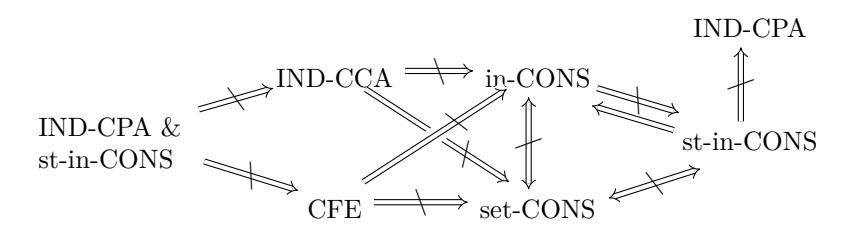
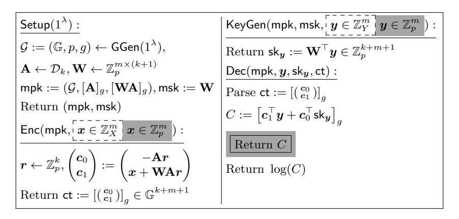

# **Consistency for Functional Encryption**

Christian Badertscher<sup>1</sup> [,](https://orcid.org/0000-0002-1353-1922) Aggelos Kiayias<sup>1</sup>*,*<sup>2</sup> , Markulf Kohlweiss<sup>1</sup>*,*<sup>2</sup> , and Hendrik Waldner<sup>2</sup>

#### 1 IOHK

[{christian.badertscher,aggelos.kiayias}@iohk.io](mailto:christian.badertscher@iohk.io,aggelos.kiayias@iohk.io) <sup>2</sup> University of Edinburgh, Edinburgh, UK [{markulf.kohlweiss,hendrik.waldner}@ed.ac.uk](mailto:christian.badertscher@ed.ac.uk,markulf.kohlweiss@ed.ac.uk,hendrik.waldner@ed.ac.uk)

**Abstract.** In functional encryption (FE) a sender, Alice, encrypts plaintexts that a receiver, Bob, can obtain functional evaluations of, while Charlie is responsible for initializing the encryption keys and issuing the decryption keys. Standard notions of security for FE deal with a malicious Bob and how the confidentiality of Alice's messages can be maintained taking into account the leakage that occurs due to the functional keys that are revealed to the adversary via various forms of indistinguishability experiments that correspond to IND-CPA, IND-CCA and simulation-based security.

In this work we provide a complete and systematic investigation of *Consistency*, a natural security property for FE, that deals with attacks that can be mounted by Alice, Charlie or a collusion of the two against Bob. We develop three main types of consistency notions according to which set of parties is corrupted and investigate their relation to the standard security properties of FE. To validate our different consistency types, we investigate FE in the universally composition setting and we show that our consistency notions naturally complement FE security by proving how they imply (and are implied by) UC security depending on which set of parties is corrupted; in this way we demonstrate a complete characterization of consistency for FE. Finally, we provide explicit constructions that achieve consistency efficiently either directly via a construction based on MDDH for specific function classes of inner products over a modulo group or generically for all the consistency types via compilers using standard cryptographic tools.

| 1<br>Introduction<br>1.1<br>Contributions of this Work<br>1.2<br>Comparison with Related Work<br>2<br>Preliminaries<br>4<br>2.1<br>Functional Encryption<br>2.2<br>Security Definitions<br>2.3<br>Standard Tools and Assumptions<br>2.4<br>Inner-product Functionality Classes<br>2.5<br>Non-interactive Proofs<br>2.6<br>Verifiable Functional Encryption<br>2.7<br>Universal Composability<br>3<br>Consistency for Functional Encryption Schemes<br>3.1<br>Consistency with a dishonest Input Provider<br>3.2<br>Consistency with a dishonest Input Provider and Key Generator<br>3.3<br>Consistency with a dishonest Parameter/Key Generator<br>4<br>Relations (in)between Consistency and Confidentiality<br>4.1<br>Relations among the Consistency Notions<br>4.2<br>Consistency does not imply Confidentiality<br>4.3<br>Confidentiality does not imply Consistency<br>4.4<br>Consistency does not amplify Confidentiality<br>5<br>Consistency Analysis of Selected Functional Encryption Schemes<br>23 |     |                                    |    |
|---------------------------------------------------------------------------------------------------------------------------------------------------------------------------------------------------------------------------------------------------------------------------------------------------------------------------------------------------------------------------------------------------------------------------------------------------------------------------------------------------------------------------------------------------------------------------------------------------------------------------------------------------------------------------------------------------------------------------------------------------------------------------------------------------------------------------------------------------------------------------------------------------------------------------------------------------------------------------------------------------------------|-----|------------------------------------|----|
|                                                                                                                                                                                                                                                                                                                                                                                                                                                                                                                                                                                                                                                                                                                                                                                                                                                                                                                                                                                                               |     |                                    | 1  |
|                                                                                                                                                                                                                                                                                                                                                                                                                                                                                                                                                                                                                                                                                                                                                                                                                                                                                                                                                                                                               |     |                                    | 2  |
|                                                                                                                                                                                                                                                                                                                                                                                                                                                                                                                                                                                                                                                                                                                                                                                                                                                                                                                                                                                                               |     |                                    | 3  |
|                                                                                                                                                                                                                                                                                                                                                                                                                                                                                                                                                                                                                                                                                                                                                                                                                                                                                                                                                                                                               |     |                                    |    |
|                                                                                                                                                                                                                                                                                                                                                                                                                                                                                                                                                                                                                                                                                                                                                                                                                                                                                                                                                                                                               |     |                                    | 5  |
|                                                                                                                                                                                                                                                                                                                                                                                                                                                                                                                                                                                                                                                                                                                                                                                                                                                                                                                                                                                                               |     |                                    | 6  |
|                                                                                                                                                                                                                                                                                                                                                                                                                                                                                                                                                                                                                                                                                                                                                                                                                                                                                                                                                                                                               |     |                                    | 7  |
|                                                                                                                                                                                                                                                                                                                                                                                                                                                                                                                                                                                                                                                                                                                                                                                                                                                                                                                                                                                                               |     |                                    | 8  |
|                                                                                                                                                                                                                                                                                                                                                                                                                                                                                                                                                                                                                                                                                                                                                                                                                                                                                                                                                                                                               |     |                                    | 8  |
|                                                                                                                                                                                                                                                                                                                                                                                                                                                                                                                                                                                                                                                                                                                                                                                                                                                                                                                                                                                                               |     |                                    | 10 |
|                                                                                                                                                                                                                                                                                                                                                                                                                                                                                                                                                                                                                                                                                                                                                                                                                                                                                                                                                                                                               |     |                                    | 10 |
|                                                                                                                                                                                                                                                                                                                                                                                                                                                                                                                                                                                                                                                                                                                                                                                                                                                                                                                                                                                                               |     |                                    | 11 |
|                                                                                                                                                                                                                                                                                                                                                                                                                                                                                                                                                                                                                                                                                                                                                                                                                                                                                                                                                                                                               |     |                                    | 11 |
|                                                                                                                                                                                                                                                                                                                                                                                                                                                                                                                                                                                                                                                                                                                                                                                                                                                                                                                                                                                                               |     |                                    | 14 |
|                                                                                                                                                                                                                                                                                                                                                                                                                                                                                                                                                                                                                                                                                                                                                                                                                                                                                                                                                                                                               |     |                                    | 15 |
|                                                                                                                                                                                                                                                                                                                                                                                                                                                                                                                                                                                                                                                                                                                                                                                                                                                                                                                                                                                                               |     |                                    | 17 |
|                                                                                                                                                                                                                                                                                                                                                                                                                                                                                                                                                                                                                                                                                                                                                                                                                                                                                                                                                                                                               |     |                                    | 17 |
|                                                                                                                                                                                                                                                                                                                                                                                                                                                                                                                                                                                                                                                                                                                                                                                                                                                                                                                                                                                                               |     |                                    | 18 |
|                                                                                                                                                                                                                                                                                                                                                                                                                                                                                                                                                                                                                                                                                                                                                                                                                                                                                                                                                                                                               |     |                                    | 19 |
|                                                                                                                                                                                                                                                                                                                                                                                                                                                                                                                                                                                                                                                                                                                                                                                                                                                                                                                                                                                                               |     |                                    | 22 |
|                                                                                                                                                                                                                                                                                                                                                                                                                                                                                                                                                                                                                                                                                                                                                                                                                                                                                                                                                                                                               |     |                                    |    |
|                                                                                                                                                                                                                                                                                                                                                                                                                                                                                                                                                                                                                                                                                                                                                                                                                                                                                                                                                                                                               | 5.1 | Inconsistency of the Plain Schemes | 23 |

|   | 5.2<br>Consistency for Inner-product Schemes             | 24 |
|---|----------------------------------------------------------|----|
|   | 5.3<br>Consistency of a related Predicate Scheme         | 26 |
| 6 | Consistency Compilers                                    | 28 |
|   | 6.1<br>Input Consistency                                 | 28 |
|   | 6.2<br>Setup Consistency Compilers                       | 37 |
|   | 6.3<br>Strong Input Consistency                          | 46 |
| 7 | UC Consistency for Functional Encryption                 | 48 |
|   | Acknowledgments                                          | 53 |
| A | Overview of the UC Framework                             | 57 |
| B | Consistency for Different Types of Functional Encryption | 58 |
| C | Details Of the UC Analysis                               | 58 |
|   | C.1<br>Assumed Functionalities                           | 58 |
|   | C.2<br>Proof of the UC Realization (Theorem 7.2)         | 59 |

### <span id="page-2-1"></span><span id="page-2-0"></span>1 Introduction

Functional encryption (FE) [23,56] has emerged as an important and general purpose cryptographic primitive, extending and generalizing earlier more specialized encryption concepts that include Identity-Based Encryption [22], Attribute-Based Encryption [45,62] and Predicate Encryption [50]. Similar to these earlier primitives, in FE, there exists a setup algorithm that produces a master public-key mpk and a master secret-key msk, and a key-generation algorithm that receives as input msk and a function f and produces a function-specific secret-key sk<sub>f</sub>. Subsequently, using sk<sub>f</sub> along with the decryption algorithm, the computation of the value f(x) is facilitated given any ciphertext that encrypts x. The potential applications of FE are numerous and include any setting where there exist designated entities that are entitled to functional views of encrypted information that is described in the form of a function f for which an associated functional key sk<sub>f</sub> is produced by the key-generation procedure.

In order to define correctness and security of FE it is helpful to identify three distinct entities associated with the algorithms that comprise any FE scheme. Alice is the sender, wishing to transmit data x, Bob is a recipient wishing to receive f(x) for some function  $f(\cdot)$  and Charlie is an authority that issues the (master) keys. Typically we think there are multiple Alice and Bob parties for any given setup instance created by Charlie. As one of these Bob parties can be corrupted, this also captures security against an eavesdropper that only observes the network. Correctness mandates the natural requirement that Bob receives the value f(x) for properly encrypted ciphertexts prepared by Alice that contain x. Security on the other hand is typically captured as a game with an adversary who attempts to distinguish between two possible plaintexts  $x_0, x_1$  for which it holds that  $f_i(x_0) = f_i(x_1)$  for all functions  $f_i$  whose key is possessed by the adversary. A stronger notion of security puts forth a simulation-based formulation and asks that ciphertexts can be simulated in an indistinguishable way. Cf. [6,7,15,17,23,33,44,48,53,56]. The adversary controls multiple different Bob sessions and typically interferes with the honest Alice only in the sense of chosen plaintext attacks, however chosen ciphertext attacks have also been considered [19] (in which case the adversary may e.g., manipulate Alice's ciphertext and submit it to Bob's decryption oracle). Specifically, in this work we build on the composable formalization of Matt and Maurer [53].

Consistency problems in real-world applications of FE. A crucial problem for any cryptographic primitive is to identify the exact set of correctness and security properties that are necessary and sufficient for deploying the primitive within an intended real world system. To see that there is a fundamental property of FE that is missing, it is helpful to recall the most well known applications of FE and showcase the problems that emerge when *consistent* behavior of an FE scheme is not guaranteed.

Processing Encrypted Data. In [23] the following motivating example for FE is presented: Alice encrypts a photograph x and uploads to her cloud service provider while Bob, a law enforcement agent, wishes to check whether any photographs in the cloud match a specific face. Using FE, Bob can achieve his objective, taking advantage of a functional key which detects the encrypted photographs which match the face being searched without revealing any information about anything else. Given the above setting, it is in everyone's understanding that if a photograph contains someone that matches the specific face being searched, the law enforcement agent will be able to detect it. Nevertheless, neither standard notions of security nor correctness of FE can rule out the possibility that a malicious Alice creates a ciphertext that will be misclassified by Bob, specifically, a ciphertext that decrypts to a photograph of the person being searched, and for which the employed face recognition algorithm f works, but is not detected as such by Bob when employing  $\operatorname{sk}_f$ . The same "misclassification" inconsistency issue applies to any setting where FE is used to classify ciphertexts in-transit or in-situ (e.g., for virus-detection, routing etc.).

Attribute Based Encryption. In an attribute-based encryption (ABE) scheme [45], which is a special case of FE, Alice encrypts a message together with a set of attributes  $\gamma$ . Subsequently, Bob, who possesses a key corresponding to an access structure  $\mathbb{A}$  will be able to decrypt the message as long as  $\gamma \in \mathbb{A}$ . Consider now also another party, say Bob junior, possessing a key for the access structure  $\mathbb{A}' \subseteq \mathbb{A}'$ . Given the above setting, it is in everyone's understanding that whatever messages Bob junior is able to see, Bob should see as well.

<span id="page-3-1"></span>Nevertheless, neither standard notions of security nor correctness of FE can rule out the possibility that a malicious Alice crafts a ciphertext that Bob junior will be able to decrypt but Bob would not.

**Consistency as a fundamental property for FE.** What do the above problems tell us? Similar to advanced properties of ordinary PKE (such as e.g., robustness [\[1\]](#page-54-4)), advanced properties for FE are needed when using the primitive in a real world setting because such properties are implied by the way the primitive is understood in the real-world. Moreover, the level at which they should be defined is at the level of the basic definition and syntax of FE. We call the enhanced property the above issues point to *consistency*; it addresses, at minimum, the adversarial setting where a malicious Alice produces a specially crafted ciphertext that causes an honest Bob to misclassify it, or, perhaps even a malicious Charlie who tampers with the setup to cause further types of misclassification. Interestingly and somewhat surprisingly, such a consistency property has not been considered in the strict context of FE so far and enhanced FE schemes, departing from the standard syntax such as [\[12\]](#page-54-5), do only consider certain consistency aspects (see below). We show that, as with the confidentiality of FE, the consistency of FE has several flavors, some of which are very efficient to ensure, while others require more sophisticated techniques.

### <span id="page-3-0"></span>**1.1 Contributions of this Work**

We roll out consistency as a fundamental property for a generic FE scheme from first principles. We provide a number of constructions for various consistency and security notions either directly for specific function classes or generically via compilers that upgrade existing FE constructions to be consistent. To formally cross-check our new notion, we show that the defined properties are necessary and sufficient in realizing the UC characterization of an "ideally" secure and consistent FE-scheme abstraction derived from [\[53\]](#page-56-5). The modelling of all security properties as an ideal functionality assures that no important details were omitted and that our game-based definitions interoperate correctly. In more details we make the following contributions.

**Formal definition of consistency.** We identify three main types of consistency, each type naturally corresponding to a particular set of corrupted parties. The formalization is given in Section [3.](#page-12-0)

- **–** *Input consistency* considers a malicious Alice who computes a ciphertext ct as well as some candidate functions *f<sup>i</sup>* . The ciphertext ct is decrypted under sk*f<sup>i</sup>* to obtain the values *y<sup>i</sup>* and the adversary wins if there is no single *x* that can explain ct in the sense that *fi*(*x*) = *y<sup>i</sup>* . We also incorporate in the definition of input consistency a concept of extractability that facilitates the relation of the primitive to the universal composable security of FE (see below).
- **–** *Strong input consistency* couples the above goal with additional adversarial power, by considering the setting where both Alice and Charlie are corrupted, and therefore, subverted parameters can assist the adversary in breaking the scheme.
- **–** *Setup consistency* is the consistency notion that deals with a malicious Charlie. In this setting the adversary issues two plaintexts *x*1*, x*<sup>2</sup> as well as a secret-key and a function *f*. The plaintexts are honestly encrypted and subsequently their decryptions *y*1*, y*<sup>2</sup> are evaluated. The adversary wins the game if exactly one of the decryptions fails or *y<sup>i</sup>* =6 *f*(*xi*) for some *i*. While at first sight it seems that setup consistency is implied by e.g. strong input consistency, we point out that this is not the case.

We highlight that consistency in the above sense complements security, as in the latter Alice and Charlie are honest and Bob is malicious. To show that our definitions do formally capture what they are intended for, we put forth in Section [7](#page-49-0) a complete treatment of consistent FE in the universal composition (UC) setting [\[26\]](#page-55-5). Specifically, we prove that input consistency/setup consistency/strong input consistency is sufficient and necessary for UC security in the case Alice/Charlie/Alice+Charlie are corrupted respectively. This pairs and complements the result of [\[53\]](#page-56-5) which implies that CFE security is sufficient (and necessary) for UC security in the case Bob is corrupted. This completes the positioning of consistency as an important novel property of FE.

<span id="page-4-1"></span>Systematic study of consistency vis-à-vis existing security properties. We carefully analyze the relations in-between the consistency notions and between consistency and security. We confirm our intuition that all notions define separate levels of consistency, the only exception being that strong input consistency implies input consistency. With respect to security, namely IND-CPA, IND-CCA and CFE, which is composable security notion for FE, we show that strong input consistency does not imply IND-CPA security constructively. Furthermore, we show that IND-CPA together with strong input consistency does not imply any of the other stronger security notions such as IND-CCA or CFE. Finally, IND-CCA and CFE individually do not imply input consistency. We refer to Figure 8 for a relation diagram. Thus, it follows that consistency is independent from existing notions of FE security. The proofs are given in Section 4.

Realizing FE with consistency. We first describe, in Section 5, concrete input-consistent constructions for an inner-product type of FE under the Matrix DDH assumption for two different functional classes. The first construction covers the modified inner-product functionality class over a modulo group and the second construction covers the function class of exponentiated inner-products over a modulo group. Both of these constructions are adapted from the construction of [8]. Interestingly, we prove that previous efficient constructions for the function class of inner-product over the *integers* all fail to provide input consistency (we present explicit attacks).

Subsequently, in Section 6 we present several compilers that achieve consistency in a black-box manner from an FE scheme:

- For input consistency we use (designated verifier) NIZKs to compile any FE scheme into a corresponding one that satisfies input consistency under standard assumptions. We show that the construction preserves CPA and CFE security and provide an additional construction to lift the privacy to obtain a CCA-secure input-consistent FE scheme only assuming a CPA secure FE scheme under the same assumptions.
- For setup consistency we use a form of the twin encryption technique [55] and NIWIs, [14, 21, 47], which allows Charlie to demonstrate that the secret-keys are properly generated. Here again, we provide constructions that preserve CPA security (and CFE under certain assumptions) and provide an advanced compiler that lifts an assumed CPA-secure FE scheme to a setup-consistent CCA-secure FE scheme.
- Finally, for strong input consistency, we establish the formal connection to *verifiable FE* schemes as introduced in [12] and show that any such scheme can be turned into a strong input consistent FE scheme and thus one can deploy the compiler of [12] to extract a scheme from standard FE. The reverse, however is not true and we elaborate on this in Section 6 as well as below in Section 1.2.

### <span id="page-4-0"></span>1.2 Comparison with Related Work

Relation to robustness notions. As a first approximation, input-consistency for FE can be thought of as a natural well-formedness property of FE ciphertexts which is the main reason why it is of relevance to the cryptographic investigation of the FE primitive, arguably in the same way that other types of consistency properties for regular public-key encryption are. For instance, plaintext-awareness [32] and non-malleability [34] are security properties for public-key encryption that deal with ciphertext well-formedness and are independent of weaker notions of security such as indistinguishability against chosen plaintext attacks while related to stronger formulations of security such as indistinguishability against chosen ciphertext attacks. Furthermore, a consistency-like property more closely related to FE is robustness of identity-based encryption (IBE) [1,36]. In the strong robustness attack of Abdalla et al. [1] against IBE an adversary outputs two identities  $id_1 \neq id_2$  and a ciphertext ct. The game derives decryption keys for both identities and the adversary wins if the decryption of ct is non-\( \pm \) under both keys. IBE can be viewed as a special case of FE: encrypt the pair identity and message and let the user with identity id possess the key for the function " $f_{id}(id', m) = m$ , if id = id' else  $\perp$ ." It is immediate that a robustness attack is a consistency attack against the above FE scheme, since it cannot be that two distinct identities id<sub>1</sub>, id<sub>2</sub> equal the same id'. By this reduction, we see that our notion of consistency for general FE can be instantiated—notably not only for IBE—to yield such related robustness notions for special cases directly. Besides strong robustness, the authors also introduce the notion of weak robustness, in which the adversary outputs a message and two identities and the challenger encrypts <span id="page-5-1"></span>the message under the first identity and tries to decrypt it using the second identity. The authors show that weak robustness is implied by strong robustness, and since strong robustness mirrors our notion of input consistency, it follows immediately that weak robustness is also implied by input consistency notion when instantiated for IBE as above.

A related kind of work is the task of generalizing the traditional notions of robustness, which roughly captures that decryption with a secret key that is generated in some system A must indicate a failure when presented with a ciphertext that was generated using (different) parameters of some system B. These notions have been extended (also to FE) [36, 40], but none of them looks at the much harder problem, namely to ensure that decrypted values (for example within one system), make sense relatively to each other, especially in FE, which we tackle in this work.

Relation to verifiable FE. Prior to our work, there was only one previous and very insightful work [12] which identified some of the above deficiencies and, to address them, put forth a cryptographic primitive which is substantially stronger than FE, called verifiable functional encryption (VFE) (and the compiler presented in [12] has recently been instantiated using pairing-based NIWIs and a perfectly correct functional encryption scheme for predicates over inner-products [63]). VFE extends the normal FE syntax by two additional predicates to check validity of keys and ciphertexts, respectively. As already mentioned above, VFE implies strong input-consistent FE but interestingly the reverse is not necessarily true as VFE requires the public verifiability of ciphertext and functional key well-formedness whereas for strong input consistency a private-key based test, for instance, would suffice.

Furthermore, VFE (as well as strong input-consistent FE) does not imply setup consistency, since it merely guarantees that an encryption c of plaintext x would consistently decrypt to something but not necessarily to functions of x that an honest sender has encrypted (i.e., the setting where genuinely generated ciphertexts may be mangled due to a subverted setup). This, however, seems rather crucial, as additional guarantees for this setting where only Charlie is dishonest might be desirable in various settings (see Section 3). Finally, we point out that aiming at input or setup consistency allows for more efficient constructions, compared to the verifiable FE compiler presented in [12]. In the case of input consistency, the compiler we present only relies on NIZKs (not NIWIs) and only requires a single instance of a functional encryption scheme (instead of four). For the setup compiler, we also require NIWIs, but only three instances of the functional encryption scheme instead of four.

Relation to distributed setup-generation. One can view setup consistency as focusing on the important question of setup subversion resistance (again w.r.t. misclassification attacks for honestly generated ciphertexts in FE). A very different approach, namely generating setup parameters or keys in a decentralized fashion as for example in [51], requires changes in the syntax of FE as multiple parties need to participate. But even in this setting, our setup consistency notion additionally gives guarantees if all the parties (or a number of parties exceeding a certain critical threshold) involved in the MPC protocol are corrupted. The two approaches to securing the setup and countering subversion are thus orthogonal by nature.

#### <span id="page-5-0"></span>2 Preliminaries

General Notation. We denote, the security parameter with  $\lambda \in \mathbb{N}$  and use  $1^{\lambda}$  as its unary representation. We call a randomized algorithm  $\mathcal{A}$  probabilistic polynomial time (PPT), if there exists a polynomial  $p(\cdot)$  such that for every input x the running time of  $\mathcal{A}(x)$  is bounded by p(|x|). A function negl:  $\mathbb{N} \to \mathbb{R}^+$  is called negligible if for every positive polynomial  $p(\lambda)$  a  $\lambda_0 \in \mathbb{N}$  exists, such that for all  $\lambda > \lambda_0 : \epsilon(\lambda) < 1/p(\lambda)$ . The set  $\{1,\ldots,n\}$  is denoted as [n] for  $n \in \mathbb{N}$ . For the equality check of two elements, we use "=". The assign operator is denoted with ":=", whereas randomized assignment is denoted with  $a \leftarrow A$ , with a randomized algorithm A and where the randomness is not explicit. If the randomness is explicit we write a := A(x;r) where x is the input and r is the randomness. For algorithms A and B, we write  $A^{\mathcal{B}(\cdot)}(x)$  to denote that A gets as an input and has oracle access to B, that is, the response for an oracle query q is B(q). We use  $A(\cdot)[[s]]$  to denote that A gets an additional input s which it can update. In more detail, A(s)[[s]] corresponds to the algorithm that invokes  $(y,s) \leftarrow A(x,s)$  and returns y.

<span id="page-6-3"></span>We write  $e_i^{\ell}$  for the unit vector of length  $\ell$  that is 1 at position i and 0 everywhere else. We omit the length when it is clear from the context.

For the generation of prime-order groups, let **GGen** be a PPT algorithm that on input  $1^{\lambda}$  returns a description  $\mathcal{G} = (\mathbb{G}, p, g)$  of a cyclic group  $\mathbb{G}$  of order p for a  $\lambda$ -bit prime p, whose generator is g. We use the implicit representation  $[x]_g$  for group elements of the form  $g^x$  with a generator  $g \in \mathbb{G}$ . This notation is also used in the case of matrices. In more detail, for a matrix  $\mathbf{A} = (a_{i,j}) \in \mathbb{Z}_p^{n \times m}$ , we define  $[\mathbf{A}]_g$  as the implicit representation of  $\mathbf{A}$  in  $\mathbb{G}$ :

$$[\mathbf{A}]_g := \begin{pmatrix} g^{a_{1,1}} & \dots & g^{a_{1,m}} \\ g^{a_{1n,1}} & \dots & g^{a_{n,m}} \end{pmatrix}$$

### <span id="page-6-0"></span>2.1 Functional Encryption

We now introduce the relevant notation for functional encryption.

**Definition 2.1.** We denote by  $\mathcal{F} = \{\mathcal{F}_{\lambda}\}_{{\lambda} \in \mathbb{N}}$  a family of sets  $\mathcal{F}_{\lambda}$  of functions  $f : \mathcal{X}_{\lambda} \to \mathcal{Y}_{\lambda}$ . We call  $\mathcal{F}_{\lambda}$  a functionality class such that all functions  $f \in \mathcal{F}_{\lambda}$  have the same domain and the same range. We omit  $\lambda$  when it is clear from the context.

For notational convenience, we further define an extension for functions  $f \in \mathcal{F}$  in order to develop a formal language that simplifies expressing consistency failures later in this work. We introduce two additional error symbols  $\bot$ ,  $\diamond$  and formally include them in the domain or range of the functions as defined below. We note that both symbols do not have any influence on the behavior of the function f. Rather, we require that the symbol  $\bot$  maps to  $\bot$  and that symbol  $\diamond$  has no preimage:

<span id="page-6-2"></span>**Definition 2.2 (Function Extension).** Let  $f: \mathcal{X} \to \mathcal{Y}$  be a function of the functionality class  $\mathcal{F}$ , we define a function  $\tilde{f}: (\mathcal{X} \cup \{\bot\}) \to (\mathcal{Y} \cup \{\bot\})$ , with  $\bot, \diamond \notin \mathcal{X}, \mathcal{Y}$ . The function  $\tilde{f}$  has the following behavior:

$$\tilde{f}(x) = \begin{cases} f(x) & \text{if } x \in \mathcal{X} \\ \bot & \text{if } x = \bot \end{cases} \quad and \quad \tilde{f}^{-1}(y) = \begin{cases} f^{-1}(y) & \text{if } y \in \mathcal{Y} \\ \{\bot\} & \text{if } y = \bot \\ \emptyset & \text{if } y = \diamond \end{cases}.$$

For a (standard) functionality class  $\mathcal{F}$ , the induced extended class is the set of function extensions of all  $f \in \mathcal{F}$ . When clear from the context, we do not introduce a new symbol for the extended class.

A functional encryption scheme is defined in the following way, where we follow the syntax of [12].

**Definition 2.3 (Functional Encryption).** Let  $\mathcal{F} = \{\mathcal{F}_{\lambda}\}_{{\lambda} \in \mathbb{N}}$  be a family of sets  $\mathcal{F}_{\lambda}$  of functions  $f : \mathcal{X}_{\lambda} \to \mathcal{Y}_{\lambda}$  such that  $\mathcal{F}_{\lambda}$  contains a distinguished leakage function  $f_{\lambda}$  for the functionality class  $\mathcal{F}_{\lambda}$  is a tuple of four algorithms  $f(x) \in \mathcal{F}_{\lambda}$  (Setup, KeyGen, Enc, Dec):

Setup(1 $^{\lambda}$ ): Takes as input a unary representation of the security parameter  $\lambda$  and outputs the master public key mpk and the master secret key msk.

KeyGen(mpk, msk, f): Takes as input the master public mpk, the master secret key msk and a function  $f \in \mathcal{F}_{\lambda}$ , and outputs a functional key sk<sub>f</sub>. The key for the leakage function  $f_0$  is the empty string denoted by  $\varepsilon$ .

Enc(mpk, x): Takes as input the master public key mpk and a string  $x \in \mathcal{X}_{\lambda}$ , and outputs a ciphertext ct or err (to denote an encryption error).

Dec(mpk, f, sk $_f$ , ct): Takes as input a functional key sk $_f$  and a ciphertext ct and outputs a function value  $y \in \mathcal{Y}_{\lambda}$  or one of the special symbols of the function extension:  $\bot$  indicates an invalid ciphertext and  $\diamond$  invalid keys.

<span id="page-6-1"></span><sup>&</sup>lt;sup>3</sup> The leakage function is a modelling technique adopted from [23] that can, e.g., reveal information about the plaintext length.

<span id="page-7-2"></span>A scheme FE is correct, if (for all  $\lambda \in \mathbb{N}$ ), for all pairs (mpk, msk) in the support of Setup( $1^{\lambda}$ ) all functions  $f \in \mathcal{F}_{\lambda}$  and input values  $x \in \mathcal{X}_{\lambda}$ , it holds that

$$\Pr\left[\mathsf{Dec}(\mathsf{mpk}, f, \mathsf{KeyGen}(\mathsf{mpk}, \mathsf{msk}, f), \mathsf{Enc}(\mathsf{mpk}, x)) = f(x)\right] = 1.$$

For notational simplicity, we omit certain input values when they are not required by a concrete scheme (such as the additional mpk or f when decrypting).

The security of functional encryption is formally captured by the CPA [23], CCA2 [19], as well as the CFE [53] (composable) security notions, that formalize, roughly speaking that an attacker does not learn anything beyond what he can anyway decrypt given a set of functional keys he requested (and in the case of CCA, even if an additional decryption oracle is available).

#### <span id="page-7-0"></span>2.2 Security Definitions

**Definition 2.4 (CPA & CCA Security of FE).** Let FE = (Setup, KeyGen, Enc, Dec) be a functional encryption scheme,  $\mathcal{F} = \{\mathcal{F}_{\lambda}\}_{{\lambda} \in \mathbb{N}}$  a function family and  $\beta \in \{0,1\}$ . We define the experiments IND-CPA $_{\beta}^{\mathsf{FE}}(1^{\lambda}, \mathcal{A})$  and IND-CCA $_{\beta}^{\mathsf{FE}}(1^{\lambda}, \mathcal{A})$  in Fig. 1. The associated advantage of an adversary  $\mathcal{A} = (\mathcal{A}_1, \mathcal{A}_2)$  for XX  $\in \{\mathsf{CPA}, \mathsf{CCA}\}$  is defined by

$$\mathsf{Adv}^{\mathrm{IND-XX}}_{\mathsf{FE},\mathcal{A}}(\lambda) = |\Pr[\mathrm{IND-XX}_0^{\mathsf{FE}}(1^\lambda,\mathcal{A}) = 1] - \Pr[\mathrm{IND-XX}_1^{\mathsf{FE}}(1^\lambda,\mathcal{A}) = 1]|.$$

An adversary  $\mathcal{A}$  is valid if for the two submitted challenges  $x^0$  and  $x^1$  and all keys  $\mathsf{sk}_f$  the attacker obtained for f via calls to KeyGen (and including the empty key for  $f_0$ ), it holds that  $f(x^0) = f(x^1)$ . For CCA security, the adversary  $\mathcal{A}$  is additionally not allowed to query the decryption oracle  $\mathsf{QDec}(f,\mathsf{ct})$  on the obtained challenge ciphertext  $\mathsf{ct} = \mathsf{Enc}(\mathsf{mpk}, x^\beta)$ .

<span id="page-7-1"></span>A functional encryption scheme FE is IND-XX secure, if for any valid PPT adversary  $\mathcal{A} = (\mathcal{A}_1, \mathcal{A}_2)$ , there exists a negligible function negl, such that  $\mathsf{Adv}^{\mathsf{IND-XX}}_{\mathsf{FE},\mathcal{A}}(\lambda) \leq \mathsf{negl}(\lambda)$ .

| $\boxed{ \mathbf{IND\text{-}CPA}^{FE}_{\beta}(1^{\lambda},\mathcal{A}) }$ | $\boxed{ \mathbf{IND\text{-}CCA}^{FE}_{\beta}(1^{\lambda},\mathcal{A}) }$                                   |  |
|---------------------------------------------------------------------------|-------------------------------------------------------------------------------------------------------------|--|
| $(mpk, msk) \leftarrow Setup(1^\lambda)$                                  | $(mpk,msk) \leftarrow Setup(1^\lambda)$                                                                     |  |
| $(x^0, x^1, st) \leftarrow \mathcal{A}_1^{KeyGen(mpk, msk, \cdot)}(mpk)$  | $\left  (x^0, x^1, st) \leftarrow \mathcal{A}_1^{KeyGen(mpk, msk, \cdot), QDec(\cdot, \cdot)}(mpk) \right $ |  |
| $ct \leftarrow Enc(mpk, x^\beta)$                                         | $ct \leftarrow Enc(mpk, x^\beta)$                                                                           |  |
| $\alpha \leftarrow \mathcal{A}_2^{KeyGen(mpk,msk,\cdot)}(mpk,ct,st)$      | $\alpha \leftarrow \mathcal{A}_2^{KeyGen(mpk,msk,\cdot),QDec(\cdot,\cdot)}(mpk,ct,st)$                      |  |
| Output: $\alpha$                                                          | Output: $\alpha$                                                                                            |  |

Fig. 1: IND-CPA and IND-CCA security for functional encryption. The decryption oracle QDec(f, ct) in the CCA game first generates the secret key  $sk_f = KeyGen(mpk, msk, f)$  and outputs  $Dec(mpk, f, sk_f, ct)$  for the query (f, ct).

Beside the game based security definitions, we also recap a simulation based definition, composable functional encryption (CFE), introduced by Matt and Maurer in [53]. The notion of composable functional encryption (CFE) security.

**Definition 2.5 (Composable Functional Encryption Security).** Let FE be a functional encryption scheme,  $\mathcal{F} = \{\mathcal{F}_{\lambda}\}_{\lambda \in \mathbb{N}}$  a function family, define the experiments  $\operatorname{Real}^{\mathsf{FE}}(1^{\lambda}, \mathcal{A})$  and  $\operatorname{Ideal}^{\mathsf{FE}}(1^{\lambda}, \mathcal{A}, \mathcal{S})$  with a PPT adversary  $\mathcal{A} = (\mathcal{A}_1, \mathcal{A}_2)$  and a PPT simulator  $\mathcal{S} = (\mathcal{S}_1, \mathcal{S}_2, \mathcal{S}_3)$  respectively in Fig. 2, where the oracle  $\mathcal{O}$  is defined as

$$\mathcal{O}(f, x_1, \dots, x_{\ell-1})[[s]] := \mathcal{S}_2(f, f(x_1), \dots, f(x_{\ell-2}))[[s]]$$
.

```
\operatorname{Real}^{\mathsf{FE}}(1^{\lambda}, \mathcal{A})
                                                                                                     Ideal^{FE}(1^{\lambda}, \mathcal{A}, \mathcal{S})
                                                                                                     (\mathsf{mpk}, s) \leftarrow \mathcal{S}_1(1^{\lambda})
(\mathsf{mpk}, \mathsf{msk}) \leftarrow \mathsf{Setup}(1^{\lambda})
(\ell, \tau) \leftarrow (0, 0)
                                                                                                     (\ell, \tau) \leftarrow (0, 0)
Repeat
                                                                                                    Repeat
           \ell \leftarrow \ell + 1
                                                                                                                 \ell \leftarrow \ell + 1
                                                                                                                x_{\ell} \leftarrow \mathcal{A}_{1}^{\mathcal{O}(\cdot,x_{1},\dots,x_{\ell-1})[[s]]}(\mathsf{mpk})[[\tau]]
           x_{\ell} \leftarrow \mathcal{A}_{1}^{\mathsf{KeyGen}(\mathsf{mpk},\mathsf{msk},\cdot)}(\mathsf{mpk})[[\tau]]
           \mathsf{ct}_\ell \leftarrow \mathsf{Enc}(\mathsf{mpk}, x_\ell)
                                                                                                                 (f_1, \ldots, f_q) \leftarrow \text{ queries by } \mathcal{A}_1
           t \leftarrow \mathcal{A}_2(\mathsf{ct}_\ell)[[\tau]]
                                                                                                                 \mathsf{ct}_\ell \leftarrow \mathcal{S}_3(f_0(x_\ell), \dots, f_q(x_\ell))[[s]]
\mathbf{Until}\ t = \mathsf{true}
                                                                                                                 t \leftarrow \mathcal{A}_2(\mathsf{ct}_\ell)[[\tau]]
Output: \tau
                                                                                                     \mathbf{Until}\ t = \mathsf{true}
                                                                                                     Output: \tau
```

Fig. 2: CFE security definition

The advantage of the experiments is defined by:

$$\mathsf{Adv}^{\mathcal{D},\mathrm{CFE}}_{\mathsf{FE},\mathcal{A},\mathcal{S}}(\lambda) = |\Pr[\mathcal{D}(\mathrm{Real}^{\mathsf{FE}}(1^{\lambda},\mathcal{A})) = 1] - \Pr[\mathcal{D}(\mathrm{Ideal}^{\mathsf{FE}}(1^{\lambda},\mathcal{A},\mathcal{S})) = 1| \enspace ,$$

where  $\mathcal{D}$  is a PPT distinguisher.

A functional encryption scheme FE is CFE secure, if there exists a PPT simulator  $\mathcal{S}$ , such that for any PPT distinguisher  $\mathcal{D}$  it holds that  $Adv_{\mathsf{FE},\mathcal{A},\mathcal{S}}^{\mathcal{D},\mathsf{CFE}}(\lambda) \leq \operatorname{negl}(\lambda)$  for any PPT adversary  $\mathcal{A}$ , where  $\operatorname{negl}(\cdot)$  is a negligible function.

Remark 2.6 (On the leakage function). As already noted in [53], the leakage function is a modeling artifact specific to the confidentiality definitions: the information captured by  $f_0$  models the general leakage that might be possible to compute by an adversary by just observing an honestly generated ciphertext, for example the length of the underlying plaintext (which some works put in place by default). Because this information is not guaranteed to be computable  $f_0$  does actually not model a real function as opposed to  $f_i$ , i > 0. As we will see later, our consistency guarantees will only require that the guaranteed functions  $f_i$ , i > 0 yield consistent results.

### <span id="page-8-0"></span>2.3 Standard Tools and Assumptions

Now, we recap the definition of a matrix distribution and the Matrix-Diffie-Hellman assumption as introduced in [35]. We begin with the definition for a matrix distribution.

**Definition 2.7 (Matrix Distribution).** Let  $\ell, k \in \mathbb{N}$  with  $\ell > k$ . We call  $\mathcal{D}_{\ell,k}$  a matrix distribution if it outputs matrices in  $\mathbb{Z}_p^{\ell \times k}$  of full rank k in polynomial time. We define  $\mathcal{D}_k := \mathcal{D}_{k+1,k}$ .

We assume, wlog, that the first k rows of  $\mathbf{A} \leftarrow \mathcal{D}_k$  form an invertible matrix. The  $\mathcal{D}_k$ -Matrix Diffie-Hellman problem is to distinguish the two distributions ([**A**], [**A** $\boldsymbol{w}$ ]) and ([**A**], [ $\boldsymbol{u}$ ]) where  $\mathbf{A} \leftarrow \mathcal{D}_k$ ,  $\boldsymbol{w} \leftarrow \mathbb{Z}_p^k$  and  $\boldsymbol{u} \leftarrow \mathbb{Z}_p^{k+1}$ .

Now, we state the  $\mathcal{D}_k$ -Matrix Diffie-Hellman Assumption ( $\mathcal{D}_k$ -MDDH).

**Definition 2.8** ( $\mathcal{D}_k$ -Matrix Diffie-Hellman Assumption ( $\mathcal{D}_k$ -MDDH)). Let  $\mathcal{D}_k$  be a matrix distribution. The  $\mathcal{D}_k$ -Matrix Diffie-Hellman ( $\mathcal{D}_k$ -MDDH) assumption holds relative to GGen if for all PPT adversaries  $\mathcal{A}$ ,

$$\mathsf{Adv}^{\mathcal{D}_k\text{-MDDH}}_{\mathsf{GGen},\mathcal{A}}(\lambda) := \Pr[\mathcal{A}(\mathcal{G},[\mathbf{A}],[\mathbf{A}\boldsymbol{w}]) = 1] - \Pr[\mathcal{A}(\mathcal{G},[\mathbf{A}],[\boldsymbol{u}]) = 1] \leq \operatorname{negl}(\lambda) \enspace,$$

where the probability is taken over  $\mathcal{G} = (\mathbb{G}, p, g), \mathbf{A} \leftarrow \mathcal{D}_k, \mathbf{w} \leftarrow \mathbb{Z}_p^k, \mathbf{u} \leftarrow \mathbb{Z}_p^{k+1}$  and the coin tosses of adversary  $\mathcal{A}$ .

#### <span id="page-9-2"></span><span id="page-9-0"></span>2.4 Inner-product Functionality Classes

In this work, we consider two different types of inner-product functionalities as defined in [4]:

Inner Product over  $\mathbb{Z}_P$ . Let  $\mathcal{F} = \{\mathcal{F}_{P_{\lambda}}^m\}_{\lambda \in \mathbb{N}}$  be a family (indexed by  $\lambda$ ) of sets  $\mathcal{F}_{P_{\lambda}}^m$ , where  $P_{\lambda}$  is a modulus of length  $\lambda$ . Omitting the index  $\lambda$ , the set  $\mathcal{F}_P^m = \{f_{\boldsymbol{y}} : \mathbb{Z}_P^m \to \mathbb{Z}_P, \text{ for } \boldsymbol{y} \in \mathbb{Z}_P^m\}$  where

$$f_{\boldsymbol{y}}(\boldsymbol{x}) = \langle \boldsymbol{x}, \boldsymbol{y} \rangle \bmod P$$

defines the inner-product operation over  $\mathbb{Z}_P$ .

Bounded-Norm Inner Product over  $\mathbb{Z}$ . Let  $\mathcal{F} = \{\mathcal{F}^{m,X_{\lambda},Y_{\lambda}}\}_{\lambda \in \mathbb{N}}$  be a family (indexed by  $\lambda$ ) of sets  $\mathcal{F}^{m,X_{\lambda},Y_{\lambda}}$ . Omitting the index  $\lambda$ , the set  $\mathcal{F}^{m,X,Y} = \{f_{\boldsymbol{y}} : \mathbb{Z}_X^m \to \mathbb{Z}, \text{ with } \boldsymbol{y} \in \mathbb{Z}_Y^m\}$ , where  $\mathbb{Z}_X^m := \{\boldsymbol{x} \in \mathbb{Z}^m, \text{ with } \|\boldsymbol{x}\|_{\infty} < X\}$ ,  $\mathbb{Z}_Y^m := \{\boldsymbol{y} \in \mathbb{Z}^m, \text{ with } \|\boldsymbol{y}\|_{\infty} < Y\}$  and  $f_{\boldsymbol{y}}(\boldsymbol{x}) = \langle \boldsymbol{x}, \boldsymbol{y} \rangle$  defines the bounded-norm inner-product over  $\mathbb{Z}$ .

#### <span id="page-9-1"></span>2.5 Non-interactive Proofs

Now, we recapture the definition of non-interactive zero knowledge (NIZK) proofs [18,37,41] and non-interactive witness indistinguishable (NIWI) proofs [14,21,47].

**Definition 2.9 (Non-Interactive Zero-Knowledge Proofs).** Let R be an NP Relation and consider the language  $L = \{x \mid \exists w \text{ with } (x, w) \in R\}$  (where x is called a statement or instance). A non-interactive zero-knowledge proof (NIZK) for the relation R is a triple of PPT algorithms NIZK = (NIZK.Setup, NIZK.Prove, NIZK.Verify):

NIZK.Setup( $1^{\lambda}$ ): Takes as input a security parameter  $\lambda$  and outputs the common reference string CRS.

NIZK.Prove(CRS, x, w): Takes as input the common reference string CRS, a statement x and a witness w, and outputs a proof  $\pi$ .

NIZK. Verify(CRS,  $x, \pi$ ): Takes as input the common reference string CRS, a statement x and a proof  $\pi$ , and outputs 0 or 1.

A system NIZK is complete, if (for all  $\lambda \in \mathbb{N}$ ), for all CRS in the support of  $\mathsf{Setup}(1^{\lambda})$  and all statement-witness pairs in the relation  $(x, w) \in R$ , it holds that

$$Pr[NIZK.Verify(CRS, x, NIZK.Prove(CRS, x, w)) = 1] = 1.$$

Besides completeness, a NIZK system also fulfills the notion of soundness and zero-knowledge, which we introduce in the following two definitions:

**Definition 2.10 (Soundness).** Given a proof system NIZK = (NIZK.Setup, NIZK.Prove, NIZK.Verify) for a relation R and the corresponding language L, we define the soundness advantage of an adversary A as the probability:

$$\mathsf{Adv}^{\mathrm{Sound}}_{\mathsf{NIZK},\mathcal{A}}(\lambda) := \Pr[\mathsf{CRS} \leftarrow \mathsf{NIZK}.\mathsf{Setup}(1^{\lambda}); (x,\pi) \leftarrow \mathcal{A}(\mathsf{CRS}) : \mathsf{NIZK}.\mathsf{Verify}(\mathsf{CRS},x,\pi) = 1 \land x \notin L].$$

A NIZK proof system is called perfectly sound if  $Adv^{Sound}_{NIZK,\mathcal{A}}(\lambda) = 0$  for all algorithms  $\mathcal{A}$ , and computationally sound, if  $Adv^{Sound}_{NIZK,\mathcal{A}}(\lambda) \leq \operatorname{negl}(\lambda)$  for all PPT algorithms  $\mathcal{A}$ .

**Definition 2.11 (Zero-Knowledge).** Let NIZK = (NIZK.Setup, NIZK.Prove, NIZK.Verify) be a NIZK proof system for a relation R and the corresponding language L,  $S = (S_1, S_2)$  a pair of algorithms (the simulator), with  $S'(\mathsf{CRS}, \tau, x, w) = S_2(\mathsf{CRS}, \tau, x)$  for  $(x, w) \in R$ , and  $S'(\mathsf{CRS}, \tau, x, w) = \mathsf{failure}$  for  $(x, w) \notin R$ . For  $\beta \in \{0, 1\}$ , we define the experiment  $\mathsf{ZK}^{\mathsf{NIZK}}_{\beta}(1^{\lambda}, \mathcal{A})$  in Fig. 3. The associated advantage of an adversary  $\mathcal{A}$  is defined as

$$\mathsf{Adv}^{\mathrm{ZK}}_{\mathsf{NIZK},\mathcal{A},\mathcal{S}}(\lambda) := |\Pr[\mathrm{ZK}_0^{\mathsf{NIZK}}(1^{\lambda},\mathcal{A},\mathcal{S}) = 1] - \Pr[\mathrm{ZK}_1^{\mathsf{NIZK}}(1^{\lambda},\mathcal{A},\mathcal{S}) = 1]|.$$

A NIZK proof system NIZK is called perfect zero-knowledge, with respect to a simulator  $\mathcal{S} = (\mathcal{S}_1, \mathcal{S}_2)$ , if  $\mathsf{Adv}^{\mathsf{ZK}}_{\mathsf{NIZK},\mathcal{A},\mathcal{S}}(\lambda) = 0$  for all algorithms  $\mathcal{A}$ , and computationally zero-knowledge, if  $\mathsf{Adv}^{\mathsf{ZK}}_{\mathsf{NIZK},\mathcal{A},\mathcal{S}}(\lambda) \leq \mathsf{negl}(\lambda)$  for all PPT algorithms  $\mathcal{A}$ .

<span id="page-10-0"></span>

| $\boxed{\mathbf{Z}\mathbf{K}_0^{NIZK}(1^{\lambda},\mathcal{A},\mathcal{S})}$ | $\boxed{\mathbf{Z}\mathbf{K}_1^{NIZK}(1^{\lambda},\mathcal{A},\mathcal{S})}$ |
|------------------------------------------------------------------------------|------------------------------------------------------------------------------|
| $CRS \leftarrow NIZK.Setup(1^\lambda)$                                       | $(CRS, \tau) \leftarrow \mathcal{S}_1(1^{\lambda})$                          |
| $\alpha \leftarrow \mathcal{A}^{NIZK.Prove(CRS,\cdot,\cdot)}(CRS)$           | $\alpha \leftarrow \mathcal{A}^{\mathcal{S}'(CRS,\tau,\cdot,\cdot)}(CRS)$    |
| Output: $\alpha$                                                             | Output: $\alpha$                                                             |

Fig. 3: Zero-knowledge property of a NIZK proof system.

<span id="page-10-1"></span>Furthermore, we say that a NIZK is one-time simulation-sound [61], if the following holds.

Definition 2.12 (One-Time Simulation-Soundness). Given a proof system NIZK = (NIZK.Setup, NIZK.Prove, NIZK.Verify) for an NP relation R with corresponding language L and a simulator  $S = (S_1, S_2)$ , we define the simulation-soundness advantage of an algorithm A by

$$\mathsf{Adv}^{\operatorname{Sim-Sound}}_{\mathsf{NIZK},\mathcal{A},\mathcal{S}}(\lambda) := \Pr[(\mathsf{CRS},\tau) \leftarrow \mathcal{S}_1(1^\lambda); (x,\pi) \leftarrow \mathcal{A}^{\mathcal{S}_2(\mathsf{CRS},\tau,\cdot)}(\mathsf{CRS}) : (x,\pi) \notin Q \\ and \ x \notin L \ and \ \mathsf{NIZK}.\mathsf{Verify}(\mathsf{CRS},x,\pi) = 1] \ ,$$

where Q is the set of all  $(x', \pi')$ , such that  $\mathcal{A}$  queried x' to its oracle and  $\pi'$  is the matching response. A NIZK proof system is called one-time simulation sound with respect to the simulator  $\mathcal{S} = (\mathcal{S}_1, \mathcal{S}_2)$ , if  $\mathsf{Adv}^{\mathrm{Sim-Sound}}_{\mathsf{NIZK}, \mathcal{A}, \mathcal{S}}(\lambda) \leq \mathrm{negl}(\lambda)$  for all PPT algorithms  $\mathcal{A}$  that make at most one query to oracle  $\mathcal{S}_2$ .

Besides these pretty standard NIZK proof systems, we also employ (CRS free) non-interactive witness indistinguishable proofs [14, 21, 47]

**Definition 2.13 (Non-Interactive Witness-Indistinguishable Proofs).** Let R be an NP Relation and consider the language  $L = \{x \mid \exists w \ with \ (x, w) \in R\}$  (where x is called a statement or instance). A non-interactive witness-indistinguishable proof (NIWI) for the relation R is a tuple of PPT algorithms NIWI = (NIWI.Prove, NIWI.Verify):

NIWI.Prove $(1^{\lambda}, x, w)$ : Takes as input the unary representation of the security parameter  $\lambda$ , a statement x and a witness w, and outputs a proof  $\pi$ .

NIWI. Verify  $(1^{\lambda}, x, \pi)$ : Takes as input the unary representation of the security parameter  $\lambda$ , a statement x and a proof  $\pi$ , and outputs 0 or 1.

A system NIWI is complete, if for all statement-witness pairs in the relation  $(x, w) \in R$ , it holds that

$$\Pr[\mathsf{NIWI.Verify}(1^{\lambda}, x, \mathsf{NIWI.Prove}(1^{\lambda}, x, w)) = 1] = 1.$$

A NIWI proof system fulfills additional properties besides completeness, namely soundness and witness-indistinguishability.

**Definition 2.14 (Soundness).** Let NIWI = (NIWI.Prove, NIWI.Verify) be a NIWI proof system for a relation R and the corresponding language L. We define the advantage of an adversary A as the following probability:

$$\mathsf{Adv}^{\mathrm{Sound}}_{\mathsf{NIWI},\mathcal{A}}(\lambda) := \Pr[(x,\pi) \leftarrow \mathcal{A}(1^{\lambda}) : \mathsf{NIWI.Verify}(1^{\lambda},x,\pi) = 1 \land x \notin L].$$

A NIWI proof system NIWI is called perfectly sound if  $Adv^{Sound}_{NIWI,\mathcal{A}}(\lambda) = 0$  for all algorithms  $\mathcal{A}$ , and computationally sound, if  $Adv^{Sound}_{NIWI,\mathcal{A}}(\lambda) \leq \operatorname{negl}(\lambda)$  for all PPT algorithms  $\mathcal{A}$ .

$$\begin{aligned} & \mathbf{WI}_{\beta}^{\mathsf{NIWI}}(1^{\lambda}, \mathcal{A}) \; \; (\text{for relation } R) \\ & (x, w_1, w_2, \mathsf{st}) \leftarrow \mathcal{A}_1(1^{\lambda}) \\ & \pi \leftarrow \mathsf{NIWI}.\mathsf{Prove}(1^{\lambda}, x, w_{\beta}) \\ & \alpha \leftarrow \mathcal{A}_2(\pi, \mathsf{st}) \\ & \mathbf{Output:} \; \alpha \wedge (x, w_1) \in R \wedge (x, w_2) \in R \end{aligned}$$

<span id="page-11-5"></span><span id="page-11-2"></span>Fig. 4: Witness-indistinguishability of a NIWI proof system. The output condition enforces the use of valid instance witness pairs.

**Definition 2.15 (Witness-Indistinguishability).** Let NIWI = (NIWI.Prove, NIWI.Verify) be a NIWI proof system for a relation R and the corresponding language L. For  $\beta \in \{0,1\}$ , we define the experiment  $WI_{\beta}^{NIWI}(1^{\lambda}, \mathcal{A})$  in Fig. 4. The associated advantage of an adversary  $\mathcal{A} = (\mathcal{A}_1, \mathcal{A}_2)$  is defined as

$$\mathsf{Adv}^{\mathrm{WI}}_{\mathsf{NIWI},\mathcal{A},\mathcal{S}}(\lambda) := |\Pr[\mathrm{WI}_0^{\mathsf{NIWI}}(1^{\lambda},\mathcal{A}) = 1] - \Pr[\mathrm{WI}_1^{\mathsf{NIWI}}(1^{\lambda},\mathcal{A}) = 1]|.$$

A NIWI proof system is called witness-indistinguishable, if  $\mathsf{Adv}^{\mathrm{WI}}_{\mathsf{NIWI},\mathcal{A}}(\lambda) = 0$  for all algorithms  $\mathcal{A} = (\mathcal{A}_1,\mathcal{A}_2)$ , and computationally witness-indistinguishable, if  $\mathsf{Adv}^{\mathrm{WI}}_{\mathsf{NIWI},\mathcal{A}}(\lambda) \leq \mathrm{negl}(\lambda)$  for all PPT algorithms  $\mathcal{A} = (\mathcal{A}_1,\mathcal{A}_2)$ .

As already described in [12], the construction in [47] relies on the decisional linear (DLIN) assumption and provides perfectly sound non-interactive witness indistinguishability. In [14], the authors rely on a complexity theoretic assumption and also present (less efficient) perfectly sound proofs. For the construction in [21], the authors rely on one-way permutations and indistinguishability obfuscation.

### <span id="page-11-0"></span>2.6 Verifiable Functional Encryption

Now, we recap the definition of verifiable functional encryption as stated in [12].

<span id="page-11-3"></span>**Definition 2.16 (Verifiable Functional Encryption).** A verifiable functional encryption scheme VFE = (Setup, KeyGen, Enc, Dec, VerifyCT, VerifySK) extends a functional encryption scheme FE = (Setup, KeyGen, Enc, Dec) by two algorithms VerifyCT and VerifySK which have the following behavior:

VerifyCT(mpk, ct): Takes as input the master public key mpk and a ciphertext ct and outputs 1 if the ciphertext ct was correctly generated using the master public key mpk for some message x.

VerifySK(mpk, f, sk): Takes as input the master public key mpk, a function f and a functional key sk and outputs 1 if the functional key sk was correctly generated as a functional key for the function f.

Beside the correctness and security definition, a verifiable functional encryption scheme also needs to fulfill verifiability:

<span id="page-11-4"></span>**Definition 2.17 (Verifiability).** A verifiable functional encryption scheme VFE for  $\mathcal{F}$  is verifiable if, for all mpk  $\in \{0,1\}^*$ , for all ct  $\in \{0,1\}^*$ , there exists  $x \in \mathcal{X}$  such that for all  $f \in \mathcal{F}$  and sk  $\in \{0,1\}^*$ , the following implication holds:

If 
$$VerifyCT(mpk, ct) = 1$$
 and  $VerifySK(mpk, f, sk) = 1$ 

then

$$\Pr[\mathsf{Dec}(\mathsf{mpk}, f, \mathsf{sk}, \mathsf{ct}) = f(x)] = 1$$

#### <span id="page-11-1"></span>2.7 Universal Composability

The necessary preliminaries for the UC analysis can be found in Appendix C.

### <span id="page-12-5"></span><span id="page-12-0"></span>3 Consistency for Functional Encryption Schemes

In this section, we formally define the notion of consistency for functional encryption schemes. We first put forth a systematic treatment of consistency where an entity in a system is considered potentially malicious.

Consistency with respect to various corruption sets. Recall that there are three distinct tasks in functional encryption: parameter/key generation, encryption and decryption which, according to [53], yield three corresponding entities in a system: the input provider, the setup/key manager, and the decryptor. Consistency must be seen as a guarantee that an honest decryptor can rely on even in the presence of malicious other entities. In contrast, confidentiality (in the sense of CPA/CCA or CFE) is a guarantee that an honest input provider relies on against a potentially dishonest decryptor (in the presence of honestly generated setup and keys). We summarize these combinations in Table 1. We remark that aside from the informal justification that the games represent what we intend to capture, we cross-check the games against a constructive and composable model in Section 7 to show that our consistency notions are able to realize the intended idealized UC-functionality for FE.

<span id="page-12-2"></span>In the following sections, we introduce different consistency notions, where each notion corresponds to a different corruption set of untrusted entities. The different types of consistency are: input consistency (in-CONS), strong input consistency (st-in-CONS), and setup consistency (set-CONS).

|                 | Entities       |                     |           |
|-----------------|----------------|---------------------|-----------|
| Notions         | Input Provider | Setup+Key Generator | Decryptor |
| Correctness     | Honest         | Honest              | Honest    |
| in-CONS         | Corrupted      | Honest              | Honest    |
| set-CONS        | Honest         | Corrupted           | Honest    |
| st-in-CONS      | Corrupted      | Corrupted           | Honest    |
| Confidentiality | Honest         | Honest              | Corrupted |

Table 1: The different consistency notions and the corrupted entities

In the rest of this section, whenever we refer to a function f, or a functionality class  $\mathcal{F}$ , we implicitly mean the induced function extension as defined in Definition 2.2.

### <span id="page-12-1"></span>3.1 Consistency with a dishonest Input Provider

An input consistency attack entails the malicious generation of a ciphertext ct, and the honest generation of several non-trivial functional keys  $\mathsf{sk}_{f_1},\ldots,\mathsf{sk}_{f_n}$  that interpret the ciphertext ct in an inconsistent way. Informally, we call a ciphertext consistent, if there exists a plaintext x that can explain the decryption of the ciphertext ct under the different functional keys  $\mathsf{sk}_{f_1},\ldots,\mathsf{sk}_{f_n}$ . While consistency should express that a set of output values does have a common explanation, it is desirable to additionally capture conditions under which this explanation is actually unique and determinable. To be able to express this additional property that the scheme can have, the security game may include an efficient algorithm, Extract, that given a ciphertext ct and a set of functional decryption keys (with their corresponding functions) returns either unknown or a bit string  $x \in \mathcal{X}$ : in the former case, the game formalizes the basic consistency guarantees, and in the latter case, the game formalizes the stronger guarantee that the value x must be part of the preimage and hence ct is committed to contain  $x^4$ .

**Definition 3.1 (Predicate**  $Q_{\lambda}^{\mathcal{F}_{\lambda}}$ ). Given a functionality class  $\mathcal{F}_{\lambda}$  we denote by  $Q_{\lambda}^{\mathcal{F}_{\lambda}}$  a monotone<sup>5</sup> predicate on function sets  $\mathcal{P}(\mathcal{F}_{\lambda}) \to \{0,1\}$ .

<span id="page-12-3"></span><sup>&</sup>lt;sup>4</sup> The exact role of Extract will be important once we discuss consistency in simulation-based frameworks where a simulator often needs to extract the plaintext from the ciphertext (having simulated the secret keys).

<span id="page-12-4"></span><sup>&</sup>lt;sup>5</sup> Meaning that if  $Q_{\lambda}^{\mathcal{F}_{\lambda}}(F) = 1$  and  $F \subseteq F'$  then  $Q_{\lambda}^{\mathcal{F}_{\lambda}}(F') = 1$ .

<span id="page-13-0"></span>We are ready to formally state input-consistency:

```
\begin{split} &\inf\text{-CONS}^{\mathsf{FE}}(1^{\lambda},\mathcal{A},\mathsf{Extract}) \\ &(\mathsf{msk},\mathsf{mpk}) \leftarrow \mathsf{Setup}(1^{\lambda}) \\ &\mathsf{ct} \leftarrow \mathcal{A}^{\mathsf{KeyGen}(\mathsf{mpk},\mathsf{msk},\cdot)}(1^{\lambda},\mathsf{mpk}) \\ &\det F := \{(\mathsf{sk}_{f_i},f_i)\}_{i\in[n]} \text{ be the set of key-function pairs obtained by } \mathcal{A}. \\ &\mathsf{If } n < 1 \text{ then output } 0 \\ &x := \mathsf{Extract}(\mathsf{mpk},\mathsf{ct},F) \\ &y_i := \mathsf{Dec}(\mathsf{mpk},f_i,\mathsf{sk}_{f_i},\mathsf{ct}), \text{ for all } i \in [n] \\ &\mathsf{If } x \neq \mathsf{unknown} \\ &\mathsf{If } \bigcap_{i\in[n]} f_i^{-1}(y_i) \neq \{x\} \\ &\mathsf{Output } 1 \\ &\mathsf{Output } 0 \\ &\mathsf{If } x = \mathsf{unknown} \\ &\mathsf{If } \bigcap_{i\in[n]} f_i^{-1}(y_i) = \emptyset \\ &\mathsf{Output } 1 \\ &\mathsf{Output } 1 \\ &\mathsf{Output } 0 \end{split}
```

Fig. 5: Input Consistency Definition.

**Definition 3.2 (Input Consistency).** Let FE = (Setup, KeyGen, Enc, Dec) be a functional encryption scheme, then we define the experiment in-CONS<sup>FE</sup> in Fig. 5. The scheme FE is input consistent, if there exists an extract algorithm Extract with the format as specified above such that for any polynomial-time adversary A, there exists a negligible function negl such that:

$$\Pr[\text{in-CONS}^{\mathsf{FE}}(1^{\lambda}, \mathcal{A}, \mathsf{Extract})] < \operatorname{negl}(\lambda)$$
.

In addition, we say that the algorithm Extract satisfies  $Q_{\lambda}^{\mathcal{F}_{\lambda}}$ -input-extractability, if for any PPT adversary  $\mathcal{A}$  in the experiment in-CONS<sup>FE</sup>( $1^{\lambda}$ ,  $\mathcal{A}$ , Extract), it holds that:

$$\Pr[\mathsf{Q}_{\lambda}^{\mathcal{F}_{\lambda}}(\{f_i \,|\, (\cdot, f_i) \in F\}) = 1 \implies x \neq \mathsf{unknown}] = 1,$$

where the probability is taken over the random coins of the adversary and the scheme, and where F and x are defined by the experiment.

The additional input of an extract algorithm Extract that can be provided to the consistency game allows us to distinguish between three different cases:

- 1. The algorithm Extract is trivial, i.e., always outputs unknown. This is the most basic and weakest form of consistency. In this case extractability is not taken into account and it is just checked that a ciphertext is explainable under different functional keys.
- 2. The algorithm Extract is not trivial. This is a stronger form of consistency, where the extract algorithm is able to extract the underlying message of some ciphertexts. We require that whenever the extract algorithm extract a message x that this must be the only possible message that explains the decryption behavior of ct under the different functional keys  $\mathsf{sk}_{f_1},\ldots,\mathsf{sk}_{f_n}$  (together with their corresponding functions). In other words, this ciphertext  $\mathsf{ct}$  is committed to a value x.

<span id="page-14-2"></span>3. The algorithm Extract is not trivial and satisfies  $Q_{\lambda}^{\mathcal{F}_{\lambda}}$ -input-extractability. This is the strongest form of consistency, where extraction is possible on every ciphertext ct given a  $Q_{\lambda}^{\mathcal{F}_{\lambda}}$ -input-extractable function set F. This means we do not only know that any ciphertext is committed to an underlying plaintext as a property of the functionality class, but also that  $Q_{\lambda}^{\mathcal{F}_{\lambda}}$  captures when this must be the case.

We note in passing that  $3 \Rightarrow 2 \Rightarrow 1$ .

Discussion. It is worth mentioning how the game reflects (in-)consistency: After the adversary  $\mathcal{A}$  has obtained the functional keys  $\mathsf{sk}_{f_1}, \ldots, \mathsf{sk}_{f_n}$  for all the functions  $\{f_1, \ldots, f_n\}$  it has asked to the key generation oracle  $\mathsf{KeyGen}(\mathsf{msk}, \cdot)$ , it outputs a ciphertext ct trying to win the game. The adversary has two chances to do so: First, the challenger uses the generated functional keys together with the corresponding functions  $\{\mathsf{sk}_{f_i}, f_i\}_{i \in [n]}$  and tries to extract a plaintext x, out of the ciphertext ct, by executing the Extract algorithm. If this yields a valid message x, it checks if the functional behavior of this message is the same as the functional behavior on the ciphertext. In more detail, the challenger checks if  $\mathsf{Dec}(\mathsf{sk}_{f_i},\mathsf{ct}) = f_i(x)$  for all  $i \in [n]$ . If this check does not hold, the adversary has generated a malicious ciphertext that produces inconsistent output values, i.e., outputs that are not explained by the extracted value x. In addition, if the scheme is to satisfy Q-input-extractability, then not only such a value x must exist, but x must be determined by this point if the set of functions queried by  $\mathcal{A}$  satisfies Q.

Since not every set F of functions allows extraction, there is a second phase, where "plain consistency" is checked: If the algorithm Extract does not return a value x, the challenger checks whether all produced outputs of the decryption algorithm can have a common explanation: The challenger checks if there exists a set of messages that explains the functional decryption behavior of ct under the different functional keys  $\{\mathsf{sk}_{f_i}\}_{i\in[n]}$ . Formally, it computes the intersection  $\bigcap_{i\in[n]} f_i^{-1}(\mathsf{Dec}(\mathsf{mpk},f_i,\mathsf{sk}_{f_i},\mathsf{ct}))$  and if it is empty, there is no explanation for the decryption behavior of ct, which means that the adversary has caused an inconsistency and wins the game. Note that the plain consistency check does not imply that ct is a commitment to a particular value. Nevertheless, consistency can be evaluated.

Also note that the intersection is well defined but not always efficiently computable, for example when the  $f_i$ 's are one-way functions. Whether a restriction of the function class w.r.t. efficiently computable preimages is necessary depends on the bigger construction in which the FE scheme is employed—and in particular on their reduction proof.<sup>7</sup> On the other hand, when used as an assumption in a proof, then the efficiency restriction is a simple way to make the assumption falsifiable [54]. We make use of such a restriction for our UC proof in Section 7.

It is furthermore interesting to see how the special symbols  $\bot$  and  $\diamond$  obtain the intended semantic by this game: If one of the decryption algorithm invocation outputs  $\diamond$  at any time in the game, the adversary wins because the preimage of  $\diamond$  under every function is the emptyset, i.e.  $f^{-1}(\diamond) = \emptyset$  (see Definition 2.2), which results in an overall empty intersection; in particular there exists no x in the message space  $x \in \mathcal{X} \cup \{\bot\}$  such that  $f(x) = \diamond$  due to the definition of the function extension (Definition 2.2), which makes the adversary win the game. This captures that when the public parameters and the functional keys are honestly generated, then the decryption algorithm is not allowed to output  $\diamond$  (recall that the symbol is used to indicate an incorrect key).

Analogously, if one of the decryption algorithm invocations outputs  $\bot$  and another decryption algorithm invocation outputs a value  $y_i \neq \bot$  then the adversary wins the game, as the intersection must be empty since the preimage of  $\bot$  is  $\bot$  which is not equal to the preimage of  $y_i$  (Definition 2.2). This captures that the corresponding ciphertext cannot be honestly generated, due to the disagreement of the keys on the validity of the ciphertext.

Remark 3.3 (On the leakage function). As noted earlier, we deliberately ignore the leakage function  $f_0$  when defining consistency requirements, since we perceive  $f_0$ , as already noted in [53], as a modeling artifact specific

<span id="page-14-0"></span><sup>&</sup>lt;sup>6</sup> A natural way to imagine this is a functionality class that has a set of basis functions that spawn the entire functionality class. Finding such a basis might not be easy in general.

<span id="page-14-1"></span><sup>&</sup>lt;sup>7</sup> Note that similar thoughts apply, e.g., to extractor games in interactive zero-knowledge proofs where the experiment need not be bounded by a polynomial.

```
st-in-CONSFE(1λ
                  , A, Extract)
(mpk, ct1, ct2, {(skj , fj )}j∈[n]
                               ) ← A(1λ
                                          ) (Assume skj 6= ε)
yi,j := Dec(mpk, fj ,skj , cti), for all j ∈ [n], i ∈ {1, 2}
If y1,j =  ∧ y2,j 6=  or y1,j 6=  ∧ y2,j =  for any j ∈ [n]
     Output 1
Let F := {(skj , fj )}j∈[n]∧(y1,j 6=∨y2,j 6=)
If F is empty then output 0
xi := Extract(mpk, cti, F), for all i ∈ {1, 2}
For each i ∈ {1, 2} do:
     If xi 6= unknown
          If T
               j∈[n],(·,fj )∈F
                             f
                              −1
                              j
                                 (yi,j ) 6= {xi}
               Output 1
     If xi = unknown
          If T
               j∈[n],(·,fj )∈F
                             f
                              −1
                              j
                                 (yi,j ) = ∅
               Output 1
Output 0
```

Fig. 6: Strong Input Consistency Definition.

to the confidentiality definitions that we do not need to port to our new definition: the information captured by *f*<sup>0</sup> models the general leakage that *might* be possible to compute by an adversary by just observing an *honestly generated* ciphertext. However, it seems unreasonable to assume that this must be guaranteed to be computable. For instance, in the case of standard encryption schemes, computing the length of the plaintext is not guaranteed by the scheme, but the definition does formally not require that this information must be hidden. The distinction will appear more clearly in the UC treatment of consistency, where *f*<sup>0</sup> is just treated as leakage to the adversary.

### <span id="page-15-0"></span>**3.2 Consistency with a dishonest Input Provider and Key Generator**

We turn our attention to a stronger coalition against an honest decryptor, which is the setting in which both, the input provider and the parameter/key generation entities are dishonest. The adversary output a malicious master public key mpk, two ciphertexts ct1, ct<sup>2</sup> and a set of functional keys {sk*f<sup>i</sup>* }*i*∈[*n*] . The attacker's goal is that the latter keys interpret the ciphertexts ct1*,* ct<sup>2</sup> in an inconsistent way. Contrary to input consistency, the game considers two ciphertexts. This allows us to capture consistency of key validity as modeled by in the 3rd line of the game. While technically redundant due to the disjunction in F, we chose to highlight this important property in the game. As, with input consistency, an adversary breaks consistency, if there exists no plaintext *x*, for at least one of the challenge ciphertexts, that can explain the decryption of some ciphertext ct under the different functional keys sk*<sup>f</sup>*<sup>1</sup> *, . . . ,*sk*<sup>f</sup><sup>n</sup>* .

Similar to input consistency, we capture the fact that the ciphertext might be committing given a specific set of keys, and again introduce an algorithm Extract in the security to capture this if needed.[8](#page-15-1) More formally:

**Definition 3.4 (Strong Input-Consistency).** *Let* FE = (Setup*,*KeyGen*,* Enc*,* Dec) *be a functional encryption scheme, then we define the experiment* st-in-CONSFE *in Fig. [6.](#page-15-2) The scheme* FE *is strong input consistent,*

<span id="page-15-1"></span><sup>8</sup> As for input-consistency, setting Extract := unknown in the experiment is an option to simply capture plain consistency in this setting.

<span id="page-16-2"></span>if there exists an extract algorithm Extract with the format as specified above, such that for any polynomial-time adversary A, there exists a negligible function negl such that:

$$\Pr[\text{st-in-CONS}^{\mathsf{FE}}(1^{\lambda}, \mathcal{A}, \mathsf{Extract})] \leq \operatorname{negl}(\lambda) \ .$$

In addition, we say that the algorithm Extract satisfies strong  $Q_{\lambda}^{\mathcal{F}_{\lambda}}$ -extractability, if for any PPT adversary  $\mathcal{A}$  in the experiment st-in-CONS<sup>FE</sup>( $1^{\lambda}$ ,  $\mathcal{A}$ , Extract), it holds that:

$$\Pr[Q_{\lambda}^{\mathcal{F}_{\lambda}}(\{f_j \mid (\cdot, f_j) \in F\}) = 1 \implies x_i \neq \mathsf{unknown}] = 1,$$

where the probability is taken over the random coins of the adversary and the scheme, and where F and  $x_i$  are defined by the experiment.

Discussion. The consistency experiment above is motivated by augmenting the attack capabilities of the previous one. Here, the adversary can output a master public key  $\mathsf{mpk}$ , ciphertexts  $\{\mathsf{ct}_i\}_{i\in[2]}$  and a set of functional keys  $\{\mathsf{sk}_j, f_j\}_{j\in[n]}$  (again, note that we do not give any guarantees for  $f_0$  and the empty key).

Compared to the weaker form in the previous section, however, not all keys will be deemed valid, and hence the set F is defined as the set of those key-function pairs  $(\mathsf{sk}_j, f_j)$  that, for at least one ciphertext  $\mathsf{ct}_i$  yield a decryption  $y_{i,j} \neq \diamond$ . Only keys in F can provoke a consistency breach. This thereby again assigns the intended meaning that obtaining  $\diamond$  indicates that the decryption algorithm deems a key invalid (and therefore, as we detail below, does only provoke an inconsistency if not all decryptions w.r.t. this key yield  $\diamond$ )

Using F, the challenger again tries to extract a preimage  $x_i$  for each ciphertext  $\mathsf{ct}_i$  and the consistency checks proceed similar to input-consistency: If  $x_i$  was recovered, the game checks if the decryption of the ciphertext  $\mathsf{ct}_i$  under the different functional keys  $\{\mathsf{sk}_{f_j}\}_{j\in[n]}$  is the same as the function applied on  $x_i$ , i.e.  $\mathsf{Dec}(\mathsf{sk}_{f_j},\mathsf{ct}_i) = f_j(x_i)$  for all  $(\mathsf{sk}_j,f_j) \in F$  (expressed using the intersection-notation). If this is not the case, the adversary has generated a ciphertext, for which the behavior under the different functional keys cannot be explained and hence would win the game.

If an  $x_i$  was not recovered, the existence of a common explanation is checked, i.e. whether there exists a message in the intersection of the preimages under the different functions  $\{f_j\}_{j\in[n],(\cdot,f_j)\in F}$ . If the intersection is empty, the adversary has generated a ciphertext  $\mathsf{ct}_i$  with a decryption behavior that cannot be explained.

Again, the symbols  $\diamond$  and  $\bot$  deserve a special observation. As before, if a key yields consistently the "decryption"  $\diamond$ , this key is detected as invalid; otherwise, if for some ciphertext  $\mathsf{ct}_i$  we have that exactly one decryption  $y_{i,j} \neq \diamond$ , the performed intersection check must yield the empty set by Definition 2.2. In other words, this behavior captures our intention that a key's validity cannot vary depending on what is decrypted, as the decryptor in one case beliefs it is holding a valid key for the function f.

On the other hand, if a ciphertext is deemed invalid, i.e.,  $y_{i,j} = \bot$ , then all functions in F must consistently declare this ciphertext as invalid, as otherwise, the intersection will again be empty by the definition of symbol  $\bot$  in Definition 2.2. Furthermore, if Extract returns a value, it must be  $\bot$  as well.

Finally, we note again that if a set of functions is strongly Q-extractable<sup>9</sup> for some predicate Q, then this means that given the set of valid functional keys and a ciphertext that the ciphertext is committing to a specific value  $x_i \in \mathcal{X} \cup \{\bot\}$ .

### <span id="page-16-0"></span>3.3 Consistency with a dishonest Parameter/Key Generator

We define consistency in the case of an untrustworthy parameter/key generator. This form is called setup-consistency. At first sight it seems as if this "intermediate" notion is already covered by the previous sections but, surprisingly, it is not. Setup consistency captures the important case where an authority might tamper with the system's parameters and hence this notion captures retaining consistent in the presence of subversion attacks [11,16]We formalize consistency attacks (i.e., the capabilities of an adversary) by letting the adversary define inputs (out of which honest ciphertexts are generated), and where the master public key mpk and

<span id="page-16-1"></span><sup>&</sup>lt;sup>9</sup> We just write Q-extractable because it is usually clear from the context.

a functional key sk are produced entirely by the attacker. Note that we allow the attacker to specify two master public-keys (one for the input provider and one for the decryptor)[10](#page-17-0). An attack breaks consistency, if the functional key sk together with the function *f* yields inconsistent output values with respect to the ciphertexts, i.e. the decryption of the ciphertexts under the functional key sk reveals a mismatch with respect to the input values and the declared function *f* (unless sk is identified as bogus). As for strong input consistency, consistency of key validity as modeled by is captured using a disjunction, this time in the outer "If" statement. In more detail, we define the following:

```
set-CONSFE(1λ
                , A)
(mpk1
      , mpk2
            ,sk, f, x1, x2) ← A(1λ
                                   ) (Assume xi ∈ X and sk 6= ε)
cti ← Enc(mpk1
                , xi), for all i ∈ {1, 2}
I := {i|i ∈ {1, 2} ∧ cti 6= err} (|I| 6= 1 for universal encryption property)
yi := Dec(mpk2
                , f,sk, cti) for all i ∈ I
If yi 6=  for some i ∈ I
  If yi 6= f(xi) for some i ∈ I
    Output 1
Output 0
```

Fig. 7: Setup Consistency Definition.

<span id="page-17-2"></span>**Definition 3.5 (Setup Consistency).** *Let* FE = (Setup*,*KeyGen*,* Enc*,* Dec) *be a functional encryption scheme, then we define the experiment* set-CONSFE *in Fig. [7.](#page-17-1) The scheme* FE *satisfies setup consistency (or* set-CONS *for short), if for any polynomial-time adversary* A*, there exists a negligible function* negl *such that:*

$$\Pr[\text{set-CONS}^{\mathsf{FE}}(1^{\lambda}, \mathcal{A})] \leq \operatorname{negl}(\lambda)$$
.

*In addition, we say that the scheme satisfies the* universal encryption property*, if in the above experiment,* |*I*| ∈ {0*,* 2} *with overwhelming probability (where the probability is taken over the random coins of the adversary and the scheme and I is defined by the game).*

*Discussion.* It is again instructive to see the nature of consistency attacks that an adversary can mount against a scheme. After the adversary A outputted two master public keys mpk<sup>1</sup> and mpk<sup>2</sup> , a functional key sk, a function *f* and two chosen messages *x*<sup>1</sup> and *x*2, the challenger encrypts the messages under mpk<sup>1</sup> to generate ct*<sup>i</sup>* = Enc(mpk<sup>1</sup> *, xi*). Now, we are interested in the functional behavior of all valid encryptions that the input provider produces (i.e., that do not return an err symbol upon encryption because of a bogus mpk<sup>1</sup> ). At this point, a stronger property that we term *universal encryption* could be desirable for applications. Namely, to require that either both encryptions are valid or none is. If the property does not hold, a maliciously generated mpk<sup>1</sup> may only allow for the encryption of a subset of the plaintext space, which might be problematic in some applications. Similar to the extractability property before, this property should be considered as an add-on if needed, but not as lying at the core of a consistency definition. For example, such an all-or-nothing encryption property can be obtained whenever an efficiently computable membership-test for the support of Setup is available for an FE scheme with perfect correctness. We refer to the UC treatment to show what we gain in terms of additional security if insisting on the universal encryption property.

Let us, for concreteness, discuss the case where both encryptions are valid: if both decryption invocations under sk return the special symbol then the adversary does not win the game (in this case, the key is

<span id="page-17-0"></span><sup>10</sup> Thanks to our UC treatment, we also see the need for this: if there is only one master public-key in the game, then this would imply that one assumes a broadcast channel between the dishonest setup generator and the honest input provider and decryptor.

<span id="page-18-3"></span><span id="page-18-2"></span>

Fig. 8: Relations between consistency and confidentiality, where the crossed arrows indicate "does not imply" and "&" denotes both properties simultaneously.

deemed bogus). However, if only one of the two outputs  $\diamond$  the adversary immediately wins the game (as there can be no value  $x_i$  in the domain that yields  $f(x_i) = \diamond$  (see Definition 2.2)). Recall that this behavior captures our intention that a key's validity cannot vary depending on what is decrypted, as the decryptor in one case beliefs it is holding a valid key for the function f. Now, we consider the case where both decryption attempts yield values  $y_i \neq \diamond$ . In this case, to fulfill consistency, both of these values must satisfy  $f(x_i) = y_i$ , otherwise the attacker has broken consistency. If the decryption procedure would output  $y_i = \bot$  a security breach happens. In more detail, considering that honestly generated ciphertexts are committed to a real message (otherwise the decryption must be considered as inconsistent), the adversary wins the game. The reason that the adversary wins in this case follows by Definition 2.2 since no message  $x_i \neq \bot$  maps to  $\bot$ .

Strong robustness against subversion. Looking ahead to Section 7 where we present the justification of the game by showing that it admits the realization of a natural ideal repository with access control, we see that in fact, we must insist that the inputs provided by Alice do functionally match the values that Bob decrypts. Otherwise, the guarantee for honest parties in this setting with subversion of parameters would be too weak, as it would merely enforce consistent decryption—but potentially with respect to a common preimage x' never intended by Alice! This is a form of robustness not implied by strong input consistency or verifiable functional encryption [12]. This shows that a separate notion for the case of subverted setup, namely setup-consistency, is indeed desirable to formalize. In particular, it is necessary for our UC treatment of consistency.

### <span id="page-18-0"></span>4 Relations (in)between Consistency and Confidentiality

In this section, we formally examine the relationship among the consistency notions and between security and consistency. The main result is depicted in Fig. 8 and shows that consistency is a property independent of the known confidentiality properties. Namely, we prove that Consistency does not imply Confidentiality in Section 4.2, that Confidentiality does not imply consistency in Section 4.3 and that Consistency does not imply a confidentiality lifting in Section 4.4.

If not otherwise quantified, we denote by  $\mathcal{F}$  a functionality class, the members of  $\mathcal{F}$  by  $f_i$ , and refer to the number of functions (not counting the distinguished leakage function  $f_0$ ) as the size s of the functionality class.

#### <span id="page-18-1"></span>4.1 Relations among the Consistency Notions

Let us first summarize the relations between the notions which can all be seen by simple arguments: strong input consistency implies input consistency since the attack model of input consistency is a strict subset of strong input consistency. Furthermore, since the schemes we present in Section 5 are input consistent but neither strong input consistent nor setup consistent. The only remaining non-implications are that strong input consistency does not imply setup consistency and that setup consistency does not imply strong or normal input consistency. Formally, both are easy to see: one can always take an input or strong-input

consistent scheme and introduce a special master public key mpk<sup>0</sup> (that has probability zero of being generated by setup) which takes all messages to special ciphertext ct¯ that decrypts to ⊥. Such a scheme is obviously not setup consistent but remains consistent because ct decrypts consistently. Along the same lines, one can introduce a new special ciphertext ct¯ in a setup consistent scheme, that decrypts to inconsistent outputs but clearly has probability 0 to be output by the encryption algorithm. This scheme remains setup consistent but is clearly not input consistent.

### <span id="page-19-0"></span>**4.2 Consistency does not imply Confidentiality**

To show that consistency does not imply confidentiality, we aim to construct a scheme that satisfies st-in-CONS but is not IND-CPA secure. The scheme is described in Fig. [9.](#page-19-1) It is easy to see that the scheme described in Fig. [9](#page-19-1) does not provide any confidentiality guarantee since the ciphertext reveals the input message. We prove the consistency of the scheme more formally:

<span id="page-19-1"></span>**Theorem 4.1 (Strong input consistency).** *The functional encryption scheme* FE = (Setup*,*KeyGen*,* Enc*,* Dec) *described in Fig. [9](#page-19-1) is strongly input consistent for any functionality class* F = {F*λ*}*λ*∈<sup>N</sup> *. Namely, there exists an algorithm* Extract *such that for any PPT adversary* A*, it holds that:*

```
Pr[st-in-CONSFE(1λ
                    , A, Extract)] ≤ negl(λ) .
```

```
Setup(1λ
         ) :
Return (mpk, msk) ← {0, 1}
                             λ × {0, 1}
                                       λ
KeyGen(msk, f) :
Return skf = f
Enc(mpk, x) :
Return ct = x
Dec(mpk, f,skf , ct) :
Parse ct = x
If x /∈ Xλ
    Return ⊥
If skf 6= f ∨ f /∈ Fλ
    Return 
Return f(x)
```

Fig. 9: A strongly input consistent FE scheme which is not IND-CPA secure.

*Proof.* The extract-algorithm in this case can simply return the first argument, as encryption is the identity function on bitstrings (in this sense, the scheme even fulfills Q-extractability for any Q).

Now, we analyze strong input consistency. After the challenger has received a ciphertext ct and some functional keys {sk*<sup>f</sup><sup>i</sup> , fi*}*i*∈[*n*] from A, it executes the extract algorithm Extract(ct*,* {*fi*}*i*∈[*n*] ) and obtains ct = *x* by definition of the encryption algorithm. The challenger then checks if Dec(mpk*, f,*sk*<sup>f</sup><sup>i</sup> ,* ct) 6= *fi*(*x*) for at least one *i* ∈ [*n*]. However, due to the definition of the key generation algorithm, (i.e. KeyGen(msk*, f*) = *f*), it holds that Dec(mpk*, f,*sk*<sup>f</sup><sup>i</sup> ,* ct) = *fi*(*x*) for all *i* ∈ [*n*] and the scheme must be consistent. ut

The scheme is trivially setup consistent since the encryptor ignores any setup values and Bob just evaluates the plain functions. Finally, input consistency follows, since it is implied by strong input consistency.

#### <span id="page-20-2"></span><span id="page-20-0"></span>4.3 Confidentiality does not imply Consistency

Next, we prove that the strongest confidentiality notions in use, i.e., IND-CCA and CFE, do not imply consistency with respect to dishonest input provider or parameter generator.

<span id="page-20-1"></span>The IND-CCA case. At first glance, the notions of IND-CCA security and input consistency seem to be related. In both games, the scheme must tame the adversaries capabilities of generating malicious ciphertexts. We show however that there is no connection between IND-CCA security and input or setup consistency, by presenting a scheme that is IND-CCA secure, but not input or setup consistent. The scheme is described in Fig. 10, it is based on the brute-force construction of [23, Section 4].

```
\begin{split} &\frac{\mathsf{Setup}(1^\lambda):}{\mathsf{For}\ i=1,\ldots,s\ \mathsf{run}\ (\mathsf{pk}_i,\mathsf{sk}_i)} \leftarrow \mathsf{PKE}.\mathsf{Setup}(1^\lambda) \\ &(\mathsf{mpk},\mathsf{msk}) = (\{\mathsf{pk}_i\}_{i\in[s]},\{\mathsf{sk}_i\}_{i\in[s]}) \\ &\mathsf{KeyGen}(\mathsf{msk},f_i): \\ &\mathsf{Parse}\ \mathsf{msk} = \{\mathsf{sk}_i\}_{i\in[s]} \\ &\mathsf{Return}\ \mathsf{sk}_{f_i} = \mathsf{sk}_i \\ &\underline{\mathsf{Enc}}(\mathsf{mpk},x): \\ &\mathsf{Parse}\ \mathsf{mpk} = \{\mathsf{pk}_i\}_{i\in[s]} \\ &\mathsf{Compute}\ \mathsf{ct}_i = \mathsf{PKE}.\mathsf{Enc}(\mathsf{pk}_i,f_i(x)), \forall i\in[s] \\ &\mathsf{Return}\ \mathsf{ct} = (\mathsf{ct}_i)_{i\in[s]} \\ &\underline{\mathsf{Dec}}(\mathsf{mpk},\mathsf{sk}_{f_i},f_i,\mathsf{ct}): \\ &\mathsf{Parse}\ \mathsf{mpk} = \{\mathsf{pk}_i\}_{i\in[s]},\mathsf{sk}_{f_i} = \mathsf{sk}_i,\mathsf{ct} := (\mathsf{ct}_i)_{i\in[s]} \\ &\mathsf{Return}\ y := \mathsf{PKE}.\mathsf{Dec}(\mathsf{sk}_i,\mathsf{ct}_i) \end{split}
```

Fig. 10: An IND-CCA secure, but not consistent functional encryption scheme.

**Theorem 4.2.** Let PKE = (PKE.Setup, PKE.Enc, PKE.Dec) be an IND-CCA secure public-key encryption scheme, then the functional encryption scheme FE = (Setup, KeyGen, Enc, Dec) in Fig. 10 is IND-CCA secure for any functionality class  $\mathcal F$  of polynomial size s (in the security parameter). Namely, for any PPT adversary  $\mathcal A$ , there exists a PPT adversary  $\mathcal B$  such that

$$\mathsf{Adv}^{\mathrm{IND\text{-}CCA}}_{\mathsf{FE},\mathcal{A}}(\lambda) \leq s \cdot \mathsf{Adv}^{\mathrm{IND\text{-}CCA}}_{\mathsf{PKE},\mathcal{B}}(\lambda) \enspace .$$

*Proof.* To prove this statement, we use a hybrid argument over the games  $G_0, \ldots, G_s$  as defined in Fig. 11. Note that  $G_0$  corresponds to the game IND-CCA<sub>0</sub><sup>FE</sup> and game  $G_s$  to the game IND-CCA<sub>1</sub><sup>FE</sup>. By using the triangle inequality, we get:

$$\mathsf{Adv}^{\mathrm{IND\text{-}CCA}}_{\mathsf{FE}',\mathcal{A}}(\lambda) \leq \sum_{k=1}^{s} |\mathsf{Win}_{\mathcal{A}}^{\mathsf{G}_{0.k-1}} - \mathsf{Win}_{\mathcal{A}}^{\mathsf{G}_{0.k}}| \enspace .$$

We conclude the proof by showing that for any  $k \in [s]$ , there exists an adversary  $\mathcal{B}_k$  such that:

$$|\mathsf{Win}_{\mathcal{A}}^{\mathsf{G}_{0.k-1}} - \mathsf{Win}_{\mathcal{A}}^{\mathsf{G}_{0.k}}| \leq \mathsf{Adv}_{\mathsf{PKE},\mathcal{B}_k}^{\mathrm{IND-CCA}}(\lambda) \enspace .$$

The adversary  $\mathcal{B}$  of the statement is then defined as the monolithic adversary that first samples  $k \leftarrow [s]$  uniformly at random and then runs the code of  $\mathcal{B}_k$ .

| Game      | ct                                                                                 | justification/remark |
|-----------|------------------------------------------------------------------------------------|----------------------|
| $G_0$     | $Enc(mpk, f_i(x^0)), \text{ for all } i \in [s]$                                   | $G_0 = G_{0.0}$      |
| $G_{0.k}$ | Enc(mpk, $f_i(x^1)$ ), for all $i \le k$<br>Enc(mpk, $f_i(x^0)$ ), for all $i > k$ | IND-CCA of PKE       |
| $G_1$     | Enc(mpk, $f_i(x^1)$ ), for all $i \in [s]$                                         | $G_1 = G_{0.s}$      |

<span id="page-21-0"></span>Fig. 11: Overview of the games to prove the IND-CCA security of the functional encryption scheme described in Fig. 10.

We build an adversary  $\mathcal{B}_k$  that simulates  $\mathsf{G}_{0.k-1+\beta}$  to  $\mathcal{A}$ , when interacting with the underlying IND-CCA $_{\beta}^{\mathsf{PKE}}$  experiment.

In the first step of the reduction, the adversary  $\mathcal{B}_k$  receives the public key  $\mathsf{pk}$  from the experiment. It sets  $\mathsf{pk}_k = \mathsf{pk}$  and generates public key instances  $(\mathsf{pk}_i, \mathsf{sk}_i) \leftarrow \mathsf{PKE}.\mathsf{Setup}(1^\lambda)$  for all  $i \in [s] \setminus \{k\}$ , defines the master public key as  $\mathsf{mpk} := \{\mathsf{pk}_i\}_{i \in [s]}$  and sends it to  $\mathcal{A}$ .

Whenever  $\mathcal{A}$  asks for a functional key  $\mathsf{sk}_{f_i}$ , with  $i \in [s] \setminus \{k\}$ ,  $\mathcal{B}_k$  outputs  $\mathsf{sk}_i$  to  $\mathcal{A}$ . If  $\mathcal{A}$  asks for the functional key  $\mathsf{sk}_{f_k}$  the adversary  $\mathcal{B}_k$  outputs a random value  $\alpha \leftarrow \{0,1\}$  as its guess. Note that by definition,  $\mathcal{A}$  is in this case restricted to submit identical challenge messages w.r.t. the public key  $\mathsf{pk}$  for which case the behavior of  $\mathsf{G}_{0,k-1}$  and  $\mathsf{G}_{0,k}$  are identical (and thus independent of  $\beta$ ).

When  $\mathcal{A}$  submits its challenge messages  $(x^0, x^1)$ , the adversary  $\mathcal{B}_k$  computes  $\mathsf{ct}_i = \mathsf{PKE}.\mathsf{Enc}(\mathsf{pk}_i, f_i(x^1))$  for all i < k and  $\mathsf{ct}_i = \mathsf{PKE}.\mathsf{Enc}(\mathsf{pk}_i, f_i(x^0))$  for all i > k. To generate the ciphertext  $\mathsf{ct}_k$ ,  $\mathcal{B}_k$  creates the challenge  $(f_k(x^0), f_k(x^1))$  and submits it as its own challenge.  $\mathcal{B}_k$  receives  $\mathsf{ct}_k = \mathsf{PKE}.\mathsf{Enc}(\mathsf{pk}_k, f_k(x^\beta))$  as an answer and creates the ciphertext  $\mathsf{ct} := (\mathsf{ct}_i)_{i \in [s]}$ , which it sends to  $\mathcal{A}$ .

If  $\mathcal{A}$  queries the decryption oracle  $\mathsf{QDec}(f_i,\mathsf{ct})$  with  $i \in [s] \setminus \{k\}$ ,  $\mathcal{B}_k$  computes  $f_i(x) = \mathsf{PKE.Dec}(\mathsf{sk}_i,\mathsf{ct})$  and sends  $f_i(x)$  to  $\mathcal{A}$ . In the case  $\mathcal{A}$  queries  $\mathsf{QDec}(f_k,\mathsf{ct})$ ,  $\mathcal{B}_k$  forwards  $\mathsf{ct}$  to its own decryption oracle and sends the reply to  $\mathcal{A}$ .

In the last step, the adversary  $\mathcal{B}_k$  outputs the same bit  $\beta'$  returned by  $\mathcal{A}$ . Since  $\mathcal{B}_k$  perfectly emulates  $\mathsf{G}_{0.k-1+\beta}$  to  $\mathcal{A}$  as long as the public key  $\mathsf{pk}_k$  is not asked, and since for the latter exception case, the advantage of  $\mathcal{A}$  is zero,  $\mathcal{B}_k$ 's distinguishing advantage in the CCA game is at least the advantage of  $\mathcal{A}$  distinguishing systems  $\mathsf{G}_{0.k-1+\beta}$ , for  $\beta \in \{0,1\}$ .

After showing the IND-CCA security of the scheme, we describe a successful attacker for the input consistency game.

<span id="page-21-1"></span>**Theorem 4.3.** Let PKE = (PKE.Setup, PKE.Enc, PKE.Dec) be an IND-CCA secure public-key encryption scheme, then the functional encryption scheme FE = (Setup, KeyGen, Enc, Dec) in Fig. 10 is not input consistent for a concrete functionality class  $\mathcal F$  of size s=2 (as described in the proof). Namely, for any algorithm Extract, there exists a PPT adversary  $\mathcal A$  such that

$$\Pr[\mathrm{in\text{-}CONS}^{\mathsf{FE}}(1^{\lambda},\mathcal{A},\mathsf{Extract}) = 1] = 1 \ .$$

*Proof.* We consider a functionality class that contains two functions (s=2), i.e.  $\mathcal{F}=\{f_1,f_2\}$ , with  $f_1:\mathcal{X}_{\lambda}\to\{0,1\}$  and  $f_2(x):=\overline{f_1(x)}$ , where denotes the bit complement. The adversary  $\mathcal{A}$  generates a ciphertext  $\mathsf{ct}=(\mathsf{ct}_1,\mathsf{ct}_2)=(\mathsf{Enc}(\mathsf{pk}_1,0),\mathsf{Enc}(\mathsf{pk}_2,0))$ , asks the KeyGen oracle for the two secret keys and sends  $(\mathsf{ct},f_1,f_2)$  to the challenger.

We observe that independent of the output of  $\mathsf{Extract}(\mathsf{ct}, \{\mathsf{sk}_i, f_i\}_{i \in \{1,2\}})$ , both decryptions will yield  $y_i = 0$  as an output. Therefore, we have obtain in any case  $f_1^{-1}(0) \cap f_2^{-1}(0) = f_1^{-1}(0) \cap \overline{f_1^{-1}(0)} = \emptyset$ , which contradicts the input-consistency requirement.

The scheme described in Fig. 10 is also not setup consistent.

<span id="page-22-0"></span>**Theorem 4.4.** *Let* PKE = (PKE*.*Setup*,* PKE*.*Enc*,* PKE*.*Dec) *be an IND-CCA secure public-key encryption scheme, then the functional encryption scheme* FE = (Setup*,*KeyGen*,* Enc*,* Dec) *in Fig. [10](#page-20-1) is not setup consistent for a concrete function class* F *of size s* = 2 *(as described in the proof). Namely, there exists a PPT adversary* A *such that*

$$\Pr[\text{set-CONS}^{\mathsf{FE}}(1^{\lambda}, \mathcal{A}) = 1] = 1$$
.

*Proof.* Similarly to the proof of input consistency, we consider a functionality class that contains two functions (*s* = 2), i.e. F = {*f*1*, f*2}, with *f*<sup>1</sup> : X*<sup>λ</sup>* → {0*,* 1} and *f*2(*x*) := *f*1(*x*). The adversary A executes the setup algorithm Setup(1*<sup>λ</sup>* ) to receive (mpk*,* msk) and generates a functional key sk*f*<sup>1</sup> ← KeyGen(msk*, f*1). It chooses a message *x* ← X*<sup>λ</sup>* and sends (mpk<sup>1</sup> *,* mpk<sup>2</sup> *,*sk*f*<sup>1</sup> *, f*2*, x, x*) to the challenger, which uses mpk and *x* to compute ct ← Enc(mpk*, x*). In the next step, the challenger computes Dec(sk*f*<sup>1</sup> *, f*2*,* ct) = *f*1(*x*) (note that the scheme by design does not aim at verifying sk*f*<sup>1</sup> vs. *f*2) but then then verification tests whether *f*1(*x*) = *f*2(*x*). This check is always false, due to the definition of *f*<sup>2</sup> (*f*2(*x*) = *f*1(*x*) =6 *f*2(*x*)*,* ∀*x* ∈ X*λ*), and gives us the consistency attack. ut

**The CFE case.** The analysis presented in the last section can be adapted to the case of CFE security. More precisely, we show that CFE security does not imply consistency, by presenting a scheme that is CFE secure but not consistent. The scheme is presented in Fig. [12,](#page-23-1) it is the CFE secure version of the brute force scheme as introduced in [\[23,](#page-55-0) Section 5] and further analyzed in [\[53\]](#page-56-5).

**Theorem 4.5.** *Let* PKE = (PKE*.*Setup*,* PKE*.*Enc*,* PKE*.*Dec) *be an IND-CPA secure public-key encryption scheme, then the functional encryption scheme* FE = (Setup*,*KeyGen*,* Enc*,* Dec) *in Fig. [12](#page-23-1) is CFE secure in the random oracle model for* H *for any functionality class* F *of polynomial size s (in the security parameter). Namely, for any PPT adversary* A *there is a PPT simulator* S *such that*

$$\mathsf{Adv}^{\mathrm{CFE}}_{\mathsf{FE},\mathcal{A},\mathcal{S}}(\lambda) \leq \mathrm{negl}(\lambda) \ .$$

*Proof.* We refer to [\[53\]](#page-56-5) for a security proof of the construction. ut

We show that this scheme does not imply input consistency.

**Theorem 4.6.** *Let* PKE = (PKE*.*Setup*,* PKE*.*Enc*,* PKE*.*Dec) *be an IND-CPA secure public-key encryption scheme, then the functional encryption scheme* FE = (Setup*,*KeyGen*,* Enc*,* Dec) *in Fig. [12](#page-23-1) is not input consistent for a concrete functionality class of size s* = 2*. Namely, for any algorithm* Extract*, there exists a PPT adversary* A *such that*

$$\Pr[\text{in-CONS}^{\mathsf{FE}}(1^{\lambda}, \mathcal{A}, \mathsf{Extract}) = 1] = 1$$
.

*Proof.* The attack described in the proof of Theorem [4.3](#page-21-1) also applies here, since, for sk*f<sup>i</sup>* , the scheme in Fig. [12](#page-23-1) still performs a simple decryption at position *i* and hence will produce inconsistent outputs. ut

The scheme described in Fig. [12](#page-23-1) is also not setup consistent.

**Theorem 4.7.** *Let* PKE = (PKE*.*Setup*,* PKE*.*Enc*,* PKE*.*Dec) *be an IND-CPA secure public-key encryption scheme, then the functional encryption scheme* FE = (Setup*,*KeyGen*,* Enc*,* Dec) *in Fig. [12](#page-23-1) is not setup consistent for a concrete functionality class of size s* = 2*. Namely, there exists a PPT adversary* A *such that*

$$\Pr[\text{set-CONS}^{\mathsf{FE}}(1^{\lambda},\mathcal{A}) = 1] = 1 \ .$$

*Proof.* The attack described in the proof of Theorem [4.3](#page-21-1) still applies here, since the scheme in Fig. [12](#page-23-1) does not verify the claim on the function to be decrypted (and simply takes the matching dimension). ut

```
\begin{split} & \underline{\mathsf{Setup}}(1^\lambda) : \\ & \text{For } i = 1, \dots, s \text{ run } (\mathsf{pk}_i, \mathsf{sk}_i) \leftarrow \mathsf{PKE}.\mathsf{Setup}(1^\lambda) \\ & (\mathsf{mpk}, \mathsf{msk}) = (\{\mathsf{pk}_i\}_{i \in [s]}, \{\mathsf{sk}_i\}_{i \in [s]}) \\ & \underline{\mathsf{KeyGen}}(\mathsf{msk}, f_i) : \\ & \underline{\mathsf{Return }} \mathsf{sk}_{f_i} = \mathsf{sk}_i \\ & \underline{\mathsf{Enc}}(\mathsf{mpk}, x) : \\ & \underline{\mathsf{Parse }} \mathsf{mpk} = \{\mathsf{pk}_i\}_{i \in [n]} \\ & \mathsf{Sampel } r_i \leftarrow \mathcal{Y}_\lambda, \; \mathsf{for } \mathsf{all } i \in [s] \\ & \mathsf{Compute } \; \mathsf{ct}_i = (\mathsf{Enc}(\mathsf{mpk}, r_i), \mathsf{H}(r_i) \oplus f_i(x)), \forall i \in [s] \\ & \mathsf{Return } \; \mathsf{ct} = (\mathsf{ct}_i)_{i \in [s]} \\ & \underline{\mathsf{Dec}}(\mathsf{sk}_{f_i}, f_i, (\mathsf{ct}_i)_{i \in [s]}) : \\ & \mathsf{Parse } \; \mathsf{ct}_i = (\mathsf{ct}_{i,1}, \mathsf{ct}_{i,2}) \\ & \mathsf{Compute } \; r_i = \mathsf{PKE}.\mathsf{Dec}(\mathsf{sk}_{f_i}, \mathsf{ct}_{i,1}) \\ & \mathsf{Return } \; y := \mathsf{H}(r_i) \oplus \mathsf{ct}_{i,2} \end{split}
```

Fig. 12: A CFE secure but inconsistent functional encryption scheme.

#### <span id="page-23-0"></span>4.4 Consistency does not amplify Confidentiality

To conclude the relationship graph in Fig. 8, we analyze if consistency allows to lift security, i.e., whether consistency coupled with IND-CPA would directly yield (any of the) IND-CCA or CFE security notions. Both of these results are answered in the negative in this section by showing that in general, malleability and consistency are not contradicting requirements as can bee seen by existing ordinary PKE schemes (cast as special cases of FE).

We provide an explicit proof of this insight for strong input consistency. For concreteness, let R be an (efficiently computable) map on the plaintext space and let  $\mathsf{maul}_{\mathsf{FE}}^R$  be (an efficiently computable) map such that for all plaintexts x and public parameters  $\mathsf{mpk}$  in the range of  $\mathsf{Setup}$ , and for any fixed randomness r,  $\mathsf{maul}_{\mathsf{FE}}(\mathsf{Enc}(\mathsf{mpk},x;r),\mathsf{mpk}) = \mathsf{Enc}(\mathsf{mpk},R(x);r')$  for some randomness string r'. We call the map R separating for a function  $f \in \mathcal{F}$  (or f-separating for short), if the composed map  $f \circ R : \mathcal{X} \to \mathcal{Y}$  is an injective map.

**Theorem 4.8.** If a functional encryption scheme FE = (Setup, KeyGen, Enc, Dec) for a functionality class  $\mathcal{F}$  admits an efficiently computable map  $maul_{FE}^R$  for a plaintext map R that is f-separating (as defined above) for a given  $f \in \mathcal{F}$  then the scheme cannot be CCA-secure. Furthermore, such CPA-secure schemes and concrete functionality classes exist in the standard model (under computational assumptions) which satisfy strong input consistency but are neither CFE-secure nor CCA-secure.

*Proof.* To prove the first part we construct a generic attack given the assumptions on R: the adversary does never invoke its oracle KeyGen, picks two challenges  $x_0 \neq x_1$  of the same length and obtains the challenge ciphertext  $\mathsf{ct}^\beta$  as the encryption of  $m^\beta$ . The adversary can now query the decryption oracle for function f on  $\mathsf{maul}_{\mathsf{FE}}^R(\mathsf{ct}^\beta,\mathsf{mpk})$  to obtain the function value  $y'^\beta$  (by the perfect correctness of the scheme). Since R is f-separating,  $y'^\beta = f(R(x^\beta)) \neq f(R(x^{1-\beta}))$  and thus  $\beta$  can be guessed perfectly.

To prove the second part of the scheme we cast the El Gamal encryption scheme as an FE scheme with function class  $\mathcal{F} = \{ id, f_0 \}$  which is therefore CPA-secure under DDH [23]: Let  $G = \langle g \rangle$  be a prime-order group (for a prime  $2^{\lambda-1} < q < 2^{\lambda}$ ) with generator g. More concretely, we let  $(\mathsf{mpk}, \mathsf{msk}) \leftarrow (g^a, a)$  for a random exponent a; an encryption of x is defined as  $(g^r, g^{ra}x)$  for a random exponent r; and finally, define  $\mathsf{Dec}(\mathsf{mpk}, \mathsf{sk}_{\mathsf{id}} = msk = a, \mathsf{ct'} = (\mathsf{ct'}_0, \mathsf{ct'}_1))$  to return  $\diamond$  if  $g^a \neq \mathsf{mpk}$ , and otherwise to return  $x' \leftarrow \mathsf{ct}_1 \cdot (\mathsf{ct'}_0)^{-a}$ . The scheme satisfies strong input consistency, since given the ciphertext and the public-private key-pair

<span id="page-24-4"></span><span id="page-24-2"></span>

Fig. 13: FE for the class  $[\mathcal{F}_{p}^{m,X,Y}]$ ,  $[\mathcal{F}_{p}^{m}]$ ,  $[\mathcal{F}_{p,L}^{m}]$  and the predicate class  $[\mathcal{P}_{p}^{m}]$  based on the  $\mathcal{D}_{k}$ -MDDH assumption.

 $(g^a, a)$ , the underlying message is committed to. Furthermore, the scheme is malleable and the mapping  $R: x \mapsto c \cdot x$  for a constant c is an injective mapping which is separating the identity function  $\mathsf{id} \in \mathcal{F}$ . We conclude the proof of the second part of the theorem by observing that CFE security for this scheme is impossible by the impossibility result given in [53, Theorem 5.1].

### <span id="page-24-0"></span>5 Consistency Analysis of Selected Functional Encryption Schemes

In this section, we analyze the single-input functional encryption schemes for the inner product functionality based on the MDDH assumption regarding input consistency. These schemes have been initially introduced for the DDH assumption in [8] and extended to the MDDH assumption in [5]. This analysis contains of two parts: The analysis for the bounded-norm functionality class  $\mathcal{F}^{m,X,Y}$  and the functionality class  $\mathcal{F}^m_p$  over  $\mathbb{Z}_p^m$ 

We observe that some schemes for the inner product functionality seem to be input consistent, but without specific modifications they are not. Therefore, we analyze these schemes and the corresponding modifications for input consistency in this section. For both of the mentioned functionality classes we obtain negative results, i.e. the analyzed scheme is neither input consistent for the functionality class of bounded-norm inner products nor for the inner products calculated over  $\mathbb{Z}_p^m$ . To prove this, we present an attack for both cases.

Beside this, we introduce a natural modification of the above functionality class and denote it by  $\mathcal{F}_{P,L}^m$ . It turns out, that when instantiating the MDDH scheme of Fig. 13 with the modified inner product functionality class that the resulting scheme is an input consistent functional encryption scheme. This is formally defined and proven in Section 5.2.

In addition to this, we present a modification of the inner-product scheme described in Fig. 13, which covers a more restricted functionality class,  $\mathcal{P}_p^m$ . This scheme again, is input consistent.

The standard tools and assumptions for this section can be found in Section 2.3.

#### <span id="page-24-1"></span>5.1 Inconsistency of the Plain Schemes

We state the following theorem regarding the input consistency of the inner-product functional encryption scheme described in Fig. 13.

<span id="page-24-3"></span>**Theorem 5.1.** The functional encryption scheme FE described in Fig. 13 for the functionality class  $\mathcal{F}_p^{m,X,Y}$  and  $\mathcal{F}_p^m$ , with p prime, is not input consistent. Namely, for any algorithm Extract, there exists a PPT adversary  $\mathcal{A}$  such that

$$\Pr[\text{in-CONS}^{\sf FE}(1^{\lambda},\mathcal{A},{\sf Extract})=1]=1 \ .$$

<span id="page-25-3"></span>We prove Theorem 5.1 by separating it into two Lemmas. First, in Lemma 5.2, we show that the scheme described in Fig. 13 is input inconsistent for the functionality class  $\mathcal{F}^{m,X,Y}$ . Second, in Lemma 5.3, we show that the same scheme is input inconsistent for the functionality class  $\mathcal{F}_{p}^{m}$ .

<span id="page-25-1"></span>**Lemma 5.2.** The functional encryption scheme FE for the functionality class  $[\mathcal{F}^m, X, Y]$  described in Fig. 13 is not input consistent. Namely, for any algorithm Extract, there exists a PPT adversary  $\mathcal{A}$  such that:

$$\Pr[\text{in-CONS}^{\mathsf{FE}}(1^{\lambda}, \mathcal{A}, \mathsf{Extract}) = 1] = 1$$
.

Proof. For the computation of the final output in the decryption procedure, it is necessary to compute the discrete logarithm of  $[\langle \boldsymbol{x}, \boldsymbol{y} \rangle]_g$ . As described in [8], we assume that the computed inner product lies in an polynomial bounded interval  $\{0,\ldots,L\}$ , i.e.  $\langle \boldsymbol{x}, \boldsymbol{y} \rangle \in \{0,\ldots,L\}$  with a known L. This ensures that the discrete logarithm computation can be performed in  $\tilde{\mathcal{O}}(L^{1/2})$ , using Pollard's kangaroo method [58] (or even  $\tilde{\mathcal{O}}(L^{1/3})$ , by precomputing a table of size  $\tilde{\mathcal{O}}(L^{1/3})$  [20]). Due to correctness, we assume that for every encrypted vector  $\boldsymbol{x}$ , with  $\|\boldsymbol{x}\|_{\infty} < X$ , and every functional key corresponding to  $\boldsymbol{y}$ , with  $\|\boldsymbol{y}\|_{\infty} < Y$ , the decryption gives us the right output  $\langle \boldsymbol{x}, \boldsymbol{y} \rangle$ . This results in the fact that L must be bigger than  $m \cdot X \cdot Y$ . In this case, the decryption procedure outputs  $\bot$ .

Now, we describe the behavior of an attacker  $\mathcal{A}$  against the input consistency of the scheme. After the challenger has generated the parameters,  $(\mathsf{mpk}, \mathsf{msk}) \leftarrow \mathsf{Setup}(1^\lambda)$  and has sent  $\mathsf{mpk}$  to the adversary, the adversary generates a ciphertext  $\mathsf{ct}$ , by encrypting the vector  $\mathbf{x} := (L+1) \cdot \mathbf{e}_1$  after the rules defined in the encryption procedure. In the next step,  $\mathcal{A}$  queries the key generation oracle for the vectors  $\mathbf{e}_1$  and  $\mathbf{e}_m$ , receives  $\mathsf{sk}_{\mathbf{e}_1}$  and  $\mathsf{sk}_{\mathbf{e}_m}$  as a reply and sends  $\mathsf{ct}_x$  to the challenger.

After receiving ct, the challenger executes  $\mathsf{Extract}(\mathsf{ct}, \{(\mathsf{sk}_{e_1}, e_1), (\mathsf{sk}_{e_m}, e_m)\})$  and computes  $y_1 = \mathsf{Dec}(\mathsf{mpk}, e_1, \mathsf{sk}_{e_1}, \mathsf{ct})$  and  $y_2 = \mathsf{Dec}(\mathsf{mpk}, e_m, \mathsf{sk}_{e_m}, \mathsf{ct})$ . We consider the computation of  $y_1$  and  $y_2$  in more detail. In the decryption  $\mathsf{Dec}(\mathsf{mpk}, e_1, \mathsf{sk}_{e_1}, \mathsf{ct})$ , the decryptor computes  $g^{\langle (L+1)\cdot e_1, e_1 \rangle} = g^{L+1}$  and tries to perform the discrete logarithm computation. This computation fails, due to the fact that L+1 is not part of the bounded interval  $\{0,\ldots,L\}$ , therefore the procedure outputs  $\bot$  (this argument can be made for any fixed bound L). For the decryption procedure  $\mathsf{Dec}(\mathsf{mpk}, e_m, \mathsf{sk}_{e_m}, \mathsf{ct})$ , the decryptor computes  $g^{\langle (L+1)\cdot e_1, e_m \rangle} = g^0 = 1$ , for which the discrete logarithm can be easily computed. This results in  $y_1 := \bot$  and  $y_2 = 0$ .

For the consistency check, we need to compute the preimages of the two different encryptions, i.e.  $f_{e_1}^{-1}(\bot)$  and  $f_{e_m}^{-1}(0)$ . The first preimage is defined as  $f_{e_1}^{-1}(\bot) = \{\bot\}$  (due to Definition 2.2) and the second preimage as  $f_{e_m}^{-1}(0) = \{x \in \mathbb{Z}_X^m : \langle x, e_m \rangle = 0\} = \{\begin{pmatrix} x \\ 0 \end{pmatrix}$ , with  $x \in \mathbb{Z}_X^{m-1}\}$ . For the final step in the consistency check, we compute the intersection of the two preimages  $f_{e_1}^{-1}(\bot) \cap f_{e_1}^{-1}(0) = \{\bot\} \cap \{\begin{pmatrix} x \\ 0 \end{pmatrix}$ , with  $x \in \mathbb{Z}_X^{m-1}\} = \emptyset$ 

we compute the intersection of the two preimages  $f_{e_1}^{-1}(\bot) \cap f_{e_m}^{-1}(0) = \{\bot\} \cap \{\binom{x}{0}\}$ , with  $x \in \mathbb{Z}_X^{m-1}\} = \emptyset$ This results in a consistency attack regardless of the output of  $\mathsf{Extract}(\mathsf{ct}, \{(\mathsf{sk}_{e_1}, e_1), (\mathsf{sk}_{e_m}, e_m)\})$ . This shows, that the described adversary  $\mathcal A$  always wins the game for every algorithm  $\mathsf{Extract}$ .

<span id="page-25-2"></span>**Lemma 5.3.** Let FE be the IND-CPA secure functional encryption scheme for the functionality class  $\mathcal{F}_p^m$ , with p prime, described in Fig. 13, then the scheme FE is not input consistent. Namely, for any algorithm Extract, there exists a PPT adversary  $\mathcal{A}$  such that:

$$\Pr[\mathrm{in\text{-}CONS}^{\mathsf{FE}}(1^{\lambda},\mathcal{A},\mathsf{Extract}) = 1] = 1 \ .$$

*Proof.* The proof works in the same manner as for Lemma 5.2. The polynomial bound L for the discrete logarithm computation in the last step must be smaller than p, such that we can still find a value L+1 for which the described attack works. If this is not the case, and the decryption procedure still remains efficient, it is possible to compute the discrete logarithm of  $g^x$  for all  $x \in \mathbb{Z}_p$  by letting the decryption algorithm perform the task on random group elements. This yields a contradiction against the MDDH assumption and therefore, due to the fact that the security of the scheme is based on MDDH, a contradiction against the IND-CPA security of the scheme.

### <span id="page-25-0"></span>5.2 Consistency for Inner-product Schemes

Now, we present the modified inner product functionality class and state the theorem that when instantiating the scheme in Fig. 13 for this functionality class it achieves input consistency. The main idea of the new

functionality class is that we allow the decryption procedure to output a new error symbol **oob** in the case that it is not able to do the discrete logarithm computation in the last step. The preimage of the **oob** symbol is then defined as all the x such that  $\langle x, y \rangle$  exceeds the polynomial bound necessary for the logarithm computation. This allows to prevent the input consistency attack described in the proof of Theorem 5.1.

Modified Inner Product over  $\mathbb{Z}_P$ . Let  $\mathcal{F} = \{\mathcal{F}^m_{P_{\lambda}, L_{\lambda}}\}_{\lambda \in \mathbb{N}}$  be a family (indexed by  $\lambda$ ) of sets  $\mathcal{F}^m_{P_{\lambda}, L_{\lambda}}$ , where  $P_{\lambda}$  is a modulus of length  $\lambda$  and  $L_{\lambda}$ . Omitting the index  $\lambda$ , the set  $\mathcal{F}^m_{P,L} = \{f_{\boldsymbol{y}} : \mathbb{Z}_P^m \to \mathbb{Z}_P, \text{ for } \boldsymbol{y} \in \mathbb{Z}_P^m\}$  where

$$f_{\bm{y}}(\bm{x}) = \begin{cases} \langle \bm{x}, \bm{y} \rangle & \text{if } \langle \bm{x}, \bm{y} \rangle \in \{0, \dots, L\} \ \text{oob} & \text{if } \langle \bm{x}, \bm{y} \rangle > L \ . \end{cases}$$

defines the inner-product operation over  $\mathbb{Z}_P$ . In addition to that, we define an out-of-bound symbol oob that is defined as the output of the function when the resulting inner product computation does not lie within a polynomial bound  $\{0, \ldots, L\}$ . The preimage of the oob symbol is defined as follows

$$f_{\boldsymbol{y}}^{-1}(\mathsf{oob}) = \{ \boldsymbol{x} \in \mathbb{Z}_P^m : \langle \boldsymbol{x}, \boldsymbol{y} \rangle > L \}.$$

The preimage for all other outcomes is defined as

$$f_{\boldsymbol{y}}^{-1}(z) = \{ \boldsymbol{x} \in \mathbb{Z}_P^m : \langle \boldsymbol{x}, \boldsymbol{y} \rangle = z \}.$$

When we consider the functional encryption scheme for the modified inner-product functionality  $\mathcal{F}_{p,L}^m$ , it achieves input consistency.

<span id="page-26-0"></span>**Theorem 5.4.** The functional encryption scheme FE described in Fig. 13 for the functionality class  $\mathcal{F}_{p,L}^m$  with p prime, is input consistent. Namely, for any PPT adversary  $\mathcal{A}$ , it holds that

$$\Pr[\text{in-CONS}^{\mathsf{FE}}(1^{\lambda}, \mathcal{A}, \mathsf{Extract}) = 1] = 0 \ ,$$

where Extract is the algorithm that always returns unknown.

*Proof.* To prove the input consistency of the scheme described in Fig. 13, we need to show that no matter what ciphertext an adversary generates there exists at least one underlying plaintext that explains the decryption behavior of ct under different functional keys  $\mathsf{sk}_{y_i}$  queried by the adversary  $\mathcal{A}$  during the game. We prove this by relying on the algebraic properties of the groups for which the functional encryption scheme is defined. In more detail, we show that there exists always a solution for a linear equation system that is defined by the different inner product computations between the functional keys and the submitted ciphertext. The existence of a solution shows that there exists at least one plaintext that explains the functional decryption behavior.

Now, we describe how the game proceeds. In the first step, the challenger generates the master public key and the master secret key by executing the setup procedure  $(\mathsf{mpk}, \mathsf{msk}) = ((\mathcal{G}, [\mathbf{A}]_g, [\mathbf{WA}]_g), \mathbf{W}) \leftarrow \mathsf{Setup}(1^{\lambda})$ . In the next step, the adversary  $\mathcal{A}$  receives  $\mathsf{mpk}$  and has access to a key generation oracle  $\mathsf{KeyGen}(\mathsf{mpk}, \mathsf{msk}, \cdot)$ . Whenever  $\mathcal{A}$  queries the key generation oracle with a vector  $\mathbf{y}_i$ , the challenger generates  $\mathsf{sk}_{\mathbf{y}_i} = \mathsf{KeyGen}(\mathsf{mpk}, \mathsf{msk}, \mathbf{y}_i)$ , adds  $(\mathsf{sk}_{\mathbf{y}_i}, \mathbf{y}_i)$  to the list F and sends  $\mathsf{sk}_{\mathbf{y}_i}$  to  $\mathcal{A}$ . At some point in the game,  $\mathcal{A}$  sends ct to the challenger and the challenger computes  $[z_i]_g := \mathsf{Dec}(\mathsf{mpk}, \mathbf{y}_i, \mathsf{sk}_{\mathbf{y}_i}, \mathsf{ct})$  for all  $(\mathsf{sk}_{\mathbf{y}_i}, \mathbf{y}_i) \in F$ . We consider how the decryption works in more detail and determine  $[z_i]_g$  specifically corresponding to  $\mathbf{y}_i$ .

We consider how the decryption works in more detail and determine  $[z_i]_g$  specifically corresponding to  $y_i$ . For the ciphertext, output by the adversary  $\mathcal{A}$ , we write  $\operatorname{ct} = \begin{pmatrix} c'_0 \\ c'_1 \end{pmatrix}$ , with  $c'_0 = [c_0]_g \in \mathbb{G}^{k+1}$  and  $c'_1 = [c_1]_g \in \mathbb{G}^m$ . To be more specific, we also write  $c'_0 \in \mathbb{G}^{k+1}$  and  $c'_1 \in \mathbb{G}^m$  as explicit group elements, i.e.  $c'_0 := \begin{pmatrix} g^{c_0,1} \\ \vdots \\ g^{c_0,k+1} \end{pmatrix}$  and  $c'_0 := \begin{pmatrix} g^{c_1,1} \\ \vdots \\ g^{c_1,m} \end{pmatrix}$  with the generator  $g, c_0 := (c_{0,1},\ldots,c_{0,k+1}) \in \mathbb{Z}_p^{k+1}$  and  $c_1 := (c_{1,1},\ldots,c_{1,m}) \in \mathbb{Z}_p^m$ . To show that the decryption procedure always decrypts to one underlying element, we compute the decryption procedure for an arbitrary honestly generated key  $\operatorname{sk}_y$ . We denote the master secret key as  $\mathbf{W} := \begin{pmatrix} \mathbf{w}_1 & \cdots & \mathbf{w}_{k+1} \\ \vdots & \vdots & \ddots & \vdots \\ \end{bmatrix}$ , and correspondingly  $\mathbf{W}^\top := \begin{pmatrix} -\mathbf{w}_1^\top & - \\ \vdots & \vdots \\ -\mathbf{w}_1^\top & \cdots \end{pmatrix}$ . Using the matrix description,

the functional key is defined as  $\mathbf{W}^{\top} \cdot \boldsymbol{y} = \begin{pmatrix} \langle \boldsymbol{w}_{1}^{\top}, \boldsymbol{y} \rangle \\ \vdots \\ \langle \boldsymbol{w}_{k+1}^{\top}, \boldsymbol{y} \rangle \end{pmatrix} \in \mathbb{Z}_{p}^{k+1}$ . For the decryption, we need to compute two different components:  $[\boldsymbol{c}_{0}^{\top} \mathsf{sk}_{\boldsymbol{y}}]_{g}$  and  $[\boldsymbol{c}_{1}^{\top} \boldsymbol{y}]_{g}$ .

First, we describe how to compute  $[c_0^{\mathsf{T}}\mathsf{sk}_{\boldsymbol{y}}]_g$ : We exponentiate all of the components of  $c_1'$  with the components of  $\mathsf{sk}_{\boldsymbol{y}}$  and compute the product of the resulting vector components. In more detail, we compute  $\prod_{i\in[k+1]}g^{c_{0,i}\cdot\langle\boldsymbol{w}_i^{\mathsf{T}},\boldsymbol{y}\rangle}=g^{\sum_{i\in[k+1]}\langle c_{0,i}\cdot\boldsymbol{w}_i^{\mathsf{T}},\boldsymbol{y}\rangle}=g^{\langle\sum_{i\in[k+1]}c_{0,i}\cdot\boldsymbol{w}_i^{\mathsf{T}},\boldsymbol{y}\rangle}=g^{\langle\mathbf{w}\cdot\boldsymbol{c}_0,\boldsymbol{y}\rangle}$ . We proceed in the same way for the second component  $\prod_{i\in[m]}g^{c_{1,i}\cdot y_i}=g^{\sum_{i\in[m]}c_{1,i}\cdot y_i}=g^{\langle c_1,\boldsymbol{y}\rangle}$ .

For the final computation, before the discrete logarithm computation, we need to multiply the two components, which results in  $g^{\langle \mathbf{W} \cdot \mathbf{c_0}, \mathbf{y} \rangle} \cdot g^{\langle \mathbf{c_1}, \mathbf{y} \rangle} = g^{\langle \mathbf{W} \cdot \mathbf{c_0}, \mathbf{y} \rangle + \langle \mathbf{c_1}, \mathbf{y} \rangle} = g^{\langle \mathbf{W} \cdot \mathbf{c_0} + \mathbf{c_1}, \mathbf{y} \rangle}$ .

In the final step of the decryption procedure the discrete logarithm computation happens. We denote the final decryptions with respect to the different  $y_i$ 's by  $z_i := \log(g^{\langle \mathbf{W} \cdot c_0 + c_1, y \rangle})$ .

To prove the input consistency, we show that the preimage of  $z_i$  contains the value  $\mathbf{W} \cdot \mathbf{c}_0 + \mathbf{c}_1$  for the case that  $z_i = \mathsf{oob}$  and the case that  $z_i \neq \mathsf{oob}$ . This leads to the fact that  $\mathbf{W} \cdot \mathbf{c}_0 + \mathbf{c}_1 \in \bigcap_{i \in [n]} f_{\mathbf{y}_i}^{-1}(z_i)$  for all  $z_i \in \{0, \ldots, L\} \cup \{\mathsf{oob}\}$ , which covers all the possible values of  $z_i$ .

Both of these cases follow directly from the definition of the preimage. In more detail, as described in the beginning of Section 5.2, it holds that  $f_{\boldsymbol{y}}^{-1}(\mathsf{oob})$  contains all the vectors  $\boldsymbol{x}$  such that  $\langle \boldsymbol{x}, \boldsymbol{y} \rangle > L$ . For the case that  $z_i = \mathsf{oob}$  it holds that  $\langle \mathbf{W} \cdot \boldsymbol{c}_0 + \boldsymbol{c}_1, \boldsymbol{y}_i \rangle > L$ , after the analysis above, and therefore  $\mathbf{W} \cdot \boldsymbol{c}_0 + \boldsymbol{c}_1 \in f_{\boldsymbol{y}_i}^{-1}(\mathsf{oob})$ . For the case that  $z_i \in \{0, \dots, L\}$  it holds that the preimage contains all the vectors  $\boldsymbol{x}$ , such that  $\langle \boldsymbol{x}, \boldsymbol{y}_i \rangle = z_i$ . Therefore, again with the analysis above, it follows that  $\mathbf{W} \cdot \boldsymbol{c}_0 + \boldsymbol{c}_1 \in f_{\boldsymbol{y}_i}^{-1}(z_i)$  for  $z_i \in \{0, \dots, L\}$ . Overall, this leads to the fact that  $\mathbf{W} \cdot \boldsymbol{c}_0 \in \bigcap_{i \in [n]} f_{\boldsymbol{y}_i}^{-1}(z_i)$  for all  $i \in [n]$  with  $z_i \in \{0, \dots, L\} \cup \{\mathsf{oob}\}$ .

The scheme described in Fig. 13 is obviously CPA secure for the functionality class  $\mathcal{F}_{p,L}^m$  if the base FE scheme is CPA secure.

**Theorem 5.5.** Let FE = (Setup, KeyGen, Enc, Dec) be the IND-CPA secure functional encryption scheme for the functionality class  $\mathcal{F}_p^m$ , with p prime, described in Fig. 13. Then the functional encryption scheme FE' = (Setup', KeyGen', Enc', Dec') for the functionality class  $\mathcal{F}_{p,L}^m$ , with p prime, described in Fig. 13 is IND-CPA secure. Namely, for any PPT adversary  $\mathcal{A}$ , there exists a PPT adversary  $\mathcal{B}$  such that

$$\mathsf{Adv}^{\mathrm{IND\text{-}CPA}}_{\mathsf{FE}',\mathcal{A}}(\lambda) \leq \mathsf{Adv}^{\mathrm{IND\text{-}CPA}}_{\mathsf{FE},\mathcal{B}}(\lambda) \enspace .$$

#### <span id="page-27-0"></span>5.3 Consistency of a related Predicate Scheme

The scheme used in this section, is another modified version of the inner product encryption scheme (described in Fig. 13) for the functionality class of inner product predicates  $\mathcal{P}_p^m$ . We define the functionality class more formally:

Inner Product Predicate over  $\mathbb{Z}_p$ . Let  $\mathcal{P} = \{\mathcal{P}^m_{p_{\lambda}}\}_{\lambda \in \mathbb{N}}$  be a family of sets  $\mathcal{P}^m_{p_{\lambda}}$ , where p is a prime of length  $\lambda$  and  $\mathbb{G}$  a group of size p and generator g.<sup>11</sup> The sets are defined by  $\mathcal{P}^m_p = \{f_{g,\boldsymbol{y}} : (\mathbb{Z}_p^m) \to \mathbb{G}, \text{ with } \boldsymbol{y} \in \mathbb{Z}_p^m\}$  where

$$f_{q,\boldsymbol{y}}(\boldsymbol{x}) = g^{\langle \boldsymbol{x}, \boldsymbol{y} \rangle}$$
.

To modify the inner product encryption scheme to fit our new functionality class, we proceed without the discrete logarithm computation in the end of the decryption procedure and just output the value  $g^{\langle x,y\rangle}$ . The resulting scheme can now be used for the computation of inner-product predicates, e.g. for an inner product of 0 the decryption procedure would output 1. For this scheme, the input consistency property can be proven formally.

<span id="page-27-1"></span><sup>&</sup>lt;sup>11</sup> As already mentioned in Section 2, we omit  $\lambda$  when it is clear from the context.

Theorem 5.6. The functional encryption scheme FE for the functionality class , with p prime, described in Fig. 13 is input consistent. Namely, for any PPT adversary A, it holds that

$$\Pr[\text{in-CONS}^{\mathsf{FE}}(1^{\lambda}, \mathcal{A}, \mathsf{Extract}) = 1] = 0 \ ,$$

where Extract is the algorithm that always returns unknown.

*Proof.* We proceed in a similar way as in the proof of Theorem 5.4. To prove the input consistency of the described scheme, we need to show that no matter what ciphertext an adversary generates there exists at least one underlying plaintext that would explain the decryption behavior of ct under different functional keys  $\mathsf{sk}_{u_i}$  queried by the adversary  $\mathcal{A}$  during the game. We prove this by relying on the algebraic properties of the groups for which the functional encryption scheme is defined. In more detail, we show that there exists always a solution for a linear equation system that is defined by the different inner product computations between the functional keys and the submitted ciphertext. The existence of a solution shows that there exists at least one plaintext that explains the functional decryption behavior.

Now, we describe how the game proceeds. In the first step, the challenger generates the master public key and the master secret key by executing the setup procedure  $(mpk, msk) = ((\mathcal{G}, [\mathbf{A}]_q, [\mathbf{W}\mathbf{A}]_q), \mathbf{W}) \leftarrow$ Setup( $1^{\lambda}$ ). In the next step, the adversary  $\mathcal{A}$  receives mpk and has access to a key generation oracle  $\mathsf{KeyGen}(\mathsf{mpk},\mathsf{msk},\cdot).$  Whenever  $\mathcal A$  queries the key generation oracle with a vector  $\boldsymbol y_i$ , the challenger generates  $\mathsf{sk}_{\boldsymbol{y}_i} = \mathsf{KeyGen}(\mathsf{mpk}, \mathsf{msk}, \boldsymbol{y}_i), \, \mathrm{adds} \, \left(\mathsf{sk}_{\boldsymbol{y}_i}, \boldsymbol{y}_i\right) \, \mathrm{to} \, \, \mathrm{the} \, \, \mathrm{list} \, \, F \, \, \mathrm{and} \, \, \mathrm{sends} \, \, \mathsf{sk}_{\boldsymbol{y}_i} \, \, \mathrm{to} \, \, \mathcal{A}. \, \, \mathrm{At} \, \, \mathrm{some} \, \, \mathrm{point} \, \, \mathrm{in} \, \, \mathrm{the} \, \, \mathrm{game},$  $\mathcal{A} \text{ sends } \mathsf{ct} \text{ to the challenger and the challenger computes } [z_i]_g := \mathsf{Dec}(\mathsf{mpk}, \boldsymbol{y}_i, \mathsf{sk}_{\boldsymbol{y}_i}, \mathsf{ct}) \text{ for all } (\mathsf{sk}_{\boldsymbol{y}_i}, \boldsymbol{y}_i) \in F.$ We consider how the decryption works in more detail and determine  $[z_i]_g$  specifically corresponding to  $y_i$ .

For the ciphertext, output by the adversary  $\mathcal{A}$ , we write  $\mathbf{ct} = \begin{pmatrix} c_0' \\ c_1' \end{pmatrix}$ , with  $c_0' = [c_0]_g \in \mathbb{G}^{k+1}$  and  $c_1' = [c_1]_g \in \mathbb{G}^m$ . To be more specific, we also write  $c_0' \in \mathbb{G}^{k+1}$  and  $c_1' \in \mathbb{G}^m$  as explicit group elements, i.e.  $c_0' := \begin{pmatrix} g^{c_0,1} \\ \vdots \\ g^{c_0,k+1} \end{pmatrix}$  and  $c_0' := \begin{pmatrix} g^{c_1,1} \\ \vdots \\ g^{c_1,m} \end{pmatrix}$  with the generator  $g, c_0 := (c_{0,1}, \ldots, c_{0,k+1}) \in \mathbb{Z}_p^{k+1}$  and  $c_1 := (c_{1,1}, \ldots, c_{1,m}) \in \mathbb{Z}_p^m$ . To show that the decryption procedure always decrypts to one underlying element, we compute the decryption procedure for an arbitrary law  $c_0' := c_0' := c_0' := c_0' := c_0' := c_0' := c_0' := c_0' := c_0' := c_0' := c_0' := c_0' := c_0' := c_0' := c_0' := c_0' := c_0' := c_0' := c_0' := c_0' := c_0' := c_0' := c_0' := c_0' := c_0' := c_0' := c_0' := c_0' := c_0' := c_0' := c_0' := c_0' := c_0' := c_0' := c_0' := c_0' := c_0' := c_0' := c_0' := c_0' := c_0' := c_0' := c_0' := c_0' := c_0' := c_0' := c_0' := c_0' := c_0' := c_0' := c_0' := c_0' := c_0' := c_0' := c_0' := c_0' := c_0' := c_0' := c_0' := c_0' := c_0' := c_0' := c_0' := c_0' := c_0' := c_0' := c_0' := c_0' := c_0' := c_0' := c_0' := c_0' := c_0' := c_0' := c_0' := c_0' := c_0' := c_0' := c_0' := c_0' := c_0' := c_0' := c_0' := c_0' := c_0' := c_0' := c_0' := c_0' := c_0' := c_0' := c_0' := c_0' := c_0' := c_0' := c_0' := c_0' := c_0' := c_0' := c_0' := c_0' := c_0' := c_0' := c_0' := c_0' := c_0' := c_0' := c_0' := c_0' := c_0' := c_0' := c_0' := c_0' := c_0' := c_0' := c_0' := c_0' := c_0' := c_0' := c_0' := c_0' := c_0' := c_0' := c_0' := c_0' := c_0' := c_0' := c_0' := c_0' := c_0' := c_0' := c_0' := c_0' := c_0' := c_0' := c_0' := c_0' := c_0' := c_0' := c_0' := c_0' := c_0' := c_0' := c_0' := c_0' := c_0' := c_0' := c_0' := c_0' := c_0' := c_0' := c_0' := c_0' := c_0' := c_0' := c_0' := c_0' := c_0' := c_0' := c_0' := c_0' := c_0' := c_0' := c_0' := c_0' := c_0' := c_0' := c_0' := c_0' := c_0' := c_0' := c_0' := c_0' := c_0' := c_0' := c_0' := c_0' := c_0' := c_0' := c_0' := c_0' := c$ we compute the decryption procedure for an arbitrary honestly generated key  $\mathsf{sk}_y$ . We denote the master

secret key as 
$$\mathbf{W} := \begin{pmatrix} \begin{vmatrix} \mathbf{w}_1 & \cdots & \mathbf{w}_{k+1} \\ \mathbf{w}_1 & \cdots & \mathbf{w}_{k+1} \end{vmatrix}$$
, and correspondingly  $\mathbf{W}^\top := \begin{pmatrix} -\mathbf{w}_1^\top & - \\ \vdots \\ -\mathbf{w}_{k+1}^\top & - \end{pmatrix}$ . Using the matrix description,

the functional key is defined as  $\mathbf{W}^{\top} \cdot \boldsymbol{y} = \begin{pmatrix} \langle \boldsymbol{w}_{1}^{\top}, \boldsymbol{y} \rangle \\ \vdots \\ \langle \boldsymbol{w}_{k+1}^{\top}, \boldsymbol{y} \rangle \end{pmatrix} \in \mathbb{Z}_{p}^{k+1}$ . For the decryption, we need to compute two different components:  $[\boldsymbol{c}_0^{\top} \mathsf{sk}_{\boldsymbol{y}}]_g$  and  $[\boldsymbol{c}_1^{\top} \boldsymbol{y}]_g$ .

First, we describe how to compute  $[c_0^{\top} \mathsf{sk}_y]_g$ : We exponentiate all of the components of  $c_1'$  with the components of  $\mathsf{sk}_y$  and compute the product of the resulting vector\_components. In more detail, we compute  $\prod_{i \in [k+1]} g^{c_{0,i} \cdot \langle \boldsymbol{w}_i^\top, \boldsymbol{y} \rangle} = g^{\sum_{i \in [k+1]} \langle c_{0,i} \cdot \boldsymbol{w}_i^\top, \boldsymbol{y} \rangle} = g^{\langle \sum_{i \in [k+1]} c_{0,i} \cdot \boldsymbol{w}_i^\top, \boldsymbol{y} \rangle} = g^{\langle \boldsymbol{\mathbf{W}} \cdot \boldsymbol{c}_0, \boldsymbol{y} \rangle}.$  We proceed in the same way for the second component  $\prod_{i \in [m]} g^{c_{1,i} \cdot y_i} = g^{\sum_{i \in [m]} c_{1,i} \cdot y_i} = g^{\langle c_1, y \rangle}$ .

To generate the final output, we need to multiply the two components, which results in  $g^{\langle \mathbf{W} \cdot \mathbf{c}_0, \mathbf{y} \rangle} \cdot g^{\langle \mathbf{c}_1, \mathbf{y} \rangle} = g^{\langle \mathbf{W} \cdot \mathbf{c}_0, \mathbf{y} \rangle + \langle \mathbf{c}_1, \mathbf{y} \rangle} = g^{\langle \mathbf{W} \cdot \mathbf{c}_0, \mathbf{c}_1, \mathbf{y} \rangle}$ .

Coming back to the initial description of the game, the decryption procedure outputs  $[z_i]_q := [\langle \mathbf{W} \cdot$  $(c_0 + c_1, y_i)_{i=0}$ . Due to the fact that the vectors  $(c_0)$  and  $(c_1)$  are set by the adversary and the matrix **W** is fixed after the setup procedure, the decryption relies only on the value  $\boldsymbol{y}_i$ . This results in the decryptions  $g^{\langle \mathbf{W} \cdot \boldsymbol{c}_0 + \boldsymbol{c}_1, \boldsymbol{y}_1 \rangle}, \dots, g^{\langle \mathbf{W} \cdot \boldsymbol{c}_0 + \boldsymbol{c}_1, \boldsymbol{y}_n \rangle}$  for all the different secret key queries  $\boldsymbol{y}_i$ . Consequently,  $\mathbf{W} \cdot \boldsymbol{c}_0 + \boldsymbol{c}_1 \in f_{g, \boldsymbol{y}_1}^{-1}([z_1]_g), \dots, \mathbf{W} \cdot \boldsymbol{c}_0 + \boldsymbol{c}_1 \in f_{g, \boldsymbol{y}_n}^{-1}([z_n]_g)$ , which further implies that

$$\mathbf{W} \cdot c_0 + c_1 \in \bigcap_{i \in [n]} f_{q, \mathbf{u}_i}^{-1}([z_i]_g)$$
.

This makes the intersection non-empty for every possible ciphertext ct generated by  $\mathcal{A}$ . Therefore, the scheme is input consistent.

The scheme described in Fig. 13 for the functionality class  $\mathcal{P}_p^m$  achieves IND-CPA security:

**Theorem 5.7.** Let FE = (Setup, KeyGen, Enc, Dec) be the IND-CPA secure functional encryption scheme for the functionality class  $\mathcal{F}_p^m$ , with p prime, described in Fig. 13. Then the functional encryption scheme

FE' = (Setup', KeyGen', Enc', Dec') for the functionality class  $\boxed{\mathcal{P}_p^m}$ , with p prime, described in Fig. 13 is IND-CPA secure. Namely, for any PPT adversary  $\mathcal{A}$ , there exists a PPT adversary  $\mathcal{B}$  such that

$$\mathsf{Adv}^{\mathrm{IND\text{-}CPA}}_{\mathsf{FE}',\mathcal{A}}(\lambda) \leq \mathsf{Adv}^{\mathrm{IND\text{-}CPA}}_{\mathsf{FE},\mathcal{B}}(\lambda) \enspace .$$

This statement follows by a straightforward reduction to CPA security by observing that the restriction on the functional keys, i.e., the requirement  $f_{\boldsymbol{y}}(\boldsymbol{x}^0) = f_{\boldsymbol{y}}(\boldsymbol{x}^1)$  is preserved for all keys, because if  $\langle \boldsymbol{x}^0, \boldsymbol{y} \rangle = \langle \boldsymbol{x}^1, \boldsymbol{y} \rangle$  then it follows that  $g^{\langle \boldsymbol{x}^0, \boldsymbol{y} \rangle} = g^{\langle \boldsymbol{x}^1, \boldsymbol{y} \rangle}$ .

### <span id="page-29-0"></span>6 Consistency Compilers

In this section, we present black-box compilers that achieve consistency under the different corruption sets. The goal is to apply the compiler on top of a functional encryption scheme to achieve the desired consistency notion. For the case of CPA and CFE security, we present compilers that preserve the security of the underlying functional encryption scheme. For the case of CCA security, we present so called "advanced" compilers that lift the security of a CPA secure scheme into a CCA secure and consistent scheme. We note in passing that establishing the Naor-Yung security lifting in the FE space is of independent interest. We provide the first rigorous proof that the technique generalizes to the FE setting with a couple of technical modifications compared to the PKE case. The section is organized as follows:

- In Section 6.1, we present a first compiler that takes a CPA or CFE secure FE scheme and makes it a CPA resp. CFE-secure input consistent FE scheme. Input consistency is proven by Theorem 6.1 and security preservation for CPA and CFE in Theorem 6.2 and Theorem 6.5, respectively. Next, we define an advanced compiler that lifts any CPA secure FE scheme to an input consistent CCA secure FE scheme. Input consistency is proven in Theorem 6.10 and security lifting in Theorem 6.6.
- In Section 6.2, we present one compiler that takes a CPA or CFE secure FE scheme and makes it setup consistent, Theorem 6.11, and preserves CPA security, Theorem 6.12, and CFE security under natural restrictions, Theorem 6.13. As above, we show that CCA secure setup-consistency is achievable by actually presenting a second compiler that takes any CPA secure FE scheme and compiles it into a setup consistent CCA secure FE scheme. This is proven in Theorem 6.14 and in Theorem 6.19.
- Finally, in Section 6.3 we present a construction that achieves strong input consistency based on any verifiable FE scheme in a black-box way as proven in Theorem 6.20 (preserving the confidentiality notion of the underlying scheme).

### <span id="page-29-1"></span>6.1 Input Consistency

<span id="page-29-2"></span>First Compiler. To achieve input-consistency under CPA and CFE security, we augment the output of an encryption algorithm with a non-interactive zero-knowledge (NIZK) proof that an underlying plaintext exists. The NIZK proof is generated over the master public key, the encryption algorithm's randomness and the underlying plaintext. The zero-knowledge property of the NIZK makes sure that no information about the underlying plaintext is leaked, whereas the soundness prevents a malicious party from generating a valid proof over an invalid ciphertext. A formal description of this compiler is presented in Fig. 14 and the relation  $R_{\rm in}$ , that needs to be supported by the NIZK scheme, is defined in Fig. 15. We show that the described construction indeed turns a functional encryption scheme into an input consistent functional encryption scheme.

```
Setup0
      (1λ
         ) :
CRS ← NIZK.Setup(1λ
                       )
(mpk, msk) ← Setup(1λ
                        )
Return (mpk0
              , msk0
                    ) = ((CRS, mpk), msk)
KeyGen0
        (mpk0
              , msk0
                    , f) :
Parse mpk0 = (CRS, mpk), msk0 = msk
skf = KeyGen(mpk, msk, f)
Return sk0
          f = skf
Enc0
    (mpk0
          , x) :
Parse mpk0 = (CRS, mpk)
ct = Enc(mpk, x; r) with r ← {0, 1}
                                    λ
Generate π ← NIZK.Prove(CRS,(mpk, ct),(x, r)) for Rin (Fig. 15)
Return ct0 = (ct, π)
Dec0
    (mpk0
          , f,sk0
                f , ct0
                     ) :
Parse mpk0
            := (CRS, mpk),sk0
                              f = skf , ct0 = (ct, π)
If NIZK.Verify(CRS,(mpk, ct), π) = 1
    Return Dec(mpk, f,skf , ct)
Else
    Return ⊥
```

Fig. 14: Input consistency compiler

```
Relation Rin :
Instance: z = (mpk, ct)
Witness: w = (x, r), x ∈ X , random coins r
Rin(z, w) = 1 if and only if:
    ct = Enc(mpk, x; r)
```

Fig. 15: Relation used in the input consistency compiler

**Theorem 6.1.** Let FE = (Setup, KeyGen, Enc, Dec) be a functional encryption scheme and NIZK = (NIZK.Setup, NIZK.Prove, NIZK.Verify) a NIZK proof system for relation  $R_{in}$ , then the construction FE' = (Setup', KeyGen', Enc', Dec') defined in Figure 14 satisfies input consistency. Namely, for any PPT adversary A, there exists a PPT adversary B such that:

$$|\Pr[\text{in-CONS}^{\mathsf{FE}'}(1^{\lambda}, \mathcal{A}, \mathsf{Extract}) = 1]| \leq \mathsf{Adv}^{Sound}_{\mathsf{NIZK}, \mathcal{B}}(\lambda),$$

where Extract is the algorithm that always returns unknown.

*Proof.* To prove the input consistency of the scheme FE', we rely on the soundness of the NIZK proof system. In more detail, we construct an adversary  $\mathcal{B}$  that generates a malicious proof, by relying on an adversary  $\mathcal{A}$  for the input consistency experiment in-CONS<sup>FE</sup>.

In the beginning of the reduction,  $\mathcal{B}$  receives a common reference string CRS from its underlying experiment, it generates  $(\mathsf{mpk}, \mathsf{msk}) \leftarrow \mathsf{Setup}(1^{\lambda})$ , sets  $\mathsf{mpk}' := (\mathsf{CRS}, \mathsf{mpk})$  and sends  $\mathsf{mpk}'$  to  $\mathcal{A}$ .

Whenever  $\mathcal{A}$  asks a key generation query f,  $\mathcal{B}$  computes the key  $\mathsf{sk}_f \leftarrow \mathsf{KeyGen}(\mathsf{msk}, f)$ , adds  $(\mathsf{sk}_f, f)$  to the list F and sends  $\mathsf{sk}_f$  to  $\mathcal{A}$ .

At some point,  $\mathcal{A}$  sends a ciphertext  $\mathsf{ct}' = (\mathsf{ct}, \pi)$  to  $\mathcal{B}$ . If  $\mathsf{NIZK}.\mathsf{Verify}((\mathsf{mpk}, \mathsf{ct}), \pi) = 0$  then the adversary  $\mathcal{B}$  halts. In this case,  $\mathsf{Dec}(\mathsf{mpk}, f_i, \mathsf{sk}_{f_i}, \mathsf{ct})$  yields  $\bot$  for all  $i \in [n]$ , by definition of the compiler (and hence the adversary  $\mathcal{A}$  loses the game). If  $\mathsf{NIZK}.\mathsf{Verify}((\mathsf{mpk}, \mathsf{ct}), \pi) = 1$ ,  $\mathcal{B}$  simply outputs  $(\mathsf{mpk}_1, \mathsf{ct}, \pi)$  as its forgery and halts.

Let us analyze the output of  $\mathcal{A}$  to see that the condition to break input consistency must imply a soundness violation of the NIZK scheme. In more detail, we define the event E as the event that the adversary  $\mathcal{A}$  performs a consistency attack under the assumption that  $(\mathsf{mpk}, \mathsf{ct}) \in L$  and show that the occurrence of the event E would contradict the assumption.

Now, we analyze the possible outcomes for the decryptions  $y_i$  in the case of a consistency attack. We show that  $y_i \neq \bot$  for all  $i \in [n]$  (this is covered by event  $E_1$ ). Furthermore we show that if  $y_i \neq \bot$  then there exists an x such that  $x \in \bigcap_{i \in [n]} f_i^{-1}(y_i)$  (this is denoted by event  $E_2$ ).

In the case of event  $E_1$ , we assume that at least one of the decryptions is equal to  $\bot$ , i.e.  $y_i \neq \bot$ . We distinguish between two cases:

- 1. It holds that  $y_i = \bot$  for all  $i \in [n]$ . In this case, the adversary  $\mathcal{A}$  did not perform a consistency attack. In more detail, the intersection  $\bigcap_{i \in [n]} f_i^{-1}(y_i)$  will contain the  $\bot$  value.
- 2. At least one, but not all, of the decryptions are equal to  $\bot$ , i.e.  $y_i = \bot$ . Since  $\bot$  is not an element  $\mathcal{X}$ , and therefore not an encryption value, then, by perfect correctness of the underlying FE scheme, it follows that there exists no w such that  $((\mathsf{mpk},\mathsf{ct}),w) \in R_{\mathsf{in}}$  (i.e. it cannot be a valid instance). This is a contradiction to the assumption that  $(\mathsf{mpk},\mathsf{ct}) \in L$ .

Considering both the above mentioned points, we can conclude that  $y_i \neq \bot$  for all  $i \in [n]$ .

For the analysis of event  $E_2$ , we assume, for the sake of contradiction, that the intersection  $\bigcap_{i \in [n]} f_i^{-1}(y_i)$  is empty and it holds (with respect to event  $E_1$ ) that  $y_i \neq \bot$  for all  $i \in [n]$ . In this case, the adversary  $\mathcal{A}$  has generated a valid proof  $\pi$  for an  $x \notin L_{\text{in}}$ . Again, by the perfect correctness of the FE scheme, the adversary  $\mathcal{B}$  broke the soundness of the NIZK scheme, because it has found a ciphertext ct and provided a proof to be a valid encryption while the functional outputs say that there is no such underlying plaintext.

By combining the events  $E_1$  and  $E_2$ , we have proven that event E cannot occur. To recap, whenever  $(\mathsf{mpk}, \mathsf{ct}) \in L$ , it is not possible for an adversary  $\mathcal{A}$  to perform a consistency attack. Hence the only way the adversary can break setup consistency is by breaking the soundness property of the NIZK scheme, i.e., providing the statement  $(\mathsf{mpk}, \mathsf{ct}) \notin L$ .

This yields the bound

$$|\Pr[\text{in-CONS}^{\mathsf{FE}'}(1^{\lambda}, \mathcal{A}, \mathsf{Extract}) = 1]| \leq \mathsf{Adv}^{Sound}_{\mathsf{NI7K}}(\lambda)$$
.

and therefore we obtain the theorem.

Besides proving that the compiler achieves input consistency, we also need to prove the security preservation under the two different notions of IND-CPA security and CFE security.

We first prove the security preservation of the compiler under CPA security and conclude with the preservation for CFE security.

<span id="page-32-0"></span>**Theorem 6.2.** Let FE = (Setup, KeyGen, Enc, Dec) be an IND-CPA secure functional encryption scheme and NIZK = (NIZK.Setup, NIZK.Prove, NIZK.Verify) a NIZK proof system, then the construction FE' = (Setup', KeyGen', Enc', Dec'), defined in Figure 14, is IND-CPA secure. Namely, for any PPT adversary  $\mathcal{A}$ , there exist PPT algorithms  $\mathcal{B}$  and  $\mathcal{B}'$  such that

$$\mathsf{Adv}^{\mathrm{IND\text{-}CPA}}_{\mathsf{FE'},\mathcal{A}}(\lambda) \leq 2 \cdot \mathsf{Adv}^{\mathrm{ZK}}_{\mathsf{NIZK},\mathcal{B}}(\lambda) + \mathsf{Adv}^{\mathrm{IND\text{-}CPA}}_{\mathsf{FE},\mathcal{B'}}(\lambda) \ .$$

*Proof.* To prove this statement, we use a hybrid argument with the games defined in Fig. 16. Note that  $G_0$  corresponds to the game IND-CPA<sub>0</sub><sup>FE</sup>(1<sup> $\lambda$ </sup>,  $\mathcal{A}$ ) and  $G_3$  to the game IND-CPA<sub>1</sub><sup>FE</sup>(1<sup> $\lambda$ </sup>,  $\mathcal{A}$ ). This results in:

$$\mathsf{Adv}^{\mathrm{IND\text{-}CPA}}_{\mathsf{FE}',\mathcal{A}}(1^\lambda) = |\mathsf{Win}^{\mathsf{G}_0}_{\mathcal{A}}(1^\lambda) - \mathsf{Win}^{\mathsf{G}_3}_{\mathcal{A}}(\lambda)| \enspace .$$

We describe the different games in more detail:

Game  $G_1$ : In this game, we change from an honestly generated CRS and honestly generated proofs to a simulated CRS and simulated proofs. The transition from  $G_0$  to  $G_1$  is justified by the zero-knowledge property of the NIZK. Namely, in Lemma 6.3, we exhibit a PPT adversary  $\mathcal{B}_0$  such that:

$$|\mathsf{Win}_{\mathcal{A}}^{\mathsf{G}_0}(1^{\lambda}) - \mathsf{Win}_{\mathcal{A}}^{\mathsf{G}_1}(1^{\lambda})| \leq \mathsf{Adv}_{\mathsf{NIZK},\mathcal{B}_0}^{\mathrm{ZK}}(\lambda) \enspace .$$

**Game**  $G_2$ : In this game, we change from an encryption of  $x^0$  to  $x^1$  for the encryption queries. The transition from  $G_1$  to  $G_2$  is justified by the IND-CPA security of FE. Namely, in Lemma 6.4, we exhibit a PPT adversary  $\mathcal{B}_1$  such that:

$$|\mathsf{Win}_{\mathcal{A}}^{\mathsf{G}_1}(1^{\lambda}) - \mathsf{Win}_{\mathcal{A}}^{\mathsf{G}_2}(1^{\lambda})| \leq \mathsf{Adv}_{\mathsf{FE},\mathcal{B}_1}^{\mathsf{IND-CPA}}(\lambda)$$
.

**Game**  $G_3$ : This game is the IND-CPA<sub>1</sub><sup>FE</sup>(1<sup> $\lambda$ </sup>,  $\mathcal{A}$ ) game. The transition from  $G_2$  to  $G_3$  is almost symmetric to the transition from  $G_0$  to  $G_1$  except from the fact that the reduction encrypts  $x^1$  instead of  $x^0$ . As in Lemma 6.3, the transition is justified by the zero-knowledge property of NIZK. Namely, we can exhibit a PPT adversary  $\mathcal{B}_0$  such that:

$$|\mathsf{Win}_{\mathcal{A}}^{\mathsf{G}_2}(1^{\lambda}) - \mathsf{Win}_{\mathcal{A}}^{\mathsf{G}_3}(1^{\lambda})| \leq \mathsf{Adv}^{\mathrm{ZK}}_{\mathsf{NIZK},\mathcal{B}_0}(\lambda) \enspace .$$

Putting everything together, we obtain the theorem.

<span id="page-32-1"></span>**Lemma 6.3 (Transition from G**<sub>0</sub> **to G**<sub>1</sub>). For any PPT adversary A, there exists a PPT adversary  $B_0$  such that

$$|\mathsf{Win}_{\mathcal{A}}^{\mathsf{G}_0}(1^{\lambda}) - \mathsf{Win}_{\mathcal{A}}^{\mathsf{G}_1}(1^{\lambda})| \leq \mathsf{Adv}_{\mathsf{NIZK},\mathcal{B}_0}^{\mathrm{ZK}}(\lambda) \enspace .$$

*Proof.* We build an adversary  $\mathcal{B}_0$  that simulates  $\mathsf{G}_\beta$  towards  $\mathcal{A}$  when interacting with the underlying  $\mathsf{ZK}_\beta^{\mathsf{NIZK}}$  experiment.

In the beginning of the reduction,  $\mathcal{B}_0$  receives CRS from the  $ZK_{\beta}^{\mathsf{NIZK}}$  experiment. It generates a functional encryption instance (mpk, msk)  $\leftarrow$  Setup(1 $^{\lambda}$ ), sets mpk' = (CRS, mpk) and gives mpk' to the adversary.

Whenever  $\mathcal{A}$  asks an encryption query  $(x^0, x^1)$ ,  $\mathcal{B}_0$  generates the ciphertext  $\mathsf{ct} = \mathsf{Enc}(\mathsf{mpk}, x^0; r)$  with  $r \leftarrow \{0, 1\}^{\lambda}$  and sends  $y = (\mathsf{mpk}, \mathsf{ct})$  and w = (x, r) as a statement-witness pair to its challenger. As an answer,  $\mathcal{B}_0$  receives a proof  $\pi$  for  $R_{\mathsf{in}}$ . It sets  $\mathsf{ct}' = (\mathsf{ct}, \pi)$  and sends it to  $\mathcal{A}$ .

For a key generation query f,  $\mathcal{B}_0$  generates  $\mathsf{sk}_f \leftarrow \mathsf{KeyGen}(\mathsf{mpk}, \mathsf{msk}, f)$  for and sends  $\mathsf{sk}_f' = \mathsf{sk}_f$  as a reply to  $\mathcal{A}$ .

<span id="page-32-2"></span>This covers the simulation of the game  $G_{\beta}$ . Finally  $\mathcal{B}_0$  outputs the same bit  $\beta'$  returned by  $\mathcal{A}$ . It follows, from the perfect simulation, that the advantage of  $\mathcal{B}_0$  is the same as the advantage of  $\mathcal{A}$ .

<span id="page-33-1"></span>**Lemma 6.4 (Transition from G**<sub>1</sub> **to G**<sub>2</sub>). For any PPT adversary A, there exists a PPT adversary B<sub>1</sub> such that

$$|\mathsf{Win}_{\mathcal{A}}^{G_1}(1^{\lambda}) - \mathsf{Win}_{\mathcal{A}}^{G_2}(1^{\lambda})| \leq \mathsf{Adv}_{\mathsf{FE},\mathcal{B}_1}^{\mathrm{IND-CPA}}(\lambda) \ .$$

*Proof.* We build an adversary  $\mathcal{B}_1$  that simulates  $\mathsf{G}_{1+\beta}$  towards  $\mathcal{A}$  when interacting with the underlying IND-CPA $_{\beta}^{\mathsf{FE}}$  experiment.

In the beginning of the reduction,  $\mathcal{B}_1$  receives mpk from the experiment. It simulates a CRS, i.e.  $(CRS, \tau) \leftarrow \mathcal{S}_1(1^{\lambda})$ , sets mpk' = (CRS, mpk) and gives mpk' to the adversary.

Whenever  $\mathcal{A}$  asks an encryption query  $(x^0, x^1)$ ,  $\mathcal{B}_1$  forwards it to its own encryption oracle to receive  $\mathsf{ct} \leftarrow \mathsf{Enc}(\mathsf{mpk}, x^\beta)$ , simulates a proof for the relation  $R_{\mathsf{in}}$ , i.e.  $\pi \leftarrow \mathcal{S}_2(\mathsf{CRS}, \tau, x^\beta)$  and sends  $\mathsf{ct}' = (\mathsf{ct}, \pi)$  to  $\mathcal{A}$ . For a key generation query f,  $\mathcal{B}_1$  queries its own key generation oracle on f to receive  $\mathsf{sk}_f \leftarrow \mathsf{KeyGen}(\mathsf{mpk}, \mathsf{msk}, f)$ , sets  $\mathsf{sk}_f' = \mathsf{sk}_f$  and sends  $\mathsf{sk}_f'$  to  $\mathcal{A}$ .

This covers the simulation of the game  $\mathsf{G}_{1+\beta}$ . Finally  $\mathcal{B}_1$  outputs the same bit  $\beta'$  returned by  $\mathcal{A}$ . It follows, from the perfect simulation, that the advantage of  $\mathcal{B}_1$  is the same as the advantage of  $\mathcal{A}$ .

Beside showing the IND-CPA security preservation, we also need to show the CFE security preservation.

<span id="page-33-0"></span>**Theorem 6.5.** Let FE = (Setup, KeyGen, Enc, Dec) be a CFE secure functional encryption scheme, i.e., there exists a simulator  $S = (S_1, S_2, S_3)$  such that  $\operatorname{Real}^{\mathsf{FE}}(1^\lambda, \mathcal{A}) \approx \operatorname{Ideal}^{\mathsf{FE}}(1^\lambda, \mathcal{A}, \mathcal{S})$  w.r.t. any adversary  $\mathcal{A}$ , and let further NIZK = (NIZK.Setup, NIZK.Prove, NIZK.Verify) be a NIZK proof system for the relation  $R_{\mathsf{in}}$ , then for the construction  $\mathsf{FE}' = (\mathsf{Setup}', \mathsf{KeyGen}', \mathsf{Enc}', \mathsf{Dec}')$ , defined in Figure 14, we can design a simulator  $S' = (S_1', S_2', S_3')$  such that for any adversary  $\mathcal{A}' = (\mathcal{A}_1', \mathcal{A}_2')$  against the new scheme we can design adversarys  $\mathcal{A}$  and  $\mathcal{B}$  such that

$$\mathsf{Adv}^{\mathcal{D}',\mathrm{CFE}}_{\mathsf{FE}',\mathcal{A}',\mathcal{S}'}(\lambda) \leq \mathsf{Adv}^{\mathcal{D},\mathrm{CFE}}_{\mathsf{FE},\mathcal{A}}(\lambda) + \mathsf{Adv}^{\mathrm{ZK}}_{\mathsf{NIZK},\mathcal{B}}(\lambda).$$

*Proof.* The simulator is defined as follows:  $S'_1$  runs  $S_1$  to obtain the pair (mpk, s) and runs the simulator of the NIZK scheme to obtain (CRS,  $\tau$ ) and outputs mpk' := (mpk, CRS). Next,  $S'_2 := S_2$ , and finally,  $S'_3$  runs  $S_3$ , receives a ciphertext  $\operatorname{ct}_{\ell}$ , and simulates a NIZK proof using the trapdoor  $\tau$  for instance (mpk', ct). Note that the internal state managed by  $\mathcal{S}$  is managed by  $\mathcal{S}'$ . We obtain the statement again by a sequence of hybrid steps. Let  $G_0$  be the real CFE experiment and  $G_2$  the ideal CFE experiment with the above simulator. Let  $G_1$ be a hybrid experiment, where the only change is that we replace the CRS and simulate all NIZK proofs. Analogous to the proof of Theorem 6.2, an adversary  $\mathcal{B}$  with advantage  $\alpha$  in distinguishing the outputs of experiments  $G_0$  and  $G_1$  (with respect to a certain adversary  $\mathcal{A}''$ ) directly yields a distinguisher telling apart simulated and genuine proofs with the same advantage. For the second step, we see that any pair  $(\mathcal{D}', \mathcal{A}')$ with advantage  $\alpha$  in distinguishing the outputs of the experiments  $\mathsf{G}_1$  and  $\mathsf{G}_2$  can be transformed into a pair  $(\mathcal{D},\mathcal{A})$  such that the outputs of  $\mathrm{Real}^\mathsf{FE}(1^\lambda,\mathcal{A})$  and  $\mathrm{Ideal}^\mathsf{FE}(1^\lambda,\mathcal{A},\mathcal{S})$  are distinguishable by  $\mathcal{D}$  with advantage  $\alpha$ . To see this, note that by the modular design of the scheme, the adversary can be defined as follows: when the first adversary  $A_1$  receives mpk it simulates CRS and internally runs an instance of  $A'_1((mpk, CRS))$ . For requests to the key-generation oracle,  $A_1$  simply relays them to the oracle of  $A'_1$ . Besides this, any internal state of  $\mathcal{A}'_1$  is maintained by  $\mathcal{A}_1$ , and passed on to the second adversary.  $\mathcal{A}_1$  outputs whatever  $\mathcal{A}'_1$  outputs. Second, whenever  $A_2$  receives some ciphertext, say  $\mathsf{ct}_\ell$ , it internally runs  $A_2'$  on input  $(\mathsf{ct}_\ell, \pi)$ , where  $\pi$  is a simulated proof for the relation  $R_{in}$ . Finally,  $A_2$  outputs whatever  $A'_2$  outputs. We see that the output distribution of Real<sup>FE</sup> $(1^{\lambda}, \mathcal{A})$  is identical to the output of  $\mathcal{A}'$  in experiment  $\mathsf{G}_1$  and the output distribution of Ideal  $^{\mathsf{FE}}(1^{\lambda}, \mathcal{A}, \mathcal{S})$  is identical to the output distribution of  $\mathsf{G}_2$ , the ideal experiment with  $\mathsf{FE}'$  and simulator  $\mathcal{S}'$ . This proves the theorem. 

**Second Advanced Compiler.** For the advanced input consistency compiler that takes a CPA secure scheme and achieves CCA security, we make use of the Naor-Yung approach [55] and combine it with the approach of the presented input consistency compiler. In more detail, we run two different instances of the functional encryption scheme and create a proof that shows that both of these encryptions are generated in a

<span id="page-34-1"></span>

| Game  | CRS $\&~\pi$                                                                                                 | ct                      | justification/remark   |
|-------|--------------------------------------------------------------------------------------------------------------|-------------------------|------------------------|
| $G_0$ | $\begin{aligned} CRS &\leftarrow NIZK.Setup(1^\lambda) \\ \pi &\leftarrow NIZK.Prove(CRS,x,w) \end{aligned}$ | $Enc(mpk,x^0)$          |                        |
| $G_1$ | $CRS \leftarrow \mathcal{S}_1(1^{\lambda})$ $\pi \leftarrow \mathcal{S}_2(CRS, \tau, x)$                     | $Enc(mpk,x^0)$          | Zero-knowledge of NIZK |
| $G_2$ | $CRS \leftarrow \mathcal{S}_1(1^\lambda) \ \pi \leftarrow \mathcal{S}_2(CRS, \tau, x)$                       | $Enc(mpk, \boxed{x^1})$ | IND-CPA security of FE |
| $G_3$ | $ \begin{array}{c} CRS \leftarrow NIZK.Setup(1^\lambda) \\ \pi \leftarrow NIZK.Prove(CRS,x,w) \end{array} $  | $\boxed{Enc(mpk, x^1)}$ | Zero-knowledge of NIZK |

Fig. 16: Overview of the games to prove the IND-CPA security preservation of the input consistency compiler described in Fig. 14.

valid way, i.e. there exists a random  $r_i$  and a message  $x_i$  to create a ciphertext  $\mathsf{ct}_i$  for  $i \in [2]$ . The compiler is displayed in Fig. 17. In comparison to the NIZK proof system used in the input consistency compiler above, we need to assume one-time simulation-soundness for this advanced case. This leads to the following theorem which is of independent interest beyond the study of consistency.

<span id="page-34-0"></span>**Theorem 6.6.** Let FE = (Setup, KeyGen, Enc, Dec) be an IND-CPA secure functional encryption scheme and NIZK = (NIZK.Setup, NIZK.Prove, NIZK.Verify) a NIZK proof system satisfying one-time simulation soundness, then the construction FE' = (Setup', KeyGen', Enc', Dec'), defined in Figure 17, is IND-CCA secure. Namely, for any PPT adversary A, there exist PPT adversaries B, B' and B'', such that:

$$\mathsf{Adv}^{\mathrm{IND\text{-}CCA}}_{\mathsf{FF'}}(\lambda) \leq 2 \cdot \mathsf{Adv}^{\mathrm{ZK}}_{\mathsf{NIZK}} \,_{\mathcal{B}}(\lambda) + \mathsf{Adv}^{\mathrm{Sim\text{-}Sound}}_{\mathsf{NIZK}}(\lambda) + 2 \cdot \mathsf{Adv}^{\mathrm{IND\text{-}CPA}}_{\mathsf{FF}}(\lambda).$$

*Proof.* To prove this statement, we use a hybrid argument with the games defined in Fig. 19. Note that  $G_0$  corresponds to the game IND-CCA<sub>0</sub><sup>FE</sup>(1<sup> $\lambda$ </sup>,  $\mathcal{A}$ ) and  $G_4$  to the game IND-CCA<sub>1</sub><sup>FE</sup>(1<sup> $\lambda$ </sup>,  $\mathcal{A}$ ). This results in:

$$\mathsf{Adv}^{\mathrm{IND\text{-}CCA}}_{\mathsf{FE}',\mathcal{A}}(1^\lambda) = |\mathsf{Win}^{\mathsf{G}_0}_{\mathcal{A}}(1^\lambda) - \mathsf{Win}^{\mathsf{G}_4}_{\mathcal{A}}(1^\lambda)| \ .$$

We describe the different games in more detail:

**Game**  $G_1$ : In this game, we change from an honestly generated CRS and honestly generated proofs to a simulated CRS and simulated proofs. The transition from  $G_0$  to  $G_1$  is justified by the zero-knowledge property of NIZK. Namely, in Lemma 6.7, we exhibit a PPT adversary  $\mathcal{B}_0$  such that:

$$|\mathsf{Win}_{\mathcal{A}}^{\mathsf{G}_0}(1^{\lambda}) - \mathsf{Win}_{\mathcal{A}}^{\mathsf{G}_1}(1^{\lambda})| \leq \mathsf{Adv}_{\mathsf{NIZK},\mathcal{B}_0}^{\mathsf{ZK}}(\lambda) \enspace .$$

**Game**  $G_2$ : In this game, we change from an encryption of  $x^0$  to  $x^1$  in the first component of the ciphertext, i.e.  $ct = (\mathsf{Enc}(\mathsf{mpk}_1, x^1), \mathsf{Enc}(\mathsf{mpk}_2, x^0),)$ . The transition from  $G_1$  to  $G_2$  is justified by the IND-CPA security of FE and the one-time simulation-soundness of NIZK. Namely, in Lemma 6.9, we exhibit PPT adversaries  $\mathcal{B}_1$  and  $\mathcal{B}_2$  such that:

$$|\mathsf{Win}_{\mathcal{A}}^{\mathsf{G}_1}(1^{\lambda}) - \mathsf{Win}_{\mathcal{A}}^{\mathsf{G}_2}(1^{\lambda})| \leq \mathsf{Adv}_{\mathsf{NIZK},\mathcal{B}_1}^{\mathrm{Sim-Sound}}(\lambda) + \mathsf{Adv}_{\mathsf{FE},\mathcal{B}_2}^{\mathrm{IND-CPA}}(\lambda) \enspace .$$

**Game**  $G_3$ : In this game, we change from an encryption of  $x^0$  to  $x^1$  in the second component of the ciphertext, i.e.  $ct = (\mathsf{Enc}(\mathsf{mpk}_1, x^1), \mathsf{Enc}(\mathsf{mpk}_2, x^1),)$ . The transition from  $G_2$  to  $G_3$  is almost symmetric to the transition from game  $G_1$  to  $G_2$  except that it is not necessary to rely on the one-time simulation soundness of the NIZK system and the ciphertext contains an encryption of  $x^1$  in the first position. As in Lemma 6.9,

```
Setup0
      (1λ
          ) :
CRS ← NIZK.Setup(1λ
                        )
For i ∈ [2]
     (mpki
            , mski) ← Setup(1λ
                                )
Return (mpk0
              , msk0
                    ) = ((CRS, {mpki}i∈[2] ), {mski}i∈[2] )
KeyGen0
        (mpk0
              , msk0
                    , f) :
Parse mpk0 = (CRS, {mpki}i∈[2] ), msk0 = {mski}i∈[2]
For i ∈ [2]
     skf,i = KeyGen(mpki
                            , mski, f)
Return sk0
          f = {skf,i}i∈[2]
Enc0
    (mpk0
          , x) :
Parse mpk0 = (CRS, {mpki}i∈[2] )
For i ∈ [2]
     cti = Enc(mpki
                      , x; ri) with ri ← {0, 1}
                                               λ
If ∃i ∈ [2] : cti = err then return err
Generate π ← NIZK.Prove(CRS,(mpki
                                          , cti)i∈[2],(x, {ri}i∈[2])) for R
                                                                         CCA
                                                                         in (Fig. 18)
If NIZK.Verify(CRS,(mpki
                            , cti)i∈[2], π) = 0 return err
Return ct0 = ( {cti}i∈[2] , π)
Dec0
    (mpk0
          , f,sk0
                f , ct0
                     ) :
Parse mpk0
            := (CRS, {mpki}i∈[2] ),sk0
                                        f = {ski,f }i∈[2] , ct0 = ( {cti}i∈[2] , π)
If NIZK.Verify(CRS, (mpki
                            , cti)i∈[2] , π) = 1
    Return Dec(mpk1
                        , f,skf,1, ct1)
Else
    Return ⊥
```

<span id="page-35-1"></span>Fig. 17: Advanced input consistency compiler. Shaded instructions indicate difference to the simpler input consistency compiler.

```
Relation R
           CCA
           in :
Instance: z = (mpki
                     , cti)i∈[2]
Witness: w = (x, {ri}i∈[2]), x ∈ X , random coins ri
R
 CCA
 in (z, w) = 1 if and only if:
    cti = Enc(mpki
                     , x; ri), for both i ∈ [2]
```

Fig. 18: Relation used in the advanced input consistency compiler.

<span id="page-36-0"></span>

| Game                  | CRS $\&~\pi$                                                                                                   | ct                           | justification/remark         |
|-----------------------|----------------------------------------------------------------------------------------------------------------|------------------------------|------------------------------|
| $G_0$                 | $CRS \leftarrow NIZK.Setup(1^\lambda)$                                                                         | $Enc(mpk_1, x^0)$            |                              |
| <b>G</b> <sub>0</sub> | $\pi \leftarrow NIZK.Prove(CRS,x,w)$                                                                           | $Enc(mpk_2, x^0)$            |                              |
| $G_1$                 | $CRS \leftarrow \mathcal{S}_1(1^\lambda)$                                                                      | $Enc(mpk_1, x^0)$            | 7 11-1 NIT/                  |
|                       | $\pi \leftarrow \mathcal{S}_2(CRS, \tau, x)$                                                                   | $Enc(mpk_2, x^0)$            | Zero-knowledge of NIZK       |
| $G_2$                 | $CRS \leftarrow \mathcal{S}_1(1^\lambda)$                                                                      | $Enc(mpk_1, \boxed{x^1})$    | IND-CPA of FE and            |
|                       | $\pi \leftarrow \mathcal{S}_2(CRS, \tau, x)$                                                                   | $Enc(mpk_2, \overline{x^0})$ | simulation-soundness of NIZK |
| $G_3$                 | $CRS \leftarrow \mathcal{S}_1(1^\lambda)$                                                                      | $Enc(mpk_1,\underline{x^1})$ | IND CDA of FE                |
|                       | $\pi \leftarrow \mathcal{S}_2(CRS, \tau, x)$                                                                   | $Enc(mpk_2, \boxed{x^1})$    | IND-CPA of FE                |
| $G_4$                 | $CRS \leftarrow NIZK.Setup(1^\lambda)$                                                                         | $Enc(mpk_1, x^1)$            | 7 1 1 1 (1)                  |
|                       | $ \begin{aligned} CRS &\leftarrow NIZK.Setup(1^\lambda) \\ \pi &\leftarrow NIZK.Prove(CRS,x,w) \end{aligned} $ | $Enc(mpk_2, x^1)$            | Zero-knowledge of NIZK       |

Fig. 19: Overview of the games to prove the IND-CCA security of the advanced input consistency compiler described in Fig. 17.

the transition is justified by the IND-CPA security of FE. Namely, we can exhibit a PPT adversary  $\mathcal{B}_2$  such that:

$$|\mathsf{Win}_{\mathcal{A}}^{\mathsf{G}_2}(1^{\lambda}) - \mathsf{Win}_{\mathcal{A}}^{\mathsf{G}_3}(1^{\lambda})| \leq \mathsf{Adv}_{\mathsf{FE},\mathcal{B}_1}^{\mathrm{IND-CPA}}(\lambda) \ .$$

**Game**  $G_4$ : This game is the IND-CCA<sub>1</sub><sup>FE</sup>(1<sup> $\lambda$ </sup>,  $\mathcal{A}$ ) game. The transition from  $G_3$  to  $G_4$  is almost symmetric to the transition from  $G_0$  to  $G_1$  except from the fact that the reduction encrypts  $x^1$  instead of  $x^0$ . As in Lemma 6.7, the transition is justified by the zero-knowledge property of NIZK. Namely, we can exhibit a PPT adversary  $\mathcal{B}_0$  such that:

$$|\mathsf{Win}_{A}^{\mathsf{G}_{3}}(1^{\lambda}) - \mathsf{Win}_{A}^{\mathsf{G}_{4}}(1^{\lambda})| \leq \mathsf{Adv}_{\mathsf{NIZK},\mathcal{B}_{0}}^{\mathsf{ZK}}(\lambda)$$
.

Putting everything together, we obtain the theorem.

<span id="page-36-1"></span>**Lemma 6.7** (Transition from  $G_0$  to  $G_1$ ). For any PPT adversary A, there exists a PPT adversary  $B_0$  such that

$$|\mathsf{Win}_{\mathcal{A}}^{\mathsf{G}_0}(1^{\lambda}) - \mathsf{Win}_{\mathcal{A}}^{\mathsf{G}_1}(1^{\lambda})| \leq \mathsf{Adv}_{\mathsf{NIZK},\mathcal{B}_0}^{\mathrm{ZK}}(\lambda) \enspace .$$

*Proof.* We build an adversary  $\mathcal{B}_0$  that simulates  $\mathsf{G}_\beta$  towards  $\mathcal{A}$  when interacting with the underlying  $\mathsf{ZK}_\beta^{\mathsf{NIZK}}$  experiment.

In the beginning of the reduction,  $\mathcal{B}_0$  receives CRS from the  $\mathrm{ZK}_{\beta}^{\mathsf{NIZK}}$  experiment. It generates two functional encryption instance  $(\mathsf{mpk}_i, \mathsf{msk}_i) \leftarrow \mathsf{Setup}(1^{\lambda})$  for  $i \in [2]$ , sets  $\mathsf{mpk}' = (\mathsf{CRS}, \{\mathsf{mpk}_i\}_{i \in [2]})$  and gives  $\mathsf{mpk}'$  to the adversary.

Whenever  $\mathcal{A}$  asks an encryption query  $(x^0, x^1)$ ,  $\mathcal{B}_0$  generates the ciphertext  $\mathsf{ct}_i = (\mathsf{Enc}(\mathsf{mpk}_i, x^0; r_i))_{i \in [2]}$  with  $r_i \leftarrow \{0, 1\}^\lambda$  for  $i \in [2]$  and sends  $y = (\mathsf{mpk}_i, \mathsf{ct}_i)_{i \in [2]}$  and  $w = (x, \{r_i\}_{i \in [2]})$  as a statement-witness pair to its challenger. As an answer,  $\mathcal{B}_0$  receives a proof  $\pi$  for the relation  $R_{\mathsf{in}}^{\mathsf{CCA}}$ . It sets  $\mathsf{ct}' = (\{\mathsf{ct}_i\}_{i \in [2]}, \pi)$  and sends it to  $\mathcal{A}$ .

For a key generation query f,  $\mathcal{B}_0$  generates  $\mathsf{sk}_{f,i} \leftarrow \mathsf{KeyGen}(\mathsf{mpk}_i, \mathsf{msk}_i, f)$  for  $i \in [2]$  and sends  $\mathsf{sk}_f' = \{\mathsf{sk}_{f,i}\}_{i \in [2]}$  as a reply to  $\mathcal{A}$ .

Whenever  $\mathcal{A}$  submits a decryption query  $(f,\mathsf{ct}')$ , with  $\mathsf{ct}' = (\{\mathsf{ct}_i\}_{i\in[2]},\pi)$ ,  $\mathcal{B}_0$  generates the functional key  $\mathsf{sk}_{f,1} \leftarrow \mathsf{KeyGen}(\mathsf{mpk}_1,\mathsf{msk}_1,f)$  and executes NIZK.Verify(CRS,  $(\mathsf{mpk}_i,\mathsf{ct}_i)_{i\in[2]})$ . If NIZK.Verify(CRS,  $(\mathsf{mpk}_i,\mathsf{ct}_i)_{i\in[2]}) = 1$ ,  $\mathcal{B}_0$  computes  $y := \mathsf{Dec}(\mathsf{mpk}_1,f,\mathsf{sk}_{f,1},\mathsf{ct}_1)$  and sends y to  $\mathcal{A}$ . Otherwise,  $\mathcal{B}_0$  sends  $\bot$  to  $\mathcal{A}$ .

<span id="page-37-2"></span>This covers the simulation of the game  $G_{\beta}$ . Finally  $\mathcal{B}_0$  outputs the same bit  $\beta'$  returned by  $\mathcal{A}$ . It follows, from the perfect simulation, that the advantage of  $\mathcal{B}_0$  is the same as the advantage of  $\mathcal{A}$ .

As in [52], we prove a corollary that shows that whenever a decryption oracle query is asked and this query contains a valid NIZK proof, then the corresponding ciphertext is explainable under the queried function. This is necessary for the proof of the transition from  $\mathsf{G}_1$  to  $\mathsf{G}_2$  for the simulation of the decryption oracle.

<span id="page-37-1"></span>Claim 6.8. For any PPT adversary  $\mathcal{A}$  participating in  $G_{1+\beta}$  for  $\beta \in \{0,1\}$ , the probability that, during the experiment,  $\mathcal{A}$  queries its decryption oracle QDec with a function-ciphertext-pair that is not explainable but has an accepting proof is negligible. Namely, we exhibit a PPT adversary  $\mathcal{B}_1$ , such that

$$\Pr\left[ \begin{array}{l} \exists (f, \{\mathsf{ct}_i'\}_{i \in [2]}, \pi') \in Q : (\{\mathsf{ct}_i'\}_{i \in [2]}, \pi') \neq (\{\mathsf{ct}_i\}_{i \in [2]}, \pi), \\ \mathsf{NIZK.Verify}(\mathsf{CRS}, \{\mathsf{ct}_i'\}_{i \in [2]}, \pi') = 1 \text{ and } \\ \mathsf{Dec}(\mathsf{mpk}_1, \mathsf{sk}_{f, 1}, \mathsf{ct}_1') \neq \mathsf{Dec}(\mathsf{mpk}_2, \mathsf{sk}_{f, 2}, \mathsf{ct}_2') \end{array} \right] \leq \mathsf{Adv}^{\mathsf{Sim-Sound}}_{\mathsf{NIZK}, \mathcal{B}_1}(\lambda),$$

where  $\mathsf{sk}_{f,i} \leftarrow \mathsf{KeyGen}(\mathsf{mpk}_i, \mathsf{msk}_i, f)$  for  $i \in [2]$ ,  $(\{\mathsf{ct}_i\}_{i \in [2]}, \pi)$  is the reply to the encryption query  $(x^0, x^1)$  made by  $\mathcal{A}$  and Q the list containing all the decryption queries  $(f, \{\mathsf{ct}_i'\}_{i \in [2]}, \pi')$  asked by  $\mathcal{A}$ , knowing the master public key  $\mathsf{mpk}' := (\mathsf{CRS}, \{\mathsf{mpk}_i\}_{i \in [2]})$ , the reply to its challenge query  $(\{\mathsf{ct}_i\}_{i \in [2]}, \pi)$  and by having access to the key generation oracle  $\mathsf{KeyGen}'(\mathsf{mpk}', \mathsf{msk}', \cdot)$ , during the game.

*Proof.* We build an adversary  $\mathcal{B}_1$  that simulates  $\mathsf{G}_{1+\beta}$  towards  $\mathcal{A}$  when interacting with the underlying one time simulation-soundness experiment.

After the adversary  $\mathcal{B}_1$  has received CRS from the underlying experiment, it generates  $(\mathsf{mpk}_i, \mathsf{msk}_i) \leftarrow \mathsf{Setup}(1^\lambda)$  for  $i \in [2]$ , sets  $\mathsf{mpk}' := (\mathsf{CRS}, \{\mathsf{mpk}_i\}_{i \in [2]})$  and sends  $\mathsf{mpk}'$  to  $\mathcal{A}$ . Whenever  $\mathcal{A}$  submits a key generation query f,  $\mathcal{B}_1$  generates the functional keys  $\mathsf{sk}_{f,i} \leftarrow \mathsf{KeyGen}(\mathsf{mpk}_i, \mathsf{msk}_i, f)$  for  $i \in [2]$ , sets  $\mathsf{sk}'_f = \{\mathsf{sk}_{f,i}\}_{i \in [2]}$  and sends it to  $\mathcal{A}$ .

For the challenge query  $(x^0, x^1)$  asked by  $\mathcal{A}$ ,  $\mathcal{B}_1$  computes  $\mathsf{ct}_1 = \mathsf{Enc}(\mathsf{mpk}_1, x^\beta)$  and  $\mathsf{ct}_2 = \mathsf{Enc}(\mathsf{mpk}_2, x^0)$  (where  $\beta = 0$  in game  $\mathsf{G}_1$  and  $\beta = 1$  in  $\mathsf{G}_2$ ) and asks its experiment for a simulated proof  $\pi$  of the statement  $(\mathsf{mpk}_i, \mathsf{ct}_i)_{i \in [2]}$ . It sets  $\mathsf{ct}' := (\{\mathsf{ct}_i\}_{i \in [2]}, \pi)$  and sends  $\mathsf{ct}'$  to  $\mathcal{A}$ .

Whenever  $\mathcal{A}$  outputs a decryption query  $(f, \mathsf{ct}' := (\{\mathsf{ct}\}_{i \in [2]}, \pi))$ ,  $\mathcal{B}_1$  verifies the proof. If the output of the verification is 1,  $\mathcal{B}_1$  computes  $y_{f,1} = \mathsf{Dec}(\mathsf{mpk}_1, \mathsf{sk}_{f,1}, \mathsf{ct}_1)$  and  $y_{f,2} = \mathsf{Dec}(\mathsf{mpk}_2, \mathsf{sk}_{f,2}, \mathsf{ct}_2)$ . If  $y_{f,1} \neq y_{f,2}$ ,  $\mathcal{B}_1$  sends  $(\{\mathsf{ct}\}_{i \in [2]}, \pi)$  as a proof forgery to its challenger. Otherwise it sends  $y_{f,1}$  to  $\mathcal{A}$ . If the verification outputs 0,  $\mathcal{B}_1$  sends  $\bot$  to  $\mathcal{A}$ .

After introducing and proving Claim 6.8, we prove the transition from  $\mathsf{G}_1$  to  $\mathsf{G}_2$ .

<span id="page-37-0"></span>**Lemma 6.9 (Transition from G**<sub>1</sub> **to G**<sub>2</sub>). For any PPT adversary A, there exist PPT adversaries  $B_1$  and  $B_2$ , such that

$$|\mathsf{Win}_{\mathcal{A}}^{\mathsf{G}_1}(1^{\lambda}) - \mathsf{Win}_{\mathcal{A}}^{\mathsf{G}_2}(1^{\lambda})| \leq \mathsf{Adv}_{\mathsf{NIZK},\mathcal{B}_1}^{\mathrm{Sim\text{-}Sound}}(\lambda) + \mathsf{Adv}_{\mathsf{FE},\mathcal{B}_2}^{\mathrm{IND\text{-}CPA}}(\lambda) \enspace .$$

*Proof.* We build an adversary  $\mathcal{B}_2$  that simulates  $\mathsf{G}_{1+\beta}$  to  $\mathcal{A}$  when interacting with the underlying IND-CPA $_{\beta}^{\mathsf{FE}}$  experiment.

In the beginning of the reduction,  $\mathcal{B}_2$  receives  $\mathsf{mpk}_1$  from the underlying experiment. It simulates a CRS, i.e.  $(\mathsf{CRS}, \tau) \leftarrow \mathcal{S}_1(1^\lambda)$ , generates a functional encryption instance  $(\mathsf{mpk}_2, \mathsf{msk}_2) \leftarrow \mathsf{Setup}(1^\lambda)$  sets  $\mathsf{mpk}' := (\mathsf{CRS}, \{\mathsf{mpk}_i\}_{i \in [2]})$  and sends  $\mathsf{mpk}'$  to  $\mathcal{A}$ . Whenever  $\mathcal{A}$  submits a key generation query f,  $\mathcal{B}_2$  forwards this query to its own key generation oracle  $\mathsf{KeyGen}(\mathsf{mpk}_1, \mathsf{msk}_1, \cdot)$ , to receive  $\mathsf{sk}_{f,1}$  as an answer. Then,  $\mathcal{B}_2$  generates  $\mathsf{sk}_{f,2} \leftarrow \mathsf{KeyGen}(\mathsf{mpk}_2, \mathsf{msk}_2, f)$  by itself, sets  $\mathsf{sk}_f = \{\mathsf{sk}_{f,i}\}_{i \in [2]}$  and sends it to  $\mathcal{A}$ .

For the challenge query  $(x^0, x^1)$  asked by  $\mathcal{A}$ ,  $\mathcal{B}_2$  forwards it to its own encryption oracle and receives  $\mathsf{ct}_1 = \mathsf{Enc}(\mathsf{mpk}_1, x^\beta)$  as an answer. It generates  $\mathsf{ct}_2 = \mathsf{Enc}(\mathsf{mpk}_2, x^0)$  by itself, simulates a valid proof  $\pi$  of the relation  $R_{\mathsf{in}}$  using the statement  $y = (\mathsf{mpk}_i, \mathsf{ct}_i)_{i \in [2]}$ , i.e.  $\pi \leftarrow \mathcal{S}_2(\mathsf{CRS}, \tau, y)$  and sends  $\mathsf{ct}' := (\{\mathsf{ct}_i\}_{i \in [2]}, \pi)$  to  $\mathcal{A}$ .

<span id="page-38-4"></span>Whenever  $\mathcal{A}$  asks a decryption query  $(f, \mathsf{ct}' := (\{\mathsf{ct}_i\}_{i \in [2]}, \pi))$ ,  $\mathcal{B}_2$  first verifies the proof  $\pi$ , i.e. it executes NIZK.Verify(CRS,  $(\mathsf{mpk}_i, \mathsf{ct}_i)_{i \in [2]}, \pi$ ). If the verification outputs 1,  $\mathcal{B}_2$  generates  $\mathsf{sk}_{f,2} \leftarrow \mathsf{KeyGen}(\mathsf{mpk}_2, \mathsf{msk}_2, f)$ , executes  $\mathsf{Dec}(\mathsf{mpk}_2, f, \mathsf{sk}_{f,2}, \mathsf{ct}_2)$  and sends the result to  $\mathcal{A}$ . This is contrary to the actual decryption oracle, which would always generate the key  $\mathsf{sk}_{f,1} \leftarrow \mathsf{KeyGen}(\mathsf{mpk}_1, \mathsf{msk}_1, f)$  and use it to decrypt the first ciphertext  $\mathsf{ct}_1$ . Since Claim 6.8 shows that for all ciphertext queries made by  $\mathcal{A}$  that have a valid proof (except with negligible probability) it holds that  $\mathsf{Dec}(\mathsf{mpk}_1, \mathsf{sk}_{f,1}, \mathsf{ct}_1) = \mathsf{Dec}(\mathsf{mpk}_2, \mathsf{sk}_{f,2}, \mathsf{ct}_2)$ . Therefore, it is possible to generate a functional key for either of the position and use the corresponding decryption output as a reply for  $\mathcal{A}^{12}$ . If the verification outputs 0,  $\mathcal{B}_2$  sends  $\bot$  to  $\mathcal{A}$ .

This covers the simulation of the game  $G_{1+\beta}$ . Finally  $\mathcal{B}_2$  outputs the same bit  $\beta'$  returned by  $\mathcal{A}$ . Together with the analysis of adversary  $\mathcal{B}_1$ , this yields the advantage mentioned in the lemma.

After proving that the compiler does the security lifting from CPA to CCA, we also need to show that the compiler achieves input consistency.

<span id="page-38-1"></span>**Theorem 6.10.** Let FE = (Setup, KeyGen, Enc, Dec) be a functional encryption scheme and NIZK = (NIZK.Setup, NIZK.Prove, NIZK.Verify) a NIZK proof system for  $R_{\text{set}}^{\text{CCA}}$  (Fig. 24), then the construction FE' = (Setup', KeyGen', Enc', Dec') defined in Figure 17 is input consistent. Namely, for any PPT adversary  $\mathcal{A}$ , exists a PPT adversary  $\mathcal{B}$  such that

$$|\Pr[\text{in-CONS}^{\mathsf{FE}'}(1^{\lambda}, \mathcal{A}, \mathsf{Extract}) = 1]| \leq \mathsf{Adv}^{\mathrm{Sound}}_{\mathsf{NIZK}, \mathcal{B}}(\lambda),$$

where Extract is the algorithm that always returns unknown.

*Proof.* The proof proceeds exactly in the same way as the proof of Theorem 6.1. It is ensured by the soundness of the NIZK proof that both of the ciphertexts encrypt the same underlying message.

Instantiations Our compilers can be instantiated with any NIZK scheme such as [46,47]. An important special case are lattice based constructions. Since recent results [57,60] show how to construct NIZKs from LWE, it can be combined with a functional encryption scheme for all classes of circuits from LWE known from [28,43], to obtain a specific instantiation of the presented compiler from LWE. Furthermore, specific versions of the compiler for restricted classes, namely inner-product classes achievable from standard assumptions [8], could be obtained by employing designated verifier NIZKs from [27,31,49,59]. Since the latter are based on the Diffie-Hellman assumption, the overall scheme is input-consistent based on standard assumptions. We note that it is an interesting research direction to investigate efficient constructions of consistent FE schemes.

#### <span id="page-38-0"></span>6.2 Setup Consistency Compilers

**First Compiler.** To achieve setup consistency, we need to prevent the generation of malicious functional keys under maliciously generated parameters. While we can still rely on honest encryption procedures, the parameters are chosen by the adversary beforehand and we cannot rely on a common-reference string generated by the adversary.

We replace the role of the NIZK proof in the previous section by a non-interactive witness indistinguishable (NIWI) proof. NIWI proofs allow us to achieve similar properties in terms of correctness and soundness, as provided by the NIZK proof, without relying on a common reference string. As a trade-off, we cannot rely on the zero-knowledge property but on witness-indistinguishability instead, which we prove to be sufficient. However, our compiler needs to run three different instances of the same functional encryption scheme in parallel. The decryption procedure then computes the decryption under all of the three instances and outputs the majority of the decryptions. If no majority is reached, the algorithm outputs  $\diamond$ . We give a formal description of this compiler in Fig. 20. This compiler only preserves CPA and, under certain conditions, also CFE security. Afterwards we also present a compiler that achieves CCA security by relying on a CPA secure scheme

We start by proving the setup consistency of the compiler.

<span id="page-38-3"></span><span id="page-38-2"></span><sup>&</sup>lt;sup>12</sup> It is not necessary to rely on Claim 6.8 in the transition from  $G_2$  to  $G_3$ , since  $\mathcal{B}_2$  is able to generate a functional key for the first position and therefore is able to generate the decryption oracle perfectly.

**Theorem 6.11.** Let FE = (Setup, KeyGen, Enc, Dec) be a functional encryption scheme and NIWI = (NIWI.Prove, NIWI.Verify) a NIWI proof system for  $R_{set}$  (Fig. 21), then the construction FE' = (Setup', KeyGen', Enc', Dec') defined in Figure 20 is setup consistent. Namely, for any PPT adversary A, there exists a PPT adversary B such that:

$$|\Pr[\text{set-CONS}^{\mathsf{FE}'}(1^{\lambda}, \mathcal{A}) = 1]| \leq \mathsf{Adv}^{Sound}_{\mathsf{NIWI} \mathcal{B}}(\lambda).$$

*Proof.* To prove the setup consistency of the scheme FE', we rely on the soundness of the NIWI proof system. In more detail, we construct an adversary  $\mathcal{B}$  that successfully generates a valid proof for a statement not in the language by assuming an adversary  $\mathcal{A}$  for the setup consistency experiment set-CONS.

In the beginning of the reduction,  $\mathcal{B}$  receives  $(\mathsf{mpk}' := (\mathsf{mpk}_1, \mathsf{mpk}_2, \mathsf{mpk}_3), \mathsf{mpk}'' := (\mathsf{mpk}_1', \mathsf{mpk}_2', \mathsf{mpk}_3'), \mathsf{sk} := (\{\mathsf{sk}_i\}_{i \in [3]}, \pi), f, x_1, x_2)$  from  $\mathcal{A}$ . If  $\pi$  is such that the condition NIWI.Verify $(1^\lambda, (\{\mathsf{mpk}_i''\}_{i \in [3]}, \{\mathsf{sk}_i\}_{i \in [3]}, f), \pi) = 0$  or  $\mathsf{mpk}'' \neq \mathsf{mpk}'$ , then  $\mathcal{B}$  halts. Note that in this case,  $\mathcal{A}$  would never win, as the outcome of decryption procedure is equal to " $\diamond$ " for all ciphertexts. Another case, in which  $\mathcal{B}$  halts, is the case in which  $\mathsf{Dec}'(\mathsf{mpk}'', f, \mathsf{sk}, \mathsf{Enc}(\mathsf{mpk}', x_i)) = f(x_i)$  for both  $i \in [2]$ . Here, the generated functional key and the public parameters have an honest behavior and therefore  $\mathcal{A}$  has not generated a forgery for the NIWI proof. Therefore the adversary  $\mathcal{B}$  halts. Otherwise, the adversary outputs the statement  $(\{\mathsf{mpk}_i''\}_{i \in [3]}, \{\mathsf{sk}_i\}_{i \in [3]}, f)$  and proof  $\pi$  as a NIWI forgery.

Let us analyze the output of  $\mathcal{A}$  to see that the condition to break setup consistency must imply a soundness violation of the NIWI scheme. In more detail, we define the event E as the event that the adversary  $\mathcal{A}$  performs a consistency attack under the assumption that  $(\{\mathsf{mpk}_i''\}_{i \in [3]}, \{\mathsf{sk}_i\}_{i \in [3]}, f) \in L$  and show that the occurrence of E would contradict the assumption. Let us compute  $\mathsf{ct}_i' := (\mathsf{mpk}', \{\mathsf{ct}_j\}_{j \in [3]}) \leftarrow \mathsf{Enc}'(\mathsf{mpk}', x_i)$  for  $i \in [2]$  and  $y_i = \mathsf{Dec}'(\mathsf{mpk}'', f, \mathsf{sk}, \mathsf{ct}_i')$  for  $i \in [2]$ . For concreteness, assume that both ciphertexts are not equal to err (however, the argument holds for any pattern, since erroneous ciphertexts are ignored in the setup consistency game).

Now, we analyze the possible outcomes for the decryptions  $y_1$  and  $y_2$  in the case of a consistency attack. We show that  $y_i \neq \diamond$ , we denote this by event  $E_1$ , enforces that  $y_i = f(x_i)$  for all  $i \in [2]$  and furthermore that  $y_i \neq \diamond$  for all  $i \in [2]$ .

In the case of event  $E_1$ , we assume  $y_1 \neq \diamond$  (we do the analysis for  $y_1$ , the case for  $y_2$  follows respectively) and, for the sake of contradiction, we also need to assume that  $(\{\mathsf{mpk}_i''\}_{i \in [3]}, \{\mathsf{sk}_i\}_{i \in [3]}, f) \in L$  holds. Under these circumstances consistency must be satisfied.

By the perfect correctness of the underlying FE scheme and the validity of the proof, at least two functional keys  $\mathsf{sk}_i$  and  $\mathsf{sk}_j$ , for  $i \neq j$  are correctly generated and matching to the master public keys  $\mathsf{mpk}_i$  and  $\mathsf{mpk}_j$  in the encryption (note that by the definition of  $\mathsf{Dec}'$  that decryption is only performed if both  $\mathsf{Enc}'$  and  $\mathsf{Dec}'$  use the same triple  $(\mathsf{mpk}_1, \mathsf{mpk}_2, \mathsf{mpk}_3))$  and thus  $y_{f,1}^{(i)} \leftarrow \mathsf{Dec}(\mathsf{mpk}_i, f, \mathsf{sk}_i, \mathsf{ct}_1)$  and  $y_{f,1}^{(j)} \leftarrow \mathsf{Dec}(\mathsf{mpk}_i, f, \mathsf{sk}_i, \mathsf{ct}_1)$  are equal to  $f(x_1)$ . Therefore also the majority of the decryption values for  $\mathsf{ct}_1$  is equal to  $f(x_1)$  and the final decryption outputs  $f(x_1)$ . Hence assuming  $y_1 \neq \diamond$  implies  $y_1 = f(x_1)$ .

For event  $E_2$ , we need to show that  $y_1 \neq \diamond$  and  $y_2 \neq \diamond$  in the case of a consistency attack and under the assumption that  $(\{\mathsf{mpk}_i''\}_{i \in [3]}, \{\mathsf{sk}_i\}_{i \in [3]}, f) \in L$ . We start by considering the case that  $y_1 = y_2 = \diamond$ . If  $y_1 = y_2 = \diamond$ , then the adversary  $\mathcal{A}$  did not perform a consistency attack. This is a contradiction to our assumption and therefore this case cannot occur. In the next step we assume that  $y_1 \neq \diamond$  and  $y_2 = \diamond$  (or  $y_1 = \diamond$  and  $y_2 \neq \diamond$  respectively). If  $y_1 \neq \diamond$ , then follows, with the analysis for  $E_1$ , that  $y_1 = f(x_1)$  and that at least two of the functional keys  $\mathsf{sk}_i$  and  $\mathsf{sk}_j$  are correctly generated and matching the master public keys  $\mathsf{mpk}_i$  and  $\mathsf{mpk}_j$ . But this would also lead, due to perfect correctness of the functional encryption scheme, to a correct decryption of the ciphertext  $\mathsf{ct}_2'$ , which yields  $y_2 = f(x_2)$ . This shows that the case  $y_1 \neq \diamond$  and  $y_2 = \diamond$  (or  $y_1 = \diamond$  and  $y_2 \neq \diamond$ ) cannot occur.

By combining the events  $E_1$  and  $E_2$ , we proved that event E cannot occur. To recap, whenever  $(\{\mathsf{mpk}_i''\}_{i \in [3]}, \{\mathsf{sk}_i\}_{i \in [3]}, f) \in L$ , it is not possible for an adversary  $\mathcal{A}$  to perform a consistency attack. Hence the only way the adversary can break setup consistency is by breaking the soundness property of the NIWI scheme, i.e., providing the statement  $(\{\mathsf{mpk}_i''\}_{i \in [3]}, \{\mathsf{sk}_i\}_{i \in [3]}, f) \notin L$ .

This yields the bound

$$|\Pr[\text{set-CONS}^{\mathsf{FE}'}(1^{\lambda},\mathcal{A}) = 1]| \leq \mathsf{Adv}^{Sound}_{\mathsf{NIWI},\mathcal{B}}(\lambda) \enspace .$$

and therefore we obtain the theorem.

<span id="page-40-1"></span>Besides proving that the compiler achieves setup consistency, we need to show that the security of the underlying functional encryption scheme is preserved.

```
\mathsf{Enc}'(\mathsf{mpk}',x):
                                                                                                   Parse \mathsf{mpk}' := \{\mathsf{mpk}_i\}_{i \in [3]}
  (\mathsf{mpk}_i, \mathsf{msk}_i) \leftarrow \mathsf{Setup}(1^{\lambda}; s_i)
                                                                                                   For i \in [3]:
\mathsf{mpk}' := \{\mathsf{mpk}_i\}_{i \in [3]}
                                                                                                       \mathsf{ct}_i \leftarrow \mathsf{Enc}(\mathsf{mpk}_i, x)
\mathsf{msk}' := \{(\mathsf{msk}_i, s_i)\}_{i \in [3]}
                                                                                                  If \exists i \in [3] : \mathsf{ct}_i = \mathsf{err} \ \mathsf{then} \ \mathsf{return} \ \mathsf{err}
                                                                                                   Return \mathsf{ct}' = (\mathsf{mpk}', \{\mathsf{ct}_i\}_{i \in [3]})
Return (mpk', msk')
                                                                                                   \mathsf{Dec}'(\mathsf{mpk}', f, \mathsf{sk}_f', \mathsf{ct}'):
                                                                                                   Parse \mathsf{mpk}' := \{\mathsf{mpk}_i\}_{i \in [3]},
KeyGen'(mpk', msk', f):
Parse \mathsf{mpk}' := \{\mathsf{mpk}_i\}_{i \in [3]},
                                                                                                    \mathsf{sk}'_f = (\{\mathsf{sk}_{f,i}\}_{i \in [3]}, \pi),
                                                                                                     \mathsf{ct}' = (\mathsf{mpk}'', \{\mathsf{ct}_i\}_{i \in [3]})
  \mathsf{msk}' := \{(\mathsf{msk}_i, s_i)\}_{i \in [3]}
                                                                                                  z := (\{\mathsf{mpk}_i\}_{i \in [3]}, \{\mathsf{sk}_{f,i}\}_{i \in [3]}, f)
For i \in [3]:
   r_i \in \{0,1\}^{\lambda}
  \mathsf{sk}_{f,i} = \mathsf{KeyGen}(\mathsf{msk}_i, f; r_i)
                                                                                                       If NIWI. Verify (1^{\lambda}, z, \pi) = 1
Generate \pi \leftarrow \mathsf{NIWI}.\mathsf{Prove}(1^{\lambda}, z, w) with
                                                                                                            For i \in [3]:
  z = (\{\mathsf{mpk}_i\}_{i \in [3]}, \{\mathsf{sk}_{f,i}\}_{i \in [3]}, f),
                                                                                                                 y_{f,i} := \mathsf{Dec}(\mathsf{mpk}_i, f, \mathsf{sk}'_{f,i}, \mathsf{ct}_i),
  w = (\{\mathsf{msk}_i\}_{i \in [3]}, \{r_i\}_{i \in [3]}, \{s_i\}_{i \in [3]})
                                                                                                                 y \leftarrow \text{MajVal}(\{y_{f,i}\}_{i \in [3]})
and L defined corresponding to R_{\text{set}} (Fig. 21)
                                                                                                                 Return y
Return \mathsf{sk}_f' = (\{\mathsf{sk}_{f,i}\}_{i \in [3]}, \pi)
                                                                                                   Return \diamond
```

Fig. 20: Setup consistency compiler.  $MajVal(\cdot)$  calculates and returns the majority value of the input values, if there is a clear majority and  $\diamond$  otherwise.

<span id="page-40-0"></span>CPA case. We start with the CPA case, which is straightforward:

**Theorem 6.12.** Let FE = (Setup, KeyGen, Enc, Dec) be an IND-CPA secure functional encryption scheme and NIWI = (NIWI.Prove, NIWI.Verify) a NIWI proof system for  $R_{set}$  (Fig. 21), then the construction FE' defined in Figure 20 is IND-CPA secure. Namely, for any PPT adversary A, there exits a PPT adversary B such that:

$$\mathsf{Adv}^{\mathsf{IND}\text{-}\mathsf{CPA}}_{\mathsf{FE}',\mathcal{A}}(\lambda) \leq 3 \cdot \mathsf{Adv}^{\mathsf{IND}\text{-}\mathsf{CPA}}_{\mathsf{FE},\mathcal{B}}(\lambda)$$
 .

*Proof.* To prove this statement, we use a hybrid argument with the games  $G_0, \ldots, G_3$  as defined in Fig. 22. Note that  $G_0$  corresponds to the game IND-CPA<sub>0</sub><sup>FE</sup>(1<sup>\lambda</sup>,  $\mathcal{A}$ ) and  $G_3$  to the game IND-CPA<sub>1</sub><sup>FE</sup>(1<sup>\lambda</sup>,  $\mathcal{A}$ ). By using the triangle inequality, we get:

$$\mathsf{Adv}^{\mathrm{IND-CPA}}_{\mathsf{FE}',\mathcal{A}}(\lambda) \leq \sum_{i=k}^{3} |\mathsf{Win}_{\mathcal{A}}^{\mathsf{G}_{k-1}}(1^{\lambda}) - \mathsf{Win}_{\mathcal{A}}^{\mathsf{G}_{k}}(1^{\lambda})| \ .$$

We conclude the proof by showing that for any  $k \in [3]$ , there exists an adversary  $\mathcal{B}_k$ , such that:

```
\begin{array}{l} & \underline{\text{Relation }R_{\text{set}}:}\\ & \text{Instance: }z = (\{\mathsf{mpk}_i\}_{i \in [3]}, \{\mathsf{sk}_{f,i}\}_{i \in [3]}, f)\\ & \text{Witness: }w = (\{\mathsf{msk}_i\}_{i \in [3]}, \{r_i\}_{i \in [3]}, \{s_i\}_{i \in [3]})\\ & R_{\text{set}}(z, w) = 1 \text{ if and only if for at least two indices }j_1, j_2 \in [3], j_1 \neq j_2 \text{ we have:}\\ & 1. \text{ The key }\mathsf{sk}_{f,j_1} \text{ for function }f \text{ is generated using }\mathsf{msk}_{j_1} \text{ with }r_{j_1} \text{ and}\\ & \text{related to }\mathsf{mpk}_{j_1} \text{ which is generated using }s_{j_1}. \text{ Formally:}\\ & \mathsf{sk}_{f,j_1} = \mathsf{KeyGen}(\mathsf{mpk}_{j_1}, \mathsf{msk}_{j_1}, f; r_{j_1}) \wedge (\mathsf{mpk}_{j_1}, \mathsf{msk}_{j_1}) = \mathsf{Setup}(1^\lambda; s_{j_1})\\ & (\mathsf{AND})\\ & 2. \text{ The key }\mathsf{sk}_{f,j_2} \text{ for function }f \text{ is generated using }\mathsf{msk}_{j_2} \text{ with }r_{j_2} \text{ and}\\ & \text{related to }\mathsf{mpk}_{j_2} \text{ which is generated using }s_{j_2}. \text{ Formally:}\\ & \mathsf{sk}_{f,j_2} = \mathsf{KeyGen}(\mathsf{mpk}_{j_2}, \mathsf{msk}_{j_2}, f; r_{j_2}) \wedge (\mathsf{mpk}_{j_2}, \mathsf{msk}_{j_2}) = \mathsf{Setup}(1^\lambda; s_{j_2}) \end{array}
```

Fig. 21: Relation used in the setup consistency compiler

| Game  | ct                                                                                                                                                | justification/remark   |
|-------|---------------------------------------------------------------------------------------------------------------------------------------------------|------------------------|
| $G_k$ | $\begin{aligned} & \text{For } i \leq k \\ & & \text{Enc}(mpk_i, x^0) \\ & \text{For } i > k \\ & & \text{Enc}(mpk_i, \boxed{x^1}) \end{aligned}$ | IND-CPA security of FE |

<span id="page-41-1"></span>Fig. 22: Overview of the games to prove the IND-CPA security preservation of the setup consistency compiler described in Fig. 20.

$$|\mathsf{Win}_{\mathcal{A}}^{\mathsf{G}_{k-1}}(1^{\lambda}) - \mathsf{Win}_{\mathcal{A}}^{\mathsf{G}_k}(1^{\lambda})| \leq \mathsf{Adv}_{\mathsf{FE},\mathcal{B}_k}^{\mathrm{IND-CPA}}(\lambda) \enspace .$$

The adversary  $\mathcal{B}$  of the statement is defined as the monolithic adversary that first samples  $k \leftarrow [s]$  uniformly at random and then runs the code of  $\mathcal{B}_k$ .

We build an adversary  $\mathcal{B}_k$  that simulates  $\mathsf{G}_{k+\beta}$  towards  $\mathcal{A}$  when interacting with the underlying IND-CPA $_{\beta}^{\mathsf{FE}}$  experiment.

In the beginning of the reduction,  $\mathcal{B}_k$  receives  $\mathsf{mpk}_k$  from the experiment. It generates two other functional encryption instances  $(\mathsf{mpk}_i, \mathsf{msk}_i) \leftarrow \mathsf{Setup}(1^{\lambda})$ , for  $i \in [3] \setminus \{k\}$ , sets  $\mathsf{mpk}' = \{\mathsf{mpk}_i\}_{i \in [3]}$  and gives  $\mathsf{mpk}'$  to the adversary.

Whenever  $\mathcal{A}$  asks an encryption query  $(x^0, x^1)$ ,  $\mathcal{B}_k$  forwards it to its own encryption oracle to receive  $\mathsf{ct}_k \leftarrow \mathsf{Enc}(\mathsf{mpk}_k, x^\beta)$ , generates  $\mathsf{ct}_i \leftarrow \mathsf{Enc}(\mathsf{mpk}_i, x^1)$ , for i < k, and  $\mathsf{ct}_i \leftarrow \mathsf{Enc}(\mathsf{mpk}_i, x^0)$ , for i > k, on its own and sends  $\mathsf{ct}' = \{\mathsf{ct}_i\}_{i \in [3]}$  to  $\mathcal{A}$ .

For a key generation query f,  $\mathcal{B}_k$  queries its own key generation oracle on f to receive  $\mathsf{sk}_{f,k} \leftarrow \mathsf{KeyGen}(\mathsf{mpk}_k, \mathsf{msk}_k, f)$ , generates  $\mathsf{sk}_{f,i} \leftarrow \mathsf{KeyGen}(\mathsf{mpk}_i, \mathsf{msk}_i, f)$  for  $i \in [3] \setminus \{k\}$  on its own and generates a proof  $\pi \leftarrow \mathsf{NIWI.Prove}(1^\lambda, z, w)$  with  $z = (\{\mathsf{mpk}_i\}_{i \in [3]}, \{\mathsf{sk}_{f,i}\}_{i \in [3]}, f), w = (\{\mathsf{msk}_i\}_{i \in [3] \setminus \{k\}}, \{r_i\}_{i \in [3] \setminus \{k\}}, \{r_i\}_{i \in [3] \setminus \{k\}})$  for the relation  $R_{\mathsf{set}}$ , by using its information of two-out-of-the-three different instances. As a reply for the key generation query,  $\mathcal{B}_k$  sends  $\mathsf{sk}_f' := (\{\mathsf{sk}_{f,i}\}_{i \in [3]}, \pi)$  to  $\mathcal{A}$ .

This covers the simulation of the game  $G_{k+\beta}$ . Finally  $\mathcal{B}_k$  outputs the same bit  $\beta'$  returned by  $\mathcal{A}$ . It follows, from the perfect simulation, that the advantage of  $\mathcal{B}_k$  is the same as the advantage  $\mathcal{A}$ .

CFE case. Due to the much stronger simulation-based security requirement of CFE, the existence of simulators  $S_1$  (for setup generation), that outputs a simulated mpk and an initial (joint) state  $s = s_{\text{init}}$ ,  $S_2$  for the simulation of functional keys (based on the joint state s which might be update in this process), and finally

<span id="page-42-2"></span> $S_3$  for simulating ciphertexts (again with access to the joint state s) does formally not imply knowledge of a master secret key that would be needed to create valid proofs for the relation  $R_{\text{set}}$ . Hence, the theorem captures preservation only for a specific class of simulators and not all CFE secure schemes. We note that for the brute-force scheme in Fig. 12 in Section 4 there exists a simulator that belongs to the class we are proving the security preservation for.

More formally, we require  $S_1$  to output mpk and maintain state s such that  $(\mathsf{mpk}, \mathsf{msk}) = \mathsf{Setup}(1^\lambda; s)$  holds with probability 1 in Ideal<sup>FE</sup> $(1^\lambda, \mathcal{A}, \mathcal{S})$ . Additionally, we require that for any adversary  $\mathcal{A}$  any functional key  $\mathsf{sk}_f$  output by  $S_2$  on input f satisfies  $\mathsf{sk}_f = \mathsf{KeyGen}(\mathsf{mpk}, \mathsf{msk}, f)$  with probability 1 in Ideal<sup>FE</sup> $(1^\lambda, \mathcal{A}, \mathcal{S})$  where  $\mathsf{mpk}$  and  $\mathsf{msk}$  are the values obtained by  $\mathsf{Setup}(1^\lambda; s)$  where s is the initial private state output by  $S_1$ .

Note that the simulator for the brute-force scheme described in [53] runs the normal setup-algorithm in the simulation (and can hence provide the randomness used during the generation) and the master secret key fixes all secret keys.

<span id="page-42-0"></span>**Theorem 6.13.** Let FE = (Setup, KeyGen, Enc, Dec) be a CFE secure functional encryption scheme with respect to simulators  $(S_1, S_2, S_3)$  that satisfy the above condition in Ideal<sup>FE</sup> $(1^{\lambda}, \mathcal{A}, \mathcal{S})$  (for any adversary  $\mathcal{A}$ ). Let further NIWI = (NIWI.Prove, NIWI.Verify) be a NIWI proof system for  $R_{\text{set}}$  (Fig. 21). Under the assumption that KeyGen is deterministic, the construction FE' defined in Figure 20 is CFE secure.

Proof. Under the theorem's assumptions, the simulator  $S_1$ 's output is essentially equivalent to the master secret key. Together with the fact that key derivation is deterministic, we see that all NIWI proofs can be simulated. More detailed, we can run three independent simulations of the FE scheme for the overall simulation. That is, let  $S_1, S_2, S_3$  be the simulators for FE. Then the composite simulator  $S' = (S'_1, S'_2, S'_3)$  works as follows:  $S'_1$  runs  $S_1$  three times to obtain  $(\mathsf{mpk}_i, s_i)$ . To answer key-generation queries for functions f,  $S'_2$  runs  $S_2$  three times on the respective joint state (and the function values of all previous queries) to obtain  $\mathsf{sk}_{f,i}$ . Note that by the assumption on the simulation for the underlying scheme, for  $(\mathsf{mpk}_i, \mathsf{msk}_i) = \mathsf{Setup}(1^\lambda; s_i)$  we have that  $\mathsf{sk}_{f,i} = \mathsf{KeyGen}(\mathsf{mpk}_i, \mathsf{msk}_i, f)$ . By the theorem assumption,  $\mathsf{KeyGen}$  is deterministic and hence we have all witnesses to simulate a genuine proof  $\pi \leftarrow \mathsf{NIWI.Prove}(1^\lambda, z, w)$  with  $z = (\{\mathsf{mpk}_i\}_{i \in [3]}, \{\mathsf{sk}_{f,i}\}_{i \in [3]}, f)$  and  $w = (\{s_i\}_{i \in [3]}, \{r_i\}_{i \in [3]})$ . Finally, simulating a ciphertext is done by invoking  $S_3$  three times on all three simulated instances (and on the joint state and the function values of the actual plaintext).

Second Advanced Compiler. For the advanced setup consistency compiler that takes a CPA secure scheme and achieves CCA security, we proceed in a similar way as in the input consistency case. This is possible since security (in the sense of confidentiality) is only required w.r.t. an honest setup generator. Therefore, as long as the stronger tools required by the Naor-Yung approach [55] do smoothly integrate and not interfere with the tools needed to obtain setup consistency as of Theorem 6.11, we can follow a similar path, but have to pay attention to the details regarding the interplay of the three FE instances. Due to the fact that we already run three instances of the functional encryption scheme, we do not need to run any additional instance, but we need to generate a NIZK proof for every generated encryption. In more detail, we create a NIZK proof that shows that all of the three encryptions are generated in a valid way, i.e. there exists a random  $r_i$  and a message  $x_i$  to create the ciphertext  $ct_i$  for all  $i \in [3]$ . The compiler is displayed in Fig. 23.

The NIZK system here also needs to fulfill the notion of one-time simulation-soundness in this advanced case. This leads to the following theorem:

<span id="page-42-1"></span>**Theorem 6.14.** Let FE = (Setup, KeyGen, Enc, Dec) be an IND-CPA secure functional encryption scheme, NIWI = (NIWI.Prove, NIWI.Verify) a NIWI proof system and NIZK = (NIZK.Setup, NIZK.Prove, NIZK.Verify) a NIZK proof system system satisfying one-time simulation soundness, then the construction FE' defined in Figure 23 is IND-CCA secure. Namely, for any PPT adversary A, there exist PPT adversaries B, B' and B'' such that:

$$\mathsf{Adv}^{\mathrm{IND\text{-}CCA}}_{\mathsf{FE}',\mathcal{A}}(\lambda) \leq 2 \cdot \mathsf{Adv}^{\mathrm{ZK}}_{\mathsf{NIZK},\mathcal{B}'}(\lambda) + 3 \cdot \mathsf{Adv}^{\mathrm{Sim\text{-}Sound}}_{\mathsf{NIZK},\mathcal{B}'}(\lambda) + 3 \cdot \mathsf{Adv}^{\mathrm{IND\text{-}CPA}}_{\mathsf{FE},\mathcal{B}''}(\lambda).$$

*Proof.* To prove this statement, we use a hybrid argument with the games defined in Fig. 25. Note that  $G_0$  corresponds to the game IND-CCA<sub>0</sub><sup>FE</sup>(1<sup> $\lambda$ </sup>,  $\mathcal{A}$ ) and  $G_3$  to the game IND-CCA<sub>1</sub><sup>FE</sup>(1<sup> $\lambda$ </sup>,  $\mathcal{A}$ ). This results in:

```
Setup0
      (1λ
          ) :
CRS ← NIZK.Setup(1λ
For i ∈ [3]:
     (mpki
           , mski) ← Setup(1λ
                                ; si) with si ← {0, 1}
                                                       λ
Return (mpk0
              , msk0
                    ) = (({mpki}i∈[3], CRS ), {(mski, si)}i∈[3])
KeyGen0
        (mpk0
               , msk0
                     , f) :
Parse mpk0
            := ({mpki}i∈[3], CRS ), msk0
                                            := {(mski, si)}i∈[3]
For i ∈ [3]:
skf,i = KeyGen(mpki
                      , mski, f; ri) with ri ∈ {0, 1}
                                                     λ
Generate πsk ← NIWI.Prove(1λ
                                 , z, w) with
z = ({mpki}i∈[3], {skf,i}i∈[3], f)
w = ({mski}i∈[3], {ri}i∈[3], {si}i∈[3])
where L is defined corresponding to Rset (Fig. 21)
Return sk0
          f = ({skf,i}i∈[3], πsk)
Enc0
    (mpk0
          , x) :
Parse mpk0
            := ({mpki}i∈[3], CRS )
For i ∈ [3]:
     cti ← Enc(mpki
                      , x; ui) with ui ∈ {0, 1}
                                               λ
If ∃i ∈ [3] : cti = err return err
Generate πct ← NIZK.Prove(CRS,(mpki
                                            , cti)i∈[3],(x, {ui}i∈[3])),
for R
      CCA
      set (Fig. 24)
If NIZK.Verify(CRS,(mpki
                             , cti)i∈[3], πct) = 0 return err
Return ct0 = (mpk0
                     , {cti}i∈[3], πct)
Dec0
    (mpk0
           ,sk0
              f , f, ct0
                      ) :
Parse mpk0
            := {mpki}i∈[3],sk0
                               f = ({skf,i}i∈[3], πsk), ct0 = (mpk00
                                                                    , {cti}i∈[3], πct)
If mpk0 = mpk00
     If NIZK.Verify(CRS,(mpki
                                  , cti)i∈[3], πct) = 1
          If NIWI.Verify(1λ
                            ,({mpki}i∈[3], {skf,i}i∈[3], f), πsk) = 1
               yf,i := Dec(mpki
                                 ,skf,i, f, cti), for i ∈ [3]:
               If there are indices a, b ∈ [3], a 6= b s.t. yf,a = yf,a
                    Return y ← MajVal(yf,1, yf,2, yf,3)
Return
```

Fig. 23: Advanced setup consistency compiler. MajVal(·) calculates and returns the majority value of the input values, if there is a clear majority and otherwise. Shaded instructions again indicate the difference to the simpler setup compiler.

```
Relation R
            CCA
            set :
Instance: z = ({mpki}i∈[3], {cti}i∈[3])
Witness: w = (x, {ui}i∈[3])
R
 CCA
 set (z, w) = 1 if and only if:
     cti = Enc(mpki
                      , x; ui) for all i ∈ [3]
```

<span id="page-44-0"></span>Fig. 24: Relation used in the advanced setup consistency compiler

<span id="page-44-1"></span>

| Game | CRS & π                                               | ct                                                                           | justification/remark                                          |
|------|-------------------------------------------------------|------------------------------------------------------------------------------|---------------------------------------------------------------|
| G0   | CRS ← NIZK.Setup(1λ<br>)<br>π ← NIZK.Prove(CRS, x, w) | For i ∈ [3]<br>, x0<br>Enc(mpki<br>)                                         |                                                               |
| G1   | CRS ← S1(1λ<br>)<br>π ← S2(CRS, τ, x)                 | For i ∈ [3]<br>, x0<br>Enc(mpki<br>)                                         | Zero-knowledge of NIZK                                        |
| G1.k | CRS ← S1(1λ<br>)<br>π ← S2(CRS, τ, x)                 | For i ≤ k<br>1<br>Enc(mpki<br>, x<br>)<br>For i > k<br>, x0<br>Enc(mpki<br>) | IND-CPA of FE and<br>one-time simulation<br>soundness of NIZK |
| G2   | CRS ← S1(1λ<br>)<br>π ← S2(CRS, τ, x)                 | For i ∈ [3]<br>, x1<br>Enc(mpki<br>)                                         | G2<br>= G1.3                                                  |
| G3   | CRS ← NIZK.Setup(1λ<br>)<br>π ← NIZK.Prove(CRS, x, w) | For i ∈ [3]<br>, x0<br>Enc(mpki<br>)                                         | Zero-knowledge of NIZK                                        |

Fig. 25: Overview of the games to prove the IND-CCA security of the advanced setup consistency compiler described in Fig. [23.](#page-43-0)

$$\mathsf{Adv}^{\mathrm{IND\text{-}CCA}}_{\mathsf{FE}',\mathcal{A}}(1^{\lambda}) = |\mathsf{Win}^{\mathsf{G}_0}_{A}(1^{\lambda}) - \mathsf{Win}^{\mathsf{G}_3}_{A}(1^{\lambda})| \ .$$

<span id="page-45-2"></span>We describe the different games in more detail:

**Game**  $G_1$ : In this game, we change from an honestly generated CRS and honestly generated proofs to a simulated CRS and simulated proofs. The transition from  $G_0$  to  $G_1$  is justified by the zero-knowledge property of NIZK. Namely, in Lemma 6.15, we exhibit a PPT adversary  $\mathcal{B}_0$  such that:

$$|\mathsf{Win}_{\mathcal{A}}^{\mathsf{G}_0}(1^{\lambda}) - \mathsf{Win}_{\mathcal{A}}^{\mathsf{G}_1}(1^{\lambda})| \leq \mathsf{Adv}_{\mathsf{NIZK},\mathcal{B}_0}^{\mathrm{ZK}}(\lambda) \enspace .$$

**Game**  $G_2$ : In this game, we change from an encryption of  $x^0$  to  $x^1$  in the three components of the ciphertext. The transition from  $G_1$  to  $G_2$  is justified by the IND-CPA security of FE and the one-time simulation-soundness of NIZK. Namely, in Lemma 6.17, we exhibit PPT adversaries  $\mathcal{B}_1$  and  $\mathcal{B}_2$  such that:

$$|\mathsf{Win}_{\mathcal{A}}^{\mathsf{G}_1}(1^{\lambda}) - \mathsf{Win}_{\mathcal{A}}^{\mathsf{G}_2}(1^{\lambda})| \leq 3 \cdot \mathsf{Adv}_{\mathsf{NIZK},\mathcal{B}_1}^{\mathrm{Sim\text{-}Sound}}(\lambda) + 3 \cdot \mathsf{Adv}_{\mathsf{FE},\mathcal{B}_2}^{\mathrm{IND\text{-}CPA}}(\lambda) \enspace .$$

**Game**  $G_3$ : This game is the IND-CCA<sub>1</sub><sup>FE</sup>(1<sup> $\lambda$ </sup>,  $\mathcal{A}$ ) game. The transition from  $G_4$  to  $G_5$  is almost symmetric to the transition from  $G_0$  to  $G_1$  except from the fact that the reduction encrypts  $x^1$  instead of  $x^0$ . As in Lemma 6.15, the transition is justified by the zero-knowledge property of NIZK. Namely, we can exhibit a PPT adversary  $\mathcal{B}_0$  such that:

$$|\mathsf{Win}_{\mathcal{A}}^{\mathsf{G}_3}(1^{\lambda}) - \mathsf{Win}_{\mathcal{A}}^{\mathsf{G}_4}(1^{\lambda})| \leq \mathsf{Adv}_{\mathsf{NIZK},\mathcal{B}_0}^{\mathrm{ZK}}(\lambda) \enspace .$$

Putting everything together, we obtain the theorem.

<span id="page-45-0"></span>**Lemma 6.15 (Transition from G**<sub>0</sub> **to G**<sub>1</sub>**).** For any PPT adversary A, there exists a PPT adversary  $B_0$  such that

$$|\mathsf{Win}_{A}^{\mathsf{G}_0}(1^{\lambda}) - \mathsf{Win}_{A}^{\mathsf{G}_1}(1^{\lambda})| \leq \mathsf{Adv}_{\mathsf{NIZK},\mathcal{B}_0}^{\mathsf{ZK}}(\lambda)$$
.

*Proof.* We build an adversary  $\mathcal{B}_0$  that simulates  $\mathsf{G}_\beta$  towards  $\mathcal{A}$  when interacting with the underlying  $\mathsf{ZK}_\beta^{\mathsf{NIZK}}$  experiment.

In the beginning of the reduction,  $\mathcal{B}_0$  receives CRS from the  $\mathrm{ZK}_{\beta}^{\mathsf{NIZK}}$  experiment. It generates three functional encryption instances  $(\mathsf{mpk}_i, \mathsf{msk}_i) \leftarrow \mathsf{Setup}(1^{\lambda}; s_i)$  with  $s_i \leftarrow \{0, 1\}^{\lambda}$  for  $i \in [3]$ , sets  $\mathsf{mpk}' = (\mathsf{CRS}, \{\mathsf{mpk}_i\}_{i \in [3]})$  and gives  $\mathsf{mpk}'$  to the adversary.

Whenever  $\mathcal{A}$  asks an encryption query  $(x^0, x^1)$ ,  $\mathcal{B}_0$  generates the ciphertext  $\mathsf{ct}_i = (\mathsf{Enc}(\mathsf{mpk}_i, x^0; u_i))_{i \in [3]}$  with  $u_i \leftarrow \{0, 1\}^{\lambda}$  for  $i \in [3]$  and sends  $y = (\mathsf{mpk}_i, \mathsf{ct}_i)_{i \in [3]}$  and  $w = (x, \{u_i\}_{i \in [3]})$  as a statement-witness pair to its challenger. As an answer,  $\mathcal{B}_0$  receives a proof  $\pi_{\mathsf{ct}}$  for the relation  $R_{\mathsf{set}}^{\mathsf{CCA}}$ . It sets  $\mathsf{ct}' = (\{\mathsf{ct}_i\}_{i \in [3]}, \pi_{\mathsf{ct}})$  and sends it to  $\mathcal{A}$ .

For a key generation query f,  $\mathcal{B}_0$  generates  $\mathsf{sk}_{f,i} \leftarrow \mathsf{KeyGen}(\mathsf{mpk}_i, \mathsf{msk}_i, f; r_i)$  with  $r_i \leftarrow \{0, 1\}^\lambda$  for  $i \in [3]$  and creates a NIWI proof  $\pi_{\mathsf{sk}}$  over the relation  $R_{\mathsf{set}}$  for the statement-witness pair  $y = (\{\mathsf{mpk}_i\}_{i \in [3]}, \{\mathsf{sk}_{f,i}\}_{i \in [3]}, f\}$  and  $w = (\{\mathsf{msk}_i\}_{i \in [3]}, \{r_i\}_{i \in [3]}, \{s_i\}_{i \in [3]})$ . Then,  $\mathcal{B}_0$  sends  $\mathsf{sk}_f' = (\{\mathsf{sk}_{f,i}\}_{i \in [3]}, \pi_{\mathsf{sk}})$  as a reply to  $\mathcal{A}$ .

Whenever  $\mathcal{A}$  submits a decryption query  $(f, \mathsf{ct}' = (\{\mathsf{ct}_i\}_{i \in [2]}, \pi_{\mathsf{ct}}))$ ,  $\mathcal{B}_0$  generates the functional keys  $\mathsf{sk}_{i,f} \leftarrow \mathsf{KeyGen}(\mathsf{mpk}_i, \mathsf{msk}_i, f)$  for  $i \in [3]$  and executes NIZK.Verify(CRS,  $(\mathsf{mpk}_i, \mathsf{ct}_i)_{i \in [3]})$ . If NIZK.Verify(CRS,  $(\mathsf{mpk}_i, \mathsf{ct}_i)_{i \in [3]})$  and sends the majority vote,  $y \leftarrow \mathsf{MajVal}(y_{f,1}, y_{f,2}, y_{f,3})$ , to  $\mathcal{A}$ . If the verification outputs 0,  $\mathcal{B}_0$  sends  $\perp$  to  $\mathcal{A}$ .

This covers the simulation of the game  $G_{\beta}$ . Finally  $\mathcal{B}_0$  outputs the same bit  $\beta'$  returned by  $\mathcal{A}$ . It follows, from the perfect simulation, that the advantage of  $\mathcal{B}_0$  is the same as the advantage of  $\mathcal{A}$ .

<span id="page-45-1"></span>As in [52] and in the proof of Theorem 6.6, we prove a corollary that shows that whenever a decryption oracle query is asked and this query contains a valid NIZK proof, then the corresponding ciphertext is explainable under the queried function. This is necessary for the proof of the transition from  $\mathsf{G}_1$  to  $\mathsf{G}_2$  for the simulation of the decryption oracle.

Claim 6.16. For any PPT adversary  $\mathcal{A}$  participating in  $\mathsf{G}_{1.k}$  for  $k \in [3]$ , the probability that, during the experiment,  $\mathcal{A}$  queries its decryption oracle QDec with a function-ciphertext-pair that is not explainable but has an accepting proof is negligible. Namely, we exhibit a PPT adversary  $\mathcal{B}_1$ , such that

$$\Pr\left[ \begin{array}{l} \exists (f, \{\mathsf{ct}_i'\}_{i \in [3]}, \pi') \in Q : (\{\mathsf{ct}_i'\}_{i \in [3]}, \pi') \neq (\{\mathsf{ct}_i'\}_{i \in [3]}, \pi'), \\ \mathsf{NIZK.Verify}(\mathsf{CRS}, \{\mathsf{ct}_i'\}_{i \in [3]}, \pi') = 1 \text{ and for all } i, j \in [3], \\ i \neq j : \mathsf{Dec}(\mathsf{mpk}_i, \mathsf{sk}_{f,i}, \mathsf{ct}_i') \neq \mathsf{Dec}(\mathsf{mpk}_j, \mathsf{sk}_{f,j}, \mathsf{ct}_j') \end{array} \right] \leq \mathsf{Adv}^{\mathsf{Sim-Sound}}_{\mathsf{NIZK}, \mathcal{B}_1}(\lambda),$$

where  $\mathsf{sk}_{f,i} \leftarrow \mathsf{KeyGen}(\mathsf{mpk}_i, \mathsf{msk}_i, f)$  for  $i \in [3]$ ,  $(\{\mathsf{ct}_i\}_{i \in [3]}, \pi)$  is the reply to the encryption query  $(x^0, x^1)$  made by  $\mathcal{A}$  where  $(\{\mathsf{ct}_i\}_{i \in [3]}, \pi)$  is the reply to the encryption query  $(x^0, x^1)$  made by  $\mathcal{A}$  and  $\mathcal{Q}$  the list containing all the decryption queries  $(f, \{\mathsf{ct}_i'\}_{i \in [2]}, \pi')$  asked by  $\mathcal{A}$ , knowing the master public key  $\mathsf{mpk}' := (\mathsf{CRS}, \{\mathsf{mpk}_i\}_{i \in [2]})$ , the reply to its challenge query  $(\{\mathsf{ct}_i\}_{i \in [3]}, \pi)$  and by having access to the key generation oracle  $\mathsf{KeyGen}'(\mathsf{mpk}', \mathsf{msk}', \cdot)$ , during the game.

*Proof.* We build an adversary  $\mathcal{B}_1$  that simulates  $\mathsf{G}_{1.k}$  towards  $\mathcal{A}$  when interacting with the underlying one-time simulation-soundness experiment.

After the adversary  $\mathcal{B}_1$  has received CRS from the underlying experiment, it generates  $(\mathsf{mpk}_i, \mathsf{msk}_i) \leftarrow \mathsf{Setup}(1^\lambda; s_i)$  with  $s_i \leftarrow \{0, 1\}^\lambda$  for  $i \in [3]$ , sets  $\mathsf{mpk}' := (\mathsf{CRS}, \{\mathsf{mpk}_i\}_{i \in [3]})$  and sends  $\mathsf{mpk}'$  to  $\mathcal{A}$ . Whenever  $\mathcal{A}$  submits a key generation query f,  $\mathcal{B}_1$  generates the functional keys  $\mathsf{sk}_{f,i} \leftarrow \mathsf{KeyGen}(\mathsf{mpk}_i, \mathsf{msk}_i, f; r_i)$  for  $i \in [3]$  and creates a NIWI proof  $\pi_{\mathsf{sk}}$  over the relation  $R_{\mathsf{set}}$  for the statement-witness pair  $y = (\{\mathsf{mpk}_i\}_{i \in [3]}, \{\mathsf{sk}_{f,i}\}_{i \in [3]}, f)$  and  $w = (\{\mathsf{msk}_i\}_{i \in [3]}, \{s_i\}_{i \in [3]}, \{s_i\}_{i \in [3]})$ . Then,  $\mathcal{B}_1$  sends  $\mathsf{sk}'_f = (\{\mathsf{sk}_{f,i}\}_{i \in [3]}, \pi_{\mathsf{sk}})$  as a reply to  $\mathcal{A}$ .

For the challenge query  $(x^0, x^1)$  asked by  $\mathcal{A}$ ,  $\mathcal{B}_1$  computes  $\mathsf{ct}_i = \mathsf{Enc}(\mathsf{mpk}_1, x^1)$  for  $i \leq k$  and  $\mathsf{ct}_i = \mathsf{Enc}(\mathsf{mpk}_i, x^0)$  for i > k and asks its experiment for a simulated proof  $\pi$  of the statement  $(\mathsf{mpk}_i, \mathsf{ct}_i)_{i \in [3]}$ . It sets  $\mathsf{ct}' := (\{\mathsf{ct}_i\}_{i \in [3]}, \pi)$  and sends  $\mathsf{ct}'$  to  $\mathcal{A}$ .

Whenever  $\mathcal{A}$  outputs a decryption query  $(f,\mathsf{ct}':=(\{\mathsf{ct}\}_{i\in[3]},\pi)), \mathcal{B}_1$  verifies the proof. If the output of the verification is 1,  $\mathcal{B}_1$  computes  $y_{f,i} = \mathsf{Dec}(\mathsf{mpk}_i,\mathsf{sk}_{f,i},\mathsf{ct}_i)$  for all  $i\in[3]$ . Then,  $\mathcal{B}_1$  computes  $y\leftarrow \mathsf{MajVal}(y_{f,1},y_{f,2},y_{f,3})$  and if  $y=\diamond$  then  $\mathcal{B}_1$  sends  $(\{\mathsf{ct}\}_{i\in[3]},\pi)$  as a proof forgery to its challenger. Otherwise it sends y to  $\mathcal{A}$ . If the verification outputs 0,  $\mathcal{B}_1$  sends  $\bot$  to  $\mathcal{A}$ .

After introducing and proving Claim 6.16, we prove the transition from  $G_1$  to  $G_2$ 

<span id="page-46-0"></span>**Lemma 6.17 (Transition from**  $G_1$  **to**  $G_2$ ). For any PPT adversary A, there exist PPT adversaries  $B_1$  and  $B_2$ , such that

$$|\mathsf{Win}^{\mathsf{G}_1}_{\mathcal{A}}(1^{\lambda}) - \mathsf{Win}^{\mathsf{G}_2}_{\mathcal{A}}(1^{\lambda})| \leq 3 \cdot \mathsf{Adv}^{\mathrm{Sim\text{-}Sound}}_{\mathsf{NIZK},\mathcal{B}_1}(\lambda) + 3 \cdot \mathsf{Adv}^{\mathrm{IND\text{-}CPA}}_{\mathsf{FE},\mathcal{B}_2}(\lambda) \enspace .$$

*Proof.* To prove that  $G_1$  is indistinguishable from  $G_2$  we apply a hybrid argument over the three slots. Using the definition of the games in Fig. 25, we can see that

$$|\mathsf{Win}_{\mathcal{A}}^{\mathsf{G}_1}(1^{\lambda}) - \mathsf{Win}_{\mathcal{A}}^{\mathsf{G}_2}(1^{\lambda})| \leq \sum_{k=1}^{3} |\mathsf{Win}_{\mathcal{A}}^{\mathsf{G}_{1,k-1}}(1^{\lambda}) - \mathsf{Win}_{\mathcal{A}}^{\mathsf{G}_{1,k}}(1^{\lambda})| \enspace,$$

where  $G_1$  corresponds to  $G_{1.0}$  and whereas  $G_2$  is identical to game  $G_{1.3}$ .

Now, we bound the difference between each consecutive pair of games for all  $k \in [3]$ :

**Corollary 6.18.** For every  $k \in [3]$ , there exist PPT adversaries  $\mathcal{B}_1$  and  $\mathcal{B}_{2.k}$  such that

$$|\mathsf{Win}_{\mathcal{A}}^{\mathsf{G}_{1.k-1}}(1^{\lambda}) - \mathsf{Win}_{\mathcal{A}}^{\mathsf{G}_{1.k}}(1^{\lambda})| \leq \mathsf{Adv}_{\mathsf{NIZK},\mathcal{B}_1}^{\mathrm{Sim-Sound}}(\lambda) + \mathsf{Adv}_{\mathsf{FE},\mathcal{B}_{2.k}}^{\mathrm{IND-CPA}}(\lambda) \enspace .$$

The adversary  $\mathcal{B}$  of the statement is then defined as the monolithic adversary that first samples  $k \leftarrow [3]$  uniformly at random and then runs the code of  $\mathcal{B}_{1,k}$ .

<span id="page-47-2"></span>*Proof.* We build an adversary  $\mathcal{B}_{2.k}$  that simulates  $\mathsf{G}_{1.(k-1+\beta)}$  to  $\mathcal{A}$  when interacting with the underlying IND-CPA<sub>\beta</sub><sup>FE</sup> experiment.

In the beginning of the reduction,  $\mathcal{B}_{2.k}$  receives  $\mathsf{mpk}_k$  from the underlying experiment. It simulates a CRS, i.e.  $(\mathsf{CRS},\tau) \leftarrow \mathcal{S}_1(1^\lambda)$ , generates several functional encryption instances  $(\mathsf{mpk}_i,\mathsf{msk}_i) \leftarrow \mathsf{Setup}(1^\lambda;s_i)$  with  $s_i \in \{0,1\}^\lambda$  for  $i \in [3] \setminus \{k\}$ , sets  $\mathsf{mpk}' := (\mathsf{CRS}, \{\mathsf{mpk}_i\}_{i \in [3]})$  and sends  $\mathsf{mpk}'$  to  $\mathcal{A}$ . Whenever  $\mathcal{A}$  submits a key generation query f,  $\mathcal{B}_{2.k}$  forwards this query to its own key generation oracle  $\mathsf{KeyGen}(\mathsf{mpk}_k,\mathsf{msk}_k,\cdot)$ , to receive  $\mathsf{sk}_{f,k}$  as an answer. Then,  $\mathcal{B}_{2.k}$  generates  $\mathsf{sk}_{f,i} \leftarrow \mathsf{KeyGen}(\mathsf{mpk}_i,\mathsf{msk}_i,f;r_i)$  for  $i \in [3] \setminus \{k\}$  by itself and creates a NIWI proof  $\pi_{\mathsf{sk}}$  over the relation  $R_{\mathsf{set}}$  for the statement-witness pair  $y = (\{\mathsf{mpk}_i\}_{i \in [3]}, \{\mathsf{sk}_{f,i}\}_{i \in [3]}, f)$  and  $w = (\{\mathsf{msk}_i\}_{i \in [3]}, \{r_i\}_{i \in [3]}, \{s_i\}_{i \in [3]})$ . Then,  $\mathcal{B}_{k,2}$  sends  $\mathsf{sk}'_f = (\{\mathsf{sk}_{f,i}\}_{i \in [3]}, \pi_{\mathsf{sk}})$  as a reply to  $\mathcal{A}$ . For the challenge query  $(x^0, x^1)$  asked by  $\mathcal{A}$ ,  $\mathcal{B}_{2.k}$  forwards it to its own encryption oracle and receives

For the challenge query  $(x^0, x^1)$  asked by  $\mathcal{A}$ ,  $\mathcal{B}_{2.k}$  forwards it to its own encryption oracle and receives  $\mathsf{ct}_k = \mathsf{Enc}(\mathsf{mpk}_k, x^\beta)$  as an answer. It generates  $\mathsf{ct}_i = \mathsf{Enc}(\mathsf{mpk}_i, x^1; u_i)$  with  $u_i \leftarrow \{0, 1\}^\lambda$ , for i < k, and  $\mathsf{ct}_i = \mathsf{Enc}(\mathsf{mpk}_i, x^0; u_i)$  with  $u_i \leftarrow \{0, 1\}^\lambda$ , for i > k, by itself, simulates a valid proof  $\pi$  of the relation  $R_{\mathsf{set}}^{\mathsf{CCA}}$  using the statment  $y = (\mathsf{mpk}_i, \mathsf{ct}_i)_{i \in [3]}$ , i.e.  $\pi_{\mathsf{ct}} \leftarrow \mathcal{S}_2(\mathsf{CRS}, \tau, y)$  and sends  $\mathsf{ct}' := (\{\mathsf{ct}_i\}_{i \in [3]}, \pi_{\mathsf{ct}})$  to  $\mathcal{A}$ .

Whenever  $\mathcal{A}$  asks a decryption query  $(f, \mathsf{ct}' := (\{\mathsf{ct}\}_{i \in [3]}, \pi_{\mathsf{ct}}))$ ,  $\mathcal{B}_{2.k}$  first verifies the proof  $\pi_{\mathsf{ct}}$ , i.e. it executes NIZK.Verify(CRS,  $(\mathsf{mpk}_i, \mathsf{ct}_i)_{i \in [2]}, \pi_{\mathsf{ct}}$ ). If the verification outputs 1,  $\mathcal{B}_{2.k}$  generates  $\mathsf{sk}_{f,i} \leftarrow \mathsf{KeyGen}(\mathsf{mpk}_i, \mathsf{msk}_i, f)$  for  $i \in [3] \setminus \{k\}$  and  $y \leftarrow \mathsf{MajVal}(\{y_{f,i}\}_{i \in [3] \setminus \{k\}})$ , to  $\mathcal{A}$ . Since Claim 6.16 shows that for all ciphertext queries made by  $\mathcal{A}$  that have a valid proof (except with negligible probability), it holds that  $\mathsf{Dec}(\mathsf{mpk}_1, f, \mathsf{sk}_{f,1}, \mathsf{ct}_1) = \mathsf{Dec}(\mathsf{mpk}_2, f, \mathsf{sk}_{f,2}, \mathsf{ct}_2) = \mathsf{Dec}(\mathsf{mpk}_3, f, \mathsf{sk}_{f,3}, \mathsf{ct}_3)$ . Therefore, it is sufficient to generate the decryptions  $y_{f,1}$  and  $y_{f,2}$  and use them as the decryption output and a reply for  $\mathcal{A}$ . If the verification outputs 0,  $\mathcal{B}_2$  sends  $\perp$  to  $\mathcal{A}$ .

This covers the simulation of the game  $\mathsf{G}_{1.(k-1+\beta)}$ . Finally  $\mathcal{B}_2$  outputs the same bit  $\beta'$  returned by  $\mathcal{A}$ . Together with the analysis of adversary  $\mathcal{B}_1$ , this yields the advantage mentioned in the lemma.

Besides the security lifting, the compiler also achieves the desired setup consistency property. This can be shown as in the proof for Theorem 6.11.

<span id="page-47-1"></span>**Theorem 6.19.** Let FE = (Setup, KeyGen, Enc, Dec) be a functional encryption scheme, NIWI = (NIWI.Prove, NIWI.Verify) a NIWI proof system for  $R_{\text{set}}$  (Fig. 21) and NIZK = (NIZK.Setup, NIZK.Prove, NIZK.Verify) a NIZK proof system for  $R_{\text{set}}^{\text{CCA}}$  (Fig. 24), then the construction FE' = (Setup', KeyGen', Enc', Dec') defined in Fig. 23 is setup consistent. Namely, for any PPT adversary  $\mathcal{A}$ , exists a PPT adversary  $\mathcal{B}$  such that

$$|\Pr[\text{set-CONS}^{\mathsf{FE}'}(1^{\lambda},\mathcal{A}) = 1]| \leq \mathsf{Adv}^{Sound}_{\mathsf{NIWI},\mathcal{B}}(\lambda).$$

Proof (Sketch). The proof proceeds following the same reasoning as the proof of Theorem 6.11. The reason is that the introduction of the additional proof of the ciphertext must always yield 1 (as otherwise, the ciphertext will not be considered by set-CONS) and only those ciphertexts are considered by Dec', as defined in the compiler. Hence, we can invoke the same analysis, based on the invariant that for each ciphertext  $\mathsf{ct}_i' = (\mathsf{ct}_i, \pi_i)$  (i = 1, 2),  $\pi_i$  is valid therefore we can perform the identical case distinctions as in the proof of Theorem 6.11 based on the ciphertexts  $\mathsf{ct}_i$ .

#### <span id="page-47-0"></span>6.3 Strong Input Consistency

In this section, we show that the verifiability property introduced in [12], can be understood as providing strong input consistency. Due to this modular reduction, we also directly inherit their compiler, and in general any compiler that achieves verifiable functional encryption.

We recall the syntax of VFE in Definition 2.16. In a nutshell, VFE extends standard FE by two additional algorithms:

VerifyCT(mpk, ct): A predicate on ciphertexts (w.r.t. the public key) that decides whether ct is valid. VerifySK(mpk, f, sk): A predicate on pairs (sk, f) (w.r.t. the public key) that decides whether the pair is a valid key-function pair.

<span id="page-48-2"></span>The *verifiability property* of [12] restated in Definition 2.17 of the supplemental material requires that whenever  $\mathsf{VerifyCT}(\mathsf{mpk},\mathsf{ct}) = \mathsf{VerifySK}(\mathsf{mpk},f,\mathsf{sk}) = 1$ , we have  $\mathsf{Pr}[\mathsf{Dec}(\mathsf{mpk},f,\mathsf{sk},\mathsf{ct}) = f(x)] = 1$  (where the implication must hold over all possible values of the involved arguments).

<span id="page-48-1"></span>We define a simple compiler, defined Fig. 26, in that makes use of these two verification procedures to achieve strong input consistency. Informally, the first algorithm is used as a ciphertext verification check (and we return  $\bot$  if the check fails) and the second function is used to verify key-function pairs (and return  $\diamondsuit$  if the check fails). Note that the transformation clearly preserves the confidentiality notion of the underlying VFE scheme.

```
\mathsf{Dec}'(\mathsf{mpk}',f,\mathsf{sk}_f',\mathsf{ct}') :
\mathsf{Setup}'(1^{\lambda}):
                                                               \overline{\operatorname{Parse} \ \mathsf{mpk}' = \mathsf{mpk}, \mathsf{sk}_f'} = \mathsf{sk}_f, \mathsf{ct}' = \mathsf{ct}
(\mathsf{mpk}, \mathsf{msk}) \leftarrow \mathsf{Setup}(1^{\lambda})
Return (mpk', msk') = (mpk, msk)
                                                               If VerifyCT(mpk, ct) \neq 1
\mathsf{KeyGen'}(\mathsf{mpk'}, \mathsf{msk'}, f):
                                                                      Return \perp
Parse mpk' = mpk, msk' = msk
                                                               If VerifySK(mpk, f, sk_f) \neq 1
                                                                      Return \diamond
sk_f = KeyGen(mpk, msk, f)
                                                               y := \mathsf{Dec}(\mathsf{mpk}, f, \mathsf{sk}_f, \mathsf{ct})
Return sk'_f = sk_f
                                                               Return y
\mathsf{Enc}'(\mathsf{mpk}',x):
Parse mpk' = mpkct = Enc(mpk, x)
Return ct' = ct
```

Fig. 26: Strong input consistency compiler

<span id="page-48-0"></span>**Theorem 6.20.** Let VFE = (Setup, KeyGen, Enc, Dec, VerifyCT, VerifySK) be a verifiable functional encryption scheme then the construction FE' = (Setup', KeyGen', Enc', Dec') defined in Figure 26 is strongly input consistent. Namely, for any PPT adversary A, it holds that:

$$|\Pr[\text{st-in-CONS}^{\mathsf{FE}'}(1^{\lambda},\mathcal{A},\mathsf{Extract}) = 1]| = 0 \ ,$$

where Extract is the algorithm that always outputs unknown.

*Proof.* To prove the strong input consistency of the scheme FE', we rely on the verifiability of the VFE scheme. In more detail, we construct an adversary  $\mathcal{B}$  that violates verifiability with the probability with which  $\mathcal{A}$  wins the strong input consistency experiment st-in-CONS.

In the beginning of the reduction,  $\mathcal{B}$  receives a master public key mpk, two ciphertexts  $\mathsf{ct}_1, \mathsf{ct}_2$ , and a tuple of secret keys with the corresponding functions  $\{(\mathsf{sk}_j, f_j)\}_{j \in [n]}$  from  $\mathcal{A}$ . In the next step,  $\mathcal{B}$  computes  $y_{j,i} := \mathsf{Dec'}(\mathsf{mpk'}, f_j, \mathsf{sk}_j, \mathsf{ct}_i)$  for all  $j \in [n], i \in \{1, 2\}$  and defines the set F as all the functional keys that do not output  $\diamond$ , i.e.  $F := \{(\mathsf{sk}_j, f_j)\}_{j \in [n] \land (y_{j,1} \neq \diamond \lor y_{j,2} \neq \diamond)}$ . Let E denote the event that the intersection  $\bigcap_{j \in [n], (\cdot, f_j) \in F} f_j^{-1}(y_{j,i})$  is equal to  $\emptyset$ . We show that the occurrence of E contradicts the verifiability notion. For the sake of contradiction, we assume that verifiability holds as stated. Now, we analyze the different scenarios in which the intersection is empty and show that these cannot occur. For this purpose, we define the events  $E_1, E_2, E_3$ :

Event  $E_1$  denotes the case that if  $y_{j,i} \neq \bot$  for a single  $j \in [n]$  and a fixed  $i \in \{0,1\}$ , then  $y_{j,i} \neq \bot$  for all  $j \in [n]$  and the same fixed  $i \in \{0,1\}$ . Event  $E_2$  denotes the case that if  $y_{j,i} \neq \diamond$  for a single  $i \in \{0,1\}$  and a fixed  $j \in [n]$ , then  $y_{j,i} \neq \diamond$  for both  $i \in \{0,1\}$  and the same fixed  $j \in [n]$ . The final event, event  $E_3$ , denotes the case that if  $y_{j,i} \notin \{\bot, \diamond\}$ , then  $y_{j,i} = f_j(x_i)$ .

We start by analyzing event  $E_1$ . Let one of the  $y_{j,i} = \bot$  for a single  $j \in [n]$  and a fixed  $i \in \{1, 2\}$ . Now, if VerifyCT was satisfied by  $\mathsf{ct}_i$ , then by the verifiability condition,  $\bot$  is a valid output and thus by definition of

<span id="page-49-1"></span>the special symbol ⊥, the only "preimage" explaining the output is ⊥ and all the decryptions of ct*<sup>i</sup>* under different functional keys would lead the same output. Therefore, under the above assumption, all other *yj,i* must yield ⊥.

In the other case, the VerifyCT algorithm outputs 0 for the ciphertext ct*<sup>i</sup>* (for a fixed *i*). However, then the VerifyCT algorithm also outputs 0 on every other decrypt request since it is deterministic and does not depend on any functional key sk*<sup>j</sup>* <sup>0</sup> , *j* <sup>0</sup> ∈ [*n*] \ {*j*}. This leads to the fact that *yj,i* = ⊥ for all *j* ∈ [*n*] and a fixed *i* ∈ {1*,* 2}. In this case, the intersection contains the ⊥ symbol.

For event *E*2, let one of the *yj,i* = for a single *i* ∈ {1*,* 2} and a fixed *j* ∈ [*n*]. If this case occurs, then the VerifySK algorithm must have output 0 for the functional key sk*<sup>j</sup>* for a fixed *j* as otherwise, since by definition of the special symbol , there is no "preimage" explaining the output (and thus the verifiability property violated). As before, the VerifySK algorithm also outputs 0 if it gets queried using another ciphertext ct*<sup>i</sup>* <sup>0</sup> but the same functional key sk*<sup>j</sup>* . This yields that *yj,i*<sup>0</sup> = for *i* <sup>0</sup> 6= *i* and directly deletes the key sk*<sup>j</sup>* from the list *F* (due to the definition of *F*).

Finally, we analyze event *E*3. Let *yj,i* ∈ {⊥ */ ,* }, then both of the verify algorithms, VerifyCT and VerifySK, output 1 in the decryption procedure. This ensures, together with the verifiability property, i.e. Pr[Dec(mpk*, f<sup>j</sup> ,*sk*,* ct*i*) = *f<sup>j</sup>* (*xi*)] = 1, where *f<sup>j</sup>* is the function associated with sk*<sup>j</sup>* and *x<sup>i</sup>* the plaintext associated with ct*<sup>i</sup>* , that *yj,i* = *f<sup>j</sup>* (*xi*).

Taking into account the analysis of event *E*<sup>1</sup> and *E*2, the decryption *y<sup>j</sup>* 0 *,i*, corresponding to a different functional key sk*<sup>j</sup>* <sup>0</sup> , is unequal to (due to event *E*<sup>4</sup> and the definition of *F*) and unequal to ⊥ (due to event *E*<sup>1</sup> and the fact that *yj,i* is a valid decryption). By doing the same analysis for *y<sup>j</sup>* 0 *,i* as for *yj,i* as in event *E*2, we obtain that *y<sup>j</sup>* 0 *,i* = *f<sup>j</sup>* <sup>0</sup> (*xi*). We can do the same analysis for all the remaining *y<sup>j</sup>* <sup>00</sup>*,i* with *j* <sup>00</sup> ∈ [*n*] \ {*j, j*<sup>0</sup>} and therefore it follows that T *j*∈[*n*]*,*(·*,f<sup>j</sup>* )∈*F f* −1 *j* (*yj,i*) 6= ∅. The same analysis also needs to be done for the second ciphertext ct*<sup>i</sup>* <sup>0</sup> with *i* <sup>0</sup> 6= *i*.

This shows that event *E* cannot occur and therefore that the proposed construction achieves strong input consistency. ut

By showing the relation above, our treatment nicely includes the verifiability property and hence the analysis in the next section also gives a UC interpretation of the construction (achieved by both strong input consistency and verifiability).

In comparison, our strong input consistency notion is more positioned as a property that an attacker tries to break, rather than a general requirement of a scheme that holds for all arguments and follows directly as a strengthening of input consistency.

While the verifiability property is also necessary for our concrete compiler (as long as Dec is deterministic), strong input consistency does not achieve the verifiability property on its own. The reason for this is that the definition of strong input consistency does not change the FE syntax, verification checks are inherently done by Dec with access to at least one secret key. Thus, no guaranteed verifiability algorithm of the form VerifyCT(mpk*,* ct) (or VerifySK(mpk*, f,*sk*<sup>f</sup>* )) can be directly deduced from a generic FE scheme that is strongly input-consistent according to our notion. Hence, our notion puts forth a seemingly weaker form of (implicit) secret-key verifiability.

Also, when leaving the standard model (e.g. switching to the random-oracle model), Definition [2.17](#page-11-4) could technically be violated even though *finding* these values by an efficient adversary A—which the strong input consistency definition asks for—might be infeasible. We further observe as an interesting open problem, whether strong input consistent (and also verifiable) FE schemes exist that satisfy CCA or CFE security (e.g., in the random-oracle model).

### <span id="page-49-0"></span>**7 UC Consistency for Functional Encryption**

Thanks to the foundational work of Matt and Maurer [\[53\]](#page-56-5), we can accurately characterize the goal that functional encryption tries to achieve in a constructive sense: the goal is to realize a repository, where an input provider can store values *x*—and receive a unique handle *h* to access it—and where another entity can, using the handle *h*, obtain the values *f*(*x*) if and only if the function *f* was explicitly granted for evaluation

<span id="page-50-0"></span>by a third-party (the setup manager). This model puts forth a form of access control: even a malicious receiver (or a coalition of malicious receivers) cannot obtain more information than what *f*(*x*) reveals. The goal of plain functional encryption is to realize this strong repository from a public one, where the receivers have read access to all values stored in the repository. While the treatment in [\[53\]](#page-56-5) focuses on confidentiality (in the sense that only the receiver is corrupted), we show how to extend the treatment to all other cases, including malicious input providers and/or malicious setup generators. We thereby extend their functionality to precisely capture the realistic composable notion of consistency in functional encryption. We then prove that the security game we put forward in the previous sections are adequate characterization of this ideal functionality. Furthermore, we directly model the case of multiple receivers.

In the following, we let F denote the concrete functionality class of an FE scheme (dropping the index *λ*). We denote by *f*<sup>0</sup> the distinguished leakage function and let F <sup>+</sup> := F \ {*f*0}. We denote by X the input domain and by Y the range of the functions. Further, let Q be a monotone predicate on function sets of F. We further assume three distinct identifiers A*,* B*,* C. Furthermore, if x is an identifier, x*<sup>i</sup>* denotes the unique identifier derived from x that includes a (prefix-free) encoding of the the number *i*.

**The Ideal Functionality.** Our ideal functionality FuncA*,*B*,*C*,t* Rep*,*(F+*,f*0*,*Q) is a natural relaxation of the one provided in [\[53\]](#page-56-5) and is formally described below. The functionality is defined to interact with three types of parties or roles, denoted by A for the input provider, B for the receiver or decryptor, and C for the third party that manages setup and key distribution. The ideal functionality provides perfect confidentiality by only allowing the corrupted receivers to learn the function values *f*(*x*) for inputs *x* of the input provider and functions *f* assigned to the corrupted receivers.

Turning towards UC consistency, we see that it is a property that protects an *honest* receiver against malicious input providers and/or setup generator: an honest receiver, when requested to provide the function value corresponds to an entry in the repository, will always output values that are consistent with any function he was assigned, i.e., he will never encounter a situation, in which a set of output values would indicate that the underlying value in the repository can actually not exist. We separate two important aspects here:

- **–** Consistency is the property that the input provider, at any time, is committed per handle *h* to a set of possible values M ⊆ X that are consistent with any output *y* generated by an honest receiver when requesting the output of the function value for an assigned function *f* for handle *h*.
- **–** Commitment to exactly one value per handle is captured via predicate Q(): if the set of functions *R* assigned to the receiver satisfies Q(*R*), then the functionality enforces that to each handle *h* only one value *x* ∈ X exists and must be fixed even if Alice is corrupted (if Alice is honest, the value is the value provided by Alice). Once Q(*R*) = 1, the repository has an identical behavior to the one defined in [\[53\]](#page-56-5). Note that the predicate allows us to have a more realistic notion (because the task of a simulator is easier since it does not need to extract the value *x* immediately when seeing a ciphertext).

*Overview of the technical description.* If A is corrupted, we allow it to not only provide inputs in the domain, but also to specify that the input is not fixed (*x* = unknown), in which case the functionality associates with a handle *h* a set of allowed values (initially the entire domain). However, these inputs are only allowed if the set of functions assigned to the receivers B*<sup>i</sup>* does not satisfy predicate Q(*R*), in which case the functionality demands that the value assigned to handle *h* must be a singleton set. The functions assigned to the receivers are steered by party C. If this party is corrupted, the capability the setup manager has is to stop the ideal functionality from accepting Alice's inputs (this is unavoidable as Alice waits for the public parameters of the system anyway). For an honest party B*<sup>i</sup>* , the ideal functionality implements the following guarantees: whenever requested to obtain an output value corresponding to a function *f* and handle *h*, *f*(*x*) is returned, if the handle *h* is associated to a unique element *x*. Otherwise, the functionality lets the adversary choose the return value *y* upon this request but enforces that the set of values assigned to handle *h* is reduced accordingly to stay consistent with this output. For the sake of generality—and in order to make sure that the behavior of the functionality can be captured as an efficient program as required in UC—we assume an efficiently computable map preMap() at this step satisfying preMap(M*, f, y*) = {*x* <sup>0</sup> ∈ M | *f*(*x* 0 ) = *y*} to formulate the ideal consistency guarantees. Finally, if the predicate Q(*R*) becomes satisfied at any point

<span id="page-51-0"></span>during the execution, then the functionality enforces that the adversary commits to a unique value x at this point. Additionally, as in [53], we assume a function getHandle that returns unique identifiers (but abstract our treatment from a concrete instantiation).

We note that the above consistency checks are only enforced if party  $B_i$  is honest. If only receivers are dishonest (i.e., the input provider and the setup manager are honest) then the functionality outputs f(x) for the unique x input by honest party A if and only if f was either assigned by the setup manager C or if the leakage function  $f = f_0$  is queried (which is exactly the behavior implemented in [53]). Last but not least, note that we do not provide ideal confidentiality guarantees when either the input provider or the setup manager are dishonest (e.g., a malicious setup generator could produce arbitrary secret keys and collude with the corrupted receivers).

# Functionality $\mathsf{Func}^{\mathtt{A},\mathtt{B},\mathtt{C},t}_{\mathrm{Rep},(\mathcal{F}^+,f_0,\mathtt{Q})}$

The functionality is parameterized by the function class  $\mathcal{F}$ , a predicate  $Q(\cdot): 2^{\mathcal{F}} \to \{0,1\}$ , and by three distinct party identities (of the dummy parties) interacting with the functionality denoted by  $\mathcal{P} := \{A, B, C\}$  (that identify a particular role), and the number t of decryptors/receivers.

Setup. Upon receiving input (SETUP, sid) via dummy party C (or from the adversary on behalf of corrupted C), set  $setup \leftarrow true$ ,  $R_i \leftarrow \emptyset$ , for each  $i \in [t]$ . Ignore the request if the party-id does not correspond to C. Output (SETUP, sid) to the adversary to indicate that setup is completed.

*Input.* Upon receiving input (WRITE, sid, x) via dummy party A (or from the adversary on behalf of corrupted A), and if setup = true, do the following:

- If pid A is honest then verify that  $x \in X$  (ignore request otherwise). If party C is honest, then compute handle  $h \leftarrow \text{getHandle}$  and store  $M[h] \leftarrow (x, \{x\})$ . Return (WRITTEN, sid, h) to the calling party. If party C is corrupted, then provide public delayed-output to the adversary and do the previous actions only upon receiving ACK for this operation.
- If pid A is marked as corrupted and  $Q(\bigcup_{i=1}^t R_i)$  holds, verify that  $x \in X \cup \{\bot\}$  (and ignore the request otherwise). Choose  $h \leftarrow \mathsf{getHandle}$  and store  $M[h] \leftarrow (x, \{x\})$ . Output (WRITTEN, sid, h) to the adversary.
- If pid A is marked as corrupted and  $\neg Q(\cup_{i=1}^t R_i)$ , just verify that  $x \in X \cup \{\bot, \mathsf{unknown}\}$  (and ignore the request otherwise) and perform the same actions as for the previous case.

Access Management. Upon receiving input (ASSIGN, sid, f, i) via dummy party C (or from the adversary on behalf of C), do the following: if  $f \in \mathcal{F}^+$ , then update  $R_i \leftarrow R_i \cup \{f\}$  and output (ASSIGNED, sid, f, i) to the adversary.

Output. Upon receiving (READ, sid, h, f) from some caller via dummy party  $B_i$  (or from the adversary on behalf of corrupted B), first parse M[h] as  $(x, \mathcal{M})$ . In case  $M[h] = \bot$ , return noData.

- If  $B_i$  is honest do:
  - 1. If  $f \notin R_i$  then give up activation. Otherwise, if  $x \in X$  and  $f \in R_i$ , then return (READ, sid, f(x)) to the caller; else if  $x = \bot$  then return (READ, sid,  $\bot$ ) to the calling party.  $(\star \star \star)$
  - 2. Otherwise, if x = unknown, output (READ, sid, h, f) to the adversary. Upon receiving (READ, sid, h, f, (x, y)) from the adversary, do the following:
    - (a) If  $x \in \mathcal{M}$ , set  $M[h] \leftarrow (x, \{x\})$ . Output(READ, sid, f(x)) to the calling party.
    - (b) Else, if  $Q(\bigcup_{i=1}^t R_i)$  (but  $x \notin \mathcal{M}$ ) then pick x' at random from  $\mathcal{M}$  and store  $M[h] \leftarrow (x', \{x'\})$ . Output (READ, sid, f(x')) the calling party. (\*)
    - (c) Else (i.e.  $\neg Q(\bigcup_{i=1}^t R_i)$  and  $x \notin \mathcal{M}$ ) compute  $\mathcal{M}_{\text{new}} \leftarrow \mathsf{preMap}(\mathcal{M}, f, y)$ .
      - i. If  $\mathcal{M}_{\text{new}} = \emptyset$  then pick x' at random from  $\mathcal{M}$  and store  $M[h] \leftarrow (x', \{x'\})$ . Output (READ, sid, f(x')) the calling party.  $(\star\star)$

- ii. Otherwise, update  $M[h] \leftarrow (\mathsf{unknown}, \mathcal{M}_{\text{new}})$  and output (READ,  $\mathsf{sid}, y$ ) to the calling party.
- If  $B_i$  is marked as corrupted but none of A or C, then do:
  - 1. If  $f \in R_i$  then return (READ, sid, f(x)) (for the x guaranteed to exist since the input provider is honest) and if  $f = f_0$  then return (READ, sid,  $f_0(x)$ ) to the adversary. Otherwise, give up activation.
- If  $B_i$  is corrupted alongside A or C, then output (READ, sid, h, f) to the adversary and upon receiving (READ, sid, h, f, (x, y)) from the adversary output (READ, sid, y) to the calling party.

#### Additional adversarial interaction.

- On top of the standard pid-wise corruption mechanism of UC, the following additional capability is given to the adversary: If and only if some  $B_i$  and at least one more party among  $\{A, C\}$  is corrupted, then the adversary is allowed to query (REVEAL, sid, h) upon which M[h] is revealed to the adversary.

<span id="page-52-1"></span>Remark 7.1 (Ideal Universal Encryption). It is interesting to see how the additional universal encryption property, as discussed in Definition 3.5, would strengthen the ideal world: It would reduce the power of the adversary when corrupting the setup manager C: instead of the capability to decide per message whether a write request by the input provider succeeds (which is formalized above), the adversary could only decide once and for all at the point the first message is written whether the repository is "writable" or not. Hence, we can get rid of the delayed output which might be extremely useful for certain applications (and motivated our game-based property of universal encryption). We prove here the weaker version, as most of our constructions do not have the universal encryption property (as discussed in the respective sections).

The FE Protocol. We define the protocol  $\pi_{\mathsf{FE}}^{\mathtt{A},\mathtt{B},\mathtt{C},t}$  for parties A,  $\mathtt{B}_i$  and C, where party A acts as an input provider, parties  $B_i$  act as the receivers, and party C acts as the setup manager. The distribution of the public key to the input provider and the receivers is done via an authentic broadcast channel between C and A and between C and the receivers  $\{B_i\}_{i\in[t]}$ . Note that we do not require broadcast from C to every participant, but only to the set of parties having the same role, which is the minimal assumption we have to make. (To see this, note that otherwise, there could be two parties with the same role that operate with public parameters belonging to different schemes—among which clearly no consistency has to exist: for example when one scheme deems all legitimate encryptions w.r.t. to the other public key invalid under its own public key.) In addition, the protocol requires a point-to-point secret channel between C and each of the receivers  $B_i$ . Finally, we assume a basic storage repository, where the input provider (and only the input provider) can store messages of its choice (and only the receivers  $B_i$  can access them). Note that in UC, these hybrid functionalities are defined and invoked by the protocol. Hence, if a scheme would require the random oracle model,  $\pi_{\sf FE}^{{\sf A,B,C},t}$  would additionally invoke a random-oracle functionality (which is needed to achieve CFE security for example). The channel functionalities and the basic real-world repository are given in Appendix C.1 for completeness. In a nutshell, the protocol works as follows: Party C generates the public keys (and sends them to the other parties) and assigns functions to parties  $B_i$  by sending the functional keys. Party A does provide the input to the real-world repository by encrypting the input  $x \in \mathcal{X}$ , and storing valid ciphertexts in the repository. Using the obtained handle h, the ciphertext can be accessed by some party  $B_i$ and decrypted using a (valid) sk corresponding to an assigned function f and the result is provided as output. The protocol is specified below.

**UC Realization.** We provide a detailed security analysis with respect to the different corruption sets possible in the system and conclude that each of our consistency games captures exactly what we intended. The theorem therefore also gives guarantees for a scheme that does only achieve a subset of the properties

<span id="page-52-0"></span><sup>&</sup>lt;sup>a</sup> See also Remark 7.1 for a strengthened version of this case.

# Protocol $\pi_{FE}^{A,B,C,t}$

- Upon each invocation, protocol  $\pi_{\mathsf{FE}}^{\mathtt{A},\mathtt{B},\mathtt{C},t}$  first verifies that this ITIs party identifier matches pid  $\in \{\mathtt{A},\mathtt{B}_i,\mathtt{C}\}$  $(i \in [t])$  and rejects the message otherwise. This means that the ITI running the protocol must have the extended identity  $\operatorname{eid}_{\operatorname{pid}} = (\pi_{\mathsf{FE}}^{\mathtt{A},\mathtt{B},\mathtt{C},t},\operatorname{sid}||\operatorname{pid})$  for some  $\operatorname{sid}$  and  $\operatorname{pid} \in \{\mathtt{A},\mathtt{B}_i,\mathtt{C}\}$  (for some  $i \in [t]$ ). Depending on the encoded pid, match the input to the following commands:

#### pid = C: The behaviour of the manager is as follows:

- On input (SETUP, sid) execute (mpk, msk) ← Setup(), store the pair internally and send mpk via Func<sup>eidc,eidk</sup><sub>auth</sub> to the input provider and via Func<sup>eidc,eidk</sup><sub>auth</sub> to the decryptor.
  On input (ASSIGN, sid, f, i), ensure that f ∈ F and otherwise ignore the input. Execute sk<sub>f</sub> =
- $\mathsf{KeyGen}(\mathsf{mpk},\mathsf{msk},f), \ \mathrm{send} \ \mathsf{sk}_f \ \mathrm{via} \ \mathsf{Func}^{\mathrm{eid}_{\mathsf{c}},\mathrm{eid}_{\mathsf{B}_i}}_{\mathrm{sec}} \ \ \mathrm{to} \ \mathrm{the} \ \mathrm{decryptor}.$

#### pid = A: The behaviour of the input provider is as follows:

- On input (WRITE, sid, x), ensure that  $x \in \mathcal{X}$  and that an mpk has been received (otherwise ignore the input). Then, execute  $\mathsf{ct} \leftarrow \mathsf{Enc}(\mathsf{mpk}, x)$  and if  $\mathsf{ct} \neq \mathsf{err}$  output (WRITE,  $\mathsf{sid}, \mathsf{ct}$ ) to  $\mathsf{Func}_{\mathsf{basic-rep}, \mathcal{C}}^{\mathsf{A}, \mathsf{B}, t}$  and return the obtained handle h from the basic repository back to the caller by returning (WRITTEN, sid, h). (Give up activation if an error occurs).
- On receiving the master public key mpk from Func<sub>auth</sub> and if this is the first time the key is delivered, store it internally for future reference. Ignore any future message from the channel.

### $pid = B_i$ : The behaviour of the decryptor is as follows:

- On input (READ,  $\operatorname{sid}, h, f$ ) output (READ,  $\operatorname{sid}, h$ ) to  $\operatorname{\mathsf{Func}}^{\mathsf{A},\mathsf{B},t}_{\operatorname{basic-rep},\mathcal{C}}$  to obtain a ciphertext ct. If no ciphertext is received or a pair  $(sk_f, f)$  is not recorded, then give up activation. Next, execute  $y \leftarrow \mathsf{Dec}(\mathsf{mpk}, f, \mathsf{sk}_f, \mathsf{ct})$  for each candidate pair  $(\mathsf{sk}_f, f)$  recorded and delete the pair if  $y = \diamond$  is obtained. Finally, give up the activation if all values returned  $\diamond$ . Otherwise, return the first  $y \in \mathcal{Y} \cup \{\bot\}$ obtained by decrypting and output (Read, sid, y) to the caller.
- On receiving the master public key mpk from  $\mathsf{Func}^{\mathsf{eid}_0, \mathsf{eid}_{\mathsf{B}_1}, \dots, \mathsf{eid}_{\mathsf{B}_t}}_{\mathsf{and}}$  and if this is the first time the master public key is delivered, store it internally for future reference.
- On receiving a pair  $(\mathsf{sk}, f)$  from  $\mathsf{Func}^{\mathrm{eid}_{\mathbb{C}}, \mathrm{eid}_{\mathbb{B}_i}}_{\mathrm{sec}}$  and if  $f \in F$ , then store the pair  $(\mathsf{sk}, f)$  in the list of received functional keys.
- Ignore the input if no case applies.

(such as CFE and setup or input consistency): in this case, the scheme can only be safely used in contexts, where certain people are trusted.<sup>13</sup>

<span id="page-53-0"></span>**Theorem 7.2.** FE = (Setup, KeyGen, Enc, Dec) be a functional encryption scheme for functionality class  $\mathcal{F}$ , let Q be a monotone predicate  $2^{\mathcal{F}} \to \{0,1\}$ , and let A,B,C be three identifiers. Protocol  $\pi_{\mathsf{FF}}^{A,B,C,t}$  UC-realizes  $\operatorname{\mathsf{Func}}^{A,B,C,t}_{\operatorname{Rep},(\mathcal{F}^+,f_0,\mathbb{Q})}$  (under static corruption) under the following conditions:

- If party A is corrupted, and C is honest (and potentially a subset of receivers is corrupted), then in-CONS w.r.t. a Q-extractable algorithm Extract is a sufficient requirement on FE such that  $\pi_{\text{FE}}^{A,B,C,t}$  realizes  $\mathsf{Func}^{\mathtt{A},\mathtt{B},\mathtt{C},t}_{\mathrm{Rep},(\mathcal{F}^+,f_0,\mathsf{Q})}$  .
- If party C is corrupted and party A is honest (and possibly a subset of receivers are corrupted), then set-CONS is a sufficient requirement on FE such that  $\pi_{\mathsf{FE}}^{A,B,C,t}$  realizes  $\mathsf{Func}_{\mathsf{Rep},(\mathcal{F}^+,f_0,\mathsf{Q})}^{A,B,C,t}$ .
- If parties A and C are corrupted (and possibly a subset of receivers are corrupted), then st-in-CONS w.r.t. a Q-extractable algorithm Extract is a sufficient requirement on FE such that  $\pi_{\text{FE}}^{A,B,C,t}$  realizes  $\mathsf{Func}^{A,B,\mathcal{C},t}_{\mathrm{Rep},(\mathcal{F}^+,f_0,\mathsf{Q})}.$
- If both A and C are honest, and only a subset of receivers is corrupted, then CFE security is a sufficient requirement on FE such that  $\pi_{\mathsf{FE}}^{A,B,C,t}$  realizes  $\mathsf{Func}_{\mathsf{Rep},(\mathcal{F}^+,f_0,\mathsf{Q})}^{A,B,C,t}$ .

<span id="page-53-1"></span> $<sup>^{13}</sup>$  Technically, this could even be enforced by the UC model in that certain parties are marked incorruptible and the corresponding protocol would ignore corruption requests.

Additionally, in-CONS, set-CONS, and st-in-CONS are the respectively necessary requirements on the scheme FE in order for  $\pi_{\text{FE}}^{A,B,C,t}$  to realize the specified security guarantees by  $\text{Func}_{\text{Rep},(\mathcal{F}^+,f_0,\mathbb{Q})}^{A,B,C,t}$  w.r.t. a given corruption set in the above listing.

Note that the second part of the theorem justifies our game-based notions for consistency and matches our motivation. We refer to Appendix C for the proof.

<span id="page-54-0"></span>**Acknowledgments.** This work was supported in part by the European Union's Horizon 2020 Research and Innovation Programme under grant agreement 780108 (FENTEC). C.B.: Work done while author was at The University of Edinburgh, Scotland, UK.

### References

- <span id="page-54-4"></span> M. Abdalla, M. Bellare, and G. Neven. Robust encryption. In D. Micciancio, editor, TCC 2010, volume 5978 of LNCS, pages 480–497. Springer, Heidelberg, Feb. 2010. (Pages 2 and 3.)
- <span id="page-54-14"></span> M. Abdalla, F. Benhamouda, and R. Gay. From single-input to multi-client inner-product functional encryption. In S. D. Galbraith and S. Moriai, editors, ASIACRYPT 2019, Part III, volume 11923 of LNCS, pages 552–582. Springer, Heidelberg, Dec. 2019. (Page 58.)
- <span id="page-54-15"></span>3. M. Abdalla, F. Benhamouda, M. Kohlweiss, and H. Waldner. Decentralizing inner-product functional encryption. In D. Lin and K. Sako, editors, *PKC 2019, Part II*, volume 11443 of *LNCS*, pages 128–157. Springer, Heidelberg, Apr. 2019. (Page 58.)
- <span id="page-54-8"></span> M. Abdalla, D. Catalano, D. Fiore, R. Gay, and B. Ursu. Multi-input functional encryption for inner products: Function-hiding realizations and constructions without pairings. In H. Shacham and A. Boldyreva, editors, CRYPTO 2018, Part I, volume 10991 of LNCS, pages 597–627. Springer, Heidelberg, Aug. 2018. (Page 8.)
- <span id="page-54-10"></span> M. Abdalla, R. Gay, M. Raykova, and H. Wee. Multi-input inner-product functional encryption from pairings. In J. Coron and J. B. Nielsen, editors, EUROCRYPT 2017, Part I, volume 10210 of LNCS, pages 601–626. Springer, Heidelberg, Apr. / May 2017. (Page 23.)
- <span id="page-54-1"></span> S. Agrawal, S. Gorbunov, V. Vaikuntanathan, and H. Wee. Functional encryption: New perspectives and lower bounds. In R. Canetti and J. A. Garay, editors, CRYPTO 2013, Part II, volume 8043 of LNCS, pages 500–518. Springer, Heidelberg, Aug. 2013. (Page 1.)
- <span id="page-54-2"></span> S. Agrawal, V. Koppula, and B. Waters. Impossibility of simulation secure functional encryption even with random oracles. In A. Beimel and S. Dziembowski, editors, TCC 2018, Part I, volume 11239 of LNCS, pages 659–688.
   Springer, Heidelberg, Nov. 2018. (Page 1.)
- <span id="page-54-6"></span>S. Agrawal, B. Libert, and D. Stehlé. Fully secure functional encryption for inner products, from standard assumptions. In M. Robshaw and J. Katz, editors, CRYPTO 2016, Part III, volume 9816 of LNCS, pages 333–362. Springer, Heidelberg, Aug. 2016. (Pages 3, 23, 24, and 37.)
- <span id="page-54-11"></span>9. P. Ananth, D. Boneh, S. Garg, A. Sahai, and M. Zhandry. Differing-inputs obfuscation and applications. Cryptology ePrint Archive, Report 2013/689, 2013. http://eprint.iacr.org/2013/689. (Page 58.)
- <span id="page-54-12"></span> P. Ananth and A. Jain. Indistinguishability obfuscation from compact functional encryption. In R. Gennaro and M. J. B. Robshaw, editors, CRYPTO 2015, Part I, volume 9215 of LNCS, pages 308–326. Springer, Heidelberg, Aug. 2015. (Page 58.)
- <span id="page-54-9"></span>11. B. Auerbach, M. Bellare, and E. Kiltz. Public-key encryption resistant to parameter subversion and its realization from efficiently-embeddable groups. In M. Abdalla and R. Dahab, editors, *PKC 2018, Part I*, volume 10769 of *LNCS*, pages 348–377. Springer, Heidelberg, Mar. 2018. (Page 15.)
- <span id="page-54-5"></span>12. S. Badrinarayanan, V. Goyal, A. Jain, and A. Sahai. Verifiable functional encryption. In J. H. Cheon and T. Takagi, editors, *ASIACRYPT 2016, Part II*, volume 10032 of *LNCS*, pages 557–587. Springer, Heidelberg, Dec. 2016. (Pages 2, 3, 4, 5, 10, 17, 46, 47, and 58.)
- <span id="page-54-13"></span>13. S. Badrinarayanan, D. Gupta, A. Jain, and A. Sahai. Multi-input functional encryption for unbounded arity functions. In T. Iwata and J. H. Cheon, editors, *ASIACRYPT 2015*, *Part I*, volume 9452 of *LNCS*, pages 27–51. Springer, Heidelberg, Nov. / Dec. 2015. (Page 58.)
- <span id="page-54-7"></span> B. Barak, S. J. Ong, and S. P. Vadhan. Derandomization in cryptography. SIAM J. Comput., 37(2):380–400, 2007. (Pages 3, 8, 9, and 10.)
- <span id="page-54-3"></span> M. Barbosa and P. Farshim. On the semantic security of functional encryption schemes. In K. Kurosawa and G. Hanaoka, editors, PKC 2013, volume 7778 of LNCS, pages 143–161. Springer, Heidelberg, Feb. / Mar. 2013. (Page 1.)

- <span id="page-55-13"></span>16. M. Bellare, G. Fuchsbauer, and A. Scafuro. NIZKs with an untrusted CRS: Security in the face of parameter subversion. In J. H. Cheon and T. Takagi, editors, *ASIACRYPT 2016, Part II*, volume 10032 of *LNCS*, pages 777–804. Springer, Heidelberg, Dec. 2016. (Page [15.](#page-16-2))
- <span id="page-55-2"></span>17. M. Bellare and A. O'Neill. Semantically-secure functional encryption: Possibility results, impossibility results and the quest for a general definition. In M. Abdalla, C. Nita-Rotaru, and R. Dahab, editors, *CANS 13*, volume 8257 of *LNCS*, pages 218–234. Springer, Heidelberg, Nov. 2013. (Page [1.](#page-2-1))
- <span id="page-55-11"></span>18. M. Ben-Or, O. Goldreich, S. Goldwasser, J. Håstad, J. Kilian, S. Micali, and P. Rogaway. Everything provable is provable in zero-knowledge. In S. Goldwasser, editor, *CRYPTO'88*, volume 403 of *LNCS*, pages 37–56. Springer, Heidelberg, Aug. 1990. (Page [8.](#page-9-2))
- <span id="page-55-4"></span>19. F. Benhamouda, F. Bourse, and H. Lipmaa. CCA-secure inner-product functional encryption from projective hash functions. In S. Fehr, editor, *PKC 2017, Part II*, volume 10175 of *LNCS*, pages 36–66. Springer, Heidelberg, Mar. 2017. (Pages [1](#page-2-1) and [6.](#page-7-2))
- <span id="page-55-14"></span>20. D. J. Bernstein and T. Lange. Computing small discrete logarithms faster. In S. D. Galbraith and M. Nandi, editors, *INDOCRYPT 2012*, volume 7668 of *LNCS*, pages 317–338. Springer, Heidelberg, Dec. 2012. (Page [24.](#page-25-3))
- <span id="page-55-6"></span>21. N. Bitansky and O. Paneth. ZAPs and non-interactive witness indistinguishability from indistinguishability obfuscation. In Y. Dodis and J. B. Nielsen, editors, *TCC 2015, Part II*, volume 9015 of *LNCS*, pages 401–427. Springer, Heidelberg, Mar. 2015. (Pages [3,](#page-4-1) [8,](#page-9-2) [9,](#page-10-1) and [10.](#page-11-5))
- <span id="page-55-1"></span>22. D. Boneh and M. K. Franklin. Identity-based encryption from the Weil pairing. In J. Kilian, editor, *CRYPTO 2001*, volume 2139 of *LNCS*, pages 213–229. Springer, Heidelberg, Aug. 2001. (Page [1.](#page-2-1))
- <span id="page-55-0"></span>23. D. Boneh, A. Sahai, and B. Waters. Functional encryption: Definitions and challenges. In Y. Ishai, editor, *TCC 2011*, volume 6597 of *LNCS*, pages 253–273. Springer, Heidelberg, Mar. 2011. (Pages [1,](#page-2-1) [5,](#page-6-3) [6,](#page-7-2) [19,](#page-20-2) [21,](#page-22-0) and [22.](#page-23-2))
- <span id="page-55-18"></span>24. E. Boyle, K.-M. Chung, and R. Pass. On extractability obfuscation. In Y. Lindell, editor, *TCC 2014*, volume 8349 of *LNCS*, pages 52–73. Springer, Heidelberg, Feb. 2014. (Page [58.](#page-59-3))
- <span id="page-55-19"></span>25. Z. Brakerski, I. Komargodski, and G. Segev. Multi-input functional encryption in the private-key setting: Stronger security from weaker assumptions. *Journal of Cryptology*, 31(2):434–520, Apr. 2018. (Page [58.](#page-59-3))
- <span id="page-55-5"></span>26. R. Canetti. Universally composable security: A new paradigm for cryptographic protocols. In *42nd FOCS*, pages 136–145. IEEE Computer Society Press, Oct. 2001. (Pages [2,](#page-3-1) [57,](#page-58-1) and [58.](#page-59-3))
- <span id="page-55-16"></span>27. P. Chaidos and G. Couteau. Efficient designated-verifier non-interactive zero-knowledge proofs of knowledge. In J. B. Nielsen and V. Rijmen, editors, *EUROCRYPT 2018, Part III*, volume 10822 of *LNCS*, pages 193–221. Springer, Heidelberg, Apr. / May 2018. (Page [37.](#page-38-4))
- <span id="page-55-15"></span>28. Y. Chen, V. Vaikuntanathan, B. Waters, H. Wee, and D. Wichs. Traitor-tracing from LWE made simple and attribute-based. In A. Beimel and S. Dziembowski, editors, *TCC 2018, Part II*, volume 11240 of *LNCS*, pages 341–369. Springer, Heidelberg, Nov. 2018. (Page [37.](#page-38-4))
- <span id="page-55-20"></span>29. J. Chotard, E. Dufour Sans, R. Gay, D. H. Phan, and D. Pointcheval. Decentralized multi-client functional encryption for inner product. In T. Peyrin and S. Galbraith, editors, *ASIACRYPT 2018, Part II*, volume 11273 of *LNCS*, pages 703–732. Springer, Heidelberg, Dec. 2018. (Page [58.](#page-59-3))
- <span id="page-55-21"></span>30. J. Chotard, E. Dufour Sans, R. Gay, D. H. Phan, and D. Pointcheval. Multi-client functional encryption with repetition for inner product. Cryptology ePrint Archive, Report 2018/1021, 2018. [https://eprint.iacr.org/](https://eprint.iacr.org/2018/1021) [2018/1021](https://eprint.iacr.org/2018/1021). (Page [58.](#page-59-3))
- <span id="page-55-17"></span>31. G. Couteau and D. Hofheinz. Designated-verifier pseudorandom generators, and their applications. In Y. Ishai and V. Rijmen, editors, *EUROCRYPT 2019, Part II*, volume 11477 of *LNCS*, pages 562–592. Springer, Heidelberg, May 2019. (Page [37.](#page-38-4))
- <span id="page-55-7"></span>32. I. Damgård. Towards practical public key systems secure against chosen ciphertext attacks. In J. Feigenbaum, editor, *CRYPTO'91*, volume 576 of *LNCS*, pages 445–456. Springer, Heidelberg, Aug. 1992. (Page [3.](#page-4-1))
- <span id="page-55-3"></span>33. A. De Caro, V. Iovino, A. Jain, A. O'Neill, O. Paneth, and G. Persiano. On the achievability of simulation-based security for functional encryption. In R. Canetti and J. A. Garay, editors, *CRYPTO 2013, Part II*, volume 8043 of *LNCS*, pages 519–535. Springer, Heidelberg, Aug. 2013. (Page [1.](#page-2-1))
- <span id="page-55-8"></span>34. D. Dolev, C. Dwork, and M. Naor. Nonmalleable cryptography. *SIAM Journal on Computing*, 30(2):391–437, 2000. (Page [3.](#page-4-1))
- <span id="page-55-10"></span>35. A. Escala, G. Herold, E. Kiltz, C. Ràfols, and J. Villar. An algebraic framework for Diffie-Hellman assumptions. In R. Canetti and J. A. Garay, editors, *CRYPTO 2013, Part II*, volume 8043 of *LNCS*, pages 129–147. Springer, Heidelberg, Aug. 2013. (Page [7.](#page-8-2))
- <span id="page-55-9"></span>36. P. Farshim, B. Libert, K. G. Paterson, and E. A. Quaglia. Robust encryption, revisited. In K. Kurosawa and G. Hanaoka, editors, *PKC 2013*, volume 7778 of *LNCS*, pages 352–368. Springer, Heidelberg, Feb. / Mar. 2013. (Pages [3](#page-4-1) and [4.](#page-5-1))
- <span id="page-55-12"></span>37. L. Fortnow. The complexity of perfect zero-knowledge (extended abstract). In A. Aho, editor, *19th ACM STOC*, pages 204–209. ACM Press, May 1987. (Page [8.](#page-9-2))

- <span id="page-56-19"></span>38. S. Garg, C. Gentry, S. Halevi, M. Raykova, A. Sahai, and B. Waters. Candidate indistinguishability obfuscation and functional encryption for all circuits. In *54th FOCS*, pages 40–49. IEEE Computer Society Press, Oct. 2013. (Page [58.](#page-59-3))
- <span id="page-56-20"></span>39. S. Garg, C. Gentry, S. Halevi, and M. Zhandry. Functional encryption without obfuscation. In E. Kushilevitz and T. Malkin, editors, *TCC 2016-A, Part II*, volume 9563 of *LNCS*, pages 480–511. Springer, Heidelberg, Jan. 2016. (Page [58.](#page-59-3))
- <span id="page-56-8"></span>40. R. Géraud, D. Naccache, and R. Rosie. Robust encryption, extended. In M. Matsui, editor, *CT-RSA 2019*, volume 11405 of *LNCS*, pages 149–168. Springer, Heidelberg, Mar. 2019. (Page [4.](#page-5-1))
- <span id="page-56-10"></span>41. O. Goldreich, S. Micali, and A. Wigderson. How to play any mental game or A completeness theorem for protocols with honest majority. In A. Aho, editor, *19th ACM STOC*, pages 218–229. ACM Press, May 1987. (Page [8.](#page-9-2))
- <span id="page-56-21"></span>42. S. Goldwasser, S. D. Gordon, V. Goyal, A. Jain, J. Katz, F.-H. Liu, A. Sahai, E. Shi, and H.-S. Zhou. Multi-input functional encryption. In P. Q. Nguyen and E. Oswald, editors, *EUROCRYPT 2014*, volume 8441 of *LNCS*, pages 578–602. Springer, Heidelberg, May 2014. (Page [58.](#page-59-3))
- <span id="page-56-16"></span>43. S. Goldwasser, Y. T. Kalai, R. A. Popa, V. Vaikuntanathan, and N. Zeldovich. Reusable garbled circuits and succinct functional encryption. In D. Boneh, T. Roughgarden, and J. Feigenbaum, editors, *45th ACM STOC*, pages 555–564. ACM Press, June 2013. (Pages [37](#page-38-4) and [58.](#page-59-3))
- <span id="page-56-3"></span>44. S. Gorbunov, V. Vaikuntanathan, and H. Wee. Functional encryption with bounded collusions via multi-party computation. In R. Safavi-Naini and R. Canetti, editors, *CRYPTO 2012*, volume 7417 of *LNCS*, pages 162–179. Springer, Heidelberg, Aug. 2012. (Pages [1](#page-2-1) and [58.](#page-59-3))
- <span id="page-56-1"></span>45. V. Goyal, O. Pandey, A. Sahai, and B. Waters. Attribute-based encryption for fine-grained access control of encrypted data. In A. Juels, R. N. Wright, and S. De Capitani di Vimercati, editors, *ACM CCS 2006*, pages 89–98. ACM Press, Oct. / Nov. 2006. Available as Cryptology ePrint Archive Report 2006/309. (Page [1.](#page-2-1))
- <span id="page-56-14"></span>46. J. Groth. Simulation-sound NIZK proofs for a practical language and constant size group signatures. In X. Lai and K. Chen, editors, *ASIACRYPT 2006*, volume 4284 of *LNCS*, pages 444–459. Springer, Heidelberg, Dec. 2006. (Page [37.](#page-38-4))
- <span id="page-56-7"></span>47. J. Groth, R. Ostrovsky, and A. Sahai. Non-interactive zaps and new techniques for NIZK. In C. Dwork, editor, *CRYPTO 2006*, volume 4117 of *LNCS*, pages 97–111. Springer, Heidelberg, Aug. 2006. (Pages [3,](#page-4-1) [8,](#page-9-2) [9,](#page-10-1) [10,](#page-11-5) and [37.](#page-38-4))
- <span id="page-56-4"></span>48. V. Iovino and K. Zebrowski. Simulation-based secure functional encryption in the random oracle model. In K. E. Lauter and F. Rodríguez-Henríquez, editors, *LATINCRYPT 2015*, volume 9230 of *LNCS*, pages 21–39. Springer, Heidelberg, Aug. 2015. (Page [1.](#page-2-1))
- <span id="page-56-17"></span>49. S. Katsumata, R. Nishimaki, S. Yamada, and T. Yamakawa. Designated verifier/prover and preprocessing NIZKs from Diffie-Hellman assumptions. In Y. Ishai and V. Rijmen, editors, *EUROCRYPT 2019, Part II*, volume 11477 of *LNCS*, pages 622–651. Springer, Heidelberg, May 2019. (Page [37.](#page-38-4))
- <span id="page-56-2"></span>50. J. Katz, A. Sahai, and B. Waters. Predicate encryption supporting disjunctions, polynomial equations, and inner products. In N. P. Smart, editor, *EUROCRYPT 2008*, volume 4965 of *LNCS*, pages 146–162. Springer, Heidelberg, Apr. 2008. (Page [1.](#page-2-1))
- <span id="page-56-9"></span>51. A. B. Lewko and B. Waters. Decentralizing attribute-based encryption. In K. G. Paterson, editor, *EURO-CRYPT 2011*, volume 6632 of *LNCS*, pages 568–588. Springer, Heidelberg, May 2011. (Page [4.](#page-5-1))
- <span id="page-56-13"></span>52. Y. Lindell. A simpler construction of cca2-secure public-key encryption under general assumptions. In E. Biham, editor, *EUROCRYPT 2003*, volume 2656 of *LNCS*, pages 241–254. Springer, Heidelberg, May 2003. (Pages [36](#page-37-2) and [44.](#page-45-2))
- <span id="page-56-5"></span>53. C. Matt and U. Maurer. A definitional framework for functional encryption. In *IEEE 28th Computer Security Foundations Symposium, CSF 2015, Verona, Italy, 13-17 July, 2015*, pages 217–231, 2015. (Pages [1,](#page-2-1) [2,](#page-3-1) [6,](#page-7-2) [7,](#page-8-2) [11,](#page-12-5) [13,](#page-14-2) [21,](#page-22-0) [23,](#page-24-4) [41,](#page-42-2) [48,](#page-49-1) [49,](#page-50-0) [50,](#page-51-0) [62,](#page-63-0) and [63.](#page-64-0))
- <span id="page-56-11"></span>54. M. Naor. On cryptographic assumptions and challenges (invited talk). In D. Boneh, editor, *CRYPTO 2003*, volume 2729 of *LNCS*, pages 96–109. Springer, Heidelberg, Aug. 2003. (Page [13.](#page-14-2))
- <span id="page-56-6"></span>55. M. Naor and M. Yung. Public-key cryptosystems provably secure against chosen ciphertext attacks. In *22nd ACM STOC*, pages 427–437. ACM Press, May 1990. (Pages [3,](#page-4-1) [32,](#page-33-1) and [41.](#page-42-2))
- <span id="page-56-0"></span>56. A. O'Neill. Definitional issues in functional encryption. Cryptology ePrint Archive, Report 2010/556, 2010. <http://eprint.iacr.org/2010/556>. (Page [1.](#page-2-1))
- <span id="page-56-15"></span>57. C. Peikert and S. Shiehian. Noninteractive zero knowledge for NP from (plain) learning with errors. In A. Boldyreva and D. Micciancio, editors, *CRYPTO 2019, Part I*, volume 11692 of *LNCS*, pages 89–114. Springer, Heidelberg, Aug. 2019. (Page [37.](#page-38-4))
- <span id="page-56-12"></span>58. J. M. Pollard. Kangaroos, monopoly and discrete logarithms. *Journal of Cryptology*, 13(4):437–447, Sept. 2000. (Page [24.](#page-25-3))
- <span id="page-56-18"></span>59. W. Quach, R. D. Rothblum, and D. Wichs. Reusable designated-verifier NIZKs for all NP from CDH. In Y. Ishai and V. Rijmen, editors, *EUROCRYPT 2019, Part II*, volume 11477 of *LNCS*, pages 593–621. Springer, Heidelberg, May 2019. (Page [37.](#page-38-4))

- <span id="page-57-3"></span>60. R. D. Rothblum, A. Sealfon, and K. Sotiraki. Towards non-interactive zero-knowledge for NP from LWE. In D. Lin and K. Sako, editors, *PKC 2019, Part II*, volume 11443 of *LNCS*, pages 472–503. Springer, Heidelberg, Apr. 2019. (Page [37.](#page-38-4))
- <span id="page-57-2"></span>61. A. Sahai. Non-malleable non-interactive zero knowledge and adaptive chosen-ciphertext security. In *40th FOCS*, pages 543–553. IEEE Computer Society Press, Oct. 1999. (Page [9.](#page-10-1))
- <span id="page-57-0"></span>62. A. Sahai and B. R. Waters. Fuzzy identity-based encryption. In R. Cramer, editor, *EUROCRYPT 2005*, volume 3494 of *LNCS*, pages 457–473. Springer, Heidelberg, May 2005. (Page [1.](#page-2-1))
- <span id="page-57-1"></span>63. N. Soroush, V. Iovino, A. Rial, P. B. Roenne, and P. Y. A. Ryan. Verifiable inner product encryption scheme. Cryptology ePrint Archive, Report 2020/122, 2020. <https://eprint.iacr.org/2020/122>. (Page [4.](#page-5-1))

### <span id="page-58-1"></span><span id="page-58-0"></span>A Overview of the UC Framework

We use the universal composability (UC) framework introduced by Canetti [26] and provide a brief overview in this section. The goal of the UC framework is to capture what it means for a protocol to securely carry out a task. For this, we need to describe an ideal process and prove that no (efficient) environment can distinguish the real process and the ideal process, where the real-process is an execution of the protocol. Ideal processes are typically captured by ideal functionalities, which can be thought of as an incorruptible machine providing capabilities to different parties. These guarantees can depend on the corruption status of the parties in the system.

Protocol and protocol instances. Formally, a protocol  $\pi$  is an algorithm for a distributed system and formalized as an interactive Turing machine. An ITM has several tapes, for example an identity tape (read-only), an activation tape, or input/output tapes to pass values to its program and return values back to the caller. A machine also has a backdoor tape where (especially in the case of ideal functionalities) interaction with an adversary is possible or corruption messages are handled. While an ITM is a static object, UC defines the notion of an ITM instance (denoted ITI), which is defined by the extended identity eid = (M, id), where M is the description of an ITM and id = (sid, pid) is a string consisting of a session identifier sid and a party identifier pid  $\in \mathcal{P}$ . An instance, also called a session, of a protocol  $\pi$  (represented as an ITM  $M_{\pi}$ ) with respect to a session number sid is defined as a set of ITIs  $\{(M_{\pi}, id_{\text{pid}})\}_{\text{pid} \in \mathcal{P}}$  where  $id_{\text{pid}} = (\text{sid}, \text{pid})$ .

The real process can now be defined by an environment  $\mathcal{Z}$  (a special ITI) that spawns exactly one session of the protocol in the presence of an adversary  $\mathcal{A}$  (also a special ITI), where  $\mathcal{A}$  is allowed to corrupt ITIs and gain their control. Which ITIs and in which form they can be corrupted is defined in a corruption model. In this work, we follow the static corruption model, which says that a party is either corrupted right from the beginning of the execution, or never. While static corruption is often needed when encryption schemes are involved, it also makes it possible to reason in a fine-grained fashion about the security of a system by looking at the specific set of corrupted parties. We note that this corruption set in the system is always known to the environment.

The output of the execution is the bit output by  $\mathcal{Z}$  and is denoted by  $\text{EXEC}_{\pi,\mathcal{A},\mathcal{Z}}(k,z,r)$  where k is the security parameter,  $z \in \{0,1\}^*$  is the input to the environment, and randomness r for the entire experiment. Let  $\text{EXEC}_{\pi,\mathcal{A},\mathcal{Z}}(k,z)$  denote the random variable obtained by choosing the randomness r uniformly at random and evaluating  $\text{EXEC}_{\pi,\mathcal{A},\mathcal{Z}}(k,z,r)$ . Let  $\text{EXEC}_{\pi,\mathcal{A},\mathcal{Z}}$  denote the ensemble  $\{\text{EXEC}_{\pi,\mathcal{A},\mathcal{Z}}(k,z)\}_{k\in\mathbb{N},z\in\{0,1\}^*}$ .

Ideal-world process The ideal process is formulated with respect to an ITM Func which is called an ideal functionality. In the ideal process, the environment  $\mathcal{Z}$  interacts with Func, an ideal-world adversary (often called the simulator)  $\mathcal{S}$  and a set of trivial, i.e., dummy ITMs representing the protocol machines that forward to the functionality whatever is provided as inputs to them by the environment (and return back whatever received from the functionality). In the ideal world, the ideal-world adversary (aka the simulator) can decide to corrupt parties. All corruptions are handled by the functionality which can assign more or less capabilities to the adversary depending on which parties are declared as corrupted in the system.

We denote the output of this ideal-world process by  $\text{EXEC}_{\text{Func},\mathcal{A},\mathcal{Z}}(k,z,r)$  where the inputs are as in the real-world process. Let  $\text{EXEC}_{\text{Func},\mathcal{S},\mathcal{Z}}(k,z)$  denote the random variable obtained by choosing the randomness r uniformly at random and evaluating  $\text{EXEC}_{\text{Func},\mathcal{S},\mathcal{Z}}(k,z,r)$ . Let  $\text{EXEC}_{\text{Func},\mathcal{S},\mathcal{Z}}$  denote the ensemble  $\{\text{EXEC}_{\text{Func},\mathcal{S},\mathcal{Z}}(k,z)\}_{k\in\mathbb{N},z\in\{0,1\}^*}$ .

Hybrid worlds To model setup, the UC framework knows so-called hybrid worlds, which are worlds where the protocol under considerations invoke make use of ideal functionalities as subroutines (i.e., they invoke an ideal process as a subroutine). In this work, we use an authenticated repository and channel as assumed ideal functionalities.

Secure Realization and Composition In a nutshell, a protocol securely realizes an ideal functionality Func if the real-world process (where the protocol is executed) is indistinguishable from the ideal-world process (relative to Func):

<span id="page-59-3"></span>**Definition A.1.** Let us denote by  $\mathcal{X} = \{X(k,z)\}_{k \in \mathbb{N}, z \in \{0,1\}^*}$  and  $\mathcal{Y} = \{Y(k,z)\}_{k \in \mathbb{N}, z \in \{0,1\}^*}$  two distribution ensembles over  $\{0,1\}$ . We say that  $\mathcal{X}$  and  $\mathcal{Y}$  are indistinguishable if for any  $c,d \in \mathbb{N}$  there exists a  $k_0 \in \mathbb{N}$  such that  $|\Pr[X(k,z)=1] - \Pr[Y(k,z)=1]| < k^{-c}$  for all  $k > k_0$  and all  $z \in \bigcup_{\kappa \leq k^d} \{0,1\}^{\kappa}$ . We use the shorthand notation  $\mathcal{X} \approx \mathcal{Y}$  to denote two indistinguishable ensembles.

**Definition A.2.** Let Func be an ideal functionality and let  $\pi$  be a protocol. We say that  $\pi$  securely realizes Func if for any (efficient) adversary A there exists an (efficient) ideal-world adversary (the simulator) S such that for every (efficient) environment Z it holds that  $\text{EXEC}_{\pi,A,Z} \approx \text{EXEC}_{\text{Func},S,Z}$ , as defined above.

Note that the definition in [26] allows to capture in a more fine-grained way the context in which a protocol is executed as a further condition on the environment. We do not need this in our work and the statement holds for all contexts. The realization notion is composable, which is roughly speaking the guarantee that whenever in a certain context, the ideal process is used (e.g. as setup in a hybrid world) then it can be replaced by the protocol realizing it.

### <span id="page-59-0"></span>B Consistency for Different Types of Functional Encryption

In the present treatment we considered the standard public-key single-input FE setting. Nevertheless, our consistency notions can be relevant also when considering other FE settings. In particular it is easy to extend our treatment and results to give some meaningful guarantees for secret-key [9, 24, 38, 39, 43, 44] and multi-input/multi-client FE [10, 13, 25, 42]. It is worth noting that stronger (more tailored) notions of consistency might be conceivable in these cases, which depends on the intended applications. This may lead to a new modeling of these properties as an interesting further direction.

For secret-key FE, since the input provider and the setup generator is one party (e.g., consider medical record and a system that assigns different access rights to different doctors) strong input consistency seems to be the only reasonable formulation and is basically covered in the verifiable FE paper [12].

Regarding Multi-Client FE, our notion still ensures that it is not efficiently possible to output a ciphertext ct (now consisting of n components) such that ct would not be explainable by a vector of input values  $(x_1, \ldots, x_n)$  given output values  $y_i$  (derived from ct) for functions  $f_i$ . However, a stronger notion could be derived and analyzed in the UC setting that captures consistency across the components of a ciphertext (while allowing also ciphertexts that can be "mixed"). In the Multi-client setting, our notion gives again similar guarantees as above where the master public key is a vector. In this setting, it must be impossible to generate a ciphertext that yields inconsistent output values in the sense that no input vector  $(x_1, \ldots, x_n)$  would exist. As in the case of Multi-Client FE, it might be interesting to define stronger and more specific notions of consistency for this setting. Especially setup consistency remains important in the case of Decentralized Multi-Client FE [2, 3, 29, 30], where a part of Charlie's task, i.e., the functional key generation, is distributed among the clients. Although these schemes are proven with respect to a passive adversary, as soon as moving to the active case, consistency, as we define it in this work, is needed.

### <span id="page-59-1"></span>C Details Of the UC Analysis

#### <span id="page-59-2"></span>C.1 Assumed Functionalities

For completeness, we describe here the channels that we assume as setup in this work. The authenticated broadcast channel between sender S and receiver R leaks the message to the adversary. We assume that the functionality follows the standard UC corruption model, i.e., in case sender S is corrupted, the adversary can choose the message that is sent but cannot send different messages to different recipients. Note that since we consider static corruption, our channels are slightly simplified in that we do not have to capture the case that a message that has been input before would be changed before delivery (since either the sender is corrupted upon sending or he is never corrupted).

# Functionality Func $_{\mathrm{auth}}^{S,R_1,...,R_n}$

The functionality is parameterized by sender (extended) identity S and receiver (extended) identities  $R_i$ . The functionality initializes an empty array M.

- On input (Send, sid, m) from S, store  $M \leftarrow M || m$  and output (Sent, m) to every  $R_i$ .
- Upon input (GeTMsgs, sid) from the adversary (on the backdoor tape) output M to the adversary.

Furthermore, we have point-to-point secure channels that are specified as follows:

## Functionality Func<sup>S,R</sup>

The functionality is parameterized by sender S and receiver R. The functionality initializes an empty array M.

- On input (SEND, sid, m) from S, store  $M \leftarrow M || \text{length}(m)$  and output (SENT, m) to R.
- Upon input (GeTMsGs, sid) from the adversary (on the backdoor tape) output M to the adversary.

The assumed, real-world repository is defined as follows:

# Functionality $\overline{\mathsf{Func}_{\mathrm{basic-rep.}\mathcal{C}}^{\mathtt{A},\mathtt{B},t}}$

The functionality is parameterized by a set  $C \subseteq \{0,1\}^*$  and the party identifiers  $A, B_i, i \in [t]$ , it interacts with. The functionality manages a lookup table M, which is initially empty.

Input. Upon receiving (WRITE, sid, x) from a party with party-id A do: If  $c \in \mathcal{C}$ , then compute handle  $h \leftarrow \mathsf{getHandle}$  and store  $M[h] \leftarrow c$ . Return h to the calling party.

Output. Upon receiving (READ, sid, h) from a party with party-id  $B_i$ ,  $i \in [t]$ , do: If  $M[h] = \bot$  then return noData. Otherwise, i.e., if  $M[h] \in \mathcal{C}$ , return M[h] to the calling party.

### <span id="page-60-0"></span>C.2 Proof of the UC Realization (Theorem 7.2)

*Proof.* We start by proving the first part of the theorem and only then prove the necessary direction.

Consistency implies the UC realization. We first describe the simulator S for the dummy UC adversary D, which basically means that S receives the instructions by the environment Z. We are in the static corruption case and thus can structure the proof by a case distinction according to the actual corruption set in the system to obtain the detailed claims of the theorem for each case, which we cast as separate lemmata below.

Simulation with only a corrupted input provider. Upon receiving (SETUP, sid) from  $\mathsf{Func}_{\mathsf{Rep},(\mathcal{F}^+,f_0,\mathsf{Q})}^{\mathsf{A,B,C,t}}$ , the simulator  $\mathcal{S}$  executes (msk, mpk)  $\leftarrow$  Setup() to obtain the master public and private key and provides mpk to the environment as the message received by the dishonest input provider and decryptors (or leaked by the authenticated broadcast channel). Upon receiving (ASSIGNED, sid, f, i) from  $\mathsf{Func}_{\mathsf{Rep},(\mathcal{F}^+,f_0,\mathsf{Q})}^{\mathsf{A,B,C,t}}$  then  $\mathcal{S}$  computes  $F_0 \leftarrow F_0 \cup \{f\}$  (where  $F_0$  is initially empty) and evaluates  $\mathsf{sk}_f \leftarrow \mathsf{KeyGen}(\mathsf{mpk},\mathsf{msk},f)$  and provides  $\mathsf{sk}_f$  to the environment when asked (READ, sid) (meant for the secure channel between the setup generator and some corrupted decryptor that receives the functional key for f). Finally, update  $F \leftarrow F \cup \{(\mathsf{sk}_f, f)\}$  (again F is initially empty).

When given the adversarial input (WRITE, sid, ct) (an input meant for the real-world repository), the simulator does the following: it computes  $x \leftarrow \mathsf{Extract}(\mathsf{ct}, F)$  and outputs (WRITE, sid, x) to  $\mathsf{Func}_{\mathsf{Rep}, (\mathcal{F}^+, f_0, \mathsf{Q})}^{\mathsf{A}, \mathsf{B}, \mathsf{C}, t}$  in the name of  $\mathsf{A}$  and returns the obtained handle to the environment.

Upon receiving (READ, sid, h, f) from  $\mathsf{Func}_{\mathrm{Rep}, (\mathcal{F}^+, f_0, \mathsf{Q})}^{\mathtt{A},\mathtt{B},\mathtt{C},t}$ , recall the ciphertext ct associated to h (previously input by the corrupted input provider). Then compute  $y \leftarrow \mathsf{Dec}(\mathsf{mpk}, f, \mathsf{sk}_f, \mathsf{ct})$ , run  $x \leftarrow \mathsf{Extract}(\mathsf{ct}, F)$ , and provide the input (READ, sid, h, f, (x, y)) to  $\mathsf{Func}_{\mathrm{Rep}, (\mathcal{F}^+, f_0, \mathsf{Q})}^{\mathtt{A},\mathtt{B},\mathtt{C},t}$ .

If any receiver is corrupted, the adversary can instruct them to input (READ, sid, h) to directly obtain the ciphertext associated to h. The simulated answer simply returns the previously input ciphertext ct for handle h

**Lemma C.1.** For any environment  $\mathcal{Z}$  (and dummy adversary) with non-negligible advantage in distinguishing the real and ideal worlds (w.r.t. simulator  $\mathcal{S}$  above) when only corrupting party  $\mathbf{A}$  (and possibly a subset of the receivers), we give a reduction  $\rho_1$  to construct an adversary  $\mathcal{A} := \rho_1(\mathcal{Z})$  that violates (at least one of) input-consistency or  $\mathbf{Q}$ -extractability with non-negligible probability.

Proof. For the reduction to the input-consistency game, consider the following events defined in the real-world execution: Let  $E_1$  denote the event that at any point in the execution of  $\mathcal{Z}$  (with the protocol and dummy adversary  $\mathcal{D}$ ), there is a handle h such that the set of associated output values  $y_i^{(h)}$  obtained by party B on queries (READ, h,  $f_i$ ) are such that  $\{x' \in \mathcal{M} \mid \forall i : f_i(x') = y_i^{(h)}\} = \{\}$ . Further, let  $E_2$  be the event that at any point in the execution, Extract(ct, F)  $\notin \mathcal{X} \cup \{\bot\}$  but  $Q(F_0)$ , where F and  $F_0$  are the assigned functions and function-key pairs, respectively.

As long as  $\neg E_1 \cap \neg E_2$  holds in the execution, the simulator  $\mathcal{S}$  executes the real-world view perfectly, since none of the instructions marked with  $(\star)$  and  $(\star\star)$  must be ever executed in the ideal world and any value y returned to an honest decryptor is explainable by an element  $x \in \mathcal{X} \cup \{\bot\}$  that fulfills f(x) = y for the queried function  $f \in \mathcal{F}$  (and thus also  $\diamond$  is never observed).

Hence, let  $\mathcal{A} := \rho_1(\mathcal{Z})$  be the consistency adversary that internally runs  $\mathcal{Z}$  and emulates the real-world view towards  $\mathcal{Z}$ , i.e., upon any request by  $\mathcal{Z}$ ,  $\rho_1$  emulates the actions of the protocol when generating its replies to  $\mathcal{Z}$ . Note that such an emulation is possible with access to the honestly generated master public-key and with access to the key-generation oracle provided by the input-consistency game. Once event  $E_1$  is observed,  $\rho_1$  identifies the handle h that caused the event and outputs the associated ciphertext  $\operatorname{ct}_h$  stored for handle h. If event  $E_2$  is observed, then  $\rho_1$  outputs the ciphertext  $\operatorname{ct}_h$  provided by the environment  $\mathcal Z$  that provoked event  $E_2$ . Note that  $\mathcal A$  is efficiently implementable by the assumption of (the efficiently implementable function)  $\operatorname{preMap}()$  which can be used to detect  $E_1$  (and further events in the other cases).

The proof for this case is concluded by observing that  $\mathcal{A}$  contradicts the theorem assumptions: we either have that Extract does not satisfy Q-extractability (event  $E_2$ ), or that the evaluation of a set of functions  $f_1, \ldots, f_n$  for a handle h returned values  $y_1, \ldots, y_n$  that do not have a common explanatin (event  $E_1$ ) which implies that in-CONS<sup>FE</sup>( $1^{\lambda}, \mathcal{A}, \mathsf{Extract}$ ) returns 1 with the same probability as the event that  $\mathcal{Z}$  provokes event  $E_1$ .

Simulation with a corrupted setup generator. If only the setup generator is corrupted, this means that all inputs provided to party A must define a valid base value  $x \in \mathcal{X}$  and thus, upon read queries by an honest receiver/decryptor  $B_i$  only 2.(a) in the description of  $\mathsf{Func}_{\mathsf{Rep},(\mathcal{F}^+,f_0,Q)}^{\mathsf{A},\mathsf{B},\mathsf{C},t}$  is triggered. Thus the only thing the simulator  $\mathcal{S}$  has to do in this simulation is to translate dishonest actions of party  $\mathsf{C}$  when sending values towards the other two parties and controlling the influence on Alice actions. Thus, upon receiving (SEND, sid, m) for the channel from  $\mathsf{C}$  to  $\mathsf{A}$ ,  $\mathcal{S}$  just remembers that  $\mathsf{mpk}_1 \leftarrow m$  (and similarly for the message sent to the receivers which is defined to be  $\mathsf{mpk}_2$ ). For messages (SEND, sid, m) for the channel from  $\mathsf{C}$  to some honest receiver  $\mathsf{B}_i$ , the simulator does the following: it first parses m as  $(\mathsf{sk},f)$  and if  $f \notin \mathcal{F}$ , it gives up activation. Otherwise, it encrypts a fixed message  $\mathsf{ct} \leftarrow \mathsf{Enc}(\mathsf{mpk}_1,\bar{m})$  and performs a trial decryption  $y \leftarrow \mathsf{Dec}(\mathsf{mpk}_2,f,\mathsf{sk},\mathsf{ct})$ . If  $y = \diamond$  then give up activation. Otherwise, output (ASSIGN, sid, f, i) to  $\mathsf{Func}_{\mathsf{Rep},(\mathcal{F}^+,f_0,Q)}^{\mathsf{A},\mathsf{B},\mathsf{C},t}$  to assign the function f to be available for the decryptor. Note that in case the decryptor is dishonest, simply simulate the receipt

<span id="page-61-0"></span><sup>&</sup>lt;sup>14</sup> We note that by picking one ciphertext at random,  $\rho_1$  could avoid the dependence on preMap() at the cost of obtaining a security loss. However, since in order to define the ideal UC functionality (which must be an efficient program) such an efficient map must exist, and since assuming it here yields more straightforward arguments, we rely on it throughout this proof.

of message m. Finally, whenever activated by  $\mathsf{Func}_{\mathsf{Rep},(\mathcal{F}^+,f_0,\mathsf{Q})}^{\mathsf{A},\mathsf{B},\mathsf{C},t}$  with a delayed output (WRITE,  $\mathsf{sid},x$ ), the simulator performs a trial encryption  $\mathsf{ct} \leftarrow \mathsf{Enc}(\mathsf{mpk}_1,x)$  and sends ACK for this operation if and only if  $\mathsf{ct} \neq \mathsf{err}$ . Otherwise, the simulator activates the environment as next entity. Note that  $\mathsf{ct}$  is remembered as the ciphertext for handle h (for element x) if some decryptors are dishonest (to properly simulate the real-world repository's reply to a dishonest decryptor's query (READ,  $\mathsf{sid},h$ )).

**Lemma C.2.** For any environment  $\mathcal{Z}$  (and dummy adversary) with non-negligible advantage in distinguishing the real and ideal worlds (w.r.t. simulator  $\mathcal{S}$  above) when only corrupting party  $\mathcal{C}$  (possibly alongside a subset of receivers), we give reductions  $\rho_2$  and  $\rho_3$  to construct adversaries  $\mathcal{A}_i := \rho_i(\mathcal{Z})$  such that at least one of the  $\mathcal{A}_i$  violates setup-consistency with non-negligible probability.

Proof. For this case, we first make a hybrid argument: consider the protocol  $\pi'$ , which is defined as  $\pi_{\mathsf{FE}}^{\mathsf{A,B,C},t}$  but where party A provides its received master-public key  $\mathsf{mpk}_1$  to parties  $\mathsf{B}_i$  via an additional covert broadcast channel and where parties  $\mathsf{B}_i$ , already upon receiving a functional key  $(\mathsf{sk},f)$ , perform a trial decryption and rejects the key if  $\mathsf{Dec}(\mathsf{mpk}_2,f,\mathsf{sk},\mathsf{Enc}(\mathsf{mpk}_1,\bar{m})) = \diamond$ , where  $\mathsf{mpk}_2$  is the master public key sent from part C to parties  $\mathsf{B}_i$ . We observe that protocol  $\pi'$  and  $\pi_{\mathsf{FE}}^{\mathsf{A,B,C,t}}$  have equivalent behaviors as long as the environment is not able to provide an input  $(\mathsf{WRITE},\mathsf{sid},x)$  to party A that provokes event  $E_3$  defined by the condition that  $\mathsf{Dec}(\mathsf{mpk}_2,f,\mathsf{sk},\mathsf{Enc}(\mathsf{mpk}_1,\bar{m})) = \diamond$  but  $\mathsf{Dec}(\mathsf{mpk}_2,f,\mathsf{sk},\mathsf{Enc}(\mathsf{mpk}_1,x)) \neq \diamond$  (of course within an honest receiver/decryptor and where f and  $\mathsf{sk}$  have been received together from party C). In case  $\neg E_3$ , the function f is never evaluated upon input  $(\mathsf{READ},h,f)$  (for any h) by protocol  $\pi'$ , whereas in  $\pi_{\mathsf{FE}}^{\mathsf{A,B,C,t}}$  it might. Hence, let  $\mathcal{A} := \rho_2(\mathcal{Z})$  be the adversary for the setup consistency game defined as follows:  $\rho_2$  internally runs  $\mathcal{Z}$  and emulates the execution of protocol  $\pi_{\mathsf{FE}}^{\mathsf{A,B,C,t}}$  towards  $\mathcal{Z}$  (by monolithically executing all required protocol steps) until event  $E_3$  is observed. In this case,  $\rho_2$  outputs  $(\mathsf{mpk}_1,\mathsf{mpk}_2,\mathsf{sk},x,\bar{m})$ , where x and x and x are the values fulfilling the condition of event x with x with the same probability as event x in the execution with x.

For the final argument, we proceed with the same pattern. This time, let  $E_4$  be the event that in an execution with  $\pi'$ ,  $\mathcal{Z}$  provokes for some handle h that a query (READ, sid, h, f) to party B, following a write instruction (WRITE, sid, x) to party A that returned this handle h, yields an output value  $y \neq f(x)$ . Again, the simulation  $\mathcal{S}$  interacting with the repository  $\mathsf{Func}_{\mathsf{Rep},(\mathcal{F}^+,f_0,\mathbb{Q})}^{\mathsf{A},\mathsf{B},\mathsf{C},t}$  is a perfect simulation of  $\pi'$ : in both worlds, functions are assigned that pass the trial-decryption test, and all function evaluations, for some assigned function f, yield f(x) as output as in this case only instruction (\*\*\*\*) of the ideal-world repository is executed. Again, we can upper bound the distinguishing advantage of the real and ideal world by the probability that  $\mathcal{Z}$  provokes  $E_4$ . The corresponding reduction  $\mathcal{A} := \rho_3(\mathcal{Z})$  emulates a real-world execution towards  $\mathcal{Z}$ , where it mimics the protocol actions of the honest parties A and B<sub>i</sub>. This includes the receipt of two message  $\mathsf{mpk}_1$  and  $\mathsf{mpk}_2$  for parties A and B<sub>i</sub>, respectively. The reduction  $\rho_3$ , once it detects event  $E_4$  is provoked, can output ( $\mathsf{mpk}_1$ ,  $\mathsf{mpk}_2$ ,  $\mathsf{sk}$ , f, x, x), where ( $\mathsf{sk}$ , f) is defined as the key function pair provoked event  $E_4$ . Hence,  $\mathcal{A}$  achieves set-CONS<sup>FE</sup>(1 $^{\lambda}$ ,  $\mathcal{A}$ ) = 1 with at least the probability of  $\mathcal{Z}$  provoking  $E_4$ .

Simulation with a corrupted input provider and setup generator. The simulator in this case needs to combine parts of the above two simulation strategies for maliciously generated setup parameters. That is, it defines mpk as the claimed master public key that party C sends to an honest party  $B_i$ . For the other messages (Send, sid, m) for the channel from C to  $B_i$ , the simulator again parses it as a key-function pair (sk, f) and does the validity tests as above and in case  $f \in \mathcal{F}$  and the trial decryption  $Dec(mpk, f, sk, Enc(mpk, \bar{m}))$  (with respect to one master public key) does not yield  $\diamond$ , then output (ASSIGN, sid, f, i) to  $Func_{Rep,(\mathcal{F}^+, f_0, \mathbb{Q})}^{A,B,C,t}$ . Simulating a dishonest receiver is straightforward.

For adversarial inputs by party A, S again computes  $x \leftarrow \mathsf{Extract}(\mathsf{ct}, F)$  for the current set of key-function pairs, provides (WRITE,  $\mathsf{sid}, x$ ) to  $\mathsf{Func}^{\mathsf{A},\mathsf{B},\mathsf{C},t}_{\mathsf{Rep},(\mathcal{F}^+,f_0,\mathsf{Q})}$  in the name of A and returns the obtained handle to the environment.

Finally, upon receiving (READ, sid, h, f) from  $\mathsf{Func}_{\mathrm{Rep}, (\mathcal{F}^+, f_0, Q)}^{\mathtt{A}, \mathtt{B}, \mathtt{C}, t}$  (upon a reading instruction by honest party  $\mathtt{B}_i$ ), obtain the ciphertext ct associated to h, compute  $y \leftarrow \mathsf{Dec}(\mathsf{mpk}, f, \mathsf{sk}_f, \mathsf{ct})$  and  $x \leftarrow \mathsf{Extract}(\mathsf{ct}, F)$  and provide the input (READ, sid, h, f, (x, y)) to  $\mathsf{Func}_{\mathrm{Rep}, (\mathcal{F}^+, f_0, Q)}^{\mathtt{A}, \mathtt{B}, \mathtt{C}, t}$ .

<span id="page-63-0"></span>**Lemma C.3.** For any environment  $\mathcal{Z}$  (and dummy adversary) with non-negligible advantage in distinguishing the real and ideal worlds (w.r.t. simulator  $\mathcal{S}$  above) when only corrupting parties  $\mathbf{A}$  and  $\mathbf{C}$  (and possibly alongside a subset of receivers), we give reductions  $\rho_4$  and  $\rho_5$  to construct adversaries  $\mathcal{A}_i := \rho_i(\mathcal{Z})$  such that at least one of the  $\mathcal{A}_i$  violates input-consistency or  $\mathbf{Q}$ -extractability with non-negligible probability.

Proof. We again make a first hybrid step and consider the protocol  $\pi''$ , where each party  $B_i$ , upon receiving a functional key sk together with its claimed function f, performs a trial decryption  $\mathsf{Dec}(\mathsf{mpk}, f, \mathsf{sk}, \mathsf{ct})$ , where  $\mathsf{ct} \leftarrow \mathsf{Enc}(\mathsf{mpk}, \bar{m})$  (i.e., just with respect to the claimed master public key). Analogously to above, let  $E_5$  be the event defined for an execution characterized by the condition that the environment provides a ciphertext  $\mathsf{ct}$  and a secret key  $(\mathsf{sk}, f)$  to some honest party  $\mathsf{B}_i$  such that  $\mathsf{Dec}(\mathsf{mpk}, f, \mathsf{sk}, \mathsf{ct}) \neq \diamond$  and  $\mathsf{Dec}(\mathsf{mpk}, f, \mathsf{sk}, \mathsf{ct}) = \diamond$ . Again,  $\pi_{\mathsf{FE}}^{\mathsf{A,B,C,t}}$  and  $\pi''$  have an identical behavior for any honest party  $\mathsf{B}_j$  until event  $E_5$  is triggered. As above, this yields a reduction  $\mathcal{A} := \rho_4(\mathcal{Z})$ , which emulates party  $\mathsf{B}$ 's actions towards  $\mathcal{Z}$  and if  $\mathcal{Z}$  provokes  $E_5$ , it outputs  $(\mathsf{mpk}, \mathsf{ct}, \mathsf{ct}, \mathsf{ct}, \mathsf{sk})$ , where the triple  $\mathsf{ct}, \mathsf{ct}$  and  $\mathsf{sk}$  are the values provided by  $\mathcal{Z}$  that trigger event  $E_5$ .

The final reduction is obtained by defining, for an execution of  $\mathcal{Z}$  with  $\pi''$  the two events  $E_6$  and  $E_7$ (analogous to  $E_1$  and  $E_2$  above): Let  $E_6$  denote the event that at any point in the execution of  $\mathcal{Z}$  (with the protocol and dummy adversary  $\mathcal{D}$ ), there is a handle h such that the set of associated output values  $y_i^{(h)}$ obtained by some honest receiver/decryptor  $B_i$  on queries (READ,  $h, f_i$ ) are such that  $\{x' \in \mathcal{M} \mid \forall i : f_i(x') = 0\}$  $y_i^{(h)} = \{\}$ . Further, let  $E_2$  be the event that at any point in the execution,  $\mathsf{Extract}(\mathsf{ct}, F) \notin \mathcal{X} \cup \{\bot\}$  but  $Q(F_0)$ , where F and  $F_0$  are the accepted functions and function-key pairs by the union of honest receivers. As long as  $\neg E_6 \cap \neg E_7$ , the outputs generated by any honest party  $B_i$  are the decrypted values computed by the simulator and thus computed as in the real-world execution and none of the instructions  $(\star)$  and  $(\star\star)$  are executed in this case (this includes that  $\diamond$  is not computed by the simulator as a return value y in this case). The final adversary  $\mathcal{A} := \rho_5(\mathcal{Z})$  for st-in-CONS<sup>FE</sup> $(1^{\lambda}, \mathcal{A}, \mathsf{Extract})$  is now designed analogous to  $\rho_1$ : Here,  $\rho_5$  only emulates the honest receivers' actions towards an environment. When it detects event  $E_6$ , it outputs (mpk, ct, ct, F) where ct is the ciphertext that provoked the output and F the key-function pairs provided (and simulated) w.r.t. the union of honest receivers. When it detects  $E_7$ , then  $\rho_5$  outputs the ciphertext ct that was input by the environment and obtained handle h. Again, we see that the adversary  $\mathcal{A}$  contradicts the theorem assumptions, since it either wins st-in-CONS<sup>FE</sup>( $1^{\lambda}$ ,  $\mathcal{A}$ , Extract) (event  $E_6$ ) or it proves that Q-extractability does not hold (event  $E_7$ ).

Simulation only with corrupted receivers. This case handles the scenario when the input provider and the setup generator are honest, and we have to argue anything that the union of dishonest receivers/decryptors can do in the real world—where they have access to all ciphertexts and received a set of secret keys—is simulatable in the ideal world, where we by definition only leak the information f(x) if x is an input and f is an assigned function to one of the dishonest receivers in the corruption set.

Since our repository construction is functionally equivalent to the construction presented by Matt and Maurer [53], we inherit the security statement in this case by their statement: in particular, assume the algorithms  $S_1, S_2$ , and  $S_3$  guaranteed to exist by CFE security. The simulator acts as follows (where the union of corrupted receivers is simply seen as one "large corrupted decryptor" and treat it as the one corrupted party): it first simulates the public parameter by executing (mpk, s)  $\leftarrow S_1$ (). Upon receiving (ASSIGNED, sid, f, f) (for some index f) from Func $_{\text{Rep},(\mathcal{F}^+,f_0,Q)}^{A,B,C,t}$  then f0 computes computes f0 f1 and outputs (READ, f1, f2) for each available label f3, ..., f4, in Func $_{\text{Rep},(\mathcal{F}^+,f_0,Q)}^{A,B,C,t}$  to obtain the associated value f3, and execute f4 and f5 computes compute the simulator must simulate the transmission of this key towards a dishonest receiver.

On input (READ, sid, h) from a dishonest decryptor (expecting a real-world ciphertext), do the following: if a handle h has been generated (i.e., assigned to a value by  $\mathsf{Func}_{\mathsf{Rep},(\mathcal{F}^+,f_0,\mathsf{Q})}^{\mathsf{A},\mathsf{B},\mathsf{C},t}$ ) and a ciphertext  $\mathsf{ct}_h$  has already been simulated, then return  $\mathsf{ct}_h$  to the adversary. Otherwise, the ciphertext for this handle is simulated as follows: for all already assigned functions  $f_i \in F_0$ , ask (READ,  $h, f_i$ ) to  $\mathsf{Func}_{\mathsf{Rep},(\mathcal{F}^+,f_0,\mathsf{Q})}^{\mathsf{A},\mathsf{B},\mathsf{C},t}$  to obtain all function values  $y_1,\ldots,y_k$  for this handle (of the underlying input) and also  $y_0$ , which is the output of the leakage function  $f_0$ . Simulate (and internally store) the ciphertext  $\mathsf{ct}_h \leftarrow \mathcal{S}_3(y_0,y_1,\ldots,y_k)[[s]]$  and return  $c_h$  as the answer to the adversary.

<span id="page-64-0"></span>The reduction to CFE security directly follows from [53, Lemma 4.2].

All parties honest. The remaining case is a straightforward simulation of the real-world view: if all parties are honest, then the simulator simply has to generate and output honest public parameters as above.

The necessary direction. To prove that the consistency requirements described by in-CONS, set-CONS, and st-in-CONS are also necessary, we show that if, for a given scheme FE and all algorithms Extract, there are adversaries  $\mathcal{A}_1$ ,  $\mathcal{A}_2$ ,  $\mathcal{A}_3$  such that  $\Pr[\text{in-CONS}^{\mathsf{FE}}(1^{\lambda}, \mathcal{A}_1, \mathsf{Extract})]$ ,  $\Pr[\text{set-CONS}^{\mathsf{FE}}(1^{\lambda}, \mathcal{A}_2)]$ , or  $\Pr[\text{st-in-CONS}^{\mathsf{FE}}(1^{\lambda}, \mathcal{A}_3, \mathsf{Extract})]$  is non-negligible, then we can distinguish a real execution of  $\pi_{\mathsf{FE}}^{\mathsf{A,B,C,t}}$  from any ideal-world execution for  $\mathsf{Func}_{\mathsf{Rep},(\mathcal{F}^+,f_0,\mathsf{Q})}^{\mathsf{A,B,C,t}}$  and an arbitrary simulator  $\mathcal{S}'$ . Since we all-quantify over Extract, for the sake of the argument, we choose it to be the constant function  $\mathsf{Extract} := \mathsf{unknown}$ . From the assumed adversaries for this choice of  $\mathsf{Extract}$ , we construct environments  $\mathcal{Z}_1$  and  $\mathcal{Z}_2$  that distinguish the real and ideal worlds, the former for the case when only  $\mathsf{A}$  is corrupted, and for the latter when only party  $\mathsf{C}$  is corrupted. For the sake of the argument, we only have to consider the simple setting with one honest receiver/decryptor  $\mathsf{B}_1$  and one corrupted receiver  $\mathsf{B}_2$ .

Case in-CONS:  $\mathcal{Z}_1$  internally runs  $\mathcal{A}_1$  and answers its KeyGen-queries for functional keys corresponding to a given function f by providing the input (ASSIGN, sid, f, 2) and obtaining the corresponding functional key from obtaining the value of the secure channel from party C to  $B_2$  since  $B_2$  is corrupted. When  $\mathcal{A}_1$  outputs a ciphertext ct,  $\mathcal{Z}_1$  does the following: it corrupts party A and instructs it (all via the dummy adversary) to issue the write instruction (WRITE, sid, ct) (destined for the real-world repository) and expect handle h in return. Then issue n read instructions (READ, sid, h,  $f_i$ ) to (honest) receiver  $B_1$  to obtain n values  $y_i, 1 \leq i \leq n$ . If  $\{x' \in \mathcal{M} \mid \forall i : f_i(x') = y_i\} = \{\}$  then  $\mathcal{Z}_1$  outputs 1 and otherwise it outputs 0. It is clear that  $\mathcal{Z}_1$  never outputs 1 when interacting with any simulator and functionality  $\text{Func}_{\text{Rep},(\mathcal{F}^+,f_0,Q)}^{A,B,C,t}$ , since  $\text{Func}_{\text{Rep},(\mathcal{F}^+,f_0,Q)}^{A,B,C,t}$  will never output inconsistent values. On the other hand,  $\mathcal{Z}_1$  outputs 1 whenever  $\mathcal{A}_1$  detects an inconsistency. Hence, the distinguishing advantage equals  $\text{Pr}[\text{in-CONS}^{\text{FE}}(1^{\lambda}, \mathcal{A}_1, \text{Extract} := \text{unknown})].$ 

Case set-CONS:  $\mathcal{Z}_2$  internally runs  $\mathcal{A}_2$  until it outputs  $(\mathsf{mpk}_1, \mathsf{mpk}_2, \mathsf{sk}, f, x_0, x_1)$ .  $\mathcal{Z}_2$  then interacts with honest party A and B<sub>1</sub> as follows via the party C that it corrupts: it instructs the corrupted party to send (via the channels)  $mpk_1$  and  $mpk_2$  to the respective parties A and  $B_1$  and sk to  $B_1$ . Then it chooses a bit j at random and provides the inputs (WRITE, sid,  $x_i$ ) and (WRITE, sid,  $x_{i-1}$ ) to party A to obtain the handles  $h_1$  and  $h_2$ . Finally, it provides the input (READ,  $h_1$ , f) to party  $B_1$ . If it obtains an answer  $y_1$  (and the input is hence not ignored) and  $y_1 \neq f(x_i)$ , then  $\mathcal{Z}_2$  outputs 1 as its decision bit. Otherwise, it provides the input (READ,  $h_2$ , f) to party  $B_1$ . If it obtains an answer  $y_2$  (and the input is hence not ignored) and  $y_2 \neq f(x_{1-i})$ , then  $\mathcal{Z}_2$  outputs 1 as its decision bit. Finally, if exactly one query returned an answer, then  $\mathcal{Z}_1$  outputs 1 as its decision bit. In any other case,  $\mathcal{Z}_2$  outputs 0. By assumption, the probability that at least one of the equation  $\mathsf{Dec}(\mathsf{mpk}_2, f, \mathsf{sk}, \mathsf{Enc}(\mathsf{mpk}_1, x_j)) \neq \diamond \text{ holds is at least } \mathsf{Pr}[\mathsf{set}\text{-}\mathsf{CONS}(1^\lambda, \mathcal{A}_2)]$  and therefore, with probability at least  $\frac{\Pr[\text{set-CONS}(1^{\lambda},\mathcal{A}_2)]}{2}$  reading  $h_1$  will return a result when interacting with the protocol (as otherwise, the key sk would be ignored). When interacting with the ideal functionality and any simulator S', then by definition of  $\mathsf{Func}^{\mathsf{A,B,C},t}_{\mathsf{Rep},(\mathcal{F}^+,f_0,\mathsf{Q})}$ , either both requests are ignored, or both requests return the expected result  $f(x_j)$  and  $f(x_{1-j})$  upon the first and second decryption, respectively. Therefore, we conclude that the probability that  $\mathcal{Z}_2$  outputs 1 when interacting with the ideal world is zero and we obtain a distinguishing advantage of at least  $\frac{\Pr[\text{set-CONS}(1^{\lambda}, A_2)]}{2}$  for  $\mathcal{Z}_2$ .

Case st-in-CONS:  $\mathcal{Z}_3$  internally runs  $\mathcal{A}_3$  which outputs (mpk, ct<sub>0</sub>, ct<sub>1</sub>, {(sk<sub>1</sub>, f<sub>1</sub>), ..., (sk<sub>n</sub>, f<sub>n</sub>)}).  $\mathcal{Z}_3$  then corrupts parties A and C and instructs party C to send mpk to (honest) party B<sub>1</sub>.  $\mathcal{Z}_3$  then instructs party A to write each ciphertext ct<sub>j</sub> to the real-world repository to obtain handle  $h_j$ . Then, it does the following for each secret key sk<sub>i</sub>,  $1 \le i \le n$ :

- 1. It instructs party C to send  $sk_i$  to party  $B_1$ , followed by a query (READ, sid,  $h_1$ ,  $f_i$ ).
- 2. If the above requests got ignored, then it instructs party C to resend  $sk_i$ . In any case, it then issues (READ, sid,  $h_2$ ,  $f_i$ ).
- 3. When exactly one of the two queries gets ignored, then  $\mathcal{Z}_3$  outputs decision bit 1 and halts. If both returned a value, it records them as  $y_i^{\mathsf{ct}_j}$  and proceeds with the next functional key.

If no decision has been reached, then  $\mathcal{Z}_3$  defines the sets  $S_j := \{x' \in \mathcal{M} \mid \forall i : f_i(x') = y_i^{(ct_j)}\}$  and outputs decision bit 1 if and only if at least one of  $S_0$  or  $S_1$  is equal to the empty set. Otherwise,  $\mathcal{Z}_3$  outputs 0. When  $\mathcal{Z}_3$  interacts with the protocol, then the values  $y_i^{ct_j}$  are computed exactly as in the game st-in-CONS $(1^{\lambda}, \mathcal{A}_3, \mathsf{Extract} := \mathsf{unknown})$  and the decision bit is 1 if and only if the winning condition of the game is met (note that a query (w.r.t.  $f_i$ ) is ignored if and only if the ciphertext decrypted to  $\diamond$  with respect to  $\mathsf{sk}_i$  in the above execution with  $\mathcal{Z}_3$ ). On the other hand, if  $\mathcal{Z}_3$  is interacting with the ideal system, then it would never output 1, as  $\mathsf{Func}_{\mathsf{Rep},(\mathcal{F}^+,f_0,\mathbb{Q})}^{\mathsf{A,B,C,t}}$  does either answer both queries per evaluation for  $f_i$  or none. Furthermore, the above sets  $S_j$  are non-empty as ensured by  $\mathsf{Func}_{\mathsf{Rep},(\mathcal{F}^+,f_0,\mathbb{Q})}^{\mathsf{A,B,C,t}}$  (ensured by instructions  $(\star)$  and  $(\star\star)$ ). On the other hand, it outputs 1 when interacting with the real protocol if and only if the conditions of the game are fulfilled by the output of  $\mathcal{A}_3$ , yielding a distinguishing advantage of  $\mathsf{Pr}[\mathsf{st-in-CONS}(1^{\lambda}, \mathcal{A}_3, \mathsf{Extract} := \mathsf{unknown})]$ .

This concludes the proof of the theorem.