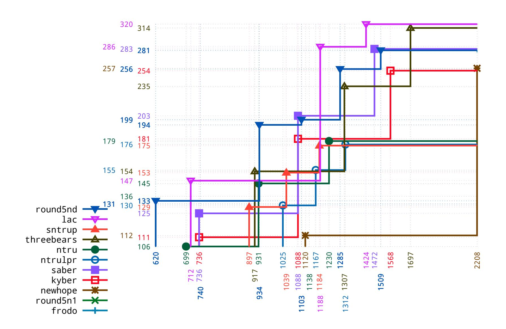
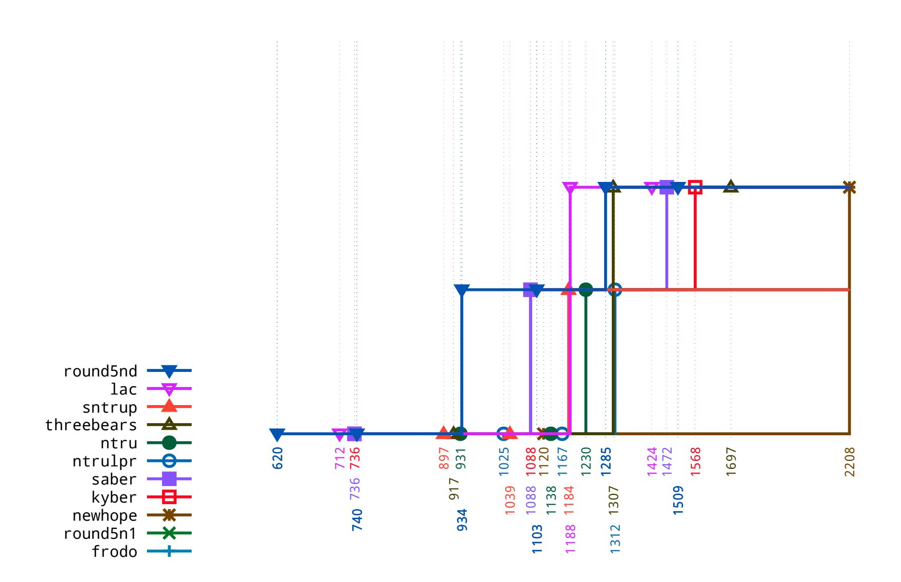

{0}------------------------------------------------

# A discretization attack

Daniel J. Bernstein1,2

1 Department of Computer Science, University of Illinois at Chicago, USA 2 Horst G¨ortz Institute for IT Security, Ruhr University Bochum, Germany djb@cr.yp.to

Abstract. This paper presents an attack against common procedures for comparing the size-security tradeoffs of proposed cryptosystems. The attack begins with size-security tradeoff data, and then manipulates the presentation of the data in a way that favors a proposal selected by the attacker, while maintaining plausible deniability for the attacker.

As concrete examples, this paper shows two manipulated comparisons of size-security tradeoffs of lattice-based encryption proposals submitted to the NIST Post-Quantum Cryptography Standardization Project. One of these manipulated comparisons appears to match public claims made by NIST, while the other does not, and the underlying facts do not. This raises the question of whether NIST has been subjected to this attack.

This paper also considers a weak defense and a strong defense that can be applied by standards-development organizations and by other people comparing cryptographic algorithms. The weak defense does not protect the integrity of comparisons, although it does force this type of attack to begin early. The strong defense stops this attack.

Keywords: back doors, NSA, NIST, NISTPQC, category theory

## 1 Introduction

Available documents and news stories strongly suggest that Dual EC was part of a deliberate, coordinated, multi-pronged attack on this ecosystem: designing a PRNG that secretly contains a back door; publishing evaluations claiming that the PRNG is more secure than the alternatives; influencing standards to include the PRNG; further influencing standards to make the PRNG easier to exploit; and paying software developers to implement the PRNG, at least as an option but preferably as default. —"Dual EC: a standardized back door" [[24](#page-24-0)]

A sensible large-scale attacker will try to break cryptography not merely by attacking the deployed cryptosystems, but by attacking the process that leads to

This work was supported by the German Research Foundation under EXC 2092 CASA 390781972 "Cyber Security in the Age of Large-Scale Adversaries", by the U.S. National Science Foundation under grant 1913167, and by the Cisco University Research Program. "Any opinions, findings, and conclusions or recommendations expressed in this material are those of the author(s) and do not necessarily reflect the views of the National Science Foundation" (or other funding agencies). Permanent ID of this document: 1260677405915e850508c20973be265efa09a218. Date: 2020.09.18. 

{1}------------------------------------------------

particular cryptosystems being deployed. If, for example, the attacker knows a weakness in one out of several proposed cryptosystems, then the attacker will try to promote usage of that cryptosystem. At the same time the attacker will try to do this in a stealthy way: the attacker does not want an attack to be stopped by policies such as "Take whatever NSA recommends and do the opposite".

This paper focuses on attacks against the process of comparing the merits of multiple proposed cryptosystems. As illustrations of what can go wrong (from the defender's perspective), here are three examples of comparisons, presumably all originating with NSA, between Dual EC and alternatives:

- • The Dual EC standard gave a mathematical argument "against increasing the truncation" in Dual EC. See [[9](#page-23-0), page 94], [[10](#page-23-1), page 94], and [[11](#page-23-2), page 90]. This argument is correctly described in [[36](#page-25-0)] as "faulty reasoning" and in [[35](#page-25-1)] as "fake math". The argument swapped the number of truncated bits with the number of remaining bits, making more truncation sound bad for security when in fact more truncation is (as far as we know) good for security. This was an indisputable error, fooling the reader into believing that worse is better, but it was buried behind enough pseudo-math to prevent reviewers from catching the error in time.
- • As noted in [[24](#page-24-0)], Dual EC was introduced in [[33](#page-25-2)] as being slower than other PRNGs but providing "increased assurance" (boldface and underline in original). This was another indisputable error: yes, there were risks from (e.g.) AES-based PRNGs, but there were also risks from Dual EC, and it is incorrect to describe a tradeoff in assurance as a pure increase.
- • The same document [[33](#page-25-2)] said that Dual EC could benefit in performance from "an asymmetric algorithm accelerator in the design already". This was more subtle than the first and second examples: what was stated was correct, but was also cherry-picked to promote Dual EC. The document did not, for example, provide numbers regarding how slow Dual EC was on platforms with accelerators, or how common those platforms were, or how slow Dual EC was on (presumably much more common) platforms without accelerators. The reader's perception of Dual EC performance had no reason to be aligned with the facts.

It is easy to imagine that the claim of "increased assurance" and the performance cherry-picking helped push Dual EC over the edge into standardization. It is also easy to imagine that the argument "against increasing the truncation" helped avoid having Dual EC replaced by a variant with more truncation.

Comparison of cryptosystems is typically factored into two steps (although the dividing line between these steps is not always clear): first one evaluates the merit of each cryptosystem, and then one compares the evaluations. Evaluation especially security evaluation—is well understood to be a complicated, errorprone process, one that an attacker can influence in many ways, for example by identifying the world's top public cryptanalysts and buying their silence.3

3 Coppersmith moved from IBM to IDA, an NSA consulting company, around 2004. Presumably he continued developing attacks, obviously not publishing them.

{2}------------------------------------------------

However, there does not appear to be previous literature pointing out that the process of comparing cryptosystems can be attacked even if the merit of each cryptosystem has been correctly assessed.

Understanding the attack possibilities here requires studying the comparison process. This paper focuses on comparison processes with the following general shape:

- There are various cryptosystem proposals to be compared. Consider, e.g., the lattice-based encryption submissions to round 2 of the NIST Post-Quantum Cryptography Standardization Project (NISTPQC).
- Each proposal provides a selection of parameter sets: e.g., round-2 Kyber provides kyber512 and kyber768 and kyber1024, while round-2 NTRU provides ntruhps2048509 and ntruhps2048677 and ntruhps4096821 and ntruhrss701.
- There is a size metric: e.g., ciphertext size. Each parameter set for each proposal is evaluated for size in this metric.
- There is also a security metric: e.g., Core-SVP. Each parameter set for each proposal is evaluated for security in this metric.
- The resulting data points, a size number and a security number for each parameter set for each proposal, are then combined into a comparison.

This paper digs into details of the last step, how data points are combined into a comparison. This paper identifies a "discretization attack" that gives the attacker considerable power to stealthily manipulate the resulting comparisons. To illustrate this power, Section 2 presents a comparison manipulated to favor NTRU over Kyber, and Section 3 presents a comparison manipulated to favor Kyber over NTRU. Section 4 takes a broader look at the attack strategy and at two defense strategies.

Note that, as Dual EC illustrates, the previous steps can also be attack targets. This paper's attack on the last step can be combined with attacks on the other steps. However, for simplicity, this paper assumes that the proposals, parameter sets, choice of size metric, choice of security metric, and evaluations under those metrics have not been influenced by the attacker. It might seem surprising that the last step can also be an attack target: if we have all the size numbers and all the security numbers, without any attacker influence, then how can the attacker stop us from correctly comparing these numbers? The main point of this paper is that it is easy for the attacker to manipulate the details of how this last comparison step is carried out, producing, e.g., the striking differences between Section 2 and Section 3.

It is interesting to observe that some of Section 3's manipulated pro-Kyber conclusions match claims made recently by NIST comparing Kyber and NTRU. Section 2 does not match these claims, and, more importantly, the underlying facts do not match these claims. How did NIST arrive at these claims? Did an attacker apply a discretization attack to manipulate NIST into making these claims? These questions are addressed in Section 5.

{3}------------------------------------------------

### 2 A comparison manipulated to favor NTRU

All information in this section below the following line is written in the voice of a hypothetical NIST report that compares the size-security data points from [[15](#page-23-3)] for all round-2 lattice-based encryption submissions, counting ThreeBears as lattice-based. The data points in [[15](#page-23-3)] use a size metric (rather than a cycle-count metric), specifically ciphertext size (rather than ciphertext size plus public-key size), for reasons explained in [[15](#page-23-3), Section 2.3]. This section manipulates the comparison, without manipulating the underlying data points, to favor NTRU.

Tables 2.1 and 2.2 present the sizes for round-2 lattice-based encryption systems in security categories 1 and 2 respectively. Breaking a system in security category 1 is, by definition, at least as hard as AES-128 key search: i.e., 2128 pre-quantum security, and 2128/D post-quantum security assuming depth limit D. Breaking a system in security category 2 is, by definition, at least as hard as SHA3-256 collision search: i.e., 2128 post-quantum security.

We have also given similar definitions of higher security categories, but we have two reasons for focusing on categories 1 and 2. First, all of these lattice systems scale in similar ways, so categories 1 and 2 suffice as representative examples of pre-quantum and post-quantum security levels. Second, our lowest categories are the most important categories, as we have repeatedly stated: "most of our security strength categories are probably overkill" [[54](#page-26-0)]; "we'd expect security strengths 2 on up to be secure for 50 years or more, and we wouldn't be terribly surprised if security strength 1 lasted that long as well" [[54](#page-26-0)]; "if we didn't think, for example, that security strength 1 was secure, we would signal this by withdrawing AES 128. We have not done this, nor do we have any current plan to do so" [[54](#page-26-0)]; "NIST recommends that submitters primarily focus on parameters meeting the requirements for categories 1, 2 and/or 3, since these are likely to provide sufficient security for the foreseeable future" [[48](#page-26-1)].

To protect users against uncertainties in the exact cost of lattice attacks, we have systematically compared all proposals using Core-SVP, a conservative lower bound on security. Category 1 requires pre-quantum Core-SVP 2128. Category 2 requires post-quantum Core-SVP 2128, which is equivalent to pre-quantum Core-SVP 2141 since post-quantum Core-SVP security levels are 90% (0.265/0.292) of pre-quantum Core-SVP security levels. Many of the parameter sets in Table 2.1 are strong enough to also qualify for Category 2 and thus also appear in Table 2.2, but some are not and are thus replaced by larger parameters in Table 2.2.

We have decided to exclude LAC because of cryptanalysis, Round5 because it is complicated and did not offer a royalty-free license, and ThreeBears because it does not meet a sufficient threshold of community attention. The top remaining performers in Table 2.1 are sntrup653 (897 bytes) and ntruhps2048677 (931 bytes), followed by ntrulpr653 (1025 bytes). The top remaining performers in Table 2.2 are ntruhps2048677 (931 bytes), sntrup761 (1039 bytes), and kyber768 (1088 bytes).

Notice that ntruhps2048677 is within the top two in both tables: it is #2 in Table 2.1, just 34 bytes behind sntrup653, and is #1 in Table 2.2 (providing longer-

{4}------------------------------------------------

| size submission | parameters reference for pre-quantum Core-SVP    |
|-----------------|--------------------------------------------------|
| 712 lac         | 128 [37, page 14, "classic"]                     |
| 740 round5nd    | 1.0d [8, page 55, "classical primal/dual"]       |
| 897 sntrup      | 653 [22, page 65, "pre-quantum ignoring hybrid"] |
| 917 threebears  | baby [32, page 39, "classical"]                  |
| 931 ntru        | hps2048677 [27, page 35, Table 5, "non-local"]   |
| 1025 ntrulpr    | 653 [22, page 65, "pre-quantum ignoring hybrid"] |
| 1088 kyber      | 768 [7, page 21, Table 3, "classical"]           |
| 1088 saber      | main [31, page 9, "classical"]                   |
| 2208 newhope    | 1024 [3, page 32, "known classical"]             |
| 5788 round5n1   | 1 [8, page 57, "classical primal/dual"]          |
| 9720 frodo      | 640 [4, page 38, "classical"]                    |

Table 2.1. Sizes of submissions in security category 1, pre-quantum security 2128. NTRU Prime is split between sntrup and ntrulpr. Round5 is split between round5nd and round5n1.

| size submission | parameters reference for pre-quantum Core-SVP    |
|-----------------|--------------------------------------------------|
| 712 lac         | 128 [37, page 14, "classic"]                     |
| 917 threebears  | baby [32, page 39, "classical"]                  |
| 931 ntru        | hps2048677 [27, page 35, Table 5, "non-local"]   |
| 1039 sntrup     | 761 [22, page 65, "pre-quantum ignoring hybrid"] |
| 1088 kyber      | 768 [7, page 21, Table 3, "classical"]           |
| 1088 saber      | main [31, page 9, "classical"]                   |
| 1103 round5nd   | 3.0d [8, page 55, "classical primal/dual"]       |
| 1167 ntrulpr    | 761 [22, page 65, "pre-quantum ignoring hybrid"] |
| 2208 newhope    | 1024 [3, page 32, "known classical"]             |
| 5788 round5n1   | 1 [8, page 57, "classical primal/dual"]          |
| 9720 frodo      | 640 [4, page 38, "classical"]                    |

Table 2.2. Sizes of submissions in security category 2, post-quantum security 2128. The cited pre-quantum Core-SVP security levels are at least 128 · 0.292/0.265, accounting for the gap between pre-quantum Core-SVP and post-quantum Core-SVP. NTRU Prime is split between sntrup and ntrulpr. Round5 is split between round5nd and round5n1.

term security), beating sntrup761 by 108 bytes. Other submissions do not provide such consistent performance: kyber768 and saber are like ntruhps2048677 in that they meet both security requirements, but they both require 1088 bytes where ntruhps2048677 requires just 931 bytes.

Performance should not be overemphasized. Other considerations can outweigh performance: we find it interesting, for example, that NTRU lacks a formal worstcase-to-average-case reduction applicable to its proposed parameters. But perhaps someone will point out to us during round 3 that Kyber and Saber also lack formal worst-case-to-average-case reductions applicable to their proposed parameters. If, by the end of round 3, there are no clear advantages one way or the other, then performance differences will provide an objective way to decide what to standardize, even if those differences are small. Kyber and Saber are very efficient, but they are not quite at the level of NTRU.

{5}------------------------------------------------

### 3 A comparison manipulated to favor Kyber

All information in this section below the following line is written in the voice of a hypothetical NIST report that compares the size-security data points from [[15](#page-23-3)] for all round-2 lattice-based encryption submissions, counting ThreeBears as lattice-based. The data points in [[15](#page-23-3)] use a size metric (rather than a cycle-count metric), specifically ciphertext size (rather than ciphertext size plus public-key size), for reasons explained in [[15](#page-23-3), Section 2.3]. This section manipulates the comparison, without manipulating the underlying data points, to favor Kyber.

Tables 3.1, 3.2, and 3.3 present the sizes for round-2 lattice-based encryption systems in security categories 1, 3, and 5 respectively. These categories are defined to be as secure as AES-128, AES-192, and AES-256 key search respectively. We also considered making comparison tables for category 2 and category 4, but almost all lattice submissions target security strengths 1, 3, and 5.

We have systematically compared all proposals using pre-quantum Core-SVP. Optimistic assumptions regarding the power of quantum computers would reduce the security of lattice systems, but this impact is quantitatively smaller than the impact of quantum computers upon AES: post-quantum Core-SVP levels are a full 90% (0.265/0.292) of pre-quantum Core-SVP security levels. Having pre-quantum Core-SVP large enough to match pre-quantum security of AES guarantees that postquantum Core-SVP is also large enough to match post-quantum security of AES.

Core-SVP is a conservative lower bound on security. Submissions therefore provide more security than Core-SVP indicates. The exact security improvement is a matter of ongoing scientific analysis, but it is safe to assume that submissions provide 20% more bits of security. In other words:

- Core-SVP ≥2 128/1.2 qualifies for category 1 and Table 3.1.
- Core-SVP ≥2 192/1.2 qualifies for category 3 and Table 3.2.
- Core-SVP ≥2 256/1.2 qualifies for category 5 and Table 3.3.

We have decided to exclude LAC because of cryptanalysis, Round5 because it is complicated and did not offer a royalty-free license, and ThreeBears because it does not meet a sufficient threshold of community attention. The top remaining performers in Table 3.1 are kyber512 and lightsaber (both 736 bytes), followed by sntrup653 (897 bytes) and ntruhps2048677 (931 bytes). The top remaining performers in Table 3.2 are kyber768 and saber (both 1088 bytes), followed by sntrup857 (1184 bytes) and ntruhps4096821 (1230 bytes).

Table 3.3 is, unfortunately, incomplete because a few submissions did not submit category-5 parameters. We strongly encourage all submissions to add category-5 parameters so as to facilitate being able to more closely compare submissions. But we do not expect this to matter much: all of these lattice systems scale in similar ways. Furthermore, as we have already stated, category 5 is "probably overkill" [[54](#page-26-0)].

Performance should not be overemphasized. Other considerations can outweigh performance: for example, US patents 9094189 and 9246675 threaten both Kyber and Saber, without threatening NTRU. But we hope that the patent threats will be resolved during round 3, allowing us to make decisions purely on the basis of

{6}------------------------------------------------

| size submission | parameters reference for pre-quantum Core-SVP    |
|-----------------|--------------------------------------------------|
| 712 lac         | 128 [37, page 14, "classic"]                     |
| 736 kyber       | 512 [7, page 21, Table 3, "classical"]           |
| 736 saber       | light [31, page 9, "classical"]                  |
| 740 round5nd    | 1.0d [8, page 55, "classical primal/dual"]       |
| 897 sntrup      | 653 [22, page 65, "pre-quantum ignoring hybrid"] |
| 917 threebears  | baby [32, page 39, "classical"]                  |
| 931 ntru        | hps2048677 [27, page 35, Table 5, "non-local"]   |
| 1025 ntrulpr    | 653 [22, page 65, "pre-quantum ignoring hybrid"] |
| 1120 newhope    | 512 [3, page 32, "known classical"]              |
| 5788 round5n1   | 1 [8, page 57, "classical primal/dual"]          |
| 9720 frodo      | 640 [4, page 38, "classical"]                    |

Table 3.1. Sizes of submissions in security category 1, as secure as AES-128. NTRU Prime is split between sntrup and ntrulpr. Round5 is split between round5nd and round5n1.

|          | size submission | parameters reference for pre-quantum Core-SVP    |
|----------|-----------------|--------------------------------------------------|
|          | 1088 kyber      | 768 [7, page 21, Table 3, "classical"]           |
|          | 1088 saber      | main [31, page 9, "classical"]                   |
|          | 1103 round5nd   | 3.0d [8, page 55, "classical primal/dual"]       |
|          | 1184 sntrup     | 857 [22, page 65, "pre-quantum ignoring hybrid"] |
| 1188 lac |                 | 192 [37, page 14, "classic"]                     |
|          | 1230 ntru       | hps4096821 [27, page 35, Table 5, "non-local"]   |
|          | 1307 threebears | mama [32, page 39, "classical"]                  |
|          | 1312 ntrulpr    | 857 [22, page 65, "pre-quantum ignoring hybrid"] |
|          | 2208 newhope    | 1024 [3, page 32, "known classical"]             |
|          | 9716 round5n1   | 3 [8, page 57, "classical primal/dual"]          |
|          | 15744 frodo     | 976 [4, page 38, "classical"]                    |

Table 3.2. Sizes of submissions in security category 3, as secure as AES-192. NTRU Prime is split between sntrup and ntrulpr. Round5 is split between round5nd and round5n1.

|          | size submission | parameters reference for pre-quantum Core-SVP |
|----------|-----------------|-----------------------------------------------|
| 1188 lac |                 | 192 [37, page 14, "classic"]                  |
|          | 1307 threebears | mama [32, page 39, "classical"]               |
|          | 1472 saber      | fire [31, page 9, "classical"]                |
|          | 1509 round5nd   | 5.0d [8, page 55, "classical primal/dual"]    |
|          | 1568 kyber      | 1024 [7, page 21, Table 3, "classical"]       |
|          | 2208 newhope    | 1024 [3, page 32, "known classical"]          |
|          | 14708 round5n1  | 5 [8, page 57, "classical primal/dual"]       |
|          | 15744 frodo     | 976 [4, page 38, "classical"]                 |

Table 3.3. Sizes of submissions in security category 5, as secure as AES-256. Round5 is split between round5nd and round5n1.

technical merit. If, by the end of round 3, there are no clear advantages one way or the other, then performance differences will provide an objective way to decide what to standardize, even if those differences are small. NTRU is very efficient, but it is not quite at the level of the highest-performing lattice schemes; it has a small performance gap in comparison to Kyber and Saber.

{7}------------------------------------------------

### 4 The attack strategy

This section explains the attack strategy used to construct the manipulated comparisons in Sections 2 and 3. This section takes the attacker's perspective and is presented as a how-to guide for the attacker.

4.1. Attack step 0: Collect the facts. Figure 4.2, copied from [[15](#page-23-3), Figure 3.5], shows the size-security data points for the parameter sets proposed for the round-2 lattice-based encryption submissions (except the large Round5 option and Frodo, which are off the right edge of the graph). The size metric is ciphertext bytes, for reasons explained in [[15](#page-23-3), Section 2.3]. The security metric is prequantum Core-SVP, which is not a general-purpose security metric (e.g., Core-SVP does not assign a security level to AES-128) but rather a special-purpose mechanism for claiming security levels for lattice systems. Core-SVP has various problems summarized in [[15](#page-23-3), Section 2.1] but has the advantage that the Core-SVP data points are readily available. See [[15](#page-23-3), Table 2.2] for references.4

For example, Kyber (red open squares) provides kyber512 with Core-SVP 2 111 using 736 bytes of ciphertext, kyber768 with Core-SVP 2181 using 1088 bytes of ciphertext, and kyber1024 with Core-SVP 2254 using 1568 bytes of ciphertext. NTRU (green filled circles) provides ntruhps2048509 with Core-SVP 2106 using 699 bytes of ciphertext, ntruhps2048677 with Core-SVP 2145 using 931 bytes of ciphertext, and ntruhps4096821 with Core-SVP 2179 using 1230 bytes of ciphertext.

For ciphertext sizes strictly between 736 and 1088, Kyber does not provide Core-SVP options above 2111, so there is a horizontal line from (736, 111) to (1088, 111), followed by a vertical line from (1088, 111) to (1088, 181). The main point of [[15](#page-23-3)] is that connecting (736, 111) to (1088, 181) with a diagonal line—or omitting the line entirely—would convey incorrect information to the reader. Similar comments apply to the other lines in the graph.

As noted in Section 1, you might have opportunities to influence the proposals, parameter sets, choice of size metric, choice of security metric, and evaluations under these metrics. You should take whatever opportunities you have. But this paper assumes that all of these evaluations, such as the data points in Figure 4.2, are already set in stone. The attack strategy here manipulates the presentation of the data points in a way that favors—or disfavors—submissions that you select.

This strategy often reverses comparisons between submissions, as Sections 2 and 3 illustrate regarding NTRU and Kyber. This does not mean that the attack is useless in situations where it is unable to reverse these comparisons: the attack can be successful in reversing a combination of these comparisons with other factors.

4.3. Attack step 1: Choose categories. Choose a few categories for some coordinate of the comparison. In this paper's attack examples, the coordinate is

4 Many data points originate in [[2](#page-22-1)]. A September 2020 announcement [[56](#page-27-0)] reported that [[2](#page-22-1)] and [[31](#page-25-5)] included incorrect Core-SVP data points for Saber. To reflect what was believed earlier in 2020, this paper still uses the Saber data points from [[2](#page-22-1)].

{8}------------------------------------------------

Fig. 4.2. Diagram copied from [15, Figure 3.5]. Horizontal axis: ciphertext bytes, log scale. Vertical axis: Core-SVP security claim, log scale.

the Core-SVP security claim, and each category has a minimum allowed Core-SVP security claim. To disfavor submission X with parameter set P, adjust a category minimum to be above P's Core-SVP security claim, disqualifying P from that category. To favor submission X with parameter set P, adjust a category minimum to be below P's Core-SVP security claim, allowing P in that category.

Let's assume, for example, that you want to manipulate category cutoffs to favor Kyber, as in Section 3. Recall that an application limited to 1024-byte ciphertexts obtains a comfortable-sounding 2145 Core-SVP from NTRU and only 2111 Core-SVP from Kyber. An application that wants Core-SVP to be at least 2128 can use 931-byte NTRU ciphertexts but needs 1088-byte Kyber ciphertexts. You want to choose categories that hide these comparisons from the decision-maker. It would be a mistake, for example, to choose a category cutoff anywhere between Core-SVP 2112 and Core-SVP 2144. Instead manipulate the cutoff to be somewhere above Core-SVP 2106 and below Core-SVP 2111, so that kyber512 (736 bytes, Core-SVP 2111) qualifies while ntruhps2048509 (699 bytes, Core-SVP 2106) does not.

Section 3 chooses the following three categories: category 1 that requires Core-SVP to be at least  $2^{128/1.2} \approx 2^{106.67}$ , category 3 that requires Core-SVP to be

{9}------------------------------------------------

Fig. 4.5. Discretized version of Figure 4.2. Horizontal axis: ciphertext bytes, log scale. Vertical axis: security category 1 for Core-SVP at least 2128/1.2, security category 3 for Core-SVP at least 2192/1.2, and security category 5 for Core-SVP at least 2256/1.2 .

at least 2192/1.2 = 2160, and category 5 that requires Core-SVP to be at least 2 256/1.2 ≈ 2 213.33. Category 1 then allows Kyber's 2111 (by a small margin) but disallows NTRU's 2106 (by an even smaller margin), so it forces NTRU up to 2 145. Category 3 does not allow 2145, so it forces NTRU up to 2179 .

4.4. Attack step 2: Discretize. Replace each coordinate by its category. As an example, Figure 4.5 shows the result of discretizing Figure 4.2 into the three categories described above.

Each point in Figure 4.2 moves down to a point in Figure 4.5, but not by the same distance. For example, the NTRU green dot at (931, 145) moves all the way down to (931, 106.67), while the Kyber red square at (736, 111) moves a much smaller distance down to (736, 106.67). Someone considering the example of an application limited to 1024-byte ciphertexts can see from Figure 4.2 that NTRU provides much higher Core-SVP (2145) than Kyber does (2111); Figure 4.5 throws away this information. In other words, Figure 4.5 extracts and highlights three attacker-selected horizontal lines from Figure 4.2, while suppressing all other information from Figure 4.2.

{10}------------------------------------------------

4.6. Attack step 3: Make the discretized comparison sound natural.

Tables 3.1, 3.2, and 3.3 present the same information as Figure 4.5 (plus the large Round5 option and Frodo) in tabular form. Comparison tables are a standard device, supported by many table-making tools, and do not require justification per se. A table is better than a two-dimensional graph for this purpose because a graph might make the reader wonder why the extra space has not been used to show how far each parameter set is above the category floor.

To justify the general idea of using security categories, try claiming, e.g., that security categories "facilitate meaningful performance comparisons", that they allow "prudent future decisions regarding when to transition to longer keys", that they allow "consistent and sensible choices" of other primitives at matching security levels, and that they help one "better understand" security/performance tradeoffs.5 If someone challenges these claims—how does replacing Figure 4.2 with Figure 4.5, or with equivalent tables, improve understanding or comparisons or decision-making?—try claiming that per-category tables are "simpler" than a two-dimensional graph, and that it's really hard to make two-dimensional graphs such as Figure 4.2.

The remaining problem is to make your specific category cutoffs sound natural. Don't worry about the juxtaposition of Sections 2 and 3 raising questions about both choices of cutoffs: you'll present just one choice of cutoffs, and the problem is to make that choice sound natural in isolation. The following techniques provide a tremendous amount of flexibility in choosing Core-SVP cutoffs.

Pick existing standards at various security levels, not worrying about coming very close to your desired cutoffs. For example, claim that it is important to have a category matching the cost of searching for a single AES-128 key by brute force, and claim that it is important to have a category matching the cost of finding SHA3-256 collisions. Take more options than you need, with an emphasis on making the list of standards look good.

There are various reasons to think that SHA3-256 has a somewhat higher post-quantum security level than AES-128. If you're favoring, e.g., Kyber, then you might think that it's a mistake to pick AES-128 and SHA3-256:

- If kyber512 just barely qualifies for the AES-128 category then NTRU will look better than Kyber in the SHA3-256 category.
- If kyber512 just barely qualifies for the SHA3-256 category then NTRU will look better than Kyber in the AES-128 category.

However, even after announcing the categories, you'll easily be able to make up excuses for retroactively emphasizing the categories that you secretly want. For example, you can use a "these security levels are just fine" argument (as in Section 2) for highlighting categories 1 and 2, or a "national security" argument for highlighting category 5, or a "these are the most popular numbers" argument (more artfully phrased, as in Section 3) for highlighting categories 1, 3, and 5.

Choose a cost metric for computations. There are many cost metrics, backed by various arguments about simplicity, realism, etc. Different choices of metrics

5 These are quotes from NIST's call for submissions [[48](#page-26-1)].

{11}------------------------------------------------

can make changes of 50 bits or more in how Core-SVP compares to AES or SHA-3; see, e.g., [[22](#page-24-1), Table 2]. Core-SVP is (loosely) based on attacks that use a tremendous amount of memory, so you can make smaller and smaller Core-SVP levels sound acceptable by shifting to metrics that assign higher and higher costs to memory. You can select from a variety of easily justifiable polynomial factors and exponential factors (two-dimensional locality? three-dimensional locality? hybercube routing? metadata overhead? etc.), bending the Core-SVP curve in many different ways.

Exploit uncertainties regarding security analyses. Core-SVP includes dozens of simplifications that can underestimate or overestimate the costs of known attacks (see [[22](#page-24-1), Section 6]), never mind the possibility of better attacks.6 If you would like to move a category cutoff up, emphasize the possibility of new attacks. If you would like to move a category cutoff down, emphasize overheads and how well understood attacks are.

Beware that cutting things too close can be risky for a multi-year multi-stage decision-making process. For example, what happens if kyber512 is close to the bottom of the lowest category, and then someone comes up with a better attack? The best approach here is to leave as much blurriness as possible, so that you can tweak the cutoffs later. Don't give precise definitions of metrics; say that progress in understanding the cost of computation can justify new metrics; insert ambiguities, such as saying that security must be "comparable to or greater than" AES-128, leaving open the question of how much smaller would qualify as "comparable". Avoid transparency: for example, show per-category tables privately to decision-makers, and dodge public questions about the comparison process.

Section 3 doesn't even bother to define a metric for the cost of computation. It alludes to unspecified, unquantified overheads in lattice attacks, waves vaguely at "ongoing scientific analysis", and asserts that it is "safe to assume" that Core-SVP 2K/1.2 is as secure as AES-K. Do you think that this will set off alarm bells? Relax. People are gullible. Remember that NIST published three versions of a standard in 2006, 2007, and 2012 claiming that discarding some output bits would reduce the security of Dual EC.

4.7. Defense strategies. A decision-maker comparing proposed cryptographic algorithms—for example, a standards-development organization—might apply the following weak defense against a discretization attack: fully define the list of category cutoffs and commit to leaving the list unchanged. The idea here is that, even though the categories will damage the integrity of comparisons, attackers will not be able to influence which submissions are favored or disfavored by this damage.

6 Core-SVP is often described as "conservative" because a few of the simplifications are clear underestimates. However, plausible conjectures imply that, for all sufficiently large dimensions, Core-SVP overestimates the number of bit operations required for known attacks, as I pointed out in [[18](#page-24-3)]. It is unclear what this means for concrete sizes. Such uncertainty is fertile soil for manipulating cutoffs.

{12}------------------------------------------------

If you are faced with this weak defense then timing becomes critical: you must manipulate the category cutoffs before the commitment locks those cutoffs into place. Fortunately, if you carry out the attack early enough, then the defense does nothing to stop you.

A decision-maker can instead apply the following strong defense: specify all details7 of a comparison method in which all comparisons communicate the full tradeoff picture to the reader, rather than just selected lines through the picture. This stops all discretization attacks: there are no longer any category cutoffs to manipulate.

Faced with either defense, you could try to convince the decision-maker to abandon the defense. For example, as in Section 4.6, claim that categories help everyone "better understand" security/performance tradeoffs. Provide your own manipulated comparisons as "helpful" supplements to Figure 4.2, and claim that extra perspectives on the data inherently add value.

### 5 Has NIST been attacked again?

This section returns from the perspective of an attacker to the perspective of a security reviewer. Previous sections gave hypothetical examples of NISTPQC comparisons influenced by discretization attacks. This section asks whether NIST has in fact been subjected to a discretization attack.

5.1. The importance of transparency. From a security perspective, one wants to be able to check for vulnerabilities in the entire process that creates ciphertexts, signatures, etc.—not just the algorithms that the users end up using, but also the process that leads the users to use those algorithms. One wants, for example, to be able to review NIST's standardization procedures to see whether they are vulnerable to the discretization attack described in this paper. If they are not clearly secure then one wants to carry out forensics, seeing whether an attack took place. All of this requires transparency.

The importance of transparency is not a new observation. In 2014, a NIST committee carried out a Dual EC post-mortem [[28](#page-24-4)], inviting reports from a "Committee of Visitors": Vint Cerf, Edward Felten, Steve Lipner, Bart Preneel, Ellen Richey, Ron Rivest, and Fran Schrotter. The first conclusion from the committee was as follows (emphasis added):

It is of paramount importance that NIST's process for developing cryptographic standards is open and transparent and has the trust and support of the cryptographic community. This includes improving the discipline required in carefully and openly documenting such developments.

7 Examples of details to specify: In [[15](#page-23-3), Figure 3.5], a factor 2 is the same distance on the graph horizontally and vertically, so one has to zoom out to see Frodo, whereas [[15](#page-23-3), Figure 3.2] allows Frodo to make the horizontal axis look less important. Colors are chosen as explained in [[15](#page-23-3), Section 3.6]; compare [[15](#page-23-3), Figure 3.7]. The submission list is ordered as explained in [[15](#page-23-3), Section 3.1].

{13}------------------------------------------------

Transparency had also been highlighted in the reports from individual members of the Committee of Visitors. For example:

[Cerf:] NIST must retain and reinforce an extremely open, documented and transparent process for the development or revision of standards for security, especially the process by which cryptographic standards are developed.

[Lipner:] Transparency of process: Both before and after a security standard or guideline is adopted, NIST should be open about what steps were followed, what authorities were consulted or reviews sought, what comments were received, and what actions or resolutions reached. There should be no loose ends or untraceable actions in the standard review process.

[Preneel:] The principle of transparency would require version control on all documents from an early stage, a full documentation of all decisions, and clear processes for the disposition of each and every comment received.

[Richey:] NIST procedures should require that records of the development process be maintained in a systematic and reliable way. Something as simple as a "project file" with a single point of accountability would make it easier to track the issues that are raised, by whom, when, and how resolved, over a multi-year development cycle.

[Schrotter:] Documentation of compliance with established procedures allows a standards development process to be scrutinized objectively.

The "process improvements" that NIST said it was carrying out in response [[34](#page-25-6)] included "Better tracking of comments and record keeping" and "Documenting and formalizing processes". Years later, in 2020, one would expect to be able to find enough documentation of NIST's comparison processes to see whether those processes are vulnerable to a discretization attack, and enough records of the inputs to NIST to see whether a discretization attack was carried out.

5.2. The lack of transparency in NISTPQC. The reality, however, is that NISTPQC is far less transparent than this. I tweeted the following [[19](#page-24-5)] near the end of NISTPQC round 2 (at 13:01 GMT on 22 July 2020):

After NIST's Dual EC standard was revealed in 2013 to be an actual (rather than just potential) NSA back door, NIST promised more transparency. Why does NIST keep soliciting private #NISTPQC input? (The submissions I'm involved in seem well positioned; that's not the point.)

Coincidentally, a moment later (at 13:02 GMT), NSA sent a message [[57](#page-27-1)] to pqc-forum, the public NISTPQC mailing list. NSA wrote that it had been "asked by many of our partners our view on the NIST Post-Quantum Process and the algorithms being analyzed", that it intended to "provide our high-level guidance on the algorithms" publicly, and that it wanted to "publicly thank NIST again 

{14}------------------------------------------------

for all of the effort they have made in this process". (It is not clear what "again" is referring to here.)

Several hours after that (at 20:51 GMT), NIST announced its selection of algorithms for round 3 of NISTPQC [[52](#page-26-2)], and issued a report [[1](#page-22-2)] on the selection. A week later, NSA posted [[49](#page-26-3)] a short document in "response to requests from our National Security Systems (NSS) partners". This document gave NSA's view of the "remaining algorithms in the NIST post-quantum standardization effort", as [[57](#page-27-1)] had promised, and briefly commented on NIST's report. I asked NIST the following questions [[20](#page-24-6)] on 2 August:

Did NIST tell NSA the timing of NIST's announcement? Did NIST show NSA a draft of the report in advance? Did NIST ask NSA for comments on the draft? What exactly has NSA told NIST regarding NISTPQC, regarding security levels or otherwise?

These questions remain unanswered at the time of this writing.

The background for my 22 July tweet was as follows. I had just given a series of talks on lattice-based cryptography. I was thinking about risk-management failures and the public's inability, for a stretch of at least three months, to correct whatever errors NIST might have privately received in April 2020 in response to the following requests (see [[41](#page-25-7)] and [[50](#page-26-4)]):

NIST kindly requests that we be notified of new implementations, benchmarks, research papers, cryptanalysis, etc. by April 15th. . . . Please use the pqc-forum to announce results, discuss relevant topics, ask questions, etc. . . .

If you or anyone else in the community has something important in the works, but don't think it will be done by April 15, please notify us (by the 15th) with a brief description of the expected results and an estimate of how much longer might be needed.

I had followed NIST's request, announcing what was ready to announce and notifying NIST of what else was in the works, not realizing the larger problem at the time.

In retrospect, there were earlier public warning signs. In October 2019 [[40](#page-25-8)], NIST asked for input regarding hybrid encryption modes to be on pqc-forum or sent privately to NIST. (Hybrid modes play a critical role in the analysis of what security levels are needed for post-quantum systems.) NIST issued openended "As always, you can contact us at pqc-comments@nist.gov" statements starting in September 2019; see, e.g., [[39](#page-25-9)]. At a conference in August 2019, NIST issued an open-ended request for private inputs, concealed some (most?) inputs, and anonymized the rest, while promising to take all of the inputs into account.

Has NIST been continually manipulated by years of private input from NSA agents? Other government agents? Corporate agents? Submitters who were early to realize that NIST was open for manipulation? After Dual EC, why is NIST not following standardization procedures designed to transparently and reviewably stop attacks, systematically treating everyone as a potential attacker?

{15}------------------------------------------------

Each error and each inconsistency in NIST's July 2020 report [[1](#page-22-2)] makes the reader wonder how the mistake occurred. For example, why does NIST's report state that NTRU "lacks a formal worst-case-to-average-case reduction", while not stating that Kyber "lacks a formal worst-case-to-average-case reduction"?8 A transparent procedure would show how this happened, and would provide a starting point for protecting against attackers trying to manipulate the process.

5.3. Inconsistencies in which categories are emphasized. The following quote from NIST's report [[1](#page-22-2), page 5] might not seem noteworthy at first glance:

While category 1, 2, and 3 parameters were (and continue to be) the most important targets for NIST's evaluation, NIST nevertheless strongly encourages the submitters to provide at least one parameter set that meets category 5. Most of the candidate algorithms have already done this; a few have not.

But compare this quote to the call for submissions [[48](#page-26-1), pages 18–19]:

NIST recommends that submitters primarily focus on parameters meeting the requirements for categories 1, 2 and/or 3, since these are likely to provide sufficient security for the foreseeable future. To hedge against future breakthroughs in cryptanalysis or computing technology, NIST also recommends that submitters provide at least one parameter set that provides a substantially higher level of security, above category 3. [page break, no indication of paragraph break:] Submitters can try to meet the requirements of categories 4 or 5, or they can specify some other level of security that demonstrates the ability of their cryptosystem to scale up beyond category 3.

Even if we make the questionable assumption that "recommend" and "strongly encourage" mean the same thing, there is a clear difference between asking for "above category 3 . . . categories 4 or 5 . . . beyond category 3" and asking specifically for "category 5". A submission providing category 4 was fully meeting what had been requested in the call for submissions, but the report makes readers think that the submissions had already been asked for category 5.

Why did the NISTPQC evaluation criteria change? Could NIST's requests increase again, meaning that submitters should go beyond category 5—to the sixth line of NIST's security table [[48](#page-26-1), page 18] in the call for submissions, for example, or to the 2512 security level that NIST had required for SHA-3?

I asked these questions. NIST gave a two-part reply [[42](#page-25-10)] that answers neither question. The first part said that "strongly encourage" is not a "requirement". The second part was as follows:

8 There are scaled-up variants of NTRU and Kyber that have worst-case-to-averagecase reductions, but these reductions do not apply to any of the proposed parameters. See [[16](#page-24-7), Section 9] for an overview and references. There is much more marketing of the reductions for the scaled-up Kyber variants than for the scaled-up NTRU variants, but surely an important standardization process would have procedures to remove the influence of marketing.

{16}------------------------------------------------

- The call for submissions had expressed a preference for "schemes with greater flexibility", including that it is "straightforward to customize the scheme's parameters to meet a range of security targets and performance goals".
- "Providing category 5 parameters would help to demonstrate that a scheme offers this flexibility."

The call for submissions had already mentioned this flexibility but nevertheless asked only for "above category 3", so pointing to the same flexibility does not answer the question of why NIST changed to asking for "category 5". It also does not answer the question of whether NIST could subsequently change to asking for even higher categories.

(Beyond these structural flaws in NIST's reply, the content is surprising. As far as I know, every submission already explained how to scale up parameters to super-high security levels, and there is no dispute about the details. How would selecting big parameters "help to demonstrate" flexibility that is already documented and undisputed? Some submissions struggle to prove their claimed failure rates for decryption, but this is already an issue for category 1.)

Discussion continued. NIST repeated its two-part reply [[43](#page-26-5)], and then made the following remarkable disclosure [[44](#page-26-6)]:

Throughout the process we've been in dialogue with various teams as they have adjusted parameter sets.

The following question remains unanswered: "When did NIST announce that submitters were expected to use this private source of information rather than relying on the public announcements?"

NIST also wrote that "too many parameter sets make evaluation and analysis more difficult". (The question "How many is 'too many'?" remains unanswered.) It is hard to reconcile this with

- the call for submissions, which had explicitly allowed multiple parameter sets per category, never suggesting that this would be penalized;
- NIST's previous praise for flexibility, in particular regarding parameter sets; and
- • NIST's report [[1](#page-22-2), page 16] complaining that NewHope does not "naturally support" a "category 3 security strength parameter set".

NewHope provides 111, 254. Kyber provides 111, 181, 254. NIST praised Kyber for the intermediate 181. Why did NIST not praise NTRU for its intermediate 145? Could the answer be that the advantage of this 145 was obscured by NIST's comparison procedures?9

NIST then issued a much longer list of presumably retroactive arguments for category 5 [[45](#page-26-7)], still not directly answering the factual question of why it had

9 NTRU can easily add even more intermediate options. Adding intermediate options for Kyber would spoil major features claimed by Kyber, as I pointed out in [[15](#page-23-3), page 9]. Could this difference be connected to NIST's new effort to deter submissions from adding more parameter sets? As this example illustrates, discretization attacks are not the only way to manipulate processes in favor of selected submissions.

{17}------------------------------------------------

changed from "above category 3" to "category 5". Most of the new arguments are unquantified (e.g., "national security considerations") and seem incapable of separating category 4 from category 5, but the following two sentences sound much more concrete:

[A] reason for wanting category 5 parameters is that it facilitates being able to more closely compare submissions. As almost all of the remaining submissions already had category 5 parameters, NIST wanted to encourage those who didn't have them to consider adding them.

#### I asked for clarification [[21](#page-24-8)]:

Can you please clarify what comparison procedure this is referring to, and how category-5 parameters would help?

Let me hazard a guess. To compare, e.g., public-key sizes, NIST made three tables showing

- public-key sizes across all category-1 parameter sets,
- public-key sizes across all category-3 parameter sets, and
- public-key sizes across all category-5 parameter sets,

but the third table is incomplete—e.g., it has only half of the round-3 lattice candidates. This prompted NIST to now ask submissions to complete this table. Is that what happened? If not, what did happen?

So far NIST's only answer has been "We think we've explained our position on this issue" [[46](#page-26-8)]. The security reviewer is forced to try to reverse-engineer NIST's hidden comparison procedures from the limited information available, and on this basis to try to assess whether the procedures are vulnerable to a discretization attack.

Recall that Section 3's manipulated pro-Kyber comparison included tables for category 1, category 3, and category 5, and justified this selection of categories by saying "almost all lattice submissions target security strengths 1, 3, and 5". The attacker knows that Kyber is favored by this selection of categories and of the specific category cutoffs, hiding the NTRU advantages that were highlighted in Section 2. A decision-maker looking at Table 3.3 naturally complains that NTRU is missing—which could be good or bad for the attack; perhaps the decisionmaker sees the lack of category-5 parameters as a problem for NTRU, or perhaps the decision-maker sees the lack of information as a source of uncertainty, since filling in an NTRU entry might show an advantage of NTRU over Kyber.

Did NIST internally make a category-5 table along the lines of Table 3.3, prompting its request for category-5 parameters? Since NIST has repeatedly described category 2 as being more important than category 5, did NIST also make a category-2 table, and give that table more weight than the category-5 table? If not, why not?

5.4. Lack of clear, stable definitions of the security categories. NIST has always "defined" category 1 to be as hard as a 128-bit key search, category 2 to be as hard as a 256-bit collision search, etc. However, turning these pseudodefinitions into actual definitions requires specifying a metric for the cost of 

{18}------------------------------------------------

computation. Unclear or unstable definitions of metrics give the attacker more than enough power to carry out a discretization attack.

The importance of metrics is illustrated by a 48-bit jump in NIST's published 2016 evaluations of the quantum hardness of 256-bit collision search, as reviewed in the following paragraphs.

NIST's August 2016 draft call for submissions asked submissions "to provide parameter sets that meet or exceed each of five target security strengths" [[47](#page-26-9), page 15]. The first "target security strength" had a pseudo-definition of "128 bits classical security / 64 bits quantum security", this supposedly being the hardness of "brute-force attacks against AES-128". The second "strength" had a pseudo-definition of "128 bits classical security / 80 bits quantum security", this supposedly being the hardness of "collision attacks against SHA-256/ SHA3- 256".

Why was "SHA-256/ SHA3-256" assigned only "80 bits quantum security"? Surely this alludes to the Brassard–Høyer–Tapp algorithm [[25](#page-24-9)], which finds a collision using only about 2256/3 ≈ 2 85.33 evaluations of SHA3-256 on quantum superpositions of inputs. However, the Brassard–Høyer–Tapp algorithm also has tremendous overhead to look up each superposition of hash outputs in a precomputed table of size about 2256/3 .

If the cost metric for computation includes low-cost "random access gates", as explicitly allowed in Ambainis's famous distinctness algorithm [[5](#page-23-7)] and many other quantum algorithms, then these lookups are not a bottleneck. However, the literature also has various cost metrics that assign higher costs to memory, and if these costs are high enough then the Brassard–Høyer–Tapp algorithm becomes useless. See generally my paper [[14](#page-23-8)].

NIST proposed [[47](#page-26-9), page 16] to "define the units of computational work to be such that AES-128 has 128 bits of classical security and 64 bits of quantum security". This pseudo-definition does not pin down a metric for the cost of computation: it says that each metric should be scaled in a particular way, but this continues to allow a vast space of different metrics, including some metrics that make the Brassard–Høyer–Tapp algorithm sound useful and others that do not.

NIST's final call for submissions [[48](#page-26-1), page 17] says that, for a submission to meet a security category, every attack

must require computational resources comparable to or greater than the stated threshold, with respect to all metrics that NIST deems to be potentially relevant to practical security

(emphasis in original). The stated thresholds are "key search on a block cipher with a 128-bit key (e.g. AES128)" for category 1; "collision search on a 256-bit hash function (e.g. SHA256/ SHA3-256)" for category 2; etc.

This revised pseudo-definition does not define the "metrics that NIST deems to be potentially relevant to practical security", so it still does not make clear what the category cutoffs are. Acknowledging the importance of metrics is better than denial but does not constitute a definition.

{19}------------------------------------------------

NIST claimed that the best attack algorithms known against AES-128 use "2170/MAXDEPTH quantum gates or 2143 classical gates", but that the best attack algorithms known against SHA3-256 use simply "2146 classical gates", an astonishing jump from NIST's previous "80 bits quantum security". The 18-bit jump from 128 to 146 comes from counting the number of "gates" in a single SHA3-256 computation, but the 48-bit jump from 80 to 128 is harder to explain. What happened to the Brassard–Høyer–Tapp algorithm, which uses far fewer than 2146 quantum gates?

Logically, the quantum-gates metric used in Ambainis's algorithm etc. cannot be a metric "that NIST deems to be potentially relevant to practical security". If it were, then NIST would have to include the impact of the Brassard–Høyer– Tapp algorithm in its table. As a matter of terminology, it is wrong for NIST to use the "quantum gates" label without allowing the same gates that are allowed in the literature.

More to the point, what exactly are the metrics that NIST "deems to be potentially relevant to practical security"? How expensive is a random-access gate in these metrics? Saying "random-access gates are expensive enough to make BHT useless" does not answer the question: this is compatible with a wide variety of cost metrics.

This is not just a quantum question. There are many quantum and nonquantum attacks that use large amounts of memory. Without a clearly defined set of metrics, one cannot figure out whether these attacks disqualify the targeted cryptosystems from NIST's security categories. A discretization attack can then favor or disfavor selected submissions by manipulating the metrics up or down.

Note that the choice of metric is not the only exploitable ambiguity in NIST's pseudo-definitions. NIST documents sometimes use words such as "floor" and "greater than or equal to", but sometimes say "comparable to or greater than", which could allow somewhat smaller, as noted in Section 4. AES-128 is listed only as an example of a 128-bit cipher; it is not clear whether NIST, or someone else, is allowed to move the category boundaries up or down by choosing another 128-bit cipher.

5.5. The curious case of Kyber-512. The round-2 Kyber submission gave five unquantified arguments [[7](#page-23-5), page 21] that kyber512 qualifies for category 1 despite having Core-SVP only 2111. However, my analysis in [[17](#page-24-10)] concluded that one of these arguments (regarding ciphertext rounding) is simply wrong, that a second argument (memory) is wrong for a "gates" metric, that a third argument is broken for all sufficiently large sizes and perhaps for cryptographic sizes, and that the other two arguments are quantitatively too small to rescue kyber512 without help.

The next month, NIST stated [[51](#page-26-10)] that it deems "classical gate count" to be "potentially relevant to practical security", that any proposal of an alternate metric "must at minimum convince NIST that the metric meets the following criteria" (emphasis added), and that "meeting these criteria seems to us like a fairly tall order". The criteria are as follows:

{20}------------------------------------------------

- the metric "can be accurately measured (or at least lower bounded) for all known attacks";
- we can be "reasonably confident that all known attacks have been optimized" with respect to this metric;
- the metric "will more accurately reflect the real-world feasibility of implementing attacks with future technology than gate count—in particular, in cases where gate count underestimates the real-world difficulty of an attack relative to the attacks on AES or SHA3 that define the security strength categories";
- the metric "will not replace these underestimates with overestimates".

The first and second criteria are criteria regarding ease of algorithm analysis. The third and fourth criteria ask for realism without overestimates.

Removing low-cost random-access gates from the "classical gates" metric (or from the "quantum gates" metric) would flunk the first, second, and fourth criteria. An assumption of low-cost RAM is pervasive (although not universal) in the literature on algorithms, including the literature on attacks. Plugging in an implementation of each RAM gate in a more limited model would produce overestimates: it is often possible to share work across multiple RAM accesses, or to replace RAM accesses with computations that are less expensive in this model (e.g., replacing sieving with ECM as a subroutine inside NFS, as in [[13](#page-23-9)]). It is not feasible within the NISTPQC timeframe to turn the existing algorithm analyses into useful lower bounds for the modified metric—beyond assigning cost 1 to each RAM access, i.e., not using the modified metric. One cannot be "reasonably confident that all known attacks have been optimized" with respect to such a metric: the simple fact is that most attacks have not.

The Kyber submission is not alone in arguing that free memory access is unrealistic. Over the past two decades I've written several papers using and advocating more realistic models; when I started, there were already decades of relevant literature. But NIST's ease-of-algorithm-analysis criteria require simple metrics, and NIST's no-overestimates criterion requires small simple metrics. It seems unavoidable to omit the costs of RAM, forcing all of these submissions to assign lower security levels to their parameter sets.

This is a problem for Kyber. Recall that NewHope was criticized for not being able to "naturally support" anything between 111 and 254. Throwing away kyber512 would mean that Kyber cannot "naturally support" anything below 181, and that Kyber has no options competing with, e.g., ntruhps2048677.

For a hypothetical attacker favoring Kyber, the most obvious discretization strategy is to manipulate the cost metrics, inserting enough memory costs to allow kyber512 to qualify for category 1. The attacker does not want to follow ease-of-algorithm-analysis criteria that force low memory costs. More broadly, the attacker does not want clear, stable definitions of cost metrics. Being able to continue manipulating metrics is useful for the attacker even after categories 

{21}------------------------------------------------

have been announced: for example, assigning costs to memory did not seem so important for Kyber before I pointed out the flaw in Kyber's third argument.10

On 17 August 2020, NIST announced its "preliminary thoughts" regarding various metrics [[53](#page-26-11)]. NIST's arguments have two surprising structural features: (1) four years after NISTPQC began, NIST is issuing "preliminary" arguments on how the categories should be defined;11 (2) these arguments focus on the realism of assigning some cost to memory, while sweeping under the rug NIST's previously announced "minimum" criteria regarding ease of algorithm analysis.

5.6. NTRU vs. Kyber. Consider an application that requires Core-SVP to be at least 2128. NTRU's ntruhps2048677 meets this requirement with 931-byte ciphertexts, while Kyber's kyber768 needs 1088-byte ciphertexts. Perhaps NIST disagrees with the arguments for using ciphertext size as a metric, but it is hard to see how this disagreement would eliminate NTRU's performance advantage.

Kyber uses 74092 Haswell cycles for encapsulation and 64000 Haswell cycles for decapsulation, total 138092 cycles, while NTRU uses just 35768 cycles and 61616 cycles respectively, total 97384 cycles. Kyber has a "90s" variant, using 41624 cycles for encapsulation and 35748 cycles for decapsulation, total 77372 cycles, but does a savings of 20012 cycles outweigh having to transmit 157 extra bytes? If, for example, transmitting a byte costs 1000 times as much as a cycle does, then this means saving 20012 cycles at the expense of 157000 cycles.

To make a somewhat better case for Kyber, one can add an assumption that the application generates and transmits a public key for every ciphertext. Kyber's "90s" variant takes a total of 103220 cycles for key generation, encapsulation, and decapsulation, while NTRU takes a total of 387116 cycles. On the other hand, Kyber's public key is 1184 bytes, while NTRU's public key is just 930 bytes, so Kyber transmits 2272 bytes in total while NTRU transmits just 1861 bytes. Does a savings of 283896 cycles outweigh having to transmit 411 extra bytes? More importantly, what if the assumption is wrong—the application actually reuses keys and amortizes key-transmission costs over many ciphertexts, as one would expect if performance is an issue?

I am not saying that NTRU always outperforms Kyber. I am saying that there are obvious scenarios where NTRU indisputably outperforms Kyber. It is puzzling to see NIST's report making the following blanket claims: "While NTRU is very efficient, it is not quite at the level of the highest-performing lattice schemes" and "NTRU has a small performance gap in comparison to KYBER and SABER". Is NIST claiming that the Core-SVP-at-least-2128 scenario is not important enough to consider? This would seem difficult to justify.

10 The bigger picture here is that lattices keep losing security. See, e.g., [[23](#page-24-11), slide 4, second overlay]. It is plausible that the best attacks known when Kyber was designed needed as many bit operations to break kyber512, kyber768, and kyber1024 as to break AES-128, AES-192, and AES-256; but that was years ago.

11 Some confusion appears to have been added by a NIST employee a few days later making the following claim: "The definitions of the metrics NIST is using to specify security categories has not changed since the Call for Proposals. They have been stable for the entire process."

{22}------------------------------------------------

NIST's next sentence after the first blanket claim was "In particular, NTRU has slower key generation than the schemes based on RLWE and MLWE". This is correct, but how is it supposed to justify the blanket efficiency claim in the previous sentence? Is NIST claiming that 283896 cycles outweigh 411 bytes and claiming that applications that reuse keys for many ciphertexts are not important enough to consider? This would also seem difficult to justify.

For comparison, [[29](#page-25-11)] and [[30](#page-25-12)] report cost calculations in a scenario where transmitting N bytes costs the same as 1000N cycles, and in scenarios replacing 1000 with 2000 or 85, not claiming that any of these scenarios is unreasonable. Furthermore, [[6](#page-23-10)] praises Classic McEliece and Rainbow for their performance in an "Amortized PK" scenario. If it is reasonable to consider reuse of code-based keys and multivariate-quadratic keys for thousands of ciphertexts, surely it is also reasonable to consider reuse of lattice-based keys for tens or hundreds or thousands of ciphertexts. Most systems are designed for IND-CCA2 security to allow this type of reuse.

In short, the Core-SVP-at-least-2128 scenario favors NTRU over Kyber in ciphertext size, and favors NTRU over Kyber in various other reasonable metrics, including metrics that NIST appears to have endorsed. Why, then, does NIST make blanket claims to the contrary?

Everything suddenly makes sense if NIST was subjected to a discretization attack that hid the Core-SVP-at-least-2128 scenario. In Section 3, there is no visible advantage of NTRU over Kyber. On the contrary, NTRU loses more than 100 bytes. NTRU key generation, whenever it occurs, loses more than 200000 cycles—which sounds even more severe than 100 bytes.

NISTPQC's lack of transparency means that it is unnecessarily difficult for the community to figure out how NIST arrived at its conclusion regarding NTRU. So far NIST won't even answer basic procedural questions such as whether NIST made per-category comparison tables, never mind revealing what those tables said, how they were constructed, and how they were used for decisions. After Dual EC, the public deserves better than this.

#### References

- [1] Gorjan Alagic, Jacob Alperin-Sheriff, Daniel Apon, David Cooper, Quynh Dang, Yi-Kai Liu, Carl Miller, Dustin Moody, Rene Peralta, Ray Perlner, Angela Robinson, Daniel Smith-Tone, Status report on the second round of the NIST Post-Quantum Cryptography Standardization Process, NISTIR 8309. URL: <https://csrc.nist.gov/publications/detail/nistir/8309/final>. Citations in this document: §[5.2](#page-14-0), §[5.2](#page-15-0), §[5.3,](#page-15-1) §[5.3,](#page-16-0) §[A,](#page-27-2) §[A,](#page-27-3) §[A,](#page-27-4) §[A,](#page-27-5) §[A,](#page-27-6) §[A,](#page-27-7) §[A.](#page-27-8)
- [2] Martin R. Albrecht, Benjamin R. Curtis, Amit Deo, Alex Davidson, Rachel Player, Eamonn W. Postlethwaite, Fernando Virdia, Thomas Wunderer, Estimate all the {LWE, NTRU} Schemes!, in SCN 2018 [[26](#page-24-12)] (2018), 351–367. URL: <https://eprint.iacr.org/2018/331>. Citations in this document: §[4](#page-7-0), §[4,](#page-7-1) §[4.](#page-7-2)
- [3] Erdem Alkim, Roberto Avanzi, Joppe Bos, Leo Ducas, Antonio de la Piedra, Thomas Poppelmann, Peter Schwabe, Douglas Stebila, Martin R. Albrecht, Emmanuela Orsini, Valery Osheter, Kenneth G. Paterson, Guy Peer, Nigel

{23}------------------------------------------------

- P. Smart, NewHope: algorithm specifications and supporting documentation (2019). URL: [https://csrc.nist.gov/projects/post-quantum-cryptography/](https://csrc.nist.gov/projects/post-quantum-cryptography/round-2-submissions) [round-2-submissions](https://csrc.nist.gov/projects/post-quantum-cryptography/round-2-submissions). Citations in this document: §[2,](#page-4-0) §[2](#page-4-1), §[3](#page-6-0), §[3](#page-6-1), §[3.](#page-6-2)
- [4] Erdem Alkim, Joppe Bos, Leo Ducas, Patrick Longa, Ilya Mironov, Michael Naehrig, Valeria Nikolaenko, Christopher Peikert, Ananth Raghunathan, Douglas Stebila, FrodoKEM: Learning With Errors key encapsulation (2019). URL: [https://csrc.nist.gov/projects/post-quantum-cryptography/](https://csrc.nist.gov/projects/post-quantum-cryptography/round-2-submissions) [round-2-submissions](https://csrc.nist.gov/projects/post-quantum-cryptography/round-2-submissions). Citations in this document: §[2,](#page-4-2) §[2](#page-4-3), §[3](#page-6-3), §[3](#page-6-4), §[3.](#page-6-5)
- [5] Andris Ambainis, Quantum walk algorithm for element distinctness, SIAM Journal on Computing 37 (2007), 210–239. URL: [https://arxiv.org/abs/quant-ph/](https://arxiv.org/abs/quant-ph/0311001) [0311001](https://arxiv.org/abs/quant-ph/0311001). Citations in this document: §[5.4.](#page-18-0)
- [6] Daniel Apon, Passing the final checkpoint! NIST PQC 3rd round begins, slides (2020). URL: <https://archive.today/RG14h>. Citations in this document: §[5.6](#page-22-3).
- [7] Roberto Avanzi, Joppe Bos, Leo Ducas, Eike Kiltz, Tancrede Lepoint, Vadim Lyubashevsky, John M. Schanck, Peter Schwabe, Gregor Seiler, Damien Stehl´e, CRYSTALS-Kyber: algorithm specifications and supporting documentation (2019). URL: [https://csrc.nist.gov/projects/post-quantum-cryptography/](https://csrc.nist.gov/projects/post-quantum-cryptography/round-2-submissions) [round-2-submissions](https://csrc.nist.gov/projects/post-quantum-cryptography/round-2-submissions). Citations in this document: §[2,](#page-4-4) §[2](#page-4-5), §[3](#page-6-6), §[3](#page-6-7), §[3,](#page-6-8) §[5.5.](#page-19-0)
- [8] Hayo Baan, Sauvik Bhattacharya, Scott Fluhrer, Oscar Garcia-Morchon, Thijs Laarhoven, Rachel Player, Ronald Rietman, Markku-Juhani O. Saarinen, Ludo Tolhuizen, Jose-Luis Torre-Arce, Zhenfei Zhang, Round5: KEM and PKE based on (Ring) Learning With Rounding (2019). URL: [https://csrc.nist.gov/](https://csrc.nist.gov/projects/post-quantum-cryptography/round-2-submissions) [projects/post-quantum-cryptography/round-2-submissions](https://csrc.nist.gov/projects/post-quantum-cryptography/round-2-submissions). Citations in this document: §[2](#page-4-6), §[2,](#page-4-7) §[2,](#page-4-8) §[2,](#page-4-9) §[3](#page-6-9), §[3](#page-6-10), §[3,](#page-6-11) §[3,](#page-6-12) §[3,](#page-6-13) §[3](#page-6-14).
- [9] Elaine Barker, John Kelsey, Recommendation for random number generation using deterministic random bit generators, Special Publication 800-90 (2006); see also newer version [[10](#page-23-1)]. URL: [https://csrc.nist.gov/publications/detail/](https://csrc.nist.gov/publications/detail/sp/800-90/archive/2006-06-13) [sp/800-90/archive/2006-06-13](https://csrc.nist.gov/publications/detail/sp/800-90/archive/2006-06-13). Citations in this document: §[1.](#page-1-0)
- [10] Elaine Barker, John Kelsey, Recommendation for random number generation using deterministic random bit generators (revised), Special Publication 800-90 (2007); see also older version [[9](#page-23-0)]; see also newer version [[11](#page-23-2)]. URL: [https://csrc.](https://csrc.nist.gov/publications/detail/sp/800-90/revised/archive/2007-03-14) [nist.gov/publications/detail/sp/800-90/revised/archive/2007-03-14](https://csrc.nist.gov/publications/detail/sp/800-90/revised/archive/2007-03-14). Citations in this document: §[1.](#page-1-1)
- [11] Elaine Barker, John Kelsey, Recommendation for random number generation using deterministic random bit generators, Special Publication 800-90A (2012); see also older version [[10](#page-23-1)]; see also newer version [[12](#page-23-11)]. URL: [https://csrc.nist.](https://csrc.nist.gov/publications/detail/sp/800-90a/archive/2012-01-23) [gov/publications/detail/sp/800-90a/archive/2012-01-23](https://csrc.nist.gov/publications/detail/sp/800-90a/archive/2012-01-23). Citations in this document: §[1](#page-1-2).
- [12] Elaine Barker, John Kelsey, Recommendation for random number generation using deterministic random bit generators, Special Publication 800-90A (2015); see also older version [[11](#page-23-2)]. URL: [https://csrc.nist.gov/publications/detail/](https://csrc.nist.gov/publications/detail/sp/800-90a/rev-1/final) [sp/800-90a/rev-1/final](https://csrc.nist.gov/publications/detail/sp/800-90a/rev-1/final).
- [13] Daniel J. Bernstein, Circuits for integer factorization: a proposal (2001). URL: <https://cr.yp.to/papers.html#nfscircuit>. Citations in this document: §[5.5](#page-20-0).
- [14] Daniel J. Bernstein, Cost analysis of hash collisions: Will quantum computers make SHARCS obsolete?, in Workshop Record of SHARCS'09: Special-purpose Hardware for Attacking Cryptographic Systems (2009). URL: [https://cr.yp.](https://cr.yp.to/papers.html#collisioncost) [to/papers.html#collisioncost](https://cr.yp.to/papers.html#collisioncost). Citations in this document: §[5.4](#page-18-1).
- [15] Daniel J. Bernstein, Visualizing size-security tradeoffs for lattice-based encryption, Second PQC Standardization Conference (2019). URL: [https://cr.yp.to/](https://cr.yp.to/papers.html#paretoviz)

{24}------------------------------------------------

- [papers.html#paretoviz](https://cr.yp.to/papers.html#paretoviz). Citations in this document: §[2,](#page-3-0) §[2](#page-3-1), §[2,](#page-3-2) §[3,](#page-5-0) §[3](#page-5-1), §[3,](#page-5-2) §[4.1,](#page-7-3) §[4.1,](#page-7-4) §[4.1,](#page-7-5) §[4.1,](#page-7-6) §[4.1](#page-7-7), §[4.2](#page-0-0), §[4.2,](#page-8-0) §[7](#page-12-0), §[7](#page-12-1), §[7,](#page-12-2) §[7,](#page-12-3) §[7,](#page-12-4) §[9](#page-16-1).
- [16] Daniel J. Bernstein, Comparing proofs of security for lattice-based encryption, Second PQC Standardization Conference (2019). URL: [https://cr.yp.to/papers.](https://cr.yp.to/papers.html#latticeproofs) [html#latticeproofs](https://cr.yp.to/papers.html#latticeproofs). Citations in this document: §[8](#page-15-2).
- [17] Daniel J. Bernstein, ROUND 2 OFFICIAL COMMENT: CRYSTALS-KYBER, email dated 30 May 2020 02:15:31 +0200 (2020). URL: [https://groups.](https://groups.google.com/a/list.nist.gov/g/pqc-forum/c/o2roJXAlsUk/m/EHW9h87kAAAJ) [google.com/a/list.nist.gov/g/pqc-forum/c/o2roJXAlsUk/m/EHW9h87kAAAJ](https://groups.google.com/a/list.nist.gov/g/pqc-forum/c/o2roJXAlsUk/m/EHW9h87kAAAJ). Citations in this document: §[5.5](#page-19-1).
- [18] Daniel J. Bernstein, Re: ROUND 2 OFFICIAL COMMENT: CRYSTALS-KYBER, email dated 31 May 2020 23:13:38 +0200 (2020). URL: [https://](https://groups.google.com/a/list.nist.gov/g/pqc-forum/c/o2roJXAlsUk/m/5ORleAt4AQAJ) [groups.google.com/a/list.nist.gov/g/pqc-forum/c/o2roJXAlsUk/m/](https://groups.google.com/a/list.nist.gov/g/pqc-forum/c/o2roJXAlsUk/m/5ORleAt4AQAJ) [5ORleAt4AQAJ](https://groups.google.com/a/list.nist.gov/g/pqc-forum/c/o2roJXAlsUk/m/5ORleAt4AQAJ). Citations in this document: §[6](#page-11-0).
- [19] Daniel J. Bernstein, After NIST's Dual EC standard was revealed in 2013 to be an actual (rather than just potential) NSA back door, NIST promised more transparency. Why does NIST keep soliciting private #NISTPQC input? (The submissions I'm involved in seem well positioned; that's not the point.), tweet dated 22 July 2020 13:01 GMT (2020). URL: [https://twitter.com/hashbreaker/](https://twitter.com/hashbreaker/status/1285922808392908800) [status/1285922808392908800](https://twitter.com/hashbreaker/status/1285922808392908800). Citations in this document: §[5.2](#page-13-0).
- [20] Daniel J. Bernstein, Re: Guidelines for submitting tweaks for Third Round Finalists and Candidates, email dated 2 Aug 2020 11:50:26 +0200 (2020). URL: [https://groups.google.com/a/list.nist.gov/g/pqc-forum/c/](https://groups.google.com/a/list.nist.gov/g/pqc-forum/c/LPuZKGNyQJ0/m/XchLDA3HAwAJ) [LPuZKGNyQJ0/m/XchLDA3HAwAJ](https://groups.google.com/a/list.nist.gov/g/pqc-forum/c/LPuZKGNyQJ0/m/XchLDA3HAwAJ). Citations in this document: §[5.2](#page-14-1).
- [21] Daniel J. Bernstein, Re: Category 5 parameter sets, email dated 5 Aug 2020 13:19:28 +0200 (2020). URL: [https://groups.google.com/a/list.nist.gov/](https://groups.google.com/a/list.nist.gov/g/pqc-forum/c/uy5vEFRHzGI/m/5uW6Daa3BAAJ) [g/pqc-forum/c/uy5vEFRHzGI/m/5uW6Daa3BAAJ](https://groups.google.com/a/list.nist.gov/g/pqc-forum/c/uy5vEFRHzGI/m/5uW6Daa3BAAJ). Citations in this document: §[5.3.](#page-17-0)
- [22] Daniel J. Bernstein, Chitchanok Chuengsatiansup, Tanja Lange, Christine van Vredendaal, NTRU Prime: round 2 (2019). URL: [https://csrc.nist.gov/](https://csrc.nist.gov/projects/post-quantum-cryptography/round-2-submissions) [projects/post-quantum-cryptography/round-2-submissions](https://csrc.nist.gov/projects/post-quantum-cryptography/round-2-submissions). Citations in this document: §[2](#page-4-10), §[2,](#page-4-11) §[2,](#page-4-12) §[2,](#page-4-13) §[3](#page-6-15), §[3](#page-6-16), §[3,](#page-6-17) §[3,](#page-6-18) §[4.6,](#page-11-1) §[4.6](#page-11-2).
- [23] Daniel J. Bernstein, Tanja Lange, McTiny: fast high-confidence post-quantum key erasure for tiny network servers, slides (2020). URL: [https://www.usenix.org/](https://www.usenix.org/system/files/sec20_slides_bernstein.pdf) [system/files/sec20\\_slides\\_bernstein.pdf](https://www.usenix.org/system/files/sec20_slides_bernstein.pdf). Citations in this document: §[10](#page-21-0).
- [24] Daniel J. Bernstein, Tanja Lange, Ruben Niederhagen, Dual EC: a standardized back door, in [[55](#page-26-12)] (2015), 256–281. URL: <https://eprint.iacr.org/2015/767>. Citations in this document: §[1,](#page-0-1) §[1.](#page-1-3)
- [25] Gilles Brassard, Peter Høyer, Alain Tapp, Quantum cryptanalysis of hash and claw-free functions, in [[38](#page-25-13)] (1998), 163–169. MR 99g:94013. URL: [https://](https://arxiv.org/abs/quant-ph/9705002) [arxiv.org/abs/quant-ph/9705002](https://arxiv.org/abs/quant-ph/9705002). Citations in this document: §[5.4.](#page-18-2)
- [26] Dario Catalano, Roberto De Prisco (editors), Security and cryptography for networks—11th international conference, SCN 2018, Amalfi, Italy, September 5– 7, 2018, proceedings, Lecture Notes in Computer Science, 11035, Springer, 2018. See [[2](#page-22-4)].
- [27] Cong Chen, Oussama Danba, Jeffrey Hoffstein, Andreas Hulsing, Joost Rijneveld, John M. Schanck, Peter Schwabe, William Whyte, Zhenfei Zhang, NTRU: algorithm specifications and supporting documentation (2019). URL: [https://csrc.](https://csrc.nist.gov/projects/post-quantum-cryptography/round-2-submissions) [nist.gov/projects/post-quantum-cryptography/round-2-submissions](https://csrc.nist.gov/projects/post-quantum-cryptography/round-2-submissions). Citations in this document: §[2,](#page-4-14) §[2](#page-4-15), §[3](#page-6-19), §[3.](#page-6-20)
- [28] Visiting Committee on Advanced Technology of the National Institute of Standards and Technology, NIST cryptographic standards and guidelines development process (2014).

{25}------------------------------------------------

- URL: [https://www.nist.gov/system/files/documents/2017/05/09/](https://www.nist.gov/system/files/documents/2017/05/09/VCAT-Report-on-NIST-Cryptographic-Standards-and-Guidelines-Process.pdf) [VCAT-Report-on-NIST-Cryptographic-Standards-and-Guidelines-Process.](https://www.nist.gov/system/files/documents/2017/05/09/VCAT-Report-on-NIST-Cryptographic-Standards-and-Guidelines-Process.pdf) [pdf](https://www.nist.gov/system/files/documents/2017/05/09/VCAT-Report-on-NIST-Cryptographic-Standards-and-Guidelines-Process.pdf). Citations in this document: §[5.1](#page-12-5).
- [29] David A. Cooper, Re: "90s" version parameter sets, email dated 30 Jul 2020 12:13:46 -0400 (2020). URL: [https://groups.google.com/a/list.nist.gov/g/](https://groups.google.com/a/list.nist.gov/g/pqc-forum/c/mvJy7vFPqfE/m/VTPl40NPDgAJ) [pqc-forum/c/mvJy7vFPqfE/m/VTPl40NPDgAJ](https://groups.google.com/a/list.nist.gov/g/pqc-forum/c/mvJy7vFPqfE/m/VTPl40NPDgAJ). Citations in this document: §[5.6.](#page-22-5)
- [30] David A. Cooper, Re: "90s" version parameter sets, email dated 31 Jul 2020 13:21:03 -0400 (2020). URL: [https://groups.google.com/a/list.nist.gov/g/](https://groups.google.com/a/list.nist.gov/g/pqc-forum/c/mvJy7vFPqfE/m/dFHRj3pCAwAJ) [pqc-forum/c/mvJy7vFPqfE/m/dFHRj3pCAwAJ](https://groups.google.com/a/list.nist.gov/g/pqc-forum/c/mvJy7vFPqfE/m/dFHRj3pCAwAJ). Citations in this document: §[5.6.](#page-22-6)
- [31] Jan-Pieter D'Anvers, Angshuman Karmakar, Sujoy Sinha Roy, Frederik Vercauteren, SABER: Mod-LWR based KEM (round 2 submission) (2019). URL: [https://csrc.nist.gov/projects/post-quantum-cryptography/](https://csrc.nist.gov/projects/post-quantum-cryptography/round-2-submissions) [round-2-submissions](https://csrc.nist.gov/projects/post-quantum-cryptography/round-2-submissions). Citations in this document: §[2,](#page-4-16) §[2](#page-4-17), §[3](#page-6-21), §[3](#page-6-22), §[3,](#page-6-23) §[4.](#page-7-8)
- [32] Mike Hamburg, Post-quantum cryptography proposal: ThreeBears (2019). URL: [https://csrc.nist.gov/projects/post-quantum-cryptography/](https://csrc.nist.gov/projects/post-quantum-cryptography/round-2-submissions) [round-2-submissions](https://csrc.nist.gov/projects/post-quantum-cryptography/round-2-submissions). Citations in this document: §[2,](#page-4-18) §[2](#page-4-19), §[3](#page-6-24), §[3](#page-6-25), §[3.](#page-6-26)
- [33] Don Johnson, Number theoretic DRBGs (2004). URL: [https://csrc.nist.](https://csrc.nist.gov/groups/ST/toolkit/documents/rng/NumberTheoreticDRBG.pdf) [gov/groups/ST/toolkit/documents/rng/NumberTheoreticDRBG.pdf](https://csrc.nist.gov/groups/ST/toolkit/documents/rng/NumberTheoreticDRBG.pdf). Citations in this document: §[1,](#page-1-4) §[1](#page-1-5).
- [34] John Kelsey, NIST VCAT Report and Dual EC DRBG (2014). URL: [https://](https://crypto.2014.rump.cr.yp.to/404d510271b4cd868fffa9f4d73f515f.pdf) [crypto.2014.rump.cr.yp.to/404d510271b4cd868fffa9f4d73f515f.pdf](https://crypto.2014.rump.cr.yp.to/404d510271b4cd868fffa9f4d73f515f.pdf). Citations in this document: §[5.1.](#page-13-1)
- [35] Tanja Lange, Backdoors always backfire (2019). URL: [https://hyperelliptic.](https://hyperelliptic.org/tanja/vortraege/20190221-cambridge.pdf) [org/tanja/vortraege/20190221-cambridge.pdf](https://hyperelliptic.org/tanja/vortraege/20190221-cambridge.pdf). Citations in this document: §[1.](#page-1-6)
- [36] Ben Lund, NIST's truncation argument (2013). URL: [https://web.archive.](https://web.archive.org/web/20160220071600/https://bendlund.wordpress.com/2013/12/23/nists-truncation-argument/) [org/web/20160220071600/https://bendlund.wordpress.com/2013/12/23/](https://web.archive.org/web/20160220071600/https://bendlund.wordpress.com/2013/12/23/nists-truncation-argument/) [nists-truncation-argument/](https://web.archive.org/web/20160220071600/https://bendlund.wordpress.com/2013/12/23/nists-truncation-argument/). Citations in this document: §[1](#page-1-7).
- [37] Xianhui Lu, Yamin Liu, Dingding Jia, Haiyang Xue, Jingnan He, Zhenfei Zhang, Zhe Liu, Hao Yang, Bao Li, Kunpeng Wang, LAC: Lattice-based Cryptosystems (2019). URL: [https://csrc.nist.gov/projects/post-quantum-cryptography/](https://csrc.nist.gov/projects/post-quantum-cryptography/round-2-submissions) [round-2-submissions](https://csrc.nist.gov/projects/post-quantum-cryptography/round-2-submissions). Citations in this document: §[2,](#page-4-20) §[2](#page-4-21), §[3](#page-6-27), §[3](#page-6-28), §[3.](#page-6-29)
- [38] Claudio L. Lucchesi, Arnaldo V. Moura (editors), LATIN'98: theoretical informatics, proceedings of the 3rd Latin American symposium held in Campinas, April 20–24, 1998, Lecture Notes in Computer Science, 1380, Springer, 1998. ISBN 3-540-64275-7. MR 99d:68007. See [\[25](#page-24-13)].
- [39] Dustin Moody, Some announcements, email dated 4 Sep 2019 18:33:48 +0000 (2019). URL: [https://groups.google.com/a/list.nist.gov/g/pqc-forum/c/](https://groups.google.com/a/list.nist.gov/g/pqc-forum/c/-rKSOqFAQeI/m/cgEWY7_9AQAJ) [-rKSOqFAQeI/m/cgEWY7\\_9AQAJ](https://groups.google.com/a/list.nist.gov/g/pqc-forum/c/-rKSOqFAQeI/m/cgEWY7_9AQAJ). Citations in this document: §[5.2](#page-14-2).
- [40] Dustin Moody, Revising FAQ questions on hybrid modes, email dated 30 Oct 2019 15:38:10 +0000 (2019). URL: [https://groups.google.com/a/list.nist.](https://groups.google.com/a/list.nist.gov/g/pqc-forum/c/qRP63ucWIgs/m/rY5Sr_52AAAJ) [gov/g/pqc-forum/c/qRP63ucWIgs/m/rY5Sr\\_52AAAJ](https://groups.google.com/a/list.nist.gov/g/pqc-forum/c/qRP63ucWIgs/m/rY5Sr_52AAAJ). Citations in this document: §[5.2.](#page-14-3)
- [41] Dustin Moody, Timeline reminder from NIST, email dated 26 Mar 2020 19:58:32 +0000 (2020). URL: [https://groups.google.com/a/list.nist.gov/](https://groups.google.com/a/list.nist.gov/g/pqc-forum/c/Mi2wbVhb2S0/m/TFzDsqiCBAAJ) [g/pqc-forum/c/Mi2wbVhb2S0/m/TFzDsqiCBAAJ](https://groups.google.com/a/list.nist.gov/g/pqc-forum/c/Mi2wbVhb2S0/m/TFzDsqiCBAAJ). Citations in this document: §[5.2.](#page-14-4)
- [42] Dustin Moody, Re: Guidelines for submitting tweaks for Third Round Finalists and Candidates, email dated 24 Jul 2020 15:39:41 +0000 (2020). URL: [https://groups.google.com/a/list.nist.gov/g/pqc-forum/c/](https://groups.google.com/a/list.nist.gov/g/pqc-forum/c/LPuZKGNyQJ0/m/bGZKCut1DAAJ) [LPuZKGNyQJ0/m/bGZKCut1DAAJ](https://groups.google.com/a/list.nist.gov/g/pqc-forum/c/LPuZKGNyQJ0/m/bGZKCut1DAAJ). Citations in this document: §[5.3](#page-15-3).

{26}------------------------------------------------

- [43] Dustin Moody, Re: Guidelines for submitting tweaks for Third Round Finalists and Candidates, email dated 29 Jul 2020 14:59:36 +0000 (2020). URL: [https://groups.google.com/a/list.nist.gov/g/pqc-forum/c/](https://groups.google.com/a/list.nist.gov/g/pqc-forum/c/LPuZKGNyQJ0/m/_yOzEaL8DQAJ) [LPuZKGNyQJ0/m/\\_yOzEaL8DQAJ](https://groups.google.com/a/list.nist.gov/g/pqc-forum/c/LPuZKGNyQJ0/m/_yOzEaL8DQAJ). Citations in this document: §[5.3](#page-16-2).
- [44] Dustin Moody, Re: Guidelines for submitting tweaks for Third Round Finalists and Candidates, email dated 31 Jul 2020 14:42:02 +0000 (2020). URL: [https://groups.google.com/a/list.nist.gov/g/pqc-forum/c/](https://groups.google.com/a/list.nist.gov/g/pqc-forum/c/LPuZKGNyQJ0/m/ZUoZZss5AwAJ) [LPuZKGNyQJ0/m/ZUoZZss5AwAJ](https://groups.google.com/a/list.nist.gov/g/pqc-forum/c/LPuZKGNyQJ0/m/ZUoZZss5AwAJ). Citations in this document: §[5.3](#page-16-3).
- [45] Dustin Moody, Category 5 parameter sets, email dated 3 Aug 2020 21:05:46 +0000 (2020). URL: [https://groups.google.com/a/list.nist.gov/g/pqc-forum/c/](https://groups.google.com/a/list.nist.gov/g/pqc-forum/c/uy5vEFRHzGI/m/oDBSs3k6BAAJ) [uy5vEFRHzGI/m/oDBSs3k6BAAJ](https://groups.google.com/a/list.nist.gov/g/pqc-forum/c/uy5vEFRHzGI/m/oDBSs3k6BAAJ). Citations in this document: §[5.3](#page-16-4), §[A.](#page-27-9)
- [46] Dustin Moody, Re: Category 5 parameter sets, email dated 5 Aug 2020 21:29:50 +0000 (2020). URL: [https://groups.google.com/a/list.nist.gov/](https://groups.google.com/a/list.nist.gov/g/pqc-forum/c/uy5vEFRHzGI/m/rYUD39fvAQAJ) [g/pqc-forum/c/uy5vEFRHzGI/m/rYUD39fvAQAJ](https://groups.google.com/a/list.nist.gov/g/pqc-forum/c/uy5vEFRHzGI/m/rYUD39fvAQAJ). Citations in this document: §[5.3.](#page-17-1)
- [47] National Institute of Standards and Technology, Proposed submission requirements and evaluation criteria for the post-quantum cryptography standardization process (2016). URL: [https://csrc.nist.](https://csrc.nist.gov/CSRC/media/Projects/Post-Quantum-Cryptography/documents/call-for-proposals-draft-aug-2016.pdf) [gov/CSRC/media/Projects/Post-Quantum-Cryptography/documents/](https://csrc.nist.gov/CSRC/media/Projects/Post-Quantum-Cryptography/documents/call-for-proposals-draft-aug-2016.pdf) [call-for-proposals-draft-aug-2016.pdf](https://csrc.nist.gov/CSRC/media/Projects/Post-Quantum-Cryptography/documents/call-for-proposals-draft-aug-2016.pdf). Citations in this document: §[5.4,](#page-18-3) §[5.4.](#page-18-4)
- [48] National Institute of Standards and Technology, Submission requirements and evaluation criteria for the post-quantum cryptography standardization process (2016). URL: [https://csrc.nist.](https://csrc.nist.gov/CSRC/media/Projects/Post-Quantum-Cryptography/documents/call-for-proposals-final-dec-2016.pdf) [gov/CSRC/media/Projects/Post-Quantum-Cryptography/documents/](https://csrc.nist.gov/CSRC/media/Projects/Post-Quantum-Cryptography/documents/call-for-proposals-final-dec-2016.pdf) [call-for-proposals-final-dec-2016.pdf](https://csrc.nist.gov/CSRC/media/Projects/Post-Quantum-Cryptography/documents/call-for-proposals-final-dec-2016.pdf). Citations in this document: §[2,](#page-3-3) §[5](#page-10-0), §[5.3](#page-15-4), §[5.3,](#page-15-5) §[5.4.](#page-18-5)
- [49] National Security Agency, NSA's cybersecurity perspective on postquantum cryptography algorithms (2020). URL: [https://web.archive.org/](https://web.archive.org/web/20200804123831/https://www.nsa.gov/what-we-do/cybersecurity/post-quantum-cybersecurity-resources/) [web/20200804123831/https://www.nsa.gov/what-we-do/cybersecurity/](https://web.archive.org/web/20200804123831/https://www.nsa.gov/what-we-do/cybersecurity/post-quantum-cybersecurity-resources/) [post-quantum-cybersecurity-resources/](https://web.archive.org/web/20200804123831/https://www.nsa.gov/what-we-do/cybersecurity/post-quantum-cybersecurity-resources/). Citations in this document: §[5.2](#page-14-5).
- [50] NIST PQC team, Re: Timeline reminder from NIST, email dated 3 Apr 2020 16:01:41 +0000 (2020). URL: [https://groups.google.com/a/list.nist.gov/](https://groups.google.com/a/list.nist.gov/g/pqc-forum/c/Mi2wbVhb2S0/m/GkrYfdCPAwAJ) [g/pqc-forum/c/Mi2wbVhb2S0/m/GkrYfdCPAwAJ](https://groups.google.com/a/list.nist.gov/g/pqc-forum/c/Mi2wbVhb2S0/m/GkrYfdCPAwAJ). Citations in this document: §[5.2.](#page-14-6)
- [51] NIST PQC team, Re: ROUND 2 OFFICIAL COMMENT: CRYSTALS-KYBER, email dated 23 Jun 2020 21:25:49 +0000 (2020). URL: [https://groups.google.](https://groups.google.com/a/list.nist.gov/g/pqc-forum/c/o2roJXAlsUk/m/9oeKbY5MAQAJ) [com/a/list.nist.gov/g/pqc-forum/c/o2roJXAlsUk/m/9oeKbY5MAQAJ](https://groups.google.com/a/list.nist.gov/g/pqc-forum/c/o2roJXAlsUk/m/9oeKbY5MAQAJ). Citations in this document: §[5.5.](#page-19-2)
- [52] NIST PQC Team, NIST round 3 announcement, email dated 22 Jul 2020 20:51:25 +0000 (2020). URL: [https://groups.google.com/a/list.nist.gov/](https://groups.google.com/a/list.nist.gov/g/pqc-forum/c/0ieuPB-b8eg/m/Cl7Ji8TpCwAJ) [g/pqc-forum/c/0ieuPB-b8eg/m/Cl7Ji8TpCwAJ](https://groups.google.com/a/list.nist.gov/g/pqc-forum/c/0ieuPB-b8eg/m/Cl7Ji8TpCwAJ). Citations in this document: §[5.2.](#page-14-7)
- [53] NIST PQC Team, Update on category 1 security, email dated 17 Aug 2020 17:41:27 +0000 (2020). URL: [https://groups.google.com/a/list.nist.gov/](https://groups.google.com/a/list.nist.gov/g/pqc-forum/c/GR3plWpSV4U/m/NajnbRmxBQAJ) [g/pqc-forum/c/GR3plWpSV4U/m/NajnbRmxBQAJ](https://groups.google.com/a/list.nist.gov/g/pqc-forum/c/GR3plWpSV4U/m/NajnbRmxBQAJ). Citations in this document: §[5.5,](#page-21-1) §[A](#page-27-10).
- [54] Ray Perlner, Re: NIST request for feedback on measurement of security, 22 Nov 2016 16:27:10 +0000 (2016). URL: [https://groups.google.com/a/list.nist.](https://groups.google.com/a/list.nist.gov/g/pqc-forum/c/lBc-Gj2rSx0/m/Vsa5pxatAAAJ) [gov/g/pqc-forum/c/lBc-Gj2rSx0/m/Vsa5pxatAAAJ](https://groups.google.com/a/list.nist.gov/g/pqc-forum/c/lBc-Gj2rSx0/m/Vsa5pxatAAAJ). Citations in this document: §[2](#page-3-4), §[2](#page-3-5), §[2,](#page-3-6) §[3.](#page-5-3)
- [55] Peter Y. A. Ryan, David Naccache, Jean-Jacques Quisquater (editors), The new codebreakers: essays dedicated to David Kahn on the occasion of his 85th birthday,

{27}------------------------------------------------

- Lecture Notes in Computer Science, 9100, Springer, 2015. ISBN 978-3-662-49300- 7. See [[24\]](#page-24-14).
- [56] The SABER team, OFFICIAL COMMENT: SABER, email dated 9 Sep 2020 12:07:25 +0200 (2020). URL: [https://groups.google.com/a/list.nist.gov/](https://groups.google.com/a/list.nist.gov/g/pqc-forum/c/YCCJ6xPgV9s/m/JFRHiBuYBAAJ) [g/pqc-forum/c/YCCJ6xPgV9s/m/JFRHiBuYBAAJ](https://groups.google.com/a/list.nist.gov/g/pqc-forum/c/YCCJ6xPgV9s/m/JFRHiBuYBAAJ). Citations in this document: §[4.](#page-7-9)
- [57] Adrian D. Stanger, Guidance notice, email dated 22 Jul 2020 13:02:49 +0000 (2020). URL: [https://groups.google.com/a/list.nist.gov/g/pqc-forum/c/](https://groups.google.com/a/list.nist.gov/g/pqc-forum/c/um_1oBVCtjU/m/vhTAdxp7BgAJ) [um\\_1oBVCtjU/m/vhTAdxp7BgAJ](https://groups.google.com/a/list.nist.gov/g/pqc-forum/c/um_1oBVCtjU/m/vhTAdxp7BgAJ). Citations in this document: §[5.2](#page-13-2), §[5.2.](#page-14-8)

### A Credits for Sections 2 and 3

The following quotes from NIST include material copied or paraphrased as part of Sections 2 and 3. Because Sections 2 and 3 were written in the voice of a hypothetical NIST report, quotation marks and citations were omitted.

- [[1](#page-22-2)]: "NIST is concerned that the cryptanalysis of LAC seems to involve precisely those aspects of LAC's design, particularly the use of error correction, that distinguish it from most other structured lattice-based schemes."
- [[1](#page-22-2)]: "Overall, the Round5 specification is significantly more complicated than all of the other secondround candidates. Moreover, the Round5 submission documents did not offer a royalty-free license, and there are competing lattice-based schemes which do."
- [[1](#page-22-2)]: "While NIST believes the technical and scientific merits of Three Bears are significant, this is not a substitute for a sufficient threshold of broader community attention."
  - [[1](#page-22-2)]: NTRU "lacks a formal worst-case-to-average-case reduction".
- [[1](#page-22-2)]: "While NTRU is very efficient, it is not quite at the level of the highestperforming lattice schemes."
- [[1](#page-22-2)]: "While NTRU has a small performance gap in comparison to KYBER and SABER, its longer history was an important factor in NIST's decision to select NTRU as a finalist. Due to its longer history, NTRU has less risk of unexpected intellectual property claims."
- [[1](#page-22-2)]: "This results in a narrower range of CoreSVP values than other lattice submissions targeting security strengths 1, 3, and 5."
- [[45](#page-26-7)]: "In particular, a reason for wanting category 5 parameters is that it facilitates being able to more closely compare submissions. As almost all of the remaining submissions already had category 5 parameters, NIST wanted to encourage those who didn't have them to consider adding them."
- [[53](#page-26-11)]: "We've gotten a lot of questions from submitters of lattice schemes, regarding what parameters we think meet security strength category 1. The short answer is that we aren't sure yet—we think there are still scientific questions that need to be resolved."