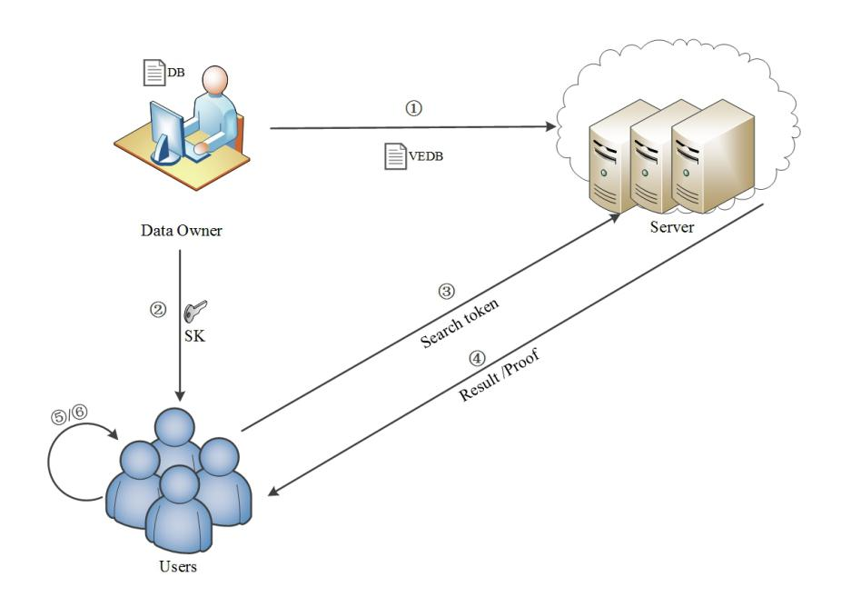
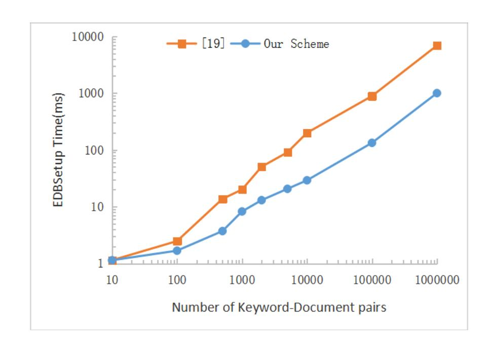
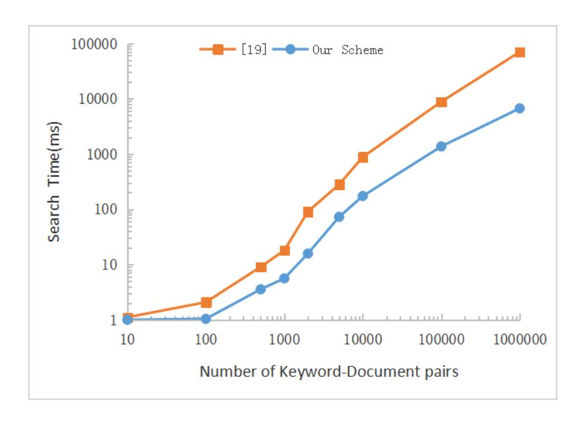
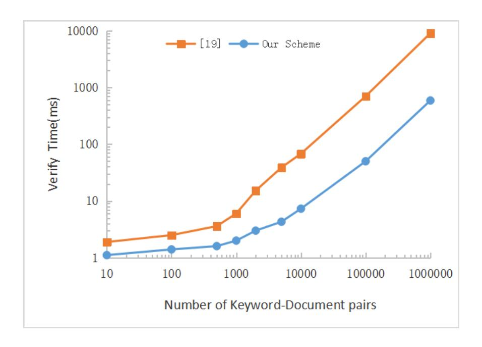

{0}------------------------------------------------

# VCKSCF: Efficient Verifiable Conjunctive Keyword Search Based on Cuckoo Filter for Cloud Storage

Chan Fan\*, Xiaolei Dong\*, Zhenfu Cao\*†, Jiachen Shen\*

\*Shanghai Key Laboratory of Trustworthy Computing, East China Normal University, Shanghai, China

†Cyberspace Security Research Center, Peng Cheng Laboratory, Shenzhen and
Shanghai Institute of Intelligent Science and Technology, Tongji University, China
Email: chan.fan@outlook.com, {dongxiaolei, zfcao, jcshen}@sei.ecnu.edu.cn

Abstract—Searchable Symmetric Encryption(SSE) remains to be one of the hot topics in the field of cloud storage technology. However, malicious servers may return incorrect search results intentionally, which will bring significant security risks to users. Therefore, verifiable searchable encryption emerged. In the meantime, single-keyword query limits the applications of searchable encryption. Accordingly, more expressive searchable encryption schemes are desirable. In this paper, we propose a verifiable conjunctive keyword search scheme based on Cuckoo filter (VCKSCF), which significantly reduces verification and storage overhead. Security analysis indicates that the proposed scheme achieves security in the face of indistinguishability under chosen keyword attack and the unforgeability of proofs and search tokens. Meanwhile, the experimental evaluation demonstrates that it achieves preferable performance in real-world settings.

*Index Terms*—Conjunctive keyword, Searchable Symmetric Encryption, Cuckoo filter, Verifiable.

#### I. Introduction

The age of information explosion, cloud technology improves the storage for industrial and individual data because of the powerful storage and computational capacity. More novel applications are provided, especially in the area of personal health, internet of things and smart grid [1]–[3]. Meanwhile, cloud servers are permitted to access users' private data. To protect the privacy of uploaded data, one conventional method is encrypting the user's data before uploading them. How to search on ciphertext while maintaining data privacy has become a subsequent question. Searchable Symmetric Encryption(SSE) is proposed by researchers [4], which enables the user to perform keyword queries on encrypted data. Subsequently, SSE attracts many researchers worldwide [5]. According to the number of data owner and user, it can be divided into four types such that one-to-one model, one-tomany model, many-to-one model, and many-to-many model. Different models were extensively studied therewith [4], [6]— [8]. However, the above schemes only support single-keyword search. Intuitively, expanded expressiveness is more adapt to actual situation and a number of researches have been exploited in multi-keyword query [9]-[11]. A simple thought of multi-keyword query is to perform single-keyword query for each keyword and then calculate the intersection of multiple query results [12]. Nevertheless, this method yields expensive cost and more information may be leaked to the server. Cash et al. [13] first presented Boolean query based on the least frequent keyword, which is the first sub-linear scheme to support conjunctive keyword query. Later, Sun et al. [14] provided an extensive scheme which works in one-to-many model, in which only authorized users have the right to execute queries. Based on conjunctive search, several schemes optimized in performance and functionality have been proposed [15]–[17]. Nonetheless, most existing schemes only work with an honest but curious server. However, in the real-world scenario, the server might be malicious and return incorrect search results. It is desirable to execute searchable encryption in a complex network environment while remaining security.

To address this issue, various techniques be leveraged to realize verifiability, such as Merkle tree, accumulator, vector commitment, signature [12], [18]–[23]. A new primitive named vector commitment was proposed by Catalano et al. [21]. In their public verifiable scheme, any third party can execute verification to check the integrity of the search results when needed it. But this scheme only works in one-to-one model. Sun et al. [18] realized the verifiability basing on an accumulator. However, it does not work if the results returned by the server are empty. Recently, an extension scheme that solved the drawback of [18] was presented by Wang et al. [19], and their core strategy of achieving verification is based on bilinear pairing. But it incurs abundant computational overhead on the user-side to verify the results. For existing verifiable schemes, the expense of verification becomes the primary performance bottleneck. Therefore, it is urgent and challenging to achieve verifiability efficiently. In this work, we aim to study how to conduct a verifiable conjunctive keyword searchable encryption with optimized efficiency.

#### A. Our Contribution

In this work, we propose an one-to-many searchable encryption scheme called VCKSCF. Our contributions can be summarized as following:

- We construct an efficient and verifiable conjunctive keyword search scheme by means of Cuckoo filter (VCKSCF). The innovative strategy yields less overhead of computation and storage.
- The proposed scheme can protect the privacy of the least frequent keyword by adopting a specific matrix as the storage

{1}------------------------------------------------

structure on the server-side, in which the location of each the least frequent keyword is determined by its left and right parts.

• We give formal security analysis to justify that our scheme achieves IND-CKA security, the search token and proof of specific keyword queries are unforgeable. The experiment in a real database indicates that our scheme works with low communication costs and optimized efficiency.

## B. Related Work

Song et al. [4] first presented the cryptographic primitive of symmetric searchable encryption, which is an one-to-one searchable encryption model. This scheme encrypts each word in the plaintext separately, while the server performs matching search in all ciphertext. So this scheme has potential security problems with high computational expense. Goh [24] established an index for each file to match on when searching. The complexity of searching was greatly reduced, which was only related to the number of files. Curtmola et al. [7] proposed the first one-to-many model, which is based on broadcast encryption technology, which allows multiple users to search on ciphertext with a shared key.

Cash et al. [13] proposed the first searchable scheme that supports sub-linear of Boolean queries. The search complexity of this scheme only associated with the number of files containing the least frequent keyword. Subsequently, Jarecki et al. [25] extended the scheme to one-to-many model. Sun et al. [14] constructed a non-interactive one-to-many searchable encryption scheme supporting Boolean queries. This scheme reduces the communication overhead between the user and the server dramatically by non-interactive feature.

For the sake of resisting the malicious server and verifying the query results, Kurosawa et al. [22] proposed the first symmetric searchable scheme with a verifiable function. Subsequently, diverse verification methods are commonly used in searchable encryption [26], [27]. Liu et al. [28] proposed a verifiable solution for the aggregation key, which supports one-to-many model. Zheng et al. [29] constructed a verifiable scheme based on Bloom filter with the advantages of small computation overhead and low storage space.

However, there are few verifiable schemes allow a specific user to execute multi-keyword search [30], [31]. The scheme of Wan et al. [32] supports fine-grained access control. Monir et al. [12] construct a verifiable scheme with conjunctive keyword search relies on polynomial-accumulators and Merkle trees. But the results of multi-keyword search of their scheme are just composed of the intersection of each keyword search results. The search time overhead grows rapidly with the increase of the database size thereby. Sun et al. [18] constructed an accumulator-based conjunctive search scheme with verifiability. Follow that, Wang et al. [19] overcame the shortcomings of Sun et al. and implemented verifiability by leveraging bilinear pairings. This scheme only yields constant communication overhead between the user and the server. Nevertheless, it is regretful that bilinear pairings incur heavy calculation overhead for verifying. Miao et al. [23] verified the correctness of search results by means of certificateless

TABLE I NOTATIONS.

| Notations                 | Meaning                                                         |  |  |
|---------------------------|-----------------------------------------------------------------|--|--|
| λ                         | Security parameter of this system                               |  |  |
| $ind_i$                   | The indentifier of $i - th$ file                                |  |  |
| $W_i$                     | All keywords of $i - th$ file                                   |  |  |
| W                         | The keywords authorized users allowed to search                 |  |  |
| W'                        | The keywords authorized users want to search                    |  |  |
| DB                        | The whole database $(id_i, W_i)_{i=1}^T$                        |  |  |
| VEDB                      | The verifiable encrypted database                               |  |  |
| DKS                       | The system decryption keys set                                  |  |  |
| $R_{w1}$                  | Single keyword search results about keyword $w_1$               |  |  |
| R                         | Final results satisfied the search requirement                  |  |  |
| proof                     | The information returned by server for validation               |  |  |
| $e_w$                     | All file identifies contain keyword $w$                         |  |  |
| $g \Leftarrow \mathbb{G}$ | The operation of selecting a random element g from $\mathbb{G}$ |  |  |
| matrix                    | A matrix to store encrypted binary strings                      |  |  |
| $  w_l  $                 | An integer mapped by the left half of the keyword $w$           |  |  |
| $  w_r  $                 | An integer mapped by the right half of the keyword $w$          |  |  |
| num                       | The sequence number of a query                                  |  |  |

signature. In order to decrease the number of verification, the sample check method exploited in the schemes of Wang et al. and Miao et al. increases the false-positive rate. It is deserving to explore methods to reduce the expense with preferable accuracy simultaneously when executing verification operation.

### C. Organization

We present the preliminaries about our scheme in section 2. Then we will show the system and security model followed by the explicit construction of our scheme in section 3. Next, the security analysis will be displayed in section 4. After comparing our scheme with others in various aspects, the performance evaluation will be shown in section 5. Finally, the conclusion is provided in section 6.

#### II. PRELIMINARIES

In this section, we first provide a table showing the meaning of the common notations used in our work (see Table I). A brief introduction of Cuckoo filter, which is utilized to construct our verifiable scheme, is given in subsection A. The complexity assumptions are presented afterwards.

## A. Cuckoo Filter

As the extension of Bloom filter [33], Bin et al. [34] introduced a new structure, Cuckoo filter, based on Cuckoo Hash [35] to provide approximate membership check. Cuckoo filter is composed of several buckets and each bucket includes a number of cells. Similar to Bloom filter, each binary string of Cuckoo filter represents a set. Each cell in a bucket of Cuckoo filter stores a short f-bit fingerprint of a relevant element by hashing. Consequently, Cuckoo filter attains less space overhead with better search accuracy than space-optimized Bloom filters. Cuckoo filter mainly consists of four algorithms:

- **CF.Setup**(m, b): Construct an m-bucket binary string S with two hash functions h1(x) and h2(x) as H, the algorithm of fingerprint as f(x), the load factor of the Cuckoo filter as  $\alpha$ . For each bucket, there are b cells which be initialized as 0.
  - **CF.Insert**(H, X): Given a set X to be added. For each

{2}------------------------------------------------

element x in X, compute fingerprint f(x) and two bucket-locations h1(x) and h2(x). If exists one bucket is available, place f(x) in a free cell of this bucket. Otherwise, a fingerprint in one of the two buckets is displaced, then the removed item finds a new cell according to its two bucket-locations to. The replacement operation continues recursively until all the elements are inserted successfully or the load reaches upper bound of the Cuckoo filter.

- **CF.Delete**(S, x): To delete a specified element x in a set S, the algorithm finds out which bucket the element in and remove the copy of the fingerprint f(x).
- **CF.Lookup**(S, x): To test whether element x is in a set S, compute its fingerprint f(x) and two bucket-locations h1(x) and  $h1(x) \oplus h(f(x))$ . If any fingerprints stored in these two buckets match f(x), a positive result 1 returned, otherwise 0.

Cuckoo filter achieves superior search efficiency with small storage size. Accordingly, it is suitable for schemes containing sets with membership check. Xue et al. [36] leveraged Cuckoo filter to achieve fuzzy keyword search efficiently with improved search accuracy. Unlike these schemes, Cuckoo filters are used for keyword search in the database when searching on the server. In our scheme, it is interesting that this tool is utilized to generate membership proof for a part of work in the verification process, which combined with an effective conjunctive keyword search strategy. Accordingly, our scheme realizes optimized search and verification efficiently with gradely accuracy.

Choosing proper parameters for Cuckoo filter affects the efficiency significantly. If the cuckoo hash table has a load factor of  $\alpha$ , the target false position rate is  $\epsilon$ , the amortized space cost (i.e. the string size divide the number of items  $n_i$  in Cuckoo filter) is C. In each bucket, the probability that the collision of fingerprint happened is  $1/2^f$  after making 2b such comparisons,  $1-(1-1/2^f)^{2b}\approx 2b/2^f$  is the upper bound of the total rate of a false fingerprint collision. Because we strive  $2b/2^f \leq \epsilon$ , thus  $f \geq \Omega(\log_2(2b/\epsilon)) = \Omega(\log_2(1/\epsilon + \log_2(2b)))$  bits,  $C = (f \cdot n_i)/(\alpha \cdot n_i) = f/\alpha \leq \Omega(\log_2(1/\epsilon + \log_2(2b))/\alpha$ , where  $\alpha$  increases with b. For the same amount of space, smaller C can decrease the false position rate because more fingerprints can be stored, so selecting suitable parameters for Cuckoo filter can achieve optimized space efficiency. A more particular analysis refers to scheme [34].

#### B. Complexity Assumptions

- 1) Strong RSA (SRA) Assumptions [37]: Let p,q be two large prime numbers and  $n=p\cdot q$ . Let  $z\in\mathbb{Z}_n^*$  be chosen at random. If for a given tuple (n,z), no probabilistic polynomial time algorithm can figure out two elements (x,y) such that  $x^y=z\pmod n$  with non-negligible advantage, where  $x\in\mathbb{Z}_n^*$  and y>1, we say that the SRA assumption holds.
- 2) Decisional Diffie-Hellman (DDH) Assumptions: Let  $\mathbb{G}$  be a cycle group of prime order p, g be a random generator of  $\mathbb{G}$ . If no polynomial time algorithm can distinguish between the tuples  $(g, g^a, g^b, g^{ab})$  and  $(g, g^a, g^b, g^z)$  with nonnegligible advantage, where  $a, b, z \in \mathbb{Z}_p$  are chosen at random, we say that the DDH assumption holds.

#### III. OUR SCHEME

In this section, we firstly present the system and security model. Then, we will present the proposed verifiable conjunctive searchable encryption scheme in detail.

#### A. System Model

As is illustrated in Fig. 1, the system of our scheme includes three parties. We assume that the data owner is honest who has to upload data to the cloud server on account of limited local storage. But the cloud server is malicious and may return incorrect query results for selfishness. The server can implement the query operation initiated by the user. Specially, the user has the right to verify the results and hence determines the correctness and integrity of the results sent by the server. Meanwhile, some users who are not entirely honest and may want to query for unauthorized keywords.



Fig. 1. The system model of our scheme.

The protocol of our scheme mainly consists of six algorithms  $\Pi = (VEDBSetup, ClientKGen, TokenGen, Search, Verify, Retrieve), which are described as follows.$ 

- 1) To outsource data to the cloud server, the data owner runs the **VEDBSetup** algorithm to initialize the system. The owner encrypts data, indexes information and generates relevant verifiable information to form the *VEDB*. Next, *VEDB* will be sent to the server along with the system's master and public key.
- 2) Upon a authorized user needs to query keywords, the **ClientKGen** algorithm is executed by the data owner to generate the private key belonging to the user.
- 3) Once the user receives the private key mentioned in the previous step, the user immediately runs the **TokenGen** algorithm, generates a search token for the specific keywords sent to the server.
- 4) After receiving the query request, the **Search** algorithm is enabled by the server right now to find the encrypted file containing the specific keywords on VEDB. Finally, query results with proof will be sent to the user together.
- 5) If the user receives the results and proof, the **Verify** algorithm will be implemented to determine whether the server performed the query operation correctly.

{3}------------------------------------------------

6) Once the user confirms that the server is honest, the user carries out the **Retrieve** algorithm to decrypt the results. At this point, a query is finished.

## B. Security Model

The security goal of our scheme is to ensure that ciphertext does not reveal any information about the keyword. Therefore, we define the semantic security we want to achieve. Next, we give a formal definition of security through the following interactive game between an adversary A and a challenger B:

- Initialization: First, A sends the selected DB to B, and then B constructs the system and runs the *initialization* algorithm, generates the system public key and private key. A owns the system public key.
- Query phase 1: B applies for a query list Q and initializes the list to be empty. A can execute the following queries in polynomial time: a private key query request for the keywords w of his choice. For each private key challenge, B constructs the decryption key correctly according to the system requirements and search token using the private key. B records this query in the list Q if the search token is legitimate.
- Challenge: After the end of the query phase 1, A declares two challenge keywords  $w_0, w_1$ , which are not in the query list and be sent to B. B randomly picks a keyword  $w_b$ , where  $b \in \{0, 1\}$ . Finally, B sends VEDB yielded through executing VEDBSetup algorithm to A.
- Query phase 2: Just like query phase 1, A can continue to query over and over again. But the limit for A is that it cannot submit queries those are already in the query list Q.
- Guess: A makes a judgment and gives b'. If b' = b, the attack of A is successful.

We use success to indicate that the final guess stage of the adversary A is correct, the success probability of A can be expressed as  $Adv_A = |Pr[success] - 1/2|$ .

**Definition 1.** The system is said to be Indistinguishability under Chosen Keyword Attack (IND-CKA) if the advantage of the adversary in the above secure interactive game is negligible at any polynomial time.

#### C. Our Construction

In our scheme, each keyword will be mapped to a unique prime just like Sun et al.'s scheme [14]. At the same time, each keyword are divided two parts, left part and right part, both of which will be mapped to an integer. We omit three kinds of mapping steps described above for simplicity.

- **VEDBSetup** $(\lambda, DB, DKS)$ : The data owner takes  $\lambda$ , DB, DKS as input. Then it outputs the system master key MK, public key PK and VEDB. The record about indexes of keyword-document and a matrix with r size store the information about the least frequent keyword included in VEDB for ensuing search and verify operations. The details are displayed in Algorithm 1.
- ClientKGen(PK, MK, W): In a multi-user setting, the data owner allows an authorized user to search  $W = \{w_1, w_2, ..., w_N\}$ , and then the data owner will generate the

# **Algorithm 1** VEDBSetup Algorithm:

**Input:**  $\lambda, DB, DKS$ 

```
Output: VEDB, MK, PK

1: the data owner selects two big primes p, q; selects K_I, K_X, K_Z as the random key of PRF F_n; selects K_S
```

- $K_I, K_X, K_Z$  as the random key of  $PRF\ F_p$ ; selects  $K_S$  as the random key of  $PRF\ F$  and computes  $n=p\cdot q$ . 2: the data owner randomly selects  $g \Leftarrow \mathbb{G}$ ;  $g_1, g_2, g_3 \Leftarrow \mathbb{Z}_n^*$
- and secret key sk = s, computes  $(g^s, g^{s^1}, ..., g^{s^t})$  as pk, t means the upper bound of the cardinality. 3: the master key  $MK = \{K_I, K_X, K_Z, K_S, p, q, s\}$ , the

```
public key PK = \{n, g, pk\}.
 4: CF.Setup(m,b)
 5: Stag, TSet, XSet \leftarrow \emptyset; matrix \leftarrow \emptyset
 6: for each keyword w in DB do
          e_w \leftarrow \emptyset; \ reg \leftarrow 1; \ K_e \leftarrow F(K_S, w)

stag_w \leftarrow F(K_S, g_1^{1/w} \pmod{n})
 7:
 8:
          Stag \leftarrow Stag \cup \{stag_w\}
 9:
          CF_{Stag_w} \leftarrow CF.Insert(H, \{stag_w, w\})
10:
          matrix[w_l][w_r] \leftarrow Enc(K_e, CF_{Stag_w})
11:
          matrix[w_r][w_l] \leftarrow matrix[w_l][w_r]
12:
          for ind \in DB(w) do
13:
                xind \leftarrow F_p(K_I, ind)
14:
               xtag_w \leftarrow g^{F_p(K_X, g_3^{1/w} \pmod{n}) \cdot xind} \\ XSet \leftarrow XSet \cup \{xtag_w\}
15:
16:
                z \leftarrow F_p(K_Z, g_2^{1/w} \pmod{n}) || reg); \ y \leftarrow xind \cdot z^{-1}
17:
                e \leftarrow Enc(K_e, ind); e_w \leftarrow e_w \cup \{e\}
18:
               l \leftarrow F(stag_w, c); \ TSet[l] \leftarrow (e, y)
19:
                reg \leftarrow reg + 1
20:
          end for
21:
22: end for
23: CF_{XSet} \leftarrow CF.Insert(H, XSet)
24: ECF_{XSet} \leftarrow Enc(K_e, CF_{XSet})
25: Set VEDB \leftarrow \{Stag, matrix, XSet, TSet, ECF_{XSet}\}
```

private key SK for the authorized user. The details are displayed in Algorithm 2.

26: **return**  $\{VEDB, MK, PK\}$ 

- TokenGen(W', SK): When an authorized user needs to query, search token st about keywords  $W' = \{w_1, w_2...w_d\}$   $(d \leq N)$  will be generated by using SK and transfer to the server. To simplify the description, we assume that  $w_1$  is the least frequent keyword in a query sequence. Notably, to preserve the privacy of the least frequent keyword, we should confuse the storage position in matrix of the least frequent keyword in this query. The user records the right half or the left half of the least frequent keyword randomly as inf for the ensuring verification. The steps are displayed in Algorithm 3.
- Search(st, VEDB, PK): Once the server receives the user's st, it will search in the VEDB by using st. First, the server will do a single keyword search according to the  $w_1$  and return the results  $Rw_1$  with Vinf and  $proof_1$  for the correctness verification of  $Rw_1$ . Second, the server will use other messages in st to look for the files containing all other keywords (i.e  $w_2...w_d$ ) in  $Rw_1$ , which means the server will

{4}------------------------------------------------

# Algorithm 2 ClientKGen Algorithm:

```
Input: MK, PK, W

Output: SK

1: for i \in \{1, 2, 3\} do

2: SK_W^{(i)} = (g_i^{1/\prod_{j=1}^N w_j} \pmod{n})

3: end for

4: SK_W = (SK_W^{(1)}, SK_W^{(2)}, SK_W^{(3)})

5: Set SK \leftarrow \{K_I, K_X, K_Z, K_S, SK_W\}

6: return SK
```

## **Algorithm 3** TokenGen Algorithm:

```
Input: W', SK
Output: st
  1: st, xtoken \leftarrow \emptyset; inf \leftarrow 0
 2: stag \leftarrow F(K_S, SK_W^{(1) \prod_{w \in W/w_1} w} \pmod{n})
            = F(K_S, g_1^{1/w_1} \pmod{n})
 3: for c = 1, 2, ... until the server stop do
          for i = 2, 3, ..., d do
  4:
               u = F_p(K_Z, (SK_W^{(2)})^{\prod_{w \in W/w_1} w} \pmod{n} ||c)
  5:
               v = F_P(K_X, (SK_W^{(3)})^{\prod_{w \in W \setminus w_i} w} \pmod{n})
  6:
               xtoken[c][i] \leftarrow g^{u \cdot v}
= g^{F_p(K_Z, g_2^{1/w_1 \pmod{n}}) \cdot F_p(K_X, g_3^{1/w_i \pmod{n}})}
  7:
               = g^{z \cdot F_p(K_X, g_3^{1/w_i \pmod{n}})}
               xtoken[c] \leftarrow xtoken[c] \cup \{xtoken[c][i]\}
  8:
          end for
 9:
10: end for
11: i \Leftarrow \{0,1\}
12: if i = 0 then
          inf = w_{1_l}; \ query[num] = w_{1_r}
13:
14: else
          inf = w_{1r}; \quad query[num] = w_{1r}
15:
16: end if
17: Set st \leftarrow \{inf, stag, xtoken|1|, xtoken|2|, ...\}
18: return st
```

determine whether all the files contain all keywords. Similarly, eventual results R with  $proof_2$  and V together transferred to the client. The steps are displayed in Algorithm 4.

• Verify $(Rw_1, R, proof, W')$ : There are three cases for a search:  $R_{w1}$  is empty,  $R_{w1}$  is not empty but R is empty, neither  $R_{w1}$  nor R is empty. In the first case, the user only needs to verify the correctness and integrity of  $R_{w1}$ . The latter two cases are similar and require additional operation to check the correctness and completeness of  $R_{w1} \setminus R$ . The only difference is that R in the second case is empty. Using the proof transferred by the server, and then the user can calculate the corresponding information about specific keywords and execute verification. Namely, the client is able to determine whether the server is malicious or not and output Accept or Reject. The steps are displayed in Algorithm 5.

The **Retrieve** algorithm is just like the previous scheme [14], [19], so we omit this algorithm for simplicity.

In the process of VEDBSetup, there are two essential sets Stag and XSet. For each keyword, the system calculates a

value  $stag_w$  associated with the keyword w. Values related to all keywords are stored in the set Stag. Consequently, if a keyword exists in DB, the computed value of it must be found in the set Stag. For each keyword-document pair, a value xtag calculated by the document index and the keyword. Values relevant with all keyword-document pairs in DB are stored in the set XSet. Namely, if a document contains a specific keyword, xtag about it must included in the set XSet. In our scheme, the above two sets are represented by two binary strings of Cuckoo filters, which will be uploaded to the server after encrypted. These two collections are the key to the server's search operation.

# **Algorithm 4** Search Algorithm:

```
Input: st, VEDB, PK
Output: R_{w_1}, R, proof
 1: R_{w_1}, R \leftarrow \emptyset; proof \leftarrow NULL; Vinf, V \leftarrow \emptyset
           \bullet Part 1:
 2: for c = 1, 2, ... do
         l \leftarrow F(stag_{w_1}, c)
 3:
          (e,y) \leftarrow TSet[l]
 4:
         R_{w_1} \leftarrow R_{w_1} \cup \{e\}
 5:
 6: end for
 7: for i \in \{1, ..., r\} do
           Vinf \leftarrow Vinf \cup \{matrix[inf][i]\} \cup \{matrix[i][inf]\}
 8:
 9: end for
10: proof_1 \leftarrow CF_{stag_w}
11: •Part 2 :
12: for c = 1, 2, ..., |R_{w_1}| do
          count \leftarrow 1
13:
          for i = 2, 3, ..., d do
14:
               v|c||i| \leftarrow xtoken|c||i|^y
15:
              if v[c][i] \in XSet then
16:
                   count \leftarrow count + 1
17:
18:
               end if
          end for
19:
          if count = d then
20:
               R \leftarrow R \cup \{e_c\}
21:
               for i = 2, 3, ..., d do
22:
                   V \leftarrow V \cup \{v[c][i]\}
23:
               end for
24:
          end if
25:
26: end for
27: proof_2 \leftarrow ECF_{XSet}
28: Set proof \leftarrow \{proof_1, Vinf, proof_2, V\}
29: return \{R_{w_1}, R, proof\}
```

There is a matrix-based structure to store the least frequent keyword and its relevant indexes. More precisely, matrix is utilized to store a number of Cuckoo filter binary strings corresponding to each keyword w and  $stag_w$ . The abscissa and ordinate of the storage location are identified according to the left and right halves of the keyword respectively. The server only gets half of the keyword string inf randomly instead of the whole keyword when the user executes a query. The key benefit of this structure is making the server unable to know

{5}------------------------------------------------

which is the least frequent keywords the user searches for in a query. As part of poof, the user confirms the correctness of  $R_{w_1}$  by means of matrix. Namely, the server passes the verification only when the results are indeed a single-keyword search results about  $w_1$ . It is notable that the verifiable scheme in [19] only guarantees the integrity of the single-keyword search results. If there exists a malicious server retains the previous single-keyword search proof and sends it to the user without a new query, and it can also pass the verification.

# **Algorithm 5** Verify Algorithm:

```
Input: R_{w_1}, R, proof, W'
Output: Accept or Reject
 1: flag_1 = 0, flag_2 = 0, flag_3 = 0, V_{xstag} \leftarrow \emptyset
 2: if \exists v_1 \in Vinf \land CF.Lookup(proof_1, v_1) = 1 then
          flag_1 = 1
  3:
 4: end if
           \bullet Case 1:
 5: if R_{w_1} = \emptyset then
          if flag_1 = 0 then
  6:
              return Accept
 7:
          else return Reject
 8:
          end if
 9:
10: else
           \bullet Case\ 2\ or\ Case\ 3:
          CF_{XSet} \leftarrow Dec(K_e, proof_2)
11:
         if \exists v_2 \in V \land CF.Lookup(CF_{XSet}, v_2) = 0 then
12:
               flag_2 = 1
13:
          end if
14:
         for \forall e_i \in R_{w_1} \backslash R do
15:
              xtag_i \leftarrow \emptyset
16:
              xind \leftarrow F_p(K_I, e_i)
17:
              for j = 2, 3, ..., d do
18:
                   xtag[i][j] \leftarrow q^{F_p(K_X, g_3^{1/w_j \pmod{n}}) \cdot xind}
19:
                   V_{xtag} \leftarrow V_{xtag} \cup xtag[i][j]
20:
              end for
21:
          end for
22:
         if \exists v_3 \in V_{xstag} \land CF.Lookup(CF_{XSet}, v_3) = 1 then
23:
               flag_3 = 1
24:
          end if
25:
         if flag_1 = 1 \wedge flag_2 = 0 \wedge flag_3 = 0 then
26:
              return Accept
27:
          else return Reject
28:
          end if
29:
30: end if
```

#### IV. SECURITY ANALYSIS

In this section, there are three security theorems of our scheme and we will give the proofs respectively.

**Theorem 1.** If the DDH problem is difficult on group  $\mathbb{G}$  and F and  $F_p$  are two secure PRFs with (Enc, Dec) is a CPA secure symmetric encryption scheme, then our proposed encryption scheme is IND-CKA secure against adversary's attacks.

*Proof.* If there is an adversary A is able to break our scheme with advantage  $\epsilon$ , then there is an algorithm B, which is able to solve the DDH problem with advantage  $\epsilon$ . B can be constructed by exploiting A as follows:

• Initialization: First, A sends the selected DB to B. B constructs the system, and runs the initialization algorithm to generate the system public and key private key. A owns the system public key.

Give B a random DDH challenge  $T=(g,g^a,g^b,Z)$ , where g is a random generator in  $\mathbb{G}$ ,  $Z=g^{ab}$  or Z is a random element in  $\mathbb{G}$ . Select two large prime numbers p,q and calculate  $n=p\cdot q$  at the same time, and B sets PK=(n,g).

• Query phase 1: A performs polynomial private key query requests, the query W' is sent to B each time.

B randomly selects  $g_1, g_2, g_3$  and sets the private key as  $SK_W$ . For  $i \in {1, 2, 3}$ ,

$$SK_W^{(i)} = (g_i^{1/\prod_{j=1}^n w_j} \pmod{n})$$

$$SK_W = (SK_W^{(1)}, SK_W^{(2)}, SK_W^{(3)})$$

• Challenge: A declares two challenge keywords  $w_0, w_1$ , which are not in the query list and sends them to B. The challenger randomly picks a keyword  $w_b$ , where  $b \in \{0, 1\}$ . Run the VEDBSetup algorithm and get the  $xtag_w$  in the VEDB. For  $ind \in DB(w)$ ,

$$xind \leftarrow F_p(K_I, ind)$$

$$xtag_w \leftarrow g^{F_p(K_X, g_3^{1/w} \pmod{n}) \cdot xind}$$

$$XSet \leftarrow XSet \cup \{xtag_w\}$$

- Query phase 2: As query phase 1, A can continue to query over and over again. But the limit is that they cannot submit queries that are already in the query list for query.
- Guess: When the output is 1, B guesses that the input quad T is a DH quad; in case the output is 0, B guesses that T is a random quad.

I is a random quad. Let 
$$g^a = g^{z \cdot F_p(K_X, g_3^{1/w_i \pmod{n}})}, b = z^{-1} \cdot xind.$$
 If  $xtag_w = g^{F_p(K_X, g_3^{1/w_i \pmod{n}}) \cdot xind}$ . Then  $g^{ab} = g^{z \cdot F_p(K_X, g_3^{1/w_i \pmod{n}}) \cdot z^{-1} \cdot xind} = g^{F_p(K_X, g_3^{1/w_i \pmod{n}}) \cdot xind} = xtag_w.$ 

Throughout the simulation process, the keywords selected by A are mapped to distinct prime by hash function, F and Fp are PRFs, so the query is answered with a random value each time. The distribution of xtag is the same as the distribution in a real environment. Therefore, it is difficult for A to distinguish whether the challenge process is in a real environment.

• **Probability analysis:** Let M denotes the event "T is a random quad", N denotes the event "T is a DH quad".

It is known that Z is evenly distributed in  $\mathbb{G}$  and independent of  $g, g^a, g^b$ , so xtag in VEDB is independent of encrypted information. Therefore, A does not have any information about b, which means the probability of A guesses b correctly is 1/2. Since B outputs 1 if and only if A succeeds, so Pr[B(T) = 1|M] = 1/2.

Because when event N occurs,  $Z=(g^a)^b=g^{ab}$  (a,b) is randomly selected). The distribution of public key and ciphertext is equal to the (Enc,Dec) encryption scheme in actual execution, so B outputs 1 if and only if A succeeds.

$$Pr[B(T) = 1|M] = 1/2;$$

{6}------------------------------------------------

```
Pr[B(T)=1|N]=Pr[Success]; Pr[B(T)=1]=1/2Pr[Success]+1/2\cdot 1/2; Pr[B(T)=0]=1/2(1-Pr[Success])+1/2\cdot 1/2; |Pr[B(T)=1]-Pr[B(T)=0]|=|Pr[Success]-1/2|. In summary, if A breaks our scheme by advantage of \epsilon, the probability that A is able to calculate g^{ab}=xtag_w is 1/2+\epsilon, B breaks the DDH problem with the same advantage.
```

**Theorem 2.** Our solution is verifiable and the proofs of specific keyword queries are unforgeable, which means that our proposed scheme is secure against malicious servers.

*Proof.* The correctness of verification is straight forward. We will focus on the unforgeability of the proofs.

In the VEDBSetup algorithm,  $stag_w$  of each keyword is hashed and stored in matrix. The abscissa and ordinate of the keyword and the relevant indexes stored in matrix are determined by the left and right parts of the keyword respectively. When the server needs to return  $stag_w$  of the least frequent keyword w, the user randomly selects the left half or the right half of the keyword w as inf and sends it to the server. A set Vinf returned by the server for verification, which includes all the results in the row or column where the keyword w is located. The server unable to know which key the  $stag_w$  is associated with through matrix. Namely, it attains nothing about the least frequent keyword from the search token.

If the server retains the proof for each query, the probability that the server guesses the least frequent frequency key correctly is Pr = 1/N, where N means the keyword number of all database. Accordingly, we say that the probability that a server forges proof of the least frequent keyword search results and passes the verification in the single-keyword search process is 1/N. If the server does not retain the previous proof, but forges the proof during the current query temporarily. The server is able to pass the verification of the single keyword search results if and only if  $CF_{stag_w}$  of the least frequent keyword w can be calculated correctly.  $CF_{stag_w}$  is generated by hash of  $stag_w$  and w in a Cuckoo filter. In our scheme, a Cuckoo filter has m buckets where each bucket has 4 cells, and each cells can store f bits fingerprint. Namely, the probability of the server is able to pass the verification after the least frequent search with forged proof is  $1/2^{4mf}$ . The advantage of a malicious server is negligible.

At the same time, the results of R is based on  $R_{w1}$ . To find documents containing all keywords besides the least frequent keyword in  $R_{w1}$ , it is necessary to judge whether each document containing the least frequent keyword is satisfied individually. If  $w_1$  is judged to be wrong, which means  $R_{w1}$  failed to pass the verification, the results R will certainly not pass. Even if the malicious server passed the verification of the single keyword search luckily, according to our verification strategy, it must forge multiple Cuckoo filters to pass the subsequent verification. Obviously, the server has a much smaller advantage of forging success in the later stage. In summary, the server cannot forge proof information of the keyword query results.

**Theorem 3.** If the SRA assumption holds, for an adaptive adversary, the search token in our scheme is unforgeable, which means that our scheme is secure for unauthorized users.

*Proof.* Our proof of this theorem remains is similar to that of [14] and [19]. If there is a user A who generates a valid search token for non-authorized keyword w' with non-negligible advantage, there will be an algorithm B constructed by A that solves the SRA problem with non-negligible advantages.

Given a random SRA challenge  $(n,z_j)$ , where n is the multiplication of two large prime numbers,  $z \in \mathbb{Z}_n^*$ , B can return  $(w',z_j^{1/w'})$  as a solution for SRA question successfully. If A can get a valid search token for w', which means it earns the correct value  $g_i^{1/w'} \pmod{n}$  for  $i = \{1,2,3\}$ . In this system,  $gcd(\prod_{i=1}^n w_i, w') = 1$ , there are two integers x,y make  $x \cdot (\prod_{i=1}^n w_i) + y \cdot w' = 1$  by extending Euclid. So, it's easy to calculate  $z_j^{1/w'} = (g_j^{1/w'})^x \cdot z_j^y$ , which equals  $z_j^{1/w'} = (z_j^{\prod_{i=1}^n w_i/w'})^x \cdot z_j^y$ . Then, B returns  $(w', z_j^{1/w'})$  as a solution for SRA question successfully.

## V. PERFORMANCE EVALUATION

## A. Functionality and Performance Comparisons

We evaluate the functionality and performance of our scheme by comparing it with Sun et al.'s scheme [14] and Wang et al.'s scheme [19](refer to Table II). All of these schemes focus on conjunctive keyword search encryption. Only our scheme and scheme [19] achieve verifiability for results returned by the server. Our scheme can be viewed as the optimized version of [19].

In comparison, we only consider primary operations with significant overhead, ignore operations with low complexity. We denote |DB| the size of the database, |W| the number of all keywords, d the number of keywords allowed in a query,  $|R_{w1}|$  the maximum number of documents of the least frequent keyword in a query, and |R| the number of documents of the last conjunctive keyword result. While k means the number of elements randomly selected in the sample check method of scheme [19]. E stands for an exponentiation operation, P represents a pairing operation and C stands for a generation, an insertion or a search operation of a Cuckoo filter.

## B. Experimental evaluation

We run experiments on a real-world document collection to demonstrate the practical feasibility of our scheme, then compare our scheme with Scheme [19]. The experiments are executed on a Windows machine with Intel(R) Pentium(R) CPU G2030 running at 3.00GHz, 4.00GB RAM and 64-bit operating system. We choose Python and use pycharm as the compiler. In our scheme, we leverage AES to encrypt the indices, the hmac library in Python to implement the standard Hmac algorithm for PRFs with MD5, RabinMiller library for detecting primes. For Scheme [19], we leverage pyOpenSSI and pypbc libraries to realize pairing-based cryptography.

For appropriate parameters, a Cuckoo filter can achieve the best or close-to-best space efficiency for specific false-positive

{7}------------------------------------------------

TABLE II FUNCTIONALITY AND PERFORMANCE ANALYSIS.

| Schemes        | Scheme [14]            | Scheme [19]                      | Our Scheme                           |
|----------------|------------------------|----------------------------------|--------------------------------------|
| Verification   | No                     | Yes                              | Yes                                  |
| Setup          | ( DB  + 2 W )E         | ( DB  + 2 W )E + ( W  + 2)E      | ( DB  + 2 W )E + ( DB  +  W )C       |
| TokenGen       | Rw1 (d − 1) + (d + 1)E | Rw1 (d − 1) + (d + 1)E           | Rw1 (d − 1) + (d + 1)E               |
| Search         | Rw1 (d − 1)E           | Rw1 (d − 1)E + 2 · E             | Rw1 (d − 1)E + (1 +  DB )C           |
| Verify(Server) | -                      | ( DB  −  R  − 1)E + k( DB  − 2)E | ( DB  −  R  − 1)C +  Rw1 ( DB  − 2)E |
| Verify(User)   | -                      | 2E + 4P + k(2E + 2P)             | 2C +  Rw1 (2E + C)                   |

rates. Refer to the parameter analysis summary for space optimizations in [34], we choose the Cuckoo filter with b=4, that is each bucket has up to four fingerprints. When evaluating the efficiency of each step, we select conjunctive keywords randomly for different numbers of keyword-document pairs and run each process 5 times to take the average.

Setup efficiency. Fig. 2 indicates the evaluation of the setup protocol in the experiment. As we can see, the time of both schemes increases as the number of keyword-document pairs and our scheme achieves more optimized performance. Both two systems must encrypt all the keyword-document pairs in DB and upload the V EDB to the server. For verification, the scheme [19] has to calculate accumulate values of ew, XSet and Stag when the system is initialized. Meanwhile, our scheme does not execute these operations but needs less cost to generate Cuckoo filters.

Search efficiency. Fig. 3 shows the performance of the search protocol in the experiment. The difference between the two schemes is the way to calculate the proof in the singlekeyword search phase and the further search phase. Scheme [19] needs to obtain proof1 and proof2 through an exponentiation operation respectively in the two stages of a query, while the proof of our scheme is obtained by generating Cuckoo filter string. Therefore, our scheme is faster for the same number of keyword-document pairs.

Verification efficiency. Fig. 4 demonstrates the sum of the time cost in the verify phase about the server and the user of two schemes. In this process, the running time of both schemes are tiny and close to 0 when Rw<sup>1</sup> = ∅, so the case Rw<sup>1</sup> 6= ∅ is the primary situation considered in our experiment. We leverage Cuckoo filter to achieve membership check instead of bilinear-pairing accumulator in an active verify strategy. Just as the trend in Fig. 4, our scheme enjoys superior performance than scheme [19] on the verify phase. The difference in their efficiency has become more and more evident as the number of keyword-document pairs increases.

# VI. CONCLUSION

In this paper, VCKSCF, an efficient verifiable conjunctive keyword search scheme based on Cuckoo filter, has been proposed. It allows users to verify search results returned by the (probably malicious) server and the innovative strategy of verification is based on Cuckoo filter. To ensure the security of the scheme, a matrix-based storage structure on the server is used to keep the server unaware of users' sensitive query information. A thorough implementation of



Fig. 2. The performance comparison about the time cost of Setup algorithm.



Fig. 3. The performance comparison about the time cost of Search algorithm.



Fig. 4. The performance comparison about the time cost of Verify algorithm in server and user sides.

{8}------------------------------------------------

our scheme was given, it shows that the proposed scheme achieves optimized efficiency. Additionally, a formal security proof shows that our scheme achieves IND-CKA security and unforgeability of proofs and search tokens simultaneously.

## ACKNOWLEDGMENT

This work was supported in part by the National Natural Science Foundation of China (Grant No.61632012 and 61672239), in part by the Peng Cheng Laboratory Project of Guangdong Province (Grant No. PCL2018KP004), and in part by "the Fundamental Research Funds for the Central Universities". Xiaolei Dong and Jiachen Shen are the corresponding authors.

# REFERENCES

- [1] F. Deng, Y. Wang, L. Peng, H. Xiong, J. Geng, and Z. Qin, "Ciphertext-policy attribute-based signcryption with verifiable outsourced designcryption for sharing personal health records," *IEEE Access*, vol. 6, pp. 39 473–39 486, 2018. [Online]. Available: https://doi.org/10.1109/ACCESS.2018.2843778
- [2] J. Zhou, Z. Cao, X. Dong, and A. V. Vasilakos, "Security and privacy for cloud-based iot: Challenges," *IEEE COMMUN MAG*, vol. 55, no. 1, pp. 26–33, 2017.
- [3] X. Dong, J. Zhou, and Z. Cao, "Efficient privacy-preserving temporal and spacial data aggregation for smart grid communications," *CON-CURR COMP-PRACT E*, vol. 28, no. 4, pp. 1145–1160, 2016.
- [4] D. X. Song, D. A. Wagner, and A. Perrig, "Practical techniques for searches on encrypted data," in *2000 IEEE Symposium on Security and Privacy, Berkeley, California, USA, May 14-17, 2000*, 2000, pp. 44–55. [Online]. Available: https://doi.org/10.1109/SECPRI.2000.848445
- [5] X. Dong, J. Zhou, and Z. Cao, "Research progress in searchable encryption," *Computer research and development*, vol. 54, no. 10, pp. 7–20, 2017.
- [6] B. Dan, G. D. Crescenzo, R. Ostrovsky, and G. Persiano, "Public key encryption with keyword search," *Eurocrypt*, vol. 3027, no. 16, pp. 506– 522, 2004.
- [7] R. Curtmola, J. Garay, S. Kamara, and R. Ostrovsky, "Searchable symmetric encryption: Improved definitions and efficient constructions," *Journal of Computer Security*, vol. 19, no. 5, pp. 895–934, 2011.
- [8] P. Wang, H. Wang, and J. Pieprzyk, "Threshold privacy preserving keyword searches," in *SOFSEM*, 2008, pp. 646–658.
- [9] P. Golle, J. Staddon, and B. Waters, "Secure conjunctive keyword search over encrypted data," in *ACNS*, 2004, pp. 31–45.
- [10] D. Park, K. Kim, and P. Lee, "Public key encryption with conjunctive field keyword search," in *WISA*, 2004, pp. 73–86.
- [11] B. Dan and B. Waters, "Conjunctive, subset, and range queries on encrypted data," in *TCC*, 2007, pp. 533–554.
- [12] M. Azraoui, K. Elkhiyaoui, M. Onen, and R. Molva, "Publicly verifiable ¨ conjunctive keyword search in outsourced databases," in *CNS*. IEEE, 2015, pp. 619–627.
- [13] D. Cash, S. Jarecki, C. Jutla, H. Krawczyk, and M. Steiner, "Highlyscalable searchable symmetric encryption with support for boolean queries." *CRYPTO*, pp. 353–373, 2013.
- [14] S. Sun, J. K. Liu, A. Sakzad, R. Steinfeld, and T. H. Yuen, "An efficient non-interactive multi-client searchable encryption with support for boolean queries." in *ESORICS*, 2016, pp. 154–172.
- [15] Y. Yang and M. Ma, "Conjunctive keyword search with designated tester and timing enabled proxy re-encryption function for e-health clouds," *IEEE T INF FOREN SEC*, pp. 746–759, 2015.
- [16] Y. Wang, J. Wang, S. F. Sun, J. K. Liu, and X. Chen, "Towards multi-user searchable encryption supporting boolean query and fast decryption," in *International Conference on Provable Security*, 2017, pp. 24–38.
- [17] Z. Cong, J. Macindoe, S. Yang, R. Steinfeld, and J. K. Liu, "Trusted boolean search on cloud using searchable symmetric encryption," in *2016 IEEE Trustcom/BigDataSE/I SPA*, 2016, pp. 113–120.
- [18] W. Sun, X. Liu, W. Lou, Y. T. Hou, and H. Li, "Catch you if you lie to me: Efficient verifiable conjunctive keyword search over large dynamic encrypted cloud data," in *INFOCOM*, 2015, pp. 2110–2118.

- [19] J. Wang, X. Chen, S. F. Sun, J. K. Liu, H. A. Man, and Z. H. Zhan, "Towards efficient verifiable conjunctive keyword search for large encrypted database," pp. 83–100, 2018.
- [20] M. Miao, J. Wang, S. Wen, and J. Ma, "Publicly verifiable database scheme with efficient keyword search," *INFORM SCIENCES*, vol. 475, pp. 18–28, 2019.
- [21] D. Catalano and D. Fiore, "Vector commitments and their applications," in *Public-Key Cryptography - PKC 2013*, vol. 7778, 2013, p. 54. [Online]. Available: https://www.iacr.org/archive/pkc2013/77780054/77780054.pdf
- [22] K. Kurosawa and Y. Ohtaki, "Uc-secure searchable symmetric encryption," in *Financial Cryptography*, 2012, pp. 285–298.
- [23] Y. Miao, J. Weng, X. Liu, R. C. Kim-Kwang, Z. Liu, and H. Li, "Enabling verifiable multiple keywords search over encrypted cloud data," *INFORM SCIENCES*, pp. 21–37, 2018.
- [24] E.-J. Goh, "Secure indexes," Cryptology ePrint Archive, Report 2003/216, 2003, https://eprint.iacr.org/2003/216.
- [25] S. Jarecki, C. Jutla, H. Krawczyk, M. Rosu, and M. Steiner, "Outsourced symmetric private information retrieval," in *ACM Conference on Computer and Communications Security*, 2013, pp. 875–888.
- [26] X. Chen, L. Jin, W. Jian, J. Ma, and W. Lou, "Verifiable computation over large database with incremental updates," in *ESORICS*, 2014, pp. 148–162.
- [27] X. Chen, L. Jin, X. Huang, J. Ma, and W. Lou, "New publicly verifiable databases with efficient updates," *IEEE T DEPEND SECURE*, vol. 12, no. 5, pp. 546–556, 2015.
- [28] Z. Liu, L. Tong, L. Ping, C. Jia, and L. Jin, "Verifiable searchable encryption with aggregate keys for data sharing system," *FUTURE GENER COMP SY*, vol. 78, pp. 778–788, 2017.
- [29] Q. Zheng, S. Xu, and G. Ateniese, "Vabks: Verifiable attribute-based keyword search over outsourced encrypted data," in *INFOCOM*, 2015, pp. 522–530.
- [30] Y. Fan and Z. Liu, "Verifiable attribute-based multi-keyword search over encrypted cloud data in multi-owner setting," in *DSC*, 2017, pp. 441– 449.
- [31] S. Wang, S. Jia, and Y. Zhang, "Verifiable and multi-keyword searchable attribute-based encryption scheme for cloud storage," *IEEE Access*, vol. 7, pp. 50 136–50 147, 2019. [Online]. Available: https://doi.org/10.1109/ACCESS.2019.2910828
- [32] J. Sun, L. Ren, S. Wang, and X. Yao, "Multi-keyword searchable and data verifiable attribute-based encryption scheme for cloud storage," *IEEE Access*, vol. 7, pp. 66 655–66 667, 2019. [Online]. Available: https://doi.org/10.1109/ACCESS.2019.2917772
- [33] Bloom and B. H., "Space/time trade-offs in hash coding with allowable errors," *COMMUN ACM*, vol. 13, no. 7, pp. 422–426, 1970.
- [34] B. Fan, D. G. Andersen, M. Kaminsky, and M. D. Mitzenmacher, "Cuckoo filter: Practically better than bloom," in *Proceedings of the 10th ACM International on Conference on emerging Networking Experiments and Technologies, CoNEXT*, 2014, pp. 75–88.
- [35] R. Pagh and F. F. Rodler, "Cuckoo hashing," *J ALGORITHMS*, vol. 51, no. 2, pp. 122–144, 2004.
- [36] Q. Xue and M. C. Chuah, "Cuckoo-filter based privacy-aware search over encrypted cloud data," in *MSN*, 2015, pp. 60–68.
- [37] R. Cramer and V. Shoup, "Signature schemes based on the strong rsa assumption," *ACM T INFORM SYST SE*, vol. 3, no. 3, pp. 161–185, 2000.