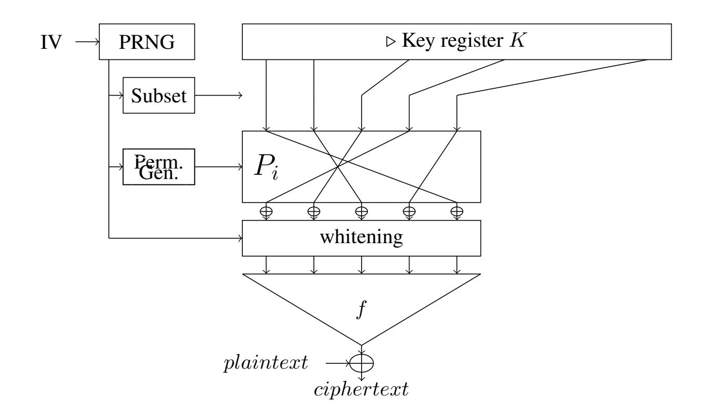
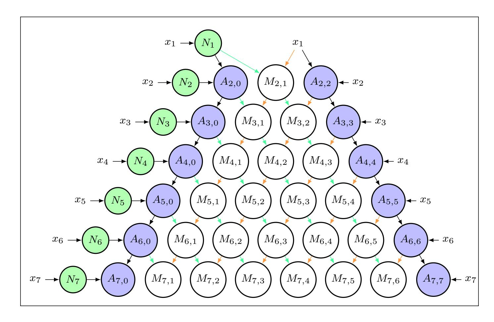
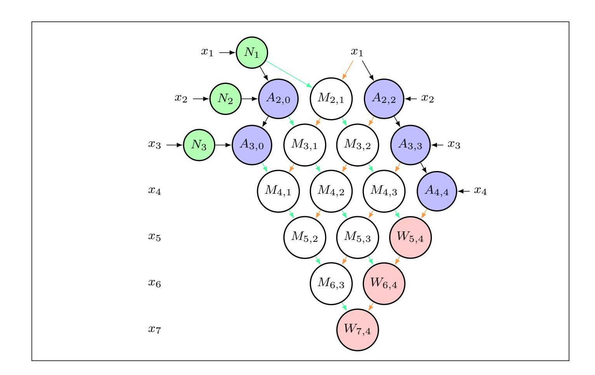

{0}------------------------------------------------

# <span id="page-0-0"></span>Transciphering, using FiLIP and TFHE for an efficient delegation of computation

Clement Hoffmann ´ <sup>1</sup>\*, Pierrick Meaux ´ 1 , Thomas Ricosset<sup>2</sup> .

1 ICTEAM/ELEN/Crypto Group, Universite catholique de Louvain, Louvain la neuve, Belgium. ´ <sup>2</sup> Thales, Gennevilliers, France

Abstract. Improved filter permutators are designed to build stream ciphers that can be efficiently evaluated homomorphically. So far the transciphering with such ciphers has been implemented with homomorphic schemes from the second generation. In theory the third generation is more adapted for the particular design of these ciphers. In this article we study how suitable it is in practice. We implement the transciphering of different instances of the stream cipher family FiLIP with homomorphic encryption schemes of the third generation using the TFHE library.

We focus on two kinds of filter for FiLIP. First we consider the direct sum of monomials, already evaluated using HElib and we show the improvements on these results. Then we focus on the XOR-threshold filter, we develop strategies to efficiently evaluate any symmetric Boolean function in an homomorphic way, allowing us to give the first timings for such filters. We investigate different approaches for the homomorphic evaluation: using the leveled homomorphic scheme TGSW, an hybrid approach combining TGSW and TLWE schemes, and the gate boostrapping approach. We discuss the costs in time and memory and the impact on delegation of computation of these different approaches, and we perform a comparison with others transciphering schemes.

keywords: Homomorphic Encryption, TFHE, Improved Filter Permutator, Transciphering.

## 1 Introduction.

Fully homomorphic encryption (FHE) enables to perform computations over encrypted data without decryption nor learning information on the data. Since the first construction due to Gentry [\[21\]](#page-22-0) in 2009, FHE is considered as the main solution to conceive a secure delegation of computation. The principle is the following: the delegating party, say Alice, encrypts her data using a FHE scheme and sends it to the computing party, say Bob. He evaluates the functions asked by Alice on her encrypted data, and sends back the encrypted results, without learning the values of the data sent by Alice. Two main efficiency problems arise with this framework: the FHE ciphers are costly to compute for Alice, and the expansion factor between the plaintext size and the ciphertext size is prohibitive. Instead, an efficient framework to delegate computations is obtained with an hybrid scheme, combining symmetric encryption (SE) and homomorphic encryption [\[31\]](#page-23-0). In this framework, Alice uses a classic symmetric

<sup>\*</sup>This work has been done during an internship at Thales.

{1}------------------------------------------------

scheme to encrypt her data before sending it to the server. The advantages of the SE schemes are the computation by devices with limited computational power or storage, and the optimal expansion factor: the ciphertext size is exactly the data size. Then, Bob transciphers these SE ciphertexts: he homomorphically evaluates the SE decryption to get homomorphic ciphertexts of Alice's data. Finally, Bob performs the computations required by Alice on the encrypted data and sends back the encrypted results, as in the initial framework. With such hybrid framework, an efficient transciphering gives an efficient delegation of computation.

Fully homomorphic encryption allows to evaluate any function, then the efficiency of this evaluation depends on how the function can be expressed in the native operations of the FHE scheme. Following Gentry's blueprint, FHE schemes are based on a somewhat encryption scheme and a bootstrapping. The somewhat (or leveled) scheme allows to perform a limited amount of two different operations, for example XOR and AND. In an homomorphic ciphertext the message is masked by a quantity of noise, and this noise is increasing during the operations, more or less importantly depending on the operation nature. The bootstrapping is the key technique that resets a ciphertext to be used again in the somewhat encryption scheme. The different costs in time (and storage) between the homomorphic operations and the bootstrapping depend on the FHE scheme, usually [1](#page-0-0) there is the following hierarchy of cost: one operation is more efficient than the other, and the bootstrapping is way more costly than the operations. Therefore, an efficient transciphering is obtained by a SE scheme which decryption function is fitting with the FHE cost hierarchy.

State-of-the-art. The so-called second generation (2G) of FHE which is represented by the schemes [\[5,](#page-21-0) [6,](#page-21-1) [20,](#page-22-1) [26\]](#page-22-2) has been widely used to implement transcipherings, using open-source libraries such as HElib [\[24\]](#page-22-3) and SEAL [\[10\]](#page-21-2). In these schemes the multiplication increases the noise way more than the addition and the bootstrapping is very costly. Therefore, when evaluating a function as a circuit, the multiplicative depth dictates the efficiency. The SE schemes considered for transciphering have been standard schemes with low multiplicative depth such as: AES [\[15,](#page-22-4) [22\]](#page-22-5), Simon [\[25\]](#page-22-6), Prince [\[17\]](#page-22-7) and Trivium [\[8\]](#page-21-3). More recent SE schemes are designed for advanced primitive such as multi-party computation, zero-knowledge and FHE and share the property of having a low multiplicative depth, and they give the most efficient transciherings so far. It is the case of the block-cipher LowMC [\[3,](#page-21-4) [4\]](#page-21-5), and the streamciphers Kreyvium [\[8\]](#page-21-3), FLIP [\[30\]](#page-23-1), Rasta [\[16\]](#page-22-8), and FiLIP [\[29\]](#page-23-2).

The third generation (3G), beginning with GSW scheme [\[23\]](#page-22-9) has a very different cost hierarchy. The multiplication is still more costly than the addition, but the error growth is asymmetric in the two operands, then long chains of multiplications can be evaluated without bootstrapping. The multiplicative depth does not dictate the efficiency in this case, and other SE schemes could give a better transciphering. This generation also allows the gate-bootstraping [\[11,](#page-21-6) [18\]](#page-22-10), to evaluate a Boolean gate and perform the bootstrapping at the same time, as quick as 13 ms [\[12\]](#page-21-7) over the TFHE library [\[14\]](#page-21-8). The 3G is promising for transciphering but none has been realized so far. The main reasons were the crippling sizes of the original ciphertexts in comparison with the 2G, and the difficulty to adapt a SE scheme to this particular cost hierarchy.

<sup>1</sup> the situation is different for FHE schemes that apply a bootstraping at each gate.

{2}------------------------------------------------

In this work we realize a transciphering with a FHE scheme of third generation. The SE scheme we consider is FiLIP [29], a stream-cipher designed for homomorphic evaluation. The principle of this stream cipher is to restrict the homomorphic computation to the evaluation of its filter: only one Boolean function f. For the security point of view, the filter needs to fulfill various cryptographic criteria on Boolean functions to resist known attacks up to a fixed level of security. If this filter can be evaluated appropriately with the homomorphic cost hierarchy, then the whole transciphering is efficient. We implement the transciphering using the TFHE library [14], offering different HE schemes of the third generation. We focus primarily on a version of the TGSW scheme, a variant of GSW [23] over the torus.

**Contributions.** We analyse the homomorphic evaluation of FiLIP with the TGSW scheme, we implement the transcipherings with two families of filters, using three homomorphic schemes of the third generation.

We study the homomorphic error growth of FiLIP with TGSW for two kinds of filters: direct sum of monomials (DSM) [29] and XOR-threshold functions suggested in [28]. For the DSM filter the bound on the error generalizes the bound of [30] on FLIP functions with GSW. To analyze the error growth of the second filter we show how to efficiently evaluate any symmetric Boolean function in 3G, and more particularly threshold functions. Then we bound the ciphertext error for XOR-threshold filters, confirming that a function with high multiplicative depth can be efficiently evaluated.

We implement the two different kinds of filters for instances designed for 128 bit-security with TGSW. We analyse the noise in practice and the timings of this transciphering, which gives a latency of less than 2s for the whole transciphering. We give a comparison with transcipherings from former works using the second homomorphic generation (on HElib for instance). For an equivalent resulting noise and security level, the latency of our transciphering is better than for the ones already existing.

Finally, we implement the same variants of FiLIP with an a hybrid TGSW/TLWE scheme and with the gate-bootstrapping FHE of [12], reaching a latency of 1.0s for an only-additive homomorphic scheme. We provide comparisons between the three evaluations of FiLIP we implemented and the evaluation over HElib in [29].

**Roadmap.** In Section 2, we remind definitions and properties from the TFHE scheme and FiLIP and describe the TGSW scheme we will use. In Section 3, we study the homomorphic evaluation of FiLIP filters and give a theoretical bound the noise after the transciphering. Finally, we present our practical results (resulting noises and timings) in Section 4 and compare our implementations to the ones already existing.

#### <span id="page-2-0"></span>2 Preliminaries.

We use the following notations:

- $\mathbb{B}$  denotes the set  $\{0,1\}$ , and [n] the set of integers from 1 to n.
- $-x \stackrel{\$}{\leftarrow} S$  means that x is uniformly randomly chosen in a set S.
- $\mathbb{T}$  denotes the real torus  $\mathbb{R}/\mathbb{Z}$ , *i.e.* the real numbers modulo 1.
- $\mathbb{T}_N[X]$  denotes  $\mathbb{R}[X]/(X^N+1) \pmod{1}$ ,  $\mathfrak{R}$  denotes the ring of polynomials  $\mathbb{Z}[X]/(X^N+1)$  and  $\mathbb{B}_N[X]$  denotes  $\mathbb{B}[X]/(X^N+1)$ .

{3}------------------------------------------------

- Vectors and matrices are denoted in bold (e.g.  $\mathbf{v}, \mathbf{A}$ ).  $\mathcal{M}_{m,n}(S)$  refers to the space of  $m \times n$  dimensional matrices with coefficients in S.
- w<sub>H</sub> denotes the Hamming weight of a binary vector.
- MUX refers to the multiplexer: for binary variables  $MUX(x_1, x_2, x_3)$  gives  $x_2$  if  $x_1 = 0$  and  $x_3$  if  $x_1 = 1$ . We call  $x_1$  the control bit,  $x_2$  the value at 0 and  $x_3$  the value at 1.

#### 2.1 Homomorphic encryption and TFHE.

In this section, we start by introducing definitions and properties from [11] on homomorphic encryption schemes and operations implemented in the TFHE library [14]. In a second time we describe the leveled homomorphic encryption scheme we will use for transciphering based on the TFHE definitions.

**TFHE Toolbox.** The TFHE library [14] implements a gate-by-gate bootstrapping based on [11, 12, 13]. Different homomorphic encryption schemes are combined for this bootstrapping: LWE, TLWE and TGSW. We present only definitions and properties needed for the evaluation of the TGSW leveled encryption scheme we will use in this work, and refer to [11] for more details.

**Definition 1** (**LWE samples**). Let  $k \in \mathbb{N}$  a dimension parameter,  $\alpha \in \mathbb{R}^+$  a noise parameter,  $\mathbf{s}$  a uniformly distributed secret in some bounded set  $S \subset \mathbb{Z}^n$ . A LWE sample under the key  $\mathbf{s}$  with noise parameter  $\alpha$  is a couple  $(\mathbf{a},b) \in \mathbb{T}^n \times \mathbb{T}$  where  $b-\langle \mathbf{s},\mathbf{a} \rangle$  follows a Gaussian distribution of standard deviation  $\alpha$ .

**Definition 2 (TLWE samples).** Let  $k \geq 1$ , N a power of 2,  $\alpha$  a noise parameter,  $\mathbf{s} \stackrel{\$}{\leftarrow} \mathbb{B}_N[X]^k$  a TLWE secret key. A fresh TLWE sample of a message  $\mu \in \mathbb{T}_N[X]$  with noise parameter  $\alpha$  under the key  $\mathbf{s}$  is a couple  $(\mathbf{a}, b) \in \mathbb{T}_N[X]^k \times \mathbb{T}_N[X]$ , where  $\mathbf{a}$  is uniformly chosen in  $\mathbb{T}_N[X]^k$  and  $b - \langle \mathbf{s}, \mathbf{a} \rangle$  follows a Gaussian distribution of standard deviation  $\alpha$  centered in  $\mu$ .

The scheme introduced in [11] gives a gate-bootstrapping of LWE ciphers. Instead, we focus on the homomorphic properties of TLWE: TLWE samples can be used to encrypt messages  $\mu \in \mathcal{P} \subset \mathbb{T}_N[X]$  as  $c = (\mathbf{a}, b) \in \mathbb{T}_N[X]^k \times \mathbb{T}_N[X]$ , where  $b = \langle \mathbf{a}, \mathbf{s} \rangle + \mu + e \in \mathbb{T}_N[X]$ . This variant of Regev's secret key encryption scheme is additively homomorphic as far as each coefficient of e is smaller than half the minimal distance between the coefficients of two possible messages. The introduction of TGSW ciphers with a decomposition of TLWE ciphers gives us a multiplicative homomorphic scheme.

**Definition 3 (Gadget decomposition).** For  $B_g \in \mathbb{N}$ , let define the gadget matrix  $\mathbf{H} \in \mathcal{M}_{(k+1)\cdot \ell, k+1}(\mathbb{T}_N[X])$  as:

{4}------------------------------------------------

$$\mathbf{H} = \begin{pmatrix} 1/B_g & \dots & 0 \\ \vdots & \ddots & \vdots \\ 1/B_g^{\ell} & \dots & 0 \\ \hline \vdots & \ddots & \vdots \\ \hline 0 & \dots & 1/B_g \\ \vdots & \ddots & \vdots \\ 0 & \dots & 1/B_g^{\ell} \end{pmatrix}$$

Decomp<sub>h,\beta,\epsilon</sub> (\mathbf{v}) is a decomposition algorithm on the gadget  $\mathbf{H}$  with quality  $\beta$  and precision  $\epsilon$  if and only if, for any TLWE sample  $\mathbf{v} \in \mathbb{T}_N[X]^{k+1}$ , it efficiently and publicly outputs a small vector  $\mathbf{u} \in \mathfrak{R}^{(k+1)\ell}$  such that  $||\mathbf{u}||_{\infty} \leq \beta$  and  $||\mathbf{u} \times \mathbf{H} - \mathbf{v}||_{\infty} \leq \epsilon$ . Furthermore, the expectation of  $\mathbf{u} \times \mathbf{H} - \mathbf{v}$  must be 0 when  $\mathbf{v}$  is uniformly distributed in  $\mathbb{T}_N[X]^{k+1}$ .

Such a decomposition with  $\beta = \frac{B_g}{2}$  and  $\epsilon = \frac{1}{2B_g^{\ell}}$  exists and an example is described in [11]. It allows to define TGSW samples:

**Definition 4 (TGSW samples).** Let  $\ell$  and  $k \geq 1$  two integers,  $\alpha \geq 0$  a noise parameter and  $\mathbf{H}$  the gadget matrix. Let  $\mathbf{s} \in \mathbb{B}_N[X]^k$  a TLWE key, then  $\mathbf{C} \in \mathcal{M}_{(k+1)\ell,k+1}(\mathbb{T}_N[X])$  is a fresh TGSW sample of  $\mu \in \mathfrak{R}$  such that  $\mu \cdot \mathbf{H} \neq 0$  with noise parameter  $\alpha$  if and only if  $\mathbf{C} = \mathbf{Z} + \mu \cdot \mathbf{H}$  where each row of  $\mathbf{Z} \in \mathcal{M}_{(k+1)\ell,k+1}(\mathbb{T}_N[X])$  is a TLWE cipher of 0 with noise parameter  $\alpha$ .

Note that the product between  $\mu$  and  $\mathbf{H}$  is the  $\mathfrak{R}$ -module product, which means that each coefficient of  $\mathbf{H}$  is multiplied by  $\mu$ . TGSW ciphers remain homomorphically additive, and we can now introduce the homomorphic multiplications:

**Definition 5** (External and internal products). Let define the external product  $\square$  and internal product  $\boxtimes$  as:

$$\begin{array}{c} \boxdot: TGSW \times TLWE \to TLWE \\ (A,\mathbf{b}) \mapsto A \boxdot \mathbf{b} = \texttt{Decomp}_{\mathbf{H},\beta,\epsilon}(\mathbf{b}) \cdot A \\ \\ \boxtimes: TGSW \times TGSW \to TGSW \\ \\ (A,B) \mapsto A \boxtimes B = \begin{pmatrix} A \boxdot \mathbf{b}_1 \\ \vdots \\ A \boxdot \mathbf{b}_{\ell} & \text{otherwise} \end{pmatrix}$$

where  $\forall i \in \{1, ..., (k+1)\ell\}$ ,  $\mathbf{b}_i$  corresponds to the i-th line of  $\mathbf{B}$ .

<span id="page-4-0"></span>A TGSW somewhat homomorphic scheme We describe a version of TGSW as a somewhat homomorphic encryption scheme, allowing to perform a bounded number of additions and multiplications. We consider a secret key scheme with plaintext space  $\mathcal{P} = \{0, 1\}$ .

{5}------------------------------------------------

#### **Definition 6 (TGSW leveled homomorphic encrytion scheme).**

Let  $k, N \in \mathbb{N}^*$ , N a power of 2 the dimension parameters. Let  $\ell, B_g \in \mathbb{N}$  the decomposition parameters. Let  $\alpha \in \mathbb{R}^+$  the noise parameter.

- KeyGen(k, N). From dimension parameters k, N, output  $\mathbf{sk} \stackrel{\$}{\leftarrow} \mathbb{B}_N[X]^k$ .
- $\operatorname{Enc}(\operatorname{\mathbf{sk}},\mu,\ell,B_g,\alpha)$ . Using as inputs  $\operatorname{\mathbf{sk}}\in\mathbb{B}_N[X]^k,\mu\in\{0,1\}$ ,  $\ell,B_g$  decomposition parameters, and  $\alpha$  the noise parameter:
  - Pick  $\mathbf{A} \stackrel{\$}{\leftarrow} \mathcal{M}_{(k+1)\ell,k}(\mathbb{T}_N[X])$ .
  - Compute  $\mathbf{e} = (e_i)_{i \in [(k+1)\ell]} \in \mathbb{T}_N[X]^{(k+1)\ell}$  where each  $e_i$  follows a centered *Gaussian distribution of standard deviation*  $\alpha$ *.*

• Compute 
$$Z = \begin{pmatrix} \mathbf{A} & \langle \mathbf{a_1}, \mathbf{sk} \rangle + e_1 \\ \vdots & \langle \mathbf{a_{(k+1)\ell}}, \mathbf{sk} \rangle + e_{(k+1)\ell} \end{pmatrix} \in \mathcal{M}_{(k+1)\ell,k+1}(\mathbb{T}_N[X]).$$
• Output  $\mathbf{C} = \mathbf{Z} + \mu \cdot \mathbf{H}$ .

- $Dec(sk, C, \ell, B_g)$ . Using as inputs the secret key sk, and a ciphertext C,
  - Denote  $(\mathbf{a},b) \in \mathbb{T}_N[X]^k \times \mathbb{T}_N[X]$  the  $(k\ell+1)^{th}$  line of  $\mathbf{C}$ , compute  $\varphi =$  $b - \langle sk, \mathbf{a} \rangle \in \mathbb{T}_N[X].$
  - $\bullet$  Round up the constant coefficient of  $\varphi$  to the closest  $\frac{i}{B_g} \in \mathbb{T}$  where  $i \in \mathbb{N}$ , denoted  $\frac{i_m}{B_a}$ .
  - Output  $m \in \{0,1\}$  the parity of  $i_m$ .
- The Eval algorithm consists in iterating the homomorphic operations Add and Mul.
  - $Add(C_1, C_2) : C_+ = C_1 + C_2$ .
  - $\operatorname{Mul}(\mathbf{C}_1, \mathbf{C}_2, B_q, \ell) : \mathbf{C}_{\times} = \mathbf{C}_1 \boxtimes \mathbf{C}_2.$

With this scheme, a TGSW ciphertext remains valid as far as the error terms are lower than  $\frac{1}{2B_a}$ . To follow the noise evolution with the homomorphic computations we use a worst case bound on the error coefficients (infinite norm), or an average bound on the variance of these coefficients, using the independence assumption formalized in [11]. To relate the error norm and the variance we use the Markov's inequality applied on subgaussians as in [11], it allows to estimate the maximal variance that can be tolerated for a fixed decryption failure.

<span id="page-5-0"></span>**Assumption 1** (Independence Heuristic ([11] Assumption 3.6, [13] Assumption 3.11)). All the coefficients of the error of TLWE or TGSW samples that occur in all the operations we consider are independent and concentrated. More precisely, they are  $\sigma$ -subgaussian where  $\sigma$  is the square-root of their variance.

<span id="page-5-2"></span>**Proposition 1** (Markov's inequality on subgaussians [11]). Let X be a  $\sigma$ -subgaussian then  $\forall t > 0, P(|X| > t) \le 2e^{-\frac{t^2}{2\sigma^2}}$ .

<span id="page-5-1"></span>We summarize the noise evolution during the homomorphic evaluation proven in [11]. The equations are simplified since  $\mu \in \{0,1\}$ : since the plaintexts are binary, they directly appear in the noise formula.

{6}------------------------------------------------

**Proposition 2** (**TGSW** noise evolution, adapted form [11]). Using the notations of Definition 6, for  $i \in [3]$  let  $\mathbf{C_i}$  be a TGSW cipher of  $\mu_i$  with error noise variance  $V_i$  and infinite norm  $\varepsilon_i$ . We denote by  $V_+$  and  $\varepsilon_+$  the error variance and infinite norm of  $\mathbf{C_1} \bowtie \mathbf{C_2}$ , by  $V_\times$  and  $\varepsilon_\times$  the error variance and infinite norm of  $\mathbf{C_1} \bowtie \mathbf{C_2}$ , by  $V_M$  and  $\varepsilon_M$  the error variance and infinite norm of  $\mathsf{MUX}(\mathbf{C_1},\mathbf{C_2},\mathbf{C_3}) = \mathbf{C_1} \bowtie (\mathbf{C_3} - \mathbf{C_2}) + \mathbf{C_2}$ . Then:

$$\begin{cases} \varepsilon_{+} \leq \varepsilon_{1} + \varepsilon_{2}, & V_{+} \leq V_{1} + V_{2}, \\ \varepsilon_{\times} \leq c_{1}e_{1} + \mu_{1} (c_{2} + e_{2}), & V_{\times} \leq c_{3}V_{1} + \mu_{1} (c_{4} + V_{2}), \\ \varepsilon_{M} \leq \max(\varepsilon_{2}, \varepsilon_{3}) + c_{1}e_{1} + c_{2}, & V_{M} \leq \max(V_{2}, V_{3}) + c_{3}V_{1} + c_{4}, \end{cases}$$

where  $c_1 = (k+1)\ell N(B_g/2)$ ,  $c_2 = (1+kN)/(2B_g^{\ell})$ ,  $c_3 = (k+1)\ell N(B_g/2)^2$ ,  $c_4 = (1+kN)/(2B_g^{\ell})^2$ . The variances bounds are obtained assuming Assumption 1.

#### 2.2 Boolean functions and FiLIP.

We recall the definitions of a Boolean function, their common representation, and some families of functions.

**Definition 7** (Boolean function). A Boolean function f with n variables is a function from  $\mathbb{F}_2^n$  to  $\mathbb{F}_2$ .

**Definition 8 (Algebraic Normal Form (ANF)).** We call Algebraic Normal Form of a Boolean function f its n-variable polynomial representation over  $\mathbb{F}_2$ :

$$f(x) = \sum_{I \subseteq [n]} a_I \left( \prod_{i \in I} x_i \right) = \sum_{I \subseteq [n]} a_I x^I,$$

where  $a_I \in \mathbb{F}_2$ .

- The algebraic degree of f equals the global degree  $\max_{\{I \mid a_I=1\}} |I|$  of its ANF.
- Any term  $\prod_{i\in I} x_i$  in such an ANF is called a monomial and its degree equals |I|.

**Definition 9** (Direct sum of monomials & direct sum vector [30]). Let f be a Boolean function of n variables, we call f a Direct Sum of Monomials (or DSM) if the following holds for its ANF:  $\forall (I, J)$  such that  $a_I = a_J = 1$ ,  $I \cap J \in \{\emptyset, I \cup J\}$ .

Let f a DSM, we define its direct sum vector:  $\mathbf{m}_f = [m_1, m_2, \dots, m_k]$  of length  $k = \deg(f)$ , where  $m_i$  is the number of monomials of degree i of f: for i > 0,  $m_i = |\{a_I = 1, \text{ such that } |I| = i\}|$ .

Note that DSM corresponds to functions where each variable appears at most once in the ANF.

**Definition 10** (Threshold function). Let  $n \in \mathbb{N}^*$ , for any positive integers  $d \le n + 1$  we define the Boolean function  $\mathsf{T}_{d,n}$  as:

$$\forall x = (x_1, \dots, x_n) \in \mathbb{F}_2^n, \quad \mathsf{T}_{d,n}(x) = \begin{cases} 1 & \textit{if } \mathsf{w}_\mathsf{H}(x) \ge d, \\ 0 & \textit{otherwise.} \end{cases}$$

{7}------------------------------------------------

**Definition 11 (XOR-THR function).** For any positive integers k, d and n such that  $d \le n + 1$  we define  $\mathsf{XTHR}_{k,d,n}$  for all  $z = (x_1, \ldots, x_k, y_1, \ldots, y_n) \in \mathbb{F}_2^{k+n}$  as:

$$\mathsf{XTHR}_{k,d,n}(z) = x_1 + \dots + x_k + \mathsf{T}_{d,n}(y_1,\dots,y_n) = \mathsf{XOR}_k(x) + \mathsf{T}_{d,n}(y).$$

The symmetric encryption schemes we will evaluate are binary streamciphers following the improved filter permutator construction [29], illustrated in Figure 1. The encryption process is the following: denoting by N the size of the key, n the size of the input of the filtering function ( $n \le N$ ) and f the n-variables filtering function:

- The forward secure PRNG outputs the subset, the permutation and the whitening at each clock cycle,
- the subset  $S_i$  is chosen as a subset of n elements over N,
- the permutation  $P_i$  from n to n elements is chosen,
- the whitening  $w_i \in \mathbb{F}_2^n$  is chosen,
- the key-stream bit is computed as  $s_i = f(P_i(S_i(K)) + w_i)$ .



<span id="page-7-0"></span>Fig. 1. Improved filter permutator constructions.

The streamcipher family FiLIP is an instantiation of the improved filter permutator paradigm where the PRNG is a variant of AES in counter mode, and the wire-cross permutations are generated by the Knuth shuffle. We will focus on 3 candidates proposed for 128-bit security:

- FiLIP-1216 [29], DSM filter,  $\mathbf{m}_f = [128, 64, 0, 80, 0, 0, 0, 80], n = 1216, N = 2^{14},$
- FiLIP-1280 [29], DSM filter,  $\mathbf{m}_f = [128, 64, 0, 0, 0, 0, 0, 0, 0, 0, 0, 0, 0, 0, 0,$
- FiLIP-144 [28], XOR-THR filter,  $f = XTHR_{81,32,63}$ , n = 144,  $N = 2^{14}$ .

{8}------------------------------------------------

#### <span id="page-8-0"></span>3 Homomorphic evaluation of FiLIP.

During the transciphering with FiLIP only the filter evaluation has an impact on the ciphertexts' noise. Indeed, as explained in [29] the subset selection and wire-cross permutation are performed in clear. The whitening gives indexes where a homomorphic NOT needs to be applied, which can be realized without increasing the noise.

In this section we study how to evaluate FiLIP filters efficiently with TGSW. First we give a Boolean circuit to compute any symmetric Boolean functions with few gates. This circuit improves the homomorphic evaluation for several FHE schemes, but its design is primarily based on optimizing GSW-like FHE evaluation. It will be the core of the evaluation of XOR-THR filters. Then we specify which representation and therefore which circuit we use for the two kinds of filters, giving a lower bound on the Boolean gates to homomorphically evaluate in each case. Finally we give an upper bound on the noise in the TGSW ciphertext obtained after evaluating the different filters.

#### <span id="page-8-1"></span>3.1 Evaluation of symmetric Boolean functions.

In this part we focus on efficiently evaluating threshold functions. Since they are symmetric Boolean functions (the result does not depend on the order of the n inputs), they can be evaluated in different ways. The ANF of such functions is characterized in [27]; when  $n \geq 2^{\lceil \log d \rceil}$  all the monomials of this degree appear in the ANF, which seems prohibitive for any evaluation. Nevertheless, evaluating branching programs [7] or finite automata [11] has been shown to be very promising with the third generation. Hence, we consider the evaluation of thresholds function, or other symmetric Boolean function, with MUX gates (multiplexers) rather than based on the ANF representation.

**Definition 12** (Circuit for symmetric functions). Let  $n \in \mathbb{N}$ ,  $n \geq 2$ , we define the Boolean circuit  $C_n$  with n inputs  $x_1$  to  $x_n$  and n+1 outputs  $y_0$  to  $y_n$  with the following gates:

- n NOT gates  $N_1$  to  $N_n$ , where for  $i \in [n]$  each  $N_i$  has input  $x_i$ .
- 2(n-1) AND gates  $A_{i,0}$  and  $A_{i,i}$  for  $i \in [2, n]$ , where:
  - the inputs of  $A_{2,0}$  are  $N_1$  and  $N_2$ , and for  $i \in [3,n]$  the inputs of  $A_{i,0}$  are  $N_i$  and  $A_{i-1,0}$ ,
  - the inputs of  $A_{2,2}$  are  $x_1$  and  $x_2$ , and for  $i \in [3, n]$  the inputs of  $A_{i,i}$  are  $x_i$  and  $A_{i-1,i-1}$ .
- $\binom{n}{2}$  MUX gates  $M_{i,j}$  where  $i \in [2, n]$  and  $j \in [i-1]$ , where:
  - the inputs of  $M_{2,1}$  are  $x_2$  for the control bit,  $x_1$  for the value at 0, and  $N_1$  for the value at 1,
  - the inputs of  $M_{i,1}$  for  $i \in [3, n]$  are  $x_i$  for the control bit,  $M_{i-1,1}$  for the value at 0, and  $A_{i-1,0}$  for the value at 1,
  - the inputs of  $M_{i,i-1}$  for  $i \in [3,n]$  are  $x_i$  for the control bit,  $A_{i-1,i-1}$  for the value at 0, and  $M_{i-1,i-2}$  for the value at 1,
  - the inputs of  $M_{i,j}$  for  $i \in [4, n]$  and  $j \in [2, i 2]$  are  $x_i$  for the control bit,  $M_{i-1,j}$  for the value at 0, and  $M_{i-1,j-1}$  for the value at 1.

The outputs are given by  $A_{n,0}, M_{n,1}, \ldots, M_{n,n-1}, A_{n,n}$ .

{9}------------------------------------------------

To illustrate we give the example of  $C_7$  in Figure 2. The principle of this multioutput circuit is to compute the Hamming weight of the vector of inputs, as formalized in the following proposition:

<span id="page-9-0"></span>**Proposition 3.** Let  $n \in \mathbb{N}$ ,  $n \geq 2$ ,  $\forall x \in \mathbb{F}_2^n$  the vector of outputs of  $C_n$  gives 1 at index  $w_H(x)$  and 0 elsewhere.

*Proof.* We do the proof by induction. We show that  $\forall i \in [2, n]$  only one of the gates  $A_{i,j}$  or  $M_{i,j}$  (where  $j \in [0,i]$ ) gives 1. The index j of this gate corresponds the Hamming weight of the i-th-length prefix of x:  $(x_1, \ldots, x_i)$ . Note that the statements always neglect the NOT gates.

For the initialization step we exhaust the four cases, the values for  $(x_1, x_2) \in \mathbb{F}_2^2$  of  $(A_{2,0}, M_{2,1}, A_{2,2})$  are: (0,0;1,0,0), (1,0;0,1,0), (0,1;0,1,0), and (1,1;0,0,1). For the four cases only one of the three gates of level 2 gives 1, the one with index  $j = \mathsf{w}_\mathsf{H}(x_1, x_2)$ , which validates the initialization.

Let assume for one  $i \in [2, n-1]$  that only the gate of index  $j = \mathsf{w}_\mathsf{H}(x_1, \dots, x_i)$  outputs 1 and all the others at level i give 0. Note that at level i+1 the AND gate  $A_{i+1,0}$  could by written as a MUX gate with control bit  $x_{i+1}$ , the output of  $A_{i,0}$  for value at 0 and 0 for value at 1. Similarly, the AND gate  $A_{i+1,i+1}$  could by written as a MUX gate with control bit  $x_{i+1}$ , the output of  $A_{i,i}$  for value at 1 and 0 for value at 0. Consequently, the i+2 gates at level i+1 correspond to MUX gates: they all output their value at 0 (i.e. value of their right parent) if  $x_{i+1} = 0$ , or value at 0 (i.e. left parent) if  $x_{i+1} = 1$ . Therefore, the vector of outputs at level i+1 is the one of level i with a 0 appended on the right if  $x_{i+1} = 0$  or on the left if  $x_{i+1} = 1$ . It guarantees that there is only one 1 at level i+1, the index being  $\mathsf{w}_\mathsf{H}(x_1, \dots, x_i)$  if  $x_{i+1} = 0$  and  $\mathsf{w}_\mathsf{H}(x_1, \dots, x_i) + 1$  if  $x_{i+1} = 1$ , in both cases it corresponds to  $\mathsf{w}_\mathsf{H}(x_1, \dots, x_{i+1})$ . This proves the induction step, and allows to conclude the induction. Since the property applies for i=n the outputs  $y_0, \dots, y_n$  of  $\mathcal{C}_n$  for  $x \in \mathbb{F}_2^n$  are such that  $y_{\mathsf{w}_\mathsf{H}(x)} = 1$  and the others are equal to 0.

The interest of the circuit  $C_n$  is to compute symmetric Boolean functions with a low number of gates. Note that for  $i \in [0, n]$  the output  $y_i$  gives the result of the indicator function of the set  $\{x \in \mathbb{F}_2^n \mid \mathsf{w}_\mathsf{H}(x) = i\}$ . Since these functions form a basis of the symmetric n-variable Boolean functions, any symmetric n-variable Boolean function can be computed by xoring outputs of  $C_n$ . For the threshold function  $\mathsf{T}_{d,n}$  it would consist in xoring the outputs from  $y_d$  to  $y_n$ . Nevertheless, computing  $C_n$  and xoring some of the outputs involves unnecessary computations, therefore we will prefer a simplified circuit for  $\mathsf{T}_{d,n}$  which has around twice less gates.

To simplify the description we introduce a new Boolean gate, used instead of some MUX gates in  $C_n$ .

**Definition 13 (Modified** MUX gate). Let  $x_1, x_2, x_3 \in \mathbb{F}_2^n$ , the modified MUX gate WUX is defined as WUX $(x_1, x_2, x_3) = x_1x_3 + x_2$ , where by analogy with the MUX  $x_1$  is called the control bit,  $x_2$  the value at 0, and  $x_3$  the value at 1.

Note that the only difference with the classic gate is that  $x_3$  is  $x_3 + x_2$  in the MUX gate, and the WUX gate is simply computed with one AND and one XOR. The simpler circuit to compute  $\mathsf{T}_{d,n}$  is obtained by two modifications. First, we delete the gates only

{10}------------------------------------------------



<span id="page-10-0"></span>**Fig. 2.** Boolean circuit  $C_7$ . The control bit of each level of MUX is the input  $x_i$  on the left side, the left arrow  $(\rightarrow)$  in input of a MUX corresponds to the input for a control bit equal to 0 and the right arrow  $(\rightarrow)$  for the value at 1.

used to compute the  $y_i$  such that i < d (it corresponds to delete  $A_{n-d+1,0}$  and all the gates depending on its value). Then, we subside the parts leading to  $y_i$  such that i > d by sums as soon as possible in the computation using WUX gates (it corresponds to delete  $A_{d+1,d+1}$  and all the gates depending on its value, and converting the MUX gates depending on the value of  $A_{d,d}$  into WUX gates). We formalize the obtained circuit in Definition 14, illustrate it with the example of  $T_{4,7}$  in Figure 3, and assess its property in the following proposition.

<span id="page-10-1"></span>**Definition 14** (Threshold circuit). Let  $d, n \in \mathbb{N}$ ,  $n \geq 4$ ,  $2 \leq d \leq n-2$ , we define the Boolean circuit  $\mathcal{T}_{d,n}$  with n inputs  $x_1$  to  $x_n$  and one output with the following gates:

- n-d NOT gates  $N_1$  to  $N_{n-d}$ , where for  $i \in [n-d]$  each  $N_i$  has input  $x_i$ .
- n-2 AND gates  $A_{i,0}$  for  $i \in [2, n-d]$  and  $A_{i,i}$  for  $i \in [2, d]$ , where:
  - the inputs of  $A_{2,0}$  are  $N_1$  and  $N_2$ , and for  $i \in [3, n-d]$  the inputs of  $A_{i,0}$  are  $N_i$  and  $A_{i-1,0}$ ,
  - the inputs of  $A_{2,2}$  are  $x_1$  and  $x_2$ , and for  $i \in [3,d]$  the inputs of  $A_{i,i}$  are  $x_i$  and  $A_{i-1,i-1}$ .
- (n-d)(d-1) MUX gates  $M_{i,j}$  for  $i \in [2, n-1]$ ,  $j \in [\max(1, i-(n-d)), \min(i-1, d-1)]$ , where:
  - the inputs of  $M_{2,1}$  are  $x_2$  for the control bit,  $x_1$  for the value at 0, and  $N_1$  for the value at 1,
  - the inputs of  $M_{i,1}$  for  $i \in [3, n-d+1]$  are  $x_i$  for the control bit,  $M_{i-1,1}$  for the value at 0, and  $A_{i-1,0}$  for the value at 1,

{11}------------------------------------------------

- the inputs of  $M_{i,i-1}$  for  $i \in [3,d]$  are  $x_i$  for the control bit,  $A_{i-1,i-1}$  for the value at 0, and  $M_{i-1,i-2}$  for the value at 1,
- the inputs of  $M_{i,j}$  for  $i \in [4, n-1]$  and  $j \in [\max(1, i-(n-d)), \min(i-1, d-1)]$  are  $x_i$  for the control bit,  $M_{i-1,j}$  for the value at 0, and  $M_{i-1,j-1}$  for the value at 1.
- (n-d) WUX gates  $W_{i,d}$  for  $i \in [d+1, n]$  where:
  - the inputs of  $W_{d+1,d}$  are  $x_{d+1}$  for the control bit,  $A_{d,d}$  for the value at 0, and  $M_{d,d-1}$  for the value at 1,
  - the inputs of  $W_{i,d}$  for  $i \in [d+2, n]$  are  $x_i$  for the control bit,  $W_{i-1,d}$  for the value at 0, and  $M_{i-1,d-1}$  for the value at 1.

The output is given by  $W_{n,d}$ .

12



<span id="page-11-0"></span>**Fig. 3.** Boolean circuit  $\mathcal{T}_{4,7}$ . The control bit of each level of MUX is the input  $x_i$  on the left side, the left arrow  $(\rightarrow)$  in input of a MUX (or WUX) corresponds to the input for a control bit equal to 0 and the right arrow  $(\rightarrow)$  for the value at 1.

<span id="page-11-1"></span>**Proposition 4.** Let  $d, n \in \mathbb{N}$ ,  $n \geq 4$ ,  $2 \leq d \leq n-2$ ,  $\forall x \in \mathbb{F}_2^n$  the Boolean circuit  $\mathcal{T}_{d,n}$  computes  $\mathsf{T}_{d,n}(x)$ .

*Proof.* By construction  $\mathcal{T}_{d,n}$  is obtained from  $\mathcal{C}_n$  by two main transformations: deleting  $A_{n-d+1,0}$  and the gates depending on its output (plus the d NOT gates such that i > n-d), and merging the gates depending on  $A_{d,d}$  into one WUX gate at each level i for  $i \in [d+1,n]$ . We will first prove by induction that in the circuit obtained from  $\mathcal{C}_n$  by

{12}------------------------------------------------

merging the gates depending on Ad,d in n − d WUX gates Wi,d, the following property holds: Wi,d gives 1 if and only if wH(x1, . . . , xi) ≥ d. Then we will show that deleting all the part depending on An−d+1,<sup>0</sup> does not impact the computation of Wn,d which gives the output.

We define the Boolean circuit Cd,n as C<sup>n</sup> where for i ∈ [d + 1, n] the AND gate Ai,i and the MUX gates Mi,j for j ∈ [d, i − 1] are merged into the WUX gate Wi,d. Wd+1,d has control bit xd+1, Ad,d as value at 0 and Md,d−<sup>1</sup> as value at 1. For i ∈ [d+2, n], Wi,d has control bit x<sup>i</sup> , Wi,d as value at 0 and Mi,d−<sup>1</sup> as value at 1. We show by induction that ∀i ∈ [d + 1, n] Wi,d gives 1 if and only if wH(x1, . . . , xi) ≥ d, and only one of the gates Ai,0, Wi,d, Mi,j for j ∈ [d − 1] gives 1.

For the initialization step, i = d + 1, Cd,n up to the level d is exactly Cd, therefore using Proposition [3](#page-9-0) Md,d−<sup>1</sup> gives 1 if and only if wH(x1, . . . , xd) = d − 1 and Ad,d gives 1 if and only if wH(x1, . . . , xd) = d. We consider the three possible cases: both gates give 0, Md,d−<sup>1</sup> gives 1, and Ad,d gives 1. In the first case the value of Wi,d is xd+1 ·0+0 = 0 and since wH(x1, . . . , xd) < d−1 we get wH(x1, . . . , xd+1) < d. In the second case the value of Wi,d is xd+1 · 1+ 0 = xd+1 and since wH(x1, . . . , xd) = d−1 we get wH(x1, . . . , xd+1) = d if xd+1 = 1 and wH(x1, . . . , xd+1) = d−1 if xd+1 = 0. In the third case the value of Wi,d is xd+1 · 0 + 1 = 1 and since wH(x1, . . . , xd) = d we get wH(x1, . . . , xd+1) ≥ d. Summarizing the three cases Wd+1,d gives 1 if and only if wH(x1, . . . , xd+1) ≥ d. Note that the gates Ad+1,<sup>0</sup> and Md+1,j for j ∈ [d − 1] are computed exactly as in Cd+1. Hence, from Proposition [3](#page-9-0) only one of them gives 1 if wH(x1, . . . , xd+1) < d and none if wH(x1, . . . , xd+1) ≥ d. Therefore only one of the gates Ad+1,0, Wd+1,d, Md+1,j for j ∈ [d−1] gives 1, which validates the initialization.

Let assume that for one i ∈ [d+2, n] Wi,d gives 1 if and only if wH(x1, . . . , xi) ≥ d, and only one of the gates Ai,0, Wi,d, Mi,j for j ∈ [d − 1] outputs 1. Note that the gates Ai+1,0, Mi+1,j for j ∈ [d − 1] are computed exactly as in Ci+1, therefore Proposition [3](#page-9-0) guarantees that at most one outputs 1: if its index j = wH(x1, . . . , xi+1). We consider the three possible cases: Wi,d and Mi,d−<sup>1</sup> both give 0, Mi,d−<sup>1</sup> gives 1, and Wi,d gives 1. In the first case the value computed by Wi+1,d is 0, since wH(x1, . . . , xi) < d−1 (Wi,d and Mi,d−<sup>1</sup> both null) then wH(x1, . . . , xi+1) < d, and only one of the gates Ai+1,0, Mi+1,j for j ∈ [d − 1] gives 1. In the second case the value computed by Wi+1,d is xi+1, therefore if xi+1 = 0 then wH(x1, . . . , xi+1) = wH(x1, . . . , xi) = d − 1 and Mi+1,d−<sup>1</sup> is the only gate at level i + 1 giving 1. If xi+1 = 1 then wH(x1, . . . , xi+1) = wH(x1, . . . , xi)+ 1 = d, none of the gates Ai+1,0, Mi+1,j for j ∈ [d−1] gives 1, hence Wi+1,d is the only one giving 1. In the last case the value computed by Wi+1,d is 1, wH(x1, . . . , xi) ≥ d so wH(x1, . . . , xi+1) ≥ d and only the gate Wi+1,d gives 1 at level i+1. Summarizing the different cases Wi+1,d gives 1 if and only if wH(x1, . . . , xi+1) ≥ d, and only one of the gates Ai+1,0, Wi+1,d, Mi+1,j for j ∈ [d − 1] outputs 1, which allows to conclude the induction.

To finalize the proof, note that the output of Cd,n given by Wn,d, that we call zd, gives the value of Td,n(x). None of the gates depending on An−d+1,<sup>0</sup> nor N<sup>i</sup> for i ∈ [n − d + 1, n] are evaluated in the path leading to zd. Hence z<sup>d</sup> can be computed by the circuit modified from Cd,n by removing all these gates. It corresponds to the circuit Td,n, concluding the proof.

{13}------------------------------------------------

*Remark 1.* The restrictions d ≥ 2 and n − d ≥ 2 come from the circuit description: always having AND gates on the left and right side. Valid circuits for the remaining values can be obtained by removing some of these gates (changing the general description): the Ai,<sup>0</sup> gates are unnecessary for d ≥ n − 2 and the Ai,i gates are unnecessary for d ≤ 2.

#### <span id="page-13-1"></span>3.2 Evaluating FiLIP filters.

For the homomorphic evaluation the filter needs to be computed without knowing the value in the input ciphertexts, hence using the same Boolean circuit for the 2 <sup>n</sup> possible inputs. A circuit to evaluate a Boolean function f can be derived from its ANF: each monomial can be computed as the AND of the variables of this monomial, and the sum over all the monomials in the ANF can be performed with XOR gates. It is the strategy we use to evaluate DSM since they have a very sparse ANF (at most n monomials over 2 <sup>n</sup>). The situation is different for XOR-THR functions, the threshold part has a dense ANF. The threshold function we consider for FiLIP-144: T32,<sup>63</sup> belongs to the subfamily T<sup>2</sup> <sup>t</sup>,2 <sup>t</sup>+1−<sup>1</sup> and therefore its ANF consists in the 2 <sup>t</sup>+1−1 2 t monomials of degree 2 t (see *e.g.* [\[27\]](#page-22-12) Theorem 1). In this case the circuit based on the ANF would lead to XOR around 9 · 10<sup>17</sup> AND of 32 terms. Instead we will use the circuit Td,n of Section [3.1.](#page-8-1)

In the following proposition we give the number (and nature) of Boolean gates required to homomorphically compute the different filters.

Proposition 5 (FiLIP's filter evaluation). *Let* f *be the filter function of FiLIP,* f *can be computed with at most the following number of Boolean gates:*

- f *is the DSM with direct sum vector* m<sup>f</sup> = [m1, . . . , mk]*:* 0 NOT*,* m − 1 XOR*, and* n − m AND *where* m = P<sup>k</sup> <sup>i</sup>=1 m<sup>i</sup> *.*
- f *is the XOR-threshold function* XTHRk,d,n*:* n − d NOT*,* (n − d)(2d − 1) + k XOR*, and* (n − d)d + n − 2 AND*.*

*Proof.* For a DSM, since each variable appears only once in the ANF, the result can be computed in n − 1 XOR and AND gates. The number of monomials being m, m − 1 XOR are needed, which also gives the number of AND.

For a XOR-THR function, using Proposition [4](#page-11-1) the Boolean circuit Td,n computes Td,n, which gives the number of NOT, AND, MUX, and WUX gates to evaluate it. Counting that a MUX can be computed with 2XOR and 1AND, and 1XOR and 1AND for a WUX, and that k XOR are necessary to sum the XOR<sup>k</sup> part leads to the final number of gates.

#### 3.3 Noise evolution with TGSW.

<span id="page-13-0"></span>In this part we bound the error infinite norm and variance of the ciphers after transciphering in term of error parameters of the initial ciphers. Each XOR is evaluated by Add, each AND by Mul and NOT gate by subtracting the ciphertext to H.

{14}------------------------------------------------

Proposition 6 (FiLIP error-growth). *Let* f *be the filter function of FiLIP, let* C<sup>i</sup> *,* i ∈ [n]*, fresh TGSW ciphertexts with error variance and infinite norm* V *and* ε*, and* C<sup>f</sup> *the ciphertext obtained by homomorphically evaluating* f *with error variance and infinite norm* V<sup>f</sup> *and* ε<sup>f</sup> *. The following bounds apply:*

– *if* f *is the DSM with direct sum vector* m<sup>f</sup> = [m1, . . . , mk] *then:*

$$\varepsilon_f \leq (n-m)(c_1\varepsilon + c_2) + m\varepsilon$$
, and  $V_f \leq (n-m)(c_3V + c_4) + mV$ ,

– *if* f *is the XOR-threshold function* XTHRk,d,n *then:*

$$\varepsilon_f \leq \frac{(n+d-2)(n-d+1)}{2}(c_1\varepsilon + c_2) + (n-d+k+1)\varepsilon$$
, and

$$V_f \le \frac{(n+d-2)(n-d+1)}{2}(c_3V+c_4) + (n-d+k+1)V,$$

*where the variance bounds assume the independence heuristic Assumption [1.](#page-5-0)*

*Proof.* We refer to noise parameters for the two quantities error infinite norm and variance. The results on the error variance assume Assumption [1,](#page-5-0) not the ones on the error infinite norm.

We begin the proof by considering the DSM filter. Using Proposition [2,](#page-5-1) the noise parameters associated to a product of i ∈ N ∗ fresh ciphertexts (the noisiest ciphertext always taken as the second operand) are εΠ<sup>i</sup> ≤ (i − 1)(c1ε + c2) + ε and VΠ<sup>i</sup> ≤ (i − 1)(c3ε + c4) + V . It gives the noise parameters of the ciphertexts corresponding to the monomial of degree i. We use the noise formulas for the addition on the m<sup>i</sup> products of i ciphertexts (for i ∈ [k]) and then for the sum of these k ciphertexts. It finally gives:

$$\varepsilon_f \le \sum_{i=1}^k m_i \varepsilon_{\Pi_i} \le \sum_{i=1}^k m_i \left( (i-1)(c_1 \varepsilon + c_2) + \varepsilon \right)$$

$$\le \sum_{i=1}^k i m_i (c_1 \varepsilon + c_2) + \sum_{i=1}^k m_i \left( \varepsilon - (c_1 \varepsilon + c_2) \right) = (n-m)(c_1 \varepsilon + c_2) + m \varepsilon,$$

where m is the number of monomials of f and n its number of variables. Similarly, V<sup>f</sup> ≤ (n − m)(c3V + c4) + mV .

For the XOR-threshold function we start with the noise parameters for the evaluation of Td,n using the circuit Td,n. We bound the noise parameters of each ciphertext of the binary value obtained at each gate of the circuit since the ciphertext of Td,n is the output of the circuit. for readability we write *noise parameters of the gate* for the noise parameters of the ciphertext obtained after the evaluation of the circuit up to this gate. We proceed by studying separately the NOT, AND, MUX, and WUX gates, and we refer to their level in the circuit (the index i in Definition [14\)](#page-10-1). First, the noise parameters of NOT gates is the same as its input. Then, the AND gates are obtained by products of fresh ciphertexts then the noise parameters of Ai,j are ε<sup>Π</sup><sup>i</sup> and V<sup>Π</sup><sup>i</sup> . For the MUX gates we show by induction on the level i ∈ [2, n − 1] that all MUX of level i have noise parameters ε<sup>M</sup><sup>i</sup> ≤ (i − 1)(c1ε + c2) + ε and

{15}------------------------------------------------

 $V_{M_i} \leq (i-1)(c_3V+c_4)+V$  (the same bounds as for  $\varepsilon_{\Pi_i}$  and  $V_{\Pi_i}$ ). For the initialization step, i=2, the only MUX gate is computed as MUX( $C_2, C_1, H-C_i$ ). Thereafter, the noise formula of the MUX in Proposition 2 gives  $\varepsilon_{M_2} \leq \varepsilon + c_1 \varepsilon + c_2$ , validating the initialization. For the induction step, we assume that at level i we have the bound  $\varepsilon_{M_i} \leq \varepsilon + (i-1)(c_1\varepsilon + c_2)$ . By definition of  $\mathcal{T}_{d,n}$  each MUX gate at level i+1 has input control bit  $x_{i+1}$  and the two other inputs are AND or MUX gates of the level i. From the induction hypothesis the error infinite norm relative to both these inputs is lower than or equal to  $\varepsilon + (i-1)c_1\varepsilon + c_2$ . Hence, the noise formula for the MUX gives  $\varepsilon_{M_{i+1}} \le \varepsilon + (i-1)(c_1\varepsilon + c_2) + c_1\varepsilon + c_2$ , validating the induction step. The proof for  $V_{M_i}$ follows similar arguments, which allows to conclude the induction proof for the MUX gates. Finally, for the WUX gates we show by induction on  $k \in |n-d|$  that the WUX gate  $W_{d+k,d}$  has noise parameters  $\varepsilon_{W_{d+k}} \leq (2d+k-2)(k+1)(c_1\varepsilon+c_2)/2+(k+1)\varepsilon$ and similarly  $V_{W_{d+k}} \leq (2d+k-2)(k+1)(c_3V+c_3)/2 + (k+1)V$  assuming the independence heuristic. Note that  $(2d + k - 2)(k + 1)(c_1\varepsilon + c_2)/2 + (k + 1)(c_1\varepsilon + c_2)/2$  $1)\varepsilon = \sum_{i=0}^k ((d-1+i)(c_1\varepsilon+c_2)+\varepsilon)$  which is the formula we will use for the induction. For the initialization step, k=1, the WUX gate  $W_{d+1,d}$  is computed as  $XOR(AND(x_{d+1}, M_{d,d-1}), A_{d,d})$ . Thereafter, the noise formulas of Mul and Add of Proposition 2 give  $\varepsilon_{W_{d+1}} \leq d(c_1\varepsilon + c_2) + \varepsilon + (d-1)(c_1\varepsilon + c_2) + \varepsilon$ , which is equivalent to  $\sum_{i=0}^{1}((d-1+i)(c_1\varepsilon+c_2)+\varepsilon)$ , validating the initialization. For the induction step, we assume that for one value of k in [n-d-1] we have  $\varepsilon_{W_{d+k}} \leq \sum_{i=0}^k ((d-1+i)(c_1\varepsilon+c_2)+\varepsilon)$ . By definition of  $\mathcal{T}_{d,n}$  the WUX gate at level d + k + 1 has control bit  $x_{d+k+1}$  and the two other inputs are a MUX and the WUX of level k + d. Then, we know the noise parameters of the MUX from the precedent part and the error infinite norm of the WUX gate in input from the induction hypothesis. Hence, the product and addition noise formulas allow to conclude  $\varepsilon_{W_{d+k+1}} \leq \sum_{i=0}^{k+1} ((d-1+i)(c_1\varepsilon+c_2)+\varepsilon)$ , validating the induction step. The proof for  $V_{W_{d+k}}$  follows similar arguments, which allows to conclude the induction proof for the MUX gates. The last WUX gate  $(W_{n,d})$  corresponds to the ciphertext of  $T_{d,n}$ , therefore its noise parameters are  $\varepsilon_{\mathsf{T}_{d,n}} \leq (n+d-2)(n-d+1)(c_1\varepsilon+c_2)/2+(n-d+1)\varepsilon$ and  $V_{\mathsf{T}_{d,n}} \leq (n+d-2)(n-d+1)(c_3V+c_4)/2 + (n-d+1)V$ .

Finally, the XTHR $_{k,d,n}$  filter is evaluated by performing k Add of fresh ciphertexts to the ciphertext corresponding to  $\mathsf{T}_{d,n}$ . Using the precedent part of the proof and the noise formulas of Proposition 2 for the addition we obtain  $\varepsilon_f \leq (n+d-2)(n-d+1)(c_1\varepsilon+c_2)/2+(n-d+1+k)\varepsilon$  and  $V_f \leq (n+d-2)(n-d+1)(c_3\varepsilon+c_4)/2+(n-d+1+k)V$ .

Remark 2. The homomorphic evaluation of  $\mathsf{T}_{d,n}$  can also be based on the circuit  $\mathcal{C}_n$ , adding the last n-d output ciphertexts. It would lead to an infinite error norm  $\varepsilon_{\mathsf{T}_{d,n}}$  such that  $\varepsilon_{\mathsf{T}_{d,n}} \leq (n-d+1)((n-1)(c_1\varepsilon+c_2)+\varepsilon)$ . With the same strategy, any n-variable symmetric Boolean function f can be evaluated with  $\varepsilon_f \leq (n+1)((n-1)(c_1\varepsilon+c_2)+\varepsilon)$ .

Also, multiplying the outputs  $y_i$  by  $x_i$  for  $i \in [n]$  of  $\mathcal{C}_n$  and summing these n products allows to compute the Hidden Weighted Bit Function (HWBF), which is known to have good cryptographic properties [32]. The corresponding evaluation would lead to  $\varepsilon_f \leq n(n(c_1\varepsilon + c_2) + \varepsilon)$ .

{16}------------------------------------------------

## <span id="page-16-0"></span>4 Implementation of FiLIP with TGSW

In this section we present our implemention of the transciphering of FiLIP with the TGSW scheme. First, we precise our selection of parameters and the settings of our implementation. Then, we analyze the noise obtained during the evaluation of FiLIP, and we compare it to the limit bound at which the decryption fails. We give the timings of the transciphering for the different filter choices, and compare these results with the transciphering from other works. Finally, we implement two evaluations of FiLIP with other 3G schemes implemented in TFHE, and compare the different options.

## <span id="page-16-1"></span>4.1 Selection of parameters.

Since the SE scheme has a bit-security of 128 we select the parameters to ensure the same security for the homomorphic scheme. Furthermore, we decide to fix the maximum probability of failure for the decryption at 2 <sup>−</sup><sup>128</sup>, which is more restrictive that the usual choices in homomorphic evaluation. It is more coherent with the SE scheme which decryption is always correct, and it thwarts attacks using low decryption failure [\[19\]](#page-22-13).

We use the estimator [\[2\]](#page-21-11) for the concrete security of the LWE problem to fix the parameters k, N and α (α being the noise of a fresh cipher). More precisely for the TGSW scheme we estimate that the modulo for LWE (*i.e.* the coefficient ring) is equal to 2 <sup>32</sup>, since the TFHE library represents elements x ∈ T as the integers b2 <sup>32</sup>xc encoded on 32 bits. Fixing k = 1 the scheme relies more precisely on RLWE, but since there is no known attacks that are more efficient against RLWE than against LWE, we believe that this estimator is accurate for this scheme. Accordingly, we use the following parameters: k = 1, N = 1024 and α = 1e−9, which ensures 128-bit security.

Then we choose two sets of decomposition parameters ` and Bg:

```
• Set 1: k = 1, N = 1024, α = 1e−9, Bg = 25
                                             , ` = 6.
• Set 2: k = 1, N = 1024, α = 1e−9, Bg = 2, ` = 20.
```

Using Proposition [1](#page-5-2) we can determine the maximal variance allowed with these parameters: 2e (8B<sup>2</sup> <sup>g</sup> Vmax) −1 = 2<sup>−</sup><sup>128</sup> ⇐⇒ Vmax = (1032B<sup>2</sup> g ln(2))<sup>−</sup><sup>1</sup> . It gives Vmax = 1.37e−6 for the Set 1 and for the Set 2, Vmax = 3.49e−5. As we will see in the following subsections, the first set of parameters gives better results in term of noise and speed, but the second one is useful for the comparison with the hybrid TGSW/TLWE scheme in Section [4.4.](#page-19-0)

### 4.2 Noise evolution in practice.

We experimentally study the noise of the transciphering, it allows to compare it with the theoretical upper bounds of Proposition [6](#page-13-0) which does not take into account the rounding error inhenrent in the representation of real numbers. In order to evaluate the concrete noise of the transciphering output ciphertexts, we implement a function that computes the noise of a ciphertext. This function behaves like the decryption one, except it does not round up to the closest message but compare to what a noiseless ciphertext would 

{17}------------------------------------------------

be: It starts by isolating the coefficient in which we retrieve the message (the constant coefficient of the polynomial obtained by computing a scalar product with the (k`+1)th line). It then outputs the difference between this value and the closest <sup>i</sup> B<sup>g</sup> , which would be the message in the decryption algorithm.

We compute the average noises and variance noises over samples of at least 100 independent ciphertexts (we do not gain much precision on the variance with more samples). We give the resulting ciphertexts noise in Table [1,](#page-17-0) where the average noises are given normalized to the decryption limit (*i.e.* divided by <sup>1</sup> 2B<sup>g</sup> , since decryption fails if the noise exceeds this limit). We do not present the evaluation of FiLIP-144 with

| Filter     |       | Parameters average noise | 0<br>V<br>em     | Vmax    |
|------------|-------|--------------------------|------------------|---------|
| FiLIP-1280 |       | 1.17e−3                  | 1.34e−10         |         |
| FiLIP-1216 | Set 1 | 2.18e−3                  | 2.88e−10 1.37e−6 |         |
| FiLIP-144  |       | 3.26e−3                  | 7.19e−10         |         |
| FiLIP-1280 |       | 9.22e−2                  | 7.41e−6          |         |
| FiLIP-1216 | Set 2 | 1.75e−1                  | 1.62e−5          | 3.49e−5 |

<span id="page-17-0"></span>Table 1. Transciphering noises of FiLIP over TGSW, comparison with different filters and sets of parameters for 128 bits security. The average noise represents the ciphertexts noise normalized by the maximum decryption noise. V 0 em denotes the measured variance and Vmax denotes the maximum variance defined above.

the Set 2 because the noise variance growth is too important. We could get around this issue by allowing a slightly higher probability of decryption failure or by finding a better inequality to bound subgaussians variance. However the Set 2 is mainly presented to compare to the hybrid TLWE/TGSW scheme (which use this set of parameters), and we only implemented this hybrid scheme with DSM filters since they are more efficient.

With this HE scheme, the noise evolution during the homomorphic product is asymmetrical, and as long as one of the operand is a fresh ciphertext the noise remains small. Unfortunately, when performing transciphering, we loose the ability to use fresh ciphertexts as operands. This limits the number of multiplications we can perform with our resulting ciphertexts (without bootstrapping) with these sets of parameters, allowing only operations over the R-module. Allowing more multiplications directly would require to increase the LWE modulus in order to get a better exit noise, which is not possible without in-depth changes to the TFHE library [\[14\]](#page-21-8).

#### 4.3 Performance and comparisons.

We provide the timings for the transciphering of FiLIP, for instances of DSM filter and XOR-threshold filter with the TGSW scheme. The timings in this section were obtained with a personal laptop with processor Intel(R) Core(TM) i5-6600K CPU @ 3.50GHz. We summarize the results in Table [2,](#page-18-0) the latency corresponds to the 

{18}------------------------------------------------

homomorphic evaluation of FiLIP with TGSW, and the key size refers to the FiLIP secret key encrypted with TGSW. One can notice that the key size is not a limiting factor since it is only used by the party doing the homomorphic computations, and is reasonable for this context.

Since FiLIP is a stream-cipher, its latency is the time per bit necessary to evaluate the decryption. For the DSM filters, FiLIP-1216 has the best latency: less than 2 seconds/bit for a transciphering of 128 bits security, FiLIP-1280 is slower but allows to use a smaller symmetric key. The XOR-Threshold filter has a competitive latency with the two DSM filters, which shows that other filters than DSM can be used for a similar efficiency. We

| Filter     | Set 1 |                                                     | Set 2 |      |
|------------|-------|-----------------------------------------------------|-------|------|
|            |       | Latency (s) Key size (Mo) Latency (s) Key size (Mo) |       |      |
| FiLIP-1280 | 2.2   | 200                                                 | 22.7  | 800  |
| FiLIP-1216 | 1.9   | 800                                                 | 20.0  | 2680 |
| FiLIP-144  | 2.5   | 800                                                 | -     | -    |

<span id="page-18-0"></span>Table 2. Transciphering timings of FiLIP over TGSW, comparison with 2 DSM filters (FiLIP-1280 and FiLIP-1216) and a XOR-threshold filter (FiLIP-144), with 2 sets of parameters for 128 bits security.

give a comparison of the transciphering we implemented and former ones. The other works were all evaluated with a 2G scheme [\[5\]](#page-21-0) on the HElib [\[24\]](#page-22-3) library. We consider SE schemes of 128 bits security, using homomorphic parameters guaranteeing at least the same security. The transcipherings we compare correspond to the fastest variants: having the smallest ciphertexts allowing a correct decryption after transciphering. We summarize the results in Table [3.](#page-19-1) The security parameter in the table comes from the HElib library estimator for the first part of the schemes (source [\[29\]](#page-23-2)), but the real security would be lower [\[1\]](#page-21-12). We did not find the security parameters for these timings of Kreyvium but we assume it is more than 128 bits, and the ones for our evaluations come from the estimation in Section [4.1.](#page-16-1)

Our transciphering has a better latency than all the existing implementations with a neat gain: homomorphic FiLIP-1216 decryption is 10 times faster than previous transcipherings. It shows that 3G implementation can lead to a very competitive latency. However, since TGSW does not support message batching yet, it has a way lower throughput than other transcipherings implemented on HElib, which are able to take advantage of homomorphic batching techniques to decrypt hundreds of bits at once, thus compensating the latency. Indeed, homomorphic batching consists in encrypting up to N plaintexts into a single homomorphic ciphertext. After batching encryption, the resulting ciphertext allows only homomorphic evaluation in an SIMD fashion, *i.e.* homomorphic operations perform the corresponding componentwise operations over the plaintext vector. As a consequence, transcipherings have a better bit-rate when batching is supported, but using it limits homomorphic evaluations to vectorized operations and rotations via the Frobenius endomorphism.

{19}------------------------------------------------

| Cipher               | Latency (s) | 0<br>λ | Source    |  |
|----------------------|-------------|--------|-----------|--|
| LowMCv2(14, 63, 256) | 1629.3      | 132.1  |           |  |
| FLIP-1394            | 26.53       | 146.8  |           |  |
| Agrasta (129, 4)     | 20.26       | 134.7  |           |  |
| Rasta (525, 5)       | 277.24      | 128.9  | [29]      |  |
| Rasta (351, 6)       | 195.40      | 128.9  |           |  |
| FiLIP-1216           | 24.37       | 186.3  |           |  |
| FiLIP-1280           | 26.59       | 146.8  |           |  |
| Kreyvium-12          | 1547.0      |        | [9]       |  |
| FiLIP-1216           | 1.9         | 157    |           |  |
| FiLIP-144            | 2.5         | 157    | This work |  |

<span id="page-19-1"></span>Table 3. Performances for minimal FHE parameters, 128 bits security. The latency refers to the time in seconds required to obtained the first homomorphic ciphertext, λ 0 is the estimated security parameter of the HE scheme, and Source refers to the article presenting these timings.

#### <span id="page-19-0"></span>4.4 Different homomorphic evaluations of FiLIP

We implement two other evaluations of FiLIP with 3G schemes. First we use the gatebootstrapping of TFHE. In this scheme since the noise in not important anymore due to the bootstrapping at each computation the efficiency of a computation can be inferred by the number of gates in its circuit. The other scheme we implement is inspired by the automata circuit in [\[11\]](#page-21-6). The idea is to start the FiLIP evaluation with TGSW ciphertexts and a set of parameters such that B<sup>g</sup> = 2, and switch to TLWE ciphertexts when evaluating the filter. Indeed, the two evaluations of Section [3.2](#page-13-1) are possible with at most one of the operands being a TGSW at each step of the evaluation. The main idea is to extract a TLWE ciphertext at the beginning of the filter evaluation, and perform external product to get the resulting ciphertext. The transciphering outputs a TLWE ciphers, which means we have a simply homomorphic scheme, we cannot perform products between two such ciphers. This method guarantees good timings since it reduces the number of external products performed, but a bootstrapping to a leveled scheme is necessary for further computations.

We compare the timings of these different approaches, and the evaluation of FiLIP with HElib in Table [4.](#page-20-0) Evaluating FiLIP-1280 with this scheme gives cipher with the same noise as in the TGSW scheme with the second set of parameters. This scheme allows us to compute transciphering with our best timings: 1018ms/b. It is around twice better than with the TGSW but does not allow as many operations, a bootstrapping could be used to compensate it but the final timing would be less competitive. The timing we present for the FHE scheme provided by the TFHE library [\[14\]](#page-21-8) comes from an implementation we wrote to verify that our leveled scheme is faster in practice. We measured that the average time to compute a gate with bootstrapping on our computer is about 20ms instead of the 13ms in [\[13\]](#page-21-9), which is coherent with the total evaluation time. This approach gives a similar latency as the evaluation on HElib, therefore we can conclude from these timings that the TGSW scheme alone or with TLWE are more 

{20}------------------------------------------------

efficient to transcipher FiLIP cipher with a DSM filter. However, using TFHE gives us fully homomorphic ciphers on which we can perform any operation.

| HE scheme  |      | FiLIP-1280 FiLIP-1216 |
|------------|------|-----------------------|
| TGSW       | 2.2  | 1.9                   |
| TGSW/TLWE  | 1.2  | 1.0                   |
| TFHE       | 25.8 | 22.7                  |
| BGV(HElib) | 26.7 | 24.4                  |

<span id="page-20-0"></span>Table 4. Transciphering timings of FiLIP over different HE schemes.

## 5 Conclusion.

In this paper, we presented the first implementation of transciphering with a third generation homomorphic scheme, and give a transciphering with the smallest latency so far: less than 2 seconds. We have also implemented for the first time the XORthreshold filter variant of FiLIP, showing competitive timings with the DSM variant. We compared FiLIP evaluation with three different HE schemes which showed that the TGSW scheme was more appropriate in this case. Despite a large improvement for the latency, the throughput is not competitive with transciphers implemented on HElib which compensate by the number of bits batched in each ciphertext.

A possible improvement would be to batch messages by encoding them in all the coefficients of our message polynomial. This would mean we could store N bits of message in a ciphertext instead of 1, which would be a huge gain. In order to implement batching, one could look on the strategies developed in [\[12\]](#page-21-7) that describes different batching methods for a leveled HE, and try to adapt it for Boolean functions such as the filters we consider.

Acknowledgments. This work has been funded in part by the European Union PROMETHEUS project (Horizon 2020 Research and Innovation Program, grant 780701), and by the French RISQ project (BPI-France, grant P141580). This work has been funded in part by the European Union (EU) and the Walloon Region through the FEDER project USERMedia (convention number 501907-379156). This work has been funded in part by the European Union (EU) through the ERC project 724725 (acronym SWORD). Pierrick Meaux is funded by a F.R.S. Incoming Post-Doc Fellowship. ´

{21}------------------------------------------------

## Bibliography

- <span id="page-21-12"></span>[1] Albrecht, M.R.: On dual lattice attacks against small-secret LWE and parameter choices in HElib and SEAL. In: Coron, J., Nielsen, J.B. (eds.) EUROCRYPT 2017, Part II. LNCS, vol. 10211, pp. 103–129. Springer, Heidelberg (May 2017)
- <span id="page-21-11"></span>[2] Albrecht, M.R., Player, R., Scott, S.: On the concrete hardness of learning with errors. Cryptology ePrint Archive, Report 2015/046 (2015)
- <span id="page-21-4"></span>[3] Albrecht, M.R., Rechberger, C., Schneider, T., Tiessen, T., Zohner, M.: Ciphers for MPC and FHE. In: Oswald, E., Fischlin, M. (eds.) EUROCRYPT 2015, Part I. LNCS, vol. 9056, pp. 430–454. Springer, Heidelberg (Apr 2015)
- <span id="page-21-5"></span>[4] Albrecht, M.R., Rechberger, C., Schneider, T., Tiessen, T., Zohner, M.: Ciphers for MPC and FHE. IACR Cryptology ePrint Archive p. 687 (2016)
- <span id="page-21-0"></span>[5] Brakerski, Z., Gentry, C., Vaikuntanathan, V.: (Leveled) fully homomorphic encryption without bootstrapping. In: Goldwasser, S. (ed.) ITCS 2012. pp. 309– 325. ACM (Jan 2012)
- <span id="page-21-1"></span>[6] Brakerski, Z., Vaikuntanathan, V.: Efficient fully homomorphic encryption from (standard) LWE. In: Ostrovsky, R. (ed.) 52nd FOCS. pp. 97–106. IEEE Computer Society Press (Oct 2011)
- <span id="page-21-10"></span>[7] Brakerski, Z., Vaikuntanathan, V.: Lattice-based FHE as secure as PKE. In: Naor, M. (ed.) ITCS 2014. pp. 1–12. ACM (Jan 2014)
- <span id="page-21-3"></span>[8] Canteaut, A., Carpov, S., Fontaine, C., Lepoint, T., Naya-Plasencia, M., Paillier, P., Sirdey, R.: Stream ciphers: A practical solution for efficient homomorphicciphertext compression. In: Peyrin, T. (ed.) FSE 2016. LNCS, vol. 9783. Springer, Heidelberg (Mar 2016)
- <span id="page-21-13"></span>[9] Canteaut, A., Carpov, S., Fontaine, C., Lepoint, T., Naya-Plasencia, M., Paillier, P., Sirdey, R.: Stream ciphers: A practical solution for efficient homomorphicciphertext compression. J. Cryptology pp. 885–916 (2018)
- <span id="page-21-2"></span>[10] Chen, H., Laine, K., Player, R.: Simple encrypted arithmetic library - seal v2.1. Cryptology ePrint Archive, Report 2017/224 (2017)
- <span id="page-21-6"></span>[11] Chillotti, I., Gama, N., Georgieva, M., Izabachene, M.: Faster fully homomorphic ` encryption: Bootstrapping in less than 0.1 seconds. In: Cheon, J.H., Takagi, T. (eds.) ASIACRYPT 2016, Part I. LNCS, vol. 10031, pp. 3–33. Springer, Heidelberg (Dec 2016)
- <span id="page-21-7"></span>[12] Chillotti, I., Gama, N., Georgieva, M., Izabachene, M.: Faster packed ` homomorphic operations and efficient circuit bootstrapping for TFHE. In: Advances in Cryptology - ASIACRYPT 2017 - 23rd International Conference on the Theory and Applications of Cryptology and Information Security, Hong Kong, China, December 3-7, 2017, Proceedings, Part I. pp. 377–408 (2017)
- <span id="page-21-9"></span>[13] Chillotti, I., Gama, N., Georgieva, M., Izabachene, M.: TFHE: fast fully ` homomorphic encryption over the torus. J. Cryptology pp. 34–91 (2020)
- <span id="page-21-8"></span>[14] Chillotti, I., Gama, N., Georgieva, M., Izabachene, M.: TFHE: Fast fully ` homomorphic encryption library (August 2016), https://tfhe.github.io/tfhe/

{22}------------------------------------------------

- <span id="page-22-4"></span>[15] Coron, J.S., Lepoint, T., Tibouchi, M.: Scale-invariant fully homomorphic encryption over the integers. In: Krawczyk, H. (ed.) PKC 2014. LNCS, vol. 8383, pp. 311–328. Springer, Heidelberg (Mar 2014)
- <span id="page-22-8"></span>[16] Dobraunig, C., Eichlseder, M., Grassi, L., Lallemand, V., Leander, G., List, E., Mendel, F., Rechberger, C.: Rasta: A cipher with low anddepth and few ands per bit. In: CRYPTO 2018. pp. 662–692 (2018)
- <span id="page-22-7"></span>[17] Doroz, Y., Shahverdi, A., Eisenbarth, T., Sunar, B.: Toward practical homomor- ¨ phic evaluation of block ciphers using prince. In: Bohme, R., Brenner, M., Moore, ¨ T., Smith, M. (eds.) FC 2014 Workshops. LNCS, vol. 8438, pp. 208–220. Springer, Heidelberg (Mar 2014)
- <span id="page-22-10"></span>[18] Ducas, L., Micciancio, D.: FHEW: Bootstrapping homomorphic encryption in less than a second. In: Oswald, E., Fischlin, M. (eds.) EUROCRYPT 2015, Part I. LNCS, vol. 9056, pp. 617–640. Springer, Heidelberg (Apr 2015)
- <span id="page-22-13"></span>[19] D'Anvers, J.P., Guo, Q., Johansson, T., Nilsson, A., Vercauteren, F., Verbauwhede, I.: Decryption failure attacks on ind-cca secure lattice-based schemes. In: Public-Key Cryptography – PKC 2019. pp. 565–598. Lecture Notes in Computer Science, Springer (2019)
- <span id="page-22-1"></span>[20] Fan, J., Vercauteren, F.: Somewhat practical fully homomorphic encryption. Cryptology ePrint Archive, Report 2012/144 (2012)
- <span id="page-22-0"></span>[21] Gentry, C.: Fully homomorphic encryption using ideal lattices. In: Mitzenmacher, M. (ed.) 41st ACM STOC. pp. 169–178. ACM Press (May / Jun 2009)
- <span id="page-22-5"></span>[22] Gentry, C., Halevi, S., Smart, N.P.: Homomorphic evaluation of the AES circuit. In: Safavi-Naini, R., Canetti, R. (eds.) CRYPTO 2012. LNCS, vol. 7417, pp. 850– 867. Springer, Heidelberg (Aug 2012)
- <span id="page-22-9"></span>[23] Gentry, C., Sahai, A., Waters, B.: Homomorphic encryption from learning with errors: Conceptually-simpler, asymptotically-faster, attribute-based. In: Canetti, R., Garay, J.A. (eds.) CRYPTO 2013, Part I. LNCS, vol. 8042, pp. 75–92. Springer, Heidelberg (Aug 2013)
- <span id="page-22-3"></span>[24] Halevi, S., Shoup, V.: Algorithms in HElib. In: Garay, J.A., Gennaro, R. (eds.) CRYPTO 2014, Part I. LNCS, vol. 8616, pp. 554–571. Springer, Heidelberg (Aug 2014)
- <span id="page-22-6"></span>[25] Lepoint, T., Naehrig, M.: A comparison of the homomorphic encryption schemes FV and YASHE. In: Pointcheval, D., Vergnaud, D. (eds.) AFRICACRYPT 14. LNCS, vol. 8469, pp. 318–335. Springer, Heidelberg (May 2014)
- <span id="page-22-2"></span>[26] Lopez-Alt, A., Tromer, E., Vaikuntanathan, V.: On-the-fly multiparty computation ´ on the cloud via multikey fully homomorphic encryption. In: Karloff, H.J., Pitassi, T. (eds.) 44th ACM STOC. ACM Press (May 2012)
- <span id="page-22-12"></span>[27] Meaux, P.: On the fast algebraic immunity of majority functions. In: Progress in ´ Cryptology - LATINCRYPT 2019 - 6th International Conference on Cryptology and Information Security in Latin America, Santiago de Chile, Chile, October 2-4, 2019, Proceedings. pp. 86–105 (2019)
- <span id="page-22-11"></span>[28] Meaux, P., Carlet, C., Journault, A., Standaert, F.: Improved filter permutators: ´ Combining symmetric encryption design, boolean functions, low complexity cryptography, and homomorphic encryption, for private delegation of computations. Cryptology ePrint Archive, Report 2019/483 (2019)

{23}------------------------------------------------

- <span id="page-23-2"></span>[29] Meaux, P., Carlet, C., Journault, A., Standaert, F.: Improved filter permutators for ´ efficient FHE: better instances and implementations. In: Progress in Cryptology - INDOCRYPT 2019 - 20th International Conference on Cryptology in India, Hyderabad, India, December 15-18, 2019, Proceedings. pp. 68–91 (2019)
- <span id="page-23-1"></span>[30] Meaux, P., Journault, A., Standaert, F.X., Carlet, C.: Towards stream ciphers ´ for efficient FHE with low-noise ciphertexts. In: Fischlin, M., Coron, J.S. (eds.) EUROCRYPT 2016, Part I. LNCS, vol. 9665, pp. 311–343. Springer, Heidelberg (May 2016)
- <span id="page-23-0"></span>[31] Naehrig, M., Lauter, K.E., Vaikuntanathan, V.: Can homomorphic encryption be practical? In: Proceedings of the 3rd ACM Cloud Computing Security Workshop, CCSW 2011, Chicago, IL, USA, October 21, 2011. pp. 113–124 (2011)
- <span id="page-23-3"></span>[32] Wang, Q., Carlet, C., Stanic ˇ a, P., Tan, C.H.: Cryptographic properties of the hidden ˇ weighted bit function. Discrete Applied Mathematics pp. 1 – 10 (2014)