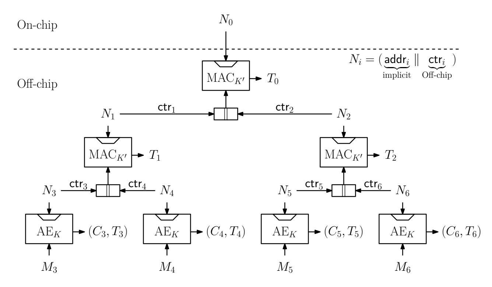
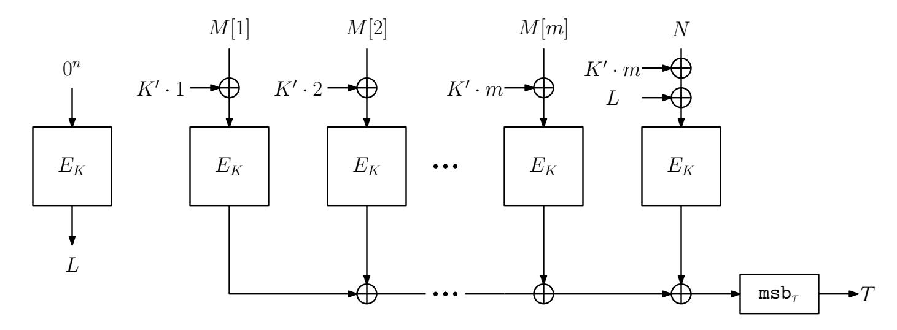
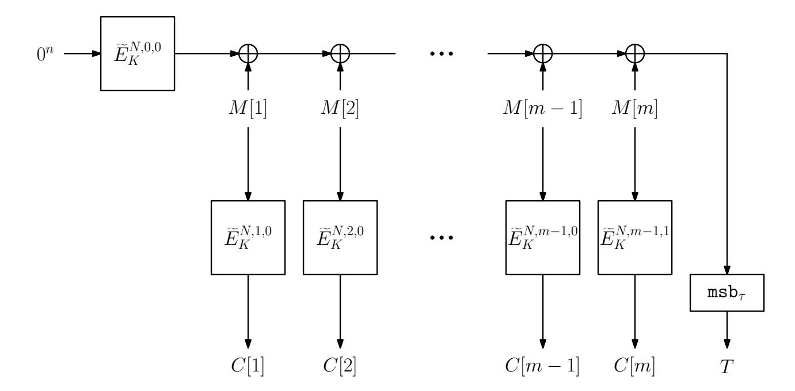
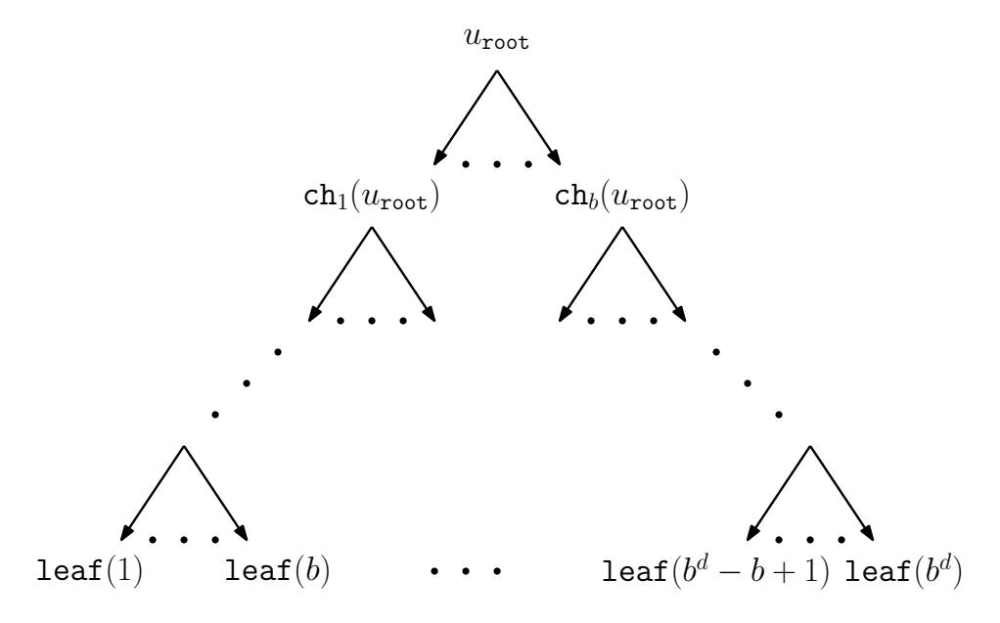
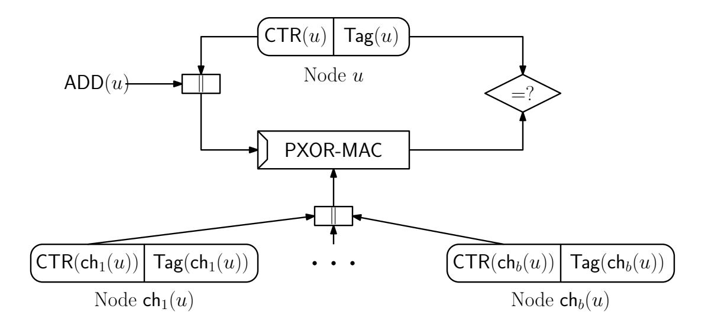
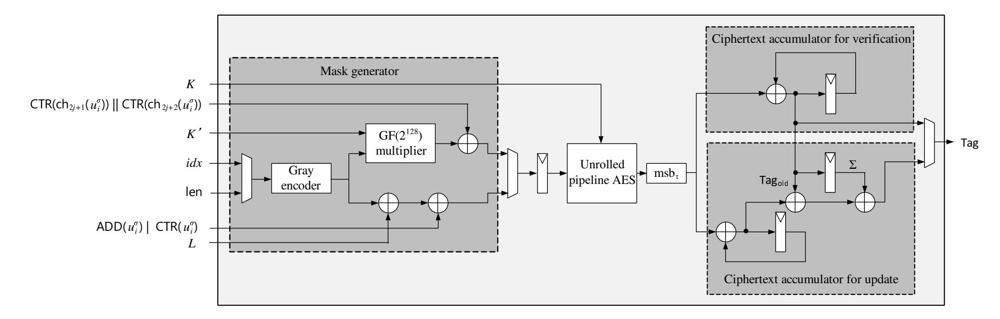
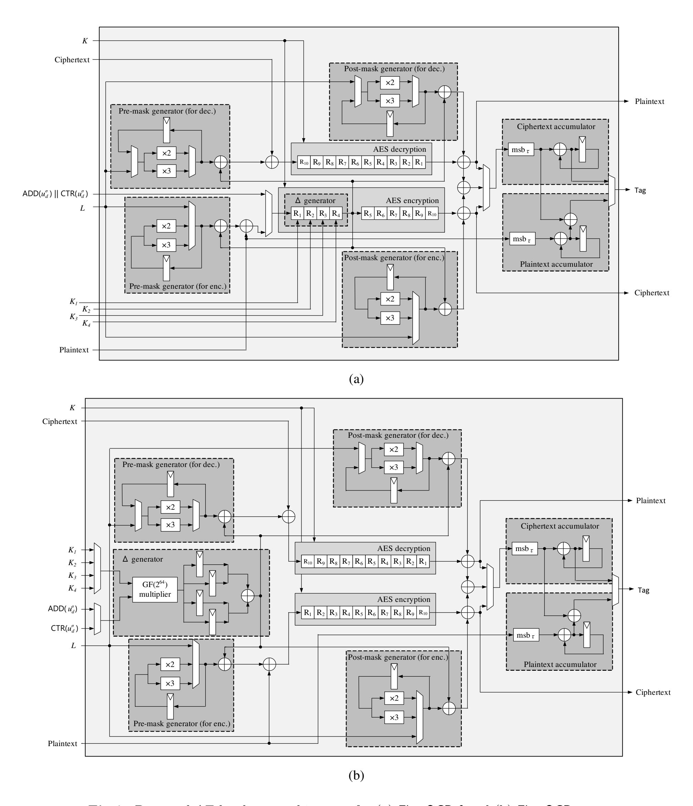
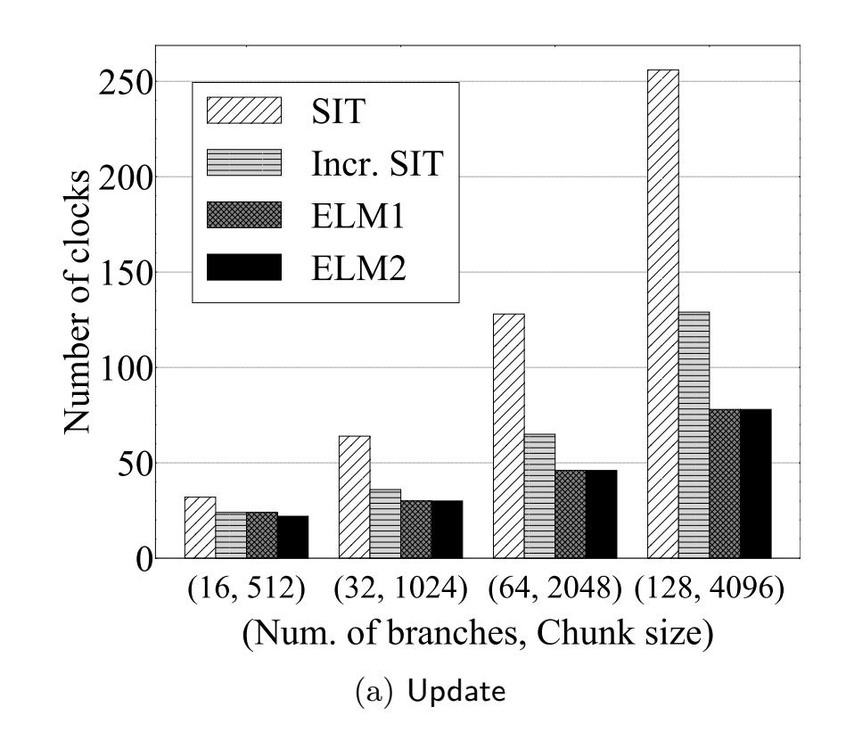
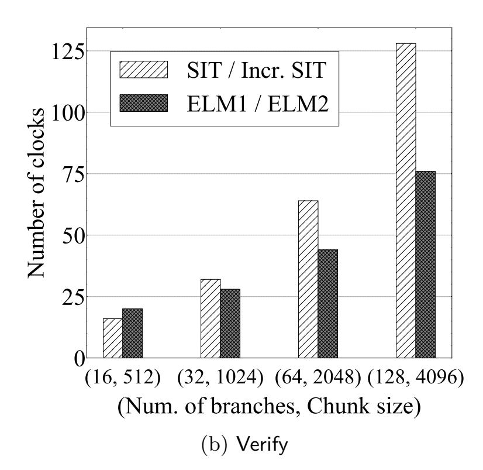

{0}------------------------------------------------

# **ELM : A Low-Latency and Scalable Memory Encryption Scheme**

Akiko Inoue<sup>1</sup> , Kazuhiko Minematsu<sup>1</sup> , Maya Oda<sup>2</sup> , Rei Ueno<sup>2</sup> , and Naofumi Homma<sup>2</sup>

> <sup>1</sup> NEC, Kawasaki, Japan a\_inoue@nec.com, k-minematsu@nec.com <sup>2</sup> Research Institute of Electrical Communication, Tohoku University, rei.ueno.a8@tohoku.ac.jp, naofumi.homma.c8@tohoku.ac.jp

**Keywords:** Memory encryption · Authentication Tree · Latency · Mode of Operations · SGX

**Abstract.** Memory encryption with an authentication tree has received significant attentions due to the increasing threats of active attacks and the widespread use of non-volatile memories. It is also gradually deployed to real-world systems, as shown by SGX available in Intel processors. The topic of memory encryption has been recently extensively studied, most actively from the viewpoint of system architecture. In this paper, we study the topic from the viewpoint of provable secure symmetric-key designs, with a primal focus on latency which is an important criterion for memory. A progress in such a direction can be observed in the memory encryption scheme inside SGX (SGX integrity tree or SIT). It uses dedicated, low-latency symmetric-key components, *i*.*e*., a message authentication code (MAC) and an authenticated encryption (AE) scheme based on AES-GCM. SIT has an excellent latency, however, it has a scalability issue for its on-chip memory size. By carefully examining the required behavior of MAC and AE schemes and their interactions in the tree operations, we develop a new memory encryption scheme called ELM. It consists of fully-parallelizable, low-latency MAC and AE schemes and utilizes an incremental property of the MAC. Our AE scheme is similar to OCB, however it improves OCB in terms of decryption latency. To showcase the effectiveness, we consider instantiations of ELM using the same cryptographic cores as SIT, and show that ELM has significantly lower latency than SIT for large memories. We also conducted preliminary hardware implementations to show that the total implementation size is comparable to SIT.

### **1 Introduction**

Cryptographic protection of memory, or more generally storage data, is widely deployed in modern systems. One typical method of protection is sector-wise encryption, such as XTS [\[Dwo10\]](#page-37-0). A sector-wise encryption scheme encrypts each memory sector in an independent and deterministic manner, keeping the secret key in a secure on-chip area. This prevents passive off-line attacks that try to extract the data from the storage devices, such as the Cold Boot Attack [\[HSH](#page-37-1)<sup>+</sup>08]. However, it does not offer sufficient protection against active on-line attacks, as there is no way to detect forgeries. Most notably, replay cannot be detected. If we independently encrypt each sector using a nonce-based authenticated encryption (AE) and store all the nonces in the secure on-chip area, it would provide a strong security guarantee against such an adversary. However, this would also incur a linear increase of the on-chip area. This is usually impractical because the on-chip area is much more expensive than the main (off-chip) memory.

A well-known classical solution to this problem is to use an authentication tree, also known as a Merkle Hash Tree [\[Mer88\]](#page-38-0). By involving any unit memory data in the tree computation and storing the root hash value in the on-chip area, the authenticity against active attackers can be guaranteed. Instead of a cryptographic hash function, we can use a message authentication code (MAC) to build an authentication tree. The classical Merkle tree and its (possibly MAC-based) improvements, such as PAT [\[HJ06\]](#page-37-2) and Bonsai Tree [\[RCPS07\]](#page-38-1), provide an authenticity of the whole memory with a constant on-chip memory overhead, at the cost of a logarithmic computation overhead for read and write operations. Confidentiality of the memory can be achieved by an additional symmetric-key encryption mechanism, as was done by TEC-tree [\[ECL](#page-37-3)<sup>+</sup>07]. Due

{1}------------------------------------------------

to the increasing threat of active attacks, authentication trees, often with a confidentiality mechanism, are gradually being deployed in real-world memory/storage systems. One prominent example is Intel's SGX [\[Gue16b,](#page-37-4)[Gue16a\]](#page-37-5), which adopts a variant of PAT with a dedicated AES-based MAC and AE schemes similar to GMAC and GCM [\[Dwo07\]](#page-37-6). The widespread use of non-volatile memory also pushes the need for such protections.

*Latency of Memory Protection.* Latency is a very important criterion for the aforementioned tree-based memory protection schemes. The Merkle tree can reduce its latency by utilizing parallelizability, but this is only done for verification of the current data. This is usually associated with the memory read operation. When one wants to change the data and re-computes the corresponding authentication value, which is associated with memory write operations, the Merkle tree needs to update all hash values on the path from the leaf (data) to the root in a serial manner. PAT is the current state-of-the-art in this respect, as it is parallelizable for both read and write operations by means of a clever use of nonce-based MAC functions.

Since the introduction of classical Merkle tree, many innovative designs have been proposed in the context of tree-based memory protection [\[HJ06,](#page-37-2) [YEP](#page-38-2)<sup>+</sup>06, [RCPS07,](#page-38-1) [ECL](#page-37-3)<sup>+</sup>07, [TSB18,](#page-38-3) [SNR](#page-38-4)<sup>+</sup>18] most actively from the computer architecture perspective. The primary focus of these proposals is their data structure, such as the parameters/structures of integrity trees [\[RCPS07,](#page-38-1) [TSB18\]](#page-38-3) and counter/nonce representations [\[YEP](#page-38-2)<sup>+</sup>06, [SNR](#page-38-4)<sup>+</sup>18] that are suitable to the considered architecture. In these proposals, cryptographic components are often considered as black boxes and sometimes instantiated by picking a standard (*e*.*g*., GCM in [\[YEP](#page-38-2)<sup>+</sup>06]). A notable exception is the aforementioned scheme used by SGX, which we call the SGX integrity tree (SIT). It develops dedicated AE and MAC schemes based on AES-GCM, with particular attention to latency in mind. It is quite efficient and enables a very low-latency read/write operation on the given tree structure that covers up to 96 Mbyte of memory on an x86 platform. Moreover, as an important subsystem of SGX, it is also quite widely deployed in practice.

*Our Contributions.* In light of the literature on memory protection schemes thus far, we feel there is a lack of thorough study from the viewpoint of symmetric-key cryptographic design: that is, designing cryptographic components (*e*.*g*., modes of block cipher operations) so that they fit well when used in the authentication tree, rather than adopting existing efficient stand-alone modes and using them in a black-box manner. SIT shows potential in this regard and is promising as an excellent low-latency system, but its on-chip data size is linear to the unit data size. This poses a limitation on the amount of covered memory sizes and hence is not scalable. In fact, VAULT [\[TSB18\]](#page-38-3) and Morphable Counter [\[SNR](#page-38-4)<sup>+</sup>18] are two recent proposals that aim at extending the protected memory size by SIT and improving the performance, mainly from the system architecture viewpoint, using similar symmetric-key components as SIT[3](#page-1-0) .

After taking a closer look at the interactions between the cryptographic components and the tree operations, we propose a new memory protection scheme dubbed ELM[4](#page-1-1) , which enables a significantly low latency for a large memory. It achieves on-chip and off-chip memory overheads comparable to existing schemes. ELM combines several techniques from the mode of operations. Specifically, we show the idea of *incremental MAC* introduced by Bellare *et al*. [\[BGG94,](#page-36-0) [BM97\]](#page-37-7) works quite effectively when the number of branches of the tree is high, which is common for the recent proposals that cover a large memory size, *e*.*g*., [\[TSB18,](#page-38-3) [SNR](#page-38-4)<sup>+</sup>18]. By using an incremental MAC at the internal nodes, ELM significantly reduces the write latency without harming the read latency. While our MAC scheme is a variant of the classical XOR-MAC [\[BGR95\]](#page-36-1), it is carefully designed to optimize the latency, number of primitive calls, parallelizability, and security.

As a key component of ELM, we develop a new low-latency variant of OCB [\[RBBK01,](#page-38-5) [Rog04,](#page-38-6) [KR11\]](#page-37-8) for AE. OCB is already quite good in terms of latency and parallelizability – better than GCM and other popular schemes, as OCB does not need an additional authentication function. However, the decryption latency of OCB is not sufficiently small due to its structure. By changing the structure, our AE mode has a smaller latency than the original for decryption, while retaining the other main features. In particular,

<span id="page-1-0"></span><sup>3</sup> Vault adopts an OCB-like, AES-based AE instead of GCM without provable security analysis. To our understanding, it needs a very strong related-key security assumption on AES.

<span id="page-1-1"></span><sup>4</sup> Elms are deciduous trees that grow quickly, and we also mean "Encryption for Large Memory" (ELM) by it.

{2}------------------------------------------------

when it is viewed as a mode of a tweakable block cipher (TBC) [LRW02], its latency is *optimally small* for both encryption and decryption. We call it Flat-OCB for its "flat" structure. As well as the original OCB, we proved that our AE is provable secure under the standard cryptographic assumption on AES, *i.e.*, the strong pseudorandomness. Each technique itself is not ultimately novel. However, we show how to combine them in an optimal manner to reduce latency and computation (*e.g.*, by shaving the redundant computations in the update of incremental MACs), which is, to the best of our knowledge, the first time this has been done in the field of tree-based memory encryption.

Our proposal is generic in principle, and the core idea can be instantiated by any block cipher or TBC. To showcase the effectiveness of our proposal, we specify concrete schemes, named ELM1 and ELM2, using the same components as SIT, namely AES-128 and a full 64-bit field multiplier<sup>5</sup>. We compare them with (a generalized variant of) SIT for various memory sizes and tree parameters under a certain practical implementation setting. Our results show that ELM1 and ELM2 have a smaller latency than SIT for most of the cases we see<sup>6</sup>. In particular, when the memory size gets larger, the difference becomes significant. We also conducted preliminary ASIC implementations, and show that the total implementation size is comparable to that of SIT. In addition, we discuss the optimization of hardware implementations for our proposal depending on the system constraints.

#### <span id="page-2-2"></span>2 Preliminaries

#### 2.1 Notation

For a natural number  $n \in \mathbb{N}$ ,  $\{0,1\}^n$  denotes the set of n-bit strings. For binary strings A and B,  $A \parallel B$  or AB denotes the concatenation of A and B. The bit length of A is denoted by |A|, and  $|A|_n := \lceil |A|/n \rceil$ . Dividing a string A into blocks of n bits is denoted by  $A[1] \parallel \cdots \parallel A[m] \stackrel{n}{\leftarrow} A$ , where  $m = |A|_n$  and |A[i]| = n,  $|A[m]| \le n$  for  $1 \le i \le m-1$ . For  $t \in \mathbb{N}$  and  $t \le |A|$ ,  $msb_t(A)$  (1sb<sub>t</sub>) denotes the first (last) t bits of A. A sequence of i zeros is written as  $0^i$ . For sets  $\mathbb{E}$  and  $\mathbb{E}'$ , we write  $\mathbb{E} \stackrel{\cup}{\leftarrow} \mathbb{E}'$  as shorthand for  $\mathbb{E} \leftarrow \mathbb{E} \cup \mathbb{E}'$ . When the element K is uniformly and randomly chosen from the set K, it is denoted by  $K \stackrel{\$}{\leftarrow} K$ . For a function  $F : K \times \mathcal{X} \to \mathcal{Y}$  with the key space K,  $F(K, \cdot)$  may be written as  $F_K(\cdot)$ .

Computation on Galois Field. Let  $GF(2^n)$  be a finite field of size  $2^n$ , where the characteristic is 2 and the extension degree is  $n \in \mathbb{N}$ . We focus on the case where n = 128. Following [Rog04, IK03], we use the lexicographically first polynomial for defining the field and thus  $\mathbb{F}_{2^{128}} := \mathbb{F}_2[x]/(x^{128} + x^7 + x^2 + x + 1)$  and we obtain  $GF(2^n) = \langle x \rangle$ . We regard an element of  $GF(2^n)$  as a polynomial of x. For  $\forall a \in \{0,1\}^n$ , we also regard it as a coefficient vector of an element in  $GF(2^n)$ . Thus, the primitive root x is interpreted as 2 in the decimal representation. For  $a \in GF(2^n)$ , let 2a denote a multiplication by x and a, which is also called doubling [Rog04]. Similarly, let 3a denote  $2a \oplus a$ . In  $GF(2^n)$ ,  $2a := (a \ll 1)$  if  $msb_1(a) = 0$  and  $2a := (a \ll 1) \oplus (0^{120}10^41^3)$  if  $msb_1(a) = 1$ , where  $(a \ll 1)$  is the left-shift of one bit. For  $c \in \mathbb{N}$ , we can compute  $2^c a$  by doubling a for c times.

#### 2.2 (Tweakable) Block Cipher

Let  $\mathcal{K}$  and  $\mathcal{M}$  be the set of keys and messages, respectively. Let  $\mathcal{T}$  be the set of tweaks, where a tweak is a public parameter. A tweakable block cipher (TBC) [LRW02] is a function  $\widetilde{E}: \mathcal{K} \times \mathcal{T} \times \mathcal{M} \to \mathcal{M}$  s.t.  $\widetilde{E}(K, T, \cdot)$  is a permutation on  $\mathcal{M}$  for  $\forall (K, T) \in \mathcal{K} \times \mathcal{T}$ . It is also denoted by  $\widetilde{E}_K^T$ ,  $\widetilde{E}^T$ , or  $\widetilde{E}$ , where  $K \in \mathcal{K}$  and  $T \in \mathcal{T}$ . If  $\mathcal{T}$  is singleton (and we thus omit it from the notation) it means a plain block cipher. Namely, a block cipher E is defined as  $E: \mathcal{K} \times \mathcal{M} \to \mathcal{M}$  s.t.  $E(K, \cdot)$  is a permutation on  $\mathcal{M}$  for  $\forall K \in \mathcal{K}$  and is also denoted by  $E_K$  or E. A TBC can be built on a block cipher using various modes of operation [LRW02, Rog04].

<span id="page-2-0"></span><sup>&</sup>lt;sup>5</sup> We also use a 128-bit multiplier, but with a very small input size.

<span id="page-2-1"></span><sup>&</sup>lt;sup>6</sup> This holds true even when SIT adopts a part of our idea of using incremental MAC. See Section 6.3.

{3}------------------------------------------------

**Security Notion.** Let Perm(n) denote the set of all permutations on  $\{0,1\}^n$ . An n-bit tweakable permutation of t-bit tweak is a function  $\pi: \{0,1\}^t \times \{0,1\}^n \to \{0,1\}^n$  s.t. for  $\forall T \in \{0,1\}^t$ ,  $\pi(T,\cdot) \in Perm(n)$ . The set of all n-bit tweakable permutations with t-bit tweak is denoted by TPerm(t,n). Let P s.t.  $P \stackrel{\$}{\leftarrow} Perm(n)$  be a uniform random permutation (URP) and  $\widetilde{P}$  s.t.  $\widetilde{P} \stackrel{\$}{\leftarrow} TPerm(t,n)$  be a tweakable URP (TURP). A block cipher E or a TBC  $\widetilde{E}$  is said to be secure if it is computationally hard to distinguish from the ideal primitive with oracle access. More precisely, let  $\mathcal{A}$  be an adversary who (possibly adaptively) queries an oracle O and subsequently outputs a bit. We write  $Pr[\mathcal{A}^O \to 1]$  to denote the probability that this bit is 1. We define the advantage of  $\mathcal{A}$  against TBC  $\widetilde{E}$  as follows:

$$\mathbf{Adv}_{\widetilde{E}}^{\mathrm{tprp}}(\mathcal{A}) \coloneqq |\Pr[\mathcal{A}^{\widetilde{E}} \to 1] - \Pr[\mathcal{A}^{\widetilde{P}} \to 1]|,$$

$$\mathbf{Adv}_{\widetilde{E}}^{\mathrm{tsprp}}(\mathcal{A}^{\pm}) \coloneqq |\Pr[(\mathcal{A}^{\pm})^{\widetilde{E},\widetilde{E}^{-1}} \to 1] - \Pr[(\mathcal{A}^{\pm})^{\widetilde{P},\widetilde{P}^{-1}} \to 1]|,$$

where the first notion is for adversary with encryption oracle (*i.e.*, chosen-plaintext queries), and the second is for adversary with encryption and decryption oracles (*i.e.*, chosen-ciphertext queries). When the advantage is sufficiently small,  $\widetilde{E}$  is said to be secure against the underlying adversary.

#### 2.3 Message Authentication Code

Message authentication code (MAC) is a symmetric-key cryptosystem to ensure the integrity of a message. Throughout the paper, we consider nonce-based MAC<sup>7</sup>. It takes a nonce (a value never repeats when used for tag generation) together with a message. For the key space  $\mathcal{K}$ , the nonce space  $\mathcal{N}$ , the message space  $\mathcal{M}$ , and the tag space  $\mathcal{T}$ , a nonce-based MAC scheme MAC consists of two functions; the tagging function MAC. $\mathcal{T}: \mathcal{K} \times \mathcal{N} \times \mathcal{M} \to \mathcal{T}$  and the verification function MAC. $\mathcal{V}: \mathcal{K} \times \mathcal{N} \times \mathcal{M} \times \mathcal{T} \to \{\top, \bot\}$ . A tag for the message  $M \in \mathcal{M}$  and the nonce  $N \in \mathcal{N}$  and the key  $K \in \mathcal{K}$  is  $T = \mathsf{MAC}.\mathcal{T}(K, N, M)$ . The tuple (N, M, T) is considered to be authentic if MAC. $\mathcal{T}(K, N, M, T) = \top$ , and otherwise it is rejected.

**Security Notion.** Let  $\mathcal{A}$  be the adversary against MAC described above. The security of MAC is defined as the probability that  $\mathcal{A}$  creates a successful forgery by accessing the tagging oracle (MAC. $\mathcal{T}_K$ ) and the verification oracle (MAC. $\mathcal{V}_K$ ). The security measure is  $\mathbf{Adv}_{\mathsf{MAC}}^{\mathsf{mac}}(\mathcal{A}) := \Pr[K \overset{\hspace{0.1em}\mathsf{\leftarrow}}{\leftarrow} \mathcal{K} : \mathcal{A}^{\mathsf{MAC}.\mathcal{T}_K,\mathsf{MAC}.\mathcal{V}_K} \text{ forges}]$ , which means the probability of a successful forgery. That is,  $\mathcal{A}$  receives  $\top$  from MAC. $\mathcal{V}_K$  by querying (N', M', T') while (N', M') has never been queried to MAC. $\mathcal{T}_K$ . Here,  $\mathcal{A}$  is assumed to be nonce-respecting, that is, the nonces in the tagging queries are distinct. The nonces in the verification queries have no restriction, and  $\mathcal{A}$  can repeat nonce or reuse a nonce that was used by a tagging query.

#### 2.4 Authenticated Encryption

Authenticated encryption (AE) [BN00] is used to ensure privacy and authenticity of input data simultaneously. As well as MAC, we consider nonce-based AE in this paper. For the key space  $\mathcal{K}$ , the nonce space  $\mathcal{N}$ , the message and ciphertext space  $\mathcal{M}$ , and the tag space  $\mathcal{T}$ , a nonce-based AE scheme AE consists of two functions; the encryption function AE. $\mathcal{E}: \mathcal{K} \times \mathcal{N} \times \mathcal{M} \to \mathcal{M} \times \mathcal{T}$  and the decryption function AE. $\mathcal{D}: \mathcal{K} \times \mathcal{N} \times \mathcal{M} \times \mathcal{T} \to \mathcal{M} \times \bot$ . A ciphertext  $C \in \mathcal{M}$  and a tag  $T \in \mathcal{T}$  for the key  $K \in \mathcal{K}$ , the nonce  $N \in \mathcal{N}$ , and the message  $M \in \mathcal{M}$  are derived as  $(C,T) = \mathsf{AE}.\mathcal{E}(K,N,M)$ . The tuple (N,C,T) is considered to be authentic if  $\mathsf{AE}.\mathcal{D}(K,N,C,T)$  returns the message  $M \in \mathcal{M}$  and  $M \neq \bot$ , and otherwise it is rejected.

It is possible to extend AE so that it also accepts associated data [Rog02], an information that is not encrypted but authenticated, though we do not need it in this paper.

<span id="page-3-0"></span><sup>&</sup>lt;sup>7</sup> It is because a nonce-based MAC is generally easier to construct than a general (non-nonce-based) MAC to construct an efficient MAC. The same applies to a nonce-based AE.

{4}------------------------------------------------

**Security Notion.** The security of AE is evaluated by two criteria, privacy and authenticity advantages. The privacy advantage is the probability that the adversary successfully distinguishes the encryption function of AE from the random oracle \$(\*,\*). For any query (N,M), if  $(C,T) \leftarrow \mathsf{AE}.\mathcal{E}(K,N,M)$ , \$(N,M) returns random bits of length |C| + |T|. Thus,  $\mathbf{Adv}_{\mathsf{AE}}^{\mathsf{priv}}(\mathcal{A}) \coloneqq |\Pr[\mathcal{A}^{\mathsf{AE}.\mathcal{E}} \to 1] - \Pr[\mathcal{A}^{\$} \to 1]|$ . The authenticity advantage is the probability that the adversary creates a successful forgery by accessing encryption function and decryption function. It is defined as  $\mathbf{Adv}_{\mathsf{AE}}^{\mathsf{auth}}(\mathcal{A}) \coloneqq \Pr[\mathcal{A}^{\mathsf{AE}.\mathcal{E},\mathsf{AE}.\mathcal{D}}]$  forges, which means the probability that  $\mathcal{A}$  receives  $M' \neq \bot$  from  $\mathsf{AE}.\mathcal{D}$  by querying (N', C', T') while (N', M') has never been queried to  $\mathsf{AE}.\mathcal{E}$ .

For both advantages, we assume the adversary is nonce-respecting in encryption queries. For authenticity however, there is no restriction on nonce in the decryption queries, that is,  $\mathcal{A}$  may repeat a nonce or reuse a nonce that was used in an encryption query.

### 2.5 Authentication Tree for Memory Protection

We assume two regions in storage memory: on-chip and off-chip areas. On-chip area is assumed to be secure in which the adversary cannot eavesdrop or tamper the stored data. Off-chip area can be attacked by the adversary who may perform eavesdropping (getting information of plaintext from ciphertext), tampering (modify the ciphertext without being detected), and replay (replacing the ciphertext with an old legitimate one). As mentioned in the introduction, tampering can be detected by simply applying a MAC to each data unit and storing the nonce and tag off-chip. If we use a nonce-based AE scheme instead, it also prevents eavesdropping. However, these means are not sufficient to protect from replay attacks since the adversary can perform a replay on the (nonce,ciphertext,tag) tuple. Moreover, since on-chip area is generally much more expensive than off-chip area, it is desirable to thwart all of these attacks with a small amount on-chip area as possible.

To address the problem, a number of memory protection tree schemes have been proposed [Mer88,RCPS07, HJ06, UWM19, TSB18, SNR<sup>+</sup>18]. The classical Merkle hash tree [Mer88] associates each memory data chunk stored off-chip to a leaf node of a tree. The hash values of all intermediate and leaf nodes are stored off-chip, and only that of the root node is stored on-chip. The integrity of a leaf node (data) can be verified by recursively computing the corresponding hash values from the leaf to the root.

A similar scheme can be considered by using MACs instead of hash functions by storing the secret key on-chip, and among such schemes, we focus on PAT (Parallelizable Authentication Tree) proposed by Hall and Jutla [HJ06] for its parallelizability of both verify and update operations. It assigns a nonce to each node and stores the nonce associated with the root node in the on-chip area. Here, nonces need to be distinct from each other, and have one-time property to prevent replay attacks. To construct parallel scheme, PAT employs a MAC to compute a tag by taking the nonce assigned to own node and nonces in children nodes<sup>8</sup>.

In this paper, we hereafter use the term *authentication tree* to refer to the memory protection scheme using the tree construction. Note that we suppose the authentication tree also encrypts data associated with leaf nodes. We introduce a generic construction of authentication tree PAT2 (Fig. 1). It is mostly identical to PAT, however it achieves confidentiality of memory by applying an AE scheme to the leaf nodes<sup>9</sup> and it splits any nonce of PAT associated to a node into two values, an address and a local counter. The former is the memory address of the node, and the latter is a counter exclusively assigned to the node.

Let us briefly describe how PAT2 of Fig. 1 works. Each nonce  $N_i$  assigned to node i consists of the address  $\mathsf{addr}_i$  and the local counter  $\mathsf{ctr}_i$ , which is initialized to 0 for all nodes. Memory data is split into 4 units,  $M_3$  to  $M_6$ . After initialization, the tree keeps  $N_i$ ,  $T_i$  for  $i=1,\ldots,6$ , and  $C_j$  for  $j=3,\ldots,6$  at the off-chip area, and  $N_0$  at the on-chip area. When verifying a data, say  $M_3$ , we check if (1)  $\mathsf{AE}.\mathcal{D}_K(N_3,C_3,T_3)$  is authentic (i.e., not returning  $\bot$ ) and (2)  $\mathsf{MAC}.\mathcal{V}_{K'}(N_1,\mathsf{ctr}_3 \parallel \mathsf{ctr}_4,T_1) = \top$  and (3)  $\mathsf{MAC}.\mathcal{V}_{K'}(N_0,\mathsf{ctr}_1 \parallel \mathsf{ctr}_2,T_0) = \top$ . If all hold  $M_3$  is considered to be authentic and the corresponding local counters ( $\mathsf{ctr}_0$ ,  $\mathsf{ctr}_1$  and  $\mathsf{ctr}_3$ ) are incremented. When updating  $M_3$ , we first perform the above verification procedure, update the counters, and

<span id="page-4-0"></span><sup>&</sup>lt;sup>8</sup> To be more precise, [HJ06] proposes to use a general deterministic MAC with input being prepended by a nonce, which is a typical way to convert a deterministic MAC into a nonce-based one.

<span id="page-4-1"></span><sup>&</sup>lt;sup>9</sup> In fact, An ePrint version of PAT paper [HJ02] specifies a combination of MAC and AE schemes for confidentiality of leaf data.

{5}------------------------------------------------

<span id="page-5-0"></span>

**Fig. 1:** An example of PAT2 with tree depth 2 and number of branches 2. A trapezoid in a MAC or an AE box denotes the nonce input, and a box with  $\parallel$  denotes concatenation. For  $0 \le i \le 2$ ,  $T_i = \text{MAC}_{K'}(N_i, \text{ctr}_{2i+1} \parallel \text{ctr}_{2i+2})$ . For  $3 \le j \le 6$ ,  $(C_j, T_j) = \text{AE}.\mathcal{E}_K(N_j, M_j)$ . Only  $\text{ctr}_0$  is stored in the on-chip area.

then renew  $(N_3, C_3, T_3)$ ,  $N_1$ ,  $T_1$  and  $T_0$ . Observe that the steps in the verification and update procedures are independent and thus parallelizable. This is a crucial advantage of PAT/PAT2 over the classical hash tree which only allows parallel verification. The nonce format guarantees distinctness across different nodes, and allows to reduce the MAC input and off-chip overhead from the original PAT. Since an address is anyway given from the outer legitimate system, it does not need to be explicitly stored. To the best of our knowledge, this technique was first proposed by [RCPS07].

In fact, by specifying the parameters (e.g., the depth and the branch number of the tree and the format of nonce) and the underlying MAC and AE schemes, the resulting scheme is mostly identical to SIT. Therefore, PAT2 can be seen as an abstraction of SIT. We consider PAT2 as our baseline scheme for its simple structure and efficiency, and present our scheme based on it (Section 4).

To the best of our knowledge, the provable security of PAT2 have not been shown in literature. As described above, many memory encryption schemes have been proposed, but there are few papers which shows provable security of proposed schemes. Whereas PAT paper defines the security notion of integrity tree (i.e., tree-based memory protection scheme, but not encrypting memory) and proves the security of PAT, PAT has slightly different tree construction from PAT2 and there is no description about privacy of plaintext associated with leaf nodes. In Section 5, we define security notions (privacy and unforgeability) for authentication trees and prove the security of PAT2 in each notion. The analysis is not surprising, but to our knowledge we cannot find such a formal treatment (in particular for the combination of MAC and AE to guarantee privacy and unforgeability) in literature.

Other Schemes. In addition to the above schemes, a number of authentication tree schemes that better handle the various criteria (except for latency) have been proposed. TEC-tree [ECL+07] provides confidentiality by encrypting data stored in all nodes. MAES [UWM19] is an authentication tree providing security against differential power analysis attacks. VAULT [TSB18] and Morphable Counter [SNR+18] reduce the overhead of off-chip memory and are suitable for protecting large memory (e.g., larger than the giga byte order); however there is a tradeoff with the average latency because their counters are compressed.

{6}------------------------------------------------

#### <span id="page-6-0"></span>**Algorithm 1** PXOR-MAC*.*T*K,K*<sup>0</sup> (*N, M*) 1: *M*[1] k · · · k *M*[*m*] *<sup>n</sup>*←− *M* 2: *L* ← *EK*(0*<sup>n</sup>* ), *T* ← 0 *τ* 3: **for** 1 ≤ *i* ≤ *m* **do** 4: *T* ← *T* ⊕ msb*<sup>τ</sup>* (*EK*(*M*[*i*] ⊕ *K*<sup>0</sup> · *i*)) 5: **end for** 6: *T* ← *T* ⊕ msb*<sup>τ</sup>* (*EK*(*N* ⊕ *K*<sup>0</sup> · *m* ⊕ *L*)) 7: **return** *T* **Algorithm 2** PXOR-MAC*.*V*K,K*<sup>0</sup> (*N, M, T*) 1: *T* <sup>0</sup> ← PXOR-MAC*.*T*<sup>E</sup>K,K*<sup>0</sup> (*N, M*) 2: **if** *T* = *T* 0 **then** 3: **return** > 4: **else** 5: **return** ⊥ 6: **end if**

```
Algorithm 3 PXOR-MAC.UK,K0 (Nold, Mold, Told, Nnew, Mnew)
```

```
1: L ← EK(0n
               ), Tnew ← Told
2: Mold[1] k · · · k Mold[m]
                          n←− Mold, Mnew[1] k · · · k Mnew[m]
                                                           n←− Mnew
3: for 1 ≤ i ≤ m do
4: if Mold[i] 6= Mnew[i] then
5: Tnew ← Tnew ⊕ msbτ (EK(Mold[i] ⊕ K0
                                             · i) ⊕ EK(Mnew[i] ⊕ K0
                                                                    · i))
6: end if
7: end for
8: if Nold 6= Nnew then
9: Tnew ← Tnew ⊕ msbτ (EK(Nold ⊕ K0
                                         · m ⊕ L) ⊕ EK(Nnew ⊕ K0
                                                                   · m ⊕ L))
10: end if
11: return Tnew
```

### **3 Components of ELM**

To achieve low latency operation, we designed dedicated MAC and AE schemes. Our MAC scheme, which we call PXOR-MAC, is a simple combination of nonce-based XOR-MAC [\[BGR95\]](#page-36-1) and PHASH, a message hashing function of PMAC [\[BR02,](#page-37-12) [Rog04\]](#page-38-6). For AE, we propose a new mode named Flat-OCB based on OCB. We show more details in the following.

### <span id="page-6-1"></span>**3.1 Incremental MAC**

**Specification.** Algs. [1](#page-6-0) and [2](#page-6-0) show the tagging function and the verification function of PXOR-MAC. Here, the block cipher *E* has *n*-bit block. The second key *K*<sup>0</sup> is *n* bits and independent of *K*. The length of the nonce *N* and the tag *T* are *n* bits and *τ* bits, respectively. Note that we exclude the case of partial block (*i*.*e*., |*M*| mod *n* = 0 always holds.) for simplicity. As we assumed *n* = 128, this is reasonable for the typical use case of authentication tree schemes. PXOR-MAC computes a tag as the sum of encrypted plaintext blocks and the encrypted nonce, as depicted in Fig. [2.](#page-7-0) An input mask to *E<sup>K</sup>* is derived from a multiplication of *K*<sup>0</sup> and the block index over GF(2*<sup>n</sup>*), and *L* = *EK*(0*<sup>n</sup>*).

<span id="page-6-2"></span>**Properties.** Since *L* can be computed in advance, the latency of tag computation is essentially a sum of latencies of 128-bit multiplication (*K*<sup>0</sup> · *i* for the block index *i*) and one call of *EK*. The cost of 128-bit multiplication can be large if *i* has large variations, however *m* is not too large in practice, even when the total memory size is huge. Typically, *m* is upperbounded by the number of branches, for example, at most 2 <sup>7</sup> according to [\[SNR](#page-38-4)<sup>+</sup>18]. Therefore, using a Gray code, the hardware implementation is much more efficient compared to implementing a full 128-bit multiplier (see Section [6\)](#page-26-0). Consequently, the latency of mask computation becomes negligible. In this setting, PXOR-MAC has optimal latency of one block cipher call for tagging and verification functions thanks to the full parallelizability of block cipher calls.

In addition, PXOR-MAC is an incremental MAC [\[BGR95\]](#page-36-1), which allows an efficient tag computation when a message is changed at a small number of blocks. To be more concrete, when a block of a message is changed

{7}------------------------------------------------

<span id="page-7-0"></span>

Fig. 2: PXOR-MAC.

together with a new nonce (since a nonce-based MAC renews its nonce for each tag generation), the new tag can be obtained by encrypting the corresponding blocks (i.e., XOR of the message block and its mask value) for both old and new ones, and taking an XOR of them and the old tag. We show the general update function of PXOR-MAC in Alg. 3. It takes old nonce  $N_{\rm old}$ , old plaintext  $M_{\rm old}$ , old tag  $T_{\rm old}$ , new nonce  $N_{\rm new}$ , and new plaintext  $M_{\rm new}$ . It outputs new tag  $T_{\rm new}$  such that  $T_{\rm new} = {\sf PXOR-MAC}.\mathcal{T}_{K,K'}(N_{\rm new},M_{\rm new})$  holds. For simplicity, Alg. 3 assumes that  $M_{\rm old}$  and  $M_{\rm new}$  have the same number of blocks, m. In this case, when the nonce and one-block plaintext are changed, PXOR-MAC. $\mathcal{U}$  needs only four block cipher calls except for mask derivation regardless of m, while ordinary block cipher-based MACs have to invoke block cipher at least m times by invoking their tagging functions.

Notes on Incremental Property. Our PXOR-MAC corresponds to the incremental MAC for replace operation with basic security [BGG94]. We emphasize that the arguments of the update function defined at [BGG94] is different from those of Alg. 3. In detail, the update function in [BGG94] takes the set of block indices to replace, and the contents of new and old blocks in addition to the old tag  $T_{\rm old}$ . For notational convenience we adopted our presentation of Alg. 3, however we used the standard form of [BGG94] in our implementations for efficiency. In addition, the basic security means that  $T_{\rm old} = {\sf PXOR-MAC}.T_{K,K'}(N_{\rm old}, M_{\rm old})$  must hold for any  $(N_{\rm old}, M_{\rm old}, T_{\rm old})$  in an input to the update function to guarantee the correctness. This implies that the update function cannot be queried by the adversary. Bellare et al. [BGG94] also defined a stronger, tamper-proof security, where the adversary can arbitrary query the update oracle. This is a crucially different security notion, as the adversary may feed an unauthentic tuple  $(N_{\rm old}, M_{\rm old}, T_{\rm old})$  to the update oracle. Fortunately, an incremental MAC with basic security suffices for our purpose (see Section 4.3).

**Security.** The security bound of PXOR-MAC is shown below. We assume the underlying block cipher is an n-bit URP P. It is an information-theoretic idealization. The computational counterpart, where the underlying block cipher is instantiated by a practically secure block cipher such as AES, is derived from our bound. Since this is fairly standard [BDJR97], we omitted it here.

**Theorem 1.** The MAC advantage of PXOR-MAC is

<span id="page-7-1"></span>
$$\mathbf{Adv}_{\mathsf{PXOR\text{-}MAC_P}}^{\mathtt{mac}}(\mathcal{A}) \leq \frac{2q_v}{2^{\tau}} + \frac{4.5\sigma_{\mathtt{mac}}^2}{2^n},$$

where  $\mathcal{A}$  is the nonce-respecting adversary against PXOR-MAC,  $\sigma_{\text{mac}}$  is the total number of accesses to P invoked by the queries such that  $\sigma_{\text{mac}} \leq 2^{n-1}$ , and  $q_v$  is the number of queries to the verification oracle.

*Proof.* First, we observe that PXOR-MAC can be interpreted as a TBC-based MAC, PXOR-MAC-TBC, defined in Algs. 4 and 5. If the TBC used in PXOR-MAC-TBC is specified as  $\widetilde{E}_{K,K'}^{0^n,i,j}(M) = E_K(M \oplus K' \cdot i \oplus j \cdot E_K(0^n))$ , PXOR-MAC-TBC is equivalent to PXOR-MAC<sub>K,K'</sub>. Thus, we have

$$\mathbf{Adv}_{\mathsf{PXOR\text{-}MAC_P}}^{\mathsf{mac}}(\mathcal{A}) \leq \mathbf{Adv}_{\mathsf{PXOR\text{-}MAC\text{-}TBC_{\widetilde{P}}}}^{\mathsf{mac}}(\mathcal{A}) + \mathbf{Adv}_{\widetilde{\mathsf{E}}}^{\mathsf{tprp}}(\mathcal{B}), \tag{1}$$

{8}------------------------------------------------

where P is an n-bit URP,  $\widetilde{P}$  is an n-bit TURP having the same tweak space as  $\widetilde{E}$ , and  $\widetilde{E}$  is a TBC involving P and an independent key K', defined as  $\widetilde{\mathsf{E}}^{0^n,i,j}(M) = \mathsf{P}(M \oplus K' \cdot i \oplus j \cdot \mathsf{P}(0^n))$ . Also,  $\mathcal{B}$  is the adversary against  $\tilde{\mathsf{E}}$  querying the encryption oracle. In what follows, we evaluate each term of the right side of (1) in turn. Recall that we assume  $|M| \pmod{n} = 0$  for plaintext M.

<span id="page-8-0"></span>

| $\overline{\textbf{Algorithm 4 PXOR-MAC-TBC}.\mathcal{T}_{\widetilde{E}}(N,M)}$                                                                                                                                                    | $\overline{\textbf{Algorithm 5}} \ PXOR\text{-}MAC\text{-}TBC.\mathcal{V}_{\widetilde{E}}(N,M,T)$                                                                                                                      |  |  |
|------------------------------------------------------------------------------------------------------------------------------------------------------------------------------------------------------------------------------------|------------------------------------------------------------------------------------------------------------------------------------------------------------------------------------------------------------------------|--|--|
| 1: $M[1] \parallel \cdots \parallel M[m] \stackrel{n}{\leftarrow} M$<br>2: $T \leftarrow 0^{\tau}$<br>3: <b>for</b> $1 \leq i \leq m$ <b>do</b><br>4: $T \leftarrow T \oplus \mathtt{msb}_{\tau}(\widetilde{E}^{0^{n},i,0}(M[i]))$ | 1: $M[1] \parallel \cdots \parallel M[m] \stackrel{n}{\leftarrow} M$<br>2: $T' \leftarrow PXOR\text{-MAC\text{-}TBC}.\mathcal{T}_{\widetilde{E}}(N,M)$<br>3: <b>if</b> $T = T'$ <b>then</b><br>4: <b>return</b> $\top$ |  |  |
| 5: end for 6: $T \leftarrow T \oplus \mathtt{msb}_{\tau}(\widetilde{E}^{0^n,m,1}(N))$ 7: return $T$                                                                                                                                | 5: else<br>6: return \(\perp\)<br>7: end if                                                                                                                                                                            |  |  |

Analysis of the First Term. We start with the case  $q_v = 1$ . Without loss of generality, we can assume that the adversary performs a verification query after all  $q_t$  tagging queries. Let  $Z = \{(N_1, M_1, T_1), \dots, (N_{q_t}, M_{q_t}, T_{q_t})\}$ be the transcript obtained by tagging queries, and let (N', M', T') be the verification query. Let  $T^*$  be the valid tag corresponding to (N', M'). We also suppose  $|M'|_n := m'$ . Seeing Z as a random variable, we obtain  $\mathbf{Adv}^{\mathtt{mac}}_{\mathsf{PXOR-MAC-TBC}}(\mathcal{A}) = \sum_{z} \Pr[T' = T^* \mid Z = z] \Pr[Z = z].$  In what follows, we evaluate  $\Pr[T' = T^* \mid Z = z]$ for the following cases.

- 1. Let  $\forall i \in \{1, \dots, q_t\}, N' \neq N_i$ .

  The TURP  $\widetilde{\mathsf{P}}^{0^n, m', 1}$ , which encrypts nonce N', can be invoked at most  $q_t$  times in tagging queries. However,  $\widetilde{\mathsf{P}}^{0^n, m', 1}(N')$  is a new random value for the adversary. Thus, supposing that  $q_t \leq 2^{n-1}$ , we obtain  $\Pr[T' = T^* \mid Z = z] \le 2^{n-\tau}/(2^n - q_t) \le 2/2^{\tau}$ .
- 2. Let  $\exists \alpha \in \{1, \dots, q_t\}, N' = N_{\alpha} \text{ and } m' \neq |M_{\alpha}|_n$ . The TURP  $\widetilde{\mathsf{P}}^{0^n, m', 1}$  encrypting N' has a different tweak from that encrypting  $N_{\alpha}$  in tagging queries. Thus, we can treat this case in the same manner as the previous case, and  $\Pr[T' = T^* \mid Z = z] \leq 2/2^{\tau}$ holds.
- 3. Let  $\exists \alpha \in \{1, \ldots, q_e\}, N' = N_{\alpha} \text{ and } m' = |M_{\alpha}|_n$ .
  - (a) When  $M'[i] \neq M_{\alpha}[i]$  for  $\exists ! i \in \{1, \ldots, m'\}$  and  $M'[j] = M_{\alpha}[j]$  for  $\forall j \in \{1, \ldots, m'\} \setminus \{i\}$ , it necessarily holds that  $\widetilde{\mathsf{P}}^{0^n, i, 0}(M'[i]) \neq \widetilde{\mathsf{P}}^{0^n, i, 0}(M_{\alpha}[i])$  and  $\widetilde{\mathsf{P}}^{0^n, j, 0}(M'[j]) = \widetilde{\mathsf{P}}^{0^n, j, 0}(M_{\alpha}[j])$ . Thus, we obtain  $\Pr[T' = T^* \mid Z = z] = \Pr[T' = T_{\alpha} \oplus \mathsf{msb}_{\tau}(\widetilde{\mathsf{P}}^{0^n, i, 0}(M'[i]) \oplus \widetilde{\mathsf{P}}^{0^n, i, 0}(M_{\alpha}[i])) \mid Z = z] \leq 2/2^{\tau}$ .
  - (b) When  $M'[i] \neq M_{\alpha}[i]$  and  $M'[j] \neq M_{\alpha}[j]$  for  $i, j \in \{1, ..., m'\}$ , it holds that

$$T^* = T_\alpha \oplus \mathtt{msb}_\tau(\widetilde{\operatorname{P}}^{0^n,i,0}(M'[i]) \oplus \widetilde{\operatorname{P}}^{0^n,i,0}(M_\alpha[i])) \oplus \mathtt{msb}_\tau(\widetilde{\operatorname{P}}^{0^n,j,0}(M'[j]) \oplus \widetilde{\operatorname{P}}^{0^n,j,0}(M_\alpha[j])) \oplus \delta,$$

where 
$$\delta = \bigoplus_{k \neq i,j}^{m'} \mathtt{msb}_{\tau}(\widetilde{\mathsf{P}}^{0^n,k,0}(M'[k]) \oplus \widetilde{\mathsf{P}}^{0^n,k,0}(M_{\alpha}[k]))$$
. Thus, we obtain  $\Pr[T' = T^* \mid Z = z] \leq 2/2^{\tau}$ .

From the above cases, we obtain the following advantage when  $q_d = 1$ :

<span id="page-8-1"></span>
$$\mathbf{Adv}_{\mathsf{PXOR\text{-}MAC\text{-}TBC}_{\widetilde{\mathsf{P}}}}^{\mathsf{mac}}(\mathcal{A}) \le \sum_{z} \max_{z} \Pr[T' = T^* \mid Z = z] \Pr[Z = z] \le \frac{2}{2^{\tau}}. \tag{2}$$

Finally, we apply the standard conversion from single to multiple verification queries [BDJR97] and obtain the bound  $\mathbf{Adv}_{\mathsf{PXOR-MAC-TBC}_{p}}^{\mathsf{mac}}(\mathcal{A}) \leq q_d\left(2/2^{\tau}\right)$  for  $q_d \geq 1$ .

{9}------------------------------------------------

**Analysis of the Second Term.** We evaluate **Adv**tprp eE (B) in [\(1\)](#page-7-1). We follow the framework proposed in [\[MM09\]](#page-38-10). We define the offset function *F* as follows.

<span id="page-9-0"></span>
$$F_{K'}((i,j),\mathsf{P}(0^n)) = K' \cdot i \oplus j \cdot \mathsf{P}(0^n),$$

where *<sup>i</sup>* ∈ {1*,* <sup>2</sup>*, . . .*}, *<sup>j</sup>* ∈ {0*,* <sup>1</sup>}. Then, <sup>E</sup><sup>e</sup> 0 *<sup>n</sup>,i,j* (*M*) = <sup>P</sup>(*<sup>M</sup>* <sup>⊕</sup> *<sup>F</sup>K*((*i, j*)*,* <sup>P</sup>(0*<sup>n</sup>*))) holds for any (*i, j, M*). Here, we introduce the following definition and the lemma for offset functions.

**Definition 1 (A Simplified Version of Definition 4.1 [\[MM09\]](#page-38-10)).** *Let V be a uniformly random value over* {0*,* 1} *<sup>n</sup>. We say that a offset function F is* (*ε, γ, ρ*)*-uniform if F satisfies the following conditions.*

$$\max_{l \neq l', \delta \in \{0,1\}^n} \Pr[F(l,V) \oplus F(l',V) = \delta] \leq \varepsilon,$$

$$\max_{l,\delta \in \{0,1\}^n} \Pr[F(l,V) = \delta] \leq \gamma,$$

$$\max_{l,\delta \in \{0,1\}^n} \Pr[F(l,V) \oplus V = \delta] \leq \rho.$$

**Lemma 1 (A Simplified Version of Theorem 4.1 in [\[MM09\]](#page-38-10)).** *Suppose that* <sup>E</sup><sup>e</sup> *uses an* (*ε, γ, ρ*)*-uniform offset function F. We obtain following evaluation.*

$$\mathbf{Adv}_{\widetilde{\mathsf{E}}}^{\mathrm{tprp}}(\mathcal{B}) \leq q^2 \left( 2\varepsilon + \gamma + \rho + \frac{1}{2^{n+1}} \right),$$

*where q is the number of encryption queries such that q* ≤ 2 *n*−1 *.*

We derive the security bound of <sup>E</sup><sup>e</sup> by evaluating (*ε, γ, ρ*) in Definition [1.](#page-9-0)

**Bound of** *ε***.** For all *δ* ∈ {0*,* 1} *<sup>n</sup>*, we bound the probability Pr[*X*(*δ*)] := Pr[*F*((*i, j*)*,* P(0*n*))⊕*F*((*i* 0 *, j*<sup>0</sup> )*,* P(0*<sup>n</sup>*)) = *δ*]. When *j* = *j* 0 , *i* 6= *i* <sup>0</sup> must hold. Thus Pr[*X*(*δ*)] = Pr[*K*<sup>0</sup> (*i* ⊕ *i* 0 ) = *δ*] ≤ 1*/*2 *<sup>n</sup>* holds since *K*<sup>0</sup> is drawn from {0*,* 1} *<sup>n</sup>* uniformly and *i* ⊕ *i* <sup>0</sup> 6= 0. When *j* 6= *j* 0 , Pr[*X*(*δ*)] = Pr[*K*<sup>0</sup> (*i* ⊕ *i* 0 ) ⊕ P(0*<sup>n</sup>*) = *δ*] ≤ 1*/*2 *<sup>n</sup>* since *K*<sup>0</sup> and P(0*<sup>n</sup>*) are uniformly random and independent from each other. Thus, *ε* = 1*/*2 *<sup>n</sup>* holds.

**Bound of** *γ***.** Suppose that *j* = 0 holds. For all *δ* ∈ {0*,* 1} *<sup>n</sup>*, we obtain Pr[*F*((*i,* 0)*,* P(0*<sup>n</sup>*)) = *δ*] = Pr[*K*<sup>0</sup> · *i* = *δ*] ≤ 1*/*2 *<sup>n</sup>* due to the uniformity of *K*<sup>0</sup> . Suppose that *j* = 1 holds. we also obtain Pr[*F*((*i,* 1)*,* P(0*<sup>n</sup>*)) = *δ*] = Pr[*K*<sup>0</sup> · *i* ⊕ P(0*<sup>n</sup>*) = *δ*] ≤ 1*/*2 *<sup>n</sup>* since *K*<sup>0</sup> is uniformly random and independent from P. Thus, *γ* = 1*/*2 *<sup>n</sup>* holds.

**Bound of** *ρ***.** For all *δ* ∈ {0*,* 1} *<sup>n</sup>*, we bound the probability Pr[*Y* (*δ*)] := Pr[*F*((*i, j*)*,* P(0*<sup>n</sup>*)) ⊕ P(0*<sup>n</sup>*) = *δ*]. When *j* = 0, Pr[*Y* (*δ*)] = Pr[*K*<sup>0</sup> · *i* ⊕ P(0*<sup>n</sup>*) = *δ*] holds. From the same discussion of *γ* when *j* = 1, we obtain Pr[*Y* (*δ*)] ≤ 1*/*2 *<sup>n</sup>*. When *j* = 1, Pr[*Y* (*δ*)] = Pr[*K*<sup>0</sup> · *i* = *δ*] holds. From the same discussion of *γ* when *j* = 0, we obtain Pr[*Y* (*δ*)] ≤ 1*/*2 *<sup>n</sup>*. Thus, *ρ* = 1*/*2 *<sup>n</sup>* holds.

From the above discussions, we obtain

<span id="page-9-1"></span>
$$\mathbf{Adv}_{\widetilde{\mathsf{E}}}^{\mathrm{tprp}}(\mathcal{B}) \le \frac{4.5\sigma_{\mathtt{mac}}^2}{2^n},\tag{3}$$

where *σ*mac is the number of accesses to P and *σ*mac ≤ 2 *n*−1 . Combining [\(1\)](#page-7-1),[\(2\)](#page-8-1), and [\(3\)](#page-9-1), we conclude the proof.

#### **3.2 Low-Latency Authenticated Encryption**

An AE scheme can be built on a block cipher by a mode of operation. While it is possible to build an AE by a generic composition of a MAC mode and an encryption mode (*e*.*g*., Counter mode) [\[BN00,](#page-37-10) [Kra01,](#page-37-13) [NRS14\]](#page-38-11), OCB is generally faster. It needs *m* plus a few block cipher calls to process *m*-block input (while a generic

{10}------------------------------------------------

```
Algorithm 7 Flat-\ThetaCB.\mathcal{D}_{\widetilde{E}}(N,C,T)
Algorithm 6 Flat-\ThetaCB.\mathcal{E}_{\widetilde{E}}(N,M)
                                                                                                              1: C[1] \parallel \cdots \parallel C[m] \stackrel{n}{\leftarrow} C
                                                                                                              2: T' \leftarrow \mathrm{msb}_{\tau}(\widetilde{E}_K^{N,0,0}(0^n))
  1: M[1] \parallel \cdots \parallel M[m] \stackrel{n}{\leftarrow} M
                                                                                                              3: for 1 \le i \le m - 1 do
 2: \ T \leftarrow \mathtt{msb}_{\tau}(\widetilde{E}_{K}^{N,0,0}(0^{n}))
                                                                                                                        \begin{array}{l} M[i] \leftarrow \widetilde{D}_K^{N,i,0}(C[i]) \\ T' \leftarrow T' \oplus \mathtt{msb}_\tau(M[i]) \end{array}
 3: for 1 \le i \le m-1 do
4: C[i] \leftarrow \widetilde{E}_K^{N,i,0}(M[i])
                                                                                                               5:
                                                                                                               6: end for
           T \leftarrow T \oplus \mathtt{msb}_{\tau}(M[i])
  5:
                                                                                                              7: M[m] \leftarrow \widetilde{D}_K^{N,m-1,1}(C[m])
  6: end for
                                                                                                              8: T' \leftarrow T' \oplus \mathtt{msb}_{\tau}(M[m])
 7: C[m] \leftarrow \widetilde{E}_K^{N,m-1,1}(M[m])
                                                                                                               9: if T = T' then
  8: T \leftarrow T \oplus \mathtt{msb}_{\tau}(M[m])
                                                                                                                         return M \leftarrow M[1] \parallel \cdots \parallel M[m]
                                                                                                             10:
  9: C \leftarrow C[1] \parallel \cdots \parallel C[m]
                                                                                                            11: else
10: return C, T
                                                                                                             12:
                                                                                                                         return \perp
                                                                                                             13: end if
                                                                                                             Algorithm 9 MASK2(N)
Algorithm 8 MASK1(N)
                                                                                                              1: N_1 \leftarrow \mathsf{msb}_{n/2}(N), N_2 \leftarrow \mathsf{lsb}_{n/2}(N)
 1: return \Delta \leftarrow \mathsf{AES4}_{K_1,K_2,K_3,K_4}(N)
                                                                                                               2: return \Delta \leftarrow (N_1 \cdot K_1 || N_2 \cdot K_2) \oplus (N_2 \cdot K_3 || N_1 \cdot K_4)
```

composition needs at least 2m calls), and these m calls are parallelizable. Thanks to this property, OCB has quite a small latency. However, there is a gap in the latency for encryption and decryption of OCB. Specifically, the encryption of plaintext checksum must be done after the main decryption routine. It results in one block cipher call that cannot be computed in parallel, and adds a significant latency compared to the encryption (we detail later). We present a solution to this problem. Because our proposal is essentially an improvement of a TBC-based interpretation of OCB ( $\Theta$ CB [KR11]<sup>10</sup>), we first describe it, which we call Flat- $\Theta$ CB. Then we show two block cipher-based instantiations of Flat- $\Theta$ CB, denoted by Flat-OCB-f and Flat-OCB-m.

As a related work, Qameleon [ABB<sup>+</sup>19] is an AE scheme proposed to the ongoing NIST standardization project for lightweight cryptography [NIS19]. It is based on  $\Theta$ CB using a low-latency TBC QARMA [Ava17] and has the same issue as  $\Theta$ CB in decryption latency.

**Specification.** We show Flat- $\Theta$ CB in Algs. 6, 7 and Fig. 3. It is an AE mode based on n-bit TBC,  $\widetilde{E}$ . The nonce N is also assumed to be n bits. As well as the case of MAC, we assume that the case of partial block is excluded for simplicity. The structure of Flat- $\Theta$ CB is almost the same as that of  $\Theta$ CB. The crucial difference is the generation of the tag T. While  $\Theta$ CB encrypts the checksum  $M[1] \oplus M[2] \oplus \ldots \oplus M[m]$  using  $\widetilde{E}$  to produce T, ours first encrypts N and take a sum with the checksum.

To build a block cipher-based AE, we instantiate  $\tilde{E}$  with an n-bit block cipher  $E_K$  as follows.

<span id="page-10-2"></span>
$$\widetilde{E}_K^{N,i,j}(M) = E_K(M \oplus \Delta \oplus 2^i \cdot 3^j E_K(0^n)) \oplus \Delta \oplus 2^i \cdot 3^j E_K(0^n), \tag{4}$$

where  $i \in \{0, 1, 2, \ldots\}$ ,  $j \in \{0, 1\}$ , and the part of mask  $\Delta$  is an n-bit value derived from N. We show two derivations of  $\Delta$ , MASK1 and MASK2, in Alg. 8 and Alg. 9, respectively. MASK1 explicitly requires n = 128 (or, more specifically the doubling and tripling yield a safe instantiation of XEX [Rog04]). MASK2 can use any even n. MASK1 computes  $\Delta$  by using 4-round AES denoted by AES4 with four independent 128-bit secret keys, as used by the existing MAC and TBC constructions based on AES [MT06, Min07] (this is to utilize 4-round AES's differential property without harming provable security reduction to the entire AES: see below). Thus, it is natural to assume that E in (4) is also AES when MASK1 is used. Here, we assume that 1-round AES is the sequence of operations (AddRoundKey, Subbyte, ShiftRows, MixColumns), and four independent

<span id="page-10-0"></span><sup>&</sup>lt;sup>10</sup> More precisely it is denoted as  $\Theta \mathsf{CB3}$  in [KR11].

{11}------------------------------------------------

<span id="page-11-0"></span>**Table 1:** Comparison of AE modes. SIT-AE is a GCM-based AE defined by SIT. **Enc Latency** (**Dec latency**) denotes the encryption (decryption) latency in terms of the number of primitive calls. Here, 1 BC (TBC) denotes a call of a block cipher (TBC), and 1 multi. denotes a multiplication on GF(2*n/*<sup>2</sup> ). The fourth column denotes the components that need to be implemented in parallel to achieve the latency figures, to process *m*-block input. The last column denotes the total size of secret key and the preprocessed values to achieve corresponding latency. For simplicity, the encryption and decryption latency of (T)BC are assumed to be identical, and (T)BC has *n*-bit block size and *n*-bit key. For Flat-OCB-f, we assume BC is AES.

| Scheme                    | Enc latency             | Dec latency                  | Circuit size to achieve<br>the best latency | Total size of key and<br>preprocessed data<br>(bits) |
|---------------------------|-------------------------|------------------------------|---------------------------------------------|------------------------------------------------------|
| ΘCB<br>[KR11]             | 1 TBC call              | 2 TBC calls                  | m<br>+ 1<br>TBCs                            | n                                                    |
| Flat-ΘCB<br>(This work)   | 1 TBC call              | 1 TBC calls                  | m<br>+ 1<br>TBCs                            | n                                                    |
| OCB<br>[KR11]             | 2 BC calls              | 3 BC calls                   | m<br>+ 1<br>BCs                             | n                                                    |
| SIT-AE<br>[Gue16b]        | 1 BC call +<br>1 multi. | max{1 BC call,<br>1 multi. } | m<br>+ 1<br>BCs and<br>2m<br>multipliers    | 2n<br>+<br>mn                                        |
| Flat-OCB-f                | 1BC call +              | 1BC call +                   | m<br>+ 1<br>BCs and                         | 2n<br>+ 512                                          |
| (This work)               | 1<br>AES4<br>call       | 1<br>AES4<br>call            | one<br>AES4                                 |                                                      |
| Flat-OCB-m<br>(This work) | 1BC call +<br>1 multi.  | 1BC call +<br>1 multi.       | m<br>+ 1<br>BCs and<br>4 multipliers        | 4n                                                   |

128-bit secret keys are XORed in each AddRoundKey individually. MASK2 computes *∆* by splitting nonce into two *n/*2-bit words and multiplying them (over GF(2*n/*<sup>2</sup> )) with four independent *n/*2-bit keys. Let TBC-f and TBC-m denote the block cipher-based TBC defined in [\(4\)](#page-10-2) with MASK1 (for the use of four-round AES) and MASK2 (for the use of multiplication), respectively. We also write Flat-*Θ*CB instantiated with TBC-f and TBC-m as Flat-OCB-f and Flat-OCB-m, respectively. By writing Flat-OCB*K,K*<sup>0</sup> or Flat-OCB, we mean both of Flat-OCB-f and Flat-OCB-m, where *K*<sup>0</sup> = (*K*1*, K*2*, K*3*, K*4).

**Properties.** As shown in Table [1,](#page-11-0) the latency of Flat-*Θ*CB to encrypt *m*-block input is just one TBC invocation if *m* + 1 TBC circuits are implemented in parallel. As a mode of TBC, this latency is essentially the lowest achievable, hence optimal. Moreover, this holds for both encryption and decryption. In case of *Θ*CB, the decryption latency of *Θ*CB costs two TBC calls because it generates a tag by encrypting checksum of plaintext blocks. It can be mitigated if we change the decryption procedure so that we check the match of checksum values instead of tags (by decrypting the tag), however, this is possible only for the case of *n*-bit tag, which limits usability.

Comparing with *Θ*CB in other criteria, Flat-*Θ*CB has the same key size, the same number of TBC calls for encryption and decryption, and has the same security bound up to the constant (see next paragraph for the security). To get a rough idea on latency values, let us assume that a AES4 call and a multiplication on GF(2*n/*<sup>2</sup> ) have the same latency as one block cipher call. Then, Flat-OCB has the same encryption latency as OCB, and achieves a lower decryption latency than OCB as shown in Table [1.](#page-11-0) Note that *EK*(0*<sup>n</sup>*) used in TBC-f and TBC-m are pre-processed, thus it increases the memory by *n* bits (the last column of Table [1\)](#page-11-0), which will be stored at on-chip area when used in our memory encryption scheme. Although the key size of Flat-OCB is larger than that of OCB, it has the same number of block cipher calls for encryption and decryption. Regarding the security, the security bound of Flat-OCB-f decreases to *O*(256) while that of OCB is *O*(264) when *n* = 128. On the other hand, Flat-OCB-m has the same security bound as that of OCB up to the constant as well as the case of Flat-*Θ*CB and *Θ*CB. In comparison to SIT-AE, Flat-OCB have the same encryption latency and lower decryption latency, however, SIT-AE needs a circuit of 2*m* multipliers in addition

{12}------------------------------------------------

<span id="page-12-0"></span>

**Fig. 3:** Flat- $\Theta$ CB, where  $\widetilde{E}_K^{N,i,j}$  is a TBC with tweak (N,i,j). If we instantiate it by Alg. 8 (Alg. 9), we obtain Flat-OCB-f (Flat-OCB-m).

to m+1 block cipher cores, while Flat- $\Theta$ CB requires only 4 multiplication circuits<sup>11</sup>. Another disadvantage of SIT-AE is its key size: it is linear to m (which will have a non-negligible impact on the overhead of the on-chip area) while that of Flat-OCB is constant.

One limitation of Flat- $\Theta$ CB and Flat-OCB is that they explicitly need integral input blocks, *i.e.*, the last block must be of n bits.  $\Theta$ CB and OCB can process arbitrary length of input. By introducing a padding with a minor modification on the tweak values, Flat- $\Theta$ CB and Flat-OCB can also process arbitrary length of input. However, the length of ciphertext will expand. Anyway, this limitation is not critical for our application, where the input to AE is typically full blocks and the length is fixed.

**Security.** We show the security bounds of Flat- $\Theta$ CB, Flat-OCB-f and Flat-OCB-m in Theorem 2 below. As well as the case of Section 3.1, we assume that the underlying block cipher is an n-bit URP P, and only present an information-theoretic bound based on P.

In a nutshell, Flat- $\Theta$ CB has the same advantages as those of  $\Theta$ CB ( $\mathbf{Adv}_{\Theta \mathsf{CB}_{\widetilde{P}}}^{\mathsf{priv}}(\mathcal{A}) = 0$ ,  $\mathbf{Adv}_{\Theta \mathsf{CB}_{\widetilde{P}}}^{\mathsf{auth}}(\mathcal{A}^{\pm}) \leq (2^{n-\tau}q_d)/(2^n-1)$ ), hence there is no security penalty, up to the constant. The same applies to the advantages of Flat-OCB-m when compared with those of OCB. When n=128, Flat-OCB-f has roughly 56-bit security while OCB has 64-bit security. This degradation comes from the use of the differential property of AES4 (see the proof below for the details).

We stress that the provable security of Flat-OCB-f relies solely on the pseudorandomness of AES, and AES4 does not introduce any computational assumption. This is because we used a proved AES4's (expected) differential property [KS07]; that is, it works as one large S-box with differential probability of  $1/2^{113}$ ). The technique has been introduced by Minematsu and Tsunoo [MT06] for MAC modes, and Minematsu [Min07] for building an AES-based TBC.

<span id="page-12-2"></span>**Theorem 2.** The advantages of Flat- $\Theta$ CB and Flat-OCBs are

$$\begin{aligned} \mathbf{Adv}_{\mathsf{Flat-}\Theta\mathsf{CB}_{\widetilde{\mathsf{P}}}}^{\mathsf{priv}}(\mathcal{A}) &= 0, & \mathbf{Adv}_{\mathsf{Flat-}\Theta\mathsf{CB}_{\widetilde{\mathsf{P}}}}^{\mathsf{auth}}(\mathcal{A}^{\pm}) \leq \frac{2q_d}{2^{\tau}}, \\ \mathbf{Adv}_{\mathsf{Flat-}\mathsf{OCB-fp}}^{\mathsf{priv}}(\mathcal{A}) &\leq \frac{2\sigma_{\mathsf{priv}}^2}{2^{113}} + \frac{2.5\sigma_{\mathsf{priv}}^2}{2^n}, & \mathbf{Adv}_{\mathsf{Flat-}\mathsf{OCB-fp}}^{\mathsf{auth}}(\mathcal{A}^{\pm}) \leq \frac{2q_d}{2^{\tau}} + \frac{2\sigma_{\mathsf{auth}}^2}{2^{113}} + \frac{2.5\sigma_{\mathsf{auth}}^2}{2^n}, \\ \mathbf{Adv}_{\mathsf{Flat-}\mathsf{OCB-mp}}^{\mathsf{priv}}(\mathcal{A}) &\leq \frac{4.5\sigma_{\mathsf{priv}}^2}{2^n}, & \mathbf{Adv}_{\mathsf{Flat-}\mathsf{OCB-mp}}^{\mathsf{auth}}(\mathcal{A}^{\pm}) \leq \frac{2q_d}{2^{\tau}} + \frac{4.5\sigma_{\mathsf{auth}}^2}{2^n}, \end{aligned}$$

<span id="page-12-1"></span><sup>&</sup>lt;sup>11</sup> The number of multipliers for hardware implementation is determined depending on the system constraint/architecture in practice. We discuss its details in Section 6.

{13}------------------------------------------------

where  $\mathcal{A}$  (resp.  $\mathcal{A}^{\pm}$ ) is the adversary performing the privacy (resp. authenticity) game, and  $\sigma_{\text{priv}}$ ,  $\sigma_{\text{auth}}$ , and  $q_d$  are the parameters for  $\mathcal{A}$  and  $\mathcal{A}^{\pm}$ . The parameter  $\sigma_{\text{priv}}$  (resp.  $\sigma_{\text{auth}}$ ) is the number of the access to P in the privacy (resp. authenticity) game such that  $\sigma_{\text{priv}}$ ,  $\sigma_{\text{auth}} \leq 2^{n-1}$ . The parameter  $q_d$  is the number of the queries to the decryption oracle in the authenticity game.

*Proof.* First, we evaluate the security bounds of Flat- $\Theta$ CB, then we derive the security bounds of (two versions of) Flat-OCB by evaluating the security bounds of TBC-f and TBC-m. Suppose that all plaintexts M and ciphertexts C in the following proof satisfies  $|M| \pmod{n} = 0$  and  $|C| \pmod{n} = 0$ .

**Proof of Flat-** $\Theta$ CB. We first evaluate the privacy bound. Since the adversary is nonce-respecting, every TURP calls in the privacy game takes different tweaks. Thus, we obtain  $\mathbf{Adv}_{\mathsf{Flat}}^{\mathsf{priv}}(\mathcal{A}) = 0$ .

We then evaluate the authenticity bound. We start with the case  $q_d=1$ . Suppose that the adversary performs a decryption query after all encryption queries without loss of generality. Let  $Z=\{(N_1,M_1,C_1,T_1),\ldots,(N_{q_e},M_{q_e},C_{q_e},T_{q_e})\}$  be the transcript obtained by encryption queries. Let (N',C',T') be the decryption query. Suppose that  $T^*$  and  $M^*$  be the valid tag and plaintext corresponding to (N',C'), respectively. Seeing Z as a random variable, we obtain  $\mathbf{Adv}^{\mathtt{auth}}_{\mathsf{Flat-}\Theta\mathsf{CB}_{\mathsf{P}}}(\mathcal{A}^{\pm}) = \sum_z \Pr[T' = T^* \mid Z = z] \Pr[Z = z]$ . In what follows, we evaluate  $\Pr[T' = T^* \mid Z = z]$  for the following cases.

- 1. Let  $\forall i \in \{1, ..., q_e\}, N' \neq N_i$ . The TURP which encrypts nonce takes a different tweak from all the tweaks invoked in the encryption queries. Thus, we obtain  $\Pr[T' = T^* \mid Z = z] \leq 1/2^{\tau}$ .
- 2. Let  $\exists \alpha \in \{1, \ldots, q_e\}, N' = N_{\alpha} \text{ and } |C'|_n \neq |C_{\alpha}|_n$ . We define  $|C'|_n = m'$ . Since the inverse of TURP which decrypts C'[m'] takes a different tweak from all tweaks invoked in the encryption queries, we obtain  $\Pr[T' = T^* \mid Z = z] \leq 1/2^{\tau}$ .
- 3. Let  $\exists \alpha \in \{1, \dots, q_e\}, N' = N_{\alpha} \text{ and } |C'|_n = |C_{\alpha}|_n$ . We define  $|C'|_n = |C_{\alpha}|_n = m'$  again.
  - (a) When  $C'[i] \neq C_{\alpha}[i]$  for  $\exists ! i \in \{1, \ldots, m'\}$  and  $C'[j] = C_{\alpha}[j]$  for  $\forall j \in \{1, \ldots, m'\} \setminus \{i\}$ , it necessarily holds that  $M^*[i] \neq M_{\alpha}[i]$  and  $M^*[j] = M_{\alpha}[j]$ . Thus, we obtain  $\Pr[T' = T^* \mid Z = z] = \Pr[T' = T_{\alpha} \oplus \mathsf{msb}_{\tau}(M_{\alpha}[i] \oplus M^*[i]) \mid Z = z] \leq 2/2^{\tau}$ .
  - (b) When  $C'[i] \neq C_{\alpha}[i]$  and  $C'[j] \neq C_{\alpha}[j]$  for  $i, j \in \{1, \dots, m'\}$ , it holds that

$$T^* = T_{\alpha} \oplus \mathtt{msb}_{\tau}(M_{\alpha}[i] \oplus M^*[i]) \oplus \mathtt{msb}_{\tau}(M_{\alpha}[j] \oplus M^*[j]) \oplus \delta,$$

where 
$$\delta = \bigoplus_{k \neq i,j}^{m'} \mathtt{msb}_{\tau}(M^*[k] \oplus M_{\alpha}[k])$$
. Thus, we obtain  $\Pr[T' = T^* \mid Z = z] \leq 2/2^{\tau}$ .

From the above cases, we obtain the following advantage for the case  $q_d = 1$ :

$$\mathbf{Adv}^{\mathtt{auth}}_{\mathsf{Flat}\text{-}\Theta\mathsf{CB}_{\widetilde{\mathsf{P}}}}(\mathcal{A}^{\pm}) \leq \sum_{z} \max_{z} \Pr[T' = T^* \mid Z = z] \Pr[Z = z] \leq \frac{2}{2^{\tau}}.$$

Finally, we apply the standard conversion from single to multiple decryption queries [BDJR97] and obtain the bound  $q_d(2/2^{\tau})$  for  $q_d \geq 1$ . This concludes the proof for Flat- $\Theta$ CB.

**Proof of Flat-OCB.** Due to the definition of Flat-OCB, we obtain the following inequations.

$$\begin{split} \mathbf{Adv}^{\text{priv}}_{\text{Flat-OCB}_{P}}(\mathcal{A}) &\leq \mathbf{Adv}^{\text{priv}}_{\text{Flat-}\Theta \text{CB}_{\widetilde{P}}}(\mathcal{A}) + \mathbf{Adv}^{\text{tprp}}_{\text{TBC}_{P}}(\mathcal{B}), \\ \mathbf{Adv}^{\text{auth}}_{\text{Flat-OCB}_{P}}(\mathcal{A}^{\pm}) &\leq \mathbf{Adv}^{\text{auth}}_{\text{Flat-}\Theta \text{CB}_{\widetilde{P}}}(\mathcal{A}^{\pm}) + \mathbf{Adv}^{\text{tsprp}}_{\text{TBC}_{P}}(\mathcal{B}^{\pm}), \end{split}$$

where TBC is TBC-f when Flat-OCB indicates Flat-OCB-f, and TBC is TBC-m when Flat-OCB indicates Flat-OCB-m. Also,  $\mathcal{B}$  (resp.  $\mathcal{B}^{\pm}$ ) is the adversary against TBC querying the encryption oracle (resp. the encryption and decryption oracles). Since we have evaluated  $\mathbf{Adv}^{\mathtt{priv}}_{\mathsf{Flat-OCB}_{\mathsf{P}}}(\mathcal{A})$  and  $\mathbf{Adv}^{\mathtt{auth}}_{\mathsf{Flat-OCB}_{\mathsf{P}}}(\mathcal{A})$  in the

{14}------------------------------------------------

previous paragraph, all that remains is to evaluate the security bounds of TBC. As well as the case of MAC, we use the methodology proposed in [MM09]. We define the offset function F of TBC as follows.

$$F_{K''}((N,i,j),\mathsf{P}(0^n)) = \mathsf{MASK}_{K''}(N) \oplus 2^i \cdot 3^j \mathsf{P}(0^n),$$

where  $i \in \{0, 1, 2, ...\}$ ,  $j \in \{0, 1\}$ , and  $\mathsf{MASK}_{K''}(N)$  is defined as Alg. 8 (resp. Alg. 9) when  $\mathsf{TBC} = \mathsf{TBC-f}$  (resp.  $\mathsf{TBC} = \mathsf{TBC-m}$ ). Thus, we can redefine  $\mathsf{TBC}$  using above F as  $\mathsf{TBC}_{\mathsf{P}}^{N,i,j}(M) = \mathsf{P}(M \oplus F_{K''}((N,i,j),\mathsf{P}(0^n))) \oplus F_{K''}((N,i,j),\mathsf{P}(0^n))$ . We again utilize the following lemma derived from Theorem 4.1 in [MM09].

Lemma 2 (A Simplified Version of Theorem 4.1 in [MM09]). Suppose that TBC uses an  $(\varepsilon, \gamma, \rho)$ -uniform offset function F. We obtain following evaluation.

$$\mathbf{Adv}_{\mathsf{TBC}}^{\mathsf{tsprp}}(\mathcal{B}^{\pm}) \leq q^2 \left(2\varepsilon + \gamma + \rho + \frac{1}{2^{n+1}}\right),$$

where q is the number of encryption/decryption queries such that  $q \leq 2^{n-1}$ .

Since  $\operatorname{Adv_{TBC}^{tsprp}}(\mathcal{B}) \leq \operatorname{Adv_{TBC}^{tsprp}}(\mathcal{B}^{\pm})$  always holds, we derive the security bounds of TBC-f and TBC-m by evaluating the tuple  $(\varepsilon, \gamma, \rho)$  in Definition 1. We first evaluate the uniformity and XOR universality of MASK1 and MASK2. For MASK1, we obtain  $\max_{\delta \in \{0,1\}^n} \Pr[\operatorname{MASK1}_{K''}(N) = \delta] \leq 1/2^n$  since  $K_1, K_2, K_3, K_4 \in \{0,1\}^n$  are uniformly random and independent from each other. Moreover,  $\max_{N \neq N', \delta \in \{0,1\}^n} \Pr[\operatorname{MASK1}_{K''}(N) \oplus \operatorname{MASK}_{K''}(N') = \delta] \leq 1/2^{113}$  holds because it is proved that the expected differential probability of AES4 whose first-round key is  $0^n$  is at most  $1/2^{113}$  as shown by Keliher and Sui [KS07] (see also [MT06,Min07]). On the other hand,  $\max_{\delta \in \{0,1\}^n} \Pr[\operatorname{MASK2}_{K''}(N) = \delta] \leq 1/2^n$  and  $\max_{N \neq N', \delta \in \{0,1\}^n} \Pr[\operatorname{MASK2}_{K''}(N) \oplus \operatorname{MASK}_{K''}(N') = \delta] \leq 1/2^n$  hold due to the uniformity and independence of  $K_1, K_2, K_3, K_4 \in \{0,1\}^{n/2}$ . Thus,  $\operatorname{MASK}_{K''}$  is  $\gamma'$ -uniform and  $\varepsilon'$ -almost XOR universal (AXU), where  $(\gamma', \varepsilon') = (1/2^n, 1/2^{113})$  when MASK = MASK1, and  $(\gamma', \varepsilon') = (1/2^n, 1/2^n)$  when MASK = MASK2.

**Bound of**  $\varepsilon$ . For all  $\delta \in \{0,1\}^n$ , we bound the probability  $\Pr[X(\delta)] := \Pr[F((N,i,j), \mathsf{P}(0^n)) \oplus F((N',i',j'), \mathsf{P}(0^n)) = \delta$ ]. When N = N',  $(i,j) \neq (i',j')$  must hold. Here, it necessarily holds that  $2^i \cdot 3^j \neq 2^{i'} \cdot 3^{j'}$  due to the definition of  $\operatorname{GF}(2^{128})$  described in Section 2  $[\operatorname{Rog}04]$ . Thus,  $\Pr[X(\delta)] = \Pr[(2^i 3^j \oplus 2^{i'} 3^{j'}) \mathsf{P}(0^n) = \delta] \leq 1/2^n$  holds since  $\mathsf{P}(0^n)$  is uniformly random. When  $N \neq N'$ , we immediately obtain  $\Pr[X(\delta)] \leq \varepsilon'$  since MASK is  $\varepsilon'$ -AXU. Thus,  $\varepsilon = \varepsilon'$  holds.

**Bound of**  $\gamma$ . Since  $\mathsf{P}(0^n)$  is uniformly random and independent from  $\mathsf{MASK}_{K''}$ , we obtain  $\Pr[F((N,i,j),\mathsf{P}(0^n)) = \delta] = \Pr[\mathsf{MASK}_{K''}(N) \oplus 2^i \cdot 3^j \mathsf{P}(0^n) = \delta] \leq 1/2^n$ .

**Bound of**  $\rho$ . For all  $\delta \in \{0,1\}^n$ , we bound the probability  $\Pr[Y(\delta)] := \Pr[F((N,i,j), \mathsf{P}(0^n)) \oplus \mathsf{P}(0^n) = \delta]$ . When (i,j) = (0,0),  $\Pr[Y(\delta)] = \Pr[\mathsf{MASK}_{K''}(N) = \delta] \le \gamma'$  holds due to the uniformity of MASK. When  $(i,j) \ne (0,0)$ ,  $\Pr[Y(\delta)] = \Pr[\mathsf{MASK}_{K''}(N) \oplus (2^i 3^j \oplus 1) \mathsf{P}(0^n) = \delta]$  holds. From the similar discussion of  $\gamma$ , we obtain  $\Pr[Y(\delta)] \le 1/2^n$ . Thus,  $\rho = \gamma'$  holds.

From above discussions, we obtain

$$\begin{split} \mathbf{Adv}_{\mathsf{TBC-f_P}}^{\mathsf{tprp}}(\mathcal{B}) & \leq \mathbf{Adv}_{\mathsf{TBC-f_P}}^{\mathsf{tsprp}}(\mathcal{B}^{\pm}) \leq \frac{2\sigma_{\mathsf{ae}}^2}{2^{113}} + \frac{2.5\sigma_{\mathsf{ae}}^2}{2^n}, \\ \mathbf{Adv}_{\mathsf{TBC-m_P}}^{\mathsf{tprp}}(\mathcal{B}) & \leq \mathbf{Adv}_{\mathsf{TBC-m_P}}^{\mathsf{tsprp}}(\mathcal{B}^{\pm}) \leq \frac{4.5\sigma_{\mathsf{ae}}^2}{2^n}, \end{split}$$

where  $\sigma_{ae}$  is the number of accesses to P and  $\sigma_{ae} \leq 2^{n-1}$ . Combining the above bounds of TBC<sub>P</sub> and the bounds of Flat- $\Theta$ CB proved in the previous paragraph, we obtain the security bounds of Theorem 2.

{15}------------------------------------------------

<span id="page-15-1"></span>

Fig. 4: Tree structure for ELM.

### <span id="page-15-0"></span>4 ELM

In this section, we detail our authentication tree scheme, ELM. As described before, we employ the tree construction PAT2. The inner MAC and AE schemes are instantiated by PXOR-MAC and Flat-OCB. Let ELM1 and ELM2 be the instances of ELM employing Flat-OCB-f and Flat-OCB-m as the inner AE schemes, respectively. We show how to combine PAT2, PXOR-MAC, and Flat-OCB in an optimal manner to reduce latency and computation for updating tree.

#### 4.1 Notations for Tree

We describe a tree structure for ELM in Fig. 4. The number of branches is denoted by  $b \geq 2$ , and d denotes the depth, where the depth of root and a leaf node are defined as 0 and d, respectively. We assume a balanced tree, hence the number of leaf nodes is  $b^d$ . The entire memory (plaintext) to protect is divided into chunks, where each chunk has  $\ell$  bits. We associate a chunk with each leaf node denoted by  $\mathsf{leaf}(i)$  for  $1 \leq i \leq b^d$ . Thus, the whole plaintext M to be protected by a authentication tree scheme consists of  $M = M[1] \parallel \cdots \parallel M[b^d]$  such that  $|M[i]| = \ell$  for  $1 \leq i \leq b^d$  and M[i] is associated with  $\mathsf{leaf}(i)$ . The ciphertext chunk corresponding to M[i] is denoted by C[i], which is stored in  $\mathsf{leaf}(i)$ . For the node u, the memory address, the counter, and the tag are denoted by  $\mathsf{ADD}(u)$ ,  $\mathsf{CTR}(u)$ ,  $\mathsf{Tag}(u)$ , respectively. The lengths of the memory address, the counter, and the tag are  $\alpha$ ,  $\beta$ , and  $\tau$ , respectively. All the data stored in the on-chip and off-chip area is denoted by  $\sigma$ , which includes C[i] for  $1 \leq i \leq b^d$ , and  $\mathsf{CTR}(u)$  and  $\mathsf{Tag}(u)$  for all nodes u. As we adopt PAT2, we exclude the node addresses from  $\sigma$  and assume that they are given by the system when needed. Suppose the root node is denoted by  $u_{\mathsf{root}}$ , we store  $\mathsf{CTR}(u_{\mathsf{root}})$  in the on-chip area. The leftover data of  $\sigma$  is stored off-chip.

We may also use  $\sigma$  to mean the tree construction itself. We also write a node u, leaf node, plaintext chunk, ciphertext chunk of  $\sigma$  as  $u^{\sigma}$ , leaf $(i)^{\sigma}$ ,  $M^{\sigma}[i]$ , and  $C^{\sigma}[i]$ , respectively. If no confusion is possible, we omit their superscript  $\sigma$ . For any non-leaf node  $u^{\sigma}$  and  $i \in \{1, \ldots, b\}$ ,  $\mathsf{ch}_i(u^{\sigma})$  denotes its i-th child node.

#### 4.2 Specification of ELM

ELM consists of three algorithms: InitTree, Verify, and Update defined in Algs. 10, 11, and 12, which is denoted by ELM = (InitTree, Verify, Update). Suppose that they take the tuple of keys for AE and MAC  $K_T = ((K_1, K'_1), (K_2, K'_2))$  as input. The algorithm InitTree is the initialization of the tree. It takes a plaintext M and a tuple of keys as input, and outputs a tree  $\sigma$ . Here,  $\sigma$  consists of the local counters being initialized to zero, the tags for intermediate nodes, and the (ciphertext, tag) pairs for the leaf nodes. We use the incremental property of MAC (line 11) to efficiently compute the tags for the intermediate nodes since all message inputs to PXOR-MAC are identical (all zero). The algorithm Verify checks the validity of a specified leaf node. It is associated with a memory read operation. Verify takes the index of a leaf node

{16}------------------------------------------------



**Fig. 5:** A part of a verification procedure at an internal node u.

 $idx~(1 \leq idx \leq b^d)$  and the tree  $\sigma$  as input. The algorithm returns  $\top$  if all the verifications of PXOR-MAC and the decryption of Flat-OCB in Alg. 11 are successful, and otherwise returns  $\bot$ . The algorithm Update checks the validity of a specified leaf node, and if the verification is successful, updates the leaf node by re-encrypting the leaf node with a new plaintext. It also updates the tags and the counters of the nodes on the corresponding path from the leaf to the root. It is associated with a memory write operation. Note that it is essential for Update to check the validity of the data associated in node path in order to prevent a replay attack<sup>12</sup>. Update takes the index of leaf node  $idx~(1 \leq idx \leq b^d)$ , the update value (new plaintext) B such that  $|B| = \ell$ , and the tree  $\sigma$  as input. It returns a renewed tree  $\tilde{\sigma}$  if the verification is successful, otherwise  $\bot$ . For the verification and update of intermediate nodes in Update, we use PXOR-MAC. $\mathcal{V}\mathcal{U}$  defined in Alg. 13. It combines PXOR-MAC. $\mathcal{V}$  and PXOR-MAC. $\mathcal{U}$  and prunes some redundant block cipher calls that would be imposed if we invoked PXOR-MAC. $\mathcal{V}$  and PXOR-MAC. $\mathcal{U}$  in a black-box way. In a similar manner to PXOR-MAC. $\mathcal{U}$  in Section 3.1, the input tuple of PXOR-MAC. $\mathcal{V}\mathcal{U}$  can also be described as the set of block indices to replace and the contents of new blocks, in addition to  $(N_{\rm old}, M_{\rm old}, T_{\rm old})$ .

When we use Flat-OCB-m in lines 13–16 of Alg. 12, there are some redundant field multiplications for deriving  $\Delta$  if  $\mbox{msb}_{n/2}(\mbox{ADD}(u_d^{\sigma}) \parallel \mbox{CTR}(u_d^{\sigma})) = \mbox{msb}_{n/2}(\mbox{ADD}(u_d^{\sigma}) \parallel \mbox{CTR}(u_d^{\sigma}))$  or  $\mbox{1sb}_{n/2}(\mbox{ADD}(u_d^{\sigma}) \parallel \mbox{CTR}(u_d^{\sigma})) = \mbox{1sb}_{n/2}(\mbox{ADD}(u_d^{\sigma}) \parallel \mbox{CTR}(u_d^{\sigma}))$  holds. These can be saved by caching in the same manner to the case of PXOR-MAC. $\mathcal{VU}$ .

#### <span id="page-16-0"></span>4.3 Features

ELM is designed to achieve low latency by utilizing the incremental property of MAC and full parallelizability of the cryptographic components and the tree structure. Especially, incremental property greatly contributes to reduced latency of Update. Since Update includes the operation of Verify and plain update of nodes, we can use the incremental MAC of basic security as described in Section 3.1. Moreover, rather than naively applying an incremental MAC, we optimize Update by defining PXOR-MAC. $\mathcal{VU}$  so that we can save some redundant computations generated by the invocations of both verification and update, which will contribute to reducing latency. Suppose  $\alpha = \beta = n/2$  and some even b. One invocation of Verify needs (1+2/b)d block cipher calls for intermediate and root nodes. One invocation of Update needs (3+2/b)d block cipher calls for intermediate and root nodes, while Update with a non-incremental MAC needs at least twice as many block cipher calls as Verify does. In addition, ELM is also scalable in terms of on-chip size. It is because the sizes of key and preprocessed data are constant. Suppose that the key of block cipher is n bits, ELM1 and ELM2 need 5n + 512 bits and 7n bits for key and preprocessed data, respectively. Thus, the required on-chip memory is small for any parameter of the tree. However, SIT (here we mean a generalized version, i.e., PAT2 with the MAC and AE schemes used by SIT) needs on-chip area of size linear to b and  $\beta$ .

<span id="page-16-1"></span>One of the reasons why the adversary cannot mount a replay attack against PAT2 is  $CTR(\cdot)$  has the one-time property (see Section 5.1 for the details). If the verification in **Update** is bypassed, the adversary can roll back the value of  $CTR(\cdot)$  and mount a replay attack.

{17}------------------------------------------------

Up to this point, we have ignored the off-chip memory overhead caused by storing counters and tags. However, it may be non-negligible if the target memory size gets larger. In such a case, we can combine ELM and a well-known technique to reduce the memory needed for counters, called *Split counter* [YEP+06]. The technique will incur an increased average latency and has been adopted by state-of-the-art schemes [TSB18, SNR+18]. Fortunately, the incremental property of PXOR-MAC is still quite effective even if we adopt the split counter. See Section 7.2 for more details.

#### <span id="page-17-0"></span>**Algorithm 10** InitTree: Initialization of the tree construction $\sigma$

```
Input K_T = ((K_1, K'_1), (K_2, K'_2)), M = M[1] \| \cdots \| M[b^d] \text{ s.t} |M[i]| = \ell \text{ for } 1 \le i \le b^d
Output \sigma
 1: \ \sigma \leftarrow 0^{\left(\frac{b^d-1}{b-1}\right) \times (\beta+\tau) + b^d \times (\ell+\beta+\tau))}
  2: for all nodes u do
              \mathsf{CTR}(u^{\sigma}) \leftarrow 0^{\beta-1}1
  3:
  4: end for
  5: for 1 < i < b^d do
              (C[i], \mathsf{Tag}(\mathsf{leaf}(i)^{\sigma})) \leftarrow \mathsf{Flat-OCB}.\mathcal{E}_{K_1, K'_1}(\mathsf{ADD}(\mathsf{leaf}(i)^{\sigma}) \parallel \mathsf{CTR}(\mathsf{leaf}(i)^{\sigma}), M[i])
  6:
  7: end for
  8: N_{\text{old}} \leftarrow \mathsf{ADD}(u_{\mathsf{root}}^{\sigma}) \parallel \mathsf{CTR}(u_{\mathsf{root}}^{\sigma}), \ M_{\text{old}} \leftarrow \mathsf{CTR}(\mathsf{ch}_1(u_{\mathsf{root}}^{\sigma})) \parallel \cdots \parallel \mathsf{CTR}(\mathsf{ch}_b(u_{\mathsf{root}}^{\sigma}))
  9: \mathsf{Tag}(u^{\sigma}_{\mathsf{root}}) \leftarrow \mathsf{PXOR}\text{-}\mathsf{MAC}.\mathcal{T}_{K_2,K'_2}(N_{\mathrm{old}},M_{\mathrm{old}})
10: for all intermediate nodes u do
              \mathsf{Tag}(u^\sigma) \leftarrow \mathsf{PXOR\text{-}MAC}.\mathcal{U}_{K_2,K_2'}(N_{\mathrm{old}},M_{\mathrm{old}},\mathsf{Tag}(u^\sigma_{\mathrm{root}}),\mathsf{ADD}(u^\sigma) \, \| \, \mathsf{CTR}(u^\sigma),M_{\mathrm{old}})
11:
12: end for
13: return \sigma
```

#### <span id="page-17-1"></span>**Algorithm 11** Verify: Checking the validity of leaf(idx). $(1 \le idx \le b^d)$

```
Input K_T = ((K_1, K'_1), (K_2, K'_2)), idx, \sigma
Output \top or \bot
 1: (u_0^{\sigma}, \dots, u_d^{\sigma}) \leftarrow \text{path of nodes from root to specified leaf}
      ( i.e., u_0^{\sigma} is the root node u_{\text{root}}^{\sigma}, and u_d^{\sigma} is equal to \text{leaf}(idx).)
 2: for 0 \le i \le d - 1 do
           \mathbf{if} \ \mathsf{PXOR}\text{-}\mathsf{MAC}.\mathcal{V}_{K_2,K_2'}(\mathsf{ADD}(u_i^\sigma) \parallel \mathsf{CTR}(u_i^\sigma),\mathsf{CTR}(\mathsf{ch}_1(u_i^\sigma)) \parallel \cdots \parallel \mathsf{CTR}(\mathsf{ch}_b(u_i^\sigma)),\mathsf{Tag}(u_i^\sigma)) = \bot \ \mathbf{then}
 3:
 4:
                return \perp
 5:
           end if
 6: end for
 7: if \mathsf{Flat}\text{-}\mathsf{OCB}.\mathcal{D}_{K_1,K'_1}(\mathsf{ADD}(u_d^\sigma)\,\|\,\mathsf{CTR}(u_d^\sigma),C[idx],\mathsf{Tag}(u_d^\sigma)) = \bot then
           return \perp
 8:
 9: end if
10: return \top
```

{18}------------------------------------------------

### <span id="page-18-1"></span>**Algorithm 13** PXOR-MAC. $\mathcal{VU}_{K,K'}(N_{\mathrm{old}},\,M_{\mathrm{old}},\,T_{\mathrm{old}},\,N_{\mathrm{new}},\,M_{\mathrm{new}})$

```
1: L \leftarrow E_K(0^n), T' \leftarrow 0^\tau, T_{\text{new}} \leftarrow T_{\text{old}}, \Sigma \leftarrow 0^\tau, \mathbb{E} \leftarrow \varepsilon
  2: M_{\text{old}}[1] \parallel \cdots \parallel M_{\text{old}}[m] \stackrel{n}{\leftarrow} M_{\text{old}}, M_{\text{new}}[1] \parallel \cdots \parallel M_{\text{new}}[m] \stackrel{n}{\leftarrow} M_{\text{new}}
  3: for 1 \le i \le m do
             \Sigma' \leftarrow \mathtt{msb}_{\tau}(E_K(M_{\mathrm{old}}[i] \oplus K' \cdot i))
  4:
             T' \leftarrow T' \oplus \Sigma'
  5:
             if M_{\text{old}}[i] \neq M_{\text{new}}[i] then
  6:
                   \mathbb{E} \xleftarrow{\cup} \{i\}, \, \varSigma \leftarrow \varSigma \oplus \varSigma'
  7:
              end if
  8:
  9: end for
10: T' \leftarrow T' \oplus \mathtt{msb}_{\tau}(E_K(N_{\mathrm{old}} \oplus K' \cdot m \oplus L))
11: if N_{\text{old}} \neq N_{\text{new}} then
             \mathbb{E} \xleftarrow{\cup} \{m+1\}, \ \varSigma \leftarrow \varSigma \oplus \mathtt{msb}_{\tau}(E_K(N_{\mathrm{old}} \oplus K' \cdot m \oplus L))
12:
13: end if
14: if T' \neq T_{\text{old}} then
15:
             return \perp
16: end if
17: T_{\text{new}} \leftarrow T_{\text{new}} \oplus \Sigma
18: for i \in \mathbb{E} do
              T_{\text{new}} \leftarrow T_{\text{new}} \oplus \mathtt{msb}_{\tau}(E_K(M_{\text{new}}[i] \oplus K' \cdot i))
19:
20: end for
21: if m+1 \in \mathbb{E} then
22:
              T_{\text{new}} \leftarrow T_{\text{new}} \oplus \mathtt{msb}_{\tau}(E_K(N_{\text{new}} \oplus K' \cdot m \oplus L))
23: end if
24: return T_{\text{new}}
```

#### <span id="page-18-0"></span>**Algorithm 12** Update: Update the message of leaf(idx) to B. $(1 \le idx \le b^d)$

```
Input K_T = ((K_1, K'_1), (K_2, K'_2)), idx, B, \sigma
Output \tilde{\sigma} or \perp
  1: \tilde{\sigma} \leftarrow \sigma, (u_0, \dots, u_d) \leftarrow path of nodes from root to specified leaf
  2: for 0 \le i \le d do
              \mathsf{CTR}(u_i^{\check{\sigma}}) \leftarrow \mathsf{CTR}(u_i^{\check{\sigma}}) + 1
  3:
  4: end for
  5: for 0 \le i \le d - 1 do
              N_{\mathrm{old}} \leftarrow \mathsf{ADD}(u_i^{\sigma}) \parallel \mathsf{CTR}(u_i^{\sigma}), \ M_{\mathrm{old}} \leftarrow \mathsf{CTR}(\mathsf{ch}_1(u_i^{\sigma})) \parallel \cdots \parallel \mathsf{CTR}(\mathsf{ch}_b(u_i^{\sigma}))
  6:
              N_{\text{new}} \leftarrow \mathsf{ADD}(u_i^{\sigma}) \parallel \mathsf{CTR}(u_i^{\tilde{\sigma}}), \ M_{\text{new}} \leftarrow \mathsf{CTR}(\mathsf{ch}_1(u_i^{\tilde{\sigma}})) \parallel \cdots \parallel \mathsf{CTR}(\mathsf{ch}_b(u_i^{\tilde{\sigma}}))
  7:
              \mathsf{Tag}(u_i^\sigma) \leftarrow \mathsf{PXOR}\text{-}\mathsf{MAC}.\mathcal{V}\mathcal{U}_{K_2,K_2'}(N_{\mathrm{old}},M_{\mathrm{old}},\mathsf{Tag}(u_i^\sigma),N_{\mathrm{new}},M_{\mathrm{new}})
  8:
              if \mathsf{Tag}(u_i^{\sigma}) = \bot then
  9:
10:
                    return \perp
              end if
11:
12: end for
13: \ \mathbf{if} \ \mathsf{Flat-OCB}. \mathcal{D}_{K_1,K'_1}(\mathsf{ADD}(u_d^\sigma) \, \| \, \mathsf{CTR}(u_d^\sigma), C^\sigma[idx], \mathsf{Tag}(u_d^\sigma)) = \bot \ \mathbf{then}
14: return \perp
15: end if
16:\ (C^{\tilde{\sigma}}[idx], \mathsf{Tag}(u_d^{\tilde{\sigma}})) \leftarrow \mathsf{Flat-OCB}.\mathcal{E}_{K_1, K'_1}(\mathsf{ADD}(u_d^{\sigma}) \, \| \, \mathsf{CTR}(u_d^{\tilde{\sigma}}), B)
17: return \tilde{\sigma}
```

{19}------------------------------------------------

### <span id="page-19-0"></span>5 Security of PAT2

In this section, we show that the security of PAT2 can be reduced to the security of underlying MAC and AE schemes. This immediately implies the provable security of ELM. First, we define security notions of an authentication tree in Section 5.1. The privacy notion is defined analogously to that defined for nonce-based AE (Section 2), and the unforgeability notion is mostly identical to that defined in [HJ06]. Then, we evaluate the security of PAT2 in Section 5.2.

#### <span id="page-19-1"></span>5.1 Security Notion of Authentication Tree

Suppose that Tree is an authentication tree scheme defined as a tuple of three functions: the initialization function InitTree, the verification function Verify, and the update function Update, denoted by Tree = (InitTree, Verify, Update). Recall that InitTree(M) =  $\sigma$ , Verify( $idx, \sigma$ ) =  $\top$  or  $\bot$ , and Update( $idx, B, \sigma$ ) =  $\tilde{\sigma}$  or  $\bot$  (See Section 4 for details). Also recall that  $\sigma$  includes data stored in the on-chip memory (i.e., tamper-free area), which we denote Sec( $\sigma$ )<sup>13</sup>.

Security notions. We define two security notions of an authentication tree: privacy and unforgeability. For the privacy of Tree, we define InitTree-\$ and Update-\$. They return their ciphertexts and tags to be stored in the leaf nodes as random strings whose lengths are the same as those of InitTree and Update, respectively. Regarding other variables, for example, the data associated with the intermediate nodes, they return the same outputs as InitTree and Update. The privacy security of Tree is defined as the probability that an adversary  $\mathcal{A}$  successfully distinguishes (InitTree, Update) from (InitTree-\$, Update-\$). It is written as

$$\mathbf{Adv}_{\mathsf{Tree}}^{\mathsf{ptree}}(\mathcal{A}) \coloneqq |\Pr[\mathcal{A}^{\mathsf{InitTree},\mathsf{Update}} \to 1] - \Pr[\mathcal{A}^{\mathsf{InitTree},\mathsf{Update}} \to 1]|,$$

where  $\mathcal{A}$  plays the following game.

- 1.  $\mathcal{A}$  queries M to the tree initialization oracle (InitTree or InitTree-\$) and obtains  $\sigma_{\text{init}}$ .
- 2.  $\mathcal{A}$  makes q adaptive queries to the update oracle (Update or Update-\$). Let  $\{(idx_1, B_1, \sigma_1, \tilde{\sigma}_1), \ldots, (idx_q, B_q, \sigma_q, \tilde{\sigma}_q)\}$  be the transcript obtained by the update queries. Here, we assume that  $\sigma_1 = \sigma_{\text{init}}$  and  $\sigma_i = \tilde{\sigma}_{i-1}$  for  $2 \leq i \leq q$  so that  $\mathcal{A}$  can always obtain an updated tree, not  $\perp$ .
- 3.  $\mathcal{A}$  guesses which the oracle pair she has queried ((InitTree, Update) or (InitTree-\$, Update-\$)) and accordingly outputs a bit.

For the unforgeability notion for Tree, our definition follows [HJ06]. It is defined as the advantage of an adversary  $\mathcal{A}'$  querying InitTree and Update successfully distinguishes Verify from  $\bot_{\mathsf{Tree}}(\cdot,\cdot)$  which always returns  $\bot$  for any inputs. The unforgeability advantage of  $\mathcal{A}'$  is defined as

$$\mathbf{Adv}^{\mathtt{uftree}}_{\mathsf{Tree}}(\mathcal{A}') \coloneqq |\Pr[\mathcal{A'}^{\mathsf{InitTree},\mathsf{Update},\mathsf{Verify}} \to 1] - \Pr[\mathcal{A'}^{\mathsf{InitTree},\mathsf{Update},\perp_{\mathsf{Tree}}} \to 1]|,$$

where  $\mathcal{A}'$  plays the following game.

- 1.  $\mathcal{A}'$  queries M to InitTree and obtains  $\sigma_{\text{init}}$ .
- 2.  $\mathcal{A}'$  makes q' adaptive queries to Update. Let  $\{(idx_1, B_1, \sigma_1, \tilde{\sigma}_1), \dots, (idx_{q'}, B_{q'}, \sigma_{q'}, \tilde{\sigma}_{q'})\}$  be the transcript obtained by update queries. As well as the privacy game, we assume that  $\sigma_1 = \sigma_{\text{init}}$  and  $\sigma_i = \tilde{\sigma}_{i-1}$  for  $2 \leq i \leq q'$  so that  $\mathcal{A}'$  can always obtain an updated tree, not  $\perp$ .
- 3.  $\mathcal{A}'$  queries  $(idx', \sigma')$  to the verification oracle (Verify or  $\bot_{\mathsf{Tree}}$ ) and obtains  $\top$  or  $\bot$ . Let  $(u_0, \ldots, u_d)$  be the path of nodes from the root node to  $\mathsf{leaf}(idx')$ . To exclude a trivial win, we assume that there exists  $i \in \{0, \ldots, d\}$  such that  $u_i^{\sigma'}$  stores different data from that stored in  $u_i^{\tilde{\sigma}_{q'}}$ . Moreover,  $\mathsf{Sec}(\sigma') = \mathsf{Sec}(\tilde{\sigma}_{q'})$  also must hold since the data in the on-chip area cannot be tampered.

<span id="page-19-2"></span><sup>&</sup>lt;sup>13</sup> In this paper, we do not assume confidentiality of  $Sec(\sigma)$ , thus the adversary can look into it. It is a weaker assumption than that assuming both confidentiality and tamper freeness.

{20}------------------------------------------------

4.  $\mathcal{A}'$  guesses which oracle pair she has queried ((InitTree, Update, Verify) or (InitTree, Update,  $\perp_{\mathsf{Tree}}$ )) and accordingly outputs a bit.

#### <span id="page-20-0"></span>Algorithm 14 InitTree

```
Input K_T = (K_A, K_M), M = M[1] \| \cdots \| M[b^d]
Output \sigma
                      \left(\frac{b^d-1}{b-1}\right) \times (\beta+\tau) + b^d \times (\ell+\beta+\tau)
 1: \sigma \leftarrow 0
  2: for all node u do
            \mathsf{CTR}(u^{\sigma}) \leftarrow 0^{\beta-1}1
  3:
  4: end for
 5: for 1 \le i \le b^d do
            (C[i], \mathsf{Tag}(\mathsf{leaf}(i)^\sigma)) \leftarrow \mathsf{AE}.\mathcal{E}_{K_A}(\mathsf{ADD}(\mathsf{leaf}(i)^\sigma) \, \| \, \mathsf{CTR}(\mathsf{leaf}(i)^\sigma), M[i])
  6:
  7: end for
  8: for all non-leaf node u do
            \mathsf{Tag}(u^{\sigma}) \leftarrow \mathsf{MAC}.\mathcal{T}_{K_M}(\mathsf{ADD}(u^{\sigma}) \parallel \mathsf{CTR}(u^{\sigma}), \mathsf{CTR}(\mathsf{ch}_1(u^{\sigma})) \parallel \cdots \parallel \mathsf{CTR}(\mathsf{ch}_b(u^{\sigma})))
  9:
10: end for
11: return \sigma
```

#### <span id="page-20-6"></span>Algorithm 15 Verify

```
Input K_T = (K_A, K_M), idx, \sigma
Output \top or \bot
 1: (u_0^{\sigma}, \dots, u_d^{\sigma}) \leftarrow \text{path of nodes from root to specified leaf}
      ( i.e., u_0^{\sigma} is the root node and u_d^{\sigma} is equal to leaf(idx).)
 2: for 0 \le i \le d - 1 do
          \mathbf{if} \ \mathsf{MAC}.\mathcal{V}_{K_M}(\mathsf{ADD}(u_i^\sigma) \, \| \, \mathsf{CTR}(u_i^\sigma), \mathsf{CTR}(\mathsf{ch}_1(u_i^\sigma)) \, \| \, \cdots \, \| \, \mathsf{CTR}(\mathsf{ch}_b(u_i^\sigma)), \mathsf{Tag}(u_i^\sigma)) = \bot \, \mathbf{then}
 3:
 4:
               return \perp
          end if
 5:
 6: end for
 7: if AE.\mathcal{D}_{K_A}(ADD(u_d^{\sigma}) \parallel CTR(u_d^{\sigma}), C[idx], Tag(u_d^{\sigma})) = \bot then
 8:
        {\rm return} \perp
 9: end if
10: return \top
```

#### Algorithm 16 Update

```
Input K_T = (K_A, K_M), idx, B, \sigma
Output \tilde{\sigma} or \perp
  1: if Verify(idx, \sigma) = \bot then
  2:
            return ⊥
  3: end if
  4: \tilde{\sigma} \leftarrow \sigma, (u_0, \dots, u_d) \leftarrow path of nodes from root to specified leaf
  5: for 0 \le i \le d do
             \mathsf{CTR}(u_i^{\tilde{\sigma}}) = \mathsf{CTR}(u_i^{\tilde{\sigma}}) + 1
  6:
  7: end for
  8: for 0 \le i \le d - 1 do
            \mathsf{Tag}(u_i^{\tilde{\sigma}}) \leftarrow \mathsf{MAC}.\mathcal{T}_{K_M}(\mathsf{ADD}(u_i^{\tilde{\sigma}}) \, \| \, \mathsf{CTR}(u_i^{\tilde{\sigma}}), \mathsf{CTR}(\mathsf{ch}_1(u_i^{\tilde{\sigma}})) \, \| \, \cdots \, \| \, \mathsf{CTR}(\mathsf{ch}_b(u_i^{\tilde{\sigma}})))
  9:
10: end for
11: (C[idx], \mathsf{Tag}(u_d^{\tilde{\sigma}})) \leftarrow \mathsf{AE}.\mathcal{E}_{K_A}(\mathsf{ADD}(u_d^{\tilde{\sigma}}) \parallel \mathsf{CTR}(u_d^{\tilde{\sigma}}), B)
12: return \tilde{\sigma}
```

{21}------------------------------------------------

Suppose that we also write as  $\sigma_{\text{init}} = \tilde{\sigma}_0$ . We stress that  $\mathcal{A}'$  can perform verification query such that  $u_i^{\sigma'}$  stores same data as that stored in  $u_i^{\tilde{\sigma}_j}$  for  $0 \leq i \leq d$  and  $0 \leq j \leq q'-1$ , unless the data stored in  $u_i^{\tilde{\sigma}_j}$  is the same as that stored in  $u_i^{\tilde{\sigma}_{q'}}$  as described in the third operation of the above game. This condition is essential for the unforgeability notion to capture an adversary who performs a replay attack, which is the attack to replace data with old legitimate one.

Rationale of security notions. The privacy notion is defined similarly to that defined for nonce-based AE. Namely, we evaluate per-node indistinguishability between ciphertexts and tags associated with leaf nodes and random strings against an adversary performing chosen-plaintext attack (IND-CPA) [BN00].

For the unforgeability notion, we follow that defined in [HJ06], thus just extend it from for the authentication tree without encryption of leaf nodes to for that with. The notion captures the adversary performs CPA (by initialization query and update queries) and tampering the data stored in the off-chip area once (by verification query)<sup>14</sup>. This means that the unforgeability game can simulate, say, an adversary who tampers the data stored in a certain node with new values, swaps the data associated with two nodes, and performs replay attack (as described in the definition of the unforgeability game), in addition to the adversary captured by the privacy notion. Especially, it is important to capture the adversary performing replay attack since the security notion of a general MAC does not capture her. By proving the unforgeability advantage is negligible, we can prove that the authentication tree scheme can detect tampering (including replay) by such an adversary with sufficiently high probability.

#### <span id="page-21-0"></span>5.2 Security Bounds of PAT2

Let  $\mathsf{MAC}_{K_M}$  and  $\mathsf{AE}_{K_A}$  be a MAC scheme and an AE scheme, where  $K_M$  and  $K_A$  are uniformly random and independent. We describe three functions of PAT2, (InitTree, Verify, Update), using  $\mathsf{MAC}_{K_M}$  and  $\mathsf{AE}_{K_A}$  in Algs. 14, 15, and 16, respectively. We note that, when (MAC, AE) is instantiated as (PXOR-MAC, Flat-OCB), each function of PAT2 returns the same computation result as a corresponding function of ELM.

### Privacy Bound.

**Theorem 3.** The privacy advantage of PAT2 is bounded as follows.

$$\mathbf{Adv}^{\mathtt{ptree}}_{\mathtt{PAT2}}(\mathcal{A}) \leq \mathbf{Adv}^{\mathtt{priv}}_{\mathtt{AF}}(\mathcal{A}_{\mathtt{ae}}),$$

where  $A_{ae}$  is a privacy adversary against AE, using  $b^d + q$  queries.

Proof. We assume that  $\mathcal{A}$  is given the MAC key  $K_M$ , denoted by  $\mathcal{A}(K_M)$ . Since  $\mathcal{A}(K_M)$  can compute data associated with the root node and intermediate nodes, we can assume that  $\mathcal{A}(K_M)$  obtains only data associated with leaf nodes from the tree initialization oracle and the update oracle. Let  $\mathcal{A}_{ae}$  be the privacy adversary against AE. The adversary  $\mathcal{A}_{ae}$  can properly simulate the privacy game of  $\mathcal{A}(K_M)$ . In what follows, we describe how  $\mathcal{A}_{ae}$  simulates two oracles that  $\mathcal{A}(K_M)$  queries. If  $\mathcal{A}(K_M)$  queries InitTree (resp. InitTree-\$),  $\mathcal{A}_{ae}$  can simulate it by querying AE. $\mathcal{E}$  (resp. \$ defined in Section 2) in the same manner as Alg. 14. Note that the tree initialization query of  $\mathcal{A}(K_M)$  invokes nonce-respecting encryption queries of  $\mathcal{A}_{ae}$  since ADD(leaf(i))  $\parallel$  CTR(leaf(i))  $\neq$  ADD(leaf(j))  $\parallel$  CTR(leaf(j)) necessarily holds for  $1 \leq i \neq j \leq b^d$ . Thus, the privacy adversary  $\mathcal{A}_{ae}$  can simulate the initialization oracles for  $\mathcal{A}(K_M)$ . Regarding the queries to the update oracles,  $\mathcal{A}(K_M)$  invokes decryption queries of AE since the update queries invoke the verification function of the authentication tree (line 1 in Alg. 16). However, the verification function always outputs  $\top$  since  $\sigma_1 = \sigma_{\text{init}}$  and  $\sigma_i = \tilde{\sigma}_{i-1}$  for  $2 \leq i \leq q$  as defined in Section 5.1. Thus,  $\mathcal{A}_{ae}$  can always output  $\top$  regardless of inputs to simulate the subroutine verification function in update queries. The adversary  $\mathcal{A}_{ae}$  can simulate the

<span id="page-21-1"></span><sup>&</sup>lt;sup>14</sup> As well as the game defined in [HJ06], the game defined in this paper does not capture the adversary performing multiple tampering attacks (*i.e.*, multiple verification queries). To do so, we have to define a system operating behavior when a verification process fails (*e.g.*, restarting from initialization process or removing the data which is possibly tampered without invoking initialization process). However, it is depends heavily on actual systems.

{22}------------------------------------------------

leftover pure update function (line 4 – 12 in Alg. 16) in the same manner as the simulation of the initialization oracles: if  $\mathcal{A}(K_M)$  queries Update (resp. Update-\$),  $\mathcal{A}_{ae}$  can simulate it by querying AE. $\mathcal{E}$  (resp. \$) in the same manner as Alg. 14. Also, the update query of  $\mathcal{A}(K_M)$  invokes nonce-respecting encryption query of  $\mathcal{A}_{ae}$  due to the node-unique property of ADD(·) and the one-time property of CTR(·). Thus, the privacy adversary  $\mathcal{A}_{ae}$  can simulate the update oracles for  $\mathcal{A}(K_M)$ . Finally, we can confirm easily that the sequence of queries in the privacy game of  $\mathcal{A}(K_M)$  invokes nonce-respecting encryption queries of  $\mathcal{A}_{ae}$ , hence the privacy adversary against AE  $\mathcal{A}_{ae}$  can properly simulate  $\mathcal{A}(K_M)$  and we obtain following evaluations.

$$\begin{aligned} \mathbf{Adv}_{\mathsf{Tree}}^{\mathsf{ptree}}(\mathcal{A}) &= |\Pr[\mathcal{A}^{\mathsf{InitTree},\mathsf{Update}} \to 1] - \Pr[\mathcal{A}^{\mathsf{InitTree},\mathsf{Update}} \to 1]| \\ &\leq |\Pr[\mathcal{A}(K_M)^{\mathsf{InitTree},\mathsf{Update}} \to 1] - \Pr[\mathcal{A}(K_M)^{\mathsf{InitTree},\mathsf{Update}} \to 1]| \\ &= \mathbf{Adv}_{\mathsf{AF}}^{\mathsf{priv}}(\mathcal{A}_{\mathsf{ae}}), \end{aligned}$$

where  $\mathcal{A}_{ae}$  queries  $b^d + q$  to encryption oracle because a initialization query of  $\mathcal{A}(K_M)$  invokes  $b^d$  times encryption queries of  $\mathcal{A}_{ae}$  and update queries of  $\mathcal{A}(K_M)$  invoke q times encryption queries of  $\mathcal{A}_{ae}$ .

#### <span id="page-22-0"></span>Unforgeability Bound.

**Theorem 4.** The unforgeability advantage of PAT2 is bounded as follows.

$$\mathbf{Adv}^{\mathtt{uftree}}_{\mathsf{Tree}}(\mathcal{A}') \leq \mathbf{Adv}^{\mathtt{auth}}_{\mathsf{AE}}(\mathcal{A}^{\pm}_{\mathtt{ae}}) + \mathbf{Adv}^{\mathtt{mac}}_{\mathsf{MAC}}(\mathcal{A}_{\mathtt{mac}}),$$

where  $\mathcal{A}_{ae}^{\pm}$  is the authenticity adversary against AE and  $\mathcal{A}_{mac}$  is the adversary against MAC. The adversary  $\mathcal{A}_{ae}^{\pm}$  queries  $b^d + q'$  times to the encryption oracle and queries one time to the decryption oracle. The adversary  $\mathcal{A}_{mac}$  queries  $(b^d - 1)/(b - 1) + q'd$  times to the tagging oracle and queries d times to the MAC verification oracle.

*Proof.* Let  $\mathcal{A}'_{ma}$  denote an adversary who queries MAC. $\mathcal{T}$ , AE. $\mathcal{E}$ , MAC. $\mathcal{V}$ , and AE. $\mathcal{D}$ . In what follows, we show how  $\mathcal{A}'_{ma}$  simulates InitTree, Update, and Verify that  $\mathcal{A}'$  queries. For InitTree,  $\mathcal{A}'_{ma}$  can simulate it by employing MAC. $\mathcal{T}$  and AE. $\mathcal{E}$  in the same manner as Alg. 14. Note that InitTree invokes nonce-respecting queries to MAC. $\mathcal{T}$  and AE. $\mathcal{E}$  since ADD(u)||CTR(u)  $\neq$  ADD(u')||CTR(u') holds for all distinct nodes u and u'. In addition, while simulating InitTree, we assume that  $\mathcal{A}'_{ma}$  has two lists to record her queries and responses for MAC. $\mathcal{T}$  and AE. $\mathcal{E}$ , respectively. These lists will be used in the simulation for Verify, hence we will describe the role of them later. Thus, the simulation for InitTree by  $\mathcal{A}'_{ma}$  is obtained by adding the following operations to Alg. 14.

```
After line 1: \texttt{List}_{\mathsf{AE}} \leftarrow \varepsilon, \texttt{List}_{\mathsf{MAC}} \leftarrow \varepsilon
After line 6: \texttt{List}_{\mathsf{AE}} \overset{\cup}{\leftarrow} \{(\mathsf{ADD}(\mathsf{leaf}(i)^\sigma) \parallel \mathsf{CTR}(\mathsf{leaf}(i)^\sigma), C[i], \mathsf{Tag}(\mathsf{leaf}(i)^\sigma))\}
After line 9: \texttt{List}_{\mathsf{MAC}} \overset{\cup}{\leftarrow} \{(\mathsf{ADD}(u^\sigma) \parallel \mathsf{CTR}(u^\sigma), \mathsf{CTR}(\mathsf{ch}_1(u^\sigma)) \parallel \cdots \parallel \mathsf{CTR}(\mathsf{ch}_b(u^\sigma)), \mathsf{Tag}(u^\sigma))\}
```

For the above simulation of InitTree,  $\mathcal{A}'_{\mathtt{ma}}$  queries  $(b^d-1)/(b-1)$  times to MAC. $\mathcal{T}$  and queries  $b^d$  times to AE. $\mathcal{E}$ .

Next, we show how  $\mathcal{A}'_{ma}$  simulates Update. As well as the proof of privacy for PAT2,  $\mathcal{A}'_{ma}$  can simulate Verify which is a subroutine of Update without querying any oracles since what  $\mathcal{A}'_{ma}$  has to do is only to return  $\top$ . Regarding other operations of Update except for the subroutine Verify,  $\mathcal{A}'_{ma}$  can simulate them by employing MAC. $\mathcal{T}$  and AE. $\mathcal{E}$  in the same manner as Alg. 16. Also, Update invokes nonce-respecting queries to MAC. $\mathcal{T}$  and AE. $\mathcal{E}$  due to the uniqueness of ADD(·) and the one-time property of CTR(·). As well as the simulation for InitTree,  $\mathcal{A}'_{ma}$  records her queries and response of MAC. $\mathcal{T}$  and AE. $\mathcal{E}$ . Thus, the simulation for Update by  $\mathcal{A}'_{ma}$  is obtained by adding the following operations to Alg. 16.

```
After line 9: \operatorname{List}_{\mathsf{MAC}} \stackrel{\cup}{\leftarrow} \{(\mathsf{ADD}(u_i^{\tilde{\sigma}}) \parallel \mathsf{CTR}(u_i^{\tilde{\sigma}}) \mathsf{CTR}(\mathsf{ch}_1(u_i^{\tilde{\sigma}})) \parallel \cdots \parallel \mathsf{CTR}(\mathsf{ch}_b(u_i^{\tilde{\sigma}})), \mathsf{Tag}(u_i^{\tilde{\sigma}}))\}
After line 11: \operatorname{List}_{\mathsf{AE}} \stackrel{\cup}{\leftarrow} \{(\mathsf{ADD}(u_d^{\tilde{\sigma}}) \parallel \mathsf{CTR}(u_d^{\tilde{\sigma}}), C[idx], \mathsf{Tag}(u_d^{\tilde{\sigma}}))\}
```

{23}------------------------------------------------

To simulate q' invocations of Update,  $\mathcal{A}'_{ma}$  queries q'd times to MAC. $\mathcal{T}$  and queries q' times to AE. $\mathcal{E}$ . Note that the sequence of queries to Update invokes nonce-respecting queries to MAC. $\mathcal{T}$  and AE. $\mathcal{E}$ .

We then show how  $\mathcal{A}'_{ma}$  simulates a query to Verify. In this simulation, Listmac and Listae are used to prevent  $\mathcal{A}'_{ma}$  from performing replay queries to MAC. $\mathcal{V}$  and AE. $\mathcal{D}$ , respectively. A replay query means that  $\mathcal{A}'_{ma}$  queries (N,M,T) (resp. (N,C,T)) to MAC. $\mathcal{V}$  (resp. AE. $\mathcal{D}$ ) while (N,M) (resp. (N,M)) such that  $(C,T)=\mathsf{AE}.\mathcal{E}(N,M)$ ) has been queried to MAC. $\mathcal{T}$  (resp. AE. $\mathcal{E}$ ). Such queries may appear in the simulation of unforgeability game since  $\mathcal{A}'$  can perform replay attack. Our final goal of this proof is to show how to simulate the unforgeability game that  $\mathcal{A}'$  plays using the adversary against MAC  $\mathcal{A}_{\mathsf{MAC}}$  and the authenticity adversary against AE  $\mathcal{A}_{\mathsf{AE}}$ , and then,  $\mathcal{A}_{\mathsf{MAC}}$  and  $\mathcal{A}_{\mathsf{AE}}$  are prohibited replay queries as defined in Section 2. Therefore, we here have to show  $\mathcal{A}'_{\mathsf{ma}}$  can simulate Verify without replay queries. From the above discussion, we define the behavior of  $\mathcal{A}'_{\mathsf{ma}}$  when  $\mathcal{A}'$  queries  $(idx',\sigma')$  to Verify as follows.

- 1. Get the path of nodes from the root to the specified leaf, denoted by  $(u_0^{\sigma'}, \dots, u_d^{\sigma'})$ . Here,  $u_0^{\sigma'}$  is the root node and  $u_d^{\sigma'}$  is equal to leaf(idx').
- 2. For  $0 \le i \le d 1$ , do:
- 3. Set (N, M, T) as  $(\mathsf{ADD}(u_i^{\sigma'}) \parallel \mathsf{CTR}(u_i^{\sigma'}), \mathsf{CTR}(\mathsf{ch}_1(u_i^{\sigma'})) \parallel \cdots \parallel \mathsf{CTR}(\mathsf{ch}_b(u_i^{\sigma'})), \mathsf{Tag}(u_i^{\sigma'}))$ .
- <span id="page-23-2"></span>4. If  $(N, M, T) \notin List_{MAC}$ ,
- 5. then query to MAC.  $\mathcal{V}$  with (N, M, T) and obtain  $\top$  or  $\bot$ .
- 6. If MAC. $\mathcal{V}$  returns  $\perp$ , return  $\perp$ .
- 7. Set (N, C, T) as  $(\mathsf{ADD}(u_d^{\sigma'}) \parallel \mathsf{CTR}(u_d^{\sigma'}), C[idx], \mathsf{Tag}(u_d^{\sigma'}))$ .
- <span id="page-23-3"></span>8. If  $(N, C, T) \notin \texttt{List}_{AE}$ ,
- 9. then query to  $AE.\mathcal{D}$  with (N, C, T) and obtain M or  $\bot$ .
- 10. If  $AE.\mathcal{D}$  returns  $\perp$ , return  $\perp$ .
- 11. Return  $\top$ .

Above definition indicates when  $\mathcal{A}'$  invokes replay queries to MAC. $\mathcal{V}$  and AE. $\mathcal{D}$ ,  $\mathcal{A}'_{ma}$  can notice it by checking List<sub>MAC</sub> and List<sub>AE</sub>, and can simulate the response of MAC. $\mathcal{V}$  and AE. $\mathcal{D}$  by just returning  $\top$ . Therefore,  $\mathcal{A}'_{ma}$  can simulate Verify that  $\mathcal{A}'$  queries by employing MAC. $\mathcal{V}$  and AE. $\mathcal{D}$  without performing replay queries to them. For the simulation of Verify,  $\mathcal{A}'_{ma}$  queries at most d times to MAC. $\mathcal{T}$  and queries at most one time to AE. $\mathcal{E}$ .

Finally, as well as the case of privacy game, the sequence of queries in unforgeability game of  $\mathcal{A}'$  invokes nonce-respecting queries to MAC. $\mathcal{T}$  and AE. $\mathcal{E}$  due to the node-unique property of ADD(·) and the one-time property of CTR(·). From the above discussions, we observe that  $\mathcal{A}'_{ma}$  querying MAC. $\mathcal{T}$ , AE. $\mathcal{E}$ , MAC. $\mathcal{V}$  and AE. $\mathcal{D}$  can simulate the functions that  $\mathcal{A}'$  queries without performing nonce-repeating queries to MAC. $\mathcal{T}$  and AE. $\mathcal{E}$ , and replay queries to MAC. $\mathcal{V}$  and AE. $\mathcal{D}$ . We write  $\mathcal{A}'^{\mathcal{A}'_{ma}}$  to describe that  $\mathcal{A}'$  queries to  $\mathcal{A}'_{ma}$  pretending to be functions InitTree, Update, Verify, and obtain the following equation.

<span id="page-23-0"></span>
$$\Pr[\mathcal{A}'^{\mathsf{InitTree},\mathsf{Update},\mathsf{Verify}} \to 1] = \Pr[\mathcal{A}'^{\mathcal{A}'_{\mathsf{ma}}^{\mathsf{MAC},\mathcal{T},\mathsf{AE},\mathcal{E},\mathsf{MAC},\mathcal{V},\mathsf{AE},\mathcal{D}}} \to 1]. \tag{5}$$

We define new adversary  $\mathcal{A}''_{ma}$  querying MAC. $\mathcal{T}$ , AE. $\mathcal{E}$ , and  $\perp_{\mathsf{Tree}}$  so that  $\mathcal{A}''_{ma}$  can simulate functions InitTree, Update, and  $\perp_{\mathsf{Tree}}$ . Since  $\mathcal{A}''_{ma}$  can simulate InitTree and Update by employing MAC. $\mathcal{T}$  and AE. $\mathcal{E}$  in the same manner as the case that  $\mathcal{A}'$  queries to (InitTree, Update, Verify), and  $\mathcal{A}''_{ma}$  only needs to mediate  $\mathcal{A}'$ 's query to  $\perp_{\mathsf{Tree}}$ , we obtain the following equation.

<span id="page-23-1"></span>
$$\Pr[\mathcal{A}'^{\mathsf{InitTree},\mathsf{Update},\perp_{\mathsf{Tree}}} \to 1] = \Pr[\mathcal{A}'^{\mathcal{A}''_{\mathsf{ma}}^{\mathsf{MAC},\mathcal{T},\mathsf{AE},\mathcal{E},\perp_{\mathsf{Tree}}}} \to 1]. \tag{6}$$

{24}------------------------------------------------

From (5) and (6), we observe

$$\mathbf{Adv}_{\mathsf{Tree}}^{\mathsf{uftree}}(\mathcal{A}') = |\Pr[\mathcal{A}'^{\mathcal{A}'_{\mathsf{ma}}}^{\mathsf{MAC}.\mathcal{T},\mathsf{AE}.\mathcal{E},\mathsf{MAC}.\mathcal{V},\mathsf{AE}.\mathcal{D}} \to 1] - \Pr[\mathcal{A}'^{\mathcal{A}''_{\mathsf{ma}}}^{\mathsf{MAC}.\mathcal{T},\mathsf{AE}.\mathcal{E},\perp_{\mathsf{Tree}}} \to 1]|$$

$$\leq |\Pr[\mathcal{A}'^{\mathcal{A}'_{\mathsf{ma}}}^{\mathsf{MAC}.\mathcal{T},\mathsf{AE}.\mathcal{E},\mathsf{MAC}.\mathcal{V},\mathsf{AE}.\mathcal{D}} \to 1] - \Pr[\mathcal{A}'^{\mathcal{A}'_{\mathsf{ma}}}^{\mathsf{MAC}.\mathcal{T},\mathsf{AE}.\mathcal{E},\mathsf{MAC}.\mathcal{V},\perp_{\mathsf{AE}}} \to 1]|$$

$$+ |\Pr[\mathcal{A}'^{\mathcal{A}'_{\mathsf{ma}}}^{\mathsf{MAC}.\mathcal{T},\mathsf{AE}.\mathcal{E},\mathsf{MAC},\perp_{\mathsf{AE}}} \to 1] - \Pr[\mathcal{A}'^{\mathcal{A}'_{\mathsf{ma}}}^{\mathsf{MAC}.\mathcal{T},\mathsf{AE}.\mathcal{E},\perp_{\mathsf{MAC}},\perp_{\mathsf{AE}}} \to 1]|$$

$$+ |\Pr[\mathcal{A}'^{\mathcal{A}'_{\mathsf{ma}}}^{\mathsf{MAC}.\mathcal{T},\mathsf{AE}.\mathcal{E},\perp_{\mathsf{MAC}},\perp_{\mathsf{AE}}} \to 1] - \Pr[\mathcal{A}'^{\mathcal{A}'_{\mathsf{ma}}}^{\mathsf{MAC}.\mathcal{T},\mathsf{AE}.\mathcal{E},\perp_{\mathsf{Tree}}} \to 1]|,$$

$$+ |\Pr[\mathcal{A}'^{\mathcal{A}'_{\mathsf{ma}}}^{\mathsf{MAC}.\mathcal{T},\mathsf{AE}.\mathcal{E},\perp_{\mathsf{MAC}},\perp_{\mathsf{AE}}} \to 1] - \Pr[\mathcal{A}'^{\mathcal{A}''_{\mathsf{ma}}}^{\mathsf{MAC}.\mathcal{T},\mathsf{AE}.\mathcal{E},\perp_{\mathsf{Tree}}} \to 1]|,$$

$$+ |\Pr[\mathcal{A}'^{\mathcal{A}'_{\mathsf{ma}}}^{\mathsf{MAC}.\mathcal{T},\mathsf{AE}.\mathcal{E},\perp_{\mathsf{MAC}},\perp_{\mathsf{AE}}} \to 1] - \Pr[\mathcal{A}'^{\mathcal{A}'_{\mathsf{ma}}}^{\mathsf{MAC}.\mathcal{T},\mathsf{AE}.\mathcal{E},\perp_{\mathsf{Tree}}} \to 1]|,$$

$$+ |\Pr[\mathcal{A}'^{\mathcal{A}'_{\mathsf{ma}}}^{\mathsf{MAC}.\mathcal{T},\mathsf{AE}.\mathcal{E},\perp_{\mathsf{MAC}},\perp_{\mathsf{AE}}} \to 1] - \Pr[\mathcal{A}'^{\mathcal{A}''_{\mathsf{ma}}}^{\mathsf{MAC}.\mathcal{T},\mathsf{AE}.\mathcal{E},\perp_{\mathsf{Tree}}} \to 1]|,$$

$$+ |\Pr[\mathcal{A}'^{\mathcal{A}'_{\mathsf{ma}}}^{\mathsf{MAC}.\mathcal{T},\mathsf{AE}.\mathcal{E},\perp_{\mathsf{MAC}},\perp_{\mathsf{AE}}} \to 1] - \Pr[\mathcal{A}'^{\mathcal{A}'_{\mathsf{ma}}}^{\mathsf{MAC}.\mathcal{T},\mathsf{AE}.\mathcal{E},\perp_{\mathsf{Tree}}} \to 1]|,$$

$$+ |\Pr[\mathcal{A}'^{\mathcal{A}'_{\mathsf{ma}}}^{\mathsf{MAC}.\mathcal{T},\mathsf{AE}.\mathcal{E},\perp_{\mathsf{MAC}},\perp_{\mathsf{AE}}} \to 1] - \Pr[\mathcal{A}'^{\mathcal{A}'_{\mathsf{ma}}}^{\mathsf{MAC}.\mathcal{T},\mathsf{AE}.\mathcal{E},\perp_{\mathsf{Tree}}} \to 1]|,$$

$$+ |\Pr[\mathcal{A}'^{\mathcal{A}'_{\mathsf{ma}}}^{\mathsf{MAC}.\mathcal{T},\mathsf{AE}.\mathcal{E},\perp_{\mathsf{MAC}},\perp_{\mathsf{AE}}} \to 1]|,$$

$$+ |\Pr[\mathcal{A}'^{\mathcal{A}'_{\mathsf{ma}}}^{\mathsf{MAC}.\mathcal{T},\mathsf{AE}.\mathcal{E},\perp_{\mathsf{MAC}},\perp_{\mathsf{AE}}} \to 1]|,$$

$$+ |\Pr[\mathcal{A}'^{\mathcal{A}'_{\mathsf{ma}}}^{\mathsf{MAC}.\mathcal{T},\mathsf{AE}.\mathcal{E},\perp_{\mathsf{MAC}},\perp_{\mathsf{AE}}} \to 1]|,$$

$$+ |\Pr[\mathcal{A}'^{\mathcal{A}'_{\mathsf{ma}}}^{\mathsf{MAC}.\mathcal{T},\mathsf{AE}.\mathcal{E},\perp_{\mathsf{MAC}},\perp_{\mathsf{AE}}} \to 1]|,$$

$$+ |\Pr[\mathcal{A}'^{\mathcal{A}'_{\mathsf{ma}}}^{\mathsf{MAC}.\mathcal{T},\mathsf{AE}.\mathcal{E},\perp_{\mathsf{MAC}},\perp_{\mathsf{AE}},\perp_{\mathsf{AE}},\perp_{\mathsf{AE}},\perp_{\mathsf{AE}},\perp_{\mathsf{AE}},\perp_{\mathsf{AE}},\perp_{\mathsf{AE}},\perp_{\mathsf{AE}},\perp_{\mathsf{AE}},\perp_{\mathsf{AE}},\perp_{\mathsf{AE}},\perp_{\mathsf{AE}},\perp_{\mathsf{AE}},\perp_{\mathsf{AE}},\perp_{\mathsf{AE}},\perp_{\mathsf{AE}},\perp_{\mathsf{AE}},\perp_{\mathsf{AE}},\perp_{\mathsf{AE}},\perp_{\mathsf{AE}},\perp_{\mathsf{AE}},\perp_{\mathsf{AE}},\perp_{\mathsf{AE}},\perp_{\mathsf{AE}},\perp_{\mathsf{AE}}$$

where  $\bot_{AE}(\cdot,\cdot,\cdot)$  is the function for decryption queries to AE, which always returns  $\bot$  for any inputs, and  $\bot_{MAC}(\cdot,\cdot,\cdot)$  is the function for verification queries to MAC, which always returns  $\bot$  for any inputs. In the rest of this section, we bound the above three distinguishing probabilities of  $\mathcal{A}'$  in (7) in Lemmas 3, 4, and 5.

#### <span id="page-24-0"></span>Lemma 3.

<span id="page-24-2"></span>
$$|\Pr[\mathcal{A'}^{\mathcal{A'}_{\mathtt{ma}}^{\mathsf{MAC}.\mathcal{T},\mathsf{AE}.\mathcal{E},\mathsf{MAC}.\mathcal{V},\mathsf{AE}.\mathcal{D}} \to 1] - \Pr[\mathcal{A'}^{\mathcal{A'}_{\mathtt{ma}}^{\mathsf{MAC}.\mathcal{T},\mathsf{AE}.\mathcal{E},\mathsf{MAC}.\mathcal{V},\perp_{\mathsf{AE}}} \to 1]| \leq \mathbf{Adv}_{\mathsf{AE}}^{\mathtt{auth}}(\mathcal{A}_{\mathtt{ae}}^{\pm}),$$

where  $\mathcal{A}_{\mathsf{ae}}^{\pm}$  is an authenticity adversary against AE using  $b^d + q'$  encryption queries and 1 decryption query.

*Proof.* Suppose that  $\mathcal{A}'_{ma}$  eventually outputs a bit in her simulation of unforgeability game and  $\mathcal{A}'$  outputs the same bit as  $\mathcal{A}'_{ma}$ . Then we obtain the following inequation.

$$\begin{split} &|\Pr[\mathcal{A'}^{\mathcal{A'}_{\text{ma}}}^{\text{MAC}.\mathcal{T},\text{AE}.\mathcal{E},\text{MAC}.\mathcal{V},\text{AE}.\mathcal{D}} \to 1] - \Pr[\mathcal{A'}^{\mathcal{A'}_{\text{ma}}}^{\text{MAC}.\mathcal{T},\text{AE}.\mathcal{E},\text{MAC}.\mathcal{V},\perp_{\text{AE}}} \to 1]| \\ &\leq |\Pr[\mathcal{A'}_{\text{ma}}^{\text{MAC}.\mathcal{T},\text{AE}.\mathcal{E},\text{MAC}.\mathcal{V},\text{AE}.\mathcal{D}} \to 1] - \Pr[\mathcal{A'}_{\text{ma}}^{\text{MAC}.\mathcal{T},\text{AE}.\mathcal{E},\text{MAC}.\mathcal{V},\perp_{\text{AE}}} \to 1]|. \end{split}$$

The rest of the proof is almost the same as that of the privacy bound. We consider  $\mathcal{A}'_{\mathtt{ma}}(K_M)$  who owns the MAC key  $K_M$ , and obtain the following inequation.

<span id="page-24-3"></span>
$$|\Pr[\mathcal{A'}_{\text{ma}}^{\text{MAC}.\mathcal{T},\text{AE}.\mathcal{E},\text{MAC}.\mathcal{V},\text{AE}.\mathcal{D}} \to 1] - \Pr[\mathcal{A'}_{\text{ma}}^{\text{MAC}.\mathcal{T},\text{AE}.\mathcal{E},\text{MAC}.\mathcal{V},\perp_{\text{AE}}} \to 1]|$$

$$\leq |\Pr[\mathcal{A'}_{\text{ma}}(K_M)^{\text{AE}.\mathcal{E},\text{AE}.\mathcal{D}} \to 1] - \Pr[\mathcal{A'}_{\text{ma}}(K_M)^{\text{AE}.\mathcal{E},\perp_{\text{AE}}} \to 1]|. \tag{8}$$

The right side of (8) can be seen as the probability that  $\mathcal{A}'_{ma}(K_M)$  querying AE. $\mathcal{E}$  successfully distinguishes AE. $\mathcal{D}$  from  $\bot_{AE}$  under the unforgeability game for authentication trees. Without loss of generality, we can assume that this (distinguishing) probability is equal to the probability that  $\mathcal{A}'_{ma}(K_M)$  querying AE. $\mathcal{E}$  and AE. $\mathcal{D}$  obtains something other than  $\bot$  from AE. $\mathcal{D}$  under the unforgeability game for authentication trees. Here, let  $\mathcal{A}^{\pm}_{ae}$  be the authenticity adversary against AE. The adversary  $\mathcal{A}^{\pm}_{ae}$  can simulate the oracles that  $\mathcal{A}'_{ma}(K_M)$  queries because the query sequence of  $\mathcal{A}'_{ma}(K_M)$  respects the rule of authenticity game for AE schemes (performing nonce-respecting queries to AE. $\mathcal{E}$  and not performing replay queries to AE. $\mathcal{D}$ ). Thus, we obtain

$$|\Pr[\mathcal{A}'_{\text{ma}}(K_M)^{\text{AE}.\mathcal{E},\text{AE}.\mathcal{D}} \to 1] - \Pr[\mathcal{A}'_{\text{ma}}(K_M)^{\text{AE}.\mathcal{E},\perp_{\text{AE}}} \to 1]|$$

$$= |\Pr[\mathcal{A}'_{\text{ma}}(K_M)^{\text{AE}.\mathcal{E},\text{AE}.\mathcal{D}} \text{ forges}]|$$

$$= \mathbf{Adv}_{\text{AE}}^{\text{auth}}(\mathcal{A}_{\text{ae}}^{\pm}),$$

where  $\mathcal{A}_{ae}^{\pm}$  queries  $b^d + q'$  times to  $AE.\mathcal{E}$  and queries one time to  $AE.\mathcal{D}$ .

#### <span id="page-24-1"></span>Lemma 4.

$$|\Pr[\mathcal{A'}^{\mathcal{A'}_{\mathtt{ma}}^{\mathsf{MAC}.\mathcal{T},\mathsf{AE}.\mathcal{E},\mathsf{MAC}.\mathcal{V},\perp_{\mathsf{AE}}} \to 1] - \Pr[\mathcal{A'}^{\mathcal{A'}_{\mathtt{ma}}^{\mathsf{MAC}.\mathcal{T},\mathsf{AE}.\mathcal{E},\perp_{\mathsf{MAC}},\perp_{\mathsf{AE}}} \to 1]| \leq \mathbf{Adv}_{\mathsf{MAC}}^{\mathsf{mac}}(\mathcal{A}_{\mathtt{mac}}),$$

where  $\mathcal{A}_{\text{mac}}$  is an adversary against MAC using  $(b^d-1)/(b-1)+q'd$  tagging queries and d verification queries.

{25}------------------------------------------------

*Proof.* The proof is almost the same as that of Lemma 3. Firstly, we replace the distinguishing game of  $\mathcal{A}'$  to that of  $\mathcal{A}'_{ma}$ .

$$\begin{split} &|\Pr[\mathcal{A'}^{\mathcal{A'}_{\mathtt{ma}}^{\mathsf{MAC}.\mathcal{T},\mathsf{AE}.\mathcal{E},\mathsf{MAC}.\mathcal{V},\perp_{\mathsf{AE}}} \to 1] - \Pr[\mathcal{A'}^{\mathcal{A'}_{\mathtt{ma}}^{\mathsf{MAC}.\mathcal{T},\mathsf{AE}.\mathcal{E},\perp_{\mathsf{MAC}},\perp_{\mathsf{AE}}} \to 1]| \\ &\leq |\Pr[\mathcal{A'}^{\mathsf{MAC}.\mathcal{T},\mathsf{AE}.\mathcal{E},\mathsf{MAC}.\mathcal{V},\perp_{\mathsf{AE}}} \to 1] - \Pr[\mathcal{A'}^{\mathsf{MAC}.\mathcal{T},\mathsf{AE}.\mathcal{E},\perp_{\mathsf{MAC}},\perp_{\mathsf{AE}}} \to 1]|. \end{split}$$

We consider  $\mathcal{A}'_{ma}(K_A)$  who owns AE's key  $K_A$ . The probability that  $\mathcal{A}'_{ma}$  successfully distinguishes (MAC. $\mathcal{T}$ , AE. $\mathcal{E}$ , MAC. $\mathcal{V}$ ,  $\bot_{AE}$ ) from (MAC. $\mathcal{T}$ , AE. $\mathcal{E}$ ,  $\bot_{MAC}$ ,  $\bot_{AE}$ ) can be interpreted as the probability that  $\mathcal{A}'_{ma}(K_A)$  querying MAC. $\mathcal{T}$  and MAC. $\mathcal{V}$  obtains  $\top$  from MAC. $\mathcal{V}$ . Let  $\mathcal{A}_{mac}$  be the adversary against MAC. She can simulate the oracles that  $\mathcal{A}'_{ma}(K_A)$  queries, because the query sequence of  $\mathcal{A}'_{ma}(K_A)$  respects the rule of security game for MAC schemes (performing nonce-respecting queries to MAC. $\mathcal{T}$  and not performing replay queries to MAC. $\mathcal{V}$ ). Thus, we obtain the following inequations.

$$\begin{split} &|\Pr[\mathcal{A'}_{\mathtt{ma}}^{\mathsf{MAC}.\mathcal{T},\mathsf{AE}.\mathcal{E},\mathsf{MAC}.\mathcal{V},\perp_{\mathsf{AE}}} \to 1] - \Pr[\mathcal{A'}_{\mathtt{ma}}^{\mathsf{MAC}.\mathcal{T},\mathsf{AE}.\mathcal{E},\perp_{\mathsf{MAC}},\perp_{\mathsf{AE}}} \to 1]| \\ &\leq |\Pr[\mathcal{A'}_{\mathtt{ma}}(K_A)^{\mathsf{MAC}.\mathcal{T},\mathsf{MAC}.\mathcal{V}} \text{ forges}]| \\ &= \mathbf{Adv}_{\mathtt{MAC}}^{\mathtt{mac}}(\mathcal{A}_{\mathtt{mac}}), \end{split}$$

where  $\mathcal{A}_{\text{mac}}$  queries  $(b^d-1)/(b-1)+q'd$  times to MAC. $\mathcal{T}$  and queries d times to MAC. $\mathcal{V}$ .

#### <span id="page-25-0"></span>Lemma 5.

$$|\Pr[\mathcal{A'}^{\mathcal{A'}_{\text{ma}}^{\text{MAC},\mathcal{T},\text{AE},\mathcal{E},\perp_{\text{MAC}},\perp_{\text{AE}}}} \to 1] - \Pr[\mathcal{A'}^{\mathcal{A''}_{\text{ma}}^{\text{MAC},\mathcal{T},\text{AE},\mathcal{E},\perp_{\text{Tree}}}} \to 1]| = 0.$$

Proof. Both  $\mathcal{A}'_{ma}$  and  $\mathcal{A}''_{ma}$  have the same ways to simulate InitTree and Update. The adversary  $\mathcal{A}'_{ma}$  simulates verification query of  $\mathcal{A}'$  using  $\bot_{MAC}$ ,  $\bot_{AE}$ , List<sub>MAC</sub>, and List<sub>AE</sub>, while  $\mathcal{A}''_{ma}$  only mediates it to  $\bot_{Tree}$  that returns  $\bot$  for any inputs. Namely, the distinguishing probability we evaluate here can be seen as the probability that  $\mathcal{A}'$  querying InitTree and Update obtains  $\top$  from the tree verification oracle simulated by  $(\bot_{MAC}, \bot_{AE})$  with List<sub>MAC</sub> and List<sub>AE</sub>. This probability is equal to the probability that the data associated with nodes in the path verified in the verification query of  $\mathcal{A}'$  consists only of the data in List<sub>MAC</sub> and List<sub>AE</sub> (see line 4 and 8 of the simulation of Verify in the proof of Theorem 4). In the following claim, we prove the probability is equal to zero.

Claim. Recall that  $(idx', \sigma')$  is the tree verification query and  $(u_0, \dots, u_d)$  is the path of nodes from the root to the specified leaf, then either (a) or (b) described below must hold.

- (a) There exists  $i \in \{0, \dots, d-1\}$  such that  $(\mathsf{ADD}(u_i^{\sigma'}) \parallel \mathsf{CTR}(u_i^{\sigma'}), \mathsf{CTR}(\mathsf{ch}_1(u_i^{\sigma'})) \parallel \dots \parallel \mathsf{CTR}(\mathsf{ch}_b(u_i^{\sigma'})), \mathsf{Tag}(u_i^{\sigma'})) \notin \mathsf{List}_{\mathsf{MAC}}.$
- (b)  $(\mathsf{ADD}(u_d^{\sigma'}) \parallel \mathsf{CTR}(u_d^{\sigma'}), C^{\sigma'}[idx], \mathsf{Tag}(u_d^{\sigma'})) \notin \mathsf{List}_{\mathsf{AE}}.$

This claim states that  $\mathcal{A}'_{ma}$  querying MAC. $\mathcal{T}$ , AE. $\mathcal{E}$ ,  $\perp_{MAC}$  and  $\perp_{AE}$  has to query to  $\perp_{MAC}$  or  $\perp_{AE}$  in her simulation of the tree verification query<sup>15</sup>. Thus, she always obtains  $\perp$  from  $\perp_{MAC}$  or  $\perp_{AE}$  and she returns it to  $\mathcal{A}'$ .

All that remains is the proof of the claim. If (b) occurs, the claim is simply proved. We need to see that if (b) does not occur, (a) must hold. First we discuss  $u_0$  (i.e., the root node). Let  $(N_{u_0}, M_{u_0}, T_{u_0}) = (\mathsf{ADD}(u_0^{\sigma'}) \| \mathsf{CTR}(u_0^{\sigma'}), \mathsf{CTR}(\mathsf{ch}_1(u_0^{\sigma'})) \| \cdots \| \mathsf{CTR}(\mathsf{ch}_b(u_0^{\sigma'})), \mathsf{Tag}(u_0^{\sigma'}))$ . If  $(N_{u_0}, M_{u_0}, T_{u_0}) \notin \mathsf{List}_{\mathsf{MAC}}$  holds, it means that (a) holds. Suppose that  $(N_{u_0}, M_{u_0}, T_{u_0}) \in \mathsf{List}_{\mathsf{MAC}}$ , and we obtain the following equation.

<span id="page-25-2"></span>
$$(N_{u_0}, M_{u_0}, T_{u_0}) = (\mathsf{ADD}(u_0^{\tilde{\sigma}_{q'}}) \, \| \, \mathsf{CTR}(u_0^{\tilde{\sigma}_{q'}}), \mathsf{CTR}(\mathsf{ch}_1(u_0^{\tilde{\sigma}_{q'}})) \, \| \, \cdots \, \| \, \mathsf{CTR}(\mathsf{ch}_b(u_0^{\tilde{\sigma}_{q'}})), \mathsf{Tag}(u_0^{\tilde{\sigma}_{q'}})), \tag{9}$$

<span id="page-25-1"></span>The literature [HJ06] shows almost the same claim and its proof for proposed authentication tree without encryption of leaf nodes, however the proof is a little bit complex. We recast it for the sake of ease to understand and the authentication tree with encryption of leaf nodes.

{26}------------------------------------------------

which means that the data stored in  $u_0^{\sigma'}$  is the same as that stored in  $u_0^{\tilde{\sigma}_{q'}}$ . This holds because  $N_{u_0}$  cannot be tampered by definition, and the element of  $\mathtt{List}_{\mathsf{MAC}}$  including  $N_{u_0}$  is uniquely determined as (9) since nonces included in  $\mathtt{List}_{\mathsf{MAC}}$  are distinct. Note that we also obtain  $\mathsf{CTR}(u_1^{\sigma'}) = \mathsf{CTR}(u_1^{\tilde{\sigma}_{q'}})$  from (9).

Next, we discuss  $u_1$ . Let  $(N_{u_1}, M_{u_1}, T_{u_1}) = (\mathsf{ADD}(u_1^{\sigma'}) \parallel \mathsf{CTR}(u_1^{\sigma'}), \mathsf{CTR}(\mathsf{ch}_1(u_1^{\sigma'})) \parallel \cdots \parallel \mathsf{CTR}(\mathsf{ch}_b(u_1^{\sigma'})), \mathsf{Tag}(u_1^{\sigma'}))$ . As well as the case of  $u_0$ , we can suppose that  $(N_{u_1}, M_{u_1}, T_{u_1}) \in \mathsf{List}_{\mathsf{MAC}}$  since (a) occurs when  $(N_{u_1}, M_{u_1}, T_{u_1}) \notin \mathsf{List}_{\mathsf{MAC}}$  holds. In the same manner as the case of  $u_0$ , we obtain

$$(N_{u_1},M_{u_1},T_{u_1}) = (\mathsf{ADD}(u_1^{\tilde{\sigma}_{q'}}) \, \| \, \mathsf{CTR}(u_1^{\tilde{\sigma}_{q'}}), \mathsf{CTR}(\mathsf{ch}_1(u_1^{\tilde{\sigma}_{q'}})) \, \| \, \cdots \, \| \, \mathsf{CTR}(\mathsf{ch}_b(u_1^{\tilde{\sigma}_{q'}})), \mathsf{Tag}(u_1^{\tilde{\sigma}_{q'}})),$$

since  $\mathsf{ADD}(u_1^{\sigma'})$  cannot be tampered and  $\mathsf{CTR}(u_1^{\sigma'}) = \mathsf{CTR}(u_1^{\tilde{\sigma}_{q'}})$  holds from (9).

Suppose that we repeat the same discussion as  $u_0$  and  $u_1$ . For  $2 \le i \le d-1$ , we define  $(N_{u_i}, M_{u_i}, T_{u_i}) = (\mathsf{ADD}(u_i^{\sigma'}) \| \mathsf{CTR}(u_i^{\sigma'}), \mathsf{CTR}(\mathsf{ch}_1(u_i^{\sigma'})) \| \cdots \| \mathsf{CTR}(\mathsf{ch}_b(u_i^{\sigma'})), \mathsf{Tag}(u_i^{\sigma'}))$ . When  $(N_{u_i}, M_{u_i}, T_{u_i}) \in \mathsf{List}_{\mathsf{MAC}}$  for  $0 \le i \le d-1$ , we obtain the following equation.

$$(N_{u_i}, M_{u_i}, T_{u_i}) = (\mathsf{ADD}(u_i^{\tilde{\sigma}_{q'}}) \parallel \mathsf{CTR}(u_i^{\tilde{\sigma}_{q'}}), \mathsf{CTR}(\mathsf{ch}_1(u_i^{\tilde{\sigma}_{q'}})) \parallel \cdots \parallel \mathsf{CTR}(\mathsf{ch}_b(u_i^{\tilde{\sigma}_{q'}})), \mathsf{Tag}(u_i^{\tilde{\sigma}_{q'}})). \tag{10}$$

Finally, we discuss  $u_d$  (i.e., the leaf node). Let  $(N_{u_d}, C_{u_d}, T_{u_d}) = (\mathsf{ADD}(u_d^{\sigma'}) \| \mathsf{CTR}(u_d^{\sigma'}), C^{\sigma'}[idx], \mathsf{Tag}(u_d^{\sigma'}))$ . Recall that we assumed that (b) did not occur, thus  $(N_{u_d}, C_{u_d}, T_{u_d}) \in \mathsf{List}_{\mathsf{AE}}$ . Here,  $\mathsf{ADD}(u_d^{\sigma'}) = \mathsf{ADD}(u_d^{\sigma'})$  holds since  $\mathsf{ADD}(\cdot)$  cannot be tampered, and  $\mathsf{CTR}(u_d^{\sigma'}) = \mathsf{CTR}(u_d^{\sigma'})$  holds due to (10) when i = d - 1. Thus, we have

<span id="page-26-1"></span>
$$(N_{u_d}, C_{u_d}, T_{u_d}) = (\mathsf{ADD}(u_d^{\tilde{\sigma}_{q'}}) \parallel \mathsf{CTR}(u_d^{\tilde{\sigma}_{q'}}), C^{\tilde{\sigma}_{q'}}[idx], \mathsf{Tag}(u_d^{\tilde{\sigma}_{q'}})), \tag{11}$$

since nonces included in List<sub>AE</sub> are distinct, hence the element of List<sub>AE</sub> including  $N_{u_d}$  is uniquely determined as (11).

From (10) and (11), we proved that the data stored in  $u_i^{\sigma'}$  is the same as that stored in  $u_i^{\sigma_{q'}}$  for all  $i \in \{0, \ldots, d\}$ , which is a forbidden query. Therefore, there must exist  $i \in \{0, \ldots, d-1\}$  such that  $(N_{u_i}, M_{u_i}, T_{u_i}) \notin \texttt{List}_{\mathsf{MAC}}$ . This concludes the claim.

From (7), Lemmas 3, 4, and 5, we obtain

<span id="page-26-2"></span>
$$\mathbf{Adv}^{\mathtt{uftree}}_{\mathsf{Tree}}(\mathcal{A}') \leq \mathbf{Adv}^{\mathtt{auth}}_{\mathsf{AE}}(\mathcal{A}^{\pm}_{\mathtt{ae}}) + \mathbf{Adv}^{\mathtt{mac}}_{\mathsf{MAC}}(\mathcal{A}_{\mathtt{mac}}),$$

where  $\mathcal{A}_{ae}^{\pm}$  is the authenticity adversary against AE and  $\mathcal{A}_{mac}$  is the adversary against MAC. The adversary  $\mathcal{A}_{ae}^{\pm}$  queries  $b^d + q'$  times to the encryption oracle and queries one time to the decryption oracle. The adversary  $\mathcal{A}_{mac}$  queries  $(b^d - 1)/(b - 1) + q'd$  times to the tagging oracle and queries d times to the verification oracle.

#### <span id="page-26-0"></span>6 Implementation and Evaluation

In this section, we demonstrate the hardware implementation of the proposed scheme and evaluate it using logic synthesis. We instantiate our scheme using AES as the block cipher, which indicates that n=128. We assume that the lengths of the memory address and the counter are both 64 bits (i.e.,  $\alpha=\beta=n/2$ ). The tag is given by 64 bits (i.e.,  $\tau=64$ ), which corresponds to the security level of SIT (i.e., the bit length of keys in the inner-product MAC in [Gue16a]) for a fair comparison. In this paper, we focus on a high-throughput and area-time efficient architecture based on an unrolled and pipelined AES datapath, similar to that of SIT in [Gue16a], whose throughput is one block encryption per clock cycle. This high-throughput architecture suits the context of memory encryption. Note that our architecture can utilize other block ciphers and architectures (e.g., round-based and byte-serial ones) in accordance with the optimization goals. (The variations are discussed in the next section.)

{27}------------------------------------------------

<span id="page-27-0"></span>

Fig. 6: Proposed MAC hardware architecture.

#### 6.1 MAC Hardware Architecture

Figure 6 shows the proposed hardware architecture of PXOR-MAC. The primary inputs consist of a block index, the number of branches len(=b), nonce  $(ADD(u_i^{\sigma}) \parallel CTR(u_i^{\sigma}))$ , two n-bit keys, and an n-bit segmented plaintext block  $(CTR(\mathsf{ch}_{2j+1}(u_i^{\sigma})) \parallel CTR(\mathsf{ch}_{2j+2}(u_i^{\sigma})))$   $(0 \le j \le b/2 - 2)$ , and the primary output is given as tag. One plaintext block is fed to the hardware every clock cycle one after another and an encoding is completed with 11 clock cycles. In this architecture, the AES datapath is fully unrolled and pipelined. The pipeline registers are inserted at the boundaries of each round in order to increase the throughput. This enables the encryption of one plaintext block in one clock cycle with the frequency corresponding to the critical path of one round datapath.

An up-to-date AES round datapath with a tower-field S-box presented in [UMM<sup>+</sup>20] is adopted for ELM (and SIT [Gue16a] for a comparison in this paper) in the following hardware implementation. A mask value for the input block to the AES core  $(K' \cdot i \text{ in Alg. 13})$  is generated by the multiplication of a gray code (converted from a block index) and a key K' over  $GF(2^n)$ . The conversion from a block index to a gray code is given by a combinational circuit and the generation of a mask value is implemented using a  $(n \times \log b)$ -bit GF multiplier. This multiplier generates mask values from all indices in a tree with b branches in one clock cycle. The mask value for the nonce  $(N_{\text{old}} \oplus K' \cdot m \oplus L \text{ in Alg. 13})$  is computed as the sum of the last mask value and L without any GF multiplication. The accumulation in the tag generator is implemented by a feedback loop consisting of a bit-parallel-XOR  $(i.e., GF(2^{n/2}))$  adder) and registers, which realizes the for loop at lines 3–9 in Alg. 13.

During PXOR-MAC. $\mathcal{V}$  for Verify and PXOR-MAC. $\mathcal{V}\mathcal{U}$  for Update, the tag is computed using the upper ciphertext accumulator after the encryption result is truncated into  $\tau$  bits at  $\mathtt{msb}_{\tau}$ . The accumulator is given by a feedback loop with a bit-parallel-XOR (i.e.,  $GF(2^{n/2})$  adder). When updating the tag, the intermediate value  $\Sigma$  as mentioned in Alg. 13 computed in the pre-verification process is stored into a register in the lower ciphertext accumulator for the following update procedure to exploit the incremental property of PXOR-MAC. The lower feedback loop after  $\mathtt{msb}_{\tau}$  is used for the accumulation to compute  $\Sigma$ . The updated tag is then calculated by XORing  $\Sigma$  and the old tag  $T_{\text{old}}$  computed in pre-verification.

#### 6.2 AE Hardware Architecture

Figure 7 shows the hardware architectures of the proposed AEs, where (a) and (b) show the architectures using AES4 and  $GF(2^{n/2})$  multiplication (i.e., Flat-OCB-f and Flat-OCB-m), respectively. The proposed architectures utilize one encryption core and one decryption core. Both cores are unrolled and pipelined similarly to the above MAC hardware to ensure high throughput. The encryption and decryption cores are separately implemented (without unifying them like [UMM+20, UMHA16]) in order to perform a decryption in

{28}------------------------------------------------

<span id="page-28-0"></span>

Fig. 7: Proposed AE hardware architecture for (a) Flat-OCB-f and (b) Flat-OCB-m.

{29}------------------------------------------------

the pre-verification process and an encryption in the update process simultaneously for Update. The pre-mask and post-mask generators compute the mask values for the input and output of encryption/decryption, respectively. The proposed architecture utilizes two pre-mask generators and two post-mask generators for simultaneous encryption and decryption. The field doubling and tripling for mask value generation are achieved by combinational circuit blocks denoted by  $\times 2$  and  $\times 3$ , which consist of four and 132 two-way XOR gates, respectively. Two pre-mask generators and two post-mask generators can be implemented with less area than another utilization consisting of one pre-mask generator, one post-mask generator, and two 128-bit-wise first-in first-out (FIFO) buffers<sup>16</sup>. Plaintext accumulators obtain truncated plaintext blocks for generating the tag, which consists of a feedback loop with a bit-parallel-XOR (i.e., GF(2<sup>n/2</sup>) adder). Finally,  $\widetilde{E}_K^{N,0,0}(0^n)$  is added before outputting the tag.

The mask value  $\Delta$  is generated from a nonce by the  $\Delta$  generator module. In Flat-OCB-f shown in Fig. 7(a) (*i.e.*, the proposed AE with MASK1 in Alg. 8),  $\Delta$  is generated by the four round datapaths of the above-mentioned unrolled-pipelined AES using four distinct 128-bit keys  $K_1$ ,  $K_2$ ,  $K_3$  and  $K_4$  as round keys. In Flat-OCB-m at Fig. 7(b) (*i.e.*, the proposed AE with MASK2 in Alg. 9),  $\Delta$  (=  $(N_1 \cdot K_1 \parallel N_2 \cdot K_2) \oplus (N_2 \cdot K_3 \parallel N_1 \cdot K_4)$ ) is computed using a  $((n/2) \times (n/2))$ -bit GF multiplier with four clock cycles, where four distinct (n/2)-bit secret keys  $K_1$ ,  $K_2$ ,  $K_3$ , and  $K_4$  are used. The generated  $\Delta$  is added to the mask values at the pre/post-mask generators.

For Verify, the proposed architecture first computes  $\Delta$ . The generated  $\Delta$  is added to doubled or tripled L at the pre-mask generator (for dec.), and then the resulting mask value  $\Delta \oplus 2L$  or  $\Delta \oplus 3L$  is added to the input ciphertext block before decryption. After performing the decryption, the mask value from the post-mask generator (for dec.) is added to the decryption result to obtain the corresponding plaintext. At the same time as the first block is being decrypted,  $\widetilde{E}_K^{N,0,0}(0^n)$  is computed using the encryption core and then added to the above plaintext. The resulting value is truncated into  $\tau$  bits and is stored in the register in the plaintext accumulator for the verification. Then, the second and subsequent blocks are processed in parallel in the pipelined datapath, and the processed blocks are accumulated in the plaintext accumulator. After processing all blocks, the architecture outputs the verification tag.

For Update, the proposed architecture performs a pre-verification and an update processes simultaneously thanks to the separately-implemented decryption and encryption cores. Let  $\Delta_{\text{old}}$  and  $\Delta_{\text{new}}$  be the parts of the mask values generated from a nonce for the pre-verification and update processes, respectively. Initially,  $\Delta_{\text{old}}$  is first generated and then  $\Delta_{\text{new}}$  is generated using the  $\Delta$  generator module. In the case of AES4 in Fig. 7(a), the generations of  $\Delta_{\text{old}}$  and  $\Delta_{\text{new}}$  are executed in parallel owing to the pipelined datapath. In contrast, in the case of the GF( $2^{n/2}$ ) multiplier in Fig. 7(b), the multiplication results of  $N_1 \cdot K_1$  and  $N_1 \cdot K_4$  are reused because the value of ADD( $u^{\sigma}$ ) (i.e., half of the nonce) is fixed in the pre-verification and update processes, which means that  $N_1 \cdot K_1$  and  $N_1 \cdot K_4$  are identical for the pre-verification and update processes. Therefore, the number of clocks can be reduced to two from four for computation of  $\Delta_{\text{new}}$ . Then, the architecture generates the tag verification in the same manner as Verify. In addition, after computing  $\widetilde{E}_K^{N_{\text{old}},0,0}(0^n)$ , we simultaneously compute  $\widetilde{E}_K^{N_{\text{new}},0,0}(0^n)$ , encrypt the plaintext blocks, and accumulate the results at the plaintext accumulator module (for the update process). After processing all plaintext blocks, the architecture outputs the updated tag.

### <span id="page-29-0"></span>6.3 Performance Evaluation

This subsection reports our performance evaluation of the proposed architectures and SIT, a major state-of-the-art counterpart, on the basis of logic synthesis results. We assume that one MAC module (hardware) is used at the top and each middle layer in a tree structure and one AE module is used at the lowest layer. In other words, an authentication tree with a depth of d utilizes d MAC modules and one AE module, which fully exploits the parallelism provided by the tree structure as the claim of PAT. Under this assumption, we

<span id="page-29-1"></span>The mask value generated by the pre-mask generator should be retained for ten clock cycles for post-mask addition. This indicates that we require a  $(128 \times 10)$ -bit register to implement one FIFO if we use AES as the block cipher, which consumes a larger area and power than the four mask generators in our architecture.

{30}------------------------------------------------

<span id="page-30-0"></span>**Table 2:** Circuit areas synthesized with 4GHz timing constraint [GE]

| depth d | SIT | ELM1                             | ELM2 |
|---------|-----|----------------------------------|------|
| 3       |     | 421,083.25 502,701.12 519,910.50 |      |
| 5       |     | 601,544.50 700,342.25 717,801.00 |      |
| 7       |     | 914,155.25 898,443.25 915,612.50 |      |

investigate the best-case performance given a constraint in area and power (*i*.*e*., the number of available MAC modules), and clarify the area-latency trade-offs from the performance evaluation results.

For the evaluation, we use Synopsys Design Compiler I-2013.12-SP5 and Nangate 15nm Open Cell Library. The performance of authentication trees with *d* = 3, 5, and 7 are evaluated as the major parameter values as in [\[Gue16a\]](#page-37-5). Table [2](#page-30-0) lists the area obtained from the logic synthesis. ELM1 and ELM2 represent the proposed schemes where Flat-OCB-f and Flat-OCB-m are used as the AE, respectively. We set the timing-constraint for the synthesis to the operating frequency of 4GHz, assuming that the authentication tree is deployed for memory encryption in modern high-end CPUs operating at 3GHz or faster. We confirmed that no timing violation was found in the synthesis result, and therefore the proposed architecture can be used even for modern high-end CPUs without degrading the system clock frequency.

For comparison, Table [2](#page-30-0) also lists the synthesis results of SIT implemented under the same conditions and assumption as above. The SIT was implemented according to [\[Gue16a\]](#page-37-5). We utilized the unrolled-pipelined AES encryption core with the same round datapath as our scheme. A 64 × 64-bit GF multiplier to compute the inner-product MAC was also implemented in the same manner as ours. Therefore, the critical path was given by the one round datapath of AES, like ours. The SIT also utilized *d* + 1 modules when the depth was *d*, as the AE and MAC of SIT are given by the same module (*i*.*e*., an AES encryption core and a GF(2<sup>64</sup>) multiplier).

From Table [2,](#page-30-0) we can see that the area of the proposed architecture can be comparable with that of the SIT as the depth was larger. The hardware architectures for Flat-OCB require both encryption and decryption cores, which resulted in a larger area than the inverse-free AE used in the SIT. However, the proposed MAC hardware is implemented using only one AES encryption core as the major component, whereas the SIT requires a GF(2<sup>64</sup>) multiplier in addition to one AES encryption core. Consequently, we can confirm that the proposed authentication trees have an advantage over the SIT in terms of latency and memory regions for the cases with large depths.

Table [3](#page-31-0) shows the numbers of clock cycles (*i*.*e*., latency) and the size of protected memory region (namely, the covered region) of ELM and SIT for various tree parameters. The corresponding comparison graphs for major parameters are shown in Fig. [8.](#page-32-0) Incremental SIT (Incr. SIT for short) indicates the evaluation result of SIT when Update is performed in an incremental manner. Note that such an incremental update has not previously been mentioned in the literature [\[Gue16a\]](#page-37-5). We also evaluate the corresponding incremental SIT for a fair comparison. Each clock cycle shown here is given by a larger one of either AE or MAC. For example, if our authentication tree has eight branches *b* = 8 and handles 512-bit blocks *`* = 512 [bit] at the leaf (or lowest) node, ELM1 requires 18 and 24 clock cycles for MAC and AE, respectively; hence the clock cycle of this authentication tree is given as 24 clock cycles in the table. The bold-face characters in each row highlight the scheme that achieved the lowest latency (minimal clock cycles) under the parameter condition of the row. The parameters used in Fig. [8](#page-32-0) are underlined in the chunk size column in Table [3.](#page-31-0) The table shows the results of all tree structures comprehensively, where some rows hatched in gray indicate better clock cycles than those in white in terms of the latency required for the covered regions. For example, a tree with *b* = 8 and *`* = 4,096 requires a larger latency and a smaller covered region than that with *b* = 16 and *`* = 512, and therefore there is no reason to use the former tree rather than the latter. Such meaningless parameters are caused by the gap in latency between AE and MAC, as discussed in Section 6.1.3.

Table [3](#page-31-0) and Fig. [8](#page-32-0) show that the advantage of the proposed scheme (ELM1 and ELM2) is greater as the covered region becomes larger. One major reason is that the proposed scheme utilizes a 128-bit block cipher (*i*.*e*., AES), whereas the SIT processes a plaintext in a 64-bit-wise manner (*i*.*e*., inner-product MAC over

{31}------------------------------------------------

**Table 3:** Numbers of clocks to update and verify tag.

<span id="page-31-0"></span>

|     |                    |     | Upo       | date       |           | Verify             |            | Cover | ed regi          | ion [Byte] |
|-----|--------------------|-----|-----------|------------|-----------|--------------------|------------|-------|------------------|------------|
| b   | $\ell$             | SIT | Incr. SIT | ELM1       | ELM2      | SIT<br>/ Incr. SIT | ELM        | d = 3 | d=5              | d=7        |
|     | 512                | 20  | 20        | 24         | 21        | 14                 | 18         | 32K   | 2M               | 134M       |
|     | 1,024              | 32  | 32        | 28         | <b>25</b> | 18                 | 22         | 65K   | 4M               | 268M       |
| 8   | 2,048              | 64  | 64        | 36         | 33        | 32                 | <b>30</b>  | 131K  | 8M               | 536M       |
|     | 4,096              | 128 | 128       | 52         | <b>49</b> | 64                 | 46         | 262K  | 16M              | 1G         |
|     | 8,192              | 256 | 256       | 84         | 81        | 128                | <b>7</b> 8 | 524K  | 33M              | 2G         |
|     | <u>512</u>         | 32  | 20        | 24         | 22        | 16                 | 20         | 262K  | 67M              | 17G        |
|     | 1,024              | 32  | 32        | 28         | <b>25</b> | 18                 | 22         | 524K  | 134M             | 34G        |
| 16  | 2,048              | 64  | 64        | 36         | 33        | 32                 | 30         | 1M    | 268M             | 68G        |
|     | 4,096              | 128 | 128       | 52         | <b>49</b> | 64                 | <b>46</b>  | 2M    | $536 \mathrm{M}$ | 137G       |
|     | 8,192              | 256 | 256       | 84         | 81        | 128                | <b>78</b>  | 4M    | 1G               | 274G       |
|     | 512                | 64  | 33        | 30         | 30        | 32                 | 28         | 2M    | 2G               | 2T         |
|     | 1,024              | 64  | 33        | 30         | 30        | 32                 | <b>28</b>  | 4M    | 4G               | 4T         |
| 32  | $\overline{2,048}$ | 64  | 64        | 36         | 33        | 32                 | 30         | 8M    | 8G               | 8T         |
|     | 4,096              | 128 | 128       | 52         | 49        | 64                 | 46         | 16M   | 17G              | 17T        |
|     | 8,192              | 256 | 256       | 84         | 81        | 128                | <b>78</b>  | 33M   | 34G              | 35T        |
|     | 512                | 128 | 65        | 46         | 46        | 64                 | 44         | 16M   | 68G              | 281T       |
|     | 1,024              | 128 | 65        | 46         | 46        | 64                 | 44         | 33M   | 137G             | 562T       |
| 64  | 2,048              | 128 | 65        | 46         | 46        | 64                 | 44         | 67M   | 274G             | 1P         |
|     | $\overline{4,096}$ | 128 | 128       | 52         | 49        | 64                 | 46         | 134M  | 549G             | 2P         |
|     | 8,192              | 256 | 256       | 84         | 81        | 128                | <b>7</b> 8 | 268M  | 1T               | 4P         |
|     | 512                | 256 | 129       | 78         | 78        | 128                | 76         | 134M  | 2T               | 36P        |
|     | 1,024              | 256 | 129       | <b>7</b> 8 | <b>78</b> | 128                | <b>76</b>  | 268M  | 4T               | 72P        |
| 128 | 2,048              | 256 | 129       | <b>7</b> 8 | <b>78</b> | 128                | <b>76</b>  | 536M  | 8T               | 144P       |
|     | 4,096              | 256 | 129       | 78         | 78        | 128                | <b>76</b>  | 1G    | 17T              | 288P       |
|     | 8,192              | 256 | 256       | 84         | 81        | 128                | 78         | 2G    | 35T              | 576P       |

GF( $2^{64}$ )). More precisely, since the MAC module at each layer (and AE module) should process more bits for a larger parameter, the 128-bit-wise computation of PXOR-MAC in the proposed scheme enables fewer calls of the underlying pseudo-random function than the 64-bit-wise computation of the SIT, which results in a lower latency of the proposed scheme. In addition, the number of clock cycles in the update process of AE is reduced by using a distinct decryption core to perform the pre-verification and update processes simultaneously. Note that the SIT uses an Encrypt-then-MAC for AE, which is given by the counter-mode encryption followed by inner-product MAC. Since SIT does not utilize any decryption function and the MAC computation becomes critical for the latency, the latency of SIT cannot be reduced in the same manner as our scheme. In contrast, for small parameters, such as b=8 (or b=16) and  $\ell=512$  (which is the original parameter for SIT in [Gue16a]), the SIT has a lower latency for pre-verification and update processes thanks to the lightness of GF( $2^{64}$ ) multiplication. These results suggest that ELM is superior to the SIT for most of the parameters, especially when covering a larger region. As the memory region to be protected becomes larger, the advantage of ELM increases significantly.

The on-chip and off-chip memory sizes for each architecture are listed in Table 4. We assume that both counter and tag lengths are 56 bits for comparison with SIT. With respect to the on-chip storage, ELM1 requires four 128-bit round keys for  $\Delta$  gen., a 128-bit L, a 128-bit plaintext/ciphertext processing key K, and a 56-bit CTR( $u_{\text{root}}^{\sigma}$ ). Similarly, ELM2 requires four 64-bit round keys for  $\Delta$  gen., a 128-bit plaintext/ciphertext processing key K, and a 56-bit CTR( $u_{\text{root}}^{\sigma}$ ). Here, the amount of on-chip storage in ELM1 and ELM2 is constant regardless of parameters b and  $\ell$  for the tree. In contrast, the SIT needs to store the

{32}------------------------------------------------

<span id="page-32-0"></span>



<span id="page-32-1"></span>Fig. 8: Typical numbers of clock cycles to update and verify tag.

**Table 4:** Required memory sizes

| SIT                                                   | ELM1                              | ELM2                                     |
|-------------------------------------------------------|-----------------------------------|------------------------------------------|
| on-chip $320 + \max\{\ell, 64b\}$                     | 1,208                             | 952                                      |
| off-chip $113 \times \sum_{i=0}^{d} b^{i} - 56 \ 112$ | $2 \times \sum_{i=0}^{d} b^i - 5$ | $56\ 112 \times \sum_{i=0}^{d} b^i - 56$ |

 $2 \times 128$ -bit keys and inner-product MAC for nonce processing and mask generation, depending on the size of the tree parameters. As a result, the on-chip memory size gets larger when the tree parameters b and  $\ell$  are larger because the key length of inner-product MAC increases in proportion to the length of the input block (i.e., b). For example, the on-chip memory size is 768 bits when b = 8 and  $\ell = 512$ , whereas it is 8,448 bits when b = 128 and  $\ell = 8,192$ .

In addition, the off-chip memory size is determined by the size of the counters excluding the root and tags. In the SIT, the counters at d=1 are originally stored in the on-chip memory, but here we store it in the off-chip memory for comparison. Our tree requires CTR and Tag for the middle/lowest layers, and Tag for the root layer, all of which are given in 56 bit. Because SIT stores one unused bit in each layer, the size of its memory unit is one bit larger than that of ours. For example, when d=3 and b=8, the off-chip memory sizes of SIT and ours are 66,049 and 65,464 bits, respectively.

### 7 Discussion

#### 7.1 Design Optimizations

Considering System Constraints. In this paper, we evaluated the performance of our authentication trees without considering system constraints in order to demonstrate the scalability of the proposed scheme. In practice, we need to design and optimize the total hardware configuration depending on various system/architecture constraints including system clock frequency, memory size to be protected, available resource in the on-chip size, memory bandwidth, cache memory structure, and so on. The sizes of the MAC and AE modules should also be determined considering the above constraints, though here we used d MAC modules and one AE module for the authentication tree implementation according to the parallelizability of the authentication tree. (Note again that PAT was proposed as the first scheme that offers such a parallelizability.)

{33}------------------------------------------------

For example, as for the operation frequency, the result discussed in Section 6.3 suggests that our architectures should not limit the operating frequency since the system clock frequency of modern high-end CPUs is currently at most 3.8GHz unless overclocking occurs (e.g., Intel Core i7-10700K and AMD Ryzen 3900X)<sup>17</sup>. When the maximum frequency of the MAC and AE modules is far higher than the system clock, and if it is allowed under the system constraints, the number of clock cycles for encryption and decryption can be reduced without changing the system clock frequency by removing and rearranging the pipeline registers in the unrolled AES datapath appropriately. In contrast, when the system clock frequency is higher than the maximum frequency of MAC and AE modules, we should modify the datapath to enhance the frequency for the deployment.

Mitigating Gap in Latency between AE and MAC. A gap in latency between AE and MAC leads to a loss of efficiency for the authentication tree because the entire latency is determined by a larger latency of either AE or MAC. (This gap is the reason most rows in Table 3 are denoted in gray. Only well-balanced parameters are meaningful.) While we systematically evaluated the typical tree structures in Section 6.3, where the parameters are given by the power of two, these parameters should be determined such that the latencies of AE and MAC are well-balanced.

However, it would be difficult to align the latencies of AE and MAC exactly. In such a case, it is effective to reduce the number of pipeline stages of AES in either AE or MAC with larger latency. In addition, selecting the appropriate S-box implementation would be useful, as the above evaluation utilized a tower-field S-box for achieving high area-time efficiency [UMM+20]. Since the AES encryption/decryption core was unrolled and pipelined, the usage of a table-based S-box for two consecutive rounds makes it possible to remove the pipeline register between them (i.e., reduce the number of clock cycles) without significantly degrading the operation frequency. In other words, two rounds can be computed in one clock cycle if we use a table-based S-box for the rounds. We confirmed through the logic synthesis with NanGate 15nm Open Cell Library that such an implementation could operate at 4GHz.

Here, our architecture for Flat-OCB-f (i.e., proposed AE with AES4) uses an AES encryption core for the generation of  $\Delta$  from nonce and the encryption of plaintext blocks. It is particularly effective to reduce the latency of the four-round datapath used for AES4 using table-based S-box—because, in Flat-OCB-f, the four round datapath is used for both nonce processing and plaintext encryption.

In summary, when designing the authentication tree and its hardware, we should first determine the optimal (i.e., well-balanced) tree structure parameters for the required covered region. Then, we can mitigate the remaining gap in latency between AE and MAC on the basis of the above hardware optimization approach.

#### <span id="page-33-0"></span>7.2 Application of Split Counter

The split counter is a method to reduce the amount of counters stored in an off-chip for memory authentication trees [YEP<sup>+</sup>06]. It uses two types of counters: major and minor ones. A major counter is shared by the children nodes of the node of interest (or a parent node), and each child node is equipped with a minor counter. In other words, in an authentication tree with split counter, children nodes having the same parent node share the upper bits of the same major counter.

ELM can also be applied to the split counter. In the following, we evaluate the off-chip memory size for the case where the split counter is used. We assume here that both tag and counter lengths without the split counter are 64 bits and the major and minor counters are given as 56 and 8 bits, respectively. The off-chip memory size of the entire tree is  $128 \times \sum_{i=0}^{d} b^i - 64$  and  $72 \times \sum_{i=0}^{d} b^i - 64 + 56 \times \sum_{i=0}^{d-1} b^i + 56$  without and with the split counter, respectively. The value of 72 is the sum of the tag and minor counter lengths, and the third and fourth terms of the expressions indicate the size of the major counter. As an example, when d=3 and b=8, the memory size is 74,816 bits without the split counter and 46,200 bits with the split counter, which shows a large reduction in the amount of memory.

We should point out that overflows of the minor counters frequently occur, since each minor counter is given with a small bit length. When such an overflow occurs, the corresponding major counter is incremented

<span id="page-33-1"></span><sup>&</sup>lt;sup>17</sup> It was mentioned that the SIT hardware implemented in [Gue16a] worked with 3.2GHz frequency.

{34}------------------------------------------------

<span id="page-34-1"></span>**Table 5:** Number of clocks when minor counter in middle nodes overflows.

| b   | SIT       | Incr. SIT | ELM   |
|-----|-----------|-----------|-------|
| 8   | 32        | 26        | 29    |
| 16  | 96        | 57        | 61    |
| 32  | 320       | 167       | 141   |
| 64  | $1,\!152$ | 579       | 397   |
| 128 | 4,352     | 2,177     | 1,293 |

and all the minor counters associated with it are reset to zero. In ELM, b counters are used as the input for the plaintext part of tag generation by the MAC algorithm, that is,  $b \times n/2$  bits should be verified by MAC. The usage of the split counter reduces the amount of counters stored in off-chips and the average latency of MACs because the input to the MAC algorithm is reduced<sup>18</sup>.

More precisely, let ctr be the counter of the parent node and let  $\mathsf{ctr}_1', \mathsf{ctr}_2', \dots \mathsf{ctr}_b'$  be the counters of children nodes without the split counter, where b is the number of branches in the tree structure. In ELM, a tag T is generated as

$$T = \mathsf{PXOR}\text{-}\mathsf{MAC}.\mathcal{T}_{K,K'}\bigg((\mathsf{ADD} \parallel \mathsf{ctr}), (\mathsf{ctr}_1' \parallel \mathsf{ctr}_2' \parallel \cdots \parallel \mathsf{ctr}_b')\bigg),$$

where PXOR-MAC. $\mathcal{T}_{K,K'}(N,M)$  calculates a tag from a nonce N and a plaintext M. Each counter is given by n/2 bits and  $b \times n/2$  bits should be encrypted.

In contrast, we consider the tag generation when utilizing the split counter. Let Mctr and mctr be the major and minor counters of a parent node, respectively. Let Mctr' and  $mctr'_1, mctr'_2, ... mctr'_b$  be the major counter and minor counters of children nodes, respectively. In this case, unless the overflow of minor counters occurs, a tag is generated as

$$T = \mathsf{PXOR\text{-}MAC}.\mathcal{T}_{K,K'}\bigg((\mathsf{ADD} \parallel \mathsf{Mctr} \parallel \mathsf{mctr}), (\mathsf{Mctr'} \parallel \mathsf{mctr}_1' \parallel \cdots \parallel \mathsf{mctr}_b')\bigg).$$

Here, let s and t be the bit lengths of major and minor counters, respectively (s+t=n/2). When the split counter is used, the input is given with s+bt bits. Since  $s+bt \leq b(s+t)/2$ , the input bit length of the MAC algorithm is reduced thanks to the split counter. In addition to the tag generation algorithm (*i.e.*, PXOR-MAC. $\mathcal{V}$ ), Verify (*i.e.*, PXOR-MAC. $\mathcal{V}$ ) and Update (*i.e.*, PXOR-MAC. $\mathcal{V}$  $\mathcal{U}$ ) algorithms are performed with the split counter as well. The tags of leaf (or lowest) nodes can also be generated, verified, and updated in a similar manner even when the split counter is applied.

On the other hand, as described above, when the major counter is incremented due to the overflow of a minor counter, all minor counters associated with the major counter are reset to 0. Accordingly, we need to update all the tags where the nonces are reset. While the tag update of a tree without the split counter should update only d tags at each layer, the tag update with the split counter requires b times tag updates at the layer where a major counter is incremented (*i.e.*, the overflow of minor counter occurs), which is non-trivial in the whole tree update process (*i.e.*, Update).

Tables 5 and 6 show the numbers of clock cycles when an overflow occurs in MAC and AE, respectively. We evaluate the cases of five different numbers of branches. Since the reset counter is always the same value, the encryption result of reset counter in MAC can be pre-computed for both SIT and our trees. Hence, only the major counter (i.e., Mctr') and nonce (i.e., (add || Mctr || mctr)) should be computed if MAC offers the incremental property. Thus, ELM maintains superiority to SIT under the condition where an overflow occurs.

<span id="page-34-0"></span>Since only one major counter and b minor counters need to be verified, the number of clock cycles required per MAC is smaller than that without the split counter. However, when a major counter is incremented, it is necessary to recalculate all tags of the children nodes due to the reset of minor counters. In this case, the latency is greater than that without the split counter because this node requires b tag updates.

{35}------------------------------------------------

<span id="page-35-0"></span>**Table 6:** Number of clocks when minor counter in leaf nodes overflows.

| b   | `     | SIT                      |                   | ELM1 ELM2 |
|-----|-------|--------------------------|-------------------|-----------|
| 8   | 512   | 136                      | 59                | 49        |
|     | 1,024 | 260                      | 91                | 81        |
|     | 2,048 | 512                      | 155               | 147       |
|     | 4,096 | 1,024                    | 283               | 273       |
|     | 8,192 | 2,048                    | 539               | 529       |
| 16  | 512   | 136                      | 59                | 49        |
|     | 1,024 | 516                      | 163               | 145       |
|     | 2,048 | 1,024                    | 291               | 275       |
|     | 4,096 | 2,048                    | 547               | 529       |
|     | 8,192 |                          | 4,096 1,059 1,041 |           |
| 32  | 512   | 520                      | 179               | 145       |
|     | 1,024 | 1,028                    | 307               | 273       |
|     | 2,048 | 2,048                    | 563               | 531       |
|     | 4,096 |                          | 4,096 1,075 1,041 |           |
|     | 8,192 |                          | 8,192 2,099 2,065 |           |
| 64  | 512   | 1,032                    | 339               | 273       |
|     | 1,024 | 2,052                    | 595               | 529       |
|     | 2,048 |                          | 4,096 1,107 1,043 |           |
|     | 4,096 |                          | 8,192 2,131 2,065 |           |
|     |       | 8,192 16,384 4,179 4,113 |                   |           |
| 128 | 512   | 2,056                    | 659               | 529       |
|     | 1,024 |                          | 4,100 1,171 1,041 |           |
|     | 2,048 |                          | 8,192 2,195 2,067 |           |
|     |       | 4,096 16,384 4,234 4,113 |                   |           |
|     |       | 8,192 32,768 8,339 8,209 |                   |           |

We also found that the proposed AE is advantageous even with the split counter thanks to the simultaneous execution of pre-verification and update. In particular, when the number of branches increases, the proposed scheme becomes more advantageous in comparison with that without the split counter. The split counter is basically applied to trees covering a large memory size, where the amount of counters can be critical, and therefore we can confirm again the advantage of the proposed scheme.

## **8 Conclusion**

We have presented ELM, a new memory encryption scheme with tree-based authentication. Unlike many recent proposals from computer architecture perspective, we focus on the internal MAC and AE modes, including their interactions, to reduce the entire latency of tree operations. ELM combines fully parallelizable MAC and AE modes and utilizes the incremental property of the MAC mode. Our AE mode is similar to OCB, however has a better decryption latency and it can be of independent interest as a stand-alone AE mode. We provide provable security results for these components as well as the whole authentication tree. Since Intel SGX's scheme (SIT) is a representative work on the same direction, we instantiated ELM using the same AES and compared ELM with SIT, and presented preliminary hardware implementations. The results showed that ELM achieves significantly lower latency, while keeping the comparable implementation size of SIT. Several future directions can be considered, as follows:

**Other Instantiations.** The use of AES is not a ultimate choice for latency. As we described, a low-latency block cipher or a tweakable block cipher (*e*.*g*., PRINCE [\[BCG](#page-36-5)<sup>+</sup>12], QARMA [\[Ava17\]](#page-36-4), and Midori [\[BBI](#page-36-6)<sup>+</sup>15]) 

{36}------------------------------------------------

will significantly improve our hardware results for both latency and size. It is even possible to consider using multiple primitives of possibly different block sizes for optimized performance. It is also interesting to study instantiations based on cryptographic permutations, *e*.*g*., [\[NIS15,](#page-38-17) [DEMS16,](#page-37-15) [BKL](#page-37-16)<sup>+</sup>17].

**Side-Channel Attacks.** Cryptographic hardware frequently needs to be resistant against side-channel attacks for the application to memory encryption. It would be conducted in the future to design and evaluate side-channel-resistant hardware architecture for ELM. Here, the proposed architectures can employ any other block ciphers (satisfying the security criterion) and any type of architecture, instead of unrolled and pipelined AES encryption and decryption cores used in this paper. This indicates that we can easily realize a side-channel-resistant ELM hardware by replacing the AES cores with side-channel-resistant one because typical attackers attempt to retrieve the secret key of the underlying block cipher to break the confidentiality and authenticity.

For example, the masked round-based AES implementation in [\[SBHM20\]](#page-38-18) achieves a far lower latency than any other conventional implementations based on a functional decomposition and byte-serial architecture, which would suit to the context of memory encryption. However, such masked implementations require a considerably large area overhead and on-the-fly random number generation (except for [\[Sug19,](#page-38-19)[WM18\]](#page-38-20)), which makes it impractical to unroll and pipeline the masked AES datapaths for high throughput. The usage of a (first-order) masking-friendly lightweight (tweakable) block cipher such as PRESENT [\[BKL](#page-37-17)<sup>+</sup>07], GIFT [\[BPP](#page-37-18)<sup>+</sup>17], and Skinny [\[BJK](#page-36-7)<sup>+</sup>16] would be a practical alternative to realize the side-channel resistance with a less area overhead and no on-the-fly randomness.

Furthermore, it would be interesting to design leakage-resilient TBC/permutation-based AE (*e*.*g*., [\[DEM](#page-37-19)<sup>+</sup>17, [BGP](#page-36-8)<sup>+</sup>19]) and MAC that enable low-latency operation and are suitable to be used with ELM.

### **References**

- <span id="page-36-3"></span>ABB<sup>+</sup>19. Roberto Avanzi, Subhadeep Banik, Andrey Bogdanov, Orr Dunkelman, Senyang Huang, and Francesco Regazzoni. Qameleon v1.0. A Submission to the NIST Lightweight Cryptography Standardization Process, 2019.
- <span id="page-36-4"></span>Ava17. Roberto Avanzi. The QARMA block cipher family. *IACR Trans. Symm. Cryptol.*, 2017(1):4–44, 2017.
- <span id="page-36-6"></span>BBI<sup>+</sup>15. Subhadeep Banik, Andrey Bogdanov, Takanori Isobe, Kyoji Shibutani, Harunaga Hiwatari, Toru Akishita, and Francesco Regazzoni. Midori: A block cipher for low energy. In Tetsu Iwata and Jung Hee Cheon, editors, *ASIACRYPT 2015, Part II*, volume 9453 of *LNCS*, pages 411–436. Springer, Heidelberg, November / December 2015.
- <span id="page-36-5"></span>BCG<sup>+</sup>12. Julia Borghoff, Anne Canteaut, Tim Güneysu, Elif Bilge Kavun, Miroslav Knežević, Lars R. Knudsen, Gregor Leander, Ventzislav Nikov, Christof Paar, Christian Rechberger, Peter Rombouts, Søren S. Thomsen, and Tolga Yalçin. PRINCE - A low-latency block cipher for pervasive computing applications - extended abstract. In Xiaoyun Wang and Kazue Sako, editors, *ASIACRYPT 2012*, volume 7658 of *LNCS*, pages 208–225. Springer, Heidelberg, December 2012.
- <span id="page-36-2"></span>BDJR97. Mihir Bellare, Anand Desai, Eric Jokipii, and Phillip Rogaway. A concrete security treatment of symmetric encryption. In *38th FOCS*, pages 394–403. IEEE Computer Society Press, October 1997.
- <span id="page-36-0"></span>BGG94. Mihir Bellare, Oded Goldreich, and Shafi Goldwasser. Incremental cryptography: The case of hashing and signing. In Yvo Desmedt, editor, *CRYPTO'94*, volume 839 of *LNCS*, pages 216–233. Springer, Heidelberg, August 1994.
- <span id="page-36-8"></span>BGP<sup>+</sup>19. Francesco Berti, Chun Guo, Olivier Pereira, Thomas Peters, and François-Xavier Standaert. TEDT: a leakage-resistant AEAD mode. *IACR TCHES*, 2020(1):256–320, 2019. [https://tches.iacr.org/index.](https://tches.iacr.org/index.php/TCHES/article/view/8400) [php/TCHES/article/view/8400](https://tches.iacr.org/index.php/TCHES/article/view/8400).
- <span id="page-36-1"></span>BGR95. Mihir Bellare, Roch Guérin, and Phillip Rogaway. XOR MACs: New methods for message authentication using finite pseudorandom functions. In Don Coppersmith, editor, *CRYPTO'95*, volume 963 of *LNCS*, pages 15–28. Springer, Heidelberg, August 1995.
- <span id="page-36-7"></span>BJK<sup>+</sup>16. Christof Beierle, Jérémy Jean, Stefan Kölbl, Gregor Leander, Amir Moradi, Thomas Peyrin, Yu Sasaki, Pascal Sasdrich, and Siang Meng Sim. The SKINNY family of block ciphers and its low-latency variant MANTIS. In Matthew Robshaw and Jonathan Katz, editors, *CRYPTO 2016, Part II*, volume 9815 of *LNCS*, pages 123–153. Springer, Heidelberg, August 2016.

{37}------------------------------------------------

- <span id="page-37-17"></span>BKL<sup>+</sup>07. Andrey Bogdanov, Lars R. Knudsen, Gregor Leander, Christof Paar, Axel Poschmann, Matthew J. B. Robshaw, Yannick Seurin, and C. Vikkelsoe. PRESENT: An ultra-lightweight block cipher. In Pascal Paillier and Ingrid Verbauwhede, editors, *CHES 2007*, volume 4727 of *LNCS*, pages 450–466. Springer, Heidelberg, September 2007.
- <span id="page-37-16"></span>BKL<sup>+</sup>17. Daniel J. Bernstein, Stefan Kölbl, Stefan Lucks, Pedro Maat Costa Massolino, Florian Mendel, Kashif Nawaz, Tobias Schneider, Peter Schwabe, François-Xavier Standaert, Yosuke Todo, and Benoît Viguier. Gimli : A cross-platform permutation. In Wieland Fischer and Naofumi Homma, editors, *CHES 2017*, volume 10529 of *LNCS*, pages 299–320. Springer, Heidelberg, September 2017.
- <span id="page-37-7"></span>BM97. Mihir Bellare and Daniele Micciancio. A new paradigm for collision-free hashing: Incrementality at reduced cost. In Walter Fumy, editor, *EUROCRYPT'97*, volume 1233 of *LNCS*, pages 163–192. Springer, Heidelberg, May 1997.
- <span id="page-37-10"></span>BN00. Mihir Bellare and Chanathip Namprempre. Authenticated encryption: Relations among notions and analysis of the generic composition paradigm. In Tatsuaki Okamoto, editor, *ASIACRYPT 2000*, volume 1976 of *LNCS*, pages 531–545. Springer, Heidelberg, December 2000.
- <span id="page-37-18"></span>BPP<sup>+</sup>17. Subhadeep Banik, Sumit Kumar Pandey, Thomas Peyrin, Yu Sasaki, Siang Meng Sim, and Yosuke Todo. GIFT: A small present - towards reaching the limit of lightweight encryption. In Wieland Fischer and Naofumi Homma, editors, *CHES 2017*, volume 10529 of *LNCS*, pages 321–345. Springer, Heidelberg, September 2017.
- <span id="page-37-12"></span>BR02. John Black and Phillip Rogaway. A block-cipher mode of operation for parallelizable message authentication. In Lars R. Knudsen, editor, *EUROCRYPT 2002*, volume 2332 of *LNCS*, pages 384–397. Springer, Heidelberg, April / May 2002.
- <span id="page-37-19"></span>DEM<sup>+</sup>17. Christoph Dobraunig, Maria Eichlseder, Stefan Mangard, Florian Mendel, and Thomas Unterluggauer. ISAP – towards side-channel secure authenticated encryption. *IACR Trans. Symm. Cryptol.*, 2017(1):80– 105, 2017.
- <span id="page-37-15"></span>DEMS16. Christoph Dobraunig, Maria Eichlseder, Florian Mendel, and Martin Schläffer. Ascon v1.2. Submission to Round 3 of the CAESAR competition, 2016.
- <span id="page-37-6"></span>Dwo07. Morris Dworkin. Recommendation for Block Cipher Modes of Operation: Galois/Counter Mode (GCM) and GMAC. NIST Special Publication 800-38D, November 2007. Available at [http://nvlpubs.nist.gov/](http://nvlpubs.nist.gov/nistpubs/Legacy/SP/nistspecialpublication800-38d.pdf) [nistpubs/Legacy/SP/nistspecialpublication800-38d.pdf](http://nvlpubs.nist.gov/nistpubs/Legacy/SP/nistspecialpublication800-38d.pdf).
- <span id="page-37-0"></span>Dwo10. Morris Dworkin. Recommendation for Block Cipher Modes of Operation: The XTS-AES Mode for Confidentiality on Storage Devices. Standard, National Institute of Standards and Technology., 2010.
- <span id="page-37-3"></span>ECL<sup>+</sup>07. Reouven Elbaz, David Champagne, Ruby B. Lee, Lionel Torres, Gilles Sassatelli, and Pierre Guillemin. TEC-tree: A low-cost, parallelizable tree for efficient defense against memory replay attacks. In Pascal Paillier and Ingrid Verbauwhede, editors, *CHES 2007*, volume 4727 of *LNCS*, pages 289–302. Springer, Heidelberg, September 2007.
- <span id="page-37-5"></span>Gue16a. Shay Gueron. A memory encryption engine suitable for general purpose processors. Cryptology ePrint Archive, Report 2016/204, 2016. <http://eprint.iacr.org/2016/204>.
- <span id="page-37-11"></span><span id="page-37-4"></span>Gue16b. Shay Gueron. Memory Encryption for General-Purpose Processors. *IEEE Secur. Priv.*, 14(6):54–62, 2016. HJ02. William Eric Hall and Charanjit S. Jutla. Parallelizable Authentication Trees. *IACR Cryptol. ePrint Arch.*, 2002:190, 2002.
- <span id="page-37-2"></span>HJ06. W. Eric Hall and Charanjit S. Jutla. Parallelizable authentication trees. In Bart Preneel and Stafford Tavares, editors, *SAC 2005*, volume 3897 of *LNCS*, pages 95–109. Springer, Heidelberg, August 2006.
- <span id="page-37-1"></span>HSH<sup>+</sup>08. J. Alex Halderman, Seth D. Schoen, Nadia Heninger, William Clarkson, William Paul, Joseph A. Calandrino, Ariel J. Feldman, Jacob Appelbaum, and Edward W. Felten. Lest we remember: Cold boot attacks on encryption keys. In Paul C. van Oorschot, editor, *USENIX Security 2008*, pages 45–60. USENIX Association, July / August 2008.
- <span id="page-37-9"></span>IK03. Tetsu Iwata and Kaoru Kurosawa. OMAC: One-key CBC MAC. In Thomas Johansson, editor, *FSE 2003*, volume 2887 of *LNCS*, pages 129–153. Springer, Heidelberg, February 2003.
- <span id="page-37-8"></span>KR11. Ted Krovetz and Phillip Rogaway. The software performance of authenticated-encryption modes. In Antoine Joux, editor, *FSE 2011*, volume 6733 of *LNCS*, pages 306–327. Springer, Heidelberg, February 2011.
- <span id="page-37-13"></span>Kra01. Hugo Krawczyk. The order of encryption and authentication for protecting communications (or: How secure is SSL?). In Joe Kilian, editor, *CRYPTO 2001*, volume 2139 of *LNCS*, pages 310–331. Springer, Heidelberg, August 2001.
- <span id="page-37-14"></span>KS07. Liam Keliher and Jiayuan Sui. Exact maximum expected differential and linear probability for two-round Advanced Encryption Standard. *IET Information Security*, 1(2):53–57, 2007.

{38}------------------------------------------------

- <span id="page-38-7"></span>LRW02. Moses Liskov, Ronald L. Rivest, and David Wagner. Tweakable block ciphers. In Moti Yung, editor, *CRYPTO 2002*, volume 2442 of *LNCS*, pages 31–46. Springer, Heidelberg, August 2002.
- <span id="page-38-0"></span>Mer88. Ralph C. Merkle. A digital signature based on a conventional encryption function. In Carl Pomerance, editor, *CRYPTO'87*, volume 293 of *LNCS*, pages 369–378. Springer, Heidelberg, August 1988.
- <span id="page-38-14"></span>Min07. Kazuhiko Minematsu. Improved security analysis of XEX and LRW modes. In Eli Biham and Amr M. Youssef, editors, *SAC 2006*, volume 4356 of *LNCS*, pages 96–113. Springer, Heidelberg, August 2007.
- <span id="page-38-10"></span>MM09. Kazuhiko Minematsu and Toshiyasu Matsushima. Generalization and extension of xex\* mode. *IEICE Trans. Fundam. Electron. Commun. Comput. Sci.*, 92-A(2):517–524, 2009.
- <span id="page-38-13"></span>MT06. Kazuhiko Minematsu and Yukiyasu Tsunoo. Provably secure MACs from differentially-uniform permutations and AES-based implementations. In Matthew J. B. Robshaw, editor, *FSE 2006*, volume 4047 of *LNCS*, pages 226–241. Springer, Heidelberg, March 2006.
- <span id="page-38-17"></span>NIS15. NIST. SHA-3 Standard: Permutation-Based Hash and Extendable-Output Functions. FIPS PUB 2-2, Federal Information Processing Standards Publication, 2015.
- <span id="page-38-12"></span>NIS19. NIST. Lightweight Cryptography Project. [https://csrc.nist.gov/Projects/](https://csrc.nist.gov/Projects/Lightweight-Cryptography) [Lightweight-Cryptography](https://csrc.nist.gov/Projects/Lightweight-Cryptography), 2019.
- <span id="page-38-11"></span>NRS14. Chanathip Namprempre, Phillip Rogaway, and Thomas Shrimpton. Reconsidering generic composition. In Phong Q. Nguyen and Elisabeth Oswald, editors, *EUROCRYPT 2014*, volume 8441 of *LNCS*, pages 257–274. Springer, Heidelberg, May 2014.
- <span id="page-38-5"></span>RBBK01. Phillip Rogaway, Mihir Bellare, John Black, and Ted Krovetz. OCB: A block-cipher mode of operation for efficient authenticated encryption. In Michael K. Reiter and Pierangela Samarati, editors, *ACM CCS 2001*, pages 196–205. ACM Press, November 2001.
- <span id="page-38-1"></span>RCPS07. Brian Rogers, Siddhartha Chhabra, Milos Prvulovic, and Yan Solihin. Using Address Independent Seed Encryption and Bonsai Merkle Trees to Make Secure Processors OS- and Performance-Friendly. In *MICRO*, pages 183–196. IEEE Computer Society, 2007.
- <span id="page-38-8"></span>Rog02. Phillip Rogaway. Authenticated-encryption with associated-data. In Vijayalakshmi Atluri, editor, *ACM CCS 2002*, pages 98–107. ACM Press, November 2002.
- <span id="page-38-6"></span>Rog04. Phillip Rogaway. Efficient instantiations of tweakable blockciphers and refinements to modes OCB and PMAC. In Pil Joong Lee, editor, *ASIACRYPT 2004*, volume 3329 of *LNCS*, pages 16–31. Springer, Heidelberg, December 2004.
- <span id="page-38-18"></span>SBHM20. Pascal Sasdrich, Begül Bilgin, Michael Hutter, and Mark E. Marson. Low-latency hardware masking with application to AES. *IACR Trans. Cryptogr. Hardw. Embed. Syst.*, 2020(2):300–326, 2020.
- <span id="page-38-4"></span>SNR<sup>+</sup>18. Gururaj Saileshwar, Prashant J. Nair, Prakash Ramrakhyani, Wendy Elsasser, José A. Joao, and Moinuddin K. Qureshi. Morphable Counters: Enabling Compact Integrity Trees For Low-Overhead Secure Memories. In *MICRO*, pages 416–427. IEEE Computer Society, 2018.
- <span id="page-38-19"></span>Sug19. Takeshi Sugawara. 3-share threshold implementation of AES s-box without fresh randomness. *IACR Trans. Cryptogr. Hardw. Embed. Syst.*, 2019(1):123–145, 2019.
- <span id="page-38-3"></span>TSB18. Meysam Taassori, Ali Shafiee, and Rajeev Balasubramonian. VAULT: Reducing Paging Overheads in SGX with Efficient Integrity Verification Structures. In *ASPLOS*, pages 665–678. ACM, 2018.
- <span id="page-38-16"></span>UMHA16. Rei Ueno, Sumio Morioka, Naofumi Homma, and Takafumi Aoki. A high throughput/gate AES hardware architecture by compressing encryption and decryption datapaths - toward efficient cbc-mode implementation. In *CHES*, volume 9813 of *Lecture Notes in Computer Science*, pages 538–558. Springer, 2016.
- <span id="page-38-15"></span>UMM<sup>+</sup>20. Rei Ueno, Sumio Morioka, Noriyuki Miura, Kohei Matsuda, Makoto Nagata, Shivam Bhasin, Yves Mathieu, Tarik Graba, Jean-Luc Danger, and Naofumi Homma. High throughput/gate AES hardware architectures based on datapath compression. *IEEE Trans. Computers*, 69(4):534–548, 2020.
- <span id="page-38-9"></span>UWM19. Thomas Unterluggauer, Mario Werner, and Stefan Mangard. MEAS: memory encryption and authentication secure against side-channel attacks. *Journal of Cryptographic Engineering*, 9(2):137–158, June 2019.
- <span id="page-38-20"></span>WM18. Felix Wegener and Amir Moradi. A first-order SCA resistant AES without fresh randomness. In *COSADE*, volume 10815 of *Lecture Notes in Computer Science*, pages 245–262. Springer, 2018.
- <span id="page-38-2"></span>YEP<sup>+</sup>06. Chenyu Yan, Daniel Englender, Milos Prvulovic, Brian Rogers, and Yan Solihin. Improving Cost, Performance, and Security of Memory Encryption and Authentication. In *ISCA*, pages 179–190. IEEE Computer Society, 2006.