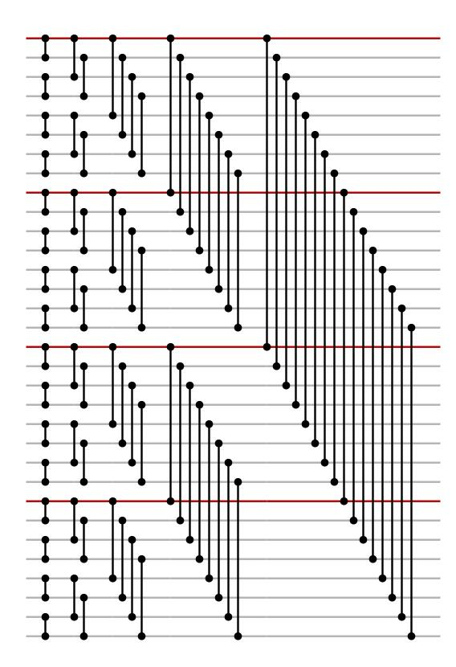
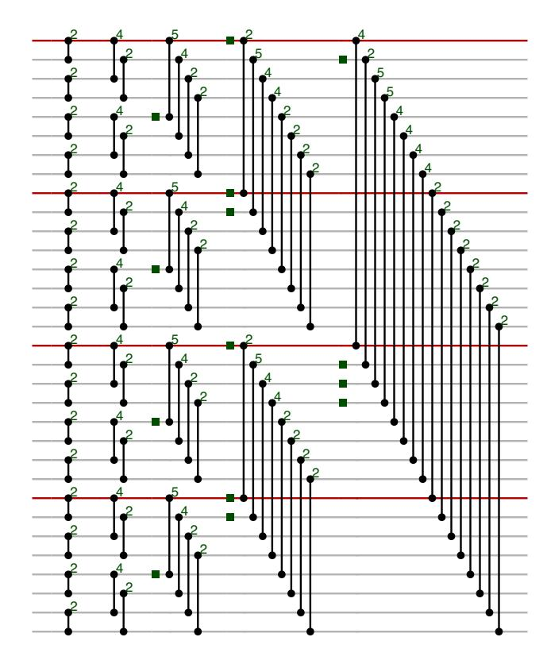
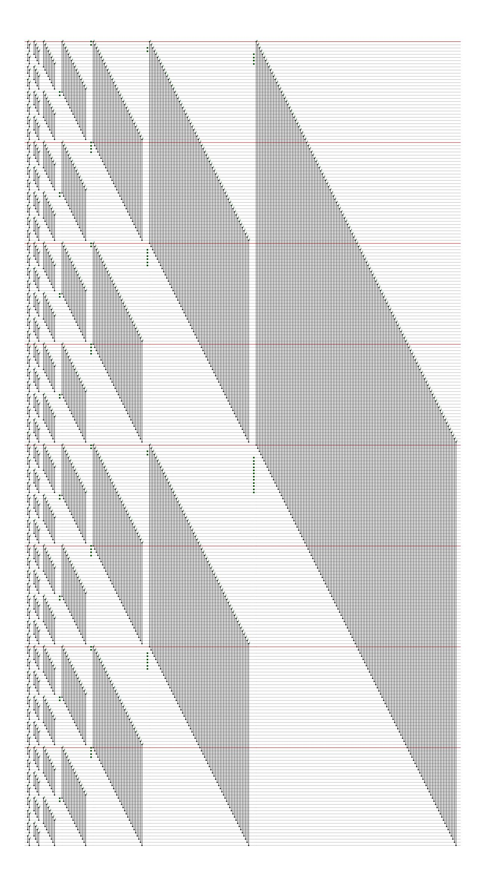

{0}------------------------------------------------

## When to Barrett reduce in the inverse NTT

## Bas Westerbaan

November 2, 2020

## Abstract

We show that lazily Barrett reducing when computing the inverse number theoretic transform (NTT) is optimal.

In this note we study the optimal times when to Barrett reduce in a typical non-SIMD implementation of the inverse number theoretic transform (NTT).

So what was the (inverse) NTT again? Assume  $N=2^n$  for some  $n \in \mathbb{N}$  and q is a prime number such that the field  $\mathbb{F}_q$  has primitive  $2N^{\text{th}}$  root  $\zeta$ . That is:  $\zeta^{2N}=1$  and  $\zeta^N=-1$ . Then using the remarkable product  $(a-b)(a+b)=a^2-b^2$  and  $\zeta^N=-1$ , we see that the polynomial  $x^N+1$  splits completely:

$$x^{N} + 1 = x^{N} - \zeta^{N}$$

$$= (x^{\frac{N}{2}} - \zeta^{\frac{N}{2}})(x^{\frac{N}{2}} + \zeta^{\frac{N}{2}})$$

$$= (x^{\frac{N}{2}} - \zeta^{\frac{N}{2}})(x^{\frac{N}{2}} - \zeta^{\frac{3N}{2}})$$

$$= (x^{\frac{N}{4}} - \zeta^{\frac{N}{4}})(x^{\frac{N}{4}} + \zeta^{\frac{N}{4}})(x^{\frac{N}{4}} - \zeta^{\frac{3N}{4}})(x^{\frac{N}{4}} + \zeta^{\frac{3N}{4}})$$

$$\vdots$$

$$= \prod_{i=1}^{N-1} x - \zeta^{2i+1}.$$

Notice that exponents that appear above  $\zeta$  are counting up in bitreversed order. Thus indeed all odd powers appear on the last line (although not in sequential order.) Now, by the generalized Chinese remainder theorem1

$$\mathbb{F}_q[x]/_{\langle x^N+1\rangle} \cong \prod_{i=0}^{N-1} \mathbb{F}_q[x]/_{\langle x-\zeta^{2i+1}\rangle} \cong \mathbb{F}_q^N.$$

The isomorphism from left to right is the NTT. It allows us to compute a product of polynomials on the left (which is a priori complicated) by a simple componentwise multiplication on the right. By unfolding all definitions we see that the map is given by evaluation of the odd powers of  $\zeta$  by p:

$$p \mapsto (p(\zeta), p(\zeta^3), \dots, p(\zeta^{2N+1})).$$

&lt;sup>1For a commutative ring R with ideals  $I, J \subseteq R$  such that x + y = 1 for some  $x \in I$  and  $y \in J$ , the map  $R \to R/I \times R/J$  given by  $x \mapsto (x + I, y + J)$  is an isomorphism.

{1}------------------------------------------------

However, we can also split the isomorphism in the same steps as we used to split the polynomial:

$$\mathbb{F}_q[x]/_{\langle x^N+1\rangle} \cong \mathbb{F}_q[x]/_{\langle x^{\frac{N}{2}}-\zeta^{\frac{N}{2}}\rangle} \times \mathbb{F}_q[x]/_{\langle x^{\frac{3N}{2}}-\zeta^{\frac{3N}{2}}\rangle} \cong \cdots \cong \mathbb{F}_q^N$$

.

Following each of these steps, putting the coefficients of the polynomials after eachother, we see that for, for instance N = 32, we can compute the inverse NTT (which goes from right to left) as follows:

Here two vertically connected dots represent a Gentleman–Sande butterfly: a map (a, b) 7→ (a + b, ζr (a − b)) for the appropriate r. In optimized implementations coefficients are typically not reduced below q all the time: for instance, the first output usually still fits the chosen number of bits used to store the coefficients. The second output of the butterfly, however, is often directly (Montgomery) reduced to below q as the multiplication with ζ likely overflows Suppose in our example 5q would fit, but 6q wouldn't. Then we need to (Barrett) reduce coefficients in between.

An obvious method to decide where to reduce is the following. Keep track of the bounds from left to right. If the addition in a butterfly is going to overflow, add a reduction on the input of the butterfly that has the highest bound. At that point the butterfly might still overflow; for instance if both inputs were only bounded by 5q.

In our example this yields the following.

{2}------------------------------------------------

Here a green square represent a reduction to below q. The green numbers after a butterfly gives the multiple of q by which the coefficient at that point is bounded. (We assumed that the lower outputs are always bounded by q.)

The question is whether the method described finds the optimal solution. One might imagine that reducing earlier might end up with an advantage a few butterflies down. This turns out not to be the case: the method we just discussed is optimal.

To prove this, we first consider any solution which might not be optimal, but doesn't overflow. Write B for the maximum multiple of q that doesn't overflow.

To start, note that if we're given a reduction just before a butterfly that wouldn't itself overflow if the reduction is removed, then we can pull the reduction through:

$$\begin{array}{cccccccccccccccccccccccccccccccccccc$$

Indeed, suppose that the inputs just before the butterfly and reduction are bounded by aq and bq. That the reduction isn't directly necessary is to say that a+b < B. Clearly pulling through the reduction only influences the upper output. If there are no butterflies after that it's clearly ok. Thus suppose there is another butterfly directly after. Assume its other input is bounded by cq. Then pulling the reduction keeps the bounds the same or reduces them as shown in the picture above.

Thus we can move all the reduction to the right such that they're either stuck behind a butterfly that would otherwise overflow, behind another reduction or at the end. Clearly those reductions at the end and stuck behind other reductions are superfluous and can be removed.

{3}------------------------------------------------

Now consider such a single reduction before a butterfly that's on the input of the butterfly which was already more bounded than the other input. Then we can move the reduction to the other input:

$$\begin{array}{ccc}
a & \longrightarrow & b+1 \\
b & \longrightarrow & 1
\end{array}
\Rightarrow \begin{array}{ccc}
a & \longrightarrow & a+1 \\
b & \longrightarrow & 1
\end{array}$$

By assumption a < b and so moving the reduction gives us a strictly better bounded solution. Note that if a = b, then it doens't matter on which input the reduction is placed.

Thus any solution can be modified into a better one where every reduction is stuck behind a butterfly that would otherwise overflow. Given another solution in this form, we can see that they must have reductions on the same butterflies by considering them from left to right. Indeed, the very first reductions have to appear at exactly the same butterflies and this argument can be repeated for the next layers. Thus our modified solutions are the same. As the optimal solution must also be of this form, they both equal this optimal solution.

As a final example, this method can be applied to the inverse NTT used in (the portable implementation) of CRYSTALS-Kyber [BDK+18] as submitted to round 2 and 3 of the NIST PQC competition. In Kyber N=256 and B=9. The method yields the following optimal solution with 72 Barrett reductions. (Note that Kyber doesn't use a full NTT as their  $\mathbb{F}_q$  only contains a primitive  $N^{\text{th}}$  root of unity and so the first layer is missing.)

{4}------------------------------------------------

{5}------------------------------------------------

## References

[BDK+18] Joppe Bos, L´eo Ducas, Eike Kiltz, Tancr`ede Lepoint, Vadim Lyubashevsky, John M Schanck, Peter Schwabe, Gregor Seiler, and Damien Stehl´e. Crystals-kyber: a cca-secure module-lattice-based kem. In 2018 IEEE European Symposium on Security and Privacy (EuroS&P), pages 353–367. IEEE, 2018.