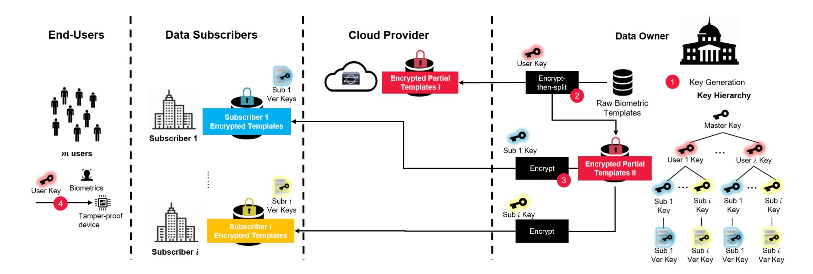
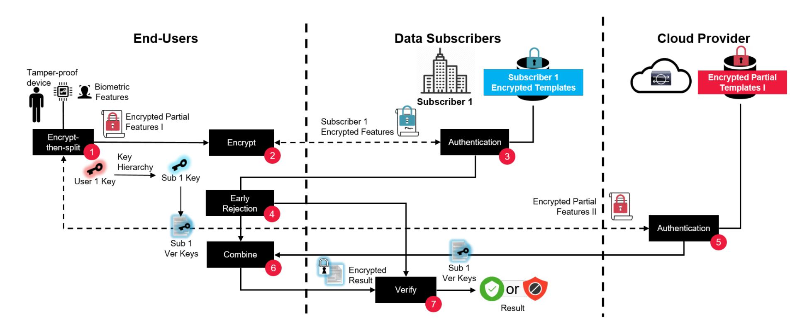
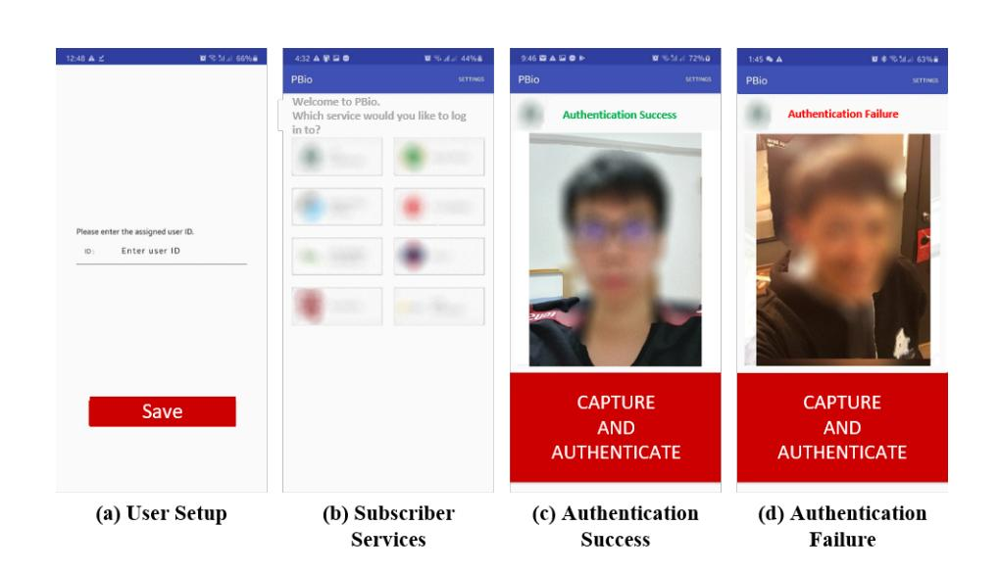

{0}------------------------------------------------

# PBio: Enabling Cross-organizational Biometric Authentication Service through Secure Sharing of Biometric Templates

Jia-Chng Loh∗ , Geong-Sen Poh† , Jason H. M. Ying∗ , Jia Xu† , Hoon Wei Lim† *NUS-Singtel Cyber Security Lab*

∗{dcsljc,dcsyhmj}@nus.edu.sg, †{geongsen.poh,jia.xu,hoonwei.lim}@trustwave.com

Jonathan Pan, Weiyang Wong *Home Team Science & Technology Agency*

{jonathan\_pan,wong\_weiyang}@htx.gov.sg

## Abstract

Prior works in privacy-preserving biometric authentication mostly focus on the following setting. An organization collects users' biometric data during registration and later authorized access to the organization services after successful authentication. Each organization has to maintain its own biometric database. Similarly each user has to release her biometric information to multiple organizations; Independently, government authorities are making their extensive, nation-wide biometric database available to agencies and organizations, for countries that allow such access. This will enable organizations to provide authentication without maintaining biometric databases, while users only need to register once. However privacy remains a concern. We propose a privacy-preserving system, PBio, for this new setting. The core component of PBio is a new protocol comprising distance recoverable encryption and secure distance computation. We introduce an encrypt-then-split mechanism such that each of the organizations holds only an encrypted partial biometric database. This minimizes the risk of template reconstruction in the event that the encrypted partial database is recovered due to leak of the encryption key. PBio is also secure even when the organizations collude. A by-product benefit is that the use of encrypted partial templates allows quicker rejection for non-matching instances. We implemented a cloud-based prototype with desktop and Android applications. Our experiment results based on real remote users show that PBio is highly efficient. A round-trip authentication takes approximately 74ms (desktop) and 626ms (Android). The computation and communication overhead introduced by our new cryptographic protocol is only about 10ms (desktop) and 54ms (Android).

## 1 Introduction

The use of biometric information, such as fingerprint, face and iris, for authentication purposes has proliferated in recent years. Allowing various organizations, such as banks and government agencies, access to biometric templates hosted by

a central and trusted entity will be advantageous in multiple aspects. First it allows organizations that currently have no access to have direct access to a readily available database. Second, these organizations do not need to invest in the infrastructure required to enroll new users and store raw biometric databases of their own. This also reduces the risk of potential data breaches. Third, a user only needs to register once with the trusted entity to access to services provided by various organizations. Singapore's SingPass face verification [\[16\]](#page-13-0) and India's Aadhaar project [\[59\]](#page-15-0) are two recent examples, where organizations subscribe to the national biometric databases to enable authentication services to their client.

However, allowing organizations direct access to a central biometric database still needs to be handled with extra care. BioStar 2, a biometric security platform that provides biometric database hosting service, experienced a data breach incident resulting in the leakage of users' biometric information [\[22\]](#page-13-1). Also, there are biometric practitioners that regard the use of biometric templates without any further protection as adequate as far as security and privacy is concerned. That is, a template should not contain sufficient information for reconstruction of the corresponding original biometric data [\[26\]](#page-14-0). On the contrary, significant progress has been made lately in the domain of biometric template reconstruction, see for example [\[9,](#page-13-2)[10,](#page-13-3)[23,](#page-14-1)[25,](#page-14-2)[47\]](#page-15-1). This is a major privacy concern since the reconstructed biometric templates can be used to identify or impersonate an individual. A more viable approach is to share a subset of the original database in a privacy-preserving manner. This way, the raw biometric templates remain with only the trusted entity and are isolated from the other organizations. It enables other organizations to authenticate the said individuals, but in such a way that the organizations cannot learn any biometric information from the shared database.

Use Case. We envision a biometric authentication service that allows an individual to simply scan her face at a kiosk, or capture her facial image through a mobile application (which will enable access even when the individual is abroad) to initiate a transaction with a bank or a government agency. The captured facial features will be matched against a shared

{1}------------------------------------------------

encrypted biometric database that is derived from a national biometric database. The use of biometrics as an alternative to conventional text-based passwords is of high interest to various smart nation initiatives worldwide, for example [\[74\]](#page-16-0). Specifically, a face verification application was recently proposed in collaboration between a Singapore-based bank, DBS, and a Singapore government agency, GovTech, to pilot face verification for easier digital banking sign-ups and to secure higher value transactions [\[16\]](#page-13-0). In the case of hotel checkin services, the physical presence of a reception staff is not required to perform this role. Instead, self check-in can be completed either through an on-site kiosk located within the premise or via mobile authentication [\[61,](#page-15-2) [86\]](#page-16-1).

Existing Approaches. Current privacy-preserving biometric authentication schemes, see for example [\[5,](#page-13-4) [7,](#page-13-5) [21,](#page-13-6) [45,](#page-14-3) [67,](#page-15-3) [89\]](#page-16-2), performed authentication directly between a user and a service provider (e.g. bank). There are also proposals that enable an organization to outsource the resources required, both computation and storage, for biometric authentication to a cloud service [\[13,](#page-13-7) [27,](#page-14-4) [29,](#page-14-5) [75,](#page-16-3) [78,](#page-16-4) [81,](#page-16-5) [87,](#page-16-6) [88\]](#page-16-7). In both settings, a user provides her biometric data to her service provider during registration. Thus, multiple registrations are required if the user intends to register with several service providers. This also means each organization collects and maintains its own set of biometric templates.

Our Approach. In our proposed system, PBio, a user only needs to register once with the entity responsible for a national-level biometric database to have access to a range of services provided through multiple service providers and agencies. There are a couple of key technical challenges in the design of PBio. First, users' biometric information must be disseminated to the respective service providers in a secure and privacy-preserving manner. Second, the time required to complete an authentication check should be fast and comparable to that of existing biometric authentication systems. Third, the risk of reconstruction of biometric features should be minimal even in the event that the biometric database used by a service provider is leaked.

Our Contributions. To the best of our knowledge, PBio is the first system that allows cross-organizational and privacypreserving biometric data sharing and authentication. Our contributions are as follows:

- We propose a provably secure protocol using lightweight distance recoverable encryption with orthogonal matrix and secure two-party computation scheme, GSHADE. This allows us to outsource the encrypted templates and securely authenticate users from different organizations without decryption.
- Our protocol makes use of a new *encrypt-then-split* construct. Encrypted biometric templates are split into two (or more) parts, where one part is given to a cloud service provider and the other parts to organizations that provide authentication services. A biometric feature set captured

in real time can be tested against the encrypted partial biometric templates stored by an organization. The advantages of splitting the biometric template is two-fold. First, each split portion of a biometric template has a smaller dimension compared to its entirety. As such, this enables early rejection of a non-matching biometrics during the authentication phase. Second, no single entity has in possession of the full biometric template of any user except the data owner. The partial biometric templates are encrypted to alleviate the risk of leakage of a user's biometric information.

- Our protocol is secure against collusion between two or more organizations. Collusion of organizations and cloud provider can never recover the full biometric template of any user without the secret encryption keys that are known only by the trusted entity hosting the national database.
- We implemented PBio as a desktop and an Android applications. Both applications connect to an AWS cloud service, which stores encrypted biometric databases and supports our authentication protocol. We invited 20 volunteers to validate the feasibility and usability of PBio. Our results show that a round-trip authentication process on average takes 74.49ms (desktop) and 626.53ms (Android). These times cover face capture, feature extraction, and execution of all cryptographic operations; out of which our protocol on average takes just 10.06ms and 54.11ms. We also compared our system against recent works [\[13,](#page-13-7)[29,](#page-14-5)[31](#page-14-6)[,89\]](#page-16-2). The performance of PBio is comparable, although our overhead is marginally higher at the cryptographic protocol level. This is understandable as our protocol is designed to support cross-organizational authentication, while the prior works consider a direct user-to-organization authentication setting.

## 2 Overview

PBio consists of four parties: (1) data owner, a fully-trusted entity, who owns the raw biometric templates, shares the encrypted biometric database with a cloud provider and data subscribers, and distributes the user secret keys; (2) cloud provider, a honest-but-curious entity, who receives and stores, from the data owner, a first database of encrypted partial biometric templates, and helps to verify a user without decrypting the encrypted templates; (3) data subscribers, honestbut-curious entities, such as organizations or service providers (e.g. banks), who wish to authenticate their clients. They receive and store, from the data owner, a second database of encrypted partial biometric templates, and uses the database to authenticate a user without decrypting the encrypted templates; and (4) users, (e.g. clients of a bank), whom can be dishonest but must be physically present when register with the national biometric database, submit their biometric in-

{2}------------------------------------------------

Figure 1: PBio Setup and Registration Phase. (1) Data owner generates a master key. The key is used to derive a user secret key for every user. The user secret key is used to derive a subscriber key for every data subscriber, and the subscriber key is also used to derive a verification key; (2) Data owner *encrypt-then-split* each user's raw biometric template into two encrypted partial templates using the user secret key. One set of encrypted partial templates is passed to the cloud provider; (3) Data owner uses the subscriber keys to encrypt each user's encrypted partial template in another set of encrypted partial templates. The resulting set of re-encrypted partial templates, namely subscriber encrypted template, is given to the subscribers; (4) Data owner delivers user secret keys to the users' registered devices.

formation for authentication using registered tamper-proof devices.

## 2.1 System Flow

PBio consists of three phases, namely Setup Phase, Registration Phase (Figure [1\)](#page-2-0), and Authentication Phase (Figure [2\)](#page-3-0). Setup Phase. Data owner initializes the system and generates user secret keys to encrypt every user biometric templates. The encrypted templates are split into two parts and distributed to the cloud provider and the data subscriber *i* respectively.

Registration Phase. For every registered data subscriber *i*, the data owner generates subscriber *i* encrypted templates and passes it to the subscriber *i*. For every registered user, the data owner delivers the user secret key to the registered device. Authentication Phase. The users submit the biometrics

through a tamper-proof device, which extracts and encrypts using the stored user secret keys. The device then runs the authentication protocol with the data subscriber *i* and the cloud provider respectively.

## 2.2 System Goals

PBio's main goal is to perform cross-organizational biometric authentication without revealing the biometric information:

- 1. The data subscriber is able to authenticate a user without decryption.
- 2. The encrypted biometric templates stored by the cloud and data subscribers should leak no information about the users' biometrics.

3. The freshly submitted biometric features during the authentication phase should remain secret.

## 2.3 Threat Model

We define the following attackers:

- The attacker that resides in the cloud provider or the data subscribers. We assume the cloud provider and data subscribers to be honest-but-curious. Both follow the protocol honestly but will try to learn the users' biometric information from the shared encrypted database and during the authentication process.
- The attacker that holds users' tamper-proof devices. We assume users are authenticated and the keys are distributed by the data owner in the registration phase. We note that the users' tamper-proof devices are fully trusted, which store the user secret keys and honestly run the proposed protocol. Such devices have been deployed in India's Aadhaar biometrics authentication [\[58,](#page-15-4) [59\]](#page-15-0) using Trusted Execution Environment [\[20\]](#page-13-8). Each registered device acts as an oracle to extract and encrypt a user's biometrics, and proceed with authentication protocol. Hence, the attacker, who holds the victim's device, may try to manipulate the communication in order to masquerade a victim user and be accepted by the authentication protocol under the victim's name. An attacker may also collude with cloud provider or subscribers in breaking the stored encrypted biometric templates.

{3}------------------------------------------------

Figure 2: PBio Authentication Phase. (1) User's device *encrypt-then-split* freshly submitted biometric features; (2) User's device generates the subscriber's encrypted partial feature; (3) Data subscriber verifies the received subscriber's encrypted features; (4) Authentication fails, which skips to (7) if verification returns non-match in (3); (5) Else cloud provider verifies the received encrypted partial features; (6) User's device receives and combines the results from (3) and (5) and outputs the final authentication result; (7) Data subscriber decrypts and receives the authentication result using the verification key.

### 2.4 Definition

PBio consists of the following algorithms and protocols:

- $msk \leftarrow MKGen(1^k)$ : On input security parameter  $1^k$ , it generates a master secret key msk.
- $sk_{ID} \leftarrow KGen(msk,ID)$ : On input msk and the user unique identity ID, it generates a user secret key  $sk_{ID}$ .
- $\vec{c}_{ID} \leftarrow \text{Enc}(sk_{ID}, \vec{x}_{ID})$ : On input  $sk_{ID}$  and a user biometric template as a vector  $\vec{x}_{ID} = (x_1, \dots, x_n)$ , it computes an encrypted vector  $\vec{c}_{xID}$ .
- $\vec{c}'_{xID,i}$ ,  $vk_{ID,i} \leftarrow \text{ReEnc}(sk_{ID}, \vec{c}_{xID}, i)$ : On input  $sk_{ID}$ ,  $\vec{c}_{ID}$  and subscriber identity i, it derives a subscriber key and computes a subscriber encrypted vector  $\vec{c}'_{xID,i}$ . A verification key  $vk_{ID,i}$  is also derived from the subscriber key.
- $t_{ID,i} \leftarrow \text{tEnc}(sk_{ID},i)$ : On input  $sk_{ID}$ , subscriber identity i, and a threshold t that serves to authentication a person, it computes an encrypted threshold  $t_{ID,i}$ .
- $\{d_0, \theta\} \leftarrow \text{SubAuth}(vk_{ID,i}, (\vec{c'_{xID,i}}, \vec{c'_{y_{ID,i}}}), t_{ID,i})$ : On input a verification key  $sk_{ID}$ , a tuple of subscriber encrypted vectors  $(\vec{c'_{xID,i}}, \vec{c'_{y_{ID,i}}})$  and authenticated threshold value  $t_{ID,i}$ , it computes their distance  $d_0$ . The output is either  $d_0$  if the authentication succeeds, or an encrypted authentication result  $\theta$  otherwise.
- $d_1 \leftarrow \text{CloudAuth}(sk_{ID}, i, (\vec{c}_{xID}, \vec{c}_{yID}))$ : On input  $sk_{ID}, i$  and  $(\vec{c}_{xID}, \vec{c}_{yID})$ , it computes and outputs their distance  $d_1$ .
- $\theta \leftarrow \text{Combine}(vk_{ID,i}, d_0, d_1, t_{ID,i})$ : On input  $vk_{ID,i}, d_0, d_1, t_{ID,i}$  and i, it combines a full distance  $d = d_0 + d_1$  and

computes an encrypted authentication result  $\theta$ .

• {accept, reject}  $\leftarrow$  Verify( $vk_{ID,i}$ ,  $\theta$ ): On input  $vk_{ID,i}$  and  $\theta$ , it decrypts and outputs the authentication result {accept, reject}.

### 3 Building blocks

PBio requires three main building blocks: (1) a biometric recognition scheme to extract features and construct templates from the raw biometric information (e.g. fingerprint, face, iris); (2) A distance recoverable encryption scheme that we proposed to encrypt these templates; (3) a secure distance computation mechanism that we utilized for authentication.

### 3.1 Biometric Recognition Scheme

A biometric recognition scheme enables recognition of an individual based on the individual's biometric (e.g. face) presented to the scheme. We define such a scheme as consisting of the following functions:

- $\vec{x} \leftarrow \text{Ext}(img)$ : On input a raw biometric image img, it outputs a feature vector  $\vec{x} \in \mathbb{R}^n$ .
- $d \leftarrow \text{Dist}(\vec{x}, \vec{y})$ : On input two feature vectors  $\vec{x}$  and  $\vec{y}$ , it outputs a distance d.
- $\{accept, reject\} \leftarrow \text{Match}(t,d)$ : On input a threshold t and a distance d, it outputs accept if  $d \le t^2$  and reject otherwise.

Given two feature vectors  $\vec{x} = (x_1, \dots, x_n)$  and  $\vec{y} = (y_1, \dots, y_n)$ , one of the common metrics for matching, which

{4}------------------------------------------------

we use in our protocol, is the squared Euclidean distance  $^1$ . Hence we define the distance function as:  $\mathrm{Dist}(\vec{x}, \vec{y}) = \sum_{i=1}^n (x_i - y_i)^2 = \sum_{i=1}^n x_i^2 - 2x_i y_i + y_i^2 = \sum_{i=1}^n x_i^2 - 2\sum_{i=1}^n x_i y_i + \sum_{i=1}^n y_i^2 = ||\vec{x} - \vec{y}||_2^2 = d$ . The authentication result is thus based on the squared Euclidean distance d in relation to a defined threshold t. In particular,  $\vec{x}$  and  $\vec{y}$  belong to the same person if and only if  $\mathrm{Dist}(\vec{x}, \vec{y}) \leq t^2$ . Note that lower value of t means the system requires higher similarity to pass authentication. We remark that our protocol deploys the scheme solely to capture facial biometric and output a feature vector. Any biometric recognition scheme based on Euclidean distance can be applied.

### 3.2 Distance Recoverable Encryption

A distance recoverable encryption (DRE) scheme [29, 78, 80, 87, 89] allows one to calculate the distance between two encrypted feature vectors such that the distance Dist between two plain feature vectors  $(\vec{x}, \vec{y})$  is equal to the distance between the corresponding two encrypted feature vectors  $(E(\vec{x}), E(\vec{y}))$ , i.e.  $Dist(\vec{x}, \vec{y}) = Dist(E(\vec{x}), E(\vec{y}))$ . We propose a distance recoverable encryption scheme, DRE, to secure the feature vectors yet enable computation of the distance between two feature vectors in our protocol. The scheme is based on orthogonal matrix, which we define in the followings.

Orthogonal Matrix. An orthogonal matrix M is a  $n \times n$  square matrix such that its inverse and transpose are equal, i.e.  $M^{-1} = M^{\top}$ . M satisfies the following properties:

- Identity transformation: M and  $M^{\top}$  commute such that  $M^{\top}M = MM^{\top} = I$ , where I is the identity matrix.
- Product transformation: Given  $M = M_0 M_1$ , if  $M_0$  and  $M_1$  are orthogonal matrices, M is also an orthogonal matrix.
- Preservation of length: Given two pairs of vectors  $(\vec{x}, \vec{y})$  and  $(\vec{x}M, \vec{y}M)$ , their respective Euclidean distances Dist are equal as given by  $\text{Dist}(\vec{x}, \vec{y}) = \text{Dist}(\vec{x}M, \vec{y}M) = \|\vec{x}M \vec{y}M\|_2^2 = \|\vec{x} \vec{y}\|_2^2$ .

The DRE scheme utilizes a pseudorandom function  $PRF_M(.) \to M \in \mathbb{R}^{n \times n}$  that generates pseudorandom orthogonal matrices, a pseudorandom function  $PRF_V(.) \to \vec{v} \in \mathbb{R}^n$  that generates pseudorandom vectors, a pseudorandom function  $PRF_W(.) \to w \in [1.0, 2.0]$  that generates a scale factor, and a pseudorandom permutation  $PRP(., \vec{s}) \to \pi(\vec{s})$ . The encryption function E is defined as follows:

•  $\vec{c_x} \leftarrow \mathbb{E}(sk, \vec{x})$ : Given as input a secret key sk and a feature vector  $\vec{x} = (x_1, \dots, x_n)$ , the algorithm generates a pseudorandom orthogonal matrix m from  $\text{PRF}_M(sk)$ , a pseudorandom vector  $\vec{v}$  from  $\text{PRF}_V(sk)$  and a scale factor w from  $\text{PRF}_W(sk)$ . It then runs  $\text{PRP}(sk, \vec{x})$  to permute  $\vec{x}$ , resulting in  $\pi(\vec{x})$ . An encrypted vector is generated as  $\vec{c_x} = w(\pi(\vec{x}) + \vec{v})M$ .

*Distance:* The distance Dist between two encrypted vectors  $(\mathbf{E}(\vec{x},sk),\mathbf{E}(\vec{y},sk))$  is computed as follows. Dist $(\mathbf{E}(\vec{x},sk),\mathbf{E}(\vec{y},sk)) = \|(w\cdot(\pi(\vec{x})+\vec{v})\cdot M)-(w\cdot(\pi(\vec{y})+\vec{v})\cdot M)\|_2^2 = w^2\|\pi(\vec{x})-\pi(\vec{y})\|_2^2 = w^2\cdot d$ 

**Proposition 1** E is collision-free under the same secret key.

**Proof 1** Suppose  $E(\vec{x}, sk) = E(\vec{y}, sk)$  for some  $\vec{x}$ ,  $\vec{y}$ . Then  $w \cdot (\pi(\vec{x}) + \vec{v}) \cdot M = w \cdot (\pi(\vec{y}) + \vec{v}) \cdot M \Longrightarrow \pi(\vec{x}) + \vec{v} = \pi(\vec{y}) + \vec{v}$  since  $det(M) \neq 0$ . It follows that  $\pi(\vec{x}) = \pi(\vec{y})$ .

We provide security analysis of our DRE scheme in Section 5.2.

### 3.3 Secure Distance Computation

Bringer et al. proposed a secure distance computation protocol called GSHADE [7]. It allows two parties, a sender S and a verifier V, to securely compute the distance of two biometric features. It guarantees one party does not get more information about the other party's inputs than what can be deduced from its own inputs and outputs. A central building block of GSHADE is oblivious transfer (OT). OT is an interactive protocol whereby the sender has a number of messages, and the receiver wishes to obtain a specific message, without the sender knowing which it is, while also ensuring that the receiver gets no information about the other messages which the sender holds. In brief, let  $\vec{x} = (x_1, \dots, x_k)$ with  $x_i = (x_{k(i-1)+1}, \dots, x_{k(i-1)+\ell})$  and  $\vec{y} = (y_1, \dots, y_k)$  with  $y_i = (y_{k(i-1)+1}, \dots, y_{k(i-1)+\ell})$  are  $n = k \times \ell$ -bit integer vectors. Three functions are defined where  $f_x(\vec{x}) = \sum_{i=1}^k x_i^2$ ,  $f_y(\vec{y}) =$  $\sum_{i=1}^{k} y_i^2$ , and  $f_{k(i-1)+j}(x_{n(i-1)+j}, \vec{y}) = -2^j \cdot x_{k(i-1)+j} \cdot y_i$  for  $i=1,\cdots,k$  and  $j=1,\cdots,\ell$ . Both S, on input  $\vec{y}$ , and V, on input  $\vec{x}$ , run the protocol as follows:

- 1. *S* chooses *n* random values  $r_1, \dots, r_n \in_R \mathbb{Z}_m$
- 2. For each  $i = 1, \dots, n$ , S and V run  $OT^{log_2(m)}$  where
  - V's selection bit is  $x_i$
  - S's input is  $(r_i + f_i(0, \vec{y}), r_i + f_i(1, \vec{y}))$
  - The output obtained by *V* is  $t_i = r_i + f_i(x_i, \vec{y})$
- 3. *V* computes and outputs  $T = \sum_{i=1}^{n} t_i + f_x(\vec{x})$
- 4. *S* computes and outputs  $R = \sum_{i=1}^{n} r_i f_y(\vec{y})$
- 5. At the end, either *S* or *V* learns the distance by computing  $Dist(\vec{x}, \vec{y}) = T R = d$

**Theorem 1** ([7]) Security is proven by simulation in the OT-hybrid setting, where OTs are simulated by a trusted oracle. We recall that each simulator is provided with the input and output of the corrupted party. Case 1 - V is corrupted. Since V receives no messages beyond those in OT, its view can be perfectly simulated. Case 2 - S is corrupted. Given S's output T and input X, S's view can be perfectly simulated by sending random values  $t_1, ..., t_{n-1} \in_R Z_m$  and  $t'_n = T - \sum_{i=1}^{n-1} t'_i - f_x(\vec{x})$  to S in the OTs.

&lt;sup>1So we can save computation of square root every time.

{5}------------------------------------------------

### 4 PBio

PBio consists of several components: First, we encrypt biometric templates using DRE. Second, we employ GSHADE to allow two parties with two private vector inputs  $\vec{x}$  and  $\vec{y}$ , respectively, to securely decide if the Euclidean distance between  $\vec{x}$  and  $\vec{y}$  is smaller than a given threshold without leaking extra information. Third, we perform periodical update to refresh the encrypted partial biometric templates that are accessible by organizations. We discuss several ways to go about performing such update in Section 7.

#### 4.1 Construction

Let BR = (Ext, Dist, Match) to be any biometric recognition scheme based on Euclidean distance, DRE be the distance recoverable encryption scheme, and GSHADE the secure distance computation protocol. We define a keyed-hash message authentication code function  $\mathrm{HMAC}(\cdot)$  and a symmetric encryption function for encryption  $\mathrm{AES}_E(\cdot)$  and decryption  $\mathrm{AES}_D(\cdot)$ . The proposed scheme consists of a tuple (Setup, MKGen, KGen, Enc, ReEnc, tEnc, SubAuth, CloudAuth, Combine, Verify). We assume the input message is a feature vector  $\vec{x}$ , extracted from a user ID biometric image, e.g.  $\vec{x}_{ID} \leftarrow \mathrm{BR.Ext}(img_{ID})$ .

- $msk \leftarrow \texttt{MKGen}(1^k)$ : The algorithm generates a random string as the master key  $msk \in \mathbb{Z}_p^*$ .
- $sk_{ID} \leftarrow \text{KGen}(msk, ID)$ : The algorithm runs HMAC(msk,ID,time) with the input of msk, user unique identity ID, and a timestamp time to generate a user secret key  $sk_{ID}$ .
- $\vec{c}_{xID} \leftarrow \text{Enc}(sk_{ID}, \vec{x}_{ID})$ : The algorithm generates a encrypted vector by running  $\vec{c}_{xID} \leftarrow \text{DRE.E}(sk_{ID}, \vec{x}_{ID})$ .
- $\vec{c}'_{xID,i}$ ,  $vk_{ID,i} \leftarrow \text{ReEnc}(sk_{ID}, \vec{c}_{xID}, i)$ : The algorithm runs HMAC $(sk_{ID},ID, i, time)$  to generate a new subscriber i key  $sk_{ID,i}$  and HMAC $(sk_{ID,i})$  to generate a new verification key  $vk_{ID,i}$ . The rest is similar to Enc, which generates a subscriber encrypted vector by running  $\vec{c}'_{xID,i} \leftarrow \text{DRE.E}(sk_{ID,i}, \vec{c}_{xID})$ .
- $t_{ID,i} \leftarrow \text{tEnc}(sk_{ID},i,t)$ : The algorithm runs  $\text{PRF}_{W}(sk_{ID}) \rightarrow w_{ID}$  and  $\text{PRF}_{W}(sk_{ID},i) \rightarrow w_{ID,i}$ . It then encrypts a threshold  $t_{ID,i} = w_{ID} \cdot w_{ID,i} \cdot t$ .
- $\{d_0, \theta\} \leftarrow \text{SubAuth}(vk_{ID,i}, (\vec{c'_{xID,i}}, \vec{c'_{yID,i}}), t_{ID,i})$ : An interactive protocol that runs GSHADE between a device and subscriber i where the device input is a tuple  $(\vec{c'_{xID,i}}, t_{ID,i})$  and subscriber i input is  $\vec{c'_{yID,i}}$ . At the end of the protocol, the device receives a distance  $d_0 = \text{Dist}(\vec{c'_{xID,i}}, \vec{c'_{yID,i}})$  and runs  $b \leftarrow \text{BR.Match}(t_{ID,i}, d_0)$ . The device returns encrypted authentication result  $\theta \leftarrow \text{AES}_E(vk_{ID,i}, reject)$  to the subscriber if b = reject, which indicates an early

- rejection to the authentication. Otherwise, the user proceeds to CloudAuth.
- $d_1 \leftarrow \text{CloudAuth}(sk_{ID}, i, (\vec{c}_{xID}, \vec{c}_{yID}))$ : An interactive protocol that runs GSHADE between a device and a cloud provider where the device input is a tuple  $(sk_{ID}, i, \vec{c}_{xID})$  and the cloud input is  $\vec{c}_{yID}$ . At the end of the protocol, the device receives and computes a distance  $d_1 = \text{Dist}(\vec{c}'_{xID,i}, \vec{c}'_{yID,i}) \cdot \text{PRF}_{\mathbb{W}}(sk_{ID},i)$ . The cloud receives nothing and the device receives  $d_1$ .
- $\theta \leftarrow \text{Combine}(vk_{ID,i}, d_0, d_1, t_{ID,i})$ : On input  $vk_{ID,i}, d_0, d_1, t_{ID,i}$  and i, the algorithm generates a full distance  $d = d_0 + d_1$  and runs  $b \leftarrow \text{BR.Match}(t_{ID,i}, d)$ . The output is the encrypted authentication result  $\theta \leftarrow \text{AES}_E(vk_{ID,i}, b)$ .
- $\{accept, reject\} \leftarrow Verify(vk_{ID,i}, \theta)$ : On input  $vk_{ID,i}$  and  $\theta$ , it decrypts and outptus the authentication result  $\{accept, reject\} \leftarrow AES_D(vk_{ID,i}, \theta)$ .

Correctness. Given the elements  $(\vec{c}_{xID}, \vec{c}_{yID}, \vec{c}'_{xID,i}, \vec{c}'_{yID,i}, t_{ID,i})$  generated by the defined algorithms above, the following equations always hold. If BR.Dist $(\vec{x}_{ID}, \vec{y}_{ID}) \leq t^2$ , then  $d_0 \leftarrow \text{SubAuth}((\vec{c}'_{xID,i}, \vec{c}'_{yID,i}), t_{ID,i}), d_1 \leftarrow \text{CloudAuth}(sk_{ID}, i, (\vec{c}_{xID}, \vec{c}_{yID})), \theta \leftarrow \text{Combine}(d_0, d_1, t_{ID,i}), \text{ and } accept \leftarrow \text{Verify}(vk_{ID,i}, \theta); \text{ Else if BR.Dist}(\vec{x}_{ID}, \vec{y}_{ID}) > t^2 \text{ and early rejection occurs, then } \theta \leftarrow \text{SubAuth}(vk_{ID,i}, (\vec{c}'_{xID,i}, \vec{c}'_{yID,i}), t_{ID,i})$  and  $reject \leftarrow \text{Verify}(vk_{ID,i}, \theta); \text{ Else if BR.Dist}(\vec{x}_{ID}, \vec{y}_{ID}) > t^2$ , then  $d_0 \leftarrow \text{SubAuth}(vk_{ID,i}, (\vec{c}'_{xID,i}, \vec{c}'_{yID,i}), t_{ID,i}), d_1 \leftarrow \text{CloudAuth}(sk_{ID}, i, (\vec{c}_{xID}, \vec{c}_{yID})), \theta \leftarrow \text{Combine}(d_0, d_1, t_{ID,i}),$  and  $reject \leftarrow \text{Verify}(vk_{ID,i}, \theta).$ 

### 4.2 PBio System

We now present the three phases of PBio, utilizing the construction previously described.

**Setup Phase.** The data owner possesses a set of biometric templates, which is pre-collected from all the users. Each record of a user contains the user's identity information *ID* and the biometric image *img*. The data owner generates a master key and then derives the user secret key for every user. The data owner encrypts then splits the biometric templates into two parts. The *encrypt-then-split* approach allows the data owner to provide a partial copy of the encrypted templates to the cloud provider, and the another partial copy to be prepared for the data subscriber *i*. The details of the setup protocol is described in Figure 3.

**Registration Phase.** The registration phase enables a subscriber or a user to register to the data owner respectively. In other words, a new subscriber registers and receives the encrypted templates, and a user registers a device to install the user secret key. Thus it consists of two sub-phases: (a) subscriber registration and (b) user registration. The details of the registration protocol is described in Figure 4. We also elaborate how the key distribution works in Section 7.3.

{6}------------------------------------------------

### The setup protocol

#### Input:

• Data Owner: User's raw biometric image, user's identity information and proof of identity.

#### Output:

- Data owner: Encrypted database (*c*~*x0* || *c*~*x1*) = ~*cx* and the user table *TableU* .
- Cloud provider: Encrypted partial database *c*~*x1ID*.

### Protocol:

- 1. The data owner executes the master key generation algorithm to generate a master secret key *msk* ← MKGen(1*k* ).
- 2. The data owner then runs a biometric recognition scheme BR to extract the biometric feature and stores the biometric template~*x* ← BR.Ext(*img*).
- 3. For every user with unique identity *ID*, the data owner runs the key generation algorithm to generate user secret key *skID* ← KGen(*msk*,*ID*). The data owner stores (*skID*,*ID*,*time*) in a user table *TableU* .
- 4. For every user biometric template ~*X* = {~*x*1,··· ,~*xm*} where *m* is the total number of users, data owner generates the encrypted database by running ~*cxID* ← Enc(*skID*,~*xID*).
- 5. Data owner splits by half the encrypted database into two parts e.g. (*c*~*x0* || *c*~*x1*) = ~*cx*. The first part *c*~*x0* will be applied during the registration phase and the second part *c*~*x1* is outsourced to a cloud provider.

Figure 3: Setup phase

Authentication Phase. The user submits to the device the freshly captured biometric feature and the device encrypts this feature using the proposed encryption scheme. The device then verifies the encrypted feature with the subscriber *i* and the cloud provider. We demonstrate through experiment that it is possible to first perform matching to authenticate a user based on the partial biometric templates hosted by the data subscriber *i*. This reduces the computation and communication cost during the authentication phase in the event of an early rejection. PBio utilizes the protocol construction described in [4.1](#page-5-0) to perform the authentication in a secure manner. Although the authentication protocol is computed within a tamper-proof device, we notice a possible attack in which an adversary can skip all the authentication steps and forward a successful authentication result to the data subscriber. Hence, we propose a shared verification key, which is derived by the subscriber key from the respective user, to encrypt the authentication result using any symmetric encryption function, e.g. AES*E*(·). This ensures that the authentication process is completed by the tamper-proof device. The data subscriber can decrypt the encrypted result using decryption function AES*D*(·) with the verification key. The details of the authentication protocol is described in Figure [5.](#page-7-1)

#### The registration protocol

### Input:

- Data owner: Encrypted partial database *c*~*x0ID* and the user table *TableU* .
- Subscriber *i*: Unique identity *i* along with the proof of identity.
- User: Unique identity *ID* along with the proof of identity.

#### Output:

- Subscriber *i*: Subscriber encrypted templates ~*c* 0 *ID*,*i* and verification keys *vkID*,*i* .
- User: User secret key *skID*.

#### Protocol:

- 1. The protocol is initialized in a secure manner by (a) the subscriber or (b) the user:
  - (a) The subscriber *i* submits the proof of identity and registers to the data owner to request for a copy of subscriber encrypted templates.
  - (b) User submits the proof of identity with the registered device and requests for a user secret key *skID*.
- 2. Data owner performs the following steps:
  - (a) Verifies the provided registration information and generates the subscriber encrypted template and verification key pair (~*c* 0 *ID*,*i* , *vkID*,*i*) by running ReEnc(*skID*,*c*~*x0ID*,*i*) using every user secret key and encrypted partial template (*skID*,*c*~*x*0*ID*).
  - (b) Verifies the user identity and embeds *skID* to the user registered device.

Figure 4: Registration phase

# 5 Security of PBio

## 5.1 Security Models

We follow the security formulation in [\[17\]](#page-13-9) for an authentication scheme, which includes *correctness*, *soundness*, and *zero-knowledge*. We remark that the *correctness* definition for biometric authentication is slightly different from transitional definition (as in [\[17\]](#page-13-9)), since a legitimate user might be rejected with a small probability—that's the definition of *false rejection rate* or *false negative rate*, due to the noise in measurements of biometric feature. In the real world scenarios, the user may re-try after some adjustment (e.g. adjust face angle).

In this work, every secret key used to encrypt the biometric templates for every user is derived from a master secret key owned by the data owner. The encrypted biometric templates are stored by the cloud provider and the data subscribers respectively. We allow collusion between the cloud and the data subscribers. The goal of the adversary is to masquerade a victim user and be accepted by the authentication solution

{7}------------------------------------------------

#### The authentication protocol

#### **Input:**

- User: Freshly captured biometric image  $img_{ID}$  along with his or her ID and secret key  $sk_{ID}$ .
- Subscriber *i*: Encrypted template and verification key pair  $(\vec{c}'_{xID,i}, vk_{ID,i})$  that belongs to the user *ID*.
- Cloud: Encrypted partial template  $\vec{c_{x1}}_{ID}$  that belongs to user ID.

#### **Output:**

• Both the user and subscriber *i* obtain the authentication result.

#### **Protocol:**

- 1. The user scans his biometric image  $img_{ID}$  with a tamper-proof device. The device then runs  $\vec{y}_{ID} \leftarrow \text{BR.Ext}(img_{ID})$  to extract the feature vector and runs  $\vec{c}_{yID} \leftarrow \text{Enc}(sk_{ID},\vec{y}_{ID})$  to generate an encrypted biometric feature vector. Additionally, the device splits by half the encrypted biometric features into two parts, where  $(\vec{c}_{y0}\vec{j}_{ID}||\vec{c}_{y1}\vec{j}_{ID}) = \vec{c}_{yID}$ . The device re-encrypts  $\vec{c}_{y0}\vec{j}_{ID}$  by running  $\vec{c}'_{ID,i}, vk_{ID,i} \leftarrow \text{ReEnc}(sk_{ID}, \vec{c}_{y0}\vec{j}_{ID}, i)$ .
- 2. The device then runs  $\{d_0, \theta\} \leftarrow \text{SubAuth}(vk_{ID,i}, (\vec{c'}_{xID,i}, \vec{c'}_{yID,i}), t_{ID,i})$  with subscriber i to compute the first partial distance, where the device has input  $(vk_{ID,i}, \vec{c'}_{yID,i}, t_{ID,i})$  and subscriber i has input  $\vec{c'}_{xID,i}$ . The device verifies the first part of the authentication process and proceeds if and only if  $d_0 \leq t_{ID,i}^2$  where  $t_{ID,i} \leftarrow \text{tEnc}(sk_{ID},i,t)$ . Otherwise, the process stops and the device returns the encrypted authentication result as  $\theta \leftarrow \text{AES}_E(vk_{ID,i}, reject)$  to subscriber i, which indicates an early rejection.
- 3. The second partial distance  $d_1 \leftarrow \text{CloudAuth}(sk_{ID}, i, (\vec{c_{xI}}_{ID}, \vec{c_{yI}}_{ID}))$  is run with the cloud provider where the device has input  $\vec{c_{yI}}_{ID}$  and the cloud has input  $\vec{c_{xI}}_{ID}$ .
- 4. The device combines and checks  $(d_0,d_1)$  to obtain the encrypted authentication result  $\theta \leftarrow \texttt{Combine}(d_0,d_1,t_{ID,i})$ . The device returns  $\theta$  to subscriber i.
- 5. Finally, subscriber i decrypts and obtains the authentication result  $\{accept, reject\} \leftarrow Verify(vk_{ID,i}, \theta)$ .

Figure 5: Authentication phase

under the victim's name (i.e. breaking soundness property), or to learn some secret information of victim's raw biometric feature via our authentication system (i.e. breaking the zero-knowledge property).

We emphasize that an authentication scheme will suffer from online brute-force attack, since it always leaks at least 1 bit information—accepting or rejecting a user, even if a matching scheme contains some cryptography primitive (e.g. [81]), which is semantic secure. In other words, semantic secure building blocks in authentication scheme may be an overkill. Indeed, some of our building block (i.e. distance preserving encryption) is not semantic secure.

### 5.2 Security Analysis

The proposed protocol utilized by our PBio system applies the distance recoverable encryption (DRE) scheme in Section 3.2 and secure distance computation protocol (GSHADE) in Section 3.3. Hence, its security depends on the security of these underlying schemes.

Security of DRE We note that the inherent limitation of our DRE is that, it suffers from linear attack. Precisely, the adversary can find the secret key by solving a large linear equation system, if this adversary obtains sufficient pairs of plaintexts and ciphertexts [48]. As shown in [80], such DRE scheme is only secure against ciphertext-only attack. To overcome the limitation of DRE in our system, we ensure that every user uses different encryption key *sk*. Basically, we use DRE like "One-Time Pad" from the view of potential adversaries. In legitimate usage, the encryption key will never be re-used for different objects. We remark that, the official authentication client app in our solution is a trusted party, it holds the peruser secret key, and can access multiple copies of ciphertexts under that secret key.

**Theorem 2 (Security of our DRE)** Let  $\vec{x}$  and  $\vec{y}$  denote two points in the plaintext domain, and  $\vec{c}$  is any valid ciphertext generated using our DRE where the encryption key is randomly chosen from its domain. We have  $\Pr[\vec{x}|\vec{c}] = \Pr[\vec{y}|\vec{c}]$ , which means a single ciphertext leaks no information of the plaintext. Let real number  $t \in (0,1)$  be the threshold. Given a ciphertext, there are at least  $1/t^n$  number of possible plaintexts under distinct encryption keys, such that the distance between every two plaintexts is at least 2t.

The proof of Theorem 2 is given in Appendix A.1.

**Proposition 2 (Correctness)** Our proposed protocol is correct, i.e. any legitimate user who follows the authentication protocol exactly by submitting his or her biometric image, will be authenticated successfully, except for a small probability (i.e. the false negative rate of biometric feature).

The above proposition follows directly from the property of DRE and correctness of GSHADE.

**Theorem 3 (Zero-Knowledge)** After interacting with a user by executing our protocol for many times, both the cloud provider and the subscriber i learn nothing about the user's biometric raw data, beyond the ciphertext.

The proof of Theorem 3 is given in Appendix A.2.

**Theorem 4 (Soundness)** Probabilistic polynomial time adversary (even colluded with some subscribers and the cloud provider), cannot pass our authentication with non-negligible probability.

The proof of Theorem 4 is given in Appendix A.3.

{8}------------------------------------------------

| No. of User |        |        | Enc Time |         |
|-------------|--------|--------|----------|---------|
|             | 64-n   | 128-n  | 320-n    | 640-n   |
| 1           | 0.58ms | 1.14ms | 4.52ms   | 20.79ms |
| 1,000       | 0.6s   | 1.17s  | 4.51s    | 20.74s  |
| 10,000      | 5.93s  | 11.73s | 44.82s   | 3m29s   |
| 100,000     | 58.83s | 1m58s  | 7m35s    | 34m45s  |
| 1,000,000   | 9m49s  | 19m36s | 1h15m    | 5h47m   |
| 2,000,000   | 19m25s | 39m8s  | 2h31m    | 11h33m  |
| 5,000,000   | 49m7s  | 1h35m  | 6h17m    | 28h52m  |
| 10,000,000  | 1h37m  | 3h4m   | 12h30m   | 57h44m  |

## 6 Implementation and Evaluation

This section provides the efficiency assessment of our construction (Section [4.1](#page-5-0) and [4.2\)](#page-5-1). We also compare our construction with existing works to demonstrate practicality of our proposal.

## 6.1 Evaluation of the Proposed Construction

The experiment focuses on the performance overhead introduced by Enc, ReEnc, SubAuth, CloudAuth, Combine, and Verify, as they are the core components. Our implementation uses a python face recognition library[2](#page-8-0) as the biometrics recognition scheme. We remark that any biometric recognition scheme can be utilized as long as it is based on Euclidean distance. We also use NumPy library[3](#page-8-1) to generate vectors and matrices and perform the matrix operations. We conducted the experiment on a desktop with Intel Core i7-8700 CPU @3.20GHz with 8GB RAM and two cores.

Similar to [\[13,](#page-13-7) [29,](#page-14-5) [89\]](#page-16-2), a set of random vectors was generated to represent the original biometric template database because one can apply any biometric recognition scheme to extract the feature vectors in practice. We randomly generated *m*×*n* vectors. This means there are *m* number of user in the database with *n* dimension of biometric feature vector. For the remainder of this section, we denote 64-*n*, 128-*n*, 320-*n*, 640-*n* to represent dimensions of 64, 128, 320 and 640 respectively. The experimental results in Table [1](#page-8-2) shows the time required by Enc for *m*×*n* biometric template database.

Enc performs the first layer encryption only. We require to re-encrypt again by running ReEnc algorithm for every subscriber for half of the dimension as the second layer encryption. In PBio, we apply face recognition scheme that consists of 128-*n* for a template. We then split 128-*n* into half after the first layer encryption and we re-encrypt the second layer encryption in 64-*n*. The first layer encryption time took approximate 1.14ms per user and an additional 0.61ms is required for the second layer encryption, which indicates that PBio encryption requires 1.74ms in total. We summarized the encryption time per user in Table [2.](#page-8-3) We notice that

Table 2: PBio Encryption Performance Per User in PBio

| PBio Encryption Time  | 64-n   | 128-n  | 320-n  | 640-n   |
|-----------------------|--------|--------|--------|---------|
| Enc Time              | 0.58ms | 1.14ms | 4.52ms | 20.79ms |
| ReEnc Time            | 0.24ms | 0.60ms | 1.43ms | 4.53ms  |
| Total Encryption Time | 0.82ms | 1.74ms | 5.95ms | 25.32ms |

Table 3: Size of Biometric Templates

| No. of User |         | Size of Template Database |        |         |
|-------------|---------|---------------------------|--------|---------|
|             | 64-n    | 128-n                     | 320-n  | 640-n   |
| 1           | 512B    | 1024B                     | 2560B  | 5120B   |
| 1,000       | 512KB   | 1.024MB                   | 2.56MB | 5.12MB  |
| 10,000      | 5.12MB  | 10.24MB                   | 25.6MB | 51.2MB  |
| 100,000     | 51.2MB  | 1024MB                    | 256MB  | 512MB   |
| 1,000,000   | 512MB   | 1.02GB                    | 2.56GB | 5.12GB  |
| 2,000,000   | 1.024GB | 2.04GB                    | 5.12GB | 10.24GB |
| 5,000,000   | 2.56GB  | 5.1GB                     | 12.8GB | 25.6GB  |
| 10,000,000  | 5.12GB  | 10.2GB                    | 25.6GB | 51.2GB  |

the encryption time increases with the dimensional size of a template.

We list the sizes of biometric template databases used in our experiment in Table [3.](#page-8-4) We note that the size of a biometric template relies on the size of dimension *n*. In our case the size of the original database and the encrypted database are the same because our encryption technique transforms an original value into a random value of the same size. For our experiment, the size of the biometric template in 128-*n* is 1024 bytes (B), its encrypted template in 128-*n* is also 1024B.

We then analyze the performance of PBio authentication protocol in Table [4.](#page-9-0) This experiment is categorized into two parts, namely Part I and Part II. In Part I, the freshly submitted biometric features with 128-*n* was first encrypted into a subscriber encrypted features, which run Enc and ReEnc on inputs 128-*n* and 64-*n* respectively, and then we applied SubAuth for the first partial authentication. We then run CloudAuth and Combine as the second partial authentication steps in Part II. If output of SubAuth is reject, then early rejection occurs and Part II will not be executed. Finally, we run Verify to receive the authentication result. Overall, PBio took approximate 2.776ms + 2` in total for the authentication where ` is the network latency for GSHADE. We noticed that ` is very much affected by the network itself. In our environment, we first tested in our local machine, which achieved the result in Table [4.](#page-9-0)

The goal of the partial authentication is to achieve early rejection. For example, in the scenario where in Part I authentication is rejected, the process can be terminated without proceeding to Part II. This reduce cost of the communication and network latency `. Later, we connected the machines over the internet for our second experiment in Section [6.3.](#page-9-1) The estimated value for ` is around 3.5ms. The communication overhead is only around 2.83KB for a full authentication and 1.42KB in the case of early rejection.

2https://pypi.org/project/face-recognition/

3https://pypi.org/project/numpy/

{9}------------------------------------------------

Table 4: Computation and Communication Overhead of PBio

Authentication Protocol

| <u>unieniicanon Frotocc</u>  |                          | 1                         |        |
|------------------------------|--------------------------|---------------------------|--------|
| PBio Authentication Protocol | Algorithms and Protocols | Time                      | Com.*  |
|                              | Enc                      | 1.14ms                    | -      |
| Part I                       | ReEnc                    | 0.60ms                    | -      |
|                              | SubAuth                  | $0.471 \text{ms} + \ell$  | 1.41KB |
| Part II                      | CloudAuth                | $0.469 \text{ms} + \ell$  | 1.41KB |
| rait II                      | Combine                  | 0.013ms                   | -      |
|                              | Verify                   | 0.083ms                   | 0.01KB |
| Total Time Com. (            | Overhead                 | $2.776 \text{ms} + 2\ell$ | 2.83KB |

\*The amount of transmitted data in bytes (B)

### 6.2 Accuracy

We also tested the accuracy of our construction. A LFW dataset [30] with the provided test case was extracted, which consists of 409 true positive pairs and 444 true negative pairs. We follow the default threshold t = 0.6. The matched result is 402 out of 409, which shows 98.29% of them is true positive, and non-matched result is 442 out of 444, which shows 99.55% is true negative. The proposed construction achieved the same accuracy in both the true positive and true negative results, while the early rejection is 190 out of 442, which is 42.99% in the non-matched results.

## **6.3** Performance Evaluation of PBio System

We simulated the application environment of PBio system through an Android application and AWS cloud. Readers may refer back to Fig 1 and Fig 2 for the PBio system architecture. The experiment was conducted in a real usage setting, where we recruited 20 volunteers, collected their face images as the experiment dataset, and for them to test the Android application and connecting to the AWS cloud using their mobile devices. We subscribed to Amazon Elastic Compute Cloud (EC2) to serve as the cloud provider and a subscriber. Both of the EC2 machines are running in Intel(R) Xeon(R) CPU E5-2676 v3 @ 2.40GHz, single core and 1GB RAM. The source code of PBio System can be found in [4].

During the setup phase, a 256-bits master secret key msk was randomly selected. We then created a biometric template database from each of the volunteer's face image. Again, we use the same face recognition scheme that consists of 128-n dimension for a template. The template database was then encrypted following the proposed PBio system. We generated a set of encrypted database  $\vec{c}_x = \{\vec{c}_{x0} | | \vec{c}_{x1} \}$ , and  $\vec{c}_{x1}$  was stored by the cloud provider. We used  $\vec{c}_{x0}$  to generate subscriber i encrypted template  $\vec{c}'_{xID,i}$  and passed it to subscriber i.

Fig. 6 shows the screenshots of PBio Android application used in the experiment. Fig. 6(a) shows a screenshot when user setups the device to retrieve the user secret key. Fig. 6(b) shows a list of services offered by the PBio's subscriber. Fig. 5(c) shows a screenshot when the person succeeded in authen-

tication. Fig. 6(d) shows a screenshot when a person failed in authentication.

As in our use case where individuals first register their biometric information coupled with their identity proof with an organization, we assume that user will always provide an identity information that would allow us to verify before the user secret key  $sk_{ID}$  is forwarded to the respective user device. We note that the volunteers were using their own Android devices. During the authentication protocol, a device captured a user face image  $img_{ID}$  and run the face recognition scheme to generate the feature vector  $\vec{y}_{ID}$ . To verify with subscriber i, the device runs the proposed encryption scheme to generated both encrypted vector  $\vec{c}_{yID}$  and re-encrypted vector  $\vec{c}_{yID,i}'$ respectively. The device then verifies with subscriber i and proceeds to verify with the cloud if and only if the first part authentication succeeded. The final authentication result returns accept if the similarity is within the threshold. We asked the volunteers to repeat the authentication process for more than 10 times to find the average.

Table 5 shows the summary of execution time for both the desktop and the Android platform setting. The implementation and experiment of the desktop version was discussed in Section 6.1. It represents a kiosk based client device. The experiment result shows the total authentication time required by executing the biometric recognition scheme (i.e. Extraction) and the authentication protocol. The experiment was conducted in a practical daily usage scenario, where the volunteers perform face authentication using their mobile devices.

In summary, a round-trip authentication process takes 74.49ms and 626.53ms in desktop platform and Android platform respectively, which includes the total transmission time. The communication overhead can be found in Table 4. We note that any biometric recognition scheme can be deployed as long as it is based on Euclidean distance, which means that one can replace it with a more efficient scheme.

Figure 6: Screenshots of PBio Android Application

- denotes no transmission needed

 $\ell$  denotes the network latency.

{10}------------------------------------------------

| Table 5: Performance of PBio System |
|-------------------------------------|
|-------------------------------------|

| Platforms     | Extraction Time | PBio Authentication Protocol |        |          |           |          |          | Total Time     |               |
|---------------|--------------------|------------------------------|--------|----------|-----------|----------|----------|----------------|---------------|
|               |                    | Part I                       |        |          | Part II   |          | Verify   | Authentication | (round trip)  |
|               |                    | Enc                          | ReEnc  | SubAuth  | CloudAuth | Combine  | verity   | Time           | (Tourid trip) |
| Desktop       | 64.43ms            | 1.14ms                       | 0.60ms | 4.22ms   | 4.01ms    | 0.01ms   | 0.08ms   | 10.06ms        | 74.49ms       |
| (Kiosk based) | 04.451118          | 1.141118                     | 0.00ms | 4.221118 | 4.011118  | 0.011118 | 0.001118 | 10.001118      | 74.431118     |
| Android       | 572.56ms           | 9.54ms                       | 4.82ms | 20.33ms  | 19.33ms   | 0.01ms   | 0.08ms   | 54.11ms        | 626.53ms      |

\* Note: The experiment conducted in 128-n

### **6.4** Comparison with Existing Methods

In this section, we compare the execution performance of PBio with works in [13, 29, 31, 89]. We compare the encryption and verification performance for 128-n. We note that [13] was implemented using the Paillier encryption scheme [60] with 1024-bit modulus, and [29, 89] use the similar technique as ours. For the most recent work in [31], we compare our performance with the experiment available in [31], which was implemented in Android platform using the linear homomorphic encryption (LHE) scheme [35]. As shown in Table 6, we noticed that our encryption scheme is slower by a factor of  $2.4 \times$  compared to [89] and the verification time needed is slower by a factor of  $5.58 \times$  and  $13.49 \times$  compared to [29] and [89] respectively. This is due to [29] and [89] enable one to find the verification result without secure multiparty computation (SMC).

We would like to emphasize that these existing works focus on the direct user-to-organization setting, and do not provide cross-organizational authentication as in PBio. However, our goal is similar such that to prevent leaking the stored, encrypted templates to be decryptable by any party, and protect the input biometric features from leaking. As shown previously, our distance-preserving encryption also allows one to find the distance without decryption, but we found the insecurity, so we applied GSHADE to overcome the weakness. Besides, it is obvious that [13] and [31], who applied homomorphic encryption (HE), require higher computation overheads. Table 7 shows the comparison of the encrypted database size. We notice PBio ciphertext size is smaller than all the previous works as we neither extend vector dimensions nor introduce additional elements.

#### 7 Discussion

We may adopt a number of additional measures in our biometric system to further enhance its security. Firstly upon registration, the data owner assigns a unique key to each user. This ensures that the resulting encryption applied to each raw biometric template will be distinct for different users. Secondly, our biometric system is enabled to refresh the partial encrypted database held by the data subscriber and the cloud provider either periodically or when is it necessary. For instance, in the event a user's device is lost and requires a replacement. For the remainder of this section, we provide a

Table 6: Comparison of Execution Performance

| Tuble 6. Comparison of Execution 1 circumance |         |        |                    |                        |  |
|-----------------------------------------------|---------|--------|--------------------|------------------------|--|
| Platforms                                     | Schemes | Tools  | Encryption Time | Authentication Time |  |
|                                               | [13]    | HE+SMC | 1.31s              | 5.84s                  |  |
| Desktop                                       | [29]    | T      | 0.88ms             | 1.79ms                 |  |
| Desktop                                       | [89]    | T      | 0.73ms             | 0.74ms                 |  |
|                                               | PBio    | T+SMC  | 1.74ms             | 10.06ms (5.83ms*)   |  |
| Android                                       | [31]    | HE     | 45.63ms            | 1.07s                  |  |
| Allulolu                                      | PBio    | T+SMC  | 13.31ms            | 54.11ms (33.77ms*)  |  |

The experiment conducted in 128-*n*; HE: Homomorphic Encryption; SMC: Secure Multiparty Computation; T: Transformation.

Table 7: Comparison of Encrypted Database Size

| Size of  | Size of Encrypted Database |           |          |         |        |
|----------|----------------------------|-----------|----------|---------|--------|
| Database | [13]                       | [29]      | [89]     | [31]    | PBio   |
| 1KB      | 32.77KB                    | 270.4KB   | 141.51KB | 12.45KB | 1KB    |
| 1.02GB   | 32.77GB                    | 269.34GB  | 140.96GB | 12.45GB | 1.02GB |
| 5.1GB    | 163.84GB                   | 1346.72GB | 707.56GB | 62.25GB | 5.1GB  |

comparison between two feasible mechanisms for template encryption as well as a detailed discussion on the key update process. We also elaborate the key distribution in practice and leave it as an open problem.

### 7.1 encrypt-then-split vs split-then-encrypt

We further consider two different approaches to perform authentication: encrypt-then-split and split-then-encrypt as shown in Table 8. The encrypt-then-split approach first encrypts the raw biometric template and split them into two. For the latter approach, the raw biometric template is first split and each individual split portion is subsequently encrypted. Recall that PBio first checks the Part I and proceeds with the rest if and only if Part I is successfully passed. Since splitthen-encrypt approach performs encryption in half of the ndimension, we see that *split-then-encrypt* approach achieves faster early rejection as the encryption time needed for Part I and II can be done separately. However, the *split-then-encrypt* approach reduces half of the *n*-dimension, which may weaken the security guarantee. In general, a higher dimension corresponds to a larger security parameter. As such, we decide to adopt the *encrypt-then-split* mechanism in our experiments of PBio and leave this security analysis as future work.

\* with of early rejection

{11}------------------------------------------------

Table 8: Comparison of Authentication Performance under *encrypt-then-split* and *split-then-encrypt*.

| their spin and spin their energy. |                         |                           |  |  |
|-----------------------------------|-------------------------|---------------------------|--|--|
|                                   | Authentication Time     |                           |  |  |
|                                   | encrypt-then-split      | split-then-Encrypt        |  |  |
| Part I                            | $2.21 \text{ms} + \ell$ | $1.05 \mathrm{ms} + \ell$ |  |  |
| Part II                           | $0.48\text{ms} + \ell$  | $1.06\text{ms} + \ell$    |  |  |
| Total Time                        | 2.69ms+ 2ℓ              | 2.11ms+ 2ℓ                |  |  |

 $\ell$  denotes the network latency

### 7.2 Key Update

Periodic key updates of existing database help to safeguard against potential keys leakage or exposure. In addition, should a group of users' keys be compromised, a timely key update process ensure that their biometric templates are still protected. We discuss several methods which enables efficient key updates.

**Method 1:** When the key update for a user with identity information ID is initialized, the device receives  $\vec{c_{xI}}_{ID}$  and  $\vec{c'}_{ID,i}$  from the cloud provider and the relevant data subscribers respectively. The device updates the encrypted template of the user by performing  $\text{Enc}(sk_{new}, \vec{c_{xI}}_{ID})$  and  $\text{ReEnc}(sk_{new}, \vec{c'}_{ID,i})$  which are subsequently transmitted to the cloud and corresponding data subscribers respectively. Consequently,  $\text{Enc}(sk_{new}, \vec{c_{xI}}_{ID})$  is the updated encrypted template held by the cloud while  $\text{ReEnc}(sk_{new}, \vec{c'}_{ID,i})$  is the updated encrypted template of held by the data subscribers. A potential limitation of this method is that the device is required to fetch encrypted templates of the associated users from the data subscribers and cloud provider whenever a key update process is called upon.

**Method 2:** One other feasible way is for the data owner to be involved in the key update process. In this way, whenever a key update process is called upon for a group of users, the data owner can simply generate new keys and send the corresponding new encrypted templates of these users to the cloud and data subscribers. The device will also be notified of the generation and values of these new keys. However, this requires the data owner to be online during every key update process.

**Method 3:** To overcome the above issues and limitations, we introduce a trusted key management server to be involved in the key update process. This key server which can be continuously online is hosted by the data owner. The main role of this key server is to issue new keys whenever a key update process is initiated. When the key update for the user is initialized, the key server fetches  $\vec{c_{xI}}_{ID}$  and  $\vec{c'}_{ID,i}$  from the cloud and data subscribers respectively. The key server decrypts these encrypted templates to obtain  $\vec{x}_{ID}$ . New keys are generated to perform a re-encryption of  $\vec{x}_{ID}$  as similar to the setup and registration protocols. The new keys are sent to the trusted device while the newly updated encrypted templates are sent to the cloud and data subscribers.

### 7.3 Key Distribution

PBio system adopted the key distribution technique following India's Aadhaar technical report [58]. Once a user provides a sufficient proof of identity via PBio Android application, the device generates a public and private key pair using Android built-in trustzone. The data owner enrolls the device public key and encrypts the user key before returning to the device. For now, the device stores the ciphertext, which can only be decryptable by its private key and used for PBio authentication phase within the trustzone. Since PBio offers solution to secure biometrics templates and authenticate a person without decryption. We, therefore, leave the secure key distribution as a future work.

### 8 Related Work

Insecurity of Biometric Templates. There are numerous methods enabling the reconstruction of biometric images from certain types of raw biometric templates. In general, the security considerations relating to biometric templates can be classified into two: (1) template inversion [9, 10, 23, 25, 28, 47, 49, 62, 65, 73], which adversary tries to reconstruct a biometric template into a raw image; (2) hill climbing [2, 24, 50–52, 76, 83], which adversary tries to construct symthetic biometric templates that can pass the authentication. This highlights that storing a biometric template in the clear is not sufficient to protect its underlying biometric information.

**Techniques to Secure Biometric Templates.** There are two generic solutions to protect biometrics [27], namely image processing [42, 57, 72] and cryptographic techniques [14, 27, 63, 66, 81]. Image-based techniques are computationally efficient but as stated in [82], most of the image processing techniques result in decreasing accuracy due to the distortion applied on the original image. Biohashing [8, 38] was proposed to transform an individual biometric feature into a unique value that is used to perform exact match during authentication. Cancellable biometrics [3, 33, 64] applies similar techniques like biohashing, but it allows revocation if the stored value is compromised. There are, however, successful attacks on cancellable biometrics and biohashing [12,41,44,46]. Fuzzy commitment and secure sketch ensure the privacy of biometrics by providing information-theoretic guarantees using error correcting codes [19, 36, 37, 71, 84] or signal embeddings [15, 54, 55, 70, 77]. Chun et al. [14] proposed a fuzzy extraction technique to create a metadata during enrollment, and a secret token is recovered from the metadata to complete the authentication. However, these techniques face security issues when it is used multiple times and it assumes certain conditions on the distribution of biometrics, as stated in [37]. Chatterjee et al. [11] proposed a scheme that protect biometric templates based on secure sketches. It prevents an attacker from learning the owner of biometric

{12}------------------------------------------------

templates by collecting and randomly permuting multiple fingerprints of the users.

Cryptographic techniques commonly known as secure computation, on the other hand, preserve accuracy comparable to that of the ordinary recognition schemes but incur higher performance overhead. Secure computation can be achieved by applying various cryptography tools such as Homomorphic Encryption (HE) [\[53,](#page-15-19) [60,](#page-15-6) [69\]](#page-16-18), Predicate Encryption (PE) [\[39,](#page-14-18) [68,](#page-16-19) [89\]](#page-16-2), Inner Product Encryption (IPE) [\[1,](#page-12-1) [18,](#page-13-18) [40\]](#page-14-19), Oblivious Transfer (OT) [\[32,](#page-14-20) [56\]](#page-15-20), and Garbled Circuit Evaluation (GCE) [\[85\]](#page-16-20). These tools allow the verification to be done securely via calculating the distance between the enrolled and probed biometric templates in the encrypted domain [\[5,](#page-13-4)[6,](#page-13-19)[79\]](#page-16-21), but it is also known that most of the cryptography-based techniques are computation intensive. Barni et al. [\[5\]](#page-13-4) applied Paillier's HE [\[60\]](#page-15-6) which allows user to verify whether the submitted biometric feature is in the server database.

Privacy-Preserving Biometric Authentication. Numbers of privacy-preserving biometric authentication (and identification) systems were proposed which can be categorized into two settings. The first is a direct user-to-organization setting as can be seen from the system proposed by Šedenka ˇ et al. [\[67\]](#page-15-3). The system allows every user, with a trusted device that holds a secret key, to enroll his encrypted biometric templates using homomorphic encryption (HE). During authentication, garbled circuit evaluation (GCE) is applied to decrypt and compare the similarity among the encrypted template and the submitted feature. It represents a common setting whereby the organization (data owner) hosts the (encrypted) biometric templates. Similar to [\[67\]](#page-15-3), the biometrics systems by Zhou and Ren [\[89\]](#page-16-2), PassBio, and Lee et al. [\[45\]](#page-14-3) also require a trusted device that encrypts the biometric features during enrollment and authentication by using predictable encryption (PE) and inner production encryption (IPE) respectively. The merit of [\[45,](#page-14-3) [89\]](#page-16-2) is that decryption is not required during authentication as PE and IPE allows one to find the similarity given two encrypted templates.

The second is an outsourced setting where the data owner securely outsources the authentication (and identification) processes to a cloud [\[34,](#page-14-21) [43\]](#page-14-22) in order to reduce the computation and operational costs. Chun et al. [\[13\]](#page-13-7) proposed a system that uses HE to encrypt the biometric templates. The encrypted templates and secret key are distributed to two clouds respectively with the assumption that no collusion happens. During authentication, the fresh encrypted biometric features are submitted to the two clouds to find the similarity using HE and GCE so that the cloud can neither learn the plain biometric templates nor the features. Xiang et al. [\[81\]](#page-16-5) proposed a scheme which relies on a hybrid encryption scheme, which is a variant of fully homomorphic encryption scheme. However, it results in higher communication overheads as compared to the previous schemes. Tian et al. [\[75\]](#page-16-3) introduced remote user authentication that is similar to [\[45,](#page-14-3) [67,](#page-15-3) [89\]](#page-16-2) where user biometric templates are stored in the encrypted format and

the authentication is done in an anonymous and unlinkable manner with a cloud. A matrix based technique was proposed by Yuan and Yu [\[87\]](#page-16-6) that allows the cloud to verify an individual without decryption. However, [\[87\]](#page-16-6) was found to be insecure and enhanced by [\[78\]](#page-16-4), CloudBI. Further enhancement was proposed in [\[29\]](#page-14-5), which also stated that such the matrix based technique is weakly secure. Guo et al. [\[27\]](#page-14-4) applied randomization technique which allows feature extraction and authentication to be done in the encrypted domain. However, it supports only face recognition and the security is not guaranteed as only completeness analysis was provided. Recently, Im et al. [\[31\]](#page-14-6) applied linear HE to construct a scheme under the outsourced setting, yet it requires around 1 second for authentication.

## 9 Conclusions

We proposed a new privacy-preserving biometric authentication system, PBio, which allows an owner of a raw biometric database to share a derived database to other organizations to authenticate users in a privacy-preserving manner. By doing so the organizations provide authentication services without needing to collect biometrics or invest in securing raw biometric databases. Furthermore, a user needs to register only once, that is, with the data owner to access to services provided by different organizations. The proposed system supports biometric recognition schemes that is based on euclidean distance. The accuracy is preserved even in the encrypted domain. Besides, we introduced an *encrypt-then-split* construction, which allows the data owner to split the encrypted biometric templates into two or more copies. One copy is then given to a cloud provider and the other copies to other subscribed organizations. With this property, the proposed system allows user to authenticate a partial encrypted biometric feature with the partial encrypted biometric template stored by the organization, which computes a partial result that allows the organization to make early rejection. In the case if the final result is necessary, the cloud provider is required to be involved in ascertaining the final result. Assuming data breach happens in either the cloud or the organization, the attacker will only obtain partial information of the templates. We developed a prototype for the proposed system. The experiment shows that our proposed system is practical.

## References

- [1] Michel Abdalla, Florian Bourse, Angelo De Caro, and David Pointcheval. Simple functional encryption schemes for inner products. In *IACR International Workshop on Public Key Cryptography*, pages 733–751. Springer, 2015.
- [2] Andy Adler. Sample images can be independently restored from face recognition templates. In *CCECE*

{13}------------------------------------------------

- *2003-Canadian Conference on Electrical and Computer Engineering. Toward a Caring and Humane Technology (Cat. No. 03CH37436), vol. 2*, pages 1163–1166. IEEE, 2003.
- [3] Russell Ang, Rei Safavi-Naini, and Luke McAven. Cancelable key-based fingerprint templates. In *Australasian conference on information security and privacy*, pages 242–252. Springer, 2005.
- [4] Anonymous. <https://github.com/j7sz/PBio>.
- [5] Mauro Barni, Tiziano Bianchi, Dario Catalano, Mario Di Raimondo, Ruggero Donida Labati, Pierluigi Failla, Dario Fiore, Riccardo Lazzeretti, Vincenzo Piuri, Fabio Scotti, et al. Privacy-preserving fingercode authentication. In *Proceedings of the 12th ACM workshop on Multimedia and security*, pages 231–240. ACM, 2010.
- [6] Marina Blanton and Paolo Gasti. Secure and efficient protocols for iris and fingerprint identification. In *European Symposium on Research in Computer Security*, pages 190–209. Springer, 2011.
- [7] Julien Bringer, Herve Chabanne, Melanie Favre, Alain Patey, Thomas Schneider, and Michael Zohner. Gshade: faster privacy-preserving distance computation and biometric identification. In *Proceedings of the 2nd ACM workshop on Information hiding and multimedia security*, pages 187–198, 2014.
- [8] Ran Canetti, Benjamin Fuller, Omer Paneth, Leonid Reyzin, and Adam Smith. Reusable fuzzy extractors for low-entropy distributions. In *Annual International Conference on the Theory and Applications of Cryptographic Techniques*, pages 117–146. Springer, 2016.
- [9] Kai Cao and Anil K. Jain. Learning fingerprint reconstruction: From minutiae to image. *IEEE Transactions on information forensics and security*, 10(1):104–117, 2014.
- [10] Raffaele Cappelli, Dario Maio, Alessandra Lumini, and Davide Maltoni. Fingerprint image reconstruction from standard templates. *IEEE transactions on pattern analysis and machine intelligence*, 29(9):1489–1503, 2007.
- [11] Rahul Chatterjee, M Sadegh Riazi, Tanmoy Chowdhury, Emanuela Marasco, Farinaz Koushanfar, and Ari Juels. Multisketches: Practical secure sketches using off-theshelf biometric matching algorithms. In *Proceedings of the 2019 ACM SIGSAC Conference on Computer and Communications Security*, pages 1171–1186, 2019.
- [12] King Hong Cheung, Adams Wai-Kin Kong, Jane You, and David Zhang. An analysis on invertibility of cancelable biometrics based on biohashing. In *CISST*, volume 2005, pages 40–45, 2005.

- [13] Hu Chun, Yousef Elmehdwi, Feng Li, Prabir Bhattacharya, and Wei Jiang. Outsourceable two-party privacy-preserving biometric authentication. In *Proceedings of the 9th ACM Symposium on Information, Computer and Communications Security*, ASIA CCS '14, page 401–412, New York, NY, USA, 2014. Association for Computing Machinery.
- [14] Park Ho Chung, Wenke Lee, Erkam Uzun, and Carter Yagemann. Privacy preserving face-based authentication.
- [15] T Charles Clancy, Negar Kiyavash, and Dennis J Lin. Secure smartcardbased fingerprint authentication. In *Proceedings of the 2003 ACM SIGMM workshop on Biometrics methods and applications*, pages 45–52. ACM, 2003.
- [16] CNA/aa(ac). Face verification technology to allow singpass holders to sign up for dbs digital banking services using a selfie. [https:](https://www.channelnewsasia.com/news/singapore/singpass-sign-up-dbs-digital-banking-face-\technology-selfie-12972164) [//www.channelnewsasia.com/news/singapore/](https://www.channelnewsasia.com/news/singapore/singpass-sign-up-dbs-digital-banking-face-\technology-selfie-12972164) [singpass-sign-up-dbs-digital-banking-face-\](https://www.channelnewsasia.com/news/singapore/singpass-sign-up-dbs-digital-banking-face-\technology-selfie-12972164) [technology-selfie-12972164](https://www.channelnewsasia.com/news/singapore/singpass-sign-up-dbs-digital-banking-face-\technology-selfie-12972164).
- [17] Nicolas T. Courtois. Efficient zero-knowledge authentication based on a linear algebra problem minrank. In *ASIACRYPT*, pages 402–421, 2001.
- [18] Pratish Datta, Ratna Dutta, and Sourav Mukhopadhyay. Functional encryption for inner product with full function privacy. In *Public-Key Cryptography–PKC 2016*, pages 164–195. Springer, 2016.
- [19] Stark C Draper, Ashish Khisti, Emin Martinian, Anthony Vetro, and Jonathan S Yedidia. Using distributed source coding to secure fingerprint biometrics. In *2007 IEEE International Conference on Acoustics, Speech and Signal Processing-ICASSP'07*, volume 2, pages II–129. IEEE, 2007.
- [20] Jan-Erik Ekberg, Kari Kostiainen, and N Asokan. The untapped potential of trusted execution environments on mobile devices. *IEEE Security & Privacy*, 12(4):29–37, 2014.
- [21] David Evans, Yan Huang, Jonathan Katz, and Lior Malka. Efficient privacy-preserving biometric identification. In *Proceedings of the 17th conference Network and Distributed System Security Symposium, NDSS*, volume 68, 2011.
- [22] Guy Fawkes. Report: Data breach in biometric security platform affecting millions of users. [https://www.](https://www.vpnmentor.com/blog/report-biostar2-leak) [vpnmentor.com/blog/report-biostar2-leak](https://www.vpnmentor.com/blog/report-biostar2-leak).

{14}------------------------------------------------

- [23] Jianjiang Feng and Anil K. Jain. Fingerprint reconstruction: from minutiae to phase. *IEEE transactions on pattern analysis and machine intelligence*, 33(2):209– 223, 2011.
- [24] Javier Galbally, Chris McCool, Julian Fierrez, Sebastien Marcel, and Javier Ortega-Garcia. On the vulnerability of face verification systems to hill-climbing attacks. *Pattern Recognition*, 43(3):1027–1038, 2010.
- [25] Javier Galbally, Arun Ross, Marta Gomez-Barrero, Julian Fierrez, and Javier Ortega-Garcia. Iris image reconstruction from binary templates: An efficient probabilistic approach based on genetic algorithms. *Computer Vision and Image Understanding*, 117(10):1512–1525, 2013.
- [26] International Biometric Group. *Generating Images from Templates*. White paper, 2002.
- [27] Shangwei Guo, Tao Xiang, and Xiaoguo Li. Towards efficient privacy-preserving face recognition in the cloud. *Signal Processing*, 2019.
- [28] Christopher James Hill. *Risk of masquerade arising from the storage of biometrics*. Bachelor of Science thesis, The Department of Computer Science, Australian National University, 2001.
- [29] Shengshan Hu, Minghui Li, Qian Wang, Sherman SM Chow, and Minxin Du. Outsourced biometric identification with privacy. *IEEE Transactions on Information Forensics and Security*, 13(10):2448–2463, 2018.
- [30] Gary B. Huang, Manu Ramesh, Tamara Berg, and Erik Learned-Miller. Labeled faces in the wild: A database for studying face recognition in unconstrained environments. Technical Report 07-49, University of Massachusetts, Amherst, October 2007.
- [31] Jong-Hyuk Im, Seong-Yun Jeon, and Mun-Kyu Lee. Practical privacy-preserving face authentication for smartphones secure against malicious clients. *IEEE Transactions on Information Forensics and Security*, 15:2386–2401, 2020.
- [32] Yuval Ishai, Joe Kilian, Kobbi Nissim, and Erez Petrank. Extending oblivious transfers efficiently. In *Annual International Cryptology Conference*, pages 145–161. Springer, 2003.
- [33] Andrew Teoh Beng Jin, David Ngo Chek Ling, and Alwyn Goh. Biohashing: two factor authentication featuring fingerprint data and tokenised random number. *Pattern recognition*, 37(11):2245–2255, 2004.
- [34] Anthony D JoSEP, RAnDy KAtz, AnDy KonWinSKi, LEE Gunho, DAViD PAttERSon, and ARiEL RABKin.

- A view of cloud computing. *Communications of the ACM*, 53(4), 2010.
- [35] Marc Joye and Benoît Libert. Efficient cryptosystems from 2 k-th power residue symbols. In *Annual International Conference on the Theory and Applications of Cryptographic Techniques*, pages 76–92. Springer, 2013.
- [36] Ari Juels and Madhu Sudan. A fuzzy vault scheme. *Designs, Codes and Cryptography*, 38(2):237–257, 2006.
- [37] Ari Juels and Martin Wattenberg. A fuzzy commitment scheme. In *Proceedings of the 6th ACM conference on Computer and communications security*, pages 28–36. ACM, 1999.
- [38] Sanjay Kanade, Dijana Petrovska-Delacrétaz, and Bernadette Dorizzi. Cancelable iris biometrics and using error correcting codes to reduce variability in biometric data. In *2009 IEEE Conference on Computer Vision and Pattern Recognition*, pages 120–127. IEEE, 2009.
- [39] Jonathan Katz, Amit Sahai, and Brent Waters. Predicate encryption supporting disjunctions, polynomial equations, and inner products. In *annual international conference on the theory and applications of cryptographic techniques*, pages 146–162. Springer, 2008.
- [40] Sam Kim, Kevin Lewi, Avradip Mandal, Hart Montgomery, Arnab Roy, and David J Wu. Function-hiding inner product encryption is practical. In *International Conference on Security and Cryptography for Networks*, pages 544–562. Springer, 2018.
- [41] Adams Kong, King-Hong Cheung, David Zhang, Mohamed Kamel, and Jane You. An analysis of biohashing and its variants. *Pattern recognition*, 39(7):1359–1368, 2006.
- [42] Pavel Korshunov and Touradj Ebrahimi. Using face morphing to protect privacy. In *2013 10th IEEE International Conference on Advanced Video and Signal Based Surveillance*, pages 208–213. IEEE, 2013.
- [43] Karthik Kumar and Yung-Hsiang Lu. Cloud computing for mobile users: Can offloading computation save energy? *Computer*, (4):51–56, 2010.
- [44] Patrick Lacharme, Estelle Cherrier, and Christophe Rosenberger. Preimage attack on biohashing. In *2013 International Conference on Security and Cryptography (SECRYPT)*, pages 1–8. IEEE, 2013.
- [45] Joohee Lee, Dongwoo Kim, Duhyeong Kim, Yongsoo Song, Junbum Shin, and Jung Hee Cheon. Instant privacy-preserving biometric authentication for hamming distance. *IACR Cryptology ePrint Archive*, 2018:1214, 2018.

{15}------------------------------------------------

- [46] Yongjin Lee, Yunsu Chung, and Kiyoung Moon. Inverse operation and preimage attack on biohashing. In *2009 IEEE Workshop on Computational Intelligence in Biometrics: Theory, Algorithms, and Applications*, pages 92–97. IEEE, 2009.
- [47] Sheng Li and Alex C. Kot. An improved scheme for full fingerprint reconstruction. *IEEE Transactions on information forensics and security*, 7(6):1906–1912, 2012.
- [48] Kun Liu, Chris Giannella, and Hillol Kargupta. An attacker's view of distance preserving maps for privacy preserving data mining. In *European Conference on Principles of Data Mining and Knowledge Discovery*, pages 297–308. Springer, 2006.
- [49] Guangcan Mai, Kai Cao, Pong C. Yuen, and Anil K. Jain. On the reconstruction of face images from deep face templates. *IEEE transactions on pattern analysis and machine intelligence*, 41(5):1188–1202, 2018.
- [50] Marcos Martinez-Diaz, Julian Fierrez, Javier Galbally, and Javier Ortega-Garcia. An evaluation of indirect attacks and countermeasures in fingerprint verification systems. *Pattern Recognition Letters*, 32(12):1643–1651, 2011.
- [51] Pranab Mohanty, Sudeep Sarkar, and Rangachar Kasturi. From scores to face templates: a model-based approach. *IEEE transactions on pattern analysis and machine intelligence*, 29(12):2065–2078, 2007.
- [52] Daigo Muramatsu. Online signature verification algorithm using hill-climbing method. In *2008 IEEE/IFIP International Conference on Embedded and Ubiquitous Computing, vol. 2*, pages 133–138. IEEE, 2008.
- [53] Michael Naehrig, Kristin Lauter, and Vinod Vaikuntanathan. Can homomorphic encryption be practical? In *Proceedings of the 3rd ACM workshop on Cloud computing security workshop*, pages 113–124. ACM, 2011.
- [54] Abhishek Nagar, Karthik Nandakumar, and Anil K Jain. Securing fingerprint template: Fuzzy vault with minutiae descriptors. In *2008 19th International Conference on Pattern Recognition*, pages 1–4. IEEE, 2008.
- [55] Karthik Nandakumar, Anil K Jain, and Sharath Pankanti. Fingerprint-based fuzzy vault: Implementation and performance. *IEEE transactions on information forensics and security*, 2(4):744–757, 2007.
- [56] Moni Naor, Benny Pinkas, and Benny Pinkas. Efficient oblivious transfer protocols. In *Proceedings of the twelfth annual ACM-SIAM symposium on Discrete algorithms*, pages 448–457. Society for Industrial and Applied Mathematics, 2001.

- [57] Elaine M Newton, Latanya Sweeney, and Bradley Malin. Preserving privacy by de-identifying face images. *IEEE transactions on Knowledge and Data Engineering*, 17(2):232–243, 2005.
- [58] Unique Identification Authority of India. Aadhaar registered devices – technical specifications – version 2.0 (revision 6). [https:](https://uidai.gov.in/images/resource/Aadhaar_Registered_Devices_2_0_4.pdf) [//uidai.gov.in/images/resource/Aadhaar\\_](https://uidai.gov.in/images/resource/Aadhaar_Registered_Devices_2_0_4.pdf) [Registered\\_Devices\\_2\\_0\\_4.pdf](https://uidai.gov.in/images/resource/Aadhaar_Registered_Devices_2_0_4.pdf).
- [59] Unique Identification Authority of India. About aadhaar authentication. [https:](https://uidai.gov.in/aadhaar-eco-system/authentication-ecosystem.html) [//uidai.gov.in/aadhaar-eco-system/](https://uidai.gov.in/aadhaar-eco-system/authentication-ecosystem.html) [authentication-ecosystem.html](https://uidai.gov.in/aadhaar-eco-system/authentication-ecosystem.html).
- [60] Pascal Paillier. Public-key cryptosystems based on composite degree residuosity classes. In *International conference on the theory and applications of cryptographic techniques*, pages 223–238. Springer, 1999.
- [61] Luana Pascu. Hotels in singapore roll out contactless ai, biometric tech to attract guests, 2020.
- [62] Michael Pötzsch, Thomas Maurer, Laurenz Wiskott, and C. von-der Malsburg. Reconstruction from graphs labeled with responses of gabor filters. In *International Conference on Artificial Neural Networks*, pages 845– 850. Springer, 1996.
- [63] Zhan Qin, Jingbo Yan, Kui Ren, Chang Wen Chen, and Cong Wang. Towards efficient privacy-preserving image feature extraction in cloud computing. In *Proceedings of the 22nd ACM international conference on Multimedia*, pages 497–506. ACM, 2014.
- [64] Christian Rathgeb and Andreas Uhl. Iris-biometric hash generation for biometric database indexing. In *2010 20th International Conference on Pattern Recognition*, pages 2848–2851. IEEE, 2010.
- [65] Arun Ross, Jidnya Shah, and Anil K. Jain. From template to image: Reconstructing fingerprints from minutiae points. *IEEE transactions on pattern analysis and machine intelligence*, 29(4):544–560, 2007.
- [66] Ahmad-Reza Sadeghi, Thomas Schneider, and Immo Wehrenberg. Efficient privacy-preserving face recognition. In *International Conference on Information Security and Cryptology*, pages 229–244. Springer, 2009.
- [67] Jaroslav Šedenka, Sathya Govindarajan, Paolo Gasti, ˇ and Kiran S Balagani. Secure outsourced biometric authentication with performance evaluation on smartphones. *IEEE Transactions on Information Forensics and Security*, 10(2):384–396, 2014.

{16}------------------------------------------------

- [68] Emily Shen, Elaine Shi, and Brent Waters. Predicate privacy in encryption systems. In *Theory of Cryptography Conference*, pages 457–473. Springer, 2009.
- [69] Nigel P Smart and Frederik Vercauteren. Fully homomorphic encryption with relatively small key and ciphertext sizes. In *International Workshop on Public Key Cryptography*, pages 420–443. Springer, 2010.
- [70] Yagiz Sutcu, Qiming Li, and Nasir Memon. Protecting biometric templates with sketch: Theory and practice. *IEEE Transactions on Information Forensics and Security*, 2(3):503–512, 2007.
- [71] Yagiz Sutcu, Shantanu Rane, Jonathan S Yedidia, Stark C Draper, and Anthony Vetro. Feature extraction for a slepian-wolf biometric system using ldpc codes. In *2008 IEEE International Symposium on Information Theory*, pages 2297–2301. IEEE, 2008.
- [72] Andrew BJ Teoh, Alwyn Goh, and David CL Ngo. Random multispace quantization as an analytic mechanism for biohashing of biometric and random identity inputs. *IEEE Transactions on Pattern Analysis and Machine Intelligence*, 28(12):1892–1901, 2006.
- [73] Vanessa Testoni and Darko Kirovski. On the inversion of biometric templates by an example. In *2010 IEEE International Conference on Acoustics, Speech and Signal Processing*, pages 1830–1833. IEEE, 2010.
- [74] Irene Tham. Facial recognition will remove need for passwords, ids, 2020.
- [75] Yangguang Tian, Yingjiu Li, Ximeng Liu, Robert H Deng, and Binanda Sengupta. Pribioauth: Privacypreserving biometric-based remote user authentication. In *2018 IEEE Conference on Dependable and Secure Computing (DSC)*, pages 1–8. IEEE, 2018.
- [76] Umut Uludag and Anil K. Jain. Attacks on biometric systems: a case study in fingerprints. In *Security, Steganography, and Watermarking of Multimedia Contents VI*, pages 622–633. International Society for Optics and Photonics, 2004.
- [77] Umut Uludag and Anil K Jain. Fuzzy fingerprint vault. In *Proc. Workshop: Biometrics: Challenges arising from theory to practice*, pages 13–16, 2004.
- [78] Qian Wang, Shengshan Hu, Kui Ren, Meiqi He, Minxin Du, and Zhibo Wang. Cloudbi: Practical privacypreserving outsourcing of biometric identification in the cloud. In *European Symposium on Research in Computer Security*, pages 186–205. Springer, 2015.

- [79] Yige Wang, Shantanu Rane, and Anthony Vetro. Leveraging reliable bits: Ecc design considerations for practical secure biometric systems. In *2009 First IEEE International Workshop on Information Forensics and Security (WIFS)*, pages 71–75. IEEE, 2009.
- [80] Wai Kit Wong, David Wai-lok Cheung, Ben Kao, and Nikos Mamoulis. Secure knn computation on encrypted databases. In *Proceedings of the 2009 ACM SIGMOD International Conference on Management of data*, pages 139–152, 2009.
- [81] Can Xiang, Chunming Tang, Yunlu Cai, and Qiuxia Xu. Privacy-preserving face recognition with outsourced computation. *Soft Comput.*, 20(9):3735–3744, September 2016.
- [82] T. Xiang, S. Guo, and X. Li. Perceptual visual security index based on edge and texture similarities. *IEEE Transactions on Information Forensics and Security*, 11(5):951–963, May 2016.
- [83] Yasushi Yamazaki, Akane Nakashima, Kazunobu Tasaka, and Naohisa Komatsu. A study on vulnerability in on-line writer verification system. In *Eighth International Conference on Document Analysis and Recognition (ICDAR'05)*, pages 640–644. IEEE, 2005.
- [84] Shenglin Yang and Ingrid Verbauwhede. Automatic secure fingerprint verification system based on fuzzy vault scheme. In *Proceedings.(ICASSP'05). IEEE International Conference on Acoustics, Speech, and Signal Processing, 2005.*, volume 5, pages v–609. IEEE, 2005.
- [85] Andrew Chi-Chih Yao. How to generate and exchange secrets. In *27th Annual Symposium on Foundations of Computer Science (sfcs 1986)*, pages 162–167. IEEE, 1986.
- [86] Caroline Yeung. Gtriip's ai solution promises speedier hotel check-ins, 2018.
- [87] Jiawei Yuan and Shucheng Yu. Efficient privacypreserving biometric identification in cloud computing. In *2013 Proceedings IEEE INFOCOM*, pages 2652– 2660. IEEE, 2013.
- [88] Chuan Zhang, Liehuang Zhu, and Chang Xu. Ptbi: An efficient privacy-preserving biometric identification based on perturbed term in the cloud. *Information Sciences*, 409:56–67, 2017.
- [89] Kai Zhou and Jian Ren. Passbio: Privacypreserving user-centric biometric authentication. *IEEE Transactions on Information Forensics and Security*, 13(12):3050–3063, 2018.

{17}------------------------------------------------

## A Proof sketch

## A.1 Proof of Theorem [2](#page-7-2)

Part I. Recall that our DRE is

$$\operatorname{Enc}(sk, \vec{x}) = w \cdot (\vec{x} + \vec{v}) \cdot M \tag{1}$$

where *sk* = (*w*,~*v*,*M*). Let encryption key *sk* = (*w*,~*v*,*M*) and ciphertext~*c* = Enc(*sk*,~*x*) = *w*·(~*x*+~*v*)· *M*, we have

$$\vec{v} = f(w, M, c, \vec{x}) = w^{-1} \cdot \vec{c} \cdot M^{-1} - \vec{x}$$
 (2)

Therefore, we show that the conditional probability Pr[~*x*|~*c*] is independent on~*x*:

$$\Pr[\vec{x}|\vec{c}] = \Pr[sk = (w, \vec{v}, M) \text{ where } \vec{v} = f(w, M, c, \vec{x})]$$
 (3)

$$= \sum_{w,M} \Pr[sk = (w, \vec{v} = f(w, M, c, \vec{x}), M)]$$
 (4)

$$=\frac{\#w\times \#M}{\#sk},\tag{5}$$

where #*w* denotes total number of possible scaling factor, #*M* denotes total number of possible orthogonal matrix of dimension as indicated in our DRE scheme, and #*sk* denotes the total number of possible encryption keys in our scheme. As a result, for any two distinct plaintexts~*x* and~*y*, we have

$$\Pr\left[\vec{x}|\vec{c}\right] = \Pr\left[\vec{y}|\vec{c}\right] \tag{6}$$

Part II. Let *t* be the threshold. We request the distance between the two points ~*x* and ~*y* to be larger than 2*t*, so they cannot represent the same bio-object. Then we count how many such distinct points with pairwise distance ≥ 2*t*. Within the *n*-dimension cube [−1.0,1.0] *n* , each person's biometric measurement could be treated as a *n*-dimension sphere with center *u* and radius *t*, where *u* is the measurement of the dimension during the registration phases. So the total number *N* of such *n*-dimension sphere is

$$N \ge \frac{2.0^n}{(2t)^n} = (1/t)^n. \tag{7}$$

For example, in our experiment, *t* = 0.6.

## A.2 Proof of Theorem [3](#page-7-3)

Our authentication protocol is a nested application of two schemes whose keys are chosen independently: (1) Our distance recoverable encryption DRE; (2) The GSHADE secure

two party computation scheme. Recall that the GSHADE scheme allows two parties with private vector inputs~*x* and~*y* respectively, to compute the Euclidean distance between~*x* and ~*y*, without leaking extra partial information. In the application of GSHADE in our proposed scheme, the private input (~*x* or~*y*) is the ciphertext of a raw biometric feature vector, generated from our DRE. At the end of GSHADE, the user (the authentication client software) will obtain the distance between ~*x* and~*y* as output, and the Cloud (or Subscriber) will obtain a single bit (i.e. acceptance or rejection) as output. Due to the zero-knowledge feature of GSHADE scheme (Theorem [1\)](#page-4-3), the execution of GSHADE as a subroutine of our protocol, will not leak any more information about private inputs ~*x*,~*y* beyond the corresponding outputs. Since we assume the user is running in a trusted environment, the user checks the threshold and returns the authentication result 1 or 0, which is a single bit: if Dist(~*x*,~*y*) ≤ *t* 2 holds, to the other party (Cloud or Subscriber).

According to our Theorem [2,](#page-7-2) the ciphertext ~*y* possess by the subscriber *i* or cloud provider (who may collude with an adversary) leaks no information about the plaintext, which is the underlying raw biometric feature vector. Therefore, our nested application of GSAHDE and DRE ensures that no extra information leaks during the protocol, except the final computation result, which is a single bit.

## A.3 Proof of Theorem [4](#page-7-4)

First of all, we remark that, the authentication client software in user's device is trusted, and is verified by the authentication server every time, before user starts to authenticate to the server. Thus, our official authentication client software is the only way to authenticate to the server, and third party authentication client software can be easily detected and rejected by authentication server.

The adversary may collude with both the cloud provider and subscriber *i*, and thus is able to find the DRE ciphertext ct of user's bio template vector~*x*, and observe any network communications of GSHADE. Note that in our invocation of GSHADE protocol between authentication client software and cloud (or subscriber), the authentication server learns only one bit information—accepting or rejecting this user. Furthermore, due to Theorem [2,](#page-7-2) a single ciphertext does not leak any information of plaintext, i.e. the user's bio template vector ~*x*. Consequently, the adversary is unable to find an estimation ~*x* 0 such that Dist(~*x*,~*x* 0 ) is smaller than the given threshold, and thus cannot pass our authentication scheme.