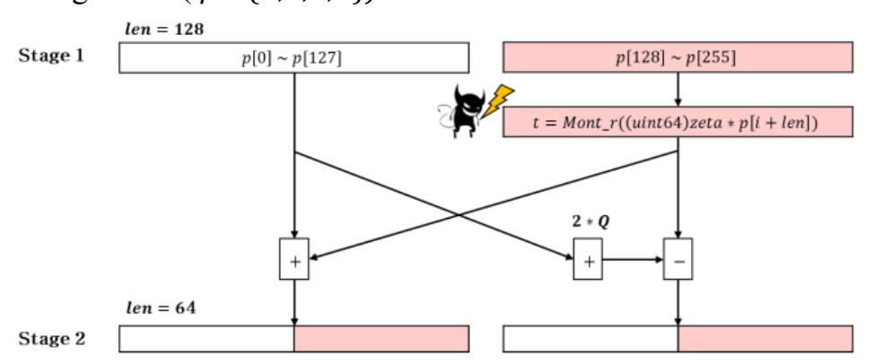
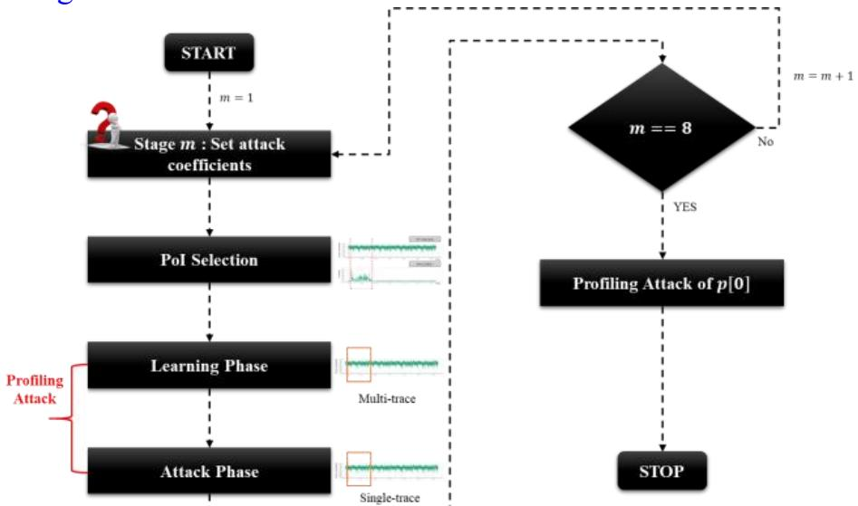
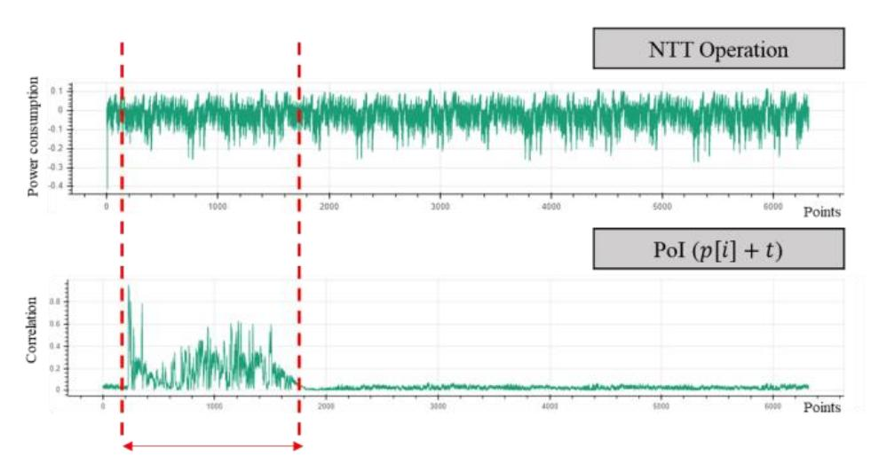
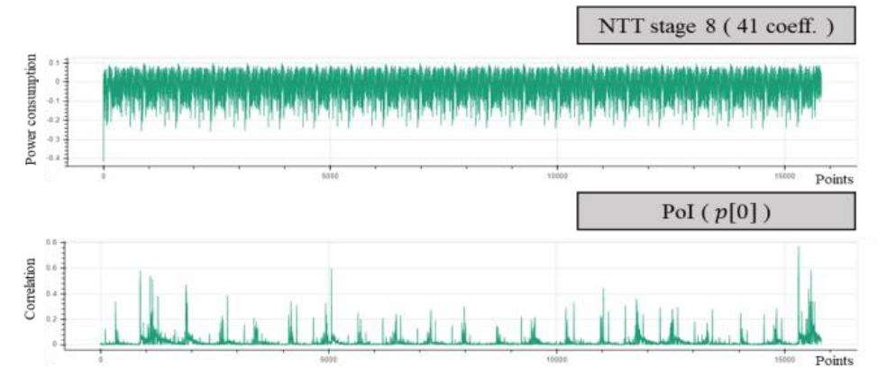
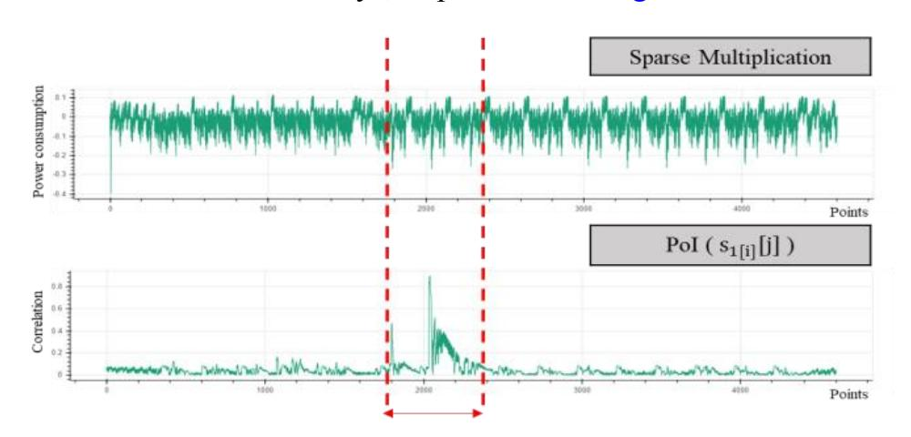
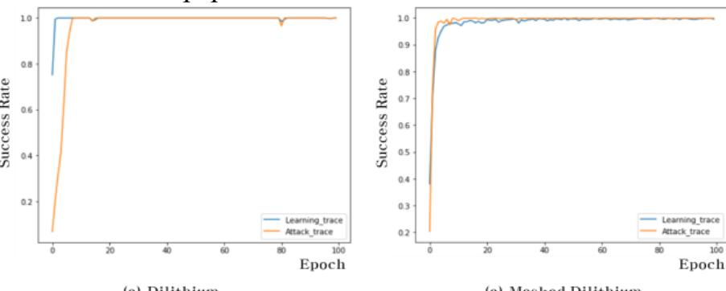

{0}------------------------------------------------

# **Novel Single-Trace ML Profiling Attacks on NIST 3 Round candidate Dilithium**

Il-Ju Kim Kookmin University Republic of Korea kimij2905@kookmin.ac.kr

Tae-Ho Lee Kookmin University Republic of Korea 20141932@koominac.kr

Jaeseung Han Kookmin University Republic of Korea jae1115@kookmin.ac.kr

is based on the difficulty of the problems, such as factorization and discrete logarithm. However, the construction based on these problems can succumb to Shor's [1] algorithm, which can defeat these systems in polynomial time, using a quantum computer. Recently, experts estimated that quantum computers would be arriving 10 to 15 years [2]. Therefore, the existing cryptographic systems should be replaced by a system that is resistant to quantum

The national institute of standards and technology (NIST) announced the standardization of post-quantum cryptography (PQC) in December 2016 to address these issues. Over the years, standardization has been made for algorithm submitted to publickey encryption, key encapsulation mechanism, and digital signature. The third-round candidate algorithms were announced in July 2020, and the remaining algorithms are seven finalists and eight alternative algorithms [4]. Among finalists, digital signatures include three algorithms, two lattice-based (CRYSTALS-DILITHIUM, FALCON), and one multivariate-based (Rainbow). NIST considered three aspects of the evaluation criteria used to compare candidate algorithms in the PQC standardization process: 1) security, 2) cost and performance, and 3) algorithm and implementation characteristics [3]. NIST also explicitly states that it wants to "collect more information about the costs of implementing in a way that provides resistance to side-channel attacks". Therefore, the side-channel attack case for this is of

Side-channel attacks [5] is an attack to extract cryptographic keys using side-channel information, such as power consumption, electromagnetic radiation, and execution time, when cryptographic algorithms operate. The method of side-channel attack is differential power analysis (DPA), cache attack (CA), template attack (TA), Fault attack (FA), etc., which are used for attacks on

Bo-Yeon Sim Kookmin University Republic of Korea qjduslsl@kookmin.ac.kr

Dong-Guk Han Kookmin University Republic of Korea christa@kookmin.ac.kr

computers.

considerable importance.

## **ABSTRACT**

Dilithium1 is a lattice-based digital signature, one of the finalist candidates in the NIST's standardization process for post-quantum cryptography. In this paper, we propose a first side-channel attack on the process of signature generation of Dilithium. During the Dilithium signature generation process, we used NTT encryption single-trace for machine learning-based profiling attacks. In addition, it is possible to attack masked Dilithium using sparse multiplication. The proposed method is shown through experiments that all key values can be exposed 100% through a single-trace regardless of the optimization level.

# **CCS CONCEPTS**

• **Security and privacy** → **Security in hardware** → **Hardware attacks and countermeasures** → **Side-channel analysis and countermeasures** • **Security and privacy** → **Cryptography** → **Public key (asymmetric) techniques** → **Digital signatures**

# **KEYWORDS**

Dilithium, side-channel attack, lattice-base, digital signature

#### **ACM Reference format:**

I. Kim, T. Lee, J. Han, B. Sim, and D. Han. 2020. In *Proceedings of ACM Woodstock conference, El Paso, Texas USA, July 1997 (WOODSTOCK'97)*, 4 pages. https://doi.org/10.1145/123 4

## **1 INTRODUCTION**

The digital signatures are a way of proving the identity of the sender in the network. As the non-face-to-face society becomes mainstream due to the Covid-19 virus, the importance of digital signatures that provide authentication is increasing. Digital signatures mainly adopt the public key infrastructure (PKI), which

> ICEA *2020, December 12-15, 2020, Gangwon, Republic of Korea* © 2020 Copyright held by the owner/author(s). ACM ISBN 978-1-4503-6843-8/20/10. . . \$15.00 https://doi.org/10.1145/123\_4

Permission to make digital or hard copies of part or all of this work for personal or classroom use is granted without fee provided that copies are not made or distributed for profit or commercial advantage and that copies bear this notice and the full citation on the first page. Copyrights for third-party components of this work must be honored. For all other uses, contact the owner/author(s).

{1}------------------------------------------------

many cryptographic. Lattice-based digital signatures are also at risk for various side-channel attacks. In the lattice-based digital signatures, the main target operations of side-channel attacks include polynomial multiplication [12], gaussian sampling [13, 14], and number-theoretic transform (NTT) [6, 7] operation.

## **1.1 Related Works**

The first single-trace attack on lattice-based schemes targeting NTT is the attack of Primas *et al.* [6] in CHES 2017. However, this attack is not applicable because NTT is currently implemented as constant-time; the timing information of modular operations is no longer available. This attack was improved by Pessl *et al.* [7]. They did a template attack using information when data loading and storing during NTT encryption. They succeeded in a single-trace attack over Kyber, but they said that it is really difficult to apply an improved attack in Dilithium. They restored the full key of Kyber with a probability of at first time 57% and restored the full key to 95%, using lattice reduction described in Primas *et al.* [6].

# **1.2 Our Contribution**

In this work, we show a single-trace attack on Dilithium for the first time. We present a novel side-channel attack using NTT encryption. In addition, even if the countermeasure is applied to the Dilithium, we can show that single-trace attacks are possible through polynomial multiplication.

#### *1.1.2 First single-trace attacks on Dilithium*

We present single-trace attacks on Dilithium [9]. The target operation is NTT encryption. We used the leaked information in load, save, and Montgomery reduction operation of power consumption trace. The method of attack is a machine learningbased profiling attack. We describe the proposed attack that uses a single-trace to find the full key at 100% regardless of an optimization level.

#### *1.1.2 First single-trace attacks on Masked Dilithium*

We present single-trace attacks on Masked Dilithium [10]. The target operation is sparse multiplication. We used the leaked information in load, save, and multiplication operation of power consumption trace. The method of attack is a machine learningbased profiling attack. We describe the proposed attack that uses a single-trace to find the full key at 100% regardless of an optimization level.

# **2 PRELIMINARIES**

# **2.1 Notation**

For a prime number = 8380417 , we let and the rings ℤ[]/( 256 + 1) and ℤ []/( 256 + 1) , respectively. Multiplication of two polynomials , ∈ is denoted as ∙ ∈ . The -th coefficient of polynomial ∈ is denoted as []. Matrices and vectors of polynomials in are denoted as ∈ ×ℓ , ∈ ℓ . The NTT domain representation is denoted as ̂ = NTT() ∈ ℤ 256 of a polynomial ∈ , and Point-wise multiplication is denoted as ̂= ̂ ∘ ̂.

# **2.2 Side-channel leakage model**

We assume that the intermediate value of devices is related to the power consumption trace. Therefore, it is assumed that if a device uses a secret value of as the intermediate value, the information related to the can leak from the power consumption trace.

~ ( ∶ power consumption, ~ ∶ relation )

## **2.3 Number theoretic transform (NTT)**

In lattice-based schemes, polynomial multiplication is considered as one of the most expensive operations. To efficiently compute this, NTT-based multiplication of polynomials is often adopted. When the 512-th root of unity in modulo is , the domain can be changed using isomorphic such as ℤ []/( − ) ≅ ℤ, and the multiplication on the ring can be easily multiplied by pointwise multiplication.

## **2.4 Machine Learning based profiling attack**

A profiling attack is an attack method that generates a profile through another device with the same or similar specifications as the attack device and finds a secret key by comparing the probability of matching the profile with the trace obtained from an actual attack device. The attack is divided into two phases: a learning phase and an attack phase. During the learning phase, generate the profile to be used in the attack phase. In order to do so, the learning phase determines which values to learn and which models to use. These are called labeling and modeling, respectively. In this paper, the secret keys are chosen as the labeling value, and the modeling uses a multi-layer perceptron (MLP). The MLP consist of three layers (input layer, hidden layer, outpour layer), and each layer has a node, which learns the secret keys by changing its weight.

## **3 DILITHIUM ALGORITHM**

Dilithium is a lattice-based digital signature algorithm and is designed based on Module-LWE and Module-SIS problems. The principle of Dilithium is 'Fiat-Shamir with abort' and 'public key (PK) compression'. The algorithm consists of three stages: key generation, signature generation, and signature verification, and supports a NIST category 1, 2, and 3.

## **3.1 Dilithium algorithms**

We describe Dilithium signature generation and NTT encryption schemes [9].

**Table 1: Dilithium signature generation scheme.**

| 1 | Procedure SignGen (𝑠𝑘, 𝑀 ∈ {0,1} ∗)      |
|---|------------------------------------------|
| 2 | 𝐴̂ ∈ 𝑘×ℓ ≔ 𝑅𝑞 ExpandA(𝜌)        |
| 3 | 𝜇 = 𝐶𝑅𝐻(𝑡𝑟 ∥ 𝑀)                          |
| 4 | 𝜅 = 0, (𝑧, ℎ) =⊥                         |
| 5 | ′ ∈ 384 ≔ {0,1} 𝜌 𝐶𝑅𝐻(𝐾 ∥ 𝜇) |
| 6 | 𝑠̂1 = NTT(𝑠1)                         |
| 7 | 𝑠̂2 = NTT(𝑠2)                         |

{2}------------------------------------------------

Novel Single-Trace ML Profiling Attacks on NIST 3 Round candidate Dilithium ICEA 2020, December 2020, Republic of Korea

| 8  | ̂ = 𝑡0 NTT(𝑡0)                             |
|----|--------------------------------------------------|
| 9  | while (𝑧, ℎ) =⊥ do                               |
| 10 | ℓ ′ 𝑦 ∈ 𝑆𝛾1−1 ≔ ExpandMask(𝜌 ∥ 𝜅)    |
| 11 | 𝑦̂ = NTT(𝑦)                                      |
| 12 | 𝑤 = INTT(𝐴̂ ∘ 𝑦̂)                             |
| 13 | (𝑤1, 𝑤0) = 𝐷𝑞(𝑤, 2𝛾2)                            |
| 14 | 60 = 𝑐 ∈ 𝐵 𝐻(𝜇 ∥ 𝑤1)                       |
| 15 | 𝑐̂= NTT(𝑐)                                       |
| 16 | 𝑧 = 𝑦 + INTT(𝒄̂ ∘ 𝒔̂𝟏)                           |
| 17 | 𝑟 = INTT(𝒄̂ ∘ 𝒔̂𝟐)                               |
| 18 | (𝑟1, 𝑟0 ) ≔ 𝐷𝑞(𝑤 − 𝑟, 2𝛾2)                    |
| 19 | If ‖𝑧‖∞ − 𝛽 or ‖𝑟0‖∞ ≥ 𝛾1 ≥ 𝛾2 − 𝛽   |
|    | then (𝑧, ℎ) =⊥ 𝑜𝑟 𝑟1 ≠ 𝑤1                  |
| 20 | else                                             |
| 21 | ̂ ) 𝑔 = INTT(𝒄̂ ∘ 𝒕𝟎                          |
| 22 | ℎ = MakeHint(−𝑔, 𝑤 − 𝑟 + 𝑔, 2𝛾2)                 |
| 23 | if ‖𝑟‖∞ 𝑜𝑟 𝑤𝑡(ℎ) > 𝑤 𝑡ℎ𝑒𝑛 ≥ 𝛾2             |
| 24 | (𝑧, ℎ) =⊥                                        |
| 25 | end                                              |
| 26 | end                                              |
| 27 | return 𝜎 = (𝑧, ℎ, 𝑐)                             |
|    | The operations used for attacking Dilithium      |
|    | highlighted in red, and those used for attacking |
|    | masked Dilithium are shown is blue               |
|    |                                                  |

**Table 2: Dilithium NTT scheme.**

| 1  | Procedure NTT (𝑝[𝑁])                        |
|----|---------------------------------------------|
| 2  | 𝑘 = 1                                       |
| 3  | for (𝑙𝑒𝑛 = 128;𝑙𝑒𝑛 > 0; 𝑙𝑒𝑛 ≫= 1)           |
| 4  | for (𝑠𝑡𝑎𝑟𝑡 = 0; 𝑠𝑡𝑎𝑟𝑡 < 𝑁; 𝑠𝑡𝑎𝑟𝑡 = 𝑗 + 𝑙𝑒𝑛) |
| 5  | 𝑧𝑒𝑡𝑎 = 𝑧𝑒𝑡𝑎𝑠[𝑘]                             |
| 6  | 𝑘 ≔ 𝑘 + 1                                   |
| 7  | for ( 𝑗 = 𝑠𝑡𝑎𝑟𝑡;𝑗 < 𝑠𝑡𝑎𝑟𝑡 + 𝑙𝑒𝑛; + + 𝑗)     |
| 8  | 𝑡 = Mont_r((𝑢𝑖𝑛𝑡64)𝑧𝑒𝑡𝑎 ∗ 𝑝[𝑗 + 𝑙𝑒𝑛])       |
| 9  | 𝑝[𝑗 + 𝑙𝑒𝑛] = 𝑝[𝑗] + 2 ∗ 𝑄 − 𝑡               |
| 10 | 𝑝[𝑗] = 𝑝[𝑗] + 𝑡                             |

 : precomputed table for converting to NTT domain Mont\_r : Montgomery reduction, ∶ prime, : dimension

NTT operation consists of a total of eight stages. The stage is determined by variable of [Table 2.](#page-4-0) The value of the according to a stage is as follows: stage → = 2 8−. In the first stage, the [] value is a secret value, and load, Montgomery reduction, and save operations occur in the highlighted operation in colors. Therefore, at line 6 i[n Table 1,](#page-4-0) information related to 1 will be included in the power consumption trace. Line 7,8 is the same.

## **3.2 Masked Dilithium**

The masking scheme for Dilithium was first proposed by Milgliore *et al.* [8]. However, due to problems with limitation performance and target boards, they focused on the optimized version of modulus, a power of two, not prime modulus. Therefore, NTT multiplication is not available. For this reason, we have taken the polynomial multiplication as the target operation, not NTT, for masked Dilithium. The specific open source did not exist, so the attack was carried out in sparse multiplication, an efficient multiplication in Dilithium.

*3.2.1 Boolean Masking.* Masking is a generic and provable countermeasure to side-channel attacks. For example, Sensitive variables is divided into several shares by masking, such as = 0 ⊕ 1 ⊕ ⋯ ⊕ , uniformly random shares ′ . Therefore, sensitive variables such as 1, 2,0 will share sensitive information. *3.2.2 Sparse Multiplication.* NTT and INTT operations are no longer necessary. Thus, highlighted in blue for [Table 1,](#page-4-0) it is replaced by an operation ∙ 1 . In addition, sensitive 1 that became Boolean masking is like 1 = 1[0] ⊕ 1[1] ⊕ ⋯ ⊕ 1[] . Therefore, ∙ 1 consists of: ∙ 1[0] ⊕ ∙ 1[1] ⊕ ⋯ ⊕ ∙ 1[] . Each multiplication follows a sparse multiplication because consists of 60 ± 1′.

**Table 3: Sparse multiplication**

| 1 | Procedure Sparse multiplication (𝑐, 𝑠1[𝑘])     |
|---|------------------------------------------------|
| 2 | 𝐻 = 60                                         |
| 3 | for 𝑖 from 0 to 𝐻 − 1 do                       |
| 4 | pos = 𝑐_𝑝𝑜𝑠[𝑖]                                 |
| 5 | for 𝑗 from 0 to 𝑝𝑜𝑠 − 1 do                     |
| 6 | 𝑝𝑑[𝑗] = 𝑝𝑑[𝑗] − 𝑐_𝑠𝑖𝑔𝑛[𝑖] ∗ 𝑠1[𝑘][𝑗 + 𝑁 − 𝑝𝑜𝑠] |
| 7 | for 𝑗 from 0 to 𝑁 − 1 do                       |
| 8 | 𝑝𝑑[𝑗] = 𝑝𝑑[𝑗] + 𝑐_𝑠𝑖𝑔𝑛[𝑖] ∗ 𝑠1[𝑘][𝑗 − 𝑝𝑜𝑠]     |
| 9 | return 𝑝𝑑                                      |

Because of the sparse property of c, c can be expressed using position ( \_ ) and sign (\_ ∈ {−1,1}) lists [11]. The highlighted in red is the boolean masking value, which can be leaked from load, multiplication, and save operation because c\_sign is ±1 . Therefore, information related to s1[k] [j] will be included in the power consumption trace.

## **4 Proposed single-trace attacks on Dilithium**

In order to obtain all secret keys in Dilithium, two of three 0, 1, 2 must be obtained. Then we can use two equations = ∙ 1 + 2, 1 = 2(, ) to get the remaining values [9]. Because and 1 are public keys, we can find the remaining values using the two equations. In this paper, we aim to find 1, 2. This is because each coefficient of 1 and 2 are [−, ], so the secret keys can be restored if only a maximum of 15 values can be distinguished ( ∈ {3,5,6,7}).

**Figure 1: NTT encryption stage 1**

{3}------------------------------------------------

NTT encryption (lines 7-10 in Table 2) is divided into two cases by stage in Fig. 1. Case 1: Not used as input for Montgomery reductions. Case 2: Used as input to Montgomery reduction.

| p[i+len] |      |    | len] | ]  | t=Mont_r((uint64)zetas[1]*p[i+len]) |
|----------|------|----|------|----|-------------------------------------|
|          |      |    |      |    |                                     |
| -7       | 00   | 7F | DF   | FA | 00 7D CD F7                         |
| -6       | 00   | 7F | DF   | FB | 00 47 4B F8                         |
| -5       | 00   | 7F | DF   | FC | 00 10 C9 F9                         |
| -4       | 00   | 7F | DF   | FD | 00 5A 27 FB                         |
| -3       | 00   | 7F | DF   | FE | 00 23 A5 FC                         |
| -2       | 00   | 7F | DF   | FF | 00 6D 03 FE                         |
| -1       | 00   | 7F | DF   | 00 | 00 36 81 FF                         |
| 0        | 00   | 7F | EO   | 01 | 00 7F E0 01                         |
| 1        | 00   | 7F | EO   | 02 | 00 49 5E 02                         |
| 2        | 00   | 7F | E0   | 03 | 00 12 DC 03                         |
| 3        | 00   | 7F | E0   | 04 | 00 5C 3A 05                         |
| 4        | 115. | 7F |      | 05 | 00 25 B8 06                         |
| 5        | 0.00 | 7F | 1000 | 06 | 00 6F 16 08                         |
| 6        | 55   | 7F | -    | 07 | 00 38 94 09                         |
| -        | 7177 | 7F |      |    | 00 02 12 0A                         |

Figure 2: Result 32bit hex value Mont\_r according to secret value ( NTT stage 1 )

For Case 1, the output p[i] = p[i] + t does not give a significant difference according to the other p[i] values. However, in Case 2, it can be seen that there is a significant difference in the value of t according to the different p[i + len] as shown in Fig. 2. Thus, depending on the secret value p[i + len], there is a significant difference in the intermediate value t. This difference also results in a significant difference in power consumption trace information. Therefore, we attack Case 2 for each stage and restore the full secret keys. The procedure for a proposed single-trace attack is as shown in Fig. 3.

Figure 3: Flow chart of single-trace attacks

4.1.1 Stage m : Set attack coefficients Case 2 Set attack coefficients len = 128p[125] p[126] p[127] p[128] p[129] p[130]p[253] p[254] p[255] Stage 1 p[0] p[1] p[2]len = 64Stage 2 len = 32Stage 3 ፥ ÷ ••• ••• Stage 8 

Figure 4: Attack coefficients for each stage

When a target stage is m, Case 2 exists  $2^m - 1$  times. For convenience, the attack coefficients were chosen as shown in Fig.

4, because the attack on any Case 2 could restore the secret keys. Therefore, in stage m, we target from  $p[2^{8-m}]$  to  $p[2^{9-m}-1]$ . To learn this, we generate a power consumption trace corresponding to lines 7-10 in Table 2. Afterward, we can get target coefficients through the process in sections from 4.1.2 to 4.1.4. If there are previous attack stages, the secret keys restored from the previous attack stages are fixed and then generates a power consumption trace. For example, in stage 2, we have known the coefficients from p[128] to p[255], which are targets in stage 1. Thus, when attacking the coefficients from p[64] to p[127], we generate a learning trace that fixes the coefficient from p[128] to p[255]. Because the non-fixed coefficients can affect the next stage attacks.  $4.1.2 \ Pol \ Selection$ 

The power consumption-based side-channel attack assumes that the intermediate value used in a cryptographic algorithm operation is related to power consumption. Therefore, the secret key that we want to find has a location that is relevant to the power consumption, and that location is called points of interest (PoI). Pearson correlation coefficient is used to find a location related to the secret keys, *i.e.*, to find PoI. The Pearson correlation coefficient equation is as follows.

$$\rho = \frac{\sum_{i}^{n} (X_{i} - \bar{X})(Y_{i} - \bar{Y})}{\sqrt{\sum_{i}^{n} (X_{i} - \bar{X})^{2}} \sqrt{\sum_{i}^{n} (Y_{i} - \bar{Y})^{2}}} \quad \cdots \quad (1)$$

The Pearson correlation coefficient equation is a formula that calculates the association between two groups, and its value is between -1 and 1. The greater the value of the absolute value, the more relevant the two groups are. We calculated the Pearson correlation between power consumption traces of NTT operation and p[i] + t (stage 1: t = 0), as presented in Fig. 5.

Figure 5: Pol selection of NTT operation (stage 1)

#### 4.1.3 Learning phase

In the learning phase, select the label value and model. The label value is the secret keys  $s_1$  or  $s_2$ , and the model use MLP. Details of the secret keys and MLP are in Table 4 and 5, respectively. The MLP of Table 5 is not the optimal model and is just the model used in the experiment.

 $s_1[i]$  is a 32bit value, and the first and second bytes of  $s_1[i]$  are always the same, i.e., 0Byte and 1Byte are always 0x00 and 0x7F, respectively. And third byte is determined by fourth byte, i.e., 2Byte is 0xDF when 3Byte is 0xFA to 0xFF, and the rest is 0xE0.

{4}------------------------------------------------

Therefore, generating profiles for the fourth bytes (3Byte) of 1 [] is only needed. The total number of necessary profiling per coefficient is 2 + 1.

**Table 4: 32bit secret value of** []

| Hex value by Byte |       |       |       |       |  |  |
|-------------------|-------|-------|-------|-------|--|--|
|                   | 0Byte | 1Byte | 2Byte | 3Byte |  |  |
| -7                | 0𝑥00  | 0𝑥7𝐹  | 0𝑥𝐷𝐹  | 0𝑥𝐹𝐴  |  |  |
| -6                | 0𝑥00  | 0𝑥7𝐹  | 0𝑥𝐷𝐹  | 0𝑥𝐹𝐵  |  |  |
| -5                | 0𝑥00  | 0𝑥7𝐹  | 0𝑥𝐷𝐹  | 0𝑥𝐹𝐶  |  |  |
| -4                | 0𝑥00  | 0𝑥7𝐹  | 0𝑥𝐷𝐹  | 0𝑥𝐹𝐷  |  |  |
| -3                | 0𝑥00  | 0𝑥7𝐹  | 0𝑥𝐷𝐹  | 0𝑥𝐹𝐸  |  |  |
| -2                | 0𝑥00  | 0𝑥7𝐹  | 0𝑥𝐷𝐹  | 0𝑥𝐹𝐹  |  |  |
| -1                | 0𝑥00  | 0𝑥7𝐹  | 0𝑥𝐸0  | 0𝑥00  |  |  |
| 0                 | 0𝑥00  | 0𝑥7𝐹  | 0𝑥𝐸0  | 0𝑥01  |  |  |
| 2                 | 0𝑥00  | 0𝑥7𝐹  | 0𝑥𝐸0  | 0𝑥02  |  |  |
| 3                 | 0𝑥00  | 0𝑥7𝐹  | 0𝑥𝐸0  | 0𝑥03  |  |  |
| 4                 | 0𝑥00  | 0𝑥7𝐹  | 0𝑥𝐸0  | 0𝑥04  |  |  |
| 5                 | 0𝑥00  | 0𝑥7𝐹  | 0𝑥𝐸0  | 0𝑥05  |  |  |
| 6                 | 0𝑥00  | 0𝑥7𝐹  | 0𝑥𝐸0  | 0𝑥06  |  |  |
| 7                 | 0𝑥00  | 0𝑥7𝐹  | 0𝑥𝐸0  | 0𝑥07  |  |  |

**Table 5: Network structure for Multi-Layer Perceptron**

| Layer        | node (in, out) | Kernel initializer |
|--------------|----------------|--------------------|
| InputLayer   | (𝑥, 𝑥)         | -                  |
| Batch Normal | (𝑥, 𝑥)         | -                  |
| Dense        | (𝑥, 32)        | he_uniform         |
| Batch Normal | (32,32)        | -                  |
| ReLU         | (32,32)        | -                  |
| Dense        | (32, 𝑦)        | he_uniform         |
| Softmax      | (𝑦, 𝑦)         | -                  |

- \* : PoI section of power consumption trace
- \* Input Normalization : all values are within the range [−1,1]
- \* Loss function : categorical\_crossentropy
- \* Optimizer : adam(lr=0.001, epsilon=1e-08)
- \* Batch size and epochs: 32 and maximum 100, respectively
- \* : Labeling value (3Byte)

#### *4.1.4 Attack phase*

In the attack phase, returns the guessed key through the probability of matching the profile generated in the learning phase with the target single-trace. The secret keys are restored by matching the learned profile with the PoI section of the attack single-trace.

#### *4.1.5 Profiling attack of* [0]

After completing from stage 1 to stage 8 profiling attack, we can get from [1] to [255]. However, [0] is always included in *Case 1*, so attacks using Montgomery reduction are not applicable. Instead, we restored the [0] using another method. First, because we known form [1] to [255], we can generate learning trace fixed from [1] to [255] of stage 8 ([0] is random secret). In addition, [0] affects all coefficients (256 coefficients) after stage 8 operations. Therefore, even if there is not a significant difference in the intermediate value according to [0], [0] can be restored. Because [0] affects the intermediate of all coefficients, the sum of differences can be significant. Therefore, [0] can be restored by using load, save, and addition information (line 9,10 in [Table 2\)](#page-4-0) that leaks from all coefficients without the Montgomery reduction, as shown in Fig. 6. Thus, we can restore [0] through the profiling attack.

**Figure 6: PoI of** [] **between 41 coefficients of NTT stage 8** 

# **5 Proposed single-trace attacks on Masked Dilithium**

In this section, the contents described in Section 3.2 are addressed here. The attack procedure is similar to Section 4.

## *5.1.1 PoI selection*

Similar to section 4.1.2, we calculated the Pearson correlation between power consumption traces of sparse multiplication and boolean masked secret keys, as presented in Fig. 7.

**Figure 7: PoI selection of Sparse Multiplication**

#### *5.1.2 Learning phase*

Similar to section 4.1.3, but masked coefficients of 1 is shared 32bit random values, shown i[n Table 6](#page-4-0), we have to distinguish 256 values for each of the four bytes. So, we generate 256 profiles each of 0, 1, 2, 3bytes, the total number of required profiling per coefficient is 1024.

#### *5.1.3 Attack phase*

In the attack phase, returns the guessed key through the probability of matching the profile generated in the learning phase with the target single-trace. The secret keys are restored by matching the learned profile with the PoI section of the attack single-trace.

**Table 6: 32bit secret value of** [] []

{5}------------------------------------------------

| Hex value by Byte |        |        |        |  |
|-------------------|--------|--------|--------|--|
| 0Byte             | 1Byte  | 2Byte  | 3Byte  |  |
| Random            | Random | Random | Random |  |

# **6 Experimental results**

In this section, we perform an experiment on Dilithium that supports the NIST category 1 ( Dilithium II ). The Dilithium III and IV are similarly applicable. The experiment used the open-source implementation of Dilithium submitted to the NIST submission. In the case of Masked Dilithium, an open-source did not yet exist, referring to the open-source of qTESLA sparse multiplication [11]. Our target platform is ChipWhisperer UFO STM32F3 board equipped with ARM Cortex-M4 microcontroller, and the sampling rate is 29.54 MS/s. Implementations were compiled using gcc-armnone-eabi-9-2019-q4-major, and we used compiler options as described in [Table 7](#page-4-0) and 8.

# **6.1 Dilithium**

The number of traces used in the learning phase was 2000, and the attack phase was 8000. At all optimization levels, the average attack success rates for 8000 random secret keys are as shown in [Table 7](#page-4-0) an[d Fig. 8.](file:///D:/_Dilithium_/ICEA2020_Novel%20Single_Trace%20ML%20Profiling%20Attacks%20on%20NIST%203%20Round%20candidate%20Dilithium_2020_0924.docx%23fig4)

**Table 7: Single-trace attacks on NTT operation** 

| NTT                | Success rate (%) |
|--------------------|------------------|
| Optimization Level | Dilithium-II     |
| -O0                | 100%             |
| -O1                | 100%             |
| -O2                | 100%             |
| -O3                | 100%             |
| -Os                | 100%             |
|                    |                  |

# **6.2 Masked Dilithium**

The number of traces used in the learning phase was 9000, and the attack phase was 8000. At all optimization levels, the average attack success rates for 8000 random secret keys are as shown in [Table 8](#page-4-0) and [Fig. 8.](file:///D:/_Dilithium_/ICEA2020_Novel%20Single_Trace%20ML%20Profiling%20Attacks%20on%20NIST%203%20Round%20candidate%20Dilithium_2020_0924.docx%23fig4) In the case of masked Dilithium, all boolean masking values were found, and the final values were finally restored through relation 1 = 1[0] ⊕ 1[1] ⊕ ⋯ ⊕ 1[] .

**Table 8: Single-trace attack on Sparse multiplication**

| Sparse multiplication | Success rate (%) |  |
|-----------------------|------------------|--|
| Optimization Level    | Dilithium-II     |  |
| -O0                   | 100%             |  |
| -O1                   | 100%             |  |
| -O2                   | 100%             |  |
| -O3                   | 100%             |  |
| -Os                   | 100%             |  |
|                       |                  |  |

# **7 Conclusion**

In this paper, we propose a single-trace attacks in NTT encryption during Dilithium signature generation process. It was shown that NTT operation could be vulnerable because the full key can be derived 100% regardless of the optimization level using the profiling attack for each stage of NTT. This is also applicable to other cryptographic schemes that perform NTT operations. In the case of masked Dilithium, secure countermeasure should be considered, since implementation vulnerabilities may also exist as presented in this paper.

**Figure 8: Success rate graph by Epoch**

## **REFERENCES**

- [1] Shor, P.W.: Algorithms for quantum computation: Discrete logarithms and factoring. In: 35th Annual Symposium on Foundation of Computer Science. pp. 124-134. IEEE Computer Society (1994)
- [2] Wang, Y., Li, Y., Yin, Z., Zeng, B., 16-qubit IBM universal quantum computer can be fully entangled. Npj Quantum Information, 4(1):46,2018.
- [3] Alagic, G., Alperin-Sheriff, J., Apon, D., Cooper, D., Dang, Q., Kelsey, J. Liu, Y.K., Miller, C., Moody, D. Peralta, R. et al.: Status report on the second round of the nist pqc standardization process. NIST, Tech. Rep., July (2020)
- [4] NIST: Post-Quantum Cryptography, Round 3 Submissions, NIST Computer Security Resource Center[. https://csrc.nist.gov/News/2020/pqc-third-round](https://csrc.nist.gov/News/2020/pqc-third-round-candidate-announcement)[candidate-announcement](https://csrc.nist.gov/News/2020/pqc-third-round-candidate-announcement) (2020)
- [5] Kocher, P.C.: Timing attacks on implementations of diffie-hellman, rsa, dss, and other systems. In: Annual International Cryptology Conference. pp. 104- 113. Springer (1996)
- [6] Primas, R., Pessl, P. Mangard, S.: Single-trace side-channel attacks on masked lattice-based encryption. In: International Conference on Cryptographic Hardware and Embedded Systems. pp. 513-533. Springer (2017)
- [7] Pessl, P. Primas, R.: More practical single-trace attcks on the number theoretic transform. In: International Conference on Cryptology and Information Security in Latin America. pp. 130-149. Springer (2019)
- [8] Ian Editor (Ed.). 2008. *The title of book two* (2nd. ed.). University of Chicago Press, Chicago, Chapter 100. DOI[: http://dx.doi.org/10.1007/3-540-09237-4](http://dx.doi.org/10.1007/3-540-09237-4)
- [9] Ducas, L. Kiltz, E., Lepoint, T. Lyubashevesky, V., Schwabe, P., Seiler, G., Stehlé, D.: CRYSTALS-Dilithium: Algorithm Specifications and Supporting Documentation. Submission to the NIST post-quantum project (2020)
- [10] Migliore, V., Gérard, B., Tibouchi, M., & Fouque, P. A. (2019, June). Masking Dilithium. In International Conference on Applied Cryptography and Network Security (pp. 344-362). Springer, Cham..
- [11] Bindel, N., Akleylek, S., Alkim, E., Barreto, P. S., Buchmann, J., Krämer, J., ... & Zanon, G. (2020). Submission to NIST's post-quantum project (2nd round): lattice-based digital signature scheme qTESLA.
- [12] Espitau, T., Fouque, P. A., Gérard, B., & Tibouchi, M. (2017, October). Sidechannel attacks on BLISS lattice-based signatures: Exploiting branch tracing against strongswan and electromagnetic emanations in microcontrollers. In Proceedings of the 2017 ACM SIGSAC Conference on Computer and Communications Security (pp. 1857-1874).
- [13] Bruinderink, L. G., Hülsing, A., Lange, T., & Yarom, Y. (2016, August). Flush, gauss, and reload–a cache attack on the bliss lattice-based signature scheme. In International Conference on Cryptographic Hardware and Embedded Systems (pp. 323-345). Springer, Berlin, Heidelberg.
- [14] Pessl, P., Bruinderink, L. G., & Yarom, Y. (2017, October). To BLISS-B or not to be: Attacking strongSwan's Implementation of Post-Quantum Signatures. In Proceedings of the 2017 ACM SIGSAC Conference on Computer and Communications Security (pp. 1843-1855).