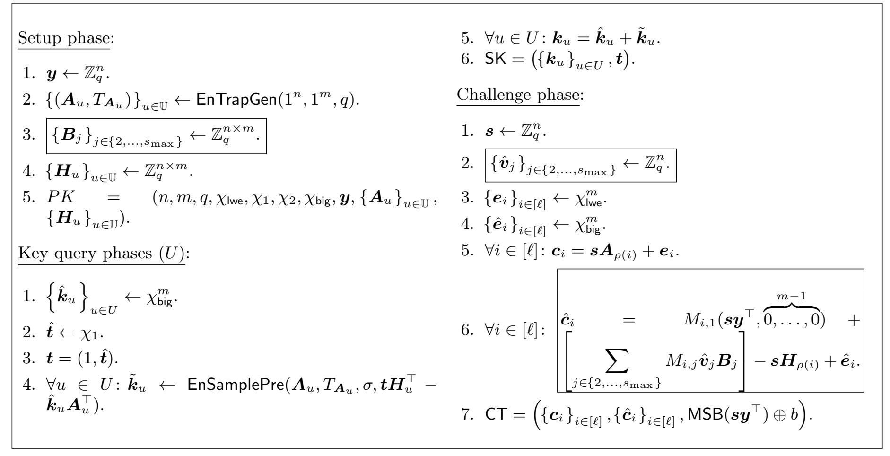
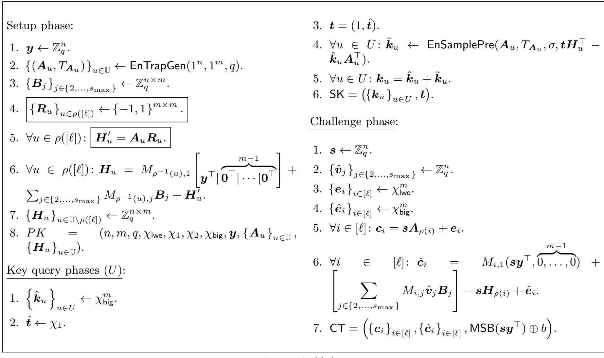
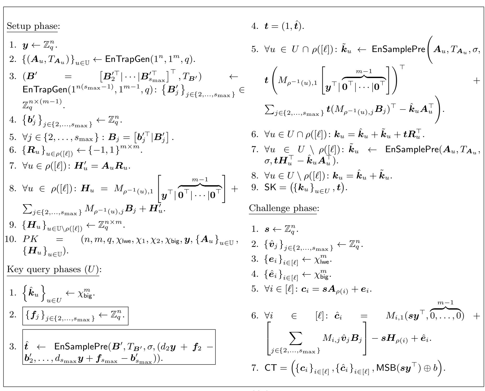
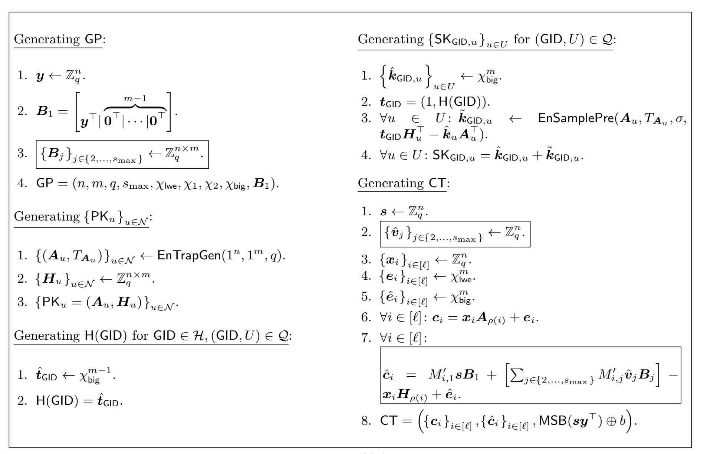
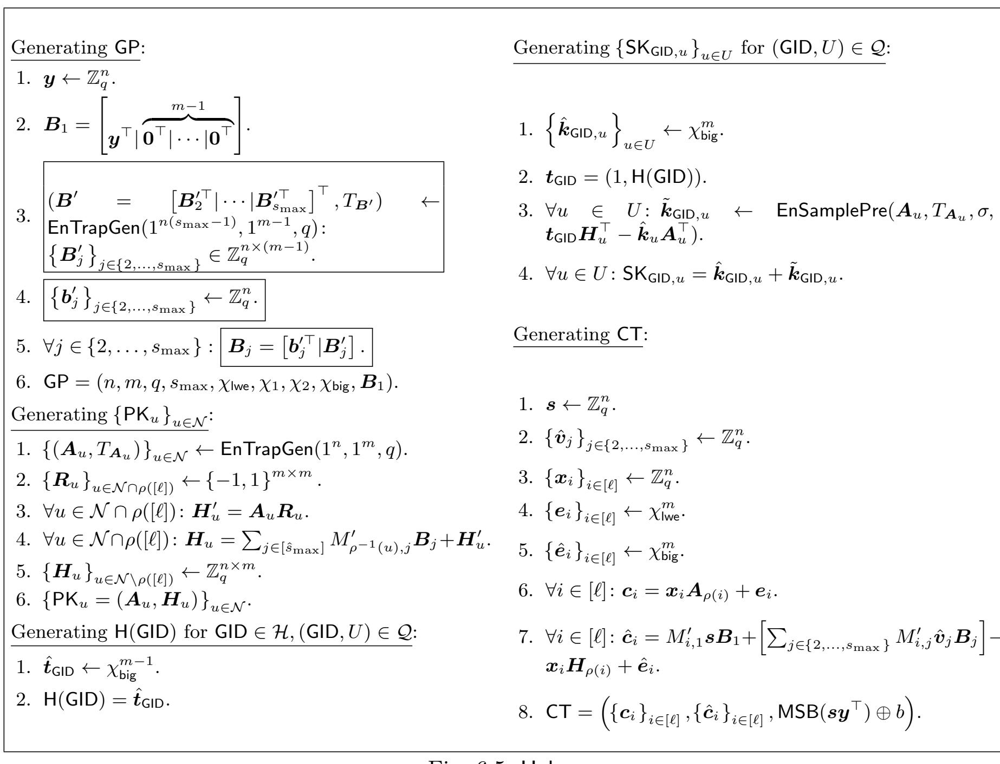
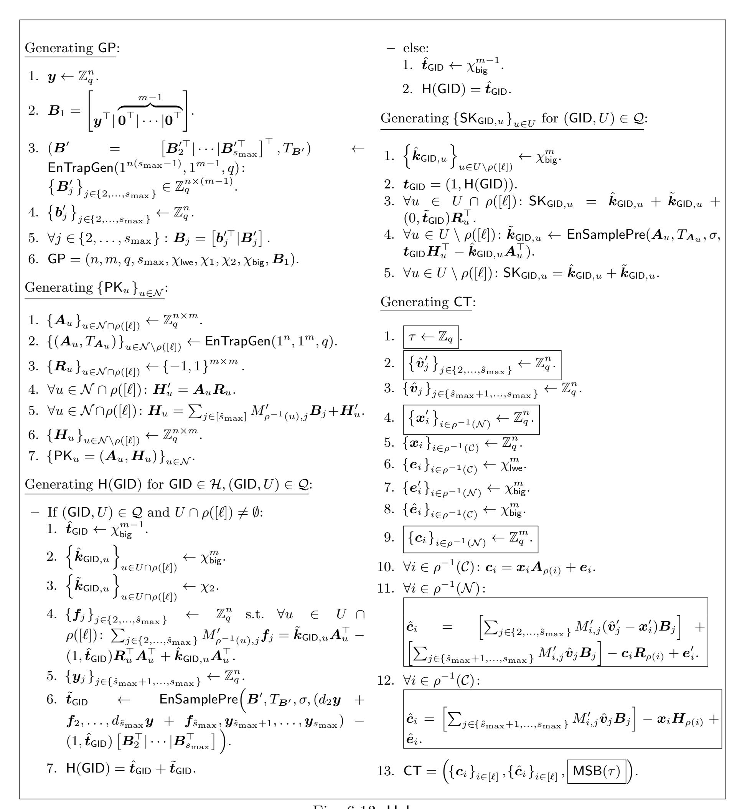

{0}------------------------------------------------

# Decentralized Multi-Authority ABE for DNFs from LWE

Pratish Datta<sup>1</sup> , Ilan Komargodski12, and Brent Waters<sup>13</sup>

> <sup>1</sup> NTT Research pratish.datta@ntt-research.com, <sup>2</sup> Hebrew University of Jerusalem ilank@cs.huji.ac.il, <sup>3</sup> University of Texas at Austin bwaters@cs.utexas.edu

> > May 4, 2021

#### Abstract

We construct the first decentralized multi-authority attribute-based encryption (-) scheme for a non-trivial class of access policies whose security is based (in the random oracle model) solely on the Learning With Errors (LWE) assumption. The supported access policies are ones described by formulas. All previous constructions of - schemes supporting any non-trivial class of access policies were proven secure (in the random oracle model) assuming various assumptions on bilinear maps.

In our system, any party can become an authority and there is no requirement for any global coordination other than the creation of an initial set of common reference parameters. A party can simply act as a standard ABE authority by creating a public key and issuing private keys to different users that reflect their attributes. A user can encrypt data in terms of any formulas over attributes issued from any chosen set of authorities. Finally, our system does not require any central authority. In terms of efficiency, when instantiating the scheme with a global bound on the size of access policies, the sizes of public keys, secret keys, and ciphertexts, all grow with .

Technically, we develop new tools for building ciphertext-policy ABE (-) schemes using LWE. Along the way, we construct the first provably secure - scheme supporting access policies in <sup>1</sup> that avoids the generic universal-circuit-based key-policy to ciphertext-policy transformation. In particular, our construction relies on linear secret sharing schemes with new properties and in some sense is more similar to - schemes that rely on bilinear maps. While our - construction is not more efficient than existing ones, it is conceptually intriguing and further we show how to extend it to get the - scheme described above.

{1}------------------------------------------------

# Table of Contents

| 1 | Introduction                                                            | 1  |
|---|-------------------------------------------------------------------------|----|
|   | 1.1<br>Our Contributions<br>                                            | 3  |
|   | 1.2<br>Related Work<br>                                                 | 4  |
| 2 | Technical Overview                                                      | 5  |
|   | 2.1<br>The New Linear Secret Sharing Scheme                             | 5  |
|   | 2.2<br>The<br>CP-ABE<br>Scheme                                          | 7  |
|   | 2.3<br>The<br>MA-ABE<br>Scheme                                          | 10 |
| 3 | Preliminaries                                                           | 11 |
|   | 3.1<br>Notations                                                        | 11 |
|   | 3.2<br>Lattice and<br>LWE<br>Preliminaries                              | 12 |
|   | 3.2.1 Lattice Trapdoors                                                 | 13 |
|   | 3.2.2 Learning With Errors                                              | 18 |
|   | 3.3<br>The Notion of<br>CP-ABE<br>for Linear Secret Sharing Schemes     | 19 |
|   | 3.4<br>The Notion of<br>MA-ABE<br>for Linear Secret Sharing Schemes<br> | 20 |
| 4 | Linear Secret Sharing Schemes with Linear Independence                  | 22 |
|   | 4.1<br>Background on Linear Secret Sharing Schemes                      | 22 |
|   | NC1<br>4.2<br>Our Non-Monotone Linear Secret Sharing Scheme for<br>     | 23 |
|   | 4.3<br>A "Zero-Out" Lemma                                               | 28 |
| 5 | Our Ciphertext-Policy<br>ABE<br>Scheme                                  | 30 |
|   | 5.1<br>Correctness<br>                                                  | 32 |
|   | 5.2<br>Security Analysis<br>                                            | 34 |
| 6 | ABE<br>Our Multi-Authority<br>Scheme                                    | 56 |
|   | 6.1<br>Correctness<br>                                                  | 58 |
|   | 6.2<br>Security Analysis<br>                                            | 59 |

{2}------------------------------------------------

# <span id="page-2-0"></span>1 Introduction

Attribute-based encryption (ABE) is a generalization of traditional public-key encryption [\[DH76,](#page-92-0) [RSA78,](#page-93-0) [Gam85,](#page-92-1) [Reg05\]](#page-93-1) that offers fine-grained access control over encrypted data based on the credentials (or attributes) of the recipients. ABE comes in two avatars: ciphertext-policy and keypolicy. In a ciphertext-policy ABE (CP-ABE), as the name suggests, ciphertexts are associated with access policies and keys are associated with attributes. In a key-policy ABE (KP-ABE), the roles of the attribute sets and the access policies are swapped, i.e., ciphertexts are associated with attributes and keys are associated with access policies. In both cases, decryption is possible only when the attributes satisfy the access policy.

Since its inception by Sahai and Waters and Goyal et al. [\[SW05,](#page-93-2)[GPSW06\]](#page-92-2), ABE has become a fundamental cryptographic primitive with a long list of potential applications. Therefore, naturally designing ABE schemes has received tremendous attention by the cryptographic community resulting in a long sequence of works achieving various trade-offs between expressiveness, efficiency, security, and underlying assumptions [\[GPSW06,](#page-92-2)[BSW07,](#page-91-0)[OSW07,](#page-93-3)[Wat09,](#page-93-4)[LOS](#page-92-3)+10,[LW10,](#page-92-4) [OT10,](#page-93-5) [AFV11,](#page-91-1) [LW11b,](#page-92-5) [Wat11,](#page-93-6) [LW12,](#page-92-6) [OT12,](#page-93-7) [Wat12,](#page-93-8) [Boy13,](#page-91-2) [GGH](#page-92-7)+13, [GVW13,](#page-92-8) [Att14,](#page-91-3) [BGG](#page-91-4)+14, [Wee14,](#page-93-9)[CGW15,](#page-91-5)[Att16,](#page-91-6)[BV16,](#page-91-7)[ABGW17,](#page-91-8)[GKW17,](#page-92-9)[CGKW18,](#page-91-9)[Att19,](#page-91-10)[AMY19,](#page-91-11)[GWW19,](#page-92-10)[KW19,](#page-92-11)[Tsa19,](#page-93-10) [AY20b,](#page-91-12) [BV20,](#page-91-13)[GW20,](#page-92-12) [LL20\]](#page-92-13).

Most of the aforementioned works base their security on cryptographic assumptions related to bilinear maps. It is very natural to seek for constructions based on other assumptions. First, this is important from a conceptual perspective as not only more constructions increase our confidence in the existence of a scheme, but constructions using different assumptions often require new techniques which in turn improves our understanding of the primitive. Second, this is important in light of the known attacks on group-based constructions by quantum computers [\[Sho94\]](#page-93-11). Within this general goal, we currently have a handful of ABE schemes (that go beyond Identity-Based Encryption) [\[AFV11,](#page-91-1)[Boy13,](#page-91-2)[GVW13,](#page-92-8)[BGG](#page-91-4)+14,[GV15,](#page-92-14)[BV16,](#page-91-7)[AMY19,](#page-91-11)[Tsa19,](#page-93-10)[BV20\]](#page-91-13) which avoid bilinear maps as their underlying building blocks.

All of these works derive their security from the hardness of the learning with errors (LWE) problem, which is currently also believed to be hard against quantum computers [\[MR04,](#page-92-15) [Reg05,](#page-93-1) [GPV08,](#page-92-16) [Pei09,](#page-93-12) [MP13\]](#page-92-17). However, one striking fact is that all existing LWE-based ABE schemes (mentioned above) are designed in the key-policy setting. To date, the natural dual problem of constructing CP-ABE schemes based on the LWE assumption is essentially completely open.

The only known way to realize an LWE based CP-ABE scheme is to convert either of the circuit-based KP-ABE schemes of [\[GVW13,](#page-92-8) [BGG](#page-91-4)+14, [BV16\]](#page-91-7) into a CP-ABE scheme by using a universal circuit to represent an access policy as an attribute and an attribute set as a circuit. However, this transformation will inherently result with a CP-ABE for a restricted class of access policies and with parameters that are far from ideal. Concretely, for any polynomials , in the security parameter, it allows to construct a CP-ABE for access policies with circuits of size and depth . Moreover, the size of a ciphertext generated with respect to some access policy will be || · poly(, , ) (no matter what KP-ABE we start off with). That is, even if an being encrypted has a very small circuit, the CP-ABE ciphertext would scale with the worst-case bounds , .

<span id="page-2-1"></span>Open Problem 1: Improve (even modestly) upon the universal-circuit based CP-ABE construction described above while assuming only LWE.

There have been few recent exciting attempts towards this problem [\[AY20b,](#page-91-12) [BV20,](#page-91-13)[AWY20\]](#page-91-14). In fact, the attempts go all the way and construct a succinct CP-ABE, where there is no global size bound and ciphertexts are of size independent of . Agrawal and Yamada [\[AY20b\]](#page-91-12) designed a succinct CP-ABE scheme for all NC<sup>1</sup> circuits. However, the security of their scheme relies not only on the LWE assumption, but also on generic bilinear groups. Very recently, Agrawal, Wichs, and Yamada [\[AWY20\]](#page-91-14), presented a related construction together with a proof of security in 

{3}------------------------------------------------

the standard model, relying on LWE and a particular knowledge assumptions on bilinear groups. Brakerski and Vaikuntanathan [\[BV20\]](#page-91-13) employ techniques inspired by lattice-based cryptographic constructions to get a construction for all polynomial-time computable functions, but unfortunately their scheme lacks a security proof. Most recently, [\[AY20a\]](#page-91-15) constructed a CP-ABE scheme based on LWE that still requires a universal circuit size bound but the sizes of ciphertexts and keys are independent of it.

Multi-Authority Attribute-Based Encryption: Recall that in a standard ABE scheme, keys can only be generated and issued by a central authority. A natural extension of this notion, introduced by Chase [\[Cha07\]](#page-91-16) and termed multi-authority ABE (MA-ABE), allows multiple parties to play the role of an authority. In an MA-ABE, there are multiple authorities which control different attributes and each of them can issue secret keys to users possessing attributes under their control without any interaction with the other authorities in the system. Specifically, given a ciphertext generated with respect to some access policy, a user possessing a set of attributes satisfying the access policy can decrypt the ciphertext by pulling the individual secret keys it obtained from the various authorities controlling those attributes. The security requires the usual collusion resistance against unauthorized users with the important difference that now some of the attribute authorities may be corrupted and therefore may collude with the adversarial users.

To date, there are only a few works which have dealt with the problem of constructing MA-ABE schemes. After few initial attempts [\[Cha07,](#page-91-16) [LCLS08,](#page-92-18)[MKE08,](#page-92-19) [CC09,](#page-91-17)[MKE09\]](#page-92-20) that had various limitations, Lewko and Waters [\[LW11a\]](#page-92-21) were able to design the first truly decentralized MA-ABE scheme in which any party can become an authority and there is no requirement for any global coordination other than the creation of an initial trusted setup. In their scheme, a party can simply act as an authority by publishing a public key of its own and issuing private keys to different users that reflect their attributes. Different authorities need not even be aware of each other and they can join the system at any point of time. There is also no bound on the number of attribute authorities that can ever come into play during the lifetime of the system. Their scheme supports all access policies computable by NC<sup>1</sup> circuits and their security is proven in the random oracle model and further relies on assumptions on bilinear groups (similarly to all previous MA-ABE constructions). Later, Rouselakis and Waters [\[RW15\]](#page-93-13) provided further efficiency improvements over [\[LW11a\]](#page-92-21), albeit they rely, in addition to a random oracle, on a non-standard -type assumption.

<span id="page-3-1"></span>Open Problem 2: Is there a truly decentralized MA-ABE for some non-trivial class of access policies assuming hardness of LWE (and in the random oracle model)?

There has been few recent attempts at this problem, as well [\[WFL19,](#page-93-14)[Kim19\]](#page-92-22). Both constructions [\[Kim19,](#page-92-22)[WFL19\]](#page-93-14) assume a central authority which generates the public and secret keys for all the attribute authorities in the system. Thus all authorities that will ever exist in the system are forever fixed once setup is complete which runs counter to the truly decentralized spirit of [\[LW11a\]](#page-92-21). Additionally, both schemes guarantee security only against a bounded collusion of parties. In fact, the scheme of Kim [\[Kim19\]](#page-92-22) is built in a new model, called the "OT model", which is incapable of handling even bounded collusion.[4](#page-3-0) In this sense, both constructions suffer from

<span id="page-3-0"></span><sup>4</sup> All previous multi-authority ABE schemes were designed in the so called global identifier () model where each user in the system is identified by a unique global identity string ∈ {0, 1} \* . The global identity of a user remains fixed for the entire lifetime of the system and users have no freedom to choose their global identities. Kim [\[Kim19\]](#page-92-22) introduced a drastically relaxed model, the so called "OT model", where each user can self-generate some key-request string and produce it to the attribute authorities while requesting secret keys. To briefly see why this model fails to guarantee collusion resistance, imagine that there are two users who has attribute and who has attribute . Suppose there is a ciphertext encrypting to the policy " ". User and can collude to decrypt it. Morally, the issue is that user can go with the authority for attribute and produce a key with identity George. User can then present the same identity to the authority for attribute . Then they can combine their keys.

{4}------------------------------------------------

related limitations to the early MA-ABE constructions [\[Cha07,](#page-91-16) [LCLS08,](#page-92-18)[MKE08,](#page-92-19) [CC09,](#page-91-17)[MKE09\]](#page-92-20) describe above. The differences between the two constructions are that the scheme of Wang et al. [\[WFL19\]](#page-93-14) supports NC<sup>1</sup> access policies, while the scheme due to Kim [\[Kim19\]](#page-92-22) support arbitrary bounded depth circuits.

### <span id="page-4-0"></span>1.1 Our Contributions

In this paper, we make progress with respect to Open Problem [2,](#page-3-1) stated above. We construct a new MA-ABE scheme supporting an unbounded number of attribute authorities for access policies captured by DNF formulas. Our scheme is proven secure in the random oracle model and relies on the hardness of the LWE problem.

<span id="page-4-1"></span>Theorem 1.1 (Informal): There exist a decentralized MA-ABE scheme for access policies captured by DNF formulas under the LWE assumption. Our scheme is (statically) secure against an arbitrary collusion of parties in the random oracle model and assuming the LWE assumption with subexponential modulus-to-noise ratio.

Similarly to [\[LW11a,](#page-92-21) [RW15\]](#page-93-13), in our MA-ABE scheme any party can become an authority at any point of time and there is no bound on the number of attribute authorities that can join the system or need for any global coordination other than the creation of an initial set of common reference parameters created during a trusted setup. We prove the security of our MA-ABE scheme in the static security model introduced by Rouselakis and Waters [\[RW15\]](#page-93-13) where all of the ciphertexts, secret keys, and corruption queries must be issued by the adversary before the public key of any attribute authority is published.

Towards obtaining Theorem [1.1,](#page-4-1) we make conceptual contribution towards Open Problem [1.](#page-2-1) We present the first provably secure direct CP-ABE construction which avoids the generic universal-circuit-based key-policy to ciphertext-policy transformation. In particular, our approach deviates from all previous LWE-based expressive ABE constructions [\[GVW13,](#page-92-8) [BGG](#page-91-4)+14, [GV15,](#page-92-14)[BV16,](#page-91-7)[AMY19,](#page-91-11)[Tsa19,](#page-93-10)[BV20\]](#page-91-13) that are in turn based on techniques inspired by fully homomorphic encryption [\[GSW13,](#page-92-23)[GGH15\]](#page-92-24). In contrast, our CP-ABE is based on useful properties of linear secret sharing schemes and can be viewed as the LWE analog of the CP-ABE scheme of Waters [\[Wat11\]](#page-93-6) which relies on the decisional bilinear Diffie-Hellman assumption.

<span id="page-4-2"></span>Theorem 1.2 (Informal): There exist a CP-ABE scheme supporting all access policies in NC<sup>1</sup> . The scheme is selectively secure assuming the LWE assumption with subexponential modulus-tonoise ratio.

Our CP-ABE scheme achieves the standard selective security where the adversary must disclose its ciphertext query before the master public key is published but is allowed to make secret key queries adaptively throughout the security experiment. Again, Theorem [1.2](#page-4-2) does not improve upon previously known constructions in any parameter. It is in fact worse in several senses: it only supports NC<sup>1</sup> access policies and it requires the LWE assumption to hold with subexponential modulus-to-noise ratio. However, the new construction is interesting not only because we show how to generalize it to get the new MA-ABE scheme from Theorem [1.1,](#page-4-1) but also because we introduce a conceptually new approach and develop several interesting tools and proof techniques.

One highlight is that we distill a set of properties of linear secret sharing schemes (LSSS) which makes them compatible with LWE-based constructions. Specifically, we instantiate both of our CP-ABE and MA-ABE schemes with such LSSS schemes. In the security model of CP-ABE we are able to construct such a compatible LSSS for all NC<sup>1</sup> while in the (much harder) security model of MA-ABE we are only able to get such a scheme for DNFs. The properties that we need are:

{5}------------------------------------------------

- Small reconstruction coefficients: The reconstruction coefficients of the LSSS must be small, say {0, 1}. This property of LSSS secret sharing schemes was recently formally defined by [\[BGG](#page-91-18)+18]. They observed that a well-known construction by Lewko and Waters [\[LW11a\]](#page-92-21) actually results with an LSSS with this property for all access structures in NC<sup>1</sup> .
- Linear independence for unauthorized rows: This property says that rows of the share generating matrix that correspond to an unauthorized set of parties are linearly independent. Agrawal et al. [\[ABN](#page-91-19)+21] recently observed that the aforementioned construction by Lewko and Waters [\[LW11a\]](#page-92-21), when applied on DNF access structures, results with a share generating matrix that has this property as well (see also Section [1.2\)](#page-5-0).

<span id="page-5-2"></span>Both of our constructions, the CP-ABE as well as the MA-ABE, are actually designed to work with any access structure that has an LSSS with the above two properties.

Theorem 1.3 (Informal): Consider a class of access policies ℙ that has an associated LSSS with the above two properties. Then, there exists a CP-ABE and an MA-ABE supporting access policies from the class ℙ. Both schemes are secure assuming the LWE assumption with subexponential modulus-to-noise ratio and the MA-ABE scheme also requires a random oracle.

<span id="page-5-4"></span>To obtain Theorem [1.2](#page-4-2) we design a new (non-monotone) LSSS for all NC<sup>1</sup> that has the above two properties. This is summarized in the following theorem.

Theorem 1.4 (Informal): There exists a non-monotone LSSS scheme for all NC<sup>1</sup> circuits satisfying the small reconstruction coefficients and linear independence for unauthorized rows properties.

By non-monotone, we mean that an attribute and its negation are treated separately (both having corresponding shares) and it is implicitly assumed that the attacker will never see shares corresponding to both the positive and the negative instances of the same attribute. This can be enforced in case of CP-ABE due to its centralized nature and this when combined with Theorem [1.3](#page-5-2) implies Theorem [1.2.](#page-4-2) However, in MA-ABE attackers can get hold of the master secret key of any attribute authority and generate secret keys corresponding to both the attribute under control and its negation, and so non-monotone LSSS does not seem to suffice. We therefore settle for the (monotone) LSSS scheme for DNFs to obtain Theorem [1.1](#page-4-1) (see further discussion in Section [2.3](#page-11-0) and Remark [6.1\)](#page-61-0).

### <span id="page-5-0"></span>1.2 Related Work

Secret sharing schemes with the above two properties were used before, although somewhat implicitly. Boyen [\[Boy13\]](#page-91-2) suggested a lattice-based KP-ABE scheme for NC<sup>1</sup> . Soon after the publication of his work, a flaw was found and a recent work of Agrawal et al. [\[ABN](#page-91-19)+21] shows an attack which is based on identifying a subset of attributes which correspond to rows of the policy matrix that non-trivially span the 0 vector (i.e., linearly dependent rows). Concurrently to Boyen's work, Gorbunov, Vaikuntanathan, and Wee [\[GVW13\]](#page-92-8) had a different approach which (provably) gives a lattice-based KP-ABE scheme for circuits of any arbitrary polynomial size. In one of their variants (which relies on quasi-polynomial hardness of LWE; see Section 7 in [\[GVW13\]](#page-92-8)), they obtain a scheme which supports all LOGSPACE computation (which contains NC<sup>1</sup> ). Implicitly, their construction relies on a (non-monotone) secret sharing scheme for LOGSPACE with the above two properties (i.e., linear independence of unauthorized shares and small reconstruction coefficients).[5](#page-5-3) Using this secret sharing scheme, our CP-ABE from Theorem [1.2](#page-4-2) could be made to support LOGSPACE.

<span id="page-5-3"></span><span id="page-5-1"></span><sup>5</sup> We thank Vinod Vaikuntanathan and Hoeteck Wee for pointing this out after the first publication of this work.

{6}------------------------------------------------

# 2 Technical Overview

In this section we provide a high level overview of our main ideas and techniques. In a very high level, our CP-ABE construction is composed of two main conceptual ideas:

- 1. A linear non-monotone secret sharing scheme with small reconstruction coefficients and a linear independence guarantee: We design a new linear non-monotone secret sharing scheme for all access structures that can be described by a Boolean formula, namely NC<sup>1</sup> access structures. The new secret sharing scheme possesses two properties which turns out to be key for our correctness and security proof. The first property states that it is possible to reconstruct a shared secret using only coefficients that come from {0, 1}. An LSSS with this property is called {0, 1}-LSSS [\[BGG](#page-91-18)+18]. The second property, called the linear independence property, says that the shares held by any unauthorized set, not only are independent of the secret, but are also linearly independent among each other. We give an overview of the new construction in Section [2.1](#page-6-0)
- 2. An LWE-based direct construction of CP-ABE: We show how to leverage any {0, 1}-LSSS with the above extra property to get a CP-ABE scheme. Conceptually, to some extent the construction can be viewed as a "translation" of Waters' [\[Wat11,](#page-93-6) Section 6] construction of a CP-ABE scheme under the Decisional Bilinear Diffie-Hellman (DBDH) Assumption into the LWE regime. However, since we are basing the construction of the LWE assumption, the details and implementation are completely different and much more involved. We will give an overview of this part in Section [2.2.](#page-8-0)

Combining the two parts, we obtain a CP-ABE scheme for all NC<sup>1</sup> assuming the LWE assumption. The CP-ABE scheme we design is already amenable for extension to the multi-authority setting. We briefly discuss the main idea in the extension to MA-ABE in Section [2.3.](#page-11-0)

### <span id="page-6-0"></span>2.1 The New Linear Secret Sharing Scheme

Our goal is to construct a linear secret sharing scheme with {0, 1} reconstruction coefficients where the shares of unauthorized parties are linearly independent. Recall first that an access structure is a partition of the universe of possible subsets of parties into two sets, one is called authorized and its complement is called unauthorized. The partition is monotone in the sense that if some subset of parties is unauthorized, one can make it authorized only by adding more parties to it. A secret sharing scheme is a method by which it is possible to "split" a given secret into "shares" and distributes them among parties so that authorized subsets would be able to jointly recover the secret while others would not. Linear secret sharing schemes (LSSS) [\[KW93\]](#page-92-25) are a subset of all possible schemes where there is an additional structural guarantee about the reconstruction procedure: For an authorized subset of parties to reconstruct the secret, all is needed is to compute a linear function over its shares.

Every linear secret sharing scheme can be described by a share generating matrix. This is a matrix ∈ ℤ ℓ× where each row is associated to some party. A set of parties is qualified if and only if when we restrict to rows of this set, we get a subspace that spans the vector (1, 0, . . . , 0). For a secret ∈ ℤ, computing · <sup>⊤</sup>, where ∈ ℤ is a vector whose first entry is and the rest are uniformly random, gives a vector of ℓ shares of the secret . Here, we need a more specialized share generating matrix with an additional property. Specifically, we need that for any unauthorized set of parties, restricting to those rows, results with a set of linearly independent vectors. We construct such a share generating matrix for access structure given as a Boolean formula.

To see the challenge, it is useful to recall the standard construction of a share generating matrix for Boolean formulas, as adapted from the secret sharing scheme of [\[BL88\]](#page-91-20) by Lewko and Waters [\[LW11a,](#page-92-21) Appendix G]. Given a Boolean formula, the share generating matrix is constructed by labeling the wires of the formula from the root to the leaves. The labels of the 

{7}------------------------------------------------

leaves will form the rows of the share generating matrix. We first label the root node of the tree with the vector (1) (a vector of length 1). Then, we go down the levels of the tree one by one, labeling each node with a vector determined by the vector assigned to its parent node. Throughout the process, we maintain a global counter variable which is initialized to 1. Consider a gate with output wire whose label is and two input wires , . If is an OR gate, we associate with the label = and with the label = (and do not change ). If is an AND gate, we associate with the label = ‖1 and associate with the label = 0‖ − 1, where 0 denoted a length vector of 0s. We now increment the value of by 1. Eventually all vectors are padded with 0s in the end to the length of the longest one.

Let us mention that this scheme already has several appealing properties. First, the entries of the share generating matrix are from {−1, 0, 1}. Moreover, it is already a {0, 1}-LSSS, namely, when reconstructing a secret using the shares corresponding to an authorized set, the coefficients used are only from {0, 1}. Nevertheless, a property that we need yet the above construction does not satisfy is linear independence. Consider, for instance, the formula ( ∨ ) ∧ . Here, an adversary controlling and cannot recover the secret, yet the rows corresponding to and in the share generating matrix are identical and thereby linearly dependent. The more intuitive way to see the problem is that during the reconstruction process, since we are dealing with an OR gate, we can choose to continue "either from the left or from the right" and in both cases we will see the same computation. Nevertheless, it is not hard to verify that when considering only DNF formulas, this construction already results with linearly independent rows for unqualified sets.

We next describe our new secret sharing scheme and argue that the rows corresponding to any unauthorized set are linearly independent. We make our task a little bit easier by allowing every wire in the formula have two associated labels. (This is why our scheme is a non-monotone LSSS.) The first is for "satisfying" the wire, i.e., the 1-label, and the other is for not satisfying it, i.e., the 0-label. (Whereas above we only had a label for satisfying the wire and hence it is a monotone LSSS.) Our procedure is similar to the one above in the sense that it also labels wires from the root to the leaves and the leaf' labels form the rows of the share generating matrix. Since we have two labels per wire, we first label the root node of the tree with the vector (1,0) and (0,1). Our global counter is initialized to 2.

Consider a gate with output wire whose labels are 1, 0, and two input wires , . We associate with the labels 1,<sup>0</sup> and with the label 1, 0. If is an AND gate, we set

$$u_1 = 0 || 1, \quad u_0 = w_0, \quad v_1 = w_1 || -1, \quad v_0 = w_0 || -1$$

If is an OR gate, we set

$$u_1 = w_1, \quad u_0 = 0 || 1, \quad v_1 = w_1 || -1, \quad v_0 = w_0 || -1$$

We increment the value of by 1 and pad all vectors with 0s in the end to be of size .

Correctness and security of the construction (which can be proven by induction) say that for every wire in the formula, if it can be successfully satisfied, then there is a linear combination to recover the 1-label of that wire but not the 0-label. Analogously, if it cannot be satisfied, then there is also a linear combination to recover the 0-label of that wire but not the 1-label. Also, it is not hard to verify that, as with the previous construction, the matrix contains only values from {−1, 0, 1} and the reconstruction coefficients needed to recover the secret for an authorized set are from {0, 1}.

For the new linear independent property, let us focus for now on a single gate and assume that it is an OR gate. Observe that <sup>1</sup> can only be reconstructed using either <sup>1</sup> or using <sup>0</sup> +1. As opposed to the "attack" we suggested before, now to continue the computation in the reconstruction phase, there is only one valid way, depending on the available shares. To see this more precisely, one needs to consider the 4 possible cases: (1) , are satisfied, (2) is satisfied 

{8}------------------------------------------------

but v is not, (3) u is not satisfied but v is, and (4) both u, v are unsatisfied. Checking each case separately one can get convinced that there is exactly one way to compute the corresponding label of the output wire. An analogous case analysis can be done also for the case where g is an AND gate. This idea can be generalized and formalized to show that the vectors held by an attacker who controls an unauthorized must be linearly independent.

#### <span id="page-8-0"></span>2.2 The CP-ABE Scheme

Here we describe our CP-ABE scheme. This serves as a warm up for our full MA-ABE scheme and includes most of the technical ideas. We discuss briefly the additional technicalities that arise in the multi-authority setting towards the end of the section. Note that the problem of constructing CP-ABE schemes directly has traditionally been much more challenging compared to its KP-ABE counterpart. Let us highlight two challenges:

- The first challenge is of course to prevent collusion attacks by users, that is, to somehow "bind" the key components of a particular user corresponding to the various attributes it possesses so that those key components cannot be combined with the key components possessed by other users.
- The second and more serious challenge is (in the selective model) how to embed a complex access policy in a short number of parameters.

In order to prove selective security, the standard strategy is to follow a "partitioning" technique where the reduction algorithm sets up the master public key such that it knows all the secret keys that it needs to give out, yet it cannot give out secret keys that can trivially decrypt the challenge ciphertext. In the context of KP-ABE, the challenge ciphertext is associated with an attribute set and therefore the public parameters for each attribute can be simply treated differently depending whether it is in the challenge attribute set or not. In CP-ABE, the situation is much more complicated as ciphertexts are associated with access policies which essentially encode a huge (maybe exponential size) set of authorized subsets of attributes. Consequently, there is no simple "on or off" method of programming this information into the master public key. While techniques have eventually been developed to overcome this challenge in the bilinear map world, devising the LWE analogs has remained elusive. One of the main technical contributions of our paper is a method for directly embedding an LSSS access policy into the master public key within the LWE-based framework in our reduction.

For concreteness, in what follows we assume that the LSSS access policy used in our CP-ABE scheme was generated using our transformation described above. Moreover, we assume that there is a public bound  $s_{\rm max}$  on the number of columns in the matrix (which translates to a bound on the size of the Boolean formula while using our Boolean formula LSSS transformations above). We further assume that the row labeling function is injective, i.e., each attribute corresponds to exactly one row. In the precise description of the scheme we use several different noise distributions with varying parameters. Some of them are used to realize the standard noise smudging technique at various steps of the security proof. In order to keep the exposition simple, we will ignore such noise smudging and just use a single noise distribution, denoted noise. By default, vectors are thought of as row vectors.

**Setup**: For each attribute u in the system, sample  $\mathbf{A}_u \in \mathbb{Z}_q^{n \times m}$  together a trapdoor  $\mathbf{T}_{\mathbf{A}_u}$ , and another uniformly random matrix  $\mathbf{H}_u \leftarrow \mathbb{Z}_q^{n \times m}$ . Additionally sample  $\mathbf{y} \leftarrow \mathbb{Z}_q^n$ . Output

$$\mathsf{PK} = (\boldsymbol{y}, \{\boldsymbol{A}_u\}, \{\boldsymbol{H}_u\}), \qquad \mathsf{SK} = \{\boldsymbol{T}_{\boldsymbol{A}_u}\}$$

**Key Generation for attribute set** U: Let  $\hat{t} \leftarrow \mathsf{noise}^{m-1}$  and  $t = (1, \hat{t}) \in \mathbb{Z}^m$ . This vector t will intuitively serve as the linchpin that will tie together all the secret key components of a

{9}------------------------------------------------

specific user. For each attribute ∈ , using , sample a short vector ˜ such that ˜<sup>⊤</sup> = <sup>⊤</sup> and output

$$\mathsf{SK} = (\{\tilde{\bm{k}}_u\}, \bm{t})$$

Encryption of ∈ {0, 1} given matrix : Assume that is a function that maps between row indices of and attributes, that is, () is the attribute associated with the th row in . The procedure samples ← ℤ and 2, . . . , max ← ℤ and computes

$$\begin{aligned} \bm{c}_i &= \bm{s}\bm{A}_{\rho(i)} + \mathsf{noise} \ & \\ \hat{\bm{c}}_i &= M_{i,1}(\bm{s}\bm{y}^\top, \overbrace{0,\dots,0}^{m-1}) + \left[\sum_{j \in \{2,\dots,s_{\max}\}} M_{i,j}\bm{v}_j \right] - \bm{s}\bm{H}_{\rho(i)} + \mathsf{noise} \end{aligned}$$

and outputs the ciphertext

$$\mathsf{CT} = \left( \left\{ \boldsymbol{c}_i \right\}_{i \in [\ell]}, \left\{ \hat{\boldsymbol{c}}_i \right\}_{i \in [\ell]}, C = \mathsf{MSB}(\boldsymbol{s}\boldsymbol{y}^\top) \oplus \mathsf{msg} \right).$$

Decryption: Assume that the available attributes are qualified to decrypt. Let be the set of row indices corresponding to the available attributes and let { }∈ ∈ {0, <sup>1</sup>} ⊂ <sup>ℤ</sup> be the reconstruction coefficients. For each ∈ , let () be the attribute associated with the th row. The procedure computes

$$K' = \sum_{i \in I} w_i \left( \boldsymbol{c}_i \tilde{\boldsymbol{k}}_{\rho(i)}^\top + \hat{\boldsymbol{c}}_i \boldsymbol{t}^\top \right)$$

and outputs

$$\mathsf{msg}' = C \oplus \mathsf{MSB}(K').$$

### Correctness

Consider a ciphertext CT w.r.t some matrix and a key for a set of attributes that satisfies . By construction it is enough to show that MSB(′ ) = MSB(⊤) with all but negligible probability. Here, for simplicity, we shall ignore small noise-like terms. Expanding { }∈ and {^ }∈ , we get

$$K' \approx \sum_{i \in I} w_i s \boldsymbol{A}_{\rho(i)} \tilde{\boldsymbol{k}}_{\rho(i)}^{\top} + \sum_{i \in I} w_i M_{i,1}(s \boldsymbol{y}^{\top}, 0, \dots, 0) \boldsymbol{t}^{\top} + \sum_{i \in I, j \in \{2, \dots, s_{\text{max}}\}} w_i M_{i,j} \boldsymbol{v}_j \boldsymbol{t}^{\top} - \sum_{i \in I} w_i s \boldsymbol{H}_{\rho(i)} \boldsymbol{t}^{\top}$$

First, observe that each ∈ {0, 1} since the reconstruction coefficients in our secret sharing scheme are guaranteed to be Boolean.

Now, recall that for each ∈ , we have ˜<sup>⊤</sup> = <sup>⊤</sup>. Therefore, for each ∈ , it holds that

$$\boldsymbol{A}_{\rho(i)} \tilde{\boldsymbol{k}}_{\rho(i)}^\top = \boldsymbol{H}_{\rho(i)} \boldsymbol{t}^\top.$$

{10}------------------------------------------------

Hence,

$$K' \approx \sum_{i \in I} w_{i} \mathbf{s} \mathbf{H}_{\rho(i)} \mathbf{t}^{\top} + \sum_{i \in I} w_{i} M_{i,1} (\mathbf{s} \mathbf{y}^{\top}, 0, \dots, 0) \mathbf{t}^{\top} + \sum_{i \in I, j \in \{2, \dots, s_{\text{max}}\}} w_{i} M_{i,j} \mathbf{v}_{j} \mathbf{t}^{\top}$$

$$- \sum_{i \in I} w_{i} \mathbf{s} \mathbf{H}_{\rho(i)} \mathbf{t}^{\top}$$

$$= \sum_{i \in I} w_{i} M_{i,1} (\mathbf{s} \mathbf{y}^{\top}, 0, \dots, 0) \mathbf{t}^{\top} + \sum_{i \in I, j \in \{2, \dots, s_{\text{max}}\}} w_{i} M_{i,j} \mathbf{v}_{j} \mathbf{t}^{\top}$$

$$= \left(\sum_{i \in I} w_{i} M_{i,1}\right) (\mathbf{s} \mathbf{y}^{\top}, 0, \dots, 0) \mathbf{t}^{\top} + \sum_{j \in \{2, \dots, s_{\text{max}}\}} \left(\sum_{i \in I} w_{i} M_{i,j}\right) \mathbf{v}_{j} \mathbf{t}^{\top}.$$

Recall that we have  $\sum_{i \in I} w_i M_{i,1} = 1$  while for  $1 < j \le s_{\max}$ , it holds that  $\sum_{i \in I} w_i M_{i,j} = 0$ . Also, recall that  $\boldsymbol{t} = (1, \hat{\boldsymbol{t}})$ , and hence,  $(\boldsymbol{s}\boldsymbol{y}^\top, 0, \dots, 0)\boldsymbol{t}^\top = \boldsymbol{s}\boldsymbol{y}^\top$ . Thus,

$$K' \approx s y^{\top}$$
.

By choosing the noise magnitude carefully, we can make sure that  $\mathsf{MSB}(K') = \mathsf{MSB}(sy^\top)$ , except with negligible probability.

### Security

As mentioned, we prove that our scheme is selectively secure, namely, we require the challenge LSSS policy  $(M, \rho)$  to be submitted by the adversary ahead of time before seeing the public parameters. The proof is obtained by a hybrid argument where we start off with the security game played with the real scheme as the first hybrid and end up with a hybrid where the game is played with a scheme where the challenge ciphertext is independent of the underlying message.

In more detail, in the last hybrid we want to get rid of the secret s. Recall that s appears in two places: (1)  $c_i$  and (2)  $\hat{c}_i$ . Intuitively, the term  $c_i$  looks like an LWE sample and indeed our goal is to use LWE to argue that s is hidden there. The challenge is that to use LWE we need to get rid of the trapdoor  $T_{A_u}$  of  $A_u$  which is used in the key generation procedure to sample  $\tilde{k}_u$ . For  $\hat{c}_i$ , our high level approach is to program  $H_u$  in such a way that it will cancel the terms that depend on s in  $\hat{c}_i$ . However, at the same time  $H_u$  is used in the sampling procedure of  $\tilde{k}_u$ , as well, and so (1) and (2) are actually related and need to be handled together.

We program  $\mathbf{H}_u$  as follows

$$\boldsymbol{H}_{u} = M_{\rho^{-1}(u),1} \left[ \boldsymbol{y}^{\top} | \boldsymbol{0}^{\top} | \cdots | \boldsymbol{0}^{\top} \right] + \sum_{j \in \{2,\dots,s_{\text{max}}\}} M_{\rho^{-1}(u),j} \boldsymbol{B}_{j} + \boldsymbol{A}_{u} \boldsymbol{R}_{u},$$

where  $\mathbf{R}_u, \mathbf{B}_2, \dots, \mathbf{B}_{s_{\text{max}}}$  are matrices of the appropriate sizes and sampled from some distributions which we shall skip for now. Here we crucially use the fact that the row labeling function  $\rho$  is injective to ensure that the above definition of  $\mathbf{H}_u$  is unambiguous. One of the purposes of the  $\mathbf{R}_u$  matrices is to make sure that the programmed  $\mathbf{H}_u$  is indistinguishable from the original  $\mathbf{H}_u$ . We make use of an extended version of the leftover hash lemma, we call the "leftover hash lemma with trapdoors" (see Lemma 3.4), to guarantee this indistinguishability. This programming allows us to embed the challenge access policy into the master public key. Also notice that indeed the first term of  $\mathbf{H}_u$  cancels out the dependence on  $\mathbf{s}$  in  $\hat{\mathbf{c}}_i$ .

Let us go back to how the keys look like with this  $H_u$ . Recall that we chose  $\tilde{k}_u$  such that  $A_u\tilde{k}_u^{\top} = H_ut^{\top}$ . Our goal is to sample  $\tilde{k}_u$  directly and not through the trapdoor  $T_{A_u}$  of  $A_u$  so that we can eventually do away with  $T_{A_u}$ . To this end, we program t so that  $H_ut^{\top}$  is completely random. Note that once  $H_ut^{\top}$  becomes random, we would be able to directly sample  $\tilde{k}_u$  via the properties of lattice trapdoors. At a high level for this purpose, we use the  $B_j$  matrices, which we

{11}------------------------------------------------

actually generate along with trapdoors. Observe that with our programming of the  $\mathbf{H}_u$  matrices above, we have

$$\boldsymbol{H}_{u}\boldsymbol{t}^{\top} = M_{\rho^{-1}(u),1} \left[ \boldsymbol{y}^{\top} | \overbrace{\boldsymbol{0}^{\top} | \cdots | \boldsymbol{0}^{\top}}^{m-1} \right] \boldsymbol{t}^{\top} + \left[ \sum_{j \in \{2, \dots, s_{\max}\}} M_{\rho^{-1}(u),j} \boldsymbol{B}_{j} \boldsymbol{t}^{\top} \right] + \boldsymbol{A}_{u} \boldsymbol{R}_{u} \boldsymbol{t}^{\top}.$$

Roughly,  $\mathbf{H}_{u}\mathbf{t}^{\top}$  would become uniformly random if we can make the boxed part above uniformly random. We plan to do this by first sampling some uniformly random vector  $\mathbf{z}_{u}$  and then solving for  $\left\{\mathbf{B}_{j}\mathbf{t}^{\top}\right\}_{j\in\left\{2,\ldots,s_{\max}\right\}}$  such that  $\sum_{j\in\left\{2,\ldots,s_{\max}\right\}}M_{\rho^{-1}(u),j}\left(\mathbf{B}_{j}\mathbf{t}^{\top}\right)=\mathbf{z}_{u}$ . Note that once we have a solution for the above system of equations, we can use the trapdoor of the  $\mathbf{B}_{j}$  matrices to sample an appropriate  $\mathbf{t}$  and our goal will be accomplished. It is for solving the above system of linear equations that we use the fact that the corresponding rows of  $\mathbf{M}$  are linearly independent and so the above system of linear equations is solvable.

#### <span id="page-11-0"></span>2.3 The MA-ABE Scheme

The MA-ABE scheme is a generalization of the above scheme and we avoid repeating the scheme here. Instead, let us go over our main ideas to overcome the technical challenges that prevented getting a collusion resistant decentralized MA-ABE scheme from LWE before this work. First, it is important to understand that a main challenge in CP-ABE constructions is collusion resistance. The standard technique to achieve collusion resistance in the literature is to tie together the different key components representing the different attributes of a user with the help of fresh randomness specific to that user. Such randomization would make the different key components of a user compatible with each other, but not with the parts of a key issued to another user. This is relatively easy to implement in the single-authority setting since there is only one central authority who is responsible to generate secret keys for users.

In a multi-authority, we want to satisfy the simultaneous goals of autonomous key generation and collusion resistance. The requirement of autonomous key generation means that established techniques for key randomization cannot be applied since there is no one party to compile all the pieces together. Furthermore, in a decentralized MA-ABE system each component may come from a different authority, where such authorities have no coordination and are possibly not even aware of each other. In order to overcome the above challenge, we aim to adapt the high level design rationally of the previous bilinear-map-based decentralized MA-ABE schemes [RW15, LW11a] to not rely on one key generation call to tie all key components together and instead use the output of a public hash function applied on the user's global identity, GID, as the randomness tying together multiple key components issued by different authorities. However, this means that the randomness responsible for tying together the different key components must be publicly computable, that is, even known to the attacker. Unfortunately, all the CP-ABE schemes realizable under LWE so far fail to satisfy this property.

Importantly, and deviating from previous approaches, we design our CP-ABE scheme carefully so as to have this property. Observe that in our CP-ABE scheme above, the vector  $\boldsymbol{t}$  is the one that is used to bind together different key components. A main feature of our CP-ABE scheme is that this vector  $\boldsymbol{t}$  is actually part of the output of the key generation procedure. In particular, as we show, the system remains secure even when  $\boldsymbol{t}$  is public and known to the attacker.

The second challenge in making a CP-ABE scheme compatible for extension to the decentralized multi-authority setting is modularity. Very roughly speaking, the setup and key generation procedures should have the structure such that it should be possible to view their operations as well as their outputs, that is, the master public/secret key and the secret keys of the users as aggregates of individual modules each of which relates to exactly one of the attributes involved. This is important since in a decentralized MA-ABE system, authorities/attributes should be able to join the system at any point of time without requiring any prior coordination with a central

{12}------------------------------------------------

authority or a system reset and there is no bound on the number of authorities/attributes that can ever come into existence. Any CP-ABE scheme obtained from an underlying KP-ABE scheme via the universal-circuit-based transformation inherently fails to achieve the above modularity property roughly because in such a system, the master key and the user keys all become associated with the descriptions of circuits rather than the attributes directly. Hence it is not surprising that no prior CP-ABE scheme realizable under LWE achieves the above modularity feature. In contrast, we design our CP-ABE scheme above in such a way that everything is modular and fits into the decentralized multi-authority setting.

As is the design, the proof strategy for our MA-ABE scheme is also somewhat similar to the proof of the CP-ABE scheme. Although, since we are in the multi-authority setting, notation and various technical details become much more involved. For instance, the application of the linear independence property becomes much more delicate. Ignoring notational differences, one additional step we need to make for our proof to go through, is to somehow make the ciphertext components corresponding to corrupted authorities independent of the secret. This is because in our security model, we allow the adversary to generate the master keys for the corrupted authorities. Hence the simulator cannot hope to program any of the matrices corresponding to the corrupted authorities and thereby cancel the secret present inside those ciphertext components as was possible in the single-authority scheme above.

To solve this, we are inspired by a previous technique of Rouselakis and Waters [\[RW15\]](#page-93-13) in the bilinear map world for handling the same problem and we adapt it for our setting. After applying the idea under their transformation we reach a hybrid world which is more similar to the CP-ABE one where we only need to deal with the ciphertext components corresponding to uncorrupted authorities. As an additional contribution, en route to adapting their lemma to our setting, we observe a non-trivial gap in their proof which we resolve (see Section [4.3](#page-29-0) for more details).

Lastly, let us explain why the new secret sharing scheme from Section [2.1](#page-6-0) (see also Theorem [1.4\)](#page-5-4) does not apply here. Since our LSSS from Section [2.1](#page-6-0) is non-monotone, the share generating matrix has rows for both the positive and negative instances of an attribute. Now, in case of an MA-ABE for non-monotone LSSS, an attacker which corrupts an authority can generate keys for both the positive and negative instances of the attribute controlled by the authority and thus can get hold of both the rows of the LSSS matrix associated with both instances of that attribute. Unfortunately, in our LSSS, the linear independence property only holds when the set of unauthorized rows of an LSSS matrix does not include both the positive and negative instances of a particular attribute simultaneously. (Note that this is not an issue for our CP-ABE scheme since there is only one central authority which remains uncorrupted throughout the system.) We currently do not know of any non-monotone LSSS which achieves the linear independence property even when a set of unauthorized rows include both instances of the same attribute. We therefore settle for an LSSS which only considers attributes in their positive form, that is, monotone LSSS, and still satisfies the linear independence property for unauthorized rows. We use the direct construction of Lewko and Waters [\[LW11a\]](#page-92-21) which was recently observed by Agrawal et al. [\[ABN](#page-91-19)+21] to satisfy the linear independence property for unauthorized rows when implemented for the class of DNF formulas.

# <span id="page-12-0"></span>3 Preliminaries

### <span id="page-12-1"></span>3.1 Notations

Throughout this paper we will denote the underlying security parameter by . A function negl: ℕ → ℝ is negligible if it is asymptotically smaller than any inverse-polynomial function, namely, for every constant > 0 there exists an integer such that negl() ≤ − for all > . We let [] = {1, . . . , }.

{13}------------------------------------------------

Let PPT stand for probabilistic polynomial-time. For a distribution  $\mathcal{X}$ , we write  $x \leftarrow \mathcal{X}$  to denote that x is sampled at random according to distribution  $\mathcal{X}$ . For a set X, we write  $x \leftarrow X$  to denote that x is sampled according to the uniform distribution over the elements of X. We use bold lower case letters, such as  $\boldsymbol{v}$ , to denote vectors and upper-case, such as  $\boldsymbol{M}$ , for matrices. We assume all vectors, by default, are row vectors. The jth row of a matrix is denoted  $\boldsymbol{M}_j$  and analogously for a set of row indices J, we denote  $\boldsymbol{M}_J$  for the submatrix of  $\boldsymbol{M}$  that consists of the rows  $\boldsymbol{M}_j$  for all  $j \in J$ . For a vector  $\boldsymbol{v}$ , we let  $\|\boldsymbol{v}\|$  denote its  $\ell_2$  norm and  $\|\boldsymbol{v}\|_{\infty}$  denote its  $\ell_{\infty}$  norm.

For an integer  $q \geq 2$ , we let  $\mathbb{Z}_q$  denote the ring of integers modulo q. We represent  $\mathbb{Z}_q$  as integers in the range (-q/2, q/2].

Indistinguishability: Two sequences of random variables  $\mathcal{X} = \{\mathcal{X}_{\lambda}\}_{\lambda \in \mathbb{N}}$  and  $\mathcal{Y} = \{\mathcal{Y}_{\lambda}\}_{\lambda \in \mathbb{N}}$  are computationally indistinguishable if for any non-uniform PPT algorithm  $\mathcal{A}$  there exists a negligible function  $\mathsf{negl}(\cdot)$  such that  $|\Pr[\mathcal{A}(1^{\lambda}, \mathcal{X}_{\lambda}) = 1] - \Pr[\mathcal{A}(1^{\lambda}, \mathcal{Y}_{\lambda}) = 1]| \leq \mathsf{negl}(\lambda)$  for all  $\lambda \in \mathbb{N}$ .

For two distributions  $\mathcal{D}$  and  $\mathcal{D}'$  over a discrete domain  $\Omega$ , the statistical distance between  $\mathcal{D}$  and  $\mathcal{D}'$  is defined as  $\mathsf{SD}(\mathcal{D}, \mathcal{D}') = (1/2) \cdot \sum_{\omega \in \Omega} |\mathcal{D}(\omega) - \mathcal{D}'(\omega)|$ . A family of distributions  $\mathcal{D} = \{\mathcal{D}_{\lambda}\}_{\lambda \in \mathbb{N}}$  and  $\mathcal{D}' = \{\mathcal{D}'_{\lambda}\}_{\lambda \in \mathbb{N}}$ , parameterized by security parameter  $\lambda$ , are said to be *statistically indistinguishable* if there is a negligible function  $\mathsf{negl}(\cdot)$  such that  $\mathsf{SD}(\mathcal{D}_{\lambda}, \mathcal{D}'_{\lambda}) \leq \mathsf{negl}(\lambda)$  for all  $\lambda \in \mathbb{N}$ .

**Smudging**: The following lemma says that adding large noise "smudges out" any small values. This lemma was originally proven in [AJW11, Lemma 2.1] and we use a paraphrased version from [GKW18, Lemma 2.1]. Let us first define the notion of a B-bounded distribution.

**Definition 3.1 (B-Bounded)**: For a family of distributions  $\mathcal{D} = \{\mathcal{D}_{\lambda}\}_{{\lambda} \in \mathbb{N}}$  over the integers and a bound  $B = B({\lambda}) > 0$ , we say that  $\mathcal{D}$  is B-bounded if for every  ${\lambda} \in \mathbb{N}$  it holds that  $\Pr_{x \leftarrow \mathcal{D}_{\lambda}}[|x| \leq B({\lambda})] = 1$ .

<span id="page-13-2"></span>**Lemma 3.1 (Smudging Lemma)**: Let  $B_1 = B_1(\lambda)$  and  $B_2 = B_2(\lambda)$  be positive and let  $\mathcal{D} = \{\mathcal{D}_{\lambda}\}_{\lambda}$  be a  $B_1$ -bounded distribution family. Let  $\mathcal{U} = \{\mathcal{U}_{\lambda}\}_{\lambda}$  be the uniform distribution over  $[-B_2(\lambda), B_2(\lambda)]$ . The family of distributions  $\mathcal{D}+\mathcal{U}$  and  $\mathcal{U}$  are statistically indistinguishable if there exists a negligible function  $\mathsf{negl}(\cdot)$  such that for all  $\lambda \in \mathbb{N}$  it holds that  $B_1(\lambda)/B_2(\lambda) \leq \mathsf{negl}(\lambda)$ .

**Leftover hash lemma**: We recall the well known leftover hash lemma, stated in a convenient form for our needs (e.g., [Reg05, ABB10a]).

**Lemma 3.2 (Leftover Hash Lemma)**: Let  $n: \mathbb{N} \to \mathbb{N}$ ,  $q: \mathbb{N} \to \mathbb{N}$ ,  $m > (n+1) \log q + \omega(\log n)$ , and k = k(n) be some polynomial. Then, the following two distributions are statistically indistinguishable:

<span id="page-13-1"></span>
$$\mathcal{D}_1 \equiv \left\{ (\boldsymbol{A}, \boldsymbol{A}\boldsymbol{R}) \mid \boldsymbol{A} \leftarrow \mathbb{Z}_q^{n \times m}, \boldsymbol{R} \leftarrow \{-1, 1\}^{m \times k} \right\},$$

$$\mathcal{D}_2 \equiv \left\{ (\boldsymbol{A}, \boldsymbol{S}) \mid \boldsymbol{A} \leftarrow \mathbb{Z}_q^{n \times m}, \boldsymbol{S} \leftarrow \mathbb{Z}_q^{n \times k} \right\}.$$

#### <span id="page-13-0"></span>3.2 Lattice and LWE Preliminaries

Here, we provide necessary background on lattices, the LWE assumption, and various useful tools that we use.

**Lattices**: An *m*-dimensional lattice  $\mathcal{L}$  is a discrete additive subgroup of  $\mathbb{R}^m$ . Given positive integers n, m, q and a matrix  $\mathbf{A} \in \mathbb{Z}_q^{n \times m}$ , we let  $\lambda_q^{\perp}(\mathbf{A})$  denote the lattice  $\{ \mathbf{x} \in \mathbb{Z}^m \mid \mathbf{A}\mathbf{x}^{\top} = \mathbf{0}^{\top} \mod q \}$ . For  $\mathbf{u} \in \mathbb{Z}_q^n$ , we let  $\lambda_q^{\mathbf{u}}(\mathbf{A})$  denote the coset  $\{ \mathbf{x} \in \mathbb{Z}^m \mid \mathbf{A}\mathbf{x}^{\top} = \mathbf{u}^{\top} \mod q \}$ .

{14}------------------------------------------------

**Discrete Gaussians**: Let  $\sigma$  be any positive real number. The Gaussian distribution  $\mathcal{D}_{\sigma}$  with parameter  $\sigma$  is defined by the probability distribution function  $\rho_{\sigma}(\boldsymbol{x}) = \exp(-\pi ||\boldsymbol{x}||^2/\sigma^2)$ . For any discrete set  $\mathcal{L} \subseteq \mathbb{R}^m$ , define  $\rho_{\sigma}(\mathcal{L}) = \sum_{\boldsymbol{x} \in \mathcal{L}} \rho_{\sigma}(\boldsymbol{x})$ . The discrete Gaussian distribution  $\mathcal{D}_{\mathcal{L},\sigma}$  over  $\mathcal{L}$  with parameter  $\sigma$  is defined by the probability distribution function  $\rho_{\mathcal{L},\sigma}(\boldsymbol{x}) = \rho_{\sigma}(\boldsymbol{x})/\rho_{\sigma}(\mathcal{L})$ .

The following lemma (e.g., [MR07, Lemma 4.4]) shows that if the parameter  $\sigma$  of a discrete Gaussian distribution is small, then any vector drawn from this distribution will be short (with high probability).

<span id="page-14-1"></span>**Lemma 3.3**: Let m, n, q be positive integers with m > n, q > 2. Let  $\mathbf{A} \in \mathbb{Z}_q^{n \times m}$  be a matrix of dimensions  $n \times m$ ,  $\sigma = \tilde{\Omega}(n)$ , and  $\mathcal{L} = \lambda_q^{\perp}(\mathbf{A})$ . Then, there is a negligible function  $\operatorname{negl}(\cdot)$  such that

$$\Pr_{\boldsymbol{x} \leftarrow \mathcal{D}_{\mathcal{L},\sigma}} \left[ \|\boldsymbol{x}\| > \sqrt{m}\sigma \right] \leq \mathsf{negl}(n),$$

where  $\|\boldsymbol{x}\|$  denotes the  $\ell_2$  norm of  $\boldsymbol{x}$ .

**Truncated Discrete Gaussians**: The truncated discrete Gaussian distribution over  $\mathbb{Z}^m$  with parameter  $\sigma$ , denoted by  $\widetilde{\mathcal{D}}_{\mathbb{Z}^m,\sigma}$ , is the same as the discrete Gaussian distribution  $\mathcal{D}_{\mathbb{Z}^m,\sigma}$  except that it outputs 0 whenever the  $\ell_{\infty}$  norm exceeds  $\sqrt{m}\sigma$ . Note that, by definition,  $\widetilde{\mathcal{D}}_{\mathbb{Z}^m,\sigma}$  is  $\sqrt{m}\sigma$ -bounded. Also, by Lemma 3.3 we get that  $\widetilde{\mathcal{D}}_{\mathbb{Z}^m,\sigma}$  and  $\mathcal{D}_{\mathbb{Z}^m,\sigma}$  are statistically indistinguishable.

#### <span id="page-14-0"></span>3.2.1 Lattice Trapdoors

Lattices with trapdoors are lattices that are indistinguishable from randomly chosen lattices, but have certain "trapdoors" that allow efficient solutions to hard lattice problems. A trapdoor lattice sampler [Ajt99, GPV08, MP12], denoted LT = (TrapGen, SamplePre), consists of two algorithms with the following syntax and properties:

- TrapGen( $1^n, 1^m, q$ )  $\mapsto (A, T_A)$ : The lattice generation algorithm is a randomized algorithm that takes as input the matrix dimensions n, m, modulus q, and outputs a matrix  $A \in \mathbb{Z}_q^{n \times m}$  together with a trapdoor  $T_A$ .
- SamplePre( $A, T_A, \sigma, \boldsymbol{u}$ )  $\mapsto \boldsymbol{s}$ : The presampling algorithm takes as input a matrix  $\boldsymbol{A}$ , trapdoor  $T_A$ , a vector  $\boldsymbol{u} \in \mathbb{Z}_q^n$ , and a parameter  $\sigma \in \mathbb{R}$  (which determines the length of the output vectors). It outputs a vector  $\boldsymbol{s} \in \mathbb{Z}_q^m$  such that  $\boldsymbol{A} \cdot \boldsymbol{s}^\top = \boldsymbol{u}^\top$  and  $\|\boldsymbol{s}\| \leq \sqrt{m} \cdot \sigma$ .

Well-sampledness: Following Goyal et al. [GKW18], we further require that the aforementioned sampling procedures output well-sampled elements. That is, the matrix outputted by TrapGen looks like a uniformly random matrix, and the preimage outputted by SamplePre with a uniformly random vector/matrix is indistinguishable from a vector/matrix with entries drawn from an appropriate Gaussian distribution. These two properties are summarized next.

**Definition 3.2 (Well-Sampledness of Matrix)**: Fix any function  $q: \mathbb{N} \to \mathbb{N}$ . The procedure TrapGen is said to satisfy the *q-well-sampledness of matrix* property if for any PPT adversary  $\mathcal{A}$ , there exists a negligible function  $\mathsf{negl}(\cdot)$  such that for all  $\lambda \in \mathbb{N}$ ,

<span id="page-14-2"></span>
$$\mathsf{Adv}^{\mathsf{matrix},q}_{\mathsf{LT},\mathcal{A}}(\lambda) \triangleq \left|\mathsf{Pr}\left[\mathsf{Exp}^{\mathsf{matrix},q}_{\mathsf{LT},\mathcal{A}}(\lambda) = 1\right] - 1/2\right| \leq \mathsf{negl}(\lambda),$$

<span id="page-14-3"></span>where  $\mathsf{Exp}^{\mathsf{matrix},q}_{\mathsf{LT},\mathcal{A}}(\lambda)$  is defined in Fig. 3.1.

{15}------------------------------------------------

- <span id="page-15-0"></span>1. The adversary  $\mathcal{A}$  receives input  $1^{\lambda}$  and sends  $1^{n}, 1^{m}, 1^{z}$  such that  $m > n \log q(\lambda) + \lambda$  to the challenger.
- 2. Upon receipt, the challenger first selects a random bit  $b \leftarrow \{0,1\}$ . Next, it samples
- $\{(\boldsymbol{A}_{i,0},T_{\boldsymbol{A}_{i,0}})\}_{i\in[z]}\leftarrow \mathsf{TrapGen}(1^n,1^m,q)$  and  $\{\boldsymbol{A}_{i,1}\}_{i\in[z]}\leftarrow\mathbb{Z}_q^{n\times m}.$  It sends  $\{\boldsymbol{A}_{i,b}\}_{i\in[z]}$  to  $\mathcal{A}.$
- 3. Finally,  $\mathcal{A}$  outputs its guess  $b' \in \{0, 1\}$ . The experiment outputs 1 if and only if b = b'.

Fig. 3.1.  $\mathsf{Exp}_{\mathsf{LT},\mathcal{A}}^{\mathsf{matrix},q}$ 

**Definition 3.3 (Well-Sampledness of Preimage)**: Fix any function  $q: \mathbb{N} \to \mathbb{N}$  and  $\sigma: \mathbb{N} \to \mathbb{N}$ . The procedure SamplePre is said to satisfy the  $(q, \sigma)$ -well-sampledness property if for any stateful PPT adversary  $\mathcal{A}$ , there exists a negligible function  $\mathsf{negl}(\cdot)$  such that for all  $\lambda \in \mathbb{N}$ ,

$$\mathsf{Adv}^{\mathsf{preimage},q,\sigma}_{\mathsf{LT},\mathcal{A}}(\lambda) \triangleq \left| \mathsf{Pr} \left[ \mathsf{Exp}^{\mathsf{preimage},q,\sigma}_{\mathsf{LT},\mathcal{A}}(\lambda) = 1 \right] - 1/2 \right| \leq \mathsf{negl}(\lambda),$$

where  $\mathsf{Exp}_{\mathsf{LT},\mathcal{A}}^{\mathsf{preimage},q,\sigma}$  is defined in Fig. 3.2.

- <span id="page-15-1"></span>1. The adversary  $\mathcal{A}$  receives input  $1^{\lambda}$  and sends  $1^{n}, 1^{m}, 1^{z}$  such that  $\sigma(\lambda) > \sqrt{n \cdot \log q(\lambda) \cdot \log m} + \lambda$  and  $m > n \cdot \log q(\lambda) + \lambda$  to the challenger.
- 2. Upon receipt, the challenger first selects a random bit  $b \leftarrow \{0,1\}$ . Next, it samples  $\{(\boldsymbol{A}_i,T_{\boldsymbol{A}_i})\}_{i\in[z]} \leftarrow \mathsf{TrapGen}(1^n,1^m,q)$  and sends  $\{\boldsymbol{A}_i\}_{i\in[z]}$  to  $\mathcal{A}$ .
- 3. Then,  $\mathcal{A}$  makes a  $\operatorname{poly}(\lambda)$  number of pre-image queries of the form  $i \in [z]$  to the challenger and the challenger responds as follows:
  - (a) It samples  $\boldsymbol{w} \leftarrow \mathbb{Z}_q^n$ ,  $\boldsymbol{u}_0 \leftarrow \mathsf{SamplePre}(\boldsymbol{A}_i, T_{\boldsymbol{A}_i}, \sigma, \boldsymbol{w})$ , and  $\boldsymbol{u}_1 \leftarrow \mathcal{D}_{\mathbb{Z}, \sigma}^m$ . It sends  $\boldsymbol{u}_b$  to  $\mathcal{A}$ .
- 4. Finally,  $\mathcal{A}$  outputs its guess  $b' \in \{0, 1\}$ . The experiment outputs 1 if and only if b = b'.

Fig. 3.2.  $\mathsf{Exp}_{\mathsf{LT},\mathcal{A}}^{\mathsf{preimage},q,\sigma}$ 

Both the above properties are satisfied by the gadget-based trapdoor lattice sampler presented in [MP12].

Enhanced trapdoor sampling: Let  $q: \mathbb{N} \to \mathbb{N}$ ,  $\sigma: \mathbb{N} \to \mathbb{R}^+$  be functions and LT = (TrapGen, SamplePre) be a trapdoor lattice sampler satisfying the q-well-sampledness of matrix and  $(q, \sigma)$ -well-sampledness of preimage properties. We describe enhanced trapdoor lattice sampling algorithms EnLT = (EnTrapGen, EnSamplePre) due to Goyal et al. [GKW18] (which are, in turn, reminiscent of the trapdoor extension algorithms of [CHKP10, ABB10b]).

- EnTrapGen $(1^n, 1^m, q) \mapsto (A, T_A)$ : The trapdoor generation algorithm generates two matrices  $A_1 \in \mathbb{Z}_q^{n \times \lceil m/2 \rceil}$  and  $A_2 \in \mathbb{Z}_q^{n \times \lfloor m/2 \rfloor}$  as  $(A_1, T_{A_1}) \leftarrow \mathsf{TrapGen}(1^n, 1^{\lceil m/2 \rceil}, q), \ (A_2, T_{A_2}) \leftarrow \mathsf{TrapGen}(1^n, 1^{\lfloor m/2 \rfloor}, q)$ . It appends both matrices column-wise to obtain a larger matrix A as  $A = (A_1 | A_2)$  and sets the associated trapdoor  $T_A$  to be the combined trapdoor information  $T_A = (T_{A_1}, T_{A_2})$ .
- EnSamplePre $(A, T_A, \sigma, Z) \mapsto S$ : The pre-image sampling algorithm takes as input a matrix  $A = (A_1|A_2)$  with trapdoor  $T_A = (T_{A_1}, T_{A_2})$ , a parameter  $\sigma = \sigma(\lambda)$ , and a matrix  $Z \in \mathbb{Z}_q^{n \times k}$ . It chooses a uniformly random matrix  $W \leftarrow \mathbb{Z}_q^{n \times k}$  and sets Y = Z W. Next, it computes matrices  $S_1, S_2 \in \mathbb{Z}^{\lceil m/2 \rceil \times k}$  as  $S_1 \leftarrow \mathsf{SamplePre}(A_1, T_{A_1}, \sigma, W)$  and  $S_2 \leftarrow \mathsf{SamplePre}(A_2, T_{A_2}, \sigma, Y)$ . It computes the final output matrix  $S \in \mathbb{Z}^{m \times k}$  by columnwise appending matrices  $S_1$  and  $S_2$  as  $S = (S_1|S_2)$ .

As shown by [GKW18, Section 7.3], the well-sampledness properties (Definition 3.2 and Definition 3.3) of EnLT are inherited from the same properties of the underlying LT.

{16}------------------------------------------------

We show that the enhanced trapdoor sampling procedures EnLT satisfy another property (which as far as we know has not been used or formalized before). We refer this property as "leftover hash lemma with trapdoors". Recall that in the original leftover hash lemma (Lemma 3.2 above) the matrix  $\mathbf{A} \in \mathbb{Z}_q^{n \times m}$  appearing in the two indistinguishable distributions  $\mathcal{D}_1$  and  $\mathcal{D}_2$  is sampled uniformly at random. The "leftover hash lemma with trapdoors" property of EnLT basically states that the leftover hash lemma holds even when the matrix  $\mathbf{A} \in \mathbb{Z}_q^{n \times m}$  is generated by the EnTrapGen algorithm and is not unifoormly random.

<span id="page-16-0"></span>**Lemma 3.4 (Leftover Hash Lemma with Trapdoors)**: Let  $n: \mathbb{N} \to \mathbb{N}$ ,  $q: \mathbb{N} \to \mathbb{N}$ , and  $m > 2(n+1)\log q + \omega(\log n)$ . Then, for any adversary  $\mathcal{A}$ , there exists a negligible function  $\operatorname{negl}(\cdot)$  such that for all  $\lambda \in \mathbb{N}$ ,

$$\mathsf{Adv}^{\mathsf{LHL-Trap},q,\sigma}_{\mathsf{EnLT},\mathcal{A}}(\lambda) \triangleq \left| \mathsf{Pr}\left[\mathsf{Exp}^{\mathsf{LHL-Trap},q,\sigma}_{\mathsf{EnLT},\mathcal{A}}(\lambda) = 1\right] - 1/2 \right| \leq \mathsf{negl}(\lambda),$$

where  $\mathsf{Exp}^{\mathsf{LHL-Trap},q,\sigma}_{\mathsf{EnLT},\mathcal{A}}(\lambda)$  is defined in Fig. 3.3.

- <span id="page-16-1"></span>1. **Setup Phase:** The adversary  $\mathcal{A}$  receives input  $1^{\lambda}$  and sends  $1^{n}, 1^{m}, 1^{z}$  such that  $m > 2(n + 1) \log q(\lambda) + \lambda$ ,  $\sigma > \sqrt{(n+1) \log q \log m} + \lambda$ , and  $z = z(\lambda)$  to the challenger. The challenger selects a random bit  $b \leftarrow \{0,1\}$ , and proceeds as follows:
  - (a) For  $i \in [z]$ , it samples  $(\boldsymbol{A}_i, T_{\boldsymbol{A}_i}) \leftarrow \text{EnTrapGen}(1^n, 1^m, q), \ \boldsymbol{R}_i \leftarrow \{-1, 1\}^{m \times m}, \text{ and sets } \boldsymbol{S}_{i,0} = \boldsymbol{A}_i \boldsymbol{R}_i. \text{ It also samples } \boldsymbol{S}_{i,1} \leftarrow \mathbb{Z}_q^{n \times m}.$
- (b) It sends  $(A_i, S_{i,b})_{i \in [z]}$  to A.
- 2. Query Phase: The adversary  $\mathcal{A}$  makes  $\mathsf{poly}(\lambda)$  many pre-image queries of the form  $(i, \mathbf{z}) \in [z] \times \mathbb{Z}_q^n$ . The challenger responds to each query by sampling  $\mathbf{s} \leftarrow \mathsf{EnSamplePre}(\mathbf{A}_i, T_{\mathbf{A}_i}, \sigma, \mathbf{z})$  and sending  $\mathbf{s}$  to  $\mathcal{A}$ .
- 3.  $\mathcal{A}$  outputs its guess  $b' \in \{0, 1\}$ . The experiment outputs 1 if and only if b = b'.

Fig. 3.3.  $\operatorname{Exp}_{\operatorname{EnLT},\mathcal{A}}^{\operatorname{LHL-Trap},q,\sigma}$ 

**Proof**: Our proof follows from a sequence of hybrid experiments. We start by defining a sequence of hybrid experiments such that the first and last experiments correspond to the original "leftover hash lemma with trapdoors" security game when the challenger chooses its challenge bit b to be 0 and 1, respectively. Finally, we show that the adversary's advantage must be negligible between any two consecutive hybrids.

For simplicity of notation, we shall prove the theorem assuming that z=1. The proof naturally generalizes to any other  $z \in \mathsf{poly}(\lambda)$ .

**Hybrid**  $H_0$ : This corresponds to the original game with b = 0.

- 1. **Setup phase:** The adversary  $\mathcal{A}$  sends  $1^n$  and  $1^m$ . The challenger selects a random bit  $b \leftarrow \{0,1\}$ , and proceeds as follows:
  - (a) It samples  $(\boldsymbol{A}_1, T_{\boldsymbol{A}_1}), (\boldsymbol{A}_2, T_{\boldsymbol{A}_2}) \leftarrow \mathsf{TrapGen}(1^n, 1^{m/2}, q)$  and sets  $\boldsymbol{A} = (\boldsymbol{A}_1 | \boldsymbol{A}_2)$ .
- (b) It samples  $\mathbf{R}_1, \mathbf{R}_2 \leftarrow \{-1, 1\}^{m/2 \times m}$ , sets  $\mathbf{R} = \begin{pmatrix} \mathbf{R}_1 \\ \mathbf{R}_2 \end{pmatrix}$  and  $\mathbf{S} = \mathbf{A}\mathbf{R} = \mathbf{A}_1\mathbf{R}_1 + \mathbf{A}_2\mathbf{R}_2$ .
- (c) It sends  $(\boldsymbol{A}, \boldsymbol{S})$  to  $\mathcal{A}$ .
- 2. Query phase: The adversary  $\mathcal{A}$  makes  $\mathsf{poly}(\lambda)$  many pre-image queries  $\boldsymbol{z} \in \mathbb{Z}_q^n$ . The challenger responds to each query as follows:
  - (a) It samples  $\boldsymbol{w} \leftarrow \mathbb{Z}_q^m$  and computes  $\boldsymbol{s}_1 \leftarrow \mathsf{SamplePre}(\boldsymbol{A}_1, T_{\boldsymbol{A}_1}, \sigma, \boldsymbol{w})$ .
  - (b) It sets  $\boldsymbol{y}^{\top} = \boldsymbol{z}^{\top} \boldsymbol{A}_1 \boldsymbol{s}_1^{\top}$  (which is equal to  $\boldsymbol{z}^{\top} \boldsymbol{w}^{\top}$ ) and computes  $\boldsymbol{s}_2 \leftarrow \mathsf{SamplePre}(\boldsymbol{A}_2, T_{\boldsymbol{A}_2}, \sigma, \boldsymbol{y})$ .
  - (c) It sends  $\mathbf{s} = (\mathbf{s}_1 | \mathbf{s}_2)$  to  $\mathcal{A}$ .
- 3. The adversary outputs a bit b'.

{17}------------------------------------------------

Hybrid 1: This hybrid is identical to Hybrid <sup>0</sup> except that <sup>1</sup> is sampled to be a random Gaussian vector with parameter for each query.

2. Query phase: The adversary makes poly() many pre-image queries ∈ ℤ . The challenger responds to each query as follows:

(a) It samples 
$$s_1 \leftarrow \mathcal{D}_{\mathbb{Z},\sigma}^{1 \times m/2}$$
.

This hybrid is statistically close to Hybrid <sup>0</sup> due to the well-sampledness of preimage property (Definition [3.3\)](#page-14-3); see Claim [3.1.](#page-18-0)

Hybrid 2: This hybrid is identical to Hybrid <sup>1</sup> except that the challenger chooses <sup>1</sup> uniformly at random, instead of choosing it using TrapGen.

1. Setup phase: The adversary sends 1 and 1 . The challenger selects a random bit ← {0, 1}, and proceeds as follows:

(a) It samples 
$$A_1 \leftarrow \mathbb{Z}_q^{n \times m/2}$$
,  $(A_2, T_{A_2}) \leftarrow \mathsf{TrapGen}(1^n, 1^{m/2}, q)$  and sets  $A = (A_1 | A_2)$ .

This hybrid is statistically close to Hybrid <sup>1</sup> due to the well-sampledness of matrix property (Definition [3.2\)](#page-14-2); see Claim [3.2.](#page-18-1)

Hybrid 3: This hybrid is identical to Hybrid <sup>2</sup> except that the challenger chooses by adding a uniformly random matrix ′ to 2<sup>2</sup> (instead of 11).

1. Setup phase: The adversary sends 1 and 1 . The challenger selects a random bit ← {0, 1}, and proceeds as follows:

(b) It samples 
$$\mathbf{R}_1, \mathbf{R}_2 \leftarrow \{-1, 1\}^{m/2 \times m}$$
, sets  $\mathbf{R} = \begin{pmatrix} \mathbf{R}_1 \\ \mathbf{R}_2 \end{pmatrix}$ , samples  $\mathbf{S}_1 \leftarrow \mathbb{Z}_q^{n \times m}$ , and sets  $\mathbf{S}_1 = \mathbf{S}_1 + \mathbf{A}_2 \mathbf{R}_2$ .

This hybrid is statistically close to Hybrid <sup>2</sup> due to the leftover-hash lemma (Lemma [3.2\)](#page-13-1); see Claim [3.3.](#page-18-2)

Hybrid 4: This hybrid is identical to Hybrid <sup>3</sup> except that the challenger samples uniformly random instead of adding 2<sup>2</sup> to a uniformly random matrix (this is the same exact distribution for ).

1. Setup phase: The adversary sends 1 and 1 . The challenger selects a random bit ← {0, 1}, and proceeds as follows:

(b) It samples 
$$\mathbf{R}_1, \mathbf{R}_2 \leftarrow \{-1, 1\}^{m/2 \times m}$$
, sets  $\mathbf{R} = \begin{pmatrix} \mathbf{R}_1 \\ \mathbf{R}_2 \end{pmatrix}$ , and samples  $\mathbf{S} \leftarrow \mathbb{Z}_q^{n \times m}$ .

This hybrid is identically to Hybrid <sup>3</sup> since the difference is only syntactical; see Claim [3.4.](#page-19-2)

Hybrid 5: This hybrid is identical to Hybrid <sup>4</sup> except that the challenger chooses <sup>1</sup> using TrapGen instead of choosing it uniformly at random.

1. Setup phase: The adversary sends 1 and 1 . The challenger selects a random bit ← {0, 1}, and proceeds as follows:

(a) It samples 
$$(\mathbf{A}_1, T_{\mathbf{A}_1})$$
,  $(\mathbf{A}_2, T_{\mathbf{A}_2}) \leftarrow \mathsf{TrapGen}(1^n, 1^{m/2}, q)$  and sets  $\mathbf{A} = (\mathbf{A}_1 | \mathbf{A}_2)$ .

This hybrid is statistically close to Hybrid <sup>4</sup> due to the well-sampledness of matrix property (Definition [3.2\)](#page-14-2); see Claim [3.5.](#page-19-3)

{18}------------------------------------------------

**Hybrid**  $H_6$ : This hybrid is identical to Hybrid  $H_5$  except that  $s_1$  is sampled using EnSamplePre for each query instead of a random Gaussian vector.

- 2. Query phase: The adversary  $\mathcal{A}$  makes  $\mathsf{poly}(\lambda)$  many pre-image queries  $z \in \mathbb{Z}_q^n$ . The challenger responds to each query as follows:
  - (a) It samples  $\boldsymbol{w} \leftarrow \mathbb{Z}_q^m$  and computes  $\boldsymbol{s}_1 \leftarrow \mathsf{SamplePre}(\boldsymbol{A}_1, T_{\boldsymbol{A}_1}, \sigma, \boldsymbol{w})$ .

This hybrid is statistically close to Hybrid  $H_5$  due to the well-sampledness of preimage property (Definition 3.3); see Claim 3.6.

#### Analysis

For any adversary  $\mathcal{A}$  and  $x \in \{0, \dots, 6\}$ , let  $p_{\mathcal{A},x} \colon \mathbb{N} \to [0,1]$  denote the function such that for all  $\lambda \in \mathbb{N}$ ,  $p_{\mathcal{A},x}(\lambda)$  is the probability that  $\mathcal{A}$  on input  $1^{\lambda}$  guesses the challenge bit correctly in the hybrid game Hybrid x. By definition of the security game and the hybrids,  $|p_{\mathcal{A},0} - p_{\mathcal{A},6}| = \mathsf{Adv}_{\mathsf{LT},\mathcal{A}}^{\mathsf{LHL-Trap},q}(\lambda)$ . Therefore, to bound  $\mathsf{Adv}_{\mathsf{LT},\mathcal{A}}^{\mathsf{LHL-Trap},q}(\lambda)$ , it is sufficient to bound the difference between any two of the above consecutive hybrids. This is done in Claims 3.1–3.6 below.  $\square$ 

<span id="page-18-0"></span>Claim 3.1: For any adversary A, there exists a negligible function  $negl(\cdot)$  such that for all  $\lambda \in \mathbb{N}$ ,  $|p_{A,0}(\lambda) - p_{A,1}(\lambda)| \leq negl(\lambda)$ .

**Proof**: Consider (for contradiction) an adversary  $\mathcal{A}$  that distinguishes between Hybrid 0 and Hybrid 1 with probability  $1/p(\lambda)$  for some polynomial  $p(\cdot)$ . We use this adversary to design another one  $\mathcal{B}$  that "breaks" the well-sampledness of preimage property (Definition 3.3).  $\mathcal{B}$  first executes  $\mathcal{A}$  that outputs  $1^n$  and  $1^m$  and  $\mathcal{B}$  submits the parameters  $1^n$  and  $1^{m/2}$  as input to its challenger. Then,  $\mathcal{B}$  gets from its challenger a matrix  $A_1 \in \mathbb{Z}_q^{n \times m/2}$ .  $\mathcal{B}$  additionally samples  $A_2 \leftarrow \mathsf{TrapGen}(1^n, 1^{m/2}, q)$  and  $\mathbf{R} \leftarrow \{-1, 1\}^{m \times m}$ , and sets  $\mathbf{S} = \mathbf{A}\mathbf{R}$ , where  $\mathbf{A} = (\mathbf{A}_1 | \mathbf{A}_2)$ . The pair  $(\mathbf{A}, \mathbf{S})$  is sent to  $\mathcal{A}$ .  $\mathcal{A}$  now performs  $\mathsf{poly}(\lambda)$  many queries of the form  $\mathbf{z} \in \mathbb{Z}_q^n$ . For each such query  $\mathbf{z}$ ,  $\mathcal{B}$  does the following. It first performs a pre-image query to get  $\mathbf{s}_1$  from the challenger (which is either sampled using SamplePre or randomly from the appropriate Gaussian distribution).  $\mathcal{B}$  then samples  $\mathbf{s}_2 \leftarrow \mathsf{SamplePre}(\mathbf{A}_2, T_{\mathbf{A}_2}, \sigma, \mathbf{y})$  for  $\mathbf{y}^\top = \mathbf{z}^\top - \mathbf{A}_1 \mathbf{s}_1^\top$ .  $\mathcal{B}$  then sends  $\mathbf{s} = (\mathbf{s}_1 | \mathbf{s}_2)$  to  $\mathcal{A}$ . Eventually,  $\mathcal{A}$  outputs a bit  $\mathbf{b}'$  and this is the output of  $\mathcal{B}$ . From the description of  $\mathcal{B}$ , it is evident that when  $\mathbf{s}_1$  is chosen from SamplePre then the view of  $\mathcal{A}$  is identical to Hybrid 0 and when  $\mathbf{s}_1$  is chosen from the appropriate Gaussian distribution then the view of  $\mathcal{A}$  is identical to Hybrid 1. Therefore, the advantage of  $\mathcal{B}$  is the same as that of  $\mathcal{A}$ .

<span id="page-18-1"></span>Claim 3.2: For any adversary A, there exists a negligible function  $negl(\cdot)$  such that for all  $\lambda \in \mathbb{N}$ ,  $|p_{A,1}(\lambda) - p_{A,2}(\lambda)| \leq negl(\lambda)$ .

<span id="page-18-2"></span>**Proof:** Consider (for contradiction) an adversary  $\mathcal{A}$  that distinguishes between Hybrid 1 and Hybrid 2 with probability  $1/p(\lambda)$  for some polynomial  $p(\cdot)$ . We use this adversary to design another one  $\mathcal{B}$  that "breaks" the well-sampledness of matrix property (Definition 3.2).  $\mathcal{B}$  first executes  $\mathcal{A}$  that outputs  $1^n$  and  $1^m$  and  $\mathcal{B}$  submits the parameters  $1^n$  and  $1^{m/2}$  as input to its challenger. Then,  $\mathcal{B}$  gets from its challenger a matrix  $A_1 \in \mathbb{Z}_q^{n \times m/2}$  (that is sampled either using TrapGen or uniformly at random).  $\mathcal{B}$  additionally samples  $A_2 \leftarrow \text{TrapGen}(1^n, 1^{m/2}, q)$  and  $R \leftarrow \{-1,1\}^{m \times m}$ , and sets S = AR, where  $A = (A_1|A_2)$ . The pair (A,S) is sent to  $\mathcal{A}$ .  $\mathcal{A}$  now performs poly( $\lambda$ ) many queries of the form  $z \in \mathbb{Z}_q^n$ . For each such query z,  $\mathcal{B}$  does the following. It first samples  $s_1 \leftarrow \mathcal{D}_{\mathbb{Z},\sigma}^{1 \times m/2}$  and then samples  $s_2 \leftarrow \text{SamplePre}(A_2, T_{A_2}, \sigma, y)$  for  $y^\top = z^\top - A_1 s_1^\top$ .  $\mathcal{B}$  then sends  $s = (s_1|s_2)$  to  $\mathcal{A}$ . Eventually,  $\mathcal{A}$  outputs a bit b' and this is the output of  $\mathcal{B}$ . From the description of  $\mathcal{B}$ , it is evident that when  $A_1$  is chosen from TrapGen then the view of  $\mathcal{A}$  is identical to Hybrid 1 and when  $A_1$  is chosen from the uniform distribution then the view of  $\mathcal{A}$  is identical to Hybrid 2. Therefore, the advantage of  $\mathcal{B}$  is the same as that of  $\mathcal{A}$ .

{19}------------------------------------------------

Claim 3.3: For any adversary A, there exists a negligible function  $negl(\cdot)$  such that for all  $\lambda \in \mathbb{N}$ ,  $|p_{A,2} - p_{A,3}| \leq negl(\lambda)$ .

**Proof:** Consider (for contradiction) an adversary  $\mathcal{A}$  that distinguishes between Hybrid 2 and Hybrid 3 with probability  $1/p(\lambda)$  for some polynomial  $p(\cdot)$ . We use this adversary to design another one  $\mathcal{B}$  that "breaks" the leftover hash lemma (Lemma 3.2).  $\mathcal{B}$  first executes  $\mathcal{A}$  that outputs  $1^n$  and  $1^m$  and so  $\mathcal{B}$  will break the leftover hash lemma with parameters as in Lemma 3.2. Then,  $\mathcal{B}$  gets from its challenger a pair of matrices  $(A_1, S_1)$ , where  $A_1 \leftarrow \mathbb{Z}_q^{n \times m/2}$  and  $S_1 \in \mathbb{Z}_q^{n \times m}$  is either  $S_1 = A_1 R_1$  for  $R_1 \leftarrow \{-1, 1\}^{m/2 \times m}$  or  $S_1 \leftarrow \mathbb{Z}_q^{n \times m}$ .  $\mathcal{B}$  then samples  $A_2 \leftarrow \text{TrapGen}(1^n, 1^{m/2}, q)$  and  $R_2 \leftarrow \{-1, 1\}^{m/2 \times m}$ , and sets  $S = S_1 + A_2 R_2$ . The pair (A, S) is sent to  $\mathcal{A}$ .  $\mathcal{A}$  now performs poly  $(\lambda)$  many queries of the form  $z \in \mathbb{Z}_q^n$ . For each such query z,  $\mathcal{B}$  does the following. It first samples  $s_1 \leftarrow \mathcal{D}_{\mathbb{Z},\sigma}^{1 \times m/2}$  and then samples  $s_2 \leftarrow \text{SamplePre}(A_2, T_{A_2}, \sigma, y)$  for  $y^\top = z^\top - A_1 s_1^\top$ .  $\mathcal{B}$  then sends  $s = (s_1|s_2)$  to  $\mathcal{A}$ . Eventually,  $\mathcal{A}$  outputs a bit b' and this is the output of  $\mathcal{B}$ . From the description of  $\mathcal{B}$ , it is evident that when  $S_1 = A_1 R_1$  then the view of  $\mathcal{A}$  is identical to Hybrid 2 and when  $S_1$  is chosen from the uniform distribution then the view of  $\mathcal{A}$  is identical to Hybrid 3. Therefore, the advantage of  $\mathcal{B}$  is the same as that of  $\mathcal{A}$ .

<span id="page-19-2"></span>Claim 3.4: For any adversary A and any  $\lambda \in \mathbb{N}$ ,  $p_{A.3}(\lambda) = p_{A.4}(\lambda)$ .

**Proof**: The difference between the two hybrids is merely syntactical. Whether we sample S uniformly at random from  $\mathbb{Z}_q^{n \times m}$  or by adding a uniformly random matrix from  $\mathbb{Z}_q^{n \times m}$  to  $A_2 R_2$  results with an independent uniformly random matrix.

<span id="page-19-3"></span>Claim 3.5: For any adversary A, there exists a negligible function  $negl(\cdot)$  such that for all  $\lambda \in \mathbb{N}$ ,  $|p_{A,4}(\lambda) - p_{A,5}(\lambda)| \leq negl(\lambda)$ .

**Proof**: The proof of this claim is similar to the proof of Claim 3.2.

<span id="page-19-4"></span>Claim 3.6: For any adversary A, there exists a negligible function  $negl(\cdot)$  such that for all  $\lambda \in \mathbb{N}$ ,  $|p_{A,5}(\lambda) - p_{A,6}(\lambda)| \leq negl(\lambda)$ .

**Proof**: The proof of this claim is similar to the proof of Claim 3.1.

#### <span id="page-19-0"></span>3.2.2 Learning With Errors

Assumption 1 (Learning With Errors (LWE) [Reg05]): For a security parameter  $\lambda \in \mathbb{N}$ , let  $n \colon \mathbb{N} \to \mathbb{N}$ ,  $q \colon \mathbb{N} \to \mathbb{N}$ , and  $\sigma \colon \mathbb{N} \to \mathbb{R}^+$  be functions of  $\lambda$ . The Learning with Errors (LWE) assumption LWE<sub>n,q,\sigma</sub>, parametrized by  $n = n(\lambda), q = q(\lambda), \sigma = \sigma(\lambda)$ , states that for any PPT adversary A, there exists a negligible function  $\mathsf{negl}(\cdot)$  such that for any  $\lambda \in \mathbb{N}$ ,

$$\mathsf{Adv}^{\mathsf{LWE}_{n,q,\sigma}}_{\mathcal{A}}(\lambda) \triangleq \left| \mathsf{Pr} \left[ 1 \leftarrow \mathcal{A}^{\mathcal{O}_{1}^{\boldsymbol{s}}(\cdot)}(1^{\lambda}) \mid \boldsymbol{s} \leftarrow \mathbb{Z}_{q}^{n} \right] - \mathsf{Pr} \left[ 1 \leftarrow \mathcal{A}^{\mathcal{O}_{2}(\cdot)}(1^{\lambda}) \right] \right| \leq \mathsf{negl}(\lambda),$$

where the oracles  $\mathcal{O}_1^{\boldsymbol{s}}(\cdot)$  and  $\mathcal{O}_2(\cdot)$  are defined as follows:  $\mathcal{O}_1^{\boldsymbol{s}}(\cdot)$  has  $\boldsymbol{s} \in \mathbb{Z}_q^n$  hardwired, and on each query it chooses  $\boldsymbol{a} \leftarrow \mathbb{Z}_q^n$ ,  $e \leftarrow \mathcal{D}_{\mathbb{Z},\sigma}$  and outputs  $(\boldsymbol{a}, \boldsymbol{s}\boldsymbol{a}^\top + e \mod q)$ , and  $\mathcal{O}_2(\cdot)$  on each query chooses  $\boldsymbol{a} \leftarrow \mathbb{Z}_q^n$ ,  $u \leftarrow \mathbb{Z}_q$  and outputs  $(\boldsymbol{a}, u)$ .

Regev [Reg05] showed that if there exists a PPT adversary that can break the LWE assumption, then there exists a PPT quantum algorithm that can solve some hard lattice problems in the worst case. Given the current state of the art of lattice problems [MR04, Reg05, GPV08, Pei09, BLP+13, MP13], the LWE assumption is believed to be true for any polynomial  $n(\cdot)$  and any functions  $q(\cdot)$ ,  $\sigma(\cdot)$  such that for all  $\lambda \in \mathbb{N}$ ,  $n = n(\lambda)$ ,  $q = q(\lambda)$ ,  $\sigma = \sigma(\lambda)$  satisfy the following constraints:

<span id="page-19-1"></span>
$$2\sqrt{n} < \sigma < q < 2^n$$
,  $n \cdot q/\sigma < 2^{n^{\epsilon}}$ , and  $0 < \epsilon < 1/2$ 

{20}------------------------------------------------

# 3.3 The Notion of - for Linear Secret Sharing Schemes

A ciphertext-policy attribute-based encryption (CP-ABE) scheme CP-ABE = (Setup,KeyGen, Enc, Dec) for access structures captured by linear secret sharing schemes (LSSS) over some finite field ℤ with = () consists of four procedures with the following syntax.

- Setup(1 , ) ↦→ (PK, MSK) : The setup algorithm takes in the security parameter in unary and attribute universe description , and outputs public parameters PK and a master secret key MSK. We assume that PK includes the description of the attribute universe .
- KeyGen(MSK, ) ↦→ SK : The key generation algorithm takes as input the master secret key MSK and a set of attributes ⊆ , and outputs a private key SK. We assume that the secret key implicity contains the attribute set .
- Enc(PK, msg,(, )) ↦→ CT : The encryption algorithm takes in the public parameters PK, a message msg, and an LSSS access policy (, ) such that is a matrix over ℤ and is a row-labeling function that assigns to each row of an attribute in . The algorithm outputs a ciphertext CT. We assume that the ciphertext implicitly contains (, ).
- Dec(PK, CT, SK) ↦→ msg′ : The decryption algorithm takes in the public parameters PK, a ciphertext CT generated with respect to some LSSS access policy (, ), and a secret key SK for some set of attributes ⊂ . It outputs a message msg′ when the attributes in satisfies the LSSS access policy (, ), i.e., when the vector (1, 0, . . . , 0) lies in the linear span of those rows of the access matrix which are mapped by to some attribute in . Otherwise, decryption fails.

Correctness: A CP-ABE scheme for LSSS-realizable access structures is said to be correct if for every ∈ ℕ, every attribute universe , every message msg, every LSSS access policy (, ), and every subset of attributes ⊆ which satisfy the access policy, it holds that

$$\Pr\left[ \begin{aligned} &\operatorname{\mathsf{Pr}} \left[ \mathsf{msg'} = \mathsf{msg} \ | \ \begin{aligned} &(\mathsf{PK}, \mathsf{MSK}) \leftarrow \mathsf{Setup}(1^\lambda, \mathbb{U}) \\ &\mathsf{SK} \leftarrow \mathsf{KeyGen}(\mathsf{MSK}, U) \\ &\mathsf{CT} \leftarrow \mathsf{Enc}(\mathsf{PK}, \mathsf{msg}, (\boldsymbol{M}, \rho)) \\ &\mathsf{msg'} = \mathsf{Dec}(\mathsf{PK}, \mathsf{CT}, \mathsf{SK}) \end{aligned} \right] = 1.$$

Security: We start by defining the selective notion of security for CP-ABE for LSSS-realizable access structures by the following game between a challenger and an attacker.

Setup Phase: The adversary receives the security parameter 1 and commits on an LSSS access policy (, ). The challenger runs the Setup algorithm and gives the public parameters, PK, to the adversary.

Key Query Phase 1: The adversary makes a polynomial number of secret key queries to the challlenger. For each secrey key query the adversary sends some set of attributes ⊆ with the restriction that does not satisfy the policy (, ). The challenger replies with the corresponding secret key SK ← KeyGen(MSK, ).

Challenge Phase: The challenger chooses a random bit ← {0, 1} and encrypts w.r.t. the committed policy (, ) as CT ← Enc(PK, ,(, )). The ciphertext CT is given to the adversary.

Key Query Phase 2: This phase proceeds in the same way as phase 1.

Guess: The adversary eventually outputs a guess ′ of .

<span id="page-20-0"></span>The advantage of an adversary in this game is defined as:

$$\mathsf{Adv}^{\mathsf{CP-ABE},\mathsf{SEL-CPA}}_{\mathcal{A}}(\lambda) \triangleq \left| \Pr[b = b'] - 1/2 \right|.$$

{21}------------------------------------------------

Definition 3.4 (Selective security for CP-ABE for LSSS): A CP-ABE scheme for LSSS-realizable access structures is selectively secure if for any PPT adversary  $\mathcal A$  there exists a negligible function  $\mathsf{negl}(\cdot)$  such that for all  $\lambda \in \mathbb N$ , we have  $\mathsf{Adv}_{\mathcal A}^{\mathsf{CP-ABE},\mathsf{SEL-CPA}}(\lambda) \leq \mathsf{negl}(\lambda)$ .

We also define a relaxed notion of selective security for CPABE schemes for LSSS-realizable access structures. We call this new notion "selective security under linear independence restriction". In this notion, we modify the Key Query Phases in the above game as follows:

Relaxed Key Query Phases: The adversary makes a polynomial number of secret key queries to the challenger. For each secret key query the adversary sends some set of attributes  $U \subseteq \mathbb{U}$  with the restriction that U does not satisfy the policy  $(M, \rho)$  and moreover, the rows of the access matrix M labeled by attributes in U, i.e. the rows of M having indices in  $\rho^{-1}(U)$  must be linearly independent. The challenger replies with the corresponding secret key  $\mathsf{SK} \leftarrow \mathsf{KeyGen}(\mathsf{MSK}, U)$ .

We define the advantage of an adversary A in this game as:

$$\mathsf{Adv}^{\mathsf{CP-ABE},\mathsf{SEL-LI-CPA}}_{\mathcal{A}}(\lambda) \triangleq \left| \Pr[b = b'] - 1/2 \right|.$$

<span id="page-21-1"></span>Definition 3.5 (Selective security under linear independence restriction for CP-ABE for LSSS): A CP-ABE scheme for LSSS-realizable access structures is selectively secure under linear independence restriction if the advantage  $Adv_{\mathcal{A}}^{\mathsf{CP-ABE},\mathsf{SEL-LI-CPA}}(\lambda)$  of any PPT adversaries  $\mathcal{A}$  in the above modified game is at most negligible.

### <span id="page-21-0"></span>3.4 The Notion of MA-ABE for Linear Secret Sharing Schemes

A multi-authority attribute-based encryption (MA-ABE) system MA-ABE = (GlobalSetup, AuthSetup, KeyGen, Enc, Dec) for access structures captured by linear secret sharing schemes LSSS over some finite field  $\mathbb{Z}_q$  with  $q = q(\lambda)$  consists of five procedures with the following syntax. We denote by  $\mathcal{AU}$  the authority universe and by  $\mathcal{GID}$  the universe of global identifiers of the users. Additionally, we assume that each authority controls just one attribute, and hence we would use the words 'authority" and 'attribute" interchangeably. This definition naturally generalizes to the situation in which each authority can potentially control an arbitrary number of attributes (see [RW15]).

- GlobalSetup $(1^{\lambda}) \mapsto \mathsf{GP}$ : The global setup algorithm takes in the security parameter  $\lambda$  in unary and outputs the global public parameters  $\mathsf{GP}$  for the system. We assume that  $\mathsf{GP}$  includes the descriptions of the universe of attribute authorities  $\mathcal{AU}$  and universe of the global identifiers of the users  $\mathcal{GID}$ .
- AuthSetup(GP, u)  $\mapsto$  (PK<sub>u</sub>, SK<sub>u</sub>): The authority  $u \in \mathcal{AU}$  calls the authority setup algorithm during its initialization with the global parameters GP as input and receives back its public and secret key pair PK<sub>u</sub>, SK<sub>u</sub>.
- $\mathsf{KeyGen}(\mathsf{GP},\mathsf{GID},\mathsf{SK}_u) \mapsto \mathsf{SK}_{\mathsf{GID},u}$ : The key generation algorithm takes as input the global parameters  $\mathsf{GP}$ , a user's global identifier  $\mathsf{GID} \in \mathcal{GID}$ , and a secret key  $\mathsf{SK}_u$  of an authority  $u \in \mathcal{AU}$ . It outputs a secret key  $\mathsf{SK}_{\mathsf{GID},u}$  for the user.
- Enc(GP, msg,  $(M, \rho)$ ,  $\{PK_u\}$ )  $\mapsto$  CT: The encryption algorithm takes in the global parameters GP, a message msg, an LSSS access policy  $(M, \rho)$  such that M is a matrix over  $\mathbb{Z}_q$  and  $\rho$  is a row-labeling function that assigns to each row of M an attribute/authority in  $\mathcal{AU}$ , and the set  $\{PK_u\}$  of public keys for all the authorities in the range of  $\rho$ . It outputs a ciphertext CT. We assume that the ciphertext implicitly contains  $(M, \rho)$ .

{22}------------------------------------------------

- Dec(GP, CT, {SK<sub>GID,u</sub>})  $\mapsto$  msg': The decryption algorithm takes in the global parameters GP, a ciphertext CT generated with respect to some LSSS access policy (M,  $\rho$ ), and a collection of keys {SK<sub>GID,u</sub>} corresponding to user ID-attribute pairs (GID, U) possessed by a user with global identifier GID. It outputs a message msg' when the collection of attributes associated with the secret keys {SK<sub>GID,u</sub>} satisfies the LSSS access policy (M,  $\rho$ ), i.e., when the vector (1,0,...,0) is contained in the linear span of those rows of M which are mapped by  $\rho$  to some attribute/authority  $u \in AU$  such that the secret key SK<sub>GID,u</sub> is possessed by the user with global identifier GID. Otherwise, decryption fails.

**Correctness**: An MA-ABE scheme for LSSS-realizable access structures is said to be *correct* if for every  $\lambda \in \mathbb{N}$ , every message msg, and GID  $\in \mathcal{GID}$ , every LSSS access policy  $(M, \rho)$ , and every subset of authorities  $U \subseteq \mathcal{AU}$  controlling attributes which satisfy the access structure it holds that

$$\Pr \begin{bmatrix} \mathsf{GP} \leftarrow \mathsf{GlobalSetup}(1^\lambda) \\ \forall u \in U \colon \mathsf{PK}_u, \mathsf{SK}_u \leftarrow \mathsf{AuthSetup}(\mathsf{GP}, u) \\ \forall u \in U \colon \mathsf{SK}_{\mathsf{GID}, u} \leftarrow \mathsf{KeyGen}(\mathsf{GP}, \mathsf{GID}, \mathsf{SK}_u) \\ \mathsf{CT} \leftarrow \mathsf{Enc}(\mathsf{GP}, \mathsf{msg}, (\boldsymbol{M}, \rho), \{\mathsf{PK}_u\}) \\ \mathsf{msg'} = \mathsf{Dec}(\mathsf{GP}, \mathsf{CT}, \{\mathsf{SK}_{\mathsf{GID}, u}\}_{u \in U}) \end{bmatrix} = 1.$$

**Security**: We follow Rouselakis and Waters [RW15] and define static security for multiauthority CP-ABE systems for LSSS-realizable access structures by the following game between a challenger and an attacker. Here, all queries done by the attacker are sent to the challenger immediately after seeing the global public parameters. We also allow the adversary to corrupt (and thus fully control) a certain set of authorities chosen after seeing the global public parameters and that set of corrupted authorities remains the same until the end of the game.

The game consists of the following phases:

**Global setup:** The challenger calls  $\mathsf{GlobalSetup}(1^{\lambda})$  to get and send the global public parameters  $\mathsf{GP}$  to the attacker.

Adversary's queries: The adversary responds with:

- (a) A set  $\mathcal{C} \subset \mathcal{AU}$  of corrupt authorities and their respective public keys  $\{\mathsf{PK}_u\}_{u \in \mathcal{C}}$ , which it might have created in a malicious way.
- (b) A set  $\mathcal{N} \subset \mathcal{AU}$  of non-corrupt authorities, i.e.,  $\mathcal{C} \cap \mathcal{N} = \emptyset$ , for which it requests the public keys.
- (c) A set  $\mathcal{Q} = \{(\mathsf{GID}, U)\}$  of secret key queries, where each  $\mathsf{GID} \in \mathcal{GID}$  is distinct and each  $U \subset \mathcal{N}$ .
- <span id="page-22-0"></span>(d) A challenge LSSS access policy  $(M, \rho)$  with  $\rho$  labeling each row of M with authorities/attributes in  $(\mathcal{C} \cup \mathcal{N})$  subject to the restriction that for each pair  $(\mathsf{GID}, U) \in \mathcal{Q}$ , the rows of M labeled by authorities/attributes in  $(\mathcal{C} \cup U)$  are unauthorized with respect to  $(M, \rho)$ .

**Challenger's replies:** The challenger flips a random coin  $b \leftarrow \{0,1\}$  and replies with the following:

- (a) The public keys  $\mathsf{PK}_u \leftarrow \mathsf{AuthSetup}(\mathsf{GP}, u)$  for all  $u \in \mathcal{N}$ .
- (b) The secret keys  $\mathsf{SK}_{\mathsf{GID},u} \leftarrow \mathsf{KeyGen}(\mathsf{GP},\mathsf{GID},\mathsf{SK}_u)$  for all  $(\mathsf{GID},U) \in \mathcal{Q}, u \in U$ .
- (c) The challenge ciphertext  $CT \leftarrow Enc(GP, b, (M, \rho), \{PK_u\}_{u \in C \cup N})$ .

**Guess:** The adversary outputs a guess b' for b.

<span id="page-22-1"></span>The advantage of an adversary A in this game is defined as:

$$\mathsf{Adv}^{\mathsf{MA-ABE},\mathsf{ST-CPA}}_{\mathcal{A}}(\lambda) \triangleq \left| \Pr[b = b'] - 1/2 \right|.$$

{23}------------------------------------------------

Definition 3.6 (Static security for MA-ABE for LSSS): A MA-ABE scheme for LSSS-realizable access structures is statically secure if for any PPT adversary  $\mathcal A$  there exists a negligible function  $\mathsf{negl}(\cdot)$  such that for all  $\lambda \in \mathbb N$ , we have  $\mathsf{Adv}^{\mathsf{MA-ABE},\mathsf{ST-CPA}}_{\mathcal A}(\lambda) \leq \mathsf{negl}(\lambda)$ .

Analogously to our CP-ABE definition, we also define a relaxed notion of static security, which we call the "static security under linear independence restriction". In this notion, we modify the Item (d) in the above game as follows:

Relaxed Item (d): A challenge LSSS access policy  $(M, \rho)$  with  $\rho$  labeling the rows of M with authorities/attributes in  $(\mathcal{C} \cup \mathcal{N})$  subject to the restriction that for all pairs  $(\mathsf{GID}, U) \in \mathcal{Q}$ , the rows of M labeled by authorities/attributes in  $(\mathcal{C} \cup U)$  are unauthorized with respect to  $(M, \rho)$ , and moreover, the rows of M labeled by the authorities/attributes in  $(\mathcal{C} \cup U)$ , i.e., the rows of M having indices in  $\rho^{-1}(\mathcal{C} \cup U)$  are linearly independent.

We define the advantage of an adversary A in this game as:

$$\mathsf{Adv}^{\mathsf{MA-ABE},\mathsf{ST-LI-CPA}}_{\mathcal{A}}(\lambda) \triangleq \left| \Pr[b = b'] - 1/2 \right|.$$

<span id="page-23-2"></span>Definition 3.7 (Static security under linear independence restriction for MA-ABE for LSSS): An MA-ABE scheme for LSSS-realizable access structures is statically secure under linear independence restriction if the advantage  $Adv_{\mathcal{A}}^{\mathsf{MA-ABE},\mathsf{ST-LI-CPA}}(\lambda)$  of any PPT adversaries  $\mathcal{A}$  in the above modified game is at most negligible.

Remark 3.1 (Static security (under linear independence restriction) of MA-ABE for LSSS in the Random Oracle Model): We additionally consider the aforementioned notions of security in the random oracle model. In this context, we assume a global hash function H published as part of the global public parameters and accessible by all the parties in the system. In the security proof, we will model H as a random oracle programmed by the challenger. In the security game, therefore, we let the adversary  $\mathcal{A}$  submit a collection of H-oracle queries to the challenger immediately after seeing the global public parameters, along with all the other queries it makes in the static security (under linear independence restriction) game as described above.

# <span id="page-23-0"></span>4 Linear Secret Sharing Schemes with Linear Independence

In this section, we first provide the necessary definitions and properties of linear secret sharing schemes. Then, we present a new linear secret sharing scheme for all non-monotone access structures realizable by  $NC^1$  circuits. This new secret sharing scheme has some interesting properties which we crucially utilize while designing our CP-ABE scheme for all  $NC^1$  circuits under the LWE assumption. Finally, we state and prove an extension of the zero-out lemma [RW15, Lemma 1]. The role of this lemma in the security proof of our MA-ABE scheme is analogous to [RW15, Lemma 1] in the security proof of their proposed MA-ABE construction. Along the way, we also identify an important gap in the proof of [RW15, Lemma 1] and provide a fix.

### <span id="page-23-1"></span>4.1 Background on Linear Secret Sharing Schemes

A secret sharing scheme consists of a dealer who holds a secret and a set of n parties. Informally, the dealer "splits" the secret into "shares" and distributes them among the parties. Subsets of parties which are "authorized" should be able to jointly recover the secret while others should not. The description of the set of authorized sets is called the  $access\ structure$ .

**Definition 4.1 (Access Structures)**: An access structure on n parties associated with numbers in [n] is a set  $\mathbb{A} \subseteq 2^{[n]} \setminus \emptyset$  of non-empty subsets of parties. The sets in  $\mathbb{A}$  are called the *authorized* sets and the sets not in  $\mathbb{A}$  are called the *unauthorized* sets. An access structure is called *monotone* if  $\forall B, C \in 2^{[n]}$  if  $B \in \mathbb{A}$  and  $B \subseteq C$ , then  $C \in \mathbb{A}$ .

{24}------------------------------------------------

A secret sharing scheme for a monotone access structure  $\mathbb{A}$  is a randomized algorithm that on input a secret z outputs n shares  $\mathsf{sh}_1, \ldots, \mathsf{sh}_n$  such that for any  $A \in \mathbb{A}$  the shares  $\{\mathsf{sh}_i\}_{i \in A}$  determine z and other sets are independent of z (as random variables).

**Non-monotone secret sharing**: A natural generalization of the above notion that captures all access structures (rather than only monotone ones) is called *non-monotone* secret sharing. Concretely, a non-monotone secret sharing scheme for an access structure  $\mathbb{A}$  is a randomized algorithm that on input a secret z outputs 2n shares viewed as n pairs  $(\mathsf{sh}_{1,0},\mathsf{sh}_{1,1}),\ldots,(\mathsf{sh}_{n,0},\mathsf{sh}_{n,1})$  such that for any  $A \in \mathbb{A}$  the shares  $\{\mathsf{sh}_{i,1}\}_{i\in A} \cup \{\mathsf{sh}_{i,0}\}_{i\notin A}$  determine z and other sets are independent of z.

We will be interested in a subset of all (non-monotone) secret sharing schemes where the reconstruction procedure is a linear function of the shares [KW93]. These are known as linear (non-monotone) secret sharing schemes.

**Definition 4.2 (Linear (non-monotone) secret sharing schemes)**: Let  $q \in \mathbb{N}$  be a prime power and [n] be a set of parties. A non-monotone secret-sharing scheme  $\Pi$  with domain of secrets  $\mathbb{Z}_q$  realizing access structure  $\mathbb{A}$  on parties [n] is linear over  $\mathbb{Z}_q$  if

- 1. Each share  $\mathsf{sh}_{i,b}$  for  $i \in [n]$  and  $b \in \{0,1\}$  of a secret  $z \in \mathbb{Z}_q$  forms a vector with entries in  $\mathbb{Z}_q$ .
- 2. There exists a matrix  $\mathbf{M} \in \mathbb{Z}_q^{\ell \times d}$ , called the share-generating matrix, and a function  $\rho \colon [\ell] \to [2n]$ , that labels the rows of  $\mathbf{M}$  with a party index from [n] or its corresponding negation, represented as another party index from  $\{n+1,\ldots,2n\}$ , which satisfy the following: During the generation of the shares, we consider the vector  $\mathbf{v} = (z, r_2, ..., r_d) \in \mathbb{Z}_q^d$ . Then the vector of  $\ell$  shares of the secret z according to  $\Pi$  is equal to  $\mathbf{sh} = \mathbf{M} \cdot \mathbf{v}^{\top} \in \mathbb{Z}_q^{\ell \times 1}$ . For  $i \in [n]$  and  $b \in \{0,1\}$ , the share  $\mathbf{sh}_{i,b}$  consists of all  $\mathbf{sh}_j$  values for which  $\rho(j) = n \cdot (1-b) + i$  (so the first n shares correspond to the "1 shares" and the last n shares correspond to the "0 shares"). We will be referring to the pair  $(\mathbf{M}, \rho)$  as the LSSS policy of the access structure  $\mathbb{A}$ .

It is well known that the above method of sharing a secret satisfies the desired correctness and security of a non-monotone secret sharing scheme as defined above (e.g., [KW93]). For an LSSS policy  $(M, \rho)$ , where  $M \in \mathbb{Z}_q^{\ell \times d}$  and  $\rho \colon [\ell] \to [2n]$ , and a set of parties  $S \subseteq [n]$ , let  $\widehat{S} = S \cup \{i \in \{n+1,\ldots,2n\} \mid i-n \notin S\} \subset [2n]$ . We denote  $M_{\widehat{S}}$  the submatrix of M that consists of all the rows of M that "belong" to  $\widehat{S}$  according to  $\rho$  (i.e., rows j for which  $\rho(j) \in \widehat{S}$ ).

Correctness means that if  $S \subseteq [n]$  is authorized, the vector  $(1, 0, ..., 0) \in \mathbb{Z}_q^d$  is in the span of the rows of  $M_{\widehat{S}}$ . Security means that if  $S \subseteq [n]$  is unauthorized, the vector (1, 0, ..., 0) is not in the span of the rows of  $M_{\widehat{S}}$ . Also, in the unauthorized case, there exists a vector  $\mathbf{d} \in \mathbb{Z}_q^d$ , such that its first component  $\mathbf{d}_1 = 1$  and  $\mathbf{M}_{\widehat{S}}\mathbf{d}^{\top} = \mathbf{0}$ , where  $\mathbf{0}$  is the all 0 vector.

**{0,1}-LSSS**: A special subset of all linear secret sharing schemes are ones where the reconstruction coefficients are always binary [BGG<sup>+</sup>18, Definition 4.13]. We call such LSSS a {0,1}-LSSS. This property of LSSS secret sharing schemes was recently formally defined by [BGG<sup>+</sup>18]. They observed that a well-known construction by Lewko and Waters [LW11a] actually results with an LSSS with this property for all access structures in NC<sup>1</sup>.

On sharing vectors: The above sharing and reconstruction methods directly extend to sharing a vector  $z \in \mathbb{Z}_q^m$  of dimension  $m \in \mathbb{N}$  rather than just scalars.

# <span id="page-24-0"></span>4.2 Our Non-Monotone Linear Secret Sharing Scheme for NC<sup>1</sup>

We introduce a new non-monotone linear secret sharing scheme for all access structures that can be described by  $NC^1$  circuits. The new scheme has some useful properties for us which we summarize next:

{25}------------------------------------------------

- The entries in the corresponding policy matrix are small, i.e., coming from {−1, 0, 1}.
- Reconstruction of the secret can be done by small coefficients, i.e., coming from {0, 1}.
- The rows of the corresponding policy matrix that correspond to an unauthorized set are linearly independent.

<span id="page-25-1"></span>Remark 4.1: Let us mention that the well-known construction of Lewko and Waters [\[LW11a\]](#page-92-21) actually results with an LSSS with these properties for all access structures described by DNF formulas. This was recently observed by [\[ABN](#page-91-19)+21]. As opposed to our construction, this construction is a monotone LSSS, not a non-monotone one.

The construction: We are given an access structure described by an NC<sup>1</sup> circuit. This circuit can be described by a Boolean formula of logarithmic depth that consists of (fan-in 2) AND, OR, and (fan-in 1) NOT gates. We further push the NOT gates to the leaves using De Morgan laws, and from now on we assume that internal nodes only constitute of OR and AND gates and leaves are labeled either by variables or their negations. In other words, we assume that we are given a monotone Boolean formula consisting only of AND and OR gates. We would like to highlight that even if we are starting off with a monotone Boolean formula, the LSSS secret sharing scheme we are going to construct would be a non-monotone one. More precisely, the algorithm associates with each input variable of the monotone Boolean formula two vector shares ,<sup>0</sup> and ,1. This is done in a recursive fashion starting from the root by associating with each internal wire two labels <sup>1</sup> and <sup>0</sup> (and the labels of the leaves correspond to the shares). The labels of the root are <sup>1</sup> = (1, 0, . . . , 0) and <sup>0</sup> = (0, 1, 0, . . . , 0), both of which are of dimension ˜ ≜ + 2, where is the number of gates in the formula. We maintain a global counter variable which is initialized to 2 and is increased by one after labeling each gate. We shall traverse the tree from top (root) to bottom (leaves) and within a layer from left to right. Consider a gate whose output wire labels are 1,<sup>0</sup> and denote its children wires, and , with corresponding labels (to be assigned) 1,<sup>0</sup> and 1, 0, respectively. The assignment is done as follows, depending on the type of the gate connecting and to :

AND gate: 
$$u_1 = 0^c ||1||0^{\tilde{k}-c-1}$$
,  $u_0 = w_0$ ,  $v_1 = w_1 - u_1$ ,  $v_0 = w_0 - u_1$ .

OR gate: 
$$u_1 = w_1$$
,  $u_0 = 0^c ||1||0^{\tilde{k}-c-1}$ ,  $v_1 = w_1 - u_0$ ,  $v_0 = w_0 - u_0$ .

An example: Consider the monotone Boolean formula ( ∧ ) ∨ ( ∧ ). The 1-label of the root is (1, 0, 0, 0, 0) and the 0-label is (0, 1, 0, 0, 0). The 1-label of the left child of the OR gate is (1, 0, 0, 0, 0) and the 0-label is (0, 0, 1, 0, 0). The 1-label of the right child of the OR gate is (1, 0, −1, 0, 0) and the 0-label is (0, 1, −1, 0, 0). Therefore, the resulting policy is

<span id="page-25-0"></span>
$$\mathbf{M} = \begin{bmatrix} A_1 \\ A_0 \\ B_1 \\ B_1 \\ C_1 \\ C_0 \\ D_1 \\ D_0 \end{bmatrix} \begin{bmatrix} 0 & 0 & 1 & 0 \\ 0 & 0 & 1 & 0 \\ 0 & 0 & -1 & 0 \\ 0 & 0 & 1 & -1 & 0 \\ 0 & 0 & 0 & 1 \\ 0 & 1 & -1 & 0 & -1 \\ 0 & 1 & -1 & 0 & -1 \end{bmatrix}$$

The following lemma follows by induction on the number of gates in the formula. Recall that for <sup>⊆</sup> [], we let ̂︀ <sup>=</sup> ∪{ ∈ { + 1, . . . , <sup>2</sup>} | <sup>−</sup> /<sup>∈</sup> } ⊂ [2] and let ̂︀ be the submatrix that consists of all the rows of that "belong" to ̂︀ according to .

Lemma 4.1: For any access structure which is described by a Boolean formula, the above process for generating the matrix results with

{26}------------------------------------------------

- 1. A non-monotone  $\{0,1\}$ -LSSS for  $\mathbb{A}$ , namely
  - (a) For any authorized set of parties  $S \subseteq [n]$ , there is a linear combination of the rows of  $\mathbf{M}_{\widehat{S}}$  that results with  $(1,0,\ldots,0) \in \mathbb{Z}_q^d$ . Moreover, the coefficients in this linear combination are from  $\{0,1\}$ .
  - (b) For any unauthorized set of parties  $S \subseteq [n]$ , no linear combination of the rows of  $\mathbf{M}_{\widehat{S}}$  results in  $(1,0,\ldots,0) \in \mathbb{Z}_q^d$ . Also, there exists a vector  $\mathbf{d} \in \mathbb{Z}_q^d$ , such that its first component  $\mathbf{d}_1 = 1$  and  $\mathbf{M}_{\widehat{S}}\mathbf{d}^{\top} = \mathbf{0}$ , where  $\mathbf{0}$  is the all 0 vector.
- 2. For any unauthorized set of parties  $S \subseteq [n]$ , all of the rows of  $\mathbf{M}_{\widehat{S}}$  are linearly independent.

**Proof**: We first prove Item 1 of the lemma, namely that the resulting scheme is a  $\{0,1\}$ -LSSS. To this end, we prove a more general claim, essentially generalizing the first item of the lemma for all wires in the formula. In our generalization, given a Boolean formula with k gates, the labels of the output wire, denoted  $\mathbf{w}_1, \mathbf{w}_0$  are fixed to be arbitrary linearly independent vectors in that they have at least k 0s in their suffix. (In comparison, in our scheme above, we set  $\mathbf{w}_1, \mathbf{w}_0$  to be the vectors (1,0), (0,1) followed by exactly k 0s.) Denote the dimension of  $\mathbf{w}_1, \mathbf{w}_0$  by d, where d > k + 1. The rest of the details of the scheme remain the same—namely, upon every new gate we use an "unused dimension" out of the last k and use the above rules to compute the new associated labels. We claim that with this new scheme, we have that for any set  $S \subseteq [n]$ :

- 1. if S satisfies w, then
  - (a)  $w_1$  is in the span of the rows of  $M_{\widehat{S}}$  and the linear combination has  $\{0,1\}$  coefficients
- (b)  $\boldsymbol{w}_0$  is not in the span of the rows of  $\boldsymbol{M}_{\widehat{S}}$
- 2. if S does not satisfy w, then
  - (a)  $\mathbf{w}_0$  is in the span of the rows of  $\mathbf{M}_{\widehat{S}}$  and the linear combination has  $\{0,1\}$  coefficients
  - (b)  $\boldsymbol{w}_1$  is not in the span of the rows of  $\boldsymbol{M}_{\widehat{S}}$

Clearly, if we prove the above for the more general scheme, it immediately implies Item 1 of the lemma. We prove these properties of the more general scheme by induction on the number of gates in the formula. For a formula with one gate these properties follow directly from our construction. We therefore assume that they hold for all formulas with at most k gates and prove it for a formula with k+1 gates.

Assume that the labels of the output wire are  $w_1, w_0$ , both of dimension d. If the root gate is an AND gate, then the labels of the left and right input wires are

$$u_1 = 0^{d-(k+1)} ||1||0^k, \quad u_0 = w_0, \quad v_1 = w_1 - u_1, \quad v_0 = w_0 - u_1.$$

If  $S \subseteq [n]$  satisfies w, then S also satisfies the wires u and v and therefore by the induction hypothesis we can recover  $u_1$  and  $v_1$ . So, we can compute  $u_1 + v_1 = w_1$ . Moreover, since the coefficients used to recover  $u_1$  and  $v_1$  are all from  $\{0,1\}$ , the same is true for  $w_1$ . Also, it is immediate that  $w_0$  is not in the span of the rows of  $M_{\widehat{S}}$  since otherwise we could have obtained both  $u_0 = w_0$  and  $u_1$  although it is impossible by the induction hypothesis.

If  $S \subseteq [n]$  does not satisfy w, then either it satisfies u but not v, or v but not u, or neither of them. We analyze each case separately:

- u is satisfied but v is not: The available vectors span  $u_1, v_0$  with small coefficients but not  $u_0, v_1$ . Using  $u_1$  and  $v_0$  one can recover  $u_1 + v_0 = w_0$ , as needed. Additionally, since  $v_1$  is not in the span of the rows of  $M_{\widehat{S}}$  but  $u_1$  is, it is directly implied that  $u_1 + v_1 = w_1$  is not in the span of the rows of  $M_{\widehat{S}}$ , as needed.
- u is not satisfied but v is: The available vectors span  $u_0, v_1$  with smll coefficients but not  $u_1, v_0$ . Using  $u_0$  one can directly recover  $u_0 = w_0$ . Additionally, since  $u_1$  is not in the span of the rows of  $M_{\widehat{S}}$  but  $v_1$  is, it is directly implied that  $u_1 + v_1 = w_1$  is not in the span of the rows of  $M_{\widehat{S}}$ , as needed.

{27}------------------------------------------------

- neither u nor v are satisfied: The available vectors span  $\mathbf{u}_0$ ,  $\mathbf{v}_0$  with small coefficients but not  $\mathbf{u}_1, \mathbf{v}_1$ . Using  $\mathbf{u}_0$  one can directly recover  $\mathbf{u}_0 = \mathbf{w}_0$ . Additionally, since  $\mathbf{v}_1$  is not in the span of the rows of  $\mathbf{M}_{\widehat{S}}$  but  $\mathbf{u}_0 - \mathbf{v}_0 = \mathbf{u}_1$  is, it is directly implied that  $\mathbf{u}_1 + \mathbf{v}_1 = \mathbf{w}_1$  is not in the span of the rows of  $\mathbf{M}_{\widehat{S}}$ , as needed.

We proceed with the proof in case the root gate is an OR gate. The proof is analogous and we give it for completeness. If the root gate is an OR gate, then the labels of the left and right input wires are

$$u_1 = w_1, \quad u_0 = 0^{d-(k+1)} ||1||0^k, \quad v_1 = w_1 - u_0, \quad v_0 = w_0 - u_0.$$

If  $S \subseteq [n]$  satisfies w, then either it satisfies u but not v, or v but not u, or both of them. We analyze each case separately:

- u is satisfied but v is not: The available vectors span  $u_1, v_0$  with small coefficients but not  $u_0, v_1$ . Using  $u_1$  directly one can recover  $u_1 = w_1$ . Additionally, since  $u_0$  is not in the span of the rows of  $M_{\widehat{S}}$  but  $v_0$  is, it is directly implied that  $u_0 + v_0 = w_0$  is not in the span of the rows of  $M_{\widehat{S}}$ , as needed.
- u is not satisfied but v is: The available vectors span  $u_0, v_1$  with small coefficients but not  $u_1, v_0$ . Using  $u_0, v_1$  one can recover  $u_0 + v_1 = w_1$  with small coefficients, as needed. Additionally, since  $v_0$  is not in the span of the rows of  $M_{\widehat{S}}$  but  $u_0$  is, it is directly implied that  $u_0 + v_0 = w_0$  is not in the span of the rows of  $M_{\widehat{S}}$ , as needed.
- both u and v are satisfied: The available vectors span  $u_1, v_1$  with small coefficients but not  $u_0, v_0$ . Using  $u_1$  directly one can recover  $u_1 = w_1$ . Additionally, since  $v_0$  is not in the span of the rows of  $M_{\widehat{S}}$  but  $u_1 v_1 = u_0$  is, it is directly implied that  $u_0 + v_0 = w_0$  is not in the span of the rows of  $M_{\widehat{S}}$ , as needed.

If  $S \subseteq [n]$  does not satisfy w, then S does not satisfy the wires u, v and therefore by the induction hypothesis we can recover  $u_0, v_0$ . So, we can compute  $u_0 + v_0 = w_0$ . Moreover, since the coefficients used to recover  $u_0$  and  $v_0$  are all from  $\{0,1\}$  by the induction hypothesis, the same is true for  $w_0$ . Also, it is immediate that  $w_1$  is not in the span of the rows of  $M_{\widehat{S}}$  since otherwise we could have obtained at least one of  $u_1$  and  $v_1$  although it is impossible by the induction hypothesis.

Item 2. We now proceed with the proof of Item 2 in the lemma. Here, we will use induction again but this time "in reverse". Number the gates from 1 to k + 1 as follows: the root gate is numbered 1 and then we number in increasing order level-by-level and within each level we number from left to right. Denote by g the (k + 1)<sup>th</sup> gate, i.e., the rightmost gate at the layer immediately above the input layer of the formula, and let  $w_g$  be its output wire and let  $u_g, v_g$  be its left and right input wires, respectively. Denote F' the formula without the gate g where w becomes an input wire.

First, consider sharing a secret (using our scheme) according to F and then sharing the same secret according to F'. By description, the resulting associated vectors of each wire, when we share via F are of dimension k+3, while when we share via F' are k+2. Nevertheless, one can think of the latter vectors as of dimension k+3 by just adding a 0 at the end. Now, by our construction, the associated labels of each wire which appear in both F and F' (including  $w_g$ ) are identical. The only difference is therefore in the additional labels associated with the wires  $u_g$  and  $v_g$ . Let the associated labels of  $w_g$  be  $w_{g_1}, w_{g_0}$ , and of  $u_g$  and  $v_g$  be  $u_{g_1}, u_{g_0}$ , and  $v_{g_1}, v_{g_0}$ , respectively.

Let  $S \subseteq [n]$  be an unauthorized set for F. Assume first that g is an AND gate:

1. If S satisfies g, then the available vectors include  $u_{g_1}, v_{g_1}$ . Let S' correspond to the input to the formula F' using the set S with  $w_{g_1} = u_{g_1} + v_{g_1}$  instead of  $u_{g_1}, v_{g_1}$  separately. Consider any linear combination of the associated vectors of S and let  $\alpha, \beta$  be the scalars multiplying  $u_{g_1}, v_{g_1}$ , respectively, in that linear combination. To get  $\mathbf{0}$  (the all 0 vector), it must hold

{28}------------------------------------------------

that  $\alpha = -\beta$  as  $u_{g_1}, v_{g_1}$  are the only two vectors with non-zero values in the last dimension. Now, using the fact that  $w_{g_1} = u_{g_1} + v_{g_1}$  together with the fact that  $\mathbf{0}$  is not in the span of the associated vectors of S' (by the induction hypothesis), the claim holds.

- 2. If S does not satisfy g, then the available vectors include either of the following:
- (a)  $u_{g_1}, v_{g_0}$ : Let S' correspond to the input to the formula F' using the set S with  $w_{g_0} = u_{g_1} + v_{g_0}$  instead of  $u_{g_1}, v_{g_0}$  separately. Consider any linear combination of the associated vectors of S and let  $\alpha, \beta$  be the scalars multiplying  $u_{g_1}, v_{g_0}$ , respectively, in that linear combination. To get  $\mathbf{0}$  (the all 0 vector), it must hold that  $\alpha = -\beta$  as  $u_{g_1}, v_{g_0}$  are the only two vectors with non-zero values in the last dimension. Now, using the fact that  $w_{g_0} = u_{g_1} + v_{g_0}$  together with the fact that  $\mathbf{0}$  is not in the span of the associated vectors of S' (by the induction hypothesis), the claim holds.
- (b)  $u_{g_0}, v_{g_1}$ : Let S' correspond to the input to the formula F' using the set S with  $w_{g_0} = u_{g_0}$  instead of  $u_{g_0}, v_{g_1}$  separately. Consider any linear combination of the associated vectors of S and let  $\alpha, \beta$  be the scalars multiplying  $u_{g_0}, v_{g_1}$ , respectively, in that linear combination. To get  $\mathbf{0}$  (the all 0 vector), it must hold that  $\beta = 0$  as  $v_{g_1}$  is the only vector with a non-zero value in the last dimension. Now, using the fact that  $w_{g_0} = u_{g_0}$  together with the fact that  $\mathbf{0}$  is not in the span of the associated vectors of S' (by the induction hypothesis), the claim holds.
- (c)  $u_{g_0}, v_{g_0}$ : Let S' correspond to the input to the formula F' using the set S with  $w_{g_0} = u_{g_0}$  instead of  $u_{g_0}, v_{g_0}$  separately. Consider any linear combination of the associated vectors of S and let  $\alpha, \beta$  be the scalars multiplying  $u_{g_0}, v_{g_0}$ , respectively, in that linear combination. To get  $\mathbf{0}$  (the all 0 vector), it must hold that  $\beta = 0$  as  $v_{g_0}$  is the only vector with a non-zero value in the last dimension. Now, using the fact that  $w_{g_0} = u_{g_0}$  together with the fact that  $\mathbf{0}$  is not in the span of the associated vectors of S' (by the induction hypothesis), the claim holds.

Assume now that g is an OR gate:

- 1. If S satisfies g, then the available vectors include either of the following:
  - (a)  $u_{g_1}, v_{g_0}$ : Let S' correspond to the input to the formula F' using the set S with  $w_{g_1} = u_{g_1}$  instead of  $u_{g_1}, v_{g_0}$  separately. Consider any linear combination of the associated vectors of S and let  $\alpha, \beta$  be the scalars multiplying  $u_{g_1}, v_{g_0}$ , respectively, in that linear combination. To get  $\mathbf{0}$  (the all 0 vector), it must hold that  $\beta = 0$  as  $v_{g_0}$  is the only vector with a non-zero value in the last dimension. Now, using the fact that  $w_{g_1} = u_{g_1}$  together with the fact that  $\mathbf{0}$  is not in the span of the associated vectors of S' (by the induction hypothesis), the claim holds.
  - (b)  $u_{g_0}, v_{g_1}$ : Let S' correspond to the input to the formula F' using the set S with  $w_{g_1} = u_{g_0} + v_{g_1}$  instead of  $u_{g_0}, v_{g_1}$  separately. Consider any linear combination of the associated vectors of S and let  $\alpha, \beta$  be the scalars multiplying  $u_{g_0}, v_{g_1}$ , respectively, in that linear combination. To get  $\mathbf{0}$  (the all 0 vector), it must hold that  $\alpha = -\beta$  as  $u_{g_0}, v_{g_1}$  are the only vectors with a non-zero value in the last dimension. Now, using the fact that  $w_{g_1} = u_{g_0} + v_{g_1}$  together with the fact that  $\mathbf{0}$  is not in the span of the associated vectors of S' (by the induction hypothesis), the claim holds.
  - (c)  $u_{g_1}, v_{g_1}$ : Let S' correspond to the input to the formula F' using the set S with  $w_{g_1} = u_{g_1}$  instead of  $u_{g_1}, v_{g_1}$  separately. Consider any linear combination of the associated vectors of S and let  $\alpha, \beta$  be the scalars multiplying  $u_{g_1}, v_{g_1}$ , respectively, in that linear combination. To get  $\mathbf{0}$  (the all 0 vector), it must hold that  $\beta = 0$  as  $v_{g_1}$  is the only vector with a non-zero value in the last dimension. Now, using the fact that  $w_{g_1} = u_{g_1}$  together with the fact that  $\mathbf{0}$  is not in the span of the associated vectors of S' (by the induction hypothesis), the claim holds.
- 2. If S does not satisfy g, then the available vectors include  $u_{g_0}, v_{g_0}$ . Consider any linear combination of the associated vectors of S and let  $\alpha, \beta$  be the scalars multiplying  $u_{g_0}, v_{g_0}$ , respectively, in that linear combination. To get **0** (the all 0 vector), it must hold that  $\alpha = -\beta$

{29}------------------------------------------------

as  $u_{g_0}, v_{g_0}$  are the only vectors with a non-zero value in the last dimension. Now, using the fact that  $w_{g_0} = u_{g_0} + v_{g_0}$  together with the fact that **0** is not in the span of the associated vectors of S' (by the induction hypothesis), the claim holds.

#### <span id="page-29-0"></span>A "Zero-Out" Lemma 4.3

We prove a lemma which states that any access policy  $(M, \rho)$  and any subset of rows in M which correspond to an unauthorized set, can be translated into another access policy  $(M', \rho)$  where some of the columns of the unauthorized set are zeroed-out. Such a lemma previously appeared in [RW15, Lemma 1] but we observe a non-trivial gap in their proof; see details in Remark 4.2 below. Our proof solved this gap. Additionally, for convenience, we state the lemma in a slightly more general form than [RW15] by handling secrets which are vectors (while in [RW15] the secret was a scalar).

<span id="page-29-1"></span>**Lemma 4.2**: Let  $(M, \rho)$  be an access policy, where  $M \in \mathbb{Z}_q^{\ell \times d}$ . Let  $\mathcal{C} \subset [\ell]$  be a non-authorized subset of row indices of M. Let  $c \in \mathbb{N}$  be the dimension of the subspace spanned by the rows of Mcorresponding to indices in C. Then, there exists an access policy  $(M', \rho)$  such that the following holds:

- The matrix  $\mathbf{M}' = (M'_{i,j})_{\ell \times d} \in \mathbb{Z}_q^{\ell \times d}$  satisfies  $M'_{i,j} = 0$  for all  $(i,j) \in \mathcal{C} \times [d-c]$ .
- For any subset  $S \subset [\ell]$ , if the rows of **M** having indices in S are linearly independent, then so are the rows of M' with indices in S.
- For any  $m \in \mathbb{N}$ , the distribution of the shares  $\{\mathbf{sh}_x\}_{x \in [\ell]}$  sharing a secret  $\mathbf{z} \in \mathbb{Z}_q^m$  generated with the matrix M is the same as the distribution of the shares  $\{\mathbf{sh}'_x\}_{x\in[\ell]}$  sharing the same secret z generated with the matrix M'.

<span id="page-29-2"></span>In the proof of Lemma 4.2 we use the following claim.

Claim 4.1: Let  $T \in \mathbb{Z}_q^{d \times d}$  be a matrix such that:

- The first row of  $\mathbf{T}$  is  $(1,0,\ldots,0) \in \mathbb{Z}_q^d$ . The lower right sub-matrix  $\mathbf{T}' \in \mathbb{Z}_q^{(d-1)\times(d-1)}$  of  $\mathbf{T}$  is of full rank (i.e., has rank d-1).

Then, for any access policy  $(\mathbf{M}, \rho)$ , the access policy  $(\mathbf{M}', \rho)$ , where  $\mathbf{M}' = \mathbf{MT} \in \mathbb{Z}_q^{\ell \times d}$ , satisfies:

- For any subset  $S \subset [\ell]$ , if the rows of M having indices in S are linearly independent, then so are the rows of M' with indices in S.
- For any  $m \in \mathbb{N}$ , the distribution of the shares  $\{\mathbf{sh}_x\}_{x \in [\ell]}$  sharing a secret  $\mathbf{z} \in \mathbb{Z}_q^m$  generated with the matrix M is the same as the distribution of the shares  $\{\mathsf{sh}'_x\}_{x\in[\ell]}$  sharing the same secret z generated with the matrix M'.

**Proof**: We start by proving the second item of the claim. The proof is very similar to the proof of [RW15, Theorem 2]. We give it here for completeness. Consider the distribution of shares  $\{\mathbf{sh}_x'\}_{x\in[\ell]}$ . By definition of LSSS, it is true that  $(\mathbf{sh}_x')^{\top}=(MT_i)v^{\top}$ , where  $MT_x$  is the  $x^{\mathrm{th}}$ row of MT and  $v \in (\mathbb{Z}_q^m)^d$  is a uniformly random vector conditioned on its first entry being z. (Note that we slightly abuse notation here and view v as a vector with d entries, each of which is by itself a vector with m entries from  $\mathbb{Z}_q$ . Also, when we write  $\mathbf{v}^{\top}$  here, we mean a vector formed by stacking the d vector entries of  $\boldsymbol{v}$  one on the other without transposing the entries themselves.) This implies that  $(\mathbf{sh}'_x)^{\top} = \mathbf{M}_x(\mathbf{T}\mathbf{v}^{\top})$ , where  $\mathbf{M}_x$  is the  $x^{\text{th}}$  row of  $\mathbf{M}$ . Since  $\mathbf{T}$ 's first row is  $(1,0,\ldots,0)$ , it holds that the first coordinate of  $Tv^{\top}$  is z. Next we argue that the remaining coordinates of  $Tv^{\top}$  are uniformly random vectors from  $\mathbb{Z}_q^m$ . Indeed, consider the  $x^{\text{th}}$ coordinate for  $x \in \{2, ..., d\}$ . It is equal to  $T_{x,1}\mathbf{z} + T'_x\mathbf{v}'^{\top}$ , where  $T'_x \in \mathbb{Z}_q^{d-1}$  is the  $x^{\text{th}}$  row of T'and  $v' \in (\mathbb{Z}_q^m)^{d-1}$  is the vector v without the first coordinate. Since v' is uniformly random and 

{30}------------------------------------------------

T' is full rank, we get that  $T'_xv'^{\top}$  is uniformly random. Thus,  $Tv^{\top}$  is distributed exactly as  $v^{\top}$  and so the shares  $\{\mathsf{sh}_x\}_{x\in[\ell]}$  and  $\{\mathsf{sh}'_x\}_{x\in[\ell]}$  have the same distribution.

We proceed with the proof of the first item. We prove the contrapositive: if a subset of rows of M' comprises of linearly dependent vectors, then the same row indices in M are also linearly dependent. Consider such a set  $S \subset [\ell]$  in M' for which there are scalars  $\{w_x\}_{x \in S}$  not all of which are zeroes such that  $\sum_{x \in S} w_x M'_x = \mathbf{0}$ . Therefore,  $\sum_{x \in S} w_x M_x T = \mathbf{0}$  and since T is full rank thanks to the fact that T' is so and the first row of T is  $(1,0,\ldots,0) \in \mathbb{Z}_q^d$ , we can multiply both sides by  $T^{-1}$  and get that  $\sum_{x \in S} w_x M_x = \mathbf{0}$ . This completes the proof of Claim 4.1.

**Proof** (of Lemma 4.2): To convert the matrix M to the target matrix M', we proceed in two steps, where in each step we apply Claim 4.1 (so that items 2 and 3 in the lemma follow directly and we will only need to argue that item 1 holds). Concretely, we first construct a matrix  $\hat{T} \in \mathbb{Z}_q^{d \times d}$  with the first row of  $\hat{T}$  being  $(1,0,\ldots,0) \in \mathbb{Z}_q^d$  and the lower right  $(d-1) \times (d-1)$  sub-matrix of  $\hat{T}$  having full rank d-1, such that  $\hat{M} = (\hat{M}_{i,j})_{\ell \times d} = M\hat{T}$  satisfies  $\hat{M}_{i,1} = 0$  for all  $i \in \mathcal{C}$ . Next, we will construct another matrix  $\tilde{T} \in \mathbb{Z}_q^{d \times d}$  with the same properties as  $\hat{T}$  such that  $M' = \hat{M}\tilde{T}$  satisfies  $M'_{i,j} = 0$  for all  $(i,j) \in \mathcal{C} \times [d-c]$ .

Step (I) Constructing  $\hat{T}$ :: Since the rows  $\{M_i\}_{i\in\mathcal{C}}$  of the matrix M are unauthorized with respect to the access policy  $(M,\rho)$ , there must exist some vector  $\mathbf{d} \in \mathbb{Z}_q^d$  such that  $d_1 = 1$  and  $M_i \cdot \mathbf{d} = 0$  for all  $i \in \mathcal{C}$ . Such a vector  $\mathbf{d} \in \mathbb{Z}_q^d$  can be determined in polynomial time through linear algebra operations. Construct the matrix  $\hat{T} \in \mathbb{Z}_q^{d \times d}$  by setting  $\mathbf{d}^{\top}$  as its first column  $\hat{T}_1^{\top}$ , the remaining d-1 entries of its first row as 0, and any full rank matrix  $\hat{T}' \in \mathbb{Z}_q^{(d-1) \times (d-1)}$  as its lower right sub-matrix. Clearly,  $\hat{T}$  satisfies all the properties stipulated in Claim 4.1. It holds that the matrix  $\hat{M} = M\hat{T}$  satisfies that for all  $i \in \mathcal{C}$ ,  $\hat{M}_{i,1} = M_i\hat{T}_1^{\top} = M_id^{\top} = 0$ .

Step (II) Constructing  $\tilde{T}$ :: Let  $\hat{M}_{i_1}, \ldots, \hat{M}_{i_c}$  be the first c linearly independent rows M in C. These rows form a basis of size c of the relevent subspace and they can be computed from the rows having indices in C in polynomial time through linear algebra operations. We extend this basis to one of size d spanning the whole space  $\mathbb{Z}_q^d$  as follows. First we add the vector  $\mathbf{u} = (1,0,\ldots,0) \in \mathbb{Z}_q^d$  to the set (since the rows of  $\hat{M}$  having indices in C are unauthorized,  $\mathbf{u}$  is not in the subspace spanned by these rows and hence this is a valid choice). We then continue by picking d-c-1 vectors  $\mathbf{w}_1,\ldots,\mathbf{w}_{d-c-1} \in \mathbb{Z}_q^d$  such that the set  $\left\{\mathbf{u},\mathbf{w}_1,\ldots,\mathbf{w}_{d-c-1},\hat{M}_{i_1},\ldots,\hat{M}_{i_c}\right\}$  is a basis of  $\mathbb{Z}_q^d$ . Using linear algebra operations this can be done in polynomial time as well. Finally, we construct the matrix  $\tilde{T}$  as

$$\tilde{\boldsymbol{T}} = \begin{pmatrix} \boldsymbol{u} & \boldsymbol{u} & \boldsymbol{w}_{1} - w_{1,1} \boldsymbol{u} & \vdots & \vdots & \vdots & \vdots & \vdots & \vdots & \vdots & \vdots & \vdots & \vdots & \vdots & \vdots & \vdots & \vdots & \vdots & \vdots & \vdots & \vdots & \vdots & \vdots & \vdots & \vdots & \vdots & \vdots & \vdots & \vdots & \vdots & \vdots & \vdots & \vdots & \vdots & \vdots & \vdots & \vdots & \vdots & \vdots & \vdots & \vdots & \vdots & \vdots & \vdots & \vdots & \vdots & \vdots & \vdots & \vdots & \vdots & \vdots & \vdots & \vdots & \vdots & \vdots & \vdots & \vdots & \vdots & \vdots & \vdots & \vdots & \vdots & \vdots & \vdots & \vdots & \vdots & \vdots & \vdots & \vdots & \vdots & \vdots & \vdots & \vdots & \vdots & \vdots & \vdots & \vdots & \vdots & \vdots & \vdots & \vdots & \vdots & \vdots & \vdots & \vdots & \vdots & \vdots & \vdots & \vdots & \vdots & \vdots & \vdots & \vdots & \vdots & \vdots & \vdots & \vdots & \vdots & \vdots & \vdots & \vdots & \vdots & \vdots & \vdots & \vdots & \vdots & \vdots & \vdots & \vdots & \vdots & \vdots & \vdots & \vdots & \vdots & \vdots & \vdots & \vdots & \vdots & \vdots & \vdots & \vdots & \vdots & \vdots & \vdots & \vdots & \vdots & \vdots & \vdots & \vdots & \vdots & \vdots & \vdots & \vdots & \vdots & \vdots & \vdots & \vdots & \vdots & \vdots & \vdots & \vdots & \vdots & \vdots & \vdots & \vdots & \vdots & \vdots & \vdots & \vdots & \vdots & \vdots & \vdots & \vdots & \vdots & \vdots & \vdots & \vdots & \vdots & \vdots & \vdots & \vdots & \vdots & \vdots & \vdots & \vdots & \vdots & \vdots & \vdots & \vdots & \vdots & \vdots & \vdots & \vdots & \vdots & \vdots & \vdots & \vdots & \vdots & \vdots & \vdots & \vdots & \vdots & \vdots & \vdots & \vdots & \vdots & \vdots & \vdots & \vdots & \vdots & \vdots & \vdots & \vdots & \vdots & \vdots & \vdots & \vdots & \vdots & \vdots & \vdots & \vdots & \vdots & \vdots & \vdots & \vdots & \vdots & \vdots & \vdots & \vdots & \vdots & \vdots & \vdots & \vdots & \vdots & \vdots & \vdots & \vdots & \vdots & \vdots & \vdots & \vdots & \vdots & \vdots & \vdots & \vdots & \vdots & \vdots & \vdots & \vdots & \vdots & \vdots & \vdots & \vdots & \vdots & \vdots & \vdots & \vdots & \vdots & \vdots & \vdots & \vdots & \vdots & \vdots & \vdots & \vd$$

where for all  $i \in [d-c-1]$ ,  $w_{i,1}$  denotes the first entry of the vector  $\boldsymbol{w}_i$ . The matrix  $\tilde{\boldsymbol{T}}'$  is invertible since  $\left\{\boldsymbol{u}, \boldsymbol{w}_1, \dots, \boldsymbol{w}_{d-c-1}, \hat{\boldsymbol{M}}_{i_1}, \dots, \hat{\boldsymbol{M}}_{i_c}\right\}$  forms a basis of  $\mathbb{Z}_q^d$  and so does the set of vectors  $\left\{\boldsymbol{u}, \boldsymbol{w}_1 - w_{1,1} \boldsymbol{u}, \dots, \boldsymbol{w}_{d-c-1} - w_{d-c-1,1} \boldsymbol{u}, \hat{\boldsymbol{M}}_{i_1}, \dots, \hat{\boldsymbol{M}}_{i_c}\right\}$ .

We now argue that the matrix  $\tilde{T}$  constructed above satisfies all the requirements stipulated in Claim 4.1. This can be done by computing the inverse of the matrix  $\tilde{T}'$  which we do using the

{31}------------------------------------------------

following blockwise inversion formula:

$$\begin{pmatrix} A & B \\ C & D \end{pmatrix}^{-1} = \begin{pmatrix} A^{-1} + A^{-1}B(D - CA^{-1}B)^{-1}CA^{-1} & -A^{-1}B(D - CA^{-1}B)^{-1} \\ -(D - CA^{-1}B)^{-1}CA^{-1} & (D - CA^{-1}B)^{-1} \end{pmatrix}. (4.1)$$

Now, if we parse  $\tilde{\boldsymbol{T}}' = \begin{pmatrix} \boldsymbol{A} \ \boldsymbol{B} \\ \boldsymbol{C} \ \boldsymbol{D} \end{pmatrix}$ , where  $\boldsymbol{A} \in \mathbb{Z}_q^{1 \times 1}$ ,  $\boldsymbol{B} \in \mathbb{Z}_q^{1 \times (d-1)}$ ,  $\boldsymbol{C} \in \mathbb{Z}_q^{(d-1) \times 1}$ , and  $\boldsymbol{D} \in \mathbb{Z}_q^{(d-1) \times (d-1)}$ , we have  $\boldsymbol{A} = [1]$ ,  $\boldsymbol{B} = (0, \dots, 0) \in \mathbb{Z}_q^{1 \times (d-1)}$ ,  $\boldsymbol{C} = (0, \dots, 0)^{\top} \in \mathbb{Z}_q^{(d-1) \times 1}$ , and  $\boldsymbol{D}$  the lower right sub-matrix of  $\tilde{\boldsymbol{T}}'$  belonging to  $\mathbb{Z}_q^{(d-1) \times (d-1)}$ . Then, by Eq. (4.1), we get

<span id="page-31-2"></span>
$$\tilde{\bm{T}} = \tilde{\bm{T}}'^{-1} = \begin{pmatrix} 1 & 0 & \dots & 0 \\ 0 & & & \\ \vdots & \bm{D}^{-1} \\ 0 & & \end{pmatrix}.$$

As  $D^{-1}$  is of full rank thanks to the fact that D consisting of the vectors  $\{\boldsymbol{w}_1 - w_{1,1}\boldsymbol{u}, \dots, \boldsymbol{w}_{d-c-1} - w_{d-c-1,1}\boldsymbol{u}, \hat{\boldsymbol{M}}_{i_1}, \dots, \hat{\boldsymbol{M}}_{i_c}\}$  without their first entries is of full rank (since the vectors  $\{\boldsymbol{w}_1 - w_{1,1}\boldsymbol{u}, \dots, \boldsymbol{w}_{d-c-1} - w_{d-c-1,1}\boldsymbol{u}, \hat{\boldsymbol{M}}_{i_1}, \dots, \hat{\boldsymbol{M}}_{i_c}\}$  are linearly independent and their first entries are all zeroes),  $\tilde{\boldsymbol{T}}$  satisfies all the requirements of Claim 4.1.

Now, consider the matrix  $\mathbf{M}' = (M'_{i,j})_{\ell \times d} = \hat{\mathbf{M}}\hat{\mathbf{T}}$ . We will show that  $M'_{i,j} = 0$  for all  $(i,j) \in \mathcal{C} \times [d-c]$ . We know that for any fixed  $i \in \mathcal{C}$ , the  $i^{\text{th}}$  row,  $\hat{\mathbf{M}}_i$ , of the matrix  $\hat{\mathbf{M}}$  is a linear combination of the row vectors  $\left\{\hat{\mathbf{M}}_{i_1}, \ldots, \hat{\mathbf{M}}_{i_c}\right\}$ , i.e.,  $\hat{\mathbf{M}}_i = \sum_{t \in [c]} \gamma_t \hat{\mathbf{M}}_{i_t}$ , where  $\{\gamma_t\}_{t \in [c]} \subset \mathbb{Z}_q$ . Also, notice that for all  $t \in [c]$ , we have

$$(0,\ldots,0,0,\ldots,0,1,0,\ldots,0)\tilde{T}' = \hat{M}_{i_t}$$

$$\implies \hat{M}_{i_t}\tilde{T}'^{-1} = (0,\ldots,0,0,\ldots,0,1,0,\ldots,0)$$

$$\implies \hat{M}_{i_t}\tilde{T} = (0,\ldots,0,0,\ldots,0,1,0,\ldots,0).$$

Therefore, for all  $i \in \mathcal{C}$ ,

$$M'_i = \hat{M}_i \tilde{T} = \sum_{t \in [c]} \gamma_t \hat{M}_{i_t} \tilde{T} = \sum_{t \in [c]} \gamma_t (0, \dots, 0, 0, \dots, 0, 1, 0, \dots, 0).$$

Hence, it follows that for all  $(i, j) \in \mathcal{C} \times [d-c]$ ,  $M'_{i,j} = 0$ . This completes the proof of Lemma 4.2.

<span id="page-31-1"></span>Remark 4.2 (Gap in [RW15]): In [RW15, Proof of Lemma 1, Appendix A], the analog of our matrix  $\tilde{T}$  is defined as the inverse of a matrix  $\tilde{T}'$  that has n stacked vectors. To compute their  $\tilde{T}$  they use the block-wise inversion formula (Eq. (4.1)) and assume that the C block (lower left) is all 0s which could be (and actually is) false in their case. We overcome this gap by performing an additional transformation, namely, "Step (I) Constructing  $\hat{T}$ ", and by defining our  $\tilde{T}'$  (and thereby  $\tilde{T}$ ) in Step (II) slightly differently than that in [RW15]. These two steps indeed make sure that the C block is all 0s.

# <span id="page-31-0"></span>5 Our Ciphertext-Policy ABE Scheme

In this section, we present our ciphertext-policy ABE (CP-ABE) scheme supporting access structures represented by  $NC^1$  circuits. The scheme is associated with a fixed attribute universe  $\mathbb{U}$ 

{32}------------------------------------------------

and we will use the transformation described in Section 4.2 to represent the access structures as non-monotone LSSS. More precisely, we only design a CP-ABE scheme for LSSS access policies  $(M, \rho)$  with properties stipulated in Lemma 4.1, that is, we construct a CP-ABE scheme for LSSS access policies  $(M, \rho)$  such that the entries of M come from  $\{-1, 0, 1\}$  as well as reconstruction only involves coefficients coming from  $\{0,1\}$ , and prove the scheme to be selectively secure under linear independence restriction as per Definition 3.5. It then follows directly from Lemma 4.1, that our CP-ABE scheme actually achieves the standard notion of selective security as per Definition 3.4 when implemented for the class of all access structures represented by  $NC^1$  circuits. Further, we will assume that all LSSS access policies  $(M, \rho)$  used in our scheme correspond to matrices M with at most  $s_{\text{max}}$  columns and an injective row-labeling function  $\rho$ , i.e., an attribute is associated with at most one row of M. Since our Boolean formula to LSSS transformation from Section 4.2 generates a new column in the resulting LSSS matrix for each gate in the underlying Boolean formula, the bound  $s_{\rm max}$  on the number of columns in our CP-ABE construction naturally translates to a bound on the circuit size of the supported  $\mathsf{NC}^1$  access policies at implementation. Also, in our scheme description below, we assume for simplicity of presentation that both the encryption and the decryption algorithms receive an access policy directly in its LSSS representation. However, we note that in the actual implementation, the encryption and decryption algorithms should instead take in the circuit representation of the access policy and deterministically compute its LSSS representation using our transformation algorithm from Section 4.2. This is because, without the circuit description of an access policy, the decryption algorithm may not be able to efficiently determine the  $\{0,1\}$  reconstruction coefficients needed for a successful decryption.

First, we provide the parameter constraints required by our correctness and security proof. Fix any  $0 < \epsilon < 1/2$ . For any  $B \in \mathbb{N}$ , let  $\mathcal{U}_B$  denote the uniform distribution on  $\mathbb{Z} \cap [-B, B]$ , i.e., integers between  $\pm B$ . The Setup algorithm chooses parameters  $n, m, \sigma, q$  and noise distributions  $\chi_{\mathsf{lwe}}, \chi_1, \chi_2, \chi_{\mathsf{big}}$ , satisfying the following constraints:

```
-n = \operatorname{poly}(\lambda), \ \sigma < q, \ n \cdot q/\sigma < 2^{n^{\epsilon}}, \ \chi_{\mathsf{lwe}} = \widetilde{\mathcal{D}}_{\mathbb{Z},\sigma} (for LWE security)

-m > 2s_{\max} n \log q + \omega \log n + 2\lambda (for enhanced trapdoor sampling and LHL)

-\sigma > \sqrt{s_{\max} n \log q \log m} + \lambda (for enhanced trapdoor sampling)

-\chi_1 = \widetilde{\mathcal{D}}_{\mathbb{Z}^{m-1},\sigma}, \ \chi_2 = \widetilde{\mathcal{D}}_{\mathbb{Z}^m,\sigma} (for enhanced trapdoor sampling)

-\chi_{\mathsf{big}} = \mathcal{U}_{\hat{B}}, \ \text{where } \hat{B} > (m^{3/2}\sigma + 1)2^{\lambda} (for smudging/security)

-|\mathbb{U}| \cdot 3m^{3/2}\sigma \hat{B} < q/4 (for correctness)
```

Now, we describe our CP-ABE construction.

Setup( $1^{\lambda}$ ,  $s_{\text{max}}$ ,  $\mathbb{U}$ ): The setup algorithm takes in the security parameter  $\lambda$  encoded in unary, the maximum width  $s_{\text{max}} = s_{\text{max}}(\lambda)$  of an LSSS matrix supported by the scheme, and the attribute universe  $\mathbb{U}$  associated with the system. It first chooses an LWE modulus q, dimensions n, m, and also distributions  $\chi_{\text{lwe}}, \chi_1, \chi_2, \chi_{\text{big}}$  as described above. Next, it chooses a vector  $\mathbf{y} \leftarrow \mathbb{Z}_q^n$  and a sequence of matrices  $\{\mathbf{H}_u\}_{u \in \mathbb{U}} \leftarrow \mathbb{Z}_q^{n \times m}$ . Then, it samples pairs of matrices with trapdoors  $\{(\mathbf{A}_u, T_{\mathbf{A}_u})\}_{u \in \mathbb{U}} \leftarrow \mathsf{EnTrapGen}(1^n, 1^m, q)$ . Finally, it outputs

$$\mathsf{PK} = \left(n, m, q, \chi_{\mathsf{lwe}}, \chi_1, \chi_2, \chi_{\mathsf{big}}, \boldsymbol{y}, \left\{\boldsymbol{A}_u\right\}_{u \in \mathbb{U}}, \left\{\boldsymbol{H}_u\right\}_{u \in \mathbb{U}}\right), \qquad \mathsf{MSK} = \left\{T_{\boldsymbol{A}_u}\right\}_{u \in \mathbb{U}}.$$

**KeyGen(MSK**, U): The key generation algorithm takes as input the master secret key MSK, and a set of attributes  $U \subseteq \mathbb{U}$ . It samples a vector  $\hat{t} \leftarrow \chi_1$  and sets the vector  $t = (1, \hat{t}) \in \mathbb{Z}^m$ .

<span id="page-32-0"></span><sup>&</sup>lt;sup>6</sup> Note that following the simple encoding technique devised in [Wat11, LW11a], we can alleviate the injective restriction on the row labeling functions to allow an attribute to appear an a priori bounded number of times within the LSSS access policies.

{33}------------------------------------------------

For each  $u \in U$ , it samples vectors  $\hat{\boldsymbol{k}}_u \leftarrow \chi_{\text{big}}^m$  and  $\tilde{\boldsymbol{k}}_u \leftarrow \text{EnSamplePre}(\boldsymbol{A}_u, T_{\boldsymbol{A}_u}, \sigma, \boldsymbol{t}\boldsymbol{H}_u^\top - \hat{\boldsymbol{k}}_u \boldsymbol{A}_u^\top)$ , and sets  $\boldsymbol{k}_u = \hat{\boldsymbol{k}}_u + \tilde{\boldsymbol{k}}_u$ . Finally, it outputs

$$\mathsf{SK} = (\{ \boldsymbol{k}_u \}_{u \in U}, \boldsymbol{t})$$
 .

Enc(PK, msg,  $(M, \rho)$ ): The encryption algorithm takes as input the public parameters PK, a message msg  $\in \{0,1\}$  to encrypt, and an LSSS access policy  $(M, \rho)$  generated by the transformation from Section 4.2, where  $M = (M_{i,j})_{\ell \times s_{\max}} \in \{-1,0,1\}^{\ell \times s_{\max}} \subset \mathbb{Z}_q^{\ell \times s_{\max}}$  (Lemma 4.1) and  $\rho: [\ell] \to \mathbb{U}$ . The function  $\rho$  associates rows of M to attributes in  $\mathbb{U}$ . We assume that  $\rho$  is an injective function. The procedure samples vectors  $\mathbf{s} \leftarrow \mathbb{Z}_q^n$  and  $\{\mathbf{v}_j\}_{j \in \{2,\dots,s_{\max}\}} \leftarrow \mathbb{Z}_q^m$ . It additionally samples vectors  $\{\mathbf{e}_i\}_{i \in [\ell]} \leftarrow \chi_{\mathsf{lwe}}^m$  and  $\{\hat{\mathbf{e}}_i\}_{i \in [\ell]} \leftarrow \chi_{\mathsf{big}}^m$ . For each  $i \in [\ell]$ , it computes vectors  $\mathbf{c}_i, \hat{\mathbf{c}}_i \in \mathbb{Z}_q^m$  as follows:

$$\begin{aligned} \boldsymbol{c}_i &= \boldsymbol{s} \boldsymbol{A}_{\rho(i)} + \boldsymbol{e}_i \ \hat{\boldsymbol{c}}_i &= M_{i,1}(\boldsymbol{s} \boldsymbol{y}^\top, \overbrace{0, \dots, 0}^{m-1}) + \left[\sum_{j \in \{2, \dots, s_{\text{max}}\}} M_{i,j} \boldsymbol{v}_j \right] - \boldsymbol{s} \boldsymbol{H}_{\rho(i)} + \hat{\boldsymbol{e}}_i \end{aligned}$$

and outputs

$$\mathsf{CT} = \left( (\boldsymbol{M}, \rho), \left\{ \boldsymbol{c}_i \right\}_{i \in [\ell]}, \left\{ \hat{\boldsymbol{c}}_i \right\}_{i \in [\ell]}, C = \mathsf{MSB}(\boldsymbol{s}\boldsymbol{y}^\top) \oplus \mathsf{msg} \right).$$

**Dec(PK, CT, MSK)**: Decryption takes as input the public parameters PK, a ciphertext CT encrypting some message under some LSSS access policy  $(M, \rho)$  with the properties stipulated in Lemma 4.1, and the secret key SK corresponding to some subset of attributes  $U \subseteq \mathbb{U}$ . If  $(1,0,\ldots,0)$  is not in the span of the rows of M associated with U, then decryption fails. Otherwise, let I be a set of row indices of the matrix M such that  $\forall i \in I : \rho(i) \in U$  and let  $\{w_i\}_{i\in I} \in \{0,1\} \subset \mathbb{Z}_q$  be scalars such that  $\sum_{i\in I} w_i M_i = (1,0,\ldots,0)$ , where  $M_i$  is the  $i^{\text{th}}$  row of M. Note that the existence of such scalars  $\{w_i\}_{i\in I}$  and their efficient determination for the LSSS generated by the algorithm from Section 4.2 are guaranteed by Lemma 4.1. The procedure computes

$$K' = \sum_{i \in I} w_i \left( \boldsymbol{c}_i \boldsymbol{k}_{\rho(i)}^{\top} + \hat{\boldsymbol{c}}_i \boldsymbol{t}^{\top} \right)$$

and outputs

$$\mathsf{msg'} = C \oplus \mathsf{MSB}(K').$$

#### <span id="page-33-0"></span>5.1 Correctness

We show that the scheme is correct. Consider a set of attributes  $U \subseteq \mathbb{U}$  and any LSSS access policy  $(M, \rho)$  for which U constitute an authorized set. By construction,

$$K' = \sum_{i \in I} w_i \left( \boldsymbol{c}_i \boldsymbol{k}_{\rho(i)}^{\top} + \hat{\boldsymbol{c}}_i \boldsymbol{t}^{\top} \right).$$

Expanding  $\{c_i\}_{i\in I}$  and  $\{\hat{c}_i\}_{i\in I}$ , we get

$$K' = \sum_{i \in I} w_i \boldsymbol{s} \boldsymbol{A}_{\rho(i)} \boldsymbol{k}_{\rho(i)}^{\top} + \sum_{i \in I} w_i M_{i,1} (\boldsymbol{s} \boldsymbol{y}^{\top}, 0, \dots, 0) \boldsymbol{t}^{\top} + \sum_{i \in I, j \in \{2, \dots, s_{\text{max}}\}} w_i M_{i,j} \boldsymbol{v}_j \boldsymbol{t}^{\top} - \sum_{i \in I} w_i \boldsymbol{s} \boldsymbol{H}_{\rho(i)} \boldsymbol{t}^{\top} + \sum_{i \in I} w_i \boldsymbol{e}_i \boldsymbol{k}_{\rho(i)}^{\top} + \sum_{i \in I} w_i \hat{\boldsymbol{e}}_i \boldsymbol{t}^{\top}.$$

{34}------------------------------------------------

Recall that for each  $u \in U$ , we have  $\mathbf{k}_u = \hat{\mathbf{k}}_u + \tilde{\mathbf{k}}_u$  and  $\mathbf{A}_u \tilde{\mathbf{k}}_u^{\top} = \mathbf{H}_u \mathbf{t}^{\top} - \mathbf{A}_u \hat{\mathbf{k}}_u^{\top}$ . Therefore, for each  $i \in I$ , it holds that

$$\boldsymbol{A}_{\rho(i)} \boldsymbol{k}_{\rho(i)}^\top = \boldsymbol{A}_{\rho(i)} \hat{\boldsymbol{k}}_{\rho(i)}^\top + \boldsymbol{A}_{\rho(i)} \tilde{\boldsymbol{k}}_{\rho(i)}^\top = \boldsymbol{H}_{\rho(i)} \boldsymbol{t}^\top.$$

Hence,

$$\begin{split} K' = & \sum_{i \in I} w_i \mathbf{s} \mathbf{H}_{\rho(i)} \mathbf{t}^\top + \sum_{i \in I} w_i M_{i,1} (\mathbf{s} \mathbf{y}^\top, 0, \dots, 0) \mathbf{t}^\top + \sum_{i \in I, j \in \{2, \dots, s_{\max}\}} w_i M_{i,j} \mathbf{v}_j \mathbf{t}^\top \\ & - \sum_{i \in I} w_i \mathbf{s} \mathbf{H}_{\rho(i)} \mathbf{t}^\top + \sum_{i \in I} w_i e_i \mathbf{k}_{\rho(i)}^\top + \sum_{i \in I} w_i \hat{e}_i \mathbf{t}^\top \\ & = \sum_{i \in I} w_i M_{i,1} (\mathbf{s} \mathbf{y}^\top, 0, \dots, 0) \mathbf{t}^\top + \sum_{i \in I, j \in \{2, \dots, s_{\max}\}} w_i M_{i,j} \mathbf{v}_j \mathbf{t}^\top + \sum_{i \in I} w_i e_i \mathbf{k}_{\rho(i)}^\top + \sum_{i \in I} w_i \hat{e}_i \mathbf{t}^\top \\ & = \left(\sum_{i \in I} w_i M_{i,1}\right) (\mathbf{s} \mathbf{y}^\top, 0, \dots, 0) \mathbf{t}^\top + \sum_{j \in \{2, \dots, s_{\max}\}} \left(\sum_{i \in I} w_i M_{i,j}\right) \mathbf{v}_j \mathbf{t}^\top \\ & + \sum_{i \in I} w_i e_i \mathbf{k}_{\rho(i)}^\top + \sum_{i \in I} w_i \hat{e}_i \mathbf{t}^\top. \end{split}$$

Recall that we have  $\sum_{i \in I} w_i M_{i,1} = 1$  while for  $1 < j \le s_{\max}$ , it holds that  $\sum_{i \in I} w_i M_{i,j} = 0$ . Also, recall that  $\boldsymbol{t} = (1, \hat{\boldsymbol{t}})$ , and hence,  $(\boldsymbol{s}\boldsymbol{y}^\top, 0, \dots, 0)\boldsymbol{t}^\top = \boldsymbol{s}\boldsymbol{y}^\top$ . Thus,

$$K' = s \boldsymbol{y}^{\top} + \sum_{i \in I} w_i \boldsymbol{e}_i \boldsymbol{k}_{\rho(i)}^{\top} + \sum_{i \in I} w_i \hat{\boldsymbol{e}}_i \boldsymbol{t}^{\top}.$$

Correctness now follows since the last two terms are small and should not affect the MSB of  $sy^{\top}$ . To see this, we observe that the following inequalities hold except with negligible probability:

- $-\|e_i\| \leq \sqrt{m}\sigma$ : This follows directly from Lemma 3.3 since each of the m coordinates of  $e_i$  comes from the truncated discrete Gaussian distribution  $\widetilde{\mathcal{D}}_{\mathbb{Z},\sigma}$ .
- $-\|\hat{e}_i\| \leq \sqrt{m}\hat{B}$ : This holds since each of the m coordinates of  $\hat{e}_i$  comes from the uniform distribution over  $\mathbb{Z} \cap [-\hat{B}, \hat{B}]$ .
- $-\|\mathbf{k}_{\rho(i)}\| \leq m\sigma + \sqrt{m}\hat{B}$ : This holds since  $\mathbf{k}_{\rho(i)} = \hat{\mathbf{k}}_{\rho(i)} + \tilde{\mathbf{k}}_{\rho(i)}$ , where  $(1) \|\hat{\mathbf{k}}_{\rho(i)}\| \leq \sqrt{m}\hat{B}$  since each of its m coordinates comes from the uniform distribution over  $\mathbb{Z} \cap [-\hat{B}, \hat{B}]$  and  $(2) \|\tilde{\mathbf{k}}_{\rho(i)}\| \leq m\sigma$  since it comes from a distribution that is statistically close to the truncated discrete Gaussian distribution  $\widetilde{\mathcal{D}}_{\mathbb{Z}^m,\sigma}$ .
- $-\|\boldsymbol{t}\| < m\sigma$ : This holds since  $\boldsymbol{t} = (1, \hat{\boldsymbol{t}})$ , where  $\hat{\boldsymbol{t}}$  comes from a truncated discrete Gaussian distribution  $\widetilde{\mathcal{D}}_{\mathbb{Z}^{m-1},\sigma}$ .

Given the above and using the fact that the  $w_i$ 's are in  $\{0,1\}$  (Lemma 4.1), we have that

$$\|\sum_{i \in I} w_i \boldsymbol{e}_i \boldsymbol{k}_{\rho(i)}^{\top} + \sum_{i \in I} w_i \hat{\boldsymbol{e}}_i \boldsymbol{t}^{\top} \| < |\mathbb{U}| \left( m^{3/2} \sigma^2 + m \sigma \hat{B} + m^{3/2} \sigma \hat{B} \right)$$
$$< |\mathbb{U}| \cdot 3m^{3/2} \sigma \hat{B}$$
$$< q/4,$$

<span id="page-34-0"></span>where the last inequality is by the parameter setting as shown above. Thus, with all but negligible probability in  $\lambda$ , the MSB of  $\boldsymbol{s}\boldsymbol{y}^{\top}$  is not affected by the above noise which is bounded by q/4 and therefore does not affect the most significant bit. Namely,  $\mathsf{MSB}(K') = \mathsf{MSB}(\boldsymbol{s}\boldsymbol{y}^{\top})$ . This completes the proof of correctness.

{35}------------------------------------------------

### 5.2 Security Analysis

<span id="page-35-1"></span>Theorem 5.1: If the LWE assumption holds, then the proposed CP-ABE scheme for all access structures represented by NC<sup>1</sup> circuits is selectively secure (as per Definition [3.4](#page-20-0)).

To prove this theorem we actually prove a slightly easier statement, namely, that our CP-ABE scheme is selectively secure under linear independence restriction and show that this actually suffices.

<span id="page-35-0"></span>Theorem 5.2: If the LWE assumption holds, then the proposed CP-ABE scheme is selectively secure under linear independence restriction (as per Definition [3.5](#page-21-1)).

Proof (that Theorem [5.2](#page-35-0) ⇒ Theorem [5.1](#page-35-1)): Observe that the only difference between the selective security under linear independence restriction and the usual selective security games for CP-ABE is that in the former game, we have the additional restriction that for each of the secret keys queried by the adversary for some attribute set ⊂ , all the rows of the challenge access matrix which correspond to the attributes in must be linearly independent. However, note that by the restriction of the selective security game, an attribute set ⊂ for which queries a secret key must be unauthorized with respect to the challenge access policy (, ). To enforce that rows corresponding to unauthorized sets are linearly independent, we use the transformation described in Section [4.2](#page-24-0) for deriving the non-monotone LSSS representations of access policies captured by NC<sup>1</sup> circuits. Indeed, Lemma [4.1](#page-25-0) guarantees that the unauthorized rows of any LSSS matrix used must be linearly independent when our scheme is implemented for the class of all NC<sup>1</sup> policies. Hence, the restriction of the selective security game directly implies that for each of the secret key queries of for some attribute set ⊂ , the rows of the challenge access matrix corresponding to must be linearly independent in case of our CP-ABE scheme realized for NC<sup>1</sup> access policies. Consequently, the selective security under linear independence restriction and the standard selective security games are actually equivalent in the context of the proposed CP-ABE scheme realized for NC<sup>1</sup> access policies. ⊓⊔

Proof (of Theorem [5.2](#page-35-0)): In order to prove Theorem [5.2,](#page-35-0) we consider a sequence of hybrid games which differ from one another in the formation of the public parameters, the challenge ciphertext, or the secret keys queried by the adversary . The first hybrid in the sequence corresponds to the real selective security under linear independence restriction game for the proposed CP-ABE scheme, while the final hybrid is one where the advantage of is zero. We argue that 's advantage changes only by a negligible amount between each successive hybrid games, thereby establishing Theorem [5.2.](#page-35-0)

### The Hybrids

In all hybrids, the game starts with the adversary sending an access policy (, ) to the challenger, where = (, )ℓ×max ∈ {−1, 0, 1} <sup>ℓ</sup>×max ⊂ ℤ ℓ×max and : [ℓ] → is an injective row-labeling function, and the challenger sending back the public parameters to . Then, adaptively requests to the challenger a polynomial number of secret keys corresponding to various attribute sets ⊂ of its choice subject to the restrictions that for each of such query it should hold that the rows of the access matrix having indices in −1 () are linearly independent and are unauthorized with respect to the access policy (, ). The challenger keeps on providing the requested secret keys to . At some point, requests the challenge ciphertext encrypting a random bit ← {0, 1} selected by the challenger under the access policy (, ), and the challenger provides that to . The game terminates with outputting its guess for the bit encrypted within the challenge ciphertext. We describe how the challenger generates the public parameters, secret keys, and challenge ciphertext in each of the hybrid games below.

{36}------------------------------------------------

 $\mathsf{Hyb_0}$ : This hybrid corresponds to the real selective weak security game for the proposed ABE scheme.

```
5. \forall u \in U : \mathbf{k}_u = \hat{\mathbf{k}}_u + \hat{\mathbf{k}}_u.
Setup phase:
                                                                                                                                                                                    6. SK = (\{k_u\}_{u \in II}, t).
 1. \boldsymbol{y} \leftarrow \mathbb{Z}_q^n.
                                                                                                                                                                                   Challenge phase:
 2. \ \left\{ (\boldsymbol{A}_{u}, T_{\boldsymbol{A}_{u}}) \right\}_{u \in \mathbb{U}} \leftarrow \mathsf{EnTrapGen}(1^{n}, 1^{m}, q).
 3. \{\boldsymbol{H}_u\}_{u\in\mathbb{U}}\leftarrow\mathbb{Z}_q^{n\times m}
                                                                                                                                                                                    1. s \leftarrow \mathbb{Z}_q^n.
4. PK = (n, m, q, \chi_{\text{lwe}}, \chi_1, \chi_2, \chi_{\text{big}}, \boldsymbol{y}, \{\boldsymbol{A}_u\}_{u \in \mathbb{U}}, \quad 2. \{\boldsymbol{v}_j\}_{j \in \{2, \dots, s_{\text{max}}\}} \leftarrow \mathbb{Z}_q^m.
\{\boldsymbol{H}_u\}_{u \in \mathbb{U}}\}.
                                                                                                                                                                                    3. \{e_i\}_{i\in[\ell]}\leftarrow\chi_{\mathsf{lwe}}^m.
                                                                                                                                                                                    4. \{\hat{\boldsymbol{e}}_i\}_{i\in[\ell]} \leftarrow \chi_{\text{big}}^m.
Key query phases (U):
                                                                                                                                                                                     5. \forall i \in [\ell] : \boldsymbol{c}_i = \boldsymbol{s} \boldsymbol{A}_{\rho(i)} + \boldsymbol{e}_i.
1. \left\{\hat{\boldsymbol{k}}_u\right\}_{u \in U} \leftarrow \chi_{\text{big}}^m.
                                                                                                                                                                                   6. \ \forall i \in [\ell]: \ \hat{\boldsymbol{c}}_i = M_{i,1}(\boldsymbol{s}\boldsymbol{y}^\top, \overbrace{0, \dots, 0}^{m-1}) + \left[\sum_{j \in \{2, \dots, s_{\text{max}}\}} M_{i,j} \boldsymbol{v}_j\right] - \boldsymbol{s}\boldsymbol{H}_{\rho(i)} + \hat{\boldsymbol{e}}_i.
 2. \hat{\boldsymbol{t}} \leftarrow \chi_1.
 3. t = (1, \hat{t}).
 4. \forall u \in U : \tilde{\boldsymbol{k}}_u \leftarrow \mathsf{EnSamplePre}(\boldsymbol{A}_u, T_{\boldsymbol{A}_u}, \sigma, \boldsymbol{t}\boldsymbol{H}_u^\top - \boldsymbol{t})
                                                                                                                                                                                    7. \mathsf{CT} = \Big( \{ \boldsymbol{c}_i \}_{i \in [\ell]}, \{ \hat{\boldsymbol{c}}_i \}_{i \in [\ell]}, \mathsf{MSB}(\boldsymbol{s}\boldsymbol{y}^\top) \oplus b \Big).
```

Fig. 5.1.  $\mathsf{Hyb}_0$ .

 $\{B_j\}_{j\in\{2,...,s_{\max}\}}$  during the setup phase and the way the vectors  $\{\hat{c}_i\}_{i\in[\ell]}$  are generated using those matrices while preparing the challenge ciphertext. Observe that the changes between  $\mathsf{Hyb}_0$  and  $\mathsf{Hyb}_1$  are merely syntactic, and hence, the two hybrids are indistinguishable.



Fig. 5.2.  $\mathsf{Hyb}_1$ .

{37}------------------------------------------------

**Hyb<sub>2</sub>**: This hybrid is the same as  $\mathsf{Hyb}_1$  except the way the matrices  $\{H_u\}_{u\in\rho([\ell])}$  are generated during the setup phase. Observe that the changes between  $\mathsf{Hyb}_1$  and  $\mathsf{Hyb}_2$  are also merely syntactic, and hence, the two hybrids are indistinguishable.

<span id="page-37-0"></span>
$$\begin{array}{c} \text{Setup phase:} \\ \hline 1. \ \ y \leftarrow \mathbb{Z}_q^n. \\ \hline 2. \ \ \{(A_u, T_{A_u})\}_{u \in \mathbb{U}} \leftarrow \text{EnTrapGen}(1^n, 1^m, q). \\ \hline 3. \ \ \{B_j\}_{j \in \{2, \ldots, s_{\max}\}} \leftarrow \mathbb{Z}_q^{n \times m}. \\ \hline 4. \ \ \ \ \ \ \ \ \ \ \ \ \ \ \ \ \ \$$

Fig. 5.3. Hyb<sub>2</sub>.

 $\mathsf{Hyb_3}$ : This hybrid is identical to  $\mathsf{Hyb_2}$  except the generation of the matrices  $\{H'_u\}_{u\in\rho([\ell])}$  during the setup phase. The indistinguishability between  $\mathsf{Hyb_2}$  and  $\mathsf{Hyb_3}$  follows from the leftover hash lemma with trapdoors (Lemma 3.4).

<span id="page-37-1"></span>

Fig. 5.4. Hyb<sub>3</sub>.

{38}------------------------------------------------

 $\mathsf{Hyb_4}$ : This hybrid is the same as  $\mathsf{Hyb_3}$  except the way the matrices  $\{B_j\}_{j\in\{2,\dots,s_{\max}\}}$  are generated during the setup phase. The indistinguishably between  $\mathsf{Hyb_3}$  and  $\mathsf{Hyb_4}$  follows from the well-sampledness of matrix property of the enhanced trapdoor lattice sampler  $\mathsf{EnLT} = (\mathsf{EnTrapGen}, \mathsf{EnSamplePre})$ .

<span id="page-38-0"></span>
$$\begin{array}{c} \text{Setup phase:} \\ 1. \ \ y \leftarrow \mathbb{Z}_q^n. \\ 2. \ \left\{ (A_u, T_{A_u}) \right\}_{u \in \mathbb{U}} \leftarrow \text{EnTrapGen}(1^n, 1^m, q). \\ \\ 3. \ \left[ B' = \left[ B_2'^\top | \cdots | B_{\max}^\top \right]^\top, T_{B'} \right) \leftarrow \\ \mathbb{Z}_q^{n \times (m-1)}. \\ \\ 4. \ \left\{ b'_j \right\}_{j \in \{2, \dots, s_{\max}\}} \leftarrow \mathbb{Z}_q^n. \\ \\ 5. \ \left[ \forall j \in \{2, \dots, s_{\max}\} : B_j = \left[ b'_j^\top | B'_j \right]. \\ 6. \ \left\{ R_u \right\}_{u \in \mathcal{U}, [\ell])} \leftarrow \left\{ -1, 1 \right\}^{m \times m}. \\ 7. \ \forall u \in \rho([\ell]) : H_u = M_{\rho^{-1}(u), 1} \left[ y^\top | 0^\top | \cdots | 0^\top \right] + \\ \sum_{j \in \{2, \dots, s_{\max}\}} M_{\rho^{-1}(u), j} B_j + H'_u. \\ 8. \ \forall u \in \rho([\ell]) : H_u = M_{\rho^{-1}(u), 1} \left[ y^\top | 0^\top | \cdots | 0^\top \right] + \\ \sum_{j \in \{2, \dots, s_{\max}\}} M_{\rho^{-1}(u), j} B_j + H'_u. \\ 9. \ \left\{ H_u \right\}_{u \in \mathcal{U}} \setminus [\rho(\ell]) : \mathcal{E}_q^{n \times m}. \\ 10. \ PK = (n, m, q, \chi_{\text{low}}, \chi_1, \chi_2, \chi_{\text{big}}, y, \{A_u\}_{u \in \mathcal{U}}, \\ \left\{ H_u \right\}_{u \in \mathcal{U}} \right\}_{u \in \mathcal{U}} \left\{ \hat{c}_i \right\}_{i \in [\ell]}, \text{MSB}(sy^\top) \oplus b \right\}. \\ \end{array} \\ \begin{array}{c} Key query phases (U): \\ 1. \ \left\{ \hat{k}_u \right\}_{u \in \mathcal{U}} \leftarrow \chi_{\text{big}}^m. \\ 2. \ \left\{ \hat{k}_u \right\}_{u \in \mathcal{U}} \leftarrow \chi_{\text{big}}^{m}. \\ 3. \ \left\{ e(1, \ell), 4 \right\}_{u \in \mathcal{U}} \leftarrow \chi_{\text{big}}^{m}. \\ 4. \ \left\{ e(1, \ell), 4 \right\}_{u \in \mathcal{U}} \leftarrow \chi_{\text{big}}^{m}. \\ 6. \ \forall i \in [\ell] : c_i = sA_{\rho(i)} + e_i. \\ \\ \sum_{j \in \{2, \dots, s_{\max}\}} M_{\rho^{-1}(u), j} B_j + H'_u. \\ 6. \ \forall i \in [\ell] : c_i = M_{i, 1}(sy^\top, 0, \dots, 0) + \\ \\ \sum_{j \in \{2, \dots, s_{\max}\}} M_{i, j} \hat{v}_j B_j - sH_{\rho(i)} + \hat{e}_i. \\ \\ 7. \ \mathsf{CT} = \left( \left\{ c_i \right\}_{i \in [\ell]}, \mathsf{MSB}(sy^\top) \oplus b \right). \end{array}$$

Fig. 5.5. Hyb<sub>4</sub>.

{39}------------------------------------------------

3.  $t = (1, \hat{t})$ .

**Hyb**<sub>5</sub>: This hybrid is analogous to  $\mathsf{Hyb}_4$  except the generation of the vectors  $\{k_u\}_{u\in U\cap\rho([\ell])}$  while answering the secret key queries of  $\mathcal{A}$ . The indistinguishably between  $\mathsf{Hyb}_4$  and  $\mathsf{Hyb}_5$  follows from the smudging lemma (Lemma 3.1).

# <span id="page-39-0"></span>Setup phase: 4. $\forall u \in U \cap \rho([\ell])$ : 1. $\boldsymbol{y} \leftarrow \mathbb{Z}_{q}^{n}$ . 2. $\{(\boldsymbol{A}_{u}, T_{\boldsymbol{A}_{u}})\}_{u \in \mathbb{U}} \leftarrow \text{EnTrapGen}(1^{n}, 1^{m}, q)$ . 3. $(\boldsymbol{B}' = [\boldsymbol{B}_{2}'^{\top}| \cdots |\boldsymbol{B}_{s_{\max}}'^{\top}]^{\top}, T_{\boldsymbol{B}'}) \leftarrow \text{EnTrapGen}(1^{n(s_{\max}-1)}, 1^{m-1}, q) : \{\boldsymbol{B}_{j}'\}_{j \in \{2, \dots, s_{\max}\}} \in \mathbb{Z}_{q}^{n \times (m-1)}$ . $\mathbb{Z}_{q}^{n \times (m-1)}$ . 4. $\left\{ \boldsymbol{b}_{j}^{\prime}\right\} _{j\in\left\{ 2,\ldots,s_{\max}\right\} }\leftarrow\mathbb{Z}_{q}^{n}.$ 5. $\forall u \in U \cap \rho([\ell]) : \mathbf{k}_u = \hat{\mathbf{k}}_u + \tilde{\mathbf{k}}_u + t\mathbf{R}_u^{\top}.$ 5. $\forall j \in \{2, \dots, s_{\text{max}}\} : \boldsymbol{B}_j = \left[\boldsymbol{b}_i'^{\top} | \boldsymbol{B}_i'\right].$ 6. $\forall u \in U \setminus \rho(\underline{[\ell]}) : \tilde{k}_u \leftarrow \mathsf{EnSamplePre}(A_u, T_{A_n}, q_n)$ 6. $\{\mathbf{R}_u\}_{u \in \rho([\ell])} \leftarrow \{-1, 1\}^{m \times m}$ . $\sigma, \boldsymbol{t} \boldsymbol{H}_u^{\top} - \hat{\boldsymbol{k}}_u \boldsymbol{A}_u^{\top}).$ 7. $\forall u \in \rho([\ell]) : \mathbf{H}'_u = \mathbf{A}_u \mathbf{R}_u$ . 7. $\forall u \in U \setminus \rho([\ell]) : \mathbf{k}_u = \hat{\mathbf{k}}_u + \tilde{\mathbf{k}}_u.$ 8. $\forall u \in \rho([\ell]) \colon \boldsymbol{H}_{u} = M_{\rho^{-1}(u),1} \left[ \boldsymbol{y}^{\top} | \boldsymbol{0}^{\top}| \cdots | \boldsymbol{0}^{\top} \right] + \begin{cases} 8. \text{ SK} = \left( \left\{ \boldsymbol{k}_{u} \right\}_{u \in U}, \boldsymbol{t} \right). \end{cases}$ Challenge phase: $\sum_{j\in\{2,...,s_{\text{max}}\}} M_{\rho^{-1}(u),j} \boldsymbol{B}_j + \boldsymbol{H}_u^{\boldsymbol{7}}.$ 1. $s \leftarrow \mathbb{Z}_q^n$ . 9. $\{\boldsymbol{H}_u\}_{u \in \mathbb{U} \setminus \rho(\lceil \ell \rceil)} \leftarrow \mathbb{Z}_q^{n \times m}$ . $\begin{vmatrix} 9. & \{\boldsymbol{H}_u\}_{u \in \mathbb{U} \setminus \rho([\ell])} \leftarrow \mathbb{Z}_q^{n \times m}. \\ 10. & PK \end{vmatrix} = (n, m, q, \chi_{\mathsf{lwe}}, \chi_1, \chi_2, \chi_{\mathsf{big}}, \boldsymbol{y}, \{\boldsymbol{A}_u\}_{u \in \mathbb{U}}, \quad 3. & \{\boldsymbol{e}_i\}_{i \in [\ell]} \leftarrow \chi_{\mathsf{lwe}}^m. \end{vmatrix}$ $\{\boldsymbol{H}_u\}_{u\in\mathbb{U}}$ ). 4. $\{\hat{\boldsymbol{e}}_i\}_{i\in[\ell]} \leftarrow \chi_{\text{big}}^m$ . 5. $\forall i \in [\ell] : \boldsymbol{c}_i = \boldsymbol{s} \boldsymbol{A}_{\rho(i)} + \boldsymbol{e}_i$ . Key query phases (U): 6. $\forall i \in [\ell]: \hat{\boldsymbol{c}}_i = M_{i,1}(\boldsymbol{s}\boldsymbol{y}^\top, 0, \dots, 0) + \begin{bmatrix} \sum_{j \in \{2, \dots, s_{\text{max}}\}} M_{i,j} \hat{\boldsymbol{v}}_j \boldsymbol{B}_j \end{bmatrix} - \boldsymbol{s}\boldsymbol{H}_{\rho(i)} + \hat{\boldsymbol{e}}_i.$ 1. $\left\{\hat{\boldsymbol{k}}_u\right\}_{u\in U} \leftarrow \chi_{\text{big}}^m$ . 2. $\hat{\boldsymbol{t}} \leftarrow \chi_1$ .

Fig. 5.6. Hyb<sub>5</sub>.

7.  $\mathsf{CT} = \Big( \{ \boldsymbol{c}_i \}_{i \in [\ell]}, \{ \hat{\boldsymbol{c}}_i \}_{i \in [\ell]}, \mathsf{MSB}(\boldsymbol{s}\boldsymbol{y}^\top) \oplus b \Big).$ 

{40}------------------------------------------------

**Hyb**<sub>6</sub>: This hybrid is the same as  $\mathsf{Hyb}_5$  except the generation of the vectors  $\hat{\boldsymbol{t}}$  while answering the secret key queries of  $\mathcal{A}$ . In the figure, let  $\boldsymbol{d} = (d_1, \dots, d_{s_{\max}}) \in \mathbb{Z}_q^{s_{\max}}$  be a vector such that  $d_1 = 1$  and  $\sum_{j \in [s_{\max}]} M_{\rho^{-1}(u),j} d_j = 0$  for all  $u \in U$ . Note that by the game restriction, the set of rows of  $\boldsymbol{M}$  with indices in  $\rho^{-1}(U)$  must be unauthorized with respect to the access policy  $(\boldsymbol{M}, \rho)$ , and hence the existence of such a vector  $\boldsymbol{d}$  is guaranteed. The indistinguishably between  $\mathsf{Hyb}_5$  and  $\mathsf{Hyb}_6$  follows from the well-sampledness of preimage property of the enhanced trapdoor lattice sampler  $\mathsf{EnLT} = (\mathsf{EnTrapGen}, \mathsf{EnSamplePre})$ .

<span id="page-40-0"></span>

Fig. 5.7. Hyb<sub>6</sub>.

{41}------------------------------------------------

**Hyb**<sub>7</sub>: This hybrid is the same as  $\mathsf{Hyb}_6$  except the generation of the components of the secret keys queried by  $\mathcal{A}$ . Note that by the game restriction, for each secret key query of  $\mathcal{A}$  corresponding to some attribute set  $U \subset \mathbb{U}$ , the rows of M having indices in  $\rho^{-1}(U)$  are linearly independent. This constraint is exploited by the challenger while sampling the vectors  $\{f_j\}_{j\in\{2,\ldots,s_{\max}\}}$  in the key query phases starting with this hybrid as can be seen in the figures below. The changes between  $\mathsf{Hyb}_6$  and  $\mathsf{Hyb}_7$  are merely syntactic, and hence, they are indistinguishable.

```
4. \hat{\boldsymbol{t}} \leftarrow \mathsf{EnSamplePre}(\boldsymbol{B'}, T_{\boldsymbol{B'}}, \sigma, (d_2\boldsymbol{y} + \boldsymbol{f_2} -
 Setup phase:
                                                                                                                                                                                                             \boldsymbol{b}_2',\ldots,d_{s_{\text{max}}}\boldsymbol{y}+\boldsymbol{f}_{s_{\text{max}}}-\boldsymbol{b}_{s_{\text{max}}}')).
   1. \mathbf{y} \leftarrow \mathbb{Z}_q^n.
  2. \{(\boldsymbol{A}_u, T_{\boldsymbol{A}_u})\}_{u \in \mathbb{U}} \leftarrow \mathsf{EnTrapGen}(1^n, 1^m, q).
                                                                                                                                                                                                        5. t = (1, \hat{t}).
  3. \ (\boldsymbol{B}' = \begin{bmatrix} \boldsymbol{B}_2'^\top | \cdots | \boldsymbol{B}_{s_{\max}}'^\top \end{bmatrix}^\top, T_{\boldsymbol{B}'}) \leftarrow 6. \ \forall u \in U \cap \rho([\ell]) : \\ \operatorname{EnTrapGen}(1^{n(s_{\max}-1)}, 1^{m-1}, q) : \left\{ \boldsymbol{B}_j' \right\}_{j \in \{2, \dots, s_{\max}\}} \in \begin{bmatrix} \tilde{\boldsymbol{k}}_u \leftarrow \operatorname{EnSamplePre}(\boldsymbol{A}_u, T_{\boldsymbol{A}_u}, \sigma, \boldsymbol{z}_u). \end{bmatrix}
            \mathbb{Z}_q^{n\times (m-1)}.
                                                                                                                                                                                                        7. \forall u \in U \cap \rho([\ell]) : \mathbf{k}_u = \hat{\mathbf{k}}_u + \tilde{\mathbf{k}}_u + \mathbf{t} \mathbf{R}_u^{\top}
  4. \left\{ \boldsymbol{b}_{j}^{\prime}\right\} _{j\in\left\{ 2,\ldots,s_{\max}\right\} }\leftarrow\mathbb{Z}_{q}^{n}
                                                                                                                                                                                                      8. \forall u \in U \setminus \rho([\ell]) : \tilde{\boldsymbol{k}}_u \leftarrow \mathsf{EnSamplePre}(\boldsymbol{A}_u, T_{\boldsymbol{A}_u}, \sigma, \boldsymbol{t} \boldsymbol{H}_u^\top - \hat{\boldsymbol{k}}_u \boldsymbol{A}_u^\top).
  5. \forall j \in \{2, \dots, s_{\text{max}}\} : \boldsymbol{B}_j = \begin{bmatrix} \boldsymbol{b}_j'^\top | \boldsymbol{B}_j' \end{bmatrix}.
6. \{\boldsymbol{R}_u\}_{u \in \rho([\ell])} \leftarrow \{-1, 1\}^{m \times m}.
                                                                                                                                                                                                       9. \forall u \in U \setminus \rho([\ell]) : \mathbf{k}_u = \hat{\mathbf{k}}_u + \tilde{\mathbf{k}}_u.
  7. \forall u \in \rho([\ell]) : \mathbf{H}'_u = \mathbf{A}_u \mathbf{R}_u.
                                                                                                                                                                                                   10. SK = (\{k_u\}_{u \in II}, t).
  8. \forall u \in \rho([\ell]) \colon \boldsymbol{H}_u = M_{\rho^{-1}(u),1} \left[ \boldsymbol{y}^\top | \boldsymbol{0}^\top | \cdots | \boldsymbol{0}^\top \right] + \underline{\text{Challenge phase}} :
             \sum_{j \in \{2,...,s_{\max}\}} M_{\rho^{-1}(u),j} B_j + H_u'
                                                                                                                                                                                                       1. s \leftarrow \mathbb{Z}_q^n.
  9. \{\boldsymbol{H}_u\}_{u\in\mathbb{U}\setminus\rho([\ell])}\leftarrow\mathbb{Z}_q^{n\times m}.
                                                                                                                                                                                                       2. \{\hat{\boldsymbol{v}}_j\}_{j \in \{2,\dots,s_{\text{max}}\}} \leftarrow \mathbb{Z}_q^n
10. PK = (n, m, q, \chi_{\mathsf{lwe}}, \chi_1, \chi_2, \chi_{\mathsf{big}}, \boldsymbol{y}, \{\boldsymbol{A}_u\}_{u \in \mathbb{U}},
             \{\boldsymbol{H}_u\}_{u\in\mathbb{U}}).
                                                                                                                                                                                                       3. \{\boldsymbol{e}_i\}_{i\in[\ell]} \leftarrow \chi_{\mathsf{lwe}}^m.
                                                                                                                                                                                                       4. \{\hat{\boldsymbol{e}}_i\}_{i \in [\ell]} \leftarrow \chi_{\text{big}}^m.
 Key query phases (U):
 1. \left\{\hat{\boldsymbol{k}}_{u}\right\}_{u\in U} \leftarrow \chi_{\text{big}}^{m}.

2. \left\{\boldsymbol{z}_{u}\right\}_{u\in U\cap\rho([\ell])} \leftarrow \mathbb{Z}_{q}^{n}.
                                                                                                                                                                                                       5. \forall i \in [\ell] : \boldsymbol{c}_i = \boldsymbol{s} \boldsymbol{A}_{\rho(i)} + \boldsymbol{e}_i.
                                                                                                                                                                                                      6. \forall i \in [\ell]: \hat{\boldsymbol{c}}_i = M_{i,1}(\boldsymbol{s}\boldsymbol{y}^\top, 0, \dots, 0) + \begin{bmatrix} \sum_{j \in \{2, \dots, s_{\max}\}} M_{i,j} \hat{\boldsymbol{v}}_j \boldsymbol{B}_j \end{bmatrix} - \boldsymbol{s}\boldsymbol{H}_{\rho(i)} + \hat{\boldsymbol{e}}_i.
  3. \{f_j\}_{j\in\{2,\ldots,s_{\max}\}} \overline{\leftarrow \mathbb{Z}_q^n} s.t.
             \forall u \in U \cap \rho([\ell]) : \sum_{j \in \{2,\dots,s_{\max}\}} M_{\rho^{-1}(u),j} \mathbf{f}_j =
                                                                                                                                                                                                        7. \mathsf{CT} = \Big( \left\{ \boldsymbol{c}_i \right\}_{i \in [\ell]}, \left\{ \hat{\boldsymbol{c}}_i \right\}_{i \in [\ell]}, \mathsf{MSB}(\boldsymbol{s}\boldsymbol{y}^\top) \oplus b \Big).
             \boldsymbol{z}_u + \hat{\boldsymbol{k}}_u \boldsymbol{A}_u^\top.
```

Fig. 5.8. Hyb<sub>7</sub>.

{42}------------------------------------------------

**Hyb<sub>8</sub>**: This hybrid is analogous to  $\mathsf{Hyb}_7$  except the generation of the vectors  $\{k_u\}_{u\in U\cap\rho([\ell])}$  while answering the secret key queries made by  $\mathcal{A}$ . The indistinguishably between  $\mathsf{Hyb}_7$  and  $\mathsf{Hyb}_8$  follows from the well-sampledness of preimage property of the enhanced trapdoor lattice sampler  $\mathsf{EnLT} = (\mathsf{EnTrapGen}, \mathsf{EnSamplePre})$ .

<span id="page-42-0"></span>
$$\begin{array}{c} \text{Setup phase:} \\ 1. \ \ y \leftarrow \mathbb{Z}_q^n, \\ 2. \ \{(A_n, T_{A_u})\}_{u \in \mathbb{U}} \leftarrow \text{EnTrapGen}(1^n, 1^m, q). \\ 3. \ \ (B') = \left[B_2^{\top} \right] \cdots |B_{s_{\max}}^{\prime} \right]^{\top}, T_{B'}) \leftarrow \\ \text{EnTrapGen}(1^{n(s_{\max}-1)}, 1^{m-1}, q) : \ \{B_j^{\prime}\}_{j \in \{2, \dots, s_{\max}\}} \in \mathbb{Z}_q^{n \times (m-1)}. \\ 4. \ \ \{b_j^{\prime}\}_{j \in \{2, \dots, s_{\max}\}} \leftarrow \mathbb{Z}_q^n. \\ 5. \ \ \forall j \in \{2, \dots, s_{\max}\} : B_j = \left[b_j^{\prime} \mid B_j^{\prime}\right]. \\ 6. \ \ \{R_u\}_{u \in \mathcal{P}([\ell])} \cdots \{-1, 1\}^{m \times m}. \\ 7. \ \ \forall u \in \mathcal{P}([\ell]) : H_u = M_{\rho^{-1}(u), 1} \left[\mathbf{y}^{\top} \bigcap_{1 \mid 1 \mid 0^{-1}}\right] + \\ \sum_{j \in \{2, \dots, s_{\max}\}} M_{\rho^{-1}(u), j} B_j + H_u^{\prime}. \\ 8. \ \ \forall u \in \mathcal{P}([\ell]) : H_u = M_{\rho^{-1}(u), 1} \left[\mathbf{y}^{\top} \bigcap_{1 \mid 1 \mid 0^{-1}}\right] + \\ \sum_{j \in \{2, \dots, s_{\max}\}} M_{\rho^{-1}(u), j} B_j + H_u^{\prime}. \\ 9. \ \ \{H_u\}_{u \in \mathcal{U}} \rangle_{\ell}([\ell]) \leftarrow \mathbb{Z}_q^{n \times m}. \\ 10. \ \ PK = (n, m, q, \chi_{\text{lowe}}, \chi_1, \chi_2, \chi_{\text{big}}, \mathbf{y}, \{A_u\}_{u \in \mathcal{U}}, \{H_u\}_{u \in \mathcal{U}} \}_{u \in \mathcal{U}} + e_i. \\ Exp \ query \ phases \ (U): \\ 1. \ \ \{\hat{k}_u\}_{u \in \mathcal{U}} \leftarrow \chi_{\text{big}}^{m \times n}. \\ 2. \ \ \{\hat{k}_u\}_{u \in \mathcal{U}} \rangle_{\ell}([\ell]) \leftarrow \chi_2. \\ 1. \ \ \{\hat{k}_u\}_{u \in \mathcal{U}} \rangle_{\ell}([\ell]) \leftarrow \chi_2. \\ 1. \ \ \{\hat{k}_u\}_{u \in \mathcal{U}} \rangle_{\ell}([\ell]) \leftarrow \chi_2. \\ 1. \ \ \{\hat{k}_u\}_{u \in \mathcal{U}} \rangle_{\ell}([\ell]) \leftarrow \chi_2. \\ 1. \ \ \{\hat{k}_u\}_{u \in \mathcal{U}} \rangle_{\ell}([\ell]) \leftarrow \chi_2. \\ 1. \ \ \{\hat{k}_u\}_{u \in \mathcal{U}} \rangle_{\ell}([\ell]) \leftarrow \chi_2. \\ 1. \ \ \{\hat{k}_u\}_{u \in \mathcal{U}} \rangle_{\ell}([\ell]) \leftarrow \chi_2. \\ 1. \ \ \{\hat{k}_u\}_{u \in \mathcal{U}} \rangle_{\ell}([\ell]) \leftarrow \chi_2. \\ 1. \ \ \{\hat{k}_u\}_{u \in \mathcal{U}} \rangle_{\ell}([\ell]) \sim \chi_2. \\ 1. \ \ \{\hat{k}_u\}_{u \in \mathcal{U}} \rangle_{\ell}([\ell]) \sim \chi_2. \\ 1. \ \ \{\hat{k}_u\}_{u \in \mathcal{U}} \rangle_{\ell}([\ell]) \sim \chi_2. \\ 1. \ \ \{\hat{k}_u\}_{u \in \mathcal{U}} \rangle_{\ell}([\ell]) \sim \chi_2. \\ 1. \ \ \{\hat{k}_u\}_{u \in \mathcal{U}} \rangle_{\ell}([\ell]) \sim \chi_2. \\ 1. \ \ \{\hat{k}_u\}_{u \in \mathcal{U}} \rangle_{\ell}([\ell]) \sim \chi_2. \\ 1. \ \ \{\hat{k}_u\}_{u \in \mathcal{U}} \rangle_{\ell}([\ell]) \sim \chi_2. \\ 1. \ \ \{\hat{k}_u\}_{u \in \mathcal{U}} \rangle_{\ell}([\ell]) \sim \chi_2. \\ 1. \ \ \{\hat{k}_u\}_{u \in \mathcal{U}} \rangle_{\ell}([\ell]) \sim \chi_2. \\ 1. \ \ \{\hat{k}_u\}_{u \in \mathcal{U}} \rangle_{\ell}([\ell]) \sim \chi_2. \\ 1. \ \ \{\hat{k}_u\}_{u \in \mathcal{U}} \rangle_{\ell}([\ell]) \sim \chi_2. \\ 1. \ \ \{\hat{k}_u\}_{u \in \mathcal{U}} \rangle_{\ell}([\ell]) \sim \chi_2. \\ 1. \ \ \{\hat{k}_u\}_{u \in \mathcal{U}} \rangle_{\ell}([\ell]) \sim \chi_2. \\ 1. \ \ \{\hat{k}_u\}_{u \in \mathcal{U}} \rangle_{\ell}([\ell]) \sim \chi_2. \\ 1. \ \ \{\hat{k}_u\}_{u \in \mathcal{U}} \rangle_{\ell}([\ell])$$

Fig. 5.9. Hyb<sub>8</sub>.

{43}------------------------------------------------

**Hyb**<sub>9</sub>: This hybrid is identical to  $\mathsf{Hyb}_8$  except the generation of the matrices  $\{A_u\}_{u\in\rho([\ell])}$  during the setup phase. The indistinguishably between  $\mathsf{Hyb}_8$  and  $\mathsf{Hyb}_9$  follows from the well-sampledness of matrix property of the enhanced trapdoor lattice sampler  $\mathsf{EnLT} = (\mathsf{EnTrapGen}, \mathsf{EnSamplePre})$ .

<span id="page-43-0"></span>
$$\begin{array}{llll} & \text{Setup phase:} \\ \hline 1. & y \leftarrow \mathbb{Z}_q^n. \\ \hline 2. & \left\{A_a\right\}_{n \in \rho(|\ell|)} \leftarrow \mathbb{Z}_q^{n \times m}. \\ \hline 3. & \left\{(A_u, T_{A_u})\right\}_{u \in \mathbb{U} \setminus \rho(|\ell|)} \leftarrow \text{EnTrapGen}(1^n, 1^m, q). \\ \hline 4. & (B' & = \begin{bmatrix} B_2' \top | \cdots | B_{s_{\max}}^{s_{\max}} \end{bmatrix}^\top, T_{B'}) \leftarrow \\ & \text{EnTrapGen}(1^{n(s_{\max}-1)}, 1^{m-1}, q) \colon \left\{B_j'\right\}_{j \in \{2, \dots, s_{\max}\}} \leftarrow \mathbb{Z}_q \times \mathbb{Z}_q \times \mathbb{Z}_q \\ \hline 5. & \text{tent}(1^{n(s_{\max}-1)}, 1^{m-1}, q) \colon \left\{B_j'\right\}_{j \in \{2, \dots, s_{\max}\}} \leftarrow \mathbb{Z}_q \times \mathbb{Z}_q \\ \hline 5. & \text{tent}(1^{n(s_{\max}-1)}, 1^{m-1}, q) \colon \left\{B_j'\right\}_{j \in \{2, \dots, s_{\max}\}} \leftarrow \mathbb{Z}_q \times \mathbb{Z}_q \\ \hline 6. & \forall j \in \{2, \dots, s_{\max}\} \colon B_j = \begin{bmatrix} b_j' \mid B_j' \end{bmatrix}. \\ \hline 7. & \left\{R_u\right\}_{u \in \mathcal{D}(|\ell|)} \leftarrow \{-1, 1\}^{m \times m}. \\ \hline 8. & \forall u \in \rho([\ell]) \colon H_u = M_{\rho^{-1}(u), 1} \begin{bmatrix} \mathbf{y} \top | \mathbf{0}^\top | \cdots | \mathbf{0}^\top \end{bmatrix} + \mathbf{2} \\ \hline 2. & \left\{\hat{b}_i\right\}_{i \in [\ell]} \leftarrow \hat{\mathbf{Z}}_{\text{low}} \\ \hline 2. & \left\{\hat{b}_u\right\}_{u \in \mathbb{U}} \\ \hline 3. & \left\{\hat{b}_u\right\}_{u \in \mathbb{U}} \\ \hline 4. & \left\{\hat{b}_u\right\}_{u \in \mathbb{U}} \times \mathbb{Z}_q \times \mathbf{1} \\ \hline 5. & \mathbf{1} \times \mathbf{1} \times \mathbf{1} \times \mathbf{1} \times \mathbf{1} \times \mathbf{1} \\ \hline 5. & \mathbf{1} \times \mathbf{1} \times \mathbf{1} \times \mathbf{1} \times \mathbf{1} \\ \hline 5. & \mathbf{1} \times \mathbf{1} \times \mathbf{1} \times \mathbf{1} \\ \hline 5. & \left\{\mathbf{1} \times \mathbf{1} \times \mathbf{1} \times \mathbf{1} \times \mathbf{1} \times \mathbf{1} \\ \hline 5. & \left\{\mathbf{1} \times \mathbf{1} \times \mathbf{1} \times \mathbf{1} \times \mathbf{1} \right\}_{u \in \mathbb{U}} \\ \hline 5. & \left\{\mathbf{1} \times \mathbf{1} \times \mathbf{1} \times \mathbf{1} \times \mathbf{1} \times \mathbf{1} \\ \hline 5. & \left\{\mathbf{1} \times \mathbf{1} \times \mathbf{1} \times \mathbf{1} \times \mathbf{1} \right\}_{u \in \mathbb{U}} \\ \hline 5. & \left\{\mathbf{1} \times \mathbf{1} \times \mathbf{1} \times \mathbf{1} \times \mathbf{1} \times \mathbf{1} \\ \hline 5. & \left\{\mathbf{1} \times \mathbf{1} \times \mathbf{1} \times \mathbf{1} \times \mathbf{1} \times \mathbf{1} \right\}_{u \in \mathbb{U}} \\ \hline 5. & \left\{\mathbf{1} \times \mathbf{1} \times \mathbf{1} \times \mathbf{1} \times \mathbf{1} \times \mathbf{1} \\ \hline 5. & \left\{\mathbf{1} \times \mathbf{1} \times \mathbf{1} \times \mathbf{1} \times \mathbf{1} \times \mathbf{1} \right\}_{u \in \mathbb{U}} \\ \hline 5. & \left\{\mathbf{1} \times \mathbf{1} \times \mathbf{1} \times \mathbf{1} \times \mathbf{1} \times \mathbf{1} \times \mathbf{1} \times \mathbf{1} \\ \hline 5. & \left\{\mathbf{1} \times \mathbf{1} \times \mathbf{1} \times \mathbf{1} \times \mathbf{1} \times \mathbf{1} \times \mathbf{1} \times \mathbf{1} \right\}_{u \in \mathbb{U}} \\ \hline 5. & \left\{\mathbf{1} \times \mathbf{1} \times \mathbf{1} \times \mathbf{1} \times \mathbf{1} \times \mathbf{1} \times \mathbf{1} \times \mathbf{1} \\ \hline 5. & \left\{\mathbf{1} \times \mathbf{1} \times \mathbf{1} \times \mathbf{1} \times \mathbf{1} \times \mathbf{1} \times \mathbf{1} \times \mathbf{1} \times \mathbf{1} \right\}_{u \in \mathbb{U}} \\ \hline 5. & \left\{\mathbf{1} \times \mathbf{1} \times \mathbf{1} \times \mathbf{1} \times \mathbf{1} \times \mathbf{1} \times \mathbf{1} \times \mathbf{1} \times \mathbf{1} \times \mathbf{1} \times \mathbf{1} \times \mathbf{1} \times \mathbf{1} \right\}_{u \in \mathbb{U}} \\ \hline 5. & \left\{\mathbf{1} \times \mathbf{1} \times \mathbf{1} \times \mathbf{1} \times \mathbf{1} \times \mathbf{1} \times \mathbf{1} \times \mathbf{1} \times \mathbf{1} \times \mathbf{1} \times \mathbf{1} \times \mathbf{1} \times \mathbf{1} \times \mathbf{1} \times \mathbf{1} \times \mathbf{1} \times \mathbf{1} \times \mathbf{1} \times \mathbf{1} \times \mathbf{1} \times \mathbf{1} \times \mathbf{1} \times \mathbf{1} \times \mathbf{1}$$

Fig. 5.10. Hyb<sub>9</sub>.

{44}------------------------------------------------

 $\mathsf{Hyb_{10}}$ : This hybrid is the same as  $\mathsf{Hyb_9}$  except the generation of the vectors  $\{\hat{c}_i\}_{i\in[\ell]}$  while preparing the challenge ciphertext. The indistinguishably between  $\mathsf{Hyb_9}$  and  $\mathsf{Hyb_{10}}$  follows from the smudging lemma (Lemma 3.1).

<span id="page-44-0"></span>3.  $\{f_j\}_{j\in\{2,\ldots,s_{\max}\}} \leftarrow \mathbb{Z}_q^n \text{ s.t. } \forall u \in U \cap \rho([\ell]):$ Setup phase:  $\sum_{j \in \{2,\dots,s_{\max}\}} M_{\rho^{-1}(u),j} \boldsymbol{f}_j = \tilde{\boldsymbol{k}}_u \boldsymbol{A}_u^\top + \hat{k}_u \boldsymbol{A}_u^\top.$ 1.  $\mathbf{y} \leftarrow \mathbb{Z}_q^n$ . 4.  $\hat{\boldsymbol{t}} \leftarrow \mathsf{EnSamplePre}(\boldsymbol{B}', T_{\boldsymbol{B}'}, \sigma, (d_2\boldsymbol{y} + \boldsymbol{f}_2 -$ 2.  $\{\boldsymbol{A}_u\}_{u \in \rho(\lceil \ell \rceil)} \leftarrow \mathbb{Z}_q^{n \times m}$ .  $\boldsymbol{b}_2',\ldots,d_{s_{\text{max}}}\boldsymbol{y}+\boldsymbol{f}_{s_{\text{max}}}-\boldsymbol{b}_{s_{\text{max}}}')).$ 3.  $\{(\boldsymbol{A}_u, T_{\boldsymbol{A}_u})\}_{u \in \mathbb{U} \setminus \rho([\ell])} \leftarrow \mathsf{EnTrapGen}(1^n, 1^m, q).$ 5.  $t = (1, \hat{t})$ . 4.  $(\boldsymbol{B}' = [\boldsymbol{B}_{2}'^{\top}|\cdots|\boldsymbol{B}_{s_{\max}}'^{\top}]^{\top},T_{\boldsymbol{B}'}) \leftarrow 6. \ \forall u \in U \cap \rho([\ell]) \colon \boldsymbol{k}_{u} = \hat{\boldsymbol{k}}_{u} + \hat{\boldsymbol{k}}_{u} + t\boldsymbol{R}_{u}^{\top}.$   $\mathsf{EnTrapGen}(1^{n(s_{\max}-1)},1^{m-1},q) \colon \left\{\boldsymbol{B}_{j}'\right\}_{j \in \{2,\ldots,s_{\max}\}} \in 7. \ \forall u \in U \setminus \rho([\ell]) \colon \hat{\boldsymbol{k}}_{u} \leftarrow \mathsf{EnSamplePre}(\boldsymbol{A}_{u},T_{\boldsymbol{A}_{u}},\sigma,t_{\boldsymbol{A}_{u}},\sigma,t_{\boldsymbol{A}_{u}}).$ 8.  $\forall u \in U \setminus \rho([\ell]) : \mathbf{k}_u = \hat{\mathbf{k}}_u + \tilde{\mathbf{k}}_u$ . 5.  $\left\{ \boldsymbol{b}_{j}^{\prime}\right\} _{j\in\left\{ 2,\ldots,s_{\max}\right\} }\leftarrow\mathbb{Z}_{q}^{n}.$ 9.  $\mathsf{SK} = (\{\boldsymbol{k}_u\}_{u \in U}, \boldsymbol{t}).$ 6.  $\forall j \in \{2, \dots, s_{\max}\} : \boldsymbol{B}_j = \left[\boldsymbol{b}_j'^{\top} | \boldsymbol{B}_j'\right].$ 7.  $\left\{\boldsymbol{R}_u\right\}_{u \in \rho([\ell])} \leftarrow \left\{-1, 1\right\}^{m \times m}.$ Challenge phase: 8.  $\forall u \in \rho([\ell]) : \mathbf{H}'_u = \mathbf{A}_u \mathbf{R}_u$ . 9.  $\forall u \in \rho([\ell]) : \boldsymbol{H}_{u} = M_{\rho^{-1}(u),1} \begin{bmatrix} \boldsymbol{\eta}^{-1} & \boldsymbol{\eta}^{-1} \\ \boldsymbol{\eta}^{-1} & \boldsymbol{\eta}^{-1} \end{bmatrix} + \begin{bmatrix} \boldsymbol{\eta}^{-1} \\ \boldsymbol{\eta}^{-1} & \boldsymbol{\eta}^{-1} \\ \vdots \\ \boldsymbol{\eta}^{-1} & \boldsymbol{\eta}^{-1} \end{bmatrix} + \begin{bmatrix} \boldsymbol{\eta}^{-1} \\ \boldsymbol{\eta}^{-1} & \boldsymbol{\eta}^{-1} \\ \vdots \\ \boldsymbol{\eta}^{-1} & \boldsymbol{\eta}^{-1} \\ \vdots \\ \boldsymbol{\eta}^{-1} & \boldsymbol{\eta}^{-1} \\ \vdots \\ \boldsymbol{\eta}^{-1} & \boldsymbol{\eta}^{-1} \\ \vdots \\ \boldsymbol{\eta}^{-1} & \boldsymbol{\eta}^{-1} \\ \vdots \\ \boldsymbol{\eta}^{-1} & \boldsymbol{\eta}^{-1} \\ \vdots \\ \boldsymbol{\eta}^{-1} & \boldsymbol{\eta}^{-1} \\ \vdots \\ \boldsymbol{\eta}^{-1} & \boldsymbol{\eta}^{-1} \\ \vdots \\ \boldsymbol{\eta}^{-1} & \boldsymbol{\eta}^{-1} \\ \vdots \\ \boldsymbol{\eta}^{-1} & \boldsymbol{\eta}^{-1} \\ \vdots \\ \boldsymbol{\eta}^{-1} & \boldsymbol{\eta}^{-1} \\ \vdots \\ \boldsymbol{\eta}^{-1} & \boldsymbol{\eta}^{-1} \\ \vdots \\ \boldsymbol{\eta}^{-1} & \boldsymbol{\eta}^{-1} \\ \vdots \\ \boldsymbol{\eta}^{-1} & \boldsymbol{\eta}^{-1} \\ \vdots \\ \boldsymbol{\eta}^{-1} & \boldsymbol{\eta}^{-1} \\ \vdots \\ \boldsymbol{\eta}^{-1} & \boldsymbol{\eta}^{-1} \\ \vdots \\ \boldsymbol{\eta}^{-1} & \boldsymbol{\eta}^{-1} \\ \vdots \\ \boldsymbol{\eta}^{-1} & \boldsymbol{\eta}^{-1} \\ \vdots \\ \boldsymbol{\eta}^{-1} & \boldsymbol{\eta}^{-1} \\ \vdots \\ \boldsymbol{\eta}^{-1} & \boldsymbol{\eta}^{-1} \\ \vdots \\ \boldsymbol{\eta}^{-1} & \boldsymbol{\eta}^{-1} \\ \vdots \\ \boldsymbol{\eta}^{-1} & \boldsymbol{\eta}^{-1} \\ \vdots \\ \boldsymbol{\eta}^{-1} & \boldsymbol{\eta}^{-1} \\ \vdots \\ \boldsymbol{\eta}^{-1} & \boldsymbol{\eta}^{-1} \\ \vdots \\ \boldsymbol{\eta}^{-1} & \boldsymbol{\eta}^{-1} \\ \vdots \\ \boldsymbol{\eta}^{-1} & \boldsymbol{\eta}^{-1} \\ \vdots \\ \boldsymbol{\eta}^{-1} & \boldsymbol{\eta}^{-1} \\ \vdots \\ \boldsymbol{\eta}^{-1} & \boldsymbol{\eta}^{-1} \\ \vdots \\ \boldsymbol{\eta}^{-1} & \boldsymbol{\eta}^{-1} \\ \vdots \\ \boldsymbol{\eta}^{-1} & \boldsymbol{\eta}^{-1} \\ \vdots \\ \boldsymbol{\eta}^{-1} & \boldsymbol{\eta}^{-1} \\ \vdots \\ \boldsymbol{\eta}^{-1} & \boldsymbol{\eta}^{-1} \\ \vdots \\ \boldsymbol{\eta}^{-1} & \boldsymbol{\eta}^{-1} \\ \vdots \\ \boldsymbol{\eta}^{-1} & \boldsymbol{\eta}^{-1} \\ \vdots \\ \boldsymbol{\eta}^{-1} & \boldsymbol{\eta}^{-1} \\ \vdots \\ \boldsymbol{\eta}^{-1} & \boldsymbol{\eta}^{-1} \\ \vdots \\ \boldsymbol{\eta}^{-1} & \boldsymbol{\eta}^{-1} \\ \vdots \\ \boldsymbol{\eta}^{-1} & \boldsymbol{\eta}^{-1} \\ \vdots \\ \boldsymbol{\eta}^{-1} & \boldsymbol{\eta}^{-1} \\ \vdots \\ \boldsymbol{\eta}^{-1} & \boldsymbol{\eta}^{-1} \\ \vdots \\ \boldsymbol{\eta}^{-1} & \boldsymbol{\eta}^{-1} \\ \vdots \\ \boldsymbol{\eta}^{-1} & \boldsymbol{\eta}^{-1} \\ \vdots \\ \boldsymbol{\eta}^{-1} & \boldsymbol{\eta}^{-1} \\ \vdots \\ \boldsymbol{\eta}^{-1} & \boldsymbol{\eta}^{-1} \\ \vdots \\ \boldsymbol{\eta}^{-1} & \boldsymbol{\eta}^{-1} \\ \vdots \\ \boldsymbol{\eta}^{-1} & \boldsymbol{\eta}^{-1} \\ \vdots \\ \boldsymbol{\eta}^{-1} & \boldsymbol{\eta}^{-1} \\ \vdots \\ \boldsymbol{\eta}^{-1} & \boldsymbol{\eta}^{-1} \\ \vdots \\ \boldsymbol{\eta}^{-1} & \boldsymbol{\eta}^{-1} \\ \vdots \\ \boldsymbol{\eta}^{-1} & \boldsymbol{\eta}^{-1} \\ \vdots \\ \boldsymbol{\eta}^{-1} & \boldsymbol{\eta}^{-1} \\ \vdots \\ \boldsymbol{\eta}^{-1} & \boldsymbol{\eta}^{-1} \\ \vdots \\ \boldsymbol{\eta}^{-1} & \boldsymbol{\eta}^{-1} \\ \vdots \\ \boldsymbol{\eta}^{-1} & \boldsymbol{\eta}^{-1} \\ \vdots \\ \boldsymbol{\eta}^{-1} & \boldsymbol{\eta}^{-1} \\ \vdots \\ \boldsymbol{\eta}^{-1} & \boldsymbol{\eta}^{-1} \\ \vdots \\ \boldsymbol{\eta}^{-1} & \boldsymbol{\eta}^{-1} \\ \vdots \\ \boldsymbol{\eta}^{-1} & \boldsymbol{\eta}^{-1} \\ \vdots \\ \boldsymbol{\eta}^{-1} & \boldsymbol{\eta}^{-1} \\ \vdots \\ \boldsymbol{\eta}^{-1} & \boldsymbol{\eta}^{-1} \\ \vdots \\ \boldsymbol{\eta}^{-1} & \boldsymbol{\eta}^{-1} \\ \vdots \\ \boldsymbol{\eta}^{-1} & \boldsymbol{\eta}^{-1} \\ \vdots \\ \boldsymbol{\eta}^{-1} & \boldsymbol{\eta}^{-1} \\ \vdots \\ \boldsymbol{\eta}^{-1} & \boldsymbol{\eta}^{-1} \\ \vdots \\ \boldsymbol{\eta}^{-1} & \boldsymbol{\eta}^{-1} \\ \vdots \\ \boldsymbol{\eta}^{-1} & \boldsymbol{\eta}^{-1} \\ \vdots \\ \boldsymbol{\eta}^{-1} & \boldsymbol{\eta}^$ 10.  $\{\boldsymbol{H}_u\}_{u \in \mathbb{U} \setminus \rho([\ell])} \leftarrow \mathbb{Z}_q^{n \times m}$ . 5.  $\forall i \in [\ell]: \hat{\boldsymbol{e}}_i = -\boldsymbol{e}_i \boldsymbol{R}_{\rho(i)} + \boldsymbol{e}'_i.$ 11.  $PK = (n, m, q, \chi_{\mathsf{lwe}}, \chi_1, \chi_2, \chi_{\mathsf{big}}, \boldsymbol{y}, \{\boldsymbol{A}_u\}_{u \in \mathbb{U}},$ 6.  $\forall i \in [\ell]: \mathbf{c}_i = \mathbf{s} \mathbf{A}_{\rho(i)} + \mathbf{e}_i$ .  $\{\boldsymbol{H}_u\}_{u\in\mathbb{U}}$ ). 7.  $\forall i \in [\ell]: \hat{\boldsymbol{c}}_i = M_{i,1}(\boldsymbol{s}\boldsymbol{y}^\top, \overbrace{0,\dots,0}^{m-1}) + \left[\sum_{j \in \{2,\dots,s_{\max}\}} M_{i,j}\hat{\boldsymbol{v}}_j \boldsymbol{B}_j\right] - s\boldsymbol{H}_{\rho(i)} + \hat{\boldsymbol{e}}_i.$ Key query phases (U): 1.  $\left\{\hat{\boldsymbol{k}}_u\right\}_{u \in U} \leftarrow \chi_{\text{big}}^m$ . 2.  $\left\{\tilde{\boldsymbol{k}}_u\right\}_{u\in U\cap\rho(\lceil\ell\rceil)}\leftarrow\chi_2$ . 8.  $\mathsf{CT} = \Big( \{ \boldsymbol{c}_i \}_{i \in [\ell]}, \{ \hat{\boldsymbol{c}}_i \}_{i \in [\ell]}, \mathsf{MSB}(\boldsymbol{s}\boldsymbol{y}^\top) \oplus b \Big).$ 

Fig. 5.11.  $\mathsf{Hyb}_{10}$ .

{45}------------------------------------------------

 $\mathsf{Hyb}_{11}$ : This hybrid is the same as  $\mathsf{Hyb}_{10}$  except the generation of the components of the challenge ciphertext. The indistinguishably between  $\mathsf{Hyb}_{10}$  and  $\mathsf{Hyb}_{11}$  follows from the LWE assumption.

```
3. \{f_j\}_{j \in \{2,\dots,s_{\max}\}} \leftarrow \mathbb{Z}_q^n \text{ s.t. } \forall u \in U \cap \rho([\ell]):
  Setup phase:
                                                                                                                                                                                                                                                                 \sum_{j \in \{2,\dots,s_{\max}\}} M_{\rho^{-1}(u),j} \boldsymbol{f}_j = \tilde{\boldsymbol{k}}_u \boldsymbol{A}_u^\top + \hat{k}_u \boldsymbol{A}_u^\top.
   1. \boldsymbol{y} \leftarrow \mathbb{Z}_q^n.
   2. \{\boldsymbol{A}_u\}_{u \in \rho([\ell])} \leftarrow \mathbb{Z}_q^{n \times m}.
                                                                                                                                                                                                                                               \begin{array}{lll} 4. & \hat{\boldsymbol{t}} & \leftarrow & \mathsf{EnSamplePre}(\boldsymbol{B}', T_{\boldsymbol{B}'}, \sigma, (d_2\boldsymbol{y} + \boldsymbol{f}_2 - \boldsymbol{b}_2', \dots, d_{s_{\max}}\boldsymbol{y} + \boldsymbol{f}_{s_{\max}} - \boldsymbol{b}_{s_{\max}}')). \end{array}
   3. \{(\boldsymbol{A}_u, T_{\boldsymbol{A}_u})\}_{u \in \mathbb{U} \setminus \rho([\ell])} \leftarrow \mathsf{EnTrapGen}(1^n, 1^m, q).
  5. \{(\mathbf{A}_{u}, \mathbf{I}_{\mathbf{A}_{u}})\}_{u \in \mathbb{U} \setminus \rho(\lfloor \ell \rfloor)}
4. (\mathbf{B}' = \begin{bmatrix} \mathbf{B}_{2}'^{\top} | \cdots | \mathbf{B}_{s_{\max}}'^{\top} \end{bmatrix}^{\top}, T_{\mathbf{B}'}) \leftarrow 5. \quad \mathbf{t} = (1, \mathbf{t}).

EnTrapGen(1^{n(s_{\max}-1)}, 1^{m-1}, q) : \{\mathbf{B}_{j}'\}_{j \in \{2, \dots, s_{\max}\}} \in 6. \quad \forall u \in U \cap \rho([\ell]) : \mathbf{k}_{u} = \hat{\mathbf{k}}_{u} + \tilde{\mathbf{k}}_{u} + \mathbf{t}\mathbf{R}_{u}^{\top}.

7. \forall u \in U \setminus \rho([\ell]) : \tilde{\mathbf{k}}_{u} \leftarrow \text{EnSamplePre}(\mathbf{A}_{u}, T_{\mathbf{A}_{u}}, \sigma, \mathbf{A}_{u}) \in \mathbf{A}_{u}^{\top}
                                                                                                                                                                                                                                                                 t \boldsymbol{H}_u^\top - \hat{\boldsymbol{k}}_u \boldsymbol{A}_u^\top).
   5. \left\{ \boldsymbol{b}_{j}^{\prime}\right\} _{j\in\left\{ 2,\ldots,s_{\max}\right\} }\leftarrow\mathbb{Z}_{q}^{n}.
                                                                                                                                                                                                                                                    8. \forall u \in U \setminus \rho([\ell]) : \mathbf{k}_u = \hat{\mathbf{k}}_u + \tilde{\mathbf{k}}_u.
   6. \forall j \in \{2, \dots, s_{\max}\} : \boldsymbol{B}_j = \begin{bmatrix} \boldsymbol{b}_j'^\top | \boldsymbol{B}_j' \end{bmatrix}.
7. \{\boldsymbol{R}_u\}_{u \in \rho([\ell])} \leftarrow \{-1, 1\}^{m \times m}.
                                                                                                                                                                                                                                                    9. \mathsf{SK} = (\{\boldsymbol{k}_u\}_{u \in U}, \boldsymbol{t}).
                                                                                                                                                                                                                                                   Challenge phase:
   8. \forall u \in \rho([\ell]) : \mathbf{H}'_u = \mathbf{A}_u \mathbf{R}_u.
 9. \forall u \in \rho([\ell]) \colon \boldsymbol{H}_{u} = M_{\rho^{-1}(u),1} \begin{bmatrix} \boldsymbol{y}^{\top} | \boldsymbol{0}^{\top} | \cdots | \boldsymbol{0}^{\top} \end{bmatrix} + \begin{bmatrix} \boldsymbol{\tau} \leftarrow \mathbb{Z}_{q} \end{bmatrix} \\ \sum_{j \in \{2,\dots,s_{\max}\}} M_{\rho^{-1}(u),j} \boldsymbol{B}_{j} + \boldsymbol{H}'_{u}. \\ \sum_{j \in \{2,\dots,s_{\max}\}} M_{\rho^{-1}(u),j} \boldsymbol{B}_{j} + \boldsymbol{H}'_{u}. \end{bmatrix} + \begin{bmatrix} \boldsymbol{\tau} \leftarrow \mathbb{Z}_{q} \end{bmatrix} + \begin{bmatrix} \boldsymbol{\tau} \leftarrow \mathbb{Z}_{q} \end{bmatrix} \\ 2. \begin{bmatrix} \boldsymbol{v}'_{j} \}_{j \in \{2,\dots,s_{\max}\}} \leftarrow \mathbb{Z}_{q}^{n}. \end{bmatrix}
10. \{\boldsymbol{H}_u\}_{u\in\mathbb{U}\setminus\rho([\ell])}\leftarrow\mathbb{Z}_q^{n\times m}.
                                                                                                                                                                                                                                                    3. \{e_i'\}_{i\in[\ell]} \leftarrow \chi_{\text{big}}^m.
11. PK = (n, m, q, \chi_{\mathsf{lwe}}, \chi_1, \chi_2, \chi_{\mathsf{big}}, \boldsymbol{y}, \{\boldsymbol{A}_u\}_{u \in \mathbb{U}},
                                                                                                                                                                                                                                                    4. \left\{ \boldsymbol{c}_i \right\}_{i \in [\ell]} \leftarrow \mathbb{Z}_q^m.
                 \{\boldsymbol{H}_u\}_{u\in\mathbb{U}}).
                                                                                                                                                                                                                                                     5. \forall i \in [\ell]:
  Key query phases (U):
                                                                                                                                                                                                                                                              \begin{aligned} \hat{\boldsymbol{c}}_i = \left[\sum_{j \in \{2, \dots, s_{\text{max}}\}} M_{i,j} \hat{\boldsymbol{v}}_j' \boldsymbol{B}_j \right] - \boldsymbol{c}_i \boldsymbol{R}_{\rho(i)} + \boldsymbol{e}_i'. \end{aligned}
   1. \left\{\hat{\boldsymbol{k}}_u\right\}_{u \in U} \leftarrow \chi_{\text{big}}^m.
   2. \left\{\tilde{\boldsymbol{k}}_u\right\}_{u\in U\cap\rho(\lceil\ell\rceil)}\leftarrow\chi_2.
                                                                                                                                                                                                                                                    6. \mathsf{CT} = \left( \left\{ c_i \right\}_{i \in [\ell]}, \left\{ \hat{c}_i \right\}_{i \in [\ell]}, \left\lceil \mathsf{MSB}(\tau) \right\rceil \right)
```

Fig. 5.12. Hyb<sub>11</sub>.

#### Analysis

For any adversary  $\mathcal{A}$  and any  $x \in \{0, \dots, 11\}$ , let  $p_{\mathcal{A},x} : \mathbb{N} \to [0,1]$  denote the function such that for all  $\lambda \in \mathbb{N}$ ,  $p_{\mathcal{A},x}(\lambda)$  is the probability that  $\mathcal{A}$ , on input  $1^{\lambda}$ , guesses the challenge bit correctly in the hybrid game  $\mathsf{Hyb}_x$ . From the definition of  $\mathsf{Hyb}_0$ , it follows that for all  $\lambda \in \mathbb{N}$ ,  $|p_{\mathcal{A},0}(\lambda) - 1/2| = \mathsf{Adv}_{\mathcal{A}}^{\mathsf{CP-ABE},\mathsf{SEL-LI-CPA}}(\lambda)$ . Also, for all  $\lambda \in \mathbb{N}$ ,  $p_{\mathcal{A},11} = 1/2$  since there is no information of the challenge bit  $b \leftarrow \{0,1\}$  selected by the challenger within the challenge ciphertext in  $\mathsf{Hyb}_{11}$ . Hence, for all  $\lambda \in \mathbb{N}$ , we clearly have

$$\mathsf{Adv}_{\mathcal{A}}^{\mathsf{CP-ABE},\mathsf{SEL-LI-CPA}}(\lambda) \leq \sum_{x \in [11]} |p_{\mathcal{A},x-1}(\lambda) - p_{\mathcal{A},x}(\lambda)| \tag{5.1}$$

<span id="page-45-1"></span>Lemmas 5.1–5.11 will show that each term on the RHS of Eq. (5.1) is nothing but negligible. Hence, Theorem 5.2 follows.

<span id="page-45-0"></span>**Lemma 5.1**: For any adversary A,  $p_{A,0}(\lambda) = p_{A,1}(\lambda)$ .

**Proof**: Observe that the only difference between  $\mathsf{Hyb}_0$  and  $\mathsf{Hyb}_1$  is with respect to the generation of the challenge ciphertext. More precisely, in the former hybrid the challenger generates the

vectors 
$$\{\hat{\boldsymbol{c}}_i\}_{i\in[\ell]}$$
 as  $\hat{\boldsymbol{c}}_i = M_{i,1}(\boldsymbol{s}\boldsymbol{y}^\top, \overbrace{0,\dots,0}) + \sum_{j\in\{2,\dots,s_{\max}\}} M_{i,j}\boldsymbol{v}_j - \boldsymbol{s}\boldsymbol{H}_{\rho(i)} + \hat{\boldsymbol{e}}_i$  for all  $i\in[\ell]$ ,

{46}------------------------------------------------

where  $\{v_j\}_{j\in\{2,\dots,s_{\max}\}}\leftarrow\mathbb{Z}_q^m$ . In contrast, in the latter hybrid the challenger generates those

vectors as 
$$\hat{\boldsymbol{c}}_i = M_{i,1}(\boldsymbol{s}\boldsymbol{y}^{\top}, 0, \dots, 0) + \sum_{j \in \{2, \dots, s_{\text{max}}\}} M_{i,j}\hat{\boldsymbol{v}}_j \boldsymbol{B}_j - \boldsymbol{s}\boldsymbol{H}_{\rho(i)} + \hat{\boldsymbol{e}}_i \text{ for all } i \in [\ell], \text{ where}$$

$$\{\hat{\boldsymbol{v}}_j\}_{j \in \{2, \dots, s_{\text{max}}\}} \leftarrow \mathbb{Z}_q^n \text{ and } \{\boldsymbol{B}_j\}_{j \in \{2, \dots, s_{\text{max}}\}} \leftarrow \mathbb{Z}_q^{n \times m}.$$
However, since the vectors  $\{\hat{\boldsymbol{v}}_j\}_{j \in \{2, \dots, s_{\text{max}}\}}$  are uniformly and independently distributed over  $\mathbb{Z}_q^n$  and the matrices  $\{\boldsymbol{B}_i\}_{i \in \{2, \dots, s_{\text{max}}\}}$  are uniformly and independently distributed over  $\mathbb{Z}_q^{n \times m}$ ,

 $\mathbb{Z}_q^n$  and the matrices  $\{B_j\}_{j\in\{2,\dots,s_{\max}\}}$  are uniformly and independently distributed over  $\mathbb{Z}_q^{n\times m}$ , it follows that the vectors  $\{\hat{v}_j B_j\}_{j \in \{2,...,s_{\text{max}}\}}$  are uniformly and independently distributed over  $\mathbb{Z}_q^m$ . Hence, the views of the adversary  $\mathcal{A}$  in the two hybrids are identical. This completes the proof of Lemma 5.1. 

<span id="page-46-0"></span>**Lemma 5.2**: For any adversary A,  $p_{A,1}(\lambda) = p_{A,2}(\lambda)$ .

**Proof**: Let us consider the difference between  $\mathsf{Hyb}_1$  and  $\mathsf{Hyb}_2$ . The challenge and key query phases are identical in both hybrids. The only difference is with respect to the generation of the public parameters in the setup phase. More precisely, the only difference between Hyb<sub>1</sub> and Hyb<sub>2</sub> is that while generating the public parameters, the challenger samples the matrices  $\{\boldsymbol{H}_u\}_{u\in\rho([\ell])}\leftarrow\mathbb{Z}_q^{n\times m}$  in the former, while in the latter hybrid, the challenger sets the matrices

$$\{\boldsymbol{H}_u\}_{u\in\rho([\ell])} \text{ as } \boldsymbol{H}_u = M_{\rho^{-1}(u),1} \left[ \boldsymbol{y}^{\top} | \overbrace{\boldsymbol{0}^{\top}|\cdots|\boldsymbol{0}^{\top}}^{m-1} \right] + \sum_{j\in\{2,\dots,s_{\max}\}} M_{\rho^{-1}(u),j} \boldsymbol{B}_j + \boldsymbol{H}'_u \text{ for all } u \in \rho([\ell]), \text{ where } \{\boldsymbol{H}'_u\}_{u\in\rho([\ell])} \leftarrow \mathbb{Z}_q^{n\times m}.$$

However, as the matrices 
$$\left\{M_{\rho^{-1}(u),1}\left[\boldsymbol{y}^{\top}|\overbrace{\boldsymbol{0}^{\top}|\cdots|\boldsymbol{0}^{\top}}^{m-1}\right] + \sum_{j\in\{2,\dots,s_{\max}\}}M_{\rho^{-1}(u),j}\boldsymbol{B}_{j}\right\}$$

 $\{\boldsymbol{H}_u'\}_{u\in\rho([\ell])}$  with  $\{\boldsymbol{H}_u'\}_{u\in\rho([\ell])}\leftarrow\mathbb{Z}_q^{n\times m}$  are clearly uniformly distributed over  $\mathbb{Z}_q^{n\times m}$ , it follows that the views of the adversary  $\mathcal{A}$  in the two hybrids are identical. Hence, Lemma 5.2 follows.  $\square$ 

<span id="page-46-1"></span>**Lemma 5.3**: Assuming EnLT = (TrapGen, EnSamplePre) satisfies the leftover hash lemma with trapdoor (Lemma 3.4), for any adversary A, there exists a negligible function  $negl_3(\cdot)$  such that for all  $\lambda \in \mathbb{N}$ ,  $|p_{\mathcal{A},2}(\lambda) - p_{\mathcal{A},3}(\lambda)| \leq \mathsf{negl}_3(\lambda)$ .

**Proof**: Suppose on the contrary, there exists an adversary  $\mathcal{A}$  and a non-negligible function  $\eta(\cdot)$ such that  $|p_{\mathcal{A},2}(\lambda) - p_{\mathcal{A},3}(\lambda)| \geq \eta(\lambda)$  for all  $\lambda \in \mathbb{N}$ . Using  $\mathcal{A}$  as a sub-routine, we will construct a reduction algorithm  $\mathcal{B}$  below such that  $\mathsf{Adv}_{\mathcal{B}}^{\mathsf{EnLT}_{\mathsf{LHL-Trap},q,\sigma}}(\lambda) \geq \eta(\lambda)$  for all  $\lambda \in \mathbb{N}$ .

**Setup Phase**: The reduction algorithm  $\mathcal{B}$  receives  $1^{\lambda}$ , q,  $\sigma$  from its  $\mathsf{EnLT}_{\mathsf{LHL-Trap},q,\sigma}$  challenger.  $\mathcal{B}$  then invokes  $\mathcal{A}$  and receives a selective access policy  $(M, \rho)$ , where  $M \in \{-1, 0, 1\}^{\ell \times s_{\text{max}}} \subset \mathcal{B}$  $\mathbb{Z}_q^{\ell \times s_{\max}}$  and  $\rho: [\ell] \to \mathbb{U}$  is the injective row-labeling function. Upon receipt it proceeds as follows:

- 1. It chooses dimensions n, m, and distributions  $\chi_{\mathsf{lwe}}, \chi_1, \chi_2, \chi_{\mathsf{big}}$  as described in Section 5.
- 2. Next, it samples  $\boldsymbol{y} \leftarrow \mathbb{Z}_q^n$ .
- 3. Then, it sends  $1^n, 1^m, 1^{|\rho([\ell])|}$  to its  $\mathsf{EnLT}_{\mathsf{LHL}-\mathsf{Trap},q,\sigma}$  challenger and receives back matrices  $\{(\boldsymbol{A}_u, \boldsymbol{S}_u)\}_{u \in \rho([\ell])} \subset (\mathbb{Z}_q^{n \times m})^2.$
- 4. It also generates  $\{(\boldsymbol{A}_u, T_{\boldsymbol{A}_u})\}_{u \in \mathbb{U} \setminus \rho([\ell])} \leftarrow \mathsf{TrapGen}(1^n, 1^m, q) \text{ such that } \{\boldsymbol{A}_u\}_{u \in \mathbb{U} \setminus \rho([\ell])} \in$  $\mathbb{Z}_q^{n \times m}$
- 5. Then, it samples  $\{\boldsymbol{B}_j\}_{j\in\{2,\dots,s_{\max}\}} \leftarrow \mathbb{Z}_q^{n\times m}$ .
- 6. Subsequently, it sets  $\boldsymbol{H}_{u} = M_{\rho^{-1}(u),1} \left[ \boldsymbol{y}^{\top} | \underbrace{\boldsymbol{0}^{\top} | \cdots | \boldsymbol{0}^{\top}}^{m-1} \right] + \sum_{j \in \{2,\dots,s_{\max}\}} M_{\rho^{-1}(u),j} \boldsymbol{B}_{j} + \boldsymbol{S}_{u}$ for all  $u \in \rho([\ell])$ .
- 7. It also samples  $\{\boldsymbol{H}_u\}_{u\in\mathbb{U}\setminus\rho([\ell])}\leftarrow\mathbb{Z}_q^{n\times m}$ .

{47}------------------------------------------------

8. It provides  $\mathcal{A}$  with the public parameters

$$\mathsf{PK} = (n, m, q, \chi_{\mathsf{lwe}}, \chi_1, \chi_2, \chi_{\mathsf{big}}, \boldsymbol{y}, \{\boldsymbol{A}_u\}_{u \in \mathbb{U}}, \{\boldsymbol{H}_u\}_{u \in \mathbb{U}}).$$

**Key Query Phases**: In both the pre-ciphertext and post-ciphertext key query phases, to answer a secret key query of  $\mathcal{A}$  corresponding to some attribute set  $U \subset \mathbb{U}$ ,  $\mathcal{B}$  runs the following steps:

- 1. It first samples  $\{\hat{k}_u\}_{u \in U} \leftarrow \chi_{\text{big}}^m$ .
- 2. It also samples  $\hat{t} \leftarrow \chi_1$  and sets  $t = (1, \hat{t})$ .
- 3. Subsequently, for all  $u \in U \cap \rho([\ell])$ , it sends u and the vector  $\mathbf{w}_u = t\mathbf{H}_u^{\top} \hat{\mathbf{k}}_u \mathbf{A}_u^{\top}$  to its EnLT<sub>LHL-Trap, $q,\sigma$ </sub> challenger, receives back  $\mathbf{r}_u \in \mathbb{Z}^m$ , and sets  $\tilde{\mathbf{k}}_u = \mathbf{r}_u$ .
- 4. Also, for all  $u \in U \setminus \rho([\ell])$ , it generates  $\tilde{\boldsymbol{k}}_u \leftarrow \mathsf{EnSamplePre}(\boldsymbol{A}_u, T_{\boldsymbol{A}_u}, \sigma, \boldsymbol{t}\boldsymbol{H}_u^\top \hat{\boldsymbol{k}}_u \boldsymbol{A}_u^\top)$  itself.
- 5. Next, for all  $u \in U$ , it sets  $\mathbf{k}_u = \hat{\mathbf{k}}_u + \tilde{\mathbf{k}}_u$ .
- 6. It provides  $\mathcal{A}$  the secret key

$$\mathsf{SK} = (\{ \boldsymbol{k}_u \}_{u \in U}, \boldsymbol{t})$$
 .

Challenge Phase: This phase is executed in an identical manner to that in  $\mathsf{Hyb}_2$  (or in  $\mathsf{Hyb}_3$ ). More precisely, in this phase  $\mathcal B$  selects a random bit  $b \leftarrow \{0,1\}$  and proceeds as follows:

- 1. It first samples  $s \leftarrow \mathbb{Z}_q^n$  and  $\{\hat{v}_j\}_{j \in \{2,\dots,s_{\text{max}}\}} \leftarrow \mathbb{Z}_q^n$ .
- 2. It also samples  $\{e_i\}_{i\in[\ell]} \leftarrow \chi_{\mathsf{lwe}}^m$  and  $\{\hat{e}_i\}_{i\in[\ell]} \leftarrow \chi_{\mathsf{big}}^m$ .
- 3. Next, for all  $i \in [\ell]$ , it sets

$$\begin{aligned} \boldsymbol{c}_i &= \boldsymbol{s} \boldsymbol{A}_{\rho(i)} + \boldsymbol{e}_i, \ &\hat{\boldsymbol{c}}_i &= M_{i,1}(\boldsymbol{s} \boldsymbol{y}^\top, \overbrace{0, \dots, 0}^{m-1}) + \sum_{j \in \{2, \dots, s_{\text{max}}\}} M_{i,j} \hat{\boldsymbol{v}}_j \boldsymbol{B}_j - \boldsymbol{s} \boldsymbol{H}_{\rho(i)} + \hat{\boldsymbol{e}}_i. \end{aligned}$$

4. It gives  $\mathcal{A}$  the challenge ciphertext

$$\mathsf{CT} = \left( \left\{ \boldsymbol{c}_i \right\}_{i \in [\ell]}, \left\{ \hat{\boldsymbol{c}}_i \right\}_{i \in [\ell]}, \mathsf{MSB}(\boldsymbol{s}\boldsymbol{y}^\top) \oplus b \right).$$

**Guess**:  $\mathcal{A}$  eventually outputs a guess  $b' \in \{0,1\}$ . If b' = b,  $\mathcal{B}$  outputs 1. Otherwise,  $\mathcal{B}$  outputs 0.

Note that the game simulated by the reduction algorithm  $\mathcal{B}$  coincides with  $\mathsf{Hyb}_2$  (Fig. 5.3) or  $\mathsf{Hyb}_3$  (Fig. 5.4) according as the matrices  $\{S_u\}_{u\in\rho([\ell])}$  it receives from its  $\mathsf{EnLT}_{\mathsf{LHL-Trap},q,\sigma}$  challenger during the Setup Phase are generated as  $\{S_u\}_{u\in\rho([\ell])}\leftarrow\mathbb{Z}_q^{n\times m}$  or  $S_u=A_uR_u$  for all  $u\in\rho([\ell])$  with  $\{R_u\}_{u\in\rho([\ell])}\leftarrow\{-1,1\}^{m\times m}$ . Hence, it follows that the advantage of  $\mathcal{B}$  in the  $\mathsf{EnLT}_{\mathsf{LHL-Trap},q,\sigma}$  game is at least  $|p_{\mathcal{A},2}(\lambda)-p_{\mathcal{A},3}(\lambda)|\geq\eta(\lambda)$ . This completes the proof of Lemma 5.3.

<span id="page-47-0"></span>**Lemma 5.4**: Assuming EnLT = (TrapGen, EnSamplePre) satisfies the q-well sampledness of matrix property, for any adversary  $\mathcal{A}$ , there exists a negligible function  $\operatorname{negl}_4(\cdot)$  such that for all  $\lambda \in \mathbb{N}$ ,  $|p_{\mathcal{A},3}(\lambda) - p_{\mathcal{A},4}(\lambda)| \leq \operatorname{negl}_4(\lambda)$ .

**Proof**: Suppose on the contrary, there exists an adversary  $\mathcal{A}$  and a non-negligible function  $\eta(\cdot)$  such that  $|p_{\mathcal{A},3}(\lambda) - p_{\mathcal{A},4}(\lambda)| \geq \eta(\lambda)$  for all  $\lambda \in \mathbb{N}$ . Using  $\mathcal{A}$  as a sub-routine, we will construct a reduction algorithm  $\mathcal{B}$  below such that  $\mathsf{Adv}_{\mathcal{B}}^{\mathsf{EnLT}_{\mathsf{matrix},q,\sigma}}(\lambda) \geq \eta(\lambda)$  for all  $\lambda \in \mathbb{N}$ .

Setup Phase: The reduction algorithm  $\mathcal{B}$  receives  $1^{\lambda}, q, \sigma$  from its  $\mathsf{EnLT}_{\mathsf{matrix},q,\sigma}$  challenger.  $\mathcal{B}$  invokes  $\mathcal{A}$  and receives a selective access policy  $(M,\rho)$ , where  $M \in \{-1,0,1\}^{\ell \times s_{\max}} \subset \mathbb{Z}_q^{\ell \times s_{\max}}$  and  $\rho: [\ell] \to \mathbb{U}$  is the injective row-labeling function. Upon receipt it proceeds as follows:

{48}------------------------------------------------

- 1. It chooses dimensions n, m, and distributions  $\chi_{\mathsf{lwe}}, \chi_1, \chi_2, \chi_{\mathsf{big}}$  as described in Section 5.
- 2. Next, it samples  $\boldsymbol{y} \leftarrow \mathbb{Z}_q^n$ .
- 3. Then, it generates  $\{(\boldsymbol{A}_u, T_{\boldsymbol{A}_u})\}_{u \in \mathbb{U}} \leftarrow \mathsf{TrapGen}(1^n, 1^m, q) \text{ such that } \{\boldsymbol{A}_u\}_{u \in \mathbb{U}} \in \mathbb{Z}_q^{n \times m}.$
- 4. Subsequently, it sends  $1^{n(s_{\max}-1)}, 1^{m-1}, 1$  to its  $\mathsf{EnLT}_{\mathsf{matrix},q,\sigma}$  challenger and receives back a matrix  $\boldsymbol{B}' = \begin{bmatrix} \boldsymbol{B}_2'^{\top} | \cdots | \boldsymbol{B}_{s_{\max}}'^{\top} \end{bmatrix}^{\top} \in \mathbb{Z}_q^{n(s_{\max}-1) \times (m-1)}$ .
- 5. It additionally samples  $\left\{ \boldsymbol{b}_{j}^{\prime} \right\}_{j \in \left\{2, \dots, s_{\text{max}}\right\}} \leftarrow \mathbb{Z}_{q}^{n}$ . And sets  $\boldsymbol{B}_{j} = \left[\boldsymbol{b}_{j}^{\prime \top} | \boldsymbol{B}_{j}^{\prime}\right]$  for all  $\forall j \in \left[\boldsymbol{b}_{j}^{\prime \top} | \boldsymbol{B}_{j}^{\prime}\right]$  $\{2, \ldots, s_{\max}\}.$
- 6. Next, it samples  $\{\boldsymbol{R}_u\}_{u \in \rho([\ell])} \leftarrow \{-1,1\}^{m \times m}$  and sets  $\boldsymbol{H}_u = M_{\rho^{-1}(u),1} \left| \boldsymbol{v}^{\top} | \boldsymbol{0}^{\top} | \cdots | \boldsymbol{0}^{\top} \right| + 1$  $\sum_{j \in \{2,...,s_{\max}\}} M_{\rho^{-1}(u),j} \boldsymbol{B}_j + \boldsymbol{A}_u \boldsymbol{R}_u \text{ for all } u \in \rho([\ell]).$ 7. It also samples  $\{\boldsymbol{H}_u\}_{u \in \mathbb{U} \setminus \rho([\ell])} \leftarrow \mathbb{Z}_q^{n \times m}$ .
- 8. It provides  $\mathcal{A}$  with the public parameters

$$\mathsf{PK} = (n, m, q, \chi_{\mathsf{lwe}}, \chi_1, \chi_2, \chi_{\mathsf{big}}, \boldsymbol{y}, \{\boldsymbol{A}_u\}_{u \in \mathbb{U}}, \{\boldsymbol{H}_u\}_{u \in \mathbb{U}}).$$

**Key Query Phases**: In both the pre-ciphertext and post-ciphertext key query phases, to answer a secret key query of  $\mathcal{A}$  corresponding to some attribute set  $U \subset \mathbb{U}$ ,  $\mathcal{B}$  runs the following steps:

- 1. It first samples  $\{\hat{\boldsymbol{k}}_u\}_{u \in U} \leftarrow \chi_{\text{big}}^m$ .
- 2. It also samples  $\hat{t} \leftarrow \chi_1$  and sets  $t = (1, \hat{t})$ .
- 3. Next, it generates  $\tilde{\mathbf{k}}_u \leftarrow \text{EnSamplePre}(\mathbf{A}_u, T_{\mathbf{A}_u}, \sigma, \mathbf{t}\mathbf{H}_u^{\top} \hat{\mathbf{k}}_u \mathbf{A}_u^{\top})$  for all  $u \in U$ .
- 4. Then, it sets  $\mathbf{k}_u = \hat{\mathbf{k}}_u + \hat{\mathbf{k}}_u$  for all  $u \in U$ .
- 5. It provides  $\mathcal{A}$  the secret key

$$\mathsf{SK} = \left( \left\{ \boldsymbol{k}_u \right\}_{u \in U}, \boldsymbol{t} \right).$$

Challenge Phase: This phase is executed in an identical manner to that in  $\mathsf{Hyb}_3$  (or in  $\mathsf{Hyb}_4$ ). More precisely, in this phase  $\mathcal{B}$  selects a random bit  $b \leftarrow \{0,1\}$  and proceeds as follows:

- 1. It first samples  $s \leftarrow \mathbb{Z}_q^n$  and  $\{\hat{v}_j\}_{j \in \{2,\dots,s_{\text{max}}\}} \leftarrow \mathbb{Z}_q^n$ .
- 2. It also samples  $\{e_i\}_{i\in[\ell]} \leftarrow \chi_{\mathsf{lwe}}^m$  and  $\{\hat{e}_i\}_{i\in[\ell]} \leftarrow \chi_{\mathsf{big}}^m$
- 3. Next, for all  $i \in [\ell]$ , it sets

$$\begin{aligned} \boldsymbol{c}_i &= \boldsymbol{s} \boldsymbol{A}_{\rho(i)} + \boldsymbol{e}_i, \ &\hat{\boldsymbol{c}}_i &= M_{i,1}(\boldsymbol{s} \boldsymbol{y}^\top, \overbrace{0, \dots, 0}^{m-1}) + \sum_{j \in \{2, \dots, s_{\text{max}}\}} M_{i,j} \hat{\boldsymbol{v}}_j \boldsymbol{B}_j - \boldsymbol{s} \boldsymbol{H}_{\rho(i)} + \hat{\boldsymbol{e}}_i. \end{aligned}$$

4. It gives  $\mathcal{A}$  the challenge ciphertext

$$\mathsf{CT} = \left( \left\{ \boldsymbol{c}_i \right\}_{i \in [\ell]}, \left\{ \hat{\boldsymbol{c}}_i \right\}_{i \in [\ell]}, \mathsf{MSB}(\boldsymbol{s}\boldsymbol{y}^\top) \oplus b \right).$$

 $j \in \{2,...,s_{\text{max}}\}$ 

**Guess**:  $\mathcal{A}$  eventually outputs a guess  $b' \in \{0,1\}$ . If b' = b,  $\mathcal{B}$  outputs 1. Otherwise,  $\mathcal{B}$  outputs 0.

Note that the game simulated by the reduction algorithm  $\mathcal{B}$  coincides with  $\mathsf{Hyb}_3$ (Fig. 5.4) or  $\mathsf{Hyb}_4$  (Fig. 5.5) according as the matrix  $\mathbf{B}' \in \mathbb{Z}_q^{n(s_{\max}-1)\times(m-1)}$  it obtained from its  $\mathsf{EnLT}_{\mathsf{matrix},q,\sigma}$  challenger is generated as  $\mathbf{B}' \leftarrow \mathbb{Z}_q^{n(s_{\max}-1)\times(m-1)}$  or  $(\mathbf{B}',T_{\mathbf{B}'}) \leftarrow \mathsf{TrapGen}(1^{n(s_{\max}-1)},1^{m-1},q)$ . Hence, it follows that the advantage of  $\mathcal{B}$  in the  $\mathsf{EnLT}_{\mathsf{matrix},q,\sigma}$  game is at least  $|p_{\mathcal{A},3}(\lambda) - p_{\mathcal{A},4}(\lambda)| \ge \eta(\lambda)$ . This completes the proof of Lemma 5.4. 

**Lemma 5.5**: For any adversary A, there exists a negligible function  $negl_5(\cdot)$  such that for all  $\lambda \in \mathbb{N}, |p_{\mathcal{A},4}(\lambda) - p_{\mathcal{A},5}(\lambda)| \leq \mathsf{negl}_5(\lambda).$ 

{49}------------------------------------------------

**Proof:** Let us consider the difference between Hyb<sub>4</sub> and Hyb<sub>5</sub>. The setup and challenge phases are identical in both games. The only difference in the two games is with respect to the secret key queries. In particular, for each secret key query of the adversary corresponding to some attribute set  $U \subset \mathbb{U}$ , the key components  $\{k_u\}_{u \in U \cap \rho([\ell])}$  are computed differently in the two games. In Hyb<sub>4</sub>, for all  $u \in U \cap \rho([\ell])$ , the challenger sets  $k_u = \hat{k}_u + \tilde{k}_u$ , where  $\hat{k}_u \leftarrow \chi_{\text{big}}^m$  and  $\tilde{k}_u \leftarrow \text{EnSamplePre}(A_u, T_{A_u}, \sigma, tH_u^\top - \hat{k}_u A_u^\top)$  with  $t = (1, \hat{t})$  such that  $\hat{t} \leftarrow \chi_1$ . In contrast, in Hyb<sub>5</sub>, for all  $u \in U \cap \rho([\ell])$ , the challenger sets  $k_u = \hat{k}_u + \tilde{k}_u + tR_u^\top$  where  $\hat{k}_u \leftarrow \chi_{\text{big}}^m$ ,  $\tilde{k}_u \leftarrow \text{EnSamplePre}(A_u, T_{A_u}, \sigma, t(M_{\rho^{-1}(u),1} \begin{bmatrix} y^\top & 0^\top & 1 \\ y^\top & 0^\top & 1 \end{bmatrix})^\top + \sum_{j \in \{2, \dots, s_{\text{max}}\}} t(M_{\rho^{-1}(u),j}B_j)^\top - \hat{k}_u A_u^\top$ ,  $t = (1, \hat{t})$  with  $\hat{t} \leftarrow \chi_1$ , and  $t = (1, \hat{t}) = (1, \hat{t})$ . First, note that in both the hybrid games, for each of the secret key queries of the adversary corresponding to some attribute set U, we have  $t = (1, \hat{t}) = (1, \hat{t}) = (1, \hat{t}) = (1, \hat{t}) = (1, \hat{t}) = (1, \hat{t}) = (1, \hat{t}) = (1, \hat{t}) = (1, \hat{t}) = (1, \hat{t}) = (1, \hat{t}) = (1, \hat{t}) = (1, \hat{t}) = (1, \hat{t}) = (1, \hat{t}) = (1, \hat{t}) = (1, \hat{t}) = (1, \hat{t}) = (1, \hat{t}) = (1, \hat{t}) = (1, \hat{t}) = (1, \hat{t}) = (1, \hat{t}) = (1, \hat{t}) = (1, \hat{t}) = (1, \hat{t}) = (1, \hat{t}) = (1, \hat{t}) = (1, \hat{t}) = (1, \hat{t}) = (1, \hat{t}) = (1, \hat{t}) = (1, \hat{t}) = (1, \hat{t}) = (1, \hat{t}) = (1, \hat{t}) = (1, \hat{t}) = (1, \hat{t}) = (1, \hat{t}) = (1, \hat{t}) = (1, \hat{t}) = (1, \hat{t}) = (1, \hat{t}) = (1, \hat{t}) = (1, \hat{t}) = (1, \hat{t}) = (1, \hat{t}) = (1, \hat{t}) = (1, \hat{t}) = (1, \hat{t}) = (1, \hat{t}) = (1, \hat{t}) = (1, \hat{t}) = (1, \hat{t}) = (1, \hat{t}) = (1, \hat{t}) = (1, \hat{t}) = (1, \hat{t}) = (1, \hat{t}) = (1, \hat{t}) = (1, \hat{t}) = (1, \hat{t}) = (1, \hat{t}) = (1, \hat{t}) = (1, \hat{t}) = (1, \hat{t}) = (1, \hat{t}) = (1, \hat{t}) = (1, \hat{t}) = (1, \hat{t}) = (1, \hat{t}) = (1, \hat{t}) = (1, \hat{t}) = (1, \hat{t}) = (1, \hat{t}) =$ 

$$\mathcal{D}_{1} \equiv \left\{ \hat{\boldsymbol{k}}_{u} + \tilde{\boldsymbol{k}}_{u} \mid \hat{\boldsymbol{k}}_{u} \leftarrow \chi_{\mathsf{big}}^{m}, \tilde{\boldsymbol{k}}_{u} \in (\mathbb{Z} \cap [-\sqrt{m}\sigma, \sqrt{m}\sigma])^{m} \right\},$$

$$\mathcal{D}_{2} \equiv \left\{ \hat{\boldsymbol{k}}_{u} \mid \hat{\boldsymbol{k}}_{u} \leftarrow \chi_{\mathsf{big}}^{m} \right\},$$

$$\mathcal{D}_{3} \equiv \left\{ \hat{\boldsymbol{k}}_{u} + \tilde{\boldsymbol{k}}_{u} + (1, \hat{\boldsymbol{t}}) \boldsymbol{R}_{u}^{\top} \mid \hat{\boldsymbol{k}}_{u} \leftarrow \chi_{\mathsf{big}}^{m}, \tilde{\boldsymbol{k}}_{u} \in (\mathbb{Z} \cap [-\sqrt{m}\sigma, \sqrt{m}\sigma])^{m}, \hat{\boldsymbol{t}} \leftarrow \chi_{1}, \boldsymbol{R}_{u} \in \{-1, 1\}^{m \times m} \right\}.$$

As a result, if the total number of secret key queries made by the adversary be  $q_{\text{key}} = q_{\text{key}}(\lambda)$ , then for any  $\lambda \in \mathbb{N}$ ,

$$|p_{\mathcal{A},4}(\lambda) - p_{\mathcal{A},5}(\lambda)| \leq q_{\mathsf{key}}(\lambda) \cdot |U \cap \rho([\ell])| \cdot 2m \cdot \mathsf{negl}_{\mathsf{smudge}}(\lambda).$$

<span id="page-49-0"></span>**Lemma 5.6**: Assuming EnLT = (TrapGen, EnSamplePre) satisfies  $(q, \sigma)$ -well sampledness of preimage, for any adversary  $\mathcal{A}$ , there exists a negligible function  $\operatorname{negl}_6(\cdot)$  such that for all  $\lambda \in \mathbb{N}$ ,  $|p_{\mathcal{A},5}(\lambda) - p_{\mathcal{A},6}(\lambda)| \leq \operatorname{negl}_6(\lambda)$ .

**Proof**: Suppose on the contrary, there exists an adversary  $\mathcal{A}$  and a non-negligible function  $\eta(\cdot)$  such that  $|p_{\mathcal{A},5}(\lambda) - p_{\mathcal{A},6}(\lambda)| \geq \eta(\lambda)$  for all  $\lambda \in \mathbb{N}$ . Using  $\mathcal{A}$  as a sub-routine, we will construct a reduction algorithm  $\mathcal{B}$  below such that  $\mathsf{Adv}_{\mathcal{B}}^{\mathsf{EnLT}_{\mathsf{preimage},q,\sigma}}(\lambda) \geq \eta(\lambda)$  for all  $\lambda \in \mathbb{N}$ .

**Setup Phase**: The reduction algorithm  $\mathcal{B}$  receives  $1^{\lambda}$ , q,  $\sigma$  from its  $\mathsf{EnLT}_{\mathsf{preimage},q,\sigma}$  challenger.  $\mathcal{B}$  then invokes  $\mathcal{A}$  and receives a selective access policy  $(M,\rho)$ , where  $M \in \{-1,0,1\}^{\ell \times s_{\max}} \subset \mathbb{Z}_q^{\ell \times s_{\max}}$  and  $\rho: [\ell] \to \mathbb{U}$  is the injective row-labeling function. Upon receipt it proceeds as follows:

- 1. It chooses dimensions n, m, and distributions  $\chi_{\text{lwe}}, \chi_1, \chi_2, \chi_{\text{big}}$  as described in Section 5.
- 2. Next, it samples  $\boldsymbol{y} \leftarrow \mathbb{Z}_q^n$ .

 $2m \cdot \mathsf{negl}_{\mathsf{smudge}}(\lambda)$ , where

- 3. Then, it generates  $\{(\boldsymbol{A}_u, T_{\boldsymbol{A}_u})\}_{u \in \mathbb{U}} \leftarrow \mathsf{TrapGen}(1^n, 1^m, q) \text{ such that } \{\boldsymbol{A}_u\}_{u \in \mathbb{U}} \in \mathbb{Z}_q^{n \times m}.$
- 4. Subsequently, it sends  $1^{n(s_{\max}-1)}, 1^{m-1}, 1^1$  to its  $\mathsf{EnLT}_{\mathsf{preimage},q,\sigma}$  challenger and receives back a matrix  $\boldsymbol{B}' = \begin{bmatrix} \boldsymbol{B}_2'^\top | \cdots | \boldsymbol{B}_{s_{\max}}'^\top \end{bmatrix}^\top \in \mathbb{Z}_q^{n(s_{\max}-1)\times (m-1)}$ .

{50}------------------------------------------------

- 5. It additionally samples  $\left\{ \boldsymbol{b}_{j}^{\prime} \right\}_{j \in \left\{2, \dots, s_{\text{max}}\right\}} \leftarrow \mathbb{Z}_{q}^{n}$ . And sets  $\boldsymbol{B}_{j} = \left[\boldsymbol{b}_{j}^{\prime \top} | \boldsymbol{B}_{j}^{\prime}\right]$  for all  $\forall j \in \left\{2, \dots, s_{\text{max}}\right\}$ .
- 6. Next, it samples  $\{\boldsymbol{R}_u\}_{u\in\rho([\ell])}\leftarrow\{-1,1\}^{m\times m}$  and sets  $\boldsymbol{H}_u=M_{\rho^{-1}(u),1}\left[\boldsymbol{y}^{\top}|\boldsymbol{0}^{\top}|\cdots|\boldsymbol{0}^{\top}\right]+\sum_{j\in\{2,\dots,s_{\max}\}}M_{\rho^{-1}(u),j}\boldsymbol{B}_j+\boldsymbol{A}_u\boldsymbol{R}_u$  for all  $u\in\rho([\ell])$ .
- 7. It also samples  $\{\boldsymbol{H}_u\}_{u\in\mathbb{U}\setminus\rho([\ell])}\leftarrow\mathbb{Z}_q^{n\times m}$ .
- 8. It provides  $\mathcal{A}$  with the public parameters

$$\mathsf{PK} = (n, m, q, \chi_{\mathsf{lwe}}, \chi_1, \chi_2, \chi_{\mathsf{big}}, \boldsymbol{y}, \{\boldsymbol{A}_u\}_{u \in \mathbb{U}}, \{\boldsymbol{H}_u\}_{u \in \mathbb{U}}).$$

**Key Query Phases**: In both the pre-ciphertext and post-ciphertext key query phases, to answer a secret key query of  $\mathcal{A}$  corresponding to some attribute set  $U \subset \mathbb{U}$ ,  $\mathcal{B}$  runs the following steps:

- 1. It first samples  $\{\hat{\boldsymbol{k}}_u\}_{u \in U} \leftarrow \chi_{\text{big}}^m$ .
- 2. Then, it makes a preimage query to its  $\mathsf{EnLT}_{\mathsf{preimage},q,\sigma}$  challenger by sending the index 1, receives back a vector  $r \in \mathbb{Z}^{m-1}$ , and sets  $\hat{t} = r$  and  $t = (1, \hat{t})$ .
- 3. Subsequently, for all  $u \in U \cap \rho([\ell])$ , it generates the vector  $\tilde{\boldsymbol{k}}_u \leftarrow \mathsf{EnSamplePre}(\boldsymbol{A}_u, T_{\boldsymbol{A}_u}, \sigma, \boldsymbol{t}_u)$   $\boldsymbol{t}_u = \boldsymbol{t}_u = \boldsymbol{t}_u = \boldsymbol{t}_u = \boldsymbol{t}_u = \boldsymbol{t}_u = \boldsymbol{t}_u = \boldsymbol{t}_u = \boldsymbol{t}_u = \boldsymbol{t}_u = \boldsymbol{t}_u = \boldsymbol{t}_u = \boldsymbol{t}_u = \boldsymbol{t}_u = \boldsymbol{t}_u = \boldsymbol{t}_u = \boldsymbol{t}_u = \boldsymbol{t}_u = \boldsymbol{t}_u = \boldsymbol{t}_u = \boldsymbol{t}_u = \boldsymbol{t}_u = \boldsymbol{t}_u = \boldsymbol{t}_u = \boldsymbol{t}_u = \boldsymbol{t}_u = \boldsymbol{t}_u = \boldsymbol{t}_u = \boldsymbol{t}_u = \boldsymbol{t}_u = \boldsymbol{t}_u = \boldsymbol{t}_u = \boldsymbol{t}_u = \boldsymbol{t}_u = \boldsymbol{t}_u = \boldsymbol{t}_u = \boldsymbol{t}_u = \boldsymbol{t}_u = \boldsymbol{t}_u = \boldsymbol{t}_u = \boldsymbol{t}_u = \boldsymbol{t}_u = \boldsymbol{t}_u = \boldsymbol{t}_u = \boldsymbol{t}_u = \boldsymbol{t}_u = \boldsymbol{t}_u = \boldsymbol{t}_u = \boldsymbol{t}_u = \boldsymbol{t}_u = \boldsymbol{t}_u = \boldsymbol{t}_u = \boldsymbol{t}_u = \boldsymbol{t}_u = \boldsymbol{t}_u = \boldsymbol{t}_u = \boldsymbol{t}_u = \boldsymbol{t}_u = \boldsymbol{t}_u = \boldsymbol{t}_u = \boldsymbol{t}_u = \boldsymbol{t}_u = \boldsymbol{t}_u = \boldsymbol{t}_u = \boldsymbol{t}_u = \boldsymbol{t}_u = \boldsymbol{t}_u = \boldsymbol{t}_u = \boldsymbol{t}_u = \boldsymbol{t}_u = \boldsymbol{t}_u = \boldsymbol{t}_u = \boldsymbol{t}_u = \boldsymbol{t}_u = \boldsymbol{t}_u = \boldsymbol{t}_u = \boldsymbol{t}_u = \boldsymbol{t}_u = \boldsymbol{t}_u = \boldsymbol{t}_u = \boldsymbol{t}_u = \boldsymbol{t}_u = \boldsymbol{t}_u = \boldsymbol{t}_u = \boldsymbol{t}_u = \boldsymbol{t}_u = \boldsymbol{t}_u = \boldsymbol{t}_u = \boldsymbol{t}_u = \boldsymbol{t}_u = \boldsymbol{t}_u = \boldsymbol{t}_u = \boldsymbol{t}_u = \boldsymbol{t}_u = \boldsymbol{t}_u = \boldsymbol{t}_u = \boldsymbol{t}_u = \boldsymbol{t}_u = \boldsymbol{t}_u = \boldsymbol{t}_u = \boldsymbol{t}_u = \boldsymbol{t}_u = \boldsymbol{t}_u = \boldsymbol{t}_u = \boldsymbol{t}_u = \boldsymbol{t}_u = \boldsymbol{t}_u = \boldsymbol{t}_u = \boldsymbol{t}_u = \boldsymbol{t}_u = \boldsymbol{t}_u = \boldsymbol{t}_u = \boldsymbol{t}_u = \boldsymbol{t}_u = \boldsymbol{t}_u = \boldsymbol{t}_u = \boldsymbol{t}_u = \boldsymbol{t}_u = \boldsymbol{t}_u = \boldsymbol{t}_u = \boldsymbol{t}_u = \boldsymbol{t}_u = \boldsymbol{t}_u = \boldsymbol{t}_u = \boldsymbol{t}_u = \boldsymbol{t}_u = \boldsymbol{t}_u = \boldsymbol{t}_u = \boldsymbol{t}_u = \boldsymbol{t}_u = \boldsymbol{t}_u = \boldsymbol{t}_u = \boldsymbol{t}_u = \boldsymbol{t}_u = \boldsymbol{t}_u = \boldsymbol{t}_u = \boldsymbol{t}_u = \boldsymbol{t}_u = \boldsymbol{t}_u = \boldsymbol{t}_u = \boldsymbol{t}_u = \boldsymbol{t}_u = \boldsymbol{t}_u = \boldsymbol{t}_u = \boldsymbol{t}_u = \boldsymbol{t}_u = \boldsymbol{t}_u = \boldsymbol{t}_u = \boldsymbol{t}_u = \boldsymbol{t}_u = \boldsymbol{t}_u = \boldsymbol{t}_u = \boldsymbol{t}_u = \boldsymbol{t}_u = \boldsymbol{t}_u = \boldsymbol{t}_u = \boldsymbol{t}_u = \boldsymbol{t}_u = \boldsymbol{t}_u = \boldsymbol{t}_u = \boldsymbol{t}_u = \boldsymbol{t}_u = \boldsymbol{t}_u = \boldsymbol{t}_u = \boldsymbol{t}_u = \boldsymbol{t}_u = \boldsymbol{t}_u = \boldsymbol{t}_u = \boldsymbol{t}_u = \boldsymbol{t}_u = \boldsymbol{t}_u = \boldsymbol{t}_u = \boldsymbol{t}_u = \boldsymbol{t}_u = \boldsymbol{t}_u = \boldsymbol{t}_u = \boldsymbol{t}_u = \boldsymbol{t}_u = \boldsymbol{t}_u = \boldsymbol{t}_u = \boldsymbol{t}_u = \boldsymbol{t}_u = \boldsymbol{t}_u = \boldsymbol{t}_u = \boldsymbol{t}_u = \boldsymbol{t}_u = \boldsymbol{t}_u = \boldsymbol{t}_u = \boldsymbol{t}_u = \boldsymbol{t}_u = \boldsymbol{t}_u = \boldsymbol{t}_u = \boldsymbol{t}_u = \boldsymbol{t}_u = \boldsymbol{t}_u = \boldsymbol{t}_u = \boldsymbol{t}_u = \boldsymbol{t}_u = \boldsymbol{t}_u = \boldsymbol{t}_u = \boldsymbol{t}_u = \boldsymbol{t}_u = \boldsymbol{t}_u = \boldsymbol{t}_u = \boldsymbol{t}_u = \boldsymbol{t}_u = \boldsymbol{t}_u = \boldsymbol{t}_u = \boldsymbol{t}_u = \boldsymbol{t}_u = \boldsymbol{t}_u = \boldsymbol{t}_u = \boldsymbol{t}_u =$
- 4. Also, for all  $u \in U \setminus \rho([\ell])$ , it generates  $\tilde{\boldsymbol{k}}_u \leftarrow \mathsf{EnSamplePre}(\boldsymbol{A}_u, T_{\boldsymbol{A}_u}, \sigma, \boldsymbol{t}\boldsymbol{H}_u^\top \hat{\boldsymbol{k}}_u \boldsymbol{A}_u^\top)$  and sets  $\boldsymbol{k}_u = \hat{\boldsymbol{k}}_u + \tilde{\boldsymbol{k}}_u$ .
- 5. It hands  $\mathcal{A}$  the secret key

$$\mathsf{SK} = (\{ \boldsymbol{k}_u \}_{u \in U}, \boldsymbol{t})$$
 .

Challenge Phase: This phase is executed in an identical manner to that in  $\mathsf{Hyb}_5$  (or in  $\mathsf{Hyb}_6$ ). More precisely, in this phase  $\mathcal B$  selects a random bit  $b \leftarrow \{0,1\}$  and proceeds as follows:

- 1. It first samples  $s \leftarrow \mathbb{Z}_q^n$  and  $\{\hat{v}_j\}_{j \in \{2,\dots,s_{\text{max}}\}} \leftarrow \mathbb{Z}_q^n$ .
- 2. It also samples  $\{e_i\}_{i\in[\ell]} \leftarrow \chi_{\mathsf{lwe}}^m$  and  $\{\hat{e}_i\}_{i\in[\ell]} \leftarrow \chi_{\mathsf{big}}^m$ .
- 3. Next, for all  $i \in [\ell]$ , it sets

$$\begin{aligned} \boldsymbol{c}_i &= \boldsymbol{s} \boldsymbol{A}_{\rho(i)} + \boldsymbol{e}_i, \ \hat{\boldsymbol{c}}_i &= M_{i,1}(\boldsymbol{s} \boldsymbol{y}^\top, \overbrace{0, \dots, 0}^{m-1}) + \sum_{j \in \{2, \dots, s_{\text{max}}\}} M_{i,j} \hat{\boldsymbol{v}}_j \boldsymbol{B}_j - \boldsymbol{s} \boldsymbol{H}_{\rho(i)} + \hat{\boldsymbol{e}}_i. \end{aligned}$$

4. It gives  $\mathcal{A}$  the challenge ciphertext

$$\mathsf{CT} = \left( \left\{ \boldsymbol{c}_i \right\}_{i \in [\ell]}, \left\{ \hat{\boldsymbol{c}}_i \right\}_{i \in [\ell]}, \mathsf{MSB}(\boldsymbol{s}\boldsymbol{y}^\top) \oplus b \right).$$

**Guess**:  $\mathcal{A}$  eventually outputs a guess  $b' \in \{0,1\}$ . If b' = b,  $\mathcal{B}$  outputs 1. Otherwise,  $\mathcal{B}$  outputs 0.

Note that the game simulated by the reduction algorithm  $\mathcal{B}$  coincides with  $\mathsf{Hyb}_5$  (Fig. 5.6) if for each of the secret key queries of  $\mathcal{A}$  corresponding to some attribute set  $U \subset \mathbb{U}$ , the vector  $\mathbf{r}$  that  $\mathcal{B}$  receives from its  $\mathsf{EnLT}_{\mathsf{preimage},q,\sigma}$  challenger is generated as  $\mathbf{r} \leftarrow \chi_1^{m-1}$ . On the other hand, the game simulated by the reduction algorithm  $\mathcal{B}$  coincides with  $\mathsf{Hyb}_6$  (Fig. 5.7) if for each of the secret key queries of  $\mathcal{A}$  corresponding to some attribute set  $U \subset \mathbb{U}$ , the vector  $\mathbf{r}$  that  $\mathcal{B}$  receives from its  $\mathsf{EnLT}_{\mathsf{preimage},q,\sigma}$  challenger is generated as  $\mathbf{r} \leftarrow \mathsf{EnSamplePre}(\mathbf{B}',T_{\mathbf{B}'},\sigma,\mathbf{w})$  with some fresh  $\mathbf{w} \leftarrow \mathbb{Z}_q^{n(s_{\max}-1)}$ . This is because the vector  $(d_2\mathbf{y} + \mathbf{f}_2, \dots, d_{s_{\max}}\mathbf{y} + \mathbf{f}_{s_{\max}})$  with

{51}------------------------------------------------

 $\{f_j\}_{j\in\{2,\dots,s_{\max}\}}\leftarrow\mathbb{Z}_q^n$ , as originally used while answering each secret key query of  $\mathcal{A}$  in  $\mathsf{Hyb}_6$  (Fig. 5.7), is uniformly and independently distributed over  $\mathbb{Z}_q^{n(s_{\max}-1)}$ . Hence, it follows that the advantage of  $\mathcal{B}$  in the  $\mathsf{EnLT}_{\mathsf{preimage},q,\sigma}$  game is at least  $|p_{\mathcal{A},5}(\lambda)-p_{\mathcal{A},6}(\lambda)|\geq \eta(\lambda)$ . This completes the proof of Lemma 5.6.

<span id="page-51-0"></span>**Lemma 5.7**: For any adversary A, there exists a negligible function  $\operatorname{negl}_7(\cdot)$  such that for all  $\lambda \in \mathbb{N}$ ,  $|p_{A,6}(\lambda) - p_{A,7}(\lambda)| \leq \operatorname{negl}_7(\lambda)$ .

**Proof:** Let us consider the difference between Hyb<sub>6</sub> and Hyb<sub>7</sub>. The setup and challenge phases are identical in the two hybrids. The only difference is with respect to the generation of the secret keys queried by the adversary  $\mathcal{A}$  in the two hybrids. More precisely, in Hyb<sub>6</sub>, while generating a secret key queried by the adversary  $\mathcal{A}$  corresponding to some attribute set  $U \subset \mathbb{U}$ , the challenger samples the vectors  $\{f_j\}_{j\in\{2,\dots,s_{\max}\}} \leftarrow \mathbb{Z}_q^n$  and generates the vectors  $\{\tilde{k}_u\}_{u\in U\cap\rho([\ell])}$  as  $\tilde{k}_u \leftarrow \text{EnSamplePre}(A_u,T_{A_u},\sigma,t(M_{\rho^{-1}(u),1}\begin{bmatrix} \mathbf{y}^{\top}|\mathbf{0}^{\top}|\cdots|\mathbf{0}^{\top} \end{bmatrix})^{\top} + \sum_{j\in\{2,\dots,s_{\max}\}}t(M_{\rho^{-1}(u),j}B_j)^{\top}-\hat{k}_uA_u^{\top}$ . In contrast, in Hyb<sub>7</sub>, the challenger samples the vectors  $\{f_j\}_{j\in\{2,\dots,s_{\max}\}}\leftarrow\mathbb{Z}_q^n$  with the restriction that  $\sum_{j\in\{2,\dots,s_{\max}\}}M_{\rho^{-1}(u),j}f_j=z_u+\hat{k}_uA_u^{\top}$  holds for all  $u\in U\cap\rho([\ell])$  and generates the vectors  $\{\tilde{k}_u\}_{u\in U\cap\rho([\ell])}$  as  $\tilde{k}_u\leftarrow \text{EnSamplePre}(A_u,T_{A_u},\sigma,z_u)$  for all  $u\in U\cap\rho([\ell])$ , where  $\{z_u\}_{u\in U\cap\rho([\ell])}\leftarrow\mathbb{Z}_q^n$ .

First, note that by the restrictions of the weak selective security game, we have (a) the rows of the access matrix M having indices in  $\rho^{-1}(U)$  are linearly independent, i.e., no non-zero linear combination of those rows over  $\mathbb{Z}_q$  can span the vector  $\mathbf{0} \in \mathbb{Z}_q^{s_{\max}}$  and (b) those rows are unauthorized with respect to the access policy  $(M,\rho)$ , i.e., no linear combination of those rows over  $\mathbb{Z}_q$  can span the vector  $(1,0,\ldots,0) \in \mathbb{Z}_q^{s_{\max}}$ . Combining facts (a) and (b), it readily follows that no non-zero linear combination over  $\mathbb{Z}_q$  of the vectors obtained by removing the first entries of the rows of M having indices in  $\rho^{-1}(U)$  can span  $\mathbf{0} \in \mathbb{Z}_q^{s_{\max}-1}$ , or in other words, those vectors are linearly independent. Hence, the sampling of the vectors  $\{f_j\}_{j\in\{2,\ldots,s_{\max}\}}\subset\mathbb{Z}_q^n$  in Hyb<sub>7</sub> is well-defined. Moreover, due to the fact that the vectors  $\{z_u\}_{u\in U\cap\rho([\ell])}$  are sampled uniformly from  $\mathbb{Z}_q^n$ , it follows that the vectors  $\{f_j\}_{j\in\{2,\ldots,s_{\max}\}}\subset\mathbb{Z}_q^n$  sampled in Hyb<sub>7</sub> are also uniformly and independently distributed over  $\mathbb{Z}_q^n$ . Hence, it follows that the distributions of the vectors  $\{f_j\}_{j\in\{2,\ldots,s_{\max}\}}\subset\mathbb{Z}_q^n$  are in fact identical in the two hybrids.

Now, we claim that the distributions of the vectors  $\left\{\tilde{k}_u\right\}_{u\in U\cap\rho([\ell])}$  in the two hybrids are also identical. From the definitions of the vectors  $\left\{\tilde{k}_u\right\}_{u\in U\cap\rho([\ell])}$  in the two hybrids, it follows that to prove the above claim it would be sufficient to show that  $t(M_{\rho^{-1}(u),1}\begin{bmatrix} \mathbf{y}^{\top} | \mathbf{0}^{\top} | \cdots | \mathbf{0}^{\top} \end{bmatrix})^{\top} + \sum_{j\in\{2,\dots,s_{\max}\}} t(M_{\rho^{-1}(u),j}\mathbf{B}_j)^{\top} - \hat{k}_u\mathbf{A}_u^{\top} = \mathbf{z}_u \text{ for all } u\in U\cap\rho([\ell]) \text{ in Hyb}_7. \text{ Observe that in Hyb}_7,$   $t\mathbf{B}_j^{\top} = d_j\mathbf{y} + \mathbf{f}_j \text{ for all } j\in\{2,\dots,s_{\max}\} \text{ and } t\begin{bmatrix} \mathbf{y}^{\top} | \mathbf{0}^{\top} | \cdots | \mathbf{0}^{\top} \end{bmatrix}^{\top} = \mathbf{y} \text{ since } \mathbf{t} \text{ is of the form}$ 

{52}------------------------------------------------

t = (1, t). Hence, for all  $u \in U \cap \rho([\ell])$ , we have

$$\begin{split} &\boldsymbol{t}(M_{\rho^{-1}(u),1}\left[\boldsymbol{y}^{\top}|\overbrace{\boldsymbol{0}^{\top}|\cdots|\boldsymbol{0}^{\top}}^{\boldsymbol{m}-1}\right])^{\top} + \sum_{j\in\{2,\dots,s_{\max}\}}\boldsymbol{t}(M_{\rho^{-1}(u),j}\boldsymbol{B}_{j})^{\top} - \hat{\boldsymbol{k}}_{u}\boldsymbol{A}_{u}^{\top} \\ &= M_{\rho^{-1}(u),1}\boldsymbol{y} + \sum_{j\in\{2,\dots,s_{\max}\}}M_{\rho^{-1}(u),j}(d_{j}\boldsymbol{y} + \boldsymbol{f}_{j}) - \hat{\boldsymbol{k}}_{u}\boldsymbol{A}_{u}^{\top} \\ &= (\sum_{j\in[s_{\max}]}M_{\rho^{-1}(u),j}d_{j})\boldsymbol{y} + \sum_{j\in\{2,\dots,s_{\max}\}}M_{\rho^{-1}(u),j}\boldsymbol{f}_{j} - \hat{\boldsymbol{k}}_{u}\boldsymbol{A}_{u}^{\top} \\ &= \sum_{j\in\{2,\dots,s_{\max}\}}M_{\rho^{-1}(u),j}\boldsymbol{f}_{j} - \hat{\boldsymbol{k}}_{u}\boldsymbol{A}_{u}^{\top}, \text{ since } d_{1} = 1, \sum_{j\in[s_{\max}]}M_{\rho^{-1}(u),j}d_{j} = 0 \text{ by the choice of the } \boldsymbol{d} \\ &= (\boldsymbol{z}_{u} + \hat{\boldsymbol{k}}_{u}\boldsymbol{A}_{u}^{\top}) - \hat{\boldsymbol{k}}_{u}\boldsymbol{A}_{u}^{\top} = \boldsymbol{z}_{u}. \end{split}$$

In view of the above, it follows that the views of the adversary  $\mathcal{A}$  in the two hybrids are identical. Hence, Lemma 5.7 follows. 

<span id="page-52-0"></span>**Lemma 5.8**: Assuming EnLT = (TrapGen, EnSamplePre) satisfies  $(q, \sigma)$ -well sampledness of preimage, for any adversary A, there exists a negligible function  $negl_8(\cdot)$  such that for all  $\lambda \in \mathbb{N}$ ,  $|p_{\mathcal{A},7}(\lambda) - p_{\mathcal{A},8}(\lambda)| \le \mathsf{negl}_8(\lambda).$ 

**Proof**: Suppose on the contrary, there exists an adversary  $\mathcal{A}$  and a non-negligible function  $\eta(\cdot)$ such that  $|p_{\mathcal{A},7}(\lambda) - p_{\mathcal{A},8}(\lambda)| \geq \eta(\lambda)$  for all  $\lambda \in \mathbb{N}$ . Using  $\mathcal{A}$  as a sub-routine, we will construct a reduction algorithm  $\mathcal{B}$  below such that  $\mathsf{Adv}^{\mathsf{EnLT}_{\mathsf{preimage},q,\sigma}}_{\mathcal{B}}(\lambda) \geq \eta(\lambda)$  for all  $\lambda \in \mathbb{N}$ .

**Setup Phase**: The reduction algorithm  $\mathcal{B}$  receives  $1^{\lambda}$ , q,  $\sigma$  from its  $\mathsf{EnLT}_{\mathsf{preimage},q,\sigma}$  challenger.  $\mathcal{B}$  then invokes  $\mathcal{A}$  and receives a selective access policy  $(M, \rho)$ , where  $M \in \{-1, 0, 1\}^{\ell \times s_{\text{max}}} \subset$  $\mathbb{Z}_q^{\ell \times s_{\max}}$  and  $\rho: [\ell] \to \mathbb{U}$  is the injective row-labeling function. Upon receipt it proceeds as follows:

- 1. It chooses dimensions n, m, and distributions  $\chi_{\mathsf{lwe}}, \chi_1, \chi_2, \chi_{\mathsf{big}}$  as described in Section 5.
- 2. Next, it samples  $\boldsymbol{y} \leftarrow \mathbb{Z}_q^n$ .
- 3. Then, it sends  $1^n, 1^m, 1^{|\rho([\ell])|}$  to its  $\mathsf{EnLT}_{\mathsf{preimage},q,\sigma}$  challenger and receives back matrices
- $\{A_u\}_{u\in\rho([\ell])}\in\mathbb{Z}_q^{n\times m}.$ 4. It also generates  $\{(A_u,T_{A_u})\}_{u\in\mathbb{U}\setminus\rho([\ell])}\leftarrow\mathsf{TrapGen}(1^n,1^m,q)$  such that  $\{A_u\}_{u\in\mathbb{U}\setminus\rho([\ell])}\in$  $\mathbb{Z}_q^{n \times m}$
- 5. Then, it generates  $(\boldsymbol{B}' = \begin{bmatrix} \boldsymbol{B}_2'^{\top} \end{bmatrix} \cdots | \boldsymbol{B}_{s_{\max}}'^{\top} \end{bmatrix}^{\top}, T_{\boldsymbol{B}'}) \leftarrow \mathsf{TrapGen}(1^{n(s_{\max}-1)}, 1^{m-1}, q) \text{ such }$ that  $\left\{ \boldsymbol{B}_{j}^{\prime}\right\} _{j\in\left\{ 2,\ldots,s_{\max}\right\} }\in\mathbb{Z}_{q}^{n\times\left( m-1\right) }.$
- 6. It additionally samples  $\left\{ \boldsymbol{b}_{j}^{\prime} \right\}_{j \in \left\{2, \dots, s_{\text{max}}\right\}} \leftarrow \mathbb{Z}_{q}^{n}$ . And sets  $\boldsymbol{B}_{j} = \left[\boldsymbol{b}_{j}^{\prime \top} | \boldsymbol{B}_{j}^{\prime}\right]$  for all  $\forall j \in \left\{1, \dots, s_{\text{max}}\right\}$  $\{2, \ldots, s_{\max}\}.$
- 7. Next, it samples  $\{\boldsymbol{R}_u\}_{u \in \rho([\ell])} \leftarrow \{-1,1\}^{m \times m}$  and sets  $\boldsymbol{H}_u = M_{\rho^{-1}(u),1} \left| \boldsymbol{y}^{\top} | \boldsymbol{0}^{\top} | \cdots | \boldsymbol{0}^{\top} \right| + 1$  $\sum_{j \in \{2,...,s_{\max}\}} M_{\rho^{-1}(u),j} \boldsymbol{B}_j + \boldsymbol{A}_u \boldsymbol{R}_u \text{ for all } u \in \rho([\ell]).$ 8. It also samples  $\{\boldsymbol{H}_u\}_{u \in \mathbb{U} \setminus \rho([\ell])} \leftarrow \mathbb{Z}_q^{n \times m}.$
- 9. It provides  $\mathcal{A}$  with the public parameters

$$\mathsf{PK} = (n, m, q, \chi_{\mathsf{lwe}}, \chi_1, \chi_2, \chi_{\mathsf{big}}, \boldsymbol{y}, \{\boldsymbol{A}_u\}_{u \in \mathbb{I}}, \{\boldsymbol{H}_u\}_{u \in \mathbb{I}}).$$

**Key Query Phases**: In both the pre-ciphertext and post-ciphertext key query phases, to answer a secret key query of  $\mathcal{A}$  corresponding to some attribute set  $U \subset \mathbb{U}$ ,  $\mathcal{B}$  runs the following steps:

{53}------------------------------------------------

- 1. It first samples  $\{\hat{\boldsymbol{k}}_u\}_{u \in U} \leftarrow \chi_{\text{big}}^m$ .
- 2. Then, for all  $u \in U \cap \rho([\ell])$ , it sends a preimage query to its  $\mathsf{EnLT}_{\mathsf{preimage},q,\sigma}$  challenger by sending the index u, receives back a vector  $r_u$  from the challenger, and sets  $\tilde{k}_u = r_u$ .
- 3. After that, it determines a vector  $\mathbf{d} \in \mathbb{Z}_q^{s_{\text{max}}}$  such that  $d_1 = 1$  and  $\sum_{j \in [s_{\text{max}}]} M_{\rho^{-1}(u),j} d_j = 0$  for all  $u \in U \cap \rho([\ell])$ .
- 4. Next, it samples  $\{f_j\}_{j\in\{2,\dots,s_{\max}\}} \leftarrow \mathbb{Z}_q^n$  such that the equation  $-\sum_{j\in\{2,\dots,s_{\max}\}} M_{\rho^{-1}(u),j} f_j = \tilde{k}_u A_u^{\top} + \hat{k}_u A_u^{\top}$  holds for all  $u \in U \cap \rho([\ell])$ . If more than one solution exists for the above system of equations, the challenger picks the vectors  $f_2,\dots,f_{s_{\max}}$  by sampling uniformly over the set of solutions.
- 5. Then, it generates  $\hat{\boldsymbol{t}} \leftarrow \mathsf{EnSamplePre}(\boldsymbol{B}', T_{\boldsymbol{B}'}, \sigma, (d_2\boldsymbol{y} + \boldsymbol{f}_2 \boldsymbol{b}_2', \dots, d_{s_{\max}}\boldsymbol{y} + \boldsymbol{f}_{s_{\max}} \boldsymbol{b}_{s_{\max}}'))$  and sets  $\boldsymbol{t} = (1, \hat{\boldsymbol{t}})$ ..
- 6. Next, for all  $u \in U \cap \rho([\ell])$ , it sets  $\mathbf{k}_u = \hat{\mathbf{k}}_u + \tilde{\mathbf{k}}_u + t\mathbf{R}_u^{\top}$ .
- 7. Additionally, for all  $u \in U \setminus \rho([\ell])$ , it generates  $\tilde{k}_u \leftarrow \mathsf{EnSamplePre}(A_u, T_{A_u}, \sigma, tH_u^\top \hat{k}_u A_u^\top)$  and sets  $k_u = \hat{k}_u + \tilde{k}_u$ .
- 8. It hands  $\mathcal{A}$  the secret key

$$\mathsf{SK} = (\{ \boldsymbol{k}_u \}_{u \in U}, \boldsymbol{t}).$$

Challenge Phase: This phase is executed in an identical manner to that in  $\mathsf{Hyb}_7$  (or in  $\mathsf{Hyb}_8$ ). More precisely, in this phase  $\mathcal B$  selects a random bit  $b \leftarrow \{0,1\}$  and proceeds as follows:

- 1. It first samples  $s \leftarrow \mathbb{Z}_q^n$  and  $\{\hat{v}_j\}_{j \in \{2,...,s_{\text{max}}\}} \leftarrow \mathbb{Z}_q^n$ .
- 2. It also samples  $\{e_i\}_{i\in[\ell]} \leftarrow \chi_{\mathsf{lwe}}^m$  and  $\{\hat{e}_i\}_{i\in[\ell]} \leftarrow \chi_{\mathsf{big}}^m$ .
- 3. Next, for all  $i \in [\ell]$ , it sets

$$\begin{aligned} \boldsymbol{c}_i &= \boldsymbol{s} \boldsymbol{A}_{\rho(i)} + \boldsymbol{e}_i, \ &\hat{\boldsymbol{c}}_i &= M_{i,1}(\boldsymbol{s} \boldsymbol{y}^\top, \overbrace{0, \dots, 0}^{m-1}) + \sum_{j \in \{2, \dots, s_{\text{max}}\}} M_{i,j} \hat{\boldsymbol{v}}_j \boldsymbol{B}_j - \boldsymbol{s} \boldsymbol{H}_{\rho(i)} + \hat{\boldsymbol{e}}_i. \end{aligned}$$

4. It gives  $\mathcal{A}$  the challenge ciphertext

$$\mathsf{CT} = \left( \left\{ \boldsymbol{c}_i \right\}_{i \in [\ell]}, \left\{ \hat{\boldsymbol{c}}_i \right\}_{i \in [\ell]}, \mathsf{MSB}(\boldsymbol{s}\boldsymbol{y}^\top) \oplus b \right).$$

**Guess**:  $\mathcal{A}$  eventually outputs a guess  $b' \in \{0,1\}$ . If b' = b,  $\mathcal{B}$  outputs 1. Otherwise,  $\mathcal{B}$  outputs 0.

Note that the game simulated by the reduction algorithm  $\mathcal{B}$  coincides with  $\mathsf{Hyb}_7$  (Fig. 5.8) or  $\mathsf{Hyb}_8$  (Fig. 5.9) according as for each of the secret key queries of  $\mathcal{A}$  corresponding to some attribute set  $U \subset \mathbb{U}$ , each of the vectors  $\{r_u\}_{u \in U \cap \rho([\ell])}$  that  $\mathcal{B}$  receives from its  $\mathsf{EnLT}_{\mathsf{preimage},q,\sigma}$  challenger is generated as  $r_u \leftarrow \mathsf{EnSamplePre}(A_u, T_{A_u}, \sigma, z_u)$  with some fresh  $z_u \leftarrow \mathbb{Z}_q^n$  or  $r_u \leftarrow \chi_2$ . Hence, it follows that the advantage of  $\mathcal{B}$  in the  $\mathsf{EnLT}_{\mathsf{preimage},q,\sigma}$  game is at least  $|p_{\mathcal{A},7}(\lambda) - p_{\mathcal{A},8}(\lambda)| \geq \eta(\lambda)$ . This completes the proof of Lemma 5.8.

<span id="page-53-0"></span>**Lemma 5.9**: Assuming EnLT = (TrapGen, EnSamplePre) satisfies the q-well sampledness of matrix property, for any adversary  $\mathcal{A}$ , there exists a negligible function  $\operatorname{negl}_9(\cdot)$  such that for all  $\lambda \in \mathbb{N}$ ,  $|p_{\mathcal{A},8}(\lambda) - p_{\mathcal{A},9}(\lambda)| \leq \operatorname{negl}_9(\lambda)$ .

**Proof**: Suppose on the contrary, there exists an adversary  $\mathcal{A}$  and a non-negligible function  $\eta(\cdot)$  such that  $|p_{\mathcal{A},8}(\lambda) - p_{\mathcal{A},9}(\lambda)| \geq \eta(\lambda)$  for all  $\lambda \in \mathbb{N}$ . Using  $\mathcal{A}$  as a sub-routine, we will construct a reduction algorithm  $\mathcal{B}$  below such that  $\mathsf{Adv}_{\mathcal{B}}^{\mathsf{EnLT}_{\mathsf{matrix},q,\sigma}}(\lambda) \geq \eta(\lambda)$  for all  $\lambda \in \mathbb{N}$ .

**Setup Phase**: The reduction algorithm  $\mathcal{B}$  receives  $1^{\lambda}, q, \sigma$  from its  $\mathsf{EnLT}_{\mathsf{matrix},q,\sigma}$  challenger.  $\mathcal{B}$  then invokes  $\mathcal{A}$  and receives a selective access policy  $(M, \rho)$ , where  $M \in \{-1, 0, 1\}^{\ell \times s_{\max}} \subset \mathbb{Z}_q^{\ell \times s_{\max}}$  and  $\rho : [\ell] \to \mathbb{U}$  is the injective row-labeling function. Upon receipt it proceeds as follows:

{54}------------------------------------------------

- 1. It chooses dimensions n, m, and distributions  $\chi_{\mathsf{lwe}}, \chi_1, \chi_2, \chi_{\mathsf{big}}$  as described in Section 5.
- 2. Next, it samples  $\boldsymbol{y} \leftarrow \mathbb{Z}_q^n$ .
- 3. Then, it sends  $1^n, 1^m, 1^{\lceil \rho([\ell]) \rceil}$  to its  $\mathsf{EnLT}_{\mathsf{preimage},q,\sigma}$  challenger and receives back matrices  $\{A_u\}_{u \in \rho([\ell])} \in \mathbb{Z}_q^{n \times m}$ .
- 4. It also generates  $\{(\boldsymbol{A}_u, T_{\boldsymbol{A}_u})\}_{u \in \mathbb{U} \setminus \rho([\ell])} \leftarrow \mathsf{TrapGen}(1^n, 1^m, q) \text{ such that } \{\boldsymbol{A}_u\}_{u \in \mathbb{U} \setminus \rho([\ell])} \in \mathbb{Z}_q^{n \times m}$ .
- 5. Then, it generates  $(\boldsymbol{B'} = \begin{bmatrix} \boldsymbol{B'}_2^{\top} | \cdots | \boldsymbol{B'}_{s_{\max}}^{\top} \end{bmatrix}^{\top}, T_{\boldsymbol{B'}}) \leftarrow \mathsf{TrapGen}(1^{n(s_{\max}-1)}, 1^{m-1}, q) \text{ such that } \left\{ \boldsymbol{B'}_j \right\}_{j \in \{2, \dots, s_{\max}\}} \in \mathbb{Z}_q^{n \times (m-1)}.$
- 6. It additionally samples  $\left\{ \boldsymbol{b}_{j}^{\prime} \right\}_{j \in \{2, \dots, s_{\text{max}}\}} \leftarrow \mathbb{Z}_{q}^{n}$ . And sets  $\boldsymbol{B}_{j} = \left[\boldsymbol{b}_{j}^{\prime \top} | \boldsymbol{B}_{j}^{\prime}\right]$  for all  $\forall j \in \{2, \dots, s_{\text{max}}\}$ .
- 7. Next, it samples  $\{\boldsymbol{R}_u\}_{u \in \rho([\ell])} \leftarrow \{-1,1\}^{m \times m}$  and sets  $\boldsymbol{H}_u = M_{\rho^{-1}(u),1} \left[ \boldsymbol{y}^{\top} | \boldsymbol{0}^{\top} | \cdots | \boldsymbol{0}^{\top} \right] + \sum_{j \in \{2,\dots,s_{\max}\}} M_{\rho^{-1}(u),j} \boldsymbol{B}_j + \boldsymbol{A}_u \boldsymbol{R}_u \text{ for all } u \in \rho([\ell]).$
- 8. It also samples  $\{\boldsymbol{H}_u\}_{u\in\mathbb{U}\setminus\rho([\ell])}\leftarrow\mathbb{Z}_q^{n\times m}$ .
- 9. It provides  $\mathcal{A}$  with the public parameters

$$\mathsf{PK} = (n, m, q, \chi_{\mathsf{lwe}}, \chi_1, \chi_2, \chi_{\mathsf{big}}, \boldsymbol{y}, \{\boldsymbol{A}_u\}_{u \in \mathbb{U}}, \{\boldsymbol{H}_u\}_{u \in \mathbb{U}}).$$

**Key Query Phases**: In both the pre-ciphertext and post-ciphertext key query phases, to answer a secret key query of  $\mathcal{A}$  corresponding to some attribute set  $U \subset \mathbb{U}$ ,  $\mathcal{B}$  runs the following steps:

- 1. It first samples  $\{\hat{k}_u\}_{u \in U} \leftarrow \chi_{\text{big}}^m$ .
- 2. It also samples  $\left\{\tilde{\boldsymbol{k}}_u\right\}_{u\in U\cap\rho([\ell])}$   $\leftarrow \chi_2$ .
- 3. After that, it determines a vector  $\mathbf{d} \in \mathbb{Z}_q^{s_{\max}}$  such that  $d_1 = 1$  and  $\sum_{j \in [s_{\max}]} M_{\rho^{-1}(u),j} d_j = 0$  for all  $u \in U \cap \rho([\ell])$ .
- 4. Next, it samples  $\{f_j\}_{j\in\{2,\dots,s_{\max}\}} \leftarrow \mathbb{Z}_q^n$  such that the equation  $-\sum_{j\in\{2,\dots,s_{\max}\}} M_{\rho^{-1}(u),j} f_j = \tilde{k}_u A_u^\top + \hat{k}_u A_u^\top$  holds for all  $u \in U \cap \rho([\ell])$ .
- 5. Then, it generates  $\hat{\boldsymbol{t}} \leftarrow \mathsf{EnSamplePre}(\boldsymbol{B'}, T_{\boldsymbol{B'}}, \sigma, (d_2\boldsymbol{y} + \boldsymbol{f}_2 \boldsymbol{b}_2', \dots, d_{s_{\max}}\boldsymbol{y} + \boldsymbol{f}_{s_{\max}} \boldsymbol{b}_{s_{\max}}'))$  and sets  $\boldsymbol{t} = (1, \hat{\boldsymbol{t}})$ ..
- 6. Next, for all  $u \in U \cap \rho([\ell])$ , it sets  $\mathbf{k}_u = \hat{\mathbf{k}}_u + \tilde{\mathbf{k}}_u + \mathbf{t} \mathbf{R}_u^{\top}$ .
- 7. Additionally, for all  $u \in U \setminus \rho([\ell])$ , it generates  $\tilde{k}_u \leftarrow \mathsf{EnSamplePre}(A_u, T_{A_u}, \sigma, tH_u^\top \hat{k}_u A_u^\top)$  and sets  $k_u = \hat{k}_u + \tilde{k}_u$ .
- 8. It hands  $\mathcal{A}$  the secret key

$$\mathsf{SK} = \left( \left\{ \boldsymbol{k}_u \right\}_{u \in U}, \boldsymbol{t} \right).$$

Challenge Phase: This phase is executed in an identical manner to that in  $\mathsf{Hyb}_8$  (or in  $\mathsf{Hyb}_9$ ). More precisely, in this phase  $\mathcal{B}$  selects a random bit  $b \leftarrow \{0,1\}$  and proceeds as follows:

- 1. It first samples  $s \leftarrow \mathbb{Z}_q^n$  and  $\{\hat{v}_j\}_{j \in \{2,...,s_{\text{max}}\}} \leftarrow \mathbb{Z}_q^n$ .
- 2. It also samples  $\{e_i\}_{i\in[\ell]} \leftarrow \chi_{\mathsf{lwe}}^m$  and  $\{\hat{e}_i\}_{i\in[\ell]} \leftarrow \chi_{\mathsf{big}}^m$ .
- 3. Next, for all  $i \in [\ell]$ , it sets

$$\begin{aligned} \boldsymbol{c}_i &= \boldsymbol{s} \boldsymbol{A}_{\rho(i)} + \boldsymbol{e}_i \ &\hat{\boldsymbol{c}}_i &= M_{i,1}(\boldsymbol{s} \boldsymbol{y}^\top, \overbrace{0, \dots, 0}^{m-1}) + \sum_{j \in \{2, \dots, s_{\text{max}}\}} M_{i,j} \hat{\boldsymbol{v}}_j \boldsymbol{B}_j - \boldsymbol{s} \boldsymbol{H}_{\rho(i)} + \hat{\boldsymbol{e}}_i \end{aligned}$$

4. It gives  $\mathcal{A}$  the challenge ciphertext

$$\mathsf{CT} = \left( \left\{ \boldsymbol{c}_i \right\}_{i \in [\ell]}, \left\{ \hat{\boldsymbol{c}}_i \right\}_{i \in [\ell]}, \mathsf{MSB}(\boldsymbol{s}\boldsymbol{y}^\top) \oplus b \right).$$

{55}------------------------------------------------

**Guess**:  $\mathcal{A}$  eventually outputs a guess  $b' \in \{0,1\}$ . If b' = b,  $\mathcal{B}$  outputs 1. Otherwise,  $\mathcal{B}$  outputs 0.

Note that the game simulated by the reduction algorithm  $\mathcal{B}$  coincides with Hyb<sub>8</sub> (Fig. 5.9) or  $\mathsf{Hyb}_9 \text{ (Fig. 5.10) according as the matrices } \{\boldsymbol{A}_u\}_{u \in \rho([\ell])} \in \mathbb{Z}_q^{n \times m} \text{ it obtained from its } \mathsf{EnLT}_{\mathsf{matrix},q,\sigma} \\ \text{challenger are generated as } (\boldsymbol{A}_u, t_{\boldsymbol{A}_u}) \leftarrow \mathsf{TrapGen}(1^n, 1^m, q) \text{ for all } u \in \rho([\ell]) \text{ or } \{\boldsymbol{A}_u\}_{u \in \rho([\ell])} \leftarrow$  $\mathbb{Z}_q^{n \times m}$ . Thus, the advantage of  $\mathcal{B}$  in the  $\mathsf{EnLT}_{\mathsf{matrix},q,\sigma}$  game is at least  $|p_{\mathcal{A},8}(\lambda) - p_{\mathcal{A},9}(\lambda)| \ge \eta(\lambda)$ . This completes the proof of Lemma 5.9. 

<span id="page-55-1"></span>**Lemma 5.10**: For any adversary A, there exists a negligible function  $negl_{10}(\cdot)$  such that for all  $\lambda \in \mathbb{N}, |p_{\mathcal{A},9}(\lambda) - p_{\mathcal{A},10}(\lambda)| \le \mathsf{negl}_{10}(\lambda).$ 

**Proof**: Let us consider the difference between  $\mathsf{Hyb}_9$  and  $\mathsf{Hyb}_{10}$ . The setup and key query phases are identical in both hybrids. The only difference between the two games is with respect to the challenge ciphertext. In particular, while preparing the challenge ciphertext, the components  $\{\hat{c}_i\}_{i\in[\ell]}$  are generated differently in the two games. In  $\mathsf{Hyb}_9$ , for all  $i\in[\ell]$ , the challenger sets

$$\hat{\boldsymbol{c}}_i = M_{i,1}(\boldsymbol{s}\boldsymbol{y}^{\top}, \overbrace{0,\dots,0}^{m-1}) + \sum_{j \in \{2,\dots,s_{\text{max}}\}} M_{i,j}\hat{\boldsymbol{v}}_j \boldsymbol{B}_j - \boldsymbol{s}\boldsymbol{H}_{\rho(i)} + \hat{\boldsymbol{e}}_i$$
, where  $\hat{\boldsymbol{e}}_i \leftarrow \chi_{\text{big}}^m$ . In contrast, in

$$\hat{\boldsymbol{c}}_i = M_{i,1}(\boldsymbol{s}\boldsymbol{y}^\top, \overbrace{0, \dots, 0}^{m-1}) + \sum_{j \in \{2, \dots, s_{\text{max}}\}} M_{i,j}\hat{\boldsymbol{v}}_j \boldsymbol{B}_j - \boldsymbol{s}\boldsymbol{H}_{\rho(i)} + \hat{\boldsymbol{e}}_i, \text{ where } \hat{\boldsymbol{e}}_i \leftarrow \chi_{\text{big}}^m. \text{ In contrast, in }$$

$$\text{Hyb}_{10}, \text{ for all } i \in [\ell], \text{ it sets } \hat{\boldsymbol{c}}_i = M_{i,1}(\boldsymbol{s}\boldsymbol{y}^\top, \overbrace{0, \dots, 0}^{m-1}) + \sum_{j \in \{2, \dots, s_{\text{max}}\}} M_{i,j}\hat{\boldsymbol{v}}_j \boldsymbol{B}_j - \boldsymbol{s}\boldsymbol{H}_{\rho(i)} - \boldsymbol{e}_i \boldsymbol{R}_{\rho(i)} + \boldsymbol{e}_i',$$

$$\text{where } \boldsymbol{e}_i \leftarrow \chi_i^m \quad \boldsymbol{B}_{(i)} \leftarrow \{-1, 1\}^{m \times m} \text{ and } \boldsymbol{e}_i' \leftarrow \chi_i^m$$

where 
$$e_i \leftarrow \chi_{\text{lwe}}^m$$
,  $\mathbf{R}_{\rho(i)} \leftarrow \{-1,1\}^{m \times m}$ , and  $\mathbf{e}_i' \leftarrow \chi_{\text{big}}^m$ .

Using the smudging lemma, since  $\hat{B} > (m^{3/2}\sigma + 1)2^{\lambda}$  holds, we can argue that there exists a negligible function  $\mathsf{negl}_{\mathsf{smudge}}(\cdot)$  such that for all  $\lambda \in \mathbb{N}, m \in \mathbb{N}, \mathsf{SD}(\mathcal{D}_1, \mathcal{D}_2) \leq m \cdot \mathsf{negl}_{\mathsf{smudge}}(\lambda),$ where

$$\mathcal{D}_{1} \equiv \left\{ \hat{\boldsymbol{e}}_{i} \mid \hat{\boldsymbol{e}}_{i} \leftarrow \chi_{\mathsf{big}}^{m} \right\},$$

$$\mathcal{D}_{2} \equiv \left\{ -\boldsymbol{e}_{i}\boldsymbol{R}_{\rho(i)} + \boldsymbol{e}_{i}' \mid \boldsymbol{e}_{i} \leftarrow \chi_{\mathsf{lwe}}^{m}, \boldsymbol{R}_{\rho(i)} \leftarrow \left\{ -1, 1 \right\}^{m \times m}, \boldsymbol{e}_{i}' \leftarrow \chi_{\mathsf{big}}^{m} \right\}.$$

As a result, since the total number of  $\hat{c}_i$  components included in the challenge ciphertext is  $\ell$ , it follows that for any  $\lambda \in \mathbb{N}$ ,

$$|p_{\mathcal{A},9}(\lambda) - p_{\mathcal{A},10}(\lambda)| \le \ell \cdot m \cdot \mathsf{negl}_{\mathsf{smudge}}(\lambda).$$

This completes the proof of Lemma 5.10.

<span id="page-55-0"></span>**Lemma 5.11**: If the LWE<sub>n,q,\sigma</sub> assumption holds, then for all PPT adversary A, there exists a  $negligible\ function\ negl_{11}(\cdot)\ such\ that\ for\ all\ \lambda\in\mathbb{N},\ |p_{\mathcal{A},10}(\lambda)-p_{\mathcal{A},11}(\lambda)|\leq negl_{11}(\lambda).$ 

**Proof**: Suppose on the contrary, there exists an adversary  $\mathcal{A}$  and a non-negligible function  $\eta(\cdot)$ such that  $|p_{\mathcal{A},10}(\lambda) - p_{\mathcal{A},11}(\lambda)| \geq \eta(\lambda)$  for all  $\lambda \in \mathbb{N}$ . Using  $\mathcal{A}$  as a sub-routine, we will construct a reduction algorithm  $\mathcal{B}$  below such that  $\mathsf{Adv}_{\mathcal{B}}^{\mathsf{LWE}_{n,q,\sigma}}(\lambda) \geq \eta(\lambda)$  for all  $\lambda \in \mathbb{N}$ .

**Setup Phase**: The reduction algorithm  $\mathcal{B}$  receives  $1^{\lambda}$ ,  $n, q, \sigma$  from its LWE<sub> $n,q,\sigma$ </sub> challenger.  $\mathcal{B}$ then invokes  $\mathcal{A}$  on input  $1^{\lambda}$  and receives back an LSSS access policy  $(\mathbf{M}, \rho)$ , where  $\mathbf{M} \in$  $\{-1,0,1\}^{\ell \times s_{\max}} \subset \mathbb{Z}_q^{\ell \times s_{\max}} \text{ and } \rho: [\ell] \to \mathbb{U} \text{ is an injective row-labeling function. Upon receipt}$ it proceeds as follows:

- 1. It chooses dimension m and distributions  $\chi_{\text{lwe}}, \chi_1, \chi_2, \chi_{\text{big}}$  as described in Section 5.
- 2. Then, it uses its  $\mathsf{LWE}_{n,q,\sigma}$  challenger to define matrices  $\{A_u\}_{u\in\rho([\ell])}\subset\mathbb{Z}_q^{n\times m}$  and vector  $\mathbf{y} \in \mathbb{Z}_q^n$ . Suppose  $\rho([\ell]) = \{u_z\}_{z \in [\ell]} \subset \mathbb{U}$ .  $\mathcal{B}$  makes  $m\ell + 1$  queries to its  $\mathsf{LWE}_{n,q,\sigma}$  challenger, and receives back  $\{(\boldsymbol{a}_{\iota}, r_{\iota})\}_{\iota \in [m\ell+1]} \subset \mathbb{Z}_q^n \times \mathbb{Z}_q$ , where for all  $\iota \in [m\ell+1], a_{\iota} \leftarrow \mathbb{Z}_q^n$  and either  $r_{\iota} = s \boldsymbol{a}_{\iota}^{\top} + e_{\iota} \mod q$  for some  $\boldsymbol{s} \leftarrow \mathbb{Z}_q^n$  and  $e_{\iota} \leftarrow \mathcal{D}_{\mathbb{Z},\sigma}$  or  $r_{\iota} \leftarrow \mathbb{Z}_q$ .  $\mathcal{B}$  sets the matrix  $\bm{A}_{u_z} = \left(\bm{a}_{m(z-1)+1}^\top | \bm{a}_{mz}^\top \right) \in \mathbb{Z}_q^{n \times m} \text{ for all } z \in [\ell] \text{ and the vector } \bm{y} = \bm{a}_{m\ell+1} \in \mathbb{Z}_q^n.$

{56}------------------------------------------------

- 3. It also generates  $\{(\boldsymbol{A}_u, T_{\boldsymbol{A}_u})\}_{u \in \mathbb{U} \setminus \rho([\ell])} \leftarrow \mathsf{EnTrapGen}(1^n, 1^m, q) \text{ such that } \{\boldsymbol{A}_u\}_{u \in \mathbb{U} \setminus \rho([\ell])} \in$  $\mathbb{Z}_q^{n\times m}$ .
- 4. Then, it generates  $(\boldsymbol{B}' = \begin{bmatrix} \boldsymbol{B}_2'^{\top} | \cdots | \boldsymbol{B}_{s_{\max}}'^{\top} \end{bmatrix}^{\top}, T_{\boldsymbol{B}'}) \leftarrow \mathsf{EnTrapGen}(1^{n(s_{\max}-1)}, 1^{m-1}, q) \text{ such that } \left\{ \boldsymbol{B}_j' \right\}_{j \in \{2, \dots, s_{\max}\}} \in \mathbb{Z}_q^{n \times (m-1)}.$
- 5. It additionally samples  $\left\{ \bm{b}_j' \right\}_{j \in \{2, \dots, s_{\max}\}} \leftarrow \mathbb{Z}_q^n$ . And sets  $\bm{B}_j = \left[ \bm{b}_j'^{\top} | \bm{B}_j' \right]$  for all  $\forall j \in \{1, \dots, s_{\max}\}$  $\{2, \ldots, s_{\max}\}.$
- 6. Next, it samples  $\{\boldsymbol{R}_u\}_{u \in \rho([\ell])} \leftarrow \{-1,1\}^{m \times m}$  and sets  $\boldsymbol{H}_u = M_{\rho^{-1}(u),1} \left| \boldsymbol{y}^{\top} | \boldsymbol{0}^{\top} | \cdots | \boldsymbol{0}^{\top} \right| +$  $\sum_{j \in \{2, \dots, s_{\max}\}} M_{\rho^{-1}(u), j} \boldsymbol{B}_j + \boldsymbol{A}_u \boldsymbol{R}_u \text{ for all } u \in \rho([\ell]).$ 7. It also samples  $\{\boldsymbol{H}_u\}_{u \in \mathbb{U} \setminus \rho([\ell])} \leftarrow \mathbb{Z}_q^{n \times m}$ .
- 8. It provides  $\mathcal{A}$  with the public parameters

$$\mathsf{PK} = (n, m, q, \chi_{\mathsf{lwe}}, \chi_1, \chi_2, \chi_{\mathsf{big}}, \boldsymbol{y}, \{\boldsymbol{A}_u\}_{u \in \mathbb{IJ}}, \{\boldsymbol{H}_u\}_{u \in \mathbb{IJ}}).$$

**Key Query Phases**: In both the pre-ciphertext and post-ciphertext key query phases, to answer a secret key query of  $\mathcal{A}$  corresponding to some attribute set  $U \subset \mathbb{U}$ ,  $\mathcal{B}$  runs the following steps:

- 1. It first samples  $\{\hat{\boldsymbol{k}}_u\}_{u \in U} \leftarrow \chi_{\text{big}}^m$ .
- 2. It also samples  $\left\{\tilde{\boldsymbol{k}}_u\right\}_{u\in U\cap\rho([\ell])}\leftarrow\chi_2$ .
- 3. Next, it determines a vector  $\mathbf{d} \in \mathbb{Z}_q^{s_{\text{max}}}$  such that  $d_1 = 1$  and  $\sum_{j \in [s_{\text{max}}]} M_{\rho^{-1}(u),j} d_j = 0$  for all  $u \in U \cap \rho([\ell])$ .
- 4. Subsequently, it samples  $\{f_j\}_{j\in\{2,\dots,s_{\max}\}} \leftarrow \mathbb{Z}_q^n$  satisfying  $\sum_{j\in\{2,\dots,s_{\max}\}} M_{\rho^{-1}(u),j} f_j =$  $\tilde{\mathbf{k}}_u \mathbf{A}_u^{\top} + \hat{\mathbf{k}}_u \mathbf{A}_u^{\top}$  holds for all  $u \in U \cap \rho([\ell])$ .
- 5. Then, it generates  $\hat{\boldsymbol{t}} \leftarrow \mathsf{EnSamplePre}(\boldsymbol{B'}, T_{\boldsymbol{B'}}, \sigma, (d_2\boldsymbol{y} + \boldsymbol{f}_2 \boldsymbol{b}_2', \dots, d_{s_{\max}}\boldsymbol{y} + \boldsymbol{f}_{s_{\max}} \boldsymbol{b}_{s_{\max}}'))$ and sets t = (1, t)...
- 6. Next, for all  $u \in U \cap \rho([\ell])$ , it sets  $\mathbf{k}_u = \hat{\mathbf{k}}_u + \tilde{\mathbf{k}}_u + \mathbf{t}\mathbf{R}_u^{\top}$ .
- 7. Additionally, for all  $u \in U \setminus \rho([\ell])$ , it generates  $\tilde{k}_u \leftarrow \mathsf{EnSamplePre}(A_u, T_{A_u}, \sigma, tH_u^\top \hat{k}_u A_u^\top)$ and sets  $\mathbf{k}_u = \hat{\mathbf{k}}_u + \hat{\mathbf{k}}_u$ .
- 8. It hands  $\mathcal{A}$  the secret key

$$\mathsf{SK} = \left( \left\{ \boldsymbol{k}_u \right\}_{u \in U}, \boldsymbol{t} \right).$$

**Challenge Phase**: Upon receiving the challenge query from  $\mathcal{A}$ ,  $\mathcal{B}$  selects a random bit  $b \leftarrow$  $\{0,1\}$  and proceeds as follows:

- 1. It first samples  $\left\{\hat{\boldsymbol{v}}_{j}^{\prime}\right\}_{j\in\left\{2,\ldots,s_{\max}\right\}}\leftarrow\mathbb{Z}_{q}^{n}$ .
- 2. It additionally samples  $\{e_i'\}_{i \in [\ell]} \leftarrow \chi_{\mathsf{big}}^m$ .
- 3. Then, for all  $i \in [\ell]$ , it defines the vector  $\mathbf{r}_i$  as  $\mathbf{r}_i = (r_{m(z-1)+1}, \dots, r_{mz}) \in \mathbb{Z}_q^m$  if  $\rho(i) =$  $u_z \in \mathbb{U}$ , where it obtained  $\{r_i\}_{i \in [m\ell]}$  from its  $\mathsf{LWE}_{n,q,\sigma}$  challenger during the setup phase above, and sets the following:

$$\begin{aligned} \boldsymbol{c}_i &= \boldsymbol{r}_i, \ \hat{\boldsymbol{c}}_i &= \sum_{j \in \{2,...,s_{\text{max}}\}} M_{i,j} \hat{\boldsymbol{v}}_j' \boldsymbol{B}_j - \boldsymbol{c}_i \boldsymbol{R}_{\rho(i)} + \boldsymbol{e}_i'. \end{aligned}$$

4. Finally, it outputs the challenge ciphertext as

$$\mathsf{CT} = \left( \left\{ \boldsymbol{c}_i \right\}_{i \in [\ell]}, \left\{ \hat{\boldsymbol{c}}_i \right\}_{i \in [\ell]}, \mathsf{MSB}(r_{m\ell+1}) \oplus b \right),$$

where it obtained  $r_{m\rho([\ell])+1} \in \mathbb{Z}_q$  from its  $\mathsf{LWE}_{n,q,\sigma}$  challenger during the setup phase above.

{57}------------------------------------------------

**Guess**:  $\mathcal{A}$  eventually outputs a guess  $b' \in \{0,1\}$ . If b' = b,  $\mathcal{B}$  outputs 1. Otherwise,  $\mathcal{B}$  outputs 0.

Note that the game simulated by the reduction algorithm  $\mathcal{B}$  coincides with  $\mathsf{Hyb}_{10}$  (Fig. 5.11) if the responses  $\{(\boldsymbol{a}_{\iota},r_{\iota})\}_{\iota\in[m\ell+1]}\in(\mathbb{Z}_q^n\times\mathbb{Z}_q)^{m\ell+1}$  it receives from its  $\mathsf{LWE}_{n,q,\sigma}$  challenger are a collection of perfectly distributed  $\mathsf{LWE}$  samples, i.e. if for all  $\iota\in[m\ell+1],\;\boldsymbol{a}_{\iota}\leftarrow\mathbb{Z}_q^n$  and  $r_{\iota} = sa_{\iota}^{\top} + e_{\iota} \mod q \text{ for some } s \leftarrow \mathbb{Z}_q^n \text{ and } e_{\iota} \leftarrow \mathcal{D}_{\mathbb{Z},\sigma} \text{ (which is statistically close to } D_{\mathbb{Z},\sigma}).$ This is accomplished by  $\mathcal{B}$  by implicitly setting  $\{\hat{v}_j\}_{j\in\{2,\dots,s_{\max}\}}$  used to generate the ciphertext components  $\{\hat{c}_i\}_{i\in[\ell]}$  used in  $\mathsf{Hyb}_{10}$  as  $\hat{v}_j = s + \hat{v}'_j$  for all  $j \in \{2, \ldots, s_{\max}\}$  during the simulation. On the other hand, the game simulated by  $\mathcal{B}$  above coincides with  $\mathsf{Hyb}_{11}$  (Fig. 5.12) if the responses  $\{(\boldsymbol{a}_{\iota}, r_{\iota})\}_{\iota \in [m\ell+1]} \in (\mathbb{Z}_q^n \times \mathbb{Z}_q)^{m\ell+1}$  of its  $\mathsf{LWE}_{n,q,\sigma}$  challenger are uniformly random. Specifically, note that the ciphertext components  $\{c_i\}_{i\in[\ell]}$  are perfectly simulated as those in  $\mathsf{Hyb}_{11}$  by  $\mathcal{B}$  in this case since  $\rho$  is injective and the vectors  $\{r_i\}_{i\in[\ell]}\in\mathbb{Z}_q^m$  defined by  $\mathcal{B}$  in the simulation above are uniformly and independently distributed over  $\mathbb{Z}_q^m$  in this case. Moreover, the ciphertext components  $\{\hat{c}_i\}_{i\in[\ell]}$  are generated by  $\mathcal{B}$  in an exactly identical fashion to that in  $\mathsf{Hyb}_{11}$  in this case. Finally, observe that since  $r_{m\ell+1} \leftarrow \mathbb{Z}_q$  in this case,  $\mathsf{MSB}(r_{m\ell+1}) \oplus b$  is distributed identically to  $MSB(\tau)$  with  $\tau \leftarrow \mathbb{Z}_q$ . Hence, it follows that the advantage of  $\mathcal{B}$  in solving the LWE<sub>n,q,\sigma</sub> problem is at least  $|p_{\mathcal{A},10}(\lambda) - p_{\mathcal{A},11}(\lambda)| \geq \eta(\lambda)$ . This completes the proof of Lemma 5.11. 

# <span id="page-57-0"></span>6 Our Multi-Authority ABE Scheme

In this section, we present our MA-ABE scheme for access structures represented by DNF formulas. The scheme is associated with a universe of global identifiers  $\mathcal{GID} \subset \{0,1\}^*$ , a universe of authority identifiers  $\mathcal{AU}$ , and we will use the Lewko-Waters [LW11a] transformation to represent the DNF access policies as monotone LSSS. More precisely, we only design an MA-ABE scheme for LSSS access policies  $(M, \rho)$  with properties stipulated in Lemma 4.1, that is, we construct an MA-ABE scheme for LSSS access policies  $(M, \rho)$  such that the entries of M come from  $\{-1, 0, 1\}$ as well as reconstruction only involves coefficients coming from  $\{0,1\}$ , and prove the scheme to be statically secure under linear independence restriction as per Definition 3.7. Thanks to the observation made by ABN<sup>+</sup>21 as mentioned in Remark 4.1, our MA-ABE scheme actually achieves the standard notion of static security as per Definition 3.7 when implemented for the class of all access structures represented by DNF formulas. We will assume each authority controls only one attribute in our scheme. However, it can be readily generalized to a scheme where each authority controls an a priori bounded number of attributes using standard techniques [LW11a]. Further, we will assume that all access policies  $(M, \rho)$  used in our scheme correspond to a matrix M with at most  $s_{\text{max}}$  columns and an injective row-labeling function  $\rho$ , i.e., an authority/attribute is associated with at most one row of M. Since the Lewko-Waters transformation [LW11a] introduces a new column for the resulting LSSS matrix for each AND gate in the underlying formula, the bound in the number of columns of the LSSS matrices naturally translates to the number of AND gates of the supported DNF formulas at implementation. Similar to our CP-ABE scheme, in our scheme description below, we assume for simplicity of presentation that both the encryption and the decryption algorithms receive an access policy directly in its LSSS representation. However, we note that in the actual implementation, the encryption and decryption algorithms should instead take in the DNF representation of the access policy and deterministically compute its LSSS representation using the Lewko-Waters transformation algorithm [LW11a].

First, we provide the parameter constraints required by our correctness and security proof. Fix any  $0 < \epsilon < 1/2$ . For any  $B \in \mathbb{N}$ , let  $\mathcal{U}_B$  denote the uniform distribution on  $\mathbb{Z} \cap [-B, B]$ , i.e., integers between  $\pm B$ . The Setup algorithm chooses parameters  $n, m, \sigma, q$  and noise distributions  $\chi_{\mathsf{lwe}}, \chi_1, \chi_2, \chi_{\mathsf{big}}$ , satisfying the following constraints:

$$- n = \mathsf{poly}(\lambda), \, \sigma < q, \, n \cdot q / \sigma < 2^{n^{\epsilon}}, \, \chi_{\mathsf{lwe}} = \widetilde{\mathcal{D}}_{\mathbb{Z}, \sigma} \tag{for LWE security}$$

{58}------------------------------------------------

$$-m > 2s_{\max}n \log q + \omega \log n + 2\lambda \qquad \text{(for enhanced trapdoor sampling and LHL)}$$

$$-\sigma > \sqrt{s_{\max}n \log q \log m} + \lambda \qquad \text{(for enhanced trapdoor sampling)}$$

$$-\chi_1 = \widetilde{\mathcal{D}}_{\mathbb{Z}^{m-1},\sigma}, \ \chi_2 = \widetilde{\mathcal{D}}_{\mathbb{Z}^m,\sigma} \qquad \text{(for enhanced trapdoor sampling)}$$

$$-\chi_{\text{big}} = \mathcal{U}_{\hat{B}}, \text{ where } \hat{B} > m^{3/2}\sigma^2\lambda \qquad \text{(for smudging/security)}$$

$$-|\mathcal{A}\mathcal{U}| (m^{3/2}\sigma^2 + 2m\hat{B}^2) < q/4 \qquad \text{(for correctness)}$$

We will now describe our MA-ABE construction.

**GlobalSetup**( $\mathbf{1}^{\lambda}, s_{\text{max}}$ ): The global setup algorithm takes in the security parameter  $\lambda$  encoded in unary and the maximum width  $s_{\text{max}} = s_{\text{max}}(\lambda)$  of an LSSS matrix supported by the scheme. It first chooses an LWE modulus q, dimensions n, m, and also distributions  $\chi_{\text{lwe}}, \chi_1, \chi_2, \chi_{\text{big}}$  as described above. Next, it samples a vector  $\boldsymbol{y} \leftarrow \mathbb{Z}_q^n$  and sets the matrix  $\boldsymbol{B}_1 \in \mathbb{Z}_q^{n \times m}$  as  $\boldsymbol{B}_1 =$ 

$$\left[\mathbf{y}^{\top} \| \mathbf{0}^{\top} \| \cdots \| \mathbf{0}^{\top}\right]$$
, where each  $\mathbf{0} \in \mathbb{Z}_q^n$ . Furthermore, we assume a hash function  $\mathsf{H} \colon \mathcal{GID} \to \mathbb{Z}_q^n$ 

 $(\mathbb{Z} \cap [-\hat{B}, \hat{B}])^{m-1}$  mapping strings  $\mathsf{GID} \in \mathcal{GID}$  to random (m-1)-dimensional vectors of integers in the interval  $[-\hat{B}, \hat{B}]$ . H will be modeled as a random oracle in the security proof. Finally, it outputs the hash function H and the global parameters

$$\mathsf{GP} = (n, m, q, s_{\max}, \chi_{\mathsf{lwe}}, \chi_1, \chi_2, \chi_{\mathsf{big}}, \boldsymbol{B}_1).$$

**AuthSetup(GP, H, u)**: Given the global parameters GP, the hash function H, and an authority identifier  $u \in \mathcal{AU}$ , the algorithm generates a matrix-trapdoor pair  $(A_u, T_{A_u}) \leftarrow \text{EnTrapGen}(1^n, 1^m, q)$  such that  $A_u \in \mathbb{Z}_q^{n \times m}$ , samples another matrix  $H_u \leftarrow \mathbb{Z}_q^{n \times m}$ , and outputs the pair of public key and secret key for the authority u

$$\mathsf{PK}_u = (\boldsymbol{A}_u, \boldsymbol{H}_u), \quad \mathsf{MSK}_u = T_{\boldsymbol{A}_u}.$$

**KeyGen(GP, H, GID, MSK**<sub>u</sub>): The key generation algorithm takes as input the global parameters GP, the hash function H, the user's global identifier GID, and the authority's secret key MSK<sub>u</sub>. It first computes the vector  $\mathbf{t}_{\text{GID}} = (1, \text{H}(\text{GID})) \in \mathbb{Z}^m$ . Next, it chooses a vector  $\hat{\mathbf{k}}_{\text{GID},u} \leftarrow \chi_{\text{big}}^m$ , samples a vector  $\hat{\mathbf{k}}_{\text{GID},u} \leftarrow \text{EnSamplePre}(\mathbf{A}_u, T_{\mathbf{A}_u}, \sigma, \mathbf{t}_{\text{GID}}\mathbf{H}_u^{\top} - \hat{\mathbf{k}}_{\text{GID},u}\mathbf{A}_u^{\top})$ , and outputs the secret key for the user GID as

$$\mathsf{SK}_{\mathsf{GID},u} = \hat{\boldsymbol{k}}_{\mathsf{GID},u} + \tilde{\boldsymbol{k}}_{\mathsf{GID},u}.$$

Enc(GP, H, msg,  $(M, \rho)$ , {PK<sub>u</sub>}): The encryption algorithm takes as input the global parameters GP, the hash function H, a message bit msg  $\in \{0, 1\}$  to encrypt, an LSSS access policy  $(M, \rho)$  generated by the Lewko-Waters transformation [LW11a], where  $M = (M_{i,j})_{\ell \times s_{\max}} \in \{-1, 0, 1\}^{\ell \times s_{\max}} \subset \mathbb{Z}_q^{\ell \times s_{\max}}$  (Lemma 4.1) and  $\rho: [\ell] \to \mathcal{AU}$ , and public keys of the relevant authorities {PK<sub>u</sub>}. The function  $\rho$  associates rows of M to authorities (recall that we assume that each authority controls a single attribute). We assume that  $\rho$  is an injective function. The procedure samples vectors  $\mathbf{s} \leftarrow \mathbb{Z}_q^n$ ,  $\{\mathbf{v}_j\}_{j \in \{2, \dots, s_{\max}\}} \leftarrow \mathbb{Z}_q^m$ , and  $\{\mathbf{x}_i\}_{i \in [\ell]} \leftarrow \mathbb{Z}_q^n$ . It additionally samples vectors  $\{\mathbf{e}_i\}_{i \in [\ell]} \leftarrow \chi_{\text{lwe}}^m$  and  $\{\hat{\mathbf{e}}_i\}_{i \in [\ell]} \leftarrow \chi_{\text{big}}^m$ . For each  $i \in [\ell]$ , it computes vectors  $\mathbf{c}_i, \hat{\mathbf{c}}_i \in \mathbb{Z}_q^m$  as follows:

$$\begin{aligned} \boldsymbol{c}_i &= \boldsymbol{x}_i \boldsymbol{A}_{\rho(i)} + \boldsymbol{e}_i \ & \hat{\boldsymbol{c}}_i &= M_{i,1} \boldsymbol{s} \boldsymbol{B}_1 + \left[ \sum_{j \in \{2,...,s_{\text{max}}\}} M_{i,j} \boldsymbol{v}_j \right] - \boldsymbol{x}_i \boldsymbol{H}_{\rho(i)} + \hat{\boldsymbol{e}}_i \end{aligned}$$

and outputs

$$\mathsf{CT} = \left( (\boldsymbol{M}, \rho), \{\boldsymbol{c}_i\}_{i \in [\ell]}, \{\hat{\boldsymbol{c}}_i\}_{i \in [\ell]}, C = \mathsf{MSB}(\boldsymbol{s}\boldsymbol{y}^\top) \oplus \mathsf{msg} \right).$$

{59}------------------------------------------------

Dec(GP, H, CT, GID, {SK<sub>GID,u</sub>}): Decryption takes as input the global parameters GP, the hash function H, a ciphertext CT generated with respect to an LSSS access policy  $(M, \rho)$  generated by the Lewko-Waters transformation [LW11a], a user identity GID, and the secret keys  $\{SK_{GID,\rho(i)}\}_{i\in I}$  corresponding to a subset I of row indices of the access matrix M possessed by that user. If  $(1,0,\ldots,0)$  is not in the span of the rows of M having indices in the set I, then decryption fails. Otherwise, let  $\{w_i\}_{i\in I} \in \{0,1\} \subset \mathbb{Z}_q$  be scalars such that  $\sum_{i\in I} w_i M_i = (1,0,\ldots,0)$ , where  $M_i$  is the ith row of M. The existence of such scalars  $\{w_i\}_{i\in I}$  and their efficient determination are guaranteed by [LW11a, BGG<sup>+</sup>18, ABN<sup>+</sup>21]. The algorithm computes the vector  $\mathbf{t}_{GID} = (1, \mathsf{H}(\mathsf{GID})) \in \mathbb{Z}^m$  followed by

$$K' = \sum_{i \in I} w_i \cdot \left( \boldsymbol{c}_i \mathsf{SK}_{\mathsf{GID}, \rho(i)}^{\top} + \hat{\boldsymbol{c}}_i \boldsymbol{t}_{\mathsf{GID}}^{\top} \right),$$

and outputs

$$\mathsf{msg}' = C \oplus \mathsf{MSB}(K').$$

### <span id="page-59-0"></span>6.1 Correctness

We show that the scheme is correct. Assume that the authorities in  $\{SK_{GID,u}\}$  correspond to a qualified set according to the LSSS access policy  $(M, \rho)$  associated with CT, i.e., the corresponding subset of row indices I corresponds to rows in M that have (1, 0, ..., 0) in their linear span with coefficients  $\{w_i\}_{i\in I} \in \{0, 1\} \subset \mathbb{Z}_q$ . By construction,

$$K' = \sum_{i \in I} w_i \cdot \left( \boldsymbol{c}_i \mathsf{SK}_{\mathsf{GID}, \rho(i)}^\top + \hat{\boldsymbol{c}}_i \boldsymbol{t}_{\mathsf{GID}}^\top \right)$$

Expanding  $\{c_i\}_{i\in I}$  and  $\{\hat{c}_i\}_{i\in I}$ , we get

$$\begin{split} K' &= \sum_{i \in I} w_i \cdot \left( \left( \boldsymbol{x}_i \boldsymbol{A}_{\rho(i)} + \boldsymbol{e}_i \right) \cdot \mathsf{SK}_{\mathsf{GID}, \rho(i)}^\top + \left( M_{i,1} \boldsymbol{s} \boldsymbol{B}_1 + \sum_{j \in \{2, \dots, s_{\max}\}} M_{i,j} \boldsymbol{v}_j - \boldsymbol{x}_i \boldsymbol{H}_{\rho(i)} + \hat{\boldsymbol{e}}_i \right) \boldsymbol{t}_{\mathsf{GID}}^\top \right) \\ &= \sum_{i \in I} w_i \boldsymbol{x}_i \boldsymbol{A}_{\rho(i)} \mathsf{SK}_{\mathsf{GID}, \rho(i)}^\top + \sum_{i \in I} w_i M_{i,1} \boldsymbol{s} \boldsymbol{B}_1 \boldsymbol{t}_{\mathsf{GID}}^\top + \sum_{i \in I, j \in \{2, \dots, s_{\max}\}} w_i M_{i,j} \boldsymbol{v}_j \boldsymbol{t}_{\mathsf{GID}}^\top \\ &- \sum_{i \in I} w_i \boldsymbol{x}_i \boldsymbol{H}_{\rho(i)} \boldsymbol{t}_{\mathsf{GID}}^\top + \sum_{i \in I} w_i \boldsymbol{e}_i \mathsf{SK}_{\mathsf{GID}, \rho(i)}^\top + \sum_{i \in I} w_i \hat{\boldsymbol{e}}_i \boldsymbol{t}_{\mathsf{GID}}^\top. \end{split}$$

Recall that for each  $u \in \rho(I)$ , we have  $\mathbf{A}_u \tilde{\mathbf{k}}_{\mathsf{GID},u}^{\top} = \mathbf{H}_u \mathbf{t}_{\mathsf{GID}}^{\top} - \mathbf{A}_u \hat{\mathbf{k}}_{\mathsf{GID},u}^{\top}$  and also  $\mathsf{SK}_{\mathsf{GID},u} = \hat{\mathbf{k}}_{\mathsf{GID},u} + \tilde{\mathbf{k}}_{\mathsf{GID},u}$ . Therefore, for each  $i \in I$ , we have

$$\begin{aligned} \boldsymbol{A}_{\rho(i)} \mathsf{SK}_{\mathsf{GID},\rho(i)}^{\top} &= \boldsymbol{A}_{\rho(i)} \hat{\boldsymbol{k}}_{\mathsf{GID},\rho(i)}^{\top} + \boldsymbol{A}_{\rho(i)} \hat{\boldsymbol{k}}_{\mathsf{GID},\rho(i)}^{\top} \ &= \boldsymbol{H}_{\rho(i)} \boldsymbol{t}_{\mathsf{GID}}^{\top}. \end{aligned}$$

{60}------------------------------------------------

Plugging this in, the first and fourth terms cancel and we are left with

$$\begin{split} K' &= \sum_{i \in I} w_i M_{i,1} s \boldsymbol{B}_1 \boldsymbol{t}_{\mathsf{GID}}^\top + \sum_{i \in I, j \in \{2, \dots, s_{\max}\}} w_i M_{i,j} \boldsymbol{v}_j \boldsymbol{t}_{\mathsf{GID}}^\top \\ &+ \sum_{i \in I} w_i \boldsymbol{e}_i \mathsf{SK}_{\mathsf{GID}, \rho(i)}^\top + \sum_{i \in I} w_i \hat{\boldsymbol{e}}_i \boldsymbol{t}_{\mathsf{GID}}^\top \\ &= \left(\sum_{i \in I} w_i M_{i,1}\right) s \boldsymbol{B}_1 \boldsymbol{t}_{\mathsf{GID}}^\top + \sum_{j \in \{2, \dots, s_{\max}\}} \left(\sum_{i \in I} w_i M_{i,j}\right) \boldsymbol{v}_j \boldsymbol{t}_{\mathsf{GID}}^\top \\ &+ \sum_{i \in I} w_i \boldsymbol{e}_i \mathsf{SK}_{\mathsf{GID}, \rho(i)}^\top + \sum_{i \in I} w_i \hat{\boldsymbol{e}}_i \boldsymbol{t}_{\mathsf{GID}}^\top \\ &= s \boldsymbol{B}_1 \boldsymbol{t}_{\mathsf{GID}}^\top + \sum_{i \in I} w_i \boldsymbol{e}_i \mathsf{SK}_{\mathsf{GID}, \rho(i)}^\top + \sum_{i \in I} w_i \hat{\boldsymbol{e}}_i \boldsymbol{t}_{\mathsf{GID}}^\top, \end{split}$$

where the last equality holds since for j=1 we have that  $\sum_{i\in I} w_i M_{i,j} = 1$  while for  $j\in\{2,\ldots,s_{\max}\}$  we have that  $\sum_{i\in I} w_i M_{i,j} = 0$ . Now, recall that  $\boldsymbol{B}_1 = \begin{bmatrix} \boldsymbol{y}^\top \| \boldsymbol{0}^\top \| \cdots \| \boldsymbol{0}^\top \end{bmatrix}$  and  $\boldsymbol{t}_{\mathsf{GID}} = (1,\mathsf{H}(\mathsf{GID}))$ , so that  $\boldsymbol{B}_1 \boldsymbol{t}_{\mathsf{GID}}^\top = \boldsymbol{y}^\top$ . Hence,

$$K' = s \boldsymbol{y}^\top + \sum_{i \in I} w_i \boldsymbol{e}_i \mathsf{SK}_{\mathsf{GID}, \rho(i)}^\top + \sum_{i \in I} w_i \hat{\boldsymbol{e}}_i \boldsymbol{t}_{\mathsf{GID}}^\top.$$

Correctness now follows since the last two terms are small and should not affect the MSB of  $sy^{\top}$ . To see this, we observe that the following bounds hold with all but negligible probability:

- $-\|e_i\| \leq \sqrt{m}\sigma$ : This follows directly from Lemma 3.3 since each of the m coordinates of  $e_i$  comes from the truncated discrete Gaussian distribution  $\widetilde{\mathcal{D}}_{\mathbb{Z},\sigma}$ .
- $-\|\hat{e}_i\| \leq \sqrt{m}\hat{B}$ : This holds since each of the m coordinates of  $\hat{e}_i$  comes from the uniform distribution over  $\mathbb{Z} \cap [-\hat{B}, \hat{B}]$ .
- $\|\mathsf{SK}_{\mathsf{GID},\rho(i)}\| \leq m\sigma + \sqrt{m}\hat{B}$ : This holds since  $\mathsf{SK}_{\mathsf{GID},\rho(i)} = \hat{k}_{\mathsf{GID},\rho(i)} + \tilde{k}_{\mathsf{GID},\rho(i)}$ , where (1)  $\|\hat{k}_{\rho(i)}\| \leq \sqrt{m}\hat{B}$  since each of its m coordinates comes from the uniform distribution over  $\mathbb{Z} \cap [-\hat{B},\hat{B}]$  and (2)  $\|\tilde{k}_{\rho(i)}\| \leq m\sigma$  since it comes from a distribution that is statistically close to the truncated discrete Gaussian distribution  $\widetilde{\mathcal{D}}_{\mathbb{Z}^m,\sigma}$ .
- $-\|\boldsymbol{t}_{\mathsf{GID}}\| < \sqrt{m}\hat{B}$ : This holds since  $\boldsymbol{t}_{\mathsf{GID}} = (1, \mathsf{H}(\mathsf{GID}))$ , where  $\mathsf{H}(\mathsf{GID})$  is a member of  $(\mathbb{Z} \cap [-\hat{B}, \hat{B}])^m$ .

Given the above and using the fact that the  $w_i$ 's are in  $\{0,1\}$  [LW11a, BGG<sup>+</sup>18, ABN<sup>+</sup>21], we have that

$$\begin{split} \| \sum_{i \in I} w_i \boldsymbol{e}_i \mathsf{SK}_{\mathsf{GID}, \rho(i)}^\top + \sum_{i \in I} w_i \hat{\boldsymbol{e}}_i \boldsymbol{t}_{\mathsf{GID}}^\top \| < |\mathcal{A}\mathcal{U}| \left( m^{3/2} \sigma^2 + m \sigma \hat{B} + m \hat{B}^2 \right) \\ < |\mathcal{A}\mathcal{U}| \left( m^{3/2} \sigma^2 + 2m \hat{B}^2 \right) \\ < q/4, \end{split}$$

where the last inequality is by the parameter setting as shown above. Thus, with all but negligible probability in  $\lambda$ , the MSB of  $\boldsymbol{s}\boldsymbol{y}^{\top}$  is not affected by the above noise which is bounded by q/4 and therefore does not affect the most significant bit. Namely,  $\mathsf{MSB}(K') = \mathsf{MSB}(\boldsymbol{s}\boldsymbol{y}^{\top})$ . This completes the proof of correctness.

### <span id="page-60-0"></span>6.2 Security Analysis

<span id="page-60-1"></span>**Theorem 6.1**: If the LWE assumption holds, then the proposed MA-ABE scheme for DNF formulas is statically secure in the random oracle model (as per Definition 3.6).

{61}------------------------------------------------

To prove this theorem we prove a slightly easier statement, namely, that our MA-ABE scheme is statically secure under linear independence restriction and show that it actually suffices.

<span id="page-61-1"></span>Theorem 6.2: If the LWE assumption holds, then the proposed MA-ABE scheme is statically secure under lineaer independence restriction in the random oracle model (as per Definition [3.7](#page-23-2)).

Proof (that Theorem [6.2](#page-61-1) ⇒ Theorem [6.1](#page-60-1)): Observe that the only difference between the static security under linear independence restriction and the static security games for MA-ABE is that in the former game, we have the additional restriction that for each of the secret keys queried by the adversary for some user ID-attribute set pair (GID, ), all the rows of the challenge LSSS matrix which correspond to the attributes in combined with all the rows which correspond to the authorities corrupted by must be linearly independent. However, note that by the restriction of the static security game, for each of the secret keys queried by the adversary for some user ID-attribute set pair (GID, ), all the rows of the challenge LSSS matrix which correspond to the attributes in combined with all the rows which correspond to the authorities corrupted by must be unauthorized. Thanks to the observations made by [\[ABN](#page-91-19)+21] as mentioned in Remark [4.1,](#page-25-1) the property that rows corresponding to unauthorized sets are linearly independent can be ensured by applying the Lewko-Waters transformation [\[LW11a\]](#page-92-21) for deriving the monotone LSSS representations of access policies captured by DNF formulas. Hence, the restriction of the static security game directly implies that for each of the secret keys queried by the adversary for some user ID-attribute set pair (GID, ), all the rows of the challenge LSSS matrix which correspond to the attributes in combined with all the rows which correspond to the authorities corrupted by must be linearly independent in case of our MA-ABE scheme realized for DNF access policies via the Lewko-Waters transformation [\[LW11a\]](#page-92-21). Consequently, the static security under linear independence restriction and the standard static security games are actually equivalent in the context of the proposed MA-ABE scheme realized for DNF access policies.

<span id="page-61-0"></span>Remark 6.1 (Incompatibility of the transformation from Section [4.2](#page-24-0) with our -): Both our CP-ABE and MA-ABE constructions are built for {0, 1}-LSSS access policies with security under the restriction that the sets of unauthorized rows of the challenge LSSS access policy the adversary gets hold of in the security experiment are linearly independent. We designed in Section [4.2,](#page-24-0) a transformation that given any NC<sup>1</sup> access policy converts it into a nonmonotone {0, 1}-LSSS with the property that the unauthorized rows of the resulting LSSS that do not include both the positive and negative instances of a particular attribute simultaneously are linearly independent. While this is not an issue for CP-ABE, this becomes problematic for MA-ABE.

In the CP-ABE scheme, any unauthorized set of rows of the challenge LSSS policy an adversary can get hold of during the security experiment never includes both the positive and negative instance of a particular attribute and hence our transformation from Section [4.2](#page-24-0) can guarantee that the unauthorized rows of the challenge LSSS matrix the adversary gets hold of are linearly independent. This holds because there is a single authority that distributes secret keys to users and the authority is trusted. That is, the user gets a key component for an attribute if the authority deems that the user really possesses that attribute and gets a key for the negated attribute otherwise.

In an MA-ABE scheme, however, there are multiple authorities responsible for controlling different attributes and some of those authorities can potentially be corrupted by the adversary during the security experiment. Such a corruption naturally allows the adversary to get both a key for an attribute controlled by that corrupt authority and a key for its negation. Consequently, it is possible for an adversary to get hold of sets of unauthorized rows which correspond to both the positive and negative instances of some attributes. Therefore, we cannot use our non-monotone

⊓⊔

{62}------------------------------------------------

LSSS scheme from Section [4.2.](#page-24-0) On the other hand, we can use the construction of Lewko and Waters [\[LW11a\]](#page-92-21) applied only on DNF formulas, which as we mentioned in Remark [4.1,](#page-25-1) results with a monotone LSSS with the required linear independence property.

Proof (of Theorem [6.2](#page-61-1)): In order to prove Theorem [6.2,](#page-61-1) we consider a sequence of hybrid games which differ from one another in the formation of the global public parameters, the public keys for non-corrupt authorities, the challenge ciphertext, the output of the random oracle H, or the secret keys queried by the adversary . The first hybrid in the sequence corresponds to the real static security under linear independence restriction game for the proposed MA-ABE scheme, while the final hybrid is one where the advantage of is zero. We argue that 's advantage changes only by a negligible amount between each successive hybrid game, thereby establishing Theorem [6.2.](#page-61-1) In this proof, we will model H as a random oracle programmed by the challenger.

### The Hybrids

In all hybrids, the game starts with the challenger providing the global public parameters to the adversary , followed by sending the following items to the challenger.

(a) A set ⊂ of corrupt authorities and their respective public keys

$$\{\mathsf{PK}_u = (\boldsymbol{A}_u, \boldsymbol{H}_u)\}_{u \in \mathcal{C}},$$

where , ∈ ℤ × for all ∈ .

- (b) A set ⊂ of non-corrupt authorities, i.e., ∩ = ∅, for which requests the public keys.
- (c) A set ℋ = {GID} of H oracle queries, where each GID ∈ ℐ is distinct.
- (d) A set = {(GID, )} of secret key queries, where each GID ∈ ℐ is distinct and each ⊂ .
- (e) A challenge LSSS access policy (, ) with labeling the rows of with authorities/attributes in ( ∪ ) subject to the restriction that for all pairs (GID, ) ∈ , the rows of labeled by authorities/attributes in ( ∪ ) are unauthorized with respect to (, ), and moreover, the rows of labeled by the authorities/attributes in ( ∪ ), i.e., the rows of having indices in −1 ( ∪ ) are linearly independent.

The challenger then provides the requested authority public keys, H oracle outputs, and secret keys to . The challenger additionally sends to a challenge ciphertext encrypting a random bit ← {0, 1} of the challenger's choice under the challenge access policy (, ) committed to by . The game terminates with outputting its guess for the bit encrypted within the challenge ciphertext. We describe how the challenger generates the global public parameters GP, authority public keys {PK }∈ , H oracle output H(GID) for each GID ∈ ℋ, secret keys {SKGID, }∈ for each (GID, ) ∈ , and the challenge ciphertext CT in each of the hybrid games below.

<sup>0</sup> : This hybrid corresponds to the real static security game for the proposed MA-ABE scheme.

{63}------------------------------------------------

### Generating $\{\mathsf{SK}_{\mathsf{GID},u}\}_{u\in U}$ for $(\mathsf{GID},U)\in\mathcal{Q}$ : Generating GP: 1. $\boldsymbol{y} \leftarrow \mathbb{Z}_a^n$ . 1. $\left\{\hat{k}_{\mathsf{GID},u}\right\}_{u\in U} \leftarrow \chi_{\mathsf{big}}^m$ 2. $B_1 = \begin{bmatrix} \mathbf{y}^{\top} | \mathbf{0}^{\top} | \cdots | \mathbf{0}^{\top} \end{bmatrix}$ . 2. $t_{GID} = (1, H(GID)).$ 3. $\forall u \in U : \tilde{k}_{\mathsf{GID},u} \leftarrow \mathsf{EnSamplePre}(A_u, T_{A_u}, \sigma, t_{\mathsf{GID}} H_u^\top - \hat{k}_u A_u^\top).$ 3. $GlobalParams = (n, m, q, s_{\max}, \chi_{\mathsf{lwe}}, \chi_1, \chi_2, \chi_{\mathsf{big}}, \boldsymbol{B}_1). \quad 4. \quad \forall u \in U : \mathsf{SK}_{\mathsf{GID}, u} = \hat{\boldsymbol{k}}_{\mathsf{GID}, u} + \tilde{\boldsymbol{k}}_{\mathsf{GID}, u}.$ Generating CT: Generating $\{\mathsf{PK}_u\}_{u\in\mathcal{N}}$ : 1. $\boldsymbol{s} \leftarrow \mathbb{Z}_q^n$ . 2. $\{\boldsymbol{v}_j\}_{j \in \{2,...,s_{\text{max}}\}} \leftarrow \mathbb{Z}_q^m$ . 1. $\{(\boldsymbol{A}_u, T_{\boldsymbol{A}_u})\}_{u \in \mathcal{N}} \leftarrow \mathsf{EnTrapGen}(1^n, 1^m, q).$ 2. $\{\boldsymbol{H}_u\}_{u\in\mathcal{N}} \leftarrow \mathbb{Z}_q^{n\times m}$ . 3. $\{\boldsymbol{x}_i\}_{i \in [\ell]} \leftarrow \mathbb{Z}_q^n$ . 4. $\{\boldsymbol{e}_i\}_{i \in [\ell]} \leftarrow \chi_{\text{lwe}}^m$ 3. $\{\mathsf{PK}_u = (\boldsymbol{A}_u, \boldsymbol{H}_u)\}_{u \in \mathcal{N}}$ 5. $\{\hat{e}_i\}_{i \in [\ell]} \leftarrow \chi_{\text{big}}^m$ . Generating H(GID) for $GID \in \mathcal{H}, (GID, U) \in \mathcal{Q}$ : 6. $\forall i \in [\ell]: \boldsymbol{c}_i = \boldsymbol{x}_i \boldsymbol{A}_{o(i)} + \boldsymbol{e}_i$ . 7. $\forall i \in [\ell] : \hat{c}_i = M_{i,1} s B_1 + \left[ \sum_{j \in \{2, ..., s_{\text{max}}\}} M_{i,j} v_j \right] - C_i$ 1. $\hat{t}_{\mathsf{GID}} \leftarrow \chi_{\mathsf{big}}^{m-1}$ . $\boldsymbol{x}_i \boldsymbol{H}_{o(i)} + \hat{\boldsymbol{e}}_i$ . 2. $H(GID) = \hat{t}_{GID}$ . 8. $\mathsf{CT} = \left( \left\{ \boldsymbol{c}_i \right\}_{i \in [\ell]}, \left\{ \hat{\boldsymbol{c}}_i \right\}_{i \in [\ell]}, \mathsf{MSB}(\boldsymbol{s}\boldsymbol{y}^\top) \oplus b \right).$

Fig. 6.1.  $\mathsf{Hyb}_0$ .

 $\{B_j\}_{j\in\{2,...,s_{\max}\}}$  during the global setup phase and the way the vectors  $\{\hat{c}_i\}_{i\in[\ell]}$  are generated using those matrices while preparing the challenge ciphertext. In the following  $(M',\rho)$  is the LSSS access policy obtained by applying Lemma 4.2 on  $(M,\rho)$ . The indistinguishably between Hyb<sub>0</sub> and Hyb<sub>1</sub> follows from the zero-out lemma (Lemma 4.2).



Fig. 6.2. Hyb<sub>1</sub>.

{64}------------------------------------------------

 $\mathsf{Hyb_2}$ : This hybrid is the same as  $\mathsf{Hyb_1}$  except the way the matrices  $\{H_u\}_{u\in\mathcal{N}\cap\rho([\ell])}$  are generated while generating the public keys for non-corrupt authorities. In the following, let  $\hat{s}_{\max} = s_{\max} - c$ , where  $c = |\rho^{-1}(\mathcal{C})|$ . Observe that the changes between  $\mathsf{Hyb_1}$  and  $\mathsf{Hyb_2}$  are also merely syntactic, and hence, the two hybrids are indistinguishable.

```
Generating \{\mathsf{SK}_{\mathsf{GID},u}\}_{u\in U} for (\mathsf{GID},U)\in\mathcal{Q}:
 Generating GP:
  1. \boldsymbol{y} \leftarrow \mathbb{Z}_q^n.
                                                                                                                                                                                                                                1. \left\{\hat{\boldsymbol{k}}_{\mathsf{GID},u}\right\}_{u\in U} \leftarrow \chi_{\mathsf{big}}^{m}
 2. \boldsymbol{B}_1 = \begin{bmatrix} \boldsymbol{y}^\top | \boldsymbol{0}^\top | \cdots | \boldsymbol{0}^\top \end{bmatrix}.
                                                                                                                                                                                                                                 2. t_{GID} = (1, H(GID)).
                                                                                                                                                                                                                                 3. \forall u \in U : \tilde{k}_{\mathsf{GID},u} \leftarrow \mathsf{EnSamplePre}(A_u, T_{A_u}, \sigma, \sigma, \sigma)
   3. \{\boldsymbol{B}_j\}_{j\in\{2,\ldots,s_{\max}\}} \leftarrow \mathbb{Z}_q^{n\times m}
                                                                                                                                                                                                                                            \boldsymbol{t}_{\mathsf{GID}}\boldsymbol{H}_{u}^{\top}-\hat{\boldsymbol{k}}_{u}\boldsymbol{A}_{u}^{\top}).
   4. GP = (n, m, q, s_{\max}, \chi_{\text{lwe}}, \chi_1, \chi_2, \chi_{\text{big}}, B_1).
                                                                                                                                                                                                                                 4. \forall u \in U : \mathsf{SK}_{\mathsf{GID},u} = \hat{k}_{\mathsf{GID},u} + \tilde{k}_{\mathsf{GID},u}.
 Generating \{\mathsf{PK}_u\}_{u\in\mathcal{N}}:
   1. \{(\boldsymbol{A}_u, T_{\boldsymbol{A}_u})\}_{u \in \mathcal{N}} \leftarrow \mathsf{EnTrapGen}(1^n, 1^m, q).
                                                                                                                                                                                                                               Generating CT:
1.  \{H'_u\}_{u \in \mathcal{N} \cap \rho([\ell])} \leftarrow \mathbb{Z}_q^{n \times m}. 
2.  \{H'_u\}_{u \in \mathcal{N} \cap \rho([\ell])} \leftarrow \mathbb{Z}_q^{n \times m}. 
3.  \forall u \in \mathcal{N} \cap \rho([\ell]): \quad H_u = \sum_{j \in [\hat{s}_{\max}]} M'_{\rho^{-1}(u),j} B_j + H'_u. 
4.  \{e_i\}_{i \in [\ell]} \leftarrow \mathbb{Z}_q^n. 
5.  \{\hat{e}_i\}_{i \in [\ell]} \leftarrow \mathbb{Z}_q^n. 
6.  \{\hat{e}_i\}_{i \in [\ell]} \leftarrow \mathbb{Z}_q^m. 
7.  \{\hat{e}_i\}_{i \in [\ell]} \leftarrow \mathbb{Z}_q^m. 
8.  \{\hat{e}_i\}_{i \in [\ell]} \leftarrow \mathbb{Z}_q^m. 
8.  \{\hat{e}_i\}_{i \in [\ell]} \leftarrow \mathbb{Z}_q^m. 
9.  \{\hat{e}_i\}_{i \in [\ell]} \leftarrow \mathbb{Z}_q^m. 
9.  \{\hat{e}_i\}_{i \in [\ell]} \leftarrow \mathbb{Z}_q^m. 
9.  \{\hat{e}_i\}_{i \in [\ell]} \leftarrow \mathbb{Z}_q^m. 
9.  \{\hat{e}_i\}_{i \in [\ell]} \leftarrow \mathbb{Z}_q^m. 
9.  \{\hat{e}_i\}_{i \in [\ell]} \leftarrow \mathbb{Z}_q^m. 
9.  \{\hat{e}_i\}_{i \in [\ell]} \leftarrow \mathbb{Z}_q^m. 
9.  \{\hat{e}_i\}_{i \in [\ell]} \leftarrow \mathbb{Z}_q^m. 
   4. \{\boldsymbol{H}_u\}_{u \in \mathcal{N} \setminus \rho([\ell])} \leftarrow \mathbb{Z}_q^{n \times m}.
                                                                                                                                                                                                                                5. \{\hat{\boldsymbol{e}}_i\}_{i\in[\ell]} \leftarrow \chi_{\text{big}}^m.
   5. \{\mathsf{PK}_u = (\boldsymbol{A}_u, \boldsymbol{H}_u)\}_{u \in \mathcal{N}}.
                                                                                                                                                                                                                               6. \forall i \in [\ell]: \boldsymbol{c}_i = \boldsymbol{x}_i \boldsymbol{A}_{\rho(i)} + \boldsymbol{e}_i.
 Generating H(GID) for GID \in \mathcal{H}, (GID, U) \in \mathcal{Q}:
                                                                                                                                                                                                                                7. \forall i \in [\ell] : \hat{c}_i = M'_{i,1} s B_1 + \left[ \sum_{j \in \{2,...,s_{\text{max}}\}} M'_{i,j} \hat{v}_j B_j \right]
  1. \hat{\boldsymbol{t}}_{\mathsf{GID}} \leftarrow \chi_{\mathsf{big}}^{m-1}.
                                                                                                                                                                                                                                            \boldsymbol{x}_i \boldsymbol{H}_{o(i)} + \hat{\boldsymbol{e}}_i.
   2. H(\mathsf{GID}) = \hat{\boldsymbol{t}}_{\mathsf{GID}}.
                                                                                                                                                                                                                                8. \mathsf{CT} = \Big( \{ \boldsymbol{c}_i \}_{i \in [\ell]}, \{ \hat{\boldsymbol{c}}_i \}_{i \in [\ell]}, \mathsf{MSB}(\boldsymbol{s}\boldsymbol{y}^\top) \oplus b \Big).
```

Fig. 6.3.  $\mathsf{Hyb}_2$ .

{65}------------------------------------------------

**Hyb<sub>3</sub>**: This hybrid is identical to  $\mathsf{Hyb}_2$  except the generation of the matrices  $\{H'_u\}_{u\in\mathcal{N}\cap\rho([\ell])}$  while generating the public keys for non-corrupt authorities. The indistinguishability between  $\mathsf{Hyb}_2$  and  $\mathsf{Hyb}_3$  follows from the leftover hash lemma with trapdoors (Lemma 3.4).

```
Generating GP:
                                                                                                                                                                                                 Generating \{\mathsf{SK}_{\mathsf{GID},u}\}_{u\in U} for (\mathsf{GID},U)\in\mathcal{Q}:
 1. \boldsymbol{y} \leftarrow \mathbb{Z}_q^n.
                                                                                                                                                                                                   1. \left\{\hat{\boldsymbol{k}}_{\mathsf{GID},u}\right\}_{u\in U} \leftarrow \chi_{\mathsf{big}}^m.
2. \boldsymbol{B}_1 = \begin{bmatrix} \boldsymbol{y}^\top | \boldsymbol{0}^\top | \cdots | \boldsymbol{0}^\top \end{bmatrix}.
                                                                                                                                                                                                   2. t_{GID} = (1, H(GID)).
                                                                                                                                                                                                   3. \forall u \in U : \tilde{k}_{\mathsf{GID},u} \leftarrow \mathsf{EnSamplePre}(A_u, T_{A_u}, \sigma, d)
 3. \{\boldsymbol{B}_j\}_{j \in \{2,...,s_{\text{max}}\}} \leftarrow \mathbb{Z}_q^{n \times m}.
4. \mathsf{GP} = (n, m, q, s_{\text{max}}, \chi_{\mathsf{lwe}}, \chi_1, \chi_2, \chi_{\mathsf{big}}, \boldsymbol{B}_1).
                                                                                                                                                                                                             \boldsymbol{t}_{\mathsf{GID}}\boldsymbol{H}_{u}^{\top}-\hat{\boldsymbol{k}}_{u}\boldsymbol{A}_{u}^{\top}).
                                                                                                                                                                                                   4. \forall u \in U : \mathsf{SK}_{\mathsf{GID},u} = \hat{\boldsymbol{k}}_{\mathsf{GID},u} + \tilde{\boldsymbol{k}}_{\mathsf{GID},u}.
Generating \{\mathsf{PK}_u\}_{u\in\mathcal{N}}:
 1. \{(\boldsymbol{A}_u, T_{\boldsymbol{A}_u})\}_{u \in \mathcal{N}} \leftarrow \mathsf{EnTrapGen}(1^n, 1^m, q).
                                                                                                                                                                                                  Generating CT:
2.  [\{\boldsymbol{R}_u\}_{u \in \mathcal{N} \cap \rho([\ell])} \leftarrow \{-1,1\}^{m \times m}. ] 
3.  \forall u \in \mathcal{N} \cap \rho([\ell]) \colon \boldsymbol{H}'_u = \boldsymbol{A}_u \boldsymbol{R}_u. ] 
                                                                                                                                                                                                  1. s \leftarrow \mathbb{Z}_q^n.
                                                                                                                                                                                                 2. \{\hat{\boldsymbol{v}}_j\}_{j\in\{2,\ldots,s_{\max}\}}^{r} \leftarrow \mathbb{Z}_q^n.
 3. \forall u \in \mathcal{N} \cap \rho([\ell]) : \underline{\boldsymbol{H}'_u = \boldsymbol{A}_u \boldsymbol{R}_u}.
4. \ \forall u \in \mathcal{N} \cap \rho([\ell]) : \boldsymbol{H}_u = \sum_{j \in [\hat{s}_{\max}]} M'_{\rho^{-1}(u),j} \boldsymbol{B}_j + \boldsymbol{H}'_u.
3. \ \{\boldsymbol{x}_i\}_{i \in [\ell]} \leftarrow \mathbb{Z}_q^n.
4. \ \{\boldsymbol{e}_i\}_{i \in [\ell]} \leftarrow \chi_{\text{lwe}}^m.
 5. \{\boldsymbol{H}_u\}_{u \in \mathcal{N} \setminus \rho([\ell])} \leftarrow \mathbb{Z}_q^{n \times m}.
                                                                                                                                                                                                  5. \{\hat{\boldsymbol{e}}_i\}_{i\in[\ell]} \leftarrow \chi_{\text{big}}^m.
 6. \{\mathsf{PK}_u = (\boldsymbol{A}_u, \boldsymbol{H}_u)\}_{u \in \mathcal{N}}.
                                                                                                                                                                                                  6. \forall i \in [\ell]: \boldsymbol{c}_i = \boldsymbol{x}_i \boldsymbol{A}_{\rho(i)} + \boldsymbol{e}_i.
Generating H(\mathsf{GID}) for \mathsf{GID} \in \mathcal{H}, (\mathsf{GID}, U) \in \mathcal{Q}:
                                                                                                                                                                                                  7. \forall i \in [\ell] : \hat{c}_i = M'_{i,1} s B_1 + \left[ \sum_{j \in \{2, ..., s_{\text{max}}\}} M'_{i,j} \hat{v}_j B_j \right]
 1. \hat{\boldsymbol{t}}_{\mathsf{GID}} \leftarrow \chi_{\mathsf{big}}^{m-1}.
                                                                                                                                                                                                             \boldsymbol{x}_i \boldsymbol{H}_{o(i)} + \hat{\boldsymbol{e}}_i
 2. \mathsf{H}(\mathsf{GID}) = \hat{t}_{\mathsf{GID}}.
                                                                                                                                                                                                  8. \mathsf{CT} = \Big( \{ \boldsymbol{c}_i \}_{i \in [\ell]}, \{ \hat{\boldsymbol{c}}_i \}_{i \in [\ell]}, \mathsf{MSB}(\boldsymbol{s}\boldsymbol{y}^\top) \oplus b \Big).
```

Fig. 6.4.  $\mathsf{Hyb}_3$ .

{66}------------------------------------------------

 $\mathsf{Hyb}_4$ : This hybrid is the same as  $\mathsf{Hyb}_3$  except the way the matrices  $\{B_j\}_{j\in\{2,\dots,s_{\max}\}}$  are generated during the global setup phase. The indistinguishably between  $\mathsf{Hyb}_3$  and  $\mathsf{Hyb}_4$  follows from the well-sampledness of matrix property of the enhanced trapdoor lattice sampler  $\mathsf{EnLT} = (\mathsf{EnTrapGen}, \mathsf{EnSamplePre})$ .

<span id="page-66-0"></span>

Fig. 6.5. Hyb<sub>4</sub>.

{67}------------------------------------------------

**Hyb<sub>5</sub>**: This hybrid is identical to Hyb<sub>4</sub> except the way the outputs of the oracle H are generated. The indistinguishably between Hyb<sub>4</sub> and Hyb<sub>5</sub> follows from the smudging lemma (Lemma 3.1).

### Generating $\mathsf{H}(\mathsf{GID})$ for $\mathsf{GID} \in \mathcal{H}, (\mathsf{GID}, U) \in \mathcal{Q}$ : Generating **GP**: - If $(\mathsf{GID}, U) \in \mathcal{Q}$ and $U \cap \rho([\ell]) \neq \emptyset$ then: 1. $\hat{\boldsymbol{t}}_{\mathsf{GID}} \leftarrow \chi_{\mathsf{big}}^{m-1}$ 1. $\boldsymbol{y} \leftarrow \mathbb{Z}_q^n$ 2. $\tilde{\boldsymbol{t}}_{\mathsf{GID}} \leftarrow \chi_1$ . 2. $\boldsymbol{B}_1 = \begin{bmatrix} \boldsymbol{y}^{\top} | \boldsymbol{0}^{\top} | \cdots | \boldsymbol{0}^{\top} \end{bmatrix}$ . 3. $(\boldsymbol{B}' = [\boldsymbol{B}_{2}'^{\top}|\cdots|\boldsymbol{B}_{s_{\max}}'^{\top}]^{\top}, T_{\boldsymbol{B}'}) \leftarrow \text{else:}$ $\text{EnTrapGen}(1^{n(s_{\max}-1)}, 1^{m-1}, q) \colon \{\boldsymbol{B}_{j}'\}_{j \in \{2, \dots, s_{\max}\}} \in \mathcal{I}_{q}^{n \times (m-1)}.$ Generating $\{\mathsf{SK}_{\mathsf{GID},u}\}_{u\in U}$ for $(\mathsf{GID},U)\in\mathcal{Q}$ : 4. $\left\{ \boldsymbol{b}_{j}^{\prime}\right\} _{j\in\left\{ 2,\ldots,s_{\max}\right\} }\leftarrow\mathbb{Z}_{q}^{n}.$ 1. $\left\{\hat{\boldsymbol{k}}_{\mathsf{GID},u}\right\}_{u\in U} \leftarrow \chi_{\mathsf{big}}^{m}$ . 5. $\forall j \in \{2, \dots, cols\} : \boldsymbol{B}_j = \left[\boldsymbol{b}_j'^{\top} | \boldsymbol{B}_j'\right].$ 2. $t_{GID} = (1, H(GID)).$ 6. $GP = (n, m, q, s_{\text{max}}, \chi_{\text{lwe}}, \chi_1, \chi_2, \chi_{\text{big}}, B_1).$ 3. $\forall u \in U : \tilde{k}_{\mathsf{GID},u} \leftarrow \mathsf{EnSamplePre}(A_u, T_{A_u}, \sigma, t_{\mathsf{GID}} H_u^\top - \hat{k}_{\mathsf{GID},u} A_u^\top).$ Generating $\{\mathsf{PK}_u\}_{u\in\mathcal{N}}$ : 4. $\forall u \in U \colon \mathsf{SK}_{\mathsf{GID},u} = \hat{\boldsymbol{k}}_{\mathsf{GID},u} + \tilde{\boldsymbol{k}}_{\mathsf{GID},u}.$ Generating CT: 1. $\{(\boldsymbol{A}_u, T_{\boldsymbol{A}_u})\}_{u \in \mathcal{N}} \leftarrow \mathsf{EnTrapGen}(1^n, 1^m, q).$ 1. $s \leftarrow \mathbb{Z}_q^n$ . 2. $\{\hat{\boldsymbol{v}}_j\}_{j\in\{2,\ldots,s_{\max}\}} \leftarrow \mathbb{Z}_q^n$ 2. $\{\boldsymbol{R}_u\}_{u \in \mathcal{N} \cap \rho(\lceil \ell \rceil)} \leftarrow \{-1, 1\}^{m \times m}$ . 3. $\{\boldsymbol{x}_i\}_{i \in [\ell]} \leftarrow \mathbb{Z}_q^n$ . 4. $\{\boldsymbol{e}_i\}_{i \in [\ell]} \leftarrow \chi_{\text{lwe}}^m$ 3. $\forall u \in \mathcal{N} \cap \rho([\ell]) \colon \boldsymbol{H}'_u = \boldsymbol{A}_u \boldsymbol{R}_u$ . 4. $\forall u \in \mathcal{N} \cap \rho([\ell]) : \mathbf{H}_u = \sum_{j \in [\hat{s}_{\max}]} M'_{\rho^{-1}(u),j} \mathbf{B}_j + \mathbf{H}'_u.$ 5. $\{\hat{e}_i\}_{i \in [\ell]} \leftarrow \chi^m_{\text{big}}.$ 6. $\forall i \in [\ell]: \boldsymbol{c}_i = \boldsymbol{x}_i \boldsymbol{A}_{\rho(i)} + \boldsymbol{e}_i$ . 5. $\{\boldsymbol{H}_u\}_{u\in\mathcal{N}\setminus\rho([\ell])}\leftarrow\mathbb{Z}_q^{n\times m}$ . 7. $\forall i \in [\ell] : \hat{c}_i = M'_{i,1} s B_1 + \left[ \sum_{j \in \{2,...,s_{\max}\}} M'_{i,j} \hat{v}_j B_j \right]$ 6. $\{\mathsf{PK}_u = (\boldsymbol{A}_u, \boldsymbol{H}_u)\}_{u \in \mathcal{N}}$ . $\boldsymbol{x}_i\boldsymbol{H}_{\rho(i)}+\hat{\boldsymbol{e}}_i.$ 8. $\mathsf{CT} = \Big( \{ \boldsymbol{c}_i \}_{i \in [\ell]}, \{ \hat{\boldsymbol{c}}_i \}_{i \in [\ell]}, \mathsf{MSB}(\boldsymbol{s}\boldsymbol{y}^\top) \oplus b \Big).$

Fig. 6.6. Hyb<sub>5</sub>.

{68}------------------------------------------------

 $\mathsf{Hyb_6}$ : This hybrid is analogous to  $\mathsf{Hyb_5}$  except the generation of  $\{\mathsf{SK_{GID}}, u\}_{u \in U \cap \rho([\ell])}$  while answering the secret key queries of  $\mathcal{A}$ . The indistinguishably between  $\mathsf{Hyb_5}$  and  $\mathsf{Hyb_6}$  follows from the smudging lemma (Lemma 3.1).

```
2. H(GID) = \hat{t}_{GID}.
Generating GP:
                                                                                                                                                                                                                                                                                                                                                                                                                  Generating \{\mathsf{SK}_{\mathsf{GID},u}\}_{u\in U} for (\mathsf{GID},U)\in\mathcal{Q}:
    1. \mathbf{y} \leftarrow \mathbb{Z}_q^n.
 2. B_1 = \begin{bmatrix} \mathbf{y}^\top | \mathbf{0}^\top | \cdots | \mathbf{0}^\top \end{bmatrix}.
                                                                                                                                                                                                                                                                                                                                                                                                                    1. \left\{\hat{\boldsymbol{k}}_{\mathsf{GID},u}\right\}_{u\in U} \leftarrow \chi_{\mathsf{big}}^{m}.
  3. \ (\boldsymbol{B}' = \begin{bmatrix} \boldsymbol{B}_2'^\top | \cdots | \boldsymbol{B}_{s_{\max}}'^\top \end{bmatrix}^\top, T_{\boldsymbol{B}'}) \leftarrow 2. \ \boldsymbol{t}_{\mathsf{GID}} = (1, \mathsf{H}(\mathsf{GID})). \mathsf{EnTrapGen}(1^{n(s_{\max}-1)}, 1^{m-1}, q) \colon \left\{\boldsymbol{B}_j'\right\}_{j \in \{2, \dots, s_{\max}\}} \in 3. \ \forall u \in U \cap \rho([\ell]) \colon
                       \mathbb{Z}_q^{n\times (m-1)}.
                                                                                                                                                                                                                                                                                                                                                                                                                                            \begin{vmatrix} \tilde{\boldsymbol{k}}_{\mathsf{GID},u} & \leftarrow & \mathsf{EnSamplePre}(\boldsymbol{A}_u, T_{\boldsymbol{A}_u}, \sigma, \\ \sum_{j \in [\hat{s}_{\max}]} \boldsymbol{t}_{\mathsf{GID}}(M'_{\rho^{-1}(u),j}\boldsymbol{B}_j)^\top + (1, \hat{\boldsymbol{t}}_{\mathsf{GID}})\boldsymbol{R}_u^\top \boldsymbol{A}_u^\top - \\ & = (1, \hat{\boldsymbol{t}}_{\mathsf{GID}})\boldsymbol{A}_u^\top \boldsymbol{A}_u^\top - (1, \hat{\boldsymbol{t}}_{\mathsf{GID}})\boldsymbol{A}_u^\top \boldsymbol{A}_u^\top - (1, \hat{\boldsymbol{t}}_{\mathsf{GID}})\boldsymbol{A}_u^\top \boldsymbol{A}_u^\top - (1, \hat{\boldsymbol{t}}_{\mathsf{GID}})\boldsymbol{A}_u^\top \boldsymbol{A}_u^\top - (1, \hat{\boldsymbol{t}}_{\mathsf{GID}})\boldsymbol{A}_u^\top \boldsymbol{A}_u^\top \boldsymbol{A}_u^\top - (1, \hat{\boldsymbol{t}}_{\mathsf{GID}})\boldsymbol{A}_u^\top \boldsymbol{A}_u^\top \boldsymbol{A}_u^\top \boldsymbol{A}_u^\top \boldsymbol{A}_u^\top \boldsymbol{A}_u^\top \boldsymbol{A}_u^\top \boldsymbol{A}_u^\top \boldsymbol{A}_u^\top \boldsymbol{A}_u^\top \boldsymbol{A}_u^\top \boldsymbol{A}_u^\top \boldsymbol{A}_u^\top \boldsymbol{A}_u^\top \boldsymbol{A}_u^\top \boldsymbol{A}_u^\top \boldsymbol{A}_u^\top \boldsymbol{A}_u^\top \boldsymbol{A}_u^\top \boldsymbol{A}_u^\top \boldsymbol{A}_u^\top \boldsymbol{A}_u^\top \boldsymbol{A}_u^\top \boldsymbol{A}_u^\top \boldsymbol{A}_u^\top \boldsymbol{A}_u^\top \boldsymbol{A}_u^\top \boldsymbol{A}_u^\top \boldsymbol{A}_u^\top \boldsymbol{A}_u^\top \boldsymbol{A}_u^\top \boldsymbol{A}_u^\top \boldsymbol{A}_u^\top \boldsymbol{A}_u^\top \boldsymbol{A}_u^\top \boldsymbol{A}_u^\top \boldsymbol{A}_u^\top \boldsymbol{A}_u^\top \boldsymbol{A}_u^\top \boldsymbol{A}_u^\top \boldsymbol{A}_u^\top \boldsymbol{A}_u^\top \boldsymbol{A}_u^\top \boldsymbol{A}_u^\top \boldsymbol{A}_u^\top \boldsymbol{A}_u^\top \boldsymbol{A}_u^\top \boldsymbol{A}_u^\top \boldsymbol{A}_u^\top \boldsymbol{A}_u^\top \boldsymbol{A}_u^\top \boldsymbol{A}_u^\top \boldsymbol{A}_u^\top \boldsymbol{A}_u^\top \boldsymbol{A}_u^\top \boldsymbol{A}_u^\top \boldsymbol{A}_u^\top \boldsymbol{A}_u^\top \boldsymbol{A}_u^\top \boldsymbol{A}_u^\top \boldsymbol{A}_u^\top \boldsymbol{A}_u^\top \boldsymbol{A}_u^\top \boldsymbol{A}_u^\top \boldsymbol{A}_u^\top \boldsymbol{A}_u^\top \boldsymbol{A}_u^\top \boldsymbol{A}_u^\top \boldsymbol{A}_u^\top \boldsymbol{A}_u^\top \boldsymbol{A}_u^\top \boldsymbol{A}_u^\top \boldsymbol{A}_u^\top \boldsymbol{A}_u^\top \boldsymbol{A}_u^\top \boldsymbol{A}_u^\top \boldsymbol{A}_u^\top \boldsymbol{A}_u^\top \boldsymbol{A}_u^\top \boldsymbol{A}_u^\top \boldsymbol{A}_u^\top \boldsymbol{A}_u^\top \boldsymbol{A}_u^\top \boldsymbol{A}_u^\top \boldsymbol{A}_u^\top \boldsymbol{A}_u^\top \boldsymbol{A}_u^\top \boldsymbol{A}_u^\top \boldsymbol{A}_u^\top \boldsymbol{A}_u^\top \boldsymbol{A}_u^\top \boldsymbol{A}_u^\top \boldsymbol{A}_u^\top \boldsymbol{A}_u^\top \boldsymbol{A}_u^\top \boldsymbol{A}_u^\top \boldsymbol{A}_u^\top \boldsymbol{A}_u^\top \boldsymbol{A}_u^\top \boldsymbol{A}_u^\top \boldsymbol{A}_u^\top \boldsymbol{A}_u^\top \boldsymbol{A}_u^\top \boldsymbol{A}_u^\top \boldsymbol{A}_u^\top \boldsymbol{A}_u^\top \boldsymbol{A}_u^\top \boldsymbol{A}_u^\top \boldsymbol{A}_u^\top \boldsymbol{A}_u^\top \boldsymbol{A}_u^\top \boldsymbol{A}_u^\top \boldsymbol{A}_u^\top \boldsymbol{A}_u^\top \boldsymbol{A}_u^\top \boldsymbol{A}_u^\top \boldsymbol{A}_u^\top \boldsymbol{A}_u^\top \boldsymbol{A}_u^\top \boldsymbol{A}_u^\top \boldsymbol{A}_u^\top \boldsymbol{A}_u^\top \boldsymbol{A}_u^\top \boldsymbol{A}_u^\top \boldsymbol{A}_u^\top \boldsymbol{A}_u^\top \boldsymbol{A}_u^\top \boldsymbol{A}_u^\top \boldsymbol{A}_u^\top \boldsymbol{A}_u^\top \boldsymbol{A}_u^\top \boldsymbol{A}_u^\top \boldsymbol{A}_u^\top \boldsymbol{A}_u^\top \boldsymbol{A}_u^\top \boldsymbol{A}_u^\top \boldsymbol{A}_u^\top \boldsymbol{A}_u^\top \boldsymbol{A}_u^\top \boldsymbol{A}_u^\top \boldsymbol{A}_u^\top \boldsymbol{A}_u^\top \boldsymbol{A}_u^\top \boldsymbol{A}_u^\top \boldsymbol{A}_u^\top \boldsymbol{A}_u^\top \boldsymbol{A}_u^\top \boldsymbol{A}_u^\top \boldsymbol{A}_u^\top \boldsymbol{A}_u^\top \boldsymbol{A}_u^\top \boldsymbol{A}_u^\top \boldsymbol{A}_u^\top \boldsymbol{A}_u^\top \boldsymbol{A}_u^\top \boldsymbol{A}_u^\top \boldsymbol{A}_u^\top \boldsymbol{A}_u^\top \boldsymbol{A}_u^\top \boldsymbol{A}_u^\top \boldsymbol{A}_u^\top \boldsymbol{A}_u^\top \boldsymbol{A}_u^\top \boldsymbol{A}_u^\top \boldsymbol{A}_u^\top \boldsymbol{A}_u^\top \boldsymbol{A}_u^\top \boldsymbol{A}_u^\top \boldsymbol{A}_u^\top \boldsymbol{A}_u^\top \boldsymbol{A}_u^\top \boldsymbol{A}_u^\top \boldsymbol{A}_u^\top \boldsymbol{A}_u^\top \boldsymbol{A}_u^\top \boldsymbol{A}_u^\top \boldsymbol{A}_u^\top \boldsymbol{A}_u^\top \boldsymbol{A}_u^\top \boldsymbol{A}_u^\top \boldsymbol{A}_u^\top \boldsymbol{A}_
   4. \left\{ \boldsymbol{b}_{j}^{\prime}\right\} _{j\in\left\{ 2,\ldots,s_{\max}\right\} }\leftarrow\mathbb{Z}_{q}^{n}.
   5. \forall j \in \{2, \dots, s_{\text{max}}\} : \boldsymbol{B}_j = \begin{bmatrix} \boldsymbol{b}_i'^\top | \boldsymbol{B}_i' \end{bmatrix}.
                                                                                                                                                                                                                                                                                                                                                                                                                                              (\hat{\bm{k}}_{\mathsf{GID},u}\bm{A}_u^{\bot}).
                                                                                                                                                                                                                                                                                                                                                                                                                     4. \forall u \in U \cap \rho([\ell]):
   6. GP = (n, m, q, s_{\text{max}}, \chi_{\text{lwe}}, \chi_1, \chi_2, \chi_{\text{big}}, \mathbf{B}_1).
Generating \{\mathsf{PK}_u\}_{u\in\mathcal{N}}:
                                                                                                                                                                                                                                                                                                                                                                                                                                              \left|\mathsf{SK}_{\mathsf{GID},u} = \hat{\bm{k}}_{\mathsf{GID},u} + \tilde{\bm{k}}_{\mathsf{GID},u} + (0,\tilde{\bm{t}}_{\mathsf{GID}})\bm{R}_u^{\top}.\right|
  1. \{(\boldsymbol{A}_u, T_{\boldsymbol{A}_u})\}_{u \in \mathcal{N}} \leftarrow \mathsf{EnTrapGen}(1^n, 1^m, q).
                                                                                                                                                                                                                                                                                                                                                                                                                     5. \forall u \in U \setminus \rho([\ell]) : \tilde{k}_{\mathsf{GID},u} \leftarrow \mathsf{EnSamplePre}(A_u, T_{A_u}, \sigma, \sigma, \sigma)
   2. \{\boldsymbol{R}_u\}_{u \in \mathcal{N} \cap \rho([\ell])} \leftarrow \{-1,1\}^{m \times m}
                                                                                                                                                                                                                                                                                                                                                                                                                                          \boldsymbol{t}_{\mathsf{GID}}\boldsymbol{H}_{u}^{\top} - \hat{\boldsymbol{k}}_{\mathsf{GID},u}\boldsymbol{A}_{u}^{\top}).
                                                                                                                                                                                                                                                                                                                                                                                                                    6. \forall u \in U \setminus \rho([\ell]) : \mathsf{SK}_{\mathsf{GID},u} = \hat{k}_{\mathsf{GID},u} + \tilde{k}_{\mathsf{GID},u}.
   3. \forall u \in \mathcal{N} \cap \rho([\ell]) : \mathbf{H}'_u = \mathbf{A}_u \mathbf{R}_u.
   4. \forall u \in \mathcal{N} \cap \rho([\ell]) \colon \boldsymbol{H}_u = \sum_{j \in [\hat{s}_{\max}]} M'_{\rho^{-1}(u),j} \boldsymbol{B}_j + \boldsymbol{H}'_u.
                                                                                                                                                                                                                                                                                                                                                                                                                   Generating CT:
   5. \{\boldsymbol{H}_u\}_{u \in \mathcal{N} \setminus \rho([\ell])} \leftarrow \mathbb{Z}_q^{n \times m}.
                                                                                                                                                                                                                                                                                                                                                                                                                     1. s \leftarrow \mathbb{Z}_q^n.
   6. \{\mathsf{PK}_u = (\boldsymbol{A}_u, \boldsymbol{H}_u)\}_{u \in \mathcal{N}}.
                                                                                                                                                                                                                                                                                                                                                                                                                    2. \{\hat{\boldsymbol{v}}_j\}_{j \in \{2, \dots, s_{\text{max}}\}} \leftarrow \mathbb{Z}_q^n.
                                                                                                                                                                                                                                                                                                                                                                                                                   3. \{\boldsymbol{x}_i\}_{i \in [\ell]} \leftarrow \mathbb{Z}_q^n.
4. \{\boldsymbol{e}_i\}_{i \in [\ell]} \leftarrow \chi_{\text{lwe}}^m
 Generating H(GID) for GID \in \mathcal{H}, (GID, U) \in \mathcal{Q}:
   - If (\mathsf{GID}, U) \in \mathcal{Q} and U \cap \rho([\ell]) \neq \emptyset:
1. \hat{\boldsymbol{t}}_{\mathsf{GID}} \leftarrow \chi_{\mathsf{big}}^{m-1}.
                                                                                                                                                                                                                                                                                                                                                                                                                     5. \{\hat{\boldsymbol{e}}_i\}_{i\in[\ell]} \leftarrow \chi_{\text{big}}^m.
                                                                                                                                                                                                                                                                                                                                                                                                                    6. \forall i \in [\ell]: \boldsymbol{c}_i = \boldsymbol{x}_i \boldsymbol{A}_{\rho(i)} + \boldsymbol{e}_i.
                      2. \tilde{t}_{\mathsf{GID}} \leftarrow \chi_1.
                                                                                                                                                                                                                                                                                                                                                                                                                     7. \forall i \in [\ell] : \hat{c}_i = M'_{i,1} s B_1 + \left[ \sum_{j \in \{2,...,s_{\max}\}} M'_{i,j} \hat{v}_j B_j \right]
                       3. H(GID) = \hat{t}_{GID} + \tilde{t}_{GID}.
                                                                                                                                                                                                                                                                                                                                                                                                                                           \boldsymbol{x}_i \boldsymbol{H}_{o(i)} + \hat{\boldsymbol{e}}_i.
      - else:
                   1. \hat{\boldsymbol{t}}_{\mathsf{GID}} \leftarrow \chi_{\mathsf{big}}^{m-1}.
                                                                                                                                                                                                                                                                                                                                                                                                                     8. \mathsf{CT} = \left( \left\{ \boldsymbol{c}_i \right\}_{i \in [\ell]}, \left\{ \hat{\boldsymbol{c}}_i \right\}_{i \in [\ell]}, \mathsf{MSB}(\boldsymbol{s}\boldsymbol{y}^\top) \oplus b \right).
```

Fig. 6.7. Hyb<sub>6</sub>.

{69}------------------------------------------------

Hyb<sub>7</sub>: This hybrid is the same as Hyb<sub>6</sub> except the way the vectors  $\tilde{\boldsymbol{t}}$  are generated while preparing the outputs of the oracle H. In the figure, let  $\boldsymbol{d}=(d_1,\ldots,d_{\hat{s}_{\max}},d_{\hat{s}_{\max}+1},\ldots,d_{s_{\max}})\in\mathbb{Z}_q^{s_{\max}}$  be a vector such that  $d_1=1$  and  $\sum_{j\in[s_{\max}]}M'_{\rho^{-1}(u),j}d_j=0$  for all  $u\in(\mathcal{C}\cup U)\cap\rho([\ell])$ , where (GID,  $U)\in\mathcal{Q}$  and  $U\cap\rho([\ell])\neq\emptyset$ . Note that by the game restriction, the set of rows of  $\boldsymbol{M}$  with indices in  $\rho^{-1}(\mathcal{C}\cup U)$ , where (GID,  $U)\in\mathcal{Q}$  and  $U\cap\rho([\ell])\neq\emptyset$ , must be unauthorized with respect to the access policy  $(\boldsymbol{M},\rho)$ , and hence those rows of the matrix  $\boldsymbol{M}'$  must be unauthorized with respect to the access policy  $(\boldsymbol{M}',\rho)$ . Therefore, the existence of such a vector  $\boldsymbol{d}$  is guaranteed. The indistinguishability between Hyb<sub>6</sub> and Hyb<sub>7</sub> follows from the well-sampledness of preimage property of the enhanced trapdoor lattice sampler EnLT = (EnTrapGen, EnSamplePre).

```
5. H(\mathsf{GID}) = \hat{t}_{\mathsf{GID}} + \tilde{t}_{\mathsf{GID}}
Generating GP:
                                                                                                                                                                                                                                                                                                                                                                                                  - else:
  1. \boldsymbol{y} \leftarrow \mathbb{Z}_q^n.
2. \boldsymbol{B}_1 = \left[ \boldsymbol{y}^\top | \overbrace{\boldsymbol{0}^\top | \cdots | \boldsymbol{0}^\top}^{m-1} \right].
                                                                                                                                                                                                                                                                                                                                                                                                                  1. \hat{\boldsymbol{t}}_{\mathsf{GID}} \leftarrow \chi_{\mathsf{big}}^{m-1}.
                                                                                                                                                                                                                                                                                                                                                                                                                  2. H(\mathsf{GID}) = \hat{t}_{\mathsf{GID}}
  3. (\boldsymbol{B}' = [\boldsymbol{B}_2'^{\top}|\cdots|\boldsymbol{B}_{s_{\max}}'^{\top}]^{\top},T_{\boldsymbol{B}'}) \leftarrow \text{EnTrapGen}(1^{n(s_{\max}-1)},1^{m-1},q) \colon \{\boldsymbol{B}_j'\}_{j\in\{2,...,s_{\max}\}} \in \frac{\text{Generating}\left\{\mathsf{SK}_{\mathsf{GID},u}\right\}_{u\in U} \text{ for } (\mathsf{GID},U)\in\mathcal{Q}:
                     \mathbb{Z}_q^{n\times(m-1)}.
                                                                                                                                                                                                                                                                                                                                                                                              1. \left\{\hat{\boldsymbol{k}}_{\mathsf{GID},u}\right\}_{u\in U} \leftarrow \chi_{\mathsf{big}}^{m}
  4. \left\{ \boldsymbol{b}_{j}^{\prime}\right\} _{i\in\left\{ 2,...,tcols\right\} }\leftarrow\mathbb{Z}_{q}^{n}.
  5. \forall j \in \{2, \dots, s_{\text{max}}\} : \boldsymbol{B}_j = \left[\boldsymbol{b}_i'^{\top} | \boldsymbol{B}_i'\right].
                                                                                                                                                                                                                                                                                                                                                                                                2. t_{GID} = (1, H(GID)).
                                                                                                                                                                                                                                                                                                                                                                                             3. \forall u \in U \cap \rho([\ell]) : \hat{\boldsymbol{k}}_{\mathsf{GID},u} \leftarrow \mathsf{EnSamplePre}(\boldsymbol{A}_u, T_{\boldsymbol{A}_u}, \sigma, \sigma, \sum_{j \in [\hat{s}_{\max}]} \boldsymbol{t}_{\mathsf{GID}} (M'_{\rho^{-1}(u),j} \boldsymbol{B}_j)^\top + (1, \hat{\boldsymbol{t}}_{\mathsf{GID}}) \boldsymbol{R}_u^\top \boldsymbol{A}_u^\top - (1, \hat{\boldsymbol{t}}_{\mathsf{GID}}) \boldsymbol{R}_u^\top \boldsymbol{A}_u^\top - (1, \hat{\boldsymbol{t}}_{\mathsf{GID}}) \boldsymbol{R}_u^\top \boldsymbol{A}_u^\top - (1, \hat{\boldsymbol{t}}_{\mathsf{GID}}) \boldsymbol{R}_u^\top \boldsymbol{A}_u^\top - (1, \hat{\boldsymbol{t}}_{\mathsf{GID}}) \boldsymbol{R}_u^\top \boldsymbol{A}_u^\top - (1, \hat{\boldsymbol{t}}_{\mathsf{GID}}) \boldsymbol{R}_u^\top \boldsymbol{A}_u^\top - (1, \hat{\boldsymbol{t}}_{\mathsf{GID}}) \boldsymbol{R}_u^\top \boldsymbol{A}_u^\top - (1, \hat{\boldsymbol{t}}_{\mathsf{GID}}) \boldsymbol{R}_u^\top \boldsymbol{A}_u^\top - (1, \hat{\boldsymbol{t}}_{\mathsf{GID}}) \boldsymbol{R}_u^\top \boldsymbol{A}_u^\top - (1, \hat{\boldsymbol{t}}_{\mathsf{GID}}) \boldsymbol{R}_u^\top \boldsymbol{A}_u^\top - (1, \hat{\boldsymbol{t}}_{\mathsf{GID}}) \boldsymbol{R}_u^\top \boldsymbol{A}_u^\top - (1, \hat{\boldsymbol{t}}_{\mathsf{GID}}) \boldsymbol{R}_u^\top \boldsymbol{A}_u^\top - (1, \hat{\boldsymbol{t}}_{\mathsf{GID}}) \boldsymbol{R}_u^\top \boldsymbol{A}_u^\top - (1, \hat{\boldsymbol{t}}_{\mathsf{GID}}) \boldsymbol{R}_u^\top \boldsymbol{A}_u^\top - (1, \hat{\boldsymbol{t}}_{\mathsf{GID}}) \boldsymbol{R}_u^\top \boldsymbol{A}_u^\top - (1, \hat{\boldsymbol{t}}_{\mathsf{GID}}) \boldsymbol{R}_u^\top \boldsymbol{A}_u^\top - (1, \hat{\boldsymbol{t}}_{\mathsf{GID}}) \boldsymbol{R}_u^\top \boldsymbol{A}_u^\top - (1, \hat{\boldsymbol{t}}_{\mathsf{GID}}) \boldsymbol{R}_u^\top \boldsymbol{A}_u^\top - (1, \hat{\boldsymbol{t}}_{\mathsf{GID}}) \boldsymbol{R}_u^\top \boldsymbol{A}_u^\top - (1, \hat{\boldsymbol{t}}_{\mathsf{GID}}) \boldsymbol{R}_u^\top \boldsymbol{A}_u^\top - (1, \hat{\boldsymbol{t}}_{\mathsf{GID}}) \boldsymbol{A}_u^\top \boldsymbol{A}_u^\top - (1, \hat{\boldsymbol{t}}_{\mathsf{GID}}) \boldsymbol{A}_u^\top \boldsymbol{A}_u^\top - (1, \hat{\boldsymbol{t}}_{\mathsf{GID}}) \boldsymbol{A}_u^\top \boldsymbol{A}_u^\top - (1, \hat{\boldsymbol{t}}_{\mathsf{GID}}) \boldsymbol{A}_u^\top \boldsymbol{A}_u^\top \boldsymbol{A}_u^\top - (1, \hat{\boldsymbol{t}}_{\mathsf{GID}}) \boldsymbol{A}_u^\top \boldsymbol{A}_u^\top \boldsymbol{A}_u^\top \boldsymbol{A}_u^\top \boldsymbol{A}_u^\top \boldsymbol{A}_u^\top \boldsymbol{A}_u^\top \boldsymbol{A}_u^\top \boldsymbol{A}_u^\top \boldsymbol{A}_u^\top \boldsymbol{A}_u^\top \boldsymbol{A}_u^\top \boldsymbol{A}_u^\top \boldsymbol{A}_u^\top \boldsymbol{A}_u^\top \boldsymbol{A}_u^\top \boldsymbol{A}_u^\top \boldsymbol{A}_u^\top \boldsymbol{A}_u^\top \boldsymbol{A}_u^\top \boldsymbol{A}_u^\top \boldsymbol{A}_u^\top \boldsymbol{A}_u^\top \boldsymbol{A}_u^\top \boldsymbol{A}_u^\top \boldsymbol{A}_u^\top \boldsymbol{A}_u^\top \boldsymbol{A}_u^\top \boldsymbol{A}_u^\top \boldsymbol{A}_u^\top \boldsymbol{A}_u^\top \boldsymbol{A}_u^\top \boldsymbol{A}_u^\top \boldsymbol{A}_u^\top \boldsymbol{A}_u^\top \boldsymbol{A}_u^\top \boldsymbol{A}_u^\top \boldsymbol{A}_u^\top \boldsymbol{A}_u^\top \boldsymbol{A}_u^\top \boldsymbol{A}_u^\top \boldsymbol{A}_u^\top \boldsymbol{A}_u^\top \boldsymbol{A}_u^\top \boldsymbol{A}_u^\top \boldsymbol{A}_u^\top \boldsymbol{A}_u^\top \boldsymbol{A}_u^\top \boldsymbol{A}_u^\top \boldsymbol{A}_u^\top \boldsymbol{A}_u^\top \boldsymbol{A}_u^\top \boldsymbol{A}_u^\top \boldsymbol{A}_u^\top \boldsymbol{A}_u^\top \boldsymbol{A}_u^\top \boldsymbol{A}_u^\top \boldsymbol{A}_u^\top \boldsymbol{A}_u^\top \boldsymbol{A}_u^\top \boldsymbol{A}_u^\top \boldsymbol{A}_u^\top \boldsymbol{A}_u^\top \boldsymbol{A}_u^\top \boldsymbol{A}_u^\top \boldsymbol{A}_u^\top \boldsymbol{A}_u^\top \boldsymbol{A}_u^\top \boldsymbol{A}_u^\top \boldsymbol{A}_u^\top \boldsymbol{A}_u^\top \boldsymbol{A}_u^\top \boldsymbol{A}_u^\top \boldsymbol{A}_u^\top \boldsymbol{A}_u^\top \boldsymbol{A}_u^\top \boldsymbol{A}_u^\top \boldsymbol{A}_u^\top \boldsymbol{A}_u^\top \boldsymbol{A}_u^\top \boldsymbol{A}_u^\top \boldsymbol{A}_u^\top \boldsymbol{A}_u^\top \boldsymbol{A}_u^\top \boldsymbol{A}_u^\top \boldsymbol{A}_u^\top \boldsymbol{A}_u^\top \boldsymbol{A}_u^\top \boldsymbol{A}_u^\top \boldsymbol{A}_u^\top \boldsymbol{A}_u^\top \boldsymbol{A}_u^\top \boldsymbol{A}_u^\top \boldsymbol{A}_u^\top \boldsymbol{A}_u^\top \boldsymbol{A
  6. GP = (n, m, q, s_{\max}, \chi_{\text{lwe}}, \chi_1, \chi_2, \chi_{\text{big}}, \mathbf{B}_1).
Generating \{\mathsf{PK}_u\}_{u\in\mathcal{N}}:
                                                                                                                                                                                                                                                                                                                                                                                                                    \hat{\bm{k}}_{\mathsf{GID},u}\bm{A}_{u}^{\perp}).
  1. \{(\boldsymbol{A}_u, T_{\boldsymbol{A}_u})\}_{u \in \mathcal{N}} \leftarrow \mathsf{EnTrapGen}(1^n, 1^m, q).
                                                                                                                                                                                                                                                                                                                                                                                               4. \forall u \in U \cap \rho([\ell]) \colon \mathsf{SK}_{\mathsf{GID},u} = \hat{\boldsymbol{k}}_{\mathsf{GID},u} + \tilde{\boldsymbol{k}}_{\mathsf{GID},u} + 
  2. \{\boldsymbol{R}_u\}_{u \in \mathcal{N} \cap \rho(\lceil \ell \rceil)} \leftarrow \{-1, 1\}^{m \times m}
                                                                                                                                                                                                                                                                                                                                                                                                                     (0, \boldsymbol{t}_{\mathsf{GID}}) \boldsymbol{R}_{u}^{\top}
                                                                                                                                                                                                                                                                                                                                                                                               5. \forall u \in \underline{U} \setminus \rho([\ell]) : \tilde{k}_{GID,u} \leftarrow \mathsf{EnSamplePre}(A_u, T_{A_u}, \sigma, \sigma, \sigma)
  3. \forall u \in \mathcal{N} \cap \rho([\ell]) : \mathbf{H}'_u = \mathbf{A}_u \mathbf{R}_u.
                                                                                                                                                                                                                                                                                                                                                                                                                  \boldsymbol{t}_{\mathsf{GID}}\boldsymbol{H}_u^{\top} - \hat{\boldsymbol{k}}_{\mathsf{GID},u}\boldsymbol{A}_u^{\top}).
  4. \forall u \in \mathcal{N} \cap \rho([\ell]) \colon \boldsymbol{H}_u = \sum_{j \in [\hat{s}_{\max}]} M'_{\rho^{-1}(u),j} \boldsymbol{B}_j + \boldsymbol{H}'_u.
                                                                                                                                                                                                                                                                                                                                                                                               6. \forall u \in U \setminus \rho([\ell]) : \mathsf{SK}_{\mathsf{GID},u} = \hat{k}_{\mathsf{GID},u} + \tilde{k}_{\mathsf{GID},u}
   5. \{\boldsymbol{H}_u\}_{u \in \mathcal{N} \setminus \rho([\ell])} \leftarrow \mathbb{Z}_q^{n \times m}.
   6. \{\mathsf{PK}_u = (\boldsymbol{A}_u, \boldsymbol{H}_u)\}_{u \in \mathcal{N}}
                                                                                                                                                                                                                                                                                                                                                                                            Generating CT:
Generating \mathsf{H}(\mathsf{GID}) for \mathsf{GID} \in \mathcal{H}, (\mathsf{GID}, U) \in \mathcal{Q}:
                                                                                                                                                                                                                                                                                                                                                                                               1. s \leftarrow \mathbb{Z}_q^n.
   - If (\mathsf{GID}, U) \in \mathcal{Q} and U \cap \rho([\ell]) \neq \emptyset:
1. \hat{t}_{\mathsf{GID}} \leftarrow \chi_{\mathsf{big}}^{m-1}.
                                                                                                                                                                                                                                                                                                                                                                                               2. \{\hat{\boldsymbol{v}}_j\}_{j\in\{2,\ldots,s_{\max}\}}^q \leftarrow \mathbb{Z}_q^n
                    2.  \{\boldsymbol{f}_j\}_{j \in \{2,...,\hat{s}_{\max}\}} \leftarrow \mathbb{Z}_q^n. 
3.  \{\boldsymbol{y}_j\}_{j \in \{\hat{s}_{\max}+1,...,s_{\max}\}} \leftarrow \mathbb{Z}_q^n. 
                                                                                                                                                                                                                                                                                                                                                                                              3. \{\boldsymbol{x}_i\}_{i\in[\ell]}\leftarrow\mathbb{Z}_q^n.
                                                                                                                                                                                                                                                                                                                                                                                              4. \{\boldsymbol{e}_i\}_{i\in[\ell]}^{i\in[\ell]} \leftarrow \chi_{\text{lwe}}^{\tilde{m}}
                                                                                                                                                                                                                                                                                                                                                                                              5. \{\hat{\boldsymbol{e}}_i\}_{i\in[\ell]} \leftarrow \chi_{\text{big}}^m
                                                                                                                                                                                                                                                                                                                                                                                              6. \forall i \in [\ell] : \boldsymbol{c}_i = \boldsymbol{x}_i \boldsymbol{A}_{\rho(i)} + \boldsymbol{e}_i.
                                            \begin{aligned} \tilde{\bm{t}}_{\mathsf{GID}} &\leftarrow \mathsf{EnSamplePre}\Big(\bm{B}', T_{\bm{B}'}, \sigma, (d_2\bm{y} + \bm{f}_2, \dots, d_{\hat{s}_{\max}}\bm{y} + \bm{f}_{\hat{s}_{\max}}, \bm{y}_{\hat{s}_{\max}+1}, \dots, \bm{y}_{s_{\max}}) - \end{aligned}
                                                                                                                                                                                                                                                                                                                                                                                   7. \forall i \in [\ell] : \hat{\boldsymbol{c}}_i = M'_{i,1} \boldsymbol{s} \boldsymbol{B}_1 + \left[ \sum_{j \in \{2, \dots, s_{\text{max}}\}} M'_{i,j} \hat{\boldsymbol{v}}_j \boldsymbol{B}_j \right] 
\boldsymbol{x}_i \boldsymbol{H}_{\rho(i)} + \hat{\boldsymbol{e}}_i.
                                                (1,\hat{\bm{t}}_{\mathsf{GID}})\left[\bm{B}_2^{\top}|\cdots|\bm{B}_{s_{\text{max}}}^{\top}\right] \Big).
                                                                                                                                                                                                                                                                                                                                                                                               8. \mathsf{CT} = \left( \left\{ \boldsymbol{c}_i \right\}_{i \in [\ell]}, \left\{ \hat{\boldsymbol{c}}_i \right\}_{i \in [\ell]}, \mathsf{MSB}(\boldsymbol{s}\boldsymbol{y}^\top) \oplus b \right).
```

Fig. 6.8. Hyb<sub>7</sub>.

{70}------------------------------------------------

Hyb<sub>8</sub>: This hybrid is the same as Hyb<sub>7</sub> except the generation of the vectors  $\tilde{\boldsymbol{t}}$  while generating the output of the oracle H and the vectors  $\left\{\tilde{\boldsymbol{k}}_{\mathsf{GID},u}\right\}_{u\in U}$  while generating the secret keys queried by  $\mathcal{A}$ . Note that by the game restriction, for each secret key query of  $\mathcal{A}$  corresponding to some pair of user ID and attribute set (GID, U), the rows of  $\boldsymbol{M}$  having indices in  $\rho^{-1}(\mathcal{C} \cup U)$  are linearly independent and unauthorized with respect to  $(\boldsymbol{M},\rho)$ , and hence by Lemma 4.2, the rows of  $\boldsymbol{M}'$  having indices in  $\rho^{-1}(\mathcal{C} \cup U)$  are also linearly independent and unauthorized with respect to  $(\boldsymbol{M}',\rho)$ . This constraint is exploited by the challenger while sampling the vectors  $\{\boldsymbol{f}_j\}_{j\in\{2,\dots,s_{\max}\}}$  in the key query phases starting with this hybrid as can be seen in the figures below. The changes between Hyb<sub>7</sub> and Hyb<sub>8</sub> are merely syntactic, and hence, they are indistinguishable.

```
5. \{\boldsymbol{y}_j\}_{j \in \{\hat{s}_{\max}+1,\dots,s_{\max}\}} \leftarrow \mathbb{Z}_q^n.
Generating GP:
                                                                                                                                                                                                                   6. \tilde{\boldsymbol{t}}_{\mathsf{GID}} \leftarrow \mathsf{EnSamplePre}\Big(\boldsymbol{B}',T_{\boldsymbol{B}'},\sigma,(d_2\boldsymbol{y} +
 1. \boldsymbol{y} \leftarrow \mathbb{Z}_q^n.
                                                                                                                                                                                                                            \boldsymbol{f}_2,\dots,d_{\hat{s}_{\text{max}}}\boldsymbol{y} + \boldsymbol{f}_{\hat{s}_{\text{max}}},\boldsymbol{y}_{\hat{s}_{\text{max}}+1},\dots,\boldsymbol{y}_{s_{\text{max}}}) + (1,\hat{\boldsymbol{t}}_{\text{GID}})\big[\boldsymbol{B}_2^\top|\cdots|\boldsymbol{B}_{s_{\text{max}}}^\top\big]\big).
2. \ \boldsymbol{B}_1 = \begin{bmatrix} \boldsymbol{y}^{\top} | \boldsymbol{0}^{\top} | \cdots | \boldsymbol{0}^{\top} \end{bmatrix}.
 3. (\boldsymbol{B}') = [\boldsymbol{B}_{2}'^{\top}|\cdots|\boldsymbol{B}_{s_{\max}}'^{\top}]^{\top}, T_{\boldsymbol{B}'}) \leftarrow 7. \quad \text{H}(\mathsf{GID}) = \hat{\boldsymbol{t}}_{\mathsf{GID}} + \tilde{\boldsymbol{t}}_{\mathsf{GID}}.
\mathsf{EnTrapGen}(1^{n(s_{\max}-1)}, 1^{m-1}, q) \colon \{\boldsymbol{B}_{j}'\}_{j \in \{2, \dots, s_{\max}\}} \in -1. \quad \hat{\boldsymbol{t}}_{\mathsf{GID}} \leftarrow \chi_{\mathsf{big}}^{m-1}.
1. \quad \hat{\boldsymbol{t}}_{\mathsf{GID}} \leftarrow \chi_{\mathsf{big}}^{m-1}.
            \mathbb{Z}_q^{n\times(m-1)}.
                                                                                                                                                                                                                   2. H(GID) = \hat{t}_{GID}.
 4. \left\{ \boldsymbol{b}_{j}^{\prime}\right\} _{i\in\left\{ 2,\ldots,s_{\max}\right\} }\leftarrow\mathbb{Z}_{q}^{n}.
                                                                                                                                                                                                       Generating \{\mathsf{SK}_{\mathsf{GID},u}\}_{u\in U} for (\mathsf{GID},U)\in\mathcal{Q}:
  5. \forall j \in \{2, \dots, s_{\text{max}}\} : \boldsymbol{B}_j = \begin{bmatrix} \boldsymbol{b}_i'^\top | \boldsymbol{B}_i' \end{bmatrix}.
 6. GP = (n, m, q, s_{\text{max}}, \chi_{\text{lwe}}, \chi_1, \chi_2, \chi_{\text{big}}, \boldsymbol{B}_1)
                                                                                                                                                                                                         1. \left\{\hat{\boldsymbol{k}}_{\mathsf{GID},u}\right\}_{u\in U\setminus\rho([\ell])}\leftarrow\chi_{\mathsf{big}}^{m}.
Generating \{\mathsf{PK}_u\}_{u\in\mathcal{N}}:
                                                                                                                                                                                                          2. t_{GID} = (1, H(GID)).
                                                                                                                                                                                                          3. \forall u \in U \cap \rho([\ell]):
 1. \{(\boldsymbol{A}_u, T_{\boldsymbol{A}_u})\}_{u \in \mathcal{N}} \leftarrow \mathsf{EnTrapGen}(1^n, 1^m, q).
 2. \{\boldsymbol{R}_u\}_{u \in \mathcal{N} \cap \rho(\lceil \ell \rceil)} \leftarrow \{-1, 1\}^{m \times m}.
                                                                                                                                                                                                                      \tilde{\bm{k}}_{\mathsf{GID},u} \leftarrow \mathsf{EnSamplePre}(\bm{A}_u, T_{\bm{A}_u}, \sigma, \bm{z}_{\mathsf{GID},u}).
 3. \forall u \in \mathcal{N} \cap \rho([\ell]) : \mathbf{H}'_u = \mathbf{A}_u \mathbf{R}_u.
                                                                                                                                                                                                         4. \forall u \in U \cap \rho([\ell]) \colon \mathsf{SK}_{\mathsf{GID},u} = \hat{\boldsymbol{k}}_{\mathsf{GID},u} + \tilde{\boldsymbol{k}}_{\mathsf{GID},u} + (0, \tilde{\boldsymbol{t}}_{\mathsf{GID}}) \boldsymbol{R}_u^{\top}.
 4. \forall u \in \mathcal{N} \cap \rho([\ell]) \colon \boldsymbol{H}_u = \sum_{j \in [\hat{s}_{\max}]} M'_{\rho^{-1}(u),j} \boldsymbol{B}_j + \boldsymbol{H}'_u.
 5. \{\boldsymbol{H}_u\}_{u \in \mathcal{N} \setminus \rho([\ell])} \leftarrow \mathbb{Z}_q^{n \times m}.
                                                                                                                                                                                                         5. \forall u \in \underline{U} \setminus \rho([\ell]) \colon \tilde{k}_{\mathsf{GID},u} \leftarrow \mathsf{EnSamplePre}(A_u, T_{A_u}, \sigma_{\mathsf{ell}})
                                                                                                                                                                                                                    \boldsymbol{t}_{\mathsf{GID}}\boldsymbol{H}_u^{\top} - \hat{\boldsymbol{k}}_{\mathsf{GID},u}\boldsymbol{A}_u^{\top}).
 6. \{\mathsf{PK}_u = (\boldsymbol{A}_u, \boldsymbol{H}_u)\}_{u \in \mathcal{N}}.
                                                                                                                                                                                                         6. \forall u \in U \setminus \rho([\ell]) : \mathsf{SK}_{\mathsf{GID},u} = \hat{k}_{\mathsf{GID},u} + \tilde{k}_{\mathsf{GID},u}.
Generating H(GID) for GID \in \mathcal{H}, (GID, U) \in \mathcal{Q}:
                                                                                                                                                                                                        Generating CT:
  - If (\mathsf{GID}, U) \in \mathcal{Q} and U \cap \rho([\ell]) \neq \emptyset:
           1. \hat{\boldsymbol{t}}_{\mathsf{GID}} \leftarrow \chi_{\mathsf{big}}^{m-1}.
                                                                                                                                                                                                          1. s \leftarrow \mathbb{Z}_q^n.
                                                                                                                                                                                                         2. \left\{ \hat{\boldsymbol{v}}_{j} \right\}_{j \in \left\{2, \dots, s_{\text{max}}\right\}} \leftarrow \mathbb{Z}_{q}^{n}.
        2. \left\{\hat{\boldsymbol{k}}_{\mathsf{GID},u}\right\}_{u\in U\cap\rho([\ell])} \leftarrow \chi_{\mathsf{big}}^{m}.

3. \left\{\boldsymbol{z}_{\mathsf{GID},u}\right\}_{u\in U\cap\rho([\ell])} \leftarrow \mathbb{Z}_{q}^{n}.
                                                                                                                                                                                                        3. \{\boldsymbol{x}_i\}_{i \in [\ell]} \leftarrow \mathbb{Z}_q^n.
4. \{\boldsymbol{e}_i\}_{i \in [\ell]} \leftarrow \chi_{\text{lwe}}^m
                                                                                                                                                                                                         5. \{\hat{\boldsymbol{e}}_i\}_{i\in[\ell]} \leftarrow \chi_{\text{big}}^m
            4. \{f_j\}_{j\in\{2,\ldots,\hat{s}_{\max}\}} \leftarrow \mathbb{Z}_q^n \text{ s.t.}
                                                                                                                                                                                                         6. \forall i \in [\ell] : \boldsymbol{c}_i = \boldsymbol{x}_i \boldsymbol{A}_{\rho(i)} + \boldsymbol{e}_i
                                                                                                                                                                                                         7. \forall i \in [\ell] : \hat{c}_i = M'_{i,1} s B_1 + \left[ \sum_{j \in \{2, ..., s_{\text{max}}\}} M'_{i,j} \hat{v}_j B_j \right]
                                                                                                                      \rho([\ell]) :
                         \forall u
                                                                                        U
                                                                                                          \cap
                        \left|\sum_{j\in\{2,\ldots,\hat{s}_{\max}\}}M'_{\rho^{-1}(u),j}f_j\right|
                                                                                                                                                                                                                    \boldsymbol{x}_{i}\boldsymbol{H}_{\rho(i)}+\hat{\boldsymbol{e}}_{i}.
                        \left|\boldsymbol{z}_{\mathsf{GID},u} - (1,\hat{\boldsymbol{t}}_{\mathsf{GID}})\boldsymbol{R}_u^{\top}\boldsymbol{A}_u^{\top} + \hat{\boldsymbol{k}}_{\mathsf{GID},u}\boldsymbol{A}_u^{\top}\right.
                                                                                                                                                                                                         8. \mathsf{CT} = \Big( \left\{ \boldsymbol{c}_i \right\}_{i \in [\ell]}, \left\{ \hat{\boldsymbol{c}}_i \right\}_{i \in [\ell]}, \mathsf{MSB}(\boldsymbol{s}\boldsymbol{y}^\top) \oplus b \Big).
```

Fig. 6.9. Hyb<sub>8</sub>.

{71}------------------------------------------------

 $\mathsf{Hyb_9}$ : This hybrid is analogous to  $\mathsf{Hyb_8}$  except the generation of the vectors  $\left\{\tilde{k}_u\right\}_{u\in U\cap \rho([\ell])}$  while answering the secret key queries made by  $\mathcal{A}$ . The indistinguishably between  $\mathsf{Hyb_8}$  and  $\mathsf{Hyb_9}$  follows from the well-sampledness of preimage property of the enhanced trapdoor lattice sampler  $\mathsf{EnLT} = (\mathsf{EnTrapGen}, \mathsf{EnSamplePre})$ .

```
5. \{\boldsymbol{y}_j\}_{j \in \{\hat{s}_{\max}+1,\dots,s_{\max}\}} \leftarrow \mathbb{Z}_q^n
Generating GP:
                                                                                                                                                                                                                 6. \tilde{\boldsymbol{t}}_{\mathsf{GID}} \leftarrow \mathsf{EnSamplePre} \Big( \boldsymbol{B}', T_{\boldsymbol{B}'}, \sigma, (d_2 \boldsymbol{y} +
  1. \boldsymbol{y} \leftarrow \mathbb{Z}_q^n.
                                                                                                                                                                                                                          \begin{aligned} \boldsymbol{f}_2, \dots, d_{\hat{s}_{\text{max}}} \boldsymbol{y} &+ \boldsymbol{f}_{\hat{s}_{\text{max}}}, \boldsymbol{y}_{\hat{s}_{\text{max}}+1}, \dots, \boldsymbol{y}_{s_{\text{max}}} \end{pmatrix} &- \ (1, \boldsymbol{t}_{\text{GID}}) \left[ \boldsymbol{B}_2^\top | \cdots | \boldsymbol{B}_{s_{\text{max}}}^\top \right] \right). \end{aligned}
2. \ \boldsymbol{B}_1 = \begin{bmatrix} \boldsymbol{\eta}^{-1} & \boldsymbol{0}^{-1} & \boldsymbol{0}^{-1} \\ \boldsymbol{\eta}^{-1} & \boldsymbol{0}^{-1} & \boldsymbol{0}^{-1} \end{bmatrix}.
 3. (\boldsymbol{B}' = [\boldsymbol{B}_2'^{\top}|\cdots|\boldsymbol{B}_{s_{\max}}'^{\top}]^{\top}, T_{\boldsymbol{B}'}) \leftarrow 7. \ \mathsf{H}(\mathsf{GID}) = \hat{\boldsymbol{t}}_{\mathsf{GID}} + \tilde{\boldsymbol{t}}_{\mathsf{GID}}.
\mathsf{EnTrapGen}(1^{n(s_{\max}-1)}, 1^{m-1}, q) \colon \{\boldsymbol{B}_j'\}_{j \in \{2, \dots, s_{\max}\}} \in - \text{else:}
           \mathbb{Z}_q^{n\times (m-1)}.
                                                                                                                                                                                                                 1. \hat{\boldsymbol{t}}_{\mathsf{GID}} \leftarrow \chi_{\mathsf{big}}^{m-1}
 4. \left\{ \boldsymbol{b}_{j}^{\prime}\right\} _{j\in\left\{ 2,\ldots,s_{\max}\right\} }\leftarrow\mathbb{Z}_{q}^{n}.
                                                                                                                                                                                                                 2. H(GID) = \hat{t}_{GID}
 5. \forall j \in \{2, \dots, s_{\text{max}}\} : \boldsymbol{B}_j = \begin{bmatrix} \boldsymbol{b}_i'^{\top} | \boldsymbol{B}_i' \end{bmatrix}.
                                                                                                                                                                                                     Generating \{\mathsf{SK}_{\mathsf{GID},u}\}_{u\in U} for (\mathsf{GID},U)\in\mathcal{Q}:
 6. GP = (n, m, q, s_{\text{max}}, \chi_{\text{lwe}}, \chi_1, \chi_2, \chi_{\text{big}}, B_1).
                                                                                                                                                                                                       1. \left\{\hat{\boldsymbol{k}}_{\mathsf{GID},u}\right\}_{u\in U\setminus \alpha([\ell])}\leftarrow\chi_{\mathsf{big}}^{m}.
Generating \{\mathsf{PK}_u\}_{u\in\mathcal{N}}:
 1. \{(\boldsymbol{A}_u, T_{\boldsymbol{A}_u})\}_{u \in \mathcal{N}} \leftarrow \mathsf{EnTrapGen}(1^n, 1^m, q).
                                                                                                                                                                                                       2. t_{GID} = (1, H(GID)).
 2. \{\boldsymbol{R}_u\}_{u \in \mathcal{N} \cap \rho(\lceil \ell \rceil)} \leftarrow \{-1, 1\}^{m \times m}
                                                                                                                                                                                                       3. \forall u \in U \cap \rho([\ell]) \colon \mathsf{SK}_{\mathsf{GID},u} = \hat{k}_{\mathsf{GID},u} + \tilde{k}_{\mathsf{GID},u} +
                                                                                                                                                                                                                  (0, \boldsymbol{t}_{\mathsf{GID}}) \boldsymbol{R}_{u}^{\top}.
 3. \forall u \in \mathcal{N} \cap \rho([\ell]) : \mathbf{H}'_u = \mathbf{A}_u \mathbf{R}_u.
 4. \forall u \in \mathcal{N} \cap \rho([\ell]) : \boldsymbol{H}_u = \sum_{j \in [\hat{s}_{\max}]} M'_{\rho^{-1}(u),j} \boldsymbol{B}_j + \boldsymbol{H}'_u.
                                                                                                                                                                                                       4. \forall u \in U \setminus \rho([\ell]) : \tilde{k}_{\mathsf{GID},u} \leftarrow \mathsf{EnSamplePre}(A_u, T_{A_u}, \sigma, \sigma)
                                                                                                                                                                                                                 \boldsymbol{t}_{\mathsf{GID}}\boldsymbol{H}_{u}^{\top} - \hat{\boldsymbol{k}}_{\mathsf{GID},u}\boldsymbol{A}_{u}^{\top}).
 5. \{\boldsymbol{H}_u\}_{u \in \mathcal{N} \setminus \rho([\ell])} \leftarrow \mathbb{Z}_q^{n \times m}
                                                                                                                                                                                                       5. \forall u \in U \setminus \rho([\ell]) : \mathsf{SK}_{\mathsf{GID},u} = \hat{k}_{\mathsf{GID},u} + \tilde{k}_{\mathsf{GID},u}.
 6. \{\mathsf{PK}_u = (\boldsymbol{A}_u, \boldsymbol{H}_u)\}_{u \in \mathcal{N}}
Generating H(GID) for GID \in \mathcal{H}, (GID, U) \in \mathcal{Q}:
                                                                                                                                                                                                      Generating CT:
  - If (\mathsf{GID}, U) \in \mathcal{Q} and U \cap \rho([\ell]) \neq \emptyset:
1. \hat{\boldsymbol{t}}_{\mathsf{GID}} \leftarrow \chi_{\mathsf{big}}^{m-1}.
                                                                                                                                                                                                       1. s \leftarrow \mathbb{Z}_q^n.
                                                                                                                                                                                                      2. \{\hat{\boldsymbol{v}}_j\}_{j\in\{2,\dots,s_{\max}\}} \leftarrow \mathbb{Z}_q^n
          2. \left\{\hat{\boldsymbol{k}}_{\mathsf{GID},u}\right\}_{u\in U\cap\rho([\ell])} \leftarrow \chi_{\mathsf{big}}^{m}.

3. \left\{\tilde{\boldsymbol{k}}_{\mathsf{GID},u}\right\}_{u\in U\cap\rho([\ell])} \leftarrow \chi_{2}.
                                                                                                                                                                                                      3. \{\boldsymbol{x}_i\}_{i\in[\ell]}\leftarrow\mathbb{Z}_q^n.
                                                                                                                                                                                                      4. \{e_i\}_{i\in[\ell]} \leftarrow \chi_{\text{lwe}}^m.
                                                                                                                                                                                                     5. \{\hat{\boldsymbol{e}}_i\}_{i\in[\ell]} \leftarrow \chi_{\text{big}}^m.
           4. \{f_j\}_{j\in\{2,\ldots,\hat{s}_{\max}\}} \leftarrow \mathbb{Z}_q^n \text{ s.t.}
                                                                                                                                                                                                      6. \forall i \in [\ell]: \boldsymbol{c}_i = \boldsymbol{x}_i \boldsymbol{A}_{\rho(i)} + \boldsymbol{e}_i.
                                                                                                                                                                                                 7. \forall i \in [\ell] : \hat{c}_i = M'_{i,1} s B_1 + \left[ \sum_{j \in \{2,...,s_{\max}\}} M'_{i,j} \hat{v}_j B_j \right]
                       \begin{vmatrix} \forall u \in U \cap \rho([\ell]) \colon \sum_{j \in \{2, \dots, \hat{s}_{\max}\}} M'_{\rho^{-1}(u), j} \boldsymbol{f}_{j} = \begin{vmatrix} \boldsymbol{f}_{j} & \boldsymbol{f}_{j} & \boldsymbol{f}_{j} \\ \boldsymbol{f}_{j} & \boldsymbol{f}_{j} & \boldsymbol{f}_{j} \end{vmatrix}
                                                                                                                                                                                                           \boldsymbol{x}_i\boldsymbol{H}_{o(i)}+\hat{\boldsymbol{e}}_i.
                       \left| \hat{\bm{k}}_{\mathsf{GID},u} \bm{A}_u^{\top} - (1,\hat{\bm{t}}_{\mathsf{GID}}) \bm{R}_u^{\top} \bm{A}_u^{\top} + \hat{\bm{k}}_{\mathsf{GID},u} \bm{A}_u^{\top}. \right.
                                                                                                                                                                                                      8. \mathsf{CT} = \Big( \{ \boldsymbol{c}_i \}_{i \in [\ell]}, \{ \hat{\boldsymbol{c}}_i \}_{i \in [\ell]}, \mathsf{MSB}(\boldsymbol{s}\boldsymbol{y}^\top) \oplus b \Big).
```

Fig. 6.10.  $Hyb_9$ .

{72}------------------------------------------------

 $\mathsf{Hyb_{10}}$ : This hybrid is identical to  $\mathsf{Hyb_9}$  except the generation of the matrices  $\{A_u\}_{u\in\mathcal{N}\cap\rho([\ell])}$  while generating the public keys for non-corrupt authorities. The indistinguishably between  $\mathsf{Hyb_9}$  and  $\mathsf{Hyb_{10}}$  follows from the well-sampledness of matrix property of the enhanced trapdoor lattice sampler  $\mathsf{EnLT} = (\mathsf{EnTrapGen}, \mathsf{EnSamplePre})$ .

```
5. \{y_j\}_{j \in \{\hat{s}_{\max}+1,\ldots,s_{\max}\}} \leftarrow \mathbb{Z}_q^n.
Generating GP:
                                                                                                                                                                                                             6. \tilde{\boldsymbol{t}}_{\mathsf{GID}} \leftarrow \mathsf{EnSamplePre}\left(\boldsymbol{B}', T_{\boldsymbol{B}'}, \sigma, (d_2\boldsymbol{y} + \boldsymbol{f}_{2}, \dots, d_{\hat{s}_{\max}}\boldsymbol{y} + \boldsymbol{f}_{\hat{s}_{\max}}, \boldsymbol{y}_{\hat{s}_{\max}+1}, \dots, \boldsymbol{y}_{s_{\max}}\right) -
1. \boldsymbol{y} \leftarrow \mathbb{Z}_q^n.
2. \boldsymbol{B}_1 = \left[ \boldsymbol{y}^\top | \overbrace{\boldsymbol{0}^\top | \cdots | \boldsymbol{0}^\top}^{m-1} \right].
                                                                                                                                                                                                         (1, \hat{\bm{t}}_{\mathsf{GID}}) \left[ \bm{B}_2^\top | \cdots | \bm{B}_{s_{\text{max}}}^\top \right] \right).
3. (\boldsymbol{B}' = [\boldsymbol{B}_2'^{\top}|\cdots|\boldsymbol{B}_{s_{\max}}'^{\top}]^{\top},T_{\boldsymbol{B}'}) \leftarrow 7. \ \mathsf{H}(\mathsf{GID}) = \hat{\boldsymbol{t}}_{\mathsf{GID}} + \tilde{\boldsymbol{t}}_{\mathsf{GID}}.
\mathsf{EnTrapGen}(1^{n(s_{\max}-1)},1^{m-1},q)\colon \left\{\boldsymbol{B}_j'\right\}_{j\in\{2,\ldots,s_{\max}\}} \in - \mathrm{else}:
                                                                                                                                                                                                              1. \hat{\boldsymbol{t}}_{\mathsf{GID}} \leftarrow \chi_{\mathsf{big}}^{m-1}.
           \mathbb{Z}_q^{n\times (m-1)}.
 4. \left\{ \boldsymbol{b}_{j}^{\prime}\right\} _{j\in\left\{ 2,\ldots,s_{\max}\right\} }\leftarrow\mathbb{Z}_{q}^{n}.
                                                                                                                                                                                                              2. H(GID) = \hat{t}_{GID}
 5. \forall j \in \{2, \dots, s_{\text{max}}\} : \boldsymbol{B}_j = \begin{bmatrix} \boldsymbol{b}_j'^{\top} | \boldsymbol{B}_j' \end{bmatrix}.
                                                                                                                                                                                                  Generating \{\mathsf{SK}_{\mathsf{GID},u}\}_{u\in U} for (\mathsf{GID},U)\in\mathcal{Q}:
 6. GP = (n, m, q, s_{\text{max}}, \chi_{\text{lwe}}, \chi_1, \chi_2, \chi_{\text{big}}, \boldsymbol{B}_1).
                                                                                                                                                                                                   1. \left\{\hat{\boldsymbol{k}}_{\mathsf{GID},u}\right\}_{u\in U\setminus o([\ell])}\leftarrow\chi_{\mathsf{big}}^{m}.
\underline{\text{Generating } \{\mathsf{PK}_u\}_{u\in\mathcal{N}}}:
 1. \{A_u\}_{u \in \mathcal{N} \cap \rho([\ell])} \leftarrow \mathbb{Z}_q^{n \times m}.
                                                                                                                                                                                                    2. t_{GID} = (1, H(GID)).
                                                                                                                                                                                                    3. \forall u \in U_{\rho}([\ell]) \colon \mathsf{SK}_{\mathsf{GID},u} = \hat{k}_{\mathsf{GID},u} + \tilde{k}_{\mathsf{GID},u} +
 2. \overline{\{(\boldsymbol{A}_u,T_{\boldsymbol{A}_u})\}_{u\in\mathcal{N}\setminus\rho([\ell])}}\leftarrow \mathsf{EnTrapGen}(1^n,1^m,q).
                                                                                                                                                                                                              (0,\boldsymbol{t}_{\mathsf{GID}})\boldsymbol{R}_u^{+} .
 3. \{\boldsymbol{R}_u\}_{u \in \mathcal{N} \cap \rho([\ell])} \leftarrow \{-1, 1\}^{m \times m}.
                                                                                                                                                                                                    4. \forall u \in \underline{U} \setminus \rho([\ell]) : \tilde{k}_{GID,u} \leftarrow \mathsf{EnSamplePre}(A_u, T_{A_u}, \sigma, \sigma, \sigma)
                                                                                                                                                                                                              \boldsymbol{t}_{\mathsf{GID}}\boldsymbol{H}_{u}^{\top} - \hat{\boldsymbol{k}}_{\mathsf{GID},u}\boldsymbol{A}_{u}^{\top}).
 4. \forall u \in \mathcal{N} \cap \rho([\ell]) : \mathbf{H}'_u = \mathbf{A}_u \mathbf{R}_u.
 5. \forall u \in \mathcal{N} \cap \rho([\ell]) : \boldsymbol{H}_u = \sum_{j \in [\hat{s}_{\max}]} M'_{\rho^{-1}(u),j} \boldsymbol{B}_j + \boldsymbol{H}'_u.
                                                                                                                                                                                                   5. \forall u \in U \setminus \rho([\ell]) : \mathsf{SK}_{\mathsf{GID},u} = \hat{k}_{\mathsf{GID},u} + \tilde{k}_{\mathsf{GID},u}.
 6. \{\boldsymbol{H}_u\}_{u \in \mathcal{N} \setminus \rho([\ell])} \leftarrow \mathbb{Z}_q^{n \times m}.
                                                                                                                                                                                                  Generating CT:
 7. \{\mathsf{PK}_u = (\boldsymbol{A}_u, \boldsymbol{H}_u)\}_{u \in \mathcal{N}}.
                                                                                                                                                                                                   1. s \leftarrow \mathbb{Z}_q^n.
Generating H(GID) for GID \in \mathcal{H}, (GID, U) \in \mathcal{Q}:
                                                                                                                                                                                                  2. \{\hat{\boldsymbol{v}}_j\}_{j\in\{2,\ldots,s_{\max}\}} \leftarrow \mathbb{Z}_q^n
  - If (\mathsf{GID}, U) \in \mathcal{Q} and U \cap \rho([\ell]) \neq \emptyset:
1. \hat{\boldsymbol{t}}_{\mathsf{GID}} \leftarrow \chi_{\mathsf{big}}^{m-1}.
                                                                                                                                                                                                   3. \{\boldsymbol{x}_i\}_{i\in[\ell]}\leftarrow\mathbb{Z}_q^n.
                                                                                                                                                                                                  4. \{e_i\}_{i\in[\ell]} \leftarrow \chi_{\text{lwe}}^m
          2. \left\{\hat{\boldsymbol{k}}_{\mathsf{GID},u}\right\}_{u\in U\cap\rho([\ell])}\leftarrow\chi_{\mathsf{big}}^{m}.
                                                                                                                                                                                                 5. \{\hat{\boldsymbol{e}}_i\}_{i\in[\ell]} \leftarrow \chi_{\text{big}}^m.
          3. \left\{ \tilde{\boldsymbol{k}}_{\mathsf{GID},u} \right\}_{u \in U \cap \rho(\lceil \ell \rceil)} \leftarrow \chi_2.
                                                                                                                                                                                                6. \forall i \in [\ell] : \boldsymbol{c}_i = \boldsymbol{x}_i \boldsymbol{A}_{\rho(i)} + \boldsymbol{e}_i.
          4. \{\boldsymbol{f}_{j}\}_{j\in\{2,...,\hat{s}_{\max}\}} \leftarrow \mathbb{Z}_{q}^{n} \text{ s.t. } \forall u \in U \cap 7. \ \forall i \in [\ell]: \hat{\boldsymbol{c}}_{i} = M'_{i,1}\boldsymbol{s}\boldsymbol{B}_{1} + \left[\sum_{j\in\{2,...,s_{\max}\}} M'_{i,j}\hat{\boldsymbol{v}}_{j}\boldsymbol{B}_{j}\right]
\rho([\ell]): \sum_{j\in\{2,...,\hat{s}_{\max}\}} M'_{\rho^{-1}(u),j}\boldsymbol{f}_{j} = \tilde{\boldsymbol{k}}_{\mathsf{GID},u}\boldsymbol{A}_{u}^{\top} - \boldsymbol{x}_{i}\boldsymbol{H}_{\rho(i)} + \hat{\boldsymbol{e}}_{i}.
                      (1, \hat{\bm{t}}_{\mathsf{GID}}) \bm{R}_u^{\top} \bm{A}_u^{\top} + \hat{\bm{k}}_{\mathsf{GID},u} \bm{A}_u^{\top}.
                                                                                                                                                                                                  8. \mathsf{CT} = \Big( \{ \boldsymbol{c}_i \}_{i \in [\ell]}, \{ \hat{\boldsymbol{c}}_i \}_{i \in [\ell]}, \mathsf{MSB}(\boldsymbol{s}\boldsymbol{y}^\top) \oplus b \Big).
```

Fig. 6.11.  $\mathsf{Hyb}_{10}$ .

{73}------------------------------------------------

 $\mathsf{Hyb_{11}}$ : This hybrid is the same as  $\mathsf{Hyb_{10}}$  except the generation of the vectors  $\{\hat{c}_i\}_{i\in[\ell]}$  while preparing the challenge ciphertext. The indistinguishably between  $\mathsf{Hyb_{10}}$  and  $\mathsf{Hyb_{11}}$  follows from the smudging lemma (Lemma 3.1).

```
6. \tilde{\boldsymbol{t}}_{\mathsf{GID}} \leftarrow \mathsf{EnSamplePre} \Big( \boldsymbol{B}', T_{\boldsymbol{B}'}, \sigma, (d_2 \boldsymbol{y} +
Generating GP:
                                                                                                                                                                                                                             \begin{aligned} \boldsymbol{f}_2, \dots, d_{\hat{s}_{\text{max}}} \boldsymbol{y} &+ \boldsymbol{f}_{\hat{s}_{\text{max}}}, \boldsymbol{y}_{\hat{s}_{\text{max}}+1}, \dots, \boldsymbol{y}_{s_{\text{max}}} \end{pmatrix} &- \\ (1, \hat{\boldsymbol{t}}_{\text{GID}}) \left[ \boldsymbol{B}_2^\top | \dots | \boldsymbol{B}_{s_{\text{max}}}^\top \right] \right). \end{aligned}
  1. \mathbf{y} \leftarrow \mathbb{Z}_q^n.
2. \ \boldsymbol{B}_1 = \begin{bmatrix} \boldsymbol{u}^\top | \boldsymbol{0}^\top | \cdots | \boldsymbol{0}^\top \end{bmatrix}.
                                                                                                                                                                                                                   7. H(GID) = \hat{t}_{GID} + \tilde{t}_{GID}.
 \begin{bmatrix} \boldsymbol{y}^{\top} | \boldsymbol{0}^{\top} | \cdots | \boldsymbol{0}^{\top} \end{bmatrix} 
 3. \quad (\boldsymbol{B}' = \begin{bmatrix} \boldsymbol{B}_{2}^{\prime\top} | \cdots | \boldsymbol{B}_{s_{\max}}^{\prime\top} \end{bmatrix}^{\top}, T_{\boldsymbol{B}'}) \leftarrow 
 \text{EnTrapGen}(1^{n(s_{\max}-1)}, 1^{m-1}, q) \colon \left\{ \boldsymbol{B}_{j}^{\prime} \right\}_{j \in \{2, \dots, s_{\max}\}} \in 
 2. \quad \text{H}(\mathsf{GID}) = \hat{\boldsymbol{t}}_{\mathsf{GID}}. 
           \mathbb{Z}_q^{n\times (m-1)}.
                                                                                                                                                                                                       Generating \{\mathsf{SK}_{\mathsf{GID},u}\}_{u\in U} for (\mathsf{GID},U)\in\mathcal{Q}:
 4. \left\{ \boldsymbol{b}_{j}^{\prime}\right\} _{j\in\left\{ 2,\ldots,s_{\max}\right\} }\leftarrow\mathbb{Z}_{q}^{n}.
 5. \forall j \in \{2, \dots, s_{\max}\} : \boldsymbol{B}_j = \lceil \boldsymbol{b}_i'^{\top} | \boldsymbol{B}_i' \rceil.
                                                                                                                                                                                                        1. \left\{\hat{\boldsymbol{k}}_{\mathsf{GID},u}\right\}_{u\in U\setminus\rho([\ell])}\leftarrow\chi_{\mathsf{big}}^{m}.
 6. GP = (n, m, q, s_{\text{max}}, \chi_{\text{lwe}}, \chi_1, \chi_2, \chi_{\text{big}}, \mathbf{B}_1).
                                                                                                                                                                                                         2. t_{GID} = (1, H(GID)).
Generating \{\mathsf{PK}_u\}_{u\in\mathcal{N}}:
                                                                                                                                                                                                         3. \forall u \in U \cap \rho([\ell]) \colon \mathsf{SK}_{\mathsf{GID},u} = \hat{k}_{\mathsf{GID},u} + \tilde{k}_{\mathsf{GID},u} +
                                                                                                                                                                                                                    (0,\boldsymbol{t}_{\mathsf{GID}})\boldsymbol{R}_u^{\scriptscriptstyle \boldsymbol{\scriptscriptstyle \perp}} .
 1. \{A_u\}_{u \in \mathcal{N} \cap \rho([\ell])} \leftarrow \mathbb{Z}_q^{n \times m}.
                                                                                                                                                                                                         4. \forall u \in U \setminus \rho([\ell]) : \tilde{k}_{\mathsf{GID},u} \leftarrow \mathsf{EnSamplePre}(A_u, T_{A_u}, \sigma, \sigma)
 2. \{(\boldsymbol{A}_u, T_{\boldsymbol{A}_u})\}_{u \in \mathcal{N} \setminus \rho([\ell])} \leftarrow \mathsf{EnTrapGen}(1^n, 1^m, q).
                                                                                                                                                                                                                   \boldsymbol{t}_{\mathsf{GID}}\boldsymbol{H}_{u}^{\perp} - \boldsymbol{k}_{\mathsf{GID}.u}\boldsymbol{A}_{u}^{\perp}).
 3. \{\boldsymbol{R}_u\}_{u \in \mathcal{N} \cap \rho([\ell])} \leftarrow \{-1,1\}^{m \times m}
                                                                                                                                                                                                         5. \forall u \in U \setminus \rho([\ell]) : \mathsf{SK}_{\mathsf{GID},u} = \hat{k}_{\mathsf{GID},u} + \hat{k}_{\mathsf{GID},u}.
 4. \forall u \in \mathcal{N} \cap \rho([\ell]) : \mathbf{H}'_u = \mathbf{A}_u \mathbf{R}_u.
                                                                                                                                                                                                       Generating CT:
 5. \forall u \in \mathcal{N} \cap \rho([\ell]) \colon \boldsymbol{H}_u = \sum_{j \in [\hat{s}_{\max}]} M'_{\rho^{-1}(u),j} \boldsymbol{B}_j + \boldsymbol{H}'_u.
 6. \{\boldsymbol{H}_u\}_{u \in \mathcal{N} \setminus \rho(\lceil \ell \rceil)} \leftarrow \mathbb{Z}_q^{n \times m}.
                                                                                                                                                                                                         1. s \leftarrow \mathbb{Z}_q^n.
                                                                                                                                                                                                        2. \{\hat{\boldsymbol{v}}_j\}_{j\in\{2,\dots,s_{\max}\}}^q \leftarrow \mathbb{Z}_q^n
  7. \{\mathsf{PK}_u = (A_u, H_u)\}_{u \in \mathcal{N}}.
                                                                                                                                                                                                        3. \{\boldsymbol{x}_i\}_{i \in [\ell]} \leftarrow \mathbb{Z}_q^n.
4. \{\boldsymbol{e}_i\}_{i \in [\ell]} \leftarrow \chi_{\text{lwe}}^m
Generating H(GID) for GID \in \mathcal{H}, (GID, U) \in \mathcal{Q}:
  - If (\mathsf{GID}, U) \in \mathcal{Q} and U \cap \rho([\ell]) \neq \emptyset:
1. \hat{t}_{\mathsf{GID}} \leftarrow \chi_{\mathsf{big}}^{m-1}.
                                                                                                                                                                                                        5. \left\{ e_i' \right\}_{i \in \rho^{-1}(\mathcal{N})} \leftarrow \chi_{\text{big}}^m.
                                                                                                                                                                                                        6. \forall i \in \rho^{-1}(\mathcal{N}): \hat{\boldsymbol{e}}_i = -\boldsymbol{e}_i \boldsymbol{R}_{\rho(i)} + \boldsymbol{e}'_i.
           2. \left\{\hat{\boldsymbol{k}}_{\mathsf{GID},u}\right\}_{u\in U\cap\rho([\ell])}\leftarrow\chi_{\mathsf{big}}^{m}.
           3. \left\{ \tilde{\boldsymbol{k}}_{\mathsf{GID},u} \right\}_{u \in U \cap \rho([\ell])} \leftarrow \chi_2.
                                                                                                                                                                                                       7. \{\hat{e}_i\}_{i \in o^{-1}(C)} \leftarrow \chi_2^m.
                                                                                                                                                                                                      8. \forall i \in [\ell] : \boldsymbol{c}_i = \boldsymbol{x}_i \boldsymbol{A}_{\rho(i)} + \boldsymbol{e}_i.
           4. \{f_j\}_{j\in\{2,\dots,\hat{s}_{\max}\}} \leftarrow \mathbb{Z}_q^n s.t. \forall u \in U \cap
                     \rho([\ell]) \colon \sum_{j \in \{2, \dots, \hat{s}_{\max}\}} M'_{\rho^{-1}(u), j} \boldsymbol{f}_{j} = \tilde{\boldsymbol{k}}_{\mathsf{GID}, u} \boldsymbol{A}_{u}^{\top} - \qquad 9. \quad \forall i \in [\ell] \colon \hat{\boldsymbol{c}}_{i} = M'_{i, 1} \boldsymbol{s} \boldsymbol{B}_{1} + \left[\sum_{j \in \{2, \dots, s_{\max}\}} M'_{i, j} \hat{\boldsymbol{v}}_{j} \boldsymbol{B}_{j}\right] \\ (1, \hat{\boldsymbol{t}})_{\mathsf{GID}} \boldsymbol{R}_{u}^{\top} \boldsymbol{A}_{u}^{\top} + \hat{\boldsymbol{k}}_{\mathsf{GID}, u} \boldsymbol{A}_{u}^{\top}.
                                                                                                                                                                                                    10. \mathsf{CT} = \left( \left\{ \boldsymbol{c}_i \right\}_{i \in [\ell]}, \left\{ \hat{\boldsymbol{c}}_i \right\}_{i \in [\ell]}, \mathsf{MSB}(\boldsymbol{s}\boldsymbol{y}^\top) \oplus b \right).
            5. \{y_j\}_{j \in \{\hat{s}_{\max}+1,\dots,s_{\max}\}} \leftarrow \mathbb{Z}_q^n.
```

Fig. 6.12. Hyb<sub>11</sub>.

{74}------------------------------------------------

 $\mathsf{Hyb_{12}}$ : This hybrid is the same as  $\mathsf{Hyb_{11}}$  except the generation of the components of the challenge ciphertext. In the figure, let c be the dimension of the subspace spanned by the rows of M (and hence the rows of the M' by Lemma 4.2) having indices in  $\rho^{-1}(\mathcal{C})$ . The indistinguishably between  $\mathsf{Hyb_{11}}$  and  $\mathsf{Hyb_{12}}$  follows from the LWE assumption.

<span id="page-74-0"></span>

Fig. 6.13.  $\mathsf{Hyb}_{12}$ .

### **Analysis**

For any adversary  $\mathcal{A}$  and any  $x \in \{0, \ldots, 12\}$ , let  $p_{\mathcal{A},x} : \mathbb{N} \to [0,1]$  denote the function such that for all  $\lambda \in \mathbb{N}$ ,  $p_{\mathcal{A},x}(\lambda)$  is the probability that  $\mathcal{A}$ , on input  $1^{\lambda}$ , guesses the challenge bit correctly in the hybrid game  $\mathsf{Hyb}_x$ . From the definition of  $\mathsf{Hyb}_0$ , it follows that for all  $\lambda \in \mathbb{N}$ ,  $|p_{\mathcal{A},0}(\lambda) - 1/2| = \mathsf{Adv}^{\mathsf{MA-ABE,ST-LI-CPA}}_{\mathcal{A}}(\lambda)$ . Also, for all  $\lambda \in \mathbb{N}$ ,  $p_{\mathcal{A},12} = 1/2$  since there is no

{75}------------------------------------------------

<span id="page-75-1"></span>information of the challenge bit  $b \leftarrow \{0,1\}$  selected by the challenger within the challenge ciphertext in  $\mathsf{Hyb}_{12}$ . Hence, for all  $\lambda \in \mathbb{N}$ , we clearly have

$$\mathsf{Adv}^{\mathsf{MA-ABE},\mathsf{ST-LI-CPA}}_{\mathcal{A}}(\lambda) \leq \sum_{x \in [12]} |p_{\mathcal{A},x-1}(\lambda) - p_{\mathcal{A},x}(\lambda)| \tag{6.1}$$

Lemmas 6.1–6.12 will show that each term on the RHS of Eq. (6.1) is nothing but negligible. Hence, Theorem 6.2 follows. 

<span id="page-75-0"></span>**Lemma 6.1**: For any adversary A,  $p_{A,0}(\lambda) = p_{A,1}(\lambda)$ .

**Proof**: Observe that the only difference between  $\mathsf{Hyb}_0$  and  $\mathsf{Hyb}_1$  is with respect to the generation of the challenge ciphertext. More precisely, in the former hybrid the challenger generates the

vectors 
$$\{\hat{\boldsymbol{c}}_i\}_{i\in[\ell]}$$
 as  $\hat{\boldsymbol{c}}_i = M_{i,1}\boldsymbol{s}\left[\boldsymbol{y}^{\top}|\overbrace{\boldsymbol{0}^{\top}|\cdots|\boldsymbol{0}^{\top}}\right] + \sum_{j\in\{2,\dots,s_{\max}\}} M_{i,j}\boldsymbol{v}_j - \boldsymbol{x}_i\boldsymbol{H}_{\rho(i)} + \hat{\boldsymbol{e}}_i \text{ for all } i\in[\ell],$ 

where 
$$\mathbf{M} = (M_{i,j})_{\ell \times s_{\max}} \in \{-1,0,1\}^{\ell \times s_{\max}} \subset \mathbb{Z}_q^{\ell \times s_{\max}}$$
 is the challenge access matrix committed to by the adversary  $\mathcal{A}$  and  $\{\boldsymbol{v}_j\}_{j\in\{2,\dots,s_{\max}\}} \leftarrow \mathbb{Z}_q^m$ . In contrast, in the latter hybrid the challenger generates those vectors as  $\hat{\boldsymbol{c}}_i = M'_{i,1} \boldsymbol{s} \begin{bmatrix} \boldsymbol{v}_{i,1} \boldsymbol{s} & \boldsymbol{v}_{i,1} \boldsymbol{s} \\ \boldsymbol{v}_{i,1} \boldsymbol{s} & \boldsymbol{v}_{i,1} \boldsymbol{s} \end{bmatrix} + \sum_{j\in\{2,\dots,s_{\max}\}} M'_{i,j} \hat{\boldsymbol{v}}_j \boldsymbol{B}_j - \boldsymbol{x}_i \boldsymbol{H}_{\rho(i)} + \hat{\boldsymbol{e}}_i$ 

for all  $i \in [\ell]$ , where  $\mathbf{M}' = (M'_{i,j})_{\ell \times s_{\text{max}}} \in \mathbb{Z}_q^{\ell \times s_{\text{max}}}$  is the access matrix obtained by applying Lemma 4.2 on the challenge access matrix  $\mathbf{M}$  committed to by  $\mathcal{A}$ ,  $\{\hat{\mathbf{v}}_j\}_{j \in \{2, \dots, s_{\text{max}}\}} \leftarrow \mathbb{Z}_q^n$ , and

Lemma 4.2 on the channels  $\{B_j\}_{j\in\{2,\dots,s_{\max}\}} \leftarrow \mathbb{Z}_q^{n\times m}$ .

However, observe that since  $\{\hat{v}_j\}_{j\in\{2,\dots,s_{\max}\}} \leftarrow \mathbb{Z}_q^n$  and  $\{B_j\}_{j\in\{2,\dots,s_{\max}\}}$   $\mathbb{Z}_q^{n\times m}$ , the vectors  $\{\hat{v}_jB_j\}_{j\in\{2,\dots,s_{\max}\}}$  are distributed uniformly and dependently over  $\mathbb{Z}_q^m$ . Therefore, by Lemma 4.2, we can conclude the distributions  $\left\{M_{i,1}s\begin{bmatrix} \mathbf{y}^\top | \mathbf{0}^\top | \cdots | \mathbf{0}^\top \end{bmatrix} + \sum_{j\in\{2,\dots,s_{\max}\}} M_{i,j}\mathbf{v}_j\right\}_{i\in[\ell]}$  $\leftarrow$ inthat

the distributions 
$$\left\{ M_{i,1} \boldsymbol{s} \left[ \boldsymbol{y}^{\top} | \boldsymbol{0}^{\top} | \cdots | \boldsymbol{0}^{\top} \right] + \sum_{j \in \{2, \dots, s_{\text{max}}\}} M_{i,j} \boldsymbol{v}_j \right\}_{i \in [\ell]}$$
 and

$$\left\{ M_{i,1}'s \left[ \boldsymbol{y}^{\top} | \overbrace{\boldsymbol{0}^{\top} | \cdots | \boldsymbol{0}^{\top}}^{m-1} \right] + \sum_{j \in \{2, \dots, s_{\max}\}} M_{i,j}' \hat{\boldsymbol{v}}_{j} \boldsymbol{B}_{j} \right\}_{i \in [\ell]} \quad \text{of LSSS shares of the vector}$$

$$s\left[\mathbf{y}^{\top}|\mathbf{0}^{\top}|\cdots|\mathbf{0}^{\top}\right] \in \mathbb{Z}_q^m$$
 in  $\mathsf{Hyb}_0$  and  $\mathsf{Hyb}_1$  respectively are identical. This in turn im-

plies that the distribution of  $\{\hat{c}_i\}_{i\in[\ell]}$  in the two hybrids are identical. Hence, it follows that the views of the adversary A in the two hybrids are identical. This completes the proof of Lemma 6.1. 

<span id="page-75-2"></span>**Lemma 6.2**: For any adversary A,  $p_{A,1}(\lambda) = p_{A,2}(\lambda)$ .

Proof: Observe that the only difference between  $\mathsf{Hyb}_1$  and  $\mathsf{Hyb}_2$  is with respect to the generation of the public keys for non-corrupt authorities. More precisely, the only difference between Hyb<sub>1</sub> and  $\mathsf{Hyb}_2$  is that while generating the public keys for the non-corrupt authorities the challenger samples the matrices  $\{\boldsymbol{H}_u\}_{u\in\mathcal{N}\cap\rho([\ell])}\leftarrow\mathbb{Z}_q^{n\times m}$  in the former, while in the latter hybrid, the challenger sets the matrices  $\{\boldsymbol{H}_u\}_{u\in\mathcal{N}\cap\rho([\ell])}$  as  $\boldsymbol{H}_u = \sum_{j\in[\hat{s}_{\max}]} M'_{\rho^{-1}(u),j}\boldsymbol{B}_j + \boldsymbol{H}'_u$  for all  $u\in\mathcal{N}\cap\rho([\ell])$  $\mathcal{N} \cap \rho([\ell])$ , where  $\{\boldsymbol{H}'_u\}_{u \in \mathcal{N} \cap \rho([\ell])} \leftarrow \mathbb{Z}_q^{n \times m}$ .

However, as the matrices  $\left\{\sum_{j\in[\hat{s}_{\max}]} M'_{\rho^{-1}(u),j} \boldsymbol{B}_j + \boldsymbol{H}'_u\right\}_{u\in\mathcal{N}\cap\rho([\ell])}$  with  $\{\boldsymbol{H}'_u\}_{u\in\mathcal{N}\cap\rho([\ell])} \leftarrow$  $\mathbb{Z}_q^{n\times m}$  are clearly uniformly distributed over  $\mathbb{Z}_q^{n\times m}$ , it follows that the views of the adversary  $\mathcal{A}$ in the two hybrids are identical. Hence, Lemma 6.2 follows. 

<span id="page-75-3"></span>**Lemma 6.3**: Assuming EnLT = (EnTrapGen, EnSamplePre) satisfies the leftover hash lemma with trapdoor (Lemma 3.4), for any adversary A, there exists a negligible function  $\operatorname{\mathsf{negl}}_3(\cdot)$  such that for all  $\lambda \in \mathbb{N}$ ,  $|p_{\mathcal{A},2}(\lambda) - p_{\mathcal{A},3}(\lambda)| \leq \mathsf{negl}_3(\lambda)$ .

{76}------------------------------------------------

**Proof**: Suppose on the contrary, there exists an adversary  $\mathcal{A}$  and a non-negligible function  $\eta(\cdot)$  such that  $|p_{\mathcal{A},2}(\lambda) - p_{\mathcal{A},3}(\lambda)| \geq \eta(\lambda)$  for all  $\lambda \in \mathbb{N}$ . Using  $\mathcal{A}$  as a sub-routine, we will construct a reduction algorithm  $\mathcal{B}$  below such that  $\mathsf{Adv}_{\mathcal{B}}^{\mathsf{EnLT}_{\mathsf{LHL-Trap},q,\sigma}}(\lambda) \geq \eta(\lambda)$  for all  $\lambda \in \mathbb{N}$ .

Generating the Global Public Parameters: The reduction algorithm  $\mathcal{B}$  receives  $1^{\lambda}, q, \sigma$  from its  $\mathsf{EnLT}_{\mathsf{LHL-Trap},q,\sigma}$  challenger and proceeds as follows:

- 1. It chooses dimensions n, m, and distributions  $\chi_{\mathsf{lwe}}, \chi_1, \chi_2, \chi_{\mathsf{big}}$  as described in Section 6.
- 2. Next, it samples  $\boldsymbol{y} \leftarrow \mathbb{Z}_q^n$  and sets  $\boldsymbol{B}_1 = \begin{bmatrix} \boldsymbol{y}^{\top} | \boldsymbol{0}^{\top} | \cdots | \boldsymbol{0}^{\top} \end{bmatrix}$ .
- 3. It also samples  $\{\boldsymbol{B}_j\}_{j \in \{2,...,s_{\text{max}}\}} \leftarrow \mathbb{Z}_q^{n \times m}$ .
- 4. It invokes  $\mathcal{A}$  on input  $1^{\lambda}$  and the global public parameters

$$\mathsf{GP} = (n, m, q, s_{\max}, \chi_{\mathsf{lwe}}, \chi_1, \chi_2, \chi_{\mathsf{big}}, \boldsymbol{B}_1).$$

Attacker's Commitments and Queries: Upon receiving GP, A sends the following to B:

(a) A set  $\mathcal{C} \subset \mathcal{AU}$  of corrupt authorities and their respective public keys

$$\{\mathsf{PK}_u = (\boldsymbol{A}_u, \boldsymbol{H}_u)\}_{u \in \mathcal{C}},$$

where  $A_u, H_u \in \mathbb{Z}_q^{n \times m}$  for all  $u \in \mathcal{C}$ .

- (b) A set  $\mathcal{N} \subset \mathcal{AU}$  of non-corrupt authorities, i.e.,  $\mathcal{C} \cap \mathcal{N} = \emptyset$ , for which  $\mathcal{A}$  requests the public keys.
- (c) A set  $\mathcal{H} = \{\mathsf{GID}\}\$  of H oracle queries, where each  $\mathsf{GID} \in \mathcal{GID}$  is distinct.
- (d) A set  $\mathcal{Q} = \{(\mathsf{GID}, U)\}$  of secret key queries, where each  $\mathsf{GID} \in \mathcal{GID}$  is distinct and each  $U \subset \mathcal{N}$ .
- (e) A challenge LSSS access policy  $(\boldsymbol{M}, \rho)$  with  $\boldsymbol{M} = (M_{i,j})_{\ell \times s_{\text{max}}} = [\boldsymbol{M}_1^\top| \cdots | \boldsymbol{M}_\ell^\top]^\top \in \{-1, 0, 1\}^{\ell \times s_{\text{max}}} \subset \mathbb{Z}_q^{\ell \times s_{\text{max}}} \text{ and } \rho \colon [\ell] \to \mathcal{C} \cup \mathcal{N} \text{ subject to the restriction that for each pair } (\mathsf{GID}, U) \in \mathcal{Q}, \text{ the rows of } \boldsymbol{M} \text{ having indices in } \rho^{-1}(\mathcal{C} \cup U) \text{ must be linearly independent and unauthorized with respect to } (\boldsymbol{M}, \rho).$

Generating Public Keys for Non-corrupt Authorities: In order to generate the public keys for the authorities  $u \in \mathcal{N}$ ,  $\mathcal{B}$  proceeds as follows:

- 1. It applies Lemma 4.2 on the matrix M to determine the matrix  $M' = (M'_{i,j})_{\ell \times s_{\text{max}}} \in \mathbb{Z}_q^{\ell \times s_{\text{max}}}$  with the properties guaranteed by the lemma.
- 2. Next, it sends  $1^n, 1^m, 1^{|\mathcal{N} \cap \rho([\ell])|}$  to its  $\mathsf{EnLT}_{\mathsf{LHL-Trap},q,\sigma}$  challenger and receives back matrices  $\{(A_u, S_u)\}_{u \in \mathcal{N} \cap \rho([\ell])} \subset (\mathbb{Z}_q^{n \times m})^2$ .
- 3. It also generates  $\{(\mathbf{A}_u, T_{\mathbf{A}_u})\}_{u \in \mathcal{N} \setminus \rho([\ell])} \leftarrow \mathsf{EnTrapGen}(1^n, 1^m, q) \text{ such that } \{\mathbf{A}_u\}_{u \in \mathcal{N} \setminus \rho([\ell])} \in \mathbb{Z}_q^{n \times m}$ .
- 4. Subsequently, it sets  $\boldsymbol{H}_{u} = M'_{\rho^{-1}(u),1} \left[ \boldsymbol{y}^{\top} | \boldsymbol{0}^{\top} | \cdots | \boldsymbol{0}^{\top} \right] + \sum_{j \in \{2,...,\hat{s}_{\max}\}} M'_{\rho^{-1}(u),j} \boldsymbol{B}_{j} + \boldsymbol{S}_{u}$  for all  $u \in \mathcal{N} \cap \rho([\ell])$ , where  $\hat{s}_{\max} = s_{\max} |\rho^{-1}(\mathcal{C})|$ .
- 5. It also samples  $\{\boldsymbol{H}_u\}_{u\in\mathcal{N}\setminus\rho([\ell])}\leftarrow\mathbb{Z}_q^{n\times m}$ .
- 6. It provides  $\mathcal{A}$  with the authority public keys

$$\{\mathsf{PK}_u = (\boldsymbol{A}_u, \boldsymbol{H}_u)\}_{u \in \mathcal{N}}.$$

Generating the Outputs of the Oracle H: For each  $GID \in \mathcal{H}$  and each  $(GID, U) \in \mathcal{Q}$ ,  $\mathcal{B}$  generates H(GID) the same way as in  $Hyb_2$  (or  $Hyb_3$ ). More precisely,  $\mathcal{B}$  generates H(GID) as follows:

- 1. It samples  $\hat{t}_{\mathsf{GID}} \leftarrow \chi_{\mathsf{big}}^{m-1}$ .
- 2. It sets  $H(GID) = t_{GID}$ .

Generating Secret Keys: To answer a secret key query of  $\mathcal{A}$  corresponding to a pair  $(GID, U) \in \mathcal{Q}$ ,  $\mathcal{B}$  runs the following steps:

{77}------------------------------------------------

- 1. It first samples  $\{\hat{k}_{\mathsf{GID},u}\}_{u \in U} \leftarrow \chi_{\mathsf{big}}^m$ .
- 2. Next, it sets  $t_{GID} = (1, H(GID))$ .
- 3. Subsequently, for all  $u \in U \cap \rho([\ell])$ , it sends u and the vector  $\mathbf{w}_u = \mathbf{t}_{\mathsf{GID}} \mathbf{H}_u^{\top} \hat{\mathbf{k}}_{\mathsf{GID},u} \mathbf{A}_u^{\top}$  to its  $\mathsf{EnLT}_{\mathsf{LHL-Trap},q,\sigma}$  challenger, receives back  $r_u \in \mathbb{Z}^m$ , and sets  $k_{\mathsf{GID},u} = r_u$ .
- 4. Also, for all  $u \in U \setminus \rho([\ell])$ , it generates  $\tilde{\boldsymbol{k}}_{\mathsf{GID},u} \leftarrow \mathsf{EnSamplePre}(\tilde{\boldsymbol{A}}_u, T_{\boldsymbol{A}_u}, \sigma, \boldsymbol{t}_{\mathsf{GID}}\boldsymbol{H}_u^\top \hat{k}_{\mathsf{GID}.u}A_{u}^{\top}$ ) itself.
- 5. Next, for all  $u \in U$ , it sets  $SK_{GID,u} = \hat{k}_{GID,u} + \hat{k}_{GID,u}$ .
- 6. It provides  $\{\mathsf{SK}_{\mathsf{GID},u}\}_{u\in U}$  to  $\mathcal{A}$ .

Generating the Challenge Ciphertext: This challenge ciphertext is generated in an identical manner to that in  $\mathsf{Hyb}_2$  (or in  $\mathsf{Hyb}_3$ ). More precisely, in order to generate the challenge ciphertext,  $\mathcal{B}$  selects a random bit  $b \leftarrow \{0,1\}$  and proceeds as follows:

- 1. It first samples  $\boldsymbol{s} \leftarrow \mathbb{Z}_q^n$ ,  $\{\hat{\boldsymbol{v}}_j\}_{j \in \{2,...,s_{\text{max}}\}} \leftarrow \mathbb{Z}_q^n$ , and  $\{\boldsymbol{x}_i\}_{i \in [\ell]} \leftarrow \mathbb{Z}_q^n$ . 2. It also samples  $\{\boldsymbol{e}_i\}_{i \in [\ell]} \leftarrow \chi_{\text{lwe}}^m$  and  $\{\hat{\boldsymbol{e}}_i\}_{i \in [\ell]} \leftarrow \chi_{\text{big}}^m$ .
- 3. Next, for all  $i \in [\ell]$ , it sets

$$\begin{aligned} \boldsymbol{c}_i &= \boldsymbol{x}_i \boldsymbol{A}_{\rho(i)} + \boldsymbol{e}_i \ & \hat{\boldsymbol{c}}_i &= M_{i,1}' \boldsymbol{s} \boldsymbol{B}_1 + \sum_{j \in \{2, \ldots, s_{\text{max}}\}} M_{i,j}' \hat{\boldsymbol{v}}_j \boldsymbol{B}_j - \boldsymbol{x}_i \boldsymbol{H}_{\rho(i)} + \hat{\boldsymbol{e}}_i \end{aligned}$$

4. It gives  $\mathcal{A}$  the challenge ciphertext

$$\mathsf{CT} = \left( \left\{ \boldsymbol{c}_i \right\}_{i \in [\ell]}, \left\{ \hat{\boldsymbol{c}}_i \right\}_{i \in [\ell]}, \mathsf{MSB}(\boldsymbol{s}\boldsymbol{y}^\top) \oplus b \right).$$

**Guess**:  $\mathcal{A}$  finally outputs a guess  $b' \in \{0, 1\}$ . If b' = b,  $\mathcal{B}$  outputs 1. Otherwise,  $\mathcal{B}$  outputs 0.

Note that the game simulated by the reduction algorithm  $\mathcal{B}$  coincides with  $\mathsf{Hyb}_2$  (Fig. 6.3) or  $\mathsf{Hyb}_3$  (Fig. 6.4) according as the matrices  $\{S_u\}_{u\in\mathcal{N}\cap\rho([\ell])}$  it receives from its  $\mathsf{EnLT}_{\mathsf{LHL}-\mathsf{Trap},q,\sigma}$ challenger while generating the public keys for non-corrupt authorities queried by  $\mathcal{A}$  are generated as  $\{S_u\}_{u\in\mathcal{N}\cap\rho([\ell])}\leftarrow \mathbb{Z}_q^{n\times m}$  or  $S_u=A_uR_u$  for all  $u\in\mathcal{N}\cap\rho([\ell])$  with  $\{R_u\}_{u\in\mathcal{N}\cap\rho([\ell])}\leftarrow$  $\{-1,1\}^{m\times m}$ . Hence, it follows that the advantage of  $\mathcal{B}$  in the  $\mathsf{EnLT}_{\mathsf{LHL}-\mathsf{Trap},q,\sigma}$  game is at least  $|p_{\mathcal{A},2}(\lambda) - p_{\mathcal{A},3}(\lambda)| \geq \eta(\lambda)$ . This completes the proof of Lemma 6.3. 

<span id="page-77-0"></span>**Lemma 6.4**: Assuming EnLT = (EnTrapGen, EnSamplePre) satisfies the q-well sampledness of matrix property, for any adversary A, there exists a negligible function  $\operatorname{\mathsf{negl}}_4(\cdot)$  such that for all  $\lambda \in \mathbb{N}, |p_{\mathcal{A},3}(\lambda) - p_{\mathcal{A},4}(\lambda)| \le \mathsf{negl}_4(\lambda).$ 

**Proof**: Suppose on the contrary, there exists an adversary  $\mathcal{A}$  and a non-negligible function  $\eta(\cdot)$ such that  $|p_{\mathcal{A},3}(\lambda) - p_{\mathcal{A},4}(\lambda)| \geq \eta(\lambda)$  for all  $\lambda \in \mathbb{N}$ . Using  $\mathcal{A}$  as a sub-routine, we will construct a reduction algorithm  $\mathcal{B}$  below such that  $\mathsf{Adv}_{\mathcal{B}}^{\mathsf{EnLT}_{\mathsf{matrix},q,\sigma}}(\lambda) \geq \eta(\lambda)$  for all  $\lambda \in \mathbb{N}$ .

Generating the Global Public Parameters: The reduction algorithm  $\mathcal{B}$  receives  $1^{\lambda}, q, \sigma$ from its  $\mathsf{EnLT}_{\mathsf{matrix},q,\sigma}$  challenger and proceeds as follows:

- 1. It chooses dimensions n, m, and distributions  $\chi_{\mathsf{lwe}}, \chi_1, \chi_2, \chi_{\mathsf{big}}$  as described in Section 6.
- 2. Next, it samples  $\boldsymbol{y} \leftarrow \mathbb{Z}_q^n$  and sets  $\boldsymbol{B}_1 = \left| \boldsymbol{y}^\top | \overbrace{\boldsymbol{0}^\top | \cdots | \boldsymbol{0}^\top}^{m-1} \right|$ .
- 3. Subsequently, it sends  $1^{n(s_{\max}-1)}, 1^{m-1}, 1^{1}$  to its  $\mathsf{EnLT}_{\mathsf{matrix},q,\sigma}$  challenger and receives back a matrix  $\boldsymbol{B}' = \begin{bmatrix} \boldsymbol{B}_2'^\top | \cdots | \boldsymbol{B}_{s_{\max}}'^\top \end{bmatrix}^\top \in \mathbb{Z}_q^{n(s_{\max}-1)\times (m-1)}$ .

  4. It additionally samples  $\left\{\boldsymbol{b}_j'\right\}_{j\in\{2,\dots,s_{\max}\}} \leftarrow \mathbb{Z}_q^n$  and sets  $\boldsymbol{B}_j = \begin{bmatrix} \boldsymbol{b}_j'^\top | \boldsymbol{B}_j' \end{bmatrix}$  for all  $\forall j \in \mathbb{Z}_q^n$
- $\{2,\ldots,s_{\max}\}.$
- 5. It invokes  $\mathcal{A}$  on input  $1^{\lambda}$  and the global public parameters

$$\mathsf{GP} = (n, m, q, s_{\max}, \chi_{\mathsf{lwe}}, \chi_1, \chi_2, \chi_{\mathsf{big}}, \boldsymbol{B}_1)$$
.

{78}------------------------------------------------

Attacker's Commitments and Queries: Upon receiving GP, A sends the following to B:

(a) A set  $\mathcal{C} \subset \mathcal{A}\mathcal{U}$  of corrupt authorities and their respective public keys

$$\{\mathsf{PK}_u = (\boldsymbol{A}_u, \boldsymbol{H}_u)\}_{u \in \mathcal{C}},$$

where  $A_u, H_u \in \mathbb{Z}_q^{n \times m}$  for all  $u \in \mathcal{C}$ .

- (b) A set  $\mathcal{N} \subset \mathcal{AU}$  of non-corrupt authorities, i.e.,  $\mathcal{C} \cap \mathcal{N} = \emptyset$ , for which  $\mathcal{A}$  requests the public keys.
- (c) A set  $\mathcal{H} = \{GID\}$  of H oracle queries, where each  $GID \in \mathcal{GID}$  is distinct.
- (d) A set  $\mathcal{Q} = \{(\mathsf{GID}, U)\}$  of secret key queries, where each  $\mathsf{GID} \in \mathcal{GID}$  is distinct and each  $U \subset \mathcal{N}$ .
- (e) A challenge LSSS access policy  $(\boldsymbol{M}, \rho)$  with  $\boldsymbol{M} = (M_{i,j})_{\ell \times s_{\max}} = [\boldsymbol{M}_1^\top| \cdots | \boldsymbol{M}_\ell^\top]^\top \in \{-1, 0, 1\}^{\ell \times s_{\max}} \subset \mathbb{Z}_q^{\ell \times s_{\max}} \text{ and } \rho \colon [\ell] \to \mathcal{C} \cup \mathcal{N} \text{ subject to the restriction that for each pair } (\mathsf{GID}, U) \in \mathcal{Q}, \text{ the rows of } \boldsymbol{M} \text{ having indices in } \rho^{-1}(\mathcal{C} \cup U) \text{ must be linearly independent and unauthorized with respect to } (\boldsymbol{M}, \rho).$

Generating Public Keys for Non-corrupt Authorities: In order to generate the public keys for the authorities  $u \in \mathcal{N}$ ,  $\mathcal{B}$  proceeds as follows:

- 1. It applies Lemma 4.2 on the matrix M to determine the matrix  $M' = (M'_{i,j})_{\ell \times s_{\text{max}}} \in \mathbb{Z}_q^{\ell \times s_{\text{max}}}$  with the properties guaranteed by the lemma.
- 2. Then, it generates  $\{(\boldsymbol{A}_u, T_{\boldsymbol{A}_u})\}_{u \in \mathcal{N}} \leftarrow \mathsf{EnTrapGen}(1^n, 1^m, q) \text{ such that } \{\boldsymbol{A}_u\}_{u \in \mathcal{N}} \in \mathbb{Z}_q^{n \times m}.$
- 3. Subsequently, it samples  $\{\boldsymbol{R}_u\}_{u\in\mathcal{N}\cap\rho([\ell])}\leftarrow\{-1,1\}^{m\times m}$  and sets  $\boldsymbol{H}_u=M'_{\rho^{-1}(u),1}\boldsymbol{B}_1+\sum_{j\in\{2,...,\hat{s}_{\max}\}}M'_{\rho^{-1}(u),j}\boldsymbol{B}_j+\boldsymbol{A}_u\boldsymbol{R}_u$  for all  $u\in\mathcal{N}\cap\rho([\ell])$ , where  $\hat{s}_{\max}=s_{\max}-\left|\rho^{-1}(\mathcal{C})\right|$ .
- 4. It also samples  $\{\boldsymbol{H}_u\}_{u \in \mathcal{N} \setminus \rho([\ell])} \leftarrow \mathbb{Z}_q^{n \times m}$ .
- 5. It provides A with the authority public keys

$$\{\mathsf{PK}_u = (\boldsymbol{A}_u, \boldsymbol{H}_u)\}_{u \in \mathcal{N}}.$$

Generating the Outputs of the Oracle H: For each  $\mathsf{GID} \in \mathcal{H}$  and each  $(\mathsf{GID}, U) \in \mathcal{Q}$ ,  $\mathcal{B}$  generates  $\mathsf{H}(\mathsf{GID})$  the same way as in  $\mathsf{Hyb}_2$  (or  $\mathsf{Hyb}_3$ ). More precisely,  $\mathcal{B}$  generates  $\mathsf{H}(\mathsf{GID})$  as follows:

- 1. It samples  $\hat{t}_{\mathsf{GID}} \leftarrow \chi_{\mathsf{big}}^{m-1}$ .
- 2. It sets  $H(GID) = \hat{t}_{GID}$ .

**Generating Secret Keys**: To answer a secret key query of  $\mathcal{A}$  corresponding to a pair  $(GID, U) \in \mathcal{Q}$ ,  $\mathcal{B}$  runs the following steps:

- 1. It first samples  $\left\{\hat{\boldsymbol{k}}_{\mathsf{GID},u}\right\}_{u\in U} \leftarrow \chi_{\mathsf{big}}^m$ .
- 2. Next, it sets  $t_{GID} = (1, H(GID))$ .
- 3. Then, for all  $u \in U$ , it generates  $\tilde{\mathbf{k}}_{\mathsf{GID},u} \leftarrow \mathsf{EnSamplePre}(\mathbf{A}_u, T_{\mathbf{A}_u}, \sigma, \mathbf{t}_{\mathsf{GID}}\mathbf{H}_u^\top \hat{\mathbf{k}}_{\mathsf{GID},u}\mathbf{A}_u^\top)$ .
- 4. Next, for all  $u \in U$ , it sets  $SK_{GID,u} = k_{GID,u} + k_{GID,u}$ .
- 5. It provides  $\{\mathsf{SK}_{\mathsf{GID},u}\}_{u\in U}$  to  $\mathcal{A}$ .

Generating the Challenge Ciphertext: This challenge ciphertext is generated in an identical manner to that in  $\mathsf{Hyb}_2$  (or in  $\mathsf{Hyb}_3$ ). More precisely, in order to generate the challenge ciphertext,  $\mathcal{B}$  selects a random bit  $b \leftarrow \{0,1\}$  and proceeds as follows:

- 1. It first samples  $\boldsymbol{s} \leftarrow \mathbb{Z}_q^n$ ,  $\{\hat{\boldsymbol{v}}_j\}_{j \in \{2,...,s_{\text{max}}\}} \leftarrow \mathbb{Z}_q^n$ , and  $\{\boldsymbol{x}_i\}_{i \in [\ell]} \leftarrow \mathbb{Z}_q^n$ .
- 2. It also samples  $\{e_i\}_{i \in [\ell]} \leftarrow \chi_{\mathsf{lwe}}^m$  and  $\{\hat{e}_i\}_{i \in [\ell]} \leftarrow \chi_{\mathsf{big}}^m$ .
- 3. Next, for all  $i \in [\ell]$ , it sets

$$\begin{aligned} \boldsymbol{c}_i &= \boldsymbol{x}_i \boldsymbol{A}_{\rho(i)} + \boldsymbol{e}_i \ \hat{\boldsymbol{c}}_i &= M_{i,1}' \boldsymbol{s} \boldsymbol{B}_1 + \sum_{j \in \{2,...,s_{\text{max}}\}} M_{i,j}' \hat{\boldsymbol{v}}_j \boldsymbol{B}_j - \boldsymbol{x}_i \boldsymbol{H}_{\rho(i)} + \hat{\boldsymbol{e}}_i \end{aligned}$$

{79}------------------------------------------------

4. It gives  $\mathcal{A}$  the challenge ciphertext

$$\mathsf{CT} = \left( \left\{ \boldsymbol{c}_i \right\}_{i \in [\ell]}, \left\{ \hat{\boldsymbol{c}}_i \right\}_{i \in [\ell]}, \mathsf{MSB}(\boldsymbol{s}\boldsymbol{y}^\top) \oplus b \right).$$

**Guess**:  $\mathcal{A}$  finally outputs a guess  $b' \in \{0,1\}$ . If b' = b,  $\mathcal{B}$  outputs 1. Otherwise,  $\mathcal{B}$  outputs 0.

Note that the game simulated by the reduction algorithm  $\mathcal{B}$  coincides with  $\mathsf{Hyb}_3$  (Fig. 6.4) or  $\mathsf{Hyb}_4$  (Fig. 6.5) according as the matrix  $\mathbf{B}' \in \mathbb{Z}_q^{n(s_{\max}-1)\times(m-1)}$  it obtained from its  $\mathsf{EnLT}_{\mathsf{matrix},q,\sigma}$  challenger while setting up the global public parameters is generated as  $\mathbf{B}' \leftarrow \mathbb{Z}_q^{n(s_{\max}-1)\times(m-1)}$  or  $(\mathbf{B}',T_{\mathbf{B}'}) \leftarrow \mathsf{EnTrapGen}(1^{n(s_{\max}-1)},1^{m-1},q)$ . Hence, it follows that the advantage of  $\mathcal{B}$  in the  $\mathsf{EnLT}_{\mathsf{matrix},q,\sigma}$  game is at least  $|p_{\mathcal{A},3}(\lambda)-p_{\mathcal{A},4}(\lambda)| \geq \eta(\lambda)$ . This completes the proof of Lemma 6.4.

<span id="page-79-0"></span>**Lemma 6.5**: For any adversary A, there exists a negligible function  $\operatorname{negl}_5(\cdot)$  such that for all  $\lambda \in \mathbb{N}$ ,  $|p_{A,4}(\lambda) - p_{A,5}(\lambda)| \leq \operatorname{negl}_5(\lambda)$ .

**Proof**: Let us consider the difference between  $\mathsf{Hyb}_4$  and  $\mathsf{Hyb}_5$ . The only difference between the two games is with respect to the outputs of the oracle  $\mathsf{H}$ . In particular, in  $\mathsf{Hyb}_4$ , if  $(\mathsf{GID}, U) \in \mathcal{Q}$  and  $U \cap \rho([\ell]) \neq \emptyset$ , then the challenger sets  $\mathsf{H}(\mathsf{GID}) = \hat{t}_{\mathsf{GID}}$ , where  $\hat{t}_{\mathsf{GID}} \leftarrow \chi_{\mathsf{big}}^{m-1}$ . In contrast, in  $\mathsf{Hyb}_5$ , if  $(\mathsf{GID}, U) \in \mathcal{Q}$  and  $U \cap \rho([\ell]) \neq \emptyset$ , then the challenger sets  $\mathsf{H}(\mathsf{GID}) = \hat{t}_{\mathsf{GID}} + \hat{t}_{\mathsf{GID}}$ , where  $\hat{t}_{\mathsf{GID}} \leftarrow \chi_{\mathsf{big}}^{m-1}$  and  $\tilde{t}_{\mathsf{GID}} \leftarrow \chi_1$ .

Using the smudging lemma, since  $\hat{B} > m^{3/2}\sigma 2^{\lambda}$  holds, we can argue that there exists a negligible function  $\mathsf{negl}_{\mathsf{smudge}}(\cdot)$  such that for all  $\lambda \in \mathbb{N}$ ,  $m \in \mathbb{N}$ ,  $\mathsf{SD}(\mathcal{D}_1, \mathcal{D}_2) \leq (m-1) \cdot \mathsf{negl}_{\mathsf{smudge}}(\lambda)$ , where

$$\mathcal{D}_{1} \equiv \left\{ \hat{\boldsymbol{t}}_{\mathsf{GID}} \mid \hat{\boldsymbol{t}}_{\mathsf{GID}} \leftarrow \chi_{\mathsf{big}}^{m-1} \right\},$$

$$\mathcal{D}_{2} \equiv \left\{ \hat{\boldsymbol{t}}_{\mathsf{GID}} + \tilde{\boldsymbol{t}}_{\mathsf{GID}} \mid \hat{\boldsymbol{t}}_{\mathsf{GID}} \leftarrow \chi_{\mathsf{big}}^{m-1}, \tilde{\boldsymbol{t}}_{\mathsf{GID}} \leftarrow \chi_{1} \right\}.$$

As a result, if the total number of user IDs GID such that  $(GID, U) \in \mathcal{Q}$  and  $U \cap \rho([\ell]) \neq \emptyset$  be  $\hat{q}_{key}$ , then it follows that for any  $\lambda \in \mathbb{N}$ ,

$$|p_{\mathcal{A},4}(\lambda) - p_{\mathcal{A},5}(\lambda)| \le \hat{q}_{\text{key}} \cdot (m-1) \cdot \text{negl}_{\text{smudge}}(\lambda).$$

This completes the proof of Lemma 6.5.

**Lemma 6.6**: For any adversary A, there exists a negligible function  $\operatorname{negl}_5(\cdot)$  such that for all  $\lambda \in \mathbb{N}$ ,  $|p_{A,5}(\lambda) - p_{A,6}(\lambda)| \leq \operatorname{negl}_6(\lambda)$ .

**Proof**: Let us consider the difference between  $\mathsf{Hyb}_5$  and  $\mathsf{Hyb}_6$ . The only difference in the two games is with respect to the secret key queries. In particular, for each secret key query of the adversary corresponding to some user ID-attribute set pair  $(\mathsf{GID}, U)$ , the key components  $\{\mathsf{SK}_{\mathsf{GID},u}\}_{u\in U\cap\rho([\ell])}$  are computed differently in the two games. In  $\mathsf{Hyb}_5$ , for all  $u\in U\cap\rho([\ell])$ , the challenger sets  $\mathsf{SK}_{\mathsf{GID},u}=\hat{k}_{\mathsf{GID},u}+\tilde{k}_{\mathsf{GID},u}$ , where  $\hat{k}_{\mathsf{GID},u}\leftarrow\chi_{\mathsf{big}}^m$  and  $\tilde{k}_{\mathsf{GID},u}\leftarrow\mathsf{EnSamplePre}(A_u,T_{A_u},\sigma,t_{\mathsf{GID}}H_u^\top-\hat{k}_{\mathsf{GID},u}A_u^\top)$  with  $t_{\mathsf{GID}}=(1,\hat{t}_{\mathsf{GID}}+\hat{t}_{\mathsf{GID}})$  such that  $\hat{t}_{\mathsf{GID}}\leftarrow\chi_{\mathsf{big}}^{m-1}$  and  $\hat{t}_{\mathsf{GID}}\leftarrow\chi_1$ . In contrast, in  $\mathsf{Hyb}_6$ , for all  $u\in U\cap\rho([\ell])$ , the challenger sets  $\mathsf{SK}_{\mathsf{GID},u}=\hat{k}_{\mathsf{GID},u}+\hat{k}_{\mathsf{GID},u}+(0,\tilde{t}_{\mathsf{GID}})R_u^\top$  where  $\hat{k}_{\mathsf{GID},u}\leftarrow\chi_{\mathsf{big}}^m$ ,  $\hat{k}_{\mathsf{GID},u}\leftarrow\mathsf{EnSamplePre}(A_u,T_{A_u},\sigma,\sum_{j\in [\hat{s}_{\mathsf{max}}]}t_{\mathsf{GID}}(M_{\rho^{-1}(u),j}'B_j)^\top+(1,\hat{t}_{\mathsf{GID}})R_u^\top A_u^\top-\hat{k}_{\mathsf{GID},u}A_u^\top)$ , with  $t_{\mathsf{GID}}=(1,\hat{t}_{\mathsf{GID}}+\tilde{t}_{\mathsf{GID}})$  such that  $\hat{t}_{\mathsf{GID}}\leftarrow\chi_{\mathsf{big}}^{m-1}$ ,  $\tilde{t}_{\mathsf{GID}}\leftarrow\chi_1$ , and  $R_u\leftarrow\{-1,1\}^{m\times m}$ .

First, note that in both the hybrid games, for each of the secret key queries of the adversary corresponding to some user ID-attribute set pair (GID, U) such that  $U \cap \rho([\ell]) \neq \emptyset$ , we have  $\mathbf{A}_u \mathsf{SK}_{\mathsf{GID},u}^{\top} = \mathbf{H}_u \mathbf{t}_{\mathsf{GID}}^{\top}$  for all  $u \in U \cap \rho([\ell])$ .

{80}------------------------------------------------

This follows from the fact that  $\mathbf{H}_u = \sum_{j \in [\hat{s}_{\max}]} M'_{\rho^{-1}(u),j} \mathbf{B}_j + \mathbf{A}_u \mathbf{R}_u$  for all  $u \in U \cap \rho([\ell])$  and the setting of  $\{\mathsf{SK}_{\mathsf{GID},u}\}_{u \in U \cap \rho([\ell])}$  in the two hybrids. Next, using the triangle inequality for statistical distance and the smudging lemma, since  $\hat{B} > m^{3/2} \sigma 2^{\lambda}$  holds, we can argue that there exists a negligible function  $\mathsf{negl}_{\mathsf{smudge}}(\cdot)$  such that for all  $\lambda \in \mathbb{N}$ ,  $m \in \mathbb{N}$ ,  $\mathsf{SD}(\mathcal{D}_1, \mathcal{D}_3) \leq \mathsf{SD}(\mathcal{D}_1, \mathcal{D}_2) + \mathsf{SD}(\mathcal{D}_2, \mathcal{D}_3) \leq m \cdot \mathsf{negl}_{\mathsf{smudge}}(\lambda) + m \cdot \mathsf{negl}_{\mathsf{smudge}}(\lambda) = 2m \cdot \mathsf{negl}_{\mathsf{smudge}}(\lambda)$ , where

$$\mathcal{D}_{1} \equiv \left\{ \hat{\boldsymbol{k}}_{\mathsf{GID},u} + \tilde{\boldsymbol{k}}_{\mathsf{GID},u} \mid \hat{\boldsymbol{k}}_{\mathsf{GID},u} \leftarrow \chi_{\mathsf{big}}^{m}, \tilde{\boldsymbol{k}}_{\mathsf{GID},u} \in (\mathbb{Z} \cap [-\sqrt{m}\sigma, \sqrt{m}\sigma])^{m} \right\},$$

$$\mathcal{D}_{2} \equiv \left\{ \hat{\boldsymbol{k}}_{\mathsf{GID},u} \mid \hat{\boldsymbol{k}}_{\mathsf{GID},u} \leftarrow \chi_{\mathsf{big}}^{m} \right\},$$

$$\mathcal{D}_{3} \equiv \left\{ \hat{\boldsymbol{k}}_{\mathsf{GID},u} + \tilde{\boldsymbol{k}}_{\mathsf{GID},u} + (0, \tilde{\boldsymbol{t}}_{\mathsf{GID}}) \boldsymbol{R}_{u}^{\top} \mid \hat{\boldsymbol{k}}_{\mathsf{GID},u} \leftarrow \chi_{\mathsf{big}}^{m}, \tilde{\boldsymbol{k}}_{\mathsf{GID},u} \in (\mathbb{Z} \cap [-\sqrt{m}\sigma, \sqrt{m}\sigma])^{m}, \\ \tilde{\boldsymbol{t}}_{\mathsf{GID}} \leftarrow \chi_{1}, \boldsymbol{R}_{u} \in \{-1, 1\}^{m \times m} \right\}.$$

As a result, if the total number of secret key queries made by the adversary for user ID-attribute set pairs (GID, U) such that  $U \cap \rho([\ell]) \neq \emptyset$  be  $\hat{q}_{\mathsf{key}} = \hat{q}_{\mathsf{key}}(\lambda)$ , then for any  $\lambda \in \mathbb{N}$ ,

$$|p_{\mathcal{A},5}(\lambda) - p_{\mathcal{A},6}(\lambda)| \leq \hat{q}_{\mathsf{key}}(\lambda) \cdot |U \cap \rho([\ell])| \cdot 2m \cdot \mathsf{negl}_{\mathsf{smudge}}(\lambda).$$

<span id="page-80-0"></span>Lemma 6.7: Assuming EnLT = (EnTrapGen, EnSamplePre) satisfies  $(q, \sigma)$ -well sampledness of preimage, for any adversary  $\mathcal{A}$ , there exists a negligible function  $\operatorname{negl}_7(\cdot)$  such that for all  $\lambda \in \mathbb{N}$ ,  $|p_{\mathcal{A},6}(\lambda) - p_{\mathcal{A},7}(\lambda)| \leq \operatorname{negl}_7(\lambda)$ .

**Proof**: Suppose on the contrary, there exists an adversary  $\mathcal{A}$  and a non-negligible function  $\eta(\cdot)$  such that  $|p_{\mathcal{A},6}(\lambda) - p_{\mathcal{A},7}(\lambda)| \geq \eta(\lambda)$  for all  $\lambda \in \mathbb{N}$ . Using  $\mathcal{A}$  as a sub-routine, we will construct a reduction algorithm  $\mathcal{B}$  below such that  $\mathsf{Adv}_{\mathcal{B}}^{\mathsf{EnLT}_{\mathsf{preimage},q,\sigma}}(\lambda) \geq \eta(\lambda)$  for all  $\lambda \in \mathbb{N}$ .

Generating the Global Public Parameters: The reduction algorithm  $\mathcal{B}$  receives  $1^{\lambda}, q, \sigma$  from its  $\mathsf{EnLT}_{\mathsf{preimage},q,\sigma}$  challenger and proceeds as follows:

- 1. It chooses dimensions n, m, and distributions  $\chi_{\mathsf{lwe}}, \chi_1, \chi_2, \chi_{\mathsf{big}}$  as described in Section 6.
- 2. Next, it samples  $\boldsymbol{y} \leftarrow \mathbb{Z}_q^n$  and sets  $\boldsymbol{B}_1 = \begin{bmatrix} \boldsymbol{y}^\top | \boldsymbol{0}^\top | \cdots | \boldsymbol{0}^\top \end{bmatrix}$ .
- 3. Subsequently, it sends  $1^{n(s_{\max}-1)}, 1^{m-1}, 1^{1}$  to its  $\mathsf{EnLT}_{\mathsf{preimage},q,\sigma}$  challenger and receives back a matrix  $\boldsymbol{B}' = \begin{bmatrix} \boldsymbol{B}_2'^\top | \cdots | \boldsymbol{B}_{s_{\max}}'^\top \end{bmatrix}^\top \in \mathbb{Z}_q^{n(s_{\max}-1)\times (m-1)}$ .
- 4. It additionally samples  $\left\{ \boldsymbol{b}_{j}^{\prime} \right\}_{j \in \left\{2, \dots, s_{\text{max}}\right\}} \leftarrow \mathbb{Z}_{q}^{n}$ . And sets  $\boldsymbol{B}_{j} = \left[\boldsymbol{b}_{j}^{\prime \top} | \boldsymbol{B}_{j}^{\prime}\right]$  for all  $\forall j \in \left\{2, \dots, s_{\text{max}}\right\}$ .
- 5. It invokes  $\mathcal{A}$  on input  $1^{\lambda}$  and the global public parameters

$$\mathsf{GP} = (n, m, q, s_{\max}, \chi_{\mathsf{lwe}}, \chi_1, \chi_2, \chi_{\mathsf{big}}, \boldsymbol{B}_1)$$
.

Attacker's Commitments and Queries: Upon receiving GP,  $\mathcal{A}$  sends the following to  $\mathcal{B}$ :

(a) A set  $\mathcal{C} \subset \mathcal{AU}$  of corrupt authorities and their respective public keys

$$\{\mathsf{PK}_u = (\boldsymbol{A}_u, \boldsymbol{H}_u)\}_{u \in \mathcal{C}},$$

where  $\mathbf{A}_u, \mathbf{H}_u \in \mathbb{Z}_q^{n \times m}$  for all  $u \in \mathcal{C}$ .

- (b) A set  $\mathcal{N} \subset \mathcal{AU}$  of non-corrupt authorities, i.e.,  $\mathcal{C} \cap \mathcal{N} = \emptyset$ , for which  $\mathcal{A}$  requests the public keys.
- (c) A set  $\mathcal{H} = \{\mathsf{GID}\}\$  of  $\mathsf{H}$  oracle queries, where each  $\mathsf{GID} \in \mathcal{GID}$  is distinct.
- (d) A set  $\mathcal{Q} = \{(\mathsf{GID}, U)\}$  of secret key queries, where each  $\mathsf{GID} \in \mathcal{GID}$  is distinct and each  $U \subset \mathcal{N}$ .

{81}------------------------------------------------

(e) A challenge LSSS access policy  $(\boldsymbol{M}, \rho)$  with  $\boldsymbol{M} = (M_{i,j})_{\ell \times s_{\max}} = \left[\boldsymbol{M}_1^{\top}|\cdots|\boldsymbol{M}_{\ell}^{\top}\right]^{\top} \in$  $\{-1,0,1\}^{\ell \times s_{\max}} \subset \mathbb{Z}_q^{\ell \times s_{\max}} \text{ and } \rho \colon [\ell] \to \mathcal{C} \cup \mathcal{N} \text{ subject to the restriction that for each pair}$  $(\mathsf{GID}, U) \in \mathcal{Q}$ , the rows of M having indices in  $\rho^{-1}(\mathcal{C} \cup U)$  must be linearly independent and unauthorized with respect to  $(M, \rho)$ .

Generating Public Keys for Non-corrupt Authorities: In order to generate the public keys for the authorities  $u \in \mathcal{N}$ ,  $\mathcal{B}$  proceeds as follows:

- 1. It applies Lemma 4.2 on the matrix M to determine the matrix  $M' = (M'_{i,j})_{\ell \times s_{\text{max}}} \in$  $\mathbb{Z}_q^{\ell \times s_{\text{max}}}$  with the properties guaranteed by the lemma.
- 2. Then, it generates  $\{(\boldsymbol{A}_u, T_{\boldsymbol{A}_u})\}_{u \in \mathcal{N}} \leftarrow \mathsf{EnTrapGen}(1^n, 1^m, q) \text{ such that } \{\boldsymbol{A}_u\}_{u \in \mathcal{N}} \in \mathbb{Z}_q^{n \times m}$ .
- 3. Subsequently, it samples  $\{\mathbf{R}_u\}_{u\in\mathcal{N}\cap\rho([\ell])}\leftarrow\{-1,1\}^{m\times m}$  and sets  $\mathbf{H}_u=M'_{\rho^{-1}(u),1}\mathbf{B}_1+$  $\sum_{j \in \{2,...,\hat{s}_{\max}\}} M'_{\rho^{-1}(u),j} B_j + A_u R_u \text{ for all } u \in \mathcal{N} \cap \rho([\ell]), \text{ where } \hat{s}_{\max} = s_{\max} - |\rho^{-1}(\mathcal{C})|.$
- 4. It also samples  $\{\boldsymbol{H}_u\}_{u \in \mathcal{N} \setminus \rho([\ell])} \leftarrow \mathbb{Z}_q^{n \times m}$ .
- 5. It provides  $\mathcal{A}$  with the authority public keys

$$\{\mathsf{PK}_u = (\boldsymbol{A}_u, \boldsymbol{H}_u)\}_{u \in \mathcal{N}}.$$

Generating the Outputs of the Oracle H: For each  $GID \in \mathcal{H}$  and each  $(GID, U) \in \mathcal{Q}, \mathcal{B}$ generates  $\mathsf{H}(\mathsf{GID})$  as follows:

- Case (I) (GID, U)  $\in \mathcal{Q}$  and  $U \cap \rho([\ell]) \neq \emptyset$ : 1. It first samples  $\hat{t}_{\mathsf{GID}} \leftarrow \chi_{\mathsf{big}}^{m-1}$ .

  - 2. Next, it sends a preimage query to is  $EnLT_{preimage,q,\sigma}$  challenger by sending the index 1, receives back a vector  $r \in \mathbb{Z}^{m-1}$ , and sets  $\tilde{t}_{\mathsf{GID}} = r$ .
  - 3. It provides  $H(GID) = \hat{t}_{GID} + \hat{t}_{GID}$  to A.
- Case (II) Otherwise:
  - 1. It samples  $\hat{\boldsymbol{t}}_{\mathsf{GID}} \leftarrow \chi_{\mathsf{big}}^{m-1}$ .
  - 2. It provides  $H(GID) = \hat{t}_{GID}$  to A.

Generating Secret Keys: The secret keys are generated in the same manner as in  $\mathsf{Hyb}_6$  (or in  $\mathsf{Hyb}_7$ ). More precisely, to answer a secret key query of  $\mathcal{A}$  corresponding to a pair  $(\mathsf{GID}, U) \in \mathcal{Q}$ ,  $\mathcal{B}$  runs the following steps:

- 1. It first samples  $\{\hat{k}_{\mathsf{GID},u}\}_{u \in U} \leftarrow \chi_{\mathsf{big}}^m$ .
- 2. Next, it sets  $t_{GID} = (1, H(GID))$ .
- 3. Subsequently, for all  $u \in U \cap \rho([\ell])$ , it samples the vector  $\tilde{k}_{\mathsf{GID},u} \leftarrow \mathsf{EnSamplePre}(A_u, T_{A_u}, \sigma, \theta)$  $\sum_{j \in [\hat{s}_{\max}]} \boldsymbol{t}_{\mathsf{GID}} (M'_{\rho^{-1}(u),j} \boldsymbol{B}_j)^\top + (1, \hat{\boldsymbol{t}}_{\mathsf{GID}}) \boldsymbol{R}_u^\top \boldsymbol{A}_u^\top - \hat{\boldsymbol{k}}_{\mathsf{GID},u} \boldsymbol{A}_u^\top) \text{ and sets } \mathsf{SK}_{\mathsf{GID},u} = \hat{\boldsymbol{k}}_{\mathsf{GID},u} +$  $\tilde{k}_{\mathsf{GID},u} + (0, \tilde{t}_{\mathsf{GID}}) \mathbf{R}_{u}^{\top}$ . Note that we have  $\mathsf{H}(\mathsf{GID}) = \hat{t}_{\mathsf{GID}} + \tilde{t}_{\mathsf{GID}}$  in this case by the generation strategy for H(GID) described above.
- 4. Also, for all  $u \in U \setminus \rho([\ell])$ , it samples  $\tilde{\boldsymbol{k}}_{\mathsf{GID},u} \leftarrow \mathsf{EnSamplePre}(\boldsymbol{A}_u, T_{\boldsymbol{A}_u}, \sigma, \boldsymbol{t}_{\mathsf{GID}}\boldsymbol{H}_u^\top \boldsymbol{t}_{\mathsf{GID}}\boldsymbol{H}_u^\top)$  $\hat{k}_{\mathsf{GID},u} A_u^{\top}$ ) and sets  $\mathsf{SK}_{\mathsf{GID},u} = \hat{k}_{\mathsf{GID},u} + \hat{k}_{\mathsf{GID},u}$
- 5. It provides  $\{\mathsf{SK}_{\mathsf{GID},u}\}_{u\in U}$  to  $\mathcal{A}$ .

Generating the Challenge Ciphertext: This challenge ciphertext is generated in an identical manner to that in  $\mathsf{Hyb}_6$  (or in  $\mathsf{Hyb}_7$ ). More precisely, in order to generate the challenge ciphertext,  $\mathcal{B}$  selects a random bit  $b \leftarrow \{0,1\}$  and proceeds as follows:

- 1. It first samples  $\boldsymbol{s} \leftarrow \mathbb{Z}_q^n$ ,  $\{\hat{\boldsymbol{v}}_j\}_{j \in \{2,\dots,s_{\max}\}} \leftarrow \mathbb{Z}_q^n$ , and  $\{\boldsymbol{x}_i\}_{i \in [\ell]} \leftarrow \mathbb{Z}_q^n$ .
- 2. It also samples  $\{e_i\}_{i \in [\ell]} \leftarrow \chi_{\mathsf{lwe}}^m$  and  $\{\hat{e}_i\}_{i \in [\ell]} \leftarrow \chi_{\mathsf{big}}^m$ .
- 3. Next, for all  $i \in [\ell]$ , it sets

$$\begin{aligned} \boldsymbol{c}_i &= \boldsymbol{x}_i \boldsymbol{A}_{\rho(i)} + \boldsymbol{e}_i \ & \hat{\boldsymbol{c}}_i &= M_{i,1}' \boldsymbol{s} \boldsymbol{B}_1 + \sum_{j \in \{2,...,s_{\text{max}}\}} M_{i,j}' \hat{\boldsymbol{v}}_j \boldsymbol{B}_j - \boldsymbol{x}_i \boldsymbol{H}_{\rho(i)} + \hat{\boldsymbol{e}}_i \end{aligned}$$

4. It gives  $\mathcal{A}$  the challenge ciphertext

$$\mathsf{CT} = \left( \left\{ \boldsymbol{c}_i \right\}_{i \in [\ell]}, \left\{ \hat{\boldsymbol{c}}_i \right\}_{i \in [\ell]}, \mathsf{MSB}(\boldsymbol{s}\boldsymbol{y}^\top) \oplus b \right).$$

{82}------------------------------------------------

**Guess**:  $\mathcal{A}$  finally outputs a guess  $b' \in \{0,1\}$ . If b' = b,  $\mathcal{B}$  outputs 1. Otherwise,  $\mathcal{B}$  outputs 0.

Note that the game simulated by the reduction algorithm  $\mathcal B$  coincides with  $\mathsf{Hyb}_6$  (Fig. 6.7) if while answering the  $\mathsf H$  oracle queries of  $\mathcal A$  corresponding to the user IDs  $\mathsf{GID} \in \mathcal{GID}$ , the vectors  $\boldsymbol r$  it receives from its  $\mathsf{EnLT}_{\mathsf{preimage},q,\sigma}$  challenger are generated as  $\boldsymbol r \leftarrow \chi_1$ . On the other hand, the game simulated by the reduction algorithm  $\mathcal B$  coincides with  $\mathsf{Hyb}_7$  (Fig. 6.8) if while answering the  $\mathsf H$  oracle queries of  $\mathcal A$  corresponding to the user IDs  $\mathsf{GID} \in \mathcal{GID}$ , the vectors  $\boldsymbol r$  it receives from its  $\mathsf{EnLT}_{\mathsf{preimage},q,\sigma}$  challenger are generated as  $\boldsymbol r \leftarrow \mathsf{EnSamplePre}(\boldsymbol B',T_{\boldsymbol B'},\sigma,\boldsymbol w)$  with some fresh  $\boldsymbol w \leftarrow \mathbb Z_q^{n(s_{\max}-1)}$ . This is because the vectors  $(d_2\boldsymbol y+\boldsymbol f_2,\ldots,d_{\hat s_{\max}}\boldsymbol y+\boldsymbol f_{\hat s_{\max}},\boldsymbol y_{\hat s_{\max}+1},\ldots,\boldsymbol y_{s_{\max}})-(1,\hat{\boldsymbol t}_{\mathsf{GID}})\left[\boldsymbol B_2^\top|\cdots|\boldsymbol B_{s_{\max}}^\top\right]$  with  $\{\boldsymbol f_j\}_{j\in\{2,\ldots,\hat s_{\max}\}}\leftarrow \mathbb Z_q^n$  and  $\{\boldsymbol y_j\}_{j\in\{\hat s_{\max}+1,\ldots,s_{\max}\}}\leftarrow \mathbb Z_q^n$ , as originally used while answering the  $\mathsf H$  oracle queries of  $\mathcal A$  corresponding to the user IDs  $\mathsf{GID}\in\mathcal {GID}$  in  $\mathsf{Hyb}_7$  (Fig. 6.8), are uniformly and independently distributed over  $\mathbb Z_q^{n(s_{\max}-1)}$ . Hence, it follows that the advantage of  $\mathcal B$  in the  $\mathsf{EnLT}_{\mathsf{preimage},q,\sigma}$  game is at least  $|p_{\mathcal A,6}(\lambda)-p_{\mathcal A,7}(\lambda)|\geq \eta(\lambda)$ . This completes the proof of Lemma 6.7.

<span id="page-82-0"></span>**Lemma 6.8**: For any adversary A, there exists a negligible function  $\operatorname{negl}_8(\cdot)$  such that for all  $\lambda \in \mathbb{N}$ ,  $|p_{A,7}(\lambda) - p_{A,8}(\lambda)| \leq \operatorname{negl}_8(\lambda)$ .

**Proof**: Let us consider the difference between  $\mathsf{Hyb}_7$  and  $\mathsf{Hyb}_8$ . The only difference is with respect to the outputs of the oracle  $\mathsf{H}$  and the secret keys queried by the adversary  $\mathcal{A}$  in the two hybrids. More precisely, in  $\mathsf{Hyb}_7$ , while generating  $\mathsf{H}(\mathsf{GID})$  corresponding to some user ID-attribute set  $(\mathsf{GID}, U)$  with  $U \cap \rho([\ell]) \neq \emptyset$  submitted by  $\mathcal{A}$  requesting a secret key, the challenger samples the vectors  $\{\hat{f}_j\}_{j\in\{2,\ldots,\hat{s}_{\max}\}} \leftarrow \mathbb{Z}_q^n$  and while preparing the requested secret keys,  $\{\mathsf{SK}_{\mathsf{GID},u}\}_{u\in U}$  generates the vectors  $\{\hat{k}_{\mathsf{GID},u}\}_{u\in U\cap \rho([\ell])}$  as  $\hat{k}_{\mathsf{GID},u} \leftarrow \mathsf{EnSamplePre}(A_u, T_{A_u}, \sigma, \mathbb{Z}_q)$ 

 $\sum_{j \in [\hat{s}_{\max}]} \boldsymbol{t}_{\mathsf{GID}}(M'_{\rho^{-1}(u),j}\boldsymbol{B}_{j})^{\top} + (1,\hat{\boldsymbol{t}}_{\mathsf{GID}})\boldsymbol{R}_{u}^{\top}\boldsymbol{A}_{u}^{\top} - \hat{\boldsymbol{k}}_{\mathsf{GID},u}\boldsymbol{A}_{u}^{\top}) \text{ for all } u \in U \cap \rho([\ell]). \text{ In contrast, in Hyb}_{8}, \text{ the challenger samples the vectors } \{\boldsymbol{f}_{j}\}_{j \in \{2,\dots,\hat{s}_{\max}\}} \leftarrow \mathbb{Z}_{q}^{n} \text{ satisfying } \sum_{j \in \{2,\dots,\hat{s}_{\max}\}} M'_{\rho^{-1}(u),j}\boldsymbol{f}_{j} = \boldsymbol{z}_{\mathsf{GID},u} - (1,\hat{\boldsymbol{t}}_{\mathsf{GID}})\boldsymbol{R}_{u}^{\top}\boldsymbol{A}_{u}^{\top} + \hat{\boldsymbol{k}}_{\mathsf{GID},u}\boldsymbol{A}_{u}^{\top} \text{ holds for all } u \in U \cap \rho([\ell])$  and forms the vectors  $\left\{\tilde{\boldsymbol{k}}_{\mathsf{GID},u}\right\}_{u \in U \cap \rho([\ell])}$  as  $\tilde{\boldsymbol{k}}_{\mathsf{GID},u} \leftarrow \mathsf{EnSamplePre}(\boldsymbol{A}_{u},T_{\boldsymbol{A}_{u}},\sigma,\boldsymbol{z}_{\mathsf{GID},u}) \text{ for all } u \in U \cap \rho([\ell]),$  where  $\{\boldsymbol{z}_{\mathsf{GID},u}\}_{u \in U \cap \rho([\ell])} \leftarrow \mathbb{Z}_{q}^{n}.$ 

First, note that by the restrictions of the static security under linear independence restriction game, we have (a) the rows of the access matrix M, and hence those of the access matrix M' (by Lemma 4.2), having indices in  $\rho^{-1}(\mathcal{C} \cup U)$  are linearly independent, i.e., no non-zero linear combination of those rows over  $\mathbb{Z}_q$  can span the vector  $\mathbf{0} \in \mathbb{Z}_q^{s_{\max}}$  and (b) those rows are unauthorized with respect to the access policy  $(M, \rho)$ , and hence  $(M', \rho)$  (by Lemma 4.2), i.e., no linear combination of those rows over  $\mathbb{Z}_q$  can span the vector  $(1, 0, \ldots, 0) \in \mathbb{Z}_q^{s_{\max}}$ . Combining facts (a) and (b), we can readily conclude that (c) no non-zero linear combination over  $\mathbb{Z}_q$  of the vectors obtained by removing the first entry of the rows of M' having indices in  $\rho^{-1}(\mathcal{C} \cup U)$  can span  $\mathbf{0} \in \mathbb{Z}_q^{s_{\max}-1}$ , or in other words, those vectors are linearly independent. Moreover, since the rows of M' having indices in  $\rho^{-1}(\mathcal{C})$  are linearly independent (follows from fact (a)) and has zeros in the first  $\hat{s}_{\max} = s_{\max} - c$  positions (follows from Lemma 4.2), it follows that (d) the rows of M' hav-

ing indices in  $\rho^{-1}(\mathcal{C})$  can span all the vectors  $\left\{ \underbrace{(0,\ldots,0,0,\ldots,0,1,0,\ldots,0)}^{\hat{s}_{\max}} \right\}_{j\in\{\hat{s}_{\max}+1,\ldots,s_{\max}\}}^{j-1}.$ Facts (c) and (d) together imply that the set of vectors  $\left\{ (M'_{\rho^{-1}(u),2},\ldots,M'_{\rho^{-1}(u),\hat{s}_{\max}}) \right\}_{u\in U\cap\rho([\ell])}.$ 

Facts (c) and (d) together imply that the set of vectors  $\left\{(M'_{\rho^{-1}(u),2},\ldots,M'_{\rho^{-1}(u),\hat{s}_{\max}})\right\}_{u\in U\cap\rho([\ell])}$  obtained by removing the first entry and the last c entries of the rows of  $\mathbf{M}'$  having indices in  $\rho^{-1}(U)$  are linearly independent.

Hence, the sampling of the vectors  $\{f_j\}_{j\in\{2,...,\hat{s}_{\max}\}}\subset\mathbb{Z}_q^n$  in  $\mathsf{Hyb}_8$  is well-defined. Moreover, due to the fact that the vectors  $\{z_{\mathsf{GID},u}\}_{u\in U\cap\rho([\ell])}$  are sampled uniformly from  $\mathbb{Z}_q^n$ , it follows that the vectors  $\{f_j\}_{j\in\{2,...,\hat{s}_{\max}\}}\subset\mathbb{Z}_q^n$  sampled in  $\mathsf{Hyb}_8$  are also uniformly and independently

{83}------------------------------------------------

distributed over  $\mathbb{Z}_q^n$ . Hence, it follows that the distributions of the vectors  $\{f_j\}_{j\in\{2,\dots,\hat{s}_{\max}\}}\subset\mathbb{Z}_q^n$  are in fact identical in the two hybrids.

Now, we claim that the distributions of the vectors  $\left\{\tilde{\boldsymbol{k}}_{\mathsf{GID},u}\right\}_{u\in U\cap\rho([\ell])}$  in the two hybrids are also identical. From the definitions of the vectors  $\left\{\tilde{\boldsymbol{k}}_{\mathsf{GID},u}\right\}_{u\in U\cap\rho([\ell])}$  in the two hybrids, it follows that to prove the above claim it would be sufficient to show that  $\sum_{j\in [\hat{s}_{\max}]} \boldsymbol{t}_{\mathsf{GID}} (M'_{\rho^{-1}(u),j} \boldsymbol{B}_j)^{\top} + (1,\hat{\boldsymbol{t}}_{\mathsf{GID}})\boldsymbol{R}_u^{\top}\boldsymbol{A}_u^{\top} - \hat{\boldsymbol{k}}_{\mathsf{GID},u}\boldsymbol{A}_u^{\top} = \boldsymbol{z}_{\mathsf{GID},u}$  for all  $u\in U\cap\rho([\ell])$  in Hyb<sub>8</sub>. Observe that in Hyb<sub>8</sub>, for all user ID-attribute set pairs  $(\mathsf{GID},U)$  with  $U\cap\rho([\ell])\neq\emptyset$  submitted by  $\mathcal{A}$  requesting a secret key, we have:

$$\begin{aligned} \boldsymbol{t}_{\mathsf{GID}}\boldsymbol{B}_{j}^{\top} &= (1, \hat{\boldsymbol{t}}_{\mathsf{GID}})\boldsymbol{B}_{j}^{\top} = (1, \hat{\boldsymbol{t}}_{\mathsf{GID}})\boldsymbol{B}_{j}^{\top} + \tilde{\boldsymbol{t}}_{\mathsf{GID}}\boldsymbol{B}_{j}^{\top} \\ &= (1, \hat{\boldsymbol{t}}_{\mathsf{GID}})\boldsymbol{B}_{j}^{\top} + (d_{j}\boldsymbol{y} + \boldsymbol{f}_{j}) - (1, \hat{\boldsymbol{t}}_{\mathsf{GID}})\boldsymbol{B}_{j}^{\top} \\ &= d_{j}\boldsymbol{y} + \boldsymbol{f}_{j} \quad \forall j \in \{2, \dots, \hat{s}_{\mathrm{max}}\} \end{aligned}$$
and 
$$\boldsymbol{t}_{\mathsf{GID}}\boldsymbol{B}_{1}^{\top} = (1, \hat{\boldsymbol{t}}_{\mathsf{GID}} + \tilde{\boldsymbol{t}}_{\mathsf{GID}}) \begin{bmatrix} \boldsymbol{y}^{\top} | \boldsymbol{0}^{\top} | \cdots | \boldsymbol{0}^{\top} \end{bmatrix}^{\top} = \boldsymbol{y}.$$

Also, by the choice of the vector  $\mathbf{d} \in \mathbb{Z}_q^{s_{\text{max}}}$ , we have (e)  $d_1 = 1$ , and (f) the vector  $\mathbf{d}$  is orthogonal to the rows of the matrix  $\mathbf{M}'$  having indices in  $\rho^{-1}(\mathcal{C} \cup U)$ . Combining fact (d) with (f), it follows that the vector  $\mathbf{d}$  is orthogonal to all the vectors

$$\left\{ \underbrace{(0,\ldots,0,0,\ldots,0,1,0,\ldots,0)}^{\hat{s}_{\max}-j} \right\} \text{ This in turn implies that (g) } d_{j} = 0 \text{ for all } j \in \{\hat{s}_{\max}+1,\ldots,s_{\max}\} \text{ Now facts (f) and (g) together imply that } \sum_{j \in S_{\max}} M'_{j} = 0$$

 $j \in \{\hat{s}_{\max} + 1, \dots, s_{\max}\}$ . Now, facts (f) and (g) together imply that  $\sum_{j \in [\hat{s}_{\max}]} M'_{\rho^{-1}(u),j} d_j = \sum_{j \in [s_{\max}]} M'_{\rho^{-1}(u),j} d_j = 0$  for all  $u \in U \cap \rho([\ell])$ . Hence, for all  $(\mathsf{GID}, U)$  with  $U \cap \rho([\ell]) \neq \emptyset$  submitted by  $\mathcal{A}$  requesting a secret key, we have for all  $u \in U \cap \rho([\ell])$ ,

$$\begin{split} &\sum_{j \in [\hat{s}_{\text{max}}]} \boldsymbol{t}_{\text{GID}}(M'_{\rho^{-1}(u),j}\boldsymbol{B}_{j})^{\top} + (1,\hat{\boldsymbol{t}}_{\text{GID}})\boldsymbol{R}_{u}^{\top}\boldsymbol{A}_{u}^{\top} - \hat{\boldsymbol{k}}_{\text{GID},u}\boldsymbol{A}_{u}^{\top} \\ &= (\sum_{j \in [\hat{s}_{\text{max}}]} M'_{\rho^{-1}(u),j}d_{j})\boldsymbol{y} + \sum_{j \in \{2,...,\hat{s}_{\text{max}}\}} M'_{\rho^{-1}(u),j}\boldsymbol{f}_{j} + (1,\hat{\boldsymbol{t}}_{\text{GID}})\boldsymbol{R}_{u}^{\top}\boldsymbol{A}_{u}^{\top} - \hat{\boldsymbol{k}}_{\text{GID},u}\boldsymbol{A}_{u}^{\top} \text{ (using (e))} \\ &= \sum_{j \in \{2,...,\hat{s}_{\text{max}}\}} M'_{\rho^{-1}(u),j}\boldsymbol{f}_{j} + (1,\hat{\boldsymbol{t}}_{\text{GID}})\boldsymbol{R}_{u}^{\top}\boldsymbol{A}_{u}^{\top} - \hat{\boldsymbol{k}}_{\text{GID},u}\boldsymbol{A}_{u}^{\top} \\ &= (\boldsymbol{z}_{\text{GID},u} - (1,\hat{\boldsymbol{t}}_{\text{GID}})\boldsymbol{R}_{u}^{\top}\boldsymbol{A}_{u}^{\top} + \hat{\boldsymbol{k}}_{\text{GID},u}\boldsymbol{A}_{u}^{\top}) + (1,\hat{\boldsymbol{t}}_{\text{GID}})\boldsymbol{R}_{u}^{\top}\boldsymbol{A}_{u}^{\top} - \hat{\boldsymbol{k}}_{\text{GID},u}\boldsymbol{A}_{u}^{\top} = \boldsymbol{z}_{\text{GID},u}. \end{split}$$

In view of the above, it follows that the views of the adversary  $\mathcal{A}$  in the two hybrids are identical. Hence, Lemma 6.8 follows.

<span id="page-83-0"></span>**Lemma 6.9**: Assuming EnLT = (EnTrapGen, EnSamplePre) satisfies  $(q, \sigma)$ -well sampledness of preimage, for any adversary  $\mathcal{A}$ , there exists a negligible function  $\operatorname{negl}_9(\cdot)$  such that for all  $\lambda \in \mathbb{N}$ ,  $|p_{\mathcal{A},8}(\lambda) - p_{\mathcal{A},9}(\lambda)| \leq \operatorname{negl}_9(\lambda)$ .

**Proof**: Suppose on the contrary, there exists an adversary  $\mathcal{A}$  and a non-negligible function  $\eta(\cdot)$  such that  $|p_{\mathcal{A},8}(\lambda) - p_{\mathcal{A},9}(\lambda)| \geq \eta(\lambda)$  for all  $\lambda \in \mathbb{N}$ . Using  $\mathcal{A}$  as a sub-routine, we will construct a reduction algorithm  $\mathcal{B}$  below such that  $\mathsf{Adv}_{\mathcal{B}}^{\mathsf{EnLT}_{\mathsf{preimage},q,\sigma}}(\lambda) \geq \eta(\lambda)$  for all  $\lambda \in \mathbb{N}$ .

Generating the Global Public Parameters: The reduction algorithm  $\mathcal{B}$  receives  $1^{\lambda}, q, \sigma$  from its  $\mathsf{EnLT}_{\mathsf{preimage},q,\sigma}$  challenger and proceeds as follows:

- 1. It chooses dimensions n, m, and distributions  $\chi_{\text{lwe}}, \chi_1, \chi_2, \chi_{\text{big}}$  as described in Section 6.
- 2. Next, it samples  $\boldsymbol{y} \leftarrow \mathbb{Z}_q^n$  and sets  $\boldsymbol{B}_1 = \begin{bmatrix} \boldsymbol{y}^\top | \boldsymbol{0}^\top | \cdots | \boldsymbol{0}^\top \end{bmatrix}$ .

{84}------------------------------------------------

- 3. Subsequently, it samples  $(\boldsymbol{B}' = \begin{bmatrix} \boldsymbol{B}_2'^\top | \cdots | \boldsymbol{B}_{s_{\max}}'^\top \end{bmatrix}^\top, T_{\boldsymbol{B}'}) \leftarrow \mathsf{EnTrapGen}(1^{n(s_{\max}-1)}, 1^{m-1}, q)$  such that  $\left\{\boldsymbol{B}_j'\right\}_{j \in \{2, \dots, s_{\max}\}} \in \mathbb{Z}_q^{n \times (m-1)}$ .
- 4. It additionally samples  $\left\{ \boldsymbol{b}_{j}^{\prime} \right\}_{j \in \left\{2, \dots, s_{\max}\right\}} \leftarrow \mathbb{Z}_{q}^{n}$  and sets  $\boldsymbol{B}_{j} = \left[\boldsymbol{b}_{j}^{\prime \top} | \boldsymbol{B}_{j}^{\prime}\right]$  for all  $\forall j \in \left\{1, \dots, s_{\max}\right\}$  $\{2,\ldots,s_{\max}\}.$
- 5. It invokes  $\mathcal{A}$  on input  $1^{\lambda}$  and the global public parameters

$$\mathsf{GP} = (n, m, q, s_{\max}, \chi_{\mathsf{lwe}}, \chi_1, \chi_2, \chi_{\mathsf{big}}, \boldsymbol{B}_1)$$
.

Attacker's Commitments and Queries: Upon receiving GP,  $\mathcal{A}$  sends the following to  $\mathcal{B}$ :

(a) A set  $\mathcal{C} \subset \mathcal{AU}$  of corrupt authorities and their respective public keys

$$\{\mathsf{PK}_u = (\boldsymbol{A}_u, \boldsymbol{H}_u)\}_{u \in \mathcal{C}},$$

where  $\mathbf{A}_u, \mathbf{H}_u \in \mathbb{Z}_q^{n \times m}$  for all  $u \in \mathcal{C}$ .

- (b) A set  $\mathcal{N} \subset \mathcal{AU}$  of non-corrupt authorities, i.e.,  $\mathcal{C} \cap \mathcal{N} = \emptyset$ , for which  $\mathcal{A}$  requests the public keys.
- (c) A set  $\mathcal{H} = \{GID\}$  of H oracle queries, where each  $GID \in \mathcal{GID}$  is distinct.
- (d) A set  $\mathcal{Q} = \{(\mathsf{GID}, U)\}$  of secret key queries, where each  $\mathsf{GID} \in \mathcal{GID}$  is distinct and each  $U \subset \mathcal{N}$ .
- (e) A challenge LSSS access policy  $(\boldsymbol{M}, \rho)$  with  $\boldsymbol{M} = (M_{i,j})_{\ell \times s_{\max}} = \begin{bmatrix} \boldsymbol{M}_1^\top | \cdots | \boldsymbol{M}_{\ell}^\top \end{bmatrix}^\top \in$  $\{-1,0,1\}^{\ell \times s_{\max}} \subset \mathbb{Z}_q^{\ell \times s_{\max}} \text{ and } \rho \colon [\ell] \to \mathcal{C} \cup \mathcal{N} \text{ subject to the restriction that for each pair}$  $(\mathsf{GID}, U) \in \mathcal{Q}$ , the rows of M having indices in  $\rho^{-1}(\mathcal{C} \cup U)$  must be linearly independent and unauthorized with respect to  $(M, \rho)$ .

Generating Public Keys for Non-corrupt Authorities: In order to generate the public keys for the authorities  $u \in \mathcal{N}$ ,  $\mathcal{B}$  proceeds as follows:

- 1. It applies Lemma 4.2 on the matrix M to determine the matrix  $M' = (M'_{i,j})_{\ell \times s_{\text{max}}} \in$  $\mathbb{Z}_q^{\ell \times s_{\text{max}}}$  with the properties guaranteed by the lemma.
- 2. Subsequently, it sends  $1^n, 1^m, 1^{|\mathcal{N} \cap \rho([\ell])|}$  to its  $\mathsf{EnLT}_{\mathsf{preimage},q,\sigma}$  challenger and receives back
- $\{A_u\}_{u \in \mathcal{N} \cap \rho([\ell])} \subset \mathbb{Z}_q^{n \times m}.$ 3. It also generates  $\{(A_u, T_{A_u})\}_{u \in \mathcal{N} \setminus \rho([\ell])} \leftarrow \mathsf{EnTrapGen}(1^n, 1^m, q) \text{ such that } \{A_u\}_{u \in \mathcal{N} \setminus \rho([\ell])} \in \mathbb{Z}_q^{n \times m}.$  $\mathbb{Z}_q^{n\times m}$ .
- 4. After that, it samples  $\{\boldsymbol{R}_u\}_{u\in\mathcal{N}\cap\rho([\ell])}\leftarrow\{-1,1\}^{m\times m}$  and sets  $\boldsymbol{H}_u=M'_{\rho^{-1}(u),1}\boldsymbol{B}_1+$  $\sum_{j\in\{2,\ldots,\hat{s}_{\max}\}} M'_{\rho^{-1}(u),j} \boldsymbol{B}_j + \boldsymbol{A}_u \boldsymbol{R}_u \text{ for all } u \in \mathcal{N} \cap \rho([\ell]), \text{ where } \hat{s}_{\max} = s_{\max} - |\rho^{-1}(\mathcal{C})|.$
- 5. It also samples  $\{\boldsymbol{H}_u\}_{u\in\mathcal{N}\setminus\rho([\ell])}\leftarrow\mathbb{Z}_q^{n\times m}$ .
- 6. It provides  $\mathcal{A}$  with the authority public keys

$$\{\mathsf{PK}_u = (\boldsymbol{A}_u, \boldsymbol{H}_u)\}_{u \in \mathcal{N}}.$$

Generating the Outputs of the Oracle H: For each  $GID \in \mathcal{H}$  and each  $(GID, U) \in \mathcal{Q}, \mathcal{B}$ generates H(GID) as follows:

- Case (I) (GID, U)  $\in \mathcal{Q}$  and  $U \cap \rho([\ell]) \neq \emptyset$ :
  - 1. It first samples  $\hat{\boldsymbol{t}}_{\mathsf{GID}} \leftarrow \chi_{\mathsf{big}}^{m-1}$  and sets  $\left\{\hat{\boldsymbol{k}}_{\mathsf{GID},u}\right\}_{u \in U \cap \rho([\ell])} \leftarrow \chi_{\mathsf{big}}^{m}$ .
  - 2. Subsequently, for all  $u \in U \cap \rho([\ell])$ , it makes a preimage query to its  $\mathsf{EnLT}_{\mathsf{preimage},q,\sigma}$ challenger by sending the index u, receives back a vector  $\mathbf{r}_u \in \mathbb{Z}^m$ , and sets  $\tilde{\mathbf{k}}_{\mathsf{GID},u} = \mathbf{r}_u$ .
  - 3. Next, it determines a vector  $\mathbf{d} \in \mathbb{Z}_q^{s_{\text{max}}}$  such that  $d_1 = 1$  and  $\sum_{i \in [s_{\text{max}}]} M'_{i,i} d_i = 0$  for all  $i \in \rho^{-1}(\mathcal{C} \cup U)$ .
  - 4. It additionally samples  $\{f_j\}_{j\in\{2,...,\hat{s}_{\max}\}} \leftarrow \mathbb{Z}_q^n$  satisfying  $\sum_{j\in\{2,...,\hat{s}_{\max}\}} M'_{\rho^{-1}(u),j} f_j =$  $\hat{k}_{\mathsf{GID},u} A_u^{\top} - (1, \hat{t}_{\mathsf{GID}}) R_u^{\top} A_u^{\top} + \hat{k}_{\mathsf{GID},u} A_u^{\top}$  for all  $u \in U \cap \rho([\ell])$ . The well-definedness of this sampling procedure is justified in Lemma 6.8.

{85}------------------------------------------------

- 5. It further samples  $\{\boldsymbol{y}_j\}_{j\in\{\hat{s}_{\max}+1,\dots,s_{\max}\}} \leftarrow \mathbb{Z}_q^n$
- 6. After that, it generates  $\tilde{\boldsymbol{t}}_{\mathsf{GID}} \leftarrow \mathsf{EnSamplePre}\Big(\boldsymbol{B}', T_{\boldsymbol{B}'}, \sigma, (d_2\boldsymbol{y} + \boldsymbol{f}_2, \dots, d_{\hat{s}_{\max}}\boldsymbol{y} + \boldsymbol{f}_{\hat{s}_{\max}}, \boldsymbol{y}_{\hat{s}_{\max}+1}, \dots, \boldsymbol{y}_{s_{\max}}) (1, \hat{\boldsymbol{t}}_{\mathsf{GID}}) \left[\boldsymbol{B}_2^\top | \dots | \boldsymbol{B}_{s_{\max}}^\top \right] \Big).$
- 7. It provides  $H(GID) = \hat{t}_{GID} + \tilde{t}_{GID}$  to A.
- Case (II) Otherwise:
  - 1. It samples  $\hat{t}_{\mathsf{GID}} \leftarrow \chi_{\mathsf{big}}^{m-1}$ .
  - 2. It provides  $H(GID) = \hat{t}_{GID}$  to A.

**Generating Secret Keys**: To answer a secret key query of  $\mathcal{A}$  corresponding to a pair  $(GID, U) \in \mathcal{Q}$ ,  $\mathcal{B}$  runs the following steps:

- 1. It first samples  $\left\{\hat{k}_{\mathsf{GID},u}\right\}_{u \in U \setminus \rho([\ell])} \leftarrow \chi_{\mathsf{big}}^m$ .
- 2. Next, it sets  $t_{GID} = (1, H(GID))$ .
- 3. Then, for all  $u \in U \cap \rho([\ell])$ , it sets  $\mathsf{SK}_{\mathsf{GID},u} = \hat{\boldsymbol{k}}_{\mathsf{GID},u} + \tilde{\boldsymbol{k}}_{\mathsf{GID},u} + (0,\tilde{\boldsymbol{t}}_{\mathsf{GID}})\boldsymbol{R}_u^{\top}$ . Note that by the generation strategy for  $\mathsf{H}(\mathsf{GID})$  described above, we have  $\mathsf{H}(\mathsf{GID}) = \hat{\boldsymbol{t}}_{\mathsf{GID}} + \tilde{\boldsymbol{t}}_{\mathsf{GID}}$  in this case.
- 4. Also, for all  $u \in U \setminus \rho([\ell])$ , it samples  $\tilde{k}_{\mathsf{GID},u} \leftarrow \mathsf{EnSamplePre}(A_u, T_{A_u}, \sigma, t_{\mathsf{GID}} H_u^\top \hat{k}_{\mathsf{GID},u} A_u^\top)$  and sets  $\mathsf{SK}_{\mathsf{GID},u} = \hat{k}_{\mathsf{GID},u} + \tilde{k}_{\mathsf{GID},u}$
- 5. It provides  $\{\mathsf{SK}_{\mathsf{GID},u}\}_{u\in U}$  to  $\mathcal{A}$ .

Generating the Challenge Ciphertext: This challenge ciphertext is generated in an identical manner to that in  $\mathsf{Hyb}_8$  (or in  $\mathsf{Hyb}_9$ ). More precisely, in order to generate the challenge ciphertext,  $\mathcal{B}$  selects a random bit  $b \leftarrow \{0,1\}$  and proceeds as follows:

- 1. It first samples  $\boldsymbol{s} \leftarrow \mathbb{Z}_q^n$ ,  $\{\hat{\boldsymbol{v}}_j\}_{j \in \{2,...,s_{\text{max}}\}} \leftarrow \mathbb{Z}_q^n$ , and  $\{\boldsymbol{x}_i\}_{i \in [\ell]} \leftarrow \mathbb{Z}_q^n$ .
- 2. It also samples  $\{e_i\}_{i\in[\ell]} \leftarrow \chi_{\mathsf{lwe}}^m$  and  $\{\hat{e}_i\}_{i\in[\ell]} \leftarrow \chi_{\mathsf{big}}^m$ .
- 3. Next, for all  $i \in [\ell]$ , it sets

$$\begin{aligned} \boldsymbol{c}_i &= \boldsymbol{x}_i \boldsymbol{A}_{\rho(i)} + \boldsymbol{e}_i \ & \hat{\boldsymbol{c}}_i &= M_{i,1}' \boldsymbol{s} \boldsymbol{B}_1 + \sum_{j \in \{2,...,s_{\text{max}}\}} M_{i,j}' \hat{\boldsymbol{v}}_j \boldsymbol{B}_j - \boldsymbol{x}_i \boldsymbol{H}_{\rho(i)} + \hat{\boldsymbol{e}}_i \end{aligned}$$

4. It gives  $\mathcal{A}$  the challenge ciphertext

$$\mathsf{CT} = \left( \left\{ \boldsymbol{c}_i \right\}_{i \in [\ell]}, \left\{ \hat{\boldsymbol{c}}_i \right\}_{i \in [\ell]}, \mathsf{MSB}(\boldsymbol{s}\boldsymbol{y}^\top) \oplus b \right).$$

**Guess**:  $\mathcal{A}$  finally outputs a guess  $b' \in \{0,1\}$ . If b' = b,  $\mathcal{B}$  outputs 1. Otherwise,  $\mathcal{B}$  outputs 0.

Note that the game simulated by the reduction algorithm  $\mathcal{B}$  coincides with Hyb<sub>8</sub> (Fig. 6.9) or Hyb<sub>9</sub> (Fig. 6.10) according as for each of the secret key queries of  $\mathcal{A}$  corresponding to some user ID-attribute set pair (GID, U) such that  $U \cap \rho([\ell]) \neq \emptyset$ , each of the vectors  $\{r_u\}_{u \in U \cap \rho([\ell])}$  that  $\mathcal{B}$  receives from its EnLT<sub>preimage,q, $\sigma$ </sub> challenger while preparing H(GID) is generated as  $r_u \leftarrow$  EnSamplePre( $A_u, T_{A_u}, \sigma, z_{\text{GID},u}$ ) with some fresh  $z_{\text{GID},u} \leftarrow \mathbb{Z}_q^n$  or  $r_u \leftarrow \chi_2$ . Hence, it follows that the advantage of  $\mathcal{B}$  in the EnLT<sub>preimage,q, $\sigma$ </sub> game is at least  $|p_{\mathcal{A},8}(\lambda) - p_{\mathcal{A},9}(\lambda)| \geq \eta(\lambda)$ . This completes the proof of Lemma 6.9.

<span id="page-85-0"></span>Lemma 6.10: Assuming EnLT = (EnTrapGen, EnSamplePre) satisfies the q-well sampledness of matrix property, for any adversary  $\mathcal{A}$ , there exists a negligible function  $\operatorname{negl}_{10}(\cdot)$  such that for all  $\lambda \in \mathbb{N}$ ,  $|p_{\mathcal{A},9}(\lambda) - p_{\mathcal{A},10}(\lambda)| \leq \operatorname{negl} 10(\lambda)$ .

**Proof**: Suppose on the contrary, there exists an adversary  $\mathcal{A}$  and a non-negligible function  $\eta(\cdot)$  such that  $|p_{\mathcal{A},9}(\lambda) - p_{\mathcal{A},10}(\lambda)| \geq \eta(\lambda)$  for all  $\lambda \in \mathbb{N}$ . Using  $\mathcal{A}$  as a sub-routine, we will construct a reduction algorithm  $\mathcal{B}$  below such that  $\mathsf{Adv}_{\mathcal{B}}^{\mathsf{EnLT}_{\mathsf{matrix},q,\sigma}}(\lambda) \geq \eta(\lambda)$  for all  $\lambda \in \mathbb{N}$ .

{86}------------------------------------------------

Generating the Global Public Parameters: The reduction algorithm  $\mathcal{B}$  receives  $1^{\lambda}, q, \sigma$ from its  $\mathsf{EnLT}_{\mathsf{matrix},q,\sigma}$  challenger and proceeds as follows:

- 1. It chooses dimensions n, m, and distributions  $\chi_{\mathsf{lwe}}, \chi_1, \chi_2, \chi_{\mathsf{big}}$  as described in Section 6.
- 2. Next, it samples  $\boldsymbol{y} \leftarrow \mathbb{Z}_q^n$  and sets  $\boldsymbol{B}_1 = \begin{bmatrix} \boldsymbol{y}^\top | \boldsymbol{0}^\top | \boldsymbol{\cdots} | \boldsymbol{0}^\top \end{bmatrix}$ .
- 3. Subsequently, it samples  $(\boldsymbol{B'} = \begin{bmatrix} \boldsymbol{B'}_2^{\top} | \cdots | \boldsymbol{B'}_{s_{\max}}^{\top} \end{bmatrix}^{\top}, T_{\boldsymbol{B'}}) \leftarrow \mathsf{EnTrapGen}(1^{n(s_{\max}-1)}, 1^{m-1}, q)$  such that  $\left\{ \boldsymbol{B'}_j \right\}_{j \in \{2, \dots, s_{\max}\}} \in \mathbb{Z}_q^{n \times (m-1)}$ .
- 4. It additionally samples  $\left\{ \boldsymbol{b}_{j}^{\prime} \right\}_{i \in \{2,...,s_{\max}\}} \leftarrow \mathbb{Z}_{q}^{n}$ . And sets  $\boldsymbol{B}_{j} = \left[\boldsymbol{b}_{j}^{\prime \top} | \boldsymbol{B}_{j}^{\prime} \right]$  for all  $\forall j \in \mathbb{Z}_{q}^{n}$ .  $\{2,\ldots,s_{\max}\}.$
- 5. It invokes  $\mathcal{A}$  on input  $1^{\lambda}$  and the global public parameters

$$\mathsf{GP} = (n, m, q, s_{\max}, \chi_{\mathsf{lwe}}, \chi_1, \chi_2, \chi_{\mathsf{big}}, \boldsymbol{B}_1)$$
.

Attacker's Commitments and Queries: Upon receiving GP,  $\mathcal{A}$  sends the following to  $\mathcal{B}$ :

(a) A set  $\mathcal{C} \subset \mathcal{AU}$  of corrupt authorities and their respective public keys

$$\{\mathsf{PK}_u = (\boldsymbol{A}_u, \boldsymbol{H}_u)\}_{u \in \mathcal{C}},$$

- where  $\mathbf{A}_u, \mathbf{H}_u \in \mathbb{Z}_q^{n \times m}$  for all  $u \in \mathcal{C}$ .
- (b) A set  $\mathcal{N} \subset \mathcal{AU}$  of non-corrupt authorities, i.e.,  $\mathcal{C} \cap \mathcal{N} = \emptyset$ , for which  $\mathcal{A}$  requests the public keys.
- (c) A set  $\mathcal{H} = \{GID\}$  of H oracle queries, where each  $GID \in \mathcal{GID}$  is distinct.
- (d) A set  $\mathcal{Q} = \{(\mathsf{GID}, U)\}$  of secret key queries, where each  $\mathsf{GID} \in \mathcal{GID}$  is distinct and each  $U \subset \mathcal{N}$ .
- (e) A challenge LSSS access policy  $(\boldsymbol{M}, \rho)$  with  $\boldsymbol{M} = (M_{i,j})_{\ell \times s_{\max}} = \left[\boldsymbol{M}_1^{\top}|\cdots|\boldsymbol{M}_{\ell}^{\top}\right]^{\top} \in$  $\{-1,0,1\}^{\ell \times s_{\max}} \subset \mathbb{Z}_q^{\ell \times s_{\max}} \text{ and } \rho \colon [\ell] \to \mathcal{C} \cup \mathcal{N} \text{ subject to the restriction that for each pair}$  $(\mathsf{GID}, U) \in \mathcal{Q}$ , the rows of M having indices in  $\rho^{-1}(\mathcal{C} \cup U)$  must be linearly independent and unauthorized with respect to  $(M, \rho)$ .

Generating Public Keys for Non-corrupt Authorities: In order to generate the public keys for the authorities  $u \in \mathcal{N}$ ,  $\mathcal{B}$  proceeds as follows:

- 1. It applies Lemma 4.2 on the matrix M to determine the matrix  $M' = (M'_{i,j})_{\ell \times s_{\text{max}}} \in$  $\mathbb{Z}_q^{\ell \times s_{\text{max}}}$  with the properties guaranteed by the lemma.
- 2. Subsequently, it sends  $1^n, 1^m, 1^{|\mathcal{N} \cap \rho([\ell])|}$  to its  $\mathsf{EnLT}_{\mathsf{matrix},q,\sigma}$  challenger and receives back  $\{A_u\}_{u\in\mathcal{N}\cap\rho([\ell])}\subset\mathbb{Z}_q^{n\times m}.$
- 3. It also generates  $\{(\mathbf{A}_u, T_{\mathbf{A}_u})\}_{u \in \mathcal{N} \setminus \rho([\ell])} \leftarrow \mathsf{EnTrapGen}(1^n, 1^m, q) \text{ such that } \{\mathbf{A}_u\}_{u \in \mathcal{N} \setminus \rho([\ell])} \in \mathsf{EnTrapGen}(1^n, 1^m, q)$  $\mathbb{Z}_q^{n\times m}$ .
- 4. After that, it samples  $\{\boldsymbol{R}_u\}_{u\in\mathcal{N}\cap\rho([\ell])}\leftarrow\{-1,1\}^{m\times m}$  and sets  $\boldsymbol{H}_u=M'_{\rho^{-1}(u),1}\boldsymbol{B}_1+$  $\sum_{j \in \{2, \dots, \hat{s}_{\max}\}} M'_{\rho^{-1}(u), j} B_j + A_u R_u \text{ for all } u \in \mathcal{N} \cap \rho([\ell]), \text{ where } \hat{s}_{\max} = s_{\max} - |\rho^{-1}(\mathcal{C})|.$
- 5. It also samples  $\{\boldsymbol{H}_u\}_{u \in \mathcal{N} \setminus \rho([\ell])} \leftarrow \mathbb{Z}_q^{n \times m}$ .
- 6. It provides A with the authority public keys

$$\{\mathsf{PK}_u = (\boldsymbol{A}_u, \boldsymbol{H}_u)\}_{u \in \mathcal{N}}.$$

Generating the Outputs of the Oracle H: The outputs of the oracle H are generated in an identical manner to that in  $\mathsf{Hyb}_{11}$  (or in  $\mathsf{Hyb}_{12}$ ). More precisely, for each  $\mathsf{GID} \in \mathcal{H}$  and each  $(\mathsf{GID}, U) \in \mathcal{Q}, \mathcal{B} \text{ generates } \mathsf{H}(\mathsf{GID}) \text{ as follows:}$ 

- Case (I) (GID, U)  $\in \mathcal{Q}$  and  $U \cap \rho([\ell]) \neq \emptyset$ : 1. It first samples  $\hat{t}_{\mathsf{GID}} \leftarrow \chi_{\mathsf{big}}^{m-1}$ .

  - 2. Next, it samples  $\left\{\hat{\boldsymbol{k}}_{\mathsf{GID},u}\right\}_{u\in U\cap\rho([\ell])}^{\mathsf{T}}\leftarrow\chi_{\mathsf{big}}^{m}$  and  $\left\{\tilde{\boldsymbol{k}}_{\mathsf{GID},u}\right\}_{u\in U\cap\rho([\ell])}\leftarrow\chi_{2}$ .

{87}------------------------------------------------

- 3. Next, it determines a vector  $\mathbf{d} \in \mathbb{Z}_q^{s_{\text{max}}}$  such that  $d_1 = 1$  and  $\sum_{j \in [s_{\text{max}}]} M'_{i,j} d_j = 0$  for all  $i \in \rho^{-1}(\mathcal{C} \cup U)$ .
- 4. It additionally samples  $\{f_j\}_{j\in\{2,...,\hat{s}_{\max}\}} \leftarrow \mathbb{Z}_q^n$  satisfying  $\sum_{j\in\{2,...,\hat{s}_{\max}\}} M'_{\rho^{-1}(u),j} f_j = \tilde{k}_{\mathsf{GID},u} A_u^{\top} (1,\hat{t}_{\mathsf{GID}}) R_u^{\top} A_u^{\top} + \hat{k}_{\mathsf{GID},u} A_u^{\top}$  for all  $u \in U \cap \rho([\ell])$ . The well-definedness of this sampling procedure is justified in Lemma 6.8.
- 5. It further samples  $\{y_j\}_{j \in \{\hat{s}_{\max}+1,...,s_{\max}\}} \leftarrow \mathbb{Z}_q^n$ .
- 6. After that, it generates  $\tilde{\boldsymbol{t}}_{\mathsf{GID}} \leftarrow \mathsf{EnSamplePre}\left(\boldsymbol{B}', T_{\boldsymbol{B}'}, \sigma, (d_2\boldsymbol{y} + \boldsymbol{f}_2, \dots, d_{\hat{s}_{\max}}\boldsymbol{y} + \boldsymbol{f}_{\hat{s}_{\max}}, \boldsymbol{y}_{\hat{s}_{\max}+1}, \dots, \boldsymbol{y}_{s_{\max}}) (1, \hat{\boldsymbol{t}}_{\mathsf{GID}}) \left[\boldsymbol{B}_2^\top| \cdots | \boldsymbol{B}_{s_{\max}}^\top\right]\right)$ .
- 7. It provides  $H(GID) = \hat{t}_{GID} + \tilde{t}_{GID}$  to A.
- Case (II) Otherwise:
  - 1. It samples  $\hat{\boldsymbol{t}}_{\mathsf{GID}} \leftarrow \chi_{\mathsf{big}}^{m-1}$ .
  - 2. It provides  $H(GID) = \hat{t}_{GID}$  to A.

Generating Secret Keys: The secret key queries of  $\mathcal{A}$  are answered in an identical manner to that in  $\mathsf{Hyb}_9$  (or in  $\mathsf{Hyb}_{10}$ ). More precisely, to answer a secret key query of  $\mathcal{A}$  corresponding to a pair  $(\mathsf{GID}, U) \in \mathcal{Q}$ ,  $\mathcal{B}$  runs the following steps:

- 1. It first samples  $\left\{\hat{\boldsymbol{k}}_{\mathsf{GID},u}\right\}_{u\in U\setminus\rho([\ell])}\leftarrow\chi_{\mathsf{big}}^{m}$ .
- 2. Next, it sets  $t_{GID} = (1, H(GID))$ .
- 3. Then, for all  $u \in U \cap \rho([\ell])$ , it sets  $\mathsf{SK}_{\mathsf{GID},u} = \hat{\boldsymbol{k}}_{\mathsf{GID},u} + \tilde{\boldsymbol{k}}_{\mathsf{GID},u} + (0,\tilde{\boldsymbol{t}}_{\mathsf{GID}})\boldsymbol{R}_u^{\top}$ . Note that by the generation strategy for  $\mathsf{H}(\mathsf{GID})$  described above, we have  $\mathsf{H}(\mathsf{GID}) = \hat{\boldsymbol{t}}_{\mathsf{GID}} + \tilde{\boldsymbol{t}}_{\mathsf{GID}}$  in this case.
- 4. Also, for all  $u \in U \setminus \rho([\ell])$ , it samples  $\tilde{k}_{\mathsf{GID},u} \leftarrow \mathsf{EnSamplePre}(A_u, T_{A_u}, \sigma, t_{\mathsf{GID}} H_u^\top \hat{k}_{\mathsf{GID},u} A_u^\top)$  and sets  $\mathsf{SK}_{\mathsf{GID},u} = \hat{k}_{\mathsf{GID},u} + \tilde{k}_{\mathsf{GID},u}$
- 5. It provides  $\{\mathsf{SK}_{\mathsf{GID},u}\}_{u\in U}$  to  $\mathcal{A}$ .

Generating the Challenge Ciphertext: This challenge ciphertext is generated in an identical manner to that in  $\mathsf{Hyb}_9$  (or in  $\mathsf{Hyb}_{10}$ ). More precisely, in order to generate the challenge ciphertext,  $\mathcal{B}$  selects a random bit  $b \leftarrow \{0,1\}$  and proceeds as follows:

- 1. It first samples  $s \leftarrow \mathbb{Z}_q^n$ ,  $\{\hat{v}_j\}_{j \in \{2,...,s_{\text{max}}\}} \leftarrow \mathbb{Z}_q^n$ , and  $\{x_i\}_{i \in [\ell]} \leftarrow \mathbb{Z}_q^n$ .
- 2. It also samples  $\{e_i\}_{i\in[\ell]} \leftarrow \chi_{\mathsf{lwe}}^m$  and  $\{\hat{e}_i\}_{i\in[\ell]} \leftarrow \chi_{\mathsf{big}}^m$ .
- 3. Next, for all  $i \in [\ell]$ , it sets

$$\begin{aligned} \boldsymbol{c}_i &= \boldsymbol{x}_i \boldsymbol{A}_{\rho(i)} + \boldsymbol{e}_i \ &\hat{\boldsymbol{c}}_i &= M_{i,1}' \boldsymbol{s} \boldsymbol{B}_1 + \sum_{j \in \{2, ..., s_{\text{max}}\}} M_{i,j}' \hat{\boldsymbol{v}}_j \boldsymbol{B}_j - \boldsymbol{x}_i \boldsymbol{H}_{\rho(i)} + \hat{\boldsymbol{e}}_i \end{aligned}$$

4. It gives  $\mathcal{A}$  the challenge ciphertext

$$\mathsf{CT} = \left( \left\{ \boldsymbol{c}_i \right\}_{i \in [\ell]}, \left\{ \hat{\boldsymbol{c}}_i \right\}_{i \in [\ell]}, \mathsf{MSB}(\boldsymbol{s}\boldsymbol{y}^\top) \oplus b \right).$$

**Guess**:  $\mathcal{A}$  finally outputs a guess  $b' \in \{0, 1\}$ . If b' = b,  $\mathcal{B}$  outputs 1. Otherwise,  $\mathcal{B}$  outputs 0.

Note that the game simulated by the reduction algorithm  $\mathcal{B}$  coincides with  $\mathsf{Hyb}_9$  (Fig. 6.10) or  $\mathsf{Hyb}_{10}$  (Fig. 6.11) according as the matrices  $\{A_u\}_{u\in\mathcal{N}\cap\rho([\ell])}\in\mathbb{Z}_q^{n\times m}$  it obtains from its  $\mathsf{EnLT}_{\mathsf{matrix},q,\sigma}$  challenger while generating the public keys for non-corrupt authorities queried by  $\mathcal{A}$  are generated as  $(A_u,T_{A_u})\leftarrow\mathsf{EnTrapGen}(1^n,1^m,q)$  for all  $u\in\mathcal{N}\cap\rho([\ell])$  or  $\{A_u\}_{u\in\mathcal{N}\cap\rho([\ell])}\leftarrow\mathbb{Z}_q^{n\times m}$ . Hence, it follows that the advantage of  $\mathcal{B}$  in the  $\mathsf{EnLT}_{\mathsf{matrix},q,\sigma}$  game is at least  $|p_{\mathcal{A},9}(\lambda)-p_{\mathcal{A},10}(\lambda)|\geq \eta(\lambda)$ . This completes the proof of Lemma 6.10.

<span id="page-87-0"></span>**Lemma 6.11**: For any adversary A, there exists a negligible function  $\mathsf{negl}_{11}(\cdot)$  such that for all  $\lambda \in \mathbb{N}$ ,  $|p_{A,10}(\lambda) - p_{A,11}(\lambda)| \leq \mathsf{negl}_{11}(\lambda)$ .

{88}------------------------------------------------

**Proof**: Let us consider the difference between  $\mathsf{Hyb}_{10}$  and  $\mathsf{Hyb}_{11}$ . The only difference between the two games is with respect to the challenge ciphertext. In particular, while preparing the challenge ciphertext, the components  $\{\hat{c}_i\}_{i\in[\ell]}$  are generated differently in the two games. In  $\mathsf{Hyb}_{10}$ , for all  $i\in[\ell]$ , the challenger sets  $\hat{c}_i=M'_{i,1}sB_1+\sum_{j\in\{2,\ldots,s_{\max}\}}M'_{i,j}\hat{v}_jB_j-x_iH_{\rho(i)}+\hat{e}_i$ , where  $\hat{e}_i\leftarrow\chi^m_{\mathsf{big}}$ . In contrast, in  $\mathsf{Hyb}_{11}$ , for all  $i\in[\ell]$ , it sets  $\hat{c}_i=M'_{i,1}sB_1+\sum_{j\in\{2,\ldots,s_{\max}\}}M'_{i,j}\hat{v}_jB_j-x_iH_{\rho(i)}-e_iR_{\rho(i)}+e'_i$ , where  $e_i\leftarrow\chi^m_{\mathsf{lwe}}$ ,  $R_{\rho(i)}\leftarrow\{-1,1\}^{m\times m}$ , and  $e'_i\leftarrow\chi^m_{\mathsf{big}}$ .

Using the smudging lemma, since  $\hat{B} \geq m^{3/2}\sigma 2^{\lambda}$  holds, we can argue that there exists a negligible function  $\mathsf{negl}_{\mathsf{smudge}}(\cdot)$  such that for all  $\lambda \in \mathbb{N}$ ,  $m \in \mathbb{N}$ ,  $\mathsf{SD}(\mathcal{D}_1, \mathcal{D}_2) \leq m \cdot \mathsf{negl}_{\mathsf{smudge}}(\lambda)$ , where

$$\mathcal{D}_1 \equiv \left\{ \hat{\boldsymbol{e}}_i \mid \hat{\boldsymbol{e}}_i \leftarrow \chi_{\mathsf{big}}^m \right\},$$

$$\mathcal{D}_2 \equiv \left\{ -\boldsymbol{e}_i \boldsymbol{R}_{\rho(i)} + \boldsymbol{e}_i' \mid \boldsymbol{e}_i \leftarrow \chi_{\mathsf{lwe}}^m, \boldsymbol{R}_{\rho(i)} \leftarrow \left\{ -1, 1 \right\}^{m \times m}, \boldsymbol{e}_i' \leftarrow \chi_{\mathsf{big}}^m \right\}.$$

As a result, since the total number of  $\hat{c}_i$  components included in the challenge ciphertext is  $\ell$ , it follows that for any  $\lambda \in \mathbb{N}$ ,

$$|p_{\mathcal{A},10}(\lambda) - p_{\mathcal{A},11}(\lambda)| \le \ell \cdot m \cdot \mathsf{negl}_{\mathsf{smudge}}(\lambda)$$

This completes the proof of Lemma 6.11.

<span id="page-88-0"></span>**Lemma 6.12**: If the LWE<sub>n,q,\sigma</sub> assumption holds, then for all PPT adversary  $\mathcal{A}$ , there exists a negligible function  $\mathsf{negl}_{12}(\cdot)$  such that for all  $\lambda \in \mathbb{N}$ ,  $|p_{\mathcal{A},11}(\lambda) - p_{\mathcal{A},12}(\lambda)| \leq \mathsf{negl}_{12}(\lambda)$ .

**Proof**: Suppose on the contrary, there exists an adversary  $\mathcal{A}$  and a non-negligible function  $\eta(\cdot)$  such that  $|p_{\mathcal{A},11}(\lambda) - p_{\mathcal{A},12}(\lambda)| \geq \eta(\lambda)$  for all  $\lambda \in \mathbb{N}$ . Using  $\mathcal{A}$  as a sub-routine, we will construct a reduction algorithm  $\mathcal{B}$  below such that  $\mathsf{Adv}^{\mathsf{LWE}_{n,q,\sigma}}(\lambda) \geq \eta(\lambda)$  for all  $\lambda \in \mathbb{N}$ .

Generating the Global Public Parameters: The reduction algorithm  $\mathcal{B}$  receives  $1^{\lambda}$ ,  $n, q, \sigma$  from its LWE<sub> $n,q,\sigma$ </sub> challenger and proceeds as follows:

- 1. It chooses dimension m, and distributions  $\chi_{\mathsf{lwe}}, \chi_1, \chi_2, \chi_{\mathsf{big}}$  as described in Section 6.
- 2.  $\mathcal{B}$  uses its  $\mathsf{LWE}_{n,q,\sigma}$  challenger to define the vector  $\boldsymbol{y} \in \mathbb{Z}_q^n$ .  $\mathcal{B}$  makes a query to its  $\mathsf{LWE}_{n,q,\sigma}$  challenger, and receives back  $(\boldsymbol{a},r)$ , where  $\boldsymbol{a} \leftarrow \mathbb{Z}_q^n$  and either  $r = \boldsymbol{s}\boldsymbol{a}^\top + e \mod q$  for some

$$s \leftarrow \mathbb{Z}_q^n \text{ and } e \leftarrow \mathcal{D}_{\mathbb{Z},\sigma} \text{ or } r \leftarrow \mathbb{Z}_q. \text{ It sets } \boldsymbol{y} = \boldsymbol{a} \text{ and } \boldsymbol{B}_1 = \begin{bmatrix} \boldsymbol{y}^{\top} | \boldsymbol{0}^{\top} | \cdots | \boldsymbol{0}^{\top} \end{bmatrix}.$$

- 3. Subsequently, it samples  $(\boldsymbol{B'} = \begin{bmatrix} \boldsymbol{B'}_2^\top | \cdots | \boldsymbol{B'}_{s_{\max}}^\top \end{bmatrix}^\top, T_{\boldsymbol{B'}}) \leftarrow \mathsf{EnTrapGen}(1^{n(s_{\max}-1)}, 1^{m-1}, q)$  such that  $\left\{\boldsymbol{B'}_j\right\}_{j \in \{2, \dots, s_{\max}\}} \in \mathbb{Z}_q^{n \times (m-1)}$ .
- 4. It additionally samples  $\left\{ \boldsymbol{b}_{j}^{\prime} \right\}_{j \in \left\{2, \dots, s_{\text{max}}\right\}} \leftarrow \mathbb{Z}_{q}^{n}$ . And sets  $\boldsymbol{B}_{j} = \left[\boldsymbol{b}_{j}^{\prime \top} | \boldsymbol{B}_{j}^{\prime}\right]$  for all  $\forall j \in \left\{2, \dots, s_{\text{max}}\right\}$ .
- 5. It invokes  $\mathcal{A}$  on input  $1^{\lambda}$  and the global public parameters

$$\mathsf{GP} = (n, m, q, s_{\max}, \chi_{\mathsf{lwe}}, \chi_1, \chi_2, \chi_{\mathsf{big}}, \boldsymbol{B}_1).$$

Attacker's Commitments and Queries: Upon receiving GP,  $\mathcal{A}$  sends the following to  $\mathcal{B}$ :

(a) A set  $\mathcal{C} \subset \mathcal{A}\mathcal{U}$  of corrupt authorities and their respective public keys

$$\{\mathsf{PK}_u = (\boldsymbol{A}_u, \boldsymbol{H}_u)\}_{u \in \mathcal{C}},$$

where  $\mathbf{A}_u, \mathbf{H}_u \in \mathbb{Z}_q^{n \times m}$  for all  $u \in \mathcal{C}$ .

- (b) A set  $\mathcal{N} \subset \mathcal{AU}$  of non-corrupt authorities, i.e.,  $\mathcal{C} \cap \mathcal{N} = \emptyset$ , for which  $\mathcal{A}$  requests the public keys.
- (c) A set  $\mathcal{H} = \{\mathsf{GID}\}\$  of  $\mathsf{H}$  oracle queries, where each  $\mathsf{GID} \in \mathcal{GID}$  is distinct.

{89}------------------------------------------------

- (d) A set  $\mathcal{Q} = \{(\mathsf{GID}, U)\}$  of secret key queries, where each  $\mathsf{GID} \in \mathcal{GID}$  is distinct and each  $U \subset \mathcal{N}$ .
- (e) A challenge LSSS access policy  $(\boldsymbol{M}, \rho)$  with  $\boldsymbol{M} = (M_{i,j})_{\ell \times s_{\max}} = \begin{bmatrix} \boldsymbol{M}_1^\top | \cdots | \boldsymbol{M}_\ell^\top \end{bmatrix}^\top \in$  $\{-1,0,1\}^{\ell \times s_{\max}} \subset \mathbb{Z}_q^{\ell \times s_{\max}} \text{ and } \rho \colon [\ell] \to \mathcal{C} \cup \mathcal{N} \text{ subject to the restriction that for each pair}$  $(\mathsf{GID}, U) \in \mathcal{Q}$ , the rows of M having indices in  $\rho^{-1}(\mathcal{C} \cup U)$  must be linearly independent and unauthorized with respect to  $(M, \rho)$ .

Generating Public Keys for Non-corrupt Authorities: In order to generate the public keys for the authorities  $u \in \mathcal{N}$ ,  $\mathcal{B}$  proceeds as follows:

- 1. It applies Lemma 4.2 on the matrix M to determine the matrix  $M' = (M'_{i,j})_{\ell \times s_{\text{max}}} \in$  $\mathbb{Z}_q^{\ell \times s_{\text{max}}}$ . By Lemma 4.2 we must have  $M'_{i,j} = 0$  for all  $(i,j) \in \mathcal{C} \times [\hat{s}_{\text{max}}]$ .
- 2. Then, it uses its  $\mathsf{LWE}_{n,q,\sigma}$  challenger to define matrices  $\{A_u\}_{u\in\mathcal{N}\cap\rho([\ell])}\subset\mathbb{Z}_q^{n\times m}$ . Let  $\mathcal{N}\cap \mathcal{N}$  $\rho([\ell]) = \{u_z\}_{z \in [|\mathcal{N} \cap \rho([\ell])|]}$ .  $\mathcal{B}$  makes  $m |\mathcal{N} \cap \rho([\ell])|$  more queries to its LWE<sub>n,q,\sigma</sub> challenger, and receives back  $\{(\boldsymbol{a}_{\iota}, r_{\iota})\}_{\iota \in [m|\mathcal{N} \cap \rho([\ell])|]} \subset \mathbb{Z}_q^n \times \mathbb{Z}_q$ , where for all  $\iota \in [m|\mathcal{N} \cap \rho([\ell])|]$ ,  $\boldsymbol{a}_{\iota} \leftarrow \mathbb{Z}_q^n$  and either  $r_{\iota} = \boldsymbol{s} \boldsymbol{a}_{\iota}^{\top} + e_{\iota} \mod q$  for some  $\boldsymbol{s} \leftarrow \mathbb{Z}_q^n$  and  $e_{\iota} \leftarrow \mathcal{D}_{\mathbb{Z},\sigma}$  or  $r_{\iota} \leftarrow \mathbb{Z}_q$ .  $\mathcal{B}$ sets the matrix  $\mathbf{A}_{u_z} = \left(\mathbf{a}_{m(z-1)+1}^{\top} | \cdots | \mathbf{a}_{mz}^{\top}\right) \in \mathbb{Z}_q^{n \times m}$  for all  $z \in [|\mathcal{N} \cap \rho([\ell])|]$ .
- 3. It also generates  $\{(\boldsymbol{A}_u, T_{\boldsymbol{A}_u})\}_{u \in \mathcal{N} \setminus \rho([\ell])} \leftarrow \mathsf{EnTrapGen}(1^n, 1^m, q) \text{ such that } \{\boldsymbol{A}_u\}_{u \in \mathcal{N} \setminus \rho([\ell])} \in \mathsf{EnTrapGen}(1^n, 1^m, q)$  $\mathbb{Z}_q^{n \times m}$
- 4. Subsequently, it samples  $\{\boldsymbol{R}_u\}_{u\in\mathcal{N}\cap\rho([\ell])}\leftarrow\{-1,1\}^{m\times m}$  and sets  $\boldsymbol{H}_u=M'_{\rho^{-1}(u),1}\boldsymbol{B}_1+$  $\sum_{j\in\{2,\ldots,\hat{s}_{\max}\}} M'_{\rho^{-1}(u),j} \boldsymbol{B}_j + \boldsymbol{A}_u \boldsymbol{R}_u \text{ for all } u \in \mathcal{N} \cap \rho([\ell]), \text{ where } \hat{s}_{\max} = s_{\max} - |\hat{\rho}^{-1}(\mathcal{C})|.$
- 5. It also samples  $\{\boldsymbol{H}_u\}_{u \in \mathcal{N} \setminus \rho([\ell])} \leftarrow \mathbb{Z}_q^{n \times m}$ .
- 6. It provides  $\mathcal{A}$  with the authority public keys

$$\{\mathsf{PK}_u = (\boldsymbol{A}_u, \boldsymbol{H}_u)\}_{u \in \mathcal{N}}$$
 .

Generating the Outputs of the Oracle H: The outputs of the oracle H are generated in an identical manner to that in  $\mathsf{Hyb}_{11}$  (or in  $\mathsf{Hyb}_{12}$ ). More precisely, for each  $\mathsf{GID} \in \mathcal{H}$  and each  $(\mathsf{GID}, U) \in \mathcal{Q}, \mathcal{B} \text{ generates } \mathsf{H}(\mathsf{GID}) \text{ as follows:}$ 

- Case (I) (GID, U)  $\in \mathcal{Q}$  and  $U \cap \rho([\ell]) \neq \emptyset$ : 1. It first samples  $\hat{\boldsymbol{t}}_{\mathsf{GID}} \leftarrow \chi_{\mathsf{big}}^{m-1}$ .
  - 2. Next, it samples  $\left\{\hat{\boldsymbol{k}}_{\mathsf{GID},u}\right\}_{u\in U\cap\rho([\ell])}\leftarrow\chi_{\mathsf{big}}^{m}$  and  $\left\{\tilde{\boldsymbol{k}}_{\mathsf{GID},u}\right\}_{u\in U\cap\rho([\ell])}\leftarrow\chi_{2}$ .
  - 3. Next, it determines a vector  $\mathbf{d} \in \mathbb{Z}_q^{s_{\text{max}}}$  such that  $d_1 = 1$  and  $\sum_{i \in [s_{\text{max}}]}^{s_{\text{max}}} M'_{i,i} d_i = 0$  for all  $i \in \rho^{-1}(\mathcal{C} \cup U)$ .
  - 4. It additionally samples  $\{f_j\}_{j\in\{2,...,\hat{s}_{\max}\}} \leftarrow \mathbb{Z}_q^n$  satisfying  $\sum_{j\in\{2,...,\hat{s}_{\max}\}} M'_{\rho^{-1}(u),j} f_j =$  $\hat{k}_{\mathsf{GID},u} A_u^{\top} - (1, \hat{t}_{\mathsf{GID}}) R_u^{\top} A_u^{\top} + \hat{k}_{\mathsf{GID},u} A_u^{\top}$  for all  $u \in U \cap \rho([\ell])$ . The well-definedness of this sampling procedure is justified in Lemma 6.8.
  - 5. It further samples  $\{y_j\}_{j \in \{\hat{s}_{\max}+1,...,s_{\max}\}} \leftarrow \mathbb{Z}_q^n$ .
  - 6. Subsequently, it generates  $\tilde{\boldsymbol{t}}_{\mathsf{GID}} \leftarrow \mathsf{EnSamplePre} \Big( \boldsymbol{B}', T_{\boldsymbol{B}'}, \sigma, (d_2 \boldsymbol{y} + \boldsymbol{f}_2, \dots, d_{\hat{s}_{\max}} \boldsymbol{y} + d_2 \dots, d_{\hat{s}_{\max}} \boldsymbol{y} \Big) \Big)$  $\bm{f}_{\hat{s}_{\text{max}}}, \bm{y}_{\hat{s}_{\text{max}}+1}, \dots, \bm{y}_{s_{\text{max}}}) - (1, \hat{\bm{t}}_{\text{GID}}) \left[\bm{B}_2^\top | \cdots | \bm{B}_{s_{\text{max}}}^\top \right] \right).$
  - 7. It provides  $H(GID) = \hat{t}_{GID} + \tilde{t}_{GID}$  to A.
- Case (II) Otherwise:
  - 1. It samples  $\hat{\boldsymbol{t}}_{\mathsf{GID}} \leftarrow \chi_{\mathsf{big}}^{m-1}$ .
  - 2. It provides  $H(GID) = \hat{t}_{GID}$  to A.

Generating Secret Keys: The secret key queries of A are answered in an identical manner to that in  $\mathsf{Hyb}_{11}$  (or in  $\mathsf{Hyb}_{12}$ ). More precisely, to answer a secret key query of  $\mathcal A$  corresponding to a pair  $(GID, U) \in \mathcal{Q}$ ,  $\mathcal{B}$  runs the following steps:

- 1. It first samples  $\left\{\hat{\boldsymbol{k}}_{\mathsf{GID},u}\right\}_{u\in U\setminus\rho([\ell])}\leftarrow\chi_{\mathsf{big}}^{m}$ .
- 2. Next, it sets  $t_{GID} = (1, H(GID))$

{90}------------------------------------------------

- 3. Then, for all  $u \in U \cap \rho([\ell])$ , it sets  $\mathsf{SK}_{\mathsf{GID},u} = \hat{\boldsymbol{k}}_{\mathsf{GID},u} + \tilde{\boldsymbol{k}}_{\mathsf{GID},u} + (0,\tilde{\boldsymbol{t}}_{\mathsf{GID}})\boldsymbol{R}_u^{\top}$ . Note that by the generation strategy for  $\mathsf{H}(\mathsf{GID})$  described above, we have  $\mathsf{H}(\mathsf{GID}) = \hat{\boldsymbol{t}}_{\mathsf{GID}} + \tilde{\boldsymbol{t}}_{\mathsf{GID}}$  in this case.
- 4. Also, for all  $u \in U \setminus \rho([\ell])$ , it samples  $\tilde{k}_{\mathsf{GID},u} \leftarrow \mathsf{EnSamplePre}(A_u, T_{A_u}, \sigma, t_{\mathsf{GID}} H_u^\top \hat{k}_{\mathsf{GID},u} A_u^\top)$  and sets  $\mathsf{SK}_{\mathsf{GID},u} = \hat{k}_{\mathsf{GID},u} + \tilde{k}_{\mathsf{GID},u}$
- 5. It provides  $\{\mathsf{SK}_{\mathsf{GID},u}\}_{u\in U}$  to  $\mathcal{A}$ .

Generating the Challenge Ciphertext: In order to generate the challenge ciphertext,  $\mathcal{B}$  selects a random bit  $b \leftarrow \{0,1\}$  and proceeds as follows:

- 1. It first samples  $\left\{\hat{\boldsymbol{v}}_{j}^{\prime}\right\}_{j\in\left\{2,...,\hat{s}_{\max}\right\}}^{1} \leftarrow \mathbb{Z}_{q}^{n}, \left\{\hat{\boldsymbol{v}}_{j}\right\}_{j\in\left\{\hat{s}_{\max}+1,...,s_{\max}\right\}}^{1} \leftarrow \mathbb{Z}_{q}^{n}, \left\{\boldsymbol{x}_{i}^{\prime}\right\}_{i\in\rho^{-1}(\mathcal{N})}^{1} \leftarrow \mathbb{Z}_{q}^{n},$  and  $\left\{\boldsymbol{x}_{i}\right\}_{i\in\rho^{-1}(\mathcal{C})}^{1} \leftarrow \mathbb{Z}_{q}^{n}.$
- 2. It also samples  $\{e_i\}_{i\in\rho^{-1}(\mathcal{C})} \leftarrow \chi_{\mathsf{lwe}}^m, \{\hat{e}_i\}_{i\in\rho^{-1}(\mathcal{C})} \leftarrow \chi_{\mathsf{big}}^m, \text{ and } \{e_i'\}_{i\in\rho^{-1}(\mathcal{N})} \leftarrow \chi_{\mathsf{big}}^m.$
- 3. Then, for all  $i \in \rho^{-1}(\mathcal{N})$ , it defines the vector  $\mathbf{r}_i$  as  $\mathbf{r} = (r_{m(z-1)+1}, \dots, r_{mz}) \in \mathbb{Z}_q^m$  if  $\rho(i) = u_z \in \mathcal{N} \cap \rho([\ell])$ , where it obtained  $\{r_\iota\}_{\iota \in [m|\mathcal{N} \cap \rho([\ell])|]}$  from its  $\mathsf{LWE}_{n,q,\sigma}$  challenger while generating the public keys for non-corrupt authorities above, and sets the following:

$$\begin{aligned} \bm{c}_i &= \bm{x}_i' \bm{A}_{u_z} + \bm{r}_i \ \hat{\bm{c}}_i &= \sum_{j \in \{2,...,\hat{s}_{\max}\}} M_{i,j}' (\hat{\bm{v}}_j' - \bm{x}_i') \bm{B}_j + \sum_{j \in \{\hat{s}_{\max}+1,...,s_{\max}\}} M_{i,j}' \hat{\bm{v}}_j \bm{B}_j - \bm{c}_i \bm{R}_{\rho(i)} + \bm{e}_i' \end{aligned}$$

4. Next, for all  $i \in \rho^{-1}(\mathcal{C})$ , it sets

$$\begin{aligned} \boldsymbol{c}_i &= \boldsymbol{x}_i \boldsymbol{A}_{\rho(i)} + \boldsymbol{e}_i \ &\hat{\boldsymbol{c}}_i &= \sum_{j \in \{\hat{s}_{\text{max}} + 1, \dots, s_{\text{max}}\}} M'_{i,j} \hat{\boldsymbol{v}}_j \boldsymbol{B}_j - \boldsymbol{x}_i \boldsymbol{H}_{\rho(i)} + \hat{\boldsymbol{e}}_i \end{aligned}$$

5. It gives  $\mathcal{A}$  the challenge ciphertext

$$\mathsf{CT} = \left( \left\{ \boldsymbol{c}_i \right\}_{i \in [\ell]}, \left\{ \hat{\boldsymbol{c}}_i \right\}_{i \in [\ell]}, \mathsf{MSB}(r) \oplus b \right),$$

where it obtained  $r \in \mathbb{Z}_q$  from its  $\mathsf{LWE}_{n,q,\sigma}$  challenger while setting up the global public parameters above.

**Guess**:  $\mathcal{A}$  finally outputs a guess  $b' \in \{0, 1\}$ . If b' = b,  $\mathcal{B}$  outputs 1. Otherwise,  $\mathcal{B}$  outputs 0.

Note that the game simulated by the reduction algorithm  $\mathcal{B}$  coincides with  $\mathsf{Hyb}_{11}$  (Fig. 6.12) if the responses  $\left((\boldsymbol{a},r),\{(\boldsymbol{a}_{\iota},r_{\iota})\}_{\iota\in[m|\mathcal{N}\cap\rho([\ell])|]}\right)\in (\mathbb{Z}_q^n\times\mathbb{Z}_q)^{m|\mathcal{N}\cap\rho([\ell])|+1}$  it receives from its  $\mathsf{LWE}_{n,q,\sigma}$ challenger are a collection of perfectly distributed LWE samples, i.e. if  $\boldsymbol{a} \leftarrow \mathbb{Z}_q^n$  and  $r = \boldsymbol{s}\boldsymbol{a}^\top + e$ , and  $\boldsymbol{a}_{\iota} \leftarrow \mathbb{Z}_q^n$  and  $r_{\iota} = \boldsymbol{s}\boldsymbol{a}_{\iota}^{\top} + e_{\iota} \mod q$  for all  $\iota \in [m | \mathcal{N} \cap \rho([\ell])|]$  for some  $\boldsymbol{s} \leftarrow \mathbb{Z}_q^n$  and  $\left(e, \{e_{\iota}\}_{\iota \in [m|\mathcal{N} \cap \rho([\ell])|]}\right) \leftarrow \mathcal{D}_{\mathbb{Z}, \sigma}$  (which is statistically close to  $\widetilde{D}_{\mathbb{Z}, \sigma}$ ). This is accomplished by  $\hat{\mathcal{B}}$  by implicitly setting  $\{\hat{v}_j\}_{j\in\{2,...,\hat{s}_{\max}\}}$  and  $\{x_i\}_{i\in\rho^{-1}(\mathcal{N})}$  used in  $\mathsf{Hyb}_{11}$  as  $\hat{v}_j=s+\hat{v}'_j$  for all  $j \in \{2, ..., \hat{s}_{\max}\}$  and  $\boldsymbol{x}_i = \boldsymbol{s} + \boldsymbol{x}_i'$  for all  $i \in \rho^{-1}(\mathcal{N})$  while simulating the ciphertext components  $(\{\boldsymbol{c}_i\}_{i\in\rho^{-1}(\mathcal{N})}, \{\hat{\boldsymbol{c}}_i\}_{i\in\rho^{-1}(\mathcal{N})})$ . Further, the ciphertext components  $\{\hat{\boldsymbol{c}}_i\}_{i\in\rho^{-1}(\mathcal{C})}$  are perfectly simulated as those in  $\mathsf{Hyb}_{11}$  by  $\mathcal{B}$  in this case since according to Lemma 4.2,  $M'_{i,j}=0$ for all  $(i,j) \in \rho^{-1}(\mathcal{C}) \times [\hat{s}_{\max}]$ . On the other hand, the game simulated by  $\mathcal{B}$  above coincides with  $\mathsf{Hyb}_{12}$  (Fig. 6.13) if the responses  $\left((\boldsymbol{a},r),\{(\boldsymbol{a}_{\iota},r_{\iota})\}_{\iota\in[m|\mathcal{N}\cap\rho([\ell])|]}\right)\in(\mathbb{Z}_q^n\times\mathbb{Z}_q)^{m|\mathcal{N}\cap\rho([\ell])|+1}$ of its LWE<sub>n,q,\sigma</sub> challenger are uniformly random. The ciphertext components  $\{c_i\}_{i\in\rho^{-1}(\mathcal{N})}$  are perfectly simulated to those in  $\mathsf{Hyb}_{12}$  by  $\mathcal B$  since  $\rho$  is injective and  $\{r_i\}_{i\in\rho^{-1}(\mathcal N)}$  as defined by  $\mathcal B$ in the simulation above are uniformly and independently distributed over  $\mathbb{Z}_q^m$  in this case. Also, observe that since  $r \leftarrow \mathbb{Z}_q$  in this case,  $\mathsf{MSB}(r) \oplus b$  is distributed identically to  $\mathsf{MSB}(\tau)$  with  $\tau \leftarrow \mathbb{Z}_q$ . Finally, it is straightforward to observe that all the other ciphertext components are generated identically to those in  $\mathsf{Hyb}_{12}$  by  $\mathcal B$  in this case. Hence, it follows that the advantage of  $\mathcal{B}$  in solving the LWE<sub>n,q,\sigma</sub> problem is at least  $|p_{\mathcal{A},11}(\lambda) - p_{\mathcal{A},12}(\lambda)| \geq \eta(\lambda)$ . This completes the proof of Lemma 6.12. 

{91}------------------------------------------------

# References

- <span id="page-91-22"></span>ABB10a. Shweta Agrawal, Dan Boneh, and Xavier Boyen. Efficient lattice (H)IBE in the standard model. In Advances in Cryptology - EUROCRYPT, pages 553–572, 2010.
- <span id="page-91-24"></span>ABB10b. Shweta Agrawal, Dan Boneh, and Xavier Boyen. Lattice basis delegation in fixed dimension and shorter-ciphertext hierarchical IBE. In Advances in Cryptology - CRYPTO, pages 98–115, 2010.
- <span id="page-91-8"></span>ABGW17. Miguel Ambrona, Gilles Barthe, Romain Gay, and Hoeteck Wee. Attribute-based encryption in the generic group model: Automated proofs and new constructions. In Conference on Computer and Communications Security - CCS, pages 647–664. ACM, 2017.
- <span id="page-91-19"></span>ABN<sup>+</sup>21. Shweta Agrawal, Rajarshi Biswas, Ryo Nishimaki, Keita Xagawa, Xiang Xie, and Shota Yamada. Cryptanalysis of boyen's attribute-based encryption scheme in TCC 2013. Cryptology ePrint Archive, Report 2021/505, 2021.
- <span id="page-91-1"></span>AFV11. Shweta Agrawal, David Mandell Freeman, and Vinod Vaikuntanathan. Functional encryption for inner product predicates from learning with errors. In Advances in Cryptology - ASIACRYPT, pages 21–40, 2011.
- <span id="page-91-23"></span>Ajt99. Miklós Ajtai. Generating hard instances of the short basis problem. In International Colloquium on Automata, Languages and Programming - ICALP, volume 1644 of Lecture Notes in Computer Science, pages 1–9. Springer, 1999.
- <span id="page-91-21"></span>AJW11. Gilad Asharov, Abhishek Jain, and Daniel Wichs. Multiparty computation with low communication, computation and interaction via threshold FHE. IACR Cryptology ePrint Archive, 2011:613, 2011.
- <span id="page-91-11"></span>AMY19. Shweta Agrawal, Monosij Maitra, and Shota Yamada. Attribute based encryption (and more) for nondeterministic finite automata from LWE. In Advances in Cryptology - CRYPTO, pages 765–797, 2019.
- <span id="page-91-3"></span>Att14. Nuttapong Attrapadung. Dual system encryption via doubly selective security: Framework, fully secure functional encryption for regular languages, and more. In Advances in Cryptology - EURO-CRYPT, pages 557–577, 2014.
- <span id="page-91-6"></span>Att16. Nuttapong Attrapadung. Dual system encryption framework in prime-order groups via computational pair encodings. In Advances in Cryptology - ASIACRYPT, pages 591–623, 2016.
- <span id="page-91-10"></span>Att19. Nuttapong Attrapadung. Unbounded dynamic predicate compositions in attribute-based encryption. In Advances in Cryptology - EUROCRYPT, pages 34–67, 2019.
- <span id="page-91-14"></span>AWY20. Shweta Agrawal, Daniel Wichs, and Shota Yamada. Optimal broadcast encryption from LWE and pairings in the standard model. In Theory of Cryptography - TCC, pages 149–178, 2020.
- <span id="page-91-15"></span>AY20a. Shweta Agrawal and Shota Yamada. CP-ABE for circuits (and more) in the symmetric key setting. In Theory of Cryptography - TCC, pages 117–148, 2020.
- <span id="page-91-12"></span>AY20b. Shweta Agrawal and Shota Yamada. Optimal broadcast encryption from pairings and LWE. In Advances in Cryptology - EUROCRYPT, pages 13–43, 2020.
- <span id="page-91-4"></span>BGG<sup>+</sup>14. Dan Boneh, Craig Gentry, Sergey Gorbunov, Shai Halevi, Valeria Nikolaenko, Gil Segev, Vinod Vaikuntanathan, and Dhinakaran Vinayagamurthy. Fully key-homomorphic encryption, arithmetic circuit ABE and compact garbled circuits. In Advances in Cryptology - EUROCRYPT, pages 533– 556, 2014.
- <span id="page-91-18"></span>BGG<sup>+</sup>18. Dan Boneh, Rosario Gennaro, Steven Goldfeder, Aayush Jain, Sam Kim, Peter M. R. Rasmussen, and Amit Sahai. Threshold cryptosystems from threshold fully homomorphic encryption. In Advances in Cryptology - CRYPTO 2018, pages 565–596. Springer, 2018.
- <span id="page-91-20"></span>BL88. Josh Cohen Benaloh and Jerry Leichter. Generalized secret sharing and monotone functions. In Advances in Cryptology - CRYPTO, pages 27–35, 1988.
- <span id="page-91-25"></span>BLP<sup>+</sup>13. Zvika Brakerski, Adeline Langlois, Chris Peikert, Oded Regev, and Damien Stehlé. Classical hardness of learning with errors. In Symposium on Theory of Computing - STOC, pages 575–584. ACM, 2013.
- <span id="page-91-2"></span>Boy13. Xavier Boyen. Attribute-based functional encryption on lattices. In Theory of Cryptography Conference - TCC, pages 122–142, 2013.
- <span id="page-91-0"></span>BSW07. John Bethencourt, Amit Sahai, and Brent Waters. Ciphertext-policy attribute-based encryption. In Symposium on Security and Privacy - S&P, pages 321–334, 2007.
- <span id="page-91-7"></span>BV16. Zvika Brakerski and Vinod Vaikuntanathan. Circuit-ABE from LWE: unbounded attributes and semi-adaptive security. In Advances in Cryptology - CRYPTO, pages 363–384, 2016.
- <span id="page-91-13"></span>BV20. Zvika Brakerski and Vinod Vaikuntanathan. Lattice-inspired broadcast encryption and succinct ciphertext-policy ABE. IACR Cryptology ePrint Archive, 2020:191, 2020.
- <span id="page-91-17"></span>CC09. Melissa Chase and Sherman S. M. Chow. Improving privacy and security in multi-authority attributebased encryption. In Conference on Computer and Communications Security - CCS, pages 121–130. ACM, 2009.
- <span id="page-91-9"></span>CGKW18. Jie Chen, Junqing Gong, Lucas Kowalczyk, and Hoeteck Wee. Unbounded ABE via bilinear entropy expansion, revisited. In Advances in Cryptology - EUROCRYPT, pages 503–534, 2018.
- <span id="page-91-5"></span>CGW15. Jie Chen, Romain Gay, and Hoeteck Wee. Improved dual system ABE in prime-order groups via predicate encodings. In Advances in Cryptology - EUROCRYPT, pages 595–624, 2015.
- <span id="page-91-16"></span>Cha07. Melissa Chase. Multi-authority attribute based encryption. In Theory of Cryptography Conference - TCC, pages 515–534, 2007.

{92}------------------------------------------------

- <span id="page-92-28"></span>CHKP10. David Cash, Dennis Hofheinz, Eike Kiltz, and Chris Peikert. Bonsai trees, or how to delegate a lattice basis. In Advances in Cryptology - EUROCRYPT, pages 523–552, 2010.
- <span id="page-92-0"></span>DH76. Whitfield Diffie and Martin E. Hellman. New directions in cryptography. IEEE Transactions of Information Theory, 22(6):644–654, 1976.
- <span id="page-92-1"></span>Gam85. Taher El Gamal. A public key cryptosystem and a signature scheme based on discrete logarithms. IEEE Transactions of Information Theory, 31(4):469–472, 1985.
- <span id="page-92-7"></span>GGH<sup>+</sup>13. Sanjam Garg, Craig Gentry, Shai Halevi, Amit Sahai, and Brent Waters. Attribute-based encryption for circuits from multilinear maps. In Advances in Cryptology - CRYPTO, pages 479–499, 2013.
- <span id="page-92-24"></span>GGH15. Craig Gentry, Sergey Gorbunov, and Shai Halevi. Graph-induced multilinear maps from lattices. In Theory of Cryptography Conference - TCC, pages 498–527, 2015.
- <span id="page-92-9"></span>GKW17. Rishab Goyal, Venkata Koppula, and Brent Waters. Lockable obfuscation. In Symposium on Foundations of Computer Science - FOCS, pages 612–621, 2017.
- <span id="page-92-26"></span>GKW18. Rishab Goyal, Venkata Koppula, and Brent Waters. Collusion resistant traitor tracing from learning with errors. In Symposium on Theory of Computing - STOC, pages 660–670. ACM, 2018.
- <span id="page-92-2"></span>GPSW06. Vipul Goyal, Omkant Pandey, Amit Sahai, and Brent Waters. Attribute-based encryption for finegrained access control of encrypted data. In Conference on Computer and Communications Security - CCS, pages 89–98. ACM, 2006.
- <span id="page-92-16"></span>GPV08. Craig Gentry, Chris Peikert, and Vinod Vaikuntanathan. Trapdoors for hard lattices and new cryptographic constructions. In Symposium on Theory of Computing - STOC, pages 197–206. ACM, 2008.
- <span id="page-92-23"></span>GSW13. Craig Gentry, Amit Sahai, and Brent Waters. Homomorphic encryption from learning with errors: Conceptually-simpler, asymptotically-faster, attribute-based. In Advances in Cryptology - CRYPTO, Lecture Notes in Computer Science, pages 75–92, 2013.
- <span id="page-92-14"></span>GV15. Sergey Gorbunov and Dhinakaran Vinayagamurthy. Riding on asymmetry: Efficient ABE for branching programs. In Advances in Cryptology - ASIACRYPT, pages 550–574, 2015.
- <span id="page-92-8"></span>GVW13. Sergey Gorbunov, Vinod Vaikuntanathan, and Hoeteck Wee. Attribute-based encryption for circuits. In Symposium on Theory of Computing - STOC, pages 545–554. ACM, 2013.
- <span id="page-92-12"></span>GW20. Junqing Gong and Hoeteck Wee. Adaptively secure ABE for DFA from k-lin and more. In Advances in Cryptology - EUROCRYPT, pages 278–308, 2020.
- <span id="page-92-10"></span>GWW19. Junqing Gong, Brent Waters, and Hoeteck Wee. ABE for DFA from k-lin. In Advances in Cryptology - CRYPTO, pages 732–764, 2019.
- <span id="page-92-22"></span>Kim19. Sam Kim. Multi-authority attribute-based encryption from LWE in the OT model. IACR Cryptology ePrint Archive, 2019:280, 2019.
- <span id="page-92-25"></span>KW93. Mauricio Karchmer and Avi Wigderson. On span programs. In Structure in Complexity Theory Conference 1993, pages 102–111, 1993.
- <span id="page-92-11"></span>KW19. Lucas Kowalczyk and Hoeteck Wee. Compact adaptively secure ABE for <sup>1</sup> from k-lin. In Advances in Cryptology - EUROCRYPT, pages 3–33, 2019.
- <span id="page-92-18"></span>LCLS08. Huang Lin, Zhenfu Cao, Xiaohui Liang, and Jun Shao. Secure threshold multi authority attribute based encryption without a central authority. In Progress in Cryptology - INDOCRYPT, pages 426– 436, 2008.
- <span id="page-92-13"></span>LL20. Huijia Lin and Ji Luo. Compact adaptively secure ABE from k-lin: Beyond <sup>1</sup> and towards NL. In Advances in Cryptology - EUROCRYPT, pages 247–277, 2020.
- <span id="page-92-3"></span>LOS<sup>+</sup>10. Allison B. Lewko, Tatsuaki Okamoto, Amit Sahai, Katsuyuki Takashima, and Brent Waters. Fully secure functional encryption: Attribute-based encryption and (hierarchical) inner product encryption. In Advances in Cryptology - EUROCRYPT, pages 62–91, 2010.
- <span id="page-92-4"></span>LW10. Allison B. Lewko and Brent Waters. New techniques for dual system encryption and fully secure HIBE with short ciphertexts. In Theory of Cryptography Conference - TCC, pages 455–479, 2010.
- <span id="page-92-21"></span>LW11a. Allison B. Lewko and Brent Waters. Decentralizing attribute-based encryption. In Advances in Cryptology - EUROCRYPT, pages 568–588, 2011.
- <span id="page-92-5"></span>LW11b. Allison B. Lewko and Brent Waters. Unbounded HIBE and attribute-based encryption. In Advances in Cryptology - EUROCRYPT, pages 547–567, 2011.
- <span id="page-92-6"></span>LW12. Allison B. Lewko and Brent Waters. New proof methods for attribute-based encryption: Achieving full security through selective techniques. In Advances in Cryptology - CRYPTO, pages 180–198, 2012.
- <span id="page-92-19"></span>MKE08. Sascha Müller, Stefan Katzenbeisser, and Claudia Eckert. Distributed attribute-based encryption. In International Conference on Information Security and Cryptology - ICISC, pages 20–36, 2008.
- <span id="page-92-20"></span>MKE09. Sascha Müller, Stefan Katzenbeisser, and Claudia Eckert. On multi-authority ciphertext-policy attribute-based encryption. Bulletin of the Korean Mathematical Society, 46:803–819, 07 2009.
- <span id="page-92-27"></span>MP12. Daniele Micciancio and Chris Peikert. Trapdoors for lattices: Simpler, tighter, faster, smaller. In Advances in Cryptology - EUROCRYPT, pages 700–718, 2012.
- <span id="page-92-17"></span>MP13. Daniele Micciancio and Chris Peikert. Hardness of SIS and LWE with small parameters. In Advances in Cryptology - CRYPTO, pages 21–39, 2013.
- <span id="page-92-15"></span>MR04. Daniele Micciancio and Oded Regev. Worst-case to average-case reductions based on gaussian measures. In Symposium on Foundations of Computer Science - FOCS 2004, pages 372–381, 2004.

{93}------------------------------------------------

- <span id="page-93-15"></span>MR07. Daniele Micciancio and Oded Regev. Worst-case to average-case reductions based on gaussian measures. SIAM Journal on Computing, 37(1):267–302, 2007.
- <span id="page-93-3"></span>OSW07. Rafail Ostrovsky, Amit Sahai, and Brent Waters. Attribute-based encryption with non-monotonic access structures. In Conference on Computer and Communications Security - CCS, pages 195–203. ACM, 2007.
- <span id="page-93-5"></span>OT10. Tatsuaki Okamoto and Katsuyuki Takashima. Fully secure functional encryption with general relations from the decisional linear assumption. In Advances in Cryptology - CRYPTO, pages 191–208, 2010.
- <span id="page-93-7"></span>OT12. Tatsuaki Okamoto and Katsuyuki Takashima. Fully secure unbounded inner-product and attributebased encryption. In Advances in Cryptology - ASIACRYPT, pages 349–366, 2012.
- <span id="page-93-12"></span>Pei09. Chris Peikert. Public-key cryptosystems from the worst-case shortest vector problem: extended abstract. In Symposium on Theory of Computing - STOC, pages 333–342. ACM, 2009.
- <span id="page-93-1"></span>Reg05. Oded Regev. On lattices, learning with errors, random linear codes, and cryptography. In Symposium on Theory of Computing - STOC, pages 84–93. ACM, 2005.
- <span id="page-93-0"></span>RSA78. Ronald L. Rivest, Adi Shamir, and Leonard M. Adleman. A method for obtaining digital signatures and public-key cryptosystems. Communications of the ACM, 21(2):120–126, 1978.
- <span id="page-93-13"></span>RW15. Yannis Rouselakis and Brent Waters. Efficient statically-secure large-universe multi-authority attribute-based encryption. In Financial Cryptography and Data Security - FC, pages 315–332, 2015.
- <span id="page-93-11"></span>Sho94. Peter W. Shor. Algorithms for quantum computation: Discrete logarithms and factoring. In Symposium on Foundations of Computer Science - FOCS 1994, pages 124–134, 1994.
- <span id="page-93-2"></span>SW05. Amit Sahai and Brent Waters. Fuzzy identity-based encryption. In Advances in Cryptology - EURO-CRYPT, pages 457–473, 2005.
- <span id="page-93-10"></span>Tsa19. Rotem Tsabary. Fully secure attribute-based encryption for t-CNF from LWE. In Advances in Cryptology - CRYPTO, pages 62–85, 2019.
- <span id="page-93-4"></span>Wat09. Brent Waters. Dual system encryption: Realizing fully secure IBE and HIBE under simple assumptions. In Advances in Cryptology - CRYPTO, pages 619–636, 2009.
- <span id="page-93-6"></span>Wat11. Brent Waters. Ciphertext-policy attribute-based encryption: An expressive, efficient, and provably secure realization. In Public Key Cryptography - PKC, pages 53–70, 2011.
- <span id="page-93-8"></span>Wat12. Brent Waters. Functional encryption for regular languages. In Advances in Cryptology - CRYPTO, pages 218–235, 2012.
- <span id="page-93-9"></span>Wee14. Hoeteck Wee. Dual system encryption via predicate encodings. In Theory of Cryptography Conference - TCC, pages 616–637, 2014.
- <span id="page-93-14"></span>WFL19. Zhedong Wang, Xiong Fan, and Feng-Hao Liu. FE for inner products and its application to decentralized ABE. In Public-Key Cryptography - PKC, pages 97–127, 2019.