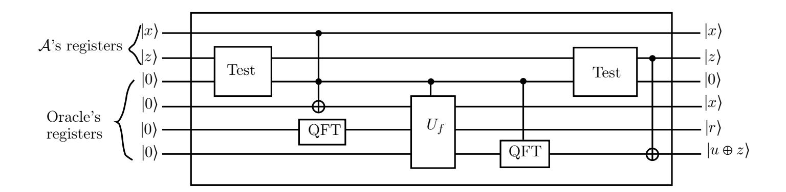
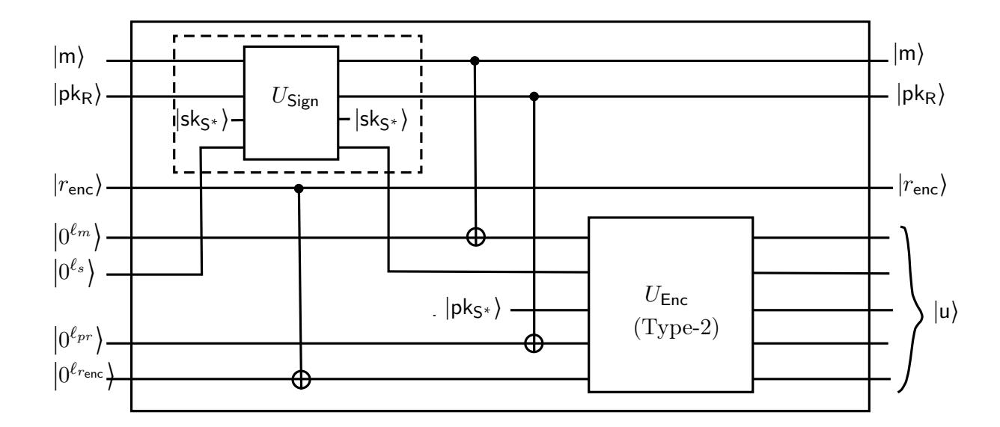
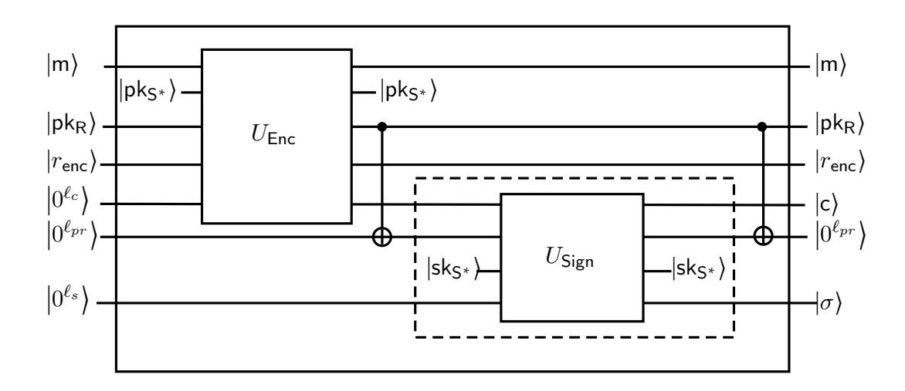
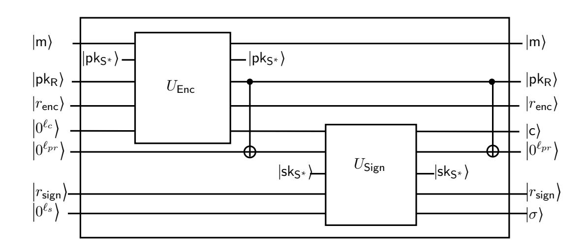
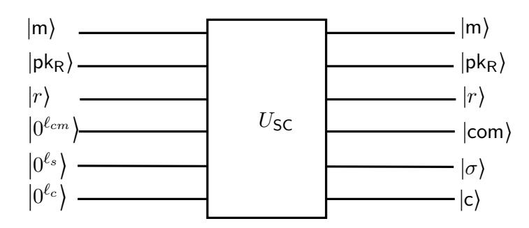
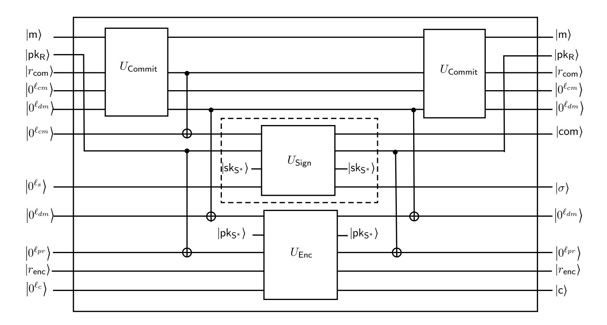
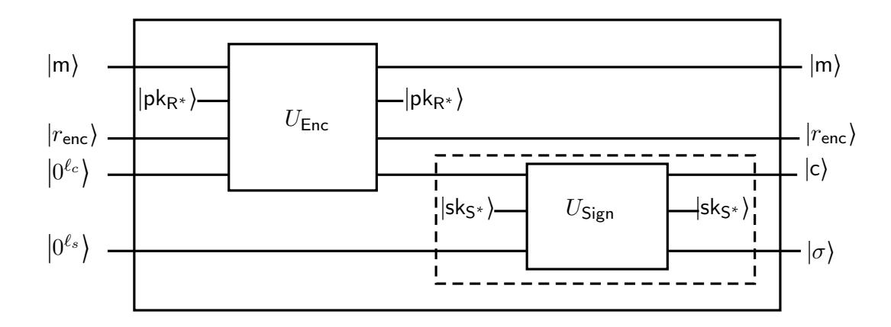
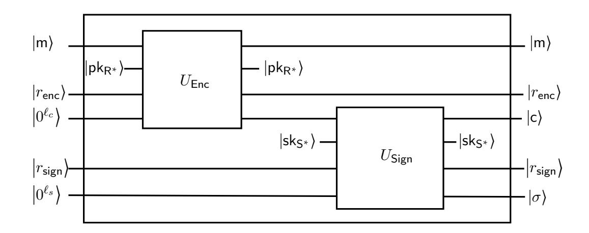

{0}------------------------------------------------

# Signcryption in a Quantum World

Sanjit Chatterjee, Tapas Pandit, Shravan Kumar Parshuram Puria, and Akash Shah

Department of Computer Science and Automation, Indian Institute of Science, Bangalore, India. E-mail: sanjit@iisc.ac.in, {tapasgmmath, sppuria94, shahakash94}@gmail.com

#### Abstract

This work studies signcryption of classical data in the quantum setting. Essentially, we investigate the quantum security of generic constructions of signcryption schemes based on three paradigms, viz., encrypt-then-sign (EtS), sign-then-encrypt (StE) and commit-then-encrypt-and-sign (CtE&S). For doing that we define the confidentiality and authenticity of signcryption for classical data both in insider and outsider models against quantum adversaries. In the insider model, we show that the quantum variants of the classical results hold in the quantum setting. However, for arguing authenticity in outsider model of StE and CtE&S paradigms, we need to consider an intermediate setting in which the adversary is given quantum access to unsigncryption oracle but classical access to signcryption oracle. In two-user outsider model, as in the classical setting, we show that post-quantum CPA security of the base encryption scheme is amplified in the EtS paradigm if the base signature scheme satisfies a stronger definition. We prove an analogous result in the StE paradigm. Interestingly, in the multi-user setting, our results strengthen the known classical results. Furthermore, our results for the EtS and StE paradigms in the two-user outsider model also extend to the setting of authenticated encryption. Finally, we briefly discuss concrete instantiations in various paradigms utilizing some available candidates of quantum secure encryption and signature schemes.

Keywords: Signcryption, Post-quantum cryptography, Quantum security, Authenticated encryption

# 1 Introduction

The possible advent of quantum computers in the foreseeable future poses a threat to the security of many classical cryptosystems. Recently, the National Institute of Standards and Technology (NIST) announced the Post-Quantum Crypto project [NIS17] to evaluate and standardize the quantum-resistant public-key cryptographic algorithms. This was followed by 82 submissions in the first round, of which 26 were shortlisted for the third round of evaluation. After the third round of evaluation [NIS20], 7 (resp. 8) candidates have been shortlisted as finalists (resp. alternatives). The security of the post-quantum cryptographic schemes relies on computational problems which are believed to be intractable even on quantum computers. To formally establish post-quantum security of cryptographic constructions, one generally models all parties and the communication between them to be classical while the adversary is considered to have access to a quantum computer. This setting allows the adversary to perform quantum computations locally and communicate classical information with the parties involved in the protocol. It is well known that quantum immune assumptions alone do not always imply post-quantum security due to fundamental notions such as the no-cloning, which is unique to quantum setting. There have been many works along this line [BDF+ 11, ARU14, ES15, Unr15, SXY18, HHK17, FTTY18] which analyze the security of various post-quantum cryptographic constructions.

{1}------------------------------------------------

Security of classical cryptographic constructions has also been studied in a stronger setting where, in addition to local quantum computations, the adversary is provided access to cryptographic oracle which can be queried quantumly on superposition of inputs [BZ13, GHS16, AGM18b]. For example, in case of signature (resp. encryption), the adversary can issue quantum chosen message queries to the signature (resp. encryption/decryption) oracle. We refer to security notions covering such settings as quantum security throughout this paper.

In this work, we extend the above line of study to the generic constructions of signcryption. Signcryption is a public key cryptographic primitive which provides both privacy and authenticity of data. There exists a vast literature on signcryption in the classical setting. It was originally proposed by Zheng [Zhe97], followed by later works [ADR02, BSZ07, MMS09], which focused on formalizing the security of signcryption and analyzing the security of various constructions. The symmetric variant of signcryption, a.k.a., authenticated encryption has been extensively studied in the classical setting, e.g., [BN08].

As already mentioned, signcryption encompasses confidentiality as well as authenticity of data. We quickly recall some of the relevant classical notions for signature and encryption schemes that we will frequently refer to, in the rest of our discussion. The quantum variants of these notions have been discussed in Section 3. For signatures, we use the standard definition of weak/strong existential unforgeability under chosen message attack ((w/s)UF-CMA) and for encryption we use the standard definitions of indistinguishability under chosen ciphertext attack (IND-CCA). We also take recourse to the notion of indistinguishability under generalized chosen ciphertext attack (IND-gCCA)<sup>1</sup> security. Commitment scheme has also been used as a building block in the one of the generic constructions of signcryption. For commitment schemes, we refer to the standard notions of Hiding, Binding and rConcealment<sup>2</sup>.

In the classical setting, An, Dodis and Rabin [ADR02] proposed generic constructions of signcryption schemes based on three paradigms, viz., encrypt-then-sign ( $\mathcal{E}t\mathcal{S}$ ), sign-then-encrypt ( $\mathcal{S}t\mathcal{E}$ ) and committhen-encrypt-and-sign ( $\mathcal{C}t\mathcal{E}\&\mathcal{S}$ ). Security in each paradigm was proven in two-user insider and outsider models. In insider model the adversary is allowed to corrupt all parties except the receiver (resp. sender) in case of confidentiality (resp. unforgeability) whereas in outsider model the adversary is allowed to corrupt all parties except the sender and receiver. The  $\mathcal{E}t\mathcal{S}$  paradigm preserves sUF-CMA and IND-gCCA security of the primitive signature scheme and encryption scheme respectively in the insider model. The  $\mathcal{S}t\mathcal{E}$  paradigm preserves wUF-CMA and IND-CCA security of the primitive signature scheme and encryption scheme respectively in insider model. On the other hand,  $\mathcal{C}t\mathcal{E}\&\mathcal{S}$  paradigm can preserve only weak security in insider model, viz., the wUF-CMA security and IND-gCCA security of the primitive signature scheme and encryption scheme respectively. In the two-user outsider model, it was shown in [ADR02] that the weak security of the encryption (resp. signature) scheme in the  $\mathcal{E}t\mathcal{S}$  (resp.  $\mathcal{S}t\mathcal{E}$ ) paradigm gets amplified to strong if the base signature (resp. encryption) satisfies a stronger definition. However, it was argued in [DZ10] that the same result doesn't hold in the multi-user outsider model.

**Key-Idea**. For simplicity, let's consider two-user model, where there are only two users, one receiver and one sender. An adversary  $\mathcal{A}$  may ask superposition queries to signcryption  $(\mathcal{SC})$  (resp. unsigncryption  $(\mathcal{US})$ ) oracle by sending two registers  $|m,u_p\rangle$  (resp.  $|u,m_p\rangle$ ) for input and output, where the output register  $u_p$  (resp.  $m_p$ ) is initialized (possibly with arbitrary value) by  $\mathcal{A}$ . As a response,  $\mathcal{A}$ 's registers are updated with  $|u,m_p\oplus\mathcal{US}(u)\rangle$  and  $|m,u_p\oplus\mathcal{SC}(m)\rangle$  for unsigncryption and signcryption respectively. Depending on the underlying security model, a simulator  $\mathcal{B}$  has to answer superposition queries to signcryption oracle or

<span id="page-1-0"></span><sup>&</sup>lt;sup>1</sup>IND-gCCA notion is a generalization of IND-CCA security notion where the adversary is forbidden from making certain decryption queries which are related to the challenge ciphertext. For more details refer to [ADR02].

<span id="page-1-1"></span><sup>&</sup>lt;sup>2</sup>Informally, rConcealment ensures that given a commitment pair (com, decom) corresponding to a message m, it is difficult to produce com' ≠ com such that the pair (com', decom) opens to a valid message [NP16].

{2}------------------------------------------------

unsigncryption oracle or both. Typically, for simulating those queries, B gets a help of an external oracle, e.g., signature, decryption. In general, for answering the queries, B may need some auxiliary registers to store intermediate values which are either computed by the simulator itself or obtained from its external oracle. The internal auxiliary registers may get entangled with adversary's registers. If so, then before transferring the query registers to the adversary, the internal registers need to be uncomputed to avoid entangled attack [GHS16, Zha19a].

Zhandry [Zha19a] introduced an important technique, called compressed oracle which helps on-the-fly simulation in the context of QROM. This technique is applicable in many situations where the simulation would otherwise fail due to the no-cloning theorem. Based on the compressed oracle technique, Chevalier et al. [\[CEV20\]](#page-34-0) recently proposed a generic framework that supports answering inverse (e.g., decryption) queries for probabilistic functions f. Briefly in this technique, when A's queries (x, z) are considered in the Fourier basis, the query information are recorded in the oracle's registers. While going back to the standard basis by applying quantum Fourier transformation on the output register of A and oracle, the legitimate answers are written to A's output register, and the oracle's registers are updated with the value (x, r, f(x, r)). This ensures recording a certain type of queries (e.g., encryption) of A and thereby enabling on-the-fly simulation of A's other type of queries (e.g., decryption). This whole process is oblivious to the adversary. Besides uncomputing registers, we rigorously use compressed oracle related result of [\[CEV20\]](#page-34-0) to argue the quantum security of classical data in three well-known paradigms of signcryption.

In the insider unforgeability (resp. confidentiality) model, A is given superposition access to signcryption (resp. unsigncryption) oracle. For answering signcryption queries, B computes ciphertext or signature or some other values (e.g., components related to commitment) internally. If they are not part of the final output, then B has to uncompute those intermediate components either by making queries to its external signature oracle or by running algorithms (e.g., encryption, commit) locally using the same randomness as used to compute those intermediate components. In the former case, we face some problem due to randomized nature of the signature oracle. Even when, it is deterministic, B has to ask 2q signature queries when the adversary makes q signcryption queries. This creates a problem as the simulator has to submit 2q + 1 message-signature pairs in one-more unforgeability model [BZ13]. This type of difficulty arises in the insider model of StE paradigm. However, if we simulate encryption using Type-2 unitary [GHS16], then we can resolve the above problem. Basically, this unitary will replace the contents (m and σ) by the output ciphertext. But, then it will create a further issue that the output ancilla register (controlled by A) must be initialized with 0. However, in the compressed Fourier basis B only needs to work on the oracle's function register, i.e., oracle's output register (which contains signcryption text) which is initialized with 0 by the simulator. Therefore, the above issue can be resolved, if we use the compressed standard oracle. For answering unsigncryption queries, B also may have to store some internal components in auxiliary registers and it can uncompute those values either by making queries to its external oracle twice or by making some computations locally, e.g., signature verification. In this case, we do not face any problem as encountered in answering signcryption queries in StE paradigm.

In the outsider model, the adversary is given access to both the oracles, signcryption and unsigncryption. Since the outsider model is weaker than the insider model, we can expect that the security (privacy/authenticity) of the underlying target primitive gets amplified. So, the simulator may have to simulate the queries with a restricted[3](#page-2-0) oracle or even without having access to any external oracles. Classically, it also relies on the security of the other primitives, say, encryption, signature and commitment schemes, in addition to the target primitive. For example, for lifting IND-CPA to IND-CCA security in EtS, it requires sUF-CMA security of the underlying signature scheme. The arguments work as follows:

<span id="page-2-0"></span><sup>3</sup>For example, decryption oracle in IND-gCCA model, where the queries are answered based on a relation (not necessarily equality) between the challenge ciphertext and the ciphertext involved in the underlying queries.

{3}------------------------------------------------

if an adversary asks a valid unsigncryption query, then either, the adversary produces a forgery of the underlying signature scheme or gets the signcryption text from the response of the previous signcryption oracle queries, in which case simulator simply stores all the message-signcryption text pairs, and answers the unsigncryption query. In case of CtE&S paradigm, the IND-CCA security is preserved under sUF-CMA security of the signature scheme, and relaxed-concealment and hiding properties of commitment scheme. The security proof involves hybrid game changes and some of the game changes require checking whether the queried signcryption text in the unsigncryption query matches a certain pattern with the stored signcryption texts. If so, it then breaks the underlying security (sUF-CMA and relaxed-concealment) of the corresponding primitives. Otherwise, the changes are unnoticed by the adversary.

Quantumly, we need to record message and signcryption text pairs in superposition in a database for on-the-fly simulation of unsigncryption queries. Using the compressed oracle framework [\[CEV20\]](#page-34-0) for randomized functions, we can record message-signcryption text pairs in superposition in a database. This enables to answer unsigncryption queries (e.g., in EtS paradigm) using the recorded messages. It also helps to check whether the signcryption texts appeared in the unsigncryption query match a certain pattern in the stored signcryption texts (of previous signcryption queries). For example, in CtE&S paradigm, we consider some game changes under sUF-qCMA security and relaxed-concealment property of the underlying signature and commitment schemes respectively. If such pattern exists, we can break the aforementioned security of the underlying primitives. By doing so, we ensure that an adversary cannot make an unsigncryption query such that simulator is unable to handle.

Our Contributions. In this paper, we initiate a formal study of quantum security of classical data in three well-known signcryption paradigms. We first propose appropriate quantum security definitions for signcryption, which are natural adaptation of the existing classical definitions to the quantum setting. We investigate the quantum security of generic constructions of signcryption schemes based on three paradigms, viz., EtS, StE and CtE&S. In the multi-user insider model, our results are along the expected lines as in the classical counterpart. In the outsider model, we show that IND-CPA security can be lifted to IND-qCCA security in EtS paradigm, and IND-qCCA security can be preserved in CtE&S paradigms.

Due to the style of our security models, we are unable to lift pqUF-NMA security to sUF-qCMA in StE paradigm (resp. preserve sUF-qCMA in CtE&S paradigms) in outsider model what we expected as analogues to classical setting. Nonetheless, we consider an intermediate setting for authenticity (which we call uqCMA attack model) where the signcryption oracle remains classical and the unsigncryption oracle can be quantumly accessed. Intuitively, this models a setting where the sender always runs the protocol on a classical device whereas the receiver may run the protocol on a quantum device. In the above setting, we lift pqwUF-CMA (resp. pqsUF-CMA) to sUF-uqCMA security in StE (resp. CtE&S) paradigm. Interestingly, our results in the multi-user outsider model strengthen the existing classical results to the best of our knowledge.

In more detail, our contributions (also see Table [1\)](#page-4-0) are as follows:

Encrypt-then-Sign: The EtS paradigm preserves sUF-qCMA and IND-qgCCA[4](#page-3-0) security of the primitive signature scheme and encryption scheme respectively in the multi-user insider security model. In the two-user outsider model, we show that post-quantum IND-CPA security of the underlying encryption scheme can be amplified to IND-qCCA (resp. IND-qgCCA) security, if the signature scheme is post quantum sUF-qCMA (resp. wUF-qCMA). While this is in line with the classical setting, our result

<span id="page-3-0"></span><sup>4</sup> sUF-qCMA is the quantum analogue of classical sUF-CMA security notion where the adversary can query the signature oracle quantumly on a superposition of messages. Similarly, IND-qCCA and IND-qgCCA are quantum analogues of IND-CCA and IND-gCCA notions of security. For formal definitions, refer to Section [3.](#page-9-0)

{4}------------------------------------------------

in the multi-user outsider model is somewhat surprising. In particular, we establish that IND-qgCCA security of the underlying encryption scheme can be amplified to IND-qCCA security if the signature scheme is post quantum sUF-qCMA secure. As a consequence, we obtain a similar result in the classical setting which, to the best of our knowledge, was not known prior to this work.

Sign-then-Encrypt: The  $\mathcal{S}t\mathcal{E}$  paradigm preserves IND-qCCA security of the primitive encryption scheme and wUF-qCMA of the signature scheme in the multi-user insider security model. In the two-user outsider model, we show that post-quantum UF-NMA security of the underlying signature scheme can be amplified to sUF-uqCMA (resp. wUF-uqCMA) security, if the encryption scheme is IND-qCCA (resp. IND-qgCCA), exactly as in the classical setting. As in the case of confidentiality of  $\mathcal{E}t\mathcal{S}$  paradigm in the multi-user outsider model, we show that wUF-qCMA security of the underlying signature scheme can be amplified to sUF-uqCMA security if the encryption scheme is IND-qCCA secure. Again, this result naturally holds in the classical setting but was not known prior to this work.

Commit-Encrypt-and-Sign: The \$CtE&S\$ paradigm preserves wUF-qCMA and IND-qgCCA security of the primitive signature scheme and encryption scheme respectively in the multi-user insider security model assuming that the commitment scheme satisfies some standard security properties. In the outsider model, we show that the IND-qCCA security of the underlying encryption is preserved, if the corresponding signature is post quantum sUF-CMA secure. Also, the post quantum sUF-CMA security of the underlying signature is lifted to sUF-uqCMA, if the corresponding encryption is IND-qCCA secure. For both these results, we consider some properties of the commitment scheme. The last two results too hold in the classical setting but was not known prior to this work.

Our results for the  $\mathcal{E}t\mathcal{S}$  and  $\mathcal{S}t\mathcal{E}$  paradigms in the two-user outsider model also extend to the symmetric setting. Finally, we briefly recall some candidates for post-quantum and quantum secure signature and encryption schemes which can be used to instantiate the generic constructions of post-quantum and quantum secure signcryption schemes.

|        | Paradigms                       |                                   |                               |                            |                              |                          |
|--------|---------------------------------|-----------------------------------|-------------------------------|----------------------------|------------------------------|--------------------------|
| Prim   | $\mathcal{E}t\mathcal{S}$       |                                   | $\mathcal{S}t\mathcal{E}$     |                            | $Ct\mathcal{E}\&\mathcal{S}$ |                          |
|        | Confidentiality                 | Authenticity                      | Confidentiality               | Authenticity               | Confidentiality              | Authenticity             |
| Е      | IND-qgCCA                       | -                                 | IND-(qg/q)CCA                 | -                          | IND-qgCCA                    | -                        |
| S      | -                               | (w/s)UF-qCMA                      | -                             | wUF-qCMA                   | -                            | wUF-qCMA                 |
| C      | -                               | -                                 | -                             | -                          | qHiding $\&$ qrCon           | qBinding                 |
| $SC^i$ | ${\sf IND\text{-}iqgCCA}^{5.1}$ | $({\sf w/s}){\sf UF-iqCMA}^{5.2}$ | $IND\text{-}i(qg/q)CCA^{5.3}$ | wUF-iqCMA $^{5.4}$         | IND-iqgCCA $^{5.5}$          | wUF-iqCMA $^{5.6}$       |
| Е      | IND-qgCCA                       |                                   |                               | IND-qCCA                   | IND-qCCA                     | IND-qCCA                 |
| S      | sUF-qCMA                        | Same as                           | Same as                       | pqwUF-CMA                  | sUF-qCMA                     | pqsUF-CMA                |
| C      | -                               | Insider                           | Insider                       | -                          | qHiding $\&$ qrCon           | qfBinder & qrCon         |
| $SC^o$ | $IND\text{-}oqCCA^{6.1}$        | Model                             | Model                         | ${\sf sUF-ouqCMA}^{6.2}$   | fM-IND-oqCCA $^{6.3}$        | ${\sf sUF-ouqCMA}^{6.4}$ |
| Е      | pqIND-CPA                       |                                   |                               | IND-(qg/q)CCA              |                              |                          |
| S      | (w/s)UF-qCMA                    | Same as                           | Same as                       | pqUF-NMA                   | Same as                      | Same as                  |
| C      | -                               | Insider                           | Insider                       | -                          | Multi-User                   | Multi-User               |
| $SC^2$ | $IND\text{-}(qg/q)CCA^{6.5}$    | Model                             | Model                         | $(w/s)$ UF-ouqCMA $^{6.6}$ | ${\rm Outsider}$             | Outsider                 |

The rows indexed by the abbreviations E, S and C denote the the assumptions on primitives schemes Encryption, Signature and Commitment. The hyphens appeared in the cells indexed by E, S and C indicate that the signcryption results do not depend on them. The rows indexed by the symbols  $SC^i$ ,  $SC^o$  and  $SC^2$  indicate corresponding achieved security of signcryption in multi-user insider, multi-user outsider and two-user outsider models respectively. The signcryption results highlighted by the gray background denote that the authenticity of signcryption is proven in the intermediate setting, where the signcryption oracle remains classical and the unsigncryption oracle can be quantumly accessed. The logical flow " $(t_1/t_2)Y$  implies  $(p_1/p_2)V$ " means  $t_1Y$  (resp.  $t_2Y$ ) implies  $p_1V$  (resp.  $p_2V$ ). Refer to Section 3 for other notations.

<span id="page-4-0"></span>Table 1: A summary of our results.

Related Works. Recently, there have been works which study the security of joint signature and encryption in the quantum setting. In [GM18], the authors construct a concrete post-quantum signcryption

{5}------------------------------------------------

scheme based on the lattice assumption. In [SJS16], the authors extended the study of authenticated encryption of [BN08] from classical to a quantum setting. In a different line than ours, [AGM18b] gives definitions for confidentiality and authentication of quantum data followed by constructions realizing them. The same authors showed in [AGM18a] that signing a quantum state is impossible even if the security model is considered to be weaker one. It turns out that quantum signature scheme that handles quantum data is not possible unless the state is measured before sign which leaves only classical signature scheme to exist. On the other hand, the authors showed a positive result that signing a quantum state is possible if the state is first encrypted under receiver's public key. This notion essentially defines quantum signcryption, a quantum version of classical signcryption in encrypt-then-sign paradigm. However, in this paper, we study quantum security of classical data in three well-known paradigms of [ADR02].

Recently, the authors in [CEV20] investigated a quantum indistinguishability under quantum chosenciphertext attacks (qIND-qCCA) model using Zhandry's celebrated result [Zha19a] on recording quantum queries. They claimed that this is the first fully quantum indistinguishability model that extends the classical indistinguishability model (IND-qCCA) of [BZ13]. In that model, they provided a formal security proof of authenticated encryption in encrypt-then-mac paradigm [BN08] which was an open problem in [BZ13]. More often, the authenticated-encryption is considered to be a symmetric-key analogue of signcryption in two-user outsider models. Their work considers only confidentially of quantum data in encrypt-them-mac paradigm. However, we work on quantum security of classical data, but consider a variety of settings, e.g., three paradigms of signcryption [ADR02], insider/outsider and two/multi-user models.

**Organization.** In Section 3, we propose definitions for commitment and signcryption in the quantum setting. Section 4 contains the construction of signcryption schemes based on different paradigms. In Sections 5 and 6, we prove the quantum security of generic constructions of signcryption scheme in the insider and outsider models respectively. In Section 7, we discuss concrete instantiation for the generic constructions. Finally, we conlcude in Section 8.

# 2 Preliminaries

#### 2.1 Notations

For  $m \in \mathbb{N}$ , [m] denotes the set  $\{1, \ldots, m\}$ . We use  $\lambda \in \mathbb{N}$  to denote the security parameter. A function  $\epsilon = \epsilon(\lambda)$  is said to be negligible if, for all polynomials p(n),  $\epsilon(n) < 1/p(n)$  for large enough n. For two strings x and y, x||y represents the concatenation of the two strings. For a string  $str = str_1||\ldots||str_n \in \{0,1\}^{t_1} \times \cdots \times \{0,1\}^{t_n}$ , we use  $[str]_i$  to represent the  $i^{th}$  component  $str_i$ . For a random variable X, its collision entropy is defined as  $-\log \Pr[X = X']$ , where X' has the same distribution as X, but independent of X.

# 2.2 Quantum Computation

In this section, we recall a few basic concepts of quantum computation from [NC00]. A quantum system  $\mathcal{H}$  is a complex euclidean space (a.k.a., Hilbert space). The state of a quantum system is completely described by its state vector  $|\psi\rangle$  which is a unit vector  $(\langle\psi|\psi\rangle=1)$  in the system's state space. Given quantum systems  $\mathcal{H}_1$  and  $\mathcal{H}_2$ , the joint quantum system is given by the tensor product  $\mathcal{H}_1\otimes\mathcal{H}_2$ . Given  $|\psi_1\rangle\in\mathcal{H}_1$  and  $|\psi_2\rangle\in\mathcal{H}_2$ , the joint state (product state) is given by  $|\psi_1\rangle\otimes|\psi_2\rangle\in\mathcal{H}_1\otimes\mathcal{H}_2$ . The joint state  $|\psi_1\rangle\otimes|\psi_2\rangle$  is also denoted as  $|\psi_1\rangle|\psi_2\rangle$  or  $|\psi_1,\psi_2\rangle$  in many places. In general, the joint state  $|\psi\rangle\in\mathcal{H}_1\otimes\mathcal{H}_2$  cannot be expressed as a product state. If  $|\psi\rangle$  is not a product state, we say that the systems  $\mathcal{H}_1$  and  $\mathcal{H}_2$  are entangled. If  $|\psi\rangle$  is a product state, we say the systems are unentangled.

{6}------------------------------------------------

The evolution of a closed quantum system is completely described by a unitary transformation. In particular, if  $|\psi\rangle$  is a quantum state and U be any unitary transformation, then the resulting state after transformations is  $|\psi'\rangle = U|\psi\rangle$ .

For a n qubit system, the dimension of the Hilbert space  $\mathcal{H}$  is  $2^n$ . The set  $\{|i\rangle: 0 < i \le 2^n\}$  forms an orthonormal basis of  $\mathcal{H}$ , where  $|i\rangle$  is a column vector with only the  $i^{th}$  bit set to 1 and all other bits set to 0. The set  $\{|i\rangle\}$  is also called as computational basis. If an element  $|\psi\rangle \in \mathcal{H}$  is a linear combination of several  $|i\rangle$ , then  $|\psi\rangle$  is said to be in superposition of computational basis states. Given a quantum state  $|\psi\rangle$ , measurement in the computational basis yields a value i with probability  $|\langle i|\psi\rangle|^2$ . After measurement, conditioned on the measurement outcome being i,  $|\psi\rangle$  collapses to the state  $|i\rangle$ .

A register is a memory element and is associated with a finite non-empty set of classical states.

By appending a state  $|\psi_1\rangle \in \mathcal{H}_1$  to a state  $|\psi_2\rangle \in \mathcal{H}_2$ , we mean the joint state  $|\psi_1\rangle |\psi_2\rangle \in \mathcal{H}_1 \otimes \mathcal{H}_2$ . In the security proofs, we append the state  $|0^m\rangle$  to various states, where  $m \in \mathbb{N}$  may denote the length of ciphertext/signcryption text/signature and is understood from the context.

## <span id="page-6-1"></span>2.3 Quantum Query Recording Framework

In many classical security reductions, the simulator has to record the adversary's queries for a consistent response which may possibly involve computing an inverse function. In contrast, no-cloning theorem does not allow to record quantum queries. Zhandry [Zha19a] introduced a celebrated result on how to record quantum queries without disturbing adversary's view. He proposed an oracle technique, called compressed oracle which helps on-the-fly simulation in the setting of QROM. Using Zhandry's compressed oracle technique on recording queries, Chevalier et al. [CEV20] proposed a framework for probabilistic functions that supports answering inverse queries. Essentially, an adversary can query both the underlying function (say, encryption) and its inverse function (decryption). The probabilistic functions they considered include permutation, symmetric encryption and public-key encryption. Using the framework, they proposed a stronger realizable security model for privacy of quantum data and then they showed that IND-CPA security can be lifted to qIND-qCCA security assuming a sUF-qCMA secure MAC in the encrypt-then-mac paradigm and some other results. Next, we briefly discuss some key techniques presented in [CEV20] and closely follow the notations used by the authors.

Any randomized algorithm can be expressed by a function  $f: \mathcal{X} \times \mathcal{R} \longrightarrow \mathcal{Y}$ , where  $\mathcal{X} = \{0,1\}^m$ ,  $\mathcal{Y} = \{0,1\}^n$  and  $\mathcal{R} = \{0,1\}^\ell$  are input domain, output domain and randomness domain respectively. In our context, the function f represents signcryption and its inverse function represents unsigncryption. The authors [CEV20] considered a number of oracles for f, standard oracle  $\mathcal{O}_f$ , Fourier oracle FourierO<sub>f</sub>, compressed Fourier oracle CFourierO<sub>f</sub> and compressed standard oracle CStO<sub>f</sub>, and showed the following important result.

<span id="page-6-0"></span>**Lemma 2.1** ([CEV20, Lemma 1-4]). The oracles  $\mathcal{O}_f$ , CFourierO<sub>f</sub> and CStO<sub>f</sub> are perfectly indistinguishable.

The standard oracle is implemented as  $\mathcal{O}_f: \sum_{x,y} \psi_{x,y} | x,y \rangle \mapsto \sum_{x,y} \psi_{x,y} | x,y \oplus f(x;r) \rangle$ , where r is a uniformly and independently sampled random coin. This is the same as answering using purification of the coin toss from adversary's point of view. That is, we can implement the oracle as follows:  $\sum_{x,y} \psi_{x,y} | x,y \rangle \otimes \frac{1}{\sqrt{2^{\ell}}} \sum_{r} | r \rangle \mapsto$ 

$$\sum_{x,y} \psi_{x,y} | x, y \oplus f(x;r) \rangle \otimes \frac{1}{\sqrt{2^{\ell}}} \sum_{r} | r \rangle.$$

{7}------------------------------------------------



<span id="page-7-0"></span>Figure 1: Quantum circuit implementing compressed Fourier oracle CFourierO<sub>f</sub> (from [CEV20]).

The compressed Fourier oracle CFourierO<sub>f</sub> works on  $|x,z\rangle$ , where  $(x,z) \in \mathcal{X} \times \mathcal{Y}$  as follows:

CFourierO<sub>f</sub> 
$$|x,z\rangle = \begin{cases} |x,z\rangle \frac{1}{\sqrt{2^{\ell}}} \sum_{r} |r\rangle & \text{if } z = 0^{n} \\ |x,z\rangle \otimes |\phi_{x,z}\rangle & \text{if } z \neq 0^{n}, \end{cases}$$

where  $|\phi_{x,z}\rangle = \frac{1}{\sqrt{2^\ell}} \sum_{r} \sum_{u} \frac{1}{\sqrt{2^n}} (-1)^{f(x;r)\cdot u} |x,r,z\oplus u\rangle$ . For answering an f-query using CFourierO $_f$  oracle, a number of unitary operations need to be performed and the number of function calls to  $U_f$  required is 3. This raises a problem in proving unforgeability of encrypt-then-sign/mac paradigm from the unforgeability of the underlying signature/mac scheme. The authors handled this issue by constructing a quantum circuit CFourierO $_f$  (see Figure 1), where the number of function calls to  $U_f$  is only one. In the circuit, the first two registers are controlled by the adversary and the remaining ones (called oracle's registers) are handled by the simulator which are used to record the information related to adversary's queries. For detailed description of the circuit, refer to [CEV20].

If we apply QFT on the adversary's output register and oracle's output registers, then we can get back the standard oracle and the oracle's state will be in superposition of (x, r, f(x; r)). This is called as compressed standard oracle  $\mathsf{CStO}_f$ . Let  $\mathcal{D}$  denote the database that contains the tuples of the form (x, r, f(x, r)) in superposition. This database helps the simulator to answer queries to  $f^{-1}$  on some inputs which were output of previous f-queries. This typical scenario can be found in many classical reductions. Sometimes it is difficult for a simulator to handle f-queries (e.g., signcryption queries in insider model for  $St\mathcal{E}$  paradigm) as the the adversary itself initializes the output ancilla register. Since  $\mathcal{O}_f$  and  $\mathsf{CStO}_f$  are perfectly indistinguishable and the output register of the unitary  $U_f$  appeared in the circuit of  $\mathsf{CFourierO}_f$  (hence  $\mathsf{CStO}_f$ ) is initialized with  $|0\rangle$ , the aforementioned difficulty can be handled easily (see the proof of Theorem 5.4). This is another key feature of the circuit for  $\mathsf{CStO}_f$ .

Let the notation  $f : \mathsf{CStO}_f^{(r)}[x \mapsto y]$  denote the compressed oracle of f, where r is the purification of randomness, x is the input and y is the output. Now, let us consider the following probabilistic function  $f : \mathcal{X} \times \mathcal{R}_1 \times \mathcal{R}_2 \longrightarrow \mathcal{Y}$ , where  $\mathcal{R}_1$  and  $\mathcal{R}_2$  are the domains of randomness which are controlled by the oracle. Here we consider the following implementations of compressed oracle of f:

- 1.  $f : \mathsf{CStO}_f^{|r_1\rangle}[(x; r_2) \mapsto y]$ , which considers purification of the randomness  $r_1 \in \mathcal{R}_1$ .
- 2.  $f : \mathsf{CStO}_f^{|r_2|}[(x;r_1) \mapsto y]$ , which considers purification of the randomness  $r_2 \in \mathcal{R}_2$ .
- 3.  $f : \mathsf{CStO}_f^{|r_1, r_2|}[x \mapsto y]$ , which considers purification of the randomness  $(r_1, r_2) \in \mathcal{R}_1 \times \mathcal{R}_2$ .

The following lemma says that purification of any random coin or all the random coins will give the same response.

{8}------------------------------------------------

<span id="page-8-1"></span>**Lemma 2.2** ([CEV20, Lemma 7]).  $\mathsf{CStO}_f^{|r_1\rangle}[(x; r_2) \mapsto y], \ f : \mathsf{CStO}_f^{|r_2\rangle}[(x; r_1) \mapsto y] \ and \ f : \mathsf{CStO}_f^{|r_1, r_2\rangle}[x \mapsto y]$  are perfectly indistinguishable.

We may drop the superscript, input and output, when they are understood from the context and simply write  $\mathsf{CStO}_f$ . Sometimes, we may drop only input and output and write  $\mathsf{CStO}_f^{|r\rangle}$ . While answering f-queries using compressed standard oracle  $\mathsf{CStO}_f$ , the simulator may use some external oracle which is not controlled by itself, but it can purify the other coin toss locally. For example, there are two<sup>5</sup> randomness involved in the signcryption, one is used in encryption and other is used in signature generation. For answering signcryption-queries, the simulator may use either an encrypt-oracle or a sign-oracle. The above result basically says that it will not hamper the view of the adversary.

Here we briefly illustrate how to handle inverse queries as given in [CEV20]. Let FindImage be a function which takes a value  $y \in \mathcal{Y}$  and  $\mathcal{D}$  as input and outputs a value  $x \in \mathcal{X}$  such that there exists  $(x, r, y) \in \mathcal{D}$ . Formally, FindImage is defined by

FindImage
$$(y, \mathcal{D}) = \begin{cases} (1, x) & \text{if there exists } (x, r, y) \in \mathcal{D} \\ (0, 0^m) & \text{otherwise.} \end{cases}$$

Next, we define a unitary operation  $\mathsf{CInvO}_{f^{-1}}$  for answering  $f^{-1}$ -queries which works on  $|y,z\rangle\otimes|\mathcal{D}\rangle$  as follows:

$$\mathsf{CInvO}_{f^{-1}} \left| y, z \right\rangle \otimes \left| \mathcal{D} \right\rangle = \begin{cases} \left| y, z \oplus w \right\rangle \right) \otimes \left| \mathcal{D} \right\rangle & \text{if } \mathsf{FindImage}(y, \mathcal{D}) = (1, w) \\ \left| y, z \oplus f^{-1}(y) \right\rangle \right) \otimes \left| \mathcal{D} \right\rangle & \text{if } \mathsf{FindImage}(y, \mathcal{D}) = (0, 0^m). \end{cases}$$

**Definition 1** ([CEV20]). Let  $\mathcal{F} = \{f : \mathcal{X} \times \mathcal{K} \longrightarrow \mathcal{Y}\}$  be a family of functions such that for each  $f \in \mathcal{F}$ , there is a function  $f^{-1} : \mathcal{Y} \times \mathcal{K} \longrightarrow \mathcal{X}$ . We say  $\mathcal{F}$  is  $\delta$ -almost invertible if

$$\mathbb{E}_{k \in \mathcal{K}} \left[ \max_{x \in \mathcal{X}} \Pr[f^{-1}(k, f(k, x)) \neq x] \right] \leq \delta.$$

Here, f could be pseudorandom function, encryption or signcryption. The correctness of the signcryption scheme considered in this paper implies that  $\delta = 0$ .

<span id="page-8-2"></span>**Lemma 2.3** ([CEV20, Lemma 8]). For any quantum algorithm  $\mathcal{A}$  (possibly unbounded)

$$\left| \mathsf{Pr} \left[ \mathcal{A}^{\mathcal{O}_f, \mathcal{O}_{f^{-1}}}() = 1 \right] - \mathsf{Pr} \left[ \mathcal{A}^{\mathsf{CStO}_f, \mathsf{CInvO}_{f^{-1}}}() = 1 \right] \right| \leq \mathcal{O}(q_i \cdot \delta)$$

where  $q_i$  is the number of inverse queries.

The above lemma is very crucial for answering  $f^{-1}$ -queries using the information recorded while answering f-queries. It also ensures to extract out some related information from  $\mathcal{D}$  that  $\mathcal{A}$  already made queries to signcryption oracle, e.g., extracting q many message-signature pairs by measuring the database  $\mathcal{D}$  for arguing one-more unforgeability (see Theorems 6.1 and 6.5) when  $\mathcal{A}$  makes q many signcryption queries. Furthermore, it helps to find some particular structure in that database for arguing game changes under relaxed-concealment property or sUF-qCMA security in Theorem 6.3. For that we extend FindImage and ClnvO $_{f^{-1}}$  to capture some local computations on additional supplied information. This does not change the view of the adversary.

<span id="page-8-0"></span><sup>&</sup>lt;sup>5</sup>For  $\mathcal{C}t\mathcal{E}\&\mathcal{S}$  paradigm, one additional randomness is used for commitment.

{9}------------------------------------------------

# <span id="page-9-0"></span>3 Syntax and Security Definitions

We adopt the definitions given in [BZ13] for security of encryption and signature in the quantum setting. The quantum variant of IND-gCCA security notion [ADR02] was not formalized in [BZ13]. However, it follows as a natural extension of the definition of IND-qCCA security. The security definitions of commitment and signcryption that we define, follow naturally from their classical counterparts [BSZ07, ADR02, MMS09, NP16]. In this section, we first briefly illustrate the quantum security of the primitives public-key encryption, signature and commitment as they are formally defined in Appendix [A.](#page-36-0) Then, we formally give the abstract definition and security models of signcryption. We emphasize that our security models capture quantum security of classical data.

Security of PKE in the Quantum Setting. By pqIND-X security, where X ∈ {CCA, gCCA,CPA}, we mean post-quantum security, i.e., here the adversary is considered to be a PPT quantum algorithm and given classical access to decryption oracle (resp. decryption oracle with a generalized restriction[6](#page-9-1) and no decryption oracle) and superposition access to random oracle (if there is any random oracle). By IND-X security, where X ∈ {qCCA, qgCCA}, we mean quantum security of classical data, i.e., the PPT quantum adversary is provided superposition access to decryption oracle (resp. decryption oracle with a generalized restriction) and superposition access to random oracle (if there is any random oracle).

Security of PKS in the Quantum Setting. By pq(w/s)UF-CMA security, we mean post-quantum weak/strong unforgeability under classical chosen-message attack, where a PPT quantum adversary is given access to classical sign oracle and quantum random oracle (if there is any random oracle). The security model pqUF-NMA is a weaker model, where only oracle available to the adversary is the quantum random oracle (if there is any random oracle). By (w/s)UF-qCMA security, we mean quantum weak/strong unforgeability of classical data, i.e., a PPT quantum adversary is provided superposition access to sign oracle, in addition to superposition random oracle queries (if any). Further, if the adversary makes q sign queries, then it has to submit (q + 1) classical message-signature pairs as forgeries, and weak/strong comes in the sense that whether messages are distinct or message-signature pairs are pairwise distinct. This notion is also referred as one-more unforgeability.

Security of Commitment in the Quantum Setting. The hiding property ensures that a PPT adversary cannot distinguish com part of two distinct messages chosen by the adversary. The binding property says that once the sender commits a message, later cannot change his mind, i.e., a PPT adversary cannot produce (com, decom, decom′ ) such that (com, decom) and (com, decom′ ) open in two different messages. The concealment property guarantees that a PPT adversary cannot produce (com, com′ , decom) with com ≠ com′ such that (com, decom) and (com′ , decom) open to two valid messages (not necessarily distinct). The relaxed-concealment is weaker version of concealment, where an adversary will be given (com, decom) for a message chosen by the adversary and the goal is to produce a different com′ such that (com′ , decom) opens to a valid message. The properties qHiding, qBinding and qrConcealment stand for quantum hiding, quantum binding and quantum relaxed-concealment respectively. These are defined to be the same as their classical counterpart (mentioned above) but the adversary is a PPT quantum algorithm. Also, we consider a new property called qfBinder, where an adversary will be given com part of (com, decom) for a message

<span id="page-9-1"></span><sup>6</sup> In IND-gCCA model, for a decryption query on c the adversary gets the underlying plaintext (i.e., D(c,sk)), if c is not related (w.r.t some relation) to c ∗ (the challenge ciphertext), else gets , unlike to IND-CCA model. When the relation is consider to be equality, then IND-gCCA becomes IND-CCA model.

{10}------------------------------------------------

chosen by the adversary and the goal is to produce a decom' (not necessarily different from decom) such that (com, decom') opens to a valid message.

## 3.1 Signcryption

**Signcryption Scheme.** A signcryption (SC) scheme consists of five PPT algorithms: Setup, KeyGen<sub>S</sub>, KeyGen<sub>R</sub>,  $\mathcal{SC}$  and  $\mathcal{US}$ .

- Setup: It takes as input a security parameter  $\lambda$  and outputs public parameters  $\mathcal{PP}$ .
- KeyGens: It takes as input  $\mathcal{PP}$  and outputs a public key and private key pair  $(pk_S, sk_S)$  for the sender.
- KeyGen<sub>R</sub>: It takes as input  $\mathcal{PP}$  and outputs a public key and private key pair  $(pk_R, sk_R)$  for the receiver.
- $\mathcal{SC}$ : It takes as input a message  $m \in \mathcal{M}$ , where  $\mathcal{M}$  is the message space, sender's private key  $\mathsf{sk}_\mathsf{S}$  and receiver's public key  $\mathsf{pk}_\mathsf{R}$  and outputs a signcryption text  $\mathsf{u}$ .
- $\mathcal{US}$ : It takes as input a signcryption text u, receiver's private key  $sk_R$  and sender's public key  $pk_S$  and outputs a message  $m \in \mathcal{M}$  or  $\bot$ .

Correctness: For all  $\mathcal{PP} \leftarrow \mathsf{Setup}(1^{\lambda})$ , all  $(\mathsf{pk}_S, \mathsf{sk}_S) \leftarrow \mathsf{KeyGen}_S(\mathcal{PP})$ , all  $(\mathsf{pk}_R, \mathsf{sk}_R) \leftarrow \mathsf{KeyGen}_R(\mathcal{PP})$  and for all  $\mathsf{m} \in \mathcal{M}$ , it is required that  $\mathcal{US}(\mathcal{SC}(\mathsf{m}, \mathsf{sk}_S, \mathsf{pk}_R), \mathsf{sk}_R, \mathsf{pk}_S) = \mathsf{m}$ .

#### Security of SC in the Quantum Setting.

**Insider Model.** In the insider model the adversary is allowed to corrupt all parties except the receiver (resp. sender) in case of confidentiality (resp. unforgeability).

**Definition 2.** A signcryption scheme SC is said to be pqIND-CCA secure in dynamic multi-user insider model (dM-pqIND-iCCA) if for all quantum PPT algorithms  $\mathcal{A} := (\mathcal{A}_1, \mathcal{A}_2)$ , the advantage

<span id="page-10-0"></span>
$$\mathsf{Adv}_{\mathcal{A},\mathsf{SC}}^{\mathsf{dM-pqIND-iCCA}}(\lambda) \coloneqq \left| \mathsf{Pr} \left[ b = b' \right] - \frac{1}{2} \right|$$

in  $\mathsf{Exp}_{\mathcal{A},\mathsf{SC}}^{\mathsf{dM-IND-iCCA}}(\lambda)$  defined in Figure 2 is a negligible function in security parameter  $\lambda$ , where  $\mathcal{A}$  is provided classical access to unsigncryption oracle  $\mathcal{O}_U$  (described below) with natural restrictions that  $(\mathsf{u}^*,\mathsf{pk}_{\mathsf{S}^*})$  was never queried to  $\mathcal{O}_U$  and  $(\mathsf{pk}_{\mathsf{S}^*},\mathsf{sk}_{\mathsf{S}^*})$  is a valid pair.

• Unsigncryption oracle  $(\mathcal{O}_U)$ : Given  $(u^*, pk_S)$ , oracle returns  $\mathcal{US}(u^*, sk_{R^*}, pk_S)$ .

<span id="page-10-1"></span>**Definition 3.** A signcryption scheme SC is said to be IND-qCCA secure in dynamic multi-user insider model (dM-IND-iqCCA) if it satisfies the same definition as dM-pqIND-iCCA with the exception that the adversary is provided superposition access to unsigncryption oracle  $\mathcal{O}_U^{\mathsf{q}}$  (described below).

• Quantum Unsigncryption oracle  $(\mathcal{O}_U^{\mathsf{q}})$ : For each such query, the challenger unsigncrypts all signcryption texts in the superposition, except those that were returned in response to a challenge query:

$$\sum_{\mathbf{u}, \mathsf{pk}_{\mathsf{S}}, \mathsf{m}_{\mathsf{p}}} \psi_{\mathsf{u}, \mathsf{pk}_{\mathsf{S}}, \mathsf{m}_{\mathsf{p}}} | \mathsf{u}, \mathsf{pk}_{\mathsf{S}}, \mathsf{m}_{\mathsf{p}} \rangle \longmapsto \sum_{\mathsf{u}, \mathsf{pk}_{\mathsf{S}}, \mathsf{m}_{\mathsf{p}}} \psi_{\mathsf{u}, \mathsf{pk}_{\mathsf{S}}, \mathsf{m}_{\mathsf{p}}} | \mathsf{u}, \mathsf{pk}_{\mathsf{S}}, \mathsf{m}_{\mathsf{p}} \oplus f(\mathsf{u}, \mathsf{pk}_{\mathsf{S}}) \rangle \tag{1}$$

{11}------------------------------------------------

$$\begin{split} & \underbrace{\mathsf{Exp}^{\mathsf{dM-pqIND-iCCA}}_{\mathcal{A},\mathsf{SC}}(\lambda)} \colon \\ & \bullet \ \mathcal{PP} \longleftarrow \mathsf{Setup}(1^{\lambda}) \\ & \bullet \ (\mathsf{pk}_{\mathsf{R}^*},\mathsf{sk}_{\mathsf{R}^*}) \longleftarrow \mathsf{KeyGen}_{\mathsf{R}}(\mathcal{PP}) \\ & \bullet \ (\mathsf{m}_0,\mathsf{m}_1,\mathsf{pk}_{\mathsf{S}^*},\mathsf{sk}_{\mathsf{S}^*},st) \longleftarrow \mathcal{A}^{\mathcal{O}_U}_1(\mathcal{PP},\mathsf{pk}_{\mathsf{R}^*}) \text{ with } |\mathsf{m}_0| = |\mathsf{m}_1| \\ & \bullet \ b \stackrel{\mathsf{U}}{\longleftarrow} \{0,1\} \\ & \bullet \ u^* \longleftarrow \mathcal{SC}(\mathsf{m}_b,\mathsf{sk}_{\mathsf{S}^*},\mathsf{pk}_{\mathsf{R}^*}) \\ & \bullet \ b' \longleftarrow \mathcal{A}^{\mathcal{O}_U}_2(\mathcal{PP},\mathsf{pk}_{\mathsf{R}^*},\mathsf{pk}_{\mathsf{S}^*},\mathsf{sk}_{\mathsf{S}^*},\mathsf{u}^*,st) \end{split}$$

Figure 2: Experiment for confidentiality (dynamic multi-user insider model)

where

<span id="page-11-0"></span>
$$f(\mathsf{u},\mathsf{pk}_\mathsf{S}) = \begin{cases} \bot & \textit{if} \; (\mathsf{u},\mathsf{pk}_\mathsf{S}) = (\mathsf{u}^*,\mathsf{pk}_\mathsf{S}^*) \\ \mathcal{US}(\mathsf{u},\mathsf{sk}_\mathsf{R^*},\mathsf{pk}_\mathsf{S}) & \textit{otherwise}. \end{cases}$$

The notion of dM-IND-iqgCCA can be defined in a similar way as in IND-qgCCA (Definition 16). We define an equivalence relation  $\mathcal{R}$  over the pairs  $(u, pk_S)$ .  $\mathcal{R}$  is said to be unsigncryption-respecting if  $\mathcal{R}((u_1, pk_{S_1}), (u_2, pk_{S_2})) = \text{True} \Longrightarrow (\mathcal{US}(u_1, sk_{R^*}, pk_{S_1}) = \mathcal{US}(u_2, sk_{R^*}, pk_{S_2})) \land (pk_{S_1} = pk_{S_2})$ . The unsign-cryption oracle query is restricted using relation  $\mathcal{R}$  instead of equality relation. A superposition query can be handled by modifying the description of f in Equation 1 in the following way:

$$f(\mathsf{u},\mathsf{pk}_\mathsf{S}) = \begin{cases} \bot & \text{if } \mathcal{R}((\mathsf{u},\mathsf{pk}_\mathsf{S}),(\mathsf{u}^*,\mathsf{pk}_\mathsf{S^*})) = \mathsf{True} \\ \mathcal{US}(\mathsf{u},\mathsf{sk}_\mathsf{R^*},\mathsf{pk}_\mathsf{S}) & \text{otherwise.} \end{cases}$$

<span id="page-11-1"></span>**Definition 4.** A signcryption scheme SC is said to be IND-qgCCA secure in dynamic multi-user insider model (dM-IND-iqgCCA), if there exists some efficient unsigncryption-respecting relation  $\mathcal{R}$  w.r.t. which it is qCCA secure.

**Definition 5.** A signcryption scheme SC is pqsUF-CMA secure in dynamic multi-user insider model (dM-pqsUF-iCMA) if, for any quantum PPT algorithm  $\mathcal{A}$ , the advantage

$$\mathsf{Adv}^{\mathsf{dM-pqsUF-iCMA}}_{\mathcal{A},\mathsf{SC}}(\lambda) \coloneqq \mathsf{Pr}\left[\mathsf{m}^* \neq \bot\right]$$

in  $\mathsf{Exp}_{\mathcal{A},\mathsf{SC}}^{\mathsf{dM-pqsUF-iCMA}}(\lambda)$  defined in Figure 3 is a negligible function in  $\lambda$ , where  $\mathcal{A}$  is provided classical access to signcryption oracle  $\mathcal{O}_S$  (described below) with natural restrictions that if  $\mathsf{u}$  is a signcryption obtained from signcryption oracle on  $(\mathsf{m},\mathsf{pk}_\mathsf{R})$ , then  $(\mathsf{u},\mathsf{m},\mathsf{pk}_\mathsf{R}) \neq (\mathsf{u}^*,\mathsf{m}^*,\mathsf{pk}_\mathsf{R}^*)$  and  $(\mathsf{pk}_\mathsf{R}^*,\mathsf{sk}_\mathsf{R}^*)$  is a valid pair.

• Signcryption oracle  $(\mathcal{O}_S)$ : Given  $(m, pk_R)$ , oracle returns  $\mathcal{SC}(m, sk_{S^*}, pk_R)$ .

**Definition 6.** A signcryption scheme SC is pqwUF-CMA secure in dynamic multi-user insider model (dM-pqwUF-iCMA) if it satisfies the same definition as dM-pqsUF-iCMA, except the requirement that the message (m\*, pk<sub>R\*</sub>) corresponding to the forgery was not queried to the signcryption oracle.

{12}------------------------------------------------

```
\begin{split} & \underline{\mathsf{Exp}}^{\mathsf{dM-pqsUF-iCMA}}_{\mathcal{A},\mathsf{SC}}(\lambda) : \\ & \bullet \ \mathcal{PP} \longleftarrow \mathsf{Setup}(1^{\lambda}) \\ & \bullet \ (\mathsf{pk}_{\mathsf{S}^*},\mathsf{sk}_{\mathsf{S}^*}) \longleftarrow \mathsf{KeyGen}_{\mathsf{S}}(\mathcal{PP}) \\ & \bullet \ (\mathsf{u}^*,\mathsf{pk}_{\mathsf{R}^*},\mathsf{sk}_{\mathsf{R}^*}) \longleftarrow \mathcal{A}^{\mathcal{O}_S}(\mathcal{PP},\mathsf{pk}_{\mathsf{S}^*}) \\ & \bullet \ \mathsf{m}^* \longleftarrow \mathcal{US}(\mathsf{u}^*,\mathsf{sk}_{\mathsf{R}^*},\mathsf{pk}_{\mathsf{S}^*}) \end{split}
```

<span id="page-12-0"></span>Figure 3: Experiment for unforgeability (dynamic multi-user insider model)

<span id="page-12-2"></span>**Definition 7.** A signcryption scheme SC is sUF-qCMA secure in dynamic multi-user insider model (dM-sUF-iqCMA) if for any quantum PPT algorithm A, the advantage

$$\mathsf{Adv}_{\mathcal{A},\mathsf{SC}}^{\mathsf{dM-sUF-iqCMA}}(\lambda) \coloneqq \mathsf{Pr}\left[\mathsf{m}_i \neq \bot \forall i \in [q+1]\right]$$

in  $\mathsf{Exp}_{\mathcal{A},\mathsf{SC}}^{\mathsf{dM-sUF-iqCMA}}(\lambda)$  defined in Figure 4 is a negligible function in  $\lambda$ , where  $\mathcal{A}$  is provided superposition access to signcryption oracle  $\mathcal{O}_S^{\mathsf{q}}$  (described below), q is the number of signcryption oracle queries with the requirement that q+1 forgeries and the underlying messages are pairwise distinct and  $(\mathsf{pk}_{\mathsf{R}i}, \mathsf{sk}_{\mathsf{R}i})$  are valid key pairs for each  $i \in [q+1]$ .

• Quantum Signcryption oracle  $(\mathcal{O}_S^{\mathsf{q}})$ : For each query, the oracle chooses randomness r, and responds by signcrypting each message in the query using r as randomness:

$$\sum_{\mathsf{m},\mathsf{pk}_\mathsf{R},\mathsf{u}_\mathsf{p}} \psi_{\mathsf{m},\mathsf{pk}_\mathsf{R},\mathsf{u}_\mathsf{p}} \left| \mathsf{m},\mathsf{pk}_\mathsf{R},\mathsf{u}_\mathsf{p} \right\rangle \longmapsto \sum_{\mathsf{m},\mathsf{pk}_\mathsf{R},\mathsf{u}_\mathsf{p}} \psi_{\mathsf{m},\mathsf{pk}_\mathsf{R},\mathsf{u}_\mathsf{p}} \left| \mathsf{m},\mathsf{pk}_\mathsf{R},\mathsf{u}_\mathsf{p} \oplus \mathcal{SC}(\mathsf{m},\mathsf{sk}_\mathsf{S^*},\mathsf{pk}_\mathsf{R};r) \right\rangle.$$

```
\begin{split} & \underline{\mathsf{Exp}}^{\mathsf{dM-sUF-iqCMA}}_{\mathcal{A},\mathsf{SC}}(\lambda) : \\ & \bullet \ \mathcal{PP} \longleftarrow \mathsf{Setup}(1^{\lambda}) \\ & \bullet \ (\mathsf{pk}_{\mathsf{S}^*},\mathsf{sk}_{\mathsf{S}^*}) \longleftarrow \mathsf{KeyGen}_{\mathsf{S}}(\mathcal{PP}) \\ & \bullet \ \{(\mathsf{u}_i,\mathsf{pk}_{\mathsf{R}_i},\mathsf{sk}_{\mathsf{R}_i}) : i \in [q+1]\} \longleftarrow \mathcal{A}^{\mathcal{O}_S}(\mathcal{PP},\mathsf{pk}_{\mathsf{S}^*}) \\ & \bullet \ \mathsf{m}_i \longleftarrow \mathcal{US}(\mathsf{u}_i,\mathsf{sk}_{\mathsf{R}_i},\mathsf{pk}_{\mathsf{S}^*}), \forall i \in [q+1] \end{split}
```

<span id="page-12-1"></span>Figure 4: Experiment for unforgeability (dynamic multi-user insider model)

<span id="page-12-3"></span>**Definition 8.** A signcryption scheme SC is wUF-qCMA secure in dynamic multi-user insider model (dM-wUF-iqCMA) if it satisfies the same definition as dM-sUF-iqCMA, except the requirement that the tuples  $\{(\mathcal{US}(u_i, \mathsf{sk}_{\mathsf{R}i}, \mathsf{pk}_{\mathsf{S}^*}), \mathsf{pk}_{\mathsf{R}i}) : i \in [q+1]\}$  are valid and the underlying messages are distinct.

<span id="page-12-4"></span>**Outsider Model.** In the outsider model the adversary is allowed to corrupt all other parties except the sender and receiver for both confidentiality and unforgeability. In other words, adversary can only learn the public keys of sender and receiver and can learn secret keys of all other parties.

{13}------------------------------------------------

**Definition 9.** A signcryption scheme SC is said to be IND-qCCA secure in multi-user outsider model (fM-IND-oqCCA) if for all quantum PPT algorithms  $\mathcal{A} := (\mathcal{A}_1, \mathcal{A}_2)$ , the advantage

<span id="page-13-1"></span>
$$\mathsf{Adv}^{\mathsf{fM}\mathsf{-IND}\mathsf{-oqCCA}}_{\mathcal{A},\mathsf{SC}}(\lambda) \coloneqq \left|\mathsf{Pr}\left[b=b'\right] - \frac{1}{2}\right|$$

in  $\mathsf{Exp}_{\mathcal{A},\mathsf{SC}}^{\mathsf{fM-IND-oqCCA}}(\lambda)$  defined in Figure 5 is a negligible function in security parameter  $\lambda$ , where  $\mathcal{A}$  is provided superposition access to signcryption oracle  $\mathcal{O}_S^{\mathsf{q}}$  and unsigncryption oracle  $\mathcal{O}_U^{\mathsf{q}}$  (described below) with natural restrictions that  $(\mathsf{u}^*,\mathsf{pk}_{\mathsf{S}^*})$  was never queried to  $\mathcal{O}_U^{\mathsf{q}}$ .

• Quantum Unsigncryption oracle  $(\mathcal{O}_U^{\mathsf{q}})$ : For each such query, the challenger unsigncrypts all signcryption texts in the superposition, except those that were returned in response to a challenge query:

$$\sum_{\mathbf{u}, \mathsf{pk}_{\mathsf{S}}, \mathsf{m}_{\mathsf{p}}} \psi_{\mathsf{u}, \mathsf{pk}_{\mathsf{S}}, \mathsf{m}_{\mathsf{p}}} | \mathsf{u}, \mathsf{pk}_{\mathsf{S}}, \mathsf{m}_{\mathsf{p}} \rangle \longmapsto \sum_{\mathsf{u}, \mathsf{pk}_{\mathsf{S}}, \mathsf{m}_{\mathsf{p}}} \psi_{\mathsf{u}, \mathsf{pk}_{\mathsf{S}}, \mathsf{m}_{\mathsf{p}}} | \mathsf{u}, \mathsf{pk}_{\mathsf{S}}, \mathsf{m}_{\mathsf{p}} \oplus f(\mathsf{u}, \mathsf{pk}_{\mathsf{S}}) \rangle \tag{2}$$

where

$$f(\mathsf{u},\mathsf{pk}_\mathsf{S}) = \begin{cases} \bot & if(\mathsf{u},\mathsf{pk}_\mathsf{S}) = (\mathsf{u}^*,\mathsf{pk}_\mathsf{S}^*) \\ \mathcal{US}(\mathsf{u},\mathsf{sk}_\mathsf{R}^*,\mathsf{pk}_\mathsf{S}) & otherwise. \end{cases}$$

• Quantum Signcryption oracle  $(\mathcal{O}_S^{\mathsf{q}})$ : For each query, the oracle chooses randomness r, and responds by signcrypting each message in the query using r as randomness:

$$\sum_{\mathsf{m},\mathsf{pk}_\mathsf{R},\mathsf{u}_\mathsf{p}} \psi_{\mathsf{m},\mathsf{pk}_\mathsf{R},\mathsf{u}_\mathsf{p}} \left| \mathsf{m},\mathsf{pk}_\mathsf{R},\mathsf{u}_\mathsf{p} \right\rangle \longmapsto \sum_{\mathsf{m},\mathsf{pk}_\mathsf{R},\mathsf{u}_\mathsf{p}} \psi_{\mathsf{m},\mathsf{pk}_\mathsf{R},\mathsf{u}_\mathsf{p}} \left| \mathsf{m},\mathsf{pk}_\mathsf{R},\mathsf{u}_\mathsf{p} \oplus \mathcal{SC}(\mathsf{m},\mathsf{sk}_\mathsf{S^*},\mathsf{pk}_\mathsf{R};r) \right\rangle.$$

$$\begin{split} & \underbrace{\mathsf{Exp}^{\mathsf{fM-IND-oqCCA}}_{\mathcal{A},\mathsf{SC}}(\lambda)} \colon \\ & \bullet \ \mathcal{PP} \leftarrow \mathsf{Setup}(1^{\lambda}) \\ & \bullet \ (\mathsf{pk}_{\mathsf{R}^*},\mathsf{sk}_{\mathsf{R}^*}) \leftarrow \mathsf{KeyGen}_{\mathsf{R}}(\mathcal{PP}) \\ & \bullet \ (\mathsf{pk}_{\mathsf{S}^*},\mathsf{sk}_{\mathsf{S}^*}) \leftarrow \mathsf{KeyGen}_{\mathsf{S}}(\mathcal{PP}) \\ & \bullet \ (\mathsf{m}_0,\mathsf{m}_1,st) \leftarrow \mathcal{A}_1^{\mathcal{O}_U^{\mathsf{q}},\mathcal{O}_S^{\mathsf{q}}}(\mathcal{PP},\mathsf{pk}_{\mathsf{R}^*},\mathsf{pk}_{\mathsf{S}^*}) \text{ with } |\mathsf{m}_0| = |\mathsf{m}_1| \\ & \bullet \ b \overset{\mathsf{U}}{\leftarrow} \{0,1\} \\ & \bullet \ u^* \leftarrow \mathcal{SC}(\mathsf{m}_b,\mathsf{sk}_{\mathsf{S}^*},\mathsf{pk}_{\mathsf{R}^*}) \\ & \bullet \ b' \leftarrow \mathcal{A}_2^{\mathcal{O}_U^{\mathsf{q}},\mathcal{O}_S^{\mathsf{q}}}(\mathcal{PP},\mathsf{pk}_{\mathsf{R}^*},\mathsf{pk}_{\mathsf{S}^*},\mathsf{u}^*,st) \end{split}$$

<span id="page-13-0"></span>Figure 5: Experiment for confidentiality (multi-user outsider model)

The notion of fM-IND-oqgCCA can be defined in a similar way as in IND-qgCCA (Definition 16). We define an equivalence relation  $\mathcal{R}$  over the pairs  $(u,pk_S)$ .  $\mathcal{R}$  is said to be unsigncryption-respecting if  $\mathcal{R}((u_1,pk_{S_1}),(u_2,pk_{S_2}))$  = True implies that  $(\mathcal{US}(u_1,sk_{R^*},pk_{S_1})=\mathcal{US}(u_2,sk_{R^*},pk_{S_2})) \land (pk_{S_1}=pk_{S_2})$ . The unsigncrypt oracle query is restricted using relation  $\mathcal{R}$  instead of equality relation. A superposition query can be handled by modifying the description of f in Equation 2 in the following way:

$$f(\mathsf{u},\mathsf{pk}_\mathsf{S}) = \begin{cases} \bot & \text{if } \mathcal{R}((\mathsf{u},\mathsf{pk}_\mathsf{S}),(\mathsf{u}^*,\mathsf{pk}_\mathsf{S^*})) = \mathsf{True} \\ \mathcal{US}(\mathsf{u},\mathsf{sk}_\mathsf{R^*},\mathsf{pk}_\mathsf{S}) & \text{otherwise.} \end{cases}$$

{14}------------------------------------------------

**Definition 10.** A signcryption scheme SC is IND-qgCCA secure in multi-user outsider model (fM-IND-oqgCCA), if there exists an efficient unsigncryption-respecting relation  $\mathcal{R}$  w.r.t. which it is qCCA secure.

**Definition 11.** A signcryption scheme SC is sUF-qCMA secure in multi-user outsider model (fM-sUF-oqCMA) if for any quantum PPT algorithm  $\mathcal{A}$ , the advantage

$$\mathsf{Adv}^{\mathsf{fM-sUF-oqCMA}}_{\mathcal{A},\mathsf{SC}}(\lambda) \coloneqq \mathsf{Pr}\left[\mathsf{m}_i \neq \bot \forall i \in [q+1]\right]$$

in  $\mathsf{Exp}_{\mathcal{A},\mathsf{SC}}^{\mathsf{fM-sUF-oqCMA}}(\lambda)$  defined in Figure 6 is a negligible function in  $\lambda$ , where  $\mathcal{A}$  is provided superposition access to signcryption oracle  $\mathcal{O}_S^{\mathsf{q}}$  and unsigncryption oracle  $\mathcal{O}_U^{\mathsf{q}}$  (described below), q is the number of signcryption oracle queries with the requirement that q+1 forgeries are pairwise distinct.

• Quantum Signcryption oracle  $(\mathcal{O}_S^{\mathsf{q}})$ : For each query, the oracle chooses randomness r, and responds by signcrypting each message in the query using r as randomness:

$$\sum_{\mathsf{m},\mathsf{pk}_\mathsf{R},\mathsf{u}_\mathsf{p}} \psi_{\mathsf{m},\mathsf{pk}_\mathsf{R},\mathsf{u}_\mathsf{p}} \left| \mathsf{m},\mathsf{pk}_\mathsf{R},\mathsf{u}_\mathsf{p} \right\rangle \longmapsto \sum_{\mathsf{m},\mathsf{pk}_\mathsf{R},\mathsf{u}_\mathsf{p}} \psi_{\mathsf{m},\mathsf{pk}_\mathsf{R},\mathsf{u}_\mathsf{p}} \left| \mathsf{m},\mathsf{pk}_\mathsf{R},\mathsf{u}_\mathsf{p} \oplus \mathcal{SC}(\mathsf{m},\mathsf{sk}_\mathsf{S^*},\mathsf{pk}_\mathsf{R};r) \right\rangle.$$

• Quantum Unsigncryption oracle  $(\mathcal{O}_U^q)$ : For each query, the oracle responds by applying the following transformation:

$$\sum_{u,pk_S,m_p} \psi_{u,pk_S,m_p} \left| u,pk_S,m_p \right\rangle \longmapsto \sum_{u,pk_S,m_p} \psi_{u,pk_S,m_p} \left| u,pk_S,m_p \oplus \mathcal{US}(u,sk_{R^*},pk_S) \right\rangle.$$

```
\begin{split} & \underline{\mathsf{Exp}_{\mathcal{A},\mathsf{SC}}^{\mathsf{fM-sUF-oqCMA}}(\lambda)} : \\ & \bullet \ \mathcal{PP} \longleftarrow \mathsf{Setup}(1^{\lambda}) \\ & \bullet \ (\mathsf{pk}_{\mathsf{S}^*}, \mathsf{sk}_{\mathsf{S}^*}) \longleftarrow \mathsf{KeyGen}_{\mathsf{S}}(\mathcal{PP}) \\ & \bullet \ (\mathsf{pk}_{\mathsf{R}^*}, \mathsf{sk}_{\mathsf{R}^*}) \longleftarrow \mathsf{KeyGen}_{\mathsf{R}}(\mathcal{PP}) \\ & \bullet \ \{\mathsf{u}_i : i \in [q+1]\} \longleftarrow \mathcal{A}^{\mathcal{O}_U^{\mathsf{q}}, \mathcal{O}_S^{\mathsf{q}}}(\mathcal{PP}, \mathsf{pk}_{\mathsf{S}^*}, \mathsf{pk}_{\mathsf{R}^*}) \\ & \bullet \ \mathsf{m}_i \longleftarrow \mathcal{US}(\mathsf{u}_i, \mathsf{sk}_{\mathsf{R}^*}, \mathsf{pk}_{\mathsf{S}^*}), \forall i \in [q+1] \end{split}
```

<span id="page-14-0"></span>Figure 6: Experiment for unforgeability (multi-user outsider model)

**Definition 12.** A signcryption scheme SC is wUF-qCMA secure in multi-user outsider model (fM-wUF-oqCMA) if it satisfies the same definition as fM-sUF-oqCMA, except the requirement that the q+1 sign-cryption texts should unsigncrypt to distinct messages.

We also consider a weaker variant of the definitions for quantum security in the outsider model where quantum access is provided only to the unsign cryption oracle and the challenge queries and sign cryption oracle queries are classical. Intuitively, such definitions capture the situation where the sender party runs the protocol on a classical device and the receiver party may run the protocol on a quantum device. We call these definitions as fM-IND-ouqCCA, fM-IND-ouqgCCA in the confidentiality case and fM-sUF-ouqCMA, fM-wUF-ouqCMA in the authenticity case. Similarly, for the two-user model we call these definitions as IND-ouqCCA, IND-ouqgCCA in the confidentiality case and sUF-ouqCMA, wUF-ouqCMA in the authenticity case. Note that in the authenticity case, the adversary is only required to produce a single forgery instead of q+1 forgeries.

{15}------------------------------------------------

# <span id="page-15-0"></span>4 Constructions

Here, we describe various paradigms of constructing signcryption schemes that are based on generic composition of encryption, signature and commitment schemes. In particular, we discuss the encrypt-then-sign  $(\mathcal{E}t\mathcal{S})$  and sign-then-encrypt  $(\mathcal{S}t\mathcal{E})$  paradigms [ADR02] which are based on sequential generic composition of encryption and signature. We also discuss the commit-then-encrypt-and-sign  $(\mathcal{C}t\mathcal{E}\&\mathcal{S})$  [ADR02] which is a parallel composition of encryption and signature.

Encrypt-then-sign. The encrypt-then-sign  $(\mathcal{E}t\mathcal{S})$  paradigm is based on the sequential generic composition of encryption and signature. Let  $\mathsf{PKE} \coloneqq (\mathcal{G}_{\mathcal{E}}, \mathcal{E}, \mathcal{D})$  and  $\mathsf{PKS} \coloneqq (\mathcal{G}_{\mathcal{S}}, \mathcal{S}, \mathcal{V})$  be the primitive encryption scheme and signature scheme respectively. The receiver and sender's public key and private key are obtained by running  $(\mathsf{pk}_\mathsf{R}, \mathsf{sk}_\mathsf{R}) \longleftarrow \mathcal{G}_{\mathcal{E}}(1^\lambda)$ ,  $(\mathsf{pk}_\mathsf{S}, \mathsf{sk}_\mathsf{S}) \longleftarrow \mathcal{G}_{\mathcal{S}}(1^\lambda)$  respectively. To signcrypt a message  $\mathsf{m}$ , sender runs  $\mathsf{c} \longleftarrow \mathcal{E}(\mathsf{m}||\mathsf{pk}_\mathsf{S},\mathsf{pk}_\mathsf{R})$ , then it executes  $\sigma \longleftarrow \mathcal{S}(\mathsf{c}||\mathsf{pk}_\mathsf{R},\mathsf{sk}_\mathsf{S})$  and returns  $\mathsf{u} \coloneqq (\mathsf{c},\sigma)$ . To unsigncrypt a signcryption text  $\mathsf{u}$ , receiver runs flag  $\longleftarrow \mathcal{V}(\mathsf{c}||\mathsf{pk}_\mathsf{R},\sigma,\mathsf{pk}_\mathsf{S})$ . If flag = True, it runs  $\mathsf{m}||\mathsf{pk}_{\mathsf{S}'} \longleftarrow \mathcal{D}(\mathsf{c},\mathsf{sk}_\mathsf{R})$  and returns  $\mathsf{m}$  if  $\mathsf{pk}_{\mathsf{S}'} = \mathsf{pk}_\mathsf{S}$ . In all other cases, it returns  $\bot$ .

**Sign-then-encrypt.** The sign-then-encrypt  $(\mathcal{S}t\mathcal{E})$  paradigm is based on the sequential generic composition of signature and encryption. Let  $\mathsf{PKE} \coloneqq (\mathcal{G}_{\mathcal{E}}, \mathcal{E}, \mathcal{D})$  and  $\mathsf{PKS} \coloneqq (\mathcal{G}_{\mathcal{S}}, \mathcal{S}, \mathcal{V})$  be the primitive encryption scheme and signature scheme respectively. The receiver and sender's public key and private key are obtained by running  $(\mathsf{pk}_\mathsf{R}, \mathsf{sk}_\mathsf{R}) \longleftarrow \mathcal{G}_{\mathcal{E}}(1^\lambda)$ ,  $(\mathsf{pk}_\mathsf{S}, \mathsf{sk}_\mathsf{S}) \longleftarrow \mathcal{G}_{\mathcal{S}}(1^\lambda)$  respectively. To signcrypt a message  $\mathsf{m}$ , sender runs  $\sigma \longleftarrow \mathcal{S}(\mathsf{m}||\mathsf{pk}_\mathsf{R},\mathsf{sk}_\mathsf{S})$ , then it executes  $\mathsf{c} \longleftarrow \mathcal{E}(\mathsf{m}||\sigma||\mathsf{pk}_\mathsf{S},\mathsf{pk}_\mathsf{R})$  and returns  $\mathsf{u} \coloneqq \mathsf{c}$ . To unsigncrypt a signcryption text  $\mathsf{u}$ , receiver runs  $\mathsf{m}||\sigma||\mathsf{pk}_{\mathsf{S}'} \longleftarrow \mathcal{D}(\mathsf{u},\mathsf{sk}_\mathsf{R})$ . If  $\mathsf{pk}_{\mathsf{S}'} = \mathsf{pk}_\mathsf{S}$ , it runs flag  $\longleftarrow \mathcal{V}(\mathsf{m}||\mathsf{pk}_\mathsf{R},\sigma,\mathsf{pk}_\mathsf{S})$ . If flag = True, it returns  $\mathsf{m}$ . In all other cases it returns  $\mathsf{L}$ .

Commit-then-encrypt-and-sign. The commit-then-encrypt-and-sign ( $\mathcal{C}t\mathcal{E}\&\mathcal{S}$ ) paradigm is based on the parallel composition of encryption and signature. Let PKE := ( $\mathcal{G}_{\mathcal{E}}, \mathcal{E}, \mathcal{D}$ ), PKS := ( $\mathcal{G}_{\mathcal{S}}, \mathcal{S}, \mathcal{V}$ ) and C := (CSetup, Commit, Open) be the primitive encryption scheme, signature scheme and commitment schemes respectively. The public parameters of signcryption scheme are set as  $\mathcal{PP} := \mathcal{CK}$ , where  $\mathcal{CK} \leftarrow \mathsf{CSetup}(1^{\lambda})$ . The receiver and sender's public key and private key are obtained by running ( $\mathsf{pk}_\mathsf{R}, \mathsf{sk}_\mathsf{R}$ )  $\leftarrow \mathcal{G}_{\mathcal{E}}(1^{\lambda})$ , ( $\mathsf{pk}_\mathsf{S}, \mathsf{sk}_\mathsf{S}$ )  $\leftarrow \mathcal{G}_{\mathcal{S}}(1^{\lambda})$  respectively. To signcrypt a message m, sender runs ( $\mathsf{com}, \mathsf{decom}$ )  $\leftarrow \mathsf{Commit}(\mathsf{m})$ , then it executes in parallel  $\sigma \leftarrow \mathcal{S}(\mathsf{com}||\mathsf{pk}_\mathsf{R}, \mathsf{sk}_\mathsf{S})$  and  $\mathsf{c} := \mathcal{E}(\mathsf{decom}||\mathsf{pk}_\mathsf{S}, \mathsf{pk}_\mathsf{R})$ . It returns the signcryption  $\mathsf{u} := (\mathsf{com}, \sigma, \mathsf{c})$ . To unsigncrypt a signcryption text  $\mathsf{u}$ , receiver runs flag  $\leftarrow \mathcal{V}(\mathsf{com}||\mathsf{pk}_\mathsf{R}, \sigma, \mathsf{pk}_\mathsf{S})$  and  $\mathsf{decom}||\mathsf{pk}_{\mathsf{S}'} \leftarrow \mathcal{D}(\mathsf{c}, \mathsf{sk}_\mathsf{R})$  in parallel. If flag = True and  $\mathsf{pk}_{\mathsf{S}'} = \mathsf{pk}_\mathsf{S}$ , it returns  $\mathsf{Open}(\mathsf{com}, \mathsf{decom})$  else it returns  $\bot$ .

# <span id="page-15-1"></span>5 Insider Model

In this section, we analyze the quantum security of signcryption constructions based on  $\mathcal{E}t\mathcal{S}$ ,  $\mathcal{S}t\mathcal{E}$  and  $\mathcal{C}t\mathcal{E}\&\mathcal{S}$  paradigms in the multi-user insider model where the adversary is allowed to corrupt one of the two participants. The two-user model, being a special case of multi-user model, need not be treated separately as the same results hold. The security proofs, though closely follow their classical counterparts, involve several subtle issues while simulating quantum queries. In particular, the power of adversary to arbitrarily initialize the output register coupled with the property of no-cloning, unique to quantum computing, makes the proofs non-trivial.

{16}------------------------------------------------

We use the following technical tool in the subsequent proofs. Let  $A_Q$  be a quantum algorithm performing quantum queries to an oracle O, and let  $q_r(|\phi_t\rangle)$  be the magnitude squared of r in the superposition of  $t^{th}$  query  $|\phi_t\rangle$ . We call this the query probability of r in  $t^{th}$  query. If we sum over all t, we get the total query probability of r.

<span id="page-16-1"></span>**Lemma 5.1** ([BBBV97] Theorem 3.3). Let  $A_Q$  be a quantum algorithm running in time T with oracle access to O. Let  $\epsilon > 0$  and let  $S \subseteq [1,T] \times \{0,1\}^n$  be a set of time-string pairs such that  $\sum_{(t,r)\in S} q_r(|\phi_t\rangle) \le \epsilon$ . If we modify O into an oracle O' which answers each query r at time t by providing the same string R (which has been independently sampled at random), then the Euclidean distance between the final states of  $A_Q$  when invoking O and O' is at most  $\sqrt{T\epsilon}$ .

## 5.1 Encrypt-then-Sign

Classically, it has been shown that IND-CCA security for signcryption in the  $\mathcal{E}t\mathcal{S}$  paradigm cannot be achieved against insider adversaries [ADR02]. However,  $\mathcal{E}t\mathcal{S}$  paradigm preserves the IND-gCCA security and sUF-CMA security of the base encryption and signature schemes in the insider model. Here, we analyze the quantum analogues of these results. We start with the quantum security of confidentiality in the  $\mathcal{E}t\mathcal{S}$  paradigm based construction in the multi-user insider model. The proof strategy is an amalgamation of its classical counterpart [ADR02] and our techniques.

<span id="page-16-0"></span>**Theorem 5.1.** If the primitive encryption scheme PKE is IND-qgCCA secure, then the signcryption scheme SC in the  $\mathcal{E}t\mathcal{S}$  paradigm is IND-qgCCA secure in dynamic multi user insider-security model (dM-IND-iqgCCA (c.f., Definition 4)).

*Proof.* Let  $\mathcal{R}$  be the equivalence relation w.r.t. which PKE is IND-qgCCA secure. Let  $\mathsf{pk}_{\mathsf{R}^*}$  represent the identity of receiver in the challenge. We define the equivalence relation  $\mathcal{R}'$  for the induced encryption for SC to be

$$\mathcal{R}'((\mathsf{u}_1,\mathsf{pk}_{\mathsf{S}_1}),(\mathsf{u}_2,\mathsf{pk}_{\mathsf{S}_2})) = \mathsf{True}$$
 
$$\updownarrow$$
 
$$\mathcal{R}(\mathsf{c}_1,\mathsf{c}_2) = \mathsf{True} \wedge (\mathcal{V}(\mathsf{c}_1||\mathsf{pk}_{\mathsf{R}^*},\sigma_1,\mathsf{pk}_{\mathsf{S}_1}) = 1 \wedge \mathcal{V}(\mathsf{c}_2||\mathsf{pk}_{\mathsf{R}^*},\sigma_2,\mathsf{pk}_{\mathsf{S}_2}) = 1) \wedge (\mathsf{pk}_{\mathsf{S}_1} = \mathsf{pk}_{\mathsf{S}_2}).$$

It can be checked that  $\mathcal{R}'$  is an unsigncryption-respecting relation over the signcryption texts.

Let  $\mathcal{A}$  be a quantum PPT adversary which has advantage  $\epsilon$  in breaking dM-IND-iqgCCA security of SC. We construct a quantum PPT algorithm  $\mathcal{B}$  which breaks the IND-qgCCA security of PKE with advantage at least  $\epsilon$ . Let  $\mathcal{CH}$  be the challenger for the encryption scheme PKE.  $\mathcal{CH}$  runs  $(pk_{R^*}, sk_{R^*}) \leftarrow \mathcal{G}_{\mathcal{E}}(1^{\lambda})$  and sends  $pk_{R^*}$  to  $\mathcal{B}$ .  $\mathcal{B}$  forwards  $pk_{R^*}$  to  $\mathcal{A}$  and simulates  $\mathcal{A}$ 's queries as described below.

Challenge query:  $\mathcal{A}$  generates sender's key pair  $(pk_{S^*}, sk_{S^*})$  and submits two equal length messages  $m_0$  and  $m_1$  along with  $(pk_{S^*}, sk_{S^*})$  to  $\mathcal{B}$ .  $\mathcal{B}$  submits the message pair  $(m_0||pk_{S^*}, m_1||pk_{S^*})$  to the challenger  $\mathcal{CH}$ .  $\mathcal{CH}$  samples  $b \overset{U}{\longleftarrow} \{0,1\}$ , runs  $c^* \longleftarrow \mathcal{E}(m_b||pk_{S^*},pk_{R^*})$  and sends  $c^*$  to  $\mathcal{B}$ .  $\mathcal{B}$  then runs  $\sigma^* \longleftarrow \mathcal{E}(c^*||pk_{R^*},sk_{S^*})$ , sets  $u^* \coloneqq (c^*,\sigma^*)$  and returns it to  $\mathcal{A}$ .

{17}------------------------------------------------

Unsigncryption queries: Let  $u_{quant} = \sum_{u,pk_S,m_p} \psi_{u,pk_S,m_p} | u,pk_S,m_p \rangle$  be any unsigncryption query made by  $\mathcal{A}$ .

Note that, the query  $u_{quant}$  consists of three registers  $U=(C,S), PK_S$  and M. These registers represent respectively the actual unsigncryption query, the sender public key and the message. The latter is where the message is recorded by the simulator  $\mathcal B$  after unsigncryption.  $\mathcal B$  appends an  $\ell_m$  qubit ancilla register, containing the state  $\left|0^{\ell_m}\right\rangle$ , to the query and obtains the state  $\sum_{u,pk_S,m_p}\psi_{u,pk_S,m_p}\left|c,\sigma,pk_S,m_p,0^{\ell_m}\right\rangle$ .  $\mathcal B$  then

sends a decryption query consisting of the  $1^{st}$  register C and the ancilla register to  $\mathcal{CH}$ .  $\mathcal{CH}$  applies the decryption operator on the received quantum state which results in the following unitary transformation

$$\sum_{\mathsf{u},\mathsf{pk}_\mathsf{S},\mathsf{m}_\mathsf{p}} \psi_{\mathsf{u},\mathsf{pk}_\mathsf{S},\mathsf{m}_\mathsf{p}} \left| \mathsf{c},\sigma,\mathsf{pk}_\mathsf{S},\mathsf{m}_\mathsf{p},0^{\ell_m} \right\rangle \longmapsto \sum_{\mathsf{u},\mathsf{pk}_\mathsf{S},\mathsf{m}_\mathsf{p}} \psi_{\mathsf{u},\mathsf{pk}_\mathsf{S},\mathsf{m}_\mathsf{p}} \left| \mathsf{c},\sigma,\mathsf{pk}_\mathsf{S},\mathsf{m}_\mathsf{p},0^{\ell_m} \oplus g(\mathsf{c}) \right\rangle$$

where

$$g(c) = \begin{cases} \bot & \text{if } \mathcal{R}(c, c^*) = \text{True} \\ \mathcal{D}(c, sk_{R^*}) & \text{otherwise.} \end{cases}$$

 $\mathcal{CH}$  sends the resulting state to  $\mathcal{B}$ .  $\mathcal{B}$  then applies the following transformation on the obtained state

$$\sum_{\mathsf{u},\mathsf{pk}_\mathsf{S},\mathsf{m}_\mathsf{p}} \psi_{\mathsf{u},\mathsf{pk}_\mathsf{S},\mathsf{m}_\mathsf{p}} \left| \mathsf{c},\sigma,\mathsf{pk}_\mathsf{S},\mathsf{m}_\mathsf{p},g(\mathsf{c}) \right\rangle \longmapsto \sum_{\mathsf{u},\mathsf{pk}_\mathsf{S},\mathsf{m}_\mathsf{p}} \psi_{\mathsf{u},\mathsf{pk}_\mathsf{S},\mathsf{m}_\mathsf{p}} \left| \mathsf{c},\sigma,\mathsf{pk}_\mathsf{S},\mathsf{m}_\mathsf{p} \oplus f(\Delta),g(\mathsf{c}) \right\rangle$$

where

$$f(\Delta) = \begin{cases} [g(c)]_1 & \text{if } (\mathcal{V}(c||pk_{R^*}, \sigma, pk_S) = 1 \land pk_S = [g(c)]_2) \\ \bot & \text{otherwise,} \end{cases}$$

for  $\Delta = (\mathsf{u}, g(\mathsf{c}), \mathsf{pk}_{\mathsf{S}}).$ 

Note that the ancilla register is entangled with  $\mathcal{A}$ 's registers. For perfect simulation,  $\mathcal{B}$  uncomputes g(c) by making decryption query on  $|c, g(c)\rangle$  to  $\mathcal{CH}$  and sends the state  $\sum_{\mathsf{u},\mathsf{pk}_\mathsf{S},\mathsf{m}_\mathsf{p}} \psi_{\mathsf{u},\mathsf{pk}_\mathsf{S},\mathsf{m}_\mathsf{p}} |\mathsf{u},\mathsf{pk}_\mathsf{S},\mathsf{m}_\mathsf{p} \oplus f(\Delta)\rangle$  to  $\mathcal{A}$ .

Guess:  $\mathcal{A}$  sends a guess b' to  $\mathcal{B}$ .  $\mathcal{B}$  returns the same bit b' to  $\mathcal{CH}$ .

Analysis: We show that  $\mathcal{B}$  simulates  $\mathcal{A}$ 's unsigncryption queries properly. It suffices to show that each of the basis element  $|c,\sigma,pk_S,m_p\rangle$  is handled properly. The definition of  $\mathcal{R}'$  states that a query  $|c,\sigma,pk_S,m_p\rangle$  is legitimate if one of the following conditions is false:

- 1.  $\mathcal{R}(\mathsf{c},\mathsf{c}^*) = \mathsf{True}$
- 2.  $V(c||pk_{R^*}, \sigma, pk_S) = True$
- 3.  $pk_S = pk_{S*}$

If condition 1 is false then  $\mathcal{B}$  answers by making decryption query to  $\mathcal{CH}$ . If condition 1 is true and condition 2 or 3 is false then by the nature of construction  $(u, pk_S)$  is an invalid query. Hence,  $\mathcal{B}$  should return  $\bot$  for any query u which satisfies  $\mathcal{R}(c, c^*) = \mathsf{True}$ . This is exactly how unsigncryption queries are handled in the simulation of  $\mathcal{A}$ . Hence,  $\mathcal{B}$  simulates  $\mathcal{A}$ 's queries perfectly and breaks the IND-qgCCA security of PKE with advantage at least  $\epsilon$ .

{18}------------------------------------------------

In Theorem 5.2, we state the quantum security of unforgeability of signcryption in  $\mathcal{E}t\mathcal{S}$  paradigm. To prove Theorem 5.2, we adopt the techniques similar to that used in the proof of Theorem 5.1.

<span id="page-18-0"></span>**Theorem 5.2.** If the primitive signature scheme PKS is sUF-qCMA (resp. wUF-qCMA) secure, then the signcryption scheme SC in the EtS paradigm is sUF-qCMA (resp. wUF-qCMA) secure in dynamic multi user insider-security model (dM-sUF-iqCMA) (resp. dM-wUF-iqCMA) (c.f., Definitions 7, 8)).

*Proof.* Let  $\mathcal{A}$  be a quantum PPT adversary that can break dM-sUF-iqCMA (resp. dM-wUF-iqCMA) security of the signcryption scheme SC with probability  $\epsilon$ . Let q be the number of signcryption oracle queries allowed to  $\mathcal{A}$ . We construct a quantum PPT algorithm  $\mathcal{B}$  which makes q signature oracle queries and breaks the sUF-qCMA (resp. wUF-qCMA) security of PKS with advantage at least  $\epsilon$ . Let  $\mathcal{CH}$  be the challenger for the signature scheme PKS.  $\mathcal{CH}$  runs (pks\*, sks\*)  $\leftarrow \mathcal{G}_{\mathcal{S}}(1^{\lambda})$  and sends pks\* to  $\mathcal{B}$ .  $\mathcal{B}$  forwards pks\* to  $\mathcal{A}$  and simulates  $\mathcal{A}$ 's queries as described below.

Signcryption queries: Let  $m_{quant} = \sum_{m,pk_R,u_p} \psi_{m,pk_R,u_p} | m,pk_R,u_p \rangle$  be any signcryption query made by  $\mathcal{A}$ . Note that, the query  $m_{quant}$  consists of three registers  $M,PK_R$  and U=(C,S). These resisters represent respectively the message query receiver public key and the actual signcryption text. The latter is where the

tively the message query, receiver public key and the actual signcryption text. The latter is where the signcryption text is recorded after signcryption.  $\mathcal{B}$  appends an  $\ell_c$  qubit ancilla register, containing the state  $|0^{\ell_c}\rangle$ , to the query and obtains the state  $\sum_{\mathsf{m},\mathsf{pk}_\mathsf{R},\mathsf{u}_\mathsf{p}} |\mathsf{m},\mathsf{pk}_\mathsf{R},\mathsf{c}_\mathsf{p},\sigma_\mathsf{p},0^{\ell_c}\rangle$ .  $\mathcal{B}$  chooses a randomness  $r_{\mathsf{enc}}$ 

and applies the encryption operator which results in the following unitary transformation

$$\sum_{\mathsf{m},\mathsf{pk}_\mathsf{R},\mathsf{u}_\mathsf{p}} \psi_{\mathsf{m},\mathsf{pk}_\mathsf{R},\mathsf{u}_\mathsf{p}} \left| \mathsf{m},\mathsf{pk}_\mathsf{R},\mathsf{c}_\mathsf{p},\sigma_\mathsf{p},0^{\ell_c} \right\rangle \longmapsto \sum_{\mathsf{m},\mathsf{pk}_\mathsf{R},\mathsf{u}_\mathsf{p}} \psi_{\mathsf{m},\mathsf{pk}_\mathsf{R},\mathsf{u}_\mathsf{p}} \left| \mathsf{m},\mathsf{pk}_\mathsf{R},\mathsf{c}_\mathsf{p},\sigma_\mathsf{p},0^{\ell_c} \oplus \mathcal{E}(\mathsf{m} || \mathsf{pk}_\mathsf{S^*},\mathsf{pk}_\mathsf{R};r_\mathsf{enc}) \right\rangle.$$

 $\mathcal{B}$  sends a signature query on  $2^{nd}$ ,  $4^{th}$  and  $5^{th}$  registers ( $\mathsf{PK}_\mathsf{R}$ ,  $\mathsf{S}$  and the ancilla register) to  $\mathcal{CH}$ . Here the ancilla register and  $\mathsf{PK}_\mathsf{R}$  constitute the message register for the signature algorithm and  $\mathsf{S}$  stores the signature.  $\mathcal{CH}$  applies the signature operator on the received quantum state which results in the following unitary transformation (here  $\mathsf{c} = \mathcal{E}(\mathsf{m}||\mathsf{pk}_{\mathsf{S}^*},\mathsf{pk}_\mathsf{R};r_{\mathsf{enc}})$ )

$$\sum_{\mathsf{m},\mathsf{pk}_\mathsf{R},\mathsf{u}_\mathsf{p}} \psi_{\mathsf{m},\mathsf{pk}_\mathsf{R},\mathsf{u}_\mathsf{p}} \left| \mathsf{m},\mathsf{pk}_\mathsf{R},\mathsf{c}_\mathsf{p},\sigma_\mathsf{p},\mathsf{c} \right\rangle \longmapsto \sum_{\mathsf{m},\mathsf{pk}_\mathsf{R},\mathsf{u}_\mathsf{p}} \psi_{\mathsf{m},\mathsf{pk}_\mathsf{R},\mathsf{u}_\mathsf{p}} \left| \mathsf{m},\mathsf{pk}_\mathsf{R},\mathsf{c}_\mathsf{p},\sigma_\mathsf{p} \oplus \mathcal{S}(\mathsf{c} || \mathsf{pk}_\mathsf{R},\mathsf{sk}_{\mathsf{S}^*}),\mathsf{c} \right\rangle.$$

 $\mathcal{CH}$  sends the resulting state to  $\mathcal{B}$ .  $\mathcal{B}$  then applies the following transformation on the obtained state (here  $\sigma = \mathcal{S}(c||pk_R, sk_{S^*})$ )

$$\sum_{\mathsf{m},\mathsf{pk}_\mathsf{R},\mathsf{u}_\mathsf{p}} \psi_{\mathsf{m},\mathsf{pk}_\mathsf{R},\mathsf{u}_\mathsf{p}} \left| \mathsf{m},\mathsf{pk}_\mathsf{R},\mathsf{c}_\mathsf{p},\sigma_\mathsf{p} \oplus \sigma,\mathsf{c} \right\rangle \longmapsto \sum_{\mathsf{m},\mathsf{pk}_\mathsf{R},\mathsf{u}_\mathsf{p}} \psi_{\mathsf{m},\mathsf{pk}_\mathsf{R},\mathsf{u}_\mathsf{p}} \left| \mathsf{m},\mathsf{pk}_\mathsf{R},\mathsf{c}_\mathsf{p} \oplus \mathsf{c},\sigma_\mathsf{p} \oplus \sigma,\mathsf{c} \right\rangle.$$

The resulting state can be equivalently written as

$$\sum_{\mathsf{m},\mathsf{pk}_\mathsf{R},\mathsf{u}_\mathsf{p}} \psi_{\mathsf{m},\mathsf{pk}_\mathsf{R},\mathsf{u}_\mathsf{p}} \left| \mathsf{m},\mathsf{pk}_\mathsf{R},\mathsf{u}_\mathsf{p} \oplus \mathcal{SC}(\mathsf{m},\mathsf{sk}_\mathsf{S^*},\mathsf{pk}_\mathsf{R}),\mathsf{c} \right\rangle.$$

Note that  $\mathcal{B}$  uncomputes the last register by applying encryption operator on  $1^{st}$  and  $4^{th}$  register using the same randomness  $r_{enc}$  to obtain the state  $\sum_{\mathsf{m},\mathsf{pk}_\mathsf{R},\mathsf{u}_\mathsf{p}} \psi_{\mathsf{m},\mathsf{pk}_\mathsf{R},\mathsf{u}_\mathsf{p}} |\mathsf{m},\mathsf{pk}_\mathsf{R},\mathsf{u}_\mathsf{p} \oplus \mathsf{u}\rangle \otimes |0^{\ell_c}\rangle$ , where  $\mathsf{u} = \mathcal{SC}(\mathsf{m},\mathsf{sk}_{\mathsf{S}^*},\mathsf{pk}_\mathsf{R})$ .

It discards the last register and sends  $\sum_{m,pk_R,u_p} \psi_{m,pk_R,u_p} \left| m,pk_R,u_p \oplus u \right\rangle \text{ to } \mathcal{A}.$ 

{19}------------------------------------------------

Forgery:  $\mathcal{A}$  outputs q+1 forgeries  $\{(\mathsf{u}_i,\mathsf{pk}_{\mathsf{R}_i},\mathsf{sk}_{\mathsf{R}_i}): i\in[q+1]\}$ .  $\mathcal{B}$  forwards  $(\mathsf{c}_1||\mathsf{pk}_{\mathsf{R}_1},\sigma_1),\ldots,(\mathsf{c}_{q+1}||\mathsf{pk}_{\mathsf{R}_{q+1}},\sigma_{q+1})$  as forgeries to  $\mathcal{CH}$ .

Analysis: It is clear that  $\mathcal{B}$  breaks sUF-qCMA (resp. wUF-qCMA) security of PKS with probability at least  $\epsilon$ .

## 5.2 Sign-then-Encrypt

Classically, it has been shown that  $\mathsf{sUF\text{-}CMA}$  security for signcryption in the  $\mathcal{S}t\mathcal{E}$  paradigm cannot be achieved against insider adversaries [ADR02]. However,  $\mathcal{S}t\mathcal{E}$  paradigm preserves the IND-CCA security and wUF-CMA security of the base encryption and signature schemes in the insider model. Here, we analyze the quantum analogues of these results. We first analyze quantum security of confidentiality of signcryption in  $\mathcal{S}t\mathcal{E}$  paradigm. To prove Theorem 5.3, we adopt the techniques similar to that used in the proof of Theorem 5.1.

<span id="page-19-0"></span>**Theorem 5.3.** If the primitive encryption scheme PKE is IND-qCCA (resp. IND-qgCCA) secure, then the signcryption scheme SC in the StE paradigm is IND-qCCA (resp. IND-qgCCA) secure in the dynamic multi user insider-security model (dM-IND-iqCCA (resp. dM-IND-iqgCCA) (c.f., Definitions 3, 4)).

*Proof.* Here, we only detail the security reduction in the dM-IND-iqgCCA security model of SC because the proof in the dM-IND-iqCCA security model follows as a special case of dM-IND-iqgCCA security. Let  $\mathcal{R}$  be the equivalence relation w.r.t. which PKE is IND-qgCCA secure. We define the equivalence relation  $\mathcal{R}'$  for the induced encryption for SC to be

$$\mathcal{R}'((\mathsf{u}_1,\mathsf{pk}_{\mathsf{S}_1}),(\mathsf{u}_2,\mathsf{pk}_{\mathsf{S}_2})) = \mathsf{True} \Leftrightarrow \mathcal{R}(\mathsf{c}_1,\mathsf{c}_2) = \mathsf{True} \wedge (\mathsf{pk}_{\mathsf{S}_1} = \mathsf{pk}_{\mathsf{S}_2}).$$

It can be checked that  $\mathcal{R}'$  is an unsigncryption-respecting relation over the signcryption texts.

Let  $\mathcal{A}$  be a quantum PPT adversary which has advantage  $\epsilon$  in breaking dM-IND-iqgCCA security of SC. We construct a quantum PPT algorithm  $\mathcal{B}$  which breaks the IND-qgCCA security of PKE with advantage at least  $\epsilon$ . Let  $\mathcal{CH}$  be the challenger for the encryption scheme PKE.  $\mathcal{CH}$  runs  $(pk_{R^*}, sk_{R^*}) \leftarrow \mathcal{G}_{\mathcal{E}}(1^{\lambda})$  and sends  $pk_{R^*}$  to  $\mathcal{B}$ .  $\mathcal{B}$  forwards  $pk_{R^*}$  to  $\mathcal{A}$  and simulates  $\mathcal{A}$ 's queries as described below.

Challenge query:  $\mathcal{A}$  generates sender's key pair  $(\mathsf{pk}_{\mathsf{S}^*}, \mathsf{sk}_{\mathsf{S}^*})$  and submits two equal length messages  $\mathsf{m}_0$  and  $\mathsf{m}_1$  along with  $(\mathsf{pk}_{\mathsf{S}^*}, \mathsf{sk}_{\mathsf{S}^*})$  to  $\mathcal{B}$ .  $\mathcal{B}$  runs  $\sigma_0 \leftarrow \mathcal{S}(\mathsf{m}_0 || \mathsf{pk}_{\mathsf{R}^*}, \mathsf{sk}_{\mathsf{S}^*})$ ,  $\sigma_1 \leftarrow \mathcal{S}(\mathsf{m}_1 || \mathsf{pk}_{\mathsf{R}^*}, \mathsf{sk}_{\mathsf{S}^*})$  and submits  $(\mathsf{m}_0 || \sigma_0 || \mathsf{pk}_{\mathsf{S}^*}, \mathsf{m}_1 || \sigma_1 || \mathsf{pk}_{\mathsf{S}^*})$  to  $\mathcal{CH}$ .  $\mathcal{CH}$  picks  $b \leftarrow \{0,1\}$ , runs  $c^* \leftarrow \mathcal{E}(\mathsf{m}_b || \sigma_b || \mathsf{pk}_{\mathsf{S}^*}, \mathsf{pk}_{\mathsf{R}^*})$  and sends  $c^*$  to  $\mathcal{B}$ .  $\mathcal{B}$  sets  $\mathsf{u}^* := \mathsf{c}^*$  and returns it to  $\mathcal{A}$ .

 $\mbox{Unsigncryption queries:} \ \ \mbox{Let} \ u_{quant} = \sum_{u,pk_S,m_p} \psi_{u,pk_S,m_p} | u,pk_S,m_p \rangle \ \ \mbox{be any unsigncryption query made by} \ \ \mathcal{A}.$ 

Note that, the query  $u_{quant}$  consists of three registers  $U=(C), PK_S$  and M. These resisters represent respectively the actual unsigncryption query, the sender public key and the message. The latter is where the message is recorded after unsigncryption.  $\mathcal{B}$  appends an  $\ell_m$  qubit ancilla register, containing the state  $|0^{\ell_m}\rangle$ , to the query and obtains the state  $\sum_{u,pk_S,m_p} \psi_{u,pk_S,m_p} |u,pk_S,m_p,0^{\ell_m}\rangle$ .  $\mathcal{B}$  then sends a decryption query

consisting of  $1^{st}$  and  $4^{th}$  register (U and ancilla register) to  $\mathcal{CH}$ .  $\mathcal{CH}$  applies the decryption operator on the received quantum state which results in the following unitary transformation

$$\sum_{\mathsf{u},\mathsf{pk}_\mathsf{S},\mathsf{m}_\mathsf{p}} \psi_{\mathsf{u},\mathsf{pk}_\mathsf{S},\mathsf{m}_\mathsf{p}} \left| \mathsf{u},\mathsf{pk}_\mathsf{S},\mathsf{m}_\mathsf{p},0^{\ell_m} \right\rangle \longmapsto \sum_{\mathsf{u},\mathsf{pk}_\mathsf{S},\mathsf{m}_\mathsf{p}} \psi_{\mathsf{u},\mathsf{pk}_\mathsf{S},\mathsf{m}_\mathsf{p}} \left| \mathsf{u},\mathsf{pk}_\mathsf{S},\mathsf{m}_\mathsf{p},0^{\ell_m} \oplus g(\mathsf{u}) \right\rangle$$

{20}------------------------------------------------

where

$$g(u) = \begin{cases} \bot & \text{if } \mathcal{R}(u, c^*) = \text{True} \\ \mathcal{D}(u, sk_{R^*}) & \text{otherwise.} \end{cases}$$

 $\mathcal{CH}$  sends the resulting state to  $\mathcal{B}$ .  $\mathcal{B}$  then applies the following transformation on the obtained state

$$\sum_{\mathsf{u},\mathsf{pk}_\mathsf{S},\mathsf{m}_\mathsf{p}} \psi_{\mathsf{u},\mathsf{pk}_\mathsf{S},\mathsf{m}_\mathsf{p}} \left| \mathsf{u},\mathsf{pk}_\mathsf{S},\mathsf{m}_\mathsf{p},g(\mathsf{u}) \right\rangle \longmapsto \sum_{\mathsf{u},\mathsf{pk}_\mathsf{S},\mathsf{m}_\mathsf{p}} \psi_{\mathsf{u},\mathsf{pk}_\mathsf{S},\mathsf{m}_\mathsf{p}} \left| \mathsf{u},\mathsf{pk}_\mathsf{S},\mathsf{m}_\mathsf{p} \oplus f(\Delta),g(\mathsf{u}) \right\rangle$$

where

$$f(\Delta) = \begin{cases} [g(\mathsf{u})]_1 & \text{if } \mathcal{V}([g(\mathsf{u})]_1 || \mathsf{pk}_{\mathsf{R}^*}, [g(\mathsf{u})]_2, \mathsf{pk}_{\mathsf{S}}) = 1 \land \mathsf{pk}_{\mathsf{S}} = [g(\mathsf{u})]_3 \\ \bot & \text{otherwise}, \end{cases}$$

and  $\Delta = (g(u), pk_S)$ .

Note that the ancilla register is entangled with  $\mathcal{A}$ 's registers. For perfect simulation,  $\mathcal{B}$  uncomputes  $g(\mathsf{u})$  by making decryption query on  $|\mathsf{u},g(\mathsf{u})\rangle$  to  $\mathcal{CH}$  and sends the state  $\sum_{\mathsf{u},\mathsf{pk}_\mathsf{S},\mathsf{m}_\mathsf{p}} \psi_{\mathsf{u},\mathsf{pk}_\mathsf{S},\mathsf{m}_\mathsf{p}} |\mathsf{u},\mathsf{pk}_\mathsf{S},\mathsf{m}_\mathsf{p} \oplus f(\Delta)\rangle$  to  $\mathcal{A}$ .

Guess:  $\mathcal{A}$  sends a guess b' to  $\mathcal{B}$ .  $\mathcal{B}$  returns the same bit b' to  $\mathcal{CH}$ .

Analysis: It is easy to see that  $\mathcal{B}$  simulates  $\mathcal{A}$ 's queries perfectly and it breaks the IND-qgCCA security of PKE with advantage at least  $\epsilon$ .

Next, we argue quantum security of unforgeability of signcryption in  $\mathcal{S}t\mathcal{E}$  paradigm (Theorem 5.4). Recall that in the dM-wUF-iqCMA security model (c.f., Definition 8), the adversary is provided superposition access to the signcryption oracle. A quantum signcryption query consists of three registers, viz., message register (M), receiver public key register (PK<sub>R</sub>) and signcryption text register (U) where the latter will record the signcryption of the message contained in register M. We first discuss an issue that arises in the security analysis. Note that here the simulator makes queries to its external sign oracle for answering the signcryption queries. In fact, the simulator prepares an ancilla register S (initialized with  $|0\rangle$ ) and then supplies to its external oracle two input registers M and PK<sub>R</sub>, and the output register S where output signature will be recorded. The simulator then applies the unitary for encryption on input registers M, S and PK<sub>S</sub>, and output register U. After the completion of the unitary, the state of U (set by the adversary) will be XORed with the output signcryption text. This is the usual way how signcryption queries are handled. Note that this way the adversary's registers get entangled with the ancilla register S. We can uncompute S when all the secret information, viz., secret keys and randomness are known to the simulator or the output of oracle on a given input is deterministic. The first case is not applicable as the simulator does not possess the secret information. Since, the signature algorithm may not be deterministic, the second case is not applicable as well. When the signature is deterministic, one can deal with this issue is just uncomputing the state contained in S by making sign query again on the registers M and S. However, for simulating q signcryption oracle queries the simulator has to make 2q signature oracle queries, thus rendering the simulation useless.

In [GHS16], the authors considered two types of unitary: Type-1 unitary (the usual one), where the state contained in the output register is XORed with the output and Type-2 unitary<sup>7</sup>, where the state of the input register is replaced by the output (in other words, there is no extra output register). In the

<span id="page-20-0"></span><sup>&</sup>lt;sup>7</sup>For making the functions, like, encryption to be bijective, one has to keep additional bits apart from the input.

{21}------------------------------------------------



Figure 7: Quantum circuit implementing unitary  $U_{SC}$ , where the simulator makes signature queries to its external oracle (shown by dashed line) which is handled by the challenger of the underlying signature scheme and then it encrypts the message-signature pair using fresh randomness  $r_{enc}$ . Note that the unitary  $U_{SC}$  works in the usual way, i.e., Type-1 unitary (although  $U_{Enc}$  is implemented by Type-2 unitary [GHS16]).

<span id="page-21-1"></span>aforementioned simulation, if we simulate encryption using Type-2 unitary, then the uncomputation issue (of S) can be resolved. But, it creates another issue: usual requirement is that at the end the state of U must be XORed with the output signcryption text – which is not possible due to Type-2 unitary. Essentially, the above discussion says that the simulator cannot answer a signcryption query, if the output register U of the adversary is not initialized with  $|0\rangle$ . That means, to make the simulation successful, we have to put a restriction on adversary's choice of initial state of U. However, if the simulator answers signcryption queries using compressed standard oracle technical of [CEV20], then the simulation will be successful without any restriction on adversary's choice. In fact, as per requirement given in compressed Fourier oracle CFourierO<sub>f</sub> (c.f., Figure 1), the simulator needs only to deal with the situation where the output register (part of oracle's registers) is initialized with  $|0\rangle$ .

<span id="page-21-0"></span>**Theorem 5.4.** If the primitive signature scheme PKS is wUF-qCMA secure, then the signcryption scheme SC in the  $St\mathcal{E}$  paradigm is wUF-qCMA secure in dynamic multi user insider-security model (dM-wUF-iqCMA (c.f., Definition 8)).

*Proof.* Let  $\mathcal{A}$  be a quantum PPT adversary that can break dM-wUF-iqCMA security of the signcryption scheme SC with probability  $\epsilon$ . Let q be the number of signcryption oracle queries allowed to  $\mathcal{A}$ . We construct a quantum PPT algorithm  $\mathcal{B}$  which makes q signature oracle queries and breaks the wUF-qCMA security of PKS with advantage at least  $\epsilon$ . Let  $\mathcal{CH}$  be the challenger for the signature scheme PKS.  $\mathcal{CH}$  runs  $(\mathsf{pk}_{\mathsf{S}^*},\mathsf{sk}_{\mathsf{S}^*}) \longleftarrow \mathcal{G}_{\mathcal{S}}(1^{\lambda})$  and sends  $\mathsf{pk}_{\mathsf{S}^*}$  to  $\mathcal{B}$ .  $\mathcal{B}$  forwards  $\mathsf{pk}_{\mathsf{S}^*}$  to  $\mathcal{A}$  and simulates  $\mathcal{A}$ 's queries as described below.

Signcryption queries: Let  $r_{\text{enc}}$  be the randomness used in the encryption algorithm. The signcryption queries will be responded using compressed standard oracle  $\mathsf{CStO}_{\mathcal{SC}}^{|r_{\mathsf{enc}}\rangle}$ . This does not make any difference in  $\mathcal{A}$ 's view thanks to Lemmas 2.1 and 2.2. Based on the description of  $\mathsf{CFourierO}_f$  in Section 2.3, it suffices to illustrate only how  $U_{\mathsf{SC}}$  works. In fact, the implementation of  $U_{\mathsf{SC}}$  is shown in Figure 7): it takes basis element  $|\mathsf{m},\mathsf{pk}_\mathsf{R},r_{\mathsf{enc}},0^{\ell_m},0^{\ell_s},0^{\ell_{ps}},0^{\ell_{pr}},0^{\ell_{renc}}\rangle$  as input and outputs  $|\mathsf{m},\mathsf{pk}_\mathsf{R},r_{\mathsf{enc}},\mathsf{u}\rangle$ , where  $\ell_u=\ell_m+\ell_s+\ell_{ps}+\ell_{pr}+\ell_{r_{\mathsf{enc}}}$ , and  $\ell_u,\ell_m,\ell_s,\ell_{ps},\ell_{pr}$  and  $\ell_{renc}$  denote the lengths of signcryption text, plaintext, signature,  $\mathsf{pk}_{\mathsf{S}^*}$ ,  $\mathsf{pk}_{\mathsf{R}}$  and randomness of encryption algorithm respectively.

Forgeries:  $\mathcal{A}$  outputs q + 1 forgeries  $\{(\mathsf{u}_i, \mathsf{pk}_{\mathsf{R}_i}, \mathsf{sk}_{\mathsf{R}_i}) : i \in [q + 1]\}.$ 

{22}------------------------------------------------

 $\mathcal{B}$  forwards the set  $\{([(\mathcal{D}(\mathsf{u}_i,\mathsf{sk}_{\mathsf{R}_i})]_1||\mathsf{pk}_{\mathsf{R}_i},[\mathcal{D}(\mathsf{u}_i,\mathsf{sk}_{\mathsf{R}_i})]_2):i\in[q+1]\}$  as forgeries to  $\mathcal{CH}$ .

Analysis: It is clear that  $\mathcal{B}$  breaks wUF-qCMA security of PKS with probability at least  $\epsilon$ .

### 5.3 Commit-then-Encrypt-and-Sign

Classically, it has been shown that IND-CCA and sUF-CMA security for signcryption in the  $\mathcal{C}t\mathcal{E}\&\mathcal{S}$  paradigm cannot be achieved against insider adversaries [ADR02]. However,  $\mathcal{C}t\mathcal{E}\&\mathcal{S}$  paradigm preserves the IND-gCCA security and wUF-CMA security of the base encryption and signature schemes in the insider model provided that the commitment scheme satisfies the notions of hiding, binding and rconcealment. Here, we analyze the quantum analogues of these results.

In Theorem 5.5, we argue the quantum security of confidentiality of  $\mathcal{C}t\mathcal{E}\&\mathcal{S}$  paradigm through a hybrid argument as given in [NP16]. The proofs mainly follow techniques that are already elaborated in the context of previous proofs. We only give a proof sketch here and the lemmas involved in the same are deferred to Appendices B.1, B.2 and B.3.

<span id="page-22-0"></span>**Theorem 5.5.** If the primitive encryption scheme PKE is IND-qgCCA secure and the commitment scheme C satisfies qHiding and qrConcealment properties, then the signcryption scheme SC in the CtE&S paradigm is IND-qgCCA secure in the dynamic multi user insider-security model (dM-IND-iqgCCA (c.f., Definition 4)).

**Proof Sketch.** Let  $\mathcal{R}$  be the equivalence relation w.r.t. which PKE is IND-qgCCA secure. Let  $pk_{R^*}$  represent the identity of receiver in the challenge. We define the equivalence relation  $\mathcal{R}'$  for the induced encryption for SC to be  $\mathcal{R}'((u_1,pk_{S_1}),(u_2,pk_{S_2}))$  = True if and only if  $\mathcal{R}(c_1,c_2)$  = True,  $(com_1 = com_2)$ ,  $(\mathcal{V}(com_1 ||pk_{R^*},\sigma_1,pk_{S_1}))$  =  $1 \land \mathcal{V}(com_2 ||pk_{R^*},\sigma_2,pk_{S_2})$  = 1) and  $(pk_{S_1} = pk_{S_2})$ . It can be checked that  $\mathcal{R}'$  is an unsigncryption-respecting relation over the signcryption texts. Let  $(u^* = (com^*,\sigma^*,c^*),pk_{S^*})$  denote a challenge signcryption text. Let  $(u = (com,\sigma,c),pk_{S})$  be any signcryption text. We define an event

$$\mathsf{E} \coloneqq [(\mathsf{com}^* \neq \mathsf{com}) \land \mathcal{R}(\mathsf{c}^*,\mathsf{c}) = \mathsf{True} \land \mathcal{US}(\mathsf{u},\mathsf{sk}_{\mathsf{R}^*},\mathsf{pk}_{\mathsf{S}}) \neq \bot].$$

For any signcryption text  $(u, pk_S)$ , we say that  $E[u, pk_S] = True$  if  $(u, pk_S)$  satisfies the event E. We prove security through a sequence of three games.

**Game<sub>Real</sub>**: The original dM-IND-iqgCCA game of signcryption.

 $Game_0$ : Same as  $Game_{Real}$  except for the answers of unsigncryption queries after the challenge query. In particular, if a query  $(u, pk_S)$  satisfies the event E, then the challenger returns  $\bot$  to the adversary.

**Game<sub>1</sub>**: Same as **Game<sub>0</sub>** except for the construction of the challenge signcryption text, viz.,  $c^* = \mathcal{E}(\mathsf{decom}_r || \mathsf{pk}_{\mathsf{S}^*}, \mathsf{pk}_{\mathsf{R}^*})$ , where  $\mathsf{decom}_r$  is randomly sampled from the decommitment space.

The proof follows from the following lemmas.

<span id="page-22-1"></span>**Lemma 5.2. Game**<sub>Real</sub> and **Game**<sub>0</sub> are indistinguishable under the qrConcealment property of the commitment scheme C.

<span id="page-22-2"></span>Lemma 5.3. Game<sub>0</sub> and Game<sub>1</sub> are indistinguishable under the IND-qgCCA property of the primitive encryption scheme PKE.

<span id="page-22-3"></span>**Lemma 5.4.** For any quantum PPT adversary  $\mathcal{A}$ , there is a quantum PPT algorithm  $\mathcal{B}$  such that

$$\mathsf{Adv}_{\mathcal{A},\mathsf{SC}}^{\mathbf{Game_1}}(1^{\lambda}) \leq \mathsf{Adv}_{\mathcal{B},\mathsf{C}}^{\mathsf{qHiding}}(1^{\lambda}).$$

{23}------------------------------------------------

In Theorem [5.6,](#page-23-0) we state the quantum security of unforgeability of CtE&S paradigm. The qBinding property of C says that given a signcryption text the adversary cannot change the ciphertext component to produce a signcryption corresponding to a different message. Hence, wUF-qCMA security is preserved. The proofs mainly follow techniques that are already elaborated in the context of previous lemmas. We only give a proof sketch here and for completeness the proofs of the lemmas involved in the same are provided in [B.4](#page-44-0) and [B.5.](#page-45-0)

<span id="page-23-0"></span>Theorem 5.6. If the primitive signature scheme PKS is wUF-qCMA secure and the commitment scheme C satisfies qBinding property, then the signcryption scheme SC in the CtE&S paradigm is wUF-qCMA secure in the dynamic multi user insider-security model (dM-wUF-iqCMA (c.f., Definition [8](#page-12-3))).

Proof Sketch. Let A be a quantum PPT adversary that can break dM-wUF-iqCMA security of the signcryption scheme SC with probability at least ǫ. Let q be the number of signcryption oracle queries allowed to A and {(u<sup>i</sup> = (com<sup>i</sup> , σ<sup>i</sup> , ci), pkR<sup>i</sup> ) ∶ i ∈ [q + 1]} be the q + 1 forgeries produced by A. Let Forge denote the event that the tuples (com1, pkR<sup>1</sup> ), . . . , (comq+1, pkRq+<sup>1</sup> ) are pairwise distinct. Note that,

$$\epsilon \leq \Pr[\mathcal{A} \text{ succeeds}] = \Pr[\mathcal{A} \text{ succeeds} \land \mathsf{Forge}] + \Pr[\mathcal{A} \text{ succeeds} \land \overline{\mathsf{Forge}}]$$

$$\implies \Pr[\mathcal{A} \text{ succeeds} \land \mathsf{Forge}] \geq \frac{\epsilon}{2} \text{ or } \Pr[\mathcal{A} \text{ succeeds} \land \overline{\mathsf{Forge}}] \geq \frac{\epsilon}{2}.$$

The proof follows from the following lemmas which contradicts the above statement.

<span id="page-23-2"></span>Lemma 5.5. If PKS is wUF-qCMA secure, then Pr[A succeeds ∧ Forge] < ǫ 2 .

<span id="page-23-3"></span>Lemma 5.6. If C has qBinding property, then Pr[A succeeds ∧ Forge] < ǫ 2 .

# <span id="page-23-1"></span>6 Outsider Model

In this section, we analyze the quantum security of constructions based on EtS, StE and CtE&S paradigms in the outsider model. In contrast to the insider model, the classical results in the outsider model are stronger. For example, IND-CPA security of the encryption scheme is amplified to IND-CCA security in the EtS paradigm if the signature scheme is sUF-CMA secure. Similar results hold in other two paradigms as well. The proof of these results assumes that the simulator can record adversary's signcryption queries in order to answer unsigncryption queries consistently. In fact such an assumption trivially holds in the classical setting. In quantum setting, the same was known to be not true in general due to quantum no-cloning, until the recent result [Zha19a] on recording quantum queries. Using the techniques [Zha19a, [CEV20\]](#page-34-0) of recording quantum queries, we handle the confidentiality of EtS and CtE&S paradigms.

Although the quantum oracle queries can be recorded using the above mentioned techniques, we face some other issue in preserving sUF-qCMA security of the underling signature scheme in StE and CtE&S paradigms. Note that we also assume IND-qCCA security of primitive encryption scheme. For arguing security, we have to consider some hybrid game changes (like in classical reduction) under IND-qCCA security of the encryption scheme. The number of such games equals the number of signcryption queries. In this process, the output signcryption texts of the signcryption oracle are changed from the original form to a special form one by one under IND-qCCA security of the encryption scheme. In particular, when signcryption query is classical, the ciphertext part (produced by the underlying encryption scheme) of the signcryption text for the query message is changed by the encryption of 0 (resp. decommitment chosen uniformly from decommitment space) in case of StE (resp. CtE&S). For this purpose, classical indistinguishability (i.e., IND-qCCA) of the encryption scheme is sufficient. Now, if we allow signcryption 

{24}------------------------------------------------

queries to be in superposition, then we need qIND-qCCA security (i.e., indistinguishability of quantum data). However, the only realizable qIND-qCCA security models [AGM18b, [CEV20\]](#page-34-0) follow the style of real-or-random game which do not fit in our reductions.

The issue leads us to consider an intermediate setting, in which we analyze the quantum variant of classical results in the outsider model. The intermediate setting provides the adversary quantum access to unsigncryption oracle while signcryption oracle access remains classical. As mentioned earlier, the definition models the scenario where sender works on a classical machine while receiver may have access to a quantum machine.

In Section [6.1,](#page-24-1) we discuss the security of the paradigms in the multi-user outsider models. Although all the results in multi-user models are also true in two-user models, in Section [6.2,](#page-32-3) we show some improvement for privacy and authenticity of EtS and StE in the two-user outsider models respectively.

## <span id="page-24-1"></span>6.1 Multi-User Setting

It was acknowledged in [DZ10], that the IND-CPA (resp. UF-NMA) security of the base encryption (resp. signature) scheme in the EtS (resp. StE) paradigm does not amplify to IND-CCA (resp. sUF-CMA) security in the multi-user setting. The issue is that in the case of EtS paradigm, if the primitive encryption scheme is malleable, then the adversary may be able to modify the ciphertext to replace the sender's identity and signature with that of its own. Hence [DZ10] notes that, it is important to assume that the underlying encryption scheme is non-malleable (or IND-CCA secure) to achieve CCA-secure signcryption. A similar issue arises in the context of StE paradigm because UF-NMA security of the base signature scheme does not imply non-malleable signatures.

Some of the results we prove in the multi-user outsider model are stronger than their known classical variants. In particular, Theorems [6.1,](#page-24-0) [6.2,](#page-28-0) [6.3](#page-30-0) and [6.4](#page-31-0) are stronger than the corresponding results in the classical setting. We note that these results hold in the classical setting as well and thus strengthen previously known results [ADR02, DZ10].

### 6.1.1 Encrypt-then-Sign

In Theorem [6.1,](#page-24-0) we show that non-malleability is not a necessary condition to achieve IND-qCCA security in EtS paradigm. Essentially, IND-qgCCA security of the primitive encryption scheme ensures that the adversary cannot modify the ciphertext to replace sender's identity with its own and pqsUF-CMA security of the signature scheme implies that the adversary cannot produce a valid signcryption text corresponding to the identity of the sender in the challenge signcryption text.

<span id="page-24-0"></span>Theorem 6.1. Suppose the primitive encryption scheme PKE is IND-qgCCA secure and the signature scheme PKS is sUF-qCMA secure. Further, assume that the ciphertext has superlogarithmic collision-entropy in the security parameter. Then the signcryption scheme SC in the EtS paradigm is IND-qCCA secure in the multi-user outsider-security model (fM-IND-oqCCA (c.f., Section [3.1](#page-12-4))).

Proof. We use the compressed oracle technique [\[CEV20\]](#page-34-0) for answering signcryption and unsigncryption queries. Let r = (renc, rsign) denote the randomness of the signcryption algorithm. Let R be the equivalence relation w.r.t. which PKE is IND-qgCCA secure.

Let A be a quantum PPT adversary that can break fM-IND-oqCCA security of the signcryption scheme SC with probability at least ǫ. Let pkR<sup>∗</sup> and pkS<sup>∗</sup> denote the receiver and sender identities involved in the challenge respectively. Let Forge denote the following event: ∃ an unsigncryption query made by A during

{25}------------------------------------------------



Figure 8: Quantum circuit implementing unitary  $U_{SC}$ , where the unitary bounded by dashed line is handled by the challenger of the underlying signature scheme.

<span id="page-25-0"></span>its run, measuring query input of which yields with non-negligible probability, say  $\mu$ , a tuple  $(c, \sigma, pk_{S^*})$  such that  $\mathcal{V}(c||pk_{R^*}, \sigma, pk_{S^*}) = 1$  and  $(c, \sigma)$  was not a result of challenge query or any previous signcryption oracle query on  $pk_{R^*}$ . In other words, if Forge happens then  $\mathcal{A}$  breaks the sUF-qCMA security of the underlying signature scheme PKS. Note that,

$$\epsilon \leq \Pr[\mathcal{A} \text{ succeeds}] - \frac{1}{2} = \Pr[\mathcal{A} \text{ succeeds} \land \mathsf{Forge}] + \Pr[\mathcal{A} \text{ succeeds} \land \overline{\mathsf{Forge}}] - \frac{1}{2}$$

$$\leq \Pr[\mathsf{Forge}] + \left(\Pr[\mathcal{A} \text{ succeeds} \land \overline{\mathsf{Forge}}] - \frac{1}{2}\right)$$

$$\Longrightarrow \Pr[\mathsf{Forge}] \geq \frac{\epsilon}{2} \text{ or } \Pr[\mathcal{A} \text{ succeeds} \land \overline{\mathsf{Forge}}] - \frac{1}{2} \geq \frac{\epsilon}{2}.$$

Case 1:  $\Pr[\mathsf{Forge}] \geq \frac{\epsilon}{2}$ . Let  $q_u$  be the total number of unsigncryption queries allowed to the adversary  $\mathcal{A}$ . We construct a quantum PPT algorithm  $\mathcal{B}_1$  which breaks the sUF-qCMA security of PKS with probability at least  $\epsilon \cdot \mu/(2 \cdot q_u)$ . Let  $\mathcal{CH}$  be the challenger for the signature scheme PKS.  $\mathcal{CH}$  runs  $(\mathsf{pk}_{\mathsf{S}^*}, \mathsf{sk}_{\mathsf{S}^*}) \leftarrow \mathcal{G}_{\mathcal{S}}(1^{\lambda})$  and sends  $\mathsf{pk}_{\mathsf{S}^*}$  to  $\mathcal{B}_1$ .  $\mathcal{B}_1$  then runs  $(\mathsf{pk}_{\mathsf{R}^*}, \mathsf{sk}_{\mathsf{R}^*}) \leftarrow \mathcal{G}_{\mathcal{E}}(1^{\lambda})$  and gives  $\mathsf{pk}_{\mathsf{R}^*}$ ,  $\mathsf{pk}_{\mathsf{S}^*}$  to  $\mathcal{A}$ .  $\mathcal{B}_1$  also samples  $i \leftarrow [q_u]$  and simulates  $\mathcal{A}$ 's queries as described below.

Challenge query:  $\mathcal{A}$  submits two equal length messages  $\mathsf{m}_0$  and  $\mathsf{m}_1$  to  $\mathcal{B}_1$ .  $\mathcal{B}_1$  samples  $b \overset{\mathrm{U}}{\longleftarrow} \{0,1\}$ , runs  $\mathsf{c}^* \longleftarrow \mathcal{E}(\mathsf{m}_b || \mathsf{pk}_{\mathsf{S}^*}, \mathsf{pk}_{\mathsf{R}^*})$  and makes a signature oracle query on  $\mathsf{c}^* || \mathsf{pk}_{\mathsf{R}^*}$ .  $\mathcal{CH}$  runs  $\sigma^* \longleftarrow \mathcal{E}(\mathsf{c}^* || \mathsf{pk}_{\mathsf{R}^*}, \mathsf{sk}_{\mathsf{S}^*})$  and sends  $\sigma^*$  to  $\mathcal{B}_1$ .  $\mathcal{B}_1$  sets  $\mathsf{u}^* = (\mathsf{c}^*, \sigma^*)$  and sends the same to  $\mathcal{A}$ .

 $\mbox{Signcryption queries: Let } m_{quant} = \sum_{m,pk_R,u_p} \psi_{m,pk_R,u_p} \left| m,pk_R,u_p \right\rangle \ \mbox{be any signcryption query made by } \mathcal{A}.$ 

This will be answered using  $\mathsf{CStO}_{\mathcal{SC}}^{|r_{\mathsf{enc}}\rangle}$  oracle, where unitary  $U_{\mathcal{SC}}$  used in  $\mathsf{CStO}_{\mathcal{SC}}$  is implemented as shown in Figure 8. After each query, the database  $\mathcal{D}$  associated with  $\mathsf{CStO}_{\mathcal{SC}}^{|r_{\mathsf{enc}}\rangle}$  will be updated with the tuple of the form  $(\mathsf{m}||\mathsf{pk}_\mathsf{R},r_{\mathsf{enc}},\mathsf{u})$  in superposition and adversary's registers will be updated with the desired output.

Unsigncryption queries: Let  $u_{quant} = \sum_{u,pk_S,m_p} \psi_{u,pk_S,m_p} | u,pk_S,m_p \rangle$  be any unsigncryption query made by

 $\mathcal{A}$ . If it is the  $i^{th}$  unsigncryption query,  $\mathcal{B}_1$  halts the execution of  $\mathcal{A}$ , measures the input register for the query and let  $(\mathsf{c}, \sigma)$  be the outcome. Then  $\mathcal{B}_1$  measures each state of the database  $\mathcal{D}$  and outputs  $\{(\mathsf{c}||\mathsf{pk}_{\mathsf{R}^*}, \sigma)\} \cup \{(\mathsf{c}^*||\mathsf{pk}_{\mathsf{R}^*}, \sigma^*)\} \cup \{(\mathsf{c}_k||\mathsf{pk}_{\mathsf{R}}^{(k)}, \sigma_k) : k \in [q_s]\}$ , where  $\mathsf{u}_k = (\mathsf{c}_k, \sigma_k)$  is the  $k^{th}$  signcryption text for receiver identity  $\mathsf{pk}_{\mathsf{R}}^{(k)}$  after measuring  $\mathcal{D}$  and  $q_s$  is the number of signcryption queries till  $i^{th}$  unsigncryption query. Otherwise,  $\mathcal{B}_1$  applies the following unitary transformation

$$\sum_{\mathsf{u},\mathsf{pk}_\mathsf{S},\mathsf{m}_\mathsf{p}} \psi_{\mathsf{u},\mathsf{pk}_\mathsf{S},\mathsf{m}_\mathsf{p}} |\mathsf{u},\mathsf{pk}_\mathsf{S},\mathsf{m}_\mathsf{p}\rangle \longmapsto \sum_{\mathsf{u},\mathsf{pk}_\mathsf{S},\mathsf{m}_\mathsf{p}} \psi_{\mathsf{u},\mathsf{pk}_\mathsf{S},\mathsf{m}_\mathsf{p}} |\mathsf{u},\mathsf{pk}_\mathsf{S},\mathsf{m}_\mathsf{p} \oplus f(\mathsf{u},\mathsf{pk}_\mathsf{S})\rangle$$

{26}------------------------------------------------



<span id="page-26-0"></span>Figure 9: Quantum circuit implementing unitary  $U_{SC}$ , where both the unitary operations  $U_{Enc}$  and  $U_{Sign}$  are handled by the simulator.

where

$$f(\mathsf{u},\mathsf{pk}_\mathsf{S}) = \begin{cases} \bot & \text{if } (\mathsf{u},\mathsf{pk}_\mathsf{S}) = (\mathsf{u}^*,\mathsf{pk}_\mathsf{S}^*) \\ \mathcal{US}(\mathsf{u},\mathsf{sk}_\mathsf{R^*},\mathsf{pk}_\mathsf{S}) & \text{otherwise.} \end{cases}$$

The resulting state is sent back to A.

Guess:  $\mathcal{A}$  sends a guess b' to  $\mathcal{B}_1$ . ( $\mathcal{B}_1$  does nothing with b').

Analysis: Based on Lemma 2.1, we can replace  $\mathcal{O}_{SC}$  by  $\mathsf{CStO}_{SC}^{|r\rangle}$  (which purifies r). Further, the oracles  $\mathsf{CStO}_{SC}^{|r\rangle}$  and  $\mathsf{CStO}_{SC}^{|r_{enc}\rangle}$  are equivalent thanks to Lemma 2.2. Therefore, all the signcryption queries are answered perfectly from adversary's point of view. By the definition of Forge,  $(\mathsf{c}||\mathsf{pk}_{\mathsf{R}^*},\sigma) \notin \{(\mathsf{c}^*||\mathsf{pk}_{\mathsf{R}^*},\sigma^*)\} \cup \{(\mathsf{c}_k||\mathsf{pk}_{\mathsf{R}}^{(k)},\sigma_k): k \in [q_s]\}$ . Moreover, since each time the ciphertexts in the signcryption queries (including challenge) are answered by sampling fresh randomness, so by assumption the collision probability of any two ciphertexts in  $\{\mathsf{c}^*\} \cup \{\mathsf{c}_k: k \in [q_s]\}$  is negligible. Therefore, except with some negligible probability, all  $(q_s+2)$  pairs that  $\mathcal{B}_1$  outputs are distinct. Hence,  $\mathcal{B}_1$  breaks the sUF-qCMA security of PKS with probability at least  $\epsilon \cdot \mu/(2 \cdot q_u)$ .

Case 2:  $\Pr[\mathcal{A} \text{ succeeds} \land \overline{\mathsf{Forge}}] - \frac{1}{2} \geq \frac{\epsilon}{2}$ . We construct a quantum PPT algorithm  $\mathcal{B}_2$  which breaks the IND-qgCCA security of PKE with advantage negligibly close to  $\frac{\epsilon}{2}$ . Let  $\mathcal{CH}$  be the challenger for the encryption scheme PKE.  $\mathcal{CH}$  runs  $(\mathsf{pk}_{\mathsf{R}^*}, \mathsf{sk}_{\mathsf{R}^*}) \longleftarrow \mathcal{G}_{\mathcal{E}}(1^{\lambda})$  and sends  $\mathsf{pk}_{\mathsf{R}^*}$  to  $\mathcal{B}_2$ .  $\mathcal{B}_2$  then runs  $(\mathsf{pk}_{\mathsf{S}^*}, \mathsf{sk}_{\mathsf{S}^*}) \longleftarrow \mathcal{G}_{\mathcal{S}}(1^{\lambda})$  and gives  $\mathsf{pk}_{\mathsf{R}^*}$  and  $\mathsf{pk}_{\mathsf{S}^*}$  to  $\mathcal{A}$ .  $\mathcal{B}_2$  simulates  $\mathcal{A}$ 's queries as described below.

Challenge query:  $\mathcal{A}$  submits two equal length messages  $m_0$  and  $m_1$  to  $\mathcal{B}_2$ .  $\mathcal{B}_2$  submits the message pair  $(m_0||pk_{S^*},m_1||pk_{S^*})$  to  $\mathcal{CH}$ .  $\mathcal{CH}$  samples  $b \stackrel{U}{\longleftarrow} \{0,1\}$ , runs  $c^* \longleftarrow \mathcal{E}(m_b||pk_{S^*},pk_{R^*})$  and sends  $c^*$  to  $\mathcal{B}_2$ .  $\mathcal{B}_2$  then runs  $\sigma^* \longleftarrow \mathcal{S}(c^*||pk_{R^*},sk_{S^*})$ , sets  $u^* \coloneqq (c^*,\sigma^*)$  and returns it to  $\mathcal{A}$ .

 $\text{Signcryption queries: Let } m_{\text{quant}} = \sum_{m,pk_R,u_p} \psi_{m,pk_R,u_p} | m,pk_R,u_p \rangle \text{ be any signcryption query made by } \mathcal{A}.$ 

This will be answered using  $\mathsf{CStO}_{\mathcal{SC}}^{|r\rangle}$  oracle, where the unitary  $U_{\mathcal{SC}}$  used in  $\mathsf{CStO}_{\mathcal{SC}}$  is implemented as shown in Figure 9. After each query, the database  $\mathcal{D}$  associated with  $\mathsf{CStO}_{\mathcal{SC}}^{|r\rangle}$  will be updated with the tuple of the form  $(\mathsf{m}||\mathsf{pk}_\mathsf{R},r,\mathsf{u})$  in superposition and  $\mathcal{A}$ 's registers will be updated with the desired output.

Unsigncryption queries: Let  $u_{quant} = \sum_{u,pk_S,m_p} \psi_{u,pk_S,m_p} | u,pk_S,m_p \rangle$  be any unsigncryption query made by

 $\mathcal{A}$ .  $\mathcal{B}_2$  appends an  $\ell_m$  qubit ancilla register, containing the state  $|0^{\ell_m}\rangle$ , to the query and obtains the state  $\sum_{\mathsf{u},\mathsf{pk}_\mathsf{S},\mathsf{m}_\mathsf{p}} \langle \mathsf{c},\sigma,\mathsf{pk}_\mathsf{S},\mathsf{m}_\mathsf{p},0^{\ell_m}\rangle$ .  $\mathcal{B}$  then sends a decryption query consisting of  $1^{st}$  and  $5^{th}$  register to  $\mathcal{CH}$ .

{27}------------------------------------------------

 $\mathcal{CH}$  applies the following unitary transformation

$$\sum_{\mathsf{u},\mathsf{pk}_\mathsf{S},\mathsf{m}_\mathsf{p}} \psi_{\mathsf{u},\mathsf{pk}_\mathsf{S},\mathsf{m}_\mathsf{p}} \left| \mathsf{c},\sigma,\mathsf{pk}_\mathsf{S},\mathsf{m}_\mathsf{p},0^{\ell_m} \right\rangle \longmapsto \sum_{\mathsf{u},\mathsf{pk}_\mathsf{S},\mathsf{m}_\mathsf{p}} \psi_{\mathsf{u},\mathsf{pk}_\mathsf{S},\mathsf{m}_\mathsf{p}} \left| \mathsf{c},\sigma,\mathsf{pk}_\mathsf{S},\mathsf{m}_\mathsf{p},0^{\ell_m} \oplus g(\mathsf{c}) \right\rangle$$

where

$$g(c) = \begin{cases} \bot & \text{if } \mathcal{R}(c, c^*) = \text{True} \\ \mathcal{D}(c, sk_{R^*}) & \text{otherwise.} \end{cases}$$

Let  $\Delta := (u, pk_S, g(c))$ . Now we use  $\widetilde{CInvO}_{\mathcal{US}}$  for extracting related plaintexts from the database  $\mathcal{D}$  and the supplied information g(c) provided u passes some sanity checking. For doing that we first define a specialized search function FindImage\* which will work on  $(\Delta, \mathcal{D})$ :

$$\mathsf{FindImage}^*(\Delta, \mathcal{D}) = \begin{cases} (1, \mathsf{m}) & \text{if } \mathsf{Flag}_1 = \mathsf{True} \\ (1, [g(\mathsf{c})]_1) & \text{if } \mathsf{Flag}_2 = \mathsf{True} \\ (0, 0^{\ell_m}) & \text{otherwise}, \end{cases}$$

where

- $\mathsf{Flag}_1 := (\mathsf{u}, \mathsf{pk}_\mathsf{S}) \neq (\mathsf{u}^*, \mathsf{pk}_\mathsf{S^*}) \land \mathcal{R}(\mathsf{c}, \mathsf{c}^*) = \mathsf{True} \land \exists (\mathsf{m}, r) \text{ s.t } (\mathsf{m} || \mathsf{pk}_{\mathsf{R}^*}, r, \mathsf{u}) \in \mathcal{D}$
- $\mathsf{Flag}_2 := (\mathsf{u}, \mathsf{pk}_\mathsf{S}) \neq (\mathsf{u}^*, \mathsf{pk}_\mathsf{S^*}) \land \mathcal{R}(\mathsf{c}, \mathsf{c}^*) = \mathsf{False} \land \mathcal{V}(\mathsf{c}||\mathsf{pk}_\mathsf{R^*}, \sigma, \mathsf{pk}_\mathsf{S}) = 1 \land \mathsf{pk}_\mathsf{S} = [g(\mathsf{c})]_2.$

The oracle  $\widetilde{\mathsf{CInvO}}_{\mathcal{US}}$  works on basis element  $|\Delta, \mathsf{m_p}\rangle$  and  $\mathcal{D}$  as follows:

$$\widetilde{\mathsf{CInvO}}_{\mathcal{US}} | \mathsf{u}, \mathsf{pk}_\mathsf{S}, \mathsf{m}_\mathsf{p}, g(\mathsf{c}) \rangle \otimes | \mathcal{D} \rangle = \begin{cases} |\mathsf{u}, \mathsf{pk}_\mathsf{S}, \mathsf{m}_\mathsf{p} \oplus \mathsf{m}, g(\mathsf{c}) \rangle \otimes | \mathcal{D} \rangle & \text{if FindImage}^*(\Delta, \mathcal{D}) = (1, \mathsf{m}) \\ |\mathsf{u}, \mathsf{pk}_\mathsf{S}, \boxed{\mathsf{m}_\mathsf{p} \oplus \bot}, g(\mathsf{c}) \rangle \otimes | \mathcal{D} \rangle & \text{if FindImage}^*(\Delta, \mathcal{D}) = (0, 0^{\ell_m}). \end{cases}$$

Before returning the answer to  $\mathcal{A}$ ,  $\mathcal{B}_2$  uncomputes g(c) by making decryption query on  $|c, g(c)\rangle$  to  $\mathcal{CH}$ . Guess:  $\mathcal{A}$  sends a guess b' to  $\mathcal{B}_2$ .  $\mathcal{B}_2$  returns the same bit b' to  $\mathcal{CH}$ .

Analysis: First note that the actual oracles  $(\mathcal{O}_{SC}, \mathcal{O}_{US})$  are replaced by  $(\mathsf{CStO}_{SC}, \overline{\mathsf{CinvO}}_{US})$ . Further, the oracle  $\overline{\mathsf{ClnvO}}_{US}$  does some extra computations on the additional information  $g(\mathsf{c})$ , as compared to  $\mathsf{ClnvO}_{US}$  and the same extra computations also applicable to the original oracle  $\mathcal{O}_{US}$ . Therefore, the aforementioned replacement of the oracles does not change  $\mathcal{A}$ 's view thanks to Lemma 2.3. We show that  $\mathcal{B}_2$  simulates  $\mathcal{A}$ 's unsigncryption queries properly. Basically, we have to give the justification of the answer (in the box) using  $\overline{\mathsf{ClnvO}}_{US}$ , if  $\mathcal{A}$  asks a valid query. In fact, the definition of  $\overline{\mathsf{Forge}}$  says that for all unsigncryption queries made by  $\mathcal{A}$ , the probability that measuring query input yields a tuple  $(\mathsf{c}, \sigma, \mathsf{pk}_{\mathsf{S}^*})$  such that  $\mathsf{pk}_{\mathsf{S}} = \mathsf{pk}_{\mathsf{S}^*}$ ,  $\mathcal{V}(\mathsf{c}||\mathsf{pk}_{\mathsf{R}^*}, \sigma, \mathsf{pk}_{\mathsf{S}^*}) = 1$  and  $(\mathsf{c}, \sigma)$  was not a result of challenge query or any previous signcryption oracle query on  $\mathsf{pk}_{\mathsf{R}^*}$  is negligible. For a valid basis element  $(\mathsf{u}, \mathsf{pk}_{\mathsf{S}})$ ,  $\mathcal{B}_2$  answers incorrectly (returns  $\bot$ ) if  $\mathsf{u}$  was not a result of any previous signcryption query and  $\mathcal{R}(\mathsf{c},\mathsf{c}^*) = \mathsf{True}$ . But  $\mathcal{R}(\mathsf{c},\mathsf{c}^*) = \mathsf{True}$  implies that for  $\mathsf{u}$  to be valid, it is necessary that  $\mathsf{pk}_{\mathsf{S}} = \mathsf{pk}_{\mathsf{S}^*}$ . Since the total query magnitude of such signcryption texts is negligible, it is known that the advantage of  $\mathcal{A}$  is only changed by negligible amount by using Lemma 5.1.

#### 6.1.2 Sign-then-Encrypt

Our next result concerns with unforgeability in the  $St\mathcal{E}$  paradigm. In a nutshell, Theorem 6.2 follows from the following argument: IND-qCCA security of the underlying encryption scheme implies that a signcryption

{28}------------------------------------------------

text under the receiver's key used in the challenge is indistinguishable from a random signcryption text and wUF-qCMA property implies that the adversary cannot forge a valid signcryption text corresponding to the receiver and sender identities involved in the challenge.

<span id="page-28-0"></span>**Theorem 6.2.** If the primitive encryption scheme PKE is IND-qCCA secure and the signature scheme PKS is pqwUF-CMA secure, then the signcryption scheme SC in the StE paradigm is sUF-uqCMA secure in the multi user outsider-security model (fM-sUF-ouqCMA (c.f., Section 3.1)).

*Proof.* Let  $pk_{R^*}$  and  $pk_{S^*}$  be the receiver and sender identities involved in the challenge respectively. We use the standard hybrid argument. Let **Game<sub>0</sub>** denote the original fM-sUF-ouqCMA game of signcryption for adversary where all its queries are answered honestly. Let  $q_s$  be the number of signcryption oracle queries made by the adversary on  $pk_{R^*}$ . Let  $m_1, \ldots, m_{q_s}$  be the messages and  $u_1, \ldots, u_{q_s}$  be corresponding signcryption texts. Next, we define the hybrid games  $\mathbf{Game_j}$ ,  $1 \le j \le q_s$ . Each  $\mathbf{Game_j}$  is identical to  $Game_0$  except for the following: for the  $1^{st}$  j signcryption queries on  $pk_{R^*}$ ,  $Game_j$  returns a random encryption of  $0^{\ell_m}$ , i.e.,  $u_j \leftarrow \mathcal{E}(0^{\ell_m}; pk_{R^*})$ . Further, for a basis element  $(u, pk_{S^*})$  of any unsigncryption query, if u is the result of any previous signcryption query  $(m,pk_{R^*})$ , then  $\mathbf{Game_j}$  returns m. We denote  $Succ_j(A)$  to be the success probability of an adversary A in  $Game_j$ . Note that  $Game_{q_s}$  answers all signcryption queries on pk<sub>R\*</sub> incorrectly.

We make two claims:

1. For any  $1 \le j \le q_s$ ,  $Game_{j-1}$  and  $Game_j$  are indistinguishable under the IND-qCCA property of the primitive encryption scheme PKE, i.e., for any quantum PPT adversary  $\mathcal{A}$ ,

$$|\mathsf{Succ}_{i-1}(\mathcal{A}) - \mathsf{Succ}_{i}(\mathcal{A})| \le \mathsf{negl}(\lambda).$$

2. For any quantum PPT adversary  $\mathcal{A}$ , there is a quantum PPT algorithm  $\mathcal{B}$  such that  $\mathsf{Succ}_{q_s}(\mathcal{A}) \leq$  $\mathsf{Adv}_{\mathcal{B},\mathsf{PKS}}^{\mathsf{pqwUF-CMA}}(1^{\lambda})$ . Since PKS is  $\mathsf{pqwUF-CMA}$  secure,  $\mathsf{Succ}_{q_s}(\mathcal{A}) \leq \mathsf{negl}(\lambda)$ .

Combining claims 1 and 2, we get that  $Succ_0 \le (q_s + 1) \cdot \mathsf{negl}(\lambda)$  and hence the proof.

**Proof of Claim 1.** Let  $\mathcal{A}$  be a quantum PPT adversary which can distinguish  $Game_{j-1}$  and  $Game_{j}$ with probability  $\epsilon$ . We construct a quantum PPT algorithm  $\mathcal{B}_1$  which breaks the IND-qCCA security of PKE with advantage at least  $\epsilon/2$ . Let  $\mathcal{CH}$  be the challenger for the encryption scheme PKE.  $\mathcal{CH}$  runs  $(\mathsf{pk}_{\mathsf{R}^*},\mathsf{sk}_{\mathsf{R}^*}) \longleftarrow \mathcal{G}_{\mathcal{E}}(1^{\lambda})$  and sends  $\mathsf{pk}_{\mathsf{R}^*}$  to  $\mathcal{B}_1$ .  $\mathcal{B}_1$  runs  $(\mathsf{pk}_{\mathsf{S}^*},\mathsf{sk}_{\mathsf{S}^*}) \longleftarrow \mathcal{G}_{\mathcal{S}}(1^{\lambda})$  and sends  $\mathsf{pk}_{\mathsf{R}^*}$ ,  $\mathsf{pk}_{\mathsf{S}^*}$  to  $\mathcal{A}$ .  $\mathcal{B}_1$  simulates  $\mathcal{A}$ 's queries as described below.

Signcryption queries: Let  $(m, pk_R)$  be any signcryption query made by A. If  $pk_R \neq pk_{R^*}$ ,  $B_1$  runs  $u \leftarrow \mathcal{SC}(m, sk_{S^*}, pk_R)$  and sends u to  $\mathcal{A}$ . For the first j-1 queries on  $pk_{R^*}$ ,  $\mathcal{B}_1$  answers with a random encryption of  $0^{\ell_m}$ . At the  $j^{th}$  query  $(\mathsf{m}_j, \mathsf{pk}_{\mathsf{R}^*})$ ,  $\mathcal{B}_1$  runs  $\sigma \longleftarrow \mathcal{S}(\mathsf{m}_j || \mathsf{pk}_{\mathsf{R}^*}, \mathsf{sk}_{\mathsf{S}^*})$ , prepares a challenge query  $(\mathsf{m}_0, \mathsf{m}_1) \leftarrow (\mathsf{m}_j || \sigma || \mathsf{pk}_{\mathsf{S}^*}, 0^{\ell_m})$  and sends the same to  $\mathcal{CH}$ .  $\mathcal{CH}$  samples  $b \stackrel{\mathrm{U}}{\leftarrow} \{0, 1\}$ , runs  $\mathsf{c}^* \leftarrow \mathcal{E}(\mathsf{m}_b, \mathsf{pk}_{\mathsf{R}^*})$ and sends  $c^*$  to  $\mathcal{B}_1$ .  $\mathcal{B}_1$  sets  $u = c^*$  and sends u to  $\mathcal{A}$ . After the  $j^{th}$  query on  $\mathsf{pk}_{\mathsf{R}^*}$ , all the signcryption queries are answered properly. For all signcryption queries  $(m, pk_{R^*})$ ,  $\mathcal{B}_1$  also adds (m, u) to a list  $\mathcal{L}$  (which is initially empty).

Unsigncryption queries: Let  $u_{quant} = \sum_{u,pk_S,m_p} \psi_{u,pk_S,m_p} | u,pk_S,m_p \rangle$  be any unsigncryption query made by

 $\mathcal{A}$ .  $\mathcal{B}_1$  appends an  $\ell_m$  qubit ancilla register, containing the state  $|0^{\ell_m}\rangle$ , to the query and obtains the state  $\sum_{\mathsf{u},\mathsf{pk}_\mathsf{S},\mathsf{m}_\mathsf{p}} \psi_{\mathsf{u},\mathsf{pk}_\mathsf{S},\mathsf{m}_\mathsf{p}} |\mathsf{u},\mathsf{pk}_\mathsf{S},\mathsf{m}_\mathsf{p},0^{\ell_m}\rangle. \ \mathcal{B}_1 \ \mathrm{then} \ \mathrm{sends} \ \mathrm{a} \ \mathrm{decryption} \ \mathrm{query} \ \mathrm{consisting} \ \mathrm{of} \ 1^{st} \ \mathrm{and} \ 4^{th} \ \mathrm{register} \ \mathrm{to} \ \mathcal{CH}.$ 

 $\mathcal{CH}$  applies the following unitary transformation

$$\sum_{\mathsf{u},\mathsf{pk}_\mathsf{S},\mathsf{m}_\mathsf{p}} \psi_{\mathsf{u},\mathsf{pk}_\mathsf{S},\mathsf{m}_\mathsf{p}} \left| \mathsf{u},\mathsf{pk}_\mathsf{S},\mathsf{m}_\mathsf{p},0^{\ell_m} \right\rangle \longmapsto \sum_{\mathsf{u},\mathsf{pk}_\mathsf{S},\mathsf{m}_\mathsf{p}} \psi_{\mathsf{u},\mathsf{pk}_\mathsf{S},\mathsf{m}_\mathsf{p}} \left| \mathsf{u},\mathsf{pk}_\mathsf{S},\mathsf{m}_\mathsf{p},0^{\ell_m} \oplus g(\mathsf{u}) \right\rangle$$

{29}------------------------------------------------

where

$$g(u) = \begin{cases} \bot & \text{if } u = c^* \\ \mathcal{D}(u, sk_{R^*}) & \text{otherwise.} \end{cases}$$

 $\mathcal{CH}$  sends the resulting state to  $\mathcal{B}_1$ .  $\mathcal{B}_1$  then applies the following transformation on the obtained state

$$\sum_{\mathsf{u},\mathsf{pk}_\mathsf{S},\mathsf{m}_\mathsf{p}} \psi_{\mathsf{u},\mathsf{pk}_\mathsf{S},\mathsf{m}_\mathsf{p}} |\mathsf{u},\mathsf{pk}_\mathsf{S},\mathsf{m}_\mathsf{p},g(\mathsf{u})\rangle \longmapsto \sum_{\mathsf{u},\mathsf{pk}_\mathsf{S},\mathsf{m}_\mathsf{p}} \psi_{\mathsf{u},\mathsf{pk}_\mathsf{S},\mathsf{m}_\mathsf{p}} |\mathsf{u},\mathsf{pk}_\mathsf{S},\mathsf{m}_\mathsf{p} \oplus f(\Delta),g(\mathsf{u})\rangle$$

where

$$f(\Delta) = \begin{cases} \mathsf{m}' & \text{if } \mathsf{pk}_\mathsf{S} = \mathsf{pk}_{\mathsf{S}^*} \land (\mathsf{m}', \mathsf{u}') \in \mathcal{L} \text{ s.t. } \mathsf{u} = \mathsf{u}' \\ [g(\mathsf{u})]_1 & \text{if } \mathcal{V}([g(\mathsf{u})]_1 || \mathsf{pk}_{\mathsf{R}^*}, [g(\mathsf{u})]_2, \mathsf{pk}_\mathsf{S}) = 1 \land \mathsf{pk}_\mathsf{S} = [g(\mathsf{u})]_3 \\ \bot & \text{otherwise}, \end{cases}$$

and  $\Delta = (\mathsf{u}, \mathsf{pk}_{\mathsf{S}}, g(\mathsf{u})).$ 

Note that the ancilla register is entangled with  $\mathcal{A}$ 's registers. For perfect simulation,  $\mathcal{B}_1$  uncomputes  $g(\mathsf{u})$  by making decryption query on  $|\mathsf{u}, g(\mathsf{u})\rangle$  to  $\mathcal{CH}$  and sends the state  $\sum_{\mathsf{u},\mathsf{m}_\mathsf{p}} \psi_{\mathsf{u},\mathsf{m}_\mathsf{p}} |\mathsf{u},\mathsf{m}_\mathsf{p} \oplus f(\Delta)\rangle$  to  $\mathcal{A}$ .

Forgery and Analysis:  $\mathcal{A}$  outputs a forgery u.  $\mathcal{B}_1$  checks if  $\forall (m', u') \in \mathcal{L}$ ,  $u \neq u'$ . Then it checks if u is a valid signcryption text by making a decryption oracle query and then verifying the validity of the signature. If the above conditions are true then  $\mathcal{B}_1$  sends b' = 0, i.e., it guesses that  $u_j$  is the encryption of  $m_j ||\sigma|| pk_{S^*}$ . From the simulation procedure, it is clear that if  $u_j$  is indeed the encryption of  $m_j ||\sigma|| pk_{S^*}$ , then  $\mathcal{A}$  was run in  $\mathbf{Game_{j-1}}$  else it was run in  $\mathbf{Game_{j}}$ . From our assumption on the success probability of  $\mathcal{A}$ , we get that the  $\mathcal{B}_1$  succeeds with advantage at least  $\epsilon/2$  in breaking IND-qCCA security of PKE.

**Proof of Claim 2.** Let  $\mathcal{A}$  be a quantum PPT adversary which succeeds in  $\mathbf{Game_{q_s}}$  with probability  $\epsilon$ . We construct a quantum PPT algorithm  $\mathcal{B}_2$  which breaks the pqwUF-CMA security of PKS with advantage at least  $\epsilon$ . Let  $\mathcal{CH}$  be the challenger for the signature scheme PKS.  $\mathcal{CH}$  runs  $(\mathsf{pk}_{\mathsf{S}^*}, \mathsf{sk}_{\mathsf{S}^*}) \leftarrow \mathcal{G}_{\mathcal{S}}(1^{\lambda})$  and sends  $\mathsf{pk}_{\mathsf{S}^*}$  to  $\mathcal{B}_2$ .  $\mathcal{B}_2$  runs  $(\mathsf{pk}_{\mathsf{R}^*}, \mathsf{sk}_{\mathsf{R}^*}) \leftarrow \mathcal{G}_{\mathcal{E}}(1^{\lambda})$ , forwards  $\mathsf{pk}_{\mathsf{S}^*}$ ,  $\mathsf{pk}_{\mathsf{R}^*}$  to  $\mathcal{A}$  and simulates  $\mathcal{A}$ 's queries as described below.

Signcryption queries: Let  $(m, pk_R)$  be any signcryption query made by  $\mathcal{A}$ . If  $pk_R \neq pk_{R^*}$ ,  $\mathcal{B}_2$  sends a signature query on  $m||pk_R$  to  $\mathcal{CH}$ .  $\mathcal{CH}$  then runs  $\sigma \leftarrow \mathcal{S}(m||pk_R, sk_{S^*})$  and sends  $\sigma$  to  $\mathcal{B}_2$ .  $\mathcal{B}_2$  runs  $u \leftarrow \mathcal{E}(m||\sigma||pk_{S^*}, pk_R)$  and sends u to  $\mathcal{A}$ . Otherwise,  $\mathcal{B}_2$  answers with a random encryption of  $0^{\ell_m}$  on  $pk_{R^*}$ . For all signcryption queries  $(m, pk_{R^*})$ ,  $\mathcal{B}_2$  also adds (m, u) to a list  $\mathcal{L}$  (which is initially empty).

Unsigncryption queries: Let  $u_{quant} = \sum_{u,pk_S,m_p} \psi_{u,pk_S,m_p} | u,pk_S,m_p \rangle$  be any unsigncryption query made by  $\mathcal{A}$ .  $\mathcal{B}_2$  applies the following unitary transformation

$$\sum_{\mathsf{u},\mathsf{pk}_\mathsf{S},\mathsf{m}_\mathsf{p}} \psi_{\mathsf{u},\mathsf{pk}_\mathsf{S},\mathsf{m}_\mathsf{p}} \left| \mathsf{u},\mathsf{pk}_\mathsf{S},\mathsf{m}_\mathsf{p} \right\rangle \longmapsto \sum_{\mathsf{u},\mathsf{pk}_\mathsf{S},\mathsf{m}_\mathsf{p}} \psi_{\mathsf{u},\mathsf{pk}_\mathsf{S},\mathsf{m}_\mathsf{p}} \left| \mathsf{u},\mathsf{pk}_\mathsf{S},\mathsf{m}_\mathsf{p} \oplus f(\Delta) \right\rangle$$

where

$$f(\Delta) = \begin{cases} \mathsf{m}' & \text{if } \mathsf{pk_S} = \mathsf{pk_{S^*}} \land (\mathsf{m}', \mathsf{u}') \in \mathcal{L} \text{ s.t. } \mathsf{u} = \mathsf{u}' \\ \mathcal{US}(\mathsf{u}, \mathsf{sk_{R^*}}, \mathsf{pk_S}) & \text{otherwise}, \end{cases}$$

and  $\Delta = (u, pk_S)$ .

The resulting state is sent back to A.

Forgery:  $\mathcal{A}$  outputs a forgery u.  $\mathcal{B}_2$  runs  $(m||\sigma||pk_{S^*}) \leftarrow \mathcal{D}(u, sk_{R^*})$  and sends  $(m||pk_{R^*}, \sigma)$  as forgery to  $\mathcal{CH}$ .

Analysis: It is easy to see that  $\mathcal{B}_2$  simulates  $\mathcal{A}$ 's queries perfectly and it breaks the pqwUF-CMA security of PKS with advantage at least  $\epsilon$ .

{30}------------------------------------------------

#### 6.1.3 Commit-then-Encrypt-and-Sign

We next discuss our results in the  $\mathcal{C}t\mathcal{E}\&\mathcal{S}$  paradigm. Recall that, in the insider security model IND-CCA (resp. sUF-CMA) security of the base encryption (resp. signature) scheme is not preserved. Here, we show that both these notions are preserved in the outsider security model assuming that the commitment scheme satisfies some standard security properties. Theorem 6.3 states the quantum security of confidentiality of  $\mathcal{C}t\mathcal{E}\&\mathcal{S}$  paradigm. We only give a proof sketch here and the lemmas involved in the same are deferred to Appendices C.1, C.2, C.3 and C.4. Note that here we do not consider the intermediate security model, i.e., the following theorem guarantees the confidentiality even if  $\mathcal{A}$  is allowed to ask both queries in superposition.

<span id="page-30-0"></span>**Theorem 6.3.** Suppose the primitive encryption scheme PKE is IND-qCCA secure, the signature scheme PKS is sUF-qCMA secure and the commitment scheme C satisfies qrConcealment and qHiding properties. Further, assume that com has superlogarithmic collision-entropy in the security parameter. Then the sign-cryption scheme SC in the  $Ct\mathcal{E}\&\mathcal{S}$  paradigm is IND-qCCA secure in the multi-user outsider-security model (fM-IND-oqCCA (c.f., Section 3.1)).

**Proof Sketch.** We prove security through a sequence of games. Let  $pk_{R^*}$  and  $pk_{S^*}$  denote the receiver and sender identities involved in the challenge respectively. Let  $u_{quant} = \sum_{u,pk_S,m_p} \psi_{u,pk_S,m_p} |u,pk_S,m_p\rangle$  be

any unsigncryption query and let  $q_s$  be the number of signcryption oracle queries made by  $\mathcal{A}$  on  $\mathsf{pk}_{\mathsf{R}^*}$  till the unsigncryption query on  $\mathsf{u}_{\mathsf{quant}}$ . Let  $(\mathsf{u} = (\mathsf{com}, \sigma, \mathsf{c}), \mathsf{pk}_{\mathsf{S}})$  be any basic element of  $\mathsf{u}_{\mathsf{quant}}$ . Let  $(\mathsf{u}^* = (\mathsf{com}^*, \sigma^*, \mathsf{c}^*), \mathsf{pk}_{\mathsf{S}^*})$  denote a challenge signcryption text and  $\mathcal{L} = \{(\mathsf{com}_i, \sigma_i) | i \in [q_s]\} \cup \{(\mathsf{com}^*, \sigma^*)\}$ . For the signcryption text  $(\mathsf{u} = (\mathsf{com}, \sigma, \mathsf{c}), \mathsf{pk}_{\mathsf{S}})$ , we define the following events:

- 1. erConceal :=  $[c = c^* \land (com, \sigma) \in \mathcal{L} \land Open(com, \mathcal{D}(c, sk_{R^*}) \neq \bot \land pk_S = pk_{S^*}].$
- 2. Forge :=  $[\mathcal{V}(\mathsf{com}||\mathsf{pk}_{\mathsf{R}^*}, \sigma, \mathsf{pk}_{\mathsf{S}^*}) = 1 \land (\mathsf{com}, \sigma) \notin \mathcal{L} \land \mathsf{pk}_{\mathsf{S}} = \mathsf{pk}_{\mathsf{S}^*}].$

We say that  $erConceal[u, pk_S] = True (resp. Forge[u, pk_S] = True)$  if  $(u, pk_S)$  satisfies the event erConceal (resp. Forge).

 $\mathbf{Game}_{\mathbf{Real}}:$  The original fM-IND-oqCCA game of signcryption.

 $\mathbf{Game}_{\mathbf{Real}}$ : Same as  $\mathbf{Game}_{\mathbf{Real}}$  except for the answers of unsigncryption queries after the challenge query. In particular, if a query  $(u, pk_S)$  satisfies the event  $\mathbf{erConceal}$ , then the challenger returns  $\bot$  to the adversary.

 $\mathbf{Game_0}$ : Same as  $\mathbf{Game_{\widetilde{\mathbf{Real}}}}$  except for the answers of unsigncryption queries after the challenge query. If a query  $(\mathsf{u},\mathsf{pk_S})$  satisfies the event  $\mathsf{Forge}$ , then the challenger returns  $\bot$  to the adversary.

**Game<sub>1</sub>**: Same as **Game<sub>0</sub>** except for the construction of challenge signcryption text, viz.,  $c^* = \mathcal{E}(\mathsf{decom}_r || \mathsf{pk}_{\mathsf{S}^*}, \mathsf{pk}_{\mathsf{R}^*})$ , where  $\mathsf{decom}_r$  is randomly sampled from the decommitment space.

<span id="page-30-1"></span>**Lemma 6.1.** Game<sub>Real</sub> and Game<sub>Real</sub> are indistinguishable under the qrConcealment property of the commitment scheme C.

<span id="page-30-2"></span>Lemma 6.2. Game<sub>Real</sub> and Game<sub>0</sub> are indistinguishable under the pqsUF-CMA property of the primitive signature scheme PKS.

<span id="page-30-3"></span>**Lemma 6.3.** Game<sub>0</sub> and Game<sub>1</sub> are indistinguishable under the IND-qCCA property of the primitive encryption scheme PKE.

<span id="page-30-4"></span>**Lemma 6.4.** For any quantum PPT adversary  $\mathcal{A}$ , there is a quantum PPT algorithm  $\mathcal{B}$  such that  $\mathsf{Adv}_{\mathcal{A},\mathsf{SC}}^{\mathbf{Game_1}}(1^{\lambda}) \leq \mathsf{Adv}_{\mathcal{B},\mathsf{C}}^{\mathsf{qHiding}}(1^{\lambda})$ .

{31}------------------------------------------------

Theorem 6.4 concerns the quantum security of unforgeability in the  $Ct\mathcal{E}\&\mathcal{S}$  paradigm. The proof can be argued by partitioning the space of valid forgeries into two disjoint subsets. The first part consists of signcryption forgeries which result in a forgery for the base signature scheme (Lemma 6.5). To analyze the forgeries from the second partition one can define a sequence of indistinguishable games. Theorem 6.4 states that quantum security of unforgeability of  $Ct\mathcal{E}\&\mathcal{S}$  paradigm. We only give a proof sketch here and the lemmas involved in the same are deferred to Appendices C.5, C.6, C.7 and C.8.

<span id="page-31-0"></span>**Theorem 6.4.** If the primitive signature scheme PKS is pqsUF-CMA secure, the encryption scheme PKE is IND-qCCA secure and the commitment scheme C satisfies qfBinder and qrConcealment properties, then the signcryption scheme SC in the  $Ct\mathcal{E}\&\mathcal{S}$  paradigm is sUF-uqCMA secure in the multi user outsider-security model (fM-sUF-ouqCMA (c.f., Section 3.1)).

**Proof Sketch.** Let  $\mathcal{A}$  be a quantum PPT adversary that can break fM-sUF-ouqCMA security of the signcryption scheme SC with probability  $\epsilon$ . Let  $q_s$  be the number of signcryption oracle queries made by  $\mathcal{A}$  on the challenge identity  $\mathsf{pk}_{\mathsf{R}^*}$  and  $\{\mathsf{u}_i = (\mathsf{com}_i, \sigma_i, \mathsf{c}_i) : i \in [q_s]\}$  be the answers to the signcryption queries. Let  $\widetilde{\mathsf{u}} = (\widetilde{\mathsf{com}}, \widetilde{\sigma}, \widetilde{\mathsf{c}})$  be a forgery produced by  $\mathcal{A}$ . Let Forge denote the event that  $\forall i \in [q_s], (\mathsf{com}_i, \sigma_i) \neq (\widetilde{\mathsf{com}}, \widetilde{\sigma})$ . Note that,

$$\epsilon \leq \Pr[\mathcal{A} \text{ succeeds}] = \Pr[\mathcal{A} \text{ succeeds} \land \mathsf{Forge}] + \Pr[\mathcal{A} \text{ succeeds} \land \overline{\mathsf{Forge}}]$$

$$\implies \Pr[\mathcal{A} \text{ succeeds} \land \mathsf{Forge}] \geq \frac{\epsilon}{2} \text{ or } \Pr[\mathcal{A} \text{ succeeds} \land \overline{\mathsf{Forge}}] \geq \frac{\epsilon}{2}.$$

Case 1:  $\Pr[A \text{ succeeds } \land \mathsf{Forge}] \ge \frac{\epsilon}{2}$ .

The following lemma shows that Case 1 will not happen.

<span id="page-31-1"></span>**Lemma 6.5.** If PKS is pqsUF-CMA secure, then  $Pr[A \text{ succeeds} \land Forge] < \frac{\epsilon}{2}$ .

Case 2:  $\Pr[\mathcal{A} \text{ succeeds} \land \overline{\mathsf{Forge}}] \geq \frac{\epsilon}{2}$ . Let  $\mathsf{pk}_{\mathsf{R}^*}$  and  $\mathsf{pk}_{\mathsf{S}^*}$  be the receiver and sender identities involved in the challenge respectively. We use the standard hybrid argument. Let  $q_s$  be the number of signcryption oracle queries made by the adversary on  $\mathsf{pk}_{\mathsf{R}^*}$ . Let  $\mathsf{m}_1, \ldots, \mathsf{m}_{q_s}$  be the messages and  $\mathsf{u}_1, \ldots, \mathsf{u}_{q_s}$  be corresponding signcryption texts.

**Game**<sub>Real</sub>: The original fM-sUF-ouqCMA game of signcryption.

Let  $(u = (com, \sigma, c), pk_S)$  be a signcryption text appeared as a basic element in say,  $i^{th}$  unsigncryption query. Let  $i_s$  denote the number signcryption queries till the  $i^{th}$  unsigncryption query. Let the response of the  $j^{th}$  signcryption query be  $u_j = (com_j, \sigma_j, c_j)$  for  $j \in [i_s]$ . For such signcryption text  $(u, pk_S)$ , let srConceal denote the event that there exist an  $j \in [i_s]$  such that  $c = c_j$ , com  $\neq com_j$  and  $com_j = com_j$ . We say that srConceal  $[u, pk_S] = com_j$  are the event srConceal.

 $\mathbf{Game_0}$ : Same as  $\mathbf{Game_{Real}}$  except for the answers of unsigncryption queries. If  $(u, pk_S)$  satisfies the event  $\mathbf{srConceal}$ , then the challenger returns  $\bot$  to the adversary.

Next, we define the hybrid games  $\mathbf{Game_j}$ ,  $1 \le j \le q_s$ . Each  $\mathbf{Game_j}$  is identical to  $\mathbf{Game_0}$  except for the following changes:

- For the first j signcryption queries on  $\mathsf{pk}_{\mathsf{R}^*}$ ,  $\mathsf{Game}_{\mathbf{j}}$  runs  $(\mathsf{com},\mathsf{decom}) \leftarrow \mathsf{Commit}(\mathsf{m})$ ,  $\sigma \leftarrow \mathcal{S}(\mathsf{com}||\mathsf{pk}_{\mathsf{R}^*},\mathsf{sk}_{\mathsf{S}^*})$  and  $\mathsf{c} \leftarrow \mathcal{E}(\mathsf{decom}_r||\mathsf{pk}_{\mathsf{S}^*};\mathsf{pk}_{\mathsf{R}^*})$ , where  $\mathsf{decom}_r$  is sampled uniformly from the decommitment space. It returns  $\mathsf{u} = (\mathsf{com},\sigma,\mathsf{c})$  and adds  $(\mathsf{m},\mathsf{u})$  to a list  $\mathcal{L}$ .
- For a basis element  $(com, \sigma, c, pk_{S^*})$  of any unsigncryption query, if the tuple  $(m, u) \in \mathcal{L}$ , then  $Game_j$  returns m. Otherwise, it returns  $\mathcal{US}(u, sk_{R^*}, pk_{S^*})$ .

{32}------------------------------------------------

We denote  $\mathsf{Succ}_j(\mathcal{A})$  to be the success probability of an adversary  $\mathcal{A}$  in  $\mathsf{Game}_j$ . Note that  $\mathsf{Game}_{q_s}$  answers all signcryption queries on  $\mathsf{pk}_{\mathsf{R}^*}$  incorrectly. It follows from the following lemmas that  $\mathsf{Pr}[\mathcal{A} \ \mathsf{succeeds} \land \ \mathsf{Forge}]$  is negligible and hence  $\epsilon$  is negligible.

<span id="page-32-4"></span>**Lemma 6.6.** Game<sub>Real</sub> and Game<sub>0</sub> are indistinguishable under the qrConcealment property of the commitment scheme C.

<span id="page-32-5"></span>Lemma 6.7. For any  $1 \le j \le q_s$ , Game<sub>j-1</sub> and Game<sub>j</sub> are indistinguishable under the IND-qCCA property of the primitive encryption scheme PKE, i.e., for any quantum PPT adversary  $\mathcal{A}$ ,  $|\operatorname{Succ}_{j-1}(\mathcal{A}) - \operatorname{Succ}_{j}(\mathcal{A})| \le \operatorname{negl}(\lambda)$ .

<span id="page-32-6"></span>**Lemma 6.8.** For any quantum PPT adversary  $\mathcal{A}$ , there is a quantum PPT algorithm  $\mathcal{B}_3$  such that  $Succ_{q_s}(\mathcal{A}) \leq Adv_{\mathcal{B}_3,PKS}^{\mathsf{qfBinder}}(1^{\lambda})$ . Since, C has  $\mathsf{qfBinder}$  property,  $Succ_{q_s}(\mathcal{A}) \leq \mathsf{negl}(\lambda)$ .

## <span id="page-32-3"></span>6.2 Two-User Setting

As a special case in the outsider model, the weak privacy (resp. unforgeability) of the encryption (resp. signature) scheme can be amplified to strong privacy (resp. unforgeability) under the strong security of signature (resp. encryption) in the two-user setting. Hence, we discuss them separately in Theorems 6.5 (for confidentiality) and 6.6 (for authenticity). We also note that, our results extend to the setting of authenticated encryption as well. To prove security in two-user setting, it is not necessary to append the sender and receiver identities while encrypting and signing in the constructions discussed in Section 4 and hence, we exclude them. The proofs closely follow the proof strategy of Theorems 6.1 and 6.2 and can be found in Appendices D.1 and D.2 respectively.

<span id="page-32-0"></span>**Theorem 6.5.** Suppose the primitive encryption scheme PKE is pqIND-CPA secure and the signature scheme PKS is sUF-qCMA (resp. wUF-qCMA) secure. Further, assume that the ciphertext has superlogarithmic collision-entropy in the security parameter. Then the signcryption scheme SC in the EtS paradigm is IND-qCCA (resp. IND-qCCA) secure in the two-user outsider-security model (IND-oqCCA (resp. IND-oqCCA) (c.f., Section 3.1)).

<span id="page-32-1"></span>**Theorem 6.6.** If the primitive encryption scheme PKE is IND-qCCA secure (resp. IND-qgCCA) secure and the signature scheme PKS is pqUF-NMA secure, then the signaryption scheme SC in the StE paradigm is sUF-uqCMA (resp. wUF-uqCMA) secure in the two user outsider-security model (sUF-ouqCMA (resp. wUF-ouqCMA) (c.f., Section 3.1)).

# <span id="page-32-2"></span>7 Instantiations

In previous sections, we have proved the security of signcryption schemes based on generic composition of PKE, PKS and commitment in various paradigms. If we consider the commitment scheme discussed in Section 6, it satisfies all the desired properties in QROM. Next, we recall some candidate encryption and signature schemes which can be used to instantiate signcryption schemes in various paradigms.

Candidates for post-quantum PKE. An isogeny based encryption scheme proposed in [JF11] is claimed to be secure in the standard model under the assumption that the hash function family is entropy smoothing. While we are not aware of any family of hash functions which is entropy smoothing in the quantum setting, using results from [BDF<sup>+</sup>11], the above encryption scheme can be proved pqIND-CPA secure in the quantum random oracle model. Many lattice based pqIND-CPA secure encryption schemes are also available in the literature, e.g., [CHK<sup>+</sup>16, CKLS16]. The same schemes in [CHK<sup>+</sup>16, CKLS16] were shown to be pqIND-CCA

{33}------------------------------------------------

secure in the QROM using a quantum variant [TU16] of the Fujisaki-Okamoto transformation [FO13]. We note that the available quantum variants [TU16, HHK17, SXY18] of Fujisaki-Okamoto for getting pqIND-CCA secure KEM/PKE in the QROM are not only applicable to lattice based schemes, but also applicable to other schemes. After the third round of evaluation [NIS20] at NIST's post-quantum competition, 9 KEM/PKE candidates have been shortlisted, four of them are considered as finalists and the remaining are alternatives. Some of the PKE-candidates are SABER, NTRU (lattice-based) and HQC (code-based).

Candidates for post-quantum PKS. Six signature candidates have been shortlisted after the 3rd round of evaluation [NIS20] at NIST's post-quantum competition. Three of them are considered as finalists and the remaining are alternatives. There are two lattice-based candidates - CRYSTALS-DILITHIUM and FAL-CON, two multivariate-based candidates - Rainbow and GeMSS, one hash-based candidate - SPHINCS+, and the remaining one is miscellaneous candidate. Among these candidates, only FALCON and SPHINCS+ have the post-quantum security (in QROM). Besides the NIST post-quantum candidates, there are many lattice based pqwUF-CMA signatures available in the literature, for example, [CHKP10]. For isogeny based signature, one can consider the signature from [YAJ+ 17] which was proven pqsUF-CMA secure in the QROM using the conversion of [Unr15]. Moreover, by using the transformation from [ES15], we can get a pqsUF-CMA secure signature scheme in the QROM from a pqwUF-CMA secure signature scheme.

Candidates for quantum secure PKE. If Construction 4.11 from [BZ13] is applied to the basic IBE scheme of [ABB10], we get an IND-qCCA secure encryption scheme. We point out that all the pqIND-CPA secure PKE schemes trivially come under the class of quantum secure PKE as the encryption algorithm is public.

Candidates for quantum secure PKS. If Construction 3.10 from [BZ13] is instantiated with the signature schemes from [ABB10, CHKP10], we get wUF-qCMA secure signature schemes. If Construction 3.12 from [BZ13] is applied on [GPV08], it gives a wUF-qCMA signature scheme in the QROM. We remark that a sUF-qCMA secure signature schemes can be obtained by first applying the transformation [ES15] to the signature schemes in [ABB10, CHKP10, GPV08] followed by Construction 3.10 of [BZ13]. Since [ES15] gives signatures in the QROM, the above conversion provides sUF-qCMA security in the QROM.

# <span id="page-33-0"></span>8 Conclusion

In this paper, we have formally studied quantum security of classical data in three well-known paradigms, EtS, StE and CtE&S. We have shown that our results in the insider model is in the same line as in the classical setting. For showing the quantum security in the outsider models, we have utilized the quantum recording technique of Chevalier et al. [\[CEV20\]](#page-34-0). In the multi-user outsider model, our results strengthen the known classical results. For showing authenticity in StE and CtE&S paradigms in the outsider model, we had to consider an intermediate setting, where the adversary is given classical access to signcryption oracle and superposition access to unsigncryption oracle. The full quantum security of classical data, where both the oracles are accessible in superposition remains as an open problem.

Acknowledgement. We would like to thank Dr. Christian Majenz for his comments on the earlier version of this report which helped us in polishing our work.

# References

[ABB10] Shweta Agrawal, Dan Boneh, and Xavier Boyen. Efficient Lattice (H)IBE in the Standard Model. In EUROCRYPT, volume 6110 of LNCS, pages 553–572. Springer, 2010.

{34}------------------------------------------------

- [ADR02] Jee Hea An, Yevgeniy Dodis, and Tal Rabin. On the Security of Joint Signature and Encryption. In EUROCRYPT, volume 2332 of LNCS, pages 83–107. Springer, 2002.
- <span id="page-34-1"></span>[AGM18a] Gorjan Alagic, Tommaso Gagliardoni, and Christian Majenz. Can you sign a quantum state?, 2018.
- [AGM18b] Gorjan Alagic, Tommaso Gagliardoni, and Christian Majenz. Unforgeable Quantum Encryption. In EUROCRYPT, volume 10822 of LNCS, pages 489–519. Springer, 2018.
- [AMRS20] Gorjan Alagic, Christian Majenz, Alexander Russell, and Fang Song. Quantum-access-secure message authentication via blind-unforgeability. In EUROCRYPT, volume 12107 of LNCS, pages 788–817. Springer, 2020.
- [ARU14] Andris Ambainis, Ansis Rosmanis, and Dominique Unruh. Quantum Attacks on Classical Proof Systems: The Hardness of Quantum Rewinding. In FOCS, pages 474–483. IEEE Computer Society, 2014.
- [BBBV97] Charles H. Bennett, Ethan Bernstein, Gilles Brassard, and Umesh V. Vazirani. Strengths and Weaknesses of Quantum Computing. SIAM J. Comput., 26(5):1510–1523, 1997.
- [BDF+ 11] Dan Boneh, Özgür Dagdelen, Marc Fischlin, Anja Lehmann, Christian Schaffner, and Mark Zhandry. Random Oracles in a Quantum World. In ASIACRYPT, volume 7073 of LNCS, pages 41–69. Springer, 2011.
- [BN08] Mihir Bellare and Chanathip Namprempre. Authenticated Encryption: Relations among Notions and Analysis of the Generic Composition Paradigm. Journal of Cryptology, 21(4):469–491, 2008.
- [BSZ07] Joonsang Baek, Ron Steinfeld, and Yuliang Zheng. Formal Proofs for the Security of Signcryption. Journal of Cryptology, 20(2):203–235, 2007.
- [BZ13] Dan Boneh and Mark Zhandry. Secure Signatures and Chosen Ciphertext Security in a Quantum Computing World. In CRYPTO, volume 8043 of LNCS, pages 361–379. Springer, 2013.
- <span id="page-34-0"></span>[CEV20] Céline Chevalier, Ehsan Ebrahimi, and Quoc-Huy Vu. On Security Notions for Encryption in a Quantum World. Cryptology ePrint Archive, Report 2020/237, 2020.
- [CHK+ 16] Jung Hee Cheon, Kyoohyung Han, Jinsu Kim, Changmin Lee, and Yongha Son. A Practical Post-Quantum Public-Key Cryptosystem Based on spLWE. In ICISC, volume 10157 of LNCS, pages 51–74. Springer, 2016.
- [CHKP10] David Cash, Dennis Hofheinz, Eike Kiltz, and Chris Peikert. Bonsai Trees, or How to Delegate a Lattice Basis. In EUROCRYPT, volume 6110 of LNCS, pages 523–552. Springer, 2010.
- [CKLS16] Jung Hee Cheon, Duhyeong Kim, Joohee Lee, and Yongsoo Song. Lizard: Cut off the Tail! Practical Post-Quantum Public-Key Encryption from LWE and LWR. IACR Cryptology ePrint Archive, 2016:1126, 2016.
- [DZ10] Alexander W. Dent and Yuliang Zheng, editors. Practical Signcryption. Information Security and Cryptography. Springer, 2010.
- [ES15] Edward Eaton and Fang Song. Making Existential-unforgeable Signatures Strongly Unforgeable in the Quantum Random-oracle Model. In TQC, volume 44 of LIPIcs, pages 147–162. Schloss Dagstuhl - Leibniz-Zentrum fuer Informatik, 2015.

{35}------------------------------------------------

- [FO13] Eiichiro Fujisaki and Tatsuaki Okamoto. Secure Integration of Asymmetric and Symmetric Encryption Schemes. Journal of Cryptology, 26(1):80–101, 2013.
- [FTTY18] Atsushi Fujioka, Katsuyuki Takashima, Shintaro Terada, and Kazuki Yoneyama. Supersingular isogeny diffie-hellman authenticated key exchange. IACR Cryptology ePrint Archive, 2018:730, 2018.
- [GHS16] Tommaso Gagliardoni, Andreas Hülsing, and Christian Schaffner. Semantic Security and Indistinguishability in the Quantum World. In CRYPTO, volume 9816 of LNCS, pages 60–89. Springer, 2016.
- [GM18] François Gérard and Keno Merckx. Post-Quantum Signcryption From Lattice-Based Signatures. IACR Cryptology ePrint Archive, 2018:56, 2018.
- [GPV08] Craig Gentry, Chris Peikert, and Vinod Vaikuntanathan. Trapdoors for Hard Lattices and New Cryptographic Constructions. In STOC, pages 197–206. ACM, 2008.
- [GYZ17] Sumegha Garg, Henry Yuen, and Mark Zhandry. New Security Notions and Feasibility Results for Authentication of Quantum Data. In CRYPTO, volume 10402 of LNCS, pages 342–371. Springer, 2017.
- [HHK17] Dennis Hofheinz, Kathrin Hövelmanns, and Eike Kiltz. A Modular Analysis of the Fujisaki-Okamoto Transformation. In TCC, volume 10677 of LNCS, pages 341–371. Springer, 2017.
- [JF11] David Jao and Luca De Feo. Towards Quantum-Resistant Cryptosystems from Supersingular Elliptic Curve Isogenies. In PQCRYPTO, volume 7071 of LNCS, pages 19–34. Springer, 2011.
- [MMS09] Takahiro Matsuda, Kanta Matsuura, and Jacob C. N. Schuldt. Efficient Constructions of Signcryption Schemes and Signcryption Composability. In INDOCRYPT, volume 5922 of LNCS, pages 321–342. Springer, 2009.
- <span id="page-35-0"></span>[NC00] Michael A. Nielsen and Isaac L. Chuang. Quantum Computation and Quantum Information. Cambridge University Press, New York, NY, USA, 2000.
- [NIS17] National Institute of Standards and Technology: Post-quantum crypto project. <https://csrc.nist.gov/Projects/Post-Quantum-Cryptography/>, 2017. Accessed: 2018-05- 10.
- [NIS20] National Institute of Standards and Technology: Post-quantum crypto project. <https://csrc.nist.gov/publications/detail/nistir/8309/final>, 2020. Accessed: 2020-09-21.
- [NP16] Mridul Nandi and Tapas Pandit. On the Security of Joint Signature and Encryption Revisited. Journal of Mathematical Cryptology, 10(3-4):181–221, 2016.
- [SJS16] Vladimir Soukharev, David Jao, and Srinath Seshadri. Post-Quantum Security Models for Authenticated Encryption. In PQCRYPTO, volume 9606 of LNCS, pages 64–78. Springer, 2016.
- [SXY18] Tsunekazu Saito, Keita Xagawa, and Takashi Yamakawa. Tightly-Secure Key-Encapsulation Mechanism in the Quantum Random Oracle Model. In EUROCRYPT, volume 10822 of LNCS, pages 520–551. Springer, 2018.
- [TU16] Ehsan Ebrahimi Targhi and Dominique Unruh. Post-Quantum Security of the Fujisaki-Okamoto and OAEP Transforms. In TCC, volume 9816 of LNCS, pages 192–216. Springer, 2016.

{36}------------------------------------------------

- [Unr15] Dominique Unruh. Non-Interactive Zero-Knowledge Proofs in the Quantum Random Oracle Model. In *EUROCRYPT*, volume 9057 of *LNCS*, pages 755–784. Springer, 2015.
- [Unr16] Dominique Unruh. Computationally Binding Quantum Commitments. In *EUROCRYPT*, volume 9666 of *LNCS*, pages 497–527. Springer, 2016.
- [YAJ<sup>+</sup>17] Youngho Yoo, Reza Azarderakhsh, Amir Jalali, David Jao, and Vladimir Soukharev. A Post-Quantum Digital Signature Scheme Based on Supersingular Isogenies. In *Financial Cryptography* and Data Security, volume 10322 of *LNCS*, pages 163–181. Springer, 2017.
- [Zha19a] Mark Zhandry. How to record quantum queries, and applications to quantum indifferentiability. In *CRYPTO*, volume 11693 of *LNCS*, pages 239–268. Springer, 2019.
- [Zha19b] Mark Zhandry. Quantum Lightning Never Strikes the Same State Twice. In *EUROCRYPT*, volume 11478 of *LNCS*, pages 408–438. Springer, 2019.
- [Zhe97] Yuliang Zheng. Digital Signcryption or How to Achieve Cost(Signature & Encryption)  $\ll$  Cost(Signature) + Cost(Encryption). In CRYPTO, volume 1294 of LNCS, pages 165–179. Springer, 1997.

# <span id="page-36-0"></span>A Security Models

## A.1 Public Key Encryption

Public Key Encryption Scheme. A public key encryption (PKE) scheme consists of three PPT algorithms:  $\mathcal{G}_{\mathcal{E}}, \mathcal{E}$  and  $\mathcal{D}$ .

- $\mathcal{G}_{\mathcal{E}}$ : It takes as input a security parameter  $\lambda$  and outputs a public key and private key pair (pk, sk).
- $\mathcal{E}$ : It takes as input a message  $m \in \mathcal{M}$ , where  $\mathcal{M}$  is the message space, and the public key pk and outputs a ciphertext c.
- $\mathcal{D}$ : It takes as input a ciphertext c and the secret key sk and outputs a message  $m \in \mathcal{M}$  or  $\bot$ .

Correctness: For all  $(pk, sk) \leftarrow \mathcal{G}_{\mathcal{E}}(1^{\lambda})$  and for all messages  $m \in \mathcal{M}$ , it is required that  $\mathcal{D}(\mathcal{E}(m, pk), sk) = m$ .

#### Security of PKE in the Quantum Setting.

**Definition 13.** A public key encryption scheme PKE =  $(\mathcal{G}_{\mathcal{E}}, \mathcal{E}, \mathcal{D})$  is said to be post-quantum indistinguishable under chosen ciphertext attack (pqIND-CCA) if for all quantum PPT adversaries  $\mathcal{A} := (\mathcal{A}_1, \mathcal{A}_2)$ , the advantage

$$\mathsf{Adv}^{\mathsf{pqIND-CCA}}_{\mathcal{A},\mathsf{PKE}}(\lambda) \coloneqq \left|\mathsf{Pr}\left[b=b'\right] - \frac{1}{2}\right|$$

in  $\mathsf{Exp}_{\mathcal{A},\mathsf{PKE}}^{\mathsf{pqIND-CCA}}(\lambda)$  defined in Figure 10 is a negligible function in security parameter  $\lambda$ , where  $\mathcal{A}$  is provided classical access to decryption oracle  $\mathcal{O}_D$  (described below) with a natural restriction NRn that  $\mathsf{c}^*$  can never queried to  $\mathcal{O}_D$ .

• Decryption oracle  $(\mathcal{O}_D)$ : Given a classical ciphertext c, oracle returns  $\mathcal{D}(\mathsf{c},\mathsf{sk})$ .

{37}------------------------------------------------

$$\begin{split} & \underline{\mathsf{Exp}}^{\mathsf{pqIND-CCA}}_{\mathcal{A},\mathsf{PKE}}(\lambda) \colon \\ & \bullet \ \, (\mathsf{pk},\mathsf{sk}) \longleftarrow \mathcal{G}_{\mathcal{E}}(1^{\lambda}) \\ & \bullet \ \, (\mathsf{m}_0,\mathsf{m}_1,st) \longleftarrow \mathcal{A}_1^{\mathcal{O}_D}(1^{\lambda},\mathsf{pk}) \; \mathrm{with} \; |\mathsf{m}_0| = |\mathsf{m}_1| \\ & \bullet \ \, b \stackrel{\mathrm{U}}{\longleftarrow} \{0,1\} \\ & \bullet \ \, c^* \longleftarrow \mathcal{E}(\mathsf{m}_b,\mathsf{pk}) \\ & \bullet \ \, b' \longleftarrow \mathcal{A}_2^{\mathcal{O}_D}(1^{\lambda},\mathsf{pk},\mathsf{c}^*,st) \end{split}$$

<span id="page-37-1"></span>Figure 10: Experiment for confidentiality (pqIND-CCA security)

**Definition 14.** A public key encryption scheme  $PKE = (\mathcal{G}_{\mathcal{E}}, \mathcal{E}, \mathcal{D})$  is said to be post-quantum indistinguishable under chosen plaintext attack (pqIND-CPA) if it satisfies the same definition as pqIND-CCA with the exception that the adversary is forbidden to ask decryption oracle queries.

**Remark:** By post-quantum security, we mean the adversary can perform local quantum computation. Hence, if any hash function is modeled as random oracle it is required that the adversary must be given quantum access to the random oracle as illustrated in [BDF+11]. This model is also called as the Quantum Random Oracle Model (QROM). This is also applicable in other contexts, viz., signature, commitment and signcryption.

**Definition 15** ([BZ13]). A public key encryption scheme  $PKE = (\mathcal{G}_{\mathcal{E}}, \mathcal{E}, \mathcal{D})$  is said to be indistinguishable under a quantum chosen ciphertext attack (IND-qCCA) if it satisfies the same definition as pqIND-CCA with the exception that the adversary is provided superposition access to decryption oracle  $\mathcal{O}_D^q$  (described below).

• Quantum Decryption oracle  $(\mathcal{O}_D^{\mathsf{q}})$ : For each superposition query, the oracle decrypts all ciphertexts in the superposition, except those that were returned in response to a challenge query:

$$\sum_{\mathsf{c},\mathsf{m}_{\mathsf{p}}} \psi_{\mathsf{c},\mathsf{m}_{\mathsf{p}}} | \mathsf{c}, \mathsf{m}_{\mathsf{p}} \rangle \longmapsto \sum_{\mathsf{c},\mathsf{m}_{\mathsf{p}}} \psi_{\mathsf{c},\mathsf{m}_{\mathsf{p}}} | \mathsf{c}, \mathsf{m}_{\mathsf{p}} \oplus f(\mathsf{c}) \rangle \tag{3}$$

where

<span id="page-37-2"></span>
$$f(c) = \begin{cases} \bot & if \ c = c^* \\ \mathcal{D}(c, sk) & otherwise. \end{cases}$$

Now, we consider the IND-qgCCA notion of security which is the quantum analogue of IND-gCCA security [ADR02]. It is defined in a way similar to IND-qCCA except that the adversary is forbidden from making certain type of decryption queries. Let  $\mathcal{R}$  be an equivalence relation over the ciphertexts which can depend on the public key pk.  $\mathcal{R}$  is said to be decryption respecting if  $\mathcal{R}(c_1,c_2)$  = True implies that  $\mathcal{D}(c_1,sk)=\mathcal{D}(c_2,sk)$ .  $\mathcal{A}$  is not allowed to query on c if  $\mathcal{R}(c,c^*)$  = True. A superposition query can be handled by modifying the description of f in Equation 3 in the following way:

$$f(c) = \begin{cases} \bot & \text{if } \mathcal{R}(c, c^*) = \text{True} \\ \mathcal{D}(c, sk) & \text{otherwise.} \end{cases}$$

<span id="page-37-0"></span>**Definition 16.** A public key encryption scheme  $PKE = (\mathcal{G}_{\mathcal{E}}, \mathcal{E}, \mathcal{D})$  is said to be IND-qgCCA secure, if there exists some efficient decryption-respecting relation  $\mathcal{R}$  w.r.t. which it is qCCA secure.

{38}------------------------------------------------

**Remark:** Recently, some security models, like real-or-random [AGM18b, CEV20] have been proposed to handle indistinguishability of quantum data. However, we follow the unforgeability model of [BZ13] as we primarily focus on the quantum security of classical data.

## A.2 Public Key Signature

Public Key Signature Scheme. A public key signature (PKS) scheme consists of three PPT algorithms:  $\mathcal{G}_{\mathcal{S}}$ ,  $\mathcal{S}$  and  $\mathcal{V}$ .

- $\mathcal{G}_{\mathcal{S}}$ : It takes as input a security parameter  $\lambda$  and outputs a public key and private key pair (pk, sk).
- S: It takes as input a message  $m \in \mathcal{M}$ , where  $\mathcal{M}$  is the message space, and the secret key sk and outputs a signature  $\sigma$ .
- $\mathcal{V}$ : It takes as input a message-signature pair  $(m, \sigma)$  and the public key pk. It outputs a value 1 if  $(m, \sigma)$  is a valid message-signature pair else it outputs 0.

Correctness: For all  $(pk, sk) \leftarrow \mathcal{G}_{\mathcal{S}}(1^{\lambda})$  and for all messages  $m \in \mathcal{M}$ , it is required that

$$V(m, S(m, sk), pk) = 1.$$

Security of PKS in the Quantum Setting.

**Definition 17.** A signature scheme PKS =  $(\mathcal{G}_{\mathcal{S}}, \mathcal{S}, \mathcal{V})$  is post-quantum strongly existentially unforgeable under a chosen message attack (pqsUF-CMA) if, for any quantum PPT algorithm  $\mathcal{A}$ , the advantage

$$\mathsf{Adv}^{\mathsf{pqsUF\text{-}CMA}}_{\mathcal{A},\mathsf{PKS}}(\lambda) \coloneqq \mathsf{Pr} \bigg[ \mathcal{V}(\mathsf{m}^*,\sigma^*,\mathsf{pk}) = 1 \; \Big| \; \begin{aligned} (\mathsf{pk},\mathsf{sk}) &\longleftarrow \mathcal{G}_{\mathcal{S}}(1^{\lambda}); \\ (\mathsf{m}^*,\sigma^*) &\longleftarrow \mathcal{A}^{\mathcal{O}_{Sg}}(1^{\lambda},\mathsf{pk}) \end{aligned} \bigg]$$

is a negligible function in  $\lambda$ , where  $\mathcal{A}$  is provided access to sign oracle  $\mathcal{O}_{Sg}$  (described below) with a natural restriction that if  $\sigma$  is a signature obtained from signature oracle on the message  $\mathbf{m}$ , then  $(\mathbf{m}, \sigma) \neq (\mathbf{m}^*, \sigma^*)$ .

• Signature oracle  $(\mathcal{O}_{Sg})$ : Given a message m, oracle returns  $\sigma \longleftarrow \mathcal{S}(\mathsf{m}, \mathsf{sk})$ .

**Definition 18.** A signature scheme PKS =  $(\mathcal{G}_{\mathcal{S}}, \mathcal{S}, \mathcal{V})$  is post-quantum weakly existentially unforgeable under a chosen message attack (pqwUF-CMA) if it satisfies the same definition as pqsUF-CMA, except the requirement that the forged message  $m^*$  was not queried to the signature oracle.

**Definition 19.** A signature scheme PKS =  $(\mathcal{G}_{\mathcal{S}}, \mathcal{S}, \mathcal{V})$  is post-quantum existentially unforgeable under no message message attack (pqUF-NMA) if the probability that any quantum PPT algorithm  $\mathcal{A}$ , provided no access to the signature oracle, produces a valid message-signature pair is negligible in  $\lambda$ .

Now we define q-one-more uniforgeability (q-OMF) model [BZ13], where q is the number of sign queries. This model allows an adversary  $\mathcal{A}$  to query the signature oracle on quantum superposition of several classical input values. The principle of quantum no-cloning forbids the challenger from recording  $\mathcal{A}$ 's queries. The adversary  $\mathcal{A}$  can easily produce q message signature pairs by sampling from the superposition returned by the challenger in response to the signing queries. Hence, the requirement that  $\mathcal{A}$  has to output q + 1 forgeries is enforced in the definition. In the following, we formally define one-more uniforgeability.

{39}------------------------------------------------

**Definition 20** ([BZ13]). A signature scheme PKS =  $(\mathcal{G}_{\mathcal{S}}, \mathcal{S}, \mathcal{V})$  is strongly existentially unforgeable under quantum chosen message attack (sUF-qCMA) if, for any quantum PPT algorithm  $\mathcal{A}$  and any polynomial q, the advantage

$$\mathsf{Adv}_{\mathcal{A},\mathsf{PKS}}^{\mathsf{sUF-qCMA}}(\lambda) \coloneqq \mathsf{Pr} \Bigg[ \mathcal{V}(\mathsf{m}_i,\sigma_i,\mathsf{pk}) = 1 \, \forall i \in [q+1] \, \Big| \, \begin{aligned} (\mathsf{pk},\mathsf{sk}) &\longleftarrow \mathcal{G}_{\mathcal{S}}(1^{\lambda}); \\ \{(\mathsf{m}_i,\sigma_i) : i \in [q+1]\} &\longleftarrow \mathcal{A}^{\mathsf{Q}_{\mathcal{S}g}^{\mathsf{q}}}(1^{\lambda},\mathsf{pk}) \end{aligned} \Bigg]$$

is a negligible function in  $\lambda$ , where  $\mathcal{A}$  is provided superposition access to signature oracle  $\mathcal{O}_{Sg}^{\mathsf{q}}$  (described below), q is the number of signature oracle queries and the q+1 forgeries, viz.,  $\{(\mathsf{m}_i,\sigma_i):i\in[q+1]\}$  are pairwise distinct.

• Quantum Signature oracle  $(\mathcal{O}_{Sg}^{\mathsf{q}})$ : For each query, the oracle chooses randomness r, and responds by signing each message in the query using r as randomness:

$$\sum_{\mathsf{m},\sigma_{\mathsf{p}}} \psi_{\mathsf{m},\sigma_{\mathsf{p}}} \left| \mathsf{m},\sigma_{\mathsf{p}} \right\rangle \longmapsto \sum_{\mathsf{m},\sigma_{\mathsf{p}}} \psi_{\mathsf{m},\sigma_{\mathsf{p}}} \left| \mathsf{m},\sigma_{\mathsf{p}} \oplus \mathcal{S}(\mathsf{m},\mathsf{sk};r) \right\rangle.$$

**Definition 21** ([BZ13]). A signature scheme PKS =  $(\mathcal{G}_{\mathcal{S}}, \mathcal{S}, \mathcal{V})$  is weakly existentially unforgeable under a quantum chosen message attack (wUF-qCMA) if it satisfies the same definition as sUF-qCMA, except the requirement that the q+1 message-signature pairs should have distinct messages.

Remark: The OMF model has some weakness as explained in [GYZ17, Zha19b, AMRS20]. As a remedy, the authors in [AMRS20] proposed a new security model, called blind-unforgeability (q-BU), where an adversary  $\mathcal{A}$  is allowed to ask q many queries from whole message space  $\mathcal{M}$  except an  $\epsilon$ -fraction subset B of  $\mathcal{M}$  and then  $\mathcal{A}$  has to produce a forgery for a message from B. Currently, this model is considered to be the stronger model than all existing models. However, in this paper we work on the OMF model of [BZ13] and extend it in the setting of signcryption.

## A.3 Commitment

Commitment Scheme. A non-interactive commitment (C) scheme consists of three PPT algorithms: CSetup, Commit and Open.

- CSetup: It takes as input a security parameter  $\lambda$  and outputs a public commitment key  $\mathcal{CK}$ .
- Commit: It takes as input a message  $m \in \mathcal{M}$ , where  $\mathcal{M}$  is the message space, and the public commitment key  $\mathcal{CK}$  and returns a pair (com, decom), where com and decom are the commitment and decommitment of m respectively.
- Open: It takes as input a pair (com, decom) and the commitment key  $\mathcal{CK}$  and outputs  $m \in \mathcal{M}$  or  $\bot$ .

Correctness: For all  $\mathcal{CK} \leftarrow \mathsf{CSetup}(1^{\lambda})$  and for all messages  $\mathsf{m} \in \mathcal{M}$ , it is required that

Open(Commit(m,
$$\mathcal{CK}$$
), $\mathcal{CK}$ )<sup>8</sup> = m.

<span id="page-39-0"></span> $<sup>^8</sup>$ Hereafter, for simplicity, we will skip writing  $\mathcal{CK}$  in the input argument of Open and Commit.

{40}------------------------------------------------

Security of Commitment in the Quantum Setting. A stronger property for commitment in the quantum setting was defined in [Unr16]. But for our purpose, the following definitions suffice.

**Definition 22.** A commitment scheme C = (CSetup, Commit, Open) is said to have qHiding property, if for any quantum PPT algorithm  $\mathcal{A} := (\mathcal{A}_1, \mathcal{A}_2)$  the advantage

$$\mathsf{Adv}^{\mathsf{qHiding}}_{\mathcal{A},\mathsf{C}}(\lambda) \coloneqq \left| \mathsf{Pr} \left[ b = b' \right] - \frac{1}{2} \right|$$

in  $\mathsf{Exp}_{\mathcal{A},\mathsf{C}}^{\mathsf{qHiding}}(\lambda)$  defined in Figure 11 is a negligible function in security parameter  $\lambda$ .

# $\underline{\mathsf{Exp}^{\mathsf{qHiding}}_{\mathcal{A},\mathsf{C}}(\lambda)} :$

- $\bullet \ \mathcal{CK} \longleftarrow \mathsf{CSetup}(1^{\lambda})$   $\bullet \ (\mathsf{m}_0, \mathsf{m}_1, st) \longleftarrow \mathcal{A}_1(1^{\lambda}, \mathcal{CK})$   $\bullet \ b \stackrel{\mathsf{U}}{\longleftarrow} \{0, 1\}$   $\bullet \ (\mathsf{com}^*, \mathsf{decom}^*) \longleftarrow \mathsf{Commit}(\mathsf{m}_b)$ 
  - $b' \leftarrow \mathcal{A}_2(1^{\lambda}, \mathcal{CK}, \mathsf{com}^*, st)$

<span id="page-40-0"></span>Figure 11: Experiment for qHiding

**Definition 23.** A commitment scheme C = (CSetup, Commit, Open) is said to have qBinding property, if for any quantum PPT algorithm  $\mathcal{A}$  the advantage

$$\mathsf{Adv}^{\mathsf{qBinding}}_{\mathcal{A},\mathsf{C}}(\lambda) \coloneqq \mathsf{Pr}\big[ (\mathsf{m} \neq \mathsf{m}') \land (\mathsf{m},\mathsf{m}' \neq \bot) \big]$$

in  $\mathsf{Exp}_{\mathcal{A},\mathsf{C}}^{\mathsf{qBinding}}(\lambda)$  defined in Figure 12 is a negligible function in security parameter  $\lambda$ .

**Definition 24.** A commitment scheme C = (CSetup, Commit, Open) is said to have qfBinder property, if for any quantum PPT algorithm  $A := (A_1, A_2)$  the advantage

$$\mathsf{Adv}^{\mathsf{qfBinder}}_{\mathcal{A},\mathsf{C}}(\lambda) \coloneqq \mathsf{Pr}\big[\mathsf{Open}(\mathsf{com},\mathsf{decom}') \neq \bot\big]$$

in  $\mathsf{Exp}_{\mathcal{A},\mathsf{C}}^{\mathsf{qfBinder}}(\lambda)$  defined in Figure 12 is a negligible function in security parameter  $\lambda$ .

**Definition 25.** A commitment scheme C = (CSetup, Commit, Open) is said to have qrConcealment property, if for any quantum PPT algorithm  $\mathcal{A} := (\mathcal{A}_1, \mathcal{A}_2)$  the advantage

$$\mathsf{Adv}^{\mathsf{qrConcealment}}_{\mathcal{A},\mathsf{C}}(\lambda) \coloneqq \mathsf{Pr} \big[ \mathsf{Open}(\mathsf{com'},\mathsf{decom}) \neq \bot \land \mathsf{com} \neq \mathsf{com'} \big]$$

in  $\mathsf{Exp}_{\mathcal{A},\mathsf{C}}^{\mathsf{qrConcealment}}(\lambda)$  defined in Figure 13 is a negligible function in security parameter  $\lambda$ .

{41}------------------------------------------------

<span id="page-41-1"></span>Figure 12: Experiment for qBinding and qfBinder

```
\begin{split} & \underline{\mathsf{Exp}_{\mathcal{A},\mathsf{C}}^{\mathsf{qrConcealment}}(\lambda)} : \\ & \bullet \ \mathcal{CK} \longleftarrow \mathsf{CSetup}(1^{\lambda}) \\ & \bullet \ (\mathsf{m}, st) \longleftarrow \mathcal{A}_1(1^{\lambda}, \mathcal{CK}) \\ & \bullet \ (\mathsf{com}, \mathsf{decom}) \longleftarrow \mathsf{Commit}(\mathsf{m}) \\ & \bullet \ \mathsf{com}' \longleftarrow \mathcal{A}_2(1^{\lambda}, \mathcal{CK}, \mathsf{com}, \mathsf{decom}, st) \end{split}
```

<span id="page-41-2"></span>Figure 13: Experiment for qrConcealment

# <span id="page-41-0"></span>B Omitted Proofs in Insider Model

## B.1 Proof of Lemma 5.2

Proof. Let  $q_u$  be the total number of unsigncryption queries made by the adversary  $\mathcal{A}$ . Let  $\delta_i$  be the sum of amplitudes squared of those basic elements  $(\mathsf{u},\mathsf{pk}_\mathsf{S},\mathsf{m}_\mathsf{p})$  involved in the  $i^{th}$  unsigncryption query for which the event E is satisfied. Let  $\delta = \sum_{i \in [q_u]} \delta_i$  be the sum of the probabilities. We claim that  $\delta$  is negligible. Indeed, we can construct an adversary  $\mathcal{B}$  which breaks the qrConcealment property of C with advantage  $\delta/q_u^2$ .  $\mathcal{B}$  simulates  $\mathcal{A}$ 's queries in the following way:

Let  $\mathcal{CH}$  be the challenger for the commitment scheme C.  $\mathcal{CH}$  first runs the setup algorithm of the commitment scheme and gives the public commitment key  $\mathcal{CK}$  to  $\mathcal{B}$ .  $\mathcal{B}$  runs  $(\mathsf{pk}_{\mathsf{R}^*}, \mathsf{sk}_{\mathsf{R}^*}) \leftarrow \mathcal{G}_{\mathcal{E}}(1^{\lambda})$  and sends  $\mathsf{pk}_{\mathsf{R}^*}$ ,  $\mathcal{CK}$  to the adversary  $\mathcal{A}$ .  $\mathcal{B}$  also samples  $i \leftarrow [q_u]$  and simulates  $\mathcal{A}$ 's queries as described below.

Challenge query:  $\mathcal{A}$  generates sender's key pair  $(\mathsf{pk}_{\mathsf{S}^*}, \mathsf{sk}_{\mathsf{S}^*})$  and submits two equal length messages  $\mathsf{m}_0$  and  $\mathsf{m}_1$  along with  $(\mathsf{pk}_{\mathsf{S}^*}, \mathsf{sk}_{\mathsf{S}^*})$  to  $\mathcal{B}$ .  $\mathcal{B}$  then samples  $b \overset{\mathsf{U}}{\longleftarrow} \{0,1\}$  and sends  $\mathsf{m}_b$  to  $\mathcal{CH}$ .  $\mathcal{CH}$  runs  $(\mathsf{com}^*, \mathsf{decom}^*) \longleftarrow \mathsf{Commit}(\mathsf{m}_b)$  and gives  $(\mathsf{com}^*, \mathsf{decom}^*)$  to  $\mathcal{B}$ .  $\mathcal{B}$  executes  $\mathsf{c}^* \longleftarrow \mathcal{E}(\mathsf{decom}^* || \mathsf{pk}_{\mathsf{S}^*}, \mathsf{pk}_{\mathsf{R}^*})$ ,  $\sigma^* \longleftarrow \mathcal{S}(\mathsf{com}^* || \mathsf{pk}_{\mathsf{R}^*}, \mathsf{sk}_{\mathsf{S}^*})$  and returns  $\mathsf{u}^* \coloneqq (\mathsf{com}^*, \sigma^*, \mathsf{c}^*)$  to  $\mathcal{A}$ .

Unsigncryption queries: Let  $u_{quant} = \sum_{u,pk_S,m_p} \psi_{u,pk_S,m_p} | u,pk_S,m_p \rangle$  be any unsigncryption query made by

 $\mathcal{A}$ . If it is the  $i^{th}$  unsigncryption query,  $\mathcal{B}$  halts the execution of  $\mathcal{A}$ , measures the input register for the query, and outputs the register containing the string com. Otherwise,  $\mathcal{B}$  applies the following unitary transformation

$$\sum_{\mathsf{u},\mathsf{pk}_\mathsf{S},\mathsf{m}_\mathsf{p}} \psi_{\mathsf{u},\mathsf{pk}_\mathsf{S},\mathsf{m}_\mathsf{p}} |\mathsf{u},\mathsf{pk}_\mathsf{S},\mathsf{m}_\mathsf{p}\rangle \longmapsto \sum_{\mathsf{u},\mathsf{pk}_\mathsf{S},\mathsf{m}_\mathsf{p}} \psi_{\mathsf{u},\mathsf{pk}_\mathsf{S},\mathsf{m}_\mathsf{p}} |\mathsf{u},\mathsf{pk}_\mathsf{S},\mathsf{m}_\mathsf{p} \oplus f(\mathsf{u},\mathsf{pk}_\mathsf{S})\rangle$$

{42}------------------------------------------------

where

$$f(\mathsf{u},\mathsf{pk}_\mathsf{S}) = \begin{cases} \bot & \text{if } \mathcal{R}'((\mathsf{u}^*,\mathsf{pk}_\mathsf{S^*}),(\mathsf{u},\mathsf{pk}_\mathsf{S})) = \mathsf{True} \lor \mathsf{E}[\mathsf{u},\mathsf{pk}_\mathsf{S}] = \mathsf{True} \\ \mathcal{US}(\mathsf{u},\mathsf{sk}_\mathsf{R^*},\mathsf{pk}_\mathsf{S}) & \text{otherwise.} \end{cases}$$

The resulting state is sent back to A.

Guess:  $\mathcal{A}$  sends a guess b' to  $\mathcal{B}$ . ( $\mathcal{B}$  does nothing with b').

Analysis: The probability that com ( $\mathcal{B}$ 's output) satisfies Open(com, decom\*)  $\neq \bot$  is at least  $\delta/q_u^2$  (Since,  $E \Longrightarrow \mathsf{Open}(\mathsf{com}, \mathsf{decom}^*) \neq \bot$ ). The qrConcealment property of C shows that  $\delta$  is negligible. Since the total query magnitude of signcryption texts satisfying E is negligible, it is known that the advantage of  $\mathcal{A}$  is only changed by negligible amount by using Lemma 5.1.

# <span id="page-42-0"></span>B.2 Proof of Lemma 5.3

*Proof.* Let  $\mathcal{A}$  be a quantum PPT adversary which can distinguish  $\mathbf{Game_0}$  and  $\mathbf{Game_1}$  with probability  $\epsilon$ . We construct a quantum PPT algorithm  $\mathcal{B}$  which breaks the IND-qgCCA security of PKE with probability  $\epsilon/2$ . Let  $\mathcal{CH}$  be the challenger for the primitive encryption scheme PKE which runs  $(\mathsf{pk}_{\mathsf{R}^*}, \mathsf{sk}_{\mathsf{R}^*}) \leftarrow \mathcal{G}_{\mathcal{E}}(1^{\lambda})$  and sends  $\mathsf{pk}_{\mathsf{R}^*}$  to  $\mathcal{B}$ .  $\mathcal{B}$  runs the setup algorithm of the commitment scheme and forwards the public commitment key  $\mathcal{CK}$  and  $\mathsf{pk}_{\mathsf{R}^*}$  to  $\mathcal{A}$ .  $\mathcal{B}$  simulates  $\mathcal{A}$ 's queries as described below.

Challenge query:  $\mathcal{A}$  generates sender's key pair  $(\mathsf{pk}_{\mathsf{S}^*}, \mathsf{sk}_{\mathsf{S}^*})$  and submits two equal length messages  $\mathsf{m}_0$  and  $\mathsf{m}_1$  along with  $(\mathsf{pk}_{\mathsf{S}^*}, \mathsf{sk}_{\mathsf{S}^*})$  to  $\mathcal{B}$ .  $\mathcal{B}$  samples  $b \overset{\mathsf{U}}{\longleftarrow} \{0,1\}$  and runs  $(\mathsf{com}^*, \mathsf{decom}^*) \longleftarrow \mathsf{Commit}(\mathsf{m}_b)$ . Then it samples  $\mathsf{decom}_r$  uniformly at random from the decommitment space, sets  $(\mathsf{decom}_0 || \mathsf{pk}_{\mathsf{S}^*}, \mathsf{decom}_1 || \mathsf{pk}_{\mathsf{S}^*}) \longleftarrow (\mathsf{decom}^* || \mathsf{pk}_{\mathsf{S}^*}, \mathsf{decom}_r || \mathsf{pk}_{\mathsf{S}^*})$  and sends the same to  $\mathcal{CH}$ .  $\mathcal{CH}$  samples  $\beta \overset{\mathsf{U}}{\longleftarrow} \{0,1\}$  and runs  $\mathsf{c}^* \longleftarrow \mathcal{E}(\mathsf{decom}_\beta || \mathsf{pk}_{\mathsf{S}^*}, \mathsf{pk}_{\mathsf{R}^*})$  and sends it to  $\mathcal{B}$ . The simulator runs  $\sigma^* \longleftarrow \mathcal{E}(\mathsf{com}^*, \sigma^*, \mathsf{c}^*)$  and returns it to  $\mathcal{A}$ .

Unsigncryption queries: Let  $u_{quant} = \sum_{u,pk_S,m_p} \psi_{u,pk_S,m_p} | u,pk_S,m_p \rangle$  be any unsigncryption query made by

 $\mathcal{A}$ .  $\mathcal{B}$  appends an  $\ell_m$  qubit ancilla register, containing the state  $|0^{\ell_m}\rangle$ , to the query and obtains the state  $\sum_{\mathsf{u},\mathsf{pk}_{\mathsf{S}},\mathsf{mp}} |\mathsf{com},\sigma,\mathsf{c},\mathsf{pk}_{\mathsf{S}},\mathsf{mp},0^{\ell_m}\rangle$ .  $\mathcal{B}$  then sends a decryption query consisting of  $3^{rd}$  and  $6^{th}$  register to  $\mathcal{CH}$ .  $\mathcal{CH}$  applies the following unitary transformation

$$\sum_{\mathsf{u},\mathsf{pk}_\mathsf{S},\mathsf{m}_\mathsf{p}} \psi_{\mathsf{u},\mathsf{pk}_\mathsf{S},\mathsf{m}_\mathsf{p}} \left| \mathsf{com}, \sigma, \mathsf{c}, \mathsf{pk}_\mathsf{S}, \mathsf{m}_\mathsf{p}, 0^{\ell_m} \right\rangle \longmapsto \sum_{\mathsf{u},\mathsf{pk}_\mathsf{S},\mathsf{m}_\mathsf{p}} \psi_{\mathsf{u},\mathsf{pk}_\mathsf{S},\mathsf{m}_\mathsf{p}} \left| \mathsf{com}, \sigma, \mathsf{c}, \mathsf{pk}_\mathsf{S}, \mathsf{m}_\mathsf{p}, 0^{\ell_m} \oplus g(\mathsf{c}) \right\rangle$$

where

$$g(c) = \begin{cases} \bot & \text{if } \mathcal{R}(c, c^*) = \text{True} \\ \mathcal{D}(c, sk_{R^*}) & \text{otherwise.} \end{cases}$$

 $\mathcal{CH}$  sends the resulting state to  $\mathcal{B}$ .  $\mathcal{B}$  then applies the following transformation on the obtained state

$$\sum_{\mathsf{u},\mathsf{pk}_\mathsf{S},\mathsf{m}_\mathsf{p}} \psi_{\mathsf{u},\mathsf{pk}_\mathsf{S},\mathsf{m}_\mathsf{p}} \left| \mathsf{com}, \sigma, \mathsf{c}, \mathsf{pk}_\mathsf{S}, \mathsf{m}_\mathsf{p}, g(\mathsf{c}) \right\rangle \longmapsto \sum_{\mathsf{u},\mathsf{pk}_\mathsf{S},\mathsf{m}_\mathsf{p}} \psi_{\mathsf{u},\mathsf{pk}_\mathsf{S},\mathsf{m}_\mathsf{p}} \left| \mathsf{com}, \sigma, \mathsf{c}, \mathsf{pk}_\mathsf{S}, \mathsf{m}_\mathsf{p} \oplus f(\Delta), g(\mathsf{c}) \right\rangle$$

where

$$f(\Delta) = \begin{cases} \mathsf{Open}(\mathsf{com}, [g(\mathsf{c})]_1) & \text{if } \mathcal{V}(\mathsf{com} || \mathsf{pk}_{\mathsf{R}^*}, \sigma, \mathsf{pk}_{\mathsf{S}}) = 1 \land \mathsf{pk}_{\mathsf{S}} = [g(\mathsf{c})]_2 \\ \bot & \text{otherwise}, \end{cases}$$

and  $\Delta = (\mathsf{u}, \mathsf{pk}_{\mathsf{S}}, g(\mathsf{c})).$ 

{43}------------------------------------------------

Note that the ancilla register is entangled with  $\mathcal{A}$ 's registers. For perfect simulation,  $\mathcal{B}$  uncomputes g(c) by making decryption query on  $|c, g(c)\rangle$  to  $\mathcal{CH}$  and sends the state  $\sum_{\mathsf{u},\mathsf{pk}_\mathsf{S},\mathsf{m}_\mathsf{p}} \psi_{\mathsf{u},\mathsf{pk}_\mathsf{S},\mathsf{m}_\mathsf{p}} |\mathsf{u},\mathsf{pk}_\mathsf{S},\mathsf{m}_\mathsf{p} \oplus f(\Delta)\rangle$  to  $\mathcal{A}$ .

Guess:  $\mathcal{A}$  sends a guess b' to  $\mathcal{B}$ . If b = b',  $\mathcal{B}$  replies  $\beta' = 0$  else returns  $\beta' = 1$ .

Analysis: The only difference between  ${\bf Game_0}$  and  ${\bf Game_1}$  is the construction of the challenge sign-cryption text. We will first show that all the unsigncryption queries are handled properly. It suffices to show that each of the basis element  $|u,pk_S,m_p\rangle$  is handled properly. The definition of  ${\cal R}'$  states that a query  $|u,pk_S,m_p\rangle$  is legitimate if one of the following conditions is false:

- 1.  $\mathcal{R}(\mathsf{c},\mathsf{c}^*)$  = True
- $2. \text{ com} = \text{com}^*$
- 3.  $\mathcal{V}(\mathsf{com}||\mathsf{pk}_{\mathsf{R}^*}, \sigma, \mathsf{pk}_{\mathsf{S}}) = \mathsf{True}$
- 4.  $pk_S = pk_{S*}$

If condition 1 is false then  $\mathcal B$  answers by making decryption query to  $\mathcal {CH}$ . If condition 3 or 4 is false then by the nature of construction,  $(u,pk_S)$  is an invalid query and  $\mathcal B$  returns  $\bot$  in this case. The only case to discuss is when condition 2 is false and conditions 1, 3 and 4 are true. Note that in the simulation  $\mathcal A$  is given  $\bot$  for this case. We divide this case into two sub cases:  $(a_1)$  E and  $(a_2)$   $[com^* \ne com \land \mathcal R(c^*,c) = True \land \mathcal US(u,sk_{R^*},pk_S) = \bot]$ . By definition of  $Game_0$  and  $Game_1$ , the adversary is returned  $\bot$  if E occurs. So, the only sub case left is  $[com^* \ne com \land \mathcal R(c^*,c) = True \land \mathcal US(u,sk_{R^*},pk_S) = \bot]$ . Since, in this case  $\mathcal US(u,sk_{R^*},pk_S) = \bot$ ,  $\mathcal A$  will get  $\bot$  as reply. From the challenge phase, it is straightforward that the challenge signcryption text is properly distributed. Therefore, all the answers to the oracle queries are perfectly simulated. The advantage of  $\mathcal B$  in breaking IND-qgCCA security of the primitive encryption scheme PKE is given by

$$\begin{aligned} \mathsf{Adv}^{\mathsf{IND-qgCCA}}_{\mathcal{B},\mathsf{PKE}}(1^{\lambda}) &= \left| \Pr \left[ \beta = \beta' \right] - \frac{1}{2} \right| \\ &= \left| \Pr \left[ \beta = 0, \beta' = 0 \right] + \Pr \left[ \beta = 1, \beta' = 1 \right] - \frac{1}{2} \right| \\ &= \left| \frac{1}{2} \Pr \left[ \beta' = 0 \middle| \beta = 0 \right] + \frac{1}{2} \Pr \left[ \beta' = 1 \middle| \beta = 1 \right] - \frac{1}{2} \right| \\ &= \left| \frac{1}{2} \Pr \left[ \beta' = 0 \middle| \beta = 0 \right] - \frac{1}{2} \Pr \left[ \beta' = 0 \middle| \beta = 1 \right] \right| \\ &= \left| \frac{1}{2} \Pr \left[ b = b' \middle| \beta = 0 \right] - \frac{1}{2} \Pr \left[ b = b' \middle| \beta = 1 \right] \right| \\ &= \frac{1}{2} \left| \mathsf{Adv}^{\mathsf{Gameo}}_{\mathcal{A},\mathsf{SC}}(1^{\lambda}) - \mathsf{Adv}^{\mathsf{Gameo}}_{\mathcal{A},\mathsf{SC}}(1^{\lambda}) \right|. \end{aligned}$$

#### <span id="page-43-0"></span>B.3 Proof of Lemma 5.4

*Proof.* Let  $\mathcal{A}$  be a quantum PPT adversary which has advantage  $\epsilon$  in  $Game_1$ . We construct a quantum PPT algorithm  $\mathcal{B}$  which breaks the qHiding property of C with advantage at least  $\epsilon$ . Let  $\mathcal{CH}$  be the challenger

{44}------------------------------------------------

for the commitment scheme C.  $\mathcal{CH}$  first runs the setup algorithm of the commitment scheme and gives the public commitment key  $\mathcal{CK}$  to  $\mathcal{B}$ .  $\mathcal{B}$  runs  $(\mathsf{pk}_{\mathsf{R}^*}, \mathsf{sk}_{\mathsf{R}^*}) \longleftarrow \mathcal{G}_{\mathcal{E}}(1^{\lambda})$  and sends  $\mathsf{pk}_{\mathsf{R}^*}$ ,  $\mathcal{CK}$  to  $\mathcal{A}$ .  $\mathcal{B}$  simulates  $\mathcal{A}$ 's queries as described below.

Challenge query:  $\mathcal{A}$  generates sender's key pair  $(\mathsf{pk}_{\mathsf{S}^*}, \mathsf{sk}_{\mathsf{S}^*})$  and submits two equal length messages  $\mathsf{m}_0$  and  $\mathsf{m}_1$  along with  $(\mathsf{pk}_{\mathsf{S}^*}, \mathsf{sk}_{\mathsf{S}^*})$  to  $\mathcal{B}$ .  $\mathcal{B}$  submits the same message pair  $(\mathsf{m}_0, \mathsf{m}_1)$  to the challenger  $\mathcal{CH}$ .  $\mathcal{CH}$  then samples  $b \overset{\mathsf{U}}{\longleftarrow} \{0,1\}$  and runs  $(\mathsf{com}^*, \mathsf{decom}^*) \longleftarrow \mathsf{Commit}(\mathsf{m}_b)$  and sends  $\mathsf{com}^*$  to  $\mathcal{B}$ .  $\mathcal{B}$  then runs  $\sigma^* \longleftarrow \mathcal{S}(\mathsf{com}^* || \mathsf{pk}_{\mathsf{R}^*}, \mathsf{sk}_{\mathsf{S}^*})$  and  $\mathsf{c}^* \longleftarrow \mathcal{E}(\mathsf{decom}_r || \mathsf{pk}_{\mathsf{S}^*}, \mathsf{pk}_{\mathsf{R}^*})$ , where  $\mathsf{decom}_r$  is randomly sampled from the decommitment space.  $\mathcal{B}$  sets  $\mathsf{u}^* \coloneqq (\mathsf{com}^*, \sigma^*, \mathsf{c}^*)$  and sends the same to  $\mathcal{A}$ .

Unsigncryption queries: Let  $u_{quant} = \sum_{u,pk_S,m_p} \psi_{u,pk_S,m_p} | u,pk_S,m_p \rangle$  be any unsigncryption query made by  $\mathcal{A}$ .  $\mathcal{B}$  applies the following unitary transformation

$$\sum_{\mathsf{u},\mathsf{pk}_\mathsf{S},\mathsf{m}_\mathsf{p}} \psi_{\mathsf{u},\mathsf{pk}_\mathsf{S},\mathsf{m}_\mathsf{p}} |\mathsf{u},\mathsf{pk}_\mathsf{S},\mathsf{m}_\mathsf{p}\rangle \longmapsto \sum_{\mathsf{u},\mathsf{pk}_\mathsf{S},\mathsf{m}_\mathsf{p}} \psi_{\mathsf{u},\mathsf{pk}_\mathsf{S},\mathsf{m}_\mathsf{p}} |\mathsf{u},\mathsf{pk}_\mathsf{S},\mathsf{m}_\mathsf{p} \oplus f(\mathsf{u},\mathsf{pk}_\mathsf{S})\rangle$$

where

$$f(\mathsf{u},\mathsf{pk}_\mathsf{S}) = \begin{cases} \bot & \text{if } \mathcal{R}'((\mathsf{u}^*,\mathsf{pk}_\mathsf{S^*}),(\mathsf{u},\mathsf{pk}_\mathsf{S})) = \mathsf{True} \lor \mathsf{E}[\mathsf{u},\mathsf{pk}_\mathsf{S}] = \mathsf{True} \\ \mathcal{US}(\mathsf{u},\mathsf{sk}_\mathsf{R^*},\mathsf{pk}_\mathsf{S}) & \text{otherwise.} \end{cases}$$

The resulting state is sent back to A.

Guess:  $\mathcal{A}$  sends a guess b' to  $\mathcal{B}$ .  $\mathcal{B}$  returns the same bit b' to  $\mathcal{CH}$ .

Analysis: It is easy to see that  $\mathcal{B}$  simulates  $\mathcal{A}$ 's queries perfectly and it breaks the qHiding property of C with advantage at least  $\epsilon$ .

## <span id="page-44-0"></span>B.4 Proof of Lemma 5.5

*Proof.* We construct a quantum PPT algorithm  $\mathcal{B}_1$  which breaks the wUF-qCMA security of PKS with probability at least  $\frac{\epsilon}{2}$ . Let  $\mathcal{CH}$  be the challenger for the signature scheme PKS.  $\mathcal{CH}$  runs  $(\mathsf{pk}_{\mathsf{S}^*}, \mathsf{sk}_{\mathsf{S}^*}) \leftarrow \mathcal{G}_{\mathcal{S}}(1^{\lambda})$  and sends  $\mathsf{pk}_{\mathsf{S}^*}$  to  $\mathcal{B}_1$ .  $\mathcal{B}_1$  then runs the setup algorithm of the commitment scheme and gives the public commitment key  $\mathcal{CK}$  and  $\mathsf{pk}_{\mathsf{S}^*}$  to  $\mathcal{A}$ .

Signcryption queries: Let  $m_{quant} = \sum_{m,pk_R,u_p} \psi_{m,pk_R,u_p} | m,pk_R,u_p \rangle$  be any signcryption query made by  $\mathcal{A}$ .  $\mathcal{B}_1$  appends a  $\ell_{cm}$  qubit ancilla register, containing the state  $|0^{\ell_{cm}}\rangle$ , to the query and obtains the state

 $\sum_{\mathbf{m},\mathbf{p}\mathbf{k}_{\mathbf{R}},\mathbf{u}_{\mathbf{p}}} |\mathbf{m},\mathbf{p}\mathbf{k}_{\mathbf{R}},\mathbf{u}_{\mathbf{p}},0^{\ell_{cm}}\rangle$ .  $\mathcal{B}_{1}$  chooses a randomness  $r_{com}$  and applies the following unitary transformation

$$\sum_{\mathsf{m},\mathsf{pk}_\mathsf{R},\mathsf{u}_\mathsf{p}} \psi_{\mathsf{m},\mathsf{pk}_\mathsf{R},\mathsf{u}_\mathsf{p}} \left| \mathsf{m},\mathsf{pk}_\mathsf{R},\mathsf{u}_\mathsf{p},0^{\ell_{\mathit{cm}}} \right\rangle \longmapsto \sum_{\mathsf{m},\mathsf{pk}_\mathsf{R},\mathsf{u}_\mathsf{p}} \psi_{\mathsf{m},\mathsf{pk}_\mathsf{R},\mathsf{u}_\mathsf{p}} \left| \mathsf{m},\mathsf{pk}_\mathsf{R},\mathsf{u}_\mathsf{p},0^{\ell_{\mathit{cm}}} \oplus \mathsf{Commit}(\mathsf{m};r_{\mathit{com}}) \right\rangle.$$

The resulting state can be equivalently viewed as  $\sum_{\mathsf{m},\mathsf{pk}_\mathsf{R},\mathsf{u}_\mathsf{p}} \psi_{\mathsf{m},\mathsf{pk}_\mathsf{R},\mathsf{u}_\mathsf{p}} |\mathsf{m},\mathsf{pk}_\mathsf{R},\mathsf{com}_\mathsf{p},\sigma_\mathsf{p},\mathsf{c}_\mathsf{p},\mathsf{com},\mathsf{decom}\rangle$ .

 $\mathcal{B}_1$  sends a signature query consisting of  $2^{nd}$ ,  $4^{th}$  and  $6^{th}$  register to  $\mathcal{CH}$ .  $\mathcal{CH}$  applies the following unitary transformation

$$\sum_{\mathsf{m},\mathsf{pk}_\mathsf{R},\mathsf{u}_\mathsf{p}} \psi_{\mathsf{m},\mathsf{pk}_\mathsf{R},\mathsf{u}_\mathsf{p}} \left| \mathsf{m},\mathsf{pk}_\mathsf{R},\mathsf{com}_\mathsf{p},\sigma_\mathsf{p},\mathsf{c}_\mathsf{p},\mathsf{com},\mathsf{decom} \right\rangle$$

{45}------------------------------------------------

$$\sum_{\mathsf{m},\mathsf{pk}_\mathsf{R},\mathsf{u}_\mathsf{p}} \psi_{\mathsf{m},\mathsf{pk}_\mathsf{R},\mathsf{u}_\mathsf{p}} |\mathsf{m},\mathsf{pk}_\mathsf{R},\mathsf{com}_\mathsf{p},\sigma_\mathsf{p} \oplus \mathcal{S}(\mathsf{com}||\mathsf{pk}_\mathsf{R},\mathsf{sk}_\mathsf{S^*}),\mathsf{c}_\mathsf{p},\mathsf{com},\mathsf{decom}\rangle.$$

 $\mathcal{CH}$  sends the resulting state to  $\mathcal{B}_1$ .  $\mathcal{B}_1$  then applies the following transformation on the obtained state

$$\sum_{\mathsf{m},\mathsf{pk}_\mathsf{R},\mathsf{u}_\mathsf{p}} \psi_{\mathsf{m},\mathsf{pk}_\mathsf{R},\mathsf{u}_\mathsf{p}} \, |\mathsf{m},\mathsf{pk}_\mathsf{R},\mathsf{com}_\mathsf{p},\sigma_\mathsf{p} \oplus \mathcal{S}(\mathsf{com}||\mathsf{pk}_\mathsf{R},\mathsf{sk}_\mathsf{S^*}),\mathsf{c}_\mathsf{p},\mathsf{com},\mathsf{decom}\rangle$$

I

 $\sum_{\mathsf{m},\mathsf{pk}_{\mathsf{R}},\mathsf{u}_{\mathsf{p}}} \psi_{\mathsf{m},\mathsf{pk}_{\mathsf{R}},\mathsf{u}_{\mathsf{p}}} \left| \mathsf{m},\mathsf{pk}_{\mathsf{R}},\mathsf{com}_{\mathsf{p}} \oplus \mathsf{com},\sigma_{\mathsf{p}} \oplus \mathcal{S}(\mathsf{com}||\mathsf{pk}_{\mathsf{R}},\mathsf{sk}_{\mathsf{S}^*}),\mathsf{c}_{\mathsf{p}} \oplus \mathcal{E}(\mathsf{decom}||\mathsf{pk}_{\mathsf{S}^*},\mathsf{pk}_{\mathsf{R}}),\mathsf{com},\mathsf{decom} \right\rangle.$ 

The resulting state can be equivalently written as  $\sum_{\mathsf{m},\mathsf{pk}_\mathsf{R},\mathsf{u}_\mathsf{p}} \psi_{\mathsf{m},\mathsf{pk}_\mathsf{R},\mathsf{u}_\mathsf{p}} |\mathsf{m},\mathsf{pk}_\mathsf{R},\mathsf{u}_\mathsf{p} \oplus \mathsf{u},\mathsf{com},\mathsf{decom}\rangle$ , where  $\mathsf{u} = \mathsf{m}$ 

 $\mathcal{SC}(\mathsf{m},\mathsf{sk}_{\mathsf{S}^*},\mathsf{pk}_{\mathsf{R}})$ . Note that  $\mathcal{B}_1$  can uncompute the last two registers by applying commitment operator using the randomness  $r_{com}$  to obtain the state  $\sum_{\mathsf{m},\mathsf{pk}_{\mathsf{R}},\mathsf{u}_{\mathsf{p}}} \psi_{\mathsf{m},\mathsf{pk}_{\mathsf{R}},\mathsf{u}_{\mathsf{p}}} |\mathsf{m},\mathsf{pk}_{\mathsf{R}},\mathsf{u}_{\mathsf{p}} \oplus \mathsf{u}\rangle \otimes |0^{\ell_{cm}}\rangle$ . It discards the last

 $\mathrm{register~and~sends}~\sum_{m,pk_{R},u_{p}}\psi_{m,pk_{R},u_{p}}\left|m,pk_{R},u_{p}\oplus u\right\rangle~\mathrm{to}~\mathcal{A}.$ 

Forgery:  $\mathcal{A}$  outputs q+1 forgeries  $\{(\mathsf{u}_i = (\mathsf{com}_i, \sigma_i, \mathsf{c}_i), \mathsf{pk}_{\mathsf{R}_i}, \mathsf{sk}_{\mathsf{R}_i}) : i \in [q+1]\}$ .  $\mathcal{B}_1$  then forwards  $(\mathsf{com}_1 || \mathsf{pk}_{\mathsf{R}_1}, \sigma_1), \ldots, (\mathsf{com}_{q+1} || \mathsf{pk}_{\mathsf{R}_{q+1}}, \sigma_{q+1})$  as forgeries to  $\mathcal{CH}$ .

Analysis: It is clear that  $\mathcal{B}_1$  breaks wUF-qCMA security of PKS with probability at least  $\frac{\epsilon}{2}$ .

# <span id="page-45-0"></span>B.5 Proof of Lemma 5.6

Proof. We construct a quantum PPT algorithm  $\mathcal{B}_2$  which breaks the qBinding property of C with advantage at least  $\frac{\epsilon}{2}$ . Let  $\mathcal{CH}$  be the challenger for the commitment scheme C.  $\mathcal{CH}$  first runs the setup algorithm of the commitment scheme and gives the public commitment key  $\mathcal{CK}$  to  $\mathcal{B}_2$ . Then,  $\mathcal{B}_2$  runs  $(\mathsf{pk}_{\mathsf{S}^*}, \mathsf{sk}_{\mathsf{S}^*}) \leftarrow \mathcal{G}_{\mathcal{S}}(1^{\lambda})$  and returns commitment key  $\mathcal{CK}$  and  $\mathsf{pk}_{\mathsf{S}^*}$  to the adversary  $\mathcal{A}$ .  $\mathcal{B}_2$  simulates  $\mathcal{A}$ 's queries as described below. Signcryption queries: Let  $\mathsf{m}_{\mathsf{quant}} = \sum_{\mathsf{m},\mathsf{pk}_\mathsf{R},\mathsf{u}_\mathsf{p}} \psi_{\mathsf{m},\mathsf{pk}_\mathsf{R},\mathsf{u}_\mathsf{p}} |\mathsf{m},\mathsf{pk}_\mathsf{R},\mathsf{u}_\mathsf{p}\rangle$  be any signcryption query made by  $\mathcal{A}$ .  $\mathcal{B}_2$  applies the following unitary transformation

$$\sum_{m,\mathsf{pk}_{\mathsf{R}},\mathsf{u}_{\mathsf{p}}} \psi_{\mathsf{m},\mathsf{pk}_{\mathsf{R}},\mathsf{u}_{\mathsf{p}}} \left| \mathsf{m},\mathsf{pk}_{\mathsf{R}},\mathsf{u}_{\mathsf{p}} \right\rangle \longmapsto \sum_{m,\mathsf{pk}_{\mathsf{R}},\mathsf{u}_{\mathsf{p}}} \psi_{\mathsf{m},\mathsf{pk}_{\mathsf{R}},\mathsf{u}_{\mathsf{p}}} \left| \mathsf{m},\mathsf{pk}_{\mathsf{R}},\mathsf{u}_{\mathsf{p}} \oplus \mathcal{SC}(\mathsf{m},\mathsf{sk}_{\mathsf{S}^*},\mathsf{pk}_{\mathsf{R}}) \right\rangle.$$

The resulting state is sent back to A.

Forgery:  $\mathcal{A}$  outputs q+1 forgeries  $\{(\mathsf{u}_i=(\mathsf{com}_i,\sigma_i,\mathsf{c}_i),\mathsf{pk}_{\mathsf{R}_i},\mathsf{sk}_{\mathsf{R}_i}): i\in[q+1]\}$ .  $\mathcal{B}_2$  identifies the tuple with  $\mathsf{com}_i=\mathsf{com}_j$  and forwards  $(\mathsf{com}_i,\mathsf{decom}_i,\mathsf{decom}_j)$  to  $\mathcal{CH}$ , where  $\mathsf{decom}_i=[\mathcal{D}(\mathsf{c}_i,\mathsf{sk}_{\mathsf{R}_i})]_1$  and  $\mathsf{decom}_j=[\mathcal{D}(\mathsf{c}_j,\mathsf{sk}_{\mathsf{R}_j})]_1$ . Note that  $\mathsf{dM}$ -wUF-iqCMA security of SC ensures that  $\mathsf{Open}(\mathsf{com}_i,\mathsf{decom}_i)\neq \mathsf{Open}(\mathsf{com}_i,\mathsf{decom}_j)$ .

Analysis: It is clear that  $\mathcal{B}_2$  breaks qBinding property of C with probability at least  $\frac{\epsilon}{2}$ .

# <span id="page-45-1"></span>C Omitted Proofs in Multi-User Outsider Model

## C.1 Proof of Lemma 6.1

*Proof.* Let r be the randomness for the signcryption algorithm. The signcryption queries will be responded using compressed standard oracle  $\mathsf{CStO}_{\mathcal{SC}}^{|r\rangle}$ . This does not make any change in  $\mathcal{A}$ 's view thanks to Lemma

{46}------------------------------------------------



Figure 14: Quantum circuit implementing unitary  $U_{SC}$ , where all the internal oracles are handled by the simulator.

<span id="page-46-0"></span>2.1. Let  $\mathcal{D}$  be the database associated with  $\mathsf{CStO}_{\mathcal{SC}}$ . Let  $q_u$  be the total number of unsigncryption queries made by the adversary  $\mathcal{A}$ . Let  $\delta_i$  be the sum of amplitudes squared of those basic elements  $(\mathsf{u}, \mathsf{pk}_\mathsf{S}, \mathsf{m}_\mathsf{p})$  involved in the  $i^{th}$  unsigncryption query for which the event  $\mathsf{erConceal}$  is satisfied. Let  $\delta = \sum_{i \in [q_u]} \delta_i$  be the sum of the probabilities. We claim that  $\delta$  is negligible. Indeed, we can construct an adversary  $\mathcal{B}_1$  which breaks the  $\mathsf{qrConcealment}$  property of the underlying commitment scheme with advantage  $\delta/q_u^2$ . Let  $\mathcal{CH}$  be the challenger for the commitment scheme  $\mathsf{C}$ .  $\mathcal{CH}$  first runs the setup algorithm of the commitment scheme and gives the public commitment key  $\mathcal{CK}$  to  $\mathcal{B}_1$ .  $\mathcal{B}_1$  runs  $(\mathsf{pk}_{\mathsf{R}^*}, \mathsf{sk}_{\mathsf{R}^*}) \leftarrow \mathcal{G}_{\mathcal{E}}(1^{\lambda}), (\mathsf{pk}_{\mathsf{S}^*}, \mathsf{sk}_{\mathsf{S}^*}) \leftarrow \mathcal{G}_{\mathcal{S}}(1^{\lambda})$  and sends  $\mathsf{pk}_{\mathsf{R}^*}$ ,  $\mathsf{pk}_{\mathsf{S}^*}$  and  $\mathcal{CK}$  to  $\mathcal{A}$ . It also picks  $i \leftarrow [q_u]$  and simulates  $\mathcal{A}$ 's queries as described below.

Challenge query:  $\mathcal{A}$  submits two equal length messages  $\mathsf{m}_0$  and  $\mathsf{m}_1$  to  $\mathcal{B}_1$ .  $\mathcal{B}_1$  samples  $b \overset{\cup}{\longleftarrow} \{0,1\}$  and sends  $\mathsf{m}_b$  to the challenger  $\mathcal{CH}$ .  $\mathcal{CH}$  then runs  $(\mathsf{com}^*,\mathsf{decom}^*) \longleftarrow \mathsf{Commit}(\mathsf{m}_b)$  and sends  $(\mathsf{com}^*,\mathsf{decom}^*)$  to  $\mathcal{B}_1$ .  $\mathcal{B}_1$  then runs  $\sigma^* \longleftarrow \mathcal{S}(\mathsf{com}^*||\mathsf{pk}_{\mathsf{R}^*},\mathsf{sk}_{\mathsf{S}^*})$  and  $\mathsf{c}^* \longleftarrow \mathcal{E}(\mathsf{decom}^*||\mathsf{pk}_{\mathsf{S}^*},\mathsf{pk}_{\mathsf{R}^*})$ . It sends the challenge signcryption text  $\mathsf{u}^* \coloneqq (\mathsf{com}^*,\sigma^*,\mathsf{c}^*)$  to  $\mathcal{A}$ .  $\mathcal{B}_1$  also adds  $(\bot,\bot,\mathsf{u}^*)$  to the database  $\mathcal{D}$ .

Signcryption queries: Let  $m_{quant} = \sum_{m,pk_R,u_p} \psi_{m,pk_R,u_p} | m,pk_R,u_p \rangle$  be any signcryption query made by  $\mathcal{A}$ .

This will be answered using  $\mathsf{CStO}_{\mathcal{SC}}^{|r\rangle}$  oracle, where the implementation of the unitary for signcryption  $U_{\mathcal{SC}}$  is given in Figure 14. After each query, the database  $\mathcal{D}$  associated with  $\mathsf{CStO}_{\mathcal{SC}}^{|r\rangle}$  will be updated with the tuple of the form  $(\mathsf{m}||\mathsf{pk}_\mathsf{R},r,\mathsf{u})$  in superposition and  $\mathcal{A}$ 's registers will be updated with the desired output.

Unsigncryption queries: Let  $u_{quant} = \sum_{u,pk_S,m_p} \psi_{u,pk_S,m_p} | u,pk_S,m_p \rangle$  be any unsigncryption query made by  $\mathcal{A}$ .

If it is the  $i^{th}$  unsigncryption query,  $\mathcal{B}_1$  halts the execution of  $\mathcal{A}$ , measures the input register for the query, and submits the corresponding com to  $\mathcal{CH}$ . Otherwise,  $\mathcal{B}_1$  answers in the following way: First, define a search function Find over the database  $\mathcal{D}$  which basically implements  $\operatorname{erConceal}[\mathsf{u},\mathsf{pk}_{\mathsf{S}}]$ .

$$\label{eq:find_equation} \begin{aligned} \text{Find}(\textbf{u} \| p \textbf{k}_S, \mathcal{D}) &= \begin{cases} 1 & \textbf{c} = \textbf{c}^* \land p \textbf{k}_S = p \textbf{k}_{S^*} \land (*, *, (\text{com}, \sigma, *)) \in \mathcal{D} \\ 0 & \text{otherwise}, \end{cases} \end{aligned}$$

where the \*'s in the tuple  $(*,*,(com,\sigma,*)$  denote any value. The oracle  $\mathcal{O}_{\mathcal{US}}^*$  works on  $|u||pk_S,m_p\rangle\otimes|\mathcal{D}\rangle$  as follows:

$$\mathcal{O_{US}}^* \left| u \right| \left| \mathsf{pk}_S, \mathsf{m}_p \right> \otimes \left| \mathcal{D} \right> = \begin{cases} \left| u \right| \left| \mathsf{pk}_S, \mathsf{m}_p \oplus \bot \right> \right) \otimes \left| \mathcal{D} \right> & \text{if } (u, \mathsf{pk}_S) = (u^*, \mathsf{pk}_{S^*}) \vee \mathsf{Find}(u | \left| \mathsf{pk}_S, \mathcal{D} \right) = 1 \\ \left| u \right| \left| \mathsf{pk}_S, \mathsf{m}_p \oplus \mathcal{US}(u, \mathsf{sk}_{R^*}, \mathsf{pk}_S) \right> \right) \otimes \left| \mathcal{D} \right> & \text{otherwise.} \end{cases}$$

The resulting state is sent back to  $\mathcal{A}$ . Note that  $\mathcal{O}_{\mathcal{US}}^*$  does not use the recorded message  $m||pk_R|$ , only uses signcryption text u stored in  $\mathcal{D}$  to check whether erConceal holds or not. We emphasize that the unsigncryption queries are answered in legitimate way until erConceal occurs. Even, if erConceal is true, then also it is handled perfectly as discussed in analysis.

Guess:  $\mathcal{A}$  sends a guess b' to  $\mathcal{B}_1$ . ( $\mathcal{B}_1$  does nothing with b').

{47}------------------------------------------------

Analysis: With probability  $\delta/q_u^2$ , the measurement outcome  $(u, pk_S)$  satisfies the event erConceal, i.e.,  $c = c^*$ ,  $(com, \sigma) \in \mathcal{L}$ ,  $Open(com, \mathcal{D}(c, sk_{R^*})) \neq \bot$  and  $pk_S = pk_{S^*}$ . If  $(com, \sigma) = (com^*, \sigma^*)$ , then  $(u, pk_S) = (u^*, pk_{S^*})$  and  $\bot$  is returned to  $\mathcal{A}$ . W.l.o.g, assume that  $(com, \sigma) \in \mathcal{L} \setminus \{(com^*, \sigma^*)\}$ . Since,  $(com, \sigma)$  and  $(com^*, \sigma^*)$  are two distinct entries in the list  $\mathcal{L}$ , they are generated using fresh random coins, in particular fresh random coins involved in the commitment part. By assumption,  $Pr[com \neq com^*]$  is negligible. Therefore,  $(com, com^*, decom^*)$  is a witness for breaking qrConcealment property. The advantage of breaking qrConcealment property is at least  $\delta/q_u^2$ , a contradiction. So,  $\delta$  is negligible. Since the total query magnitude of signcryption texts satisfying erConceal is negligible, it is known that the advantage of  $\mathcal{A}$  is only changed by negligible amount by using Lemma 5.1.

## <span id="page-47-0"></span>C.2 Proof of Lemma 6.2

Proof. Let  $r = (r_{\text{com}}, r_{\text{enc}}, r_{\text{sign}})$  be the randomness for the signcryption algorithm. Here the signcryption queries will be responded using compressed standard oracle  $\mathsf{CStO}_{\mathcal{SC}}^{|r_{\mathsf{com}}, r_{\mathsf{enc}}\rangle}$ . This does not make any change in  $\mathcal{A}$ 's view thanks to Lemmas 2.1 and 2.2. Let  $\mathcal{D}$  be the database associated with  $\mathsf{CStO}_{\mathcal{SC}}$ . Let  $q_u$  be the total number of unsigncryption queries made by the adversary  $\mathcal{A}$ . Let  $\delta_i$  be the sum of amplitudes squared of those basic elements  $(\mathsf{u}, \mathsf{pk}_\mathsf{S}, \mathsf{mp})$  involved in the  $i^{th}$  unsigncryption query for which the event Forge is satisfied. Let  $\delta = \sum_{i \in [q_u]} \delta_i$  be the sum of the probabilities. We claim that  $\delta$  is negligible. Indeed, we can construct an adversary  $\mathcal{B}_2$  which breaks the sUF-qCMA security of PKS with advantage  $\delta/q_u^2$ .

Let  $\mathcal{CH}$  be the challenger for the signature scheme PKS.  $\mathcal{CH}$  first runs  $(\mathsf{pk}_{\mathsf{S}^*}, \mathsf{sk}_{\mathsf{S}^*}) \leftarrow \mathcal{G}_{\mathcal{S}}(1^{\lambda})$  and gives  $\mathsf{pk}_{\mathsf{S}^*}$  to  $\mathcal{B}_2$ .  $\mathcal{B}_2$  runs the setup of the commitment scheme,  $(\mathsf{pk}_{\mathsf{R}^*}, \mathsf{sk}_{\mathsf{R}^*}) \leftarrow \mathcal{G}_{\mathcal{E}}(1^{\lambda})$  and forwards the public commitment key  $\mathcal{CK}$ ,  $\mathsf{pk}_{\mathsf{S}^*}$  and  $\mathsf{pk}_{\mathsf{R}^*}$  to  $\mathcal{A}$ .  $\mathcal{B}_2$  also samples  $i \leftarrow [q_u]$  and simulates  $\mathcal{A}$ 's queries as described below.

Challenge query:  $\mathcal{A}$  submits two equal length messages  $\mathsf{m}_0$  and  $\mathsf{m}_1$  to  $\mathcal{B}_2$ .  $\mathcal{B}_2$  samples  $b \overset{\mathsf{U}}{\longleftarrow} \{0,1\}$ , runs  $(\mathsf{com}^*,\mathsf{decom}^*) \longleftarrow \mathsf{Commit}(\mathsf{m}_b)$  and sends a signature query on  $\mathsf{com}^* ||\mathsf{pk}_{\mathsf{R}^*}|$  to  $\mathcal{CH}$ .  $\mathcal{CH}$  computes  $\sigma^* \longleftarrow \mathcal{S}(\mathsf{com}^*||\mathsf{pk}_{\mathsf{R}^*},\mathsf{sk}_{\mathsf{S}^*})$  and returns  $\sigma^*$  to  $\mathcal{B}_2$ .  $\mathcal{B}_2$  executes  $\mathsf{c}^* \longleftarrow \mathcal{E}(\mathsf{decom}^*||\mathsf{pk}_{\mathsf{S}^*},\mathsf{pk}_{\mathsf{R}^*})$  and returns  $\mathsf{u}^* \coloneqq (\mathsf{com}^*,\sigma^*,\mathsf{c}^*)$  to  $\mathcal{A}$ .  $\mathcal{B}_2$  also adds  $(\bot,\bot,\mathsf{u}^*)$  to the database  $\mathcal{D}$ .

Signcryption queries: Let  $m_{quant} = \sum_{m,pk_R,u_p} \psi_{m,pk_R,u_p} | m,pk_R,u_p \rangle$  be any signcryption query made by  $\mathcal{A}$ .

This will be answered using  $\mathsf{CStO}_{\mathcal{SC}}^{|r_{\mathsf{com}}, r_{\mathsf{enc}}\rangle}$  oracle, where the implementation of the unitary for signcryption  $U_{\mathcal{SC}}$  is given in Figure 15. After each query, the database  $\mathcal{D}$  associated with  $\mathsf{CStO}_{\mathcal{SC}}^{|r_{\mathsf{com}}, r_{\mathsf{enc}}\rangle}$  will be updated with the tuple of the form  $(\mathsf{m}||\mathsf{pk}_\mathsf{R}, (r_{\mathsf{com}}, r_{\mathsf{enc}}), \mathsf{u})$  in superposition and  $\mathcal{A}$ 's registers will be updated with the desired output.

Unsigncryption queries: Let  $u_{quant} = \sum_{u,pk_S,m_p} \psi_{u,pk_S,m_p} | u,pk_S,m_p \rangle$  be any unsigncryption query made by

 $\mathcal{A}$ . If it is the  $i^{th}$  unsigncryption query,  $\mathcal{B}_2$  halts the execution of  $\mathcal{A}$  and measures the input register for the query. Let  $(\mathsf{com}||\mathsf{pk}_{\mathsf{R}^*},\sigma)$  be the output of the measurement. Then  $\mathcal{B}_2$  measures each state of the database  $\mathcal{D}$  and outputs  $\{(\mathsf{com}||\mathsf{pk}_{\mathsf{R}^*},\sigma)\} \cup \{(\mathsf{com}^*||\mathsf{pk}_{\mathsf{R}^*},\sigma^*)\} \cup \{(\mathsf{com}_k||\mathsf{pk}_{\mathsf{R}}^{(k)},\sigma_k): k \in [q_s]\}$ , where  $(\mathsf{u}_k = (\mathsf{com}_k,\sigma_k,\mathsf{c}_k),\mathsf{pk}_{\mathsf{R}}^{(k)})$  is the  $k^{th}$  signcryption and receiver's identity pair after measuring  $\mathcal{D}$ , and  $q_s$  is the number of signcryption queries till  $i^{th}$  unsigncryption query. Otherwise,  $\mathcal{B}_2$  answers in the following way: First, define a search function Find over the database  $\mathcal{D}$  which basically implements Forge[ $\mathsf{u},\mathsf{pk}_{\mathsf{S}}$ ] and

{48}------------------------------------------------



Figure 15: Quantum circuit implementing unitary  $U_{SC}$ , where both the unitary operations  $U_{Commit}$  and  $U_{Enc}$  are handled by the simulator, but  $U_{Sign}$  is handled by the challenger of the underlying signature scheme.

erConceal[u, pks] together.

<span id="page-48-1"></span>
$$\label{eq:find_equation} \begin{aligned} & \text{Find}(\textbf{u}||\textbf{pk}_S, \mathcal{D}) = \begin{cases} 1 & \text{c} = \textbf{c}^* \land \textbf{pk}_S = \textbf{pk}_{S^*} \land (*, *, (\text{com}, \sigma, *)) \in \mathcal{D} \\ 1 & \mathcal{V}(\text{com}||\textbf{pk}_{R^*}, \sigma, \textbf{pk}_{S^*}) = 1 \land \textbf{pk}_S = \textbf{pk}_{S^*} \land (*, *, (\text{com}, \sigma, *)) \notin \mathcal{D} \\ 0 & \text{otherwise}. \end{cases} \end{aligned}$$

The oracle  $\mathcal{O}_{\mathcal{US}}^{\ *}$  works on  $|u||pk_S,m_p\rangle\otimes|\mathcal{D}\rangle$  as follows:

$$\mathcal{O_{US}}^* \left| u \right| \left| \mathsf{pk}_\mathsf{S}, \mathsf{m}_\mathsf{p} \right\rangle \otimes \left| \mathcal{D} \right\rangle = \begin{cases} \left| u \right| \left| \mathsf{pk}_\mathsf{S}, \mathsf{m}_\mathsf{p} \oplus \bot \right\rangle \right) \otimes \left| \mathcal{D} \right\rangle & \text{if } (\mathsf{u}, \mathsf{pk}_\mathsf{S}) = (\mathsf{u}^*, \mathsf{pk}_\mathsf{S^*}) \vee \mathsf{Find}(\mathsf{u} \| \mathsf{pk}_\mathsf{S}, \mathcal{D}) = 1 \\ \left| u \right| \left| \mathsf{pk}_\mathsf{S}, \mathsf{m}_\mathsf{p} \oplus \mathcal{US}(\mathsf{u}, \mathsf{sk}_{\mathsf{R}^*}, \mathsf{pk}_\mathsf{S}) \right\rangle \right) \otimes \left| \mathcal{D} \right\rangle & \text{otherwise.} \end{cases}$$

The resulting state is sent back to A. Similar to Lemma 6.1, the unsigncryption queries are answered in legitimate way based on the analysis below.

Guess:  $\mathcal{A}$  sends a guess b' to  $\mathcal{B}_2$ . ( $\mathcal{B}_2$  does nothing with b').

Analysis: We have to show that  $\mathcal{A}$ 's queries are handled perfectly. It suffices to justify why  $\mathsf{m}_{\mathsf{p}} \oplus \bot$  is returned when the 2nd condition of Find is true. If we can show that  $\delta$  is negligible, then the advantage of  $\mathcal{A}$  is only changed by negligible amount by using Lemma 5.1. Moreover, since each time the commitment part of the signcryption queries (including challenge) are answered by sampling fresh random coin  $r_{\mathsf{com}}$ , so by assumption the collision probability of any two commitments in  $\{\mathsf{com}^*\} \cup \{\mathsf{com}_k : k \in [q_s]\}$  is negligible. So, except with some negligible probability, all the pairs in the output of  $\mathcal{B}_2$  are distinct. The number of signature queries is  $q_s + 1$ , whereas the number of forgeries is  $q_s + 2$ . Hence,  $\mathcal{B}_2$  breaks the sUF-qCMA security of PKS with probability at least  $\delta/q_u^2$ . The sUF-qCMA property of PKS shows that  $\delta$  is negligible. Since the total query magnitude of signcryption texts satisfying Forge is negligible, it is known that the advantage of  $\mathcal{A}$  is only changed by negligible amount by using Lemma 5.1.

## <span id="page-48-0"></span>C.3 Proof of Lemma 6.3

*Proof.* Let r be the randomness used in the signcryption algorithm. Here the signcryption queries will be responded using compressed standard oracle  $\mathsf{CStO}_{\mathcal{SC}}^{|r\rangle}$ . This does not make any change in  $\mathcal{A}$ 's view

{49}------------------------------------------------

thanks to Lemma 2.1. Let  $\mathcal{A}$  be a quantum PPT adversary which can distinguish  $\mathbf{Game_0}$  and  $\mathbf{Game_1}$  with probability  $\epsilon$ . We construct a quantum PPT algorithm  $\mathcal{B}_3$  which breaks the IND-qCCA security of PKE with probability  $\epsilon/2$ . Let  $\mathcal{CH}$  be the challenger for the primitive encryption scheme PKE which runs  $(\mathsf{pk}_{\mathsf{R}^*},\mathsf{sk}_{\mathsf{R}^*}) \leftarrow \mathcal{G}_{\mathcal{E}}(1^{\lambda})$  and sends  $\mathsf{pk}_{\mathsf{R}^*}$  to  $\mathcal{B}_3$ .  $\mathcal{B}_3$  runs the setup algorithm of the commitment scheme,  $(\mathsf{pk}_{\mathsf{S}^*},\mathsf{sk}_{\mathsf{S}^*}) \leftarrow \mathcal{G}_{\mathcal{S}}(1^{\lambda})$ , and forwards the public commitment key  $\mathcal{CK}$ ,  $\mathsf{pk}_{\mathsf{S}^*}$  and  $\mathsf{pk}_{\mathsf{R}^*}$  to  $\mathcal{A}$ .  $\mathcal{B}_3$  simulates  $\mathcal{A}$ 's queries as described below.

Challenge query:  $\mathcal{A}$  submits two equal length messages  $\mathsf{m}_0$  and  $\mathsf{m}_1$  to  $\mathcal{B}_3$ .  $\mathcal{B}_3$  then samples  $b \overset{\mathrm{U}}{\longleftarrow} \{0,1\}$  and runs  $(\mathsf{com}^*,\mathsf{decom}^*) \longleftarrow \mathsf{Commit}(\mathsf{m}_b)$ . Then it samples  $\mathsf{decom}_r$  randomly from the decommitment space, sets  $(\mathsf{decom}_0||\mathsf{pk}_{\mathsf{S}^*},\mathsf{decom}_1||\mathsf{pk}_{\mathsf{S}^*}) \longleftarrow (\mathsf{decom}^*||\mathsf{pk}_{\mathsf{S}^*},\mathsf{decom}_r||\mathsf{pk}_{\mathsf{S}^*})$  and sends the same to  $\mathcal{CH}$ .  $\mathcal{CH}$  samples  $\beta \overset{\mathrm{U}}{\longleftarrow} \{0,1\}$ , runs  $\mathsf{c}^* \longleftarrow \mathcal{E}(\mathsf{decom}_\beta||\mathsf{pk}_{\mathsf{S}^*},\mathsf{pk}_{\mathsf{R}^*})$  and sends it to  $\mathcal{B}_3$ . The simulator runs  $\sigma^* \longleftarrow \mathcal{S}(\mathsf{com}^*||\mathsf{pk}_{\mathsf{R}^*},\mathsf{sk}_{\mathsf{S}^*})$ , sets  $\mathsf{u}^* \coloneqq (\mathsf{com}^*,\sigma^*,\mathsf{c}^*)$  and returns it to  $\mathcal{A}$ .  $\mathcal{B}_3$  also adds  $(\bot,\bot,\mathsf{u}^*)$  to the database  $\mathcal{D}$  associated with  $\mathsf{CStO}_{\mathcal{SC}}$ .

Signcryption queries: It is handled similar to Lemma 6.1.

Unsigncryption queries: Let  $u_{quant} = \sum_{u,pk_S,m_p} \psi_{u,pk_S,m_p} | u,pk_S,m_p \rangle$  be any unsigncryption query made by

 $\mathcal{A}$ .  $\mathcal{B}_3$  appends an  $\ell_m$  qubit ancilla register, containing the state  $|0^{\ell_m}\rangle$ , to the query and obtains the state  $\sum_{\mathsf{u},\mathsf{pk}_\mathsf{S},\mathsf{mp}} \psi_{\mathsf{u},\mathsf{pk}_\mathsf{S},\mathsf{mp}} |\mathsf{com},\sigma,\mathsf{c},\mathsf{pk}_\mathsf{S},\mathsf{mp},0^{\ell_m}\rangle$ .  $\mathcal{B}_3$  then sends a decryption query consisting of  $3^{rd}$  and  $6^{th}$  register to  $\mathcal{CH}$ .  $\mathcal{CH}$  applies the following unitary transformation

$$\sum_{\mathsf{u},\mathsf{pk}_\mathsf{S},\mathsf{m}_\mathsf{p}} \psi_{\mathsf{u},\mathsf{pk}_\mathsf{S},\mathsf{m}_\mathsf{p}} \left| \mathsf{com}, \sigma, \mathsf{c}, \mathsf{pk}_\mathsf{S}, \mathsf{m}_\mathsf{p}, 0^{\ell_m} \right\rangle \longmapsto \sum_{\mathsf{u},\mathsf{pk}_\mathsf{S},\mathsf{m}_\mathsf{p}} \psi_{\mathsf{u},\mathsf{pk}_\mathsf{S},\mathsf{m}_\mathsf{p}} \left| \mathsf{com}, \sigma, \mathsf{c}, \mathsf{pk}_\mathsf{S}, \mathsf{m}_\mathsf{p}, 0^{\ell_m} \oplus g(\mathsf{c}) \right\rangle$$

where

$$g(c) = \begin{cases} \bot & \text{if } c = c^* \\ \mathcal{D}(c, sk_{R^*}) & \text{otherwise.} \end{cases}$$

 $\mathcal{CH}$  sends the resulting state to  $\mathcal{B}_3$ .  $\mathcal{B}_3$  then applies the following transformation on the obtained state

$$\sum_{\mathsf{u},\mathsf{pk}_\mathsf{S},\mathsf{m}_\mathsf{p}} \psi_{\mathsf{u},\mathsf{pk}_\mathsf{S},\mathsf{m}_\mathsf{p}} \left| \mathsf{com}, \sigma, \mathsf{c}, \mathsf{pk}_\mathsf{S}, \mathsf{m}_\mathsf{p}, g(\mathsf{c}) \right\rangle \longmapsto \sum_{\mathsf{u},\mathsf{pk}_\mathsf{S},\mathsf{m}_\mathsf{p}} \psi_{\mathsf{u},\mathsf{pk}_\mathsf{S},\mathsf{m}_\mathsf{p}} \left| \mathsf{com}, \sigma, \mathsf{c}, \mathsf{pk}_\mathsf{S}, \mathsf{m}_\mathsf{p} \oplus f(\Delta), g(\mathsf{c}) \right\rangle$$

where

$$f(\Delta) = \begin{cases} \bot & \text{if } (\mathsf{u}, \mathsf{pk}_\mathsf{S}) = (\mathsf{u}^*, \mathsf{pk}_{\mathsf{S}^*}) \vee \mathsf{Find}(\mathsf{u} || \mathsf{pk}_\mathsf{S}, \mathcal{D}) = 1 \\ \mathsf{Open}(\mathsf{com}, [g(\mathsf{c})]_1) & \text{if } \mathsf{c} \neq \mathsf{c}^* \wedge \mathcal{V}(\mathsf{com} || \mathsf{pk}_{\mathsf{R}^*}, \sigma, \mathsf{pk}_\mathsf{S}) = 1 \wedge \mathsf{pk}_\mathsf{S} = [g(\mathsf{c})]_2 \\ \bot & \text{otherwise.} \end{cases}$$

In the above expression  $\Delta = (\mathsf{u}, \mathsf{pk}_\mathsf{S}, g(\mathsf{c}))$  and description of Find is the same as defined in the proof of Lemma 6.2. Before returning the answer to  $\mathcal{A}$ ,  $\mathcal{B}_3$  uncomputes  $g(\mathsf{c})$  by making decryption query on  $|\mathsf{c}, g(\mathsf{c})\rangle$  to  $\mathcal{CH}$ .

Guess:  $\mathcal{A}$  sends a guess b' to  $\mathcal{B}_3$ . If b = b',  $\mathcal{B}_3$  replies  $\beta' = 0$  else returns  $\beta' = 1$ .

Analysis: The only difference between  $\mathbf{Game_0}$  and  $\mathbf{Game_1}$  is the construction of the challenge sign-cryption text. We will first show that all the unsigncryption queries are handled properly. It suffices to show that each of the basis element  $|u,pk_S,m_p\rangle$  is handled properly. By definition, a query  $|u,pk_S,m_p\rangle$  is legitimate if  $(u,pk_S) \neq (u^*,pk_{S^*})$ . We consider the following cases:

- 1.  $Forge[u, pk_S] = True$
- 2. Forge[u, pks] = False  $\land$  c  $\neq$  c\*

{50}------------------------------------------------

3. Forge[u, pk<sub>S</sub>] = False  $\land$  c = c\*

In case 1, by definition of  $\mathbf{Game_0}$  and  $\mathbf{Game_1}$ , the adversary is returned  $\bot$  if Forge happens. In case 2,  $\mathcal{B}_3$  answers correctly by making a decryption query to  $\mathcal{CH}$ . Only case 3 is left to analyze. In simulation,  $\mathcal{A}$  is given  $\bot$  for this case. We divide this case into two sub cases:  $(a_1) \mathcal{V}(\mathsf{com} || \mathsf{pk}_{\mathsf{R}^*}, \sigma, \mathsf{pk}_{\mathsf{S}^*}) = 0 \lor \mathsf{pk}_{\mathsf{S}} \neq \mathsf{pk}_{\mathsf{S}^*}, (a_2)$   $(\mathsf{com}, \sigma) \in \mathcal{L} \land \mathcal{V}(\mathsf{com} || \mathsf{pk}_{\mathsf{R}^*}, \sigma, \mathsf{pk}_{\mathsf{S}^*}) = 1 \land \mathsf{pk}_{\mathsf{S}} = \mathsf{pk}_{\mathsf{S}^*}$ . It is easy to see that the sub case  $(a_1)$  correspond to invalid signcryption texts. If  $\mathsf{Open}(\mathsf{com}, \mathcal{D}(\mathsf{c}, \mathsf{sk}_{\mathsf{R}^*})) = \bot$ , then  $\mathcal{A}$  will get  $\bot$  as a reply. W.l.o.g, assume that  $\mathsf{Open}(\mathsf{com}, \mathcal{D}(\mathsf{c}, \mathsf{sk}_{\mathsf{R}^*})) \neq \bot$ . Now, case  $(a_2)$  implies that  $(\mathsf{u}, \mathsf{pk}_{\mathsf{S}})$  will satisfy the event erConceal. So,  $\mathcal{A}$  will get  $\bot$  as response according to the definition of  $\mathsf{Game}_{\overline{\mathsf{Real}}}$ . From the challenge phase, it is straightforward that the challenge signcryption text is properly distributed. Therefore, all the answers to the oracle queries are perfectly simulated. The advantage of  $\mathcal{B}_3$  in breaking IND-qCCA security of the primitive encryption scheme PKE is given by

$$\begin{split} \mathsf{Adv}^{\mathsf{IND-qCCA}}_{\mathcal{B},\mathsf{PKE}}(1^{\lambda}) &= \left| \Pr \big[ \beta = \beta' \big] - \frac{1}{2} \right| \\ &= \left| \Pr \big[ \beta = 0, \beta' = 0 \big] + \Pr \big[ \beta = 1, \beta' = 1 \big] - \frac{1}{2} \right| \\ &= \left| \frac{1}{2} \Pr \big[ \beta' = 0 \big| \beta = 0 \big] + \frac{1}{2} \Pr \big[ \beta' = 1 \big| \beta = 1 \big] - \frac{1}{2} \right| \\ &= \left| \frac{1}{2} \Pr \big[ \beta' = 0 \big| \beta = 0 \big] - \frac{1}{2} \Pr \big[ \beta' = 0 \big| \beta = 1 \big] \right| \\ &= \left| \frac{1}{2} \Pr \big[ b = b' \big| \beta = 0 \big] - \frac{1}{2} \Pr \big[ b = b' \big| \beta = 1 \big] \right| \\ &= \frac{1}{2} \left| \mathsf{Adv}^{\mathbf{Game_0}}_{\mathcal{A},\mathsf{SC}}(1^{\lambda}) - \mathsf{Adv}^{\mathbf{Game_1}}_{\mathcal{A},\mathsf{SC}}(1^{\lambda}) \right|. \end{split}$$

### <span id="page-50-0"></span>C.4 Proof of Lemma 6.4

Proof. As in previous lemmas, the signcryption queries will be responded using compressed standard oracle  $\mathsf{CStO}_{\mathcal{SC}}^{|r\rangle}$ , where r is randomness used in the signcryption algorithm. This does not make any change in  $\mathcal{A}$ 's view thanks to Lemma 2.1. Let  $\mathcal{A}$  be a quantum PPT adversary which has advantage  $\epsilon$  in  $\mathsf{Game_1}$ . We construct a quantum PPT algorithm  $\mathcal{B}_4$  which breaks the  $\mathsf{qHiding}$  property of  $\mathsf{C}$  with advantage at least  $\epsilon$ . Let  $\mathcal{CH}$  be the challenger for the commitment scheme  $\mathsf{C}$ .  $\mathcal{CH}$  first runs the setup algorithm of the commitment scheme and gives the public commitment key  $\mathcal{CK}$  to  $\mathcal{B}_4$ .  $\mathcal{B}_4$  runs  $(\mathsf{pk}_{\mathsf{R}^*}, \mathsf{sk}_{\mathsf{R}^*}) \leftarrow \mathcal{G}_{\mathcal{E}}(1^{\lambda}), (\mathsf{pk}_{\mathsf{S}^*}, \mathsf{sk}_{\mathsf{S}^*}) \leftarrow \mathcal{G}_{\mathcal{S}}(1^{\lambda})$  and sends  $\mathsf{pk}_{\mathsf{R}^*}$ ,  $\mathsf{pk}_{\mathsf{S}^*}$  and  $\mathcal{CK}$  to  $\mathcal{A}$ .  $\mathcal{B}_4$  creates a list  $\mathcal{L}$  (initially empty) and simulates  $\mathcal{A}$ 's queries as described below.

Challenge query:  $\mathcal{A}$  submits two equal length messages  $\mathsf{m}_0$  and  $\mathsf{m}_1$  to  $\mathcal{B}_4$ .  $\mathcal{B}_4$  submits the same message pair  $(\mathsf{m}_0,\mathsf{m}_1)$  to the challenger  $\mathcal{CH}$ .  $\mathcal{CH}$  samples  $b \overset{\mathsf{U}}{\longleftarrow} \{0,1\}$ , runs  $(\mathsf{com}^*,\mathsf{decom}^*) \longleftarrow \mathsf{Commit}(\mathsf{m}_b)$  and sends  $\mathsf{com}^*$  to  $\mathcal{B}_4$ .  $\mathcal{B}_4$  then runs  $\sigma^* \longleftarrow \mathcal{S}(\mathsf{com}^* || \mathsf{pk}_{\mathsf{R}^*}, \mathsf{sk}_{\mathsf{S}^*})$  and  $\mathsf{c}^* \longleftarrow \mathcal{E}(\mathsf{decom}_r || \mathsf{pk}_{\mathsf{S}^*}, \mathsf{pk}_{\mathsf{R}^*})$ , where  $\mathsf{decom}_r$  is randomly sampled from the decommitment space.  $\mathcal{B}_4$  adds  $(\mathsf{com}^*, \sigma^*)$  to  $\mathcal{L}$  and sends the challenge signcryption text  $\mathsf{u}^* \coloneqq (\mathsf{com}^*, \sigma^*, \mathsf{c}^*)$  to  $\mathcal{A}$ .  $\mathcal{B}_4$  also adds  $(\mathsf{L}, \mathsf{L}, \mathsf{u}^*)$  to the database  $\mathcal{D}$  associated with  $\mathsf{CStO}_{\mathcal{SC}}$ .

Signcryption queries: It is handled similar to Lemma 6.1.

{51}------------------------------------------------

Unsigncryption queries: Let  $u_{quant} = \sum_{u,pk_S,m_p} \psi_{u,pk_S,m_p} | u,pk_S,m_p \rangle$  be any unsigncryption query made by  $\mathcal{A}$ .  $\mathcal{B}_4$  applies the following unitary transformation

$$\sum_{\mathsf{u},\mathsf{pk}_\mathsf{S},\mathsf{m}_\mathsf{p}} \psi_{\mathsf{u},\mathsf{pk}_\mathsf{S},\mathsf{m}_\mathsf{p}} \left| \mathsf{u},\mathsf{pk}_\mathsf{S},\mathsf{m}_\mathsf{p} \right\rangle \longmapsto \sum_{\mathsf{u},\mathsf{pk}_\mathsf{S},\mathsf{m}_\mathsf{p}} \psi_{\mathsf{u},\mathsf{pk}_\mathsf{S},\mathsf{m}_\mathsf{p}} \left| \mathsf{u},\mathsf{pk}_\mathsf{S},\mathsf{m}_\mathsf{p} \oplus f(\mathsf{u},\mathsf{pk}_\mathsf{S}) \right\rangle$$

where

$$f(\mathsf{u},\mathsf{pk}_\mathsf{S}) = \begin{cases} \bot & \text{if } (\mathsf{u}^*,\mathsf{pk}_\mathsf{S^*}) = (\mathsf{u},\mathsf{pk}_\mathsf{S}) \vee \mathsf{Find}(\mathsf{u}||\mathsf{pk}_\mathsf{S},\mathcal{D}) = 1 \\ \mathcal{US}(\mathsf{u},\mathsf{sk}_\mathsf{R^*},\mathsf{pk}_\mathsf{S}) & \text{otherwise.} \end{cases}$$

Here the description of Find is the same as defined in the proof of Lemma 6.2. The resulting state is sent back to A.

Guess:  $\mathcal{A}$  sends a guess b' to  $\mathcal{B}_4$ .  $\mathcal{B}_4$  returns the same bit b' to  $\mathcal{CH}$ .

Analysis: It is easy to see that  $\mathcal{B}_4$  simulates  $\mathcal{A}$ 's queries perfectly and it breaks the qHiding property of C with advantage at least  $\epsilon$ .

## <span id="page-51-0"></span>C.5 Proof of Lemma 6.5

*Proof.* We construct a quantum PPT algorithm  $\mathcal{B}_1$  which breaks the pqsUF-CMA security of PKS with probability at least  $\frac{\epsilon}{2}$ . Let  $\mathcal{CH}$  be the challenger for the signature scheme PKS.  $\mathcal{CH}$  runs  $(\mathsf{pk}_{\mathsf{S}^*}, \mathsf{sk}_{\mathsf{S}^*}) \leftarrow \mathcal{G}_{\mathcal{S}}(1^{\lambda})$  and sends  $\mathsf{pk}_{\mathsf{S}^*}$  to  $\mathcal{B}_1$ .  $\mathcal{B}_1$  then runs  $(\mathsf{pk}_{\mathsf{R}^*}, \mathsf{sk}_{\mathsf{R}^*}) \leftarrow \mathcal{G}_{\mathcal{E}}(1^{\lambda})$ , the setup algorithm of the commitment scheme and gives the public commitment key  $\mathcal{CK}$ ,  $\mathsf{pk}_{\mathsf{R}^*}$  and  $\mathsf{pk}_{\mathsf{S}^*}$  to  $\mathcal{A}$ .

Signcryption queries: Let  $(m, pk_R)$  be any signcryption query made by  $\mathcal{A}$ .  $\mathcal{B}_1$  runs  $(com, decom) \leftarrow Commit(m)$  and sends a signature oracle query on  $com||pk_R$  to  $\mathcal{CH}$ .  $\mathcal{CH}$  runs  $\sigma \leftarrow \mathcal{S}(com||pk_R, sk_{S^*})$  and sends  $\sigma$  to  $\mathcal{B}_1$ .  $\mathcal{B}_1$  then runs  $c \leftarrow \mathcal{E}(decom||pk_{S^*}, pk_R)$ , sets  $u := (com, \sigma, c)$  and sends u to  $\mathcal{A}$ .

Unsigncryption queries: Let  $u_{quant} = \sum_{u,pk_S,m_p} \psi_{u,pk_S,m_p} | u,pk_S,m_p \rangle$  be any unsigncryption query made by  $\mathcal{A}$ .  $\mathcal{B}_1$  applies the following unitary transformation

$$\sum_{u,pk_S,m_p} \psi_{u,pk_S,m_p} \left| u,pk_S,m_p \right\rangle \longmapsto \sum_{u,pk_S,m_p} \psi_{u,pk_S,m_p} \left| u,pk_S,m_p \oplus \mathcal{US}(u,sk_{R^*},pk_S) \right\rangle$$

The resulting state is sent back to A.

Forgery:  $\mathcal{A}$  outputs a forgery  $\widetilde{\mathbf{u}} = (\widetilde{\mathsf{com}}, \widetilde{\sigma}, \widetilde{\mathsf{c}})$ .  $\mathcal{B}_1$  forwards  $(\widetilde{\mathsf{com}} || \mathsf{pk}_{\mathsf{R}^*}, \widetilde{\sigma})$  as forgery to  $\mathcal{CH}$ .

Analysis: It is clear that  $\mathcal{B}_1$  breaks pqsUF-CMA security of PKS with probability at least  $\frac{\epsilon}{2}$ .

### <span id="page-51-1"></span>C.6 Proof of Lemma 6.6

Proof. Let  $q_s$  and  $q_u$  be the total number of signcryption and unsigncryption queries made by the adversary  $\mathcal{A}$  respectively. Let  $\delta_i$  be the sum of amplitudes squared of those basic elements  $(\mathsf{u},\mathsf{pk}_\mathsf{S},\mathsf{m}_\mathsf{p})$  involved in the  $i^{th}$  unsigncryption query for which the event srConceal is satisfied. Let  $\delta = \sum_{i \in [q_u]} \delta_i$  be the sum of the probabilities. We claim that  $\delta$  is negligible. Indeed, we can construct an adversary  $\mathcal{B}_2$  which breaks the qrConcealment property of the underlying commitment scheme with advantage  $(\delta \cdot i_s)/(q_s^2 \cdot q_u^2)$ , where  $i_s$  is as defined in the proof sketch of Theorem 6.4. Let  $\mathcal{CH}$  be the challenger for the commitment scheme C.  $\mathcal{CH}$  first runs the setup algorithm of the commitment scheme and gives the public commitment key  $\mathcal{CK}$  to  $\mathcal{B}_2$ .  $\mathcal{B}_2$  runs  $(\mathsf{pk}_{\mathsf{R}^*}, \mathsf{sk}_{\mathsf{R}^*}) \longleftarrow \mathcal{G}_{\mathcal{E}}(1^{\lambda}), (\mathsf{pk}_{\mathsf{S}^*}, \mathsf{sk}_{\mathsf{S}^*}) \longleftarrow \mathcal{G}_{\mathcal{S}}(1^{\lambda})$  and sends  $\mathsf{pk}_{\mathsf{R}^*}$ ,  $\mathsf{pk}_{\mathsf{S}^*}$  and  $\mathcal{CK}$  to  $\mathcal{A}$ .  $\mathcal{B}_2$  creates a

{52}------------------------------------------------

list  $\mathcal{L}$  which is initially empty. It also picks  $i \stackrel{\text{U}}{\longleftarrow} [q_u]$  and  $j_* \stackrel{\text{U}}{\longleftarrow} [q_s]$  and simulates  $\mathcal{A}$ 's queries as described below.

Signcryption queries: Let  $m_j$  be the  $j^{th}$  signcryption query made by  $\mathcal{A}$  corresponding to receiver identity  $\mathsf{pk}_\mathsf{R}$ . Then the  $j^{th}$  query is handled un the following way:

- 1.  $(j = j_*)$ :  $\mathcal{B}_2$  forwards  $\mathsf{m}_j$  to  $\mathcal{CH}$ .  $\mathcal{CH}$  runs  $(\mathsf{com}_j, \mathsf{decom}_j) \longleftarrow \mathsf{Commit}(\mathsf{m}_j)$  and sends  $(\mathsf{com}_j, \mathsf{decom}_j)$  to  $\mathcal{B}_2$ .  $\mathcal{B}_2$  then runs  $\sigma_j \longleftarrow \mathcal{S}(\mathsf{com}_j || \mathsf{pk}_\mathsf{R}, \mathsf{sk}_{\mathsf{S}^*})$  and  $\mathsf{c}_j \longleftarrow \mathcal{E}(\mathsf{decom}_j || \mathsf{pk}_{\mathsf{S}^*}, \mathsf{pk}_\mathsf{R})$  and returns  $\mathsf{u}_j = (\mathsf{com}_j, \sigma_j, \mathsf{c}_j)$  to  $\mathcal{A}$ .
- 2.  $(j \neq j_*)$ :  $\mathcal{B}_2$  runs  $u_j \leftarrow \mathcal{SC}(m_j, sk_{S^*}, pk_R)$  and sends  $u_j$  to  $\mathcal{A}$ .

If  $pk_R = pk_{R^*}$ ,  $\mathcal{B}_2$  adds  $(com_j, \sigma_j)$  to  $\mathcal{L}$ .

 $\mbox{Unsigncryption queries: Let $u_{quant} = \sum_{u,pk_S,m_p} \psi_{u,pk_S,m_p} \, | u,pk_S,m_p \, \rangle \ \ {\rm be \ any \ unsigncryption \ query \ made \ by } \ \mathcal{A}.$ 

If it is the  $i^{th}$  unsigncryption query with  $j_* \leq i_s$ ,  $\mathcal{B}_2$  halts the execution of  $\mathcal{A}$ , measures the input register for the query, and submits the corresponding com to  $\mathcal{CH}$ . If  $j_* > i_s$ , then  $\mathcal{B}_2$  aborts. Otherwise,  $\mathcal{B}_2$  applies the following unitary transformation

$$\sum_{\mathsf{u},\mathsf{pk}_\mathsf{S},\mathsf{m}_\mathsf{p}} \psi_{\mathsf{u},\mathsf{pk}_\mathsf{S},\mathsf{m}_\mathsf{p}} |\mathsf{u},\mathsf{pk}_\mathsf{S},\mathsf{m}_\mathsf{p}\rangle \longmapsto \sum_{\mathsf{u},\mathsf{pk}_\mathsf{S},\mathsf{m}_\mathsf{p}} \psi_{\mathsf{u},\mathsf{pk}_\mathsf{S},\mathsf{m}_\mathsf{p}} |\mathsf{u},\mathsf{pk}_\mathsf{S},\mathsf{m}_\mathsf{p} \oplus f(\mathsf{u},\mathsf{pk}_\mathsf{S})\rangle$$

where

$$f(\mathsf{u},\mathsf{pk}_\mathsf{S}) = \begin{cases} \bot & \text{if srConceal}[\mathsf{u},\mathsf{pk}_\mathsf{S}] = \mathsf{True} \\ \mathcal{US}(\mathsf{u},\mathsf{sk}_{\mathsf{R}^*},\mathsf{pk}_\mathsf{S}) & \text{otherwise.} \end{cases}$$

The resulting state is sent back to A.

Forgery:  $\mathcal{A}$  outputs a forgery  $\widetilde{u}$ . ( $\mathcal{B}_2$  does nothing with  $\widetilde{u}$ ).

Analysis: With probability  $\delta/(q_s \cdot q_u^2)$ , the measurement outcome u satisfies the following:  $c = c_j$ , com  $\neq$  com<sub>j</sub> and Open(com,  $\mathcal{D}(c, sk_{R^*})) \neq \bot$ . Therefore,  $(com, com_j, decom_j)$  is a witness for breaking qrConcealment property if  $(u, pk_S)$ . The advantage of breaking qrConcealment property is  $(\delta \cdot i_s)/(q_s^2 \cdot q_u^2)$ , a contradiction. So,  $\delta$  is negligible. Since the total query magnitude of signcryption texts satisfying srConceal is negligible, it is known that the advantage of  $\mathcal{A}$  is only changed by negligible amount by using Lemma 5.1.

# <span id="page-52-0"></span>C.7 Proof of Lemma 6.7

Proof. Let  $\mathcal{A}$  be a quantum PPT adversary which can distinguish  $\mathbf{Game_{j-1}}$  and  $\mathbf{Game_{j}}$  with probability  $\epsilon'$ . We construct a quantum PPT algorithm  $\mathcal{B}_3$  which breaks the IND-qCCA security of PKE with advantage at least  $\epsilon'/2$ . Let  $\mathcal{CH}$  be the challenger for the encryption scheme PKE.  $\mathcal{CH}$  runs  $(\mathsf{pk}_{\mathsf{R}^*}, \mathsf{sk}_{\mathsf{R}^*}) \leftarrow \mathcal{G}_{\mathcal{E}}(1^{\lambda})$  and sends  $\mathsf{pk}_{\mathsf{R}^*}$  to  $\mathcal{B}_3$ .  $\mathcal{B}_3$  runs  $(\mathsf{pk}_{\mathsf{S}^*}, \mathsf{sk}_{\mathsf{S}^*}) \leftarrow \mathcal{G}_{\mathcal{S}}(1^{\lambda})$ , the setup algorithm of the commitment scheme and forwards the public commitment key  $\mathcal{CK}$ ,  $\mathsf{pk}_{\mathsf{S}^*}$  and  $\mathsf{pk}_{\mathsf{R}^*}$  to  $\mathcal{A}$ .  $\mathcal{B}_3$  creates a list  $\mathcal{L}$  (initially empty) simulates  $\mathcal{A}$ 's queries as described below.

Signcryption queries: Let  $(m, pk_R)$  be any signcryption query made by  $\mathcal{A}$ . If  $pk_R \neq pk_{R^*}$ ,  $\mathcal{B}_3$  runs  $u \leftarrow \mathcal{SC}(m, sk_{S^*}, pk_R)$  and sends u to  $\mathcal{A}$ . Otherwise,  $\mathcal{B}_3$  does the following:

• (First j-1 queries).  $\mathcal{B}_3$  runs (com, decom)  $\leftarrow$  Commit(m),  $\sigma \leftarrow \mathcal{S}(\text{com}||pk_{R^*}, sk_{S^*})$  and  $c \leftarrow \mathcal{E}(\text{decom}_r||pk_{S^*}; pk_{R^*})$ , where  $\text{decom}_r$  is sampled uniformly from the decommitment space.  $\mathcal{B}_3$  sets  $u = (\text{com}, \sigma, c)$ , adds (m, u) to  $\mathcal{L}$  and sends u to  $\mathcal{A}$ .

{53}------------------------------------------------

- $(j^{th} \text{ query})$ .  $\mathcal{B}_3$  first runs  $(\mathsf{com}_j, \mathsf{decom}_j) \longleftarrow \mathsf{Commit}(\mathsf{m}_j)$ . Then it samples  $\mathsf{decom}_r$  randomly from the decommitment space, sets  $(\mathsf{decom}_0 || \mathsf{pk}_{\mathsf{S}^*}, \mathsf{decom}_1 || \mathsf{pk}_{\mathsf{S}^*}) \leftarrow (\mathsf{decom}_j || \mathsf{pk}_{\mathsf{S}^*}, \mathsf{decom}_r || \mathsf{pk}_{\mathsf{S}^*})$  and sends the same to  $\mathcal{CH}$ .  $\mathcal{CH}$  samples  $b \stackrel{\mathrm{U}}{\longleftarrow} \{0,1\}$ , runs  $c^* \longleftarrow \mathcal{E}(\mathsf{decom}_b || \mathsf{pk}_{\mathsf{S}^*}, \mathsf{pk}_{\mathsf{R}^*})$  and sends it to  $\mathcal{B}_3$ .  $\mathcal{B}_3$ runs  $\sigma_j \leftarrow \mathcal{S}(\mathsf{com}_j || \mathsf{pk}_{\mathsf{R}^*}, \mathsf{sk}_{\mathsf{S}^*})$ , sets  $\mathsf{u}^* \coloneqq (\mathsf{com}_j, \sigma_j, \mathsf{c}^*)$  and returns it to  $\mathcal{A}$ .  $\mathcal{B}_3$  also adds  $(\mathsf{m}_j, \mathsf{u}^*)$  to  $\mathcal{L}$ .
- (Last  $(q_s j)$  queries). All the signcryption queries are answered properly.

Unsigncryption queries: Let  $u_{quant} = \sum_{u,pk_S,m_p} \psi_{u,pk_S,m_p} | u,pk_S,m_p \rangle$  be any unsigncryption query made by

 $\mathcal{A}$ .  $\mathcal{B}_3$  appends an  $\ell_m$  qubit ancilla register, containing the state  $|0^{\ell_m}\rangle$ , to the query and obtains the state  $\sum_{\mathsf{ck}_{\mathsf{S}},\mathsf{m}_{\mathsf{p}}} \psi_{\mathsf{u},\mathsf{pk}_{\mathsf{S}},\mathsf{m}_{\mathsf{p}}} |\mathsf{com}, \sigma, \mathsf{c}, \mathsf{pk}_{\mathsf{S}}, \mathsf{m}_{\mathsf{p}}, 0^{\ell_m} \rangle$ .  $\mathcal{B}_3$  then sends a decryption query consisting of  $3^{rd}$  and  $6^{th}$  register to  $\mathcal{CH}$ .  $\mathcal{CH}$  applies the following unitary transformation

$$\sum_{\mathsf{u},\mathsf{pk}_\mathsf{S},\mathsf{m}_\mathsf{p}} \psi_{\mathsf{u},\mathsf{pk}_\mathsf{S},\mathsf{m}_\mathsf{p}} \left| \mathsf{com}, \sigma, \mathsf{c}, \mathsf{pk}_\mathsf{S}, \mathsf{m}_\mathsf{p}, 0^{\ell_m} \right\rangle \longmapsto \sum_{\mathsf{u},\mathsf{pk}_\mathsf{S},\mathsf{m}_\mathsf{p}} \psi_{\mathsf{u},\mathsf{pk}_\mathsf{S},\mathsf{m}_\mathsf{p}} \left| \mathsf{com}, \sigma, \mathsf{c}, \mathsf{pk}_\mathsf{S}, \mathsf{m}_\mathsf{p}, 0^{\ell_m} \oplus g(\mathsf{c}) \right\rangle$$

where

$$g(c) = \begin{cases} \bot & \text{if } c = c^* \\ \mathcal{D}(c, sk_{R^*}) & \text{otherwise.} \end{cases}$$

 $\mathcal{CH}$  sends the resulting state to  $\mathcal{B}_3$ .  $\mathcal{B}_3$  then applies the following transformation on the obtained state

$$\sum_{\mathsf{u},\mathsf{pk}_\mathsf{S},\mathsf{m}_\mathsf{p}} \psi_{\mathsf{u},\mathsf{pk}_\mathsf{S},\mathsf{m}_\mathsf{p}} \left| \mathsf{com}, \sigma, \mathsf{c}, \mathsf{pk}_\mathsf{S}, \mathsf{m}_\mathsf{p}, g(\mathsf{c}) \right\rangle \longmapsto \sum_{\mathsf{u},\mathsf{pk}_\mathsf{S},\mathsf{m}_\mathsf{p}} \psi_{\mathsf{u},\mathsf{pk}_\mathsf{S},\mathsf{m}_\mathsf{p}} \left| \mathsf{com}, \sigma, \mathsf{c}, \mathsf{pk}_\mathsf{S}, \mathsf{m}_\mathsf{p} \oplus f(\Delta), g(\mathsf{c}) \right\rangle$$

where

where 
$$f(\Delta) = \begin{cases} \mathsf{m}' & \text{if } \exists (\mathsf{m}',\mathsf{u}') \in \mathcal{L} \text{ s.t. } (\mathsf{com},\mathsf{c},\mathsf{pk}_\mathsf{S}) = (\mathsf{com}',\mathsf{c}',\mathsf{pk}_\mathsf{S}^*) \land \mathcal{V}(\mathsf{com}' || \mathsf{pk}_\mathsf{R}^*,\sigma',\mathsf{pk}_\mathsf{S}) = 1 \\ \exists (\mathsf{m}',\mathsf{u}') \in \mathcal{L} \text{ s.t. } (\mathsf{com},\mathsf{c},\mathsf{pk}_\mathsf{S}) = (\mathsf{com}',\mathsf{c}',\mathsf{pk}_\mathsf{S}^*) \land \mathcal{V}(\mathsf{com}' || \mathsf{pk}_\mathsf{R}^*,\sigma',\mathsf{pk}_\mathsf{S}) = 1 \\ \exists (\mathsf{m}',\mathsf{u}') \in \mathcal{L} \text{ s.t. } (\mathsf{com},\mathsf{c},\mathsf{pk}_\mathsf{S}) = (\mathsf{com}',\mathsf{c}',\mathsf{pk}_\mathsf{S}^*) \land \mathcal{V}(\mathsf{com}' || \mathsf{pk}_\mathsf{R}^*,\sigma',\mathsf{pk}_\mathsf{S}) = 1 \\ \exists (\mathsf{pc},\mathsf{u}) \in \mathcal{L} \text{ s.t. } (\mathsf{com},\mathsf{c},\mathsf{pk}_\mathsf{S}) = (\mathsf{com}',\mathsf{c}',\mathsf{pk}_\mathsf{S}^*) \land \mathcal{V}(\mathsf{com}' || \mathsf{pk}_\mathsf{R}^*,\sigma',\mathsf{pk}_\mathsf{S}) = 1 \\ \exists (\mathsf{pc},\mathsf{u}) \in \mathcal{L} \text{ s.t. } (\mathsf{pc},\mathsf{u}) \in \mathcal{L} \text{ s.t. } (\mathsf{pc},\mathsf{u}) \in \mathcal{L} \text{ s.t. } (\mathsf{pc},\mathsf{u}) \in \mathcal{L} \text{ s.t. } (\mathsf{pc},\mathsf{u}) \in \mathcal{L} \text{ s.t. } (\mathsf{pc},\mathsf{u}) \in \mathcal{L} \text{ s.t. } (\mathsf{pc},\mathsf{u}) \in \mathcal{L} \text{ s.t. } (\mathsf{pc},\mathsf{u}) \in \mathcal{L} \text{ s.t. } (\mathsf{pc},\mathsf{u}) \in \mathcal{L} \text{ s.t. } (\mathsf{pc},\mathsf{u}) \in \mathcal{L} \text{ s.t. } (\mathsf{pc},\mathsf{u}) \in \mathcal{L} \text{ s.t. } (\mathsf{pc},\mathsf{u}) \in \mathcal{L} \text{ s.t. } (\mathsf{pc},\mathsf{u}) \in \mathcal{L} \text{ s.t. } (\mathsf{pc},\mathsf{u}) \in \mathcal{L} \text{ s.t. } (\mathsf{pc},\mathsf{u}) \in \mathcal{L} \text{ s.t. } (\mathsf{pc},\mathsf{u}) \in \mathcal{L} \text{ s.t. } (\mathsf{pc},\mathsf{u}) \in \mathcal{L} \text{ s.t. } (\mathsf{pc},\mathsf{u}) \in \mathcal{L} \text{ s.t. } (\mathsf{pc},\mathsf{u}) \in \mathcal{L} \text{ s.t. } (\mathsf{pc},\mathsf{u}) \in \mathcal{L} \text{ s.t. } (\mathsf{pc},\mathsf{u}) \in \mathcal{L} \text{ s.t. } (\mathsf{pc},\mathsf{u}) \in \mathcal{L} \text{ s.t. } (\mathsf{pc},\mathsf{u}) \in \mathcal{L} \text{ s.t. } (\mathsf{pc},\mathsf{u}) \in \mathcal{L} \text{ s.t. } (\mathsf{pc},\mathsf{u}) \in \mathcal{L} \text{ s.t. } (\mathsf{pc},\mathsf{u}) \in \mathcal{L} \text{ s.t. } (\mathsf{pc},\mathsf{u}) \in \mathcal{L} \text{ s.t. } (\mathsf{pc},\mathsf{u}) \in \mathcal{L} \text{ s.t. } (\mathsf{pc},\mathsf{u}) \in \mathcal{L} \text{ s.t. } (\mathsf{pc},\mathsf{u}) \in \mathcal{L} \text{ s.t. } (\mathsf{pc},\mathsf{u}) \in \mathcal{L} \text{ s.t. } (\mathsf{pc},\mathsf{u}) \in \mathcal{L} \text{ s.t. } (\mathsf{pc},\mathsf{u}) \in \mathcal{L} \text{ s.t. } (\mathsf{pc},\mathsf{u}) \in \mathcal{L} \text{ s.t. } (\mathsf{pc},\mathsf{u}) \in \mathcal{L} \text{ s.t. } (\mathsf{pc},\mathsf{u}) \in \mathcal{L} \text{ s.t. } (\mathsf{pc},\mathsf{u}) \in \mathcal{L} \text{ s.t. } (\mathsf{pc},\mathsf{u}) \in \mathcal{L} \text{ s.t. } (\mathsf{pc},\mathsf{u}) \in \mathcal{L} \text{ s.t. } (\mathsf{pc},\mathsf{u}) \in \mathcal{L} \text{ s.t. } (\mathsf{pc},\mathsf{u}) \in \mathcal{L} \text{ s.t. } (\mathsf{pc},\mathsf{u}) \in \mathcal{L} \text{ s.t. } (\mathsf{pc},\mathsf{u}) \in \mathcal{L} \text{ s.t. } (\mathsf{pc},\mathsf{u}) \in \mathcal{L} \text{ s.t. } (\mathsf{pc},\mathsf{u}) \in \mathcal{L} \text{ s.t. } (\mathsf{pc},\mathsf{u}) \in \mathcal{L} \text{ s.t. } (\mathsf{pc},\mathsf{u}) \in \mathcal{L} \text{ s.t. } (\mathsf{pc},\mathsf{u}) \in \mathcal{L} \text{ s.t. } (\mathsf{pc},\mathsf{$$

and  $\Delta = (\mathsf{u}, \mathsf{pk}_{\mathsf{S}}, g(\mathsf{c})).$ 

Note that the ancilla register is entangled with  $\mathcal{A}$ 's registers. For perfect simulation,  $\mathcal{B}_3$  uncomputes  $g(\mathsf{u})$  by making decryption query on  $|\mathsf{u}, g(\mathsf{u})\rangle$  to  $\mathcal{CH}$  and sends the state  $\sum_{\mathsf{u}, \mathsf{pk}_{\mathsf{S}}, \mathsf{m}_{\mathsf{p}}} \psi_{\mathsf{u}, \mathsf{pk}_{\mathsf{S}}, \mathsf{m}_{\mathsf{p}}} |\mathsf{u}, \mathsf{pk}_{\mathsf{S}}, \mathsf{m}_{\mathsf{p}} \oplus f(\Delta)\rangle$ to  $\mathcal{A}$ .

Forgery:  $\mathcal{A}$  outputs a forgery  $\widetilde{\mathbf{u}}$ .  $\mathcal{B}_3$  checks if  $\widetilde{\mathbf{u}}$  is a valid signcryption text by making a decryption oracle query and then verifying the validity of the signature. Suppose, it is a valid signcryption text and  $\widetilde{\mathbf{m}}$  is the underlying plaintext.  $\mathcal{B}_3$  then checks if  $\forall (\widetilde{m}, \widetilde{u}) \notin \mathcal{L}$ . If the above conditions are true then  $\mathcal{B}_3$  sends b' = 0, i.e., it guesses that  $c^*$  is the encryption of  $decom_j || pk_{S^*}$ , else sends b' = 1.

Analysis: First note that the sole purpose of introducing the event srConceal is to handle unsigncryption queries on  $(u, pk_S)$  whose ciphertext part is  $c^*$ , because  $\mathcal{B}_3$  will get  $\bot$  against  $c^*$  from the decryption oracle. This case will come under the 2nd condition of the evaluation of  $f(\Delta)$ . Essentially, we give a justification of  $f(\Delta) = \bot$  when  $srConceal[u, pk_S] = True$ . Now,  $srConceal[u, pk_S] = True$  implies that  $\exists j \in [i_s]$  such that  $c = c_j$ ,  $com \neq com_j$  and  $Open(com, \mathcal{D}(c, sk_{R^*})) \neq \bot$ , where  $u_j = (com_j, \sigma_j, c_j)$  is the reply of  $j^{th}$  signcryption query (including challenge). If  $u_j$  is a proper signcryption text, then  $\mathcal{A}$  will get  $\bot$  as a response according 

{54}------------------------------------------------

to the definition of  $\mathbf{Game_{Real}}$ . Otherwise,  $c_j$  will be the ciphertext of a randomly chosen decommitment  $\mathsf{decom}_r$ , and therefore  $\mathcal{A}$  gets  $\mathsf{Open}(\mathsf{com}_j, \mathsf{decom}_r) = \bot$  as a response.

From the simulation procedure, it is clear that  $\mathcal{B}_3$  simulates unsigncryption queries correctly. Also, if  $c^*$  is indeed the encryption of  $\mathsf{decom}_j \| \mathsf{pk}_{\mathsf{S}^*}$ , then  $\mathcal{A}$  was run in  $\mathsf{Game_{j-1}}$  else it was run in  $\mathsf{Game_{j}}$ . From our assumption on the success probability of  $\mathcal{A}$ , we get that the  $\mathcal{B}_3$  succeeds with advantage at least  $\epsilon'/2$  in breaking IND-qCCA security of PKE.

### <span id="page-54-0"></span>C.8 Proof of Lemma 6.8

Proof. Let  $\mathcal{A}$  be a quantum PPT adversary which can succeed in  $\mathbf{Game_{q_s}}$  with probability  $\epsilon'$ . We construct a quantum PPT algorithm  $\mathcal{B}_4$  which breaks the qfBinder property of  $\mathsf{C}$  with advantage at least  $\frac{\epsilon'}{2}$ . Let  $\mathcal{CH}$  be the challenger for the commitment scheme  $\mathsf{C}$ .  $\mathcal{CH}$  first runs the setup algorithm of the commitment scheme and gives the public commitment key  $\mathcal{CK}$  to  $\mathcal{B}_4$ . Then,  $\mathcal{B}_4$  runs  $(\mathsf{pk}_{\mathsf{S}^*}, \mathsf{sk}_{\mathsf{S}^*}) \leftarrow \mathcal{G}_{\mathcal{S}}(1^{\lambda})$ ,  $(\mathsf{pk}_{\mathsf{R}^*}, \mathsf{sk}_{\mathsf{R}^*}) \leftarrow \mathcal{G}_{\mathcal{E}}(1^{\lambda})$  and returns commitment key  $\mathcal{CK}$ ,  $\mathsf{pk}_{\mathsf{R}^*}$  and  $\mathsf{pk}_{\mathsf{S}^*}$  to the adversary  $\mathcal{A}$ .  $\mathcal{B}_4$  also creates a list  $\mathcal{L}$  (initially empty), samples  $i \leftarrow [q_s]$  and simulates  $\mathcal{A}$ 's queries as described below.

Signcryption queries: Let  $(m, pk_R)$  be any signcryption query made by  $\mathcal{A}$ . If  $pk_R \neq pk_{R^*}$ ,  $\mathcal{B}_4$  runs  $u \leftarrow \mathcal{SC}(m, sk_{S^*}, pk_R)$  and sends u to  $\mathcal{A}$ . If it is the  $i^{th}$  signcryption query on  $pk_{R^*}$ ,  $\mathcal{B}_4$  forwards m to  $\mathcal{CH}$ .  $\mathcal{CH}$  then runs  $(com, decom) \leftarrow Commit(m)$  and sends com to  $\mathcal{B}_4$ .  $\mathcal{B}_4$  runs  $\sigma \leftarrow \mathcal{S}(com||pk_{R^*}, sk_{S^*})$  and  $c \leftarrow \mathcal{E}(decom_r||pk_{S^*}, pk_{R^*})$ , where  $com_r$  is uniformly sampled from the decommitment space.  $com_r$  then  $com_r$  and  $com_r$  and  $com_r$  and  $com_r$  and  $com_r$  and  $com_r$  and  $com_r$  and  $com_r$  and  $com_r$  and  $com_r$  and  $com_r$  and  $com_r$  and  $com_r$  and  $com_r$  and  $com_r$  and  $com_r$  and  $com_r$  and  $com_r$  and  $com_r$  and  $com_r$  and  $com_r$  and  $com_r$  and  $com_r$  and  $com_r$  and  $com_r$  and  $com_r$  and  $com_r$  and  $com_r$  and  $com_r$  and  $com_r$  and  $com_r$  and  $com_r$  and  $com_r$  and  $com_r$  and  $com_r$  and  $com_r$  and  $com_r$  and  $com_r$  and  $com_r$  and  $com_r$  and  $com_r$  and  $com_r$  and  $com_r$  and  $com_r$  and  $com_r$  and  $com_r$  and  $com_r$  and  $com_r$  and  $com_r$  and  $com_r$  and  $com_r$  and  $com_r$  and  $com_r$  and  $com_r$  and  $com_r$  and  $com_r$  and  $com_r$  and  $com_r$  and  $com_r$  and  $com_r$  and  $com_r$  and  $com_r$  and  $com_r$  and  $com_r$  and  $com_r$  and  $com_r$  and  $com_r$  and  $com_r$  and  $com_r$  and  $com_r$  and  $com_r$  and  $com_r$  and  $com_r$  and  $com_r$  and  $com_r$  and  $com_r$  and  $com_r$  and  $com_r$  and  $com_r$  and  $com_r$  and  $com_r$  and  $com_r$  and  $com_r$  and  $com_r$  and  $com_r$  and  $com_r$  and  $com_r$  and  $com_r$  and  $com_r$  and  $com_r$  and  $com_r$  and  $com_r$  and  $com_r$  and  $com_r$  and  $com_r$  and  $com_r$  and  $com_r$  and  $com_r$  and  $com_r$  and  $com_r$  and  $com_r$  and  $com_r$  and  $com_r$  and  $com_r$  and  $com_r$  and  $com_r$  and  $com_r$  and  $com_r$  and  $com_r$  and  $com_r$  and  $com_r$  and  $com_r$  and  $com_r$  and  $com_r$  and  $com_r$  and  $com_r$  and  $com_r$  and  $com_r$  and  $com_r$  and  $com_r$  and  $com_r$  and  $com_r$  and  $com_r$  and  $com_r$  and  $com_r$  and  $com_r$  and  $com_r$  and  $com_r$  and

Unsigncryption queries: Let  $u_{quant} = \sum_{u,pk_S,m_p} \psi_{u,pk_S,m_p} | u,pk_S,m_p \rangle$  be any unsigncryption query made by  $\mathcal{A}$ .  $\mathcal{B}_4$  applies the following unitary transformation

$$\sum_{\mathsf{u},\mathsf{pk}_\mathsf{S},\mathsf{m}_\mathsf{p}} \psi_{\mathsf{u},\mathsf{pk}_\mathsf{S},\mathsf{m}_\mathsf{p}} |\mathsf{u},\mathsf{pk}_\mathsf{S},\mathsf{m}_\mathsf{p}\rangle \longmapsto \sum_{\mathsf{u},\mathsf{pk}_\mathsf{S},\mathsf{m}_\mathsf{p}} \psi_{\mathsf{u},\mathsf{pk}_\mathsf{S},\mathsf{m}_\mathsf{p}} |\mathsf{u},\mathsf{pk}_\mathsf{S},\mathsf{m}_\mathsf{p} \oplus f(\Delta)\rangle$$

where

$$f(\Delta) = \begin{cases} m' & \text{if } \exists (m',u') \in \mathcal{L} \text{ s.t. } (\mathsf{com},\mathsf{c},\mathsf{pk}_S) = (\mathsf{com}',\mathsf{c}',\mathsf{pk}_{S^*}) \land \mathcal{V}(\mathsf{com}' || \mathsf{pk}_{R^*},\sigma',\mathsf{pk}_S) = 1 \\ \bot & \text{if } \mathsf{srConceal}[\mathsf{u},\mathsf{pk}_S] = \mathsf{True} \\ \mathcal{US}(\mathsf{u},\mathsf{sk}_{R^*},\mathsf{pk}_S) & \text{otherwise}, \end{cases}$$

and  $\Delta = (u, pk_S)$ .

The resulting state is sent back to A.

Forgery:  $\mathcal{A}$  outputs a forgery  $\widetilde{\mathsf{u}}$ .  $\mathcal{B}_4$  forwards decom to  $\mathcal{CH}$ .

Analysis: It is clear that  $\mathcal{B}_4$  breaks qfBinder property of C with probability at least  $\epsilon'/(2 \cdot q_s)$ .

# <span id="page-54-1"></span>D Omitted Proofs in Two-User Outsider Model

## D.1 Proof of Theorem 6.5

*Proof.* Here, we only prove the IND-qgCCA security of SC in the outsider model. The proof of IND-qCCA follows similarly. We use the compressed oracle technique [CEV20] for answering signcryption and

{55}------------------------------------------------



Figure 16: Quantum circuit implementing unitary  $U_{SC}$ , where the unitary bounded by dashed line is handled by the challenger of the underlying signature scheme.

<span id="page-55-0"></span>unsigncryption queries. Let  $r = (r_{enc}, r_{sign})$  denote the randomness of the signcryption algorithm. Let  $pk_{S^*}$  be the sender public key corresponding to the challenge. We define the equivalence relation  $\mathcal{R}'$  for the induced encryption for SC to be  $\mathcal{R}'(u_1, u_2) = \text{True}$  if and only if  $c_1 = c_2$  and  $(\mathcal{V}(c_1, \sigma_1, pk_{S^*}) = 1 \land \mathcal{V}(c_2, \sigma_2, pk_{S^*}) = 1)$ . It can be checked that  $\mathcal{R}'$  is an unsigncryption-respecting relation over the signcryption texts.

Let  $\mathcal{A}$  be a quantum PPT adversary that can break IND-qgCCA security of the signcryption scheme SC with probability at least  $\epsilon$ . Let Forge denote the following event:  $\exists$  an unsigncryption query made by  $\mathcal{A}$  during its run, measuring query input of which yields with non-negligible probability, say  $\mu$ , a tuple  $(\mathbf{c}, \sigma)$  such that  $\mathcal{V}(\mathbf{c}, \sigma, \mathsf{pk}_{\mathsf{S}^*}) = 1$  and  $\mathbf{c}$  was not a result of any previous signcryption oracle or challenge query. In other words, if Forge happens then  $\mathcal{A}$  breaks the wUF-qCMA security of the underlying signature scheme PKS. Note that,

$$\epsilon \leq \Pr[\mathcal{A} \text{ succeeds}] - \frac{1}{2} = \Pr[\mathcal{A} \text{ succeeds} \land \mathsf{Forge}] + \Pr[\mathcal{A} \text{ succeeds} \land \overline{\mathsf{Forge}}] - \frac{1}{2}$$

$$\leq \Pr[\mathsf{Forge}] + \left(\Pr[\mathcal{A} \text{ succeeds} \land \overline{\mathsf{Forge}}] - \frac{1}{2}\right)$$

$$\Longrightarrow \Pr[\mathsf{Forge}] \geq \frac{\epsilon}{2} \text{ or } \Pr[\mathcal{A} \text{ succeeds} \land \overline{\mathsf{Forge}}] - \frac{1}{2} \geq \frac{\epsilon}{2}.$$

Case 1:  $\Pr[\mathsf{Forge}] \geq \frac{\epsilon}{2}$ . Let  $q_u$  be the total number of unsigncryption queries allowed to the adversary  $\mathcal{A}$ . We construct a quantum PPT algorithm  $\mathcal{B}_1$  which breaks the wUF-qCMA security of PKS with probability at least  $\epsilon \cdot \mu/(2 \cdot q_u)$ . Let  $\mathcal{CH}$  be the challenger for the signature scheme PKS.  $\mathcal{CH}$  runs  $(\mathsf{pk}_{\mathsf{S}^*}, \mathsf{sk}_{\mathsf{S}^*}) \leftarrow \mathcal{G}_{\mathcal{S}}(1^{\lambda})$  and sends  $\mathsf{pk}_{\mathsf{S}^*}$  to  $\mathcal{B}_1$ .  $\mathcal{B}_1$  then runs  $(\mathsf{pk}_{\mathsf{R}^*}, \mathsf{sk}_{\mathsf{R}^*}) \leftarrow \mathcal{G}_{\mathcal{E}}(1^{\lambda})$  and gives  $\mathsf{pk}_{\mathsf{R}^*}$ ,  $\mathsf{pk}_{\mathsf{S}^*}$  to  $\mathcal{A}$ .  $\mathcal{B}_1$  also samples  $i \leftarrow [q_u]$  and simulates  $\mathcal{A}$ 's queries as described below.

Challenge query:  $\mathcal{A}$  submits two equal length messages  $\mathsf{m}_0$  and  $\mathsf{m}_1$  to  $\mathcal{B}_1$ .  $\mathcal{B}_1$  samples  $b \overset{\cup}{\longleftarrow} \{0,1\}$ , runs  $\mathsf{c}^* \longleftarrow \mathcal{E}(\mathsf{m}_b,\mathsf{pk}_{\mathsf{R}^*})$  and makes a signature oracle query on  $\mathsf{c}^*$ .  $\mathcal{CH}$  runs  $\sigma^* \longleftarrow \mathcal{S}(\mathsf{c}^*,\mathsf{sk}_{\mathsf{S}^*})$  and sends  $\sigma^*$  to  $\mathcal{B}_1$ .  $\mathcal{B}_1$  sets  $\mathsf{u}^* = (\mathsf{c}^*,\sigma^*)$  and sends the same to  $\mathcal{A}$ .

Signcryption queries: Let  $\mathsf{m}_{\mathsf{quant}} = \sum_{\mathsf{m},\mathsf{u}_\mathsf{p}} \psi_{\mathsf{m},\mathsf{u}_\mathsf{p}} |\mathsf{m},\mathsf{u}_\mathsf{p}\rangle$  be any signcryption query made by  $\mathcal{A}$ . This will be answered using  $\mathsf{CStO}_{\mathcal{SC}}^{|r_{\mathsf{enc}}\rangle}$  oracle, where the implementation of  $U_{\mathcal{SC}}$  used in  $\mathsf{CStO}_{\mathcal{SC}}$  is given in Figure 16.

After each query, the database  $\mathcal{D}$  associated with  $\mathsf{CStO}_{\mathcal{SC}}^{|r_{\mathsf{enc}}\rangle}$  will be updated with the tuple of the form  $(\mathsf{m}, r_{\mathsf{enc}}, \mathsf{u})$  in superposition and adversary's registers will be updated with the desired output.

Unsigncryption queries: Let  $u_{quant} = \sum_{u,m_p} \psi_{u,m_p} | u,m_p \rangle$  be any unsigncryption query made by  $\mathcal{A}$ . If it is the  $i^{th}$  unsigncryption query,  $\mathcal{B}_1$  halts the execution of  $\mathcal{A}$ , measures the input register for the query and let

{56}------------------------------------------------



Figure 17: Quantum circuit implementing unitary  $U_{SC}$ , where both the unitary operations  $U_{Enc}$  and  $U_{Sign}$  are handled by the simulator.

<span id="page-56-0"></span> $(c,\sigma)$  be the outcome. Then  $\mathcal{B}_1$  measures each state of the database  $\mathcal{D}$  and outputs  $\{(c,\sigma)\}\cup\{(c^*,\sigma^*)\}\cup\{(c_k,\sigma_k):k\in[q_s]\}$ , where  $u_k=(c_k,\sigma_k)$  is the  $k^{th}$  signcryption text after measuring  $\mathcal{D}$  and  $q_s$  is the number of signcryption queries till  $i^{th}$  unsigncryption query. Otherwise,  $\mathcal{B}_1$  applies the following unitary transformation

$$\sum_{\mathbf{u}, \mathbf{m}_{\mathbf{p}}} \psi_{\mathbf{u}, \mathbf{m}_{\mathbf{p}}} | \mathbf{u}, \mathbf{m}_{\mathbf{p}} \rangle \longmapsto \sum_{\mathbf{u}, \mathbf{m}_{\mathbf{p}}} \psi_{\mathbf{u}, \mathbf{m}_{\mathbf{p}}} | \mathbf{u}, \mathbf{m}_{\mathbf{p}} \oplus f(\mathbf{u}) \rangle$$

where

$$f(u) = \begin{cases} \bot & \text{if } \mathcal{R}'(u^*, u) = \text{True} \\ \mathcal{US}(u, \mathsf{sk}_{\mathsf{R}^*}, \mathsf{pk}_{\mathsf{S}^*}) & \text{otherwise.} \end{cases}$$

The resulting state is sent back to A.

Guess:  $\mathcal{A}$  sends a guess b' to  $\mathcal{B}_1$ . ( $\mathcal{B}_1$  does nothing with b').

Analysis: Based on Lemma 2.1, we can replace  $\mathcal{O}_{SC}$  by  $\mathsf{CStO}_{SC}^{|r\rangle}$  (which purifies r). Further, the oracles  $\mathsf{CStO}_{SC}^{|r\rangle}$  and  $\mathsf{CStO}_{SC}^{|r_{enc}\rangle}$  are equivalent thanks to Lemma 2.2. Therefore, all the signcryption queries are answered perfectly from adversary's point of view. By the definition of Forge,  $\mathsf{c} \notin \{\mathsf{c}^*\} \cup \{\mathsf{c}_k : k \in [q_s]\}$ . Moreover, since each time the ciphertexts in the signcryption queries (including challenge) are answered by sampling fresh randomness, so by assumption the collision probability of any two ciphertexts in  $\{\mathsf{c}^*\} \cup \{\mathsf{c}_k : k \in [q_s]\}$  is negligible. Therefore, except with some negligible probability, all the ciphertexts in the output of  $\mathcal{B}_1$  are distinct. Hence,  $\mathcal{B}_1$  breaks the wUF-qCMA security of PKS with probability at least  $\epsilon \cdot \mu/(2 \cdot q_u)$ .

Case 2:  $\Pr[\mathcal{A} \text{ succeeds} \land \overline{\mathsf{Forge}}] - \frac{1}{2} \geq \frac{\epsilon}{2}$ . Here, the actual oracles  $(\mathcal{O}_{\mathcal{SC}}, \mathcal{O}_{\mathcal{US}})$  will be replaced by  $(\mathsf{CStO}_{\mathcal{SC}}, \mathsf{CInvO}_{\mathcal{US}})$  thanks to Lemma 2.3. We construct a quantum PPT algorithm  $\mathcal{B}_2$  which breaks the pqIND-CPA security of PKE with advantage negligibly close to  $\frac{\epsilon}{2}$ . Let  $\mathcal{CH}$  be the challenger for the encryption scheme PKE.  $\mathcal{CH}$  runs  $(\mathsf{pk}_{\mathsf{R}^*}, \mathsf{sk}_{\mathsf{R}^*}) \leftarrow \mathcal{G}_{\mathcal{E}}(1^{\lambda})$  and sends  $\mathsf{pk}_{\mathsf{R}^*}$  to  $\mathcal{B}_2$ .  $\mathcal{B}_2$  then runs  $(\mathsf{pk}_{\mathsf{S}^*}, \mathsf{sk}_{\mathsf{S}^*}) \leftarrow \mathcal{G}_{\mathcal{S}}(1^{\lambda})$  and gives  $\mathsf{pk}_{\mathsf{R}^*}$  and  $\mathsf{pk}_{\mathsf{S}^*}$  to  $\mathcal{A}$ .  $\mathcal{B}_2$  simulates  $\mathcal{A}$ 's queries as described below.

Challenge query:  $\mathcal{A}$  submits two equal length messages  $\mathsf{m}_0$  and  $\mathsf{m}_1$  to  $\mathcal{B}_2$ .  $\mathcal{B}_2$  submits the message pair  $(\mathsf{m}_0,\mathsf{m}_1)$  to  $\mathcal{CH}$ .  $\mathcal{CH}$  samples  $b \overset{\mathsf{U}}{\longleftarrow} \{0,1\}$ , runs  $\mathsf{c}^* \longleftarrow \mathcal{E}(\mathsf{m}_b,\mathsf{pk}_{\mathsf{R}^*})$  and sends  $\mathsf{c}^*$  to  $\mathcal{B}_2$ .  $\mathcal{B}_2$  then runs  $\sigma^* \longleftarrow \mathcal{S}(\mathsf{c}^*,\mathsf{sk}_{\mathsf{S}^*})$ , sets  $\mathsf{u}^* \coloneqq (\mathsf{c}^*,\sigma^*)$  and returns it to  $\mathcal{A}$ .  $\mathcal{B}_2$  also adds  $(\bot,\bot,\mathsf{u}^*)$  to the database  $\mathcal{D}$  associated with  $\mathsf{CStO}_{\mathcal{SC}}^{|r\rangle}$ .

Signcryption queries: Let  $m_{quant} = \sum_{m,u_p} \psi_{m,u_p} | m,u_p \rangle$  be any signcryption query made by  $\mathcal{A}$ . This will

be answered using  $\mathsf{CStO}_{\mathcal{SC}}^{|r\rangle}$  oracle, where the implementation of  $U_{\mathcal{SC}}$  used in  $\mathsf{CStO}_{\mathcal{SC}}$  is given in Figure 17. After each query, the database  $\mathcal{D}$  associated with  $\mathsf{CStO}_{\mathcal{SC}}^{|r\rangle}$  will be updated with the tuple of the form  $(\mathsf{m}, r, \mathsf{u})$  in superposition and  $\mathcal{A}$ 's registers will be updated with the desired output.

{57}------------------------------------------------

Unsigncryption queries: Let  $u_{quant} = \sum_{u,m_p} \psi_{u,m_p} | u,m_p \rangle$  be any unsigncryption query made by  $\mathcal{A}$ . It will be answered using  $CInvO_{\mathcal{US}}$  oracle as follows. First, define  $FindImage^*$  for searching the database  $\mathcal{D}$ .

$$\mathsf{FindImage}^*(\mathsf{u},\mathcal{D}) = \begin{cases} (1,\mathsf{m}) & \text{if there exists } (\mathsf{m},r,\mathsf{u}') \in \mathcal{D} \text{ s.t } \mathcal{R}'(\mathsf{u},\mathsf{u}') = \mathsf{True} \\ (0,0^{\ell_m}) & \text{otherwise.} \end{cases}$$

The oracle  $\mathsf{CInvO}_{\mathcal{US}}$  works on  $|u,m_p\rangle\otimes|\mathcal{D}\rangle$  as follows:

$$\mathsf{CInvO}_{\mathcal{US}} \left| \mathsf{u}, \mathsf{m_p} \right\rangle \otimes \left| \mathcal{D} \right\rangle = \begin{cases} \left| \mathsf{u}, \mathsf{m_p} \oplus \mathsf{m} \right\rangle \otimes \left| \mathcal{D} \right\rangle & \text{if FindImage}^* (\mathsf{u}, \mathcal{D}) = (1, \mathsf{m}) \\ \left| \mathsf{u}, \boxed{\mathsf{m_p} \oplus \bot} \right\rangle \otimes \left| \mathcal{D} \right\rangle & \text{if FindImage}^* (\mathsf{u}, \mathcal{D}) = (0, 0^{\ell_m}). \end{cases}$$

Guess:  $\mathcal{A}$  sends a guess b' to  $\mathcal{B}_2$ .  $\mathcal{B}_2$  forwards the same bit b' to  $\mathcal{CH}$ .

Analysis: We show that  $\mathcal{B}$  simulates  $\mathcal{A}$ 's unsigncryption queries properly. Basically, we have to give the justification of the answer (in the box) using  $\mathsf{CInvO}_{\mathcal{US}}$ . The definition of Forge says that for all unsign-cryption queries made by  $\mathcal{A}$ , the probability that measuring query input yields a tuple  $(\mathsf{c},\sigma)$  such that  $\mathcal{V}(\mathsf{c},\sigma,\mathsf{pk}_{\mathsf{S}^*})=1$  and  $\mathsf{c}$  was not a result of any previous signcryption oracle or challenge query is negligible. Since the total query magnitude of valid signcryption texts is negligible, it is known that the advantage of  $\mathcal{A}$  is only changed by negligible amount by using Lemma 5.1.

## <span id="page-57-0"></span>D.2 Proof of Theorem 6.6

*Proof.* Here, we only prove the wUF-uqCMA security of SC in the outsider model. The proof of sUF-ouqCMA follows similarly. Let  $\mathcal{R}$  be the equivalence relation w.r.t. which PKE is IND-qgCCA secure.

We use the standard hybrid argument. Let  $\mathbf{Game_0}$  denote the original wUF-ouqCMA game of sign-cryption for adversary where all its queries are answered honestly. Let  $q_s$  be the number of signcryption queries made by the adversary. Let  $\mathbf{m}_1, \ldots, \mathbf{m}_{q_s}$  be the messages and  $\mathbf{u}_1, \ldots, \mathbf{u}_{q_s}$  be corresponding signcryption texts. Next, we define the hybrid games  $\mathbf{Game_j}$ ,  $1 \le j \le q_s$ . Each  $\mathbf{Game_j}$  is identical to  $\mathbf{Game_0}$  except for the following: for the  $1^{st}j$  signcryption queries,  $\mathbf{Game_j}$  returns a random encryption of  $0^{\ell_m}$ , i.e.,  $\mathbf{u}_j \longleftarrow \mathcal{E}(0^{\ell_m}; \mathbf{pk_{R^*}})$ . Further, for a basis element  $\mathbf{u}$  of any unsigncryption query, if  $\mathbf{u}$  is equivalent to the result of any previous signcryption query  $\mathbf{m}$ , then  $\mathbf{Game_j}$  returns  $\mathbf{m}$ . We denote  $\mathbf{Succ}_j(\mathcal{A})$  to be the success probability of an adversary  $\mathcal{A}$  in  $\mathbf{Game_j}$ . Note that  $\mathbf{Game_{q_s}}$  answers all signcryption queries incorrectly. We make the following two claims:

- Claim 1. For any  $1 \le j \le q_s$ ,  $Game_{j-1}$  and  $Game_{j}$  are indistinguishable under the IND-qgCCA security of the primitive encryption scheme PKE, i.e., for any quantum PPT adversary  $\mathcal{A}$ ,  $|Succ_{j-1}(\mathcal{A}) Succ_{j}(\mathcal{A})| \le negl(\lambda)$ .
- Claim 2. For any quantum PPT adversary  $\mathcal{A}$ , there is a quantum PPT algorithm  $\mathcal{B}$  such that  $\operatorname{Succ}_{q_s}(\mathcal{A}) \leq \operatorname{Adv}_{\mathcal{B},\mathsf{PKS}}^{\mathsf{pqUF-NMA}}(1^{\lambda})$ . Since PKS is  $\mathsf{pqUF-NMA}$  secure,  $\operatorname{Succ}_{q_s}(\mathcal{A}) \leq \mathsf{negl}(\lambda)$ .

Combining Claims 1 and 2, we get that  $Succ_0 \leq (q_s + 1) \cdot negl(\lambda)$  and hence the proof.

**Proof of Claim 1.** Let  $\mathcal{A}$  be a quantum PPT adversary which can distinguish  $\mathbf{Game_{j-1}}$  and  $\mathbf{Game_{j}}$  with probability  $\epsilon$ . We construct a quantum PPT algorithm  $\mathcal{B}_1$  which breaks the IND-qgCCA security of PKE with advantage at least  $\epsilon/2$ . Let  $\mathcal{CH}$  be the challenger for the encryption scheme PKE.  $\mathcal{CH}$  runs  $(\mathsf{pk}_{\mathsf{R}^*}, \mathsf{sk}_{\mathsf{R}^*}) \leftarrow \mathcal{G}_{\mathcal{E}}(1^{\lambda})$  and sends  $\mathsf{pk}_{\mathsf{R}^*}$  to  $\mathcal{B}_1$ .  $\mathcal{B}_1$  runs  $(\mathsf{pk}_{\mathsf{S}^*}, \mathsf{sk}_{\mathsf{S}^*}) \leftarrow \mathcal{G}_{\mathcal{S}}(1^{\lambda})$  and sends  $\mathsf{pk}_{\mathsf{R}^*}$ ,  $\mathsf{pk}_{\mathsf{S}^*}$  to  $\mathcal{A}$ .  $\mathcal{B}_1$  simulates  $\mathcal{A}$ 's queries as described below.

{58}------------------------------------------------

Signcryption queries: Let m be any signcryption query made by  $\mathcal{A}$ . For the first j-1 queries,  $\mathcal{B}_1$  answers with a random encryption of  $0^{\ell_m}$ . At the  $j^{th}$  query  $m_j$ ,  $\mathcal{B}_1$  runs  $\sigma \leftarrow \mathcal{S}(m_j, \mathsf{sk}_{\mathsf{S}^*})$ , prepares a challenge query  $(\mathsf{m}_0, \mathsf{m}_1) \leftarrow (\mathsf{m}_j || \sigma, 0^{\ell_m})$  and sends the same to  $\mathcal{CH}$ .  $\mathcal{CH}$  samples  $b \overset{\mathrm{U}}{\leftarrow} \{0, 1\}$ , runs  $c^* \leftarrow \mathcal{E}(\mathsf{m}_b, \mathsf{pk}_{\mathsf{R}^*})$  and sends  $c^*$  to  $\mathcal{B}_1$ .  $\mathcal{B}_1$  sets  $u = c^*$  and sends u to  $\mathcal{A}$ . After the  $j^{th}$  query, all the signcryption queries are answered properly. For all signcryption queries m,  $\mathcal{B}_1$  also adds (m, u) to a list  $\mathcal{L}$  (which is initially empty).

Unsigncryption queries: Let  $u_{quant} = \sum_{u,m_p} \psi_{u,m_p} | u, m_p \rangle$  be any unsigncryption query made by  $\mathcal{A}$ .  $\mathcal{B}_1$  appends an  $\ell_m$  qubit ancilla register, containing the state  $|0^{\ell_m}\rangle$ , to the query and obtains the state  $\sum_{u,m_p} \psi_{u,m_p} | u,m_p,0^{\ell_m} \rangle$ .  $\mathcal{B}_1$  then sends a decryption query consisting of  $1^{st}$  and  $3^{rd}$  register to  $\mathcal{CH}$ .  $\mathcal{CH}$  applies the following unitary transformation

$$\sum_{\mathsf{u},\mathsf{m}_{\mathsf{p}}} \psi_{\mathsf{u},\mathsf{m}_{\mathsf{p}}} \left| \mathsf{u},\mathsf{m}_{\mathsf{p}},0^{\ell_{m}} \right\rangle \longmapsto \sum_{\mathsf{u},\mathsf{m}_{\mathsf{p}}} \psi_{\mathsf{u},\mathsf{m}_{\mathsf{p}}} \left| \mathsf{u},\mathsf{m}_{\mathsf{p}},0^{\ell_{m}} \oplus g(\mathsf{u}) \right\rangle$$

where

$$g(u) = \begin{cases} \bot & \text{if } \mathcal{R}(u, c^*) = \text{True} \\ \mathcal{D}(u, sk_{R^*}) & \text{otherwise.} \end{cases}$$

 $\mathcal{CH}$  sends the resulting state to  $\mathcal{B}_1$ .  $\mathcal{B}_1$  then applies the following transformation on the obtained state

$$\sum_{\mathsf{u},\mathsf{m}_\mathsf{p}} \psi_{\mathsf{u},\mathsf{m}_\mathsf{p}} \left| \mathsf{u},\mathsf{m}_\mathsf{p},g(\mathsf{u}) \right\rangle \longmapsto \sum_{\mathsf{u},\mathsf{m}_\mathsf{p}} \psi_{\mathsf{u},\mathsf{m}_\mathsf{p}} \left| \mathsf{u},\mathsf{m}_\mathsf{p} \oplus f(\Delta),g(\mathsf{u}) \right\rangle$$

where

$$f(\Delta) = \begin{cases} \mathsf{m}' & \text{if } (\mathsf{m}',\mathsf{u}') \in \mathcal{L} \text{ s.t. } \mathcal{R}(\mathsf{u},\mathsf{u}') = \mathsf{True} \\ [g(\mathsf{u})]_1 & \text{if } \mathcal{V}([g(\mathsf{u})]_1,[g(\mathsf{u})]_2,\mathsf{pk}_{\mathsf{S}^*}) = 1 \\ \bot & \text{otherwise,} \end{cases}$$

and  $\Delta = (\mathsf{u}, g(\mathsf{u})).$ 

Note that the ancilla register is entangled with  $\mathcal{A}$ 's registers. For perfect simulation,  $\mathcal{B}_1$  uncomputes  $g(\mathsf{u})$  by making decryption query on  $|\mathsf{u}, g(\mathsf{u})\rangle$  to  $\mathcal{CH}$  and sends the state  $\sum_{\mathsf{u},\mathsf{m}_\mathsf{p}} \psi_{\mathsf{u},\mathsf{m}_\mathsf{p}} |\mathsf{u},\mathsf{m}_\mathsf{p} \oplus f(\Delta)\rangle$  to  $\mathcal{A}$ .

Forgery and Analysis:  $\mathcal{A}$  outputs a forgery u. It checks if u is a valid signcryption text by making a decryption oracle query and then verifying the validity of the signature. It also checks if u is indeed a fresh forgery, i.e.,  $\forall (m', u') \in \mathcal{L}$ , it holds that  $\mathcal{US}(u, \mathsf{sk}_{\mathsf{R}^*}, \mathsf{pk}_{\mathsf{S}^*}) \neq m'$ . If all the above conditions are true then  $\mathcal{B}_1$  sends b' = 0, i.e., it guesses that  $u_j$  is the encryption of  $\mathsf{m}_j || \sigma$ . From the simulation procedure, it is clear that if  $u_j$  is indeed the encryption of  $\mathsf{m}_j || \sigma$ , then  $\mathcal{A}$  was run in  $\mathsf{Game}_{\mathbf{j}-1}$  else it was run in  $\mathsf{Game}_{\mathbf{j}}$ . From our assumption on the success probability of  $\mathcal{A}$ , we get that the  $\mathcal{B}_1$  succeeds with advantage at least  $\epsilon/2$  in breaking IND-qgCCA security of PKE.

**Proof of Claim 2.** Let  $\mathcal{A}$  be a quantum PPT adversary which succeeds in  $\mathbf{Game_{q_s}}$  with probability  $\epsilon$ . We construct a quantum PPT algorithm  $\mathcal{B}_2$  which breaks the pqUF-NMA security of PKS with advantage at least  $\epsilon$ . Let  $\mathcal{CH}$  be the challenger for the signature scheme PKS.  $\mathcal{CH}$  runs  $(\mathsf{pk}_{\mathsf{S}^*}, \mathsf{sk}_{\mathsf{S}^*}) \leftarrow \mathcal{G}_{\mathcal{S}}(1^{\lambda})$  and sends  $\mathsf{pk}_{\mathsf{S}^*}$  to  $\mathcal{B}_2$ .  $\mathcal{B}_2$  runs  $(\mathsf{pk}_{\mathsf{R}^*}, \mathsf{sk}_{\mathsf{R}^*}) \leftarrow \mathcal{G}_{\mathcal{E}}(1^{\lambda})$ , forwards  $\mathsf{pk}_{\mathsf{S}^*}$ ,  $\mathsf{pk}_{\mathsf{R}^*}$  to  $\mathcal{A}$  and simulates  $\mathcal{A}$ 's queries as described below.

Signcryption queries: Let m be any signcryption query made by  $\mathcal{A}$ .  $\mathcal{B}_2$  answers with a random encryption of  $0^{\ell_m}$ .

{59}------------------------------------------------

Unsigncryption queries: Let  $u_{quant} = \sum_{u,m_p} \psi_{u,m_p} |u,m_p\rangle$  be any unsigncryption query made by  $\mathcal{A}$ .  $\mathcal{B}_2$  applies the following unitary transformation

$$\sum_{\mathsf{u},\mathsf{m}_{\mathsf{p}}} \psi_{\mathsf{u},\mathsf{m}_{\mathsf{p}}} \left| \mathsf{u},\mathsf{m}_{\mathsf{p}} \right\rangle \longmapsto \sum_{\mathsf{u},\mathsf{m}_{\mathsf{p}}} \psi_{\mathsf{u},\mathsf{m}_{\mathsf{p}}} \left| \mathsf{u},\mathsf{m}_{\mathsf{p}} \oplus f(\mathsf{u}) \right\rangle$$

where

$$f(\mathsf{u}) = \begin{cases} \mathsf{m}' & \text{if } (\mathsf{m}',\mathsf{u}') \in \mathcal{L} \text{ s.t. } \mathcal{R}(\mathsf{u},\mathsf{u}') = \mathsf{True} \\ \mathcal{US}(\mathsf{u},\mathsf{sk}_{\mathsf{R}^*},\mathsf{pk}_{\mathsf{S}^*}) & \text{otherwise.} \end{cases}$$

The resulting state is sent back to A.

Forgery:  $\mathcal{A}$  outputs a forgery u.  $\mathcal{B}_2$  runs  $(m, \sigma) \longleftarrow \mathcal{D}(u, \mathsf{sk}_{\mathsf{R}^*})$  and sends  $(m, \sigma)$  as forgery to  $\mathcal{CH}$ .

Analysis: It is easy to see that  $\mathcal{B}_2$  simulates  $\mathcal{A}$ 's queries perfectly and it breaks the pqUF-NMA security of PKS with advantage at least  $\epsilon$ .