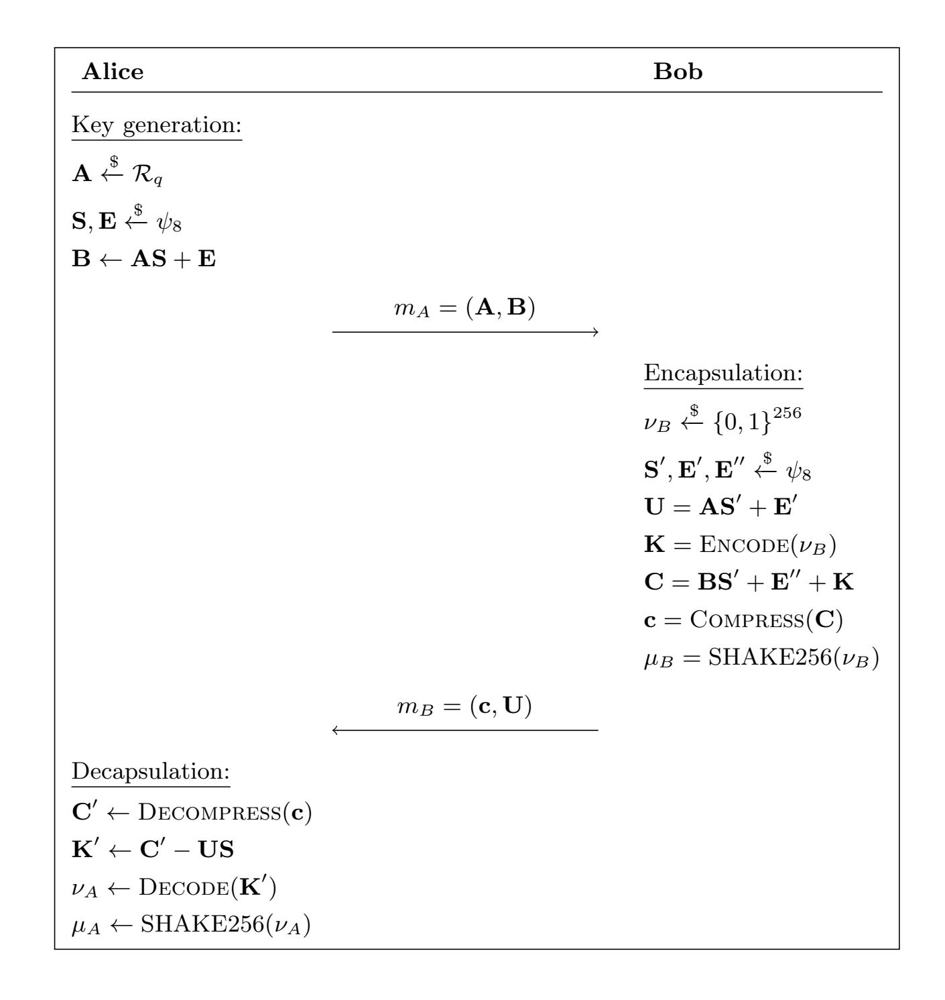
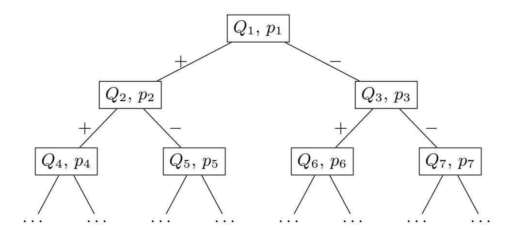
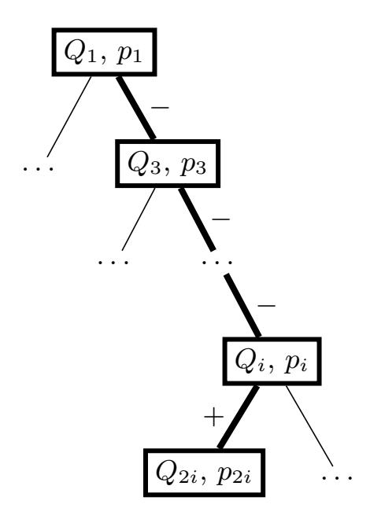

{0}------------------------------------------------

# Key Mismatch Attack on NewHope Revisited

Jan Vacek and Jan Václavek

Thales, Czech Republic {jan.vacek,jan.vaclavek}@thalesgroup.com

Abstract. One of the NIST Post-Quantum Cryptography Standardization Process Round 2 candidates is the NewHope cryptosystem, which is a suite of two RLWE based key encapsulation mechanisms. Recently, four key reuse attacks were proposed against NewHope by Bauer et al., Qin et al., Bhasin et al. and Okada et al. In these attacks, the adversary has access to the key mismatch oracle which tells her if a given ciphertext decrypts to a given message under the targeted secret key. Previous attacks either require more than 26 000 queries to the oracle or they never recover the whole secret key. In this paper, we present a new attack against the NewHope cryptosystem in these key reuse situations. Our attack recovers the whole secret key with the probability of 100% and requires less than 3 200 queries on average. Our work improves state-of-the-art results for NewHope and makes the comparison with other candidates more relevant.

**Keywords:** NewHope  $\cdot$  Key mismatch attack  $\cdot$  Post quantum cryptography  $\cdot$  Cryptanalysis  $\cdot$  Oracle  $\cdot$  Attack

### 1 Introduction

Over the last few years there has been an increasing interest in constructing quantum computers [4,7,8]. The threat of large-scale quantum computers in combination with the known quantum algorithms against currently deployed public-key schemes [15] motivates the community to base cryptosystems on problems believed to be resistant even against quantum computers. In 2016, NIST initiated the Post-Quantum Cryptography Standardization Process to evaluate and standardize one or more quantum-resistant public-key cryptographic algorithms. Many of the proposed schemes belong to the lattice based algorithms whose security is based on conjectured hard problems on point lattices in  $\mathbb{R}^n$  [12].

One of the second-round candidates of the NIST Standardization Process is NewHope [1] which is a suite of two key encapsulation mechanisms (KEM) based on the Ring Learning With Errors (RLWE) problem [10]. The original NewHope was developed before the NIST Standardization Process and it was tested in Google Chrome browser [3]. Later, a simplified variant called NewHope-Simple was published by Alkim et al. [2] and the submitted version is based on that.

In 2019, Bauer et al. [6] proposed a key mismatch attack against NewHope. In this attack model, the adversary has access to the key mismatch oracle which

{1}------------------------------------------------

tells her if a given ciphertext decrypts to a given message under the targeted secret key. Such an attack model was originally proposed in [\[5\]](#page-22-9) and is relevant in scenarios when the same secret key is reused for several key exchanges because it is then possible to access the key mismatch oracle. Later in 2019, Qin et al. [\[13\]](#page-22-10) improved the attack from [\[6\]](#page-22-8) and Bhasin et al. [\[14\]](#page-23-1) came up with another attack against NewHope, which is the current state-of-the-art. In 2020, Okada et al. [\[11\]](#page-22-11) further improved the attack from [\[13\]](#page-22-10).

The attack by Bhasin et al. works in two stages. First, it queries the key mismatch oracle with a given sequence of ciphertexts, leading to a smaller set of candidates for the key. Then, in the second stage, it recovers the key from the smaller set of candidates in a knock-out tournament fashion.

The other above mentioned attacks use so called favorable cases. In principle, they use sequences of 8 queries to the key mismatch oracle and look for a specific pattern of outputs, which is called a favorable case. These specific patterns help them to recover the secret key.

Key mismatch attacks against other second round NIST candidates were published. For example, in [\[14\]](#page-23-1) Bhasin et al. target except NewHope also LAC, Kyber, SABER, Frodo and Round5; in [\[9\]](#page-22-12), the authors target LAC, Kyber, SABER, RQC and HQC.

### 1.1 Our Contribution

In this paper, we focus on key mismatch attacks against NewHope. First, we recall the four previous attacks, namely the original one done by Bauer et al. [\[6\]](#page-22-8), its improvements by Qin et al. [\[13\]](#page-22-10) and Okada et al. [\[11\]](#page-22-11) and the attack by Bhasin et al. [\[14\]](#page-23-1). After that, we show that the technique using favorable cases could be improved and how we can use the information provided by the key mismatch oracle more efficiently. Our method uses a gradual reduction of the possibilities for the targeted key. We mention that the attack of Bhasin et al. also reduces possibilities for the targeted secret key but in a different manner.

Based on these observations, we improve the attack in terms of number of queries to the key mismatch oracle. We reduce the number of queries to the oracle significantly. The average number of queries to the oracle in [\[14\]](#page-23-1) is more than 26 000 while we need only less than 3 200 queries on average in order to recover the whole secret key.

First, we introduce a way how we can achieve the success probability of 100% with a very low number of queries. After that, we refine the attack so that the number of queries is even smaller. We implemented the attack in order to verify its functionality and the experiments confirmed results described in our paper. The implementation can be found on github[1](#page-1-0) .

Despite the fact that a key reuse is considered as a misuse by the specification of NewHope, we think that the condition of the attack is still relevant since being considered as a misuse does not prevent it from happening. We suppose that it can still easily happen either as a result of misinterpreting the NewHope

<span id="page-1-0"></span><sup>1</sup> <https://github.com/KeyMismatchAttackOnNewHopeRevisitedCode/Attack>

{2}------------------------------------------------

specification or by deliberately reusing the secret key for efficiency reasons due to the lack of understanding of possible attacks and their complexities in this case.

### 1.2 Outline of the Paper

In Section 2, we introduce the notation and describe the NewHope cryptosystem. In Section 3, we introduce the key mismatch oracle and recall previous attacks against NewHope. In Section 4, we describe our new method. In Section 5, we compare our new method with previous attacks. In Section 6, we sum up our results and mention possible future research.

### <span id="page-2-0"></span>2 Preliminaries

In this section, we first introduce the notation used in this paper and then we briefly describe the NewHope cryptosystem.

### 2.1 Notation

For a positive integer q, we denote by  $\mathbb{Z}_q$  the quotient ring  $\mathbb{Z}/q\mathbb{Z}$ , where we take the elements of  $\mathbb{Z}_q$  to be the canonical representatives, i.e. integers between 0 and q-1. For an integer x and a positive integer q, we define the x mod q operation in a standard way to always produce an integer between 0 and q-1. For positive integers q, N, we denote by  $\mathcal{R}_q$  the quotient ring  $\mathbb{Z}_q[x]/(x^N+1)$ , where we again take elements of  $\mathcal{R}_q$  to be the canonical representatives, i.e. polynomials of degree at most N-1 with all coefficients between 0 and q-1. We can think of an element  $\mathbf{r} \in \mathcal{R}_q$  as a vector of N elements, where by  $\mathbf{r}[i]$  we refer to the corresponding coefficient before  $x^i$  in  $\mathbf{r}$ . By  $\psi_8$ , we denote the centered binomial distribution of parameter 8. One may sample from  $\psi_8$  by computing  $\sum_{i=1}^8 b_i - b_i'$ , where  $b_i$ ,  $b_i' \in \{0,1\}$  are independent uniformly random bits. It means that elements from the distribution  $\psi_8$  are between -8 and 8. If a random variable X follows the distribution  $\psi_8$ , we can compute the corresponding probabilities as follows: For  $i \in [-8,8]$ , it holds that

<span id="page-2-1"></span>
$$\Pr[X = i] = \frac{\binom{16}{8+i}}{4^8}.\tag{1}$$

For a set A, we denote by  $\stackrel{\$}{\leftarrow} A$  sampling an element uniformly random from the set A. Similarly, we denote by  $\stackrel{\$}{\leftarrow} \psi_8$  picking an element in  $\mathcal{R}_q$  having all coefficients sampled independently following the centered binomial distribution  $\psi_8$ . For  $x \in \mathbb{R}$ , we define  $\lfloor x \rfloor$  to be the greatest integer less than or equal to x. For  $x \in \mathbb{R}$ , we define  $\lfloor x \rceil = \lfloor x + \frac{1}{2} \rfloor \in \mathbb{Z}$ .

{3}------------------------------------------------

### 2.2 NewHope

In this subsection, we briefly describe NewHope KEM. For more details, we refer the reader to the specification [1] of NewHope. We mention that NewHope proposed to the NIST Standardization Process uses the encryption based approach. We focus only on the passively secure CPA-1024 variant which is relevant for our paper. For this version, it is possible to get access to the key mismatch oracle straightforwardly when the secret key is reused. For the CCA-1024 variant, key mismatch oracle can be accessed using side-channels, see [14]. The reason for 1024 variant is to be consistent with the previous attacks [6], [13] and [11] and so to be able to compare our results with theirs. Moreover, the attack against the 512 variant would be precisely the same. According to the specification of NewHope, we set the parameters for  $\mathcal{R}_q$  as N=1024 and q=12289. Throughout the rest of the paper, these values are fixed. Nevertheless, we will for example write  $\mathcal{R}_q$  instead of  $\mathcal{R}_{12289}$  and  $\mathbb{Z}_q$  instead of  $\mathbb{Z}_{12289}$  for a better readability. On the other hand, we write some expressions already enumerated, e.g. 6144 instead of  $\lfloor \frac{q}{2} \rfloor$ . The used hash function is SHAKE256. First, we describe four functions used in NewHope which are also important for the key mismatch attack:

**Encode function** (Algorithm 1) is used to transform a 256-bit message into an element of  $\mathcal{R}_q$  in a way that one message bit corresponds to 4 coefficients of a polynomial from  $\mathcal{R}_q$ .

**Decode function** (Algorithm 2) maps a polynomial from  $\mathcal{R}_q$  back to 256 bits. **Compress function** (Algorithm 3) is used to perform a coefficient-wise modulus switching from  $\mathbb{Z}_q$  to  $\mathbb{Z}_8$  on polynomials. In words, the idea is to evenly compress  $\mathbb{Z}_q$  into  $\mathbb{Z}_8$ .

**Decompress function** (Algorithm 4) is used to perform a coefficient-wise modulus switching from  $\mathbb{Z}_8$  to  $\mathbb{Z}_q$  on polynomials. In words, the idea is to evenly stretch  $\mathbb{Z}_8$  into  $\mathbb{Z}_q$ .

### <span id="page-3-0"></span>Algorithm 1 Message encoding

```
function \text{Encode}(\nu \in \{0,1\}^{256})

\mathbf{v} \leftarrow 0

for i from 0 to 255 do

\mathbf{v}[i] = \nu[i] \cdot 6144

\mathbf{v}[i+256] = \nu[i] \cdot 6144

\mathbf{v}[i+512] = \nu[i] \cdot 6144

\mathbf{v}[i+768] = \nu[i] \cdot 6144
\nend for

return \mathbf{v} \in \mathcal{R}_q
\nend function
```

Now we describe key generation, encapsulation and decapsulation of NewHope KEM. We simplify the description and omit some parts from the specification of

{4}------------------------------------------------

# <span id="page-4-0"></span>Algorithm 2 Message decoding

```
function Decode (\mathbf{v} \in \mathcal{R}_q)
\nu \leftarrow 0
for i from 0 to 255 do
t \leftarrow |\mathbf{v}[i] - 6144|
t \leftarrow t + |\mathbf{v}[i + 256] - 6144|
t \leftarrow t + |\mathbf{v}[i + 512] - 6144|
t \leftarrow t + |\mathbf{v}[i + 768] - 6144|\nif t < 12289 then
\nu[i] = 1\nelse
\nu[i] = 0\nend if\nend for
\text{return } \nu \in \{0, 1\}^{256}\nend function
```

## <span id="page-4-1"></span>Algorithm 3 Ciphertext compression

```
function Compress(\mathbf{v} \in \mathcal{R}_q)
h \leftarrow 0
for i from 0 to 1023 do
h[i] = \lfloor \frac{8 \cdot \mathbf{v}[i]}{12289} \rceil \mod 8\nend for
return h \in \mathcal{R}_q with coefficients between 0 and 7\nend function
```

## <span id="page-4-2"></span>Algorithm 4 Ciphertext decompression

```
function Decompress(h \in \mathcal{R}_q \text{ with coefficients between 0 and 7})
\mathbf{v} \leftarrow 0
for i from 0 to 1023 do
\mathbf{v}[i] = \lfloor \frac{12289 \cdot h[i]}{8} \rceil\nend for
return \mathbf{v} \in \mathcal{R}_q\nend function
```

{5}------------------------------------------------



<span id="page-5-0"></span>Fig. 1. Simplified version of NewHope CPA

NewHope (such as NTT multiplication, using seeds etc.) which are not relevant for the attacks. The key exchange is illustrated in Figure 1.

**Key generation:** First, Alice generates the public key **A** which is a uniformly random polynomial from  $\mathcal{R}_q$ . Then she generates 2 polynomials  $\mathbf{S}, \mathbf{E} \in \mathcal{R}_q$  whose coefficients are distributed independently following the centered binomial distribution  $\psi_8$ . Finally, she computes  $\mathbf{B} = \mathbf{AS} + \mathbf{E}$  and sends the pair  $(\mathbf{A}, \mathbf{B}) = m_A$  to Bob.

Encapsulation: First, Bob generates a random element  $\nu_B$  from  $\{0,1\}^{256}$  and 3 polynomials  $\mathbf{S}', \mathbf{E}', \mathbf{E}'' \in \mathcal{R}_q$  whose coefficients are distributed independently following the centered binomial distribution  $\psi_8$ . Then he computes  $\mathbf{U} = \mathbf{AS}' + \mathbf{E}'$  and  $\mathbf{K} = \text{Encode}(\nu_B)$ . After that, he computes  $\mathbf{C} = \mathbf{BS}' + \mathbf{E}'' + \mathbf{K}$  and  $\mathbf{c} = \text{Compress}(\mathbf{C})$ . Finally, he sends the pair  $(\mathbf{c}, \mathbf{U}) = m_B$  back to Alice and derives the final shared key as  $\mu_B = \text{SHAKE256}(\nu_B)$ .

{6}------------------------------------------------

**Decapsulation:** First, Alice decompresses  $\mathbf{c}$  as  $\mathbf{C}' = \text{Decompress}(\mathbf{c})$ . Then she computes  $\mathbf{K}' = \mathbf{C}' - \mathbf{US}$  and decodes this  $\mathbf{K}'$  as  $\nu_A = \text{Decode}(\mathbf{K}')$ . Finally, she derives the final shared key as  $\mu_A = \text{SHAKE256}(\nu_A)$ .

Due to small coefficients of polynomials following the centered binomial distribution  $\psi_8$ ,  $\nu_A$  and  $\nu_B$  are equal with very high probability. Therefore,  $\mu_A$  and  $\mu_B$  are equal with very high probability as well.

## <span id="page-6-0"></span>3 Key Mismatch Attacks Revisited

In this section, we first describe the original key mismatch attack of Bauer et al. against NewHope [6]. Then we describe the improved attacks of Qin et al. [13] and of Okada et al. [11], which are both based on the attack of Bauer et al. Finally, we describe the attack of Bhasin et al. [14]. In all four attacks, the adversary has access to the key mismatch oracle. The adversary, Eve, is acting as Bob and her goal is to recover Alice's secret key **S**.

### 3.1 Key Mismatch Oracle

In this subsection, we recall the notion of the key mismatch oracle from Bauer et al. [6]. To follow their notation, we use the subscript E to denote the elements associated with the adversary, e.g.  $m_E$ . The idea is that the adversary, who is acting as Bob, does not follow the protocol honestly. She generates an arbitrary key  $\mu_E$  together with an arbitrary ciphertext  $m_E = (\mathbf{c}, \mathbf{U})$ , which she sends back to Alice. The key mismatch oracle tells her if the Alice's shared key  $\mu_A$  computed from her secret key and this dishonest ciphertext  $m_E$  equals adversary's guessed key  $\mu_E$ .

We define the key mismatch oracle formally in the next definition.<sup>2</sup>

**Definition 1 (Key mismatch oracle).** Let S be the secret key of Alice. On the input of  $m_E$  and  $\mu_E$ , the output of the key mismatch oracle  $\mathcal{O}$  is defined as follows:

$$\mathcal{O}(m_E, \mu_E) = \begin{cases} - & if \ Decapsulation(m_E, \mathbf{S}) = \mu_E \\ + & otherwise. \end{cases}$$
 (2)

For more details about the key mismatch oracle and ways how to access it, we refer the reader to [6] and [14].

<span id="page-6-1"></span><sup>&</sup>lt;sup>2</sup> It may seem strange that a mismatch is defined by + and an agreement by -, but it is a purpose. The output of the oracle in our attack depends on the sign of some expression, and a mismatch corresponds to the situation when this expression is positive, hence denoted by +.

{7}------------------------------------------------

### 3.2 Assumptions

In the attack, the adversary successively targets quadruplets S[0+k], S[256+k], S[512 + k], S[768 + k] of secret coefficients, because one bit of the message is derived from these 4 coefficients of the secret key (See Decode function described in Algorithm [2\)](#page-4-0). We call this k as the index of the quadruplet.

In previous attacks, the adversary uses µ<sup>E</sup> = SHAKE256(νE) for all queries to the oracle O, where ν<sup>E</sup> = (1, 0, . . . , 0). The goal is to choose queries m<sup>E</sup> = (c, U) such that

$$\nu_A = \text{DECODE} \left( \text{DECOMPRESS}(\mathbf{c}) - \mathbf{US} \right) = (b, 0, \dots, 0).$$
 (3)

If this happens, which is called Hypothesis 1 in the paper of Bauer et al., then the output of the oracle O indicates whether b = 1 or not, because the first index is the only place where ν<sup>E</sup> and ν<sup>A</sup> could differ. Because S is used within the computation of νA, the output from the oracle could leak useful information about the secret key S.

If Hypothesis 1 is not satisfied, then for some i ∈ {1, . . . , 255}, νA[i] = 1, and the output from the oracle will be + for all queries. The problem is that the attacker does not know this i and the attacks [\[6\]](#page-22-8) and [\[13\]](#page-22-10) do not work in this case.

### 3.3 Method of Bauer et al.

In Bauer et al. [\[6\]](#page-22-8), the adversary chooses m<sup>E</sup> = (c, U) such that

<span id="page-7-1"></span>
$$\mathbf{U} = 768x^{-k} \text{ and } \mathbf{c} = \sum_{j=0}^{3} ((l_j + 4) \mod 8) \cdot x^{256j},$$
 (4)

where k ∈ {0, . . . , 255} is the index of the targeted quadruplet and l<sup>j</sup> ∈ [−4, 3].

The adversary fixes l1, l<sup>2</sup> and l<sup>3</sup> to random values from [−4, 3] and makes 8 queries to the oracle O for l<sup>0</sup> ranging from −4 to 3. The goal is to choose parameters l1, l<sup>2</sup> and l<sup>3</sup> such that outputs from these 8 queries are of the form

<span id="page-7-0"></span>
$$\underbrace{++}_{l\geq 1} \dots \underbrace{--}_{m\geq 1} \dots \underbrace{++}_{n\geq 1}, \tag{5}$$

where l + m + n = 8. Bauer et al. call this a favorable case. If this happens, the adversary determines the index, where + changes to −, which is denoted as τ1, and the index, where − changes to +, which is denoted as τ2. She recovers S[k] as τ<sup>1</sup> + τ2. If these 8 outputs from the oracle do not form a favorable case (as described in Equation [\(5\)](#page-7-0)), the adversary randomly changes values of l1, l<sup>2</sup> and l<sup>3</sup> and tries again. If she does not obtain a favorable case after a certain amount of attempts, she skips the recovery of this coefficient and recovers it at the end of the attack by a bruteforce. The other three coefficients in the quadruplet are recovered similarly by changing the role of l<sup>0</sup> and the corresponding l<sup>j</sup> .

{8}------------------------------------------------

Using this method, it is only possible to recover coefficients S[k] ∈ [−6, 4]. Remaining coefficients must be recovered by a bruteforce. Moreover, as pointed out by Qin et al. in [\[13\]](#page-22-10), even coefficients from [−6, 4] are quite often recovered incorrectly.

### 3.4 Method of Qin et al.

Qin et al. noticed that the attack described in [\[6\]](#page-22-8) does not work as intended. It was mainly caused by a mistake in the Decompress function. They corrected the error and added few improvements to the original method. The main idea of the attack remained unchanged, the queries m<sup>E</sup> = (c, U) are generated in the same way as before, see Equation [\(4\)](#page-7-1).

Qin et al. noticed that in [\[6\]](#page-22-8), two different values of secret coefficient are possible for each value of τ (ref. to Table 3 in [\[13\]](#page-22-10)). Therefore, a lot of secret coefficients were recovered incorrectly. Using experiments, Qin et al. observed that one of these two values (possible for particular τ ) is more probable than the other one. They addressed this problem of ambiguity by searching 50 favorable cases and choosing the more probable result. This way, the probability of a wrong choice was lowered.

As a second improvement, they also identified another favorable case. Generation of patterns did not change. They are still created by 8 consecutive queries to the oracle O with randomly chosen and fixed values of l<sup>j</sup> ; j ∈ {1, 2, 3} and with varying l<sup>0</sup> ∈ [−4, 3]. Previously, favorable cases were only outputs of the form

$$\underbrace{++}_{l\geq 1} \dots \underbrace{--}_{m\geq 1} \dots \underbrace{++}_{n\geq 1}, \tag{6}$$

l + m + n = 8. In [\[13\]](#page-22-10), they defined a second favorable case, which are outputs of the form

$$\underbrace{--}_{l\geq 1} \dots \underbrace{++}_{m\geq 1} \dots \underbrace{--}_{n\geq 1}, \tag{7}$$

l + m + n = 8.

Final improvement of Qin et al. is the computation of the last coefficient in the quadruplet. Both in [\[6\]](#page-22-8) and [\[13\]](#page-22-10), they assume that secret coefficients S[k+ 256j] are from the restricted interval [−6, 4]. However, in [\[13\]](#page-22-10), they created a new technique for the case when three secret coefficients are from [−6, 4] and exactly one coefficient is from {−8, −7, 5, 6, 7, 8}. First, they recover these three coefficients from [−6, 4]. After that, they recover the sum of absolute values of the four coefficients in the quadruplet, which allows them to compute the remaining unknown coefficient in the quadruplet.

Similar to [\[6\]](#page-22-8), Qin et al. are able to recover coefficients from [−6, 4]. Moreover, they are able to recover a coefficient from {−8, −7, 5, 6, 7, 8} if the three remaining coefficients from the quadruplet lie in [−6, 4]. The whole attack implicitly assumes that Hypothesis 1 holds. They claim that they would need approximately 880 000 queries to recover the whole secret key S.

{9}------------------------------------------------

#### 3.5 Method of Okada et al.

At the time of writing this paper, Okada et al. [11] further improved the attack of Qin et al. Their attack almost reaches the success probability of 100% by finding the index i which causes that Hypothesis 1 does not hold.

They also extended the range of targeted secret coefficients from [-6,4] to [-6,7] without any additional queries. Moreover, they observed that it is sometimes possible to recover a secret coefficient using less than 50 favorable cases. They call this last improvement as an Early Abort Technique in their paper. They decreased the number of queries from about 880 000 to approximately 327 000.

### 3.6 Method of Bhasin et al.

The attack of Bhasin et al. [14] differs from the other three attacks since it does not use favorable cases. They adopt a two stage approach. In the first stage, the attacker queries the key mismatch oracle with a precomputed sequence of queries. The output sequence uniquely determines a cluster  $K_i$  the targeted quadruplet lies in. The clusters can have different sizes and the size of a cluster  $K_j$  is denoted by  $n_j$ .

For each cluster  $K_j$ , they precomputed  $\binom{n_j}{2}$  ciphertexts to be able to distinguish each pair within the cluster. This yields  $\sum_{i=0}^{L-1} \binom{n_i}{2}$  precomputed queries for the second stage.

In the second stage, they know from the first stage in which cluster  $K_i$  the targeted quadruplet lies. They recover this targeted quadruplet in a knock-out tournament fashion using  $(n_i - 1)$  queries: They divide all candidates within the cluster into pairs, use precomputed queries to distinguish each of these pairs, yielding a smaller set of  $\lceil n_i/2 \rceil$  candidates. They repeat this process  $\lceil \log_2(n_0) \rceil$  times until there is only one candidate left, which is the targeted quadruplet.

They succeed with the probability of 100% and need about 26 600 queries to the key mismatch oracle to recover the whole secret key.

## <span id="page-9-0"></span>4 Our Improved Method

In this section, we describe our improved method. We target quadruplets of secret coefficients at once as in the attack of Bhasin et al. and not one by one as in the other three attacks.

We start by presenting disadvantages of favorable cases to motivate our approach.

#### 4.1 Drawbacks of Favorable Cases

First, there is no favorable case (even when considering the second favorable case added in [13]) for some secret coefficients. This means that during targeting some secret coefficient, when the adversary does not get any favorable case after

{10}------------------------------------------------

certain amount of queries to the key mismatch oracle, she skips its recovery for now and recovers it at the end of the attack. This means that a lot of queries are used for one secret coefficient and yet, the coefficient is not recovered exactly using only these queries.

Second, even if a favorable case is found and a secret coefficient is recovered correctly, not all useful information gained from the queries to the key mismatch oracle is used. The output of the key mismatch oracle gives us useful information about all four secret coefficients in the targeted quadruplet. Using favorable cases, only information about the one targeted secret coefficient is used in this particular iteration of the attack. It means that during targeting the next secret coefficients in the quadruplet, some queries to the oracle can be redundant, because useful information could have been already obtained in the previous queries.

Third, finding a favorable case is not sufficient. After finding a favorable case, there are sometimes still two possible values for the targeted secret coefficient. Typically, one value is more probable than the other one. In [\[13\]](#page-22-10), Qin et al. decided to find 50 favorable cases for one secret coefficient in order to be more sure what the secret coefficient is. This means that they increased the probability that the coefficient is recovered correctly, but the probability is still less than 1, so it still could happen that the coefficient is recovered incorrectly.

Finally, the described method is not very efficient. For one favorable case, 8 queries to the oracle are needed. For example, this means 400 queries to the oracle for one secret coefficient in the case of [\[13\]](#page-22-10) since they need 50 favorable cases. Moreover, not every choice of l<sup>j</sup> ; j ∈ {1, 2, 3} leads to a favorable case, so the total number of queries for one secret coefficient is even bigger. That is the reason why in Qin et al. [\[13\]](#page-22-10) and in Okada et al. [\[11\]](#page-22-11), they needed more than 880 000 and 327 000 queries to the key mismatch oracle in order to recover the whole secret key.

### 4.2 Concrete Example

We show a part of the previous attack of Qin et al. [\[13\]](#page-22-10) on the concrete example and we try to demonstrate above mentioned disadvantages of favorable cases. Simultaneously, for each step in the attack of Qin et al., we propose our ideas and we describe how it could be changed. We believe that it could help to understand the motivation for our new method and show how the efficiency of the previous attack could be improved.

Assume that the adversary targets the secret coefficient S[0] in the quadruplet S[0], S[256], S[512], S[768]. Let for example be

$$\mathbf{S}[0] = 0,$$
 $\mathbf{S}[256] = 2,$ 
 $\mathbf{S}[512] = 1,$ 
 $\mathbf{S}[768] = -5.$ 
(8)

{11}------------------------------------------------

- 1. Qin et al.: Adversary chooses  $l_j$ ;  $j \in \{1, 2, 3\}$  randomly from the interval [-4, 3]. Assume that she chose  $l_1 = 3$ ,  $l_2 = -4$ ,  $l_3 = -4$ . Now she makes 8 queries to the oracle with  $l_0 = -4, -3, \ldots, 2, 3$  and she gets the pattern ++++-+++. She is lucky, this is a favorable case and she computes  $\tau = 0$ , which means that  $\mathbf{S}[0]$  is either 0 or 1 (ref. to Table 3 in [13]). She continues finding remaining 49 favorable cases to be more sure which value it is.
  - Our ideas: At the beginning, there are  $17^4 = 83\,521$  possibilities for the targeted quadruplet S[0], S[256], S[512], S[768], because each secret coefficient is in the interval [-8,8]. After observing outputs of these 8 queries to the oracle giving the pattern ++++++++++++++++++++++++++++++++++++
- 2. Qin et al.: Next, the adversary randomly changes values of  $l_1, l_2$  and  $l_3$ . For example, assume that she chose  $l_1 = -3$ ,  $l_2 = -1$ ,  $l_3 = 0$ . Again, she makes 8 queries to the oracle with  $l_0 = -4, -3, \ldots, 2, 3$  and now she gets the pattern + + + + + + + + + + + + + + + + + + +
  - Our ideas: As we have seen, in the previous attack, these 8 queries to the oracle did not help to recover secret coefficients at all. On the other hand, for us, such eight outputs from the oracle of the form ++++++++ give us useful information about all four targeted secret coefficients. In the previous step, we already reduced the number of possibilities for these four secret coefficients to 826. Now, for this choice of  $l_1$ ,  $l_2$  and  $l_3$ , only 32 possible quadruplets, out of these 826, would give only pluses from the oracle. Again, it gives us really useful information about secret coefficients, since we already reduced the number of possibilities for these four secret coefficients from 83 521 to 32.
- <span id="page-11-0"></span>3. Qin et al.: Next, the adversary again randomly changes values of  $l_1, l_2$  and  $l_3$ . For example, assume that she chose  $l_1 = 0, l_2 = 3, l_3 = 1$  this time. Again, she makes 8 queries to the oracle with  $l_0 = -4, -3, \ldots, 2, 3$  and she gets the pattern ++++-+++. This is a favorable case, and again  $\tau = 0$ . The adversary continues the process, she still needs to find 48 favorable cases to decide whether the value of  $\mathbf{S}[0]$  is 0 or 1.
  - Our ideas: We use the same approach as in our previous two steps. We already reduced the number of possibilities for the quadruplet of secret coefficients from 83 526 to 32. Now again, we can check what the oracle outputs should be for these 32 remaining possible quadruplets. It holds that there is only one possible secret quadruplet for which the oracle returns + + + + + + + for this choice of  $l'_j s$ . This is true for the quadruplet [0, 2, 1, -5], which corresponds precisely to secret coefficients.

{12}------------------------------------------------

We recovered S[0] which was targeted by Qin et al. in this example. On top of that, we also recovered the other three coefficients S[256], S[512] and S[768], which they wanted to recover after S[0] with a similar process.

Moreover, after Step [3,](#page-11-0) Qin et al. still need to find 48 favorable cases to determine the value of S[0] and they are still not 100% sure that they recovered it correctly.

We believe that already this concrete example illustrated weak points of favorable cases and motivation for our work. While Qin et al. found only 2 out of 50 favorable cases to recover S[0], we were able to recover all four secret coefficients by using this different method trying to eliminate the possibilities for the targeted quadruplet. Moreover, using this method, we can be sure that we recovered the quadruplet correctly.

## 4.3 High-Level Description of Our Method

As illustrated in the previous subsection, the main idea in our method is to reduce the number of possibilities for the targeted quadruplet by each query to the oracle. After some number of queries, if there is only one possibility left, then, obviously, that must be the targeted quadruplet. We show that we can recover each possible quadruplet using this method.

We use a very similar pair (µE, m<sup>E</sup> = (c, U)) as the input to the key mismatch oracle as in the attack of Bauer et al.

We use the same polynomial c, namely

$$\mathbf{c} = \sum_{j=0}^{3} ((l_j + 4) \bmod 8) \cdot x^{256j}. \tag{9}$$

The difference is how we choose values l0, l1, l<sup>2</sup> and l<sup>3</sup> in c before querying the oracle. In the attack of Bauer et al., three of these were fixed and the remaining l<sup>j</sup> varied between −4 and 3, resulting in 8 queries to the oracle. But each individual query to the oracle can already eliminate some possibilities for the targeted quadruplet. So, in our method, three of l<sup>j</sup> values won't be necessarily fixed for 8 successive queries to the oracle as before, but we choose fresh values for each particular query to the oracle in order to be more flexible.

Also, we use very similar polynomial U as in previous attacks. In our attack, this polynomial is set to

$$\mathbf{U} = ax^{-k},\tag{10}$$

where k is the index of the targeted quadruplet and the coefficient a can differ for different queries. In the attack of Bauer et al., a = 768 was used for all queries. The reason for the value 768 was because they were using favorable cases and the value 768 was the most suitable choice for it. Because we do not use favorable cases, we can use different values than 768 to be even more flexible. The only constraint on this value is to keep the probability of Hypothesis 1 high. We comment on Hypothesis 1 in the next subsection.

{13}------------------------------------------------

Also, we use the same value for µ<sup>E</sup> as before. We put µ<sup>E</sup> = SHAKE256(νE) for all queries to the oracle O, where ν<sup>E</sup> = (1, 0, . . . , 0). For a fixed k, we specify the query to the oracle by values of (l0, l1, l2, l3, a), because they uniquely determine the pair (µE, m<sup>E</sup> = (c, U)).

Now, we can describe how our attack works. We successively recover quadruplets S[0 + k], S[256 + k], S[512 + k], S[768 + k] as k ranges from 0 to 255. We call recovering one quadruplet of secret coefficients as a one step of the attack. At the beginning of each step, there are 17<sup>4</sup> = 83 521 possibilities for the targeted quadruplet. We denote by Q<sup>1</sup> the set of all these possibilities. Fixing some concrete values of (l0, l1, l2, l3, a) = p1, we can compute for each potential quadruplet from Q<sup>1</sup> what the output from the oracle would be for this choice of p1. It means that we can naturally divide potential quadruplets from Q<sup>1</sup> into two disjoint subsets Q2, Q<sup>3</sup> based on what the output from the oracle would be. Then, during the attack, we would know whether the targeted quadruplet lies in Q<sup>2</sup> or in Q<sup>3</sup> based on the output from the oracle for this choice of p<sup>1</sup> as the first query.



<span id="page-13-1"></span>Fig. 2. Tree structure.

We can recursively repeat same process. It means that fixing some concrete values of (l0, l1, l2, l3, a) = p<sup>i</sup> for Q<sup>i</sup> , we can divide Q<sup>i</sup> into two disjoint subsets Q2<sup>i</sup> , Q2i+1 based on what the output from the oracle would be for this choice of pi . The subset Q2<sup>i</sup> corresponds to the output + and Q2i+1 corresponds to the output −. If |Q<sup>i</sup> | = 1, then we do not divide this Q<sup>i</sup> anymore. During the attack, if we know that the targeted quadruplet lies in Q<sup>i</sup> with |Q<sup>i</sup> | = 1, we know what the targeted quadruplet is, meaning that the quadruplet is successfully recovered.

This successive dividing of possibilities for the targeted quadruplet of secret coefficients into two smaller subsets naturally corresponds to a binary tree. Each non-leaf node corresponds to some subset of potential quadruplets Q<sup>0</sup> i s [3](#page-13-0) and to the query defined by p<sup>i</sup> = (l0, l1, l2, l3, a). This concrete query is made when we know that the targeted quadruplet lies in this Q<sup>i</sup> . Leaves correspond only to

<span id="page-13-0"></span><sup>3</sup> But we do not store these Q 0 <sup>i</sup>s in the tree except for leaves.

{14}------------------------------------------------

some subsets Q<sup>i</sup> , there is no p<sup>i</sup> because there is no further dividing in the leaves. Part of the tree is illustrated in figure [2.](#page-13-1)

Before the actual attack, the binary tree is constructed by defining the particular queries to the oracle. These queries defined by p<sup>i</sup> completely describe the whole attack in a deterministic way. During the attack, the quadruplets are recovered by making the corresponding queries based on the position in the tree. We emphasize that the tree contains only queries p<sup>i</sup> and quadruplets in the leaves. It does not contain sets Q<sup>i</sup> for non-leaves.

In this paper, we propose a suitable choice of these queries. We keep two objectives in mind:

- 1. For leaves, it should hold that |Q<sup>i</sup> | = 1.
- 2. We try to minimize the expected number of queries to the oracle needed to recover the whole quadruplet of secret coefficients.

The first condition ensures that we are able to recover any potential quadruplet of secret coefficients. During the attack, we are following a path from the root to some leaf in the binary tree according to the outputs from the oracle (see Figure [3\)](#page-15-0). Because there is only one potential quadruplet for this leaf, it must be the targeted quadruplet.[4](#page-14-0)

For the second objective, we assume that all possible quadruplets are indexed by 1, ..., 83 521. We denote by P<sup>i</sup> the probability of the quadruplet with an index i. We can compute these probabilities using the Formula [\(1\)](#page-2-1) and the fact that coefficients are sampled independently. We denote by h<sup>i</sup> the number of queries needed to recover the quadruplet with an index i. Using our method, h<sup>i</sup> is precisely the depth of the leaf corresponding to this quadruplet i in our binary tree. The expected number of queries is then computed as

<span id="page-14-1"></span>
$$\mathbb{E}(\text{#queries for 1 quadruplet}) = \sum_{i=1}^{83521} P_i \cdot h_i.$$
 (11)

We tried to meet the first condition and concurrently minimize this value. We used a recursive search to find a suitable choice of queries. We used the following heuristics. We were trying to choose values p<sup>i</sup> such that two subsets of quadruplets corresponding to children, Q2<sup>i</sup> and Q2i+1, have similar probabilities. More formally, we were focusing on values of p<sup>i</sup> for which

$$\sum_{\substack{j \in \{1, \dots, 83521\}, \\ qudruplet_j \in Q_{2i}}} P_j - \sum_{\substack{j \in \{1, \dots, 83521\}, \\ qudruplet_j \in Q_{2i+1}}} P_j \tag{12}$$

is small.

<span id="page-14-0"></span><sup>4</sup> Under this condition, leaves are in bijection with the 17<sup>4</sup> = 83 521 possible quadruplets.

{15}------------------------------------------------



<span id="page-15-0"></span>Fig. 3. Path in the tree.

### 4.4 Coping with Hypothesis 1

The probability of Hypothesis 1 depends on secret coefficients and the value of a in U. For a = 768, i.e. in [\[6\]](#page-22-8) and in [\[13\]](#page-22-10), the probability of Hypothesis 1 is about 94.56%. In our work, we computed the probability of Hypothesis 1 for different values of a. The important result is that for

$$a \in H = \{0, \dots, 383\} \cup \{11906, \dots, 12288\},$$
 (13)

the probability of Hypothesis 1 is 100%. Moreover, if Hypothesis 1 holds for a = 768, then it holds for all smaller values, i.e. for a ∈ {0, . . . , 767}.

One possibility to handle the issue with Hypothesis 1 is to use a ∈ H for all queries to the oracle. We were able to choose queries p<sup>i</sup> = (l0, l1, l2, l3, a) with a ∈ H such that |Q<sup>i</sup> | = 1 for the leaves, i.e. meeting the objective 1. We call the resulting tree as T1. Because a ∈ H for all the queries to the oracle and because the objective 1 is met, the attack using the tree T<sup>1</sup> can recover each quadruplet of secret coefficients with the probability of 100%. The expected number of queries to recover one quadruplet of secret coefficients using this tree T<sup>1</sup> is about 13.95, leading to

$$256 \cdot 13.95 \approx 3571 \tag{14}$$

queries required to recover the whole secret key. This is already an improvement by a wide margin, when we consider that the best previous attack of Bhasin et al. requires more than 26 000 queries on average.

### 4.5 Combining Two Binary Trees

The expected number of queries can be further reduced by using a more sophisticated method. The idea is that we combine the tree T<sup>1</sup> with another tree, where we use also a /∈ H. The problem is now with Hypothesis 1, which does not hold 

{16}------------------------------------------------

with the probability of 100% for  $a \notin H$ . Fortunately, we can handle this issue by another advantage of our method.

This advantage is that we are able to detect if Hypothesis 1 does not hold. For a while, assume that the same value of a is used for the whole tree. If Hypothesis 1 does not hold (this could happen only for  $a \notin H$ ), then all the outputs from the oracle will be +, no matter what the inputs are. It means that during one step of the attack, we will end up in the leftmost leaf, which corresponds to some quadruplet. Now, we will make one extra query to the oracle such that the output for this quadruplet should be - if Hypothesis 1 held. If the output is really -, we know that Hypothesis 1 holds and we recovered this quadruplet. Otherwise, if the output is +, we detected that Hypothesis 1 does not hold. On the other hand, if we do not end up in the leftmost leaf, it means that at least one output of the oracle was -, meaning that Hypothesis 1 is true.

We use the described detection to handle the issue with Hypothesis 1 in a different way. Instead of using  $a \in H$  for all queries, we use a different approach in order to reduce the total number of expected queries to the oracle.

First, we chose the queries  $p_i$  even with  $a \notin H$ , meeting the objective 1 and minimizing the expected number of queries. We call the resulting tree as  $T_2$ . We used two values for a in the tree  $T_2$ , namely 768 and 599. Because only the value 768 was used on the path leading to the leftmost leaf and because Hypothesis 1 holds for a = 599 whenever it holds for a = 768, we can still detect if Hypothesis 1 does not hold using the method described in the previous paragraph.

During the attack, the queries are first made according to the tree  $T_2$ . If we do not end up in the leftmost leaf during our search, Hypothesis 1 is true automatically and the quadruplet is recovered and we proceed to recover the next quadruplet, still using the tree  $T_2$ . But if we end up in the leftmost leaf, we have to check if the Hypothesis 1 holds.

If Hypothesis 1 holds, the quadruplet is recovered and we proceed to recover the next quadruplet, again using the tree  $T_2$ . If Hypothesis 1 does not hold, we have to recover this quadruplet using the tree  $T_1$  and we will use the tree  $T_1$  for all the remaining steps. We use the tree  $T_1$  for all the remaining steps because we can assume that Hypothesis 1 does not hold and the tree  $T_2$  is useless in that case.

Because the probability of Hypothesis 1 is still large for the tree  $T_2$  (94.56%), the extra overhead required to detect that Hypothesis 1 does not hold is small. It means that this approach is more efficient than using  $T_1$  (i.e.  $a \in H$ ) for all queries. The success probability is still 100%. Pseudocode of the attack is provided in Algorithms 5, 6 and 7.

To compute the number of queries of our method combining trees  $T_1$  and  $T_2$ , we denote by  $\mathbb{E}(T_1)$  the expected number of queries needed to recover one quadruplet of secret coefficients using the tree  $T_1$ , similarly by  $\mathbb{E}(T_2)$  for the tree  $T_2$ . We denote by  $\Pr[H]$  the probability of Hypothesis 1 and by  $\theta$  the depth of

{17}------------------------------------------------

## <span id="page-17-0"></span>**Algorithm 5** Key Recovery

```
function Recover
    \mathbf{S} \leftarrow 0
    Hypothesis1 \leftarrow True
    for k from 0 to 255 do
        if Hypothesis1 = True then
             s_0, s_1, s_2, s_3, leftmost \leftarrow T_2(k)
             if leftmost = True then
                 s_0, s_1, s_2, s_3 \leftarrow T_1(k)
                 Hypothesis1 = False
             end if
         else
             s_0, s_1, s_2, s_3 \leftarrow T_1(k)
         end if
        for j from 0 to 3 do
             \mathbf{S}[k+256j] \leftarrow s_j
         end for
    end for
    \textbf{return} \; \mathbf{S} \in \mathcal{R}_q
end function
```

## <span id="page-17-1"></span>**Algorithm 6** Quadruplet recovery using $T_1$

```
function T_1(\text{index } k \text{ of targeted quadruplet})
     \nu_E \leftarrow (1, 0, \dots, 0) \in \{0, 1\}^{256}
     \mu_E \leftarrow \text{SHAKE256}(\nu_E)
     s_0, s_1, s_2, s_3 \leftarrow 0
     Node \leftarrow T_1.root
     while Node \neq leaf do
           a, l_0, l_1, l_2, l_3 \leftarrow Node.data
           \mathbf{U} \leftarrow ax^{-k}
          \mathbf{c} \leftarrow \sum_{j=0}^{3} (l_j + 4) x^{256j}
m_E = (\mathbf{c}, \mathbf{U})
           b \leftarrow \mathcal{O}(m_E, \mu_E)
          if b = '+' then
                Node \leftarrow Node.left
           else
                Node \leftarrow Node.right
           end if
     end while
     s_0, s_1, s_2, s_3 \leftarrow Node.quadruplet
     return s_0, s_1, s_2, s_3
end function
```

{18}------------------------------------------------

## <span id="page-18-0"></span>**Algorithm 7** Quadruplet recovery using $T_2$

```
function T_2(\text{index } k \text{ of targeted quadruplet})
     \nu_E \leftarrow (1, 0, \dots, 0) \in \{0, 1\}^{256}
      \mu_E \leftarrow \text{SHAKE256}(\nu_E)
      s_0, s_1, s_2, s_3 \leftarrow 0
      Node \leftarrow T_2.root
      leftmost \leftarrow True
      while Node \neq leaf do
           a, l_0, l_1, l_2, l_3 \leftarrow Node.data

\mathbf{U} \leftarrow ax^{-k}
           \mathbf{c} \leftarrow \sum_{j=0}^{3} (l_j + 4) x^{256j}
m_E = (\mathbf{c}, \mathbf{U})
           b \leftarrow \mathcal{O}(m_E, \mu_E)
           if b = '+' then
                 Node \leftarrow Node.left
            else
                  Node \leftarrow Node.right
                 lefmost \leftarrow False
            end if
      end while
      if leftmost = True then
           a, l_0, l_1, l_2, l_3 \leftarrow extra

\mathbf{U} \leftarrow ax^{-k}
           \mathbf{c} \leftarrow \sum_{j=0}^{3} (l_j + 4) x^{256j}
m_E = (\mathbf{c}, \mathbf{U})
           b \leftarrow \mathcal{O}(m_E, \mu_E)
           if b = '-' then
                 leftmost \leftarrow False
            end if
      end if
      s_0, s_1, s_2, s_3 \leftarrow Node.quadruplet
      return s_0, s_1, s_2, s_3, leftmost
end function
```

{19}------------------------------------------------

the leftmost leaf in the tree T2. The approximate[5](#page-19-1) expected number of queries needed to recover the whole secret key is then computed as

$$\mathbb{E}(\text{total } \#\text{queries}) = \Pr[H] \cdot (256 \cdot \mathbb{E}(T_2)) + (1 - \Pr[H]) \cdot (\theta + 256 \cdot \mathbb{E}(T_1)). \tag{15}$$

For our trees it holds that

$$\mathbb{E}(T_1) = 13.95\tag{16}$$

and

$$\mathbb{E}(T_2) = 12.40. \tag{17}$$

Moreover, Pr[H] = 0.9456 as already mentioned and for our tree T<sup>2</sup> it holds that θ = 21. This means that the expected number of queries to the oracle for our attack is approximately

$$\mathbb{E}(\text{total } \#\text{queries}) = 0.9456 \cdot (256 \cdot 12.40) + 0.0544 \cdot (21 + 256 \cdot 13.95) \approx 3197.$$
 (18)

We can see that it is more efficient than using only the tree T1, which would lead to 256 · 13.95 = 3 571 queries.

# <span id="page-19-0"></span>5 Comparison

In this section, we compare our method with previous attacks. We mainly focus on the comparison with the attack of Bhasin et al. [\[14\]](#page-23-1) since it requires the lowest number of queries from the four previous attacks.

In the attack of Qin et al. [\[13\]](#page-22-10), more than 880 000 queries are needed on average to recover the whole secret key and the success probability is around 91.61%. In the improved attack of Okada et al. [\[11\]](#page-22-11), more than 327 000 queries are required on average to recover the whole secret key and the success probability is 99.997%.

In the attack of Bhasin et al. [\[14\]](#page-23-1), they use similar approach to ours since they reduce the possibilities for the targeted quadruplet until there is only one possibility left. The difference between our method and their attack is threefold.

First, we do not use a two stage approach. We start directly using the binary tree, which is more flexible than the first stage in the attack of Bhasin et al. and which hence reduces the number of required queries to the oracle to recover a quadruplet of secret coefficients.

Second, in the second stage of the attack of Bhasin et al., a quadruplet lying in a cluster K<sup>j</sup> of size n<sup>j</sup> is recovered using about n<sup>j</sup> − 1 queries (knock-out tournament). On the other hand, our method of using binary tree and starting in the root requires about log<sup>2</sup> n<sup>j</sup> queries to recover such a quadruplet.

Third, we derived a precise formula (see equation [11\)](#page-14-1) for the expected number of queries to recover one quadruplet of secret coefficients using our method.

<span id="page-19-1"></span><sup>5</sup> We do not involve the extra query needed to check if Hypothesis 1 does not hold if we end up in the leftmost leaf. The reason is that it has a negligible impact on the result and the final formula would be too complicated.

{20}------------------------------------------------

Therefore, during the precomputation of queries (which define the binary tree), we were minimizing the quantity from the formula [11,](#page-14-1) which then leads to a smaller number of queries compared to choosing the queries completely at random.

The attack of Bhasin et al. works with the probability of 100% and requires about 26 624 queries to recover the whole secret key. Our method also works with the probability of 100%, but requires only about 3 197 queries on average.

We implemented the attack and tried to recover 1 000 000 keys. Our implementation successfully recovered all keys and the average number of queries confirmed our computed figures. The implementation can be found on github[6](#page-20-1) .

In [\[13\]](#page-22-10) they also provide the timing of the attack for comparison. We believe that this type of comparison is not very fair since it depends on a performance of the Alice side, network latency and other factors which could not be easily controlled by the attacker. Instead, we believe that efficiency can be compared by number of queries, which was mentioned above.

<span id="page-20-2"></span>We summarize the comparison in Table [1.](#page-20-2)

Table 1. Comparison of the attack by Qin et al., by Okada et al., Bhasin et al. and our attack.

|                           | Expected number of queries | Success probability |
|---------------------------|----------------------------|---------------------|
| Qin et al. attack [13]    | more than 880 000          | 91.61%              |
| Okada et al. attack [11]  | more than 327 000          | 99.997%             |
| Bhasin et al. attack [14] | 26 624                     | 100%                |
| Our attack using only T1  | 3 571                      | 100%                |
| Our final attack          | 3 197                      | 100%                |

# <span id="page-20-0"></span>6 Conclusion

In this work, we introduced a new type of a key mismatch attack against NewHope. Using our method, we reduced the average number of queries to the oracle significantly. We believe that these improved results can provide more relevant comparison with other NIST Round 2 candidates and better understanding of the security of NewHope in general, even though a key reuse is considered as a misuse of the scheme by the authors.

Our method could be further improved by optimizing the binary trees T<sup>1</sup> and T<sup>2</sup> by a full search, but we believe that the number of queries to the oracle will not decrease significantly. Besides that, it could be possible to use a more general approach and do not target each quadruplet separately. At the same time, we

<span id="page-20-1"></span><sup>6</sup> <https://github.com/KeyMismatchAttackOnNewHopeRevisitedCode/Attack>

{21}------------------------------------------------

think that this approach is quite difficult to do as there are a lot of possibilities and as it is even more difficult to handle Hypothesis 1.

{22}------------------------------------------------

# References

- <span id="page-22-4"></span>1. Alkim, E., Avanzi, R., Bos, J., Ducas, L., de la Piedra, A., P¨oppelmann, T., Schwabe, P., Stebila, D.: NewHope - algorithm specifications and supporting documentation (2019)
- <span id="page-22-7"></span>2. Alkim, E., Ducas, L., P¨oppelmann, T., Schwabe, P.: Newhope without reconciliation. IACR Cryptology ePrint Archive 2016, 1157 (2016)
- <span id="page-22-6"></span>3. Alkim, E., Ducas, L., P¨oppelmann, T., Schwabe, P.: Post-quantum key exchange—a New Hope. In: 25th USENIX Security Symposium (USENIX Security 16). pp. 327–343. USENIX Association (2016)
- <span id="page-22-0"></span>4. Arute, F., Arya, K., Babbush, R., Bacon, D., Bardin, J.C., Barends, R., Biswas, R., Boixo, S., Brandao, F.G., Buell, D.A., et al.: Quantum supremacy using a programmable superconducting processor. Nature 574(7779), 505–510 (2019)
- <span id="page-22-9"></span>5. B˘aetu, C., Durak, F.B., Huguenin-Dumittan, L., Talayhan, A., Vaudenay, S.: Misuse attacks on post-quantum cryptosystems. In: Annual International Conference on the Theory and Applications of Cryptographic Techniques. pp. 747–776. Springer (2019)
- <span id="page-22-8"></span>6. Bauer, A., Gilbert, H., Renault, G., Rossi, M.: Assessment of the key-reuse resilience of newhope. In: Matsui, M. (ed.) Topics in Cryptology - CT-RSA 2019 - The Cryptographers' Track at the RSA Conference 2019, San Francisco, CA, USA, March 4-8, 2019, Proceedings. Lecture Notes in Computer Science, vol. 11405, pp. 272–292. Springer (2019). [https://doi.org/10.1007/978-3-030-12612-](https://doi.org/10.1007/978-3-030-12612-4_14) 4 [14,](https://doi.org/10.1007/978-3-030-12612-4_14) [https://doi.org/10.1007/978-3-030-12612-4\\_14](https://doi.org/10.1007/978-3-030-12612-4_14)
- <span id="page-22-1"></span>7. Debnath, S., Linke, N.M., Figgatt, C., Landsman, K.A., Wright, K., Monroe, C.: Demonstration of a small programmable quantum computer with atomic qubits. Nature 536(7614), 63–66 (2016)
- <span id="page-22-2"></span>8. Figgatt, C., Maslov, D., Landsman, K., Linke, N.M., Debnath, S., Monroe, C.: Complete 3-qubit grover search on a programmable quantum computer. Nature communications 8(1), 1–9 (2017)
- <span id="page-22-12"></span>9. Huguenin-Dumittan, L., Vaudenay, S.: Classical misuse attacks on NIST round 2 PQC: The power of rank-based schemes. Cryptology ePrint Archive, Report 2020/409 (2020), <https://eprint.iacr.org/2020/409>
- <span id="page-22-5"></span>10. Lyubashevsky, V., Peikert, C., Regev, O.: On ideal lattices and learning with errors over rings. In: Annual International Conference on the Theory and Applications of Cryptographic Techniques. pp. 1–23. Springer (2010)
- <span id="page-22-11"></span>11. Okada, S., Wang, Y., Takagi, T.: Improving key mismatch attack on newhope with fewer queries. In: Liu, J.K., Cui, H. (eds.) Information Security and Privacy - 25th Australasian Conference, ACISP 2020, Perth, WA, Australia, November 30 - December 2, 2020, Proceedings. Lecture Notes in Computer Science, vol. 12248, pp. 505–524. Springer (2020). [https://doi.org/10.1007/978-3-030-55304-3](https://doi.org/10.1007/978-3-030-55304-3_26) 26, [https:](https://doi.org/10.1007/978-3-030-55304-3_26) [//doi.org/10.1007/978-3-030-55304-3\\_26](https://doi.org/10.1007/978-3-030-55304-3_26)
- <span id="page-22-3"></span>12. Peikert, C.: A decade of lattice cryptography. Cryptology ePrint Archive, Report 2015/939 (2015), <https://eprint.iacr.org/2015/939>
- <span id="page-22-10"></span>13. Qin, Y., Cheng, C., Ding, J.: A complete and optimized key mismatch attack on NIST candidate newhope. In: Sako, K., Schneider, S.A., Ryan, P.Y.A. (eds.) Computer Security - ESORICS 2019 - 24th European Symposium on Research in Computer Security, Luxembourg, September 23-27, 2019, Proceedings, Part II. Lecture Notes in Computer Science, vol. 11736, pp. 504– 520. Springer (2019). [https://doi.org/10.1007/978-3-030-29962-0](https://doi.org/10.1007/978-3-030-29962-0_24) 24, [https://](https://doi.org/10.1007/978-3-030-29962-0_24) [doi.org/10.1007/978-3-030-29962-0\\_24](https://doi.org/10.1007/978-3-030-29962-0_24)

{23}------------------------------------------------

- <span id="page-23-1"></span>14. Ravi, P., Sinha Roy, S., Chattopadhyay, A., Bhasin, S.: Generic sidechannel attacks on cca-secure lattice-based pke and kems. IACR Transactions on Cryptographic Hardware and Embedded Systems 2020(3), 307– 335 (Jun 2020). [https://doi.org/10.13154/tches.v2020.i3.307-335,](https://doi.org/10.13154/tches.v2020.i3.307-335) [https://tches.](https://tches.iacr.org/index.php/TCHES/article/view/8592) [iacr.org/index.php/TCHES/article/view/8592](https://tches.iacr.org/index.php/TCHES/article/view/8592)
- <span id="page-23-0"></span>15. Shor, P.W.: Algorithms for quantum computation: discrete logarithms and factoring. In: Proceedings 35th Annual Symposium on Foundations of Computer Science. pp. 124–134 (1994)