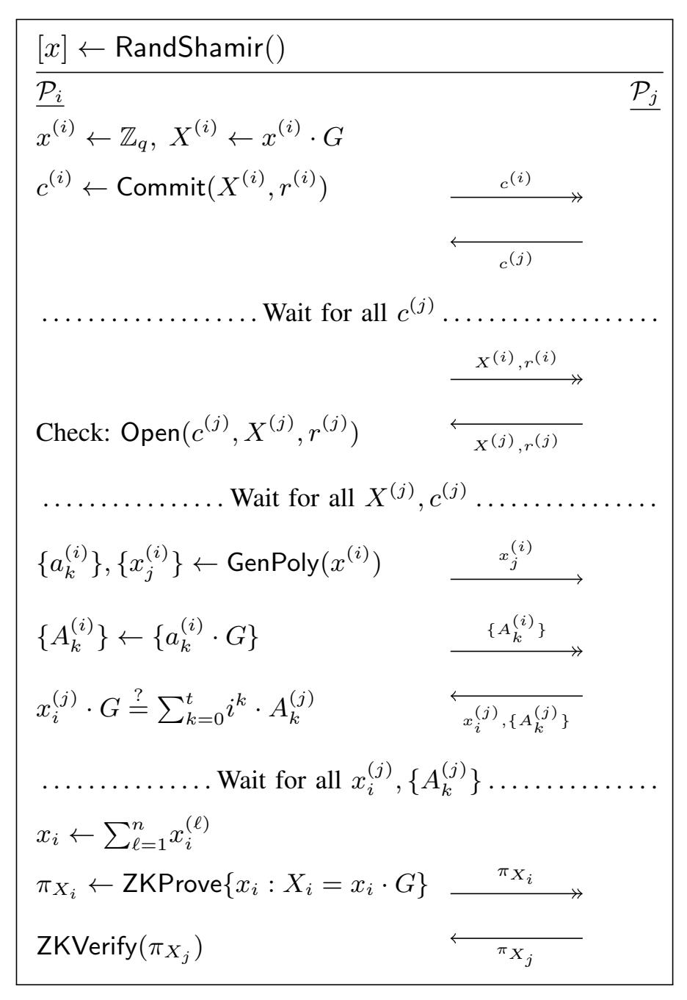
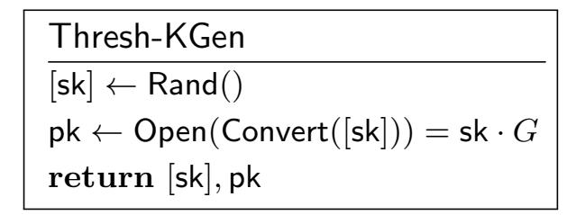

{0}------------------------------------------------

# A Survey of ECDSA Threshold Signing

Jean-Philippe Aumasson

Taurus Group

Switzerland

jp@taurusgroup.ch

Adrian Hamelink

Taurus Group

Switzerland

adrian.hamelink@taurusgroup.ch

Omer Shlomovits

ZenGo X

Israel

omer@kzencorp.com

Abstract—Threshold signing research progressed a lot in the last three years, especially for ECDSA, which is less MPC-friendly than Schnorr-based signatures such as EdDSA. This progress was mainly driven by blockchain applications, and boosted by breakthrough results concurrently published by Lindell and by Gennaro & Goldfeder. Since then, several research teams published threshold signature schemes with different features, design trade-offs, building blocks, and proof techniques. Furthermore, threshold signing is now deployed within major organizations to protect large amounts of digital assets. Researchers and practitioners therefore need a clear view of the research state, of the relative merits of the protocols available, and of the open problems, in particular those that would address "real-world" challenges.

This survey therefore proposes to (1) describe threshold signing and its building blocks in a general, unified way, based on the extended arithmetic black-box formalism (ABB+); (2) review the state-of-the-art threshold signing protocols, highlighting their unique properties and comparing them in terms of security assurance and performance, based on criteria relevant in practice; (3) review the main open-source implementations available.

Index Terms—cryptography, threshold signature, blockchain

## 1. Introduction

A threshold signature scheme (TSS) enables a group of parties to collectively compute a signature without learning information about the private key. In a (t, n)-threshold signature scheme, n parties hold distinct key shares and any subset of  $t+1 \le n$  distinct parties can issue a valid signature, whereas aby subset of t or fewer parties can't. TSS' setup phase relies on distributed key generation (DKG) protocol, whereby the parties generate shares without exposing the key. In practice, TSS is often augmented with a reshare protocol (a.k.a. share rotation), to periodically update the shares without changing the corresponding key.

More than 30 years after Desmedt introduced [Des87] the idea of threshold signing, and 15–20 years after a peak of results [Sho00], [aK01], [MR01], [LP01], [BLS04], blockchain applications have sparked a renewed interest in TSS, with works such as [BDN18], [GG18], [DKLas18], [DKLas19], [DKO+19], [GRSB19], [Cs19], [SA19], [CCL+19a], [CCL+20a], [KG20], [CMP20], [GG20] in the last 3 years. These thus tend to focus on

signature schemes used in blockchain protocols, namely ECDSA (most often with secp256k1 elliptic curve) and EdDSA (as Ed25519)—note that fast threshold RSA signatures have been around for 20 years [Sho00], [aK01].

In this article, we attempt to summarize the state of the art established by all these recent works, and in particular to review efficient TSS constructions that can be deployed at scale to protect cryptocurrency or other assets. We focus on the ECDSA case, because (1) it is currently the most important application-wise, ECDSA being at the time the only signature scheme supported by Bitcoin<sup>1</sup> and Ethereum; and (2) "thresholdizing" ECDSA is more complex than EdDSA or pure Schnorr signatures, which are relatively threshold-friendly thanks to the linearity of their *s* computation.

This survey aims to help researchers and engineers understand how TSS protocols differ and what are their strengths and limitations in terms of security, performance, and functionality. This understanding is essential when choosing a protocol for a digital asset custody solution, where TSS can be used for shared control between multiple parties, or to distribute trust within a single organization. Indeed, as the attacks in [AS20] showed, subtle properties or shortcomings of TSS protocols and in their implementations can have disastrous effects. This work will also help security auditors review TSS implementations, and security architects ensure that the proper controls are in place for a safe integration of TSS in their environment.

We structured the survey as follows:

- §2 defines threshold signatures, the arithmetic blackbox formalism used throughout the paper, and briefly presents the main cryptographic building blocks of TSS protocols.
- §3 reviews secret sharing techniques as well as their variants and related techniques, such as the conversion from multiplicative to additive shares.
- §5 describes evaluation criteria for TSS protocols, with a focus on practical applications.
- §6 discusses the relative merits of selected protocols, based on the evaluation criteria proposed.
- §7 reviews some of the main open-source implementations available, focusing on "battle-tested" and audited code.

<span id="page-0-0"></span><sup>1.</sup> Although, at the time of writing, support for secp256k1 Schnorr signatures has just been integrated in Bitcoin's code as per BIP340, but is not activated yet.

{1}------------------------------------------------

### <span id="page-1-0"></span>2. Preliminaries

### 2.1. Notations

Participants in a protocol  $\mathcal{P}_1, \ldots, \mathcal{P}_n$  are modeled as probabilistic polynomial time Turing machines. The adversary  $\mathcal{A}$ , controlling a subset of the participants, is modelled the same.

Within a procedure, a variable is assigned values using the  $\leftarrow$  operator. When the right-hand side is any set X or a probabilistic function  $\mathsf{F}$  then the value assigned is uniformly sampled from X or from the distribution over  $\mathsf{F}$ . We write  $a \leftarrow b$  as a shorthand for  $a \leftarrow \{b\}$ .

In general, private/public key pairs are denoted sk, pk and are obtained from a key generation procedure KGen. The algorithms for signature generation and verification are Sig, Vf. Encryption and decryption functions are Enc and Dec.

We write H for hash functions. Depending on the context it can be a general-purpose hash to bit strings, or a hash into a specific set.

An elliptic curve E over a finite field K is denoted E(K), and we write  $\mathbb{G} \subseteq E(K)$  a subgroup of E(K) of prime order q. A generator for  $\mathbb{G}$  is denoted G and we assumed that G is known to all parties as part of the group's description.

We use the additive notation for operations, and denote the multiplication of a point  $P \in \mathbb{G}$  by a scalar  $k \in \mathbb{Z}_q$  as  $k \cdot P$ .

The multi-party computation (MPC) functionality we use operates over shared secret values in  $\mathbb{Z}_q$  and  $\mathbb{G}$ . We call these values *shared secrets*, defined via a *secret sharing scheme* (SSS). Shared secrets of field elements  $x \in \mathbb{Z}_q$  are denoted as [x], and shared secrets of elliptic curve points  $x \cdot G \in \mathbb{G}$  are denoted  $\langle x \rangle$ , to emphasize the notion that they are *representations* of the underlying value.

Algorithms and protocols that use this MPC functionality are written from the perspective of a party  $\mathcal{P}_i$ . Whenever a shared secret is established, this implicitly defines a variable representing  $\mathcal{P}_i$ 's *share*. These shares are denoted  $x_i$  and  $X_i$  for the respective representations [x] and  $\langle x \rangle$ .

A (t,n)-threshold scheme involves n parties, where the threshold t < n is the maximum number of parties that can be corrupted, while still keeping the underlying scheme secure. Whenever such a threshold is used, we sometimes add t as subscript for clarity. Note that not all values of t are supported by a given TSS protocol, as its security depends on the adversarial model (e.g., honest vs. dishonest majority, as discussed in §5.2.3).

**Remark**: Some papers use the convention that t parties are necessary and sufficient to issue a signature (and thus up to t-1 can be corrupted), whereas other papers use t+1 and t, respectively. The later seems to be the most common convention in recent papers, therefore we adopt it as well.

### 2.2. Threshold Signature Schemes

The following semi-formal definition should be enough for this survey:

**Definition 2.1.** A (t,n)-threshold signature scheme (TSS) for a given (single-party) signature scheme (KGen, Sig, Vf) involves n>1 parties  $\mathcal{P}_1,\ldots,\mathcal{P}_n$  capable of running the following protocols:

- Thresh-KGen is a distributed key generation (DKG) protocol, with no previously shared key material, but only public identities/addresses. When the protocol successfully completes, each party  $\mathcal{P}_i$  has their private share  $\mathsf{sk}_i$  of the secret key  $\mathsf{sk}$ , all parties know the public key  $\mathsf{pk}$ , and none of the parties learns information about  $\mathsf{sk}$ .
- Thresh-Sig is a distributed signing protocol, whereby all parties receive a message to be signed and jointly return a valid signature.

The following protocols are optional:

- Thresh-PreSig is a sub-protocol of Thresh-Sig that does not depend on the message to be signed. Upon successful execution, each participant stores a *presignature* that can be retrieved when Thresh-Sig is later completed.
- Thresh-Reshare is a threshold secret sharing protocol that can be performed after Thresh-KGen. On input  $t' \leq n$ , the secret shares  $\mathsf{sk}_i$  are refreshed such that the scheme satisfies a (t', n) threshold.

In practice, a number of assumptions are required on the reliability and integrity of the communications between participants, as we'll discuss in §5.3.

### 2.3. The Arithmetic Black-Box Formalism

To describe MPC protocols operating over shared secrets, complex operations can be broken down in a set of simple operations that are each individually defined as secure MPC operations. For this, we use the *arithmetic black box* (*ABB*) [DN03] framework and its extension ABB+ [DKO<sup>+</sup>19], which includes all the operations needed to compute threshold signatures.

In particular, ABB+ allows parties to securely perform arithmetic operations with shared secrets with representations [x] or  $\langle x \rangle$  for  $x \in \mathbb{Z}_q$ . It is important that the implementation of these functions does not leak any information about inputs or outputs.

ABB+ assumes that the secrets are shared via a *linear* secret sharing scheme. That is, for any  $a,b \in \mathbb{Z}_p$  and representations [x],[y] or  $\langle x \rangle, \langle y \rangle$ , the parties can compute a[x]+b[y]=[ax+by] and  $a\cdot\langle x \rangle+b\cdot\langle y \rangle=\langle ax+by \rangle$  locally. We refer to §3 for descriptions of different possible implementations of linear secret sharing schemes.

Formally, ABB+ consists of the following operations:

{2}------------------------------------------------

| Rand()                    | Returns a representation $[x]$ of a random secret value $x$ sampled uniformly from $\mathbb{Z}_p$ .     |
|---------------------------|---------------------------------------------------------------------------------------------------------|
| RandMul()                 | Returns a triple $([x], [y], [z])$ of representations of random values $(x, y, z)$ such that $z = xy$ . |
| Convert( $[x]$ )          | Returns a representation $\langle x \rangle$ of $x \cdot G$ .                                           |
| Open([x])                 | Reveals the secret value $x$ to all parties.                                                            |
| $Open(\langle x \rangle)$ | Reveals the value $X = x \cdot G$ to all parties.                                                       |
| Mul([x],[y])              | Returns a representation $[z]$ of the value $z = xy$                                                    |

While some of these functions are trivial to implement, they often require extra steps to guarantee their security. For example, a call to Open usually involves the parties to commit their share beforehand, to prevent manipulation of the result.

To understand how we can use and compose these functions to build an MPC protocol, we present in figure 1 the two well known examples from Beaver [BIB89], [Bea91] which implement Mul and Invert.

| Mul([x],[y])                                  | Invert([x])                        |
|-----------------------------------------------|------------------------------------|
| $\overline{[a],[b],[c]} \leftarrow RandMul()$ | $\overline{[a] \leftarrow Rand()}$ |
| $d \leftarrow Open([x] + [a])$                | $[w] \leftarrow Mul([a], [x])$     |
| $e \leftarrow Open([y] + [b])$                | $w \leftarrow Open([w])$           |
| $ [z] \leftarrow [c] + e[x] + d[y] - ed $     | $[y] \leftarrow w^{-1}[a]$         |
| return $[z]$                                  | $\mathbf{return}\ [y]$             |

<span id="page-2-0"></span>Figure 1. Beaver's tricks for multiplication and inversions.

We notice the use of auxiliary random secret sharings in these two examples. They are often referred to as *blinding* values as they allow the parties to open representations derived from the input, without revealing any secret information about the shares or the secret. Multiplying shared secrets securely it not trivial, and was the main challenge to build efficient ECDSA threshold schemes.

In §3 we present such implementation that do not rely on RandMul, and we refer the reader to [Mau06], [DN07] for other construction of Mul.

# 2.4. Cryptographic Toolbox

We briefly summarize the main components founds in ECDSA TSS protocols:

**2.4.1. Commitment Schemes.** A party  $\mathcal{A}$  can temporarily hide a message m that cannot be changed by first computing  $c \leftarrow \mathsf{Commit}(m,r)$  where r is fresh randomness, and later sharing r with  $\mathcal{B}$ , which allows them to verify the commitment's validity by running  $\mathsf{Open}(m,c;r)$ , which always succeeds if  $c = \mathsf{Commit}(m,r)$  (correctness).

Definitions and notations slightly differ, and sometimes involved a "public commitment key".

A commitment scheme's security properties are:

- **Hiding**: The commitment c does no reveal information about m.
- **Binding**: An adversary cannot find a  $(m', r') \neq (m, r)$  such that Open(m', c, r') succeeds.

TSS protocols often use *Pedersen commitments*, which work as follows: Given a cyclic group  $\mathbb G$  of prime order q and two generators  $G,H\in\mathbb G$ , the commitment of an  $m\in\mathbb Z_q$  picks  $r\leftarrow\mathbb Z_q$  and sets  $\mathrm{Commit}(m,r)=m\cdot G+r\cdot H$ . The opening phase checks if  $c=m\cdot G+r\cdot H$  given m.

ElGamal commitments are also found in TSS: A difference with Pedersen is that committed messages are  $\mathbb{G}$  elements rather than  $\mathbb{Z}_q$  elements, and that commitment computes  $\mathsf{Commit}(M,r) = (r \cdot G, M + r \cdot H)$ .

- <span id="page-2-1"></span>**2.4.2.** Additively Homomorphic Encryption. An *additively homomorphic encryption scheme* consists of three algorithms KGen, Enc<sub>pk</sub> and Dec<sub>sk</sub>, such that:
  - (pk, sk) ← KGen() is the public/private key pair.
  - $\mathcal{M}$  and  $\mathcal{E}$  are message and ciphertext domains that might be parametrized by pk.
  - $Enc_{pk}: \mathcal{M} \to \mathcal{E}$  is a probabilistic algorithm.
  - $Dec_{sk}: \mathcal{E} \to \mathcal{M}$  is a deterministic algorithm.
  - There exist two group operations  $\oplus : \mathcal{E} \times \mathcal{E} \to \mathcal{E}$  and  $\odot : \mathbb{Z} \times \mathcal{E} \to \mathcal{E}$  such that

$$m_1 + m_2 = \mathsf{Dec}_{\mathsf{sk}}(\mathsf{Enc}_{\mathsf{pk}}(m_1) \oplus \mathsf{Enc}_{\mathsf{pk}}(m_2))$$
  
 $k \cdot m = \mathsf{Dec}_{\mathsf{sk}}(k \odot \mathsf{Enc}_{\mathsf{pk}}(m))$ 

The most common homomorphic encryption in TSS is Paillier, which works like this:

• KGen:

Generate two large primes p,q of the same bit length and set  $N=p\cdot q$ , and compute  $\lambda:=(p-1)(q-1)$ . Return  $\mathsf{sk}:=\lambda$  and  $\mathsf{pk}:=N$ .

•  $\operatorname{Enc}_{\operatorname{pk}}: \mathbb{Z}_N \to \mathbb{Z}_{N^2}$ : For a message  $m \in \mathbb{Z}_N$ , sample a random  $r \in \mathbb{Z}_N^{\star}$ . Return  $c := (N+1)^m r^N \mod N^2$ .

•  $\operatorname{Dec}_{\operatorname{sk}}: \mathbb{Z}_{N^2} \to \mathbb{Z}_N$ :  $\operatorname{Define}$  the function L(u) := (u-1)/N over all  $u \in \mathbb{Z}_{N^2}$  such that N|u-1.

Given a ciphertext  $c \in \mathbb{Z}_{N^2}$ , return  $m := L(c^{\lambda}) \cdot \lambda^{-1}$ . For the homomorphic property, we have:

$$\operatorname{Enc}_{\mathsf{pk}}(c_1) \oplus \operatorname{Enc}_{\mathsf{pk}}(c_2) = \operatorname{Enc}_{\mathsf{pk}}(c_1) \cdot \operatorname{Enc}_{\mathsf{pk}}(c_2)$$
$$k \odot \operatorname{Enc}_{\mathsf{pk}}(c) = \operatorname{Enc}_{\mathsf{pk}}(c)^k.$$

When Paillier is used to encrypt elements from  $\mathbb{Z}_q$  with q < N, we will often use zero-knowledge *range* proofs to ensure that that the above operations do not cause an "overflow" of  $\mathbb{Z}_q$ , resulting in a wrong decryption.

The ElGamal scheme is also sometimes used, under its *in-the-exponent* version. Such ElGamal encryption is strictly speaking not a valid encryption scheme, since decryption requires solving the discrete logarithm problem. It works as follows:

The public parameters are a group  $\mathbb{G}$  of order q generated by  $G \in \mathbb{G}$ , and the public key pk is an element  $P \in \mathbb{G}$ . The secret key is sk := d where  $P = d \cdot G$ . Encryption is defined as the following probabilistic function with randomness  $r \leftarrow \mathbb{Z}_q$ :

$$\mathsf{Enc}_{\mathsf{pk}}(\ \cdot\ ; r) \colon \mathbb{Z}_q \to \mathbb{G} \times \mathbb{G}$$

$$m \mapsto (r \cdot G, r \cdot P + m \cdot G) = (U, V)$$

{3}------------------------------------------------

Given the discrete logarithm of P, we can obtain  $m \cdot G$  by computing  $V - d \cdot U$ .

Recovering m then requires to compute a discrete logarithm, which is only possible when m is small. ElGamal in-the-exponent is often useful in obtaining security against malicious adversaries (as it is the case in TSS protocols) by carrying out computations over the ciphertexts and verify them in zero-knowledge without ever decrypting.

For the homomorphic property, we have:

$$\operatorname{Enc}_{\mathsf{pk}}(m_1;r_1) \oplus \operatorname{Enc}_{\mathsf{pk}}(m_2;r_2) = \operatorname{Enc}_{\mathsf{pk}}(m_1 + m_2;r_1 + r_2)$$
$$k \odot \operatorname{Enc}_{\mathsf{pk}}(m;r) = \operatorname{Enc}_{\mathsf{pk}}(km;kr).$$

**2.4.3. Zero-Knowledge Proofs.** TSS protocols use zero-knowledge proofs to ensure that participants do not deviate from the prescribed protocol. Zero-knowledge proofs are usually the most computationally expensive parts, compared to other cryptographic operations.

Proofs used are for example proofs of knowledge of discrete logarithm, of a modulus factorization, proofs of consistency of a Paillier ciphertext, and range proofs. For example, [GG18] uses range proofs in the share conversion step, to ensure that a participant's input will not "overflow" the modulus.

## <span id="page-3-0"></span>3. Secret Sharing Schemes

A (t, n)-secret sharing scheme (SSS) splits a (secret) value x into n different shares, such that  $t+1 \le n$  shares  $x_i$  are necessary and sufficient to reconstruct x.

Before diving into the details, we establish some notations: We consider secret values in  $\mathbb{Z}_p$ , and assume all arithmetic operations perform modular reduction. For elements  $x \in \mathbb{Z}_p$  and associated elliptic curve point  $x \cdot G \in \mathbb{G}$ , the notations [x] and  $\langle x \rangle$  indicate that the underlying values are guarded by a SSS and therefore unknown to the parties. An elliptic curve point  $a \cdot G$  for which the exponent a is hidden is denoted by the uppercase character (i.e.,  $A = a \cdot G$ ).

This section focuses on the two main secret sharing schemes used in TSS protocols:

Additive SSS, which is trivial: the secret x is just the sum of all shares, that is,  $x = x_1 + \cdots + x_n$ . The TSS functionality can be easily described when this scheme is used, and we show how to fully implement ABB+ in this case. Since all shares are required to reconstruct x, it is sometimes called *full threshold*.

We also describe *Shamir SSS*, which works for any threshold  $0 \le t \le n-1$ . It is used mainly in the Thresh-KGen phase, and therefore we do not describe a full ABB+ implementation over Shamir. Indeed, we will show that it is easy to convert a (t,n) Shamir SSS to an additive SSS between t parties. The ABB+ implementation over SSS can then be used without loss of generality.

### 3.1. Additive Secret Sharing

We describe an implementation of ABB+ over the additive secret sharing scheme  $x = x_1 + \cdots + x_n$ . We omit RandMul, since we do not use it.

First, observe that additive sharings satisfy linearity, since the linear combination  $[z] \leftarrow a \cdot [x] + b \cdot [y]$ , for  $a, b \in \mathbb{Z}_p$  can be computed locally with shares  $z_i = ax_i + by_i$ .

Figure 2 presents naive implementations of Rand, Convert and Open We notice they are quite straightforward and require little to no collaboration. Unfortunately, this is not enough to prevent a party from cheating and manipulating the outcome of Open. The nature of additive secret sharing would allow an adversary to observe all other shares before publishing theirs. This can be remedied in part by requiring the parties to commit to their share before hand.

| Rand()                                   | Convert([x])                            | Open([x])                        |
|------------------------------------------|-----------------------------------------|----------------------------------|
| $\overline{x_i \leftarrow \mathbb{Z}_q}$ | $\overline{X_i \leftarrow x_i \cdot G}$ | $\overline{Broadcast(x_i)}$      |
| return $[x]$                             | $\mathbf{return}\ \langle x\rangle$     | Wait for all $x_j$               |
|                                          |                                         | $x \leftarrow x_1 + \dots + x_n$ |
|                                          |                                         | ${\bf return}\ x$                |

<span id="page-3-1"></span>Figure 2. Simple implementations of Rand, Convert and Open, for ABB+ with additive secret sharing.

<span id="page-3-2"></span>**3.1.1.** Multiplication and Share Conversion. The lack of an efficient and secure protocol for performing multiplication of two shared secrets was the main obstacle in designing efficient threshold ECDSA.

Given two additive sharings [x], [y] and their multiplication  $[z] \leftarrow \text{Mul}([x], [y])$ , the value of z should be

$$z = xy = \left(\sum_{i=1}^{n} x_i\right) \left(\sum_{j=1}^{n} y_j\right) = \sum_{i=1}^{n} x_i y_i + \sum_{i,j=1, i \neq j}^{n} x_i y_j.$$

Generating individual shares  $z_i$  for each party can be done with a multiplicative-to-additive (MtA) share conversion protocol. This is executed between two parties  $\mathcal{P}_i$  and  $\mathcal{P}_j$  holding respective secrets  $x_i$  and  $y_j$ . It is initiated by party  $\mathcal{P}_i$ , and results in each party obtaining their new secret  $a_{i \to j}$  and  $b_{i \to j}$  respectively, such that  $x_i y_j = a_{i \to j} + b_{i \to j}$ . The notation  $i \to j$  indicates that party  $\mathcal{P}_i$  is the initiator.

Every pair of parties  $(\mathcal{P}_i, \mathcal{P}_j)$  performs the protocol twice, swapping the role of initiator in each execution. Once all exchanges have ended, each party  $\mathcal{P}_i$  possess the values  $(a_{i \to j}, b_{j \to i})$  for all  $j \neq i$ . Their share  $z_i$  can then be computed as

$$z_i := x_i y_i + \sum_{j=1, j \neq i}^n a_{i \to j} + \sum_{j=1, j \neq i}^n b_{j \to i}.$$

When  $\mathcal{P}_i$  initiates the protocol with  $\mathcal{P}_j$  with respective inputs  $x_i, y_j$ , we write this step as  $\mathsf{MtA}(\mathcal{P}_i(x_i) \to \mathcal{P}_j(y_j))$  which returns the values  $a_{i \to j}$  and  $b_{i \to j}$  respectively. Therefore, given such an MtA protocol, computing Mul can implemented as in figure 3.

In the following, we present four ways to implement MtA, as used in various threshold ECDSA constructions. The first three are based on homomorphic encryption schemes from §2.4.2, which follow a protocol similar to figure 4.

{4}------------------------------------------------

```
Mul([x], [y])
zi ← xiyi
foreach Pj 6= Pi do
  ai→j ← MtA(Pi(xi) → Pj (yj ))
  bj→i ← MtA(Pj (xj ) → Pi(yi))
  zi ← zi + ai→j + bj→i
return [z]
```

<span id="page-4-0"></span>Figure 3. ABB+ multiplication using MtA.

```
MtA(Pi(xi) → Pj (yj ))
Party: Pi Party: Pj
Input: xi Input: yj
ci ← Encpki
         (xi)
                  ci
                         bi→j ← Zq
                         c
                         0
                         j ← ci  Encpki
                                      (yj )
                  cj
                         cj ← c
                              0
                              j ⊕ Encpki
                                      (−bi→j )
ai→j ← Decski
           (cj )
Return ai→j Return bi→j
```

<span id="page-4-1"></span>Figure 4. Multiplicative to additive share conversion protocol using homomorphic encryption.

3.1.2. MtA With Paillier. The main issue when using the Paillier cryptosystem for MtA is that it operates over messages in Z<sup>N</sup> , where N is the RSA modulus.

In general, the parameters will be such that q < N, and thus the shares x<sup>i</sup> , y<sup>i</sup> can be embedded in Z<sup>N</sup> . When P<sup>i</sup> decrypts c<sup>j</sup> , they perform a reduction modulo q to obtain an element of Zq. If all parties behave honestly, then a modulo q reduction will not occur, and the values are computed correctly. To make this protocol secure though, we need to check that all values being encrypted lie in the the range {0, . . . , q − 1}.

Zero-knowledge *range proofs* are a solution to this problem, as statements proving that the value encrypted lies within a certain interval over the integers. They can also be extended to prove that an affine transformation over the ciphertext was correctly performed, and that the multiplicative coefficient is related to a known secret exponent.

These proofs are unfortunately quite computationally intensive, and it is possible that some information would get leaked if they are not used.

3.1.3. MtA with Class Group (CL). A new linear homomorphic encryption scheme was introduced in [\[CLT18\]](#page-12-17). This scheme can be implemented over a class group, which is a group of unknown order. The mechanics of the MtA protocols depicted above remains the same in regard to the homomorphic operations. However, range proofs are no longer needed since the message space of the CL scheme is the same as the order of the elliptic curve q. We are still left with a zero-knowledge proof for correct encryption, which is more complex for class groups than for Paillier or ElGamal.

3.1.4. MtA with ElGamal. ElGamal encryption "in-theexponent" , and more specifically, its elliptic curve equivalent based on the hardness of EC-DDH, can natively work over the same elliptic curve as of the TSS. The issue however is with decryption, as explained in [§2.4.2,](#page-2-1) which is why ElGamal cannot be used alone in a protocol. It can however accompany almost all private computation operations, providing a *tag-along* commitment to the computation being done in parallel to the actual computations. At each step of the computation, the same operation is done homomorphically on the ElGamal ciphertexts and proven correct in zero-knowledge, which for the most part can be done efficiently using sigma protocols. At the end of the computation when the output is revealed, ElGamal can be decrypted as well and tested for correctness against the known plaintext: i.e., if the output value is a signature s, and the ElGamal decrypted value is S = s ·G it is easy the verify that s is the discrete logarithm of S.

In the context of MtA, several protocols uses ElGamal in such a way to save on expensive proofs. In some cases, ElGamal ciphertexts are carried on to other parts of the TSS protocol.

3.1.5. MtA with Oblivious Transfer. In the context of additive sharing, MtA can be realized with a 1-of-2 oblivious transfer. In this two-party protocol, a sender submits two messages m0, m<sup>1</sup> and the receiver submits a single bit b. At the end, the receiver learns m<sup>b</sup> and the sender learns nothing and thus b is kept private. Gilboa [\[Gil99\]](#page-13-8) showed how this primitive can be used for semi-honest MtA, letting the parties run single OT for each input bit and performing binary multiplication. Since TSS protocols offer malicious security there are additional checks and/or proofs that must be added to the base protocol but they can be done efficiently.

Secure OT constructions exist under the EC-DDH assumption. This is the same security assumption we assume anyway for the security of ECDSA (in the generic group model). This differentiates OT-based MtA from other methods discussed as this is the only one that does not require an additional security assumption behind the security of ECDSA.

## 3.2. Shamir Secret Sharing

The Shamir [\[Sha79\]](#page-13-9) secret sharing scheme supports any threshold 0 ≤ t ≤ n − 1. Its main idea is that a polynomial f(X) of degree t over a finite field can be reconstructed given t + 1 different points (i, f(i)).

We start by presenting the scheme in the situation where a dealer D distributes the shares to all parties. To generate a secret sharing [x], D samples a random polynomial f[X] = a<sup>0</sup> + a1X + · · · + atX<sup>t</sup> ∈ Zq[X] of degree t, such that the constant term a<sup>0</sup> is equal to x. For each i = 1, . . . , n, D computes Pi's share as x<sup>i</sup> ← f(i), and sends it to them. The procedure in Figure [5](#page-5-0) encapsulates the protocol, and is run from D's perspective and results in each party obtaining their share of [x].

3.2.1. Linearity. We can verify that linearity is satisfied. If [x], [y] are two secrets generated by polynomials f(X) and g(X) respectively, then the secret [z] := α·[x]+β·[y] can be viewed as a secret generated by the polynomial h(X) = αf(X) + βg(X). By definition of Zp, we have h(i) = αf(i) + βg(i), which implies that z := αx + βy and the shares of [z] are z<sup>i</sup> = αx<sup>i</sup> + βy<sup>i</sup> .

{5}------------------------------------------------

| GenShamir(x)                                             | $GenPoly_{t,n}(x)$                        |
|----------------------------------------------------------|-------------------------------------------|
| $\overline{\{a_k\},\{x_i\} \leftarrow GenPoly_{t,n}(x)}$ | $a_0 \leftarrow x$                        |
| for $i=1,\ldots,n$ do                                    | for $k=1,\ldots,t$ do                     |
| Send $x_i$ to $\mathcal{P}_i$                            | $a_k \leftarrow \mathbb{Z}_q$             |
|                                                          | $f(X) := \sum_{k=0}^{n} a_k X^k$          |
|                                                          | for $i=1,\ldots,n$ do                     |
|                                                          | $x_i \leftarrow f(i)$                     |
|                                                          | return $\{a_k\}_{k=0}^t, \{x_i\}_{i=0}^n$ |

<span id="page-5-0"></span>Figure 5. Shamir secret sharing generation (with dealer).

**3.2.2. Recovering the Secret.** Given a Shamir sharing of [x], it is possible for any set of t+1 parties  $S \subset \{\mathcal{P}_1,\ldots,\mathcal{P}_n\}$  to recover the value x. We denote the share of  $\mathcal{P}_i \in S$  as  $x_{i,S}$ .

Using the Lagrange interpolation formula over the points  $\{(i, x_{i,S})\}_{i \in S}$ , we can evaluate f at any point k.

$$f(k) = \sum_{i \in S} \ell_{i,S}(k) x_{i,S}$$
, where  $\ell_{i,S}(k) := \prod_{j \in S: j \neq i} \frac{k - j}{i - j}$ 

We define the function  $Interpolate_{t,S}(\{x_{i,S}\};k)$  which performs the above computation and returns f(k).

Once the parties in S have exchanged their shares, they can run  $Interpolate_{t,S}(\{x_{i,S}\};0)$  to recover x=f(0).

**3.2.3. Zero Secret Sharing.** Some situations required the parties to have access to a secret sharing of 0, which can be generated by a dealer that executes GenShamir(0). We denote the representation as [0] with accompanying shares  $0_i$ , by slight abuse of notation.

Given secret sharings [x] and [0], then the addition [x'] = [x] + [0] yields a new secret sharing with  $x' \equiv x$  with different shares  $x'_i = x_i + 0_i$ . This can be practical as a trick for blinding calculations, but it can also be used as a way of *refreshing* shares. Indeed, whenever the parties add [0] to a secret [x], then all previous shares become incompatible with the new ones, but the underlying secret remains the same. We expand on this in §4.2.

Note that it is also possible to generate an additive sharing of zero, but which requires significantly more work than a call to Rand.

**3.2.4. Multiplication.** An interesting property about the Shamir SSS is that Mul is very easy to implement when t < n/2. Indeed, if  $[x]_t, [y]_t$  were generated by polynomials  $f_x, f_y$ , then the parties can compute a share  $z_i = x_i \cdot y_i = f_x(i) \cdot f_y(i)$  locally. This gives a secret sharing  $[z]_{2t}$  generated by a polynomial  $g = f_x \cdot f_y$  of degree 2t. Using the same interpolation technique as mentioned above, a set of 2t+1 shares  $z_i$  can be used to reconstruct  $z = f_x(0)f_y(0) = xy$ .

To guarantee the privacy of the input when the parties broadcast their share  $x_iy_i$ , they can use a zero secret sharing  $[0]_{2t}$  as blinding. They reveal the value  $x_iy_i + 0_{2i}$ , which is a share of the secret  $[z']_{2t} = [xy]_{2t} + [0]_{2t}$ , where z' = z.

<span id="page-5-1"></span>**3.2.5. Verifiable Secret Sharing.** Whenever a party receives their share of a Shamir shared secret, there is no guarantee that this value was honestly generated. To

make sure that this is the case, the dealer can provide extra information about the coefficients of the chosen polynomial so that the receiving player can verify that their share is correct. This technique, known as Feldman verifiable secret sharing [Fel87], extends Shamir's scheme by having the dealer publish the values  $\{A_k := a_k \cdot G\}$  where the  $a_k$  are the coefficients of the polynomial. When a player receives their share  $x_i$ , they can verify:

$$x_i \cdot G \equiv \sum_{k=0}^t i^k \cdot A_k = \left(\sum_{k=0}^t a_k i^k\right) \cdot G = f(i) \cdot G.$$

This unfortunately requires the dealer to reveal  $A_0 = x \cdot G$ , but this is not a problem under the assumption that computing the discrete logarithm is hard in  $\mathbb{G}$ .

<span id="page-5-2"></span>**3.2.6. Distributed Secret Generation.** All the techniques mentioned so far can be adapted to a scenario without a trusted dealer. To do so, the parties will each perform their own secret generation procedure, acting both as the dealer and a receiving party (since we will be referring to n different secret sharing with all their associated variables, we use a superscript  $\cdot^{(i)}$  to indicate that the variable relates to the secret generated by party  $\mathcal{P}_i$ ).

Once each party has successfully distributed a sharing  $[x^{(i)}]$  of a secret value  $x^{(i)}$  of their choosing (which can be 0), then the parties can compute the final sharing  $[x] \leftarrow [x^{(1)}] + \cdots + [x^{(n)}]$ , where the share  $x_i$  of each party  $\mathcal{P}_i$  is  $x_i = x_i^{(1)} + \cdots + x_i^{(n)}$ . If the values  $x^{(i)}$  are committed right after they are sampled, then the parties cannot cheat, and the distribution of x will be uniform as long as one party has done so.

Figure 6 presents a full protocol that returns a Shamir shared secret [x] with verification as in §3.2.5. In this case, it would constitute a correct implementation of Rand in ABB+. The protocol is performed by all players that take the perspective of  $\mathcal{P}_i$  in the left-hand column. The right-hand column describes the checks that all other parties must perform to verify correctness. Moreover, a double-headed arrow indicates that the value being sent is not specific to  $\mathcal{P}_j$  and is sent via broadcast.

This protocol requires at least two rounds, and should be aborted by any party  $\mathcal{P}_j$  that fails any one of the checks. If they all succeed, then the sharing [x] is correct.

We can see that this variant requires a lot more communication, and forces parties to wait for each other because of the commitments. Unfortunately, it unclear how this procedure could be improved while maintaining the same level of security.

As a side note, two extra values can be computed from elements sent out via broadcast. The first is  $X \leftarrow \sum_{i=1}^n X^{(i)} = x \cdot G$ , which can be computed from the commitments. If the secret generated by this protocol is a secret key [sk], then the value X corresponds to the public key  $\mathsf{pk} = \mathsf{sk} \cdot G$ . For the last step of the protocol, the parties send out a proof of knowledge of their share  $x_i$ . Verification of this proof requires that the values  $X_i := x_i \cdot G$  be public. Fortunately, it can be computed using the coefficients  $\{A_k^{(i)}\}$  from the Feldman VSS step as follows:

$$X_i \leftarrow \sum_{\ell=1}^n \sum_{k=0}^t i^k \cdot A_i^{(\ell)} = \sum_{\ell=1}^n x_i^{(\ell)} \cdot G = x_i \cdot G$$

{6}------------------------------------------------



<span id="page-6-1"></span>Figure 6. Distributed random secret sharing generation.

<span id="page-6-3"></span>**3.2.7. Converting Secret Sharings.** There are different ways to convert a representation of a secret x to another.

The first possible conversion is from a (t,n) Shamir SSS  $[x]_t$  to an (t,t+1) additive SSS. If we let S be a set of t+1 parties, then each  $\mathcal{P}_i \in S$  can multiply their own share  $x_{i,S}$  by the Lagrange interpolating coefficient for f(0). The same can be done for public shares  $X_{i,s}$  of  $\langle x \rangle$ . Moreover, these computations can all be performed locally using only a group multiplication.

Second, we can convert an n-additive secret sharing into a (t,n) Shamir sharing. Given a preexisting additive sharing [x], the parties can run the distributed key generation protocol wherein they set  $x^{(i)}$  to be their share of [x] instead of a randomly sampled value.

#### 4. Threshold ECDSA

For completeness, we briefly describe ECDSA:

Figure 7. ECDSA signature generation.

The two main challenges when computing an ECDSA signature in a distributed fashion are (1) the inversion of

k, and (2) the multiplications by  $k^{-1}$  and by sk, which should leak no information on these operators.

### 4.1. Key Generation

A successful execution of Thresh-KGen should produce a secret sharing of the secret key [sk] and reveal the public key  $pk = sk \cdot G$ .

This procedure is described in Figure 8, using the ABB+ framework.



<span id="page-6-2"></span>Figure 8. Threshold ECDSA key generation.

At this point, it is possible to generate [sk] additively and run the additive to Shamir conversion at a later stage. This is often done within a Thresh-Reshare procedure.

Usually though, Thresh-KGen generates a (t, n) Shamir sharing of [sk], and replaces the call to Rand by RandShamir from §3.2.6.

### <span id="page-6-0"></span>4.2. Key Refresh

The Thresh-Reshare protocol can be called at any point after a secret key [sk] has been setup. Given the shared secret key [sk], the main purpose of this protocol is to replace individual shares  $sk_i$  with a new shares  $sk_i'$  of a secret sharing [sk'] such that  $sk \equiv sk'$ .

If [sk] is an additive sharing, the conversion is done by running RandShamir where the initial value  $x^{(i)}$  is set to  $sk_i$ . When [sk] is already a Shamir sharing, the parties simply generate a zero secret sharing which they add to the existing secret.

While Thresh-Reshare is technically optional, it would not be prudent to forgo it. Indeed, the main "selling point" of TSS is that no single party holds the secret key since the shares are held by n different parties. An adversary wishing to recover sk would need to compromise t+1 of these shares. This greatly increases the difficulty in pulling off such an attack, especially if the shares are stored in physically distant distinct locations. If these shares are static however, then a discrete adversary could simply steal them one-by-one, until they have the required threshold.

As long as no more than t shares are extracted, running Thresh-Reshare will render them useless, forcing the attacker to start over. It is therefore important to run Thresh-Reshare regularly, or whenever suspicious activity is detected.

### 4.3. Signing

The ECDSA signature generation algorithm performs mostly arithmetic operations over its inputs. By substituting these operations by their equivalent functions in ABB+, we obtain a multiparty protocol that accomplishes the same result, but where the secrets are shared among the participants.

{7}------------------------------------------------

```
Thresh-Sigsk(M)
(r, [k
    −1
       ], [σ]) ← Thresh-PreSigsk()
[s] ← H(M)[k
             −1
                ] + r[σ]
s ← Open([s]) // s = H(M)k
                             −1 + rk−1
                                       sk
return (r, s)
Thresh-PreSigsk()
[k] ← Rand()
[γ] ← Rand()
[δ] ← Mul([γ], [k]) // δ = γ · k
[η] ← Mul([γ], [sk]) // η = γ · sk
δ ← Open([δ])
R ← Open(Convert([k])) // R = (rx, ry)
r ← rx
[σ] ← δ
       −1
          · [η] // σ = k
                                  −1
                                     sk
[k
 −1
    ] ← δ
         −1
            · [γ]
return (r, [k
            −1
               ], [σ])
```

<span id="page-7-1"></span>Figure 9. Threshold ECDSA signature.

The benefit of this approach is that the protocol becomes easier to understand, since most of the communication steps are abstracted within the ABB+ functionality. It also stays closer to the original description.

We describe in Figure [9](#page-7-1) an implementation of Thresh-Sig using these ideas, and note the following:

- We assume without loss of generality that an additive secret sharing scheme is used. If that is not the case for [sk], then we can apply the conversion described in [§3.2.7.](#page-6-3)
- The Mul function can be implemented using any of proposed protocols in [§3.1.1.](#page-3-2)

The main trick involved here, is the use of the random secret [γ] as blinding factor, which allows us to safely open [δ] without revealing k. We can then multiply both [γ] and [η] by the inverse inverse of δ to obtain [k −1 ] and [k −1 sk].

By simple substitution, it is easy to verify that the output of Thresh-Sig corresponds with a signature produced by the original Sig algorithm.

In practice though, many extra steps need to be performed to guarantee the overall security of the functionality. Most implementations rely on a combination of commitments and zero-knowledge proofs to prevent malicious parties from manipulating the outcome, or gaining information about the secret key. This increases the complexity and the number of communication rounds necessary. Taking this into account, some steps that do not depend on each other can be performed in the same round, and therefore the chosen order of the operations may differ from the one presented above.

In [§4.4,](#page-7-2) we explain why it is useful to split up the function into two different procedures. The main idea though, is that Thresh-PreSig does not depend on the message M being signed, and could therefore be performed at an earlier stage.

## <span id="page-7-2"></span>4.4. Presigning

In Thresh-Sig, we ordered the different steps in such a way that the message M is only required as late as possible in the protocol. This allowed us to split the protocol into two different phases.

We call Thresh-PreSig the *preprocessing* or *offline* phase, and the tuple (r, [k −1 ], [σ]) it returns is usually referred to as a *presignature*. This terminology stems from the fact that it does not depend on any particular message M. Therefore, we can run this procedure in advance and store the computation for later use.

The *online* phase starts when a signature is requested. Rather than performing the signing protocol in full, the parties skip the call to Thresh-PreSig and instead retrieved the stored presignature. The actual signing is much more efficient in this scenario, as it only requires the parties to reveal their share of [s], which is computed locally. Moreover this skips the expensive calls to Mul and Rand. The presignatures must then be properly wiped from storage to prevent them from being reused.

Computing presignatures in batches is also possible, and it ensures that signatures can be generated efficiently most of the time. These must be securely stored, since they can be used to sign messages without knowing sk. As a precaution, they should also be deleted whenever Thresh-Reshare is run.

# <span id="page-7-0"></span>5. Protocols Evaluation Criteria

This section describes (in arbitrary order) the criteria that are the most relevant for practical deployments.

## 5.1. Hardness Assumptions

In principle, the fewer the hardness assumptions the better. Most ultimately rely on factoring or discrete logarithm, or closely related problems, and are relatively established assumptions: ECDSA TSS schemes inevitably rely on ECDSA's security (under the standard EU-CMA definition), but also sometimes on other assumptions such as the Strong RSA assumption (sufficient for Paillier's IND-CPA security) or (elliptic-curve) decisional Diffie– Hellman.

Furthermore, the proof tightness with respect to such assumptions might be worth taking into account in the security assessment.

# 5.2. Adversarial Model

A TSS adversary is first a network adversary capable of modifying, injecting, and dropping messages exchanges throughout the protocol. An adversary can also control (the "corruption" notion) participants to the protocol, which entails having access to their secrets.

In the simplest case, only one party is controlled by the attacker, to model a malicious participant. The case of multiple parties controlled by the attacker models a collusion of participants, or an attacker who compromised multiple systems participants to the protocol execution.

{8}------------------------------------------------

5.2.1. Corruption Type. The way participants are "corrupted" is modelled with the following notions:

- *Static*: The adversary must choose which participants to corrupt before starting the protocol.
- *Adaptive*: The adversary may wait until after the protocol has started to choose which participants to corrupt—and then obtain the entire trace of their computation, as per the *erasure-free* model. There are standard ways to convert a protocol from secure against static corruption to secure against adaptive corruption.

### 5.2.2. Protocol Obedience. An adversary is further characterized by its capabilities:

- *Honest-but-curious*: They learn information from corrupted parties, but cannot force them to deviate from the protocol. This for example models "readonly" compromises, where an attacker gets a snapshot of a system's memory, both storage and RAM.
- *Malicious*: Parties may arbitrarily deviate from the prescribed protocol. This for example models systems fully compromised (root access) by an external attacker, or insider attacker (from operators with admin privileges).

In real TSS deployments, the most relevant adversary type to consider is probably a static–malicious one.

A specific property of the adversary is that it is usually assumed to be a *rushing* one: In any round of the protocol, this adversary gets to "speak last", after viewing the honest parties' messages. In all protocols we'll review, a rushing adversary is considered by the security proofs.

<span id="page-8-0"></span>5.2.3. Majority Honesty. Many distributed protocols assume that a certain fraction of the parties behaves honestly. Oftentimes, this fraction is at least half of the participants, which is called the *honest majority* assumption. That is, out of n participants, at least (n−1)/2 follow the protocol as described and don't attempt to attack it.

The honest majority assumption simplifies protocols, because a party receiving inconsistent values during a communication round knows that the message appearing the most is the correct one.

However, in real threshold signing or secret sharing deployments, an honest majority is often too strong an assumption, and may go against operational requirements. In digital asset custody, for example, a common deployment is with (5, 7) threshold setup, and thus a protocol safe with a dishonest majority of 4 malicious parties.

Generally speaking, the *dishonest majority* setting allows for the adversary to corrupt up to all but one participants. A protocol secure in this model must thus be safe with a (n − 1, n)-threshold configuration, that is, where all participants except one are corrupted, and all n participants must cooperate to issue a signature.

## <span id="page-8-1"></span>5.3. Communication Assumptions

For the signing parties to communicate, all the protocols discussed in this paper assume the existence of both a broadcast channel and a point-to-point channel between each pair of parties. It is important that these channels are *authenticated*, as an adversary controlling the communication medium could otherwise impersonate the participants.

Note however that the pure network adversary is not discarded in the analysis of these protocols, as it is covered by the stronger model of corrupted participant.

There are many ways to instantiate an authenticated communication layer. Without going into much detail, we do mention a few points:

- A *reliable* broadcast is not necessary, and can be replaced by the *echo* or *lossy* variant which reduces the underlying communication complexity.
- Point-to-point secure channels (authenticated and encrypted) can be realized either if direct communication is available, via some static addressing scheme, or on top of a broadcast channel.
- The secure channel can be established by leveraging a PKI or (as often found in practice) hardcoded identities and public keys.
- In a broadcast, each party can send a hash of all broadcasted messages for others to check, as basic extra layer of integrity.

# 5.4. Performance

For TSS protocols, performance is about speed of execution, and is mostly driven by network latency, and thus by the communication *rounds*. Indeed, as in most MPC protocols, communication in TSS is considered synchronous and thus progresses in rounds. In each round, each party either sends a private message to some set of parties or sends a broadcast message to all the other parties and/or wait to receive a message.

All the TSS protocols we analyze are multi-round protocols. Under real network conditions, network latency is the main factor determining speed. This involves pure transmission latency, as well as intermediate processing (network software stacks, infrastructure components such as load balancers, data encoding/decoding, etc.).

The concept of pre-signatures, as described in [4.4](#page-7-2) can provide significant boost to this metric, although with potential impact on security. We therefore distinguish it in our analysis from a standard online computation of a signature.

Secondary factors we account for when evaluating performance are the amount of data transmitted, and the amount of computation performed by the participants.

We add that In practice, if TSS is used for a cold wallet, the performance differences between protocols have little impact. However, if TSS were to be used in a "warmer" context, with a higher rate of transactions, and associated costs (CPU, bandwidth), then small differences might at scale lead to significant discrepancies.

# 5.5. Additional Criteria

Besides the security goals of a TSS scheme, protocols differ in how they fulfill certain properties or provide certain features. For example:

• Security with abort, or the assurance that an attack that leads to an interruption of the protocol will not learn exploitable information.

{9}------------------------------------------------

- Identifiable abort, or the assurance that if the protocol fails because of a malicious player, the honest parties will agree on its identity.
- Universal composability (UC) guarantees, which contributes to greater assurance against (for example) parallel-session attacks.
- Complexity, in terms of number of components, messages types, etc. Less complex protocols offer higher security assurance because they are easier to implement correctly, require fewer lines of code, are easier to audit, to test, and to integrate in production systems.

## <span id="page-9-0"></span>6. Threshold Signature Protocols

Threshold signature schemes have existed for some time, and have come in many different flavours. In the following, we review the following efficient protocols for ECDSA threshold signing:

- "Lindell", from [LNR18a]
- "GG18", from [GG18]
- "DKLS", from [DKLas19]
- "Damgård", from [DJN<sup>+</sup>20]
- "GG20", from [GG20]
- "CMP", from [CMP20]
- "CCLST" from [CCL<sup>+</sup>20b]
- "GKSS" from [GKSS20]

All these protocols were published in the last three years, with the last five published in 2020.

In the following, we review each of these protocols in terms of hardness assumptions, adversarial model, building blocks, performance, and features, commenting on their unique aspects and properties. The best protocol to choose depends on the use case and its specific functional and security requirements. Generally, it's safer to use an established, well analyzed protocols, as opposed to more recent and experimental ones. But in the case of TSS, all the practically relevant protocols are relatively recent so this criteria is perhaps not the most differentiating one.

Besides the choice of protocol, an important aspect is the security of its implementation. Again, it's usually safer to use battle-tested, audited software, rather than completely new implementations. We'll thus discuss (opensource) implementations in §7.

### 6.1. Lindell

*Majority*: Dishonest *Adversary*: Static

• Assumptions: DDH, Paillier indistinguishability

• Building blocks:

- ElGamal (in-the-exponent version)

- Paillier (or oblivious transfer)

- Pedersen commitments

• Performance:

Setup: 5 roundsSigning: 8 rounds

Concurrently with [GG18], this protocol was the first to provide efficient threshold ECDSA, including a distributed key generation. Compared to earlier (EC)DSA TSS schemes, this protocol replaces Paillier with the

"in-the-exponent" version of ElGamal encryption as an additively homomorphic encryption scheme. Using elliptic curve additive notation, in-the-exponent ElGamal encrypts a message  $m \in \mathbb{Z}_q$  as the pair  $R \cdot G$ ,  $r \cdot \mathsf{pk} + m \cdot G$ , given a random  $r \in \mathbb{Z}_q$ .

The paper includes detailed operations and bandwidth values in [LNR18a, Tables 1&2].

#### 6.2. GG18

*Majority*: Dishonest *Adversary*: Static

• Assumptions: DDH, strong RSA

• Building blocks:

- Feldman verifiable secret sharing (with a blame phase)
- MtA
- Non-malleable equivocable commitments
- Paillier encryption (or other additively homomorphic encryption)
- Range proofs
- Performance:
  - Setup: 4 rounds
  - Signing: 9 rounds

Along with [LNR18a], this protocol came as a significant progress and was the first of a series of efficient ECDSA threshold schemes. Besides the above points, another difference with Lindell's scheme is that it relies on game-based proofs, whereas Lindell's scheme is proven secure as an ideal functionality, with composability guarantees.

### **6.3. DKLS**

*Majority*: Dishonest *Adversary*: Static *Assumptions*: ECDH *Building blocks*:

- Shamir secret sharing

- Correlated oblivious transfer

2-party multiplication (to build t-party inverse sampling)

- Features:
- Performance:
  - Setup: 5 rounds (key generation) + 3 rounds ("auxiliary setup")
  - Signing:  $6 + \lceil \log t \rceil$  rounds (only the last is online)

This protocol extends the same authors' previous 2-party protocol [DKLas18] to the general (t,n) case. Its security is proven in the UC framework under the global random oracle model [CJS14], thus ensuring security with concurrent sessions.

Among the protocols presented, this is the only one with a non-constant number of signing rounds. However, the protocol can be turned into a constant-round one, with additional communication overhead.

The only proof of knowledge used is in the distributed key generation (simple discrete log proof).

Interestingly, the paper reports on a test involving 256 parties [DKLas19, §7], both in LAN and WAN setups.

{10}------------------------------------------------

### 6.4. Damgård

- *Majority*: Honest  $(t \le (n-1)/2)$
- Adversary: Static
- Assumptions: None beyond ECDSA security
- Building blocks:
  - Feldman verifiable secret sharing
  - Shamir multiplication (since  $2t + 1 \le n$ )
- Features:
  - Fairness guarantee
  - Only one ZKPoK required, and only in variant with fairness
- Performance:
  - Setup: 3 rounds
  - Signing: 4 rounds (including 3 offline, +2 with fairness)

The main difference with the previous two protocols is the assumption of an honest majority, imposing the condition  $t \leq (n-1)/2$ . This restriction enables the use of Shamir-type secret multiplication, and leads to a simpler and more efficient protocol than dishonest majority protocols. In particular, no zero-knowledge proofs are involved (unless fairness is guaranteed).

### 6.5. GG20

- Majority: Dishonest
- Adversary: Static
- Assumptions: Enhanced ECDSA, DDH, strong RSA
- Building blocks:
  - Feldman verifiable secret sharing (with a blame phase)
  - MtA
  - Non-malleable equivocable commitments
  - Paillier encryption (or other additively homomorphic encryption)
  - Range proofs
- Features: Identifiable aborts (in DKG and signing)
- Performance (identifiable case):
  - Setup: 4 rounds
  - Signing: 7 rounds (including 1 online)

This paper improves upon GG18 by reducing the number of required rounds, and introduce a new mechanisms to deal with misbehaving parties causing an abort of the protocol. Such deviation from the protocol can be the sign of a compromised node, controlled by an adversary trying to abuse the protocol; it can also be, and is arguably more likely in practice, a system problem (outdated software version, network issues, hardware failure, etc.).

When the "attributable" version of the protocol is used, be it the key generation or signing protocol, honest parties would agree on the identity of the party(ies) that caused the abort, as detailed in [GG20, §4.3]. Note that the identifiable abort property is only concerned with deviations from the protocol, and not with other (non-cryptographic) failures that could cause the protocol to abort, but these are usually simpler to detect.

### 6.6. CMP

• *Majority*: Dishonest

- Adversary: Adaptive
- Assumptions: Enhanced ECDSA, DDH, strong RSA
- Building blocks:
  - MtA with Pailler + range proof
  - Paillier as non-malleable equivocable commitment
  - Ring Pedersen commitments
- Features:
  - UC security proof
  - Explicit key refresh mechanism
- Performance:
  - Setup: 3 rounds
  - Key refresh: 2 rounds (3 without range proofs)
  - Signing: 4 rounds (including 3 offline)

Compared to the other protocols, CMP directly supports adaptive corruptions, and the capability for attackers to "decorrupt" parties and start corrupting others, between one epoch to another (where an epoch is a period during which a given set of shares is used, and a reshare step initiates a new epoch).

### **6.7. CCLST**

- Majority: Dishonest
- Adversary: Static
- Assumptions: Low order and strong root assumptions (with respect to class groups of quadratic fields)
- Building blocks:
  - Class group-based linearly homomorphic encryption
  - Feldman verifiable secret sharing
  - Non-malleable equivocable commitments
- Performance:
  - Setup: 5 rounds
  - Signing: 8 rounds

This protocol, together with its predecessor for the two-party setting [CCL+19b], replaces Paillier with instantiations based on class groups of imaginary quadratic fields. This allows the protocol to replace the expensive range proofs from [GG18] with proofs of valid ciphertexts in the new cryptosystem. Two recently introduced assumptions on class groups are required for the protocol in this paper to be efficient and save bandwidth: low order assumption and strong root assumption. We refer the reader to [Wes19] to learn more about those assumptions and to [CCL+19b] to learn about the hash proof system instantiated with class groups.

In terms of performance, we'll note a detailed communication cost comparison in [CCL+20a, Fig.8], as well as the following comment [CCL+20a, p.41]: "[benchmark from the authors] shows that the protocols of [LNR18a], [GG18] are faster for both key generation and signing for standard security levels for the encryption scheme (112 and 128 bits of security) while our solution remains of the same order of magnitude. However for high security levels, our signing protocol is fastest from a 192-bits security level."

### **6.8. GKSS**

• *Majority*: Dishonest

{11}------------------------------------------------

- *Adversary*:
- *Assumptions*: DDH (+ others depending on commitment scheme, MtA used)
- *Building blocks*:
  - ElGamal commitments/"encryption in the exponent"
  - Any privacy preserving MtA protocol
- *Features*:
  - Fault attribution in online phase
- *Performance*:

– Setup : 4 rounds

– Signing: 13 rounds (including 10 offline)

Building upon the Lindell protocol, the protocol leverages the idea of presignatures, along with improved efficiency in bandwidth and running time. The choice of ElGamal commitments as a guarantee of correctness also allows for efficient fault attribution during the online signing phase, at the cost of more communication rounds. More assumptions may be required depending on building blocks chosen.

# <span id="page-11-0"></span>7. Implementations

This section briefly reviews two major open-source libraries implementing ECDSA TSS, which, to the best of our knowledge, are the only open-source software being used in production and having undergone thorough security review and performance optimization[2](#page-11-1) .

We therefore did not consider proof-of-concept code, as well as proprietary code, as for example used by companies offering solutions based on TSS protocols (for example, a company offering "MPC wallet as-a-service" is known to rely on [\[CMP20\]](#page-12-11)).

These criteria leave us with two libraries to examine:

- multi-party-ecdsa, from the research group of the mobile wallet company ZenGo, available at <https://github.com/ZenGo-X/multi-party-ecdsa> under GPLv3 license.
- tss-lib, from the cryptocurrency exchange Binance, available at [https://github.com/binance-chain/](https://github.com/binance-chain/tss-lib) [tss-lib](https://github.com/binance-chain/tss-lib) under MIT license.

## 7.1. Similarities

- *GG18*: Both implement [\[GG18\]](#page-12-4) with flexibility in choosing the access structure, and with comparable running times.
- *Battle-tested*: Both are used in production environments to enable shared control of digital assets, yet for a different purpose and with different types of parties.
- *API type*: Their API is low-level and requires some knowledge of the implemented protocol. Although TSS is interactive, the libraries do not contain a network layer, and only advise on the proper network configuration.
- *Security audits*: Both libraries' code running [\[GG18\]](#page-12-4) was audited by the same company at roughly at the
- <span id="page-11-1"></span>2. Conflict of interest disclosure: a co-author of this paper is also co-maintainer of one of the libraries.

- same period. The issues identified were addressed and are detailed in the reports, published in the repositories of the libraries.
- *Security liabilities*: Both libraries have relatively few third-party dependencies, compared to typical projects in Go and Rust. This reduces the risk from vulnerabilities in other people's code.

However, there are substantial differences between the libraries:

# 7.2. Software Comparison

- tss-lib is written in native Go while multi-party-ecdsa is written in Rust, using GMP for big integer arithmetic. Both are memory-safe languages that are actively developed.
- tss-lib approach is ad-hoc: all cryptographic primitives necessary for [\[GG18\]](#page-12-4) and only these primitives are implemented as part of the library. multi-party-ecdsa takes a modular approach: It consumes more general low level libraries (by the same vendor), such as a library for elliptic curve cryptography and a library for Paillier cryptosystem.
- While both libraries provide support for Bitcoin elliptic curve secp256k1, multi-party-ecdsa claims to support a large set of curves, including most popular ones, yet to change a curve requires to change hard-coded values in the code.
- multi-party-ecdsa is part of an eco-system. From the code repository there are links to higher level libraries that provide a relaxed, more friendly API, support for network and hierarchical deterministic keys.

## 7.3. Functionality Comparison

- In addition to [\[GG18\]](#page-12-4) the libraries provide support for other TSS protocols as well, yet not audited with a public report:
  - tss-lib implements a protocol for threshold Ed-DSA, although it is not clear from which reference this protocol was taken.
  - multi-party-ecdsa on the other hand, provides a handful of alternative threshold ECDSA protocols; in particular, the implementation of [\[GG20\]](#page-13-6) is relevant to the general threshold case.
- multi-party-ecdsa provides a demo code, that includes a network in a coordinator model.

## 7.4. Security Assurance Comparison

- tss-lib provides API for proactive security: a way for an old set of parties to rotate the keys to a new set of parties, invalidating the old set of keys.
- Some security issues were discovered in tss-lib even after the security audit, notably one recorded as CVE-2020-12118 ("The keygen protocol implementation in Binance tss-lib before 1.2.0 allows attackers to generate crafted h1 and h2 parameters in order to compromise a signing round or obtain sensitive information from other parties.")

{12}------------------------------------------------

# 8. Future Research

We list some of the open problems and research directions related to TSS, for ECDSA and in general:

- Non-interactive signatures: While presigning allows parties to run one online round, all such solutions suffer from several shortcomings: (1) They require a long and recurring offline phase, (2) which forces parties to store a large amount of sensitive cryptographic material, and (3) the techniques work per specific signing scheme, such as ECDSA. An interesting idea is to establish a framework for offline parties to participate in threshold signing that would apply to all signing algorithms. The field of noninteractive secure computation (NISC) [\[AMPR14\]](#page-12-23), [\[CDI](#page-12-24)<sup>+</sup>18] might provide a promising starting point.
- Reliable and scalable implementations: Deployments of TSS in a performance-critical environment must optimize the efficiency and address the problems related to asynchronous communications. Furthermore, performance optimizations such as batch signing would be of great practical interest.
- Wallet support: Most users of cryptocurrency manage their account (and thus private keys) via BIP32/BIP44 hierarchical key derivation, whereby a multitude of account or multiple asset types are generated from a single seed stored by the wallet owner. However, this hierarchical derivation can't be fully "thresholdized" using the schemes proposed. Simpler sequential schemes can be imagined, but the ideal would be to support hierarchical derivation with "strengthened" addresses as with BIP32.

# Acknowledgments

We would like to thank Chervine Majeri, Claudio Orlandi, and Doron Zarchy for their feedback.

# References

- <span id="page-12-1"></span>[aK01] Ivan Damgard and Maciej Koprowski. Practical threshold ˚ RSA signatures without a trusted dealer. In *EUROCRYPT*, 2001. [https://iacr.org/archive/eurocrypt2001/20450151.pdf.](https://iacr.org/archive/eurocrypt2001/20450151.pdf)
- <span id="page-12-23"></span>[AMPR14] Arash Afshar, Payman Mohassel, Benny Pinkas, and Ben Riva. Non-interactive secure computation based on cutand-choose. In *EUROCRYPT*, 2014.
- <span id="page-12-12"></span>[AS20] Jean-Philippe Aumasson and Omer Shlomovits. Attacking threshold wallets. Cryptology ePrint Archive, Report 2020/1052, 2020. [https://eprint.iacr.org/2020/1052.](https://eprint.iacr.org/2020/1052)
- <span id="page-12-3"></span>[BDN18] Dan Boneh, Manu Drijvers, and Gregory Neven. Compact multi-signatures for smaller blockchains. In *ASIACRYPT*, 2018.
- <span id="page-12-15"></span>[Bea91] Donald Beaver. Efficient multiparty protocols using circuit randomization. In *CRYPTO*, 1991.
- <span id="page-12-14"></span>[BIB89] Judit Bar-Ilan and Donald Beaver. Non-cryptographic faulttolerant computing in constant number of rounds of interaction. In *ACM Symposium on Principles of Distributed Computing*. Association for Computing Machinery, 1989.
- <span id="page-12-2"></span>[BLS04] Dan Boneh, Ben Lynn, and Hovav Shacham. Short signatures from the Weil pairing. *J. Cryptology*, 17, 2004.
- <span id="page-12-9"></span>[CCL+19a] Guilhem Castagnos, Dario Catalano, Fabien Laguillaumie, Federico Savasta, and Ida Tucker. Two-party ECDSA from hash proof systems and efficient instantiations. Cryptology ePrint Archive, Report 2019/503, 2019. [https://eprint.iacr.](https://eprint.iacr.org/2019/503) [org/2019/503.](https://eprint.iacr.org/2019/503)

- <span id="page-12-22"></span>[CCL+19b] Guilhem Castagnos, Dario Catalano, Fabien Laguillaumie, Federico Savasta, and Ida Tucker. Two-party ecdsa from hash proof systems and efficient instantiations. In *Annual International Cryptology Conference*, pages 191–221. Springer, 2019.
- <span id="page-12-10"></span>[CCL+20a] Guilhem Castagnos, Dario Catalano, Fabien Laguillaumie, Federico Savasta, and Ida Tucker. Bandwidth-efficient threshold EC-DSA. Cryptology ePrint Archive, Report 2020/084, 2020. [https://eprint.iacr.org/2020/084.](https://eprint.iacr.org/2020/084)
- <span id="page-12-20"></span>[CCL+20b] Guilhem Castagnos, Dario Catalano, Fabien Laguillaumie, Federico Savasta, and Ida Tucker. Bandwidth-efficient threshold ec-dsa. In *IACR International Conference on Public-Key Cryptography*, pages 266–296. Springer, 2020.
- <span id="page-12-24"></span>[CDI+18] Melissa Chase, Yevgeniy Dodis, Yuval Ishai, Daniel Kraschewski, Tianren Liu, Rafail Ostrovsky, and Vinod Vaikuntanathan. Reusable non-interactive secure computation. Cryptology ePrint Archive, Report 2018/940, 2018. [https://eprint.iacr.org/2018/940.](https://eprint.iacr.org/2018/940)
- <span id="page-12-21"></span>[CJS14] Ran Canetti, Abhishek Jain, and Alessandra Scafuro. Practical UC security with a global random oracle. Cryptology ePrint Archive, Report 2014/908, 2014. [https://eprint.iacr.](https://eprint.iacr.org/2014/908) [org/2014/908.](https://eprint.iacr.org/2014/908)
- <span id="page-12-17"></span>[CLT18] Guilhem Castagnos, Fabien Laguillaumie, and Ida Tucker. Practical fully secure unrestricted inner product functional encryption modulo p. In *International Conference on the Theory and Application of Cryptology and Information Security*, pages 733–764. Springer, 2018.
- <span id="page-12-11"></span>[CMP20] Ran Canetti, Nikolaos Makriyannis, and Udi Peled. UC non-interactive, proactive, threshold ECDSA. Cryptology ePrint Archive, Report 2020/492, 2020. [https://eprint.iacr.](https://eprint.iacr.org/2020/492) [org/2020/492.](https://eprint.iacr.org/2020/492)
- <span id="page-12-8"></span>[Cs19] Daniele Cozzo and Nigel P. smart. Sharing the LUOV: Threshold post-quantum signatures. Cryptology ePrint Archive, Report 2019/1060, 2019. [https://eprint.iacr.org/](https://eprint.iacr.org/2019/1060) [2019/1060.](https://eprint.iacr.org/2019/1060)
- <span id="page-12-0"></span>[Des87] Yvo Desmedt. Society and group oriented cryptography: A new concept. In *CRYPTO*, 1987.
- <span id="page-12-19"></span>[DJN+20] Ivan Damgard, Thomas Pelle Jakobsen, Jesper Buus ˚ Nielsen, Jakob Illeborg Pagter, and Michael Bæksvang Østergard. Fast threshold ecdsa with honest majority. ˚ Cryptology ePrint Archive, Report 2020/501, 2020. [https:](https://eprint.iacr.org/2020/501) [//eprint.iacr.org/2020/501.](https://eprint.iacr.org/2020/501)
- <span id="page-12-5"></span>[DKLas18] Jack Doerner, Yashvanth Kondi, Eysa Lee, and abhi shelat. Secure two-party threshold ECDSA from ECDSA assumptions. Cryptology ePrint Archive, Report 2018/499, 2018. [https://eprint.iacr.org/2018/499.](https://eprint.iacr.org/2018/499)
- <span id="page-12-6"></span>[DKLas19] Jack Doerner, Yashvanth Kondi, Eysa Lee, and abhi shelat. Threshold ECDSA from ECDSA assumptions: The multiparty case. Cryptology ePrint Archive, Report 2019/523, 2019. [https://eprint.iacr.org/2019/523.](https://eprint.iacr.org/2019/523)
- <span id="page-12-7"></span>[DKO+19] Anders Dalskov, Marcel Keller, Claudio Orlandi, Kris Shrishak, and Haya Shulman. Securing DNSSEC keys via threshold ECDSA from generic MPC. Cryptology ePrint Archive, Report 2019/889, 2019. [https://eprint.iacr.](https://eprint.iacr.org/2019/889) [org/2019/889.](https://eprint.iacr.org/2019/889)
- <span id="page-12-13"></span>[DN03] Ivan Damgard and Jesper Buus Nielsen. Universally com- ˚ posable efficient multiparty computation from threshold homomorphic encryption. In *CRYPTO*, 2003.
- <span id="page-12-16"></span>[DN07] Ivan Damgard and Jesper Buus Nielsen. Scalable and un- ˚ conditionally secure multiparty computation. In *CRYPTO*, 2007.
- <span id="page-12-18"></span>[Fel87] P. Feldman. A practical scheme for non-interactive verifiable secret sharing. In *28th Annual Symposium on Foundations of Computer Science (sfcs 1987)*, pages 427– 438, 1987.
- <span id="page-12-4"></span>[GG18] Rosario Gennaro and Steven Goldfeder. Fast multiparty threshold ECDSA with fast trustless setup. In *ACM SIGSAC Conference on Computer and Communications Security*, 2018.

{13}------------------------------------------------

- <span id="page-13-6"></span>[GG20] Rosario Gennaro and Steven Goldfeder. One round threshold ECDSA with identifiable abort. Cryptology ePrint Archive, Report 2020/540, 2020. [https://eprint.iacr.org/](https://eprint.iacr.org/2020/540) [2020/540.](https://eprint.iacr.org/2020/540)
- <span id="page-13-8"></span>[Gil99] Niv Gilboa. Two party rsa key generation. In *Annual International Cryptology Conference*, pages 116–129. Springer, 1999.
- <span id="page-13-11"></span>[GKSS20] Adam Gagol, Jedrzej Kula, Damian Straszak, and Michal Swietek. Threshold ECDSA for decentralized asset custody. Cryptology ePrint Archive, Report 2020/498, 2020. [https://eprint.iacr.org/2020/498.](https://eprint.iacr.org/2020/498)
- <span id="page-13-3"></span>[GRSB19] Sharon Goldberg, Leonid Reyzin, Omar Sagga, and Foteini Baldimtsi. Efficient noninteractive certification of RSA moduli and beyond. In *ASIACRYPT*, 2019.
- <span id="page-13-5"></span>[KG20] Chelsea Komlo and Ian Goldberg. FROST: Flexible roundoptimized Schnorr threshold signatures. Cryptology ePrint Archive, Report 2020/852, 2020. [https://eprint.iacr.org/](https://eprint.iacr.org/2020/852) [2020/852.](https://eprint.iacr.org/2020/852)
- <span id="page-13-10"></span>[LNR18a] Yehuda Lindell, Ariel Nof, and Samuel Ranellucci. Fast secure multiparty ECDSA with practical distributed key generation and applications to cryptocurrency custody. Cryptology ePrint Archive, Report 2018/987, 2018. [https:](https://eprint.iacr.org/2018/987) [//eprint.iacr.org/2018/987,](https://eprint.iacr.org/2018/987) also published as [\[LNR18b\]](#page-13-13).
- <span id="page-13-13"></span>[LNR18b] Yehuda Lindell, Ariel Nof, and Samuel Ranellucci. Fast secure multiparty ECDSA with practical distributed key generation and applications to cryptocurrency custody. In *ACM SIGSAC Conference on Computer and Communications Security*, 2018.
- <span id="page-13-2"></span>[LP01] Anna Lysyanskaya and Chris Peikert. Adaptive security in the threshold setting: From cryptosystems to signature schemes. In *ASIACRYPT*, 2001.
- <span id="page-13-7"></span>[Mau06] Ueli Maurer. Secure multi-party computation made simple. *Discrete Applied Mathematics*, 154(2), 2006. Coding and Cryptography.
- <span id="page-13-1"></span>[MR01] Philip D. MacKenzie and Michael K. Reiter. Two-party generation of DSA signatures. In *CRYPTO*, 2001. [https:](https://iacr.org/archive/crypto2001/21390136.pdf) [//iacr.org/archive/crypto2001/21390136.pdf.](https://iacr.org/archive/crypto2001/21390136.pdf)
- <span id="page-13-4"></span>[SA19] Nigel P. Smart and Younes Talibi Alaoui. Distributing any elliptic curve based protocol. Cryptology ePrint Archive, Report 2019/768, 2019. [https://eprint.iacr.org/2019/768.](https://eprint.iacr.org/2019/768)
- <span id="page-13-9"></span>[Sha79] Adi Shamir. How to share a secret. *Commun. ACM*, 22(11), 1979.
- <span id="page-13-0"></span>[Sho00] Victor Shoup. Practical threshold signatures. In *EURO-CRYPT*, 2000. [https://www.iacr.org/archive/eurocrypt2000/](https://www.iacr.org/archive/eurocrypt2000/1807/18070209-new.pdf) [1807/18070209-new.pdf.](https://www.iacr.org/archive/eurocrypt2000/1807/18070209-new.pdf)
- <span id="page-13-12"></span>[Wes19] Benjamin Wesolowski. Efficient verifiable delay functions. In *Annual International Conference on the Theory and Applications of Cryptographic Techniques*, pages 379–407. Springer, 2019.