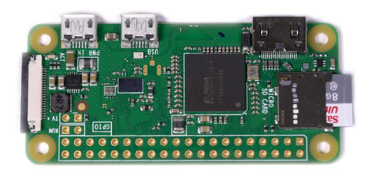
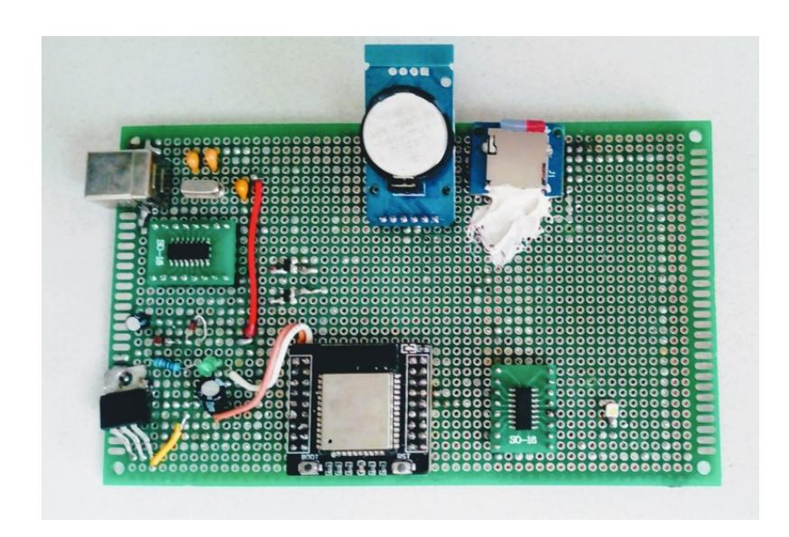
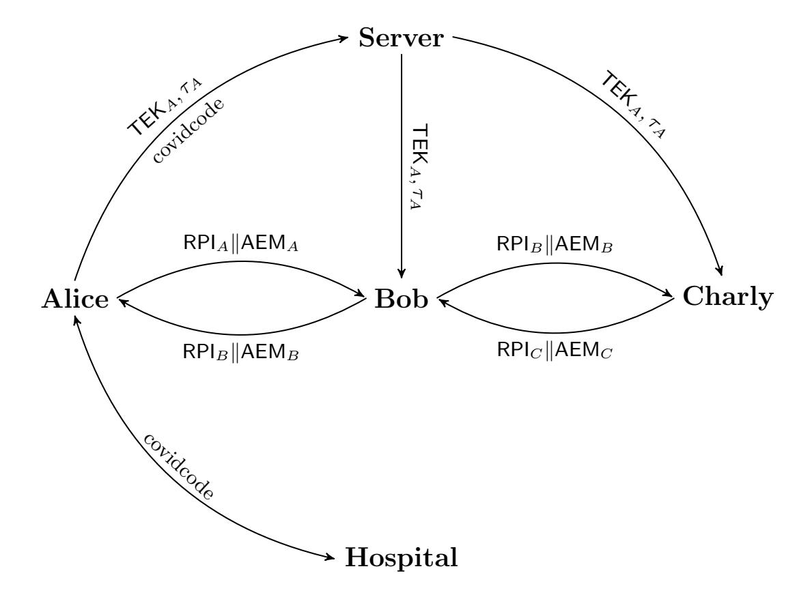
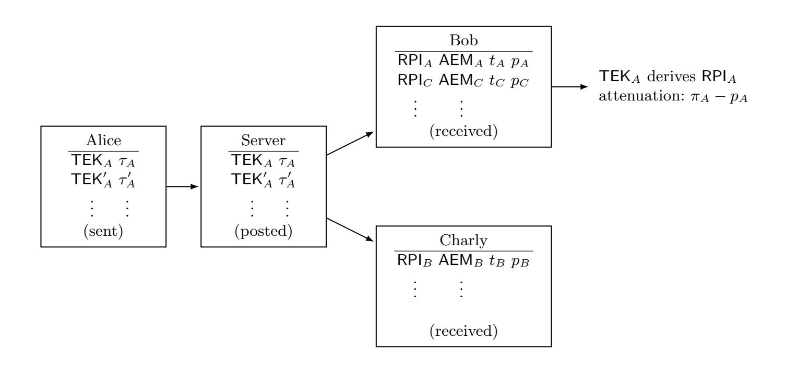
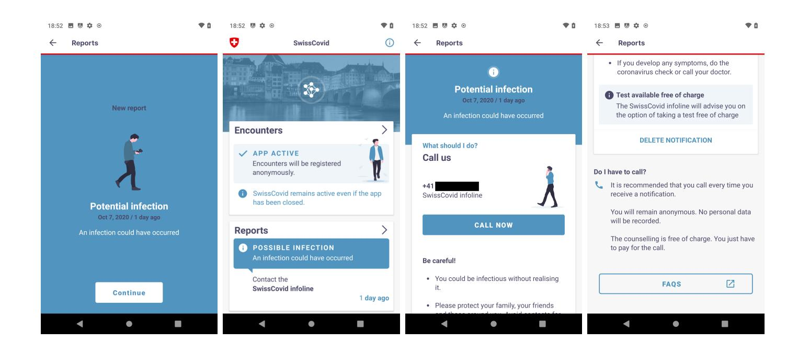
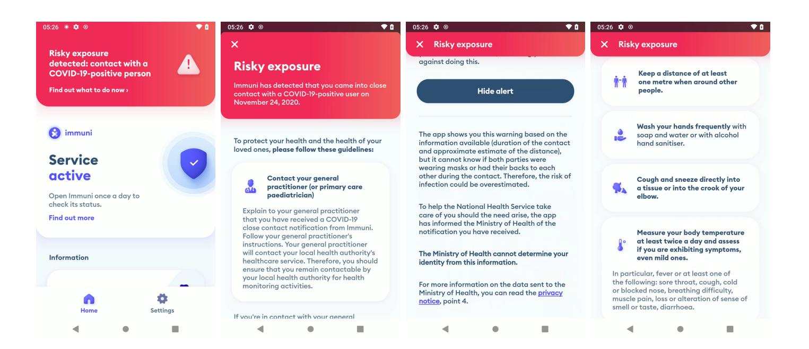
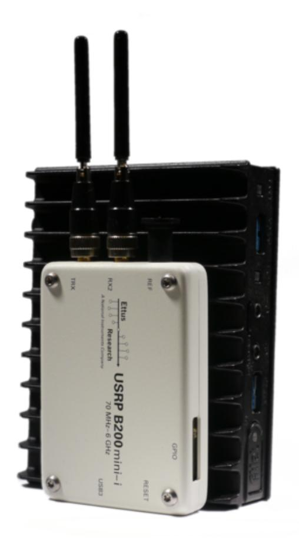
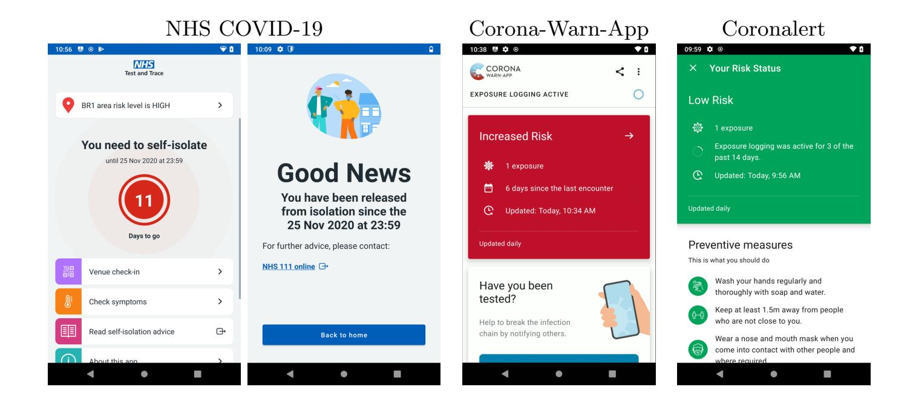
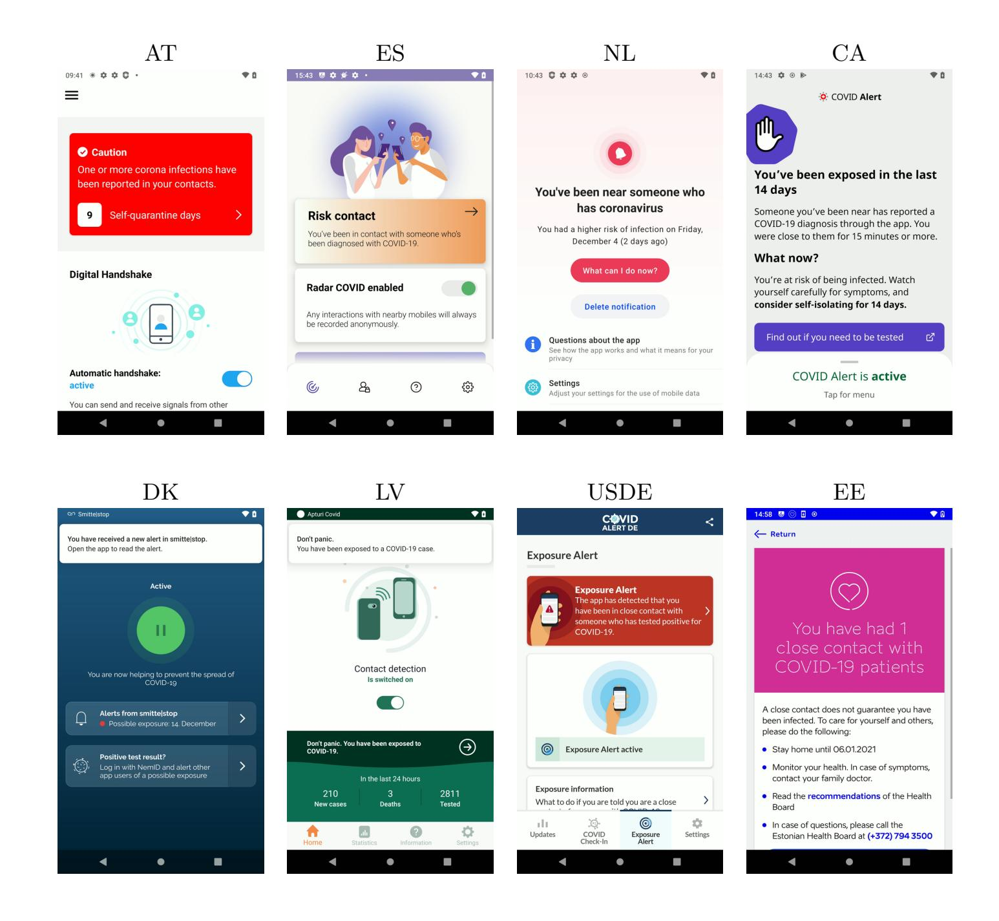

{0}------------------------------------------------

# **On the Effectiveness of Time Travel to Inject COVID-19 Alerts***⋆*

Vincenzo Iovino1 , Serge Vaudenay2 , and Martin Vuagnoux3

- 1 University of Salerno, Italy
- 2 EPFL, Lausanne, Switzerland
- 3 base23, Geneva, Switzerland

**Abstract.** Digital contact tracing apps allow to alert people who have been in contact with people who may be contagious. The Google/Apple Exposure Notification (GAEN) system is based on Bluetooth proximity estimation. It has been adopted by many countries around the world. However, many possible attacks are known. The goal of some of them is to inject a false alert on someone else's phone. This way, an adversary can eliminate a competitor in a sport event or a business in general. Political parties can also prevent people from voting.

In this report, we review several methods to inject false alerts. One of them requires to corrupt the clock of the smartphone of the victim. For that, we build a time-traveling machine to be able to remotely set up the clock on a smartphone and experiment our attack. We show how easy this can be done. We successfully tested several smartphones with either the Swiss or the Italian app (SwissCovid or Immuni). We confirm it also works on other GAEN-based apps: NHS COVID-19 (in England and Wales), Corona-Warn-App (in Germany), and Coronalert (Belgium).

The time-machine can also be used in active attack to identify smartphones. We can recognize smartphones that we have passively seen in the past. We can passively recognize in the future smartphones that we can see in present. We can also make smartphones identify themselves with a unique number.

Finally, we report a simpler attack which needs no time machine but relies on the existence of still-valid keys reported on the server. We observed the case in several countries. The attack is made trivial in Austria, Denmark, Spain, Italy, the Netherlands, Alabama, Delaware, Wyoming, Canada, and England & Wales. Other regions are affected by interoperability too.

## **1 Introduction**

Google and Apple deployed together the Exposure Notification (GAEN) system as a tool to fight the pandemic [3]. The goal of an GAEN-based app

*⋆* Videos are available on https://vimeo.com/477605525 (teaser) and https:// vimeo.com/476901083. This paper was presented at CT-RSA'21 [19].

{1}------------------------------------------------

is to alert people who have been in close proximity for long enough with someone who was positively tested with COVID-19 and who volunteered to report. How a user responds to such alert is up to the user, but one would expect that such user would contact authorities and be put in quarantine for a few days. In Switzerland, the alerted user is eligible to have a free COVID-19 test but the result of the test would not change his quarantine status.

GAEN is provided by default in all recent Android or iOS smartphones which are equipped with Bluetooth (except Chinese ones due to US regulation). It is installed without the consent of the user. However, it remains inactive until the user activates it (and possibly install an app which depends on the region).4

Once activated, GAEN works silently. A user who is tested positive with COVID-19 is expected to contribute by reporting through GAEN. This may have the conseque[nc](#page-1-0)e of triggering an alert on the phones of the GAEN users whom the COVID-positive user met.

Assuming an alerted user is likely to self-quarantine, and possibly make a test and wait for the result, this alerted user may interrupt his activities for a few days. A malicious adversary could take advantage of making some phones raise an alert. In a sport competition (or any other competition), an alerted competitor would stay away for some time. Malicious false alert injections could be done at scale to disrupt the activities of a company or an organization. This could be done to deter people from voting [17].

False injection attacks have been well identified for long [24,25]. It was sometimes called the *lazy student attack* where a lazy student was trying to escape from an exam by putting people in quarantine [15]. Nevertheless, the GA[EN](#page-25-0) protocol was deployed without addressing those attacks.

In most of cases, those attacks require to exploit a ba[ckd](#page-25-1)[oor](#page-25-2) in the system, or to corrupt the health authority infrastructure, or to corrupt a diagnosed user. Our goal is to show how easily and ine[xpe](#page-25-3)nsively we can make an attack which requires no such corruption.

Another important goal of GAEN is privacy preservation. Smartphones constantly broadcast random-looking numbers which are changing every few minutes. They are made to be unlinkable and unpredictable. It is already known that unlinkability is broken for positive cases who report, due to the so-called *paparazzi attack* [24]. Linkability is also sometimes

4 Throughout this paper, when we use "*GAEN* " as a noun, we mean a process which runs in the phone. Otherwise, we refer to the "*GAEN system*", the "*GAEN infrastructure*", or the "*GAEN protocol*" interch[ang](#page-25-1)eably.

{2}------------------------------------------------

harmed by that rotation of values and addresses is not well synchronized.5 Another goal of our work it to be able to recognize that two broadcasts which were obtained at different time come from the same smartphone and also to identify smartphones, even though the user did not report.

*Our contribution.* In this paper, we analyze possible false alert injection attacks. We focus on one which requires to corrupt the clock of the victim and to literally make it travel through time. By doing so, we can replay Bluetooth identifiers which have just been publicly reported but that the victim did not see yet. We replay them by making the victim go to the time corresponding to the replayed identifier then coming back to present time. We show several ways to make a smartphone travel through time and to make it receive an alert when it comes back to present time.

In the easiest setting, we assume that the victim and the adversary are connected to the same Wi-Fi network. This network does not need be administrated by the adversary. Essentially, the network tells the current time to the phone. We report on our successful experiments.

**Fig. 1.** Raspberry Pi Zero W

In Section 6.1 we describe the equipment we used in the experiments: a Raspberry Pi Zero W (Fig. 1) and a home-assembled device endowed with an ESP32 chipset (Fig. 2), both available on the market for about 10\$. It takes less than a minute to run the attack. In favorable cases (specifically, with the vari[ant](#page-13-0) using a rogue base station), the attack duration can be reduced to one second. [T](#page-3-0)h[e](#page-2-0) attacks possibly works on all GAEN-based

5 Little Thumb attack: https://vimeo.com/453948863

{3}------------------------------------------------

systems. We mostly tested it on the Swiss and Italian systems (SwissCovid and Immuni). We also verified on other apps. We conclude that such attacks are serious threats to society.

**Fig. 2.** Our ESP32-based device

Our attacks experimentally confirm the evidence that the GAEN infrastructure offers no protection even against (traditional) replay attacks. Switzerland reports 1 750 000 daily activations, which represents 20% of the population. There are millions of users in other countries too. Hence, many potential victims. They can be attacked from far away. Although the authorized Bluetooth maximum range is of 100 m, boosting it with a 10 kW amplifier in 2.4 GHz would enlarge the radius to many kilometers easily. Actually, commercial products are available [12].

Our technique can be also used to debug the notification mechanism of GAEN without directly involving infected individuals; this is a step forward in disclosing the GAEN's internals since GAEN is closed source and not even debuggable. (Precisely, to experiment wit[h t](#page-24-0)he GAEN system, you need a special authorization.)

In Section 7, we observe that several regions do post on their servers keys which are still valid and can be replayed with no time machine. This is the case of Austria, Denmark, Spain, Italy, the Netherlands. However, other regions like Canada and England & Wales post keys which have just expired and w[h](#page-18-0)ich are still accepted in replay attacks. In other regions, the existence of such keys in any interoperable region may be usable in a replay attack too.

In Section 8, we adapt the time-machine attack to break privacy. If an adversary has passively seen a smartphone in the past, it can recog

{4}------------------------------------------------

nize it in present using an active attack: namely, by making it replay the broadcast from the past. If an adversary wants to passively recognize a smartphone in the future, he can make it play the future broadcast immediately. Finally, by using a reference date in the far future and making the smartphone broadcast the key of this date, the adversary make smartphone identify themselves with a unique number.

*Disclaimer.* We did a responsible disclosure. We first reported and discussed the attack with the Italian Team of Immuni on September 24, 2020.6 Few days after we received an answer from an account administrated by the team stating:

*"thank you for reporting this replay attack. Unfortunately we beli[ev](#page-4-0)e that this is an attack against GAEN rather than Immuni and so it should be resolved by a protocol implementation update. Should you have suggestions for our own code base to prevent or mitigate the attack, please let us know and we will evaluate them."*

We reported the attack in Switzerland on October 5, 2020.7 We received an acknowledgement on October 10 stating:

*"The NCSC considers the risk in this case as acceptable. The risk assessment must also take into account whether there is a b[en](#page-4-1)efit and a ROI for someone who takes advantage of it. Especially since an attacker typically must be on site."*

We also reported a detailed attack scenario to Google on October 8.8 We received the following response:

*"At first glance, this might not be severe enough to qualify for a reward, though the panel will take a look at the next meeting a[nd](#page-4-2) we'll update you once we've got more information."*

(They subsequently offered a \$500 bug bounty reward.) The attack was also mentioned in the Swiss press and in an official document by Italian authorities. In *24 Heures* on October 89 , the representative of EPFL declared that the described attack is technically possible but would require too much resources and efforts.

6 https://github.com/immuni-app/immuni-[a](#page-4-3)pp-android/issues/278.

7 Registered incident INR 8418 by the National Cyber Security Center (NCSC) https://www.ncsc.admin.ch/dam/melani/de/dokumente/2020/SwissCovid\_ Public\_Security\_Test\_Current\_Findings.pdf.download.pdf/SwissCovid\_ Public\_Security\_Test\_Current\_Findings.pdf

8 [Reference 170394116 for component 310426.](https://github.com/immuni-app/immuni-app-android/issues/278)

9 [https://www.24heures.ch/les-quatre-failles-qui-continuent-de-miner-swisscovid](https://www.ncsc.admin.ch/dam/melani/de/dokumente/2020/SwissCovid_Public_Security_Test_Current_Findings.pdf.download.pdf/SwissCovid_Public_Security_Test_Current_Findings.pdf)-[348144831017](https://www.ncsc.admin.ch/dam/melani/de/dokumente/2020/SwissCovid_Public_Security_Test_Current_Findings.pdf.download.pdf/SwissCovid_Public_Security_Test_Current_Findings.pdf)

{5}------------------------------------------------

The Italian "Garante della Privacy" (the national data protection officer)10 commented that replay attacks with the purpose of generating fake notifications do not represent a serious vulnerability since they require the attacker to take possession of the victim's phone. Since both traditional repl[ay](#page-5-0) attacks and the variants of replay attacks we show in this paper can be performed without taking possession of the victim's phone, we contacted the aforementioned Italian authorities to provide clarifications about replay attacks and to ask whether they are aware of the fact that replay attacks can be performed without taking possession of the victim's phone but at time of writing we did not receive any answer.

Contrary to the reports in the news, we show here that time-travel attacks are easy to perform and effective.

## **2 How GAEN Works**

In short, GAEN selects every day a random key called TEK (as for *Temporary Exposure Key*). Given the daily TEK, it deterministically derives some ephemeral keys called RPI (as for *Rolling Proximity Identifier* ). Each RPI is emitted over Bluetooth several times per second during several minutes. Additionally, GAEN scans Bluetooth signals every 3–5 minutes and stores all received RPIs coming from other phones. If the user is diagnosed, the local health authorities provide an access code (which is called a *covidcode* in Switzerland). This is a one-time access code which is valid for 24 hours which can be used to *report*. If GAEN is instructed to report, it releases every TEK which was used in the last few days which the user allows to publish. At this point, a TEK is called a *diagnosis key*. The report and access code are sent to a server which publishes the diagnosis keys. Once a while, GAEN is also provided with the published diagnosis keys on the server. GAEN re-derives the RPI from those diagnosis keys and compares with the stored RPI of encounters. Depending on how many are in common, an alert is raised.

In Fig. 3, we have three users with their smartphones: Alice, Bob, and Charly. Bob meets the two others but Alice and Charly do not meet each other. They exchange their RPI. After a while, Alice gets positive and receives a covidcode. She publishes her TEK using her covidcode. Other participan[ts](#page-6-0) see the diagnosis key from Alice. They compare the derived RPI with what they have received. Only Bob finds a match and raises an alert. AEM and *τ* are defined below.

10 https://www.garanteprivacy.it/home/docweb/-/docweb-display/docweb/ 9468919.

{6}------------------------------------------------

**Fig. 3.** Exposure Notification Infrastructure

More precisely, we set

$$RPI = f(TEK, t)$$

where *t* is the time when RPI is used for the first time and *f* is a cryptographic function based on AES [3]. In the GAEN system, time is encoded with a 10-minute precision. Actually, the value of *t* is just incremented from one RPI to the next one, starting from the time when TEK is used for the first time. There is also an [A](#page-24-1)ssociated Encrypted Metadata (AEM) which is derived by

$$\mathsf{AEM} = g(\mathsf{TEK}, \mathsf{RPI}) \oplus \mathsf{metadata}$$

where *⊕* denotes the bitwise exclusive OR operation, metadata encodes the power *π* used by the sender to emit the Bluetooth signal, and *g* is a similar cryptographic function.

We list below a few important details.

- **–** What is sent over Bluetooth is the pair (RPI*,* AEM).
- **–** Received (RPI*,* AEM) pairs are stored with the time of reception *t* and the power *p* of reception.
- **–** What is published on the server are pairs (TEK*, τ* ) where *τ* is the time when TEK was used for the first time. (See Fig. 4.)

{7}------------------------------------------------

Fig. 4. Matching TEK from Server to Captured RPI

- New (TEK,  $\tau$ ) pairs are posted on the server with a date of release (not shown on the picture). Since they are posted when the user reports, the posting date can be quite different from  $\tau$ . This posting date is used to retrieve only newly uploaded pairs. Hence, the downloaded  $\tau$  do not come in order.
- When GAEN gets the downloaded diagnosis key TEK and derives the RPI, the time is compared with what is stored with a tolerance of  $\pm 2$  hours. If it matches, the receiver can decrypt AEM to recover the metadata, deduce the sending power  $\pi$ , then compare with the receiving power p to deduce the signal attenuation  $\pi - p$ .
- For Switzerland, the attenuation is compared with two thresholds which are denoted as  $t_1$  and  $t_2$  in the reference document [10]. If larger than  $t_2$ , it is considered as too far and ignored. If between  $t_1$  and  $t_2$ , the duration is divided by two to account that the distance is not so close. If lower than  $t_1$ , the encounter is considered as very close and the duration is fully counted. SwissCovid was launched on June 25, 2020 and the sensibility of parameters has been increased twice. Since September 11, 2020, the parameters are  $t_1 = 55 \text{ dB}$ ,  $t_2 = 63 \text{ dB}$  [10]. With those parameters, in lab experimental settings [10], the proba-

| distance of encounter               | $1.5\;\mathrm{m}$ | 2 m   | 3 m   |
|-------------------------------------|-------------------|-------|-------|
| $\overline{\Pr[attenuation < t_1]}$ | 57.3%             | 51.6% | 45.6% |
| $\Pr[attenuation < t_2]$            | 89.6%             | 87.5% | 84.2% |

bility to catch an encounter at various distances is as follows:

{8}------------------------------------------------

- **–** For Italy, only one threshold of 73 dB is used [21]. The same lab experiment as above indicate probabilities of 100%. Since July 9, the unique threshold was changed to 63 dB.
- **–** Every scan which spotted an encounter counts for the rounded number of minutes since the last scan with a maximum of [5 m](#page-25-4)inutes (possibly divided by two as indicated above). The total sum is returned and compared to a threshold of 15 minutes.

## **3 Summary of Techniques for False Alert Injection**

We list here several strategies to inject false alerts.

*Injection with Real Encounters.* The adversary encounters the victim normally and the victim records the sent RPI. If the adversary manages to fill a false report with his TEK, this will cause an alert for the victim [24]. Filling a false report can done

- **–** either due to a bug in the system
- **–** or by corrupting the health authority system
- **–** or by corrupting a user who received the credentials to report.

Switzerland corrected one bug: the ability for the reporter to set verification algorithm to "none" in the query, instructing the server not to verify credentials [1]. This is actually a commonly known attack on implementations using JWT (JSON Web Tokens) which is based on a dangerous default configuration [22].

A corruption system was fully detailed and analyzed by Avitabile, Friolo, and [V](#page-24-3)isconti [14]. Either positive people who receive a covidcode could sell it to buyers who would want to run the attack, or just-tested positive people could [be p](#page-25-5)aid for reporting a TEK provided by an attacker. The system could be made in such a way that buyers and sellers would never meet, their an[ony](#page-25-6)mity would be preserved, and their transaction would be secured. The infrastructure for this black business would collect a percentage on the payment. It would run with smart contracts and cryptocurrencies.

*Injection with Simulated GAEN.* We assume that the adversary uses a device (for instance, a laptop computer with a Bluetooth dongle) which mimics the behavior of the GAEN system. One difference is that this device sends Bluetooth signal with high power but announces them with a low power in AEM. This way, he can send the signal from far away and 

{9}------------------------------------------------

the computed attenuation will be low, like in a close proximity case. The victim can receive an RPI which is sent from the device and believe in a proximity. Reporting the TEK could be done like for the real encounter attack. The device can be attached to a running dog or a drone [15,18]. The attack can be done by a real infected person as a *trolling attack* [18].

A second advantage of this attack is that the sending device could be synchronized in its simulation with several other devices. (Synchronization would mean to use the same TEK.) This could be used by a [gr](#page-25-3)[oup](#page-25-7) of adversaries (terrorists, activists, gang) to inject false alerts in m[any](#page-25-7) victims [25]. All members of the group would be considered as a single person by the GAEN system and all their encounters would receive the same keys. In this case, it could also make sense to have one member of the group (a kamikaze) to genuinely become positive and report. The goal of s[uch](#page-25-2) attack would be to sabotage the digital contact tracing infrastructure, to lock ships in harbors (by targeting sailors), or to paralyze a city in quarantine [15].

*Injection with Replay Attack.* Another false encounter injection attack consists of replaying the RPI of someone else. Due to the GAEN infrastructure, the RPI is [val](#page-25-3)id for about two hours. One strategy consists of capturing the RPI of people who are likely to be reported soon. It could be people going to a test center, or people who are known to have symptoms but who did not get their test results yet [24]. Capturing their RPI can be done from far away with a good Bluetooth receiver. The malleability of the metadata in AEM can also be exploited to decrease the announced sending power [16,26].

*Injection with Belated Replay Attack.* Another form of replay attack consists of replaying the RPI which are derived from the publicly posted diagnosis keys [\[24](#page-25-8)[\]. B](#page-25-9)ecause GAEN only tries to match new diagnosis keys, the adversary can try with recently updated TEKs which have not been downloaded yet by the victim. This is doable since the app checks only a few times for newly uploaded keys during the day. Those keys are however outdat[ed](#page-25-1) and would normally be discarded when GAEN compares RPI with the ones derived from the diagnosis keys. However, we could send the phone of the victim in the past then send the outdated RPI to the phone. When the phone would be brought back to present, it would eventually raise an alert. Sending a phone in the past requires no time travel machine. It suffices to corrupt its internal clock.

A variant of this attack which surprisingly works uses no time machine but replays keys which are posted on the public server and *still valid*.

{10}------------------------------------------------

*Attack model.* In the rest of the paper, we consider the following attack model. The adversary has the ability to control the clock of the victim (this ability will not be used in Section 7). We do not assume any other ability such as changing the clock on the server, forging covidcodes, or corrupting people. Except in Section 8, the goal is to inject an alert on the phone of the victim without the victim having encountered a contagious person. In Section 8, the goal is to defe[at](#page-18-0) the unlinkability protection in the GAEN system and to infer if two phones which have been encountered are the same. Except in Secti[on](#page-21-0) 7, we do not rely on any specific implementation of digital contact tracing. We use GAEN as it is specified and implemented i[n](#page-21-0) commonly available phones.

## **4 Time-Traveling Phones**

Several techniques to corrupt the date and time of a smartphone have been identified (see Park et al. [23] for detailed information). In this section, we describe four of them. Modern smartphone operating systems use at boot time NTP (Network Time Protocol) if network access is provided. NITZ (Network Identity and Time Zone) may be optionally broadcasted by mobile operators. GNSS (Gl[oba](#page-25-10)l Navigation Satellite System) such as GPS can also be used. Finally, the clock can be manually set. The priority of these clock sources depends on the smartphone vendors. Some of them can be disabled by default, but in general, the priority (which we deduced by experiment on our phones) is MANUAL *>* NITZ *>* NTP *>* GNSS.

#### **4.1 Set Clock Manually**

This is technically the easiest attack, but it requires a physical access to the smartphone.11 An adversary picks a newly published TEK and computes one RPI for a date and time in the past. The adversary physically accesses the smartphone and sets the corresponding clock. Then, he replays the RPI for [15](#page-10-0) minutes using a Bluetooth device such as a smartphone or a laptop. Finally, the adversary sets the time back to present. As soon as the smartphone updates the new TEK list, an alert is raised.

A single RPI is generally not supposed to be repeated during 15 minutes as its rotation time is shorter (typically: 10 minutes). It seems that implementations do not care if it is the case. However, we can also use

11 It can be done without this assumption by using a vulnerability of the phone allowing to execute a code remotely.

{11}------------------------------------------------

two consecutive RPI from the same TEK and repeat them for their natural duration time.

Observe that in some circumstances the purpose of the attacker can be to send a fake notification to his own phone, in which case the assumption that the adversary has physical access to the phone of the victim makes perfect sense. This self-injection attack can be done to scare friends and family members, to get the permission of staying home from work, or to get priority for the COVID-19 test.12 Furthermore, in the case of the Italian app Immuni, each risk notification is communicated to the Italian Ministry of Health: the Italian authorities keep a counter on how many risk notifications have been sent to Im[mu](#page-11-0)ni's users.13 Therefore, sending fake notifications even to phones controlled by the adversary represents a serious attack in itself since it allows the attacker to inflate the official counter arbitrarily.

The Italian's counter of risk notifications only takes into account notifications sent from phones endowed with the "hardware attestation" technology, a service offered by Google. So, our attacks show a way to bypass this trusted computing mechanism to manipulate the official counters.

#### **4.2 Rogue NTP server**

If the smartphone is connected on the Internet on Wi-Fi, it may use NTP (Network Time Protocol) to synchronize clock information. If the adversary connects to the same Wi-Fi network of the victim, he may set an ARP-spoofing attack to redirect all NTP queries to a rogue server. Since NTP authentication is optional, the response from the rogue NTP server will be accepted and then, the adversary can remotely set the date and time of the smartphone.

If the adversary owns the Wi-Fi network (what we call a rogue Wi-Fi network), the attack is even simpler as it no longer requires any ARPspoofing. Instead, the adversary sets up an NTP server and controls time.

If the mobile network has a priority over NTP, we may assume that the victim is not connected to the mobile network. Otherwise, the adversary may have to jam it.

Depending on the smartphone vendors, NTP is used permanently or only at the boot time, then every 24 hours. Sometimes, third-party apps force constant NTP synchronization. The adversary may wait until an

12 Indeed, in Switzerland a risk notification has legal value in the sense that it gives priority for the COVID-19 test, a free test, and also subsidies when the employer does not give a salary to stay home without being sick.

13 https://www.immuni.italia.it/dashboard.html

{12}------------------------------------------------

NTP request is sent to trigger the whole attack. Otherwise, the adversary must make the victim's smartphone reboot. Making a target to reboot can be done by social engineering (by convincing the victim to reboot). Another way is to use a Denial-of-Service attack. With DoS, the adversary can remotely reboot a smartphone.

#### **4.3 Rogue Base Station**

NITZ messages are sent by mobile operator to synchronize time and date when a smartphone is connected to a new mobile network. This is generally used to set new time zone when roaming on another country.

Since the adversary must be physically close to the victim to broadcast replayed RPI, he may also set up a rogue mobile network base station to send corrupt NITZ message. Thus, when the victim is connected to the rogue mobile network, the date and time is modified. Compared to previous techniques, the adversary can now modify clock information at any time by disconnecting and reconnecting the smartphone at will. Note that since the adversary also controls mobile data, he may block update or NTP Requests to avoid potential issues.

Making sure that the victim connects to the rogue base station may require to jam the signal of the one it uses and to impersonate the network it subscribed to. Since there is no authentication of the base station, this is easily done.

#### **4.4 Rogue GNSS**

The last technique is to send a fake GNSS signal to modify internal clock of smartphones. Open source tools are available to generate GPS signals [7]. This attack is less practical, since smartphones may not accept GNSS as trusted source clock by default. Moreover, NITZ and NTP take precedence over GNSS.

# **5 [M](#page-24-4)aster of Time Attack**

A limitation of the attacks described above is the need to stay for at least 15 minutes close to the victim to replay RPI. However, GAEN is not continuously scanning Bluetooth broadcast (because of power consumption). Indeed, only 5 seconds of scan is performed regularly by the smartphone.14 The duration between two scans is random but typically

14 Technically, the scan listens for 4 seconds but an extra second may be needed to activate the scan.

{13}------------------------------------------------

in the 3–5 minutes range. Since the adversary is able to modify the date and time at any time, we define an improvement, called *Master of Time*, to accelerate the alert injection process.

The goal of the improvement is to trigger the 5-seconds scans more quickly. The adversary first goes in the past to the corresponding time and date of the replayed RPI. This generally triggers a 5-second scan. After that, a random delay is selected by the phone. However, the adversary updates the time again, but to 5 minutes later. The phone realizes it missed to scan and this triggers an immediate opportunistic scan. After this new 5-seconds scan, the adversary updates the time to 5 minutes later again and a third scan is launched. Finally in 15 seconds, the adversary can trigger enough 5-seconds scans to simulate an exposure of more than 15 minutes. This improvement can be applied to all the techniques described above.

There is actually no need to wait for the entire duration of a scan. We can actually reduce the duration between time jumps to 200ms but we should also increase the frequency of sending RPI. Hence, we broadcast over Bluetooth every 30ms. Since the duration of a time jump using a rogue base station takes 100ms, the entire attack takes less than one second in total.

## **6 Experiments**

In this section, we give a detailed description of the Rogue NTP Server Attack and the Rogue Base Station Attack with threat model, experimental setup and results. We tested all options of the attack we mention. We should stress that attacks are not always stable (our success rate is at least 80%) but failure cases are often due to bugs in the phone (in the app, in GAEN, or in the operating system). We found workaround to increase the reliability. However, this technology is a living matter and so are the workarounds we found.

#### **6.1 Rogue NTP server**

We list here a few assumptions.

- **–** The adversary must be within the Bluetooth range of the victim.15
- **–** The adversary must access to the same Wi-Fi network of the smartphone and redirect data traffic (by using ARP spoofing attack or rogue Wi-Fi network).

15 This range could be enlarged using a 2.4GHz amplifier.

{14}------------------------------------------------

- **–** If NITZ has a priority over NTP, we assume that the victim is not connected to the mobile network. Otherwise, the adversary may have to jam it.
- **–** Depending on the smartphone model, the adversary may need to force NTP as explained in Section 4.2.
- **–** We also assume that the victim has not pulled yet the last updated TEK-list which is used by the adversary. (Otherwise, the victim will not try to match it and the a[ttac](#page-11-1)k fails.)

The hardware needed for this attack is relatively simple. Only Wi-Fi and Bluetooth are needed. We tested several smartphones (Motorola z2 force, Samsung Galaxy S6, Samsung Galaxy A5; in Section 6.3 we tested with a more recent phone.). We used a Raspberry Pi Zero W (Fig. 1) to host a rogue NTP server. We use a custom Python-based NTP server to deliver the date and time retrieved from the selected TEK.

We also tested using a different hardware platform. We u[sed](#page-17-0) an homeassembled device endowed with an ESP32 chipset available on A[ma](#page-2-0)zon for about 10 Euros. Full fledged devices with the ESP32 chipset are available in different sizes, for instance in watches16, and as such are easily concealable by an attacker.

In rogue Wi-Fi settings, we set up the device as a rogue Wi-Fi access point. Then, we redirect all UDP connections [o](#page-14-0)n port 123 to the rogue NTP server (hosted on the same device). We also configure the access point to block TEK-list queries by the smartphone to avoid potential issues. When using a genuine Wi-Fi network, we use ARP spoofing to redirect to the rogue NTP server and also to block Internet access to the victim's phone so as to prevent the download of the TEK-list during the critical phases of the attack.

The attack then works as follows.

- 1. The adversary retrieves the updated TEK-list (which is publicly available) from the official server.
- 2. He picks a new TEK and derives an RPI and AEM. The emission power in AEM is set to low to improve the chances for the RPI to be accepted.
- 3. The adversary waits for an NTP request from the smartphone17. He replies to NTP requests with the date and time of the RPI (i.e. in the past).

16 https://www.banggood.com/it/LILYGO-TTGO-T-Watch-2020-ESP32-Mai[n-C](#page-14-1)hip-1 54-Inch-Touch-Display-Programmable-Wearable-Environmental-Interaction-Watch-p-1671427.html.

17 He can also trigger it with a Denial-of-Service attack to reboot the smartphone.

{15}------------------------------------------------

- 4. He sends for at least 15 minutes the RPI*∥*AEM using the Raspberry Pi Zero W and Bluez tools.
- 5. The active part of the attack can stop here. The adversary can wait for the smartphone to restore the date and time by itself, then update the TEK-list and raise an alert. Alternately, the adversary can set the clock back to normal then wait for the TEK-list update.

We tested all variants of the attacks described above with success. Sometimes the smartphone has issues to update the TEK-list and it may need up to 12 hours to trigger the alert.

**Fig. 5.** Screen Captures of SwissCovid Raising an Alert

The experiment was performed for SwissCovid and Immuni. Fig. 5 shows screenshots of an alert on SwissCovid and Fig. 6 shows pictures of an alert on Immuni. Observe that while SwissCovid allows to take screenshots of alerts, Immuni prevents that for security reasons.

#### **6.2 Rogue Base Station**

We list here a few assumptions.

- **–** The victim must be within the range of the adversary rogue base station and Bluetooth USB dongle (this range can be enlarged using amplifiers).
- **–** The victim smartphone is registered to the rogue base station.
- **–** We also assume that the victim has not pulled yet the last updated TEK-list which is used by the adversary. (Otherwise, the victim will not try to match it and the attack fails.)

{16}------------------------------------------------

**Fig. 6.** Pictures of Immuni Raising an Alert

For this attack we used a mini PC Fitlet2 (Intel J3455) with a Bluetooth USB dongle and the Software Defined Radio (SDR) USRP B200-mini (Fig. 7). We used several open source projects such as Osmocom suite [4], OpenBTS [8], YateBTS [11] and srsLTE [9]. We eventually setup a 2G rogue base station because of the lack of mutual authentication. Our tests were realized in a Faraday cage to comply with legal regulations. Since [t](#page-17-1)he rogue base station also manages network access, we block T[EK](#page-24-5)list update[s a](#page-24-6)nd NTP re[que](#page-24-7)sts. Note that [t](#page-24-8)he cost of the attack can be significantly reduced by using a modified Motorola C123 mobile phone as the SDR [5] or even a USB-to-VGA dongle [6]! Below we describe our attack with the Master of Time variant, Hence, the whole attack takes less than a second.

- 1. The adve[rs](#page-24-9)ary retrieves the updated TEK-li[st](#page-24-10) (which is publicly available) from the official server.
- 2. He picks a new TEK and derives an RPI and AEM. The emission power is set to low to improve the chances for the RPI to be accepted.
- 3. Using NITZ message, the adversary sends the smartphone to the past at the corresponding date and time of the RPI.
- 4. He sends the RPI*∥*AEM using the Bluetooth USB dongle, following the Master of Time attack with NITZ. This requires less than a second.
- 5. The active part of the attack can stop here. The adversary can wait for the smartphone to restore date and time by disconnecting it from the rogue base station or sets the clock back to normal on the smartphone with a last NITZ message.

{17}------------------------------------------------

**Fig. 7.** Rogue Base Station USRP B200-Mini with a Fitlet2

6. The app eventually updates the TEK-list. The replayed RPI will be considered as genuine since the exposure duration is more than 15 minutes, within the defined time frame and emitted with low power. Hence, an alert will be raised.

The attack using a 2G rogue base station is common. As all phones are compatible with 2G, it may only require to jam 3G/4G signals. Most likely, 2G will phase out from smartphones way later than the virus. If not, rogue 3G/4G base stations can be made too, but it would require to bypass authentication (at least, on phones which use it [23]).

#### **6.3 Experimenting the Attack with a Journalist**

A demo of the attack on the Immuni's app was carried [ou](#page-25-10)t in presence of a journalist of the Italian television RAI who was seemingly interested in making the public aware of the danger of replay attacks in general. (The demo and the interview did not focus on time-traveling phones and the more sophisticated technicalities we show in this paper). For this, the journalist bought a new smartphone (Samsung Galaxy A21S) on October 16, 2020 and we used it as a target. At the end of the demo, the journalist 

{18}------------------------------------------------

saw an alert for a close contact which was supposed to have occurred on October 14, two days before the smartphone was bought! Every step, from the purchase of the phone to the display of the alert, was filmed by the journalist.18

## **6.4 Other [GA](#page-18-1)EN-based Apps**

We tried few other GAEN-based apps with success. With NHS COVID-19 (the app which is used in England and Wales), the app puts the user in quarantine and releases it after a few days (we used our time machine to check it). The app also shows at-risk areas (like BR1 which is in London). Fig. 8 also shows Corona-Warn-App (the app in Germany) and Coronalert (Belgium).

**Fig. 8.** Screen Captures of Various GAEN-Based Apps Raising an Alert

## **7 KISS Attack**

GAEN was developed with the *Keep It Stupid Simple* (KISS) principle. We can have false alert injection attacks following this principle too: by replaying keys which are publicly available.

18 https://www.rai.it/programmi/report/

{19}------------------------------------------------

## **7.1 Still-Valid Keys**

The previous attack uses reported keys which are outdated and needs a time machine to replay them. Sometimes, as it is allowed by the GAEN infrastructure, diagnosed users also want to report on the server for some RPIs that they have broadcasted in the last minutes. These are keys derived by the currently used TEK which is valid for the rest of the day. Hence, we sometimes find on the server some TEKs which are still active. It is a bit surprising because this potential attack was already mentioned in a report disclosed the 8th of April [24, Section 4.3].

Sometimes, regions are careful not to post still-valid keys but they publish just-expired ones which are still accepted due to the tolerance of GAEN with the validity period.

We monitored the existence of still-[val](#page-25-1)id or just-expired keys in GAENbased systems. During a few days, we regularly checked if the server were suggesting TEKs which were still active in many regions. Our results are as follows:

- **–** Regions we tested (23): AT, BE, CA, CH, CZ, DE, DK, EE, ES, FI, GI, IE, IT, LV, MT, NL, PL, PT, USAL (Alabama), USDE (Delaware), USWY (Wyoming), UKEW (England & Wales), UKNI (North Ireland).
- **–** Regions providing still-valid TEKs as we observed (8): AT, DK, ES, IT, NL, USAL (Alabama), USDE (Delaware), USWY (Wyoming).
- **–** Regions providing just-expired TEKs as we observed (2): CA, UKEW (England & Wales).

In all regions with valid TEKs observed, we successfully injected false alerts without any time machine. More screen captures are shown on Fig. 9.

To monitor reported TEKs on servers, we used the information collected by the TACT project by Leith and Farrell [20] and some of the scri[pts](#page-20-0) they developed.19

#### **7.2 Consequences of Interoperability**

The interoperability i[nfr](#page-19-0)astructure in Europe is based on a *Federation Gateway Service*. As of 19 October 202020, the following regions in Europe are part of it:

19 https://github.com/sftcd/tek\_transpar[en](#page-19-1)cy/

20 https://ec.europa.eu/health/sites/health/files/ehealth/docs/gateway\_ jointcontrollers\_en.pdf

{20}------------------------------------------------

Fig. 9. Screen Captures of More GAEN-Based Apps Raising an Alert

{21}------------------------------------------------

Germany Ireland Italy Denmark Croatia Poland

Republic of Latvia The Netherlands

Spain Cyprus

The system works as follows [2]: a user selects the regions he visited or he is visiting on his home app. In the case the user is diagnosed and reports, the app will indicate the regions visited by the user (as declared). His home server will forward to the Federation Gateway Service. Each server retrieves from this service the [k](#page-24-11)eys they are interested in. This could mean all keys. When the app wants to check exposure, it retrieves from its home server the keys of relevant regions. This is how the systems works with Immuni in Italy. Things could be a bit different in other countries.

When a still-valid key is discovered in any region *A* of the interoperable system, users of any other region *B* of the system may be subject to the attack if the key is transferred from *A* to *B*. For instance, we observed that still-valid keys are never transferred to Germany.

However, as soon as we observe a valid key in — say — Italy, we can start replaying it in any country and hope it will be transferred there. With a Bluetooth dongle, we can replay 100–200 different RPI during a 4-second Bluetooth scan. They will all count for a few minutes encounter. Hence, we can blindly try all the still-valid keys from any country and hope that one will appear on the server. During our monitoring period, we found from 200 to 500 still-valid keys every day in the indicated countries.

We list below the transfers of still-valid keys which we observed:

- **–** Regions reporting transferred still-valid keys: DK, ES, IT, NL, LV, PL, IE.
- **–** Region reporting transferred just-expired keys: DE.

## **8 My-Number Attack**

On Android, GAEN cleans up its list of TEKs when they are older than 14 days. This operation is done once a while or when the smartphone is rebooted. However, TEKs are immediately generated as soon as they are needed, i.e. when the date is modified or at midnight. Interestingly, if a TEK has been already picked for this day, it will be reused, as well as the RPIs.

An adversary controlling the time can exploit these principles to identify smartphones. We list below several attacks which have been successfully tested.

{22}------------------------------------------------

To mitigate the attack, we can inspire from those verses:

You don't have my number We don't need each other now *Foals — My Number*

*Back to the past.* The adversary wants to recognize a smartphone which sent an RPI in the recent past (less than 14 days old) at a specific date and time. Alternately, a forensic attack on a smartphone wants to recognize its past encounters by the stored RPIs. The adversary wonders if the smartphone to recognize is currently around. He uses a time machine to send the surrounding smartphones to the specific date and time. Then, he compares collected RPIs. If the same RPI is received, the smartphone is identified. Clearly, this breaks the unlinkability claims of the GAEN protocol.

*Back to the future.* The adversary wants to identify smartphones around him during a future event which will occur at a given date. For this, the adversary can identify smartphones in the present and send them to this future date to collect the RPIs they will use. Then, when the even occurs, these smartphones will repeat the collected RPIs and the adversary will associate them with an identity.

*Back to the far future.* To identify smartphones on request, the adversary can send them systematically to a specific date in the far future, such as 12.9.2021. By moving into a fixed date in the far future, GAEN will create a TEK for this date and it will stay in memory until 14 days after this date, which could practically mean "forever". Hence, every smartphone will advertise itself by broadcasting a unique RPI which will always be the same until 26.9.2021.

Note that we were able to create TEKs for the year of 2150, but the operating system became unstable. In particular, a value containing the number of days since epoch (coded with 2 bytes) was overflowed.

## **9 Countermeasures**

Clearly, GAEN was developed under the assumption that phones have a reliable clock. Our attacks show that phones do *not* have a reliable clock, that it can be controlled by an adversary, and that it can be exploited to break GAEN.

As a countermeasure, we would urge operating systems developers to strengthen the security of the clock, or at least to implement detection 

{23}------------------------------------------------

of time-travel attacks. Clearly, a dirty quick fix could be to keep record of past clocks and to check that the clock value only increases. GAEN should not proceed if the clock is rewinded. However, this would open the door to denial-of-services attacks. Ideally, such monitoring should be done at the operating system level.

If there is no way to rely on a clock, the GAEN infrastructure should be revisited. Ideally, the server should not give information helping the adversary to replay beacons. To avoid more possible replay attacks, the encounter could rely on an interactive protocol which would make replay impossible. This would require to reopen the debate on centralized versus decentralized systems and about third ways in between [25]. Some alternate solutions exist such as Pronto-C2 [13].

As for the KISS attack, clearly, TEKs must be better filtered. Countries should never post a key which is still active or just expired. They should further monitor if countries in the sa[me](#page-24-12) federation do s[o an](#page-25-2)d filter the dangerous TEKs they would publish.

## **10 Conclusion**

In this paper, we demonstrate that alert injections against the GAEN infrastructure of Google and Apple are easy to achieve even without collaboration or corruption of infected individual, Apple, Google, or health authorities. The attack requires little equipment, is fast, and can be done by anyone. It could be done at scale too.

Moreover, people can generate alert injections on their own phones motivated by different purposes: e.g., frightening their own family members or friends, showing the alert to their employers to be exempted by work, or simply to have priority to the COVID-19 test with the terrible side effect of congesting the health system. We point out that in Italy the Ministry of Health does receive a notification when a user is alerted and being such notifications anonymous is impossible for the authorities to distinguish genuine alerts from fake ones; terrorists and criminals could generate fake alerts on phones controlled by themselves to make the Italian health authorities believe that there are much more at-risk individuals, so to induce Italian authorities to take drastic political decisions.

The time machine can also be used to break privacy and identify smartphones. In an active attack, we can recognize smartphones from the past, smartphones in the future, or even make them identify with a unique number.

{24}------------------------------------------------

The time machine's techniques we describe in this work are also useful to test the GAEN system offline and to figure out details that are not public since GAEN is not open source and Google and Apple restrict access to the GAEN's API to health authorities.

*Acknowledgements.* The authors thank Biagio Pepe, Mario Ianulardo, and Shinjo Park for useful suggestions and technical advice. We also thank Doug Leith and Stephen Farrell for their script and help to test our attacks in some regions.

# **References**

1. CVE-2020-15957.

https://cve.mitre.org/cgi-bin/cvename.cgi?name=CVE-2020-15957

2. eHealth Network Guidelines to the EU Member States and the European Commission on Interoperability specifications for cross-border transmission chains between approved apps. Detailed interoperability elements between COVID+ Keys driven solutions. V1.0 16 June 2020.

[https://ec.europa.eu/health/sites/health/files/ehealth/docs/](https://cve.mitre.org/cgi-bin/cvename.cgi?name=CVE-2020-15957) mobileapps\_interoperabilitydetailedelements\_en.pdf

3. Exposure Notification. Cryptography Specification. v1.2 April 2020. Apple & Google.

[https://www.google.com/covid19/exposurenotifications/](https://ec.europa.eu/health/sites/health/files/ehealth/docs/mobileapps_interoperabilitydetailedelements_en.pdf)

4. Osmocom Suite.

[https://osmocom.org/](https://ec.europa.eu/health/sites/health/files/ehealth/docs/mobileapps_interoperabilitydetailedelements_en.pdf)

5. OsmocomBB.

[https://projects.osmocom.org/projects/baseband](https://www.google.com/covid19/exposurenotifications/)

6. osmo-fl2k.

<https://osmocom.org/>projects/osmo-fl2k

7. osqzss.

https://github.com/osqzss/gps-sdr-sim

8. [Range Networks. OpenBTS.](https://projects.osmocom.org/projects/baseband)

[http://openbts.org](https://osmocom.org/projects/osmo-fl2k)

9. srsLTE.

https://www.srslte.com/

10. [SwissCovid Exposure Score Calculation. Ve](https://github.com/osqzss/gps-sdr-sim)rsion of 11 September 2020. https://github.com/admin-ch/PT-System-Documents/blob/master/ [SwissCovid-Exposur](http://openbts.org)eScore.pdf

11. Yate. YateBTS.

[https://yatebts.com](https://www.srslte.com/)

12. R. Dallon Adams. 20-mile Bluetooth beacon? Apptricity announces Ultra Long-[Range device. TechRepublic 2020.](https://github.com/admin-ch/PT-System-Documents/blob/master/SwissCovid-ExposureScore.pdf)

[https://www.techrepublic.com/a](https://github.com/admin-ch/PT-System-Documents/blob/master/SwissCovid-ExposureScore.pdf)rticle/20-mile-bluetooth-beacon-apptricityannounces-ultra-long-range-device/

13. [Gennaro Avitabile, Vi](https://yatebts.com)ncenzo Botta, Vincenzo Iovino, Ivan Visconti. Towards Defeating Mass Surveillance and SARS-CoV-2: The Pronto-C2 Fully Decentralized Automatic Contact Tracing System. Cryptology ePrint Archive: Report 2020/493. IACR. [http://eprint.iacr.org/2020/493](https://www.techrepublic.com/article/20-mile-bluetooth-beacon-apptricity-announces-ultra-long-range-device/)

{25}------------------------------------------------

- 14. Gennaro Avitabile, Daniele Friolo, Ivan Visconti. TEnK-U: Terrorist Attacks for Fake Exposure Notifications in Contact Tracing Systems. Cryptology ePrint Archive: Report 2020/1150. IACR.
  - http://eprint.iacr.org/2020/1150
- 15. Xavier Bonnetain, Anne Canteaut, V´eronique Cortier, Pierrick Gaudry, Lucca Hirschi, Steve Kremer, St´ephanie Lacour, Matthieu Lequesne, Ga¨etan Leurent, L´eo Perrin, Andr´e Schrottenloher, Emmanuel Thom´e, Serge Vaudenay, Christophe Vuillot. Le tra¸cage anonyme, dangereux oxymore. Analyse de risques `a destination [des non-sp´ecialistes. \(English version: A](http://eprint.iacr.org/2020/1150)nonymous Tracing, a Dangerous Oxymoron — A Risk Analysis for Non-Specialists.) https://risques-tracage.fr/
- 16. Paul-Olivier Dehaye, Joel Reardon. SwissCovid: a Critical Analysis of Risk Assessment by Swiss Authorities. Preprint arXiv:2006.10719 [cs.CR], 2020. https://arxiv.org/abs/2006.10719
- 17. Rosario Gennaro, Adam Krellenstein, J[ames Krellenstein. Exposure Not](https://risques-tracage.fr/)ification System May Allow for Large-Scale Voter Suppression. https://static1.squarespace.com/static/5e937afbfd7a75746167b39c/t/ 5f47a87e58d3de0db3da91b2/1598531714869/Exposure\_Notification.pdf
- 18. [Yaron Gvili. Security Analysis of the C](https://arxiv.org/abs/2006.10719)OVID-19 Contact Tracing Specifications by Apple Inc. and Google Inc. Cryptology ePrint Archive: Report 2020/428. IACR. http://eprint.iacr.org/2020/428
- 19. [Vincenzo Iovino, Serge Vaudenay, Martin Vuagnoux. On the Effectiveness of T](https://static1.squarespace.com/static/5e937afbfd7a75746167b39c/t/5f47a87e58d3de0db3da91b2/1598531714869/Exposure_Notification.pdf)ime [Travel to Inject COVID-19 Alerts. In](https://static1.squarespace.com/static/5e937afbfd7a75746167b39c/t/5f47a87e58d3de0db3da91b2/1598531714869/Exposure_Notification.pdf) *Topics in Cryptology (CT-RSA'21): The Cryptographers' Track at the RSA Conference 2021*, Virtual Event, Lecture Notes in Computer Science 12704, pp. 422–443, Springer-Verlag, 2021. [https://doi.org/10.1007/978-3-0](http://eprint.iacr.org/2020/428)30-75539-3\_18
- 20. Douglas J. Leith, Stephen Farrell. Testing Apps for COVID-19 Tracing (TACT). Research project.
  - https://down.dsg.cs.tcd.ie/tact/
- 21. Douglas J. Leith, Stephen Farrell. Measurement-Based Evaluation Of [Google/Apple Exposure Notification API For](https://doi.org/10.1007/978-3-030-75539-3_18) Proximity Detection In A Light-Rail Tram. PLoS ONE 15(9) 2020. https://doi.org/10.1371/journal.pone.0239943
- 22. [Vickie Li. Hacking JSON Web Tokens](https://down.dsg.cs.tcd.ie/tact/) (JWTs). Oct 27, 2019. https://medium.com/swlh/hacking-json-web-tokens-jwts-9122efe91e4a
- 23. Shinjo Park, Altaf Shaik, Ravishankar Borgaonkar, JeanPierre Seifert. White Rabbit in Mobile: Effect of Unsecured Clock Source in Smartphones. Proceedings of [the 6th Workshop on Security and Privacy in Sma](https://doi.org/10.1371/journal.pone.0239943)rtphones and Mobile Devices, SPSM@CCS 2016, Vienna, Austria, October 24, 2016, pp. 13–21. ACM 2016. [https://doi.org/10.1145/2994459.2994465](https://medium.com/swlh/hacking-json-web-tokens-jwts-9122efe91e4a)
- 24. Serge Vaudenay. Analysis of DP3T — Between Scylla and Charybdis. Cryptology ePrint Archive: Report 2020/399. IACR. http://eprint.iacr.org/2020/399
- 25. Serge Vaudenay. Centralized or Decentralized? The Contact Tracing Dilemma. [Cryptology ePrint Archive: Report 2020/531.](https://doi.org/10.1145/2994459.2994465) IACR. http://eprint.iacr.org/2020/531
- 26. Serge Vaudenay, Martin Vuagnoux. Analysis of SwissCovid. [https://lasec.epfl.ch/people/vau](http://eprint.iacr.org/2020/399)denay/swisscovid/swisscovid-ana.pdf