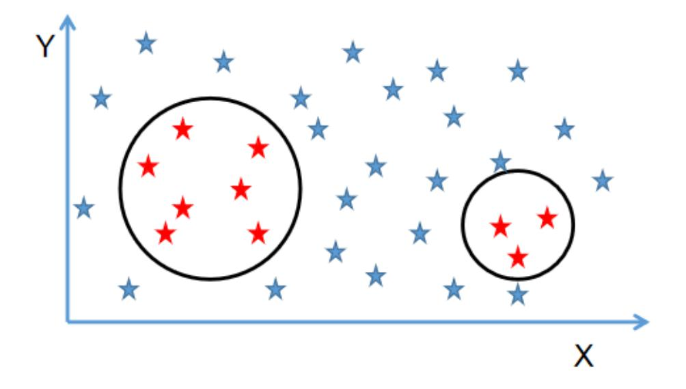
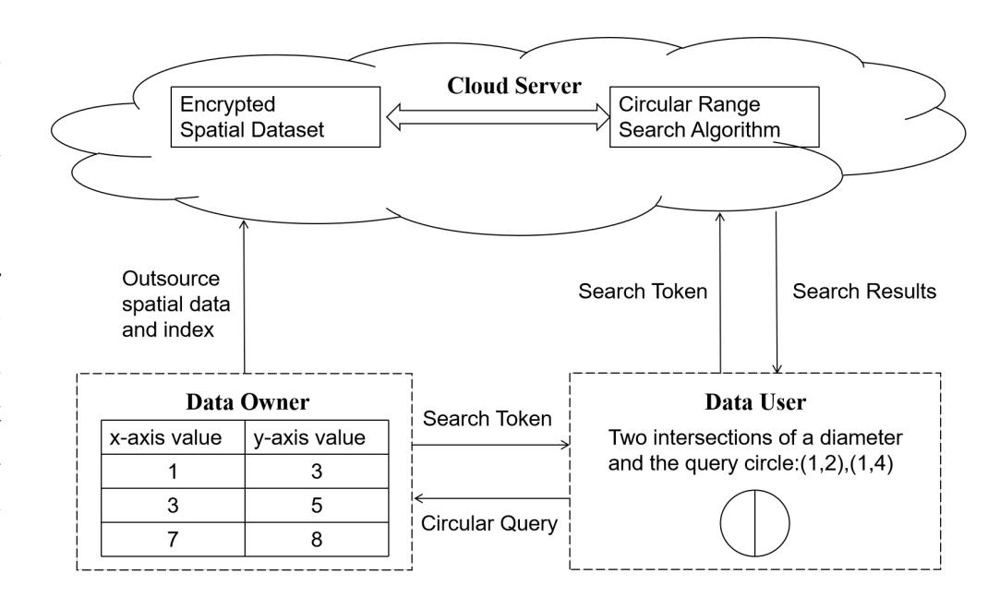
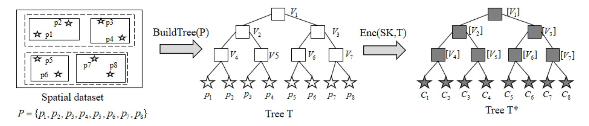
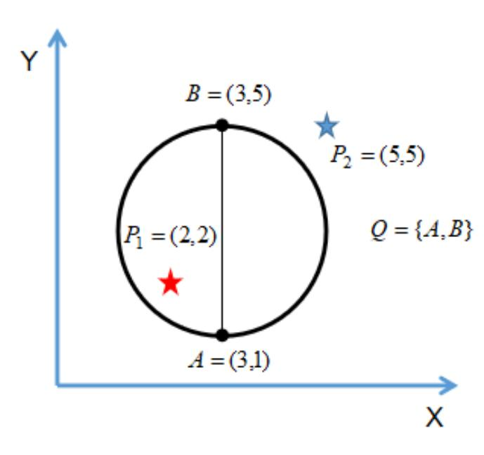
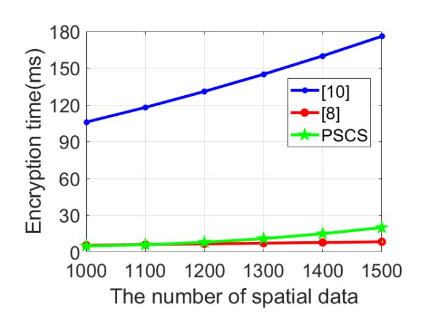
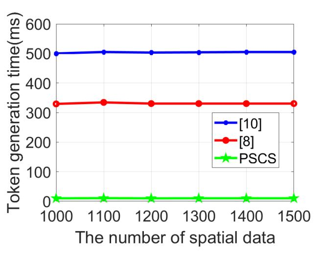
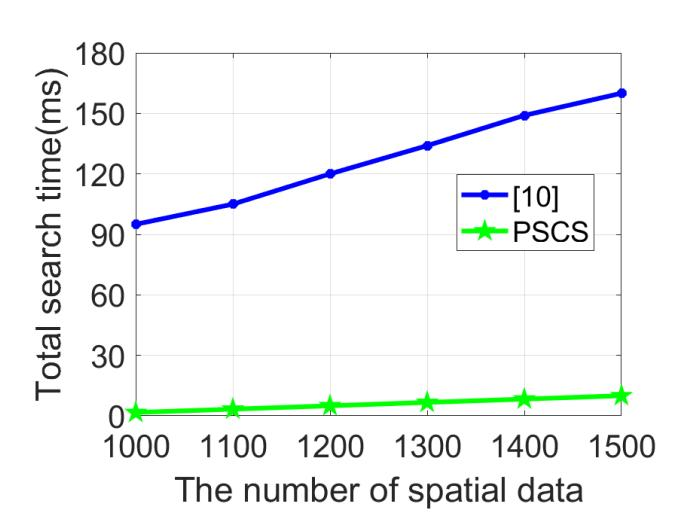

{0}------------------------------------------------

# Practical and Secure Circular Range Search on Private Spatial Data

Zhihao Zheng \*, Zhenfu Cao\*†, Jiachen Shen\*

\*Shanghai Key Laboratory of Trustworthy Computing, East China Normal University, Shanghai, China

†Cyberspace Security Research Center, Peng Cheng Laboratory, Shenzhen and
Shanghai Institute of Intelligent Science and Technology, Tongji University, China
Email: 51184501091@stu.ecnu.edu.cn, {zfcao, jcshen}@sei.ecnu.edu.cn

Abstract—With the location-based services (LBS) booming, the volume of spatial data inevitably explodes. In order to reduce local storage and computational overhead, users tend to outsource data and initiate queries to the cloud. However, sensitive data or queries may be compromised if cloud server has access to raw data and plaintext token. To cope with this problem, searchable encryption for geometric range is applied. Geometric range search has wide applications in many scenarios, especially the circular range search.

In this paper, we propose a practical and secure circular range search scheme (PSCS) to support searching for spatial data in a circular range. With our scheme, a semi-honest cloud server will return the data for a given circular range correctly without revealing index privacy or query privacy. We propose a polynomial split algorithm which can decompose the inner product calculation neatly. Then, we formally define the security of our scheme and theoretically prove that it is secure under same-closeness-pattern chosen-plaintext attacks (CLS-CPA). In addition, we demonstrate the efficiency and accuracy through analysis and experiments compared with existing schemes.

*Index Terms*—spatial data, cloud server, circular range search, index privacy, query privacy

## I. INTRODUCTION

Geometric range search is an indispensable function in most SQL and NoSQL databases, which has received increasing attention due to its wide applications, such as in geographic information systems and computational geometry [1]. In a spatial database, spatial data are usually represented by coordinate points in a Euclidean space and a geometric range query is represented by a geometric shape. Finally, database returns all spatial data that fall in the query range to user. In particular, circular range search (as shown in Fig. 1) is the most frequent of all geometric range search. Most applications on mobile devices provide location-based services about circular range search. For example, Yelp can help us find supermarkets within one mile, and FourSquare can help us find friends nearby.

It is exactly because of rapid developments of these application services that the volume of spatial data is increasing in an unstoppable manner, causing some companies to outsource data to cloud service providers (e.g., Amazon EC2) to reduce local storage and computational overhead. However, a realistic problem is that we consider cloud servers are semi-honest, which means if we do not encrypt original spatial data and queries, then cloud servers can easily obtain private data and interests of users. Therefore, it is necessary to design a

Fig. 1. Circular range search.

protocol to prevent privacy leakage. One of the most naive methods is to directly encrypt spatial data with traditional encryption like AES. Unfortunately, it requires huge computational overhead to perform matching operations on ciphertext and inevitably cause search functionality concerns. Under such requirements, searchable encryption [2] was proposed.

However, most existing searchable encryption schemes [3]-[5], [30] are designed for regular SQL queries, such as equivalent query and keyword query. Although some previous schemes use order-preserving encryption (OPE) [6], [7] to support axis-parallel rectangular range search on encrypted data, but these solutions cannot be deployed in real scenarios due to the security issues of order-preserving encryption and incompatibility with circular range search. Recently, Wang et al. proposed a novel scheme [8] to support circular range search over encrypted data, its main idea is to generate a set of concentric circles to represent a circular range query. Considering the diversity of queries, Wang et al. proposed the first solution [9] to support arbitrary geometric range search. Scheme in [10] proposes a two-level search as a novel structure for encrypted spatial data, which improves the search efficiency of [9]. The state-of-the-art work [11], [12] replace different types of geometric ranges with their circumscribed polygons and fitted curves, respectively.

A considerable part of searchable encryption schemes mentioned above return search results according to computation of encrypted data (mostly index) and encrypted query (i.e., a search token). This means if a polynomial contains the

{1}------------------------------------------------

relationship between data and query is known, we can separate the data from the query with our proposed split algorithm. However, the existing solutions for circular range search still suffer low accuracy and efficiency.

In this paper, we propose a circular range searchable encryption (CRSE) scheme named practical and secure circular range search (PSCS), which can efficiently and accurately retrieve points inside a circle range without revealing sensitive data points or private circular range queries to a semi-honest server. In PSCS, we use secure kNN computation [13] and order-preserving encryption as building blocks to protect index privacy and query privacy, R-Tree is utilized to achieve fasterthan-linear search efficiency. In general, our contributions can be summarized as the following three aspects:

- We propose a highly efficient, secure and accurate circular range search scheme over encrypted cloud data, where the computation of inner product is skillfully exploited to create search token, which significantly reduce the local storage and computational overhead in the process of index and search token generation.
- We propose a polynomial split algorithm, and leverage it to decompose inner product, which is a stepping stone for our later design in circular range search scheme.
- We theoretically prove PSCS is secure under samecloseness-pattern chosen-plaintext attacks (CLS-CPA) in terms of index privacy and query privacy. In addition, extensive experiments deployed in real cloud platform (Amazon EC2) demonstrate the practicality and efficiency of our scheme compared with existing schemes.

## II. RELATED WORK

## *A. Circular Range Search*

Recently, Wang et al. proposed a novel scheme [8] to support circular range search over encrypted data, its main idea is to split a circular range into a set of concentric circles and uses a heavy building block named Shen-Shi-Waters encryption [14] to determine whether an encrypted data point fall on the border of these concentric circles. Besides, spatial data in their scheme are supposed to be integers. Zhu et al. proposed a circular range search scheme [15] over encrypted data which combines with bilinear-pairing, thus requires too much computational overhead during the search process.

## *B. Rectangular Range Search*

Some research works have solved rectangular range search on encrypted spatial data. Specifically, Boneh et al. [16] designed a public-key scheme by leveraging Hidden Vector Encryption (HVE) in a novel way, which can test whether a point is inside a hyper-rectangle over encrypted data. For the purpose of achieving high efficiency, tree structures are utilized in several schemes [17], [18]. In addition, using orderpreserving encryption can meet the requirement of ciphertexts comparison operation. Unfortunately, all of these works can only be applied to rectangular range search, but not for circular range search.

Fig. 2. System model with a cloud server, a data owner and a data user. Saptial data and circular range queries are examples in 2-dimensional space.

## *C. Range Search for Arbitrary Geometry*

Wang et al. proposed the first protocol [9] about generalized geometric range search over encrypted spatial data. Its main idea is to transform arbitrary geometric queries into a same form by enumerating all the integer points fall in the geometric range, then create data index and search token utilizing Bloom filter [19] and predicate encryption [14]. After that, Wang et al. embed a hash table and a set of link lists in their two-level search [10] as a novel structure for spatial data which achieve sublinear search efficiency. However, these schemes are not practical for large-size datasets because they enumerate all spatial data in a geometric range query and encrypt them as search token. Besides, predicate encryption in these schemes contains expensive bilinear-pairing operations. Xu et al. propose an efficient geometric range query scheme (EGRQ) [11] supporting searching and access control over encrypted spatial data which uses secure kNN computation and polynomial fitting technique as building blocks, it inevitably introduces non-negligible false positives, where these false positives indicate the data that inside the fitted curves are not inside the original geometric range. The work [12] proposed by Luo et al. replaced different types of geometric ranges with their circumscribed polygons, since the query range after conversion is not the original range, the search results returned to users are not completely accurate, which can lead to dissatisfaction with the service. Besides, Li et al. [31] point out the insecurity of [12] and make up for that.

## III. PROBLEM STATEMENT

## *A. System and Threat Model*

In our scheme, the system model shown in Fig. 2 includes three entities:

• *Data Owner:* Data owner encrypts all the collected user spatial data, uploads the encrypted data and the index attach to each data to cloud server to prevent data privacy leakage. Besides, data owner sends the encrypted circular range query back to data user once receives query in plaintext.

{2}------------------------------------------------

- *Data User:* Data user takes one diameter of circle and obtain the two intersections with the circle. After that, user sends a plaintext to data owner and waits to obtain a search token which will be forwarded to cloud server.
- Cloud Server: A large amount of spatial data is stored in cloud server. Once cloud server receives a search token, it performs according to the search algorithm and returns corresponding encrypted search results to the user. While cloud server neither knows what user is searching for nor returned real data.

A cloud server is considered as a semi-honest (i.e., honest-but-curious) entity, which assumes it provides reliable services, while it will try to learn the private information from the outsourced dataset and the circular range queries. In order to prevent private information leakage, data owner only stores the encrypted form of spatial dataset on cloud server, and data user only submits the encrypted form of circular range query (i.e., a search token) to the cloud server.

## B. Definition of CRSE

**Notations.** We assume D and Q denote a spatial data point and a circular range query, respectively.  $\Omega_{\phi}^{M}$  is used to denote the data space, where  $\phi$  is the number of dimensions and M is the size of each dimension. A circular range query Q is presented as  $Q = \{P_A, P_B\}$ , where  $P_A$  and  $P_B$  are two intersections of a diameter with the circle.

Definition 1:(Symmetric-Key CRSE). A symmetric-key CRSE is a tuple of four polynomial-time algorithms  $\Pi$  = (GenKey, Enc, GenToken, Search) such that:

- SK $\leftarrow$ GenKey(1 $^{\lambda}$ ): is a probabilistic key generation algorithm that is run by the data owner to setup the scheme. It takes a security parameter  $\lambda$  as input, and outputs a secret key SK.
- C $\leftarrow$ Enc(SK, D): is a probabilistic algorithm run by the data owner to encrypt a data point. It takes a secret key SK and a data record D as input, where D  $\in \Omega_{\phi}^{M}$ , and outputs a ciphertext C.
- T $\leftarrow$ GenToken(SK, Q): is a probabilistic algorithm run by the data owner to generate a search token for a given circular range query. It takes a secret key SK and a circular range query Q=  $\{P_A, P_B\}$  as input, where Q $\in \Omega_{\phi}^M$ , and outputs a search token T.
- I←Search(T, C): is a deterministic algorithm run by the server to search on encrypted data. It takes a search token T and a ciphertext C as input, and returns an identifier I (e.g., addresses of data points in the cloud server) of ciphertext C, if the corresponding data record D ∈ Q; otherwise, outputs ⊥.

**Correctness.** We say that the above symmetric-key CRSE scheme is correct if for all  $\lambda \in \mathbb{N}$ , all SK output by GenKey(1 $^{\lambda}$ ), all D  $\in \Omega_{\phi}^{M}$ , all C output by Enc(SK, D), all  $Q \in \Omega_{\phi}^{M}$ , all T output by GenToken(SK, Q),

- If  $D \in Q$ : Search(T, C) = I;
- If  $D \notin Q$ : Pr [Search(T, C) =  $\bot$ ]  $\ge 1-\epsilon$ ;

where  $\epsilon$  is a very small (possibly negligible) probability.

#### IV. PRELIMINARIES

In this section, we introduce some basic knowledge including secure kNN computation, Order-Preserving Encryption (OPE) and R-Tree, which we use as stepping stones to design our complete scheme.

## A. Secure kNN Computation

Wong et al. [13] proposed a secure k-nearest neighbor scheme, which is able to calculate the inner product without revealing privacy. Generally speaking, secure kNN computation is made up of for polynomial-time algorithms: *SkC.GenKey, SkC.Enc, SkC.GenToken and SkC.Search*.

- SkC.GenKey (1 $^{\lambda}$ ): Given a security parameter  $\lambda$ , data owner generates a secret key  $SK = (sk_1, S, M_1, M_2)$ , where  $sk_1$  is leveraged to encrypt raw spatial data, S is a (8+N)-dimensional binary vector, and  $M_1, M_2$  denote two  $(8+N)\times(8+N)$ -dimensional invertible matrices.
- SkC.Enc(SK, D): Given SK, data owner first encrypts the raw data utilizing sk1. After this, a (8 + N)-dimensional vector D represents a index for each data point will be generated, and D will be divided into  $D_a$  and  $D_b$  with S. Finally,  $D_a$  and  $D_b$  will be encrypted to ciphertext C as an encrypted index, then  $C = \{D_aM_1, D_bM_2\}$  will be sent to the cloud server.
- SkC.GenToken (SK,Q): Given a query Q, a search user first send Q to data owner. Then, data owner generates a (8+N)-dimensional vector R and choose a positive random number r to multiply R as  $R^*$ . With SK, data owner splits  $R^*$  into  $R_a$  and  $R_b$ . After that, a token can be expressed as  $T = \{M_1^{-1}R_a, M_2^{-1}R_b\}$ . Finally, T will be sent to search user and search user will submit T to cloud server.
- $SkC.Search\left(C,T\right)$ : After receiving the encrypted index C and the search token T, cloud server will perform the following calculations:

$$RES = C \cdot T$$

$$= \{D_{a}M_{1}, D_{b}M_{2}\} \cdot \{M_{1}^{-1}R_{a}, M_{2}^{-1}R_{b}\}$$

$$= D_{a} \cdot R_{a} + D_{b} \cdot R_{b} = D \cdot R^{*}$$

$$= r(D \cdot R)$$
(1)

And the cloud server will return the ciphertext I associated with D to search user if RES satisfy the preset conditions.

# B. Order-Preserving Encryption

Order-Preserving Encryption (OPE) [6], [7] is a special type of encryption, we can use it to compare the orders of ciphertextes directly since the orders of ciphertexts are consistent with the orders of their plaintexts (e.g., if m1 > m2, then [m1] > [m2]), where we use  $[\cdot]$  to describe the form of ciphertexts. Because of this property, OPE can be leveraged to sort on encrypted data without revealing sensitive information. Generally speaking, an OPE scheme contains three algorithms, including *GenKey, Enc, and Dec*, Specifically,

{3}------------------------------------------------

Fig. 3. An example of building encrypted R-Tree.

- $sk \leftarrow GenKey(1^{\lambda})$ : Given a security parameter  $\lambda$ , output a secret key sk.
- $[m] \leftarrow Enc_{sk}(m)$ : Given a plaintext m and a secret key sk, output a ciphertext [m].
- $m \leftarrow Dec_{sk}([m])$ : Given a ciphertext [m] and a secret key sk, output a plaintext m.

In this paper, we will use OPE to compare the orders of ciphertexts on encrypted spatial data, which can correctly and efficiently perform some geometric comparisons with R-tree structures.

#### C. R-Tree

The main idea of building an R-tree [20] is to group nearby spatial data according to the distance relationship and include them to a minimal bounding box. As illustrated in Fig. 3, each leaf node in an R-tree is a spatial data point, and each non-leaf node represents a rectangle.

In this paper, we generate a minimal bounding rectangle(MBR) covering the original circular range query. Generally speaking, given this minimal bounding rectangle, the search process of an R-tree starts from the root node and performs as follows:

1)If the MBR intersects with the rectangle of a deepest non-leaf node, continue to check its children(i.e., leaf nodes) as described in next step. Otherwise, return null.

2)A Children node above may exactly in the circular range we search, or it is not inside the original circle but inside the MBR. We test all data points representing these nodes in our scheme, if the results satisfy the preset conditions, return these points. Otherwise, return null.

#### V. CIRCULAR RANGE SEARCHABLE ENCRYPTION

#### A. Main Idea

The main idea of our design is to determine the positional relationship between a point and a circular range query by calculating the inner product. Specifically, if AB is known to be a diameter of a circle Q, and P denotes a point in the data space, then the following conclusions are made (we assume that the points on the boundary of the circle are also in the circle).

$$\overrightarrow{PA} \cdot \overrightarrow{PB} \leq 0 \iff \text{Point } P \text{ in the circle } Q$$
  
 $\overrightarrow{PA} \cdot \overrightarrow{PB} > 0 \iff \text{Point } P \text{ outside the circle } Q$ 

## Algorithm 1 Polynomial Split

#### **Input:**

Given a polynomial P that can express a certain geometric meaning.

## **Output:**

Output two vectors  $\vec{u}$  and  $\vec{v}$ , where  $\vec{u}$  only contains information about data and  $\vec{v}$  only contains information about query.

Interestingly, we can naturally leverage secure kNN computation to calculate  $\overrightarrow{PA} \cdot \overrightarrow{PB}$ , however, we can't exploit it directly. That's because both  $\overrightarrow{PA}$  and  $\overrightarrow{PB}$  contain the data information. Considering that one vector in secure kNN computation is the index of the point P and the other is the description about the circle Q, thus the main step is to split  $\overrightarrow{PA} \cdot \overrightarrow{PB}$  into two independent vectors that one contains information about the point P and the other contains information about the circle Q with Algorithm 1. More specifically, we can easily know

$$\overrightarrow{PA} = (A_x - P_x, A_y - P_y) \tag{2}$$

$$\overrightarrow{PB} = (B_x - P_x, B_y - P_y) \tag{3}$$

Then, we simply split  $\overrightarrow{PA} \cdot \overrightarrow{PB}$  into an expression of two vectors described in Algorithm 1:

$$\overrightarrow{PA} \cdot \overrightarrow{PB} = (A_x - P_x)(B_x - P_x) + (A_y - P_y)(B_y - P_y)$$

$$= (A_x \cdot B_x - A_x \cdot P_x - B_x \cdot P_x + P_x^2)$$

$$+ (A_y \cdot B_y - A_y \cdot P_y - B_y \cdot P_y + P_y^2)$$

$$= 1 \cdot (A_x \cdot B_x) + P_x \cdot (-A_x) + P_x \cdot (-B_x) + P_x^2 \cdot 1$$

$$+ 1 \cdot (A_y \cdot B_y) + P_y \cdot (-A_y) + P_y \cdot (-B_y) + P_y^2 \cdot 1$$

$$= (1, P_x, P_x, P_x^2, 1, P_y, P_y, P_y^2) \circ (A_x \cdot B_x, -A_x, -B_x, 1, A_y \cdot B_y, -A_y, -B_y, 1)$$

$$= \sum_{i=1}^{8} u_i \cdot v_i$$
(4)

Where 
$$\vec{u} = (u_1, u_2, u_3, u_4, u_5, u_6, u_7, u_8) = (1, P_x, P_x, P_x^2, 1, P_y, P_y^2), \vec{v} = (v_1, v_2, v_3, v_4, v_5, v_6, v_7, v_8) = (A_x \cdot B_x, V_3, V_4, V_5, V_6, V_7, V_8)$$

{4}------------------------------------------------

 $-A_x, -B_x, 1, A_y \cdot B_y, -A_y, -B_y, 1)$  and we have

$$\overrightarrow{PA} \cdot \overrightarrow{PB} \le 0 \Longleftrightarrow \sum_{i=1}^{8} u_i \cdot v_i \le 0 \tag{5}$$

$$\overrightarrow{PA} \cdot \overrightarrow{PB} > 0 \Longleftrightarrow \sum_{i=1}^{8} u_i \cdot v_i > 0 \tag{6}$$

## Algorithm 2 Intersect

#### **Input:**

Given two encrypted rectangles  $[B] = ([B^{ll}], [B^{ur}])$  and  $[V] = ([V^{ll}], [V^{ur}])$ , where  $[B^{ll}] = ([b_1^{ll}], [b_2^{ll}]), [B^{ur}] = ([b_1^{ur}], [b_2^{ur}]), [V^{ll}] = ([v_1^{ll}], [v_2^{ll}]), [V^{ur}] = ([v_1^{ur}], [v_2^{ur}])$ 

#### **Output:**

Output true if  $B \cap V \neq \emptyset$ ; otherwise, output false.

- 1: flag = true;
- 2: if  $([b_1^{ur}] < [v_1^{ll}])$  or  $([v_1^{ur}] < [b_1^{ll}])$  or  $([b_2^{ur}] < [v_2^{ll}])$  or  $([v_2^{ur}] < [b_2^{ll}])$  then
- 3: flag = false;
- 4: **end if**
- 5: return flag;

#### B. PSCS

- $SK \leftarrow GenKey(1^{\lambda})$ : Given a security parameter  $\lambda$ , the data owner generates the secret key  $SK = (sk_1, sk_2, S, M_1, M_2)$ , where  $sk_1$  and  $sk_2$  are symmetric keys leveraged to encrypt raw spatial data and MBR, respectively. S is a (8 + N)-dimensional binary vector used to splits plaintext vectors, and  $M_1, M_2$  denote two  $(8+N)\times(8+N)$ -dimensional invertible matrices utilized to encrypt the vectors split by S.
- $C \leftarrow Enc(SK, D)$ : Given a secret key SK and a spatial data point  $P(P_x, P_y)$ , data owner first encrypts P (utilizing AES) to fundamentally protect data privacy and generate a plaintext index  $D = (1, P_x, P_x, P_x^2, 1, P_y, P_y, P_y^2)$  for each data point, then place encrypted data point into the corresponding rectangle according to the R-tree generation rule and modify D to  $D^* = (1, P_x, P_x, P_x^2, 1, P_y, P_y, P_y^2, 1, 1, \cdots, 1)$ . Next,

the encrypted  $D^*$  is split by the binary vector S and the invertible matrices  $M_1, M_2$ , respectively. Specifically,if S[i] = 1, set  $D_a[i] + D_b[i] = D^*[i]$ , or set  $D_a[i] = D_b[i] = D^*[i]$ . Finally,  $D_a$  and  $D_b$  will be encrypted to ciphertext C with  $M_1$  and  $M_2$  as an encrypted index, and  $C = \{D_aM_1, D_bM_2\}$  will be sent to the cloud server.

•  $T \leftarrow GenToken (SK,Q)$ : Given a secret key SK and a circular range query Q, Q is represented as two intersections A and B of a diameter with a query circle, therefore  $Q = \{A,B\}$ , where A and B denote two points  $A(A_x,A_y),B(B_x,B_y)$  will be sent to data owner. Then data owner generates  $R = (A_x \cdot B_x, -A_x, -B_x, 1, A_y \cdot B_y, -A_y, -B_y, 1)$ , and modify R to  $R' = (A_x \cdot B_x, -A_x, -B_x, 1, A_y \cdot B_y, -A_y, -B_y, 1)$ ,

$$-A_y, -B_y, 1, \underbrace{n_1, n_2, \cdots, n_N}_{N}$$
). Later,  $R^* = rR'$  will be

calculated, where  $(n_1,n_2,\cdots,n_N)$  indicates the noises we choose to blind R, which satisfies  $\sum_{i=1}^N n_i = 0$ , and r denotes a random positive number. Then, data owner splits  $R^*$  as before. If S[i] = 0, set  $R_a[i] + R_b[i] = R^*[i]$ , otherwise, set  $R_a[i] = R_b[i] = R^*[i]$ . As illustrated in Section.IV-C, data owner generates a MBR =  $([B^{ll}], [B^{ur}])$  for query Q, where  $[B^{ll}]$  and  $[B^{ur}]$  denote encrypted lower-left corner and upper-right corner of the MBR, respectively. Hence the token can be expressed as  $T = \{M_1^{-1}R_a, M_2^{-1}R_b, [B^{ll}], [B^{ur}]\}$ . Finally, data owner will send T to the search user and the search user will submit T to the cloud server.

I←Search (C,T): Once the cloud server receives token T, the encrypted rectangle [Bll], [Bur] will be used to traverse entire R-tree and find non leaf nodes intersected with it. The concrete ergodic process is illustrated in Algorithm 2. Then, if there is a non leaf node intersected with [Bll], [Bur], for each point contained in non leaf, the following calculation will be performed:

$$RES = C \cdot T = \{D_{a}M_{1}, D_{b}M_{2}\} \cdot \{M_{1}^{-1}R_{a}, M_{2}^{-1}R_{b}\}$$

$$= D_{a} \cdot R_{a} + D_{b} \cdot R_{b} = D^{*} \cdot R^{*}$$

$$= r(D^{*} \cdot R')$$

$$= r(A_{x} \cdot B_{x} - A_{x} \cdot P_{x} - B_{x} \cdot P_{x} + P_{x}^{2}$$

$$+ A_{y} \cdot B_{y} - A_{y} \cdot P_{y} - B_{y} \cdot P_{y} + P_{y}^{2} + \sum_{i=1}^{N} n_{i}$$

$$= r(\overrightarrow{PA} \cdot \overrightarrow{PB} + \sum_{i=1}^{N} n_{i})$$
(7)

Therefore, if  $RES \leq 0$ , the corresponding ciphertext I associated with C will be returned to the search user.

**Correctness.** Since we have  $\sum_{i=1}^{N} n_i = 0$ , then RES can be simplified as  $RES = r(\overrightarrow{PA} \cdot \overrightarrow{PB})$ , and the positive number r will not affect the sign of the result.

- If  $RES \leq 0$ :  $P \in Q$ ;
- If RES > 0:  $P \notin Q$ ;

An Example of PSCS. Here we provide a concrete example to show how PSCS works. For instance, given the number of dimension  $\phi = 2$ , a point  $P_1 = (P_x, P_y) = (2, 2)$ , a circle  $Q = \{A, B\} = \{(3, 1), (3, 5)\}$  as shown in Fig. 4. According to Eq. 4, a data owner first computes

$$\vec{u} = (1, 2, 2, 4, 1, 2, 2, 4),$$
  
 $\vec{v} = (9, -3, -3, 1, 5, -1, -5, 1).$ 

Then, data owner will encrypt  $\vec{u} = (1, 2, 2, 4, 1, 2, 2, 4)$  to a ciphertext C with  $SkC.Enc(SK, \vec{u})$ , and  $\vec{v} = (9, -3, -3, 1, 5, -1, -5, 1)$  will be used to generate a search token T with  $SkC.GenToken(SK, \vec{v})$ . After that, the cloud

{5}------------------------------------------------

Fig. 4. An example

server evaluates SkC.Search(C,T) and returns the encrypted form of  $P_1$ , because

$$\vec{u} \circ \vec{v} = (1, 2, 2, 4, 1, 2, 2, 4) \circ (9, -3, -3, 1, 5, -1, -5, 1)$$
  
=  $9 - 6 - 6 + 4 + 5 - 2 - 10 + 4 = -2 < 0$ 

which indicates point  $P_1$  is in the circle Q. On the contrary, as for point  $P_2 = (5, 5)$ , its vector form is

$$\vec{u} = (1, 5, 5, 25, 1, 5, 5, 25).$$

The cloud server will not return this point (i.e., point  $P_2$  is outside the circle Q) because

$$\vec{u} \circ \vec{v} = (1, 5, 5, 25, 1, 5, 5, 25) \circ (9, -3, -3, 1, 5, -1, -5, 1)$$
  
=  $9 - 15 - 15 + 25 + 5 - 5 - 25 + 25 = 4 > 0$ .

**Discussions.** PSCS can be extended to higher-dimensional space. For example, in three-dimensional space, we can still leverage the inner product to determine whether a spatial data point is in the sphere.

#### VI. SECURITY DEFINITIONS AND ANALYSIS

In this section, we first introduce the formal security definitions of our PSCS, and then analyze the security of our scheme by rigorously following these security definitions.

#### A. Leakage Function

To describe all possible information leaked during the whole process of PSCS, we first introduce an indispensable concept in the searchable encryption security definition which called leakage function  $\mathcal{L}$  [21], [22], [23]. Especially, private information leaked by the query Q on the dataset of index **D** is expressed as  $\mathcal{L}(\mathbf{D}, \mathbf{Q})$ . Informally, the leakage function in our PSCS can be summarized as following aspects:

•Size Pattern: The cloud server knows both the total number of indexes in the dataset and the total number of circular range queries (i.e., search token) have been submitted by search user.

•Access Pattern: The cloud server learns the identifier of each encrypted data returned for specific circular range query(i.e., search token).

•Search Pattern: The cloud server reveals whether a same encrypted spatial data is retrieved by different trapdoors..

These previous patterns are default information leaks in searchable encryption. We can utilize existing cryptographic primitives such as Oblivious RAMs [24] to protect access pattern and search pattern. However, it suffers from inefficient and may damage the scalability of searchable encryption, so we put it out of the scope of this paper. Recent studies about Oblivious RAMs[24]-[26] can give more details to interested readers.

#### B. Formal Security Definitions

Considering the preceding leakage, we will define the security definitions of our scheme. Since our design is built from secure kNN computation (a Functional Encryption) [13], we use the game-based approach to define our security like all the previous FE-based searchable encryption [8], [16], [27] do. Specifically, we can summarize the security issues in our PSCS into two aspects, index privacy and query privacy. These two aspects can both be strictly defined with indistinguish ability under same-closeness-pattern chosen-plaintext attacks (IND-CLS-CPA). The detailed security definitions of index privacy and token privacy are given below:

1) Index Privacy: Informally speaking, index privacy of our PSCS under IND-CLS-CPA means by submitting two datasets of index  $D_0$  and  $D_1$ , a computationally bounded adversary A is able to adaptively choose a number of index requests and token requests restricted by leakage function  $\mathcal{L}$ . However, A cannot distinguish these two datasets  $D_0$  and  $D_1$ .

Definition 2 (IND-CLS-CPA Index Privacy): Let  $\prod = (GenKey, Enc, GenToken, Search)$  be a probabilistic symmetric-key PSCS scheme over security parameter  $\lambda$ . We define a security game between a challenger B and an adversary A:

**Init:** Adversary A submits two datasets of index  $D_0$  and  $D_1$  with the same number of index records to challenger B, where  $D_0 = \{D_{0,1}, \cdots, D_{0,n}\}, D_1 = \{D_{1,1}, \cdots, D_{1,n}\},$  and  $D_{0,i}, D_{1,i} \in \Omega_{\phi}^M$ , for  $1 \le i \le n$ .

**Setup:** Challenger B runs  $GenKey(1^{\lambda})$  to generate secret key  $SK = (sk_1, sk_2, S, M_1, M_2)$ , and it keeps SK private.

**Phase 1:** Adversary A adaptively submits a number of requests, where each request is one of the two following types:

- Index Request: On the j-th index request, adversary A outputs a dataset  $D'_{j} = \{D'_{j,1}, \cdots, D'_{j,n}\}$ , and  $D'_{j,i} \in \Omega_{\phi}^{M}$ , for  $1 \leq i \leq n$ . Challenger B responses with encrypted index  $C'_{j} = Enc(SK, D'_{j})$ .
- Token Request: On the j-th token request, adversary A outputs a circular range query  $Q_j \in \Omega_{\phi}^M$ . Challenger B responses with a search token  $T_j = GenToken(Sk, Q_j)$ , where  $Q_j$  is subjected to
  - 1)  $\mathcal{L}(\mathbf{D_0}, Q_j) = \mathcal{L}(\mathbf{D_1}, Q_j);$ 2) For  $1 \le i \le n$ ,  $D_{0,i} \in Q_j \land D_{1,i} \in Q_j$ OR  $D_{0,i} \notin Q_j \land D_{1,i} \notin Q_j;$ with 1) and 2).

{6}------------------------------------------------

Challenge: With  $D_0$ ,  $D_1$  selected in *Init*, challenger B flips a coin  $b \in \{0, 1\}$  and returns  $C_b = Enc(SK, D_b)$  to adversary A.

**Phase 2:** Adversary A continues to adaptively submit a number of requests, which are still subjected to the same restrictions in **Phase 1**.

**Guess:** The adversary takes a guess b' of b.

We say  $\prod$  is secure against same-closeness-pattern chosen-plaintext attacks on index privacy if for any polynomial time adversary A in the above game, it has at most negligible advantage

$$\mathbf{Adv}_{\prod,A}^{IND-CLS-CPA-Index}(1^{\lambda}) = \left| pr\left[b' = b\right] - \frac{1}{2} \right| \le negl(\lambda)$$

where  $negl(\lambda)$  denotes a negligible function with parameter  $\lambda$  in [28][29].

2) Query Privacy: Similarly, query privacy under IND-CLS-CPA means by submitting two circular range queries  $Q_0$  and  $Q_1$ , a computationally bounded adversary A is able to adaptively choose a number of index requests and token requests restricted by leakage function  $\mathcal{L}$ . However, A is not able to distinguish these two circular range queries.

Definition 3 (IND-CLS-CPA Query Privacy): Let  $\prod = (GenKey, Enc, GenToken, Search)$  be a probabilistic symmetric-key PSCS scheme over security parameter  $\lambda$ . We define a security game between a challenger B and an adversary A:

**Init:** Adversary A submits two circular range queries  $Q_0$  and  $Q_1$  with the same number of dimensions to challenger B, where  $Q_0, D_1 \in \Omega_\phi^M$ .

**Setup:** Challenger B runs  $GenKey(1^{\lambda})$  to generate secret key  $SK = (sk_1, sk_2, S, M_1, M_2)$ , and it keeps SK private.

**Phase 1:** Adversary A adaptively submits a number of requests, where each request is one of the two following types:

- Index Request: On the j-th index request, adversary A outputs a dataset Dj = {Dj,1, · · · , Dj,n}, and Dj,i ∈ ΩMφ, for 1 ≤ i ≤ n. Challenger B responses with encrypted index Cj = Enc(SK, Dj), where Dj is subjected to 1) L(Dj, Q0) = L(Dj, Q1);
  2) For 1 ≤ i ≤ n, Dj,i ∈ Q0 ∧ Dj,i ∈ Q1 OR Dj,i ∉ Q0 ∧ Dj,i ∉ Q1; with 1) and 2).
- Token Request: On the j-th token request, adversary A outputs a circular range query  $Q'_j \in \Omega_{\phi}^M$ . Challenger B responses with a search token  $T'_i = GenToken(Sk, Q'_i)$ ,

Challenge: With  $Q_0, Q_1$  selected in *Init*, challenger B flips a coin  $b \in \{0,1\}$  and returns  $T_b = GenToken(SK, Q_b)$  to adversary A.

*Phase 2:* Adversary A continues to adaptively submit a number of requests, which are still subjected to the same restrictions in *Phase 1*.

Guess: The adversary takes a guess b' of b.

We say  $\prod$  is secure against same-closeness-pattern chosen-plaintext attacks on index privacy if for any polynomial time

adversary A in the above game, it has at most negligible advantage

$$\mathbf{Adv}_{\prod,A}^{IND-CLS-CPA-Query}(1^{\lambda}) = \left| pr\left[b' = b\right] - \frac{1}{2} \right| \leq negl(\lambda)$$

where  $negl(\lambda)$  denotes a negligible function with parameter  $\lambda$ .

#### C. Security Analysis

N

We now analyze the security of our PSCS scheme. Informally speaking, since our PSCS uses secure kNN computation [13] and Order-Preserving Encryption (OPE) [6] as lower-layer building blocks, its IND-CLS-CPA security can be deduced based on the IND-CLS-CPA security of secure kNN computation and Order-Preserving Encryption (OPE).

Theorem 1: Our PSCS is IND-CLS-CPA index secure, as long as secure kNN computation is IND-CLS-CPA index secure.

*Proof:* We exploit the index security game of our proposed PSCS scheme with , and demonstrate that to compromise the security of PSCS is equivalent to compromise the security of kNN computation.

*Init:* Adversary A selects two datasets of index  $D_0$  and  $D_1$  with the same number of index records to challenger B, where  $D_0 = \{D_{0,1}, \cdots, D_{0,n}\},\ D_1 = \{D_{1,1}, \cdots, D_{1,n}\},\ D_{0,i}, D_{1,i} \in \Omega_{\phi}^M,\ \text{and}\ D_{0,i} = (1, P_{(0,i)_x}, P_{(0,i)_x}, P_{(0,i)_x}^2, 1, P_{(0,i)_y}, P_{(0,i)_y}, P_{(0,i)_y}^2, \underbrace{1, 1, \cdots, 1}_{N}),\ D_{1,i} = (1, P_{(1,i)_x}, P_{(1,i)_x}, P_{(1,i)_x}^2, 1, P_{(1,i)_y}, P_{(1,i)_y}, P_{(1,i)_y}^2, \underbrace{1, 1, \cdots, 1}_{N}),\ \text{for } 1 \leq i \leq n.$ 

**Setup:** Challenger B runs the  $SkC.GenKey(1^{\lambda})$  and  $OPE.GenKey(1^{\lambda})$  to generate secret key  $SK = (sk_1, sk_2, S, M_1, M_2)$ , and it keeps SK private.

**Phase 1:** Adversary A adaptively submits a number of requests, where each request is one of the two following types:

- Index Request: On the j-th index request, adversary A outputs a dataset  $D'_{j} = \{D'_{j,1}, \cdots, D'_{j,n}\}$ , and  $D'_{j,i} \in \Omega_{\phi}^{M}$ , for  $1 \leq i \leq n$ . Challenger B responses with encrypted index  $C'_{j} = (C'_{j,1}, \cdots, C'_{j,n})$ , where  $C'_{j,i} \leftarrow SkC.Enc(SK, D'_{j,i})$ .
- Token Request: On the j-th token request, adversary A outputs a circular range query  $Q_j = (R^*, B^{ll}, B^{ur}),$ where  $Q_j \in \Omega_{\phi}^M$ . Then,  $R^*$  will be encrypted as  $\{M_1^{-1}R_a, M_2^{-1}R_b^{'}\} \leftarrow SkC.GenToken(SK, R^*).$  $\left\{B^{ll}, B^{ur}\right\}$ encrypted will Besides, be as  $OPE.Enc_{sk_2}(B^{ll}, B^{ur})$ . After  $\{[B^{ll}], [B^{ur}]\}$  $\leftarrow$ this, challenger B responses with a search token  $T_j = (M_1^{-1}R_a, M_2^{-1}R_b, [B^{ll}], [B^{ur}]), \text{ where } T_j \text{ satisfies}$ the following restrictions:
  - 1)  $(P_{(0,i)_x}, P_{(0,i)_y}) \in (B^{ll}, B^{ur}) \land (P_{(1,i)_x}, P_{(1,i)_y}) \in (B^{ll}, B^{ur}) \text{ OR } (P_{(0,i)_x}, P_{(0,i)_y}) \notin (B^{ll}, B^{ur}) \land (P_{(1,i)_x}, P_{(1,i)_y}) \notin (B^{ll}, B^{ur});$ 2)  $P_{(1,i)_y} \setminus \{M_1^{-1}R_a, M_2^{-1}R_b\} \in Q_j \land P_{(1,i)_x} \setminus \{M_1^{-1}R_a, M_2^{-1}R_b\} \in Q_j \text{ OR}$

{7}------------------------------------------------

Fig. 5. Comparison of encryption time. (no index Fig. 6. Comparison of token generation time. building phase in [8] )

Fig. 7. Comparison of search time ([8] could not fit into this graph).

$$D_{0,i} \cdot \left\{ M_1^{-1} R_a, M_2^{-1} R_b \right\} \notin Q_j$$

$$\wedge D_{1,i} \cdot \left\{ M_1^{-1} R_a, M_2^{-1} R_b \right\} \notin Q_j;$$
which are equivalent to the constraint conditions of definition 2:
$$1) \ \mathcal{L}(\boldsymbol{D_0}, Q_j) = \mathcal{L}(\boldsymbol{D_1}, Q_j);$$

$$2) \ \text{For} \ 1 \leq i \leq n, \ D_{0,i} \in Q_j \wedge D_{1,i} \in Q_j$$

$$OR \ D_{0,i} \notin Q_j \wedge D_{1,i} \notin Q_j;$$

**Challenge:** With  $D_0$ ,  $D_1$  selected in *Init*, challenger B flips a coin  $b \in \{0,1\}$  and returns  $C_b = (C_{b,1}, \dots, C_{b,n})$  to adversary A, where  $C_{b,i} \leftarrow SkC.Enc(SK, D_{b,i})$ .

**Phase 2:** Adversary A continues to adaptively submit a number of requests, which are still subjected to the same restrictions in **Phase 1**.

**Guess:** The adversary takes a guess b' of b.

Since we successfully simulate the data security game of our PSCS with an adversary A from the data security game of secure kNN computation, it means that if adversary A can distinguish  $D_0$  and  $D_1$ , it is able to distinguish  $D_{0,i}$  and  $D_{1,i}$  in secure kNN computation [13], for  $1 \le i \le n$ . Thus, the probabilities of distinguishing  $D_0$  and  $D_1$  in our PSCS can be interpreted as:

$$\begin{aligned} \mathbf{Adv}_{PSCS,A}^{IND-CLS-CPA-Index}(1^{\lambda}) \\ &= 1 - (1 - \mathbf{Adv}_{SkC,A}^{IND-CLS-CPA-Index}(1^{\lambda}))^{n} \\ &\leq negl'(\lambda) \end{aligned}$$

where  $negl'(\lambda)$  denotes a negligible function with parameter  $\lambda$  in [28][29].

#### VII. PERFORMANCE EVALUATION

In this section, we evaluate the performance of our proposed PSCS in real cloud platform. Specifically, we run our test code in an Amazon EC2 medium instance of Ubuntu 14.04 with variable ECUs (i.e., EC2 Compute Unit), 2 CPUs (2.5 GHz Intel Xeon Family) and 4 GB Memory. Besides, for further demonstrating the efficiency of our proposed scheme, latest literature [8], [10] are referenced to compare with PSCS, where we suppose the range of every spatial data falls in the range of [0, 1000] and the number of dimension  $\phi = 2$ . More concretely, we analyze the functionality, storage overhead and computational overhead of these schemes.

TABLE I COMPARISON OF FUNCTIONALITY

| Functionality                    | [8]      | [10]     | PSCS     |
|----------------------------------|----------|----------|----------|
| Circular range search            | <b>√</b> | <b>√</b> | <b>√</b> |
| Unlimited search radius          | ×        | ✓        | <b>√</b> |
| Faster-than-linear search        | ×        | <b>√</b> | <b>√</b> |
| Suitable for large-size datasets | ×        | ×        | <b>√</b> |

#### A. Functionality

As shown in TABLE I, [8], [10] and our PSCS can be exploited to realize the circular range search on encrypted cloud data. But in [8], the radius of circular range query determines the number of concentric circles, and the number of subtoken (several subtokens make up a search token) is linearly related to the number of concentric circles, and no data structure is used in this scheme to reduce search complexity. And in [10], a two-level search structure consists of dictionary and linked lists is used to achieve sub-linear search. Since the algorithm in [10] generates tokens by enumerating all spatial data in the circular range, thus search radius is not limited, but the size of index and search token are linearly related to the size of each dimension. So, both [8] and [10] are not suitable for large-size datasets. Fortunately, in PSCS, we use polynomial split algorithm to separate data from query. This makes PSCS not only simple but also efficient, and can be deployed on large-size databases. The most important thing is that there is no bias in returned results, so as [8] and [10], that is why we choose them as comparative schemes.

#### B. Storage Overhead

We use m to denote the number of concentric circles exploited in [8], and n indicates the maximum range of each dimension (we assume the maximum range of each dimension are same) in [10]. Although [8], [10] and PSCS can be exploited to realize the circular range search on encrypted cloud data. However, in [8], when the search range increase, which means the number of concentric circles will increase, and search user should generate the same number of subtokens as the concentric circles. Similar to [8], the range of each dimension in [10] are inevitably increased as the search range

{8}------------------------------------------------

#### TABLE II COMPARISON OF STORAGE OVERHEAD

| Phase of storage overhead generating | [8]  | [10] | PSCS |
|--------------------------------------|------|------|------|
| Index building                       | ×    | o(n) | o(1) |
| Search token generating              | o(m) | o(n) | o(1) |

increase, and enormous storage overhead will be generated certainly. It should be noted that there is no index building phase in [8], which leads to its low search efficiency.

In PSCS, the size of index and search token is independent of search range, so the storage overhead of PSCS can be considered as a constant in index building phase and search token generating phase. Therefore, as shown in TABLE II, it is no doubt that PSCS greatly reduce the storage overhead compared with [8] and [10].

## *C. Computational Overhead*

We compare the computational overhead of PSCS with [8] and [10] based on encryption time, token generation time and total search time. And we present them in Fig.5 to Fig. 7. It is worth noting that encryption time includes raw data encrypting time and index building time. In addition, the search time of [8] is up to hundreds of seconds and could not fit into Fig. 7 due to its heavy operations based on bilinear pairing. We can observe that the search efficiency of PSCS is much higher than [8] and [10].

## VIII. CONCLUSION

In this paper, we propose a practical and secure circular range search scheme (PSCS) to support circular range search on encrypted spatial data without revealing index privacy or query privacy to the semi-honest cloud server. Our future research include 1) designing a public-key circular range searchable encryption achieving practical search complexity; 2) studying high-accuracy searchable encryption schemes for arbitrary geometric queries, such as polygon range search (i.e., searching for spatial data that are inside a polygon).

# ACKNOWLEDGMENT

This work was supported in part by the National Natural Science Foundation of China (Grant No.61632012 and 61672239), in part by the Peng Cheng Laboratory Project of Guangdong Province (Grant No. PCL2018KP004), and in part by "the Fundamental Research Funds for the Central Universities". Zhenfu Cao and Jiachen Shen are the corresponding authors.

# REFERENCES

- [1] P. Agarwal and J. Erickson, "Geometric range searching and its relatives," Discrete and Computational Geometry, 1999.
- [2] D. Song, D. Wagner, and A. Perrig, "Practical techniques for searches on encrypted data," in Proc. of IEEE S&P'00, 2000.
- [3] B. Zhang and F. Zhang, "An efficient public key encryption with conjunctive-subset keywords search," J. Netw. Comput. Appl., vol. 34, no. 1, pp. 262–267, 2011.
- [4] C. Wang, K. Ren, S. Yu, and K. M. R. Urs, "Achieving usable and privacy-assured similarity search over outsourced cloud data," in Proc. IEEE INFOCOM, Mar. 2012, pp. 451–459.

- [5] H. Li, X. Lin, H. Yang, X. Liang, R. Lu, and X. Shen, "EPPDR: An efficient privacy-preserving demand response scheme with adaptive key evolution in smart grid," IEEE Trans. Parallel Distrib. Syst., vol. 25, no. 8, pp. 2053–2064, Aug. 2014.
- [6] R. A. Popa, F. H. Li, and N. Zeldovich, "An ideal-security protocol for order-preserving encoding," in Proc. of IEEE S&P'13, 2013.
- [7] K. Lewi and D. J. Wu, "Order-revealing encryption: New constructions, applications, and lower bounds," in Proc. ACM CCS, 2016, pp. 1167–1178.
- [8] B. Wang, M. Li, H. Wang, and H. Li, "Circular range search on encrypted spatial data," in Proc. IEEE Int. Conf. Distrib. Comput. Syst., Jun./Jul. 2015, pp. 794–795.
- [9] B. Wang, M. Li, and H. Wang, "Geometric range search on encrypted spatial data," IEEE Trans. Inf. Forensics Security, vol. 11, no. 4, pp. 704–719, Apr. 2016.
- [10] B. Wang, M. Li, and L. Xiong, "FastGeo: Efficient geometric range queries on encrypted spatial data," IEEE Trans. Dependable Secure Comput., to be published, doi: 10.1109/TDSC.2017.2684802.
- [11] G. Xu, H. Li, Y. Dai, K. Yang, and X. Lin, "Enabling efficient and geometric range query with access control over encrypted spatial data," IEEE Trans. Inf. Forensics Secur., vol. 14, no. 4, pp. 870–885, Apr. 2019.
- [12] Y. Luo, S. Fu, D. Wang, M. Xu, X. Jia, "Efficient and generalized geometric range search on encrypted spatial data in the cloud", in: The 25th International Symposium on Quality of Service (IWQoS), IEEE, 2017, pp. 1–10.
- [13] W. K. Wong, D. W.-L. Cheung, B. Kao, and N. Mamoulis, "Secure kNN computation on encrypted databases," in Proc. ACM SIGMOD, 2009, pp. 139–152.
- [14] E. Shen, E. Shi, and B. Waters, "Predicate privacy in encryption systems," in Proc. of TCC'09, 2009, pp. 457–473.
- [15] H. Zhu, R. Lu, C. Huang, L. Chen, and H. Li, "An efficient privacypreserving location-based services query scheme in outsourced cloud," IEEE Trans. Veh. Technol., vol. 65, no. 9, pp. 7729–7739, Sep. 2016.
- [16] D. Boneh and B. Waters, "Conjunctive, subset, and range queries on encrypted data," in the Proceedings of Theory of Cryptography (TCC). Springer-Verlag, 2007, pp. 535–554.
- [17] P. Wang and C. V. Ravishankar, "Secure and efficient range queries on outsourced databases using R-trees," in Proc. of IEEE ICDE'13, 2013.
- [18] B. Wang, Y. Hou, M. Li, H. Wang, and H. Li, "Maple: scalable multidimensional range search over encrypted cloud data with tree-based index," in Proc. of ACM ASIACCS'14, 2014.
- [19] B. H. Bloom, "Space/time trade-offs in hash coding with allowable errors," Commun. ACM, vol. 13, no. 7, pp. 422–426, 1970.
- [20] A. Guttman, "R-trees: A dynamic index structure for spatial searching," in Proc. of ACM SIGMOD'84, 1984.
- [21] S. Kamara, C. Papamanthou, and T. Roeder, "Dynamic searchable symmetric encryption," in Proc. ACM CCS, 2012, pp. 965–976.
- [22] R. Curtmola, J. Garay, S. Kamara, and R. Ostrovsky, "Searchable symmetric encryption: Improved definitions and efficient constructions," in Proc. ACM CCS, 2006, pp. 79–88.
- [23] D. Cash, S. Jarecki, C. Jutla, H. Krawczyk, M.-C. Ro¸su, and M. Steiner, "Highly-scalable searchable symmetric encryption with support for Boolean queries," in Proc. CRYPTO, 2013, pp. 353–373.
- [24] O. Goldreich and R. Ostrovsky, "Software protection and simulation on oblivious RAMs," J. ACM, vol. 43, no. 3, pp. 431–473, 1996.
- [25] B. Pinkas and T. Reinman, *Oblivious RAM Revisited.* Berlin, Germany: Springer, 2010.
- [26] E. Stefanov et al., "Path ORAM: An extremely simple oblivious ram protocol," in Proc. ACM CCS, 2013, pp. 299–310.
- [27] J. Katz, A. Sahai, and B. Waters, "Predicate encryption supporting disjunctions, polynomial equations, and inner products," in Proc. EU-ROCRYPT, 2008, pp. 146–162.
- [28] M. Bellare, *A Note on Negligible Functions.* New York, NY, USA: Springer-Verlag, 2002.
- [29] J. Katz and Y. Lindell, I*ntroduction to Modern Cryptography: Principles and Protocols.* Boca Raton, FL, USA: CRC Press, 2007.
- [30] J. Lai, X. Zhou, R. H. Deng, Y. Li, and K. Chen, "Expressive search on encrypted data," in Proc. ACM ASIA CCS, 2013, pp. 243–251.
- [31] X. Li, Y. Zhu, J. Wang, and J. Zhang, "Efficient and secure multidimensional geometric range query over encrypted data in cloud," Journal of Parallel and Distributed Computing, 2019, doi: 10.1016/j. jpdc.2019.04.015