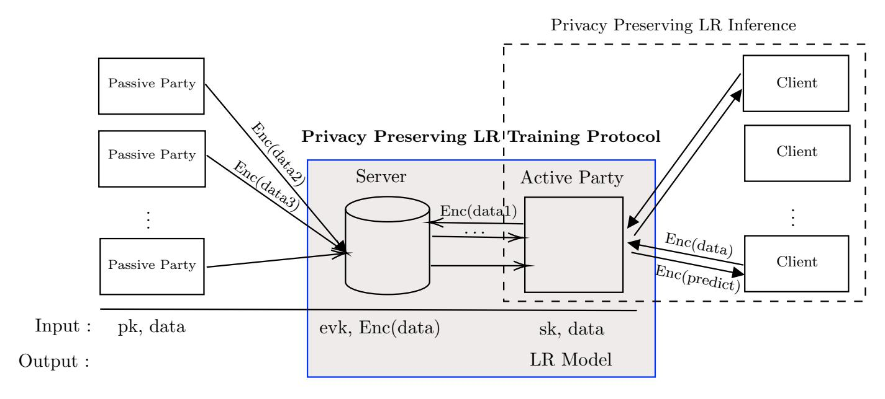
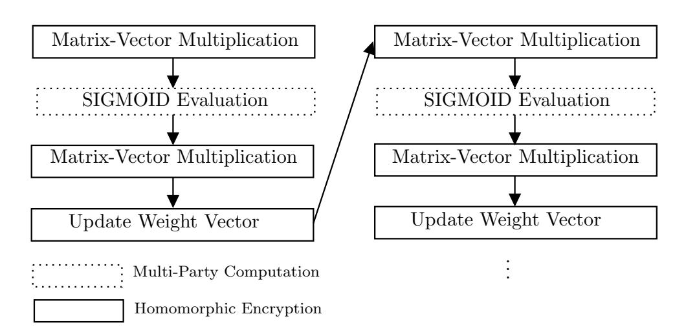
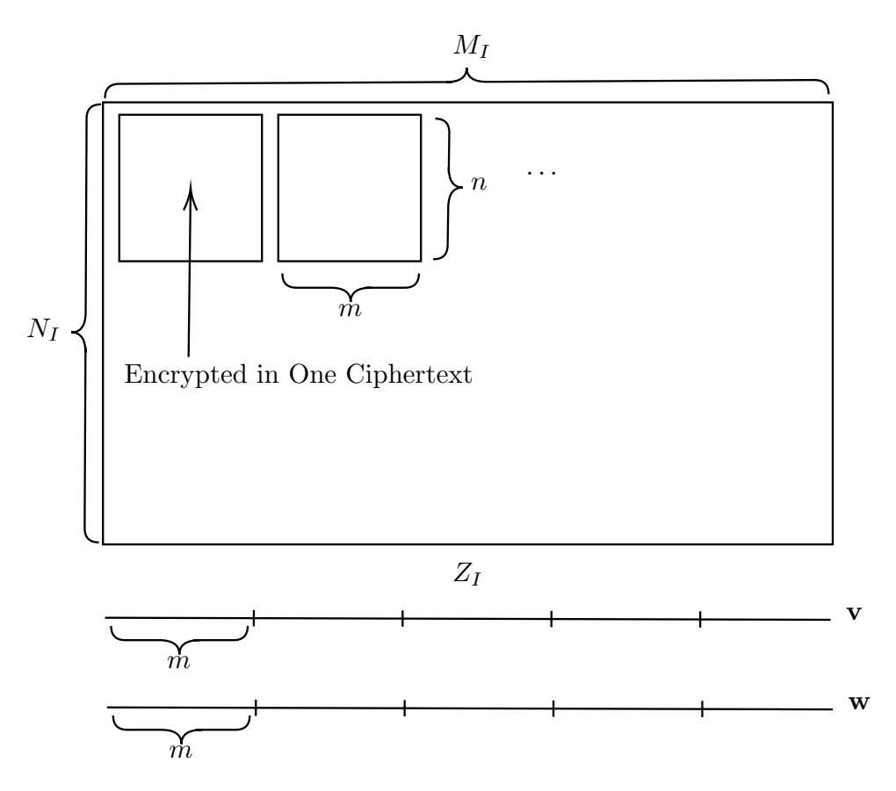
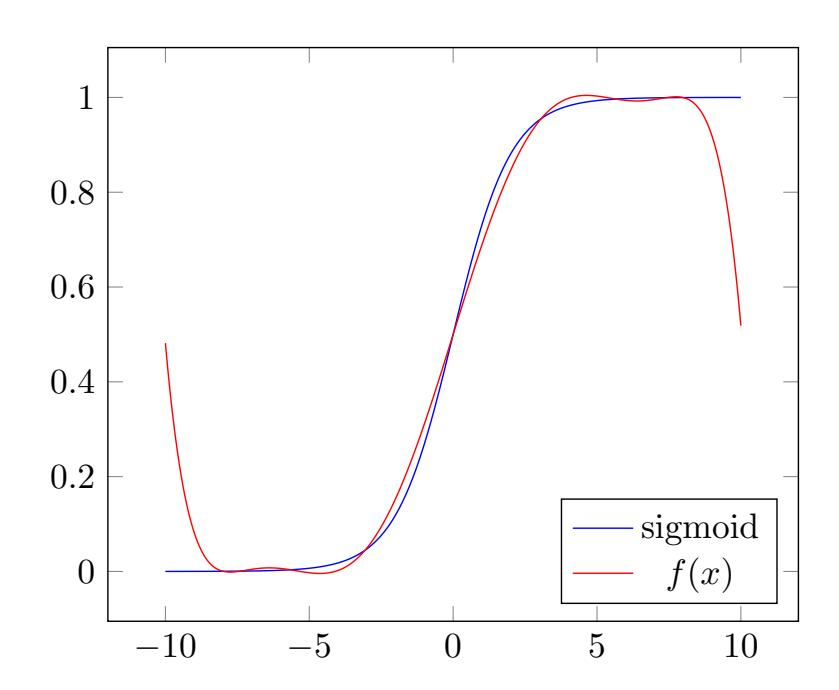
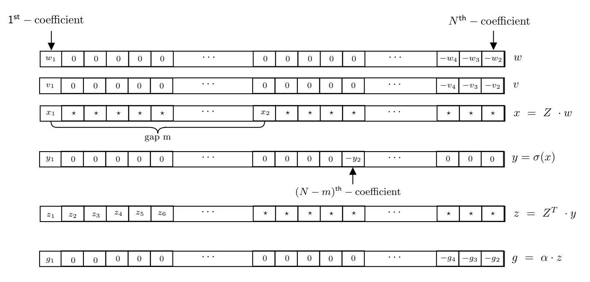

{0}------------------------------------------------

# Efficient Privacy Preserving Logistic Regression Inference and Training

Kyoohyung Han<sup>1</sup> , Jinhyuck Jeong<sup>1</sup> , Jung Hoon Sohn<sup>1</sup> , and Yongha Son<sup>1</sup>

Samsung SDS IT R&D center, Korea {kh89.han, jhyuck.jeong, junghoon.sohn, yongha.son}@samsung.com

Abstract. Recently, privacy-preserving logistic regression techniques on distributed data among several data owners drew attention in terms of their applicability in federated learning environment. Many of them have been built upon cryptographic primitives such as secure multiparty computations(MPC) and homomorphic encryptions(HE) to protect the privacy of data. The secure multiparty computation provides fast and secure unit operations for arithmetic and bit operations but they often does not scale with large data well enough due to large computation cost and communication overhead. From recent works, many HE primitives provide their operations in a batch sense so that the technique can be an appropriate choice in a big data environment. However computationally expensive operations such as ciphertext slot rotation or refreshment(so called bootstrapping) and large public key size are hurdles that hamper widespread of the technique in the industry-level environment.

In this paper, we provide a new hybrid approach of a privacy-preserving logistic regression training and a inference, which utilizes both MPC and HE techniques to provide efficient and scalable solution while minimizing needs of key management and complexity of computation in encrypted state. Utilizing batch sense properties of HE, we present a method to securely compute multiplications of vectors and matrices using one HE multiplication, compared to the naive approach which requires linear number of multiplications regarding to the size of input data. We also show how we used a 2-party additive secret sharing scheme to control noises of expensive HE operations such as bootstrapping efficiently.

Keywords: Applications, Public-key Cryptography, Homomorphic Encryption, Logistic Regression

# 1 Introduction

Based on the growth of cryptography and machine learning techniques, privacypreserving logistic regression techniques drew many attention. In particular, obtaining a model on data separated among several data owners is one of main goals in terms of federated learning environment on which the centralization of data is forbidden and the training occurs locally for each data owner updating periodically. However, it still remains many privacy issues such as the leakage from 

{1}------------------------------------------------

the intermediate values given to the center for updating. Secure multiparty computations (MPC) and homomorphic encryptions (HE) provides good solutions to resolve this obstacle. Federated learning (FL) with differential privacy (DP) also gives good solutions for the obstacle, but the algorithm highly depends on how the data is distributed in various clients (e.g horizontal or vertical).

MPC supports multiple data owners to perform an evaluation of a certain function on their inputs without revealing any information to any others except for the output. In MPC scheme, the unit operations for arithmetic and bit operations are performed efficiently and securely by a protocol for each, but when one consider a very large data, the communication cost and time complexity can be a problem for practice. For example, if whole logistic regression training algorithm is protected via MPC scheme, the communication cost becomes larger than the original raw data for training.

On the other hand, since the operations can be done in a batch-sense without any protocol in almost HE schemes, solutions based HE are considerable on the large data case. It requires, however, some operations such as bootstrapping and rotations which are very often used in practice, are computationally expensive and require a very large size for public keys. The authorization of public keys can be also a hurdle for this solution.



Fig. 1: Privacy Preserving Logistic Regression

The difficulty gets more complex if the data is separated among several parties horizontally or vertically. In particular, for HE based solutions, it is not trivial who should generate the secret key/public keys and how one can manage them to guarantee the privacy. In this paper, an efficient hybrid solution for training of privacy-preserving logistic regression on distributed data is introduced. As one can see in the Figure 1, it consists of a computation server, multiple passive data owners, and one active data owners. The active party will be a party who receive trained logistic regression model as a result, so active party will do communication with server to get the model without knowing data

{2}------------------------------------------------

from other party. As we use MPC scheme, it needs to assume that the server and the active party should not collude for privacy guarantee. After the active party receives the model, this party can process logistic regression inference service without knowing data from clients using our privacy preserving logistic regression inference.

### 1.1 Our Contribution

The main contribution of our work is efficient privacy preserving logistic regression for distributed data. As you see at Figure 1, the distributed data is collected into a server on encrypted state. The data collection is done using homomorphic encryption, so the algorithm for collection does not depends on whether the data is distributed in horizontal or vertical. After that, the server and an active party together will do logistic regression model training protocol. In this case, as the active party has secret key, we use a hybrid method which combines HE and MPC. This collaboration of two methods will maximize the efficiency of both method.



Fig. 2: Privacy Preserving Logistic Regression Overview

Logistic regression model training process consists of matrix-vector multiplications and computation of the sigmoid function. Figure 2 shows structure of training algorithm (based on gradient decent method) and which method is used to protect privacy of raw data. As homomorphic encryption support Single Instruction Multiple Data (SIMD) operation, matrix-vector multiplication part is computed using homomorphic encryption without leakage of raw data. And, sigmoid part is computed using secure multi party computation based on additive share. Meanwhile, we also propose various optimization techniques to make our system practical.

• First, we use special encoding method for efficient vector inner product and matrix vector multiplication. This special encoding method puts values to coefficient of polynomial. With the help of polynomial ring structure of homomorphic encryption scheme, inner product and matrix vector multiplication can be computed on a single homomorphic multiplication. Furthermore, 

{3}------------------------------------------------

we do not use homomorphic rotation so the size of public key that secret key owner should generate is reduced a lot compare to the previous works.

- Second, we reduce the size of communication by homomorphic ciphertext extraction. This extraction method is to extract necessary information which is needed for decryption algorithm.
- Third, to improve the performance of privacy preserving protocol, we adapt lazy homomorphic encryption and estimate performance to find optimal HErelated parameters which gives the best timming result. As a result, logistic regression training protocol takes 121 seconds per epoch in WAN network which is in one country and 434 seconds per epoch in WAN network which across the countries with 296, 412 × 27 KDD cup data.

We remark that encryption of raw data is never sent to secret key owner in our protocol. We always apply random masking when we need to send encrypted data to secret key owner. We remark that security of our system comes from the security of homomorphic encryption scheme and random masking.

# 1.2 Previous Works

To perform the training of logistic regression models while protecting the privacy of data, many approaches [1–14] have been built on various cryptographic primitives such as MPC and HE. The comparison with related works which use similar approach is in Table 1.

MPC approach. SecureML [1] proposed a 2-party privacy-preserving machine learning framework which supports the training of linear regression, logistic regression and neural networks in two way; purely HE-based one and its modified one combining additionally with additive homomorphic encryption to reduce the communication cost. They considered its security on semi-honest corruption only. ABY<sup>3</sup> [3], which is extended from ABY [2], is a 3-party MPC framework against malicious adversary. ASTRA [4] reduced the communication cost of ABY<sup>3</sup> suggesting an efficient multiplication protocol. However, it only provides the inferences of linear regression and logistic regression. BLAZE [5] improved this ASTRA such that the secure training algorithms of two regressions are possible more efficiently by optimizing the dot product operation between vectors.

HE approach. For HE-based solutions, Aono et al. [6,7] in 2016 proposed a solution for logistic regression training by approximating the cost function, evaluating it on encrypted data via an additive homomorphic encryption, and requiring the client to find a minimum value among a lot of messages sent from the computing server. Afterwards, through the competitions held by iDASH(integrating Data for Analysis, Anonymization and Sharing) since 2014, many privacy-preserving logistic regression based on HE [8–14] have been developed. In 2017, Bonte et al. [8] proposed a HE-based solution adapting a simplified fixed Hessian method as an optimization algorithm on FV scheme [15]. Chen et al. [9] used the 1-bit

{4}------------------------------------------------

|                          | Primitive        | Leak Intermediate<br>Result | Performance                      | Data Size            |  |
|--------------------------|------------------|-----------------------------|----------------------------------|----------------------|--|
| Aono <i>et al.</i> [6,7] | Additive HE      | Yes (apply DP)              | 20 min                           | $10^8 \times 40$     |  |
| Han et al.               | HE               | No                          | 2 hours                          | $11,982 \times 196$  |  |
|                          |                  | 110                         | 17 hours                         | $422,108 \times 200$ |  |
| BLAZE                    | $\mathrm{MPC}^1$ | No                          | $3.6 \text{ min (Preprocess)}_2$ | $106,574 \times 518$ |  |
| DLAZE                    |                  | 110                         | 1.8 min (online)                 |                      |  |
| Ours                     | HE+MPC           | No                          | $2 \min (WAN1)_3$                | $290,000 \times 27$  |  |
|                          |                  | 110                         | $7 \min (WAN2)$                  |                      |  |

Table 1: Comparison with previous works

gradient descent method to reduce the plaintext growth in the process on a modified FV scheme with rescaling and bootstrapping. Kim et al. [10], who showed the best performance in the competition, employed a Nesterov's accelerated gradient descent method on CKKS scheme [16]. In 2018, Crawford et al. [11] utilized an approximate closed-form of logistic regression and requires for the client to solve a linear system of equations in plain after decryption. Carpov et al. [12] provided a solution based on a framework called as Chimera [17,18], which allows for switching between CKKS scheme and TFHE scheme [19]. Besides, to reduce further the number of iterations, Cheon et al. [13] proposed an ensemble gradient descent method which results in an improvement in terms of speed and memory. Kim et al. [14] deviced a least squares approximation of the logistic regression for accuracy and efficiency with new packing and parallelization method. However, although these give us compromising results, computationally expensive operations like bootstrapping, rotations and the management of public keys with large size still remains as a main obstacle in this approaches.

Hybrid approach. Combining the pros of MPC-based solutions and that of HE-based solutions, a hybrid method called as Gazelle is proposed by Juvekar et al. [20] to perform an inference of convolutional neural network (CNN) via an additive HE and traditional 2-party MPC based on the garbled circuit. They optimized the multiplication between matrices and vectors and improved the convolutional routines using this optimization. It requires several homomorphic multiplications and rotations whose number is linear in the size of matrix.

#### 1.3 Comparison

For previous works that apply privacy enhancing technique for logistic regression training, we compare those works with ours side by side.

<sup>&</sup>lt;sup>1</sup> Under the assumption that any two of three parties does not collude.

<sup>&</sup>lt;sup>2</sup> The performance of fourth and fifth case is for 1 epoch training

<sup>&</sup>lt;sup>3</sup> Each WAN setting is connection in Korea and connection between Korea and United States.

{5}------------------------------------------------

Aono et al. Privacy-preserving logistic regression by Aono et al. used additive homomorphic encryption and differential privacy. In this work, for a sample  $\mathbf{x}$  with length d, clients should pre-compute  $x_i \cdot x_j$  and this makes the size of encrypted data larger with factor  $\frac{(d+1)(d+4)}{2d}$ . We remark that pre-computing  $x_i \cdot x_j$  is impossible when  $x_i$  and  $x_j$  does not belongs to one party. With help of pre-computation, server only do summation of the given encrypted data and client will find minimizer  $\theta^* = \operatorname{argmin}_{\theta}(J_{\operatorname{approx}}(\theta))$  with decrypted  $\theta$  value. Although differential privacy (DP) is applied to  $\theta$ , it is possible to leak information about the input data as the security of DP is different with security of encryption scheme (e.g IND-CPA).

Han et al. This work is homomorphic encryption only solution which does not need any communication between server and client during training phase. For that, they apply the bootstrapping technique for unlimited number of iterations. As the bootstrapping process takes a huge computation time, it takes 2 hours for training  $11,982 \times 196$  size data with multi-threading (8-cores).

BLAZE This framework, built on MPC primitive, also provides a training of logistic regression among two or three parties. Under the assumption that any two of them does not collude, it performs the training very efficiently through many protocols. For example, it takes 31.51 iterations for pre-processing phase and 60.79 iterations for online phase per one minute with 500 features. However, this is targeted to the case 2 or 3 parties and it is not trivial to be extended into MPC among more than 3 parties.

# 2 Preliminary

#### 2.1 Notations

In this paper, We use bold lowercase letters to denote vectors and bold uppercase letters to denote matrices. For a positive integer q, [q] is defined by  $\{1, 2, \ldots, q\}$  and  $\mathbb{Z}_q = [-q/2, q/2) \cap \mathbb{Z}$  is a set of representatives of residues modulo q. Given an integer m and a modulus q,  $[m]_q$  means an element  $a \in [0, q-1)$  such that  $m \equiv a \pmod{q}$ . For a finite set,  $a \xleftarrow{\$} \mathcal{D}$  means a is uniformly chosen from distribution  $\mathcal{D}$ .

For a power-of-two N, we use  $\mathcal{R} = \mathbb{Z}[X]/(X^N+1)$  to denote the ring of integers of a number field  $\mathbb{Q}[X]/(X^N+1)$ . Given a modulus q,  $\mathcal{R}_q = \mathcal{R}/q\mathcal{R}$  is the residue ring of  $\mathcal{R}$  modulo q. An element  $a \in \mathbb{R}[X]/(X^N+1)$  represented by  $a(X) = \sum_{j=0}^{N-1} a_j X^j$  of degree < N. For all polynomial  $a(X) \in \mathbb{R}[X]/(X^N+1)$ , let us denote its coefficients by  $a_j$   $(j=0,\ldots,N-1)$ .

#### 2.2 Logistic Regression

A logistic regression (LR) model is typically used to predict the probability of occurrence in binary/multi-classified events such as pass/fail, win/lose, or

{6}------------------------------------------------

whether an image contains a cat, dog, bird, etc. We assume that the training data consist of n samples  $(\mathbf{x}_i, y_i) \in \mathbb{R}^{m-1} \times \{\pm 1\}$  where  $\mathbf{x}_i$  represents m-1 features of the i-th sample and  $y_i$  the corresponding label. The goal of LR training is to find an optimal vector  $\mathbf{w} \in \mathbb{R}^m$ , called model, which minimizes the loss function  $L(\mathbf{w})$  defined as

$$L(\mathbf{w}) = \frac{1}{n} \sum_{i=1}^{n} \log(1 + \exp(-y_i(1, \mathbf{x}_i)^T \cdot \mathbf{w})).$$

Thanks to the gradient descent method, one can achieve the goal by computing following procedure repeatedly with an initial  $\mathbf{w}^{(0)}$ ;

$$\mathbf{w}^{(t+1)} \leftarrow \mathbf{w}^{(t)} + \frac{\alpha_t}{n} \sum_{i \in I} \sigma(-\mathbf{z}_i^T \cdot \mathbf{w}^{(t)}) \mathbf{z}_i$$
 (1)

where I is a set of indices,  $\mathbf{z}_i = -y_i(1, \mathbf{x}_i)$ ,  $\alpha_t$  is a learning rate at step t, and the activation function  $\sigma(x) = 1/(1 + \exp(-x))$  which is called sigmoid function. This method is called as a full-batch when I = [n] and as a mini-batch when  $I \subsetneq [n]$ . Furthermore, it can be optimized using Nesterov's accelerated gradient method, which results following procedure with an initial  $\mathbf{w}^{(0)} = \mathbf{v}^{(0)}$ ;

$$\mathbf{w}^{(t+1)} \leftarrow \mathbf{v}^{(t)} + \frac{\alpha_t}{n} \sum_{i=1}^n \sigma(-\mathbf{z}_i^T \cdot \mathbf{w}^{(t)}) \mathbf{z}_i$$
 (2)

$$\mathbf{v}^{(t+1)} \leftarrow (1 - \gamma_t) \cdot \mathbf{w}^{(t+1)} + \gamma_t \cdot \mathbf{w}^{(t)}$$
(3)

where  $0 < \gamma_t < 1$  is a moving average smoothing parameter. We remark that future optimization method for gradient decent (e.g. Adam, AdaGrad, etc) consists of division which makes hard to compute while preserving privacy, so we only introduce the Nesterov's accelerated gradient method.

As another representation, we can rephrase Equation 2 in matrices and vectors: Let  $\mathbf{Z}$  be a  $n \times m$  matrix whose i-th row is  $\mathbf{z}_i$  for  $i \in [n]$  and let  $\mathbf{Z}_I$  a submarix of  $\mathbf{Z}$  whose rows are  $\{\mathbf{z}_i\}_{i\in I}$ . Then, equation 2 can be expressed as

$$\mathbf{w}^{(t+1)} \leftarrow \mathbf{v}^{(t)} + \frac{\alpha_t}{n} \cdot \mathbf{Z}_I^T \cdot \sigma(-\mathbf{Z}_I \cdot \mathbf{w}^{(t)})$$
 (4)

where the domain of  $\sigma$  is component-wisely expanded into the vector space.

### 2.3 Homomorphic Encryption

Homomorphic encryption refers to an encryption scheme that for an encryption c of a message m and a circuit f, one can efficiently and securely generate a new encryption  $c^*$  of f(m) without decrypting c. In particular, our system uses an approximate HE scheme proposed by Cheon  $et\ al.\ [16]$ , say CKKS scheme. We skip the details of the scheme and only describe about the key property of

{7}------------------------------------------------

the scheme that we use. For detail equations and proofs about the scheme, we refer to [16]. In addition, we use different packing method to the original CKKS scheme, so we regard the plaintext space of CKKS scheme as  $\mathbb{R}[X]/(X^N+1)$ (not  $\mathbb{C}^{N/2}$ ).

- Setup $(1^{\lambda}, 1^{L})$ : For the given security parameter  $\lambda$  and a depth bound L, return public parameter pp.
- KeyGen(pp): For the given public parameter pp, generate secret key sk, public key pk, and evaluation key evk. return (sk, pk, evk).
- $\operatorname{Enc}(\operatorname{pk}, m(x) \in \mathbb{R}[X]/(X^N+1), \Delta)$ : For the given public key, plaintext, and
- scale factor  $\Delta$ , return a ciphertext  $\mathsf{ctxt} \in \mathcal{R}_q^2$ .  $-\mathsf{Dec}(\mathsf{sk},\mathsf{ctxt},\Delta)$ : For the given secret key, ciphertext, and scale factor  $\Delta$ , return a plaintext  $m(x) \in \mathbb{R}[X]/(X^N+1)$ .

The scaling factor  $\Delta$  is related to the amount of precision of m(x) that the ciphertext retains. To be more precise, the encryption of message polynomial m(x) and the scaling factor  $\Delta$  outputs a ciphertext  $\mathsf{ctxt} = (b(x), a(x)) \in \mathcal{R}_q^2$ satisfying

$$b(x) + a(x) \cdot s(x) = \lfloor [m(x) \cdot \Delta]_q \rceil \mod q.$$

The decryption uses the equation to compute  $d(x) = |[m(x) \cdot \Delta]_q|$  from the ciphertext, and outputs  $d(x)/\Delta$  after changing representation of each coefficient  $d_i$  to range (-q/2, q/2], rather than [0,q). Regarding this, the correctness of encryption/decryption process is defined approximately as following:

$$\mathrm{Dec}(\mathsf{sk},\mathrm{Enc}(\mathsf{pk},m(x),\varDelta),\varDelta) \simeq m(x) \in \mathbb{R}[X]/(X^N+1).$$

Moreover, the CKKS scheme also supports approximate addition and multiplication algorithms between ciphertexts, or between plaintext and ciphertext. Let  $\mathsf{ctxt}_1, \mathsf{ctxt}_2$  are ciphertexts such that  $\mathsf{Dec}(\mathsf{sk}, \mathsf{ctxt}_1, \Delta) = m_1(x)$  and  $\operatorname{Dec}(\operatorname{sk},\operatorname{ctxt}_2,\Delta)=m_2(x).$ 

- AddP(ctxt<sub>1</sub>,  $m_2(x)$ ): for the given ciphertext ctxt<sub>1</sub> and plaintext  $m_2(x)$ , return  $\mathsf{ctxt}_3 \in \mathcal{R}_q^2$  such that  $\mathsf{Dec}(\mathsf{sk}, \mathsf{ctxt}_3, \Delta) \simeq m_1(x) + m_2(x)$ .

  -  $\mathsf{Add}(\mathsf{ctxt}_1, \mathsf{ctxt}_2)$ : for the given ciphertext  $\mathsf{ctxt}_1, \mathsf{ctxt}_2$ , return  $\mathsf{ctxt}_3 \in \mathcal{R}_q^2$  such
- that  $Dec(sk, ctxt_3, \Delta) \simeq m_1(x) + m_2(x)$ .
- MultP(ctxt<sub>1</sub>,  $m_2(x)$ ): for the given ciphertext ctxt<sub>1</sub> and plaintext  $m_2(x)$ , return  $\mathsf{ctxt}_2 \in \mathcal{R}^2_{q/\Delta}$  such that  $\mathsf{Dec}(\mathsf{sk}, \mathsf{ctxt}_3, \Delta) \simeq m_1(x) \cdot m_2(x)$ .
- Mult(evk, ctxt<sub>1</sub>, ctxt<sub>2</sub>) : for the given ciphertext ctxt<sub>1</sub>, ctxt<sub>2</sub>, return ctxt<sub>3</sub>  $\in$  $\mathcal{R}^2_{q/\Delta}$  such that  $\operatorname{Dec}(\operatorname{sk},\operatorname{ctxt}_3,\Delta)\simeq m_1(x)\cdot m_2(x)$ .

One can see that after a multiplication of two ciphertext of modulus q (or plain-ciphertext multiplication), the resulting ciphertext modulus is decreased to modulus  $q/\Delta$ . Therefore, the multiplicative depth capacity depends on the choice of initial modulus q and  $\Delta$ . Throughout this paper, we only require only one multiplicative depth and fixed scaling factor  $\Delta$ , so there are only two possible ciphertext modulus: initial encryption modulus q and after-multiplication modulus  $q/\Delta$ .

{8}------------------------------------------------

Ring-Learning with Errors The security of the CKKS scheme depends on the hardness of Ring-Learning with Errors (RLWE) problem below:

**Definition 2.1 (Ring LWE (RLWE) Problem)** For the given a power-oftwo N, a modulus q, and some distributions  $\chi_s$  and  $\chi_e$  over  $\mathcal{R}$  for secret and noise respectively, the problem is to distinguish between the two distributions  $(a(X), a(X) \cdot s(X) + e(X) \text{ and } (a(X), u(X)) \text{ where } a(X) \leftarrow \mathcal{R}_q, s(X) \leftarrow \mathcal{R}_q \text{ and}$  $u(X) \leftarrow \mathcal{R}_q$ .

As there are various works about the security of Ring LWE problem, we will omit it and just introduce the problem.

# 2.4 Multi Party Computation: 2-Party Additive Sharing

We briefly introduce a 2-party secure MPC constructed with an additive secret sharing and how to perform unit operations such as addition, multiplication in this scheme. Assume two parties  $P_0$  and  $P_1$  have inputs x and y in  $\mathbb{Z}_t$  respectively for a modulus t and they want to compute  $[x+y]_t$  and  $[x\cdot y]_t$  without revealing the inputs. First let  $[x] = (x_0, x_1)$  mean that x is split into two shares  $x_i (= 0, 1)$  such that  $x = x_0 + x_1 \mod t$  and each party  $P_i$  has  $x_i$  not knowing the other  $x_{1-i}$  for i = 0, 1. Then, from  $[x] = (x_0, x_1)$  and  $[y] = (y_0, y_1)$ , one can compute

```
- [x] + [y] := [x + y] = (z_0, z_1) by z_0 = x_0 + y_0 and z_1 = x_1 + y_1,

- c[x] := [cx] = (z_0, z_1) for some constant c by z_0 = cx_0 and z_1 = cx_1.
```

To get  $[xy] = (z_0, z_1)$ , we need more assumption that a multiplication triplet ([a], [b], [c]) have already been shared with  $c = a \cdot b \mod t$ . Then, one can compute

- $-[xy] = (z_0, z_1)$  by the following:
  - 1. Compute [x + a], [y + b], and reveal these values x' = x + a, y' = y + b. Then, we can generate x'y' and reshare [x'y'].
  - 2. Compute [xy] by [x'y'] y'[a] x'[b] [c].

To collaboratively use it with CKKS scheme, we need to modify this possible to support real number not modulus integer. The real number can be converted to an integer using quantization with some scale factor  $\Delta$ , so the support for real number can be obtained rescaling functionality in additive shared state. This functionality is directly from Theorem 2.2 below:

Theorem 2.2 (Theorem 1 from [1]) In field  $\mathbb{Z}_{2^{\ell}}$ , let  $x \in [0, 2^{\ell_x}] \cup [2^{\ell} - 2^{\ell_x}, 2^{\ell})$ , where  $\ell > \ell_x + 1$  and given shares  $\langle x \rangle_0$ ,  $\langle x \rangle_1$  of x, let  $\langle \lfloor x \rfloor \rangle_0 = \lfloor \langle x \rangle_0 \rfloor$  and  $\langle \lfloor x \rfloor \rangle_1 = 2^{\ell} - \lfloor 2^{\ell} - \langle x \rangle_1 \rfloor$ . Then with probability  $1 - 2^{\ell_x + 1 - \ell}$ ,  $\langle \lfloor x \rfloor \rangle_0 + \langle \lfloor x \rfloor \rangle_1 = \lfloor x \rfloor + \epsilon \mod t$  for  $|\epsilon| \leq 1$ , where  $\lfloor \cdot \rfloor$  denotes truncation by  $\ell_D \leq \ell_x$  bits.

As authors of [1] mentioned, this theorem can be extended to a prime field  $\mathbb{Z}_t$  case by replacing  $2^{\ell}$  with t. Furthermore, the truncation also can be extended to  $\lfloor x/\Delta \rfloor$  for an integer  $\Delta \in \mathbb{Z}$  by replacing  $2^{\ell_D}$  with  $\Delta$ . As a result, this theorem

{9}------------------------------------------------

can be used to extend operations on  $\mathbb{Z}_t$  to operations on real field  $\mathbb{R}$  by using scale factor  $\Delta \ll t$ .

For example, an additive share  $(x_0, x_1)$  of 0.1 means that  $x_0 + x_1 = \lfloor 0.1 \cdot \Delta \rfloor$  mod t for scale factor  $\Delta$ . For the given an additive share  $(x_0, x_1)$  and  $(y_0, y_1)$  of 0.1 and 0.2 respectively, both party compute  $[xy] = (z_0, z_1)$  as described above. After that, we truncate z using Theorem 2.2 in additive shared state. Then,  $\langle \lfloor z \rfloor \rangle_0 + \langle \lfloor z \rfloor \rangle_1 = \lfloor z \rfloor + \epsilon \mod t$  which is approximate value of  $\lfloor 0.1 \cdot 0.2 \cdot \Delta \rfloor$ . So, now, we can compute real number addition and multiplication in additive shared state.

Remark 2.3 (Multiplication Triplet) There are various method to generate multiplication triplet [21–23]. As we are already using HE scheme (SEAL library), we use generation method from [21] in our experiment. We note that this generation is independent to the input data, so this process will be considered as off-line phase.

# 3 Building Blocks

In this section, we first introduce various techniques that we use to optimize the complexity and communication cost in our method.

### 3.1 Inner Product

Here, we will describe efficient packing method in [24] for computing inner production computation using polynomial ring structure. The key idea of their work comes from the fact that the *i*-th coefficient of  $a(X) \cdot b(X) = \sum_{i=0}^{n+m-1} c_i \cdot X^i \in \mathbb{R}[X]/(X^N+1)$  is

$$c_i = a_0 \cdot b_i + a_1 \cdot b_{i-1} + \dots + a_{i-1} \cdot b_1 + a_i \cdot b_0$$

for all i where  $a(X) = \sum_{i=0}^{n} a_i \cdot X^i$  and  $b(X) = \sum_{i=0}^{m} b_i \cdot X^i$ . For more detailed, let  $a(X) = \sum_{i=0}^{N-1} a_i X^i$  and  $b(X) = \sum_{i=0}^{N-1} b_i X^i$  be elements in  $\mathbb{R}[X]/(X^N+1)$ . Then, since  $X^N = -1$  in this polynomial ring, the constant term of  $c(X) = (a \cdot b)(X)$  is the sum of  $a_0 b_0$  and  $-a_1 b_{N-1} - \cdots - a_{N-1} b_1$  which can be rephrased by

$$\langle (a_0, a_1, \dots, a_{N-1}), (b_0, -b_{N-1}, -b_{N-2}, \dots, -b_1) \rangle.$$

From this observation, they employ two packing method for vector to accomplish a secure inner product operation:

- $\mathtt{pm1}(\mathbf{v})$ : For a given length  $m \leq N$  vector  $\mathbf{v}$ , return a polynomial  $\sum_{i=0}^{m-1} v_i \cdot X^i \in \mathbb{R}[X]/(X^N+1)$ .
- pm2(v): For a given length  $m \leq N$  vector v, return a polynomial  $v_0 \sum_{i=1}^{m-1} v_i \cdot X^{N-i} \in \mathbb{R}[X]/(X^N+1)$ .

Now, we have  $\langle \mathbf{a}, \mathbf{b} \rangle = (a \cdot b)_0$  if  $a(X) \leftarrow \mathtt{pm1}(\mathbf{a})$  and  $b(X) \leftarrow \mathtt{pm2}(\mathbf{b})$  for  $\mathbf{a} = (a_0, \dots, a_{m-1})$  and  $\mathbf{b} = (b_0, \dots, b_{m-1})$ . As a result, only one multiplication on encrypted data is required to compute securely an inner product while m multiplications are required naively.

{10}------------------------------------------------

### 3.2 Matrix Vector Multiplication

In this section, we will describe efficient methods to compute both  $M \cdot \mathbf{v}$  and  $M^T \cdot \mathbf{v}$  for encrypted vector  $\mathbf{v}$  because both operations are necessary for logistic regression training. The trivial method is to encode each column and row of  $\mathbf{M}$  separately, and use the method in 3.1. But, this method makes requires at least column and row numbers of polynomials to encode a matrix, and column or row numbers of polynomial multiplication to perform matrix multiplication. The matrix is corresponding to training data in our privacy-preserving logistic regression training algorithm, so it requires very large size of encoding leading to an inefficiency.

Instead, our method in this section encodes the matrix M in batch manner (not in row or column manner) which supports both kinds of matrix-vector multiplications  $M \cdot \mathbf{v}$  and  $M^T \cdot \mathbf{v}$ . This can be done by varying the encoding of  $\mathbf{v}$  of which size usually much smaller than that of matrix. Basically, we use a *skew-cyclic property* of the polynomial ring  $\mathbb{R}[X]/(X^N+1)$ ; For  $a(X) \in \mathbb{R}[X]/(X^N+1)$ , the corresponding vector of  $X^i \cdot a(X)$  is

$$(-a_{N-i},\ldots,-a_{N-1},a_0,a_1,\ldots,a_{N-i-1}).$$

To achieve our goal, we define following three encoding methods for vector and matrix inputs:

- EcdVec1(v): For a given length m vector v, return a polynomial  $v_0 \sum_{i=1}^{m-1} v_i \cdot X^{N-i} \in \mathbb{R}[X]/(X^N+1)$ .
- EcdVec2( $\mathbf{v}, n$ ): For a given length m vector  $\mathbf{v}$ , return a polynomial  $v_0 \sum_{i=1}^{m-1} v_i \cdot X^{N-n \cdot i} \in \mathbb{R}[X]/(X^N+1)$ .
- EcdMat $(M, \Delta)$ : For a given  $n \times m$  matrix M, return a polynomial  $\sum_{i=0}^{n-1} \sum_{j=0}^{m-1} M_{i,j} \cdot X^{m \cdot i + j} \in \mathbb{R}[X]/(X^N + 1)$ .

Here, we assume that the length of vector and the size of matrix  $(= m \cdot n)$  is smaller than N. Following two theorems show how these encoding methods can be used to compute  $\mathbf{M} \cdot \mathbf{v}$  and  $\mathbf{M}^T \cdot \mathbf{v}$  in encrypted state.

**Theorem 3.1** For the given length m vector  $\mathbf{v}$  and  $n \times m$  matrix  $\mathbf{M}$ , let  $a(x) = EcdVec1(\mathbf{v})$  and  $b(x) = EcdMat(\mathbf{M})$ , then

$$c_{m \cdot i} = \langle \mathbf{v}, \mathit{Row}_i(\boldsymbol{M}) \rangle$$

for 
$$0 \le i < n \text{ and } a(x) \cdot b(x) = \sum_{i=0}^{N-1} c_i \cdot X^i$$
.

Proof. By the definition of encoding method,  $a(X) = v_0 - \sum_{i=1}^{n-1} v_i \cdot X^{N-m \cdot i}$  and  $b(X) = \sum_{i=0}^{n-1} \sum_{j=0}^{m-1} M_{i,j} \cdot X^{m \cdot i+j}$ , so

$$c(X) = v_0 \cdot b(X) - \sum_{i=1}^{m-1} \sum_{j=0}^{m-1} \sum_{k=0}^{m-1} v_i \cdot M_{j,k} \cdot X^{N-i+m \cdot j+k}$$
$$= v_0 \cdot b(X) + \sum_{i=1}^{m-1} \sum_{j=0}^{m-1} \sum_{k=0}^{m-1} v_i \cdot M_{j,k} \cdot X^{m \cdot j+(k-i)}$$

{11}------------------------------------------------

for  $c(X) = a(X) \cdot b(X)$ . Now we can compute  $(m \cdot i)$ -th coefficient of c(X) as follows:

$$c_{m \cdot i} = v_0 \cdot M_{i,0} + \sum_{j=1}^{m-1} v_j \cdot M_{i,j} = \langle \mathbf{v}, \mathit{Row}_i(\boldsymbol{M}) \rangle$$

for  $0 \le i < n$ .

**Theorem 3.2** For the given length n vector  $\mathbf{v}$  and  $n \times m$  matrix  $\mathbf{M}$ , let  $v(x) = \text{EcdVec2}(\mathbf{v}, m)$  and  $M(x) = \text{EcdMat}(\mathbf{M})$ , then

$$r_i = \langle \mathbf{v}, \mathit{Col}_i(\boldsymbol{M}) \rangle$$

for  $0 \le i < m \text{ and } v(x) \cdot M(x) = \sum_{i=0}^{N-1} r_i \cdot X^i$ .

Proof. By the definition of encoding method,  $a(X) = v_0 - \sum_{i=1}^{m-1} v_i \cdot X^{N-i}$  and  $b(X) = \sum_{i=0}^{n-1} \sum_{j=0}^{m-1} M_{i,j} \cdot X^{m \cdot i+j}$ , so

$$r(X) = v_0 \cdot b(X) - \sum_{i=1}^{n-1} \sum_{j=0}^{n-1} \sum_{k=0}^{m-1} v_i \cdot M_{j,k} \cdot X^{N+m \cdot (j-i)+k}$$
$$= v_0 \cdot b(X) + \sum_{i=1}^{n-1} \sum_{j=0}^{m-1} \sum_{k=0}^{m-1} v_i \cdot M_{j,k} \cdot X^{m \cdot (i-j)+k}$$

for  $r(X) = a(X) \cdot b(X)$ . Now we can compute i-th coefficient of r(X) as follows:

$$c_i = v_0 \cdot M_{0,i} + \sum_{j=1}^{n-1} v_j \cdot M_{j,i} = \langle \mathbf{v}, \mathit{Col}_i(\mathbf{M}) \rangle$$

for  $0 \le i < m$ .

When  $n \times m$  matrix M, length m vector  $\mathbf{v}$ , and length n vector  $\mathbf{w}$  are given, a single multiplication in  $\mathbb{R}[X]/(X^N+1)$  between  $\mathsf{EcdVec1}(\mathbf{v})$  and  $\mathsf{EcdMat}(M)$  gives a polynomial which has i-th element of  $M \cdot \mathbf{v}$  at  $(m \cdot i)$ -th coefficient for  $0 \le i < m$ . And, a single multiplication in  $\mathbb{R}[X]/(X^N+1)$  between  $\mathsf{EcdVec2}(\mathbf{w},m)$  and  $\mathsf{EcdMat}(M)$  gives a polynomial which has i-th element of  $M^t \cdot \mathbf{w}$  at i-th coefficient for  $0 \le i < n$ .

#### 3.3 Extraction of Coefficients

As one can see in Theorem 3.1 and Theorem 3.2, only small number of coefficients have valid meanings in terms of inner product and matrix-vector multiplication. We can extract necessary information that are needed to decrypt those coefficients, so that it reduce the communication costs in our method.

To see how it works, recall that the decryption procedure recovers a polynomial  $d(x) := b(x) + a(x) \cdot s(x) \in \mathcal{R}_q$  for a secret polynomial s(x), and then *i*-th

{12}------------------------------------------------

coefficient of message polynomial m(x) only depends on *i*-th coefficient of d(x). In this regard, we define the following in order to extract *i*-th coefficient of d(x).

$$\mathtt{SkewRot}_i(\mathbf{s}) := (s_i, \cdots, s_0, -s_{N-1}, \cdots, -s_{i+1}) \in \mathbb{Z}_q^N$$

for  $0 \le i < N$ . Using this function, the *i*-th coefficient  $a(x) \cdot s(x)$  is represented as  $\langle \mathbf{a}, \mathsf{SkewRot}_i(\mathbf{s}) \rangle$ . Therefore, someone who knows  $\mathbf{s}$  can compute *i*-th coefficient of  $b(x) + a(x) \cdot s(x)$  when  $b_i$  and a(x) are given. This property is useful when we extend multiple coefficients at once, as secret key owner can compute approximation of several coefficient  $m_i$ s given corresponding  $b_i$ s in  $\mathbb{Z}_q$  and only one  $a(x) \in \mathcal{R}_q$ . We can define coefficient extraction and decryption algorithm as following:

- Extract(ctxt, K): For a ciphertext ctxt = (b(x), a(x)) and an ordered set  $K = \{k_1, \dots, k_\ell\}$ , return

$$\mathtt{ctxtExt} = ((b_{k_1}, \cdots, b_{k_\ell}), a(x)) \in \mathbb{Z}_q^\ell \times \mathcal{R}_q.$$

- Dec\*(sk, ctxtExt, K): For the given extracted ciphertext ctxtExt = (b, a(x)), an ordered index set  $K = \{k_1, \dots, k_\ell\}$ , and a secret key vector  $\mathsf{sk} = \mathsf{s}$ , compute

$$m_i = b_i + \langle \mathbf{a}, \mathsf{SkewRot}_{k_i}(\mathbf{s}) \rangle \bmod q$$
 (5)

for each i. Return a vector  $(m_1, \dots, m_\ell) \in \mathbb{Z}_q^\ell$ 

We intentionally let  $Dec^*$  return a vector of modulus integer  $\mathbb{Z}_q$ , not a real-coefficient polynomial. This is for a link with additive-share MPC that also uses an modulus integer, rather than a real number. Section 4 will address this procedure in detail.

The extracted ciphertext size is reduced to  $(N+\ell) \cdot \log_2 q$ , whereas the as-is ciphertext size is  $2N \cdot \log_2 q$ . We remark that  $\ell$  would be much smaller than N in case of our privacy-preserving logistic regression training. As a result, this technique makes communication cost almost half smaller than before.

Remark 3.3 (Complexity of Dec\*) Naive complexity of Dec\* becomes  $|K| \cdot N$  which is linearly growth to size of ordered set K. As  $\langle \mathbf{a}, SkewRot_{k_i}(\mathbf{s}) \rangle$  is same as  $k_i$ -th coefficient of  $a(x) \cdot s(x) \in \mathcal{R}_q$ , we can use NTT (Number Theoretic Transform) algorithm to compute multiplication of a(x) and s(x). The complexity of polynomial multiplication is  $2 \cdot \log N \cdot N + N$  (2 NTT algorithm + dyadic multiplication), so we can choose one of the methods depends on the size of K.

# 4 Hybrid with Multi Party Computation and Homomorphic Encryption

In the previous section, we introduce various techniques about homomorphic encryption and multi party computation for real number data. As we use hybrid

{13}------------------------------------------------

approach that combines those methods in our privacy preserving logistic regression training protocol, we need to connect homomorphic encryption and multi party computation. For this connection, we need some previous definition to be modified to plaintext space as  $\mathbb{Z}_q$  instead of  $\mathbb{R}$ . This is possible since the CKKS encryption of a real-coefficient polynomial f(x) involves a conversion of f(x) to  $[\lfloor f(x) \cdot \Delta \rceil]_q \in \mathbb{Z}_q[X]/(X^N+1)$ . Therefore, we define encoding, encryption, and decryption methods to deal with  $\mathbb{Z}_q$  plaintext space.

- EcdVec1\*(v): For a given length m vector v in  $\mathbb{Z}_q^m$ , return a polynomial
- $v_0 \sum_{i=1}^{m-1} v_i \cdot X^{N-i} \in \mathbb{Z}_q[X]/(X^N+1).$  EcdVec2\*(v, n): For a given length m vector v in  $\mathbb{Z}_q^m$ , return a polynomial 
  $$\begin{split} v_0 - \sum_{i=1}^{m-1} v_i \cdot X^{N-n \cdot i} &\in \mathbb{Z}_q[X]/(X^N+1). \\ - &\operatorname{Enc}^*(\operatorname{pk}, m(x) \in \mathbb{Z}_q[X]/(X^N+1)) \text{: For the given public key, plaintext, return} \end{split}$$
- a ciphertext  $\mathsf{ctxt} = (b(x), a(x)) \in \mathcal{R}_q^2$  such that  $b(x) + a(x) \cdot s(x) \equiv_q m(x)$ for secret key polynomial s(x).

In our protocol, a party who receive the ciphertext has secret key, and will decrypt the ciphertext. So we need to apply random masking to protect privacy of our data so that the secret key party cannot learn nothing about raw data during our protocol.

- AddMask(ctxtExt, r): For a given ctxtExt =  $(\mathbf{b}, a(x))$ , return  $(\mathbf{b} + \mathbf{r}, a(x))$ .

Furthermore, for a convenient explanation, we added a function to convert message in  $\mathbb{Z}_q$  to real number as following:

- ZqToReal $(m,q,\Delta)$ : if m>(q/2), return  $(m-q)/\Delta$  and return  $m/\Delta$  otherwise. Here the division is in  $\mathbb{R}$ .

#### Modulus and Scale Factor Switching in MPC 4.1

In this section, t stands for modulus for additive share based multi party computation and q would be ciphertext modulus for homomorphic encryption. As we used different modulus and scale factor in HE and MPC for efficiency, we need to introduce modulus switching and scale factor switching method in additive state.

- $MS_{q_1 \to q_2}(m)$ : return  $\lfloor m \cdot (q_2/q_1) \rceil$ .  $SFS_{\Delta_1 \to \Delta_2}(m, \alpha)$ : For  $\delta = \frac{\Delta_2}{\Delta_1}$ , compute and return

$$m' = \begin{cases} \operatorname{round}(m \cdot \delta) \bmod t & \text{if } \alpha = 1\\ t - \operatorname{round}((t - m) \cdot \delta) \bmod t & \text{if } \alpha = 2 \end{cases}$$

For the correctness of those two algorithms, we suppose two parties have additive share  $(m_1, m_2)$  of m with modulus  $q_1$  which means  $m_1 + m_2 = m \mod q_1$ .

{14}------------------------------------------------

If both party run  $MS_{q_1 \to q_2}$  for  $m_i$ , the result becomes the additive share of  $\lfloor m \cdot (q_2/q_1) \rceil + \epsilon$  with modulus  $q_2$  for  $|\epsilon| < 2$ .

$$\lfloor m_1 \cdot (q_2/q_1) \rceil + \lfloor m_2 \cdot (q_2/q_1) \rceil$$

$$= m \cdot (q_2/q_1) + \epsilon_1 + \epsilon_2$$

$$= \lfloor m \cdot (q_2/q_1) \rceil + \epsilon_1 + \epsilon_2 + \epsilon_3$$

for  $|\epsilon_i| < 0.5$  (i = 1, 2, 3). As our m will be  $\lfloor \mathsf{msg} \cdot \Delta \rceil$  for real number message  $\mathsf{msg}$  and sufficiently large scale factor  $\Delta$ , the small error less than 2 goes to  $2/\Delta$  when we consider the real number representation.

In case of SFS function, the correctness is directly from Theorem 2.2. As a result, if two party run  $SFS_{\Delta_1 \to \Delta_2}(m_1, 2)$  and  $SFS_{\Delta_1 \to \Delta_2}(m_2, 2)$  respectively, the result becomes the additive share of  $\lfloor m \cdot (\Delta_2/\Delta_1) \rceil + \epsilon$  for  $|\epsilon| \leq 1$ . Here  $\lfloor m \cdot (\Delta_2/\Delta_1) \rceil$  is quantization of real number r with scale factor  $\Delta_2$  if the original m is quantization of real number r with scale factor  $\Delta_1$ .

#### 4.2 Conversion between HE and MPC

Based on the modulus and scale factor switching method, we proposed conversion between HE and MPC executed by two parties, as Algorithm 1 and Algorithm 2. Hereafter, we denote a (ciphertext) modulus and scaling factor of HE encryption by q and  $\Delta$ , and them of MPC by t and  $\Delta'$ . Moreover we assume that those parameters are agreed in advance, and omit that parameters in each party's input.

We assume where Party 1 has a HE ciphertext  $\operatorname{ctxt} \in \mathcal{R}_q^2$  of a message  $m(x) \in \mathbb{R}[X]/(X^N+1)$  with scaling factor  $\Delta$ , where m(x) retains a meaningful vector  $\mathbf{m} \in \mathbb{R}^\ell$  in some coefficients. Let K be the ordered index set that represents such coefficient positions of m(x). Then HE2MPC, given as inputs  $\operatorname{ctxt}$  and K, outputs additive share  $(\mathbf{m}_0, \mathbf{m}_1)$  of the vector  $[[\mathbf{m} \cdot \Delta']]_t$  over  $\mathbb{Z}_t$ .

Two parties then can perform real number operations in additive-shared state as described in Section 2.4. By denoting the desired output  $y_i = f(m_i)$  for each component, two parties reach to additive shares of  $[\lfloor \mathbf{y} \cdot \Delta' \rceil]_t \in \mathbb{Z}_t^{\ell}$ , say  $(\mathbf{y}_0, \mathbf{y}_1)$ . MPC2HE, given as input  $\mathbf{y}_0 \in \mathbb{Z}_t^{\ell}$  and  $\mathbf{y}_1 \in \mathbb{Z}_t^{\ell}$  and  $\alpha \in \{1, 2\}$ , lets two parties jointly convert them into a HE ciphertext of  $\operatorname{EcdVec1}(\Delta \cdot \mathbf{y})$  if  $\alpha = 1$ , and  $\operatorname{EcdVec2}(\Delta \cdot \mathbf{y})$  if  $\alpha = 2$ .

HE to MPC. Party 1 extracts a ciphertext of indexes in K that is decrypted (by  $\mathsf{Dec*}$ ) to  $\Delta \cdot \mathbf{m} \in \mathbb{Z}_q^\ell$ . Then it subtracts a random vector  $\mathbf{r} \in \mathbb{Z}_q^\ell$  to the ciphertext and store the vector  $\mathbf{r}$ , which serves as one additive share of  $\mathbf{m}$ . Party 1 sends the ciphertext to Party 2 and then Party 2 obtains another additive share  $\mathbf{m} - \mathbf{r}$  over  $\mathbb{Z}_q^\ell$  by decrypting it. After then each party converts its own additive share to modulus t and scaling factor  $\Delta'$ . The detailed algorithm is given by Algorithm 1.

{15}------------------------------------------------

| Algorithm 1 HE2MPC                                                         |                                                                            |
|----------------------------------------------------------------------------|----------------------------------------------------------------------------|
| Party 1                                                                    | Party 2                                                                    |
| Input                                                                      |                                                                            |
| Ciphertext $ctxt \in \mathcal{R}_q^2$ an ordered set $K$ of size $\ell$    |                                                                            |
| Protocol                                                                   |                                                                            |
| $ctxt' \leftarrow Extract(ctxt, K)$                                        |                                                                            |
| for $0 \le i < \ell$ do                                                    |                                                                            |
| $r_i \overset{\$}{\leftarrow} \mathbb{Z}_q$                                |                                                                            |
| end for                                                                    |                                                                            |
| $ctxt'' \leftarrow \mathtt{AddMask}(ctxt', \mathbf{r})$                    |                                                                            |
| Send $ctxt'', K$                                                           |                                                                            |
|                                                                            | $\mathbf{m}_2 \leftarrow \texttt{Dec}^*(ctxt'',sk,K)$                      |
| for $0 \le i < \ell$ do                                                    | for $0 \le i < \ell$ do                                                    |
| $m' = \mathtt{MS}_{q \to t}(r_i)$                                          | $m^{'}=\texttt{MS}_{q\to t}(m_{2,i})$                                      |
| $\mathbf{v}_i = \mathtt{SFS}_{\Delta \cdot \frac{t}{a} \to \Delta'}(m',1)$ | $\mathbf{w}_i = \mathtt{SFS}_{\Delta \cdot \frac{t}{2} \to \Delta'}(m',2)$ |
| end for                                                                    | $\stackrel{-q}{\text{end for}}$                                            |
| Output                                                                     |                                                                            |
| $\mathbf{v} \in \mathbb{Z}_t^\ell$                                         | $\mathbf{w} \in \mathbb{Z}_t^\ell$                                         |

MPC to HE. Each party converts its own additive share to modulus q and scaling factor  $\Delta$  to enable HE encryption. Then Party 2 encrypts its additive share  $\mathbf{y}_1 \in \mathbb{Z}_q^{\ell}$  according to  $\alpha$ , and send the ciphertext to Party 1 along with  $\alpha$ . Party 1 then convert its additive share  $\mathbf{y}_0 \in \mathbb{Z}_q^{\ell}$  into  $\mathcal{R}$  according to  $\alpha$ , and homomorphically add it to have the final ciphertext. The detailed algorithm is given by Algorithm 2.

#### 4.3 Protocol-based Bootstrapping

As mentioned in introduction of CKKS scheme, after some multiplicative depth, HE requires an expensive operation called bootstrapping that recovers the depth capacity. In this regard, we can build a protocol that recover the multiplicative depth as an application of conversions between HE and MPC. Moreover, this bootstrapping can rearrange the coefficients of message polynomial by modifying its input. This is especially useful for the resulting ciphertext of matrix-vector multiplication of Section 3.2 that has ruined vector packing shape.

Protocol-based bootstrapping can be done by consecutive execution of HE2MPC and MPC2HE. However for bootstrapping purpose it is unnecessary to go through additive share to modulus t and scaling factor  $\Delta'$ , and we just perform only one MS and SFS. The detailed algorithm is given by Algorithm 3.

#### 4.4 Security of Our protocols

During all three protocols that we suggest, each party would obtain additive share or HE encryption of target message, say  $m \in \mathbb{Z}_t$ . Since additive shares of

{16}------------------------------------------------

#### Algorithm 2 MPC2HE Party 2 Party 1 Input ..... $\mathbf{m}_2 \in \mathbb{Z}_t^{\ell}, \, \alpha \in \{1, 2\}$ $\mathbf{m}_1 \in \mathbb{Z}_t^{\ell}$ Protocol ..... . . . . . . . . . . . . . . . . . . . . for $0 \le i < \ell$ do for $0 \le i < \ell$ do $m' = \mathtt{MS}_{t \to q}(m_{2,i})$ $m' = \mathtt{MS}_{t \to q}(m_{1,i})$ $\mathbf{v}_i = \mathtt{SFS}_{\Delta' \cdot \frac{q}{t} \to \Delta}(m', 1)$ $\mathbf{w}_i = SFS_{\Delta' \cdot \frac{q}{t} \to \Delta}(m', 2)$ end for end for if $\alpha = 1$ then $m_2(x) \leftarrow \texttt{EcdVec1}^*(\mathbf{w})$ else $m_2(x) \leftarrow \texttt{EcdVec2}^*(\mathbf{w})$ end if $m_2(x) \leftarrow \texttt{EcdVec1}^*(\mathbf{w})$ $\mathsf{ctxt}_2 \leftarrow \mathsf{Enc}^*(\mathsf{pk}, m_2(x))$ Send $(\alpha, \mathsf{ctxt}_2)$ if $\alpha = 1$ then $m_1(x) \leftarrow \texttt{EcdVec1}^*(\mathbf{v})$ else $m_1(x) \leftarrow \texttt{EcdVec2}^*(\mathbf{v})$ end if $\mathsf{ctxt} = \mathsf{AddP}(m_1(x), \mathsf{ctxt}_2)$ Output ..... Ciphertext $\mathsf{ctxt} \in \mathcal{R}_q^2$

 $m \in \mathbb{Z}_t$  is of the form m-r and r for a uniform-randomly sampled  $r \in \mathbb{Z}_t$ , each additive share seems uniformly distributed over  $\mathbb{Z}_t$  on one party's view regardless of the message m. Moreover, assuming the hardness of RLWE problem, the CKKS ciphertext is also indistinguishable from uniform element in  $\mathbb{Z}_q^2$ . That is, each party only learns uniformly random elements (on its view) from the protocol execution, from which we conclude the security of our protocol.

# 5 Logistic Regression Inference

Using building block algorithms in the previous section, we can configure a two-party protocol for secure logistic regression inference between a server and a client. We assume the server holds a logistic regression model in plain, and it wants to provide a secure logistic regression inference service for the client with input  $\mathbf{x}$ . For that, the client can sends an encryption of its input using homomorphic encryption using its own secret key, and the server performs the logistic regression inference algorithm in encrypted state. Finally the encrypted result is sent back to the client so that it obtains the inference result by decrypting it. Our protocol applies our building blocks on the flow above, which we elaborate below.

{17}------------------------------------------------

```
Algorithm 3 PBoot
  Party 1
                                                                 Party 2
   Input .....
  Ciphertext \mathsf{ctxt} \in \mathcal{R}^2_{q/\Delta}
  an ordered set K of size \ell
                                                                 \alpha \in \{1, 2\}
   Protocol .....
  \mathsf{ctxt}' \leftarrow \mathsf{Extract}(\mathsf{ctxt}, K)
  for 0 \le i < \ell do
       r_i \stackrel{\$}{\leftarrow} \mathbb{Z}_q
  end for
  \mathsf{ctxt''} \leftarrow \mathsf{AddMask}(\mathsf{ctxt'}, \mathbf{r})
  Send \mathsf{ctxt}'', K
                                                                 \mathbf{m}_2 \leftarrow \mathtt{Dec}^*(\mathsf{ctxt}'', \mathsf{sk}, K)
  for 0 \le i < \ell do
                                                                 for 0 \le i < \ell do
       m' = \mathtt{MS}_{q/\Delta \to q}(r_i)
                                                                      m' = \mathtt{MS}_{q/\Delta \to t}(m_{2,i})
        \mathbf{v}_i = \mathtt{SFS}_{\Delta^2 \to \Delta}(m', 1)
                                                                      \mathbf{w}_i = \mathtt{SFS}_{\Delta^2 \to \Delta}(m', 2)
                                                                 end for
   end for
                                                                 if \alpha = 1 then
                                                                      m_2(x) \leftarrow \texttt{EcdVec1}^*(\mathbf{w})
                                                                 else
                                                                      m_2(x) \leftarrow \text{EcdVec2}^*(\mathbf{w})
                                                                 end if
                                                                 m_2(x) \leftarrow \texttt{EcdVec1}^*(\mathbf{w})
                                                                 \mathsf{ctxt}_2 \leftarrow \mathsf{Enc}^*(\mathsf{pk}, m_2(x))
                                                                 Send (\alpha, \mathsf{ctxt}_2)
  if \alpha = 1 then
        m_1(x) \leftarrow \texttt{EcdVec1}^*(\mathbf{v})
  else
        m_1(x) \leftarrow \texttt{EcdVec2}^*(\mathbf{v})
  end if
  \mathsf{ctxt} = \mathsf{AddP}(m_1(x), \mathsf{ctxt}_2)
   Output .....
                                     . . . . . . . . . . . . . . . . . . . . 
   Ciphertext \mathsf{ctxt} \in \mathcal{R}_q^2
```

Recall that the logistic regression inference consists of one inner product  $d = \langle \mathbf{x}, \mathbf{w} \rangle$  where  $\mathbf{x}$  is the client input vector, and  $\mathbf{w}$  is the model vector, and subsequent activation function evaluation  $\sigma(d) := 1/(1 + \exp(-d))$ . First for the inner product, we apply Section 3.1 so that it can be done by only one ciphertext multiplication. Thus we let the client to encrypt its message vector  $\mathbf{v}$  after encoding it into  $pm2(\mathbf{v})$ , and the server performs inner product by encoding its model  $\mathbf{w}$  into  $pm1(\mathbf{w})$ .

For the remaining sigmoid evaluation, we simply let the client perform it, rather than letting the server complete it in encrypted state. This greatly reduces server-side cost, as a sigmoid evaluation on encrypted state requires several multiplications between ciphertexts and plaintexts. On security side, since the

{18}------------------------------------------------

| Algorithm 4 Logistic Regression Inference                                                                  |                                                                                                                                                                                                                                                                                                                                               |  |  |  |
|------------------------------------------------------------------------------------------------------------|-----------------------------------------------------------------------------------------------------------------------------------------------------------------------------------------------------------------------------------------------------------------------------------------------------------------------------------------------|--|--|--|
| Server                                                                                                     | Client                                                                                                                                                                                                                                                                                                                                        |  |  |  |
| Input                                                                                                      |                                                                                                                                                                                                                                                                                                                                               |  |  |  |
| $\mathbf{w} \in \mathbb{R}^{m+1}$                                                                          | $(1,\mathbf{x})\in\mathbb{R}^{m+1}$                                                                                                                                                                                                                                                                                                           |  |  |  |
| $w(x) \leftarrow \mathtt{pm1}(\mathbf{w})$                                                                 | $v(x) \leftarrow \texttt{pm2}(\mathbf{v})$                                                                                                                                                                                                                                                                                                    |  |  |  |
| Online                                                                                                     |                                                                                                                                                                                                                                                                                                                                               |  |  |  |
|                                                                                                            | Generate sk $ctxt \leftarrow Enc(pk, v(x), \Delta)$                                                                                                                                                                                                                                                                                           |  |  |  |
| $ctxt' \leftarrow MultP(w(x), ctxt)$ $ctxt'' \leftarrow Extract(ctxt', \{0\})$ $Send \ ctxt''$ $Terminate$ | Send ctxt                                                                                                                                                                                                                                                                                                                                     |  |  |  |
|                                                                                                            | $d \leftarrow \textstyle{\textstyle{\square}} (\textstyle{\textstyle{\textstyle{Sk}}}, \textstyle{\textstyle{ctxt}}'', \{0\})$ $\textstyle{\textstyle{if}} d > \frac{q}{2\Delta} \textstyle{\textstyle{then}} d = d - \frac{q}{\Delta}$ $\textstyle{\textstyle{end}} \textstyle{if} d = d/\Delta$ $\textstyle{\textstyle{Compute}} \sigma(d)$ |  |  |  |

sigmoid function is one-to-one, the amount of information that the client finally receives is equivalent for both cases, and hence this change causes no harm on security.

We also optimize the communication cost of each side. For the input ciphertext transmission phase, we remark that the server only performs one MultPlain that can be done without any additional key (or evaluation key). Therefore the client only need to send a ciphertext of its input vector only, which is contrasting to usual homomorphic encryption-based solution where the secret key owner needs to generate and send evaluation keys. Considering there are possibly many clients who manage each own secret key, this would be indeed helpful for each client and the central server. For the resulting ciphertext transmission phase, we note that only the first coefficient of  $pm1(w) \cdot pm2(v)$  is meaningful. Then we let the server to send a ciphertext of the first coefficient only, which can be easily done by Extract algorithm. Algorithm 4 describes the whole procedure.

#### 5.1 Security and Model Privacy

As the server only receives the ciphertext of client input, it is indistinguishable from uniform elements, under RLWE assumption. This enables the server to provide a logistic regression inference service without knowing the clients input.

Unfortunately, our protocol itself cannot prevent the client from learning the model vector. If someone succeeds to obtain more than m-1 numbers of inference results of independent inputs (e.g. one client can ask m queries, or m clients can collude), the model vector  $\mathbf{w}$  could be easily recovered by simple linear algebra.

{19}------------------------------------------------

We remark that this model leakage is unavoidable as long as the client obtain the exact value of inner product between its input  $\mathbf{v}$  and the model  $\mathbf{w}$ . Thus it can be mitigated by controlling the server side output, and we give some examples below.

- One may limit the number of queries of each client, but this cannot prevent the collusion of clients.
- If the binary classification result (rather than exact sigmoid evaluation) is sufficient, multiply a random positive number on server-side ciphertext could hide the inner product value.
- The server may frequently update its model to make client-side recovered model is useless.

However, we will not deep dive into much details as modifying logistic regression to have model privacy is beyond our interest, and leave it as an open problem for interest reader.

### 6 Logistic Regression Training

We also build a two-party protocol for secure logistic regression training, where one party (hereafter server) retains encrypted data and the other party (hereafter client) retains a secret key of homomorphic encryption. As a result, the client will obtain the logistic regression model vector corresponding to the data, without obtaining actual value of the data that the server retains.

Our protocol uses Nesterov's accelerated gradient method with mini-batch, and it is sufficient to describe the details of secure execution of one update procedure from  $\mathbf{v}^{(t)}$  and  $\mathbf{w}^{(t)}$  to  $\mathbf{v}^{(t+1)}$  and  $\mathbf{w}_{(t+1)}$ , which is precisely represented by Equation 4 followed by 3:

$$\mathbf{w}^{(t+1)} \leftarrow \mathbf{v}^{(t)} + \frac{\alpha_t}{n} \cdot \mathbf{Z}_I^T \cdot \sigma(-\mathbf{Z}_I \cdot \mathbf{w}^{(t)}),$$
  
$$\mathbf{v}^{(t+1)} \leftarrow (1 - \gamma_t) \cdot \mathbf{w}^{(t+1)} + \gamma_t \cdot \mathbf{w}^{(t)}.$$

In the server,  $\mathbf{Z}_I$  would be encrypted in several ciphertexts where each ciphertext encrypts  $n \times m$  size submatrices  $\mathbf{Z}_{i,j}$  whose size  $(m \cdot n)$  is no more than the slot size N. By writing the size of  $\mathbf{Z}_I$  by  $N_I \times M_I$ , the index i and j run through  $0 \le i < n' := \lceil N_I/n \rceil$  and  $0 \le j < m' = \lceil M_I/m \rceil$ . The corresponding weight vectors  $\mathbf{v}^{(t)} \in \mathbb{R}^{M_I}$  and  $\mathbf{w}^{(t)} \in \mathbb{R}^{M_I}$  are also split into  $\mathbf{v}_j^{(t)}$  and  $\mathbf{w}_j^{(t)}$  for  $0 \le j < m'$ . See Figure 3 for graphical understanding. The choice of submatrix size m and n would be explained later in this section, as the total communication and time cost depends on them. We denote by  $\mathsf{ctxt}_{\mathbf{Z}_{i,j}}$  a ciphertext that encrypt  $\mathsf{EcdMat}(\mathbf{Z}_{i,j})$ , and by  $\mathsf{ctxt}_{\mathbf{v}_j^{(t)}}$  and  $\mathsf{ctxt}_{\mathbf{w}_j^{(t)}}$  a ciphertext that encrypt  $\mathsf{EcdVec1}(\mathbf{v}_j^{(t)})$  and  $\mathsf{EcdVec1}(\mathbf{w}_j^{(t)})$ , respectively. Note that we start from ciphertexts that encrypt  $\mathbf{v}^{(t)}$  and  $\mathbf{w}^{(t)}$  in  $\mathsf{EcdVec1}$  manner. Thus, in order to repeat one iteration, our protocol has to finish with the same encoding manner  $\mathsf{EcdVec1}$ .

{20}------------------------------------------------



Fig. 3: Encrypted Structure of  $\mathbf{Z}_I$ ,  $\mathbf{v}$ , and  $\mathbf{w}$ 

# 6.1 Protocol Description

We elaborate detailed procedures for our training protocol, and algorithmic description is given by Algorithm 5. We also assume that each party is agreed with the modulus q and t, and scaling factors  $\Delta$  and  $\Delta'$ .

Compute  $\mathbf{x} = \mathbf{Z}_{I} \cdot \mathbf{w}^{(t)}$ : By writing  $\mathbf{x}_{i} = \sum_{0 \leq j < m'} \mathbf{Z}_{i,j} \cdot \mathbf{w}_{j}$ , the vector  $\mathbf{x}$  can be represented by a concatenation  $(\mathbf{x}_{0}||\cdots||\mathbf{x}_{n'})$ . We compute each matrix-vector multiplication  $\mathbf{x}_{i,j} = \mathbf{Z}_{i,j} \cdot \mathbf{w}_{j}$  by one homomorphic multiplication: From its definition  $\mathrm{Mult}(\mathsf{evk},\mathsf{ctxt}_{\mathbf{Z}_{i,j}},\mathsf{ctxt}_{\mathbf{w}_{j}^{(t)}})$ , it outputs a ciphertext that encrypts a real-coefficient polynomial  $\tilde{x}(x) := \mathsf{EcdMat}(\mathbf{Z}_{i,j}) \cdot \mathsf{EcdVec1}(\mathbf{w}_{j}^{(t)})$ . By Theorem 3.1, we have  $\mathbf{x}_{i,j} = (\tilde{x}_{0}, \tilde{x}_{m}, \cdots, \tilde{x}_{m \cdot n}) = \mathbf{Z}_{i,j} \cdot \mathbf{w}_{j}^{(t)}$ , and we call the output ciphertext  $\mathsf{ctxt}_{\mathbf{x}_{i,j}}$ . Note that all  $\mathsf{ctxt}_{\mathbf{x}_{i,j}}$  have the same modulus and packing shape (see Figure 5), we obtain a ciphertext  $\mathsf{ctxt}_{\mathbf{x}_{i}}$  that encrypts  $\mathbf{x}_{i}$  that by adding all ciphertexts  $\mathsf{ctxt}_{\mathbf{x}_{i,j}}$  for a fixed i.

Compute  $\mathbf{y} = -\frac{\alpha_t}{n} \cdot \sigma(\mathbf{x})$ : Since  $\mathsf{ctxt}_{\mathbf{x}_i}$  is an output of homomorphic multiplication, it has decreased modulus  $q/\Delta$ . Thus further  $\mathbf{y}$  computation is done by multi-party computation.

For that, first the server and client execute a protocol HE2MPC to convert  $\mathsf{ctxt}_{\mathbf{x}_i}$  into an additive shares  $\mathbf{x}_{i,0} \in \mathbb{Z}_t^m$  and  $\mathbf{x}_{i,1} \in \mathbb{Z}_t^m$ . Since additive share supports addition and multiplication, we need to approximate  $\sigma$  into a polynomial. We use degree 7 approximation of  $\sigma$  over [-8,8] obtained by Chebyshev approximation

{21}------------------------------------------------

[25], precisely given by

$$\sigma_{app}(x) = 0.5 + 1.556384 \cdot \frac{x}{8} - 2.91484 \cdot \left(\frac{x}{8}\right)^3 + 2.96762 \cdot \left(\frac{x}{8}\right)^5 - 1.109504 \cdot \left(\frac{x}{8}\right)^7.$$

See Figure 4 for abstract shapes.



Fig. 4: Polynomial Approximation of Sigmoid over [-8, 8]

As a result, the server and client obtain  $\mathbf{y}_{i,0} \in \mathbb{Z}_t^m$  and  $\mathbf{y}_{i,1} \in \mathbb{Z}_t^m$ . Finally two parties execute a protocol MPC2HE, and then the server obtain a ciphertext  $\mathsf{ctxt}_{\mathbf{y}_i}$  of EcdVec2 in modulus q.

Compute  $\mathbf{g} = \mathbf{Z}_{I}^{T} \cdot \mathbf{y}$ : This can be done almost similarly to  $\mathbf{x} = \mathbf{Z} \cdot \mathbf{w}^{(t)}$ , but now Mult computes  $\mathbf{Z}_{i,j}^{T} \cdot \mathbf{y}_{i}$  because  $\mathsf{ctxt}_{\mathbf{y}_{i}}$  encrypts  $\mathsf{EcdVec2}(\mathbf{y}_{i})$ . We represent  $\mathbf{g}$  by a concatenation  $(\mathbf{g}_{0}||\cdots||\mathbf{g}_{m'})$  where  $\mathbf{g}_{j} = \sum_{0 \leq i < n'} \mathbf{Z}_{i,j}^{T} \cdot \mathbf{y}_{i}$ . Again one homomorphic multiplication computes  $\mathbf{g}_{i,j} = \mathbf{Z}_{i,j}^{T} \cdot \mathbf{y}_{i}$ . From its definition  $\mathsf{Mult}(\mathsf{evk}, \mathsf{ctxt}_{\mathbf{Z}_{i,j}}, \mathsf{ctxt}_{\mathbf{y}_{i}})$ , it outputs a ciphertext that encrypts  $\tilde{g}(x) := \mathsf{EcdMat}(\mathbf{Z}_{i,j}) \cdot \mathsf{EcdVec2}(\mathbf{y}_{i})$ . By Theorem 3.2, we know  $\mathbf{g}_{i,j} = (\tilde{g}_{0}, \tilde{g}_{1}, \cdots, \tilde{g}_{m}) = \mathbf{Z}_{i,j}^{T} \cdot \mathbf{y}_{i}^{(t)}$  and we call the output ciphertext  $\mathsf{ctxt}_{\mathbf{g}_{i,j}}$ . Finally we sum-up  $\mathsf{ctxt}_{\mathbf{g}_{i,j}}$ s while fixing i, which gives  $\mathsf{ctxt}_{\mathbf{g}_{j}}$ .

Compute  $\mathbf{w}^{(t+1)} = \mathbf{v}^{(t)} + \mathbf{g}$ : Toward  $\mathbf{v}_{j}^{(t+1)}$ , it only remains to add  $\mathbf{g}_{j}$  and  $\mathbf{v}_{j}^{(t)}$ . However, since  $\mathsf{ctxt}_{\mathbf{g}_{j}}$  and  $\mathsf{ctxt}_{\mathbf{v}_{j}^{(t)}}$  have different modulus and packing shape (see Figure 5), we cannot homomorphically add them. Then the server calls PBoot with the client to have  $\mathsf{ctxt}_{\mathbf{g}_{j}}$  in modulus q that also has a packing shape matching with  $\mathsf{ctxt}_{\mathbf{v}_{j}^{(t)}}$ , and finally  $\mathsf{Add}(\mathsf{ctxt}_{\mathbf{g}_{j}}, \mathsf{ctxt}_{\mathbf{v}_{j}^{(t)}})$  yields  $\mathsf{ctxt}_{\mathbf{w}_{j}^{(t+1)}}$ . On the

{22}------------------------------------------------



Fig. 5: Packing shapes of various vectors

final iteration, the server ends protocol by sending  $\mathsf{ctxt}_{\mathbf{w}_j^{(t+1)}}$  to client, and it would be the resulting logistic regression model.

Compute  $\mathbf{v}^{(t+1)} = (\mathbf{1} - \gamma_t) \cdot \mathbf{w}^{(t+1)} + \gamma_t \cdot \mathbf{w}^{(t)}$ : For  $\mathbf{w}_j^{(t+1)}$ , we first compute  $(1 - \gamma_t) \cdot \mathbf{w}_j^{(t+1)}$  and  $\gamma_t \cdot \mathbf{w}_j^{(t)}$  using MultP and Add. The resulting two ciphertexts agree in modulus and packing shape, and can be added into  $\mathsf{ctxt}_{\mathbf{v}_j^{(t+1)}}$  in modulus  $q/\Delta$ . As our goal is to have  $\mathsf{ctxt}_{\mathbf{v}_j^{(t+1)}}$  in modulus q, the server call PBoot to raise  $\mathsf{ctxt}_{\mathbf{v}_j^{(t+1)}}$  to modulus q.

*Remark* As the server and client only observes additive share or HE ciphertext of messages, each party cannot learn anything from protocol execution, as addressed in Section 4.

### 6.2 Matrix-Vector Mult Optimization

A naive implementation of matrix-vector multiplication procedure (Step 1) and 3)) requires total  $m' \cdot n'$  numbers of Mult, but we apply a small trick to reduce computational cost. For that, we introduce little bit details of Mult algorithm. The Mult algorithm can be split into three sub-algorithms as following:

- Tensor(ctxt<sub>1</sub>, ctxt<sub>2</sub>): perform a sort of tensor product of two ciphertexts, and output another form of ciphertext ctxt<sub>ts</sub> in  $\mathcal{R}_q^3$  (rather than the original ciphertext in  $\mathcal{R}_q^2$ ).
- ReLin(evk, ctxt<sub>ts</sub>): Using evk, convert a ciphertext from  $\mathcal{R}_q^3$  to  $\mathcal{R}_q^2$  and output ctxt<sub>rl</sub>  $\in \mathcal{R}_q^2$ .
- ReScale(ctxt<sub>rl</sub>): The resulting ciphertext  $\operatorname{ctxt}_{rl}$  of previous two procedures will retain scaling factor  $\Delta^2$ , rather than  $\Delta$ . This procedure turns back the scaling factor to  $\Delta$ . This roughly done by dividing the ciphertext by  $\Delta$ , and this is the reason that modulus space reduced to  $q/\Delta$ .

{23}------------------------------------------------

#### Algorithm 5 Logistic Regression Training

```
Client
Server
Initialize .....
Ciphertexts \mathsf{ctxt}_{\mathbf{Z}_{i,j}} for 0 \le i < n' and
0 \le j < m'
Ciphertexts \mathsf{ctxt}_{\mathbf{v}_i^{(t)}} for 0 \le j < m'
Ciphertexts \mathsf{ctxt}_{\mathbf{w}_{i}^{(t)}} for 0 \le j < m'
Learning rate \alpha_t
Moving average smoothing parameter \gamma_t
Phase 1: Compute \mathbf{x} = \mathbf{Z}_I \cdot \mathbf{v}^{(t)} ......
for i = 0 to n' - 1 do
       \mathsf{ctxt}_{\mathbf{x}_i} \leftarrow \mathsf{Mult}(\mathsf{evk}, \mathsf{ctxt}_{\mathbf{Z}_{i,0}}, \mathsf{ctxt}_{\mathbf{v}_0})
      for j = 1 to m' - 1 do
             \mathsf{ctxt}' \leftarrow \mathtt{Mult}(\mathsf{evk}, \mathsf{ctxt}_{\mathbf{Z}_{i,j}}, \mathsf{ctxt}_{\mathbf{v}_j})
             \mathsf{ctxt}_{\mathbf{x}_i} \leftarrow \mathsf{Add}\left(\mathsf{ctxt}_{\mathbf{x}_i}, \mathsf{ctxt}'\right)
       end for
end for
Phase 2: Compute \mathbf{y} = -\frac{\alpha_t}{n} \cdot \sigma(\mathbf{x}) .....
K_1 = \{0, m, 2m, \cdots, n \cdot m\}
for i = 0 to n' - 1 do
       \mathbf{x}_{i,0} \leftarrow \texttt{HE2MPC}(\mathsf{ctxt}_{\mathbf{x}_i}, K_1)
                                                                                       \mathbf{x}_{i,1} \leftarrow \texttt{HE2MPC}
      \mathbf{y}_{i,0} \leftarrow \mathtt{Eval}(-\frac{\alpha_t}{n} \cdot \sigma_{app}, \mathbf{x}_{i,0})
                                                                                      \mathbf{y}_{i,1} \leftarrow \mathtt{Eval}(-\frac{\alpha_t}{n} \cdot \sigma_{app}, \mathbf{x}_{i,1})
                                                                                       MPC2HE(\mathbf{y}_{i,1}, 2)
       \mathsf{ctxt}_{\mathbf{y}_i} \leftarrow \mathtt{MPC2HE}(\mathbf{y}_{i,0})
end for
Phase 3: Compute \mathbf{g} = \mathbf{Z}_{I}^{T} \cdot \mathbf{y} ......
for j = 0 to m' - 1 do
      \mathsf{ctxt}_{\mathbf{g}_j} \leftarrow \mathsf{Mult}(\mathsf{evk}, \mathsf{ctxt}_{\mathbf{Z}_{0,j}}, \mathsf{ctxt}_{\mathbf{y}_j})
       for i = 1 to n' - 1 do
             \mathsf{ctxt}' \leftarrow \mathsf{Mult}(\mathsf{evk}, \mathsf{ctxt}_{\mathbf{Z}_{i,j}}, \mathsf{ctxt}_{\mathbf{y}_j})
             \mathsf{ctxt}_{\mathbf{g}_i} \leftarrow \mathsf{Add}\left(\mathsf{ctxt}_{\mathbf{g}_i}, \mathsf{ctxt}'\right)
       end for
end for
Phase 4-1: Compute \mathbf{w}^{(t+1)} = \mathbf{v}^{(t)} + \mathbf{g} \dots \dots \dots \dots \dots \dots \dots \dots \dots \dots \dots \dots \dots \dots \dots \dots \dots \dots \dots
K_2 = \{0, 1, 2, \cdots, m\}
for j = 0 to m' - 1 do
       \mathsf{ctxt}_{\mathbf{g}_i} \leftarrow \mathsf{PBoot}(\mathsf{ctxt}_{\mathbf{g}_i}, K_2)
                                                                                       PBoot(1)
      \mathsf{ctxt}_{\mathbf{w}_{j}^{(t+1)}} \leftarrow \mathsf{Add}(\mathsf{ctxt}_{\mathbf{g}_{j}}, \mathsf{ctxt}_{\mathbf{v}_{s}^{(t)}})
end for
Phase 4-2: Compute \mathbf{v}^{(t+1)} = (1 - \gamma_t) \cdot \mathbf{w}^{(t+1)} + \gamma_t \cdot \mathbf{w}^{(t)} \dots \dots \dots
K_3 = \{0, N-m, N-2m, \cdots, N-(n-1)\}
m}
for j = 0 to m' - 1 do
      \mathsf{ctxt}_{\mathbf{v}_i^{(t+1)}} \leftarrow \mathsf{MultP}(\mathsf{ctxt}_{\mathbf{w}_i^{(t+1)}}, 1 - \gamma_t)
      \mathsf{ctxt'} \leftarrow \mathtt{MultP}(\mathsf{ctxt}_{\mathbf{w}_j^{(t)}}, \gamma_t)
      \mathsf{ctxt}_{\mathbf{v}_{j}^{(t+1)}} \leftarrow \mathsf{Add}(\mathsf{ctxt}_{\mathbf{v}_{i}^{(t+1)}}, \mathsf{ctxt}')
      \mathsf{ctxt}_{\mathbf{v}_{i}^{(t+1)}} \leftarrow \mathsf{PBoot}(\mathsf{ctxt}_{\mathbf{v}_{i}^{(t+1)}}, K_{3})
                                                                                       PBoot(1)
end for
```

{24}------------------------------------------------

Informally, actual multiplication of message is done by Tensor and the other two procedures are for turning back the ciphertext into the original shape. In particular, ReLin is the most complicated and expensive procedure among these three procedures. The main point of our optimization is that the output ciphertext of Tensor also supports addition between such ciphertexts, and we can postpone the expensive Relin procedure after several Tensor and Add.

In our case that computes  $\mathbf{x}_i = \sum_{0 \leq j < m'} \mathbf{Z}_{i,j} \cdot \mathbf{w}_j$ , for each j, we first compute  $\mathsf{Tensor}(\mathsf{ctxt}_{\mathbf{Z}_{i,j}}, \mathsf{ctxt}_{\mathbf{w}_j})$  which outputs length 3 ciphertexts. Then we accumulate m' numbers of length 3 ciphertexts into one length 3 ciphertext, say  $\mathsf{ctxt}_{\mathbf{x}_i}^{(3)}$ . Then we have to perform only one ReLin and ReScale to have a ciphertext of  $\mathbf{x}_i$ . This reduces the total cost of  $\mathbf{x} = \mathbf{Z}_I \cdot \mathbf{w}$  from  $m' \cdot n'$  times of Mult to  $m' \cdot n'$  times of Tensor and n' times of ReLin and ReScale. Similarly, the total cost of  $\mathbf{g} = \mathbf{Z}_I^T \cdot \mathbf{y}$  now requires  $m' \cdot n'$  times of Tensor and m' times of ReLin and ReScale.

#### 6.3 Cost Estimation

The total protocol consists of  $2m' \cdot n'$  times of Tensor, and m' + n' times of Relin and ReScale, and n' times of HE2MPC and MPC2HE protocols, and 2m' times of PBoot protocols, and  $M_I \cdot N_I$  times of sigmoid evaluations on additive shares. Recall that, for a mini-batch matrix of size  $N_I \times M_I$ , we define  $n' := \lceil N_I/n \rceil$  and  $m' := \lceil M_I/m \rceil$ . Then the total cost depends on our choice of m and n, under the constraint  $m \cdot n = N$  where N is the slot size.

One can easily see that sigmoid evaluation part is independent to the choice of m' and n'. For simplicity we assume that  $N_I$  and  $M_I$  are power-of-two, which implies  $n' = N_I/n$  and  $m' = M_I/m$  are also powers-of-two. Then  $m' \cdot n'$  would be invariant from the choice of m' and n'. Therefore, by denoting Relin and ReScale time cost  $T_{\rm re}$ , HE2MPC and MPC2HE time cost  $T_{\rm conv}$ , and PBoot time cost  $T_{\rm boot}$ , the homomorphic operation cost depends on  $(n' + m') \cdot T_{\rm re}$ , and the communication cost depends on  $n' \cdot T_{\rm conv} + 2m' \cdot T_{\rm boot}$ . As the communication cost is much larger than homomorphic operation cost, we choose m and n so that the communication cost is minimized.

# 7 Experiment Result

Parameter Choices. For HE parameter, we use quotient ring degree N=8192 and the ciphertext modulus  $q\approx 2^{60}$ , which satisfies at least 128 bit-security, according to homomorphic encryption standardization [26]. Real number messages are encrypted with a scaling factor  $\Delta\approx 2^{25}$ . Note that our ciphertext modulus  $q\approx 2^{60}$  is sufficient, since our protocols requires only one ciphertext multiplication. We also remark that we use another MPC modulus  $t\approx 2^{55}$  so that it is compatible with the previous work [21].

Network & Server Settings. Our experiments are performed in two different WAN network environment to reflect the real-world use case more closely (one within the country and the other across the countries; between Korea and United

{25}------------------------------------------------

States). We note that the bandwidth of WAN1 within one country is about 1.97 Gbits/sec and the bandwidth of WAN2 between two countries is about 116 Mbits/sec (this number is measured by iperf3 tool). Moreover, we use cloud environments (Azure) where each computing processor is composed of a Intel Xeon Processor with 8 vCPU's and 32GiB of RAM.

Data Set. The data set used is the KDD CUP 1999 data [27] which is a publicly available data set for a data mining competition. It contains 494,020 samples with 26 features of real numbers and 15 nominal features, and its label indicates whether the sample pertains to a normal situation or a network intrusion case. Among them we omit 15 nominal features and use remaining 26 real-number features.

Encrypted Inference. To test our encrypted inference, we first obtain a logistic regression model for our data set using scikit-learn, which shows 0.9882 AUROC. We prepare one side of communication (the server) has a logistic regression model in plain, and then let the other side (clients) generates inference queries with encrypted client's data. The client-side time is measured on whole

|      | Client-side<br>Time (ms) | Server-side<br>Time (ms) AUROC |        |
|------|--------------------------|--------------------------------|--------|
| WAN1 | 39.7                     | 22.8                           | 0.9882 |
| WAN2 | 64.1                     | 26.6                           | 0.9882 |

Table 2: Inference experiment results at two WAN settings

procedure; from data encryption to final decryption, and the server-side time corresponds to the only encrypted inference time. Table 2 shows the average time for each side and AUROC, and note that they shows the exactly same accuracy with plain. The detailed experiment settings can be found in following paragraph.

Experiment Settings. To examine efficiency of an encrypted inference computation we modeled the testing scheme where a server processes different clients' requests concurrently. Total of 197609 inference requests are queried from 10 different clients to one server handling incoming requests asynchronously, and time taken to process a request is measured in both client and server. Such a scheme is written as Python application, utilizing event-driven networking engine called Twisted [28].

Encrypted Training. For our experiment, we prepare in one server the encrypted training data Z in several ciphertexts, and let the other server having decryption key communicates with it and finally obtain the trained model. We

{26}------------------------------------------------

| Batch     | Bytes           | Execution | Phase 1 | Phase 2 | Phase 3 | Phase 4 |       |
|-----------|-----------------|-----------|---------|---------|---------|---------|-------|
| Size      | Transferred(KB) | Time(Sec) | (Sec)   | (Sec)   | (Sec)   | (Sec)   | AUROC |
| WAN1 1024 | 41672.445       | 177.523   | 1.928   | 69.698  | 1.233   | 25.966  | 0.997 |
| WAN2 1024 | 41672.445       | 1278.128  | 1.985   | 835.972 | 1.212   | 359.707 | 0.997 |
| WAN1 2048 | 41527.125       | 137.516   | 1.581   | 54.278  | 0.784   | 13.185  | 0.996 |
| WAN2 2048 | 41527.125       | 742.766   | 1.594   | 485.269 | 0.775   | 189.694 | 0.996 |
| WAN1 4096 | 23067.563       | 121.766   | 0.825   | 43.516  | 0.750   | 10.633  | 0.996 |
| WAN2 4096 | 23067.563       | 434.728   | 0.822   | 245.382 | 0.747   | 112.500 | 0.996 |

Table 3: Training experiment results for various network setting and batch sizes

iterates algorithm 5 with several batch size, until it runs the whole training data, i.e., we run one epoch of logistic regression training. For each batch size, the encryption submatrix size m and n are optimally chosen according to Section 6.3. The results can be found in Table 3.

As in Table 3, the larger batch size reduces iteration number, so it is nature to reduce the total running time. The best result in WAN1 setting shows that our training algorithm can be done in 2 minutes with 42 MB data transfer. And, the best result in WAN2 setting shows that our training algorithm can be done in 7 minutes with 23 MB data transfer.

# 8 Conclusion

In this work, we shows that logistic regression for distributed training data is practical by using homomorphic encryption and multi-party computation together. To make our solutions more practical, we use coefficient encoding and extraction methods. We also implement our method with large scale data set, and our logistic regression training takes 2 minutes and 7 minutes for two WAN setting respectively.

As the key components of logistic regression are matrix-vector multiplication and sigmoid evaluation, our solution can be extended to more advanced machine learning models such as deep neural network and convolutional neural network (CNN) as future work. As federated learning algorithm is highly depends on how the data is distributed, so our method can be regarded as an efficient solution for distributed data which does not depends on how the data is distributed.

# References

- 1. P. Mohassel and Y. Zhang, "Secureml: A system for scalable privacy-preserving machine learning," in 2017 IEEE Symposium on Security and Privacy (SP). IEEE, 2017, pp. 19–38.
- 2. D. Demmler, T. Schneider, and M. Zohner, "Aby-a framework for efficient mixedprotocol secure two-party computation." in NDSS, 2015.

{27}------------------------------------------------

- 3. P. Mohassel and P. Rindal, "Aby3: A mixed protocol framework for machine learning," in Proceedings of the 2018 ACM SIGSAC Conference on Computer and Communications Security, 2018, pp. 35–52.
- 4. H. Chaudhari, A. Choudhury, A. Patra, and A. Suresh, "Astra: High throughput 3pc over rings with application to secure prediction," in Proceedings of the 2019 ACM SIGSAC Conference on Cloud Computing Security Workshop, 2019, pp. 81– 92.
- 5. A. Patra and A. Suresh, "Blaze: Blazing fast privacy-preserving machine learning," arXiv preprint arXiv:2005.09042, 2020.
- 6. Y. Aono, T. Hayashi, L. Trieu Phong, and L. Wang, "Scalable and secure logistic regression via homomorphic encryption," in Proceedings of the Sixth ACM Conference on Data and Application Security and Privacy, 2016, pp. 142–144.
- 7. Y. Aono, T. Hayashi, L. T. Phong, and L. Wang, "Privacy-preserving logistic regression with distributed data sources via homomorphic encryption," IEICE TRANSACTIONS on Information and Systems, vol. 99, no. 8, pp. 2079–2089, 2016.
- 8. C. Bonte and F. Vercauteren, "Privacy-preserving logistic regression training," BMC medical genomics, vol. 11, no. 4, p. 86, 2018.
- 9. H. Chen, R. Gilad-Bachrach, K. Han, Z. Huang, A. Jalali, K. Laine, and K. Lauter, "Logistic regression over encrypted data from fully homomorphic encryption," BMC medical genomics, vol. 11, no. 4, p. 81, 2018.
- 10. A. Kim, Y. Song, M. Kim, K. Lee, and J. H. Cheon, "Logistic regression model training based on the approximate homomorphic encryption," BMC medical genomics, vol. 11, no. 4, p. 83, 2018.
- 11. J. L. Crawford, C. Gentry, S. Halevi, D. Platt, and V. Shoup, "Doing real work with fhe: the case of logistic regression," in Proceedings of the 6th Workshop on Encrypted Computing & Applied Homomorphic Cryptography, 2018, pp. 1–12.
- 12. S. Carpov, N. Gama, M. Georgieva, and J. R. Troncoso-Pastoriza, "Privacypreserving semi-parallel logistic regression training with fully homomorphic encryption," BMC Medical Genomics, vol. 13, no. 7, pp. 1–10, 2020.
- 13. J. H. Cheon, D. Kim, Y. Kim, and Y. Song, "Ensemble method for privacypreserving logistic regression based on homomorphic encryption," IEEE Access, vol. 6, pp. 46 938–46 948, 2018.
- 14. M. Kim, Y. Song, S. Wang, Y. Xia, and X. Jiang, "Secure logistic regression based on homomorphic encryption: Design and evaluation," JMIR medical informatics, vol. 6, no. 2, p. e19, 2018.
- 15. J. Fan and F. Vercauteren, "Somewhat practical fully homomorphic encryption." IACR Cryptol. ePrint Arch., vol. 2012, p. 144, 2012.
- 16. J. H. Cheon, A. Kim, M. Kim, and Y. Song, "Homomorphic encryption for arithmetic of approximate numbers," in International Conference on the Theory and Application of Cryptology and Information Security. Springer, 2017, pp. 409–437.
- 17. C. Boura, N. Gama, and M. Georgieva, "Chimera: a unified framework for b/fv, tfhe and heaan fully homomorphic encryption and predictions for deep learning." IACR Cryptol. ePrint Arch., vol. 2018, p. 758, 2018.
- 18. C. Boura, N. Gama, M. Georgieva, and D. Jetchev, "Chimera: Combining ringlwe-based fully homomorphic encryption schemes," Journal of Mathematical Cryptology, vol. 14, no. 1, pp. 316–338, 2020.
- 19. I. Chillotti, N. Gama, M. Georgieva, and M. Izabach`ene, "Tfhe: fast fully homomorphic encryption over the torus," Journal of Cryptology, vol. 33, no. 1, pp. 34–91, 2020.

{28}------------------------------------------------

- 20. C. Juvekar, V. Vaikuntanathan, and A. Chandrakasan, "GAZELLE: A low latency framework for secure neural network inference," in 27th USENIX Security Symposium (USENIX Security 18), 2018, pp. 1651–1669.
- 21. D. Rathee, T. Schneider, and K. Shukla, "Improved multiplication triple generation over rings via rlwe-based ahe," in International Conference on Cryptology and Network Security. Springer, 2019, pp. 347–359.
- 22. W. jie Lu and J. Sakuma, "Faster multiplication triplet generation from homomorphic encryption for practical privacy-preserving machine learning under a narrow bandwidth," Cryptology ePrint Archive, Report 2018/139, Tech. Rep., 2018.
- 23. P. Pullonen, "Actively secure two-party computation: Efficient beaver triple generation," Instructor, 2013.
- 24. M. Yasuda, T. Shimoyama, J. Kogure, K. Yokoyama, and T. Koshiba, "New packing method in somewhat homomorphic encryption and its applications," Security and Communication Networks, vol. 8, no. 13, pp. 2194–2213, 2015.
- 25. W. T. Vetterling and W. H. Press, Numerical recipes in Fortran: the art of scientific computing. Cambridge University Press, 1992, vol. 1.
- 26. M. Albrecht, M. Chase, H. Chen, J. Ding, S. Goldwasser, S. Gorbunov, S. Halevi, J. Hoffstein, K. Laine, K. Lauter, S. Lokam, D. Micciancio, D. Moody, T. Morrison, A. Sahai, and V. Vaikuntanathan, "Homomorphic encryption security standard," HomomorphicEncryption.org, Toronto, Canada, Tech. Rep., November 2018.
- 27. "KDD Cup 1999 Data," http://kdd.ics.uci.edu/databases/kddcup99/kddcup99. html, information and Computer Science, University of California, Irvine, CA.
- 28. "Twisted 20.3.0," https://twistedmatrix.com/trac/.