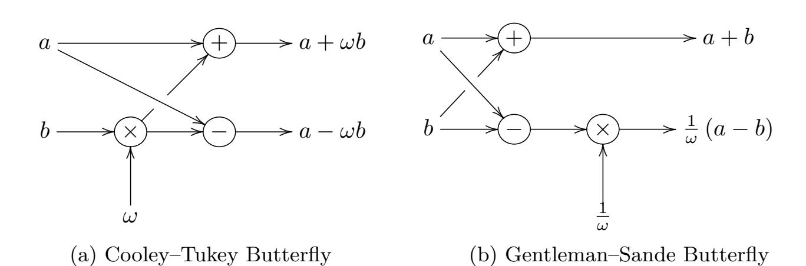

{0}------------------------------------------------

# **NTT Multiplication for NTT-unfriendly Rings**

**New Speed Records for Saber and NTRU on Cortex-M4 and AVX2**

Chi-Ming Marvin Chung<sup>1</sup>*,*<sup>2</sup> , Vincent Hwang<sup>1</sup>*,*<sup>2</sup> , Matthias J. Kannwischer<sup>3</sup> , Gregor Seiler<sup>4</sup>*,*<sup>5</sup> , Cheng-Jhih Shih<sup>1</sup>*,*<sup>2</sup> and Bo-Yin Yang<sup>1</sup>

> <sup>1</sup> Academia Sinica, Taipei, Taiwan [{marvin852316497,vincentvbh7,cs861324}@gmail.com](mailto:{marvin852316497,vincentvbh7,cs861324}@gmail.com), [by@crypto.tw](mailto:by@crypto.tw) <sup>2</sup> National Taiwan University, Taipei, Taiwan <sup>3</sup> Max Planck Institute for Security and Privacy, Bochum, Germany [matthias@kannwischer.eu](mailto:matthias@kannwischer.eu) 4 IBM Research – Zurich, Rüschlikon, Switzerland <sup>5</sup> ETH Zurich, Zurich, Switzerland [gseiler@inf.ethz.ch](mailto:gseiler@inf.ethz.ch)

**Abstract.** In this paper, we show how multiplication for polynomial rings used in the NIST PQC finalists Saber and NTRU can be efficiently implemented using the Number-theoretic transform (NTT). We obtain superior performance compared to the previous state of the art implementations using Toom–Cook multiplication on both NIST's primary software optimization targets AVX2 and Cortex-M4. Interestingly, these two platforms require different approaches: On the Cortex-M4, we use 32-bit NTT-based polynomial multiplication, while on Intel we use two 16-bit NTT-based polynomial multiplications and combine the products using the Chinese Remainder Theorem (CRT).

For Saber, the performance gain is particularly pronounced. On Cortex-M4, the Saber NTT-based matrix-vector multiplication is 61% faster than the Toom–Cook multiplication resulting in 22% fewer cycles for Saber encapsulation. For NTRU, the speed-up is less impressive, but still NTT-based multiplication performs better than Toom–Cook for all parameter sets on Cortex-M4. The NTT-based polynomial multiplication for NTRU-HRSS is 10% faster than Toom–Cook which results in a 6% cost reduction for encapsulation. On AVX2, we obtain speed-ups for three out of four NTRU parameter sets.

As a further illustration, we also include code for AVX2 and Cortex-M4 for the Chinese Association for Cryptologic Research competition award winner LAC (also a NIST round 2 candidate) which outperforms existing code.

**Keywords:** Polynomial Multiplication, NTT Multiplication, Saber, NTRU, Cortex-M4, AVX2

## **1 Introduction**

Popular PKC primitives like RSA and elliptic curve cryptography (ECC) which are based on the hardness of factoring large integers and the discrete logarithm problem both are vulnerable to quantum computer attacks [\[Sho94\]](#page-24-0). Thus we often hear that *Quantum Computers (QCs) may arrive soon and break all common Public-Key Cryptography (PKC) today.*

<sup>∗</sup>This work was in part done while MJK was employed by Radboud University, Nijmegen, The Netherlands and visiting Academia Sinica, Taipei, Taiwan.

{1}------------------------------------------------

*Hence there is a need for Post-Quantum Cryptography (PQC), the study of QC-resistant PKC.* There are five major classes of post-quantum cryptographic schemes today, based on multivariate quadratics (MPKCs), lattices, error-correcting codes, (supersingular) isogenies, and hash functions. Most extant post-quantum schemes have merit beyond being postquantum. They tend to be faster at the same designed level of security, and as such are reasonable candidates for wide deployment even without considering QC. In particular, PQC based on hard lattice problems combine good overall performance with acceptable transmission bandwidth requirements.

Recently, the U.S. National Institute of Standards and Technology (NIST) has called a competition for the next generation post-quantum cryptography. 82 cryptosystems were submitted in 2017 and 15 are currently in the 3nd round which started in July 2020 of which 7 are considered finalists and 8 are alternate schemes. NIST plans to start standardization of some of the finalists in about 2 years from the start of the 3rd round. The perceived superiority of lattice-based crypto is reflected in the NIST post-quantum cryptography standardization process, as nearly half of the candidates were (and are) based on hard lattice problems. Most of these are "small lattice systems" which use polynomial rings as the basic algebraic structure. The most critical algebraic step is a polynomial multiplication modulo a specified polynomial.

Of these small lattice-based cryptosystems, several are designed from the ground up to depend on a specific way to multiply polynomials in an integer ring: the Number Theoretic Transform (NTT). The remaining third round candidates with this structure are Kyber, Falcon, and Dilithium [\[ABD](#page-22-0)<sup>+</sup>19, [FHK](#page-22-1)<sup>+</sup>19, [LDK](#page-23-0)<sup>+</sup>19], and there were other similar submissions in earlier rounds of the NIST competition (e.g., [\[PAA](#page-24-1)<sup>+</sup>19, [DTGW17\]](#page-22-2)).

There seems to be a common conception that schemes that were not specifically designed to benefit from NTT-based multiplication by using a *NTT-friendly* ring cannot be efficiently implemented using them and, hence, one has to fall back to other multiplication algorithms like Karatsuba multiplication [\[KO63\]](#page-23-1) or Toom–Cook multiplication [\[Too63,](#page-24-2) [Coo66\]](#page-22-3). Among the finalists, this applied to two schemes: Saber [\[DKRV19\]](#page-22-4) and NTRU [\[ZCH](#page-24-3)<sup>+</sup>19]. Both use a power-of-two modulus which is inherently incompatible with straightforward NTTs. Previous implementations of Saber and NTRU use a combination of Toom-4 and Karatsuba to implement efficient polynomial arithmetic. However, as we show in this work it is still possible to use NTTs to implement their underlying polynomial arithmetic and obtain superior performance compared to the state of the art implementations both on the ARM Cortex-M4 and AVX2.

Leaving the performance aspect aside, it is also interesting to be able to implement all lattice-based schemes with NTT-based polynomial multiplication algorithms from an ease of implementation point of view. Furthermore, this way all schemes can benefit from potential future hardware support for computing NTTs. Because of these reasons we think that even a small decrease in runtime maybe acceptable when using NTT-based multiplication instead of other methods.

The Chinese Association for Cryptologic Research (CACR) also sponsored a competition similar to that of NIST between 2018–19 [\[CAC19\]](#page-22-5). All three First Class Award winners were small lattice-based systems. Two of them, styled Aigis-ENC and Aigis-Sign, resemble Kyber and Dilithium in their design (see [\[ZYF](#page-24-4)<sup>+</sup>19], where the authors detail their deviations from Kyber and Dilithium). The other, LAC [\[LLJ](#page-23-2)<sup>+</sup>19], has a very small prime modulus (*q* = 251) which is not suited to NTTs, and the designers suggest a sparse multiplication technique instead. We also show below that NTTs can be used to obtain performance superior to all previous implementations.

**Contribution.** We show how NTTs can be used to obtain efficient polynomial arithmetic in finite fields modulo a power-of-two. We present new implementations of Saber, LAC, and NTRU targeting the ARM Cortex-M4 and AVX2 which are faster than any implementations 

{2}------------------------------------------------

described in the literature for the majority of parameter sets. Only for ntruhps2048509 we were unable to obtain a speed-up on AVX2. Interestingly, our two platforms require different multiplication strategies due to limitations of the available multiplication instructions.

**Code.** Our implementations of Saber, LAC, and NTRU are Open Source and are available at https://github.com/ntt-polymul/ntt-polymul.

**Related Work.** Concurrent work by Fritzmann, Sigl, and Sepúlveda [FSS20] presents a Saber implementation of a similar NTT-based approach targeting a RISC-V core with a tightly coupled hardware accelerator, but did not obtain better performance than their Toom–Cook implementation.

**Structure of this Paper.** Section 2 describes Saber, LAC, and NTRU and the background of the techniques required to implement polynomial arithmetic using NTTs for each. Section 3 presents the implementation details on the Cortex-M4. Section 4 presents the implementation details for AVX2 on Skylake. In Section 5 we present the performance results for Saber, LAC, and NTRU on our target platforms.

## <span id="page-2-0"></span>2 Preliminaries

This section is organized as follows: First, we introduce the cryptographic schemes we consider in this paper: Saber (Section 2.1), NTRU (Section 2.2), and LAC (Section 2.3). Second, Section 2.4 introduces the NTT techniques that can be used to implement polynomial arithmetic for NTRU and Saber. Last, we present some of the intricacies of Cortex-M4 in Section 2.5.

#### <span id="page-2-1"></span>2.1 Saber

Saber [DKRV19] is a lattice-based key encapsulation mechanism based on the Module Learning With Rounding M-LWR problem. The polynomial ring used within Saber is  $R_q = \mathbb{Z}_q[x]/(X^n+1)$  with  $q=2^{13}$  and n=256 across all parameter sets. As most other lattice-based schemes, Saber constructs a CCA-secure KEM from a CPA-secure DPKE.

```
Algorithm 1 Saber Key Generation
                                                                        Algorithm 2 Saber CPA Encryption
Output: pk = (seed_A, b), sk = (s)
                                                                       Input: m, r, pk = (seed_A, b)
                                                                        Output: ct = (c, b')
 1: \operatorname{seed}_A \leftarrow \operatorname{Sample}_U()
                                                                         1: A \in R_q^{l \times l} \leftarrow \texttt{Expand}(\text{seed}_A)
2: s' \in R_q^l \leftarrow \texttt{Sample}_B(r)
 2: A \in R_q^{l \times l} \leftarrow \texttt{Expand}(\text{seed}_A)
 3:\ s\in R_q^l \leftarrow \mathtt{Sample}_B()
 4: b \leftarrow \mathtt{Round}(A^T \cdot s)
                                                                          3: b' \leftarrow \text{Round}(As')
                                                                    \equiv 4: v' \leftarrow b^T(s' \mod p)
                                                                         5: c \leftarrow \text{Round}(v' - 2^{\epsilon - 1}m)
Algorithm 3 Saber CPA Decryption
Input: ct = (c, b'), sk = (s)
Output: m
 1: v \leftarrow b'^T(s \mod p)
 2: m \leftarrow \text{Round}(v - 2^{\epsilon_p - \epsilon_T} c \mod p)
```

<span id="page-2-4"></span>Algorithm 1, Algorithm 2, and Algorithm 3 depict the CPA-secure key generation, encryption, and decryption respectively.  $\mathtt{Sample}_U$  refers to sampling from a uniform distribution,  $\mathtt{Sample}_B$  refers to sampling from a binomial distribution. Expand expands a seed to a uniform matrix of polynomials. We omit the CCA variants for brevity and refer the reader to the specification for the corresponding CCA transformation. Saber's

{3}------------------------------------------------

most time-consuming operation in key generation and encryption is the matrix-vector multiplication of polynomials  $A^T \cdot s$  and As'. In decryption the most expensive operation is the inner product of  $b'^T \cdot s$ .

**Parameters** The Saber submission specifies the three parameter sets Lightsaber, Saber, and Firesaber targetting the NIST security levels 1, 3, and 5 respectively. While the underlying polynomial ring remains the same for all parameter sets, the module dimension l, the rounding parameter T, and the secret distribution parameter  $\mu$  vary per parameter set. The parameters are summarized in Table 1a.

**CCA Transform** To achieve IND-CCA2 security, Saber is using a variant of the Fujisaki–Okamoto (FO) transform due to Hofheinz, Hövelmanns, and Kiltz [HHK17]. However, as the randomness r (and the corresponding s') cannot be recovered in decryption, Saber does require re-encryption in the decapsulation algorithm. Hence, improving the encryption also improves decapsulation. For technical details on the FO transform, refer to the specification [DKRV19].

#### <span id="page-3-0"></span>**2.2 NTRU**

The NTRU submission [ZCH<sup>+</sup>19] is based on the NTRU crytosystem which was first proposed by Hoffstein, Pipher, and Silverman in 1998 [HPS98]. Two teams submitted an NTRU-like scheme to the NIST competition named NTRU-HRSS and NTRUEncrypt. After the first round, those teams merged their proposals giving it the new name 'NTRU'. It operates in the three polynomial rings  $\mathbb{Z}_3[x]/\Phi_{\mathbf{n}}$ ,  $\mathbb{Z}_q[x]/\Phi_{\mathbf{n}}$ , and  $\mathbb{Z}_q[x]/(\Phi_1 \cdot \Phi_{\mathbf{n}})$  with  $\Phi_1 = (x-1)$  and  $\Phi_{\mathbf{n}} = (x^{n-1} + x^{n-2} + \cdots + 1)$ .

The algorithms for key generation, encryption, and decryption are shown in Algorithm 4, Algorithm 5, and Algorithm 6 respectively. For the details of Sample and Lift, see [ZCH<sup>+</sup>19].

NTRU's main benefit is the relatively cheap encapsulation which is the fastest of the KEM finalists in the NIST competition. However, it comes with a rather costly key generation procedure as it requires polynomial inversion. In both encryption and decryption, the major arithmetic operation is polynomial multiplication.

```
Algorithm 4 NTRU Key Generation
                                                                      Algorithm 6 NTRU CPA Decryption
                                                                      \overline{\mathbf{Input:}}\ c, sk = (f, f_p, h_q)
Output: pk = (h), sk = (f, f_p, h_q)
                                                                       Output: r, m or fail
 1: f, g \leftarrow \texttt{Sample}()
 2: f_q \leftarrow f^{-1} \mod (q, \mathbf{\Phi}_n)
                                                                        1: if c \not\equiv 0 \pmod{(q, \Phi_1)} return fail
 3: h \leftarrow (3 \cdot g \cdot f_q) \mod (q, \mathbf{\Phi_1} \cdot \mathbf{\Phi_n})
                                                                        2: a \leftarrow (c \cdot f) \mod (q, \mathbf{\Phi_1} \cdot \mathbf{\Phi_n})
 4: h_q \leftarrow h^{-1} \mod (q, \mathbf{\Phi_n})
                                                                        3: m \leftarrow (a \cdot f_p) \mod (3, \mathbf{\Phi_n})
 5: f_p \leftarrow f^{-1} \mod (3, \mathbf{\Phi_n})
                                                                        4: m' \leftarrow \text{Lift}(m)
                                                                    \equiv 5: r \leftarrow ((c - m') \cdot h_q) \mod (q, \mathbf{\Phi_n})
Algorithm 5 NTRU CPA Encryption
Input: m, r, pk = (h)
Output: c
 1: m' \leftarrow \texttt{Lift}(m)
 2: c \leftarrow (r \cdot h + m') \mod (q, \mathbf{\Phi_1} \cdot \mathbf{\Phi_n})
```

<span id="page-3-2"></span>**Parameters.** NTRU proposes four parameter sets listed in Table 1b. Those parameter sets mostly differ in the used polynomial dimensions n and the modulus q which consequently leads to different security levels. The ntruhrss701 comes from the first round submission NTRU-HRSS, while the other parameter sets were initially submitted as NTRUEncrypt.

{4}------------------------------------------------

<span id="page-4-6"></span>

| (a) Saber  |               |           |                      |                                                      | (b) NTRU                     |                                                          |                   |                          |               |
|------------|---------------|-----------|----------------------|------------------------------------------------------|------------------------------|----------------------------------------------------------|-------------------|--------------------------|---------------|
| name       |               | l         | $T = 2^{\epsilon_T}$ |                                                      | $\mid \mu \mid$              | nam                                                      | name              |                          | $\mid n \mid$ |
| Lightsaber |               | 2         | $2^3$                |                                                      | 10                           | ntruhps2                                                 | ntruhps2048509    |                          | 509           |
| Saber      |               |           | $2^{\cdot}$          | 4                                                    | 8                            | ntruhps2                                                 | ntruhps2048677    |                          | 677           |
| Firesaber  |               | 4         | $2^{6}$              |                                                      | 6                            | ntruhrs                                                  | ntruhrss701       |                          | 701           |
|            |               | •         |                      | Tahl                                                 | '<br> o 2+ T.∆               | ntruhps40<br>C Parameter                                 |                   | $4096 = 2^{12}$          | 821           |
| name       | $\mid n \mid$ | 1         | $l_v$                | <br>                                                 | B                            | B'                                                       | .b<br>            | ECC                      |               |
|            | 16            | $\iota_v$ |                      |                                                      | D                            |                                                          | LCC               |                          |               |
| LAC-128    | 512           |           | 511                  | $\left(\frac{1}{4};\frac{1}{2};\frac{1}{4}\right)^n$ |                              | $\left(\frac{1}{4};\frac{1}{2};\frac{1}{4}\right)^{l_v}$ | BCH(511, 256, 33) |                          |               |
| LAC-192    | 102           | 1024      |                      | $\left(\frac{1}{8};\frac{3}{4};\frac{1}{8}\right)^n$ |                              | $\left(\frac{1}{8};\frac{3}{4};\frac{1}{8}\right)^{l_v}$ | BCH(511, 256, 17) |                          | 7)            |
| LAC-256    | 102           | $4 \mid$  | 1023                 |                                                      | $\frac{1}{2};\frac{1}{4})^n$ | $\left(\frac{1}{4};\frac{1}{2};\frac{1}{4}\right)^{l_v}$ | BCH(              | $511, 256, 33)$ $\dashv$ | $\vdash D2$   |

<span id="page-4-2"></span><span id="page-4-1"></span>Table 1: NTRU and Saber Parameter Sets

**CCA transformation.** NTRU is using a variant of the FO transform [FO99] to obtain a CCA-secure KEM from the CPA-secure PKE. By implicitly rejecting invalid ciphertexts, NTRU can avoid having to re-encrypt the message in the decapsulation. Due to space limitations, we omit the details here and refer the reader to the specification [ZCH<sup>+</sup>19].

#### <span id="page-4-0"></span>2.3 LAC

LAC [LLJ<sup>+</sup>19] is a lattice-based key encapsulation mechanism based on the Ring Learning with Errors problem. The polynomial ring used in LAC is  $R_q = \mathbb{Z}_q[x]/(X^n + 1)$  with q = 251 and n = 512 for LAC-128 and n = 1024 for LAC-192 and LAC-256. As most other lattice-based schemes, LAC constructs a CCA-secure KEM from a CPA-secure DPKE.

Algorithm 7, Algorithm 8, and Algorithm 9 depict the CPA-secure key generation, encryption, and decryption respectively. Sample<sub>U</sub> refers to sampling from a uniform distribution, Sample<sub>B</sub> refers to sampling from a fixed-weight ternary distribution. Sample<sub>B'</sub> refers to sampling from a ternary distribution. Expand expands a seed to a uniform matrix of polynomials.  $(\cdot)_{l_v}$  means to take the first  $l_v$  coefficients of a polynomial as a vector. We omit the CCA variants for brevity and refer the reader to the specification for the corresponding CCA transformation. LAC's major operations are multiplications  $(as, ar, br, c_1s)$ .

<span id="page-4-5"></span><span id="page-4-4"></span><span id="page-4-3"></span>

| Algorithm 7 LAC Key Generation                             | Algorithm 8 LAC CPA Encryption                                                |
|------------------------------------------------------------|-------------------------------------------------------------------------------|
| Output: $pk = (seed_a, b), sk = (s)$                       | Input: $m, pk = (seed_a, b)$                                                  |
| 1: $\operatorname{seed}_a \leftarrow \mathtt{Sample}_U()$  | <b>Output:</b> $ct = (c_1, c_2)$                                              |
| $2: a \in R_q \leftarrow \texttt{Expand}(\mathtt{seed}_a)$ | 1: $a \in R_q \leftarrow \mathtt{Expand}(\mathtt{seed}_a)$                    |
| $s, e \in R_q^{(h)} \leftarrow \mathtt{Sample}_B()$        | 2: $\hat{m} = ECCEnc(m)$                                                      |
| $4: b \leftarrow as + e$                                   | $3:\ r,e_1 \in R_q \leftarrow \mathtt{Sample}_B()$                            |
|                                                            | $\underline{\underline{}}$ 4: $e_2 \in R_q \leftarrow \mathtt{Sample}_{B'}()$ |
| Algorithm 9 LAC CPA Decryption                             | $c_1 \leftarrow ar + e_1$                                                     |
| Input: $ct = (c_1, c_2), sk = (s)$                         | 6: $c_2 \leftarrow (br)_{l_v} + e_2 + \left  \frac{q}{2} \right  \hat{m}$     |
| <b>Output:</b> $m = ECCDec(\hat{m})$                       |                                                                               |
| 1: $\tilde{m} \leftarrow c_2 - (c_1 s)_{l_n}$              |                                                                               |
| $2: \ \hat{m} \leftarrow \texttt{Round}(\tilde{m})$        |                                                                               |

**Parameters** The LAC submission specifies the three parameter sets LAC-128, LAC-192, and LAC-256 targetting the NIST security levels 1, 3, and 5 respectively. The parameters are summarized in Table 2.

{5}------------------------------------------------

<span id="page-5-1"></span>

Figure 1: The "Butterflies" of Fast Fourier Transforms

**CCA Transform** To achieve IND-CCA2 security, LAC is using a variant of the Fujisaki-Okamoto transform due to Hofheinz, Hövelmanns, and Kiltz [HHK17], similar to Saber, For technical details on the FO transform, refer to the specification [LLJ<sup>+</sup>19].

## <span id="page-5-0"></span>2.4 FFT-based Polynomial Multiplications and NTT

In NTRU, LAC, and Saber, we need to multiply in the following rings:  $\mathbb{Z}_{8192}[x]/(x^{256}+1)$ ,  $\mathbb{Z}_{2048}[x]/(x^{509}-1)$ ,  $\mathbb{Z}_{251}[x]/(x^{512}+1)$ ,  $\mathbb{Z}_{2048}[x]/(x^{677}-1)$ ,  $\mathbb{Z}_{8192}[x]/(x^{701}-1)$ ,  $\mathbb{Z}_{4096}[x]/(x^{821}-1)$ , and  $\mathbb{Z}_{251}[x]/(x^{1024}+1)$ . In Saber, we actually need more: a matrix-vector product and an inner product based on that ring multiplication. We describe below tools to construct those multiplications.

Using Fast Fourier Transforms for multiplication is a common technique. Let R be the base ring. The basic idea is the Chinese Remainder Theorem: if f, g are co-prime then we can write down the ring isomorphism  $\phi: R[x]/(f(x)g(x)) \cong R[x]/(f(x)) \times R[x]/(g(x))$ ,  $\phi(h) = (h \mod f, h \mod g)$ . When  $f(x) = x^n - a$  and  $g(x) = x^n + a$ ,  $\phi$  naturally becomes

$$\phi\left(\sum_{i=0}^{2n-1} h_i x^i\right) = \left(\sum_{i=0}^{n-1} \left(h_i + a h_{n+i}\right) x^i, \sum_{i=0}^{n-1} \left(h_i - a h_{n+i}\right) x^i\right).$$
(1)  
$$\phi^{-1}\left(\left(\sum_{i=0}^{n-1} h_i' x^i\right), \left(\sum_{i=0}^{n-1} h_i'' x^i\right)\right) = \sum_{i=0}^{n-1} \frac{1}{2} \left(h_i' + h_i''\right) x^i + \sum_{i=0}^{n-1} \frac{1}{2a} \left(h_i' - h_i''\right) x^{n+i}.$$
(2)

In short, the FFT multiplication trick is  $h_1 h_2 \pmod{(x^{2n} - a^2)} \equiv \frac{x^n + a}{2a} (h_1 \mod (x^n - a)) (h_2 \mod (x^n - a)) + \frac{-x^n + a}{2a} (h_1 \mod (x^n + a)) (h_2 \mod (x^n + a)).$ 

If we consider this an "in-place" operation with a size-2n array of elements of R representing an element of  $R[x]/(x^{2n}-a^2)$  and the bottom and top half of that array representing the element of  $R[x]/(x^n-a)$  and of  $R[x]/(x^n+a)$  respectively, then with a little change of notation we see the standard "butterfly" transformations (Figure 1).

To multiply  $h_1h_2$  with  $\deg h_1, \deg h_2 < n$  in an initial ring that is not an easy quotient ring for NTTs, such as in NTRU, we would first consider everything as a polynomial multiplication in R[x], then  $R[x]/\left(x^{2n'}-1\right)$ , where n'>n is a convenient order for NTTs. The "layer 0" in the FFT is then trivial. Interested readers may refer to [Ber] for various tricks of polynomial multiplications.

### <span id="page-5-2"></span>2.4.1 The "Standard" Cooley-Tukey (CT) NTT-Based Multiplication

"The FFT" usually means to split everything down from  $x^{2^k} - 1$  to linear factors, which requires a primitive root  $\zeta \in R$  of degree  $2^k$  (an element such that  $\zeta^{2^{k-1}} = -1$ ). The Number Theoretic Transform (NTT) means an FFT in a prime field, which must be modulo an "NTT-friendly" prime of the form  $p = 2^k p' + 1$ .

{6}------------------------------------------------

One might invert the FFT trick by using Gentleman–Sande butterflies, replacing all the divisions by 2 with a final division by  $2^k$ . We may also treat this as a forward FFT map (again followed by a final division by  $2^k$ ) implementing it with Cooley–Tukey butterflies. This frequently requires extra data movement on larger platforms, but often can be convenient on a small micro-controller like the ARM Cortex-M4.

Note that in a standard Fourier analysis situation, one needs to map

$$R[x]/(x^n-1) \to (R[x]/(x-1)) \times (R[x]/(x-\zeta)) \times \cdots \times (R[x]/(x-\zeta^{n-1}))$$

with the powers of  $\zeta$  appearing in order, whereas doing layers of Cooley–Tukey butterfly operations leaves the results in bit-reversed order. But the order is not important when all we care about is to multiply two polynomials. Schemes that are specifically designed to use the NTT like Kyber, NewHope, and Dilithium usually build the bit-reversed order into their specifications [ABD<sup>+</sup>19, LDK<sup>+</sup>19, PAA<sup>+</sup>19].

If we define the bit reversal  $\operatorname{brv}_n\left(\sum_{i=0}^{n-1}a_i2^i\right):=\sum_{i=0}^{n-1}a_i2^{n-1-i}$ , then the j-th (of  $2^i$ ) multiplier used in a standard NTT based on CT butterflies of layer i in a k-layer NTT, for  $2^{k-1-i}$  butterflies starting at index  $j\cdot 2^{k-i}$ , for entries  $2^{k-1-i}$  apart, is  $\zeta^{\operatorname{brv}_{k-1}(j)}$ .

#### 2.4.2 The "Twisted" Gentleman-Sande (GS) NTT-Based Multiplication

"The Twisted FFT trick" means to do the FFT trick on  $R[X]/(X^{2n}-1)$  to split it down to the rings  $R[X]/(X^n \mp 1)$  then map  $R[X]/(X^n + 1)$  to  $R[Y]/(Y^n - 1)$  where  $Y = \zeta X$  with  $\zeta^n = -1$  the primitive root of order 2n. When  $n = 2^{k-1}$  and our prime is NTT-friendly, we

can split it down to  $(R[x]/(x-1)) \times \cdots \times (R[x]/(x-1))$ . One can verify that the result is componentwise the same as the more familiar form above.

The butterflies appearing in such a forward NTT would all be of the GS variety. The j-th (of  $2^{k-1-i}$ ) multiplier used in layer i in a k-layer NTT, for butterflies for  $2^i$  pairs of entries spaced  $2^{k-1-i}$  apart, starting at index j and incrementing by  $2^{k-i}$ , is  $\zeta^{j\cdot 2^i}$ .

Note that doing backward NTTs using CT butterflies as in Sec. 2.4.1 is properly considered the reverse of the Gentleman-Sande NTT and is often used to avoid reductions.

#### 2.4.3 NTT-based Negacyclic Convolutions

The "Negacyclic convolution" means to multiply modulo  $x^n+1$ . When  $n=2^{k-1}$  and the ring R contains a primitive root  $\zeta$  of degree 2n, the full negacyclic NTT is just the top half of a full FFT  $\operatorname{mod}(x^{2n}-1)$ . I.e., the j-th (of  $2^i$ ) multiplier encountered in layer i, for  $2^{k-1-i}$  CT butterflies starting at index  $j \cdot 2^{k-i}$ , for indices  $2^{k-1-i}$  apart, is  $\zeta^{\operatorname{brv}_k(j+2^{i-1})}$ . Here starting by "twisting" into  $\operatorname{mod}(x^n-1)$  costs an extra layer of multiplications.

#### 2.4.4 Incomplete NTTs

If we proceed with the FFT trick for  $\ell$  layers on multiplicands (coming down to  $2^{\ell}$  polynomials (mod  $x^h - \zeta_i$ )), do pairwise modular multiplications using schoolbook on h entries, then invert the FFT trick, we have performed a multiplication by *incomplete NTT*.

[LS19] first introduced Incomplete NTTs to lattice-based crypto, with moduli not allowing a full NTT (e.g., Kyber with  $(2 \cdot 256)$  /(3329 – 1)). In later works Incomplete NTTs were later chosen deliberately even when a full NTT was possible, e.g., in [ABCG20].

#### 2.4.5 Good's Trick and NTTs

Instead of the incomplete NTT, if the length of the NTT is  $n = h \cdot 2^k$  with h odd, we apply Good's FFT trick [Goo51], where we set x = yw with  $y^{2^{k-1}} = -1 = w^{h-1} + w^{h-2} + \cdots + w$ .

{7}------------------------------------------------

A multiplicand  $a(x) \in \mathbb{Z}_{q'}[x]/(x^{h\cdot 2^k}-1)$  with  $\deg a < h\cdot 2^k$  becomes  $b(y,w) \in \mathbb{Z}_{q'}[y,w]$  with  $x^i = y^{i \bmod 2^k} w^{i \bmod h}$ , with  $\deg_y b < 2^k$  and  $\deg_w b < h$ . We may write  $b = \sum_{i=0}^{h-1} w^i b_i(y)$  with  $b_i(y) \in \mathbb{Z}_{q'}[y]/(y^{2^k}-1)$ . We term "Good's permutation" the map from the array a[] representing  $\sum_{0 \le i < h \cdot 2^k} a_i x^i$  to b[][] representing  $\sum_{i=0}^{h-1} \sum_{j=0}^{2^k-1} b_{i,j} w^i y^j$ .

We follow Good's permutation with a size- $2^k$  FFT w.r.t. y on each multiplicand, represented by h parallel size- $2^k$  NTTs. Then we do "point" multiplication by convolving together degree-(h-1) polynomials in w modulo  $w^h-1$ , do an inverse size- $2^k$  FFT (represented by h inverse NTTs), and then finally undo Good's permutation.

## <span id="page-7-0"></span>2.4.6 NTTs with Modulus not of the form $2^k p^\prime + 1$

Suppose we have a convolution modulo  $x^n-1$  modulo q, where  $n\not|(q-1)$ . We can express the polynomials with coefficients in  $\left[-\frac{q}{2};\frac{q}{2}\right]$  and compute the convolution as a polynomial of integer coefficients. The absolute magnitude of the resulting coefficients would be at most  $nq^2/4$ . Therefore, if we find a prime  $p>nq^2/2$  such that n|(p-1), and compute the multiplication mod p (which we can using NTTs of length  $n \mod p$ ), then the result must be correct as a polynomial with integer coefficients, and then we can recover our correct result modulo q.

The procedure is quite similar if it is a different kind of convolution or another product. In the case of our applications (Saber and NTRU), one of the multiplicands is usually "small" so that we can use an even smaller prime.

#### 2.4.7 Mixed-Radix NTT for Multiplications

In [CT65] Cooley and Tukey explained how to effectively compute a general FFT of a composite size N. In such cases, the FFT operation can be realized by combining the results of N/p smaller FFTs on vectors of size p. These elementary FFT operations over vectors of prime size are also referred to by the shape of their diagrams as butterflies. After such subdivisions, the immediate output of the algorithm would appear in an order different from that of the input (however, like the radix-2 case, that needs not concern us).

#### 2.4.8 Multiple Moduli and the Explicit CRT (Divided Difference Form)

As in Section 2.4.6 suppose we have a convolution modulo  $x^n - 1$  modulo q, where  $n \not | (q-1)$ . A different possibility is to take various NTT-friendly primes  $p_i$  whose product P is sufficiently large (usually  $> nq^2/2$ ). Clearly computing the multiplication mod P must return the correct product as polynomial with integer coefficients. This we can do by computing the product modulo each  $p_j$  using NTTs. There are at least two methods to put the pieces together modulo P, from which we can compute our correct results. One is via the Explicit Chinese Remainder Theorem [BS07]. The other is the following approach:

**Theorem 1.** Let  $p_i > 0$  be odd, pairwise co-prime  $(\gcd(p_i, p_j) = 1 \text{ for } 1 \le i < j \le s)$ . An explicit solution u of  $u \equiv u_i \pmod{p_i}$ ,  $i = 1 \dots s$ , where  $|u_i| < p_i/2$ , where  $|u| < P/2 = \prod_{i=1}^s p_i$ , is given by

$$\begin{cases} y_1 &= u_1 \\ y_2 &= y_1 + ((u_2 - y_1)m_2 \mod^{\pm} p_2) p_1 \\ y_3 &= y_2 + ((u_3 - y_2)m_3 \mod^{\pm} p_3) p_1 p_2 \\ \vdots &\vdots \\ u = y_s &= y_{s-1} + ((u_s - y_{s-1})m_s \mod^{\pm} p_s) p_1 \cdots p_{s-1} \end{cases}$$

where each  $m_i := (p_1 \cdots p_{i-1})^{-1} \mod^{\pm} p_i$ 

The theorem is also true for noncentered mod and is faster than [BS07] for small s.

{8}------------------------------------------------

#### <span id="page-8-2"></span><span id="page-8-0"></span>2.5 Cortex-M4

As selected by NIST for evaluating PQC candidates on micro-controllers, the ARM Cortex-M4 (or M4F since a floating point unit is assumed) is one of our target platforms for implementing PQC schemes. It is a RISC microcontroller which has fourteen 32-bit general purpose registers. Its instruction set has several unusual features:

**Single Cycle:** Most instructions take 1 cycle each, including  $32 \times 32 + 64 = 64$ -bit MADD. The most conspicuous exception is the first load in a sequence of loads (2 cycles).

**Barrel Shifter:** In almost all instructions one of the operands can be shifted or rotated by an arbitrary number of bits at no extra cost (and even sometimes help set carry).

**Flexible Indexing:** A registers may be incremented before or after being used as an address for a load. The sum of *two* registers, one possibly shifted, maybe used as the address.

**SIMD:** Some arithmetic instructions operate on 8- and 16-bit chunks of registers.

Restricted immediates: Not all 32-bit numbers can be used as an immediate operand.

Optional Flag-setting: Instructions don't set flags by default, though most optionally do.

We mention some of the main tricks which we employed below.

**Reductions.** Since all of our approaches on Cortex-M4 are 32-bit NTTs, we need 32-bit modular reductions. We implement 32-bit signed Barrett reduction and 32-bit signed Montgomery multiplication with Cortex-M4's powerful 1-cycle long multiplications smull, smlal, and smmulr. Fix an integer a, a modulus q, and let  $R = 2^{32}$ . For Barrett reduction, we compute  $a \mod^{\pm} q$  with  $a - \left\lfloor \frac{a}{q} \right\rceil \cdot q \approx a - \left\lfloor \frac{a \cdot \left\lfloor \frac{R}{q} \right\rceil}{R} \right\rfloor \cdot q$  in 2 cycles as shown in Algorithm 10. For Montgomery multiplication, we compute

$$ab\mathbf{R}^{-1} \bmod^{\pm} q = \operatorname{hi}\left(\left(ab \cdot (\mathbf{R} \bmod^{\pm} q)\right) + q \cdot \operatorname{lo}\left(\left(-q^{-1} \bmod^{\pm} \mathbf{R}\right) \cdot \operatorname{lo}\left(ab \cdot (\mathbf{R} \bmod^{\pm} q)\right)\right)\right)$$

(cf. Algorithm 11). When b is a known constant, we may precompute bR mod  $\pm q$  and derive  $ab \mod \pm q$  instead. While computing the point multiplication for NTTs using schoolbook multiplication, neither multiplicand is known beforehand, but we may cancel out the  $R^{-1} \mod \pm q$  by Montgomery-multiplying the precomputed  $NTT_N^{-1}R^2 \mod \pm q$  (i.e. an extra factor of R) at the end of  $NTT^{-1}$ . For convenience, we denote the computations  $(a,b) \mapsto abR^{-1} \mod \pm q$  by montgomeryM and  $a(64\text{-bit}) \mapsto aR^{-1} \mod q(32\text{-bit})$  by montgomeryR.

<span id="page-8-1"></span>

| Algorithm 10 Barrett reduction                                                                | Algorithm 11 Montgomery multiplication                                                                     |  |  |
|-----------------------------------------------------------------------------------------------|------------------------------------------------------------------------------------------------------------|--|--|
| Input: $c0 = a$                                                                               | Input: $(c0, c1) = (a, b)$                                                                                 |  |  |
| Output: $c0 = a - \left\lfloor \frac{a}{q} \right\rceil \cdot q$                              | Output: $c0 = abR^{-1} \mod {\pm q}$                                                                       |  |  |
| 1: smmulr tmp, c0, $\left\lfloor \frac{\mathtt{R}}{q} \right\rfloor$ 2: mls c0, tmp, $q$ , c0 | 1: smull tmp0, c0, c0, c1<br>2: mul tmp1, tmp0, $(-q^{-1} \mod {}^{\pm}R)$<br>3: smlal tmp0, c0, tmp1, $q$ |  |  |

**Floating-point registers.** On the Cortex-M4 as specified by NIST, there are 14 general purpose registers and 32 floating-point registers. Floating-point registers not only enable us to access frequently used twiddle factors but also give us great flexibility on designing our approaches; loading twiddle factors to floating-point registers before loops for butterflies saves a general purpose register (crucial, since all our implementation on Cortex-M4 are

{9}------------------------------------------------

32-bit NTTs), we have a slighty faster implementation for ntruhps2048509 comparing to Toom-4 implementation and a faster variant to use 64-bit (vs. the usual 32-bit) accumulators for Saber's matrix-to-vector product. Details for these variants will be elaborated in the relevant sections.

## <span id="page-9-0"></span>**3 NTTs on the Cortex-M4**

On Cortex-M4, we commonly compute three layers of radix-2 NTTs at a time, Algorithm [19](#page-28-0) illustrates the idea and is adapted from [\[ACC](#page-22-10)<sup>+</sup>20].

## **3.1 Saber**

For Saber, we replace polynomial multiplications in the subroutines InnerProd and MatrixVectorMul using the negacyclic NTT trick to eliminate *all* Toom-4 multiplications in Saber. In the interest of brevity, we only detail MatrixVectorMul (which takes most of the time) that multiplies an *l* × *l* matrix with an *l* × 1 vector, where each component is an element of Z*q*[*x*]*/*(*x* <sup>256</sup>+1). The design of Saber provides additional incentives to use NTTs because the matrix-to-vector product is turned into a matrix-to-vector point-multiplication in NTT domain. More concretely, we do not merely save the difference in cycles between Toom-4 and NTT-based degree-255 polynomial multiplications, because to compute the *l* <sup>2</sup> multiplications in MatrixVectorMul, we only need to compute *l* <sup>2</sup> + *l* NTTs and *l* NTT inverses instead of 2*l* <sup>2</sup> NTTs and *l* 2 inverse NTTs as normally might be expected.

Our NTT-based MatrixVectorMul therefore proceeds as follows: compute the size-256 negacyclic NTT for each component in the matrix and the vector, multiply the matrix by the vector with degree-3 schoolbooks, accumulate the result to a vector, and then compute the NTT inverses for each component.

We compute incomplete NTTs and degree-3 schoolbook as it gives the best performance for Saber. To compute *a*<sup>0</sup> · *b*<sup>0</sup> + *a*<sup>1</sup> · *b*<sup>1</sup> + *a*<sup>2</sup> · *b*<sup>2</sup> (mod *q* 0 ) using Montgomery reductions, we only need 1 smull, 2 smlal, and 1 Montgomery reduction instead of computing 3 multiplications, each followed by a Montgomery reduction, adding the results together, and then reducing modulo *q* <sup>0</sup> again. Furthermore, this idea also applies where each *a<sup>i</sup>* · *b<sup>i</sup>* is a degree-3 schoolbook.

**Choosing the best incomplete NTT.** When using incomplete NTTs we need to choose the point at which we stop doing NTT butterfly operations and simply multiply the polynomials using school-book multiplication. One can choose between 8 layers of NTTs, 7 layers of NTTs followed by 2×2 schoolbook, 6 layers of NTTs followed by 4×4 schoolbook, and 5 layers of NTTs followed by 8 × 8 schoolbook. First we compare the behavior of incomplete NTTs. On a Cortex-M4, among the 14 general purpose registers, we need one register for loading coefficients, one register for loading the twiddle factors *ζ*, two registers for constants used in Montgomery multiplication, two registers as temporary storage for Montgomery multiplication in schoolbook. There are only 8 remaining registers where computing 3 layers of NTTs at a time could be achieved without overhead. Computing 5 layers of NTTs would not achieve the economical use of registers, since we can often compute the 5-th layer without spilling the registers. Computing 7 layers of NTTs would involve a lot of vmovs because of the lack of registers. For Saber, we achieve the best performance when doing 6 layers of NTTs. This can be explained by comparing 4 × 4 school-book multiplication and size-4 NTTs. For simplicity, we will focus on an *l*-dimensional matrix-to-vector product in which each component is a degree-3 polynomial. A 4 × 4 school-book multiplication requires 7 smulls, 12 smlals, and 7 montgomeryRs as illustrated in Algorithm [17](#page-26-0) in the Appendix. For accumulation, each *l*-dimensional row-column inner product requires 4*l* − 4 adds and 4*l* − 4 vmovs for temporary storage. 

{10}------------------------------------------------

Therefore,  $41l^2-8l$  cycles are required for the  $4\times 4$  school-book approach. To use a size-4 NTT trick, we calculate the size-4 NTT of each component, multiply components by components with point-multiplication, accumulate to a vector, and finally, compute the size-4 NTT inverse of each component. Each size-4 NTT requires 4 montgomeryMs and 4 add-sub pairs as shown in Algorithm 16. Since only 14 registers are available, we need to vmov  $4\cdot(2\cdot(l-1)+l)\cdot l=12l^2-8l$  times for storing intermediate values for accumulation. If the NTT trick is adopted, the matrix-to-vector product would require  $20l^2+40l$  cycles for  $l^2+l$  NTTs and l NTT inverses,  $l^2$  montgomeryMs,  $12l^2-8l$  vmovs, and  $4l^2-4l$  adds, resulting in  $39l^2+28l$  cycles. We have  $41l^2-8l<39l^2+28l$  for l<18.

Better Accumulation For Schoolbook Multiplication. There is an even better approach to matrix-to-vector products utilizing the commutativity of instructions. All adds and some montgomeryR can be removed at the cost of some additional vmovs. Consider one inner product  $\mathbf{h} = \sum_{i=0}^{3} \mathbf{p}_{i} \star \mathbf{q}_{i}$  where  $\star$  is multiplication (mod  $z^{4} - \zeta$ ). Now  $[z^{0}]\mathbf{h} = \sum_{i} (\mathbf{p}_{i0}\mathbf{q}_{i0} + \zeta(\mathbf{p}_{i1}\mathbf{q}_{i3} + \mathbf{p}_{i2}\mathbf{q}_{i2} + \mathbf{p}_{i3}\mathbf{q}_{i1}))$  is its constant term<sup>1</sup>. So we can compute the 64-bit value of  $[z^{0}]\mathbf{h}$  and then reduce it to 32-bit with montgomeryR, wherein all the adds can be absorbed (changing some smull into smlal). Algorithm 18 is an illustration of the idea. To summarize, we save  $4l^{2} - 4l$  adds and  $4l^{2} - 4l$  montgomeryRs (each of which takes 2 cycles) at the cost of  $8l^{2} - 8l$  vmovs and therefore the cycle count becomes  $37l^{2} - 4l$ , smaller than  $39l^{2} + 28l$  for all l. We find that the above approach is hard to beat regardless of l.

Our Optimized Negacyclic NTT Trick. Since incomplete size-256 negacyclic NTTs are computed, we choose prime  $q' = 25166081 = 196610 \cdot 128 + 1$  for Saber and Firesaber, and prime  $q' = 20972417 = 163847 \cdot 128 + 1$  for Lightsaber. We compute NTTs with six layers of radix-2 NTTs (CT butterflies), where the first three layers are merged and the following three layers are merged, then compute schoolbook-and-accumulate with above strategy, and finally compute incomplete size-256 NTT negacyclic inverses using GS butterflies with the same 3-layer-merge.

### **3.2 NTRU**

In this section, we go into implementation details for polynomial multiplication in NTRU on Cortex-M4. We are targeting the first two poly\_Rq\_muls and the first poly\_Sq\_mul in key generation, the poly\_Rq\_mul in encryption, and the first poly\_Rq\_mul in decryption. While implementing polynomial multiplication for each parameter set, we optimized the code in various aspects. Some ideas work for all parameter sets, and some are only suitable for a particular one. The core ideas are simple: manipulate registers wisely, compute small convolutions with schoolbook, and change the domain only when needed. We summarize the tricks used for each parameter set in Table 3.

**Layers of NTT.** As usual, several layers of NTTs are computed at a time to avoid load-stores and use the registers economically. On Cortex-M4, since only 14 general purpose registers are available, we compute three layers of radix-2 NTTs (and two layers of radix-3 NTTs) at a time. For ntruhps2048509, we employ a seemingly strange alternative, computing *four* layers of radix-2 NTTs at a time, to set up better a foundation for polynomial multiplication. This results in a slightly faster implementation for ntruhps2048509 compared to the Toom-4 approach.

<span id="page-10-0"></span><sup>&</sup>lt;sup>1</sup>Combinatorially it is customary to write  $[x^i]f$  for the coefficient of  $x^i$  in f.

{11}------------------------------------------------

Table 3: Overview of NTTs for NTRU on Cortex-M4

(a) NTT tricks for NTRU parameter sets.

<span id="page-11-0"></span>

| Parameter sets | $NTT_N$                     | q'      | Strategy            |
|----------------|-----------------------------|---------|---------------------|
| ntruhps4096821 | $1728 = 9 \cdot 64 \cdot 3$ | 3365569 | Mixed-radix (CT+GS) |
| ntruhrss701    | $1536 = 512 \cdot 3$        | 5747201 | Good's (CT+CT)      |
| ntruhps2048677 | $1536 = 512 \cdot 3$        | 1389569 | Good's (CT+CT)      |
| ntruhps2048509 | $1024 = 256 \cdot 4$        | 1043969 | Radix-2 (CT+GS)     |

(b) Layers of NTTs for each set of parameter.

|                               | NTT                                     | baseMul      | NTT inverse                                     |
|-------------------------------|-----------------------------------------|--------------|-------------------------------------------------|
| ntruhps4096821                | 2-layer-radix-3<br>+2 × 3-layer-radix-2 | $3 \times 3$ | $2 \times 3$ -layer-radix-2<br>+2-layer-radix-3 |
| ntruhrss701<br>ntruhps2048677 | $3 \times 3$ -layer-radix-2             | $3 \times 3$ | $3 \times 3$ -layer-radix-2                     |
| ntruhps2048509                | $2 \times 4$ -layer-radix-2             | $4 \times 4$ | $2 \times 3$ -layer-radix-2                     |

**Tricks for commutative operations.** Recall that for computing an NTT, we must cancel out the scaling factor NTT<sub>N</sub>. We can halve the number of Montgomery-multiplications by NTT<sub>N</sub><sup>-1</sup>R<sup>2</sup> mod  $\pm q$  by first reducing modulo the polynomial modulus and then performing the multiplication. The same idea also applies to the operations of reducing the coefficient from  $\mathbb{Z}_{q'}$  to  $\mathbb{Z}_q$  and packing two coefficients into one register. Because they commute, we pack two coefficients and then and with (q-1)||(q-1). Algorithm 20 shows how the ideas are implemented at the final stage.

ntruhps4096821. Algorithm 12 depicts the NTT for ntruhps4096821. We compute incomplete mixed-radix size-1728 NTTs for each polynomial by splitting down to  $x_{i,j}^3 - \zeta_{i,j}$ , multiply degree-2 polynomials with schoolbook, derive incomplete mixed-radix NTT inverses, and then reduce the coefficient ring to  $\mathbb{Z}_q$ . For incomplete size-1728 NTTs, we first compute size-9 NTTs with two radix-3 NTTs for each 9-set distanced apart by 192 units. Next, for each consecutive 192 coefficients, we compute size-64 NTTs with six layers of radix-2 NTTs for each 64-set distanced apart by 3 units, leaving degree-2 polynomials. Among 9 sets of 192-coefficient, standard size-64 NTTs are computed for the first 192-coefficient and twisted size-64 NTTs are computed for the rest. The incomplete size-1728 NTT inverse is computed in the reversed manner. For the final stage, we employ all the ideas mentioned in the previous paragraph – taking quotient before Montgomery-multiplying  $(R)^2 NTT_N^{-1} \mod q'$  and pack two coefficients before the and. For merging layers, the two layers of radix-3 NTTs are merged, the first three layers of radix-2 NTTs are merged in the same manner.

ntruhrss701 and ntruhps2048677. Algorithm 13 shows the NTT used for ntruhrss701 and ntruhps2048677. We use Good's trick for both. Our approach is almost the same as [ACC<sup>+</sup>20], with a slightly faster final stage. This is because  $(\text{mod } 2^k)$  and  $(\text{mod } (x^n-1))$  are cheaper. We employ Good's permutation of size  $3 \times 2^9$  for the size-1536 NTT. The algorithm goes in the following order: compute three size-512 NTTs (CT butterflies), each for 512 contiguous entries, compute  $3 \times 3$  convolutions, where coefficients are distanced apart by 512 units, invert size-512 NTTs (CT butterflies), and a final stage. This last stage consists of: inverting Good's permutation, taking the remainder  $\text{mod } (x^n-1)$ , Montgomery-multiplication by  $(R)^2NTT_N^{-1}$  mod q', packing two coefficients into one register, and reducing to coefficient ring  $\mathbb{Z}_q$ . We implement the iNTT using CT butterflies because

{12}------------------------------------------------

### <span id="page-12-0"></span>Algorithm 12 Incomplete mixed-radix size-1728 NTT for ntruhps4096821

```
Representing \begin{cases} \text{src1}[i] \text{ with } \text{ntt1}[i/192][(i \mod 192)/3][(i \mod 3)] \\ \text{src2}[i] \text{ with } \text{ntt2}[i/192][(i \mod 192)/3][(i \mod 3)] \end{cases}
1: For each j, k, compute \begin{cases} \text{NTT}_9(\text{ntt1}[0-8][j][k]) \\ \text{NTT}_9(\text{ntt2}[0-8][j][k]) \end{cases}
2: For each i, k, compute \begin{cases} \text{NTT}_{64:\zeta_{i,0}}(\text{ntt1}[i][0-63][k]) \\ \text{NTT}_{64:\zeta_{i,0}}(\text{ntt2}[i][0-63][k]) \end{cases}
3: For each i, j, compute nttout[i][j][0-2] =  \text{ntt1}[i][j][0-2] * \text{ntt2}[i][j][0-2] \mod (x^3 - \zeta_{i,j}) 
4: For each i, k, compute NTT_{64:\zeta_{i,0}}^{-1}(\text{nttout}[i][0-63][k]).
5: For each j, k, compute NTT_9^{-1}(\text{nttout}[0-8][j][k]).
6: Compute des[0-1727] = final_stage(nttout[0-8][0-63][0-2]).
```

### <span id="page-12-1"></span>Algorithm 13 Good's trick of size-1536 NTT for ntruhrss701 and ntruhps2048677

```
 \begin{array}{l} \text{1: Compute } \begin{cases}
```

we need fewer reductions to avoid overflows. As mentioned above, we do  $\text{mod}(x^n-1)$  first so we save half the Montgomery-multiplications by  $(\mathtt{R})^2\mathtt{NTT}_{\mathtt{N}}^{-1}$  mod q'.

ntruhps2048509. We merge our NTT layers differently for ntruhps2048509 to provide a better framework for polynomial multiplication. See Algorithm 14 for the details. We do 2 sets of four-layer NTTs (CT butterflies) for incomplete size-1024 NTTs, perform each 4-coefficient (modulo a degree-3 polynomial) multiplication with schoolbook, do 2 sets of 3-layer NTT inverses (GS butterflies), and a final stage. Here GS butterfles make for an easier final stage comprising the following operations: 2 layers of NTT inverses, taking  $\text{mod}(x^n-1)$ , Montgomery-multiplication by  $(R)^2 NTT_N^{-1} \mod q'$ , packing two coefficients into one register, and reducing to coefficient ring  $\mathbb{Z}_q$ . This approach saves 1 layer of load-stores.

#### <span id="page-12-2"></span>Algorithm 14 Incomplete size-1024 NTT for ntruhps2048509

```
Representing \begin{cases} \text{src1}[i] \text{ with ntt1}[i/4][i \mod 4] \\ \text{src2}[i] \text{ with ntt2}[i/4][i \mod 4] \end{cases}
1: For each j, compute \begin{cases} \text{NTT}_{256}(\text{ntt1}[0-255][j]) \\ \text{NTT}_{256}(\text{ntt2}[0-255][j]) \end{cases}
2: For each i, compute nttout [i] [0-3] = \text{ntt1}[i] [0-3] * \text{ntt2}[i] [0-3] \mod (x^4 - \zeta_i).
3: For each j, compute NTT_{256:7-2}^{-1}(\text{nttout}[0-255][j]).
4: Compute des [0-1023] = \text{final\_stage}(\text{nttout}[0-255][0-3]).
```

{13}------------------------------------------------

Table 4: Overview of NTTs for LAC on Cortex-M4

(a) NTT tricks for LAC parameter sets.

| Parameter sets | $NTT_N$ | q'     | Strategy               |
|----------------|---------|--------|------------------------|
| LAC-128        | 512     | 133121 | Complete NTT (CT+GS)   |
| LAC-192        | 1094    | 270227 | Incomplete NTT (CT+GS) |
| LAC-256        | 1024    | 210331 | Incomplete N11 (C1+G5) |

(b) Layers of NTTs for each set of parameter.

|         | NTT                         | baseMul      | NTT inverse                 |  |  |
|---------|-----------------------------|--------------|-----------------------------|--|--|
| LAC-128 | $3 \times 3$ -layer-radix-2 | $1 \times 1$ | $3 \times 3$ -layer-radix-2 |  |  |
| LAC-192 | $3 \times 3$ -layer-radix-2 | $2 \times 2$ | $3 \times 3$ -layer-radix-2 |  |  |
| LAC-256 | o x o-layer-radix-2         |              | 3 × 3-1ayer-radix-2         |  |  |

#### 3.3 LAC on Cortex-M4

For LAC-128, LAC-192, and LAC-256, we focus on big-by-small polynomial multiplications where the 'small' polynomials have coefficients in  $\{0, \pm 1\}$ .

NTT trick for LAC. We employ the negacyclic NTT trick on the rings  $Z_q[x]/(x^{512}+1)$ ,  $Z_q[x]/(x^{1024}+1)$ ,  $Z_q[x]/(x^{1024}+1)$  for LAC-128, LAC-192, and LAC-256, respectively. Our approach for LAC-128 proceeds as follows: compute the negacyclic size-512 NTTs of polynomials, do point-by-point multiplications, and finally, compute the size-512 NTT inverse. Our approach for LAC-192 and LAC-256 proceeds as the follows: derive incomplete negacyclic size-1024 NTT by three sets of 3-layer-radix-2 NTTs, compute  $2 \times 2$  schoolbooks, and invert the NTT.

On the "optimized implementation" in the LAC submission. The original LAC "optimized" code stores small polynomials as arrays of the indices of the non-zero terms (and do secret-dependent table lookups), and they use the C % operator. These operations are not constant time, posing a security risk. We use a standard form for the array to do NTTs, and replace all C % operator with Barrett reductions to obtain constant-time implementation.

## <span id="page-13-0"></span>4 Vectorized NTT on AVX2

For fast NTT-based polynomial multiplication on current x86 processors from Intel and AMD, it is necessary to use a vectorized implementation of the NTT. These processors support the AVX2 instruction set, offering a large number of instructions that operate on 16 vector registers, each of length 256 bit. Kyber, NTTRU, and Dilithium.

#### 4.1 Fast mulmods

A first obstacle towards fast vectorization of the NTT is the problem of efficiently multiplying many coefficients modulo a small prime q. The standard way to compute modular products is to first compute the double-length products over  $\mathbb{Z}$ , and then reduce these intermediate results modulo q. In a vectorized implementation, in order to achieve the highest possible throughput, one wants to pack as many coefficients as possible in a vector register. But double-length intermediate products mean it is only possible to achieve half the density compared to packing only mod-q reduced integers. This effectively reduces the speed of the implementation by a factor of two. Note that this is not a problem when

{14}------------------------------------------------

#### <span id="page-14-0"></span>**Algorithm 15** Multiplication modulo 16-bit q

```
Require: -2^{15} \le a < 2^{15}, \frac{q-1}{2} \le b \le \frac{q-1}{2}, b' = bq^{-1} \mod 2^{16}

Ensure: r \equiv 2^{16}ab \pmod{q}

1: t_1 \leftarrow \left\lfloor \frac{ab}{2^{16}} \right\rfloor \triangleright signed high product
2: t_0 \leftarrow ab' \mod 2^{16} \triangleright signed low product
3: t_0 \leftarrow \left\lfloor \frac{t_0q}{2^{16}} \right\rfloor \triangleright signed high product
4: r \leftarrow (t_1 - t_0) \mod 2^{16}
```

computing products modulo a two-power as in other polynomial multiplication implementations for Saber or NTRU that directly operate over the respective polynomial rings. There the binary arithmetic in modern CPUs automatically takes care of the modular reduction. To overcome this obstacle we use the modified Montgomery reduction algorithm from |Sei18| together with the improvement from |LS19|. Here the modular multiplications are computed from separate intermediate low and high half-products. When using the AVX2 instruction set, this approach is most efficient for 16-bit primes q. The reason is that there is a specific high-only half-product instruction vpmulhw for packed 16-bit integers that does not have an equivalent instruction for packed 32-bit integers. Therefore, unlike on the Cortex-M4, we use NTTs modulo 16-bit primes q on AVX2. Then we need to use a multi-modular approach and compute the polynomial products modulo two such primes so that we are able to correctly lift the results to  $\mathbb{Z}$  with the help of the Chinese remainder theorem. The additional polynomial product modulo a second prime involving three NTT computations and a base product computation does not result in reduced speed, because this loss of a factor of two is completely compensated for by twice the throughput from packing 16-bit integers instead of 32-bit integers. Another benefit of 16-bit primes is that it is possible to compute the occasional product modulo 3 in NTRU more efficiently, but we haven't used this improvement in our experiments.

We state the modular multiplication algorithm in Algorithm 15. As inputs it gets a 16-bit integer a, and a mod-q reduced integer b together with the precomputed  $b' = bq^{-1} \mod 2^{16}$ . The algorithm then outputs a representative modulo q for the scaled product  $ab2^{16} \mod q$ . The second multiplicand b is always a fixed constant in the NTT and hence b and the corresponding element b' can easily be precomputed. The scaling factor  $2^{16}$  is handled as usual by precomputing b and b' with an additional factor of  $2^{-16}$ .

#### 4.2 Choice of Transforms

We considered several different choices of transforms. For Saber with its NTT-friendly polynomial modulus  $X^{256}+1$ , we compute the negacyclic length-256 transforms modulo  $X^{256}+1$  as we do on the Cortex-M4. For performing only a single polynomial multiplication it is usually advantageous to use an incomplete NTT but for Saber where in the matrix-vector product the vector of polynomials only needs to be transformed once and the inner products can be computed in the NTT basis, a complete NTT is preferable. In the case of ntruhps2048677 and nthuhrss701 we compute an incomplete NTT modulo  $X^{1536}-1$  where we do 9 radix-2 splitting down to factors of degree 3. Since the input polynomials have degree less than 768, the first splitting is for free. For ntruhps2048509 and ntruhps4096821 the same approach that we use on the Cortex-M4 should also gives good results on Skylake. In particular, a length-1728 NTT with two radix-3 splittings, followed by 6 radix-2 splittings, down to polynomials of degree less than 3. For LAC with its polynomial moduli  $X^{512}+1$  and  $X^{1024}+1$ , we compute incomplete negacyclic length-512 and length-1024 NTTs, respectively, each with 8 layers, coming down to factors of degree 2 and 4.

We chose the prime moduli 7681 and 10753 for the NTTs of length 256, 512, 1024 and

{15}------------------------------------------------

1536. Their product is slightly longer than 26 bits, which is enough for all our applications. In the case of Saber, the absolute value of the polynomial coefficients when computing the matrix-vector product over Z is bounded by 2 <sup>24</sup>, which is below 2 <sup>25</sup>. In NTRU, the maximum absolute value is attained in ntruhrss701, where the coefficients are bounded by 2 <sup>24</sup>*.*<sup>04</sup> in all products of a uniform polynomial with a short polynomial. Next, as 7680 and 10752 are divisible by 1536 = 3 · 2 9 , both of these moduli support complete transforms modulo *X*<sup>1536</sup> − 1, which is all that we need for Saber and the NTRU arameter sets except ntruhps4096821. For LAC, the coefficients are even smaller so this is no problem.

For implementing the length-1728 NTT that we need in the remaining NTRU parameter set ntruhps4096821, the two 16-bit primes 3457 and 8641 are used. Their product is sufficiently large, they support complete length-1728 NTTs and they are even slightly smaller than the primes described above, which is good for modular reductions.

So, algebraically, for Saber we compute the map

$$\mathbb{Z}_q[X]/(X^{256}+1) \to \mathbb{Z}_q[X]/(X-\zeta_0) \times \cdots \times \mathbb{Z}_q[X]/(X-\zeta_{255})$$

where *ζ<sup>i</sup>* denote all the primitive 512-th roots of unity in Z*q*. For ntruhrss701 and ntruhps2048677 we compute

$$\mathbb{Z}_q[X]/(X^{1536}-1) \to \mathbb{Z}_q[X]/(X^3-\zeta_0) \times \cdots \times \mathbb{Z}_q[X]/(X^3-\zeta_{511})$$

where *ζ<sup>i</sup>* denote all the primitive 512-th roots of unity.

For ntruhps2048509 we compute

$$\mathbb{Z}_q[X]/(X^{1024}-1) \to \mathbb{Z}_q[X]/(X^2-\zeta_0) \times \cdots \times \mathbb{Z}_q[X]/(X^2-\zeta_{511}),$$

with *ζ<sup>i</sup>* again ranging over all the primitive 512-th roots of unity.

Then, for ntruhps4096821 we compute

$$\mathbb{Z}_q[X]/(X^{1728}-1) \to \mathbb{Z}_q[X]/(X^3-\zeta_0) \times \cdots \times \mathbb{Z}_q[X]/(X^3-\zeta_{575}),$$

where *ζ<sup>i</sup>* denote all the primitive 576-th roots of unity. Finally, for LAC, we do

$$\mathbb{Z}_q[X]/(X^{512}+1) \to \mathbb{Z}_q[X]/(X^2-\zeta_0) \times \cdots \times \mathbb{Z}_q[X]/(X^2-\zeta_{255}), \text{ and}$$
  
 $\mathbb{Z}_q[X]/(X^{1024}+1) \to \mathbb{Z}_q[X]/(X^4-\zeta_0) \times \cdots \times \mathbb{Z}_q[X]/(X^2-\zeta_{255}),$ 

where *ζ<sup>i</sup>* denote all the primitive 512-th roots of unity.

## **4.3 Register allocation**

Intel's Skylake and later microarchitectures have a throughput of 2 vector multiplications per clock cycle with a latency of 5 cycles [\[Fog20\]](#page-23-9). The addition and subtraction instructions have a throughput of 3 instructions per cycle since they can go to a third execution port that is not able to execute multiplications. Their latency is 1 cycle. Hence, the subtraction instruction in Algorithm [15](#page-14-0) ideally does not compete with the multiplication instructions for execution resources, and the maximum theoretical throughput is 2*/*3 vector mulmod operations per cycle, or 32*/*3 scalar modular multiplications per cycle. On the other hand, the critical path of a vector mulmod consists of two multiplication instructions and a subtraction and thus has a latency of 11 cycles. In order for the code to not be completely latency-bounded and get near the maximum throughput, it is important that there are always many independent mulmods that can be computed in parallel. In principle, the out of order execution capability allows the CPU to find independent mulmods. But in practice the code will not come from the small uop cache and the instruction fetch from the L1 instruction cache is limited to 16 bytes per cycle, which translates to only less than about three vector instructions per cycle on average. So the code is likely to

{16}------------------------------------------------

bottleneck on the front-end of the pipeline and the instruction decoding will not be able to run sufficiently far ahead for the CPU to be able to find independent instructions if they are far apart in the code. Hence it is important to schedule the instructions so that as many mulmods as possible are as close as possible. We achieve this by filling as many vector registers as possible with polynomial coefficients to operate on under the constraint that we also need auxiliary registers for constants and scratch registers for intermediate results. Then we can compute several NTT layers with loading coefficients only once, and, after only a few layers, arrive at polynomials that we completely load into the registers. We also experimented with more refined approaches to scheduling where we implemented several parallel mulmods in an interleaved fashion so that we could schedule the addition and subtraction instructions in a way that they do not steal execution resources from the multiplication instructions. The downside of this approach is that by interleaving mulmod operations one needs more scratch registers so that one can either only operate on fewer polynomial coefficients at a time or needs to temporarily store away some of the coefficients. In the end we found that not doing this and letting the register renaming capability of the CPU take care of allocating scratch registers from the register file leads to superior results. In the two-power NTTs we always have 8 vector registers with a total of 128 polynomial coefficients loaded whereas in the NTT for NTRU whose length 1536 is divisible by 3 we have always 12 registers with 192 coefficients loaded.

## **4.4 Range Analysis**

For the two primes *q* = 7681 and *q* = 10753 that we use, it is not possible to compute all the layers of the NTT using straight-forward radix-2 steps without performing additional modular reductions. We assume that the input polynomials we want to transform have coefficients less than 4096 in absolute value. This is true for all our applications without first reducing the polynomials modulo *q*. Now, by [\[Sei18,](#page-24-5) Lemma 2], the output coefficients of Algorithm [15](#page-14-0) lie in the interval [−*q, q*]. So, using this approximation, we find for the forward negacyclic NTT with Cooley-Tukey butterflies that the coefficients grow by at most *q* in absolute value in each layer of the NTT. It then follows that we can only perform 2 layers without additional reductions. Instead, we use a more refined range analysis where for each layer and a given input range we compute the maximum range of the modular products. This then determines the range of the output coefficients, which form the inputs for the next layer. With this analysis we find that we can compute three layers of radix-2 splittings without additional reductions, both in the cyclic and in the negacyclic NTT. After these three layers we twist all the factors into rings of the form Z*q*[*X*]*/*(*X<sup>n</sup>* − 1). The advantage of twisting the factors instead of merely reducing coefficients is that this results in fewer modular multiplications in subsequent layers. Moreover, the mulmods as in Algorithm [15](#page-14-0) are even slightly more efficient than for example Barrett reductions as they have the same throughput but shorter dependency chains. Concretely, splitting rings of the form Z*q*[*X*]*/*(*X<sup>n</sup>* − 1) does not need any mulmod. But for later factors of this form we do in fact sometimes multiply coefficients by 1 in order to reduce them. We then recursively compute the following maps with 16*n* mulmods, where *ζ* ∈ Z*<sup>q</sup>* is a primitive 8-th root of unity,

$$\mathbb{Z}_{q}[X]/(X^{8n}-1) 
\to \mathbb{Z}_{q}[X]/(X^{4n}-1) \times \mathbb{Z}_{q}[X]/(X^{4n}+1) 
\to \mathbb{Z}_{q}[X]/(X^{2n}-1) \times \mathbb{Z}_{q}[X]/(X^{2n}+1) \times \mathbb{Z}_{q}[X]/(X^{2n}-\zeta^{2}) \times \mathbb{Z}_{q}[X]/(X^{n}+\zeta^{2}) 
\to \mathbb{Z}_{q}[X]/(X^{n}-1) \times \mathbb{Z}_{q}[X]/(X^{n}+1) \times \mathbb{Z}_{q}[X]/(X^{n}-\zeta^{2}) \times \mathbb{Z}_{q}[X]/(X^{n}+\zeta^{2}) 
\times \mathbb{Z}_{q}[X]/(X^{n}-\zeta) \times \mathbb{Z}_{q}[X]/(X^{n}+\zeta) \times \mathbb{Z}_{q}[X]/(X^{n}-\zeta^{3}) \times \mathbb{Z}_{q}[X]/(X^{n}+\zeta^{3}) 
\to \mathbb{Z}_{q}[X]/(X^{n}-1) \times \cdots \times \mathbb{Z}_{q}[X]/(X^{n}-1)$$

{17}------------------------------------------------

<span id="page-17-1"></span>Table 5: Saber Performance results in clock cycles for core arithmetic operations on Cortex-M4 and Skylake. The Inner-product computation in our AVX2 implementation for SABER does not contain the cost of computing the NTT of one of the input vectors. In encryption the NTT of the secret vector is already computed for the matrix vector product. For decryption the secret vector can be stored in NTT form in the secret key, which does not need to be compatible with other implementations.

|       | MatrixVectorMul |                 |                |                  |  |  |  |  |
|-------|-----------------|-----------------|----------------|------------------|--|--|--|--|
|       |                 | Cortex-M4       | Skylake (AVX2) |                  |  |  |  |  |
|       | [BMKV20]        | Our Work        | [BMKV20]       | Our Work         |  |  |  |  |
| l = 2 | 159k            | (− 58%)<br>66k  | 7 002          | (−25%)<br>5 215  |  |  |  |  |
| l = 3 | 317k            | 125k<br>(− 61%) | 14 145         | 9 579<br>(−32%)  |  |  |  |  |
| l = 4 | 528k            | 205k<br>(− 61%) | 24 342         | 14 959<br>(−39%) |  |  |  |  |
|       | InnerProducta   |                 |                |                  |  |  |  |  |
|       |                 | Cortex-M4       | Skylake (AVX2) |                  |  |  |  |  |
|       | [BMKV20]        | Our Work        | [BMKV20]       | Our Work         |  |  |  |  |
| l = 2 | 73k             | (− 44%)<br>41k  | 4 016          | (−47%)<br>2 125  |  |  |  |  |
| l = 3 | 99k             | 57k<br>(− 42%)  | 5 977          | 2 706<br>(−55%)  |  |  |  |  |
| l = 4 | 126k            | 73k<br>(− 42%)  | 8 040          | 3 278<br>(−60%)  |  |  |  |  |

a [\[BMKV20\]](#page-22-11) report cycles on a different platform with a slightly newer Kabylake processor. We have re-benchmarked their code on our Skylake platform.

## <span id="page-17-0"></span>**5 Results**

In this section, we describe the benchmarking results for our Saber, NTRU, and LAC implementations. First, we describe our benchmarking setup for the Cortex-M4 and Skylake and then we report our results for Saber, NTRU, and LAC in Sections [5.1,](#page-18-0) [5.2,](#page-19-0) and [5.3.](#page-19-1)

**Benchmarking setup for the Cortex-M4.** Our benchmarking setup is based on the pqm4 [\[KRSS\]](#page-23-10) benchmarking framework and as such produces comparable cycle counts to previous work [\[BMKV20,](#page-22-11) [KRS19\]](#page-23-11). We target the STM32F407-DISCOVERY board which has a STM32F407VG core. We clock it at 24 MHz with no flash wait states to obtain similar cycle counts as the ones reported in pqm4. For obtaining randomness, we use the hardware random number generator. As both NTRU and Saber make use of SHA-3 and SHAKE, we make use of the optimized assembly implementations of Keccak from the XKCP[2](#page-19-2) which is also contained in pqm4. LAC relies on AES and SHA-2 which we source from [\[SS17\]](#page-24-6) and SUPERCOP[3](#page-19-3) respectively. All cycle counts in the following were obtained for implementations compiled with gcc and -O3 (arm-none-eabi-gcc, Version 10.2.0).

**Benchmarking setup for Skylake.** The cycle counts for AVX2 were obtained on a Intel Core i7-6600U (Skylake) processor with a base frequency of 2*.*6 GHz. As usual we disable TurboBoost and hyperthreading. We compile our implementations with gcc version 7.5.0 and use the compiler flags -O3, -fomit-frame-pointer, -march=native, -mtune=native. All cycle counts are the median cycle counts of 10 000 executions.

{18}------------------------------------------------

|            |     |   | Cortex-M4     |               | Skylake (AVX2) |                  |
|------------|-----|---|---------------|---------------|----------------|------------------|
|            |     |   | a<br>[BMKV20] | Our Work      | [BMKV20]       | Our Work         |
|            | CPA | K | 383k          | 294k (−23%)   | 49 132         | (−4%)<br>47 068  |
|            |     | E | 448k          | 330k (−26%)   | 46 311         | 42 971<br>(−7%)  |
|            |     | D | 93k           | 58k (−38%)    | 7 842          | 5 887<br>(−2%)   |
| Lightsaber |     | K | 466k          | 360k (−23%)   | 61 325         | 59 831<br>(−2%)  |
|            | CCA | E | 653k          | 513k (−21%)   | 75 876         | (−4%)<br>72 473  |
|            |     | D | 678k          | 498k (−27%)   | 70 228         | 64 859<br>(−8%)  |
|            |     | K | 738k          | 554k (−25%)   | 86 502         | (−6%)<br>81 579  |
|            | CPA | E | 830k          | 606k (−27%)   | 84 852         | (−8%)<br>77 666  |
|            |     | D | 128k          | 79k (−38%)    | 10 909         | 7 870(−28%)      |
| Saber      | CCA | K | 853k          | 658k (−23%)   | 104 832        | 99 715<br>(−5%)  |
|            |     | E | 1 103k        | 864k (−22%)   | 125 835        | (−6%)<br>118 446 |
|            |     | D | 1 127k        | 835k (−26%)   | 118 553        | 107 264(−10%)    |
|            |     | K | 1 191k        | 879k (−26%)   | 135 986        | 126 476<br>(−7%) |
| Firesaber  | CPA | E | 1 312k        | 947k (−28%)   | 136 075        | 123 753(−10%)    |
|            |     | D | 162k          | 101k (−38%)   | 14 474         | 10 184(−30%)     |
|            |     | K | 1 340k        | 1 008k (−25%) | 157 915        | 148 729<br>(−6%) |
|            | CCA | E | 1 642k        | 1 255k (−24%) | 184 322        | 171 993<br>(−7%) |
|            |     | D | 1 679k        | 1 227k (−27%) | 177 864        | 159 950(−10%)    |

<span id="page-18-1"></span>Table 6: Performance results in clock cycles for Lightsaber, Saber, and Firesaber

### <span id="page-18-0"></span>**5.1 Saber results**

Table [5](#page-17-1) contains the performance results for the polynomial arithmetic speed-ups in Saber. We report the results for matrix-vector multiplication *A* · *s* as used in key generation and encryption and vector-vector inner multiplication *b T* · *s* as used in encryption and decryption separately. The dimension of the matrix is *l*×*l* and the dimension of the vectors is *l* × 1. The dimension *l* = 2*,* 3*,* 4 correspond to parameter sets Lightsaber, Saber, and Firesaber.

On Cortex-M4, we obtain cost reduction between 58% and 61% for *A* · *s* and between 42% and 44% for *b T* · *s*. The cost reduction on Skylake range from 25% to 39% for*A* · *s* and from 47% to 60% for *b T* · *s*.

Table [6](#page-18-1) illustrates the resulting performance of Lightsaber, Saber, and Firesaber on the Cortex-M4 when our fast MatrixVectorMul and InnerProduct are plugged into them. In addition to the full CCA-secure KEM schemes, we also report cycle counts for the underlying CPA-Secure PKE. While those are not explicitly exposed in the Saber specification, all our optimizations were inside of the CPA primitives and, hence, the overhead of the CCA transformation did not change. Moreover, some schemes use considerably more expansive CCA transforms than others. For example, Saber and Kyber include very costly public key and ciphertext hashes in their CCA transforms that could be omitted in a different choice of transform.

On Cortex-M4, we achieve significant cost reductions of consistently more than 20%. For CPA-secure decryption, we get the most notable cost reduction of 38%.

a [\[BMKV20\]](#page-22-11) only reports cycle counts for the CCA-secure Saber. The CPA-secure cycle counts are our own benchmarks.

{19}------------------------------------------------

<span id="page-19-4"></span>Table 7: NTRU Performance results in clock cycles for polynomial multiplication on Cortex-M4 and Skylake

|     |              | Cortex-M4       | Skylake (AVX2) |                  |  |
|-----|--------------|-----------------|----------------|------------------|--|
| n   | a<br>[KRS19] | Our Work        | [ZCH+19]       | Our Work         |  |
| 509 | 104k         | 101k<br>(− 3%)  | 6 643          | 8 540<br>(+29%)  |  |
| 677 | 175k         | (− 11%)<br>156k | 11 103         | (−7%)<br>10 373  |  |
| 701 | 173k         | (− 10%)<br>156k | 11 242         | (−8%)<br>10 373  |  |
| 821 | 230k         | 199k<br>(− 13%) | 15 507         | 13 247<br>(−15%) |  |

a [\[KRS19\]](#page-23-11) only reports cycle counts for *n* = 701, but their code generator has been used to generate Toom–Cook polynomial multiplication code to speed-up the other NTRU parameter sets. See [https:](https://github.com/mupq/pqm4/pull/86) [//github.com/mupq/pqm4/pull/86](https://github.com/mupq/pqm4/pull/86)

### <span id="page-19-0"></span>**5.2 NTRU results**

Table [7](#page-19-4) shows the results for polynomial multiplication for NTRU for the four different polynomial degrees used in ntruhps2048509, ntruhps2048677, ntruhrss701, and ntruhps4096821. On the Cortex-M4, for the smallest polynomial size *n* = 509, our implementation using NTTs is performing only slightly better than the Toom4 implementation [\[KRS19\]](#page-23-11). For the larger sizes, the cost reduction on the Cortex-M4 is more pronounced with 10% or more. On AVX2, *n* = 509 is the only polynomial size for which we were not able to obtain a speed-up using NTTs. All other parameter sets have small cost reduction of 7% to 15%. The reason why we didn't achieve a speed-up for *n* = 509 is partly because we chose a different vector layout and shuffling strategy in the length-1024 NTT compared to the other NTTs. The advantage of the different vector layout is that it is easier to precompute the constant vectors and they need less space. But they require more loads. In principal the loads don't compete with the arithmetic because they go to separate execution ports and can be dispatched in parallel. Unfortunately, it turned out that this does incur a penalty, most likely because the code is bottlenecking on the front-end. We leave it as future work to optimize the length-1024 NTTs as well as the other NTTs.

Table [8](#page-20-0) reports the results for the full NTRU schemes. As we only optimize polynomial multiplication in this paper and key generation is dominated by polynomial inversion, we do not see a big difference in cycle counts across all parameter sets and platforms. On the Cortex-M4, encapsulation is 1% to 6% faster while decapsulation is 2% to 4% faster. For the underlying CPA-secure PKE, we achieve higher speed-ups with 2% to 13% fewer cycles which comes as no surprise as we did not modify the CCA transformation.

## <span id="page-19-1"></span>**5.3 LAC results**

Table [9](#page-20-1) summarizes the speed of the (big by small) polynomial multiplication in LAC. We can see that our code is faster than that of [\[LLZ](#page-23-12)<sup>+</sup>18] by a factor of 10× on the Cortex-M4 and a factor of 3× to 7× on Skylake.

Table [10](#page-21-0) summarizes the results for the full LAC schemes. For LAC-128 we see a 3× up speedup on the Cortex-M4 while there is a more modest 20–50% speedup for AVX2. For LAC-192 and LAC-256 there is a roughly 4× speedup for the Cortex-M4 and roughly a 2× speedup for Skylake.

<span id="page-19-2"></span><sup>2</sup><https://github.com/XKCP/XKCP>

<span id="page-19-3"></span><sup>3</sup><https://bench.cr.yp.to/supercop.html>

{20}------------------------------------------------

<span id="page-20-0"></span>

|                |     |   | Cortex-M4    |                   | Skylake (AVX2) |                  |
|----------------|-----|---|--------------|-------------------|----------------|------------------|
|                |     |   | a<br>[KRS19] | Our Work          | [ZCH+19]       | Our Work         |
|                |     | K | 79 639k      | 79 617k<br>(±0%)  | 155 306        | 164 952<br>(+6%) |
|                | CPA | E | 160k         | (−5%)<br>152k     | 10 183         | 12 052(+18%)     |
|                |     | D | 441k         | 434k<br>(−2%)     | 27 314         | 31 340(+15%)     |
| ntruhps2048509 |     | K | 79 682k      | 79 660k<br>(±0%)  | 208 653        | 218 887<br>(+5%) |
|                | CCA | E | 572k         | (−1%)<br>564k     | 71 018         | 73 176<br>(+3%)  |
|                |     | D | 545k         | (−1%)<br>538k     | 38 950         | 42 953(+10%)     |
|                |     | K | 143 759k     | 143 671k<br>(±0%) | 264 398        | 264 276<br>(±0%) |
|                | CPA | E | 251k         | 224k (−11%)       | 15 794         | (±0%)<br>15 821  |
|                |     | D | 702k         | (−4%)<br>676k     | 43 352         | (−2%)<br>42 515  |
| ntruhps2048677 |     | K | 143 808k     | 143 725k<br>(±0%) | 332 906        | 333 278<br>(±0%) |
|                | CCA | E | 849k         | 821k<br>(−3%)     | 96 293         | 95 953<br>(±0%)  |
|                |     | D | 845k         | (−3%)<br>818k     | 59 169         | (−1%)<br>58 406  |
|                | CPA | K | 153 794k     | 154 377k<br>(±0%) | 265 341        | 264 501<br>(±0%) |
|                |     | E | 299k         | 274k<br>(−8%)     | 19 096         | 18 507<br>(−3%)  |
|                |     | D | 740k         | (−3%)<br>716k     | 45 130         | (−3%)<br>43 770  |
| ntruhrss701    | CCA | K | 154 477k     | (±0%)<br>154 403k | 299 066        | (±0%)<br>298 505 |
|                |     | E | 403k         | 377k<br>(−6%)     | 56 616         | 56 084<br>(−1%)  |
|                |     | D | 896k         | 871k<br>(−3%)     | 62 503         | 61 199<br>(−2%)  |
|                | CPA | K | 208 892k     | (±0%)<br>208 771k | 375 171        | (−2%)<br>367 911 |
|                |     | E | 327k         | 285k (−13%)       | 18 914         | 16 917(−11%)     |
|                |     | D | 906k         | 862k<br>(−5%)     | 55 573         | 52 204<br>(−6%)  |
| ntruhps4096821 | CCA | K | 208 953k     | (−1%)<br>207 495k | 458 614        | (−2%)<br>451 664 |
|                |     | E | 1 069k       | (−4%)<br>1 027k   | 114 986        | (−1%)<br>113 935 |
|                |     | D | 1 075k       | 1 030k<br>(−4%)   | 74 182         | 70 917<br>(−4%)  |

Table 8: Performance results in clock cycles for NTRU

<span id="page-20-1"></span>Table 9: LAC polynomial multiplication clock cycles on Cortex-M4 and Skylake

|         |          | Cortex-M4      |  | Skylake (AVX2) |        |          |
|---------|----------|----------------|--|----------------|--------|----------|
|         | [LLZ+18] | Our Work       |  | [LLZ+18]       |        | Our Work |
| LAC-128 | 638k     | 65k<br>(−90%)  |  | 14 691         | 4 552  | (−69%)   |
| LAC-192 | 1 274k   | 131k<br>(−90%) |  | 73 955         | 10 119 | (−86%)   |
| LAC-256 | 1 701k   | (−92%)<br>132k |  | 73 955         | 10 119 | (−86%)   |

a [\[KRS19\]](#page-23-11) only reports cycle counts for the CCA-secure ntruhrss701 from the first round of the NIST competition. Cycle counts in this table are our own benchmarks of the second round code contained in pqm4 [\[KRSS\]](#page-23-10).

{21}------------------------------------------------

<span id="page-21-0"></span>Cortex-M4 Skylake (AVX2) [\[LLZ](#page-23-12)+18] **Our Work** [\[LLZ](#page-23-12)+18] **Our Work** LAC-128 CPA **K** 850k 282k (−67%) 42 841 30 959(−28%) **E** 1 424k 444k (−69%) 60 797 41 485(−32%) **D** 528k 113k (−79%) 26 880 14 512(−46%) CCA **K** 850k 282k (−67%) 53 000 42 167(−20%) **E** 1 430k 450k (−69%) 76 418 59 252(−22%) **D** 1 960k 565k (−71%) 86 209 55 880(−35%) LAC-192 CPA **K** 1 506k 373k (−75%) 90 742 36 248(−60%) **E** 2 417k 601k (−75%) 111 839 52 055(−53%) **D** 899k 210k (−77%) 66 349 12 508(−81%) CCA **K** 1 507k 373k (−75%) 96 270 41 713(−57%) **E** 2 427k 610k (−75%) 128 342 67 732(−47%) **D** 3 329k 824k (−75%) 189 660 74 393(−61%) LAC-256 CPA **K** 2 019k 459k (−77%) 125 380 60 242(−52%) **E** 3 623k 739k (−80%) 171 038 77 268(−55%) **D** 1 690k 359k (−79%) 87 588 23 558(−73%) CCA **K** 2 020k 459k (−77%) 143 568 76 917(−46%) **E** 3 633k 748k (−79%) 202 346 106 836(−47%) **D** 5 327k 1 111k (−79%) 262 901 104 897(−60%)

Table 10: Performance results in clock cycles for LAC

## **Acknowledgements**

This work has been supported by the European Commission through the ERC Starting Grant 805031 (EPOQUE) and by the SNSF ERC starting transfer grant FELICITY. Taiwanese authors were supported by Taiwan Ministry of Science and Technology Grants 109-2923-E-001-001-MY3 and 109-2221-E-001-009-MY3, Sinica Investigator Award AS-IA-109-M01, Executive Yuan Data Safety and Talent Cultivation Project (AS-KPQ-109- DSTCP). We thank Daniel J. Bernstein for the idea of trying NTT-based multiplication for schemes that are not specifically designed for NTTs and several important insights.

{22}------------------------------------------------

## **References**

- <span id="page-22-7"></span>[ABCG20] Erdem Alkim, Yusuf Alper Bilgin, Murat Cenk, and François Gérard. Cortexm4 optimizations for R,M lwe schemes. *IACR Transactions on Cryptographic Hardware and Embedded Systems*, 2020(3):336–357, Jun. 2020.
- <span id="page-22-0"></span>[ABD<sup>+</sup>19] Roberto Avanzi, Joppe Bos, Láo Ducas, Eike Kiltz, Tancrède Lepoint, Vadim Lyubashevsky, John M. Schanck, Peter Schwabe, Gregor Seiler, and Damien Stehlé. CRYSTALS–Kyber. Submission to the NIST Post-Quantum Cryptography Standardization Project [\[NIS\]](#page-24-7), 2019. available at [https://csrc.nist.](https://csrc.nist.gov/projects/post-quantum-cryptography/round-2-submissions) [gov/projects/post-quantum-cryptography/round-2-submissions](https://csrc.nist.gov/projects/post-quantum-cryptography/round-2-submissions).
- <span id="page-22-10"></span>[ACC<sup>+</sup>20] Erdem Alkim, Dean Yun-Li Cheng, Chi-Ming Marvin Chung, Hülya Evkan, Leo Wei-Lun Huang, Vincent Hwang, Ching-Lin Trista Li, Ruben Niederhagen, Cheng-Jhih Shih, Julian Wälde, and Bo-Yin Yang. Polynomial multiplication in ntru prime — comparison of optimization strategies on cortex-m4. IACR e-Print 2020/1216, 2020.
- <span id="page-22-6"></span>[Ber] Daniel J. Bernstein. Multidigit multiplication for mathematicians. [http:](http://cr.yp.to/papers.html#m3) [//cr.yp.to/papers.html#m3](http://cr.yp.to/papers.html#m3).
- <span id="page-22-11"></span>[BMKV20] Jose Maria Bermudo Mera, Angshuman Karmakar, and Ingrid Verbauwhede. Time-memory trade-off in toom-cook multiplication: an application to modulelattice based cryptography. *IACR Transactions on Cryptographic Hardware and Embedded Systems*, 2020(2):222–244, Mar. 2020.
- <span id="page-22-9"></span>[BS07] Daniel J. Bernstein and Jonathan P. Sorenson. Modular exponentiation via the explicit Chinese remainder theorem. *Mathematics of Computation*, 76(257):443–454, 2007. Article electronically published on September 14, 2006, <http://cr.yp.to/papers.html#meecrt>.
- <span id="page-22-5"></span>[CAC19] Chinese Association of Cryptologic Research CACR. National cryptographic algorithms design contest, 2019. [http://sfjs.cacrnet.org.cn/](http://sfjs.cacrnet.org.cn/site/content/309.html) [site/content/309.html](http://sfjs.cacrnet.org.cn/site/content/309.html).
- <span id="page-22-3"></span>[Coo66] Stephen Cook. *On the Minimum Computation Time of Functions*. PhD thesis, Harvard University, 1966.
- <span id="page-22-8"></span>[CT65] James W. Cooley and John W. Tukey. An algorithm for the machine calculation of complex Fourier series. *Mathematics of Computation*, 19(90):297–301, 1965.
- <span id="page-22-4"></span>[DKRV19] Jan-Pieter D'Anvers, Angshuman Karmakar, Sujoy Sinha Roy, and Frederik Vercauteren. SABER. Submission to the NIST Post-Quantum Cryptography Standardization Project [\[NIS\]](#page-24-7), 2019. [https://www.esat.kuleuven.be/](https://www.esat.kuleuven.be/cosic/pqcrypto/saber/) [cosic/pqcrypto/saber/](https://www.esat.kuleuven.be/cosic/pqcrypto/saber/).
- <span id="page-22-2"></span>[DTGW17] Jintai Ding, Tsuyoshi Takagi, Xinwei Gao, and Yuntao Wang. Ding Key Exchange. Technical report, National Institute of Standards and Technology, 2017. available at [https://csrc.nist.gov/projects/](https://csrc.nist.gov/projects/post-quantum-cryptography/round-1-submissions) [post-quantum-cryptography/round-1-submissions](https://csrc.nist.gov/projects/post-quantum-cryptography/round-1-submissions).
- <span id="page-22-1"></span>[FHK<sup>+</sup>19] Pierre-Alain Fouque, Jeffrey Hoffstein, Paul Kirchner, Vadim Lyubashevsky, Thomas Pornin, Thomas Prest, Thomas Ricosset, Gregor Seiler, William Whyte, and Zhenfei Zhang. Falcon. Submission to the NIST Post-Quantum Cryptography Standardization Project [\[NIS\]](#page-24-7), 2019. [https://falcon-sign.](https://falcon-sign.info) [info](https://falcon-sign.info).

{23}------------------------------------------------

- <span id="page-23-6"></span>[FO99] Eiichiro Fujisaki and Tatsuaki Okamoto. Secure integration of asymmetric and symmetric encryption schemes. In Michael Wiener, editor, *Advances in Cryptology – CRYPTO '99*, volume 1666, pages 537–554, 1999. [http:](http://dx.doi.org/10.1007/3-540-48405-1_34) [//dx.doi.org/10.1007/3-540-48405-1\\_34](http://dx.doi.org/10.1007/3-540-48405-1_34).
- <span id="page-23-9"></span>[Fog20] Agner Fog. Instruction tables, 2020. [http://www.agner.org/optimize/](http://www.agner.org/optimize/instruction_tables.pdf) [instruction\\_tables.pdf](http://www.agner.org/optimize/instruction_tables.pdf).
- <span id="page-23-3"></span>[FSS20] Tim Fritzmann, Georg Sigl, and Johanna Sepúlveda. RISQ-V: tightly coupled RISC-V accelerators for post-quantum cryptography. *IACR Transactions on Cryptographic Hardware and Embedded Systems*, 2020(4):239–280, 2020. <https://eprint.iacr.org/2020/446.pdf>.
- <span id="page-23-8"></span>[Goo51] Irving J. Good. Random motion on a finite abelian group. *Proceedings of the Cambridge Philosophical Society*, 47:756–762, 1951. MR 13,363e.
- <span id="page-23-4"></span>[HHK17] Dennis Hofheinz, Kathrin Hövelmanns, and Eike Kiltz. A modular analysis of the Fujisaki-Okamoto transformation. In Yael Kalai and Leonid Reyzin, editors, *Theory of Cryptography*, volume 10677, pages 341–371, 2017. [https:](https://eprint.iacr.org/2017/604) [//eprint.iacr.org/2017/604](https://eprint.iacr.org/2017/604).
- <span id="page-23-5"></span>[HPS98] Jeffrey Hoffstein, Jill Pipher, and Joseph H. Silverman. NTRU: A ring-based public key cryptosystem. In *Algorithmic Number Theory – ANTS-III*, pages 267–288, 1998. <http://dx.doi.org/10.1007/BFb0054868>.
- <span id="page-23-1"></span>[KO63] Anatolii Karatsuba and Yuri Ofman. Multiplication of multidigit numbers on automata. *Soviet Physics Doklady*, 7:595–596, 1963. Translated from Doklady Akademii Nauk SSSR, Vol. 145, No. 2, pp. 293–294, July 1962. Scanned version on <http://cr.yp.to/bib/1963/karatsuba.html>.
- <span id="page-23-11"></span>[KRS19] Matthias J. Kannwischer, Joost Rijneveld, and Peter Schwabe. Faster multiplication in **Z**2*<sup>m</sup>*[*x*] on cortex-m4 to speed up NIST PQC candidates. In *Applied Cryptography and Network Security*, pages 281–301, 2019.
- <span id="page-23-10"></span>[KRSS] Matthias J. Kannwischer, Joost Rijneveld, Peter Schwabe, and Ko Stoffelen. PQM4: Post-quantum crypto library for the ARM Cortex-M4. [https://](https://github.com/mupq/pqm4) [github.com/mupq/pqm4](https://github.com/mupq/pqm4).
- <span id="page-23-0"></span>[LDK<sup>+</sup>19] Vadim Lyubashevsky, Léo Ducas, Eike Kiltz, Tancrède Lepoint, Peter Schwabe, Gregor Seiler, and Damien Stehlé. CRYSTALS-DILITHIUM. Submission to the NIST Post-Quantum Cryptography Standardization Project [\[NIS\]](#page-24-7), 2019. available at [https://csrc.nist.gov/projects/](https://csrc.nist.gov/projects/post-quantum-cryptography/round-2-submissions) [post-quantum-cryptography/round-2-submissions](https://csrc.nist.gov/projects/post-quantum-cryptography/round-2-submissions).
- <span id="page-23-2"></span>[LLJ<sup>+</sup>19] Xianhui Lu, Yamin Liu, Dingding Jia, Haiyang Xue, JingnanHe, Zhenfei Zhang, Zhe Liu, Hao Yang, Bao Li, and Kunpeng Wang. Lac. Submission to the NIST Post-Quantum Cryptography Standardization Project [\[NIS\]](#page-24-7), 2019. available at [https://csrc.nist.gov/projects/post-quantum-cryptography/](https://csrc.nist.gov/projects/post-quantum-cryptography/round-2-submissions) [round-2-submissions](https://csrc.nist.gov/projects/post-quantum-cryptography/round-2-submissions).
- <span id="page-23-12"></span>[LLZ<sup>+</sup>18] Xianhui Lu, Yamin Liu, Zhenfei Zhang, Dingding Jia, Haiyang Xue, Jingnan He, and Bao Li. LAC: practical ring-lwe based public-key encryption with byte-level modulus. *IACR Cryptol. ePrint Arch.*, 2018. [https://eprint.](https://eprint.iacr.org/2018/1009) [iacr.org/2018/1009](https://eprint.iacr.org/2018/1009).
- <span id="page-23-7"></span>[LS19] Vadim Lyubashevsky and Gregor Seiler. NTTRU: truly fast NTRU using NTT. *IACR Transactions on Cryptographic Hardware and Embedded Systems*, 2019(3):180–201, 2019.

{24}------------------------------------------------

- <span id="page-24-7"></span>[NIS] NIST, the US National Institute of Standards and Technology. Post-quantum cryptography standardization project. [https://csrc.nist.gov/Projects/](https://csrc.nist.gov/Projects/post-quantum-cryptography) [post-quantum-cryptography](https://csrc.nist.gov/Projects/post-quantum-cryptography).
- <span id="page-24-1"></span>[PAA<sup>+</sup>19] Thomas Pöppelmann, Erdem Alkim, Roberto Avanzi, Joppe Bos, Léo Ducas, Antonio de la Piedra, Peter Schwabe, Douglas Stebila, Martin R. Albrecht, Emmanuela Orsini, Valery Osheter, Kenneth G. Paterson, Guy Peer, and Nigel P. Smart. NewHope. Submission to the NIST Post-Quantum Cryptography Standardization Project [\[NIS\]](#page-24-7), 2019. available at [https://csrc.nist.](https://csrc.nist.gov/projects/post-quantum-cryptography/round-2-submissions) [gov/projects/post-quantum-cryptography/round-2-submissions](https://csrc.nist.gov/projects/post-quantum-cryptography/round-2-submissions).
- <span id="page-24-5"></span>[Sei18] Gregor Seiler. Faster AVX2 optimized NTT multiplication for ring-lwe lattice cryptography. *IACR Cryptol. ePrint Arch.*, 2018. [https://eprint.iacr.](https://eprint.iacr.org/2018/039) [org/2018/039](https://eprint.iacr.org/2018/039).
- <span id="page-24-0"></span>[Sho94] P.W. Shor. Algorithms for quantum computation: discrete logarithms and factoring. In *FOCS 1994*, pages 124–134. IEEE, 1994. [https://ieeexplore.](https://ieeexplore.ieee.org/abstract/document/365700) [ieee.org/abstract/document/365700](https://ieeexplore.ieee.org/abstract/document/365700).
- <span id="page-24-6"></span>[SS17] Peter Schwabe and Ko Stoffelen. All the AES you need on Cortex-M3 and M4. In *Selected Areas in Cryptology – SAC 2016*, pages 180–194, 2017. <https://eprint.iacr.org/2016/714>.
- <span id="page-24-2"></span>[Too63] Andrei L. Toom. The complexity of a scheme of functional elements realizing the multiplication of integers. *Soviet Mathematics Doklady*, 3:714–716, 1963. <www.de.ufpe.br/~toom/my-articles/engmat/MULT-E.PDF>.
- <span id="page-24-3"></span>[ZCH<sup>+</sup>19] Zhenfei Zhang, Cong Chen, Jeffrey Hoffstein, William Whyte, John M. Schanck, Andreas Hulsing, Joost Rijneveld, Peter Schwabe, and Oussama Danba. NTRU. Technical report, National Institute of Standards and Technology, 2019. available at [https://csrc.nist.gov/projects/post-quantum-cryptography/](https://csrc.nist.gov/projects/post-quantum-cryptography/round-2-submissions) [round-2-submissions](https://csrc.nist.gov/projects/post-quantum-cryptography/round-2-submissions).
- <span id="page-24-4"></span>[ZYF<sup>+</sup>19] Jiang Zhang, Yu Yu, Shuqin Fan, Zhenfeng Zhang, and Kang Yang. Tweaking the asymmetry of asymmetric-key cryptography on lattices: Kems and signatures of smaller sizes. Cryptology ePrint Archive, Report 2019/510, 2019. <https://eprint.iacr.org/2019/510>.

{25}------------------------------------------------

#### **Appendix** Α

9:

```
Algorithm 16 Size-4 NTT
```

```
Input: \{a_0, a_1, a_2, a_3\}, \{\zeta'_0, \zeta'_1, \zeta'_2\} where \zeta'_i = (2^{32}\zeta_i \mod q'). Output: \{a''_0, a''_1, a''_2, a''_3\} where
                                                     a_0'' = a_0' + \zeta_1 a_1' \qquad a_0' = a_0 + \zeta_0 a_2
a_1'' = a_0' - \zeta_1 a_1' \qquad a_2' = a_0 - \zeta_0 a_2
a_2'' = a_2' + \zeta_2 a_3' \qquad a_1' = a_1 + \zeta_0 a_3
a_3'' = a_2' - \zeta_2 a_3' \qquad a_3' = a_1 - \zeta_0 a_3
  1: (r4, r5, r6, r7) = (a_0, a_1, a_2, a_3)
  2: montgomeryM r6, r6, \zeta_0^\prime
                                                                                                                                                                    \triangleright r6 = \zeta_0 a_2
  3: montgomeryM r7, r7, \zeta_0'
                                                                                                                                                                    \triangleright r7 = \zeta_0 a_3
  4: addSub2 r4, r6, r5, r7
                                                                                                                          \rhd r4: a_0', r5: a_1', r6: a_2', r7: a_3'
   5:
                                                                                                                                                                    \triangleright \mathtt{r5} = \zeta_1 a_1'
  6: montgomeryM r5, r5, \zeta_1'
                                                                                                                                                                    \triangleright r7 = \zeta_2 a_3^{\prime}
  7: montgomeryM r7, r7, \zeta_2'
  8: addSub2 r4, r5, r6, r7
                                                                                                                         \, \triangleright \, \mathtt{r4} : a_0'', \mathtt{r5} : a_1'', \mathtt{r6} : a_2'', \mathtt{r7} : a_3''
```

{26}------------------------------------------------

#### <span id="page-26-0"></span>**Algorithm 17** $4 \times 4$ schoolbook

```
Input: \{k_0, k_1, k_2, k_3\}, \{b_0, b_1, b_2, b_3\}, \zeta' = (2^{32}\zeta \mod q').
Output: \{c'_0, c'_1, c'_2, c'_3\} where
                     c'_0 = (k_0b_0 + \zeta(k_1b_3 + k_2b_2 + k_3b_1))/2^{32} \mod q'
                     c'_1 = (k_0b_1 + k_1b_0 + \zeta(k_2b_3 + k_3b_2))/2^{32} \mod q'
                     c_2' = (k_0b_2 + k_1b_1 + k_2b_0 + \zeta k_3b_3)/2^{32} \mod q'
                     c_3' = (k_0b_3 + k_1b_2 + k_2b_1 + k_3b_0)/2^{32} \mod q'
 1: smull r0, r1, k_1, b_3
 2: smlal r0, r1, k_2, b_2
 3: smlal r0, r1, k_3, b_1
 4: montgomeryR r0, r1
 5: smull r0, r1, r1, \zeta'
 6: smlal r0, r1, k_0, b_0
 7: montgomeryR r0, r1
                                                                                         \triangleright r1 = c'<sub>0</sub>
 8: vmov s0, r1
                                                               > vmov for accumulation later on
 9: smull r0, r1, k_2, b_3
10: smlal r0, r1, k_3, b_2
11: montgomeryR r0, r1
12: smull r0, r1, r1, \zeta'
13: smlal r0, r1, k_0, b_1
14: smlal r0, r1, k_1, b_0
15: montgomeryR r0, r1
                                                                                         \triangleright r1 = c'<sub>1</sub>
                                                               > vmov for accumulation later on
16: vmov s1, r1
17: smull r0, r1, k_3, b_3
18: montgomeryR r0, r1
19: smull r0, r1, r1, \zeta'
20: smlal r0, r1, k_0, b_2
21: smlal r0, r1, k_1, b_1
22: smlal r0, r1, k_2, b_0
23: montgomeryR r0, r1
                                                                                         \triangleright r1 = c<sub>2</sub>
24: vmov s2, r1
                                                               > vmov for accumulation later on
25: smull r0, r1, k_0, b_3
26: smlal r0, r1, k_1, b_2
27: smlal r0, r1, k_2, b_1
28: smlal r0, r1, k_3, b_0
29: montgomeryR r0, r1
                                                                                         \triangleright r1 = c<sub>3</sub>
                                                               > vmov for accumulation later on
30: vmov s3, r1
```

{27}------------------------------------------------

#### <span id="page-27-0"></span>**Algorithm 18** Saber $4 \times 4$ schoolbook refined (l = 3 as an example)

Input:

```
\begin{cases} \{\mathbf{k}_{0},\mathbf{k}_{1},\mathbf{k}_{2},\mathbf{k}_{3}\} \\ \{\mathbf{b}_{0},\mathbf{b}_{1},\mathbf{b}_{2},\mathbf{b}_{3}\} \\ \{\mathbf{k}_{n},\mathbf{k}_{n+1},\mathbf{k}_{n+2},\mathbf{k}_{n+3}\} \\ \{\mathbf{b}_{n},\mathbf{b}_{n+1},\mathbf{b}_{n+2},\mathbf{b}_{n+3}\} \\ \{\mathbf{k}_{2n},\mathbf{k}_{2n+1},\mathbf{k}_{2n+2},\mathbf{k}_{2n+3}\} \\ \{\mathbf{b}_{2n},\mathbf{b}_{2n+1},\mathbf{b}_{2n+2},\mathbf{b}_{2n+3}\} \\ \zeta' = \left(2^{32}\zeta \bmod q'\right) \end{cases}
```

Output:  $\{c_0'', c_1'', c_2'', c_3''\}$  where  $(c_i's \text{ are as in Algorithm 17})$ 

$$c_0'' = (c_0' + c_n' + c_{2n}') \mod q'$$

$$c_1'' = (c_1' + c_{n+1}' + c_{2n+1}') \mod q'$$

$$c_2'' = (c_2' + c_{n+2}' + c_{2n+2}') \mod q'$$

$$c_3'' = (c_3' + c_{n+3}' + c_{2n+3}') \mod q'$$

```
c_3'' = (c_3' + c_{n+3}' + c_{2n+3}') \mod q'
 1: smull r0, r1, k_1, b_3
 2: smlal r0, r1, k_2, b_2
 3: smlal r0, r1, k_3, b_1
                                                          \rho r1 = (k_1b_3 + k_2b_2 + k_3b_1)/2^{32} \mod q'
 4: montgomeryR r0, r1
 5: smull r0, r1, r1, \zeta'
 6: smlal r0, r1, k_0, b_0
 7: vmov s0, s1, r0, r1
                                                                        > 2^{32}r1 + r0 = 2^{32}c'<sub>0</sub> mod q'
 8:
 9: smull r0, r1, k_{n+1}, b_{n+1}
10: smlal r0, r1, k_{n+2}, b_{n+2}
11: smlal r0, r1, k_{n+3}, b_{n+3}
                                     \rho r1 = (k_{n+1}b_{n+3} + k_{n+2}b_{n+2} + k_{n+3}b_{n+1})/2^{32} \mod q'
12: montgomeryR r0, r1
13: vmov r0, r4, s0, s1
14: smlal r0, r4, r1, \zeta'
15: smlal r0, r4, k_n, b_n
16: vmov s0, s1, r0, r1
                                                               > 2^{32}r4 + r0 = 2^{32}(c'_0 + c'_n) mod q'
17:
18: smull r0, r1, \mathbf{k}_{2n+1}, \mathbf{b}_{2n+1}
19: smlal r0, r1, k_{2n+2}, b_{2n+2}
20: smlal r0, r1, k_{2n+3}, b_{2n+3}
21: montgomeryR r0, r1 \triangleright r1 = (k_{2n+1}b_{2n+3} + k_{2n+2}b_{2n+2} + k_{2n+3}b_{2n+1})/2^{32} \mod q'
22: vmov r0, r4, s0, s1
23: smlal r0, r4, r1, \zeta'
24: smlal r0, r4, k_{2n}, b_{2n}
                                                        > 2^{32}r4 + r1 = 2^{32}(\mathsf{c}'_0 + \mathsf{c}'_n + \mathsf{c}'_{2n}) mod q'
25:
26: montgomeryR r0, r4
                                                                                              \triangleright \mathtt{r4} = \mathtt{c}_0''
27:
28: compute c_1'' with above optimization
29: compute c_2'' with above optimization
30: compute c_3^{\tilde{\prime}\prime} with above optimization
                                \triangleright Code sections for c_0'', c_1'', c_2'', and c_3'' are actually interleaved.
31:
```

{28}------------------------------------------------

#### <span id="page-28-0"></span>**Algorithm 19** Cooley-Tukey FFT three layers(adapted from [ACC<sup>+</sup>20])

```
Input: \{a_0, \ldots, a_7\}, \{\zeta'_0, \ldots, \zeta'_6\} where \zeta'_i = (2^{32}\zeta_i \mod q').
Output: \{a_0''', ..., a_7'''\} where
                              a_0^{"'} = a_0^{"} + \zeta_3 a_1^{"} a_0^{"} = a_0^{'} + \zeta_1 a_2^{'} a_0^{'} = a_0 + \zeta_0 a_4
                               a_1''' = a_0'' - \zeta_3 a_1'' a_2'' = a_0' - \zeta_1 a_2' a_4' = a_0 - \zeta_0 a_4
                              a_{2}^{""} = a_{2}^{"} + \zeta_{4}a_{3}^{"} \qquad a_{1}^{"} = a_{1}^{'} + \zeta_{1}a_{3}^{'} \qquad a_{1}^{'} = a_{1} + \zeta_{0}a_{5}
a_{3}^{""} = a_{2}^{"} - \zeta_{4}a_{3}^{"} \leftarrow a_{3}^{"} = a_{1}^{'} - \zeta_{1}a_{3}^{'} \leftarrow a_{5}^{'} = a_{1} - \zeta_{0}a_{5}
a_{4}^{""} = a_{4}^{"} + \zeta_{5}a_{5}^{"} \leftarrow a_{4}^{"} = a_{4}^{'} + \zeta_{2}a_{6}^{'} \leftarrow a_{2}^{'} = a_{2} + \zeta_{0}a_{6}
                               a_5^{\prime\prime\prime} = a_4^{\prime\prime} - \zeta_5 a_5^{\prime\prime} \qquad a_6^{\prime\prime} = a_4^{\prime} - \zeta_2 a_6^{\prime} \qquad a_6^{\prime} = a_2 - \zeta_0 a_6
                               a_6^{\prime\prime\prime} = a_6^{\prime\prime} + \zeta_6 a_7^{\prime\prime} \qquad a_5^{\prime\prime} = a_5^{\prime} + \zeta_2 a_7^{\prime} \qquad a_3^{\prime} = a_3 + \zeta_0 a_7
                               a_7''' = a_6'' - \zeta_6 a_7'' \qquad a_7'' = a_5' - \zeta_2 a_7' \qquad a_7' = a_3 - \zeta_0 a_7
  1: (r4, ..., r11) = (a_0, ..., a_7)
  2: montgomeryM r8, r8, \zeta_0'
  3: montgomeryM r9, r9, \zeta_0'
  4: montgomeryM r10, r10, \zeta_0'
  5: montgomeryM r11, r11, \zeta_0'
  6: addSub4 r4, r8, r5, r9, r6, r10, r7, r11
                                                                                                                      \triangleright (\mathtt{r4},\ldots,\mathtt{r11}) = (a_0',\ldots,a_7')
  7:
  8: montgomeryM r6, r6, \zeta_1'
  9: montgomeryM r7, r7, \zeta_1'
10: montgomeryM r10, r10, \zeta_2'
11: montgomeryM r11, r11, \zeta_2'
12: addSub4 r4, r6, r5, r7, r8, r10, r9, r11
                                                                                                                     \triangleright (r4,...,r11) = (a_0'',...,a_7'')
13:
14: montgomeryM r5, r5, \zeta_3'
15: montgomeryM r7, r7, \zeta_4'
16: montgomeryM r9, r9, \zeta_5'
17: montgomeryM r11, r11, \zeta_6'
18: addSub4 r4, r5, r6, r7, r8, r9, r10, r11
                                                                                                                    \triangleright (r4,...,r11) = (a_0''', \ldots, a_7''')
19:
                                                                                                           \triangleright If \zeta = \pm 1 then no multiplications
20:
```

{29}------------------------------------------------

<span id="page-29-0"></span> ${\bf Algorithm~20~\rm NTRU~central~reduction~loop(for~ntruhps2048677,~ntruhrss701,~and~ntruhps4096821)}$ 

```
Input: \{a_i, \ldots, a_{i+3}, a_{n+i}, \ldots, a_{n+i+3}\}.
Output: \{a'_{i+1}||a'_i, a'_{i+3}||a'_{i+2}\} where
                                    a_i' = (a_i + a_{n+i})2^{32}/\operatorname{NTT}_{\mathbb{N}} \mod q
                                 a'_{i+1} = (a_{i+1} + a_{n+i+1})2^{32}/NTT_{N} \mod q
                                 a'_{i+2} = (a_{i+2} + a_{n+i+2})2^{32}/NTT_{\mathbb{N}} \mod q
                                 a'_{i+3} = (a_{i+3} + a_{n+i+3})2^{32}/NTT_{\mathbb{N}} \mod q
 1: (r4, ..., r7, r8, ..., r11) = (a_i, ..., a_{i+3}, a_{n+i}, ..., a_{n+i+3})
  2: add r4, r8
 3: add r5, r9
 4: add r6, r10
 5: add r7, r11
 6: montgomeryM r4, r4, (2^{32})^2/{\rm NTT_N} \bmod q' 7: montgomeryM r5, r5, (2^{32})^2/{\rm NTT_N} \bmod q'
 8: montgomeryM r6, r6, (2^{32})^2/\text{NTT}_{\text{N}} \mod q'
 9: montgomeryM r7, r7, (2^{32})^2/\text{NTT}_{\text{N}} \mod q'
                                                                               \rho r4 = (a_i + a_{n+i})/\text{NTT}_{\mathbb{N}} \mod q'
10: centralR r4
                                                                         \rhinspace r5 = (a_{i+1} + a_{n+i+1})/\operatorname{NTT}_{\mathbb{N}} \bmod q'
11: centralR r5
                                                                         \rho r6 = (a_{i+2} + a_{n+i+2}) / NTT_N \mod q'
12: centralR r6
                                                                         \rho r7 = (a_{i+3} + a_{n+i+3})/NTT_N \mod q'
13: centralR r7
14: pkhbt r4, r4, r5, lsl \#16
15: pkhbt r6, r6, r7, lsl \#16
                                                                                                      \triangleright r4 = a'_{i+1}||a'_i|
16: and r4, r4, (q-1)||(q-1)
                                                                                                   \rhd r6 = a_{i+3}^\prime ||a_{i+2}^\prime||
17: and r6, r6, (q-1)||(q-1)
```