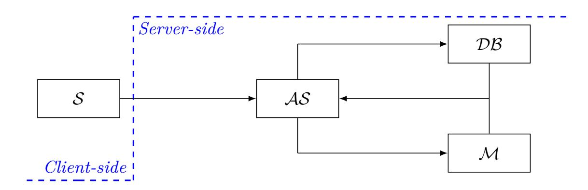

{0}------------------------------------------------

#### **A New Generalisation of the Goldwasser-Micali Cryptosystem Based on the Gap 2** *k* **-Residuosity Assumption**

Diana Maimuţ1 and George Teşeleanu1*,*2

<sup>1</sup> Advanced Technologies Institute 10 Dinu Vintilă, Bucharest, Romania {diana.maimut,tgeorge}@dcti.ro

<sup>2</sup> Simion Stoilow Institute of Mathematics of the Romanian Academy 21 Calea Grivitei, Bucharest, Romania

**Abstract.** We present a novel public key encryption scheme that enables users to exchange many bits messages by means of *at least* two large prime numbers in a Goldwasser-Micali manner. Our cryptosystem is in fact a generalization of the Joye-Libert scheme (being itself an abstraction of the first probabilistic encryption scheme). We prove the security of the proposed cryptosystem in the standard model (based on the gap 2 *k* -residuosity assumption) and report complexity related facts. We also describe an application of our scheme to biometric authentication and discuss the security of our suggested protocol. Last but not least, we indicate several promising research directions.

**Keywords:** public key encryption, quadratic residuosity, squared Jacobi symbol, gap 2 *k* -residuosity, provable security, biometric authentication protocol

# **1 Introduction**

The authors of [[13\]](#page-13-0) introduced a public key encryption (PKE) scheme[3](#page-0-0) representing a rather natural extension of the Goldwasser-Micali (GM) [\[11](#page-13-1), [12\]](#page-13-2) cryptosystem, the first probabilistic encryption scheme. The Goldwasser-Micali cryptosystem achieves ciphertext indistinguishability under the *Quadratic Residuosity* (qr) assumption. Despite being simple and stylish, this scheme is quite uneconomical in terms of bandwidth[4](#page-0-1) . Various attempts of generalizing the Goldwasser-Micali scheme were proposed in the literature in order to address the previously mentioned issue. The Joye-Libert (JL) scheme can be considered a follow-up of the cryptosystems proposed in [\[16](#page-13-3)] and [[9\]](#page-13-4) and efficiently supports the encryption of larger messages.

Inspired by the Joye-Libert scheme, we propose a new public key cryptosystem, analyze its security and provide the reader with an implementation and

<span id="page-0-0"></span><sup>3</sup> reconsidered in [[7](#page-12-0)]

<span id="page-0-1"></span><sup>4</sup> *k ·* log<sup>2</sup> *n* bits are needed to encrypt a *k*-bit message, where *n* is an RSA modulus as described in [[11](#page-13-1), [12](#page-13-2)]

{1}------------------------------------------------

performance discussion. We construct our scheme based on  $2^k$ -th power residue symbols. Our generalization of the Joye-Libert cryptosystem makes use of two important parameters when it comes to the encryption and decryption functions: the number of bits of a message and the number of distinct primes of a public modulus n. Thus, our proposal not only supports the encryption of larger messages (as in the Joye-Libert variant), but also operates on a variable number of large primes (instead of two in the Joye-Libert case). Both these parameters can be chosen depending on the desired security application.

Our scheme can be viewed as a flexible solution characterized by the ability of making adequate trade-offs between encryption speed and ciphertext expansion in a given context.

In biometric authentication protocols, when a user identifies himself using his biometric characteristics (captured by a sensor), the collected data will vary. Thus, traditional cryptographic approaches (such as storing a hash value) are not suitable in this case, since they are not error tolerant. As a result, biometric-based protocols must be constructed in a special way and, moreover, the system must protect the sensitivity and privacy of a user's biometric characteristics. Such a protocol is proposed in [8]. Its core is the Goldwasser-Micali encryption scheme. Thus, a natural extension of the protocol in [8] can be obtained using our generalization of the Joye-Libert scheme. Thus, we describe such a biometric authentication protocol and discuss its security.

Structure of the paper. In Section 2 we introduce notations, definitions, security assumptions and schemes used throughout the paper. Inspired by the Joye-Libert PKE scheme and aiming at obtaining a relevant generalization, in Section 3 we propose a new scheme based on  $2^k$  residues, prove it secure in the standard model and analyze its performance compared to other related cryptosystems. An application of our scheme to biometric authentication and its security analysis are presented in Section 4. We conclude in Section 5 and in Appendix A and ?? we present some optimizations for our proposed scheme.

# <span id="page-1-0"></span>2 Preliminaries

Notations. Throughout the paper,  $\lambda$  denotes a security parameter. We use the notation  $x \stackrel{\$}{\leftarrow} X$  when selecting a random element x from a sample space X. We denote by  $x \leftarrow y$  the assignment of the value y to the variable x. The probability that event E happens is denoted by Pr[E]. The Jacobi symbol of an integer a modulo an integer n is represented by  $\left(\frac{a}{n}\right)$ .  $J_n$  and  $\bar{J}_n$  denote the sets of integers modulo n with Jacobi symbol 1, respectively -1. Throughout the paper, we let  $QR_n$  be the set of quadratic residues modulo n. We consider as  $\mathcal{Z}_p = \{-(p-1)/2, \ldots, -1, 0, 1, \ldots, (p-1)/2\}$  the alternative representation modulo an integer p. The set of integers  $\{0, \ldots, a-1\}$  is further denoted by [0, a). Multidimensional vectors  $v = (v_0, \ldots, v_{s-1})$  are represented as  $v = \{v_i\}_{i \in [0,s)}$ .

{2}------------------------------------------------

# 2.1 $2^k$ -th power residue

There are several ways to generalize the Legendre symbol to higher powers. We further consider the  $2^k$ -th power residue symbol as presented in [18]. The classical Legendre symbol is obtained when k=1.

**Definition 1.** Let p be an odd prime such that  $2^{k}|p-1$ . Then the symbol

$$\left(\frac{a}{p}\right)_{2^k} = a^{\frac{p-1}{2^k}} \bmod p$$

is called the  $2^k$ -th power residue symbol modulo p, where  $a^{\frac{p-1}{2^k}} \in \mathcal{Z}_p$ .

*Properties.* The  $2^k$ -th power residue symbol satisfies the following properties

1. If 
$$a \equiv b \mod p$$
, then  $\left(\frac{a}{p}\right)_{2^k} = \left(\frac{b}{p}\right)_{2^k}$ 

$$2. \left(\frac{a^{2^k}}{p}\right)_{2^k} = 1$$

3. 
$$\left(\frac{ab}{p}\right)_{2^k}^{2^k} = \left(\frac{a}{p}\right)_{2^k} \left(\frac{b}{p}\right)_{2^k} \mod p$$

4. 
$$\left(\frac{1}{p}\right)_{2^k}^{2^k} = 1$$
 and  $\left(\frac{-1}{p}\right)_{2^k}^{2^k} = (-1)^{(p-1)/2^k}$ 

### 2.2 Computational Complexity

In our performance analysis we use the complexities of the mathematical operations listed in Table 1. These complexities are in accordance with the algorithms presented in [10]. We do not use the explicit complexity of multiplication, but instead we refer to it as  $M(\cdot)$  for clarity.

<span id="page-2-0"></span>**Table 1.** Computational complexity for  $\mu$ -bit numbers and k-bit exponents

| Operation      | Complexity                                            |  |  |  |
|----------------|-------------------------------------------------------|--|--|--|
| Multiplication | $M(\mu) = \mathcal{O}(\mu \log(\mu) \log(\log(\mu)))$ |  |  |  |
| Exponentiation | $\mathcal{O}(kM(\mu))$                                |  |  |  |
| Jacobi symbol  | $\mathcal{O}(\log(\mu)M(\mu))$                        |  |  |  |

### 2.3 Security Assumptions

<span id="page-2-1"></span>Definition 2 (Quadratic Residuosity - QR, Squared Jacobi Symbol - SJS and Gap  $2^k$ -Residuosity - GR). Choose two large prime numbers  $p, q \geq 2^{\lambda}$  and compute n = pq. Let A be a probabilistic polynomial-time (PPT) algorithm

{3}------------------------------------------------

that returns 1 on input (x, n) or  $(x^2, n)$  or (x, k, n) if  $x \in QR_n$  or  $J_n$  or  $J_n \setminus QR_n$ . We define the advantages

$$ADV_{A}^{\text{QR}}(\lambda) = \left| Pr[A(x,n) = 1 | x \stackrel{\$}{\leftarrow} QR_n] - Pr[A(x,n) = 1 | x \stackrel{\$}{\leftarrow} J_n \setminus QR_n] \right|,$$

$$ADV_{A}^{\text{SJS}}(\lambda) = \left| Pr[A(x^2,n) = 1 | x \stackrel{\$}{\leftarrow} J_n] - Pr[A(x^2,n) = 1 | x \stackrel{\$}{\leftarrow} \bar{J}_n] \right|,$$

$$ADV_{A,k}^{\text{GR}}(\lambda) = \left| Pr[A(x,k,n) = 1 | x \stackrel{\$}{\leftarrow} J_n \setminus QR_n] - Pr[A(x^{2^k},k,n) = 1 | x \stackrel{\$}{\leftarrow} \mathbb{Z}_n^*] \right|.$$

The Quadratic Residuosity assumption states that for any PPT algorithm A the advantage  $ADV_A^{\rm QR}(\lambda)$  is negligible.

If  $p, q \equiv 1 \mod 4$ , then the Squared Jacobi Symbol assumption states that for any PPT algorithm A the advantage  $ADV_A^{\mathrm{SJS}}(\lambda)$  is negligible.

Let  $p, q \equiv 1 \mod 2^k$ . The Gap  $2^k$ -Residuosity assumption states that for any PPT algorithm A the advantage  $ADV_A^{GR}(\lambda)$  is negligible.

Remark 1. In [7], the authors investigate the relation between the assumptions presented in Definition 2. They prove that for any PPT adversary A against the GR assumption, we have two efficient PPT algorithms  $B_1$  and  $B_2$  such that

$$ADV_{A,k}^{\mathrm{GR}}(\lambda) \leq \frac{3}{2} \left( (k - \frac{1}{3}) \cdot ADV_{B_1}^{\mathrm{QR}}(\lambda) + (k - 1) \cdot ADV_{B_2}^{\mathrm{SJS}}(\lambda) \right).$$

## 2.4 Public Key Encryption

A public key encryption (PKE) scheme usually consists of three PPT algorithms: Setup, Encrypt and Decrypt. The Setup algorithm takes as input a security parameter and outputs the public key as well as the matching secret key. Encrypt takes as input the public key and a message and outputs the corresponding ciphertext. The Decrypt algorithm takes as input the secret key and a ciphertext and outputs either a valid message or an invalidity symbol (if the decryption failed).

Definition 3 (Indistinguishability under Chosen Plaintext Attacks - IND-CPA). The security model against chosen plaintext attacks for a PKE scheme is captured in the following game:

Setup( $\lambda$ ): The challenger C generates the public key, sends it to adversary A and keeps the matching secret key to himself.

Query: Adversary A sends to C two equal length messages  $m_0, m_1$ . The challenger flips a coin  $b \in \{0,1\}$  and encrypts  $m_b$ . The resulting ciphertext c is sent to the adversary.

Guess: In this phase, the adversary outputs a guess  $b' \in \{0,1\}$ . He wins the game, if b' = b.

The advantage of an adversary A attacking a PKE scheme is defined as

$$ADV_A^{\text{IND-CPA}}(\lambda) = |Pr[b = b'] - 1/2|$$

{4}------------------------------------------------

where the probability is computed over the random bits used by C and A. A PKE scheme is IND-CPA secure, if for any PPT adversary A the advantage  $ADV_A^{\text{IND-CPA}}(\lambda)$  is negligible.

The Joye-Libert PKE scheme The Joye-Libert scheme was introduced in [13] and reconsidered in [7]. The scheme is proven secure in the standard model under the GR assumption. We shortly describe the algorithms of the Joye-Libert cryptosystem.

 $Setup(\lambda)$ : Set an integer  $k \geq 1$ . Randomly generate two distinct large prime numbers p, q such that  $p, q \geq 2^{\lambda}$  and  $p, q \equiv 1 \mod 2^k$ . Output the public key pk = (n, y, k), where n = pq and  $y \in J_n \setminus QR_n$ . The corresponding secret key is sk = (p, q).

Encrypt(pk, m): To encrypt a message  $m \in [0, 2^k)$ , we choose  $x \stackrel{\$}{\leftarrow} \mathbb{Z}_n^*$  and compute  $c \equiv y^m x^{2^k} \mod n$ . Output the ciphertext c.

Decrypt(sk, c): Compute  $z \equiv \left(\frac{c}{p}\right)_{2^k}$  and find m such that the relation  $\left[\left(\frac{y}{p}\right)_{2^k}\right]^m \equiv z \mod p$  holds. Efficient methods to recover m can be found in [14].

### 2.5 A Security Model for Biometric Authentication

We further consider the security model for biometric authentication described in [5] in accordance with the terminology established in [8]. We stress that the authors of [8] preferred a rather informal way of presenting their security model while the approach of [5] is formal.

Participants and Roles. The data flow between the different roles assumed in the authentication protocol of [5] is depicted in Figure 1.



<span id="page-4-0"></span>Fig. 1. Data flow and roles

The *server-side* functionality consists of three components to ensure that no single entity can associate a user's identity with the biometric data being collected during authentication. The roles assumed in the authentication protocol are:

{5}------------------------------------------------

- The Sensor ( $\mathcal{S}$ ) represents the client-side component. As in [8], we assume that the sensor is capable of capturing the user's biometric data, extracting it into a binary string<sup>5</sup>, and performing cryptographic operations such as PKE. We also assume a  $liveness\ link$  between the sensor and the server-side components, to provide confidence that the biometric data received on the server-side is from a present living person.
- The Authentication Server  $(\mathcal{AS})$  is responsible for communicating with the user who wants to authenticate and organizing the entire server-side procedure. In a successful authentication the AS obviously learns the user's identity, meaning that it should learn nothing about the biometric data being submitted.
- The Database ( $\mathcal{DB}$ ) securely stores the users' profile and its job is to execute the pre-decision part of classification. Since the  $\mathcal{DB}$  is aware of privileged biometric data, it should learn nothing about the user's identity, or even be able to correlate or trace authentication runs from a given (unknown) user.
- The Matcher ( $\mathcal{M}$ ) completes the authentication process by taking the output produced by the  $\mathcal{DB}$  server and computing the final decision step. This implies that the  $\mathcal{M}$  possesses privileged information that allows it to make a final decision, and again that it should not be able to learn anything about the user's real identity, or even be able to correlate or trace authentication runs from a given (unknown) user.

**Definition 4.** Let  $v = \{v_i\}_{i \in [0,s)}$  and  $w = \{w_i\}_{i \in [0,s)}$  be two s-dimensional vectors. Then the taxicab distance is defined as  $\mathcal{T}(v,w) = \sum_{i=0}^{s-1} |v_i - w_i|$ . The taxicab norm is defined as  $\mathcal{T}(v,0)$ .

The first step in having a useful authentication protocol is for it to be sound. This requirement is formalized in Requirement 1. Requirements 2. and 3. are concerned with the sensitive<sup>6</sup> relation between a user's identity and its biometric characteristics. We want to guarantee that the only entity in the infrastructure that knows information about this relation is the sensor.

Requirement 1. The matcher  $\mathcal{M}$  can compute the taxicab distance  $\mathcal{T}(b_i, b_i')$ , where  $b_i$  is the reference biometric template and  $b_i'$  is the fresh biometric template sent in the authentication request. Therefore,  $\mathcal{M}$  can compare the distance to a given threshold value d and the server  $\mathcal{A}S$  can make the right decision.

Requirement 2. For any identity  $ID_{i_0}$ , two biometric templates  $b'_{i_0}, b'_{i_1}$ , where  $i_0, i_1 \geq 1$  and  $b'_{i_0}$  is the biometric template related to  $ID_{i_0}$ , it is infeasible for any of  $\mathcal{M}$ ,  $\mathcal{D}B$  and  $\mathcal{A}S$  to distinguish between  $(ID_{i_0}, b'_{i_0})$  and  $(ID_{i_0}, b'_{i_1})$ .

Requirement 3. For any two users  $U_{i_0}$  and  $U_{i_1}$ , where  $i_0, i_1 \geq 1$ , if  $U_{i_\beta}$ , where  $\beta \stackrel{\$}{\leftarrow} \{0,1\}$  makes an authentication attempt, then the database  $\mathcal{D}B$  can only guess  $\beta$  with a negligible advantage. Suppose the database  $\mathcal{D}B$  makes a guess  $\beta'$ , the advantage is |Pr[b=b']-1/2|.

<span id="page-5-0"></span><sup>&</sup>lt;sup>5</sup> We further consider the binary string as a vector of fixed length blocks.

<span id="page-5-1"></span><sup>&</sup>lt;sup>6</sup> in terms of the system's security

{6}------------------------------------------------

# <span id="page-6-0"></span>3 A New Public Key Encryption Scheme

Inspired by the Joye-Libert scheme and wishing to obtain a meaningful generalization, we propose a new public key cryptosystem in Section 3.1 and analyze its security in Section 3.2. An implementation and performance analysis is provided in Section 3.3.

# <span id="page-6-1"></span>3.1 Description

 $Setup(\lambda)$ : Set an integer  $k \geq 1$ . Randomly generate  $\gamma + 1$  distinct large prime numbers  $p_i, i \in [0, \gamma + 1)$  such that  $p_i \geq 2^{\lambda}$  and  $p_i \equiv 1 \mod 2^k$ . Let  $n = p_0 \cdot \ldots \cdot p_{\gamma}$ . Select  $y_i \stackrel{\$}{\leftarrow} \mathbb{Z}_n^*, i \in [0, \gamma)$ , such that the following conditions hold

$$1. \left(\frac{y_i}{p_i}\right) = -1$$

$$2. \left(\frac{y_i}{p_\gamma}\right) = -1$$

3. 
$$\left(\frac{y_i}{p_j}\right)_{2^k} = 1$$
, where  $j \neq i$ 

We denote by  $y = \{y_i\}_{i \in [0,\gamma)}$  and  $p = \{p_i\}_{i \in [0,\gamma)}$ . Output the public key pk = (n, y, k). The secret key is sk = p.

Encrypt(pk, m): To encrypt message  $m \in [0, 2^k \gamma)$ , first we divide it into  $\gamma$  blocks  $m = m_0 \| \dots \| m_{\gamma-1}$ . Then, we choose  $x \stackrel{\$}{\leftarrow} \mathbb{Z}_n^*$  and compute  $c \equiv x^{2^k} \cdot \prod_{i=0}^{\gamma-1} y_i^{m_i} \mod n$ . The output is ciphertext c.

Decrypt(sk,c): For each  $i \in [0,\gamma)$ , compute  $m_i = Dec_{p_i}(p_i,y_i,c)$ .

# Algorithm 1: $Dec_{p_i}(p_i, y_i, c)$

```
Input: The secret prime p_i, the value y_i and the ciphertext c
Output: The message block m_i

1 m_i \leftarrow 0, B \leftarrow 1
2 foreach e \in [1, k+1) do
```

$$\begin{array}{c|c} \mathbf{2} \ \mathbf{foreach} \ s \in [1,k+1) \ \mathbf{do} \\ \mathbf{3} & z \leftarrow \left(\frac{c}{p_i}\right)_{2^s} \\ \mathbf{4} & t \leftarrow \left(\frac{y_i}{p_i}\right)_{2^s} \\ \mathbf{5} & t \leftarrow t^{m_i} \bmod p_i \\ \mathbf{6} & \mathbf{if} \ t \neq z \ \mathbf{then} \\ \mathbf{7} & m_i \leftarrow m_i + B \\ \mathbf{8} & \mathbf{end} \\ \mathbf{9} & B \leftarrow 2B \end{array}$$

10 end 11 return  $m_i$  

{7}------------------------------------------------

Correctness. Let  $m_i = \sum_{w=0}^{k-1} b_w 2^w$  be the binary expansion of block  $m_i$ . Note that

$$\left(\frac{c}{p_i}\right)_{2^s} = \left(\frac{x^{2^k} \cdot \prod_{v=0}^{\gamma-1} y_v^{m_v}}{p_i}\right)_{2^s} = \left(\frac{y_i^{m_i}}{p_i}\right)_{2^s} = \left(\frac{y_i}{p_i}\right)_{2^s}^{\sum_{w=0}^{s-1} b_w 2^w}$$

since

1. 
$$\left(\frac{x^{2^k}}{p_i}\right)_{2^s} = 1$$
, where  $1 \le s \le k$ 

2. 
$$\left(\frac{y_j}{p_i}\right)_{2^k} = 1$$
, where  $j \neq i$ 

3. 
$$\sum_{w=0}^{k-1} b_w 2^w = \left(\sum_{w=0}^{s-1} b_w 2^w\right) + 2^s \cdot \left(\sum_{w=s}^{k-1} b_w 2^{w-s}\right)$$

As a result, the message block  $m_i$  can be recovered bit by bit using  $p_i$ .

Remark 2. The case  $\gamma=k=1$  corresponds to the Goldwasser-Micali cryptosystem [11] and the case  $\gamma=1$  corresponds to the Joye-Libert PKE scheme [13].

<span id="page-7-2"></span>Remark 3. In the Setup phase, we have to compute a special type of  $y_i$ . An efficient way to perform this step is to randomly select  $y_{i,i} \stackrel{\$}{\leftarrow} \mathbb{Z}_{p_i}^* \setminus QR_{p_i}$ ,  $y_{i,\gamma} \stackrel{\$}{\leftarrow} \mathbb{Z}_{p_\gamma}^* \setminus QR_{p_\gamma}$  and  $w_{i,j} \stackrel{\$}{\leftarrow} \mathbb{Z}_{p_j}^*$ , compute  $y_{i,j} \leftarrow w_{i,j}^{2^k} \mod p_j$  and finally use the Chinese Remainder Theorem to compute an element  $y_i \in \mathbb{Z}_n^*$  such that  $y_i \equiv y_{i,\ell} \mod p_\ell$  for all  $\ell$ .

### <span id="page-7-0"></span>3.2 Security Analysis

<span id="page-7-1"></span>**Theorem 1.** Assume that the QR and SJS assumptions hold. Then, the proposed scheme is IND-CPA secure in the standard model. Formally, let A be an efficient PPT adversary, then there exist two efficient PPT algorithms  $B_1$  and  $B_2$  such that

$$ADV_A^{\text{IND-CPA}}(\lambda) \leq \frac{3}{2} \gamma \left( (k - \frac{1}{3}) \cdot ADV_{B_1}^{\text{QR}}(\lambda) + (k - 1) \cdot ADV_{B_2}^{\text{SJS}}(\lambda) \right).$$

*Proof.* To prove the statement, we simply replace the distribution of the public key y for the encryption query. Let  $n_i = p_i p_{\gamma}$ ,  $i \in [0, \gamma)$ . Instead of choosing  $y_i \in J_{n_i} \setminus QR_{n_i}$  we choose  $y_i$  from the multiplicative subgroup of  $2^k$  residues modulo  $n_i$ . Under the GR assumption, the adversary does not detect the difference between the original scheme and the one with the modified  $y_i$ s. In this case, the value c is not carrying any information about the message. Thus, the IND-CPA security of our proposed cryptosystem follows.

Remark 4. Note that in Theorem 1 is sufficient to consider the GR assumption modulo  $n_i$  instead of modulo n. To prove this, lets consider an efficient PPT distinguisher B for the GR assumption modulo n. Then we construct an efficient distinguisher C for the GR assumption modulo  $n_i$ .

{8}------------------------------------------------

Thus, on input (*y<sup>i</sup> , k, ni*), *C* first randomly selects *γ−*1 primes *{pj}j∈*[0*,γ*)*\{i}* such that *p<sup>j</sup> ≡* 1 mod 2*<sup>k</sup>* and computes *n* = *n<sup>i</sup> ·* ∏ *j∈*[0*,γ*)*\{i} p<sup>j</sup>* . Then, using the Chinese theorem, *C* computes a value *y*¯*<sup>i</sup>* such that *y*¯*<sup>i</sup> ≡ y<sup>i</sup>* mod *n<sup>i</sup>* and *y*¯*<sup>i</sup> ≡* 1 mod *n/n<sup>i</sup>* . Finally, *C* sends ( ¯*y<sup>i</sup> , k, n*) to *B* and he outputs *B* answer. It is easy to see that *C* and *B* have the same success probability.

# <span id="page-8-0"></span>**3.3 Implementation and Performance Analysis**

**Complexity Analysis** For simplicity, when computing the ciphertext expansion, the encryption and the decryption complexities, we consider the length of the prime numbers as being *λ*. Based on the complexities presented in Table [1](#page-2-0), we obtain the results listed in Table [2.](#page-8-1)

**Table 2.** Performance analysis for an *η*-bit message

<span id="page-8-1"></span>

| Scheme    | Ciphertext size           | Encryption Complexity                      |  |  |  |  |
|-----------|---------------------------|--------------------------------------------|--|--|--|--|
| GM [11]   | 2λ · η                    | O(2M(2λ)η)                                 |  |  |  |  |
| JL [13]   | 2λ · ⌈ η<br>⌉<br>k        | η<br>O(2(k + 1)M(2λ)⌈<br>⌉)<br>k           |  |  |  |  |
| This work | (γ + 1) · λ · ⌈ η<br>γk ⌉ | η<br>O((γ + 1)(k + 1)M((γ + 1)λ)⌈<br>γk ⌉) |  |  |  |  |

| Scheme    | Decryption Complexity                             |
|-----------|---------------------------------------------------|
| GM [11]   | O(log(λ)M(λ)η)                                    |
| JL [13]   | η<br>2<br>k<br>O((2kλ +<br>)M(λ)⌈<br>⌉)<br>2<br>k |
| This work | η<br>2<br>k<br>O(γ(2kλ +<br>)M(λ)⌈<br>γk ⌉)<br>2  |

**Implementation Details** We further provide the reader with benchmarks for our proposed PKE scheme.

We ran each of the three sub-algorithms on a CPU Intel i7-4790 4.00 GHz and used GCC to compile it (with the O3 flag activated for optimization). Note that for all computations we used the GMP library [\[4](#page-12-3)]. To calculate the running times we used the *omp\_get\_wtime()* function [\[2](#page-12-4)]. To obtain the average running time we chose to encrypt 100 128-bit messages.

For generating the primes needed in the *Setup* phase we used the naive implementation[7](#page-8-2) . A more efficient method of generating primes is presented in [\[7](#page-12-0),[13\]](#page-13-0). Also, for generating the *y<sup>i</sup>* elements we used the optimization suggested in Remark [3.](#page-7-2)

<span id="page-8-2"></span><sup>7</sup> *i.e.* we randomly generated *r* \$ *←−* [2*<sup>λ</sup>−<sup>k</sup> ,* 2 *<sup>λ</sup>−k*+1) until the 2 *k r* + 1 was prime.

{9}------------------------------------------------

We further list our results in Table 3 (running times in seconds). When analyzing Table 3, note that in the case  $\gamma = 1$  we obtain the Goldwasser-Micali scheme (k = 1) and the Joye-Libert scheme (k = 2, 4, 8). We stress that we considered  $\lambda = 1536^{8}$ .

For completeness, in Table 4 we also present the ciphertext size (in kilobytes  $= 10^3$  bytes) for the previously mentioned parameters.

**Table 3.** Average running times for a 128-bit message

<span id="page-9-1"></span>

| Algo                 | nithm |                           |              |             |            | $\gamma$ = | = 1       |          |          |          |      |
|----------------------|-------|---------------------------|--------------|-------------|------------|------------|-----------|----------|----------|----------|------|
| Algorithm            |       | k = 1                     |              | k=2         |            | k = 4      |           | k = 8    |          | k = 16   |      |
| $\overline{Se}$      | tup   | 0.441997                  |              | 0.475780    |            | 0.461101   |           | 0.440292 |          | 0.424711 |      |
| $\overline{Enc}$     | crypt | 0.006875                  |              | 0.004460    |            | 0.003152   |           | 0.002389 |          | 0.00     | 1868 |
| Dec                  | erypt | 0.670574                  |              | 0.669       | 9387       | 0.672676   |           | 0.669685 |          | 0.665928 |      |
| A.1. 1.1             |       |                           | $\gamma = 2$ |             |            |            |           |          |          |          |      |
| Algorithm            |       | nm                        | k = 1        |             | k =        | =2 $k=$    |           | = 4      | k =      | = 8      | -    |
| $\overline{}$        |       | 0.670943                  |              | 0.684832 0. |            | 0.68       | 8289 0.71 |          | 9769     | •        |      |
| $\overline{Encrypt}$ |       | 0.006601                  |              | 0.00        | 5058 0.00  |            | 3982 0.00 |          | 3295     | •        |      |
| Decrypt              |       | 0.666815 0.66             |              | 5174        | 0.664918   |            | 0.664416  |          | _        |          |      |
| Algorithm            |       | $\gamma = 4$ $\gamma = 8$ |              |             |            |            |           | :        |          |          |      |
|                      |       | k                         | =1 $k=$      |             | = 2        | k=4        |           | k = 1    |          | k=2      |      |
| $\overline{Se}$      | tup   | 1.020130                  |              | 1.122080    |            | 1.119700   |           | 1.958500 |          | 1.925660 |      |
| $\overline{Enc}$     | erypt | 0.00                      | 0.008205     |             | 0.008011   |            | 0.006905  |          | 0.012401 |          | 5711 |
| Dec                  | erypt | 0.666383                  |              | 0.66        | 66766 0.66 |            | 0244      | 0.660967 |          | 0.65     | 9406 |

**Table 4.** Ciphertext size for a 128-bit message

<span id="page-9-3"></span>

|              | k=1    | k=2    | k=4    | k = 8  | k = 16 |
|--------------|--------|--------|--------|--------|--------|
| $\gamma = 1$ | 49.152 | 24.576 | 12.288 | 6.1440 | 3.0720 |
| $\gamma = 2$ | 36.864 | 18.432 | 9.2160 | 4.6080 | _      |
| $\gamma = 4$ | 30.720 | 15.360 | 7.6800 | _      | _      |
| $\gamma = 8$ | 27.648 | 13.824 | _      | _      | _      |

#### <span id="page-9-0"></span>An Application to Biometric Authentication $\mathbf{4}$

In [8], the authors propose a biometric authentication protocol based on the Goldwasser-Micali scheme. A security flaw<sup>9</sup> of the protocol was indicated and

<span id="page-9-2"></span><sup>&</sup>lt;sup>8</sup> According to NIST this choice of  $\lambda$  offers a security strength of 128 bits. <sup>9</sup> The running time is exponential in the number of users

<span id="page-9-4"></span>

{10}------------------------------------------------

fixed in [5]. A natural extension of Bringer *et al.*'s protocol can be obtained using the scheme proposed in Section 3.1. Thus, we describe our protocol in Section 4.1 and analyze its security in Section 4.2. A performance analysis is provided in Section 4.3.

# <span id="page-10-0"></span>4.1 Description

**Enrollment Phase** In the protocol we consider  $U_i$ 's biometric template  $b_i$  as being a  $\gamma M$ -dimensional vector  $b_i = \{b_{i,j}\}_{j \in [0,M)}$ , where  $b_{i,j} = \{b_{i,j,\ell}\}_{\ell \in [0,\gamma)}$  and  $b_{i,j,\ell} \in [0,2^k)$ .

In the enrollment phase,  $U_i$  registers  $(b_i, i)$  at the database  $\mathcal{D}B$  and  $(ID_i, i)$  at the authentication server  $\mathcal{A}S$ , where  $ID_i$  is  $U_i$ 's pseudonym and i is the index of record  $b_i$  in  $\mathcal{D}B$ . Let N denote the number of records in  $\mathcal{D}B$ . Note that the matcher  $\mathcal{M}$  possesses a key pair (sk, pk) for the scheme presented in Section 3.1.

We further denote by  $\mathcal{E}(pk,\cdot)$  and  $\mathcal{E}_{JL}(pk,y_{\ell},\cdot)$  the encryption algorithms for the scheme presented in Section 3.1 with pk = (n,y,k) and the Joye-Libert scheme<sup>10</sup> with  $pk = (n,y_{\ell},k)$ , where  $\ell \in [0,\gamma)$ .

**Verification Phase** If a user  $U_i$  wishes to authenticate himself to AS, the next procedure is followed:

- 1. S captures the user's biometric data  $b'_i$  and sends to AS the user's identity  $ID_i$  together with  $\mathcal{E}(pk, b'_i) = \{\mathcal{E}(pk, b'_{i,j})\}_{j \in [0,M)}$ . Note that a liveness link is available between S and AS to ensure that data is coming from the sensor are indeed fresh and not artificial.
- 2. AS retrieves the index i using  $ID_i$  and then sends  $\mathcal{E}_{JL}(pk, y_\ell, t_j)$  to the database, for  $\ell \in [0, \gamma)$  and  $j \in [0, N)$ , where  $t_j = 1$  if j = i,  $t_j = 0$  otherwise.
- 3. For every  $s \in [0, M)$ ,  $\mathcal{D}B$  computes

$$\mathcal{E}(pk, b_{i,s}) = \prod_{j=0}^{N-1} \prod_{\ell=0}^{\gamma-1} \mathcal{E}_{JL}(pk, y_{\ell}, t_j)^{b_{j,s,\ell}} \mod n.$$

To prevent  $\mathcal{A}S$  from performing an exhaustive search of the profile space,  $\mathcal{D}B$  re-randomizes the encryptions by calculating  $\mathcal{E}(pk, b_{i,s}) = x_s^{2^k} \mathcal{E}(pk, b_{i,s})$ , where  $x_s \stackrel{\$}{\leftarrow} \mathbb{Z}_n^*$ . Then,  $\mathcal{D}\mathcal{B}$  sends  $\mathcal{E}(pk, b_{i,s})$ , for  $s \in [0, M)$  to the authentication server.

4. AS computes  $v_s$ ,  $s \in [0, M)$ , where

<span id="page-10-2"></span>
$$v_s = \mathcal{E}(pk, b'_{i,s}) / \mathcal{E}(pk, b_{i,s}) \bmod n = \mathcal{E}(pk, b'_{i,s} - b_{i,s}), \tag{1}$$

and  $b'_{i,s} - b_{i,s} = \{b'_{i,s,\ell} - b_{i,s,\ell}\}_{\ell \in [0,\gamma)}$ . Then,  $\mathcal{AS}$  makes a random permutation among  $v_s$ , for  $s \in [0, M)$ , and sends the permuted vector  $w_s$ , for  $s \in [0, M)$ , to  $\mathcal{M}$ . Note that Item 4 will return a valid result with high probability, thus we do not explicitly require  $\mathcal{E}(pk, b_{i,s})$  to be invertible.

<span id="page-10-1"></span>Note that in this case we consider n to be a product of  $\gamma + 1$  primes.

{11}------------------------------------------------

5.  $\mathcal{M}$  decrypts  $w_s$  to check that the taxical norm of the corresponding plaintext vector

$$\sum_{s=0}^{M-1} \sum_{\ell=0}^{\gamma-1} |w_{s,\ell}|$$

is equal to or less than d and sends the result AS.

6. AS accepts or rejects the authentication request accordingly.

Correctness (Requirement 1). We need to show that  $v_s = \mathcal{E}(pk, b'_{i,s} - b_{i,s})$ , for  $s \in [0, M)$ . First observe that

$$\mathcal{E}(pk, b_{i,s}) = \prod_{j=0}^{N-1} \prod_{\ell=0}^{\gamma-1} \mathcal{E}_{JL}(pk, y_{\ell}, t_{j})^{b_{j,s,\ell}}$$

$$\equiv \prod_{j=0}^{N-1} \prod_{\ell=0}^{\gamma-1} (r_{j,\gamma}^{2^{k}} y_{\ell}^{t_{j}})^{b_{j,s,\ell}}$$

$$\equiv r_{i}^{2^{k}} \prod_{\ell=0}^{\gamma-1} y_{\ell}^{b_{i,s,\ell}} \mod n.$$

Thus,

$$\mathcal{E}(pk, b'_{i,s})/\mathcal{E}(pk, b_{i,s}) \equiv \mathcal{E}(pk, b'_{i,s} - b_{i,s}) \bmod n.$$

It is obvious that the taxicab distance between  $b_i$  and  $b'_i$ 

$$\sum_{s=0}^{M-1} \sum_{\ell=0}^{\gamma-1} |b'_{i,s,\ell} - b_{i,s,\ell}|$$

is equal to the taxicab norm of the plaintext vector corresponding to  $\{v_s\}_{s\in[0,M)}$  and  $\{w_s\}_{s\in[0,M)}$ .

#### <span id="page-11-0"></span>4.2 Security Analysis

The proofs of Theorems 2 and 3 are similar to the security proofs from [8] and, thus, are omitted. The only changes we have to make in the proofs of Theorems 2 and 3 is replacing Goldwasser-Micali with our scheme and, respectively, the Joye-Libert scheme.

<span id="page-11-1"></span>**Theorem 2 (Requirement 2).** For any identity  $ID_{i_0}$  and two biometric templates  $b'_{i_0}$ ,  $b'_{i_1}$ , where  $i_0, i_1 \geq 1$  and  $b'_{i_0}$  is the biometric template related to  $ID_{i_0}$ , any  $\mathcal{M}$ ,  $\mathcal{D}B$  and  $\mathcal{A}S$  can distinguish between  $(ID_{i_0}, b'_{i_0})$  and  $(ID_{i_0}, b'_{i_1})$  with negligible advantage.

<span id="page-11-2"></span>**Theorem 3 (Requirement 3).** For any two users  $U_{i_0}$  and  $U_{i_1}$ , where  $i_0, i_1 \geq 1$ , if  $U_{i_{\beta}}$ , where  $\beta \stackrel{\$}{\leftarrow} \{0,1\}$  makes an authentication attempt, then the database  $\mathcal{D}B$  can only guess  $\beta$  with a negligible advantage.

{12}------------------------------------------------

## <span id="page-12-5"></span>**4.3 Performance Analysis**

It is easy to see that the sensor *S* and the matcher *M* perform only *M* encryptions and, respectively, decryptions. Comparing our proposed protocol's complexity with Bringer *et al.*'s, reduces to comparing the scheme from Section [3.1](#page-6-1) with the Goldwasser-Micali cryptosystem.[11](#page-12-6) On the authentication server's side, we perform *γN* Joye-Libert encryptions (which can be precomputed) and *M* divisions. Bringer *et al.*'s protocol, performs step 2 using the Goldwasser-Micali scheme and, thus, in step 4 they can use multiplications instead of divisions [12](#page-12-7) . Since we took into consideration the fix from [[5\]](#page-12-2) when proposing our protocol, we have to perform *M* extra multiplications compared to the scheme in [[8\]](#page-13-5). Since we have to assemble our scheme's ciphertexts from Joye-Libert's ciphertexts we have a blowout of *γ* multiplications on the database's side. Thus, we perform *γMN/*2 multiplications on average .

# <span id="page-12-1"></span>**5 Conclusions and further development**

Based on the Joye-Libert scheme we proposed a new PKE scheme, proved its security in the standard model and analyzed its performance in a meaningful context. We also described an application of our cryptosystem to biometric authentication and presented its security analysis.

*Future Work.* An attractive research direction for the future is the construction of *lossy trapdoor functions* (based on the inherited homomorphic properties of our proposed cryptosystem). Another appealing future work idea is to propose a threshold variant of our scheme and to discuss security and efficiency matters.

# **References**

- 1. 50 Largest Factors Found by ECM. [https://members.loria.fr/PZimmermann/](https://members.loria.fr/PZimmermann/records/top50.html) [records/top50.html](https://members.loria.fr/PZimmermann/records/top50.html)
- <span id="page-12-4"></span>2. OpenMP. <https://www.openmp.org/>
- 3. The ECMNET Project. [https://members.loria.fr/PZimmermann/records/](https://members.loria.fr/PZimmermann/records/ecmnet.html) [ecmnet.html](https://members.loria.fr/PZimmermann/records/ecmnet.html)
- <span id="page-12-3"></span>4. The GNU Multiple Precision Arithmetic Library. <https://gmplib.org/>
- <span id="page-12-2"></span>5. Barbosa, M., Brouard, T., Cauchie, S., De Sousa, S.M.: Secure Biometric Authentication with Improved Accuracy. In: ACISP 2008. Lecture Notes in Computer Science, vol. 5107, pp. 21–36. Springer (2008)
- 6. Barker, E.: NIST SP800-57 Recommendation for Key Management, Part 1: General. Tech. rep., NIST (2016)
- <span id="page-12-0"></span>7. Benhamouda, F., Herranz, J., Joye, M., Libert, B.: Efficient Cryptosystems from 2 *k* -th Power Residue Symbols. Journal of Cryptology **30**(2), 519–549 (2017)

<span id="page-12-6"></span><sup>11</sup> See Section [3.3](#page-8-0)

<span id="page-12-7"></span><sup>12</sup> In Z<sup>2</sup> addition and subtraction are equivalent.

{13}------------------------------------------------

- <span id="page-13-5"></span>8. Bringer, J., Chabanne, H., Izabachéne, M., Pointcheval, D., Tang, Q., Zimmer, S.: An Application of the Goldwasser-Micali Cryptosystem to Biometric Authentication. In: ACISP 2007. pp. 96–106. Springer (2007)
- <span id="page-13-4"></span>9. Cohen, J., Fischer, M.: A Robust and Verifiable Cryptographically Secure Ellection Scheme (extended abstract). In: FOCS 1985. pp. 372–382. IEEE Computer Society Press (1985)
- <span id="page-13-7"></span>10. Crandall, R., Pomerance, C.: Prime Numbers: A Computational Perspective. Number Theory and Discrete Mathematics, Springer (2005)
- <span id="page-13-1"></span>11. Goldwasser, S., Micali, S.: Probabilistic Encryption and How to Play Mental Poker Keeping Secret All Partial Information. In: STOC 1982. pp. 365–377. ACM (1982)
- <span id="page-13-2"></span>12. Goldwasser, S., Micali, S.: Probabilistic Encryption. Journal of Computer and System Sciences **28**(2), 270–299 (1984)
- <span id="page-13-0"></span>13. Joye, M., Libert, B.: Efficient Cryptosystems from 2 *k* -th Power Residue Symbols. In: EUROCRYPT 2013. Lecture Notes in Computer Science, vol. 7881, pp. 76–92. Springer (2013)
- <span id="page-13-8"></span>14. Joye, M., Libert, B.: Efficient Cryptosystems from 2 *k* -th Power Residue Symbols. IACR Cryptology ePrint Archive **2013/435** (2014)
- 15. Jr, H.W.L.: Factoring Integers with Elliptic Curves. Annals of Mathematics pp. 649–673 (1987)
- <span id="page-13-3"></span>16. Naccache, D., Stern, J.: A New Public Key Cryptosytem Based on Higher Residues. In: CCS 1998. pp. 59–66. ACM (1998)
- 17. Simoens, K., Bringer, J., Chabanne, H., Seys, S.: A Framework for Analyzing Template Security and Privacy in Biometric Authentication Systems. IEEE Transactions on Information Forensics and Security **7**(2), 833–841 (2012)
- <span id="page-13-6"></span>18. Yan, S.Y.: Number Theory for Computing. Theoretical Computer Science, Springer (2002)

{14}------------------------------------------------

# <span id="page-14-0"></span>A Optimized Decryption Algorithms

In [14], the authors provide the reader with different versions of the decryption algorithm corresponding to the Joye-Libert cryptosystem. We present slightly modified versions of [14, Algorithm 3 and 4] in Algorithms 2 and 3. The authors also propose two other optimizations [14, Algorithm 5 and 6], but their complexity is similar with Algorithm 3 and 4's complexity. Note that these optimizations contain a typo: in line 5, Algorithm 5 and line 6, Algorithm 6 we should have  $A^{k-j} \neq C[k-j] \mod p$  instead of  $A \neq C[k-j] \mod p$ .

For these algorithms to work we need to enhance the Setup algorithm of our proposed cryptosystem. More precisely, we generate the  $\gamma+1$  prime numbers  $p_i$  with the supplementary restriction  $p_i \not\equiv 1 \mod 2^{k+1}$ . For  $0 \leq i < \gamma$ , let  $p_i' = (p_i-1)/2^k$ . We precompute  $D_i = y_i^{-p_i'}$  for Algorithm 2 and  $D_i[j] = D_i^{2^{j-1}} \mod p_i$ ,  $1 \leq j \leq k-1$ , for Algorithm 3 and augment the private key with these values. Remark that Algorithm 3 requires more memory than Algorithm 2.

#### **Algorithm 2:** Fast decryption algorithm Version 1

```
Input: The secret values (p_i, p'_i, D_i), the value y_i and the ciphertext c
    Output: The message block m_i
 1 m_i \leftarrow 0, B \leftarrow 1, D \leftarrow D_i
 c \in c^{p_i'} \mod p_i
 3 foreach j \in [1, k-1] do
4 z \leftarrow C^{2^{k-j}} \mod p_i
         if z \neq 1 then
 5
            m_i \leftarrow m_i + B
 6
           C \leftarrow C \cdot D \bmod p_i
 7
         end
 8
         B \leftarrow 2B, D \leftarrow D^2 \mod p_i
 9
10 end
11 if C \neq 1 then
12 m_i \leftarrow m_i + B
13 end
14 return m_i
```

{15}------------------------------------------------

Correctness. Let  $m_i = \sum_{w=0}^{k-1} b_w 2^w$  be the binary expansion of block  $m_i$ . We define  $\alpha_i[s] = 2^{k-s} p_i'$ . Note that

$$c^{\alpha_{i}[s]} \equiv (x^{2^{k}} \cdot \prod_{v=1}^{\gamma} y_{v}^{m_{v}})^{\alpha_{i}[s]}$$

$$\equiv y_{i}^{\alpha_{i}[s] \sum_{w=0}^{s-1} b_{w} 2^{w}}$$

$$\equiv y_{i}^{b_{s-1} 2^{k-1} p_{i}'} y^{\alpha_{i}[s] \sum_{w=0}^{s-2} b_{w} 2^{w}}$$

$$\equiv (-1)^{b_{s-1}} y^{\alpha_{i}[s] \sum_{w=0}^{s-2} b_{w} 2^{w}} \mod p_{i}$$

since

1. 
$$(x^{2^k})^{\alpha_i[s]} = x^{2^{k-s}(p_i-1)} = 1$$
  
2.  $\left(\frac{y_j}{p_i}\right)_{2^k} = 1$ , where  $j \neq i$   
3.  $\sum_{w=0}^{k-1} b_w 2^w = \left(\sum_{w=0}^{s-1} b_w 2^w\right) + 2^s \cdot \left(\sum_{w=s}^{k-1} b_w 2^{w-s}\right)$   
4.  $\left(\frac{y_i}{p_i}\right) = -1$ 

As a result, the message block  $m_i$  can be recovered bit by bit using the values  $p_i, p'_i$  and the vector  $D_i$ .

# **Algorithm 3:** Fast decryption algorithm Version 2

```
Input: The secret values (p_i, p_i', D_i[1], \dots D_i[k-1]), the value y_i and the
             ciphertext c
   Output: The message block m_i
 1 m_i \leftarrow 0, B \leftarrow 1
 c \leftarrow c^{p_i'} \mod p_i
 3 foreach j \in [1, k-1] do
4 z \leftarrow C^{2^{k-j}} \mod p_i
       if z \neq 1 then
 5
        6
 7
        end
 8
        B \leftarrow 2B
 9
10 end
11 if C \neq 1 then
12 m_i \leftarrow m_i + B
13 end
14 return m_i
```

{16}------------------------------------------------

Implementation Details The complexities of Algorithms 2 and 3 are  $\mathcal{O}(\gamma(\lambda + \frac{k^2}{2} + \frac{3k}{2})M(\lambda)\lceil\frac{\eta}{\gamma k}\rceil)$  and  $\mathcal{O}(\gamma(\lambda + \frac{k^2}{2} + \frac{k}{2})M(\lambda)\lceil\frac{\eta}{\gamma k}\rceil)$ .

We further provide the reader with benchmarks for the optimized versions of

We further provide the reader with benchmarks for the optimized versions of our PKE scheme in Table 5. Note that the first lines of each algorithm correspond to Algorithm 2, while the second lines to Algorithm 3.

Table 5. Average running times for Algorithm 2 and Algorithm 3.

<span id="page-16-0"></span>

| Algorithm   | $\gamma=1$ |          |          |          |          |  |  |  |
|-------------|------------|----------|----------|----------|----------|--|--|--|
| Aigoritiiii | k = 1      | k=2      | k=4      | k = 8    | k = 16   |  |  |  |
| Setup       | 0.458942   | 0.456482 | 0.441694 | 0.453773 | 0.480818 |  |  |  |
|             | 0.512341   | 0.470040 | 0.435809 | 0.522212 | 0.482328 |  |  |  |
| Encrypt     | 0.006976   | 0.004521 | 0.003295 | 0.002397 | 0.001896 |  |  |  |
|             | 0.006914   | 0.004496 | 0.003091 | 0.002375 | 0.001878 |  |  |  |
| Decrypt     | 0.343437   | 0.171095 | 0.086448 | 0.043583 | 0.023451 |  |  |  |
|             | 0.338572   | 0.170079 | 0.084772 | 0.042978 | 0.023005 |  |  |  |
|             |            |          | 2. 2     |          |          |  |  |  |

| Algorithm            | $\gamma = 2$ |          |          |          |  |  |
|----------------------|--------------|----------|----------|----------|--|--|
|                      | k=1          | k=2      | k=4      | k = 8    |  |  |
| Setup                | 0.680506     | 0.668120 | 0.651916 | 0.772909 |  |  |
|                      | 0.664869     | 0.740169 | 0.676827 | 0.675473 |  |  |
| Encrypt              | 0.006693     | 0.005263 | 0.004054 | 0.003350 |  |  |
|                      | 0.006617     | 0.005105 | 0.004002 | 0.003323 |  |  |
| $\overline{Decrypt}$ | 0.340996     | 0.170928 | 0.085498 | 0.043677 |  |  |
|                      | 0.337033     | 0.168480 | 0.084523 | 0.043039 |  |  |

| Algorithm | $\gamma = 4$ |          |          | $\gamma = 8$ |          |
|-----------|--------------|----------|----------|--------------|----------|
|           | k = 1        | k=2      | k=4      | k=1          | k=2      |
| Setup     | 1.135950     | 1.174290 | 1.200390 | 2.041340     | 2.023290 |
|           | 1.077020     | 1.062580 | 1.098260 | 1.957820     | 2.129930 |
| Encrypt   | 0.008339     | 0.008142 | 0.007131 | 0.012590     | 0.015871 |
|           | 0.008273     | 0.008070 | 0.007033 | 0.012446     | 0.015671 |
| Decrypt   | 0.339094     | 0.170217 | 0.085524 | 0.336030     | 0.168950 |
|           | 0.335889     | 0.168382 | 0.084759 | 0.331968     | 0.165645 |