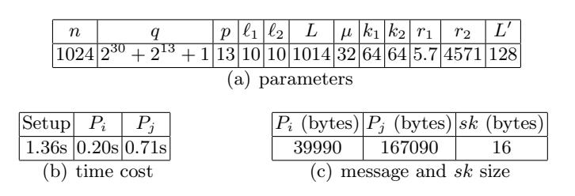

# **PAKEs: New Framework, New Techniques and More Efficient Lattice-Based Constructions in the Standard Model**

Shaoquan Jiang<sup>1</sup> , Guang Gong<sup>2</sup> , Jingnan He3*,*<sup>4</sup> , Khoa Nguyen<sup>4</sup> and Huaxiong Wang<sup>4</sup>

1 Institute of Information Security, Mianyang Normal University, Mianyang, China shaoquan.jiang@gmail.com

<sup>2</sup>Dept. of Electrical and Computer Engineering, University of Waterloo, ON Canada ggong@uwaterloo.ca

<sup>3</sup>State Key Laboratory of Information Security, Institute of Information Engineering of Chinese Academy of Sciences, Beijing, China

hejingnan@iie.ac.cn

<sup>4</sup>School of Physical and Mathematical Sciences, Nanyang Technological University, Singapore *{*khoantt,hxwang*}*@ntu.edu.sg

**Abstract.** Password-based authenticated key exchange (PAKE) allows two parties with a shared password to agree on a session key. In the last decade, the design of PAKE protocols from lattice assumptions has attracted lots of attention. However, existing solutions in the standard model do not have appealing efficiency. In this work, we first introduce a new PAKE framework. We then provide two realizations in the standard model, under the Learning With Errors (LWE) and Ring-LWE assumptions, respectively. Our protocols are much more efficient than previous proposals, thanks to three novel technical ingredients that may be of independent interests. The first ingredient consists of two approximate smooth projective hash (ASPH) functions from LWE, as well as two ASPHs from Ring-LWE. The latter are the first ring-based constructions in the literature, one of which only has a quasi-linear runtime while its function value contains *Θ*(*n*) field elements (where *n* is the degree of the polynomial defining the ring). The second ingredient is a new key conciliation scheme that is approximately rate-optimal and that leads to a very efficient key derivation for PAKE protocols. The third one is a new authentication code that allows to verify a MAC with a noisy key.

# **1 Introduction**

Key exchange is a fundamental and widely used cryptographic mechanism allowing two parties to securely share a session key over a public unreliable channel. In its original form, suggested in the seminal work of Diffie and Hellman, key exchange does not provide authentication and security against an active adversary who has full control of the communication channel. Authenticated key exchange additionally allows each user to authenticate identities of others using either Public-key Infrastructure (PKI) such as TLS/SSL and IKE, or some pre-shared information. The pre-shared information can be either a high-entropy cryptographic key or a low-entropy password. In practice, the latter is more convenient for human users who have limited memory. The study of password authenticated key exchange (PAKE) was initiated by Bellovin and Merritt [[6\]](#page-25-0). A secure PAKE protocol must resist offline dictionary attacks, in which the adversary attempts to determine the password using information from previous executions.

Related work. Since the pioneering work of Bellovin and Merritt [[6\]](#page-25-0) in 1992, PAKE has been extensively studied. The first provably secure PAKE protocol was suggested in [[5](#page-25-1)], but its security analysis resorts to the random oracle model (ROM). Goldreich and Lindell [[18\]](#page-26-0) then introduced the first construction without ROM, based on general assumptions. A reasonably efficient protocol was put forward by Katz, Ostrovsky and Yung [[22\]](#page-26-1), which was later abstracted by Gennaro and Lindell [\[16](#page-26-2)] into a framework based on smooth projective hash (SPH) functions. However, these protocols did not support mutual authentication (MA). That is, the participant cannot make sure that the party he is interacting with, is the right person. Of course, one can make it up with additional flows, but this will increase the round complexity. Jiang and Gong (JG) [[21](#page-26-3)] then proposed a more efficient protocol with MA without increasing round complexity.

In this work, we are interested in PAKE protocols from lattices. The first protocol was introduced in 2009 by Katz and Vaikuntanathan (KV) [[23\]](#page-26-4), whose main ideas are as follows. Alice and Bob first send a CCA-secure ciphertext to each other. Then, they try to compute approximate smooth projective hashing (ASPH) values on the ciphertexts and conduct a key reconciliation to derive a session key. Their key reconciliation mechanism consists of two steps: the first step aims to extract a bit from the ASPH value which is slightly noisy, while the second step is dedicated to correct the error using error-correcting code (ECC). This mechanism is relatively inefficient as it can extract at most one bit per field element. Furthermore, the underlying CCA-secure ciphertext (hence the ASPH) is quite costly, as it includes *ω*(log *n*) CPA-secure ciphertexts[1](#page-1-0) .

Groce and Katz (GK) [[20\]](#page-26-5) abstracted the JG protocol [[21\]](#page-26-3) into a framework for PAKE, yielding a more efficient lattice-based protocol than KV. The idea of the GK framework is as follows. Alice sends a CPA-secure encryption *C* of password *π* to Bob. Bob then computes an SPH value *h* on (*π, C*). Then, they conduct authentication via a CCA-secure encryption with randomness determined by *h*. This framework can be adapted into the ASPH setting using KV's ASPH with their two-step key reconciliation. A realization was given by Benhamouda *et al.* [\[7\]](#page-25-2). Canetti *et al.* [\[8](#page-26-6)] demonstrated another framework for obtaining PAKE (without ASPH), via oblivious transfer (OT). They use OT to transfer *L ′* bits for *each* password bit and finally achieve the authentication via the CCA-secure encryption approach [\[20](#page-26-5)[,21](#page-26-3)].

Zhang and Yu [\[34](#page-26-7)] proposed a PAKE framework from a new ASPH built on a "splittable CCAsecure encryption". However, their realization is in the ROM. Another ROM-based PAKE protocol from lattices is due to Ding *et al.* [[10\]](#page-26-8), where the idea is to authenticate the lattice Diffie-Hellman (which first explicitly appeared in [[11\]](#page-26-9)) using the random oracle protected password. In this work, we only study PAKE protocols without the ROM.

Thus, all existing PAKE frameworks have certain efficiency issues, and do not admit efficient lattice-based realizations in the standard model. Moreover, a CCA-secure encryption seems to be an essential ingredient in them. This raises two interesting questions: (1) From a theoretical point of view, is it possible to achieve a secure PAKE without relying on any CCA-secure encryption or its variant? (2) From a more practical point of view, how to design lattice-based PAKEs in the standard model with better efficiency than previous ones? Tackling these questions would likely require new technical insights.

Our Contributions and Techniques. In this work, we answer the above two questions in the affirmative. Our contributions are threefold. First, we put forward a new framework for obtaining secure PAKE protocols that does not require any CCA-secure encryption or its variant. Second, we introduce several new technical building blocks, that enable efficient standard-model instantiations of our framework in general, and from lattices - in particular. Third, we explicitly give two realizations of our framework, based on the plain Learning With Errors (LWE) and the Ring-LWE assumptions, which enjoy security guarantees from worst-case problems in general lattices [\[32](#page-26-10)] and ideal lattices [[24](#page-26-11)], respectively. Our PAKEs compare very favourably with previous lattice-based protocols in the standard model. We also provide implementation results of the Ring-LWE-based scheme to demonstrate its practical feasibility. To the best of our knowledge, this is

<span id="page-1-0"></span><sup>1</sup> The authors actually used *n* CPA-secure ciphertexts.

the first implementation of any lattice-based PAKE in the standard model, and the performance is quite encouraging.

New PAKE framework. Let us first discuss the high-level ideas of our new PAKE framework. It relies on an ASPH, a key reconciliation scheme and a new notion of key-fuzzy message authentication code (KF-MAC). KF-MAC allows the verification key to be slightly different from the original authentication key. We define a generic ASPH on top of a commitment scheme. Given secret k, input  $\pi$  and a value y in the commitment space (not necessarily a commitment to  $\pi$ ), an ASPH function  $\mathcal{H}$  computes the hash value  $\mathcal{H}(k,\pi,y)$ . If y is indeed a commitment to  $\pi$  with witness  $\tau$ , then  $\mathcal{H}(k,\pi,y)$  can also be approximated by an alternative function  $\hat{\mathcal{H}}$  as  $\hat{\mathcal{H}}(\tau,\alpha(k))$ , where  $\alpha(k)$  is called the projection key of k. The important property for ASPH is smoothness: if y is a commitment to  $\pi'(\neq \pi)$ , then  $(\mathcal{H}(k,\pi,y),\alpha(k))$  are jointly random. We describe our PAKE framework using this generic ASPH. However, to prove the framework security, additional properties on ASPH (which will be clarified later) are required. Our PAKE framework is an integration of three basic processes below.

- Basic key exchange. Alice and Bob use ASPH  $(\mathcal{H}_1, \hat{\mathcal{H}}_1, \alpha_1)$  to obtain close secrets.
- 1. Bob (initiator) first generates a commitment y (with witness  $\tau_1$ ) to password  $\pi$ . He then sends y to Alice.
- 2. Upon receiving y, Alice samples a secret k, computes and sends a projection key  $\alpha_1(k)$  to Bob. She also computes a hash value  $\mathcal{H}_1(k, \pi, y)$ .
- 3. Upon receiving  $\alpha_1(k)$ , Bob computes  $\hat{\mathcal{H}}_1(\tau_1, \alpha_1(k))$ . Note that the distance between  $\mathcal{H}_1(k, \pi, y)$  and  $\hat{\mathcal{H}}_1(\tau_1, \alpha_1(k))$  is typically small.
- Key reconciliation. This process enables Alice (with  $\mathcal{H}_1(k,\pi,y)$ ) and Bob (with  $\hat{\mathcal{H}}_1(\tau_1,\alpha_1(k))$ ) to agree on a secret  $\xi$ , via a one-message key reconciliation scheme £. If no attack exists, then  $\xi$  derived by Alice and Bob will be the same. To assure this, they need to authenticate each other.
- Authentication. This process uses another ASPH  $(\mathcal{H}_2, \hat{\mathcal{H}}_2, \alpha_2)$  and a projection key  $V = \alpha_2(O)$  (with a hidden key O) as public parameters. Here Alice and Bob will authenticate each other and derive a session key.
- 1. Alice deterministically computes commitment w (with witness  $\tau_2$ ) on password  $\pi$ , using randomness determined by  $\xi$ . Next, she computes KF-MAC  $\eta_0$  on traffic using key  $\hat{\mathcal{H}}_2(\tau_2, V)$ . Finally, she sends  $(w, \eta_0)$  to Bob.
- 2. Bob uses  $\xi$  to repeat Alice's procedure to verify  $(w, \eta_0)$  and compute  $\tau_2$ . Then, he uses  $\hat{\mathcal{H}}_2(\tau_2, V)$  to authenticate himself.

We stress that although three procedures are described separately, they can be integrated into a 3-round protocol. The pictorial outline is given in Fig. 1 and a more detailed version is in Fig. 2. For security, we require the commitment for ASPH  $(\mathcal{H}_1, \hat{\mathcal{H}}_1, \alpha_1)$  to have a trapdoor property: with a trapdoor (but without witness  $\tau_1$ ), one verifies if y is a commitment of  $\pi$ . We call this ASPH type-B ASPH. We require ASPH  $(\mathcal{H}_2, \hat{\mathcal{H}}_2, \alpha_2)$  to have strong smoothness: if w is a random (i.e., honestly generated) commitment to  $\pi$ , then  $\hat{\mathcal{H}}_2(\tau_2, V)$  is random (given  $w, V, \pi$ ). We call this ASPH type-A ASPH.

At a high level, our main strategy for proving framework security is the sequence of games: modify the protocol gradually so that the messages in the final game contain no password. Firstly, we can modify the protocol so that  $\pi$  in y is a dummy password. This is unnoticeable to the attacker by the commitment hiding property. Then, under this revision, y normally does not contain the

correct  $\pi$ . If this is the case (which can be checked by the trapdoor property of type-B ASPH), then, by smoothness of  $\mathcal{H}_1$ ,  $\mathcal{H}_1(k,\pi,y)$  is random. This random distribution will propagate to  $\xi$ . Thus, on the one hand, w is a random commitment to  $\pi$ , and so, by the commitment hiding property, we can revise  $\pi$  in w to be a dummy password. On the other hand, by strong smoothness of  $\hat{\mathcal{H}}_2$ , KF-MAC key  $\hat{\mathcal{H}}_2(\tau_2, \alpha_2(O))$  looks random to attacker, and hence, the traffic can not be tampered by KF-MAC property. In fact, an attacker can not impersonate Alice successfully either. Indeed, if he modifies Alice's message only a little, then the KF-MAC will not change and the traffic will not consistent with the KF-MAC tag. If the attacker modifies Alice's message too much (or even creates a new one), (simulated) Bob will use  $\mathcal{H}_2(O, \pi, w)$  to verify the KF-MAC. By smoothness of  $\mathcal{H}_2$ , he will not succeed unless w contains the password  $\pi$ .

After modifications, protocol messages have no password. Attacker can succeed beyond trivial attacks only by constructing y or w that contains the correct  $\pi$ . So he can not succeed better than simply guessing the password.

**New technical building blocks.** Together with the new framework, we also introduce three new technical ingredients that may be of independent interest.

- 1) We construct a new reconciliation scheme for close secrets in  $\mathbb{Z}_q^{\mu}$  (in Section 3.2). Our scheme can extract  $\Theta(\log q)$  per element in  $\mathbb{Z}_q$  and is proven asymptotically rate-optimal. It is much more efficient than all the previous two-step schemes [23,7,11,29], where at most one bit per element in  $\mathbb{Z}_q$  can be extracted.
- 2) We give an authentication code with a noisy verification key in Section 3.3.
- 3) We provide efficient constructions of ASPHs from both plain LWE and Ring-LWE. In each setting, we construct a type-A ASPH and a type-B ASPH. The LWE-based schemes are as follows.
- a. Type-A ASPH. For public parameters  $\mathbf{B} \in \mathbb{Z}_q^{m \times (n+L)}$  and  $\mathbf{g} \in \mathbb{Z}_q^m$  and an m-length error-correcting code  $\mathcal{C}$  with k information symbols, the commitment to  $\pi$  has the form  $\mathbf{w} = \mathbf{Bt} + \mathbf{g} \odot \mathcal{C}(\pi) + \mathbf{x}$ , where  $\odot$  is the coordinate-wise multiplication,  $\mathbf{t}$  is uniformly random over  $\mathbb{Z}_q^{n+L}$  and  $\mathbf{x}$  is a discrete Gaussian over  $\mathbb{Z}_q^m$ . The commitment witness is  $(\mathbf{t}, \mathbf{x})$ . For secret key  $\mathbf{O}$  which is a discrete Gaussian over  $\mathbb{Z}_q^{m \times L}$ , the projection key is  $\mathbf{O}^T\mathbf{B}$ . Then, the projective hashing is computed as  $\mathcal{H}(\mathbf{O}, \pi, \mathbf{w}) = \mathbf{O}^T(\mathbf{w} \mathbf{g} \odot \mathcal{C}(\pi))$ , while the alternative hashing is defined as  $\hat{\mathcal{H}}((\mathbf{t}, \mathbf{x}), \mathbf{O}^T\mathbf{B}) = \mathbf{O}^T\mathbf{Bt}$ . If  $\mathbf{w}$  is a commitment honestly generated as above, then the two hashing values differ by  $\mathbf{O}^T\mathbf{x}$  (which is short as  $\mathbf{x}$  and  $\mathbf{O}$  are short). For the smoothness, if w is a commitment on  $\pi' \neq \pi$ , then given  $\mathbf{O}^T\mathbf{B}$ , value  $\mathbf{O}^T(\mathbf{w} \mathbf{g} \odot \mathcal{C}(\pi))$  is statistically close to uniform over  $\mathbb{Z}_q^L$  (see Theorem 2). For strong smoothness, it requires that given  $\mathbf{Bt} + \mathbf{x}$  and  $\mathbf{O}^T\mathbf{B}$ , value  $\mathbf{O}^T\mathbf{Bt}$  looks random. We prove this using hidden-bits lemma in [12].
- b. Type-B ASPH. Type B ASPH is similar to Type A ASPH, except it needs to provide a trapdoor property for the commitment. This property is achieved via the trapdoor simulation techniques in [3,23].

The ASPHs in the ring-LWE setting essentially follow the same strategy as the LWE-based ones. However, the supporting techniques (i.e., hidden-bits lemma, trapdoor simulation and adaptive smoothness theorem) have to be rebuilt. This turns out to be highly non-trivial. Essentially, this is due to the sparseness of matrix representations for ring operations. Consequently, the random arguments for the LWE case are no longer useful. However, this rebuilding work is worth as ring-LWE ASPHs are much more efficient than LWE-based ones. A detailed informal description is presented in Section 5.

Efficient lattice-based instantiations of PAKE in the standard model. When putting all building blocks together, we obtain PAKE protocols from plain LWE and Ring-LWE that are much more efficient than previous lattice-based constructions in the standard model. Table 1 provides a summary of the comparison. For simplicity, the table only counts the dominating costs.

| Scheme | Client (Mult)                       | $Server(\mathbf{Mult})$ | Comm                              | assum  | MA  | q                     |
|--------|-------------------------------------|-------------------------|-----------------------------------|--------|-----|-----------------------|
| [7]A   | O(kL'nm)                            | O(kL'nm)                | kL'n                              | DLWE   | no  | $\Omega(n^3)$         |
| [7]B   | knm                                 | O(kL'nm)                | $kn^2$                            | DLWE   | no  | $\Omega(n^3)$         |
| [8]    | O(nmk)                              | O(nmk)                  | kmn                               | DLWE   | yes | $\omega(n^2)$         |
| [20]   | 2nm                                 | O(L'nm)                 | L'n                               | DLWE   | yes | poly(n)               |
| [23]   | $\omega(L'nm\log n)$                | $\omega(L'nm\log n)$    | 2L'n                              | DLWE   | no  | poly(n)               |
| Ours   | nm                                  | $O(L'nm/\log q)$        | $O(\frac{L'n}{\log n} + n\log n)$ | DLWE   | yes | \ /                   |
| Ours   | $O(\frac{L'n}{\log n} + n\log^2 n)$ | $O(L'n\log n)$          | $O(\frac{L'n}{\log n} + n\log n)$ | R-DLWE | yes | $\Omega(n^{\lambda})$ |

<span id="page-4-0"></span>**Table 1.** Comparison among lattice-based PAKEs in the standard model. Here,  $m = \Omega(n \log n)$ ; k is the password length; L' is the key reconciliation output length (since the output is mostly used as a key for a symmetric-key primitive,  $L' \ll n$ ); the cost for client/server is  $\sharp$  of multiplications in  $\mathbb{Z}_q$ ; Comm is the message length in  $\mathbb{Z}_q$ ;  $\lambda > 3$ .

We provide the implementation in Section 5.6 for our Ring-LWE-based PAKE protocol. In this proof-of-concept implementation, the Number Theory Library (NTL) [33] is employed without further optimization. To agree on a 16-byte session key, the bandwidth from  $P_i$  to  $P_j$  is about 40 KB and 167 KB from  $P_j$  to  $P_i$ . Generating public parameters requires about 1.31 seconds, while  $P_i$ 's and  $P_j$ 's computations cost about 0.2 seconds and 0.71 seconds, respectively. Although the efficiency is (expectedly) not competitive with the ROM protocol from [10], our implementation demonstrates that the technical ingredients introduced in this work do advance the state of the art of lattice-based PAKEs in the standard model and do bring them much closer to practice. But it still needs further improvement toward practical application. This will be our future direction.

ORGANIZATION. The rest of the paper is organized as follows. In Section 2, we provide necessary background on PAKEs and lattices. The technical ideas, technical building blocks and description of our new PAKE framework are presented in Section 3. Our LWE-based and Ring-LWE-based instantiations are provided in Sections 4 and 5, respectively.

NOTATIONS. The transposition of matrix  $\Gamma$  is denoted by  $\Gamma^T$ ; [k] denotes set  $\{0, \dots, k-1\}$ . Vectors are column vectors (unless stated otherwise);  $v_i$  or  $\mathbf{v}[i]$  denotes the ith component of  $\mathbf{v}$ ;  $[\mathbf{v}]_1^L$  denotes the sub-vector  $(v_1, \dots, v_L)^T$  of  $\mathbf{v}$ . Sampling x from set S uniformly at random is denoted by  $x \leftarrow S$ ; A|B is a concatenation of A with B.  $\mathbf{negl}: \mathbb{N} \to \mathbb{R}$  represents a negligible function:  $\lim_{n\to\infty} \mathbf{negl}(n)p(n) = 0$  for any polynomial p(n). The statistical distance between  $X_1, X_2$  is  $\Delta(X_1, X_2) := \frac{1}{2} \sum_x |P_{X_1}(x) - P_{X_2}(x)|$ , where  $P_X()$  is the probability mass function of X. We say that  $X_1$  and  $X_2$  are statistically close if  $\Delta(X_1, X_2)$  is negligible.  $||\mathbf{x}||$  is the Euclidean norm of  $\mathbf{x}$ ;  $||\mathbf{x}||_{\infty} = \max_i |x_i|$  is the  $\ell_{\infty}$ -norm and  $\mathrm{dist}_{\infty}(\cdot, \cdot)$  is the distance measure under  $\ell_{\infty}$ -norm.  $x \mod q$  denotes the residue of  $x \in \mathbb{Z}_q$  in  $[0, \dots, q)$  and  $(x)_q$  denotes the residue of  $x \in \mathbb{Z}_q$  in [-q/2, q/2). The  $\odot$  product is defined as  $(a_1, \dots, a_n) \odot (b_1, \dots, b_n) = (a_1b_1, \dots, a_nb_n)$ . For  $\mathbf{v} \in \mathbb{R}^n$ , DIAG( $\mathbf{v}$ ) is the diagonal matrix with  $v_i$  as the (i,i)th entry. For  $m_1 \times n_1$  matrix  $\mathbf{A}$  and  $m_2 \times n_2$  matrix  $\mathbf{B}$ , the tensor product  $\mathbf{A} \otimes \mathbf{B}$  is the  $m_1m_2 \times n_1n_2$  matrix  $(C_{ij})$  in the block format, where block  $C_{ij} = a_{ij}\mathbf{B}$  for any  $i \in [m_1], j \in [n_1]$ . The (column) concatenation of vectors  $\mathbf{v}_1, \dots, \mathbf{v}_t$  is a long vector, denoted by  $(\mathbf{v}_1; \mathbf{v}_2; \dots; \mathbf{v}_t)$ .

### <span id="page-5-0"></span>**Preliminaries**

### Security Model of PAKE

In this section, we recall a formal model for a password-authenticated key exchange protocol  $\Sigma$ . This model is mainly adopted from Bellare et al. [5] with a minor revision in [20]. There are nparties  $P_1, \dots, P_n$  in the system and any two parties share a password. We will use the following notations.

- $\mathcal{D}$ : This is the password dictionary. For simplicity, we assume that passwords are chosen uniformly from  $\mathcal{D}$ .
- $\Pi_i^{\ell_i}$ : This is the  $\ell_i$ -th instance of protocol  $\Sigma$  executed by party  $P_i$ . The number  $\ell_i$  is used by  $P_i$  to distinguish these instances.
- Flow<sub>d</sub>: This is the d-th message flow in the execution of protocol  $\Sigma$ .
- $\operatorname{sid}_{i}^{\ell_{i}}$ : This is the session identifier of  $\Pi_{i}^{\ell_{i}}$ . It is only for the purpose of security analysis. Intuitively, two instances jointly executing  $\Sigma$  should share the same session identifier. The specification is available only if  $\Sigma$  is known.
- $\mathbf{pid}_{i}^{\ell_{i}}$ : This is the party, which  $\Pi_{i}^{\ell_{i}}$  is interacting with.  $sk_{i}^{\ell_{i}}$ : This is the session key derived by  $\Pi_{i}^{\ell_{i}}$  after successfully executing  $\Sigma$ .

**Partnering.** Instances  $\Pi_i^{\ell_i}$  and  $\Pi_j^{\ell_j}$  are partnered if (1)  $\mathbf{pid}_i^{\ell_i} = P_j$  and  $\mathbf{pid}_j^{\ell_j} = P_i$ ; (2)  $\mathbf{sid}_i^{\ell_i} = P_j$  $\operatorname{sid}_{i}^{\ell_{j}}$ . The partnering is motivated to identify two instances that are jointly executing protocol  $\Sigma$ . To define security, we have to specify an attacker's capabilities. Essentially, Adversarial model. we wish to capture man-in-the-middle attacks. The protocol is secure if the adversary can not obtain anything about a session key beyond the trivial findings. Formally, the attacks are modelled through oracles that are maintained by a challenger as follows.

- **Execute** $(i, \ell_i, j, \ell_j)$ : When this oracle is called, it first checks whether  $\Pi_i^{\ell_i}$  and  $\Pi_j^{\ell_j}$  are fresh. If not, it does nothing; otherwise, a protocol execution between  $\Pi_i^{\ell_i}$  and  $\Pi_j^{\ell_j}$  takes place. Finally, the transcript is returned. This is an eavesdropping attack.
- Send $(d, i, \ell_i, M)$ : When this oracle is called, M is sent to  $\Pi_i^{\ell_i}$  as  $Flow_d$ . If d = 0 or 1, then a new instance  $\Pi_i^{\ell_i}$  is created. If d = 0, then  $M = \text{``ke, pid}_i^{\ell_i}$  is a key exchange request message (from an upper layer program inside  $P_i$ ). In any case,  $\Pi_i^{\ell_i}$  acts according to the specification of
- Reveal $(i, \ell_i)$ : This oracle call assumes that  $\Pi_i^{\ell_i}$  has successfully completed with a session key  $sk_i^{\ell_i}$  derived. Under this,  $sk_i^{\ell_i}$  is returned.
- **Test** $(i, \ell_i)$ : This oracle is to test the secrecy of  $sk_i^{\ell_i}$ . The adversary is only allowed to query it once. Toward this,  $\Pi_i^{\ell_i}$  must have successfully completed with  $sk_i^{\ell_i}$  derived. Furthermore,  $\Pi_i^{\ell_i}$ and its partnered instance (if any) should not have been issued a **Reveal** query. Then, it takes  $b \leftarrow \{0,1\}$ . If b=1, then  $\alpha_1 = sk_i^{\ell_i}$  is provided to adversary; otherwise, a random number  $\alpha_0$ from the space of the session key is provided. The adversary then tries to output a guess bit b'of b. He is announced for success if b' = b.

**Correctness.** If two partnered instances both accept, they derive the same key.

**Adversarial success.** Having specified the adversarial behaviour, we now define its success. This consists of authentication and secrecy.

- $\diamond$  Mutual authentication. We first define the semi-partnering [20]: instances  $\Pi_i^{\ell_i}$  and  $\Pi_j^{\ell_j}$  are semi-partnered if they are partnered, or, the following conditions hold: (1)  $\operatorname{sid}_i^{\ell_i}$  and  $\operatorname{sid}_j^{\ell_j}$  agree except possibly for the final message flow in  $\Sigma$ ; (2)  $\operatorname{pid}_i^{\ell_i} = P_j$  and  $\operatorname{pid}_j^{\ell_j} = P_i$ . This relaxed partnering is defined to rule out the possible trivial attack where an attacker forwards all the messages except the final one. An attacker breaks mutual authentication if some  $\Pi_i^{\ell_i}$  with  $\operatorname{pid}_i^{\ell_i} = P_j$  has successfully completed the execution of  $\Sigma$  with a session key derived while there does not exist a semi-partnered instance  $\Pi_j^{\ell_j}$ .
- $\diamond$  Secrecy. An adversary succeeds if b' = b.

We use random variable **Succ** to denote either of the above two success events. Define the advantage of adversary  $\mathcal{A}$  as  $\mathbf{Adv}(\mathcal{A}) := 2 \Pr[\mathbf{Succ}] - 1$ .

**Definition 1.** A password authenticated key exchange protocol  $\Sigma$  is **secure** if it is correct and for any PPT adversary A that makes **Send** queries at most  $Q_s$  times, it holds that  $\mathbf{Adv}(A) \leq \frac{Q_s}{|D|} + \mathbf{negl}(n)$ .

# 2.2 Lattices and Hard Random Lattices

We now give a brief background on lattices. Let  $\mathbf{B} = \{\mathbf{b}_1, \dots, \mathbf{b}_n\} \subset \mathbb{C}^m$  consist of n linearly independent vectors. An m-dimensional lattice with basis  $\mathbf{B}$  is defined as  $\mathcal{L}(\mathbf{B}) = \{\sum_{i=1}^n a_i \mathbf{b}_i \mid a_i \in \mathbb{Z}\}$ . For lattice  $\Lambda$ , the Euclidean norm of its shortest non-zero vector is denoted by  $\lambda_1(\Lambda)$ . If we use the  $\ell_{\infty}$ -norm, it is denoted by  $\lambda_1^{\infty}(\Lambda)$ . The dual lattice of  $\Lambda \subseteq \mathbb{C}^m$  is defined as  $\Lambda^{\vee} = \{\mathbf{y} : \langle \mathbf{x}, \bar{\mathbf{y}} \rangle = \sum_i x_i y_i \in \mathbb{Z}, \forall \mathbf{x} \in \Lambda\}$ , where  $\bar{\mathbf{y}}$  is the complex conjugate of  $\mathbf{y}$ .

For s > 0 and  $\mathbf{x} \in \mathbb{R}^m$ , Gaussian function with parameter s is  $\rho_s(\mathbf{x}) = \exp(-\frac{\pi ||\mathbf{x}||^2}{s^2})$ . The discrete Gaussian distribution over lattice  $\Lambda \subseteq \mathbb{R}^m$  with parameter s is defined as  $D_{\Lambda,s}(\mathbf{x}) = \frac{\rho_s(\mathbf{x})}{\rho_s(\Lambda)}, \forall \mathbf{x} \in \Lambda$ .

For  $m \geq 2$ , let  $H = \{ \mathbf{x} \in \mathbb{C}^{\phi(m)} : x_i = \bar{x}_{m-i}, \forall i \in \mathbb{Z}_m^* \}$ , where  $x_i$  in  $\mathbf{x} \in H$  is indexed by  $i \in \mathbb{Z}_m^*$  and  $\phi(m)$  is the Euler function. We are interested in lattice  $\Lambda \subseteq H$ . It is an inner product space over  $\mathbb{R}$ , isomorphic to  $\mathbb{R}^{\phi(m)}$ ; see [25] for details. Hence,  $D_{\Lambda,s}(\mathbf{x})$  with  $\Lambda \subset H$  can be defined in exactly the same way as  $\Lambda \subseteq \mathbb{R}^n$ . Micciancio and Regev [27] defined a quantity smoothing parameter.

**Definition 2.** For a lattice  $\Lambda$  and  $\epsilon > 0$ , the smoothing parameter  $\eta_{\epsilon}(\Lambda)$  is the smallest s so that  $\rho_{1/s}(\Lambda^{\vee}\setminus\{\mathbf{0}\}) \leq \epsilon$ .

<span id="page-6-2"></span>Usually,  $\eta_{\epsilon}(\Lambda)$  is desired to be small. Then, the following result is useful.

**Lemma 1.** [30] For an m-dimensional lattice  $\Lambda$ ,  $\eta_{\epsilon}(\Lambda) \leq \frac{\sqrt{\log(2m/(1+1/\epsilon))/\pi}}{\lambda_{1}^{\infty}(\Lambda^{\vee})}$ .

<span id="page-6-1"></span>The following bounds are taken from [27, Lemma 4.4] and [4, Lemma 2.4].

<span id="page-6-0"></span>**Lemma 2.** For  $s \ge \omega(\sqrt{\log m})$  and any  $\mathbf{v} \in \mathbb{R}^m$  and any t > 0, if  $\mathbf{e} \leftarrow D_{\mathbb{Z}^m,s}$ , then  $P(||\mathbf{e}|| > s\sqrt{m}) \le O(2^{-m})$  and  $P(|\mathbf{v}^T\mathbf{e}| > st||\mathbf{v}||) \le 2e^{-\pi t^2}$ .

**Hard random lattices.** For integers q, m, n and  $\mathbf{A} \in \mathbb{Z}_q^{m \times n}$  of rank n, let  $\Lambda^{\perp}(\mathbf{A}) = \{\mathbf{e} \in \mathbb{Z}^m \mid \mathbf{e}^T \mathbf{A} = \mathbf{0} \mod q\}$  and  $\Lambda(\mathbf{A}) = \{\mathbf{y} \in \mathbb{Z}^m \mid \mathbf{y} = \mathbf{A}\mathbf{s} \mod q, \mathbf{s} \in \mathbb{Z}^n\}$ . It is easy to verify that  $\Lambda^{\perp}(\mathbf{A}) = q \cdot (\Lambda(\mathbf{A}))^{\vee}$  and  $\Lambda(\mathbf{A}) = q \cdot (\Lambda^{\perp}(\mathbf{A}))^{\vee}$ . Here is a useful lemma on  $\Lambda^{\perp}(\mathbf{A})$ .

**Lemma 3.** [17] If rows of  $\mathbf{A} \in \mathbb{Z}_q^{m \times n}$  generate  $\mathbb{Z}_q^{1 \times n}$  and  $r \geq \eta_{\epsilon}(\Lambda^{\perp}(\mathbf{A}))$ , then for  $\mathbf{e} \leftarrow D_{\mathbb{Z}^m,r}$ ,  $\Delta(\mathbf{e}^T\mathbf{A}, \mathbf{U}) \leq 2\epsilon$ , where  $\mathbf{U}$  is uniformly random in  $\mathbb{Z}_q^{1 \times n}$ .

### <span id="page-7-0"></span>3 A New PAKE Framework

#### 3.1 Intuition

We now introduce the ideas for our PAKE framework. We need three notions: key reconciliation, key-fuzzy message authentication code (KF-MAC), and approximate smooth projective hash (ASPH). Key reconciliation is a standard notion. It allows two parties with similar secrets to agree on an identical secret. The notion of KF-MAC is new. It works like a normal MAC for the MAC generation and verification. But it also allows a receiver with a slightly noisy key to (in)validate the MAC.

We define a generic ASPH on the top of a commitment scheme. Given secret k, input  $\pi$  and a value y in the commitment space (but not necessarily a commitment to  $\pi$ ), an ASPH function  $\mathcal{H}$  computes the hash value  $\mathcal{H}(k,\pi,y)$ . If y is indeed a commitment of  $\pi$  with witness  $\tau$ , then  $\mathcal{H}(k,\pi,y)$  can also be approximated by an alternative function  $\hat{\mathcal{H}}$  as  $\hat{\mathcal{H}}(\tau,\alpha(k))$ , where  $\alpha(k)$  is called the *projection key* of k. The important property for generic ASPH is *smoothness*: if y is a commitment of  $\pi'(\neq \pi)$ , then  $(\mathcal{H}(k,\pi,y),\alpha(k))$  are jointly random. Based on a generic ASPH, we define two types of strengthened ASPHs. Type-A ASPH is a generic ASPH with a **strong smoothness**: if w is a random commitment of  $\pi$  with witness  $\tau_2$ , then  $\hat{\mathcal{H}}_2(\tau_2,\alpha_2(O))$  appears to be random (given  $(w,\alpha_2(O))$ ). Type-B ASPH is a generic ASPH with **trapdoor property**: with a trapdoor (but without a witness), one can check whether y is a commitment of  $\pi$ .

Our PAKE framework proceeds as follows. Assume that  $(\mathcal{H}_1, \hat{\mathcal{H}}_1, \alpha_1)$  is a type-B ASPH and  $(\mathcal{H}_2, \hat{\mathcal{H}}_2, \alpha_2)$  is a type-A ASPH.

- a. approximate key establishment Initiator Bob generates commitment y (with witness  $\tau_1$ ) on password  $\pi$ . He then sends y to Alice (responder). Alice then samples a secret key k, computes and sends the projection key  $\alpha_1(k)$  to Bob. At this moment, Bob and Alice can compute two close secrets: Bob computes  $\hat{\mathcal{H}}_1(\tau_1, \alpha(k))$  and Alice computes  $\mathcal{H}_1(k, \pi, y)$ .
- b. key reconciliation Alice (with  $\mathcal{H}_1(k, \pi, y)$ ) and Bob (with  $\hat{\mathcal{H}}_1(\tau_1, \alpha(k))$ ) executes a one-message key reconciliation scheme £ to agree on a common secret  $\xi$ . This one-message  $\sigma$  is sent by Alice.
- c. authentication with  $\xi$  Alice authenticates herself. To do this, she generates a commitment w (and its witness  $\tau_2$ ) on  $\pi$  but with randomness determined by  $\xi$ . She then generates a KF-MAC on traffic using secret key  $\mathcal{H}_2(\tau_2, V)$ , where V is a projection key (a public parameter). She then sends w and the KF-MAC to Bob. Bob has  $\xi$  and will repeat Alice's procedure to verify the authentication. He also authenticates himself using  $\mathcal{H}_2(\tau_2, V)$ .
- d. key derivation. If the authentication above succeeds, they both derive the session key sk using  $\xi$ .

Although the framework has several stages, some messages can be combined. It turns out that the overall protocol has only 3 flows (see Fig. 1), where  $com_i$  is the commitment w.r.t.  $\mathcal{H}_i$ .

We now outline the security. The idea is to iteratively modify the protocol so that messages in the final protocol variant do not contain password  $\pi$  at all.

First, if  $w|\alpha_1(k)|\sigma$  is attacker-generated, we modify the protocol so that Bob verifies KF-MACs using key  $\mathcal{H}_2(O, \pi, w)$  (instead of  $\hat{\mathcal{H}}_2(\tau_2, V)$ ). This is consistent as the original verification guarantees that  $\hat{\mathcal{H}}_2(\tau_2, V)$  and  $\mathcal{H}_2(O, \pi, w)$  are close and so the two MAC verifications give the same result. Under the change, the attacker can succeed only if w contains  $\pi$ ; otherwise, by smoothness of  $\mathcal{H}_2$ ,  $\mathcal{H}_2(O, \pi, w)$  is random to him and so the KF-MAC will be rejected.

Then, we modify the protocol so that  $\pi$  in y is a dummy password. This is unnoticeable to the attacker by the commitment hiding property.

```
\begin{aligned} \operatorname{Bob}(\pi) & \operatorname{public:} V = \alpha_2(O) & \operatorname{Alice}(\pi) \\ (\tau_1,y) \leftarrow \operatorname{com}_1(\pi) & \xrightarrow{y} \\ \xi = \pounds_{bob}(\sigma, \hat{\mathcal{H}}_1(\tau_1,\alpha_1(k))) & \operatorname{Sample} k \\ (\tau_2,w') = & \operatorname{com}_2(\pi) \text{ determined by } \xi \overset{w \mid \alpha_1(k) \mid \sigma}{\longleftarrow} & (\sigma,\xi) \leftarrow \pounds_{alice}(\mathcal{H}_1(k,\pi,y)) \\ w' \overset{?}{=} w & (\tau_2,w) = & \operatorname{com}_2(\pi) \text{ determined by } \xi \\ & \operatorname{KF-MACs \ on \ traffic}_{\text{with \ key} \ \hat{\mathcal{H}}_2(\tau_2,\ \alpha_2(O))} \\ & \operatorname{output:} \ sk \ \operatorname{determined \ by} \ \xi \end{aligned}
```

<span id="page-8-0"></span>Fig. 1. Outline of Our PAKE Framework

Under the above revision, y normally does not contain the correct  $\pi$ . If this is the case (which can be checked by the **trapdoor property** of  $\mathsf{com}_1$ ), then, by **smoothness**,  $\mathcal{H}_1(k,\pi,y)$  (further  $\xi$ ) is random. Thus, w is a random commitment of  $\pi$ . Then, by **strong smoothness**, KF-MAC key  $\hat{\mathcal{H}}_2(\tau_2, \alpha_2(O))$  looks random to attacker. So we can modify  $\pi$  in w to a dummy password and  $\hat{\mathcal{H}}_2(\tau_2, \alpha_2(O))$  to be a random key. At this moment, a skillful attacker can not modify Alice's message to fool Bob unless w contains  $\pi$ . Indeed, if he modifies the message too much, then (simulated) Bob will regard it as an attacker-generated message. As said above, he will fail. If he only changes a little, then (simulated) Bob will use the same key of Alice to verify and reject KF-MAC. Our authentication approach is different from the previous CCA-encryption approach [21,20], where the non-malleability is used to refute a modification attack.

After modifications above, protocol messages have no password and attacker can only succeed by producing y or w that contains  $\pi$  (beyond trivial success). Thus, he cannot succeed better than simply guessing the password.

#### 3.2 Key Reconciliation

Key reconciliation is a mechanism that allows two parties with close secrets to share a common secret. We consider a special scenario of this problem.

Alice has a secret d uniformly random over set S and Bob has a secret d' with  $\mathsf{Dist}(d,d') \leq \delta$  for a measure  $\mathsf{Dist}: S \times S \to \mathbb{R}^+$  and threshold  $\delta \in \mathbb{R}^+$ . Then, they jointly execute a protocol  $\Pi$  (called key reconciliation protocol). In the end, they output a value  $\xi \in \Xi$ . The correctness requires that for any d, d' with  $\mathsf{Dist}(d', d) \leq \delta$ , Alice and Bob will agree on  $\xi$ . Protocol  $\Pi$  is **passively secure** with respect to  $(S, \Xi, \delta)$  if the correctness holds and  $H(\xi|\mathsf{trans}) = H(\xi) = \log |\Xi|$ , where trans is the transcript of  $\Pi$  and H() is the (conditional) entropy function. If  $\Pi$  is a one-message protocol (from Alice to Bob), it is called one-message key reconciliation protocol.

<span id="page-8-1"></span>Trivially,  $H(\xi|\text{trans}) = H(\xi)$  implies that  $\xi$  and trans are independent (i.e.,  $P_{\xi,\text{trans}} = P_{\xi}P_{\text{trans}}$ ), where  $P_X$  is the distribution of X.

**Lemma 4.** Let  $\Pi$  be a passively secure key reconciliation that has d for Alice's input, trans for transcript and  $\xi$  for common secret. Take trans<sub>1</sub>  $\leftarrow$   $P_{trans}$  and  $\xi_1 \leftarrow P_{\xi}$  and  $d_1 \leftarrow P_{d|(trans,\xi)}(\cdot|trans_1,\xi_1)$ . Then,  $P_{d,trans,\xi} = P_{d_1,trans_1,\xi_1}$ .

**Proof.** By definition of  $(\mathsf{trans}_1, \xi_1)$ ,  $P_{\mathsf{trans}_1, \xi_1} = P_{\mathsf{trans}_1} P_{\xi_1} = P_{\mathsf{trans}} P_{\xi}$ , which equals  $P_{\mathsf{trans}, \xi}$ , as  $\mathsf{trans}$  and  $\xi$  are independent. Thus, for any feasible (a, b, c),

$$\begin{split} & P_{d_1,\mathsf{trans}_1,\xi_1}(a,b,c) = P_{d_1|(\mathsf{trans}_1,\xi_1)}(a|b,c) \cdot P_{\mathsf{trans}_1,\xi_1}(b,c) \\ = & P_{d|(\mathsf{trans},\xi)}(a|b,c) \cdot P_{\mathsf{trans}_1,\xi_1}(b,c) = P_{d|(\mathsf{trans},\xi)}(a|b,c) \cdot P_{\mathsf{trans},\xi}(b,c) = P_{d,\mathsf{trans},\xi}(a,b,c). \end{split}$$

Since a, b, c are arbitrary,  $P_{d, trans, \xi} = P_{d_1, trans_1, \xi_1}$ .

A New Key Reconciliation Scheme For close secrets over  $\mathbb{Z}_q$ , we show how to share a random binary sequence. We start with an example for q=401. Let  $d',d\in\mathbb{Z}_{401}$  with d uniformly random in  $\mathbb{Z}_{401}$  and  $|(d'-d)_{401}|\leq 8$ . Alice has secret d and Bob has d'. They want to agree on a secret  $\xi$ . Toward this, a crucial observation is as follows. For any integer  $f\in[0,2^{\lfloor\log 401\rfloor}]$  with a binary representation  $a_7a_6a_501a_2a_1a_0$ , we have  $f+d'-d\mod 401=f+(d'-d)_{401}\in[0,256)$ , which has a binary representation  $a_7a_6a_5a'_4a'_3a'_2a'_1a'_0$ , as  $8\leq 01a_2a_1a_0<16$  and  $-8\leq (d'-d)_{401}\leq 8$ . Then, Alice and Bob can reconciliate as follows.

Alice samples a random  $f \in [0, 256)$  of a binary form  $a_7 a_6 a_5 01 a_2 a_1 a_0$ . Next, she evaluates  $\sigma = f + d \mod 401$  and sends it to Bob.

Upon receiving  $\sigma$ , Bob computes  $\sigma - d' \mod 401 = f + d - d' \mod 401$ . As seen above, this number has a binary form  $a_7 a_6 a_5 a'_4 a'_3 a'_2 a'_1 a'_0$ . So both Alice and Bob can define the common secret as  $\xi = a_7 a_6 a_5$ .

This shared key is confidential (given  $\sigma$ ) as d is uniformly random in  $\mathbb{Z}_{401}$  and hence f in  $\sigma$  is masked by a one-time pad  $d \in \mathbb{Z}_{401}$ .

The above example can be easily generalized to general parameters. Assume that Alice has a secret  $d \leftarrow \mathbb{Z}_q$  and Bob has a secret  $d' \in \mathbb{Z}_q$  with  $|(d'-d)_q| < \delta$  for some integer  $\delta \leq q/32$ . They want to agree on a common secret  $\xi$ . Our scheme works as follows. Let  $t = |\log q|$  and  $b = \lceil \log \delta \rceil$ .

Alice: 1. Alice defines  $a_b = 1$  and  $a_{b+1} = 0$ . For  $0 \le j \le t-1$  but  $j \ne b, b+1$ , she takes  $a_j \leftarrow \{0, 1\}$  and lets  $f = a_{t-1} \cdots a_1 a_0$  (an integer in a binary representation). She defines  $\xi = (a_{t-1}, \cdots, a_{b+2})^T$ .

2. Alice sends  $\sigma = (f + d) \mod q$  to Bob and sets the shared secret as  $\xi$ .

Bob: Upon  $\sigma$ , Bob uses d' to compute  $\xi$  as the binary form of  $\lfloor \frac{(\sigma - d') \mod q}{2^{b+2}} \rfloor$ . Finally, he sets the shared secret as  $\xi$ .

This protocol can be generalized. If Alice has secret  $\mathbf{d} \leftarrow \mathbb{Z}_q^{\mu}$  and Bob has  $\mathbf{d}' \in \mathbb{Z}_q^{\mu}$  s.t.  $|(d_i - d_i')_q| \leq \delta$  for  $i \in [\mu]$ , they can run it in parallel with input  $d_i, d_i'$  for each i to generate a vector  $\boldsymbol{\xi}$ . We use £ to denote this scheme, use  $(\boldsymbol{\sigma}, \boldsymbol{\xi}) \leftarrow \pounds_{alice}(\mathbf{d})$  to denote Alice's computation and  $\boldsymbol{\xi} \leftarrow \pounds_{bob}(\boldsymbol{\sigma}, \mathbf{d}')$  to denote Bob's computation, where  $\sigma_i$ ,  $\xi_i$  are the message and common secret w.r.t.  $(d_i, d_i')$ .

**Lemma 5.** Alice and Bob obtain the same  $\boldsymbol{\xi}$  with  $\boldsymbol{\xi}$  uniformly random over  $\{0,1\}^{(t-b-2)\mu}$  and independent of  $\boldsymbol{\sigma}$ . Also, entropy  $H(\boldsymbol{\xi}) = H(\boldsymbol{\xi}|\boldsymbol{\sigma}) \geq \mu \log \frac{q}{16\delta}$ .

**Proof.** Let  $f_i$  be the sample of f in the ith copy of the basic protocol. Notice that  $\sigma = \mathbf{f} + \mathbf{d} \mod q$  and  $\mathbf{f}$  is independent of  $\mathbf{d}$ . Hence,  $\mathbf{d}$  is the one-time pad for  $\mathbf{f}$  in  $\sigma$ . Thus,  $\mathbf{f}$  is independent of  $\sigma$ . Also,  $\boldsymbol{\xi}$  is independent of  $\sigma$  as it is determined by  $\mathbf{f}$ . Further,  $\boldsymbol{\xi}$  is uniformly random as every bit  $a_{ij}$  of  $f_i$  for  $j \neq b, b+1$  is uniformly random. Consider the correctness now. It suffices to consider the basic protocol. Since  $b = \lceil \log \delta \rceil$  and f has  $a_b = 1$  and  $a_{b+1} = 0$ , it follows that  $f \pm h$  for any  $0 \leq h \leq 2^b$  has a binary representation  $a_{t-1} \cdots a_{b+2} a'_{b+1} a'_b \cdots a'_1 a'_0$ . This especially implies  $(f \pm h) \mod q = f \pm h$ , as  $0 < f \pm h < 2^t \leq q$ . Thus,  $\lfloor \frac{f \pm h}{2^{b+2}} \rfloor = a_{t-1} \cdots a_{b+2}$ . Since  $|(d - d')_q| \leq \delta \leq 2^b$ , it follows that

 $(\sigma - d') \mod q = f + (d - d')_q$ , which has a binary representation  $a_{t-1} \cdots a_{b+2} a'_{b+1} a'_b \cdots a'_1 a'_0$ . Thus,  $\lfloor \frac{(\sigma - d') \mod q}{2^{b+2}} \rfloor = a_{t-1} \cdots a_{b+2}$ . Finally, since  $2^{t-b-2} = 2^{\lfloor \log q \rfloor - \lceil \log \delta \rceil - 2} \geq \frac{q}{16\delta}$ ,  $\xi$  has an entropy at least  $\log \frac{q}{16\delta}$  bits.

Next lemma reflects the strength of our scheme. A proof is in the full version.

<span id="page-10-2"></span>**Lemma 6.** Let  $\mathbf{d}$  be a random variable over  $\mathbb{Z}_q^{\mu}$ , and let  $\mathbf{e}$  be uniformly random over  $\{-\delta, \cdots, \delta\}^{\mu}$ . Define  $\mathbf{d}' = \mathbf{d} + \mathbf{e} \mod q$ . Let  $\Pi$  be any protocol between Alice with input  $\mathbf{d}$  and Bob with input  $\mathbf{d}'$ , following which they derive a shared  $\boldsymbol{\xi}$ . Assume the interaction transcript between Alice and Bob be trans. Then,  $H(\boldsymbol{\xi}|\text{trans}) \leq H(\mathbf{d}) - \mu \log(2\delta + 1)$ , where H is the entropy function.

REMARK. Since **d** is uniformly random over  $\mathbb{Z}_q^{\mu}$ , any key reconciliation protocol in our setting must satisfy  $H(\boldsymbol{\xi}|\text{trans}) \leq \mu \log \frac{q}{2\delta+1}$ . In comparison with this bound, our  $\boldsymbol{\xi}$  loses entropy at most  $\log(16\delta) - \log(2\delta+1) \leq 3$  bits per coordinate. Define extraction bit rate to be  $\frac{H(\boldsymbol{\xi})}{\mu \log q}$ . The ratio of the extraction rate between our scheme and any rate-optimal scheme is lower bounded by  $\frac{\log \frac{q}{16\delta}}{\log \frac{q}{2\delta+1}} \to 1$  when  $\delta = o(q)$  and hence it is asymptotically optimal. Further, our rate is asymptotically  $1 - \log_q \delta$ , which is a constant for  $\delta$  in our concrete PAKEs.

#### 3.3 Authentication Code for Close Secrets

Message authentication code (MAC) is a keyed function  $F_K : \mathcal{M} \to \mathcal{V}$  such that without K no one can compute  $F_K(M)$  for any M. For simplicity, we assume that a normal verification of MAC  $\eta$  is simply to check  $\eta \stackrel{?}{=} F_K(M)$ . Now we introduce a new notion of  $\delta$ -key-fuzzy MAC, where if a verifier's secret key gets a little noisy, then he can still verify the MAC. He can accept a normal MAC while he also rejects a forged MAC. This notion is motivated by the approximate MAC [9], where the MAC is valid even if the input message gets a little noisy.

**Definition 3.** A keyed deterministic function  $F_K : \mathcal{M} \to \mathcal{V}$  with key space  $\mathcal{K}$  is a  $\delta$ -KeyFuzzy MAC (or simply,  $\delta$ -KF MAC), if there exists a keyed function  $\Phi_{K'} : \mathcal{V} \to \{0,1\}$  (called a fuzzy verification function) so that  $\Phi_{K'}(F_K(M), M) = 1$  for any  $K' \in \mathcal{K}$  with  $D(K', K) \leq \delta$ , where  $D : \mathcal{K} \times \mathcal{K} \to \mathbb{R}$  is a distance measure.

In this definition, we only say that a fuzzy verification function (FVF) with an approximate key can accept a MAC. For it to be useful, it needs to reject a forged MAC. This is formalized as follows in terms of one-time security.

<span id="page-10-0"></span>**Definition 4.** Let  $F_K : \mathcal{M} \to \mathcal{V}$  be a  $\delta$ -KF MAC with key space  $\mathcal{K}$ , distance measure D, and FVF  $\Phi_{K'}$ . We say that  $F_K$  is  $(1, \delta, \epsilon)$ -KF secure if no PPT attacker  $\mathcal{A}$ , after seeing any  $(M, F_K(M))$ , can compute MAC  $\eta$  of  $M' \neq M$  s.t.

$$P[\Phi_{K'}(\eta, M') = 1 \text{ for some } K' \in \mathcal{K} \text{ with } D(K', K) \leq \delta] \geq \epsilon + \mathbf{negl}(n).$$

<span id="page-10-1"></span>A New  $(1, \delta, \epsilon)$ -KF Authentication Code We now construct a  $(1, \delta, \epsilon)$ -KF authentication code. Our scheme will use an error-correcting code with a large distance. For a constant prime p, a  $[N, k, d]_p$ -code is an error-correcting code over  $\mathbb{Z}_p$  with a codeword length N, minimal Hamming distance d and k information symbols. The following lemma gives a random code with a large Hamming distance; see Appendix B for a proof. A random code usually is not practical as its decoding is inefficient. However, our work does not need decoding.

**Lemma 7.** Let  $d \leq N$ . Let  $\mathbf{H} \leftarrow \mathbb{Z}_p^{(N-k)\times N}$  and  $\mathcal{C} \subseteq \mathbb{Z}_p^N$  be a k-dimensional subspace with  $\mathbf{H}$  as its parity-check matrix (i.e.,  $\mathbf{H}\mathbf{x} = 0$  for any  $\mathbf{x} \in \mathcal{C}$ ). Then,  $\mathcal{C}$  is a  $[N, k, d]_p$ -code, except for a probability  $N \cdot p^{d+k-N-2} \cdot 2^N$ .

Now we are ready to give our  $(1, \delta, \epsilon)$ -KF authentication code.

Construction. Our new fuzzy MAC scheme is as follows. Let p be a constant prime less than q, and  $L \in \mathbb{N}$  with  $p \mid L$  and  $H : \{0,1\}^* \to \mathbb{Z}_p^{k_2}$  is a collision-resistant hashing. Let secret  $\mathbf{d} = (d_0, \dots, d_{L-1})^T \leftarrow \mathbb{Z}_q^L$  and message space  $\mathcal{M} = \{0,1\}^*$ . Assume that  $\mathcal{C}_{mac} : \mathbb{Z}_p^{k_2} \to \mathbb{Z}_p^{L/p}$  is a  $[L/p, k_2, \theta_{mac}L/p]_p$ -code for a constant  $\theta_{mac} \in (0,1)$ . The authentication function  $F_{\mathbf{d}}(M)$  of M is to first compute codeword  $\mathbf{a} = \mathcal{C}_{mac}(H(M))$  and then define  $F_{\mathbf{d}}(M) = (t_0, \dots, t_{L/p-1})^T$ , where  $t_i = d_{pi+a_i}$  for  $i = 0, \dots, L/p - 1$ . The normal verification of  $(M, \mathbf{t})$  is to check  $\mathbf{t} \stackrel{?}{=} F_{\mathbf{d}}(M)$ . The fuzzy verification  $\Phi_{\mathbf{d}'}(\mathbf{t}, M)$  with  $||(\mathbf{d}' - \mathbf{d})_q||_{\infty} \leq \delta$ , computes  $\mathbf{t}' = F_{\mathbf{d}'}(M)$  and then outputs 1 if and only if  $||(\mathbf{t} - \mathbf{t}')_q||_{\infty} \leq \delta$ .

The security idea of this scheme is that the codewords for M and M' with  $M \neq M'$ , have a large Hamming distance (as H is collision-resistant). Hence, given the MAC of M, the MAC of M' has at least  $\theta_{mac}L/p$  coordinates that are uniformly random in  $\mathbb{Z}_q$ . It is hard to guess them correctly with a small error.

**Lemma 8.** Our scheme is a 
$$(1, \delta, (\frac{4\delta}{q})^{\frac{\theta_{mac}L}{p}})$$
-KF MAC for  $\delta < \frac{q}{4}$ ,  $\theta_{mac} \in (0, 1)$ .

Proof. Correctness holds obviously. Consider the authentication. Assume attacker  $\mathcal{A}$  forges a pair  $(M^*, \mathbf{t}^*)$  after seeing  $(M, \mathbf{t})$  for  $M^* \neq M$ , where  $\mathbf{t} = F_{\mathbf{d}}(M)$ . As H is collision-resistant,  $\mathbf{a}^* = \mathcal{C}_{mac}(H(M^*))$  and  $\mathbf{a} = \mathcal{C}_{mac}(H(M))$  have a Hamming distance at least  $\theta_{mac}L/p$ . Let  $A = \{i \mid a_i \neq a_i^*, i \in [L/p]\}$  and  $\boldsymbol{\eta} = F_{\mathbf{d}}(M^*)$ . Then,  $\eta_i$  for any  $i \in A$  is independent of  $(M, \mathbf{t})$ . Since  $\mathbf{t}^*$  is computed from  $\mathcal{A}$ 's view  $(M, \mathbf{t})$ , it follows that  $\eta_i$  for  $i \in A$  is independent of  $\mathbf{t}^*$  as well. Let  $\boldsymbol{\eta}' = F_{\mathbf{d}'}(M^*)$  and so  $||(\boldsymbol{\eta}' - \boldsymbol{\eta})_q||_{\infty} \leq \delta$ . Then,  $P[|(t_i^* - \eta_i')_q| \leq \delta : i \in A] \leq P[|(t_i^* - \eta_i)_q| \leq 2\delta : i \in A] \leq (\frac{4\delta}{q})^{|A|}$ , given  $(M, \mathbf{t})$ . Hence,  $P[\Phi_{\mathbf{d}'}(\mathbf{t}^*, M^*) = 1 \mid (M, \mathbf{t})] \leq (4\delta/q)^{\theta_{mac}L/p}$ .

### 3.4 Approximate Smooth Projective Hashings

We define two types of approximate smooth projective hashings (ASPH). Both of them are based on a generic ASPH below revised from [23].

**Approximate Smooth Projective Hashing** (Generic). We start with the definition of a general commitment.

**Definition 5.** Commitment scheme  $\Pi$  is a tuple (gen, com, ver) with domain  $\mathbb{D}$ .

- gen $(1^n)$ . Upon  $1^n$ , it generates a public-key e.
- $\mathsf{com}_e(m)$ . Upon public-key e and  $m \in \mathbb{D}$ , it executes  $(\tau, y) \leftarrow \mathsf{com}_e(m)$  to generate commitment y and witness  $\tau \in \{0, 1\}^*$ . Also we use  $\mathsf{com}_e(m; \Upsilon)$  to denote the execution with randomness  $\Upsilon$ .
- $\operatorname{ver}_e(\tau, m, y)$ . To decommit y, sender sends  $(m, \tau)$  to receiver who then verifies it via algorithm  $\operatorname{ver}_e$  and finally outputs 0 (for reject) or 1 (for accept).

A commitment scheme  $\Pi = (gen, com, ver)$  is *secure* if it satisfies the correctness, computational hiding property, and unconditional binding property.

For a commitment scheme  $\Pi = (\mathsf{gen}, \mathsf{com}, \mathsf{ver})$  with domain  $\mathbb{D}$ , we define two NP-languages  $\mathcal{L}$  and  $\mathcal{L}^*$ . Let  $\mathcal{Y}$  be the set of all possible commitment y and  $\mathcal{X} = \mathbb{D} \times \mathcal{Y}$ . For  $e \leftarrow \mathsf{gen}(1^n)$ , define

 $\mathcal{L} = \{(m, y) \in \mathcal{X} \mid \exists \tau \text{ s.t. } \mathsf{ver}_e(\tau, m, y) = 1\}; \text{ define } \mathcal{L}^* \text{ via an algorithm } \mathsf{ver}^* \colon \mathcal{L}^* = \{(m, y) \in \mathcal{X} \mid \exists \tau \text{ s.t. } \mathsf{ver}_e^*(\tau, m, y) = 1\}, \text{ where } \mathsf{ver}^* \text{ is chosen so that } \mathcal{L}^* \text{ has two properties:}$ 

- 1.  $\mathcal{L} \subseteq \mathcal{L}^*$ .
- 2. For any  $y \in \mathcal{Y}$ , there exists at most one  $m \in \mathbb{D}$  so that  $(m, y) \in \mathcal{L}^*$ .

The approximate smooth projective hashing (generic) is described by  $\Pi$ , ver\* and efficient functions:  $\alpha: \mathcal{K} \to \mathbb{U}, \mathcal{H}: \mathcal{K} \times \mathcal{X} \to S$  and  $\hat{\mathcal{H}}: \{0,1\}^* \times \mathbb{U} \to S$ , where  $\mathcal{K}$  is the *key space* with distribution  $D(\mathcal{K})$ ,  $k \leftarrow D(\mathcal{K})$  is the *secret key* and  $\alpha(k)$  is the *projection key*. A generic ASPH with parameter  $\delta$  (or generic  $\delta$ -ASPH for short) is a tuple  $\mathbb{H} = (\Pi, \text{ver}^*, \mathcal{H}, \hat{\mathcal{H}}, \alpha)$  with the following properties.

Correctness. For  $(m, y) \in \mathcal{L}$  with witness  $\tau$  and  $k \leftarrow D(\mathcal{K})$  (where  $D(\mathcal{K})$  is the key distribution),  $P(\mathsf{Dist}[\mathcal{H}(k, m, y), \hat{\mathcal{H}}(\tau, \alpha(k))] \leq \delta) = 1 - \mathsf{negl}(n)$ , where  $\mathsf{Dist}: S \times S \to \mathbb{R}^+$  is a distance measure and the probability is over choices of k.

Adaptive smoothness. Given  $m \in \mathbb{D}$  and an arbitrary function  $f : \mathbb{U} \to \mathcal{Y}$ , let  $k \leftarrow D(\mathcal{K})$  and  $y = f(\alpha(k))$ . If  $(m, y) \in \mathcal{X} \setminus \mathcal{L}^*$ , then  $(\alpha(k), \mathcal{H}(k, m, y))$  is statistically close to uniform over  $\mathbb{U} \times S$ . Based on generic  $\delta$ -ASPH, we define two types of ASPHs, each of which has a strengthened property over a generic ASPH.

**Approximate Smooth Projective Hashing** (*Type A*). Type A  $\delta$ -ASPH (or  $\delta$ -ASPH afor short) is a generic  $\delta$ -ASPH with a *strong smoothness* below.

Strong smoothness. Given  $m \in \mathbb{D}$ , let  $(\tau, y) \leftarrow \mathsf{com}_e(m)$ ,  $k \leftarrow D(\mathcal{K})$  and  $U \leftarrow S$ . Then,  $(\alpha(k), y, \hat{\mathcal{H}}(\tau, \alpha(k)))$  and  $(\alpha(k), y, U)$  are indistinguishable.

The smoothness is concerned with the randomness of  $\mathcal{H}(\cdot)$  while the strong smoothness is concerned with the randomness of  $\hat{\mathcal{H}}(\cdot)$ . In general, the former does not imply the latter. It is not hard to find ASPH with the least significant bit of  $\hat{\mathcal{H}}(\cdot)$  could always be zero while  $\mathcal{H}$  has the smoothness.

**Approximate Smooth Projective Hashing** (*Type B*). The type-B δ-ASPH is a generic δ-ASPH ( $\Pi, \mathcal{H}, \hat{\mathcal{H}}, \alpha$ ), except  $\Pi = (\text{gen}, \text{com}, \text{ver})$  has a trapdoor property below.

- There exists algorithm  $sim(1^n)$  that generates a public-key e and a trapdoor trap. Further, there exists an efficient algorithm trapVer so that for any (m,y),  $trapVer_e(trap,m,y)=1$  if and only if  $(m,y) \in \mathcal{L}$ . Also, there exists an efficient algorithm  $trapVer^*$  so that for any (m,y),  $trapVer_e^*(trap,m,y)=1$  if and only if  $(m,y) \in \mathcal{L}^*$ . In addition,  $e \leftarrow gen(1^n)$  and e from  $sim(1^n)$  are indistinguishable.

Our trapdoor differs from a trapdoor commitment, where the latter opens a commitment to any message while our trapdoor is only used to check the membership of  $\mathcal{L}$  and  $\mathcal{L}^*$  without a witness. Especially, it cannot recover or equivocate a commitment. For convenience, we also include sim into  $\Pi$  and call it a commitment with trapdoor simulation (or trapSim commitment for short).

**Remark.** Even if a generic ASPH is revised from [23], their ASPH (also [34]) is defined on a public-key encryption. Adaptive smoothness was introduced in [34]. But strong smoothness and trapdoor property are new here.

#### 3.5 Our PAKE Framework

We will use the following parameters, notations and functions.

- $-\mathcal{D}$  is the password dictionary;  $G: \Xi \to \{0,1\}^*$  is a pseudorandom generator.
- $\mathbb{H}_1$  = ( $\Pi_1$ , ver<sub>1</sub>\*,  $\mathcal{H}_1$ ,  $\mathcal{H}_1$ ,  $\alpha_1$ ) is a δ-ASPH<sub>B</sub> and  $\mathbb{H}_2$  = ( $\Pi_2$ , ver<sub>2</sub>\*,  $\mathcal{H}_2$ ,  $\alpha_2$ ) is a δ-ASPH<sub>A</sub>, where  $\Pi_1$  = (gen<sub>1</sub>, com<sub>1</sub>, ver<sub>1</sub>, sim<sub>1</sub>) and  $\Pi_2$  = (gen<sub>2</sub>, com<sub>2</sub>, ver<sub>2</sub>). Also,  $\mathbb{H}_i$  (i = 1, 2) is associated with  $\mathbb{D}_i$ ,  $\mathcal{K}_i$ ,  $S_i$ ,  $\mathbb{U}_i$ ,  $\mathcal{X}_i$ ,  $\mathcal{L}_i$  and  $\mathcal{L}_i^*$  s.t.  $\mathcal{D} \subseteq \mathbb{D}_i$ .
- Let  $e_i \leftarrow \operatorname{\mathsf{gen}}_i(1^n)$  for i = 1, 2 and  $V = \alpha_2(O)$  for  $O \leftarrow D(\mathcal{K}_2)$ .
- $-F_K: \{0,1\}^* \to \mathcal{V}$  is  $(1,\delta,\epsilon)$ -KF MAC with key space  $S_2$  and fuzzy verification function  $\Phi_{K'}$ .
- £ is a one-message reconciliation scheme for Alice and Bob, w.r.t,  $(S_1, \Xi, \delta)$ . Alice uses her secret d to compute  $(\sigma, \xi) \leftarrow \pounds_{alice}(d)$  and sends  $\sigma$  to Bob; Bob uses his secret d' to compute  $\xi = \pounds_{bob}(\sigma, d')$ ;  $\xi \in \Xi$  is the shared secret.

Initially, a trustee prepares parameters  $\{e_i|\text{ver}_i^*|\Pi_i|\mathcal{H}_i|\mathcal{H}_i|\alpha_i\}_{i=1}^2|V|F|\pounds$ . If  $P_i$  and  $P_j$  wish to establish a key, they interact as follows (see **Fig.** 2). For simplicity,  $\text{com}_{b,e_b}$  (resp.  $\text{ver}_{b,e_b}$ ) for b=1,2 is denoted by  $\text{com}_b$  (resp.  $\text{ver}_b$ ).

$$P_{i}(\pi_{ij}) \quad \text{Pub:} \quad \{e_{i}|\Pi_{i}|\mathcal{H}_{i}|\hat{\mathcal{H}}_{i}|\alpha_{i}|\text{ver}_{i}^{*}\}_{i=1}^{2}|V|F|\pounds \quad P_{j}(\pi_{ij})$$

$$(\tau_{1},y) \leftarrow \text{com}_{1}(\pi_{ij}) \qquad \xrightarrow{y|P_{i}} \rightarrow$$

$$\xi = \pounds_{bob}(\sigma,\hat{\mathcal{H}}_{1}(\tau_{1},U)), \quad \Upsilon|sk = G(\xi)$$

$$\omega = w|y|U|\sigma|i|j \qquad k \leftarrow D(\mathcal{K}_{1}), \quad U = \alpha_{1}(k)$$

$$(\tau_{2},w') = \text{com}_{2}(\pi_{ij};\Upsilon), \quad w \stackrel{?}{=} w' \qquad \underset{w|U|\sigma|\eta_{0}|P_{j}}{\longleftarrow} \qquad (\sigma,\xi) \leftarrow \pounds_{alice}(\mathcal{H}_{1}(k,\pi_{ij},y))$$

$$\text{ver}_{2}(\tau_{2},\pi_{ij},w) \stackrel{?}{=} 1, \qquad (\tau_{2},w) = \text{com}_{2}(\pi_{ij};\Upsilon)$$

$$\eta_{0} \stackrel{?}{=} F_{\hat{\mathcal{H}}_{2}(\tau_{2},V)}(\omega|0) \qquad \eta_{0} = F_{\hat{\mathcal{H}}_{2}(\tau_{2},V)}(\omega|0)$$
If yes,  $\eta_{1} = F_{\hat{\mathcal{H}}_{2}(\tau_{2},V)}(\omega|1)$  & output  $sk$ 

$$\xrightarrow{\eta_{1}} \quad \text{If } \eta_{1} = F_{\hat{\mathcal{H}}_{2}(\tau_{2},V)}(\omega|1), \text{ output } sk$$

<span id="page-13-0"></span>Fig. 2. Our PAKE Framework

- 1.  $P_i$  samples  $(\tau_1, y) \leftarrow \mathsf{com}_1(\pi_{ij})$  and sends  $y|P_i$  to  $P_j$ .
- 2. Upon  $y|P_i$ ,  $P_j$  samples  $k \leftarrow D(\mathcal{K}_1)$  and derives  $U = \alpha_1(k)$  and  $(\sigma, \xi) \leftarrow \pounds_{alice}(\mathcal{H}_1(k, \pi_{ij}, y))$ . Then, she derives  $\Upsilon|sk = G(\xi)$  and computes  $(\tau_2, w) = \mathsf{com}_2(\pi_{ij}; \Upsilon)$ . Next, she computes  $\omega = w|y|U|\sigma|i|j$  and  $\eta_0 = F_{\hat{\mathcal{H}}_2(\tau_2, V)}(\omega|0)$ . Finally, she sends  $w|U|\sigma|\eta_0|P_j$  to  $P_i$ .
- 3. Upon receiving  $w|U|\sigma|\eta_0|P_j$ ,  $P_i$  computes  $\xi = \pounds_{bob}(\sigma, \hat{\mathcal{H}}_1(\tau_1, U))$ ,  $\Upsilon|sk = G(\xi)$ ,  $\omega = w|y|U|\sigma|i|j$  and  $(\tau_2, w') = \mathsf{com}_2(\pi_{ij}; \Upsilon)$ . Then, he checks  $w \stackrel{?}{=} w'$ ,  $\eta_0 \stackrel{?}{=} F_{\hat{\mathcal{H}}_2(\tau_2, V)}(\omega|0)$ ,  $\mathsf{ver}_2(\tau_2, \pi_{ij}, w) \stackrel{?}{=} 1$ . If any of them fails, he rejects; otherwise, he sends  $\eta_1 = F_{\hat{\mathcal{H}}_2(\tau_2, V)}(\omega|1)$  to  $P_j$  and sets session key sk.
- 4. Upon receiving  $\eta_1$ ,  $P_j$  checks  $\eta_1 \stackrel{?}{=} F_{\hat{\mathcal{H}}_2(\tau_2,V)}(\omega|1)$ . If yes, she sets session key sk; otherwise, she rejects.

### <span id="page-13-1"></span>3.6 Correctness

Let  $\operatorname{sid}_i^{\ell_i} = \operatorname{sid}_j^{\ell_j} = P_i |P_j| y |U| \sigma$ . If  $P_i$  and  $P_j$  share the same  $\operatorname{sid}$ , then y is generated by  $P_i$  while  $(U, \sigma)$  is generated by  $P_j$ . Hence,  $(\sigma, y, U)$  has the specified distribution:  $(\tau_1, y) \leftarrow \operatorname{com}_1(\pi_{ij})$  and  $U = \alpha_1(k)$  for  $k \leftarrow D(\mathcal{K}_1)$ . They will derive the same sk. Indeed, the correctness of  $\operatorname{com}_1$  implies

 $(\pi_{ij}, y) \in \mathcal{L}_1$ . The correctness of ASPH<sub>B</sub> implies that  $\mathsf{Dist}[\mathcal{H}_1(k, \pi_{ij}, y), \hat{\mathcal{H}}_1(\tau, \alpha_1(k))] \leq \delta$ . So the correctness of £ implies  $P_i$  and  $P_j$  computes the same  $\xi$ . Since  $\Upsilon|sk$  is determined by  $\xi$  and the definition of PAKE correctness assumes that both  $P_i$  and  $P_j$  accept, they both conclude with the same sk.

### 3.7 Security

<span id="page-14-3"></span>We now state our security theorem. The main ideas have been presented at the beginning of this section. The details are given in Appendix D.

**Theorem 1.** Let  $\mathcal{L}$  be a secure one-message key reconciliation w.r.t.  $(S_1, \Xi, \delta)$ ,  $G : \Xi \to \{0, 1\}^*$  be a pseudorandom generator, and  $(F, \Phi)$  be  $(1, \delta, \epsilon)$ -KF MAC with key space  $S_2$ , domain  $\mathcal{M}$  and negligible  $\epsilon$ . Let  $\mathbb{H}_1 = (\Pi_1, \mathsf{ver}_1^*, \mathcal{H}_1, \hat{\mathcal{H}}_1, \alpha_1)$  be a  $\delta$ -ASPH<sub>B</sub> on a secure trapSim-commitment  $\Pi_1 = (\mathsf{gen}_1, \mathsf{com}_1, \mathsf{ver}_1, \mathsf{sim}_1)$ ,  $\mathbb{H}_2 = (\Pi_2, \mathsf{ver}_2^*, \mathcal{H}_2, \hat{\mathcal{H}}_2, \alpha_2)$  be a  $\delta$ -ASPH<sub>A</sub> on a secure commitment  $\Pi_2 = (\mathsf{gen}_2, \mathsf{com}_2, \mathsf{ver}_2)$ . Then, our framework is secure.

# <span id="page-14-0"></span>4 LWE-based Instantiation

# 4.1 The Learning With Errors Assumption

We next recall the Learning With Errors (LWE) assumption due to Regev [32]. For a vector  $\mathbf{s} \in \mathbb{Z}_q^n$  and distribution  $\chi$  over  $\mathbb{Z}_q$ , define distribution  $A_{\mathbf{s},\chi}$  with m samples as follows. It chooses a matrix  $\mathbf{A} \leftarrow \mathbb{Z}_q^{m \times n}$ , takes  $\mathbf{x} \leftarrow \chi^m$ , and outputs  $(\mathbf{A}, \mathbf{A}\mathbf{s} + \mathbf{x})$ . The decisional LWE assumption DLWE<sub> $q,\chi,m,n$ </sub> states that  $(\mathbf{A}, \mathbf{A}\mathbf{s} + \mathbf{x})$  is pseudorandom when  $\mathbf{s}$  is uniformly random over  $\mathbb{Z}_q^n$ .

For  $s \in \mathbb{R}^+$ , let  $\Psi_s$  be the Gaussian distribution of zero mean and standard deviation  $s/\sqrt{2\pi}$ . Regev [32] proved that DLWE is hard when  $\chi = \Psi_s$  with  $s > 2\sqrt{n}$ . Usually, it is more convenient to work with  $\chi = D_{\mathbb{Z}^m,s}$ . Gordon et al. [19, Lemma 2] showed that the hardness of DLWE<sub> $q,\Psi_s,m,n$ </sub> implies the hardness of DLWE<sub> $q,D_{\mathbb{Z}^m},\sqrt{2s},m,n$ </sub> when  $s = \omega(\sqrt{\log n})$ . For convenience, later we denote DLWE<sub> $q,D_{\mathbb{Z}^m},m,n$ </sub> assumption by **DLWE**<sub>q,s,m,n</sub>.

### <span id="page-14-4"></span>4.2 Supporting properties from LWE

<span id="page-14-1"></span>Hidden-Bits Lemma from LWE. The hidden-bits lemma states that given a LWE tuple  $(\mathbf{A}, \mathbf{A}\mathbf{s} + \mathbf{x})$ , some linear function on  $\mathbf{s}$  is confidential. This result is essentially a corollary of [12, Lemma C.6]. We now present it without a proof.

**Lemma 9.** Let  $L \leq n$  and  $\mathbf{U}^L$  be the uniformly random variable over  $\mathbb{Z}_q^L$ . Let  $\mathbf{C} \in \mathbb{Z}_q^{L \times (n+L)}$  be an arbitrary but fixed matrix with rank L. Then,  $(\mathbf{A}, \mathbf{A}\mathbf{s} + \mathbf{x}, \mathbf{C}\mathbf{s})$  and  $(\mathbf{A}, \mathbf{A}\mathbf{s} + \mathbf{x}, \mathbf{U}^L)$  are indistinguishable under  $\mathrm{DLWE}_{q,\beta,m,n}$  assumption, where  $\mathbf{A} \leftarrow \mathbb{Z}_q^{m \times (n+L)}, \mathbf{s} \leftarrow \mathbb{Z}_q^{n+L}, \mathbf{x} \leftarrow D_{\mathbb{Z}^m,\beta}$ .

<span id="page-14-2"></span>Trapdoor generation for LWE. The next lemma is adapted from [23, Lemma 3].

**Lemma 10.** Let  $m \geq 6n \log q$  and  $n \log q = o(q^{1-\alpha})$  for constant  $\alpha \in (0,1)$ . Then, there is an efficient algorithm  $\mathsf{GenTrap}(1^n,1^m,q)$  that outputs  $\mathbf{A} \in \mathbb{Z}_q^{m \times n}$  and a trapdoor  $\mathbf{T} \in \mathbb{Z}^{m \times m}$  such that  $||\mathbf{T}|| \leq O(n \log q)$  and  $\mathbf{A}$  is statistically close to uniform over  $\mathbb{Z}_q^{m \times n}$ . Further, there exists a PPT algorithm  $\mathsf{BD}(\mathbf{T},\cdot)$  that takes  $\mathbf{z} \in \mathbb{Z}_q^m$  as input and does the following: if  $\mathbf{z} = \mathbf{A}\mathbf{s} + \mathbf{x}$  with  $||\mathbf{x}||_{\infty} \leq \lfloor \frac{q^{\alpha}-2}{4} \rfloor$ , then output  $(\mathbf{t},\mathbf{x})$ ; if  $\mathbf{z}$  cannot be expressed in this form, then output  $\perp$ .

We require  $m \geq 6n \log q$  (using [3, Theorem 3.2] with  $||\mathbf{T}|| \leq O(n \log q)$ ), while  $m \geq n \log^2 q$  in [23] (using [3, Theorem 3.1]). However, their proof only requires  $||\mathbf{T}|| \cdot \frac{q^{1-\alpha}-2}{4} < q/2$ . We satisfy this as  $||\mathbf{T}|| \leq O(n \log q) = o(q^{\alpha})$ .

Adaptive smoothness from LWE. The adaptive smoothness below states that for almost every  $\mathbf{A} \in \mathbb{Z}_q^{m \times n'}$  and  $\mathbf{h} \in \mathbb{Z}_q^m$ ,  $\mathbf{E}^T(\mathbf{A}, \mathbf{v} - \mathbf{u} \odot \mathbf{h})$  are close to uniform for all but one codeword  $\mathbf{u}$  in a m-length code  $\mathcal{C}$ , where  $\mathbf{E}$  is discrete Gaussian and  $\mathbf{v}$  is adaptively chosen (after given  $\mathbf{E}^T\mathbf{A}$ ). The idea is to employ a similar result ([34, Lemma 19]) of [17, Lemma 8.3], under which we essentially only need to show that  $\min_{\mathbf{s} \in \mathbb{Z}_q^{n+1} - \{\mathbf{0}\}} ||(\mathbf{A}, \mathbf{v} - \mathbf{u} \odot \mathbf{h})\mathbf{s}||_{\infty}$  is large for all but one  $\mathbf{u} \in \mathcal{C}$ . Let  $\mathbf{s} = (s_1, \dots, s_{n'+1})$ . Notice that Lemma 11 below implies this is true when minimizing with  $s_{n'+1} \neq 0$ , while case  $s_{n'+1} = 0$  (i.e.,  $\min_{\mathbf{s}' \in \mathbb{Z}_q^n - \{\mathbf{0}\}} ||\mathbf{A}\mathbf{s}'||_{\infty}$  is large for most of  $\mathbf{A}$ ) is well known. The proof detail is given in Appendix C.

<span id="page-15-0"></span>**Theorem 2.** For  $\theta \in (0,1)$ , let  $s \geq q^{1-\frac{\theta}{3}} \cdot \omega(\sqrt{\log m})$  and  $\mathcal{C}$  be a  $[m,k,\theta m]_p$ -code with p < q. Take  $\mathbf{A} \leftarrow \mathbb{Z}_q^{m \times n'}, \mathbf{h} \leftarrow \mathbb{Z}_q^m$ . Then, with probability  $1 - 2^{-m}q^{n' - (1 - \frac{\theta}{3})m} - |\mathcal{C}|^2 2^{-2m}q^{2n' + 2 - \theta m/3}$  (over  $\mathbf{A}, \mathbf{h}$ ), the following is true for  $\mathbf{E} \leftarrow (D_{\mathbb{Z}^m,s})^{\mu}$  and  $\mathbf{v} = f(\mathbf{E}^T\mathbf{A})$  with an arbitrary function  $f: \mathbb{Z}_q^{\mu \times n'} \to \mathbb{Z}_q^m$ .

- 1.  $\min_{\mathbf{s} \in \mathbb{Z}_n^{n'+1} \{\mathbf{0}\}} ||(\mathbf{A}, \mathbf{v} \mathbf{u} \odot \mathbf{h})\mathbf{s}||_{\infty} \ge \lfloor \frac{q^{\theta/3} 2}{4} \rfloor$  for all but one  $\mathbf{u}$  in C;
- 2.  $\mathbf{E}^T[\mathbf{A}, \mathbf{v} \mathbf{u} \odot \mathbf{h}]$  is close to uniform in  $\mathbb{Z}_q^{\mu \times (n'+1)}$  for all but the exceptional  $\mathbf{u}$  in item 1.

The following lemma presents a core technique in this paper.

**Lemma 11.** Let  $\mathbf{B} \in \mathbb{Z}_q^{m \times \nu}$ ,  $\chi \in \mathbb{N}$  and  $\mathbf{C} \in \mathbb{Z}_q^{m \times m}$  be arbitrary but fixed matrices with  $\mathbf{C}$  invertible. Take  $\mathbf{h} \leftarrow \mathbb{Z}_q^m$ . Let  $\mathbf{w}$  be any random variable (maybe computed from  $\mathbf{h}, \mathbf{B}$ ) over  $\mathbb{Z}_q^m$ . Assume  $\mathcal{C}$  is a  $[m, k', \theta m]_p$ -code for a constant  $\theta \in (0, 1)$  and p < q. Then, with probability at least  $1 - |\mathcal{C}|^2 q^{2\nu+2} (4\chi^2 q^{-\theta})^m$  (over choices of  $\mathbf{h}$ ), there is at most one  $\mathbf{u} \in \mathcal{C}$  that  $k\mathbf{C}(\mathbf{w} - \mathbf{h} \odot \mathbf{u}) = \mathbf{B}\mathbf{s} + \mathbf{x}$  holds for some  $(k, \mathbf{s}, \mathbf{x}) \in \mathbb{Z}_q^* \times \mathbb{Z}_q^* \times \mathbb{Z}_q^m$  with  $||\mathbf{x}||_{\infty} < \chi$ .

**Proof.** For any distinct  $\mathbf{u}_1, \mathbf{u}_2 \in \mathcal{C}$ , let  $\mathbf{z}_i = \mathbf{C}(\mathbf{w} - \mathbf{h} \odot \mathbf{u}_i)$ , i = 1, 2. Then,  $\forall \mathbf{y}_1, \mathbf{y}_2 \in \mathbb{Z}_q^m$  and  $k_1, k_2 \in \mathbb{Z}_q^*$ , we have

<span id="page-15-2"></span><span id="page-15-1"></span>
$$P(k_1\mathbf{z}_1 = k_1\mathbf{y}_1 \wedge k_2\mathbf{z}_2 = k_2\mathbf{y}_2) = P(\mathbf{z}_1 = \mathbf{y}_1 \wedge \mathbf{z}_2 = \mathbf{y}_2)$$

$$= P(\mathbf{z}_1 = \mathbf{y}_1 \wedge (\mathbf{u}_1 - \mathbf{u}_2) \odot \mathbf{h} = \boldsymbol{\delta}), \text{ where } \boldsymbol{\delta} = \mathbf{C}^{-1}(\mathbf{y}_1 - \mathbf{y}_2)$$

$$\leq P((\mathbf{u}_1 - \mathbf{u}_2) \odot \mathbf{h} = \boldsymbol{\delta})$$

$$\leq P((u_{1i} - u_{2i})h_i = \delta_i, \forall i \in A) \text{ (where } A = \{i \mid u_{1i} \neq u_{2i}, i \in [m]\})$$

$$\leq q^{-\theta m} \text{ (as } |A| \geq \theta m \text{ and } h_i \text{ is uniformly random. )}$$
(1)

Let  $\mathcal{Z} \subseteq \mathbb{Z}^m$  be the cube of radius  $\chi - 1$  (centered at  $\mathbf{0}$ ), and  $\mathcal{S} \stackrel{def}{=} \cup_{\mathbf{s} \in \mathbb{Z}_q^{\nu}} (\mathbf{B}\mathbf{s} + \mathcal{Z}) \cap \mathbb{Z}^m \mod q$ . Obviously,  $k\mathbf{z} = \mathbf{B}\mathbf{s} + \mathbf{x}$  for  $||\mathbf{x}||_{\infty} < \chi$  is equivalent to  $k\mathbf{z} \in \mathcal{S}$ . Hence,  $P(k_1\mathbf{z}_1 \in \mathcal{S} \wedge k_2\mathbf{z}_2 \in \mathcal{S}) \le |\mathcal{S}|^2 \cdot q^{-\theta m} = q^{2\nu} (4\chi^2 q^{-\theta})^m$ . Since  $(k_1, k_2)$  has at most  $q^2$  choices and  $(\mathbf{u}_1, \mathbf{u}_2)$  has at most  $|\mathcal{C}|^2$  choices, the bound follows. Finally, the probability bound is obtained only over choices of  $\mathbf{h}$ , as Eq. (1) only depends on the coins of  $\mathbf{h}$  and the final result is a union bound on Eq. (1).

**Remark.** The adaptiveness of  $\mathbf{v}$  in Theorem 2 is important. In our PAKE,  $\mathbf{E}^T \mathbf{A}$  is known to attacker. Hence, he can choose  $\mathbf{v}$  based on it.

#### <span id="page-16-0"></span>ASPHs from LWE

We will construct  $ASPH_A$  and  $ASPH_B$  with the following common parameters.

- n is the security parameter; prime modulus  $q = n^{\lambda}$  for a constant  $\lambda > \frac{3}{4}$  with  $\theta \in (0, 1 - 1/\log p)$ and p a constant prime less than q; k = o(n);  $\delta_1 = 6n \log n$ ;  $r_1 = 3n^{1/2}$ ;  $r_2 = q^{1-\frac{\theta}{3}} \log n$ ;  $\delta = q^{\alpha}$ (for  $1 - \frac{\theta}{3} + \frac{1}{3} < \alpha < 1$ );

# Construction of $\delta$ -ASPH<sub>A</sub>

Let  $L \leq n, \frac{7(n+L)}{\theta} \leq m \leq \Theta(n)$ . Take  $\mathbf{g} \leftarrow \mathbb{Z}_q^m, \ \mathbf{B} \leftarrow \mathbb{Z}_q^{m \times (n+L)}$ . Let  $\mathcal{C}$  be a  $[m, k, \theta m]_p$ -code, constructed from Lemma 7 with negligible failure probability  $mp^{(-1+\theta+1/\log p-o(1))m}$ .

The commitment key is  $(\mathbf{B}, \mathbf{g})$ . To commit  $\pi \in \mathbb{Z}_p^k$ , take  $\mathbf{z} \leftarrow$ The commitment scheme.  $(D_{\mathbb{Z},r_1})^m$  and  $\mathbf{t} \leftarrow \mathbb{Z}_q^{n+L}$ . The commitment is  $\mathbf{w} = \mathbf{B}\mathbf{t} + \mathbf{z} + \mathbf{g} \odot \mathcal{C}(\pi)$  with witness  $\tau = (\mathbf{t}, \mathbf{z})$ . The decommitment is  $(\pi, \tau)$ . Define  $\text{ver}(\tau, \pi, \mathbf{w}) = 1$  if and only if  $\mathbf{w} = \mathbf{Bt} + \mathbf{z} + \mathbf{g} \odot \mathcal{C}(\pi)$  and  $||\mathbf{z}|| \leq \delta_1$ . From ver, language  $\mathcal{L}$  is generically defined. Define  $\mathcal{L}^*$  so that  $(\pi, \mathbf{w}) \in \mathcal{L}^*$  if  $||(\mathbf{B}, \mathbf{w} - \mathbf{g} \odot \mathcal{C}(\pi))\mathbf{s}||_{\infty} <$  $\left|\frac{q^{\theta/3}-2}{4}\right|$  for some  $\mathbf{s} \in \mathbb{Z}_q^{n+L+1} - \{\mathbf{0}\}.$ 

**Lemma 12.** Our commitment is secure under  $DLWE_{q,r_1,m,n}$  assumption.

**Proof.** Consider correctness first. Let  $\mathbf{w} = \mathbf{Bt} + \mathbf{g} \odot \mathcal{C}(\pi) + \mathbf{z}$  be a commitment of  $\pi$  with  $\mathbf{z} \leftarrow D_{\mathbb{Z}^m,r_1}$ . Then, correctness holds if  $||\mathbf{z}|| \leq \delta_1$ , which is true except for probability  $O(2^{-m})$ , by Lemma 2 (noticing  $r_1\sqrt{m} = \Theta(n) = o(\delta_1)$ ). Hiding property directly follows from DLWE<sub>q,r<sub>1</sub>,m,n</sub> assumption. The binding property follows from the properties of  $\mathcal{L}^*$  (to be verified soon):  $\mathcal{L} \subseteq \mathcal{L}^*$ and for any  $\mathbf{w} \in \mathbb{Z}_q^m$ , there is only one  $\pi$  so that  $(\pi, \mathbf{w}) \in \mathcal{L}^*$ .

**Description of**  $\delta$ -ASPH<sub>A</sub>. We verify the required properties for  $\mathcal{L}^*$ .

- 1.  $\mathcal{L} \subseteq \mathcal{L}^*$ . This is obvious as  $||\cdot||_{\infty} \leq ||\cdot||$  and  $\delta_1 = o(q^{\theta/3})$  using  $\lambda \theta/3 > 1$ . 2. For any  $\mathbf{w} \in \mathbb{Z}_q^m$ , there is at most one  $\pi \in \mathbb{Z}_p^k$  with  $(\pi, \mathbf{w}) \in \mathcal{L}^*$ . This directly follows from Theorem 2(1) (with n' = n + L), where the exception probability is  $O(q^{(-1/3 + o(1))n})$  (negligible!).

We define  $\mathcal{H}$  and  $\hat{\mathcal{H}}$ . For secret  $\mathbf{O} \leftarrow (D_{\mathbb{Z},r_2})^{m \times L}$ , let the projection key  $\mathbf{V} = \mathbf{O}^T \mathbf{B}$  and the hash value  $\mathcal{H}(\mathbf{O}, \pi, \mathbf{w}) = \mathbf{O}^T(\mathbf{w} - \mathbf{g} \odot \mathcal{C}(\pi))$ . If  $(\pi, \mathbf{w}) \in \mathcal{L}$  with witness  $\tau = (\mathbf{t}, \mathbf{z})$ , let  $\hat{\mathcal{H}}(\tau, \mathbf{V}) = \mathbf{V}\mathbf{t}$ .

Assume the closeness uses the  $||\cdot||_{\infty}$  metric. Let  $(\pi, \mathbf{w}) \in \mathcal{L}$ . Then,  $\mathbf{w} = \mathbf{Bt} + \mathbf{g} \odot$  $\mathcal{C}(\pi) + \mathbf{z} \text{ with } ||\mathbf{z}|| \leq \delta_1. \text{ For } \mathbf{O} \leftarrow (D_{\mathbb{Z},r_2})^{m \times L}, \text{ we have } ||\mathbf{V}\mathbf{t} - \mathbf{O}^T(\mathbf{w} - \mathbf{g} \odot \mathcal{C}(\pi))||_{\infty} = \max_i |\mathbf{o}_i^T \mathbf{z}| \leq \delta_1.$  $\delta_1 r_2 \log n = o(\delta)$  (except for a negligible probability by Lemma 2), where  $\mathbf{o}_i$  is the *i*th column of  $\mathbf{O}$ .  $Adaptive\ smoothness.$ For  $(\pi, \mathbf{w}) \notin \mathcal{L}^*$ ,  $\mathcal{C}(\pi)$  is not the exceptional **u** in Theorem 2 and hence  $\overline{\mathbf{O}^T(\mathbf{B}, \mathbf{w} - \mathbf{g} \odot \mathcal{C}(\pi))}$  is close to uniform over  $\mathbb{Z}_q^{L \times (n+L+1)}$ . Further, under our setup  $(n' = n + L, m \ge 1)$  $\frac{7(n+L)}{\theta}$ , k=o(n), the exceptional probability for Theorem 2 is  $O(q^{-(1/3+o(1))n})$  (negligible). We need to show that  $(\mathbf{O}^T \mathbf{B}, \mathbf{B} \mathbf{t} + \mathbf{z}, \mathbf{O}^T \mathbf{B} \mathbf{t})$  and  $(\mathbf{O}^T \mathbf{B}, \mathbf{B} \mathbf{t} + \mathbf{z}, \mathbf{U})$  are indistinguishable, where  $(\mathbf{z}, \mathbf{t}, \mathbf{O}, \mathbf{U}) \leftarrow (D_{\mathbb{Z}, r_1})^m \times \mathbb{Z}_q^{n+L} \times (D_{\mathbb{Z}, r_2})^{m \times L} \times \mathbb{Z}_q^L$ . This follows from Lemma 9, as  $\mathbf{O}^T \mathbf{B}$  is close to uniform (well-known and also implied by Theorem 2) and hence has a rank < L only negligibly.

#### 4.3.2Construction of $\delta$ -ASPH<sub>B</sub>

 $\delta$ -ASPH<sub>B</sub> is identical to  $\delta$ -ASPH<sub>A</sub>, except that we need a trapdoor property while strong smoothness is no longer needed. Even though, we still need to validate claims adapted from  $\delta$ - $ASPH_A$  under our new parameter choices. This is shown below in the security item. The trapdoor property is from Lemma 10.

Let  $\mu \in \mathbb{N}, m = 6n \log n$ . Take  $\mathbf{h} \leftarrow \mathbb{Z}_q^m, \mathbf{A} \leftarrow \mathbb{Z}_q^{m \times n}$ .  $\mathcal{C}$  is a  $[m, k, \theta m]_p$ -code (from Lemma 7 with a negligible failure probability  $mp^{(-1+\theta+1/\log p - o(1))m}$ ).

trapSim-commitment scheme. The commitment key is  $(\mathbf{A}, \mathbf{h})$ . The commitment to  $\pi \in \mathbb{Z}_p^k$  is  $\mathbf{y} = \mathbf{A}\mathbf{s} + \mathbf{x} + \mathbf{h} \odot \mathcal{C}(\pi)$  for  $\mathbf{x} \leftarrow (D_{\mathbb{Z},r_1})^m$  and  $\mathbf{s} \leftarrow \mathbb{Z}_q^m$  with witness  $\tau = (\mathbf{s}, \mathbf{x})$ . Further,  $\text{ver}, \mathcal{L}$ , and  $\mathcal{L}^*$  are defined the same as in  $\delta$ -ASPH<sub>A</sub> via equation  $\mathbf{y} = \mathbf{A}\mathbf{s} + \mathbf{x} + \mathbf{h} \odot \mathcal{C}(\pi)$ . The trapdoor simulation is to apply Lemma 10 to generate  $\mathbf{A}$  with trapdoor  $\mathbf{T} \in \mathbb{Z}^{m \times m}$ , by setting  $\alpha = \theta/3$  and noticing that  $n \log q = o(q^{1-\theta/3})$  (as  $\lambda(1-\theta/3) \geq 2\lambda/3 \geq 2$ , due to  $\lambda > \frac{3}{\theta} \geq 3$ ).

For  $(\mathbf{A}, \mathsf{T}) \leftarrow \mathsf{TrapGen}(1^n)$ , membership  $(\pi, \mathbf{y}) \in \mathcal{L}^*$  can be verified as follows. For each  $u \in \mathbb{Z}_q^*$ , try to use  $\mathsf{T}$  to recover  $(\mathbf{s}, \mathbf{x})$  so that  $u(\mathbf{y} - \mathbf{h} \odot \mathcal{C}(\pi)) = \mathbf{A}\mathbf{s} + \mathbf{x}$  with  $||\mathbf{x}||_{\infty} \leq \lfloor \frac{q^{\theta/3} - 2}{4} \rfloor$ . If it succeeds for some u, then claim  $(\pi, \mathbf{y}) \in \mathcal{L}^*$ ; otherwise, claim  $(m, \mathbf{y}) \notin \mathcal{L}^*$ . By Lemma 10, this decision is always correct.

**Description of** δ-**ASPH**<sub>B</sub>. This is identical to δ-ASPH<sub>A</sub>. For secret  $\mathbf{E} \leftarrow D_{\mathbb{Z},r_2}^{m \times \mu}$ , the projection key is  $\mathbf{U} = \mathbf{E}^T \mathbf{A}$ . Also, let  $\mathcal{H}(\mathbf{E}, \pi, \mathbf{y}) = \mathbf{E}^T (\mathbf{y} - \mathbf{h} \odot \mathcal{C}(\pi))$ . If  $(\pi, \mathbf{y}) \in \mathcal{L}$  with witness  $\tau = (\mathbf{s}, \mathbf{x})$ , let  $\hat{\mathcal{H}}(\tau, \mathbf{U}) = \mathbf{U}\mathbf{s}$ .

Security. Security proofs for commitment, correctness and adaptive smoothness are identical to  $\delta$ -ASPH<sub>A</sub>. However, we need to verify that the cited results have negligible exception probabilities under our setup. Commitment security has used Lemma 2 to correctness. In our setting,  $r_1\sqrt{m} = \Theta(n\sqrt{\log n}) = o(\delta_1)$  still holds and so the result remains valid. The correctness has cited Lemma 2 which requires  $\delta_1 r_1 \log n = o(\delta)$  and remains valid in our setting. Theorem 2 is cited for smoothness and property 2 of  $\mathcal{L}^*$ . In our setting, it only has negligible exception probability  $O(q^{(-\theta/3+o(1))m})$ .

### 4.4 LWE-based PAKE Instantiation

Using  $\delta$ -ASPH<sub>B</sub> and  $\delta$ -ASPH<sub>A</sub> just obtained, together with pseudorandom generator G, KF-MAC F (in Section 3.3) and reconciliation £ (in Section 3.2), we can realize our PAKE framework in the LWE setting (see Fig. 3). By the security theorem of PAKE framework, we only need to make sure that each of these mechanisms is secure in our parameter choices. This is specified as follow.

- $\theta \in (0, 1 1/\log p); \ q = n^{\lambda} \ (\lambda > \frac{3}{\theta}); \ p \text{ is } constant \text{ prime with } p < q; \ k = o(n); \ r_1 = 3n^{\frac{1}{2}},$  $\delta_1 = 6n \log n, \ r_2 = q^{1 - \frac{\theta}{3}} \log n, \ \delta = q^{\alpha} \text{ with } 1 - \frac{\theta}{3} + \frac{1}{\lambda} < \alpha < 1.$
- $G: \{0,1\}^{L'} \to \{0,1\}^*$  is a pseudorandom generator.
- password dictionary  $\mathcal{D} \subsetneq \mathbb{Z}_p^k$ .
- Instantiate KF-MAC. Set  $F_K$  as the  $(1, \delta, (\frac{4\delta}{q})^{\theta_{mac}L/p})$ -KF MAC in Section 3.3 with key space  $\mathbb{Z}_q^L$ , where  $\theta_{mac} \in (0, 1 1/\log p)$ ,  $L = \frac{k_2 p(1+\beta)}{1-\theta_{mac}-1/\log p}$  for constant  $\beta > 0$  (where  $k_2 = o(n)$  is the p-ary output length of H in  $F_K$ ).
  - /\* In this setup, insecurity error  $(\frac{4\delta}{q})^{\theta_{mac}L/p} = (4q^{\alpha-1})^{\Theta(k_2)}$  (negligible);  $[L/p, k_2, \theta_{mac}L/p]_p$ -code in the scheme is constructed from Lemma 7 with exception probability  $O(p^{-k_2\beta}L/p)$ , negligible! \*/
- Instantiate  $(\mathcal{H}_1, \hat{\mathcal{H}}_1)$  with our LWE-based  $\delta$ -ASPH<sub>B</sub>: Set  $m = 6n \log n$ ,  $\mu = L' \log \frac{q}{16\delta}$  (L' is the key length of G); other parameters such as  $\delta_1, \delta, r_2, r_1$  are set as above;  $[m, k, \theta m]_p$ -code C is from Lemma 7. Take  $\mathbf{A} \leftarrow \mathbb{Z}_q^{m \times n}, \mathbf{h} \leftarrow \mathbb{Z}_q^m$ .
  - /\* Under our setup,  $\mathcal{C}$  fails to be constructed by Lemma 7 only with negligible probability  $mp^{(-1+\theta+1/\log p)m}$ ; our setup is consistent with parameter description in  $\delta$ -ASPH<sub>B</sub> and hence the resulting scheme is secure. \*/

- Instantiate  $(\mathcal{H}_2, \hat{\mathcal{H}}_2)$  with our LWE-based  $\delta$ -ASPH<sub>A</sub>: Set  $m_1 = \frac{7(L+n)}{\theta}$ ;  $\delta_1, \delta, r_2, r_1, L$  etc set as above;  $[m_1, k, \theta m_1]_p$ -code  $\mathcal{C}_1$  is from Lemma 7. Take  $\mathbf{B} \leftarrow \mathbb{Z}_q^{m_1 \times (n+L)}$  and  $\mathbf{g} \leftarrow \mathbb{Z}_q^{m_1}$  as public parameters for  $\delta$ -ASPH<sub>A</sub>.

/\* Under our setup,  $C_1$  fails to be constructed by Lemma 7 only with negligible probability  $m_1 p^{(-1+\theta+1/\log p)m_1}$ ; our setup is consistent with parameter description in  $\delta$ -ASPH<sub>A</sub> and hence the resulting scheme is secure. \*/

- Set  $\mathbf{V} = \mathbf{O}^T \mathbf{B} \in \mathbb{Z}_q^{L \times (n+L)}$  for  $\mathbf{O} \leftarrow (D_{\mathbb{Z}^{m_1}, r_2})^L$  as the public projection key.
- For  $\pi \in \mathbb{Z}_p^k$ , define  $\mathbf{g}_{\pi} = \mathbf{g} \odot \mathcal{C}_1(\pi)$  and  $\mathbf{h}_{\pi} = \mathbf{h} \odot \mathcal{C}(\pi)$ .
- Instantiate £. Set £ as the reconciliation scheme in Section 3.2 with  $\mu$ ,  $\delta$  and q as above. Thus, the reconciliated key  $\xi$  has a bit-length at least  $\mu \log \frac{q}{16\delta} = L'$  (fit the key length of G).

The public parameter list for our PAKE is  $\mathbf{A}|\mathbf{B}|\mathbf{g}|\mathbf{h}|\mathbf{V}|F|\pounds|\mathcal{C}|\mathcal{C}_1$ . The detailed protocol is simply to plug the primitives above into our PAKE framework. This is graphically shown in Fig. 3. Since primitives are secure by our parameter clarification, our protocol is secure by Theorem 1.

$$P_{i}(\pi_{ij}) \quad \text{Pub:} \quad \mathbf{A}|\mathbf{B}|\mathbf{V}|\mathbf{g}|\mathbf{h}|F|\pounds|\mathcal{C}|\mathcal{C}_{1} \qquad P_{j}(\pi_{ij})$$

$$\mathbf{x} \leftarrow D_{\mathbb{Z}^{m},\tau_{1}}, \ \mathbf{s} \leftarrow \mathbb{Z}_{q}^{n} \qquad \qquad \mathbf{y}|P_{i}$$

$$\mathbf{y} = \mathbf{A}\mathbf{s} + \mathbf{x} + \mathbf{h}_{\pi_{ij}} \qquad \qquad \mathbf{E} \leftarrow (D_{\mathbb{Z}^{m},\tau_{2}})^{\mu}, \ \mathbf{U} = \mathbf{E}^{T}\mathbf{A}$$

$$\mathbf{\xi} = \pounds_{bob}(\boldsymbol{\sigma}, \mathbf{U}\mathbf{s}), ||\mathbf{z}|| \stackrel{?}{\leq} \delta_{1} \qquad \qquad \mathbf{y}' = \mathbf{y} - \mathbf{h}_{\pi_{ij}}$$

$$\omega = \mathbf{w}|\mathbf{y}|\mathbf{U}|\boldsymbol{\sigma}|i|j| \qquad \qquad \mathbf{w} \stackrel{?}{=} \mathbf{B}\mathbf{t} + \mathbf{z} + \mathbf{g}_{\pi_{ij}}, \ \eta_{0} \stackrel{?}{=} F_{\mathbf{V}\mathbf{t}}(\omega|0)$$

$$\text{If yes, } \eta_{1} = F_{\mathbf{V}\mathbf{t}}(\omega|1) \ \& \ \text{output } sk$$

$$\mathbf{u} = \mathbf{u} \mathbf{v} \mathbf{v} \mathbf{v} \mathbf{v} \mathbf{v} \mathbf{v} \mathbf{v} \mathbf{v$$

<span id="page-18-0"></span>Fig. 3. Our Protocol LWE-PAKE  $\mathbf{t} \leftarrow \mathbb{Z}_q^{n+L}$  and  $\mathbf{z} \leftarrow D_{\mathbb{Z}^{m_1,r_1}}$  are sampled with randomness  $\Upsilon$  where  $\Upsilon|sk = G(\boldsymbol{\xi})$ .

Efficiency. Note that  $\mathbf{g}_{\pi_{ij}}$  and  $\mathbf{h}_{\pi_{ij}}$  can be pre-computed and  $D_{\mathbb{Z},r}^m$  can be sampled in  $\tilde{O}(m)$  time [28]. Thus, the cost of  $P_i$  is dominated by  $\mathbf{Bt}$ ,  $\mathbf{Us}$ ,  $\mathbf{As}$  and  $\mathbf{Vt}$  which totally is about mn multiplications over  $\mathbb{Z}_q$  (as  $L = O(n), \mu = O(n)$  and  $m_1 = o(m)$ ); the cost of  $\mathbf{P}_j$  is dominated by  $\mathbf{E}^T\mathbf{A}$ ,  $\mathbf{E}^T\mathbf{y}'$ ,  $\mathbf{Bt}$ ,  $\mathbf{Vt}$  which is  $\mu mn = O(L'mn/\log q)$  multiplications. The communication cost is dominated by  $(\mathbf{U}, \mathbf{w}, \mathbf{y})$  which has  $O(\frac{L'n}{\log n} + n \log n)$  field elements. Finally, the authentication is provided by  $(\mathbf{w}, \eta_0)$  with a cost dominated by  $\mathbf{Bt}$  and  $\mathbf{Vt}$ , which is  $(m_1 + L)(n + L) = O(n^2)$  multiplications. This is more efficient than authentication [20,8] from CCA-secure encryption, which has a cost  $O(n^2 \log n)$  [35,26] in the LWE setting. Our main saving for this comes from the fact that  $\delta$ -ASPH<sub>A</sub> doesn't need a trapdoor simulation so it can take  $m_1 = O(n)$  while [35,26] needs this and hence the corresponding parameter is  $O(n \log n)$ . That is, authentication data  $(w, \eta_0)$  can not enable to decrypt  $\pi_{ij}$  and so it is different from authentication by CCA-secure encryption.

# <span id="page-19-0"></span>5 Instantiation from Ring-LWE

This section will present our PAKE instantiation based on Ring-LWE. This is important as it is more efficient than LWE-based one.

### <span id="page-19-1"></span>5.1 Basics of Rings, Ring-LWE and Operational Properties

### 5.1.1 Introduction to Algebraic Number Theory

We provide some facts from algebraic number theory (also see [25]). Let m be a power of 2 and n = m/2.

Power basis of cyclotomic field. We are interested in the *m*th cyclotomic field  $K = \mathbb{Q}(\zeta_m)$ , where  $\zeta_m$  is the *m*th primitive root of unity and has the minimal polynomial  $\Phi_m(x) = x^n + 1$  with n = m/2. Then, K has a  $\mathbb{Q}$ -basis  $\{1, \zeta_m, \zeta_m^2, \cdots, \zeta_m^{n-1}\}$  (called *power basis*, denoted by  $\mathbf{p}$ ).

**Canonical embedding.**  $K = \mathbb{Q}(\zeta_m)$  has n embeddings  $\sigma_i : K \to \mathbb{C}$ ,  $\forall i \in \mathbb{Z}_m^*$ . The canonical embedding  $\sigma : K \to \mathbb{C}^{\phi(m)}$  is  $\sigma(a) = (\sigma_i(a))_{i \in \mathbb{Z}_m^*}$  for  $a \in K$ . Since  $\sigma_i(a) = \bar{\sigma}_{m-i}(a)$ ,  $\sigma(a) \in H$ .

Ring of integers and ideals. An algebraic integer in K is an element in it that is a root of a monic polynomial in  $\mathbb{Z}[x]$ . The set of all integers of K is a ring, denoted by R in this paper. For  $K = \mathbb{Q}(\zeta_m)$ ,  $R = \mathbb{Z}[\zeta_m]$ . Thus, the power basis  $\{1, \zeta_m, \cdots, \zeta_m^{n-1}\}$  is a  $\mathbb{Z}$ -basis of R.

Chinese remainder basis and its relation with power basis. In this paper, q is a prime with  $q=1 \mod m$  and  $\omega_m$  is the mth root of 1 in  $\mathbb{Z}_q^*$ . let  $\mathfrak{p}_i=(q,\zeta_m-\omega_m^i)$  (i.e., the ring generated by q and  $\zeta_m-\omega_m^i$ ). By Chinese remainder theorem, for each  $i\in\mathbb{Z}_m^*$ , there exists  $c_i\in R$  so that  $c_i=1 \mod \mathfrak{p}_i$  and  $c_i=0 \mod \mathfrak{p}_j$  for any  $j\neq i$ . Then,  $\mathbf{c}=(c_j)_{j\in\mathbb{Z}_m^*}$  forms a basis of  $R_q\stackrel{def}{=}R \mod q$ , called the CRT basis. Note that  $c_i^2=c_i\mod qR$ , as  $c_i^2=c_i\mod \mathfrak{p}_i$  for each  $i\in\mathbb{Z}_m^*$ . Hence, if  $a=\mathbf{c}^T\mathbf{v},b=\mathbf{c}^T\mathbf{u}\in R_q$  for  $\mathbf{v},\mathbf{u}\in\mathbb{Z}_q^n$ , then  $ab=\mathbf{c}^T(\mathbf{v}\odot \mathbf{u})$ . Let  $\mathrm{CRT}_m=(\omega_m^{ij})_{i\in\mathbb{Z}_m^*,j\in[n]}$ . Then, the power basis  $\mathbf{p}$  and  $\mathrm{CRT}$  basis  $\mathbf{c}$  is connected by  $\mathbf{p}^T=\mathbf{c}^T\cdot\mathrm{CRT}_m$ . Thus, if  $a=\mathbf{p}^T\mathbf{v}$  for some  $\mathbf{v}\in\mathbb{Z}_q^n$ , then  $a=\mathbf{c}^T\cdot\mathrm{CRT}_m\mathbf{v}$ .

Coefficient vector representation. For  $a = \mathbf{p}^T \mathbf{v}$  with some  $\mathbf{v} \in \mathbb{Z}_q^n$ , we call  $\mathbf{v}$  the coefficient vector of a under  $\mathbf{p}$  and denote it by  $\underline{a}$ . For  $\mathbf{a} \in R_q^{\ell}$ , let  $\mathbf{a} = (\mathbf{p}^T \mathbf{v}_1, \dots, \mathbf{p}^T \mathbf{v}_{\ell})^T$  for some  $\mathbf{v}_i \in \mathbb{Z}_q^n$ . We call  $(\mathbf{v}_1; \dots; \mathbf{v}_{\ell})$  the coefficient vector of  $\mathbf{a}$  under  $\mathbf{p}$  and denote it by  $\underline{\mathbf{a}}$ . Similarly, we can define the coefficient vector of a and  $\mathbf{a}$  under basis  $\mathbf{c}$  and denote them by  $\underline{a}$  and  $\underline{\mathbf{a}}$  respectively. As  $\mathbf{p}^T = \mathbf{c}^T \cdot \mathrm{CRT}_m$ , we know that  $\underline{a} = \mathrm{CRT}_m \cdot \underline{a}$ . For  $\mathbf{a} \in R_q^{\ell}$ , we have  $\underline{\mathbf{a}} = (\mathbf{I}_{\ell} \otimes \mathrm{CRT}_m)\underline{\mathbf{a}}$  and  $\underline{\mathbf{a}} = (\mathbf{I}_{\ell} \otimes \mathrm{CRT}_m)\underline{\mathbf{a}}$ .

### 5.1.2 Gaussian samplings

Gaussian distribution over  $K \otimes \mathbb{R}$ . Since m is a power of 2, the power basis  $\mathbf{p}$  is an orthogonal basis of H (via canonical embedding  $\sigma$  and [25, Lemma 2.15]) and  $||\zeta_m^j|| = \sqrt{n}$ ,  $\forall j \in \mathbb{Z}_m^*$ . Hence, Gaussian distribution over  $K \otimes \mathbb{R}$  (or H via  $\sigma$ ) with parameter  $\xi$  can be sampled as  $\mathbf{z} = \sum_{i=0}^{n-1} \zeta_m^j r_j$ , where  $r_0, \dots, r_{n-1}$  is i.i.d. Gaussian over  $\mathbb{R}$  with parameter  $\xi/\sqrt{n}$ . Denote this distribution by  $\Psi_{\xi}$ .

**Discrete Gaussian over** R. Since  $\mathbf{p}$  is an orthogonal basis of R (embedded into H),  $\mathbf{e} = \sum_{i=0}^{n-1} \zeta_m^j e_i$  with  $e_i \leftarrow D_{\mathbb{Z},s/\sqrt{n}}$  is according to  $D_{R,s}$ .

### 5.1.3 Ring-LWE

The Learning With Errors over rings (Ring-LWE) was introduced in [24], where the worst-case hardness result was also proven. Based on basis  $\mathbf{p}$ ,  $x \in K \otimes \mathbb{R}$  can be represented as  $x = \sum_i x_i \zeta_m^i$  for  $x_i \in \mathbb{R}$ . Also,  $x \in K/qR \otimes \mathbb{R}$  can be represented as  $x = \sum_i x_i \zeta_m^i$  for  $x_i \in [0, q)$ . Let  $\mathbb{T} = K/qR \otimes \mathbb{R}$ .

For  $s \in R_q$  and distribution  $\chi$  over  $K \otimes \mathbb{R}$ , a sample from distribution  $A_{s,\chi}$  over  $R_q \times \mathbb{T}$  consists of (a, b) with  $a \leftarrow R_q, e \leftarrow \chi$  and  $b = as + e \mod q$ .

Decisional ring-LWE (ring-DLWE<sub>q, $\chi$ ,m)</sub> states that independent samples from  $A_{s,\chi}$  for  $s \leftarrow R_q$ and the same number of samples uniformly over  $R_q \times \mathbb{T}$  are indistinguishable. Denote this assumption with  $\chi = D_{R,r}$  by **ring-DLWE**<sub>q,r,m</sub>.

# 5.1.4 Matrix Representations for Operations over $R_q$

In this subsection, we will give some useful facts on the matrix representation over  $\mathbb{Z}_q$  for elements, vector or matrix over  $R_q$ . For  $b \in R_q$ , define  $\phi_1(b) = \operatorname{CRT}_m^{-1} \cdot \operatorname{DIAG}(\underline{b}), \ \phi_2(b) = \operatorname{CRT}_m^T \cdot \operatorname{DIAG}(\underline{b})$ DIAG( $\underline{b}$ )·CRT $_m^{-T}$ . Generally, for  $\mathbf{D} = (d_{ij}) \in R_q^{\ell \times k}$  and u = 1, 2, define  $\phi_u(\mathbf{D}) = (\phi_u(d_{ij}))_{1 \le i \le \ell, 1 \le j \le k}$ 

(a block matrix with entry 
$$(i,j)$$
 being  $\phi_u(d_{ij})$ ). For  $\mathbf{v} \in \mathbb{Z}_q^n$ , define  $\ddagger(\mathbf{v}) = \begin{bmatrix} v_0 & v_1 & \cdots & v_{n-1} \\ -v_{n-1} & v_0 & \cdots & v_{n-2} \\ \vdots & \vdots & \ddots & \vdots \\ -v_1 & -v_2 & \cdots & v_0 \end{bmatrix}$ .

The following facts about  $\phi_1, \phi_2, \ddagger$  are useful.

<span id="page-20-0"></span>Lemma 13. Let 
$$s \in R_q, \mathbf{e}, \mathbf{b} \in R_q^{\ell}$$
 and  $\mathbf{D} = (\mathbf{d}^{(1)}, \dots, \mathbf{d}^{(k)}) \in R_q^{\ell \times k}$ .

$$\phi_1(\mathbf{b}) = (\mathbf{I}_{\ell} \otimes \mathrm{CRT}_m^{-1}) \begin{bmatrix} \mathrm{DIAG}(b_{\underline{1}}) \\ \vdots \\ \mathrm{DIAG}(b_{\ell}) \end{bmatrix}, \phi_2(\mathbf{b}) = (\mathbf{I}_{\ell} \otimes \mathrm{CRT}_m^T) \begin{bmatrix} \mathrm{DIAG}(b_{\underline{1}}) \\ \vdots \\ \mathrm{DIAG}(b_{\ell}) \end{bmatrix} \mathrm{CRT}_m^{-T}.$$

$$2. \ \phi_2(\mathbf{D}) = (\mathbf{I}_{\ell} \otimes \mathrm{CRT}_m^T) \begin{bmatrix} \mathrm{DIAG}(\underline{d_{11}}) \cdots \mathrm{DIAG}(\underline{d_{1k}}) \\ \vdots & \ddots & \vdots \\ \mathrm{DIAG}(\underline{d_{\ell 1}}) \cdots \mathrm{DIAG}(\underline{d_{\ell k}}) \end{bmatrix} (\mathbf{I}_k \otimes \mathrm{CRT}_m^{-T}).$$

- 4.  $[\underline{\mathbf{e}^T \mathbf{b}}]^T = [\underline{\mathbf{e}}]^T \phi_2(\mathbf{b})$ . Further,  $((\underline{\mathbf{e}^T \mathbf{d}^{(1)}})^T, \cdots, (\underline{\mathbf{e}^T \mathbf{d}^{(k)}})^T) = [\underline{\mathbf{e}}]^T \cdot \phi_2(\mathbf{D})$ . 5.  $\phi_2(s) = \sharp(s)$ .

**Proof.** Items 1 and 2 follow by definition. For item 3, notice that for  $s, b \in R_q, \underline{bs} = CRT_m^{-1}(\underline{b} \odot \underline{s}) =$  $\phi_1(b)\underline{s}$ . Generalizing to  $\mathbf{b} \in R_q^{\ell}$  follows by definition of  $\phi_1(\mathbf{b})$ . For item 4, notice  $(\underline{bs})^T = \underline{s}^T \phi_1^T(b) =$  $\underline{s}^T \cdot \operatorname{CRT}_m^T \phi_1^T(b) = \underline{s}^T \phi_2(b) \text{ for } s, b \in R_q. \text{ Thus, } [\underline{\mathbf{e}}^T \mathbf{b}]^T = \sum_i [\underline{e}_i b_i]^T = \sum_i [\underline{e}_i]^T \phi_2(b_i) = [\underline{\mathbf{e}}]^T \phi_2(b).$ Generalizing to the second part of item 4 follows by definition of  $\phi_2(\mathbf{D})$ . For item 5, notice that  $[\underline{b}\underline{s}]^T = \underline{s}^T \cdot \ddagger(\underline{b})$  (as  $x^n + 1 = 0$  in  $R_q$ ). But we know that  $[\underline{b}\underline{s}]^T = \underline{s}^T \cdot \phi_2(b)$ . Since s is arbitrary in  $R_q$ , the result follows.

In the remaining of this section, we will present materials for ring-LWE based PAKE instantiation. Due to the space limitation, we present it in the intuitive level. The formal details are available in Appendix F.

### <span id="page-20-1"></span>Supporting Properties from Ring-LWE

Regularity. We prove a regularity result: for discrete Gaussian e over  $R^{\ell}$  and uniformly random **D** over  $R_q^{\ell \times k}$ ,  $\mathbf{e}^T \mathbf{D}$  is statistically close to uniform over  $R_q^k$  (for quite general  $k, \ell$ ). The strategy is as follows. By Lemma 13(4),  $\mathbf{e}^T \mathbf{D}$  is represented by  $[\underline{\mathbf{e}}]^T \phi_2(\mathbf{D})$ . It suffices to show that  $[\underline{\mathbf{e}}]^T \phi_2(\mathbf{D})$ is close to uniform in  $\mathbb{Z}_q^{1 \times nk}$ . We use Lemma 3 (with Lemma 1) to do this. This essentially only requires to show that  $\min_{\mathbf{s} \in \mathbb{Z}_a^{kn} - \{\mathbf{0}\}} ||\phi_2(\mathbf{D})\mathbf{s}||_{\infty}$  is large, as it implies a full column rank of  $\phi_2(\mathbf{D})$  and large  $\lambda_1^{\infty}(\Lambda(\phi_2(\mathbf{D})))$ . This requirement is satisfied by our new technical result Lemma 30. It should be noted that our regularity result with a special form of  $\mathbf{D}$  appeared in [25] while the case of k=1 is in [14].

Adaptive smoothness-I. Given  $\mathbf{a}, \mathbf{h} \leftarrow R_q^{\ell}$  and a  $[\ell n, k, d]_p$ -code  $\mathcal{C}$  with large d, we show the following holds with high probability (over  $\mathbf{a}, \mathbf{h}$ ): let  $\mathbf{E}$  be discrete Gaussian over  $\mathbb{Z}^{\ell n \times \mu}$  and  $\mathbf{w}$  be adaptively chosen after given  $\mathbf{E}^T \cdot \phi_1(\mathbf{a})$ . Then,

- 1.  $\min_{\mathbf{s} \in \mathbb{Z}_q^{n+1} \mathbf{0}} || (\phi_1(\mathbf{a}), \underline{\mathbf{w} \mathbf{h}_{\mathbf{u}}}) \mathbf{s} ||_{\infty}$  is large for all but one  $\mathbf{u}$  in  $\mathcal{C}$ , where  $\mathbf{h}_{\mathbf{u}} \in R_q^{\ell}$  is defined so that  $\mathbf{h}_{\mathbf{u}} = \mathbf{h} \odot \mathbf{u}$ ;
- 2.  $\mathbf{E}^T \Big( \phi_1(\mathbf{a}), \underline{\mathbf{w} \mathbf{h_u}} \Big)$  is close to uniform over  $\mathbb{Z}_q^{\mu \times (n+1)}$  for all  $\mathbf{u} \in \mathcal{C}$  but the exceptional one in item 1, where the statistical closeness is over  $\mathbf{E}$ .

To show item 1, it suffices to show  $||\phi_1(\mathbf{a}) \cdot \mathbf{s}'||_{\infty}$  for any  $\mathbf{s}' \in \mathbb{Z}_q^n - \{\mathbf{0}\}$  is large and the  $||\cdot||_{\infty}$ -distance from  $t(\mathbf{w} - \mathbf{h_u})$  to  $\mathcal{L}(\phi_1(\mathbf{a}))$ ,  $\forall t \in \mathbb{Z}_q^*$ , is large for all but one  $\mathbf{u}$  in  $\mathcal{C}$ . The former is given by a random argument and the latter is a consequence of Lemma 11, using  $\mathbf{w} - \mathbf{h_u} = (\mathbf{I}_{\ell} \otimes \operatorname{CRT}_m^{-1})(\mathbf{w} - \mathbf{h} \odot \mathbf{u})$ . Item 2 follows from the adaptive version of Lemma 3, using item 1.

Adaptive smoothness-II. In smoothness-I, we can extract  $\mu$  elements in  $\mathbb{Z}_q$  (i.e.,  $\mathbf{E}^T(\mathbf{w} - \mathbf{h_u})$ ) from  $\mu \times n$  matrix  $\mathbf{E}^T \phi_1(\mathbf{a})$ . In smoothness-II, we show this extraction efficiency can be improved. Specifically, for  $\mathbf{D} \leftarrow R_q^{\ell \times k}$ ,  $\mathbf{h} \leftarrow R_q^{\ell}$  and a  $[\ell n, k', d]_p$ -code  $\mathcal{C}$  with large d, we show the following holds with high probability (over  $\mathbf{D}, \mathbf{h}$ ). Let  $\mathbf{e}$  be discrete Gaussian in  $R^{\ell}$  and  $\mathbf{w}$  is adaptively chosen after given  $\mathbf{e}^T \mathbf{D}$ .

- 1.  $\min_{\mathbf{s} \in \mathbb{Z}_q^{kn+L} = \mathbf{0}} || (\phi_2(\mathbf{D}), \phi_2(\mathbf{w} \mathbf{h_u})_L) \mathbf{s} ||_{\infty}$  is large for all but one  $\mathbf{u}$  in  $\mathcal{C}$ , where  $\mathbf{h_u} \in R_q^{\ell}$  is defined s.t.  $\mathbf{h_u} = \mathbf{h} \odot \mathbf{u}$  and  $\phi_2(\mathbf{v})_L$  is the first L columns of  $\phi_2(\mathbf{v})$ .
- 2.  $(\mathbf{e}^T \mathbf{D}, [\mathbf{e}^T (\mathbf{w} \mathbf{h_u})]_1^L)$  is close to uniform in  $R_q^k \times \mathbb{Z}_q^L$  for all  $\mathbf{u} \in \mathcal{C}$  but the exceptional one in item 1, where  $[\mathbf{x}]_1^L$  is the first L components of vector  $\mathbf{x}$  and the statistical closeness is over  $\mathbf{e}$ .

Here  $k \in \mathbb{N}$  is arbitrary (e.g. k = 1 and later we will take k = 2). The parameter L < n but we can achieve  $L = \Theta(n)$ . Consequently, we can now extract  $\Theta(n)$  elements in  $\mathbb{Z}_q$  from  $\mathbf{e}^T \mathbf{D} \in R_q^k$ . The proof of item 1 is given by a strengthened regularity. The idea of item 2 is to use Lemma 13(4) to study the distribution of its matrix form  $[\underline{\mathbf{e}}]^T(\phi_2(\mathbf{D}), \phi_2(\mathbf{w} - \mathbf{h}_u)_L)$ . This is provably close to uniform for all but one  $\mathbf{u}$  by item 1 and a variant of [34, Lemma 19].

Hidden-bits lemma from ring-LWE. We extend LWE-based hidden-bits lemma in Section 4.2 to the ring-LWE setting. It essentially says that given a redundant ring-LWE tuple, we can extract some random bits of the secret that is confidential to an attacker. Formally, for fixed  $\alpha, \beta \in R_q$ , let  $L' = |\{i \mid (\alpha[i], \beta[i]) \neq (0, 0), i \in [n]\}|$ . Then, given  $\mathbf{a}, \mathbf{b} \leftarrow R_q^{\ell}$  and  $\mathbf{a}s + \mathbf{b}t + \mathbf{x}$  for  $s, t \leftarrow R_q$  and  $\mathbf{x}$  discrete Gaussian over  $R^{\ell}$ , it holds that  $\left[\begin{array}{c} \alpha s + \beta t \end{array}\right]_1^L$  is indistinguishable from uniformly random in  $\mathbb{Z}_q^L$  under the ring-DLWE assumption.

Trapdoor generation from ring-LWE. We generalize the trapdoor generation algorithm in  $\mathbb{Z}^m$  in [26] to the ring-LWE setting. The algorithm will generate a random matrix  $\mathbf{D} \in R_q^{\ell \times \nu}$  together with a trapdoor  $\mathbf{R}$  so that  $\mathbf{R}$  can be used to decode  $\mathbf{t}$  from  $\mathbf{D}\mathbf{t} + \mathbf{x}$  when  $\underline{\mathbf{x}}$  is short. Ducas and Micciancio [14] obtained the generalization for case  $\nu = 1$ . We obtain the result for the general  $\nu$  case. Our algorithm is simply the ring version of [26]:  $\mathbf{D} = (\mathbf{D}_0; \mathbf{I}_{\nu} \otimes \mathbf{g} - \mathbf{R}^T \mathbf{D}_0)$  for a random matrix  $\mathbf{D}_0$  in  $R_q^{(\ell - k\nu) \times \nu}$  and a discrete Gaussian matrix  $\mathbf{R}$  in  $R^{(\ell - k\nu) \times k\nu}$ , where  $\mathbf{g} = (1, 2, \dots, 2^{k-1})^T$  and

 $k = \lceil \log q \rceil$ . To show that **D** is random, it requires to show that given **D**<sub>0</sub>,  $\mathbf{R}^T \mathbf{D}_0$  is statistically random. This follows by our regularity result above. The decoding property is a trivial extension of [26].

### 5.3 ASPHs from Ideal Lattices

In this section, we will present our construction of ASPH from ideal lattices. The idea is to extend the LWE-based schemes to the ring-LWE setting.

# 5.6.1 Construction of $\delta$ -ASPH<sub>A</sub>

Let  $L \leq n, \theta \in (0,1), k = o(n), \ell \in \mathbb{N}, p$  constant prime. Take  $\mathbf{g} \leftarrow R_q^{\ell}$ ,  $\mathbf{D} = (\mathbf{d}_1, \mathbf{d}_2) \leftarrow R_q^{\ell \times 2}$ . Let  $\mathcal{C}$  be a  $[\ell n, k, \theta \ell n]_p$ -code. For  $\pi \in \mathbb{Z}_p^k$ , define  $\mathbf{g}_{\pi} \in R_q^{\ell}$  such that  $\mathbf{g}_{\pi} = \mathbf{g} \odot \mathcal{C}(\pi)$ .

The commitment scheme. The commitment key is  $(\mathbf{D}, \mathbf{g})$ . To commit to  $\pi \in \mathbb{Z}_p^k$ , take  $\mathbf{t} \leftarrow R_q^2$  and  $\mathbf{z}$  discrete Gaussian over  $R^\ell$ . The commitment is  $\mathbf{w} = \mathbf{D}\mathbf{t} + \mathbf{g}_{\pi} + \mathbf{z}$  with witness  $(\mathbf{t}, \mathbf{z})$ . The decommitment is  $(\pi, \mathbf{t}, \mathbf{z})$ . Let  $\text{ver}(\mathbf{t}, \mathbf{z}, \pi, \mathbf{w}) = 1$  if and only if  $\mathbf{w} = \mathbf{D}\mathbf{t} + \mathbf{g}_{\pi} + \mathbf{z}$  with  $||\mathbf{z}||$  small.

Then, we define  $\mathcal{L}$  and  $\mathcal{L}^*$ . Let  $\mathcal{X} = \mathbb{Z}_p^k \times R_q^\ell$ . Then,  $\mathcal{L}$  is generically defined by ver. Define  $\mathcal{L}^* = \{(\pi, \mathbf{w}) \in \mathcal{X} \mid || (\phi_2(\mathbf{D}), \phi_2(\mathbf{w} - \mathbf{g}_{\pi})_L) \mathbf{s}||_{\infty} \text{ is small for some } \mathbf{s} \in \mathbb{Z}_q^{2n+L} - \{\mathbf{0}\}\}$ , where  $\phi_2(\mathbf{v})_L$  is the first L columns of matrix  $\phi_2(\mathbf{v})$ .

Our commitment is secure: the hiding property directly follows from ring-DLWE assumption and binding property is implied by properties of  $\mathcal{L}^*$ :

- (1)  $\mathcal{L} \subseteq \mathcal{L}^*$ . This is true as  $||(\phi_2(\mathbf{D}), \phi_2(\mathbf{Dt} + \mathbf{z})_L)\mathbf{s}||_{\infty}$  with short  $\mathbf{z}$  is small for some non-zero  $\mathbf{s}$ . Indeed, via Lemma 13, one can find  $2n \times n$  matrix A s.t.  $\phi_2(\mathbf{D})A = \phi_2(\mathbf{Dt})$ . Let  $\mathbf{1}_L = (1, \dots, 1)^T$  (with L 1s),  $\mathbf{1}_L^+ = (1, \dots, 1, 0, \dots, 0)^T$  (with L 1s and (n L) 0s). For  $\mathbf{s} = (-A\mathbf{1}_L^+; \mathbf{1}_L)$ ,  $||(\phi_2(\mathbf{D}), \phi_2(\mathbf{Dt} + \mathbf{z})_L)\mathbf{s}||_{\infty} = ||\phi_2(\mathbf{z})\mathbf{1}_L^+||_{\infty} \le ||\mathbf{z}||$  (small), where  $\phi_2(z_i) = \ddagger(\underline{z_i})$  (Lemma 13(5)) is used.
- (2) For  $\mathbf{w} \in R_q^{\ell}$ , there is at most one  $\pi$  so that  $(\pi, \mathbf{w}) \in \mathcal{L}^*$ . This follows from property 1 of adaptive smoothness-II.

Description of  $\delta$ -ASPH<sub>A</sub>. For secret key  $\mathbf{o}$  discrete Gaussian over  $R^{\ell}$ , define the projection key  $\alpha(\mathbf{o}) = \mathbf{o}^T \mathbf{D}$ . For  $(\pi, \mathbf{w}) \in \mathcal{X}$ , let  $\mathcal{H}(\mathbf{o}, \pi, \mathbf{w}) = \left[\underline{\mathbf{o}^T(\mathbf{w} - \mathbf{g}_{\pi})}\right]_1^L$ . If  $(\pi, \mathbf{w}) \in \mathcal{L}$  with witness  $\tau = (\mathbf{t}, \mathbf{z})$ , then let  $\hat{\mathcal{H}}(\tau, \alpha(\mathbf{o})) = \left[\underline{\mathbf{o}^T \mathbf{D} \mathbf{t}}\right]_1^L$ .

<u>Correctness.</u> For  $(\pi, \mathbf{w}) \in \mathcal{L}$ , there exists  $\tau = (\mathbf{t}, \mathbf{z})$  with small  $||\underline{\mathbf{z}}||$  s.t.  $\mathbf{w} = \mathbf{Dt} + \mathbf{g}_{\pi} + \mathbf{z}$ . Then,  $\mathcal{H}(\mathbf{o}, \pi, \mathbf{w}) - \hat{\mathcal{H}}(\tau, \alpha(\mathbf{o})) = \left[\underline{\mathbf{o}}^T \underline{\mathbf{z}}\right]_1^L = \left[\sum_{i=1}^{\ell} [\underline{z}_i]^T \ddagger (\underline{o}_i)\right]_1^L$  (by Lemma 13(4)(5)), which is short by Lemma 2 as  $\mathbf{o}$  is Gaussian and  $||\underline{\mathbf{z}}||$  is small.

Adaptive smoothness. Given  $\pi$  and any function  $f: R_q^2 \to R_q^\ell$ , let  $\mathbf{o}$  discrete Gaussian over  $R^\ell$  and  $\mathbf{w} = f(\mathbf{o}^T \mathbf{D})$ . If  $(\pi, \mathbf{w}) \in \mathcal{X} \setminus \mathcal{L}^*$ , then by definition of  $\mathcal{L}^*$ ,  $\mathbf{g}_{\pi}$  is not the exceptional  $\mathbf{u}$  in the result of adaptive smoothness-II. Thus,  $\left(\mathbf{o}^T \mathbf{D}, \left[\underline{\mathbf{o}^T (\mathbf{w} - \mathbf{g}_{\mathbf{u}})}\right]_1^L\right)$  is close to uniform in  $R_q^2 \times \mathbb{Z}_q^L$ .

<u>Strong smoothness.</u> It suffices to show that  $(\alpha(\mathbf{o}), \mathbf{D}, \mathbf{Dt} + \mathbf{z}, [\underline{\mathbf{o}^T \mathbf{Dt}}]_1^L)$  and  $(\alpha(\mathbf{o}), \mathbf{D}, \mathbf{Dt} + \mathbf{z}, \mathbf{U})$  are indistinguishable, when  $\mathbf{o}, \mathbf{z}$  discrete Gaussian over  $R^\ell$  and  $(\mathbf{t}, \mathbf{U}) \leftarrow R_q^2 \times \mathbb{Z}_q^L$ . Let  $(a, b) = \mathbf{o}^T \mathbf{D}$ . By regularity property, with high probability,  $(\underline{a}[i], \underline{b}[i]) \neq 0$  holds for most of *i*'s. So strong smoothness follows from hidden-bit lemma in Section 5.2.

### 5.6.2 Construction of $\delta$ -ASPH<sub>B</sub>

Let  $\mu \in \mathbb{N}$ ,  $\theta \in (0,1)$ , k = o(n),  $\ell \in \mathbb{N}$ , p constant prime. Take  $\mathbf{h}$ ,  $\mathbf{a} \leftarrow R_q^{\ell}$ . Let  $\mathcal{C}$  be a  $[\ell n, k, \theta \ell n]_p$ code. For  $\pi \in \mathbb{Z}_p^k$ , define  $\mathbf{h}_{\pi} \in R_q^{\ell}$  such that  $\mathbf{h}_{\pi} = \mathbf{h} \odot \mathcal{C}(\pi)$ .

trapSim-commitment. The commitment to  $\pi \in \mathbb{Z}_p^k$  using public-key  $(\mathbf{a}, \mathbf{h})$  is  $\mathbf{y} = \mathbf{a}s + \mathbf{h}_{\pi} + \mathbf{x}$  for  $s \leftarrow R_q$  and  $\mathbf{x}$  discrete Gaussian over  $R^{\ell}$ . Details and language  $\mathcal{L}$  are identical to  $\delta$ -ASPH<sub>A</sub>. Further, the trapdoor simulation follows.

 $-\sin(1^n)$ . Take  $\mathbf{h} \leftarrow R_q^{\ell}$ ; use the trapdoor generation algorithm in Section 5.2 with  $\nu = 1$  to generate  $\mathbf{a}$  and  $\mathbf{R}$  so that  $\mathbf{R}$  can decode  $\mathbf{a}s + \mathbf{x}$  as long as  $||\mathbf{x}||$  is not large. With  $\mathbf{R}$ , membership  $(\pi, \mathbf{y}) \in \mathcal{L}$  can be verified, by trying to decode  $(s, \mathbf{x})$  so that  $\mathbf{y} = \mathbf{a}s + \mathbf{x} + \mathbf{h}_{\pi}$ .

Let  $\mathcal{X} = \mathbb{Z}_p^k \times R_q^\ell$ . We define  $\mathcal{L}^* \subseteq \mathcal{X}$  so that  $(\pi, \mathbf{y}) \in \mathcal{L}^*$  if  $t(\mathbf{y} - \mathbf{h}_{\pi}) = \mathbf{a}s + \mathbf{x}$  for some  $(t, s, \mathbf{x}) \in \mathbb{Z}_q \times R_q \times R_q^\ell$  with  $\underline{\mathbf{x}}$  short and  $(t, s) \neq (0, 0)$ . We now verify three required properties for  $\mathcal{L}^*$ .

- 1.  $\mathcal{L} \subseteq \mathcal{L}^*$ . It is evident by adapting witness  $(s, \mathbf{x})$  for  $\mathcal{L}$  to  $(1, s, \mathbf{x})$  for  $\mathcal{L}^*$ .
- 2. Given  $\mathbf{y} \in R_q^{\ell}$ , there is at most one  $\pi$  with  $(\pi, \mathbf{y}) \in \mathcal{L}^*$ . Notice that  $t(\mathbf{y} \mathbf{h}_{\pi}) = \mathbf{a}s + \mathbf{x}$  (via Lemma 13(3)) is equivalent to  $t(\underline{\mathbf{y}} \mathbf{h}_{\pi}) = \phi_1(\mathbf{a})\underline{s} + \underline{\mathbf{x}}$ . By adaptive smoothness-I, there is at most one  $\pi$  so that this holds with short  $\underline{\mathbf{x}}$  and non-zero  $(t,\underline{s})$ , desired.
- 3. For  $(\mathbf{a}, \mathbf{R}) \leftarrow \text{sim}(1^n)$ ,  $(\pi, \mathbf{y}) \in \mathcal{L}^*$  can be verified using  $\mathbf{R}$  as follows. For each  $t \in \mathbb{Z}_q^*$ , try to use  $\mathbf{R}$  to recover  $(s, \mathbf{x})$  so that  $t(\mathbf{y} \mathbf{h}_{\pi}) = \mathbf{a}s + \mathbf{x}$  for short  $\mathbf{x}$ . If it succeeds, then claim  $(\pi, \mathbf{y}) \in \mathcal{L}^*$ ; otherwise, claim  $(\pi, \mathbf{y}) \notin \mathcal{L}^*$ . The validity of this algorithm is by the decoding capability of  $\mathbf{R}$ .

The commitment security is evident: the hiding property is by the ring-DLWE assumption and the binding property follows from properties 1, 2 above for  $\mathcal{L}^*$ .

Description of  $\delta$ -ASPH<sub>B</sub>. We now define  $\mathcal{H}$  and  $\hat{\mathcal{H}}$ . Take secret  $\mathbf{E}$  discrete Gaussian over  $\mathbb{Z}^{n\ell \times \mu}$  and the projection key is  $\mathbf{U} = \alpha(\mathbf{E}) = \mathbf{E}^T \phi_1(\mathbf{a})$ . The projective hash  $\mathcal{H}(\mathbf{E}, \pi, \mathbf{y}) = \mathbf{E}^T (\mathbf{y} - \mathbf{h}_{\pi})$ . With witness  $\tau = (s, \mathbf{x})$ , define  $\hat{\mathcal{H}}(\tau, \mathbf{U}) = \mathbf{U}\underline{s}$ .

<u>Correctness.</u> For  $(\pi, \mathbf{y}) \in \mathcal{L}$ , let  $\mathbf{y} = \mathbf{a}s + \mathbf{h}_{\pi} + \mathbf{x}$  with short  $\underline{\mathbf{x}}$ . Then, by Lemma 13(3),  $\mathbf{E}^{T}(\underline{\mathbf{y}} - \mathbf{h}_{\pi}) = \mathbf{E}^{T}\phi_{1}(\mathbf{a})\underline{s} + \mathbf{E}^{T}\underline{\mathbf{x}} = \mathbf{U}\underline{s} + \mathbf{E}^{T}\underline{\mathbf{x}}$ . The correctness follows as  $||\mathbf{E}^{T}\underline{\mathbf{x}}||_{\infty}$  is small by Lemma 2 (since  $\mathbf{E}$  is Gaussian and  $\mathbf{x}$  is short).

<u>Smoothness.</u> For any  $(\pi, \mathbf{y}) \notin \mathcal{L}^*$ ,  $\mathbf{y}$  can not be expressed as  $t(\mathbf{y} - \mathbf{h}_{\pi}) = \mathbf{a}s + \mathbf{x}$  with short  $\underline{\mathbf{x}}$  for some  $(t, s) \neq (0, 0)$ . Via Lemma 13(3),  $||(\phi_1(\mathbf{a}), \underline{\mathbf{y}} - \mathbf{h}_{\pi})(\hat{\mathbf{y}})||_{\infty}$  is large for any non-zero (t, s). By adaptive smoothness-I,  $\mathbf{E}^T(\phi_1(\mathbf{a}), \underline{\mathbf{y}} - \mathbf{h}_{\pi})$ , is close to uniform over  $\mathbb{Z}_q^{\mu \times (n+1)}$ .

### 5.4 A Ring-LWE-Based Instantiation of PAKE

We now instantiate our framework from Ring-LWE. In a nutshell, we realize the KF-MAC using the construction in Section 3.3 and key reconciliation scheme from Section 3.2, while instantiating  $\mathbb{H}_1 = (\Pi_1, \mathsf{ver}_1^*, \mathcal{H}_1, \hat{\mathcal{H}}_1, \alpha_1)$  by  $\delta$ -ASPH<sub>B</sub> and  $\mathbb{H}_2 = (\Pi_2, \mathsf{ver}_2^*, \mathcal{H}_2, \hat{\mathcal{H}}_2, \alpha_2)$  by  $\delta$ -ASPH<sub>A</sub>, constructed in the last subsection. Our protocol will use the following parameters, notations and functions.

- m is a power of 2;  $n = \frac{m}{2}$ ;  $\theta \in (0,1)$ ; prime q; p a constant prime with p < q;  $\ell_1 = \Theta(\log n)$  and  $\ell_2 = \omega(1) \le \ell_1$ ; k = o(n); password dictionary  $\mathcal{D} \subseteq \mathbb{Z}_p^k$ .
- For i = 1, 2, let  $C_i$  be a  $[\ell_i n, k, \theta \ell_i n]_p$ -code from Lemma 7.
- $\mathbb{H}_1$  takes  $\mathbf{a}, \mathbf{h} \leftarrow R_q^{\ell_1}$  as its public-key and uses code  $\mathcal{C}_1$ .
- $\mathbb{H}_2$  takes  $\mathbf{g} \leftarrow R_q^{\ell_2}$ ,  $\mathbf{D} = (d_{ij}) \leftarrow R_q^{\ell_2 \times 2}$  as its public-key and uses code  $\mathcal{C}_2$ . In addition, we use  $\mathbf{v} = \mathbf{o}^T \mathbf{D} \in R_q^2$  with  $\mathbf{o} \leftarrow (D_{R,\sqrt{n}r_2})^{\ell_2}$  as the public projection key for the PAKE framework.

- $-\delta_1$  is the bound on the noise term for the commitment in  $\mathbb{H}_1$  and  $\mathbb{H}_2$ .
- As before,  $F_K$  is the KF-MAC in Section 3.3 with a fuzzy verification function  $\Phi_{K'}$ ; G is a pseudorandom generator; £ is a reconciliation scheme for Alice and Bob, as in Section 3.2.

The public parameter is  $\mathbf{a}|\mathbf{D}|\mathbf{v}|\mathbf{g}|\mathbf{h}|F|\pounds|\mathcal{C}_1|\mathcal{C}_2|q$ . Then, the instantiated PAKE protocol between  $P_i$  and  $P_j$  is described in **Fig.** 4 (see Section F.3 for details).

$$P_{i}(\pi_{ij}) \qquad \text{Pub:} \quad \mathbf{a}|\mathbf{D}|\mathbf{v}|\mathbf{g}|\mathbf{h}|F|\pounds|\mathcal{C}_{1}|\mathcal{C}_{2}|q \qquad P_{j}(\pi_{ij})$$

$$\mathbf{x} \leftarrow (D_{R,\sqrt{n}r_{1}})^{\ell_{1}}, s \leftarrow R_{q} \qquad \qquad \mathbf{y}|P_{i}$$

$$\mathbf{y} = \mathbf{a}s + \mathbf{h}_{\pi_{ij}} + \mathbf{x} \qquad \qquad \Rightarrow$$

$$\boldsymbol{\xi} = \pounds_{bob}(\boldsymbol{\sigma}, \mathbf{U}\underline{s}), ||\underline{\mathbf{z}}|| \stackrel{?}{\leq} \delta_{1} \qquad \qquad \mathbf{E} \leftarrow (D_{\mathbb{Z},r_{2}})^{\ell_{1}n \times \mu}, \\ \boldsymbol{\omega} = \mathbf{w}|\mathbf{y}|\mathbf{U}|\boldsymbol{\sigma}|i|j \qquad \qquad \mathbf{U} = \mathbf{E}^{T}\phi_{1}(\mathbf{a}), \quad \mathbf{y}' = \mathbf{y} - \mathbf{h}_{\pi_{ij}} \\ \mathbf{w} \stackrel{?}{=} \mathbf{D}\mathbf{t} + \mathbf{g}_{\pi_{ij}} + \mathbf{z}, \quad \eta_{0} \stackrel{?}{=} F_{[\underline{\mathbf{v}}\underline{\mathbf{t}}]_{1}^{L}}(\boldsymbol{\omega}|0) \qquad \qquad \mathbf{w} = \mathbf{D}\mathbf{t} + \mathbf{g}_{\pi_{ij}} + \mathbf{z}$$

$$\mathbf{u} = \mathbf{w}|\mathbf{y}|\mathbf{U}|\boldsymbol{\sigma}|i|j, \quad \eta_{0} = F_{[\underline{\mathbf{v}}\underline{\mathbf{t}}]_{1}^{L}}(\boldsymbol{\omega}|0)$$

$$\mathbf{u} = \mathbf{u}|\mathbf{v}|\mathbf{u}|\mathbf{u}|\mathbf{u}|\mathbf{u}|\mathbf{u}|\mathbf{u}|\mathbf{u}|\mathbf{u$$

<span id="page-24-0"></span>Fig. 4. Our Protocol RLWE-PAKE:  $\mathbf{t} \leftarrow R_q^2$  and  $\mathbf{z} \leftarrow (D_{R,\sqrt{n}r_1})^{\ell_2}$  are sampled with randomness  $\Upsilon$ , where  $\Upsilon|sk=G(\boldsymbol{\xi})$ .

### 5.5 Efficiency

We can realize G and H with efficient standards. Compared with LWE-based PAKE, there are sources for the efficiency of above the PAKE. First, the multiplication of elements in  $R_q$  can be implemented using fast Fourier-like technique in  $O(n \log n)$  field multiplications in  $\mathbb{Z}_q$ ; see [25]. Second, the key for KF-MAC can be directly extracted by taking the first L components of  $\underline{vt}$ , which is done in  $O(n \log n)$  time (instead of matrix multiplication Vt in the LWE-setting). As for LWEsetting,  $\delta$ -ASPH<sub>A</sub> can be implemented significantly more efficient than  $\delta$ -ASPH<sub>B</sub>:  $\ell_1 = \Theta(\log n)$ while  $\ell_2$  can be any  $\omega(1)$ . If the key bit-length of G is L', then we can  $\mu = O(L'/\log q)$  (as our £ can output  $\xi$  of  $\Theta(\mu \log q)$  bits). Then, the cost of  $P_i$  is dominated by  $U_{\underline{s}}$  and as (which can be computed in  $O(\frac{L'n}{\log n} + n\log^2 n)$  time), while the cost of  $P_j$  is dominated by computing **U** (which can be computed in  $O(L'n \log n)$  time). The communication is  $\mu n + (\ell_1 + \ell_2)n = O(\frac{L'n}{\log n} + n \log n)$ , dominated by  $\mathbf{y}, \mathbf{w}$  and  $\mathbf{U}$ . Finally, our authentication from  $P_j$  to  $P_i$  is provided by  $(\mathbf{w}, \eta_0)$ . This is more efficient than authentication in [20,8] even if we use the currently best a CCA-secure encryption ([35] in the Ring-LWE setting). Specifically, our method needs  $O(k_2^2 + \ell_2 n \log^3 n)$  bit operations while the CCA-secure encryption has a cost  $O(n \log^4 n)$  bit operations, where the multiplication of element in  $R_q$  can be done in  $O(n \log^3 n)$  bit operations. Thus, our method is more efficient (e.g., when  $k_2 = o(n^{0.5} \log^2 n)$  and  $\ell_2 = \log \log n$ . Also, as the LWE case, authentication data  $(w, \eta_0)$ can not enable to decrypt  $\pi_{ij}$  (as we only have  $\ell_2 = \omega(1)$ , which does not allow a decryption to our knowledge). That is, this is not even an encryption and so it is different from authentication by CCA-secure encryption. The details and comparison are shown in Section F.4 and a summary is given in Table 1.

# <span id="page-25-4"></span>**5.6 Implementation Results**

Due to the space limitation, the efficiency details and comparison are given in Appendix [F.4](#page-40-0) and a summary is given in Table [1](#page-4-0). We now provide a proof-of-concept implementation of our RLWE-PAKE scheme. The parameters are chosen as **Fig.** [5](#page-25-6) (a) and the output of *H* is 256bits. The implementation



<span id="page-25-6"></span>**Fig. 5.** Performance of RLWE-PAKE

is done on the platform of Intel Core i7-7700HQ CPU at 2.80GHz with 7.7GiB RAM running on the Ubuntu 16.04 LTS 64-bits operation system. Our program uses C++ language and the Number Theory Library (NTL) [[33\]](#page-26-14) without using parallel techniques. The computational performance are presented in Fig. [5](#page-25-6) (b). In the setup phase, public parameters are generated. The columns of *P<sup>i</sup>* and *P<sup>j</sup>* denote the time cost of computations by *P<sup>i</sup>* and *P<sup>j</sup>* respectively. The message size and session key size are listed in Fig. [5](#page-25-6) (c). It shows the size of messages generated by *P<sup>i</sup>* and *P<sup>j</sup>* respectively in order to agree on a 16 bytes session key. This is a reference implementation without optimizing. Practically, matrix multiplications can be implemented in parallel.

**Acknowledgement.** J. He was supported by scholarship from China Scholarship Council (CSC) under Grant No.201804910203. Wang was supported by National Research Foundation, Prime Minister's Office, Singapore under its Strategic Capability Research Centres Funding Initiative and Singapore Ministry of Education under Research Grant MOE2016-T2-2-014(S). Nguyen was supported by the Gopalakrishnan-NTU Presidential Postdoctoral Fellowship 2018. Guang Gong's research is supported by NSERC SPG.

# **References**

- <span id="page-25-8"></span>1. M. Abdalla, F. Benhamouda, and D. Pointcheval. Disjunctions for hash proof systems: New constructions and applications. In *EUROCRYPT 2015*.
- <span id="page-25-7"></span>2. A. Akavia, S. Goldwasser, and V. Vaikuntanathan. Simultaneous hardcore bits and cryptography against memory attacks. In *TCC 2009*, pages 474–495, 2009.
- <span id="page-25-3"></span>3. J. Alwen and C. Peikert. Generating shorter bases for hard random lattices. In *STACS 2009*, volume 3 of *LIPIcs*, pages 75–86, 2009.
- <span id="page-25-5"></span>4. W. Banaszczyk. Inequalites for convex bodies and polar reciprocal lattices in rn. *Discrete & Computational Geometry*, 13:217–231, 1995.
- <span id="page-25-1"></span>5. M. Bellare, D. Pointcheval, and P. Rogaway. Authenticated key exchange secure against dictionary attacks. In *EUROCRYPT 2000*, pages 139–155, 2000.
- <span id="page-25-0"></span>6. S. M. Bellovin and M. Merritt. Encrypted key exchange: password-based protocols secure against dictionary attacks. In *IEEE S&P*, pages 72–84, 1992.
- <span id="page-25-2"></span>7. F. Benhamouda, O. Blazy, L. Ducas, and W. Quach. Hash proof systems over lattices revisited. In *PKC 2018*, volume 10770 of *LNCS*, pages 644–674, 2018.

- <span id="page-26-6"></span>8. R. Canetti, D. Dachman-Soled, V. Vaikuntanathan, and H. Wee. Efficient password authenticated key exchange via oblivious transfer. In *PKC'12*, pages 449–466.
- <span id="page-26-19"></span>9. G. D. Crescenzo, R. F. Graveman, R. Ge, and G. R. Arce. Approximate message authentication and biometric entity authentication. In *FC'05*.
- <span id="page-26-8"></span>10. J. Ding, S. Alsayigh, J. Lancrenon, S. RV, and M. Snook. Provably secure password authenticated key exchange based on RLWE for the post-quantum world. In *CT-RSA 2017*, volume 10159 of *LNCS*, pages 183–204, 2017.
- <span id="page-26-9"></span>11. J. Ding, X. Xie, and X. Lin. A simple provably secure key exchange scheme based on the learning with errors problem. *IACR Cryptology ePrint*, 2012:688, 2012.
- <span id="page-26-13"></span>12. Y. Dodis, S. Goldwasser, Y. T. Kalai, C. Peikert, and V. Vaikuntanathan. Public-key encryption schemes with auxiliary inputs. In *TCC'10*, pages 361–381, 2010.
- <span id="page-26-25"></span>13. L. Ducas and A. Durmus. Ring-lwe in polynomial rings. In *PKC 2012*, volume 7293 of *LNCS*, pages 34–51, 2012.
- <span id="page-26-24"></span>14. L. Ducas and D. Micciancio. Improved short lattice signatures in the standard model. In *CRYPTO 2014*, volume 8616 of *LNCS*, pages 335–352, 2014.
- <span id="page-26-26"></span>15. N. C. Dwarakanath and S. D. Galbraith. Sampling from discrete gaussians for lattice-based cryptography on a constrained device. *Appl. Algebra Eng. Commun. Comput.*, 25(3):159–180, 2014.
- <span id="page-26-2"></span>16. R. Gennaro and Y. Lindell. A framework for password-based authenticated key exchange. In *EUROCRYPT 2003*, volume 2656 of *LNCS*, pages 524–543, 2003.
- <span id="page-26-18"></span>17. C. Gentry, C. Peikert, and V. Vaikuntanathan. Trapdoors for hard lattices and new cryptographic constructions. In *STOC 2008*, pages 197–206, 2008.
- <span id="page-26-0"></span>18. O. Goldreich and Y. Lindell. Session-key generation using human passwords only. In *CRYPTO 2001*, volume 2139 of *LNCS*, pages 408–432, 2001.
- <span id="page-26-20"></span>19. S. D. Gordon, J. Katz, and V. Vaikuntanathan. A group signature scheme from lattice assumptions. In *ASI-ACRYPT 2010*, pages 395–412, 2010.
- <span id="page-26-5"></span>20. A. Groce and J. Katz. A new framework for efficient password-based authenticated key exchange. In *CCS 2010*, pages 516–525, 2010.
- <span id="page-26-3"></span>21. S. Jiang and G. Gong. Password based key exchange with mutual authentication. In *SAC 2004*, volume 3357 of *LNCS*, pages 267–279, 2004.
- <span id="page-26-1"></span>22. J. Katz, R. Ostrovsky, and M. Yung. Efficient password-authenticated key exchange using human-memorable passwords. In *EUROCRYPT'01*, pages 475–494.
- <span id="page-26-4"></span>23. J. Katz and V. Vaikuntanathan. Smooth projective hashing and password-based authenticated key exchange from lattices. In *ASIACRYPT'09*.
- <span id="page-26-11"></span>24. V. Lyubashevsky, C. Peikert, and O. Regev. On ideal lattices and learning with errors over rings. *J. ACM*, 60(6):43:1–43:35, 2013.
- <span id="page-26-15"></span>25. V. Lyubashevsky, C. Peikert, and O. Regev. A toolkit for Ring-LWE cryptography. In *EUROCRYPT 2013*, volume 7881 of *LNCS*, pages 35–54, 2013.
- <span id="page-26-23"></span>26. D. Micciancio and C. Peikert. Trapdoors for lattices: Simpler, tighter, faster, smaller. In *EUROCRYPT 2012*, volume 7237 of *LNCS*, pages 700–718, 2012.
- <span id="page-26-16"></span>27. D. Micciancio and O. Regev. Worst-case to average-case reductions based on gaussian measures. *SIAM J. Comput.*, 37(1):267–302, 2007.
- <span id="page-26-21"></span>28. D. Micciancio and M. Walter. Gaussian sampling over the integers: Efficient, generic, constant-time. In *CRYPTO 2017*, pages 455–485, 2017.
- <span id="page-26-12"></span>29. C. Peikert. Lattice cryptography for the internet. In *PQCrypto 2014*.
- <span id="page-26-17"></span>30. C. Peikert. Limits on the hardness of lattice problems in *ℓ<sup>p</sup>* norms. In *CCC 2007*.
- <span id="page-26-27"></span>31. C. Peikert, V. Vaikuntanathan, and B. Waters. A framework for efficient and composable oblivious transfer. *IACR Cryptology ePrint*, 2007:348, 2007.
- <span id="page-26-10"></span>32. O. Regev. On lattices, learning with errors, random linear codes, and cryptography. *J. ACM*, 56(6):34:1–34:40, 2009.
- <span id="page-26-14"></span>33. V. Shoup. NTL: A library for doing number theory.
- <span id="page-26-7"></span>34. J. Zhang and Y. Yu. Two-round PAKE from approximate SPH and instantiations from lattices. In *ASIACRYPT 2017*, volume 10626 of *LNCS*, pages 37–67, 2017.
- <span id="page-26-22"></span>35. J. Zhang, Y. Yu, S. Fan, and Z. Zhang. Improved lattice-based CCA2-secure PKE in the standard model. *IACR Cryptology ePrint*, 2019:149, 2019.

# Appendix

### A Proof of Lemma 6

Assume  $\Pi$  runs in at most 2L rounds. Let the message list from Alice be  $A_1, \dots, A_L$  and the message list from Bob be  $B_1, \dots, B_L$ , where the message is nil if nothing is sent (e.g., due to the termination). Let  $R_A$  and  $R_B$  be the random tapes for Alice and Bob respectively. Assume  $\Phi$  (resp.  $\Psi$ ) be the next-message function for Alice (resp. Bob). W.L.O.G., assume Alice speaks first. Then, we can write  $A_i = \Phi(B_1, \dots, B_{i-1}, R_A, \mathbf{d})$  and  $B_i = \Psi(A_1, \dots, A_i, R_B, \mathbf{d}')$ . Denote  $B^i = B_1, \dots, B_i$  and  $A^i = A_1, \dots, A_i$ . Then,

$$H(\boldsymbol{\xi}|\mathsf{trans}) = H(\boldsymbol{\xi}|A^L, B^L) \leq I(\mathbf{d}, R_A; \mathbf{d}', R_B|A^L, B^L)$$
(given  $(A^L, B^L), \boldsymbol{\xi}$  is determined by  $(\mathbf{d}, R_A)$  and also by  $(\mathbf{d}', R_B)$ )
$$= I(\mathbf{d}, R_A; \mathbf{d}', R_B, B_L|A^L, B^{L-1}) - I(\mathbf{d}, R_A; B_L|A^L, B^{L-1})$$
(chain rule)
$$\leq I(\mathbf{d}, R_A; \mathbf{d}', R_B, B_L|A^L, B^{L-1})$$

$$= I(\mathbf{d}, R_A; \mathbf{d}', R_B|A^L, B^{L-1})$$
( $B_L$  is deterministic in  $(A^L, R_B, \mathbf{d}')$ ; chain rule)
$$\leq I(\mathbf{d}, R_A; \mathbf{d}', R_B|A^{L-1}, B^{L-1})$$
(similar to the above procedure for  $B_L$ )
$$\vdots$$
 (apply the above treatment to  $B_{L-1}, A_{L-1}, \cdots, B_1, A_1$ )
$$\leq I(\mathbf{d}, R_A; \mathbf{d}', R_B)$$

$$= I(\mathbf{d}; \mathbf{d}') \quad \text{(random tapes are independent of inputs)}$$

$$= H(\mathbf{d}') - H(\mathbf{e}) = H(\mathbf{d}) - \mu \log(2\delta + 1).$$

This completes our proof.

### <span id="page-27-0"></span>B Proof of Lemma 7

Proof. Note that  $C_0 = \{\mathbf{x} \mid \mathbf{H}\mathbf{x} = \mathbf{0}, \mathbf{x} \in \mathbb{Z}_p^N\}$  is a  $(N - \operatorname{rank}(\mathbf{H}))$ -dimensional subspace of  $\mathbb{Z}_p^N$ . Since  $\operatorname{rank}(\mathbf{H}) \leq N - k$ , taking C as a k-dimensional subspace of  $C_0$  is well-defined. We remark that actually  $\operatorname{rank}(\mathbf{H}) = N - k$  (so  $C_0 = C$ ) except for probability  $p^{-N}(1 + p + \cdots + p^{N-k-1}) < p^{-k}$  (although we do not need this result). Note that the minimal distance of C is at least that of  $C_0$ . Thus, it remains to bound the probability that  $C_0$  has a minimal distance less than d. Notice that  $C_0$  has a minimal distance at least d if and only if any d-1 columns of  $\mathbf{H}$  are linearly independent. Let columns of  $\mathbf{H}$  be  $\mathbf{c}_1, \cdots, \mathbf{c}_N$ . It suffices to bound the probability that some  $\mathbf{c}_j$  linearly depends on d-2 vectors of  $\mathbf{c}_1, \cdots, \mathbf{c}_{j-1}$ . Generally,  $\mathbf{c}_j$  can depend on d-2 vectors of  $\mathbf{c}_1, \cdots, \mathbf{c}_{j-1}$  in  $\sum_{t=0}^{\min\{d-2,j-1\}} \binom{j-1}{t} p^t < p^{d-2} \cdot 2^N$  ways, which has probability  $\leq 2^N p^{d-2-N+k}$  (as  $\mathbf{c}_j$  is uniformly random in  $\mathbb{Z}_p^{N-k}$ ). So, dependency occurs to some  $\mathbf{c}_j$  with probability  $\leq N 2^N p^{d-2-N+k}$ .

# <span id="page-28-1"></span>C Proof of Theorem 2

The following lemma is adapted from [34, Lemma 19] and can be easily shown using [27, Lemma 4.4] and [17, Corollary 2].

<span id="page-28-2"></span>**Lemma 14.** [34] For  $\mathbf{A} \in \mathbb{Z}_q^{m \times n'}$ , let  $\mathbf{E} \leftarrow (D_{\mathbb{Z}_q^m,s})^{\mu}$  and  $\mathbf{z} = f(\mathbf{E}^T \mathbf{A})$  for an arbitrary (randomized or deterministic) function  $f: \mathbb{Z}_q^{\mu \times n'} \to \mathbb{Z}_q^{m \times k}$ . Assume that rows of  $(\mathbf{A}, \mathbf{z})$  generate  $\mathbb{Z}_q^{n'+k}$  and  $s \geq q \cdot \omega(\sqrt{\log m})/\lambda_1^{\infty}(\Lambda(\mathbf{A}, \mathbf{z}))$ . Then,  $\mathbf{E}^T(\mathbf{A}, \mathbf{z})$  is statistically close to uniform over  $\mathbb{Z}_q^{\mu \times (n'+k)}$ .

**Remark.** For  $\chi > 0$ , a sufficient condition for " $\lambda_1^{\infty}(\Lambda(\mathbf{A}, \mathbf{z})) \geq \chi$  and  $(\mathbf{A}, \mathbf{z})$  generate  $\mathbb{Z}_q^{n'+k}$ " is  $\min_{\mathbf{s} \in \mathbb{Z}_q^{n'+k} - \{\mathbf{0}\}} ||(\mathbf{A}, \mathbf{z})\mathbf{s}||_{\infty} \geq \chi$ . The implication for the former is trivial; the implication for latter is due to the fact that  $||(\mathbf{A}, \mathbf{z})\mathbf{s}||_{\infty} > 0$  for any non-zero  $\mathbf{s}$  implies a full column rank for  $(\mathbf{A}, \mathbf{z})$ . If  $s \geq q \cdot \omega(\sqrt{\log m})/\chi$ , then  $\min_{\mathbf{s} \in \mathbb{Z}_q^{n'+k} - \{\mathbf{0}\}} ||(\mathbf{A}, \mathbf{z})\mathbf{s}||_{\infty} \geq \chi$  will guarantee to satisfy the lemma conditions.

The following result is adapted from [17, Lemma 5.3].

<span id="page-28-3"></span>**Lemma 15.** Let  $\alpha \in (0,1)$ . For all but a fraction  $2^{-m}q^{n-\alpha m}$  of  $\mathbf{A} \in \mathbb{Z}_q^{m \times n}$ ,  $\min_{\mathbf{s} \in \mathbb{Z}_q^n - \{\mathbf{0}\}} ||\mathbf{A}\mathbf{s}||_{\infty} \ge \frac{q^{1-\alpha}-2}{4}$ .

**Theorem 2.** For  $\theta \in (0,1)$ , let  $s \geq q^{1-\frac{\theta}{3}} \cdot \omega(\sqrt{\log m})$  and  $\mathcal{C}$  be a  $[m,k,\theta m]_p$ -code with p < q. Take  $\mathbf{A} \leftarrow \mathbb{Z}_q^{m \times n'}, \mathbf{h} \leftarrow \mathbb{Z}_q^m$ . Then, with probability  $1 - 2^{-m}q^{n'-(1-\frac{\theta}{3})m} - |\mathcal{C}|^2 2^{-2m}q^{2n'+2-\theta m/3}$  (over  $\mathbf{A}, \mathbf{h}$ ), the following is true for  $\mathbf{E} \leftarrow (D_{\mathbb{Z}^m,s})^{\mu}$  and  $\mathbf{v} = f(\mathbf{E}^T\mathbf{A})$  with an arbitrary function  $f: \mathbb{Z}_q^{\mu \times n'} \to \mathbb{Z}_q^m$ .

- 1.  $\min_{\mathbf{s} \in \mathbb{Z}_q^{n'+1} \{\mathbf{0}\}} ||(\mathbf{A}, \mathbf{v} \mathbf{u} \odot \mathbf{h})\mathbf{s}||_{\infty} \ge \lfloor \frac{q^{\theta/3} 2}{4} \rfloor \text{ for all but one } \mathbf{u} \text{ in } \mathcal{C};$
- 2.  $\mathbf{E}^T[\mathbf{A}, \mathbf{v} \mathbf{u} \odot \mathbf{h}]$  is close to uniform in  $\mathbb{Z}_q^{\mu \times (n'+1)}$  for all but the exceptional  $\mathbf{u}$  in item 1.

**Proof.** It suffices to prove item 1 as item 2 follows from Lemma 14 and the remark there. Let  $\mathbf{s} = (s_1, \dots, s_{n'+1})^T$ . We show that  $\min_{\mathbf{s} \in \mathbb{Z}_q^{n'+1} - \{\mathbf{0}\}} ||(\mathbf{A}, \mathbf{z})\mathbf{s}||_{\infty} \ge \lfloor \frac{q^{\frac{\theta}{3}} - 2}{4} \rfloor$  holds for all but one  $\mathbf{u}$ . The minimization for case  $s_{n'+1} = 0$  is given by Lemma 15 with exception probability  $2^{-m}q^{n'-(1-\frac{\theta}{3})m}$  (which does not depend on  $\mathbf{u}$ ); the case for case  $s_{n'+1} \neq 0$  is implied by Lemma 11 (using  $\mathbf{C} = \mathbf{I}_m$ ) with exception probability  $|\mathcal{C}|^2 2^{-2m} q^{2n'+2-\theta m/3}$ . The result follows.

# <span id="page-28-0"></span>D Proof of Theorem 1

**Proof.** The correctness has been proven in Section 3.6. We now focus on  $\mathbf{Adv}(\mathcal{A})$ . Our strategy is to use the sequence of games. Let the original security game between adversary  $\mathcal{A}$  and the challenger be  $\Gamma_0$ . Define the adversary view in game  $\Gamma$  to be  $\mathsf{view}(\mathcal{A}, \Gamma)$ , which is the concatenation of the random tape of  $\mathcal{A}$  and messages received by him from his challenger. Further, we use  $\mathsf{succ}(\mathcal{A}, \Gamma)$  to denote the success event of  $\mathcal{A}$  in game  $\Gamma$ . Obviously,  $\mathsf{succ}(\mathcal{A}, \Gamma)$  is deterministic in  $\mathsf{view}(\mathcal{A}, \Gamma)$ . By  $A \approx B$ , we mean that A and B are indistinguishable.

Assume that challenger simulates **Execute** oracle by running **Send** oracles to generate messages  $Flow_1, Flow_2, Flow_3$ . We will see later that these **Send** queries do not affect the security. Besides, challenger prepares parameters normally, except simulating  $e_1$  together with a trapdoor trap<sub>1</sub>.

<span id="page-29-0"></span>We say that  $\Pi_i^{\ell_i}$  matches  $\Pi_i^{\ell_j}$ , if they see the same  $y|P_i|U|\sigma|P_j$ .

Game  $\Gamma_1$ . We modify  $\Gamma_0$  to  $\Gamma_1$  such that in  $\mathbf{Send}(2, i, \ell_i, w|U|\sigma|\eta_0|P_j)$ , if no instance  $\Pi_j^{\ell_j}$  matches  $\Pi_i^{\ell_i}$ , challenger only verifies  $\eta_0$  and but in this case he checks  $\Phi_{\mathcal{H}_2(O,\pi_{ij},w)}(\eta_0,\omega|0) \stackrel{?}{=} 1$  (instead of  $F_{\hat{\mathcal{H}}_2(\tau_2,V)}(\omega|0) \stackrel{?}{=} \eta_0$ ), where  $\omega = w|y|U|\sigma|i|j$ . Then, he rejects or directly announces the success of  $\mathcal{A}$ , depending on whether the verification succeeds.

**Lemma 16.**  $\Pr(\operatorname{succ}(A, \Gamma_0)) \leq \Pr(\operatorname{succ}(A, \Gamma_1)) + \operatorname{\mathbf{negl}}(n).$ 

Proof.  $\Gamma_0$  and  $\Gamma_1$  differ only in  $\mathbf{Send}(2,i,\ell_i,w|U|\sigma|\eta_0|P_j)$  when no instance  $\Pi_j^{\ell_j}$  matches  $\Pi_i^{\ell_i}$ . In this case, if the oracle in  $\Gamma_0$  accepts, then  $(\tau_2,w)=\mathrm{com}_2(\pi_{ij};\Upsilon)$  with  $\mathrm{ver}_2(\tau_2,\pi_{ij},w)=1$ . Thus,  $(\pi_{ij},w)\in\mathcal{L}_2$ . By correctness of  $\delta$ -ASPH<sub>A</sub>,  $\mathrm{Dist}(\mathcal{H}_2(O,\pi_{ij},w),\hat{\mathcal{H}}_2(\tau_2,V))\leq\delta$ . By the property of  $\Phi$ ,  $F_{\hat{\mathcal{H}}_2(\tau_2,V)}(\omega|0)=\eta_0$  implies  $\Phi_{\mathcal{H}_2(O,\pi_{ij},w)}(\eta_0,\omega|0)=1$ . Thus, acceptance in  $\Gamma_0$  implies that in  $\Gamma_1$ .  $\square$ 

**Game**  $\Gamma_2$ . We modify  $\Gamma_1$  to  $\Gamma_2$  so that in **Send** $(2, i, \ell_i, w|U|\sigma|\eta_0|P_j)$  oracle, if some  $\Pi_j^{\ell_j}$  matches  $\Pi_i^{\ell_i}$ , then oracle takes  $\xi$  from the matching  $\Pi_j^{\ell_j}$  (instead of computing  $\xi = \pounds_{bob}(\sigma, \hat{\mathcal{H}}_1(\tau_1, U))$ ).

**Lemma 17.**  $\mathsf{view}(\mathcal{A}, \Gamma_1) \approx \mathsf{view}(\mathcal{A}, \Gamma_2)$ .

Proof.  $\Gamma_1$  and  $\Gamma_2$  differ only in how  $\xi$  is computed in  $\mathbf{Send}(2,\cdot)$  when  $\Pi_i^{\ell_i}$  is matched with some  $\Pi_j^{\ell_j}$ . The matching condition implies that  $(\tau_1, y) \leftarrow \mathsf{com}_1(\pi_{ij})$  and  $U = \alpha_1(k)$  for  $k \leftarrow D(\mathcal{K}_1)$ . By the correctness of  $\mathsf{com}_1$ ,  $(\pi_{ij}, y) \in \mathcal{L}_1$  (ignoring the negligible probability); by the correctness of  $\mathsf{ASPH}_B$ , we have  $\mathsf{Dist}(\hat{\mathcal{H}}_1(\tau_1, U), \mathcal{H}_1(k, \pi_{ij}, y)) \leq \delta$ . In  $\Gamma_1$ ,  $\xi = \pounds_{bob}(\sigma, \hat{\mathcal{H}}_1(\tau_1, U))$  in  $\Pi_i^{\ell_i}$ ; in  $\Gamma_2$ , it is taken from the matching  $\Pi_j^{\ell_j}$  and so  $(\cdot, \xi) = \pounds_{alice}(\mathcal{H}_1(k, \pi_{ij}, y))$ . Correctness of £ implies that the two ways compute the same  $\xi$ .

Game  $\Gamma_3$ . We modify  $\Gamma_2$  to  $\Gamma_3$  s.t. in  $\mathbf{Send}(0, i, \ell_i, \text{``ke}, j\text{''})$ , challenger computes  $(\tau_1, y) \leftarrow \mathsf{com}_1(\pi)$  for arbitrary  $\pi \in \mathbb{D}_1 \backslash \mathcal{D}$  (instead of  $(\tau_1, y) \leftarrow \mathsf{com}_1(\pi_{ij})$ ). This does not change the adversary view non-negligibly. To see this, we first notice that  $\tau_1$  will not be used in  $\mathbf{Send}(2, \cdot)$  oracle (due to the definitions of  $\Gamma_1$  and  $\Gamma_2$ ) and obviously not used by  $P_j$  (as  $\tau_2$  is local intermediate data of  $P_i$ ). Thus, a simple hybrid argument reducing to the hiding property of  $\mathsf{com}_1$  gives the indistinguishability between  $\mathcal{A}$ 's views in  $\Gamma_2$  and  $\Gamma_3$ .

**Lemma 18.**  $\text{view}(\mathcal{A}, \Gamma_2) \approx \text{view}(\mathcal{A}, \Gamma_3)$ .

**Game**  $\Gamma_4$ . We modify  $\Gamma_3$  to  $\Gamma_4$  so that in **Send** $(1, j, \ell_j, y | P_i)$ , the challenger first uses  $(\mathsf{trap}_1, \pi_{ij}, y)$  to verify whether  $(\pi_{ij}, y) \in \mathcal{L}_1^*$ . If yes, he directly announces the success of  $\mathcal{A}$ ; otherwise, it proceeds normally. Since  $\Gamma_4$  only adds an extra chance for  $\mathcal{A}$  to succeed, the following is immediate.

**Lemma 19.**  $\Pr(\operatorname{succ}(A, \Gamma_3)) \leq \Pr(\operatorname{succ}(A, \Gamma_4)).$ 

Game  $\Gamma_5$ . We modify  $\Gamma_4$  to  $\Gamma_5$  so that  $(U, \mathcal{H}_1(k, \pi_{ij}, y))$  in  $\mathbf{Send}(1, j, \ell_j, y|P_i)$  is replaced by uniformly random values in  $\mathbb{U}_1 \times S_1$  (when  $\mathcal{A}$  is not announced the success). To avoid confusion, we use  $\overline{\mathcal{H}_1(k, \pi_{ij}, y)}$  to denote the uniformly random sample for replacing  $\mathcal{H}_1(k, \pi_{ij}, y)$ . Notice that in  $\Gamma_4$ , k is only used to compute  $(\alpha_1(k), \mathcal{H}_1(k, \pi_{ij}, y))$ . So in  $\Gamma_5$ , k is not needed in the oracle simulation any more. We claim that the adversary views between  $\Gamma_4$  and  $\Gamma_5$  are statistically close. Indeed, by definition of  $\Gamma_4$ , since  $\mathcal{A}$  is not announced success,  $(\pi_{ij}, y) \notin \mathcal{L}_1^*$  and thus by the smoothness of  $\mathcal{H}_1$ ,  $(U, \mathcal{H}_1(k, \pi_{ij}, y))$  is statistically close to uniform. Thus, we immediately have the following.

**Lemma 20.**  $\text{view}(\mathcal{A}, \Gamma_4) \stackrel{s}{\equiv} \text{view}(\mathcal{A}, \Gamma_5), \text{ where } \stackrel{s}{\equiv} \text{ is statistical closeness.}$ 

**Game**  $\Gamma_6$ . We modify  $\Gamma_5$  to  $\Gamma_6$  so that in **Send** $(1, j, \ell_j, y | P_i)$ ,  $\Upsilon | sk$  is purely random (instead of  $\Upsilon | sk = G(\xi)$ ). To be consistent, **Send** $(2, i, \ell_i, \cdot)$  takes  $\Upsilon | sk$  (besides  $\xi$  as in  $\Gamma_2$ ) from its matching  $\Pi_i^{\ell_j}$  (if any); if this matching  $\Pi_i^{\ell_j}$  does not exist,  $\Pi_i^{\ell_i}$  acts as in  $\Gamma_1$ .

**Lemma 21.**  $view(A, \Gamma_5) \approx view(A, \Gamma_6)$ .

*Proof.* If the conclusion is not right, we construct an attacker  $\mathcal{B}$  to break the pseudorandomness of G. Let  $\Gamma_6^{(t)}$  be the variant of  $\Gamma_6$  such that the first t **Send** $(1,\cdot)$  queries are answered according to  $\Gamma_6$  while the remaining such queries are answered according to  $\Gamma_5$ . Assume # of **Send**(1,·) queries is upper bounded by N. Then,  $\Gamma_6^{(0)} = \Gamma_5$  and  $\Gamma_6^{(N)} = \Gamma_6$ . Thus, there must exist  $t^*$  so that  $\text{view}(\mathcal{A}, \Gamma_6^{(t^*-1)})$  and  $\text{view}(\mathcal{A}, \Gamma_6^{(t^*)})$  can be distinguished. We can assume  $t^*$  is known as it only changes  $\mathcal{A}$ 's advantage polynomially. Given a challenge Y (either purely random or  $G(\zeta)$  for an unknown  $\zeta$ ),  $\mathcal{B}$  does the following. He sets up the protocol normally and simulates  $\Gamma_6^{(t^*)}$  with  $\mathcal{A}$ against it, except for the  $t^*$ th  $\mathbf{Send}(1,\cdot)$  (say,  $\mathbf{Send}(1,j,\ell_j,y|P_i)$ ). In this case, he still takes Uuniformly random but leaves  $\overline{\mathcal{H}_1(k,\pi_{ij},y)}$  undefined. He defines  $\Upsilon|sk=Y$ , takes  $\sigma$  according to the distribution of the transcript in £, also virtually defines  $\xi$  to be the hidden key  $\zeta$  of G and then virtually define  $\overline{\mathcal{H}_1(k,\pi_{ij},y)}$  to the conditional distribution of d in  $P_{d|\sigma,\xi}$ . Then, by Lemma 4, the joint distribution of the virtual sampling  $(d, \sigma, \xi)$  in this way is perfectly according to the real distribution. Hence, the simulation is perfect. Other oracles are unchanged, as they are the same in  $\Gamma_5$  and  $\Gamma_6$  (especially,  $\xi$  is not used after  $\Upsilon|sk$  is computed, and  $[\mathcal{H}_1(k,\pi_{ij},y)]$  is used no more than being served as an input to £) and hence the simulation by  $\mathcal{B}$  for these oracles can be done without any difficulty. At the end of simulation,  $\mathcal{B}$  runs the distinguisher with the view of  $\mathcal{A}$  and outputs whatever he does. From the simulation by  $\mathcal{B}$ , if Y is random, then the simulation is according to  $\Gamma_6^{(t^*)}$ ; otherwise, it is according to  $\Gamma_6^{(t^*-1)}$ . Thus, the non-negligible advantage of the distinguisher implies the non-negligible advantage of  $\mathcal{B}$ , contradiction!

Game  $\Gamma_7$ . We modify  $\Gamma_6$  to  $\Gamma_7$  such that in  $\mathbf{Send}(1,j,\ell_j,y|P_i)$ ,  $\hat{\mathcal{H}}_2(\tau_2,V)$  is replaced by a uniformly random value in  $S_2$ . Again, to avoid a confusion, we use  $\widehat{\mathcal{H}}_2(\tau_2,V)$  to denote this random value. Also, to be consistent,  $\mathbf{Send}(2,i,\ell_i,\cdots)$  oracle with a matching  $\Pi_j^{\ell_j}$  takes  $\widehat{\mathcal{H}}_2(\tau_2,V)$  from  $\Pi_j^{\ell_j}$  (of course, if no matching  $\Pi_j^{\ell_j}$  exists, it executes normally as in  $\Gamma_1 - \Gamma_6$ ). Also, in this case, there is no need to check  $\mathrm{ver}(\tau_2,\pi_{ij},w) \stackrel{?}{=} 1$ . This indeed is consistent as  $\Pi_i^{\ell_i}$  and the matching  $\Pi_j^{\ell_j}$  share the same  $\hat{\mathcal{H}}_2(\tau_2,V)$  and w:  $\Pi_i^{\ell_i}$  in  $\Gamma_6$  takes  $\xi|\Upsilon|sk$  from its matching  $\Pi_j^{\ell_j}$  and  $\Upsilon$  provides the randomness for generating  $\tau_2$  and w. Thus,  $\tau_2$  in  $\Pi_j^{\ell_j}$  and its matching  $\Pi_i^{\ell_i}$  (if any) is only used to evaluating  $\hat{\mathcal{H}}_2(\tau_2,V)$ . On the other hand, by the strong smoothness of  $\mathbb{H}_2$ ,  $(V,w,\hat{\mathcal{H}}_2(\tau_2,V))$  and  $(V,w,\widehat{\mathcal{H}}_2(\tau_2,V))$  are computationally indistinguishable. Hence, a simple hybrid reduction to the strong smoothness of  $\mathbb{H}_2$  gives the indistinguishability of  $\Gamma_6$  and  $\Gamma_7$ .

**Lemma 22.**  $view(A, \Gamma_6) \approx view(A, \Gamma_7)$ .

Game  $\Gamma_8$ . We modify  $\Gamma_7$  to  $\Gamma_8$  such that in  $\mathbf{Send}(2, i, \ell_i, w|U|\sigma|\eta_0|P_j)$ , if  $\Pi_i^{\ell_i}$  matches with some  $\Pi_j^{\ell_j}$  but w is not computed by the latter, the challenger rejects; otherwise, it proceeds as in  $\Gamma_7$ . In the matching case, w is based on the same  $\Upsilon$  of the matching  $\Pi_j^{\ell_j}$  and so must equal to w of the latter. Thus, the above processing is perfect.

**Lemma 23.** view( $\mathcal{A}, \Gamma_7$ ) = view( $\mathcal{A}, \Gamma_8$ ).

Game  $\Gamma_9$ . We modify  $\Gamma_8$  to  $\Gamma_9$  such that in  $\mathbf{Send}(1, j, \ell_j, y | P_i)$  oracle,  $\pi_{ij}$  in w is replaced by arbitrary  $\pi \in \mathbb{D}_1 \backslash \mathcal{D}$ . For consistency, in  $\mathbf{Send}(2, i, \ell_i, w | U | \sigma | \eta_0 | P_j)$ , if  $\Pi_i^{\ell_i}$  does not match any  $\Pi_j^{\ell_j}$ , the response is normal as in  $\Gamma_1 - \Gamma_8$ ; otherwise, then there are two cases: (1) when w is not computed by  $\Pi_j^{\ell_j}$ , oracle rejects (as in  $\Gamma_8$ ); (2) when w is computed by  $\Pi_j^{\ell_j}$ , it accepts or rejects by only verifying  $\eta_0$ .

# <span id="page-31-0"></span>**Lemma 24.** $view(A, \Gamma_8) \approx view(A, \Gamma_9)$ .

Proof. If this result is not true, then we construct an adversary  $\mathcal{B}$  to violate the hiding property of  $\mathsf{com}_2$ . Assume the total number of  $\mathsf{Send}(1,\cdot)$  queries is upper bounded by  $Q_1$ . For  $\phi = 0, \dots, Q_1$ , we define a variant  $\Gamma_9^{(\phi)}$  of  $\Gamma_9$ : the first  $\phi$   $\mathsf{Send}(1,\cdot)$  queries are answered according to  $\Gamma_9$  while the remaining such queries are according to  $\Gamma_8$ . It is immediate that  $\Gamma_9^{(0)} = \Gamma_8$  while  $\Gamma_9^{(Q_1)} = \Gamma_9$ . Thus, there must exist  $1 \leq \psi \leq Q_1$  so that  $\mathsf{view}(\mathcal{A}, \Gamma_9^{(\psi-1)})$  and  $\mathsf{view}(\mathcal{A}, \Gamma_9^{(\psi)})$  can be distinguished. We assume  $\psi$  is known as it only changes  $\mathcal{A}$ 's advantage polynomially. Then,  $\mathcal{B}$  can be described as follows. Given  $e_2$ ,  $\mathcal{B}$  generates  $e_1$  with trapdoor  $\mathsf{trap}_1$ ,  $V = \alpha_2(O)$  for  $O \leftarrow D(\mathcal{K}_2)$ , F and  $\mathfrak{L}$ . Finally, he activates  $\mathcal{A}$  with public parameters and answers his queries as follows.

- Send $(0,\cdot)$ , Reveal and Test queries. Responses to these queries are exactly as in  $\Gamma_3 \Gamma_9$ .
- Send $(1, j, \ell_j, y|P_i)$ . Let the query be the Jth Send $(1, \cdot)$  query. If  $J < \psi$ , then it answers according to  $\Gamma_9$ ; if  $w > \psi$ , then it answers according to  $\Gamma_8$ . If  $J = \psi$ , the answer is according to  $\Gamma_9$ , except that w is prepared differently. In this case, challenger chooses  $\pi_0 \in \mathbb{D} \setminus \mathcal{D}$ ,  $\pi_1 = \pi_{ij}$  and defines  $\pi_0, \pi_1$  as his test pair and in turn will be provided with a commitment  $C_b$  with  $b \leftarrow \{0,1\}$  that is the commitment of  $\pi_b$ . Then, challenger defines  $w = C_b$ . The remaining simulation can be done normally without  $\tau_2$  as  $\widehat{\mathcal{H}}_2(\tau_2, V) \leftarrow S_2$  (in  $\Gamma_8$  and  $\Gamma_9$ ). We can see when b = 0, the simulation is according to  $\Gamma_9^{(\psi)}$ ; otherwise, it is according to  $\Gamma_9^{(\psi-1)}$ .
- Send(2, i,  $\ell_i$ ,  $w|U|\sigma|\eta_0|P_j$ ). Upon this query, if  $\Pi_i^{\ell_i}$  matches with some  $\Pi_j^{\ell_j}$ , then  $\mathcal{B}$  does as follows. If w is not computed by  $\Pi_j^{\ell_j}$ , he rejects as in  $\Gamma_8 \Gamma_9$ ; otherwise, it accepts or rejects only by verifying  $\eta_0$  (with  $\widehat{\mathcal{H}}_2(\tau_2, V)$  from  $\Pi_j^{\ell_j}$ , as in  $\Gamma_8 \Gamma_9$ ), which is consistent as w is generated by the matching  $\Pi_j^{\ell_j}$ . This also applies to case  $w = C_b$ . In this case, if challenge bit b = 1, w is in  $(*, w) = \text{com}_2(\pi_{ij}; \Upsilon)$  with perfect randomness  $\Upsilon$  and it will automatically pass the verification of w (by correctness of  $\delta$ -ASPH<sub>A</sub>). Hence, only verification of  $\eta_0$  is required. Thus, it is statistically consistent with  $\Gamma_9^{(\psi-1)}$ . When b = 0, the decision for this query is exactly according to  $\Gamma_9$  (i.e., only verifying  $\eta_0$ ) and hence it is perfectly consistent with  $\Gamma_9^{(\psi)}$ . If  $\Pi_i^{\ell_i}$  does not match with any  $\Pi_j^{\ell_j}$ , then  $\mathcal{B}$  acts normally as in  $\Gamma_1 \Gamma_9$ . That is, he checks if  $\Phi_{\mathcal{H}_2(O,\pi_{ii},w)}(\eta_0,\omega|0) \stackrel{?}{=} 1$  and then decide whether to reject or announce the success of  $\mathcal{A}$ .

Finally,  $\mathcal{B}$  provides the view of  $\mathcal{A}$  to distinguisher and outputs whatever the latter does. From our description, when b=0, the simulation is  $\Gamma_9^{(\psi-1)}$ ; otherwise, it is  $\Gamma_9^{(\psi)}$ . Thus,  $\mathcal{B}$  has a non-negligible advantage as the distinguisher has. This contradicts the hiding property of  $\mathsf{com}_2$ .

Analysis of  $\Gamma_9$ . We now analyze the success probability of  $\mathcal{A}$  in  $\Gamma_9$ . To do this, we first review the specification of oracles in  $\Gamma_9$ .

- **Send** $(0, i, \ell_i, \text{ "ke, } P_j\text{"})$ . It computes  $(\tau_1, y) \leftarrow \text{com}_1(\pi)$  for arbitrary  $\pi \in \mathbb{D}_1 \backslash \mathcal{D}$  and returns  $y | P_i$ . It is independent of  $\pi_{ij}$ .
- **Send** $(1, j, \ell_j, y | P_i)$ . It uses  $\operatorname{trap}_1$  to check if  $(\pi_{ij}, y) \in \mathcal{L}_1^*$ . If yes, it lets  $\mathcal{A}$  succeed and aborts; otherwise, it does as follows. It takes  $sk \leftarrow \{0,1\}^n, U \leftarrow \mathbb{U}_1$ ,  $\widehat{\mathcal{H}}_1(k, \pi_{ij}, y) \leftarrow S_1$ ,  $(\sigma, \xi) \leftarrow \mathcal{L}_{alice}(\widehat{\mathcal{H}}_1(k, \pi_{ij}, y))$ ,  $\pi \in \mathbb{D}_1 \setminus \mathcal{D}$ ,  $\omega = w|y|U|\sigma|i|j$ ,  $(\tau_2, w) \leftarrow \operatorname{com}_2(\pi)$ ,  $\widehat{\mathcal{H}}_2(\tau_2, V) \leftarrow S_2$ ,  $\eta_0 = F_{[\overline{\mathcal{H}}_2(\tau_2, V)]}(\omega|0)$ . Finally, it sends out  $w|U|\sigma|\eta_0|P_j$ . Notice that by the definition of  $\mathcal{L}_1^*$ , there exists at most one  $\pi \in \mathcal{D}$  so that  $(\pi, y) \in \mathcal{L}_1^*$  and denote this  $\pi$  as  $\pi_y$ . Let  $\pi_y = \bot$  if it does not exist. Hence, this oracle does not leak anything about  $\pi_{ij}$  beyond a bit  $\pi_{ij} \stackrel{?}{=} \pi_y$ .
- Send $(2, i, \ell_i, w | U | \sigma | \eta_0 | P_j)$ . case a) If there is a matching  $\Pi_j^{\ell_j}$  for  $\Pi_i^{\ell_i}$ , then he does the following. If w is not computed by  $\Pi_j^{\ell_j}$ , then reject; otherwise, he takes  $\widehat{\mathcal{H}}_2(\tau_2, V) | \Upsilon | sk$  from  $\Pi_j^{\ell_j}$  and rejects or accepts by only verifying  $\eta_0$  with  $F_{\widehat{\mathcal{H}}_2(\tau_2, V)}$ .
  - case b) If there is no matching  $\Pi_j^{\ell_j}$  for  $\Pi_i^{\ell_i}$ , then it rejects or announces the success of  $\mathcal{A}$  only by verifying  $\eta_0$  through  $\Phi_{\mathcal{H}_2(O,\pi_{ij},w)}(\eta_0,\omega|0)\stackrel{?}{=} 1$ . By the definition of  $\mathcal{L}_2^*$ , there is at most one  $\pi \in \mathcal{D}$  so that  $(\pi,w) \in \mathcal{L}_2^*$ . Denote such  $\pi$  by  $\pi_w$  (let  $\pi_w = \bot$  if it does not exist). Denote event  $\pi_{ij} = \pi_w$  by ValidG. If ValidG has not occurred so far (including the current query), then by Claim 1,  $\eta_0$  is valid only negligibly. Ignoring this negligible probability, this oracle call does not leak any information about  $\pi_{ij}$  other than the bit  $\pi_{ij} \stackrel{?}{=} \pi_w$ .
- **Send** $(3, j, \ell_j, \eta_1)$ . It checks  $\eta_1 \stackrel{?}{=} F_{\underline{\hat{\mathcal{H}}_2(\tau_2, V)}}(\omega|1)$ . If yes, it accepts and keeps sk; otherwise, it rejects. This oracle is independent of  $\pi_{ij}$ .
- **Execute** $(i, \ell_i, j, \ell_j)$ . Run

$$\begin{aligned} y|P_i \leftarrow \mathbf{Send}(0, i, \ell_i, \text{``ke}, j\text{''}), \\ w|U|\sigma|\eta_0|P_j \leftarrow \mathbf{Send}(1, j, \ell_j, y|P_i), \\ \eta_1 \leftarrow \mathbf{Send}(2, i, \ell_i, w|U|\sigma|\eta_0|P_j), \end{aligned}$$

and output the transcript  $y|P_i|w|U|\sigma|\eta_0|P_j|\eta_1$ . Note that  $\mathbf{Send}(0,\cdot)$  executed in this oracle will take  $\pi \in \mathbb{D} \setminus \mathcal{D}$  to compute y. Thus,  $\pi_{ij} \neq \pi_y$  holds always. Further, since  $\Pi_i^{\ell_i}$  matches with  $\Pi_j^{\ell_j}$ ,  $\pi_{ij} \stackrel{?}{=} \pi_w$  is not executed in  $\mathbf{Send}(2,\cdot)$ . Hence, the transcript does not leak anything about  $\pi_{ij}$ .

-  $\mathbf{Reveal}(t,\ell_t)$  and  $\mathbf{Test}(t,\ell_t)$ . The oracles are according to the definitions in the security model. The adversary views from these oracles are independent of the shared password.

Claim. If ValidG has not occurred till the current query (inclusive) Send $(2, i, \ell_i, w|U|\sigma|\eta_0|P_j)$ , then  $\Phi_{\mathcal{H}_2(O,\pi_{ij},w)}(\eta_0, \omega|0)=1$  holds negligibly.

Proof. Denote a non-matching event at  $\mathbf{Send}(2,\cdot)$  simply by non-match and denote non-match event with  $\pi_{ij} \neq \pi_w$  by non-match\* event. Let N be the (not necessarily efficiently computable) integer variable such that the first N non-match events are non-match\* events while the (N+1)th one is not (i.e.,  $\pi_{ij} = \pi_w$ ). By default, if  $\pi_{ij} = \pi_w$  never occurs, then N will be the total number of non-match events. We claims that that  $\eta_0$  in the first N non-match events will be rejected. For  $0 \leq t \leq N$ , let  $\Gamma_9^t$  be a variant of  $\Gamma_9$ , where the first t non-match events are simply rejected without verifying  $\eta_0$  (no matter it is valid or not) while the next (N-t) non-match events are answered using  $\mathcal{H}_2(O, \pi_{ij}, w)$ . If our claim is wrong, then there exists t < N so that  $\Gamma_9^t$  and  $\Gamma_9^{t+1}$  differ non-negligibly. The difference between them is that  $\Gamma_9^t$  uses  $\mathcal{H}_2(O, \pi_{ij}, w)$  to verify  $\eta_0$  at the (t+1)th

non-match event while  $\Gamma_9^{t+1}$  simply rejects it. However, in  $\Gamma_9^t$ , this is the first time to use O (other than computing public-key  $\alpha_2(O)$ ). With this in mind, we claim that the non-negligible gap before  $\Gamma_9^t$  and  $\Gamma_9^{t+1}$  can be used to build an attacker  $\mathcal{B}$  against the security of  $(F, \Phi)$  as follows.  $\mathcal{B}$  takes  $N \leftarrow [\nu]$  and  $t \leftarrow [N]$ , where  $\nu$  is the upper bound of  $\text{Send}(2, \cdot)$  queries. Then, he takes uniformly randomly  $V \leftarrow \mathbb{U}_2$  without specifying O and then simulates  $\Gamma^t$  using this V with  $\mathcal{A}$  against it, until the tth non-matching event occurs. In this case, he defines  $\mathcal{H}(O, \pi_{ij}, w)$  to be the hidden key of his challenger for  $\Phi$ . He finally outputs  $(\eta_0, \omega|0)$  in the tth non-matching event as his forgery. If N, t are guessed correctly which has a probability at least  $\nu^{-2}$ , then the view of  $\mathcal{A}$  is statistically close to the real game (as  $(V, \mathcal{H}(O, \pi_{ij}, w))$ ) is statistically close to uniform by the adaptive smoothness of  $\mathbb{H}_2$ ) and the validity of  $\eta_0$  implies a valid forgery. Thus, a non-negligible gap between  $\Gamma_9^t$  and  $\Gamma_9^{t+1}$  implies a non-negligible success of  $\mathcal{B}$ , contradiction!

From the description of  $\Gamma_9$ , we can see that the adversary view is independent of  $\pi_{ij}$  for any ij, except the verification bit  $\pi_{ij} \stackrel{?}{=} \pi_y$  in  $\mathbf{Send}(1,\cdot)$  (denoted by event  $\mathbf{check}_1$ ) and the verification bit  $\pi_{ij} \stackrel{?}{=} \pi_w$  in  $\mathbf{Send}(2,\cdot)$  (denoted by event  $\mathbf{check}_2$ ). After each  $\mathbf{check}$  event, the password candidate space is reduced by at most one if the equality does not hold. As seen in the above analysis of  $\mathbf{Execute}$  oracle,  $\mathbf{check}$ s in  $\mathbf{Send}$  oracles invoked by  $\mathbf{Execute}$  do not give any information about  $\pi_{ij}$  (that is, it does not change the distribution of  $\pi_{ij}$ ). Hence, we only consider  $\mathbf{check}$  in  $\mathbf{Send}$  oracles (that is not from an  $\mathbf{Execute}$  oracle) and call it a  $\mathit{valuable}$   $\mathbf{check}$ . Denote the event that the equality holds in a valuable  $\mathbf{check}$ , by  $\mathbf{Bad}$ . Recall that  $\mathbf{ValidG}$  event is also a  $\mathbf{Bad}$  event. Notice that the probability that  $\mathbf{Bad}$  does not occur until the  $\mathit{tth}$  valuable  $\mathbf{check}$  is

$$\frac{|\mathcal{D}|-1}{|\mathcal{D}|} \cdot \frac{|\mathcal{D}|-2}{|\mathcal{D}|-1} \cdots \frac{|\mathcal{D}|-t}{|\mathcal{D}|-(t-1)} \cdot \frac{1}{|\mathcal{D}|-t} = \frac{1}{|\mathcal{D}|}.$$

There are at most  $Q_s$  valuable **check** events and thus  $t \leq Q_s$ . This implies  $P(\mathbf{Bad}(\Gamma_9)) \leq \frac{Q_s}{|\mathcal{D}|}$ .

We now consider the success probability of  $\mathcal{A}$  in breaking the authentication or secrecy in  $\Gamma_9$  when  $\mathbf{Bad}$  does not occur. The authentication states that  $\Pi_t^{\ell_t}$  succeeds with partner id  $P_z$  while no semi-partnered instance  $\Pi_z^{\ell_z}$  exists. In our protocol, semi-partnership is the same as the partnership as the final message  $\eta_1$  is not in  $\mathrm{sid}_i^{\ell_i}$ . So equivalently, breaking authentication means that for any  $\Pi_t^{\ell_t}$ , there is no  $\Pi_z^{\ell_z}$  that saw the same  $y|P_t|U|\sigma|P_z$  as  $\Pi_t^{\ell_t}$  did. This implies that  $\Pi_t^{\ell_t}$  does not have a matching instance  $\Pi_z^{\ell_z}$ . If  $\Pi_t^{\ell_t}$  is a responder, then  $\eta_1$  will be accepted only negligibly, as  $|\widehat{\mathcal{H}}_2(\tau_2, V)|$  is sampled uniformly random from  $S_2$  and is not used by any initiator instance  $\Pi_z^{\ell_z}$  (otherwise,  $\Pi_z^{\ell_z}$  and  $\Pi_t^{\ell_t}$  are partnered, contradiction to no partnering assumption for  $\Pi_t^{\ell_t}$ ), which implies  $|\widehat{\mathcal{H}}_2(\tau_2, V)|$  is only used to compute  $\eta_0$  (by  $\Pi_t^{\ell_t}$ ) and hence the one-time security property of  $(F, \Phi)$  implies that  $\eta_1$  is valid only negligibly. If  $\Pi_t^{\ell_t}$  is the initiator, then under  $\neg \mathbf{Bad}$  event,  $\mathsf{ValidG}$  never occurs and so  $\Pi_t^{\ell_t}$  will reject  $\eta_0$  by Claim. So, given  $\neg \mathbf{Bad}$ , authentication is never broken.

Breaking the secrecy is the success of  $\mathcal{A}$  in guessing the bit b in **Test** oracle. Assume the test instance is  $\Pi_t^{\ell_t}$ . Then, sk is sampled uniformly random from  $\{0,1\}^n$ . It is kept independent of the view of  $\mathcal{A}$  in any oracle call other than **Reveal** $(i,\ell_i)$ . On the other hand, each completed instance in  $\Gamma_9$  and its matching instance share an uniformly random session key, that is independent of any session key of any other instance. Indeed, in **Send** $(1,j,\ell_j,\mathbf{y}|P_i)$  oracle, if it does not announce the success of  $\mathcal{A}$ , then it creates a record containing a uniformly random session key sk. In addition, **Send** $(2,i,\ell_i,w|U|\sigma|\eta_0|P_j)$  does not create a session key and instead it looks up the session key from its matching instance  $\Pi_j^{\ell_j}$  (if any). Notice that in our partnering definition, two instances are partnered if and only if they mutually are partner ids and they saw the same  $y|P_i|U|\sigma|P_j$ . Since

matching instances saw the same  $y|P_i|U|\sigma|P_j$ , they are partnered. Therefore, the session key for matching instance of the test instance is not allowed for a **Reveal** query. Thus, the session key of the test instance is independent of the view of  $\mathcal{A}$ . Since it is uniformly random in  $\{0,1\}^n$  (the same as the random key taken in **Test** oracle). Thus, the test bit b is independent of the view of  $\mathcal{A}$  and hence  $\mathcal{A}$  succeeds in  $\Gamma_9$  with  $\Pr(b' = b|\neg \mathbf{Bad}) = 1/2$ . Thus,  $\Pr(\mathsf{succ}(\mathcal{A}, \Gamma_9)|\neg \mathbf{Bad}) = 1/2$ . If  $p_0 = P(\mathbf{Bad})$ , then  $\Pr(\mathsf{succ}(\mathcal{A}, \Gamma_9) \vee \mathbf{Bad}) = p_0 + (1 - p_0) \cdot \frac{1}{2}$ . Since  $p_0 \leq \frac{Q_s}{|\mathcal{D}|}$ ,  $\Pr(\mathsf{succ}(\mathcal{A}, \Gamma_9)) \leq \frac{1}{2} + \frac{Q_s}{2|\mathcal{D}|}$ .

Finishing the theorem. Since succ is deterministic in  $\mathsf{view}(\mathcal{A})$ , it follows from Lemmas 16-24 and  $\Pr(\mathsf{succ}(\mathcal{A}, \varGamma_9)) \leq \frac{1}{2} + \frac{Q_s}{2|\mathcal{D}|}$ , we have  $\Pr(\mathsf{succ}(\mathcal{A}, \varGamma_9)) \leq \frac{1}{2} + \frac{Q_s}{2|\mathcal{D}|} + \mathsf{negl}(n)$ .

# E Hardness of Ring-DLWE $_{q,r,m}$

The ring-DLWE problem was proven hard [24] (also [13, Theorem 2]) when  $\chi = \Psi_{n^{1/2}s}$  with  $s = \omega(\sqrt{\log m}) \cdot (\frac{n\ell}{\log(n\ell)})^{1/4}$ , where  $\ell$  is the number of instances on  $A_{s,\chi}$  used in the problem and in our case  $\ell = \Theta(\log n)$ . Thus, the ring-DLWE<sub> $q,\chi,m$ </sub> assumption holds for  $\chi = \Psi_{n^{1/2}s}$  with  $s = \omega(n^{1/4}\sqrt{\log n})$ . Usually, it is more convenient to use  $\chi = D_{R,s}$ . The following lemma shows that when m is a power of 2, the ring-LWE assumption for  $\chi = D_{R,\xi\sqrt{2}}$  is implied by the case  $\chi = \Psi_{\xi}$  (over  $K \otimes \mathbb{R}$ ). The proof is to translate the problem into the LWE format and then apply the reduction in [19] for the same problem in the LWE setting.

**Lemma 25.** Let m be a power of 2 and  $K = \mathbb{Q}(\zeta_m)$ . For  $\xi > 0$ , if ring-DLWE holds with error  $\Psi_{\xi}$  over  $K \otimes \mathbb{R}$ , then it also holds with error  $D_{R,\xi\sqrt{2}}$  over R.

**Proof.** For  $\mathbf{a} \in R_q^{\ell}$ , let  $\mathbf{A} = (\mathbf{I}_{\ell} \otimes \operatorname{CRT}_m^{-1})(\operatorname{DIAG}(\underline{a_1}); \cdots; \operatorname{DIAG}(\underline{a_{\ell}}))$ . For  $\mathbf{b} = \mathbf{a}s + \mathbf{x}$  with  $s \leftarrow \mathbb{R}_q$  and  $\mathbf{a} \leftarrow \mathbb{R}_q^{\ell}$ , we have  $\underline{\mathbf{b}} = \mathbf{A}\underline{s} + \underline{\mathbf{x}}$  with  $\underline{s} \leftarrow \mathbb{Z}_q^n$ . Also,  $\mathbf{x} \sim \Psi_{\xi}^{\ell}$  over  $(K \otimes \mathbb{R})^{\ell}$  corresponds to  $\underline{\mathbf{x}} \sim (\Psi_{\xi/\sqrt{n}})^{n\ell}$  over  $\mathbb{R}^{\ell n}$ , while  $\mathbf{x} \sim (D_{R,\xi})^{\ell}$  corresponds to  $\underline{\mathbf{x}} \sim (D_{\mathbb{Z},\xi/\sqrt{n}})^{n\ell}$ . Thus, our lemma is equivalent to prove that item (1) implies item (2):

- (1)  $(\mathbf{A}, \mathbf{A}\underline{s} + \underline{\mathbf{x}})$  for  $\underline{\mathbf{x}} \sim (\Psi_{\xi/\sqrt{n}})^{n\ell}$  and  $(\mathbf{A}, U_0^{\ell n})$  are indistinguishable;
- (2)  $(\mathbf{A}, \mathbf{A}\underline{s} + \underline{\mathbf{x}})$  for  $\underline{\mathbf{x}} \sim (D_{\mathbb{Z},\sqrt{2}\xi/\sqrt{n}})^{n\ell}$  and  $(\mathbf{A}, U_1^{\ell n})$  are indistinguishable,

where  $U_0$  is uniformly random in [0,q) while  $U_1$  is uniformly random in  $\mathbb{Z}_q$ . Gordon *et al.* [19, Lemma 2] gives the implication from (1) to (2) for **A** purely random (i.e., in the LWE setting). However, their reduction is general and works for any **A**. Especially, it works for our case.

# <span id="page-34-0"></span>F Detailed Instantiation of PAKE from ring-LWE

### F.1 Supporting properties from ring-LWE

Regularity. In this section, we will prove a regularity result: for discrete Gaussian  $\mathbf{e}$  over  $R^{\ell}$  and uniformly random  $\mathbf{D}$  over  $R_q^{\ell \times k}$ ,  $\mathbf{e}^T \mathbf{D}$  is statistically close to uniform over  $R_q^k$  (for certain  $k, \ell$ ). When the first k rows of  $\mathbf{D}$  is  $\mathbf{I}_k$ , the result was proven in [25]. But this form of  $\mathbf{D}$  is not always convenient to use. The case of k=1 with q a power of 3 was proven in [14]. In this work, we study the problem for a general k. It is obviously not a trivial extension of [14] or [25]. In fact, we use a different technique to tackle it. Also, in our result, k and s will have a tradeoff, which can be seen in the exception probability of Theorem 3. Our proof strategy is as follows. By Lemma 13(4),  $\mathbf{e}^T \mathbf{D}$  is represented by  $[\mathbf{e}]^T \phi_2(\mathbf{D})$ . Thus, it suffices to show that  $[\mathbf{e}]^T \phi_2(\mathbf{D})$  is close to uniform in  $\mathbb{Z}_q^{1 \times nk}$ . We use Lemma 3 (with Lemma 1) to do this, which essentially only requires to show that  $\min_{\mathbf{s} \in \mathbb{Z}_n^{kn} - \{\mathbf{0}\}} ||\phi_2(\mathbf{D})\mathbf{s}||_{\infty}$  is large (as it implies both the column rank of  $\phi_2(\mathbf{D})$  is full and

 $\lambda_1^{\infty}(\Lambda(\phi_2(\mathbf{D})))$  is large). This requirement is satisfied by our new technical result Lemma 30. The detailed proof is put in Appendix G.

<span id="page-35-0"></span>**Theorem 3.** Let  $\chi \in \mathbb{N}$ ,  $\epsilon \in (0,1)$ ,  $s \geq \frac{q\sqrt{\log(2n(1+1/\epsilon))/\pi}}{\chi}$ . Take  $\mathbf{D} \leftarrow R_q^{\ell \times k}$ . Then, with probability  $1 - n^2 q^k (2\chi/q)^\ell$  over the choice of  $\mathbf{D}$ ,  $\Delta(\mathbf{e}^T \mathbf{D}, \mathbf{U}) \leq 2\mu\epsilon$ , where  $\mathbf{e} \leftarrow (D_{R,s\sqrt{n}})^{\ell \times \mu}, \mathbf{U} \leftarrow R_q^{\mu \times k}$ .

Adaptive Smoothness-I. Theorem 3 says for most of  $\mathbf{D}$ ,  $\mathbf{e}^T\mathbf{D}$  with discrete Gaussian  $\mathbf{e}$  is statistically close to uniform. In our work, we are more interested in the randomness property of  $\mathbf{e}^T(\mathbf{D}, \mathbf{y})$  when  $\mathbf{y}$  is partially under an attacker's control (even after seeing  $\mathbf{e}^T\mathbf{D}$ ). We call this adaptive smoothness problem. We prove the following result.

<span id="page-35-2"></span>**Theorem 4.** Let  $\mathbf{a}, \mathbf{h} \leftarrow R_q^{\ell}, \ \chi \in \mathbb{N}, \ \theta \in (0,1), \ s \geq \omega(\frac{q}{\chi}\sqrt{\log(\ell n)}).$  Let  $\mathcal{C}$  be a  $[\ell n, k, d]_p$ -code with  $d = \theta \ell n$  and p < q. Then, with probability  $1 - |\mathcal{C}|^2 q^{2n+2} (4\chi^2 q^{-\theta})^{\ell n} - n^2 q (2\chi/q)^{\ell}$  over choices of  $(\mathbf{a}, \mathbf{h})$ , the following is true for  $\mathbf{E} \leftarrow (D_{\mathbb{Z},s})^{\ell n \times \mu}$  and  $\mathbf{w} = f(\mathbf{E}^T \phi_1(\mathbf{a}))$  with any function  $f : \mathbb{Z}_q^{\mu \times n} \to R_q^{\ell}$ .

- 1.  $\min_{\mathbf{s} \in \mathbb{Z}_q^{n+1} \mathbf{0}} || (\phi_1(\mathbf{a}), \underline{\mathbf{w}} \mathbf{h}_{\mathbf{u}}) \mathbf{s} ||_{\infty} \ge \chi \text{ for all but one } \mathbf{u} \text{ in } \mathcal{C}, \text{ where } \mathbf{h}_{\mathbf{u}} \in R_q^{\ell} \text{ is defined so that } \mathbf{h}_{\mathbf{u}} = \mathbf{h} \odot \mathbf{u};$
- 2.  $\mathbf{E}^T \Big( \phi_1(\mathbf{a}), \underline{\mathbf{w} \mathbf{h_u}} \Big)$  is close to uniform over  $\mathbb{Z}_q^{\mu \times (n+1)}$ , for all  $\mathbf{u} \in \mathcal{C}$  but the exceptional one in item 1.

**Proof.** We use Lemma 14 to prove our result. It suffices to satisfy its two conditions. By Lemma 30,  $\min_{\mathbf{s} \in \mathbb{Z}_q^n} ||\phi_1(\mathbf{a}) \cdot \mathbf{s}||_{\infty} \ge \chi$ , except for probability  $n^2 q(2\chi/q)^{\ell}$ . Notice  $(\mathbf{I}_{\ell} \otimes \operatorname{CRT}_m^{-1})(\mathbf{w} - \mathbf{h} \odot \mathbf{u}) = \mathbf{w} - \mathbf{h}_{\mathbf{u}}$ . By Lemma 11, except for probability  $|\mathcal{C}|^2 q^{2n+2} (4\chi^2 q^{-\theta})^{\ell n}$ ,

$$\min_{\mathbf{s} \in \mathbb{Z}_q^n \times \mathbb{Z}_q^*} ||(\phi_1(\mathbf{a}), \underline{\mathbf{w}} - \mathbf{h}_{\mathbf{u}})\mathbf{s}||_{\infty} \ge \chi$$
 (2)

for all but one **u** in  $\mathcal{C}$ . Thus, except for probability  $n^2q(2\chi/q)^{\ell} + |\mathcal{C}|^2q^{2n+2}(4\chi^2q^{-\theta})^{\ell n}$ ,

$$\min_{\mathbf{s} \in \mathbb{Z}_q^{n+1} - \{\mathbf{0}\}} ||(\phi_1(\mathbf{a}), \underline{\mathbf{w} - \mathbf{h}_{\mathbf{u}}})\mathbf{s}||_{\infty} \ge \chi$$
(3)

for all but one **u** in  $\mathcal{C}$ . This implies that  $\lambda_1^{\infty}(\Lambda(\phi_1(\mathbf{a}), \underline{\mathbf{w} - \mathbf{h_u}})) \geq \chi$  and  $(\phi_1(\mathbf{a}), \underline{\mathbf{w} - \mathbf{h_u}})$  has a full column rank. Hence, the two conditions of Lemma 14 are satisfied.

Adaptive smoothness-II. Smoothness-I is not satisfactory: we can only extract  $\mu$  random elements in  $\mathbb{Z}_q$  (i.e.,  $\mathbf{E}^T(\mathbf{w} - \mathbf{h_u})$ ) from  $\mu \times n$  matrix  $\mathbf{E}^T \phi_1(\mathbf{a})$ . To improve the efficiency, we directly consider discrete Gaussian  $\mathbf{e}$  over  $R_q^\ell$ . The idea is to directly extract from a purely ring inner product (instead of from an inner product over  $\mathbb{Z}_q$ ). Although we can not output the full ring element as the extraction result, we can still extract  $\Theta(n)$  elements over  $\mathbb{Z}_q$  from it. The proof is given in Appendix J.

<span id="page-35-1"></span>**Theorem 5.** Let  $\mathbf{D} \leftarrow R_q^{\ell \times k}$ ,  $\mathbf{h} \leftarrow R_q^{\ell}$ . Let  $\chi \in \mathbb{N}$ ,  $s \ge \omega(\frac{q}{\chi}\sqrt{\log(\ell n)})$ ,  $\theta_0 \in (0,1)$ , prime p < q,  $L \le \sqrt{\theta_0}n$ . Let  $\mathcal{C}$  be  $[\ell n, k', d]_p$ -code with  $d = \sqrt{\theta_0}(2 - \sqrt{\theta_0})\ell n$ . Then, with probability  $1 - |\mathcal{C}|^2(4\chi^2q^{-\theta_0})^{\ell n} \cdot q^{2\sqrt{\theta_0}L\ell + 2\sqrt{\theta_0}kn - (4k-2)L} - n^2q^k(2\chi/q)^{\ell}$  over choices of  $(\mathbf{D}, \mathbf{h})$ , the following is true for  $\mathbf{e} \leftarrow D_{R,s}^{\ell}$  and  $\mathbf{w} = f(\mathbf{e}^T\mathbf{D})$  with any function  $f: R_q^k \to R_q^{\ell}$ .

- 1.  $\min_{\mathbf{s} \in \mathbb{Z}_q^{kn+L} \{\mathbf{0}\}} || (\phi_2(\mathbf{D}), \phi_2(\mathbf{w} \mathbf{h_u})_L) \mathbf{s} ||_{\infty} \ge \chi \text{ for all but one } \mathbf{u} \text{ in } \mathcal{C}, \text{ where } \phi_2(\mathbf{v})_L \text{ is the first } L \text{ columns of } \phi_2(\mathbf{v}).$
- 2.  $(\mathbf{e}^T \mathbf{D}, [\mathbf{e}^T (\mathbf{w} \mathbf{h_u})]_1^L)$  is close to uniform in  $R_q^k \times \mathbb{Z}_q^L$  for all  $\mathbf{u} \in \mathcal{C}$  but the exceptional one in item 1, where  $[\mathbf{v}]_1^L$  is the first L components of vector  $\mathbf{v}$ .

Hidden-bits lemma from ring-LWE. It was shown in [2,12] that given a LWE tuple  $(\mathbf{A}, \mathbf{At} + \mathbf{x}) \in \mathbb{Z}_q^{m \times (n+1)}$ , some linear function of  $\mathbf{t}$  is confidential. Now we give such a result in the ring setting; see Appendix H for a proof.

<span id="page-36-1"></span>**Lemma 26.** For  $\alpha, \beta \in R_q$ , let  $L' = |\{i \mid (\alpha[i], \beta[i]) \neq (0,0), i \in [n]\}|$ . Then, for any  $L \leq L'$ ,  $(\mathbf{a}, \mathbf{b}, \mathbf{a}s + \mathbf{b}t + \mathbf{x}, [\underline{\alpha s + \beta t}]_1^L)$  and  $(\mathbf{a}, \mathbf{b}, \mathbf{a}s + \mathbf{b}t + \mathbf{x}, \mathbf{U})$  are indistinguishable under the ring-DLWE<sub>q,r,m</sub> assumption, where  $\mathbf{a}, \mathbf{b} \leftarrow R_q^\ell, s, t \leftarrow R_q, \mathbf{U} \leftarrow \mathbb{Z}_q^L$  and  $\mathbf{x} \leftarrow (D_{R,r})^\ell$ .

Trapdoor generation from ring-LWE. In the following, we generalize the trapdoor generation algorithm for lattice in  $\mathbb{Z}^m$  in [26] to the ideal lattice setting. The algorithm will generate a random matrix  $\mathbf{D} \in R_q^{\ell \times \nu}$  together with  $\mathbf{R}$  so that  $\mathbf{Dt} + \mathbf{x}$  with a short  $\mathbf{x}$  can be decoded using  $\mathbf{R}$ . Ducas and Micciancio [14] dealt with this when  $\nu = 1$ . We prove the general  $\nu$  case in Appendix I.

<span id="page-36-2"></span>**Theorem 6.** Let  $\ell', \nu, \chi_1 \in \mathbb{N}$ , m be a power of 2 and  $k = \lfloor \log q \rfloor + 1$ , and  $s \geq \frac{q\sqrt{\log(2n(1+1/\epsilon))/\pi}}{\chi_1}$ . Then, there is an efficient algorithm  $\mathsf{GenTrap}(1^n, \ell, q)$  that outputs  $\mathbf{D} \in R_q^{(\ell'+k\nu)\times\nu}$  and  $\mathbf{R} \in R^{\ell'\times k\nu}$  (called a trapdoor) such that

- 1.  $\Delta(\mathbf{D}, \mathbf{U}) < n^2 q^{\nu} (2\chi_1/q)^{\ell'} + 2k\nu\epsilon$ , where  $\mathbf{U}$  is uniformly random in  $R_q^{(\ell'+k\nu)\times\nu}$ .
- 2. with probability at least  $1 2\exp(-n)$  over  $\mathbf{R}$ , there exists a PPT algorithm  $\mathsf{Decode}(\mathbf{R},\cdot)$  that, given  $\mathbf{z} = \mathbf{Dt} + \mathbf{e} \in R_q^{\ell' + k\nu}$  for  $\mathbf{t} \in R_q^2$  and  $\mathbf{e} \in R_q^{\ell' + k\nu}$  with  $||\mathbf{e}|| < \frac{q}{4\sqrt{5}C \cdot s(\sqrt{\ell' n} + \sqrt{k\nu})}$  for constant C, outputs  $\mathbf{t}$  and  $\mathbf{e}$ .

Note that by [26], C is empirically about  $1/\sqrt{2\pi}$ . When  $\epsilon = 2^{-\log^2 n}$ ,  $\ell' = \Theta(\log n)$ ,  $\nu = O(1)$  and  $s = \frac{q\sqrt{\log(2n(1+1/\epsilon))/\pi}}{\chi_1}$  with  $\chi_1 = o(q)$ ,  $\mathbf{z}$  with error  $||\underline{\mathbf{e}}|| \leq O(\frac{\chi_1}{n^{1/2}\log^{1.5} n})$  can be decoded.

### <span id="page-36-0"></span>F.2 ASPHs from Ideal Lattices

In this section, we will present our construction of ASPH from ideal lattices. We assume the following parameters.

- m is a power of 2;  $n = \frac{m}{2}$ ; k = o(n);  $\theta_0 \in (0,1)$ ; prime  $q = n^{\lambda}$  with  $\lambda > \frac{15}{8\theta_0}$ ; p is a constant prime with  $2^{(1-\sqrt{\theta_0})^{-2}} ; <math>\delta_1 = \Theta(r_1\sqrt{n\log n})$ ;  $r_1 = \Theta(n^{1/4})$ ;  $r_2 = q^{1-0.4\theta_0}\log n$ ;  $\delta = q^{\alpha}$  with  $1 - 0.4\theta_0 + \frac{3}{4\lambda} < \alpha < 1$ .

# F.2.1 Construction of $\delta$ -ASPH<sub>A</sub>

Let  $\ell = \omega(1)$ ,  $L \in \mathbb{N}$  with  $L/n < \frac{\sqrt{\theta_0}}{10}$ ,  $\mathcal{C}$  be a  $[\ell n, k, d]_p$ -code with  $d = \sqrt{\theta_0}(2 - \sqrt{\theta_0})\ell n$  (from Lemma 7 with failure probability  $\tilde{O}(p^{\{\log^{-1}p + o(1) - (1 - \sqrt{\theta_0})^2\}\ell n})$ . Take  $\mathbf{g} \leftarrow R_q^{\ell}$ ,  $\mathbf{D} = (\mathbf{d}_1, \mathbf{d}_2) \leftarrow R_q^{\ell \times 2}$ . For  $\pi \in \mathbb{Z}_p^k$ , define  $\mathbf{g}_{\pi} \in R_q^{\ell}$  so that  $\mathbf{g}_{\pi} = \mathbf{g} \odot \mathcal{C}(\pi)$ .

The commitment scheme. The commitment key is  $(\mathbf{D}, \mathbf{g})$  and domain is  $\mathbb{Z}_p^k$ . To commit to  $\pi \in \mathbb{Z}_p^k$ , take  $\mathbf{z} \leftarrow (D_{R,\sqrt{n}r_1})^\ell$ ,  $\mathbf{t} \leftarrow R_q^2$ . Let the commitment be  $\mathbf{w} = \mathbf{Dt} + \mathbf{g}_{\pi} + \mathbf{z}$  with witness  $\tau = (\mathbf{t}, \mathbf{z})$ . The decommitment is  $(\pi, \tau)$ . Let  $\text{ver}(\tau, \pi, \mathbf{w}) = 1$  if and only if  $\mathbf{w} = \mathbf{Dt} + \mathbf{g}_{\pi} + \mathbf{z}$ ,  $||\mathbf{z}|| \le \delta_1$ . Let  $\mathcal{X} = \mathbb{Z}_p^k \times R_q^\ell$ . Define  $\mathcal{L} = \{(\pi, \mathbf{w}) \in \mathcal{X} \mid \exists \tau, \text{ver}(\tau, \pi, \mathbf{w}) = 1\}$  and

$$\mathcal{L}^* = \left\{ (\pi, \mathbf{w}) \in \mathcal{X} \mid \min_{\mathbf{s} \in \mathbb{Z}_q^{2n+L} - \{\mathbf{0}\}} || \left( \phi_2(\mathbf{D}), \phi_2(\mathbf{w} - \mathbf{g}_{\pi})_L \right) \mathbf{s} ||_{\infty} < \lfloor q^{0.4\theta_0} \rfloor \right\},$$

where  $\phi_2(\mathbf{v})_L$  is the first L columns of  $\phi_2(\mathbf{v})$ .

**Lemma 27.** Our commitment scheme is secure under ring-DLWE<sub>q, $\sqrt{n}r_1,m$ </sub> assumption.

**Proof.** Given  $\pi$ , let  $\mathbf{w} = \mathbf{Dt} + \mathbf{g}_{\pi} + \mathbf{z}$  with  $\mathbf{t} \leftarrow R_q^2$  and  $\mathbf{z} \leftarrow (D_{R,\sqrt{n}r_1})^{\ell}$ . Then,  $\underline{\mathbf{z}} \leftarrow (D_{\mathbb{Z},r_1})^{n\ell}$ . By Lemma 2 with  $||\underline{\mathbf{z}}|| \leq r_1(n\ell)^{1/2} = o(\delta_1)$ , except for a negligible probability, the correctness follows. The hiding property directly follows from ring-DLWE $_{q,\sqrt{n}r_1,m}$  assumption. The binding property generically follows from the properties of  $\mathcal{L}^*$  (to be proved next):  $\mathcal{L} \subset \mathcal{L}^*$  and given  $\mathbf{w} \in R_q^{\ell}$ ,  $(\pi, \mathbf{w}) \in \mathcal{L}^*$  hods for at most one  $\pi \in \mathbb{Z}_p^k$ .

**Description of**  $\delta$ **-ASPH**<sub>A</sub>. We now prove two properties required for  $\mathcal{L}^*$ .

- 1.  $\mathcal{L} \subseteq \mathcal{L}^*$ . For  $(\pi, \mathbf{w}) \in \mathcal{L}$  with  $\mathbf{w} = \mathbf{Dt} + \mathbf{g}_{\pi} + \mathbf{z}$  and  $||\underline{\mathbf{z}}|| \leq \delta_1$ . To show  $(\pi, \mathbf{w}) \in \mathcal{L}^*$ , it suffices to show  $||\phi_2(\mathbf{D})\mathbf{s}_1 + \phi_2(\mathbf{Dt} + \mathbf{z})_L\mathbf{s}_2||_{\infty} < q^{0.4\theta_0}$  for some  $(\mathbf{s}_1, \mathbf{s}_2) \in \mathbb{Z}_q^{2n+L} \setminus \{\mathbf{0}\}$ . For i = 1, 2, notice that  $\phi_2(\mathbf{d}_i t_i) = \phi_2(\mathbf{d}_i)\mathbf{V}_i$  for  $\mathbf{V}_i = \mathbf{CRT}_m^T \cdot \mathbf{DIAG}(t_i) \cdot \mathbf{CRT}_m^{-T}$ , using Lemma 13(1). Let  $\mathbf{1}_L = (1, 1, \cdots, 1)^T$  (with L 1's) and  $\mathbf{1}_L^+ = (1, \cdots, 1, 0, \cdots, 0)^T$  (with L 1's and n L 0's). Since  $\phi_2(\mathbf{v})_L \cdot \mathbf{1}_L = \phi_2(\mathbf{v}) \cdot \mathbf{1}_L^+$ , we have  $\phi_2(\mathbf{d}_1) \cdot (-\mathbf{V}_1\mathbf{1}_L^+) + \phi_2(\mathbf{d}_2) \cdot (-\mathbf{V}_2\mathbf{1}_L^+) + \phi_2(\mathbf{Dt} + \mathbf{z})_L \cdot \mathbf{1}_L = \phi_2(\mathbf{z}) \cdot \mathbf{1}_L^+$ , which is  $\ddagger (\underline{\mathbf{z}}) \mathbf{1}_L^+$  (by Lemma 13(5)). Since  $||\ddagger (\underline{\mathbf{z}}) \cdot \mathbf{1}_L^+||_{\infty} \leq ||\underline{\mathbf{z}}|| \leq \delta_1 = o(q^{0.4\theta_0})$ , using  $\lambda < \frac{15}{8\theta_0}$ , we have  $(\pi, \mathbf{w}) \in \mathcal{L}^*$ .
- 2. Given  $\mathbf{w} \in R_q^{\ell}$ ,  $(\pi, \mathbf{w}) \in \mathcal{L}^*$  holds for at most one  $\pi \in \mathbb{Z}_p^k$ . It follows from Theorem 5(1), using  $\theta_0 \in (0, 1)$ ,  $\ell = \omega(1)$ ,  $\chi = \lfloor q^{0.4\theta_0} \rfloor$ ,  $L/n < \frac{\sqrt{\theta_0}}{10}$ ,  $|\mathcal{C}| = 2^{o(n)}$ ,  $s = r_2$  and resulting in an negligible exception probability  $q^{-\Theta(\ell)}$ .

Now we define  $(\alpha, \hat{\mathcal{H}}, \mathcal{H})$ . Define secret key  $\mathbf{o} \leftarrow (D_{R,\sqrt{n}r_2})^{\ell}$  and the projection key  $\alpha(\mathbf{o}) = \mathbf{o}^T \mathbf{D}$ . For  $(\pi, \mathbf{w}) \in \mathcal{X}$ , let  $\mathcal{H}(\mathbf{o}, \pi, \mathbf{w}) = \left[\underline{\mathbf{o}^T(\mathbf{w} - \mathbf{g}_{\pi})}\right]_1^L$ . For  $(\pi, \mathbf{w}) \in \mathcal{L}$  with witness  $\tau = (\mathbf{t}, \mathbf{z})$ , let  $\hat{\mathcal{H}}(\tau, \alpha(\mathbf{o})) = \left[\underline{\mathbf{o}^T \mathbf{D} \mathbf{t}}\right]_1^L$ .

<u>Correctness.</u> For  $(\pi, \mathbf{w}) \in \mathcal{L}$ , there exists  $\tau = (\mathbf{t}, \mathbf{z})$  with  $||\underline{\mathbf{z}}|| \leq \delta_1$  so that  $\mathbf{w} = \mathbf{Dt} + \mathbf{g}_{\pi} + \mathbf{z}$ . Then,  $\mathcal{H}(\mathbf{o}, \pi, \mathbf{w}) - \hat{\mathcal{H}}(\tau, \alpha(\mathbf{o})) = [\underline{\mathbf{o}}^T \underline{\mathbf{z}}]_1^L = [\phi_2(\mathbf{z})^T \underline{\mathbf{o}}]_1^L$  (by Lemma 13(4)). Notice  $\phi_2(\mathbf{z})^T \underline{\mathbf{o}} = (\ddagger(\underline{z_1})^T, \dots, \ddagger(\underline{z_\ell})^T)\underline{\mathbf{o}}$  by Lemma 13(5). From the structure of  $\ddagger()$ , the i coordinate of this vector is  $\mathbf{f}^T \underline{\mathbf{o}}$ , where  $\mathbf{f}$  is a reordered  $\underline{\mathbf{z}}$  with coordinate-wise multiplied by  $\pm$ . Thus,  $||\mathbf{f}|| = ||\underline{\mathbf{z}}|| \leq \delta_1$ . As  $\underline{\mathbf{o}} \leftarrow (D_{\mathbb{Z},r_2})^{n\ell}$ ,  $|\mathbf{f}^T \underline{\mathbf{o}}| \leq r_2 \log n \cdot \delta_1 \leq \delta$  (by Lemma 2), except for a negligible probability (over  $\mathbf{o}$ ). Thus,  $||[\underline{\mathbf{o}}^T \underline{\mathbf{z}}]_1^L||_{\infty} \leq \delta$ , except for a negligible probability.

Adaptive smoothness. Given  $\pi \in \mathbb{Z}_p^k$  and arbitrary function  $f: R_q^2 \to R_q^\ell$ , let  $\mathbf{o} \leftarrow (D_{R,\sqrt{n}r_2})^\ell$  and  $\mathbf{w} = f(\mathbf{o}^T \mathbf{D})$ . If  $(\mathbf{u}, \mathbf{w}) \in \mathcal{X} \setminus \mathcal{L}^*$ , then by definition,  $||(\phi_2(\mathbf{D}), \phi_2(\mathbf{w} - \mathbf{g}_{\pi})_L)\mathbf{s}||_{\infty} \ge \lfloor q^{0.4\theta_0} \rfloor$  for any non-zero  $\mathbf{s}$ . By Theorem 5(2),  $(\mathbf{o}^T \mathbf{D}, [\underline{\mathbf{o}^T(\mathbf{w} - \mathbf{g}_{\mathbf{u}})}]_1^L)$  is statistically close to uniform over  $R_q^2 \times \mathbb{Z}_q^L$ .

We remark that the exception probability of Theorem 5, as seem above in proving properties of  $\mathcal{L}^*$ , is  $q^{-\Theta(\ell)}$  (negligible).

Strong smoothness. We need to show  $\left[\underline{\mathbf{o}^T\mathbf{Dt}}\right]_1^L$  and  $\mathbf{U}$  are indistinguishable, given  $(\alpha(\mathbf{o}), \mathbf{D}, \mathbf{Dt} + \mathbf{z})$ , where  $(\mathbf{z}, \mathbf{t}, \mathbf{o}) \leftarrow (D_{R,\sqrt{n}r_1})^\ell \times R_q^2 \times (D_{R,\sqrt{n}r_2})^\ell$  and  $\mathbf{U} \leftarrow \mathbb{Z}_q^L$ . Let  $(a, b) = \mathbf{o}^T\mathbf{D}$ . Then,  $\left[\underline{\mathbf{o}^T\mathbf{Dt}}\right]_1^L = \left[\frac{at_1 + bt_2}{2}\right]_1^L$ . Let  $L' = |\{i \mid (\underline{a}[i], \underline{b}[i]) \neq (0, 0)\}|$ . By Lemma 26, this indistinguishability holds (for given (a, b)) as long as  $L' \geq L$ . It suffices to bound P(L' < L). By Theorem 3 (with a negligible exception probability  $q^{-\Theta(\ell)}$  using  $s = r_2$  and  $\chi = \lfloor q^{0.4\theta_0} \rfloor$ ), (a, b) is close to uniform over  $R_q^2$ . Since L/n < 0.1, Chernoff bound implies that P(L' < L) is exponentially small.

# F.2.2 Construction of $\delta$ -ASPH<sub>B</sub>

Let  $\mu \in \mathbb{N}$  and  $\ell = \Theta(\log n)$  (with constant factor  $> \lambda$ ).  $\mathcal{C}$  is a  $[\ell n, k, d]_p$ -code with  $d = \sqrt{\theta_0}(2-\sqrt{\theta_0})\ell n$  from Lemma 7 with a negligible failure probability  $\tilde{O}(p^{\{\log^{-1}p+o(1)-(1-\sqrt{\theta_0})^2\}\ell n})$ . Take  $\mathbf{h}, \mathbf{a} \leftarrow R_g^{\ell}$ ;  $\mathbf{h}_{\pi}$  is defined s.t.  $\mathbf{h}_{\pi} = \mathbf{h} \odot \mathcal{C}(\pi)$ .

trapSim-commitment scheme. The commitment public-key is  $(\mathbf{a}, \mathbf{h})$ . To commit to  $\pi \in \mathbb{Z}_p^k$ , take  $\mathbf{x} \leftarrow (D_{R,\sqrt{n}r_1})^\ell$ ,  $s \leftarrow R_q$  and the commitment is  $\mathbf{y} = \mathbf{a}s + \mathbf{x} + \mathbf{h}_{\pi}$  with witness  $\tau = (s, \mathbf{x})$ . The decommitment is  $(\pi, \tau)$ . Given  $(\pi, \tau, \mathbf{y})$ , algorithm ver is defined so that  $\text{ver}(\tau, \pi, \mathbf{y}) = 1$  if and only if  $\mathbf{y} = \mathbf{a}s + \mathbf{x} + \mathbf{h}_{\pi}$  and  $||\mathbf{x}|| \leq \delta_1$ . Via ver,  $\mathcal{L}$  is well defined. The trapdoor simulation sim is as follows.

-  $\operatorname{sim}(1^n)$ . Take  $\mathbf{h} \leftarrow R_q^{\ell}$ ; use Theorem 6 to generate  $(\mathbf{a}, \mathbf{R})$ , using  $\nu = 1, \epsilon = 2^{-\log^2 n}, \chi_1 = \lfloor q^{0.4\theta_0} n \log^3 n \rfloor$  and  $\ell' = \ell - (\lfloor \log q \rfloor + 1) = \Theta(\log n)$ , where  $\Delta(\mathbf{a}, \mathbf{U}) < q^{-\Theta(\log n)} + 4\epsilon \log q$  (negligible). Under this,  $\mathbf{R}$  can decode  $\mathbf{a}s + \mathbf{x}$  as long as  $||\mathbf{x}|| \leq \Theta(q^{0.4\theta_0} n^{1/2} \log^{1.5} n)$ . Since any  $(\pi, \mathbf{y}) \in \mathcal{L}$  has a noise bound  $\delta_1 = o(q^{0.4\theta_0})$ ,  $\mathbf{R}$  can be used to verify the membership of  $\mathcal{L}$ .

**Lemma 28.** Our trapSim-commitment is secure under ring-DLWE<sub>q, $\sqrt{n}r_1,m$ </sub> assumption.

The proof is similar to  $ASPH_A$  (omitted).

**Description of** δ-**ASPH**<sub>B</sub>. Let  $\mathcal{X} = \mathbb{Z}_p^k \times R_q^\ell$ . For  $(\pi, \mathbf{y}) \in \mathcal{X}$ ,  $(t, s, \mathbf{x}) \in \mathbb{Z}_q \times R_q \times R_q^\ell$ , define algorithm ver\*: ver\* $((t, s, \mathbf{x}), \pi, \mathbf{y}) = 1$  if and only if  $t(\mathbf{y} - \mathbf{h}_\pi) = \mathbf{a}s + \mathbf{x}$  with  $(t, s) \neq (0, 0)$  and  $||\mathbf{x}||_{\infty} < \lfloor q^{0.4\theta_0} \rfloor$ . From ver\*,  $\mathcal{L}^*$  is well defined. We remark that if the witness has t = 0, then  $||\phi_1(\mathbf{a})\underline{s}||_{\infty} < \lfloor q^{0.4\theta_0} \rfloor$ . By Lemma 29, this occurs only with probability  $q^{-(1-\theta/3-o(1))\ell}$  (negligible, ignored). Thus, a witness  $(t, s, \mathbf{x})$  for  $(\pi, \mathbf{y}) \in \mathcal{L}^*$  actually has  $t \in \mathbb{Z}_q^*$ . We now verify the three properties required for  $\mathcal{L}^*$ .

- 1.  $\mathcal{L} \subseteq \mathcal{L}^*$ . This holds as  $\delta_1 < o(q^{0.4\theta_0})$  and  $||\cdot||_{\infty} \le ||\cdot||$ .
- 2. Given  $\mathbf{y} \in R_q^{\ell_1}$ , there is at most one  $\pi$  so that  $(\pi, \mathbf{y}) \in \mathcal{L}^*$ . By Lemma 13(3), this is equivalent to claim, there is only one  $\pi$  so that  $t(\underline{\mathbf{y}} \underline{\mathbf{h}}_{\pi}) = \phi_1(\mathbf{a})\underline{v} + \underline{\mathbf{x}}$  for some  $(t, v, \mathbf{x})$  with  $(t, \underline{v}) \neq (0, \mathbf{0})$  and  $||\underline{\mathbf{x}}||_{\infty} < \lfloor q^{0.4\theta} \rfloor$ . This is asserted by Theorem 4(1), where the exception probability is  $q^{-\Theta(\log n)}$  under our parameters:  $\chi = |q^{0.4\theta}|, s = r_2, \ell = \Theta(\log n), |\mathcal{C}| = p^{o(n)}$ .
- 3. For  $(\mathbf{a}, \mathbf{R}) \leftarrow \text{sim}(1^n)$ , membership  $(\pi, \mathbf{y}) \in \mathcal{L}^*$  can be verified with  $\mathbf{R}$  as follows. For each  $t \in \mathbb{Z}_q^*$ , try to use  $\mathbf{R}$  to recover  $(s, \mathbf{x})$  so that  $t(\mathbf{y} \mathbf{h}_{\pi}) = \mathbf{a}s + \mathbf{x}$ . If it succeeds for some t with  $||\mathbf{x}||_{\infty} < \lfloor q^{0.4\theta_0} \rfloor$ , then  $(\pi, \mathbf{y}) \in \mathcal{L}^*$ ; otherwise,  $(\pi, \mathbf{y}) \notin \mathcal{L}^*$ . This decision is valid as  $\mathbf{R}$  can decode error in  $\ell_{\infty}$ -norm of  $\Theta(q^{0.4\theta_0}n^{1/2}\log^{1.5}n)/\sqrt{n\ell} = \Theta(q^{0.4\theta_0}\sqrt{\log n})$ .

We now define  $(\mathcal{H}, \hat{\mathcal{H}})$ . Let secret  $\mathbf{E} \leftarrow D_{\mathbb{Z}, r_2}^{n\ell \times \mu}$  and projection key  $\mathbf{U} = \mathbf{E}^T \phi_1(\mathbf{a})$ . Let the projective hash value  $\mathcal{H}(\mathbf{E}, \pi, \mathbf{y}) = \mathbf{E}^T(\mathbf{y} - \mathbf{h}_{\pi})$ . With witness  $\tau = (s, \mathbf{x})$ , let alternative hash  $\hat{\mathcal{H}}(\tau, \mathbf{U}) = \mathbf{U}_{\underline{s}}$ .

<u>Correctness.</u> Given  $(\pi, \mathbf{y}) \in \mathcal{L}$ , we can write  $\mathbf{y} = \mathbf{a}s + \mathbf{h}_{\pi} + \mathbf{x}$  with  $||\underline{\mathbf{x}}|| \le \delta_1$ . For  $\mathbf{E} \leftarrow (D_{\mathbb{Z}, r_2})^{n\ell \times \mu}$ , we have  $||\mathbf{U}\underline{s} - \mathbf{E}^T(\underline{\mathbf{y}} - \mathbf{h}_{\pi})||_{\infty} = ||\mathbf{E}^T\underline{\mathbf{x}}||_{\infty} \le r_2 \log n \cdot \delta_1 \le \delta$  (by Lemma 2), except for a negligible probability (over  $\mathbf{E}$ ).

<u>Smoothness.</u> For any  $(\pi, \mathbf{y}) \notin \mathcal{L}^*$ , this is to say (via Lemma 13(3)), there is no  $(t, s, \mathbf{x}) \in \mathbb{Z}_q \times R_q \times R_q^{\ell}$  with  $(t, s) \neq (0, 0)$  and  $||\mathbf{x}||_{\infty} < \lfloor q^{0.4\theta} \rfloor$  so that  $t(\mathbf{y} - \mathbf{h}_{\pi}) = \phi_1(\mathbf{a})\underline{s} + \underline{\mathbf{x}}$ . By Theorem 4(2), the smoothness follows, where the exception probability under our setup is  $q^{-\Theta(\log n)}$  only (negligible).

### <span id="page-39-0"></span>F.3 The Instantiation of PAKE Framework from Ring-LWE

In this section, we present an instantiation of our framework based on Ring-LWE. We realize the KF-MAC using the construction in Section 3.3 and key reconciliation scheme from Section 3.2, while instantiating  $\mathbb{H}_1 = (\Pi_1, \mathsf{ver}_1^*, \mathcal{H}_1, \hat{\mathcal{H}}_1, \alpha_1)$  via  $\delta$ -ASPH<sub>B</sub> and  $\mathbb{H}_2 = (\Pi_2, \mathsf{ver}_2^*, \mathcal{H}_2, \hat{\mathcal{H}}_2, \alpha_2)$  via  $\delta$ -ASPH<sub>A</sub> in Section F.2.

Our protocol will use the following parameters, notations and functions.

- m is a power of 2;  $n = \frac{m}{2}$ ;  $\theta_0 \in (0,1)$ ; prime modulus  $q = n^{\lambda}$  for  $\lambda > \frac{15}{8\theta_0}$ ; p a constant prime with  $2^{(1-\sqrt{\theta_0})^{-2}} ; <math>k = o(n)$ ;  $r_1 = \Theta(n^{1/4})$ ;  $r_2 = q^{1-0.4\theta_0} \log n$ ;  $\delta = q^{\alpha}$  with  $1 0.4\theta_0 + \frac{3}{4\lambda} < \alpha < 1$ .
- $-G: \{0,1\}^{L'} \to \{0,1\}^*$  is a pseudorandom generator.
- Password dictionary  $\mathcal{D} \subsetneq \mathbb{Z}_p^k$ .
- Instantiate KF-MAC. Set  $F_K$  as the  $(1, \delta, (\frac{4\delta}{q})^{\theta_{mac}L/p})$ -KF MAC in Section 3.3 with key space  $\mathbb{Z}_q^L$ , where  $\theta_{mac} \in (0, 1 1/\log p)$ ,  $L = \frac{k_2 p(1+\beta)}{1-\theta_{mac}-1/\log p}$  for constant  $\beta > 0$  (where  $k_2 = o(n)$  is the p-ary output length of H in  $F_K$ ).
  - /\* Under this setup,  $[L/p, k_2, \theta_{mac}L/p]_p$ -code fails to be constructed by Lemma 7 only with negligible probability  $O(p^{-k_2\beta}L/p)$ ; insecurity error  $(\frac{4\delta}{q})^{\theta_{mac}L/p} = (4q^{\alpha-1})^{\Theta(k_2)}$  (negligible). \*/
- Instantiate  $\mathbb{H}_1$  with  $\delta$ -ASPH<sub>B</sub> from ring-LWE: Let  $\ell_1 = \Theta(\log n)$  (with constant factor  $> \lambda$ ) and  $\mu = L'/\log \frac{q}{16\delta}$ ; sample  $\mathbf{a}, \mathbf{h} \leftarrow R_q^{\ell_1}$ ; set  $r_1, r_2, \delta_1, \theta_0, \delta$  as above; set  $[\ell_1 n, k, \sqrt{\theta_0}(2 \sqrt{\theta_0})\ell_1 n]_p$ -code  $\mathcal{C}_1$  from Lemma 7.
  - /\* Our setup follows the description  $\delta$ -ASPH $_B$  in Section F.2.2 and thus every exception probability there is negligible only. \*/
- Instantiate  $\mathbb{H}_2 = \delta$ -ASPH<sub>A</sub>: Let  $\ell_2 = \omega(1)$ ; sample  $\mathbf{D} = (\mathbf{d}_1, \mathbf{d}_2) \leftarrow R_q^{\ell_2 \times 2}$  and  $\mathbf{g} \leftarrow R_q^{\ell_2}$ ; set  $L, r_1, r_2, \delta_1, \theta_0, \delta$  as above; set  $[\ell_2 n, k, \sqrt{\theta_0}(2 \sqrt{\theta_0})\ell_2 n]_p$ -code  $\mathcal{C}_2$  from Lemma 7.
  - /\* Our setup follows the description  $\delta$ -ASPH<sub>A</sub> in Section F.2.1 and thus every exception probability there is negligible only. \*/
- Set  $\mathbf{v} = \mathbf{o}^T \mathbf{D}$  for  $\mathbf{o} \leftarrow D_{R,\sqrt{n}r_2}^{\ell_2}$  as the public projection key for  $\mathbb{H}_2$ .
- Instantiate £. Set £ as the reconciliation scheme in Section 3.2 with  $\delta$  and q as above. Thus, the reconciliated key  $\xi$  has a bit-length at least  $\mu \log \frac{q}{16\delta} = L'$  (fit the input length of G).

Initially, the authority prepares public parameters  $\mathbf{a}|\mathbf{D}|\mathbf{v}|\mathbf{g}|\mathbf{h}|F|\mathfrak{L}|\mathcal{C}_1|\mathcal{C}_2|q$ . If  $P_i$  and  $P_j$  share a password  $\pi_{ij}$ , then the protocol works as described in **Fig.** 4) and is interpreted as follows.

1.  $P_i$  samples  $\mathbf{x} \leftarrow (D_{R,\sqrt{n}r_1})^{\ell_1}$ ,  $s \leftarrow R_q$ , computes  $\mathbf{y} = \mathbf{a}s + \mathbf{h}_{\pi_{ij}} + \mathbf{x}$ , and sends  $\mathbf{y}|P_i$  to  $P_j$ .

- 2. Upon  $\mathbf{y}|P_i$ ,  $P_j$  samples  $\mathbf{E} \leftarrow (D_{\mathbb{Z},r_2})^{\ell_1 n \times \mu}$ , and computes  $\mathbf{U} = \mathbf{E}^T \phi_1(\mathbf{a})$ ,  $\mathbf{y}' = \mathbf{y} \mathbf{h}_{\pi_{ij}}$ . Then, she computes  $(\boldsymbol{\sigma}, \boldsymbol{\xi}) \leftarrow \pounds_{alice}(\mathbf{E}^T \underline{\mathbf{y}}')$ . Next, she computes  $\Upsilon|sk = G(\boldsymbol{\xi})$ . She then samples  $\mathbf{t} \leftarrow R_q^2$  and  $\mathbf{z} \leftarrow (D_{R,\sqrt{n}r_1})^{\ell_1}$ , using randomness  $\Upsilon$ . She sets  $\mathbf{w} = \mathbf{D}\mathbf{t} + \mathbf{g}_{\pi_{ij}} + \mathbf{z}$ ,  $\omega = \mathbf{w}|\mathbf{y}|\mathbf{U}|\boldsymbol{\sigma}|i|j$ , and  $\eta_0 = F_{[\mathbf{v}\mathbf{t}]_+^T}(\omega|0)$ . Finally, she sends  $\mathbf{w}|\mathbf{U}|\boldsymbol{\sigma}|\eta_0|P_j$  to  $P_i$ .
- 3. Upon  $\mathbf{w}|\mathbf{U}|\boldsymbol{\sigma}|\eta_0|P_j$ ,  $P_i$  computes  $\boldsymbol{\xi} = \pounds_{bob}(\boldsymbol{\sigma}, \mathbf{U}\underline{s})$ ,  $\boldsymbol{\Upsilon}|sk = G(\boldsymbol{\xi})$ ,  $\omega = \mathbf{w}|\mathbf{y}|\mathbf{U}|\boldsymbol{\sigma}|i|j$ . Then, he samples  $\mathbf{t} \leftarrow R_q^2$  and  $\mathbf{z} \leftarrow (D_{R,\sqrt{n}r_1})^{\ell_2}$  using randomness  $\boldsymbol{\Upsilon}$ . Next, he checks  $||\underline{\mathbf{z}}|| \stackrel{?}{\leq} \delta_1$  and  $\mathbf{w} \stackrel{?}{=} \mathbf{D}\mathbf{t} + \mathbf{g}_{\pi_{ij}} + \mathbf{z}$  and  $\eta_0 \stackrel{?}{=} F_{[\underline{\mathbf{v}}\underline{\mathbf{t}}]_1^L}(\omega|0)$ . If any of them fails, he rejects; otherwise, he sends  $\eta_1 = F_{[\underline{\mathbf{v}}\underline{\mathbf{t}}]_1^L}(\omega|1)$  to  $P_j$  and keeps sk as the session key.
- 4. Upon  $\eta_1$ ,  $P_j$  checks  $\eta_1 \stackrel{?}{=} F_{[\underline{\mathbf{vt}}]_1^L}(\omega|1)$ . If yes, she sets sk as the session key; otherwise, she rejects.

### <span id="page-40-0"></span>F.4 Efficiency and Comparison

We now detail the cost of our Ring-LWE-based protocol and compare it with other lattice-based PAKEs in the standard model; also see Table 1 for a summary.

We first clarify the complexity of sampling  $D_{R,s}$ . Note that  $\mathbf{e} \leftarrow D_{R,s}$  is sampled as  $\mathbf{e} = \sum_{i=0}^{n-1} \zeta_m^j e_i$  with  $e_i \leftarrow D_{\mathbb{Z},s/\sqrt{n}}$ . A good candidate for  $D_{\mathbb{Z},r}$  is algorithm SampleI in [28], where it works recursively for  $\log r$  iterations with a base algorithm for  $D_{\mathbb{Z},s_0}$  with  $s_0 = O(\eta_{\epsilon}(\mathbb{Z}))$  for a desired  $\epsilon$ . Knuth-Yao [15] is a good choice for the base algorithm, which on average consumes about  $2 + \log s_0$  purely random bits with runtime essentially the same number. So SampleI for  $D_{\mathbb{Z},r}$  consumes  $(2 + \log s_0) \log r$  random bits and runs in  $O((\log r) \log s_0)$  time. For  $\epsilon = 2^{-\log^u n}$  ( $u \ge 2$ ), we can set  $s_0 = 5 \log^{u/2} n$  (by [28, Lemma 5.1] and Lemma 1). Knuth-Yao as a base algorithm needs at most  $3u \log \log n$  random bits and time. Thus,  $D_{\mathbb{Z},r}$  can be sampled with  $3u \log r \cdot \log \log n$  random bits and  $O(\log r \cdot \log \log n)$  time.

In our protocol, assume that  $\mathbf{y}$  and  $\mathbf{w}$  are represented in  $\underline{\mathbf{y}}$  and  $\underline{\mathbf{w}}$ . To be specific, let  $\ell_2 = \log \log n = \omega(1)$ . In the following, we list major operation costs of our protocol and use the multiplication in  $\mathbb{Z}_q$  as time unit that corresponds to  $\Theta(\log^2 n)$  bit operations. Some bit-unit based operations will be converted to the multiplication-unit based one.

- $-\underline{\mathbf{x}}$  and  $\underline{\mathbf{z}}$  are sampled using  $O(n\log^2 n \cdot \log\log n)$  random bits in  $O(n\log\log n)$  time.  $\underline{\mathbf{x}}$  and  $\underline{\mathbf{z}}$  need to sample  $D_{\mathbb{Z},r_1}$  for  $O(n\log n)$  times. Notice that  $r_1 = \Theta(n^{1/4})$ . From our discussion above, this needs  $O(n\log^2 n\log\log n)$  random bits and time. Changing time unit gives the claim.
- **E** can be sampled in  $O(\frac{L'n\log\log n}{\log n})$  time. This needs to sample  $D_{\mathbb{Z},r_2}$  for  $\mu\ell_1 n$  times while  $\mu = O(L'/\log n)$  and  $r_2 = poly(n)$ . Sampling  $D_{\mathbb{Z},r_2}$  needs  $O(\log n \cdot \log \log n)$  time. Changing the time unit gives the claim.
- $G(\xi)$  needs  $O(n \log \log n)$  time. Sampling  $\underline{\mathbf{t}}$  and  $\underline{\mathbf{z}}$  needs  $O(n \log^2 n \cdot \log \log n)$  random bits, which is  $\Upsilon$ .  $\Upsilon | sk$  is provided by  $G(\xi)$ . Using linear time standard G (e.g., HC-128), it needs  $O(n \log^2 n \cdot \log \log n)$  time. Changing time unit gives the claim.
- H in F needs  $O(\frac{L'n}{\log^2 n} + n)$  time. The hash input  $\omega$  has  $O(nL' + n\log^2 n)$  bits. Using any linear time hash standard and changing the time unit gives the claim.
- $-\underline{\mathbf{a}}\underline{s}$  needs  $O(n\log^2 n)$  time,  $\underline{\mathbf{Dt}}$  needs  $O(n\log n\log\log n)$  time and  $\underline{\mathbf{vt}}$  needs  $O(n\log n)$  time. Sample s as  $\underline{s} \leftarrow \mathbb{Z}_q^n$ . Notice  $\underline{a_j}\underline{s}$  can be computed as  $\mathrm{CRT}_m^{-1} \cdot \mathrm{DIAG}(\underline{a_j}) \cdot \underline{s}$  for  $j \in [\ell_1]$ . Computing  $\mathrm{CRT}_m^{-1}\mathbf{u}$  for  $\mathbf{u} \in \mathbb{Z}_q^n$  needs  $O(n\log n)$  time by the fast operation [25]. The claim for

<u>as</u> follows. Similarly, **Dt** needs  $O(\ell_2 n \log n)$  time with  $\ell_2 = \log \log n$  and <u>vt</u> needs  $O(n \log n)$  time.

- $\mathbf{U} = \mathbf{E}^T \phi_1(\mathbf{a})$  needs  $O(L'n \log n)$  time.  $\mathbf{E}^T (\mathbf{I}_{\ell_1} \otimes \operatorname{CRT}_m^{-1})$  needs  $O(\mu \ell_1 \cdot n \log n)$  time by the fast operation [25]. So  $\mathbf{E}^T \phi_1(\mathbf{a})$  needs  $O(L'n \log n)$  time.
- Us needs  $O(L'n/\log n)$  time. U is  $\mu \times n$  matrix with  $\mu = O(L'/\log n)$ .

Operations not listed above are much smaller than these and omitted. Finally,  $\mathbf{h}_{\pi_{ij}}$  and  $\mathbf{g}_{\pi_{ij}}$  can be pre-computed. Thus, the cost of  $P_i$  is  $O(\frac{L'n}{\log n} + n\log^2 n)$ , dominated by  $\mathbf{U}_{\mathcal{S}}$  and  $\underline{\mathbf{a}}_{\mathcal{S}}$ . The cost of  $P_j$  is  $O(L'n\log n)$ , dominated by  $\mathbf{U}$ . The communication is  $\mu n + (\ell_1 + \ell_2)n = O(\frac{L'n}{\log n} + n\log n)$ , dominated by  $\mathbf{y}$ ,  $\mathbf{w}$  and  $\mathbf{U}$ . Finally, our authentication from  $P_j$  to  $P_i$  is provided by  $(\mathbf{w}, \eta_0)$ . Alternatively, it can also be provided by  $C = \mathcal{E}(\pi_{ij}|H(\omega|0);\Upsilon)$  with a CCA-secure encryption ([35] in the Ring-LWE setting). For better comparison, we consider the cost after  $H(\omega|0)$  has been computed for both methods. Also we assume that  $\mathbf{g}_{\pi_{ij}}$  can be pre-computed. Then, our method needs  $O(k_2^2 + n\log^3 n\log\log n)$  bit operations while the CCA-secure encryption has a cost  $O(n\log^4 n)$  bit operations, where the multiplication of element in  $R_q$  can be done in  $O(n\log^3 n)$  bit operations. Thus, our method is more efficient for  $k_2 = o(n^{0.5}\log^2 n)$ . In addition, our authentication data  $(w, \eta_0)$  does not enable to decrypt  $\pi_{ij}$  (at least using Theorem 6, it requires  $\ell_2 = \Theta(\log n)$ , while we only have  $\ell_2 = \omega(1)$ ).

For  $m = \tilde{O}(n)$ , KV [23] requires each party to evaluate  $mn' \times n$  matrix  $\mathbf{B_{vk}}$  times mn'-length vector  $\mathbf{e}_i$  over  $\mathbb{Z}_q$  for O(L') possible *i*'s in order to reconciliate L'-bit keys. Although authors take n' = n, it seems valid to optimize it with  $n' = \omega(\log n)$ . So each party has a  $\tilde{O}(L'nm)$  cost.

GK-framework [20] can be realized with the best possible CCA-secure encryption [35] in the LWE setting<sup>2</sup> and SPH over a CPA-secure ciphertext in [23]. Both of them is dominated by mn multiplications. Thus, the client's cost is dominated by 2mn multiplications. The server needs to compute one CCA-secure ciphertext and O(L') projection keys for SPH on the CPA-ciphertext to reconciliate L'-bit keys. The cost for him is O(L'mn) multiplications. This framework is further abstracted by Confetti et al. [8] to be based on OT, which, realized by the efficient lattice OT [31], requires each party to have O(mnk) multiplications, where k is the password bit-length.

Benhamouda et al. [7] proposed CCA-secure encryption using the signed MP scheme [26] (to be compatible with SPH), which requires at least kmn multiplications to encrypt a k-bit password. The bit projective hashing bit-PHF (i.e., SPH with one-bit output) in their work requires kmn multiplications in order to evaluate the k projection keys for this CCA-secure encryption. To reconciliate L'-bit key, they applied the bit-PHF independently for O(L') times and thus needs O(L'kmn) time to generate the projection keys. They applied this SPH and its underlying CCA-secure encryption to KV framework [23]. Thus, each party has a cost of O(L'kmn) multiplications in  $\mathbb{Z}_q$ .

They also applied their SPH to 2-round PAKE framework [1] (revised from GK framework), which requires the client to evaluate one CPA-encryption of the k-bit password and one CCA-encryption of the password, and requires the server to evaluate one CCA-encryption of the password and one SPH for a CPA-ciphertext. The CCA-encryption can use the scheme [35]; the CPA-encryption has to be suitable for SPH. Consequently, the client needs at least kmn multiplications and the server needs O(kL'nm) multiplications.

<span id="page-41-0"></span><sup>&</sup>lt;sup>2</sup> Ring-LWE based scheme in their work is more efficient but it does not significantly change the complexity of the resulting PAKE protocol for each party while it introduces an extra Ring-LWE assumption.

### <span id="page-42-0"></span>G Proof of Theorem 3

Before proving the theorem, we first show that  $\lambda_1^{\infty}(\phi_2(\mathbf{D}))$  is large with high probability. Toward this, we first consider a general form (in Eq. (4)) for  $\phi_2(\mathbf{D})$  with case k=1. The idea is that if  $(\mathbf{Bs})_q \in \mathbb{Z}_q^{\ell n}$  is short (in the  $\ell_{\infty}$ -norm), then it must belong to a small set in  $\mathbb{Z}_q^{\ell n}$ . Since  $\mathbf{s} \in \mathbb{Z}_q^n$  (small space relative to  $\mathbb{Z}_q^{\ell n}$ ),  $(\mathbf{Bs})_q$  for all  $\mathbf{s}$  together belongs to a fixed small set around  $\mathbf{0}$  in  $\mathbb{Z}_q^{\ell n}$ . But  $\mathbf{B}$  is random (over  $\mathbf{b}_i$ 's) in a set of size  $q^{\ell n}$  that makes  $\mathbf{Bs}$  distributed in a big space. Thus, it is unlikely that a non-zero  $\mathbf{s}$  can make  $(\mathbf{Bs})_q$  belong to this small set.

**Lemma 29.** Let  $\mathbf{b}_1, \dots, \mathbf{b}_{\ell} \leftarrow \mathbb{Z}_q^n$  and  $\chi \in \mathbb{N}$ . Given any non-singular  $n \times n$  matrices  $\mathbf{A}, \mathbf{C}$  over  $\mathbb{Z}_q$ , define

$$\mathbf{B} = (\mathbf{I}_{\ell} \otimes \mathbf{A}) \begin{pmatrix} \text{DIAG}(\mathbf{b}_{1}) \\ \vdots \\ \text{DIAG}(\mathbf{b}_{\ell}) \end{pmatrix} \mathbf{C}. \tag{4}$$

Then, with probability at least  $1 - n^2 q(2\chi/q)^{\ell}$  over the choices of  $\mathbf{b}_i$ 's,

<span id="page-42-2"></span><span id="page-42-1"></span>
$$\min_{\mathbf{s} \in \mathbb{Z}_q^n - \{\mathbf{0}\}} ||(\mathbf{B}\mathbf{s})_q||_{\infty} \ge \chi. \tag{5}$$

**Proof.** Let  $\hat{\mathbf{B}} = \begin{pmatrix} \text{DIAG}(\mathbf{b}_1) \\ \vdots \\ \text{DIAG}(\mathbf{b}_{\ell}) \end{pmatrix}$ . Notice  $\mathbf{B}\mathbf{s} = (\mathbf{I}_{\ell} \otimes \mathbf{A})\hat{\mathbf{B}} \cdot \mathbf{C}\mathbf{s}$ . Since  $\mathbf{C}\mathbf{s} = 0 \Leftrightarrow \mathbf{s} = 0$ , it suffices to

study  $\min_{\mathbf{s} \in \mathbb{Z}_q^n \setminus \{\mathbf{0}\}} || ((\mathbf{I}_\ell \otimes \mathbf{A}) \mathbf{B} \mathbf{s})_q ||_{\infty}$ .

Let  $\mathbb{I} = \{-(\chi - 1), \dots, \chi - 1\}$ . Then,  $||(\mathrm{DIAG}(\mathbf{A}, \dots, \mathbf{A})\hat{\mathbf{B}}\mathbf{s})_q||_{\infty} < \chi$  is equivalent to  $\hat{\mathbf{B}}\mathbf{s} \in \mathrm{DIAG}(\mathbf{A}^{-1}, \dots, \mathbf{A}^{-1}) \cdot \mathbb{I}^{n\ell} = (\mathbf{A}^{-1} \cdot \mathbb{I}^n)^{\ell}$  (under modular q, implicit in the whole proof). Let  $\Pi$  be the row permutation matrix so that  $\Pi\hat{\mathbf{B}} = \mathrm{DIAG}(\boldsymbol{\beta}_1, \dots, \boldsymbol{\beta}_n)$ , where  $\boldsymbol{\beta}_i = (\mathbf{b}_1[i], \dots, \mathbf{b}_{\ell}[i])^T$ . Thus,

$$\Pi \hat{\mathbf{B}} \mathbf{s} = \begin{pmatrix} \boldsymbol{\beta}_1 s_1 \\ \vdots \\ \boldsymbol{\beta}_n s_n \end{pmatrix} \in \Pi \cdot (\mathbf{A}^{-1} \cdot \mathbb{I}^n)^{\ell}. \text{ Let } \mathbf{A}^{-1} = \begin{pmatrix} \boldsymbol{\gamma}_1 \\ \vdots \\ \boldsymbol{\gamma}_n \end{pmatrix} \text{ and so } \Pi \cdot (\mathbf{A}^{-1} \cdot \mathbb{I}^n)^{\ell} \text{ is equal to }$$

$$\left\{ \Pi \begin{pmatrix} \mathbf{A}^{-1} \mathbf{v}_1 \\ \vdots \\ \mathbf{A}^{-1} \mathbf{v}_\ell \end{pmatrix} : \mathbf{v}_i \in \mathbb{I}^n \right\} = \left\{ \Pi \begin{pmatrix} \boldsymbol{\gamma}_1 \mathbf{v}_1 \\ \vdots \\ \boldsymbol{\gamma}_n \mathbf{v}_1 \\ --- \\ \boldsymbol{\gamma}_1 \mathbf{v}_2 \\ \vdots \\ \boldsymbol{\gamma}_n \mathbf{v}_2 \\ --- \\ \vdots \\ \boldsymbol{\gamma}_n \mathbf{v}_\ell \end{pmatrix} : \mathbf{v}_i \in \mathbb{I}^n \right\} = \left\{ \begin{pmatrix} \boldsymbol{\gamma}_1 \mathbf{v}_1 \\ \vdots \\ \boldsymbol{\gamma}_1 \mathbf{v}_\ell \\ --- \\ \boldsymbol{\gamma}_2 \mathbf{v}_1 \\ \vdots \\ \boldsymbol{\gamma}_2 \mathbf{v}_\ell \\ --- \\ \vdots \\ \boldsymbol{\gamma}_n \mathbf{v}_\ell \end{pmatrix} : \mathbf{v}_i \in \mathbb{I}^n \right\}.$$

As 
$$\begin{pmatrix} \boldsymbol{\gamma}_i \mathbf{v}_1 \\ \vdots \\ \boldsymbol{\gamma}_i \mathbf{v}_\ell \end{pmatrix}^T = \boldsymbol{\gamma}_i \mathbf{V}$$
 for  $\mathbf{V} = (\mathbf{v}_1, \cdots, \mathbf{v}_\ell)$ , we know  $\begin{pmatrix} \boldsymbol{\beta}_1 s_1 \\ \vdots \\ \boldsymbol{\beta}_n s_n \end{pmatrix} \in \boldsymbol{\Pi} \cdot (\mathbf{A}^{-1} \cdot \mathbb{I}^n)^\ell$  is equivalent to

<span id="page-43-1"></span>
$$\begin{pmatrix} s_1 \boldsymbol{\beta}_1^T \\ \vdots \\ s_n \boldsymbol{\beta}_n^T \end{pmatrix} = \begin{pmatrix} \boldsymbol{\gamma}_1 \mathbf{V} \\ \vdots \\ \boldsymbol{\gamma}_n \mathbf{V} \end{pmatrix} = \mathbf{A}^{-1} \mathbf{V}, \text{ for some } \mathbf{V} \in \mathbb{I}^{n \times \ell} \text{ and } \mathbf{s} \in \mathbb{Z}_q^n - \{\mathbf{0}\}.$$
 (6)

For a matrix or vector  $\Gamma$  of n rows and any subset  $S \subseteq \{1, \dots, n\}$ , let  $\Gamma[S]$  denote the submatrix of  $\Gamma$  consisting of rows in  $\Gamma$  indexed by S. Then, given  $\mathbf{s}$ , let  $H \subseteq [1, \dots, n]$  be the set of index i's with  $s_i = 0$  and let  $\bar{H} = \{1, \dots, n\} - H$ . Then, Eq. (6) holds for some non-zero  $\mathbf{s}$  and some  $\mathbf{V}$  if and only if

$$\begin{pmatrix} s_1 \boldsymbol{\beta}_1^T \\ \cdots \\ s_n \boldsymbol{\beta}_n^T \end{pmatrix} [\bar{H}] = \mathbf{A}^{-1}[\bar{H}] \cdot \mathbf{V} \text{ and } \mathbf{A}^{-1}[H] \mathbf{V} = \mathbf{0}. \text{ Fix } H. \text{ Assume } |H| = \nu. \text{ Then, as } \mathbf{A}^{-1}[H]$$

has a full row rank  $\nu$ , the choices of **V** with  $\mathbf{A}^{-1}[H]\mathbf{V} = \mathbf{0}$  (denoted by  $\mathcal{V}_H$ ) has a size at most

$$(2\chi)^{(n-\nu)\ell}$$
. Thus,  $\begin{pmatrix} \boldsymbol{\beta}_1^T \\ \cdots \\ \boldsymbol{\beta}_n^T \end{pmatrix} [\bar{H}] \in \cup_{\mathbf{a} \in (\mathbb{Z}_q^*)^{n-\nu}} \mathrm{DIAG}(a_1, \cdots, a_{n-\nu}) \cdot \mathbf{A}^{-1} [\bar{H}] \cdot \mathcal{V}_A$ , where the latter has a

size at most  $q^{n-\nu} \cdot (2\chi)^{(n-\nu)\ell}$ . Since  $\beta_i$  is uniformly random in  $\mathbb{Z}_q^{\ell}$ , this has a probability at most  $q^{n-\nu} \cdot (2\chi)^{(n-\nu)\ell} \cdot q^{-\ell(n-\nu)} = q^{n-\nu} \cdot (2\chi/q)^{(n-\nu)\ell}$ . Notice that  $\nu < n$ . Also, given  $\nu$ , there are at most  $\binom{n}{\nu}$  choices of H. Thus, Eq. (6) holds with probability at most  $\sum_{\nu=0}^{n-1} \binom{n}{\nu} q^{(n-\nu)} \cdot (2\chi/q)^{(n-\nu)\ell}$ . It is easy to see that when  $x \leq \frac{2}{n-1}$ , we have  $\binom{n}{i} x^{n-i} \leq \binom{n}{i+1} x^{n-i-1}$  for all  $i = 0, \dots, n-2$ . Thus, if  $q(2\chi/q)^{\ell} < \frac{2}{n-1}$ , then Eq. (6) holds with probability at most  $n^2 q(2\chi/q)^{\ell}$ . Furthermore, if  $q(2\chi/q)^{\ell} \geq \frac{2}{n-1}$ , then this probability bound is larger than 1 and hence trivially it still holds.  $\square$ 

<span id="page-43-0"></span>**Lemma 30.** Take  $\mathbf{b}_i^{(j)} \leftarrow \mathbb{Z}_q^n$  for  $i \in [\ell], j \in [k]$  and let  $\chi \in \mathbb{N}$ . Given any non-singular  $n \times n$  matrices  $\mathbf{A}, \mathbf{C}$  over  $\mathbb{Z}_q$ , define

$$\mathbf{B} = (\mathbf{I}_{\ell} \otimes \mathbf{A}) \begin{pmatrix} \operatorname{DIAG}(\mathbf{b}_{1}^{(1)}), \cdots, \operatorname{DIAG}(\mathbf{b}_{1}^{(k)}) \\ \vdots \\ \operatorname{DIAG}(\mathbf{b}_{\ell}^{(1)}), \cdots, \operatorname{DIAG}(\mathbf{b}_{\ell}^{(k)}) \end{pmatrix} (\mathbf{I}_{k} \otimes \mathbf{C}). \text{ Then, with probability at least } 1 - n^{2}q^{k}(2\chi/q)^{\ell}$$

over choices of  $\mathbf{b}_i^{(j)}$ 's,  $\min_{\mathbf{s} \in \mathbb{Z}_a^{kn} - \{\mathbf{0}\}} ||(\mathbf{B}\mathbf{s})_q||_{\infty} \ge \chi$ .

**Proof.** The proof is an easy generalization of the case k=1 above. Let  $\boldsymbol{\beta}_j^{(t)}=(\mathbf{b}_1^{(t)}[j],\cdots,\mathbf{b}_\ell^{(t)}[j])^T$  and  $\mathbf{s}=(\mathbf{s}^{(1)};\ldots;\mathbf{s}^{(k)})$ , where  $\mathbf{s}^{(t)}=(s_1^{(t)},\cdots,s_n^{(t)})^T\in\mathbb{Z}_q^n$  and  $\mathbf{s}\neq\mathbf{0}$ . Notice that  $\mathbf{B}\mathbf{s}=\sum_{j=1}^k\mathbf{B}_j\mathbf{s}^{(j)}$ , where  $\mathbf{B}_j$  is the jth block of  $\mathbf{B}=[\mathbf{B}_1,\cdots,\mathbf{B}_k]$ . Through the similar manipulation on  $\mathbf{B}_j\mathbf{s}^{(j)}$  as in Lemma 29 for all j, we can reduce  $\min_{\mathbf{s}\in\mathbb{Z}_q^{kn}-\{\mathbf{0}\}}||(\mathbf{B}\mathbf{s})_q||_{\infty}\geq\chi$  to a similar event of Eq. (6):

<span id="page-43-2"></span>
$$\begin{pmatrix}
s_1^{(1)}(\boldsymbol{\beta}_1^{(1)})^T + \dots + s_1^{(k)}(\boldsymbol{\beta}_1^{(k)})^T \\
\vdots \\
s_n^{(1)}(\boldsymbol{\beta}_n^{(1)})^T + \dots + s_n^{(k)}(\boldsymbol{\beta}_n^{(k)})^T
\end{pmatrix} \in \mathbf{A}^{-1} \mathbb{I}^{n \times \ell}, \text{ for some } \mathbf{s} \in \mathbb{Z}_q^{n \times k} \setminus \{\mathbf{0}\}. \tag{7}$$

For fixed  $\mathbf{s}$ , if there are exactly t indices of i with  $(s_i^{(1)},\cdots,s_i^{(k)})=\mathbf{0}$ , then the remaining n-t rows of Eq. (7) (i.e., with  $(s_i^{(1)},\cdots,s_i^{(k)})\neq\mathbf{0}$ ) are jointly uniformly random over  $\mathbb{Z}_q^{(n-t)\times\ell}$  (as each  $\boldsymbol{\beta}_i^{(j)}$  are uniformly random in  $\mathbb{Z}_q^{\ell}$ ) and hence the probability to satisfy Eq. (7) is  $q^{-\ell(n-t)}(2\chi)^{(n-t)\ell}$  (similar to the reasoning in Lemma 29). Thus, given t, the total probability for Eq. (7) to hold for some non-zero  $\mathbf{s}$ , is at most  $\binom{n}{t}q^{k(n-t)}\times q^{-\ell(n-t)}(2\chi)^{(n-t)\ell}=\binom{n}{t}(2\chi)^{(n-t)\ell}q^{-(\ell-k)(n-t)}$ . Varying on t, the probability for Eq. (7) is at most

$$\sum_{t=0}^{n-1} \binom{n}{t} (2\chi)^{(n-t)\ell} q^{-(\ell-k)(n-t)} \leq n^2 (2\chi)^\ell q^{-(\ell-k)} = n^2 q^k (2\chi/q)^\ell,$$

when  $(2\chi)^{\ell}q^{-(\ell-k)} \leq \frac{2}{n-1}$ . If this "when" condition does not hold, the bound is larger than 1 and hence the lemma trivially holds.

Theorem 3. Let  $\chi \in \mathbb{N}$ ,  $\epsilon \in (0,1)$ ,  $s \geq \frac{q\sqrt{\log(2n(1+1/\epsilon))/\pi}}{\chi}$ . Take  $\mathbf{D} \leftarrow R_q^{\ell \times k}$ . Then, with probability  $1 - n^2 q^k (2\chi/q)^\ell$  over the choice of  $\mathbf{D}$ ,  $\Delta(\mathbf{e}^T\mathbf{D}, \mathbf{U}) \leq 2\epsilon$ , where  $\mathbf{e} \leftarrow (D_{R,s\sqrt{n}})^\ell$ ,  $\mathbf{U} \leftarrow R_q^{1\times k}$ . Proof. Let  $\mathbf{D} = (\mathbf{b}^{(1)}, \cdots, \mathbf{b}^{(k)})$  with  $\mathbf{b}^{(j)} \in R_q^\ell$ . It has  $\mathbf{e} \leftarrow D_{\mathbb{Z}^{\ell n},s}$  and  $([\mathbf{e}^T\mathbf{b}^{(1)}]^T, \dots, [\mathbf{e}^T\mathbf{b}^{(k)}]^T) = [\mathbf{e}]^T\phi_2(\mathbf{D})$  by Lemma 13(4). It suffices to show that  $[\mathbf{e}]^T\phi_2(\mathbf{D})$  is statistically within distance  $2\epsilon$  close to uniform in  $\mathbb{Z}_q^{1\times kn}$ . Notice that  $\mathbf{e} \leftarrow D_{\mathbb{Z}^{n\ell},s}$ . By Lemma 3, it suffices to verify  $s \geq \eta_\epsilon(\Lambda^\perp(\phi_2(\mathbf{D})))$  and the rows of  $\phi_2(\mathbf{D})$  generates  $\mathbb{Z}_q^{1\times kn}$ . Notice  $(\Lambda^\perp(\phi_2(\mathbf{D})))^\vee = \Lambda(\phi_2(\mathbf{D}))/q$ . Thus,  $\lambda_1^\infty(\Lambda^\perp(\phi_2(\mathbf{D}))^\vee) = \lambda_1^\infty(\Lambda(\phi_2(\mathbf{D})))/q \geq \chi/q$  with probability at least  $1 - n^2q^k(2\chi/q)^\ell$  by Lemma 30. When the lower bound  $\chi/q$  holds, we have  $s \geq \eta_\epsilon(\Lambda^\perp(\phi_2(\mathbf{D})))$  by Lemma 1. Notice  $\phi_2(\mathbf{D})$  generates  $\mathbb{Z}_q^{1\times nk}$  if and only if  $\operatorname{rank}(\phi_2(\mathbf{D})) = nk$  (i.e., a full column rank). If this is violated, then there exists non-zero  $\mathbf{s}$  so that  $\phi_2(\mathbf{D})\mathbf{s} = \mathbf{0}$ , which, by Lemma 30, has already been counted in the exception probability  $n^2q^k(2\chi/q)^\ell$ . The result follows.

### <span id="page-44-0"></span>H Proof of Lemma 26

**Proof.** Let  $\mathbf{U}_R$  be uniformly random over  $R_q^{\ell}$ ; for  $\mathbf{d} \in R_q^{\ell}$ , let  $\mathbf{d}[i] = (d_1[i], \dots, d_{\ell}[i])^T$  (which is a sub-sector of  $\mathbf{d}$ ). The proof proceeds in two steps.

- (1)  $(\mathbf{a}, \mathbf{b}, \mathbf{a}s + \mathbf{b}t + \mathbf{x}, [\underline{\alpha s + \beta t}]_1^L)$  and  $(\mathbf{a}, \mathbf{b}, \mathbf{U}_R, \mathbf{U})$  are indistinguishable. If the result is violated by adversary  $\mathcal{A}$ , we construct an attacker  $\mathcal{B}$  to break the ring-DLWE assumption as follows. Upon a challenge  $(\mathbf{a}', \mathbf{v}') \in R_q^{\ell \times 2}$  (where  $\mathbf{v}'$  is either  $\mathbf{a}'s' + \mathbf{x}$  or uniformly random in  $R_q^{\ell}$ ),  $\mathcal{B}$  first defines  $(\mathbf{a}, \mathbf{b}, s, t)$  in order to prepare the challenge for  $\mathcal{A}$ . It suffices to specify  $\mathbf{a}[i], \mathbf{b}[i], \mathbf{b}[i], \mathbf{b}[i], \mathbf{b}[i], \mathbf{b}[i], \mathbf{b}[i], \mathbf{b}[i], \mathbf{b}[i], \mathbf{b}[i], \mathbf{b}[i], \mathbf{b}[i], \mathbf{b}[i], \mathbf{b}[i], \mathbf{b}[i], \mathbf{b}[i], \mathbf{b}[i], \mathbf{b}[i], \mathbf{b}[i], \mathbf{b}[i], \mathbf{b}[i], \mathbf{b}[i], \mathbf{b}[i], \mathbf{b}[i], \mathbf{b}[i], \mathbf{b}[i], \mathbf{b}[i], \mathbf{b}[i], \mathbf{b}[i], \mathbf{b}[i], \mathbf{b}[i], \mathbf{b}[i], \mathbf{b}[i], \mathbf{b}[i], \mathbf{b}[i], \mathbf{b}[i], \mathbf{b}[i], \mathbf{b}[i], \mathbf{b}[i], \mathbf{b}[i], \mathbf{b}[i], \mathbf{b}[i], \mathbf{b}[i], \mathbf{b}[i], \mathbf{b}[i], \mathbf{b}[i], \mathbf{b}[i], \mathbf{b}[i], \mathbf{b}[i], \mathbf{b}[i], \mathbf{b}[i], \mathbf{b}[i], \mathbf{b}[i], \mathbf{b}[i], \mathbf{b}[i], \mathbf{b}[i], \mathbf{b}[i], \mathbf{b}[i], \mathbf{b}[i], \mathbf{b}[i], \mathbf{b}[i], \mathbf{b}[i], \mathbf{b}[i], \mathbf{b}[i], \mathbf{b}[i], \mathbf{b}[i], \mathbf{b}[i], \mathbf{b}[i], \mathbf{b}[i], \mathbf{b}[i], \mathbf{b}[i], \mathbf{b}[i], \mathbf{b}[i], \mathbf{b}[i], \mathbf{b}[i], \mathbf{b}[i], \mathbf{b}[i], \mathbf{b}[i], \mathbf{b}[i], \mathbf{b}[i], \mathbf{b}[i], \mathbf{b}[i], \mathbf{b}[i], \mathbf{b}[i], \mathbf{b}[i], \mathbf{b}[i], \mathbf{b}[i], \mathbf{b}[i], \mathbf{b}[i], \mathbf{b}[i], \mathbf{b}[i], \mathbf{b}[i], \mathbf{b}[i], \mathbf{b}[i], \mathbf{b}[i], \mathbf{b}[i], \mathbf{b}[i], \mathbf{b}[i], \mathbf{b}[i], \mathbf{b}[i], \mathbf{b}[i], \mathbf{b}[i], \mathbf{b}[i], \mathbf{b}[i], \mathbf{b}[i], \mathbf{b}[i], \mathbf{b}[i], \mathbf{b}[i], \mathbf{b}[i], \mathbf{b}[i], \mathbf{b}[i], \mathbf{b}[i], \mathbf{b}[i], \mathbf{b}[i], \mathbf{b}[i], \mathbf{b}[i], \mathbf{b}[i], \mathbf{b}[i], \mathbf{b}[i], \mathbf{b}[i], \mathbf{b}[i], \mathbf{b}[i], \mathbf{b}[i], \mathbf{b}[i], \mathbf{b}[i], \mathbf{b}[i], \mathbf{b}[i], \mathbf{b}[i], \mathbf{b}[i], \mathbf{b}[i], \mathbf{b}[i], \mathbf{b}[i], \mathbf{b}[i], \mathbf{b}[i], \mathbf{b}[i], \mathbf{b}[i], \mathbf{b}[i], \mathbf{b}[i], \mathbf{b}[i], \mathbf{b}[i], \mathbf{b}[i], \mathbf{b}[i], \mathbf{b}[i], \mathbf{b}[i], \mathbf{b}[i], \mathbf{b}[i], \mathbf{b}[i], \mathbf{b}[i], \mathbf{b}[i], \mathbf{b}[i], \mathbf{b}[i], \mathbf{b}[i], \mathbf{b}[i], \mathbf{b}[i], \mathbf{b}[i], \mathbf{b}[i], \mathbf{b}[i], \mathbf{b}[i], \mathbf{b}[i], \mathbf{b}[i], \mathbf{b}[i], \mathbf{b}[i], \mathbf{b}[i], \mathbf{b}[i], \mathbf{b}[i], \mathbf{b}[i], \mathbf{b}[i], \mathbf{b}[i], \mathbf{b}[i], \mathbf{b}[i], \mathbf{b}[i], \mathbf{b}[i], \mathbf{b}[i], \mathbf{b}[i],$
- Define matrix  $A_i$ . If  $i \in S$ , then define  $A_i$  to be an arbitrary invertible matrix in  $\mathbb{Z}_q^{2\times 2}$  with  $(\alpha[i], \beta[i])$  as the second row of  $A_i$ ; otherwise, define  $A_i = \mathbf{I}_2$ .
- Define  $(\mathbf{a}[i], \mathbf{b}[i])$  and  $(\underline{s}[i], \underline{t}[i])$ .  $(\mathbf{a}[i], \mathbf{b}[i]) = (\mathbf{a}'[i], \mathbf{b}'[i])A_i$  and  $(\underline{s}[i], \underline{t}[i])^T = A_i^{-1}(\underline{s}'[i], \underline{t}'[i])^T$ .
- Define  $\mathbf{u} \in \mathbb{Z}_q^n$ . Let  $\mathbf{u}[i] = \underline{t}'[i]$  for  $i \in S$  and  $\mathbf{u}[i] = 0$  otherwise.

Our definitions have the following properties.

P1:  $\mathbf{a}[i] \cdot \mathbf{g}[i] + \mathbf{b}[i] \cdot \mathbf{t}[i] = (\mathbf{a}'[i], \mathbf{b}'[i]) A_i \cdot A_i^{-1} (\mathbf{g}'[i], \mathbf{t}'[i])^T = \mathbf{a}'[i] \cdot \mathbf{g}'[i] + \mathbf{b}'[i] \cdot \mathbf{t}'[i]$ 

P2:  $\underline{\alpha}[i] \cdot \underline{s}[i] + \underline{\beta}[i] \cdot \underline{t}[i] = \begin{cases} 0, & i \notin S \\ \underline{t}'[i], & i \in S, \end{cases}$  where we use the fact  $(\underline{\alpha}[i], \underline{\beta}[i])$  for  $i \in S$  is the second row of  $A_i$  and so  $(\underline{\alpha}[i], \underline{\beta}[i])A_i^{-1} = (0, 1)$  (recall  $A_iA_i^{-1} = \mathbf{I}_2$ ). In other words,  $\underline{\alpha} \odot \underline{s} + \underline{\beta} \odot \underline{t} = \mathbf{u}$ .

By P2,  $\underline{\alpha s + \beta t} = \operatorname{CRT}_m^{-1} \cdot (\underline{\alpha} \odot \underline{s} + \underline{\beta} \odot \underline{t}) = \operatorname{CRT}_m^{-1} \mathbf{u}$ . Finally,  $\mathcal{B}$  provides  $(\mathbf{a}, \mathbf{b}, \mathbf{v}' + \mathbf{b}' t', [\operatorname{CRT}_m^{-1} \mathbf{u}]_1^L)$  to  $\mathcal{A}$  and outputs whatever  $\mathcal{A}$  does.

Now we analyze  $\mathcal{B}$ . Before this, observe that for any  $\mathbf{d} \in R_q^{\ell}$ , there exists a row permutation that

does not depend on  $\mathbf{d}$  so that  $\Pi \cdot \mathbf{\underline{d}} = \begin{bmatrix} \mathbf{d}[1] \\ \vdots \\ \mathbf{d}[n] \end{bmatrix}$  (recall that  $\mathbf{\underline{d}}$  is a a vector of length  $\ell n$  and that  $\mathbf{\underline{d}}[i]$  is

defined at the beginning of the proof). Thus, when  $\mathbf{v}' = \mathbf{a}'s' + \mathbf{x}$ , we have  $\mathbf{v}' + \mathbf{b}'t = \mathbf{a}'s' + \mathbf{b}'t + \mathbf{x} = \mathbf{a}'s' + \mathbf{b}'t + \mathbf{x}$ 

$$\Pi^{-1} \begin{bmatrix} \mathbf{a}'[1] \cdot \mathbf{g}'[1] + \mathbf{b}'[1] \cdot t'[1] \\ \vdots \\ \mathbf{a}'[n] \cdot \mathbf{g}'[n] + \mathbf{b}'[n] \cdot t'[n] \end{bmatrix} + \mathbf{x} = \Pi^{-1} \begin{bmatrix} \mathbf{a}[1] \cdot \mathbf{g}[1] + \mathbf{b}[1] \cdot t[1] \\ \vdots \\ \mathbf{a}[n] \cdot \mathbf{g}[n] + \mathbf{b}[n] \cdot t[n] \end{bmatrix} + \mathbf{x} = \mathbf{a}\mathbf{g} + \mathbf{b}\mathbf{t} + \mathbf{x}, \text{ where }$$

the third equality is from property P1. Thus,  $\mathbf{v}' + \mathbf{b}'t' = \mathbf{a}s + \mathbf{b}t + \mathbf{x}$ . Further, in this case, by Property P2,  $\alpha s + \beta t = \operatorname{CRT}_m^{-1}\mathbf{u}$ . Thus, the view of  $\mathcal{A}$  in this case is perfect. When  $\mathbf{v}'$  is uniformly random in  $R_q^\ell$ ,  $\mathbf{v}' + \mathbf{b}'t'$  is uniformly random in  $R_q^\ell$ , as  $\mathbf{b}'$  and t' is independent of  $\mathbf{v}'$ . It suffices to show that  $[\operatorname{CRT}_m^{-1}\mathbf{u}]_1^L$  is statistically close to uniform over the randomness of t'. Observe that  $\operatorname{CRT}_m^{-1} = \frac{1}{n}(\omega_m^{-ij})_{i\in[n],j\in\mathbb{Z}_m^*} = \frac{1}{n}(\omega_m^{-i(2j-1)})_{i\in[n],j\in\{1,\cdots,n\}}$ , where j is the column index and i is the row index. Since  $\mathbf{u}[j] = \underline{t}'[j]$  for  $j \in S$  and  $\mathbf{u}[j] = 0$  otherwise,  $\operatorname{CRT}_m^{-1}\mathbf{u} = \frac{1}{n}(\omega_m^{-i(2j-1)})_{i\in[n],j\in S}\,\underline{t}'[S]$ , which is uniformly random over  $\mathbb{Z}_q^L$  as long as  $|S| \geq L$  (which is true by our assumption), since in this case the first L columns of the coefficient matrix forms a Vandermonde matrix and  $\underline{t}'[S]$  is uniformly random. Hence, the view of  $\mathcal{A}$  is perfect too. Thus, a non-negligible advantage of  $\mathcal{A}$  implies the non-negligible advantage of  $\mathcal{B}$ . This contradicts the ring-DLWE assumption.

(2)  $(\mathbf{a}, \mathbf{b}, \mathbf{a}s + \mathbf{b}t + \mathbf{x}, \mathbf{U})$  and  $(\mathbf{a}, \mathbf{b}, \mathbf{U}_R, \mathbf{U})$  are indistinguishable. This case trivially follows from ring-LWE<sub>q,r2,m</sub> assumption.

# <span id="page-45-0"></span>I Proof of Theorem 6

The idea is to extend [26, Theorem 5.4] via Theorem 3. Let  $k = \lfloor \log q \rfloor + 1$ ,  $\mathbf{g} = (1, 2, \dots, 2^{k-1})^T$  and  $\ell', \nu \in \mathbb{N}$ . Then, the algorithm for generating  $(\mathbf{D}, \mathbf{R})$  is as follows.

1. Take  $\mathbf{R} \leftarrow (D_{R,\sqrt{n}s})^{\ell' \times k\nu}$  and  $\mathbf{D}_0 \leftarrow R_q^{\ell' \times \nu}$ .

2. Output 
$$\mathbf{D} = \begin{bmatrix} \mathbf{D}_0 \\ \mathbf{I}_{\nu} \otimes \mathbf{g} - \mathbf{R}^T \mathbf{D}_0 \end{bmatrix}$$
 and  $\mathbf{R}$ .

Lemma 31. For  $\epsilon \in (0,1)$ ,  $\chi_1 \in \mathbb{N}$ , let  $s \geq \frac{q\sqrt{\log(2n(1+1/\epsilon))/\pi}}{\chi_1}$ . Then,  $\Delta(\mathbf{D}, \mathbf{U}) \leq n^2 q^{\nu} (2\chi_1/q)^{\ell'} + 2k\nu\epsilon$  and  $(\mathbf{R}^T, \mathbf{I}_{\nu k})\mathbf{D} = \mathbf{I}_{\nu} \otimes \mathbf{g}$ , where  $\mathbf{U}$  is uniformly random over  $R_q^{(\ell'+k\nu)\times\nu}$ .

**Proof.**  $(\mathbf{R}^T, \mathbf{I}_{\nu k})\mathbf{D} = \mathbf{R}^T\mathbf{D}_0 + \mathbf{I}_{\nu} \otimes \mathbf{g} - \mathbf{R}^T\mathbf{D}_0 = \mathbf{I}_{\nu} \otimes \mathbf{g}$ . Further, since  $\mathbf{g}$  is fixed, it suffices to show that  $\begin{bmatrix} \mathbf{D}_0 \\ \mathbf{R}^T\mathbf{D}_0 \end{bmatrix}$  and  $\mathbf{U}$  are within distance  $n^2q^{\nu}(2\chi_1/q)^{\ell'} + 2k\nu\epsilon$ .

$$\Delta((\mathbf{D}_0; \mathbf{R}^T \mathbf{D}_0), \mathbf{U}) = \sum_{\mathbf{V} \in R_q^{\ell' \times \nu}} q^{-\ell' \nu n} \Delta(\mathbf{R}^T \mathbf{V}, \mathbf{U}_1)$$

$$\leq n^2 q^{\nu} (2\chi_1/q)^{\ell'} \cdot 1 + (1 - n^2 q^{\nu} (2\chi_1/q)^{\ell'}) \cdot 2k\nu\epsilon \leq n^2 q^{\nu} (2\chi_1/q)^{\ell'} + 2k\nu\epsilon, \tag{8}$$

where  $\mathbf{U}_1$  is uniformly random in  $R_q^{k\nu\times\nu}$ . Here, the equality holds since  $\mathbf{D}_0$  is uniformly random over  $R_q^{\ell'\times\nu}$  and the first inequality follows from Theorem 3.

Proof of Theorem 6. It remains to show the decoding property. For  $x, y \in R$ , since  $\zeta_m$  has a minimal polynomial  $\Phi_m(X) = X^n + 1$ ,  $\underline{xy}[i] = \sum_{j+k=i \mod n} \mp \underline{x}[j] \cdot \underline{y}[k]$ , where the sign takes + when k+j < n and - otherwise. Thus,  $|\underline{xy}[i]| \le ||\mathbf{x}|| \cdot ||\mathbf{y}||$ . The decoding procedure first computes  $[\mathbf{R}^T, \mathbf{I}_{k\nu}]\mathbf{z} = (\mathbf{g}t_1; \cdots; \mathbf{g}t_{\nu}) + \mathbf{e}'$ , where  $\mathbf{e}' = [\mathbf{R}^T, \mathbf{I}_{k\nu}]\mathbf{e} \stackrel{def}{=} (\mathbf{e}'_1; \cdots; \mathbf{e}'_{\nu})$  (for  $\mathbf{e}'_i \in R^k_q$ ). It suffices to recover  $(t_i, \mathbf{e}'_i)$  from  $\mathbf{g}t_i + \mathbf{e}'_i$ . Let  $\mathbf{e}'_i = \sum_j \zeta_m^j \mathbf{e}'_{ij}$  for  $i \in [n]$  and  $\mathbf{e}'_{ij} \in \mathbb{Z}^k$ . This is equivalent to recover  $(\underline{t}_i[i], \mathbf{e}'_{ij})$  from  $\mathbf{g}\underline{t}_i[j] + \mathbf{e}'_{ij}$ . It is done by the algorithm in [26], which succeeds if  $||\mathbf{e}'_{ij}|| < \frac{q}{2\sqrt{5}}$ . Let  $\mathbf{H} = \begin{bmatrix} \mathbf{R} \\ \mathbf{I}_{k\nu} \end{bmatrix}$ . Then,  $(\mathbf{e}'_{1j}; \cdots; \mathbf{e}'_{\nu j}) = \underline{\mathbf{H}}^T Rot_n^j(\mathbf{e})$ , where we define  $Rot_n^j(\mathbf{a}_1; \cdots; \mathbf{a}_\ell)$  for  $\mathbf{a}_i \in \mathbb{Z}_q^n$  to be  $(Rot^j(\mathbf{a}_1); \cdots; Rot^j(\mathbf{a}_\ell))$  and  $Rot^j(\mathbf{a}) = (\pm a_j, \pm a_{j-1}, \cdots, \pm a_0, \pm a_{n-1}, \cdots, \pm a_{j+1})^T$ , where the exact sign can be determined as above but not important here (omitted). Then, using the proof in [26, Theorem 5.4], it suffices to require  $||\underline{\mathbf{e}}|| < \frac{q}{4\sqrt{5}C \cdot s}(\sqrt{\ell'n} + \sqrt{k\nu})$  in order to satisfy  $||\mathbf{e}'_{ij}|| < \frac{q}{2\sqrt{5}}$ .  $\square$ 

# <span id="page-46-0"></span>J Proof of Theorem 5

Our core technique in the theorem proof is the following lemma.

**Lemma 32.** Take  $\mathbf{b}_i, \mathbf{h}_i \leftarrow \mathbb{Z}_q^n$  for  $i \in [\ell]$ . Let  $\mathbf{w}_i \in \mathbb{Z}_q^n$  be arbitrary (may depend on  $\mathbf{h}_i$ 's and  $\mathbf{b}_i$ 's). Assume  $\chi \in \mathbb{N}$ ,  $\theta_0 \in (0,1)$  and  $L \leq \sqrt{\theta_0}n$ . Let  $\mathcal{C}$  be a  $[\ell n, k, d]_p$ -code with  $d = \sqrt{\theta_0}(2 - \sqrt{\theta_0})\ell n$  and p < q. Given non-singular  $\mathbf{A}, \mathbf{C} \in \mathbb{Z}_q^{n \times n}$  and  $\mathbf{P} = (x_i^j)_{1 \leq i \leq n, j \in [L]} \in \mathbb{Z}_q^{n \times L}$  with  $x_i \in \mathbb{Z}_q^*$  distinct,

$$let \ \mathbf{B} = (\mathbf{I}_{\ell} \otimes \mathbf{A}) \begin{pmatrix} \text{DIAG}(\mathbf{b}_{1}), \text{DIAG}(\mathbf{w}_{1} - \mathbf{h}_{1} \odot \mathbf{u}_{1}) \\ \vdots & \vdots \\ \text{DIAG}(\mathbf{b}_{\ell}), \text{ DIAG}(\mathbf{w}_{\ell} - \mathbf{h}_{\ell} \odot \mathbf{u}_{\ell}) \end{pmatrix} \begin{pmatrix} \mathbf{C} \ \mathbf{0} \\ \mathbf{0} \ \mathbf{P} \end{pmatrix}, \ where \ \mathbf{u} = (\mathbf{u}_{1}; \cdots; \mathbf{u}_{\ell}) \in \mathcal{C}. \ Then,$$

with probability  $1 - |\mathcal{C}|^2 (4\chi^2 q^{-\theta_0})^{\ell n} \cdot q^{2\sqrt{\theta_0}L\ell + 2\sqrt{\theta_0}n^{-2}L} - n^2 q(2\chi/q)^{\ell}$  over choices of  $\mathbf{b}_i$ 's and  $\mathbf{h}_i$ 's,  $\min_{\mathbf{s} \in \mathbb{Z}_q^{n+L} - \{\mathbf{0}\}} ||(\mathbf{B}\mathbf{s})_q||_{\infty} < \chi$  holds for at most one  $\mathbf{u} \in \mathcal{C}$ .

**Proof.** For  $i \in [n]$ , let  $\mathbf{b}[i]$  be the ith row of matrix  $(\mathbf{b}_1, \cdots, \mathbf{b}_\ell)$ , and  $\mathbf{w}[i]$ ,  $\mathbf{h}[i]$ ,  $\mathbf{u}[i]$  respectively be the ith row of  $(\mathbf{w}_1, \cdots, \mathbf{w}_\ell)$ ,  $(\mathbf{h}_1, \cdots, \mathbf{h}_\ell)$  and  $(\mathbf{u}_1, \cdots, \mathbf{u}_\ell)$ . Then,  $(\mathbf{w}[i] - \mathbf{h}[i] \odot \mathbf{u}[i])$  is the ith row of matrix  $(\mathbf{w}_1 - \mathbf{h}_1 \odot \mathbf{u}_1, \cdots, \mathbf{w}_\ell - \mathbf{h}_\ell \odot \mathbf{u}_\ell)$ . Since  $\mathbf{C}$  is invertible,  $\mathbf{C}\mathbf{s} = \mathbf{0}$  if and only if  $\mathbf{s} = \mathbf{0}$ . Thus,  $||(\mathbf{B}\binom{\mathbf{s}}{\mathbf{e}})_q||_{\infty} < \chi$  for some  $(\mathbf{s}, \mathbf{e}) \in \mathbb{Z}_q^n \times \mathbb{Z}_q^L - \{(\mathbf{0}, \mathbf{0})\}$  if and only if it is true when  $\mathbf{C} = \mathbf{I}_n$ . We hence assume  $\mathbf{C} = \mathbf{I}_n$ . Also, by Lemma 29, the existence  $\mathbf{s} \neq \mathbf{0}$  s.t.  $||(\mathbf{B}\binom{\mathbf{s}}{\mathbf{0}})_q||_{\infty} < \chi$  occurs with probability at most  $n^2q(2\chi/q)^\ell$ . We thus assume  $\mathbf{e} \neq \mathbf{0}$ . Let  $\mathbf{B}'$  be such that  $\mathbf{B} = \mathbf{B}'\begin{pmatrix} \mathbf{I}_n & \mathbf{0} \\ \mathbf{0} & \mathbf{P} \end{pmatrix}$  (i.e.,  $\mathbf{B}'$  is the left part of  $\mathbf{B}$ ). Then,  $\mathbf{B}\binom{\mathbf{s}}{\mathbf{e}} = \mathbf{B}'\binom{\mathbf{s}}{\hat{\mathbf{e}}}$  for  $\hat{\mathbf{e}} = \mathbf{P}\mathbf{e}$ . Hence, by Eq. (7) in the proof of Lemma 30,  $\mathbf{B}\binom{\mathbf{s}}{\mathbf{e}} \in \mathbb{I}^{n \times \ell}$  for  $\mathbf{e} \neq \mathbf{0}$  is equivalent to

<span id="page-47-0"></span>
$$\begin{pmatrix}
s_1 \mathbf{b}[1] + \hat{e}_1(\mathbf{w}[1] - \mathbf{h}[1] \odot \mathbf{u}[1]) \\
\vdots \\
s_n \mathbf{b}[n] + \hat{e}_n(\mathbf{w}[n] - \mathbf{h}[n] \odot \mathbf{u}[n])
\end{pmatrix} \in \mathbf{A}^{-1} \mathbb{I}^{n \times \ell} \text{for } \mathbf{e} \neq \mathbf{0}. \tag{9}$$

Now for distinct  $\mathbf{u}', \mathbf{u}'' \in \mathcal{C}$ , assume Eq. (9) holds for  $\mathbf{u} = \mathbf{u}'$  and  $\mathbf{u}''$  both (with possibly different  $(\mathbf{s}, \mathbf{e})$ ), where  $\mathbf{u} = (\mathbf{u}_1; \dots; \mathbf{u}_\ell) \in \mathbb{Z}_q^{n\ell}$ . Notice that  $\mathbf{u}'$  and  $\mathbf{u}''$  has a Hamming distance at least  $\theta \ell n$ , where  $\theta = \sqrt{\theta_0}(2 - \sqrt{\theta_0})$ . Let  $\mathcal{N}$  be the set of index i so that  $\mathbf{u}'[i]$  and  $\mathbf{u}''[i]$  has a Hamming distance at least  $\theta' \ell$  for a given  $\theta' \in (0, \theta)$ . Then,  $\theta \ell n \leq |\mathcal{N}| \ell + (n - |\mathcal{N}|) \theta' \ell$ . So  $|\mathcal{N}| \geq \frac{\theta - \theta'}{1 - \theta'} n$ .

/\* Motivation: Here  $\mathbf{u}'[i]$ ,  $\mathbf{u}''[i]$  play as (sub-)codewords with large distances. Then, we want to use Lemma 11 to claim that the *i*th vector in Eq. (9) can not be short for both  $\mathbf{u}[i] = \mathbf{u}'[i]$  and  $\mathbf{u}[i] = \mathbf{u}''[i]$ . Since k in Lemma 11 is non-zero, we only consider index i with both  $\hat{e}'_i \neq 0$  and  $\hat{e}''_i \neq 0$ . The following is to argue that there are at least  $|\mathcal{N}| - 2L + 2$  such indices. \*/

Let  $(\mathbf{s}', \mathbf{e}')$  witness Eq. (9) for  $\mathbf{u} = \mathbf{u}'$  and  $\mathbf{e}' \neq \mathbf{0}$ ; let  $(\mathbf{s}'', \mathbf{e}'')$  witness Eq. (9) for  $\mathbf{u} = \mathbf{u}''$  and  $\mathbf{e}'' \neq \mathbf{0}$ . If  $\mathcal{N}(\mathbf{e}', \mathbf{e}'')$  is the subset of  $\mathcal{N}$  that consists of all i with  $\hat{e}'_i \neq 0$  and  $\hat{e}''_i \neq 0$ , then  $|\mathcal{N}(\mathbf{e}', \mathbf{e}'')| \geq \frac{\theta - \theta'}{1 - \theta'} n - 2L + 2$ . Otherwise, one of  $\mathbf{e}'$  and  $\mathbf{e}''$  (say,  $\mathbf{e}'$ ) has  $\hat{e}'_i = 0$  for L possible  $i \in \mathcal{N}$  (denoted by  $\mathcal{L}$ ). This implies  $\mathbf{e}' = \mathbf{0}$ , as  $\hat{\mathbf{e}}' = \mathbf{P}\mathbf{e}'$  and the rows with indexes  $\mathcal{L}$  in  $\mathbf{P}$  form a Vandermonde matrix, contradicting our assumption that  $\mathbf{e}' \neq 0$ . Define  $\mathcal{N}^* = \mathcal{N}(\mathbf{e}', \mathbf{e}'')$ .

/\*Note: the following is to use the idea in proving Lemma 11 to argue that it is unlikely that the row vectors in Eq. (9) for  $i \in \mathcal{N}^*$  are simultaneously short. The idea is that  $\mathbf{h}[i]$ 's are independent and so the joint probability for  $i \in \mathcal{N}^*$  are multiplicative over the individual probabilities. \*/

Now let  $\mathbf{z}_i' = \mathbf{w}[i] - \mathbf{h}[i] \odot \mathbf{u}'[i]$  and  $\mathbf{z}_i'' = \mathbf{w}[i] - \mathbf{h}[i] \odot \mathbf{u}''[i]$ . For any  $\mathbf{y}', \mathbf{y}'' \in \mathbb{Z}_q^{1 \times \ell}$ , similar to Eq. (1),  $P(\hat{e}_i' \mathbf{z}_i' = \hat{e}_i' \mathbf{y}_i', \hat{e}_i'' \mathbf{z}_i'' = \hat{e}_i'' \mathbf{y}_i'', i \in \mathcal{N}^*) \leq q^{-\theta'\ell|\mathcal{N}^*|}$  (over choices of  $\mathbf{h}$ ), by noting that  $\mathbf{h}[i]$ 's are independent. Further, to satisfy Eq. (9),  $\{\mathbf{y}_i'\}_{i \in \mathcal{N}^*}$  (resp.  $\{\mathbf{y}_i''\}_{i \in \mathcal{N}^*}$ ) has at most  $q^{|\mathcal{N}^*|} \cdot (2\chi)^{n\ell}$  choices

for given 
$$\mathbf{e}', \mathbf{e}'' \neq \mathbf{0}$$
. To see this, notice that the right side of Eq. (9) has  $(2\chi)^{n\ell}$  possible vector  $\begin{pmatrix} \mathbf{v}_1 \\ \vdots \\ \mathbf{v}_n \end{pmatrix}$ 

with  $\mathbf{v}_i \in \mathbb{Z}_q^{1 \times \ell}$  and that  $\hat{e}_i' \mathbf{z}_i' = \mathbf{v}_i - s_i' \mathbf{b}[i]$  (so especially  $\mathbf{y}_i'$  can only take a value decided by  $(\mathbf{v}_i, s_i')$  for each  $i \in \mathcal{N}^*$ ). The reasoning for  $\mathbf{z}_i''$  is similar. This counts a probability  $q^{2|\mathcal{N}^*|} \cdot (2\chi)^{2n\ell} \cdot q^{-\theta'|\mathcal{N}^*|\ell}$ . There are  $q^L - 1$  choices for  $\mathbf{e}' \neq \mathbf{0}$  (resp.  $\mathbf{e}'' \neq \mathbf{0}$ ). So Eq. (9) holds for both  $\mathbf{u} = \mathbf{u}'$  (with  $\mathbf{e}' \neq \mathbf{0}$ ) and  $\mathbf{u} = \mathbf{u}''$  (with  $\mathbf{e}'' \neq \mathbf{0}$ ), with probability at most  $(4\chi^2 q^{-\frac{\theta'(\theta-\theta')}{1-\theta'}})^{\ell n} \cdot q^{2\theta'L\ell+2\frac{\theta-\theta'}{1-\theta'}n-2L}$ . Finally, we take  $\theta' = \sqrt{\theta_0}$ . Then, the bound becomes  $(4\chi^2 q^{-\theta_0})^{\ell n} \cdot q^{2\sqrt{\theta_0}L\ell+2\sqrt{\theta_0}n-2L}$ .

Eq. (9) holds for both  $\mathbf{u} = \mathbf{u}'$  and  $\mathbf{u}''$  with probability at most  $(4\chi^2 q^{-\theta_0})^{\ell n} \cdot q^{2\sqrt{\theta_0}L\ell + 2\sqrt{\theta_0}n - 2L}$ . Taking  $\mathbf{u}'$  and  $\mathbf{u}''$  over  $\mathcal{C}$ , it gives a union bound on the probability that Eq. (9) occurs to some two codewords. Combining the case  $\mathbf{e} = \mathbf{0}$ , the lemma follows.

<span id="page-47-1"></span>The above proof can easily extend to the general case below.

Corollary 1. Let  $\mathbf{b}_i^{(1)}, \dots, \mathbf{b}_i^{(k)}, \mathbf{h}_i \leftarrow \mathbb{Z}_q^n$  for  $i \in [\ell]$ . Let  $\mathbf{w}_i \in \mathbb{Z}_q^n$  be arbitrary (may depend on  $\mathbf{h}_i$ 's and  $\mathbf{b}_i$ 's). Assume  $\chi, L \in \mathbb{N}$  and  $\theta_0 \in (0,1)$  and  $L \leq \sqrt{\theta_0}n$ . Let  $\mathcal{C}$  be a  $[\ell n, k', d]_p$ -code with  $d = \sqrt{\theta_0}(2 - \sqrt{\theta_0})\ell n$  and p < q. Given  $\mathbf{A}, \mathbf{C} \in \mathbb{Z}_q^{n \times n}$  non-singular and  $\mathbf{P} = (x_i^j)_{1 \leq i \leq n, j \in [L]} \in \mathbb{Z}_q^{n \times L}$  with  $x_i \in \mathbb{Z}_q^*$  distinct for  $i \in [n]$ , define

$$\mathbf{B} = (\mathbf{I}_{\ell} \otimes \mathbf{A}) \begin{pmatrix} \operatorname{DIAG}(\mathbf{b}_{1}^{(1)}), \cdots, \operatorname{DIAG}(\mathbf{b}_{1}^{(k)}), \operatorname{DIAG}(\mathbf{w}_{1} - \mathbf{h}_{1} \odot \mathbf{u}_{1}) \\ \vdots & \ddots & \vdots \\ \operatorname{DIAG}(\mathbf{b}_{\ell}^{(1)}), \cdots, \operatorname{DIAG}(\mathbf{b}_{\ell}^{(k)}), \operatorname{DIAG}(\mathbf{w}_{\ell} - \mathbf{h}_{\ell} \odot \mathbf{u}_{\ell}) \end{pmatrix} \begin{pmatrix} \mathbf{I}_{k} \otimes \mathbf{C} & \mathbf{0} \\ \mathbf{0} & \mathbf{P} \end{pmatrix} Then, with prob-$$

ability  $1 - |\mathcal{C}|^2 (4\chi^2 q^{-\theta_0})^{\ell n} \cdot q^{2\sqrt{\theta_0}L\ell + 2\sqrt{\theta_0}kn - (4k-2)L} - n^2 q^k (2\chi/q)^{\ell}$  over choices of  $\mathbf{b}_i$ 's and  $\mathbf{h}_i$ 's,  $\min_{\mathbf{s} \in \mathbb{Z}_q^{kn+L} - \{\mathbf{0}\}} ||(\mathbf{B}\mathbf{s})_q||_{\infty} < \chi$  holds for at most one  $\mathbf{u} = (\mathbf{u}_1; \dots; \mathbf{u}_\ell) \in \mathcal{C}$ .

**Theorem 5.** Let  $\mathbf{D} \leftarrow R_q^{\ell \times k}$ ,  $\mathbf{h} \leftarrow R_q^{\ell}$ . Let  $\chi \in \mathbb{N}$ ,  $s \geq \omega(\frac{q}{\chi}\sqrt{\log(\ell n)})$ ,  $\theta_0 \in (0,1)$ , prime p < q,  $L \leq \sqrt{\theta_0}n$ . Let  $\mathcal{C}$  be  $[\ell n, k', d]_p$ -code with  $d = \sqrt{\theta_0}(2 - \sqrt{\theta_0})\ell n$ . Then, with probability  $1 - |\mathcal{C}|^2(4\chi^2q^{-\theta_0})^{\ell n} \cdot q^{2\sqrt{\theta_0}L\ell + 2\sqrt{\theta_0}kn - (4k-2)L} - n^2q^k(2\chi/q)^{\ell}$  over choices of  $(\mathbf{D}, \mathbf{h})$ , the following is true for  $\mathbf{e} \leftarrow D_{R,s}^{\ell}$  and  $\mathbf{w} = f(\mathbf{e}^T\mathbf{D})$  with any function  $f: R_q^k \to R_q^{\ell}$ .

- 1.  $\min_{\mathbf{s} \in \mathbb{Z}_q^{kn+L} \{\mathbf{0}\}} || (\phi_2(\mathbf{D}), \phi_2(\mathbf{w} \mathbf{h_u})_L) \mathbf{s} ||_{\infty} \ge \chi$  for all but one  $\mathbf{u}$  in  $\mathcal{C}$ , where  $\phi_2(\mathbf{v})_L$  is the first L columns of  $\phi_2(\mathbf{v})$ .
- 2.  $(\mathbf{e}^T \mathbf{D}, [\mathbf{e}^T (\mathbf{w} \mathbf{h_u})]_1^L)$  is close to uniform in  $R_q^k \times \mathbb{Z}_q^L$  for all  $\mathbf{u} \in \mathcal{C}$  but the exceptional one in item 1, where  $[\mathbf{v}]_1^L$  is the first L components of vector  $\mathbf{v}$ .

**Proof.** Let  $\mathbf{B} = (\phi_2(\mathbf{D}), \phi_2(\mathbf{w} - \mathbf{h_u})_L)$ . By Lemma 13(4),

$$\left( [\underline{\mathbf{e}^T \mathbf{b}^{(1)}}]^T, \cdots, [\underline{\mathbf{e}^T \mathbf{b}^{(k)}}]^T, \ ([\underline{\mathbf{e}^T (\mathbf{w} - \mathbf{h_u})}]^T)_1^L \right) = [\underline{\mathbf{e}}]^T \mathbf{B},$$

where we have used the fact  $([\underline{\mathbf{e}}^T\underline{\mathbf{b}}]^T)_1^L = [\underline{\mathbf{e}}]^T\phi_2(\mathbf{b})_L$ . By [25, Lemma 2.15], it is easy to verify  $\operatorname{CRT}_m^{-T} = n^{-1}\overline{\operatorname{CRT}}_m$  (as  $\overline{\operatorname{CRT}}_m \cdot \operatorname{CRT}_m^T = n\mathbf{I}_n$ ), where  $\overline{\operatorname{CRT}}_m$  is the Vandemode matrix  $(\omega_m^{-(2i-1)j})_{i\in\{1,\cdots,n\},j\in[n]}$ . Let  $\mathbf{A} = \operatorname{CRT}_m^T$ ,  $\mathbf{C} = \operatorname{CRT}_m^{-T}$  and  $\mathbf{P} = (\omega^{-(2i-1)j})_{i=1,\cdots,n,j\in[L]}$ . By Corollary 1, item 1 follows. Item 2 directly follows from Lemma 14 and its remark there.