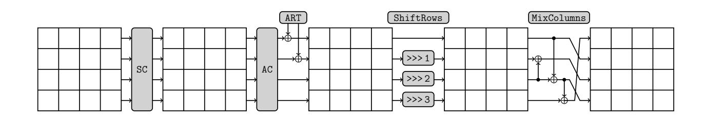

{0}------------------------------------------------

# SKINNY with Scalpel

## Comparing Tools for Differential Analysis

St´ephanie Delaune<sup>1</sup> , Patrick Derbez<sup>1</sup> , Paul Huynh<sup>2</sup> , Marine Minier<sup>2</sup> , Victor Mollimard<sup>1</sup> , and Charles Prud'homme<sup>3</sup>

<sup>1</sup> Univ Rennes, CNRS, IRISA, Rennes, France {stephanie.delaune,patrick.derbez,victor.mollimard}@irisa.fr <sup>2</sup> Universit´e de Lorraine, CNRS, Inria, LORIA, F-54000 Nancy, France {paul.hyunh,marine.minier}@loria.fr 3 IMT-Atlantique, TASC, LS2N, Nantes, France charles.prudhomme@imt-atlantique.fr

Abstract. Evaluating resistance of ciphers against differential cryptanalysis is essential to define the number of rounds of new designs and to mount attacks derived from differential cryptanalysis.

In this paper, we compare existing automatic tools to find the best differential characteristic on the SKINNY block cipher. As usually done in the literature, we split this search in two stages denoted by Step 1 and Step 2. In Step 1, each difference variable is abstracted with a Boolean variable and we search for the value that minimizes the trail weight, whereas Step 2 tries to instantiate each difference value while maximizing the overall differential characteristic probability. We model Step 1 using a MILP tool, a SAT tool, an ad-hoc method and a CP tool based on the Choco-solver library and provide performance results. Step 2 is modeled using the Choco-solver as it seems to outperform all previous methods on this stage.

Notably, for SKINNY-128 in the SK model and for 13 rounds, we retrieve the results of Abdelkhalek et al. within a few seconds (to compare with 16 days) and we provide, for the first time, the best differential relatedtweakey characteristic up to respectively 14 and 12 rounds for the TK1 and TK2 models.

Keywords: differential cryptanalysis · tools · SKINNY · performances comparison

## 1 Introduction

Differential cryptanalysis [BS91] evaluates the propagation of an input difference δX = X ⊕ X<sup>0</sup> between two plaintexts X and X<sup>0</sup> through the ciphering process. Indeed, differential attacks exploit the fact that the probability of observing a specific output difference given a specific input difference is not uniformly distributed. Today, differential cryptanalysis is public knowledge, and block ciphers such as AES have proven bounds against differential attacks. A classical extension of differential cryptanalysis is the so called related-key differential

{1}------------------------------------------------

cryptanalysis [Bih93] that allows an attacker to inject differences not only between the plaintexts X and X<sup>0</sup> but also between the keys K and K<sup>0</sup> (even if the secret key K stays unknown from the attacker). This attack has been recently extended to tweakable block ciphers [BJK+16]. Those particular ciphers allow in addition to the key, a public value called a tweak. Thus, related-tweakey differential attacks allow related-key differences but also related-tweak differences (i.e. differences in a pair of tweaks (T, T<sup>0</sup> )). In differential attacks, two notions are considered: first, differentials where only the input and the output differences are known; and differential characteristics where each difference after each round is completely specified. A classical approach to evaluate the resistance against differential attacks is to compute the probability of the best differential characteristic of the cipher.

Finding optimal (related-tweakey) differential characteristics is a highly combinatorial problem that hardly scales. To limit this explosion, a common solution consists in using a truncated representation [Knu95] for which cells are abstracted by single bits that indicate whether sequences contain differences or not. Typically, each cell (i.e. byte or nibble) is abstracted by a single bit (or, equivalently, a Boolean value). In this case, the goal is no longer to find the exact input and output differences, but to find the positions of these differences, i.e., the presence or absence of a difference for every cell. When a difference is present at the input of an S-box, we talk about an active S-box or an active byte/nibble. However, some truncated representations may not be valid (i.e., there do not exist actual byte values corresponding to these difference positions) because some constraints at the byte level are relaxed when reasoning on difference positions.

Hence, the optimal (related-tweakey) differential characteristic problem is usually solved in two steps [BN10,AST+17]. In the first one, every differential byte is abstracted by a Boolean variable that indicates whether there is a difference or not at this position, and we search for all truncated representations of low weight as the less differences passing through S-boxes there are, the more the probability is increased. Then, for each of these low weight truncated representations, the second step aims at deciding whether it is valid (i.e., whether it is possible to find actual cell values for every Boolean variable) and, if it is valid, at finding the actual cell values that maximize the probability of obtaining the output difference given the input difference.

Many techniques have been proposed to search for the Step 1 solutions using automatic tools such as Boolean satisfiability (SAT) [SNC09,MP13,SWW17], Mixed Integer Linear Programming (MILP) [SHW+14,ST17,BJK+16] and Satisfiability Modulo Theories (SMT) [KLT15]. Dedicated solutions have also been proposed [Mat94]. Regarding the search of the best instantiation of a truncated characteristic, most of the approaches were ad-hoc and dedicated to a precise cipher [Laf18,SWW18,FJP13,BN10,GLMS18,ENP19]. But recently, in [AST<sup>+</sup>17], authors introduce a MILP model of the non-linear part of a block cipher and present some results on SKINNY-n where the time required to find differential paths is about 15 days.

{2}------------------------------------------------

Our contribution. In this paper, we compare several methods that implement Step 1 resolution on the SKINNY-n tweakable block cipher. Four attack models could be considered on SKINNY-n according the size of the tweakey: the SK model focuses on single-key attack, the TK1 model considers related-tweakey attack when the tweakey has only one component, the TK2 model in the related-tweakey settings considers 2 components and the TK3 model, 3 components.

We first implement the Step 1 using 4 different tools: a MILP model, a SAT model, an Ad-Hoc method and a CP model for the 4 attack settings. We also propose a CP model for Step 2 taking as input the solutions outputted by Step 1. We analyze and compare all the proposed methods through intensive computations dedicated to the SKINNY case. As a result we show that MILP is not always the best choice for both problems. First, for Step 1, the Ad-Hoc method is able to overpass the MILP model. Second, the CP model proposed for Step 2 is incomparably much faster than the MILP model proposed in [AST+17]: reducing the execution time from several days to few minutes. Thus, we provide, for the first time, the best differential related-tweakey characteristics up to 14 rounds for the TK1 model and up to 12 rounds for the TK1 model of SKINNY-128. This is an important improvement compared to previous results. For instance, in [LGS17] Liu et al. could only find the best differential characteristics up to 7 and 9 rounds respectively. Finally we also show there is no differential characteristic with probability higher than 2<sup>−</sup><sup>128</sup> against 15 rounds in the TK1 model and provide the best TK2 related-tweakey differential characteristic we found against 16 rounds. All those results clearly show that SKINNY is much more resistant to differential cryptanalysis than one would expect while counting the number of active Sboxes.

All the codes for those models are available as supplementary material and will be made public. Those codes could be easily employed by other users and also adapted to other ciphers.

Organization of the paper. Section 2 gives a short description of SKINNY-n; Section 3 and Section 4 present the different tools and models that have been used for Step 1; Section 5 sums up our dedicated modeling for Step 2 based on CP; Section 6 gives the computational times we obtain for the different tools on a dedicated machine and analyzes the obtained results. Finally, Section 7 concludes this paper.

# 2 Cipher under study: SKINNY-n

In this section, we briefly review the tweakable block cipher SKINNY-n where n denotes the block size and can be equal to 64 or 128 bits. All the details that have been overlooked can be found in [BJK<sup>+</sup>16].

As its name indicates, it enciphers blocks of length 64 or 128 bits seen as a 4 × 4 matrix of cells (nibbles for n = 64 or bytes for n = 128). We denote xi,j,k the cell at row i and column j of the internal state at the beginning of round k (i.e. 0 ≤ i, j ≤ 3 and 0 ≤ k ≤ r + 1 where r is the number of rounds depending 

{3}------------------------------------------------

on the tweak length and on the key length). SKINNY-n follows the TWEAKEY framework from [JNP14]. SKINNY-n has three main tweakey size versions: the tweakey size can be equal to t=64 or 128 bits, t=128 or 256 bits and t=192 or 384 bits and we denote z=t/n the tweakey size to block size ratio. Then, the number of rounds is directly derived from the z value: between 32 rounds for the 64/64 version up to 56 for the 128/384 version.

The tweakey state is also viewed as a collection of z 4 × 4 square arrays of cells (nibbles for n = 64 or bytes for n = 128). We denote these arrays TK1 when z = 1, TK1 and TK2 when z = 2, and finally TK1, TK2 and TK3 when z = 3. We also denote by  $TKk_{i,j}$  the nibble or the byte at position [i, j] in TKk. Moreover, we define the associated adversarial model SK (resp. TK1, TK2 or TK3) where the attacker cannot (resp. can) introduce differences in the tweakey state.

One encryption round of SKINNY is composed of five operations applied in the following order: SubCells (SC), AddConstants (AC), AddRoundTweakey (ART), ShiftRows (SR) and MixColumns (MC) (see Fig. 1).



Fig. 1. the SKINNY round function with its five transformations [Jea16].

SubCells. A 4-bit (n = 64) or an 8-bit (n = 128) S-box is applied to each cell of the state. See [BJK<sup>+</sup>16] for the details of the S-boxes.

AddConstants. A 6-bit affine LFSR is used to generate round constants  $c_0$  and  $c_1$  that are XORed to the state at position [0,0] and [1,0] whereas the constant  $c_2 = 0x02$  is XORed to the position [2,0].

AddRoundTweakey. The first and second rows of all tweakey arrays are extracted and bitwise exclusive-ored to the cipher internal state, respecting the array positioning. More formally, we have:

```
 -x_{i,j} = x_{i,j} \oplus TK1_{i,j} \text{ when } z = 1, 
 -x_{i,j} = x_{i,j} \oplus TK1_{i,j} \oplus TK2_{i,j} \text{ when } z = 2, 
 -x_{i,j} = x_{i,j} \oplus TK1_{i,j} \oplus TK2_{i,j} \oplus TK3_{i,j} \text{ when } z = 3.
```

Then, the tweakey arrays are updated. First, a permutation  $P_T$  is applied on the cells positions of all tweakey arrays: if  $\ell = 4 * i + j$  where i is the row index and j is the column index, then the cell  $\ell$  is moved to position  $P_T(\ell)$  where  $P_T = [9, 15, 8, 13, 10, 14, 12, 11, 0, 1, 2, 3, 4, 5, 6, 7]$ . Second, every cell of the first and second rows of TK2 and TK3 are individually updated with an LFSR on 4 bits (when n = 64) or on 8 bits (when n = 128) with a period equal to 15.

{4}------------------------------------------------

ShiftRows. The rows of the cipher state cell array are rotated to the right. More precisely, the second (resp. third and fourth) cell row is rotated by 1 position (resp. 2 and 3 positions).

MixColumns. Each column of the cipher internal state array is multiplied by the 4 × 4 binary matrix M:

$$\begin{pmatrix}
1 & 0 & 1 & 1 \\
1 & 0 & 0 & 0 \\
0 & 1 & 1 & 0 \\
1 & 0 & 1 & 0
\end{pmatrix}$$

# 3 Overview of solving techniques

In this section, we briefly introduce the different techniques we used for performing the search of the best differential characteristic. Note that the Ad-Hoc method inspired from [FJP13] is standalone and will be only described in the next Section.

## 3.1 Mixed Integer Linear Programming

Many symmetric cryptanalysis problems on different ciphers have been tackled with MILP [SHW<sup>+</sup>14,BJK<sup>+</sup>16,ST17,MWGP12]. Note that MILP traditionally considers variables from discrete domains and from continuous domains. Here and as usually done in all the cryptanalytic contexts, we only consider integer variables, and we rather should talk about ILP for Integer Linear Programming as the term Mixed designates continuous variables. As MILP is the term classically used in the cryptographic community, we decided to stick to this terminology.

The important point is that MILP models can only contain linear inequalities. Therefore, it is necessary to transform non-linear operators into sets of linear inequalities. Moreover, as done in [BJK<sup>+</sup>16], we decided to use the Gurobi Mathematical Optimization solver [Opt18]. To be compatible with our code in Python 3 and to benefit from the the search options on the pool of solutions, a version greater than 9 is required.

### 3.2 Constraint Programming

Although less usual than MILP to tackle cryptanalytic problems, CP has already been used in e.g. [GMS16,ENP19]. We recall some basic principles of CP and we refer the reader to [RBW06] for more details.

CP is used to solve Constraint Satisfaction Problems (CSPs). A CSP is defined by a triple (X, D, C) such that X = {x1, x2, . . . , xn} is a finite set of variables, D is a function that maps every variable x<sup>i</sup> ∈ X to its domain D(xi) and C = {c1, c2, . . . , cm} is a set of constraints. D(xi) is a finite ordered set of integer values to which the variable x<sup>i</sup> can be assigned to, whereas c<sup>j</sup> defines a relation between some variables vars(c<sup>j</sup> ) ⊆ X. This relation restricts the set of values that may be assigned simultaneously to vars(c<sup>j</sup> ). Each constraint is

{5}------------------------------------------------

equipped with a filtering algorithm which removes from the domains of vars(c<sup>j</sup> ), the values that cannot satisfy c<sup>j</sup> .

In CP, constraints are classified in two categories. Extensional constraints, also called table constraints, explicitly define the allowed (or forbidden) tuples of the relation. Intentional constraints define the relation using mathematical operators. For instance, in a CSP with X = {x1, x2, x3} such that D(x1) = D(x2) = D(x3) = {0, 1}, a constraint ensuring that the sum of the variables in X is different from 1 can be either expressed in extension (1) or in intention (2):

```
1. Table(hx1, x2, x3i,h(0, 0, 0),(0, 1, 1),(1, 0, 1),(1, 1, 0),(1, 1, 1)i)
2. x1 + x2 + x3 6= 1
```

Actually, any intentional constraint can be encoded with an extensional one provided enough memory space, and conversely [DHL<sup>+</sup>16]. However, they may offer different performances.

The purpose of a CSP is to find a solution, i.e. an assignment of all variables to a value from their respective domains such that all the constraints are simultaneously satisfied. When looking for a solution, a two-phase mechanism is operated: the search space exploration and the constraint propagation. The exploration of the search space is processed using a depth-first search. At each step, a decision is taken, i.e. a non-assigned variable is selected and its domain is reduced to a singleton.This modification requires to check the satisfiability of all the constraints. This is achieved thanks to constraint propagation which applies each constraint filtering algorithm. Any application may trigger modifications in turn; the propagation ends when either no modification occurs and all constraints are satisfied or a failure is thrown, i.e., at least one constraint cannot be satisfied. In the former case, if all variables are assigned, a solution has been found. Otherwise a new decision is taken and the search is pursued. In the latter case, a backtrack to the first refutable decision is made and the search is resumed.

Turning a CSP into a Constrained Optimisation Problem (COP) is done by adding an objective function. Such a function is defined over variables of X, the purpose is then to find the solution that optimizes the objective function. Finding the optimal solution is done by repeatedly applying the two-phase mechanism above, and by adding a cut on the objective function that prevents from finding a same cost solution in the future.

## 3.3 SAT

Transforming cryptanalytic problems into a propositional Boolean logic formula is also a common technique [MP13,SWW17,KLT15,SNC09,SWW18]. To ease the modeling step, a high-level modeling language called MiniZinc [NSB<sup>+</sup>07] has been used: MiniZinc models are translated into a simple subset of MiniZinc called FlatZinc, using a compiler provided by MiniZinc, and supported by most existing CP solvers that have developed FlatZinc interfaces (currently, there are fifteen CP solvers which have FlatZinc interfaces). Evaluations select Picat-SAT as the best candidate SAT solver for Step 1. Picat-SAT translates CSPs into Boolean 

{6}------------------------------------------------

satisfiability formulae, and then uses the SAT solver Lingeling [Bie14] to solve it. Since Picat-SAT clearly outperforms all the other SAT solvers provided through the MiniZinc interface, we decided to discard the other ones when comparing with other techniques in Section 6.

## 4 Models for Step 1

As explained in the Introduction, in a first step called Step 1, we abstract each possible difference at byte level by a binary variable which symbolizes the presence/absence of a difference value at a given position of the cipher. The main concern regarding this step is the combinatorial explosion induced by the abstract XOR operation for which the sum of two non zero values can lead to the presence or the absence of a difference.

Note also that all the models described below are tuned to enumerate the solutions for a given number of active S-boxes and for a given number of rounds in the four possible attack models. We call this step Step1-enum. This phase comes after an initial step called Step1-opt where the minimal number of active S-boxes for a given number of rounds have been already found. Note also that all the models for SK discard symmetries up to column shift.

#### 4.1 MILP Models

A MILP model has already been proposed in [BJK<sup>+</sup>16], but for comparison purposes on time benchmarks, and to better fit our needs, we re-implement it. Below, we only describe our modifications and refer to Appendix D in [BJK+16] for the original model.

First, we add constraints in the SK model to obtain all solutions up to column shifts in order to remove symmetries. Moreover, as the original model only describes the way to find the minimal number of active S-boxes, we add a constraint in each model to set a lower bound on the number of active S-boxes and thus, be able to enumerate all the Step 1 solutions given a particular lower bound for the number of active S-boxes. Then, in the original MILP model all xor operations were modelized using dummy variables which is known to be inefficient. Thus we replaced the corresponding inequalities, using that x ⊕ y ⊕ z = 0 can be described with the three inequalities:

$${x + y \ge z}, {x + z \ge y}, {y + z \ge x}.$$

Finally, regarding the resolutions of the MILP models, the parallelization is left to the Gurobi solver.<sup>4</sup>

<sup>4</sup> see: https://www.gurobi.com/documentation/9.0/refman/threads.html for more details.

{7}------------------------------------------------

$$Obj_{Step1} = \sum_{r=1}^{n} \sum_{i=1}^{4} \sum_{j=1}^{4} \delta X_{r,i,j} \tag{1}$$
 subject to 
$$\begin{aligned} \text{Table}(\langle \delta X_{r,0,j}, \delta X_{r,1,(j+3)\%4}, \delta X_{r,2,(j+2)\%4}, \delta X_{r,3,(j+1)\%4}, \\ \delta X_{r+1,0,j}, \delta X_{r+1,1,j}, \delta X_{r+1,2,j}, \delta X_{r+1,3,j} \rangle \\ \langle \text{MxC} \rangle), \Delta X_{r,i,j} \neq 0, \forall r \in 1..n-1, \forall j \in 1..4 \end{aligned}$$
 where  $\forall r \in 1..n, \ \forall i \in 1..4, \ \forall j \in 1..4, \\ \delta X_{r,i,j} \in 0..1$  and  $\langle \text{MxC} \rangle$  encodes both MixColumns and Shiftrows constraints.

Model 1: Formulation of SK Step 1, without symmetry breaking constraints.

### 4.2 MiniZinc (SAT) Models

Due to the high-level modeling allowed by MiniZinc, the model is exactly the same as in the MILP model described in Subsection 4.1 except the way we model the XOR operation. Indeed, we simply use the method described in [GL16] where if a, b and c are Boolean variables, then the XOR operation verifies (considering addition over integers): i<sup>1</sup> + i<sup>2</sup> + o = 1. Thus, this model does not require the 6 dummy variables d.

#### 4.3 CP Models

A CP model for SK is depicted in Model 1. In comparison to other models (Subsection 4.1 and Subsection 4.2), the objective function (1) remains identical. Then, the model relies on Table constraints (2) with hMxCi as input parameter, the list of feasible combinations. In an early stage, hMxCi is computed based on a composition of MixColumns relation and ShifRows relation over two blocks and eight variables. Only the 34 combinations satisfying both MixColumns and ShifRows are retained among the 256 possible ones. Just like MILP and SAT, symmetry breaking constraints are added to models in order to prevent the calculation of solutions equivalent up to column shift.

TK1, TK2 and TK3 are modeled based on Model 1, i.e., without the symmetry breaking constraints. We follow the same lines as the MILP model proposed in Appendix D in [BJK+16] to model cancellation in TK2 and TK3.

In terms of solving configuration, a parallel portfolio is used to run resolutions simultaneously. We separate the different models according to the 2<sup>16</sup> possible values (0 or 1 for each possible cell) taken in a given middle round, which turns the original COP into many CSPs. In practice, each independent sub-problem is assigned to a new thread. Threads send each other messages containing the value of ObjStep1, the best number of S-boxes found so far. Such an approach limits the number of messages passed but offers valuable data to running threads, and future ones. Indeed, bound sharing prevents from exploring sub-regions of the search where there is no chance to find better solutions.

{8}------------------------------------------------

In addition, each model defines a search strategy based on a lexicographic ordering. Once the middle round being instantiated, then, it goes one round by one round to the forward and to the backward direction.

### 4.4 Ad-Hoc Models

To the best of our knowledge, the most efficient algorithm to search for truncated representations is the one described in [FJP13] by Fouque et al.. The main idea is that round i is independent of the paths of rounds 0, 1, . . . , i − 1 and at each step we only have to save, for each truncated state, the minimal number of active S-boxes to reach it. Hence, the complexity of this algorithm is exponential in the state size but linear in the number of rounds. The algorithm is specified in Algorithm 1. At the end of the algorithm we obtain an array C such that C[r][s] contains the minimal number of active sboxes required to reach state s after r rounds. Retrieving the truncated representations is then done quite easily using C, starting from the last state to the first.

Algorithm 1: Search for the best truncated representation (SK).

```
foreach state s do
   M [s] ←− list of states s
                             0
                              reachable from s through one round
end
foreach state s do
   C [0] [s] ←− number of active cells of s
end
for 1 ≤ r < R do
   foreach state s do C [r] [s] ←− ∞
   foreach state s do
       foreach state s
                        0
                         in M [s] do
           c ←− C [r − 1] [s] + number of active cells of s
                                                            0
           if c < C [r] [s
                         0
                          ] then C [r] [s
                                        0
                                         ] ←− c
       end
   end
end
return C
```

The complexity of the algorithm in the single key model is very low, and we experimentally counted around (R − 1) × 2 <sup>20</sup> simple operations for R rounds. A naive solution to search for truncated representations in the TK1, TK2 and TK3 models would be to apply the previous algorithm for each possible configuration of the key. While for TK1 this would only increase the overall complexity by a factor 2<sup>16</sup>, the search would not be practical for both the TK2 and TK3 models. Indeed, because of the possible cancellations occurring in the round keys, the

{9}------------------------------------------------

number of configurations is very high:

$$\left(\sum_{k=0}^{8} \binom{8}{k} \left(\sum_{i=0}^{tk-1} \binom{\lfloor (R-1)/2 \rfloor}{i}\right)^k \right) \left(\sum_{k=0}^{8} \binom{8}{k} \left(\sum_{i=0}^{tk-1} \binom{\lceil (R-1)/2 \rceil}{i}\right)^k \right).$$

For instance, for R = 30, there are more than 2<sup>64</sup> configurations in the TK2 model.

In the following we present the first practical algorithm which tackles down the problem without relying on a black box solver as MILP, SAT or CP solvers. The idea is quite similar to the one used in the single key model. Actually, to compute the minimal number of active S-boxes at round r + 1 we only need to know the minimal number of active S-boxes for each possible state at round r together with the number of cancellations for each key cell. Indeed, we do not need to know at which rounds the cancellations occurred but only how many times they did. A simplified version of this algorithm is described in Algorithm 2. In practice, we found it is better to proceed step by step. First we pick a key cell and guess whether it is active or not. Then we apply the algorithm partially and guess another key cell if and only if it seems possible to find a better representation.

Remarks. Note that while our ad-hoc tool gave the best running times, it may requires a lot of memory to store the array C. For instance, for 30 rounds in TK3 mode, our tool required up to 500GB of RAM to finish the search. It is also important to note that it did not take fully advantage of the 128 cores of our server, and most often used less than 40 cores.

## 5 Modeling Step 2 with CP

The aim of Step 2 is to try to instantiate the abstracted solutions provided by Step 1 while maximizing the probability of the differential characteristic. Thus, Step 2 takes as input a solution of Step 1 with the objective function of maximizing the probability of the differential characteristic. However, some solutions of Step 1 could not be instantiated in Step 2 as refining the abstraction level of Step 2 will induce non-consistent solutions. In the literature, this Step has been modeled using Ad-Hoc methods [BN10], MILP [AST<sup>+</sup>17], SAT [SWW18] or CP [GLMS20]. As MILP [AST<sup>+</sup>17] and SAT [SWW18] seem to hardly scale due to prohibitive computational times (linked with the size of the 8-bit S-boxes that must be represented in the form of linear inequalities or of clauses), we focus here on a dedicated CP method implemented using the Choco solver [PFL16].

Given a Boolean solution for Step 1, Step 2 aims at searching for the byteconsistent solution with the highest (related-tweakey) differential characteristic probability (or proving that there is no byte-consistent solution). In this section, Model 2 describes the CP model we used for SKINNY-128 (SK). Actually, the ones used to model the other variants, as well as SKINNY-64 are rather similar.

For each Boolean variable ∆Xr,i,j of Step 1, we define an integer variable δXr,i,j . The domain of this integer variable depends on the value of the Boolean

{10}------------------------------------------------

**Algorithm 2:** Search for the best truncated representation (**TK**).

```
foreach state s, round key k do
     M[k][s] \leftarrow list of states s' reachable from s and k through one round
end
foreach state s do
    C[0][s] \leftarrow \{(\text{number of active cells of } s, 0)\}
\mathbf{end}
for 1 \le r < R do
     for each state s do C|r||s| \leftarrow \emptyset
     foreach state s, round key k do
           foreach state s' in M[k][s] do
                foreach (cost, cancelled) \in C[r-1][s] do
                     if cancelled compatible with k then
                          \begin{array}{l} c \longleftarrow \text{cost} + \text{number of active cells of } s' \\ C\left[r\right]\left[s'\right] \longleftarrow C\left[r\right]\left[s'\right] \cup \left\{(c, \text{update}(cancelled, k))\right\} \end{array}
                     \mathbf{end}
                end
           end
     end
     foreach state s do keepOptimals(C[r][s])
end
return C
```

variable in the Step 1 solution: If  $\Delta X_{r,i,j} = 0$ , then the domain is  $D(\delta X_{r,i,j}) = \{0\}$  (i.e.,  $\delta X_{r,i,j}$  is also assigned to 0); otherwise, the domain is  $D(\delta X_{r,i,j}) = [1,255]$  (5).

For each byte that passes through an S-box, we define an integer variable  $\delta SB_{r,i,j}$  which corresponds to the difference after the S-box. Its domain is  $D(\delta SB_{r,i,j}) = \{0\}$  if  $\Delta X_{r,i,j}$  is assigned to 0 in the Step 1 solution; Otherwise, it is  $D(\delta SB_{r,i,j}) = [1,255]$  (5).

Finally, as we look for a byte-consistent solution with maximal probability, we also add an integer variable  $P_{r,i,j}$  for each byte in an S-Box: this variable corresponds to the absolute value of the base 2 logarithm of the probability of the transition through the S-Box. Actually, a factor 10 has been applied to avoid considering floats. Thus we define a Table constraint (6) composed of valid triplets of the form  $(\delta X_{r,i,j}, \delta SB_{r,i,j}, P_{r,i,j})$ . Note that these triplets only contain non-zero values and that  $P_{r,i,j}$  takes only 2 different values for the 4-bit S-box (SKINNY-64) and 7 different values for the 8-bit S-box (SKINNY-128). There are roughly  $2^{14}$  triplet elements in the Table constraint for the SKINNY-128 case. As the S-box layer is the only non-linear layer, the other operations could be directly implemented in a deterministic way at the cell level. The associated constraints thus follow the SKINNY-128 linear operations. When possible, we replace XOR constraints (encoded using Table constraints) by a simple equality constraint. This corresponds to Table constraints (7), (8), (9) and (10) in Model 2.

{11}------------------------------------------------

Minimize

$$Obj_{Step2} = \sum_{r=1}^{n} \sum_{i=1}^{4} \sum_{j=1}^{4} P_{r,i,j} \qquad (3)$$
 subject to 
$$20 \times n \leq \sum_{r=1}^{n} \sum_{i=1}^{4} \sum_{j=1}^{4} P_{r,i,j} \leq \min(70 \times n, O^*) \qquad (4)$$
 
$$\forall r \in 1..n, \forall i \in 1..4, \forall j \in 1..4$$
 
$$\begin{cases} \delta X_{r,i,j} = 0 \wedge \delta SB_{r,i,j} = 0 \wedge P_{r,i,j} = 0 & \text{if } \Delta X_{r,i,j} = 0 \\ \delta X_{r,i,j} \geq 1 \wedge \delta SB_{r,i,j} \geq 1 \wedge P_{r,i,j} \geq 20 & \text{otherwise} \end{cases}$$
 
$$\forall r \in 1..n, \forall i \in 1..4, \forall j \in 1..4$$
 
$$TABLE((\delta X_{r,i,j}, \delta SB_{r,i,j}, P_{r,i,j}), (SBox)) & \text{if } \Delta X_{r,i,j} \neq 0 \end{cases}$$
 
$$(5)$$
 
$$\forall r \in 1..n - 1, \forall j \in 1..4$$
 
$$\begin{cases} \delta SB_{r,2,(2+j)} \otimes 4 = \delta X_{r+1,2,j} \\ \delta SB_{r,1,(3+j)} \otimes 4 = \delta X_{r+1,2,j} \\ \delta SB_{r,1,(3+j)} \otimes 4 = \delta X_{r+1,2,j} \\ \delta SB_{r,1,(3+j)} \otimes 4 = \delta X_{r+1,2,j} \end{cases} & \text{if } \Delta SB_{r,2,(2+j)} \otimes 4 \\ TABLE((\delta SB_{r,1,(3+j)} \otimes 4, \delta SB_{r,2,(2+j)} \otimes 4, \delta X_{r+1,2,j}), (XOR)) & \text{otherwise} \end{cases}$$
 
$$(8)$$
 
$$\forall r \in 1..n - 1, \forall j \in 1..4$$
 
$$\begin{cases} \delta SB_{r,2,(2+j)} \otimes 4 = \delta X_{r+1,3,j} \\ \delta SB_{r,0,j} = \delta X_{r+1,3,j} \\ \delta SB_{r,0,j} = \delta X_{r+1,3,j} \\ \delta SB_{r,0,j} = \delta SB_{r,2,(2+j)} \otimes 4 \end{cases} & \text{if } \Delta SB_{r,0,j} = 0 \\ \delta SB_{r,0,j} = \delta SB_{r,2,(2+j)} \otimes 4 \end{cases} & \text{if } \Delta SB_{r,2,(2+j)} \otimes 4 \end{cases}$$
 
$$\begin{cases} \delta X_{r+1,0,j} = \delta X_{r+1,3,j} \\ \delta SB_{r,3,(1+j)} \otimes 4 = \delta X_{r+1,3,j} \\ \delta SB_{r,3,(1+j)} \otimes 4 = \delta X_{r+1,3,j} \end{cases} & \text{if } \Delta SB_{r,3,(1+j)} \otimes 4 \\ \delta SB_{r,3,(1+j)} \otimes 4 = \delta X_{r+1,3,j} \end{cases} & \text{if } \Delta SB_{r,3,(1+j)} \otimes 4 \end{cases}$$
 
$$\begin{cases} \delta SB_{r,3,(1+j)} \otimes 4 + \delta X_{r+1,3,j} \\ \delta SB_{r,3,(1+j)} \otimes 4 + \delta X_{r+1,0,j} \\ \delta SB_{r,3,(1+j)} \otimes 4 + \delta X_{r+1,0,j} \end{cases} & \text{if } \Delta X_{r+1,3,j} \\ \delta SB_{r,3,(1+j)} \otimes 4 + \delta X_{r+1,0,j} \end{cases} & \text{if } \Delta X_{r+1,3,j} \otimes 0 \end{cases}$$
 otherwise 
$$\end{cases}$$
 
$$(9)$$
 
$$\forall r \in 1..n - 1, \forall j \in 1..4$$
 
$$\begin{cases} \delta X_{r+1,0,j} = \delta X_{r+1,3,j} \\ \delta SB_{r,3,(1+j)} \otimes 4 + \delta X_{r+1,0,j} \\ \delta SB_{r,3,(1+j)} \otimes 4 + \delta X_{r+1,0,j} \otimes 4 \\ \delta X_{r+1,0,j} = 0 \end{cases} & \text{if } \Delta X_{r+1,0,j} \otimes 4$$
 otherwise 
$$\end{cases}$$
 
$$(9)$$
 
$$\forall r \in 1..n, \forall i \in 1..4, \forall j \in 1..4, \\ \delta X_{r,i,j} \in 0..255, \delta SB_{r,i,j} \in 0..255, P_{r,i,j} \in \{0,20,...,70\},$$
 and 
$$(XOR) \text{ encodes } \oplus \text{ relation and } (SBox) \text{ the } S\text{-box constraint.}$$

Model 2: Formulation of SK Step2.

{12}------------------------------------------------

The overall goal is finally to find a byte-consistent solution which maximizes differential characteristic probability. Thus, we define an integer variable  $Obj_{Step2}$  to minimize the sum of all  $P_{r,i,j}$  variables (3). This value mainly depends on the number of S-boxes outputted by Step1  $Obj_{Step1}$  and can be bounded to  $[20 \cdot Obj_{Step1}, 70 \cdot Obj_{Step1}]$  (4).

The differences for the models **TK1**, **TK2** and **TK3** are the modeling of the XORs induced by the lanes of the tweakey through XOR table constraints. Each XOR constraint depicted in Model 2 provides high quality filtering but requires 65536 tuples to be stored which results in prohibitive memory usage. This may limit the number of threads that can be used for the resolution, which was the case for **TK2**. To get around this issue, we encoded the XOR constraint in intention (by defining filtering rules), providing a more memory efficient algorithm, at the expense of filtering strength. This last choice was applied only for **TK2** (SKINNY-128 only). We also rely on TABLEconstraints to model the LFSRs applied on TK2 and TK3.

Concerning the search space strategy, for the **TK2** and the **TK3** attack settings, the Step 1 only outputs the truncated value of the sum of the TKi. Thus, the search space strategy first looks at the cancellation places of the sum of the TKi and then instantiates the TKi values according to those positions. For the **TK1** setting, we just apply the default Choco-solver strategy.

Concerning the parallelization, we affect one solution outputted by Step 1 by thread and we share between the threads the value of  $Obj_{Step2}$ .

#### 6 Results

Regarding Step 1, we run our different tools on the four attack scenarios (**SK**, **TK1**, **TK2**, and **TK3**). Then, Step 2 is performed on the two versions of **SKINNY** (**SKINNY**-64 and **SKINNY**-128) using our CP models written in Choco-solver.

We conduct all our experiments on our server composed of  $2 \times$  AMD EPYC 7742 64-Core and 1TB of RAM. All the reported times are real system times and then take advantage of tools that are properly designed for parallelism. We first detail here the time results obtained for the different tools modeling Step 1 and then move to the Step 2 time results.

#### 6.1 Step 1 strategies comparison

In this Subsection, we compare the time results obtained by all the Step 1 tools using the function Step1-enum. Step1-enum comes after a first process called Step1-opt that searches for a solution that optimises the value of the variable  $Obj_{Step1}$  whereas Step1-enum enumerates all solutions when the variable  $Obj_{Step1}$  is assigned to a given value, here the optimal one  $v^*$  where  $v^*$  corresponds to the minimal number of active S-boxes. This optimal value is of course the same for the different models as the abstractions made in the different models are the same.

{13}------------------------------------------------

Results for Step1-opt. Finding the minimal number of active S-boxes on a given number of rounds is most often the only result which is interesting for designers as it allows to derive a lower bound on the probability of the best differential trail. However, showing the minimal number of active S-boxes is n is similar to enumerate all characteristics with at most n − 1 active S-boxes and find no solution. Thus, the running times required by each tool to find the minimal number of active S-boxes are very close to the running times reported on Table 2. In SK, TK1 and TK2 our ad-hoc tool gives the best running times by far, while in TK3, our MILP model is also competitive. In particular, we are able to complete the security analysis made in [BJK+16,ABI+18] and claim that the minimal number of active S-boxes in TK1 for 28, 29 and 30 rounds are 105, 109 and 113 respectively (as shown in Table 1).

| # Rounds | 28  | 29  | 30  |
|----------|-----|-----|-----|
| TK1      | 105 | 109 | 113 |

Table 1. Lower bounds on the number of active S-boxes in SKINNY.

Results for Step1-enum. Table 2 reports the different real times we obtained to enumerate all the solutions for the optimal value ObjStep<sup>1</sup> = v ∗ (i. e. with v ∗ active S-boxes). Those computations are done on our server for the 4 different Step 1 tools (MILP, MiniZinc/SAT, Ad-Hoc, Choco-solver), for the different attack scenario (SK, TK1, TK2 and TK3) on SKINNY when varying the number of rounds between 3 and 20. The first column specifies the number of solutions we found for the ObjStep<sup>1</sup> value. Those solutions correspond to solutions given without the symmetries, thus are computed up to the columns shifts (for SK). As one can see, these numbers are really low and hide a different reality when ObjStep<sup>1</sup> increases. Indeed, the optimal solution of Step 2 in terms of differential characteristic probability, could be obtained for a value v of ObjStep<sup>1</sup> which is not optimal (v > v<sup>∗</sup> ). For example, imagine that, when processing Step 2, one obtains a differential characteristic with the best probability equal to 2<sup>−</sup>3·<sup>6</sup> = 2<sup>−</sup><sup>18</sup> with ObjStep<sup>1</sup> = 6 and whereas the optimal differential probability of the S-box is 2<sup>−</sup><sup>2</sup> . It means that one has to test all solutions outputted by Step 1 until ObjStep<sup>1</sup> = 18/2 = 9 to be sure that none has a better differential characteristic probability. This is exactly what happened for the case of SKINNY-128 in the TK1 model for 15 rounds as we will detail in the next Section. We only want to stress here that computing the optimal bounds is often not enough and we need to go further. However, increasing the value of ObjStep<sup>1</sup> induces to increase the possible number of Step 1 solutions as illustrated in the third column of Table 4. As one can see, this number of solutions tends to grow exponentially when we increase v. For example, for SKINNY-128 with 14 rounds in the TK1 model, for the optimal value v <sup>∗</sup> = 45, Step 1 outputs only 3 solutions; whereas

{14}------------------------------------------------

we have 897 solutions for v = v <sup>∗</sup> + 5 = 50; 137 019 solutions for v = v <sup>∗</sup> + 10 = 55 and finally 7 241 601 solutions for v = 59. So, the time required for the Step 2 computations on 1 solution outputted by the Step 1 becomes the bottleneck of the overall process.

Analysis of the results and of the tools. Table 2 reports the time required to enumerate all the solutions with v <sup>∗</sup> active S-boxes where v ∗ is the optimal value of ObjStep<sup>1</sup> found by Step1−opt. This value and the corresponding number of solutions is reported in the second column of Table 2.

SAT is clearly disadvantaged by the choice we made to use a high level modeling language MiniZinc. Indeed, SAT could not perform clause learning as the constraint SolveAll is not implemented from MiniZinc to SAT. Thus, once a solution for Step 1 has been found, the program has to be rerun by adding a constraint that discards this valid Step 1 solution. This is why MiniZinc performs less efficiently than one could expect. The previous fact could be directly seen on Table 2 as the time required to solve instances with many solutions is much bigger than the one required to solve instances with only few Step 1 solutions.

Choco-solver does not seem to be a good candidate either as for all instances greater than 16 rounds it requires more than 24 hours to solve the problem. This is mainly linked with the nature of the variables themselves. Choco-solver (and more generally CP) is efficient when domains are subset of integers. Here, Choco-solver can not efficiently propagate lower bounds and upper bounds on Boolean variables as MILP or SAT could do.

Actually, the Step 1 model could be completely linearized and of course, the branch-and-cut method used by MILP eliminates uninteresting branches quite quickly. SAT behaves better than CP because the problem is purely Boolean and CP/Choco-solver does not benefit from the conflict-driven clause learning (CDCL). Thus, CP, that performs very well on integer domains, is less well suited when regarding Boolean or linear problems.

Moreover, regarding the way CP cuts the problem, this division produces mainly trivial problems, the few remaining ones have a very large search space (it is therefore them that should be cut). But once more, MILP and SAT perform better.

Contrary to the two previous tools, MILP and the Ad-Hoc method seem to perform well and, as shown in Table 2, could solve all the problems on all the instances in reasonable times. As shown in the previous paragraph, the Ad-Hoc method is able to outperform MILP. For MILP, and as previously said, this is clearly linked with the nature of the problem to solve: Step 1 only models Boolean variables for which values propagate very well in the MILP model. The Ad-Hoc method is finally a dedicated one and manages to overpass even MILP.

Thus, in conclusion, we think that if one does not have the time to think of a solution, MILP is a good candidate to quickly have direct Step 1 bounds. If one has time, the Ad-Hoc method clearly outperform previous results. We also think that SAT could perform well even if it is not proven here. The idea behind

{15}------------------------------------------------

|                |                         | 1             | 1             |               |               | 1              |               |               |         |               |                |            |                 |                 |                 | Ι             |       |                  |                  |               | ›<br>کــر                                        |
|----------------|-------------------------|---------------|---------------|---------------|---------------|----------------|---------------|---------------|---------|---------------|----------------|------------|-----------------|-----------------|-----------------|---------------|-------|------------------|------------------|---------------|--------------------------------------------------|
|                |                         | TK3           | ı             | ı             | ı             | ı              | 1s            | 1s            | 1s      | 2s            | 34s            | 288s       | $56 \mathrm{m}$ | > 24h           |                 |               |       |                  |                  |               | f 1                                              |
|                | 00                      | TK2           |               |               | $\frac{1}{s}$ | 1s             | 1s            | 3s            | 7s      | 55s           | 898            | 43m        | > 24h           |                 |                 |               |       |                  |                  |               | 4:000                                            |
|                | Choco                   | TK1 '         | $\frac{1}{s}$ | $\frac{1}{s}$ | $\frac{1}{s}$ | 38             | 7s            | 88            | 9s      | 809           | 188m           |            | /\              |                 |                 |               |       |                  |                  |               | 1 - +                                            |
|                |                         | $\mathbf{SK}$ | 7s            | 7s            | 7s            | 7s             | 7s            | 7s            | 88      | 9s            |                |            | 249s            | $10 \mathrm{m}$ | 85m             | > 24h         |       |                  |                  |               | 400000                                           |
|                |                         | TK3           | s69           | s9 <i>2</i>   | 103s          | 25s            | 22s           | 23s           | 26s     | 27s           | 32s            | 25s        | 27s             | 28s             | 34s             |               | 48s   | 73s              | 283s             | 326s          |                                                  |
|                | Ad-Hoc                  | TK2           | s69           | 25s           | 22s           | 22s            | 22s           | 31s           | 24s     | 24s           | 25s            | 27s        | 30s             | 39s             | 46s             | 57s           | 59s   | s9 <i>2</i>      | 110s             | 193s          | ,.                                               |
|                | Ad-                     | TK1 TK2       | 21s           | 22s           | 21s           | 22s            | 21s           | 22s           | 22s     | 22s           | 23s            | 24s        | 24s             | 24s             | 25s             | 25s           | 27s   | 27s              | 28s              | 28s           | CITATATA                                         |
|                |                         | $\mathbf{SK}$ | $\frac{1}{s}$ | 1s            | $\frac{1}{s}$ | $\frac{1}{s}$  | 1s            | 1s            | 1s      | $\frac{1}{s}$ | $\frac{1s}{1}$ | 1s         | 1s              | 1s              | $\frac{1}{s}$   | $\frac{1}{s}$ | 1s    | 1s               | $\frac{1}{s}$    | $\frac{1}{s}$ | 7/10/                                            |
|                |                         | TK3           | ı             | 1             |               | 1              | 1s            | 2s            | $^{1s}$ | 10s           | 24s            | 35s        | 104s            | 148s            | 157m            | 251m          | > 24h |                  |                  |               |                                                  |
| u              | c/SAT                   | TK2           | ı             | 1             | 1s            | 1s             | 1s            | 4s            | 7s      | 15s           | 22s            | 113s       | 14m             | $72 \mathrm{m}$ | > 24h           |               | , ,   |                  |                  |               |                                                  |
| Step 1- $enum$ | MiniZinc/SAT            | TK1           | 1s            | 1s            | 1s            | 1s             | 88            | 7s            | 11s     | 46s           | 29m            | > 24h      |                 |                 | /\              |               |       |                  |                  |               | ~ C45                                            |
| Step           | ~                       | $\mathbf{SK}$ | 1s            | 4s            | 4s            | s9             | 17s           | 140s          | 57s     | 97s           |                | 468s       | 14m             | 491s            | $27 \mathrm{m}$ | 128m          | 106m  | 403m             | 436m             | 174m          | 1-1-0-0                                          |
|                |                         | TK3           | ı             | 1             | ı             | ı              | $\frac{1}{8}$ | $\frac{1}{8}$ | $^{2s}$ | 2s            | 38             | 38         | s9              | 88              | 21s             |               | 53s   | 64s              | 218s             | 340s          | 12 for                                           |
|                | Ъ                       | TK2           | ı             | ı             | $\frac{1}{s}$ | $\frac{1s}{s}$ | $\frac{1}{s}$ | $\frac{1}{s}$ | 2s      | 3s            | 4s             | <b>2</b> s | 17s             | 27s             | 758             | 148s          | 213s  | 535s             | $29 \mathrm{m}$  |               | 1 400                                            |
|                | MILP                    | TK1 TK2       | $\frac{1}{s}$ | $\frac{1}{s}$ | $\frac{1}{s}$ | 1s             | $\frac{1}{s}$ | $\frac{1}{8}$ | 2s      | $^{5}$        | 118            | 35s        | 53s             | 93s             | 245s            | 423s          | 22m   | 31m              | 56m              | 87m           | CAD                                              |
|                |                         | $\mathbf{SK}$ | $\frac{1}{s}$ | 1s            | $\frac{1}{s}$ | 1s             | 1s            | 1s            | 2s      | <b>2</b> s    | 88             | 13s        | 9s              | 23s             | 869             | 12m           | 46m   | $178 \mathrm{m}$ | $529 \mathrm{m}$ | 16h           | $\pi_{\tilde{G}_{12}\tilde{G}_{12}}$             |
|                |                         | TK3           | 0 (1)         | 0 (1)         | 0 (1)         | 0 (1)          | 1 (12)        | 2(11)         | 3 (3)   |               | 10 (3)         | 13(2)      | 16(2)           | 19(1)           | (4)             | (1)           | 31(2) | 35(1)            | 43(14)           | 45 (2)        | of the different Cton 1 toole for colours Cton 1 |
|                | sols                    | TK2           | (1)           | (1)           | (12)          | (10)           | (2)           | (2)           | (1)     | (5)           | (1)            | (1)        | (5)             | (1)             | $(1)  \vdots$   | (5)           | (1)   | (1)              | (1)              | (5)           | 1                                                |
|                | (Nb)                    | H             | 0             | 0             | 1             | 2              | က             | 9             | 6       | 12            | 16             | 21         | 25              | 31              | 35              | 40            | 43    | 47               | 52               | 57            | 4:50                                             |
|                | $Obj_{Step1}$ (Nb sols) | TK1           | 1 (12)        | 2(9)          | 3 (2)         | 6 (2)          | 10(2)         | 13(1)         | 16(1)   | 23(1)         |                | 38 (7)     | 41(2)           | 45(3)           |                 | 54 (1)        | 59(5) | 62(1)            | 66(1)            |               | Comment of the times                             |
|                | Õ                       | $\mathbf{SK}$ | 5 (4)         | (3)           | (5)           | (1)            | (4)           | (17)          | (3)     | (5)           | (2)            | (5)        | (9)             | (5)             | (5)             | (8)           | (4)   | (4)              | (4)              | (5)           |                                                  |
|                |                         | S             | 5             | $\infty$      | 12            | 16             | 26            | 36            | 41      | 46            | 51             | 55         | 58              | 61              | 99              | 75            | 82    | 88               | 92               | 96            |                                                  |
|                | #Rounds                 |               | 3             | 4             | ಬ             | 9              | 7             | $\infty$      | 6       | 10            | 11             | 12         | 13              | 14              | 15              | 16            | 17    | 18               | 19               | 20            | 6 719                                            |

**Table 2.** Comparison of the times of the different Step 1 tools for solving Step 1 - enum (SKINNY), i.e. to enumerate all solutions for the optimal  $Onj_{Step 1}$  bound given in the first column in each scenario: **SK**, **TK1**, **TK2** and **TK3**. We report the **real** time on our server.

{16}------------------------------------------------

is to directly use a SAT solver without any other interfaces to be closer to the clauses.

### 6.2 Step 2 performance results

Up to our knowledge, we only found [AST+17] that gives time results concerning finding the best SK differential characteristic probability on SKINNY-128 using a MILP tool based on Gurobi. More precisely, the authors say: "In our experiments, we used Gurobi Optimizer with Xeon Processor E5-2699 (18 cores) in 128 GB RAM." and, for 13 rounds, "in our environment, the test of 6 classes [Step 1 solutions with 58 active S-boxes without symmetries] finished in 16 days. Finally, it is proven that the tight bound on the probability of differential characteristic for 13 rounds is 2−123" in the SK model.

Concerning the use of SAT, [SWW18] implements a SAT model for differential cryptanalysis based on Cryptominisat5 [SNC09] for Midori64 and LED64. This model implies a sufficiently small number of clauses to model the non-zero values of the DDT and to be applicable. However, no result concerning 8-bit S-boxes are given. As SAT uses Boolean formulas, it seems that the same problem than for MILP appears for modeling S-box: a huge number of Boolean formulas will be necessary to correctly model this step even if dedicated tools as Logic Friday or the Expresso algorithm [AST<sup>+</sup>17] are used. Thus, we discard the use of a SAT model.

Results for SKINNY-64. We sum up in Table 3 all the results we obtain for SKINNY-64 in the four different attack models (SK,TK1,TK2 and TK3). The overall time, in this case, is not a bottleneck. We only give results concerning number of rounds that are at the limit (just under and just upper) when regarding the number of active S-boxes which is equal to 32 in the case of SKINNY-64 as the state size is 64 bits and as the best differential probability of the S-box is equal to 2<sup>−</sup><sup>2</sup> . Thus, the best overall differential characteristic probability must be under 2<sup>−</sup><sup>64</sup> .

Note that sometimes, we need to browse several ObjStep<sup>1</sup> bounds to find the optimal differential characteristic probability when the number of rounds is fixed. Indeed, we need to proactively adapt the probability bound we found. For example, in the case of TK2 SKINNY-64 with 13 rounds, the optimal ObjStep<sup>1</sup> is equal to 25 and when providing the Step 2 process with this ObjStep<sup>1</sup> bound, we find a best differential characteristic probability equal to 2<sup>−</sup><sup>55</sup>. Thus, we need to run again Step1-enum with ObjStep<sup>1</sup> = 26 and ObjStep<sup>1</sup> = 27 to be sure that the previous probability is really the best one. Then, before running again Step 2 on those new results we adapt the best probability to the new bound equal to 2<sup>−</sup><sup>55</sup> instead of the old bound equal to 2<sup>−</sup><sup>64</sup> .

We also provide in Appendix A the details of the best found differential characteristics.

{17}------------------------------------------------

|     |    |         | Nb Rounds ObjStep1 Nb sol. Step 1 Step 2 time Best P r |    |            |
|-----|----|---------|--------------------------------------------------------|----|------------|
| SK  | 7  | 26      | 2                                                      | 1s | −52<br>2   |
| SK  | 8  | 36      | 17                                                     | 1s | −64<br>< 2 |
| TK1 | 10 | 23      | 1                                                      | 1s | −46<br>2   |
| TK1 | 11 | 32      | 2                                                      | 1s | = 2−64     |
| TK2 | 13 | 25 → 27 | 10                                                     | 1s | −55<br>2   |
| TK2 | 14 | 31      | 1                                                      | 1s | −64<br>< 2 |
| TK3 | 15 | 24 → 26 | 46                                                     | 2s | −54<br>2   |
| TK3 | 16 | 27 → 31 | 87                                                     | 4s | = 2−64     |
| TK3 | 17 | 31      | 2                                                      | 1s | −64<br>< 2 |

Table 3. Overall results concerning SKINNY-64 in the four attack models. Step 2 time corresponds to the Step 2 time taken over all solutions of Step1-enum when Objstep<sup>1</sup> takes the values precise in the first column. Best P r corresponds to the best found probability of a differential characteristic.

Results for SKINNY-128. In the same way, we provide in Table 4 the best differential characteristic probability with the total time required for this search for the 4 different attack models. As one can see, we also verify all the possible values for ObjStep<sup>1</sup> for a given number of rounds, depending on the probability value previously found. Thus, this time, the number of solutions outputted by Step 1 could be huge when we move away from the optimal Step 1 value v ∗ . However, as the time spent to solve one solution is reasonable, our model scales reasonably well: the worst case requires 25 days of real time on our server on 8 threads and 31 GB of RAM<sup>5</sup> . Our TK2 model is based on XOR constraints encoded in intention (and not using tables) and these experiences have been launched using the 128 threads of our server. Table 4 shows the results obtained with the best configurations for SK, TK and TK2.

Concerning TK2, for 18 rounds, we were not able to perform the computations due to the huge number of Step 1 solutions. For the same reasons, the computations for 15, 16 and 17 rounds have not been performed. However, we provide in Appendix B the best TK2 differential characteristic we found for 16 rounds. Note that we do not know if this differential characteristic is optimal in terms of probability as we were not able to test all the solutions Step 1.

Lessons learnt. The overall gap is not to find the optimal value of ObjStep<sup>1</sup> = v ∗ for a given number of rounds and to enumerate the corresponding overall solutions if the Step 1 model is sufficiently tight. The real gap is if the value obtained for ObjStep<sup>2</sup> (here equal to 2 × v <sup>∗</sup> as the best differential probability for the S-box is equal to 2<sup>−</sup><sup>2</sup> ) is far from the optimal bound then we have to increase ObjStep<sup>1</sup> up to the bound bObjStep2/2c. Further we are from v ∗ in the Step 1 resolution, more numerous are the Step 1 solutions (in fact this number grows exponentially

<sup>5</sup> It seems that the use of the 128 threads was prohibited by the memory usage of XOR tables (i.e. XOR in extension).

{18}------------------------------------------------

|     |    |         | Nb Rounds Objstep1 Nb sol. Step 1 Step 2 time |            | Best P r      |
|-----|----|---------|-----------------------------------------------|------------|---------------|
| SK  | 9  | 41 → 43 | 52                                            | 16s        | −86<br>2      |
| SK  | 10 | 46 → 48 | 48                                            | 11s        | −96<br>2      |
| SK  | 11 | 51 → 52 | 15                                            | 4s         | −104<br>2     |
| SK  | 12 | 55 → 56 | 11                                            | 6s         | −112<br>2     |
| SK  | 13 | 58 → 61 | 18                                            | 2m27s      | −123<br>2     |
| SK  | 14 | 61 → 63 | 6                                             | 21s        | −128<br>≤ 2   |
| TK1 | 8  | 13 → 16 | 14                                            | 4s         | −33<br>2      |
| TK1 | 9  | 16 → 20 | 6                                             | 3s         | −41<br>2      |
| TK1 | 10 | 23 → 27 | 6                                             | 4s         | −55<br>2      |
| TK1 | 11 | 32 → 36 | 531                                           | 37s        | −74<br>2      |
| TK1 | 12 | 38 → 46 | 186 482                                       | 213m       | −93<br>2      |
| TK1 | 13 | 41 → 53 | 2 385 482                                     | 2 days     | −106.2<br>2   |
| TK1 | 14 | 45 → 59 | 11 518 612                                    | 20 days    | −120<br>2     |
| TK1 | 15 | 49 → 63 | 7 542 053                                     | 25 days    | −128<br>≤ 2   |
| TK2 | 9  | 9 → 10  | 7                                             | 3s         | −20<br>2      |
| TK2 | 10 | 12 → 17 | 132                                           | 11s        | −34.4<br>2    |
| TK2 | 11 | 16 → 25 | 4203                                          | 6m         | −51.4<br>2    |
| TK2 | 12 | 21 → 35 | 1 922 762                                     | 512m       | −70.4<br>2    |
| TK2 | 13 | 25 → 44 | -                                             | not solved | −89.7<br>≥ 2  |
| TK2 | 14 | 31 → 54 | -                                             | not solved | −108.4<br>≥ 2 |
| TK2 | 15 | 35 → 56 | -                                             | not solved | −113.2<br>≥ 2 |
| TK2 | 16 | 40 → 63 | -                                             | not solved | −127.6<br>≥ 2 |
| TK2 | 17 | 43 → 63 | -                                             | not solved | -             |
| TK2 | 18 | 47 → 63 | 62 681 709                                    | not solved | -             |
| TK2 | 19 | 52 → 63 | 772 163                                       | 280m       | −128<br>≤ 2   |

Table 4. Overall results concerning SKINNY-128 in the four attack models. Step 2 time corresponds to the Step 2 time taken over all solutions of Step1-enum when Objstep<sup>1</sup> takes the values precise in the first column. Best P r corresponds to the best found probability of a differential characteristic.

as could be seen in Table 4). Thus, the time for the Step 2 resolution becomes the bottleneck.

We have seen that CP is outperformed by MILP, SAT and Ad-Hoc methods when trying to model and solve the Step 1 problem. This is mainly linked with the nature of the problem where only Boolean variables are considered and where dedicated tools such as MILP or SAT perform very well in this case. Thus, no-one could think that it could be helpful for modeling Step 2. However, one of the main advantage of CP is the existing implementation of table constraints that suite very well the problem of modeling S-boxes and their DDT. Note that, in this case, especially when modeling 8-bit S-boxes, MILP and SAT imply a big number of equations that not scale very well. Thus, CP could be a useful tool in this case.

One of CP's strengths, having table constraints, can also become a weakness as their number and size increases. Our solution to code the XOR in intention is 

{19}------------------------------------------------

only possible when weaker filtering is compensated by a more constrained model containing the search space (like in TK2).

# 7 Conclusion

In this paper, we have compared several tools searching for (related-tweakey) differential characteristics on the block cipher SKINNY. As usually done, we have divided the search procedure into two steps: Step 1 which abstracts the difference values into Boolean variables and finds the truncated characteristics with the smallest number of active S-boxes; and Step 2 which inputs the results of Step 1 to output the best possible probability instantiating the abstract solutions outputted by Step 1. Of course, each solution of Step 1 could not always be instantiated in Step 2.

This study shows that for Step 1, our ad-hoc tool which heavily uses the structure of the problem, has consistently the best running times. However, SAT is also quite good in SK and MILP runs well in both TK2 and TK3. Furthermore, both the SAT and MILP models required much less work than our ad-hoc tool. Regarding Step 2, our Choco-solver model is much faster than any other approaches we tried. It allowed us to find, for the first time, the best (related-tweakey) differential characteristics in the TK1 model up to 14 rounds for SKINNY-128 and to show there is no differential trail on 15 rounds with a probability better than 2<sup>−</sup><sup>128</sup>. Regarding the TK2 model, we were able to find the best differential trails up to 12 rounds. Note that in [LGS17] Liu et al. were only able to reach 7 and 9 rounds in the TK1 and TK2 model respectively. Our approach is thus an important improvement.

## References

- [ABI<sup>+</sup>18] Gianira N. Alfarano, Christof Beierle, Takanori Isobe, Stefan K¨olbl, and Gregor Leander. Shiftrows alternatives for aes-like ciphers and optimal cell permutations for midori and skinny. IACR Trans. Symmetric Cryptol., 2018(2):20–47, 2018.
- [AST<sup>+</sup>17] Ahmed Abdelkhalek, Yu Sasaki, Yosuke Todo, Mohamed Tolba, and Amr M. Youssef. MILP modeling for (large) s-boxes to optimize probability of differential characteristics. IACR Trans. Symmetric Cryptol., 2017(4):99– 129, 2017.
- [Bie14] Armin Biere. Yet another local search solver and lingeling and friends entering the sat competition 2014. Sat competition, 2014(2):65, 2014.
- [Bih93] Eli Biham. New types of cryptanalytic attacks using related keys (extended abstract). In Advances in Cryptology - EUROCRYPT '93, volume 765 of LNCS, pages 398–409. Springer, 1993.
- [BJK<sup>+</sup>16] Christof Beierle, J´er´emy Jean, Stefan K¨olbl, Gregor Leander, Amir Moradi, Thomas Peyrin, Yu Sasaki, Pascal Sasdrich, and Siang Meng Sim. The SKINNY family of block ciphers and its low-latency variant MANTIS. In Advances in Cryptology - CRYPTO 2016 Part II, volume 9815 of LNCS, pages 123–153. Springer, 2016.

{20}------------------------------------------------

- [BN10] Alex Biryukov and Ivica Nikolic. Automatic search for related-key differential characteristics in byte-oriented block ciphers: Application to aes, camellia, khazad and others. In Advances in Cryptology - EUROCRYPT 2010, volume 6110 of LNCS, pages 322–344. Springer, 2010.
- [BS91] Eli Biham and Adi Shamir. Differential cryptanalysis of feal and n-hash. In Advances in Cryptology - EUROCRYPT '91, volume 547 of LNCS, pages 1–16. Springer, 1991.
- [DHL<sup>+</sup>16] Jordan Demeulenaere, Renaud Hartert, Christophe Lecoutre, Guillaume Perez, Laurent Perron, Jean-Charles R´egin, and Pierre Schaus. Compacttable: Efficiently filtering table constraints with reversible sparse bit-sets. In Principles and Practice of Constraint Programming - CP 2016, volume 9892 of LNCS, pages 207–223. Springer, 2016.
- [ENP19] Maria Eichlseder, Marcel Nageler, and Robert Primas. Analyzing the linear keystream biases in AEGIS. IACR Trans. Symmetric Cryptol., 2019(4):348– 368, 2019.
- [FJP13] Pierre-Alain Fouque, J´er´emy Jean, and Thomas Peyrin. Structural evaluation of AES and chosen-key distinguisher of 9-round AES-128. In Advances in Cryptology - CRYPTO 2013 - Part I, volume 8042 of LNCS, pages 183–203. Springer, 2013.
- [GL16] David G´erault and Pascal Lafourcade. Related-key cryptanalysis of Midori. In Progress in Cryptology - INDOCRYPT 2016, volume 10095 of LNCS, pages 287–304, 2016.
- [GLMS18] David G´erault, Pascal Lafourcade, Marine Minier, and Christine Solnon. Revisiting AES related-key differential attacks with constraint programming. Inf. Process. Lett., 139:24–29, 2018.
- [GLMS20] David Gerault, Pascal Lafourcade, Marine Minier, and Christine Solnon. Computing AES related-key differential characteristics with constraint programming. Artif. Intell., 278, 2020.
- [GMS16] David G´erault, Marine Minier, and Christine Solnon. Constraint programming models for chosen key differential cryptanalysis. In Principles and Practice of Constraint Programming - CP 2016, volume 9892 of LNCS, pages 584–601. Springer, 2016.
- [Jea16] J´er´emy Jean. TikZ for Cryptographers. https://www.iacr.org/authors/tikz/, 2016.
- [JNP14] J´er´emy Jean, Ivica Nikolic, and Thomas Peyrin. Tweaks and keys for block ciphers: The TWEAKEY framework. In Advances in Cryptology - ASIACRYPT 2014 - Part II, volume 8874 of LNCS, pages 274–288. Springer, 2014.
- [KLT15] Stefan K¨olbl, Gregor Leander, and Tyge Tiessen. Observations on the SIMON block cipher family. In Advances in Cryptology - CRYPTO 2015 - Part I, volume 9215 of LNCS, pages 161–185. Springer, 2015.
- [Knu95] Lars R. Knudsen. Truncated and higher order differentials. In Fast Software Encryption: Second International Workshop - FSE., volume 1008 of LNCS, pages 196–211. Springer, 1995.
- [Laf18] Fr´ed´eric Lafitte. Cryptosat: a tool for sat-based cryptanalysis. IET Information Security, 12(6):463–474, 2018.
- [LGS17] Guozhen Liu, Mohona Ghosh, and Ling Song. Security analysis of SKINNY under related-tweakey settings (long paper). IACR Trans. Symmetric Cryptol., 2017(3):37–72, 2017.

{21}------------------------------------------------

- [Mat94] Mitsuru Matsui. On correlation between the order of s-boxes and the strength of DES. In Advances in Cryptology - EUROCRYPT '94, volume 950 of LNCS, pages 366–375. Springer, 1994.
- [MP13] Nicky Mouha and Bart Preneel. A proof that the ARX cipher salsa20 is secure against differential cryptanalysis. IACR Cryptology ePrint Archive, 2013:328, 2013.
- [MWGP12] Nicky Mouha, Qingju Wang, Dawu Gu, and Bart Preneel. Differential and linear cryptanalysis using mixed-integer linear programming. In Information Security and Cryptology - 7th International Conference, Inscrypt, volume 7537 of LNCS, pages 57–76. Springer, 2012.
- [NSB<sup>+</sup>07] Nicholas Nethercote, Peter J. Stuckey, Ralph Becket, Sebastian Brand, Gregory J. Duck, and Guido Tack. Minizinc: Towards a standard CP modelling language. In Principles and Practice of Constraint Programming - CP 2007, volume 4741 of LNCS, pages 529–543. Springer, 2007.
- [Opt18] Gurobi Optimization. Gurobi optimizer reference manual, 2018.
- [PFL16] Charles Prud'homme, Jean-Guillaume Fages, and Xavier Lorca. Choco Documentation. TASC, INRIA Rennes, LINA CNRS UMR 6241, COSLING S.A.S., 2016.
- [RBW06] Francesca Rossi, Peter van Beek, and Toby Walsh. Handbook of Constraint Programming (Foundations of Artificial Intelligence). Elsevier Science Inc., New York, NY, USA, 2006.
- [SHW<sup>+</sup>14] Siwei Sun, Lei Hu, Peng Wang, Kexin Qiao, Xiaoshuang Ma, and Ling Song. Automatic security evaluation and (related-key) differential characteristic search: Application to simon, present, lblock, DES(L) and other bit-oriented block ciphers. In Advances in Cryptology - ASIACRYPT 2014 Part I, volume 8873 of LNCS, pages 158–178. Springer, 2014.
- [SNC09] Mate Soos, Karsten Nohl, and Claude Castelluccia. Extending SAT solvers to cryptographic problems. In Theory and Applications of Satisfiability Testing - SAT 2009, 12th International Conference, SAT 2009, volume 5584 of LNCS, pages 244–257. Springer, 2009.
- [ST17] Yu Sasaki and Yosuke Todo. New impossible differential search tool from design and cryptanalysis aspects - revealing structural properties of several ciphers. In Advances in Cryptology - EUROCRYPT 2017, volume 10212 of LNCS, pages 185–215, 2017.
- [SWW17] Ling Sun, Wei Wang, and Meiqin Wang. Automatic search of bit-based division property for ARX ciphers and word-based division property. In Advances in Cryptology - ASIACRYPT 2017 - Part I, pages 128–157, 2017.
- [SWW18] Ling Sun, Wei Wang, and Meiqin Wang. More accurate differential properties of LED64 and midori64. IACR Trans. Symmetric Cryptol., 2018(3):93– 123, 2018.

# A Best (related-tweakey) differential characteristics for SKINNY-64

The best SK differential characteristics on 7 rounds of SKINNY-64 with probability equal to 2<sup>−</sup><sup>52</sup> is given in Table 5. The best TK1 differential characteristics on 10 rounds of SKINNY-64 with probability equal to 2<sup>−</sup><sup>46</sup> is given in Table 6. The Best TK2 differential characteristics on 13 rounds of SKINNY-64 with probability 

{22}------------------------------------------------

equal to  $2^{-55}$  is given in Table 7. Best **TK3** differential characteristics on 15 rounds of SKINNY-64 with probability equal to  $2^{-54}$  is given in Table 8.

| Round | $  \delta X_i = X_i \oplus X_i' $ (before SB) | $\delta SBX_i$ (after SB) | Pr(States)       |
|-------|-----------------------------------------------|---------------------------|------------------|
| i = 1 | 0040 4444 4440 4400                           | 0020 2222 2220 2200       | $2^{-2\cdot 10}$ |
| 2     | 0000 0020 0200 2002                           | 0000 0010 0100 1001       | $2^{-2\cdot 4}$  |
| 3     | 0010 0000 0000 0001                           | 0080 0000 0000 0008       | $2^{-2\cdot 2}$  |
| 4     | 0000 0080 0000 0080                           | 0000 0040 0000 0040       | $2^{-2\cdot 2}$  |
| 5     | 0400 0000 0004 0000                           | 0200 0000 0002 0000       | $2^{-2\cdot 2}$  |
| 6     | 0000 0200 0200 0000                           | 0000 0100 0100 0000       | $2^{-2\cdot 2}$  |
| 7     | 0001 0000 0011 0001                           | 0008 0000 0088 0008       | $2^{-2\cdot 4}$  |

**Table 5.** The Best **SK** differential characteristics on 7 rounds of SKINNY-64 with probability equal to  $2^{-52}$ . The four words represent the four rows of the state and are given in hexadecimal notation.

| Round | $\delta X_i = X_i \oplus X_i'$ (before SB) | $\delta SBX_i$ (after SB) $\delta TK1_i$ | Pr(States)      |
|-------|--------------------------------------------|------------------------------------------|-----------------|
| i=1   | 0000 0002 0020 0200                        | 0000 0001 0010 0100 1000 0000 0B80 0000  |                 |
| 2     | 1000 1000 0000 0000                        | B000 8000 0000 0000 B000 8000 1000 0000  | $2^{-2\cdot 2}$ |
| 3     | 0000 0000 0000 0000                        | 0000 0000 0000 0000 0010 0000 B000 8000  |                 |
| 4     | 0010 0010 0000 0010                        | 00B0 00A0 0000 00B0 00B0 0080 0010 0000  | _               |
| 5     | 0B00 0000 0002 0000                        | 0100 0000 0001 0000 0000 1000 00B0 0080  |                 |
| 6     | 0000 0100 0000 0000                        | 0000 0800 0000 0000 0000 B800 0000 1000  | -               |
| 7     | 0000 0000 0B00 0000                        | 0000 0000 0100 0000 0000 0010 0000 B800  | $2^{-2\cdot 1}$ |
| 8     | 0001 0000 0000 0001                        | 0008 0000 0000 0008 0008 00B0 0000 0010  |                 |
| 9     | 0080 0000 000В 0000                        | 0040 0000 0001 0000 0000 0100 0008 00B0  | $2^{-2\cdot 2}$ |
| 10    | 0140 0040 0110 0140                        | 0820 0020 0880 0820 0000 0B08 0000 0100  | $2^{-2\cdot7}$  |

**Table 6.** The Best **TK1** differential characteristics on 10 rounds of **SKINNY-64** with probability equal to  $2^{-46}$ . The four words represent the four rows of the state and are given in hexadecimal notation.

{23}------------------------------------------------

| $ (\mathbf{\sigma}_{\mathbf{G}} \cap \mathbf{\sigma}_{\mathbf{G}})  _{\mathbf{G}_{\mathbf{G}}} = v_{\mathbf{G}_{\mathbf{G}}} \cap \mathbf{\sigma}_{\mathbf{G}_{\mathbf{G}}} \cap \mathbf{\sigma}_{\mathbf{G}_{\mathbf{G}_{\mathbf{G}}}} \cap \mathbf{\sigma}_{\mathbf{G}_{\mathbf{G}_{\mathbf{G}}}} \cap \mathbf{\sigma}_{\mathbf{G}_{\mathbf{G}_{\mathbf{G}_{\mathbf{G}_{\mathbf{G}_{\mathbf{G}_{\mathbf{G}_{\mathbf{G}_{\mathbf{G}_{\mathbf{G}_{\mathbf{G}_{\mathbf{G}_{\mathbf{G}_{\mathbf{G}_{\mathbf{G}_{\mathbf{G}_{\mathbf{G}_{\mathbf{G}_{\mathbf{G}_{\mathbf{G}_{\mathbf{G}_{\mathbf{G}_{\mathbf{G}_{\mathbf{G}_{\mathbf{G}_{\mathbf{G}_{\mathbf{G}_{\mathbf{G}_{\mathbf{G}_{\mathbf{G}_{\mathbf{G}_{\mathbf{G}_{\mathbf{G}_{\mathbf{G}_{\mathbf{G}_{\mathbf{G}_{\mathbf{G}_{\mathbf{G}_{\mathbf{G}_{\mathbf{G}_{\mathbf{G}_{\mathbf{G}_{\mathbf{G}_{\mathbf{G}_{\mathbf{G}_{\mathbf{G}_{\mathbf{G}_{\mathbf{G}_{\mathbf{G}_{\mathbf{G}_{\mathbf{G}_{\mathbf{G}_{\mathbf{G}_{\mathbf{G}_{\mathbf{G}_{\mathbf{G}_{\mathbf{G}_{\mathbf{G}_{\mathbf{G}_{\mathbf{G}_{\mathbf{G}_{\mathbf{G}_{\mathbf{G}_{\mathbf{G}_{\mathbf{G}_{\mathbf{G}_{\mathbf{G}_{\mathbf{G}_{\mathbf{G}_{\mathbf{G}_{\mathbf{G}_{\mathbf{G}_{\mathbf{G}_{\mathbf{G}_{\mathbf{G}_{\mathbf{G}_{\mathbf{G}_{\mathbf{G}_{\mathbf{G}_{\mathbf{G}_{\mathbf{G}_{\mathbf{G}_{\mathbf{G}_{\mathbf{G}_{\mathbf{G}_{\mathbf{G}_{\mathbf{G}_{\mathbf{G}_{\mathbf{G}_{\mathbf{G}_{\mathbf{G}_{\mathbf{G}_{\mathbf{G}_{\mathbf{G}_{\mathbf{G}_{\mathbf{G}_{\mathbf{G}_{\mathbf{G}_{\mathbf{G}_{\mathbf{G}_{\mathbf{G}_{\mathbf{G}_{\mathbf{G}_{\mathbf{G}_{\mathbf{G}_{\mathbf{G}_{\mathbf{G}_{\mathbf{G}_{\mathbf{G}_{\mathbf{G}_{\mathbf{G}_{\mathbf{G}_{\mathbf{G}_{\mathbf{G}_{\mathbf{G}_{\mathbf{G}_{\mathbf{G}_{\mathbf{G}_{\mathbf{G}_{\mathbf{G}_{\mathbf{G}_{\mathbf{G}_{\mathbf{G}_{\mathbf{G}_{\mathbf{G}_{\mathbf{G}_{\mathbf{G}_{\mathbf{G}_{\mathbf{G}_{\mathbf{G}_{\mathbf{G}_{\mathbf{G}_{\mathbf{G}_{\mathbf{G}_{\mathbf{G}_{\mathbf{G}_{\mathbf{G}_{\mathbf{G}_{\mathbf{G}_{\mathbf{G}_{\mathbf{G}_{\mathbf{G}_{\mathbf{G}_{\mathbf{G}_{\mathbf{G}_{\mathbf{G}_{\mathbf{G}_{\mathbf{G}_{\mathbf{G}_{\mathbf{G}_{\mathbf{G}_{\mathbf{G}_{\mathbf{G}_{\mathbf{G}_{\mathbf{G}_{\mathbf{G}_{\mathbf{G}_{\mathbf{G}_{\mathbf{G}_{\mathbf{G}_{\mathbf{G}_{\mathbf{G}_{\mathbf{G}_{\mathbf{G}_{\mathbf{G}_{\mathbf{G}_{\mathbf{G}_{\mathbf{G}_{\mathbf{G}_{\mathbf{G}_{\mathbf{G}_{\mathbf{G}_{\mathbf{G}_{\mathbf{G}_{\mathbf{G}_{\mathbf{G}_{\mathbf{G}_{\mathbf{G}_{\mathbf{G}_{\mathbf{G}_{\mathbf{G}_{\mathbf{G}_{\mathbf{G}_{\mathbf{G}_{\mathbf{G}_{\mathbf{G}_{\mathbf{G}_{\mathbf{G}_{\mathbf{G}_{\mathbf{G}_{\mathbf{G}_{\mathbf{G}_{\mathbf{G}_{\mathbf{G}_{\mathbf{G}_{\mathbf{G}_{\mathbf{G}_{\mathbf{G}_{\mathbf{G}_{\mathbf{G}_{\mathbf{G}_{\mathbf{G}_{\mathbf{G}_{\mathbf{G}_{\mathbf{G}_{\mathbf{G}_{\mathbf{G}_{\mathbf{G}_{\mathbf{G}_{\mathbf{G}_{\mathbf{G}_{\mathbf{G}_{\mathbf{G}_{\mathbf{G}_{\mathbf{G}_{\mathbf{G}}}}}}}}}}$ | $\partial SBA_i$ (after SB) | $oIK1_i$                                                                          | 01 N Zi                                                                           | Pr(States)      |
|------------------------------------------------------------------------------------------------------------------------------------------------------------------------------------------------------------------------------------------------------------------------------------------------------------------------------------------------------------------------------------------------------------------------------------------------------------------------------------------------------------------------------------------------------------------------------------------------------------------------------------------------------------------------------------------------------------------------------------------------------------------------------------------------------------------------------------------------------------------------------------------------------------------------------------------------------------------------------------------------------------------------------------------------------------------------------------------------------------------------------------------------------------------------------------------------------------------------------------------------------------------------------------------------------------------------------------------------------------------------------------------------------------------------------------------------------------------------------------------------------------------------------------------------------------------------------------------------------------------------------------------------------------------------------------------------------------------------------------------------------------------------------------------------------------------------------------------------------------------------------------------------------------------------------------------------------------------------------------------------------------------------------------------------------------------------------------------------------------------------------------------------------------------------------------------------------------------------------------------------------------------------------------------------------------------------------------------------------------------------------------------------------------------------------------------------------------------------------------------------------------------------------------------------------------------------------------------------------------------------------------------------------------------------------------------------------------------------------------------------------------------------------------------------------------------------------------------------------------------------------------------------------------------------------------------------------------------------------------------------------------------------------------|-----------------------------|-----------------------------------------------------------------------------------|-----------------------------------------------------------------------------------|-----------------|
| 0000 8200 0080 0000                                                                                                                                                                                                                                                                                                                                                                                                                                                                                                                                                                                                                                                                                                                                                                                                                                                                                                                                                                                                                                                                                                                                                                                                                                                                                                                                                                                                                                                                                                                                                                                                                                                                                                                                                                                                                                                                                                                                                                                                                                                                                                                                                                                                                                                                                                                                                                                                                                                                                                                                                                                                                                                                                                                                                                                                                                                                                                                                                                                                                | 0000 4100 0040 0000 0       | 0000 0008 0502 0000                                                               | 0000 0000 0000 0000                                                               | $2^{-2\cdot 3}$ |
| 4000 0000 0410 4000                                                                                                                                                                                                                                                                                                                                                                                                                                                                                                                                                                                                                                                                                                                                                                                                                                                                                                                                                                                                                                                                                                                                                                                                                                                                                                                                                                                                                                                                                                                                                                                                                                                                                                                                                                                                                                                                                                                                                                                                                                                                                                                                                                                                                                                                                                                                                                                                                                                                                                                                                                                                                                                                                                                                                                                                                                                                                                                                                                                                                | 2000 0000 02A0 2000 5       | 5000 0002 0000 0008                                                               | 2000 0008 0000 0000                                                               | $2^{-2.4}$      |
| 0000 A000 0002 0002                                                                                                                                                                                                                                                                                                                                                                                                                                                                                                                                                                                                                                                                                                                                                                                                                                                                                                                                                                                                                                                                                                                                                                                                                                                                                                                                                                                                                                                                                                                                                                                                                                                                                                                                                                                                                                                                                                                                                                                                                                                                                                                                                                                                                                                                                                                                                                                                                                                                                                                                                                                                                                                                                                                                                                                                                                                                                                                                                                                                                | 0000 0000 0000 0000         | 0800 0000 2000 0005                                                               | 3800 0000 D000 0008                                                               | $2^{-2\cdot 3}$ |
| 0630 0000 0000 0600                                                                                                                                                                                                                                                                                                                                                                                                                                                                                                                                                                                                                                                                                                                                                                                                                                                                                                                                                                                                                                                                                                                                                                                                                                                                                                                                                                                                                                                                                                                                                                                                                                                                                                                                                                                                                                                                                                                                                                                                                                                                                                                                                                                                                                                                                                                                                                                                                                                                                                                                                                                                                                                                                                                                                                                                                                                                                                                                                                                                                | 03F0 0000 0000 0100 C       | 0000 0800 0000 0500                                                               | 01A0 0000 0800 0000                                                               | $2^{-3\cdot3}$  |
| 1000 0000 0000 0000                                                                                                                                                                                                                                                                                                                                                                                                                                                                                                                                                                                                                                                                                                                                                                                                                                                                                                                                                                                                                                                                                                                                                                                                                                                                                                                                                                                                                                                                                                                                                                                                                                                                                                                                                                                                                                                                                                                                                                                                                                                                                                                                                                                                                                                                                                                                                                                                                                                                                                                                                                                                                                                                                                                                                                                                                                                                                                                                                                                                                | 8 0000 0000 0000 0006       | 3000 0000 0250 0000                                                               | 1000 0000 01A0 0000                                                               | $2^{-2}$        |
| 0000 0000 0000 0000                                                                                                                                                                                                                                                                                                                                                                                                                                                                                                                                                                                                                                                                                                                                                                                                                                                                                                                                                                                                                                                                                                                                                                                                                                                                                                                                                                                                                                                                                                                                                                                                                                                                                                                                                                                                                                                                                                                                                                                                                                                                                                                                                                                                                                                                                                                                                                                                                                                                                                                                                                                                                                                                                                                                                                                                                                                                                                                                                                                                                | 0000 0000 0000 0000         | 2000 5000 8000 0000                                                               | 2000 5000 1000 0000                                                               | 1               |
| 0000 0000 0000 0000                                                                                                                                                                                                                                                                                                                                                                                                                                                                                                                                                                                                                                                                                                                                                                                                                                                                                                                                                                                                                                                                                                                                                                                                                                                                                                                                                                                                                                                                                                                                                                                                                                                                                                                                                                                                                                                                                                                                                                                                                                                                                                                                                                                                                                                                                                                                                                                                                                                                                                                                                                                                                                                                                                                                                                                                                                                                                                                                                                                                                | 0000 0000 0000 0000         | 0080 0000 2000 5000                                                               | 0020 0000 2000 5000                                                               | 1               |
| 00A0 00A0 0000 00A0                                                                                                                                                                                                                                                                                                                                                                                                                                                                                                                                                                                                                                                                                                                                                                                                                                                                                                                                                                                                                                                                                                                                                                                                                                                                                                                                                                                                                                                                                                                                                                                                                                                                                                                                                                                                                                                                                                                                                                                                                                                                                                                                                                                                                                                                                                                                                                                                                                                                                                                                                                                                                                                                                                                                                                                                                                                                                                                                                                                                                | 0060 0050 0000 0050         | 0020 0050 0080 0000                                                               | 0040 00B0 0020 0000                                                               | $2^{-2\cdot 3}$ |
| 0500 0000 000B 0000                                                                                                                                                                                                                                                                                                                                                                                                                                                                                                                                                                                                                                                                                                                                                                                                                                                                                                                                                                                                                                                                                                                                                                                                                                                                                                                                                                                                                                                                                                                                                                                                                                                                                                                                                                                                                                                                                                                                                                                                                                                                                                                                                                                                                                                                                                                                                                                                                                                                                                                                                                                                                                                                                                                                                                                                                                                                                                                                                                                                                | 0000 0000 0000 0000         | 0000 8000 0020 0050                                                               | 0000 4000 0040 00B0                                                               | $2^{-3.2}$      |
| 0000 0000 0000 0000                                                                                                                                                                                                                                                                                                                                                                                                                                                                                                                                                                                                                                                                                                                                                                                                                                                                                                                                                                                                                                                                                                                                                                                                                                                                                                                                                                                                                                                                                                                                                                                                                                                                                                                                                                                                                                                                                                                                                                                                                                                                                                                                                                                                                                                                                                                                                                                                                                                                                                                                                                                                                                                                                                                                                                                                                                                                                                                                                                                                                | 0000 0000 0000 0000         | 0000 2500 0000 8000                                                               | 0000 9700 0000 4000                                                               | $2^{-2}$        |
| 0000 0000 0B00 0000                                                                                                                                                                                                                                                                                                                                                                                                                                                                                                                                                                                                                                                                                                                                                                                                                                                                                                                                                                                                                                                                                                                                                                                                                                                                                                                                                                                                                                                                                                                                                                                                                                                                                                                                                                                                                                                                                                                                                                                                                                                                                                                                                                                                                                                                                                                                                                                                                                                                                                                                                                                                                                                                                                                                                                                                                                                                                                                                                                                                                | 0000 0000 0100 0000 0       | 0000 0080 0000 2500                                                               | 0006 0000 0600 0000                                                               | $2^{-2}$        |
| 0001 0000 0000 0001                                                                                                                                                                                                                                                                                                                                                                                                                                                                                                                                                                                                                                                                                                                                                                                                                                                                                                                                                                                                                                                                                                                                                                                                                                                                                                                                                                                                                                                                                                                                                                                                                                                                                                                                                                                                                                                                                                                                                                                                                                                                                                                                                                                                                                                                                                                                                                                                                                                                                                                                                                                                                                                                                                                                                                                                                                                                                                                                                                                                                | 000A 0000 0000 0008 C       | 0002 0000 0000 0080                                                               | 000F 0030 0000 0090                                                               | $2^{-2\cdot 2}$ |
| 0080 0000 0001 0000                                                                                                                                                                                                                                                                                                                                                                                                                                                                                                                                                                                                                                                                                                                                                                                                                                                                                                                                                                                                                                                                                                                                                                                                                                                                                                                                                                                                                                                                                                                                                                                                                                                                                                                                                                                                                                                                                                                                                                                                                                                                                                                                                                                                                                                                                                                                                                                                                                                                                                                                                                                                                                                                                                                                                                                                                                                                                                                                                                                                                | 0040 0000 0008 0000 0       | 0000 0800 0005 0020                                                               | 0000 0300 000F 0030                                                               | $2^{-2\cdot 2}$ |
|                                                                                                                                                                                                                                                                                                                                                                                                                                                                                                                                                                                                                                                                                                                                                                                                                                                                                                                                                                                                                                                                                                                                                                                                                                                                                                                                                                                                                                                                                                                                                                                                                                                                                                                                                                                                                                                                                                                                                                                                                                                                                                                                                                                                                                                                                                                                                                                                                                                                                                                                                                                                                                                                                                                                                                                                                                                                                                                                                                                                                                    |                             | 0000 0410 4000<br>0000 0410 4000<br>0000 0002 0002<br>0000 0000 0000<br>0000 0000 | 0000 0410 4000<br>0000 0410 4000<br>0000 0002 0002<br>0000 0000 0000<br>0000 0000 |                 |

**Table 7.** The Best **TK2** differential characteristics on 13 rounds of **SKINNY-64** with probability equal to  $2^{-55}$ . The four words represent the four rows of the state and are given in hexadecimal notation.

{24}------------------------------------------------

| Round    | Round $  \delta X_i = X_i \oplus X_i' $ (before SB) | $\delta SBX_i$ (after SB) | $\delta TK1_i$           | $\delta TK2_i$                                                                                                                                                                                                                                                                                                                                                                                                                                                                                                                                                                                                                                                                                                                                                                                                                                                                                                                                                                                                                                                                                                                                                                                                                                                                                                                                                                                                                                                                                                                                                                                                                                                                                                                                                                                                                                                                                                                                                                                                                                                                                                                                                                                                                                                      | $\delta TK3_i$                            | Pr(States)            |
|----------|-----------------------------------------------------|---------------------------|--------------------------|---------------------------------------------------------------------------------------------------------------------------------------------------------------------------------------------------------------------------------------------------------------------------------------------------------------------------------------------------------------------------------------------------------------------------------------------------------------------------------------------------------------------------------------------------------------------------------------------------------------------------------------------------------------------------------------------------------------------------------------------------------------------------------------------------------------------------------------------------------------------------------------------------------------------------------------------------------------------------------------------------------------------------------------------------------------------------------------------------------------------------------------------------------------------------------------------------------------------------------------------------------------------------------------------------------------------------------------------------------------------------------------------------------------------------------------------------------------------------------------------------------------------------------------------------------------------------------------------------------------------------------------------------------------------------------------------------------------------------------------------------------------------------------------------------------------------------------------------------------------------------------------------------------------------------------------------------------------------------------------------------------------------------------------------------------------------------------------------------------------------------------------------------------------------------------------------------------------------------------------------------------------------|-------------------------------------------|-----------------------|
| i = 1    | 0000 0001 4000 0004                                 | 0000 0008 2000 0002       | 0080 0000 до80 000с      | 0000 0008 2000 0002 0000 080D 0000 0800 0000 0408 0000 0500 0000 0E0D 0000 0C00                                                                                                                                                                                                                                                                                                                                                                                                                                                                                                                                                                                                                                                                                                                                                                                                                                                                                                                                                                                                                                                                                                                                                                                                                                                                                                                                                                                                                                                                                                                                                                                                                                                                                                                                                                                                                                                                                                                                                                                                                                                                                                                                                                                     | оооо оеор оооо осоо                       | $2^{-2\cdot3}$        |
| 2        | 0000 0000 0000 0050                                 | 0000 0000 0000 0010       | 0000 0000 0000 800c      | 0000 0000 0000 0010 0008 0000 0000 080D 000B 0000 0000 0408 000E 0000 0000 0E0D                                                                                                                                                                                                                                                                                                                                                                                                                                                                                                                                                                                                                                                                                                                                                                                                                                                                                                                                                                                                                                                                                                                                                                                                                                                                                                                                                                                                                                                                                                                                                                                                                                                                                                                                                                                                                                                                                                                                                                                                                                                                                                                                                                                     | роот оооо от от от от от от от от от от о | $2^{-2}$              |
| 3        | 010D 000D 0000 000D                                 | OAOE 0002 0000 0002       | 0000 8000 0000 8000      | 0A0E 0002 0000 0002 $ $ 0D08 0000 0008 0000 $ $ 0109 0000 000B 0000 $ $ 060F 0000 000E 0000 $ $ $2^{-2\cdot3}2^{-}$                                                                                                                                                                                                                                                                                                                                                                                                                                                                                                                                                                                                                                                                                                                                                                                                                                                                                                                                                                                                                                                                                                                                                                                                                                                                                                                                                                                                                                                                                                                                                                                                                                                                                                                                                                                                                                                                                                                                                                                                                                                                                                                                                 | оеоь оооо оооь оооо                       | $2^{-2\cdot 3}2^{-3}$ |
| 4        | 0020 0000 2000 0000                                 | 0030 0000 3000 0000       | 0000 8000 8000 0000      | 0030 0000 3000 0000 0000 0008 0D08 0000 0007 0109 0000 0000 000F 060F 0000                                                                                                                                                                                                                                                                                                                                                                                                                                                                                                                                                                                                                                                                                                                                                                                                                                                                                                                                                                                                                                                                                                                                                                                                                                                                                                                                                                                                                                                                                                                                                                                                                                                                                                                                                                                                                                                                                                                                                                                                                                                                                                                                                                                          | 0000 000F 060F 0000                       | $2^{-2\cdot 2}$       |
| 5        | 0000 0030 0030 0000                                 | 0000 0000 0000 0000       | 8000 0000 8000 0000      | 0000 0000 0000 0000 $  \texttt{D000}   \texttt{D000}   \texttt{D000}   \texttt{D000}   \texttt{D000}   \texttt{D000}   \texttt{D000}   \texttt{D000}   \texttt{D000}   \texttt{D000}   \texttt{D000}   \texttt{D000}   \texttt{D000}   \texttt{D000}   \texttt{D000}   \texttt{D000}   \texttt{D000}   \texttt{D000}   \texttt{D000}   \texttt{D000}   \texttt{D000}   \texttt{D000}   \texttt{D000}   \texttt{D000}   \texttt{D000}   \texttt{D000}   \texttt{D000}   \texttt{D000}   \texttt{D000}   \texttt{D000}   \texttt{D000}   \texttt{D000}   \texttt{D000}   \texttt{D000}   \texttt{D000}   \texttt{D000}   \texttt{D000}   \texttt{D000}   \texttt{D000}   \texttt{D000}   \texttt{D000}   \texttt{D000}   \texttt{D000}   \texttt{D000}   \texttt{D000}   \texttt{D000}   \texttt{D000}   \texttt{D000}   \texttt{D000}   \texttt{D000}   \texttt{D000}   \texttt{D000}   \texttt{D000}   \texttt{D000}   \texttt{D000}   \texttt{D000}   \texttt{D000}   \texttt{D000}   \texttt{D000}   \texttt{D000}   \texttt{D000}   \texttt{D000}   \texttt{D000}   \texttt{D000}   \texttt{D000}   \texttt{D000}   \texttt{D000}   \texttt{D000}   \texttt{D000}   \texttt{D000}   \texttt{D000}   \texttt{D000}   \texttt{D000}   \texttt{D000}   \texttt{D000}   \texttt{D000}   \texttt{D000}   \texttt{D000}   \texttt{D000}   \texttt{D000}   \texttt{D000}   \texttt{D000}   \texttt{D000}   \texttt{D000}   \texttt{D000}   \texttt{D000}   \texttt{D000}   \texttt{D000}   \texttt{D000}   \texttt{D000}   \texttt{D000}   \texttt{D000}   \texttt{D000}   \texttt{D000}   \texttt{D000}   \texttt{D000}   \texttt{D000}   \texttt{D000}   \texttt{D000}   \texttt{D000}   \texttt{D000}   \texttt{D000}   \texttt{D000}   \texttt{D000}   \texttt{D000}   \texttt{D000}   \texttt{D000}   \texttt{D000}   \texttt{D0000}   \texttt{D0000}   \texttt{D0000}   \texttt{D0000}   \texttt{D0000}   \texttt{D0000}   \texttt{D0000}   \texttt{D0000}   \texttt{D0000}   \texttt{D0000}   \texttt{D0000}   \texttt{D0000}   \texttt{D0000}   \texttt{D0000}   \texttt{D0000}   \texttt{D0000}   \texttt{D0000}   \texttt{D0000}   \texttt{D0000}   \texttt{D0000}   \texttt{D00000}   \texttt{D00000}   \texttt{D00000}   \texttt{D00000}   \texttt{D00000}$ | 3000 0007 0000 000F                       | $2^{-3.2}$            |
| 9        | 0000 0000 0000                                      | 0000 2000 0002 0000       | 3800 0000 D000 008c      | 0000 2000 0002 0000 0800 0000 D000 0008 0F00 0000 2000 0003 0700 0000 3000 0007                                                                                                                                                                                                                                                                                                                                                                                                                                                                                                                                                                                                                                                                                                                                                                                                                                                                                                                                                                                                                                                                                                                                                                                                                                                                                                                                                                                                                                                                                                                                                                                                                                                                                                                                                                                                                                                                                                                                                                                                                                                                                                                                                                                     | 7000 0000 3000 0000                       | $2^{-2\cdot 2}$       |
| 7        | 0200 0000 0000 0200                                 | 0200 0000 0000 0300       | 0000 0080 0000 0080      | $0500\ 0000\ 0000\ 0300 \left  08D0\ 0000\ 0800\ 0000 \left  0640\ 0000\ 0F00\ 0000 \left  0B90\ 0000\ 0700\ 0000 \right  \right.$                                                                                                                                                                                                                                                                                                                                                                                                                                                                                                                                                                                                                                                                                                                                                                                                                                                                                                                                                                                                                                                                                                                                                                                                                                                                                                                                                                                                                                                                                                                                                                                                                                                                                                                                                                                                                                                                                                                                                                                                                                                                                                                                  | DB90 0000 0700 0000                       | $2^{-2\cdot 2}$       |
| $\infty$ | 3000 0000 0000 0000                                 | D000 0000 0000 0000       | 3000 0000 08D0 0000 0008 | $0000\ 0000\ 0000\ 0000\ 8000\ 0000\ 0800\ 0000\   E000\ 0000\ 0640\ 0000\   B000\ 0000\ 0B90\ 0000$                                                                                                                                                                                                                                                                                                                                                                                                                                                                                                                                                                                                                                                                                                                                                                                                                                                                                                                                                                                                                                                                                                                                                                                                                                                                                                                                                                                                                                                                                                                                                                                                                                                                                                                                                                                                                                                                                                                                                                                                                                                                                                                                                                | 3000 0000 0B90 0000                       | $2^{-3}$              |
| 6        | 0000 0000 0000 0000                                 | 0000 0000 0000 0000       | 3000 D000 8000 0000      | 0000 0000 0000 0000 $ 8000$ D000 8000 0000 $ $ D000 9000 E000 0000 $ 5000$ 4000 B000 0000                                                                                                                                                                                                                                                                                                                                                                                                                                                                                                                                                                                                                                                                                                                                                                                                                                                                                                                                                                                                                                                                                                                                                                                                                                                                                                                                                                                                                                                                                                                                                                                                                                                                                                                                                                                                                                                                                                                                                                                                                                                                                                                                                                           | 5000 4000 B000 0000                       | 1                     |
| 10       | 0000 0000 0000 0000                                 | 0000 0000 0000 0000       | 0000 0008 0000 080c      | 0000 0000 0000 0000 $ $ 0080 0000 8000 D000 $ $ 00C0 0000 D000 $ $ 0050 0000 5000 $ $ 000                                                                                                                                                                                                                                                                                                                                                                                                                                                                                                                                                                                                                                                                                                                                                                                                                                                                                                                                                                                                                                                                                                                                                                                                                                                                                                                                                                                                                                                                                                                                                                                                                                                                                                                                                                                                                                                                                                                                                                                                                                                                                                                                                                           | 0020 0000 2000 4000                       | 1                     |
| 11       | 0010 0010 0000 0010                                 | 0080 0000 0000 0800       | 0000 0800 0000 080c      | 0080 0090 0000 00A0 0080 00D0 0080 0000 00A0 0030 00C0 0000 00A0 0020 0050 0000                                                                                                                                                                                                                                                                                                                                                                                                                                                                                                                                                                                                                                                                                                                                                                                                                                                                                                                                                                                                                                                                                                                                                                                                                                                                                                                                                                                                                                                                                                                                                                                                                                                                                                                                                                                                                                                                                                                                                                                                                                                                                                                                                                                     | 00A0 0020 0050 0000                       | $2^{-2\cdot 3}$       |
| 12       | 0A00 0000 0005 0000                                 | 0400 0000 0004 0000       | 0000 0800 0008 000c      | 0A00 0000 000A 0000 0000 8000 0080 00D0 0000 8000 00A0 0030 0000 A000 00A0 0020                                                                                                                                                                                                                                                                                                                                                                                                                                                                                                                                                                                                                                                                                                                                                                                                                                                                                                                                                                                                                                                                                                                                                                                                                                                                                                                                                                                                                                                                                                                                                                                                                                                                                                                                                                                                                                                                                                                                                                                                                                                                                                                                                                                     | 0000 A000 00A0 0020                       | $2^{-2}2^{-3}$        |
| 13       | 0000 0000 0000 0000                                 | 0000 0000 0000 0000       | 0008 0000 0008 000c      | $0000\ 0 \mathrm{A00}\ 0000\ 0000\   0000\ 8 \mathrm{B00}\   0000\ 5 \mathrm{600}\ 0000\ 8000\   0000\ \mathrm{D}100\ 0000\ \mathrm{A000}$                                                                                                                                                                                                                                                                                                                                                                                                                                                                                                                                                                                                                                                                                                                                                                                                                                                                                                                                                                                                                                                                                                                                                                                                                                                                                                                                                                                                                                                                                                                                                                                                                                                                                                                                                                                                                                                                                                                                                                                                                                                                                                                          | 0000 D100 0000 A000                       | $2^{-3}$              |
| 14       | 0000 0000 0000 0000                                 | 0000 0000 0000 0000       | 0000 0000 0800 000c      | 0000 0000 0000 0000 $ $ 0000 0080 0000 8D00 $ $ 0000 0010 0000 5600 $ $ 0000 00D0 0000 D100                                                                                                                                                                                                                                                                                                                                                                                                                                                                                                                                                                                                                                                                                                                                                                                                                                                                                                                                                                                                                                                                                                                                                                                                                                                                                                                                                                                                                                                                                                                                                                                                                                                                                                                                                                                                                                                                                                                                                                                                                                                                                                                                                                         | 0000 00D0 0000 D100                       |                       |
| 15       | 0000 0000 0004 0000                                 | 0000 0000 0005 0000       | 0800 0000 0800 000c      | 0000 0000 0002 0000 000D 0080 0000 0080 000D 00B0 0000 0010 0008 0060 0000 00D0                                                                                                                                                                                                                                                                                                                                                                                                                                                                                                                                                                                                                                                                                                                                                                                                                                                                                                                                                                                                                                                                                                                                                                                                                                                                                                                                                                                                                                                                                                                                                                                                                                                                                                                                                                                                                                                                                                                                                                                                                                                                                                                                                                                     | 0008 0000 0000 00D0                       | $2^{-2}$              |

**Table 8.** The Best **TK3** differential characteristics on 15 rounds of **SKINNY-64** with probability equal to  $2^{-54}$ . The four words represent the four rows of the state and are given in hexadecimal notation.

{25}------------------------------------------------

## B Best (related-tweakey) differential characteristics for SKINNY-128

Concerning the best SK differential characteristics on 13 rounds of SKINNY-128, We obtain the same best SK differential characteristics on 13 rounds of SKINNY-128 with probability equal to 2−<sup>123</sup> given in Table 11 of Appendix D of [AST+17]. The best TK1 differential characteristics on 14 rounds of SKINNY-128 with probability equal to 2−<sup>120</sup> is given in Table 9. The best TK2 differential characteristics on 16 rounds of SKINNY-128 with probability equal to 2−127.<sup>6</sup> we found is given in Table 10.

{26}------------------------------------------------

| Round | $\delta X_i = X_i \oplus X_i' \text{ (before SB)}$                                                                                                                                                                                                                                                                                                                                                                                                                                                                                                                                                                                                                      | $\delta SBX_i$ (after SB)           | $\delta TK1_i$                                                                                               | Pr(States)            |
|-------|-------------------------------------------------------------------------------------------------------------------------------------------------------------------------------------------------------------------------------------------------------------------------------------------------------------------------------------------------------------------------------------------------------------------------------------------------------------------------------------------------------------------------------------------------------------------------------------------------------------------------------------------------------------------------|-------------------------------------|--------------------------------------------------------------------------------------------------------------|-----------------------|
| i = 1 | i=1 $  $ 02000002 00000200 00020000 00020040   08000008 00000800 00080000 00080004   00000000 00000000 01000000 00000000 000000                                                                                                                                                                                                                                                                                                                                                                                                                                                                                                                                         | 18000008 00000800 00080000 00080004 | 00000000 0000000 01000000 00000000                                                                           | $2^{-2.6}$            |
| 2     | $ 00000400\ 08000008\ 00000000\ 08000000 0000100\ 10000010\ 00000000\ 10000000 00000100\ 00000000\ 00000000\ 00000000$                                                                                                                                                                                                                                                                                                                                                                                                                                                                                                                                                  | 00000100 10000010 00000000 10000000 | 00000100 00000000 00000000 00000000                                                                          | $2^{-2.4}$            |
| က     | $  00000010 \ 00000000 \ 10100000 \ 00000000$                                                                                                                                                                                                                                                                                                                                                                                                                                                                                                                                                                                                                           | 00000040 00000000 40400000 00000000 | 00000000 00000000 00000100 00000000                                                                          | $2^{-2.3}$            |
| 4     | $  00004000 \ 00000040 \ 00004040 \ 0000400 \   00000040 \ 000000404 \ 00000404 \   00000400 \   01000000 \ 01000000 \   00000000 \   00000000 \   00000000$                                                                                                                                                                                                                                                                                                                                                                                                                                                                                                            | 00000400 00000004 00000404 00000400 | 00000000 01000000 00000000 00000000                                                                          | $2^{-2.5}$            |
| ಬ     | $  04000400 \ 00000400 \ 00050000 \ 04040400   05000500 \ 00000100 \ 00050000 \ 05050500   00000000 \ 00000000 \ 00000000 \ 01000000   2^{-3\cdot6}2^{-2}$                                                                                                                                                                                                                                                                                                                                                                                                                                                                                                              | 05000500 00000100 00050000 05050500 | 0000000 0000000 00000000 01000000                                                                            | $2^{-3.6}2^{-2}$      |
| 9     | $  $ 00050500 05000500 00000004 05000505 $ $ 00050500 01000100 00000005 05000505 $ $ 00000000 00000100 00000000 00000000 $ $ 2 $^{-3\cdot6}$ 2 $^{-2\cdot2}$                                                                                                                                                                                                                                                                                                                                                                                                                                                                                                            | 00050500 01000100 00000005 05000505 | 0000000 00000100 00000000 00000000                                                                           | $2^{-3.6}2^{-2.2}$    |
| ~     | $  $ 00050005 00050500 000 $4$ 0000 00000500 $ $ 00050005 00050500 00050000 00000500 $ $ 00000000 0000000 0000000 00000100 $  $ $2^{-3\cdot6}$                                                                                                                                                                                                                                                                                                                                                                                                                                                                                                                          | 00050005 00050500 00050000 00000500 | 00000000 00000000 00000000 00000100                                                                          | $2^{-3.6}$            |
| ∞     | 0000000 00050005 00000500 00050000 0                                                                                                                                                                                                                                                                                                                                                                                                                                                                                                                                                                                                                                    | 0000000 00010005 00000500 00050000  | $ 50000 $ $ 00000000$ 00010005 00000500 00050000 $ 00000000$ 00010000 00000000 0000000 $ 2^{-3\cdot3}2^{-2}$ | $2^{-3\cdot 3}2^{-2}$ |
| 6     | 00000000 00000000 00000000 05000000 000000                                                                                                                                                                                                                                                                                                                                                                                                                                                                                                                                                                                                                              | 0000000 02000000 00000000 02000000  | 0000000 0000000 0000000 00010000                                                                             | $2^{-3}$              |
| 10    | 00000005 00000000 00000000 00000000 $  $ 00000001 00000000 00000000 00000000 $  $ 00000001 00000000 00000000 000000000 000000                                                                                                                                                                                                                                                                                                                                                                                                                                                                                                                                           | 00000001 00000000 00000000 00000000 | 00000001 00000000 00000000 00000000                                                                          | $2^{-2}$              |
| 11    | 00000000 00000000 00000000 00000000 $  $ 00000000 00000000 00000000 00000000 $  $ 00000000 00000000 00000001 000000000                                                                                                                                                                                                                                                                                                                                                                                                                                                                                                                                                  | 00000000 00000000 00000000 00000000 | 00000000 00000000 00000001 00000000                                                                          | I                     |
| 12    | 00000000   00000000   00000000   000000                                                                                                                                                                                                                                                                                                                                                                                                                                                                                                                                                                                                                                 | 00000000 00000000 00000000 00000000 | 00000000 00000001 00000000 00000000                                                                          | ı                     |
| 13    | 00000000 00000000 01000000 00000000 $  $ 00000000 20000000 20000000 $  $ 00000000 $  $ 00000000 00000000 00000000 00000000 $  $ 00000000 $  $ 00000000 00000000 $  $ 00000000 00000000 $  $ 00000000 $  $ 00000000 $  $ 00000000 $  $ 00000000 $  $ 00000000 $  $ 00000000 $  $ 00000000 $  $ 00000000 $  $ 00000000 $  $ 00000000 $  $ 00000000 $  $ 00000000 $  $ 00000000 $  $ 00000000 $  $ 00000000 $  $ 00000000 $  $ 000000000 $  $ 000000000 $  $ 000000000 $  $ 000000000 $  $ 000000000 $  $ 000000000 $  $ 000000000 $  $ 000000000 $  $ 000000000 $  $ 000000000 $  $ 000000000 $  $ 000000000 $  $ 000000000 $  $ 000000000 $  $ 000000000 $  $ 0000000000 | 0000000 0000000 50000000 00000000   | 0000000 00000000 0000000 00000001                                                                            | $2^{-2}$              |
| 14    | 00002000 00000000 00002000 00002000   00008000 00000000 00008000 00008000   00010000 00000000 00000000 00000000                                                                                                                                                                                                                                                                                                                                                                                                                                                                                                                                                         | 0008000 00000000 00000000 00008000  | 00010000 00000000 00000000 00000000                                                                          | $2^{-2.3}$            |

**Table 9.** The Best **TK1** differential characteristics on 14 rounds of **SKINNY-128** with probability equal to  $2^{-120}$ . The four words represent the four rows of the state and are given in hexadecimal notation.

{27}------------------------------------------------

| Round |                                     | $\delta TK1_i$                      | Pr(States)                       |
|-------|-------------------------------------|-------------------------------------|----------------------------------|
|       | $\delta SBX_i$ (after SB)           | $\delta TK2_i$                      | 2=2:6                            |
| i=1   |                                     | 00000000 00000000 00000000 00007700 | $2^{-2\cdot 6}$                  |
|       |                                     | 00000000 00000000 00000000 00003900 | 2-2.32-3                         |
| 2     |                                     | 00000000 00770000 00000000 00000000 | $2^{-2\cdot3}2^{-3}$             |
|       |                                     | 00000000 00730000 00000000 00000000 | - 99- 9                          |
| 3     |                                     | 00000000 00000000 00000000 00770000 | $2^{-2\cdot 2}2^{-3}$            |
|       |                                     | 00000000 00000000 00000000 00730000 | 9.9. 9                           |
| 4     |                                     | 00000077 00000000 00000000 00000000 | $2^{-2\cdot 2}2^{-3}$            |
|       |                                     | 000000E7 00000000 00000000 00000000 |                                  |
| 5     |                                     | 00000000 00000000 00000077 00000000 | $2^{-2\cdot 8}$                  |
|       |                                     | 00000000 00000000 000000E7 00000000 |                                  |
| 6     |                                     | 00000000 00000077 00000000 00000000 | $2^{-2\cdot 6}2^{-3\cdot 4}$     |
|       |                                     | 00000000 000000CE 00000000 00000000 |                                  |
| 7     | 20000000 00202020 B0002000 00002020 | 00000000 00000000 00000000 00000077 | $2^{-2\cdot6}2^{-2\cdot4}2^{-3}$ |
|       | 80000000 00808080 80008000 00009380 | 00000000 00000000 00000000 000000CE |                                  |
| 8     | 00930000 80000000 00000080 00008000 | 00770000 00000000 00000000 00000000 | $2^{-2\cdot3}2^{-6}$             |
|       | 00EA0000 03000000 00000003 00000300 | 009D0000 00000000 00000000 00000000 |                                  |
| 9     | 00000000 00000000 00000000 00030000 | 00000000 00000000 00770000 00000000 | $2^{-5}$                         |
|       | 00000000 00000000 00000000 00BC0000 | 00000000 00000000 009D0000 00000000 |                                  |
| 10    | BC000000 00000000 00000000 00000000 | 77000000 00000000 00000000 00000000 | $2^{-6}$                         |
|       | 4000000 00000000 00000000 00000000  | 3B000000 00000000 00000000 00000000 |                                  |
| 11    | 00000000 00000000 00000000 00000000 | 0000000 00000000 77000000 00000000  | _                                |
|       | 00000000 00000000 00000000 00000000 | 00000000 00000000 3B000000 00000000 |                                  |
| 12    | 00000000 00000000 00000000 00000000 | 00007700 00000000 00000000 00000000 | _                                |
|       | 00000000 00000000 00000000 00000000 | 00007700 00000000 00000000 00000000 |                                  |
| 13    |                                     | 00000000 00000000 00007700 00000000 | _                                |
|       |                                     | 00000000 00000000 00007700 00000000 |                                  |
| 14    |                                     | 00000000 77000000 00000000 00000000 | _                                |
|       |                                     | 00000000 EF000000 00000000 00000000 |                                  |
| 15    |                                     | 00000000 00000000 00000000 77000000 | $2^{-5}$                         |
|       |                                     | 00000000 00000000 00000000 EF000000 | -                                |
| 16    | 00000042 00000000 00000042 00000042 |                                     | $2^{-2.4\cdot3}$                 |
|       | 0000008 0000000 0000008 0000008     |                                     | -                                |
|       | 00000000 00000000 00000000          |                                     |                                  |

**Table 10.** The Best **TK2** differential characteristics we found on 16 rounds of SKINNY-128 with probability equal to  $2^{-127.6}$ . The four words represent the four rows of the state and are given in hexadecimal notation.