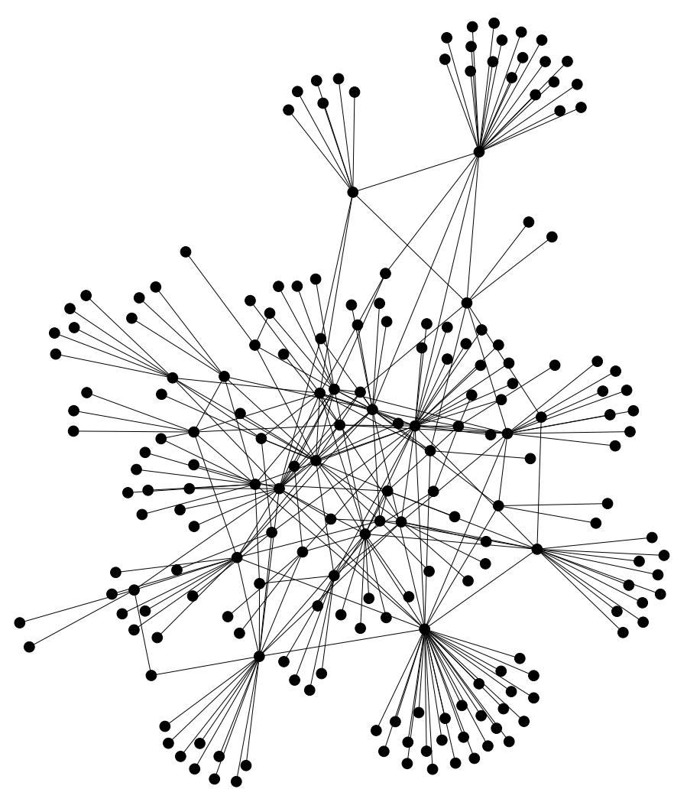
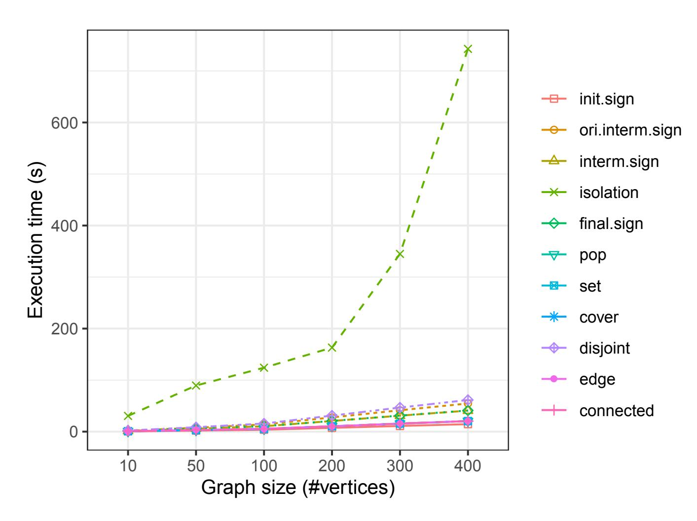

{0}------------------------------------------------

# A q-SDH-based Graph Signature Scheme on Full-Domain Messages with Efficient Protocols

Syh-Yuan Tan, Ioannis Sfyrakis, and Thomas Groß

Newcastle University, Newcastle upon Tyne, United Kingdom {syh-yuan.tan, ioannis.sfyrakis, thomas.gross}@newcastle.ac.uk

Abstract. A graph signature scheme is a digital signature scheme that allows a recipient to obtain a signature on a graph and subsequently prove properties thereof in zero-knowledge proofs of knowledge. While known to be expressive enough to encode statements from NP languages, one main use of graph signatures is in topology certification and confidentialitypreserving security assurance. In this paper, we present an efficient and provably secure graph signature scheme in the standard model with tight reduction. Based on the MoniPoly attribute-based credential system, this new graph signature scheme offers zero-knowledge proofs of possession of the signature itself as well as confidentiality-preserving show proofs on logical statements such as the existence of vertices, graph connectivity or isolation.

### 1 Introduction

A graph signature scheme is digital signature scheme that operates on a message space of graphs G and offers efficient proof protocols to assert graph properties, such as connectivity or isolation, in Zero-Knowledge Proofs of Knowledge (ZKPoK) while maintaining confidentiality of further information on the the structure or labeling of the graph itself. Given the versatility of graphs as a data structure, graph signatures are an interesting public-key cryptography primitive for a range of applications, including confidentiality-preserving security assurance, that is, the certification and attestation of topologies of systems of computer systems, first realized as part of cloud security and privacy assurance efforts [17]. Further applications on, for example, social network graphs, state machines, or provenance graphs have been proposed.

While ZKPoK on graphs have been instrumental in the first zero-knowledge proof constructions [6, 16] and transitive signature schemes operating on graph edges have been proposed earlier [23, 2], the first graph signature scheme with a framework of efficient proof protocols was proposed by Groß [18, 19]. This first construction was founded on the SRSA-based Camenisch-Lysyanskaya (CL) signature scheme [11], provably secure in the standard model. The CL signature can be extended to sign multiple messages without increasing the signature size and has been the core engine for attribute-based anonymous credential (ABC) systems, such as IBM's Identity Mixer [20]. Camenisch and Groß (CG) established a prime encoding [9, 10] to enhance the efficiency of the CL-RSA signature scheme 

{1}------------------------------------------------

by rendering the messages as prime exponents. Exploiting the coprimality and non-divisibility of the prime numbers, they showed that the encoded signature can be used to construct a highly efficient ABC system to provide efficient zeroknowledge proofs for AND, OR, and NOT/NAND logical statements.

Groß [18] extended the CG-ABC system into a graph signature scheme which can sign the vertices and edges of a labeled graph in the prime encoded form, while rendering the graph's algebraic structure accessible to subsequent ZKPoK. Apart from providing zero-knowledge proofs on a grammar of graph predicates [19], the graph signature also supports joint graph issuing protocol that allows the issuer to combine a graph of its choice with recipient's hidden graph during the signing protocol. This allows a recipient to source different graphs from multiple signers, a feature enabling confidentiality-preserving bootstrapping of signatures on complex graphs. Furthermore, Groß [18] proved the graph signature scheme's capability to encode and efficiently prove graph 3-colorability implying expressivity in terms of arbitrary statements from NP-languages. Due to these useful features, the graph signature was adopted in the realization of topology certification and infrastructure auditing applications [17]. While the scheme offers useful features, Groß' original construction of the graph signature scheme retains shortcomings that have yet to be addressed: (i) the message space is restricted to prime numbers, (ii) the encoding needs to be pre-certified, entailing large public keys, (iii) the scheme largely relies on properties inherited from the underlying CL- and CG- schemes [11, 10] and lacks a rigorous security model of the overall proof system. In terms of research gap, the existing SRSA graph signature construction suffers from complex show proofs, where the underlying quadratic-residue special RSA group setup leads to considerable computational and message complexity.

Our Contribution. We propose the first graph signature scheme with efficient protocols based on an elliptic-curve group setup. To that end, we establish a new variant of MoniPoly set commitment scheme [28, 29] that achieves the same efficiency and security as that of the original scheme, while being conducive to encoding graph data structures and proving of their well-formedness. Based on MoniPoly ABC system, we then construct a new graph signature scheme which is provably secure in the standard model with a tight security reduction under the q-SDH assumption. In contrast to Groß' SRSA-based construction [18, 19], our novel graph signature scheme (i) enables graph encoding on arbitrary strings, not just prime numbers, (ii) supports the same expressive range of predicates with shorter proofs, (iii) features rigorous security analysis with respect to general impersonation resilience and unlinkability security requirements.

Organization. §2 introduces the related work to our solution. After listing the preliminaries in §3, we explain in §4 the MoniPoly graph encoding, the SDHcounterpart for Groß' SRSA-based prime graph encoding. We present the proposed graph signature scheme in §6 and an efficient zero-knowledge proof system for set and graph predicates in §7. §9 evaluates the computational complexity, 

{2}------------------------------------------------

compares asymptotically with the original graph signature scheme by Groß, and details the performance experiments on our implementation.

### 2 Related Works

Recently, Tan and Groß proposed an efficient ABC system with expressive show proofs, called MoniPoly [28, 29]. By design, MoniPoly ABC bears a number of similarities to the Camenisch-Groß-ABC [9, 10]. For instance, MoniPoly ABC is built on CL-SDH signature scheme [12, 1, 26], the pairing counterpart of CL-RSA signature scheme [11]. Moreover, MoniPoly ABC features an encoding function that converts an attributes into non-dividable values in  $\mathbb{Z}_p^*$ .

By extending the MoniPoly ABC system's attribute space to an appropriate graph encoding, it can yield a graph signature scheme, in principle. The main technical difficulty in achieving this is to establish the graph data structure in the credential. Groß' graph signature scheme [18] achieves this ability by creating an unambiguous encoding for a graph data set. The graph prime encoding then yields the capability to produce a graph well-formedness proof to assure the signed hidden graph is correctly encoded. Unfortunately, the original MoniPoly ABC cannot achieve the graph well-formedness in the same way, because the opening value and the graph data set share the same domain. For instance, a dishonest user can cheat by encoding two vertices i, j and their edge (i, j) as:

$$C = a_i^{(x'+o_i)(x'+i)} a_j^{(x'+o_j)(x'+i)} a_{(i,j)}^{(x'+o_{(i,j)})(x'+i)(x'+j)} \mod p$$

in a MoniPoly commitment where the opening values  $o_i, o_j, o_{(i,j)}$  are chosen from the vertex universe. A naive solution might ask the user to compute a NOT proof with respect to the vertex identifier and labels universes for each opening value during every show proofs. This naive approach, however, would create a forbidding overhead and yield an impractical graph signature scheme.

Another related research area is the authenticated data structure [24, 13, 30] (ADS) which allows a data owner to outsource computations to a server, requiring the operations to be verifiable. Since ADS can be viewed as a database, it has been adopted to realize verifiable computation of database queries, particularly in the graph and relational databases [31, 22, 32]. For instance, the graph database constructed by Mandal et al. [22] supports query for meta-data, similar to proving the relationships among vertices in a graph signature scheme. However, the application scenario of databases from ADS require the data owners to disclose their data to the database server. Thereby, they enable the database server to answer the clients' queries on behalf of the data owners.

The scenario and security requirements for a graph signature scheme, however, are different: It requires information about the graph beyond the predicates proven to stay confidential. The owner of a graph signature, hence, responds to a verifier's queries on his own, using the signature of his committed graph as secret input.

{3}------------------------------------------------

### 3 Preliminaries

**Definition 1.** Discrete Logarithm Assumption (DLOG). An algorithm C is said to  $(t_{dlog}, \varepsilon_{dlog})$ -break the DLOG assumption if C runs in time at most  $t_{dlog}$  and furthermore:

$$\Pr[x \in \mathbb{Z}_p : \mathcal{C}(g, g^x) = x] \ge \varepsilon_{\mathsf{dlog}}$$

for a negligible probability  $\varepsilon_{\mathsf{dlog}}$ . We say that the DLOG assumption is  $(t_{\mathsf{dlog}}, \varepsilon_{\mathsf{dlog}})$ -secure if no algorithm  $(t_{\mathsf{dlog}}, \varepsilon_{\mathsf{dlog}})$ -solves the DLOG problem.

**Definition 2.** co-Discrete Logarithm Assumption (co-DLOG) [14]. An algorithm C is said to  $(t_{codlog}, \varepsilon_{codlog})$ -break the co-DLOG assumption if C runs in time at most  $t_{codlog}$  and furthermore:

$$\Pr[x \in \mathbb{Z}_p : \mathcal{C}(g_1, g_1^x \in \mathbb{G}_1, g_2, g_2^x \in \mathbb{G}_2) = x] \ge \varepsilon_{\mathsf{dlog}}$$

for a negligible probability  $\varepsilon_{\mathsf{codlog}}$ . We say that the co-DLOG assumption is  $(t_{\mathsf{codlog}}, \varepsilon_{\mathsf{codlog}})$ -secure if no algorithm  $(t_{\mathsf{codlog}}, \varepsilon_{\mathsf{codlog}})$ -solves the co-DLOG problem.

**Definition 3.** q-Strong Diffie-Hellman Assumption (SDH) [26]. An algorithm C is said to  $(t_{sdh}, \varepsilon_{sdh})$ -break the SDH assumption if C runs in time at most  $t_{sdh}$  and furthermore:

$$\Pr[x \in \mathbb{Z}_p, c \in \mathbb{Z}_p \setminus \{-x\}] : \mathcal{C}(g_1, g_1^x, \dots, g_1^{x^q}, g_2, g_2^x) = (g_1^{\frac{1}{x+c}}, c)] \ge \varepsilon_{\mathsf{sdh}}$$

for a negligible probability  $\varepsilon_{\mathsf{sdh}}$ . We say that the SDH assumption is  $(t_{\mathsf{sdh}}, \varepsilon_{\mathsf{sdh}})$ -secure if no algorithm  $(t_{\mathsf{sdh}}, \varepsilon_{\mathsf{sdh}})$ -solves the SDH problem.

**Definition 4.** q-co-Strong Diffie-Hellman Assumption (co-SDH) [14]. An algorithm C is said to  $(t_{cosdh}, \varepsilon_{cosdh})$ -break the co-SDH assumption if C runs in time at most  $t_{cosdh}$  and furthermore:

$$\Pr[x \in \mathbb{Z}_p, c \in \mathbb{Z}_p \setminus \{-x\}] : \mathcal{C}(g_1, g_1^x, \dots, g_1^{x^q}, g_2, g_2^x, \dots, g_2^{x^q}) = (g^{\frac{1}{x+c}}, c)] \ge \varepsilon_{\mathsf{cosdh}}$$

for a negligible probability  $\varepsilon_{\mathsf{cosdh}}$ . We say that the co-SDH assumption is  $(t_{\mathsf{cosdh}}, \varepsilon_{\mathsf{cosdh}})$ -secure if no algorithm  $(t_{\mathsf{cosdh}}, \varepsilon_{\mathsf{cosdh}})$ -solves the co-SDH problem.

#### 3.1 Pedersen Commitment

Pedersen commitment scheme [25] is perfectly hiding and computationally binding under the discrete logarithm assumption. The public parameters  $pk_{PC} = (a, b \in \mathbb{G})$  are based on a group  $\mathbb{G}$  of order p in which the discrete logarithm assumption holds. In order to commit to a message m, one computes

$$C = \mathsf{Commit}(pk_{PC}, m, r) = a^m b^r$$

where  $r \in \mathbb{Z}_p^*$  is the randomly selected opening value.

{4}------------------------------------------------

#### 3.2 MoniPoly Set Commitment

MoniPoly set commitment scheme [28, 29] is perfectly hiding and computationally binding under the co-SDH assumption. The public parameter is  $pk_{MP} = (\{a_k = a^{x'^k}\}_{k=1}^n \in \mathbb{G}_1, \{X_k = g_2^{x'^k}\}_{k=1}^n \in \mathbb{G}_2, \mathsf{MPEncode})$  where  $\mathsf{MPEncode}: \mathbb{Z}_p^n \to \mathbb{Z}_p^{n+1}$  converts a set of n messages into coefficients for a monic polynomial of degree n+1. In order to commit to a set of messages  $A = \{m_1, \ldots, m_{n-1}\}$ , one computes:

$$C = \mathsf{Commit}(pk_{MP}, A, o) = a_0^{(x'+o)\prod_{k=1}^{n-1}(x'+m_k)} = \prod_{k=0}^n a_k^{\mathsf{m}_k}$$

where  $o \in \mathbb{Z}_p^*$  is the randomly selected opening value and  $\{m_j\} = \mathsf{MPEncode}(A \cup \{o\})$ . MoniPoly commitment scheme supports zero-knowledge proofs on set operations:

- 1. intersection: proves the knowledge of an intersection set  $I = A' \cap A$ ,
- 2. difference: proves the knowledge of an difference set D = A' A,

which give rise to the show proofs in the MoniPoly ABC system [29].

### 3.3 Camenisch-Lysyanskaya SDH Signature Scheme

The CL-SDH signature scheme [12, 1, 26] is closely related to the BBS signature scheme [8]. Since the MoniPoly ABC system [28, 29] is the foundation of our proposed graph signature scheme, we recall the CL-SDH signature variant described by Tan and Groß where the signed messages are the input to an encoding function MPEncode as described above:

KeyGen(1<sup>k</sup>, 1<sup>n</sup>). Construct three cyclic groups  $\mathbb{G}_1$ ,  $\mathbb{G}_2$ ,  $\mathbb{G}_T$  of order p based on an elliptic curve whose bilinear pairing is  $e: \mathbb{G}_1 \times \mathbb{G}_2 \to \mathbb{G}_T$ . Select random generators  $a, b, c \in \mathbb{G}_1$ ,  $g_2 \in \mathbb{G}_2$  and two secret values  $x, x' \in \mathbb{Z}_p^*$ . Compute the values  $X = g_2^x$ ,  $\{a_i = a^{x'^i}, X_i = g_2^{x'^i}\}_{0 \le i \le n}$  to output the public key  $pk = (e, \mathbb{G}_1, \mathbb{G}_2, \mathbb{G}_T, p, b, c, \{a_i, X_i\}_{0 \le i \le n}, X)$  and the secret key sk = (x, x').

 $\operatorname{Sign}(pk, sk, \{m_1, \dots, m_n\})$ . On input  $m_1, \dots, m_n$ , choose the random values  $s, t \in \mathbb{Z}_p^*$  to compute:

$$v = \left(a_0^{\prod_{i=1}^{n} (x'+m_i)} b^s c\right)^{\frac{1}{x+t}}$$

and output the signature as  $\sigma = (t, s, v)$ .

Verify $(pk, \sigma, \{m_1, \ldots, m_n\})$ . Given  $\sigma = (t, s, v)$ , compute  $\{m_i\}_{0 \le i \le n} = \mathsf{MPEncode}(\{m_i\}_{1 \le i \le n})$ . Output 1 if the following holds:

$$\mathbf{e}(v,X) = \mathbf{e}\left(\prod_{i=0}^n a_i^{\mathbf{m}_i} b^s c v^{-t}, g_2\right)$$

and output 0 otherwise.

{5}------------------------------------------------

**Theorem 1.** [26, 29] The CL-SDH signature is strongly existential unforgeable against chosen message attack in the standard model if the SDH problem is intractable.

## 4 MoniPoly Graph Encoding

In this section, we offer a brief overview of the graph prime encoding proposed by Groß [18] before presenting our new encoding, namely, the MoniPoly graph encoding. It is conceptually similar to the former in nature and idea, yet supports graph encoding over  $\mathbb{Z}_p^*$  instead of over prime numbers.

### 4.1 Prime Graph Encoding

The prime graph encoding views every vertex and edge as a prime exponent. Camenisch and Groß [10] showed that a prime encoding in general can significantly speed up the show proofs by exploiting the co-primality and divisibility among messages. The main parameters for prime graph encoding are as follows:

```
- \mathcal{V}: Vertex universe
```

 $-\mathcal{E}\subseteq (\mathcal{V}\times\mathcal{V})$ : Edge universe

 $-\mathcal{G} = (\mathcal{V}, \mathcal{E})$ : Graph

-  $\Xi_{\mathcal{V}}$  : Vertex identifier universe

 $-\mathcal{Z}_{\mathcal{L}}$ : Labels universe

 $-f_{\mathcal{V}}: \mathcal{V} \to \mathcal{P}(\Xi_{\mathcal{L}})$ : Labels of a given vertex

 $-f_{\mathcal{E}}: \mathcal{E} \to \mathcal{P}(\Xi_{\mathcal{L}})$ : Labels of a given edge

 $-\chi_{\mathcal{V}}$ : product of all vertex identifiers  $\prod_{i\in\mathcal{Z}_{\mathcal{V}}}i$ 

 $-\chi_{\mathcal{L}}$ : product of all labels  $\prod_{i\in\Xi_{\mathcal{L}}}i$ 

where vertex identifiers and label are disjoint:

$$\Xi_{\mathcal{V}} \cap \Xi_{\mathcal{L}} = \emptyset \iff \gcd(\chi_{\mathcal{V}}, \chi_{\mathcal{L}}) = 1$$

following the fundamental theorem of arithmetic.

In the following explanation, we focus on an unlabeled graph for clarity without loss of generality. In order to encode an unlabeled graph using the prime graph encoding, every vertex  $i \in \mathcal{V}$  is mapped to a predefined prime number  $e_i$ . Next, let  $R_i$  be the base for the i-th vertex and  $R_{(i,j)}$  be the base for the (i,j)-th edge, while  $m_i = e_i \prod_{k \in f_{\mathcal{V}}(i)} e_k$  and  $m_{(i,j)} = e_i e_j \prod_{k \in f_{\mathcal{E}}(i,j)} e_k$  denote the full encoding of vertices and edges, respectively. Assuming the signer knows the discrete logarithms of every base with respect to the public key element S, a graph can be represented by its vertex exponents  $\bar{e}_i = \mathsf{dlog}_S(R_i)m_i$  and its edge exponents  $\bar{e}_{(i,j)} = \mathsf{dlog}_S(R_{(i,j)})m_{(i,j)}$ .

{6}------------------------------------------------

#### 4.2 Encoding Graphs Into the MoniPoly Set Commitment

In the MoniPoly set commitment scheme [28, 29], the messages are converted into a set of monic polynomial coefficients using a conversion function MPEncode:  $\mathbb{Z}_p^n \to \mathbb{Z}_p^{n+1}$  before being committed. Let us view the exponents in MoniPoly as encoded elements such that:

$$(x'+i) \mod p \Leftrightarrow e_i \mod \phi(N).$$

Then, MPEncode can be used as an encoding for graphs similar to the prime graph encoding.

Recalling from Section 3.2, let the public parameters be  $\{a_{0_k} = a_{0_0}^{x'^k}, X_{0_k} = X_{0_0}^{x'^k}\}_{k=0}^n$ . To encode a graph  $\mathcal{G}$  of maximum size L, we generate the following additional public parameters:

$$\{\{a_{i_k}, X_{i_k}\}_{i=1}^L\}_{k=0}^n$$

Subsequently, to represent a vertex and an edge, respectively, let  $\{\mathsf{m}_{i_k}\} = \mathsf{MPEncode}(i, f_{\mathcal{V}}(i))$  and  $\{\mathsf{m}_{(i,j)_j}\} = \mathsf{MPEncode}(i, j, f_{\mathcal{E}}(i, j))$ , we have

$$\prod_{k=1}^{n_i} a_{i_k}^{\mathsf{m}_{i_k}} \Leftrightarrow R_i^{m_i} \text{ and } \prod_{k=1}^{n_{(i,j)}} a_{(i,j)_k}^{\mathsf{m}_{(i,j)_k}} \Leftrightarrow R_{(i,j)}^{m_{(i,j)}}$$

The parameters for prime graph encoding can then be adjusted accordingly to suit the MoniPoly encoding. Moreover, the MoniPoly encoding fulfills the requirement that vertex identifiers and labels be disjoint under the fundamental theorem of algebra. Building upon the conceptualization of Groß' graph signature scheme [18], we define graph well-formedness in the context of the MoniPoly graph encoding as follows:

**Definition 5 (Well-formedness).** We call a graph encoding well-formed if and only if:

- 1. The encoding only contains MoniPoly encoding representatives  $(x' + i) \in \Xi_{\mathcal{V}} \cup \Xi_{\mathcal{L}}$  in the exponents of the base  $a_i$ .
- 2. A base  $a_i$  contains either exactly one vertex identifier  $(x'+i) \in \Xi_{\mathcal{V}}$ , pair-wise different from other vertex identifiers and zero or more label representatives  $(x'+k) \in \Xi_{\mathcal{L}}$ , or;
- 3. contains exactly two vertex identifiers  $(x'+i), (x'+j) \in \Xi_{\mathcal{V}}$  and zero or more label representatives  $(x'+k) \in \Xi_{\mathcal{L}}$ .

Considering the concepts we have introduced so far, we are not yet in the position the MoniPoly encoding to construct a SDH-based graph signature scheme in a way similar to Groß' SRSA-based graph signature scheme [18, 19]. This is because when an encoded graph is committed as a MoniPoly commitment naively, it loses its graph well-formedness property due to the shared message and opening space. This is unlike the combination of prime encoding and Pedersen commitment proposed by Groß. In the following section, we show how to overcome this problem.

{7}------------------------------------------------

### 5 Graph Well-formedness from a MoniPoly Commitment

We propose a variant of MoniPoly set commitment scheme featuring an externalized random blinding which is as secure and as efficient as the original scheme [28, 29]. We show that a further extension of this commitment scheme can commit MoniPoly encoded graphs securely. We continue to prove that the extension supports graph well-formedness if it has binding property.

### 5.1 An Externally-Blinded MoniPoly Set Commitment Scheme

To illustrate why a naive use of the original MoniPoly set commitment scheme fails desired security properties, we first consider the case in which a graph  $\mathcal{G}$  has only one vertex  $V = \{i, f_{\mathcal{V}}(i)\}$ . The element  $a_{i_0}$  then holds the MoniPoly encoded graph as exponents. It can be viewed as an insecure MoniPoly commitment  $C' = \prod_{k=0}^{n} a_{i_k}^{\mathsf{m}_k}$ . Specifically, the opening value for C' is one of the committed graph elements: there exist finitely many of those and they are not random. Therefore, C' is not perfect hiding, though the computational binding property remains intact under the SDH assumption. Adding the opening value o breaks the graph well-formedness as (x' + o) is not part of the graph encoding.

This problem can be resolved by selecting a random blinding  $o \in \mathbb{Z}_p^*$  to compute the commitment as  $C = C'^o$ . One can thereby consider  $C = C'^{x'+o'}$  as a MoniPoly commitment where  $o = (x'+o') \mod p$  contains unknown opening value  $o' \in \mathbb{Z}_p^*$ . Therefore, computing  $C = \mathsf{Commit}(pk, \mathcal{G}, o)$  is equivalent to computing  $C = \mathsf{Commit}(pk, \mathcal{G}, o - x')$ . Since finding x' yields an intractable DLOG problem and finding two different opening values that produce the same C breaks the co-SDH assumption, the externally-blinded MoniPoly variant is as secure as the original scheme.

We describe our proposed MoniPoly set commitment variant as follows:

 $\mathsf{Setup}(1^k)$ . Same as that in Section 3.2.

Commit(pk, A, o). Taking as input a message set  $A = \{m_1, \ldots, m_n\} \in \mathbb{Z}_p^*$  and the random opening value  $o \in \mathbb{Z}_p^*$ , output the commitment as

$$C = \left(a_0^{\prod\limits_{k=1}^{n}(x'+m_k)}\right)^o = \left(\prod\limits_{k=0}^{n}a_k^{\mathsf{m}_k}\right)^o$$

where  $\{m_k\} = \mathsf{MPEncode}(A)$ .

 $\operatorname{\mathsf{Open}}(pk,C,A,o)$ . Return 1 if  $C=\prod_{k=0}^n \left(a_j^{\mathsf{m}_k}\right)^o$  holds where  $\{\mathsf{m}_k\}=\mathsf{MPEncode}(A)$  and return 0 otherwise.

{8}------------------------------------------------

OpenIntersection(pk, C, A, o,(A<sup>0</sup> , l)). If |A<sup>0</sup> ∩ A| ≥ l holds, return an intersection set I = A<sup>0</sup> ∩ A of length l and a witness such that:

$$W = \left(a_0^{\prod_{k \in (A-I)} (x'+m_k)}\right)^o$$
$$= \left(\prod_{k=0}^n a_j^{\mathsf{w}_j}\right)^o$$

where {wk} = MPEncode(A − I). Otherwise, return a null value ⊥. The correctness can be verified as follows:

$$C = W^{\prod_{m_k \in I} (x' + m_k)}$$

$$= \begin{pmatrix} o & \prod_{m_k \in (A-I)} (x' + m_k) \end{pmatrix}^{\prod_{m_k \in I} (x' + m_k)}$$

$$= \begin{pmatrix} \prod_{m_k \in A} (x' + m_k) \end{pmatrix}^o$$

$$= \begin{pmatrix} a_0^{m_k \in A} & \\ a_0^{m_k \in A} & \\ \end{pmatrix}^o.$$

VerifyIntersection(pk, C, I, W,(A<sup>0</sup> , l)). Return 1 if

$$\mathsf{e}\left(C\prod_{k=0}^{|A'|}a_k^{\mathsf{m}_{1,k}},X_0\right) = \mathsf{e}\left(W\prod_{k=0}^{|A'|-l}a_k^{\mathsf{m}_{2,k}},\prod_{k=0}^lX_k^{\mathsf{i}_k}\right)$$

{9}------------------------------------------------

holds and return 0 otherwise, where  $\{i_k\} = \mathsf{MPEncode}(I), \{\mathsf{m}_{1,k}\} = \mathsf{MPEncode}(A')$  and  $\{\mathsf{m}_{2,k}\} = \mathsf{MPEncode}(A'-I)$ . The correctness is shown as follows:

$$\begin{split} &\mathbf{e}\left(C\prod_{k=0}^{|A'|}a_{j}^{\mathsf{m}_{1,k}},X_{0}\right) \\ &= \mathbf{e}\left(C,X_{0}\right)\mathbf{e}\left(\prod_{k=0}^{|A'|}a_{k}^{\mathsf{m}_{1,k}},X_{0}\right) \\ &= \mathbf{e}\left(a_{0}^{o\prod_{m_{k}\in A}(x'+m_{k})},X_{0}\right)\mathbf{e}\left(a_{0}^{\prod_{m_{k}\in A'}(x'+m_{k})},X_{0}\right) \\ &= \mathbf{e}\left(a_{0}^{o\prod_{m_{k}\in (A-I)}(x'+m_{k})}\prod_{X_{0}^{m_{k}\in I}(x'+m_{k})}\prod_{\mathbf{e}\left(a_{0}^{m_{k}\in (A'-I)}(x'+m_{k}),X_{0}^{\prod_{m_{k}\in I}(x'+m_{k})}\right) \\ &= \mathbf{e}\left(W,\prod_{k=0}^{l}X_{k}^{\mathbf{i}_{k}}\right)\mathbf{e}\left(\prod_{k=0}^{|A'|-l}a_{k}^{\mathsf{m}_{2,k}},\prod_{k=0}^{l}X_{k}^{\mathbf{i}_{k}}\right) \\ &= \mathbf{e}\left(W\prod_{k=0}^{|A'|-l}a_{k}^{\mathsf{m}_{2,j}},\prod_{k=0}^{l}X_{k}^{\mathbf{i}_{j}}\right) \end{split}$$

OpenDifference $(pk, C, A, o, (A', \bar{l}))$ . If  $|A' \cap A| \geq \bar{l}$  holds, return a difference set D = A' - A of length  $\bar{l}$  and the witness  $\left(W = \prod_{k=0}^{n-\bar{l}} a_k^{w_k}, \{r_k\}_{k=0}^{\bar{l}-1}\right)$ . The values  $(\{w_k\}, \{r_k\}) = \mathsf{MPEncode}(A)/\mathsf{MPEncode}(D)$  are computed using expanded synthetic division such that  $\{w_k\}$  are the coefficients of quotient q(x') and  $\{r_k\}$  are the coefficients of remainder r(x'). Specifically, let the polynomial divisor be  $d(x') = \sum_k \mathsf{d}_k x'^k$  where  $\{\mathsf{d}_k\} = \mathsf{MPEncode}(D)$ , the monic polynomial f(x') in the commitment  $C = a_0^{f(x')}$  can be rewritten as f(x') = d(x')q(x') + r(x'). Note that  $\prod_{k=0}^{\bar{l}-1} a_k^{r_k} \neq 1_{\mathbb{G}_1}$  whenever d(x') cannot divide f(x'), i.e., the sets A and D are

{10}------------------------------------------------

disjoint. The correctness can be verified from the following:

$$C = \begin{pmatrix} \prod_{a_0^{m_k \in A}} (x' + m_k) \\ a_0^{m_k \in A} \end{pmatrix}^o$$

$$= \left( a_0^{q(x')d(x') + r(x')} \right)^o$$

$$= \begin{pmatrix} \sum_{k=0}^{n-\bar{l}} w_k x'^k \\ a_0^{\sum_{k=0}^{n-\bar{l}}} w_k x'^k \end{pmatrix}^{d(x')} \begin{pmatrix} \bar{l} - 1 \\ k = 0 \end{pmatrix}^o$$

$$= W^{d(x')} \begin{pmatrix} \bar{l} - 1 \\ k = 0 \end{pmatrix}^o.$$

VerifyDifference $(pk, C, D, (W, \{r_k\}_{k=0}^{\bar{l}-1}), (A', \bar{l}))$ . Return 1, if the following holds:

$$\mathsf{e}\left(C\left(\prod_{k=0}^{\bar{l}-1}a_k^{-\mathsf{r}_k}\right)^o\prod_{k=0}^{|A'|}a_k^{\mathsf{m}_{1,k}},X_0\right)=\mathsf{e}\left(W\prod_{k=0}^{|A'|-\bar{l}}a_k^{\mathsf{m}_{2,k}},\prod_{k=0}^{\bar{l}}X_k^{\mathsf{d}_k}\right),\prod_{k=0}^{\bar{l}-1}a_k^{\mathsf{r}_k}\neq 1_{\mathbb{G}_1}$$

and return 0 otherwise, where  $\{d_k\} = \mathsf{MPEncode}(D)$ ,  $\{\mathsf{m}_{1,k}\} = \mathsf{MPEncode}(A')$  and  $\{\mathsf{m}_{2,k}\} = \mathsf{MPEncode}(A'-D)$ . The correctness is as follows:

$$\begin{split} & \mathbf{e} \left( C \left( \prod_{k=0}^{\bar{l}-1} a_k^{-\mathsf{r}_k} \right)^o \prod_{k=0}^{|A'|} a_k^{\mathsf{m}_{1,k}}, X_0 \right) \\ & = \mathbf{e} \left( C \left( \prod_{k=0}^{\bar{l}-1} a_k^{-\mathsf{r}_k} \right)^o, X_0 \right) \mathbf{e} \left( \prod_{k=0}^{|A'|} a_k^{\mathsf{m}_{1,k}}, X_0 \right) \\ & = \mathbf{e} \left( a_0^{od(x')q(x') + or(x')} a_0^{-or(x')}, X_0 \right) \mathbf{e} \left( a_0^{m_k \in A'}, X_0 \right) \\ & = \mathbf{e} \left( a_0^{od(x')q(x')}, X_0 \right) \mathbf{e} \left( a_0^{m_k \in (A'-D)}, X_0^{m_k \in D}, X_0^{m_k \in D} \right) \\ & = \mathbf{e} \left( a_0^{o\sum_{k=0}^{\bar{l}} \mathsf{w}_k x'^k}, X_0^{d(x')} \right) \mathbf{e} \left( \prod_{k=0}^{|A'|-\bar{l}} a_k^{\mathsf{m}_{2,k}}, X_0^{d(x')} \right) \\ & = \mathbf{e} \left( W \prod_{k=0}^{|A'|-\bar{l}} a_k^{\mathsf{m}_{2,k}}, \prod_{k=0}^{\bar{l}} X_k^{\mathsf{d}_k} \right). \end{split}$$

For the completeness of security analysis, we support the security for the proposed scheme with Theorem 2.

{11}------------------------------------------------

**Theorem 2.** The externally-blinded MoniPoly set commitment scheme is perfectly hiding and computational binding under the q-SDH assumption.

*Proof.* (Sketch.) The externally-blinded commitment scheme described here is similar to the original MoniPoly commitment scheme [29] such that one can prove its security by adapting the latter's security proofs. Specifically, we can view the externally-blinded variant as a MoniPoly commitment with a randomized base in the proof such that:

$$C = \left(\prod_{k=0}^{n} a_k^{\mathsf{m}_k}\right)^o = \prod_{k=0}^{n} \left(a_k^o\right)^{\mathsf{m}_k}.$$

As one can easily see, the new scheme inherits the perfectly hiding property from original MoniPoly scheme. On the other hand, if an adversary outputs  $(A, o') \neq (A^*, o'')$  such that

- 1.  $\mathsf{Open}(pk, \mathsf{Commit}(pk, A, o'), A, o') = \mathsf{Open}(pk, \mathsf{Commit}(pk, A^*, o''), A^*, o''),$
- 2. OpenIntersection $(pk, \mathsf{Commit}(pk, A, o'), A, o', (A', l)) = \mathsf{OpenIntersection}(pk, \mathsf{Commit}(pk, A^*, o''), A^*, o'', (A', l)),$
- 3. OpenDifference $(pk, \mathsf{Commit}(pk, A, o'), A, o', (A', \bar{l})) = \mathsf{OpenDifference}(pk, \mathsf{Commit}(pk, A^*, o''), A^*, o'', (A', \bar{l})),$

a q-SDH solution can be extracted from the fact that two different sets  $(A, o'), (A^*, o'')$  yield the same commitment C. The extraction is the same as in the original MoniPoly scheme but uses the randomized bases  $a_k^{o'}, a_k^{o''}$ . Note that we can always derandomize the bases to gain their original form as in the given SDH instance because o' and o'' are known.

#### 5.2 An Extended Externally-Blinded MoniPoly Set Commitment

The proposed variant of MoniPoly set commitment can be used to commit a Monipoly encoded graph, if we add parameters  $\{\{a_{i_k}, X_{i_k}\}_{k=0}^n\}_{i=1}^L$  specific for the MoniPoly encoding to the commitment parameters. While the commitment opening algorithms can be amended accordingly, the security proof requires a considerate modification. In particular, while the perfectly hiding property follows trivially, the computational binding property is now based on the hardness of the co-DLOG problem.

**Theorem 3.** The extended externally-blinded MoniPoly set commitment is binding if the co-DLOG problem is hard.

*Proof.* Given a co-DLOG instance  $(g_1, h_1 = g_1^x \in \mathbb{G}_1, g_2, h_2 = g_2^x \in \mathbb{G}_2)$ , we construct a challenger  $\mathcal{C}$  that runs the adversary  $\mathcal{A}$  of extended MoniPoly set commitment scheme as a sub-routine to find the solution x.  $\mathcal{C}$  sets  $\{a_{0_k} = g_1^{x'^k}, X_{0_k} = g_2^{x'^k}\}_{k=0}^n$  and  $\{\{a_{i_k} = h_1^{b_i x'^k}, X_{i_k} = h_2^{b_i x'^k}\}_{k=0}^n\}_{i=1}^L$  for randomly chosen  $b_i, x' \in \mathbb{Z}_p^*$ .  $\mathcal{C}$  publishes  $\{\{a_{i_k}, X_{i_k}\}_{k=0}^n\}_{i=0}^L$  as the public parameters.

{12}------------------------------------------------

Without loss of generality, we assume a graph is MoniPoly encoded using the bases  $a_{i_k}$  in the sequence i = 1, 2, ..., L. If an adversary can output an extended MoniPoly set commitment C for two different graph data sets  $(\mathcal{G}, \mathcal{G}^*)$  such that  $|\mathcal{G} \cap \mathcal{G}^*| \geq 2$ :

$$\mathcal{G} = \{V \cup E\} = \{(i, f_{\mathcal{V}}(i), o'_{i}) \in V, (i, j, f_{\mathcal{E}}(i, j), o'_{(i, j)}) \in E\},$$

$$\mathcal{G}^{*} = \{V^{*} \cup E^{*}\} = \{(i^{*}, f_{\mathcal{V}}(i^{*}), o''_{i}) \in V^{*}, (i^{*}, j^{*}, f_{\mathcal{E}}(i^{*}, j^{*}), o''_{(i, j)}) \in E^{*}\},$$

where  $\{o'_i, o'_{(i,j)}, o''_i, o''_{(i,j)}\}$  are the opening values for vertices and edges, respectively, a co-DLOG solution can be extracted. This follows from:

$$C = \prod_{i \in V} \left( a_{i_0}^{(x'+i)} \prod_{w \in f_{\mathcal{V}}(i)}^{\prod} (x'+w) \right)^{o'_i} \prod_{i \in E} \left( a_{(i,j)_0}^{(x'+i)(x'+j)} \prod_{w \in f_{\mathcal{E}}(i,j)}^{\prod} (x'+w) \right)^{o_{(i,j)'}}$$

$$= \prod_{i^* \in V^*} \left( a_{i_0}^{(x'+i^*)} \prod_{w^* \in f_{\mathcal{V}}(i^*)}^{\prod} (x'+w^*) \right)^{o''_i} \prod_{i^* \in E} \left( a_{(i,j)_0}^{(x'+i^*)(x'+j^*)} \prod_{w^* \in f_{\mathcal{V}}(i^*,j^*)}^{\prod} (x'+w^*) \right)^{o_{(i^*,j^*)}},$$

giving the following equations:

$$\begin{split} g_1 & \prod_{w \in f_{\mathcal{V}}(i)} (x'+w) \sum_{\sum_{i}^{|V|}} \sum_{w \in f_{\mathcal{V}}(i)} (x'+i) \prod_{w \in f_{\mathcal{V}}(i)} (x'+w) + \sum_{i}^{|E|} (x'+i)(x'+j) \prod_{w \in f_{\mathcal{E}}(i,j)} (x'+w) \\ &= g_1^u h_1^v \\ &= g_1 \\ &= g_1 \\ &= g_1 \\ &= g_1^{u^*} h_1^{v^*} \end{split}$$

Therein, the Challenger  $\mathcal{C}$  can compute:

$$x = \frac{u - u^*}{v^* - v} \mod p$$

to solve the co-DLOG problem. The argument on the OpenIntersection and Open-Difference algorithms is similar to that in the proof of Theorem 2.  $\Box$ 

Thereafter, whenever we mention a MoniPoly commitment, we mean the extended externally-blinded MoniPoly set commitment scheme.

#### 5.3 Graph Composition

The MoniPoly commitment  $C = \prod_{i \in V} C_i \prod_{(i,j) \in E} C_{(i,j)}$  on a graph  $\mathcal{G}$  is the product of vertex commitments  $C_i$  and edge commitments  $C_{(i,j)}$ , where:

$$C_i = \left(\prod_{k=0}^{n_i} a_{i_k}^{\mathsf{m}_{i_k}}\right)^{o_i}, C_{(i,j)} = \left(\prod_{k=0}^{n_{(i,j)}} a_{(i,j)_k}^{\mathsf{m}_{(i,j)_k}}\right)^{o_{(i,j)}}$$

{13}------------------------------------------------

To prove the composition of the graph commitment C, one can run proof of knowledge protocols for the MoniPoly Open algorithms on every  $C_i \in V$  and  $C_{(i,j)} \in E$ . These proof of knowledge protocols can be combined into a graph composition statement graph(C):

$$\begin{split} PK & \bigg\{ (\forall i \in V : \varepsilon_{i_0}, \varepsilon_{i_1}, \forall (i,j) \in E : \varepsilon_{(i,j)_0}, \varepsilon_{(i,j)_1}) : \\ & \mathsf{e}\left(C, X_{0_0}\right) = \prod_{i \in V} \mathsf{e}\left(W_i', \prod_{k=0}^1 X_{0_k}^{\varepsilon_{i_k}}\right) \prod_{(i,j) \in E} \mathsf{e}\left(W_{(i,j)}', \prod_{k=0}^1 X_{0_k}^{\varepsilon_{(i,j)_k}}\right) \bigg\}. \end{split}$$

The correctness can be verified from the equation below:

$$\begin{split} \mathbf{e}\left(C, X_{0_0}\right) &= \prod_{i \in V'} \mathbf{e}\left(a_{i_0}^{r_i^{-1}o_i \prod_{w \in f_{\mathcal{V}}(i)}(x'+w)}, X_{0_0}^{r_i(x'+i)}\right) \cdot \\ &\prod_{(i,j) \in E'} \mathbf{e}\left(a_{(i,j)_0}^{r_{(i,j)}o_{(i,j)}(x'+j) \prod_{w \in f_{\mathcal{E}}(i,j)}(x'+w)}, X_{0_0}^{r_{(i,j)}(x'+i)}\right) \end{split}$$

We can replace the exponent i for  $X_{0_0}$  with a random attribute w without affecting the randomness in the proof as claimed in Lemma 1. The graph composition proof also appears in the  $\mathsf{possession}(\sigma,\mathcal{G})$  statement to prove the validity of a graph signature.

**Lemma 1.** The randomization of C in graph is perfectly hiding.

*Proof.* The MoniPoly opening values  $o_i, o_{(i,j)}$  turns the  $\mathbb{G}_T$  elements:

$$\prod_{i \in V'} \mathsf{e} \left( a_{i_0}^{r_i^{-1} \prod_{w \in f_{\mathcal{V}}(i)} (x'+w)}, X_{0_0}^{r_i(x'+i)} \right)^{o_i} \prod_{(i,j) \in E'} \mathsf{e} \left( a_{(i,j)_0}^{r_{(i,j)}(x'+j) \prod_{w \in f_{\mathcal{E}}(i,j)} (x'+w)}, X_{0_0}^{r_{(i,j)}(x'+i)} \right)^{o_{(i,j)}}$$

into a Pedersen set commitment (Lemma 14) which is perfectly hiding. When C consists of one vertex or one edge only, the single  $\mathbb{G}_T$  element is a MoniPoly commitment and it is perfectly hiding.

#### 5.4 Bootstrapping of MoniPoly-Encoded Graphs

The graph statement proves that C can be decomposed into MoniPoly commitments  $C_i, C_{(i,j)}$  only. In order to prove that C is a commitment for a correctly encoded graph, we need to further show that the n vertex commitments  $C_i \in V$  and m edge commitments  $C_{(i,j)} \in E$  is correctly encoded. Firstly, instead of selecting a random exponent for the  $X_{0_k}$  elements in graph, we set all encoded labels as exponents for the witness  $W'_i, W'_{(i,j)}$  and the encoded identifiers as the exponents for the  $X_{0_k}$  elements. Secondly, assuming the universe for identifiers  $(\Xi_{\mathcal{V}})$  and labels  $(\Xi_{\mathcal{L}})$  are publicly known, we need to prove the existence of

{14}------------------------------------------------

every commitment's identifier and labels in  $\Xi_{\mathcal{V}}$  and  $\Xi_{\mathcal{L}}$ , respectively. Computing the n+m MoniPoly commitment for  $\Xi_{\mathcal{V}}$  and  $\Xi_{\mathcal{L}}$  is required because every commitment  $C_i$  (resp.  $C_{(i,j)}$ ) is computed on a different base  $a_{i_k}$  (resp.  $a_{(i,j)_k}$ ).

This complexity overhead can be avoided by an additional step of bootstrapping [18] that switches the bases  $\{a_i\}_{i\in V}, \{a_{(i,j)}\}_{(i,j)\in E}$  to  $a_0$  such that:

$$C_i = \left(\prod_{k=0}^{n_i} a_{0_k}^{\mathsf{m}_{i_k}}\right)^{o_i}, C_{(i,j)} = \left(\prod_{k=0}^{n_{(i,j)}} a_{0_k}^{\mathsf{m}_{(i,j)_k}}\right)^{o_{(i,j)}}.$$

The two MoniPoly commitments for  $\mathcal{E}_{\mathcal{V}}$  and  $\mathcal{E}_{\mathcal{L}}$  are now computed only once on the base  $a_{0_k}$  and referenced by all set membership proofs. Moreover, since  $\{C_i, C_{(i,j)}\}$  are computed on the same base, we can prove the encoding correctness for all the vertices and edges by using only two set membership proofs plus two cumulative product proofs, respectively. We first explain the simpler bootstrap statement as follows:

$$\begin{split} PK \Bigg\{ (\forall i \in V : \varepsilon_{i_0}, \varepsilon_{i_1}, \forall (i,j) \in E : \varepsilon_{(i,j)_0}, \varepsilon_{(i,j)_1}, \varepsilon_{(i,j)_2}) : \\ & \quad \text{e} \left( C, X_{0_0} \right) = \prod_{i \in V} \text{e} \left( W_i', \prod_{k=0}^1 X_{0_k}^{\varepsilon_{i_k}} \right) \prod_{(i,j) \in E} \text{e} \left( W_{(i,j)}', \prod_{k=0}^2 X_{0_k}^{\varepsilon_{(i,j)_k}} \right) \wedge \\ & \quad \text{e} \left( \prod_{i \in V} C_i \prod_{(i,j) \in E} C_{(i,j)}, X_{0_0} \right) = \\ & \quad \prod_{i \in V} \text{e} \left( W_i, \prod_{k=0}^1 X_{0_k}^{\varepsilon_{i_k}} \right) \prod_{(i,j) \in E} \text{e} \left( W_{(i,j)}, \prod_{k=0}^2 X_{0_k}^{\varepsilon_{(i,j)_k}} \right) \wedge \\ & \quad \text{e} \left( \prod_{i \in V} W_i' \prod_{(i,j) \in E} W_{(i,j)}', X_{0_0} \right) = \prod_{i \in V} \text{e} \left( W_i, X_{i_0} \right) \prod_{(i,j) \in E} \text{e} \left( W_{(i,j)}, X_{(i,j)_0} \right) \Bigg\} \end{split}$$

where  $\varepsilon_{i,1} = r_i, \varepsilon_{(i,j),2} = r_{(i,j)}, W_i' = a_{i_0}^{o_i r_i^{-1} \prod_{w \in f_{\mathcal{V}}(i_l)} (x'+w)}$  and  $W_{(i,j)}' = a_{(i,j)_0}^{o_{(i,j)} r_{(i,j)}^{-1} \prod_{w \in f_{\mathcal{E}}((i,j)_l)} (x'+w)}$  for randomly selected  $o_i, r_i, o_{(i,j)}, r_{(i,j)} \in \mathbb{Z}_p^*$  and commitments  $\{C, C_i, C_{(i,j)}, W_i', W_{(i,j)}', W_i, W_{(i,j)}\}$  are public inputs.

The first statement is the graph(C) statement while the second and third statements are the bootstrapping statement bootstrap(C). The MoniPoly commitments  $\{C_i, C_{(i,j)}, W_i, W_{(i,j)}\}$  that appear in the bootstrapping will be used in vertices and edges which are described in the next sections. Note that the bootstrapping can be compressed to result in a more efficient proof of representation

{15}------------------------------------------------

as follows:

$$\begin{split} PK & \bigg\{ (\forall i \in V : \varepsilon_{i_0}, \varepsilon_{i_1}, \forall (i,j) \in E : \varepsilon_{(i,j)_0}, \varepsilon_{(i,j)_1}, \varepsilon_{(i,j)_2}) : \\ & \mathbf{e}\left(C, X_{0_0}\right) = \prod_{i \in V} \mathbf{e}\left(W_i', \prod_{k=0}^1 X_{0_k}^{\varepsilon_{i_k}}\right) \prod_{(i,j) \in E} \mathbf{e}\left(W_{(i,j)}', \prod_{k=0}^2 X_{0_k}^{\varepsilon_{(i,j)_k}}\right) \wedge \\ & \mathbf{e}\left(\prod_{i \in V} W_i' C_i \prod_{(i,j) \in E} W_{(i,j)}' C_{(i,j)}, X_{0_0}\right) = \\ & \prod_{i \in V} \mathbf{e}\left(W_i, X_{i_0} \prod_{k=0}^1 X_{0_k}^{\varepsilon_{i_k}}\right) \prod_{(i,j) \in E} \mathbf{e}\left(W_{(i,j)}, X_{(i,j)_0} \prod_{k=0}^2 X_{0_k}^{\varepsilon_{(i,j)_k}}\right) \bigg\}. \end{split}$$

Lemma 2. The randomization of C in bootstrap is perfectly hiding.

Proof. The proof is the same as Lemma 1. ut

#### 5.5 Vertex Composition

The core idea in the vertices statement is to prove the computation correctness for the cumulative products of all vertex identifiers i and labels f<sup>V</sup> (i), respectively, in a graph G. Also, vertices proves the cumulative products are a subset of vertex identifier universe (e.g. i ∈ Ξ<sup>V</sup> ) and label universe (e.g. f<sup>V</sup> (i) ∈ ΞL), respectively. We note that the proof semantics of this proof are different from the original graph signature scheme [18] as the latter's vertex composition statement only decomposed the graph signature into singleton commitments on encodings of individual vertices.

{16}------------------------------------------------

Let  $V = \bigcup \{V_1, \dots, V_\ell\}$  be the vertex set in a graph  $\mathcal{G}$ , the vertices statement is described as the following protocol:

$$\begin{split} PK\{ (\forall i \in V : \varepsilon_{i_0}, \varepsilon_{i_1}) : \mathbf{e} \left( \prod_{i \in V} C_i, X_{0_0} \right) &= \prod_{l=1}^{\ell} \mathbf{e} \left( W_l, \prod_{k=0}^{1} X_{0_k}^{\varepsilon_{l_k}} \right) \wedge \\ \mathbf{e} \left( W_{\mathcal{V}_1}, X_{0_0} \right) &= \mathbf{e} \left( a_{0_0}, \prod_{k=0}^{1} X_{0_k}^{\varepsilon_{1_k}} \right) \wedge \mathbf{e} \left( a_{0_0}, W_{\mathcal{L}_1} \right) = \mathbf{e} \left( W_1, X_{0_0} \right) \wedge \\ \mathbf{e} \left( W_{\mathcal{V}_2}, X_{0_0} \right) &= \mathbf{e} \left( W_{\mathcal{V}_1}, \prod_{k=0}^{1} X_{0_k}^{\varepsilon_{2_k}} \right) \wedge \mathbf{e} \left( W_{\mathcal{V}_3}, X_{0_0} \right) = \mathbf{e} \left( W_{\mathcal{V}_2}, \prod_{k=0}^{1} X_{0_k}^{\varepsilon_{3_k}} \right) \wedge \\ \cdots \wedge \mathbf{e} \left( a_{0_0}, W_{\mathcal{V}_{\ell}} \right) &= \mathbf{e} \left( W_{\mathcal{V}_{\ell-1}}, \prod_{k=0}^{1} X_{0_k}^{\varepsilon_{\ell_k}} \right) \wedge \mathbf{e} \left( \prod_{k=0}^{|\mathcal{Z}_{\mathcal{V}}|} a_{0_k}^{m_{\mathcal{V}_k}}, X_{0_0} \right) = \mathbf{e} \left( W_{\mathcal{Z}_{\mathcal{V}} \setminus \mathcal{V}}, W_{\mathcal{V}_{\ell}} \right) \wedge \\ \mathbf{e} \left( a_{0_0}, W_{\mathcal{L}_2} \right) &= \mathbf{e} \left( W_2, W_{\mathcal{L}_1} \right) \wedge \mathbf{e} \left( a_{0_0}, W_{\mathcal{L}_3} \right) = \mathbf{e} \left( W_3, W_{\mathcal{L}_2} \right) \wedge \\ \cdots \wedge \mathbf{e} \left( a_{0_0}, W_{\mathcal{L}_{\ell}} \right) &= \mathbf{e} \left( W_{\ell}, W_{\mathcal{L}_{\ell-1}} \right) \wedge \mathbf{e} \left( \prod_{k=0}^{|\mathcal{Z}_{\mathcal{L}}|} a_{0_k}^{m_{\mathcal{L}_k}}, X_{0_0} \right) = \mathbf{e} \left( W_{\mathcal{Z}_{\mathcal{V}} \setminus \mathcal{V}}, W_{\mathcal{L}_{\ell}} \right) \\ \end{pmatrix} \\ \} \end{split}$$

where  $\{\mathsf{m}_{\mathcal{V}k}\} = \mathsf{MPEncode}(\Xi_{\mathcal{V}}), \{\mathsf{m}_{\mathcal{L}_{\mathcal{V}k}}\} = \mathsf{MPEncode}(\Xi_{\mathcal{L}_{\mathcal{V}}}), W_l = \prod_{k=0}^{|f_{\mathcal{V}}(i_l)|} a_{0_k}^{\mathsf{m}_{l_k}}, \{\varepsilon_{l_0}, \varepsilon_{l_1}\} = r_l \times \mathsf{MPEncode}(\{i_l\}) \text{ and } \{\mathsf{m}_{l_j}\} = o_l \cdot r_l^{-1} \times \mathsf{MPEncode}(f_{\mathcal{V}}(i_l)) \text{ for randomly selected } o_l, r_l \in \mathbb{Z}_p^*. \text{ The public inputs } (W_1, \ldots, W_\ell) \text{ are witnesses for the vertex labels, } (W_{\mathcal{V}_1}, \ldots, W_{\mathcal{V}_\ell}, W_{\Xi_{\mathcal{V}} \setminus V}) \text{ are witnesses for the cumulative product of vertex identifiers while } (W_{\mathcal{L}_1}, \ldots, W_{\mathcal{L}_\ell}, W_{\Xi_{\mathcal{L}} \setminus f_{\mathcal{V}}(V)}) \text{ are witnesses for the cumulative product of vertex labels. The first statement is the bootstrap statement while the correctness for the cumulative products can be verified from the following equationss:$ 

$$\begin{split} \mathbf{e}\left(W_{\mathcal{V}_{l}}, X_{0_{0}}\right) &= \mathbf{e}\left(a_{0_{0}}^{r_{l}(x'+i_{l})\prod_{k=1}^{l-1}r_{k}(x'+i_{k})}, X_{0_{0}}\right) \\ &= \mathbf{e}\left(a_{0_{0}}^{\prod_{k=1}^{l-1}r_{k}(x'+l_{k})}, X_{0_{0}}^{r_{l}(x'+i_{l})}\right) \\ &= \mathbf{e}\left(W_{\mathcal{V}_{l-1}}, \prod_{k=0}^{1}X_{0_{k}}^{\varepsilon_{l_{k}}}\right) \end{split}$$

and,

$$\begin{split} \mathbf{e} \left( a_{0_0}, W_{\mathcal{L}_l} \right) &= \mathbf{e} \left( a_{0_0}, X_{0_0}^{o_l \cdot r_l^{-1} \prod_{w \in f_{\mathcal{V}}(i_l)} (x' + w) \prod_{k=1}^{l-1} o_k \cdot r_k^{-1} \prod_{w \in f_{\mathcal{V}}(i_k)} (x' + w)} \right) \\ &= \mathbf{e} \left( a_{0_0}^{o_l \cdot r_l^{-1} \prod_{w \in f_{\mathcal{V}}(i_l)} (x' + w)}, X_{0_0}^{\prod_{k=1}^{l-1} o_k \cdot r_k^{-1} \prod_{w \in f_{\mathcal{V}}(i_k)} (x' + w)} \right) \\ &= \mathbf{e} \left( W_l, W_{\mathcal{L}_{l-1}} \right). \end{split}$$

{17}------------------------------------------------

The proofs of cumulative product for the vertex identifiers and labels implicitly prove the pair-wise differences for every vertex. Let WV<sup>0</sup> = a0<sup>0</sup> , WL<sup>0</sup> = X0<sup>0</sup> , simplifying the pairing notations in the proof above gives:

$$\begin{split} PK\bigg\{ (\forall i \in V : \varepsilon_{i_0}, \varepsilon_{i_1}) : \mathbf{e} \left( \prod_{i \in V} C_i, X_{0_0} \right) &= \prod_{l=1}^\ell \mathbf{e} \left( W_l, \prod_{k=0}^1 X_{0_k}^{\varepsilon_{l_k}} \right) \wedge \\ & \mathbf{e} \left( \prod_{k=0}^{|\mathcal{Z}_{\mathcal{V}}|} a_{0_k}^{\mathsf{m}_{\mathcal{V}_k}} \prod_{l=1}^{\ell-1} W_{\mathcal{V}_l}, X_{0_0} \right) = \\ & \prod_{l=1}^\ell \mathbf{e} \left( W_{\mathcal{V}_{l-1}}, \prod_{k=0}^1 X_k^{\varepsilon_{l_k}} \right) \mathbf{e} \left( a_{0_0}^{-1} W_{\mathcal{Z}_{\mathcal{V}} \setminus V}, W_{\mathcal{V}_\ell} \right) \wedge \\ & \mathbf{e} \left( \prod_{k=0}^{|\mathcal{Z}_{\mathcal{L}}|} a_{0_k}^{\mathsf{m}_{\mathcal{L}_k}}, X_{0_0} \right) \mathbf{e} \left( a_{0_0}, \prod_{l=1}^\ell W_{\mathcal{L}_l} \right) = \\ & \prod_{l=1}^\ell \mathbf{e} \left( W_l, W_{\mathcal{L}_{l-1}} \right) \mathbf{e} \left( W_{\mathcal{Z}_{\mathcal{L}} \setminus f_{\mathcal{V}}(V)}, W_{\mathcal{L}_\ell} \right) \bigg\} \end{split}$$

to establish the vertices(V ) statement<sup>1</sup> where C<sup>i</sup> links to the graph signature. In the subsequent sections, we use ε<sup>i</sup> [C<sup>i</sup> ] ∈ Ξ<sup>V</sup> and W<sup>i</sup> [C<sup>i</sup> ] ⊆ Ξ<sup>L</sup> as the short form for the last two statements. They are read as ε<sup>i</sup> encoded in commitment C<sup>i</sup> is a member of Ξ<sup>V</sup> , and correspondingly, W<sup>i</sup> encoded in commitment C<sup>i</sup> is a witness for a member of ΞL.

Lemma 3. The randomization of (W<sup>V</sup><sup>1</sup> , . . . , W<sup>V</sup>` , WΞ<sup>V</sup> \<sup>V</sup> ) and (W<sup>L</sup><sup>1</sup> , . . . , W<sup>L</sup>` , WΞL\f<sup>V</sup> (<sup>V</sup> )) in vertices are perfectly hiding.

Proof. The random values r<sup>l</sup> , o<sup>l</sup> turn the witnesses in the cumulative products:

$$W_{\mathcal{V}_l} = \left(a_{0_0}^{\prod_{k=1}^l (x'+i_k)}\right)^{\prod_{k=1}^l r_k}, W_{\Xi_{\mathcal{V}}\setminus V} = \left(a_{0_0}^{\prod_{k=1}^{|\Xi_{\mathcal{V}}\setminus V|} (x'+i_k)}\right)^{\prod_{k=1}^\ell r_k^{-1}}$$

and

$$W_{\mathcal{L}_{l}} = \left(X_{0_{0}}^{\prod_{k=1}^{l} \prod_{w \in f_{\mathcal{V}}(i_{k})}(x'+w)}\right)^{\prod_{k=1}^{l} o_{k} \cdot r_{k}^{-1}}, W_{\Xi_{\mathcal{L}} \setminus E} = \left(a_{0_{0}}^{\prod_{k=1}^{|\Xi_{\mathcal{L}} \setminus E|} \prod_{w \in f_{\mathcal{V}}(i_{k})}(x'+w)}\right)^{\prod_{k=1}^{\ell} o_{k}^{-1} \cdot r_{k}}$$

into MoniPoly commitments which are perfectly hiding. ut

### 5.6 Edge Composition

The edge composition works in the similar way as the vertex composition and is, again, conceptually different from the edge composition statement of the

<sup>1</sup> The first statement can be combined with the second and third statements to save another ` + 2 pairing operations but we do not present the proof as such for clarify purposes.

{18}------------------------------------------------

original graph signature scheme [18]. Here, we need to run at least three proofs of cumulative products: one for the even-indexed edge identifiers, one for the odd-indexed edge identifiers and one for the edge labels. This is because all but the first and the last vertex identifiers appear at least twice in the edges. The number of set membership proof increases with respect to the number of branches in a graph. A simple way to separate the edges is to traverse the entire graph and record the edge identifiers into vertex sets E1, . . . , E` such that every vertex identifier is unique in its own set. We first consider the scenario of an undirected acyclic graph. The protocol below establishes the statement edges(E):

$$\begin{split} PK\bigg\{ (\forall (i,j) \in E : \varepsilon_{(i,j)_0}, \varepsilon_{(i,j)_1}, \varepsilon_{(i,j)_2}) : \\ & \quad \quad \quad \quad \quad \quad \quad \quad \quad \quad \quad \quad \quad \quad \quad \quad \quad \quad$$

where the first statement is the bootstrap statement.

Lemma 4. The randomization of {W<sup>V</sup><sup>1</sup> , . . . , W<sup>V</sup>|Ek<sup>|</sup> , WΞ<sup>V</sup> \E<sup>k</sup> } ` <sup>k</sup>=1 and (W<sup>L</sup><sup>1</sup> , . . . , W<sup>L</sup>|E<sup>|</sup> , WΞL\f<sup>E</sup> (<sup>V</sup> )) in edges are perfectly hiding.

Proof. The proof is the similar to that of Lemma 3. ut

In addition, the edge identifier in a directed acyclic graph is represented by three vertex identifiers. For instance, (i, j, j) represents a directed edge from i to j. We can construct the edge composition proof for directed acyclic graph with a minor modification to its undirected counterpart. To be precise, the prover runs the proof of undirected version using (i, j) extracted from (i, j, j), in addition to proving j is a valid vertex identifier from Ξ<sup>V</sup> . We describe the proof as follows:

$$PK\left\{ (\forall (i,j,j) \in E : \varepsilon_{(i,j,j)_0}, \varepsilon_{(i,j,j)_1}, \varepsilon_{(i,j,j)_2}, \varepsilon_{(i,j,j)_3}, \varepsilon_{j_0}, \varepsilon_{j_1}) : \\ e\left(\prod_{(i,j,j) \in E} C_{(i,j,j)}, X_{0_0}\right) = \prod_{(i,j,j) \in E} e\left(W_{(i,j,j)}, \prod_{k=0}^3 X_{0_k}^{\varepsilon_{(i,j,j)_j}}\right) \land \\ e\left(a_{0_0}, \prod_{(i,j,j) \in E} \prod_{k=0}^3 X_{0_k}^{\varepsilon_{(i,j,j)_j}}\right) = \prod_{(i,j,j) \in E} e\left(W_{(i,j)}, a_{0_1}^{\varepsilon_{j_1}} X_{0_0}^{\varepsilon_{j_0}}\right) \land \\ W_{(i,j)}[C_{(i,j,j)_{E_1}}] \in \Xi_{\mathcal{V}} \land \dots \land W_{(i,j)}[C_{(i,j,j)_{E_\ell}}] \in \Xi_{\mathcal{V}} \land \varepsilon_{j}[C_{(i,j,j)}] \in \Xi_{\mathcal{V}} \\ W_{(i,j,j)}[C_{(i,j,j)_E}] \in \Xi_{\mathcal{L}} \right\}$$

{19}------------------------------------------------

where an additional proof of cumulative product is needed for every extra vertices j ∈ E. At this point, it is clear that whether a graph is acyclic or cyclic does not has an impact on our edges statement. In the subsequent sections, we assume the graph is always an undirected graph in order to ease the explanation.

### 5.7 Graph Well-formedness

Combining the statements above, we can construct a proof of well-formedness for an encoded graph as below:

$$PK\{(\forall i \in V : \varepsilon_{i_0}, \varepsilon_{i_1}, \forall (i, j) \in E : \varepsilon_{(i, j)_0}, \varepsilon_{(i, j)_1}, \varepsilon_{(i, j)_2}) :$$

$$\mathsf{graph}(C) \land \mathsf{bootstrap}(C) \land \mathsf{vertices}(V) \land \mathsf{edges}(E)\}$$

Theorem 4. The compound proof of knowledge of graph, bootstrap, vertices and edges establishes the well-formedness according to Def. 5 of an encoded graph.

Proof. Lemma 1 to Lemma 4 reduce the hardness of breaking the perfect hiding property in the proofs to breaking that of MoniPoly set commitment and Pedersen set commitment. This implicitly reduces the hardness of breaking the graph well-formedness to the hardness of breaking the binding property of the two commitment schemes which assume the hardness of the co-DLOG problem and DLOG problem, respectively. This is because graph, vertices and edges prove the required properties listed in Def. 5. Specifically, the bootstrap statement links graph to the vertices and edges statements, whose set membership proofs and cumulative product proofs prove that: (1) all committed exponent must fall in a system defined universes, (2) all committed exponents are pair-wise different with respect to the system defined universes, (3) every vertex (resp. edge) contains one identifier (resp. two identifiers) and zero or more labels. Therefore, the graph well-formedness holds if co-DLOG and DLOG problems are hard. ut

### 6 A New Graph Signature Scheme

### 6.1 Interface

We adapt the scheme interface from the MoniPoly anonymous attribute-based credential (ABC) system [28, 29] for our new graph signature scheme<sup>2</sup> In the graph signature context, the access control policy φstmt is termed as the predicate an we view a graph signature as six algorithms GS = {KeyGen<sup>S</sup> ,KeyGenU, (Obtain, Sign),(Prove, Verify)}.

<sup>2</sup> While Groß' graph signature scheme [18] was the first and only one of its kind and bears similarities to the Camenisch-Groß ABC system [10], both systems inherited their security properties from the underlying CL signature scheme and its proof system and were not proven rigorously for their overall systems. As we aim for a tight reduction proof, a properly defined interface and security notions, such as that by MoniPoly ABC system [29] appear to be a sound starting point.

{20}------------------------------------------------

To fully exploit the features of a graph signature scheme, we further divide the signing process (Obtain, Sign) into three parts: 1) begins with an initial signing (InitObtain, InitSign), 2) optionally continues to at least one intermediate signing for graph accumulation (IntermObtain, IntermSign), 3) ends with a final signing (FinalObtain, FinalSign). If a user runs the initial signing followed by the final signing, it resembles Groß' single signing [18]. If there is at least an intermediate signing in between the initial and final signings, it realizes Groß' joint graph signing [18]. This design makes the support of multi-signer applications a trivial effort, while still conforming to our rigorous security model. The scheme interface is described as follows:

- 1. KeyGen<sub>S</sub>( $1^k, 1^L, 1^n$ )  $\rightarrow (pk_S, sk_S)$ : This algorithm is executed by the signer (S). On the input of the security parameter k, maximum supported graph size L and the graph attributes upper bound n, it generates a key pair  $(pk_S, sk_S)$ .
- 2. KeyGen<sub>U</sub> $(pk_S) \rightarrow (sk_U)$ : This algorithm is executed by the user to generate a user (U) secret key pair  $sk_U$ .
- 3. (Obtain $(pk_S, A_U)$ , Sign $(pk_S, sk_S, A_S)$ )  $\rightarrow$  ( $\sigma$  or  $\bot$ ): The signing protocol outputs a valid graph signature  $\sigma$  for two message sets  $(A_U, A_S)$  if it completes successfully. Otherwise, it outputs a null value  $\bot$ . The signing protocol starts with the initial signing and ends with the final signing:
  - (a) (InitObtain( $pk_S$ ,  $\{sk_U, s'\}$ ), InitSign( $pk_S$ ,  $sk_S$ ,  $\{\bar{\mathcal{G}}_S\}$ ))  $\rightarrow$  ( $\sigma_{init}$  or  $\bot$ ): The signing process always starts with this initial signing protocol. It signs a committed user secret key  $sk_U$  and a graph data set  $\mathcal{G}_S$  given by the signer. User private input is a set  $A_U = \{sk_U, s'\}$  which contains the user secret key  $sk_U$  and its opening value s'. Signer private inputs are the signer secret key  $sk_S$  and a graph data set  $A_S = \mathcal{G}_S$ . At the end of the protocol, the algorithm outputs a valid initial signature  $\sigma_{init}$  and a null value  $\bot$  otherwise.
  - (b) (IntermObtain( $pk_S$ ,  $\{sk_U, s', \mathcal{G}_U, \{o_i, o_{(i,j)}\}\}$ ), IntermSign( $pk_S, sk_S, \{\mathcal{G}_S\}$ ))  $\rightarrow$  ( $\sigma_{interm}$  or  $\bot$ ): This optional intermediary signing protocol signs a committed user secret key  $sk_U$ , a committed hidden graph data set  $\mathcal{G}_U$  and a graph data set  $\mathcal{G}_S$  given by the signer. User private input is a set  $A_U = \{sk_U, s', \mathcal{G}_U, \{o_i, o_{(i,j)}\}\}$  which contains the user secret key  $sk_U$  and his hidden graph  $\mathcal{G}_U$  where s' and  $\{o_i, o_{(i,j)}\}$  are their opening values, respectively. Signer private inputs are the signer secret key  $sk_S$  and a graph data set  $A_S = \mathcal{G}_S$ . At the end of the protocol, the algorithm outputs a valid intermediate signature  $\sigma_{interm}$  and a null value  $\bot$  otherwise.
  - (c) (FinalObtain $(pk_S, \{sk_U, s', \mathcal{G}_U, \{o_i, o_{(i,j)}\}\})$ , FinalSign $(pk_S, sk_S, \bot)) \to (\sigma \text{ or } \bot$ ): The signing process always ends with this final signing protocol. It signs a committed user private key  $sk_U$  and a committed hidden graph  $\mathcal{G}_U$ . User private input is a set  $A_U = \{sk_U, s', \mathcal{G}_U, \{o_i, o_{(i,j)}\}\}$  which contains the user secret key  $sk_U$  and his hidden graph  $\mathcal{G}_U$  where s' and  $\{o_i, o_{(i,j)}\}$  are their opening values, respectively. Signer private input is the signer secret key  $sk_S$ . At the end of the protocol, the algorithm outputs a valid graph signature  $\sigma$  and a null value  $\bot$  otherwise.

{21}------------------------------------------------

4. (Prove $(pk_S, \sigma, \phi_{\sf stmt})$ , Verify $(pk_S, \phi_{\sf stmt}) \to (b)$ : This interactive showing protocol establishes a show proof for the predicate  $\phi_{\sf stmt}$  requested by verifier such that  $\phi_{\sf stmt}(A) = 1$ . If  $\phi_{\sf stmt}(A) = 0$ , the graph signature holder aborts and Verify outputs b = 0. At the end of the protocol, Verify outputs b = 1 if it accepts prover's proof and outputs b = 0 otherwise.

In the subsequent sections, we will use Obtain (resp. Sign) to represent all three sub-modules.

### 6.2 Security Requirements

The graph signature scheme is governed by the security requirements *impersonation resilience* and *unlinkability* (for graphs and protocol), whose general forms were first introduced in the MoniPoly ABC [28, 29].

Impersonation Resilience. We define our security model as the security against impersonation under active and concurrent attacks (imp-aca) in the game between an adversary  $\mathcal{A}$  and a challenger  $\mathcal{C}$  as follows.

Game 1 (imp -aca(A, C))

- 1. **Setup:** C runs  $KeyGen(1^k, 1^n)$  and sends  $pk_S$  to A.
- 2. Phase 1: A is able to issue concurrent queries to the Obtain, Prove and Verify oracles where he plays the role of user, prover and verifier, respectively. A can query a set  $A_{U_i}$  (resp.,  $\phi_i$ ) of his choice to Obtain (resp., Prove and Verify) in the i-th query. A can also issue queries to the SignTranscript oracle which takes in  $A_{U_i}$  and returns its signing protocol transcript.
- 3. Challenge: A outputs the challenge data set  $A_{\mathsf{U}}^*$  and its corresponding predicate  $\phi^*$  such that  $\phi^*(A_{\mathsf{U}_i}) = 0$  and  $\phi^*(A_{\mathsf{U}}^*) = 1$  for every  $A_{\mathsf{U}_i}$  queried to the Obtain oracle during Phase 1.
- 4. **Phase 2:** A can continue to query the oracles as in Phase 1 with the restriction that it cannot query a data set  $A_{U_i}$  to Obtain such that  $\phi^*(A_{U_i}) = 1$ .
- 5. Impersonate: A completes a showing protocol as the prover with C as the verifier for the predicate  $\phi^*(A_{\mathsf{II}}^*) = 1$ . A wins the game if C outputs 1.

**Definition 6.** An adversary  $\mathcal{A}$  is said to  $(t_{\mathsf{imp}}, \varepsilon_{\mathsf{imp}})$ -break the security against impersonation under active and concurrent attacks (imp-aca) of a graph signature scheme if  $\mathcal{A}$  runs in time at most  $t_{\mathsf{imp}}$  and wins in Game 1 such that:

$$\Pr[(\mathcal{A}, \mathsf{Verify}(pk, \phi^*)) = 1] \ge \varepsilon_{\mathsf{imp}}$$

for a negligible probability  $\varepsilon_{imp}$ . We say that a graph signature scheme is impaca-secure if no adversary  $(t_{imp}, \varepsilon_{imp})$ -wins Game 1.

{22}------------------------------------------------

Unlinkability. The security model for graph unlinkability under active and concurrent attacks (gunl-aca) is defined as a game between an adversary  $\mathcal{A}$  and a challenger  $\mathcal{C}$ . The gunl-aca security does not consider the collusion in between  $\mathcal{A}$  and signer. We argue that such security is sufficient for a graph signature scheme because the signer is always a trusted party.

### Game 2 (gunl – aca(A, C))

- 1. **Setup:** C runs KeyGen and sends  $pk_S$ ,  $sk_S$  to A.
- 2. Phase 1: A is able to issue concurrent queries to the Commit, Obtain, Prove and Verify oracles where he plays the role of committer, user, signer, prover and verifier, respectively, on any hidden set  $A_{U_i}$  of his choice in the i-th query. A can also issue queries to an additional oracle, namely, Corrupt that when queried with a protocol session identifier, returns the entire internal state of a user in a signing protocol, or the entire internal state of a prover in the showing protocol.
- 3. Challenge: A decides the two non-empty hidden set  $A_{U_0} = \{sk_{U_0}, s'_0, \mathcal{G}_{U_0} = \{V_0 \cup E_0\}, \{o_{0_i}, o_{0_{(i,j)}}\}\}$ ,  $A_{U_0} = \{sk_{U_1}, s'_1, \mathcal{G}_{U_1} = \{V_1 \cup E_1\}, \{o_{1_i}, o_{1_{(i,j)}}\}\}$  with  $|V_0| = |V_1|, |E_0| = |E_1|$  and the predicate  $\phi^*$  which he wishes to challenge such that  $\phi^*(A_{U_0}) = \phi^*(A_{U_0}) = 1$ . A is allowed to select  $A_{U_0}, A_{U_1}$  from the existing queries to Obtain in Phase 1. C responds by randomly choosing a challenge bit  $b \in \{0,1\}$  and interacts as the user with A as the signer to complete the protocols in the order:

```
\begin{split} &(\mathsf{InitObtain}(pk_{\mathsf{S}}, \{sk_{\mathsf{U}}, s'\}), \mathsf{InitSign}(pk_{\mathsf{S}}, sk_{\mathsf{S}}, \{\mathcal{G}_{\mathsf{U}_b}\})) \to \sigma_{init,b}, \\ &(\mathsf{FinalObtain}(pk_{\mathsf{S}}, A_{\mathsf{U}_b}), \mathsf{FinalSign}(pk_{\mathsf{S}}, sk_{\mathsf{S}}, \bot)) \to \sigma_b, \\ &(\mathsf{InitObtain}(pk_{\mathsf{S}}, \{sk_{\mathsf{U}}, s'\}), \mathsf{InitSign}(pk_{\mathsf{S}}, sk_{\mathsf{S}}, \{\mathcal{G}_{\mathsf{U}_{1-b}}\})) \to \sigma_{init,1-b}, \\ &(\mathsf{FinalObtain}(pk_{\mathsf{S}}, A_{\mathsf{U}_{1-b}}), \mathsf{FinalSign}(pk_{\mathsf{S}}, sk_{\mathsf{S}}, \bot)) \to \sigma_{1-b} \end{split}
```

where  $sk_{U}$ , s' are randomly chosen by C. If there are n times intermediary signing in between, the challenge graph is formatted as  $\mathcal{G}_{U_{b}} = \bigcup \{\mathcal{G}_{b,0}, \ldots, \mathcal{G}_{b,n}\}$  such that  $\mathcal{G}_{b,i} = \{V_{b,i} \cup E_{b,i}\}, |V_{b,i}| = |V_{1-b,i}|, |E_{b,i}| = |E_{1-b,i}| \text{ for } 0 \leq i \leq n$ . The initial signer signs the graphs  $\mathcal{G}_{b,0}, \mathcal{G}_{1-b,0}$  and the i-th intermediary signer signs on the graphs  $\mathcal{G}_{b,i}, \mathcal{G}_{1-b,i}$ . Subsequently, C interacts as the prover with A as the verifier for polynomially many times as requested by A to complete the protocols in the same order:

$$(\mathsf{Prove}(pk_{\mathsf{S}},\sigma_b,\phi^*),\mathsf{Verify}(pk_{\mathsf{S}},\phi^*)) \to 1,$$
 
$$(\mathsf{Prove}(pk_{\mathsf{S}},\sigma_{1-b},\phi^*),\mathsf{Verify}(pk_{\mathsf{S}},\phi^*)) \to 1.$$

- 4. **Phase 2:** A can continue to query the oracles as in Phase 1 except querying the transcripts of the challenged signing and presentation protocols to Corrupt.
- 5. Guess: A outputs a guess b' and wins the game if b' = b.

{23}------------------------------------------------

Definition 7. An adversary A is said to (tgunl, εgunl)-break the security of graph unlinkability under active and concurrent attacks (gunl-aca) of a graph signature scheme if A runs in time at most tgunl and wins in Game 2 such that:

$$|\Pr[b=b'] - \frac{1}{2}| \ge \varepsilon_{\mathsf{gunl}}$$

for a negligible probability εgunl. We say that a graph signature is gunl-aca-secure if no adversary (tgunl, εgunl)-wins Game 2.

The protocol unlinkability under active and concurrent attack (punl-aca) is defined as a game between an adversary A and a challenger C as follows:

Game 3 (punl − aca(A, C))

- 1. Setup: Same to that of graph unlinkability game.
- 2. Phase 1: Same to that of graph unlinkability game.
- 3. Challenge: Same as that of graph unlinkability game except that C responds by randomly choosing two challenge bits b1, b<sup>2</sup> ∈ {0, 1} and interacts as the user with A as the signer to complete the protocols in the order:

$$\begin{split} &(\mathsf{InitObtain}(pk_{\mathsf{S}}, \{sk_{\mathsf{U}}, s'\}), \mathsf{InitSign}(pk_{\mathsf{S}}, sk_{\mathsf{S}}, \{\mathcal{G}_{\mathsf{U}_{b_1}}\})) \to \sigma_{init,b_1}, \\ &(\mathsf{FinalObtain}(pk_{\mathsf{S}}, A_{\mathsf{U}_{b_1}}), \mathsf{FinalSign}(pk_{\mathsf{S}}, sk_{\mathsf{S}}, \bot)) \to \sigma_{b_1}, \\ &(\mathsf{InitObtain}(pk_{\mathsf{S}}, \{sk_{\mathsf{U}}, s'\}), \mathsf{InitSign}(pk_{\mathsf{S}}, sk_{\mathsf{S}}, \{\mathcal{G}_{\mathsf{U}_{b_2}}\})) \to \sigma_{init,b_2}, \\ &(\mathsf{FinalObtain}(pk_{\mathsf{S}}, A_{\mathsf{U}_{b_2}}), \mathsf{FinalSign}(pk_{\mathsf{S}}, sk_{\mathsf{S}}, \bot)) \to \sigma_{b_2}. \end{split}$$

If there are n intermediary signing protocols, they also follow the order above. Subsequently, C interacts as the prover with A as the verifier for polynomially many times as requested by A to complete the protocols in the same order:

$$(\mathsf{Prove}(pk_{\mathsf{S}}, \sigma_{b_2}, \phi^*), \mathsf{Verify}(pk_{\mathsf{S}}, \phi^*)) \to 1,$$
$$(\mathsf{Prove}(pk_{\mathsf{S}}, \sigma_{1-b_2}, \phi^*), \mathsf{Verify}(pk_{\mathsf{S}}, \phi^*)) \to 1.$$

- 4. Phase 2: Same to that of graph unlinkability game.
- 5. Guess: A outputs a guessed pair of signing protocol transcript π(O,S) and show proof transcript π(P,V ) and wins the game if the pair is under the same credential such that σ<sup>π</sup>(O,S) = σ<sup>π</sup>(P,V ) .

Definition 8. An adversary A is said to (tpunl, εpunl)-break the security of the protocol unlinkability under active and concurrent attacks (punl-aca) of a graph signature scheme if A runs in time at most tpunl and wins in Game 3 such that:

$$|\Pr[\sigma_{\pi_{(O,S)}} = \sigma_{\pi_{(P,V)}}] - \frac{1}{2}| \geq \varepsilon_{\mathsf{punl}}$$

for a negligible probability εpunl. We say that an ABC system is punl-aca-secure if no adversary (tpunl, εpunl)-wins Game 3.

{24}------------------------------------------------

#### 6.3 Construction

In this section, we first describe the KeyGen of the graph signature, followed by the three graph signing protocols. At a quick glance, we show the structure of the graph signature, which is a SDH-CL signature on the MoniPoly encoded graph:

$$v^{x+t} = h^{sk_{\mathsf{U}}} \underbrace{\cdots a_{i,0}^{(x'+i)\prod_{k \in f_{\mathcal{V}}} (x'+k)} \cdots \cdots a_{(i,j),0}^{(x'+i)(x'+j)\prod_{k \in f_{\mathcal{E}}} (x'+k)} \cdots b^{s} c}_{\forall \text{ edges } (i,j)} b^{s} c$$

#### 6.3.1 Key Generation

Signer S. Construct three cyclic groups  $\mathbb{G}_1, \mathbb{G}_2, \mathbb{G}_T$  of order p based on an elliptic curve whose bilinear pairing is  $e: \mathbb{G}_1 \times \mathbb{G}_2 \to \mathbb{G}_T$ . Choose two random secret values  $x, x' \in \mathbb{Z}_p^*$  and select random generators  $b, c, d, h \in \mathbb{G}_1, \{a_{i_0} \in \mathbb{G}_1, X_{i_0} \in \mathbb{G}_2\}_{i=0}^L$  to compute the values  $\{\{a_{i_k} = a_{i_0}^{x'^k}, X_{i_k} = X_{i_0}^{x'^k}\}_{i=0}^L\}_{k=1}^n$ . Define the function MPEncode:  $\mathbb{Z}_p^n \to \mathbb{Z}_p^{n+1}$  that converts a set of n attributes into coefficients for a monic polynomial of degree n+1. The public key is  $pk = (e, \mathbb{G}_1, \mathbb{G}_2, \mathbb{G}_T, p, b, c, d, h, \{\{a_{i_k}, X_{i_k}\}_{i=0}^L\}_{k=0}^n, X, \mathcal{E}_{\mathcal{V}}, \mathcal{E}_{\mathcal{L}})$  and the secret key is sk = (x, x') where  $\mathcal{E}_{\mathcal{V}}$  is the list of vertex identifiers and  $\mathcal{E}_{\mathcal{L}}$  is the list of vertex and edge labels. The parameter L is the maximum vertices and edges allowed in a graph, while n indicates that each vertex can have no more than n-1 labels and each edge can have no more than n-2 labels.

User U. The user generates the user secret key as  $sk_{\mathsf{U}} \in \mathbb{Z}_p^*$ .

**6.3.2** Graph Signing As the signing protocols require the signers to transfer the graphs to the user, we assume a secure channel is always in place.

Initial Signing. The initial signing protocol InitObtain/InitSign begins with a user providing a proof of representation for the Pedersen commitment C of his secret key  $sk_{U}$ . If the proof is verified, using the CL-SDH signature, signer signs on C together with an assigned graph  $\mathcal{G}_{S}$  decided by the signer. If the returned graph signature  $\sigma'$  is a valid signature on C and  $\mathcal{G}_{S}$ , the user finalizes the graph signature as  $\sigma_{init}$ .

We assume the signer knows the discrete logarithms of bases  $d, a_{0_0}, a_{1_0}, \ldots, a_{L_0}$  with respect to b. Without loss of generality, we also assume the signer always utilize the bases in an incremental sequence such that  $a_{1_0}, \ldots, a_{L_0}$ . For  $\mathcal{G}_{S}$ , let the vertex exponents be  $\bar{e}_i = \mathsf{dlog}_b(a_{i_0})(x'+i)\prod_{w\in f_{\mathcal{V}}(i)}(x'+w)$  while the edge exponents be  $\bar{e}_{(i,j)} = \mathsf{dlog}_b(a_{(i,j)_0})(x'+i)(x'+j)\prod_{w\in f_{\mathcal{E}}(i,j)}(x'+w)$ . The initial graph signing protocol is as follows:

1. User randomly selects  $s' \in \mathbb{Z}_p^*$  and interacts with signer to prove the well-formedness of his hidden graph:

$$PK\{(\zeta,\rho): C = h^{\zeta}b^{\rho}\}$$

where  $\zeta = sk_{\mathsf{U}}$  and  $\rho = s'$ .

{25}------------------------------------------------

2. If the proof is verified, signer signs on C and an assigned graph  $\mathcal{G}_{S}$  as:

$$v = \left(Cb^{s''+...+\bar{e}_i+...+\bar{e}_{(i,j)}+...+\mathrm{dlog}_b(d)}\right)^{(x+t)^{-1}}$$

for randomly selected  $s'', t \in \mathbb{Z}_p^*$ . Signer returns  $(\sigma' = (t, s'', v), \mathcal{G}_{S})$  to the user.

3. If  $\sigma'$  is a valid SDH-CL signature on C and  $\mathcal{G}_{S}$ , user finalizes his graph signature as  $\sigma_{init} = (t, s, v, \mathcal{G}_{U})$  where  $s = s' + s'' \mod p$  and hidden graph  $\mathcal{G}_{U} = \mathcal{G}_{S}$ .

Remark 1. The signing protocol above dispense with a secure channel by employing an additional encryption step. The Pedersen commitment of the user secret key  $C = h^{sk_{\cup}}b^{s'}$  can be treated as an ElGamal public key. The signer can perform a hybrid ElGamal encryption on the signature and graphs to hides all the information transferred to the user. This approach is also applicable to the intermediary and final signing protocols.

**Intermediary Signing.** The intermediary signing protocol is useful for the applications which require the user to approach different signers to gather the needed graphs. This protocol is the same as above except it begins with a user providing a proof of possession for a blinded initial signature  $\sigma'_{init} = (t, s, v)$  such that:

$$v' = v^{r_1 y^{-1}}, s' = s r_1 \mod p, t' = t y \mod p$$

where  $r_1, y \in \mathbb{Z}_p^*$  are the random blinding factors. The correctness for the blinded signature  $\sigma'_{init}$  can be verified as follows:

$$\begin{split} \mathbf{e} &\left(h^{sk_{\mathsf{U}} \cdot r_{1}} \prod_{i \in V} C_{i}^{r_{1}} \prod_{(i,j) \in E} C_{(i,j)}^{r_{1}} b^{s'} d^{r_{1}} v'^{-t'}, X_{0_{0}}\right) \\ &= \mathbf{e} \left(h^{sk_{\mathsf{U}}} \prod_{i \in V} C_{i} \prod_{(i,j) \in E} C_{(i,j)} b^{s} d(v^{y^{-1}})^{-ty}, X_{0_{0}}\right)^{r_{1}} \\ &= \mathbf{e}(v^{(x+t)} v^{-t}, X_{0_{0}})^{r_{1}} \\ &= \mathbf{e}(v'^{y}, X) \end{split}$$

where  $\mathcal{G}_{U} = (V \cup E)$ . The user also explicitly proves the correctness for the Pedersen commitment of his secret key  $sk_{U}$ :

$$C_1 = h^{sk_{\cup}r_1}b^{sr_1}$$

and the MoniPoly commitment of his hidden graph  $\mathcal{G}_{U}$ :

$$C_{i} = a_{i_{0}}^{o_{i_{1}}(x'+i)\prod_{w \in f_{\mathcal{V}}(i)}(x'+w)}, C_{(i,j)} = a_{(i,j)_{0}}^{o_{(i,j)_{1}}(x'+i)(x'+j)\prod_{w \in f_{\mathcal{E}}(i,j)}(x'+w)}$$

$$C_{2} = \prod_{i \in V_{U}} C_{i}^{r_{1}o_{i_{1}}^{-1}} \prod_{(i,j) \in E_{U}} C_{(i,j)}^{r_{1}o_{(i,j)_{1}}^{-1}}$$

{26}------------------------------------------------

where  $r_1, o_{i_1}, o_{(i,j)_1} \in \mathbb{Z}_p^*$  are the random blinding factors. We describe the intermediary signing protocol as follows:

1. User randomly selects  $r_1, y, o_{i_1}, o_{(i,j)_1}, r_i, r_{(i,j)} \in \mathbb{Z}_p^*$  and interacts with the signer to prove the possession of  $\sigma_{init}$  and the representation of his hidden graph  $\mathcal{G}_{U}$ :

$$\begin{split} PK\bigg\{ &((\forall i \in V_{\mathsf{U}} : \varepsilon_{i_0}, \varepsilon_{i_1}, \varepsilon_i), (\forall (i,j) \in E_{\mathsf{U}} : \varepsilon_{(i,j)_0}, \varepsilon_{(i,j)_1}, \varepsilon_{(i,j)}), \zeta, \rho, \omega, \tau, \gamma) : \\ & \quad \quad \quad \quad \quad \quad \quad \quad \quad \quad \quad \quad \quad \quad \quad \quad \quad \quad$$

where  $\zeta = sk_{\mathsf{U}}r_1, \rho = sr_1, \omega = r_1, \tau = ty, \gamma, = y, \varepsilon_{i_1} = r_i, \varepsilon_{i_0} = r_i i, \varepsilon_i = r_1o_{i_1}^{-1}, \varepsilon_{(i,j)_1} = r_{(i,j)}, \varepsilon_{(i,j)_0} = r_{(i,j)}i, \varepsilon_{(i,j)} = r_1o_{(i,j)_1}^{-1}$  while the witnesses are

$$W_i' = a_{i_0}^{o_{i_1} r_i^{-1} \prod_{w \in f_{\mathcal{V}}(i)} (x' + w)}$$

and

$$W'_{(i,j)} = a_{(i,j)_0}^{o_{(i,j)_1} r_{(i,j)}^{-1}(x'+j) \prod_{w \in f_{\mathcal{E}}(i,j)} (x'+w)}.$$

Note that the exponent i for vertices and edges can always be swapped with a randomly selected attribute w.

2. If the proof is verified, signer signs on  $C_1$ ,  $\{C_i, C_{(i,j)}\}$  and an assigned graph  $\mathcal{G}_S$  as:

$$v = \left( C_1 \prod_{i \in V_{\mathsf{U}}} C_i \prod_{(i,j) \in E_{\mathsf{U}}} C_{(i,j)} b^{s'' + \dots + \bar{e}_i + \dots + \bar{e}_{(i,j)} + \dots + \mathsf{dlog}_b(d)} \right)^{(x+t)^{-1}}$$

for randomly selected  $s'', t \in \mathbb{Z}_p^*$ . Signer returns  $(\sigma' = (t, s'', v), \mathcal{G}_{\mathsf{S}})$  to the user.

3. If  $\sigma'$  is a valid SDH-CL signature on  $C_1$ ,  $\{C_i, C_{(i,j)}\}$  and  $\mathcal{G}_S$ , user updates his secret key as  $sk_{\mathsf{U}}r_1$  and graph signature as  $\sigma_{interm} = (t, sr_1 + s'', v, \mathcal{G}, \{o_{i_1}, o_{(i,j)_1}\})$  where  $\mathcal{G} = \mathcal{G}_{\mathsf{U}} + \mathcal{G}_{\mathsf{S}}$ .

 $Remark\ 2.$  A user can interact with more than one intermediate signer to accumulate the required graphs.

**Final Signing.** The final signing protocol is the same as the intermediary signing protocol except the signer does not assign a new graph. Similarly, the user also prove the correctness for the Pedersen commitment of his secret key  $sk_{U}$ :

$$C_1 = h^{sk_{\mathsf{U}}r_2}b^{sr_2}$$

{27}------------------------------------------------

and the MoniPoly commitment of his hidden graph G = G<sup>U</sup> ∪ GS:

$$\begin{split} \forall i \in V_{\mathsf{U}} : C_{i} &= a_{i_{0}}^{o_{i_{2}}o_{i_{1}}(x'+i)} \prod_{w \in f_{\mathcal{V}}(i)}(x'+w)}, \\ \forall i \in V_{\mathsf{S}} : C_{i} &= a_{i_{0}}^{o_{i_{2}}(x'+i)} \prod_{w \in f_{\mathcal{V}}(i)}(x'+w)}, \\ \forall i \in E_{\mathsf{U}} : C_{(i,j)} &= a_{(i,j)_{2}}^{o_{(i,j)_{2}}o_{(i,j)_{1}}(x'+i)(x'+j)} \prod_{w \in f_{\mathcal{E}}(i,j)}(x'+w)} \\ \forall i \in E_{\mathsf{S}} : C_{(i,j)} &= a_{(i,j)_{0}}^{o_{(i,j)_{2}}(x'+i)(x'+j)} \prod_{w \in f_{\mathcal{E}}(i,j)}(x'+w)}, \\ C_{2} &= \prod_{i \in V} C_{i}^{r_{2}o_{i_{2}}^{-1}} \prod_{(i,j) \in E} C_{(i,j)}^{r_{2}o_{(i,j)_{2}}^{-1}} \end{split}$$

,

where r2, oi<sup>2</sup> , o(i,j)<sup>2</sup> ∈ Z ∗ <sup>p</sup> are the random blinding factor. We describe the final signing protocol as follows:

1. User randomly selects r2, y, oi<sup>2</sup> , o(i,j)<sup>2</sup> , r<sup>i</sup> , r(i,j) ∈ Z ∗ <sup>p</sup> and interacts with the signer to prove the possession of σinterm = (t, s, v, {oi<sup>1</sup> , o(i,j)<sup>1</sup> }) and the representation of his hidden graph:

$$\begin{split} PK\bigg\{ &((\forall i \in V : \varepsilon_{i_0}, \varepsilon_{i_1}, \varepsilon_i), (\forall (i,j) \in E : \varepsilon_{(i,j)_0}, \varepsilon_{(i,j)_1}, \varepsilon_{(i,j)}), \zeta, \rho, \omega, \tau, \gamma) : \\ & \quad \quad \quad \quad \quad \quad \quad \quad \quad \quad \quad \quad \quad \quad \quad \quad \quad \quad$$

where εi<sup>1</sup> = r<sup>i</sup> , εi<sup>0</sup> = rii, ε(i,j)<sup>1</sup> = r(i,j) , ε(i,j)<sup>1</sup> = r(i,j) i. We also have the witnesses as follows:

$$\forall i \in V_{\mathsf{U}} : W_{i} = a_{i_{0}}^{o_{i_{2}}o_{i_{1}}r_{i}^{-1}} \prod_{w \in f_{\mathcal{V}}(i)} (x'+w),$$

$$\forall i \in V_{\mathsf{S}} : W_{i} = a_{i_{0}}^{o_{i_{2}}r_{i}^{-1}} \prod_{w \in f_{\mathcal{V}}(i)} (x'+w),$$

$$\forall i \in E_{\mathsf{U}} : W_{(i,j)} = a_{(i,j)_{2}}^{o_{(i,j)_{2}}o_{(i,j)_{1}}r_{(i,j)}^{-1}} (x'+j) \prod_{w \in f_{\mathcal{E}}(i,j)} (x'+w),$$

$$\forall i \in E_{\mathsf{S}} : W_{(i,j)} = a_{(i,j)_{0}}^{o_{(i,j)_{2}}r_{(i,j)}^{-1}} (x'+j) \prod_{w \in f_{\mathcal{E}}(i,j)} (x'+w),$$

such that the exponent i for vertices and edges can be swapped with a randomly selected attribute w.

2. If the proof is verified, signer signs on C<sup>1</sup> and {C<sup>i</sup> , C(i,j)} as:

$$v = \left( C_1 \prod_{i \in V} C_i \prod_{(i,j) \in E} C_{(i,j)} b^{s'' + \mathsf{dlog}_b(c)} \right)^{(x+t)^{-1}}$$

{28}------------------------------------------------

for randomly selected s <sup>00</sup>, t ∈ Z ∗ p . Signer returns (σ <sup>0</sup> = (t, s00, v)) to the user.

3. If σ 0 is a valid SDH-CL signature on C<sup>1</sup> and {C<sup>i</sup> , C(i,j)}, user finalizes his secret key as skUr<sup>2</sup> and graph signature as

$$\sigma = (t, sr_2 + s'', v, \mathcal{G}, \{o_{i_1}o_{i_2}, o_{(i,j)_1}o_{(i,j)_2}\}, \{o_{i_2}, o_{(i,j)_2}\})$$

where G = G<sup>U</sup> + GS.

Remark 3. The proposed scheme can be modified to let the final signer assign a dummy graph that contains information such as the final signer's identity, signing date and a unique signature ID for the purpose of revocation.

### 6.4 Security of the Graph Signature Scheme

6.4.1 Impersonation Resilience. We establish the security of the graph signature scheme by constructing a reduction to the (co-)SDH problem. To achieve tight security reduction, we make use of Multi-Instance Reset Lemma [21] as the knowledge extractor which requires the adversary A to run N parallel instances of impersonation under active and concurrent attacks. The challenger C can fulfill this requirement by simulating the N − 1 instances from its given SDH instance which is random self-reducible [7]. Since this is obvious, we describe only the simulation for a single instance of impersonation under active and concurrent attacks in the security proofs.

Theorem 5. If an adversary A (timp, εimp)-breaks the imp-aca-security of the proposed graph signature scheme, then there exists an algorithm C which (tcosdh, εcosdh) breaks the co-SDH problem such that:

$$\frac{\varepsilon_{\rm cosdh}}{t_{\rm cosdh}} = \frac{\varepsilon_{\rm imp}}{t_{\rm imp}},$$

or an algorithm C which (tsdh, εsdh)-breaks the SDH problem such that:

$$\begin{split} \varepsilon_{\text{imp}} & \leq \sqrt[N]{\sqrt{\varepsilon_{\text{sdh}}} - 1} + \frac{1 + (q - 1)!/p^{q - 2}}{p} + 1, \\ t_{\text{imp}} & \leq t_{\text{sdh}}/2N - T(q^2). \end{split}$$

where N is the total adversary instance, q = Q(O,S) + Q(P,V ) is the total query made to the Obtain and Verify oracles, while T(q 2 ) is the time parameterized by q to setup the simulation environment and to extract the SDH solution. Consider the dominant time elements timp and tsdh only, we have:

$$\left(1-\left(1-\varepsilon_{\mathrm{imp}}+\frac{1+(q-1)!/p^{q-2}}{p}\right)^{N}\right)^{2}\leq\varepsilon_{\mathrm{sdh}},2Nt_{\mathrm{imp}}\approx t_{\mathrm{sdh}}.$$

{29}------------------------------------------------

Let N = (εimp − 1+(q−1)!/pq−<sup>2</sup> p ) −1 , we get εsdh ≥ (1−e −1 ) <sup>2</sup> ≥ 1/3 and the success ratio is:

$$\begin{split} \frac{\varepsilon_{\rm sdh}}{t_{\rm sdh}} &\geq \frac{1}{3 \cdot 2N t_{\rm imp}} \\ \frac{6\varepsilon_{\rm sdh}}{t_{\rm sdh}} &\geq \frac{\varepsilon_{\rm imp}}{t_{\rm imp}} - \frac{1 + (q-1)!/p^{q-2}}{t_{\rm imp}p} \end{split}$$

which gives a tight reduction.

Similar to the approach in the security proofs for MoniPoly graph signature scheme [29], we categorize the way an adversary impersonates in Table 1.

Table 1. Types of impersonation and the corresponding assumptions.

|    |   | Type G MPEncode(G) s t v Adversary Assumption |       |       |         | Lemmas    |
|----|---|-----------------------------------------------|-------|-------|---------|-----------|
| 0  | 0 | 1                                             | * * * | Abind | co-DLOG | Theorem 3 |
| 1  | 0 | 0                                             | 0 0 0 | A1    | SDH     | 1         |
| 2  | 0 | 0                                             | 0 0 1 | A1    | DLOG    | 1         |
| 3  | 0 | 0                                             | 0 1 0 | A2    | SDH     | 2         |
| 4  | 0 | 0                                             | 0 1 1 | A2    | DLOG    | 2         |
| 5  | 0 | 0                                             | 1 0 0 | A1    | SDH     | 1         |
| 6  | 0 | 0                                             | 1 0 1 | A1    | DLOG    | 1         |
| 7  | 0 | 0                                             | 1 1 0 | A3    | SDH     | 3         |
| 8  | 0 | 0                                             | 1 1 1 | A3    | DLOG    | 3         |
| 9  | 1 | 1                                             | 0 0 0 | A1    | SDH     | 1         |
| 10 | 1 | 1                                             | 0 0 1 | A1    | DLOG    | 1         |
| 11 | 1 | 1                                             | 0 1 0 | A2    | SDH     | 2         |
| 12 | 1 | 1                                             | 0 1 1 | A2    | DLOG    | 2         |
| 13 | 1 | 1                                             | 1 0 0 | A1    | SDH     | 1         |
| 14 | 1 | 1                                             | 1 0 1 | A1    | N/A     | 1         |
| 15 | 1 | 1                                             | 1 1 0 | A3    | SDH     | 3         |
| 16 | 1 | 1                                             | 1 1 1 | A3    | N/A     | 3         |

Note: \* = 1 or 0, 1 = queried, 0 = not queried, N/A = not available

We present Lemma 5, 6 and 7 corresponding to the adversaries A1, A<sup>2</sup> and A<sup>3</sup> as follows.

Lemma 5. If an adversary A<sup>1</sup> (timp, εimp)-breaks the imp-aca-security of the proposed graph signature scheme, then there exists an algorithm C which (tsdh, εsdh) solves the SDH problem such that:

$$\begin{split} \varepsilon_{\mathrm{imp}} & \leq \sqrt[N]{\sqrt{\varepsilon_{\mathrm{sdh}}} - 1} + \frac{1 + (q-1)!/p^{q-2}}{p} + 1, \\ t_{\mathrm{imp}} & \leq t_{\mathrm{sdh}}/2N - T(q^2). \end{split}$$

{30}------------------------------------------------

where N is the total of adversary instances,  $q = Q_{(O,S)} + Q_{(P,V)}$  is the number of queries made to the Obtain and Verify oracles, while  $T(q^2)$  is the time parameterized by q to setup the simulation environment and to extract the SDH solution.

*Proof.* Given a q-SDH instance  $(g_1, g_1^x, g_1^{x^2}, \dots, g_1^{x^q}, g_2, g_2^x)$  where  $q = Q_{(O,S)} + Q_{(P,V)}$  is the maximum number of queries  $\mathcal{A}_1$  can issue to the Obtain and Verify oracles, we show that if  $\mathcal{A}_1$  exists, there exists an algorithm  $\mathcal{C}$  which can output  $(g_1^{\frac{1}{x+t}}, t)$  by acting as the simulator for the graph signature scheme as follows:

**Game**<sub>0</sub>. This is the attack by  $A_1$  on the real N instances of graph signature scheme. Let S be the event of a successful impersonation, by assumption, we have:

$$\Pr[S_0] = \varepsilon_{\mathsf{imp}}.\tag{1}$$

**Game**<sub>1</sub>. In order to simulate the environment of the graph signature scheme,  $\mathcal{C}$  uniformly and randomly selects distinct  $t_a, \{t_{a_i}\}_{i=1}^L, t_b, t_c, x', t_1, \ldots, t_q \in \mathbb{Z}_p^*$ . Next, let f(x) denotes the polynomial  $f(x) = \prod_{k=1}^q (x+t_k) = \sum_{k=0}^q \rho_k x^k$  and  $f_u(x)$  denotes the polynomial  $f_u(x) = \prod_{k=1,k\neq u}^q (x+t_k) = \sum_{k=0}^{q-1} \lambda_k x^k$ . Let  $g_1^{f(x)} = \prod_{k=0}^q (g_1^{x^k})^{\rho_k}$ ,  $\mathcal{C}$  sends (e,  $\mathbb{G}_1, \mathbb{G}_2, \mathbb{G}_T, p$ ,  $\{a_{0_k} = g_1^{f(x)t_ax'^k}, X_{0_k} = g_2^{x'^k}\}_{k=0}^n$ ,  $\{\{a_{i_k}, X_{i_k}\}_{i=1}^L\}_{k=0}^n$ ,  $b = g_1^{f(x)t_b}$ ,  $c = g_1^{f(x)t_c}$ ,  $d = g_1^{f(x)t_d}$ ,  $h = g_1^{f(x)t_h}$ ,  $X = g_2^x$ ) as the public key to  $\mathcal{A}_1$ .  $\mathcal{C}$  creates two empty lists  $L_{(FO,FS)}$  and  $L_{(P,V)}$  where the former stores the corrupted final signatures simulated during the final signing protocol while the latter stores the non-corrupted signatures simulated during the showing protocol.  $\mathcal{C}$  also creates two empty lists  $L_{(iO,iS)}$ ,  $L_{(IO,IS)}$  to store the corrupted initial signatures and intermediary signatures simulated during the initial and intermediary signing protocols, respectively. Since  $t_a, t_b, t_c, t_d, t_h, x'$  are uniformly random, the distribution of the simulated public key (and the corresponding random self-reducible [7] N-1 instances) is the same as that of the original scheme. So, we have:

$$\Pr[S_1] = \Pr[S_0]. \tag{2}$$

**Game<sub>2</sub>.** In this game,  $\mathcal{A}_1$  plays the role of multiple users to concurrently interact with the initial signer simulated by  $\mathcal{C}$ . Without loss of generality, we assume every user u uses different data set  $A_u = \{sk_{\mathsf{U}_u}, s'_u, \bot, \bot\}$ . If the u-th session of an initial signing protocol ends successfully,  $\mathcal{C}$  produces a signature  $\sigma_{init}$  for  $\mathcal{A}_1$ . Their interaction is as follows:

1.  $A_1$  concurrently initializes the initial signing protocol with C by running the zero-knowledge protocol:

$$PK\{(\zeta, \rho) : C = h^{\zeta}b^{\rho}\}$$

Without loss of generality, we assume  $A_1$  always execute this protocol honestly. Therefore, C always reset successfully and can extract the secret exponents  $\zeta = sk_{U_u}$ ,  $\rho = s'_u$  used by  $A_1$  in the protocol above.

{31}------------------------------------------------

2.  $\mathcal{C}$  chooses a random value  $s''_u \in \mathbb{Z}_p^*$  and a graph  $\mathcal{G}_{S_u} = \{V_{S_u} \cup E_{S_u}\}$  to set:

$$v_u = h_u^{sk_{\bigcup_u}} \prod_{i \in V_{\mathsf{S}_u}} \prod_{k=0}^n a_{u,i_k}^{\mathsf{m}_{u,i_k}} \prod_{(i,j) \in E_{\mathsf{S}_u}} \prod_{k=0}^n a_{u,(i,j)_k}^{\mathsf{m}_{u,(i,j)_k}} b_u^{s_u + s_u''} d_u$$

where  $a_{u,i_k} = g_1^{f_u(x)t_{a_i}x'^k}$ ,  $b_u = g_1^{f_u(x)t_b}$ ,  $d_u = g_1^{f_u(x)t_d}$ ,  $\{\mathsf{m}_{u,i_k}\} = \mathsf{MPEncode}(i \in V_{\mathsf{S}_u})$  and  $\{\mathsf{m}_{u,(i,j)_k}\} = \mathsf{MPEncode}((i,j) \in E_{\mathsf{S}_u})$ .  $\mathcal{C}$  adds the record  $(t_u, s_u = s_u r_{u,1} + s_u'', v_u, A_u, \mathcal{G}_{\mathsf{S}_u})$  to  $L_{(iO,iS)}$  and returns  $\sigma_u' = (t_u, s_u'', v_u, \mathcal{G}_{\mathsf{S}_u})$  as the signature to  $\mathcal{A}_1$ .

Since  $\mathcal{C}$ 's choices of  $t_u, s_u''$  are independent of  $\mathcal{A}$ 's view, a collision  $v_i = v_j$  for some  $i, j \leq q$  in  $\mathcal{A}$ 's concurrent queries happens with a negligible probability of  $\Pr[Col] = 1/p$  in which  $\mathcal{A}_1$  can compute the discrete logarithm x. Else,  $\mathcal{C}$  simulates the InitSign oracle perfectly for every concurrent query and  $\mathcal{A}_1$  can formulate its signature  $\sigma_{init_u} = (t_u, s_u = s_u' + s_u'', v_u, \mathcal{G}_{\mathsf{U}_u} = \mathcal{G}_{\mathsf{S}_u})$  as in the original initial signing protocol. This gives:

$$\Pr[S_2] = \Pr[S_1] + \Pr[Col]$$

$$\leq \Pr[S_1] + \prod_{i=1}^{q-1} i/p$$

$$\leq \Pr[S_1] + (q-1)!/p^{q-1}$$
(3)

where  $A_1$  can make, at most, another q-1 initial signature queries.

**Game**<sub>3</sub>. In this game,  $\mathcal{A}_1$  plays the role of multiple users to concurrently interact with the intermediary signer simulated by  $\mathcal{C}$ . Without loss of generality, we assume every user u has different graph  $A_u = \{sk_{\mathsf{U}_u}, s'_u, \mathcal{G}_{\mathsf{U}_u}, \{o_{u,i_1}, o_{u,(i,j)_1}\}\}$ . If the u-th session of an signing protocol ends successfully,  $\mathcal{C}$  produces a signature  $\sigma_{interm}$  for  $\mathcal{A}_1$ . Their interaction is as follows:

1.  $A_1$  concurrently initializes the signing protocol with C by running the zero-knowledge protocol:

$$\begin{split} PK\bigg\{ &((\forall i \in V_{\mathsf{U}_u} : \varepsilon_{i_0}, \varepsilon_{i_1}, \varepsilon_i), (\forall (i,j) \in E_{\mathsf{U}_u} : \varepsilon_{(i,j)_0}, \varepsilon_{(i,j)_1}, \varepsilon_{(i,j)}), \zeta, \rho, \omega, \tau, \gamma) : \\ & \quad \quad \quad \quad \quad \quad \quad \quad \quad \quad \quad \quad \quad \quad \quad \quad \quad \quad$$

{32}------------------------------------------------

Without loss of generality, we assume  $\mathcal{A}_1$  always execute this protocol honestly. Therefore,  $\mathcal{C}$  always reset successfully and can extract the secret exponents  $\zeta = sk_{\bigcup_u} r_{u,1}$ ,  $\rho = s_u r_{u,1}$ ,  $\omega = r_{u,1}$ ,  $\tau = t'_u$ ,  $\gamma = y_u$ ,  $\varepsilon_{i_1} = r_{u,i}$ ,  $\varepsilon_{i_0} = r_{u,i}i_u$ ,  $\varepsilon_i = r_{u,1}o_{u,i_1}^{-1}$ ,  $\varepsilon_{(i,j)_1} = r_{u,(i,j)}$ ,  $\varepsilon_{(i,j)_0} = r_{u,(i,j)}i_u$ ,  $\varepsilon_{(i,j)} = r_{u,1}o_{u,(i,j)_1}^{-1}$  used by  $\mathcal{A}_1$  in the protocol above.

2. Using  $t_u = t'_u/y_u$  or  $s_u = s'_u/r_{u,1}$ ,  $\mathcal{C}$  can search in  $L_{(iO,iS)}$  for the  $\mathcal{G}_{\mathsf{U}_u}$  of this intermediary signature. Next,  $\mathcal{C}$  chooses a random value  $s''_u \in \mathbb{Z}_p^*$  and a graph  $\mathcal{G}_{\mathsf{S}_u} = \{V_{\mathsf{S}_u} \cup E_{\mathsf{S}_u}\}$  to set:

$$v_{u} = h_{u}^{sk_{\bigcup_{u}}r_{u,1}} \prod_{i \in V_{\bigcup_{u}}} \left( \prod_{k=0}^{n} a_{u,i_{k}}^{\mathsf{m}_{u,i_{k}}} \right)^{o_{u,i_{1}}} \prod_{(i,j) \in E_{\bigcup_{u}}} \left( \prod_{k=0}^{n} a_{u,(i,j)_{k}}^{\mathsf{m}_{u,(i,j)_{k}}} \right)^{o_{u,(i,j)_{1}}} \cdot \prod_{i \in V_{\mathsf{S}_{u}}} \prod_{k=0}^{n} a_{u,i_{k}}^{\mathsf{m}_{u,i_{k}}} \prod_{(i,j) \in E_{\mathsf{S}_{u}}} \prod_{k=0}^{n} a_{u,(i,j)_{k}}^{\mathsf{m}_{u,(i,j)_{k}}} b_{u}^{s_{u}r_{u,1}+s_{u}'} d_{u}$$

where  $a_{u,i_k} = g_1^{f_u(x)t_{a_i}x'^k}$ ,  $b_u = g_1^{f_u(x)t_b}$ ,  $d_u = g_1^{f_u(x)t_d}$ .  $\mathcal{C}$  adds the record  $(t_u, s_u = s_u r_{u,1} + s_u'', v_u, A_u, \mathcal{G}_{S_u})$  to  $L_{(IO,IS)}$  and returns  $\sigma_u' = (t_u, s_u'', v_u, \mathcal{G}_{S_u})$  as the signature to  $\mathcal{A}_1$ .

Since  $\mathcal{C}$ 's choices of  $t_u, s_u''$  are independent of  $\mathcal{A}$ 's view, a collision  $v_i = v_j$  for some  $i, j \leq q$  in  $\mathcal{A}$ 's concurrent queries happens with a negligible probability of  $\Pr[Col] = 1/p$  in which  $\mathcal{A}_1$  can compute the discrete logarithm x. Else,  $\mathcal{C}$  simulates the IntermSign oracle perfectly for every concurrent query and  $\mathcal{A}_1$  can formulate its signature  $\sigma_{interm_u} = (t_u, s_u = s_u r_{u,1} + s_u'', v_u, \mathcal{G}_u = \mathcal{G}_{\mathsf{U}_u} + \mathcal{G}_{\mathsf{S}_u}, \{o_{u,i_1}, o_{u,(i,j)_1}\})$  as in the original signing protocol. This gives:

$$\Pr[S_3] = \Pr[S_2] + \Pr[Col]$$

$$\leq \Pr[S_2] + \prod_{i=1}^{q-2} i/p$$

$$\leq \Pr[S_2] + (q-2)!/p^{q-2}$$
(4)

where  $\mathcal{A}_1$  can make at most, another, q-2 intermediary signature queries. The initial signature will not collide with intermediary signature because  $\mathcal{C}$  can always avoid this by choosing another  $s''_n$ .

**Game**<sub>4</sub>. In this game,  $\mathcal{A}_1$  plays the role of multiple users to concurrently interact with the final signer simulated by  $\mathcal{C}$ . Without loss of generality, we assume every user u has different graph  $A_u = \{sk_{\mathsf{U}_u}, s'_u, \mathcal{G}_u, \{o_{u,i}, o_{u,(i,j)}\}\}$ . If the u-th session of an signing protocol ends successfully,  $\mathcal{C}$  produces a graph signature  $\sigma$  for  $\mathcal{A}_1$ . Their interaction is as follows:

{33}------------------------------------------------

1.  $A_1$  concurrently initializes the signing protocol with C by running the zero-knowledge protocol:

$$\begin{split} PK \bigg\{ & ((\forall i \in V_u : \varepsilon_{i_0}, \varepsilon_{i_1}, \varepsilon_i), (\forall (i,j) \in E_u : \varepsilon_{(i,j)_0}, \varepsilon_{(i,j)_1}, \varepsilon_{(i,j)}), \zeta, \rho, \omega, \tau, \gamma) : \\ & \quad \text{e} \left( C_1 C_2 d^\omega v'^{-\tau}, X_{0_0} \right) = \text{e}(v'^\gamma, X) \wedge \\ & \quad C_1 C_2 = h^\zeta b^\rho \prod_{i \in V_u} C_i^{\varepsilon_i} \prod_{(i,j) \in E_u} C_{(i,j)}^{\varepsilon_{(i,j)}} \wedge \\ & \quad \text{e} \left( \prod_{i \in V_u} C_i \prod_{(i,j) \in E_u} C_{(i,j)}, X_{0_0} \right) = \\ & \quad \prod_{i \in V_u} \text{e} \left( W_i', \prod_{k=0}^1 X_{0_k}^{\varepsilon_{i_k}} \right) \prod_{(i,j) \in E_u} \text{e} \left( W_{(i,j)}', \prod_{k=0}^1 X_{0_k}^{\varepsilon_{(i,j)_k}} \right) \bigg\} \end{split}$$

Without loss of generality, we assume  $\mathcal{A}_1$  always execute this protocol honestly. Therefore,  $\mathcal{C}$  always reset successfully and can extract the secret exponents  $\zeta = sk_{\mathsf{U}_u}r_{u,2}, \rho = s'_u, \omega = r_{u,2}, \tau = t'_u, \gamma = y_u, \varepsilon_{i_1} = r_{u,i}, \varepsilon_{i_0} = r_{u,i}i_u, \varepsilon_i = r_{u,2}o_{u,i_2}^{-1}, \varepsilon_{(i,j)_1} = r_{u,(i,j)}, \varepsilon_{(i,j)_0} = r_{u,(i,j)}i_u, \varepsilon_{(i,j)} = r_{u,2}o_{u,(i,j)_2}^{-1}$  used by  $\mathcal{A}_1$  in the protocol above.

2. Using  $t_u = t'_u/y_u$  or  $s_u = s'_u/r_{u,2}$ ,  $\mathcal{C}$  can search in  $L_{(IO,IS)}$  for  $\{\mathcal{G}_u, o_{u,i_1}, o_{u,(i,j)_1}\}$  of this final signature. Next,  $\mathcal{C}$  chooses a random value  $s''_u \in \mathbb{Z}_p^*$  to set:

$$\begin{split} v_u &= h_u^{sk_{\mathsf{U}_u} r_{u,1}} \prod_{i \in V_{\mathsf{U}_u}} \left( \prod_{k=0}^n a_{u,i_k}^{\mathsf{m}_{u,i_k}} \right)^{o_{u,i_1} o_{u,i_2}} \prod_{(i,j) \in E_{\mathsf{U}_u}} \left( \prod_{k=0}^n a_{u,(i,j)_k}^{\mathsf{m}_{u,(i,j)_k}} \right)^{o_{u,(i,j)_1} o_{u,(i,j)_2}} \cdot \\ &\prod_{i \in V_{\mathsf{S}_u}} \left( \prod_{k=0}^n a_{u,i_k}^{\mathsf{m}_{u,i_k}} \right)^{o_{u,i_2}} \prod_{(i,j) \in E_{\mathsf{S}_u}} \left( \prod_{k=0}^n a_{u,(i,j)_k}^{\mathsf{m}_{u,(i,j)_k}} \right)^{o_{u,(i,j)_2}} b_u^{s_u' + s_u''} c_u \end{split}$$

where  $a_{u,i_k} = g_1^{f_u(x)t_{a_i}x'^k}$ ,  $b_u = g_1^{f_u(x)t_b}$ ,  $c_u = g_1^{f_u(x)t_c}$ . If  $(t_u, s_u, v_u, A_u) \in L_{(P,V)}$ ,  $\mathcal{C}$  removes it from  $L_{(P,V)}$ .  $\mathcal{C}$  adds the record to  $L_{(FO,FS)}$ .  $\mathcal{C}$  returns  $\sigma'_u = (t_u, s''_u, v_u)$  as the signature to  $\mathcal{A}_1$ .

Since  $\mathcal{C}$ 's choices of  $t_u, s_u''$  are independent of  $\mathcal{A}$ 's view, a collision  $v_i = v_j$  for some  $i, j \leq q$  in  $\mathcal{A}$ 's concurrent queries happens with a negligible probability of  $\Pr[Col] = 1/p$  in which  $\mathcal{A}_1$  can compute the discrete logarithm x. Else,  $\mathcal{C}$  simulates the FinalSign oracle perfectly for every concurrent query and  $\mathcal{A}_1$  can formulate its signature  $\sigma_u = (t_u, s_u = s_u r_{u,2} + s_u'', v_u, \mathcal{G}_u, \{o_{u,i_1} o_{u,i_2}, o_{u,(i,j)_1} o_{u,(i,j)_2}\}, \{o_{u,i_2}, o_{u,(i,j)_2}\}$ ) as in the original signing protocol. This gives:

$$\Pr[S_4] = \Pr[S_3] + \Pr[Col]$$

$$\leq \Pr[S_3] + \prod_{i=1}^{q-2} i/p$$

$$\leq \Pr[S_3] + (q-2)!/p^{q-2}.$$
(5)

{34}------------------------------------------------

where  $A_1$  can make, at most, another q-2 final signature queries. The final signature will not collide with the initial signature because they use different bases c and d, respectively.

**Game**<sub>5</sub>. In this game,  $\mathcal{A}_1$  plays the role of multiple provers to concurrently interact with the verifier simulated by  $\mathcal{C}$ . Without loss of generality, we assume every prover u uses a valid  $\sigma_u$  to run its show proof on  $\phi_{\mathsf{stmt}_u}$  such that  $\phi_{\mathsf{stmt}_u}(A_u) = 1$ .  $\mathcal{C}$  always simulates the Verify oracle correctly and this gives:

$$\Pr[S_5] = \Pr[S_4]. \tag{6}$$

**Game**<sub>6</sub>. In this game,  $\mathcal{A}_1$  plays the role of verifier to concurrently interact with multiple provers simulated by  $\mathcal{C}$ . When  $\mathcal{A}_1$  asks for a show proof on  $\phi_{\mathsf{stmt}_u}$ ,  $\mathcal{C}$  interacts with  $\mathcal{A}_1$  using a  $\sigma_u$  such that  $\phi_{\mathsf{stmt}_u}(A_u) = 1$ . We assume  $\mathcal{C}$  already has the appropriate signatures on his hand for these queries. Else,  $\mathcal{C}$  simulates a valid  $\sigma_u$  as in the previous games and adds it to  $L_{(P,V)}$  before interacting with  $\mathcal{A}_1$ . This gives:

$$\Pr[S_6] = \Pr[S_5]. \tag{7}$$

**Game**<sub>7</sub>. In this game,  $\mathcal{A}_1$  wants to impersonate the prover whose data set is  $A^* \neq A_i \in L_{(FO,FS)}$  using the predicate  $\phi_{\mathsf{stmt}}^*$  such that  $\phi_{\mathsf{stmt}}^*(A^*) = 1$  and  $\phi_{\mathsf{stmt}}^*(A_i) = 0$ .  $\mathcal{A}_1$  is still allowed to query the oracles as in previous games but with the restriction  $\phi_{\mathsf{stmt}}^*(A_i) \neq 1$  for  $A_i$  to the Obtain oracle. Finally, if  $\mathcal{A}_1$  completes a show proof for  $A^*$  such that  $(\mathcal{A}_1^{\mathsf{Prove}}(pk,\cdot,\phi_{\mathsf{stmt}}^*(A^*)),\mathcal{C}^{\mathsf{Verify}}(pk,\phi_{\mathsf{stmt}}^*(A^*))) = 1$ ,  $\mathcal{C}$  resets  $\mathcal{A}_1$  to the time where it has just sent the witnesses. If the show is proof verified again,  $\mathcal{C}$  can obtain two valid transcripts and recover the secret exponents to extract the signature elements  $(t^*, s^*, v^*)$ .

Since  $\mathcal{A}_1$  must output  $t^* \notin \{t_1, \ldots, t_q\}$ , if  $v^* \notin L_{(FO,FS)} \cup L_{(P,V)}$ ,  $\mathcal{C}$  can construct a polynomial c(x) of degree n-1 such that  $f(x) = c(x)(x+t^*) + r$  to compute:

$$v^{*1/(t_hsk_{\mathsf{U}^*} + \sum_{i \in V} (o_i^*t_{a_i} \sum_{k=0}^n \mathsf{m}_{i_k}^* x'^k) + o_{(i,j)}^* \sum_{(i,j) \in E} (t_{a_{(i,j)}} \sum_{k=0}^n \mathsf{m}_{(i,j)_k}^* x'^k) + t_b s^* + t_c) r} g_1^{-\frac{c(x)}{r}} \\ = \frac{\frac{((t_hsk_{\mathsf{U}^*} + o_i^* \sum_{i \in V} (t_{a_i} \sum_{k=0}^n \mathsf{m}_{i_k}^* x'^k) + \sum_{(i,j) \in E} (o_{(i,j)}^* t_{a_{(i,j)}} \sum_{k=0}^n \mathsf{m}_{(i,j)_k}^* x'^k) + t_b s^* + t_c) f(x)}{\frac{((t_hsk_{\mathsf{U}^*} + \sum_{i \in V} (o_i^* t_{a_i} \sum_{k=0}^n \mathsf{m}_{i_k}^* x'^k) + \sum_{(i,j) \in E} (o_{(i,j)}^* t_{a_{(i,j)}} \sum_{k=0}^n \mathsf{m}_{(i,j)_k}^* x'^k) + t_b s^* + t_c) f(x)}{r} - \frac{c(x)}{r}} \\ = g_1^{\frac{1}{x+t^*}} \\ = g_1^{\frac{1}{x+t^*}}$$

and output  $(g^{\frac{1}{x+t^*}}, t^*)$  as the solution for the SDH instance. On the other hand, if we have  $v^* \in L_{(FO,FS)} \cup L_{(P,V)}$ ,  $\mathcal{C}$  can extract the discrete logarithm x to break the SDH assumption.

Let Pr[Acc] be the probability of C outputs 1 in the showing protocol with  $A_1$ , and Pr[Res] be the probability of C resets successfully, by Multi-Instance

{35}------------------------------------------------

Reset Lemma [21], we have:

$$\Pr[S_7] \leq \Pr[S_6] + \Pr[Acc]$$

$$\leq \Pr[S_6] + \sqrt[N]{\Pr[Res] - 1} + 1/p + 1$$

$$\leq \Pr[S_6] + \sqrt[N]{\sqrt{\varepsilon_{\mathsf{sdh}}} - 1} + 1/p + 1. \tag{8}$$

Summing up the probability from (1) to (8), we have  $\varepsilon_{\text{imp}} \leq \sqrt[N]{\sqrt{\varepsilon_{\text{sdh}}} - 1} + 1/p + 1 + (q-1)!/p^{q-1}$  as required. The time taken by  $\mathcal{C}$  is at least  $2Nt_{\text{imp}}$  due to reset and interacting with N parallel impersonation instances, in addition to the environment setup and the final SDH solution extraction that cost  $T(q^2)$ .

**Lemma 6.** If an adversary  $A_2$   $(t_{imp}, \varepsilon_{imp})$ -breaks the imp-aca-security of the proposed graph signature scheme, then there exists an algorithm C which  $(t_{sdh}, \varepsilon_{sdh})$ -solves the SDH problem such that:

$$\begin{split} \varepsilon_{\text{imp}} & \leq \sqrt[N]{\sqrt{\varepsilon_{\text{sdh}}} - 1} + \frac{1 + (q - 1)!/p^{q - 2}}{p} + 1, \\ t_{\text{imp}} & \leq t_{\text{sdh}}/2N - T(q^2). \end{split}$$

where N is the total of adversary instances,  $q = Q_{(O,S)} + Q_{(P,V)}$  is the number of queries made to the Obtain and Verify oracles, while  $T(q^2)$  is the time parameterized by q to setup the simulation environment and to extract the SDH solution.

*Proof.* Given a q-SDH instance  $(g_1, g_1^x, g_1^{x^2}, \dots, g_1^{x^q}, g_2, g_2^x)$  where  $q = Q_{(O,S)} + Q_{(P,V)}$  is the maximum number of queries  $\mathcal{A}_2$  can issue to the Obtain and Verify oracles, there exists an algorithm  $\mathcal{C}$  which can output  $(g_1^{\frac{1}{x+t}}, t)$  by acting as the simulator for the graph signature scheme as follows:

**Game**<sub>0</sub>. This is the same as the **Game**<sub>0</sub> in Lemma 5 where we have:

$$\Pr[S_0] = \varepsilon_{\mathsf{imp}}.\tag{9}$$

**Game**<sub>1</sub>. This is the same as the **Game**<sub>1</sub> in Lemma 5 except that  $\mathcal{C}$  additionally checks whether  $X = g_2^{t_u}$  for  $u \in \{1, \ldots, q\}$ . If such  $t_u$  is found,  $\mathcal{C}$  outputs the solution of the SDH instance using the discrete logarithm  $x = t_u$ . Let  $f_{u',u}(x)$  denotes the polynomial  $f_{u',u}(x) = \prod_{k=1, k \neq u', u}^q (x+t_k) = \sum_{k=0}^{q-2} \gamma_k x^k$ .  $\mathcal{C}$  uniformly selects random distinct  $s_1, \ldots, s_q \in \mathbb{Z}_p^*$  and sends  $(e, \mathbb{G}_1, \mathbb{G}_2, \mathbb{G}_T, p, \{a_{0_k} = g_1^{f(x)t_ax'^k}, X_{0_k} = g_2^{x'^k}\}_{k=0}^n, \{\{a_{i_k}, X_{i_k}\}_{i=1}^L\}_{k=0}^n, b = g_1^{f(x)t_b - \sum_{u=1}^q f_u(x)}, c = g_1^{f(x)t_c + \sum_{u=1}^q s_u f_u(x)}, d = g_1^{f(x)t_d + \sum_{u=1}^q s_u f_u(x)}, h = g_1^{f(x)t_h}, X = g_2^x)$  as the public key to  $\mathcal{A}_2$ . This gives:

$$\Pr[S_1] \le \Pr[S_0]. \tag{10}$$

**Game**<sub>2</sub>. This is the same as the **Game**<sub>2</sub> in Lemma 5 except that, after resetting  $A_2$ , C simulates the signature  $\sigma'_u = (t_u, s''_u, v_u)$  for  $A_u = \{sk_{\mathsf{U}_u}, s'_u, \bot, \bot\}$  and

{36}------------------------------------------------

 $\mathcal{G}_{S_u} = \{V_{S_u} \cup E_{S_u}\}$  such that:

$$v_i = h_u^{sk_{\bigcup_u}r_{u,1}} \prod_{i \in V_{\mathsf{S}_u}} \prod_{k=0}^n a_{u,i_k}^{\mathsf{m}_{u,i_k}} \prod_{(i,j) \in E_{\mathsf{S}_u}} \prod_{k=0}^n a_{u,(i,j)_k}^{\mathsf{m}_{u,(i,j)_k}} b_u^{s_u' + (s_u - s_u')} d_u$$

where  $s_u'' = s_u - s_u'$ . When the protocol ends,  $\mathcal{A}_2$  can compile the intermediary signature as  $\sigma_{init_u} = (t_u, s_u = s_u' + s_u'', v_u, \mathcal{G}_{U_u} = \mathcal{G}_{S_u})$ . As  $\mathcal{C}$  simulates the InitSign oracle perfectly, we have:

$$\Pr[S_2] \le \Pr[S_1] + (q - 1!)/p^{q-1}. \tag{11}$$

where  $A_1$  can make, at most, another q-1 initial signature queries.

**Game**<sub>3</sub>. This is the same as the **Game**<sub>3</sub> in Lemma 5 except that, after resetting  $\mathcal{A}_2$ ,  $\mathcal{C}$  simulates the signature  $\sigma'_u = (t_u, s''_u, v_u)$  for  $A_u = \{sk_{\mathsf{U}_u}, s'_u, \mathcal{G}_{\mathsf{U}_u}, \{o_{u,i_1}, o_{u,(i,j)_1}\}\}$  and  $\mathcal{G}_{\mathsf{S}_u}$  such that:

$$\begin{split} v_i &= h_u^{sk_{\mathsf{U}_u}r_{u,1}} \prod_{i \in V_{\mathsf{U}_u}} \left( \prod_{k=0}^n a_{u,i_k}^{\mathsf{m}_{u,i_k}} \right)^{o_{u,i_1}} \prod_{(i,j) \in E_{\mathsf{U}_u}} \left( \prod_{k=0}^n a_{u,(i,j)_k}^{\mathsf{m}_{u,(i,j)_k}} \right)^{o_{u,(i,j)_1}} \cdot \\ &\prod_{i \in V_{\mathsf{S}_u}} \prod_{k=0}^n a_{u,i_k}^{\mathsf{m}_{u,i_k}} \prod_{(i,j) \in E_{\mathsf{S}_u}} \prod_{k=0}^n a_{u,(i,j)_k}^{\mathsf{m}_{u,(i,j)_k}} b_u^{s_u' + (s_u - s_u')} d_u \end{split}.$$

where  $s''_u = s_u - s'_u$ . When the protocol ends,  $\mathcal{A}_2$  can compile the intermediary signature as  $\sigma_{interm_u} = (t_u, s_u = s'_u + s''_u, v_u, \mathcal{G}_{\mathsf{U}_u}, \{o_{u,i_1}, o_{u,(i,j)_1}\}, \mathcal{G}_{\mathsf{S}_u})$ . As  $\mathcal{C}$  simulates the IntermSign oracle perfectly, we have:

$$\Pr[S_3] \le \Pr[S_2] + (q - 2!)/p^{q-2}. \tag{12}$$

where  $A_1$  can make, at most, another q-2 intermediary signature queries.

**Game**<sub>4</sub>. This is the same as the **Game**<sub>4</sub> in Lemma 5 except that, after resetting  $\mathcal{A}_2$ ,  $\mathcal{C}$  simulates the signature  $\sigma'_u = (t_u, s''_u, v_u)$  for  $A_u = \{sk_{\mathsf{U}_u}, s'_u, \mathcal{G}_u, \{o_{u,i}, o_{u,(i,j)}\}\}$  such that:

$$v_i = h_u^{sk_{\cup_u} r_{u,1}} \prod_{i \in V_{\cup_u}} \left( \prod_{k=0}^n a_{u,i_k}^{\mathsf{m}_{u,i_k}} \right)^{o_{u,i_1} o_{u,i_2}} \prod_{(i,j) \in E_{\cup_u}} \left( \prod_{k=0}^n a_{u,(i,j)_k}^{\mathsf{m}_{u,(i,j)_k}} \right)^{o_{u,(i,j)_1} o_{u,(i,j)_2}} \cdot \prod_{i \in V_{\mathsf{S}_u}} \left( \prod_{k=0}^n a_{u,i_k}^{\mathsf{m}_{u,i_k}} \right)^{o_{u,i_2}} \prod_{(i,j) \in E_{\mathsf{S}_u}} \left( \prod_{k=0}^n a_{u,(i,j)_k}^{\mathsf{m}_{u,(i,j)_k}} \right)^{o_{u,(i,j)_2}} b_u^{s'_u + (s_u - s'_u)} c_u$$

where  $s_u'' = s_u - s_u'$ . When the protocol ends,  $\mathcal{A}_2$  can compile the final signature as  $\sigma_u = (t_u, s_u = s_u' + s_u'', v_u, \mathcal{G}_u, \{o_{u,i}, o_{u,(i,j)}\})$ . As  $\mathcal{C}$  simulates the FinalSign oracle perfectly, we have:

$$\Pr[S_4] \le \Pr[S_3] + (q - 2!)/p^{q-2}. \tag{13}$$

{37}------------------------------------------------

where  $A_1$  can make, at most, another q-2 final signature queries.

Game<sub>5</sub>. This is the same as the Game<sub>5</sub> in Lemma 5 and we have:

$$\Pr[S_5] = \Pr[S_4]. \tag{14}$$

Game<sub>6</sub>. This is the same as the Game<sub>6</sub> in Lemma 5 and we have:

$$\Pr[S_6] = \Pr[S_5]. \tag{15}$$

**Game**<sub>7</sub>. Similar to the **Game**<sub>7</sub> in Lemma 5,  $\mathcal{C}$  can reset  $\mathcal{A}_2$  to extract the elements  $(t^*, s^*, v^*)$  of  $\sigma^*$  where  $v^*$  has the form:

$$v^* = \left(g_1^{f(x)(t_h s k_{\mathsf{U}^*} + \sum_{i \in V} (o_i^* t_{a_i} \sum_{k=0}^n \mathsf{m}_{i_k}^* x'^k) + \sum_{(i,j) \in E} (o_{(i,j)}^* t_{a_{(i,j)}} \sum_{k=0}^n \mathsf{m}_{(i,j)_k}^* x'^k) + s^* t_b + t_c)}{g_1^{\sum_{u'=1,u' \neq u}^q (s_{u'} - s^*) f_{u'}(x) + (s_u - s^*) f_u(x)}}\right)^{1/(x + t_u)}.$$

Since  $A_2$  must output  $t^* = t_u \in \{t_1, \ldots, t_q\}$  but  $s^* \neq s_u \in \{s_1, \ldots, s_q\}$  for an  $u \in \{1, \ldots, q\}$ ,  $\mathcal{C}$  proceeds to compute c(x) of degree q-2 and  $r \in \mathbb{Z}_p^*$  from the knowledge of  $\{t_1, \ldots, t_q\}$  such that  $f_u(x) = c(x)(x+t_u) + r$ . Moreover, it will be the case  $v^* \notin L_{(FO,FS)} \cup L_{(P,V)}$  or  $\mathcal{C}$  already found  $x = t_u$  during **Game**<sub>1</sub>. Subsequently,  $\mathcal{C}$  calculates:

$$\begin{pmatrix} v^*/g_1^{f_u(x)(t_hsk_{\mathsf{U}^*} + \sum_{i \in V} (o_i^*t_{a_i} \sum_{k=0}^n \mathsf{m}_{i_k}^* x'^k) + \sum_{(i,j) \in E} (o_{(i,j)}^*t_{a_{(i,j)}} \sum_{k=0}^n \mathsf{m}_{(i,j)_k}^* x'^k) + s^*t_b + t_c)}{g_1^{\sum_{u'=1,u' \neq u}^q (s_{u'} - s^*)f_{u',u}(x) + c(x)(s_u - s^*)} \\ = g_1^{\frac{(f_u(x) - c(x)(x + t_u))(s_u - s^*)}{r(s_u - s^*)(x + t_u)}} \\ = g_1^{\frac{1}{x + t_u}}$$

and outputs  $(g_1^{\frac{1}{x+t_u}}, t_u)$  as the solution for the SDH instance. Therefore, we have:

$$\Pr[S_5] \le \Pr[S_4] + \sqrt[N]{\sqrt{\varepsilon_{\mathsf{sdh}}} - 1} + 1/p + 1 \tag{16}$$

and summing up the probability from (10) to (16), we have  $\varepsilon_{\text{imp}} \leq \sqrt[N]{\sqrt{\varepsilon_{\text{sdh}}} - 1} + 1/p + 1 + (q-1)!/p^{q-1}$  as required. The time taken by  $\mathcal{C}$  is at least  $2Nt_{\text{imp}}$  due to reset and interacting with N parallel impersonation instances, in addition to the environment setup and the final SDH solution extraction that cost  $T(q^2)$ .

**Lemma 7.** If an adversary  $A_3$   $(t_{imp}, \varepsilon_{imp})$ -breaks the imp-aca-security of the proposed graph signature system, then there exists an algorithm C which  $(t_{sdh}, \varepsilon_{sdh})$ -solves the SDH problem such that:

$$\begin{split} \varepsilon_{\mathrm{imp}} & \leq \sqrt[N]{\sqrt{\varepsilon_{\mathrm{sdh}}} - 1} + \frac{(q-1)!/p^{q-2}}{p} + 1, \\ t_{\mathrm{imp}} & \leq t_{\mathrm{sdh}}/2N - T(q^2). \end{split}$$

{38}------------------------------------------------

where N is the total of adversary instances,  $q = Q_{(O,S)} + Q_{(P,V)}$  is the number of queries made to the Obtain and Verify oracles, while  $T(q^2)$  is the time parameterized by q to setup the simulation environment and to extract the SDH solution.

*Proof.* Given a q-SDH instance  $(g_1, g_1^x, g_1^{x^2}, \dots, g_1^{x^q}, g_2, g_2^x)$  where  $q = Q_{(O,S)} + Q_{(P,V)}$  is the maximum number of queries  $\mathcal{A}_3$  can make to the Obtain and Verify oracles, there exists an algorithm  $\mathcal{C}$  which can output  $(g_1^{\frac{1}{x+t}}, t)$  by acting as the simulator for the graph signature scheme as follows:

 $Game_0$ . This is the same as the  $Game_0$  in Lemma 5 and we have:

$$\Pr[S_0] = \varepsilon_{\mathsf{imp}}.\tag{17}$$

**Game**<sub>1</sub>. The precomputations and checking are the same as the **Game**<sub>1</sub> in Lemma 6 but  $(e, \mathbb{G}_1, \mathbb{G}_2, \mathbb{G}_T, p, \{a_{0_k} = g_1^{f(x)t_0 - \sum_{u=1}^q f_u(x)}, X_{0_k} = g_2^{x'^k}\}_{k=0}^n, \{\{a_{i_k}, X_{i_k}\}_{i=1}^L\}_{k=0}^n, b = g_1^{f(x)t_b - \sum_{u=1}^q f_u(x)}, c = g_1^{f(x)t_c + \sum_{u=1}^q \mathsf{z}_u f_u(x)}, X = g_2^x, X_0 = g_2, X_1 = X_0^{x'}, \ldots, X_n = X_0^{x'^n})$  as the public key to  $\mathcal{A}_3$  where the random  $z_1, \ldots, z_q \in \mathbb{Z}_p^*$  are uniformly distributed. This gives:

$$\Pr[S_1] \le \Pr[S_0]. \tag{18}$$

**Game**<sub>2</sub>. This is the same as the **Game**<sub>2</sub> in Lemma 5 except that, after resetting  $\mathcal{A}_3$ ,  $\mathcal{C}$  simulates the signature  $\sigma'_u = (t_u, s''_u, v_u)$  for  $A_u = \{sk_{\mathsf{U}_u}, s'_u, \bot, \bot\}$  and  $\mathcal{G}_{\mathsf{S}_u} = \{V_{\mathsf{S}_u} \cup E_{\mathsf{S}_u}\}$  by letting

$$s_u = z_u - \prod_{i \in V_{S_u}} (x'+i) \prod_{w \in f_{\mathcal{V}}(i)} (x'+w) - \prod_{(i,j) \in E_{S_u}} (x'+i)(x'+j) \prod_{w \in f_{\mathcal{E}}(i,j)} (x'+w)$$

where:

$$\begin{split} v_i &= g_1^{f(x)(t_h s k_{\mathsf{U}^*} + \sum_{i \in V} (t_{a_i} \sum_{k=0}^n \mathsf{m}_{i_k}^* x'^k) + \sum_{(i,j) \in E} (t_{a_{(i,j)}} \sum_{k=0}^n \mathsf{m}_{(i,j)_k}^* x'^k) + s^* t_b + t_c)}{g_1^{\sum_{u'=1,u' \neq u_2}^q (z_{u'} - z_{u_2}) f_{u',u_2}(x)}} \\ &= h_u^{s k_{\mathsf{U}_u} r_{u,1}} \prod_{i \in V_{\mathsf{S}_u}} \prod_{k=0}^n a_{u,i_k}^{\mathsf{m}_{u,i_k}} \prod_{(i,j) \in E_{\mathsf{S}_u}} \prod_{k=0}^n a_{u,(i,j)_k}^{\mathsf{m}_{u,(i,j)_k}} b_u^{s'_u + (s_u - s'_u)} d_u \end{split}$$

where  $s_u'' = s_u - s_u'$ . When the protocol ends,  $\mathcal{A}_3$  compiles the signature as  $\sigma'_{init_u} = (t_u, s_u = s_u' + s_u'', v_u, \mathcal{G}_{U_u} = \mathcal{G}_{S_u})$ . As  $\mathcal{C}$  simulates the InitSign oracle perfectly, we have:

$$\Pr[S_2] \le \Pr[S_1] + (q-1)!/p^{q-1}. \tag{19}$$

where  $A_1$  can make, at most, another q-1 initial signature queries.

{39}------------------------------------------------

**Game**<sub>3</sub>. This is the same as the **Game**<sub>3</sub> in Lemma 5 except that, after resetting  $\mathcal{A}_3$ ,  $\mathcal{C}$  simulates the signature  $\sigma'_u = (t_u, s''_u, v_u)$  for  $A_u = \{sk_{\mathsf{U}_u}, s'_u, \mathcal{G}_{\mathsf{U}_u}, \{o_{u,i_1}, o_{u,(i,j)_1}\}\}$  and  $\mathcal{G}_{\mathsf{S}_u}$  by letting

$$\begin{split} s_u &= z_u - \prod_{i \in V_{\mathbb{U}_u}} o_{u,i_1}(x'+i) \prod_{w \in f_{\mathcal{V}}(i)} (x'+w) - \\ &\prod_{(i,j) \in E_{\mathbb{U}_u}} o_{u,(i,j)_1}(x'+i)(x'+j) \prod_{w \in f_{\mathcal{E}}(i,j)} (x'+w) - \\ &\prod_{i \in V_{\mathbb{S}_u}} (x'+i) \prod_{w \in f_{\mathcal{V}}(i)} (x'+w) - \prod_{(i,j) \in E_{\mathbb{S}_u}} (x'+i)(x'+j) \prod_{w \in f_{\mathcal{E}}(i,j)} (x'+w) \end{split}$$

where:

$$\begin{split} v_i &= h_u^{sk_{\mathsf{U}_u} r_{u,2}} \prod_{i \in V_{\mathsf{U}_u}} \left( \prod_{k=0}^n a_{u,i_k}^{\mathsf{m}_{u,i_k}} \right)^{o_{u,i_1}} \prod_{(i,j) \in E_{\mathsf{U}_u}} \left( \prod_{k=0}^n a_{u,(i,j)_k}^{\mathsf{m}_{u,(i,j)_k}} \right)^{o_{u,(i,j)_1}} \cdot \\ &\prod_{i \in V_{\mathsf{S}_u}} \prod_{k=0}^n a_{u,i_k}^{\mathsf{m}_{u,i_k}} \prod_{(i,j) \in E_{\mathsf{S}_u}} \prod_{k=0}^n a_{u,(i,j)_k}^{\mathsf{m}_{u,(i,j)_k}} b_u^{s_u' + (s_u - s_u')} d_u \end{split}$$

and  $s_u'' = s_u - s_u'$ . When the protocol ends,  $\mathcal{A}_3$  compiles the signature as  $\sigma'_{interm_u} = (t_u, s_u = s_u' + s_u'', v_u, \mathcal{G}_{U_u}, \{o_{u,i_1}, o_{u,(i,j)_1}\}, \mathcal{G}_{S_u})$ . As  $\mathcal{C}$  simulates the IntermSign oracle perfectly, we have:

$$\Pr[S_3] \le \Pr[S_2] + (q-2)!/p^{q-2}. \tag{20}$$

where  $A_1$  can make, at most, another q-2 intermediary signature queries.

**Game**<sub>4</sub>. This is the same as the **Game**<sub>4</sub> in Lemma 5 except that, after resetting  $\mathcal{A}_3$ ,  $\mathcal{C}$  simulates the signature  $\sigma'_u = (t_u, s''_u, v_u)$  for  $\{sk_{\mathsf{U}_u}, s'_u, \mathcal{G}_u, \{o_{u,i}, o_{u,(i,j)}\}\}$  by letting

$$\begin{split} s_u &= z_u - \prod_{i \in V_{\cup_u}} o_{u,i_1} o_{u,i_2}(x'+i) \prod_{w \in f_{\mathcal{V}}(i)} (x'+w) - \\ &\prod_{(i,j) \in E_{\cup_u}} o_{u,(i,j)_1} o_{u,(i,j)_2}(x'+i)(x'+j) \prod_{w \in f_{\mathcal{E}}(i,j)} (x'+w) - \\ &\prod_{i \in V_{\mathsf{S}_u}} o_{u,i_2}(x'+i) \prod_{w \in f_{\mathcal{V}}(i)} (x'+w) - \prod_{(i,j) \in E_{\mathsf{S}_u}} o_{u,(i,j)_2}(x'+i)(x'+j) \prod_{w \in f_{\mathcal{E}}(i,j)} (x'+w) \end{split}$$

where:

$$\begin{split} v_i &= h_u^{sk_{\mathsf{U}_u}r_{u,2}} \prod_{i \in V_{\mathsf{U}_u}} \left( \prod_{k=0}^n a_{u,i_k}^{\mathsf{m}_{u,i_k}} \right)^{o_{u,i_1}o_{u,i_2}} \prod_{(i,j) \in E_{\mathsf{U}_u}} \left( \prod_{k=0}^n a_{u,(i,j)_k}^{\mathsf{m}_{u,(i,j)_k}} \right)^{o_{u,(i,j)_1}o_{u,(i,j)_2}} \\ &\prod_{i \in V_{\mathsf{S}_u}} \left( \prod_{k=0}^n a_{u,i_k}^{\mathsf{m}_{u,i_k}} \right)^{o_{u,i_2}} \prod_{(i,j) \in E_{\mathsf{S}_u}} \left( \prod_{k=0}^n a_{u,(i,j)_k}^{\mathsf{m}_{u,(i,j)_k}} \right)^{o_{u,(i,j)_2}} b_u^{s'_u + (s_u - s'_u)} d_u \end{split}$$

{40}------------------------------------------------

and  $s_u'' = s_u - s_u'$ . When the protocol ends,  $\mathcal{A}_3$  compiles the signature as  $\sigma_u' = (t_u, s_u = s_u' + s_u'', v_u, \mathcal{G}_u, \{o_{u,i}, o_{u,(i,j)}\})$ . As  $\mathcal{C}$  simulates the FinalSign oracle perfectly, we have:

$$\Pr[S_4] \le \Pr[S_3] + (q-2)!/p^{q-2}. \tag{21}$$

where  $A_1$  can make, at most, another q-2 final signature queries.

Game<sub>5</sub>. This is the same as the Game<sub>5</sub> in Lemma 5 and we have:

$$\Pr[S_4] = \Pr[S_4]. \tag{22}$$

**Game**<sub>6</sub>. This is the same as the **Game**<sub>6</sub> in Lemma 5 and we have:

$$\Pr[S_6] = \Pr[S_6]. \tag{23}$$

**Game**<sub>7</sub>. By definition,  $\mathcal{A}_3$  must output  $t^* = t_u \in \{t_1, \ldots, t_q\}$  and  $s^* = s_u \in \{s_1, \ldots, s_q\}$  for a  $u \in \{1, \ldots, q\}$ . Note that it must be the case  $v^* \notin L_{(FO,FS)} \cup L_{(P,V)}$  or  $x = t_u$  has been found during **Game**<sub>1</sub>. In the unlikely case of Type 16 forgery  $A^* \in L_{(P,V)}$  which happens with probability 1/p,  $\mathcal{C}$  aborts. Similar to the **Game**<sub>7</sub> in Lemma 5,  $\mathcal{C}$  can reset  $\mathcal{A}_3$  to extract the signature elements  $(t^*, s^*, v^*)$ .  $\mathcal{C}$  proceeds to compute c(x) of degree q-2 and the remainder  $r \in \mathbb{Z}_p^*$  from the knowledge of  $\{t_1, \ldots, t_q\}$  such that  $f_u(x) = c(x)(x + t_u) + r$ . Subsequently,  $\mathcal{C}$  calculates:

$$\begin{split} & \left( v^*/g_1^{f_u(x)(t_hsk_{\mathsf{U}^*} + \sum_{i \in V} (t_{a_i} \sum_{k=0}^n \mathsf{m}_{i_k}^* x'^k) + \sum_{(i,j) \in E} (t_{a_{(i,j)}} \sum_{k=0}^n \mathsf{m}_{(i,j)_k}^* x'^k) + s^*t_b + t_c)}{g_1^{\sum_{u'=1,u' \neq u}^q (z_{u'} - z^*) f_{u',u_2}(x) + (z_{u'} - z^*) c(x)} \right)^{r(z_u - z^*)} \\ & = g_1^{\frac{(f_u(x) - c(x)(x + t_u))(z_u - z^*)}{(x + t_u)r(z_u - z^*)}} \\ & = g_1^{\frac{1}{x + t_u}} \end{split}$$

and outputs  $(g_1^{\frac{1}{x+t_u}}, t_u)$  as the solution for the SDH instance. Therefore, we have:

$$\Pr[S_7] \le \Pr[S_6] + \sqrt[N]{\sqrt{\varepsilon_{\mathsf{sdh}}} - 1} + 1 \tag{24}$$

and summing up the probability from (17) to (24), we have  $\varepsilon_{\text{imp}} \leq \sqrt[N]{\sqrt{\varepsilon_{\text{sdh}}} - 1} + 1 + (q-1)!/p^{q-1}$  as required. The time taken by  $\mathcal{C}$  is at least  $2Nt_{\text{imp}}$  due to reset and interacting with N parallel impersonation instances, in addition to the environment setup and the final SDH solution extraction which cost  $T(q^2)$ .  $\square$ 

Combining Theorem 2, Lemmas 5, 6, and 7 gives Theorem 5 as required.

{41}------------------------------------------------

**6.4.2** Unlinkability. Next, we prove the unlinkability of the proposed graph signature scheme. It is sufficient to show that the witnesses, the committed graph in the signing protocols and showing protocols are perfectly hiding. Then, we demonstrate that every instance of the protocols is uniformly distributed due to the random self-reducibility property. This implies that even when  $\mathcal{A}$  is given access to the Obtain, Prove, Verify and Corrupt oracles, it does not has advantage in guessing the challenged graphs.

**Lemma 8.** The initialization of the signing protocol in the graph signature scheme has random self-reducibility.

*Proof.* We use initial signing protocol as an example. Let Gen = KeyGen, P = user, V = signer, pk = C and  $sk = (sk_{U_u}, s')$ , we define the algorithms Rerand, Derand and Tran as follows:

- Rerand(C) randomly selects  $\rho \in \mathbb{Z}_p^*$  and outputs  $C' = C^{\rho}$  where  $C = h^{sk_{U}}b^{s'}$  is the commitment generated by user. For all  $(C, sk_{U}, s')$ ,  $(C', sk'_{U}, s'')$  has the same uniform distribution as another  $(C'', sk''_{U}, s''')$  which would have been generated by user.
- Derand $(C, C', sk'_{\mathsf{U}}, s''), \rho)$  outputs  $(sk_{\mathsf{U}}, s') = (\{sk'_{\mathsf{U}}/\rho\}, s''/\rho)$  for all  $(C', \rho) \in \mathsf{Rerand}(C)$ .
- Tran( $C, C', \rho, (\tilde{C}', e', \{s\hat{k}_{\mathsf{U}}'\}, \hat{s}'')$ ) outputs ( $\tilde{C} = \tilde{C}'^{1/\rho}, \{s\hat{k}_{\mathsf{U}}\} = \{s\hat{k}_{\mathsf{U}}'/\rho\}, \hat{s}' = \hat{s}''/\rho$  for all  $(C', \rho) \in \mathsf{Rerand}(C)$ . The transcript  $(\tilde{C}, e', \{s\hat{k}_{\mathsf{U}}\}, \hat{s}')$  is valid wrt. C if  $(\tilde{C}', e', \{s\hat{k}_{\mathsf{U}}'\}, \hat{s}'')$  is valid wrt. C'.

Lemma 9. The blinded graph signature is perfectly hiding.

*Proof.* This has been proven in the previous work [29].  $\Box$ 

**Lemma 10.** The showing protocol of the graph signature scheme offers random self-reducibility.

*Proof.* The proof is similar to that of Lemma 8 as well as to the previous work [29].  $\Box$ 

**Theorem 6.** If the signing protocols are performed in secure channels and the showing protocols have random self-reducibility, and their witnesses, committed graph as well as the blinded graph signature are perfectly hiding, the graph signature scheme is gunl-aca-secure.

*Proof.* We show that an adversary  $\mathcal{A}$  can win the aunl-aca-security game only with a negligible advantage  $\varepsilon_{\mathsf{gunl}}$ , with respect to the graph signature scheme simulator  $\mathcal{C}$ .

**Game**<sub>0</sub>. This is an attack on the original graph signature scheme. Let  $S_0$  denotes a successful distinguishing attempt, by definition we have:

$$\Pr[S_0] \le \varepsilon_{\mathsf{gunl}} + \frac{1}{2}.\tag{25}$$

{42}------------------------------------------------

Game1. C generates (pk, sk) as in the original algorithm and forwards to A so that the latter can play the role of user and signer. In addition, C maintains four list L(iO,iS) , L(IO,IS) , L(F O,F S) , L(P,V ) for corrupted signing protocols and showing protocols, respectively. Since C does not alter the key generation algorithm, this gives:

$$\Pr[S_1] = \Pr[S_0]. \tag{26}$$

Game2. When A act as the user to concurrently interact with signers, C simulates Obtain oracle to produce the corresponding signature σ<sup>i</sup> for the user in the i-th session, as well as adding the related information into the corresponding lists L(iO,iS) , L(IO,IS) , L(F O,F S) . Without lost of generality, we assume every user uses different data set A<sup>i</sup> . Since our graph signature works in the secure channel, it is clear that every transcript is well hidden. If it is the hybrid ElGamal encryption that is hiding the transcripts, its ciphertext indistinguishability security also hides the transcripts from the adversary. Moreover, every protocol session is uniformly distributed by Lemma 8. This gives:

$$\Pr[S_2] = \Pr[S_1]. \tag{27}$$

Game3. Comparing to the previous games, A additionally queries the signing protocol transcript of the i-th session to the Corrupt oracle. C searches in L(iO,iS) , L(IO,IS) , L(F O,F S) to return the internal state and the random exponents used in completing the protocol. By Lemma 8, for any two signing transcripts returned by Corrupt, the distribution of their transcripts are identical to each other from the view of A. Following Lemma 11 to Lemma 16, this is true even for the non-uniformly distributed graphs G<sup>i</sup> which have been hidden by o<sup>i</sup> and o(i,j) . Since A does not gain any advantage, we have:

$$\Pr[S_3] = \Pr[S_2]. \tag{28}$$

Game4. Now A also acts as the verifier to concurrently interact with C as the provers for multiple signatures. C runs the i-th session of a showing protocol for σ<sup>i</sup> = (t<sup>i</sup> , s<sup>i</sup> , v<sup>i</sup> , G<sup>i</sup> , {o<sup>i</sup> , o(i,j)}). Without loss of generality, we assume A always requests for successful show proofs where φstmt(Ai) = 1.

The interaction is the same as in the original show proof from the view of A. Moreover, Lemma 9 shows that the blinded signature is perfectly hiding and Lemma 10 indicates every protocol session is uniformly distributed. This gives:

$$\Pr[S_4] = \Pr[S_3]. \tag{29}$$

Game5. In contrast to the previous games, A also queries the showing protocol transcript of the i-th session to the Corrupt oracle. C searches in L(P,V ) to return the internal state and the random exponents used in completing the protocol. By Lemma 10, for any two witness sets in a showing protocol returned by Corrupt, the distribution of their transcripts are identical from the view of A. Following Lemma 9, this is true even if A knows some final signatures σ from the signing 

{43}------------------------------------------------

protocols, which now have been perfectly hidden by  $(r_i, y_i)$ .  $\mathcal{A}$  can also act as a prover in which it does not gain useful information. We have:

$$\Pr[S_5] = \Pr[S_4] \tag{30}$$

where  $\mathcal{A}$  does not gain any advantage from the query.

**Game**<sub>6</sub>. When  $\mathcal{A}$  decides two data sets  $A_0$  and  $A_1$  as well as the predicate  $\phi_{\mathsf{stmt}}^*$  which he wishes to challenge such that  $\phi_{\mathsf{stmt}}^*(A_0) = \phi_{\mathsf{stmt}}^*(A_1) = 1$ ,  $\mathcal{C}$  randomly decides a bit  $b \in \{0,1\}$  and play the user role to run the challenge signing protocols with  $\mathcal{A}$  for  $A_b$  and  $A_{1-b}$ , respectively. When the final signing protocols are completed,  $\mathcal{C}$  obtains two signatures  $\sigma_b$  and  $\sigma_{1-b}$ . In the same order,  $\mathcal{C}$  uses  $\sigma_b$  and  $\sigma_{1-b}$  to complete the challenge show proof with  $\mathcal{A}$  as the verifier.  $\mathcal{A}$  can request polynomially many times of show proofs. From time to time,  $\mathcal{A}$  still can query the oracles as before with the restriction of querying the challenge transcripts to Corrupt. Finally, if  $\mathcal{A}$  makes a correct guess b' = b, it breaks the graph unlinkability with the probability:

$$Pr[S_6] = Pr[S_5]$$

$$= Pr[b' = b]$$

$$= \frac{1}{2} + \varepsilon_{gunl}.$$
(31)

Combining the probability from equation (25) to (31), we have a negligible  $\varepsilon_{\text{gunl}}$  as required and  $\mathcal{A}$  runs in time  $t_{\text{gunl}}$ .

Using the similar approach, we show that the security of protocol unlinkability also holds for the proposed graph signature scheme.

**Theorem 7.** If the showing protocols have random self-reducibility, and their witnesses, committed graph as well as the blinded graph signature are perfectly hiding, the graph signature scheme is punl-aca-secure.

*Proof.* The proof is the same as that of Theorem 6 except **Game**<sub>6</sub>:

**Game**<sub>6</sub>. When  $\mathcal{A}$  decides two graphs  $A_0$  and  $A_1$  as well as the access policy  $\phi_{\mathsf{stmt}}^*$  which he wishes to challenge such that  $\phi_{\mathsf{stmt}}^*(A_0) = \phi_{\mathsf{stmt}}^*(A_1) = 1$ ,  $\mathcal{C}$  randomly decides a bit  $b_1 \in \{0,1\}$  and play the user role to run the challenge signing protocols with  $\mathcal{A}$  for  $A_{b_1}$  and  $A_{1-b_1}$ , respectively. When the final signing protocols are completed,  $\mathcal{C}$  obtains two signatures  $\sigma_{b_1}$  and  $\sigma_{1-b_1}$ .  $\mathcal{C}$  randomly decides another bit  $b_2 \in \{0,1\}$  and uses  $\sigma_{b_2}$  and  $\sigma_{1-b_2}$  to complete the challenge showing protocol with  $\mathcal{A}$  as the verifier.  $\mathcal{A}$  can request polynomially many times of show proofs. From time to time,  $\mathcal{A}$  still can query the oracles as before with the restriction of querying the challenge transcripts to Corrupt. Finally, if  $\mathcal{A}$  makes a correct guess  $(\pi_{(\mathcal{O},I)}, \pi_{(\mathcal{P},V)})$  such that  $\sigma_{\pi_{(\mathcal{O},I)}} = \sigma_{\pi_{(\mathcal{P},V)}}$ , it breaks the

{44}------------------------------------------------

full protocol unlinkability of the graph signature scheme with the probability:

$$Pr[S_6] = Pr[S_5]$$

$$= Pr[\sigma_{\pi_{(O,I)}} = \sigma_{\pi_{(P,V)}}]$$

$$= \frac{1}{2} + \varepsilon_{punl}.$$
(32)

Therefore, we have a negligible εpunl as required and A runs in time tpunl. ut

# 7 An Efficient Proof System on Graph Predicates

### 7.1 Proof of Knowledge Predicates

Our proposed new graph signature scheme can support all predicate statements offered by Groß' graph signature [18, 19]. For instance, Groß' partition statement is implicitly realized by our vertices statement. The disjoint statement in Groß' scheme proves the pair-wise differences of vertices and edges in a graph but this has been indirectly done by our vertices and edges through their proof of cumulative products. Our disjoint statement is based on the NAND proof of the MoniPoly ABC [28, 29] which proves that a queried graph G <sup>0</sup> does not appear in the graph signature. Table 2 displays the supported statements in a predicate. The following sub-sections explain the corresponding constructions.

Table 2. Proof of knowledge predicate for graph signature.

| Statement                                                       | Description                                                                                                                                                                                            |
|-----------------------------------------------------------------|--------------------------------------------------------------------------------------------------------------------------------------------------------------------------------------------------------|
| 0<br>set(G<br>)<br>0<br>disjoint(G<br>)<br>0<br>cover(`, G<br>) | 0 ⊆ G, based on<br>0<br>Representation of a set G<br>AND(G<br>).<br>0 ∩ G) =<br>0<br>Graph disjointness (G<br>∅, based on NAND(G<br>).<br>Graph coverage  G0 ∩ G  ≥<br>0<br>`, based on ANY(`, G<br>). |
| vertices<br>edges<br>possession                                 | Proof of composition of graph vertices, based on set.<br>Proof of composition of graph edges, based on set.<br>Proof of possession of a graph signature σ on the graph G = (V ∪ E).                    |
| edge(i, j)<br>connected(i, j, `)                                | Adjacency of (i, j) is a set statement on an edge identifier.<br>Existence of the `-path between vertices i and j, based on edges and<br>set statements.                                               |
| isolated(i, j)                                                  | Isolation of vertices i and j, based on set and disjoint.<br>Note: AND, NAND, ANY are show proofs adapted from the MoniPoly ABC system [28, 29].                                                       |

7.2 Proof of Possession

The proof of possession is specified by the φpossession predicate. It is a compound proof of knowledge on the validity of prover's blinded final graph signature σ 0 

{45}------------------------------------------------

and its encoded graph  $\mathcal{G} = (V \cup E)$ . Prover can interact with the verifier to construct the proof of possession as follows:

$$\begin{split} PK \bigg\{ (\forall i \in V : \varepsilon_{i_0}, \varepsilon_{i_1}), (\forall (i,j) \in E : \varepsilon_{(i,j)_0}, \varepsilon_{(i,j)_1}), \zeta, \rho, \omega, \tau, \gamma) : \\ \prod_{i \in V} \mathsf{e} \left( W_i', X_{0_1}^{\varepsilon_{i_1}} X_{0_0}^{\varepsilon_{i_0}} \right) \prod_{(i,j) \in E} \mathsf{e} \left( W_{(i,j)}', X_{0_1}^{\varepsilon_{(i,j)_1}} X_{0_0}^{\varepsilon_{(i,j)_1}} \right) \cdot \\ \mathsf{e} \left( h^{\zeta} b^{\rho} c^{\omega} v'^{-\tau}, X_{0_0} \right) = \mathsf{e}(v'^{\gamma}, X) \bigg\} \end{split}$$

where v',  $\{W'_i, W'_{(i,j)}\}$  are the public inputs. Note that the prover can set  $\{\varepsilon_j, \varepsilon_{(i,j)}\}$  as an attribute randomly chosen from the vertex and edge attributes, respectively.

Remark 4. Proving the knowledge of  $\{\varepsilon_i, \varepsilon_{(i,j)}\}$  is a must in the possession statement. It should not be replaced by a witness W such that the equation

$$e\left(Wh^{\zeta}b^{\rho}c^{\omega}v'^{-\tau},X_{0_0}\right)=e(v'^{\gamma},X)$$

holds. This is because an adversary knowing the quadruple  $(v', W, h^{rsk_{\cup}}b^{rs}c^{r}v^{rt}, v^{r})$  from the transcript can easily create another valid quadruple:

$$(v'' = v'^y, W' = \left(\frac{Wh^{rsk_0}b^{rs}c^rv^{rt}}{h^{sk'_0}b^{s'}cv^{t'}}\right)^z, h^{zsk'_0}b^{zs'}c^zv''^{zt'}, v''^z)$$

such that:

$$\mathsf{e}\left(W' h^{r'sk'_{\mathsf{U}}} b^{r's'} c^{r'} v^{r't'}, X_{0_0}\right) = \mathsf{e}(v''^z, X).$$

We highlight that this feature is useful for a group signature scheme. Concisely, viewing the graph signing protocol as the group joining protocol, (t, s, v) is the group user secret key. Let W combine all elements at the left hand side, the validity of the group user secret key can be proven by the equation  $e(W, X_{0_0}) = e(v'', X)$ . Subsequently, the signing and verification can be constructed by using the Fiat-Shamir paradigm.

#### 7.3 set Proof

When the verifier requests a show proof for the predicate  $\phi_{\mathsf{set}(\mathcal{G}')}$ , i.e., showing a sub-graph  $\mathcal{G}' = (V' \cup E')$  is inside the graph  $\mathcal{G}$  such that  $\mathcal{G}' \subseteq \mathcal{G}$ , prover can

{46}------------------------------------------------

interact with the verifier to construct the **set** proof as follows:

$$\begin{split} PK & \bigg\{ ((\forall i \in V \setminus V' : \varepsilon_{i_0}, \varepsilon_{i_1}), (\forall (i,j) \in E \setminus E' : \varepsilon_{(i,j)_0}, \varepsilon_{(i,j)_1}), \zeta, \rho, \omega, \tau, \gamma) : \\ & \prod_{i \in V \setminus V'} \mathsf{e} \left( W'_i, X_{0_1}^{\varepsilon_{i_1}} X_{0_0}^{\varepsilon_{i_0}} \right) \prod_{(i,j) \in E \setminus E'} \mathsf{e} \left( W'_{(i,j)}, X_{0_1}^{\varepsilon_{(i,j)_1}} X_{0_0}^{\varepsilon_{(i,j)_1}} \right) \cdot \\ & \prod_{i \in V'} \mathsf{e} \left( W'_i, \prod_{k=0}^{|V'_i|} X_{0_k}^{\mathsf{m}_{i_k}} \right) \prod_{(i,j) \in E'} \mathsf{e} \left( W'_{(i,j)}, \prod_{k=0}^{|E'_{(i,j)}|} X_{0_k}^{\mathsf{m}_{(i,j)_k}} \right) \cdot \\ & \mathsf{e} \left( h^{\zeta} b^{\rho} c^{\omega} v'^{-\tau}, X_{0_0} \right) = \mathsf{e}(v'^{\gamma}, X) \bigg\}. \end{split}$$

The correctness for the witnesses  $\{W_i, W_{(i,j)}\}$  for the queried graph  $\mathcal{G}'$  can be verified from the following:

$$\begin{split} & \operatorname{e}\left(\prod_{i \in V'} C_{i} \prod_{(i,j) \in E'} C_{(i,j)}, X_{0_{0}}\right) \\ & = \prod_{i \in V'} \operatorname{e}\left(a_{i_{0}}^{ro_{i}(x'+i) \prod_{w \in f_{\mathcal{V}}(i)}(x'+w)}, X_{0_{0}}\right) \prod_{(i,j) \in E'} \operatorname{e}\left(a_{(i,j)_{0}}^{ro_{(i,j)}(x'+i)(x'+j) \prod_{w \in f_{\mathcal{E}}(i,j)}(x'+w)}, X_{0_{0}}\right) \\ & = \prod_{i \in V'} \operatorname{e}\left(a_{i_{0}}^{ro_{i}}, X_{0_{0}}^{(x'+i) \prod_{w \in f_{\mathcal{V}}(i)}(x'+w)}\right) \prod_{(i,j) \in E'} \operatorname{e}\left(a_{(i,j)_{0}}^{ro_{(i,j)}}, X_{0_{0}}^{(x'+i)(x'+j) \prod_{w \in f_{\mathcal{E}}(i,j)}(x'+w)}\right) \\ & = \prod_{i \in V'} \operatorname{e}\left(W'_{i}, \prod_{k=0}^{|V'_{i}|} X_{0_{k}}^{\mathsf{m}_{i_{k}}}\right) \prod_{(i,j) \in E'} \operatorname{e}\left(W'_{(i,j)}, \prod_{k=0}^{|E'_{(i,j)}|} X_{0_{k}}^{\mathsf{m}_{(i,j)_{k}}}\right) \end{split}$$

The set proof above gives rise to some diversification and we describe a few which we think are important for a graph signature scheme:

1. 
$$\phi_{\mathsf{set}(V')}$$
: remove  $\prod_{(i,j)\in E'} \mathsf{e}\left(W'_{(i,j)}, \left(\prod_{k=0}^{|E'_{(i,j)}|} X_{0_k}^{\mathsf{m}_{(i,j)_k}}\right)^{\varepsilon_{(i,j)}}\right)$ .

2.  $\phi_{\mathsf{set}(E')}$ : remove  $\prod_{i \in V'} \mathsf{e}\left(W'_i, \left(\prod_{k=0}^{|V'_i|} X_{0_k}^{\mathsf{m}_{0_k}}\right)^{\varepsilon_i}\right)$ 

3. 
$$\phi_{\mathsf{set}(A_i)}$$
: given labels  $A_i \subset V_i'$ , replace  $\prod_{i \in V'} \mathsf{e}\left(W_i', \left(\prod_{k=0}^{|V_i'|} X_{0_k}^{\mathsf{m}_{0_k}}\right)^{\varepsilon_i}\right)$  with  $\mathsf{e}\left(W_i', \left(\prod_{k=0}^{|A_i|} X_{0_k}^{\mathsf{m}_{i_k}}\right)^{\varepsilon_i}\right)$ .

4. 
$$\phi_{\text{set}(A_{(i,j)})}$$
: given labels  $A_{(i,j)} \subset E'_{(i,j)}$ , replace  $\prod_{(i,j)\in E'} e\left(W'_{(i,j)}, \left(\prod_{k=0}^{|E'_{(i,j)}|} X_{0_k}^{\mathsf{m}_{(i,j)_k}}\right)^{\varepsilon_{(i,j)}}\right)$  with  $e\left(W'_{(i,j)}, \left(\prod_{k=0}^{|A_{(i,j)}|} X_{0_k}^{\mathsf{m}_{(i,j)_k}}\right)^{\varepsilon_{(i,j)}}\right)$ .

5. Complex cases: given  $\phi_{\text{set}(i_1,\ldots,i_\ell)}$  and additionally asked to prove the con-

nection among the vertex identifiers.

**Lemma 11.** The randomization of  $\mathcal{G}'$  in the set predicate is perfectly hiding.

{47}------------------------------------------------

*Proof.* The blinding factors  $o_i, o_{(i,j)}$  act as the opening values and turns the  $\mathbb{G}_2$  elements into MoniPoly commitments:

$$\prod_{i \in V'} \mathsf{e} \left( a_{i_0}^r, \left( \prod_{k=0}^{|V_i'|} X_{0_k}^{\mathsf{m}_{i_k}} \right)^{o_i} \right) \prod_{(i,j) \in E'} \mathsf{e} \left( a_{(i,j)_0}^r, \left( \prod_{k=0}^{|E'_{(i,j)}|} X_{0_k}^{\mathsf{m}_{(i,j)_k}} \right)^{o_{(i,j)}} \right)$$

which are perfectly hiding. Moreover, the  $\mathbb{G}_T$  elements also form a Pedersen set commitment:

$$\prod_{i \in V'} \mathsf{e} \left( a_{i_0}^r, \prod_{k=0}^{|V_i'|} X_{0_k}^{\mathsf{m}_{i_k}} \right)^{o_i} \prod_{(i,j) \in E'} \mathsf{e} \left( a_{(i,j)_0}^r, \prod_{k=0}^{|E_{(i,j)}'|} X_{0_k}^{\mathsf{m}_{(i,j)_k}} \right)^{o_{(i,j)}}$$

that is perfectly hiding according to Lemma 14.

#### 7.4 cover Proof

If a prover is requested to prove the knowledge of  $\ell$  out of all vertices and edges in a set proof, it becomes a coverage proof cover. To be precise, when the verifier requests a show proof for the predicate  $\phi_{\mathsf{cover}(\ell,\mathcal{G}')}$ , the prover proves that part of  $\mathcal{G}'$  is in  $\mathcal{G}$  such that  $|\mathcal{G}' \cap \mathcal{G}| \geq \ell$ , without verifier knowing what  $(\mathcal{G}' \cap \mathcal{G})$  is. The protocol can be executed as follows:

$$\begin{split} PK & \left\{ (\forall i \in V : \varepsilon_{i_0}, \varepsilon_{i_1}), (\forall (i,j) \in E : \varepsilon_{(i,j)_0}, \varepsilon_{(i,j)_1}), (\forall i \in V' - V : \varepsilon_{i_0}, \varepsilon_{i_1}), \\ & (\forall (i,j) \in E' - E : \varepsilon_{(i,j)_0}, \varepsilon_{(i,j)_1}), \zeta, \rho, \omega, \tau, \gamma) : \\ & \prod_{i \in (V' \cap V)} \mathrm{e} \left( W'_i, X_{0_1}^{\varepsilon_{i_1}} X_{0_0}^{\varepsilon_{i_0}} \right) \prod_{(i,j) \in (E' \cap E)} \mathrm{e} \left( W'_{(i,j)}, X_{0_1}^{\varepsilon_{(i,j)_1}} X_{0_0}^{\varepsilon_{(i,j)_1}} \right) \cdot \\ & \prod_{i \in (V - V')} \mathrm{e} \left( W'_i, X_{0_1}^{\varepsilon_{i_1}} X_{0_0}^{\varepsilon_{i_0}} \right) \prod_{(i,j) \in (E - E')} \mathrm{e} \left( W'_{(i,j)}, X_{0_1}^{\varepsilon_{(i,j)_1}} X_{0_0}^{\varepsilon_{(i,j)_1}} \right) \cdot \\ & \qquad \qquad \qquad \qquad \qquad \qquad \qquad \qquad \qquad \qquad \qquad \qquad \qquad \qquad \qquad \qquad \qquad \qquad$$

where  $v', \{W'_i, W'_{(i,j)}\}$  are the public inputs. The details for the exponents are  $\{\mathsf{m}_{i_k}\} = \mathsf{MPEncode}(V'_i), \{\mathsf{m}_{(i,j)_k}\} = \mathsf{MPEncode}(E'_{(i,j)}), \zeta = r \times sk_{\mathsf{U}}, \rho = s', \omega = r, \varepsilon_{i_1} = r_i, \varepsilon_{(i,j)_1} = r_{(i,j)}, \tau = t', \gamma = y$  for the randomly chosen blinding factors  $r, y, r_i, r_{(i,j)} \in \mathbb{Z}_p^*$ . The same diversification for set proof is applicable to the cover proof.

{48}------------------------------------------------

**Lemma 12.** The randomization of  $\mathcal{G}'$  in the cover predicate is perfectly hiding if  $\mathcal{G}' \in \mathcal{G}_U$ .

*Proof.* The proof is similar to that of Lemma 11.

### 7.5 disjoint Proof

When the verifier requests a show proof for the predicate  $\phi_{\mathsf{disjoint}(\mathcal{G}')}$ , i.e., showing a sub-graph  $\mathcal{G}' = (V' \cup E')$  is not inside the graph  $\mathcal{G}$ , it is sufficient to show that the vertices in both graphs are disjoint such that  $(V' \cap \mathcal{G}) = \emptyset$ . In order to achieve this, the prover needs to separate the vertex sets from the edges set. This can be done by making use of the vertices predicate as well as the set membership proof for edge identifiers from the edges predicate. The latter is because proving a commitment has two vertex identifiers implicitly proves that it is an edge. The disjoint predicate is as follows:

$$\begin{split} PK & \left\{ ((\forall i \in V : \varepsilon_{i_0}, \varepsilon_{i_1}), (\forall (i,j) \in E : \varepsilon_{(i,j)_0}, \varepsilon_{(i,j)_1}, \varepsilon_{(i,j)_2}), \zeta, \rho, \omega, \tau, \gamma, \{\alpha_k\}_{k=0}^{|V'|-1}) : \right. \\ & \prod_{i \in V} \mathsf{e} \left( W_i', \prod_{k=0}^1 X_{0_k}^{\varepsilon_{i_k}} \right) \prod_{(i,j) \in E} \mathsf{e} \left( W_{(i,j)}', \prod_{k=0}^2 X_{0_k}^{\varepsilon_{(i,j)_k}} \right) \cdot \\ & \qquad \qquad \qquad \qquad \qquad \qquad \qquad \qquad \qquad \qquad \qquad \qquad \qquad \qquad \qquad \qquad \qquad \qquad$$

where  $\{\mathsf{m}_k\} = \mathsf{MPEncode}(\forall \bar{i} \in V')$  and  $W_{\mathcal{V}_{\ell}}$  is provided by vertices.

Lemma 13. The disjoint predicate is perfectly hiding.

*Proof.* The proof is similar to that of Lemma 1 and 11.

In Groß' graph signature scheme [18], the pool of bases are deliberately separated for vertices and edges. If we also apply the same setting, we get a more

{49}------------------------------------------------

efficient disjoint predicate as follows:

$$\begin{split} PK & \left\{ ((\forall i \in V : \varepsilon_{i_0}, \varepsilon_{i_1}), (\forall (i,j) \in E : \varepsilon_{(i,j)_0}, \varepsilon_{(i,j)_1}), \zeta, \rho, \omega, \tau, \gamma, \{\alpha_k\}_{k=0}^{|V'|-1}) : \\ & \prod_{i \in V} \mathsf{e} \left( W_i', \prod_{k=0}^1 X_{0_k}^{\varepsilon_{i_k}} \right) \prod_{(i,j) \in E} \mathsf{e} \left( W_{(i,j)}, \prod_{k=0}^1 X_{(i,j)_k}^{\varepsilon_{(i,j)_k}} \right) \cdot \\ & \mathsf{e} \left( h^{\zeta} b^{\rho} c^{\omega} v'^{-\tau}, X_0 \right) = \mathsf{e}(v'^{\gamma}, X) \wedge \\ & \mathsf{e} \left( \prod_{i \in V} W_i', X_{0_0} \right) = \prod_{i \in V} \mathsf{e} \left( W_i, X_{i_0} \right) \wedge \varepsilon_i [C_i] \in \varXi_{\mathcal{V}} \wedge \\ & \mathsf{e} \left( a_{0_0}, W_{\mathcal{V}_\ell} \right) = \mathsf{e} \left( W_V, \prod_{k=0}^{|V'|} X_{0_0}^{\mathsf{m}_k} \right) \mathsf{e} \left( \prod_{k=0}^{|V'|-1} a_{0_0}^{\alpha_k}, X_{0_k} \right) \wedge 1_{\mathbb{G}} \neq \prod_{k=0}^{|V'|-1} a_{0_0}^{\alpha_k} \right\} \end{split}$$

where  $\{\mathsf{m}_k\} = \mathsf{MPEncode}(\forall \bar{i} \in V').$ 

There is an alternate proof, namely,  $\mathsf{disjoint}^*$  whose complexity is independent of total system vertices  $|\mathcal{\Xi}_{\mathcal{V}}|$ . However,  $\mathsf{disjoint}^*$  has to prove  $|V'| \times |V|$  secret exponents in  $\mathbb{G}_1$  instead of |V'| as in  $\mathsf{disjoint}$ . In order to simplify the notation, we assume the vertex identifier  $\bar{i}$ , instead of the vertex label, for every  $V'_{\bar{i}} \in V'$  does not appear in  $\mathcal{G}$ . Prover can interact with the verifier to construct the  $\mathsf{disjoint}^*$  proof as follows:

$$\begin{split} PK \bigg\{ (\forall i \in V : \varepsilon_{i_0}, \varepsilon_{i_1}), (\forall (i,j) \in E : \varepsilon_{(i,j)_0}, \varepsilon_{(i,j)_1}), (\forall \bar{i} \in V' : \{\alpha_i\}_{i=1}^{|V|}), \\ \zeta, \rho, \omega, \tau, \gamma) : \\ \prod_{i \in V} \mathbf{e} \left( W_i, \prod_{k=0}^1 X_{i_k}^{\varepsilon_{i_k}} \right) \prod_{(i,j) \in E} \mathbf{e} \left( W_{(i,j)}, \prod_{k=0}^1 X_{(i,j)_k}^{\varepsilon_{(i,j)_k}} \right) \cdot \\ \mathbf{e} \left( h^{\zeta} b^{\rho} c^{\omega} v'^{-\tau}, X_{0_0} \right) = \mathbf{e}(v'^{\gamma}, X) \wedge \\ \forall \bar{i} \in V' : \\ \prod_{i \in V} \mathbf{e} \left( W_i, \prod_{k=0}^1 X_{i_k}^{\varepsilon_{i_k}} \right) = \\ \mathbf{e} \left( \prod_{i \in V} W_{\bar{i}}, X_{0_1} X_{0_0}^{\bar{i}} \right) \mathbf{e} \left( \prod_{i \in V} a_{i_0}^{\alpha_i}, X_{0_0} \right) \wedge 1_{\mathbb{G}} \neq a_{i_0}^{\alpha_i} \bigg\} \end{split}$$

where v',  $\{W_i, W_{(i,j)}\}$  are the public inputs and  $\zeta = r \times sk_{\mathsf{U}}, \rho = s', \omega = r, \varepsilon_{i_1} = r_i, \varepsilon_{(i,j)_1} = r_{(i,j)}, \tau = t'$  and  $\gamma = y$  for the randomly chosen blinding factors

{50}------------------------------------------------

 $r, y, r_i, r_{(i,j)} \in \mathbb{Z}_p^*$ . The correctness for the second statement is as follows:

$$\begin{split} \mathbf{e} \left( \prod_{i \in V} C_i, X_{0_0} \right) &= \mathbf{e} \left( \prod_{i \in V} a_{i_0}^{ro_i \prod_{k \in V_i} (x'+k)}, X_{0_0} \right) \\ &= \mathbf{e} \left( \prod_{i \in V} a_{i_0}^{q_i(x')}(x'+\bar{i}) + \bar{r}_i}, X_{0_0} \right)^{ro_i} \\ &= \mathbf{e} \left( \prod_{i \in V} a_{i_0}^{q_i(x')}, X_{0_0}^{x'+\bar{i}} \right)^{ro_i} \mathbf{e} \left( \prod_{i \in V} a_{i_0}^{\bar{r}_i}, X_{0_0} \right)^{ro_i} \\ &= \mathbf{e} \left( \prod_{i \in V} a_{i_0}^{ro_i q_i(x')}, X_{0_0}^{x'+\bar{i}} \right) \mathbf{e} \left( \prod_{i \in V} a_{i_0}^{ro_i \bar{r}_i}, X_{0_0} \right) \\ &= \mathbf{e} \left( \prod_{i \in V} W_i, X_1 X_0^{\bar{i}} \right) \mathbf{e} \left( \prod_{i \in V} a_{i_0}^{\alpha_i}, X_{0_0} \right) \end{split}$$

where  $q_i(x')$  is the quotient polynomial and  $\alpha_i = \bar{r}_i$  is the remainder. Note that the second last statement should not be stacked together or it conflicts with the last statement. When the verifier queries  $\phi_{\mathsf{disjoint}}(E')$  only, the prover can modify the last statement accordingly to prove  $(E' \cap \mathcal{G}) = \emptyset$ . Note that  $\prod_{i \in V} a_{i_0}^{\alpha_i}$  in the second statement is a Pedersen set commitment and Lemma 13 still holds. For the completeness of this argument, we prove the perfectly hiding and binding properties as below.

**Lemma 14.** The Pedersen set commitment of the disjoint\* statement is perfectly hiding.

*Proof.* Given a Pedersen set commitment  $C = a_{1_0}^{\alpha_1} a_{2_0}^{\alpha_2} \cdots a_{L_0}^{\alpha_L}$ , there are  $|\mathbb{Z}_p^*| - 1$  possible pairs of  $(\alpha_1, (\alpha_2, \dots, \alpha_L)) \neq (\alpha_1', (\alpha_2', \dots, \alpha_L'))$  which can result in the same C. Furthermore, for each committed set  $(\alpha_2, \dots, \alpha_L)$ , there is a unique  $\alpha_1$  such that:

$$\operatorname{dlog}_{a_{1_0}}(C) = \alpha_1 \prod_{j=2}^{L} \operatorname{dlog}_{a_{1_0}}(a_{j_0}) \alpha_j \mod p$$

$$\alpha_1 = \frac{\operatorname{dlog}_{a_{1_0}}(C)}{\prod_{j=2}^{L} \operatorname{dlog}_{a_{1_0}}(a_{j_0}) \alpha_j} \mod p$$

Since  $\alpha_1$  is calculated independently of the committed set  $(\alpha_2, \ldots, \alpha_L)$ , the latter is perfectly hidden.

**Lemma 15.** The Pedersen set commitment of the disjoint\* statement is binding if the DLOG problem is hard.

*Proof.* Given a DLOG instance  $(g, h = g^x)$ , we construct a challenger  $\mathcal{C}$  that runs the adversary  $\mathcal{A}$  of a Pedersen set commitment scheme as the sub-routine to find

{51}------------------------------------------------

the solution x. C sets  $a_{1_0} = g$  and  $\{a_{i_0} = h^{b_i}\}_{i=1}^L$  for randomly chosen  $b_i \in \mathbb{Z}_p^*$ . C publishes  $\{a_{i_0}\}_{i=0}^L$  as the public parameters for the Pedersen set commitment scheme.

If an adversary can output a Pedersen set commitment C for two different sets  $(A = \{\alpha_i\}_{i=0}^L, A^* = \{\alpha_i^*\}_{i=0}^L)$  such that  $|A \cap A^*| \geq 2$  and:

$$C = a_{1_0}^{\alpha_1} a_{2_0}^{\alpha_2} \cdots a_{L_0}^{\alpha_L} = a_{1_0}^{\alpha_1^*} a_{2_0}^{\alpha_2^*} \cdots a_{L_0}^{\alpha_L^*}$$

$$\Leftrightarrow g^{\alpha_1} h_{i=1}^{\sum_{i=1}^{L} b_i \alpha_i} = g^{\alpha_1^*} h_{i=1}^{\sum_{i=1}^{L} b_i \alpha_i^*},$$

 $\mathcal{C}$  can compute:

$$x = \frac{\alpha_1 - \alpha_1^*}{\sum_{i=1}^L b_i (\alpha_i^* - \alpha_i)} \mod p$$

to solve the DLOG problem.

From Table 3, we observe that the complexity of the disjoint\* predicate is faster than that of the disjoint predicate only when n' is small. Let the complexity ratio [29] at 128-bit security for a scalar multiplication in  $\mathbb{G}_1$  ( $M_1$ ) to a scalar multiplication in  $\mathbb{G}_2$ , exponentiation in  $\mathbb{G}_T$  and pairing be 2, 6 and 9, respectively. Assuming l=1, the disjoint predicate has a total of  $(29m+n^2/2+(127n)/2+2|\Xi_{\mathcal{V}}|+5n'+89)M_1$  while disjoint\* has a total of  $(30m+(5n+32)n'+29n+27)M_1$ . Setting n=100, m=1000 and  $\Xi_{\mathcal{V}}=1000$ , we get  $(5n'+42439)M_1$  for disjoint and  $(532n'+8927)M_1$  for disjoint\*. As a result, as long as  $n'=|V'|\geq 18$ , disjoint\* is slower than disjoint. On the other hand, at n=1000, m=100, we get  $(5n'+589389)M_1$  for disjoint and  $(5032n'+35027)M_1$  for disjoint\* which pushes the threshold to  $n'=|V'|\geq 106$ . This shows that disjoint is suitable for graphs with little vertices but large edges while disjoint\* is the other way round.

#### 7.6 edge(i, j)

The edge(i, j) statement is a special case of set proof such that the query is a single edge identifier  $E' = (i^*, j^*)$  as below:

$$PK \left\{ (\forall i \in V : \varepsilon_{i_0}, \varepsilon_{i_1}), (\forall (i,j) \in E \setminus (i^*, j^*) : \varepsilon_{(i,j)_0}, \varepsilon_{(i,j)_1}), \zeta, \rho, \omega, \tau, \gamma) : \prod_{i \in V} e \left( W'_i, X_{0_1}^{\varepsilon_{i_1}} X_{0_0}^{\varepsilon_{i_0}} \right) \prod_{(i,j) \in E \setminus E'} e \left( W'_{(i,j)}, X_{0_1}^{\varepsilon_{(i,j)_1}} X_{0_0}^{\varepsilon_{(i,j)_1}} \right) \cdot \\ e(W'_{(i^*,j^*)}, X_2 X_1^{i^*+j^*} X_0^{i^*\cdot j^*}) e \left( h^{\zeta} b^{\rho} c^{\omega} v'^{-\tau}, X_{0_0} \right) = e(v'^{\gamma}, X) \right\}$$

where  $\{W_i', W_{(i,j)}'\}$  and  $W_{(i^*,j^*)}' = \prod_{k=0}^{|E_{(i^*,j^*)}|-2} a_{(i,j)_k}^{r \prod_{w \in f_{\mathcal{E}}(i^*,j^*)}(x'+w)}$  are public inputs. If  $E_{(i^*,j^*)}' \in \mathcal{G}_{\mathsf{U}}$ , it is  $W_{(i^*,j^*)}' = \prod_{k=0}^{|E_{(i^*,j^*)}|-2} a_{(i,j)_k}^{o_{(i^*,j^*)}r \prod_{w \in f_{\mathcal{E}}(i^*,j^*)}(x'+w)}$  instead.

{52}------------------------------------------------

### 7.7 connected $(i, j, \ell)$

The  $\mathsf{connected}(i,j,\ell)$  statement shows that two vertices i and j are connected by  $\ell$  edges. This is an extension of  $\mathsf{edge}(i,j)$  statement, which is a simplified  $\ell$  times  $\mathsf{edges}$  within a  $\mathsf{set}$  statement. The  $\mathsf{connected}$  statement for  $\ell$  edges E' connecting i and j is as below:

$$\begin{split} PK \Bigg\{ (\forall i \in V : \varepsilon_{i_0}, \varepsilon_{i_1}), (\forall (i,j) \in E \setminus E') : \varepsilon_{(i,j)_0}, \varepsilon_{(i,j)_1}), \{\varepsilon_{l,0}\}_{l=2}^{\ell-1}, \{\varepsilon_{l,1}\}_{l=1}^{\ell-1}, \\ \{\varepsilon_{l,2}\}_{l=1}^{\ell}, \zeta, \rho, \omega, \tau, \gamma) : \\ \prod_{i \in V} \mathbf{e} \left( W'_i, X_{0_1}^{\varepsilon_{i_1}} X_{0_0}^{\varepsilon_{i_0}} \right) \prod_{(i,j) \in E \setminus E'} \mathbf{e} \left( W'_{(i,j)}, X_{0_1}^{\varepsilon_{(i,j)_1}} X_{0_0}^{\varepsilon_{(i,j)_1}} \right) \cdot \\ \mathbf{e} \left( W'_1, X_{0_2}^{\varepsilon_{1,2}} (X_{0_1}^{i^*})^{\varepsilon_{1,2}} X_{0_1}^{\varepsilon_{1,1}} (X_{0_0}^{i^*})^{\varepsilon_{1,1}} \right) \mathbf{e} \left( W'_2, X_{0_2}^{\varepsilon_{2,2}} X_{0_1}^{\varepsilon_{1,1}} X_{0_0}^{\varepsilon_{2,1}} X_{0_0}^{\varepsilon_{2,0}} \right) \cdot \cdot \cdot \\ \cdots \mathbf{e} \left( W'_{\ell-1}, X_{0_2}^{\varepsilon_{\ell-1,2}} X_{0_1}^{\varepsilon_{\ell-2,1}} X_{0_1}^{\varepsilon_{\ell-1,1}} X_{0_0}^{\varepsilon_{\ell-1,0}} \right) \mathbf{e} \left( W'_\ell, X_{0_2}^{\varepsilon_{\ell,2}} X_{0_1}^{\varepsilon_{\ell-1,1}} (X_{0_1}^{j^*})^{\varepsilon_{\ell,2}} (X_{0_0}^{j^*})^{\varepsilon_{\ell-1,1}} \right) \cdot \\ \mathbf{e} \left( h^{\zeta} b^{\rho} c^{\omega} v'^{-\tau}, X_{0_0} \right) = \mathbf{e}(v'^{\gamma}, X) \Bigg\} \end{split}$$

where  $\{W_i', W_{(i,j)}'\}$  and  $W_1', \dots, W_\ell'$  are public inputs. The details for the secret exponents are listed below:

```
-\varepsilon_{1,2} = \varepsilon_{2,2} = \cdots = \varepsilon_{\ell,2} = r_{(i^*,j^*)},
-\varepsilon_{1,1} = r_{(i^*,j^*)} \cdot j_1 = r_{(i^*,j^*)} \cdot i_2,
-\varepsilon_{2,1} = r_{(i^*,j^*)} \cdot j_2,
-\varepsilon_{2,0} = r_{(i^*,j^*)} \cdot i_2 j_2,
\cdots
-\varepsilon_{\ell-1,1} = r_{(i^*,j^*)} \cdot j_{\ell-1} = r_{(i^*,j^*)} \cdot i_{\ell}
```

such that all  $\ell$  edges share the same randomness  $r_{(i^*,j^*)} \in \mathbb{Z}_p^*$ .

**Lemma 16.** The randomization of the  $\ell$ -path in the connected predicate is perfectly hiding.

*Proof.* The proof is similar to that of Lemma 1.

#### 7.8 isolated(i, j)

The isolated statement allows a prover to prove the possession of i and j as well as their disjointness. In brief, a prover shows that his graph consists of a vertex set and some sub-graphs that are represented by edge sets, with i and j fall in different sub-graphs. Specifically, a prover proves the vertex composition to separate the vertex set from the edge sets. Subsequently, a bi-partition variant of edges is executed to show that i and j are disjoint. Let  $E_{i^*}$  and  $E_{j^*} = E \setminus E_{i^*}$ 

{53}------------------------------------------------

represent the disjoint edge sets which consist of the queried i <sup>∗</sup> and j ∗ respectively. We describe the isolated statement as the following protocol:

$$\begin{split} PK \Bigg\{ & ((\forall i \in V : \varepsilon_{i_0}, \varepsilon_{i_1}), (\forall (i,j) \in E : \varepsilon_{(i,j)_0}, \varepsilon_{(i,j)_1}, \varepsilon_{(i,j)_2}), \zeta, \rho, \omega, \tau, \gamma, \\ & \{\alpha_k\}_{k=0}^{\min(|E_{i^*}|, |E_{j^*}|)-1}) : \\ & \prod_{i \in V} \mathrm{e} \left(W_i', X_{0_1}^{\varepsilon_{i_1}} X_{0_0}^{\varepsilon_{i_0}}\right) \prod_{(i,j) \in E} \mathrm{e} \left(W_{(i,j)}', \prod_{k=0}^2 X_{0_k}^{\varepsilon_{(i,j)_k}}\right) \cdot \\ & \qquad \qquad \qquad \qquad \qquad \qquad \qquad \qquad \qquad \qquad \qquad \qquad \qquad \qquad \qquad \qquad \qquad \qquad$$

The isolated proof above is still valid if the prover runs edges without the set membership proof for the edge labels. By the graph encoding setting, a commitment with two vertex identifiers must be an edge. Furthermore, if the base pool setting for disjoint is applied here, the vertices predicate can be skipped. The simplified proof is as below:

.

$$\begin{split} PK & \left\{ ((\forall i \in V : \varepsilon_{i_0}, \varepsilon_{i_1}), (\forall (i,j) \in E : \varepsilon_{(i,j)_0}, \varepsilon_{(i,j)_1}, \varepsilon_{(i,j)_2}), \zeta, \rho, \omega, \tau, \gamma, \\ & \left\{ \alpha_k \right\}_{k=0}^{\min(|E_{i^*}|, |E_{j^*}|)-1}) : \\ & \prod_{i \in V} \mathsf{e} \left( W_i, \prod_{k=0}^1 X_{i_k}^{\varepsilon_{i_k}} \right) \prod_{(i,j) \in E} \mathsf{e} \left( W'_{(i,j)}, \prod_{k=0}^2 X_{0_k}^{\varepsilon_{(i,j)_k}} \right) \cdot \\ & \qquad \qquad \qquad \mathsf{e} \left( h^{\zeta} b^{\rho} c^{\omega} v'^{-\tau}, X_0 \right) = \mathsf{e}(v'^{\gamma}, X) \wedge \\ & \varepsilon_{(i,j)} [C_{(i,j)_{E_{l_{i^*}}}}]_{l_{i^*}=1}^{\ell_{i^*}} \in \varXi_{\mathcal{V}} \wedge i^* \in E_{i^*} \wedge \\ & \varepsilon_{(i,j)} [C_{(i,j)_{E_{l_{j^*}}}}]_{l_{j^*}=1}^{\ell_{i^*}} \in \varXi_{\mathcal{V}} \wedge j^* \in E_{j^*} \wedge \\ & \phi_{\mathsf{disjoint}(E_{j^*})}(E_{i^*}) \right\} \end{split}$$

where the last statement is changed to φdisjoint(Ei<sup>∗</sup> )(E<sup>j</sup> <sup>∗</sup> ) if |E<sup>j</sup> <sup>∗</sup> | > |E<sup>i</sup> <sup>∗</sup> |.

### 8 Application Scenarios

While Groß proposed theoretical applications for graph signatures [18], e.g., in encoding statements from arbitrary NP languages, and cloud topology security applications [19] based on a graph grammar developed for virtualization security assurance [3], we briefly introduce an application scenario to illustrate how to employ the graph signature scheme and its proof system in practice.

{54}------------------------------------------------



Fig. 1. Example of a scale-free network graph with 200 vertices and 289 edges

First, we take for granted that there is infrastructure auditor engaging in topology certification [17], based on a faithful synched graph representation of a system of systems. In a virtualized infrastructure context, such graph representations can be obtained from host [27] and topology [5, 4] security assurance systems. How a specific assurance system obtains a faithful graph representation of the infrastructure is outside the scope of this paper.

Given such a setup, (1) vertices represent physical machines and devices, hypervisors, virtual machines, storage and network devices. (2) edges encode hierarchical, VLAN and inter-VM RPC connections, (3) labels can encode a wide range of properties incl. the types of vertices and edges, geo-location of physical devices, OS image versions, owner, role, etc. Figure 1 represents a typical structure of such a scale-free network. One could consider the leaves as virtual workloads, the adjacent vertices as the respective hypervisors.

Initially, the infrastructure auditor signs the input graph representation of the system, hence outputting a graph signature σ to the infrastructure provider as signature recipient. Subsequently, the infrastructure provider acts as prover towards tenants in verifier roles. This enables the infrastructure provider to show, for example,

(1) that the provider is in possession of a certified graph signature without disclosing further information with the possession predicate,

{55}------------------------------------------------

- (2) that all virtual machines of a tenant and co-located virtual machines of unknown other tenants are based on OS image versions deemed secure, by set membership proofs on labels, while keeping other tenants'.
- (3) that the geo-location of different systems of a tenant is in different countries (encoded as labels) with the disjoint predicate (cf. [17]), thereby convincing the tenant of backup redundancy,
- (4) that a tenant's workloads are segregated from other tenant's workloads or that a tenant's mission-critical workloads are segregated from test systems by use of the isolated predicate.

Hence, the graph signature scheme and its proof system enables the infrastructure provider to convince different verifiers that security properties relevant for them are fulfilled, while keeping sensitive information confidential.

### 9 Performance

### 9.1 Computational Complexity

We list the show proofs complexity in Table 3 and that of the optimized version from Appendix A in Table 4. In order to ease the presentation, we assume every vertex  $V_i \in V$  and edge  $E_i \in E$  has the same label length l.

Table 3. Complexity for our proofs of knowledge statements.

| Statement         | Point Add. $(\mathbb{G}_1)$                                                                                                                                                                                                                                                                                                                                                                                                                                                                                                                                                                                                                                                                                                                                                                                                                                                                                                                                                                                                                                                                                                                                                                                                                                                                                                                                                                                                                                                                                                                                                                                                                                                                                                                                                                                                                                                                                                                                                                                                                                                                                                                                                                                                                                                                                                                                                                                                                                                                                                                                                                                                                                                                                                                                                                                                                                                                                                        | Point Mult. $(\mathbb{G}_1)$                                                                                                                                                                                                                                                    | Point Add. $(\mathbb{G}_2)$                                                                                                                                                                            | Point Mult. $(\mathbb{G}_2)$                                                                                                                                                    | Mult. $(\mathbb{G}_T)$                                                                                                                                               | Pairing                                                                                                                       |
|-------------------|------------------------------------------------------------------------------------------------------------------------------------------------------------------------------------------------------------------------------------------------------------------------------------------------------------------------------------------------------------------------------------------------------------------------------------------------------------------------------------------------------------------------------------------------------------------------------------------------------------------------------------------------------------------------------------------------------------------------------------------------------------------------------------------------------------------------------------------------------------------------------------------------------------------------------------------------------------------------------------------------------------------------------------------------------------------------------------------------------------------------------------------------------------------------------------------------------------------------------------------------------------------------------------------------------------------------------------------------------------------------------------------------------------------------------------------------------------------------------------------------------------------------------------------------------------------------------------------------------------------------------------------------------------------------------------------------------------------------------------------------------------------------------------------------------------------------------------------------------------------------------------------------------------------------------------------------------------------------------------------------------------------------------------------------------------------------------------------------------------------------------------------------------------------------------------------------------------------------------------------------------------------------------------------------------------------------------------------------------------------------------------------------------------------------------------------------------------------------------------------------------------------------------------------------------------------------------------------------------------------------------------------------------------------------------------------------------------------------------------------------------------------------------------------------------------------------------------------------------------------------------------------------------------------------------------|---------------------------------------------------------------------------------------------------------------------------------------------------------------------------------------------------------------------------------------------------------------------------------|--------------------------------------------------------------------------------------------------------------------------------------------------------------------------------------------------------|---------------------------------------------------------------------------------------------------------------------------------------------------------------------------------|----------------------------------------------------------------------------------------------------------------------------------------------------------------------|-------------------------------------------------------------------------------------------------------------------------------|
| vertices          | $(l+2)n + 2( \Xi_{\mathcal{V}}  +  \Xi_{\mathcal{L}} ) + \sum_{k=1}^{n-1} k$                                                                                                                                                                                                                                                                                                                                                                                                                                                                                                                                                                                                                                                                                                                                                                                                                                                                                                                                                                                                                                                                                                                                                                                                                                                                                                                                                                                                                                                                                                                                                                                                                                                                                                                                                                                                                                                                                                                                                                                                                                                                                                                                                                                                                                                                                                                                                                                                                                                                                                                                                                                                                                                                                                                                                                                                                                                       | $(l+2)n + 2( \Xi_{\mathcal{V}}  +  \Xi_{\mathcal{L}}  + 1) + \sum_{k=1}^{n-1} (k+1)$                                                                                                                                                                                            | $5n + \sum_{k=1}^{n} kl - 1$                                                                                                                                                                           | $7n + \sum_{k=1}^{n} (kl + 1) + 1$                                                                                                                                              | 3n                                                                                                                                                                   | 3n+5                                                                                                                          |
| edges             | $(l+3)m + 2 \Xi_{\mathcal{L}}  + \sum_{i=1}^{\ell} (2 \Xi_{\mathcal{V}}  + \sum_{k=1}^{\ell} k)$                                                                                                                                                                                                                                                                                                                                                                                                                                                                                                                                                                                                                                                                                                                                                                                                                                                                                                                                                                                                                                                                                                                                                                                                                                                                                                                                                                                                                                                                                                                                                                                                                                                                                                                                                                                                                                                                                                                                                                                                                                                                                                                                                                                                                                                                                                                                                                                                                                                                                                                                                                                                                                                                                                                                                                                                                                   | $4m + ml + 2 \Xi_{\mathcal{L}}  + \sum_{i=1}^{\ell} (2 \Xi_{\mathcal{V}}  - 2m + \sum_{k=1}^{ E_i -1} (k+1) + 1) + 1$                                                                                                                                                           | $7m + \sum_{i=1}^{\ell}  E_i  + \sum_{k=1}^{m} kl - 1$                                                                                                                                                 | $9m + \sum_{i=1}^{\ell} ( E_i  + 1) + \sum_{k=1}^{m} (kl + 1)$                                                                                                                  | $2m + \sum_{i=1}^{\ell}  E_i  + 1$                                                                                                                                   | $2m + \sum_{i=1}^{\ell} ( E_i  + 1) + 4$                                                                                      |
| possession<br>set | l(n+m) + 9<br>l(n-m') + (l+1)m + (1-l)n' + 9                                                                                                                                                                                                                                                                                                                                                                                                                                                                                                                                                                                                                                                                                                                                                                                                                                                                                                                                                                                                                                                                                                                                                                                                                                                                                                                                                                                                                                                                                                                                                                                                                                                                                                                                                                                                                                                                                                                                                                                                                                                                                                                                                                                                                                                                                                                                                                                                                                                                                                                                                                                                                                                                                                                                                                                                                                                                                       | (l+1)n + (l+2)m + 15<br>(l+1)n + (l-l)n' + (l+2)m - lm' + 15                                                                                                                                                                                                                    | 3(n+m)<br>5 3(n+m)+(l-2)n'+(l-1)m'                                                                                                                                                                     | 6(n+m) ' 6(n+m) + (l-5)n' + (l-4)m                                                                                                                                              | n+m $n+m$                                                                                                                                                            | $n+m+2\\n+m+2$                                                                                                                |
| disjoint          | $(2l+2)n+ml+3n'+2 \Xi_{\mathcal{V}} +\sum_{k=1}^{n-1}k+1$                                                                                                                                                                                                                                                                                                                                                                                                                                                                                                                                                                                                                                                                                                                                                                                                                                                                                                                                                                                                                                                                                                                                                                                                                                                                                                                                                                                                                                                                                                                                                                                                                                                                                                                                                                                                                                                                                                                                                                                                                                                                                                                                                                                                                                                                                                                                                                                                                                                                                                                                                                                                                                                                                                                                                                                                                                                                          | $(2l+2)n + (l+1)m + 3n' + 2 \Xi_{\mathcal{V}}  + \sum_{k=1}^{n-1} (k+1) + 16$                                                                                                                                                                                                   | 4n + 3m + n'                                                                                                                                                                                           | 7n + 6m + n' + 1                                                                                                                                                                | 3n + m                                                                                                                                                               | 3n+m+8                                                                                                                        |
| disjoint*         | nl + ml + m + n'(nl + 3n - 3) + 9                                                                                                                                                                                                                                                                                                                                                                                                                                                                                                                                                                                                                                                                                                                                                                                                                                                                                                                                                                                                                                                                                                                                                                                                                                                                                                                                                                                                                                                                                                                                                                                                                                                                                                                                                                                                                                                                                                                                                                                                                                                                                                                                                                                                                                                                                                                                                                                                                                                                                                                                                                                                                                                                                                                                                                                                                                                                                                  |                                                                                                                                                                                                                                                                                 | n+m+n'                                                                                                                                                                                                 | 6(n+m)+n'                                                                                                                                                                       | n+m+2n'-1                                                                                                                                                            | n+m+2n'+2                                                                                                                     |
| cover             | l(n+n''+m)+n'+m'+(l+1)m''+9                                                                                                                                                                                                                                                                                                                                                                                                                                                                                                                                                                                                                                                                                                                                                                                                                                                                                                                                                                                                                                                                                                                                                                                                                                                                                                                                                                                                                                                                                                                                                                                                                                                                                                                                                                                                                                                                                                                                                                                                                                                                                                                                                                                                                                                                                                                                                                                                                                                                                                                                                                                                                                                                                                                                                                                                                                                                                                        | , , .                                                                                                                                                                                                                                                                           | 3(n + m + n'' + m'') + (l + 1)n' + (l + 2)m'                                                                                                                                                           | 6(n + m + n'' + m'') + (l + 1)n' + (l + 2)m'                                                                                                                                    | n+m+n'+m'-1                                                                                                                                                          | n + m + n' + m' + n'' + m'' + 2                                                                                               |
| edge<br>connected | ln + (l+1)m + 8<br>$nl + (l+1)m - \ell + 9$                                                                                                                                                                                                                                                                                                                                                                                                                                                                                                                                                                                                                                                                                                                                                                                                                                                                                                                                                                                                                                                                                                                                                                                                                                                                                                                                                                                                                                                                                                                                                                                                                                                                                                                                                                                                                                                                                                                                                                                                                                                                                                                                                                                                                                                                                                                                                                                                                                                                                                                                                                                                                                                                                                                                                                                                                                                                                        | $(l+1)n + (l+2)m + 14  (l+1)n + (l+2)m - \ell + 15$                                                                                                                                                                                                                             | $3(n+m) - 1$ $3(n+m) + 6\ell$                                                                                                                                                                          | $6(n+m) - 4 6(n+m) + 3\ell + 19$                                                                                                                                                | n+m $n+m$                                                                                                                                                            | $n+m+2 \\ n+m+2$                                                                                                              |
| isolated          | $nl + ml + m + \sum_{l_{i^*}=1}^{\ell_{i^*}} (2 \Xi_{\mathcal{V}}  + \frac{\sum_{l_{i^*}=1}^{\ell_{i^*}} (2 \Xi_{\mathcal{V}}  + \frac{\sum_{l_{i^*}=1}^{\ell_{i^*}} (2 \Xi_{\mathcal{V}}  + \frac{\sum_{l_{i^*}=1}^{\ell_{i^*}} (2 \Xi_{\mathcal{V}}  + \frac{\sum_{l_{i^*}=1}^{\ell_{i^*}} (1 \Sigma_{i^*}  + \frac{\sum_{l_{i^*}=1}^{\ell_{i^*}} (1 \Sigma_{i^*}  + \frac{\sum_{l_{i^*}=1}^{\ell_{i^*}} (1 \Sigma_{i^*}  + \frac{\sum_{l_{i^*}=1}^{\ell_{i^*}} (1 \Sigma_{i^*}  + \frac{\sum_{l_{i^*}=1}^{\ell_{i^*}} (1 \Sigma_{i^*}  + \frac{\sum_{l_{i^*}=1}^{\ell_{i^*}} (1 \Sigma_{i^*}  + \frac{\sum_{l_{i^*}=1}^{\ell_{i^*}} (1 \Sigma_{i^*}  + \frac{\sum_{l_{i^*}=1}^{\ell_{i^*}} (1 \Sigma_{i^*}  + \frac{\sum_{l_{i^*}=1}^{\ell_{i^*}} (1 \Sigma_{i^*}  + \frac{\sum_{l_{i^*}=1}^{\ell_{i^*}} (1 \Sigma_{i^*}  + \frac{\sum_{l_{i^*}=1}^{\ell_{i^*}} (1 \Sigma_{i^*}  + \frac{\sum_{l_{i^*}=1}^{\ell_{i^*}} (1 \Sigma_{i^*}  + \frac{\sum_{l_{i^*}=1}^{\ell_{i^*}} (1 \Sigma_{i^*}  + \frac{\sum_{l_{i^*}=1}^{\ell_{i^*}} (1 \Sigma_{i^*}  + \frac{\sum_{l_{i^*}=1}^{\ell_{i^*}} (1 \Sigma_{i^*}  + \frac{\sum_{l_{i^*}=1}^{\ell_{i^*}} (1 \Sigma_{i^*}  + \frac{\sum_{l_{i^*}=1}^{\ell_{i^*}} (1 \Sigma_{i^*}  + \frac{\sum_{l_{i^*}=1}^{\ell_{i^*}} (1 \Sigma_{i^*}  + \frac{\sum_{l_{i^*}=1}^{\ell_{i^*}} (1 \Sigma_{i^*}  + \frac{\sum_{l_{i^*}=1}^{\ell_{i^*}} (1 \Sigma_{i^*}  + \frac{\sum_{l_{i^*}=1}^{\ell_{i^*}} (1 \Sigma_{i^*}  + \frac{\sum_{l_{i^*}=1}^{\ell_{i^*}} (1 \Sigma_{i^*}  + \frac{\sum_{l_{i^*}=1}^{\ell_{i^*}} (1 \Sigma_{i^*}  + \frac{\sum_{l_{i^*}=1}^{\ell_{i^*}} (1 \Sigma_{i^*}  + \frac{\sum_{l_{i^*}=1}^{\ell_{i^*}} (1 \Sigma_{i^*}  + \frac{\sum_{l_{i^*}=1}^{\ell_{i^*}} (1 \Sigma_{i^*}  + \frac{\sum_{l_{i^*}=1}^{\ell_{i^*}} (1 \Sigma_{i^*}  + \frac{\sum_{l_{i^*}=1}^{\ell_{i^*}} (1 \Sigma_{i^*}  + \frac{\sum_{l_{i^*}=1}^{\ell_{i^*}} (1 \Sigma_{i^*}  + \frac{\sum_{l_{i^*}=1}^{\ell_{i^*}} (1 \Sigma_{i^*}  + \frac{\sum_{l_{i^*}=1}^{\ell_{i^*}} (1 \Sigma_{i^*}  + \frac{\sum_{l_{i^*}=1}^{\ell_{i^*}} (1 \Sigma_{i^*}  + \frac{\sum_{l_{i^*}=1}^{\ell_{i^*}} (1 \Sigma_{i^*}  + \frac{\sum_{l_{i^*}=1}^{\ell_{i^*}} (1 \Sigma_{i^*}  + \frac{\sum_{l_{i^*}=1}^{\ell_{i^*}} (1 \Sigma_{i^*}  + \frac{\sum_{l_{i^*}=1}^{\ell_{i^*}} (1 \Sigma_{i^*}  + \frac{\sum_{l_{i^*}=1}^{\ell_{i^*}} (1 \Sigma_{i^*}  + \frac{\sum_{l_{i^*}=1}^{\ell_{i^*}} (1 \Sigma_{i^*}  + \frac{\sum_{l_{i^*}=1}^{\ell_{i^*}} (1 \Sigma_{i^*}  + \frac{\sum_{l_{i^*}=1}^{\ell_{i^*}} (1 \Sigma_{i^*}  + \frac{\sum_{l_{i^*}=1}^{\ell_{i^*}} (1 \Sigma_{i^*}  + \frac{\sum_{l_{i^*}=1}^{\ell_{i^*}} (1 \Sigma_{i^*}  + \frac{\sum_{l_{i^*}=1}^{\ell_{i^*}} (1 \Sigma_{i^*}  + \frac{\sum_{l_{i^*}=1}^{\ell_{i^*}} (1 \Sigma_{i^*}  + \frac{\sum_{l_{i^*}=1}^{\ell_{i^*}} (1 \Sigma_{i^*}  + \frac{\sum_{l_{i^*}=1}^{\ell_{i^*}} (1 \Sigma_{i^*}  + \frac{\sum_{l_{i^*}=1}^{\ell_{i^*}} (1$ | $nl + n + ml + 2m + \sum_{l_{i^*}=1}^{\ell_{i^*}} (2 \Xi_{\mathcal{V}}  -  E_{i^*}  + \sum_{k=1}^{ E_{l_{i^*}} -1} (k+1) + 1) + \sum_{l_{j^*}=1}^{\ell_{j^*}} (2 \Xi_{\mathcal{V}}  -  E_{j^*}  + \sum_{k=1}^{ E_{l_{j^*}} -1} (k+1) + 1) + 3\min(\ell_{i^*}, \ell_{j^*}) + 15$ | $\begin{split} 3n + 6m + \sum_{l_{i^*}=1}^{\ell_{i^*}}  E_{l_{i^*}}  + \\ \sum_{l_{j^*}=1}^{\ell_{j^*}}  E_{l_{j^*}}  + \\ \max( E_{i^*} ,  E_{j^*} ) - \\ \min( E_{i^*} ,  E_{j^*} ) + 2 \end{split}$ | $6n + 9m + \sum_{l_{i^*}=1}^{\ell_{i^*}} ( E_{l_{i^*}}  + 1) + \sum_{l_{j^*}=1}^{\ell_{j^*}} ( E_{l_{j^*}}  + 1) + \max( E_{i^*} ,  E_{j^*} ) - \min( E_{i^*} ,  E_{j^*} ) + 5$ | $\begin{array}{l} n+m+\sum\limits_{l_{i^*}=1}^{\ell_{i^*}} E_{l_{i^*}} +\\ \sum\limits_{l_{j^*}=1}^{\ell_{j^*}} E_{l_{j^*}} +\ell_{i^*}+\\ \ell_{j^*}-1 \end{array}$ | $-n+m+\sum_{l_{i^*}=1}^{\ell_{i^*}}( E_{l_{i^*}} +1)+\sum_{l_{j^*}=1}^{\ell_{j^*}}( E_{l_{j^*}} +1)+\ell_{i^*}+\ell_{j^*}+13$ |

Note: l: label length, n: |V|, m: |E|,  $m_0$ :  $|E_0|$ ,  $m_1$ :  $|E_1|$ , n': |V'|, m': |E'|, |V'|, |E'|, |E'| + |E'|, |E'| + |E'|, |E'| + |E'|, |E'| + |E'|, |E'| + |E'|, |E'| + |E'|, |E'| + |E'|, |E'| + |E'|, |E'| + |E'|, |E'| + |E'|, |E'| + |E'|, |E'| + |E'|, |E'| + |E'|, |E'| + |E'|, |E'| + |E'|, |E'| + |E'|, |E'| + |E'|, |E'| + |E'|, |E'| + |E'|, |E'| + |E'|, |E'| + |E'|, |E'| + |E'|, |E'| + |E'|, |E'| + |E'|, |E'| + |E'|, |E'| + |E'|, |E'| + |E'|, |E'| + |E'|, |E'| + |E'|, |E'| + |E'|, |E'| + |E'|, |E'| + |E'| + |E'| + |E'| + |E'| + |E'| + |E'| + |E'| + |E'| + |E'| + |E'| + |E'| + |E'| + |E'| + |E'| + |E'| + |E'| + |E'| + |E'| + |E'| + |E'| + |E'| + |E'| + |E'| + |E'| + |E'| + |E'| + |E'| + |E'| + |E'| + |E'| + |E'| + |E'| + |E'| + |E'| + |E'| + |E'| + |E'| + |E'| + |E'| + |E'| + |E'| + |E'| + |E'| + |E'| + |E'| + |E'| + |E'| + |E'| + |E'| + |E'| + |E'| + |E'| + |E'| + |E'| + |E'| + |E'| + |E'| + |E'| + |E'| + |E'| + |E'| + |E'| + |E'| + |E'| + |E'| + |E'| + |E'| + |E'| + |E'| + |E'| + |E'| + |E'| + |E'| + |E'| + |E'| + |E'| + |E'| + |E'| + |E'| + |E'| + |E'| + |E'| + |E'| + |E'| + |E'| + |E'| + |E'| + |E'| + |E'| + |E'| + |E'| + |E'| + |E'| + |E'| + |E'| + |E'| + |E'| + |E'| + |E'| + |E'| + |E'| + |E'| + |E'| + |E'| + |E'| + |E'| + |E'| + |E'| + |E'| + |E'| + |E'| + |E'| + |E'| + |E'| + |E'| + |E'| + |E'| + |E'| + |E'| + |E'| + |E'| + |E'| + |E'| + |E'| + |E'| + |E'| + |E'| + |E'| + |E'| + |E'| + |E'| + |E'| + |E'| + |E'| + |E'| + |E'| + |E'| + |E'| + |E'| + |E'| + |E'| + |E'| + |E'| + |E'| + |E'| + |E'| + |E'| + |E'| + |E'| + |E'| + |E'| + |E'| + |E'| + |E'|

{56}------------------------------------------------

Table 4. Complexity for our optimized proofs of knowledge statements.

| Statement        | Point Add. $(\mathbb{G}_1)$                                                                                                                                                                                                                                                                                                                                                                                                                                                                                                                                                                                                                                                                                                                                                                                                                                                                                                                                                                                                                                                                                                                                                                                                                                                                                                                                                                                                                                                                                                                                                                                                                                                                                                                                                                                                                                                                                                                                                                                                                                                                                                                            | Point Mult. $(\mathbb{G}_1)$                                                                                                   | Point Add. $(\mathbb{G}_2)$                           | Point Mult. $(\mathbb{G}_2)$                                                                                                                                                                           | Mult. $(\mathbb{G}_T)$               | Pairing                               |
|------------------|--------------------------------------------------------------------------------------------------------------------------------------------------------------------------------------------------------------------------------------------------------------------------------------------------------------------------------------------------------------------------------------------------------------------------------------------------------------------------------------------------------------------------------------------------------------------------------------------------------------------------------------------------------------------------------------------------------------------------------------------------------------------------------------------------------------------------------------------------------------------------------------------------------------------------------------------------------------------------------------------------------------------------------------------------------------------------------------------------------------------------------------------------------------------------------------------------------------------------------------------------------------------------------------------------------------------------------------------------------------------------------------------------------------------------------------------------------------------------------------------------------------------------------------------------------------------------------------------------------------------------------------------------------------------------------------------------------------------------------------------------------------------------------------------------------------------------------------------------------------------------------------------------------------------------------------------------------------------------------------------------------------------------------------------------------------------------------------------------------------------------------------------------------|--------------------------------------------------------------------------------------------------------------------------------|-------------------------------------------------------|--------------------------------------------------------------------------------------------------------------------------------------------------------------------------------------------------------|--------------------------------------|---------------------------------------|
| vertices         | $(l+13)n + 2( \Xi_{\mathcal{V}}  +  \Xi_{\mathcal{L}} ) + \sum_{k=1}^{n-1} k - 5$                                                                                                                                                                                                                                                                                                                                                                                                                                                                                                                                                                                                                                                                                                                                                                                                                                                                                                                                                                                                                                                                                                                                                                                                                                                                                                                                                                                                                                                                                                                                                                                                                                                                                                                                                                                                                                                                                                                                                                                                                                                                      | $(l+16)n+2( \Xi_{\mathcal{V}} +2 \Xi_{\mathcal{L}} )+\sum_{k=1}^{n-1}(k+1)+$                                                   | $2 \ 2n + \sum_{k=1}^{n} kl - 1$                      | $n + \sum_{k=1}^{n} (kl + 1) + 7$                                                                                                                                                                      | n+4                                  | n + 10                                |
| edges            | $8m + ml + 2 \Xi_{\mathcal{V}}  + \sum_{i=1}^{\ell} (2( E_i  +  \Xi_{\mathcal{V}} ) + \sum_{i=1}^{ E_i -1} k - 2) + 6\sum_{i=1}^{\ell} ( E_i  - 1) - 7$                                                                                                                                                                                                                                                                                                                                                                                                                                                                                                                                                                                                                                                                                                                                                                                                                                                                                                                                                                                                                                                                                                                                                                                                                                                                                                                                                                                                                                                                                                                                                                                                                                                                                                                                                                                                                                                                                                                                                                                                | $13m + ml + 2 \Xi_{\mathcal{L}}  + \sum_{i=1}^{\ell} (2 \Xi_{\mathcal{V}}  + \sum_{k=1}^{ E_{i} -1} (k+1) + 8 E_{i}  + 1) + 1$ | $\sum_{i=1}^{\ell}  E_i  + \sum_{k=1}^{m} kl + m - 1$ | $\sum_{k=1}^{m} (kl+1) + \sum_{i=1}^{\ell} ( E_i +1) + 2$                                                                                                                                              | $9m+3\ell+3$                         | $m+4\ell+7$                           |
| possession       | (2l+6)n + (2l+8)m - 1                                                                                                                                                                                                                                                                                                                                                                                                                                                                                                                                                                                                                                                                                                                                                                                                                                                                                                                                                                                                                                                                                                                                                                                                                                                                                                                                                                                                                                                                                                                                                                                                                                                                                                                                                                                                                                                                                                                                                                                                                                                                                                                                  | (2l+8)n + (2l+10)m + 15                                                                                                        | 0                                                     | 6                                                                                                                                                                                                      | 2                                    | 4                                     |
| set              | (2l+4)n - (2l-6)n' + (2l+6)m - (2l-5)m' + 5                                                                                                                                                                                                                                                                                                                                                                                                                                                                                                                                                                                                                                                                                                                                                                                                                                                                                                                                                                                                                                                                                                                                                                                                                                                                                                                                                                                                                                                                                                                                                                                                                                                                                                                                                                                                                                                                                                                                                                                                                                                                                                            | (2l+8)n - (2l-6)n' + (2l+10)m - (2l-8)m' + 15                                                                                  | n'+m'                                                 | n'+m'+4                                                                                                                                                                                                | n'+m'+1                              | n'+m'+4                               |
| set <sup>#</sup> | $(2l+4)(n-n') + (2l+6)(m-m') + n_{\max}(2n'+2m'-1) + 5$                                                                                                                                                                                                                                                                                                                                                                                                                                                                                                                                                                                                                                                                                                                                                                                                                                                                                                                                                                                                                                                                                                                                                                                                                                                                                                                                                                                                                                                                                                                                                                                                                                                                                                                                                                                                                                                                                                                                                                                                                                                                                                | $(2l+8)(n-n') + (2l+10)(m-m') + 3n_{\text{max}}(n'+m') + 15$                                                                   | 0                                                     | 2                                                                                                                                                                                                      | $n_{\max} + 1$                       | $n_{\max} + 4$                        |
| disjoint         | $(l+14)n + ml + 3n' + 2 \Xi_{\mathcal{V}}  + \sum_{k=1}^{n-1} k - 9k$                                                                                                                                                                                                                                                                                                                                                                                                                                                                                                                                                                                                                                                                                                                                                                                                                                                                                                                                                                                                                                                                                                                                                                                                                                                                                                                                                                                                                                                                                                                                                                                                                                                                                                                                                                                                                                                                                                                                                                                                                                                                                  | $2nl + 16n + ml + m + 3n' +  \Xi_{\mathcal{V}}  + \sum_{k=1}^{n-1} (k+1) + 15$                                                 | n+4m+n'                                               | n + 6m + n' + 8                                                                                                                                                                                        | n+m+5                                | n + m + 12                            |
| $disjoint^*$     | lm + lnn' + ln + m + 3nn' - 2n' + 9                                                                                                                                                                                                                                                                                                                                                                                                                                                                                                                                                                                                                                                                                                                                                                                                                                                                                                                                                                                                                                                                                                                                                                                                                                                                                                                                                                                                                                                                                                                                                                                                                                                                                                                                                                                                                                                                                                                                                                                                                                                                                                                    | $\overline{n(l+1)} + m(l+2) + n'(n(l+1)+3n+1) + 1$                                                                             | 5 n + m + n'                                          | 6(n+m)                                                                                                                                                                                                 | n+m+n'                               | n+m+n'+3                              |
| cover            | (2l+6)(n+n'') + (2l+8)(m+m'') + n' + m' - 6                                                                                                                                                                                                                                                                                                                                                                                                                                                                                                                                                                                                                                                                                                                                                                                                                                                                                                                                                                                                                                                                                                                                                                                                                                                                                                                                                                                                                                                                                                                                                                                                                                                                                                                                                                                                                                                                                                                                                                                                                                                                                                            | (2l+8)(n+n'') + (2l+10)(m+m'') + 2n' + 2m' + 15                                                                                | n'+m'                                                 | n'+m'+8                                                                                                                                                                                                | n'+m'+3                              | n'+m'+6                               |
| cover#           | $(2l+6)(n+n'') + (2l+8)(m+m'') + n_{\max}(2n'+2m'-1) - 6$                                                                                                                                                                                                                                                                                                                                                                                                                                                                                                                                                                                                                                                                                                                                                                                                                                                                                                                                                                                                                                                                                                                                                                                                                                                                                                                                                                                                                                                                                                                                                                                                                                                                                                                                                                                                                                                                                                                                                                                                                                                                                              | $(2l+8)(n+n'') + (2l+10)(m+m'') + 15 + n_{\max}(2n'+n'+2m'+m')$                                                                | 0                                                     | 6                                                                                                                                                                                                      | $3 + n_{\text{max}}$                 | $6 + n_{\text{max}}$                  |
| edge             | (2l+4)n + (2l+6)m - l - 3                                                                                                                                                                                                                                                                                                                                                                                                                                                                                                                                                                                                                                                                                                                                                                                                                                                                                                                                                                                                                                                                                                                                                                                                                                                                                                                                                                                                                                                                                                                                                                                                                                                                                                                                                                                                                                                                                                                                                                                                                                                                                                                              | (2l+8)n + (2l+10)m - l + 6                                                                                                     | 2                                                     | 8                                                                                                                                                                                                      | 3                                    | 5                                     |
| connected        | $(2l+6)n + (2l+8)m - (l+2)\ell + 3$                                                                                                                                                                                                                                                                                                                                                                                                                                                                                                                                                                                                                                                                                                                                                                                                                                                                                                                                                                                                                                                                                                                                                                                                                                                                                                                                                                                                                                                                                                                                                                                                                                                                                                                                                                                                                                                                                                                                                                                                                                                                                                                    | $(2l+8)n + (2l+10)m + (3-l)\ell + 17$                                                                                          | 0                                                     | 9                                                                                                                                                                                                      | 5                                    | 7                                     |
| isolated         | $nl + ml + 4m + \sum_{l_{i^*}=1}^{\ell_{i^*}} (2 E_{l_{i^*}}  + 2 \Xi_{\mathcal{V}}  + 2 E_{l_{i^*}}  + 2 \Xi_{\mathcal{V}}  + 2 E_{l_{i^*}}  + 2 E_{l_{i^*}}  + 2 E_{l_{i^*}}  + 2 E_{l_{i^*}}  + 2 E_{l_{i^*}}  + 2 E_{l_{i^*}}  + 2 E_{l_{i^*}}  + 2 E_{l_{i^*}}  + 2 E_{l_{i^*}}  + 2 E_{l_{i^*}}  + 2 E_{l_{i^*}}  + 2 E_{l_{i^*}}  + 2 E_{l_{i^*}}  + 2 E_{l_{i^*}}  + 2 E_{l_{i^*}}  + 2 E_{l_{i^*}}  + 2 E_{l_{i^*}}  + 2 E_{l_{i^*}}  + 2 E_{l_{i^*}}  + 2 E_{l_{i^*}}  + 2 E_{l_{i^*}}  + 2 E_{l_{i^*}}  + 2 E_{l_{i^*}}  + 2 E_{l_{i^*}}  + 2 E_{l_{i^*}}  + 2 E_{l_{i^*}}  + 2 E_{l_{i^*}}  + 2 E_{l_{i^*}}  + 2 E_{l_{i^*}}  + 2 E_{l_{i^*}}  + 2 E_{l_{i^*}}  + 2 E_{l_{i^*}}  + 2 E_{l_{i^*}}  + 2 E_{l_{i^*}}  + 2 E_{l_{i^*}}  + 2 E_{l_{i^*}}  + 2 E_{l_{i^*}}  + 2 E_{l_{i^*}}  + 2 E_{l_{i^*}}  + 2 E_{l_{i^*}}  + 2 E_{l_{i^*}}  + 2 E_{l_{i^*}}  + 2 E_{l_{i^*}}  + 2 E_{l_{i^*}}  + 2 E_{l_{i^*}}  + 2 E_{l_{i^*}}  + 2 E_{l_{i^*}}  + 2 E_{l_{i^*}}  + 2 E_{l_{i^*}}  + 2 E_{l_{i^*}}  + 2 E_{l_{i^*}}  + 2 E_{l_{i^*}}  + 2 E_{l_{i^*}}  + 2 E_{l_{i^*}}  + 2 E_{l_{i^*}}  + 2 E_{l_{i^*}}  + 2 E_{l_{i^*}}  + 2 E_{l_{i^*}}  + 2 E_{l_{i^*}}  + 2 E_{l_{i^*}}  + 2 E_{l_{i^*}}  + 2 E_{l_{i^*}}  + 2 E_{l_{i^*}}  + 2 E_{l_{i^*}}  + 2 E_{l_{i^*}}  + 2 E_{l_{i^*}}  + 2 E_{l_{i^*}}  + 2 E_{l_{i^*}}  + 2 E_{l_{i^*}}  + 2 E_{l_{i^*}}  + 2 E_{l_{i^*}}  + 2 E_{l_{i^*}}  + 2 E_{l_{i^*}}  + 2 E_{l_{i^*}}  + 2 E_{l_{i^*}}  + 2 E_{l_{i^*}}  + 2 E_{l_{i^*}}  + 2 E_{l_{i^*}}  + 2 E_{l_{i^*}}  + 2 E_{l_{i^*}}  + 2 E_{l_{i^*}}  + 2 E_{l_{i^*}}  + 2 E_{l_{i^*}}  + 2 E_{l_{i^*}}  + 2 E_{l_{i^*}}  + 2 E_{l_{i^*}}  + 2 E_{l_{i^*}}  + 2 E_{l_{i^*}}  + 2 E_{l_{i^*}}  + 2 E_{l_{i^*}}  + 2 E_{l_{i^*}}  + 2 E_{l_{i^*}}  + 2 E_{l_{i^*}}  + 2 E_{l_{i^*}}  + 2 E_{l_{i^*}}  + 2 E_{l_{i^*}}  + 2 E_{l_{i^*}}  + 2 E_{l_{i^*}}  + 2 E_{l_{i^*}}  + 2 E_{l_{i^*}}  + 2 E_{l_{i^*}}  + 2 E_{l_{i^*}}  + 2 E_{l_{i^*}}  + 2 E_{l_{i^*}}  + 2 E_{l_{i^*}}  + 2 E_{l_{i^*}}  + 2 E_{l_{i^*}}  + 2 E_{l_{i^*}}  + 2 E_{l_{i^*}}  + 2 E_{l_{i^*}}  + 2 E_{l_{i^*}}  + 2 E_{l_{i^*}}  + 2 E_{l_{i^*}}  + 2 E_{l_{i^*}}  + 2 E_$ | $\sum_{k=1}^{ E_{l_{j^*}} -1} (k+1)+1) + \sum_{l_{i^*}=1}^{\ell_{i^*}} (l_{i^*}+1) +$                                          | $+$ $3n + \sum_{l, \star=1}^{\ell}  E_{l, \star}  +$  | $\begin{aligned} 6n + \sum_{l_{i^*}=1}^{\ell} ( E_{l_{i^*}}  + 1) + \\ \sum_{l_{j^*}=1}^{\ell} ( E_{l_{j^*}}  + 1) + \\ \max( E_{i^*} ,  E_{j^*} ) - \\ \min( E_{i^*} ,  E_{j^*} ) + 14 \end{aligned}$ | $n + 4(\ell_{i^*} + \ell_{j^*}) + 2$ | $n + 5(\ell_{i^*} + \ell_{j^*}) + 16$ |

Note: l: label length, n: |V|, m: |E|,  $m_0$ :  $|E_0|$ ,  $m_1$ :  $|E_1|$ , n': |V'|, m': |E'|, n'': |V' - V|, m'': |E' - E|,  $\ell$ : threshold, \*: the slower alternative, #: the  $n_{\max}$  alternative.

We compare the efficiency of show proofs of our proposed graph signature to that of Groß' graph signature [18, 19] in Table 5. We first recall the notations from Groß' graph signature scheme. Let n be the total vertices and  $m \leq \frac{n(n-1)}{2}$  be the total edges in a graph. Also, let k be the number of sets considered in a statement where  $k \leq l \leq n$  and O(kl) = O(n). We follow the approach in Groß' work in computing the asymptotic complexity where we consider only the complexity of the core computations to realize a statement. For instance, the O(1) for edge in Groß' signature does not include the complexity of possession, and neither does ours.

Our graph signature outperforms Groß' graph signature in some statements because the set membership proofs in vertices and edges implicitly prove pair-wise disjointness. This allows our graph signature to enjoy a more efficient graph well-formedness proof as well as realizing the disjoint statement using the set statement instead of the more complicated partition statement [18, 19]. Our proofs can be further optimized to reduce its complexity as shown in Appendix A. The optimization transfers the computation cost from pairing to the point multiplication in  $\mathbb{G}_1$  for every statement and achieves better efficiency. For instance, the optimization on possession reduces n+m+2 pairings to only 4 while added  $n(|f_{\mathcal{V}}(i)|+7)+m(|f_{\mathcal{E}}(i)|+8)$  point multiplications in  $\mathbb{G}_1$ . Moreover, Table 5 shows that the optimization on set reduces the complexity from O(|V'|) to  $O(n_{\text{max}})$  where  $n_{\text{max}} = \max(|V'_1|, \ldots, |V'_{|V'|}|)$ , a number significantly smaller than |V'|

{57}------------------------------------------------

Table 5. Efficiency comparison for proofs of knowledge statements.

|            | Groß [18, 19] |              | Ours          |                                             |           |                                  |  |  |
|------------|---------------|--------------|---------------|---------------------------------------------|-----------|----------------------------------|--|--|
| Statement  |               |              | Non-optimized |                                             | Optimized |                                  |  |  |
|            | Basis         | O            | Basis         | $O_{\mathbb{G}_T}$                          | Basis     | $O_{\mathbb{G}_1}$               |  |  |
| possession | -             | O(n+m)       | -             | $O_{\mathbb{G}_T}(n+m)$                     | -         | $O_{\mathbb{G}_1}(n+m)$          |  |  |
| vertices   | possession    | O(n)         | set           | $O_{\mathbb{G}_T}(n)$                       | set       | $O_{\mathbb{G}_1}(n)$            |  |  |
| edges      | possession    | O(m)         | set           | $O_{\mathbb{G}_T}(m)$                       | set       | $O_{\mathbb{G}_1}(m)$            |  |  |
| set        | vertices      | O(n')        | -             | $O_{\mathbb{G}_T}(n')$                      | -         | $O_{\mathbb{G}_1}(n_{\max})$     |  |  |
| disjoint   | vertices      | $O(k^2+n)$   | -             | $O_{\mathbb{G}_T}(n')$                      | -         | $O_{\mathbb{G}_1}(n')$           |  |  |
| cover      | vertices      | O(kl)        | -             | $O_{\mathbb{G}_T}(\overset{\cdot}{n'}+n'')$ | -         | $O_{\mathbb{G}_1}(n_{\max}+n'')$ |  |  |
| partition  | vertices      | $O(k^2 + n)$ | set           | $O_{\mathbb{G}_T}(n)$                       | set       | $O_{\mathbb{G}_1}(n)$            |  |  |
| edge       | possession    | O(1)         | set           | $O_{\mathbb{G}_T}(1)$                       | set       | $O_{\mathbb{G}_1}(1)$            |  |  |
| connected  | edges         | $O(\ell)$    | set           | $O_{\mathbb{G}_T}(\ell)$                    | set       | $O_{\mathbb{G}_1}(\ell)$         |  |  |
| isolated   | edges         | O(m)         | edges         | $O_{\mathbb{G}_T}(m)$                       | edges     | $O_{\mathbb{G}_1}(m)$            |  |  |

Note:  $n: |V|, m \leq \frac{n(n-1)}{2}, k \leq l \leq n, n': |V'|, n'': |V' - V|, \ell: \text{threshold.}$ 

in the practice. Since a point multiplication operation is faster than a pairing, whose operating time is comparable to a modular exponentiation in RSA, our proposed graph signature scheme is more efficient than Groß' in general.

#### 9.2 Implementation Benchmarks

We have implemented the MoniPoly graph signature scheme in Java, based on the elliptic curve and pairing cryptography implementation of the Apache Milagro Crypto Library (AMCL), v. 3.2. The implementation is based on the BLS461 curve and uses a 128-bit security parameter. The implementation realizes the key generation, issuing and different predicate proof protocols in 16,767 lines of code.

For the presented performance experiments, we have generated scale-free Internet autonomous-system (AS) alike graphs with the algorithm developed by Elmokashfi et al. [15] with the Python library networkx, v. 2.5. Their graph size was parametrized by the number of vertices, the number of edges being a function thereof. These graphs capture characteristics of a range of natural graph configurations of Internet systems. The vertex-to-edge ratio was typically approximately 1:1.5. Hence, for instance, for the case of 400 vertices the graph contained 551 edges, whereby the MoniPoly graph signature scheme encoded 951 graph elements (vertices+edges). The number of labels was fixed to 5 per vertex and edge. We depicted such a graph of intermediate size in Figure 1 of Section 8. For each graph size specified for the experiment, we generated and stored as reference sample a set of 10 graphs. For the isolation proofs, we generated an additional random 3-vertex user graph as second input for the

{58}------------------------------------------------

proof system, constrained to be disjoined from the experiment graphs, that is, fulfilling isolation by design.

Subsequently, we computed 10 warm-up rounds and then 100 evaluation rounds of the issuing and proof system protocols per given graph size. The performance evaluation was computed on an Intel Core i7-2600S CPU with 2.80GHz, with 4 cores, while the experiment was restricted to a single core. The machine had 8 GB RAM and was operating under Ubuntu 16.04 with kernel version 4.15 and the Oracle JDK v. 1.8.0 201.



Fig. 2. Mean execution time of 100 runs of the MoniPoly graph signature issuing and zero-knowledge proof systems, on BLS461 with 128-bit security

Figure 2 summarizes the results for all performance experiments, where each datapoint constitutes the mean of the evaluated execution times. We observe that the performance of all issuing protocols and the proof-system protocols apart from isolation is a flat linear function of the graph size. Let us consider issuing, non-isolation proofs and isolation proofs in turn.

Issuing. For a graph size of 10 vertices, the issuing took approximately 1.8 seconds. For a graph size of 400 vertices, the initial issuing took 15 seconds, further issuing protocols were completed in less than 60 seconds.

Non-Isolation Proofs. For graphs with 10 vertices, all non-isolation proof protocols were executed less than one second. For 400-vertex graphs, the non

{59}------------------------------------------------

isolation proof protocols all ran for approximately 20 seconds. For computing zero-knowledge proofs of knowledge on a graph signature with nearly 1,000 elements with a realistic key size these performance results are encouraging.

Isolation Proofs. Considering the performance of the isolation proof protocol, we observe that the execution time grows super-linearly. For a graph with 10 vertices, this proof executed in approximately 30 seconds. For a graph with 400 vertices, the isolation proof typically took less than 750 seconds, that is, less than 12.5 minutes. While the execution time is impacted by a number of pairings as well, the true culprit for this is generation of and proof of representation of cumulative products of edge sets of graph partitions to be isolated. Creating those has a complexity of O(n 2 ), where n is the number of edges in the corresponding partition. Notably, use cases in which an infrastructure provider proves isolation of the resources of a tenant from other tenants, such as proposed by Groß [19], allow the provider to compute the signature proof of knowledge of the isolation statement offline, whereby the execution time of the isolation proof is less of an issue.

### 10 Conclusion

In this paper, we proposed a SDH-based graph signature scheme based on MoniPoly encoding. We rigorously proved the security of our graph signature scheme in the standard model with tight reduction. Our graph signature scheme provides more efficient show proofs compared to that of the RSA-based graph signature scheme.

### Acknowledgment

This work was supported by the ERC Starting Grant CASCAde (GA no716980).

{60}------------------------------------------------

# Bibliography

- [1] Man Ho Au, Willy Susilo, and Yi Mu. Constant-size dynamic k-taa. In Roberto De Prisco and Moti Yung, editors, Security and Cryptography for Networks, pages 111–125, Berlin, Heidelberg, 2006. Springer Berlin Heidelberg.
- [2] Mihir Bellare and Gregory Neven. Transitive signatures based on factoring and rsa. In Advances in Cryptology–ASIACRYPT 2002, pages 397–414. Springer, 2002.
- [3] Soren Bleikertz and Thomas Groß. A virtualization assurance language for isolation and deployment. In 2011 IEEE International Symposium on Policies for Distributed Systems and Networks, pages 33–40. IEEE, 2011.
- [4] S¨oren Bleikertz, Carsten Vogel, and Thomas Groß. Cloud Radar: near realtime detection of security failures in dynamic virtualized infrastructures. In Proceedings of the 30th Annual Computer Security Applications Conference (ACSAC'14), pages 26–35. ACM, 2014.
- [5] S¨oren Bleikertz, Carsten Vogel, Thomas Groß, and Sebastian M¨odersheim. Proactive security analysis of changes in virtualized infrastructures. In Proceedings of the 31th Annual Computer Security Applications Conference (ACSAC'15), 2015.
- [6] Manuel Blum. How to prove a theorem so no one else can claim it. In Proceedings of the International Congress of Mathematicians, volume 1, page 2, 1986.
- [7] Dan Boneh and Xavier Boyen. Short signatures without random oracles and the sdh assumption in bilinear groups. Journal of Cryptology, 21(2):149– 177, Apr 2008.
- [8] Dan Boneh, Xavier Boyen, and Hovav Shacham. Short group signatures. In Matt Franklin, editor, Advances in Cryptology – CRYPTO 2004, pages 41–55, Berlin, Heidelberg, 2004. Springer Berlin Heidelberg.
- [9] Jan Camenisch and Thomas Groß. Efficient attributes for anonymous credentials. In Proceedings of the 15th ACM conference on Computer and communications security, pages 345–356. ACM, 2008.
- [10] Jan Camenisch and Thomas Groß. Efficient attributes for anonymous credentials. ACM Trans. Inf. Syst. Secur., 15(1):4:1–4:30, March 2012.
- [11] Jan Camenisch and Anna Lysyanskaya. A signature scheme with efficient protocols. In Stelvio Cimato, Giuseppe Persiano, and Clemente Galdi, editors, Security in Communication Networks, pages 268–289, Berlin, Heidelberg, 2003. Springer Berlin Heidelberg.
- [12] Jan Camenisch and Anna Lysyanskaya. Signature schemes and anonymous credentials from bilinear maps. In Matt Franklin, editor, Advances in Cryptology – CRYPTO 2004, pages 56–72, Berlin, Heidelberg, 2004. Springer Berlin Heidelberg.
- [13] Ran Canetti, Omer Paneth, Dimitrios Papadopoulos, and Nikos Triandopoulos. Verifiable set operations over outsourced databases. In Hugo

{61}------------------------------------------------

- Krawczyk, editor, Public-Key Cryptography PKC 2014, pages 113–130, Berlin, Heidelberg, 2014. Springer Berlin Heidelberg.
- [14] Sanjit Chatterjee and Alfred Menezes. On cryptographic protocols employing asymmetric pairings - the role of ψ revisited. Discrete Applied Mathematics, 159(13):1311 – 1322, 2011.
- [15] Ahmed Elmokashfi, Amund Kvalbein, and Constantine Dovrolis. On the scalability of bgp: The role of topology growth. IEEE Journal on Selected Areas in Communications, 28(8):1250–1261, 2010.
- [16] Oded Goldreich, Silvio Micali, and Avi Wigderson. Proofs that yield nothing but their validity or all languages in NP have zero-knowledge proof systems. Journal of the ACM, 38(3):690–728, 1991.
- [17] T. Groß and Ioannis Sfyrakis. Specification of the graph signature cryptographic library and the prismacloud topology certification version 0.9.2. Newcastle University ePrint Archive, 2018. https://www.ncl.ac.uk/media/wwwnclacuk/schoolofcomputingscience/files/trs/1523.pdf.
- [18] Thomas Groß. Signatures and efficient proofs on committed graphs and np-statements. In Rainer B¨ohme and Tatsuaki Okamoto, editors, Financial Cryptography and Data Security, pages 293–314, Berlin, Heidelberg, 2015. Springer Berlin Heidelberg.
- [19] Thomas R. Groß. Efficient certification and zero-knowledge proofs of knowledge on infrastructure topology graphs. In Proceedings of the 6th Edition of the ACM Workshop on Cloud Computing Security, CCSW '14, pages 69–80, New York, NY, USA, 2014. Association for Computing Machinery.
- [20] IBM. Specification of the identity mixer cryptographic library, v. 2.3.40. Specification, IBM Research, 2013.
- [21] Eike Kiltz, Daniel Masny, and Jiaxin Pan. Optimal security proofs for signatures from identification schemes. In Matthew Robshaw and Jonathan Katz, editors, Advances in Cryptology – CRYPTO 2016, pages 33–61, Berlin, Heidelberg, 2016. Springer Berlin Heidelberg.
- [22] Kalikinkar Mandal, Basel Alomair, and Radha Poovendran. Outsourcing graph databases with label-constrain query verification, 2015. http://labs.ece.uw.edu/nsl/papers/GDB-full-15.pdf.
- [23] Silvio Micali and Ronald L Rivest. Transitive signature schemes. In Topics in Cryptology-CT–RSA 2002, pages 236–243. Springer, 2002.
- [24] Charalampos Papamanthou, Roberto Tamassia, and Nikos Triandopoulos. Optimal verification of operations on dynamic sets. In Phillip Rogaway, editor, Advances in Cryptology – CRYPTO 2011, pages 91–110, Berlin, Heidelberg, 2011. Springer Berlin Heidelberg.
- [25] Torben P. Pedersen. Non-interactive and information-theoretic secure verifiable secret sharing. In Joan Feigenbaum, editor, Advances in Cryptology - CRYPTO '91, 11th Annual International Cryptology Conference, Santa Barbara, California, USA, August 11-15, 1991, Proceedings, volume 576 of Lecture Notes in Computer Science, pages 129–140. Springer, 1991.
- [26] Sven Sch¨age. Tight proofs for signature schemes without random oracles. In Kenneth G. Paterson, editor, Advances in Cryptology – EUROCRYPT 2011, pages 189–206, Berlin, Heidelberg, 2011. Springer Berlin Heidelberg.

{62}------------------------------------------------

- [27] J. Schiffman et al. Cloud verifier: Verifiable auditing service for IaaS clouds. In *Proc. SERVICES*, pages 239–246, 2013.
- [28] Syh-Yuan Tan and Thomas Groß. Monipoly—an expressive q-SDH-based anonymous attribute-based credential system. In *To appear in proceedings of ASIACRYPT 2020*, May 2020.
- [29] Syh-Yuan Tan and Thomas Groß. Monipoly—an expressive q-SDH-based anonymous attribute-based credential system [extended version]. Cryptology ePrint Archive Report 2020/587 (ia.cr/2020/587), IACR, May 2020.
- [30] Y. Zhang, J. Katz, and C. Papamanthou. An expressive (zero-knowledge) set accumulator. In 2017 IEEE European Symposium on Security and Privacy (EuroS P), pages 158–173, April 2017.
- [31] Yupeng Zhang, Charalampos Papamanthou, and Jonathan Katz. Alitheia: Towards practical verifiable graph processing. In *In CCS*, 2014.
- [32] Yupeng Zhang, Charalampos Papamanthou, and Jonathan Katz. Verifiable graph processing. *ACM Trans. Priv. Secur.*, 21(4):20:1–20:23, October 2018.

## A Optimized Proofs

We present the optimized proofs for the proposed graph signature scheme. The exponents which represent the encoded vertices and edges at  $\mathbb{G}_2$  bases  $(X_{i_k}, X_{(i,j)_k})$  in a pairing are moved to the  $\mathbb{G}_1$  bases  $(W_i, W_{(i,j)})$ . Therefore, every pairing can now be compressed together by sharing the same  $X_{i_k}$ , i.e., reduces the number of pairings from linear to  $W_i$ , to linear to  $X_{i_k}$ . For instance, the vertex decomposition in the graph statement can be rewritten as:

$$\begin{split} \prod_{i \in V} \mathbf{e} \left( a_{i_0}^{o_i r_i^{-1} \prod_{w \in f_{\mathcal{V}}(i_l)} (x' + w)}, X_{0_0}^{r_i(x' + i)} \right) &= \prod_{i \in V} \mathbf{e} \left( W_i', X_{0_1}^{r_i} X_{0_0}^{r_i \cdot i} \right) \\ &= \prod_{i \in V} \mathbf{e} \left( W_i', X_{0_1}^{r_i} \right) \prod_{i \in V} \mathbf{e} \left( W_i', X_{0_0}^{r_i i} \right) \\ &= \prod_{i \in V} \mathbf{e} \left( W_i'^{r_i}, X_{0_1} \right) \prod_{i \in V} \mathbf{e} \left( W_i'^{r_i i}, X_{0_0} \right) \\ &= \mathbf{e} \left( \prod_{i \in V} W_i'^{r_i u_1^{-1}}, X_{0_1}^{u_1} \right) \mathbf{e} \left( \prod_{i \in V} W_i'^{r_i i u_0^{-1}}, X_{0_0}^{u_0} \right) \end{split}$$

where |V| pairings are compressed to only two pairings.

**Lemma 17.** The randomization in the optimization gives perfectly hiding property.

*Proof.* The random exponents  $u_0, u_1$  turns the  $\mathbb{G}_T$  elements

$$\mathbf{e} \left( \prod_{i \in V} W_i'^{r_i u_1^{-1}}, X_{0_1} \right)^{u_1} \mathbf{e} \left( \prod_{i \in V} W_i'^{r_i i u_0^{-1}}, X_{0_0} \right)^{u_0}$$

into a Pedersen set commitment (Lemma 14) which is perfectly hiding.

{63}------------------------------------------------

### A.1 bootstrap Proof

The bootstrap statement can be optimized as follows:

$$\begin{split} PK \Bigg\{ (\forall i: \{\varepsilon_{i_{l}}\}_{l=0}^{1}, \forall (i,j): \{\varepsilon_{(i,j)_{l}}\}_{l=0}^{2}, \mu_{0}, \mu_{1}, \mu_{2}): \\ & \in \Bigg( C \prod_{i \in V} C_{i} \prod_{(i,j) \in E} C_{(i,j)}, X_{0_{0}} \Bigg) = \prod_{k=0}^{1} \operatorname{e} \left( \prod_{i \in V} (W_{i}'W_{i})^{\varepsilon_{i_{k}}}, X_{0_{k}}^{\mu_{k}} \right) \cdot \\ & \qquad \qquad \qquad \qquad \qquad \qquad \qquad \qquad \qquad \qquad \qquad \qquad \qquad \qquad \qquad \qquad \qquad \qquad$$

where the number of pairings are reduced from 2 + 2(|V | + |E|) to 7 + |V | + |E|. We can further compress the proof to save another 3 pairings but we present it in the current form for clarity purposes.

### A.2 vertices Proof

Let V = S {V1, . . . , V`} be the vertex set in a graph G, the prover runs the following protocol:

$$\begin{split} PK \bigg\{ (\{\varepsilon_{l_0}, \varepsilon_{l_1}\}_{l=1}^{\ell}, \mu_0, \mu_1) : \mathbf{e} \left( \prod_{i \in V} C_i, X_{0_0} \right) &= \mathbf{e} \left( \prod_{l=1}^{\ell} W_i^{\varepsilon_{i_1}}, X_{0_1}^{\mu_1} \right) \mathbf{e} \left( \prod_{l=1}^{\ell} W_i^{\varepsilon_{i_0}}, X_{0_0}^{\mu_0} \right) \wedge \\ &= (W_{\mathcal{V}_1}, X_{0_0}) = \mathbf{e} \left( a_{0_0}^{\varepsilon_{1_1}}, X_{0_1}^{\mu_1} \right) \mathbf{e} \left( a_{0_0}^{\varepsilon_{1_0}}, X_{0_0}^{\mu_0} \right) \wedge \mathbf{e} \left( a_{0_0}, W_{\mathcal{L}_1} \right) = \mathbf{e} \left( W_1, X_{0_0} \right) \wedge \\ &= (W_{\mathcal{V}_2}, X_{0_0}) = \mathbf{e} \left( W_{\mathcal{V}_1}^{\varepsilon_{2_1}}, X_{0_1}^{\mu_1} \right) \mathbf{e} \left( W_{\mathcal{V}_2}^{\varepsilon_{2_0}}, X_{0_0}^{\mu_0} \right) \wedge \\ &= (W_{\mathcal{V}_3}, X_{0_0}) = \mathbf{e} \left( W_{\mathcal{V}_2}^{\varepsilon_{3_1}}, X_{0_1}^{\mu_1} \right) \mathbf{e} \left( W_{\mathcal{V}_2}^{\varepsilon_{2_0}}, X_{0_0}^{\mu_0} \right) \wedge \cdots \\ &\cdots \wedge \mathbf{e} \left( a_{0_0}, W_{\mathcal{V}_\ell} \right) = \mathbf{e} \left( W_{\mathcal{V}_{\ell-1}}^{\varepsilon_{1_1}}, X_{0_1}^{\mu_1} \right) \mathbf{e} \left( W_{\mathcal{V}_{\ell-1}}^{\varepsilon_{\ell_0}}, X_{0_0}^{\mu_0} \right) \wedge \\ &= \left( \prod_{k=0}^{|\mathcal{E}_{\mathcal{V}}|} a_{0_k}^{\mathfrak{m}_{\mathcal{V}_k}}, X_{0_0} \right) = \mathbf{e} \left( W_{\mathcal{E}_{\mathcal{V}} \setminus V}, W_{\mathcal{V}_\ell} \right) \wedge \\ &= \mathbf{e} \left( a_{0_0}, W_{\mathcal{L}_2} \right) = \mathbf{e} \left( W_2, W_{\mathcal{L}_1} \right) \wedge \mathbf{e} \left( a_{0_0}, W_{\mathcal{L}_3} \right) = \mathbf{e} \left( W_3, W_{\mathcal{L}_2} \right) \wedge \\ &\cdots \wedge \mathbf{e} \left( a_{0_0}, W_{\mathcal{L}_\ell} \right) = \mathbf{e} \left( W_\ell, W_{\mathcal{L}_{\ell-1}} \right) \wedge \mathbf{e} \left( \prod_{k=0}^{|\mathcal{E}_{\mathcal{L}}|} a_{0_k}^{\mathfrak{m}_{\mathcal{L}_k}}, X_{0_0} \right) = \mathbf{e} \left( W_{\mathcal{E}_{\mathcal{L}} \setminus f_{\mathcal{V}}(V)}, W_{\mathcal{L}_\ell} \right) \\ &\} \end{split}$$

{64}------------------------------------------------

and the correctness can be observed from the following:

$$\begin{split} \mathbf{e}(C_{i_{l}},X_{0_{0}}) &= \mathbf{e} \left( a_{0_{0}}^{o_{l}(x'+i_{l})} \prod_{w \in f_{\mathcal{V}}(i_{l})} (x'+w)}, X_{0_{0}} \right) \\ &= \mathbf{e} \left( a_{0_{0}}^{o_{l} \cdot r_{l}^{-1}} \prod_{w \in f_{\mathcal{V}}(i_{l})} (x'+w)}, X_{0_{0}}^{r_{l}(x'+i_{l})} \right) \\ &= \mathbf{e} \left( W_{l}, X_{0_{1}}^{r_{l}} X_{0_{0}}^{r_{l}i_{l}} \right) \\ &= \mathbf{e} \left( W_{l}^{r_{l}u_{1}^{-1}}, X_{0_{1}}^{u_{1}} \right) \mathbf{e} \left( W_{l}^{r_{l}i_{l}u_{0}^{-1}}, X_{0_{0}}^{u_{0}} \right) \\ &= \mathbf{e} \left( W_{l}^{\varepsilon_{l_{1}}}, X_{0_{1}}^{\mu_{1}} \right) \mathbf{e} \left( W_{l}^{\varepsilon_{l_{0}}}, X_{0_{0}}^{\mu_{0}} \right) \end{split}$$

and,

$$\begin{split} \mathbf{e}\left(W_{\mathcal{V}_{l}},X_{0_{0}}\right) &= \mathbf{e}\left(a_{0_{0}}^{r_{l}(x'+i_{l})\prod_{k=1}^{l-1}r_{k}(x'+i_{k})},X_{0_{0}}\right) \\ &= \mathbf{e}\left(a_{0_{0}}^{\prod_{k=1}^{l-1}r_{k}(x'+l_{k})},X_{0_{0}}^{r_{l}(x'+i_{l})}\right) \\ &= \mathbf{e}\left(W_{\mathcal{V}_{l-1}},X_{0_{1}}^{r_{l}x'}X_{0_{0}}^{r_{l}i_{l}}\right) \\ &= \mathbf{e}\left(W_{\mathcal{V}_{l-1}}^{r_{l}u_{1}^{-1}},X_{0_{1}}^{u_{1}}\right)\mathbf{e}\left(W_{\mathcal{V}_{l-1}}^{r_{l}i_{l}u_{0}^{-1}},X_{0_{0}}^{u_{0}}\right) \\ &= \mathbf{e}\left(W_{\mathcal{V}_{l-1}}^{\varepsilon_{l_{1}}},X_{0_{1}}^{u_{1}}\right)\mathbf{e}\left(W_{\mathcal{V}_{l-1}}^{\varepsilon_{l_{0}}},X_{0_{0}}^{\mu_{0}}\right) \end{split}$$

and,

$$\begin{split} \mathbf{e} \left( a_{0_0}, W_{\mathcal{L}_l} \right) &= \mathbf{e} \left( a_{0_0}, X_{0_0}^{o_l \cdot r_l^{-1} \prod_{w \in f_{\mathcal{V}}(i_l)} (x' + w) \prod_{k=1}^{l-1} o_k \cdot r_k^{-1} \prod_{w \in f_{\mathcal{V}}(i_k)} (x' + w)} \right) \\ &= \mathbf{e} \left( a_{0_0}^{o_l \cdot r_l^{-1} \prod_{w \in f_{\mathcal{V}}(i_l)} (x' + w)}, X_{0_0}^{\prod_{k=1}^{l-1} o_k \cdot r_k^{-1} \prod_{w \in f_{\mathcal{V}}(i_k)} (x' + w)} \right) \\ &= \mathbf{e} \left( W_l, W_{\mathcal{L}_{l-1}} \right) \end{split}$$

where  $\{\mathsf{m}_{\mathcal{V}k}\} = \mathsf{MPEncode}(\Xi_{\mathcal{V}}), \{\mathsf{m}_{\mathcal{L}_{\mathcal{V}k}}\} = \mathsf{MPEncode}(\Xi_{\mathcal{L}_{\mathcal{V}}}), W_l = \prod_{k=0}^{|f_{\mathcal{V}}(i_l)|} a_{0_k}^{\mathsf{m}_{l_k}}$   $\varepsilon_{l_0} = r_l i_l u_0^{-1}, \varepsilon_{l_1} = r_l u_1^{-1} \text{ and } \{\mathsf{m}_{l_k}\} = o_l \cdot r_l^{-1} \times \mathsf{MPEncode}(f_{\mathcal{V}}(i_l)) \text{ for randomly selected } o_l, r_l, u_1 \in \mathbb{Z}_p^*. \text{ The public inputs } (W_1, \ldots, W_\ell) \text{ are witnesses for the vertex labels, } (W_{\mathcal{V}_1}, \ldots, W_{\mathcal{V}_\ell}, W_{\Xi_{\mathcal{V}} \setminus V}) \text{ are witnesses for the cumulative product of vertex identifiers while } (W_{\mathcal{L}_1}, \ldots, W_{\mathcal{L}_\ell}, W_{\Xi_{\mathcal{L}} \setminus f_{\mathcal{V}}(V)}) \text{ are witnesses for the cumulative product of vertex labels. Subsequently, simplifying the pairing notations}$ 

{65}------------------------------------------------

in the proof above gives:

$$\begin{split} PK\bigg\{ &(\{\varepsilon_{l_0},\varepsilon_{l_1}\}_{l=1}^\ell,\mu_0,\mu_1) : \mathsf{e}\left(\prod_{i\in V}C_i,X_{0_0}\right) = \prod_{k=0}^1\mathsf{e}\left(\prod_{l=1}^\ell W_l^{\varepsilon_{l_k}},X_{0_k}^{\mu_k}\right) \wedge \\ &\mathsf{e}\left(\prod_{k=0}^{|\varXi_{\mathcal{V}}|} a_{0_k}^{\mathsf{m}_{\mathcal{V}_k}}\prod_{l=1}^{\ell-1} W_{\mathcal{V}_l},X_{0_0}\right) = \\ &\prod_{k=0}^1\mathsf{e}\left(\prod_{l=1}^\ell W_{\mathcal{V}_{l-1}}^{\varepsilon_{l_k}},X_{0_k}^{\mu_k}\right)\mathsf{e}\left(a_{0_0}^{-1}W_{\varXi_{\mathcal{V}}\backslash V},W_{\mathcal{V}_\ell}\right) \wedge \\ &\mathsf{e}\left(\prod_{k=0}^{|\varXi_{\mathcal{L}}|} a_{0_k}^{\mathsf{m}_{\mathcal{L}_k}},X_{0_0}\right)\mathsf{e}\left(a_{0_0},\prod_{l=1}^\ell W_{\mathcal{L}_l}\right) = \\ &\prod_{l=1}^\ell\mathsf{e}\left(W_l,W_{\mathcal{L}_{l-1}}\right)\mathsf{e}\left(W_{\varXi_{\mathcal{L}}\backslash f_{\mathcal{V}}(V)},W_{\mathcal{L}_\ell}\right)\bigg\} \end{split}$$

as the vertices(V ) statement where W<sup>V</sup><sup>0</sup> = a0<sup>0</sup> . Notice that this optimization decreases the number of pairing in vertices(V ) from 5 + 3n into 10 + n only.

### A.3 edges Proof

Let E = S {E1, . . . , E`} be the edge set in a graph G, the protocol below establishes the optimized statement edges(E):

$$\begin{split} PK \bigg\{ (\forall (i,j) \in E : \varepsilon_{(i,j)_0}, \varepsilon_{(i,j)_1}, \varepsilon_{(i,j)_2}, \mu_0, \mu_1, \mu_2) : \\ & e \left( \prod_{(i,j) \in E} C_{(i,j)}, X_{0_0} \right) = \prod_{k=0}^2 e \left( \prod_{(i,j) \in E} W_{(i,j)^k}^{\varepsilon_{(i,j)_k}}, X_{0_k}^{\mu_k} \right) \wedge \\ & e \left( \prod_{l=1}^\ell \left( \prod_{k=0}^{|\Xi_{\mathcal{V}}|} a_{0_k}^{\mathsf{m}_{\mathcal{V}_k}} \prod_{w_l=1}^{|E_l|-1} W_{\mathcal{E}_{w_l}} \right), X_{0_0} \right) = \\ & \prod_{l=1}^\ell \prod_{k=0}^2 e \left( \prod_{w_l=1}^{|E_l|} W_{\mathcal{E}_{w_1-1}}^{\varepsilon_{(i,j)_k}}, X_{0_k}^{\mu_k} \right) e \left( a_{0_0}^{-1} W_{\Xi_{\mathcal{V}} \backslash E_l}, W_{\mathcal{E}_{|E_l|}} \right) \wedge \\ & e \left( \prod_{k=0}^{|\Xi_{\mathcal{E}}|} a_{0_k}^{\mathsf{m}_{\mathcal{L}_k}}, X_{0_0} \right) e \left( a_{0_0}, \prod_{l=(2,3)}^{(\ell-2,\ell-1)} W_{\mathcal{L}_l} \right) = \\ & e \left( W_{(2,3)}, X_{0_0} \right) \prod_{l=(4,5)}^{(\ell-2,\ell-1)} e \left( W_{l}, W_{\mathcal{L}_{l-1}} \right) e \left( W_{\Xi_{\mathcal{L}} \backslash f_{\mathcal{E}}(E_1)}, W_{\mathcal{L}_{(\ell-2,\ell-1)}} \right) \bigg\} \end{split}$$

and can be rewritten as:

{66}------------------------------------------------

$$\begin{split} PK\bigg\{ (\forall (i,j) \in E : \varepsilon_{(i,j)_0}, \varepsilon_{(i,j)_1}, \varepsilon_{(i,j)_2}, \mu_0, \mu_1, \mu_2) : \\ & \quad e\left(\prod_{(i,j) \in E} C_{(i,j)}, X_{0_0}\right) = \prod_{k=0}^2 e\left(\prod_{(i,j) \in E} W_{(i,j)}^{\varepsilon_{(i,j)_k}}, X_{0_k}^{\mu_k}\right) \wedge \\ & \quad \varepsilon_{(i,j)}[C_{(i,j)_{E_1}}] \in \varXi_{\mathcal{V}} \wedge \dots \wedge \varepsilon_{(i,j)}[C_{(i,j)_{E_l}}] \in \varXi_{\mathcal{V}} \wedge \\ & \quad W_{(i,j)}[C_{(i,j)}] \in \varXi_{\mathcal{L}} \end{split}$$

for undirected acyclic graph. On the other hand, the proof for a directed acyclic graph is as follows:

$$PK\left\{ ((\forall (i,j,j) \in E : \varepsilon_{(i,j,j)_0}, \varepsilon_{(i,j,j)_1}, \varepsilon_{(i,j,j)_2}, \varepsilon_{(i,j,j)_3}, \varepsilon_{(i,j)_0}, \varepsilon_{(i,j)_1}, \varepsilon_{(i,j)_2}, \varepsilon_{j_0}, \varepsilon_{j_1}), \\ \mu_0, \mu_1, \mu_2, \mu_3) : \\ \mathbf{e} \left( \prod_{(i,j,j) \in E} C_{(i,j,j)}, X_{0_0} \right) = \prod_{k=0}^3 \mathbf{e} \left( \prod_{(i,j,j) \in E} W_{(i,j,j)_k}^{\varepsilon_{(i,j,j)_k}}, X_{0_k}^{\mu_k} \right) \wedge \\ W_{(i,j,j)}[C_{(i,j,j)}] \in \mathcal{E}_{\mathcal{L}} \wedge \\ \prod_{k=0}^3 \mathbf{e} \left( \prod_{(i,j,j) \in E} a_{0_0}^{\varepsilon_{(i,j,j)_k}}, X_{0_k} \right) = \prod_{k=0}^1 \mathbf{e} \left( \prod_{(i,j,j) \in E} W_{(i,j)}^{\varepsilon_{j_k}}, X_{0_k}^{\mu_k} \right) \wedge \\ W_{(i,j)}[C_{(i,j,j)_{E_1}}] \in \mathcal{E}_{\mathcal{V}} \wedge \dots \wedge W_{(i,j)}[C_{(i,j,j)_{E_l}}] \in \mathcal{E}_{\mathcal{V}} \wedge \varepsilon_{j}[C_{(i,j,j)}] \in \mathcal{E}_{\mathcal{V}} \right\}$$

where we also prove the extra vertex identifiers in every edge identifier of a directed acyclic graph. Similar to the original version, the optimized proof above is applicable to the directed cyclic graph.

### A.4 Intermediary Signing

The optimized intermediary signing protocol uses the optimized proof of representation during the first step:

1. User randomly selects r1, y, o<sup>i</sup><sup>1</sup> , o(i,j)<sup>1</sup> , r<sup>i</sup> , r(i,j),µ0,µ<sup>1</sup> ∈ Z ∗ <sup>p</sup> and interacts with the signer to prove the possession of σinit and the representation of his hidden 

{67}------------------------------------------------

graph GU:

$$PK\left\{ ((\forall i \in V_{\mathsf{U}} : \varepsilon_{i_0}, \varepsilon_{i_1}, \varepsilon_i), (\forall (i, j) \in E_{\mathsf{U}} : \varepsilon_{(i, j)_0}, \varepsilon_{(i, j)_1}, \varepsilon_{(i, j)}), \right.$$

$$\left. \begin{array}{l} \zeta, \rho, \omega, \tau, \gamma, \mu_0, \mu_1) : \\ e\left(C_1 C_2 c^{\omega} v'^{-\tau}, X_{0_0}\right) = e(v'^{\gamma}, X) \wedge \\ C_1 C_2 = h^{\zeta} b^{\rho} \prod_{i \in V_{\mathsf{U}}} C_i^{\varepsilon_i} \prod_{(i, j) \in E_{\mathsf{U}}} C_{(i, j)}^{\varepsilon_{(i, j)}} \wedge \\ e\left(\prod_{i \in V_{\mathsf{U}}} C_i \prod_{(i, j) \in E_{\mathsf{U}}} C_{(i, j)}, X_{0_0}\right) = \\ \prod_{k=0}^{1} e\left(\prod_{i \in V_{\mathsf{U}}} W_i'^{\varepsilon_{i_k}} \prod_{i \in E_{\mathsf{U}}} W_{(i, j)}'^{\varepsilon_{(i, j)_k}}, X_{0_k}^{\mu_k}\right) \right\}$$

where εi<sup>1</sup> = riµ −1 1 , εi<sup>0</sup> = riµ −1 0 i, ε(i,j)<sup>1</sup> = r(i,j)µ −1 1 , ε(i,j)<sup>1</sup> = r(i,j)µ −1 0 i while the witnesses are

$$W_i' = a_{i_0}^{o_{i_1} r_i^{-1} \prod_{w \in f_{\mathcal{V}}(i)} (x'+w)}$$

and

$$W'_{(i,j)} = a_{(i,j)_0}^{o_{(i,j)_1} r_{(i,j)}^{-1}(x'+j) \prod_{w \in f_{\mathcal{E}}(i,j)} (x'+w)}.$$

The same changes also appear in the final signing protocol.

#### A.5 Proof of Possession

The optimized proof for the possession statement is as follows:

$$PK \left\{ (\forall i \in V : \varepsilon_{i_0}, \varepsilon_{i_1}), (\forall (i,j) \in E : \varepsilon_{(i,j)_0}, \varepsilon_{(i,j)_1}), \zeta, \rho, \omega, \tau, \gamma, \mu_0, \mu_1) : \right.$$

$$\left. \prod_{k=0}^1 \mathsf{e} \left( \prod_{i \in V} W_i'^{\varepsilon_{i_k}} \prod_{(i,j) \in E} W_{(i,j)}'^{\varepsilon_{(i,j)_k}}, X_{0_k}^{\mu_k} \right) \mathsf{e} \left( h^\zeta b^\rho c^\omega v'^{-\tau}, X_{0_0} \right) = \mathsf{e}(v'^\gamma, X) \right\}$$

where only 4 pairings are involved, instead of |V | + |E| + 2 pairings.

{68}------------------------------------------------

#### A.6 set Proof

The optimized set proof is as follows:

$$\begin{split} PK & \left\{ ((\forall i \in V \setminus V' : \varepsilon_{i_0}, \varepsilon_{i_1}), (\forall (i,j) \in E \setminus E' : \varepsilon_{(i,j)_0}, \varepsilon_{(i,j)_1}), \zeta, \rho, \omega, \tau, \gamma, \mu_0, \mu_1) : \\ & \prod_{k=0}^1 \mathsf{e} \left( \prod_{i \in V \setminus V'} W_i'^{\varepsilon_{i_k}} \prod_{(i,j) \in E \setminus E'} W_{(i,j)}'^{\varepsilon_{(i,j)_k}}, X_{0_k}^{\mu_k} \right) \cdot \\ & \prod_{i \in V'} \mathsf{e} \left( W_i', \prod_{k=0}^{|V_i'|} X_{0_k}^{\mathsf{m}_{i_k}} \right) \prod_{(i,j) \in E'} \mathsf{e} \left( W_{(i,j)}', \prod_{k=0}^{|E'_{(i,j)}|} X_{0_k}^{\mathsf{m}_{(i,j)_k}} \right) \cdot \\ & \mathsf{e} \left( h^\zeta b^\rho c^\omega v'^{-\tau}, X_{0_0} \right) = \mathsf{e}(v'^\gamma, X) \end{split} \right\} \end{split}$$

where  $\{\mathsf{m}_{i_j}\}=\mathsf{MPEncode}(V_i'), \{\mathsf{m}_{(i,j)_j}\}=\mathsf{MPEncode}(E_{(i,j)}'), \zeta=r\times sk_{\mathsf{U}}, \rho=s', \omega=r, \varepsilon_{i_1}=r_i, \varepsilon_{(i,j)_1}=r_{(i,j)}, \tau=t', \gamma=y \text{ for the randomly chosen blinding factors } r, y, r_i, r_{(i,j)} \in \mathbb{Z}_p^*.$ 

Noticed that the second line in the set proof above is the same as that in the original proof. If we apply the optimization mechanism on it, we can compress the |V'| + |E'| pairings into a possibly smaller number of pairings which is linear to the size of the largest encoded vertex or edge in  $\mathcal{G}'$ . Let  $n_{\max} = \max(\max(|V_1'|, \dots, |V_{|V'|}'|), \max(|E_1'|, \dots, |E_{|E'|}'|))$ , if  $n_{\max} < |\mathcal{G}'|$ , the verifier can choose to verify the set proof as below:

$$\begin{split} PK \Bigg\{ & ((\forall i \in V \setminus V' : \varepsilon_{i_0}, \varepsilon_{i_1}), (\forall (i,j) \in E \setminus E' : \varepsilon_{(i,j)_0}, \varepsilon_{(i,j)_1}), \zeta, \rho, \omega, \tau, \gamma, \mu_0, \mu_1) : \\ & \prod_{k=0}^{1} \mathsf{e} \left( \prod_{i \in V \setminus V'} W_i^{\prime \varepsilon_{i_k}} \prod_{(i,j) \in E \setminus E'} W_{(i,j)}^{\prime \varepsilon_{(i,j)_k}}, X_{0_k}^{\mu_k} \right) \cdot \\ & \prod_{k=0}^{n_{\max}} \mathsf{e} \left( \prod_{i \in V'} W_i^{\prime \mathsf{m}_{i_k}} \prod_{(i,j) \in E'} W_{(i,j)}^{\prime \mathsf{m}_{(i,j)_k}}, X_{0_k} \right) \cdot \\ & \mathsf{e} \left( h^{\zeta} b^{\rho} c^{\omega} v'^{-\tau}, X_{0_0} \right) = \mathsf{e}(v'^{\gamma}, X) \Bigg\} \end{split}$$

{69}------------------------------------------------

where mi<sup>k</sup> = 0, m(i,j)<sup>k</sup> = 0 whenever |V 0 i | < k and |E<sup>0</sup> (i,j) | < k, respectively. The correctness for G 0 can be verified from the following:

$$\begin{split} & e \left( \prod_{i \in V'} C_i \prod_{(i,j) \in E'} C_{(i,j)}, X_{0_0} \right) \\ & = e \left( \prod_{i \in V'} a_{i_0}^{r(x'+i)} \prod_{w \in f_{\mathcal{V}}(i)} (x'+w) \prod_{(i,j) \in E'} a_{(i,j)_0}^{r(x'+i)} \prod_{w \in f_{\mathcal{E}}(i,j)} (x'+w), X_{0_0} \right) \\ & = \prod_{i \in V'} e \left( a_{i_0}^r, X_{0_0}^{(x'+i)} \prod_{w \in f_{\mathcal{V}}(i)} (x'+w) \right) \prod_{(i,j) \in E'} e \left( a_{(i,j)_0}^r, X_{0_0}^{(x'+i)} \prod_{w \in f_{\mathcal{E}}(i,j)} (x'+w) \right) \\ & = \prod_{i \in V'} e \left( W_i', \prod_{k=0}^{|V_i'|} X_{0_k}^{m_{i_k}} \right) \prod_{(i,j) \in E'} e \left( W_{(i,j)}', \prod_{k=0}^{|E'_{(i,j)}|} X_{0_k}^{m_{(i,j)_k}} \right) \\ & = \prod_{i \in V'} \prod_{k=0}^{|V_i'|} e \left( W_i'^{m_{i_k}}, X_{0_k} \right) \prod_{(i,j) \in E'} \prod_{k=0}^{|E'_{(i,j)}|} e \left( W_{(i,j)}'^{m_{(i,j)_k}}, X_{0_k} \right) \\ & = \prod_{k=0}^{\max(|V_1'|, \dots, |V_{|V'|}'|)} e \left( \prod_{i \in V'} W_i'^{m_{i_k}}, X_{0_k} \right) \prod_{k=0}^{\max(|E_1'|, \dots, |E'_{|E'|}|)} e \left( \prod_{(i,j) \in E'} W_{(i,j)}'^{m_{(i,j)_k}}, X_{0_k} \right) \\ & = \prod_{k=0}^{n_{\max}} e \left( \prod_{i \in V'} W_i'^{m_{i_k}} \prod_{(i,j) \in E'} W_{(i,j)}'^{m_{(i,j)_k}}, X_{0_k} \right) \end{split}$$

and we have {W<sup>0</sup> <sup>i</sup> = a oir i0 , W<sup>0</sup> (i,j) = a o(i,j)r (i,j)<sup>0</sup> } if {V 0 i , E<sup>0</sup> (i,j) } ∈ GU.

### A.7 cover Proof

The optimized protocol can be executed as follows:

$$\begin{split} PK\bigg\{ &(\forall i \in V: \varepsilon_{i_0}, \varepsilon_{i_1}), (\forall (i,j) \in E: \varepsilon_{(i,j)_0}, \varepsilon_{(i,j)_1}), (\forall i \in V' - V: \varepsilon_{i_0}, \varepsilon_{i_1}), \\ &(\forall (i,j) \in E' - E: \varepsilon_{(i,j)_0}, \varepsilon_{(i,j)_1}), \zeta, \rho, \omega, \tau, \gamma, \mu_0, \mu_1): \\ &\prod_{k=0}^1 \mathsf{e}\left(\prod_{i \in V} W_i^{\prime \varepsilon_{i_k}} \prod_{(i,j) \in E} W_{(i,j)}^{\prime \varepsilon_{(i,j)_k}}, X_{0_k}^{\mu_k}\right) \mathsf{e}\left(h^\zeta b^\rho c^\omega v^{\prime - \tau}, X_{0_0}\right) = \mathsf{e}(v^{\prime \gamma}, X) \wedge \\ &\prod_{k=0}^1 \mathsf{e}\left(\prod_{i \in V'} W_i^{\prime \varepsilon_{i_k}} \prod_{(i,j) \in E'} W_{(i,j)}^{\prime \varepsilon_{(i,j)_k}}, X_{0_k}^{\mu_k}\right) = \\ &\prod_{i \in V'} \mathsf{e}\left(W_i^{\prime\prime}, \prod_{k=0}^{|V_i'|} X_{0_k}^{\mathsf{m}_{i_k}}\right) \prod_{(i,j) \in E'} \mathsf{e}\left(W_{(i,j)}^{\prime\prime}, \prod_{k=0}^{|E'_{(i,j)}|} X_{0_k}^{\mathsf{m}_{(i,j)_k}}\right) \bigg\} \end{split}$$

{70}------------------------------------------------

where  $\{\mathsf{m}_{i_k}\}=\mathsf{MPEncode}(V_i'), \{\mathsf{m}_{(i,j)_k}\}=\mathsf{MPEncode}(E_{(i,j)}'), \zeta=r\times sk_{\mathsf{U}}, \rho=s', \omega=r, \varepsilon_{i_1}=r_iu_1^{-1}, \varepsilon_{(i,j)_1}=r_{(i,j)}u_1^{-1}, \tau=t', \gamma=y, \mu_0=u_0, \mu_1=u_1 \text{ for the randomly chosen blinding factors } r,y,r_i,r_{(i,j)},u_0,u_1\in\mathbb{Z}_p^*.$  If  $\mathcal{G}'\in\mathcal{G}_{\mathsf{U}}$  and  $n_{\max}<|\mathcal{G}'|$  where  $n_{\max}=\max(\max(|V_1'|,\ldots,|V_{|V'|}'|),\max(|E_1'|,\ldots,|E_{|E'|}'|)),$  the verifier can replace the right hand side of the last statement with

$$\prod_{k=0}^{n_{\max}} \mathsf{e} \left( \prod_{i \in V'} W_i''^{\mathsf{m}_{i_k}} \prod_{(i,j) \in E'} W_{(i,j)}''^{\mathsf{m}_{(i,j)_k}}, X_{0_k} \right)$$

during verification.

### A.8 disjoint Proof

Prover can interact with the verifier to construct the optimized disjoint proof as follows:

$$\begin{split} PK & \left\{ ((\forall i \in V : \varepsilon_{i_0}, \varepsilon_{i_1}), (\forall (i,j) \in E : \varepsilon_{(i,j)_0}, \varepsilon_{(i,j)_1}), \zeta, \rho, \omega, \tau, \gamma, \mu_0, \mu_1, \{\alpha_k\}_{k=0}^{|V'|-1}) : \right. \\ & \prod_{k=0}^1 \mathsf{e} \left( \prod_{i \in V} W_i'^{\varepsilon_{i_k}}, X_{0_k}^{\mu_k} \right) \prod_{(i,j) \in E} \mathsf{e} \left( W_{(i,j)}, \prod_{k=0}^1 X_{(i,j)_k}^{\varepsilon_{(i,j)_k}} \right) \cdot \\ & \qquad \qquad \qquad \qquad \qquad \qquad \qquad \qquad \qquad \qquad \qquad \qquad \qquad \qquad \qquad \qquad \qquad \qquad$$

{71}------------------------------------------------

where  $\{\mathsf{m}_k\} = \mathsf{MPEncode}(\forall \bar{i} \in V')$ . Next, the optimized disjoint\* proof is as follows:

$$\begin{split} PK & \left\{ (\forall i \in V : \varepsilon_{i_0}, \varepsilon_{i_1}), (\forall (i,j) \in E : \varepsilon_{(i,j)_0}, \varepsilon_{(i,j)_1}), (\forall \overline{i} \in V' : \{\alpha_i\}_{i=1}^{|V|}), \right. \\ & \left. \zeta, \rho, \omega, \tau, \gamma \right) : \\ & \prod_{i \in V} \mathsf{e} \left( W_i, \prod_{k=0}^1 X_{i_k}^{\varepsilon_{i_k}} \right) \prod_{(i,j) \in E} \mathsf{e} \left( W_{(i,j)}, \prod_{k=0}^1 X_{(i,j)_k}^{\varepsilon_{(i,j)_k}} \right) \cdot \\ & \qquad \qquad \qquad \qquad \qquad \qquad \qquad \qquad \qquad \qquad \qquad \qquad \qquad \qquad \qquad \qquad \qquad \qquad$$

where  $v', \{W_i, W_{(i,j)}\}$  are the public inputs and  $\zeta = r \times sk_{\mathsf{U}}, \rho = s', \omega = r, \varepsilon_{i_1} = r_i, \varepsilon_{(i,j)_1} = r_{(i,j)}, \tau = t'$  and  $\gamma = y$  for the randomly chosen blinding factors  $r, y, r_i, r_{(i,j)} \in \mathbb{Z}_p^*$ .

The right hand side of second statement in the original proof requires 2|V'| pairings yet this optimized version requires only 1+|V'| pairings. This is because  $e\left(\prod_{i\in V}W_i,X_{0_1}\right)$  can be accumulated for every  $\bar{i}$  while the |V'| elements of  $e\left(\left(\prod_{i\in V}W_i\right)^{\bar{i}}a_{i,0}^{\alpha_i},X_{0_0}\right)$  are sufficient to avoid the conflicts with the last statements.

Table 4 shows a similar complexity relationship for disjoint\* and disjoint predicates. Using the same setting from Section 7.5, the disjoint\* has a total of  $(30m + (5n + 23)n' + 29n + 18)M_1$  while disjoint has a total of  $(27m + 1/2n(n + 71) + |\Xi_{\mathcal{V}}| + 5n' + 192)M_1$ . At n = 100, m = 1000, we get  $(5n' + 36742)M_1$  for disjoint and  $(516n' + 32942)M_1$  for disjoint\*. The disjoint predicate is faster than disjoint\* when  $n' = |V'| \geq 7$ . On the other hand, at n = 1000, m = 100, we get  $(5n' + 539392)M_1$  for disjoint and  $(5016n' + 32042)M_1$  for disjoint\* which then produces a threshold  $n' \geq 101$ .

{72}------------------------------------------------

### A.9 edge(i, j)

Let  $E' = (i^*, j^*)$ , the  $\mathsf{edge}(i, j)$  statement can be proved as below:

$$PK\left\{ (\forall i \in V : \varepsilon_{i_0}, \varepsilon_{i_1}), (\forall (i,j) \in E \setminus (i^*, j^*) : \varepsilon_{(i,j)_0}, \varepsilon_{(i,j)_1}), \zeta, \rho, \omega, \tau, \gamma, \mu_0, \mu_1) : \prod_{k=0}^{1} e\left(\prod_{i \in V} W_i^{\prime \varepsilon_{i_k}} \prod_{(i,j) \in E \setminus E'} W_{(i,j)}^{\prime \varepsilon_{(i,j)_k}}, X_{0_k}^{\mu_k}\right) e(W_{(i^*,j^*)}^{\prime}, X_2 X_1^{i^*+j^*} X_0^{i^*\cdot j^*}) \cdot e\left(h^{\zeta} b^{\rho} c^{\omega} v^{\prime - \tau}, X_{0_0}\right) = e(v^{\prime \gamma}, X)\right\}$$

where  $\{W'_i, W'_{(i,j)}\}$  and  $W'_{(i^*,j^*)}$  are public inputs.

### A.10 connected $(i, j, \ell)$

The optimized connected statement for  $\ell$  edges E' connecting i and j is as below:

$$\begin{split} PK & \left\{ (\forall i \in V : \varepsilon_{i_0}, \varepsilon_{i_1}), (\forall (i,j) \in E \setminus E' : \varepsilon_{(i,j)_0}, \varepsilon_{(i,j)_1}), \{\varepsilon_{l,0}\}_{l=1}^{\ell}, \{\varepsilon_{l,1}\}_{l=1}^{\ell}, \varepsilon_{1,2}, \{\varepsilon_{l,3}\}_{l=1}^{\ell}, \zeta, \rho, \omega, \tau, \gamma, \mu_0, \mu_1) : \\ & \prod_{k=0}^{1} \mathsf{e} \left( \prod_{i \in V} W_i^{\prime \varepsilon_{i_k}} \prod_{(i,j) \in E \setminus E'} W_{(i,j)}^{\prime \varepsilon_{(i,j)_k}}, X_{0_k}^{\mu_k} \right) \cdot \\ & \mathsf{e} \left( (W_1^{\prime i^*})^{\varepsilon_{1,0}} \prod_{l=2}^{\ell-1} W_l^{\prime \varepsilon_{l,0}} (W_\ell^{\prime j^*})^{\varepsilon_{\ell,0}}, X_{0_0}^{\mu_0} \right) \cdot \\ & \mathsf{e} \left( (W_1^{\prime i^*})^{\varepsilon_{1,2}} W_1^{\prime \varepsilon_{1,1}} \prod_{l=2}^{\ell-1} W_l^{\prime \varepsilon_{l-1,1}} W_l^{\prime \varepsilon_{l-1}}, W_\ell^{\prime \varepsilon_{\ell-1,1}} (W_\ell^{\prime j^*})^{\varepsilon_{\ell,1}}, X_{0_1}^{\mu_1} \right) \cdot \\ & \mathsf{e} \left( \prod_{l=1}^{\ell} W_l^{\prime \varepsilon_{l,3}}, X_{0_2}^{\mu_2} \right) \mathsf{e} \left( h^{\zeta} b^{\rho} c^{\omega} v^{\prime - \tau}, X_{0_0} \right) = \mathsf{e}(v^{\prime \gamma}, X) \right\} \end{split}$$

{73}------------------------------------------------

where  $\{W_i',W_{(i,j)}'\}$  and  $W_1',\ldots,W_\ell'$  are public inputs. The correctness can be verified from the following:

$$\begin{split} & e\left(W_{1}',X_{0_{2}}^{\varepsilon_{1,3}}(X_{0_{1}}^{i^{*}})^{\varepsilon_{1,2}}X_{0_{1}}^{\varepsilon_{1,1}}(X_{0_{0}}^{i^{*}})^{\varepsilon_{1,0}}\right) e\left(W_{2}',X_{0_{2}}^{\varepsilon_{2,3}}X_{0_{1}}^{\varepsilon_{1,1}}X_{0_{1}}^{\varepsilon_{2,1}}X_{0_{0}}^{\varepsilon_{2,0}}\right) \cdots \\ & \cdots e\left(W_{\ell-1}',X_{0_{2}}^{\varepsilon_{\ell-1,3}}X_{0_{1}}^{\varepsilon_{\ell-2,1}}X_{0_{1}}^{\varepsilon_{\ell-1,1}}X_{0_{0}}^{\varepsilon_{\ell-1,1}}\right) e\left(W_{\ell}',X_{0_{2}}^{\varepsilon_{\ell,3}}X_{0_{1}}^{\varepsilon_{\ell-1,1}}(X_{0_{1}}^{j^{*}})^{\varepsilon_{\ell,0}}\right) \\ & = e\left(W_{1}'^{\varepsilon_{1,3}},X_{0_{2}}^{u_{2}}\right) e\left((W_{1}'^{i^{*}})^{\varepsilon_{1,2}}W_{1}'^{\varepsilon_{1,1}},X_{0_{1}}^{u_{1}}\right) e\left((W_{1}'^{i^{*}})^{\varepsilon_{1,0}},X_{0_{0}}^{u_{0}}\right) \cdot \\ & e\left(W_{2}'^{\varepsilon_{2,3}},X_{0_{2}}^{u_{2}}\right) e\left(W_{2}'^{\varepsilon_{\ell,1}}W_{2}'^{\varepsilon_{2,1}},X_{0_{1}}^{u_{1}}\right) e\left(W_{2}'^{\varepsilon_{2,0}},X_{0_{0}}^{u_{0}}\right) \cdots \\ & \cdots e\left(W_{\ell-1}'^{\varepsilon_{\ell-1,3}},X_{0_{2}}^{u_{2}}\right) e\left(W_{\ell-1}'^{\varepsilon_{\ell-2,1}}W_{\ell-1}'^{\varepsilon_{\ell-1,1}},X_{0_{1}}^{u_{1}}\right) e\left(W_{\ell-1}'^{\varepsilon_{\ell-1,0}},X_{0_{0}}^{u_{0}}\right) \cdot \\ & e\left(W_{\ell}'^{\varepsilon_{\ell,3}},X_{0_{2}}^{u_{2}}\right) e\left(W_{\ell}'^{\varepsilon_{\ell-1,1}}(W_{\ell}'^{j^{*}})^{\varepsilon_{\ell,2}},X_{0_{1}}^{u_{1}}\right) e\left((W_{\ell}'^{j^{*}})^{\varepsilon_{\ell,0}},X_{0_{0}}^{u_{0}}\right) \cdot \\ & = e\left((W_{1}'^{i^{*}})^{\varepsilon_{1,0}}\prod_{l=2}^{\ell-1}W_{l}'^{\varepsilon_{l,0}}(W_{\ell}'^{j^{*}})^{\varepsilon_{\ell,0}},X_{0_{0}}^{u_{0}}\right) \cdot \\ & e\left((W_{1}'^{i^{*}})^{\varepsilon_{1,2}}W_{1}'^{\varepsilon_{1,1}}\prod_{l=2}^{\ell-1}W_{l}'^{\varepsilon_{l-1,1}}W_{l}'^{\varepsilon_{\ell-1,1}}(W_{\ell}'^{j^{*}})^{\varepsilon_{\ell-1,1}}(W_{\ell}'^{j^{*}})^{\varepsilon_{\ell,1}},X_{0_{1}}^{u_{1}}\right) e\left(\prod_{l=1}^{\ell}W_{l}'^{\varepsilon_{l,3}},X_{0_{2}}^{u_{2}}\right) \end{aligned}$$

which is an extension of the original connected proof. This optimization reduces the number of pairings used to represent the connection from  $\ell$  to only 3 pairings.

### A.11 isolated(i, j)

Let  $E' = ((i^*, j), (i, j^*))$ , the optimized isolated proof is as below:

$$\begin{split} PK & \left\{ ((\forall i \in V : \varepsilon_{i_0}, \varepsilon_{i_1}), (\forall (i,j) \in E : \varepsilon_{(i,j)_0}, \varepsilon_{(i,j)_1}, \varepsilon_{(i,j)_2}), \zeta, \rho, \omega, \tau, \gamma, \right. \\ & \mu_0, \mu_1, \mu_2, \left\{ \alpha_k \right\}_{k=0}^{\min(|E_{i^*}|, |E_{j^*}|)-1}) : \\ & \prod_{i \in V} \mathbf{e} \left( W_i', \prod_{k=0}^1 X_{i_k}^{\varepsilon_{i_k}} \right) \prod_{k=0}^2 \mathbf{e} \left( \prod_{(i,j) \in E} W_{(i,j)}^{'\varepsilon_{(i,j)_k}}, X_{0_k}^{\mu_k} \right) \cdot \\ & \qquad \qquad \qquad \qquad \qquad \qquad \qquad \qquad \qquad \qquad \qquad \qquad \qquad \qquad \qquad \qquad \qquad \qquad$$

{74}------------------------------------------------

and the expanded form is as follows:

$$\begin{split} &PK \Bigg\{ ((\forall i \in V : \varepsilon_{i_0}, \varepsilon_{i_1}), (\forall (i,j) \in E : \varepsilon_{(i,j)_0}, \varepsilon_{(i,j)_1}, \varepsilon_{(i,j)_2}), \zeta, \rho, \omega, \tau, \gamma, \mu_0, \mu_1, \mu_2, \\ &\{\alpha_k\}_{k=0}^{\min([E_i^*], |E_j^*|)-1}) : \\ &\prod_{i \in V} \mathbf{e} \left(W_i', \prod_{k=0}^{1} X_{i_k}^{\varepsilon_{i_k}}\right) \prod_{k=0}^{2} \mathbf{e} \left(\prod_{(i,j) \in E} W_{(i,j)_k}^{t\varepsilon_{(i,j)_k}}, X_{0_k}^{\mu_k}\right) \cdot \\ &\quad \qquad \qquad \qquad \qquad \qquad \qquad \qquad \qquad \qquad \qquad \qquad \qquad \qquad \qquad \qquad \qquad \qquad \qquad$$

{75}------------------------------------------------

If |E<sup>j</sup> <sup>∗</sup> | > |E<sup>i</sup> <sup>∗</sup> |, the last three statements are changed to:

$$\mathbf{e}\left(W_{\mathcal{E}_{\ell_{j^*}}}',X_{0_0}\right)=\mathbf{e}\left(W_{\mathcal{E}_{\ell_{i^*}}}',\bar{W}_{i^*}\right)\mathbf{e}\left(\prod_{k=0}^{|E_{i^*}|-1}a_{0_0}^{\alpha_k},X_{0_0}\right)\wedge$$
 
$$1_{\mathbb{G}}\neq\prod_{k=0}^{|E_{i^*}|-1}a_{0_0}^{\alpha_k}.$$