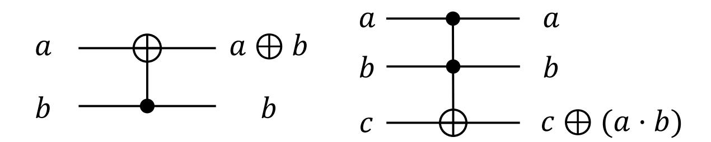
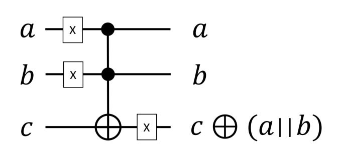
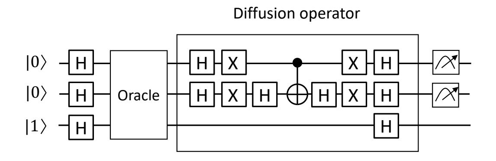
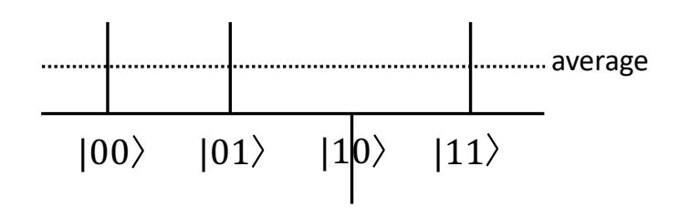
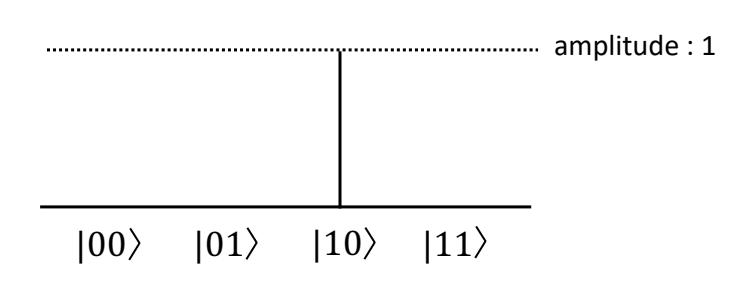
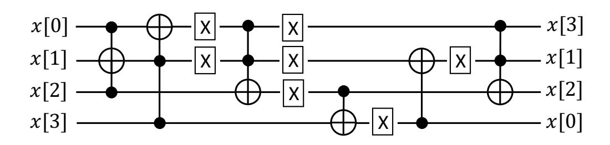

{0}------------------------------------------------

# Grover on GIFT

Kyoungbae Jang, Hyunjun Kim, Siwoo Eum, and Hwajeong Seo?

IT Department, Hansung University, Seoul, South Korea, {starj1023, khj930704, shuraatum, hwajeong84}@gmail.com

Abstract. Grover search algorithm can be used to find the n-bit secret key at the speed of <sup>√</sup> n, which is the most effective quantum attack method for block ciphers. In order to apply the Grover search algorithm, the target block cipher should be implemented in quantum circuits. Many recent research works optimized the expensive substitute layer to evaluate the need for quantum resources of AES block ciphers. Research on the implementation of quantum circuits for lightweight block ciphers such as SIMON, SPECK, HIGHT, CHAM, LEA, and Gimli, an active research field, is also gradually taking place. In this paper, we present optimized implementations of GIFT block ciphers for quantum computers. To the best of our knowledge, this is the first implementation of GIFT in quantum circuits. Finally, we estimate quantum resources for applying the Grover algorithm to the our optimized GIFT quantum circuit.

Keywords: Quantum Computers · Quantum Gates · Grover search Algorithm · GIFT · SPECK · SIMON · Gimli · Lightweight Block Ciphers

## 1 Introduction

As the Internet of Things (IoT) technology advances, numerous wearable devices and smart devices are gradually spreading through people's lives [1]. A lot of data is being exchanged and processed between these IoT devices, from simple sensor data to sensitive personal data. To protect these sensitive data, we need to properly secure the data exchange process. To achieve the security, cryptographic algorithms must be applied to the data. However, applying the cryptographic algorithm requires resources including memory and computational power. Since most of the IoT devices have low computing power and low memory usage, there are not enough resources to apply the traditional cryptographic algorithms for conventional computers.

Lightweight cryptography has been actively studied to resolve this hard condition [2]. Unlike classical cryptography, the lightweight cryptography is designed for low-end devices. Most lightweight cryptography focuses on efficient use of resources to operate on resource-constrained devices.

In CHES'07, a family of lightweight block ciphers PRESENT with Substitution-Permutation-Network(SPN) structure was introduced [3]. In 2013, National Security Agency(NSA) developed lightweight block ciphers including SPECK and

<sup>?</sup> Corresponding Author

{1}------------------------------------------------

SIMON for the low-end devices [4]. SIMON is optimized for performance in hardware implementations, while SPECK is optimized for software implementations. In CHES'15, combining the advantages of SIMON and SPECK, a new family of lightweight block ciphers SIMECK was introduced [5]. In 2017, a new family of lightweight block ciphers GIFT that improved PRESENT in terms of safety and performance was proposed [6].

In the field of symmetric key, the impact of quantum computers and Grover's algorithm reduces the security level with n-bit secret key to O(2n/<sup>2</sup> ) [7]. Applying the Grover search algorithm to block ciphers is the way to evaluate the security of block ciphers against attacks by quantum computers. Since the development of quantum computer is rudimentary step, finding the optimal quantum resource for target algorithm is one of the most important issue.

In order to estimate the quantum resources, a number of block cipher implementations have been investigated [8–11]. Grassl et al. estimated the quantum resource required for AES block cipher to apply the Grover search algorithm [8]. Afterward, Langenberg et al. and Jaques et al. found more optimal substitute layer design in quantum circuit than Grassl et al [9, 10]. Recently, the research on lightweight block ciphers is also gradually taking place. Anand et al. estimated the quantum resources required for SIMON block ciphers to apply the Grover search algorithm and Jang et al. estimated the quantum resources required for the SPECK block cipher [11, 12]. In [?], Schlieper estimated quantum resources required for Gimli block cipher. In [13], the quantum resource estimation on Korean block ciphers including HIGHT, LEA, and CHAM were presented.

By comparing the quantum implementations of SIMON optimized for hardware and SPECK optimized for software [11, 12], we confirmed that the hardware optimized operations are well optimized for quantum computers.

In this paper, we optimize the quantum circuits for lightweight block ciphers GIFT, which improved PRESENT. We implemented a hardware-friendly Substitution as a quantum circuit for GIFT. A lot of qubits could be saved compared to the software-friendly Substitution. In addition, AddRoundKey was optimized for quantum circuit. Finally, we estimate the resources for applying Grover's algorithm to GIFT.

### 1.1 Contribution

- First GIFT block cipher implementation on quantum gates To the best of our knowledge, this is the first implementation of GIFT block cipher in quantum circuits. Required quantum resources for Grover search algorithm on GIFT block cipher is firstly presented.
- Optimized operations for GIFT block cipher in quantum circuits Optimizing the number of qubits is one of the most important requirements when implementing a quantum circuit. Quantum circuit implementations often allocate additional qubits. However, by taking advantage of the hardware-friendly substitution operation, we did not allocate any qubits except for the initial key qubits and the plaintext qubits.

{2}------------------------------------------------

– In-depth analysis of quantum resource estimation for lightweight block ciphers The proposed GIFT implementation is analyzed in terms of qubits, Toffoli gate, CNOT gate, X gate, and circuit depth to show the detailed quantum resource estimation. Finally, we estimate the resources for applying Grover's algorithm to GIFT.

## 2 Related Work

#### 2.1 GIFT

A family of lightweight block ciphers GIFT with SPN structure consists of two ciphers, including GIFT-64/128 and GIFT-128/128. GIFT-64/128 uses 64 bit plaintext, 128-bit initial key and consists of 28 rounds. GIFT-128/128 uses 128-bit plaintext, 128-bit initial key and consists of 40 rounds. Round of GIFT consists of three steps, including Substitution, Permutation, and AddRoundKey. The Sbox is applied first. The n-bit plaintext is divided into 4-bit and applied to each Sbox(n = 64, 128). GIFT-64/128 and GIFT-128/128 use the same invertible 4-bit Sbox. The action of Sbox is shown in Table 1.

Table 1. GIFT Sbox.

| x       | 0 | 1 | 2 | 3 | 4 | 5 | 6 | 7 | 8 | 9 | a | b | c | d | e | f |
|---------|---|---|---|---|---|---|---|---|---|---|---|---|---|---|---|---|
| Sbox(x) | 1 | a | 4 | c | 6 | f | 3 | 9 | 2 | d | b | 7 | 5 | 0 | 8 | e |

GIFT-64 and GIFT-128 use different bit permutation. Details of the GIFT-64 bit permutation are shown in Table 2. The bit permutation P64(i) changes the bit position of the input i to P64(i). We omitted the details of the GIFT-128 permutation and these are described in [6].

Table 2. GIFT-64 bit permutation

| i      | 0  | 1  | 2  | 3  | 4  | 5  | 6  | 7  | 8  | 9  | 10 | 11 | 12 | 13 | 14 | 15 |
|--------|----|----|----|----|----|----|----|----|----|----|----|----|----|----|----|----|
| P64(i) | 0  | 17 | 34 | 51 | 48 | 1  | 18 | 35 | 23 | 49 | 2  | 19 | 16 | 33 | 50 | 3  |
| i      | 16 | 17 | 18 | 19 | 20 | 21 | 22 | 23 | 24 | 25 | 26 | 27 | 28 | 29 | 30 | 31 |
| P64(i) | 4  | 21 | 38 | 55 | 52 | 5  | 22 | 39 | 36 | 53 | 6  | 23 | 20 | 37 | 54 | 7  |
| i      | 32 | 33 | 34 | 35 | 36 | 37 | 38 | 39 | 40 | 41 | 42 | 43 | 44 | 45 | 46 | 47 |
| P64(i) | 8  | 25 | 42 | 59 | 56 | 9  | 26 | 43 | 40 | 57 | 10 | 27 | 24 | 41 | 58 | 11 |
| i      | 48 | 49 | 50 | 51 | 52 | 53 | 54 | 55 | 56 | 57 | 58 | 59 | 60 | 61 | 62 | 63 |
|        |    |    |    |    |    |    |    |    |    |    |    |    |    |    |    |    |

AddRoundKey consists of the following two processes. First, An n/2-bit of the round key is extracted and added to n-bit ciphertext bn−1, bn−2...b0. Second, the round constant C is added.

{3}------------------------------------------------

For GIFT-64, two 16-bit words are extracted from the key value k = k7, ..., k<sup>0</sup> and used as RK = U||V = u15...u0||v15...v0(U = k1, V = k0). U and V are XORed to b4i+1 and b4<sup>i</sup> of the ciphertext.

$$b_{4i+1} \leftarrow b_{4i+1} \oplus u_i, \ b_{4i} \leftarrow b_{4i} \oplus v_i, \ i = 0, ..., 15$$
 (1)

For GIFT-128, four 16-bit words are extracted and used as RK = U||V = u31...u0||v31...v<sup>0</sup> (U = k5||k4, V = k1||k0).

$$b_{4i+2} \leftarrow b_{4i+2} \oplus u_i, \ b_{4i+1} \leftarrow b_{4i+1} \oplus v_i, \ i = 0, ..., 31$$
 (2)

After the round key is used, the key state is updated as follows to generate the next round key. Notation ≫ means an i-bit right rotation within a 16-bit word.

$$k_7||k_6||...||k_1||k_0 \leftarrow k_1 \gg 2||k_0 \gg 12||...||k_3||k_2,$$
 (3)

GIFT-64 and GIFT-128 use the same round constant C. A single bit 1 and round constant C = c5c4c3c2c1c<sup>0</sup> are XORed into the ciphertext as follows.

Rounds Constants 1 ∼ 16 01 03 07 0F 1F 3E 3D 3B 37 2F 1E 3C 39 33 27 0E 17 ∼ 32 1D 3A 35 2B 16 2C 18 30 21 02 05 0B 17 2E 1C 38

33 ∼ 48 31 23 06 0D 1B 36 2D 1A 34 29 12 24 08 11 22 04

Table 3. Round constant C

$$b_{n-1} \leftarrow b_{n-1} \oplus 1, b_{23} \leftarrow b_{23} \oplus c_5, \ b_{19} \leftarrow b_{19} \oplus c_4, \ b_{15} \leftarrow b_{15} \oplus c_3, b_{11} \leftarrow b_{11} \oplus c_2, \ b_7 \leftarrow b_7 \oplus c_1, \ b_3 \leftarrow b_3 \oplus c_0.$$

$$(4)$$

#### 2.2 Quantum Implementations and Algorithms

Quantum Gates Quantum computers have several gates that can emulate the classical gates. Two most representative gates are CNOT and Toffoli gates. The CNOT gate performs a NOT gate operation on the second qubit when the first input qubit of the two input qubits is set as one. This gate performs the same role as the addition operation on the binary field. The circuit configuration is shown on the left side of Figure 1. The Toffoli gate takes three qubits as input. When the first and second qubits are set to one, the gate performs a NOT gate operation on the last qubit. This serves as an AND operation on the binary field. The circuit configuration for Toffoli gate is shown on the right side of Figure 1.

{4}------------------------------------------------



Fig. 1. CNOT(left) and Toffoli(right) gate.

The OR operation can be implemented by utilizing the Toffoli gate and the X gate. However, after the OR operation, the values of the input qubits a and b are inverted due to the X gate, so if the values of a and b before the operation are needed, a reversible operation that performs the X gates after the Toffoli gate is required. The non-reversible OR quantum circuit is shown in Figure 2.



Fig. 2. OR quantum circuit.

Grover Search Algorithm The Grover search algorithm is a quantum algorithm that finds specific data for n unsorted data. The classic method requires O(2n) searches in brute force attack. However, this can be found within O(2n/<sup>2</sup> ) times with Grover search algorithm. Grover search algorithm consists of an oracle function and a diffusion operator, as shown in the Figure 3.



Fig. 3. Grover search algorithm.

{5}------------------------------------------------

The oracle function f(x) returns 1 if input x is the solution to the search. Otherwise, it returns 0. When f(x) = 1, the sign of the state x is flipped. It then proceeds to the diffusion operator step, which increases the amplitude of the solution. The searching step is as follows: First, the average amplitude is calculated for all data. Second, the difference between the amplitude and the average amplitude of each data is calculated. If the answer to find in the 2-bit input is 10, the status after these two steps is as shown in the Figure 4.



Fig. 4. Condition after oracle of Grover algorithm.

After performing the oracle function, the amplitude of the solution has a different sign from other amplitudes. The difference from the average amplitude increases and the difference between the non-answer amplitudes decreases. Grover search algorithm increases the amplitude probability of the solution by repeating the oracle function and diffusion operators. The status after diffusion operations is given in Figure 5.



Fig. 5. Condition after diffusion of Grover algorithm.

## 3 Proposed Method

In the proposed GIFT−n/128 quantum circuit, a total of (128+n)-qubits were used with n-qubits for n-bit plaintext and 128-qubits for 128-bit key. We optimized without additional qubits.

In classical computers, the output value of Sbox can be matched according to the input value. However, the previous method is impossible in quantum computers where multiple values exist simultaneously. Therefore, the operation 

{6}------------------------------------------------

that derives the output of Sbox must be implemented as a quantum circuit. In [6], the authors implemented two types of GIFT Sbox. One is a softwarefriendly implementation, and the other is a hardware-friendly implementation. The detailed process for these is in Algorithm 1, 2.

#### Algorithm 1 Software-friendly implementation of GIFT Sbox

```
Input: x = x[3], x[2], x[1], x[0]
1: x[1] = x[1] XOR (x[0] AND x[2])
2: t = x[0] XOR (x[1] AND x[3])
3: x[2] = x[2] XOR (t OR x[1])
4: x[0] = x[3] XOR x[2]
5: x[1] = x[1] XOR x[3]
6: x[0] = NOT x[0]
7: x[2] = x[2] XOR (t AND x[1])
8: x[3] = t
9: return x = x[3], x[2], x[1], x[0]
```

In Algorithm 1, which is a software-friendly Sbox operation, the input bits entering the operation and the output bit becoming the result are sometimes different (e.g. x[0] = x[3] XOR x[2]). In quantum computers, unlike classical computers, qubits cannot be overwritten or initialized to zero. If Algorithm 1 is designed as a quantum circuit, additional qubits must be used. However, in the hardware-friendly Sbox of Algorithm 2, the input bits entering the operation and the output bit resulting are always the same. Therefore, we implemented Algorithm 2 as a quantum circuit. As a result, it was possible to optimize implementation without additional qubits. The optimized quantum circuit implementation for Algorithm 2 is shown in Algorithm 3.

#### Algorithm 2 Hardware-friendly implementation of GIFT Sbox

```
Input: x = x[3], x[2], x[1], x[0]
1: x[1] = x[1] XNOR (x[0] NAND x[2])
2: x[0] = x[0] XNOR (x[1] NAND x[3])
3: x[2] = x[2] XNOR (x[0] NOR x[1])
4: x[3] = x[3] XNOR x[2]
5: x[1] = x[1] XNOR x[3]
6: x[2] = x[2] XNOR (x[0] NAND x[1])
7: return x = x[0], x[2], x[1], x[3]
```

Lines 1, 2, 3, and 6 of Algorithm 2 perform NOT operation twice, so the NOT operation is negligible. In Algorithm 3, the order of the input qubits and return qubits is changed. This can be done by performing a Swap gate on x[0] and x[3]. However, this can be solved by relabeling the qubits without using the Swap gate. Therefore, the Swap gate that changes the position of the qubit is not

{7}------------------------------------------------

#### Algorithm 3 Quantum circuit implementation of GIFT S-box

```
Input: x = x[3], x[2], x[1], x[0]
 1: x[1] ←− Toffoli (x[0], x[2], x[1])
 2: x[0] ←− Toffoli (x[1], x[3], x[0])
 3: x[0] ←− X (x[0])
 4: x[1] ←− X (x[1])
 5: x[2] ←− Toffoli (x[0], x[1], x[2])
 6: x[2] ←− X (x[2])
 7: x[0] ←− X (x[0]) (reverse)
 8: x[1] ←− X (x[1]) (reverse)
 9: x[3] ←− CNOT (x[2], x[3])
10: x[3] ←− X (x[3])
11: x[1] ←− CNOT (x[3], x[1])
12: x[1] ←− X (x[1])
13: x[2] ←− Toffoli (x[0], x[1], x[2])
14: return x = x[0], x[2], x[1], x[3]
```

calculated as a quantum resource. The quantum circuit for GIFT Sbox is shown in Figure 6.



Fig. 6. Quantum circuit for GIFT Sbox

After Sbox operation, Permutation is performed. However, as mentioned earlier, changing the bit position can be performed with the Swap gate and the cost is negligible. Therefore, the GIFT permutation operation can be performed without an additional gate by relabeling the qubits.

In AddRoundKey, the n/2-bit round key RK is XORed to the n-bit ciphertext x and the quantum circuit implementation of GIFT-64/128 AddroundKey is shown in Algorithm 4. GIFT-128/128 AddRoundKey is differs only in the number of bits compared to GIFT-64/128. The quantum circuit implementation of GIFT-128/128 AddroundKey is shown in Algorithm 5.

After the round key is used, the key state is updated as shown in the 3. The Keyschedule also does not require quantum resources at all because it only changes the bit position like Permutation.

Finally, the single bit 1 and the round constant C in Table 3 are XORed to ciphertext x. Since we all know the round constant C for the quantum circuit implementation, we passed the X gate to the position x only for the position where the qubit of C is 1. For example, in the case of round 2, c<sup>0</sup> and c<sup>1</sup> are

{8}------------------------------------------------

## Algorithm 4 Quantum circuit implementation of GIFT-64/128 AddRoundKey

```
Input: x = x[0], ...x[63], RK = RK[0], ..., RK[31]
1: for i = 0 to 15 do
2: x[4i] ←− CNOT (RK[i], x[4i])
3: x[4i + 1] ←− CNOT (RK[i + 16], x[4i + 1])
4: end for
5: return x = x[0], ..., x[63]
```

Algorithm 5 Quantum circuit implementation of GIFT-128/128 AddRound-Key

```
Input: x = x[0], ...x[127], RK = RK[0], ..., RK[63]
1: for i = 0 to 31 do
2: x[4i + 1] ←− CNOT (RK[i], x[4i + 1])
3: x[4i + 2] ←− CNOT (RK[i + 32], x[4i + 2])
4: end for
5: return x = x[0], ..., x[127]
```

1 because C=0x03. Therefore X gate(x[3]) and X gate(x[7]) are executed, and X gate(x[n − 1]) is performed for a single bit. In this way, we did not allocate qubits for C and we optimized it using cheaper X gates instead of CNOT gates.

## 4 Evaluation

The implementation is evaluated with the quantum computer emulator. In particular, IBM ProjectQ framework is utilized<sup>1</sup> [14]. IBM ProjectQ provides the quantum computer compiler and quantum resource estimator. Quantum resources are estimated in terms of qubit, Toffoli gate, CNOT gate, and X gate. The proposed implementation focused on the optimal number of qubit and Toffoli gate.

In Table 4, the quantum resources for GIFT block ciphers are given. In terms of qubit, we used the minimum number of qubits to allocate the key value and the plaintext value. GIFT block ciphers require less number of Toffoli and CNOT gates than other block ciphers. The reason is that quantum resources are not required for Permutation and Keyschedule.

Table 4. Quantum resources for GIFT.

| Block Cipher | Qubits | Toffoli gates | CNOT gates | X gates | Circuit depth |
|--------------|--------|---------------|------------|---------|---------------|
| GIFT-64/128  | 192    | 1,792         | 1,792      | 3,261   | 308           |
| GIFT-128/128 | 256    | 6,144         | 6,144      | 10,953  | 528           |

<sup>1</sup> https://github.com/ProjectQ-Framework/ProjectQ

{9}------------------------------------------------

In [15], the authors say that r = (key size/block size) known plaintext/ciphertext pairs are needed to apply the Grover search algorithm to block ciphers. In [16], the resources for applying the Grover algorithm to their AES quantum implementation in parallel were estimated.

According to [15], [16], we need a total of r·q+1 qubits, where q is the number of qubits required to implement GIFT. In case of GIFT-64/128, the gate cost is 4 times the result of Table 4 because GIFT-64/128 requires 4 instances. In case of GIFT-128/128, the gate cost is 2 times the result of Table 4 because GIFT-64/128 requires 2 instances.

Additionally, 2·(r−1)· (key size) CNOT gates are required for parallel search. In Table 5, quantum resources for applying Grover's algorithm to GIFT are shown.

| Block Cipher | Qubits | Toffoli gates | CNOT gates | X gates |
|--------------|--------|---------------|------------|---------|
| GIFT-64/128  | 385    | 7,168         | 7,424      | 13,044  |
| GIFT-128/128 | 257    | 12,288        | 12,288     | 21,906  |

Table 5. Quantum resources for applying Grover's algorithm to GIFT

## 5 Conclusion

In this paper, we presented the first GIFT block cipher implementation on quantum computers. Our proposed method can design optimal quantum circuit for GIFT in terms of qubits and quantum gates. We also estimated quantum resources for applying Grover's algorithm.

Future work is the implementation of other block ciphers to evaluate the quantum resources for Grover search algorithm. One of the most promising candidate is NIST's lightweight cryptography competition<sup>2</sup> . Since many new block ciphers were suggested in this competition, quantum resource estimation on these block ciphers are interesting. Another candidate is the result of FELICS competition<sup>3</sup> [17]. The competition evaluated a number of lightweight block ciphers on low-end microcontrollers. It would be interesting to compare the performance comparison on low-end microcontrollers and quantum computers, whether there is relation between them or not.

## References

- 1. Luigi Atzori, Antonio Iera, and Giacomo Morabito. The Internet of Things: A survey. Computer networks, 54(15):2787–2805, 2010.
- 2. Alex Biryukov and L´eo Paul Perrin. State of the art in lightweight symmetric cryptography. 2017.

<sup>2</sup> https://csrc.nist.gov/projects/lightweight-cryptography

<sup>3</sup> https://www.cryptolux.org/index.php/FELICS

{10}------------------------------------------------

- 3. Andrey Bogdanov, Lars Knudsen, Gregor Leander, Christof Paar, Axel Poschmann, Matthew Robshaw, Yannick Seurin, and C. Vikkelsoe. PRESENT: an ultra-lightweight block cipher. volume 4727, pages 450–466, 09 2007.
- 4. Ray Beaulieu, Douglas Shors, Jason Smith, Stefan Treatman-Clark, Bryan Weeks, and Louis Wingers. The SIMON and SPECK families of lightweight block ciphers. IACR Cryptology ePrint Archive, 2013(1):404–449, 2013.
- 5. Gangqiang Yang, Bo Zhu, Valentin Suder, Mark Aagaard, and Guang Gong. The SIMECK family of lightweight block ciphers. pages 307–329, 09 2015.
- 6. Subhadeep Banik, Thomas Peyrin, Yu Sasaki, Siang Meng Sim, and Yosuke Todo. GIFT: A small present. pages 321–345, 08 2017.
- 7. Lov K Grover. A fast quantum mechanical algorithm for database search. In Proceedings of the twenty-eighth annual ACM symposium on Theory of computing, pages 212–219, 1996.
- 8. Markus Grassl, Brandon Langenberg, Martin Roetteler, and Rainer Steinwandt. Applying Grover's algorithm to AES: quantum resource estimates. In Post-Quantum Cryptography, pages 29–43. Springer, 2016.
- 9. Brandon Langenberg, Hai Pham, and Rainer Steinwandt. Reducing the cost of implementing AES as a quantum circuit. Technical report, Cryptology ePrint Archive, Report 2019/854, 2019.
- 10. Samuel Jaques, Michael Naehrig, Martin Roetteler, and Fernando Virdia. Implementing Grover oracles for quantum key search on AES and LowMC. In Annual International Conference on the Theory and Applications of Cryptographic Techniques, pages 280–310. Springer, 2020.
- 11. Ravi Anand, Arpita Maitra, and Sourav Mukhopadhyay. Grover on SIMON, 04 2020.
- 12. Kyungbae Jang, Seungjoo Choi, Hyeokdong Kwon, and Hwajeong Seo. Grover on SPECK: Quantum resource estimates. Cryptology ePrint Archive, Report 2020/640, 2020. https://eprint.iacr.org/2020/640.
- 13. Kyoungbae Jang, Seungju Choi, Hyeokdong Kwon, Hyunji Kim, Jaehoon Park, and Hwajeong Seo. Grover on Korean block ciphers. Applied Sciences, 10(18):6407, 2020.
- 14. Damian S Steiger, Thomas H¨aner, and Matthias Troyer. ProjectQ: an open source software framework for quantum computing. Quantum, 2:49, 2018.
- 15. Brandon Langenberg Yi-Kai Liu Eddie Schoute Amento-Adelmann Brittanney, Markus Grassl and Rainer Steinwandt. Quantum Cryptanalysis of Block Ciphers: A Case Study. In Poster at Quantum Information Processing QIP, 2018.
- 16. B. Langenberg, H. Pham, and R. Steinwandt. Reducing the cost of implementing the advanced encryption standard as a quantum circuit. IEEE Transactions on Quantum Engineering, 1:1–12, 2020.
- 17. Daniel Dinu, Alex Biryukov, Johann Großsch¨adl, Dmitry Khovratovich, Yann Le Corre, and L´eo Perrin. FELICS–fair evaluation of lightweight cryptographic systems. In NIST Workshop on Lightweight Cryptography, volume 128, 2015.