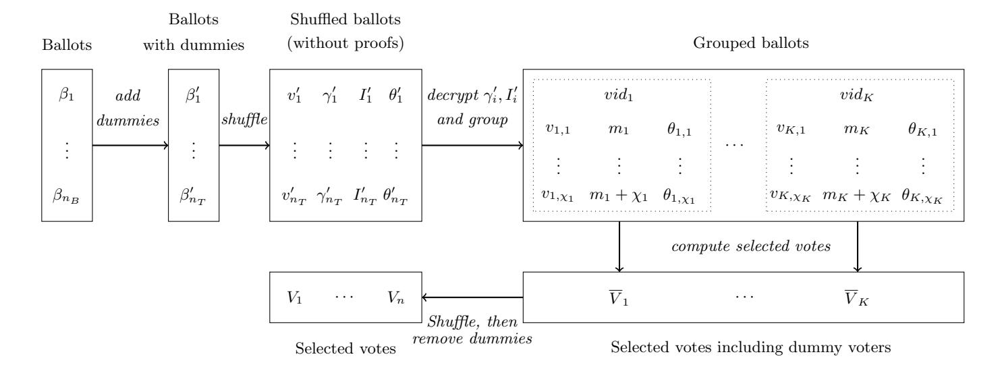

{0}------------------------------------------------

# How not to VoteAgain: Pitfalls of Scalable Coercion-Resistant E-Voting

Thomas Haines<sup>1</sup> and Johannes M¨uller2[0000−0003−2134−3099]

<sup>1</sup> Norwegian University of Science and Technology, Norway, firstname.lastname@ntnu.no <sup>2</sup> SnT, University of Luxembourg, Luxembourg, firstname.lastname@uni.lu

Abstract. Secure electronic voting is a relatively easy exercise if a single authority can be completely trusted. In contrast, the construction of efficient and usable schemes which provide strong security without strong trust assumptions is still an open problem, particularly in the remote setting. Coercion-resistance is one of, if not the hardest property to add to a verifiable e-voting system. Numerous secure e-voting systems have been designed to provide coercion-resistance. One of these systems is VoteAgain (Usenix Security 2020) whose security we revisit in this work. We discovered several pitfalls that break the security properties of Vote-Again in threat scenarios for which it was claimed secure. The most critical consequence of our findings is that there exists a voting authority in VoteAgain which needs to be trusted for all security properties. This means that VoteAgain is as (in)secure as a trivial voting system with a single and completely trusted voting authority. We argue that this problem is intrinsic to VoteAgain's design and could thus only be resolved, if possible, by fundamental modifications.

We hope that our work will ensure that VoteAgain is not employed for real elections in its current form. Further, we highlight subtle security pitfalls to avoid on the path towards more efficient, usable, and reasonably secure coercion-resistant e-voting. To this end, we conclude the paper by describing the open problems which need to be solved to make VoteAgain's approach secure.

### <span id="page-0-0"></span>1 Introduction

In Australia, Brazil, India, the US, and many other countries, systems for electronic voting (e-voting) are often used for political elections. It is crucial for such elections to protect voters against being coerced to vote or not to vote for a certain candidate, to abstain from voting, or to sell their votes. A legal approach to mitigate the risk of coercion is to ensure that "[any] coercion of voters should be prohibited by penal laws and those laws should be strictly enforced", as required by the international standards of elections of the UN Committee on Human Rights [\[25\]](#page-19-0). Since, realistically, the risk of being penalized may not be sufficient to deter possible coercers, the threat of coercion must also be counteracted at a technical level. To this end, numerous e-voting systems have been designed that 

{1}------------------------------------------------

aim to protect against coercion (see, e.g., [\[1,](#page-17-0) [2,](#page-17-1) [6,](#page-17-2) [7,](#page-17-3) [11,](#page-18-0) [15,](#page-18-1) [21,](#page-19-1) [28,](#page-19-2) [31\]](#page-20-0)), or to mitigate its risk (see, e.g., [\[5,](#page-17-4) [13,](#page-18-2) [18,](#page-18-3) [26,](#page-19-3) [27\]](#page-19-4)), by technical means. This property is called coercion-resistance.

In a coercion-resistant e-voting system, each coerced voter has the option to run some counter-strategy instead of obeying the coercer. By running the counter-strategy, the coerced voter can achieve her own goal (e.g., to vote for her favorite candidate). At the same time, the coercer cannot distinguish whether the coerced voter followed his instructions (e.g., voted for the coercer's favorite candidate) or ran the counter-strategy. From a technical perspective, there exist three different approaches in the literature which implement this concept: fake credentials, masking, and deniable vote updating. We will briefly explain these different approaches next.

Fake credentials are used, for example, in [\[1,](#page-17-0) [6,](#page-17-2) [7,](#page-17-3) [11,](#page-18-0) [28\]](#page-19-2), and they work as follows. Each voter is provided with a unique and secret credential ˆc. A voter uses cˆ to submit her vote when she is not under coercion. Otherwise, if a voter is under coercion, she can create a so-called fake credential c to submit her coerced vote. Since the voter's fake credential is invalid, the respective vote will be secretly removed by the voting authorities. At the same time, the fake credential c and the real one ˆc are indistinguishable from a coercer's perspective.

The masking technique is employed, for example, in [\[2,](#page-17-1) [31\]](#page-20-0). Its idea is the following one. Each voter is provided with a unique and secret mask ˆm. A voter uses ˆm to blind her actual vote ˆv when she is not under coercion. Otherwise, if a voter is being coerced to vote for a different choice v, then she computes a fake mask m such that the resulting blinded vote still remains a vote for her actual choice ˆv.

In both the fake credential and masking approach, the counter-strategies appear to be hardly usable by human voters (see, e.g., [\[20,](#page-19-5) [24\]](#page-19-6)) so that these two concepts may be rendered completely ineffective for real practical elections. Achieving coercion-resistance via deniable vote updating, as described next, is more promising.

The idea of e-voting with deniable vote updating (e.g., [\[15,](#page-18-1) [21\]](#page-19-1)) is to enable each voter to overwrite her previously submitted ballot, that she may have cast under coercion, such that no-one else, including a possible coercer, can see whether or not the voter has subsequently updated her vote.

VoteAgain is an e-voting system that follows the concept of coercion-resistance via deniable vote updating. It was recently proposed by Lueks, Querejeta-Azurmendi, and Troncoso [\[23\]](#page-19-7) (Usenix Security 2020). VoteAgain aims to provide superior usability to previous approaches by relieving voters to store cryptographic state (e.g., secret signing keys). Lueks et al. implemented a prototype of VoteAgain to evaluate its practicality: their benchmarks demonstrate that VoteAgain is very efficient, even for large-scale elections.

Importantly, Lueks et al. formally analyzed the security of VoteAgain in terms of coercion-resistance as well as ballot privacy, which guarantees that the protocol does not leak more information on each single voter's choice than what can be derived from the final election result, and verifiability, which guarantees

{2}------------------------------------------------

<span id="page-2-0"></span>

|          |            |           | Ballot Privacy Verifiability Coercion-resistance |
|----------|------------|-----------|--------------------------------------------------|
| PA       | Untrusted  | Trusted   | Trusted                                          |
| TS       | Untrusted  | Untrusted | Trusted                                          |
| PBB      | Untrusted  | Untrusted | Untrusted?                                       |
| Trustees | k-out-of-n | Untrusted | Untrusted                                        |

Fig. 1: Trust assumptions under which VoteAgain was originally claimed to provide the respective security properties. PA denotes the polling authority, TS the tally server, and PBB the public bulletin board. (?We consider the case that voters submit their ballots anonymously.)

that it can be verified whether the election result corresponds to the voters' choices. In a nutshell, they stated that VoteAgain provides

- ballot privacy if the trustees, the voting authorities under whose joint public key voters encrypt their votes, are trusted,
- verifiability if the polling authority, the party which provides voters with anonymous voting tokens, is trusted, and
- coercion-resistance if the tally server, the voting authority which hides the voters' re-voting pattern, and the polling authority are trusted.

These trust assumptions are summarized in Fig. [1.](#page-2-0) They specify those threat scenarios for which VoteAgain was claimed secure originally [\[23\]](#page-19-7).

Our contributions. In this work, we revisit VoteAgain from a security perspective. We will show that VoteAgain falls short of the security it aimed to achieve:

- 1. We demonstrate that the polling authority needs to be trusted for all security properties (see Fig. [2\)](#page-3-0), not only for verifiability and coercion-resistance, as claimed originally (see Fig. [1\)](#page-2-0). We show that this issue immediately relates to the core of VoteAgain.
- 2. We disprove the original claim [\[23\]](#page-19-7) that the public bulletin board in Vote-Again does not need to be trusted for any security property (see Fig. [1\)](#page-2-0). We will demonstrate that a malicious public bulletin board can break privacy, verifiability, and coercion-resistance (see Fig. [2\)](#page-3-0). While trust on the public bulletin board can be mitigated by means independent of the VoteAgain protocol, our findings are yet another example that the importance of the public bulletin board for secure e-voting must not be underestimated.
- 3. We will show that the trustees, unlike claimed originally [\[23\]](#page-19-7), and thus all voting authorities, need to be trusted in VoteAgain for coercion-resistance (see Fig. [2\)](#page-3-0).

The most critical of these observations is the first one, i.e., that the polling authority in VoteAgain needs to be trusted for all security properties. If the overall security of a voting protocol reduces to a single voting authority being uncorrupted, then one could as well replace all voting authorities by the completely trusted one without affecting security. This means that VoteAgain, in 

{3}------------------------------------------------

<span id="page-3-0"></span>its original state, is insecure. But can this problem be fixed or is it intrinsic to VoteAgain's approach?

|          |            |           | Ballot Privacy Verifiability Coercion-resistance |
|----------|------------|-----------|--------------------------------------------------|
| PA       | Trusted    | Trusted   | Trusted                                          |
| TS       | Untrusted  | Untrusted | Trusted                                          |
| PBB      | Trusted    | Trusted   | Trusted                                          |
| Trustees | k-out-of-n | Untrusted | k-out-of-n                                       |

Fig. 2: Trust assumptions which are actually necessary in VoteAgain to provide the respective security properties. Differences to originally claimed trust assumptions (Fig. [1\)](#page-2-0) are bold.

We will show that, as long as the polling authority needs to be trusted for verifiability, it also needs to be trusted for privacy. We will see that the only possibility to remove this trust from the polling authority would be to let voters store private credentials not shared with the polling authority. However, as mentioned above, VoteAgain was explicitly designed to avoid this assumption in order to provide a superior level of usability. This argument demonstrates that VoteAgain's approach is not suited to achieve all originally desired properties (i.e., high efficiency, superior usability, reasonable security) simultaneously. Designing such a coercion-resistance e-voting system thus remains an open problem. Our work helps to avoid subtle security pitfalls on the path towards this goal.

Given that VoteAgain has been implemented and its (fallacious) security claims published at a top venue, we believe highlighting its substantial failings is important not only as an academic exercise but to highlight that the scheme should not be deployed in practice without substantial changes.

Outline of the paper. In Sec. [2,](#page-3-1) we give an overview of the VoteAgain protocol and the idea of the pitfalls we discovered. In Sec. [3,](#page-8-0) we describe VoteAgain with full technical details. In Sec. [4,](#page-12-0) we present the pitfalls of VoteAgain and several attacks to exploit them. In Sec. [5,](#page-14-0) we summarize and discuss our observations. We conclude in Sec. [6.](#page-16-0)

### <span id="page-3-1"></span>2 Overview

In this section, we describe the concept of VoteAgain and the pitfalls of its approach. In Sec. [2.1,](#page-4-0) we briefly recall the security properties that VoteAgain aimed to achieve. In Sec. [2.2,](#page-4-1) we explain the idea of VoteAgain; the complete protocol description can be found in Sec. [3.](#page-8-0) In Sec. [2.3,](#page-6-0) we present the pitfalls of VoteAgain's approach that we discovered, with full technical details on our attacks in Sec. [4.](#page-12-0)

{4}------------------------------------------------

#### <span id="page-4-0"></span>2.1 Security Properties

We recall the security notions of ballot privacy, verifiability, and coercion-resistance.

Ballot privacy. For most elections, it is important that outside or even inside observers (e.g., voting authorities) should not be able to tell how individual voters voted. This property is called (ballot) privacy [\[4\]](#page-17-5). It guarantees that the data published during the election (including, for example, voters' ballots, talliers' proofs of integrity, etc.) does not leak more information on the voters' plain choices than what can be derived from the final election result.

Verifiability. Numerous e-voting systems suffer from flaws which open up the opportunity for inside or outside attackers to change the election result without being detected (see, e.g., [\[14,](#page-18-4) [29,](#page-20-1) [30\]](#page-20-2)). Therefore, modern secure e-voting systems strive for what is called (end-to-end) verifiability [\[8\]](#page-17-6). This fundamental security property enables voters or external auditors to verify whether the published election result is correct, i.e., corresponds to the votes cast by the voters, even if, for example, voting devices and servers have programming errors or are outright malicious.

Coercion-resistance. A voting protocol is coercion-resistant [\[22\]](#page-19-8) if any coerced voter, instead of obeying the coercer, can run some counter-strategy such that (i) by running the counter-strategy, the coerced voter achieves her goal (e.g., successfully votes for her favorite candidate), and (ii) the coercer is not able to distinguish whether the coerced voter followed his instructions or tried to achieve her own goal. There exist several concepts in the literature to construct coercion-resistant e-voting systems. The approach taken in VoteAgain is called deniable vote updating: if a voter is coerced to vote for a certain candidate, then the voter's counter-strategy is to update her vote after the coercer has left. In this way, she can overwrite her previously cast choice. At the same time, due to some technical mechanisms in the background, it is guaranteed that the coercer is not able to distinguish whether or not the voter has subsequently updated her vote.

#### <span id="page-4-1"></span>2.2 VoteAgain

We now recall the VoteAgain protocol. In this section, we present VoteAgain in such a way that the idea of the pitfalls below can be followed. Full technical details of VoteAgain are provided in Sec. [3.](#page-8-0)

Idea. As mentioned above, VoteAgain follows the concept of coercion-resistance via deniable vote updating: each voter can overwrite her previously submitted ballots, that she may have cast under coercion, such that no-one else, including a possible coercer, can see whether or not the voter has updated her vote.

VoteAgain implements this idea as follows. In addition to the standard voting authorities which are commonly used in modern secure e-voting systems, namely a public bulletin board (PBB) and a trustee (T), VoteAgain employs two further parties, the polling authority (PA) and the tally server (TS). The role of the PA is to guarantee that each voter can cast ballots without revealing her identity 

{5}------------------------------------------------

to the public bulletin board. At the same time, the PA ensures that it can be verified whether incoming ballots were submitted by eligible voters only. The role of the TS is to hide the voters' re-voting/vote-updating pattern. In combination, these two voting authorities are supposed to securely guarantee deniable vote updating: on the one hand, every observer can verify that only eligible voters have cast the ballots on the bulletin board and that each eligible voter did not overwrite any other voter's ballot (under the assumption the PA is honest), while, on the other hand, it remains secret to any outsider whether or not a given voter has updated her ballot.

In what follows, we describe VoteAgain's approach more precisely, with full technical details provided in Sec. [3.](#page-8-0)

Participants. VoteAgain is run among the following participants:

- Voters V1, . . . , Vn: Each voter V<sup>i</sup> interacts with the polling authority and the public bulletin board to cast her ballots. It is assumed that each voter can authenticate herself to the polling authority. The voters encrypt their choices under the trustee's public key.
- Polling Authority (PA): The PA provides each eligible voter with a one-time voting token. The voter can then use this token to sign her ballot without revealing her identity to the public bulletin board.
- Public Bulletin Board (PBB): The PBB is an append-only list which contains all public information, including the voters' cast ballots, as well as proofs and results published by the election/tallying authorities during the tally phase.
- Tally Server (TS): The TS adds dummy ballots (encryptions of 0 under the trustee's public key), shuffles all ballots, groups them by voter, and selects the last ballot for each voter.
- Trustee (T): [3](#page-5-0) The trustee shuffles and decrypts the last ballots per voter that were selected by TS.

Protocol phases. VoteAgain proceeds in three phases (the invoked procedures are defined in Sec. [3\)](#page-8-0):

- 1. Pre-election phase: The election authorities set up their public/private key material. The polling authority PA initializes the voters' anonymous identifiers (Procedure 1).
- 2. Election phase: Voters authenticate to PA every time they vote to obtain a one-time voting token (Procedure 2). They then use the token to cast a ballot (Procedure 3). The public bulletin board PBB verifies the correctness and eligibility of each incoming ballot (Procedure 4). Note that voters can re-vote multiple times.
- 3. Tally phase: The tally server TS adds dummy ballots to hide the voters' re-voting pattern, makes real and dummy ballots publicly indistinguishable,

<span id="page-5-0"></span><sup>3</sup> The role of the trustee T is distributed in the original VoteAgain protocol [\[23\]](#page-19-7). For the sake of brevity, we assume that the trustee is a single entity.

{6}------------------------------------------------

selects the last ballot for each real and dummy voter, and removes the dummies again (Procedure 5). The trustee T shuffles and decrypts the ballots previously returned by TS (Procedure 6).

The verification program of VoteAgain follows immediately from the protocol description: essentially, the proofs published by the different parties on PBB are checked. We refer to [\[23\]](#page-19-7) (Procedures 7 and 8) for details.

### <span id="page-6-0"></span>2.3 Pitfalls

We show that VoteAgain [\[23\]](#page-19-7) is not secure under the trust assumptions for which it was claimed to be (Fig. [1\)](#page-2-0). We describe our findings in what follows, with full details presented in Sec. [4.](#page-12-0) Our results are summarized in Fig. [2.](#page-3-0)

Impact of corrupted PA. Recall that the polling authority PA provides each eligible voter with one-time voting tokens. In order to guarantee deniable vote updating (and thus coercion-resistance), the links between the individual voters and their ballots signed with the voting tokens remain hidden. Since a malicious PA could tamper with the distribution of the voting tokens undetectably, the PA needs to be trusted for verifiability. This was already stated in the original VoteAgain paper but its implication to ballot privacy was apparently overlooked (Fig. [1\)](#page-2-0). In secure e-voting, there is a strong relationship between verifiability and ballot privacy: if ballots can be dropped or replaced undetectably, then privacy of the remaining ballots is undermined [\[9\]](#page-18-5).

In Sec. [4,](#page-12-0) we show how this general threat applies to VoteAgain in its worst form. Unlike in most other e-voting protocols (e.g., Helios) where only a small number of ballots can be dropped without being detected, a malicious PA in VoteAgain can replace an arbitrary number of ballots completely secretly. This vulnerability results into two risks which, in combination, can have a devastating effect: (1) By replacing many ballots except for just a few, privacy of the untouched ballots can be broken with extremely high probability. (To see this, assume that all but one ballot are replaced.) Since, in political elections, typically the final result of each district is published, such an attack can be executed in each district separately so that, in total, ballot privacy of many voters may be put at risk. (2) By replacing ballots with reasonably distributed choices, the tracks of the privacy attack can easily be covered.

The consequence of this observation is disillusioning: there exists a voting authority in VoteAgain (namely the PA) which needs to be trusted for all security properties: ballot privacy, verifiability, and coercion-resistance. This means that VoteAgain is as (in)secure as a trivial voting protocol with a single and completely trusted voting authority which is responsible for the whole voting process.

Impact of corrupted trustee. The role of the tally server TS is to hide the voters' re-voting pattern by adding indistinguishable dummy ballots which are later removed. Clearly, the PA and the TS need to be trusted for coercionresistance because both of them know whether a voter re-voted. This was already 

{7}------------------------------------------------

stated in the original VoteAgain paper (Fig. [1\)](#page-2-0). We discovered that, additionally, there exists a subtle yet momentous relationship between coercion-resistance and a possibly corrupted trustee. Assume that a coercer forces a voter to submit a sequence of ballots in which each ballot encrypts a vote for a randomly chosen candidate. By this, the coerced voter's sequence of plain votes is essentially unique and thus a "fingerprint". Now, if the trustee is corrupted, then the coerced voter's submitted ballots can be linked to the voter, even if some dummy ballots are added to the voter's ciphertexts. In other words, the secrecy of the vote updating process is undermined, even if the PA and the TS are trusted. As a result, the trustee needs to be trusted for coercion-resistance as well (Fig. [2\)](#page-3-0). Therefore, all voting authorities need to be trusted for coercion-resistance which is an assumption arguably too strong as well.

Impact of corrupted PBB. We discovered that the importance of the public bulletin board PBB was underestimated originally. Lueks et al. [\[23\]](#page-19-7) stated that even if the PBB is malicious, VoteAgain provides ballot privacy, verifiability, and coercion resistance (Fig. [1\)](#page-2-0). We discovered that, in fact, the PBB needs to be trusted for all security properties (Fig. [2\)](#page-3-0), as explained next.

If the PBB is malicious, then it can show a "faked" view on the bulletin board to a voter which includes this voter's submitted ballot. At the same time, the PBB does not append the ballot to the "real" bulletin board which it shows to the remaining parties [\[16\]](#page-18-6). In this way, the voter's ballot is effectively dropped even though the voter verified that her ballot is on "the" bulletin board. This demonstrates that the PBB needs to be trusted for verifiability.

By executing the above attack against verifiability for several voters, the choices of the remaining ballots are hidden behind less further choices, which undermines ballot privacy. We note, however, that the effect of this privacy attack (which applies to virtually all e-voting protocols) is much weaker than the devastating privacy attack of a malicious PA described above because the number of ballots that can be dropped undetectably is more limited for the following two reasons. Firstly, if at least one of the affected voter cross-checks her view on PBB, the attack is detected. Secondly, in order to obtain significant information on the remaining votes, many ballots have to be dropped but this is then reflected in the low number of votes of the final result which would raise suspicion. However, at least formally, it follows that the PBB needs to be trusted for ballot privacy as well, which disproves the original security claim.

Furthermore, a malicious PBB can break coercion-resistance as follows, even if voters submit their ballots anonymously. The coercer forces a voter to submit a ballot for a certain candidate and to reveal all secret information on the submitted ballot. The PBB identifies and accepts this ballot but drops all subsequently incoming ballots (similarly to the attack on verifiability above). By this, the coerced voter can no longer update her choice, even if the coercer is absent for the rest of the submission phase.

The PBB is a critical bottleneck in all e-voting systems, not only VoteAgain. There are several approaches to mitigate trust on the PBB which could also be used in VoteAgain (see, e.g., [\[10,](#page-18-7) [16,](#page-18-6) [17\]](#page-18-8)). Nevertheless, our findings are yet 

{8}------------------------------------------------

another example to demonstrate that the importance of the PBB for secure e-voting must not be underestimated.

### <span id="page-8-0"></span>3 Protocol Description

In this section, we precisely describe the VoteAgain protocol. The original VoteAgain protocol [23] employs specific cryptographic primitives centered around ElGamal public-key encryption [12]. We chose to abstract away from this concrete instantiation because our attacks on VoteAgain (Sec. 4) exploit the protocol design but no specific cryptographic details. We also think that our slightly more abstract presentation simplifies comprehension of the complex protocol.

**Cryptographic primitives.** VoteAgain employs the following cryptographic primitives:

- A homomorphic IND-CPA-secure public-key encryption (PKE) scheme  $\mathcal{E} = (\mathsf{EncKeyGen}, \mathsf{Enc}, \mathsf{Dec}).$
- A NIZKP of correct encryption (Prove<sup>Enc</sup>, Verify<sup>Enc</sup>) for the PKE scheme  $\mathcal{E}$  and a voting relation R which specifies valid choices.
- A NIZKP of correct decryption (Prove<sup>Dec</sup>, Verify<sup>Dec</sup>) for the PKE scheme  $\mathcal{E}$ .
- A shuffle algorithm Shuffle [3] which takes as input a vector of ciphertexts C (w.r.t.  $\mathcal{E}$ ), re-encrypts each entry of C, permutes the vector uniformly at random, and returns the resulting shuffled ciphertext vector C' together with a proof  $\pi^{\mathsf{Shuffle}}$  that C' is correct.
- An EUF-CMA-secure signature scheme (SigKeyGen, Sign, Verify).

**Procedure 1 (Setup).** The election authorities generate their public/private key pairs and send the public keys to the bulletin board. The polling authority PA runs  $(pk_{PA}, sk_{PA}) \leftarrow SigKeyGen(1^{\ell})$  and sends  $pk_{PA}$  to PBB. The tally server TS runs  $(pk_{TS}, sk_{TS}) \leftarrow EncKeyGen(1^{\ell})$  and sends  $pk_{TS}$  to PBB. The trustee T runs  $(pk_{T}, sk_{T}) \leftarrow EncKeyGen(1^{\ell})$  and sends  $pk_{T}$  to PBB.

For each voter  $\mathcal{V}_i$ , the polling authority PA generates a pair  $(vid_i, m_i)$  uniformly at random where  $vid_i$  is the voter's (secret) identifier, and  $m_i$  is (the initial state of) the voter's ballot counter. More precisely, PA runs the following program for each  $\mathcal{V}_i$ :

```
1. vid_i \stackrel{r}{\leftarrow} \mathcal{M}_{\mathsf{Enc}}^4
2. m_i \stackrel{r}{\leftarrow} \{2^{\ell-2}, \dots, 2^{\ell-1} - 1\} \subset \mathcal{M}_{\mathsf{Enc}}
3. store (\mathcal{V}_i, vid_i, m_i) internally
```

**Procedure 2 (GetToken).** Each time a voter  $V_i$  wants to submit a ballot, the voter needs to authenticate herself to the polling authority PA. If authentication of  $V_i$  is successful, then PA sends certain one-time credentials to  $V_i$  which enable  $V_i$  to cast a single ballot without having to reveal her identity. For this purpose,

<span id="page-8-1"></span> $<sup>\</sup>overline{{}^4}$   $\mathcal{M}_{\mathsf{Enc}}$  denotes the message space of the PKE scheme  $\mathcal{E}$  (for public key  $\mathsf{pk}_{\mathsf{TS}}$ ).

{9}------------------------------------------------

PA essentially encrypts  $V_i$ 's identifier  $vid_i$  as well as her ballot counter  $m_i$  under the public key  $pk_{TS}$  of the tally server TS.

By this, on the one hand, it is not possible to coerce  $V_i$  into revealing  $vid_i$  or  $m_i$ , while, on the other hand, it can be verified that  $V_i$ 's ballot was submitted by an eligible voter and that only  $V_i$ 's last ballot is counted (if PA is trusted).

More precisely, PA executes the following steps after voter  $\mathcal{V}_i$  authenticated herself correctly:

```
1. \gamma \leftarrow \mathsf{Enc}(\mathsf{pk_{TS}}, vid_i)

2. I \leftarrow \mathsf{Enc}(\mathsf{pk_{TS}}, m_i)

3. m_i \leftarrow m_i + 1

4. (\mathsf{pk}, \mathsf{sk}) \leftarrow \mathsf{SigKeyGen}(1^{\ell})

5. \sigma^{\tau} \leftarrow \mathsf{Sign}(\mathsf{sk_{PA}}, \mathsf{pk} || \gamma || I)

6. \mathsf{send} \ \tau \leftarrow (\mathsf{pk}, \mathsf{sk}, \gamma, I, \sigma^{\tau}) \ \mathsf{to} \ \mathcal{V}_i
```

The voter can then check whether  $\mathsf{Verify}(\mathsf{pk}_{\mathsf{PA}}, \sigma^{\tau}, (\mathsf{pk} \| \gamma \| I)) = \top$  holds true. If this is the case, then  $\mathcal{V}_i$  can use  $\tau$  to cast a vote, as described next.

**Procedure 3 (Vote).** Voter  $V_i$  takes as input  $\tau = (\mathsf{pk}, \mathsf{sk}, \gamma, I, \sigma^{\tau})$  from PA (see GetToken) as well as a candidate  $c \in \mathcal{C}$  and executes the following steps to cast her ballot  $\beta$ :

```
 \begin{array}{l} 1. & (v, aux) \leftarrow \mathsf{Enc}(\mathsf{pk_T}, c) \\ 2. & \pi^{\mathsf{Enc}} \leftarrow \mathsf{Prove}^{\mathsf{Enc}}((\mathsf{pk}_T, v), (aux, c)) \\ 3. & \sigma \leftarrow \mathsf{Sign}(\mathsf{sk}, v \| \pi^{\mathsf{Enc}} \| \mathsf{pk} \| \gamma \| I \| \sigma^\tau) \\ 4. & \beta \leftarrow (v, \pi^{\mathsf{Enc}}, \mathsf{pk}, \gamma, I, \sigma^\tau, \sigma) \\ 5. & \mathsf{send} \ \beta \ \mathsf{to} \ \mathsf{PBB} \end{array}
```

For each incoming ballot  $\beta$ , PBB checks whether  $\mathsf{Valid}(\beta) = \top$  holds true (see below for algorithm  $\mathsf{Valid}$ ), and if this is the case, then PBB appends  $\beta$ . Voter  $\mathcal{V}_i$  can then verify whether  $\beta$  was appended to PBB.

**Procedure 4 (Valid).** For each incoming ballot  $\beta$ , PBB verifies whether  $\beta$  contains a valid choice, whether eligibility was acknowledged by the polling authority PA, and whether it does not contain a duplicate entry of a ballot  $\beta'$  that was already appended.

More precisely, Valid returns  $\top$  if and only if the following conditions are satisfied:

```
1. \mathsf{Verify}^{\mathsf{Enc}}(\mathsf{pk}_\mathsf{T}, v, \pi^{\mathsf{Enc}}) = \top, \text{ and}

2. \mathsf{Verify}(\mathsf{pk}, \sigma, v \| \pi^{\mathsf{Enc}} \| \mathsf{pk} \| \gamma \| I \| \sigma^\tau) = \top, \text{ and}

3. \mathsf{Verify}(\mathsf{pk}_\mathsf{PA}, \sigma^\tau, (\mathsf{pk}^{\mathsf{Enc}} \| \gamma \| I)) = \top, \text{ and}

4. (v, \ldots) \notin \beta' \text{ and } (\ldots, \mathsf{pk}, \ldots) \notin \beta' \text{ for some appended } \beta'
```

**Procedure 5 (Filter).** The tally server TS reads the list of ballots  $B \leftarrow (\beta_i)_{i=1}^{n_B}$  from PBB and verifies for each  $\beta \in B$  whether  $\mathsf{Valid}(\beta) = \top$  holds true. If this is not the case, then TS aborts. Otherwise, TS continues as follows.

Adding dummies. For each ballot  $\beta_i = (v_i, \ldots, \gamma_i, I_i, \ldots) \in B$ , the tally server executes the following steps:

{10}------------------------------------------------



Fig. 3: Overview of Procedure 5 (Filter), adopted from [23]. Notation:  $n_B$  denotes the number of ballots,  $n_D$  the number of dummies added by TS,  $n_T = n_B + n_D$  denotes their sum, K the number of (real) voters plus the number of dummy voters, and  $\chi_i$  the number of ballots for voter i (including dummy voters).

```
1. \theta_R \leftarrow \mathsf{Enc}(\mathsf{pk}_{\mathsf{TS}}, 1; 0)
2. \beta_i' \leftarrow (v_i, \gamma_i, I_i, \theta_R)
```

In other words, TS creates a "stripped" ballot  $\beta'_i$  which consists of the respective voter's encrypted candidate  $v_i$ , the voter's encrypted identifier  $\gamma_i$ , the encrypted ballot counter  $I_i$ , as well as a deterministic ciphertext  $\theta_R$  to "tag" real ballots.

Additionally, and this is one of the main ideas of VoteAgain, the tally server TS generates a number of dummy ballots which are used to hide the re-voting pattern of real voters. To this end, the tally server TS creates  $n_D$  further ballots  $\beta'_i = (v_\epsilon, \gamma_i, I_i, \theta_D)$ , where

```
 - v_{\epsilon} \leftarrow \mathsf{Enc}(\mathsf{pk}_{\mathsf{T}}, 0; 0) 
 - \theta_D \leftarrow \mathsf{Enc}(\mathsf{pk}_{\mathsf{TS}}, g; 0) \text{ for some } g \neq 1
```

holds true.

This means that each dummy ballot contains a 0-vote (with trivial randomness 0), as well as a deterministic ciphertext  $\theta_D$  to "tag" dummy ballots. The ciphertext  $\gamma_i$  either encrypts the identifier of a real voter  $\mathcal{V}_i$  in which case the encrypted ballot counter  $I_i$  of the dummy ballot is smaller than the one of the last ballot cast by  $\mathcal{V}_i$ , or the ciphertexts  $\gamma_i$  encrypts the identifier of a "fake" voter.<sup>5</sup>

The tally server TS sends the resulting list of ballots  $B' \leftarrow (\beta_i')_{i=1}^{n_B+n_D}$  to PBB.

Shuffling. The tally server TS verifiably shuffles the ciphertext vector B':

<span id="page-10-0"></span><sup>&</sup>lt;sup>5</sup> We refer to [23] (Sec. 5.2) for a detailed description of how dummy ballots are constructed precisely because the vulnerabilities of VoteAgain presented in this paper are independent of the specific cover.

{11}------------------------------------------------

```
1. (B'', \pi_{\sigma}) \leftarrow \mathsf{Shuffle}(B')
2. send (B'', \pi_{\sigma}) to PBB.
```

Grouping. For each  $\beta'' = (v_i'', \gamma_i'', I_i'', \theta_i'') \in B''$ , the tally server TS uses its secret key  $\mathsf{sk}_\mathsf{TS}$  to verifiably decrypt the encrypted identifiers and ballot counters:

```
1. for all i \leq n_B + n_D:

(a) \overline{vid}_i \leftarrow \mathsf{Dec}(\mathsf{sk}_{\mathsf{TS}}, \gamma_i'')

(b) \pi_{i,1}^{\mathsf{Dec}} \leftarrow \mathsf{Prove}^{\mathsf{Dec}}((\mathsf{pk}_{\mathsf{TS}}, \gamma_i''), \mathsf{sk}_{\mathsf{TS}})

(c) \overline{m}_i \leftarrow \mathsf{Dec}(\mathsf{sk}_{\mathsf{TS}}, I_i'')

(d) \pi_{i,2}^{\mathsf{Dec}} \leftarrow \mathsf{Prove}^{\mathsf{Dec}}((\mathsf{pk}_{\mathsf{TS}}, I_i''), \mathsf{sk}_{\mathsf{TS}})

(e) \pi_i^{\mathsf{Dec}} \leftarrow (\pi_{i,1}^{\mathsf{Dec}}, \pi_{i,2}^{\mathsf{Dec}})

2. C \leftarrow (\overline{vid}_i, \overline{m}_i, \pi_i^{\mathsf{Dec}})_{i=1}^{n_B + n_D}

3. send C to PBB
```

If there exist  $i \neq j$  such that  $(\overline{vid}_i, \overline{m}_i) = (\overline{vid}_j, \overline{m}_j)$  holds true, then TS aborts. Otherwise, TS groups all  $(\overline{vid}_i, v_i, \overline{m}_i, \theta_{\star})$  according to the identifiers  $\overline{vid}$ . We denote the resulting groups by  $(G_j)_{j=1}^K$ .

Selecting. For each group  $G_j$ , the tally server TS opts for the ciphertext  $v_{j\star}$  assigned to the highest ballot counter m in  $G_j$ . If the respective tag  $\theta$  refers to a real voter, then TS re-encrypts the ciphertext  $v_{j\star}$ , and otherwise, the TS replaces the ciphertext by a 0-vote:

```
1. j \star \leftarrow \text{index of maximal } \overline{m} \text{ in } G_j

2. if \mathsf{Dec}(\mathsf{sk}_{\mathsf{TS}}, \theta_{j \star}) = 0, then \overline{V}_j \leftarrow v_{j \star} \cdot \mathsf{Enc}(\mathsf{pk}_{\mathsf{T}}, 0)

3. else \overline{V}_j \leftarrow \mathsf{Enc}(\mathsf{pk}_{\mathsf{T}}, 0)

4. \pi_j^{\mathsf{Sel}} \leftarrow \mathsf{NIZKP} of correctness of previous steps<sup>6</sup>

5. F \leftarrow (\overline{vid}_j, \overline{V}_j, \pi_j^{\mathsf{Sel}})_{j \leq K}

6. send F to PBB
```

Removing dummies. The tally server TS verifiably shuffles the vector of selected encrypted votes  $\mathcal{S}_D \leftarrow (\overline{V}_j)_{j \leq K}$ , i.e., TS computes  $(\mathcal{S}'_D, \pi'_\sigma) \leftarrow \mathsf{Shuffle}(\mathcal{S}_D)$  and sends  $(\mathcal{S}'_D, \pi'_\sigma)$  to PBB.

Next, TS creates the list of indices  $\mathcal{D}$  of encrypted dummy votes  $\overline{V}'_j$  in the shuffled ciphertext vector  $\mathcal{S}'_D$ , and for each  $j \in \mathcal{D}$ , the tally server proves that  $\overline{V}'_j$  is an encryption of 0:

- 1.  $\mathcal{D} \leftarrow \text{indices of dummy votes in } \mathcal{S}'_D$ 2.  $R \leftarrow (r_j)_{j \in \mathcal{D}} \text{ such that } \overline{V}'_j = \mathsf{Enc}(\mathsf{pk}_\mathsf{T}, 0; r_j)^7$
- 3. send  $(\mathcal{D}, R)$  to PBB

<span id="page-11-0"></span><sup>&</sup>lt;sup>6</sup> We refer to [23] for the precise relation to be proven by this NIZKP. The details are not relevant for our purposes.

<span id="page-11-1"></span><sup>&</sup>lt;sup>7</sup> Each  $r_j$  is a simple combination of the randomness that TS used to create  $\overline{V}_k$  and of the randomness that TS then used to re-encrypt  $\overline{V}_k$  to obtain  $\overline{V}'_j$ .

{12}------------------------------------------------

Finally, the tally server TS publishes the list of votes to be decrypted by the trustee T, i.e., TS computes  $\mathcal{S} \leftarrow (\mathcal{S}'_D \setminus \mathcal{S}'_D)$  and sends  $\mathcal{S}$  to PBB.

**Procedure 6 (Tally).** In order to obtain the final election result, the trustee T verifiably shuffles  $\mathcal S$  and then uses its secret key  $\mathsf{sk}_\mathsf{T}$  to verifiably decrypt the resulting shuffled ciphertexts.

### <span id="page-12-0"></span>4 Pitfalls of VoteAgain

We elaborate on the pitfalls of VoteAgain's approach that we sketched in Sec. 2.3.

#### 4.1 Impact of corrupted PA

It was claimed in the original VoteAgain paper [23] that VoteAgain provides ballot privacy if the trustee is honest, while PA, TS, and PBB can be malicious (Fig. 1). We will now show that a malicious PA can break privacy. The idea is that the PA can impersonate any voter by simulating Procedure 2 and Procedure 3.

Attack: Let  $V_1, \ldots, V_n$  be the voters. Assume that the PA is malicious and wants to know how  $V_1, \ldots, V_l$  voted. After all voters  $V_{l+1}, \ldots, V_n$  have submitted their (last) ballots, the PA runs the voting process n - (l+1) times. In each of these processes  $i \in \{l+1, \ldots, n\}$ , the malicious PA runs Procedure 2 for voter  $V_i$ , uses  $V_i$ 's token to run Procedure 3 to submit a ballot for some arbitrary candidate  $c_i$ , and stores  $(i, c_i)$ .

Impact: By design, it is not possible to verify whether  $V_i$ ,  $i \in \{l+1,\ldots,n\}$ , has updated her vote. Therefore, the final election result consists of  $V_1,\ldots,V_l$ 's votes plus n-(l+1) votes  $(i,c_i)$  submitted by PA. The adversary can now substract all  $(i,c_i)_{i\geq l+1}$  from the public election result to obtain the (aggregated) choices of  $V_1,\ldots,V_l$ .

Remarks: We have described the attack in its most general form, i.e., for some arbitrary l. In order to obtain much information about the votes of  $\mathcal{V}_1, \ldots, \mathcal{V}_l$  from the aggregation of their votes, it is necessary to restrict l. Clearly, for l = 1, ballot privacy of  $\mathcal{V}_1$  is completely broken, but even for l > 1, significant information can be leaked, e.g., if the adversary wants to know whether all voters  $\mathcal{V}_1, \ldots, \mathcal{V}_l$  voted for the same candidate.

Recall from Sec. 2.3 that in political elections, typically the final result of each district is published, so that the above attack can be executed in each district separately and thus privacy of many voters in total may be put at risk.

Observe that, in order to not raise any suspicion, the adversary can easily choose the replacing choices  $c_i$  such that the manipulated final election result appears completely reasonable.

#### <span id="page-12-1"></span>4.2 Impact of corrupted trustee

It was claimed in the original VoteAgain paper [23] that VoteAgain provides coercion-resistance if the PA and TS are honest, while the PBB (if voters submit anonymously) and the trustees can be malicious (Fig. 1). We now describe how

{13}------------------------------------------------

an honest-but-curious trustee T can break coercion-resistance of VoteAgain. The idea is that for each voter, trustee T can decrypt the individual sequences of ciphertexts assigned to this voter's (anonymous) voter id  $\overline{vid}$ .

Attack: The adversary chooses a sequence  $(c_j)_{j=1}^l$  over the set of candidates  $\mathcal{C}$  uniformly at random. The coercer instructs a targeted voter  $\mathcal{V}$  to submit a ballot  $\beta_j$  (i.e., run Procedure 2 and Procedure 3) for each element  $c_j$  of this sequence (preserving the order of the sequence) and then a ballot  $\beta$  for the adversary's favorite candidate c.

Impact: Since the trustee is corrupted, the adversary can use  $\mathsf{sk}_\mathsf{T}$  to decrypt all  $v_{i,\star}$  for each  $\overline{vid}$  in the grouped ballots  $(G_j)_{j=1}^K$  (at the end of phase "grouping" in Procedure 5). The coercer (removes all dummy votes injected by TA and) verifies whether there exists a group  $G_j$  which contains the chosen sequence of candidates. If this is the case, the adversary knows that the voter obeyed (with overwhelming probability in l).

#### 4.3 Impact of corrupted PBB

We show that a malicious PBB can break verifiability, ballot privacy, and coercion-resistance of VoteAgain.

**Verifiability.** It was claimed in the original VoteAgain paper [23] that VoteAgain provides verifiability if the PA is honest, while the TS, PBB, and the trustee can be malicious (Fig. 1). We will now describe an attack of a malicious PBB which breaks verifiability of VoteAgain. Note that the effect of this attack can be increased by repeating it multiple times for different voters.

Attack: Let  $\mathcal{V}$  be an arbitrary voter. In Procedure 3, the PBB shows a "faked" view on the bulletin board to voter  $\mathcal{V}$  which includes  $\mathcal{V}$ 's ballot  $\beta$ . However, PBB does not append  $\beta$  to the "real" bulletin board which it shows to the remaining parties.

Impact: At the end of Procedure 3, the voter verifies successfully that  $\beta$  was appended to the "faked" bulletin board. However,  $\mathcal{V}$ 's choice is not included in the input to Procedure 5 and therefore not in the final election result. Because this manipulation remains undetected, verifiability is broken.

**Ballot Privacy.** It was claimed in the original VoteAgain paper [23] that VoteAgain provides ballot privacy if the trustee is honest, while PA, TS, and PBB can be malicious (Fig. 1). We will now show that a malicious PBB can break ballot privacy.

Attack: Let  $\mathcal{V}_1, \ldots, \mathcal{V}_n$  be the voters. Assume that the PA is malicious and wants to know how  $\mathcal{V}_1, \ldots, \mathcal{V}_l$  voted. For each voter  $\mathcal{V}_i$ ,  $i \in \{l+1, \ldots, n\}$ , the PBB executes the verifiability attack described above.

Impact: The final election result consists only of  $V_1, \ldots, V_l$ 's aggregated votes. Remark: As already noted in Sec. 2.3 this vulnerability (which applies to virtually all e-voting protocols) is of rather theoretical concern in contrast to the privacy attack of a malicious PA described above which can be devastating in real practical elections. 

{14}------------------------------------------------

Coercion-Resistance. It was claimed in the original VoteAgain paper [\[23\]](#page-19-7) that VoteAgain provides coercion-resistance if the PA and TS are honest, while the PBB (if voters submit anonymously) and the trustee can be malicious (Fig. [1\)](#page-2-0). We will now show that a malicious PBB can break coercion-resistance even if all voters submit their ballots anonymously.

Attack: The coercer chooses a candidate c ∈ C and instructs an arbitrary voter V to submit a ballot for this candidate (i.e., run Procedure 2 and Procedure 3). Furthermore, the coercer tells the voter to reveal the submitted ballot β, including all secret information from Procedure 3. The malicious PBB identifies the incoming (no longer anonymous) ballot β, append it, and drop all subsequently incoming ballots by any voter (see PBB's attack on verifiability).

Impact: The affected voter can no longer "overwrite" the coercer's choice c even if the coercer is absent for the rest of submission phase.

### <span id="page-14-0"></span>5 Discussion

Based on our insights from the previous sections, we first elaborate on related coercion-resistant or coercion-mitigating e-voting systems and their relation to VoteAgain, and then extract the challenges to be addressed for solving Vote-Again's main pitfall.

Related work. Two different forms of coercion are typically considered in the e-voting literature: vote-selling/vote-buying and forced abstention. Depending on which form of coercion should be addressed and how powerful an adversary can possibly be, different e-voting systems have been proposed.

The most challenging goal is to design e-voting systems which provide full coercion-resistance (i.e., protection against vote-buying and forced abstention) and overall security against inside adversaries (which can corrupt voting authorities). There exist many different e-voting systems in the literature which aim for this objective (e.g., [\[7\]](#page-17-3)) but none of them provides a reasonable level of security, usability, and efficiency at once. VoteAgain [\[23\]](#page-19-7) was constructed to overcome these limitations but we have demonstrated that it falls short of protecting against (reasonably strong) inside adversaries (see Sec. [4\)](#page-12-0).

Some e-voting systems aim to provide a weaker notion of coercion-resistance which is called receipt-freeness. This property guarantees that voters are not able to prove to a vote-buyer how they voted. By protecting against this more specific threat but not against forced abstention, it is possible to come up with better solutions (see, e.g., [\[5,](#page-17-4) [21\]](#page-19-1)). It is interesting to note that VoteAgain [\[23\]](#page-19-7) and KTV-Helios [\[21\]](#page-19-1) follow a similar approach; this was not mentioned in [\[23\]](#page-19-7). In both systems, each voter's ballots are hidden within a "swarm" of indistinguishable dummy ballots which enables voters to undetectably update their votes. Unlike in VoteAgain, the voters' identifiers in KTV-Helios are not anonymous but public and dummy ballots are being added during the ballot submission phase not afterwards. Therefore, one of VoteAgain's advantages compared to KTV-Helios is that the timing of the items on the bulletin board does not affect the level of coercion-resistance. Furthermore, it is easier in VoteAgain than in KTV-Helios 

{15}------------------------------------------------

for human voters [\[19\]](#page-18-10) to (secretly) update their votes, as explained next. If a voter was coerced to submit a vote for c and wants to submit a vote for c <sup>0</sup> by overwriting c, then in VoteAgain the voter can simply submit a ballot for c 0 , whereas in KTV-Helios the voter has to submit a ballot for c 0 · c −1 . Then again, from a security perspective, receipt-free e-voting systems like BeleniosRF [\[5\]](#page-17-4) or KTV-Helios [\[21\]](#page-19-1) are secure against inside adversaries under reasonable trust assumptions, unlike VoteAgain.

We note that while BeleniosRF [\[5\]](#page-17-4) superficially shares the weakness with VoteAgain that verifiability and privacy do not hold against a corrupted register. However, in BeleniosRF other parties need to be corrupted to break these properties and moreover the issue can be easily fixed at the cost of adding an interactive voter registration phase. No such solution is possible with VoteAgain, which inherently requires the register to be trusted.

Altogether, we can conclude that there does not yet exist a fully coercionresistant (remote) e-voting system in the literature which can be used securely for real practical elections with possible insider adversaries. In what follows, we elaborate on the open questions that need to be addressed so that, if possible, the first such solution could be constructed following VoteAgain's general approach.

Challenges. Because trust on the PBB can be mitigated by means independent of the VoteAgain protocol (see, e.g., [\[10,](#page-18-7) [16,](#page-18-6) [17\]](#page-18-8)), we restrict our attention to the remaining pitfalls. We have demonstrated that all voting authorities in Vote-Again need to be trusted for coercion-resistance. This is a strong assumption compared to other coercion-resistant e-voting systems, e.g., Civitas [\[7\]](#page-17-3). This assumption could be mitigated by (further) distributing the secret key under which voters encrypt their candidates. However, this issue cannot be resolved completely because each voter's submitted ciphertexts are publicly grouped and can therefore always be de-anonymized, as explained in Sec. [4.2,](#page-12-1) by whoever holds enough shares of the secret key.

To provide a non-trivial level of security, VoteAgain needs to prevent the PA from submitting ballots on behalf of voters without their consent. For this purpose, the ballots must be authenticated in a way which is unforgeable by the PA (and any other voter). The only viable option is to assume that each voter possesses private credentials that she does not share with the PA or any other voter. However, this assumption would no longer be in line with VoteAgain's original scenario where voters are explicitly relieved to store cryptographic state for higher usability (recall Sec. [1\)](#page-0-0). We therefore conclude that VoteAgain's approach is not suited to achieve all of its original objectives simultaneously. We argue that the assumption that voters are not required to store cryptographic state needs to be dropped. This results into the following question: How can VoteAgain be modified such that ballots are unforgeable by the PA, but also deniable by the target voter, without undermining VoteAgain's efficiency? Despite several attempts, we were not able to solve this challenge which we therefore leave for interesting future work.

{16}------------------------------------------------

### <span id="page-16-0"></span>6 Conclusion

We demonstrated that, despite the published claims, VoteAgain is not secure against (reasonably strong) internal adversaries. Indeed, it is no more secure than a straightforward system built around a single trusted party. While VoteAgain has been implemented, it should not be used in a situation requiring verifiability or privacy until these issues are addressed.

Moreover, there does not yet exist an e-voting system in the literature which can be used for practically efficient, usable, and reasonably secure e-voting with full coercion-resistance. We hope that our work will help to avoid further subtle pitfalls on the path towards this goal. To this end, we described the open problems which need to be solved to make VoteAgain' approach secure.

## Acknowledgements

Thomas Haines was supported by Research Council of Norway and the Luxembourg National Research Fund (FNR), under the joint INTER project SURCVS (INTER/RCN/17/11747298/SURCVS/Ryan). Johannes Mueller was supported by the Luxembourg National Research Fund (FNR), under the CORE Junior project FP2 (C20/IS/14698166/FP2/Mueller).

{17}------------------------------------------------

### Bibliography

- <span id="page-17-0"></span>[1] Roberto Ara´ujo, Amira Barki, Solenn Brunet, and Jacques Traor´e. Remote Electronic Voting Can Be Efficient, Verifiable and Coercion-Resistant. In Jeremy Clark, Sarah Meiklejohn, Peter Y. A. Ryan, Dan S. Wallach, Michael Brenner, and Kurt Rohloff, editors, Financial Cryptography and Data Security - FC 2016 International Workshops, BITCOIN, VOTING, and WAHC, Christ Church, Barbados, February 26, 2016, Revised Selected Papers, volume 9604 of Lecture Notes in Computer Science, pages 224–232. Springer, 2016.
- <span id="page-17-1"></span>[2] Michael Backes, Martin Gagn´e, and Malte Skoruppa. Using mobile device communication to strengthen e-Voting protocols. In Ahmad-Reza Sadeghi and Sara Foresti, editors, Proceedings of the 12th annual ACM Workshop on Privacy in the Electronic Society, WPES 2013, Berlin, Germany, November 4, 2013, pages 237–242. ACM, 2013.
- <span id="page-17-7"></span>[3] Stephanie Bayer and Jens Groth. Efficient Zero-Knowledge Argument for Correctness of a Shuffle. In David Pointcheval and Thomas Johansson, editors, Advances in Cryptology - EUROCRYPT 2012 - 31st Annual International Conference on the Theory and Applications of Cryptographic Techniques, volume 7237 of Lecture Notes in Computer Science, pages 263– 280. Springer, 2012.
- <span id="page-17-5"></span>[4] David Bernhard, V´eronique Cortier, David Galindo, Olivier Pereira, and Bogdan Warinschi. SoK: A Comprehensive Analysis of Game-Based Ballot Privacy Definitions. In 2015 IEEE Symposium on Security and Privacy, SP 2015, San Jose, CA, USA, May 17-21, 2015, pages 499–516, 2015.
- <span id="page-17-4"></span>[5] Pyrros Chaidos, V´eronique Cortier, Georg Fuchsbauer, and David Galindo. BeleniosRF: A Non-interactive Receipt-Free Electronic Voting Scheme. In Proceedings of the 2016 ACM SIGSAC Conference on Computer and Communications Security, Vienna, Austria, October 24-28, 2016, pages 1614– 1625, 2016.
- <span id="page-17-2"></span>[6] Jeremy Clark and Urs Hengartner. Selections: Internet Voting with Overthe-Shoulder Coercion-Resistance. In George Danezis, editor, Financial Cryptography and Data Security - 15th International Conference, FC 2011, Gros Islet, St. Lucia, February 28 - March 4, 2011, Revised Selected Papers, volume 7035 of Lecture Notes in Computer Science, pages 47–61. Springer, 2011.
- <span id="page-17-3"></span>[7] Michael R. Clarkson, Stephen Chong, and Andrew C. Myers. Civitas: Toward a Secure Voting System. In 2008 IEEE Symposium on Security and Privacy (S&P 2008), 18-21 May 2008, Oakland, California, USA, pages 354–368. IEEE Computer Society, 2008.
- <span id="page-17-6"></span>[8] V´eronique Cortier, David Galindo, Ralf K¨usters, Johannes M¨uller, and Tomasz Truderung. SoK: Verifiability Notions for E-Voting Protocols. In IEEE Symposium on Security and Privacy, SP 2016, San Jose, CA, USA, May 22-26, 2016, pages 779–798, 2016.

{18}------------------------------------------------

- <span id="page-18-5"></span>[9] V´eronique Cortier and Joseph Lallemand. Voting: You Can't Have Privacy without Individual Verifiability. In ACM Conference on Computer and Communications Security, pages 53–66. ACM, 2018.
- <span id="page-18-7"></span>[10] Chris Culnane and Steve A. Schneider. A Peered Bulletin Board for Robust Use in Verifiable Voting Systems. In IEEE 27th Computer Security Foundations Symposium, CSF, 2014, pages 169–183, 2014.
- <span id="page-18-0"></span>[11] Aleksander Essex, Jeremy Clark, and Urs Hengartner. Cobra: Toward Concurrent Ballot Authorization for Internet Voting. In J. Alex Halderman and Olivier Pereira, editors, 2012 Electronic Voting Technology Workshop / Workshop on Trustworthy Elections, EVT/WOTE '12, Bellevue, WA, USA, August 6-7, 2012. USENIX Association, 2012.
- <span id="page-18-9"></span>[12] Taher El Gamal. A Public Key Cryptosystem and a Signature Scheme Based on Discrete Logarithms. In Advances in Cryptology, Proceedings of CRYPTO '84, pages 10–18, 1984.
- <span id="page-18-2"></span>[13] Gurchetan S. Grewal, Mark Dermot Ryan, Sergiu Bursuc, and Peter Y. A. Ryan. Caveat Coercitor: Coercion-Evidence in Electronic Voting. In 2013 IEEE Symposium on Security and Privacy, SP 2013, Berkeley, CA, USA, May 19-22, 2013, pages 367–381. IEEE Computer Society, 2013.
- <span id="page-18-4"></span>[14] Thomas Haines, Sarah Jamie Lewis, Olivier Pereira, and Vanessa Teague. How Not to Prove Your Election Outcome. In 2020 IEEE Symposium on Security and Privacy, SP 2020, San Francisco, CA, USA, May 18-21, 2020, pages 644–660. IEEE, 2020.
- <span id="page-18-1"></span>[15] Sven Heiberg, Tarvi Martens, Priit Vinkel, and Jan Willemson. Improving the Verifiability of the Estonian Internet Voting Scheme. In Robert Krimmer, Melanie Volkamer, Jordi Barrat, Josh Benaloh, Nicole J. Goodman, Peter Y. A. Ryan, and Vanessa Teague, editors, Electronic Voting - First International Joint Conference, E-Vote-ID 2016, Bregenz, Austria, October 18-21, 2016, Proceedings, volume 10141 of Lecture Notes in Computer Science, pages 92–107. Springer, 2016.
- <span id="page-18-6"></span>[16] Lucca Hirschi, Lara Schmid, and David A. Basin. Fixing the Achilles Heel of E-Voting: The Bulletin Board. IACR Cryptol. ePrint Arch., 2020:109, 2020.
- <span id="page-18-8"></span>[17] Aggelos Kiayias, Annabell Kuldmaa, Helger Lipmaa, Janno Siim, and Thomas Zacharias. On the Security Properties of e-Voting Bulletin Boards. In Security and Cryptography for Networks - 11th International Conference, SCN 2018, Proceedings, pages 505–523, 2018.
- <span id="page-18-3"></span>[18] Aggelos Kiayias, Thomas Zacharias, and Bingsheng Zhang. End-to-end verifiable elections in the standard model. In Elisabeth Oswald and Marc Fischlin, editors, Advances in Cryptology - EUROCRYPT 2015 - 34th Annual International Conference on the Theory and Applications of Cryptographic Techniques, Sofia, Bulgaria, April 26-30, 2015, Proceedings, Part II, volume 9057 of Lecture Notes in Computer Science, pages 468–498. Springer, 2015.
- <span id="page-18-10"></span>[19] Aggelos Kiayias, Thomas Zacharias, and Bingsheng Zhang. Ceremonies for End-to-End Verifiable Elections. In Public-Key Cryptography - PKC 2017 -

{19}------------------------------------------------

- 20th IACR International Conference on Practice and Theory in Public-Key Cryptography, Proceedings, Part II, pages 305–334, 2017.
- <span id="page-19-5"></span>[20] Oksana Kulyk and Stephan Neumann. Human Factors in Coercion Resistant Internet Voting - A Review of Existing Solutions and Open Challenges. In Electronic Voting - 5th International Joint Conference, E-Vote-ID 2020, 2020.
- <span id="page-19-1"></span>[21] Oksana Kulyk, Vanessa Teague, and Melanie Volkamer. Extending Helios Towards Private Eligibility Verifiability. In Rolf Haenni, Reto E. Koenig, and Douglas Wikstr¨om, editors, E-Voting and Identity - 5th International Conference, VoteID 2015, Bern, Switzerland, September 2-4, 2015, Proceedings, volume 9269 of Lecture Notes in Computer Science, pages 57–73. Springer, 2015.
- <span id="page-19-8"></span>[22] Ralf K¨usters, Tomasz Truderung, and Andreas Vogt. Verifiability, Privacy, and Coercion-Resistance: New Insights from a Case Study. In 32nd IEEE Symposium on Security and Privacy, S&P 2011, 22-25 May 2011, Berkeley, California, USA, pages 538–553, 2011.
- <span id="page-19-7"></span>[23] Wouter Lueks, I˜nigo Querejeta-Azurmendi, and Carmela Troncoso. VoteAgain: A Scalable Coercion-Resistant Voting System. In Srdjan Capkun and Franziska Roesner, editors, 29th USENIX Security Symposium, USENIX Security 2020, August 12-14, 2020, pages 1553–1570. USENIX Association, 2020.
- <span id="page-19-6"></span>[24] Andr´e Silva Neto, Matheus Leite, Roberto Ara´ujo, Marcelle Pereira Mota, Nelson Cruz Sampaio Neto, and Jacques Traor´e. Usability Considerations For Coercion-Resistant Election Systems. In Marcelle Mota, Bianchi Serique Meiguins, Raquel O. Prates, and Heloisa Candello, editors, Proceedings of the 17th Brazilian Symposium on Human Factors in Computing Systems, IHC 2018, Bel´em, Brazil, October 22-26, 2018, pages 40:1–40:10. ACM, 2018.
- <span id="page-19-0"></span>[25] UN Committee on Human Rights. General Comment 25 of the Human Rights Committee. 1996.
- <span id="page-19-3"></span>[26] Kim Ramchen, Chris Culnane, Olivier Pereira, and Vanessa Teague. Universally Verifiable MPC and IRV Ballot Counting. In Ian Goldberg and Tyler Moore, editors, Financial Cryptography and Data Security - 23rd International Conference, FC 2019, Frigate Bay, St. Kitts and Nevis, February 18-22, 2019, Revised Selected Papers, volume 11598 of Lecture Notes in Computer Science, pages 301–319. Springer, 2019.
- <span id="page-19-4"></span>[27] Peter Y. A. Ryan, Peter B. Rønne, and Vincenzo Iovino. Selene: Voting with Transparent Verifiability and Coercion-Mitigation. In Jeremy Clark, Sarah Meiklejohn, Peter Y. A. Ryan, Dan S. Wallach, Michael Brenner, and Kurt Rohloff, editors, Financial Cryptography and Data Security - FC 2016 International Workshops, BITCOIN, VOTING, and WAHC, Christ Church, Barbados, February 26, 2016, Revised Selected Papers, volume 9604 of Lecture Notes in Computer Science, pages 176–192. Springer, 2016.
- <span id="page-19-2"></span>[28] Michael Schl¨apfer, Rolf Haenni, Reto E. Koenig, and Oliver Spycher. Efficient Vote Authorization in Coercion-Resistant Internet Voting. In Aggelos Kiayias and Helger Lipmaa, editors, E-Voting and Identity - Third Interna-

{20}------------------------------------------------

- tional Conference, VoteID 2011, Tallinn, Estonia, September 28-30, 2011, Revised Selected Papers, volume 7187 of Lecture Notes in Computer Science, pages 71–88. Springer, 2011.
- <span id="page-20-1"></span>[29] Michael A. Specter and J. Alex Halderman. Security Analysis of the Democracy Live Online Voting System. In 30th USENIX Security Symposium, USENIX Security 2021. USENIX Association, 2021.
- <span id="page-20-2"></span>[30] Michael A. Specter, James Koppel, and Daniel J. Weitzner. The Ballot is Busted Before the Blockchain: A Security Analysis of Voatz, the First Internet Voting Application Used in U.S. Federal Elections. In Srdjan Capkun and Franziska Roesner, editors, 29th USENIX Security Symposium, USENIX Security 2020, August 12-14, 2020, pages 1535–1553. USENIX Association, 2020.
- <span id="page-20-0"></span>[31] Roland Wen and Richard Buckland. Masked Ballot Voting for Receipt-Free Online Elections. In Peter Y. A. Ryan and Berry Schoenmakers, editors, E-Voting and Identity, Second International Conference, VoteID 2009, Luxembourg, September 7-8, 2009. Proceedings, volume 5767 of Lecture Notes in Computer Science, pages 18–36. Springer, 2009.