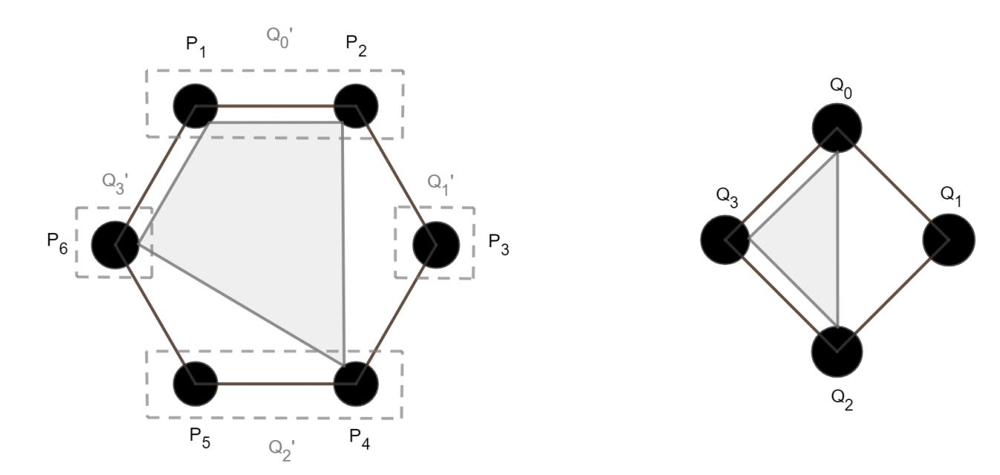
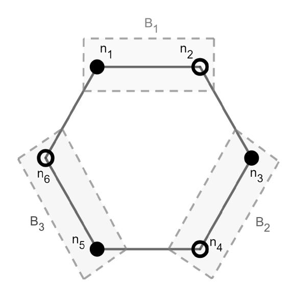
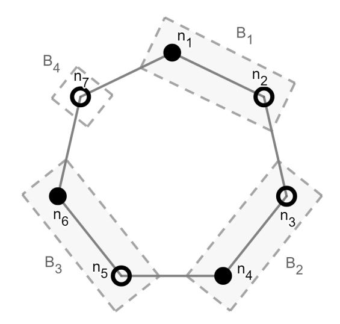
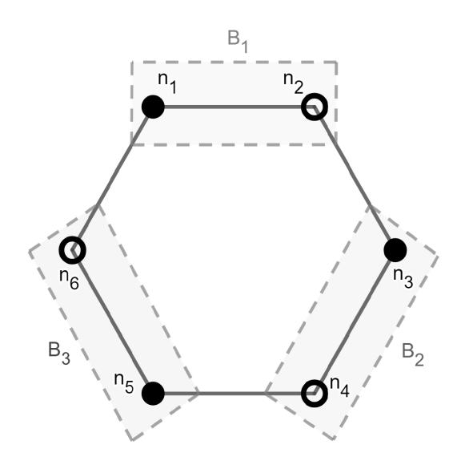
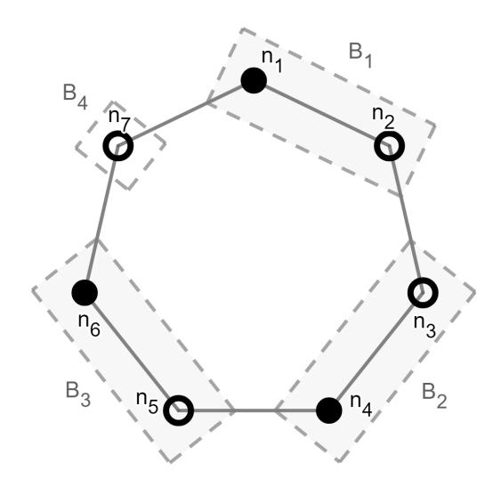

{0}------------------------------------------------

# **On Broadcast in Generalized Network and Adversarial Models**

#### **Chen-Da Liu-Zhang**

Department of Computer Science, ETH Zurich, Switzerland lichen@inf.ethz.ch

#### **Varun Maram**

Department of Computer Science, ETH Zurich, Switzerland [vmaram@inf.ethz.](mailto:lichen@inf.ethz.ch)ch

### **Ueli Maurer**

Department of Computer Science, ETH Zurich, Switzerland [maurer@inf.ethz.ch](mailto:vmaram@inf.ethz.ch)

#### **Abstract**

[Broadcast is a prim](mailto:maurer@inf.ethz.ch)itive which allows a specific party to distribute a message consistently among *n* parties, even if up to *t* parties exhibit malicious behaviour. In the classical model with a complete network of bilateral authenticated channels, the seminal result of Pease et al. [10] shows that broadcast is achievable if and only if *t < n/*3. There are two generalizations suggested for the broadcast problem – with respect to the adversarial model and the communication model. Fitzi and Maurer [5] consider a (non-threshold) *general adversary* that is characterized by the subsets of parties that could be corrupted, and show that broadcast can be realized from bila[tera](#page-16-0)l channels if and only if the union of no three possible corrupted sets equals the entire set of *n* parties. On the other hand, Considine et al. [3] extend the standard model of bilateral channels with the existence of *b*-minicast c[han](#page-15-0)nels that allow to locally broadcast among any subset of *b* parties; the authors show that in this enhanced model of communication, secure broadcast tolerating up to *t* corrupted parties is possible if and only if *t < b−*1 *b*+1*n*. These generalizations are unified in the work by Raykov [9], where a tight condition on t[he](#page-15-1) possible corrupted sets is presented such that broadcast is achievable from a complete set of *b*-minicasts.

This paper investigates the achievability of broadcast in *general networks*, i.e., networks wh[ere](#page-16-1) only some subsets of minicast channels may be available, thereby addressing open problems posed in [8, 9]. To that end, we propose a hierarchy over all possible general adversaries, and identify for each class of general adversaries 1) a set of minicast channels that are necessary to achieve broadcast and 2) a set of minicast channels that are sufficient to achieve broadcast. In particular, this allows us to derive bounds on the amount of *b*-minicasts that are necessary and that suffice to[wa](#page-15-2)r[ds](#page-16-1) constructing broadcast in general *b*-minicast networks.

**2012 ACM Subject Classification** Theory of computation *→* Computational complexity and cryptography; Theory of computation *→* Design and analysis of algorithms; Security and privacy *→* Cryptography

**Keywords and phrases** broadcast, partial broadcast, minicast, general adversary, general network

**Digital Object Identifier** 10.4230/LIPIcs.OPODIS.2020.25

**Category** Eligible for the best student paper award.

© Chen-Da Liu-[Zhang and Varun Maram and Ueli Mau](https://doi.org/10.4230/LIPIcs.OPODIS.2020.25)rer; licensed under Creative Commons License CC-BY 24th International Conference on Principles of Distributed Systems (OPODIS 2020). Editors: Quentin Bramas, Rotem Oshman, and Paolo Romano; Article No. 25; pp. 25:1–25:21 Leibniz International Proceedings in Informatics Schloss Dagstuhl – Leibniz-Zentrum für Informatik, Dagstuhl Publishing, Germany

{1}------------------------------------------------

## **1 Introduction**

One of the most fundamental problems in distributed computing is to achieve consistency guarantees among parties, even if some of the parties behave arbitrarily. A core primitive to achieve global consistency is broadcast. More concretely, the Byzantine broadcast problem [10] is described as follows: A designated party, called the sender, intends to distribute a value consistently among *n* parties such that all honest parties obtain the same value, even if the sender and/or some of the other parties behave in a malicious manner; if the sender is honest, then all honest parties agree on the sender's value.

Broadcast is an important primitive that has applications in many protocols for secure multi-party computation (MPC) – as defined in [12] and [6]. It is used to implement different protocols for secure bidding, voting, collective contract signing, just to name a few. With the recent trends in research in mind, another application worth mentioning is related to cryptocurrencies, where users' transactions are to be broadcast securely among all the nodes of the underlying blockchain network even when [so](#page-16-2)me of [t](#page-15-3)he nodes could behave arbitrarily.

#### **1.1 Motivation**

The seminal result of Pease et al. [10] (also [1], [2]) shows that in the standard communication model of a complete synchronous network of pairwise authenticated channels, perfectlysecure broadcast is achievable if and only if less than a third of the parties are corrupted (i.e., *t < n/*3). The fundamental reason why the bound *t < n/*3 is tight is that a corrupted node can consistently send differen[t m](#page-16-0)essage[s t](#page-15-4)o [co](#page-15-5)rrect processors and make them agree on different values. To avoid this, several researchers have considered using stronger communication primitives such as partial broadcast channels, which guarantee that a message is consistent among all recipients on the channel. Hence, a natural question is to investigate a generalization of the classical broadcast problem, namely the trade-off between the strength of the communication primitives and the corruptive power from the adversary.

Most results which study such trade-offs for broadcast achievability are phrased in the so-called *b*-minicast model [4, 3, 9], i.e., a network which contains partial broadcast channels among any subset of parties with size at most *b*. But one can go beyond this *threshold* characterization of communication models (similar to the adversaries seen above modelled by a threshold *t*) by considering a *general network* where the set of minicasts of size at most *b* among the *n* parties may [n](#page-15-6)[ot](#page-15-1) [be](#page-16-1) complete.

To the best of our knowledge, current works on such general networks [11, 8] focus on the problem of Byzantine agreement for the concrete case of 3-minicast channels, and against a threshold adversary in the range *n/*3 *≤ t < n/*2. We continue the line of research w.r.t. general *b*-minicast channels. We remark that – as noted in [3] – when *b >* 3, perfectly secure broadcast can be realized even when there is no honest majority, in con[tras](#page-16-3)[t](#page-15-2) to Byzantine agreement. Surprisingly, there is a lack of literature devoted to this generalization. This paper thus attempts to lay out some significant starting steps towards research in this direction.

#### **1.2 Related Work**

**Complete/Threshold Networks.** Many of the previous results assume a complete network of partial broadcast channels up to a certain size. Fitzi and Maurer [4] showed that assuming partial broadcast channels among every triplet of parties, global broadcast can

{2}------------------------------------------------

be realized if and only if *t < n/*2. Considine et al. [3] generalized this result to the *b*minicast model, i.e. a partial broadcast channel among any *b* parties, where it was shown that broadcast is achievable if and only if *t < b−*1 *b*+1*n*.

Apart from generalizing the communication primitives, one can also generalize the adversary model to *general adversary structures*. The cl[as](#page-15-1)sical problem [10] focuses on adversaries that, for a threshold *t*, can corrupt any subset of parties *a* such that *|a| ≤ t*. This was later extended to a generalized characterization of the adversary *A*, where it can corrupt a set of parties *a* such that *a ∈ A* for a monotone set of subsets of the *n* parties [7, 5].

It was shown by Fitzi and Maurer [5] that secure broadcast can be rea[lize](#page-16-0)d from point-topoint channels if and only if there are no three sets of parties in the adversary structure that can cover the whole party set. Finally, Raykov [9] unified the previous results by studying the feasibility of broadcast in the *b*-minicast model that is secure against general a[d](#page-15-7)v[er](#page-15-0)saries. Specifically, Raykov proved that bro[ad](#page-15-0)cast is achievable from *b*-minicast channels against adversary structures *A* if and only if *A* satisfies the so-called (*b* + 1)-chain-free condition.

**General Networks.** Current works on general network structures with partial broadcast channels focus on the achievability of Byzantine agreement. Given that Byzantine agreement is achievable from bilateral channels if *t < n* 3 and not well defined for *t ≥ n* 2 , they focus on the case where the network of partial broadcast channels only contains 3-minicasts (in addition to bilateral channels), and the adversary is in the range *n/*3 *≤ t < n/*2. Ravikant et al. [11] provide necessary and sufficient conditions for general 3-minicast networks to satisfy so that Byzantine agreement can be achieved while tolerating threshold adversaries in the range *n/*3 *≤ t < n/*2. In a follow-up work, Jaffe et al. [8] provide asymptotically tight bounds on the number of necessary and sufficient 3-minicast channels to construct Byzantine agreem[ent](#page-16-3) for the same threshold adversary.

#### **1.3 Contributions**

We extend the results for general 3-minicast networks to general *b*-minicast networks and address open questions posed in both of the papers [8, 9], namely to study broadcast achievability in general communication models where only a subset of *b*-minicast channels may be available.

The contributions of the paper are three-fold. First, we propose a simple hierarchy of all possible adversary structures with respect to *n* par[ti](#page-15-2)[es,](#page-16-1) by imposing a partial order based on the *b*-chain terminology introduced by Raykov [9]. This allows us to analyze the feasibility of broadcast in general networks in a meaningful way. We believe this hierarchy of general adversaries could be of independent interest to the broader area of secure MPC.

Second, we present necessary conditions on general network structures for secure broadcast to be possible against general adversaries[.](#page-16-1) To be precise, for each of the adversary classes in the above hierarchy, we identify types of minicast channels that are essential in *any* network in order to achieve broadcast.

Finally, we provide sufficient conditions towards achieving broadcast in general networks while tolerating general adversaries. That is, given any adversary belonging to one of the hierarchy classes, we construct a broadcast protocol for networks satisfying the sufficiency condition corresponding to that adversary. We also show that these conditions are nontrivial in the sense that they do not always require a complete set of minicast channels to begin with; w.r.t. certain weak adversaries in each class, there exist general networks with an *incomplete* set of minicasts that can still realize global broadcast using our protocol.

Our results generalize previous works in communication models assuming partial broad-

{3}------------------------------------------------

cast channels [4, 11, 8, 9]. We show an example in Table 1 with 6 parties *P* = *{P*1*, P*2*, P*3*, P*4*, P*5*, P*6*}*. Against a threshold adversary that can corrupt up to 3 parties, it is known that with the network structure containing all 3-minicasts, *N*3, broadcast is impossible, whereas with a network structure containing all 4-minicasts, *N*4, broadcast is possible. We depict the network *N* = *N*4 *[\](#page-15-6) {[P](#page-16-3)*1*[, P](#page-15-2)*[2](#page-16-1)*, P*4*, P*5*}, {P*1*, P*2*, P*4*, P*6*}, {P*1*, P*[3](#page-3-0)*, P*4*, P*6*}, {P*1*, P*3*, P*4*, P*5*}*, for which broadcast was unknown to be impossible. We also show, for the same network structure, that broadcast is possible against the adversary structure *A* = *{{P*1*, P*4*, P*5*}, {P*1*, P*4*, P*6*}, {P*2*, P*3*, P*5*}, {P*2*, P*3*, P*6*}}*.

| broadcast was unknown to be impossible. We also show, for the same network structure, that |                |                       |                  |
|--------------------------------------------------------------------------------------------|----------------|-----------------------|------------------|
|                                                                                            |                |                       |                  |
| Network                                                                                    | Adversary      | Broadcast             | Literature       |
| N3 = {p   p ⊆ P and  p  ≤ 3} N4 = {p   p ⊆ P and  p  ≤ 4}                               | t = 3 t = 3 | possible No Yes | [3, 9] [3, 9] |
|                                                                                            | t = 3 A     | No Yes             | This work        |

**Table 1** In the first column, we describe network structures among 6 parties in line with Definition 3. The first two entries are related to the complete 3-minicast and 4-minicast models respectively (cf. Definition 4). We depict an incomplete 4-minicast network in the third entry where the 4-minicasts that are not available are *{P*1*, P*2*, P*4*, P*5*}, {P*1*, P*2*, P*4*, P*6*}, {P*1*, P*3*, P*4*, P*6*}* and *{P*1*, P*3*, P*4*, P*5*}*. The adversary is indicated in the second column. In the first three entries the adver[sa](#page-5-0)ry can corrupt up to *t* = 3 parties, whereas in the last entry he can corrupt any element in *A* = *{{P*1*, P*4*, P*5*}, {P*1*, P*[4](#page-6-0)*, P*6*}, {P*2*, P*3*, P*5*}, {P*2*, P*3*, P*6*}}*. We then indicate whether broadcast can be realized securely with the corresponding network/adversary w.r.t. *any* sender.

#### **1.4 Techniques**

Here we give a higher-level overview for some of the technical ideas behind our results. As briefly mentioned above, we rely on a particular characterization of general adversary structures *A* based on whether or not *A* contains a so-called *b*-chain; if not, then *A* is said to be *b*-chain-free and vice-versa. This condition was introduced in [9] and was in turn inspired by a broadcast impossibility proof of [3]. Consider a chain (or ordering) of *b* + 1 parties, namely (*P*1*, . . . , Pb*+1). Then it was shown in [3] that no protocol can realize broadcast among these *b* + 1 parties in the complete *b*-minicast model when any pair of adjacent parties (*Pi , P*1+(*i* mod *b*+1)) (*i* = 1*, . . . , b* + 1) can be honest whil[e](#page-16-1) the remaining parties are corrupted by an adversary. Raykov [9] [t](#page-15-1)hen generalized this type of corruption to a chain of party subsets, where (*P*1*, . . . ,Pb*+1) is now a [pa](#page-15-1)rtition of *n* parties into *b* + 1 non-empty subsets *Pi* . He later shows that when there is such a (*b* + 1)-partition of *n* parties such that the subset of parties (*Pi∪P*1+(*i* mod *b*+1)) (*i* = 1*, . . . , b*+1) can be honest while the remaining parties are corrupted by an adversar[y,](#page-16-1) then broadcast is impossible among *n* parties in the complete *b*-minicast model, via a straightforward reduction to the setting with *b* + 1 parties considered in [3]. In this context, the partition is called a (*b* + 1)-chain and the corrupting adversary is said to contain a (*b* + 1)-chain. But what is surprising is that this condition is tight in the sense that, if an adversary does not contain a (*b* + 1)-chain, then broadcast is

{4}------------------------------------------------

achievable in the *b*-minicast model. Namely,

I **Theorem 1. ([9, Theorem 1])** *In the complete b-minicast communication model, broadcast tolerating adversary structure A is achievable if and only if A is* (*b* + 1)*-chain-free.*

**Hierarchy of A[dv](#page-16-1)ersaries.** We partition the space of all possible general adversary structures w.r.t. *n* parties into (*n −* 1) classes based on the *b*-chain-free condition introduced in [9]. The class A (*b*) , for *b ≥* 3, is the set of adversaries that contain a *b*-chain but are (*b* + 1)-chain-free. Given a general adversary *A*, to study the feasibility of broadcast in a general network *N* , we consider the unique class *A* belongs to – say *A ∈* A (*b*) , then because of Theorem 1, broadcast tolerating *A* is impossible in the complete (*b −* 1)-minicast model, but [is](#page-16-1) possible in the complete *b*-minicast model. This allows us to analyze the *b*-minicast channels in *N* which are necessary or which suffice to achieve broadcast securely against *A*.

**Necessary [C](#page-4-0)onditions.** Given an adversary *A ∈* A (*b*) , we identify certain types of *b*minicast channels that are necessary to realize secure broadcast among parties *P* in any general network. We proceed to show it by starting with a complete *b*-minicast model, and removing *b*-minicast channels of the aforementioned type. Then we prove that any protocol that achieves broadcast among *P* in the resulting network against *A* can be reduced to a protocol that achieves broadcast in a setting with *b* parties in the complete (*b −* 1)-minicast model against an adversary that contains a *b*-chain. Because the latter is deemed to be impossible by Theorem 1, we conclude that secure broadcast protocols cannot exist when such *essential b*-minicast channels are missing from a network.

**Sufficient Conditions.** Again given an adversary *A ∈* A (*b*) , we identify a set *S* of *b*minicast channels such [th](#page-4-0)at, for any general network *N* , it suffices to have *N* contain the minicast channels *S* in order to achieve broadcast secure against *A* (assuming sufficient connectivity w.r.t. (*b −* 1) and lower minicast channels in *N* ). For ease of exposition, we consider general networks *N* with an underlying complete set of (*b −* 1) minicast channels. Now since *A* is (*b* + 1)-chain-free, secure broadcast is possible in the complete *b*-minicast model according to Theorem 1. Hence the idea is to simulate the *b*-minicast model on the general network *N* using its (possibly) incomplete set of *b*-minicast channels and the complete set of (*b −* 1)-minicasts underneath.

Towards finding *S*, we focus on its complement set *S* { , namely the set of *b*-minicast channels which are not requir[ed](#page-4-0) to be present in *N* to realize broadcast tolerating *A*. If the *b*-minicast channels of *S* { were to be missing in *N* , it should be possible to simulate them via a local application of the feasibility result of Theorem 1, i.e., subsets of *b* parties that have their corresponding *b*-minicast channel missing could simulate partial broadcast among themselves by executing Raykov's protocol [9] using their underlying (*b−*1)-minicast channels. In that case, we have to formally argue that *A*'s corrupting power when restricted to these *b* parties is *b*-chain-free.

We also show that our set *S* for sufficiency of broadcast need not be the *trivial* complete set of *b*-minicast channels for all adversaries in A (*b*[\)](#page-16-1) . Specifically, we identify certain weak adversaries of the class A (*b*) , which we call *b-chain adversaries*, and prove that the set *S* { is non-empty for such adversaries. Our arguments here are related to the *b*-chain property of [9] and are mostly combinatorial. They revolve around showing the (non-)existence of special configurations of parties placed in *bins* which are arranged in a circular fashion.

{5}------------------------------------------------

**Outline** 

1.5

In Section 2 we introduce some definitions, including that of general communication networks, types of corruption, and the broadcast primitive. Also, we look at Raykov's [9] chain-free condition on general adversary structures with respect to the b-minicast model which generalizes all prior results on secure broadcast in complete networks. In Section 3, we present a hierarchy of all possible general adversaries w.r.t. n parties. Sections 4 and 5 describe the above necessary and sufficient conditions, respectively, on general communication networks towards achieving broadcast secure against general adversary structures. We conclude the paper with some further discussions and open problems in Section 6.

## 2 Models and Definitions

In this section, we introduce the main concepts, along with some notation, that will be used in this paper – which includes a description of the models of communication and corruption with respect to a set of parties being considered. Most of the definitions are borrowed from [9] and [3]. In this paper we consider a setting where parties do not have a public-key infrastructure (PKI) available. Note that if one assumes a PKI, it would allow messages to be signed and broadcast would be possible with arbitrary resilience.

#### 2.1 Parties

Unless stated otherwise, we always consider a setting with n parties, namely  $P = \{P_1, \dots, P_n\}$ . We now describe some notions with respect to the partitions of the party set P.

▶ **Definition 2.** A list  $S = (S_0, ..., S_{k-1})$  is a k-partition of P if  $\bigcup_{i=0}^{k-1} S_i = P$  and all  $S_i$  and  $S_j$  are pair-wise disjoint. Such partitions are said to be proper if all  $S_i$  are non-empty.

In addition, we present a notation to denote the set of parties from P minus the two sets  $S_i$  and  $S_j$  from the k-partition S:

$$S_{\downarrow i,j} := P \setminus (S_{i \bmod k} \cup S_{j \bmod k})$$

#### 2.2 Communication Network

In the classical model [10], parties are connected by a complete, synchronous network of bilateral authenticated channels. Such communication channels between any two parties  $P_i$  and  $P_j$  guarantee that only the aforementioned pair can send messages on the channel – no third party can access (or block) the channel in any way other than possibly reading the communication between  $P_i$  and  $P_j$ .

A synchronous network here means that all parties share common clock cycles. In a particular clock cycle, each party initially receives a finite (possibly empty) set of messages from the other parties, performs a finite (possibly zero) number of local computations, and finally sends a finite (possibly empty) set of messages to each other party. Additionally, it is guaranteed that the messages sent during a clock cycle arrive at the beginning of the next cycle.

We focus on a very general characterization of such communication models where, in addition to pairwise channels, there could be  $partial\ broadcast$  channels among the parties of P that allow messages to be consistently delivered to more than one recipient, i.e, channels which allow broadcast to be realized locally within certain subsets of parties.

{6}------------------------------------------------

I **Definition 3.** *(General network) A general network N among a set of parties P is a monotone*1 *set of subsets of P.*

Given a general network *N* , we have *{Pi*1 *, . . . , Pik } ∈ N* if and only if there is a partial broadcast channel among *{Pi*1 *, . . . , Pik }* – based on the sizes of the subset of parties, such channels [ar](#page-6-1)e also known as *k-minicast channels* [9].

The partial broadcast channels also provide authentication, similar in spirit to the bilateral channels, and are synchronous. Also, observe that the classical model with bilateral channels can be seen as a particular network structure *N* , where *N* contains nothing but all possible subsets of *P* with size 2. In the sam[e](#page-16-1) way, the complete *b*-minicast model is a network structure which contains all partial broadcasts of size at most *b*.

I **Definition 4.** *(b-minicast model) A complete b-minicast model is a network structure Nb that contains all possible subsets of P with size at most b, i.e., Nb* = *{p | p ⊆ P and |p| ≤ b}*

Finally, we define a subclass of general networks which, roughly speaking, do not contain (*b* + 1) and higher minicast channels.

I **Definition 5.** *(General b-minicast network) A general b-minicast network is any network structure N such that N ⊆ Nb, where Nb is the complete b-minicast model.*

## **2.3 Adversary and Security**

We assume the existence of a central adversary that corrupts a subset of parties and makes them deviate from a protocol in an arbitrary way. Such corrupted parties are often called *Byzantine*, and the parties that are not corrupted will be referred to as *honest* or *correct*. Our protocols are *perfectly secure*, which guarantees that a protocol never fails (zero probability of error) even under computationally unbounded adversaries. On the other hand, our impossibility results hold even against a bounded adversary.

In the paper, we mainly consider a general adversary structure *A* [7], which specifies the possible subsets of parties that the adversary can corrupt. We require that *A* be monotone, i.e., *∀ a, a′* (*a ∈ A*) and (*a ′ ⊆ a*) =*⇒ a ′ ∈ A*.

I **Definition 6.** *(General adversary) A general adversary A amon[g](#page-15-7) a set of parties P is a monotone set of subsets of P.*

In the literature, a specific type of adversary is widely discussed, namely a *threshold* adversary, that is characterized by the maximum number of parties *t* which can be corrupted; the adversary structure takes the following form *At* = *{a | a ⊆ P* and *|a| ≤ t}*. A typical non-threshold adversary structure is the so-called *Q*(*k*) adversary. The adversary structure *A* is said to satisfy *Q*(*k*) if the union of no *k* sets in *A* equals the party set *P*. In this paper, we are more interested in the *k*-chain condition, which was introduced in [9]. In Appendix A, we briefly discuss the relation between the *k*-chain condition and the *Q*(*k*) condition.

I **Definition 7.** *An adversary structure A is said to contain a k-chain if there exists a proper k-partition S* = (*S*0*, . . . , Sk−*1) *of the party set P such that ∀i ∈* [0*, k −* 1] *[S](#page-16-1)↓i,i*+1 *∈ A. An [ad](#page-16-4)versary structure is k-chain-free if it does not have a k-chain.*

1 If *N ∈ N* and *N ′ ⊆ N* then *N ′ ∈ N* .

{7}------------------------------------------------

### **2.4 Broadcast**

In broadcast, a designated party (known as the sender) wants to distribute its input value, i.e., a message, among *n* parties such that all honest parties receive the same message.

I **Definition 8.** *(Broadcast) A protocol among the party set P where some specific party Ps ∈ P (the sender) holds an input v ∈ D and each party Pi ∈ P outputs a value yi ∈ D achieves broadcast if the following holds:*

Validity: *If the sender Ps is honest, then every honest party Pi ∈ P outputs the sender's value, i.e., yi* = *v.*

Consistency: *All honest parties in P output the same value.*

## **3 Hierarchy of Adversary Structures**

Let us consider any general adversary *A* with respect to the parties *P*. Ignoring the two extreme cases where the adversary is either too weak that broadcast is achievable by only using bilateral channels (i.e., *A* is 3-chain-free, see Theorem 1), or when the adversary is too strong that secure broadcast is not possible among the *n* parties unless we assume a global broadcast primitive in the first place (i.e., *A* contains an *n*-chain), we note that there must exist *b ∈* [3*, n −* 1] such that *A* contains a *b*-chain and is (*b* + 1)-chain-free.

This observation gives us a way to define a simple parti[al](#page-4-0) order over the complete space of general adversarial structures with respect to the party set *P*, which is highly relevant to the problem of achieving secure broadcast in general communication models. Define the *weakest* and *strongest* class of adversaries respectively as,

$$\mathfrak{A}^{(0)} = \{ \mathcal{A} \subseteq 2^P \mid \mathcal{A} \text{ is 3-chain-free} \}$$

$$\mathfrak{A}^{(n)} = \{ \mathcal{A} \subseteq 2^P \mid \mathcal{A} \text{ contains an } n\text{-chain} \}$$

The subsequent classes of adversary structures in-between are defined as: *∀b ∈* [3*, n −* 1],

$$\mathfrak{A}^{(b)} = \{ \mathcal{A} \subseteq 2^P \mid \mathcal{A} \text{ contains a } b\text{-chain and is } (b+1)\text{-chain-free} \}$$

The classes of adversaries arranged in an increasing order of strength would then be A (0) *≤* A (3) *≤* A (4) *≤ . . . ≤* A (*n*) . Note that this forms indeed a *partition* over all possible adversary structures, since for *b >* 3, any adversary structure in A (*b*) also contains an implicit (*b −* 1) chain (and lower). This can be seen from the definition of a *b*-chain-free adversary structure. More concretely, if an adversary structure *A* is *b*-chain-free, then it is also (*b* + 1)-chain-free. This is because if it contains a (*b* + 1)-chain (*S*0*, . . . , Sb*), then (*S*0*, . . . , Sb−*2*, Sb−*1 *∪ Sb*) is a valid *b*-chain, since *A* is monotone. In fact, we also show in Subsection 5.1 that the partition is a proper partition, i.e., each set A (*b*) is non-empty.

Given this partition, one can consider a partial order over adversary structures as follows: we define the order relation *≺* such that for any two general adversaries *Ap ∈* A (*k*) and *Aq ∈* A (*k ′* ) : *Ap ≺ Aq ⇐⇒* (*k < k′* ) *∨* (*k* = *k ′ ∧ Ap* = *Aq*).

As mentioned in Subsection 1.4, given a general adversary *A*, there is a unique class A (*b*) that *A* belongs to. We know that broadcast tolerating *A* is impossible in the complete (*b−*1)-minicast model, but is possible in the complete *b*-minicast model because of Theorem 1. We can then analyze the *b*-minicast channels which are necessary or which suffice to achieve broadcast in a general n[etwo](#page-3-1)rk securely against *A*.

{8}------------------------------------------------

Figure 1 On the left, there is an adversary containing a 4-chain  $(Q'_0, Q'_1, Q'_2, Q'_3)$  among 6 parties in the incomplete 4-minicast network missing all 4-minicasts that have non-empty intersection with the sets  $Q'_0, \ldots, Q'_3$ . On the right, there is an adversary with a 4-chain  $(Q_0, Q_1, Q_2, Q_3)$  among 4 parties in the complete 3-minicast network. Now our reduction lets each party  $Q_i$  emulate the set of parties  $Q'_i$ . Then, any 4-minicast present on the left can be emulated by a 3-minicast on the right. For example, the 4-minicast depicted in light-gray on the left can be emulated using the 3-minicast depicted on the right.

## 4 Necessary Conditions

In this section, we provide necessary conditions on general communication networks for broadcast to be possible while tolerating general adversaries. Specifically, given an adversary structure  $\mathcal{A} \in \mathfrak{A}^{(b)}$ , we identify some types of minicast channels that have to be present in any network  $\mathcal{N}$  in order to achieve secure broadcast.

Let  $\mathcal{P} = (\mathcal{P}_0, \dots, \mathcal{P}_{b-1})$  be any *b*-chain that is present in  $\mathcal{A}$ . We then characterize *b*-minicasts that are essential for broadcast against  $\mathcal{A}$  in a general communication network, namely of the form  $\{p_0, \dots, p_{b-1}\}$  where  $p_0 \in \mathcal{P}_0, \dots, p_{b-1} \in \mathcal{P}_{b-1}$ . At a very high level, the proof uses any protocol that achieves broadcast in an incomplete *b*-minicast network – with the aforementioned essential *b*-minicasts missing – against  $\mathcal{A} \in \mathfrak{A}^{(b)}$  in order to construct a broadcast protocol among *b* parties in the complete (b-1)-minicast model against an adversary containing a *b*-chain. Since the latter is known to be impossible by Theorem 1, the former is also impossible. We depict in Figure 1 a concrete example of the reduction for the case of b=4.

▶ **Lemma 9.** Secure broadcast on a general network  $\mathcal{N}$  tolerating a general adversary  $\mathcal{A} \in \mathfrak{A}^{(b)}$  is possible for some sender only if: for every b-chain in  $\mathcal{A}$ , namely  $\mathcal{P} = (\mathcal{P}_0, \dots, \mathcal{P}_{b-1})$ , there is a b-minicast channel in  $\mathcal{N}$  that has non-empty intersection with the sets  $\mathcal{P}_0, \dots, \mathcal{P}_{b-1}$ .

**Proof.** Consider any b-chain in  $\mathcal{A}$ ,  $\mathcal{P} = (\mathcal{P}_0, \dots, \mathcal{P}_{b-1})$ . From a complete network structure  $\mathcal{N}_{comp} = 2^P$ , we remove b-minicast channels of the form  $\{p_0, \dots, p_{b-1}\}$  where  $p_0 \in \mathcal{P}_0, \dots, p_{b-1} \in \mathcal{P}_{b-1}$ . Because the set of partial broadcast channels is monotone (cf. Definition 3), all higher b'-minicasts (with b' > b) that contain a b-minicast of the removed type will be missing implicitly as well (more formally, if  $S = \{p_0, \dots, p_{b-1}\}$ , then we are talking about b'-minicasts shared by the set S' of b' parties such that  $S' \supseteq S$ ).

Assume there exists a broadcast protocol  $\pi$  for some sender  $P_s$  from P tolerating the adversary  $\mathcal{A}$ . Using  $\pi$ , we now construct a protocol  $\pi'$  for achieving broadcast among b parties  $\{Q_0, \ldots, Q_{b-1}\}$  in the complete (b-1)-minicast communication model under an adversary containing a b-chain, i.e., any pair  $(Q_i, Q_{(i+1) \mod b})$  can be honest while the

{9}------------------------------------------------

adversary corrupts the rest of the parties. Since from Theorem 1 such protocol  $\pi'$  cannot exist, we arrive at a contradiction.

To construct protocol  $\pi'$  from  $\pi$ , the protocol  $\pi'$  lets each  $Q_i$  simulate the set  $\mathcal{P}_i$ . The key thing to note is that all partial broadcast channels that will be used among P in the execution of  $\pi$  can be simulated by these b parties in the (b-1)-minicast model. On the other hand, the simulation of channels that were removed in the first place would have required a (non-existent) global broadcast channel  $\{Q_0, \ldots, Q_{b-1}\}$ . Also all possible corruptions by an adversary containing a b-chain, among  $\{Q_0, \ldots, Q_{b-1}\}$  is already covered by the adversary structure  $\mathcal{A}$  with respect to  $\pi$ , because  $\mathcal{P}$  is a b-chain contained in  $\mathcal{A}$ , and if  $Q_i$  is corrupted, all the parties simulated by it  $\mathcal{P}_i$  can behave arbitrarily. Since protocol  $\pi$  is assumed to be secure against  $\mathcal{A}$ ,  $\pi'$  allows the party that simulates  $P_s$  to broadcast securely, thereby arriving at the contradiction.

In fact, we can extend the above simulation argument to have a similar characterization of essential partial broadcast channels for every lower k-chain (k < b)  $\mathcal{P} = (\mathcal{P}_0, \dots, \mathcal{P}_{k-1})$  contained in  $\mathcal{A}$ , i.e., minicasts of the type  $\{p_0, \dots, p_{k-1}\}$  where  $p_0 \in \mathcal{P}_0, \dots, p_{k-1} \in \mathcal{P}_{k-1}$ . This leads us to our necessary condition for secure broadcast in general network structures.

▶ **Theorem 10.** Secure broadcast on a general network  $\mathcal{N}$  and against a general adversary  $\mathcal{A} \in \mathfrak{A}^{(b)}$  is possible for some sender only if:  $\forall k \in [3,b]$ , if  $\mathcal{P} = (\mathcal{P}_0, \dots, \mathcal{P}_{k-1})$  is a k-chain in  $\mathcal{A}$ , then there must be a k-minicast channel in  $\mathcal{N}$  that has non-empty intersection with each of the sets  $\mathcal{P}_0, \dots, \mathcal{P}_{k-1}$ .

Sufficient Number of b-Minicasts. Jaffe et. al. [8] present asymptotically tight bounds on the number of 3-minicast channels that are necessary and sufficient to achieve Byzantine agreement in general 3-minicast networks against threshold adversaries in the range  $n/3 \le t < n/2$ . One of their main results is giving a bound for the quantity  $U_n(t)$  which is the minimum m such that any general 3-minicast network  $\mathcal{N}$  with m 3-minicast channels achieves Byzantine agreement while tolerating at most t corrupted parties – the underlying graph (2-minicast network) of  $\mathcal{N}$  is assumed to be sufficiently connected, e.g., via a complete set of bilateral channels among the n parties.

An open question in [8] was scaling its definitions and results to general b-minicast networks, for b > 3. We provide some steps towards answering it by first generalizing the definition of  $U_n(.)$  in a higher b-minicast setting. Similar to [8], there we consider general b-minicast networks  $\mathcal{N}$  that have a complete set of (b-1)-minicast channels underneath.

▶ **Definition 11.** Let  $U_n^b(\mathcal{A})$  denote the minimum number m such that any general network structure  $\mathcal{N}$  with m b-minicast channels, and satisfying  $\mathcal{N}_{b-1} \subseteq \mathcal{N} \subseteq \mathcal{N}_b$ , achieves global broadcast for some sender among the n parties while tolerating the general adversary  $\mathcal{A}$ .

We now present a lower bound on  $U_n^b(\mathcal{A})$ , for  $b \geq 3$  and any general adversary  $\mathcal{A} \in \mathfrak{A}^{(b)}$ . Note that this is similar in spirit to the analysis in [8] because the threshold adversaries  $n/3 \leq t < n/2$  belong to the class  $\mathfrak{A}^{(3)}$  (see Appendix A). Towards our bound, we consider another quantity which is like a complement to  $U_n^b(\mathcal{A})$ , namely  $u_n^b(\mathcal{A})$  which is defined as the minimum number of b-minicast channels that can be removed from a complete b-minicast model to ensure broadcast cannot be realized securely w.r.t. any sender among the n parties against  $\mathcal{A}$ . It is then not hard to see that  $U_n^b(\mathcal{A}) = \binom{n}{b} - u_n^b(\mathcal{A}) + 1$ .

So we essentially provide an upper bound on  $u_n^b(A)$  by removing b-minicast channels of the type described in Lemma 9 so as to violate our necessary condition for secure broadcast in the resulting incomplete b-minicast network. We do this by finding a b-chain

{10}------------------------------------------------

 $\mathcal{P} = (\mathcal{P}_0, \dots, \mathcal{P}_{b-1})$  in  $\mathcal{A} \in \mathfrak{A}^{(b)}$  which minimizes, over all *b*-chains present in  $\mathcal{A}$ , the size of the corresponding set of essential *b*-minicast channels  $\{\{p_0, \dots, p_{b-1}\} \in \mathcal{N}_b \mid p_0 \in \mathcal{P}_0, \dots, p_{b-1} \in \mathcal{P}_{b-1}\}$  (here  $\mathcal{N}_b$  is the complete *b*-minicast model as denoted in Definition 4). To be precise, we attempt to solve the following optimization problem, over all proper *b*-partitions  $\mathcal{P} = (\mathcal{P}_0, \dots, \mathcal{P}_{b-1})$  of the party set P w.r.t. the adversary structure  $\mathcal{A}$ :

minimize 
$$|\mathcal{P}_0| \times \ldots \times |\mathcal{P}_{b-1}|$$
  
subject to  $\mathcal{P}_{\downarrow i,i+1} \in \mathcal{A}, i = 0, \ldots, b-1.$ 

If  $\pi_{\mathcal{A}}$  is a solution to the above problem, we have  $u_n^b(\mathcal{A}) \leq \pi_{\mathcal{A}}$  which results in the following lower bound on  $U_n^b(\mathcal{A})$ .

$$U_n^b(\mathcal{A}) \ge \binom{n}{b} - \pi_{\mathcal{A}} + 1$$

Note that the above results hold for every adversary in the class  $\mathfrak{A}^{(b)}$  – in particular, the threshold adversaries in the range  $\frac{b-2}{b}n \leq t < \frac{b-1}{b+1}n$  [3], as explored in detail in Appendix B.

## **5** Sufficient Conditions

In this section, we present some conditions on general networks which are sufficient to achieve global broadcast secure against general adversaries. To be specific, given an adversary structure  $\mathcal{A} \in \mathfrak{A}^{(b)}$  and a network  $\mathcal{N}$  satisfying the aforementioned sufficiency condition, we construct a protocol that realizes Byzantine broadcast for any sender in P.

The main idea is to simulate Raykov's protocol [9] – that considers complete b-minicast models and (b+1)-chain-free adversaries – on the general network  $\mathcal{N}$ . And we do this by patching any b-minicast channel that might be missing in  $\mathcal{N}$  with local executions of Raykov's protocol among subsets of b parties. To make this intuition more rigorous, we first define an operator on the general adversary  $\mathcal{A}$  that, roughly speaking, projects its corruption power onto such subsets of parties.

▶ **Definition 12.** Let  $\mathcal{A}$  be any general adversary over a party set P. For a given subset of parties  $S \subseteq P$ , we define the adversary structure  $\mathcal{A}[S]$  to be the projection of  $\mathcal{A}$  onto S, where  $\mathcal{A}[S] = \{a \cap S \mid a \in \mathcal{A}\}.$ 

We make a couple of observations about the projected adversary  $\mathcal{A}[S]$ . First,  $\mathcal{A}[S] \subseteq \mathcal{A}$ : Given any  $a \in \mathcal{A}[S]$ , we have  $a = a' \cap S$  for a corresponding  $a' \in A$ . But since  $a \subseteq a'$  and  $\mathcal{A}$  is monotone, we have  $a \in \mathcal{A}$ . Second,  $\mathcal{A}[S]$  is a well-defined general adversary among the set of parties S in accordance with Definition 6, i.e.,  $\mathcal{A}[S]$  is a monotone set of subsets of S. It is clear that  $\mathcal{A}[S]$  is a subset of  $2^S$ , because  $\forall a \in \mathcal{A}[S]$ , we have  $a \subseteq S$ . To show monotonicity, let  $a \in \mathcal{A}[S]$  and  $a' \subseteq a$ . Then because  $\mathcal{A}[S] \subseteq \mathcal{A}$  and  $\mathcal{A}$  is monotone, we have  $a' \in \mathcal{A}$ . As  $a' \subseteq a \subseteq S$ , we have  $a' = a' \cap S$ , which implies that  $a' \in \mathcal{A}[S]$ .

Coming to our protocol idea, consider a subset S of b parties. If  $\mathcal{A}[S]$  is b-chain-free, then the network  $\mathcal{N}$  can afford to have the b-minicast channel among S to be missing, since such a minicast channel can be locally simulated by the parties S via executing Raykov's broadcast protocol [9] on their underlying (b-1)-minicast network. It is then not hard to see that this line of reasoning extends recursively w.r.t. (b-1) and lower minicast channels. That is, now a (b-1)-minicast channel among S, say the one shared by a subset of parties  $S' \subset S$  with |S'| = b - 1, is not required by our protocol if the projected adversary  $\mathcal{A}[S']$  is (b-1)-chain-free. For this recursion to terminate, we assume a complete set of bilateral channels in the network  $\mathcal{N}$ . Thus, we arrive at the following sufficient condition for secure broadcast in general networks.

{11}------------------------------------------------

- ▶ Theorem 13. Secure broadcast on a general network  $\mathcal{N}$  and against a general adversary  $\mathcal{A} \in \mathfrak{A}^{(b)}$  is possible for any sender if:
- $\blacksquare$   $\mathcal{N}$  contains a complete set of bilateral channels, i.e.  $\mathcal{N}_2 \subseteq \mathcal{N}$ .
- For each subset of parties S of size k, where  $3 \le k \le b$ : if A[S] contains a k-chain, there is a k-minicast channel in N among S.

#### 5.1 Chain Adversaries

At first glance, our sufficient condition above may seem to require the general network to have a complete set of b-minicast channels in the first place. We show that this is not the case for a certain class of adversaries –  $chain\ adversaries$  – which we define as follows.

▶ **Definition 14.** Let the list  $\mathcal{P} = (\mathcal{P}_0, \dots, \mathcal{P}_{b-1})$  be any proper b-partition of P. Then we define a corresponding b-chain adversary:

$$\mathcal{A}^{\mathcal{P}} = \{ a \mid \exists i \in [0, b-1] \text{ such that } a \subseteq \mathcal{P}_{\downarrow i, i+1} \}$$

It is clear that  $\mathcal{A}^{\mathcal{P}}$  contains a *b*-chain, since we have a proper *b*-partition  $\mathcal{P}$  such that  $\forall i \in [0, b-1]$   $\mathcal{P}_{\downarrow i, i+1} \in \mathcal{A}^{\mathcal{P}}$ . From Theorem 1, we note that these *b*-chain adversaries are precisely the *minimal* adversary structures under which broadcast is impossible in the (b-1)-minicast model. So one would expect them to be weaker (i.e., broadcast to be possible) when assuming a *b*-minicast model. We show that this is indeed the case by formally proving that *b*-chain adversaries are (b+1)-chain-free, i.e.,  $\mathcal{A}^{\mathcal{P}} \in \mathfrak{A}^{(b)}$ .

Before proceeding with the technical details, we describe a setting that will be helpful to understand our proofs of the following results. When arguing about (ordered) lists such as  $S = (S_0, \ldots, S_{b-1})$  that are b-chains w.r.t. general adversaries, it helps to think of their partition sets (i.e., the  $S_i$ 's) as being arranged in a circular fashion, among which there is a collection of  $\lceil b/2 \rceil$  bins. More precisely,  $\forall k \in [1, \lceil b/2 \rceil - 1]$ , define  $B_k = (S_{2k-2} \cup S_{2k-1})$ , and depending on whether b is even or odd, the last bin  $B_{\lceil b/2 \rceil}$  is either  $(S_{b-2} \cup S_{b-1})$  or  $S_{b-1}$  respectively. Figure 2 describes the setting of Lemma 15 where each  $S_i = \{n_{i+1}\}$  is a singleton set. It depicts some simpler examples of b = 6 and b = 7. For the diagram on the left, we consider a subset  $S_N = \{n_1, n_3, n_5\}$ , and on the right, we consider  $S_N = \{n_1, n_4, n_6\}$ . The  $n_i$ 's are represented as vertices of a regular b-gon; a bold vertex means that the corresponding  $n_i$  is included in  $S_N$ , and a hollow vertex implies that  $n_i \notin S_N$ . A bin  $B_j$  is lightly shaded if it is covered by  $S_N$ , i.e., either  $n_{2j-1} \in S_N$  or  $n_{2j} \in S_N$ , or more generally,  $B_j \cap S_N \neq \phi$ . In the example for b = 7 detailed in Figure 2,  $B_2$  is covered as  $n_4 \in S_N$  whereas  $B_4$  is not because  $n_7 \notin S_N$ .

Now towards proving that b-chain adversaries are indeed (b+1)-chain-free, we start with the following combinatorial lemma that considers a simpler setting with b entities (or parties), namely  $\{n_1, \ldots, n_b\}$ . The proof is in Appendix D and uses the above methodology with bins.

- ▶ Lemma 15. Let  $N = \{n_1, \ldots, n_b\}$  and the list  $S = (\{n_1\}, \ldots, \{n_b\})$  be a b-partition of N. Define  $S_{\downarrow i, i+1} = N \setminus \{n_i, n_{1+(i \bmod b)}\}$  for  $i = 1, \ldots, b$ .
- (a) For all subsets  $S_N \subseteq N$  with  $|S_N| < \lceil b/2 \rceil \ \exists i \in [1,b]$  such that  $S_N \subseteq \mathcal{S}_{\downarrow i,i+1}$ .
- (b) There exist subsets  $S_N \subseteq N$  with  $|S_N| = \lceil b/2 \rceil$  such that  $\forall i \in [1, b]$   $S_N \not\subseteq \mathcal{S}_{\downarrow i, i+1}$ .
- ▶ Lemma 16. Let  $\mathcal{A}^{\mathcal{P}}$  be any b-chain adversary. Then  $\mathcal{A}^{\mathcal{P}} \in \mathfrak{A}^{(b)}$ .

{12}------------------------------------------------

**Figure 2** Examples for b = 6 and b = 7

**Proof.** As discussed before,  $\mathcal{A}^{\mathcal{P}}$  already contains a b-chain, namely  $\mathcal{P}$ . Now we show that the adversary structure is also (b+1)-chain-free, thereby completing the proof. Towards a contradiction, assume  $\mathcal{A}^{\mathcal{P}}$  contains a (b+1)-chain, namely  $\mathcal{S} = (\mathcal{S}_0, \dots, \mathcal{S}_b)$ , where  $\forall i \in [0, b]$   $\mathcal{S}_{\downarrow i, i+1} \in \mathcal{A}^{\mathcal{P}}$ . Consider a subset of  $\lceil b/2 \rceil$  alternating list elements from  $\mathcal{P}$ , namely  $S_{\mathcal{P}} = \{\mathcal{P}_0, \mathcal{P}_2, \dots, \mathcal{P}_{2(\lceil b/2 \rceil - 1)}\}$ . From Lemma 15(b) w.r.t.  $\mathcal{P}$ , it is not hard to see that if we pick a single party from each partition set in  $S_{\mathcal{P}}$  and construct a subset of parties  $S_p = \{p_0, p_2, \dots, p_{2(\lceil b/2 \rceil - 1)}\}$ , where  $p_0 \in \mathcal{P}_0$ ,  $p_2 \in \mathcal{P}_2$ , ..., then  $\forall i \in [0, b-1]$   $S_p \not\subseteq \mathcal{P}_{\downarrow i, i+1}$  (this can also be seen by noting that for any  $i \in [0, b-1]$   $S_p \cap (\mathcal{P}_i \cup \mathcal{P}_{(i+1) \bmod b}) \neq \emptyset$ ). Thus because of the way  $\mathcal{A}^{\mathcal{P}}$  is defined,  $S_p \not\in \mathcal{A}^{\mathcal{P}}$ .

Now coming to the (b+1)-chain  $\mathcal{S}$ , no matter where we assign the parties of  $S_p$  among the partition sets of  $\mathcal{S}$ , we can only consider at most  $\lceil b/2 \rceil$  of those sets. For even b, as  $\lceil \frac{b}{2} \rceil < \lceil \frac{b+1}{2} \rceil$ , using Lemma 15(a) with respect to  $\mathcal{S}$ , we note that  $\exists i \in [0,b]$  such that  $S_p \subseteq \mathcal{S}_{\downarrow i,i+1}$ , and hence,  $S_p \in \mathcal{A}^{\mathcal{P}}$ , which is a contradiction.

When b is odd, we have  $\lceil \frac{b}{2} \rceil = \lceil \frac{b+1}{2} \rceil$ . Using the bins methodology described above, we observe that each of the  $\lceil \frac{b}{2} \rceil$  disjoint bins in S must be covered by the  $\lceil \frac{b}{2} \rceil$  parties of  $S_p$  such that the assigned partition sets of the (b+1)-chain are alternating (the set  $S_i$  is said to be assigned w.r.t. parties in  $S_p$  if and only if  $S_p \cap S_i \neq \emptyset$ , so as to avoid the contradiction  $S_p \in \mathcal{A}^{\mathcal{P}}$ . Note that for any  $i \in [0,b]$ ,  $S_p \subseteq \mathcal{S}_{\downarrow i,i+1} \iff S_p \cap (\mathcal{S}_i \cup \mathcal{S}_i)$  $S_{(i+1) \mod b+1} = \emptyset$ . Thus the contradiction occurs whenever there is a pair of consecutive unassigned partition sets  $(S_i, S_{(i+1) \mod b+1})$ . Now without loss of generality, let the assigned sets be  $\{S_0, S_2, \ldots, S_{b-1}\}$  with respect to  $S_p$ . More formally, let  $\pi$  be a bijection from the set  $\{0, 2, \ldots, b-1\}$  onto itself such that  $p_0 \in \mathcal{S}_{\pi(0)}, p_2 \in \mathcal{S}_{\pi(2)}, \ldots, p_{b-1} \in \mathcal{S}_{\pi(b-1)}$ . Now consider a subset of parties wherein we replace  $p_{b-1}$  in  $S_p$  with another party from  $\mathcal{P}_{b-1}$ , i.e,  $S'_p = \{p_0, p_2, \dots, p'_{b-1}\}$  where  $p'_{b-1} \in \mathcal{P}_{b-1}$ . Again it is not hard to see from above that  $S_p' \not\in \mathcal{A}^{\mathcal{P}}$ . As the assignment of the parties  $p_0, p_2, \ldots, p_{b-3}$  is already fixed, to preserve the cyclic arrangement of the partition sets so as to avoid a contradiction with respect to  $S'_p$ , we have  $p'_{b-1} \in \mathcal{S}_{\pi(b-1)}$ . Repeating this procedure with all parties of  $\mathcal{P}_{b-1}$ , and moving over to other  $\mathcal{P}_i$ 's, we essentially get that  $\mathcal{P}_0 \subseteq \mathcal{S}_{\pi(0)}, \mathcal{P}_2 \subseteq \mathcal{S}_{\pi(2)}, \ldots, \mathcal{P}_{b-1} \subseteq \mathcal{S}_{\pi(b-1)}$ . Now consider another subset of  $\lceil b/2 \rceil$  list elements from  $\mathcal{P}$ , i.e.,  $\overline{S}_{\mathcal{P}} = \{\mathcal{P}_1, \mathcal{P}_3, \dots, \mathcal{P}_{b-2}, \mathcal{P}_0\}$ . Looking at the subset of parties  $\overline{S}_p = \{p_1, p_3, \dots, p_{b-2}, p_0\}$ , where  $p_1 \in \mathcal{P}_1, p_3 \in \mathcal{P}_3, \dots$ , Lemma 15(b) again shows that  $\forall i \in [0, b-1]$   $\overline{S}_p \not\subseteq \mathcal{P}_{\downarrow i, i+1}$ , and thus  $\overline{S}_p \not\in \mathcal{A}^{\mathcal{P}}$ . As the assignment of  $p_0$  to  $S_{\pi(0)}$  in the (b+1)-chain is already fixed, we observe that the assigned partition sets with respect to  $\overline{S}_p$  again has to be  $\{S_0, S_2, \dots, S_{b-1}\}$  in order to avoid contradictions. Thus, define a bijection  $\overline{\pi}$  from the set  $\{1,3,\ldots,b-2,0\}$  onto  $\{0,2,\ldots,b-1\}$  such that  $p_1 \in \mathcal{S}_{\overline{\pi}(1)}, \ p_3 \in \mathcal{S}_{\overline{\pi}(3)}, \ p_{b-2} \in \mathcal{S}_{\overline{\pi}(b-2)}, \ \text{and} \ \overline{\pi}(0) = \pi(0). \ \text{Again we have} \ \mathcal{P}_1 \subseteq \mathcal{S}_{\overline{\pi}(1)},$  

{13}------------------------------------------------

 $\mathcal{P}_3 \subseteq \mathcal{S}_{\pi(3)}, \ldots, \mathcal{P}_{b-2} \subseteq \mathcal{S}_{\pi(b-2)}$ . We see that all parties of P are distributed among the even indexed partition sets of  $\mathcal{S}$ . In particular, it means that  $\mathcal{S}_1 = \emptyset$ , thereby implying that the (b+1)-chain  $\mathcal{S}$  is not a proper partition, which is again a contradiction.

Finally, we have that  $\mathcal{A}^{\mathcal{P}}$  is indeed (b+1)-chain-free, and thus belongs to the class  $\mathfrak{A}^{(b)}$ .

So w.r.t. the hierarchy of general adversary structures described in Section 3, we can view these b-chain adversaries to be the weakest within the class  $\mathfrak{A}^{(b)}$ . Now against these chain adversaries, we achieve Byzantine broadcast in general networks  $\mathcal{N}$  with missing b-minicast channels using Theorem 13. Specifically, we identify certain b-minicast channels which are not required (and thus can be missing in  $\mathcal{N}$ ) to achieve broadcast against b-chain adversaries.

▶ Lemma 17. For 3 < b < n: given any b-chain adversary  $\mathcal{A}^{\mathcal{P}} \in \mathfrak{A}^{(b)}$ , there exist subsets of parties S of size b such that the projected adversary structure  $\mathcal{A}^{\mathcal{P}}[S]$  is b-chain free.

**Proof.** Towards the proof, we construct such a subset  $S \subseteq P$  with |S| = b. Let  $\mathcal{P} = (\mathcal{P}_0, \mathcal{P}_1, \dots, \mathcal{P}_{b-1})$  be the *b*-chain corresponding to the adversary  $\mathcal{A}^{\mathcal{P}}$ . Since b < n, at least one  $\mathcal{P}_i$  contains more than one party; without loss of generality, let  $\mathcal{P}_0$  be such a set. Define the subset  $S = \{p_0, p'_0, p_1, \dots, p_{b-2}\}$  where  $\{p_0, p'_0\} \subseteq \mathcal{P}_0, p_1 \in \mathcal{P}_1, \dots, p_{b-2} \in \mathcal{P}_{b-2}$ . We show that the projected adversary  $\mathcal{A}^{\mathcal{P}}[S]$  does not contain a *b*-chain.

When b is even, consider the following subsets of size b/2:  $S_0 = \{p_0, p_2, \dots, p_{b-2}\}$  and  $S'_0 = \{p'_0, p_2, \dots, p_{b-2}\}$ . From Lemma 15(b), we have that  $\forall i \in [0, b-1]$   $S_0, S'_0 \not\subseteq \mathcal{P}_{i,i+1\downarrow}$ , which in turn means that  $S_0, S'_0 \notin \mathcal{A}^{\mathcal{P}}$ . Because we have  $\mathcal{A}^{\mathcal{P}}[S] \subseteq \mathcal{A}^{\mathcal{P}}$ , it is then clear that  $S_0, S'_0 \notin \mathcal{A}^{\mathcal{P}}[S]$ . Now towards a contradiction, assume  $\mathcal{A}^{\mathcal{P}}[S]$  contains a b-chain. Describing such a b-chain using b/2 bins, as in the proof of Lemma 16, we observe that each element of  $S_0$  has to be put in a unique bin in an alternative fashion to ensure that  $S_0 \notin \mathcal{A}^{\mathcal{P}}[S]$  – i.e., every pair of consecutive elements in the b-chain must have a non-empty intersection with  $S_0$ . Coming to  $S'_0$ , we have to place  $p'_0$  in the same bin as  $p_0$  so that every bin is covered by  $S'_0$ . But this would disrupt the alternative arrangement among  $S'_0$  which would lead to a pair of consecutive spots on the b-chain that are not occupied by  $S'_0$  resulting in  $S'_0 \in \mathcal{A}^{\mathcal{P}}[S]$ , a contradiction.

Similarly for odd b, we consider four subsets of size  $\lceil b/2 \rceil$ :  $S_0 = \{p_0, p_2, \dots, p_{b-3}, p_{b-2}\}$ ,  $S'_0 = \{p'_0, p_2, \dots, p_{b-3}, p_{b-2}\}$ ,  $S_1 = \{p_0, p_1, p_3, \dots, p_{b-2}\}$  and  $S'_1 = \{p'_0, p_1, p_3, \dots, p_{b-2}\}$ . Using the same arguments as the *even* case above, we infer that  $S_0, S'_0, S_1, S'_1 \notin \mathcal{A}^{\mathcal{P}}[S]$ . Also it is worth noting that  $S_0 \cup S'_0 \cup S_1 \cup S'_1 = S$ ; in other words, any element of S will belong to at least one of these four subsets. Again we assume that  $\mathcal{A}^{\mathcal{P}}[S]$  contains a b-chain. We claim that in such a b-chain, the only elements that are allowed to be adjacent to  $p_0$  ( $p'_0$  resp.) are  $p'_0$  ( $p_0$  resp.) and  $p_{b-2}$ . Because, for example, if  $p_0$  was adjacent to some  $p_k$  in the b-chain where  $k \in [1, b-3]$ , then using the bins terminology, the bin defined by  $\{p_0, p_k\}$  is not covered by either  $S'_0$  or  $S'_1$  (depending on whether k is odd or even respectively), thereby arriving at either  $S'_0 \in \mathcal{A}^{\mathcal{P}}[S]$  or  $S'_1 \in \mathcal{A}^{\mathcal{P}}[S]$ , both of which are contradictions. But since b > 3, such a configuration cannot exist -1 i.e., no matter how we arrange  $p_0, p'_0$  and  $p_{b-2}$  in the assumed b-chain, at least one of  $p_0$  or  $p'_0$  has to be adjacent to some  $p_k$  where  $k \in [1, b-3]$ . This concludes the proof.

Necessary Number of b-Minicasts. Another main result of Jaffe et. al. [8] is a tight characterization of the quantity  $T_n(t)$  which is defined as the minimum m such that there exists a general 3-minicast network  $\mathcal{N}$  with m 3-minicast channels that achieves Byzantine agreement while tolerating at most t corrupted parties – the underlying graph (2-minicast

{14}------------------------------------------------

network) of  $\mathcal{N}$  is also assumed to be sufficiently connected, e.g., via a complete set of bilateral channels among the n parties. To extend their analysis to general b-minicast networks, for b > 3, we start with generalizing the definition of  $T_n(.)$  in a higher b-minicast setting. Similar to [8], in the following we again consider general b-minicast networks  $\mathcal{N}$  that have a complete set of (b-1)-minicast channels underneath.

▶ **Definition 18.** Let  $T_n^b(A)$  denote the minimum number m such that there exists a general network structure  $\mathcal{N}$  with m b-minicast channels, satisfying  $\mathcal{N}_{b-1} \subseteq \mathcal{N} \subseteq \mathcal{N}_b$ , that achieves global broadcast for any sender among the n parties while tolerating the general adversary  $\mathcal{A}$ .

We now provide an upper bound on  $T_n^b(\mathcal{A}^{\mathcal{P}})$ , for b > 3 and any b-chain adversary  $\mathcal{A}^{\mathcal{P}} \in \mathfrak{A}^{(b)}$ . Again, we note that this is in a similar vein to the analysis in [8] because the threshold adversaries  $n/3 \leq t < n/2$  belong to the class  $\mathfrak{A}^{(3)}$  (see Appendix A); here we consider the weakest adversaries, a.k.a. b-chain adversaries, of the class  $\mathfrak{A}^{(b)}$ . The idea behind the upper bound is to explicitly construct a network  $\mathcal{N}$ , of the type described in Definition 18, that satisfies the sufficiency condition of Theorem 13 for broadcast against a b-chain adversary  $\mathcal{A}^{\mathcal{P}}$ . And for a tighter bound, we would like  $\mathcal{N}$  to have as few b-minicast channels as possible.

So to construct the network  $\mathcal{N}$ , we start with the complete b-minicast model and remove b-minicast channels that are not required to achieve Byzantine broadcast against  $\mathcal{A}^{\mathcal{P}}$ , i.e., minicast channels shared by any subset S of b parties where  $\mathcal{A}^{\mathcal{P}}[S]$  is b-chain free. Specifically in our case, the discarded b-minicast channels will be of the type described in the proof of Lemma 17: if  $\mathcal{P} = (\mathcal{P}_0, \mathcal{P}_1, \dots, \mathcal{P}_{b-1})$  is the b-chain corresponding to the adversary  $\mathcal{A}^{\mathcal{P}}$ , then we remove the minicast channel shared by the subset  $S = \{p_0, p'_0, p_1, \dots, p_{b-2}\}$  where  $\{p_0, p_0'\} \subseteq \mathcal{P}_0, p_1 \in \mathcal{P}_1, \dots, p_{b-2} \in \mathcal{P}_{b-2}, \text{ leaving out } \mathcal{P}_{b-1} \text{ (and assuming } \mathcal{P}_0 \text{ contains more } \mathcal{P}_0 \cap \mathcal{P}_0 \cap \mathcal{P}_0 \cap \mathcal{P}_0 \cap \mathcal{P}_0 \cap \mathcal{P}_0 \cap \mathcal{P}_0 \cap \mathcal{P}_0 \cap \mathcal{P}_0 \cap \mathcal{P}_0 \cap \mathcal{P}_0 \cap \mathcal{P}_0 \cap \mathcal{P}_0 \cap \mathcal{P}_0 \cap \mathcal{P}_0 \cap \mathcal{P}_0 \cap \mathcal{P}_0 \cap \mathcal{P}_0 \cap \mathcal{P}_0 \cap \mathcal{P}_0 \cap \mathcal{P}_0 \cap \mathcal{P}_0 \cap \mathcal{P}_0 \cap \mathcal{P}_0 \cap \mathcal{P}_0 \cap \mathcal{P}_0 \cap \mathcal{P}_0 \cap \mathcal{P}_0 \cap \mathcal{P}_0 \cap \mathcal{P}_0 \cap \mathcal{P}_0 \cap \mathcal{P}_0 \cap \mathcal{P}_0 \cap \mathcal{P}_0 \cap \mathcal{P}_0 \cap \mathcal{P}_0 \cap \mathcal{P}_0 \cap \mathcal{P}_0 \cap \mathcal{P}_0 \cap \mathcal{P}_0 \cap \mathcal{P}_0 \cap \mathcal{P}_0 \cap \mathcal{P}_0 \cap \mathcal{P}_0 \cap \mathcal{P}_0 \cap \mathcal{P}_0 \cap \mathcal{P}_0 \cap \mathcal{P}_0 \cap \mathcal{P}_0 \cap \mathcal{P}_0 \cap \mathcal{P}_0 \cap \mathcal{P}_0 \cap \mathcal{P}_0 \cap \mathcal{P}_0 \cap \mathcal{P}_0 \cap \mathcal{P}_0 \cap \mathcal{P}_0 \cap \mathcal{P}_0 \cap \mathcal{P}_0 \cap \mathcal{P}_0 \cap \mathcal{P}_0 \cap \mathcal{P}_0 \cap \mathcal{P}_0 \cap \mathcal{P}_0 \cap \mathcal{P}_0 \cap \mathcal{P}_0 \cap \mathcal{P}_0 \cap \mathcal{P}_0 \cap \mathcal{P}_0 \cap \mathcal{P}_0 \cap \mathcal{P}_0 \cap \mathcal{P}_0 \cap \mathcal{P}_0 \cap \mathcal{P}_0 \cap \mathcal{P}_0 \cap \mathcal{P}_0 \cap \mathcal{P}_0 \cap \mathcal{P}_0 \cap \mathcal{P}_0 \cap \mathcal{P}_0 \cap \mathcal{P}_0 \cap \mathcal{P}_0 \cap \mathcal{P}_0 \cap \mathcal{P}_0 \cap \mathcal{P}_0 \cap \mathcal{P}_0 \cap \mathcal{P}_0 \cap \mathcal{P}_0 \cap \mathcal{P}_0 \cap \mathcal{P}_0 \cap \mathcal{P}_0 \cap \mathcal{P}_0 \cap \mathcal{P}_0 \cap \mathcal{P}_0 \cap \mathcal{P}_0 \cap \mathcal{P}_0 \cap \mathcal{P}_0 \cap \mathcal{P}_0 \cap \mathcal{P}_0 \cap \mathcal{P}_0 \cap \mathcal{P}_0 \cap \mathcal{P}_0 \cap \mathcal{P}_0 \cap \mathcal{P}_0 \cap \mathcal{P}_0 \cap \mathcal{P}_0 \cap \mathcal{P}_0 \cap \mathcal{P}_0 \cap \mathcal{P}_0 \cap \mathcal{P}_0 \cap \mathcal{P}_0 \cap \mathcal{P}_0 \cap \mathcal{P}_0 \cap \mathcal{P}_0 \cap \mathcal{P}_0 \cap \mathcal{P}_0 \cap \mathcal{P}_0 \cap \mathcal{P}_0 \cap \mathcal{P}_0 \cap \mathcal{P}_0 \cap \mathcal{P}_0 \cap \mathcal{P}_0 \cap \mathcal{P}_0 \cap \mathcal{P}_0 \cap \mathcal{P}_0 \cap \mathcal{P}_0 \cap \mathcal{P}_0 \cap \mathcal{P}_0 \cap \mathcal{P}_0 \cap \mathcal{P}_0 \cap \mathcal{P}_0 \cap \mathcal{P}_0 \cap \mathcal{P}_0 \cap \mathcal{P}_0 \cap \mathcal{P}_0 \cap \mathcal{P}_0 \cap \mathcal{P}_0 \cap \mathcal{P}_0 \cap \mathcal{P}_0 \cap \mathcal{P}_0 \cap \mathcal{P}_0 \cap \mathcal{P}_0 \cap \mathcal{P}_0 \cap \mathcal{P}_0 \cap \mathcal{P}_0 \cap \mathcal{P}_0 \cap \mathcal{P}_0 \cap \mathcal{P}_0 \cap \mathcal{P}_0 \cap \mathcal{P}_0 \cap \mathcal{P}_0 \cap \mathcal{P}_0 \cap \mathcal{P}_0 \cap \mathcal{P}_0 \cap \mathcal{P}_0 \cap \mathcal{P}_0 \cap \mathcal{P}_0 \cap \mathcal{P}_0 \cap \mathcal{P}_0 \cap \mathcal{P}_0 \cap \mathcal{P}_0 \cap \mathcal{P}_0 \cap \mathcal{P}_0 \cap \mathcal{P}_0 \cap \mathcal{P}_0 \cap \mathcal{P}_0 \cap \mathcal{P}_0 \cap \mathcal{P}_0 \cap \mathcal{P}_0 \cap \mathcal{P}_0 \cap \mathcal{P}_0 \cap \mathcal{P}_0 \cap \mathcal{P}_0 \cap \mathcal{P}_0 \cap \mathcal{P}_0 \cap \mathcal{P}_0 \cap \mathcal{P}_0 \cap \mathcal{P}_0 \cap \mathcal{P}_0 \cap \mathcal{P}_0 \cap \mathcal{P}_0 \cap \mathcal{P}_0 \cap \mathcal{P}_0 \cap \mathcal{P}_0 \cap \mathcal{P}_0 \cap \mathcal{P}_0 \cap \mathcal{P}_0 \cap \mathcal{P}_0 \cap \mathcal{P}_0 \cap \mathcal{P}_0 \cap \mathcal{P}_0 \cap \mathcal{P}_0 \cap \mathcal{P}_0 \cap \mathcal{P}_0 \cap \mathcal{P}_0 \cap \mathcal{P}_0 \cap \mathcal{P}_0 \cap \mathcal{P}_0 \cap \mathcal{P}_0 \cap \mathcal{P}_0 \cap \mathcal{P}_0 \cap \mathcal{P}_0 \cap \mathcal{P}_0 \cap \mathcal{P}_0 \cap \mathcal{P}_0 \cap \mathcal{P}_0 \cap \mathcal{P}_0 \cap \mathcal{P}_0 \cap \mathcal{P}_0 \cap \mathcal{P}_0 \cap \mathcal{P}_0 \cap \mathcal{P}_0 \cap \mathcal{$ than one party). In fact, we can also consider another type of b-minicast channels where, for the corresponding subset S, we pick two parties from  $\mathcal{P}_1$  (if possible) and continue to select a party from consecutive chain elements, namely  $\mathcal{P}_2, \mathcal{P}_3, \dots \mathcal{P}_{b-1}$ , leaving out  $\mathcal{P}_0$  this time. And we could also start with two parties from  $\mathcal{P}_0$  and continue picking a party in the reverse direction, i.e., from elements  $\mathcal{P}_{b-1}, \mathcal{P}_{b-2}, \dots \mathcal{P}_2$  – it is not hard to see that for such a subset S, the adversary  $\mathcal{A}^{\mathcal{P}}[S]$  is going to be b-chain free. Considering all these combinations, the resulting number of b-minicast channels in our network will be an upper bound on  $T_n^b(\mathcal{A}^{\mathcal{P}})$ . For the sake of brevity, let  $\sigma_i = |\mathcal{P}_i|$  with  $\sigma_{i-1} = |\mathcal{P}_{(i-1) \mod b}|$  and  $\sigma_{i+1} = |\mathcal{P}_{(i+1) \mod b}|$ . Also let  $\pi_{\mathcal{P}} = \prod_{i=0}^{b-1} \sigma_i$ . Then we have the following:

$$T_n^b(\mathcal{A}^{\mathcal{P}}) \le \binom{n}{b} - \pi_{\mathcal{P}} \cdot \sum_{i=0}^{b-1} \frac{1}{\sigma_i} \left( \frac{\binom{\sigma_{i-1}}{2}}{\sigma_{i-1}} + \frac{\binom{\sigma_{i+1}}{2}}{\sigma_{i+1}} \right)$$

Towards computing the above bound, we sum over all unpicked elements  $\mathcal{P}_i$  and choose two parties either from  $\mathcal{P}_{(i-1) \bmod b}$  or  $\mathcal{P}_{(i+1) \bmod b}$ ; this also implies that the set of removed b-minicast channels w.r.t. each of the above combinations are disjoint, i.e., there is no need to account for any intersections among distinct types of such minicast channels. We believe that the above bound can be made tighter by exhaustively identifying (and removing) additional b-minicast channels shared by subsets S of b parties such that  $\mathcal{A}^{\mathcal{P}}[S]$  is b-chain free and which do not fall under the type (or its above variants) described in the proof of Lemma 17.

{15}------------------------------------------------

## **6 Conclusions**

We identified certain types of partial broadcast channels that are necessary or that suffice for global broadcast to be realized securely against general adversaries on general communication networks. The analysis included proposing a partial ordering over all possible adversary structures with respect to *n* parties, which could be of independent interest.

Our results are general enough to characterize such important sets of partial broadcasts of any size *b*, against general adversary structures. In particular, this allows us to extend the results of Jaffe et. al. [8] related to finding the number of necessary and number of sufficient 3-minicast channels for constructing broadcast to general *b*-minicast channels. But at the same time, we note that there is a lot of room for improvement because, in contrast to general 3-minicast networks, we do not (yet) have *tight* necessary and sufficient conditions on general *b*-minicast networ[ks](#page-15-2) – for *b >* 3 – towards achieving secure broadcast.

So a clear open problem would be to formulate such conditions for higher minicast networks. One approach could be to generalize the tight sufficiency condition of secure broadcast on general 3-minicast networks, as studied in [11, 8], to *b*-minicast networks. In Appendix C, we show that a straightforward extension of the so-called *virtual party emulation* technique – used by [11] for their broadcast protocols in general 3-minicast networks – is not feasible when it comes to *b*-minicast channels. Hence it would be interesting to see how one may circumvent this limitation.

On an [abs](#page-18-0)tract level, our necessary conditions looked at the *b*-chain property of general adversaries on a *global* scal[e, i](#page-16-3).e., with respect to all *n* parties. Whereas for our sufficient conditions, we considered the *b*-chain condition of adversary structures on a *local* scale, namely w.r.t. subsets of *b* parties. Thus, another intriguing open question would be to know whether a middle ground between these two viewpoints could lead to tighter necessary and sufficient conditions on general networks for realizing broadcast. All in all, we hope this paper laid a firm groundwork for more advanced research on broadcast in general communication networks that is secure against general adversaries.

#### **References**

- **1** P. Berman, J. A. Garay, and K. J. Perry. Bit optimal distributed consensus. In *Computer Science Research*, pages 313–322, New York, NY, USA, 1992. Plenum Publishing Corporation.
- **2** B. A. Coan and J. L. Welch. Modular construction of a byzantine agreement protocol with optimal message bit complexity. *Information and Computation*, 97:61–85, March 1992.
- **3** J. Considine, M. Fitzi, M. Franklin, L. A. Levin, U. Maurer, and D. Metcalf. Byzantine agreement given partial broadcast. *Journal of Cryptology*, 18(3):191–217, July 2005.
- **4** M. Fitzi and U. Maurer. From partial consistency to global broadcast. In F. Yao, editor, *Proc. 32nd ACM Symposium on Theory of Computing – STOC 2000*, pages 494–503. ACM, May 2000.
- **5** M. Fitzi and U. M. Maurer. Efficient byzantine agreement secure against general adversaries. In S. Kutten, editor, *DISC*, volume 1499 of *Lecture Notes in Computer Science*, pages 134–148. Springer, 1998.
- **6** O. Goldreich, S. Micali, and A. Wigderson. How to play any mental game. In *Proceedings of the 19th annual ACM symposium on theory of computing, STOC '87*, pages 218–229, New York, NY, USA, 1987. ACM.
- **7** Martin Hirt and Ueli Maurer. Complete characterization of adversaries tolerable in secure multi-party computation. In *PODC*, volume 97, pages 25–34, 1997.
- **8** A. Jaffe, T. Moscibroda, and S. Sen. On the price of equivocation in byzantine agreement. In D. Kowalski and A. Panconesi, editors, *ACM Symposium on Principles of Distributed*

{16}------------------------------------------------

- *Computing, PODC '12, Funchal, Madeira, Portugal, July 16-18, 2012*, pages 309–318. ACM, 2012.
- **9** Raykov P. Broadcast from minicast secure against general adversaries. In M. M. Halldórsson, K. Iwama, N. Kobayashi, and B. Speckmann, editors, *ICALP 2015: 42nd International Colloquium on Automata, Languages and Programming, Part II, Kyoto, Japan, July 6-10, 2015*, volume 9135 of *Lecture Notes in Computer Science*, pages 701–712. Springer, Berlin, Germany, 2015.
- **10** M. C. Pease, R. E. Shostak, and L. Lamport. Reaching agreement in the presence of faults. *Journal of the ACM*, 27(2):228–234, 1980.
- **11** D. V. S. Ravikant, M. Venkitasubramaniam, V. Srikanth, K. Srinathan, and C. P. Rangan. On byzantine agreement over (2,3)-uniform hypergraphs. In R. Guerraoui, editor, *Distributed Computing, 18th International Conference, DISC 2004, Amsterdam, The Netherlands, October 4-7, 2004, Proceedings*, volume 3274 of *Lecture Notes in Computer Science*, pages 450–464. Springer, 2004.
- **12** A. C. Yao. Protocols for secure computations. In *Proceedings of the 23rd Annual Symposium on Foundations of Computer Science, SFCS '82*, pages 160–164, Washington, DC, USA, 1982. IEEE Computer Society.

## **A Relation between Chain-Freeness and** *Q*(*k*) **Conditions on Adversaries**

It is not hard to see that the class of 3-chain-free adversaries is precisely the set of adversary structures satisfying *Q*(3) .

I **Lemma 19.** *An adversary is 3-chain-free if and only if it satisfies Q*(3) *.*

**Proof.** If an adversary structure *A* does not satisfy *Q*(3), i.e., there exists sets *S*1, *S*2 and *S*3 in *A* such that (*S*1 *∪ S*2 *∪ S*3) = *P*, then *A* contains a 3-chain where the proper 3-partition is (*S*0*, S*1*, S*2) with *S*0 = *S*1, *S*1 = *S*2 *\ S*1 and *S*2 = *S*3 *\* (*S*1 *∪ S*2). If *A* contains a 3 chain with the proper 3-partition as (*S*0*, S*1*, S*2), then *A* does not satisfy *Q*(3) as we have (*S*0 *∪ S*1 *∪ S*2) = *P*. J

At the same time, we have the following relation for *Q*(2) adversaries, namely the *Q*(2) condition implies their *k*-chain-freeness, for any *k ≥* 4.

I **Lemma 20.** *A Q*(2) *adversary is k-chain-free for k ≥* 4*.*

**Proof.** If an adversary *A* contains a 4-chain with the proper 4-partition being (*S*0*, S*1*, S*2*, S*3), then we have (*S*0 *∪ S*1) *∈ A* and (*S*2 *∪ S*3) *∈ A* from Definition 7, and thus *A* does not satisfy *Q*(2) because (*S*0 *∪ S*1) *∪* (*S*2 *∪ S*3) = *P*. Also, the (*k −* 1)-chain-free condition implies *k*-chain-freeness, because if *A* has a *k*-chain with the proper *k*-partition being *P* = (*P*0*,P*1*, . . . ,Pk−*1), then *A* also contains a (*k−*1)-chain because of the proper (*k−*1)-partition *P ′* = (*P*0 *∪ P*1*, P*2*, . . . , Pk−*1). J

# **B Lower Bounds Regarding Threshold Adversaries**

In this section, we show how to apply our techniques to the case of threshold adversaries. Given a threshold adversary that can corrupt up to *t* parties, we consider the following question: *how many b-minicast channels are necessary to make sure that, in every general b-minicast network of that size, at least one party can broadcast securely in the network?* Or equivalently, for the same adversary, what is the minimum number of minicast channels that can be removed from a complete *b*-minicast model to ensure broadcast cannot be realized

{17}------------------------------------------------

securely with respect to any sender? That is, if m is the answer to the latter formulation, then the number of necessary b-minicasts would be  $\mathcal{M} = \binom{n}{b} - m + 1$ .

We focus on threshold adversaries in each class  $\mathfrak{A}^{(b)}$ . These adversaries correspond to threshold adversaries in the range  $\frac{b-2}{b}n \leq t < \frac{b-1}{b+1}n$ . To see this, it is enough to recall that in the complete b-minicast model, one can achieve broadcast if and only if  $t < \frac{b-1}{b+1}n$  [3]. Also, from [9] we know that broadcast is achievable in the complete b-minicast model if and only if the adversary structure is (b+1)-chain-free. Since each adversary in  $\mathfrak{A}^{(b)}$  contains a b-chain and is (b+1)-chain-free, threshold adversaries in  $\mathfrak{A}^{(b)}$  are in the range  $\frac{b-2}{b}n \leq t < \frac{b-1}{b+1}n$ . Observe that for larger thresholds  $t \geq \frac{b-1}{b+1}n$ , even with all b-minicasts, broadcast is impossible, and for smaller thresholds  $t < \frac{b-2}{b}n$ , none of the b-minicasts are necessary.

To derive a bound on m against the aforementioned threshold adversary, it is enough to find a b-chain  $\mathcal{P} = (\mathcal{P}_0, \dots, \mathcal{P}_{b-1})$  and compute the size of the corresponding set of essential b-minicast channels. We would like that the size of the set containing the essential channels  $\{\{p_0, \dots, p_{b-1}\} \mid p_0 \in \mathcal{P}_0, \dots, p_{b-1}\}$  is as small as possible. To be more precise, we attempt to solve the following optimization problem, over all proper b-partitions  $\mathcal{P} = (\mathcal{P}_0, \dots, \mathcal{P}_{b-1})$  of the party set P:

minimize 
$$|\mathcal{P}_0| \times \ldots \times |\mathcal{P}_{b-1}|$$
  
subject to  $|\mathcal{P}_{\downarrow i,i+1}| \leq t, i = 0, \ldots, b-1.$ 

For starters, [3] proves the impossibility of broadcast in the (b-1)-minicast model for  $t \geq \frac{b-2}{b}n$  by explicitly constructing a (simple) b-chain w.r.t. to the same threshold adversary ([3, Lemma 3]): Let  $r = n \mod b$  and n = bq + r. The set P is partitioned into b sets  $\mathcal{P}_i$  of  $\lceil n/b \rceil$  or  $\lfloor n/b \rfloor$  elements in any possible manner, but with the additional condition that, if  $r \geq b/2$  then it is assured that  $|\mathcal{P}_i| = \lfloor n/b \rfloor$  would imply  $|\mathcal{P}_{(i+1) \mod b}| = \lceil n/b \rceil$ . It is not hard to see that this partition is indeed a b-chain by considering the two cases of  $r < \frac{b}{2}$  and  $r \geq \frac{b}{2}$  separately. Trivially, this is also a b-chain for threshold adversaries in the range  $\frac{b-2}{b}n \leq t < \frac{b-1}{b+1}n$ . The size of the corresponding set of essential b-minicast channels would then be

$$(\lceil n/b \rceil)^r (\lfloor n/b \rfloor)^{b-r} = (q+1)^r q^{b-r} < \left(\frac{qb+r}{b}\right)^b = \left(\frac{n}{b}\right)^b$$

The inequality holds since the function  $g(x) = \left(1 + \frac{r}{qx}\right)^x$  is monotonically increasing for x > 0, and we have  $\left(1 + \frac{1}{q}\right)^r < \left(1 + \frac{r}{qb}\right)^b$  as r < b. Thus, we end up with a simple upper bound:  $m < \left(\frac{n}{b}\right)^b$ . We also observe that only a significantly smaller fraction f of b-minicast channels need to be removed from the complete network for secure broadcast to be infeasible. More precisely, using Stirling's inequalities of  $\sqrt{2\pi}n^{n+\frac{1}{2}}e^{-n} \le n! \le en^{n+\frac{1}{2}}e^{-n}$  for all positive integers n, we have

$$f < \frac{(n/b)^b}{\binom{n}{b}} \le \frac{e^2\sqrt{b}}{\sqrt{2\pi}} \left(1 - \frac{b}{n}\right)^{n-b+\frac{1}{2}}$$

And for larger values of n, we note that  $f < \frac{e^2\sqrt{b}}{\sqrt{2\pi}} \cdot e^{-b}$ .

Looking at the class of threshold adversaries  $\frac{b-2}{b}n \leq t < \frac{b-1}{b+1}n$ , we would expect that as adversaries get stronger, the upper bound on m should drop down, i.e., the number of partial broadcast channels that need to be removed for broadcast to be impossible should reduce. We show that for the strongest adversary in the above class, namely  $t = \frac{b-1}{b+1}n - 1$ , the upper bound on m is of the order  $O(n^{b/2})$ , which surpasses the general  $O(n^b)$  bound we have above.

{18}------------------------------------------------

▶ **Lemma 21.** For even b and sufficiently large n: in the b-minicast communication model among P, there exists a set of  $O(n^{b/2})$  b-minicast channels, the removal of which makes it impossible for broadcast to be realized securely with respect to any single sender, while tolerating up to  $t = \frac{b-1}{b+1}n - 1$  corrupted parties.

**Proof.** As explained above, we explicitly construct the required proper b-chain  $\mathcal{P} = (\mathcal{P}_0, \dots, \mathcal{P}_{b-1})$  which induces a set of essential b-minicasts with size of the order  $O(n^{b/2})$ . Let k = b/2,  $r = (n-k) \mod k$  and n-k = kq+r. The set P is partitioned in such a way so that even indexed partition sets  $\mathcal{P}_i$   $(i = 0, 2, \dots, b-2)$  are of size one, and the remaining (n-k) parties are distributed (almost) equally among the odd indexed partition sets; i.e.,  $\mathcal{P}_j$   $(j = 1, 3, \dots, b-3)$  will be of size  $\lfloor \frac{n-k}{k} \rfloor$  (=q) and the set  $\mathcal{P}_{b-1}$  of size  $(\lfloor \frac{n-k}{k} \rfloor + r)$ .

To see that this partition is indeed a b-chain with respect to the aforementioned adversary, we have to show  $\forall i \in [0, b-1] \ |\mathcal{P}_{\downarrow i, i+1}| < \frac{b-1}{b+1}n$ , or equivalently,  $|\mathcal{P}_i \cup \mathcal{P}_{(i+1) \mod b}| > \frac{2n}{b+1}$ . As b is even, any pair  $(\mathcal{P}_i, \mathcal{P}_{(i+1) \mod b})$  will consist of an even and an odd indexed set. So we have the following,  $|\mathcal{P}_i \cup \mathcal{P}_{(i+1) \mod b}| \ge 1 + q$ . And with some simple calculations, for n roughly of the order  $b^2$  (so that q > b), we note that  $(1+q) > \frac{2n}{b+1}$  is equivalent to showing q > 2r - 1.

The size of the essential set of b-minicast channels thus obtained from  $\mathcal{P}$  is,  $|\mathcal{P}_0| \times \ldots \times |\mathcal{P}_{b-1}| = q^{k-1}(q+r) \approx O(q^k) = O(n^{b/2})$ .

#### Comparison to Previous Work

If we consider the paper [8] which studies the number of 3-minicast channels that need to be present to achieve broadcast tolerating threshold adversaries in the range  $n/3 \le t < n/2$ , one of its results is the following:  $\frac{n-h}{2} \cdot h^2$  is the minimum number of 3-minicasts that can be removed to ensure Byzantine agreement is not possible in the network, where h = n - 2t is a parameter used in the analysis.

To derive a similar result in our setting, we need to construct a 3-chain  $\mathcal{P} = (\mathcal{P}_0, \mathcal{P}_1, \mathcal{P}_2)$  while trying to minimize the product  $|\mathcal{P}_0| \cdot |\mathcal{P}_1| \cdot |\mathcal{P}_2|$ . One candidate 3-chain would involve a partition of P such that  $\mathcal{P}_0$  and  $\mathcal{P}_1$  are of sizes t, and  $\mathcal{P}_2$  will consist of the remaining h parties. This is indeed a 3-chain that is contained in the threshold adversary – the sets  $\mathcal{P}_0$  and  $\mathcal{P}_1$  belong to the structure  $\mathcal{A}_t$  as their sizes are t, and  $\mathcal{P}_2 \in \mathcal{A}_t$  since  $h \leq n/3$ . We thus end up with an essential set of 3-minicasts of size  $t^2 \cdot h = (\frac{n-h}{2})^2 \cdot h$ .

Note that when the function h(n) is linear in n, our upper bound of  $(\frac{n-h}{2})^2 \cdot h$  is asymptotically the closest to the global minimum  $\frac{n-h}{2} \cdot h^2$ . And in the worst case, when h(n) is a constant, our bound is off by a factor of O(n).

## C Virtual Parties Emulation

In this section, we discuss the limitations of a straightforward application of a particular technique to construct broadcast protocols in the b-minicast model – with possibly missing b-minicast channels – that involve generating a new set of  $virtual\ parties\ V$  which are emulated by the original party set P. For example, the authors of [11] address the problem of achieving broadcast in a general 3-minicast network by using the available 3-minicasts for the emulation of virtual parties, thereby reducing the original problem to that of implementing broadcast among  $P \cup V$  in the underlying communication model with bilateral channels that is secure against an extended adversary structure (to account for corrupted virtual parties) – provided it satisfies certain feasibility conditions like  $\mathcal{Q}^{(3)}$ .

{19}------------------------------------------------

To be more specific, in their modelling of the communication network as a (2,3)-uniform hypergraph H(P,E), they denote the set of virtual parties as  $V=\{v^e\mid e\in E \text{ and } |e|=3\}$ , i.e., the real parties  $\{p,q,r\}$  sharing the 3-hyperedge/3-minicast e emulate  $v^e$ . Any value held by the virtual party  $v^e$  is locally agreed in the minicast e by a triple majority voting protocol, where each party broadcasts its value to others and agrees via a local majority. Then the paper makes the observation that the value of  $v^e$  can be reconstructed by a honest party successfully whenever there is a honest majority among  $\{p,q,r\}$ . So [11] introduces the notion of a set e in the adversary structure e dominating a virtual party  $v^e$  if  $|e\cap a|\geq 2$ ; the value of  $v^e$  may not be uniquely reconstruct-able by honest parties when there is a dishonest majority in  $\{p,q,r\}$ , so  $v^e$  can behave arbitarily when the dominating set e is corrupted. The corresponding extended adversary over both real and virtual parties e is defined as e and e and e and e and e and e and e and e arbitant e and e and e arbitant e and e and e arbitant e arbitant e arbitant e and e arbitant e arbitant e arbitant e arbitant e arbitant e arbitant e arbitant e arbitant e arbitant e arbitant e arbitant e arbitant e arbitant e arbitant e arbitant e arbitant e arbitant e arbitant e arbitant e arbitant e arbitant e arbitant e arbitant e arbitant e arbitant e arbitant e arbitant e arbitant e arbitant e arbitant e arbitant e arbitant e arbitant e arbitant e arbitant e arbitant e arbitant e arbitant e arbitant e arbitant e arbitant e arbitant e arbitant e arbitant e arbitant e arbitant e arbitant e arbitant e arbitant e arbitant e arbitant e arbitant e arbitant e arbitant e arbitant e arbitant e arbitant e arbitant e arbitant e arbitant e arbitant e arbitant e arbitant e arbitant e ar

From the conditions on (2,3)-uniform hypergraphs given in [11] that are sufficient for secure broadcast, for every three adversary sets in  $\mathcal{A}_{ext}$ , we have a virtual party emulated by three parties  $\{p,q,r\}$  where no two belong to a single adversary set, i.e., none of the three adversary sets could corrupt this virtual party. This implies that the extended adversary  $\mathcal{A}_{ext}$  satisfies  $\mathcal{Q}^{(3)}$ . The paper thus proposes a simple extension of known protocols on 2-minicast models to achieve broadcast with respect to the real and virtual parties.

We show that this kind of reductionist strategy is not applicable for general b-minicast channels since we deal with significantly stronger adversaries. To be more specific, if  $\mathcal{A}_P$  is an adversary structure with respect to P that contains a b-chain and is (b+1)-chain-free (i.e.,  $\mathcal{A}_P \in \mathfrak{A}^{(b)}$ ), we prove that – irrespective of the subset of b-minicasts available for emulation in the communication model, including the essential b-minicasts of the type seen in Lemma 9 – the extended adversary  $\mathcal{A}_{P \cup V}$  still contains a b-chain, and thus, there does not exist any protocol construction among  $P \cup V$  that achieves secure broadcast in the reduced (b-1)-minicast model (note that there is no need to focus on the implementation details regarding communication among the real and virtual parties).

By a similar reasoning as in [11], we first note that the virtual party  $v^p$  emulated by the set of actual parties  $p = \{p_0, \ldots, p_{b-1}\}$  using the *b*-minicast  $(p_0, \ldots, p_{b-1})$  is considered dishonest if at least  $\lceil b/2 \rceil$  parties from p are corrupt. Now given the adversary structure  $\mathcal{A}_P$ , we define the extended adversary as  $\mathcal{A}_{P \cup V} = \{b(a) \mid a \in \mathcal{A}_P\}$  such that  $b(a) = a \cup \{v^p \mid |p \cap a| \geq \lceil b/2 \rceil\}$ .

▶ **Lemma 22.** For b > 3: given an adversary structure  $A_P \in \mathfrak{A}^{(b)}$ , for any possible set of virtual parties V emulated using b-minicast channels in the communication model, the corresponding extended adversary  $A_{P \cup V}$  contains a b-chain.

**Proof.** Let  $\mathcal{P} = (\mathcal{P}_0, \dots, \mathcal{P}_{b-1})$  be a *b*-chain present in  $\mathcal{A}_P$ ; by definition, we have  $\forall i \in [0, b-1]$   $\mathcal{P}_{\downarrow i, i+1} \in \mathcal{A}_P$  We will now construct a *b*-partition (not necessarily proper) of the virtual parties V, namely  $V = (\mathcal{V}_0, \dots, \mathcal{V}_{b-1})$  such that  $\mathcal{P} \star \mathcal{V} = (\mathcal{P}_0 \cup \mathcal{V}_0, \dots, \mathcal{P}_{b-1} \cup \mathcal{V}_{b-1})$  is a *b*-chain contained in  $\mathcal{A}_{P \cup V}$  that satisfies  $\forall i \in [0, b-1]$   $\mathcal{V}_{\downarrow i, i+1} \subseteq b(\mathcal{P}_{\downarrow i, i+1})$  – and hence,  $(\mathcal{P} \star \mathcal{V})_{\downarrow i, i+1} \in \mathcal{A}_{P \cup V}$ .

Consider any virtual party  $v^p \in V$  as defined previously. Note that  $v^p \in \mathcal{V}_i$  is a valid assignment related to the new b-chain, if  $\forall j \in [0, b-1] \setminus \{i-1, i\} \ v^p \in b(\mathcal{P}_{\downarrow j, j+1})$ , i.e.,  $|p \cap \mathcal{P}_{\downarrow j, j+1}| \geq \lceil b/2 \rceil$ . If  $\forall i \in [0, b-1] \ v^p \in b(\mathcal{P}_{\downarrow i, i+1})$ , then we assign  $v^p$  to  $\mathcal{V}_0$ . Otherwise, there must exist  $i \in [0, b-1]$  such that  $|p \cap \mathcal{P}_{\downarrow i, i+1}| < \lceil b/2 \rceil$ . This implies that  $|p \cap (\mathcal{P}_i \cup \mathcal{P}_{(i+1) \mod b})| \geq \lceil b/2 \rceil$ . Thus, if  $v^p \in b(\mathcal{P}_{\downarrow i-1, i})$ , then assign  $v^p$  to  $\mathcal{V}_{i+1}$ . Or else, because we have  $|p \cap (\mathcal{P}_{(i-1) \mod b} \cup \mathcal{P}_i)| \geq \lceil b/2 \rceil$  and  $|p \cap (\mathcal{P}_i \cup \mathcal{P}_{(i+1) \mod b})| \geq \lceil b/2 \rceil$ , assigning  $v^p$  to  $\mathcal{V}_i$  is valid with respect to the new b-chain. After a complete partitioning of V as described, we can see that the resulting  $\mathcal{P} \star \mathcal{V}$  satisfies the b-chain property with respect to  $\mathcal{A}_{P \cup V}$ .

{20}------------------------------------------------

Figure 3 Examples for b = 6 and b = 7

As a side note, we observe that the above argument still works for any other threshold of parties from p that need to be corrupt (say, at least  $\lceil \frac{3b}{4} \rceil$  of them) in order for the virtual party  $v^p$  to be considered dishonest.

## D Proof of Lemma 15

The lemma is stated here again for convenience.

▶ Lemma 23. Let  $N = \{n_1, \ldots, n_b\}$  and the list  $S = (\{n_1\}, \ldots, \{n_b\})$  be a b-partition of N. Define  $S_{\downarrow i, i+1} = N \setminus \{n_i, n_{1+(i \bmod b)}\}$  for  $i = 1, \ldots, b$ .

- (a) For all subsets  $S_N \subseteq N$  with  $|S_N| < \lceil b/2 \rceil \ \exists i \in [1,b]$  such that  $S_N \subseteq \mathcal{S}_{\downarrow i,i+1}$ .
- (b) There exist subsets  $S_N \subseteq N$  with  $|S_N| = \lceil b/2 \rceil$  such that  $\forall i \in [1, b]$   $S_N \not\subseteq \mathcal{S}_{\downarrow i, i+1}$ .

**Proof.** We use the setting with bins described in Subsection 5.1 and also depicted in Figure 3 above. For proving (a), consider any subset  $S_N \subseteq N$  of size strictly less than  $\lceil b/2 \rceil$ . We observe that there is always a bin that is not covered by  $S_N$ ; formally,  $\exists k \in [1, \lceil b/2 \rceil]$ such that  $B_k \cap S_N = \emptyset$ . Now if b is even, we have  $S_N \subseteq S_{\downarrow 2k-1,2k}$  - in fact, note that  $S_N \subseteq S_{\downarrow i,i+1} \iff S_N \cap \{n_i, n_{1+(i \bmod b)}\} = \emptyset$ . For odd b, the only case to consider is when all bins except  $B_{\lceil b/2 \rceil}$  are covered (exactly once) by  $S_N$ ; i.e., for bin  $B_j$ , either  $n_{2j-1}$  or  $n_{2j}$ will be in  $S_N$  but not both. Looking at bins  $B_1$  and  $B_{\lceil b/2 \rceil - 1}$ , if either  $n_1$  or  $n_{b-1}$  is not in  $S_N$ , since there is a pair of unchosen consecutive elements (that includes  $n_b$ ), we are done. Otherwise, we focus on the subsequent bins  $-(B_2, B_{\lceil b/2 \rceil - 2})$  and so on - and argue about such a pair. We note that, because of the restriction of covering each bin exactly once, at each step if we cover the bins  $B_1, B_2, \ldots$ , by including the odd indexed elements in  $S_N$ , and bins  $B_{\lceil b/2 \rceil-1}$ ,  $B_{\lceil b/2 \rceil-2}$ , ... are covered by even indexed elements, we will reach a bin halfway through which shares a pair of consecutive elements of N with an adjacent bin, that is not in  $S_N$ , thereby completing this part of the proof. As an example, looking at the right diagram of Figure 3 where b=7, we note that  $B_4$  is not covered by  $S_N$ , and the bins  $B_1$ and  $B_3$  are covered by including  $n_1$  and  $n_6$  in  $S_N$  respectively. Now to cover  $B_2$ , no matter which element between  $n_3$  and  $n_4$  we pick, there will be a pair of consecutive  $n_i$ 's that are not in  $S_N$ ; in this case, we have  $S_N \subseteq \mathcal{S}_{\downarrow 2,3}$ 

To show (b), it suffices to construct a subset  $S_N$  of size  $\lceil b/2 \rceil$  such that  $\forall i \in [1, b]$   $S_N \not\subseteq S_{\downarrow i, i+1}$ . For that, we pick the odd indexed element from each bin and add it to  $S_N$ . It is not hard to see that the subset satisfies the property as each of the  $\lceil b/2 \rceil$  bins is covered, and there is no pair of consecutive elements  $(n_i, n_{1+(i \mod b)})$  such that  $S_N \cap \{n_i, n_{1+(i \mod b)}\} = \emptyset$ . For b = 6, the subset  $S_N$  would be  $\{n_1, n_3, n_5\}$  (cf. Figure 3).