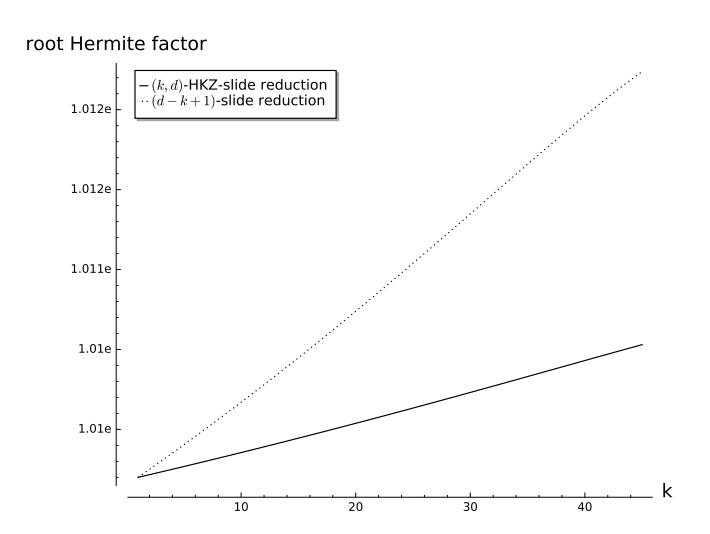
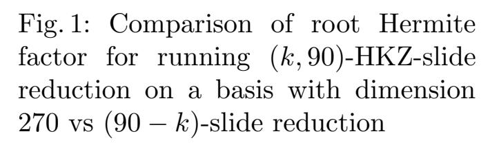
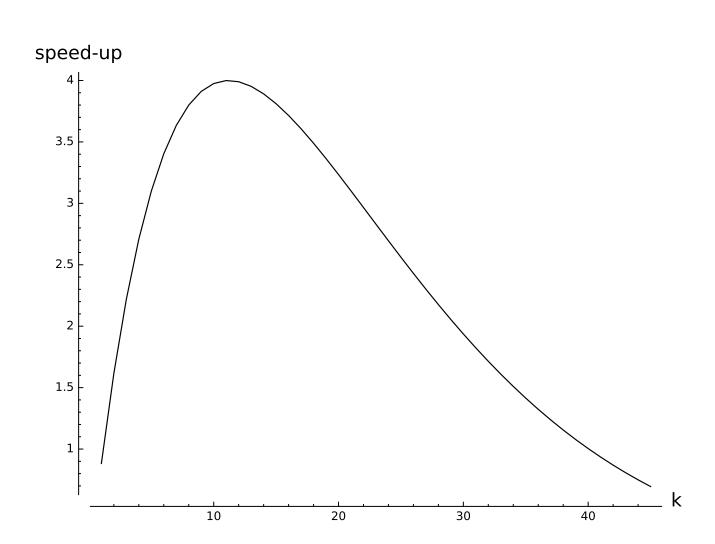
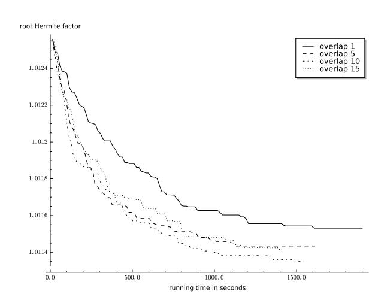
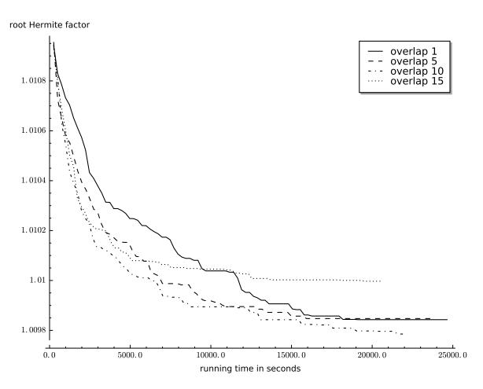
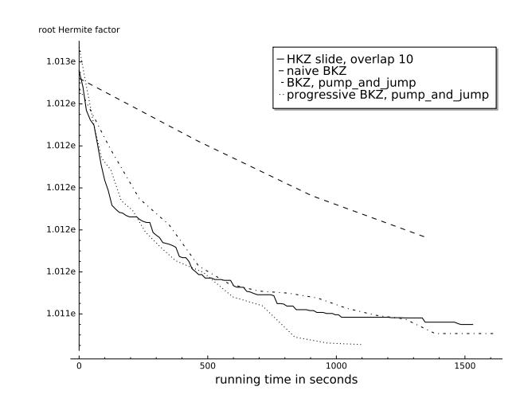
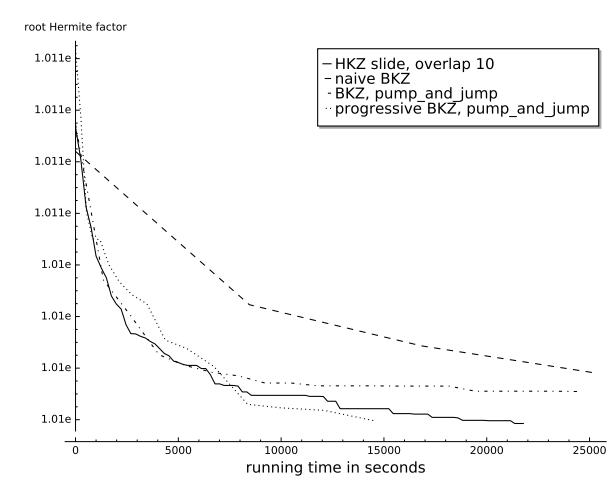

{0}------------------------------------------------

# The Convergence of Slide-type Reductions

Michael Walter???

IST Austria michael.walter@ist.ac.at

Abstract. In this work, we apply the dynamical systems analysis of Hanrot et al. (CRYPTO'11) to a class of lattice block reduction algorithms that includes (natural variants of) slide reduction and block-Rankin reduction. This implies sharper bounds on the polynomial running times (in the query model) for these algorithms and opens the door to faster practical variants of slide reduction. We give heuristic arguments showing that such variants can indeed speed up slide reduction significantly in practice. This is confirmed by experimental evidence, which also shows that our variants are competitive with state-of-the-art reduction algorithms.

# 1 Introduction

Lattice block reduction is a key tool in cryptanalysis, so understanding its potential and its limitations is essential for the security of many cryptosystems. The basic idea of lattice block reduction is to use an oracle that solves the shortest vector problem (SVP) on lattices with low dimension to find short vectors in lattices with larger dimension. Most work in lattice block reduction has focused on BKZ [\[Sch87,](#page-22-0)[SE94\]](#page-22-1) – the first generalization of the celebrated LLL [\[LLL82\]](#page-22-2) algorithm, see e.g. [\[GN08b](#page-21-0)[,HPS11,](#page-21-1)[CN11,](#page-21-2)[Wal15,](#page-22-3)[ADH](#page-21-3)+19[,AWHT16,](#page-21-4)[ABF](#page-21-5)+20[,LN20\]](#page-22-4) to list just a few. Other reduction algorithms are known, like slide reduction [\[GN08a,](#page-21-6)[ALNS20\]](#page-21-7) and SDBKZ [\[MW16\]](#page-22-5), which allow proving better bounds on the output quality, but in practice BKZ is still the go-to choice for finding short vectors. Block reduction algorithms are usually judged by the shortness of the vectors they are able to find within a given amount of time. The length of the vector found can be quantified in two different ways: by its ratio with either 1) the shortest non-zero vector of the lattice (the approximation factor) or 2) the (n-th root of the) volume/determinant of the lattice (the Hermite factor).

Slide Reduction. The focus of this work is slide reduction and, to some degree, its generalization to block-Rankin reduction [\[LN14\]](#page-22-6). When it was introduced,

<sup>?</sup> Supported by the European Research Council, ERC consolidator grant (682815 - TOCNeT).

<sup>??</sup> ©IACR 2021. This article is the final version submitted by the author to the IACR and to Springer-Verlag on 02/25/2021. The version published by Springer-Verlag is available at [https://doi.org/10.1007/978-3-030-75245-3\\_3](https://doi.org/10.1007/978-3-030-75245-3_3).

{1}------------------------------------------------

slide reduction provided the best-known bounds on the approximation and Hermite factor and was easily proved to terminate in a polynomial number of calls to the SVP oracle. Other algorithms achieving the same Hermite factor and terminating in a (smaller) polynomial number of SVP calls are known at this point [\[MW16,](#page-22-5)[Neu17\]](#page-22-7), but to date, slide reduction still achieves the best bound on the approximation factor. The basic idea of slide reduction is simple: given a basis B for an n-dimensional lattice, a block size d that divides[1](#page-1-0) n and an oracle that solves SVP in dimension d, apply the SVP oracle to the n/d disjoint (projected) blocks B[id+1,(i+1)d] i of the basis. Then apply the oracle to the dual of the blocks shifted by 1, i.e. to Bb [id+2,(i+1)d+1] i . This results in "primal" and "dual" blocks that overlap by one index (and d − 1 indices). This process is repeated until no more progress is made. The generalization to block-Rankin reduction works similarly, but it solves a more general problem and uses a more general tool. It approximates the densest sublattice problem (DSP) [\[DM13\]](#page-21-8), which is itself a generalization of SVP, by relying on an oracle that solves the k-DSP in dimension d. (SVP corresponds to 1-DSP.) In this variant, the dual blocks are shifted by k resulting in overlaps of size k. The analysis of this algorithm is a straightforward adaptation of the one for slide reduction. Unfortunately, initial experimental evaluations of slide reduction [\[GN08a,](#page-21-6)[GN08b\]](#page-21-0) found it to be not competitive in practice with BKZ and so far there has been no research into practical variants of slide reduction and block-Rankin reduction to the best of our knowledge. This is despite the fact that it offers some trivial parallelization, since the disjoint blocks can be processed independently. This is not true for other reduction algorithms and could give slide reduction a considerable advantage in practice, especially because modern SVP solvers are hard to distribute.

Dynamical Systems Analyses. Inspired by the analysis of LLL, [\[GN08a](#page-21-6)[,LN14\]](#page-22-6) used an analysis based on a potential function to bound the number of oracle calls in slide reduction and block-Rankin reduction. Such an analysis does not work well for BKZ and for a long time it was open if the number of oracle calls in BKZ may be polynomially bounded. This changed when [\[HPS11\]](#page-21-1) proposed an analysis based on dynamical systems to study BKZ and showed that one can put a polynomial bound on the number of oracle calls while preserving its output quality. Interestingly, this bound was much stronger than the one proven for slide reduction (and block-Rankin reduction) using the potential function. It was conjectured in [\[HPS11\]](#page-21-1) that applying their approach to slide reduction may give much better bounds than the ones proven in [\[GN08a,](#page-21-6)[LN14\]](#page-22-6).

A similar analysis was later used to study another reduction algorithm, SDBKZ [\[MW16\]](#page-22-5), where the analysis was simpler and cleaner. Unfortunately, [\[MW16\]](#page-22-5) left a gap, where for certain parameterizations of the algorithm the bound on the number of oracle calls was not polynomial. The gap was closed

<span id="page-1-0"></span><sup>1</sup> The restriction that d | n is lifted in [\[ALNS20\]](#page-21-7) by combining it with the algorithm of [\[MW16\]](#page-22-5).

{2}------------------------------------------------

later by [\[Neu17\]](#page-22-7), using a seemingly different analysis: "simple (and sharper) induction arguments on a bound on the bit sizes". On closer inspection, it turns out that the analysis of [\[Neu17\]](#page-22-7) can also be seen as an instance of the typical dynamical systems analysis, but with a small tweak. We make this tweak explicit in Section [5,](#page-18-0) which allows us to apply a similar tweak in our analysis of Slide-type reductions (see below).

### 1.1 Results

In this work, we consider a class of reduction algorithms that capture natural variants of slide reduction and block-Rankin reduction. We apply the dynamical systems analysis to the algorithms in this class and show that they converge quickly. This implies sharper polynomial-time running time bounds in the query model for slide reduction (when used to find short vectors in terms of the Hermite factor) and block-Rankin reduction.

<span id="page-2-0"></span>Theorem 1 (Informal). Let B ∈ Rm×<sup>n</sup> be an LLL-reduced lattice basis with det(L(B)) = 1 and > 0 an arbitrary constant. After O n 3 dk(d−k) ln n calls to the (k, d)-DSP oracle, the output basis of block-Rankin reduction satisfies

$$\det \left( \mathcal{L} \left( \mathbf{B}_{[1,k]} \right) \right)^{1/k} \lesssim (1+\epsilon) \gamma_{k,d}^{\frac{n-k}{2k(d-k)}}.$$

The best previous bound on the number of oracle queries proven in [\[LN14\]](#page-22-6) is O n 3 log max<sup>i</sup> kbik d<sup>2</sup> . For degenerate cases, max<sup>i</sup> kbik can be arbitrarily large (within the restriction that its logarithm is polynomial in the input size) even for LLL-reduced bases of lattices with determinant 1. (We focus on lattices with determinant 1 in this work for convenience. This is w.l.o.g. since one can always scale the lattice accordingly.) Theorem [1](#page-2-0) confirms the conjecture of [\[HPS11\]](#page-21-1). Not only does it give a much stronger bound for slide reduction in case k = 1, it also gives a bound for block-Rankin reduction that depends on the overlap k and improves for increasing k. This can be viewed as formalizing the intuition that a larger overlap leads to faster propagation of information within the basis. Of course, solving the DSP for larger k is also harder and thus the complexity of the oracle itself will be larger and so will the overall running time.

In light of this it is natural to replace the DSP oracle by an oracle that approximates the DSP instead of solving it exactly. This suggests a variant, where the DSP problem is approximated using an HKZ oracle. We call this variant HKZ-slide reduction. It is inspired by recent observations in [\[ADH](#page-21-3)<sup>+</sup>19] that modern SVP solvers do not only find the shortest vector but approximately HKZ reduce the head of the basis essentially for free. Compared with slide reduction, increasing the overlap in HKZ-slide reduction decreases the running time at the cost of slightly increasing the length of the shortest vector found. We give heuristic arguments (Section [4.1\)](#page-14-0) and experimental evidence (Section [4.2\)](#page-15-0) that demonstrate that this trade-off can be very favorable in practice. A well chosen overlap yields a variant of slide reduction that we consider competitive with the 

{3}------------------------------------------------

state-of-the-art in lattice block reduction [\[ADH](#page-21-3)+19]. When interpreting this result, it should be kept in mind that we did not explore all options to fine-tune the oracle to our algorithm and that BKZ has received considerable research effort to arrive at the performance level it is at now. This is not the case for slide reduction. To the best of our knowledge, this work is the first attempt of improving the practical performance of slide reduction beyond speeding up the SVP oracle.

### 1.2 Techniques

We define a class of algorithms, which we call Slide-type reductions, and use the dynamical systems analysis introduced in [\[HPS11\]](#page-21-1) to analyze their behavior by studying the properties of a system x 7→ Ax + b. Here, the variable x is a function of the current basis during the execution and A and b depend on the reduction algorithm (see Section [2.2](#page-7-0) for details). The fixed point of the system determines the result of the reduction and the norm of A its running time. After modeling Slide-type reductions in this way, we confirm that the fixed point yields the expected output quality as was proven in previous work for algorithms that fall into the class of Slide-type reductions, but we are actually more interested in the convergence of the system. Accordingly, we wish to study the norm of A, which in our case has the following form:

$$\mathbf{A} = \begin{pmatrix} 1 - 2\beta & \beta & & \\ \beta & 1 - 2\beta & \beta & & \\ & & \ddots & \\ & & \beta & 1 - 2\beta \end{pmatrix}$$

for some 0 < β ≤ 1/4 that depends on the parameters of the algorithm. Our goal is to bound some norm (induced by some vector p-norm) of A away from 1, i.e. show that kAk<sup>p</sup> ≤ 1 − for some large enough > 0. Clearly, this does not work for the row or column sum norm (p = ∞ and p = 1, respectively), since they are 1. We conjecture that the spectral norm (p = 2) is in fact smaller than 1, but this seems hard to prove directly. Instead, we apply a trick implicitly used by Neumaier [\[Neu17\]](#page-22-7) to analyze SDBKZ: we apply a change of variable. We make Neumaier's trick explicit in Section [5](#page-18-0) and then apply a similar change to our system. This results in a new matrix, for which we can easily bound the row sum norm (p = ∞), which implies our results.

### 1.3 Open Problems

Our results show that slide reduction finds short vectors in terms of the Hermite factor much faster than was previously proven. By using a well-known reduction due to Lov´asz [\[Lov86\]](#page-22-8), one can also find short vectors in terms of the approximation factor at the cost of calling slide reduction O(n) times, increasing the running time by this factor. However, the resulting approximation factor is somewhat worse than what is proved in [\[GN08a\]](#page-21-6). An interesting open 

{4}------------------------------------------------

problem is whether one can prove that the approximation factor of [GN08a] can also be achieved with a number of oracle calls similar to our bound. Conversely, it might be that achieving this approximation factor does indeed require many more oracle calls.

We show in Section 4.2 that our variant of slide reduction is competitive with state-of-the-art reduction algorithms, but does not outperform them. However, given the lack of research into practical variants of slide reduction, we believe this might well be possible. We outline some avenues in Section 4.2 to improve our variant.

## 2 Preliminaries

Notation. Numbers and reals are denoted by lower case letters. For  $n_1 \leq n_2 \in \mathbb{Z}$  we denote the set  $\{n_1,\ldots,n_2\}$  by  $[n_1,n_2]$ . For vectors we use bold lower case letters and the *i*-th entry of a vector  $\mathbf{v}$  is denoted by  $v_i$ . Let  $\langle \mathbf{v}, \mathbf{w} \rangle = \sum_i v_i \cdot w_i$  be the scalar product of two vectors. If  $p \geq 1$  the p norm of a vector  $\mathbf{v}$  is  $\|\mathbf{v}\|_p = (\sum |v_i|^p)^{1/p}$ . We will only be concerned with the norms given by p = 1, 2, and  $\infty$ . Whenever we omit the subscript p, we mean the standard Euclidean norm, i.e. p = 2. Matrices are denoted by bold upper case letters. The *i*-th column of a matrix  $\mathbf{B}$  is denoted by  $\mathbf{b}_i$  and the entry in row i and column j by  $\mathbf{B}_{i,j}$ . For any matrix  $\mathbf{B}$  and  $p \geq 1$  we define the induced norm to be  $\|\mathbf{B}\|_p = \max_{\|\mathbf{x}\|_p = 1} (\|\mathbf{B}\mathbf{x}\|_p)$ . For p = 1 (resp.  $\infty$ ) this is often denoted by the column (row) sum norm, since  $\|\mathbf{B}\|_1 = \max_j \sum_i |\mathbf{B}_{i,j}|$  and  $\|\mathbf{B}\|_\infty = \max_i \sum_j |\mathbf{B}_{i,j}|$ ; for p = 2 this is also known as the spectral norm, i.e. the largest singular value of  $\mathbf{B}$ .

#### 2.1 Lattices

A lattice  $\Lambda$  is a discrete subgroup of  $\mathbb{R}^m$  and is generated by a matrix  $\mathbf{B} \in \mathbb{R}^{m \times n}$ . i.e.  $\Lambda = \mathcal{L}(\mathbf{B}) = \{\mathbf{B}\mathbf{x} \colon \mathbf{x} \in \mathbb{Z}^n\}$ . If **B** has full column rank, it is called a basis of  $\Lambda$  and dim( $\Lambda$ ) = n is the dimension (or rank) of  $\Lambda$ . Any lattice of dimension larger than 1 has infinitely many bases, which are related to each other by right-multiplication with unimodular matrices. We use the notion of projected subblocks  $\mathbf{B}_{[i,j]}$  for i < j < n, i.e.  $\mathbf{B}_{[i,j]}$  is the matrix consisting of the columns  $\mathbf{b}_i, \mathbf{b}_{i+1}, \dots, \mathbf{b}_j$  projected onto the space orthogonal to  $\operatorname{span}_{\mathbb{R}}(\mathbf{b}_1, \mathbf{b}_2, \dots, \mathbf{b}_{i-1})$ . We define the Gram-Schmidt-Orthogonalization (GSO)  $\mathbf{B}^*$  of  $\mathbf{B}$ , where the i-th column  $\mathbf{b}_{i}^{*}$  of  $\mathbf{B}^{*}$  is defined as  $\mathbf{b}_{i}^{*} = \mathbf{b}_{i} - \sum_{j < i} \mu_{i,j} \mathbf{b}_{j}^{*}$  and  $\mu_{i,j} = \langle \mathbf{b}_{i}, \mathbf{b}_{j}^{*} \rangle / \|\mathbf{b}_{j}^{*}\|^{2}$  (and  $\mathbf{b}_{1}^{*} = \mathbf{b}_{1}$ ). In other words,  $\mathbf{b}_{i}^{*} = \mathbf{B}_{[i,i]}$ . For every basis of a lattice with dimension larger than 1 there are infinitely many bases that have the same GSO vectors  $\mathbf{b}_{i}^{*}$ , among which there is a (not necessarily unique) basis that minimizes  $\|\mathbf{b}_i\|$  for all i. Transforming a basis into this form is commonly known as sizereduction and is easily and efficiently done using a slight modification of the Gram-Schmidt process. In this work, we will implicitly assume all bases to be size-reduced. The reader can simply assume that any basis operation is followed by a size-reduction.

{5}------------------------------------------------

Every lattice  $\Lambda$  has invariants associated to it. One of them is its determinant  $\det (\mathcal{L}(\mathbf{B})) = \prod_i \|\mathbf{b}_i^*\|$  for any basis  $\mathbf{B}$ . Note that this implies that for any two bases  $\mathbf{B}$  and  $\mathbf{B}'$  of the same lattice we have  $\prod_i \|\mathbf{b}_i^*\| = \prod_i \|(\mathbf{b}_i')^*\|$  and the determinant is efficiently computable given any basis. Furthermore, for every lattice  $\Lambda$  we denote the length of its shortest non-zero vector (also known as its first minimum) by  $\lambda_1(\Lambda)$ , which is always well defined. We use the short-hand notations  $\det (\mathbf{B}) = \det (\mathcal{L}(\mathbf{B}))$  and  $\lambda_1(\mathbf{B}) = \lambda_1(\mathcal{L}(\mathbf{B}))$  if no confusion may arise.

Hermite's constant is defined as  $\gamma_n = \sup_{\Lambda:\dim(\Lambda)=n} (\lambda_1(\Lambda)/\det(\Lambda))^2$ . Minkowski's theorem is a classic result that shows that  $\gamma_n \leq n$ . Viewing a shortest vector as the basis of a 1-dimensional sublattice of  $\Lambda$  leads to a straightforward generalization of the first minimum to the densest k-dimensional sublattice  $\mu_k(\Lambda) = \min_{\Lambda' \subset \Lambda:\dim(\Lambda')=k} \det(\Lambda')$ . The corresponding generalization of Hermite's constant is known as Rankin's constant  $\gamma_{k,n} = \sup_{\Lambda:\dim(\Lambda=n)} \left(\mu_k(\Lambda)/\det(\Lambda)^{k/n}\right)^2$ .

There is a heuristic version of Minkowski's bound based on the Gaussian heuristic which states that most lattices that arise in practice satisfy  $\lambda_1(\Lambda) \approx \sqrt{d/2\pi e} \det(\Lambda)^{1/n}$ , unless there is an explicit reason to believe otherwise (e.g. an unusually short vector is planted in the lattice). We note that there is a theory of random lattices, which allows to turn this bound into a rigorous average-case version of Minkowski's bound, see e.g. [ALNS20] and references therein. For this work it is sufficient to know that the Gaussian heuristic is precise enough for lattices with dimension larger than 45 arising in lattice block reduction to predict its behavior in practice [CN11,GN08b,MW16].

<span id="page-5-0"></span>**Heuristic 1** [Gaussian Heuristic] For any lattice  $\Lambda$  with dim $(\Lambda) \geq 45$  arising in lattice reduction we assume that  $\lambda_1(\Lambda) \approx \sqrt{d/2\pi e} \det(\Lambda)^{1/n}$ .

For every lattice  $\Lambda$ , its dual is defined as  $\hat{\Lambda} = \{ \mathbf{w} \in \operatorname{span}_{\mathbb{R}}(\Lambda) | \langle \mathbf{w}, \mathbf{v} \rangle \in \mathbb{Z} \text{ for all } \mathbf{v} \in \Lambda \}$ . It is a classical fact that  $\det(\hat{\Lambda}) = \det(\Lambda)^{-1}$ . For a lattice basis  $\mathbf{B}$ , let  $\widehat{\mathbf{B}}$  be the unique matrix that satisfies  $\operatorname{span}_{\mathbb{R}}(\mathbf{B}) = \operatorname{span}_{\mathbb{R}}(\widehat{\mathbf{B}})$  and  $\mathbf{B}^T \widehat{\mathbf{B}} = \widehat{\mathbf{B}}^T \mathbf{B} = \mathbf{R}$ , where  $\mathbf{R}$  is the identity matrix with reversed columns (see Section 5). Then  $\widehat{\mathcal{L}(\mathbf{B})} = \mathcal{L}(\widehat{\mathbf{B}})$  and we denote  $\widehat{\mathbf{B}}$  as the reversed dual basis of  $\mathbf{B}$ . Note that  $\widehat{\mathbf{B}_{[i,j]}} = \widehat{\mathbf{B}}_{[n+1-j,n+1-i]}$ .

**Definition 1.** Let  $\mathbf{B} \in \mathbb{Z}^{m \times n}$  be a lattice basis. We call  $\mathbf{B}$  k-partial HKZ reduced if  $\|\mathbf{b}_i^*\| = \lambda_1 \left(\mathbf{B}_{[i,n]}\right)$  for all  $i \in [1,k]$ .

An *n*-dimensional basis **B** is SVP reduced (HKZ reduced), if it is 1-partial (*n*-partial, resp.) HKZ reduced. The *root Hermite factor* achieved by **B** is defined as  $(\|\mathbf{b}_1\|/\det(\mathbf{B})^{1/n})^{1/n}$ .

We use some notation from [HS07]:

**Definition 2.** For a lattice basis **B** we define  $\pi_{[j,k]}(\mathbf{B}) = \left(\prod_{i=j}^k \|\mathbf{b}_i^*\|\right)^{1/(k-j+1)}$  and  $\Gamma_n(k) = \prod_{i=d-k}^{d-1} \gamma_{i+1}^{\frac{1}{2i}}$ . We sometimes omit **B** and simply write  $\pi_{[j,k]}$  if **B** is clear from context.

{6}------------------------------------------------

Using these definitions, [\[HS07\]](#page-22-9) proves useful inequalities regarding the geometry of (k-partial) HKZ reduced bases. We will use the following:

<span id="page-6-2"></span>Lemma 1 ([\[HS07\]](#page-22-9)). If B is k-partial HKZ reduced, then

$$\pi_{[1,k]} \le \Gamma_d \left(k\right)^{d/k} \pi_{k+1,d}.$$

The proof is pretty straightforward using Minkowski's bound and induction.

Definition 3. A basis B ∈ Rm×<sup>n</sup> is called LLL-reduced[2](#page-6-0) if kb ∗ i k = λ<sup>1</sup> B[i,i+1] , which implies kb ∗ i k ≤ γ2kb ∗ <sup>i</sup>+1k, for all i ∈ [1, n − 1].

We will need the following two facts about LLL.

<span id="page-6-3"></span>Fact 1 If B ∈ Rm×<sup>n</sup> is LLL-reduced, then we have

$$\pi_{[1,i]} \le \gamma_2^{\frac{n-i}{2}} \pi_{[1,n]}$$

for all i ∈ [1, n].

See e.g. [\[PT09\]](#page-22-10) for a proof.

<span id="page-6-1"></span>Fact 2 Let B ∈ Rm×<sup>n</sup> be a lattice basis and B<sup>0</sup> be the result of applying LLL to B. Then we have

$$\pi_{[1,i]}\left(\mathbf{B}'\right) \leq \pi_{[1,i]}\left(\mathbf{B}\right)$$

for all i ∈ [1, n].

Fact [2](#page-6-1) can be seen to be true from a similar argument to the one showing that the potential function used to analyze LLL may only decrease under the swaps that LLL performs. More specifically, LLL reduction only applies two types of operations: size-reduction, which does not change the value π[1,i] (B) for any i, and swapping consecutive vectors. Swapping vectors only affects the value π[1,i] (B) for exactly one i and the condition, under which such swaps are performed, ensures that this value can only decrease.

Finally, BKZ is a block-wise generalization of LLL.

Definition 4. A basis B ∈ Rm×<sup>n</sup> is called d-BKZ reduced if kb ∗ i k = λ<sup>1</sup> B[i,`] where ` = min (i + d, n), for all i ∈ [1, n].

,

<span id="page-6-0"></span><sup>2</sup> Technically, LLL reduction also requires size-reduction and usually contains a slack factor in the inequality to guarantee termination in polynomial time. Neither of these additional requirements are important for this work, so we ignore it here for simplicity.

{7}------------------------------------------------

#### <span id="page-7-0"></span>2.2 Discrete-Time Affine Dynamical Systems

Consider some dynamical system

<span id="page-7-1"></span>
$$\mathbf{x} \mapsto \mathbf{A}\mathbf{x} + \mathbf{b}$$
 (1)

and assume that  $\|\mathbf{A}\|_p < 1$  for some p. This implies two facts:

- <span id="page-7-2"></span>1. Equation (1) has at most one fixed point  $\mathbf{x}^* = \mathbf{A}\mathbf{x}^* + \mathbf{b}$ , and
- <span id="page-7-3"></span>2. if Equation (1) has a fixed point  $\mathbf{x}^*$  it converges to  $\mathbf{x}^*$  exponentially fast in the number of iterations (with base  $e^{-(1-\|\mathbf{A}\|_p)}$ ).

To see 1, note that two distinct fixed points  $\mathbf{x}_1^* \neq \mathbf{x}_2^*$  would imply

$$0 \neq \|\mathbf{x}_1^* - \mathbf{x}_2^*\|_p = \|\mathbf{A}(\mathbf{x}_1^* - \mathbf{x}_2^*)\|_p \leq \|\mathbf{A}\|_p \|\mathbf{x}_1^* - \mathbf{x}_2^*\|_p < \|\mathbf{x}_1^* - \mathbf{x}_2^*\|_p$$

which is a contradiction. For 2, let  $\mathbf{x}^*$  be the unique fixed point of Equation (1). We can write any input  $\mathbf{x}'$  as  $\mathbf{x}' = \mathbf{x}^* + \mathbf{e}$  for some "error vector"  $\mathbf{e}$ . When applying the system to it, we get  $\mathbf{x}' \mapsto \mathbf{A}\mathbf{x}' + \mathbf{b} = \mathbf{x}^* + \mathbf{A}\mathbf{e}$ . So the error vector  $\mathbf{e}$  is mapped to  $\mathbf{A}\mathbf{e}$ . Applying this  $\ell$  times maps  $\mathbf{e}$  to  $\mathbf{A}^{\ell}\mathbf{e}$ , which means after  $\ell$  iterations the error vector has norm  $\|\mathbf{A}^{\ell}\mathbf{e}\|_p \leq \|\mathbf{A}^{\ell}\|_p \|\mathbf{e}\|_p$ . Let  $\|\mathbf{A}\|_p \leq 1 - \epsilon$  for some  $\epsilon > 0$ , then  $\|\mathbf{A}^{\ell}\|_p \leq \|\mathbf{A}\|_p^{\ell} \leq (1 - \epsilon)^{\ell} \leq e^{-\epsilon \ell}$ , so the error vector will decay exponentially in  $\ell$  with base  $e^{-\epsilon}$  and the system converges to the fixed point  $\mathbf{x}^*$ .

Let **D** be an invertible matrix. We can use **D** for a change of variable to  $\mathbf{y} = \mathbf{D}\mathbf{x}$ , which allows to rewrite Equation (1) to

<span id="page-7-4"></span>
$$\mathbf{y} = \mathbf{D}\mathbf{x} \mapsto \mathbf{D}\mathbf{A}\mathbf{D}^{-1}\mathbf{y} + \mathbf{D}\mathbf{b} \tag{2}$$

It is easy to see that for any fixed point  $\mathbf{x}^*$  of Equation (1),  $\mathbf{y}^* = \mathbf{D}\mathbf{x}^*$  is a fixed point of Equation (2). This can be useful as it is often more convenient to bound  $\|\mathbf{D}\mathbf{A}\mathbf{D}^{-1}\|_p$  for some  $\mathbf{D}$  and p than  $\|\mathbf{A}\|_p$  (as we will see). If additionally the condition number  $\kappa_p(\mathbf{D}) = \|\mathbf{D}\|_p \|\mathbf{D}^{-1}\|_p$  is small, then system (1) converges almost as quickly as system (2):

Fact 3 Let  $\mathbf{x}^{\ell}$  be a vector resulting from applying system (1)  $\ell$  times to the input  $\mathbf{x}^{0}$  and denote  $\mathbf{e}^{\ell} = \mathbf{x}^{\ell} - \mathbf{x}^{*}$ . Let  $\mathbf{D}$  be an invertible matrix such that  $\|\mathbf{D}\mathbf{A}\mathbf{D}^{-1}\|_{p} = 1 - \epsilon$  for some  $\epsilon > 0$ . Then  $\|\mathbf{e}^{\ell}\|_{p} \leq \exp(-\ell\epsilon) \kappa_{p}(\mathbf{D}) \|\mathbf{e}^{0}\|_{p}$ .

*Proof.* Let  $\mathbf{y}^0 = \mathbf{D}\mathbf{x}^0$  and  $\mathbf{y}^{\ell+1} = \mathbf{D}\mathbf{A}\mathbf{D}^{-1}\mathbf{y}^{\ell} + \mathbf{D}\mathbf{b}$  for all  $\ell > 0$ . Induction shows that  $\mathbf{y}^{\ell} = \mathbf{D}\mathbf{x}^{\ell}$ . By above argument, we have  $\|\mathbf{y}^{\ell} - \mathbf{y}^*\|_p \le \exp(-\ell\epsilon) \|\mathbf{y}^0 - \mathbf{y}^*\|_p$ . Now the result follows from

$$\|\mathbf{e}^{\ell}\|_{p} = \|\mathbf{x}^{\ell} - \mathbf{x}^{*}\|_{p}$$

$$= \|\mathbf{D}^{-1}\mathbf{y}^{\ell} - \mathbf{D}^{-1}\mathbf{y}^{*}\|_{p}$$

$$\leq \|\mathbf{D}^{-1}\|_{p}\|\mathbf{y}^{\ell} - \mathbf{y}^{*}\|_{p}$$

$$\leq \exp(-\ell\epsilon)\|\mathbf{D}^{-1}\|_{p}\|\mathbf{y}^{0} - \mathbf{y}^{*}\|_{p}$$

$$\leq \exp(-\ell\epsilon)\|\mathbf{D}^{-1}\|_{p}\|\mathbf{D}\|_{p}\|\mathbf{e}^{0}\|_{p}.$$

{8}------------------------------------------------

Application to Lattice Reduction. Dynamical systems are a useful tool to study lattice reduction algorithms. As was first observed in [HPS11], for an iteration of some lattice reduction algorithm we can often show that  $\mathbf{y} \leq \mathbf{A}\mathbf{x} + \mathbf{b}$ , where  $\mathbf{x}$  ( $\mathbf{y}$ ) is some characterization of the input (output, resp.) basis for this iteration. If all entries in  $\mathbf{A}$  are non-negative, we can iterate this inequality to derive inequalities for consecutive iterations. So the system  $\mathbf{x} \mapsto \mathbf{A}\mathbf{x} + \mathbf{b}$  describes valid upper bounds for the vector  $\mathbf{x}$  characterizing the current basis during the execution of the algorithm.

# <span id="page-8-1"></span>3 Slide-type Reductions

Let  $O_{k,d}$  be an oracle that takes as input an n-dimensional basis  $\mathbf B$  and an index i < n-d and modifies  $\mathbf B$  such that  $\pi_{[i,i+k-1]} \le \alpha \cdot \pi_{[i,i+d-1]}$  (and leaves the rest unchanged). In Algorithm 1, we present a class of algorithms which resemble slide reduction and are parameterized by such an oracle  $O_{k,d}$ . The algorithm runs in primal and dual tours. During a primal tour, the n/d disjoint blocks of the basis are reduced using  $O_{k,d}$ . Then the reversed dual basis is computed and n/d-1 disjoint blocks are passed to the oracle. The blocks in the dual tour are chosen such that the corresponding primal blocks are shifted by k with respect to the blocks in the primal tour. Slide reduction itself (or rather a natural variant) can be recovered by instantiating  $O_{k,d}$  with an SVP oracle in dimension d, hence k=1 and  $\alpha=\sqrt{\gamma_d}$ . Block-Rankin reduction corresponds to using a (k,d)-DSP oracle, in which case  $\alpha=\gamma_{k,d}^{1/2k}$ . Finally, we can also define a new algorithm by letting  $O_{k,d}$  be an algorithm that k-partial HKZ reduces a d-dimensional basis. In that case, Lemma 1 implies  $\alpha=\Gamma_d(k)^{(d-k)/k}$ .

**Definition 5.** Let  $O_{k,d}$  be an algorithm that k-partial HKZ reduces a d-dimensional basis. We call Algorithm 1 instantiated with  $O_{k,d}$  (k,d)-HKZ-slide reduction.

<span id="page-8-0"></span>**Algorithm 1** Slide-type Reduction.  $O_{k,d}$  is an oracle that takes as input a basis **B** and an index i and modifies **B** such that  $\pi_{[i,i+k-1]} \leq \alpha \cdot \pi_{[i,i+d-1]}$  (and leaves the rest unchanged.)

```
procedure SLIDE-TYPE REDUCTION(\mathbf{B}, \mathsf{O}_{k,d} (\cdot, \cdot))
while progress is made do
\mathbf{B} \leftarrow \mathsf{O}_{k,d} (\mathbf{B}, id+1) \text{ for all } i \in [0, n/d-1]
\mathbf{B} \leftarrow \widehat{\mathbf{B}}
\mathbf{B} \leftarrow \mathsf{O}_{k,d} (\mathbf{B}, id-k) \text{ for all } i \in [1, n/d-1]
\mathbf{B} \leftarrow \widehat{\mathbf{B}}\nend while\nend procedure
```

We remark that it is customary in lattice reduction theory to apply LLL reduction in between the calls to the oracle. This is important to control the

{9}------------------------------------------------

size of the numbers, which in turn allows to bound the complexity of the oracle itself. Since we focus on the number of calls to the oracle, we chose to present Algorithm 1 without any calls to LLL. Note that none of such calls will have any effect on our bounds due to Fact 2, since we will work with upper bounds on the subdeterminants  $\pi_{[1,i]}$ . These can only decrease during the application of LLL, so any upper bound that held before applying LLL also holds afterwards.

## <span id="page-9-3"></span>3.1 Convergence

The following theorem contains the main technical contribution of this work and the remainder of this subsection is devoted to proving it.

<span id="page-9-2"></span>**Theorem 2.** Let  $\mathbf{B} \in \mathbb{R}^{m \times n}$  be a lattice basis with  $\det (\mathcal{L}(\mathbf{B})) = 1$ . Let  $k \leq d \in \mathbb{Z}$  such that n = pd for some  $d \in \mathbb{Z}$ ,  $p \geq 2$  and  $O_{k,d}$  be an oracle that on input a basis  $\mathbf{B}'$  and index i < n - d produces a basis  $\mathbf{C}$  such that

$$-\pi_{[i,i+k-1]}(\mathbf{C}) \leq \alpha \cdot \pi_{[i,i+d-1]}(\mathbf{B}') \text{ and } \\ -\mathbf{c}_j = \mathbf{b}'_j \text{ for all } j \notin [i,i+d-1].$$

Let  $\mu_i = i(p-i)\frac{d}{d-k}\ln\alpha$ ,  $\mathbf{B}_{\ell}$  the basis after the  $\ell$ -th iteration and  $\epsilon_{\ell} = \max_{i \in [1,p]} |\ln(\pi_{[1,id]}(\mathbf{B}_{\ell})) - \mu_i|$ . Then we have

$$\epsilon_{\ell} \le \exp\left(\frac{-4k(d-k)}{n^2}\ell\right) \frac{p^2}{4(p-1)}\epsilon_0$$

after  $\ell$  iterations of Slide-type reduction with oracle  $O_{k,d}$ .

*Proof.* During a primal tour, Slide-type reduction turns a basis  ${\bf B}$  into a basis  ${\bf B}'$  such that

<span id="page-9-0"></span>
$$\ln \pi_{[id+1,id+k]}(\mathbf{B}') \le \ln \pi_{[id+1,id+d]}(\mathbf{B}) + \ln \alpha \tag{3}$$

for  $i \in [0, p-1]$ . Similarly, a dual tour yields

<span id="page-9-1"></span>
$$\ln \pi_{[id+1,id+k]}(\mathbf{B}') \ge \ln \pi_{[(i-1)d+2,id+1]}(\mathbf{B}) - \ln \alpha \tag{4}$$

We consider the leading subdeterminants corresponding to the blocks considered by Algorithm 1. Let  $y_i = id \ln \pi_{[1,id]}(\mathbf{B})$  for  $i \in [1, p-1]$ . (Note that  $y_p = 0$ , since we assume that the lattice has unit determinant, so we may ignore this variable.) Now we apply a primal tour and denote  $x_i = ((i-1)d+k) \ln \pi_{[1,(i-1)d+k]}(\mathbf{B}')$  for  $i \in [1,p]$  after that tour. Then we have by Equation (3)

$$x_i \le \frac{d-k}{d}y_{i-1} + \frac{k}{d}y_i + k\ln\alpha$$

for  $i \in [1, p]$ , where we define  $y_0 = y_p = 0$ . In matrix form we have  $\mathbf{x} \leq \mathbf{A}_p \mathbf{y} + \mathbf{b}_p$  with

$$\mathbf{A}_{p} = \begin{pmatrix} \frac{k}{d} & & & \\ \omega & \frac{k}{d} & & \\ & \omega & \frac{k}{d} & \\ & & \ddots & \\ & & \frac{k}{d} & \\ & & \omega \end{pmatrix} \in \mathbb{R}^{p \times (p-1)}$$

{10}------------------------------------------------

where  $\omega = \frac{d-k}{d}$  and  $\mathbf{b}_p = k \ln \alpha \cdot \mathbf{1} \in \mathbb{R}^p$ .

Now let  $\tilde{y_i'}$  as  $y_i$  above but after the next dual tour. From Equation (4) we get

$$x_i - y'_{i-1} \ge \frac{k}{d} \left( x_i - x_{i-1} \right) - k \ln \alpha$$

or equivalently

$$y_i \le \omega x_{i+1} + \frac{k}{d} x_i + k \ln \alpha$$

for  $i \in [1, p-1]$ . Again, in matrix form  $\mathbf{y} \leq \mathbf{A}_d \mathbf{x} + \mathbf{b}_d$ , where  $\mathbf{b}_d = k \ln \alpha \cdot \mathbf{1} \in \mathbb{R}^{p-1}$  and

$$\mathbf{A}_d = \begin{pmatrix} \frac{k}{d} & \omega & & & \ \frac{k}{d} & \omega & & & \ & \ddots & & & \ & & \frac{k}{d} & \omega \end{pmatrix} = \mathbf{A}_p^T$$

By combining the two set of inequalities, we obtain:

$$\mathbf{y}' \leq \mathbf{A}_d \mathbf{x} + \mathbf{b}_d \leq \mathbf{A}_d \left( \mathbf{A}_p \mathbf{y} + \mathbf{b}_p \right) + \mathbf{b}_d = \mathbf{A}_p^T \mathbf{A}_p \mathbf{y} + \left( \mathbf{A}_p^T \mathbf{b}_p + \mathbf{b}_d \right)$$

Thus, the general matrix that characterizes a primal and dual tour is

<span id="page-10-3"></span>
$$\mathbf{A} = \mathbf{A}_{p}^{T} \mathbf{A}_{p} = \begin{pmatrix} \tilde{\omega} & \frac{k\omega}{d} \\ \frac{k\omega}{d} & \tilde{\omega} & \frac{k\omega}{d} \\ & \dots & \\ & \frac{k\omega}{d} & \tilde{\omega} \end{pmatrix} = \begin{pmatrix} 1 - 2\beta & \beta \\ \beta & 1 - 2\beta & \beta \\ & & \dots & \\ & \beta & 1 - 2\beta \end{pmatrix} \in \mathbb{R}^{(p-1)\times(p-1)}$$
(5)

where  $\tilde{\omega} = \omega^2 + (k/d)^2$  and  $\beta = \frac{k(d-k)}{d^2}$ . And with  $\mathbf{b} = \mathbf{A}_p^T \mathbf{b}_p + \mathbf{b}_d = 2 \cdot \mathbf{b}_d$  the dynamical system we are interested in is

<span id="page-10-2"></span>
$$\mathbf{y} \mapsto \mathbf{A}\mathbf{y} + \mathbf{b}.$$
 (6)

The theorem now follows from Lemma 2 and 3 below, in which we analyze the fixed point and the convergence of system (6), resp.

<span id="page-10-0"></span>**Lemma 2.** For the system in Equation (6) and the vector  $\mathbf{y}^* \in \mathbb{R}^{p-1}$  with

$$y_i^* = i (p - i) \frac{d^2}{d - k} \ln \alpha$$

we have  $\mathbf{A}\mathbf{y}^* + \mathbf{b} = \mathbf{y}^*$ .

*Proof.* Note that we can extend the definition of  $y_i^*$  to i=0 and i=p, in which case we have  $y_0^*=y_p^*=0$ . So the lemma follows if we can show that

$$\beta y_{i-1}^* + (1 - 2\beta) y_i^* + \beta y_{i+1}^* + 2k \ln \alpha = y_i^*$$

for all  $i \in [1, p-1]$ . This is equivalent to

$$\beta \left( y_{i-1}^* + y_{i+1}^* - 2y_i^* \right) + 2k \ln \alpha = 0$$

<span id="page-10-1"></span>which is easily seen to be true by straightforward calculation.

{11}------------------------------------------------

**Lemma 3.** Let **A** as in Equation (5). Then there exists an invertible matrix **D** with  $\kappa_{\infty}(\mathbf{D}) = \frac{p^2}{4(p-1)}$  such that

$$\|\mathbf{D}\mathbf{A}\mathbf{D}^{-1}\|_{\infty} \le 1 - \frac{4k(d-k)}{n^2}$$

for any  $p \geq 2$ .

*Proof.* Let  $\mathbf{D}$  be the diagonal matrix such that

$$\mathbf{D}^{-1} = \begin{pmatrix} p-1 & & \\ & 2(p-2) & \\ & & \dots \\ & & p-1 \end{pmatrix}$$

We now analyze the matrix

$$\mathbf{DAD}^{-1} = \begin{pmatrix} 1 - 2\beta & \frac{2(p-2)}{p-1}\beta \\ \frac{p-1}{2(p-2)}\beta & 1 - 2\beta & \frac{3(p-3)}{2(p-2)}\beta \\ & \frac{2(p-2)}{3(p-3)}\beta & 1 - 2\beta & \frac{4(p-4)}{3(p-3)}\beta \\ & & \dots \\ & & \frac{(p-2)2}{p-1}\beta & 1 - 2\beta \end{pmatrix}$$

The sum of the *i*-th row is

$$S_{i} = 1 - 2\beta + \beta \frac{(i-1)(p-i+1) + (i+1)(p-i-1)}{i(p-i)}$$

$$= 1 - 2\beta \left(1 - \frac{ip - i^{2} - 1}{ip - i^{2}}\right)$$

$$= 1 - \frac{2\beta}{ip - i^{2}}$$

$$\leq 1 - \frac{8\beta}{p^{2}}$$

$$= 1 - \frac{8k(d-k)}{n^{2}}$$

for  $i \in [2, \dots, p-2]$ . Finally, we have

$$S_1 = S_{p-1} \le 1 - \frac{2pk(d-k)}{n^2}$$

from which the lemma follows.

#### 3.2 Implications

<span id="page-11-0"></span>We now show how Theorem 2 implies bounds for the running time of Slide-type reduction algorithms.

{12}------------------------------------------------

Corollary 1. Let  $\mathbf{B} \in \mathbb{R}^{m \times n}$  be an LLL-reduced lattice basis with  $\det (\mathcal{L}(\mathbf{B})) = 1$  and  $\epsilon > 0$  an arbitrary constant. After  $\ell \geq \frac{n^2}{4k(d-k)} \ln \left( \frac{\frac{n^2}{2d} + \frac{n^3}{4d^3} \ln \alpha}{\epsilon} \right)$  tours of Slide-type reduction with oracle  $O_{k,d}$  such that  $\alpha \geq \gamma_2$ , the output basis satisfies

$$\pi_{[1,d]} = \prod_{i=1}^{d} \|\mathbf{b}_{i}^{*}\|^{\frac{1}{d}} \le \exp(\epsilon + \mu_{1}) \approx (1 + \epsilon) \alpha^{\frac{n-d}{d-k}}.$$

Accordingly, the number of oracle queries is bounded by  $\frac{n^3}{2dk(d-k)} \ln \left( \frac{\frac{n^2}{2d} + \frac{n^3}{4d^3} \ln \alpha}{\epsilon} \right)$ .

*Proof.* Theorem 2 shows that in order to obtain  $\epsilon_{\ell} \leq \epsilon$  for arbitrary  $\epsilon > 0$ , it is sufficient to set

$$\ell \geq \frac{n^2}{4k(d-k)} \ln \left( \frac{p^2 \epsilon_0}{4(p-1)\epsilon} \right).$$

By Fact 1 we have

$$\epsilon_0 = \max_{i \in [1,p]} |\ln \pi_{[1,id]}(\mathbf{B}) - \mu_i| \le \frac{n-1}{2} \ln \gamma_2 + \frac{n^2}{4d(d-k)} \ln \alpha \le n + \frac{n^2}{2d^2} \ln \alpha$$

where we assume that  $k \leq d/2$ . Finally, notice that  $p^2/\left(4\left(p-1\right)\right) \leq p/2 = n/2d$  for all  $p \geq 2$ .

Corollary 1 implies the following corollaries.

<span id="page-12-0"></span>Corollary 2. Let  $\mathbf{B} \in \mathbb{R}^{m \times n}$  be an LLL-reduced lattice basis with  $\det (\mathcal{L}(\mathbf{B})) = 1$  and  $\epsilon > 0$  an arbitrary constant. After  $O\left(\frac{n^3}{dk(d-k)}\ln\left(\frac{n}{\epsilon}\right)\right)$  calls to the (k,d)-DSP oracle, the output basis of block-Rankin reduction satisfies

$$\pi_{[1,d]} = \prod_{i=1}^{d} \|\mathbf{b}_{i}^{*}\|^{\frac{1}{d}} \leq \exp\left(\epsilon + \mu_{1}\right) = \exp\left(\epsilon\right) \gamma_{k,d}^{\frac{n-d}{2k(d-k)}} \approx (1+\epsilon) \gamma_{k,d}^{\frac{n-d}{2k(d-k)}}.$$

One more call to the oracle yields

$$\pi_{[1,k]} \le \exp\left(\epsilon\right) \gamma_{k,d}^{\frac{n-k}{2k(d-k)}} \approx (1+\epsilon) \gamma_{k,d}^{\frac{n-k}{2k(d-k)}}.$$

The case of slide reduction follows as a special case (k=1) and we note that the number of SVP calls matches the one proven for other lattice reduction algorithms using this technique [HPS11,LN20,MW16]. Recall that the bound on the number of oracle queries proven in [LN14] is  $O\left(\frac{n^3\log\max_i\|\mathbf{b}_i\|}{\epsilon d^2}\right)$ . For degenerate cases  $\max_i\|\mathbf{b}_i\|$  can be arbitrarily large (within the restriction that its logarithm is polynomial in the input size) even for LLL-reduced bases of lattices with determinant 1. Similar to the recent work of [LN20], we are able to achieve a bound that is independent of  $\max_i \|\mathbf{b}_i\|$  using the dynamical systems approach. The length of the vectors just contributes to the  $\log n$  factor in our bound. ([HPS11] does not claim to achieve this but obtains a bound with a

{13}------------------------------------------------

doubly logarithmic dependence on max<sup>i</sup> kbik.) Furthermore, the dependence on is much tighter in two ways: 1) in [\[LN14\]](#page-22-6) the slack factor in the output quality is (1 + ) (n−k)/(4(d−k)), while in Corollary [2](#page-12-0) it is just exp () ≈ (1 + ). 2) The dependence of the bound on the number of oracle queries is linear in 1/, while in our bound it is only logarithmic. Finally, the remaining polynomial factor matches in the two bounds for small values of k, but our bound depends on k and actually decreases with growing k up to an improvement of 1/d for k = d/2. This seems to be a feature of the dynamical systems analysis as it is unclear if the LLL-style potential function analysis of [\[LN14\]](#page-22-6) can be used to study the dependence of the number of calls on k.

<span id="page-13-0"></span>Corollary 3. Let B ∈ Rm×<sup>n</sup> be an LLL-reduced lattice basis with det (L(B)) = 1 and > 0 an arbitrary constant. After O n 3 dk(d−k) ln n calls to the k-partial HKZ oracle, the output basis of (k, d)-HKZ-slide reduction satisfies

$$\pi_{[1,d]} = \prod_{i=1}^{d} \|\mathbf{b}_{i}^{*}\|^{\frac{1}{d}} \leq \exp\left(\epsilon + \mu_{1}\right) = \exp\left(\epsilon\right) \Gamma_{d}\left(k\right)^{\frac{n-d}{k}} \approx \left(1 + \epsilon\right) \Gamma_{d}\left(k\right)^{\frac{n-d}{k}}.$$

One more call to the oracle yields

$$\|\mathbf{b}_1\| \le \exp(\epsilon) \sqrt{\gamma_d} \Gamma_d(k)^{\frac{n-d}{k}} \approx (1+\epsilon) \sqrt{\gamma_d} \Gamma_d(k)^{\frac{n-d}{k}}.$$

We can try to get bounds on the Hermite factor of (k, d)-HKZ-slide reduction in terms of γ<sup>d</sup> by using some straightforward bounds on Γd(k).

Lemma 4. For a (k, d)-HKZ-slide reduced basis we have

$$\|\mathbf{b}_1\| \le \sqrt{d}^{1 + \frac{n-d}{k} \log \frac{d}{d-k}} \det(\mathbf{B})^{\frac{1}{n}} \le \sqrt{d}^{\frac{n-k}{d-k}} \det(\mathbf{B})^{\frac{1}{n}}$$

$$(7)$$

$$\|\mathbf{b}_1\| \le \sqrt{\gamma_{d-k+1}}^{\frac{n-1}{d-k}} \det(\mathbf{B})^{\frac{1}{n}} \tag{8}$$

Proof. Both follow from Corollary [3.](#page-13-0) For Equation [\(7\)](#page-13-1) use the bound Γ<sup>d</sup> (k) ≤ √ d log <sup>d</sup> d−k proven in [\[HS07\]](#page-22-9) and log 1 + x ≤ x.

For Equation [\(8\)](#page-13-2), recall Mordell's inequality γ 1 n−1 <sup>n</sup> ≤ γ 1 k−1 k , which shows that Γ<sup>d</sup> (k) ≤ <sup>√</sup>γd−k+1 k <sup>d</sup>−<sup>k</sup> . So we have

<span id="page-13-2"></span><span id="page-13-1"></span>
$$\|\mathbf{b}_1\| \le \sqrt{\gamma_d} \sqrt{\gamma_{d-k+1}}^{\frac{n-d}{d-k}} \det(\mathbf{B})^{\frac{1}{n}}.$$

Finally, use Mordell's inequality again to see that <sup>√</sup>γ<sup>d</sup> <sup>≤</sup> <sup>√</sup>γd−k+1 d−1 <sup>d</sup>−<sup>k</sup> to conclude. ut

The bound on the Hermite factor achieved by HKZ-slide reduction suggests that running (k, d)-HKZ-slide reduction is no better than running (1, d − k + 1)-HKZ-slide reduction, i.e. vanilla slide reduction with block size d − k + 1. Since solving SVP in dimension d − k + 1 is easier by a factor 2<sup>Ω</sup>(k) than kpartial HKZ reduction in dimension d, it stands to reason that using k = 1 is optimal. However, in the next sections we will make heuristic arguments and show experimental evidence that using larger k can be worthwhile in practice.

{14}------------------------------------------------

## 4 HKZ-Slide Reduction in Practice

In this section we give heuristic arguments (Section 4.1) and experimental evidence showing that HKZ-slide reduction can outperform slide reduction and yield a faster algorithm in practice.

## <span id="page-14-0"></span>4.1 Heuristic Analysis

Note that the convergence analysis in Section 3.1 is agnostic to the value  $\alpha$ . So we can use the same analysis for a heuristic evaluation, but instead of using Minkowski's inequality, we use the Gaussian heuristic. So by defining  $g_d = \sqrt{d/2\pi e}$  and  $\alpha = G_d(k) = \prod_{i=d-k}^{d-1} g_{i+1}^{\frac{1}{i}}$  we can get a bound on the density of the first block of a (k,d)-HKZ-slide reduced basis based on Heuristic 1, which is

$$\pi_{[1,d]} \approx G_d(k)^{\frac{n-d}{k}} \det(\mathbf{B})^{\frac{1}{n}}$$

which implies

$$\|\mathbf{b}_1\| \approx g_d G_d(k)^{\frac{n-d}{k}} \det(\mathbf{B})^{\frac{1}{n}}.$$

Now we can compare the quality that we achieve by using different overlaps and block sizes. See Figure 1 for an example. Running (k,d)-HKZ-slide reduction yields a better basis than running slide reduction with block size k-d+1 (but also needs a partial HKZ oracle in larger dimension).

To estimate the practical behavior of HKZ-slide reduction and slide reduction, we make the following assumptions: 1) we assume that the dependence of the running time of (k,d)-HKZ-slide reduction on the overlap k is 1/k(d-k), and 2) that the complexity of the k-partial HKZ oracle is  $2^{d/3+O(1)}$  and independent of k. The first assumption is supported by our analysis in Section 3.1. The second assumption is supported by the observation in [ADH+19] that SVP oracles in practice tend to not only find the shortest vector in a lattice, but additionally HKZ reduce the head of the basis "for free". The complexity of the oracle is a crude estimate of heuristic bounds on the complexity of sieving. More accurate estimates are a little smaller than what we assumed above. Adapting the following argument would thus provide slightly better results.

As a baseline for our comparison we select 90-slide reduction on a 270 dimensional lattice and analyze how reducing the block size to 90-k' and increasing the overlap to k compare in terms of speed-up while ensuring that both yield similar output quality. Specifically, for every k we numerically compute k' < k such that (90-k')-slide reduction achieves similar root Hermite factor as (k,90)-HKZ-slide reduction. The speed-up of (k,90)-HKZ-slide reduction over 90-slide reduction is k(d-k)/(d-1) given our assumptions. The speed-up achieved by (90-k')-slide reduction is  $2^{k'/3} (d-k'+1)/d$ . (We ignore the issue of divisibility of block size and lattice dimension here for simplicity.) The ratio of the two quantities is given in Figure 2. The figure suggests that (k,90)-HKZ-slide reduction with a well-chosen overlap k can be up to 4 times faster than slide reduction with similar output quality.

{15}------------------------------------------------

<span id="page-15-1"></span>





Fig. 2: Speed-up factor of running (k, 90)-HKZ-slide reduction on a basis with dimension 270 vs (90 − k 0 ) slide reduction with comparable Hermite factor.

### <span id="page-15-0"></span>4.2 Experiments

We provide an implementation of HKZ-slide reduction[3](#page-15-2) in the G6K framework of [\[ADH](#page-21-3)+19], which (among a lot of other things) provides an interface to an SVP algorithm based on sieving. The authors observe that, in fact, the output of this algorithm seems to approximate partial-HKZ reduction. Their work also shows that basic (called naive in [\[ADH](#page-21-3)+19]) BKZ based on sieving starts outperforming state-of-the-art enumeration based methods for block sizes below 80, and more carefully tuned variants well below 65.

For our implementation we treat the SVP algorithm of G6K as a k-partial-HKZ oracle for arbitrary k ≤ 15, which seems justified by the observations made in [\[ADH](#page-21-3)+19]. To test the hypothesis of the previous section, we run (k, d)-HKZslide reduction for k ∈ {1, 5, 10, 15} and d ∈ {60, 85} on lattices from the lattice challenge [\[BLR08\]](#page-21-9). To avoid issues with block sizes not dividing the dimension we select the dimension as the largest integer multiple of d such that the algorithm does not run into numerical issues. For d = 60 and d = 85, this is n = 180 (i.e. p = 3 blocks) and n = 170 (i.e. p = 2 blocks), respectively. The results are shown in Figures [3a](#page-17-0) and [3c.](#page-17-0) All data points are averaged (in both axes) over the same 10 lattices (challenge seeds 0 to 9), which are preprocessed using fplll [\[dt16\]](#page-21-10) with block size 45 (for d = 60) and 60 (for d = 85).

Figure [3a](#page-17-0) demonstrates that for relatively small block sizes, the behavior of k-HKZ-slide reduction is actually better than expected: not only does a larger k lead to a faster convergence (which is expected), all of the tested k also lead to better output quality. This can at least in part be explained by the relatively small block size and the corresponding approximation error of the Gaussian

<span id="page-15-2"></span><sup>3</sup> Code available at: [http://pub.ist.ac.at/~mwalter/publication/hkz\\_slide/](http://pub.ist.ac.at/~mwalter/publication/hkz_slide/hkz_slide.zip) [hkz\\_slide.zip](http://pub.ist.ac.at/~mwalter/publication/hkz_slide/hkz_slide.zip)

{16}------------------------------------------------

heuristic. This is supported by Figure [3c,](#page-17-0) where at least the overlaps k = 5 and k = 15 behave as expected: faster convergence but poorer output quality. (Note though that the difference in output quality between overlaps 1 and 5 is minor.) However, the case of k = 10 seems to be a special case that behaves exceptionally well even for large block size. We cannot explain this phenomenon beyond baseless speculation at this point and leave an in-depth investigation to future work. In summary, we believe that the results give sufficient evidence that the trade-off achieved by HKZ-slide reduction can indeed be very favorable when considering overlaps larger than 1 (i.e. beyond slide reduction).

To put the results into context, we also compare HKZ-slide reduction with the BKZ variants implemented in G6K on the same lattices. For HKZ-slide reduction we chose k = 10. We compared to three "standard" variants of BKZ: 1) naive BKZ, which treats the SVP algorithm as a black box; 2) the "Pump and Jump" (PnJ) variant, which recycles computation done during previous calls to the SVP algorithm to save cost in later calls; 3) a progressive variant of the PnJ strategy, which starts with smaller block sizes and successively runs BKZ tours with increasing block size. We leave all parameters for the PnJ versions at their default. [\[ADH](#page-21-3)+19] reported that some fine-tuning can improve the PnJ variant further, but since our goal is only to demonstrate the competitiveness of HKZ-slide reduction rather than a fine-grained comparison, we do not believe such fine-tuning is necessary here. Naive BKZ and the PnJ variant is called with the same block size (on the same bases as HKZ-slide reduction) and the number of tours is chosen such that the running time is roughly in the ballpark of the HKZ-slide reduction experiments. For progressive PnJ, we run 1 tour of each block size starting from d − 10 up to d + 5, where d is the block size chosen for the other algorithms. The results are shown in Figure [3b](#page-17-0) and [3d](#page-17-0) respectively. They show that HKZ-slide reduction can outperform the naive version of BKZ significantly, but it also seems to be better than PnJ. However, progressive PnJ seems to have the edge over HKZ-slide reduction, but we consider the latter at least competitive.

Caveats. We focus our attention in these experiments on the root Hermite factor that the different algorithms achieve in a given amount of time. This has been established as the main measure of output quality for lattice reduction, since they are usually used to find short vectors. When targeting a short vector, (HKZ-) slide reduction has the advantage that it focuses on improving a set of pivot points distributed across the basis, while BKZ attempts to improve the entire basis. This seems to result in a lower cost for slide reduction. But finding short vectors is not the only use case: often one is interested in a basis that is reduced according to a more global measure, e.g. one wants all basis vectors to be short or the GSO vectors should not drop off too quickly. In this case, BKZ seems to be the more natural choice.

Potential Improvements. We do not make any attempts to fine-tune the SVP oracle to HKZ-slide reduction and its parameters. The SVP-oracle itself has several

{17}------------------------------------------------

<span id="page-17-0"></span>

(a) HKZ-slide reduction on a lattice with dimension 180 and block size 60



(c) HKZ-slide reduction on a lattice with dimension 170 and block size 85



(b) Comparison of HKZ-slide reduction and BKZ on a lattice with dimension 180 and block size 60



(d) Comparison of HKZ-slide reduction and BKZ on a lattice with dimension 170 and block size 85

Fig. 3: Comparison of HKZ-slide-reduction with different overlaps and with various BKZ variants

parameters which potentially influence how well it performs as a k-partial-HKZ oracle. We leave such a fine-tuning as interesting future work.

Furthermore, we note that applying BKZ/PnJ with increasing block sizes results in significant improvements. It stands to reason that including an element of "progressiveness" could significantly improve HKZ-slide reduction. However, the strength of HKZ-slide reduction of focusing its attention on pivot points instead of the entire basis could be a disadvantage here: it may not be as suitable as a preprocessing for other algorithms, possibly including itself. Still, finding an effective way of naturally progressing slide reduction might lead to improvements, but we believe simply increasing the block size is unlikely to be sufficient here. Finally, given the above observations, a natural approach seems to be to use progressive BKZ/PnJ as a preprocessing and only apply HKZ-slide reduction in the final step to find a short vector.

{18}------------------------------------------------

### <span id="page-18-0"></span>5 SDBKZ: Revisiting Neumaier's Analysis

We conclude this work by revisiting Neumaier's analysis [Neu17] of SDBKZ [MW16]. Using a change of variable allows us to recast it as a variant of the conventional dynamic analysis. The matrix used in Section 3 for the change of variable was inspired by this reformulation.

#### 5.1 Reminders

We first give a brief description of the SDBKZ algorithm and the analysis from [MW16]. The algorithm can be viewed as iterating the following 2 steps:

- 1. perform a forward tour by applying the SVP oracle successively to the projected blocks of the basis (i.e. a truncated BKZ tour)
- 2. compute the reversed dual of the basis.

For convenience, the SDBKZ lattice reduction algorithm is provided as Algorithm 2.

<span id="page-18-1"></span>**Algorithm 2** SDBKZ.  $O_d$  is an oracle that takes as input a basis **B** and an index i and modifies **B** such that  $\mathbf{B}_{[i,i+d-1]}$  is SVP reduced (and leaves the rest unchanged.)

```
procedure SDBKZ(\mathbf{B}, \mathsf{O}_d(\cdot, \cdot))
while progress is made \mathbf{do}
\mathbf{B} \leftarrow \mathsf{O}_d(\mathbf{B}, i) \text{ for all } i \in [0, n-d]
\mathbf{B} \leftarrow \widehat{\mathbf{B}}\nend while\nend procedure
```

Let **B** be a lattice basis. In [MW16], the following variables were considered

$$\mathbf{x} = (\log \det(\mathbf{b}_1, \dots, \mathbf{b}_{d+i-1}))_{1 \le i \le n-d}.$$

When applying the two steps of SDBKZ to a lattice basis, [MW16] showed that for the output basis  $\mathbf{B}'$  we have  $\mathbf{x}' \leq \mathbf{RAx} + \mathbf{Rb}$ , where

$$\mathbf{b} = \alpha d \begin{bmatrix} 1 - \omega \\ \vdots \\ 1 - \omega^{n-d} \end{bmatrix} \quad \mathbf{A} = \frac{1}{d} \begin{bmatrix} 1 \\ \omega & 1 \\ \vdots & \ddots & \ddots \\ \omega^{n-d-1} & \cdots & \omega & 1 \end{bmatrix}$$

$$\mathbf{R} = \begin{bmatrix} 1 \\ 1 \\ \vdots \\ 1 \end{bmatrix}$$

{19}------------------------------------------------

 $\alpha = \frac{1}{2} \log \gamma_d$  and  $\omega = (1 - \frac{1}{d})$ . This lead to the analysis of the dynamical system

$$\mathbf{x} \mapsto \mathbf{R}\mathbf{A}\mathbf{x} + \mathbf{R}\mathbf{b}.$$
 (9)

[MW16] showed that this system has exactly one fixed point  $\mathbf{x}^*$  with

$$x_i^* = \frac{(d+i-1)(n-d-i+1)}{d-1}\alpha$$

which can be used to obtain bounds on the output quality of the algorithm. Here we are more interested in the convergence analysis. For this, note that

$$\|\mathbf{R}\mathbf{A}\|_{\infty} = \|\mathbf{A}\|_{\infty} = 1 - \omega^{n-d}$$

which means that the number of tours required to achieve  $\|\mathbf{e}\|_{\infty} \leq c$  for some constant c is proportional to  $\exp((n-d)/d)$ . This is polynomial as long as  $d = \Omega(n)$ , but for d = o(n) this results in a superpolynomial bound.

## 5.2 Neumaier's Analysis

As stated above, Neumaier's analysis of SDBKZ [Neu17] can be viewed as a change of variable for **x**. Neumaier implicitly chose the diagonal matrix

$$\mathbf{D}^{-1} = \begin{bmatrix} d(n-d) & & & \\ & (d+1)(n-d-1) & & \\ & & \ddots & \\ & & & n-1 \end{bmatrix}$$

which yields the new fixed point  $\mathbf{y}^* = \frac{\alpha}{d-1}\mathbf{1}$  (cf.  $\mu_s$  from [Neu17]). We now analyze the matrix  $\mathbf{A}' = \mathbf{D}\mathbf{R}\mathbf{A}\mathbf{D}^{-1}$ : First, we observe that

$$\mathbf{A}_{ij} = \begin{cases} \frac{1}{d}\omega^{i-j} & i \ge j\\ 0 & i < j \end{cases}$$

and so

$$(\mathbf{RA})_{ij} = \begin{cases} \frac{1}{d}\omega^{(n-d+1-i)-j} & i+j \le n-d+1\\ 0 & i+j > n-d+1 \end{cases}$$

and finally

<span id="page-19-0"></span>
$$\mathbf{A}'_{ij} = (\mathbf{DRAD}^{-1})_{ij} = \begin{cases} \frac{(d+j-1)(n-d-j+1)}{d(d+i-1)(n-d-i+1)} \omega^{(n-d+1-i)-j} & i+j \le n-d+1\\ 0 & i+j > n-d+1 \end{cases}$$
(10)

**Lemma 5.** Let  $\mathbf{A}'$  as defined in Equation (10). Then,  $\|\mathbf{A}'\|_{\infty} \leq 1 - \epsilon$ , where  $\epsilon = \left(1 + \frac{n^2}{4d(d-1)}\right)^{-1}$ .

{20}------------------------------------------------

*Proof.* Let  $S_i = \sum_j \mathbf{A}'_{ij}$  be the sum of every row in  $\mathbf{A}'$ . We have

$$S_{i} = \frac{1}{d(d+i-1)(n-d-i+1)} \sum_{j=1}^{n-d-i+1} (d+j-1)(n-d-j+1)\omega^{n-d+1-i-j}$$
$$= \frac{(d+i)(n-d-i)}{(d+i-1)(n-d-i+1)} \omega S_{i+1} + \frac{i(n-i)}{d(d+i-1)(n-d-i+1)}$$

(where we set  $S_{n-d+1}=0$ .) We now show by induction on i that  $S_i \leq 1-\epsilon$ . Clearly, the bound holds for  $S_{n-d+1}$  since  $\epsilon \leq 1$ . So now we have

$$S_{i} = \frac{(d+i)(n-d-i)}{(d+i-1)(n-d-i+1)} \omega S_{i+1} + \frac{i(n-i)}{d(d+i-1)(n-d-i+1)}$$

$$\leq \frac{(d+i)(n-d-i)}{(d+i-1)(n-d-i+1)} \omega (1-\epsilon) + \frac{i(n-i)}{d(d+i-1)(n-d-i+1)}$$

$$= \frac{(d-1)(d+i)(n-d-i)}{d(d+i-1)(n-d-i+1)} (1-\epsilon) + \frac{i(n-i)}{d(d+i-1)(n-d-i+1)}$$

by assumption. Showing that the RHS is less than  $1-\epsilon$  is equivalent to showing that

$$(d-1)(d+i)(n-d-i)(1-\epsilon) + i(n-i) \le d(d+i-1)(n-d-i+1)(1-\epsilon)$$

which is equivalent to

$$i(n-i) \le [d(d+i-1)(n-d-i+1) - (d-1)(d+i)(n-d-i)](1-\epsilon).$$

It is straightforward (though a little tedious) to verify that

$$d(d+i-1)(n-d-i+1) - (d-1)(d+i)(n-d-i) = i(n-i) + d(d-1).$$

which yields the condition

$$i(n-i) \le \left[i(n-i) + d(d-1)\right](1-\epsilon)$$

which again is equivalent to

$$\epsilon \left[ i(n-i) + d(d-1) \right] \le d(d-1)$$

and thus  $\epsilon \leq \left(1 + \frac{i(n-i)}{d(d-1)}\right)^{-1}$ . We note this quantity is minimized for i = n/2 and thus by definition of  $\epsilon$ , this condition holds. Since all our transformations were equivalences, this proves the bound on  $S_i$ .

Readers familiar with Neumaier's work will recognize the calculations. It is easy to see that  $\kappa(\mathbf{D}) = \frac{n^2}{4(n-1)}$ , which is small enough so that the number of tours required for the algorithm is proportional to  $1 + \frac{n^2}{4d(d-1)}$ . This matches the bound obtained in [Neu17].

{21}------------------------------------------------

Acknowledgment This work was initiated in discussions with L´eo Ducas, when the author was visiting the Simons Institute for the Theory of Computation during the program "Lattices: Algorithms, Complexity, and Cryptography". We thank Thomas Espitau for pointing out a bug in a proof in an earlier version of this manuscript.

# References

- <span id="page-21-5"></span>ABF<sup>+</sup>20. Martin R. Albrecht, Shi Bai, Pierre-Alain Fouque, Paul Kirchner, Damien Stehl´e, and Weiqiang Wen. Faster enumeration-based lattice reduction: Root hermite factor k 1/(2k) time k k/8+o(k) . In Daniele Micciancio and Thomas Ristenpart, editors, CRYPTO 2020, Part II, volume 12171 of LNCS, pages 186–212. Springer, Heidelberg, August 2020.
- <span id="page-21-3"></span>ADH<sup>+</sup>19. Martin R. Albrecht, L´eo Ducas, Gottfried Herold, Elena Kirshanova, Eamonn W. Postlethwaite, and Marc Stevens. The general sieve kernel and new records in lattice reduction. In Yuval Ishai and Vincent Rijmen, editors, EUROCRYPT 2019, Part II, volume 11477 of LNCS, pages 717–746. Springer, Heidelberg, May 2019.
- <span id="page-21-7"></span>ALNS20. Divesh Aggarwal, Jianwei Li, Phong Q. Nguyen, and Noah Stephens-Davidowitz. Slide reduction, revisited - filling the gaps in SVP approximation. In Daniele Micciancio and Thomas Ristenpart, editors, CRYPTO 2020, Part II, volume 12171 of LNCS, pages 274–295. Springer, Heidelberg, August 2020.
- <span id="page-21-4"></span>AWHT16. Yoshinori Aono, Yuntao Wang, Takuya Hayashi, and Tsuyoshi Takagi. Improved progressive BKZ algorithms and their precise cost estimation by sharp simulator. In Marc Fischlin and Jean-S´ebastien Coron, editors, EU-ROCRYPT 2016, Part I, volume 9665 of LNCS, pages 789–819. Springer, Heidelberg, May 2016.
- <span id="page-21-9"></span>BLR08. Johannes A. Buchmann, Richard Lindner, and Markus R¨uckert. Explicit hard instances of the shortest vector problem. In Johannes Buchmann and Jintai Ding, editors, Post-quantum cryptography, second international workshop, PQCRYPTO 2008, pages 79–94. Springer, Heidelberg, October 2008.
- <span id="page-21-2"></span>CN11. Yuanmi Chen and Phong Q. Nguyen. BKZ 2.0: Better lattice security estimates. In Dong Hoon Lee and Xiaoyun Wang, editors, ASIACRYPT 2011, volume 7073 of LNCS, pages 1–20. Springer, Heidelberg, December 2011.
- <span id="page-21-8"></span>DM13. Daniel Dadush and Daniele Micciancio. Algorithms for the densest sublattice problem. In Sanjeev Khanna, editor, 24th SODA, pages 1103–1122. ACM-SIAM, January 2013.
- <span id="page-21-10"></span>dt16. The FPLLL development team. fplll, a lattice reduction library. Available at <https://github.com/fplll/fplll>, 2016.
- <span id="page-21-6"></span>GN08a. Nicolas Gama and Phong Q. Nguyen. Finding short lattice vectors within Mordell's inequality. In Richard E. Ladner and Cynthia Dwork, editors, 40th ACM STOC, pages 207–216. ACM Press, May 2008.
- <span id="page-21-0"></span>GN08b. Nicolas Gama and Phong Q. Nguyen. Predicting lattice reduction. In Nigel P. Smart, editor, EUROCRYPT 2008, volume 4965 of LNCS, pages 31–51. Springer, Heidelberg, April 2008.
- <span id="page-21-1"></span>HPS11. Guillaume Hanrot, Xavier Pujol, and Damien Stehl´e. Analyzing blockwise lattice algorithms using dynamical systems. In Phillip Rogaway, editor,

{22}------------------------------------------------

- CRYPTO 2011, volume 6841 of LNCS, pages 447–464. Springer, Heidelberg, August 2011.
- <span id="page-22-9"></span>HS07. Guillaume Hanrot and Damien Stehl´e. Improved analysis of kannan's shortest lattice vector algorithm. In Alfred Menezes, editor, CRYPTO 2007, volume 4622 of LNCS, pages 170–186. Springer, Heidelberg, August 2007.
- <span id="page-22-2"></span>LLL82. Arjen K. Lenstra, Hendrik W. Lenstra, Jr., and L´aszl´o Lov´asz. Factoring polynomials with rational coefficients. Mathematische Annalen, 261:513– 534, 1982.
- <span id="page-22-6"></span>LN14. Jianwei Li and Phong Nguyen. Approximating the densest sublattice from rankin's inequality. LMS Journal of Computation and Mathematics [electronic only], 17, 08 2014.
- <span id="page-22-4"></span>LN20. Jianwei Li and Phong Q. Nguyen. A complete analysis of the bkz lattice reduction algorithm. Cryptology ePrint Archive, Report 2020/1237, 2020. <https://eprint.iacr.org/2020/1237>.
- <span id="page-22-8"></span>Lov86. L´asl´o Lov´asz. An algorithmic theory of numbers, graphs and convexity, volume 50 of CBMS. SIAM, 1986.
- <span id="page-22-5"></span>MW16. Daniele Micciancio and Michael Walter. Practical, predictable lattice basis reduction. In Marc Fischlin and Jean-S´ebastien Coron, editors, EU-ROCRYPT 2016, Part I, volume 9665 of LNCS, pages 820–849. Springer, Heidelberg, May 2016.
- <span id="page-22-7"></span>Neu17. Arnold Neumaier. Bounding basis reduction properties. Des. Codes Cryptogr., 84(1-2):237–259, 2017.
- <span id="page-22-10"></span>PT09. G. Pataki and Mustafa Tural. Unifying lll inequalities. 2009.
- <span id="page-22-0"></span>Sch87. Claus-Peter Schnorr. A hierarchy of polynomial time lattice basis reduction algorithms. Theoretical Computer Science, 53(2–3):201–224, August 1987.
- <span id="page-22-1"></span>SE94. Claus-Peter Schnorr and M. Euchner. Lattice basis reduction: Improved practical algorithms and solving subset sum problems. Mathematical programming, 66(1-3):181–199, August 1994. Preliminary version in FCT 1991.
- <span id="page-22-3"></span>Wal15. Michael Walter. Lattice point enumeration on block reduced bases. In Anja Lehmann and Stefan Wolf, editors, ICITS 15, volume 9063 of LNCS, pages 269–282. Springer, Heidelberg, May 2015.