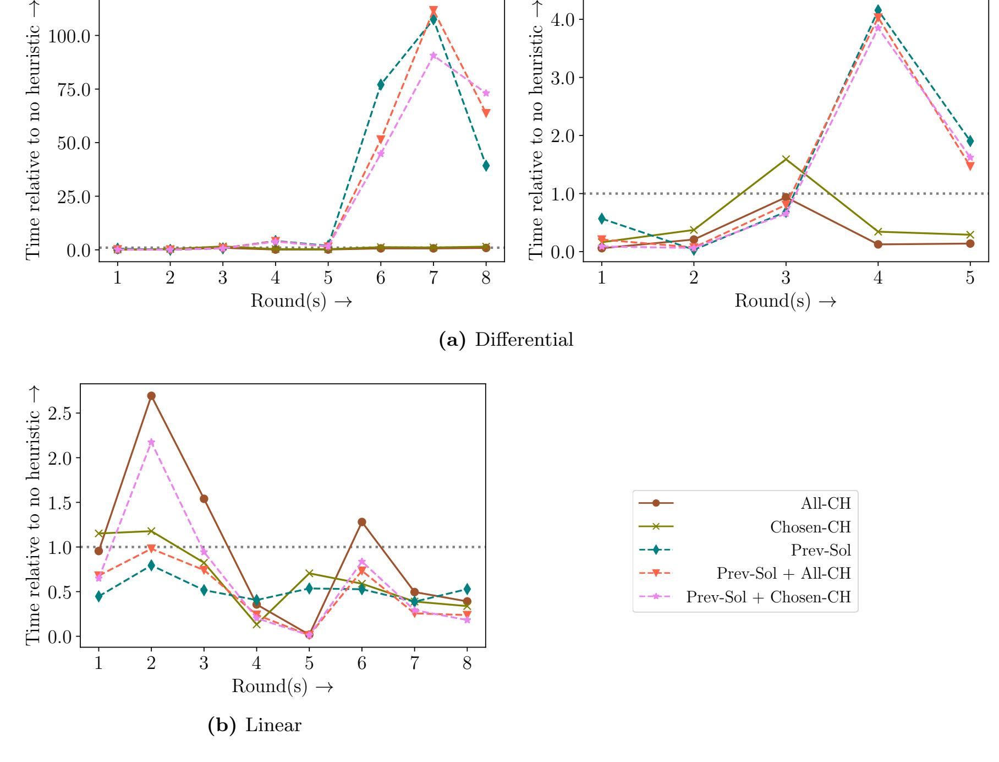
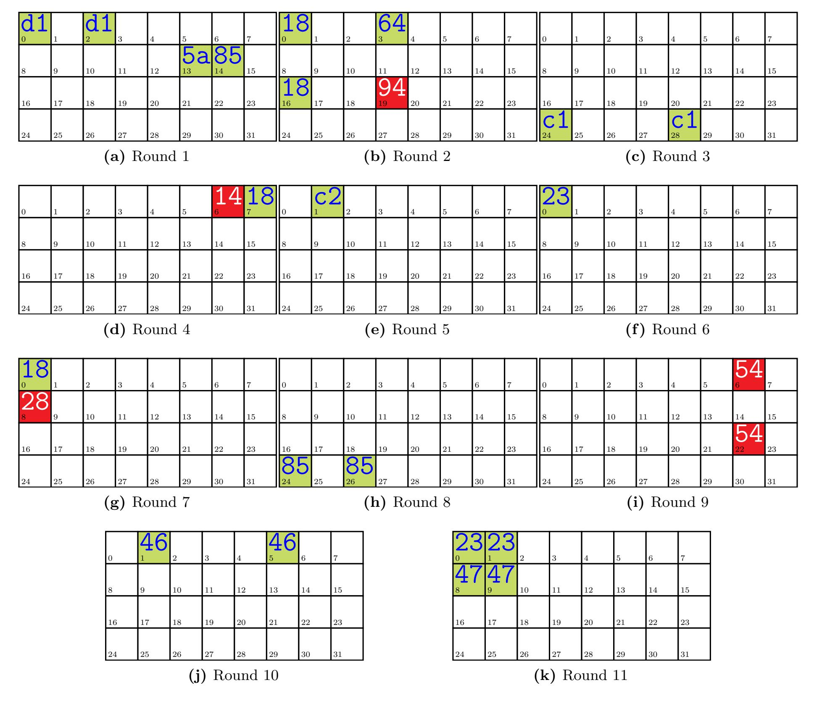
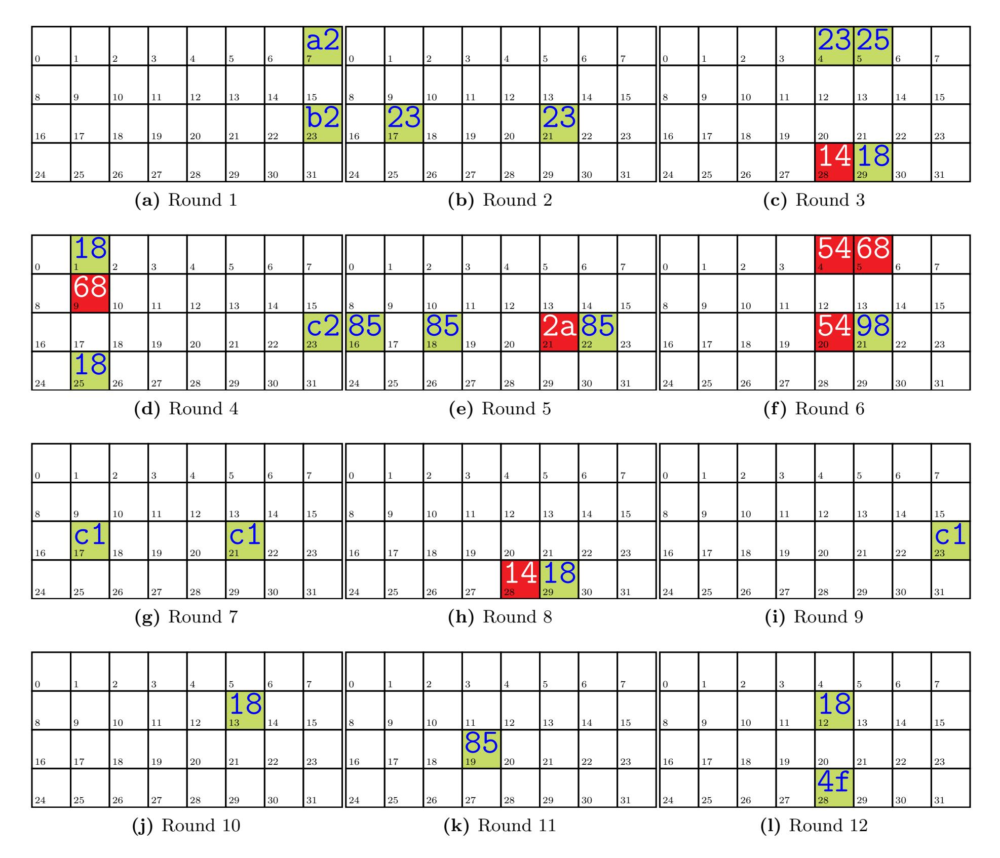

{0}------------------------------------------------

# <span id="page-0-0"></span>New Insights On Differential And Linear Bounds Using Mixed Integer Linear Programming

(Full Version)\*

Anubhab Baksi

Nanyang Technological University, Singapore anubhab001@e.ntu.edu.sg

Abstract. Mixed Integer Linear Programming (MILP) is a very common method of modelling differential and linear bounds for ciphers, as it automates the process of finding the best differential trail or linear approximation. The Convex Hull (CH) modelling, introduced by Sun et al. (Eprint 2013/Asiacrypt 2014), is a popular method in this regard, which can convert the conditions corresponding to a small (4-bit) SBox to MILP constraints efficiently. In our work, we study this modelling with CH in more depth and observe a previously unreported problem associated with it.

Our analysis shows, there are SBoxes for which the CH modelling can yield incorrect modelling. As such, using the CH modelling may lead to incorrect differential or linear bounds. This arises from the observation that although the CH is generated for a certain set of points, there can be points outside this set which also satisfy all the inequalities of the CH. As apparently no variant of the CH modelling can circumvent this problem, we propose a new modelling for differential and linear bounds. Our modelling makes use of every points of interest individually. This modelling works for an arbitrary SBox, and is able to find the exact bound.

Additionally, we also explore the possibility of using redundant constraints, such that the run time for an MILP solver can be reduced while keeping the optimal result unchanged. For this purpose, we revisit the CH modelling and use the CH constraints as redundant constraints (on top of our usual constraints, which ensure the aforementioned problem does not occur). In fact, we choose two heuristics from the convex hull modelling. The first uses all the inequalities of a convex hull, while second uses a reduced number of inequalities. Apart from that, we also propose to use the solutions for the smaller rounds as another heuristic to find the optimal bound for a higher round.

With our experiments on round-reduced GIFT-128, we show it is possible to reduce the run time a few folds using a suitable choice of redundant constraints. Further, we observe the necessity to consider separate heuristics for the differential and linear cases. We also present the optimal linear bounds for 11- and 12-rounds of GIFT-128, extending from the best-known result of 10-rounds.

Keywords. differential cryptanalysis, linear cryptanalysis, milp, heuristic

### 1 Introduction

Mixed Integer Linear Programming (MILP) is among the most frequently used tool in symmetric key cryptography, as evident from a large volume of research works [\[1,](#page-12-0) [10,](#page-13-0) [11,](#page-13-1) [15,](#page-13-2) [21,](#page-14-0) [22,](#page-14-1) [24,](#page-14-2) [25\]](#page-14-3). More particularly, MILP is used to determine the bounds for differential cryptanalysis [\[4\]](#page-12-1) and linear cryptanalysis [\[13\]](#page-13-3) for a lot of modern ciphers. MILP aided techniques generally give an opportunity to cover more rounds with more precision. Since the differential and linear cryptanalytic methods are essential for any cipher design, MILP aided techniques are frequently used in cipher design and further cryptanalysis, such as design of GIFT [\[2\]](#page-12-2) or the improved differential bounds on GIFT in [\[25\]](#page-14-3).

In the process, the problem of differential/linear bounds for a (reduced round) cipher is converted to an MILP instance, which is then solved using a standard solver. It is to be noted that the modelling from a differential/linear bound to an MILP instance can be done in various ways. As the efficiency of such a solver greatly depends on the formulated MILP instance, the research community has been active to find out optimal way for modelling. For example, the authors of [\[11\]](#page-13-1) experiment with heuristic techniques that can make the MILP solver can solve those instances in less time.

<sup>\*</sup>This is the full version of the paper with the same title accepted in [International Conference on Information](https://sites.google.com/view/secitc/) [Technology and Communications Security \(SecITC\)](https://sites.google.com/view/secitc/) – 2020. The author likes to thank Sim Siang Meng (DSO National Laboratories, Singapore), Xiaoyang Dong (Tsinghua University, Beijing, PR China), Raghvendra Rohit (University of Rennes, France), Kai Hu (Shandong University, Qingdao, PR China) and the (anonymous) reviewers for their valuable feedback. This paper uses shorthand notations for the interest of conciseness. In particular, it uses the string notation for the SBox (instead of the more common table based notation), and ] to denote the cardinality. Conversion of elements of F n <sup>2</sup> to-and-from F2<sup>n</sup> is assumed intrinsically.

{1}------------------------------------------------

<span id="page-1-3"></span>Apart from this, the MILP aided techniques are used in context of the classical impossible differential cryptanalysis [\[3\]](#page-12-3). The MILP modellings for impossible differential are directly taken from that of the differential case [\[6,](#page-12-4) [18\]](#page-14-4). Hence, any improvement in the modelling for the differential case will likely improve the impossible differential too.

### Our Contributions

The authors of [\[22\]](#page-14-1) have introduced a MILP modelling by incorporating the concept of Convex Hull (CH), which becomes quite popular in the literature [\[17,](#page-14-5) [21,](#page-14-0) [23,](#page-14-6) [25\]](#page-14-3). It follows-up from Mouha et al.'s model [\[15\]](#page-13-2).

We observe a problem related to this modelling which is not reported so far in the literature. We show the convex hull modelling only works when the SBox meets certain condition. Thus, applying the convex hull method to an arbitrary SBox may lead to incorrect results. The problem arises to due a property of the convex hull. That is, it may happen that a point may be inside the hyper-volume of the convex hull while the convex hull is generated excluding that point. Variations of the CH model, such as [\[21\]](#page-14-0), are also affected by this problem. Eventually, this problem does not occur in common SBoxes, like GIFT (1A4C6F392DB7508E) [\[2\]](#page-12-2) or PRESENT (C56B90AD3EF84712) [\[5\]](#page-12-5).

In case the problem occurs, one may need to look for an alternate modelling; since apparently no variant of the convex hull modelling can properly work with such an SBox. To address this issue, i.e., to work with all SBoxes, we propose a different MILP modelling. This modelling works for both differential and linear cases, and can give the exact bound (similar to [\[21\]](#page-14-0)). Further, this model can be fine-tuned to use with impossible differential cases (such as, [\[18\]](#page-14-4)), or to find the minimum number of active SBoxes (used in the design of the GIFT family of block ciphers [\[2\]](#page-12-2)), or iterative trails (like [\[25\]](#page-14-3)). It is not explicitly tested though, this modelling will likely work for SBoxes with higher (> 4) sizes (unlike the CH modelling of [\[22\]](#page-14-1)).

On top of this, we propose heuristic methods to reduce the execution time. This is inspired from [\[11\]](#page-13-1), where the authors experiment with various heuristics to improve run time of the MILP instances. These heuristics create a new MILP instance, but do not alter the actual MILP problem (thus, the optimal bound remains unchanged). Using suitable heuristic may help the MILP solver to return the optimal solution faster.

We experiment with three main heuristics, along with its combinations. We show how one heuristic applies better to the differential cases, whereas the other applies better to the linear cases. We indeed show a few folds reduction of run time compared to the corresponding no heuristic cases. Interestingly, the idea for two of our main heuristics is actually taken from the convex hull modelling of [\[22\]](#page-14-1). The third idea makes use of the optimal bounds already available for smaller rounds.

For benchmark, we take the lightweight cipher GIFT-128 [\[2\]](#page-12-2), and run the MILP differential and linear instances for reduced rounds. As mentioned, the problem associated with convex hull modelling does not appear for the GIFT SBox. Therefore, we are able to verify our results with existing MILP bounds on GIFT reported in the literature, namely [\[10,](#page-13-0) [11,](#page-13-1) [21,](#page-14-0) [24\]](#page-14-2); and also with [\[12\]](#page-13-4), which uses a Simple Theorem Prover (STP) based approach is used (instead of MILP). We also test with GIFT-64 [\[2\]](#page-12-2) and PRESENT [\[5\]](#page-12-5); and report the optimal linear bounds for GIFT-128 for 11- and 12-rounds for the first time in the literature.

### 2 Background

As previously mentioned, the problem of differential or linear bounds is converted to an MILP instance through a proper modelling. After this, this MILP instance is solved by some state-of-the-art solver, like Gurobi[1](#page-1-0) . For the sake of completeness, we briefly describe the relevant MILP models in the subsequent part.

This idea of using MILP is introduced by Mouha et al. [\[15\]](#page-13-2). The next major contribution comes from Sun et al. [\[22\]](#page-14-1), where the convex hull (which is actually a concept in computation geometry [\[7,](#page-12-6) [16\]](#page-13-5)) is used to form the linear constraints. This is quite useful as the code to find convex hull is implemented in the open-source tool Sage[2](#page-1-1) . The authors of [\[22\]](#page-14-1) also propose a heuristic algorithm to reduce the number of constraints returned by the convex hull, so that the MILP instance thus constructed becomes faster to solve (but it does not change the underlying problem of differential/linear bound). However, this claim is apparently not backed-up by any experimental result.

It may be noted that, we actually model the Difference Distribution Table (DDT) [\[19,](#page-14-7) Chapter 3.4] (see Definition [1\)](#page-2-0) for the differential case, and the Linear Approximation Table (LAT) [\[19,](#page-14-7) Chapter 3.3] (see Definition [2\)](#page-2-1) for the linear case[3](#page-1-2) . The convex hull method treats a given DDT/LAT as distinct points in a hyper-cube. Then, the hyper-dimensional convex hull of the desired points in the DDT/LAT is computed. Since a convex hull is represented by a set of linear inequalities, those can be directly used for the constraints

<span id="page-1-0"></span><sup>1</sup> <https://www.gurobi.com/>

<span id="page-1-2"></span><span id="page-1-1"></span><sup>2</sup> <https://www.sagemath.org/>

<sup>3</sup>Any two SBoxes with identical DDT (respectively, absolute LAT) behave identically with respect to the differential (respectively, linear) attack.

{2}------------------------------------------------

<span id="page-2-4"></span>for the MILP instance<sup>4</sup>. As a side note, it can be mentioned that the sign of the elements in the LAT does not play any role in finding the linear bound, hence the absolute LAT can be used for simplification purpose.

<span id="page-2-0"></span>**Definition 1 (Difference Distribution Table (DDT)).** For an  $n \times n$  SBox S, it is the  $2^n \times 2^n$  matrix, where the row  $\delta$  (= 0, 1, ...,  $2^n - 1$ ) and column  $\Delta$  (= 0, 1, ...,  $2^n - 1$ ) stores the number of solution(s) x for  $S(x) \oplus S(x \oplus \delta) = \Delta$ .

<span id="page-2-1"></span>**Definition 2 (Linear Approximation Table (LAT)).** The LAT for an  $n \times n$  SBox S is the  $2^n \times 2^n$  matrix where the row  $\gamma$  (= 0, 1, ...,  $2^n - 1$ ) and column  $\Gamma$  (= 0, 1, ...,  $2^n - 1$ ) stores  $|\{\gamma \cdot \vec{x} \oplus \Gamma \cdot \vec{y} = 0\}| - 2^{n-1}$ , where  $\vec{x}$  denotes the input variables to the SBox,  $\vec{y}$  denotes the output variables, and  $\cdot$  denotes the dot product.

As a side note, it can be mentioned that non-MILP models are used in the literature. Examples include (but not limited to), [12] which uses STP modelling, [9] which uses SAT modelling, [20] which uses Constraint Programming (CP), Matsui's approach [14].

### 2.1 Mouha et al. (Branch Number: Inscrypt'11)

As mentioned, Mouha et al. first propose MILP modeling for differential and linear cases [15]. The corresponding bounds are found by finding the minimum number of active SBoxes.

The Differential Branch Number (DBN) and the Linear Branch Number (LBN) are used subsequently. The DBN of the mapping F is defined as  $\min_{x,\delta\neq 0}\{\mathrm{HW}(\delta)+\mathrm{HW}(F(x)\oplus F(x\oplus \delta))\}$ ; and that of LBN as  $\min_{\alpha\neq 0,\beta,\mathrm{LAT}[\alpha,\beta]\neq 0}\{\mathrm{HW}(\alpha)+\mathrm{HW}(\beta)\}$ ; where  $\mathrm{HW}(\cdot)$  denotes Hamming weight.

**Differential** The first type of constraints come from modeling an XOR operation. Denoting  $x_0, x_1$  as the inputs to the XOR and y as the output bit, the following linear constraints model this operation (d is a dummy variable of type binary):

$$x_0 + x_1 - 2d \ge 0;$$
  
 $d - x_i \ge 0 \text{ for } i = 0, 1;$   
 $d - y \ge 0.$ 

Next the constraints for the linear layer, L. For simplicity, we consider it in the binary non-singular matrix form, say, of dimension b. Assume, as before,  $(x_0, x_1, \ldots, x_{b-1})$  as the input variables denoting the difference (i.e., if the i<sup>th</sup> bit of L is active then  $x_i = 1$ ), and  $(y_0, y_1, \ldots, y_{b-1})$  as the output variables denoting the difference. Given the DBN is D, a new dummy variable of type binary d is created. Finally the following linear constraints represent L:

$$\sum_{i=0}^{b-1} x_i + \sum_{i=0}^{b-1} y_i - D \cdot d \ge 0;$$

$$d - x_i \ge 0 \text{ for } i = 0, 1, \dots, b-1;$$

$$d - y_i \ge 0 \text{ for } i = 0, 1, \dots, b-1.$$

It is to be noted that, the variable d in both cases indicates whether the corresponding operation is active. The objective function of the MILP problem is set to minimize the arithmetic sum of the d-variables which indicate the SBoxes.

Once the minimum number of active SBoxes is found, the bound for differential probability can be computed by assuming the transition in each SBox takes maximum probability. This generally amounts for a lower bound for the differential probability, since it is possible for the transition in several SBoxes to take some lower probability.

**Linear** The modeling for the linear bound is similar to that of the differential. Therefore only the modifications are mentioned here for brevity: No constraint is needed for the XOR operation, and DBN is replaced by LBN.

### <span id="page-2-3"></span>2.2 Sun et al. (Active SBox: Eprint'13/Asiacypt'14)

The authors of [22] propose to use CH, which converts the input difference—output difference relations of the DDT into linear constraints. This modelling is particularly useful for bit-oriented ciphers like GIFT [2]. Since this model, similar to that of [15], uses the number of active SBoxes; it is not possible to get the exact

<span id="page-2-2"></span><sup>&</sup>lt;sup>4</sup>The inequalities are not strict, i.e., of the type  $\leq$  or  $\geq$  (but not of the type < or >). The MILP solvers generally cannot handle strict inequalities, hence the inequalities representing CH suits well for forming the constraints of MILP instances.

{3}------------------------------------------------

<span id="page-3-1"></span>bound, as the maximum transition probability for each active SBox is assumed when computing the bound. Although not explored, a similar modelling would also work for the linear case.

Consider a  $w \times v$  SBox where  $(x_0, x_1, \ldots, x_{w-1})$  denotes the (non-zero) input difference vector, and  $(y_0, y_1, \ldots, y_{v-1})$  denotes the (non-zero) output difference vector. A dummy variable A of type binary is created, which indicates whether the SBox is active (A = 1) or not (A = 0). The following constraints capture this property:

$$A - x_i \ge 0 \text{ for } i = 0, 1, \dots, w - 1;$$

$$\sum_{i=0}^{w-1} x_i - A \ge 0.$$

Now the augmented vector  $(x_0, x_1, \ldots, x_{w-1}, y_0, y_1, \ldots, y_{v-1})$  denote a (non-zero) input difference – (non-zero) output difference pattern in the DDT. Each of the vectors denote a point in the hyper-dimension. Then the concept of CH is applied on the set of all of the augmented vectors, to convert the set of hyper-dimensional points to non-strict linear inequalities.

Generally, the number of constraints returned by the mathematical tools<sup>5</sup> is in a few hundreds for a  $4 \times 4$  SBox. For example, the number of such constraints for the GIFT SBox is 237 [25, Section 3.3].

In order to reduce the number of linear constraints, which in turn is expected to reduce the execution time for the MILP solver; the authors of [22] also discuss about a greedy algorithm. For example, the number of constraints for the GIFT SBox can be reduced to 21 [25, Section 4.2].

The basic idea of the greedy algorithm is to remove some of the linear constraints from the set of all linear constraints for the CH. To see how it works, consider two constraints  $l_0$  and  $l_1$ . Among all the  $2^{w+v}$  points in the hyper-dimension, suppose  $n_i$  of them are not satisfied by  $l_i$  respectively, i = 0, 1. Those hyper-dimensional points which do not satisfy at least one constraint correspond to the 0 transitions of the DDT. Suppose,  $n_0 > n_1$ ; then  $l_0$  is given preference to be in the set of chosen constraints. This is done over all constraints.

In addition to the convex hull constraints, other constraints are also considered, as discussed here. If the SBox is bijective (v = w), the following two constraints can be inserted into the MILP instance:

$$w \sum_{i=0}^{w-1} y_i - \sum_{i=0}^{w-1} x_i \ge 0,$$

$$w \sum_{i=0}^{w-1} x_i - \sum_{i=0}^{w-1} y_i \ge 0.$$

The branch number based constraints from [15] are used only if the branch number is > 2. The authors mention that the branch number based constraints are redundant and hence are skipped if the branch number = 2 [22, Section 2.2].

### 2.3 Sun et al. (Exact Bound: Eprint'14)

Extending the works of [22], the authors of [21] incorporate the individual transitions into the hyper-dimensional points (by increasing the dimension). After this, the convex hull is computed as in [22]. As the individual transitions of DDT are modelled, now it is possible to find the exact bound, thereby improving the modelling from [22]. The greedy algorithm proposed in [22] is used to reduce the number of linear constraints in the CH.

To see how this modelling works, we adopt (from [25, Section 4.2]) the example of the  $4 \times 4$  SBox used in GIFT, 1A4C6F392DB7508E. There are 4 non-zero transitions in the DDT, namely (16,6,4,2). Those non-zero transitions are modelled by respectively a three-dimensional point. In particular, the 16 transition (corresponds to  $2^{\log_2 16/16} = 1$ -probability) is modelled by (0,0,0); the 6 transition (corresponds to  $2^{\log_2 4/16} = 2^{-2}$ -probability) is modelled by (0,1,0); and finally the 2 transition (corresponds to  $2^{\log_2 2/16} = 2^{-3}$ -probability) is modelled by (1,0,0). Now the eight-dimensional vectors  $(x_0,x_1,x_2,x_3,y_0,y_1,y_2,y_3)$ , which indicate the (non-zero) input difference – (non-zero) output difference relations of this SBox, are augmented with the corresponding three-dimensional vectors indicate the individual transitions. Thus now we have points over the binary eleven-dimensional space, on which the convex hull is computed. Finally, the objective function is set to minimize  $\sum_{i=0,(p_0,p_1,p_2)=(2,4,6)}^{2} (\log_2 \frac{p_i}{16} \times q_i)$ , where  $(q_0,q_1,q_2)$  is the augmented vector (denoting the individual transitions). The exact complexity for differential distinguisher is calculated by raising the result of the MILP solver to the power of 2.

<span id="page-3-0"></span><sup>&</sup>lt;sup>5</sup>The only tool used in the literature so far is Sage, to the best of our knowledge.

{4}------------------------------------------------

#### <span id="page-4-1"></span>2.4 Li et al. (Heuristic: Eprint'19)

On top of the MILP modelling proposed in [21], the authors of [11] experiment by altering the following parameters (in such a way that the solution to the MILP problem remains unchanged), as given next.

- 1. **Number of constraints.** Insert redundant constraint (i.e., this constraint is satisfied given other constraints) to the MILP instance. This will not change the solution, but will likely influence the solver's run time.
- 2. Ordering of constraints. The ordering of the constraints given by the code for convex hull can be altered. Similar to the previous case, the solution will not change.
- 3. Ordering of variables. The linear constraints can be written by changing the variables. For example, the constraint  $a_0x_0 + a_1x_1 + \cdots + a_{n-1}x_{n-1} \ge b$  can be written as,  $a_1x_1 + \cdots + a_{n-1}x_{n-1} + a_0x_0 \ge b$ .

The authors show that, all three types of heuristics influence the search strategy of Gurobi. Thus, by carefully studying the effect of those heuristics on run time of Gurobi, it is possible to create a new instance of the MILP problem which is faster to solve (but has the same optimal solution).

# <span id="page-4-0"></span>3 Problem with Convex Hull Modelling

In this part, we describe our finding on the convex hull modelling used to find differential and linear bounds. For simplicity, we only consider the modelling from [22], i.e., without probability encoding for individual transitions.

As noted already, the convex hull method solves the problem of converting a DDT/LAT to MILP-compatible format. It maps a set of binary hyper-dimensional points to a system of non-strict linear inequalities with real coefficients. Thus, all the points will satisfy the corresponding linear constraints which describe the convex hull.

However, there is no check to ascertain a point not in the set of hyper-dimensional points does not satisfy all the linear constraints. As a convex hull has certain other properties, it may happen that a particular point which is not within the set of points (which is used to create the convex hull) still satisfies all the inequalities that govern the convex hull. In other words, the hyper-volume created by some other points includes this point. Thus, the convex hull model will take this point as a valid point (i.e., as if this point belongs to the set of points based on which the convex hull is generated). If used in the MILP instance, the solver will consider the point (which is outside the set of points for which the CH is generated, but inside the hyper-volume of the CH) as valid. This can lead to wrong results. Indeed, our experiments confirm that this actually occurs to a number of SBoxes.

For a simple example, consider the  $4\times4$  trivial SBox: 0123456789ABCDEF. There are 16 non-zero transitions in its DDT. Each being 16, are at the diagonal: (0,0), (1,1), (2,2), (3,3), (4,4), (5,5), (6,6), (7,7), (8,8), (9,9), (a,a), (b,b), (c,c), (d,d), (e,e), (f,f). Thus the convex hull is generated for the 16 eight-dimensional points. This is given by the following eight linear inequalities with dummy variables  $z_0, z_1, \ldots, z_7$  (each of type binary), as returned by Sage:

$$-z_4 + 1 \ge 0, -z_5 + 1 \ge 0, -z_6 + 1 \ge 0, -z_7 + 1 \ge 0, +z_4 \ge 0, +z_5 \ge 0, +z_6 \ge 0, +z_7 \ge 0.$$

Since the corner points of the eight-dimensional cube are used to create the CH, it inherently contains all other points, i.e., all 256 points  $\in \mathbb{F}_2^8$  satisfy all the inequalities of the CH. This is due to the following property: For any two points  $\vec{u}$  and  $\vec{v}$  in convex hull, any linear combination of  $\vec{u}$  and  $\vec{v}$  is also in the convex hull.

Out of those 256 points which satisfy the generated CH, 16 are of the form:  $(0,0,0,0,y_0,y_1,y_2,y_3)$  or  $(x_0,x_1,x_2,x_3,0,0,0,0)$ . Hence those points can be caught by proper modelling; such as,  $\sum_{i=0}^{3} x_i - 1 \ge 0$ ,  $\sum_{i=0}^{3} y_i - 1 \ge 0$ . The rest 240 points (none of which is at the diagonal of the DDT), correspond to zero transitions of the DDT; yet the convex hull model cannot capture it. As a result, the MILP instance will consider those points as non-zero transitions.

Note that, the modelling in [22] does not explicitly check whether any zero transition satisfies all the inequalities of the convex hull. Thus, the problem will go unnoticed, if an extra cross-check is not used. So far, this step seems missing in the literature.

Since those points with zero transitions satisfy all the inequalities for the CH, the same will hold after few inequalities are removed (as per the greedy algorithm in [22]/Section 2.2). The greedy approach starts with the set of the zero transitions, and then checks which inequality removes the maximum number of zero transitions. However, since all zero transitions satisfy all the inequalities, the set of points which do not satisfy at least of the inequalities is null; and hence, this step will be trivially skipped.

Here we present a few typical SBoxes with the same undesirable CH property: Some zero transitions in DDT or LAT lie within the hyper-volume of the convex hull (which is generated by points with non-zero

{5}------------------------------------------------

<span id="page-5-3"></span>transitions). We take the representatives of each of the 302 Affine Equivalence (AE) classes from [\[8,](#page-13-8) Chapter 5.4.2]. The results are summarized in Table [1](#page-5-0) (Table [1](#page-5-0)[\(a\)](#page-5-1) for differential and Table [1](#page-5-0)[\(b\)](#page-5-2) for linear). Out of the 302 SBoxes tested, 49 show undesired property for differential and 13 for linear. For instance, with the AE representative #245 of [\[8\]](#page-13-8) (40132567E8A9CDBF), the non-zero transitions in the DDT are 16, 6, 4, 2. See Table [2](#page-6-0) for its DDT. The number of points with non-zero transitions in its DDT is 86, the corresponding convex hull is given by 59 linear inequalities (see Appendix [A\)](#page-11-0). Out of the 170 zero transitions in the DDT (ignoring the cases where either the input difference or the output difference is 0), 80 of those satisfy all the convex hull inequalities. Thus, for this SBox, the usual MILP modelling given in [\[22\]](#page-14-1) could lead to incorrect results for the differential case.

<span id="page-5-2"></span>Table 1: Typical SBoxes with undesired zero transitions in respective convex hulls (a) Differential (b) Linear

<span id="page-5-1"></span><span id="page-5-0"></span>

|                |        |              | CH          |                |        |              | CH          |                |        |              | CH          |                |        |              | CH          |                |        |              | CH          |
|----------------|--------|--------------|-------------|----------------|--------|--------------|-------------|----------------|--------|--------------|-------------|----------------|--------|--------------|-------------|----------------|--------|--------------|-------------|
|                |        |              | in          |                |        |              | in          |                |        |              | in          |                |        |              | in          |                |        |              | in          |
|                |        |              |             |                |        |              |             |                |        |              |             |                |        |              |             |                |        |              |             |
|                | CH     |              |             |                | CH     |              |             |                | CH     |              |             |                | CH     |              |             |                | CH     |              |             |
|                |        |              |             |                |        |              |             |                |        |              |             |                |        |              |             |                |        |              |             |
| representative | for    | inequalities | transitions | representative | for    | inequalities | transitions | representative | for    | inequalities | transitions | representative | for    | inequalities | transitions | representative | for    | inequalities | transitions |
| #              | Points |              |             | #              | Points |              |             | #              | Points |              |             | #              | Points |              |             | #              | Points |              |             |
|                |        | CH           | Zero        |                |        | CH           | Zero        |                |        | CH           | Zero        |                |        | CH           | Zero        |                |        | CH           | Zero        |
| AE             | ]      | ]            | ]           | AE             | ]      | ]            | ]           | AE             | ]      | ]            | ]           | AE             | ]      | ]            | ]           | AE             | ]      | ]            | ]           |
| 245 86         |        | 59           | 80          | 261 75         |        | 67           | 69          | 278 70         |        | 58           | 65          | 292 55         |        |              | 22 150      |                | 258 28 | 34           | 24          |
| 246 82         |        | 54           | 77          | 262 75         |        | 59           | 68          | 279 64         |        | 78           | 59          | 294 58         |        | 48           | 56          |                | 290 40 | 36           | 26          |
| 247 84         |        | 49           | 78          | 263 75         |        | 57           | 69          | 280 72         |        | 73           | 66          | 295 58         |        | 60           | 53          |                | 292 32 | 16           | 26          |
| 250 80         |        | 56           | 74          | 264 80         |        | 65           | 74          | 281 70         |        | 79           | 64          | 296 52         |        | 72           | 47          |                | 293 44 | 93           | 38          |
| 251 80         |        | 52           | 74          | 265 74         |        | 72           | 68          | 282 71         |        | 61           | 66          | 297 46         |        |              | 22 126      |                | 294 28 | 22           | 26          |
| 252 80         |        | 49           | 76          | 266 68         |        | 80           | 62          | 283 71         |        | 46           | 68          | 298 46         |        |              | 22 125      |                | 295 28 | 53           | 24          |
| 253 73         |        | 42           | 70          | 267 68         |        | 52           | 64          | 284 68         |        | 52           | 61          | 299 42         |        |              | 22 114      |                | 296 40 | 36           | 34          |
| 254 73         |        | 76           | 69          | 268 68         |        | 98           | 63          | 286 67         |        | 63           | 61          | 300 30         |        |              | 12 189      |                | 297 24 | 12           | 62          |
| 255 73         |        | 56           | 69          | 269 82         |        | 68           | 75          | 287 58         |        | 28           | 53          | 301 28         |        |              | 12 176      |                | 298 24 | 14           | 20          |
| 256 73         |        | 48           | 68          | 270 82         |        | 39           | 77          | 288 49         |        |              | 18 135      | 302 16         |        | 8            | 210         |                | 299 32 | 16           | 26          |
| 257 73         |        | 54           | 66          | 272 72         |        | 80           | 68          | 289 58         |        |              | 16 159      |                |        |              |             |                | 300 16 | 8            | 154         |
| 258 79         |        | 71           | 70          | 276 82         |        | 55           | 75          | 290 48         |        | 46           | 44          |                |        |              |             |                | 301 16 | 8            | 186         |
| 260 80         |        | 59           | 74          | 277 76         |        | 72           | 69          | 291 50         |        |              | 22 137      |                |        |              |             |                | 302 16 | 8            | 210         |

Effect of Reduced Set of Inequalities As noted earlier, this problem is not implicitly resolved by the greedy algorithm to reduce the number of linear inequalities. The undesired points satisfy all the convex hull inequalities, whereas the greedy algorithm only looks for the points which do not satisfy at least one of the inequalities. Thus, by picking the inequalities one by one, and checking how many points do not satisfy this particular inequality will not reveal those points. Stated in other words, since those points satisfy the set of all the inequalities of the convex hull, all inequalities of any subset (of the set of all inequalities) will be satisfied by those points. However, one may incorporate a simple check by testing whether any point with zero transitions satisfies all the inequalities.

Separate Convex Hulls for Individual Transitions It may be noted that the undesired property may also hold if each transition in DDT/LAT is modelled by separate convex hulls. For example, with the same SBox as before (40132567E8A9CDBF), the convex hull for the 6 transition in the DDT is given by 7 eight-dimensional points. The corresponding convex hull is given by 7 linear inequalities. Out of 170 zero transitions in the DDT, 12 satisfy all the inequalities.

Relation to Affine Equivalence It appears that this characteristic of CH does not follow the affine equivalence property. The case for the SBoxes 1032456789ABCDEF (representative of AE #301 from [\[8\]](#page-13-8)) and 126CDE39F58BA047 (belongs to the same AE class) can be taken as an example. For the former SBox, the CH problem appears for both the differential and linear cases, but the latter SBox is free from it for both the cases. Therefore there are likely more SBoxes with this problem than presented in Table [1,](#page-5-0) finding which is left open for the future research.

{6}------------------------------------------------

Table 2: DDT for SBox 40132567E8A9CDBF

<span id="page-6-4"></span><span id="page-6-0"></span>

|   | 0  | 1 | 2 | 3 | 4 | 5 | 6 | 7 | 8 | 9 | a | b | С | d | е | f |
|---|----|---|---|---|---|---|---|---|---|---|---|---|---|---|---|---|
| 0 | 16 | 0 | 0 | 0 | 0 | 0 | 0 | 0 | 0 | 0 | 0 | 0 | 0 | 0 | 0 | 0 |
| 1 | 0  | 4 | 2 | 2 | 4 | 0 | 2 | 2 | 0 | 0 | 0 | 0 | 0 | 0 | 0 | 0 |
| 2 | 0  | 2 | 4 | 2 | 4 | 2 | 0 | 2 | 0 | 0 | 0 | 0 | 0 | 0 | 0 | 0 |
| 3 | 0  | 2 | 2 | 4 | 0 | 2 | 2 | 4 | 0 | 0 | 0 | 0 | 0 | 0 | 0 | 0 |
| 4 | 0  | 2 | 2 | 0 | 2 | 4 | 4 | 2 | 0 | 0 | 0 | 0 | 0 | 0 | 0 | 0 |
| 5 | 0  | 2 | 4 | 2 | 2 | 4 | 2 | 0 | 0 | 0 | 0 | 0 | 0 | 0 | 0 | 0 |
| 6 | 0  | 0 | 2 | 2 | 2 | 2 | 4 | 4 | 0 | 0 | 0 | 0 | 0 | 0 | 0 | 0 |
| 7 | 0  | 4 | 0 | 4 | 2 | 2 | 2 | 2 | 0 | 0 | 0 | 0 | 0 | 0 | 0 | 0 |
| 8 | 0  | 0 | 0 | 0 | 0 | 0 | 0 | 0 | 6 | 0 | 4 | 2 | 0 | 2 | 2 | 0 |
| 9 | 0  | 0 | 0 | 0 | 0 | 0 | 0 | 0 | 2 | 6 | 0 | 0 | 4 | 0 | 2 | 2 |
| a | 0  | 0 | 0 | 0 | 0 | 0 | 0 | 0 | 0 | 4 | 6 | 2 | 0 | 0 | 2 | 2 |
| b | 0  | 0 | 0 | 0 | 0 | 0 | 0 | 0 | 0 | 2 | 2 | 4 | 0 | 6 | 2 | 0 |
| С | 0  | 0 | 0 | 0 | 0 | 0 | 0 | 0 | 2 | 0 | 2 | 0 | 6 | 4 | 2 | 0 |
| d | 0  | 0 | 0 | 0 | 0 | 0 | 0 | 0 | 2 | 2 | 2 | 2 | 2 | 2 | 2 | 2 |
| е | 0  | 0 | 0 | 0 | 0 | 0 | 0 | 0 | 4 | 0 | 0 | 0 | 2 | 2 | 2 | 6 |
| f | 0  | 0 | 0 | 0 | 0 | 0 | 0 | 0 | 0 | 2 | 0 | 6 | 2 | 0 | 2 | 4 |

Equality Constraints Together with the inequality constraints, there is a Sage API which returns the equality constraints<sup>6</sup>. The problem mentioned here will likely not appear if both the equality and the inequality constraints are used, although it is not verified explicitly. Nonetheless, this is not mentioned in the literature to the best of our knowledge.

# 4 Automated Bounds with MILP: Our Proposal

In case the problem (described in Section 3) is observed for the given SBox, a new modelling different from that of [22] may be of interest since no variant of the CH based model can circumvent this problem, to the best of our knowledge. In this regard, we devise a new strategy for a Substitution-Permutation Network (SPN) permutation. We describe our modelling for  $4 \times 4$  SBox only for simplicity, though it can be generalized if needed. We denote the state size and number of rounds as b (counting from 0) and  $\eta$  (counting from 1), respectively.

Our modelling is inspired from the MILP modelling proposed in [1] and the concept of indicator constraint (also known as the  $big\ M$  method<sup>7</sup>) used in linear programming where the large constant, M, is chosen. In our case, it is sufficient to choose M= twice the SBox size (= 8). Unlike [1], however, we do not rely on any Boolean function based optimization; the constraints are directly fed to the MILP instance instead.

To get the optimal differential probability, the result from the MILP solver is negated (assuming the maximization variation, see Section 4.1), and raised to the power of 2. So, if  $\epsilon_d$  is the result from the MILP solver, the attacker will need at least  $2^{\epsilon_d+1}$  chosen inputs, following [19, Chapter 3.4]. For the linear case, if the result from the MILP solver (for the maximization variation) is  $\epsilon_l$ , the attacker would need at least  $2^{2\epsilon_l}$  known inputs [19, Chapter 3.3].

#### <span id="page-6-3"></span>4.1 Modelling

In this part, we describe the MILP modelling for the differential case. The MILP formulation for the linear case is much alike, hence we skip the details for conciseness. For completeness, the main differences in the linear case are as follow. The absolute values for the biases are considered. Since  $\pm \frac{1}{2}$  linear bias is equivalent to 1 differential probability, each  $Q_{i,j}^p$  in the linear case are multiplied by 2 (the notations are described later).

Assume each of the p transitions (corresponds to  $2^{\log_2 p/16}$  probability transition,  $1 \ge p > 0$ ) has  $q_p$  frequency in the DDT. For example, there are fifty-seven 2 transitions (each corresponds to  $2^{-3}$  probability transition) for the SBox 40132567E8A9CDBF, as can be seen from its DDT in Table 2; hence  $q_2 = 57$ .

<span id="page-6-1"></span> $<sup>^6</sup> https://doc.sagemath.org/html/en/reference/discrete\_geometry/sage/geometry/polyhedron/base. html \# sage.geometry.polyhedron.base.Polyhedron_base.equations_list$ 

<span id="page-6-2"></span><sup>&</sup>lt;sup>7</sup>The indicator constraint is a well-known concept in the operations research community. Consider the linear constraint,  $\vec{a}^{\top}\vec{x} \geq b$ , where  $\vec{x} \in \mathbb{R}^d$  is a variable; and  $\vec{a} \in \mathbb{R}^d$ ,  $b \in \mathbb{R}$  are constants, for some d. The idea here is to introduce a Boolean variable y, multiplied by a large constant (M). Depending on other constraints or a penalty in the objective function; y indicates whether the constraint is active (the feasible solution must satisfy it) or not (the constraint is redundant in the sense that the feasible solution of may not satisfy it):  $\vec{a}^{\top}\vec{x} \geq b + My$ . Theoretically an arbitrarily large M can be chosen, but doing so could slow down the solution process.

{7}------------------------------------------------

<span id="page-7-1"></span>First, for the  $i^{\text{th}}$  SBox  $(i = 0, 1, \dots, b/4 - 1)$  at the  $j^{\text{th}}$  round  $(j = 1, \dots, \eta)$ ; we create the binary variables:

```
\begin{array}{ll} Q_{i,j} & \text{to indicate if it is active;} \\ Q_{i,j}^p & \text{to indicate if it takes a $p$ transition;} \\ Q_{i,j,l}^p, \text{ for } l=0,1,\ldots,q_p-1 & \text{to indicate which among the $q_p$ trails is chosen;} \\ \vec{x}_{i,j} = (x_{i,j}^0, x_{i,j}^1, x_{i,j}^2, x_{i,j}^3) & \text{to indicate the input difference;} \\ \vec{y}_{i,j} = (y_{i,j}^0, y_{i,j}^1, y_{i,j}^2, y_{i,j}^3) & \text{to indicate the output difference.} \end{array}
```

Next, we set the constraints for each SBoxes:

```
MQ_{i,j} \geq \sum_{l=0}^{3} x_{i,j}^{l} + \sum_{l=0}^{3} y_{i,j}^{l} to check if it is active; Q_{i,j} = \sum_{p} Q_{i,j}^{p} to ensure if active, it will take exactly one of the q_p trails; For each p transition, do: Q_{i,j,l}^{p} = \sum_{l=0}^{q_p-1} Q_{i,j}^{l} to check which trail among all q_p-trails is chosen.
```

After this, each  $Q_{i,j,l}^p$  for  $l=0,1,\ldots,q_p-1$  and for each p, is used to model respective transitions. For example, the (6,7) trail which is a 4 transition in the DDT for the SBox 40132567E8A9CDBF (see Table 2 for its DDT) is modelled as:  $MQ_{i,j}^4 \geq (x_{i,j}^0) + (1-x_{i,j}^1) + (1-x_{i,j}^2) + (x_{i,j}^3) + (y_{i,j}^0) + (1-y_{i,j}^1) + (1-y_{i,j}^2) + (1-y_{i,j}^3)$ . Basically, each negative literal is taken as is, and each positive literal is subtracted from 1; then added together.

Also, we have to give the initial input difference to at least one variable at the beginning (j = 1), i.e.,  $\sum_{i=0}^{b/4-1} \sum_{l=0}^{3} x_{i,1}^{l} \ge 1$ .

There will be additional constraints representing the linear layer. For a bit-permutation based cipher like GIFT-128, 128 equality constraints are inserted for each round from 2 to  $\eta$ . For example, the second entry in the permutation  $(1 \to 33)$  is modelled as  $x_{8,j}^1 = y_{0,j-1}^1$ . If required, this can be generalized to other type of linear layers.

Finally, the objective function is fit: Minimize  $\sum_{i=0}^{b/4-1} \sum_{j=1}^{\eta} \sum_{p<1} \log_2 \frac{p}{16} \times Q_{i,j}^p$ . For better readability, we express it as: Maximize  $\sum_{i=0}^{b/4-1} \sum_{j=1}^{\eta} \sum_{p<1} \left(-\log_2 \frac{p}{16}\right) \times Q_{i,j}^p$ .

### 4.2 Optimizations

Using the idea described earlier (in Section 4.1), we construct the MILP problems and attempt to solve them using the Gurobi solver. Being inspired from [11], we put redundant constraints in the MILP problem. Using redundant constraints together with the usual constraints does not change the optimal result, but could make the execution faster.

As for the choice of the heuristics, we reuse the idea of CH [22]/Section 2.2. Therefore, we put additional constraints in the MILP problem together with the usual constraints (described in Section 4.1). We basically employ three main heuristics and combinations of those heuristics. The main heuristics are termed as *All Convex Hull*, *Chosen Convex Hull* and *Previous Solutions* and are described next.

All Convex Hull (All-CH) In this heuristic, we use all the inequalities generated for the convex hull. The convex hull is generated with all points in the DDT/LAT the correspond to non-zero transitions.

The choice of this heuristic is motivated by the observation that the claim made in [22] (i.e., having all the inequalities from the convex hull in the MILP instance will make the solver taking more time) is apparently not supported by any experimental result. Follow-up works, such as [21,25], seem to accept this claim without any apparent experimental result too. In fact, it is claimed in [17] that, increasing the size of the constraints that describe the DDT of an SBox may indeed reduce the run time.

Chosen Convex Hull (Chosen-CH) In this heuristic, we reduce the number of inequalities for the convex hull (which is generated with points corresponding to non-zero transitions of the DDT/LAT) by applying a randomized version of the greedy algorithm (the greedy algorithm is proposed in [22]). The randomization is applied in tie-breaking: When multiple inequalities are not satisfied by same number of zero transitions, we break time tie uniformly. This way, we run the algorithm few times to get the smallest number of constraints.

Therefore, this heuristic can be thought as an improvement over that of [22], as it is non-deterministic in nature and chooses the smallest system of inequalities after a few runs.

**Previous Solutions (Prev-Sol)** Suppose, we want to know the optimal bound for round  $\eta$  and we already have optimal bounds (possibly by solving MILP instances) for rounds  $0, 1, \ldots, \eta - 1^8$ . In this case, the solutions for the previous rounds can be fed to the MILP instance. Since we know the optimal bounds for smaller rounds, the objective functions can be assigned to those optimal bounds; thus creating new constraints.

<span id="page-7-0"></span><sup>&</sup>lt;sup>8</sup>Note that, this assumption is practical. As the run time for higher rounds take significantly longer than the smaller rounds, generally the solutions for the smaller rounds are available.

{8}------------------------------------------------

<span id="page-8-0"></span>For example, suppose we have the optimal solutions up to  $3^{\text{rd}}$  round:  $s_1, s_2, s_3$ ; and want the optimal solution for the  $4^{\text{th}}$  (so,  $\eta = 4$ ) round. We create the 1-round objective function for each round  $\{(1), (2), (3), (4)\}$ , and assign with  $s_1$  to create 4 constraints. Next, we create the 2-round objective function by adding the 1-round objective functions for two consecutive rounds  $\{(1,2),(2,3),(3,4)\}$ , and assign each with  $s_2$  to create 3 constraints. Finally, we create the 3-round objective function by adding the 1-round objective functions for three consecutive rounds  $\{(1,2,3),(2,3,4)\}$ , and assign each with  $s_3$  to create 2 constraints.

More specifically, assume the optimal bound corresponding to the  $j^{\text{th}}$   $(j \in \{1, ..., \eta - 1\})$  round is  $s_j$ , we insert the following inequalities (taking the maximization variant of the objective function, Section 4.1):

$$\sum_{i=0}^{b/4-1} \sum_{p<1} \left(-\log_2 \frac{p}{16}\right) \times Q_{i,1}^p \leq s_1,$$

$$\sum_{i=0}^{b/4-1} \sum_{p<1} \left(-\log_2 \frac{p}{16}\right) \times Q_{i,2}^p \leq s_1,$$

$$\vdots$$

$$\sum_{i=0}^{b/4-1} \sum_{p<1} \left(-\log_2 \frac{p}{16}\right) \times Q_{i,\eta-1}^p \leq s_1,$$

$$\sum_{i=0}^{b/4-1} \sum_{p<1} \left(-\log_2 \frac{p}{16}\right) \times Q_{i,\eta-1}^p \leq s_1,$$

$$\sum_{i=0}^{b/4-1} \sum_{p<1} \left(-\log_2 \frac{p}{16}\right) \times Q_{i,1}^p \leq s_1,$$

$$\sum_{i=0}^{b/4-1} \sum_{p<1} \left(-\log_2 \frac{p}{16}\right) \times Q_{i,2}^p + \sum_{i=0}^{b/4-1} \sum_{p<1} \left(-\log_2 \frac{p}{16}\right) \times Q_{i,3}^p \leq s_2,$$

$$\sum_{i=0}^{b/4-1} \sum_{p<1} \left(-\log_2 \frac{p}{16}\right) \times Q_{i,\eta-2}^p + \sum_{i=0}^{b/4-1} \sum_{p<1} \left(-\log_2 \frac{p}{16}\right) \times Q_{i,\eta-1}^p \leq s_2,$$

$$\vdots$$

$$\sum_{i=0}^{b/4-1} \sum_{p<1} \left(-\log_2 \frac{p}{16}\right) \times Q_{i,\eta-2}^p + \sum_{i=0}^{b/4-1} \sum_{p<1} \left(-\log_2 \frac{p}{16}\right) \times Q_{i,\eta-1}^p \leq s_2,$$

$$\vdots$$

$$\sum_{i=0}^{b/4-1} \sum_{p<1} \left(-\log_2 \frac{p}{16}\right) \times Q_{i,\eta-1}^p + \sum_{i=0}^{b/4-1} \sum_{p<1} \left(-\log_2 \frac{p}{16}\right) \times Q_{i,\eta}^p \leq s_2,$$

$$\vdots$$

$$\sum_{i=0}^{b/4-1} \sum_{j=1} \sum_{p<1} \left(-\log_2 \frac{p}{16}\right) \times Q_{i,\eta}^p \leq s_2,$$

$$\vdots$$

$$\sum_{i=0}^{b/4-1} \sum_{j=1} \sum_{p<1} \left(-\log_2 \frac{p}{16}\right) \times Q_{i,\eta}^p \leq s_{\eta-1},$$

$$\sum_{i=0}^{b/4-1} \sum_{j=1} \sum_{p<1} \left(-\log_2 \frac{p}{16}\right) \times Q_{i,j}^p \leq s_{\eta-1},$$

$$\sum_{i=0}^{b/4-1} \sum_{j=1} \sum_{p<1} \left(-\log_2 \frac{p}{16}\right) \times Q_{i,j}^p \leq s_{\eta-1}.$$

$$2 \text{ constraints}$$

It may be stated that this heuristic can still be used if the solution for some round  $j \in \{1, ..., \eta - 1\}$  is not available. In this case, the constraints with  $s_j$  at the right hand side will be skipped. A variant, where not all available constraints are not used, can be considered in the future scope.

Note that, the all-CH modelling itself is sufficient to construct the MILP instances to find the exact bound. The same argument applies to the chosen-CH modelling (which is indeed used in [22] and its follow-up works, such as [21,25]) as well. In other words, it is possible not to use the usual constraints in our model (generated as per Section 4.1), but only use either of the all-CH or chosen-CH model to obtain the optimal bounds. Here we term these two models are heuristics, as these are redundantly used with the usual constraints in a bid to make the execution faster. The previous solutions based approach is not self sufficient and will likely not give correct results if the usual constraints are not used together with it.

Although we use the convex hull inequalities (namely, all-CH and chosen-CH) here, the problem mentioned earlier (in Section 3) does not apply (even if the SBox has undesired zero transitions in its DDT/LAT). This is because those inequalities are used as redundant constraints, on top the usual constraints (described in Section 4.1). Those usual constraints are sufficient to ensure no unwanted point is included. Also, all our models (regardless of whether a heuristic is used or not) are designed for finding the optimal bounds.

{9}------------------------------------------------

### 4.3 Results

Here we present our experimental results for the differential and linear cases for GIFT-128, GIFT-64 and PRESENT for reduced rounds. Results are obtained from a workstation with 16× Intel Xeon E7-8880 physical cores (shared among multiple users), running Gurobi 8.1 on 64-bit Ubuntu 18.04. It remains to see how those heuristics perform with a different solver and/or environment.

As the Gurobi solver is deterministic[9](#page-9-0) , only extraneous factor that can affect the execution time is the system load. To mitigate this factor, we run each MILP instances for a few times and take the average.

The experimental results for run time are summarized in Table [3.](#page-9-1) Here we present the average run time (in seconds) for the differential and linear MILP instances for reduced round (1 to 8) GIFT-128 corresponding to the cases where no heuristic is applied (only the usual constraints are used); usual constraints with all-CH constraints are used, usual constraints with chosen-CH constraints are used, usual constraints with previous solutions are used, usual constraints with previous solutions and all-CH constraints are used, usual constraints with previous solutions and chosen-CH constraints are used. The MILP instances with previous solutions as heuristic appear to slow down the solver for the differential case, particularly round 5 onward.

<span id="page-9-1"></span>

| Round(s)     |                                                                                      |  | 2                | 3     | 4      | 5       | 6       | 7                                                   | 8        |
|--------------|--------------------------------------------------------------------------------------|--|------------------|-------|--------|---------|---------|-----------------------------------------------------|----------|
|              | –                                                                                    |  | 4.29 16.68 16.06 |       | 504.66 | 6698.07 | 914.91  | 1142.62                                             | 3142.78  |
|              | All-CH                                                                               |  | 0.25 3.47        | 15.05 | 63.15  | 931.07  | 607.34  | 754.12                                              | 2708.20  |
| Differential | Chosen-CH                                                                            |  | 0.69 6.23        | 25.56 | 173.39 | 1949.50 | 1148.18 | 1239.64                                             | 4671.95  |
|              | Prev-Sol                                                                             |  | 2.49 0.55        |       |        |         |         | 11.00 2097.36 12754.98 70514.22 122874.35 123434.43 |          |
|              | Prev-Sol + All-CH                                                                    |  | 0.89 1.21        |       |        |         |         | 12.94 2034.16 9841.02 47055.10 127680.92 200204.50  |          |
|              | Prev-Sol + Chosen-CH 0.38 1.064 10.512 1943.44 10867.38 40964.27 103575.79 229649.26 |  |                  |       |        |         |         |                                                     |          |
|              | –                                                                                    |  | 0.33 0.62        | 2.71  | 80.98  | 4546.46 | 2108.19 | 6814.77                                             | 38826.96 |
|              | All-CH                                                                               |  | 0.31 1.67        | 4.18  | 28.84  | 80.36   | 2698.96 | 3374.94                                             | 15166.05 |
| Linear       | Chosen-CH                                                                            |  | 0.38 0.73        | 2.24  | 10.69  | 3205.41 | 1241.32 | 2649.87                                             | 13120.24 |
|              | Prev-Sol                                                                             |  | 0.15 0.49        | 1.40  | 32.87  | 2435.58 | 1110.57 | 2639.03                                             | 20523.93 |
|              | Prev-Sol + All-CH                                                                    |  | 0.22 0.61        | 2.01  | 19.46  | 52.88   | 1546.41 | 1750.24                                             | 9199.43  |
|              | Prev-Sol + Chosen-CH 0.21 1.35                                                       |  |                  | 2.56  | 16.42  | 50.77   | 1764.47 | 1992.35                                             | 7065.79  |

Table 3: Average run time for MILP instances for GIFT-128 with various heuristics

The relative (1.0×) run times for each of the heuristics, with respect to the cases where no heuristic is used; can be seen from Figure [1.](#page-10-0) The differential case is shown in Figure [1](#page-10-0)[\(a\)](#page-10-1) (a zoomed in version till the 5th round is also shown), and the linear case is given in Figure [1](#page-10-0)[\(b\).](#page-10-2) As evident from the experimental results, it is generally difficult to find a general trend. Still, one may notice significant improvement in run time, generally by a few folds. For example, the all-CH heuristic is more suitable for the differential case; whereas the both the previous solutions with all-CH and the previous solutions with chosen-CH is more suitable for the linear case. Also, it appears that all three the previous solutions based heuristics model perform somewhat similarly for the differential case, and in general are slower than that of no heuristic. However, the same three heuristics perform faster than no heuristic for the linear case.

Table 4: Optimal bounds for GIFT-128, GIFT-64 and PRESENT

<span id="page-9-2"></span>

|          | Round(s)                                                                                      | 1 | 2 | 3 | 4                       | 5 | 6 | 7                                                      | 8 | 9 | 10 | 11 | 12 |
|----------|-----------------------------------------------------------------------------------------------|---|---|---|-------------------------|---|---|--------------------------------------------------------|---|---|----|----|----|
|          | Differential 1.415 3.415 7.000 11.415 17.000 22.415 28.415 39.000 45.415 49.415 54.415 60.415 |   |   |   |                         |   |   |                                                        |   |   |    |    |    |
| GIFT-128 | Linear                                                                                        |   |   |   | 1.000 2.000 3.000 5.000 |   |   | 7.000 10.000 13.000 17.000 22.000 26.000 31.000 36.000 |   |   |    |    |    |
|          | Differential 1.415 3.415 7.000 11.415 17.000 22.415 28.415 38.000 42.000 48.000 52.000 58.000 |   |   |   |                         |   |   |                                                        |   |   |    |    |    |
| GIFT-64  | Linear                                                                                        |   |   |   | 1.000 2.000 3.000 5.000 |   |   | 7.000 10.000 13.000 16.000 20.000 25.000 29.000 31.000 |   |   |    |    |    |
| PRESENT  | Differential 2.000 4.000 8.000 12.000 20.000 24.000 28.000 32.000 36.000 41.000 46.000 52.000 |   |   |   |                         |   |   |                                                        |   |   |    |    |    |
|          | Linear                                                                                        |   |   |   | 1.000 2.000 4.000 6.000 |   |   | 8.000 10.000 12.000 14.000 16.000 18.000 20.000 22.000 |   |   |    |    |    |

<span id="page-9-0"></span><sup>9</sup> <https://support.gurobi.com/hc/en-us/articles/360031636051-Is-Gurobi-Optimizer-deterministic->

{10}------------------------------------------------

<span id="page-10-3"></span><span id="page-10-1"></span><span id="page-10-0"></span>

Fig. 1: Relative performance of MILP heuristics for GIFT-128

<span id="page-10-2"></span>Table 4 shows the optimal bounds till round 12 for GIFT-128, GIFT-64 and PRESENT. We do not put the average run time corresponding to rounds 9 onward as those cases are not run sufficient times (as each of such cases takes a long time to run). These results are consistent with the existing literature [10,11,12,21,24].

Moreover, we present the optimal linear bounds of GIFT-128 for  $11^{\text{th}}$  and  $12^{\text{th}}$  rounds. The input masks are shown in Table 5 (Table 5(a) for 11 rounds and Table 5(b) for 12 rounds). Here weight counts the sum of  $-\log_2(|p|/8)$  over the state, where p is a transition in the LAT for the corresponding input mask. The inactive SBoxes are shown by  $\cdot$ , and the 1- and 2-weights are shown respectively by the markers  $\gamma$  and  $\gamma$ . The total of the weights is 31 and 36 for  $11^{\text{th}}$  and  $12^{\text{th}}$  rounds, respectively; which are also indicated in Table 4. Further, we show the (input mask, output mask) for 11-rounds in Figure 2, and for 12-rounds in Figure 3 for each SBox (both in Appendix B). The active SBoxes with weight 1 (i.e.,  $\pm 4$  transitions in the LAT) are shown by the marker  $\frac{\gamma_1}{2}$ , and the active SBoxes with weight 2 (i.e.,  $\pm 2$  transitions in the LAT) are shown by the marker  $\frac{\gamma_1}{2}$ , and the active SBoxes with weight 2 (i.e.,  $\pm 2$  transitions in the LAT) are shown by

### 5 Conclusion

We attempt to study the problem of modelling differential and linear bounds using MILP in depth. In the process, we revisit the modelling proposed in [22], and explore a related shortcoming. It may happen for an SBox that the hyper-volume of convex hull will contain some undesired points. Although this probably does not happen with the commonly used SBoxes, it can still be inferred that this model is not generic as it depends on specific properties of the SBox.

Therefore, we propose our new MILP modelling which works for any SBox and is partly inspired from [1]. Our modelling is simpler, and it does not require specialized library call like convex hull or Boolean logic minimization.

At the same time, we also follow [11], where the authors observe that the number of constraints can influence the solution time taken by the MILP solver Gurobi. Being motivated by their research, we experiment with redundant constraints. The redundant constraints are inserted along with the usual constraints (which are enough to specify the MILP instance). Those constraints do not change the optimal solution, but can

{11}------------------------------------------------

Table 5: Optimal linear bounds of GIFT-128

(a) 11-Round

(b) 12-Round

<span id="page-11-4"></span><span id="page-11-2"></span><span id="page-11-1"></span>

| Round | Input Mask                       | Weight |
|-------|----------------------------------|--------|
| 1     | d·d··········58················· | 4      |
| 2     | 1··6············1··9············ | 5      |
| 3     | ························c···c··· | 2      |
| 4     | ······11························ | 3      |
| 5     | ·c······························ | 1      |
| 6     | 2······························· | 1      |
| 7     | 1·······2······················· | 3      |
| 8     | ························8·8····· | 2      |
| 9     | ······5···············5········· | 4      |
| 10    | ·4···4·························· | 2      |
| 11    | 22······44······················ | 4      |
|       | Total                            | 31     |

<span id="page-11-3"></span>

| Round | Input Mask                       | Weight |
|-------|----------------------------------|--------|
| 1     | ·······a···············b········ | 2      |
| 2     | ·················2···2·········· | 2      |
| 3     | ····22······················11·· | 5      |
| 4     | ·1·······6·············c·1······ | 5      |
| 5     | ················8·8··28········· | 5      |
| 6     | ····56··············59·········· | 7      |
| 7     | ·················c···c·········· | 2      |
| 8     | ····························11·· | 3      |
| 9     | ·······················c········ | 1      |
| 10    | ·············1·················· | 1      |
| 11    | ···················8············ | 1      |
| 12    | ············1···············4··· | 2      |
|       | Total                            | 36     |

improve the run time. With our experiment, we observe significant speed-up with the redundant constraints, compared to the case with only usual constraints. We also show that one needs separate heuristic depending on the MILP instance is for differential or linear bound.

In the future scope, one may extend the search for heuristics. As we are always using our own constraints (described in Section [4.1\)](#page-6-3), any other modelling can be used as a heuristic. This includes, the branch number based model [\[15\]](#page-13-2) or that of [\[1\]](#page-12-0). One may also try to model the zero transitions (using an analogous modelling to ours), and use those as redundant constraints in a way that the MILP instance does not take those transitions. The effect of the heuristics is not straightforward, and more experiments are needed in this direction. Next, the problem with convex hull modelling can be more formally studied, and the SBoxes can be characterized with respect to this problem. Lastly, the effect of a different solver and/or environment can be studied.

# <span id="page-11-0"></span>A Convex Hull Inequalities For SBox 40132567E8A9CDBF

Here we present the complete system of 59 inequalities that represent the convex hull with the dummy variables z0, z1, z2, z3, z4, z5, z6, z<sup>7</sup> (each of type binary) for the 4 × 4 SBox 40132567E8A9CDBF. This convex hull is created for the non-zero transitions in the DDT, namely with these 86 trails: (0, 0), (1, 2), (1, 3), (1, 6), (1, 7), (2, 1), (2, 3), (2, 5), (2, 7), (3, 1), (3, 2), (3, 5), (3, 6), (4, 1), (4, 2), (4, 4), (4, 7), (5, 1), (5, 3), (5, 4), (5, 6), (6, 2), (6, 3), (6, 4), (6, 5), (7, 4), (7, 5), (7, 6), (7, 7), (8, b), (8, d), (8, e), (9, 8), (9, e), (9, f), (a, b), (a, e), (a, f), (b, 9), (b, a), (b, e), (c, 8), (c, a), (c, e), (d, 8), (d, 9), (d, a), (d, b), (d, c), (d, d), (d, e), (d, f), (e, c), (e, d), (e, e), (f, 9), (f, c), (f, e), (1, 1), (1, 4), (2, 2), (2, 4), (3, 3), (3, 7), (4, 5), (4, 6), (5, 2), (5, 5), (6, 6), (6, 7), (7, 1), (7, 3), (8, a), (9, c), (a, 9), (b, b), (c, d), (e, 8), (f, f), (8, 8), (9, 9), (a, a), (b, d), (c, c), (e, f), (f, b).

{12}------------------------------------------------

```
-z_1+1
                                                                                             \geq 0,
                                         \geq 0,
                                                    +z_1
                                                    +2z_1+2z_2+z_3+2z_4-z_5+z_6-z_7
-z_4+1
                                         \geq 0,
                                                                                             \geq 0,
-z_2+1
                                                    +z_1+2z_2+2z_3+2z_4+z_5-z_6-z_7
                                         \geq 0,
                                                                                              \geq 0,
-z_3+1
                                                    +z_1+z_2+z_3+z_4-z_5
                                         \geq 0,
                                                                                              \geq 0,
-z_5+1
                                         > 0,
                                                                                              > 0,
                                                    +z_{7}
-z_6+1
                                         \geq 0,
                                                    -z_3+z_4+z_5+z_6+z_7
                                                                                              \geq 0,
-z_7+1
                                                    +z_1+z_2-z_3-z_5+z_6-z_7+2
                                         \geq 0,
                                                                                              \geq 0,
                                                    +z_1-z_2+z_3-z_4-z_5+z_6+2
+z_1-2z_2-z_3+z_4+2z_5+3z_6+3z_7
                                         \geq 0,
                                                                                             \geq 0,
-z_1-z_2-z_4+z_5-z_6+z_7+3
                                                    -z_1+z_3-z_4+z_5-z_7+2
                                         \geq 0,
                                                                                              \geq 0,
-z_1-z_2-z_3+z_5+z_7+2
                                                    +z_1+z_3+z_4-z_5-z_6+z_7+1
                                         > 0,
                                                                                              > 0,
+3z_1+3z_2+3z_3+2z_4-z_5-z_6-z_7
                                                    +z_1-z_2-z_4+z_6+z_7+1
                                                                                              \geq 0,
                                         \geq 0,
                                                    +z_1-z_2-z_3+z_6+z_7+1
                                         \geq 0,
                                                                                              \geq 0,
+z_6
+z_1-2z_2-z_3+z_5+2z_6+2z_7+1
                                                                                              \geq 0,
                                         \geq 0,
                                                    +z_2
-z_1-z_2+z_3+z_5+z_6-z_7+2
                                                    -z_1+z_2+z_3-z_4-z_6-z_7+3
                                         > 0,
                                                                                              > 0,
+2z_1-z_2+z_3-2z_4-z_5+2z_6+z_7+2
                                         > 0,
                                                    -z_1+z_2+z_3+z_5-z_6-z_7+2
                                                                                             > 0,
-z_1+z_2-z_3+z_4-z_5-z_6-z_7+4
                                                    +z_1-z_2+z_5+z_6+z_7
                                         > 0,
                                                                                              \geq 0,
+z_1+z_2-z_3-z_4+z_5-z_6+2
                                                    -z_2 - z_3 + z_4 + 2z_5 + 2z_6 + 2z_7
                                         \geq 0,
                                                                                             \geq 0,
                                                    -z_1-z_2+z_3-z_4+z_5-z_6+3
+z_{5}
                                         \geq 0,
                                                                                             \geq 0,
                                                    -z_1 - z_2 - z_3 + 2z_4 + 3z_5 + 2z_6 + 3z_7
+z_1-z_2-z_3+z_4+z_5+2z_6+2z_7
                                         > 0,
                                                                                              > 0,
+ z_3
                                                                                             \geq 0,
                                         \geq 0,
                                                    +z_{4}
+z_1+z_2+z_3-z_5-z_6-z_7+2
                                         \geq 0,
                                                    +z_2+z_3-z_4-z_5-z_6-z_7+3
                                                                                             \geq 0,
+z_1+z_2+z_3+z_4-z_6
                                                    -z_1 + z_4 + z_5 + z_6 + z_7
                                                                                             \geq 0,
                                         \geq 0,
+z_2+z_3-z_4+z_5+z_6-z_7+1
                                                    -z_1-z_2+z_3+2z_4+2z_5+2z_6+z_7
                                         \geq 0,
                                                                                              \geq 0,
+z_1+z_2+z_3-z_5+z_6+z_7
                                                    -z_1-z_2+z_3+z_4+z_5+z_6+1
                                         \geq 0,
                                                                                              > 0,
+z_1+z_2+z_3+z_5+z_6-z_7
                                                    -z_2 + z_4 + z_5 + z_6 + z_7
                                                                                              \geq 0,
                                         \geq 0,
+z_1+z_2+z_4-z_5+z_6-z_7+1
                                                    -2z_1+z_2+2z_3-z_4+z_5-z_6-2z_7+4
                                         > 0,
                                                                                             \geq 0,
                                                    +z_1+z_3-z_4-z_5+z_6+z_7+1
+z_1+z_2+z_3+z_4-z_7
                                         \geq 0,
                                                                                             \geq 0,
+z_2+z_3+z_4+z_5-z_6-z_7+1
                                         \geq 0,
                                                    +z_1-z_2-z_3-z_4-z_5-z_6-z_7+5
                                                                                             \geq 0,
-z_2-z_3+z_5+z_6+z_7+1
                                                    -z_1-z_2-z_3-z_4-z_5+z_6-z_7+5
                                         > 0,
                                                                                             > 0.
+2z_1+z_2+2z_3+2z_4-z_5-z_6+z_7
                                         \geq 0,
```

The following 80 trails corresponding to the zero transition in the DDT (refer to Table 2) satisfy all the inequalities for the convex hull: (1,8), (1,9), (1,c), (1,e), (1,f), (2,9), (2,a), (2,b), (2,e), (2,f), (3,9), (3,a), (3,b), (3,d), (3,e), (4,8), (4,a), (4,c), (4,d), (4,e), (5,8), (5,9), (5,a), (5,b), (5,c), (5,d), (5,e), (5,f), (6,8), (6,c), (6,d), (6,e), (6,f), (7,9), (7,b), (7,c), (7,e), (7,f), (9,1), (9,2), (9,3), (9,4), (9,6), (9,7), (a,1), (a,2), (a,3), (a,4), (a,5), (a,7), (b,1), (b,2), (b,3), (b,5), (b,6), (b,7), (c,1), (c,2), (c,4), (c,5), (c,6), (c,7), (d,1), (d,2), (d,3), (d,4), (d,5), (d,6), (e,2), (e,3), (e,4), (e,5), (e,6), (e,7), (f,1), (f,3), (f,4), (f,5), (f,6), (f,7).

### <span id="page-12-7"></span>B Optimal Linear Bounds for GIFT-128

#### References

- <span id="page-12-0"></span>1. Abdelkhalek, A., Sasaki, Y., Todo, Y., Tolba, M., Youssef, A.M.: MILP modeling for (large) s-boxes to optimize probability of differential characteristics. IACR Trans. Symmetric Cryptol. **2017**(4) (2017) 99–129 1, 7, 11, 12
- <span id="page-12-2"></span>2. Banik, S., Pandey, S.K., Peyrin, T., Sasaki, Y., Sim, S.M., Todo, Y.: Gift: A small present. Cryptology ePrint Archive, Report 2017/622 (2017) https://eprint.iacr.org/2017/622. 1, 2, 3
- <span id="page-12-3"></span>3. Biham, E., Granboulan, L., Nguyen, P.Q.: Impossible fault analysis of RC4 and differential fault analysis of RC4. In: Fast Software Encryption: 12th International Workshop, FSE 2005, Paris, France, February 21-23, 2005, Revised Selected Papers. (2005) 359–367 2
- <span id="page-12-1"></span>4. Biham, E., Shamir, A.: Differential cryptanalysis of des-like cryptosystems. In: Advances in Cryptology - CRYPTO '90, 10th Annual International Cryptology Conference, Santa Barbara, California, USA, August 11-15, 1990, Proceedings. (1990) 2–21 1
- <span id="page-12-5"></span>5. Bogdanov, A., Knudsen, L.R., Leander, G., Paar, C., Poschmann, A., Robshaw, M.J., Seurin, Y., Vikkelsoe, C.: PRESENT: An ultra-lightweight block cipher. In: CHES. Volume 4727., Springer (2007) 450–466 2
- <span id="page-12-4"></span>6. Cui, T., Jia, K., Fu, K., Chen, S., Wang, M.: New automatic search tool for impossible differentials and zero-correlation linear approximations. IACR Cryptology ePrint Archive **2016** (2016) 689 2
- <span id="page-12-6"></span>7. de Berg, M., Cheong, O., van Kreveld, M., Overmars, M.: Computational Geometry. Springer-Verlag Berlin Heidelberg (2008) 2

{13}------------------------------------------------

<span id="page-13-9"></span>

Fig. 2: Input and output masks for an 11-round optimal linear bound of GIFT-128

- <span id="page-13-8"></span>8. De Cannière, C.: Analysis and Design of Symmetric Encryption Algorithms. Katholieke Universiteit Leuven, Belgium (2007) PhD Thesis. 6
- <span id="page-13-6"></span>9. Eskandari, Z., Kidmose, A.B., Kölbl, S., Tiessen, T.: Finding integral distinguishers with ease. In: Selected Areas in Cryptography - SAC 2018 - 25th International Conference, Calgary, AB, Canada, August 15-17, 2018, Revised Selected Papers. (2018) 115–138 3
- <span id="page-13-0"></span>10. Ji, F., Zhang, W., Ding, T.: Improving matsui's search algorithm for the best differential/linear trails and its applications for des, desl and gift. Cryptology ePrint Archive, Report 2019/1190 (2019) https://eprint.iacr.org/2019/1190. 1, 2, 11
- <span id="page-13-1"></span>11. Li, L., Wu, W., Zheng, Y., Zhang, L.: The relationship between the construction and solution of the milp models and applications. Cryptology ePrint Archive, Report 2019/049 (2019) https://eprint.iacr.org/2019/049. 1, 2, 5, 8, 11
- <span id="page-13-4"></span>12. Liu, Y., Liang, H., Li, M., Huang, L., Hu, K., Yang, C., Wang, M.: STP models of optimal differential and linear trail for s-box based ciphers. Cryptology ePrint Archive, Report 2019/025 (2019) https://eprint.iacr.org/2019/025.2, 3, 11
- <span id="page-13-3"></span>13. Matsui, M.: Linear cryptanalysis method for DES cipher. In Helleseth, T., ed.: Advances in Cryptology - EUROCRYPT '93, Workshop on the Theory and Application of Cryptographic Techniques, Lofthus, Norway, May 23-27, 1993, Proceedings. Volume 765 of Lecture Notes in Computer Science., Springer (1993) 386–397 1
- <span id="page-13-7"></span>14. Matsui, M.: On correlation between the order of s-boxes and the strength of des. In De Santis, A., ed.: Advances in Cryptology — EUROCRYPT'94, Berlin, Heidelberg, Springer Berlin Heidelberg (1995) 366–375 3
- <span id="page-13-2"></span>15. Mouha, N., Wang, Q., Gu, D., Preneel, B.: Differential and linear cryptanalysis using mixed-integer linear programming. In: Information Security and Cryptology - 7th International Conference, Inscrypt 2011, Beijing, China, November 30 - December 3, 2011. Revised Selected Papers. (2011) 57–76 1, 2, 3, 4, 12
- <span id="page-13-5"></span>16. Mount, D.M.: CMSC 754 - Computational Geometry (lecture notes) (2016) https://www.cs.umd.edu/class/fall2016/cmsc754/Lects/cmsc754-fall16-lects.pdf. 2

{14}------------------------------------------------

<span id="page-14-9"></span>

Fig. 3: Input and output masks for a 12-round optimal linear bound of GIFT-128

- <span id="page-14-5"></span>17. Sasaki, Y., Todo, Y.: New algorithm for modeling s-box in milp based differential and division trail search. In Farshim, P., Simion, E., eds.: Innovative Security Solutions for Information Technology and Communications, Cham, Springer International Publishing (2017) 150–165 2, 8
- <span id="page-14-4"></span>18. Sasaki, Y., Todo, Y.: New impossible differential search tool from design and cryptanalysis aspects - revealing structural properties of several ciphers. In: Advances in Cryptology - EUROCRYPT 2017 - 36th Annual International Conference on the Theory and Applications of Cryptographic Techniques, Paris, France, April 30 - May 4, 2017, Proceedings, Part III. (2017) 185–215 2
- <span id="page-14-7"></span>19. Stinson, D.R.: Cryptography - theory and practice. Discrete mathematics and its applications series. CRC Press (2006) 2, 7
- <span id="page-14-8"></span>20. Sun, S., Gerault, D., Lafourcade, P., Yang, Q., Todo, Y., Qiao, K., Hu, L.: Analysis of aes, skinny, and others with constraint programming. IACR Trans. Symmetric Cryptol. **2017**(1) (2017) 281–306 3
- <span id="page-14-0"></span>21. Sun, S., Hu, L., Wang, M., Wang, P., Qiao, K., Ma, X., Shi, D., Song, L., Fu, K.: Towards finding the best characteristics of some bit-oriented block ciphers and automatic enumeration of (related-key) differential and linear characteristics with predefined properties. IACR Cryptol. ePrint Arch. **2014** (2014) 747 1, 2, 4, 5, 8, 9, 11
- <span id="page-14-1"></span>22. Sun, S., Hu, L., Wang, P., Qiao, K., Ma, X., Song, L.: Automatic security evaluation and (related-key) differential characteristic search: Application to simon, present, lblock, des(l) and other bit-oriented block ciphers. Cryptology ePrint Archive, Report 2013/676 (2013) https://eprint.iacr.org/2013/676. 1, 2, 3, 4, 5, 6, 7, 8, 9, 11
- <span id="page-14-6"></span>23. Zhang, P., Zhang, W.: Differential cryptanalysis on block cipher skinny with milp program. Security and Communication Networks **2018** (10 2018) 1–11 2
- <span id="page-14-2"></span>24. Zhou, C., Zhang, W., Ding, T., Xiang, Z.: Improving the milp-based security evaluation algorithm against differential/linear cryptanalysis using a divide-and-conquer approach. Cryptology ePrint Archive, Report 2019/019 (2019) https://eprint.iacr.org/2019/019. 1, 2, 11
- <span id="page-14-3"></span>25. Zhu, B., Dong, X., Yu, H.: MILP-based differential attack on round-reduced gift. Cryptology ePrint Archive, Report 2018/390 (2018) https://eprint.iacr.org/2018/390. 1, 2, 4, 8, 9