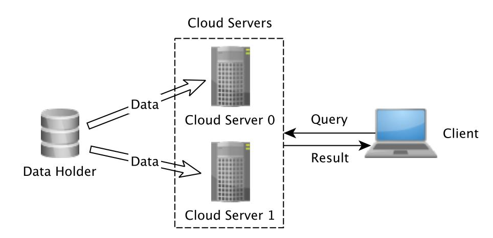
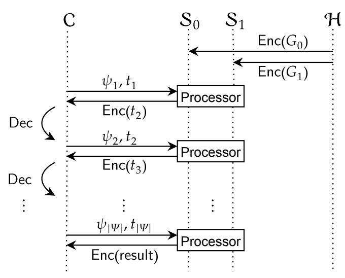
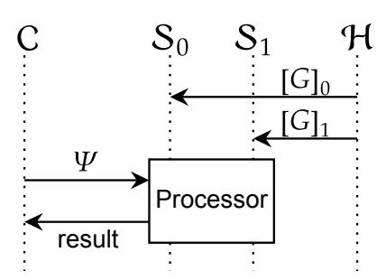
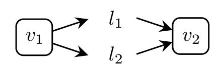
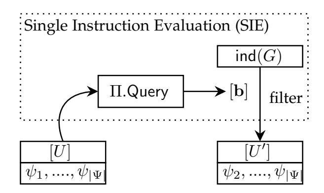
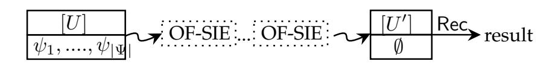

{0}------------------------------------------------

# Secure Graph Database Search with Oblivious Filter

Jamie Cui, Chaochao Chen<sup>∗</sup> , Alex X. Liu, *Fellow, IEEE*, and Li Wang

**Abstract**—With the emerging popularity of cloud computing, the problem of how to query over cryptographically-protected data has been widely studied. However, most existing works focus on querying protected relational databases, few work has shown interests in graph databases. In this paper, we first investigate and summarize two single-instruction queries, namely Graph Pattern Matching (GPM) and Graph Navigation (GN). Then we follow their design intuitions and leverage secure Multi-Party Computation (MPC) to implement their functionalities in a privacy-preserving manner. Moreover, we propose a general framework for processing multi-instruction query on secret-shared graph databases and present a novel cryptographic primitive Oblivious Filter (OF) as a core building block. Nevertheless, we formalize the problem of OF and present its constructions using homomorphic encryption. Finally, we conduct an empirical study to evaluate the efficiency of our proposed OF protocol.

✦

**Index Terms**—Secure Graph Database Search, Secret Sharing, Multi-Party Computation, Oblivious Filter.

## **1 INTRODUCTION**

## **1.1 Background**

Graph Database-as-a-Service (GDaaS) has been adopted by many companies because of its always-on availability, high scalability, and fast development. In GDaaS, companies upload their data onto a cloud graph database, and the cloud server stores and processes the graph data. Although GDaaS has the above advantages, it comes with privacy concerns. First, cloud servers face internal threats such as misadministration and corrupted employee. For example, in 2020, an Amazon engineer accessed several users' videos without authorization [1]. Second, cloud servers face more external threats than dedicated data centers [2].

#### **1.2 System Model & Threat Model**

**System Model.** Motivated by the existing work on secure database search [3], [4] based on secret sharing [5], in this paper, we consider the *two-server* system model for GDaaS which consists of the following participants:

- *A data holder* who owns graph data. We also assume that the data holder has moderate storage and computation resources (e.g. small companies' data center). The data holder is denoted as H.
- *Two cloud servers* who store H's graph data. We denote the two cloud servers as S<sup>0</sup> and S1.
- *A client* who queries graph data from S<sup>0</sup> and S1. We assume the client has very limited storage, computation, and communication resources (e.g. phone, web front-end). The client is denoted as C.

Figure 1 shows the interactions between those parties. First, the data holder outsources its graph data to the two cloud servers. Then, the client sends a query to both cloud servers. Finally, the servers return the query result to the client.

• *J. Cui, C. Chen, A.X. Liu, and L. Wang are with Ant Group, Hangzhou 310012, China.* <sup>∗</sup>*C. Chen is the corresponding author. E-mail:* {*shanzhu.cjm, chaochao.ccc, alexliu*}*@antfin.com, raymond.wangl@antfin.com.*



Fig. 1. Two-server GDaaS System Model.

**Threat model.** First, we assume that the data holder H is trusted as the graph data is owned by H. Second, we assume that the two cloud servers S0, S<sup>1</sup> are semi-honest and noncolluding, which has been widely adopted in prior MPC work [6], [7], [8]. In semi-honest threat model, also known as honest-but-curious adversary, the legitimate participant will not deviate from the pre-defined protocol but will attempt to learn all possible information from its received messages [6]. Third, we assume that the client C is trusted as client authentication and authorization can be easily achieved using existing mechanisms.

#### **1.3 Problem Statement**

For simplicity, we adopt the widely used *Edge-Labelled Graph Model*, where only edges are assigned with labels to indicate different types of connections. Formally, an edge-labelled graph with n vertices, m edges, and k labels is denoted as G = (V, E, L), where V = {v1, ..., vn} is the vertex set, L = {l1, ..., lk} is the label set, and E = {e1, ..., em} ⊆ V ×L×V is the edge set.

Given graph data G = (V, E, L), the data holder should first split G into two parts (denoted as [G]<sup>0</sup> and [G]1), and sends [G]<sup>0</sup> to S0, [G]<sup>1</sup> to S1. Given a graph query, the client parses the query into graph traversal instructions Ψ in 

{1}------------------------------------------------

Gremlin [9], and the instruction set  $\Psi$  is then broadcast to  $\mathcal{S}_0$  and  $\mathcal{S}_1$ . Then, the cloud servers should be able to calculate the query result based on  $[G]_0$ ,  $[G]_1$ , and  $\Psi$ . Finally, the client receives the query result. During above processes, the cloud servers should not be able to learn any private information about the underlying graph data G, e.g., the exact vertices of an edge, the labels of an edge, and the number of neighbors of a vertex.

One trivial solution is that the cloud servers first send both  $[G]_0$  and  $[G]_1$  to the client, and then the client performs a local processing of its query on graph G. This solution preserves the privacy of G with the only leakage from the splitting scheme. However, such solution has a large amount of communications between the client and the servers, and hence it is not communication efficient.

Here, we say a secure graph database processing protocol should be communication efficient in two aspects. First, given an instruction set, the protocol should concretely have small communication cost between the client and the two servers. The intuition is that the client is usually a mobile phone, or a laptop with unstable network condition. Second, the protocol should have a low asymptotic communication complexity between the two cloud servers. This is because graph data are usually large in practice, and it is important for the protocol to maintain high scalability.

#### 1.4 Technical Overview

In this section, we give a technical overview of our secure graph query database protocol. We adopt the abstraction of query functionalities by a popular graph query language — Gremlin [9], where all the queries are treated as traversal instructions, and later a *traversal machine* is applied to evaluate all instructions on the graph data. Conceptually, a traversal machine working on a graph consists of a set of traversal instructions and a set of traversers. The traversal machine moves all traversers on graph topology according to the instructions, where the result of the query is the final locations of all halted traversers.

Existing work in graph query languages has shown that graph query functionalities can be categorized into two categories: *Graph Pattern Matching* (GPM) and *Graph Navigation* (GN) [10]. Hence, we expect secure graph query processors to support both GPM and GN queries.

Limitations of Prior Art. In the literature, little work has been done on the secure graph database search problem. A recent work of GraphSE<sup>2</sup> [11] supports GPM by leveraging searchable symmetric encryption [12], [13], [14]. Although GraphSE<sup>2</sup> claims its support of graph navigation (that is, GN), its evaluation process involves linear rounds of communication with the client. Also, GraphSE<sup>2</sup> does not use a general technique like MPC or homomorphic encryption, which makes it lack of support for downstream secure computations (e.g. analytics). Figure 2 shows the system model of GraphSE<sup>2</sup>. Given an edge-labelled graph G = (V, E, L), data holder  $\mathcal{H}$  first splits the graph into two subgraphs, i.e.,  $G_0 = (V_0, E_0, L_0)$  and  $G_1 = (V_1, E_1, L_1)$ . Then, the data holder encrypts both subgraphs, and sends  $Enc(G_0)$ and  $Enc(G_1)$  to cloud servers  $S_0$  and  $S_1$  respectively. On receiving an instruction set  $\psi_1$  and an initial traverser set  $t_1$  from  $\mathcal{C}$ ,  $\mathcal{S}_0$  and  $\mathcal{S}_1$  process  $\psi_1$  and  $t_1$  on  $\mathsf{Enc}(G_0)$  and



Fig. 2. High-level system model of GraphSE $^2$ , where  $\psi_*$  is the traversal instructions,  $\operatorname{Enc}(G_0)$  and  $\operatorname{Enc}(G_1)$  are the encrypted subgraphs,  $t_*$  is the traverser set.



Fig. 3. A summary of our system model, where  $[{\cal G}]_0$  and  $[{\cal G}]_1$  are shared graphs.

 $Enc(G_1)$ , and return the encrypted next traversal location  $Enc(t_2)$  to the client. Afterwards,  $\mathcal{C}$  decrypts the message and gets the traverser set  $t_2$  and so on. Consequently,  $GraphSE^2$  involves a lot of communications between client and servers when dealing with complex navigation queries.

**Our Proposed Approach.** Our work overcomes those limitations by utilizing generic secure computation techniques (i.e. MPC), and a new primitive called *oblivious filter*. Secure multiparty computation (MPC) is a cryptographic tool that allows multiple parties to securely evaluate a function based on their private inputs. And MPC has been widely adopted in many secure computation applications [15], [16].

First, we introduce how to use a secret sharing scheme to distribute the graph G onto the public cloud servers while meeting our privacy requirements. The shared graphs are denoted as  $[G]_0$ ,  $[G]_1$  respectively. We take a careful design to ensure that information leakage is contained in a minimal level, and can also efficiently check the connectivity between two public vertices (e.g. u and v). This connectivity check is essential for many graph operations including GPM and GN query functionalities. Our connectivity check protocol adopts the Private Set Membership (PSM) protocol from [17], and requires  $O(\hat{d})$  communication complexity, where  $\hat{d}$  is the maximum degree of graph G.

Then, we present concrete construction of the Processor in Figure 3 in the MPC-hybrid world. The ideal functionality of the processor can be written as  $t' \leftarrow \mathcal{F}_{\text{process}}(G, \psi, t)$ . Therefore, a secure protocol realizing  $\mathcal{F}_{\text{process}}$  should take two shares of G, a public  $\psi$ , and a shared traverser set t which indicates the current location of traversal as input. The main idea is to get the neighbors of the current traverser set [t] in [G], and then apply  $\psi$  to obliviously filter the neighbors accordingly. Here, we introduce a new primitive called oblivious filter to perform the filter functionality. The resulting location is then denoted as the result traverser set

{2}------------------------------------------------

$$[t']\text{, i.e.,}$$
 
$$[t]' \leftarrow \Pi_{\mathsf{process}}([G], \psi, [t]).$$

In this work, we introduce an instantiation of such protocol using generic MPC techniques.

As for our new primitive oblivious filter, we investigate its relation with existing primitives such as PIR, PSI and proposed a construction based on homomorphic encryption. Conceptually, oblivious filter allows one party (P<sup>0</sup> for example) to oblivious filter the other party's value vector (P<sup>1</sup> for example), and at the end, parties receive the shared result. Oblivious filter ensures that P<sup>0</sup> learns nothing about P1's value vector, and P<sup>1</sup> does not know which value is filtered. Though oblivious filter naturally leaks the size of the filtered result, this leakage is often negligible in secure computation task. Finally, we carry out experiments and demonstrate the efficiency of oblivious filter.

## **1.5 Organization**

We organize the rest of this paper as follows. In section 2, we introduce the background knowledge of secure computation, graph models, and graph queries. In section 3, we describe our secret sharing scheme for graph data. Section 4 describes the secure evaluation of single instruction queries, and section 5 introduces the framework of evaluating multiquery instructions. Afterwards, section 6 introduces a new primitive called oblivious filter and conducts experiments on its performance. Finally, Section 7 concludes this paper.

## **2 PRELIMINARIES**

**Syntax.** In the following of this paper, we use a pair with angle brackets, i.e., h and i, to denote the data that is only visible to the corresponding party. The ordering that we use is hH, S0, S1, Ci. For example hx, y, z, ki means that x is only visible to H, y is only visible to S0, z is only visible to S1, and k is only visible to C. Also we use ⊥ to represent empty. We further simplify the notation and omit the empty symbol ⊥. That is, we use [x] or h[x]0, [x]1i as an abbreviation of h⊥, [x]0, [x]1, ⊥i, hx, ◦i as an abbreviation of hx, ⊥, ⊥, ⊥i, and h◦, xi as an abbreviation of h⊥, ⊥, ⊥, xi.

#### **2.1 Secure Computation Techniques**

**Secret Sharing.** Secret sharing is a cryptography primitive which aims to distribute a secret among a group of parties (participants), such that each party holds a random share of the secret [5]. Secret sharing ensures that only with a sufficient amount of shares from the parties, the secret can be revealed. More formally, a secret sharing scheme consists of a pair of algorithms (Shr, Rec), where the algorithm Shr splits the secret into shares, and Rec reconstructs the secret from shares. In particular, for the two-party case,

- h[x]0, [x]1i ← Shr(hx, ◦i),
- hx, ◦i ← Rec(h[x]0, [x]1i).

Secret sharing has been the core of many well-known MPC protocols, e.g. GMW [18], SPDZ [6]. In this work, we choose additive secret sharing in a finite group to facilitate efficient arithmetic operations.

**Additive Homomorphic Encryption.** Additive homomorphic encryption is an asymmetric encryption scheme which

allows addition over two ciphertexts [19], [20], [21]. With a formal description, additive homomorphic encryption is a tuple of algorithms (Gen, Enc, Dec, Eval), with "+" as its homomorphic operation. That is,

- (pk,sk) ← Gen(1<sup>λ</sup> ): Given a security parameter λ, Gen generates the public key pk and secret key sk.
- c ← Encpk(m): Enc encrypts a message m with public key, and returns a cipher c.
- m ← Decsk(c): Dec decrypts a cipher c with secret key, and reveals the message m.

Additive homomorphism ensures that, for all m1, m<sup>2</sup> and pk, Encpk(m<sup>1</sup> + m2) = Evalpk(Encpk(m1), Encpk(m2)). In this work, we use the paillier [19] additive homomorphic encryption scheme. The details of paillier encryption scheme can be found in Appendix A.

#### **2.2 Graph Model and Representation**

Graph databases use graph model as the basic data structure for graphs. For simplicity, in this work, we use a limited, yet simple and widely-adopted *Edge-labeled Graph Model* [10], where edges are assigned with labels to indicate different relationships between nodes. Formally, edge-labeled graph is defined as follows.

*Definition 1 (Edge-labeled graph).* An edge-labeled graph G is a tuple list (V, E, L), where V = {v1, v2, ..., vn} is a finite set of vertices, E = {e1, e2, ..., em} is a finite set of edges, and L = {l1, ..., lk} is a finite set of labels, with n, m and k denoting the number of vertices, edges, and labels, respectively. In addition, E ⊆ V × L × V .



Fig. 4. An example of edge-labeled graph, where l<sup>1</sup> and l<sup>2</sup> are two labels between vertices v<sup>1</sup> and v2.

Most existing graph databases use either *Adjacency Matrix (AM)* or *Adjacency List (AL)* to represent edge-labelled graph, e.g. OrientDB<sup>1</sup> , Neo4j<sup>2</sup> , and MS Graph Engine<sup>3</sup> . On the one hand, AM uses matrix elements to indicate whether a pair of vertices are connected in the graph. Therefore, AM has O(n 2 ) storage complexity, and can check the connectivity of two vertices in O(1). On the other hand, each line in AL describes the set of neighbors of a vertex in the graph. This makes AL has O(n + m) storage complexity, and it can check the connectivity of two vertices in O( ˆd), where ˆd is the maximum degree of the graph. Since AM has quadratic storage complexity, it does not scale well for large graphs. Hence, we choose AL to represent graph database. For the example in Figure 4, let V = {v1, v2}, L = {l1, l2}, the above example can be represented in the following adjacency list:

$$v_1:(l_1,v_2),(l_2,v_2)$$
  
 $v_2: \setminus$ 

- 1. OrientDB: https://www.orientdb.org/
- 2. Neo4j: https://neo4j.com/
- 3. MS Graph Engine: https://www.graphengine.io/

{3}------------------------------------------------

#### 2.3 Graph Query Functionalities

Graph query languages express the searching functionality and serve as the core component of graph database systems. Even though existing graph query languages differ enormously, e.g. Cypher [22], SPARQL [23], and Gremlin [9], on the high level, they share two most fundamental functionalities [10], [24]: *Graph Pattern Matching* (GPM) and *Graph Navigation* (GN).

**Graph Pattern Matching (GPM).** GPM refers to the problem of finding the exact graph pattern that matches for a given graph. A graph pattern  $\tilde{G}$  in GPM, is essentially a graph with constants and variables. The constants are denoted as  $Const(\tilde{G}) \subseteq V \cup E \cup L$ , where G = (V, L, E) is the graph data. And, the variables are denoted as  $Var(\tilde{G})$ .

**Definition 2** (*Match*). Given an edge-labeled graph G = (V, L, E) and a graph pattern  $\tilde{G} = (\tilde{V}, \tilde{L}, \tilde{E})$ , a match is defined as  $h \in \mathsf{Const}(\tilde{G}) \cup \mathsf{Var}(\tilde{G}) \mapsto \mathsf{Const}(G)$ , such that the mapping h maps constants to themselves and variables to constants; if the image of  $\tilde{G}$  under h is contained within G, then h is a match.

For example, assume we have a GPM query "Find the vertices that have  $l_1$  relation with  $v_1$ " and a graph G as in Figure 4. This query can be converted into a graph  $\tilde{G}$  with variable  $\delta$  (see Figure 5), that is,  $\tilde{G}=(\tilde{V},\tilde{E},\tilde{L})$ , where  $\tilde{V}=\{v_1,\delta\}, \, \tilde{E}=\{(v_1,l_1,\delta)\}$ , and  $\tilde{L}=\{l_1\}$ . To find a match, the graph pattern  $\tilde{G}$  is first matched to the graph G, and then the graph database searches for the occurrences of the pattern. Many existing literatures [25], [26], [27] have provided practical GPM algorithms for fixed-size queries.

$$v_1 \longrightarrow l_1 \longrightarrow \delta$$

Fig. 5. An example of graph pattern, where  $\delta$  is a variable.

Conceptually, the matching algorithms first list all possible mappings H, then for every mapping  $h \in H$ , search if  $h(\tilde{G}) \subseteq G$ . We adopt Ullmann's match algorithm [28] to apply a depth-first tree search algorithm. The details of Ullmann's match algorithm is shown in Figure 6.

**Inputs.** A graph G, a graph pattern  $\tilde{G}$ , a mapping set H. **Outputs.** The matched mapping set H'. **Algorithm.** 

- 1) Build the search tree. Every node in the search tree at level i represents a mapping from  $\delta_i$  to a possible vertex  $v \in G$ .
- 2) Prune subtrees by eliminating repeated variables values, that is, the matching h is an injective (one-to-one) mapping.
- 3) Forward check if all the edges connecting two nodes in the tree preserve the relationships between their corresponding variables, if not, delete the edges.
- 4) Return all paths that remained in the tree from root to a leaf.

Fig. 6. Ullmann's match algorithm [28] for graph pattern matching.

**Graph Navigation (GN) and Graph Traversal Machine.** In general, GN allows navigation towards the graph topology.

GN queries have long been established as the core of navigational querying in graphs by the research community [29], [30], [31] and are widely adopted in graph query languages, e.g. SPARQL, Cypher and Gremlin. In this work, we focus on Gremlin's graph traversal machine [9].

Formally, a traversal machine consists of a graph G, a traversal instruction set  $\Psi$ , and traverser set t. The traverser set is defined as  $t \subseteq V \cup E \cup L$ , and it can be understood as all possible locations in the graph G. Evaluating a single step traversal instruction  $\psi \in \Psi$  can be taken as a specification of one of the following maps:

- 1) flatMap, which moves the traverser set t.
  - $\mathcal{P}(V) \mapsto \mathcal{P}(E)$ : Move from vertices to edges;
  - $\mathcal{P}(E) \mapsto \mathcal{P}(V)$ : Move from edges to vertices;
  - $\mathcal{P}(U) \times \tilde{G} \mapsto \mathcal{P}(U)$ : Move according to pattern  $\tilde{G}$ ;
- 2) filter, which filters the traverser set t.
  - $\mathcal{P}(E) \times I_e \mapsto \mathcal{P}(E)$ : Filter edges with index set  $I_e$ ;
  - $\mathcal{P}(V) \times I_v \mapsto \mathcal{P}(V)$ : Filter vertices with index set  $I_v$ ;
  - $\mathcal{P}(E) \times L \mapsto \mathcal{P}(E)$ : Filter edges with label  $l \in L$ ;

where we use  $\mathcal{P}(*)$  to denote the power set of \*. Also, here we focus on the most basic graph traversal, *Simple Traversal*, where traversal instructions are processed in a sequential order ( $\psi_1 \leadsto \psi_2 \leadsto ... \leadsto \psi_{|\Psi|}$ ). For the rest of this paper, we use the term "instruction" or "traversal instruction" to short for a single step traversal instruction.

#### 3 SECRET SHARING OF GRAPH DATA

Though we have specified the plaintext graph model, graph representation, and graph query functionalities, it still remains a challenge of how to securely and efficiently share the graph between two parties. On the one side, the graph sharing scheme should be secure against a semi-honest adversary. On the other side, it should also support: (1) secure validity check for a constant string, i.e., check whether a string exists in vertex set or label set, and (2) secure connectivity check for two shared vertices, namely  $v_1$  and  $v_2$ . Here, 'shared vertex' means that the vertex is secret shared between  $S_0$  and  $S_1$ .

Intuitively, as is shown in Section 2.2, an edge-labelled graph G could be sufficiently represented by a vertex list V, a label list L, and an adjacency list A. This graph representation method uses V and L for existence check of a string and retrieves the string's index if it is valid. Afterwards, given two vertex-IDs, the adjacency list A checks the connectivity of the two vertices.

In our solution, we adopt such design intuition and utilize two different data structures for the graph sharing scheme, namely *shared lookup table* and *shared adjacency list*. To begin with, we use  $\mathsf{hash}(v)$  to represent hashed strings, where  $\mathsf{hash}(*)$  is a cryptographic hash function. First, we hash all the strings in the original graph, and share the hashed values  $S = \mathsf{hash}(V) \cup \mathsf{hash}(L)$ , i.e.,  $\langle [S]_0, [S]_1 \rangle \leftarrow \mathsf{Shr}(\langle S, \circ \rangle)$ . The shared string list is later used for validity checking. Then, to allow secure connectivity check of two vertices, we build a shared index lookup table [T], which allows index retrieving for a vertex string or a label string. Finally, we share the indexed adjacency list [A] to allow the connectivity check between two vertices. We will describe the details of shared lookup table [T] and shared adjacency

{4}------------------------------------------------

list [A] later. In summary, a shared graph [G] is represented as:

$$[G] = ([S], [T], [A]).$$

Shared lookup tables [T]. Formally, a shared lookup table associates with algorithms BuildT and LookupT, where BuildT generates the shared coefficients, and later those coefficients are used by LookupT to determine if a value is in the table. We present the detailed algorithms in Figure 7. Let  $X = \{x_0, ..., x_{d-1}\}$  and  $Y = \{y_0, ..., y_{d-1}\}$  be two sets with the same length d, and we want to share the mapping  $X \mapsto Y$ . Additionally, we define the final result [T] as a set of polynomial coefficients  $[a_0], ..., [a_{d-1}]$ , where the shared  $[a_i]$  are the coefficients used to retrieve the mapping results. For sharing the graph, we build a shared index lookup table by  $[T] \leftarrow \text{BuildT}(\text{hash}(V), \text{ind}(V))$ .

**Notation.**  $X = \{x_0, ..., x_{d-1}\}$  and  $Y = \{y_0, ..., y_{d-1}\}$  have d elements, and we also define  $[T] = [a_0], ..., [a_{d-1}].$  Algorithm 1.  $[T] \leftarrow \mathsf{BuildT}(X, Y).$ 

- 1) Data holder gets the polynomial coefficients from the mapping:  $a_0, ..., a_{d-1} \leftarrow \text{LagrangeInterpolation}(X \mapsto Y);$
- 2) For every  $a \in \{a_0, ..., a_{d-1}\}$ , data holder shares the coefficients to servers:  $[a] \leftarrow \mathsf{Shr}(\langle a, \circ \rangle)$ .

**Algorithm 2.**  $[y] \leftarrow \mathsf{LookupT}(x, [T])$ .

1)  $S_i$  calculates  $[y]_i = [a_0]_i + [a_1]_i x + ... + [a_{d-1}]_i x^{d-1}$ .

Fig. 7. Algorithms for shared lookup table.

In Figure 7, we use the term "LagrangeInterpolation" to denote the function that interpolates the input mapping and outputs a polynomial with degree d-1. The resulting coefficients  $a_0,..,a_{d-1}$  and the polynomial  $f(x) = \sum_{i=0}^{d-1} a_i x^i$  satisfy that  $f(x_i) = y_i$  for all  $x_i \in X$  and  $y_i \in Y$ . The computation complexity of computing all coefficients of LagrangeInterpolation is  $O(d \log d)$  according to [32], and sharing the coefficients requires d|[\*]|-bit communication, where |[\*]| indicates the bit size of the shares. As for the lookup algorithm, evaluating the polynomial only requires d additions and d multiplications using Horner's Method [33], and lookup algorithm requires no extra communication cost.

**Shared adjacency list** [A]. The purpose of a shared adjacency list is to allow the connectivity check for two vertices with a given label. A simple way is to reconstruct all the indexes and apply a plaintext lookup, but unfortunately this leaks access patterns. To share the adjacency list, first we use an indexed representation for the head node of the adjacency list, i.e., u of the  $A_u$ , and then we include the tail node's index in the edge representation, and pad every line in adjacency list to the maximum degree  $\hat{d}$  with "0"s. Finally, we share the mapped element in the adjacency list. Notice that we do not need to share the head vertex indexes as long as they are stored in order. For example, the shared adjacency list of Figure 4's case is:

```
\operatorname{ind}(v_0) : ([\operatorname{ind}(l_0)]_i, [\operatorname{ind}(v_1)]_i), ([\operatorname{ind}(l_1)]_i, [\operatorname{ind}(v_1)]_i), \\ \operatorname{ind}(v_1) : ([\operatorname{ind}(0)]_i, [\operatorname{ind}(0)]_i), ([\operatorname{ind}(0)]_i, [\operatorname{ind}(0)]_i),
```

where  $S_0$  holds the list with i=0 and  $S_1$  holds the list with i=1. This secret sharing scheme has storage complexity of  $O(4n\hat{d}+2n+m)$  on both servers' side and checks connectivity of two vertices with one invocation of private set membership (PSM) protocol. The protocol we choose is the circuit-based PSM protocol from [17] with  $O(\hat{d})$  communication overheads.

**Security.** This sharing scheme for graphs inevitably inherits the leakage profile from shared lookup table and shared adjacency list. All those leakages are leaked to servers  $\mathcal{S}_0$  and  $\mathcal{S}_1$ . Specifically, [S] leaks the total number of vertices and labels (|V|+|L|), the shared lookup table [T] leaks the number of vertices (|V|), and the shared adjacency list [A] additionally leaks the maximum degree of the graph  $(\hat{d})$ . Here, we only discuss the leakage of those data structures, and leave the security of connectivity check in Section 4. In summary, the leakage profile of this sharing scheme is defined as:

$$\mathcal{L}_{\mathsf{share}} = (|V|, |L|, \hat{d}).$$

## 4 EVALUATING A SINGLE-INSTRUCTION QUERY

Recall that, in section 2.3, we have introduced how to convert GPM (graph pattern) queries and GN (path) queries into traversal instructions. In this section, we show the secure processing of single-instruction queries, e.g., a GPM query or a GN query that could be translated into only a single instruction. The security of our protocols follows the standard semi-honest definition using simulation-based security proof technique [34], [35], where security says that the behavior of the adversary can be simulated given only the view of an honest participant.

**Methodology.** With the aim of secure and efficient single-instruction query evaluation, we first formalize the ideal functionalities of answering GPM and GN queries. We then present and analyze the secure constructions using real world vs. ideal world simulation paradigm. To allow an easy analysis, we describe functionalities with a leakage profile  $\mathcal{L}$ , which models the information leakage. Also, some of our proposed protocols leak a known private set membership protocol in MPC. To give an abstraction of the whole protocol, we prove the security in the *MPC-hybrid model*, where we assume the presence of a private set membership protocol [17].

#### 4.1 Securely Evaluating A GPM Query

Recall that a GPM query is essentially a graph pattern that could be represented as a graph  $\tilde{G}=(\tilde{V},\tilde{E})$ , containing constants and variables. Formally, we adopt the graph pattern matching algorithm from Ullmann [28], and describe the ideal functionality of GPM as  $\mathcal{F}_{\text{gpm}}$  in Figure 8, where we use PSM $(x \in \mathcal{X}, \mathbf{X} \in \mathcal{X}^*)$  to denote a private set membership protocol that checks whether  $x \in \mathbf{X}$ . This functionality works among  $\mathcal{C}$ ,  $\mathcal{S}_0$ , and  $\mathcal{S}_1$ , and allows the secure evaluation of a graph pattern query (containing a single instruction) over the secret shared graph database. The ideal functionality  $\mathcal{F}_{\text{gpm}}$  could be split into three phases:

1) *Check phase*, where the client checks the validity of a given graph pattern by sending all strings in graph pattern to the ideal functionality;

{5}------------------------------------------------

- 2) *GetID phase*, where the client retrieves IDs for every query string;
- 3) *Query phase* where the client first builds  $\mathsf{Tree}(\tilde{G})$ , and then checks the existence of an edge in  $\mathsf{Tree}(\tilde{G})$  in a depth-first-search manner.

## Global Parameters. Security parameter $\lambda$ .

**Check.** Given a hash set Hset from C, and  $[G]_i$  from  $S_i$ ,

- 1) Invokes  $(S, T, A) \leftarrow \mathsf{Rec}([G])$ ;
- 2) For all  $\sigma_j \in \mathsf{Hset}$ , let  $b_j = 1$  if  $\sigma_j \in S$ , or  $b_j = 0$  otherwise;
- 3) Returns  $b_1, ..., b_{|\mathsf{Hset}|}$  to  $\mathcal{C}$ .

**GetID.** Given a hash set Hset from C, and  $[G]_i$  from  $S_i$ ,

- 1) Invokes  $(S, T, A) \leftarrow \mathsf{Rec}([G])$ ;
- 2) For all  $\sigma_j \in \mathsf{Hset}$ , invokes  $\mathsf{ind}_j \leftarrow \mathcal{F}_{\mathsf{LookupT}}(\sigma_j, T)$ ;
- 3) Returns  $\operatorname{ind}_1, ..., \operatorname{ind}_{|\mathsf{Hset}|}$  to  $\mathcal{C}$ .

**Query.** On receiving Eset from C (Eset holds all edges in  $\tilde{G}$  containing  $\delta_j$  only or  $\delta_j$  with lower-level variables), and  $[G]_i$  from  $S_i$ ,

- 1) Invokes  $(S, T, A) \leftarrow \mathsf{Rec}([G])$ ;
- 2) For every  $(h_j, l_j, t_j) \in \mathsf{Eset}$ , finds  $A_{h_j}$ , and let  $b_j = 1$  if  $(l, t) \in A_{h_j}$ , or  $b_j = 0$  otherwise;
- 3) Returns  $b_1, ..., b_o$  (o is the output size) to C.

Fig. 8. Ideal Functionality  $\mathcal{F}_{\text{gpm}}$ .

Protocols in Figures 9, 10, and 11 describe the detailed constructions of *Check phase*, *GetID phase*, and *Query phase* for functionality  $\mathcal{F}_{gpm}$ , respectively.

## $\mathcal{C}$ .Check. Given a graph pattern $\tilde{G}$ , client $\mathcal{C}$ :

- 1) Initiates Hset =  $\emptyset$ ;
- 2) For all  $\phi_j \in \mathsf{Const}(\tilde{G})$ , calculates and pushes  $\mathsf{hash}(\phi_j)$  into  $\mathsf{Hset}$ ;
- 3) Sends Hset to servers  $S_i$ ;
- 4) On receiving messages from  $S_i$ , C invokes  $b_1,...,b_{|\mathsf{Hset}|} \leftarrow \mathsf{Rec}(\langle [b_1]_0,...,[b_{|\mathsf{Hset}|}]_0,[b_1]_1,...,[b_{|\mathsf{Hset}|}]_1 \rangle)$ , aborts if  $\exists j \leq |\mathsf{Hset}|,b_j=0$ .

 $\mathcal{S}_i$ . Check. On receiving a hashed list Hset from  $\mathcal{C}$ , server  $\mathcal{S}_i$ :

- 1) Initiates  $[b_1]_i, ..., [b_{|\mathsf{Hset}|}]_i = 0;$
- 2) For every  $\sigma_j \in \mathsf{Hset}$ , invokes  $[b_j] \leftarrow \mathsf{PSM}(\sigma_j, [S])$ .
- 3) Sends  $[b_1]_i, ..., [b_{|\mathsf{Hset}|}]_i$  to  $\mathcal{C}$ .

Fig. 9. Protocol  $\Pi_{\text{gpm}}$ . Check for functionality  $\mathcal{F}_{\text{gpm}}$ .

**Lemma 1.** Protocol  $\Pi_{\text{gpm}}$  is secure against non-adaptive adversary in the MPC-hybrid model.

**Proof.** For the security proof of  $\Pi_{\text{gpm}}$ , we use a simulator for each server for  $\Pi_{\text{gpm}}$ . Check,  $\Pi_{\text{gpm}}$ . GetID, and  $\Pi_{\text{gpm}}$ . Query, and prove its security in the MPC-hybrid model.

Simulator for  $S_i$ : During the Check phase,  $S_i$  eventually receives nothing, therefore the simulation for Check phase is trivial. To simulate the GetID phase and query phase, the simulator uniformly samples random IDs for every edge header  $\phi_*$ , and then obtains the final result. This simulation is indistinguishable from the real execution under the condition that the simulator cannot distinguish between a

- $\mathcal{C}$ .**GetID**. Given a graph pattern  $\tilde{G}$ , client  $\mathcal{C}$ :
- 1) Initiates Hset =  $\emptyset$ ;
- 2) For all  $\phi_j \in \mathsf{Const}(\tilde{G})$ , calculates and pushes  $\mathsf{hash}(\phi_j)$  into  $\mathsf{Hset}$ ;
- 3) Sends Hset to servers  $S_i$ ;
- 4) On receiving  $S_i$ 's messages, invokes  $\operatorname{ind}_1, ..., \operatorname{ind}_{|\mathsf{Hset}|}$   $\leftarrow \operatorname{Rec}(\langle [\operatorname{ind}_1]_0, ..., [\operatorname{ind}_{|\mathsf{Hset}|}]_0, [\operatorname{ind}_1]_1, ..., [\operatorname{ind}_{|\mathsf{Hset}|}]_1 \rangle).$

 $S_i$ .GetID. On receiving a hash set Hset from C,

- 1) For all  $\sigma_j \in \mathsf{Hset}$ , invokes  $[\mathsf{ind}_j]_i \leftarrow \mathsf{LookupT}([T], \sigma_j)$ ;
- 2) Sends  $[\operatorname{ind}_1]_i, ..., [\operatorname{ind}_{|\mathsf{Hset}|}]_i$  to  $\mathcal{C}$ .

Fig. 10. Protocol  $\Pi_{\text{gpm}}.\text{GetID}$  for functionality  $\mathcal{F}_{\text{gpm}}.$ 

## C.Query. Once client has $ind_1, ..., ind_{|Hset|}$ ,

- 1) Replaces all  $\phi_j \in \mathsf{Const}(\tilde{G})$  with  $\mathsf{ind}_j$ ;
- 2) Builds the match search tree  $Tree(\tilde{G})$  by replacing variables with possible vertex-IDs, then prunes repeated vertex-IDs over a possible match path (from root to a leaf).
- 3) Performs forward check in a depth-first manner, for each possible match path, at level j of  $\mathsf{Tree}(\tilde{G})$ ,
  - a) Let Eset represents all edges in  $\tilde{G}$  containing  $\delta_j$  only or  $\delta_j$  with lower-level variables;
  - b) Sends Eset to  $S_i$  as Query2;
  - c) Invokes  $b \leftarrow \text{Rec}(\langle [b]_0, [b]_1 \rangle);$
  - d) Delete the nodes if b = 0.
- $\mathcal{S}_i$ .Query. On receiving Eset from  $\mathcal{C}$ , for every  $(h, l, t) \in$  Eset:
- 1) Finds the shared adjacency list  $[A_h]_i$ ;
- 2) Lets  $[b]_i = PSM((l, t), [A_h]_i);$
- 3) Sends  $[b]_i$  back to  $\mathcal{C}$ .

Fig. 11. Protocol  $\Pi_{\text{gpm}}$ . Query for functionality  $\mathcal{F}_{\text{gpm}}$ .

randomly sampled vertex-ID and the real vertex-ID for a specific string. Since we only assume a non-adaptive semi-honest adversary and the real vertex-IDs are no-repeatable and independently distributed, the simulation completes.

**Communication efficiency.** The check phase has communication complexity of  $O(|\mathsf{Const}(Q)|)$  for  $\mathcal{C}$ ,  $\mathcal{S}_0$ , and  $\mathcal{S}_1$ . And the GetID phase has communication complexity of  $O(|\mathsf{Const}(Q)|)$  for  $\mathcal{S}_0$  and  $\mathcal{S}_1$ . As for query phase, the communication complexity depends on the actual query, and at the worst case, it invokes  $O(|\delta|(n+m)p)$  length- $\hat{d}$  PSM protocols, where p is the number of all possible combinations of variables and  $\hat{d}$  is the maximum degree of vertices. This brings the total communication complexity of secure GPM to  $O(|\delta|(n+m)p\hat{d})$ .

### 4.2 Securely Evaluating A Single-Instruction GN Query

Recall that in Section 2.3, GN queries allow the navigation towards the topology of the graph. Similar to  $\mathcal{F}_{gpm}$ , the ideal functionality  $\mathcal{F}_{gn}$  could be divided into three phases:

- 1) *Check phase*, where the client checks if a rich-text query is valid. This phase is identical to  $\mathcal{F}_{gpm}$ . Check;
- 2) GetID phase, where the client retrieves IDs for every query string. This phase is also identical to  $\mathcal{F}_{gpm}$ . GetID;

{6}------------------------------------------------

3) *Query phase*, which takes a shared traverser as input and outputs a new shared traverser based on the latest traversal instruction;

Note that we also assume the existence of a MPC equality test protocol, denoted as EQ, which checks if two shared values are equal. Existing frameworks such as SPDZ [36], [37], [38] can perform EQ with online communication complexity of  $O(\beta)$  bits for  $\beta$ -bit integers [39].

**Query.flatMap**. On receiving a flatMap instruction  $\psi$ , and shared candidate set [U],

- 1) Invokes  $(S, T, A) \leftarrow \mathsf{Rec}([G]), U \leftarrow \mathsf{Rec}([U]);$
- 2) Gets the adjacency list  $A_{\mathsf{ind}(u)}$  for every  $\mathsf{ind}(u) \in \mathsf{ind}(U)$ , finds its neighbor vertex index u' with label defined in instruction  $\psi$ , pushes u' into U';
- 3) Invokes  $[U'] \leftarrow \mathsf{Shr}(U')$ .

**Query.filter**. On receiving a filter instruction  $\psi$ , and shared candidate set [U],

- 1) Invokes  $(S, T, A) \leftarrow \mathsf{Rec}([G]), U \leftarrow \mathsf{Rec}([U]);$
- 2) Filters  $\operatorname{ind}(U)$  with condition defined by instruction  $\phi$ . Pushes the filtered elements into U';
- 3) Invokes  $[U'] \leftarrow \mathsf{Shr}(U')$ .

Fig. 12. Ideal Functionality  $\mathcal{F}_{gn}$ .Query.

Formally, a traverser is defined as  $t=([U],\psi)$ , where U is an abstract term referring to the location of the traverser, and  $\psi$  is a traversal instruction extracted from the richtext query. Note that we have summarized all the possible instructions in Section 2.3 in two types, i.e., flatMap and filter. Thus, we divide the functionality of query phase into: Query.flatMap and Query.filter. We show the ideal functionality of processing a single-instruction GN query in Figure 12.

## C.**Query.flatMap** Given a single-instruction path query with condition $\alpha$ , C:

- 1) Sends ind(*U*),  $\psi_{v\to e}$  or  $\psi_{e\to v}$  to  $\mathcal{S}_i$ ;
- 2) On receiving server's messages, invokes  $b_1, ..., b_k \leftarrow \text{Rec}(\langle [b_1]_0, ..., [b_k]_0, [b_1]_1, ..., [b_k]_1 \rangle);$

#### $\mathcal{S}_i$ .Query.flatMap

On receiving ind(U) and an instruction  $\psi_{v\to e}$  from  $\mathcal{C}$ ,

- 1) Extracts current candidate set  $[u_j]_i \in [U]_i$ , and its corresponding shared adjacency list  $[A_U]_i$ ;
- 2) For all  $[A_{u_j}]_i \in [A_U]_i$ , filters and gets the indication vector for every edge in  $[A_U]_i$ , that is  $[b_1]_i,...,[b_{|U|\hat{d}}]_i \leftarrow \mathsf{EQ}([A_{u_j}(*)]_i,\phi_{v\to e});$
- 3) Sends  $[b_1]_i, ..., [b_{|U|\hat{d}}]_i$  to  $\mathcal{C}$ ;

On receiving  $\operatorname{ind}(U)$  and an instruction  $\psi_{e\to v}$  from  $\mathcal{C}$ ,

- 1) Extracts current candidate set  $[E_{u_j}]_i \in [E_U]_i$  which is in the form of (label, tail vertex): ([l], [t]);
- 2) For all  $[E_{u_j}]_i \in [E_U]_i$ , filters and gets the indication vector for every edge in  $[E_U]_i$ , that is  $[b_1]_i,...,[b_{|U|}]_i \leftarrow \mathsf{EQ}([E_{u_j}(*)]_i,\phi_{e \to v});$
- 3) Sends  $[b_1]_i, ..., [b_{|U|}]_i$  to C;

Fig. 13. Protocol  $\Pi_{gn}.$ Query.flatMap for functionality  $\mathcal{F}_{gn}.$ 

More precisely, in the secure instantiation of  $\mathcal{F}_{gn}$ , the representation of location indicator U depends on the cur-

- **C.Query.filter** Given a single-instruction path query with condition  $\alpha$ ,
  - 1) Sends ind(U),  $\psi$  to  $S_i$ ;
  - 2) On receiving server's messages, invokes  $b_1,...,b_{|U|\hat{d}} \leftarrow \text{Rec}(\langle [b_1]_0,...,[b_{|U|\hat{d}}]_0,[b_1]_1,...,[b_{|U|\hat{d}}]_1 \rangle);$

### $\mathcal{S}_i$ .Query.filter

On receiving an instruction  $\psi$  from C,

- 1) Extracts current candidate set  $[u_j]_i \in [U]_i$ , and its corresponding shared adjacency list  $[A_U]_i$ ;
- 2) For all  $[A_{u_j}]_i \in [A_U]_i$ , filters and gets the indication vector for every edge in  $[A_U]_i$ , that is  $[b_1]_i,...,[b_{|U|\hat{d}}]_i \leftarrow \mathsf{EQ}([A_{u_j}(*)]_i,\phi_{v\to e});$
- 3) Sends  $[b_1]_i$ , ...,  $[b_{|U|\hat{d}}]_i$  to  $\mathcal{C}$ ;

Fig. 14. Protocol  $\Pi_{gn}$ . Query. filter for functionality  $\mathcal{F}_{gn}$ .

rent traversal location. On the one hand, if the input traverser  $t = (U, \phi)$  locates within a vertex set, U is defined as  $U \subseteq \operatorname{ind}(V) = \{v_1, ..., v_*\}$ , and we additionally use  $A_U = \{A_{v_1}, ..., A_{v_*}\}$  to denote the adjacency list corresponding to U. By using such construction of  $A_U$ ,  $\mathcal{F}_{gn}$ naturally supports mapping from vertex set to edge set. On the other hand, if the traverser locates within an edge set, U is defined as  $U = \operatorname{ind}(E) = \{e_1, ..., e_*\}$ , and we use  $E_U = \{A_{v_1}(1), ..., A_{v_1}(d), A_{v_2}(1), ..., A_{v_*}(d)\}$  to denote the corresponding edge set extracted from A. Note that at the beginning of each traversal, we define the initial location as  $V_g$ , where  $V_g = \text{ind}(V)$ . We present two secure instantiations for  $\mathcal{F}_{gn}.Query$ , i.e.  $\mathcal{F}_{gn}.Query.FlatMap$  and  $\mathcal{F}_{gn}.Query.Filter$ , in Figures 13 and 14, respectively. Since we use standard MPC arithmetic for the protocol, consequently, the protocol is secure under the MPC-hybrid model and the security proof is trivial.

**Communication efficiency.** The communication cost for those protocols depends on the instruction and the database itself, and it requires O(|U|) invocations of PSM and additionally  $O(|\mathsf{Const}(Q)|)$  communications.

#### 5 EVALUATING A MULTI-INSTRUCTION QUERY

Note that we have introduced how to securely evaluate a single-instruction query in Section 4. In this section, we introduce how to evaluate a multi-instruction query. Recall that we want the overall protocol to (1) have small communication between the client and the servers, and (2) have good asymptotic communication complexity between the two servers.



Fig. 15. Single Instruction Evaluation (SIE).

{7}------------------------------------------------

Now, we show how to evaluate multi-instruction queries based on existing Single Instruction Evaluation (SIE) protocols, i.e.  $\Pi_{\text{gpm}}.\text{Query}$  and  $\Pi_{\text{gn}}.\text{Query}.$  We summary the general execution structure of SIE in Figure 15, where  $\Pi.\text{Query}$  takes input of a public instruction and a shared traversal set, and outputs a shared indicator vector [b]. Considering the scenario of single-instruction evaluation, the servers can reconstruct [b] to the client, and then the client itself can "filter" the indexes of the query result. Here, in single-instruction evaluation, the client only communicate with the servers twice (sending the query, and getting the reconstruction result) to get the query result.

Trivially, to evaluate a multi-instruction query with set  $\Psi$ , we can result  $\leftarrow \mathsf{SIE}(...\mathsf{SIE}(\mathsf{SIE}(t=([U],\Psi)))...)$ , which involves  $|\Psi|$  invocations of SIE. And therefore,  $O(|\Psi| \cdot |U|)$ bit communications between the client and the servers. This result is undesirable and contradicts our design goal. Conceptually, in multi-instruction evaluation, we want to let  $S_0$  and  $S_1$  "obliviously" filter the indexes ind(G) using the shared |b|. That is, the client is removed from the intermediate instruction evaluation, and it only gets involved at the beginning and the end of the evaluation (2 rounds). In this work, we propose a novel cryptographic primitive called Oblivious Filter, which we will present later in Section 6. We denote the Single Instruction Evaluation with Oblivious Filter as OF-SIE, and show the framework of secure multiinstruction evaluation in Figure 16, where OF-SIE is sequentially executed. Informally, for a traverser  $t = (|U|, \Psi)$  with instruction set  $\Psi = \{\psi_1, ..., \psi_{|\Psi|}\}$ , the evaluation routine is result  $\leftarrow$  OF-SIE(...OF-SIE(OF-SIE( $t = ([U], \Psi))$ )...), where we denote the initial traversal location as |U|, and the final traversal location as |U'|. Also, OF-SIE reduces the secure computation input size, and hence makes it asymptotically better than the trivial solution.



Fig. 16. Multi-Instruction Evaluation Framework.

## 6 OBLIVIOUS FILTER

In this section, we present the building block for our proposed general query processing system, i.e., oblivious filter.

#### 6.1 Definitions

We define the Oblivious Filter (OF) as a two-party functionality between a server and a client. The server in OF holds a list of pairs  $(\mathbf{t}, \mathbf{v})$ , and each pair consists of an indication bit  $t_i \in \{0, 1\}$  and a fixed finite value  $v_i \in \mathcal{V}$ . The client in OF holds a choice vector  $\mathbf{c} \in \{0, 1\}^n$ .

Oblivious filter protocols allow two party (a server and a client) to jointly filter server's private vector  $\mathbf{v}$ , and output a shared vector  $[\mathbf{v}']$ , such that: (1) for every  $v_i \in \mathbf{v}_i$ , if  $t_i = c_i$ , then  $v_i \in \mathbf{v}'$ , and (2) both parties learn nothing about which input value in  $\mathbf{v}$  belongs to  $[\mathbf{v}']$ . Formally, we give the following definitions of oblivious filter.

*Definition 3 (Correctness).* Given security parameter  $\lambda \in \mathbb{N}$ , for any  $n \in \mathbb{N}$ ,  $m \in \mathbb{N} < n$ ,  $\mathbf{c}, \mathbf{t} \in \{0, 1\}^n$ ,  $\mathbf{v} \in \mathcal{V}^n$ , and  $[\mathbf{v}'] \leftarrow \Pi_{\mathsf{OF}}(\langle (\mathbf{t}, \mathbf{v}), \mathbf{c} \rangle)$ , then  $\forall v' \in \mathbf{v}' \equiv v_i \in \mathbf{v}, c_i = t_i$ .

Then we give the simulation-based security definition of oblivious filter. Formally, security holds that any party's view during the attack can be simulated given only its own input and output.

**Definition 4 (Security).** Let  $\Pi_{\mathsf{OF}}$  be an oblivious filter protocol. We say that  $\Pi_{\mathsf{OF}}$  is secure if for all adversaries  $\mathcal{A}$ , there exists a polynomial-time simulator S, such that

$$\begin{split} \{(S_0(1^{\lambda}, n, m, \mathbf{v}, \mathbf{t}, [\mathbf{v}']_0), \mathbf{v}')\} &\stackrel{c}{\equiv} \\ & \{(\mathsf{view}_0^{\Pi_\mathsf{OF}}(\lambda, \langle (\mathbf{v}, \mathbf{t}), \mathbf{c} \rangle), \mathsf{output}^{\Pi_\mathsf{OF}}(\lambda, \langle (\mathbf{v}, \mathbf{t}), \mathbf{c} \rangle))\}, \\ \{(S_1(1^{\lambda}, n, m, \mathbf{c}, [\mathbf{v}']_1), \mathbf{v}')\} &\stackrel{c}{\equiv} \\ & \{(\mathsf{view}_1^{\Pi_\mathsf{OF}}(\lambda, \langle (\mathbf{v}, \mathbf{t}), \mathbf{c} \rangle), \mathsf{output}^{\Pi_\mathsf{OF}}(\lambda, \langle (\mathbf{v}, \mathbf{t}), \mathbf{c} \rangle))\}. \end{split}$$

**Relations with other primitives.** Oblivious filter can be seen as a instantiation of Private Function Evaluation (PFE) [40], [41] with shared outputs. Moreover, one building block for PFE — Oblivious Extended Permutation (OEP) [42] could be seen as a relaxation of oblivious filter, where the filter function is held by client instead of both parties. Roughly, OEP assumes that server holds an extended permutation  $\pi:\{1,...,m\} \to \{1,...,n\}$ , a mask  $\mathbf{r}\in\mathcal{V}^n$ , while client holds a private input  $\mathbf{v}\in\mathcal{V}^m$ . At the end of OEP protocol, client learns  $\{v_{\pi^{-1}(1)}+r_1,...,v_{\pi^{-1}(n)}+r_n\}$ , and server holds  $\{r_1,...,r_n\}$ . Though the design intuition is similar, oblivious filter takes a simpler construction from homomorphic encryption (other than universal circuits), which makes it more communication efficient than the OEP protocols.

Additionally, oblivious filter can also be seen as a simpler version of Private Secret-Shared Set Intersection (PS<sup>3</sup>I) [43] and therefore has a more efficient construction comparing with PSI, which assumes two parties hold a list  $(\mathbf{t}_c, \mathbf{v}_c)$ and  $(\mathbf{t}_s, \mathbf{v}_s)$  respectively, and the protocol finally outputs the shared intersection of  $\mathbf{v_c'}$  and  $\mathbf{v_s'}$ . Notice that for all  $v_c' \in \mathbf{v}_c' \subseteq \mathbf{v}_c$  and  $v_s' \in \mathbf{v}_c' \subseteq \mathbf{v}_s$ ,  $t_{c,i} = t_{s,i}$  holds. PS<sup>3</sup>I ensures that at the end of the protocol, two parties only learn the shares the intersection and nothing else. Our work is also related to other primitives, such as oblivious data structures [44] and oblivious shuffling [41], [45], [46], [47]. In the literature, there are three approaches for PFE protocol construction [41]: homomorphic encryption, universal circuit, and oblivious switching network. We follow such design intuition and try to build oblivious filter based on HE.

Later on, we will present a construction of oblivious filter using HE, and introduce a variant of oblivious filter, namely secret-shared oblivious filter.

#### 6.2 Construction of OF from HE

First, we present a simple construction of OF based on additive homomorphic encryption. We present the description of this protocol (OF-HE) in Figure 17. The main idea is that server first performs a secure evaluation to shuffle indicator vector, without knowing additional information about t.

During the setup phase, both parties generate encryption key pairs by  $(pk, sk) \leftarrow Gen(1^{\lambda})$ , and exchange public key with each other. At the beginning of the protocol, the client first uses its public key to encrypt its choice vector  $\mathbf{c}$  and sends it to the server. Then the server performs secure evaluation between the encrypted  $\mathbf{c}$  and  $\mathbf{t}$ , and gets the encrypted

{8}------------------------------------------------

 $\mathbf{c} - \mathbf{t}$ . Afterwards, the server generates a random permutation  $\pi_s \in S^n$ , encrypts and shuffles value  $\mathbf{v}$ . After it, the server sends it to client  $(\pi_s(\mathsf{Enc}_{\mathsf{pk}_c}(\mathbf{c} - \mathbf{t})), \pi_s(\mathsf{Enc}_{\mathsf{pk}_s}(\mathbf{v})))$ .

Then the client filters  $\operatorname{Enc}_{\operatorname{pk}}(\pi_s(\mathbf{v}))$  by decrypting the first part of server's message  $\pi_s(\operatorname{Enc}_{\operatorname{pk}_c}(\mathbf{c}-\mathbf{t}))$ . As a result, client gets a new vector  $\operatorname{Enc}_{\operatorname{pk}_s}(\pi_s(\mathbf{v}'))$ . Then the client samples a new vector  $\mathbf{r}$  and gets  $\operatorname{Enc}_{\operatorname{pk}_s}(\mathbf{v}'-\mathbf{r})$ . Next, the client applies a new permutation  $\pi_c \in S^m$  to the encrypted result and sends  $\operatorname{Enc}_{\operatorname{pk}_s}(\pi_c(\mathbf{v}'-\mathbf{r}))$  back to server. After decryption, the server sets  $[\mathbf{v}']_0 = \pi_c(\mathbf{v}'-\mathbf{r})$  and the client sets  $[\mathbf{v}']_1 = \pi_c(\mathbf{r})$ .

**Inputs.** A list of n pairs  $(\mathbf{t}, \mathbf{v})$  from server, where  $\mathbf{t} \in \{0, 1\}^n, \mathbf{v} \in \mathcal{V}^n$ ; A bit vector  $\mathbf{c} \in \{0, 1\}^n$  from client.

**Outputs (shared).**  $[\mathbf{v}']$ , s.t.  $\mathbf{v}' \subseteq \mathbf{v}$ , and for every element  $v' \in \mathbf{v}'$ , its corresponding t' equals to c.

**Setup.** Server and client both run  $Gen(1^{\lambda})$ , and sends their public key to the other party.

#### Protocol.

- 1) Client uses its own public key  $pk_c$  to encrypt the choice vector  $\mathbf{c}$ , then sends  $Enc_{pk_c}(\mathbf{c})$  to server.
- 2) Server generates a random permutation  $\pi_s \in S^n$ , and gets  $\operatorname{Enc}_{\mathsf{pk_c}}(\mathbf{c} \mathbf{t}) \leftarrow \operatorname{Eval}(\operatorname{Enc}_{\mathsf{pk_c}}(\mathbf{c}), \operatorname{Enc}_{\mathsf{pk_c}}(\mathbf{t}))$ , shuffles the result  $(\pi_s(\operatorname{Enc}_{\mathsf{pk_c}}(\mathbf{c} \mathbf{t})), \operatorname{Enc}_{\mathsf{pk_s}}(\pi_s(\mathbf{v})))$  and sends to client.
- 3) Client performs decryption on server's first message, and gets  $\pi_s(\mathbf{c} \mathbf{t})$ . Then client filters second message based on  $\pi_s(\mathbf{c} \mathbf{t})$ :
  - a) Initiates an empty set:  $\mathbf{v}_s' = \emptyset$ .
  - b) For every item  $\operatorname{Enc}_{\mathsf{pk}_s}(v_{\pi_s(i)})$  in  $\pi_s(\operatorname{Enc}_{,\mathsf{pk}_s}(\mathbf{v}))$ , if  $(c_{\pi_s}-t_{\pi_s})=0$ , push  $\operatorname{Enc}_{\mathsf{pk}}(v_{\pi_s(i)})$  into  $\mathbf{v}_s'$ .
  - c) The final size of  $\mathbf{v}'_s$  is denoted as n.
- 4) Client randomly samples a size-n vector  $\mathbf{r} \leftarrow^{\$} \mathcal{V}^n$  and a random permutation  $\pi_c \in S^n$ . Then client evaluates  $\mathsf{Enc}_{\mathsf{pk}_{\mathsf{s}}}(v_i' r_i) \leftarrow \mathsf{Eval}(\mathsf{Enc}_{\mathsf{pk}_{\mathsf{s}}}(v_i'), \mathsf{Enc}_{\mathsf{pk}_{\mathsf{s}}}(r_i))$  and updates  $\mathbf{v}_s'$  by  $\mathsf{Enc}_{\mathsf{pk}_{\mathsf{s}}}(\mathbf{v}' \mathbf{r})$ . Finally, client applies the permutation and sends back  $\pi_c(\mathsf{Enc}_{\mathsf{pk}_{\mathsf{s}}}(\mathbf{v}' \mathbf{r}))$  to server .
- 5) Server decrypts the message and gets  $[\mathbf{v}']_0 = \pi_c(\mathbf{v}' \mathbf{r})$ . Client gets  $[\mathbf{v}']_1 \leftarrow \pi_c(\mathbf{r})$ .

Fig. 17. Instantiation of OF from Additive HE.

*Lemma* **2.** The protocol described in Figure 17 is a secure instantiation for oblivious filter functionality.

The correctness of the simple construction could be easily verified. As for the security of this construction, we prove the security of OF-HE in Appendix B.

Now we analyze the complexity of this protocol.

- Round complexity: constant-round and communicating m+n ciphers in total.
- $\bullet$  Computation complexity: the server performs m+n public-key operations and client performs n times HE evaluations.

#### 6.3 Secret-Shared Oblivious Filter

Since we use a shared input and shared output format in our querying framework, in this subsection, we present a variant of OF, i.e., Secret Shared Oblivious Filter (SS-OF). In this variant of OF, we assume that server and client both hold the shares of a list  $(\mathbf{t}, \mathbf{v})$ , and they both know a public choice bit  $c \in \{0, 1\}$ . We formally describe this functionality in Figure 18. In the following, we will present two different constructions of SS-OF.

**Inputs (shared).** A list of n pairs of shares  $([\mathbf{t}], [\mathbf{v}])$ , where  $\mathbf{t} \in \{0,1\}^n, \mathbf{v} \in \mathcal{V}^n$ . A public choice bit  $c \in \{0,1\}$  **Outputs (shared).**  $[\mathbf{v}']$ , s.t. for all  $v' \in \mathbf{v}'$ , its corresponding t' equals to c.

Fig. 18. Functionality of SS-OF.

#### 6.3.1 Construction of SS-OF from Oblivious Filter

SS-OF functionality can be achieved from a two-fold oblivious filter (see Figure 18). For the first round,  $P_0$  inputs  $[\mathbf{t}]_0$  and  $[\mathbf{v}]_0$  to  $\Pi_{\mathsf{OF}}$ , and  $P_1$  inputs  $[\mathbf{t}]_1$ . Then  $\Pi_{\mathsf{OF}}$  outputs  $[[\mathbf{v}']_0]_0$  to  $P_0$ , and  $[[\mathbf{v}']_0]_1$  to  $P_1$ . For the second round,  $P_0$  inputs  $[\mathbf{v}]_0$  to  $\Pi_{\mathsf{OF}}$ , and  $P_1$  inputs  $[\mathbf{t}]_1$  and  $[\mathbf{v}]_1$ , then  $\Pi_{\mathsf{OF}}$  outputs  $[[\mathbf{v}']_1]_0$  to  $P_0$ , and  $[[\mathbf{v}']_1]_1$  to  $P_1$ . Finally,  $[[\mathbf{v}']_0]_0 + [[\mathbf{v}']_1]_0$  and  $[[\mathbf{v}']_0]_1 + [[\mathbf{v}']_1]_1$  are the reshares of the result  $\mathbf{v}'$ .

**Inputs (shared).** A list of n pairs of shares ([t], [v]), where  $\mathbf{t} \in \{0,1\}^n, \mathbf{v} \in \mathcal{V}^n$ ; A public choice bit  $c \in \{0,1\}$ .

**Outputs (shared).**  $[\mathbf{v}']$ , s.t. for all  $v' \in \mathbf{v}'$ , its corresponding t' equals to c.

**Setup.**  $P_0$  runs  $(pk, sk) \leftarrow Gen(1^{\lambda})$ , and sends pk to  $P_1$ . **Protocol.** 

- 1)  $P_0$  and  $P_1$  performs a OF protocol, where  $P_0$  inputs  $[\mathbf{t}]_0$  and  $[\mathbf{v}]_0$ ,  $P_1$  inputs  $[\mathbf{t}]_1$ .
- 2) At the end,  $P_0$  receives share  $[[\mathbf{v}']_0]_0$ , and  $P_1$  receives share  $[[\mathbf{v}']_0]_1$ .
- 3) Switch roles of  $P_0$  and  $P_1$ , where  $P_0$  inputs  $[\mathbf{t}]_1$  and  $[\mathbf{v}]_1$ .
- 4) At the end,  $P_0$  receives share  $[[\mathbf{v}']_1]_0$ , and  $P_1$  receives share  $[[\mathbf{v}']_1]_1$ .
- 5)  $P_0$  calculates the reshared result as  $[\hat{\mathbf{v}}']_0 = [[\mathbf{v}']_0]_0 + [[\mathbf{v}']_1]_0$ , and  $P_1$  calculates the reshared result as  $[\hat{\mathbf{v}}']_1 = [[\mathbf{v}']_0]_1 + [[\mathbf{v}']_1]_1$ .

Fig. 19. Constructing SS-OF from OF.

#### 6.3.2 Construction of SS-OF from Secret-Shared Shuffle

We borrow the general idea from [46], and describe a generic construction of SS-OF from Secret-Shared Shuffle in Figure 20. The communication and computation complexities of this construction mainly depend on the secret-shared shuffle protocol, and to the best of our knowledge, the most efficient secret-shared shuffle protocol [47] achieves  $O(N \log N \cdot \lambda)$  communication, where N is the set size and  $\lambda$  is the security parameter. With an efficient secret-shared shuffle protocol such as [47], constructing SS-OF from secret-shared shuffle is also efficient.

#### 6.4 Experiments

We implement oblivious filter using Paillier encryption scheme [19]. Our code is written in C++ with GMP library. Our test environment is Quad-Core Intel Core i5 2.40GHz

{9}------------------------------------------------

TABLE 1
Running time of OF-HE by filtering 50% of client's input data.

| Key size        |        | 1024 bit |          |         |         | 2048 bit |         |         |          |
|-----------------|--------|----------|----------|---------|---------|----------|---------|---------|----------|
| Input data size |        | 100      | 1,000    | 10,000  | 100,000 | 100      | 1,000   | 10,000  | 100,000  |
| Offline time    | Server | 0.366872 | 3.73717  | 40.4863 | 400.302 | 1.83838  | 18.9394 | 187.717 | 1,953.53 |
|                 | Client | 0.373998 | 3.74880  | 40.3731 | 399.779 | 1.84555  | 18.9853 | 187.553 | 1,950.47 |
| Online time     | Server | 0.062351 | 0.647129 | 7.31345 | 67.1577 | 0.363488 | 4.07819 | 44.9030 | 399.079  |
|                 | Client | 0.131378 | 1.28905  | 14.3267 | 127.836 | 0.831858 | 8.41821 | 96.0366 | 821.004  |

- (1) Both parties invoke a *secret-shared shuffle protocol* to permute data  $([\pi(\mathbf{t})], [\pi(\mathbf{v})]) \leftarrow \mathsf{Permute}([\pi], ([\mathbf{t}], [\mathbf{v}]))$ , where the *i*-th permuted element is denoted as  $([t_{\pi(i)}], [v_{\pi(i)}])$ .
- (2) Both parties reconstruct the permuted vector  $[\pi(\mathbf{t})]$  of the resulting database  $([\pi(\mathbf{t})], [\pi(\mathbf{v})])$ ,
- (3) Both parties keep the shares of  $[\mathbf{v}_{\pi(i)}]$  for which the corresponding indicator bit  $\mathbf{t}_{\pi(i)} = c$ .

Fig. 20. Constructing SS-OF from Secret-Shared Shuffle.

CPU with 16G RAM, and we run the test on different size of databases in local area network. Specifically in our experiment, our protocol can finish oblivious filter on  $10^5$  data within about 30 minutes. We report the detailed experimental result of OF using HE (OF-HE) in Table 1, where we set the modulus to 1,024 bit and 2,048 bit, respectively. From them, we can find that the evaluation time of OF are linear with data size on both server and client's sides, which indicates its scalability.

#### 7 CONCLUSION

In this paper, we focus on the problem of how to perform scalable and secure query on secret shared graph databases. To do this, we first summarized the queries on secret sharing graph database into two single instruction queries, i.e., Graph Pattern Matching (GPM) and Graph Navigation (GN), and a multi-instruction that is composed by single instruction queries. We then leveraged secure multiparty computation technique to securely evaluate GPM and GN. Next, we proposed a general framework for processing multi-instruction query and introduced a novel cryptographic primitive Oblivious Filter (OF) as a core building block. We constructed OF with homomorphic encryption and proved that our proposed framework has sub-linear complexity and is resilient to access-pattern attacks. Finally, empirical study demonstrated the efficiency of our proposed OF protocol.

#### **ACKNOWLEDGMENTS**

The authors would like to thank the editor and anonymous reviewers for their valuable comments.

## APPENDIX A PAILLIER ENCRYPTION

We introduce the paillier encryption scheme [19] which is used to construct oblivious filter. Paillier is an instantiation of additive homomorphic encryption with algorithms (Gen, Enc, Dec, Eval). We introduce the details of these algorithms below.

**Key Generation.** (pk, sk)  $\leftarrow$  Gen $(1^{\lambda})$ : Takes a security parameter  $\lambda$  as input, generates the public key pk for encryption and secret key sk for decryption.

- First, generates two large prime numbers with bit size equal to the security parameter  $q, p \leftarrow$  large prime, and ensures that  $\gcd(pq, (p-1)(q-1)) = 1$ .
- Lets n = pq and calculate  $\lambda = \text{lcm}(p-1, q-1)$ .
- Randomly selects a group generator for  $n^2$ ,  $g \leftarrow^{\$} \mathbb{Z}_{n^2}^*$ , and ensures that n divides the order of g, if not, repeat this step.
- Calculates  $\mu = (L(g^{\lambda} \mod n^2))^{-1} \mod n$ , where L(x) = (x-1)/n.
- Lets pk = (n, g) and  $sk = (\lambda, \mu)$ .

**Encryption.**  $c \leftarrow \mathsf{Enc}_{\mathsf{pk}}(m)$ : Takes a message m and public key  $\mathsf{pk}$  as input, returns the encrypted cipher c.

- Randomly selects a number  $r \leftarrow^{\$} \mathbb{Z}_n^*$ .
- Generates the ciphertext  $c = g^m r^n \mod n^2$ .

**Decryption.**  $m \leftarrow \mathsf{Dec_{sk}}(c)$ : Takes a ciphertext c and secret key sk as input, returns the decrypted message m.

•  $m = c^{\lambda} \mu \mod n$ .

**Evaluation.**  $c = \mathsf{Eval}_{\mathsf{pk}}(c_0, c_1)$ :

• Calculates  $c = c_0 \cdot c_1 \mod n^2$ .

Here we do not illustrate the details of the correctness and the security properties of paillier, for those who are interested we refer to the original work [19]. Other additive homomorphic encryption schemes can be found in [20], [21].

# APPENDIX B SECURITY PROOFS

In this part, we prove the security of our proposed protocols using real-ideal world paradigm [34], [35]. First, we start by showing the security definitions.

Definition 5 (Computational Indistinguishability). Let a be the inputs and  $\lambda \in \mathbb{N}$  be the security parameter, two probability functions  $\{\mathcal{F}_0(a,\lambda)\}_{a\in\{0,1\}^*,\lambda\in\mathbb{N}}\}$  and  $\{\mathcal{F}_1(a,\lambda)\}_{a\in\{0,1\}^*,\lambda\in\mathbb{N}}\}$  are said to be computational indistinguishable, if for every non-uniform polynomial-time algorithm  $\mathcal{A}$ , there exits a negligible function  $\operatorname{negl}(\lambda)$ , such that for every  $a\in\{0,1\}^*$  and every  $\lambda\in\mathbb{N}$ ,

$$|\Pr[\mathcal{A}(\mathcal{F}_0(a,\lambda))=1]| - |\Pr[\mathcal{A}(\mathcal{F}_1(a,\lambda))=1]| \le \mathsf{negl}(\lambda).$$

*Definition 6 (Simulation-based Security).* Let  $\mathcal{F}=(\mathcal{F}_0,\mathcal{F}_1)$  be a functionality, we say a protocol  $\pi$  securely computes  $\mathcal{F}$  in the presence of static semi-honest adversaries if

{10}------------------------------------------------

there exists a probabilistic polynomial-time algorithm  $\mathcal{S}_0$  and  $\mathcal{S}_1$  such that

$$\begin{aligned} \{(\mathcal{S}_0(1^{\lambda}, x, \mathcal{F}_0(x, y)), \mathcal{F}(x, y))\} &\stackrel{c}{\equiv} \\ & \{(\mathsf{view}_0^{\pi}(\lambda, x, y), \mathsf{output}^{\pi}(\lambda, x, y))\}, \\ \{(\mathcal{S}_1(1^{\lambda}, y, \mathcal{F}_1(x, y)), \mathcal{F}(x, y))\} &\stackrel{c}{\equiv} \\ & \{(\mathsf{view}_1^{\pi}(\lambda, x, y), \mathsf{output}^{\pi}(\lambda, x, y))\}, \end{aligned}$$

where x, y are inputs from  $P_0$  and  $P_1$  separately.

**Definition 7 (IND-CPA Security).** A public-key encryption scheme is said to be IND-CPA secure if for all probabilistic polynomial-time adversary A,

$$\Pr[\mathsf{Game}^{\mathcal{A}}(1^{\lambda}) = 1] \leq \frac{1}{2} + \mathsf{negl}(\lambda),$$

where the IND-CPA game  $\mathsf{Game}^{\mathcal{A}}(1^{\lambda})$  is defined as follows:

- 1) The challenger generates a key pair based on security parameter:  $(pk, sk) \leftarrow \mathsf{KeyGen}(1^{\lambda})$ . Then the challenger sends pk to the adversary;
- 2) The adversary selects two messages  $(m_0, m_1)$  and sends them to the challenger;
- 3) The challenger throws a random coin  $b \in \{0,1\}$ , then encrypts  $m_b$  with pk, and sends  $c \leftarrow \mathsf{Enc}_{pk}(m_b)$  to adversary;
- 4) The adversary runs an arbitrary attacking algorithm  $b' \leftarrow \mathcal{A}(c)$  to guess whether c is the encryption of  $m_0$  or  $m_1$ . If b = b', return 1, otherwise return 0.

#### Security proof of lemma 2.

Lemma 2. The protocol described in Figure 17 is a secure instantiation for oblivious filter functionality.

Simulator  $S_0$ .

$$\begin{split} \{(S_0(1^{\lambda}, n, m, \mathbf{v}, \mathbf{t}, [\mathbf{v}']_0), \mathbf{v}')\} &\stackrel{c}{\equiv} \\ \{(\mathsf{view}_0^{\Pi_{\mathsf{OF}}}(\lambda, \langle (\mathbf{v}, \mathbf{t}), \mathbf{c} \rangle), \mathsf{output}^{\Pi_{\mathsf{OF}}}(\lambda, \langle (\mathbf{v}, \mathbf{t}), \mathbf{c} \rangle))\}. \end{split}$$

To simulate the server in OF, first extract the output size n from the ideal output  $[\mathbf{v}']_0$ . According to the definition 5, the simulator  $S_0$  is given the original server's input  $\mathbf{v}$ ,  $\mathbf{t}$  and the output  $[\mathbf{v}']_0 = \mathbf{v}' - \mathbf{r}$ .

For step 1, the server receives the encrypted messages from client, therefore the simulation is trivial. For step 2-3, we let  $S_0$  chooses a random permutation  $\pi_r$  and sends back to the client with tuple  $(\mathsf{Enc}_{\mathsf{pk}_\mathsf{c}}(\pi_r(\mathbf{c}-\mathbf{t})), \mathsf{Enc}_{\mathsf{pk}_\mathsf{s}}(\pi_r(\mathbf{v})))$ . Finally,  $S_0$  decrypts the messages it receives and outputs the plaintext as its output. Now, the view of the simulator in step 2, for every fixed  $R \in \{0,1\}^n$  with m '1's, we have

$$\Pr[S_0(1^{\lambda}, n, m, \mathbf{v}, \mathbf{t}, [\mathbf{v}']_0) = R] = \Pr[\pi_r(\mathbf{c} - \mathbf{t}) = R],$$
$$\Pr[\mathsf{view}_0^{\Pi_{\mathsf{OF}}}(\lambda, \langle (\mathbf{v}, \mathbf{t}), \mathbf{c} \rangle)] = \Pr[\pi_s(\mathbf{c} - \mathbf{t}) = R].$$

Since  $\pi_r$  and  $\pi_s(s)$  are both uniformly random permutations of B or B's fixed permutation, and therefore,  $\Pr[\pi_r(\mathbf{c} - \mathbf{t}) = R] = \Pr[\pi_s(\mathbf{c} - \mathbf{t}) = R]$ . That is,

$$\Pr[S_0(1^{\lambda}, n, m, \mathbf{v}, \mathbf{t}, [\mathbf{v}']_0) = R] = \Pr[\mathsf{view}_0^{\Pi_{\mathsf{OF}}}(\lambda, \langle (\mathbf{v}, \mathbf{t}), \mathbf{c} \rangle)].$$

Since the function output is deterministic, the simulation of the output is trivial. That is, the function output of protocol  $\Pi_{\mathsf{OF}}$  can be simulated by  $S_0$  with perfect correctness.

Simulator  $S_1$ .

$$\{(S_1(1^{\lambda}, n, m, \mathbf{c}, [\mathbf{v}']_1), \mathbf{v}')\} \stackrel{c}{\equiv} \{(\mathsf{view}_1^{\pi}(\lambda, \langle (\mathbf{v}, \mathbf{t}), \mathbf{c} \rangle), \mathsf{output}^{\pi}(\lambda, \langle (\mathbf{v}, \mathbf{t}), \mathbf{c} \rangle))\}.$$

To simulate the client in OF, first extracts the output size n from the ideal output  $[\mathbf{v}']_1$ . According to the definition, simulator  $S_1$  is given  $\mathbf{c}$  and  $[\mathbf{v}']_1 = \mathbf{r}$ .

For step 1, first  $S_1$  sends  $\operatorname{Enc}_{\mathsf{pk}_\mathsf{c}}(\mathbf{c})$  to the server. This simulation is computationally indistinguishable from the real execution assuming the encryption scheme is IND-CCA2 secure. Then, until step 4,  $S_1$  gets  $\operatorname{Enc}_{\mathsf{pk}_\mathsf{s}}(\mathbf{v}')$ . Finally,  $S_1$  samples a random vector  $\mathbf{r}' \in \mathcal{V}^n$ , and sends  $\operatorname{Enc}_{\mathsf{pk}_\mathsf{s}}(\mathbf{v}' - \mathbf{r}')$  to the server. Note that for a fixed  $R \in \{0,1\}^m$ ,

$$\Pr[\mathbf{v}' - \mathbf{r}' = R] = \Pr[\mathbf{v}' - \mathbf{r} = R].$$

Therefore, it holds that

$$\Pr[S_1(1^{\lambda}, n, m, \mathbf{c}, [\mathbf{v}']_1) = R] = \Pr[\mathsf{view}_1^{\Pi_{\mathsf{OF}}}(\lambda, \langle (\mathbf{v}, \mathbf{t}), \mathbf{c} \rangle)].$$

Also since the function output is deterministic, the simulation of the output is trivial.

#### REFERENCES

- [1] "Amazon ring workers fired for accessing user video," BBC News, https://www.bbc.com/news/technology-51048406, January 2020, accessed: 2021-02-18.
- [2] K. Ren, C. Wang, and Q. Wang, "Security challenges for the public cloud," *IEEE Internet Computing*, vol. 16, pp. 69–73, 2012.
- [3] N. Gilboa and Y. Ishai, "Distributed point functions and their applications," in *EUROCRYPT*, 2014.
- [4] F. Emekçi, A. Metwally, D. Agrawal, and A. Abbadi, "Dividing secrets to secure data outsourcing," *Inf. Sci.*, vol. 263, pp. 198–210, 2014.
- [5] A. Shamir, "How to share a secret," *Commun. ACM*, vol. 22, pp. 612–613, 1979.
- [6] I. Damgård, V. Pastro, N. Smart, and S. Zakarias, "Multiparty computation from somewhat homomorphic encryption," *IACR Cryptol. ePrint Arch.*, vol. 2011, p. 535, 2011.
- [7] B. Pinkas, T. Schneider, and M. Zohner, "Scalable private set intersection based on ot extension," *ACM Transactions on Privacy and Security (TOPS)*, vol. 21, pp. 1 35, 2016.
- [8] D. W. Archer, D. Bogdanov, Y. Lindell, L. Kamm, K. Nielsen, J. Pagter, N. Smart, and R. Wright, "From keys to databases real-world applications of secure multi-party computation," *Comput. J.*, vol. 61, pp. 1749–1771, 2018.
- [9] M. A. Rodriguez, "The gremlin graph traversal machine and language," in *DBPL* 2015, 2015.
- [10] R. Angles, M. Arenas, P. Barceló, A. Hogan, J. L. Reutter, and D. Vrgoc, "Foundations of modern query languages for graph databases," *ACM Computing Surveys (CSUR)*, vol. 50, pp. 1 40, 2017.
- [11] S. Lai, X. Yuan, S. Sun, J. K. Liu, Y. Liu, and D. Liu, "Graphse<sup>2</sup>: An encrypted graph database for privacy-preserving social search," *Proceedings of the 2019 ACM Asia Conference on Computer and Communications Security*, 2019.
- [12] S. Kamara, C. Papamanthou, and T. Roeder, "Dynamic searchable symmetric encryption," *Proceedings of the 2012 ACM conference on Computer and communications security*, 2012.
- [13] D. Song, D. Wagner, and A. Perrig, "Practical techniques for searches on encrypted data," *Proceeding 2000 IEEE Symposium on Security and Privacy. S&P 2000*, pp. 44–55, 2000.
- [14] D. Cash, S. Jarecki, C. Jutla, H. Krawczyk, M. Rosu, and M. Steiner, "Highly-scalable searchable symmetric encryption with support for boolean queries," *IACR Cryptol. ePrint Arch.*, vol. 2013, p. 169, 2013.
- [15] Crypten: A research tool for secure machine learning in pytorch. [Online]. Available: https://crypten.ai/
- [16] M. Dahl, J. Mancuso, Y. Dupis, B. Decoste, M. Giraud, I. Livingstone, J. Patriquin, and G. Uhma, "Private machine learning in tensorflow using secure computation," *ArXiv*, vol. abs/1810.08130, 2018.

{11}------------------------------------------------

- [17] B. Pinkas, T. Schneider, G. Segev, and M. Zohner, "Phasing: Private set intersection using permutation-based hashing," in *USENIX Security Symposium*, 2015.
- [18] O. Goldreich, S. Micali, and A. Wigderson, "How to play any mental game, or a completeness theorem for protocols with honest majority," in *Providing Sound Foundations for Cryptography*, 2019.
- [19] P. Paillier, "Public-key cryptosystems based on composite degree residuosity classes," in *EUROCRYPT*, 1999.
- [20] T. Okamoto and S. Uchiyama, "A new public-key cryptosystem as secure as factoring," in *EUROCRYPT*, 1998.
- [21] I. Damgard and M. Jurik, "A generalisation, a simplification and ˚ some applications of paillier's probabilistic public-key system," in *Public Key Cryptography*, 2001.
- [22] N. Francis, A. Green, P. Guagliardo, L. Libkin, T. Lindaaker, V. Marsault, S. Plantikow, M. Rydberg, P. Selmer, and A. Taylor, "Cypher: An evolving query language for property graphs," *Proceedings of the 2018 International Conference on Management of Data*, 2018.
- [23] E. P. hommeaux, "Sparql query language for rdf," 2011.
- [24] M. Besta, E. Peter, R. Gerstenberger, M. Fischer, M. Podstawski, C. Barthels, G. Alonso, and T. Hoefler, "Demystifying graph databases: Analysis and taxonomy of data organization, system designs, and graph queries," 2019.
- [25] S. Abiteboul, R. Hull, and V. Vianu, *Foundations of databases*. Addison-Wesley Reading, 1995, vol. 8.
- [26] J. Cheng, J. Yu, B. Ding, P. Yu, and H. Wang, "Fast graph pattern matching," *2008 IEEE 24th International Conference on Data Engineering*, pp. 913–922, 2008.
- [27] C. Mart´ınez and G. Valiente, "An algorithm for graph patternmatching," in *Proc. Fourth South American Workshop on String Processing*, vol. 8, 1997, pp. 180–197.
- [28] J. Ullmann, "An algorithm for subgraph isomorphism," *J. ACM*, vol. 23, pp. 31–42, 1976.
- [29] P. T. Wood, "Query languages for graph databases," *SIGMOD Rec.*, vol. 41, pp. 50–60, 2012.
- [30] P. Barcelo, "Querying graph databases," in ´ *PODS '13*, 2013.
- [31] D. Calvanese, G. D. Giacomo, M. Lenzerini, and M. Vardi, "Reasoning on regular path queries," *SIGMOD Rec.*, vol. 32, pp. 83–92, 2003.
- [32] H. Stoß, "The complexity of evaluating interpolation polynomials," *Theor. Comput. Sci.*, vol. 41, pp. 319–323, 1985.
- [33] W. Horner, "A new method of solving numerical equations of all orders, by continuous approximation," *Philosophical Transactions of the Royal Society*, vol. 2, pp. 117–117, 1833.
- [34] R. Canetti, "Security and composition of multiparty cryptographic protocols," *Journal of Cryptology*, vol. 13, pp. 143–202, 2000.
- [35] R. E. Overill, "Foundations of cryptography: Basic tools," *Journal of Logic and Computation*, vol. 12, no. 3, pp. 543–544, 2002. [Online]. Available: https://doi.org/10.1093/logcom/12.3.543-a
- [36] R. Cramer, I. Damgard, D. Escudero, P. Scholl, and C. Xing, ˚ "Spdz2k: Efficient mpc mod 2k for dishonest majority," in *IACR Cryptol. ePrint Arch.*, 2018.
- [37] M. Keller, V. Pastro, and D. Rotaru, "Overdrive: Making spdz great again," *IACR Cryptol. ePrint Arch.*, vol. 2017, p. 1230, 2017.
- [38] I. Damgard, M. Keller, E. Larraia, V. Pastro, P. Scholl, and N. Smart, ˚ "Practical covertly secure mpc for dishonest majority - or: Breaking the spdz limits," in *ESORICS*, 2013.
- [39] I. Damgard, D. Escudero, T. Frederiksen, M. Keller, P. Scholl, ˚ and N. Volgushev, "New primitives for actively-secure mpc over rings with applications to private machine learning," *2019 IEEE Symposium on Security and Privacy (SP)*, pp. 1102–1120, 2019.
- [40] M. Holz, A. Kiss, D. Rathee, and T. Schneider, "Linear-complexity ´ private function evaluation is practical," in *IACR Cryptol. ePrint Arch.*, 2020.
- [41] Y. Huang, D. Evans, and J. Katz, "Private set intersection: Are garbled circuits better than custom protocols?" in *NDSS*, 2012.
- [42] P. Laud and J. Willemson, "Composable oblivious extended permutations," *IACR Cryptol. ePrint Arch.*, vol. 2014, p. 400, 2014.
- [43] P. Buddhavarapu, A. Knox, P. Mohassel, S. Sengupta, E. Taubeneck, and V. Vlaskin, "Private matching for compute," *IACR Cryptol. ePrint Arch.*, vol. 2020, p. 599, 2020.
- [44] P. Schoppmann, A. Gascon, M. Raykova, and B. Pinkas, "Make ´ some room for the zeros: Data sparsity in secure distributed machine learning," *Proceedings of the 2019 ACM SIGSAC Conference on Computer and Communications Security*, 2019.

- [45] P. Mohassel and S. S. Sadeghian, "How to hide circuits in mpc: An efficient framework for private function evaluation," *IACR Cryptol. ePrint Arch.*, vol. 2013, p. 137, 2013.
- [46] S. Laur, J. Willemson, and B. Zhang, "Round-efficient oblivious database manipulation," *IACR Cryptol. ePrint Arch.*, vol. 2011, p. 429, 2011.
- [47] M. Chase, E. Ghosh, and O. Poburinnaya, "Secret shared shuffle," *IACR Cryptol. ePrint Arch.*, vol. 2019, p. 1340, 2019.


**Jamie Cui** received his master degree from the Informatics School, University of Edinburgh, UK in 2018. Beforehand he obtained his Bachelor's degree from Queen Mary University of London in 2017. He is currently an Algorithm Engineer in Ant Group, China. His research interests are mainly secure computation techniques, with a focus on secure multi-party computation and cryptographic primitives (OT, PSI, PIR).


**Chaochao Chen** received his PhD degree in computer science from Zhejiang University, China, in 2016, and he was a visiting scholar in University of Illinois at Urbana-Champaign, during 2014-2015. He is currently a Staff Algorithm Engineer at Ant Group. His research mainly focuses on recommender system, privacy preserving machine learning, graph representation, and distributed machine learning. He serves as a review editor of Frontiers in Big Data, and (senior) program committee members of top-tier

international conferences such as IJCAI, AAAI, and WWW.


**Alex X. Liu** received his Ph.D. degree in Computer Science from The University of Texas at Austin in 2006, and is currently the Chief Scientist of the Ant Group, China. Before that, he was a Professor of the Department of Computer Science and Engineering at Michigan State University. He received the IEEE & IFIP William C. Carter Award in 2004, a National Science Foundation CAREER award in 2009, the Michigan State University Withrow Distinguished Scholar (Junior) Award in 2011, and the Michigan State

University Withrow Distinguished Scholar (Senior) Award in 2019. He has served as an Editor for IEEE/ACM Transactions on Networking, and he is currently an Associate Editor for IEEE Transactions on Dependable and Secure Computing, IEEE Transactions on Mobile Computing, and an Area Editor for Computer Communications. He has served as the TPC Co-Chair for ICNP 2014 and IFIP Networking 2019. He received Best Paper Awards from SECON-2018, ICNP-2012, SRDS-2012, and LISA-2010. His research interests focus on networking, security, and privacy. He is an IEEE Fellow and an ACM Distinguished Scientist.


**Li Wang** is currently a Senior Algorithm Expert at Ant Group. He got his master degree in Computer Science and Technology from Shanghai Jiao Tong University in 2010. His research mainly focuses on privacy preserving machine learning, transfer learning, graph representation, and distributed machine learning.