{0}------------------------------------------------

# Quantum Period Finding against Symmetric Primitives in Practice

Xavier Bonnetain<sup>1</sup> and Samuel Jaques<sup>2</sup>

1 Institute for Quantum Computing, Department of Combinatorics and Optimization, University of Waterloo, Canada xbonnetain@uwaterloo.ca <sup>2</sup> Department of Materials, University of Oxford, UK samuel.jaques@materials.ox.ac.uk

Abstract. We present the first complete implementation of the offline Simon's algorithm, and estimate its cost to attack the MAC Chaskey, the block cipher PRINCE and the NIST lightweight candidate AEAD scheme Elephant.

These attacks require a reasonable amount of qubits, comparable to the number of qubits required to break RSA-2048. They are faster than other collision algorithms, and the attacks against PRINCE and Chaskey are the most efficient known to date. As Elephant has a key smaller than its state size, the algorithm is less efficient and ends up more expensive than exhaustive search.

We also propose an optimized quantum circuit for boolean linear algebra as well as complete reversible implementations of PRINCE, Chaskey, spongent and Keccak which are of independent interest for quantum cryptanalysis.

We stress that our attacks could be applied in the future against today's communications, and recommend caution when choosing symmetric constructions for cases where long-term security is expected.

# 1 Introduction

Due to Shor's algorithm [\[58\]](#page-29-0), quantum computing has significantly changed cryptography, despite its currently theoretical nature.

In public-key cryptography, this has led to the thriving field of quantum-safe cryptography and an ongoing competition organized by the NIST [\[53\]](#page-29-1) will propose new standards for key exchange and signatures. In the meantime, quantum circuits for Shor's algorithm have been proposed and improved over time [\[34,](#page-28-0)[31,](#page-27-0)[3,](#page-26-0)[35\]](#page-28-1), leading to a better understanding of the precise resources needed for a quantum computer to be threatening.

In symmetric cryptography, it has long been thought that the only threat was the quantum acceleration on exhaustive search. This has changed with works on dedicated cryptanalysis of block ciphers [\[14\]](#page-26-1), hash functions [\[38\]](#page-28-2), and the many cryptanalyses that rely on Simon's algorithm [\[46,](#page-28-3)[44](#page-28-4)[,10,](#page-26-2)[49,](#page-29-2)[13,](#page-26-3)[12\]](#page-26-4). Nevertheless, 

{1}------------------------------------------------

work on quantum circuits focuses mainly on exhaustive key search, and specifically on AES key search [\[40,](#page-28-5)[23](#page-27-1)[,48,](#page-29-3)[1,](#page-26-5)[33\]](#page-28-6). Hence, many quantum attacks in symmetric cryptography are either only known asymptotically, or only with rough estimates.

Our Contributions. We present the first quantum circuits that implement the offline Simon's algorithm [\[12\]](#page-26-4), and propose cost estimates for the attack against the MAC Chaskey, the block cipher PRINCE, and the NIST lightweight candidate AEAD scheme Elephant.

We stress that these attacks, as Shor's algorithm, could by applied against today's communications: a patient attacker could gather the required data now and wait until a powerful enough quantum computer is available to run the attack.

Using Q#, we designed and implemented multiple quantum circuits of independent interest: an efficient reversible circuit to solve boolean linear equations, and optimized quantum circuits for Chaskey, PRINCE and the two permutations used in Elephant, spongent and Keccak.

We find that PRINCE and Chaskey are especially vulnerable to this attack, requiring only 2<sup>65</sup> qubit operations to recover the key. For comparison, Shor's algorithm requires 2<sup>31</sup> similar operations to break RSA-2048. Elephant suffers much less: it has a larger state size, with the same data limitation and key size. This makes the Elephant cryptanalysis slightly more costly than exhaustive search.

Outline. [Section 2](#page-1-0) presents the basics of quantum computing, the constructions we will attack and the generic quantum attacks against them. [Section 3](#page-6-0) presents the offline Simon's algorithm, the quantum algorithm we implement. [Section 4](#page-11-0) presents Simon-based cryptanalysis and details for each construction the attack model and principles. In [Section 5,](#page-14-0) we propose a new optimized quantum circuit to solve boolean linear equations reversibly. [Section 6](#page-17-0) presents our design of quantum circuits for the constructions we attack, as well as our optimization strategies. [Section 7](#page-23-0) details the cost estimates of our attacks.

# <span id="page-1-0"></span>2 Preliminaries

#### 2.1 Quantum computing

For our purposes a quantum computer is a collection of qubits, objects with a joint quantum state represented by a projective complex vector space of dimension 2<sup>n</sup>, for n qubits. We model the quantum computer as a peripheral of some classical controller [\[41\]](#page-28-7), which alters the quantum state by applying gates. These interventions apply to one or more qubits, and the controller is free to apply gates simultaneously to disjoint sets of qubits. The cost of a quantum algorithm is then measured in the number of interventions applied. For quantum computers today, and for surface codes in the future, "gates" are not distinct physical 

{2}------------------------------------------------

objects, but an operation that we perform on the quantum computer. Hence, 2 <sup>65</sup> gates does not imply 2<sup>65</sup> physical components, but it does imply performing some process 2<sup>65</sup> times, and so we focus on the total cost of these processes. For this reason, we will often refer to gates as "operations" or "qubit operations".

The algorithms we analyze are definitively in a fault-tolerant era of quantum computing, where quantum error correction enables large computations. As surface codes are the most promising error correction candidate today [\[29\]](#page-27-2), we focus on costs relevant to surface codes. We pay special attention to the number of T-gates, which are the most expensive gate on surface codes, and we do not give any extra cost to measurements.

While the attack depends on quantum interference, the most expensive subroutines are quantum emulations of classical algorithms: block ciphers, linear algebra, and memory access. Thus, we can design and test these subroutines even at cryptographic sizes. We use the Q# programming language for this [\[61\]](#page-29-4).

We use the Clifford+T gate set with measurements, though we design circuits using only X, CNOT, Toffoli[3](#page-2-0) , and AND operations. These operations act like classical bit operations on bitstrings, hence they are efficient to simulate. The Toffolis and ANDs are further decomposed into Clifford+T operations, and only Toffoli and AND require T operations. [Figure 1](#page-2-1) summarizes the quantum gates we use to implement reversible classical circuits.

<span id="page-2-1"></span>
$$|a\rangle \longrightarrow |a \oplus 1\rangle \qquad |a\rangle \longrightarrow |a\rangle \qquad |a\rangle \longrightarrow |a\rangle \qquad |a\rangle \longrightarrow |a\rangle \qquad |a\rangle \longrightarrow |a\rangle \qquad |a\rangle \longrightarrow |a\rangle \qquad |a\rangle \longrightarrow |a\rangle \qquad |a\rangle \longrightarrow |a\rangle \qquad |a\rangle \longrightarrow |a\rangle \qquad |a\rangle \longrightarrow |a\rangle \qquad |a\rangle \longrightarrow |a\rangle \qquad |a\rangle \longrightarrow |a\rangle \qquad |a\rangle \longrightarrow |a\rangle \qquad |a\rangle \longrightarrow |a\rangle \qquad |a\rangle \longrightarrow |a\rangle \qquad |a\rangle \longrightarrow |a\rangle \qquad |a\rangle \longrightarrow |a\rangle \qquad |a\rangle \longrightarrow |a\rangle \qquad |a\rangle \longrightarrow |a\rangle \qquad |a\rangle \longrightarrow |a\rangle \qquad |a\rangle \longrightarrow |a\rangle \longrightarrow |a\rangle \rightarrow |a\rangle \qquad |a\rangle \longrightarrow |a\rangle \rightarrow |a\rangle \qquad |a\rangle \longrightarrow |a\rangle \rightarrow |a\rangle \qquad |a\rangle \longrightarrow |a\rangle \rightarrow |a\rangle \qquad |a\rangle \longrightarrow |a\rangle \rightarrow |a\rangle \qquad |a\rangle \longrightarrow |a\rangle \rightarrow |a\rangle \qquad |a\rangle \longrightarrow |a\rangle \rightarrow |a\rangle \rightarrow |a\rangle \rightarrow |a\rangle \rightarrow |a\rangle \rightarrow |a\rangle \rightarrow |a\rangle \rightarrow |a\rangle \rightarrow |a\rangle \rightarrow |a\rangle \rightarrow |a\rangle \rightarrow |a\rangle \rightarrow |a\rangle \rightarrow |a\rangle \rightarrow |a\rangle \rightarrow |a\rangle \rightarrow |a\rangle \rightarrow |a\rangle \rightarrow |a\rangle \rightarrow |a\rangle \rightarrow |a\rangle \rightarrow |a\rangle \rightarrow |a\rangle \rightarrow |a\rangle \rightarrow |a\rangle \rightarrow |a\rangle \rightarrow |a\rangle \rightarrow |a\rangle \rightarrow |a\rangle \rightarrow |a\rangle \rightarrow |a\rangle \rightarrow |a\rangle \rightarrow |a\rangle \rightarrow |a\rangle \rightarrow |a\rangle \rightarrow |a\rangle \rightarrow |a\rangle \rightarrow |a\rangle \rightarrow |a\rangle \rightarrow |a\rangle \rightarrow |a\rangle \rightarrow |a\rangle \rightarrow |a\rangle \rightarrow |a\rangle \rightarrow |a\rangle \rightarrow |a\rangle \rightarrow |a\rangle \rightarrow |a\rangle \rightarrow |a\rangle \rightarrow |a\rangle \rightarrow |a\rangle \rightarrow |a\rangle \rightarrow |a\rangle \rightarrow |a\rangle \rightarrow |a\rangle \rightarrow |a\rangle \rightarrow |a\rangle \rightarrow |a\rangle \rightarrow |a\rangle \rightarrow |a\rangle \rightarrow |a\rangle \rightarrow |a\rangle \rightarrow |a\rangle \rightarrow |a\rangle \rightarrow |a\rangle \rightarrow |a\rangle \rightarrow |a\rangle \rightarrow |a\rangle \rightarrow |a\rangle \rightarrow |a\rangle \rightarrow |a\rangle \rightarrow |a\rangle \rightarrow |a\rangle \rightarrow |a\rangle \rightarrow |a\rangle \rightarrow |a\rangle \rightarrow |a\rangle \rightarrow |a\rangle \rightarrow |a\rangle \rightarrow |a\rangle \rightarrow |a\rangle \rightarrow |a\rangle \rightarrow |a\rangle \rightarrow |a\rangle \rightarrow |a\rangle \rightarrow |a\rangle \rightarrow |a\rangle \rightarrow |a\rangle \rightarrow |a\rangle \rightarrow |a\rangle \rightarrow |a\rangle \rightarrow |a\rangle \rightarrow |a\rangle \rightarrow |a\rangle \rightarrow |a\rangle \rightarrow |a\rangle \rightarrow |a\rangle \rightarrow |a\rangle \rightarrow |a\rangle \rightarrow |a\rangle \rightarrow |a\rangle \rightarrow |a\rangle \rightarrow |a\rangle \rightarrow |a\rangle \rightarrow |a\rangle \rightarrow |a\rangle \rightarrow |a\rangle \rightarrow |a\rangle \rightarrow |a\rangle \rightarrow |a\rangle \rightarrow |a\rangle \rightarrow |a\rangle \rightarrow |a\rangle \rightarrow |a\rangle \rightarrow |a\rangle \rightarrow |a\rangle \rightarrow |a\rangle \rightarrow |a\rangle \rightarrow |a\rangle \rightarrow |a\rangle \rightarrow |a\rangle \rightarrow |a\rangle \rightarrow |a\rangle \rightarrow |a\rangle \rightarrow |a\rangle \rightarrow |a\rangle \rightarrow |a\rangle \rightarrow |a\rangle \rightarrow |a\rangle \rightarrow |a\rangle \rightarrow |a\rangle \rightarrow |a\rangle \rightarrow |a\rangle \rightarrow |a\rangle \rightarrow |a\rangle \rightarrow |a\rangle \rightarrow |a\rangle \rightarrow |a\rangle \rightarrow |a\rangle \rightarrow |a\rangle \rightarrow |a\rangle \rightarrow |a\rangle \rightarrow |a\rangle \rightarrow |a\rangle \rightarrow |a\rangle \rightarrow |a\rangle \rightarrow |a\rangle \rightarrow |a\rangle \rightarrow |a\rangle \rightarrow |a\rangle \rightarrow |a\rangle \rightarrow |a\rangle \rightarrow |a\rangle \rightarrow |a\rangle \rightarrow |a\rangle \rightarrow |a\rangle \rightarrow |a\rangle \rightarrow |a\rangle \rightarrow |a\rangle \rightarrow |a\rangle \rightarrow |a\rangle \rightarrow |a\rangle \rightarrow |a\rangle \rightarrow |a\rangle \rightarrow |a\rangle \rightarrow |a\rangle \rightarrow |a\rangle \rightarrow |a\rangle \rightarrow |a\rangle \rightarrow |a\rangle \rightarrow |a\rangle \rightarrow |a\rangle \rightarrow |a\rangle \rightarrow |a\rangle \rightarrow |a\rangle \rightarrow |a\rangle \rightarrow |a\rangle \rightarrow |a\rangle \rightarrow |a\rangle \rightarrow |a\rangle \rightarrow |a\rangle \rightarrow |a\rangle \rightarrow |a\rangle \rightarrow |a\rangle \rightarrow |a\rangle \rightarrow |a\rangle \rightarrow |a\rangle \rightarrow |a\rangle \rightarrow |a\rangle \rightarrow |a\rangle \rightarrow |a\rangle \rightarrow |a\rangle \rightarrow |a\rangle \rightarrow |a\rangle \rightarrow |a\rangle \rightarrow |a\rangle \rightarrow |a\rangle \rightarrow |a\rangle \rightarrow |a\rangle \rightarrow |a\rangle \rightarrow |a\rangle \rightarrow |a\rangle \rightarrow |a\rangle \rightarrow |a\rangle \rightarrow |a\rangle \rightarrow |a\rangle \rightarrow |a\rangle \rightarrow |a\rangle \rightarrow |a\rangle \rightarrow |a\rangle \rightarrow |a\rangle \rightarrow |a\rangle \rightarrow |a\rangle \rightarrow |a\rangle \rightarrow |a\rangle \rightarrow |a\rangle \rightarrow |a\rangle \rightarrow |a\rangle \rightarrow |a\rangle \rightarrow |a\rangle \rightarrow |a\rangle \rightarrow |a\rangle \rightarrow |a\rangle \rightarrow |a\rangle \rightarrow |a\rangle \rightarrow |a\rangle \rightarrow |a\rangle \rightarrow |a\rangle \rightarrow |a\rangle \rightarrow |a\rangle \rightarrow |a\rangle \rightarrow |a\rangle \rightarrow |a\rangle \rightarrow |a\rangle \rightarrow |a\rangle \rightarrow |a\rangle \rightarrow |a\rangle \rightarrow |a\rangle \rightarrow |a\rangle \rightarrow |a\rangle \rightarrow |a\rangle \rightarrow |a\rangle \rightarrow |a\rangle \rightarrow |a\rangle \rightarrow |a\rangle \rightarrow |a\rangle \rightarrow |a\rangle \rightarrow |a\rangle \rightarrow |a\rangle \rightarrow |a\rangle \rightarrow |a\rangle \rightarrow |a\rangle \rightarrow |a\rangle \rightarrow |a\rangle \rightarrow |a\rangle \rightarrow |a\rangle \rightarrow |a\rangle \rightarrow |a\rangle \rightarrow |a\rangle \rightarrow |a\rangle \rightarrow |a\rangle \rightarrow |a\rangle \rightarrow |a\rangle \rightarrow |a\rangle \rightarrow |a\rangle \rightarrow |a\rangle \rightarrow |a\rangle \rightarrow |a\rangle \rightarrow |a\rangle \rightarrow |a\rangle \rightarrow |a\rangle \rightarrow |a\rangle \rightarrow |a\rangle \rightarrow |a\rangle \rightarrow |a\rangle \rightarrow |a\rangle \rightarrow |a\rangle \rightarrow |a\rangle \rightarrow |a\rangle \rightarrow |a\rangle \rightarrow$$

Fig. 1: Quantum gates used in quantum implementations of classical circuits

We did not explore any fully quantum techniques (such as measurementbased uncomputation) for these classical tasks, beyond atomic operations present in Q#, such as measurement-based ANDs.

NIST's security levels for post-quantum cryptography emphasize the maximum circuit depth available to an adversary [\[53\]](#page-29-1). Since Grover-like algorithms parallelize badly [\[62\]](#page-29-5), attacks that finish quickly cost much more than attacks that are allowed to take a long time. While this also affects our attack, our goal is to demonstrate another aspect of post-quantum security, rather than to compare to post-quantum asymmetric cryptography, so we do not account for depth limits.

<span id="page-2-0"></span><sup>3</sup> Confusingly, the "T" in "T-gate" does not stand for Toffoli; they are distinct gates.

{3}------------------------------------------------

#### 2.2 Generic designs

**Even-Mansour.** The Even-Mansour construction [27], presented in Figure 2, is a very minimal block cipher, with provable classical security: assuming P has been chosen randomly, any key recovery requires an amount of time T and data D that satisfies  $TD \geq 2^n$ .

<span id="page-3-0"></span>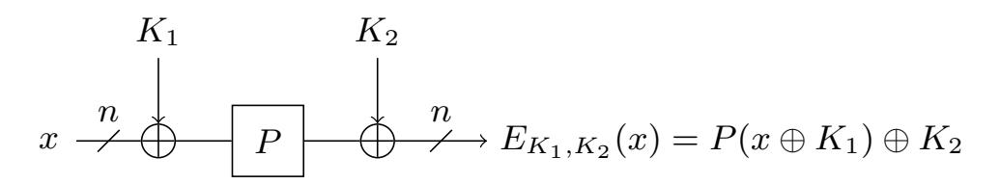

Fig. 2: The Even-Mansour construction. P is a public permutation.

**FX construction.** The FX construction [45] is a simple way to extend the key length of a block cipher: it adds two whitening keys, at the input and the output of the cipher, as presented on Figure 3.

<span id="page-3-1"></span>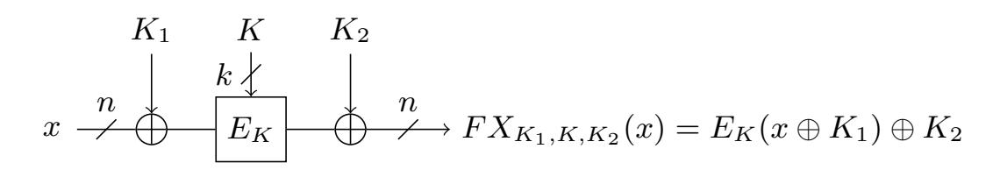

Fig. 3: The FX construction.  $E_K$  is a block cipher.

#### <span id="page-3-2"></span>2.3 Target constructions

Chaskey. Chaskey [52] is a lightweight MAC oriented to 32-bits architectures. It uses a mode that can be seen as a combination of Even-Mansour and CBC-MAC, described in Figure 4, with a 128-bit ARX permutation  $\pi$ .

It uses a 128-bit key K, from which the key  $K_1$  is derived:  $K_1 = 2K$ , with a multiplication in the finite field  $\mathbb{F}_2[X]/(X^{128} + X^7 + X^2 + X + 1)$ .

It outputs a t-bit tag, with  $t \leq 128$  specified by the user. In the original design, the permutation contained 8 rounds. As the 7-rounds permutation happened to be broken [50], Chaskey with a 12-rounds permutation is included in the standard ISO/IEC 29192-6 [39].

Chaskey has a data limitation of  $2^{48}$  message blocks with the same key, which corresponds to  $2^{55}$  bits.

Classical security. Because of the Even-Mansour construct, Chaskey can be attacked with a time-data tradeoff that satisfies  $TD \geq 2^{128}$ , which is why the data is limited to  $2^{48}$  blocks.

{4}------------------------------------------------

<span id="page-4-0"></span>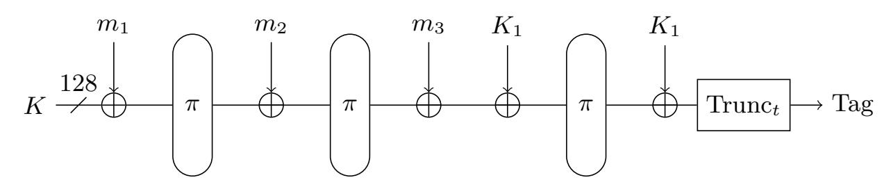

Fig. 4: Chaskey mode for a message of 3 blocks.

**PRINCE.** PRINCE [15] is a low-latency block cipher, with a 64 bit block size and a 128 bit key, split into two 64-bit keys,  $K_0$  and  $K_1$ . It follows the FX construction, as presented in Figure 5.

<span id="page-4-1"></span>Notably, some microcontrollers use PRINCE to encrypt memory [56].

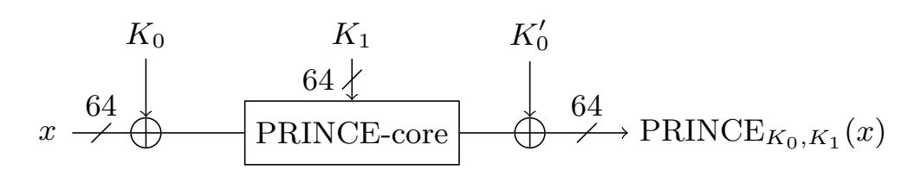

Fig. 5: The PRINCE cipher.  $K'_0 = (K_0 \gg 1) \oplus (K_0 \gg 63)$ .

Classical security. PRINCE claims a data-time tradeoff of  $TD \geq 2^{126}$ . It has been analyzed extensively [42,60,28,21,25,24,57,32], and so far the claim holds.

Very recently, a new version of PRINCE, PRINCEv2 [17] was proposed. While this new version is very close to PRINCE, it does not have the FX structure, and each round uses alternatively  $K_0$  or  $K_1$ . This makes PRINCEv2 immune to the attack we present here.

**Elephant.** Elephant [6] is an authenticated encryption with associated data (AEAD) scheme, and a 2nd-round candidate in the NIST lightweight authenticated encryption competition [54]. It is a block-oriented construction whose encryption shares some similarities with the counter mode, with an encrypt-then-MAC authentication.

Elephant uses a 128-bit key K and a 96-bit nonce N. It comes in 3 variants, with a different permutation P and a different security level:

**Elephant-160** uses the 160-bit permutation SPONGENT- $\pi$ [160] [9]. Its expected classical security is  $2^{112}$  with data limited to  $2^{53}$  bits processed.

**Elephant-176** uses the 176-bit permutation SPONGENT- $\pi$ [176] [9]. Its expected classical security is  $2^{127}$  with a data limited to  $2^{53}$  bits processed.

**Elephant-200** uses the 200-bit permutation Keccak-f[200] [5]. Its expected classical security is  $2^{127}$  with a data limited to  $2^{77}$  bits processed.

{5}------------------------------------------------

<span id="page-5-0"></span>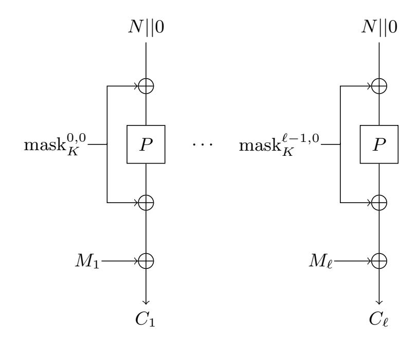

Fig. 6: Elephant encryption of the message  $(M_i)$ .

The encryption of a message is presented on Figure 6. The mask values are computed from the expanded key K' = P(K||0), and two LFSR  $\phi_a$  and  $\phi_b$ :

$$\operatorname{mask}_{K}^{i,j} = \phi_{b}^{(j)} \circ \phi_{a}^{(i)}(K')$$

For encryption, only j=0 is used. Masks with j=1 and j=2 are used to compute the tag.

A new version of Elephant, Elephant v2 [7], has been proposed for the third round of the NIST lightweight competition. There are only two differences between the versions: the encryption uses masks with j=1 for encryption, and the tag computation is different. This does not affect our attack.

#### 2.4 Generic attacks

There are two types of attacks that can always be applied on the structures we're attacking.

**Key search.** As the constructions contain some secret material, it is possible to brute-force it. Classically, this will cost  $2^k$  computations of the construction.

Its quantum equivalent uses amplitude amplification [18] to recover the key, and requires  $\frac{\pi}{2}2^{k/2}$  computations of the construction, assuming one computation can uniquely identify the key.

Collision finding. The Even-Mansour construction can be attacked by looking for collisions [26]: let's consider that we have queried  $2^d$  Even-Mansour encryptions. For any  $\delta$ , we can compute a list of elements of the form

$$E_{K_1,K_2}(x) \oplus P(x \oplus \delta) = P(x \oplus K_1) \oplus P(x \oplus \delta) \oplus K_2$$

{6}------------------------------------------------

If the list happens to contain two messages x, y such that x ⊕ y ⊕ δ = K1, then we have P(x⊕δ) = P(y⊕K1) and conversely P(y⊕δ) = P(x⊕K1). Hence, the list will contain a collision.

As the list is of size 2<sup>d</sup> , this will occur with probability 22d−n, which means we need to try 2n−2<sup>d</sup> distinct δ. Overall, as one try costs 2<sup>d</sup> , the total time cost is T = 2n/2 d , with 2<sup>d</sup> data, for a tradeoff of DT = 2n.

Quantum version. There are multiple quantum algorithms to compute collisions. The most well known matches the query lower bound of Ω 2 n/3 [\[19\]](#page-27-11). It however requires the QRAM model, and there is no known time-efficient implementation of this algorithm.

More recently, a quantum algorithm based on distinguished points has been proposed [\[22\]](#page-27-12), with a time cost in O 2 2n/5 or O 2 3n/7 , depending whether one of the colliding functions can be queried quantumly or not. This algorithm was used in [\[37\]](#page-28-12) to propose quantum attacks on Even-Mansour with the tradeoff DT<sup>6</sup> = 23n.

Collisions for FX. The FX construction can be attacked simply by checking wether or not the Even-Mansour attack works given an inner key guess. This changes the tradeoffs, replacing n with n + k.

Remark 1. One may consider that searching for the key will always be more expensive than looking for collisions. This is not always the case: collision-finding depends on the state size, and key search on the key size (though the two are often equal).

Remark 2. The classical security claims of our target constructions match the tradeoff DT = 2<sup>n</sup> or DT = 2n+<sup>k</sup> .

# <span id="page-6-0"></span>3 The offline Simon's algorithm

The following sections present the algorithmic core of our attacks, which amounts to finding a periodic function.

Definition 1 (Periodic function). Let f : {0, 1} <sup>n</sup> → X be a function. f is periodic if there exists an s such that for all x, f(x) = f(x ⊕ s).

<span id="page-6-1"></span>From an abstract point of view, our attacks can be seen as instances of the following problem:

Problem 1 (Offline Simon's problem). Let f : {0, 1} <sup>k</sup> × {0, 1} <sup>n</sup> → {0, 1} <sup>m</sup> and E : {0, 1} <sup>n</sup> → {0, 1} <sup>m</sup> be functions, with s ∈ {0, 1} <sup>n</sup>, c ∈ {0, 1} <sup>m</sup> such that there exist a unique i<sup>0</sup> ∈ {0, 1} <sup>m</sup> such that E(x) = f(i0, x ⊕ s) ⊕ c. Find i<sup>0</sup> and s.

Solving this problem reduces to finding a periodic function, as the function E(x)⊕f(i0, x) has period s. Here, E will be a secret function (a block cipher, for example) that we can only query classically, and f will be computable quantumly.

{7}------------------------------------------------

#### Simon's algorithm 3.1

Simon's algorithm [59] solves the following problem in polynomial time:

Problem 2 (Simon's Problem). Let n be an integer and X a set. Let  $f: \{0,1\}^n \to \mathbb{R}$ X be a function such that for all  $(x,y) \in (\{0,1\}^n)^2$  with  $x \neq y$ ,  $[f(x) = f(y) \Leftrightarrow$  $x = y \oplus s$ ]. Given oracle access to f, find s.

It does so using Circuit 1, which is described as Algorithm 1.

# <span id="page-7-0"></span>Circuit 1 Simon's circuit

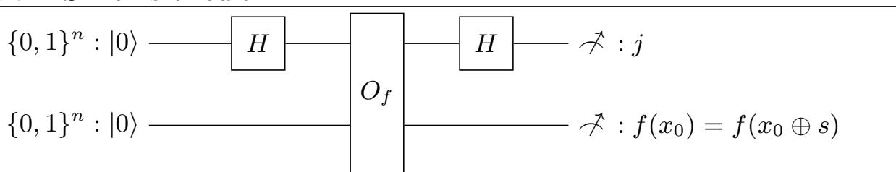

### <span id="page-7-1"></span>Algorithm 1 Simon's routine

**Input:**  $n, O_f: |x\rangle |0\rangle \mapsto |x\rangle |f(x)\rangle$  with  $f: \{0,1\}^n \to X$  a Simon function **Output:** j with  $j \cdot s = 0$ 

- 1: Initialize two n-bits registers :  $|0\rangle |0\rangle$
- 2: Apply H gates on the first register, to compute  $\sum_{x=0}^{2^n-1} |x\rangle |0\rangle$  3: Apply  $O_f$ , to compute  $\sum_{x=0}^{2^n-1} |x\rangle |f(x)\rangle$
- 4: Reapply H gates on the register, to compute

$$\sum_{x=0}^{2^{n}-1} \sum_{j=0}^{2^{n}-1} (-1)^{x \cdot j} |j\rangle |f(x)\rangle$$

5: We can factor the x that have the same f(x), and rewrite the state as

$$\sum_{x \in \{0,1\}^n/(s)} \sum_{j=0}^{2^n - 1} \left( (-1)^{x \cdot j} + (-1)^{(x \oplus s) \cdot j} \right) |j\rangle |f(x)\rangle$$

6: Measure j, f(x), return them.

Now, from Algorithm 1, we see that the j we can measure must fulfill  $(-1)^{x\cdot j}+(-1)^{(x\oplus s)\cdot j}\neq 0$ , that is,  $s\cdot j=0$ . Hence, this routine can only produce values orthogonal to the secret.

Remark 3. If the function is not periodic, then random values will be measured, and the set of values can be of rank n.

{8}------------------------------------------------

Full algorithm. From this circuit, we recover the complete value of s by obtaining O(n) queries, and using linear algebra classically to compute s.

Reversible implementations of Simon's algorithm. Without the final measurement, [Algorithm 1](#page-7-1) becomes a reversible quantum circuit that computes in its first register the uniform superposition of values orthogonal to s. Hence, if we apply it multiple times in parallel, we can reversibly compute the value of s, assuming we also have a quantum circuit for the linear algebra. We present such a circuit in [Section 5.](#page-14-0)

Simon's algorithm as a distinguisher. As Simon's algorithm can compute a period, it can also determine wether a given function is periodic or not. With enough sampled vectors, their rank will be at most n − 1 if the function is periodic, and will likely be n if the function is not. This principle can be used in quantum distinguishers.

# 3.2 Grover-meets-Simon

The Grover-meets-Simon algorithm [\[49\]](#page-29-2) performs a quantum search that uses Simon's algorithm to identify the correct guess. This is possible as Simon's algorithm can be implemented reversibly. Grover-meets-Simon solves the following problem:

<span id="page-8-1"></span>Problem 3 (Search for a periodic function). Let n be an integer and X a set. Let f : {0, 1} <sup>k</sup> × {0, 1} <sup>n</sup> → X be a function such that there exists a unique i<sup>0</sup> such that f(i0, ·) is periodic. Find i<sup>0</sup> and the period of f(i0, ·).

[Algorithm 2](#page-8-0) solves this problem by simply testing wether or not the function f(i, ·) is periodic, using Simon's algorithm as in [Circuit 2.](#page-9-0)

This algorithm has a cost of O n2 k/2 queries and O n 32 k/2 time, as each iteration of the quantum search requires an application of Simon's algorithm, which needs O (n) queries plus O n 3 for the linear algebra.

#### <span id="page-8-0"></span>Algorithm 2 Grover-meets-Simon algorithm [\[49\]](#page-29-2)

```
1: amplify i ∈ {0, 1}
                k with
2: Apply Simon's algorithm on f(i, ·)
3: b ← the period is not 0 . Vector set of rank < n
4: if b then
5: Do a phase shift
6: end if
7: Uncompute Simon's algorithm
8: end amplify
```

{9}------------------------------------------------

#### <span id="page-9-0"></span>Circuit 2 Simon's circuit in Grover-meets-Simon

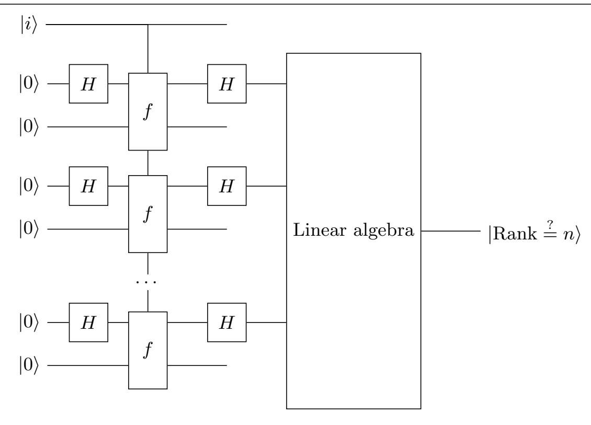

Note: Ancilla qubits and unused outputs are not represented.

#### 3.3 The offline Simon's algorithm

We can see [Problem 1,](#page-6-1) the Offline Simon's problem, as a special case of [Prob](#page-8-1)[lem 3,](#page-8-1) a search for a periodic function, and solve it with [Algorithm 2.](#page-8-0) Indeed, if we have E(x) = f(i0, x ⊕ s) ⊕ c, then the function E(x) ⊕ f(i, x) will be periodic if and only if i = i0, and its period will be s. The main limitation of this approach is that we need quantum query access to the periodic function, which is not possible if the function E is only accessible classically.

The offline Simon's algorithm [\[12\]](#page-26-4) proposes two improvements over the Grovermeets-Simon algorithm to overcome this restriction.

Reusing quantum queries. The first improvement comes from the fact that the periodic function, E(x) ⊕ f(i, x), has a very specific two-part structure, where the function E(x) is independent of i. This means each occurence of the Simon test makes the exact same query to E. This allows a slightly different approach for the Simon test: the queries to E are done once at the beginning of the procedure, and then reused for each test, as shown in [Algorithm 3,](#page-11-1) which uses [Circuit 3](#page-10-0) instead of [Circuit 2.](#page-9-0)

This new approach reduces the number of quantum queries to E from exponential to polynomial.

Using classical queries. The second improvement computes the states

$$\sum_{x} |x\rangle |E(x)\rangle$$

{10}------------------------------------------------

<span id="page-10-0"></span>Circuit 3 Simon Circuit in the offline Simon's algorithm

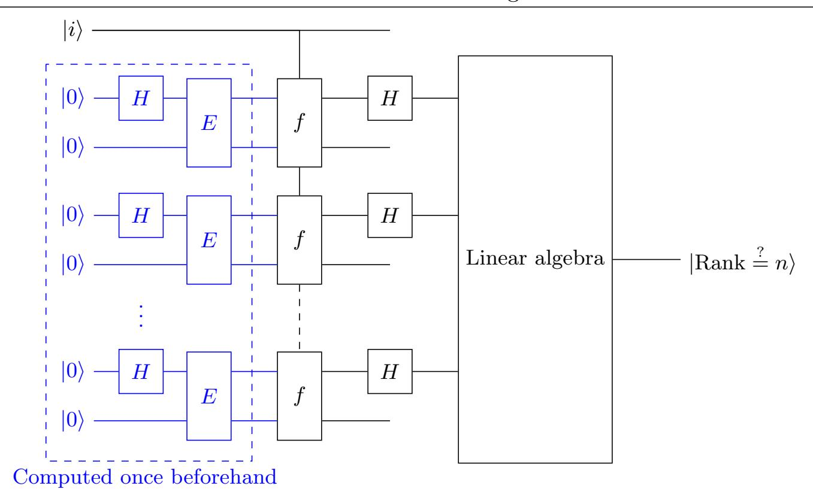

Note: Ancilla qubits and unused outputs are not represented.

from classical queries. We can do this if we know *all* the values of E(x). In that case, computing the superposition corresponds to making a QRAM query to the classical values. Because we are in the circuit model, this costs  $2^n$  classical queries and  $\mathcal{O}(2^n)$  quantum computations. We use an optimized circuit from [2].

# 3.4 Simon's algorithm with additional collisions and concrete estimates

In practice, the promise of Simon's algorithm is only partially fulfilled: for the periodic functions we consider, we can have f(x) = f(y) and  $x \neq y \oplus s$ . This impacts Simon's algorithm, but [11] shows that for almost all functions, the cost overhead is negligible, via the following theorem:

<span id="page-10-1"></span>**Theorem 1 ([11, Theorem 14]).** Assume that  $m \ge \log_2(4e(n+k+\alpha+1))$  and  $k \ge 7$ . The fraction of functions in  $\{0,1\}^k \times \{0,1\}^n \to \{0,1\}^m$  such that the offline Simon's algorithm, repeating  $\frac{\pi}{4\arcsin\sqrt{2^{-k}}}$  iterations with  $n+k+\alpha+1$  queries per iteration, succeeds with probability lower than

$$1 - 2^{-\alpha} - \left(2^{-\alpha/2+1} + 2^{-\alpha} + 2^{-k/2+1}\right)^2,$$

is lower than  $2^{n+k-\frac{2^n}{4(n+k+\alpha+1)}}$ .

Theorem 1 tells us that Simon's algorithm needs only  $(n+k+\alpha+1)$  queries, and it allows us to use functions with a small output size, which roughly halves

{11}------------------------------------------------

#### <span id="page-11-1"></span>Algorithm 3 The Offline Simon's algorithm [\[12\]](#page-26-4)

1: Query m times E, to compute

$$|\psi^{m}\rangle = \bigotimes_{j=1}^{m} \sum_{x} |x\rangle |E(x)\rangle$$

2: amplify i ∈ {0, 1} <sup>k</sup> with

3: From |ψ <sup>m</sup>i, compute m times

$$\sum_{x} |x\rangle |E(x) \oplus f(i,x)\rangle$$

4: Apply H on the input registers

5: Compute the rank of the values in the input registers

6: if the rank is lower than n then

7: Do a phase shift

8: end if

9: Uncompute steps 5 to 3.

10: end amplify

the required number of qubits and slightly reduces the computational cost of f. This approach shares some similarities with the oracle compression technique from [\[51\]](#page-29-13). We however do not consider a random set of functions applied to the output, but a carefully chosen function such that the overall computational cost is minimized.

## <span id="page-11-0"></span>4 Quantum Simon-based attacks

Since the seminal Simon-based distinguisher on the 3-round Feistel construction of Kuwakado and Morii [\[46\]](#page-28-3), many attacks that use Simon's algorithm have been proposed. We present here the Simon-based attacks on the Even-Mansour and FX constructions, and detail how we instantiate them for the primitives presented in [subsection 2.3.](#page-3-2)

#### 4.1 Attack on Even-Mansour

For Even-Mansour constructions, we can consider the function

$$E_{K_1,K_2}(x) \oplus P(x) = P(x) \oplus P(x \oplus K_1) \oplus K_2$$
,

which has period K1. Hence, with access to quantum queries, Simon's algorithm can recover K<sup>1</sup> in polynomial time, from which it is trivial to recover K2. This was proposed in [\[47\]](#page-29-14).

{12}------------------------------------------------

#### 4.2 Attack on the FX construction

The quantum attack against the FX construction proposed in [49] is based on a simple idea: if the key is known, then this reduces to an Even-Mansour, and the previous attack applies. In more details, the function

$$FX_{K_1,K,K_2}(x) \oplus E_i(x) = E_i(x) \oplus E_K(x \oplus K_1) \oplus K_2$$

has period  $K_1$  if and only if i = K. Hence, with quantum query access, we can apply the Grover-meets-Simon algorithm to recover K and  $K_1$  in time  $\mathcal{O}\left(2^{k/2}\right)$  if |K| = k.

#### 4.3 Offline version

The previous attacks can be adapted to classical-query attacks thanks to the offline Simon's algorithm, as proposed in [12].

Offline attack on the FX construction. The periodic function of the FX construction directly fits the structure of Problem 1, with  $E = FX_{K_1,K,K_2}$  and  $f(i,x) = E_i(x)$ . Hence, we can attack the FX construction on a block cipher of n bits with a k-bit key in  $2^n$  classical queries and time  $\mathcal{O}(\max(2^n, 2^{k/2}))$ .

Offline attack on Even-Mansour. We cannot directly apply the previous attack, as it would require  $2^n$  classical queries. However, if we fix n-u bits in the input of the cipher, we can still obtain a periodic function:

$$E_{K_1,K_2}(x||0^{n-u}) \oplus P(x||y) = P(x||y) \oplus P(x \oplus K_1^1||K_1^2) \oplus K_2$$

with  $K_1^1$  the first n-u bits of  $K_1$ , and  $K_1^2$  its last u bits. This function is periodic if and only if  $y = K_1^2$ . Hence, we can apply the offline Simon's algorithm, at a cost of  $\mathcal{O}(2^u)$  classical queries, and  $\mathcal{O}\left(\max\left(2^u,2^{(n-u)/2}\right)\right)$  quantum time. In this case we can choose u, and the cost will be minimal for  $u \sim n/3$ .

Remark 4 (Truncation, affine spaces). Technically, the input is not required to be of the form  $(x||0^{n-u})$ . The attack can work with any u-dimensional affine space. In particular, for any fixed c, we can take all the inputs of the form (x||c).

Remark 5 (Truncation for the FX attack). We can also apply this input truncation technique to the FX attack. This can balance the costs if n > k/2.

Concrete estimates. We rely on Theorem 1 for concrete query estimates. We chose  $\alpha = 9$ , as this will ensure a success probability of around 99%. In all the instances we consider, we have  $n + k \leq 200$ . Hence, an output size of m = 11 bits will be sufficient for our purposes.

{13}------------------------------------------------

#### 4.4 Attack on Chaskey

We attack Chaskey with a one-block message, which degenerates into a truncated Even-Mansour:

$$\operatorname{Chaskey}(m_1) = \operatorname{Trunc}_t \left( \pi(m_1 \oplus K \oplus K_1) \oplus K_1 \right)$$

From Theorem 1 the attack does not require the full output, so the truncation is not an issue. However, for some of the circuit optimizations in subsection 6.3, we assume  $t \geq 96$ .

We can directly apply the Even-Mansour offline attack. We do a chosen-plaintext attack, and query classically the MAC of the  $2^u$  128-bit messages of the form  $0^{n-u}*$ .

Then the quantum attack recovers the value of  $K \oplus K_1$ . As  $K_1 = 2K$ , we have  $K \oplus K_1 = 3K$ . Thus, we can divide by 3 in the finite field to recover the key K, which is the master key.

#### 4.5 Attack on PRINCE

We can directly apply the FX attack to PRINCE. We do a chosen-plaintext attack, and classically query the encryption of  $2^u$  64-bit messages of the form  $0^{n-u}*$ . Then the quantum attack recovers  $K_0$  and  $K_1$ , which correspond to the full PRINCE key.

#### 4.6 Attack on Elephant

To attack Elephant, we consider the encryption of a single-block message:

$$E_K(M) = P\left((N||0) \oplus \operatorname{mask}_K^{0,0}\right) \oplus \operatorname{mask}_K^{0,0} \oplus M$$
.

This is an Even-Mansour, but the input is the nonce, not the message. Hence, with only known plaintexts, we can gain access to the values we need. To make the attack work, we need to have a set of  $2^u$  nonces that form an affine space. This is no obstacle to the attack, since Elephant's security proofs assume the adversary can choose nonces as long as they do not repeat. Interestingly, if the adversary has no control of the nonces but the nonce is incremented between each query, then the nonces will still from an affine space and the attack will go through.

As we have an Even-Mansour construction, we can apply the offline Simon attack, which will recover the value of  $\operatorname{mask}_K^{0,0} = K' = P(K||0)$ . This expanded key is sufficient to compute all the masks in Elephant. Moreover, as P is a permutation, we can also recover the 128-bit master key K.

{14}------------------------------------------------

# <span id="page-14-0"></span>5 A quantum circuit to solve boolean linear equations

In this section, we present a quantum algorithm that can compute, given m n-bit vectors as input, the rank of their span or a basis of its dual. At its core, it uses Algorithm 4, which computes a basis of the span in triangular form. From this we can easily compute the rank or any orthogonal vector.

Figure 7 represents the qubits in the algorithm.

<span id="page-14-2"></span>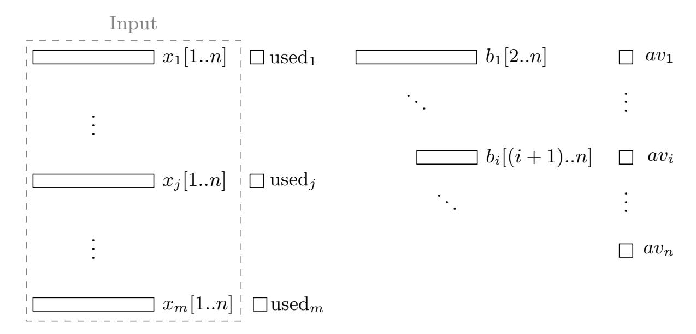

Fig. 7: Abstract memory layout. Input is the  $x_j[1..n]$ , all other qubits are set to 0 except  $av_i$  which is set to 1. used<sub>j</sub> states whether the vector has been put in the basis.  $av_i$  states whether the basis contains a vector of the form  $0^{i-1}1*$ . The \* part is stored in  $b_i[(i+1)..n]$ .

#### <span id="page-14-1"></span>Algorithm 4 Triangular basis computation

```
1: for i from 1 to n do
 2:
        for j for 1 to m do
                                                            \triangleright Do we need to insert x_j to b_i?
            used_j = used_j + x_j[i] \wedge av_i
 3:
            av_i = av_i + x_j[i] \land \text{used}_j
                                                                \triangleright Set av_i to 0 if we insert x_j.
 4:
 5:
            if used_j then
                                                                              \triangleright Insert x_j to b_i.
                b_i[(i+1)..n] = b_i[(i+1)..n] + x_j[(i+1)..n]
 6:
 7:
            end if
                                                        \triangleright Reduce the vector using the basis.
 8:
            if x_i[i] then
9:
              x_j[(i+1)..n] = x_j[(i+1)..n] + b_i[(i+1)..n]
10: x_{j|} end if
11:
        end for
12: end for
```

{15}------------------------------------------------

**Definition 2.** We let (i,j) denote the jth iteration of the inner loop in the ith iteration of the outer loop. We use the partial order  $(i,j) \leq (k,l) \Leftrightarrow i \leq k \land j \leq l$ , and assume that (i,j) occurred before (k,l) if (i,j) < (k,l).

**Theorem 2 (Correctness of Algorithm 4).** We let  $\beta_i$  denote the vector  $0^{i-1} || \overline{av_i} || b[(i+1)..n] \in \{0,1\}^n$ , with the values of  $av_i$ , b[(i+1)..n] at the end of Algorithm 4. Then  $\langle x_j \rangle = \langle \beta_i \rangle$ .

*Proof.* To prove the correctness of the algorithm, we begin with the following lemma:

**Lemma 1 (Algorithm invariants).** At the beginning of (i, j), if  $av_i = 1$ , then  $b_i[i+1..n] = 0^{n-i}$ . If  $used_j = 1$ , then  $x_j[i..n] = 0^{n-i+1}$ .

*Proof.* We prove this by induction over (i, j). We do not enforce a total order on the iterations. Here, we only need that each (i, j) is computed atomically; that is, we cannot have parallel iterations with the same i or j, and we enforce that (i, j) occurs after (k, l) for all (k, l) < (i, j).

At the beginning of (0,0),  $av_i = 1$  and  $used_j = 0$ , hence the lemma holds. Assume that at the beginning of (i,j), the lemma holds. We now want to prove that it will still hold at the end.

- If  $x_j[i] = 0$ , used<sub>j</sub> and  $av_i$  stay invariant. Step 5 updates  $b_i[(i+1)..n]$  if and only if used<sub>j</sub> = 1. By the induction hypothesis,  $x_j[i..n] = 0$ , sp  $b_i[(i+1)..n]$  is unchanged.
- If  $x_j[i] = 1$ , we must have used<sub>j</sub> = 0, by the induction hypothesis.
  - If  $av_i = 0$ , used<sub>j</sub> is not updated, hence  $av_i$  is also not updated.
  - If  $av_i = 1$ , then  $b_i[(i+1)..n] = 0$ . We have used<sub>j</sub> set to 1 at Step 3,  $av_i$  set to 0 at Step 4 and  $b_i[(i+1)..n]$  is set to  $x_j[(i+1)..n]$  at Step 5. Step 8 reduces  $x_j[(i+1)..n]$  with  $b_i[(i+1)..n] = x_j[(i+1)..n]$ . Hence,  $x_j[(i+1)..n] = 0$ , and we have that for all k > i,  $x_j[k..n] = 0$ .

From this, the lemma still holds after (i, j).

**Lemma 2.** Iteration i of the outer for loop sets  $\beta_i$  as the first  $x_j$  with a 1 at position i if any exists, and makes a partial gaussian eliminitation on all the following  $x_j$  using  $\beta_i$ .

*Proof.* At the beginning of iteration i, we must have  $av_i = 1$  and  $\beta_i = 0$ , as these variables did not intervene earlier.

Now, while  $x_j[i] = 0$ , nothing happens (indeed, if used<sub>j</sub> = 1, then  $x_j[(i+1)..n] = 0$ , by the previous lemma).

At the first  $x_j[i] = 1$ , we set  $av_i$  to 0 and  $b_i$  to  $x_j[(i+1)..n]$ . Hence,  $\beta_i = x_j[i]$ . Then,  $av_i$  and  $b_i$  can no longer be modified, and we add b[(i+1)..n] to  $x_j[(i+1)..n]$  if  $x_j[i] = 1$ . This acts as a gaussian elimination on  $x_j$  using  $\beta_i$ .  $\square$ 

<span id="page-15-0"></span>Hence, if we sequentially apply the previous lemma, we get one  $\beta_i$  at each outer for loop, if any such vector exists. In the end, either the vectors are put in  $b_i$  or fully reduced to 0. Hence, the theorem holds.

{16}------------------------------------------------

Remark 6 (Parallel computation). For the correctness of the algorithm, we only need that if (i, j) < (k, l), then (i, j) must be computed before (k, l). This allows us to compute in parallel the steps (i, j) with i + j constant, as they are independent.

#### <span id="page-16-0"></span>5.1 Cost analysis

Qubits. The circuit modifies in-place its m × n qubit input, though it needs m+n(n+ 1)/2 auxiliary qubits for b, used, and av. We also use another n(n−1) auxiliary qubits to reduce the depth of row reductions, as detailed below.

Gate count. Steps [3](#page-14-2) and [4](#page-14-2) require just one Toffoli gate and are repeated mn times. Inserting x<sup>j</sup> at Step [5](#page-14-2) requires n−i Toffoli gates, as does Step [8.](#page-14-2) Summed over all i, and repeated m times, gives a total of mn<sup>2</sup> + mn Toffoli gates to compute the triangular basis.

Depth. As Remark [6](#page-15-0) indicates, we can compute two iterations (i, j) and (i 0 , j<sup>0</sup> ) in parallel if i + j = i <sup>0</sup> + j 0 . Hence, we only need to perform m + n iterations sequentially.

Iteration (i, j) has a naive depth of 2(n−i+ 1) + 2, as inserting and reducing x<sup>j</sup> are controlled by single qubits, so we must apply each Toffoli sequentially. However, we can fan out the control to apply the Toffolis simultaneously. This means a depth of dlog<sup>2</sup> (n − i + 1)e + 4, though this is what requires the extra n(n − 1) auxiliary qubits.

When reducing x<sup>j</sup> , once we have modified x<sup>j</sup> [i + 1], we can begin the next iteration with (i+ 1, j), and reduce x<sup>j</sup> [(i+ 2). . . n] simultaneously. However, the same logic does not apply to inserting x<sup>j</sup> into the basis; we need to finish with used<sup>j</sup> before the next iteration modifies it.

This gives us a total circuit depth of O((m+n) lg(n)). The specific constants will depend on our cost model, the structure of the fanout, and the choice of Toffoli gate. We used linear regression on the results from Q# to estimate the concrete asymptotics.

#### 5.2 Final steps

Rank computation. Once we have the triangular basis, we only need to check if the basis has a full rank, which only requires testing whether all av<sup>i</sup> bits are set to 0.

Computing orthogonal vectors. While this is not directly useful here, given the triangular basis we could easily compute a vector orthogonal to it, at a cost of n CNOT and n <sup>2</sup> − n Toffoli. The idea is to choose the bit i, beginning with the last bit, such that the vector we compute is orthogonal to the basis vectors i to n. As the basis is in triangular form, we can sequentially compute the vector. 

{17}------------------------------------------------

The only freedom we have is on the values we put when the vector i is missing in the basis. If we only need one vector, we can simply put 1 in that case. This is Algorithm 5.

#### <span id="page-17-1"></span>Algorithm 5 Orthogonal vector computation

```
1: for i from n to 1 do

2: out[i] = av_i \triangleright Put a 1 if basis empty

3: for j from i+1 to n do

4: out[i] = out[i] + out[j] \land b_i[j] \triangleright Ensure orthogonality

5: end for

6: end for
```

This needs more work to compute a basis of the dual in a larger dimension, as the pattern of values we choose must form a free family.

**Solving linear equations.** The same approach can solve general boolean systems of linear equations: instead of the equation  $\sum_{i=1}^{n} a_i b_i = \epsilon$ , we can consider  $\sum_{i=1}^{n} a_i b_i + \epsilon b_{n+1} = 0$ , and force the final solution to have  $b_{n+1} = 1$ . If we only need to know if the system is solvable, then we only need to check if  $av_{n+1} = 1$ , as if it is equal to 0, any solution of the equation system must fulfill  $b_{n+1} = 0$ .

# <span id="page-17-0"></span>6 Reversible implementations of quantum primitives

#### 6.1 Design Philosophy

To apply our attack, we implement an operator with the following general shape:

$$|x\rangle |i\rangle |E(x)\rangle \mapsto |x\rangle |i\rangle |E(x) \oplus f(i,x)\rangle$$
.

Thus, there is little reason for us to prefer an in-place encryption algorithm, since we need to preserve the input for proper interference in Simon's algorithm. However, the permutations we consider are all iterated designs containing multiple rounds of some simpler permutation. If a single round is out-of-place, we either need to double our computational cost to uncompute as we proceed, or allocate fresh qubits for every round; hence, we tried to find in-place circuits.

Some permutations use small S-boxes of 4 to 5 bits. We could use a table look-up, but this is out-of-place and has cost linear in the table size (e.g., 16 AND operations for 4 bits). Instead we found optimized in-place circuits, inspired by masked implementations of block ciphers, which also use a model in which XOR is cheap and AND is expensive.

In depth-limited Grover-like algorithms, the most efficient oracle design makes strong trade-offs of depth against width. However, the Q# resource estimator will not reuse qubits when optimizing for depth. That is, if each permutation round needed to borrow and release 10 qubits, and a cipher ran for 80 rounds, Q#

{18}------------------------------------------------

would count 800 extra qubits. To avoid this issue, we used a width-optimizing compiler, which always prefers to reuse qubits, even if that means delaying other operations. Thanks to our in-place implementations, neither issue has a large effect on our results.

#### <span id="page-18-0"></span>6.2 Simon-specific optimizations

The primitive circuits we implement have some relaxed constraints, which allows us to compute slightly different (and cheaper) functions.

Shorter output. From [Theorem 1,](#page-10-1) we can afford to have a short output, which will be in practice of 11 bits. This allows us to not compute some of the output bits, and in general we can at least avoid the computation of most of the final non-linear layer.

Linear combination. For our attacks, we have the general property

$$f(i,x) = E(x \oplus s) \oplus c$$
.

We can remark that for any affine function φ, φ ◦ f and φ ◦ E will have the same general property:

$$\phi \circ f(i,x) = \phi \circ E(x \oplus s) \oplus c'$$

Hence, we can apply any affine function to the output of our function (as long as its output is long enough). This actually generalizes the previous property, as truncation is linear.

Overall, we can remove many operations in the last rounds: the ones that either do not influence the bits we're interested in, or only act linearly on them.

Partially fixed input. We can split the variable i on which we do a quantum search into two: y, which corresponds to the part of the message which is fixed, and k, which is a secret we must guess completely. For Even-Mansour, k is empty, and for the FX construction, y can be empty. The general shape is presented on [Figure 8a.](#page-19-1)

Moreover, the design of the function transforms the input in-place and bijectively. This means we can decompose the full function f into f(k, x, y) = f 0 (k, x, g(k, y)), as in [Figure 8b.](#page-19-1) With this specific structure, the output of g will be identical for all the parallel computations of f. As y is guessed by the quantum search, we can afford to only compute g once for all the parallel computations of f. This saves us some computation, depending on how fast the input bits diffuse. We found ways to save part of the first linear layer and a few S-boxes.

We go further and remark that in many cases, the mapping y 7→ g(k, y) will be a permutation. Hence, instead of applying the quantum search to f to find k and y, we search f 0 to find k and g(k, y). Once we find g(k, y) and k, it is easy to invert and find y. This allows us to completely remove all the operations that only operate on the bits of y from the quantum circuit.

{19}------------------------------------------------

<span id="page-19-1"></span>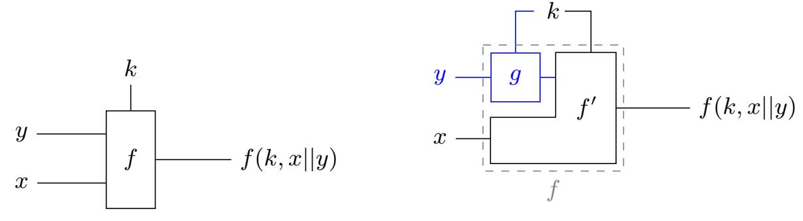

(a) General shape of the functions we implement (b) Structure suitable for optimization

Fig. 8: Functions we use in Simon's algorithm.

Summary. We can leverage the specific structure of the problem to reduce the computational cost of f. These optimizations rely on the limits of the diffusion in some iterated constructions. In practice, for the constructions we considered, they save a cost equivalent to 1 to 2 rounds, which becomes completely negligible for constructions with a very large number of rounds. Nevertheless, these optimizations are independent of the actual implementation of the quantum circuit, and can always be applied.

#### <span id="page-19-0"></span>6.3 Chaskey

The Chaskey permutation has an ARX structure: it uses only XOR, bit rotation, and modular addition. All of these can be implemented in-place on a quantum computer, and efficient circuits for them are already available [\[34\]](#page-28-0). We use the adder with the fewest T operations [\[30\]](#page-27-13). The quantum circuit for the permutation is practically identical to the classical circuit.

Optimizations from Section [6.2](#page-18-0) for a shorter output are particularly effective, detailed in [Circuit 4](#page-20-0) and [5.](#page-20-1) We save a fourth of the operation in the first round thanks to the partially fixed input, shown in [Circuit 4.](#page-20-0) [Circuit 5](#page-20-1) presents the last two rounds of the truncated permutation. Once it is computed, we copy out bits from 5 to 15 and from 37 to 47 into the output register before uncomputing. This has the same effect as the CNOT highlighted in green in [Circuit 5,](#page-20-1) but saves uncomputation. The total effect is 18% in depth and operation savings for 8 rounds and 12.5% for 12 rounds.

#### 6.4 Prince

Internally, PRINCE uses a keyed permutation of 12 rounds, where each round XORs round constants, applies an S-box to each nibble, multiplies the state by a binary matrix, and XORs the key [\(Circuit 6\)](#page-20-2).

We implemented PRINCE in-place with the S-box decomposition from [\[16\]](#page-27-14), which only requires 6 Toffoli operations per S-box [\(Circuit 7\)](#page-21-0).

We perform a PLU decomposition for the linear layer as well as the affine layers in the S-box decomposition, as in [\[40\]](#page-28-5).

{20}------------------------------------------------

<span id="page-20-0"></span>Circuit 4 The Chaskey permutation round. Operations in red can be removed in the first round.

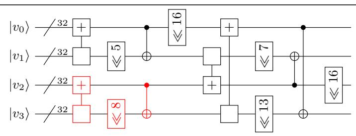

<span id="page-20-1"></span>Circuit 5 The last two rounds of Chaskey's permutation. Operations in red can be removed; those in blue can be inverted with a linear operation applied to the known ciphertexts; the green operation can be done only when copying out; the additions highlighted in purple and the purple CNOT only need the least significant 16 bits.

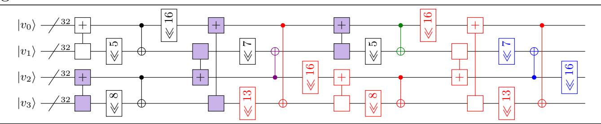

Round 9 only needs to apply the S-box to nibbles 3, 6, 9, and 12. Then in round 10, we only need to use those bits of the key and the round constant. We only apply the part of the linear layer necessary to compute these nibbles, and then the row shift puts these nibbles in the first 16 bits. We finish with an S-box on these bits. This saves us 13.5% of all operations, though provides negligible depth reduction.

<span id="page-20-2"></span>Circuit 6 PRINCE's permutation, where S is the S-box, M is multiplication by a fixed binary matrix M<sup>0</sup> , and RC<sup>i</sup> are round constants.

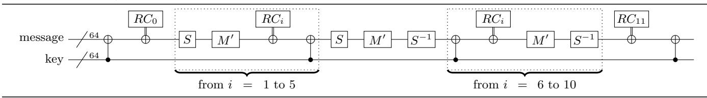

#### 6.5 Elephant-160/176

Elephant-160 and 176 use the spongent permutation [\[9\]](#page-26-8), with respectively 80 and 96 rounds [\(Circuit 8\)](#page-21-1).

The first step of each round is an XOR with a fixed sequence of strings C<sup>i</sup> , which requires only a series of X operations. The next step is an S-box layer. We implemented it in-place using a masking-friendly decomposition that only required 4 Toffoli operations [\(Circuit 9\)](#page-21-2), using the fact that 4 bit S-boxes are

{21}------------------------------------------------

### <span id="page-21-0"></span>Circuit 7 PRINCE's S-box, applied to 4 qubits.

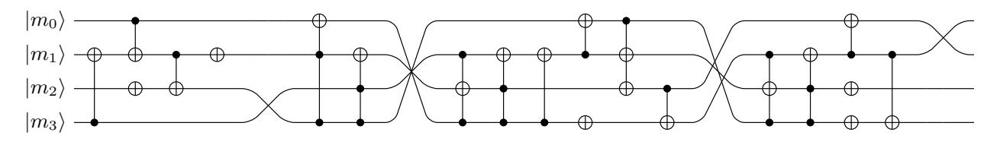

fully classified and their decomposition as a composition of quadratic functions is known [\[20](#page-27-15)[,8,](#page-26-13)[55\]](#page-29-15). The final step is a permutation, which can be done by the classical computer with no extra quantum operations.

Input and output optimizations are less effective here because Elephant repeats so many rounds. We still limit the final layer of the S-box to only the bits we use in the output, resulting in 1.8% and 1.7% operation savings for Elephant-160 and 176, respectively, with no depth improvement.

<span id="page-21-1"></span>Circuit 8 Elephant's permutations.

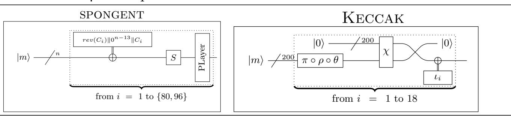

<span id="page-21-2"></span>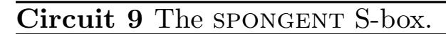

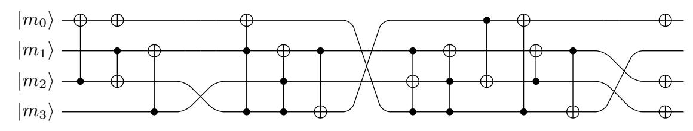

#### 6.6 Elephant-200

Elephant-200 uses a Keccak permutation, with a block length of 200. Each Keccak round starts with 3 linear functions, θ, ρ, and π. We used a PLU decomposition of all three functions to perform them in-place. After these is the non-linear function χ. We adapt the circuit from the Keccak implementation; however, it is out-of-place, so we also adapted a circuit for χ −1 from [\[36\]](#page-28-13) [\(Cir](#page-22-0)[cuit 10\)](#page-22-0). We apply the adjoint of this circuit to uncompute the input to χ, then release these qubits. Since χ −1 is mostly AND operations, their adjoint can be

{22}------------------------------------------------

# <span id="page-22-0"></span>Circuit 10 Keccak's χ function.

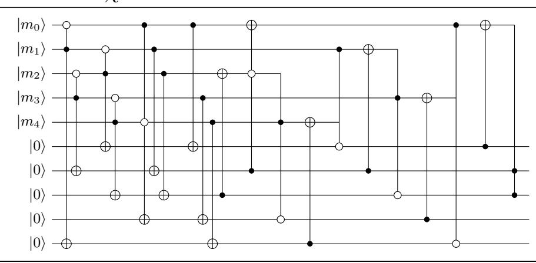

done cheaply using measurements [\[43,](#page-28-14)[30\]](#page-27-13). The final function is ι, which simply XORs a constant onto the state, which requires only X operations.

Here we can also limit the non-linear χ in the last round, for 5% T-operation savings and 1.6% savings over all operations.

| Cipher     | Block |          |                | Operations           | Depth                | Qubits         |                      |     |
|------------|-------|----------|----------------|----------------------|----------------------|----------------|----------------------|-----|
|            | Size  | CNOT     | 1QC            | T                    | M                    | T              | All                  |     |
| Chaskey-8  | 128   | 1.81 · 2 | 14 1.14<br>· 2 | 13 1.63<br>· 2       | 12 1.75<br>· 2       | 10 1.68<br>· 2 | 10 1.37<br>14<br>· 2 | 160 |
| Chaskey-12 | 128   | 1.46 · 2 | 15 1.82<br>· 2 | 13 1.31<br>· 2       | 13 1.38<br>· 2       | 11 1.36<br>· 2 | 11 1.11<br>15<br>· 2 | 160 |
| PRINCE     | 64    | 1.22 · 2 | 15 1.60<br>· 2 | 12 1.68<br>13<br>· 2 | 0                    | 11<br>1.64 · 2 | 7<br>1.09 · 2        | 128 |
|            | 160   | 1.71 · 2 | 18 1.17<br>· 2 | 16 1.34<br>17<br>· 2 | 0                    | 1.56 · 2       | 11 1.29<br>14<br>· 2 | 160 |
| Elephant   | 176   | 1.05 · 2 | 19 1.45<br>· 2 | 16 1.66<br>17<br>· 2 | 0                    | 1.76 · 2       | 11 1.68<br>14<br>· 2 | 176 |
|            | 200   | 1.07 · 2 | 19 1.08<br>· 2 | 16 1.13<br>· 2       | 15 1.72<br>12<br>· 2 | 8<br>1.34 · 2  | 17<br>1.29 · 2       | 400 |

Table 1: Quantum circuit costs for the circuits we analyze. "1QC" are singlequbit Clifford operations and "M" are measurements.

#### 6.7 Quantum Lookups

Constructing the initial database from our offline queries requires a QROM[4](#page-22-1) circuit. We do not assume special, cheap QROM operations (i.e., the QRAM model), but rather give the cost in terms of a Clifford+T simulation of QROM.

With no depth restriction, the cheapest (in total operation count) is due to Babbush et al. [\[2\]](#page-26-11). Berry et al. [\[4\]](#page-26-14) give a version that is cheaper in T-operations and smoothly parallelizes, but since we have no need to parallelize and consider the full operation count, we use only the Babbush et al. QROM circuit.

<span id="page-22-1"></span><sup>4</sup> Also called "QRACM" or "QRAM".

{23}------------------------------------------------

# <span id="page-23-0"></span>7 Attack circuits and estimates

Offline Simon attack. To estimate the total cost of the attack, we estimated the cost at each value of u and chose the minimum cost, up to some specified limit on u. The value of u determines the size of the quantum look-up, which is computed once. We used [Theorem 1](#page-10-1) to determine the necessary linear system size m and computed the cost to repeat the cipher m times in parallel, based on the cost of a single cipher computation from Q#. For PRINCE, which is an FX construction, each parallel repetition needs a copy of the permutation key. However, the permutation key is only infrequently XORed onto the state. With CNOTs, this has depth 1, and can be pipelined efficiently, so we assume the repetitions share the permutation key. This increases the depth by m CNOTs, which is negligible compared to the overall depth of the cipher.

We then estimated the cost of solving an m × n linear system, using costs from [subsection 5.1.](#page-16-0) Once we found the optimal m, we used Q# to get an exact cost of solving the linear system. The code for this estimation is available at <https://github.com/sam-jaques/offline-quantum-period-finding/>.

Our results are in [Table 2](#page-24-0) and [Table 3.](#page-24-1) We include results for Shor's algorithm to attack RSA-2048 and an exhaustive quantum key search on AES-128 for comparison.

Exhaustive Key Search. We also estimated the cost of performing an exhaustive quantum key search on the ciphers, summarized in [Table 4.](#page-24-2) The circuits for these are slightly different, as we need to attack the full encryption, rather than just the permutation. Chaskey and Elephant modify the key slightly before using it. Elephant transforms the key from 128 bits to the block size, so it is much more efficient to modify the key as part of the search oracle and search a 128-bit space, rather than search a key space as large as the full block size.

To ensure a unique key, we need 2 blocks for Chaskey and 3 blocks for PRINCE. We follow the STO approach of [\[23\]](#page-27-1), so that we only need to infrequently check blocks besides the first. This also keeps the qubit requirements low; PRINCE only needs 257 qubits, half of which are only needed as auxiliary qubits for the multi-controlled NOT.

Generic collision attacks. We can remark that in all cases, the total number of quantum gates for the offline Simon's algorithm is close to 2n/2−d/<sup>6</sup> , with 2<sup>d</sup> classical queries, that is, the query cost of the generic offline collision attack. This means the offline Simon's algorithm outperforms the generic attack, since its larger polynomial factor is not an issue for cryptographic parameter sizes.

# 8 Conclusion

A new kind of attack. Quantum exhaustive key search may not be a real threat to symmetric cryptography because of its poor parallelization [\[62,](#page-29-5)[40\]](#page-28-5) and the expected overheads of error correction. However, we showed that there

{24}------------------------------------------------

<span id="page-24-0"></span>

| Target     | Bitlength | Offline | Operations |      | Depth |      | Qubits | Source |
|------------|-----------|---------|------------|------|-------|------|--------|--------|
|            |           | Queries | All        | T    | All   | T    |        |        |
| RSA        | 2048      | –       | –          | 31   | 31    | –    | 12.6   | [31]   |
| Chaskey-8  | 128       | 48      | 64.9       | 64.4 | 56.0  | 53.9 | 14.5   |        |
| Chaskey-12 | 128       | 48      | 65.1       | 64.5 | 56.4  | 54.1 | 14.5   |        |
| PRINCE     | 64        | 48      | 65.0       | 64.5 | 55.2  | 53.8 | 14.0   | ours   |
|            | 160       | 47      | 84.1       | 82.5 | 72.6  | 70.4 | 14.8   |        |
| Elephant   | 176       | 47      | 92.5       | 90.9 | 80.8  | 78.5 | 15.1   |        |
|            | 200       | 69      | 93.6       | 91.7 | 83.7  | 79.3 | 16.4   |        |
| AES        | 128       | 1       | 82.3       | 80.4 | 74.7  | 71.6 | 10.7   | [23]   |

Table 2: Offline Simon attack cost estimates with the recommended query limits, with RSA and AES for comparison. All figures in log base 2 except bitlength.

<span id="page-24-1"></span>

| Target     | Bitlength | Offline | Operations |      | Depth |      | Qubits | Source |
|------------|-----------|---------|------------|------|-------|------|--------|--------|
|            |           | Queries | All        | T    | All   | T    |        |        |
| Chaskey-8  | 128       | 50      | 64.3       | 64.0 | 55.5  | 54.4 | 14.5   |        |
| Chaskey-12 | 128       | 51      | 64.5       | 64.2 | 55.9  | 55.2 | 14.5   |        |
| PRINCE     | 64        | 50      | 64.4       | 64.0 | 55.0  | 54.4 | 14.0   | ours   |
|            | 160       | 63      | 76.9       | 76.3 | 67.3  | 67.1 | 14.8   |        |
| Elephant   | 176       | 68      | 82.6       | 81.7 | 72.4  | 72.1 | 15.1   |        |
|            | 200       | 76      | 90.7       | 89.7 | 81.1  | 80.1 | 16.4   |        |

Table 3: Offline Simon attack costs without a query limit. All figures in log base 2 except bitlength.

<span id="page-24-2"></span>

| Target     | Bitlength | Offline | Operations |      | Depth |      | Qubits | Source |
|------------|-----------|---------|------------|------|-------|------|--------|--------|
|            |           | Queries | All        | T    | All   | T    |        |        |
| Chaskey-8  | 128       | 1       | 80.3       | 77.5 | 79.0  | 75.4 | 8.6    |        |
| Chaskey-12 | 128       | 1       | 80.8       | 78.0 | 79.6  | 75.9 | 8.6    |        |
| PRINCE     | 64        | 1.6     | 80.1       | 78.0 | 75.7  | 73.5 | 8.0    | ours   |
|            | 160       | 0       | 85.1       | 83.1 | 80.2  | 77.3 | 9.6    |        |
| Elephant   | 176       | 0       | 85.4       | 83.4 | 80.4  | 77.5 | 9.8    |        |
|            | 200       | 0       | 85.1       | 81.0 | 83.0  | 74.0 | 10.0   |        |

Table 4: Attack costs of quantum exhaustive key search using an STO approach. All figures in log base 2 except bitlength.

{25}------------------------------------------------

are other avenues of quantum attack that may be more feasible. For example, Chaskey and PRINCE have "only" 33 more bits of quantum security than RSA-2048, widely believed to be completely broken in a post-quantum setting.

Comparing the security of RSA-2048 to Chaskey and PRINCE, we point out that our attack requires less than 4 times as many logical qubits, but many more quantum operations. This means breaking these ciphers will take much longer and require much more coherence than breaking RSA. However, adding more coherence to an already-coherent quantum computer is relatively easy. For surface code error correction, coherence grows exponentially with code distance, and the qubit overhead grows only quadratically [\[29\]](#page-27-2). Moreover, our attacks tend to have a lower depth than quantum search, which may also help its implementation. Thus, we believe that these attacks could be an interesting milestone for quantum computers, much harder than RSA-2048 factoring, but much easier than AES-128 key recovery.

On quantum-safe symmetric cryptography. We found that Chaskey (independently of its number of rounds) and PRINCE have almost identical quantum security. Moreover, the data limitation of Chaskey has a negligible impact on the attack cost and our attacks end up being almost a million times cheaper than the corresponding quantum key search.

Our attack on Elephant is less competitive and requires more quantum operations than the direct key search. This is mainly because our attack targets the state size, and Elephant's key size is smaller. The data limitation also slows our attack, but the cost increase is much smaller than the cost increase of the classical attack. Moreover, this attack shows that to make an Elephant instance with significantly more quantum security than 2<sup>64</sup> queries would require an increase in both the key and the state length. One of Elephant's features compared to other lightweight cryptography candidates is its small state size, so such a change would make it less competitive.

To counteract the offline Simon attack and to achieve quantum security, we recommend:

- Using a large state size, not just a large key size.
- Not relying on data limits, as these have limited impact on quantum attacks.
- Avoiding the Even-Mansour and FX constructions altogether.

For an example of the last idea, the design of the recent PRINCE v2 [\[17\]](#page-27-8) is very close to the original PRINCE, but with a simple key schedule that replaces the FX construction.

Immediate implications. We stress that, like quantum exhaustive key search or factoring, a patient attacker could apply this attack to today's communications, as it is an offline attack: the data can be collected before any quantum computation.

This is especially important for lightweight cryptography, which is intended for use in embedded systems, RFID chips or sensor networks, where an update is either impractical or downright impossible.

{26}------------------------------------------------

Acknowledgements. The authors would like to thank L´eo Perrin for fruitful discussions about S-boxes. Samuel Jaques was supported by the University of Oxford Clarendon fund.

# References

- <span id="page-26-5"></span>1. Almazrooie, M., Samsudin, A., Abdullah, R., Mutter, K.N.: Quantum reversible circuit of AES-128. Quantum Information Processing 17(5) (Mar 2018), [https:](https://doi.org/10.1007/s11128-018-1864-3) [//doi.org/10.1007/s11128-018-1864-3](https://doi.org/10.1007/s11128-018-1864-3)
- <span id="page-26-11"></span>2. Babbush, R., Gidney, C., Berry, D.W., Wiebe, N., McClean, J., Paler, A., Fowler, A., Neven, H.: Encoding electronic spectra in quantum circuits with linear t complexity. Phys. Rev. X 8, 041015 (Oct 2018), [https://link.aps.org/doi/10.1103/](https://link.aps.org/doi/10.1103/PhysRevX.8.041015) [PhysRevX.8.041015](https://link.aps.org/doi/10.1103/PhysRevX.8.041015)
- <span id="page-26-0"></span>3. Banegas, G., Bernstein, D.J., van Hoof, I., Lange, T.: Concrete quantum cryptanalysis of binary elliptic curves. Cryptology ePrint Archive, Report 2020/1296 (2020), <https://eprint.iacr.org/2020/1296>
- <span id="page-26-14"></span>4. Berry, D.W., Gidney, C., Motta, M., McClean, J.R., Babbush, R.: Qubitization of Arbitrary Basis Quantum Chemistry Leveraging Sparsity and Low Rank Factorization. Quantum 3, 208 (Dec 2019), <https://doi.org/10.22331/q-2019-12-02-208>
- <span id="page-26-9"></span>5. Bertoni, G., Daemen, J., Peeters, M., Assche, G.V.: The keccak reference (Jan 2011)
- <span id="page-26-7"></span>6. Beyne, T., Chen, Y.L., Dobraunig, C., Mennink, B.: Elephant v1.1. NIST lightweight competition round 2 candidate (Sep 2019)
- <span id="page-26-10"></span>7. Beyne, T., Chen, Y.L., Dobraunig, C., Mennink, B.: Status update on elephant. NIST lightweight competition (Sep 2020)
- <span id="page-26-13"></span>8. Bilgin, B., Nikova, S., Nikov, V., Rijmen, V., St¨utz, G.: Threshold implementations of all 3 × 3 and 4 × 4 S-boxes. In: Prouff, E., Schaumont, P. (eds.) CHES 2012. LNCS, vol. 7428, pp. 76–91. Springer, Heidelberg (Sep 2012)
- <span id="page-26-8"></span>9. Bogdanov, A., Kneˇzevi´c, M., Leander, G., Toz, D., Varici, K., Verbauwhede, I.: Spongent: A lightweight hash function. In: Preneel, B., Takagi, T. (eds.) CHES 2011. LNCS, vol. 6917, pp. 312–325. Springer, Heidelberg (Sep / Oct 2011)
- <span id="page-26-2"></span>10. Bonnetain, X.: Quantum key-recovery on full AEZ. In: Adams, C., Camenisch, J. (eds.) SAC 2017. LNCS, vol. 10719, pp. 394–406. Springer, Heidelberg (Aug 2017)
- <span id="page-26-12"></span>11. Bonnetain, X.: Tight bounds for simon's algorithm. IACR Cryptol. ePrint Arch. 2020, 919 (2020), <https://eprint.iacr.org/2020/919>
- <span id="page-26-4"></span>12. Bonnetain, X., Hosoyamada, A., Naya-Plasencia, M., Sasaki, Y., Schrottenloher, A.: Quantum attacks without superposition queries: The offline Simon's algorithm. In: Galbraith, S.D., Moriai, S. (eds.) ASIACRYPT 2019, Part I. LNCS, vol. 11921, pp. 552–583. Springer, Heidelberg (Dec 2019)
- <span id="page-26-3"></span>13. Bonnetain, X., Naya-Plasencia, M., Schrottenloher, A.: On quantum slide attacks. In: Paterson, K.G., Stebila, D. (eds.) SAC 2019. LNCS, vol. 11959, pp. 492–519. Springer, Heidelberg (Aug 2019)
- <span id="page-26-1"></span>14. Bonnetain, X., Naya-Plasencia, M., Schrottenloher, A.: Quantum security analysis of AES. IACR Trans. Symm. Cryptol. 2019(2), 55–93 (2019)
- <span id="page-26-6"></span>15. Borghoff, J., Canteaut, A., G¨uneysu, T., Kavun, E.B., Kneˇzevi´c, M., Knudsen, L.R., Leander, G., Nikov, V., Paar, C., Rechberger, C., Rombouts, P., Thomsen, S.S., Yal¸cin, T.: PRINCE - A low-latency block cipher for pervasive computing applications - extended abstract. In: Wang, X., Sako, K. (eds.) ASIACRYPT 2012. LNCS, vol. 7658, pp. 208–225. Springer, Heidelberg (Dec 2012)

{27}------------------------------------------------

- <span id="page-27-14"></span>16. Boˇzilov, D., Kneˇzevi´c, M., Nikov, V.: Optimized threshold implementations: Securing cryptographic accelerators for low-energy and low-latency applications. Cryptology ePrint Archive, Report 2018/922 (2018), [https://eprint.iacr.org/2018/](https://eprint.iacr.org/2018/922) [922](https://eprint.iacr.org/2018/922)
- <span id="page-27-8"></span>17. Boˇzilov, D., Eichlseder, M., Kneˇzevi´c, M., Lambin, B., Leander, G., Moos, T., Nikov, V., Rasoolzadeh, S., Todo, Y., Wiemer, F.: Princev2 - more security for (almost) no overhead (Sep 2020)
- <span id="page-27-9"></span>18. Brassard, G., Høyer, P., Mosca, M., Tapp, A.: Quantum amplitude amplification and estimation. In: Lomo-naco, S.J., Brandt, H.E. (eds.) Quantum Computation and Information, AMS Contemporary Mathematics 305 (2002)
- <span id="page-27-11"></span>19. Brassard, G., Høyer, P., Tapp, A.: Quantum cryptanalysis of hash and clawfree functions. In: Lucchesi, C.L., Moura, A.V. (eds.) LATIN '98: Theoretical Informatics, Third Latin American Symposium, Campinas, Brazil, April, 20-24, 1998, Proceedings. vol. 1380, pp. 163–169. Springer, Heidelberg (1998), [https:](https://doi.org/10.1007/BFb0054319) [//doi.org/10.1007/BFb0054319](https://doi.org/10.1007/BFb0054319)
- <span id="page-27-15"></span>20. Canni`ere, C.D.: Analysis and Design of Symmetric Encryption Algorithms. Ph.D. thesis (2007)
- <span id="page-27-5"></span>21. Canteaut, A., Fuhr, T., Gilbert, H., Naya-Plasencia, M., Reinhard, J.R.: Multiple differential cryptanalysis of round-reduced PRINCE. In: Cid, C., Rechberger, C. (eds.) FSE 2014. LNCS, vol. 8540, pp. 591–610. Springer, Heidelberg (Mar 2015)
- <span id="page-27-12"></span>22. Chailloux, A., Naya-Plasencia, M., Schrottenloher, A.: An efficient quantum collision search algorithm and implications on symmetric cryptography. In: Takagi, T., Peyrin, T. (eds.) ASIACRYPT 2017, Part II. LNCS, vol. 10625, pp. 211–240. Springer, Heidelberg (Dec 2017)
- <span id="page-27-1"></span>23. Davenport, J.H., Pring, B.: Improvements to quantum search techniques for blockciphers, with applications to AES (Sep 2020)
- <span id="page-27-7"></span>24. Derbez, P., Perrin, L.: Meet-in-the-middle attacks and structural analysis of roundreduced PRINCE. In: Leander, G. (ed.) FSE 2015. LNCS, vol. 9054, pp. 190–216. Springer, Heidelberg (Mar 2015)
- <span id="page-27-6"></span>25. Dinur, I.: Cryptanalytic time-memory-data tradeoffs for FX-constructions with applications to PRINCE and PRIDE. In: Oswald, E., Fischlin, M. (eds.) EURO-CRYPT 2015, Part I. LNCS, vol. 9056, pp. 231–253. Springer, Heidelberg (Apr 2015)
- <span id="page-27-10"></span>26. Dunkelman, O., Keller, N., Shamir, A.: Minimalism in cryptography: The Even-Mansour scheme revisited. In: Pointcheval, D., Johansson, T. (eds.) EURO-CRYPT 2012. LNCS, vol. 7237, pp. 336–354. Springer, Heidelberg (Apr 2012)
- <span id="page-27-3"></span>27. Even, S., Mansour, Y.: A construction of a cipher from a single pseudorandom permutation. Journal of Cryptology 10(3), 151–162 (Jun 1997)
- <span id="page-27-4"></span>28. Fouque, P.A., Joux, A., Mavromati, C.: Multi-user collisions: Applications to discrete logarithm, Even-Mansour and PRINCE. In: Sarkar, P., Iwata, T. (eds.) ASI-ACRYPT 2014, Part I. LNCS, vol. 8873, pp. 420–438. Springer, Heidelberg (Dec 2014)
- <span id="page-27-2"></span>29. Fowler, A.G., Mariantoni, M., Martinis, J.M., Cleland, A.N.: Surface codes: Towards practical large-scale quantum computation. Phys. Rev. A 86, 032324 (Sep 2012), <https://link.aps.org/doi/10.1103/PhysRevA.86.032324>
- <span id="page-27-13"></span>30. Gidney, C.: Halving the cost of quantum addition. Quantum 2, 74 (Jun 2018), <https://doi.org/10.22331/q-2018-06-18-74>
- <span id="page-27-0"></span>31. Gidney, C., Eker˚a, M.: How to factor 2048 bit RSA integers in 8 hours using 20 million noisy qubits (May 2019), <http://arxiv.org/abs/1905.09749>, arXiv: quant-ph/1905.09749

{28}------------------------------------------------

- <span id="page-28-11"></span>32. Grassi, L., Rechberger, C.: Practical low data-complexity subspace-trail cryptanalysis of round-reduced PRINCE. In: Dunkelman, O., Sanadhya, S.K. (eds.) INDOCRYPT 2016. LNCS, vol. 10095, pp. 322–342. Springer, Heidelberg (Dec 2016)
- <span id="page-28-6"></span>33. Grassl, M., Langenberg, B., Roetteler, M., Steinwandt, R.: Applying grover's algorithm to aes: Quantum resource estimates. In: Proceedings of the 7th International Workshop on Post-Quantum Cryptography - Volume 9606. p. 29–43. PQCrypto 2016, Springer-Verlag, Berlin, Heidelberg (2016), [https://doi.org/](https://doi.org/10.1007/978-3-319-29360-8_3) [10.1007/978-3-319-29360-8\\_3](https://doi.org/10.1007/978-3-319-29360-8_3)
- <span id="page-28-0"></span>34. H¨aner, T., Jaques, S., Naehrig, M., Roetteler, M., Soeken, M.: Improved quantum circuits for elliptic curve discrete logarithms. In: Ding, J., Tillich, J.P. (eds.) Post-Quantum Cryptography - 11th International Conference, PQCrypto 2020. pp. 425– 444. Springer, Heidelberg (2020)
- <span id="page-28-1"></span>35. H¨aner, T., Roetteler, M., Svore, K.M.: Factoring using 2n + 2 qubits with toffoli based modular multiplication. Quantum Info. Comput. 17(7–8), 673–684 (Jun 2017)
- <span id="page-28-13"></span>36. Hoffert, S., Assche, G.V., Kelly, M., Keccak Team: Keccak tools. [https://github.](https://github.com/KeccakTeam/KeccakTools/blob/master/Sources/Keccak-f.h#L553) [com/KeccakTeam/KeccakTools/blob/master/Sources/Keccak-f.h#L553](https://github.com/KeccakTeam/KeccakTools/blob/master/Sources/Keccak-f.h#L553) (2017)
- <span id="page-28-12"></span>37. Hosoyamada, A., Sasaki, Y.: Cryptanalysis against symmetric-key schemes with online classical queries and offline quantum computations. In: Smart, N.P. (ed.) CT-RSA 2018. LNCS, vol. 10808, pp. 198–218. Springer, Heidelberg (Apr 2018)
- <span id="page-28-2"></span>38. Hosoyamada, A., Sasaki, Y.: Finding hash collisions with quantum computers by using differential trails with smaller probability than birthday bound. In: Canteaut, A., Ishai, Y. (eds.) EUROCRYPT 2020, Part II. LNCS, vol. 12106, pp. 249–279. Springer, Heidelberg (May 2020)
- <span id="page-28-9"></span>39. ISO/IEC JTC 1: ISO/IEC 29192-6:2019 Information technology - Security techniques - Lightweight cryptography - Part 6: Message Authentication Codes (2019)
- <span id="page-28-5"></span>40. Jaques, S., Naehrig, M., Roetteler, M., Virdia, F.: Implementing grover oracles for quantum key search on AES and LowMC. In: Canteaut, A., Ishai, Y. (eds.) EUROCRYPT 2020, Part II. LNCS, vol. 12106, pp. 280–310. Springer, Heidelberg (May 2020)
- <span id="page-28-7"></span>41. Jaques, S., Schanck, J.M.: Quantum cryptanalysis in the ram model: Claw-finding attacks on sike. In: Boldyreva, A., Micciancio, D. (eds.) Advances in Cryptology – CRYPTO 2019. pp. 32–61. Springer International Publishing, Cham (2019)
- <span id="page-28-10"></span>42. Jean, J., Nikolic, I., Peyrin, T., Wang, L., Wu, S.: Security analysis of PRINCE. In: Moriai, S. (ed.) FSE 2013. LNCS, vol. 8424, pp. 92–111. Springer, Heidelberg (Mar 2014)
- <span id="page-28-14"></span>43. Jones, C.: Low-overhead constructions for the fault-tolerant toffoli gate. Phys. Rev. A 87, 022328 (Feb 2013), [https://link.aps.org/doi/10.1103/PhysRevA.](https://link.aps.org/doi/10.1103/PhysRevA.87.022328) [87.022328](https://link.aps.org/doi/10.1103/PhysRevA.87.022328)
- <span id="page-28-4"></span>44. Kaplan, M., Leurent, G., Leverrier, A., Naya-Plasencia, M.: Breaking symmetric cryptosystems using quantum period finding. In: Robshaw, M., Katz, J. (eds.) CRYPTO 2016, Part II. LNCS, vol. 9815, pp. 207–237. Springer, Heidelberg (Aug 2016)
- <span id="page-28-8"></span>45. Kilian, J., Rogaway, P.: How to protect DES against exhaustive key search. In: Koblitz, N. (ed.) CRYPTO'96. LNCS, vol. 1109, pp. 252–267. Springer, Heidelberg (Aug 1996)
- <span id="page-28-3"></span>46. Kuwakado, H., Morii, M.: Quantum distinguisher between the 3-round feistel cipher and the random permutation. In: IEEE International Symposium on Information Theory, ISIT 2010, June 13-18, 2010, Austin, Texas, USA, Proceedings. pp. 2682– 2685 (2010)

{29}------------------------------------------------

- <span id="page-29-14"></span>47. Kuwakado, H., Morii, M.: Security on the quantum-type even-mansour cipher. In: Proceedings of the International Symposium on Information Theory and its Applications, ISITA 2012, Honolulu, HI, USA, October 28-31, 2012. pp. 312–316 (2012), <http://ieeexplore.ieee.org/document/6400943/>
- <span id="page-29-3"></span>48. Langenberg, B., Pham, H., Steinwandt, R.: Reducing the cost of implementing the advanced encryption standard as a quantum circuit. IEEE Transactions on Quantum Engineering 1, 1–12 (2020)
- <span id="page-29-2"></span>49. Leander, G., May, A.: Grover meets simon - quantumly attacking the FXconstruction. In: Takagi, T., Peyrin, T. (eds.) ASIACRYPT 2017, Part II. LNCS, vol. 10625, pp. 161–178. Springer, Heidelberg (Dec 2017)
- <span id="page-29-7"></span>50. Leurent, G.: Improved differential-linear cryptanalysis of 7-round chaskey with partitioning. In: Fischlin, M., Coron, J.S. (eds.) EUROCRYPT 2016, Part I. LNCS, vol. 9665, pp. 344–371. Springer, Heidelberg (May 2016)
- <span id="page-29-13"></span>51. May, A., Schlieper, L.: Quantum period finding is compression robust (2019)
- <span id="page-29-6"></span>52. Mouha, N., Mennink, B., Van Herrewege, A., Watanabe, D., Preneel, B., Verbauwhede, I.: Chaskey: An efficient MAC algorithm for 32-bit microcontrollers. In: Joux, A., Youssef, A.M. (eds.) SAC 2014. LNCS, vol. 8781, pp. 306–323. Springer, Heidelberg (Aug 2014)
- <span id="page-29-1"></span>53. National Institute of Standards and Technology (NIST): Submission requirements and evaluation criteria for the post-quantum cryptography standardization process (Dec 2016), [https://csrc.nist.](https://csrc.nist.gov/CSRC/media/ Projects/Post-Quantum-Cryptography/documents/call-for-proposals-final-dec-2016.pdf) [gov/CSRC/media/Projects/Post-Quantum-Cryptography/documents/](https://csrc.nist.gov/CSRC/media/ Projects/Post-Quantum-Cryptography/documents/call-for-proposals-final-dec-2016.pdf) [call-for-proposals-final-dec-2016.pdf](https://csrc.nist.gov/CSRC/media/ Projects/Post-Quantum-Cryptography/documents/call-for-proposals-final-dec-2016.pdf)
- <span id="page-29-11"></span>54. National Institute of Standards and Technology (NIST): Submission requirements and evaluation criteria for the lightweight cryptography standardization process (Aug 2018), [https://csrc.nist.](https://csrc.nist.gov/CSRC/media/Projects/Lightweight-Cryptography/documents/final-lwc-submission-requirements-august2018.pdf) [gov/CSRC/media/Projects/Lightweight-Cryptography/documents/](https://csrc.nist.gov/CSRC/media/Projects/Lightweight-Cryptography/documents/final-lwc-submission-requirements-august2018.pdf) [final-lwc-submission-requirements-august2018.pdf](https://csrc.nist.gov/CSRC/media/Projects/Lightweight-Cryptography/documents/final-lwc-submission-requirements-august2018.pdf)
- <span id="page-29-15"></span>55. Nikova, S.: TI tools for the 3x3 and 4x4 S-boxes (2012), [http://homes.esat.](http://homes.esat.kuleuven.be/~snikova/ti_tools.html) [kuleuven.be/~snikova/ti\\_tools.html](http://homes.esat.kuleuven.be/~snikova/ti_tools.html)
- <span id="page-29-8"></span>56. NXP: AN12278 LPC55S00 Security Solutions for IoT, [https://www.nxp.com/](https://www.nxp.com/docs/en/application-note/AN12278.pdf) [docs/en/application-note/AN12278.pdf](https://www.nxp.com/docs/en/application-note/AN12278.pdf)
- <span id="page-29-10"></span>57. Rasoolzadeh, S., Raddum, H.: Cryptanalysis of PRINCE with minimal data. In: Pointcheval, D., Nitaj, A., Rachidi, T. (eds.) AFRICACRYPT 16. LNCS, vol. 9646, pp. 109–126. Springer, Heidelberg (Apr 2016)
- <span id="page-29-0"></span>58. Shor, P.W.: Algorithms for quantum computation: Discrete logarithms and factoring. In: 35th FOCS. pp. 124–134. IEEE Computer Society Press (Nov 1994)
- <span id="page-29-12"></span>59. Simon, D.R.: On the power of quantum computation. In: 35th FOCS. pp. 116–123. IEEE Computer Society Press (Nov 1994)
- <span id="page-29-9"></span>60. Soleimany, H., Blondeau, C., Yu, X., Wu, W., Nyberg, K., Zhang, H., Zhang, L., Wang, Y.: Reflection cryptanalysis of PRINCE-like ciphers. In: Moriai, S. (ed.) FSE 2013. LNCS, vol. 8424, pp. 71–91. Springer, Heidelberg (Mar 2014)
- <span id="page-29-4"></span>61. Svore, K., Geller, A., Troyer, M., Azariah, J., Granade, C., Heim, B., Kliuchnikov, V., Mykhailova, M., Paz, A., Roetteler, M.: Q#: Enabling scalable quantum computing and development with a high-level DSL. In: Proceedings of the Real World Domain Specific Languages Workshop 2018. RWDSL2018, Association for Computing Machinery, New York, NY, USA (2018), [https://doi.org/10.1145/3183895.](https://doi.org/10.1145/3183895.3183901) [3183901](https://doi.org/10.1145/3183895.3183901)
- <span id="page-29-5"></span>62. Zalka, C.: Grover's quantum searching algorithm is optimal. Phys. Rev. A 60, 2746–2751 (Oct 1999), <https://link.aps.org/doi/10.1103/PhysRevA.60.2746>