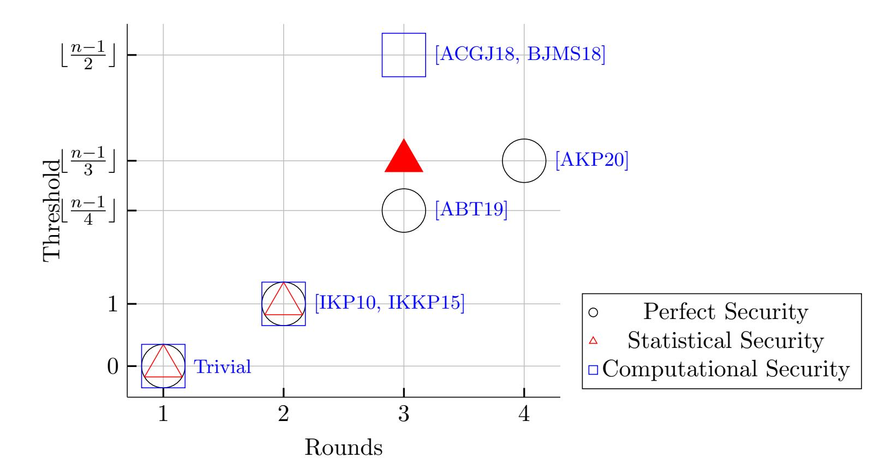

{0}------------------------------------------------

# The Resiliency of MPC with Low Interaction: The Benefit of Making Errors

Benny Applebaum\* Eliran Kachlon\* Arpita Patra

### Abstract

We study information-theoretic secure multiparty protocols that achieve full security, including guaranteed output delivery, at the presence of an active adversary that corrupts a constant fraction of the parties. It is known that 2 rounds are insufficient for such protocols even when the adversary corrupts only two parties (Gennaro, Ishai, Kushilevitz, and Rabin; Crypto 2002), and that perfect protocols can be implemented in 3 rounds as long as the adversary corrupts less than a quarter of the parties (Applebaum , Brakerski, and Tsabary; Eurocrypt, 2019). Furthermore, it was recently shown that the quarter threshold is tight for any 3-round perfectly-secure protocol (Applebaum, Kachlon, and Patra; FOCS 2020). Nevertheless, one may still hope to achieve a better-than-quarter threshold at the expense of allowing some negligible correctness errors and/or statistical deviations in the security.

Our main results show that this is indeed the case. Every function can be computed by 3 round protocols with statistical security as long as the adversary corrupts less than third of the parties. Moreover, we show that any better resiliency threshold requires 4 rounds. Our protocol is computationally inefficient and has an exponential dependency in the circuit's depth d and in the number of parties n. We show that this overhead can be avoided by relaxing security to computational, assuming the existence of a non-interactive commitment (NICOM). Previous 3-round computational protocols were based on stronger public-key assumptions. When instantiated with statistically-hiding NICOM, our protocol provides everlasting statistical security, i.e., it is secure against adversaries that are computationally unlimited after the protocol execution.

To prove these results, we introduce a new hybrid model that allows for 2-round protocols with linear resiliency threshold. Here too we prove that, for perfect protocols, the best achievable resiliency is n/4, whereas statistical protocols can achieve a threshold of n/3. In the plain model, we also construct the first 2-round n/3-statistical verifiable secret sharing that supports secondlevel sharing and prove a matching lower-bound, extending the results of Patra, Choudhary, Rabin, and Rangan (Crypto 2009). Overall, our results refine the differences between statistical and perfect models of security, and show that there are efficiency gaps even for thresholds that are realizable in both models.

\*Tel-Aviv University, Israel bennyap@post.tau.ac.il, elirn.chalon@gmail.com. Supported by the European Union's Horizon 2020 Programme (ERC-StG-2014-2020) under grant agreement no. 639813 ERC-CLC, and the Check Point Institute for Information Security.

Indian Institute of Science, Bangalore, India arpita@iisc.ac.in. Supported by SERB MATRICS (Theoretical Sciences) Grant 2020 and Google India AI/ML Research Award 2020.

{1}------------------------------------------------

# Contents

| 1  | Introduction                                                                         |    |  |  |
|----|--------------------------------------------------------------------------------------|----|--|--|
|    | 1.1 Two-Round Protocols in a Single-Input First-Round Hybrid Model                | 5  |  |  |
|    | 1.2 Two-Round Verifiable Secret Sharing                                           | 7  |  |  |
|    | 1.3 Three-Round MPC in the Standard Model                                         | 8  |  |  |
|    | 1.4 Discussion: The benefit of errors                                          | 9  |  |  |
| I  | Positive Results                                                                     | 11 |  |  |
| 2  | Secure Computation with a Guard                                                      | 11 |  |  |
|    | 2.1 PSM Protocols                                                              | 12 |  |  |
|    | 2.2 Extended PSM                                                               | 12 |  |  |
|    | 2.3 Secure Computation with a Guard                                            | 16 |  |  |
| 3  | Fvss-SIFR Protocol A Two-Round Statistically-Secure                               | 19 |  |  |
|    | 3.1 Secret-Sharing and the Fvss Functionality                            | 20 |  |  |
|    | 3.2 Triple Secret Sharing                                                         | 21 |  |  |
|    | 3.3 Guided Degree-2 Computation                                                | 25 |  |  |
|    | 3.4 Degree-2 Computation                                                          | 28 |  |  |
| 4  | Verifiable Secret Sharing 31                                                      |    |  |  |
|    | 4.1 Statistical VSS                                                            | 31 |  |  |
|    | 4.1.1 Interactive Signature                                                       | 32 |  |  |
|    | 4.1.2 Weak Commitment                                                             | 34 |  |  |
|    | 4.1.3 The Statistical VSS                                                      | 36 |  |  |
|    | 4.2 Cryptographic VSS and Computation of any single-input functions               | 38 |  |  |
|    | 4.2.1 Cryptographic MPC for single-input functions                             | 39 |  |  |
| II | Negative Results                                                                     | 40 |  |  |
| 5  | Limitation of Perfectly-Secure Two-Round SIFR Protocols                              | 41 |  |  |
|    | 5.1 Properties of πeand                                                     | 41 |  |  |
|    | 5.2 The Reduction: From πeand to πand                                 | 42 |  |  |
|    | 5.3 Proving Security of πand                                                | 43 |  |  |
| 6  | Lower Bounds for statistical VSS                                                     | 45 |  |  |
|    | ≥ 6.1 Statistical VSS with 2 Sharing rounds is impossible with t n/3  | 46 |  |  |
|    | 6.2 The Necessity of Secrecy during Reconstruction                                | 49 |  |  |
| 7  | Lower Bound for Statistical MPC                                                      | 51 |  |  |
|    | 7.1 The Reduction                                                              | 52 |  |  |
|    | 7.2 Privacy                                                                    | 53 |  |  |
|    | 7.3 Correctness                                                                | 53 |  |  |
|    | 7.4 Commitment                                                                 | 53 |  |  |

{2}------------------------------------------------

| III |     | Appendix                                                  | 61 |
|-----|-----|-----------------------------------------------------------|----|
| A   |     | The Security Model                                        | 61 |
|     | A.1 | The Standard Model                                        | 61 |
|     | A.2 | The UC-Framework                                       | 62 |
|     |     | A.2.1 Additional Security Requirements              | 63 |
| B   |     | Appendix: Two-round Statistical MPC in Fvss-SIFR Model | 63 |
|     | B.1 | Beaver's Circuit Randomization Technique                  | 63 |
|     | B.2 | Properties of Bivariate Polynomials                    | 63 |
|     | B.3 | Triple Secret Sharing                                     | 64 |
|     |     | B.3.1 Honest Dealer                                    | 64 |
|     |     | B.3.2 Corrupt Dealer                                | 67 |
|     | B.4 | Guided Degree-2 Computation                            | 68 |
|     |     | B.4.1 Honest Guide                                     | 68 |
|     |     | B.4.2 Corrupt Guide                                 | 70 |
|     | B.5 | Degree-2 Computation                                      | 72 |
| C   |     | Appendix: Verifiable Secret Sharing                       | 74 |
|     | C.1 | Interactive Signature                                  | 74 |
|     | C.2 | Weak Commitment                                           | 76 |
|     |     | C.2.1 Honest Dealer                                    | 76 |
|     |     | C.2.2 Corrupt Dealer                                | 77 |
|     | C.3 | Statistical VSS                                        | 78 |
|     |     | C.3.1 Honest Dealer                                    | 78 |
|     |     | C.3.2 Corrupt Dealer                                | 80 |
|     | C.4 | Cryptographic VSS                                         | 80 |
|     |     | C.4.1 Cryptographic MPC for single-input function      | 81 |

{3}------------------------------------------------

# 1 Introduction

Interaction is a valuable and expensive resource in cryptography and distributed computation. Consequently, a huge amount of research has been devoted towards characterizing the amount of interaction, typically measured via round complexity, that is needed for various distributed tasks (e.g., Byzantine agreement [\[LF82,](#page-59-0) [DR85,](#page-57-0) [FM85\]](#page-57-1), coin flipping [\[Cle86,](#page-57-2) [MNS16\]](#page-59-1), and zero-knowledge proofs [\[GK96,](#page-58-0) [CKPR01\]](#page-57-3)) under different security models. In this paper, we focus on two central cryptographic goals: secure-multiparty-computation (MPC) of general n-party functionalities and verifiable secret sharing (VSS) [\[CGMA85b\]](#page-57-4). We strive for full information-theoretic security, including guaranteed output delivery, at the presence of a computationally-unbounded active (aka Byzantine or malicious) rushing adversary that controls up to t of the parties. In this setting, originally presented in the classical works of Ben-Or, Goldwasser, and Wigderson [\[BGW88\]](#page-56-0) and Chaum, Cr´epeau and Damg˚ard [\[CCD88\]](#page-56-1), we assume that each pair of parties is connected by a secure and authenticated point-to-point channel and that all parties have access to a common broadcast channel, which allows each party to send a message to all players and ensures that the received message is identical.

The round complexity of information-theoretic MPC was extensively studied [\[BB89,](#page-55-0) [BFKR90,](#page-56-2) [FKN94,](#page-57-5) [SYY99,](#page-60-3) [IK00,](#page-58-1) [GIKR01a,](#page-58-2) [GIKR02,](#page-58-3) [IK02,](#page-58-4) [PCRR09,](#page-59-2) [IKP10,](#page-59-3) [KPR10,](#page-59-4) [IKKP15,](#page-58-5) [ABT18,](#page-55-1) [ACGJ18,](#page-55-2) [GIS18,](#page-58-6) [ACGJ19,](#page-55-3) [ABT19,](#page-55-4) [AKP20\]](#page-55-5). For passive perfect security, it was recently showed that optimal resiliency of t = b(n − 1)/2c and optimal round complexity of two can be simultaneously achieved [\[ABT18,](#page-55-1) [GIS18\]](#page-58-6). For active-security the picture is more complicated, and there seems to be a tradeoff between the number of rounds r and the resiliency threshold t. If the adversary is allowed to corrupt a single party (t = 1) then 2 rounds are sufficient whenever n ≥ 4 [\[IKKP15\]](#page-58-5). Any larger resiliency threshold t > 1 requires at least three rounds [\[GIKR01a,](#page-58-2) [GIKR02\]](#page-58-3). For 3-round error-free perfectly-secure protocols, it was recently showed that a resiliency threshold of t = b(n − 1)/4c is achievable [\[ABT19\]](#page-55-4) and that no better resiliency can be achieved [\[AKP20\]](#page-55-5). The latter paper also shows that, for error-free perfectly-secure protocols, 4 rounds suffice for a threshold of tp = b(n − 1)/3c which is known to be optimal for perfect protocols regardless of their round complexity [\[BGW88\]](#page-56-0).

In this paper, we will be studying the other extreme point of this tradeoff. We fix a minimal model of communication (i.e., a round-complexity bound rmin) for which linear resiliency is realizable, and try to characterize the best achievable resiliency t within this model. Since 2-round protocols cannot achieve resiliency larger than 1, we ask:

Q1: What is the best resiliency threshold t that can be achieved by a three-round protocol with full information-theoretic active security? Can we beat the b(n − 1)/4c perfect-MPC barrier by resorting to statistical security?

Q2: Can we formalize a meaningful two-round model in which a linear resiliency threshold is achievable ?

We provide a complete answer to the first question and show that statistical three-round protocols can achieve b(n − 1)/3c resiliency and nothing beyond that! We also answer the second question to the affirmative by presenting a new two-round hybrid model in which linear-resiliency is achievable. This model will serve as a stepping stone towards constructing three-round protocols. Along the way, we reveal new interesting differences between perfectly-secure error-free protocols to protocols that achieve perfect-secrecy but make errors with negligible probability. We continue with a detailed account of our results starting with the two-round hybrid model.

{4}------------------------------------------------

### 1.1 Two-Round Protocols in a Single-Input First-Round Hybrid Model

Single-Input First-Round Hybrid (SIFR) Model. We present a new Single-Input First-Round Hybrid Model (SIFR). In this model the communication network, which contains the usual peer-to-peer/broadcast channels, is augmented with some ideal n-party functionalities  $\mathcal{F}$  that are restricted in two ways: (1) Every party  $P_i$  is allowed to invoke the functionalities multiple times but only during the first round; and (2) The ideal functionalities must be single-input functionalities, that is, when  $P_i$  invokes a functionality  $\mathcal{F}_{si}^i: \{0,1\}^* \to (\{0,1\}^*)^n$  the functionality delivers an output that depends only on the input of  $P_i$ . For example, both the authenticated-private channel functionality (that delivers a message from  $P_i$  to all other parties) are simple instances of single-input functionalities. A more interesting example is the polynomial-VSS functionality that takes from  $P_i$  a degree-t polynomial Q over some finite field  $\mathbb{F}$ , and delivers to every party  $P_j$  an evaluation of Q in some canonical point  $\alpha_j \in \mathbb{F}$ . We refer to this model as the  $\mathcal{F}$ -SIFR model or simply as the SIFR model when we wish to keep the oracles  $\mathcal{F}$  unspecified.

We will be interested in two-round protocols in the SIFR model. In such protocols, all the first-round messages depend solely on the input of a single party and the only "mixing" (between different inputs of different parties) occurs during the second round. Hence, two rounds are indeed essential for computing any non-trivial functionality. As an additional feature, we note that single-input functionalities can be trivially implemented with passive security via a single-round protocol, and so any two-round protocol in the SIFR model immediately translates into a two-round passively-secure protocol in the plain model.

Limitations of Perfect protocols in SIFR Model. To get a sense of the model, note that one can perfectly compute any degree-2 functionality over any finite field  $\mathbb{F}$  of size larger than n with resiliency of  $t = \lfloor (n-1)/4 \rfloor$ . Roughly speaking, at the first round each party uses the single-input  $\mathcal{F}_{\text{poly}}$  functionality to share each input via Shamir-based secret-sharing with polynomials of degree t; then each party locally computes the functionality over the shares (making an arbitrary number of additions and a single multiplication). At the end of this local computation, each party holds a share of the output that lies on a degree-2t polynomial. At the second round, the parties broadcast the output shares and apply Reed-Solomon decoding to overcome the effect of at most t adversarial corruptions.\(^1\) In fact, it was recently showed in [AKP20] (building on [ABT19]) that degree-2 functionalities over any binary extension field are complete under non-interactive reductions either with perfect resiliency of  $\lfloor (n-1)/3 \rfloor$  or with statistical resiliency of  $\lfloor (n-1)/2 \rfloor$ . Therefore, the above observation yields an  $\lfloor (n-1)/4 \rfloor$ -perfect protocol in our model for an arbitrary functionality. In Section 5, we prove that for perfect protocols this is the best achievable threshold.

**Theorem 1.1** (perfect 2-round SIFR-protocols). General n-party functionalities can be perfectly-computed in two rounds in the SIFR Model with resiliency of t if and only if  $t \leq \lfloor (n-1)/4 \rfloor$ .

The upper-bound holds in the  $\mathcal{F}_{poly}$ -SIFR model. The lower-bound holds relative to any (vector of) computationally-unbounded single-input functionalities and applies even when the adversary is non-rushing. In fact, the negative result shows that even the AND functionality cannot be computed in this model. As a corollary, for any  $t \geq n/4$ , the theorem rules out the existence of

The above description ignores some technical details such as output randomization which can be easily applied in the  $\mathcal{F}_{poly}$ -SIFR model; see for example [ABT19].

{5}------------------------------------------------

t-private secret sharing scheme that is robustly-multiplicative in the sense that parties can locally convert shares of x and shares of y to shares of xy that are t-robust, i.e., they are recoverable even at the presence of t-corruptions. (This notion of multiplicative secret-sharing is stronger than the standard variants of multiplicative and strongly-multiplicative secret sharing, see [\[CDM00\]](#page-56-3).) The negative part of Theorem [1.1](#page-4-2) is proved by turning a two-round n/4-perfectly secure protocol for the AND-functionality in the SIFR hybrid model into a two-party protocol in the plain model for AND with perfect security against semi-honest adversaries, contradicting the impossibility result of [\[CK89\]](#page-57-6).

Statistical protocols in Fvss-SIFR Model. We show that the n/4 lower-bound can be bypassed by allowing the protocol to make negligible correctness errors while preserving perfect secrecy.[2](#page-5-0) Our protocol makes use of the bivariate version of the VSS functionality, denoted by Fvss. Roughly speaking, this single-input functionality receives a symmetric bivariate polynomial F(x, y) of degree less than or equal to t from a dealer and sends the polynomial fi(x) = F(x, i) to every party Pi . (See Fig [4](#page-20-1) in Section [3](#page-18-0) for a formal definition.)

Theorem 1.2 (statistical 2-round SIFR-protocols). Any n-party functionality f of degree-2 over some finite field F of cardinality larger than n can be computed by a two-round Fvss-SIFR protocol with b(n − 1)/3c-resiliency, perfect-secrecy, statistical-correctness and complexity of poly(S, n, log |F|, log(1/)) where S is the circuit size of f and is the error probability.

Moreover, a similar result applies to any functionality f except that the complexity is also exponential in the depth of the Boolean circuit that computes f. The dependency in the depth can be avoided at the expense of downgrading security to computational and under the assumption that one-way functions exist.

The "Moreover" part follows from the first part by using the aforementioned completeness of degree-2 functionalities [\[AKP20,](#page-55-5) Thm. 5.23] whose overhead is exponential in the circuit's depth in the case of information-theoretic security. This makes the statistical variant of the theorem efficient only for NC1 functionalities.[3](#page-5-1) Similar limitations apply to all known constant-round protocols in the information-theoretic setting even for the case of passively-secure protocols. Let us further mention that even inefficient protocols are non-trivial since security holds against a computationally-unbounded adversary.

On the proof of Thm. [1.2:](#page-5-2) Round Compression via Guards. The proof of Theorem [1.2](#page-5-2) is based on several novel components. In a nutshell, following a blue-print suggested in [\[AKP20\]](#page-55-5), we derive a three-round protocol π in the SIFR-hybrid model. We then exploit the special structure of the last two-rounds and show how to compress them into a single round. In slightly more concrete terms, at the end of the first round, some party, say Alice, holds two values a and b and some other party, say Bob, also has a copy of b. (Think of b as a secret-share that was shared by Alice in the first round of π.) The purpose of the remaining rounds is to release to all parties a value c = g(a, b) that depends on Alice's a and Bob's b while keeping b private. This is done by using two additional

2Formally, this means that, in addition to standard statistical security, the output distribution of the simulator S in the ideal world and the output distribution of the adversary A in the real world are identically distributed. (See Section [A](#page-60-1) for formal definitions.) This additional property does not seem to be very useful as a feature, but it indicates more accurately what is needed in order to bypass the lower-bounds in the perfect setting.

3As usual in such settings, the exponential dependency in the depth can be replaced by an exponential dependency in the (non-deterministic) branching-program complexity of f.

{6}------------------------------------------------

rounds: First Alice broadcasts a, and then Bob computes the value c based on (a, b) and broadcasts the result. The key observation is that all the relevant information (a and b) is known to Alice, and the role of Bob is to make sure that the outcome c is computed properly with respect to his own copy of b. (Other consistency mechanisms take care of the "correctness" of a). We abstract this notion via a new form of Secure Computation with a Guard (SCG) and show that if one is willing to tolerate statistical errors, then any function g can be realized (in the plain model) by a singleround protocol that employs correlated randomness. Furthermore, the correlated randomness can be sampled by Bob in a single preprocessing round. This allows us to collapse the last two rounds of π into a single round (plus an additional offline preprocessing that is being handled during the first round.) Overall, our single-round SCG's allow us to compress the three-round SIFR-protocol into a two-round SIFR-protocol. The resulting protocol makes use of the Fvss functionality and an additional single-input functionality Ftss that essentially deals the shares of a random multiplicative triple (a, b, c = ab). In order to remove the Ftss oracle, we first implement it in three-rounds in the Fvss-SIFR model, and then compress the last round via an additional use of SCG. (See Section [3](#page-18-0) for further details.) Our SCG constructions are based on a combination of message-authentication codes (MACs) and multiparty private-simultaneous-message protocols [\[FKN94,](#page-57-5) [IK97\]](#page-58-7) (also known as fully-decomposable randomized encoding of functions [\[IK00,](#page-58-1) [AIK06\]](#page-55-6)). (See Section [2](#page-10-1) for details.)

### 1.2 Two-Round Verifiable Secret Sharing

Motivated by Theorem [1.2,](#page-5-2) our next goal is to realize the Fvss functionality in the standard model within a minimal number of rounds. The round complexity of VSS was extensively studied in the literature [\[GIKR01a,](#page-58-2) [PCRR09,](#page-59-2) [FGG](#page-57-7)+06, [KKK09,](#page-59-5) [KPR10,](#page-59-4) [BKP11,](#page-56-4) [Agr12,](#page-55-7) [IKKP15,](#page-58-5) [PR18\]](#page-60-4). In the perfect setting, we have a complete answer: In order to achieve a linear resiliency t, one must use a two-round protocol, and within this "budget" the best achievable resiliency is t = b(n − 1)/4c [\[GIKR01a\]](#page-58-2). Patra et al. [\[PCRR09\]](#page-59-2) were the first to suggest that this bound may be bypassed by allowing negligible statistical errors. Specifically, they view VSS as a stand-alone two-phase primitive, and showed that the sharing phase of VSS with statistical error and perfect secrecy can be realized in two rounds if and only if t ≤ b(n − 1)/3c.

Unfortunately, the resulting protocol does not implement the polynomial-based Fvssfunctionality and so we cannot plug it into Theorem [1.2.](#page-5-2) Indeed, the existing protocol suffer from several caveats that make it less suitable for MPC applications. Specifically, after the sharing phase some of the honest parties may not hold a valid share, let alone a "second-level share". In addition, the sub-protocol needed for the "reconstruction" phase is relatively complicated and requires two rounds. In contrast, existing perfect VSS protocols [\[GIKR01a,](#page-58-2) [KKK09\]](#page-59-5) realize the Fvss functionality, and correspondingly enable a trivial single-round reconstruction in which the parties broadcast their views. The possibility of an analogous statistical realization of Fvss in two rounds and resiliency threshold of b(n − 1)/3c was left open by previous works. In Section [4,](#page-30-0) we answer this question in the affirmative.

Theorem 1.3 (2-round statistical protocols for Fvss ). There exists a 2-round protocol that b(n − 1)/3c-securely realizes the n-party functionality Fvss over an arbitrary finite field F of cardinality larger than n with perfect secrecy and statistical correctness. The communication complexity is polynomial in n, log |F| and log(1/) where is the error-probability. The computational complexity is polynomial in log |F|, log(1/) and exponential in the number of parties.

{7}------------------------------------------------

The exponential dependency in the number of parties is due to the use of a clique finding algorithm over an "agreement graph" of size n. While this dependency is unfortunate, the protocol is still meaningful since it provides security against unbounded adversaries. The existence of a similar protocol with polynomial dependency in n is left as an interesting open question.

Resiliency Lower-bounds. We further strengthen the lower-bounds of [\[PCRR09\]](#page-59-2) and show that any resiliency of t ≥ n/3 cannot be achieved by a VSS with a two-round sharing phase even if both secrecy and correctness are statistical, and even if the adversary is non-rushing. This result applies to the more general setting where the VSS is viewed as a two-phase primitive, as opposed to an MPC functionality. (See Section [6.1.](#page-45-0)) We also reveal an additional qualitative difference for the t ≥ n/3 regime: No matter how many rounds are used in the sharing phase, the reconstruction phase cannot be implemented by letting the parties broadcast their local view. That is, even during the reconstruction some secrecy must be maintained. (See Section [6.2.](#page-48-0)) Indeed, existing constructions in this regime [\[RB89,](#page-60-5) [KPR10\]](#page-59-4), employ information-theoretic MACs or signatures and keep some of the secret-key information private even during reconstruction. Our result shows that this is inherent.

### 1.3 Three-Round MPC in the Standard Model

We can now get back to the case of three-round plain-model protocols for general functionalities. Recall that in Q1 we asked what is the best resiliency that can be achieved by 3 rounds protocols. This question was recently resolved in the perfect setting. Specifically, it was shown that 3 rounds can achieve a resiliency of t = b(n − 1)/4c [\[ABT19\]](#page-55-4) [4](#page-7-1) , and that even a slightly better resiliency threshold of t = b(n − 1)/4c + 1 requires at least four rounds [\[AKP20\]](#page-55-5).[5](#page-7-2)

Again, we show that a small statistical error allows us to bypass the lower-bound. Specifically, by taking the two-round Fvss-SIFR protocol from Theorem [1.2](#page-5-2) and instantiating the Fvss oracle with the two-round implementation from Theorem [1.3,](#page-6-1) we derive a three-round statistical protocol that remains secure as long as at most b(n − 1)/3c of the parties are being corrupted. We further prove a matching lower bound on the resiliency of three-round statistical protocols by showing that a 3-round protocol with (b(n − 1)/3c + 1)-resiliency for an authenticated-VSS functionality can be collapsed into a VSS with a 2-round sharing phase, contradicting our VSS negative results. (See Section [7](#page-50-0) for further details.) Overall we derive the following theorem.

Theorem 1.4 (3-round protocols with optimal resiliency). Every n-party functionality can be computed in three-rounds with statistical security against an active rushing computationally-unbounded adversary that corrupts at most b(n − 1)/3c of the parties. The communication complexity of the protocol is polynomial in n, 2 D and S and the computational complexity is polynomial in 2 n , 2 D and S where S and D are the size and depth of the Boolean circuit that computes f.

4The positive result can now be obtained by combining the simple 2-round VSS-hybrid protocol for quadratic functions (Thm [1.1\)](#page-4-2) with the 2-round perfect-VSS of [\[GIKR01a\]](#page-58-2) and with the completeness of degree-2 arithmetic functionalities [\[AKP20\]](#page-55-5). The original proof from [\[ABT19\]](#page-55-4) was significantly more complicated since it relied on a weaker degree-2 completeness result that was applicable only over the binary field.

5The impossibility of three-round plain-model perfect protocols with resiliency t ≥ b(n − 1)/4c + 1 seems to be incomparable to the impossibility of two-round perfect SIFR-model protocols (Theorem [1.1\)](#page-4-2). One could deduce the latter result from the former with the aid of two-round protocols for single-input functionalities with perfect resiliency of t ≥ b(n − 1)/4c + 1. However, such protocols do not exist even for the special case of the VSS functionality [\[GIKR01a\]](#page-58-2).

{8}------------------------------------------------

Furthermore, the security threshold is tight for three-round protocols. That is, there is a finite functionality that cannot be computed in three rounds at the presence of an active (non-rushing) computationally-unbounded adversary that corrupts b(n − 1)/3c + 1 of the parties.

Theorem [1.4](#page-7-3) fully characterizes the feasible security threshold of three-round protocols with information-theoretic active security. As already mentioned the exponential dependency in the depth is expected, and seems to be unavoidable given the current state of the art. The exponential dependency in n is derived from our VSS construction (Theorem [1.3\)](#page-6-1), and we hope that future works will be able to improve it and get a polynomial overhead.

Downgrading to computational security. One way to bypass the exponential blow-up in n is to replace the two-round b(n − 1)/3c-statistical VSS with the cryptographic VSS of [\[BKP11\]](#page-56-4). The latter achieves the same b(n − 1)/3c-resiliency against computationally-bounded adversaries assuming the existence of a non-interactive commitment (NICOM). Specifically, by plugging this VSS into the computational part of Theorem [1.2,](#page-5-2) we get the following theorem. (See Section [4.2](#page-37-0) for details.)

Theorem 1.5 (3-round computational MPC). Assuming the existence of NICOM, every n-party functionality f admits a three-round protocol with computational security against a computationallybounded adversary that actively corrupts up to t ≤ b(n − 1)/3c of the parties. The complexity is polynomial in n and in the circuit's size of f. Moreover, if f is a single-input functionality the round complexity can be reduced to 2.

The optimality of three rounds for any t > 1 is owing to the two-round impossibility result of [\[GIKR02\]](#page-58-3) that remains valid even in the cryptographic setting. For the special case of t = 1 and n = 4, [\[IKKP15\]](#page-58-5) shows a two-round construction from any one-way function. Other existing roundoptimal constructions [\[ACGJ18,](#page-55-2) [BJMS18\]](#page-56-5) work with t < n/2, albeit rely on public-key encryption schemes and two-round witness indistinguishable proofs (ZAPs). These assumptions are believed to be strictly stronger than NICOM that can be based on injective one-way functions [\[Blu81,](#page-56-6) [Yao82,](#page-60-6) [GL89\]](#page-58-8) or even on general one-way functions assuming standard complexity-theoretic derandomization assumptions [\[BOV07\]](#page-56-7).

We further mention that if one employs a perfectly-hiding NICOM, then our protocol achieves everlasting security, i.e., it is secure against adversaries that are computationally unlimited after the protocol execution [\[Unr18\]](#page-60-7). For this result one has to invoke the statistical variant of Theorem [1.2,](#page-5-2) and so the protocol is efficient only for NC1 functionalities or general single-input functionalities. Perfectly-hiding NICOM can be based on collision-resistance hash functions at the CRS model [\[DPP98,](#page-57-8) [HM96\]](#page-58-9). Even in this model, the round-complexity lower-bounds of [\[GIKR02\]](#page-58-3) hold, and one cannot hope for two-round protocols.

The "moreover" part of the theorem covers an interesting family of "single-input" functionalities including important tasks such as distributed ZK, multiplication triple generation (modellled via Ftss) and VSS. Our two-round protocol complements the incomparable result of [\[GIKR02\]](#page-58-3) that achieves a similar round-complexity with perfect-security, but with a smaller resiliency threshold of t < n/6. The proof of Theorem [1.5](#page-8-1) of appears in Section [4.2.](#page-37-0)

### 1.4 Discussion: The benefit of errors

Since the works of Rabin and Ben-Or [\[RB89\]](#page-60-5) and Beaver [\[Bea89\]](#page-55-8), it is known that statistical protocols can achieve a resiliency threshold ts = b(n − 1)/2c that is strictly larger than the best 

{9}------------------------------------------------

resiliency threshold tp = b(n − 1)/3c that is achievable by perfect protocols [\[PSL80,](#page-60-8) [BGW88\]](#page-56-0). Patra et al. [\[PCRR09\]](#page-59-2) were the first to suggest that the statistical setting may lead to better round complexity even for thresholds of t ≤ tp which are perfectly realizable (i.e., realizable with perfect security). Specifically, they showed that the sharing phase of statistical VSS with t = b(n − 1)/3c can be carried in two rounds, bypassing a three-round lower-bound of [\[GIKR02\]](#page-58-3). Another indication for a possible advantage was given by [\[IKKP15\]](#page-58-5) who showed that 4-party linear functions can be statistically computed in two rounds with threshold of t = 1 which is impossible in the perfect setting as shown by [\[GIKR01b,](#page-58-10) Thm 8].[6](#page-9-0) However, to the best of our knowledge, so far we did not have a single example of an infinite MPC functionality whose statistical round complexity is strictly smaller than its perfect round complexity under a perfectly-realizable threshold t ≤ tp. Theorem [1.4](#page-7-3) settles this question in a strong way showing that, for any n/4 ≤ t ≤ b(n − 1)/3c, statistical t-security can be achieved for all functions in three rounds, whereas perfect t-security cannot be achieved in three rounds even for simple finite functionalities [\[AKP20\]](#page-55-5).

The separation proved in the SIFR model (Thm [1.1](#page-4-2) vs. Thm [1.2\)](#page-5-2) should be taken with more care. An immediate corollary of Thm [1.1](#page-4-2) asserts that for any perfect resiliency-threshold t that is larger than b(n − 1)/4c, one cannot transform an r-round perfect-VSS (modeled as some ideal sharing functionality) into an r + 1-round general MPC in a "black-box" way. Furthermore, since it is known that for tp = b(n − 1)/3c perfect VSS takes exactly 3 rounds, one can naively conclude that for such resiliency general perfectly-secure MPC cannot be implemented in less than 3 + 2 = 5 rounds. Nevertheless, [\[AKP20\]](#page-55-5) constructed a 4-round perfectly-secure tp-resilient MPC protocol in the plain model. This construction is based on a 3-round implementation of the Fvss functionality in a fairly complicated way that exploits the concrete properties of the underlying Fvss-protocol. Specifically, the transformation makes use of intermediate values that are available before the Fvss-protocol terminates. The impossibility of perfect two-round Fvss-SIFR protocol for general functionalities (Thm [1.1\)](#page-4-2) should therefore be interpreted as saying that such a complication is inherent! In contrast, the statistical relaxation allows us to obtain a significantly simpler reduction (i.e., two-round Fvss-SIFR) as shown in Thm [1.2.](#page-5-2)

We end up the introduction, by depicting in Figure [1](#page-10-2) the resiliency-vs-round landscape of MPC in various models.

Organization. The paper is somewhat lengthy, but the different sections are relatively selfcontained and the reader may choose which sections to read. Part [I](#page-10-0) is devoted to the positive results where Section [2](#page-10-1) presents and constructs Secure-Computation-with-Guard protocols, Section [3](#page-18-0) employs these protocols towards the construction of a 2-round statistical Fvss-SIFR Protocols for general functionalities, and Section [4](#page-30-0) provides 2-round VSS protocols that realize the Fvss functionality in the plain model. Negative results appear in Part [II](#page-39-0) including impossibility results for perfect 2-round SIFR protocols (Section [5\)](#page-40-0), and plain-model lower-bounds for VSS and MPC (Sections [6](#page-44-0) and [7\)](#page-50-0). Our upper-bounds will be proved under the framework of universal-composability (UC) [\[Can01a\]](#page-56-8), and the lower-bounds will be proved under weaker security models (this only makes them stronger). Some background on the security model appears in Appendix [A.](#page-60-1)

6We thank Yuval Ishai for pointing this out.

{10}------------------------------------------------

Figure 1: The best trade-offs known between the thresholds t and the number of rounds r in the plain model. Circles, triangles and squares indicate perfect, statistical and computational security, respectively. Our results are marked with solid shapes. Each of the marked points is optimal in the sense that it cannot be moved up. That is, no better resiliency can be achieved under the corresponding model with the permitted round complexity.

# Part I Positive Results

# 2 Secure Computation with a Guard

In this section we present the notion of Secure Computation with a Guard (SCG) that will be employed later in our constructions. Our SCG constructions will be based on a new form of extended private simultaneous message (ePSM) protocols that extend the private simultaneous message (PSM) protocols of [FKN94]. All these primitives have a common set-up: a group of senders (e.g.,  $P_1, \ldots, P_m$  or, just Alice and Bob in the case of SCG) each holding an input  $x_i$  is trying to deliver some value  $f(x_1, \ldots, x_m)$  to a receiver Carol who holds no input while keeping the inputs hidden from Carol. All three primitives employ some form of a set-up/offline phase (that is independent of the inputs) and a single-round of online interaction from the senders to the receiver. In a nutshell, PSM achieves a minimal form of privacy against Carol, whereas ePSM and SCG provide an additional correctness property when some of the senders are malicious. In ePSM, this is based on a trusted set-up, while SCG employs a single-round offline protocol and it is tailored to the case where some of the inputs of Alice are known to Bob. In the following subsections, we will define these primitives and present information-theoretic constructions whose complexity is polynomial in the formula-size of the underlying function. (We will always apply these primitives to functions that are computable by such formulas.)

{11}------------------------------------------------

### 2.1 PSM Protocols

In a PSM protocol, proposed by [\[FKN94\]](#page-57-5), there are m honest parties, P1, . . . , Pm, each Pi holding a secret input xi , and all having access to a common random string r. Each Pi sends a single message to Carol depending on xi and r. Based on these messages, Carol can compute f(x1, . . . , xm), but nothing else. PSM is formally defined as follows:

Definition 2.1 (PSM Protocols). Let X1, . . . , Xm, Z be finite sets, and let X = X1 × . . . × Xm. An m-party PSM protocol psm, computing a m-argument function f : X → Z consists of:

- A message computation function psmi : Xi × R → Mi, for every party i ∈ {1, . . . , m}, where R is a finite set (domain of the common random string) and Mi is a finite message domain.
- A reconstruction function rec : M1 × . . . × Mm → Z.

The protocol psm = psm1 , . . . , psmm,rec should satisfy the following properties.

1. (Correctness) For every (x1, . . . , xm) ∈ X and r ∈ R,

$$\operatorname{rec}(\operatorname{psm}_1(x_1,r),\ldots,\operatorname{psm}_m(x_m,r))=f(x_1,\ldots,x_m).$$

2. (Security against Receiver) There exists a simulator Spsm, such that for every (x1, . . . , xm) ∈ X,

$$S_{\mathsf{psm}}\big(f(x_1,\ldots,x_m)\big) \equiv (\mathsf{psm}_1(x_1,r),\ldots,\mathsf{psm}_m(x_m,r)),$$

where r is a common random string.

The complexity of the protocol is measured by the maximal circuit complexity of psmi ,rec and Spsm.

Consider the (m + 1)-party functionality F that takes xi from Pi and ⊥ from Carol, and delivers f(x1, . . . , xm) to Carol and ⊥ to Pi . Then the PSM security is equivalent to standard perfect-security of MPC against an adversary that can corrupt only the receiver (and the parties P1, . . . , Pm are always assumed to be honest).

Lemma 2.2 (Polynomial-time PSM Protocols [\[IK02\]](#page-58-4)). For every m-party functionality f that admits a Boolean NC1 circuit of size s, there exists a PSM protocol with complexity of poly(s). In particular, if s = poly(m) then there exists a PSM protocol with complexity poly(m).

### 2.2 Extended PSM

We extend the notion of PSM in two ways. First, we consider a setting where all the involved parties including the receiver hold correlated randomness from a polynomially-samplable distribution instead of the parties alone holding a common string. (The correlated randomness is assumed to be distributed by a trusted party.) Second, in addition to security against the receiver, we require statistical security with abort against an active adversary that corrupts an arbitrary subset of the senders. In the following, we let f 0 (x1, . . . , xm) denote the variant of f that agrees with f on inputs in X and outputs ⊥ if some sender uses ⊥ as its input.

Definition 2.3 (Extended PSM (ePSM) Protocols). Let X1, . . . , Xm, Z be finite sets, and let X = X1 × . . . × Xm. An m-party extended PSM protocol epsm, computing f : X → Z consists of:

{12}------------------------------------------------

- A randomized correlated-randomness generator function egen that samples a tuple in  $R_1 \times \ldots \times R_m \times R_e$ , where each  $R_i$  is a finite set.
- For  $i \in \{1, ..., m\}$ ,  $P_i$ 's message computation function  $\operatorname{\mathsf{epsm}}_i \operatorname{such} \operatorname{that} \operatorname{\mathsf{epsm}}_i : X_i \times R_i \to M_i$ , where  $M_i$  is a finite message domain.
- A reconstruction function erec:  $M_1 \times \ldots \times M_m \times R_e \to Z$ .

We say that  $(egen, epsm_1, ..., epsm_m, erec)$  is an  $\epsilon$ -extended PSM  $(\epsilon$ -ePSM) if the following hold.

1. (Correctness) For every  $(x_1, \ldots, x_n) \in X$  and  $(r_1, \ldots, r_n, r_e)$  picked by egen,

$$erec(epsm_1(x_1, r_1), ..., epsm_n(x_n, r_n), r_e) = f(x_1, ..., x_n).$$

2. (Security against Receiver) There exists a two-phase randomized simulator  $S = (S_{\text{off}}, S_{\text{on}})$ , such that for every  $(x_1, \ldots, x_m) \in X$ ,

$$(r_e, (\mathsf{epsm}_1(x_1, r_1), \dots, \mathsf{epsm}_m(x_m, r_m))) \equiv (\mathcal{S}_{\mathsf{off}}(r_S), \mathcal{S}_{\mathsf{on}}(f(x_1, \dots, x_m); r_S)),$$

where  $r_S$  denotes the random tape of the simulator and  $(r_1, \ldots, r_m, r_e) \leftarrow \text{egen}$ .

- 3. ( $\epsilon$ -Security against Senders) There exists a two-phase randomized simulator  $\mathcal{S} = (\mathcal{S}_{\mathsf{off}}, \mathcal{S}_{\mathsf{on}})$  such that for any malicious (computationally-unbounded) adversary  $\mathsf{epsm}_T^*$  corrupting a set of  $T \subset \{1, \ldots, m\}$  parties, and every sequence of inputs  $x = (x_1, \ldots, x_m)$  the following holds.
  - (Offline Security) The random variables  $r_T$  and  $r'_T$  have the same distribution, where  $r_T = (r_i)_{i \in T}$  for  $(r_1, \ldots, r_m, r_e) \leftarrow \text{egen}$ , and  $r'_T = \mathcal{S}_{\text{off}}(T; r_S)$  where  $r_S$  is the random tape of the simulator.
  - (Online Security) Fix some arbitrary value  $\rho \in \prod_{i \in T} R_i$ , and consider the conditional variables  $(r_1, \ldots, r_m, r_e) \leftarrow \text{egen subject to } r_T = \rho \text{ and a uniformly random } r_S \text{ subject to } \rho = \mathcal{S}_{\text{off}}(T; r_S)$ . Then, the random variables

$$\operatorname{erec}(y_1, \dots, y_m, r_e) \qquad where \ y_T = \operatorname{epsm}_T^*(\rho, x_T), \quad y_{\bar{T}} = (\operatorname{epsm}_i(x_i, r_i))_{i \notin T}$$
 (1)

and

$$f'(x_{\bar{T}}, x_T')$$
 where  $x_T' = \mathcal{S}_{on}(T, y_T; r_S)$  (2)

are  $\epsilon$ -close in statistical distance.

The complexity of the protocol is measured by the maximal circuit complexity of egen,  $psm_i$ , rec and the above simulators.

We define security against the receiver via an offline/online simulator in order to capture the case where the inputs are selected adaptively according to the receiver's randomness  $r_e$ . (For this reason, the offline simulator receives no input.)

Item 3 is equivalent to the standard security-with-abort MPC definition against any coalition of the senders for a protocol that computes the functionality F (defined in the previous section). Indeed, offline security guarantees that the view of the adversary can be perfectly simulated in the ideal world, and online security guarantees that conditioned on any view of the adversary, the distribution of the output of Carol in the real experiment is  $\epsilon$ -close to the distribution of the output in the ideal world. Observe that the online simulator is extremely simple, it just looks at the message outputted by the corrupted senders and translates it to an f'-input.

{13}------------------------------------------------

Remark 2.4 (ePSM vs robust-PSM). We would like to mention the existence of a primitive called robust-PSM (see [PC16]) which is strictly stronger than ePSM. Specifically, robust-PSM achieves the same security guarantees as ePSM, but it only requires shared randomness among the senders (plus local uncorrelated randomness), as opposed to correlated randomness among all parties as is ePSM. However, the use of correlated randomness makes our construction arguably simpler, and since it suffices for our purposes, we keep it here for self-containment.

Construction. In the following, we describe an ePSM protocol for a function f, based on any PSM protocol psm for f and one-time  $\epsilon$ -secure MAC. At a high-level, the correlated randomness for the parties includes the standard PSM randomness together with authentication-tags on each of the possible PSM-messages that may be sent in the online phase. The receiver gets the keys of these MACs permuted under a random shift. At the online phase, each party sends the PSM message that corresponds to its input and authenticate using the corresponding tag. The receiver verifies the tags and runs the PSM reconstruction function.

In the following, we assume that each of the input domains  $X_i$  are ordered, and for  $\sigma_i \in \{1,\ldots,|X_i|\}$  we consider the mapping that takes the j-th element in the domain  $X_i$  to the  $j+\sigma_i$  (mod  $|X_i|$ ) element. By abuse of notation we let  $\sigma_i$  denote this mapping. We further assume that  $\mathsf{psm} = (\mathsf{psm}_1,\ldots,\mathsf{psm}_m,\mathsf{rec})$  is a PSM for f in which the message sent by the i-th party is taken from the finite domain  $M_i$ . We assume that MAC is a keyed function over the key domain K and message domain  $M = \bigcup_{i \in [m]} M_i$ . We will need the following (non-standard) security definition: For every pair of messages  $w \neq w' \in M$  and pair of tags v, v' in the range of MAC, it holds that

$$\Pr_{k \leftarrow K}[v' = \mathtt{MAC}_k(w') \mid v = \mathtt{MAC}_k(w)] \le \epsilon,$$

whenever  $v \in \{MAC_k(w) : k \in K\}$ . (We refer to the above event as "conditional forgery".) Note that such a MAC can be constructed unconditionally by letting  $\{MAC_k\}$  be a family of pair-wise independent hash functions from M to some range of size at least  $1/\epsilon$ .

- For each  $i \in \{1, ..., m\}$ , sample a MAC key  $k_i^x$  for every  $x \in X_i$  and a random shift  $\sigma_i$  of the elements of  $X_i$ . In addition, sample shared-randomness  $r_{\mathsf{psm}}$  for the PSM protocol  $\mathsf{psm} = (\mathsf{psm}_1, ..., \mathsf{psm}_m, \mathsf{rec})$ .
- For each  $i \in \{1, ..., m\}$ , send to  $P_i$  the values  $r_{\mathsf{psm}}, \sigma_i$  and the list of pairs  $\{(x, z_x)\}_{x \in X_i}$  where  $z_x = \mathsf{MAC}_{k_i^x}(\mathsf{psm}_i(x, r_{\mathsf{psm}}))$ , and send to Carol a shifted list of all MAC keys  $L_i = \{k_i^{\sigma_i(x)}\}_{x \in X_i}$ . (That is, the key in the xth position is moved to the  $\sigma_i(x)$  position.)

 $\operatorname{\mathsf{epsm}}_i$ : Given input  $x_i$  and correlated randomness  $\Big(r_{\mathsf{psm}},\{(x,z_x)\}_{x\in X_i},\sigma_i\Big), \operatorname{\mathsf{epsm}}_i$  output  $y_i:=\Big(\operatorname{\mathsf{psm}}_i(x_i,r_{\mathsf{psm}}),z_{x_i},\sigma_i(x_i)\Big).$ 

erec: Given the messages  $(y_i)_{i \in \{1,...,m\}}$  and correlated randomness  $L_i$  for all  $i \in \{1,...,m\}$ , do: If some  $y_i = \bot$ , output abort; otherwise parse  $y_i = (w_i, v_i, u_i)$ .

Output abort if for some i it holds that  $v_i \neq \text{MAC}_{k_i}(w_i)$  where  $k_i$  is the  $u_i$ -th key in key list  $L_i$ . Otherwise, output  $\text{rec}(w_1, \ldots, w_m)$ .

**Figure 2**: Protocol epsm = (egen, epsm1, ..., epsmm, erec)

{14}------------------------------------------------

### **Lemma 2.5.** Protocol epsm is an $\epsilon$ -ePSM protocol when instantiated with an $\epsilon$ -secure MAC.

*Proof.* Correctness follows immediately from the correctness of the psm and MAC protocols. For security against receiver, define  $\mathcal{S} = (\mathcal{S}_{\mathsf{off}}, \mathcal{S}_{\mathsf{on}})$  in the following way. The simulator  $\mathcal{S}_{\mathsf{off}}$  samples a MAC key  $k_i^x$  for every  $i \in \{1, \ldots, m\}$  and  $x \in X_i$ , and outputs  $(k_i^x)_{i \in \{1, \ldots, m\}, x \in X_i}$ . The simulator  $\mathcal{S}_{\mathsf{on}}$ , receives  $f(x_1, \ldots, x_m)$  and  $(k_i^x)_{i \in \{1, \ldots, m\}, x \in X_i}$  as inputs, samples  $(a_1, \ldots, a_m) \leftarrow \mathcal{S}_{\mathsf{psm}}(f(x_1, \ldots, x_m))$ , where  $\mathcal{S}_{\mathsf{psm}}$  is the underlying PSM simulator, samples random indices  $i_1, \ldots, i_m$ , where  $i_j \in \{1, \ldots, |X_j|\}$ , sets  $b_j := (a_j, \mathsf{MAC}_{k_j^{i_j}}(a_j), i_j)$  for all  $j \in \{1, \ldots, m\}$  and outputs  $(b_1, \ldots, b_m)$ . It is not hard to see that for any  $(x_1, \ldots, x_m) \in X$  it holds that

$$(r_e, (\mathsf{epsm}_1(x_1, r_1), \dots, \mathsf{epsm}_m(x_m, r_m)) \equiv (\mathcal{S}_{\mathsf{off}}(r_S), \mathcal{S}_{\mathsf{on}}(f(x_1, \dots, x_m); r_S)).$$

For  $\epsilon$ -security against senders, define  $\mathcal{S} = (\mathcal{S}_{\text{off}}, \mathcal{S}_{\text{on}})$  in the following way. The simulator  $\mathcal{S}_{\text{off}}$  samples a random string r for egen, computes  $\text{egen}(r) = (r'_1, \dots, r'_m, r'_e)$  and outputs  $(r'_i)_{i \in T}$ . Observe that for each i, this defines a shift  $\sigma_i$ , a list of MAC tags  $\{(x, z_{i,x})\}_{x \in X_i}$ , and a list of MAC keys  $\{k_i^{\sigma_i(x)}\}_{x \in X_i}$ .

The simulator  $S_{\text{on}}$ , receives T,  $(r'_1, \ldots, r'_m, r'_e)$  and  $y'_T := \mathsf{epsm}_T^*(r'_T, x_T)$  as inputs, and parses  $y'_i = (w'_i, v'_i, u'_i)$ , where  $w'_i$  is the PSM message,  $v'_i$  is the corresponding MAC, and  $u'_i$  the corresponding shifted index. For each  $i \in T$  the simulator verifies (1) that  $v'_i = \mathsf{MAC}_k(w'_i)$  where  $k = k_i^{u'_i}$ ; and (2) that  $w'_i$  equals to the PSM message of  $\mathsf{epsm}_i(x'_i, r'_i)$  where  $x'_i \in X_i$  is the unique input for which  $\sigma_i(x'_i) = u'_i$ . If both conditions hold, the simulator outputs  $(x'_i)_{i \in T}$ . Otherwise, the simulator outputs  $(\bot, \ldots, \bot)$ .

It remains to show that for any fixed  $x = (x_1, \ldots, x_m)$  both offline security and online security hold. First, observe that the distribution of  $(r_1, \ldots, r_m, r_e, y_T)$  in the real world is the same as the distribution of  $(r'_1, \ldots, r'_m, r'_e, y'_T)$  generated by the simulator. This readily implies that offline security holds. Since the distributions are the same, we stick with the notation  $(r_1, \ldots, r_m, r_e, y_T)$ , and for  $i \in T$ , we denote  $y_i = (w_i, v_i, u_i)$ .

For the online security, let r be the randomness used for generating the correlated randomness  $\operatorname{egen}(r) = (r_1, \dots, r_m, r_e)$ . Fix some value  $\rho$ , and condition on the event  $r_T = \rho$ . Let us further condition on an arbitrary fixing of the correlated randomness of the honest parties  $r_i : i \notin T$ . Correspondingly,  $y_{\bar{T}} = (\operatorname{\mathsf{epsm}}_i(x_i, r_i))_{i \notin T}$  is fixed as well as  $y_T = \operatorname{\mathsf{epsm}}_T^*(\rho, x_T)$ . (Here we assume, without loss of generality, that the adversary is deterministic; If this is not the case, arbitrarily fix some "good" coins for the adversary.) Overall, the only "unfixed" randomness in the system corresponds to  $r_e$ . Specifically, for every i and  $x \in X_i$ , the MAC key  $k_i^{\sigma_i(x)}$  is distributed uniformly subject to the constraint that  $\operatorname{\mathsf{MAC}}_{k_i^{\sigma_i(x)}}(\operatorname{\mathsf{psm}}_i(x, r_{\mathsf{psm}}))$  is fixed according to the values given in  $r_i$ .

Observe that, by construction, the online simulator  $S_{on}$  mimics the real process except that it verifies that an extra condition (2) holds. We therefore claim that  $f'(x_{\overline{T}}, S_{on}(T, y_T; r)) = \text{erec}(y_T, y_{\overline{T}}, r_e)$  except when the following bad event E happens: there exists an  $i \in T$  for which condition (2) fails, but condition (1) passes for all i's.

To see that the claim holds, observe that under  $\neg E$  either (A) both conditions (1) and (2) hold for all i's, or (B) condition (1) fails for some i. In the latter case, the output in the ideal world is  $f'(x_T, \bot) = \bot$ , and the output in the real world is  $\bot$  as well. In the former case, the output in the real world is  $f(x_{\bar{T}}, x_T')$  where  $x_i' \in X_i$  is the unique input for which  $\sigma_i(x_i') = u_i$ , for  $i \in T$ , and the output in the ideal world is  $\text{rec}(w_1, \ldots, w_m)$ , where, by condition (2),  $w_i = \text{psm}(x_i', r_{\text{psm}})$  for every  $i \in T$ . Therefore, by the perfect correctness of the underlying PSM protocol,  $\text{rec}(w_1, \ldots, w_m) = f(x_{\bar{T}}, x_T')$ . We conclude that  $f'(x_{\bar{T}}, \mathcal{S}_{\text{on}}(T, y_T; r)) = \text{erec}(y_T, y_{\bar{T}}, r_e)$  except when event E happens.

{15}------------------------------------------------

Next, we show that the event E happens with probability at most  $\epsilon$  over the choice of r. Indeed, given  $\rho$  and x we can find the first i for which (2) does not hold, and attack the MAC via the pair of messages  $m_i, w_i$  and the pair of tags  $z_{x_i'}, v_i$ , where  $x_i'$  is the unique input for which  $\sigma_i(x_i') = u_i$ ,  $m_i := \mathsf{psm}_i(x_i', r_{\mathsf{psm}})$  is the PSM message corresponding to  $x_i'$  using the randomness  $r_{\mathsf{psm}}$  defined by  $\rho$ , and  $z_{x_i'}$  is the tag of  $m_i$  according to  $\rho$ . Since (2) does not hold over i then  $w_i \neq m_i$ . If (1) holds over i, then the pair of messages  $m_i \neq w_i$  and the pair of tags  $z_{x_i'}, v_i$  form a successful "conditional forgery", and so  $\Pr[E] \leq \epsilon$  as required.

**Lemma 2.6** (Polynomial-time extended PSM Protocols). Let  $f : \{0,1\}^m \to \{0,1\}^p$  be a Boolean circuit of size poly(m), depth  $O(\log m)$ , and bounded fan-in and fan-out gates. Then there exists an extended PSM protocol with complexity  $poly(m, \log(1/\epsilon))$  for f.

Proof. We take the underlying PSM to be the protocol promised in Lemma 2.2 with poly(m) complexity. Let  $\ell = poly(m)$  denote the maximal bit-length of a message that a party sends in this protocol, and take  $\{MAC_k\}$  be a family of pair-wise independent hash functions from  $\{0,1\}^{\ell}$  to  $\{0,1\}^{s}$  where  $s = \lceil \log_2(1/\epsilon) \rceil$ . Such a family can be constructed by circuits of complexity polynomial in  $\ell+s$  (in fact even linear by [IKOS08]). Finally, it is not hard to see that the simulators of Lemma 2.5 have running time polynomial in m and s. The claim follows.

### 2.3 Secure Computation with a Guard

We now introduce our final primitive in this series: secure computation with a guard (SCG). In this variant, we have a sender Alice, who holds an input (a, b), a guard Bob who holds b, and a receiver Carol that holds no input. As usual, the goal is to release the value of f(a, b) to the receiver Carol. Intuitively, Bob's role is to make sure that Alice uses b in the computation. Formally, we require perfect security against Carol (as before), and "statistical security with abort" against Alice (who may choose an arbitrary a or choose to abort the computation). When the guard Bob is corrupted, and Alice is honest, we only require that the output will either be f(a, b) or  $\bot$ . We emphasize that a corrupted guard may abort the computation in a way that depends on Alice's input (a, b). While this is weaker than standard "security with abort" definition, it still suffices for our purposes.

Syntactically, the online phase consists of a single message from Alice/Bob to Carol. For the offline phase, we move from the trusted set-up assumption, and let Bob send a single message to both Alice and Carol.

In the following, we let f'(a, b) denote the variant of f that agrees with f on inputs  $(a, b) \in A \times B$  and outputs  $\bot$  if  $a = \bot$ .

**Definition 2.7** (Secure Computation with Guards). Let  $f: A \times B \to C$  be a function over the finite sets A, B and C. An SCG protocol consists of the following algorithms.

- An offline randomized algorithm scg.off that is invoked by Bob and, based on randomness  $r_B$  generates a message  $\alpha$  for Alice, a message  $\gamma$  for Carol, and state information  $\beta$  for Bob.
- Online algorithm  $scg.on_A$  for Alice (resp.,  $scg.on_B$  for Bob) that take offline message  $\alpha$  (resp.,  $\beta$ ) and input (a,b) (resp., b) and generates a message  $s_A$  (resp.,  $s_B$ ) for Carol.

&lt;sup>7In our protocols a is usually known only to Alice at the beginning of the online round, but it is made public at the end of this round. Accordingly, we will not try to hide it and, in fact, we will typically let the function f release a as part of its output.

{16}------------------------------------------------

• Recovery algorithm R for Carol, that takes  $(\gamma, s_A, s_B)$  and generates an output.

An SCG should satisfy the following properties.

- 1. (Correctness under honest execution) For any input (a,b) and any choice of randomness  $r_B$ , it holds that  $R(\gamma, s_A, s_B) = f(a,b)$  where  $(\alpha, \beta, \gamma) = \text{scg.off}(r_B)$ ,  $s_A = \text{scg.on}_A(\alpha, a, b)$  and  $s_B = \text{scg.on}_B(\beta, b)$ .
- 2. (Security against Receiver) There exists a two-phase randomized simulator  $S = (S_{\text{off}}, S_{\text{on}})$ , such that for every  $a \in A, b \in B$ ,

$$\left(\mathcal{S}_{\mathsf{off}}(r_S), \mathcal{S}_{\mathsf{on}}(f(a,b); r_S)\right) \equiv (\gamma, s_A, s_B),$$

where  $r_S$  denotes the random tape of the simulator, and  $(\alpha, \beta, \gamma) \leftarrow \text{scg.off}$ ,  $s_A = \text{scg.on}_A(\alpha, a, b)$  and  $s_B = \text{scg.on}_B(\beta, b)$  are distributed as in a real protocol over the choice of randomness held by Alice and Bob.

- 3. ( $\epsilon$ -Security against Alice) There exists a two-phase randomized simulator  $\mathcal{S} = (\mathcal{S}_{\mathsf{off}}, \mathcal{S}_{\mathsf{on}})$  such that for any malicious (computationally-unbounded) adversary  $\mathsf{scg.on}_A^*$  and every input (a,b) the following holds.
  - (Offline Security) The random variables  $\alpha$  and  $\alpha'$  have the same distribution, where  $\alpha$  is sampled according to scg.off and  $\alpha' = \mathcal{S}_{\mathsf{off}}(r_S)$ , where  $r_S$  is the random tape of the simulator.
  - (Online Security) Fix some arbitrary value  $\alpha$ . Consider a uniformly chosen  $r_B$  (resp., a uniformly random  $r_S$ ) subject to the event that the first entry of scg.off( $r_B$ ) is  $\alpha$  (resp., the output of  $\mathcal{S}_{\mathsf{off}}(r_S)$  is  $\alpha$ ). Then, the random variables

$$R(\gamma, s_A^*, s_B)$$
 and  $f'(a', b)$  (3)

are  $\epsilon$ -close in statistical distance, where the left (conditional) distribution corresponds to the real execution, i.e.,  $s_A^* = \operatorname{scg.on}_A^*(\alpha, a, b)$ ,  $s_B = \operatorname{scg.on}_B(\beta, b)$  where  $\beta$  is the second output of  $\operatorname{scg.off}(r_B)$ , and the (conditional) distribution on the right corresponds to the ideal execution, i.e.,  $a' = \mathcal{S}_{\operatorname{on}}(r_S, b, s_A^*)$ .

4. (Security against Bob) For every input a, b and every values of  $\beta^*, \gamma^*, s_B^*$ , it holds that

$$R(\gamma^*, \mathsf{scg.on}_A(\alpha^*, a, b), s_B^*) \in \{f(a, b), \bot\}.$$

Construction. One can base SCG on a 2-sender ePSM protocol by letting Bob sample the correlated randomness in the first round. When Bob is honest, we get the guarantees of ePSM and so security against Alice and against the receiver follow immediately. To cope with a dishonest Bob, we further let Alice send the value f(a,b) as part of her online message, and let the Carol output  $\bot$  if this value is inconsistent with the value recovered by the ePSM. This construction is sound but inefficient since the complexity grows linearly with the domain  $A \times B$ . (Remember that we should append a tag for every possible PSM-message.) We resolve this by "collapsing" a multiparty-ePSM into a two-sender PSM. This guarantees that each bit of the PSM messages depends on a single bit of the message which means that we have to authenticate only  $O(\log |A| + \log |B|)$  messages. Details follow.

{17}------------------------------------------------

Formally, for a function  $f: \mathbb{F}_2^{m_1} \times \mathbb{F}_2^{m_2} \to \mathbb{F}_2^p$ , we present an SCG protocol based on any  $(m_1 + m_2)$ -party extended PSM protocol epsm = (egen, epsm1, ..., epsmm1+m2, erec) for f, viewed as an  $(m_1 + m_2)$ -party functionality over the inputs  $a_1, \ldots, a_{m_1}, b_1, \ldots, b_{m_2}$ . In the offline phase, Bob runs egen of epsm and hands over the correlated-randomness corresponding to the first set of  $m_1$  parties to Alice and that of the receiver to Carol in the offline phase. In the online phase, Alice emulates the first  $m_1$  parties, while Bob emulates the last  $m_2$  parties in the online phase.

### **Protocol** scg= (scg.off,scg.on)

scg.off: Bob runs  $(r_1, \ldots, r_{m_1+m_2}, r_e) \leftarrow \text{egen}$  and sends  $\alpha = (r_1, \ldots, r_{m_1})$  to Alice and  $\gamma = r_e$  to Carol, and sets  $\beta = (r_{m_1+1}, \ldots, r_{m_2})$ .

scg.on: Alice holds inputs  $a \in \mathbb{F}_2^{m_1}$  and  $b \in \mathbb{F}_2^{m_2}$  while Bob holds  $b \in \mathbb{F}_2^{m_2}$ . We write  $a = (a_1 \dots, a_{m_1})$  and  $b = (b_1, \dots, b_{m_2})$ 

- (Alice:) Alice computes  $s_i = \mathsf{epsm}_i(a_i, r_i)$  for  $i \in \{1, \dots, m_1\}$ . She sends to Carol the message  $s_A = (\{s_i\}_{i \in \{1, \dots, m_1\}}, z)$ , where z = f(a, b).
- (Bob:) Bob computes  $s_i = \mathsf{epsm}_i(b_{i-m_1}, r_i)$ , for  $i \in \{m_1 + 1, \dots, m_1 + m_2\}$ . He sends to Carol the message  $s_B = (s_i : i \in \{m_1 + 1, \dots, m_1 + m_2\})$ .
- (Carol's output:) Given an offline message  $\gamma$  and online messages  $s_A, s_B$ , Carol extracts the values  $s = (s_1, \ldots, s_{m_1+m_2})$  and z, and computes  $z' = \text{erec}(s, \gamma)$ . She outputs z' if z' = z, and  $\bot$  otherwise.

Figure 3: Protocol scg= (scg.off,scg.on)

### **Lemma 2.8.** Protocol scg = (scg.off, scg.on) is a SCG protocol.

*Proof.* Correctness under honest execution follows immediately from the correctness of the underlying epsm protocol. Security against Bob follows readily as well, since Carol checks whether the output of the epsm protocol z' is equal to z = f(a, b), which was received from an honest Alice.

For security against receiver, let  $S' = (S'_{\text{off}}, S'_{\text{on}})$  be the corresponding simulator against receiver of the underlying epsm protocol. Define  $S = (S_{\text{off}}, S_{\text{on}})$  in the following way. The simulator  $S_{\text{off}}(r_S)$  outputs the same as  $S'_{\text{off}}(r_S)$ , and the simulator  $S_{\text{on}}(f(a,b);r_S)$  first computes  $(s_1,\ldots,s_m) := S'_{\text{on}}(f(a,b);r_S)$ , sets  $s_A = \left(\{s_i\}_{i\in\{1,\ldots,m_1\}}, f(a,b)\right)$ ,  $s_B = (s_i:i\in\{m_1+1,\ldots,m_1+m_2\})$ , and outputs  $(s_A,s_B)$ . Perfect security against receiver of the underlying epsm protocol implies that for every  $a\in A$  and  $b\in B$ ,  $\left(S'_{\text{off}}(r_S),s_1,\ldots,s_m\right)\equiv \left(r_e,(\text{epsm}_1(x_1,r_1),\ldots,\text{epsm}_m(x_m,r_m)\right)$  so  $\left(S_{\text{off}}(r_S),S_{\text{on}}(f(a,b);r_S)\right)\equiv \left(\gamma,s_A,s_B\right)$ , where  $\gamma,s_A,s_B$  are distributed according to an honest execution of the protocol. Security against the receiver follows.

For  $\epsilon$ -security against Alice, let  $\mathcal{S}' = (\mathcal{S}'_{\mathsf{off}}, \mathcal{S}'_{\mathsf{on}})$  be the corresponding simulator against senders in the underlying epsm protocol, with  $T = \{1, \ldots, m_1\}$ , and define  $\mathcal{S} = (\mathcal{S}_{\mathsf{off}}, \mathcal{S}_{\mathsf{on}})$  in the following way. The simulator  $\mathcal{S}_{\mathsf{off}}(r_S)$  outputs the same value as  $\mathcal{S}'_{\mathsf{off}}(T, r_S)$ . The simulator  $\mathcal{S}_{\mathsf{on}}$ , upon receiving  $r_S$ ,  $\mathsf{scg.on}_A^*(\mathcal{S}_{\mathsf{off}}(r_S), a, b)$  and b, first parses  $\mathsf{scg.on}_A^*(\mathcal{S}_{\mathsf{off}}(r_S), a, b)$  to the corresponding epsm messages  $(s_1, \ldots, s_{m_1})$ , and to the value z which is the output of the function according to Alice. Then, the simulator computes  $(a'_1, \ldots, a'_{m_1}) := \mathcal{S}'_{\mathsf{on}}(T, r_S, (s_1, \ldots, s_{m_1}))$  and sets  $a'' := \bot$  if some  $a'_i = \bot$ , and otherwise sets  $a'' := (a'_1, \ldots, a'_{m_1})$ . If  $a'' = \bot$  or  $f(a'', b) \neq z$  then  $\mathcal{S}_{\mathsf{on}}$  outputs  $\bot$ , and otherwise it outputs a''.

For any  $a \in A$  and  $b \in B$ , offline security of the underlying epsm protocol clearly implies the offline security of the scg protocol. For the online security, take any  $\rho$  in the support of  $\alpha$ , and

{18}------------------------------------------------

condition on  $\alpha = \rho$  and  $\alpha' = \rho$ . Observe that for any value z that  $scg.on_A^*$  might send to Carol as the output of the SCG, if we condition on the event that  $scg.on_A^*$  sends z to Carol we obtain a new adversary, denoted  $scg.on_A^z$ . For each such adversary, the online security of the underlying epsm protocol implies that the random variables

$$\operatorname{erec}(s_1, \dots, s_{m_1+m_2}, \gamma)$$
 and  $f'(a'', b)$ 

are  $\epsilon$ -close in statistical distance, where  $(r_1, \ldots, r_{m_1+m_2}, r_e) \leftarrow \text{egen}$ ,  $\alpha = (r_1, \ldots, r_{m_1})$ ,  $\beta = (r_{m_1+1}, \ldots, r_{m_1+m_2})$ ,  $\gamma = r_e$ ,  $(s_1, \ldots, s_{m_1}, z) = \text{scg.on}_A^z(\alpha, a, b)$ ,  $(s_{m_1+1}, \ldots, s_{m_1+m_2}) = \text{scg.on}_B(\beta, b)$ ,  $r_S$  is the random tape of the simulator, and  $(a'', z) = \mathcal{S}_{on}(r_S, b, \text{scg.on}_A^z(\mathcal{S}_{off}(r_S), a, b))$ . We conclude that for the original adversary  $\text{scg.on}_A^*$  the random variables

$$(\operatorname{erec}(s_1,\ldots,s_{m_1+m_2},\gamma),z_{\text{REAL}})$$
 and  $(f'(a'',b),z_{\text{IDEAL}})$ 

are  $\epsilon$ -close in statistical distance, where  $(r_1, \ldots, r_{m_1+m_2}, r_e) \leftarrow \text{egen}$ ,  $\alpha = (r_1, \ldots, r_{m_1})$ ,  $\beta = (r_{m_1+1}, \ldots, r_{m_1+m_2})$ ,  $\gamma = r_e$ ,  $(s_1, \ldots, s_{m_1}, z_{\text{REAL}}) = \text{scg.on}_A^*(\alpha, a, b)$ ,  $(s_{m_1+1}, \ldots, s_{m_1+m_2}) = \text{scg.on}_B(\beta, b)$ ,  $r_S$  is the random tape of the simulator, and  $(a'', z_{\text{IDEAL}}) = \mathcal{S}_{\text{on}}(r_S, b, \text{scg.on}_A^*(\mathcal{S}_{\text{off}}(r_S), a, b))$ .

Let  $\mathcal{M}$  be a procedure that takes inputs x and y and outputs x if x = y and  $\bot$  otherwise. Observe that the first random variable in Equation (3) is distributed exactly like  $\mathcal{M}(\text{erec}(s_1,\ldots,s_m,\gamma),z_{\text{REAL}})$ . Similarly, the second random variable in Equation (3) is distributed exactly like  $\mathcal{M}(f'(a'',b),z)$ . Therefore, the random variables in Equation (3) are  $\epsilon$ -close. This concludes the proof.

**Lemma 2.9** (Polynomial-time SCG Protocols). Let  $A = \{0,1\}^{m_1}$ ,  $B = \{0,1\}^{m_2}$  and  $C = \{0,1\}^p$ . Let  $m = m_1 + m_2$  and let  $f : A \times B \to C$  be a Boolean circuit with depth logarithmic in m, size polynomial in m and bounded fan-in and fan-out. For every  $\epsilon > 0$  there exists an SCG protocol with complexity  $poly(m) \cdot log(1/\epsilon)$ .

*Proof.* This follows immediately from Lemma 2.6 with  $f: \{0,1\}^m \to \{0,1\}^p$ ,  $X_1 = \ldots = X_m = \{0,1\}$  and  $Z = \{0,1\}^p$ .

# 3 A Two-Round Statistically-Secure $\mathcal{F}_{vss}$ -SIFR Protocol

In this section, we prove Theorem 1.2. That is, our goal is to build a 2-round statistical protocol in the  $\mathcal{F}_{vss}$ -SIFR model that can evaluate any n-party degree-2 functionality (over a field larger than n). As a starting point, we will make use of the following completeness theorem proved in [AKP20, Prop. 4.5 and Thm. 5.23] (building on [ABT19]).

**Proposition 3.1** ([AKP20]). Let  $\mathcal{F}$  be an n-party functionality that can be computed by a Boolean circuit of size S and depth D and let  $\mathbb{F}$  be an arbitrary extension field of the binary field  $\mathbb{F}_2$ . Then, the task of securely-computing  $\mathcal{F}$  non-interactively reduces to the task of securely-computing the degree-2 n-party functionality f over  $\mathbb{F}$  that each of its outputs is of the form

$$x^{\alpha}x^{\beta} + \sum_{j=1}^{n} r^{j}, \tag{4}$$

{19}------------------------------------------------

where x α and x β are the inputs of party Pα and Pβ respectively and r j is an input of party Pj for j ∈ {1, . . . , n}.

The reduction preserves active perfect-security (resp., statistical-security) with resiliency threshold of b(n − 1)/3c (resp., b(n − 1)/2c) and the complexity of the function f and the overhead of the reduction is poly(n, S, 2 D, log |F|). Furthermore, assuming one-way functions, one can get a similar reduction that preserves computational-security with resiliency threshold of b(n − 1)/2c and complexity/security-loss of poly(n, S, log |F|).

Throughout this section we fix F to an F2-extension field of size larger than n, and assume that the sharing functionality Fvss (to be defined in Section [3.1\)](#page-19-0) is defined with respect to the field F. [8](#page-19-1) By Proposition [3.1,](#page-18-1) it suffices to focus on functionalities whose output can be written as [\(4\)](#page-18-2). We design a 2-round Fvss-SIFR protocols for such functionalities by making an extensive use of secure computation with a guide (SCG) primitive. The construction is composed of the following steps.

TSS. First, in Section [3.2,](#page-20-0) we design a 2-round Fvss-SIFR protocol for the triple secret sharing (TSS) functionality that verifiably generates a secret-sharing of a party's triple secrets a, b, c satisfying the product relation c = ab. By making use of SCG, we derive a 2-round Fvss-SIFR protocol for TSS in which the sharing is completed in the first round and the verification of the product relation is done in the second round.

Guided-degree-2. Subsequently in Section [3.3,](#page-24-0) we consider the task of computing a degree-2 function that can be written as [\(4\)](#page-18-2) under the simplifying assumption that the inputs are already secret-shared (under Shamir's sharing) and that one of the parties ("the guide") knows all the shares (i.e., the corresponding polynomials). Further, this relaxed "guided-degree-2" functionality, FGdeg2c, allows the guide to abort the computation. We realize FGdeg2c by a 2-round Fvss-SIFR protocol whose first round is an offline (input-independent) round. Our construction makes use of the above TSS protocol and of SCG's.

Degree-2 computation Finally, in Section [3.4,](#page-27-0) we present a protocol for computing degree-2 functionalities in 2-rounds in the Fvss-model. For this we follow a blueprint of [\[AKP20\]](#page-55-5) that essentially reduces this task to the task of realizing the "Guided-degree-2" functionality.

Set-up. Through this section, we denote the set of n parties by P and fix the resiliency t to b(n − 1)/3c. Also, for an integer x, we use kxk to denote the set {1, . . . , x}. All the protocols in this section will be proven under the framework of universal-composability (UC) [\[Can01a\]](#page-56-8). (See Appendix [A](#page-60-1) for details.)

### 3.1 Secret-Sharing and the Fvss Functionality

Secret sharing background. We recall some basic background and terminology about polynomial-based secret sharing. In the following, we associate with every party Pi a unique non-zero field element and, for simplicity, we abuse notation and denote this element by i. We say that a value s is t-shared amongst P, denoted as [s], if there exists a polynomial f(x) of degree at

8 In fact, all the results of this section hold over an arbitrary finite field. We focus on fields of characteristic 2 since Proposition [3.1](#page-18-1) is limited to such fields.

{20}------------------------------------------------

most t with f(0) = s such that every honest party Pi holds f(i). Recall that t + 1-shares suffices for reconstructing the secret, and that one can use noisy-interpolation to recover the secret from n shares out of which t are corrupted (since t = b(n − 1)/3c). We say that s is doubly t-shared amongst P, denoted as [[s]], if there exist a primary degree-t polynomial f(x) whose free coefficient is s, and secondary degree-t polynomials {fi(x)}i∈{1,...,n} with f(i) = fi(0) for i ∈ {1, . . . , n}, such that every honest party Pi holds the scalar f(i), the polynomial fi(·), and the scalars {fj (i)}j∈{1,...,n} . Consequently, f(0) is t-shared via the polynomial f(x) and for each each i ∈ {1, . . . , n}, the i-th first-level share, f(i), is being t-shared via the polynomial fi . We refer to fi(j) as the j-th shareshare of the i-th share of s. In Section [3.4,](#page-27-0) we will make use of a somewhat non-standard notion of double (2t, t) secret-sharing, denoted by hsi, in which the primary polynomial is of degree 2t.

The Fvss-SIFR model. The protocols in this section operate in the Fvss-SIFR model, that is, parties are allowed to make calls at the first-round to the single-input functionality Fvss defined below in Fig. [4.](#page-20-1)

### Functionality Fvss

Fvss receives F(x, y) from D ∈ P. If F(x, y) is not a symmetric bivariate polynomial of degree less than or equal to t in both x and y, then it replaces F(x, y) with a default choice of such polynomial (e.g., the zero polynomial). Lastly, it sends the univariate polynomial fi(x) = F(x, i) to every Pi .

Figure 4: Functionality Fvss

### 3.2 Triple Secret Sharing

The goal of this protocol is to allow a dealer to share three values (a, b, c) via VSS such that c = ab holds. This is done in two phases: in the distribution phase the parties receive the shares of a, b, c from the functionality, where a, b, c were chosen by the dealer; in the verification phase the parties get 1 from the functionality if c = ab, and 0 otherwise. Given access to an ideal VSS in the first round, we implement the distribution phase in a single round, and use one additional round for the verification phase.

The functionality Ftss is corruption aware.[9](#page-20-2) An honest D always sends a triple (a, b, c) such that c = ab, so the output of the verification phase is always 1. However, a corrupt D is allowed to choose the sharing-polynomials f a (x), fb (x), fc (x) that define the output of the distribution phase. In the verification phase, the functionality verifies that f c (0) = f a (0)f b (0), and if the equation does not hold then the output of the verification phase is 0. If verification passes, the dealer is allowed to fail the verification and announce a failure value. If the equation holds and the dealer does not wish to fail the verification, the output of the verification phase is 1. We abstract out the need in a functionality Ftss given in Fig. [5](#page-21-0) and present our protocol subsequently.

9At a high level this means that the functionality depends on the identities of the corrupt parties. This idea was first introduced by [\[Can01b\]](#page-56-9) in the UC-framework. For more information, see [\[AL17,](#page-55-9) Section 6.2]

{21}------------------------------------------------

### Functionality $\mathcal{F}_{tss}$

The functionality  $\mathcal{F}_{tss}$  receives a set of parties  $C \subseteq P$  controlled by the ideal adversary.

### • Distribution Phase.

- If the dealer D is honest, then  $\mathcal{F}_{tss}$  receives from D a triple (a, b, c), so that c = ab.  $\mathcal{F}_{tss}$  picks three random degree-t polynomials  $f^a(x), f^b(x), f^c(x)$  conditioned on  $f^a(0) = a, f^b(0) = b$  and  $f^c(0) = c$ .  $\mathcal{F}_{tss}$  sends  $(f^a(x), f^b(x), f^c(x))$  to the dealer, and sends  $(f^a(i), f^b(i), f^c(i))$  to  $P_i$ .
- If the dealer D is corrupt, then  $\mathcal{F}_{tss}$  receives from D three univariate polynomials  $f^a(x), f^b(x), f^c(x)$ . If one of these polynomials is of degree more than t, it is being replaced with the default zero polynomial. In addition, the dealer may decide to fail verification by sending a special "failure" symbol. The functionality sends  $(f^a(i), f^b(i), f^c(i))$  to  $P_i$ .

### • Verification Phase.

- If D is honest then  $\mathcal{F}_{\mathsf{tss}}$  sends 1 to all parties.
- For a corrupt D, the functionality sends 0 to all parties if the dealer asked to "fail" verification or if  $f^c(0) \neq f^a(0)f^b(0)$ . Otherwise,  $\mathcal{F}_{\mathsf{tss}}$  sends 1 to all parties.

### Figure 5: Functionality $\mathcal{F}_{tss}$

We begin by presenting a 3-round protocol for  $\mathcal{F}_{tss}$  in the  $\mathcal{F}_{vss}$ -SIFR model, where the distribution phase is concluded by the end of round 1 and the verification phase is concluded by the end of round 3. Then, we show how to shave a round via SCG and derive a two round protocol with a single round for each phase.

**Round 1.** Following the idea proposed in [BGW88] and recalled in [AL17], the dealer chooses two polynomials of degree at most t,  $f^a(x)$  and  $f^b(x)$  with  $f^a(0) = a$  and  $f^b(0) = b$ . It then picks a sequence of t polynomials  $f^1(x), \ldots, f^t(x)$ , all of degree at most t such that  $f^c(x)$  which is equal to  $f^a(x)f^b(x) - \sum_{\alpha=1}^t x^{\alpha}f^{\alpha}(x)$  is a random polynomial of degree at most t with the constant term equalling ab. Both [BGW88, AL17] elucidate the idea of choosing the coefficients of  $f^1(x), \ldots, f^t(x)$  in a way that simultaneously cancels out the higher order coefficients and randomizes the remaining coefficients of the product polynomial  $f^a(x)f^b(x)$ . The dealer hides these t+3 polynomials in symmetric bivariate polynomials,

$$F^{a}(x,y), F^{b}(x,y), F^{c}(x,y), F^{1}(x,y), \dots, F^{t}(x,y)$$

where

$$F^{\alpha}(0,i) = F^{\alpha}(i,0) = f^{\alpha}(i), \quad \forall \alpha \in \{a,b,c,1,\dots,t\},\$$

and invokes t+3 instances of  $\mathcal{F}_{vss}$ . At the end of the first round the sharings are returned by the  $\mathcal{F}_{vss}$  functionalities, and each party  $P_i$  holds the univariate degree-t polynomials

$$F^{\alpha}(i,\cdot) \quad \forall \alpha \in \{a,b,c,1,\ldots,t\}.$$

In particular,  $P_i$  can extract the first-level share  $f^{\alpha}(i)$  by taking the zero-coefficient of the polynomial  $F^{\alpha}(i,\cdot)$ . This concludes the distribution phase. In the next two rounds, the parties will verify that the product relation c=ab holds.

{22}------------------------------------------------

**Round 2.** After R1, every party  $P_i$  verifies that  $f^c(i) = f^a(i)f^b(i) - \sum_{\alpha=1}^t x^{\alpha} f^{\alpha}(i)$ . In R2, each  $P_i$  either announces that equality holds or broadcasts a complaint and appends to the complaint essentially all the information that she holds. Specifically,  $P_i$  broadcasts for every  $\alpha \in \{a, b, c, 1, \ldots, t\}$  the field elements

$$F^{\alpha}(i,1),\ldots,F^{\alpha}(i,n).$$

Round 3. In order to make sure that a complaint made by some  $P_i$  is justified, each party  $P_j$  checks if the values released as a part of  $P_i$ 's complaint are consistent with the corresponding j-values, i.e.,  $\{F^{\alpha}(i,j): \alpha \in \{a,b,c,1,\ldots,t\}\}$ . If they are consistent,  $P_j$  "ack" (approve the shares of the complaint) and otherwise it rejects it. Finally, the parties reject the dealer if there exists a party  $P_i$  whose complaint is accepted in the following sense: (1) At least n-t parties ack-ed the complaint; and (2) The values released by  $P_i$  "justify" a complaint, i.e., (2a) for every  $\alpha \in \{a,b,c,1,\ldots,t\}$  there exists a unique degree-t polynomial that is consistent with the points released by  $P_i$  and (2b) the free-coefficients of these polynomials,  $\{z^{\alpha}: \alpha \in \{a,b,c,1,\ldots,t\}\}$  do not satisfy the relation  $z^c = z^a z^b - \sum_{\alpha=1}^t z^\alpha z^\alpha$ . This concludes the verification phase.

Shaving a round via SCG. To conclude the verification in round 2, we compress the rounds 2 and 3 into a single one via an SCG. Specifically, for each (i, j, k), party  $P_i$  plays the role of a sender Alice, whose online input consists of a complaint bit x (where x = 1 indicates a complaint) and the j-the entries of her shares  $\{F^{\alpha}(i, j) : \alpha \in \{a, b, c, 1, \ldots, t\}\}$ , the party  $P_j$  plays the role of the guard Bob who holds his copy of the shares and "makes sure" that the inputs are consistent, and the party  $P_k$  plays the role of the receiver Carol. So the function of our interest is  $g : \mathbb{F}_2 \times \mathbb{F}^{t+3} \to \mathbb{F}^{t+4}$  defined by

$$g(x, \{x^{\alpha}\}_{\alpha \in \{a, b, c, 1, \dots, t\}}) = \begin{cases} (x, 0, \dots, 0) & \text{if } x = 0, \\ (x, \{x^{\alpha}\}_{\alpha \in \{a, b, c, 1, \dots, t\}}) & \text{otherwise,} \end{cases}$$
 (5)

with  $A := \{0,1\}$ ,  $B := \mathbb{F}^{t+3}$  and  $C := \{0,1\} \times \mathbb{F}^{t+3}$  (as per Definition 2.7). The offline of the SCGs are run during the first round, and the online in round 2. An SCG instance that leads to  $\bot$  for a Carol, is labelled as *silent*.

Analysis (sketch). For an honest  $P_i$  with genuine complaint, all the n-t SCG invocations that correspond to the honest  $P_j$ s will spit out the correct share-shares (via correctness), while the rest will either be silent or spit out correct share-shares (via SCG security against Bob). This enables public reconstruction of the *i*th first-level shares,  $f^{\alpha}(i)$ , for all  $\alpha \in \{a, b, c, 1, ..., t\}$  and so subsequent public verification will instate the compliant publicly. Thus an honest party can always convince others about its complaint and can ensure D's disqualification.

On the other hand, a corrupt  $P_i$  cannot disqualify an honest dealer. Indeed, in order to disqualify D a cheating  $P_i$  must get at least  $n-t \geq 2t+1$  acks on his accusation. At least t+1 of these acks are generated by honest guards  $P_j$ , which means that for these j's the corresponding SCGs released the "correct" second-level sharing that was distributed by the dealer. Correspondingly, assuming that Step (2a) does not fail (in this case the complaint is discarded), the publicly reconstructed polynomials must be consistent with the dealer's polynomials  $F^{\alpha}(i,\cdot)$  for all  $\alpha \in \{a,b,c,1,\ldots,t\}$ , and therefore that public verification succeeds and the dealer is not discarded.

Protocol tss is described in Fig. 6, and its security and complexity are stated in Lemma 3.2. The function g from Eq. (5) is computed using  $\epsilon_{\text{scg}}$ -SCG with  $\epsilon_{\text{scg}} = 2^{-O(\kappa)}$ , where  $\kappa$  is the security

{23}------------------------------------------------

parameter.

### Protocol tss

**Inputs:** D has inputs (a, b, c) such that c = ab. All parties share a statistical security parameter  $1^{\kappa}$ .

**Distribution Phase (R1).** D and the parties do the following

- (VSS calls) The dealer D chooses, for each  $\alpha \in \{a, b, c, 1, \ldots, t\}$ , a random degree-t polynomial  $f^{\alpha}(x)$  subject to  $f^{a}(0) = a$ ,  $f^{b}(0) = b$ ,  $f^{c}(0) = c$  and  $f^{c}(x) = f^{a}(x)f^{b}(x) \sum_{\alpha=1}^{t} x^{\alpha}f^{\alpha}(x)$ . For  $\alpha \in \{a, b, c, 1, \ldots, t\}$ , the dealer invokes an instance of  $\mathcal{F}_{vss}$  with a random symmetric bivariate polynomial  $F^{\alpha}(x, y)$  of individual degree at most t for which  $F^{\alpha}(x, 0) = F^{\alpha}(0, x) = f^{a}(x)$ .
- (SCG offline calls) For every triple (i, j, k),  $P_i$  in the role of Alice,  $P_j$  in the role of Bob, and  $P_k$  in the role of Carol, run scg.offijk, an execution of the offline phase of an SCG instance scgijk for function g as given in Equation 5.
- (Local Computation) Each party  $P_i$  gets from the  $\mathcal{F}_{vss}$  instances t+3 degree-t univariate polynomials  $F_i^{\alpha}(\cdot)$ , and sets  $\mathsf{flag}_i = 0$ , if  $F_i^{c}(0) = F_i^{a}(0)F_i^{b}(0) \sum_{\alpha=1}^{t} i^{\alpha}F_i^{\alpha}(0)$  and  $\mathsf{flag}_i = 1$  otherwise.
- (Output) Each  $P_i$  outputs  $(F_i^a(0), F_i^b(0), F_i^c(0))$ . The dealer outputs  $(f^a(x), f^b(x), f^c(x))$ .

Verification Phase (R2). The parties do the following.

- (SCG online calls) For every (i, j, k), the protocol scg.onijk is executed where:
  - $P_i$ , as Alice, inputs  $x = flag_i$  and  $\{x^{\alpha} = F_i^{\alpha}(j)\}_{\alpha \in \{a,b,c,1,\ldots,n\}}$ ;
  - $-P_j$ , as Bob, inputs  $\{\mathsf{x}^\alpha=F_j^\alpha(i)\}_{\alpha\in\{a,b,c,1,\ldots,n\}};$
  - $-P_k$ , as the receiver Carol, either gets  $\perp$  (the execution is "silent") or gets the output  $(\mathtt{flag}_{ijk}, \{z_{ijk}^{\alpha}\}_{\alpha \in \{a,b,c,1,\ldots,n\}})$ .
- (Local Computation) Party  $P_k$  discards D if there exists a party  $P_i$  for which:
  - At least n-t executions of  $\{scg^{ijk}\}_j$  are non-silent. Let  $L_i$  denote the set of all such js.
  - All  $\{flag_{ijk}\}_{j\in L_i}$  from non-silent executions are 1.
  - For every  $\alpha \in \{a, b, c, 1, \dots, n\}$ , there is a unique polynomial  $\hat{F}_i^{\alpha}$  of degree at most t such that  $\hat{F}_i^{\alpha}(j) = z_{ijk}^{\alpha}$  for all  $j \in \mathsf{L}_i$  but  $\hat{F}_i^c(0) \neq \hat{F}_i^b(0)\hat{F}_i^b(0) \sum_{\alpha=1}^t i^{\alpha}\hat{F}_i^{\alpha}(0)$ .
- (Output) If  $P_k$  discarded D then it outputs 0. Otherwise it outputs 1.

### Figure 6: Protocol tss

**Lemma 3.2.** Let  $\kappa$  be a security parameter, let n be the number of parties, and let t < n/3. Protocol tss is a statistically UC-secure implementation of  $\mathcal{F}_{tss}$  in the  $\mathcal{F}_{vss}$ -SIFR model against a static, active rushing adversary corrupting up to t parties. The error of the protocol is upper-bounded by  $2^{-\kappa}$ , and its complexity is  $poly(n, \log |\mathbb{F}|, \kappa)$ .

Proof. Here we only prove the complexity of the protocol. The proof of security is deferred to Appendix B.3. Consider the function  $g: A \times B \to C$ , given in Equation 5, where  $A = \{0,1\}$ ,  $B = \mathbb{F}^{t+3}$  and  $C = \{0,1\} \times \mathbb{F}^{t+3}$ . Letting  $q = |\mathbb{F}|$  we can parse B and C as  $\{0,1\}^{(t+3)\log q}$  and  $\{0,1\}^{(t+3)\log q+1}$ . Observe that g can be represented as an  $\mathsf{NC}^0$  circuit of size  $O(t\log q)$ , and therefore, by Lemma 2.9, the complexity of the  $\epsilon_{\mathsf{scg}}$ -SCG computing g is polynomial in  $n, \log |\mathbb{F}|$  and  $\log(1/\epsilon) = O(\kappa)$ . The theorem follows since there are  $n^3$  such instances.

{24}------------------------------------------------

### 3.3 Guided Degree-2 Computation

Our goal in this section is to implement a two-round protocol whose first round is an offline (input-independent) round for the "guided-degree-2" functionality  $\mathcal{F}_{\mathsf{Gdeg2c}}$ . Roughly, the parties are assumed to hold (standard first-level) t-shares of the values  $x^{\alpha}, x^{\beta}, w^{1}, \ldots, w^{m}$  and one of the parties G plays the role of a "guide" who holds all the shares of these values (i.e., the corresponding polynomials). The goal is to release to all parties the value  $y = x^{\alpha} \cdot x^{\beta} + w^{1} + \ldots + w^{m}$ . Correspondingly, we refer to  $x^{\alpha}$  and  $x^{\beta}$  as the multiplicands and to  $w^{1}, \ldots, w^{m}$  as the summands. The functionality  $\mathcal{F}_{\mathsf{Gdeg2c}}$  is corruption aware, and a corrupt guide is allowed to selectively-abort the computation, i.e., to decide for each honest party  $P_{i}$  whether her output  $y_{i}$  equals to y or to  $\bot$ .

### Functionality $\mathcal{F}_{\text{Gdeg2c}}$

The functionality  $\mathcal{F}_{\mathsf{Gdeg2c}}$  receives a set of parties  $\mathsf{C} \subseteq \mathsf{P}$  controlled by the ideal adversary.

### Input:

- If the guide is honest then the guide holds a sequence of univariate polynomials  $X^{\alpha}, X^{\beta}, W^{1}, \dots, W^{m}$ , and each honest  $P_{i}$  holds  $x_{i}^{\alpha} := X^{\alpha}(i), x_{i}^{\beta} = X^{\beta}(i), w_{i}^{1} = W^{1}(i), \dots, w_{i}^{m} = W^{m}(i)$ .
- If the guide is corrupt then each honest  $P_i$  holds  $x_i^{\alpha}, x_i^{\beta}, w_i^{1}, \dots, w_i^{m}$ , which are consistent with some degree-t polynomials  $X^{\alpha}, X^{\beta}, W^{1}, \dots, W^{m}$ .

### Output:

- If the guide is honest then the functionality delivers to all parties the value  $y = X^{\alpha}(0)X^{\beta}(0) + W^{1}(0) + \dots + W^{m}(0)$ . The functionality also delivers  $x_{i}^{\alpha} := X^{\alpha}(i), x_{i}^{\beta} = X^{\beta}(i), w_{i}^{1} = W^{1}(i), \dots, w_{i}^{m} = W^{m}(i)$  to each corrupt  $P_{i}$ .
- If the guide is corrupt then she first gets the polynomials  $X^{\alpha}, X^{\beta}, W^{1}, \dots, W^{m}$  defined by the honest parties' inputs, and then decides, for each honest party  $P_{i}$ , whether  $P_{i}$  gets the value  $y = X^{\alpha}(0)X^{\beta}(0) + W^{1}(0) + \dots + W^{m}(0)$  or an abort symbol  $\bot$ .

### Figure 7: Functionality $\mathcal{F}_{\mathsf{Gdeg2c}}$

As a warmup, we begin with a 3-round  $\mathcal{F}_{vss}$ -SIFR protocol (whose first round is an offline round) that strongly relies on Beaver's randomization technique [Bea91]. We will later show how to compress one round while keeping the first round input-independent.

- 1. **R1** (Input independent round) The parties execute the tss protocol with the guide as the dealer, where the guide holds three random inputs a, b, c that satisfy c = ab. This step involves invoking  $\mathcal{F}_{vss}$ . At the end of this round the guide holds the sharing polynomials A(x), B(x), C(x) and  $P_i$  holds  $a_i := A(i), b_i := B(i), c_i := C(i)$ .
- 2. **R2** Given the input polynomials  $X^{\alpha}, X^{\beta}, W^{1}, \dots, W^{m}$ , the guide broadcasts the scalars  $u = x^{\alpha} a$  and  $v = x^{\beta} b$  where  $x^{\alpha} = X^{\alpha}(0)$  and  $x^{\beta} = X^{\beta}(0)$ , and broadcasts, for each  $j \in \{1, \dots, n\}$ , the scalar

$$y_j = uv + uB(j) + vA(j) + C(j) + W^1(j) + \dots + W^m(j).$$

&lt;sup>10The functionality is implicitly parameterized by the number of summands m. Jumping ahead, m will always taken to be n+1 where n is the number of parties.

{25}------------------------------------------------

Note that if the guide is honest the  $y_j$ 's form a fresh t-sharing of the output y. The rest of the protocol will be devoted to verifying that the above equalities hold. This round also concludes the verification phase of TSS.

- 3. **R3** Party  $P_j$  holds the original inputs  $x_j^{\alpha}, x_j^{\beta}, w_j^{1}, \dots, w_j^{m}$  and the shares  $(a_j, b_j, c_j)$  that were verified by the TSS functionality. (If the verification phase of TSS returned 0 then the parties abort.)  $P_j$  broadcasts the value  $u_j = x_j^{\alpha} a_j$  and  $v_j = x_j^{\beta} b_j$ . Also,  $P_j$  uses the guide's broadcast values u and v together with his local shares,  $a_j, b_j, c_j, w_j^{1}, \dots, w_j^{m}$ , to locally compute the value  $y_j$ , and broadcasts an "ack" if the answer equals to the one sent by the guide.
- 4. (Local computation) The parties collect the broadcasted values of  $(u_1, \ldots, u_n)$  and  $(v_1, \ldots, v_n)$  and robustly reconstruct the secrets  $u_0$  and  $v_0$  (via noisy polynomial interpolation). If these values are *inconsistent* with the guide's values u, v, output abort. Else, if the  $y_j$ 's, broadcasted by the guide, are all consistent with a degree t polynomial Y and there are at least n-t acks, output Y(0). Otherwise, abort.

Analysis (sketch). Assuming that the guide is honest, the adversary learns the  $y_j$ 's, and the values u, v. Beaver's randomization guarantees that these values can be perfectly simulated given the output y. To see that the honest parties output the correct value y observe that: (1) At most t of the  $u_i$ 's (resp.,  $v_i$ 's) are corrupted and therefore u (resp., v) is reconstructed correctly; and (2) Every honest party broadcasts an ack for the corresponding  $y_j$  and therefore there are at least n-t acks. On the other hand, even if the guide is corrupted, the honest parties will always reconstruct  $u = X^{\alpha}(0) - A(0)$  and  $v = X^{\beta}(0) - B(0)$  correctly (since the corresponding polynomials are of degree t and the parties see at least n-t correct evaluations of these polynomials.) Therefore, a corrupted dealer must broadcast u, v (or abort the computation). Consequently, any vector  $(y'_1, \ldots, y'_n)$  that is sent by a cheating guide either leads to abort or must be consistent with a degree-t polynomial Y' that agrees with the polynomial  $Y = uv + uB(x) + vA(x) + C(x) + W^1(x) + \cdots + W^m(x)$  on at least  $(n-t)-t \geq t+1$  "honest" points, and so Y' = Y and the output of the honest parties will be Y'(0) = Y(0) = y as required. In fact, the above protocol perfectly reduces  $\mathcal{F}_{\mathsf{Gdeg2c}}$  to  $\mathcal{F}_{\mathsf{tss}}$ , and a corrupt leader can only force unanimous abort. (The two-round version will introduce a statistical error and will allow the leader to selectively abort honest parties.)

Shaving a round via SCG. In order to remove the second round, we let each  $P_j$  guard the value of  $y_j$  via the use of SCG. Specifically, we let the guide play the role of Alice, and initiate in the first round  $n^2$  copies of SCG for every guard  $P_j$  and every receiver  $P_k$  with the function  $g: \mathbb{F}^2 \times \mathbb{F}^{2+m} \to \mathbb{F}^3$  defined as follows. The first argument (known only to Alice the guide) is (u, v) the second "guarded" argument (known both to the guide and to the guard  $P_j$ ) is  $(a, b, c, w^1, \ldots, w^m)$  and the output is

$$g((u,v),(a,b,c,w^1,...,w^m)) = (u,v,uv+ub+va+c+w^1+...+w^m).$$
 (6)

In the second round, these SCG's are invoked where the guard  $P_j$  takes  $(a_j, b_j, c_j)$  from the distribution phase of  $\mathcal{F}_{tss}$ . In addition,  $P_j$  broadcasts the  $u_j$  and  $v_j$  (again computed based on the distribution phase of the TSS). The final local computation is performed just like in the above protocol where the outputs of the SCG's take the place of the  $y_j$ 's.

{26}------------------------------------------------

Analysis of the modified protocol. The analysis remains essentially the same except for two main differences. Firstly, we run n different SCG's for each potential receiver  $P_k$ . Therefore, even if the guard  $P_j$  is honest, a corrupted guide (as Alice) can choose for every honest receiver  $P_k$  whether to "silent" the corresponding SCG or to set the output to  $y_j$ . As a result a corrupted guide can force a selective abort. Secondly, even if the guard  $P_j$  is honest, with non-zero probability a corrupted guide (as Alice) can make  $P_k$  to output  $(u, v, y'_j)$  where u, v are the correct values, but  $y'_j \neq y_j$  is not a share of y. As a result, with non-zero probability a corrupt Alice can make  $P_k$  to output a value  $y' \neq y$ , and so there is a (small) error probability.

We present the protocol in Fig. 8, and state its security and complexity in Theorem 3.3. All calls to SCG are done with error parameter  $\epsilon_{scg} = 2^{-O(\kappa)}$ , where  $\kappa$  is the security parameter.

### Protocol Gdeg2c

All parties share a statistical security parameter  $1^{\kappa}$ .

R1 (input independent round) The parties do the following in parallel.

- (TSS call) The guide picks three random field elements a, b, c such that c = ab. The parties execute the distribution phase of the tss protocol with the guide as the dealer with inputs (a, b, c).
- For every pair (j, k), the guide in the role of Alice,  $P_j$  in the role of Bob, and  $P_k$  in the role of Carol, run  $scg.off^{jk}$ , an execution of the offline phase of an SCG instance  $scg^{jk}$  for function g as given in Equation 6.

**Inputs:** The guide holds a sequence of degree-t univariate polynomials  $X^{\alpha}, X^{\beta}, W^{1}, \dots, W^{m}$ , and each  $P_{j}$  holds the values  $x_{j}^{\alpha} = X^{\alpha}(j), x_{j}^{\beta} = X^{\beta}(j), w_{j}^{1} = W^{1}(j), \dots, w_{j}^{m} = W^{m}(j)$ .

**R2** Let  $f^a(\cdot), f^b(\cdot), f^c(\cdot)$  denote the output polynomials of the guide in the distribution phase of tss, and let  $(a_j, b_j, c_j)$  denote the outputs of  $P_j$ . The parties do the following:

- (TSS completion) The parties execute the verification phase of tss, and compute the verification bit.
- (SCG online calls) For every (j,k) the protocol scg.onjk is executed, where:
  - The guard, as Alice, inputs  $\mathsf{u} = (X^\alpha(0) f^a(0)), \ \mathsf{v} = (X^\beta(0) f^b(0)), \ \mathsf{a} = f^a(j), \ \mathsf{b} = f^b(j), \ \mathsf{c} = f^c(j), \ \mathrm{and} \ \{\mathsf{w}^\ell = W^\ell(j)\}_{\ell \in \{1, \dots, m\}}.$
  - $P_j$ , as Bob, inputs  $a = a_j$ ,  $b = b_j$ ,  $c = c_j$ ,  $\{w^{\ell} = w_j^{\ell}\}_{\ell \in \{1,...,m\}}$ .
  - $-P_k$ , as the receiver Carol, either gets  $\perp$  (the execution is "silent"), or gets the output  $(u_{jk}, v_{jk}, y_{jk})$ .
- (Recovering u, v) Each party  $P_j$  broadcasts  $u_j := x_j^{\alpha} a_j$  and  $v_j := x_i^{\beta} b_j$ .
- (Local computation) Every  $P_k$  acts as follows.  $P_k$  recovers the degree-t sharing polynomials  $f^u(x)$  and  $f^v(x)$  of the broadcasted shares  $\{u_1, \ldots, u_n\}$  and  $\{v_1, \ldots, v_n\}$ , respectively via noisy-interpolation. Set  $u := f^u(0)$  and  $v := f^v(0)$ .  $P_k$  outputs  $\perp$  if one of the following holds.
  - The verification phase of TSS returned 0.
  - There exists some non-silent  $scg^{jk}$  for which  $u_{jk} \neq u$  or  $v_{jk} \neq v$ .
  - At least t+1 executions of  $\{scg^{jk}\}_i$  are silent.
  - The values  $\{y_{jk}\}_j$  of non-silent  $scg^{jk}$  do not lie on a polynomial of degree t.

If non of the above holds, then  $P_k$  interpolates over the values  $\{y_{jk}\}_j$  of non-silent  $\operatorname{scg}^{jk}$  to obtain a degree t polynomial Y(x), and outputs Y(0).

{27}------------------------------------------------

### Figure 8: Protocol Gdeg2c

**Theorem 3.3.** Let  $\kappa$  be a security parameter, let n be the number of parties, and let t < n/3. Protocol Gdeg2c is a statistically UC-secure implementation of  $\mathcal{F}_{\mathsf{Gdeg2c}}$  in the  $\mathcal{F}_{\mathsf{vss}}$ -SIFR model against a static, active rushing adversary corrupting up to t parties. The error of the protocol is upper-bounded by  $2^{-\kappa}$  and its complexity is  $\mathsf{poly}(m, n, \log |\mathbb{F}|, \kappa)$ .

Proof. Here we only prove the complexity of the protocol. The proof of security is deferred to Appendix B.4. By Lemma 3.2 the complexity of tss is  $\operatorname{poly}(n, \log |\mathbb{F}|, \kappa)$ , and so it remains to analyse the SCG calls. There are  $n^2$  instances of SCG for the function g, described in Equation 6. Observe that  $g: A \times B \to C$ , where  $A = \mathbb{F}^2$ ,  $B = \mathbb{F}^{m+3}$  and  $C = \mathbb{F}^3$ . Hence we can represent A, B and C as  $\{0,1\}^{2\log q}, \{0,1\}^{(m+3)\log q}$  and  $\{0,1\}^{3\log q}$ , respectively, where  $q = |\mathbb{F}|$ . Therefore g can be represented as a Boolean circuit of size at most  $\operatorname{poly}(mn\log |\mathbb{F}|)$  and depth at most  $O(\log(mn\log |\mathbb{F}|))$ . (With the same argument as in the proof of Lemma 3.2.) We conclude that for every (j,k) the complexity of the SCG computing g is  $\operatorname{poly}(m,n,\log |\mathbb{F}|,\kappa)$  (Lemma 2.9). This concludes our proof.

### 3.4 Degree-2 Computation

In this section we present a protocol for computing degree-2 functionalities in 2-rounds in the  $\mathcal{F}_{vss}$ -model. In the following, we consider without loss of generality only a special family of degree-2 functionalities, described in Fig. 9.

# Functionality $\mathcal{F}_{\mathsf{deg2c}}$

- Input. Party  $P_i$  holds a vector of  $\ell_i$  inputs to the functionality, denoted  $(x_{L_{i-1}+1}, \ldots, x_{L_{i-1}+\ell_i})$ , where  $L_{i-1} = \sum_{j=1}^{i-1} \ell_j$  and  $L_0 = 0$ .
- Output. All parties receive the output vector, denoted  $(y^1, \ldots, y^m)$ . Each  $y^k$  is of the form  $y^k = x^{\alpha}x^{\beta} + x^1 + \ldots + x^n$ , where each of  $x^{\alpha}, x^{\beta}, x^1, \ldots x^n$  is either an input variable of one of the parties, or a constants specified by the functionality.

### **Figure 9**: Functionality $\mathcal{F}_{deg2c}$

By Proposition 3.1, the computation of any degree-2 functionality can be reduced to the computation of a functionality from this family. The reduction is non-interactive, and it preserves the security and the resiliency threshold.

**The** [AKP20] blueprint. For simplicity, in the exposition, we assume that the parties receive only a single output  $y = x^{\alpha}x^{\beta} + x^1 + \ldots + x^n$ . Let us recall (an oversimplified version) the blueprint of [AKP20].

- 1. Share the inputs  $x^{\alpha}, x^{\beta}, x^{1}, \ldots, x^{n}$  via  $\mathcal{F}_{vss}$ . At the end of this round, each party  $P_{i}$  uses the first-level shares to compute  $y_{i} := x_{i}^{\alpha} x_{i}^{\beta} + x_{i}^{1} + \ldots + x_{i}^{n}$ . These  $y_{i}$ 's collectively define a degree-2t polynomial Y(x) whose free coefficient is the output y.
- 2. Since the degree of the polynomial  $Y(\cdot)$  is too high to allow noisy-interpolation (at the presence of  $t = \lfloor (n-1)/3 \rfloor$  corrupted points), the parties cannot recover the output y by broadcasting

{28}------------------------------------------------

their shares. Instead, we reduce the problem to the task of "recovery under t erasures" (which is solvable in this regime) as follows. For each i, invoke a sub-protocol "guided" by  $P_i$  that delivers  $y_i$  to all parties. We do not care if a corrupted guide aborts the computation as long as she cannot generate an erroneous output and as long as an honest guide leads to correct outputs.

3. Once the  $y_i$ 's are distributed the parties recover a consistent degree 2t polynomial and output the zero coefficient.

We implement this idea using the ideal functionality  $\mathcal{F}_{\mathsf{Gdeg2c}}$  in the second round. Observe that  $P_i$  knows the first-order shares  $x_i^{\alpha}, x_i^{\beta}, x_i^{1}, \ldots, x_i^{n}$ , as well as all their second-order shares  $\{x_{ij}^{\alpha}, x_{ij}^{\beta}, x_{ij}^{1}, \ldots, x_{ij}^{n}\}_{j \in \mathsf{P}}$ , while every  $P_j$  knows the second-order shares  $x_{ij}^{\alpha}, x_{ij}^{\beta}, x_{ij}^{1}, \ldots, x_{ij}^{n}$ . Hence, in the second round the parties can call  $\mathcal{F}_{\mathsf{Gdeg2c}}$  with  $P_i$  as a guide, in order to reveal the share  $y_i$ . Envisioning double sharing as a matrix (whose i-the column consists of the the evaluations of the i-th polynomial), we refer to such a call as an application of  $\mathcal{F}_{\mathsf{Gdeg2c}}$  on the i-th column of the double sharing of the input variables. An honest  $P_i$  always reveals the correct share, while a corrupt  $P_i$  is forced to either reveal the correct share, or to abort the computation to (some of) the parties. Finally, at the end of the second round, the parties can recover the output y.

Randomization. While the above protocol is correct, it is not private. Indeed, the degree-2t polynomial Y(x) is non-randomized, and so it might leak information about the inputs. Like in [AKP20], we solve this problem by generating a random  $\langle 0 \rangle$ -sharing, which is used to randomize Y(x). We remind the reader that a  $\langle 0 \rangle$ -sharing means that the value 0 is shared via a degree-2t polynomial O(x), and for every i and j party  $P_i$  holds a degree-t polynomial  $O_i(x)$  such that  $O_i(0) = O(i)$ , and  $P_j$  holds  $O_i(j)$ . Observe that Y(x) + O(x) is a random degree-t polynomial whose free coefficient is t, and so we can let the parties reveal the shares t polynomial will be performed as part of the t th call to t polynomial t parties reveal the shares t polynomial summand.

We generate  $\langle 0 \rangle$  using existing techniques via VSS (for example see [AKP20]). In the following we present the functionality  $\mathcal{F}_{\langle 0 \rangle}$  responsible for generating a  $\langle 0 \rangle$ , and mention that it can be implemented in one round in the  $\mathcal{F}_{\text{vss}}$ -SIFR model. We denote by zss a one-round  $\mathcal{F}_{\text{vss}}$ -SIFR protocol for  $\mathcal{F}_{\langle 0 \rangle}$ .

# Functionality $\mathcal{F}_{\langle 0 \rangle}$

Given a set of parties  $C \subset P$  that are controlled by ideal adversary,  $\mathcal{F}_{\langle 0 \rangle}$  receives  $\{s_i\}_{i \in C}$  and  $\{s_{ij}\}_{i \in \{1,...,n\}; j \in C}$ . It picks a random polynomial of degree at most 2t, f(x), for which

$$f(0) = 0$$
 and  $f(i) = s_i \quad \forall i \in \mathsf{C}$ .

It further picks a set of random polynomials  $\{f_i(x)\}_{i\in\{1,\ldots,n\}}$  of degree at most t such that for each i,

$$f_i(0) = f(i)$$
 and  $f_i(j) = s_{ij} \quad \forall j \in \mathsf{C}.$ 

It sends  $(f(i), f_i(x), \{f_j(i)\}_{j \in P})$  to every  $P_i$ .

{29}------------------------------------------------

### **Figure 10**: Functionality $\mathcal{F}_{\langle 0 \rangle}$

Denote by zss a single-round protocol that implements  $\mathcal{F}_{\langle 0 \rangle}$  in the  $\mathcal{F}_{vss}$ -SIFR model, and let us implement  $\mathcal{F}_{Gdeg2c}$  using the 2-round protocol Gdeg2c promised by Theorem 3.3. Since the first round of Gdeg2c is input-independent, we derive a 2-round implementation of  $\mathcal{F}_{deg2c}$  in the  $\mathcal{F}_{vss}$ -SIFR. The full protocol is presented in Fig. 11.

### Protocol deg2c

**Inputs:** Party  $P_i$  holds a vector of  $\ell_i$  inputs to the functionality, denoted  $(x_{L_{i-1}+1}, \ldots, x_{L_{i-1}+\ell_i})$ , where  $L_{i-1} = \sum_{j=1}^{i-1} \ell_j$  and  $L_0 = 0$ . All parties share a statistical security parameter  $1^{\kappa}$ .

**Output:** All parties receive the output vector, denoted  $(y^1, \ldots, y^m)$ . Each  $y^k$  is of the form  $y^k = x^{\alpha}x^{\beta} + x^1 + \ldots + x^n$ , where each of  $x^{\alpha}, x^{\beta}, x^1, \ldots x^n$  is either an input variable of one of the parties, or a constants specified by the functionality.

### R1 The parties do the following in parallel

- (VSS calls) Every party  $P_i$  picks, for each of its inputs  $x_j$  a symmetric bivariate polynomial  $X_j(\cdot,\cdot)$  of degree at most t in each variable whose free coefficient is  $x_j$  and initiates an instance of  $\mathcal{F}_{vss}$ . For every constant  $x^{\gamma}$  used by the functionality, the parties take the constant bivariate polynomial  $F(x,y) = \gamma$  as the sharing polynomial of  $x^{\gamma}$ .
- (ZSS calls) For each output  $k \in \{1, ..., m\}$  the parties initiate an instance  $zss^k$  of zss, which is concluded by the end of the round.
- (GDeg2 offline calls) For every output  $k \in \{1, ..., m\}$  and every  $i \in \{1, ..., n\}$  the parties execute the offline part of an instance,  $\mathsf{Gdeg2c}_i^k$ , of  $\mathsf{Gdeg2c}$  where  $P_i$  plays the role of the guide.
- (Local computation) At the end of this round, we have  $[[x_j]]$  for every  $j \in \{1, \ldots, L_{n+1}\}$ , and m independent zero sharings  $\langle o^1 \rangle, \ldots, \langle o^m \rangle$  where  $o^1 = \cdots = o^m = 0$ .

#### **R2** The parties do the following:

- (GDeg2 completion) For every output  $k \in \{1, ..., m\}$  and every  $i \in \{1, ..., n\}$  the parties do the following. Let  $x^{\alpha}, x^{\beta}, x^{1}, ..., x^{n}$  be the input variables of the k-th output. The parties execute the online part of  $\mathsf{Gdeg2c}_{i}^{k}$  with the guide  $P_{i}$  over the i-th column of  $[[x^{\alpha}]], [[x^{\beta}]], [[x^{1}]], ..., [[x^{n}]]$  and  $\langle o^{m} \rangle$ . Let  $y_{i,j}^{k}$  denote the output that  $P_{j}$  receives from the protocol.
- (Local computation) Each party  $P_j$  finds, for each output  $k \in \{1, ..., m\}$ , the (unique) univariate polynomial  $f_j^k$  of minimal degree for which  $f_j^k(i) = y_{i,j}^k$  for every  $y_{i,j}^k \neq \bot$ . Then  $P_j$  outputs the values  $(f_j^1(0), ..., f_j^m(0))$ .

### Figure 11: Protocol deg2c

We prove the following theorem, which together with Proposition 3.1, implies Theorem 1.2 from the introduction.

**Theorem 3.4.** Let  $\kappa$  be a security parameter, let n be the number of parties, and let t < n/3. Protocol deg2c is a statistically UC-secure implementation of  $\mathcal{F}_{deg2c}$  in the  $\mathcal{F}_{vss}$ -SIFR model against a static, active rushing adversary corrupting up to t parties. The error of the protocol is upper-bounded by  $2^{-\kappa}$  and its complexity is  $poly(n, \log |\mathbb{F}|, \kappa)$ .

{30}------------------------------------------------

The security of protocol deg2c is proved in Appendix [B.5,](#page-71-0) and its complexity follows immediately from Theorem [3.3.](#page-27-2)

Remark 3.5 (Perfect secrecy). We mention that all protocols in this section are actually statistically-correct perfectly-secret protocols (see Definition [A.2\)](#page-62-4) in the Fvss-SIFR model. For tss this was already proved in Appendix [B.3.](#page-63-0) We omit the proof for Gdeg2c and only give a proof-sketch for the perfect-secrecy of deg2c.

Consider the 2-round deg2c protocol in the Fvss-SIFR model, and note that the adversary has no effect on the first round messages of the honest parties, but only on the second round messages. It is not hard to see that the first round messages of the honest parties do not violate the secrecy property, and so we only need to consider the second round messages of the honest parties. The adversary can affect those messages only via her first round messages, that consist of (1) Fvss calls, and (2) scg executions. We argue that no malicious strategy can cause the honest parties to violate the privacy property in the second round.

For (1), observe that the Fvss calls consist of input-sharing, and calls to Fvss as part of Gdeg2c. Any input-sharing call to Fvss is equivalent to picking the corrupt parties inputs in the ideal-world, and so does not violate the secrecy. For the Fvss calls as part of Gdeg2c, observe that in Gdeg2ci party Pi makes calls to Fvss whose purpose is to keep the privacy of the i-th columns of the inputs, and that those i-th columns are already known to Pi. Therefore, when Pi is corrupt, the adversary already knows the i-th columns, so privacy is preserved even if the Fvss calls of Gdeg2ci are done with malicious values.

For (2), consider some scg execution with Alice, Bob and Carol, computing g(a, b). Observe that if Alice is corrupt then the adversary already knows all the inputs to the scg execution. Furthermore, since in the deg2c protocol the input a is always reconstructed in the second round of the protocol, even when Bob is corrupt the adversary gets to know all the SCG's inputs. Finally, if only Carol is corrupt then, by the perfect privacy against corrupt receiver, her view can be perfectly simulated.

# 4 Verifiable Secret Sharing

In this section we introduce a new statistical VSS (Section [4.1\)](#page-30-1) that realizes the Fvss functionality (defined in Section [3.1\)](#page-19-0) and recall the existing cryptographic VSS of [\[BKP11\]](#page-56-4) (Section [4.2\)](#page-37-0). In the latter section, we also suggest a simplified protocol for an arbitrary single-input functionalities.

Throughout this section, we let κ denote a statistical security parameter that guarantees a correctness error of 2−Ω(κ) (and perfect secrecy). We will assume, without loss of generality, that κ = ω(log n) where n is the number of parties. The underlying field for sharing, F, can be taken to be an arbitrary finite field of size q as long as q is larger than the number of parties n. We will also assume, without loss of generality, that q = 2Ω(κ) . (If this is not the case, we can move to a sufficiently large extension field, and use the observation that any Fvss over an extension field can be projected down to an Fvss over a base field whose size is at least n+ 1). Finally, we assume that basic arithmetic operations over F can be implemented with polynomial complexity in the log |F|. As usual, we fix the resiliency t to b(n − 1)/3c.

### 4.1 Statistical VSS

In this section, we construct the first 2-round statistical VSS that produces [[s]] of D's secret from F. The existing 2-round VSS of [\[PCRR09,](#page-59-2) [Agr12\]](#page-55-7) does not generate [[·]]-sharing and further the 

{31}------------------------------------------------

set of secrets that are allowed to be committed is F∪ {⊥}. The latter implies that a corrupt D has the liberty of not committing to any secret or put differently, the committed secret can be ⊥. A natural consequence of being able to produce [[·]]-sharing is that the reconstruction turns to a mere one-round communication of shares followed by error correction, unlike the complicated approach taken in [\[PCRR09,](#page-59-2) [Agr12\]](#page-55-7).

As a stepping stone towards a statistical VSS, we first build two weaker primitives: interactive signature and weak commitment.

### 4.1.1 Interactive Signature

An interactive signature protocol is a two-phase protocol (distribute, verify & open), involving four entities– a dealer D ∈ P, an intermediary I ∈ P, a receiver R ∈ P and a set of verifiers P. In the distribute phase, the dealer D, on holding a secret s, distributes the secret and a signature on the secret to intermediary I and private verification information to each party Pi in P. The verify & open phase consists of two parts. In the verification, I and the verifiers P together verify that the secret and signature are "consistent" with the verification information and output a public accept/reject value. In the opening, R receives the secret and signature from I and some verification information from the verifiers. Based on this information, R decides whether to accept or reject the message.

Intuitively, we require five properties from the primitive– (a) privacy: when D, I, R are honest, the adversary who may corrupt up to t verifiers, should learn nothing about the secret; (b) unforgeability: When D and R are honest, the adversary who corrupts I and up to t verifiers cannot "open" to R a secret s 0 that is different from D's original secret s; (c) nonrepudiation: assuming that I and R are honest, the adversary, who corrupts D and up to t verifiers, cannot pass the verification phase and make R reject I's opening message (i.e., D cannot repudiate to not have sent the message to I during distribute phase); (d) correctness i.e., R outputs D's secret when D and I are honest. We give the formal definition below; and lastly (e) output-extraction: Assuming that D is corrupt and R is honest, at the end of the execution the adversary can compute the output of R.

Definition 4.1 (Interactive Signature Scheme (ISS)). In an interactive signature scheme (ISS) amongst a set P of n parties, there are three distinguished parties, a dealer D ∈ P, an intermediary I ∈ P, and a receiver R ∈ P. All parties in P play the role of verifiers. At the beginning of the protocol, D holds an input s ∈ F, referred to as the secret, and each party (including the dealer) holds an independent random string. The protocol consists of two phases, a distribute phase, and a verify & open phase with the following syntax.

- Distribute: In this phase, D sends s to a designated intermediary I ∈ P. D also sends private information (computed based on its secret and randomness) to I and to each of the verifiers in P.
- Verify & open: This phase consists of two parts, verification and opening.
  - In the verification, the parties communicate in order to ensure that the information received from D are consistent. The verification ends with a public accept or reject, indicating whether the verification is successful or not.
  - In the opening, I sends s to the receiver R, and all verifiers send information to R in order to make sure that R accepts only the correct value s.

{32}------------------------------------------------

If the verification failed, then R outputs ⊥. Otherwise, upon a successful verification, R verifies that the value s 0 ∈ F received from I is valid, using the information received from the verifiers in the opening. If s 0 is valid then R outputs s 0 , otherwise R outputs ⊥.

A two-phase, n-party protocol as above is called a (1−)-secure ISS scheme, if for any adversary A corrupting at most t parties amongst P, the following holds:

- Correctness: If D and I are honest, the verify phase will complete with a success and an honest R accepts and outputs s in the open phase.
- -nonrepudiation: Assume that I and R are honest. Then the probability that the verification succeeds and R does not accept the value s 0 sent by I in the opening is at most .
- -unforgeability: Assume that D and R are honest and let V be any possible view of the adversary in the ISS execution. Then, conditioned on V, the probability that R outputs either s or ⊥ is at least 1 − .
- Privacy: If D, I and R are honest, then the distribution of the adversary's view is identical for any two secrets s and s 0 . Denoting Vs as A's view during the ISS scheme when D's secret is s, the privacy property demands Vs ≡ Vs 0 for any s 6= s 0 .
- Output extraction: In any execution where D is corrupt and R is honest, the output of R can be extracted from the view V of the corrupt parties .

We would like to note that the existence of a similar primitive, known as information-checking protocol (ICP) [\[RB89,](#page-60-5) [CR93,](#page-57-9) [CDD](#page-56-10)+99]. ICP is played amongst three entities a dealer D, an intermmediary INT and a receiver R, where the verification information is held by R alone. In a variant of ICP [\[PR10,](#page-59-8) [PCR09\]](#page-59-9), R is replaced with the set of parties P, similar to our definition, but the secret and the signature are disclosed in the public. We introduce the definition above that suits best for our protocols using ISS as the building block.

We now present an ISS scheme where the two phases will require one round each, so the verification and opening can are run in parallel. At a very high level, D hides its secret s as the free-coefficient of a high-degree polynomial f and gives out the polynomial as its signature to I. A bunch of secret evaluation points and evaluation of the signature polynomial on those points are given out as verification information to the verifiers. (The idea of using secret evaluation points dates back to Tompa and Woll [\[TW86\]](#page-60-9).) To open the value, I will send the polynomial f(·) to R and the verifiers will release their points to R as well who will make sure that the values are consistent. The additional verification phase, will make sure that the dealer indeed handed "valid" points to the verifiers. Specifically, each verifier will use a random subset of his evaluation points and will make sure that they are consistent with a padded version of f. The high-degree of the polynomial and the padding ensure that the privacy of the secret and signature is maintained during the verification. It should be noted that a cheating I, exercising its rushing capability, may try to foil the cut-and-choose proof during the verify phase. Nevertheless, we show that such an adversary will be caught, with overwhelming probability, during the opening phase. We present our protocol iSig, state its properties below and prove in Appendix [C.1.](#page-73-1)

#### Protocol iSig

Inputs: D has input s in the beginning of distribute phase. All parties share a statistical security

{33}------------------------------------------------

parameter 1κ .

Output: Every party outputs Success or Failure in the end of verify phase. R outputs s 0 or ⊥ in the end of open phase and all other parties output nothing. If D is honest, then s 0 = s.

### R1 (distribute phase): D does the following.

- D chooses a random polynomial f(x) over F of degree at most nκ+1, where κ is the statistical security parameter, with f(0) = s. It further picks a random polynomial r(x) over F of degree at most nκ + 1.
- D picks nκ random, non-zero, distinct elements from F, denoted by αi1, . . . , αiκ for i ∈ knk.
- D sends f(x) and r(x) to I and {(αij , fi,j = f(αij ), rij = r(αij ))}j∈kκk to Pi .

### R2 (verify & open phase): For the verification, the parties do the following.

- I picks a random non-zero value c ∈ F and broadcasts the polynomial g(x) = f(x) + cr(x) and c. Each verifier Pi chooses a random subset of κ/2 indices Li ⊂ kκk and broadcasts {(αij , fij , rij )}j∈Li .
- We say Pi accepts I if g(αij ) = fij + crij for all j ∈ Li . Every Pj (including D, I and R) outputs Success if at least 2t + 1 Pi accepts and Failure otherwise.

For the opening, the parties do the following.

- I sends f(x) to R. Let L¯ i := kκk \ Li denote the complement of Li . Each verifier Pi sends to R the set {(αij , fij )}j∈L¯i .
- We say Pi reaccepts I if (a) it accepted I in verify phase and (ii) f(αij ) = fij for at least κ/8 of the indices j ∈ L¯ i .

R outputs s = f(0) if (a) at least t + 1 Pi reaccepts AND (b) it outputted Success in verify phase, and ⊥ otherwise.

Figure 12: Protocol iSig

Lemma 4.2. The Protocol iSig is (1 − 2 −Ω(κ) )-secure ISS tolerating a static, active rushing adversary corrupting t parties. Moreover, the protocol achieves perfect privacy, and perfect correctness, and can be implemented in time poly(n, κ, log |F|).

### 4.1.2 Weak Commitment

As a stepping stone towards VSS, we first build a weaker primitive called weak commitment (WC) [\[AKP20\]](#page-55-5). We say that a value s is committed amongst P, denoted as bse, if there exists a polynomial f(x) of degree at most t with f(0) = s such that every honest party Pi either holds f(i) or ⊥ and at least t + 1 honest parties hold non-⊥ values. The WC functionality (to be defined below) allows a designated dealer to generate a commitment to a value s, and therefore can be viewed as a distributed information-theoretic variant of cryptographic commitment schemes.

Remark 4.3 (WC vs. Weak VSS). WC can be viewed as a (weaker) variant of the typical building block of VSS, known as Weak Secret Sharing (WSS). WC has a clean goal of ensuring that– for a unique secret s, at least t + 1 honest parties must hold the shares of the secret. WSS, on the other hand, ensures that a unique secret must be committed in the sharing phase so that either the secret or ⊥ will be reconstructed later during the distributed reconstruction phase. It is noted that a committed secret in WC needs the help of the dealer for its opening, unlike the secret committed in WSS. With a simpler instantiation, weak commitment and opening are sufficient to build a VSS scheme as observed by [\[AKP20\]](#page-55-5).

{34}------------------------------------------------

To define the functionality Fwcom, we let the dealer D send a polynomial g(x) and a set P 0 , indicating who should receive a share. An honest D will send g(x) of degree at most t and P 0 = P. When a corrupt D sends either a polynomial which is of degree more than t or a set of size less than n − t (denying shares to at least t + 1 honest parties), all the parties receive ⊥ from the functionality. See Fig. [13](#page-34-0) for a formal definition.

# Functionality Fwcom

Fwcom receives g(x) and a set P 0 from D ∈ P.

- If g(x) has degree more than t or |P 0 | < n − t, it sends ⊥ to every Pi .
- Else it sends g(i) to every Pi ∈ P 0 and ⊥ to everyone else.

Figure 13: Functionality Fwcom

Realizing Fwcom. At a high level, D, on holding a polynomial g(x) of degree at most t, initiates the protocol by picking a symmetric bivariate polynomial G(x, y) of degree t in both variables uniformly at random over F such that G(x, 0) and G(0, y) are the same as the input polynomial g(x) (with change of variable for G(0, y)). Following some of the existing WSS/VSS protocols based on bivariate polynomials [\[GIKR01a,](#page-58-2) [KKK09\]](#page-59-5), D sends gi(x) = G(x, i) to party Pi and in parallel the parties exchange random pads to be used for pairwise consistency checking of their common shares. When a bivariate polynomial is distributed as above, a pair of parties (Pi , Pj ) will hold the common share G(i, j) via their respective polynomials gi(x) and gj (x). Namely, gi(j) = gj (i) = G(i, j). A pair (Pi , Pj ) is marked to be in conflict when the padded consistency check fails. In addition, D runs an ISS protocol for every ordered pair (i, j) with Pi as the intermediary and Pj as the receiver for secret G(i, j). This allows D to pass a signature on G(i, j) to Pi who can later use the signature to convince Pj of the receipt of G(i, j). (D, Pi) are marked to be in conflict when one of the n instances with Pi as the intermediary results in failure. Now a set of non-conflicting parties, W, of size n − t, including D, is computed (using a deterministic clique finding algorithm). Due to pair-wise consistency of the honest parties in W, their polynomials together define a unique symmetric bivariate polynomial, say G0 (x, y) and an underlying degree t univariate polynomial g 0 (x) = G0 (x, 0), the latter of which is taken as D's committed input. For an honest D, such a set exists and can be computed (in exponential time in n), albeit, it may exclude some honest parties. The possibility of exclusion of some of the honest parties makes this protocol different from existing 3-round constructions where D gets to resolve inconsistencies in round 3 and therefore an honest party is never left out of such a set. The honest parties in W output the constant term of their gi(x) polynomials received from D as the share of g 0 (x). An honest outsider recomputes its g 0 i (x) interpolating over the non-⊥ outcomes from interactive signatures (as a receiver) corresponding to intermediaries residing in set W. When D is honest, the correct gi(x) can be recovered this way, thanks to the unforgeability of the signature and as a result, every honest party will hold a share of g(x). For a corrupt D, while non-repudiation allows honest parties in W to convey and convince an honest outsider about their common share, the corrupt parties in W can inject any value as their common share. As a result, the interpolated polynomial may be an incorrect polynomial of degree more than t. In this case, an honest outsider may not be able to recover its polynomial g 0 i (x) and share of g 0 (x). Protocol swcom is described in Fig. [14,](#page-35-1) which we prove realizes functionality Fwcom 

{35}------------------------------------------------

(Lemma 4.4) in Appendix C.2.

We point out that the error in the outputs of the honest parties in WC are totally inherited from the underlying ISS instances.

### Protocol swcom

**Inputs:** D has input g(x). All parties share a statistical security parameter  $1^{\kappa}$ .

**Output:** The parties output [g(0)] if D is honest and [g'(0)] otherwise for some g'(x) of degree at most t. The parties output  $\bot$ , if D is discarded.

**R1:** D and every party  $P_i$  do the following in parallel.

- D chooses a random symmetric bivariate polynomial G(x, y) of degree at most t in each variable such that G(x, 0) = g(x). D sends to each  $P_i$  the polynomial  $g_i(x) = G(x, i)$ .
- For every ordered pair  $(P_i, P_j)$ , D initiates the distribute phase of one instance of iSig, denoted as iSigij, with  $P_i$  as the intermediary,  $P_j$  as the receiver and G(i, j) as the secret (and with security parameter  $1^{\kappa}$ ).
- Each  $P_i$  picks a random polynomial  $r_i(x)$  of degree at most t and sends  $r_{ij} = r_i(j)$  to every  $P_j$ .

**R2:** Each  $P_i$  sets its share  $s_i = g_i(0)$ . For each ordered pair (i,j), the parties  $P_i$  and  $P_j$  broadcast  $m_i(x) = g_i(x) + r_i(x)$  and  $m_{ij} = r_{ij} + g_j(i)$  respectively. For each ordered pair (i,j), the parties execute the verify and open phases of  $\mathsf{iSig}_{ij}$  and let  $P_j$  outputs  $g'_{ij}$  or  $\bot$  in  $\mathsf{iSig}_{ij}$ .

**Local Computation:** A pair  $(P_i, P_j)$  is called *conflicting* pair if  $m_i(j) \neq m_{ij}$  or  $m_j(i) \neq m_{ji}$ . A pair  $(D, P_i)$  is called *conflicting* pair if any of the  $\mathsf{iSig}_{ij}$  instances for  $j \in ||n||$  results in Failure. Compute a set, W, of n-t pairwise non-conflicting parties including D deterministically (a clique finding algorithm can be used). If no such set exists, then D is discarded and W is reset to  $\varnothing$ . Otherwise, every  $P_i \notin \mathsf{W}$  computes a polynomial  $g_i'(x)$  interpolating over  $\{g_{ji}'\}_{P_j \in \mathsf{W}}$ . If degree of  $g_i'(x)$  is more than t, then  $P_i$  resets  $g_i$  to  $\bot$ . Otherwise,  $P_i$  resets  $g_i(x) = g_i'(x)$  and  $s_i = g_i'(0)$ .

Figure 14: Protocol swcom

**Lemma 4.4.** Protocol swcom is a statistically UC-secure implementation of  $\mathcal{F}_{wcom}$  against a static, active rushing adversary corrupting up to t parties. Moreover, it is a statistically-correct and perfectly-secret protocol (Definition A.2). The error of the protocol is upper-bounded by  $2^{-\Omega(\kappa)}$ , the communication complexity is  $poly(n, \kappa, \log |\mathbb{F}|)$ , and the computational complexity is exponential in n and polynomial in  $\kappa$  and  $\log |\mathbb{F}|$ .

While we never need to reconstruct a  $\lfloor \cdot \rfloor$ -shared secret, non-robust reconstruction can be enabled by allowing D to broadcast the committed polynomial and the parties their shares. The D's polynomial is taken as the committed one if n-t parties' share match with it. Clearly an honest D's opened polynomial will be accepted and a non-committed polynomial will always get rejected.

#### 4.1.3 The Statistical VSS

VSS allows a dealer to distributedly commit to a secret in a way that the committed secret can be recovered robustly in a reconstruction phase. Our VSS protocol vss allows a dealer D to generate double t-sharing of the constant term of D's input bivariate polynomial F(x,y) of degree at most

{36}------------------------------------------------

t and therefore allows robust reconstruction via Read-Solomon (RS) error correction, unlike the weak commitment scheme swcom.

At a high level, protocol svsh proceeds in the same way as the weak commitment scheme swcom, except that the blinder polynomial of  $P_i$  is now committed via an instance of swcomi, with  $P_i$  as the dealer. A happy set W is formed as follows. The parties look for a set W that contains n-t parties, including the dealer, such that the parties in W are not conflicting in the VSS execution, and also that they are not conflicting in each other's swcom execution (i.e., if  $P_i \in W$ , then W is a valid happy set in swcomi). The set W is used as the happy set in the instance swcomi, for any  $P_i \in W$  (the parties ignore all other instances of swcom).

Two conflicting honest parties cannot belong to W, implying all the honest parties in W are pairwise consistent. Since there are at least  $n-2t \ge t+1$  honest parties in W, this implies that together they define a unique symmetric bivariate polynomial, say F'(x,y), and an underlying degree t univariate polynomial f'(x) = F'(x,0), the latter of which is taken as D's committed input.

Since for any  $P_i \in W$  the set W is a valid happy set in  $\mathsf{swcom}_i$ , the blinded polynomial broadcasted by a corrupt party from W is consistent with F'(x,y). This follows from the fact that the shares (pads) that the parties in W receive as a part of  $\mathsf{swcom}_i$  remain unchanged, implying  $n-2t \geq t+1$  of the honest parties in W ensure the consistency of the blinded polynomial of the corrupt party. This feature crucially enables an honest party  $P_i$  that lies outside W to extract out her polynomial  $f'_i(x) = F'(x,i)$  and thereby completing the double t-sharing of f'(0). To reconstruct  $f'_i(x)$ ,  $P_i$  looks at the blinded polynomial of all the parties in  $P_j \in W$  for which she has non- $\bot$ output in  $\mathsf{swcom}_j$ . For each such party, the blinded polynomial evaluated at i and subtracted from  $P_i$ 's share/pad from  $\mathsf{swcom}_j$ , allows  $P_i$  to recover one value on  $f'_i(x)$ . All the honest parties in W (which is at least t+1) contribute to one value each, making sure  $P_i$  has enough values to reconstruct  $f'_i(x)$ . A corrupt party in W, being committed to the correct polynomial as per F'(x,y), with respect to the parties in its W set, cannot inject a wrong value. Protocol vss is now described in Fig. 15.

We point out that the error in the outputs of the honest parties in VSS are totally inherited from the underlying WC and in turn the ISS instances.

### Protocol svsh

**Inputs:** D has input F(x,y), a symmetric bivariate polynomial of degree at most t.

**Output:** The parties output [[F(0,0)]] when D is honest and [[F'(0,0)]] otherwise where F'(x,y) is a bivariate polynomial of degree at most t.

**R1** D and every party  $P_i$  do the following in parallel.

- D sends to each  $P_i$  the polynomial  $f_i(x) = F(x,i)$
- Each party  $P_i$  picks a random polynomial  $h_i(x)$  of degree at most t and initiates an instance of swcom, denoted as  $swcom_i$  as a dealer with polynomial  $h_i(x)$ .

**R2** For each ordered pair (i, j),  $P_i$  and  $P_j$  broadcast  $p_i(x) = f_i(x) + h_i(x)$  and  $p_{ij} = h_{ij} + f_j(i)$  respectively, where  $h_{ij}$  is the share of  $P_j$  in  $\mathsf{swcom}_i$ . In parallel, parties execute **R2** of  $\mathsf{swcom}_i$  for all  $i \in \{1, \ldots, n\}$ .

{37}------------------------------------------------

Local Computation The parties execute the local computation step of swcomi for i ∈ P in the following way. A pair (Pi , Pj ) is called VSS-conflicting pair if pi(j) 6= pij or pj (i) 6= pji. The parties deterministically compute a set W of size at least n − t, such that (1) D ∈ W, (2) all parties in W are not VSS-conflicting, and (3) for any Pi ∈ W, all parties in W are not conflicting in swcomi . (This can be done by brute-force.) If no such set exists, then D is discarded, a default sharing is assumed and W is set to P. Otherwise, for every Pi ∈ W the parties complete the local computation of swcomi with the set W as the clique. Every Pi 6∈ W computes the set Wi of indices j such that Pi has non-⊥ output in swcomj , and resets polynomial fi(x) to the degree t polynomial interpolated over the values {pj (i)−hji}Pj∈W∩Wi (where pj (x) was broadcasted by Pj in R2 and Pi has its share hji from swcomj ). Finally, every Pi outputs fi(0) and fi(x).

Figure 15: Protocol svsh

The following theorem, whose proof is deferred to Appendix [C.3,](#page-77-0) implies Theorem [1.3](#page-6-1) from the introduction.

Theorem 4.5. Protocol svsh is a statistically UC-secure implementation of Fvss against a static, active rushing adversary corrupting up to t parties. Moreover, it is a statistically-correct and perfectly-secret protocol (Definition [A.2\)](#page-62-4). The error of the protocol is upper-bounded by 2 −κ , the communication complexity is poly(n, κ, log |F|), and the computational complexity is exponential in n and polynomial in κ and log |F|.

It is easy to note that svsh generates [[F(0, 0)]] via the set of polynomials F(x, 0), {fi(x)}i∈{1,...,n} . Plugging in the above VSS in the deg2c protocol, we get a 3-round MPC for degree-2 computation (Theorem [1.4\)](#page-7-3). We note that although the both components, the VSS and the deg2c protocol achieve perfect secrecy and statistical correctness, the combined protocol only achieves statistical security. Indeed, the notion of perfectly-secret statistically-secure protocols (defined in Section [A\)](#page-60-1) is not preserved under composition.

### 4.2 Cryptographic VSS and Computation of any single-input functions

We briefly recall the construction of [\[BKP11\]](#page-56-4). In Round 1, D publicly commits to a symmetric bivariate polynomial F(x, y) using a NICOM and delivers the opening corresponding to fi(x) = F(x, i) to Pi . The commitments are computed in a way that simple public verification suffice for the checking of pairwise consistency between the common points (such as fi(j) and fj (i)). To ensure that the commitments correspond to a polynomial of degree at most t in both x and y, it suffices if the honest parties (which are n − t in number) confirm that their received polynomials are consistent with their commitments and they are of degree at most t. If this is not true, then Pi 's goal is to make D publicly reveal the polynomial consistent with the commitments in the second round. Towards realizing the goal, Pi commits to a pad publicly and send the opening to D alone during Round 1. If D finds the opening inconsistent to the public commitment, then it turns unhappy towards Pi and opens the commitments corresponding to fi(x) publicly. Otherwise, it blinds the opening of fi(x) using the pad and makes it public. When Pi 's check about fi(x) fails, she similarly turns unhappy with D and opens the pad which in turn unmask the opening for fi(x). A corrupt Pi cannot change the pad and dismiss an honest D, owing to the binding property of NICOM. A corrupt D however may choose not to hand Pi the correct fi(x) in Round 1 and reveal fi(x) correctly in Round 2. The above technique therefore makes the fi(x) that is consistent with the public commitment of D publicly known when D and Pi are in conflict (and Pi 

{38}------------------------------------------------

is honest). We recall the protocol in the Appendix C.4. By plugging the computational VSS into the deg2c protocol from Section 3 we derive the first part of Theorem 1.5 from the introduction. : The running time of the protocol is polynomial in  $\kappa$  and n, and the error of the protocol is negligible in  $\kappa$ .

Remark 4.6 (An alternative realization of TSS in the cryptographic setting). In the cryptographic setting, the VSS of [BKP11] has the special feature of making the share (the entire univariate polynomial) of a party public when they are in conflict. We can tweak the TSS protocol (Section 3.2) so that the shares for all the t+3 instances are made public for party  $P_i$  in round 2, if  $P_i$  is in conflict with D (which also includes the reason that  $P_i$ 's share do not satisfy the relation). This allows the public verification for corrupt parties in round 2 itself and thus TSS concludes in 2 rounds, like the VSS. We, in fact, can prove a stronger version of the result—any single-input function takes 2 rounds in cryptographic setting. TSS is a special case. We present this general result below.

### 4.2.1 Cryptographic MPC for single-input functions

In this section, we obtain a 2-round protocol for every function whose outputs are determined by the input of a single party (single-input functions). This class of functions include important tasks such as distributed ZK and VSS. While a VSS protocol will be implied from our result from this section, we have separated out VSS in the previous section, as the VSS of [BKP11] is used in a non-blackbox way for MPC for single-input functions.

[GIKR02] reduces secure computation of a single-input function to that of degree-2 polynomials and subsequently show a 2-round construct to evaluate the latter with perfect security and threshold t < n/6. In this work, we complement their reduction with a 2-round protocol to evaluate a degree-2 polynomial with threshold t < n/3 and relying on NICOMs. Let the sole input-owner be denoted as  $D \in \mathsf{P}$ , the inputs be  $x^1, \ldots, x^m$  and the degree-2 polynomial be p (in most general form, there can be a vector of such polynomials). Broadly, the goal is to compute 2t-sharing of  $p(x^1, \ldots, x^m)$  and reconstruct the secret relying on the guidance of D in 2 rounds. The protocol starts with D sharing all the inputs using m instances of VSS. For the guided reconstruction, D locally computes the shares  $p(x_i^1, \ldots, x_i^m)$  (p applied on the ith shares of the inputs) of the degree 2t polynomial holding  $p(x^1,\ldots,x^m)$  in the constant term and broadcasts all the *n* points. In Round 2, apart from the checks  $P_i$  conducts inside the VSS instances, it also verifies if the broadcast of D is consistent with her received polynomials. If the check fails, then it becomes unhappy with D in all the instances and opens the pads distributed in the VSS instances to expose all the polynomials in her share. This allows public reconstruction of the correct  $p(x_i^1, \ldots, x_i^m)$ . The reconstruction in Round 2 is then achieved simply by fitting a degree 2t polynomial over the values  $p(x_i^1, \ldots, x_i^m)$ — (i) if  $P_i$  is not in conflict with D, this value is taken from D's broadcast (ii) otherwise, this value is publicly recomputed as explained. If there is no such 2t degree polynomial, then D is concluded to be corrupt and is discarded. An honest D will always broadcast the correct values  $p(x_i^1, \ldots, x_i^m)$  that lie on a 2t degree polynomial and a corrupt unhappy  $P_i$  cannot open a different value than this (due to binding property of NICOM). Lastly, since these values correspond to a non-random 2t degree polynomial, they are randomized using a  $\langle 0 \rangle$  before broadcast. The  $\langle 0 \rangle$  sharing is created by D by running t additional instances of VSS.

We present the functionality and the protocol below, the security proof of the latter (Lemma 4.7) is deferred to Appendix C.4.1. We assume the output is given to everyone for simplicity. For a function that outputs distinct values for the parties, say  $y^i$  to  $P_i$ , the functionality can be modified

{39}------------------------------------------------

to deliver  $y^i$  to  $P_i$ . This can be implemented by D t-sharing ([·]-sharing) a random pad,  $pad^i$  for every party  $P_i$ , where the bivariate polynomial (used for sharing) and all the commitment opening are disclosed to  $P_i$ , who becomes unhappy when there is any inconsistency. D broadcasts masked values  $p(x_j^1, \ldots, x_j^m) + pad_j^i$  so that  $y^i + pad^i$  gets publicly reconstructed and  $y^i$  gets privately reconstructed by  $P_i$  alone.

# Functionality $\mathcal{F}_{\mathsf{sif}}$

 $\mathcal{F}_{\mathsf{sif}}$  receives  $x^1, \ldots, x^m$  from D, computes  $y = p(x^1, \ldots, x^m)$  and returns y to every party, where p is a degree-2 polynomial in the inputs of D.

Figure 16: Functionality  $\mathcal{F}_{sif}$ 

### **Protocol** sif

**Inputs:** D has input  $x^1, \ldots, x^m$ .

**Output:** The parties output  $p(x^1, \ldots, x^m)$ .

R1 D picks a symmetric and random bivariate polynomial  $F^j(x,y)$  with  $F^j(0,0)=x^j$  and initiates an instance of cvsh for  $j \in \{1,\ldots,m\}$ . It additionally picks a symmetric and random bivariate polynomial  $M^j(x,y)$  and initiates an instance of cvsh for  $j \in \{1,\ldots,t\}$  (used for randomization). Assume that D sends  $\{f_i^1(x),\ldots,f_i^m(x),m_i^1(x),\ldots,m_i^t(x)\}$  to  $P_i$  in these cvsh instances. D further broadcasts  $y_i=p(f_i^1(0),\ldots,f_i^m(0))+\sum_{j=1}^t i^j m_i^j(0)$ . All the parties participate in these instances and perform their respective steps.

R2 Run R2 of all the instances. Further  $P_i$  checks if the value  $y_i$  broadcasted by D is consistent with the received polynomials. If this check fails, it becomes unhappy with D in all the VSS instances and opens the pads to publicly reconstruct  $\{f_i^1(x), \ldots, f_i^m(x), m_i^1(x), \ldots, m_i^t(x)\}$  as per cvsh protocol. Every party recomputes  $y_i$  for every  $P_i$  in conflict with D. Let V be the set of parties who do not have conflict with D. Every party checks if  $\{y_i\}_{i\in\{1,\ldots,n\}}$  lie on a 2t degree polynomial, where  $y_i$  is broadcasted by D when  $P_i$  is not in conflict with D and  $y_i$  is the publicly recomputed value otherwise. In case of yes, then every party outputs the constant term of the polynomial. Otherwise, D is discarded and p evaluated on default inputs is taken as output.

Figure 17: Protocol sif

**Lemma 4.7.** Protocol sif realizes  $\mathcal{F}_{sif}$  tolerating a static, active rushing adversary corrupting t parties, relying on NICOM. The complexity of the protocol is polynomial in  $\kappa$  and n.

{40}------------------------------------------------

# Part II

# Negative Results

# 5 Limitation of Perfectly-Secure Two-Round SIFR Protocols

In this section, we prove that there exists an n-party functionality that cannot be t-perfectly computed in two rounds in the F-SIFR model for any t ≥ n/4 and any tuple of single-input functionalities F. Formally, we prove the following theorem which implies the only-if direction of Theorem [1.1](#page-4-2) from the introduction.

Theorem 5.1. Let n ≥ 4 and t ≥ n/4 be positive integers. Then there exists an n-party functionality that, for every tuple of single-input functionalities F, cannot be t-perfectly computed in two rounds in the F-SIFR model.

Proof outline. By a player-partitioning argument (e.g., [\[Lyn96\]](#page-59-10)), it is enough to prove the theorem for the case n = 4 and t = 1. We prove that, for any tuple F, there is no two-round protocol πeand in the F-SIFR for computing the following "extended AND" functionality,

$$\mathsf{eAND}(x,y,\bot,\bot) = (xy,xy,xy,xy), \quad x,y \in \{0,1\},\$$

with perfect security against an adversary that corrupts a single party. Towards this end, we show that any such protocol πeand can be converted into a 2-party protocol πand in the plain model (where parties have only access to private channels) that computes the AND function with perfect semi-honest privacy. The latter is known to be impossible (see [\[CK89\]](#page-57-6) and [\[CDN15,](#page-57-10) Chapter 3.4]) even for inefficient protocols, leading to a contradiction. The conversion from πeand to πand is based on the following crucial observation: The output of the first party, P1, in the protocol πeand does not depend on the second-round messages of the third and forth parties, P3, P4. (See Lemma [5.2](#page-41-1) in Section [5.1.](#page-40-1)) Therefore, these two parties can be removed and their first-round messages (which depend only on their local randomness) can be perfectly sampled by P2. (See Section [5.2.](#page-41-0))

### 5.1 Properties of πeand

In this section we analyse the protocol πeand. We denote the parties by P1, . . . , P4, where P1 holds x, P2 holds y, and P3, P4 have no input. We begin by presenting some simplifying assumptions and notation.

Canonical form. For simplicity and without loss of generality, we may assume that πeand is of the following canonical form. In the first round, every Pi is only allowed a single call to a singleinput functionality, denoted F i si, where the arguments to F i si are all the inputs and randomness of Pi . We do not allow any other form of communication during the first round. In the second round of computation, the parties communicate only via the broadcast channel.

Observe that any protocol π can be turned to a canonical form protocol while keeping the perfect security. Indeed, all first round private-messages, broadcast-messages and calls to multiple singleinput-functionalities made by Pi can be "wrapped" by a single call to a single-input functionality F i si whose input consists of the inputs and randomness of Pi . Additionally, any private communication from Pi to Pj in the second round can be simulated by broadcasting an encrypted version of the message under one-time pads whose corresponding key is being sent to Pj in the first round via F i si. 

{41}------------------------------------------------

**Notation.** We denote the jth output of  $\mathcal{F}_{si}^i$ , which is given to  $P_j$ , by  $a_{ij}$ , and the broadcast of  $P_i$  in the second round by  $b_i$ . We denote the private-view of party  $P_i$  at the end of the first round by  $V_i$ , and it includes all the information available to  $P_i$  at the end of the first round.  $V_i$  consists of the input (if any) of  $P_i$ , the randomness of  $P_i$ , and all incoming messages  $(a_{ji})_{j\neq i}$  that  $P_i$  received in the first round. We define the view of  $P_i$  to be  $(V_i, b_1, \ldots, b_n)$  i.e. all the information available to  $P_i$  at the end of the second round.

The protocol  $\pi_{\mathsf{eand}}$  defines the functionalities  $\{\mathcal{F}^i_{\mathsf{si}}\}_{i\in\{1,\ldots,4\}}$ , how each party samples its own randomness, and how to compute the broadcast of the second round given the private-view.

We now prove that in an honest execution of  $\pi_{\mathsf{eand}}$ , the first party  $P_1$  can compute the output xy based only on its private-view and the broadcast of  $P_2$  in the second round. This property will be crucial in the reduction from  $\pi_{\mathsf{eand}}$  to  $\pi_{\mathsf{and}}$ .

**Lemma 5.2.** There exists a function g, mapping a pair  $(V_1, b_2)$  to a bit, for which the following holds. For all  $x, y \in \{0, 1\}$ , if  $V_1$  and  $b_2$  were generated by an honest execution of  $\pi_{\mathsf{eand}}(x, y)$  then  $g(V_1, b_2) = xy$ .

*Proof.* Consider an honest execution of  $\pi_{\mathsf{eand}}$  over randomly chosen inputs x, y, and let us denote by  $\mathcal{T}_0$  (resp.,  $\mathcal{T}_1$ ) the distribution of  $(\mathsf{V}_1, b_2)$  conditioned on the event that the output of  $P_1$  in the protocol is 0 (resp., 1). To prove the claim, we show that the support of  $\mathcal{T}_0$  is disjoint from the support of  $\mathcal{T}_1$ . This readily implies existence of g that outputs the unique  $\beta$  such that  $(\mathsf{V}_1, b_2) \in \mathcal{T}_\beta$ , and the perfect correctness of  $\pi_{\mathsf{eand}}$  will imply that  $\beta = xy$ . So our goal is to prove  $\mathcal{T}_0 \cap \mathcal{T}_1 = \emptyset$ .

Assume towards a contradiction, that  $\mathcal{T}_0$  and  $\mathcal{T}_1$  are *not* disjoint, and so there exists a pair  $(V_1, b_2)$ , that occurs in honest executions with output xy as 0 as well as 1. Let  $E_0$  and  $E_1$  be two honest executions, such that in both of them the private-view of  $P_1$  is  $V_1$ , the broadcast of  $P_2$  in the second round is  $b_2$ , and the output of  $P_1$  in  $E_0$  is 0, while the output of  $P_1$  in  $E_1$  is 1.

For  $\beta \in \{0,1\}$ , let  $r_i^{\beta}$  be the randomness of  $P_i$  according to  $E_{\beta}$  for  $i \in \{2,3,4\}$ , and let  $b_i^{\beta}$  be the broadcast of  $P_i$  according to  $E_{\beta}$  for  $i \in \{1,3,4\}$ . Note that at the end of  $E_0$  the view of  $P_1$  is  $(V_1, b_2, b_3^0, b_4^0)$ , and at the end of  $E_1$  the view of  $P_1$  is  $(V_1, b_2, b_3^1, b_4^1)$ . Starting from  $E_0$  and  $E_1$  we derive executions  $E_0^*$  and  $E_1^*$  with the following properties. On one hand, in  $E_{\beta}^*$ , all the parties behave just like in  $E_{\beta}$  except that  $P_4$  (resp.,  $P_3$ ) acts maliciously in  $E_0^*$  (resp.,  $E_1^*$ ), and so security implies that the output of  $P_1$  in  $E_{\beta}^*$  should be  $\beta$  just like in  $E_{\beta}$ . On the other hand, the view of  $P_1$  in  $E_0^*$  will be identical to its view in  $E_1^*$ , and so  $P_1$  will terminate with the same output in both cases, and we derive a contradiction. We now describe  $E_0^*$  and  $E_1^*$ .

In  $E_0^*$ , all honest parties have the same randomness as in  $E_0$  and  $P_4$  is maliciously corrupt.  $P_4$  plays honestly with randomness  $r_4^0$  in the first round, and in the second round broadcasts  $b_4^1$ . Then the private-view of  $P_1$  is  $V_1$ , the broadcast of  $P_2$  is  $b_2$ , the broadcast of  $P_3$  is  $b_3^0$  and the broadcast of  $P_4$  is  $b_4^1$ . Therefore, the view of  $P_1$  at the end of the execution is  $(V_1, b_2, b_3^0, b_4^1)$ .

In  $E_1^*$ , all honest parties have the same randomness as in  $E_1$  and  $P_3$  is maliciously corrupt.  $P_3$  plays honestly with randomness  $r_3^1$  in the first round, and in the second round broadcasts  $b_3^0$ . Then the private-view of  $P_1$  is  $V_1$ , the broadcast of  $P_2$  is  $b_2$ , the broadcast of  $P_3$  is  $b_3^0$  and the broadcast of  $P_4$  is  $b_4^1$ . Therefore, the view of  $P_1$  at the end of the execution is  $(V_1, b_2, b_3^0, b_4^1)$ .

### 5.2 The Reduction: From $\pi_{\mathsf{eand}}$ to $\pi_{\mathsf{and}}$

Given  $\pi_{\mathsf{eand}}$ , we derive a semi-honest 2-party protocol  $\pi_{\mathsf{and}}$  for computing the AND functionality,  $\mathsf{AND}(x,y) = (xy,xy); \, x,y \in \{0,1\}$ , given access to only private channels. At a high-level the two

{42}------------------------------------------------

parties  $P_1$  and  $P_2$  in  $\pi_{\sf eand}$  take the roles of  $P_1$  and  $P_2$  respectively, in  $\pi_{\sf and}$ . They then simulate a partial honest execution of  $\pi_{\sf eand}$  so that  $P_1$  ends up with  $(V_1, b_2)$  and can apply the function g from Lemma 5.2 to obtain xy. Once  $P_1$  computes xy, it can send it to  $P_2$ . We let  $P_2$  simulate  $P_3$  and  $P_4$  while exploiting the fact that, by Lemma 5.2, it suffices to simulate only their first-round messages which are independent of the inputs.

# Protocol $\pi_{and}(x,y)$

Round 1: The parties operate as follows.

- $P_1$  samples randomness  $r_1$  as in  $\pi_{\mathsf{eand}}$ , computes  $\mathcal{F}^1_{\mathsf{si}}(x;r_1) = (a_{11},a_{12},a_{13},a_{14})$ , and sends  $a_{12}$  to  $P_2$ .
- $P_2$  samples randomness  $r_2$  as in  $\pi_{\mathsf{eand}}$ , computes  $\mathcal{F}^2_{\mathsf{si}}(y; r_2) = (a_{21}, a_{22}, a_{23}, a_{24})$ , and sends  $a_{21}$  to  $P_1$ .

**Round 2:**  $P_2$ , on holding  $(y, r_2, a_{12})$ , emulates  $P_3, P_4$ 's message of first round and its own message for second round as follows.  $P_2$  samples randomness  $r_3$  and  $r_4$  and computes  $\mathcal{F}^3_{si}(r_3) = (a_{31}, a_{32}, a_{33}, a_{34})$  and  $\mathcal{F}^4_{si}(r_4) = (a_{41}, a_{42}, a_{43}, a_{44})$ . Let  $V_2 := (y, r_2, a_{12}, a_{32}, a_{42})$ , and let  $b_2$  be the broadcast of  $P_2$  in  $\pi_{\mathsf{eand}}(x, y)$  according to the private-view  $V_2$  in round 2.  $P_2$  sends  $a_{31}, a_{41}, b_2$  to  $P_1$ .

**Round 3:**  $P_1$ , on holding  $(x, r_1, a_{21}, a_{31}, a_{41}, b_2)$ , operates in this round as follows. Let  $V_1 := (x, r_1, a_{21}, a_{31}, a_{41})$  and let  $z := g(V_1, b_2)$ , where g is as per Lemma 5.2.  $P_1$  sends z to  $P_2$ . At the end of the round, both parties output z and terminate.

Figure 18: Protocol  $\pi_{and}(x,y)$ 

### 5.3 Proving Security of $\pi_{and}$

In order to get a contradiction, it remains to show that  $\pi_{and}$  has perfect correctness and perfect privacy. We begin by proving the following lemma.

**Lemma 5.3.** Let  $x, y \in \{0, 1\}$ .  $(V_1, b_2)$  generated by  $\pi_{and}(x, y)$  has the same distribution as the private-view of  $P_1$  and the broadcast of  $P_2$  in an honest execution of  $\pi_{eand}(x, y)$ .

*Proof.* The random variables  $r_1, r_2, r_3$  and  $r_4$  have the same distribution in  $\pi_{\mathsf{eand}}(x, y)$  and in  $\pi_{\mathsf{and}}(x, y)$  (although  $r_3, r_4$  are sampled by  $P_3$  and  $P_4$  in  $\pi_{\mathsf{eand}}$ , and by  $P_2$  in  $\pi_{\mathsf{and}}$ ). Therefore, we conclude that the incoming messages  $(a_{21}, a_{31}, a_{41}, b_2)$  in  $\pi_{\mathsf{and}}$  are distributed exactly like the corresponding messages  $(a_{21}, a_{31}, a_{41}, b_2)$  in  $\pi_{\mathsf{eand}}$ . The claim follows.

We continue by proving the correctness and privacy of  $\pi_{and}$ .

**Lemma 5.4** (Correctness). Protocol  $\pi_{and}$  achieves perfect correctness.

*Proof.* Let  $x, y \in \{0, 1\}$ , and consider an execution of  $\pi_{\mathsf{and}}(x, y)$ . It is enough to show that z = xy. Lemma 5.3 implies that  $(\mathsf{V}_1, b_2)$  are distributed exactly like in an honest execution of  $\pi_{\mathsf{eand}}(x, y)$ . Therefore, Lemma 5.2 implies that  $z = g(\mathsf{V}_1, b_2) = xy$ , as required.

**Lemma 5.5** (Privacy). Protocol  $\pi_{and}$  achieves perfect semi-honest privacy.

*Proof.* We present a simulator  $S_{and}$  to a semi-honest adversary who corrupts one party (either  $P_1$  or  $P_2$ ). The core idea lies in the fact that the view of  $P_1/P_2$  in  $\pi_{and}$  is a subset of the party's view in an honest execution of  $\pi_{eand}$  and so the simulator of the former protocol, with input and output of

{43}------------------------------------------------

the corrupt party, would simply need to invoke the corresponding simulator for the latter protocol, and then prune the returned view to get its output. We split into cases for  $P_1$  and  $P_2$ .

 $P_1$  is (passively) corrupted. The simulator receives x and xy and needs to produce the view and output of  $P_1$ :  $(x, r_1, a_{21}, a_{31}, a_{41}, b_2, xy)$ . Let  $\mathcal{A}^1_{\mathsf{eand}}$  be an adversary against  $\pi_{\mathsf{eand}}$  that corrupts  $P_1$  and acts honestly throughout the execution of  $\pi_{\mathsf{eand}}$ , and let  $\mathcal{S}^1_{\mathsf{eand}}$  be the corresponding simulator. Since the output of the honest parties in the simulation has the same distribution as in the real world, we conclude that on input x = 1 the simulator  $\mathcal{S}^1_{\mathsf{eand}}$  always sends 1 to the ideal functionality (or otherwise the output of the honest parties in the simulation of  $\pi_{\mathsf{eand}}(1,1)$  will not be 1), and on input x = 0 the simulator  $\mathcal{S}^1_{\mathsf{eand}}$  always sends 0 to the ideal functionality (otherwise the output of the honest parties in the simulation of  $\pi_{\mathsf{eand}}(0,1)$  will not be 0). Therefore, the ideal functionality always sends xy back to  $\mathcal{S}^1_{\mathsf{eand}}$ .

Upon receiving x and xy, the simulator  $\mathcal{S}_{and}$  invokes the simulator  $\mathcal{S}_{eand}^1$  in the following way. It defines the input of  $\mathcal{S}_{eand}^1$  to be x, and then emulates the role of the ideal functionality, by receiving the value x back from  $\mathcal{S}_{eand}^1$ , and giving it xy in return. It continues to emulate  $\mathcal{S}_{eand}^1$  in order to get its output, denoted as  $(x, r_1, a_{21}, a_{31}, a_{41}, b_2, b_3, b_4)$ , and finally  $\mathcal{S}_{and}$  outputs  $(x, r_1, a_{21}, a_{31}, a_{41}, b_2, xy)$ .

We need to show that for any  $x, y \in \{0, 1\}$  the output of  $\mathcal{S}_{and}$ , when given (x, xy), is distributed exactly like the view of  $P_1$  in an execution of  $\pi_{and}(x, y)$ . The perfect privacy of  $\pi_{eand}$  implies that the output of  $\mathcal{S}_{and}$  (which is the partial output of  $\mathcal{S}_{eand}^1$ ) is distributed exactly like the (partial) view of  $P_1$  in an honest execution of  $\pi_{eand}(x, y)$ . Lemma 5.3 implies that the view of  $P_1$  in  $\pi_{and}(x, y)$  is also distributed exactly like the (partial) view of  $P_1$  in an honest execution of  $\pi_{eand}(x, y)$ , and so the claim follows.

 $P_2$  is (passively) corrupted. The simulator receives y and xy. Since the correctness implies that z is equal to xy, which is known to the simulator, it is enough to show how to sample  $(r_2, a_{12}, r_3, r_4)$ .

Let  $\mathcal{A}^2_{\mathsf{eand}}$  be an adversary against  $\pi_{\mathsf{eand}}$  that corrupts  $P_2$  and acts honestly throughout the execution of  $\pi_{\mathsf{eand}}$ , and let  $\mathcal{S}^2_{\mathsf{eand}}$  be the corresponding simulator. Similarly to the case of  $P_1$ , on any input  $y \in \{0,1\}$  the simulator  $\mathcal{S}^2_{\mathsf{eand}}$  always sends y to the ideal functionality, and receives xy back from the functionality.

Upon receiving y and xy, the simulator  $\mathcal{S}_{and}$  emulates the simulator  $\mathcal{S}_{eand}^2$  in the following way. It defines the input of  $\mathcal{S}_2$  to be y, and then emulates the role of the ideal functionality, by receiving the value y back from  $\mathcal{S}_{eand}^2$ , and giving it xy in return. It continues to emulate  $\mathcal{S}_2$  in order to get its output, denoted  $(y, r_2, a_{12}, a_{32}, a_{42}, b_1, b_3, b_4)$ . The simulator  $\mathcal{S}_{and}$  then samples  $r_3$  and  $r_4$  according to  $\pi_{eand}$  and outputs  $(r_2, a_{12}, r_3, r_4)$ .

We need to show that for any  $x, y \in \{0, 1\}$  the output of  $\mathcal{S}_{and}$ , when given (y, xy), is distributed exactly like the view of  $P_2$  in an execution of  $\pi_{eand}(x, y)$ . By definition, both in the real execution and in the simulation the random strings  $r_3$  and  $r_4$  have the same distribution, and are independent of  $(r_2, a_{12})$ , and so it remains to show that  $(r_2, a_{12})$  have the same distribution in both cases. This follows because  $r_2$  and  $a_{12}$  in  $\pi_{and}(x, y)$  are distributed exactly like in an honest execution of  $\pi_{eand}(x, y)$ , and the output of  $\mathcal{S}_2$  is also distributed exactly like in an honest execution of  $\pi_{eand}(x, y)$ , as required.

This completes the proof of Theorem 5.1.

{44}------------------------------------------------

# 6 Lower Bounds for statistical VSS

In this section, we prove two lower bounds for statistical VSS on the number of rounds needed for sharing and reconstruction. In the first lower bound (Section [6.1\)](#page-45-0), we prove that there is no statistical-VSS with t ≥ n/3 whose sharing phase can be completed within 2 rounds. This result was known for a VSS with perfect-privacy (see [\[PCRR09\]](#page-59-2)), and we show that it holds even for a VSS with statistical-privacy and even when the adversary is non-rushing. Our second lower bound (Section [6.2\)](#page-48-0) shows that no matter how many rounds are devoted to the sharing phase, there is no statistical-VSS with t ≥ n/3 whose reconstruction phase consists of a single round in which the parties fully broadcast their view.

Following standard literature on VSS (starting from [\[CGMA85a\]](#page-57-11)), we treat VSS as a stand-alone primitive, as opposed to MPC functionality. (This choice only makes the lower bounds stronger since the MPC variant satisfies the stand-alone definition.)

Definition 6.1 (-secure VSS). Let Y be a finite domain, |Y | > 2, and let P be a set of parties that includes a distinguished dealer D ∈ P. A VSS protocol consists of two phases, a sharing phase and a reconstruction phase, with the following syntax.

- Sharing: At the beginning, D holds a secret s ∈ Y and each party including the dealer holds an independent random input ri. The sharing phase may span over several rounds. At each round, each party can privately send messages to the other parties and it can also broadcast a message. Each message sent or broadcasted by Pi is determined by the view of Pi, consists of its input (if any), its random input and messages received from other parties in previous rounds.
- Reconstruction: At the beginning of the reconstruction, the parties are holding their view from the sharing phase. The reconstruction phase may span over several rounds, and at each round the parties send messages based on their view. At the end of the reconstruction, each party outputs a value.

Let > 0. A two-phase, n-party protocol as above is called an -secure (n, t)-VSS, if for any adversary A = (Ash, Arec) corrupting at most t parties, the following holds:

- Correctness: If D is honest then all honest parties output s at the end of the reconstruction phase, with probability at least 1 − .
- Privacy: If D is honest then the adversary's view during the sharing phase reveals almost no information on s. Formally, let Ds is the view A in the sharing phase on secret s. Then, for any s 6= s 0 , the random variables Ds and Ds 0 are -close in statistical-distance.
- Commitment: If D is corrupt then, except with probability 1 − , at the end of the sharing phase there is a value s ∗ ∈ Y such that at the end of the reconstruction phase the output is s ∗ . More formally, we assume that an adversary A that corrupts D is a two-phase adversary A = (Ash, Arec) where Ash takes randomness rA, plays the sharing phase and outputs a state Z. At the reconstruction phase Arec gets Z and, in addition, a bit σ and tries to flip the outcome depending on σ. Specifically, let H denote the set of honest parties. For r = (ri)i∈H and σ ∈ {0, 1} denote by yr,rA (i, σ) the final output of party Pi in an execution

{45}------------------------------------------------

with  $A_{sh}(r_A)$ ,  $A_{rec}(Z, \sigma)$  where the random tape of an honest party  $P_j$  is set to  $r_j$ . Then the commitment property requires that

$$\Pr_{r,r_{\mathcal{A}}}[\exists s^* \in Y : \forall i \in \mathsf{H}, \sigma \in \{0,1\}, s^* = y(i,\sigma)] > 1 - \epsilon.$$

Notation. For a VSS protocol  $\pi$  with s rounds in the sharing phase and r rounds in the reconstruction phase, we write  $\pi = (\mathsf{sh}, \mathsf{rec})$ ,  $\mathsf{sh} = (\{\mathsf{sh}_i^1\}_{i \in \mathsf{P}}, \dots, \{\mathsf{sh}_i^s\}_{i \in \mathsf{P}})$  and  $\mathsf{rec} = (\{\mathsf{rec}_i^1\}_{i \in \mathsf{P}}, \dots, \{\mathsf{rec}_i^r\}_{i \in \mathsf{P}})$  where  $\mathsf{sh}_i^j$  and  $\mathsf{rec}_i^j$  denote the next message function of party  $P_i$  in the j-th round of the sharing and reconstruction phase, respectively. We assume without loss of generality that only the first round of the protocol consists of private messages, and that all other rounds consist only of broadcasts (see [GIKR01a, Lemma 2]). We denote by  $a_{ij}$  the transcript of the point-to-point communication done in the first sharing round from  $P_i$  to  $P_j$ , and by  $b_i^{\mathsf{sh}^j}$  and  $b_i^{\mathsf{rec}^j}$  the broadcast message sent by  $P_i$  in the jth round of  $\mathsf{sh}$  and  $\mathsf{rec}$ , respectively. The full view of party  $P_i$  at the end of  $\mathsf{sh}$ , consists of all incoming broadcast messages, and the private view,  $\mathsf{V}_i$ , that constitutes of  $P_i$ 's input (if  $P_i$  is the dealer), its random coins  $r_i$ , and the private communication that it has received in  $\mathsf{sh}$ . (The information sent out by  $P_i$  can be computed from the initial input, randomness and received information. Thereby, they are not considered as a part of the view. Furthermore, since all parties agree on the broadcasts messages, we exclude them from the private view.)

**Statistical distance.** Let X, Y and Z be random variables. We denote by  $\Delta(X, Y)$  the statistical distance between X and Y, and use the notation  $X \approx_{\epsilon} Y$  to denote that  $\Delta(X, Y) \leq \epsilon$ . In the proof, we use the following standard properties of the statistical distance: (1) if  $X \approx_{\epsilon} Y$  and  $Y \approx_{\delta} Z$  then  $X \approx_{\epsilon+\delta} Z$ , and (2) for any randomized procedure  $\mathcal{M}$ , it holds that  $\Delta(\mathcal{M}(X), \mathcal{M}(Y)) \leq \Delta(X, Y)$ .

# 6.1 Statistical VSS with 2 Sharing rounds is impossible with $t \ge n/3$

In this section we prove the following theorem.

**Theorem 6.2.** Let  $\epsilon < 1/4$  and let r be an arbitrary positive integer. There is no  $\epsilon$ -secure VSS for  $n \leq 3t$  parties, with 2 rounds of sharing and r rounds of reconstruction. Moreover, this holds even if privacy is relaxed to non-rushing adversaries.

*Proof.* By a player-partitioning argument (e.g., [Lyn96]) it is enough to show this for the case n=3 and t=1. Denote the parties by  $P_1, P_2$  and  $P_3$ , where  $P_1$  is the dealer. We assume the existence of a VSS  $\pi$  with 2 rounds of sharing that satisfies  $\epsilon$ -correctness and  $\epsilon$ -privacy (against non-rushing adversaries), and present a non-rushing adversary that breaks commitment with probability at least  $1-3\epsilon$ . Since  $\epsilon < 1/4$ , the error in commitment is  $1-3\epsilon > 1/4 > \epsilon$  and so  $\pi$  cannot be an  $\epsilon$ -VSS.

We begin by defining a pair of adversaries  $\mathcal{A}_0$  and  $\mathcal{A}_1$  that corrupt the dealer  $P_1$ . Eventually, we will combine  $\mathcal{A}_0$  and  $\mathcal{A}_1$  into a single adversary that can switch between the two adversaries after the sharing phase thus violating the commitment property.

### The adversary $\mathcal{A}_{\sigma}$ .

1. In the first round, the adversary  $\mathcal{A}_{\sigma}$  samples a random string  $r_1$  and executes an honest run with input  $\sigma$ , except that it sends some fixed garbage message to  $P_3$ , e.g.,  $\bot$ , over the private channel. Formally, compute  $\mathsf{sh}_1^1(\sigma; r_1) = (a_{12}, a_{13}, b_1^{\mathsf{sh}^1})$  and send  $a_{12}$  to  $P_2$ ,  $\bot$  to  $P_3$  and broadcast  $b_1^{\mathsf{sh}^1}$ .

{46}------------------------------------------------

- 2. Let  $a_{21}$  be the message that  $P_2$  sent to  $P_1$  in the first round and let  $b_2^{\mathsf{sh}^1}$ ,  $b_3^{\mathsf{sh}^1}$  be the broadcasts sent by  $P_2$  and  $P_3$  at the first round. The adversary samples a "fake" view for  $P_1$  by sampling a random first-round message from  $P_3$  that is consistent with  $P_3$ 's broadcasted value. Formally, the adversary samples a random string  $\bar{r}_3$ , on behalf of  $P_3$ , conditioned on the event that  $\bar{b}_3^{\mathsf{sh}^1} = b_3^{\mathsf{sh}^1}$  where  $(\bar{a}_{31}^1, \bar{a}_{32}^1, \bar{b}_3^{\mathsf{sh}^1}) = \mathsf{sh}_3^1(\bar{r}_3)$ . Denote the fake private-view of  $P_1$  by  $\mathsf{V}_1(\sigma; r_1, \bar{r}_3) = (\sigma, r_1, a_{21}, \bar{a}_{31})$ .
- 3. In the second round,  $\mathcal{A}_{\sigma}$  behaves honestly as per the above fake view and the broadcasts  $(b_2^{\mathsf{sh}^1}, b_3^{\mathsf{sh}^1})$ . (Note that this is well defined because it is a possible view of an honest party  $P_1$ , who received malicious messages from  $P_3$ .) Denote the broadcasts of the second round by  $b_1^{\mathsf{sh}_2}, b_2^{\mathsf{sh}_2}, b_3^{\mathsf{sh}_2}$ .
- 4. At the reconstruction phase  $\mathcal{A}_{\sigma}$  continue to play honestly according to the fake view and the public broadcasts.

Consider an execution of the protocol with  $\mathcal{A}_{\sigma}$ . Observe that, from  $P_2$ 's point of view, it is impossible to tell whether  $\mathcal{A}_{\sigma}$  was cheating or whether  $P_3$  was cheating and  $P_1$  was playing honestly with the "fake" view. We can therefore use correctness against corrupted  $P_3$  to prove the following claim.

Claim 6.3. For every  $\sigma \in \{0,1\}$ , in an execution of  $\pi$  with  $A_{\sigma}$ , the final output of  $P_2$  is  $\sigma$  with probability at least  $1 - \epsilon$ .

Proof. Consider the following adversary  $P_3^*$  that corrupts  $P_3$  as follows. In the first round  $P_3^*$  samples a random string  $r_3$ , computes  $\mathsf{sh}_3^1(r_3) = (a_{31}, a_{32}, b_3^{\mathsf{sh}^1})$ , sends  $a_{32}$  to  $P_2$  and broadcasts  $b_3^{\mathsf{sh}^1}$ . Then,  $P_3^*$  samples a random string  $\bar{r}_3$  conditioned on the event that the broadcast defined by  $\mathsf{sh}_3^1(\bar{r}_3)$  is  $b_3^{\mathsf{sh}^1}$ . Let  $\bar{a}_{31}$  be the private message that  $P_3$  sends to  $P_1$  according to  $\mathsf{sh}_3^1(\bar{r}_3)$ . The adversary  $P_3^*$  sends  $\bar{a}_{31}$  to  $P_1$ . After receiving the first-round message  $a_{23}$  from  $P_2$ , the adversary  $P_3^*$  prepares a fake view  $V_3$  that consists of the original randomness  $r_3$ , incoming message  $\perp$  from  $P_1$  and incoming message  $a_{23}$  from  $P_2$ . In the following rounds,  $P_3^*$  continues to play honestly according to  $\pi$  as if it has private view  $V_3$ .

Consider an execution of  $\pi$  with  $P_3^*$  where both  $P_1$  and  $P_2$  play honestly and  $P_1$ 's input is  $\sigma$ . By correctness, the output of  $P_2$  must be  $\sigma$  except with probability  $\epsilon$ . The claim follows by noting that the full view of  $P_2$  (private part plus broadcasts) in such an execution is identically distributed to  $P_2$ 's view under a random execution with  $\mathcal{A}_{\sigma}$  (and honest  $P_2$  and  $P_3$ ).

Before combining  $A_0$  and  $A_1$  into a single adversary we will need two additional observations.

 $\mathcal{A}_0$  and  $\mathcal{A}_1$  induce a common prefix. First, we argue that, due to  $\epsilon$ -privacy, from  $P_2$ 's point of view the prefix of the two executions is almost identically-distributed. Formally, consider the random variables  $r_2(\sigma)$ ,  $a_{12}(\sigma)$ ,  $b_1^{\mathsf{sh}^1}(\sigma)$ ,  $b_3^{\mathsf{sh}^1}(\sigma)$ ,  $b_1^{\mathsf{sh}^2}(\sigma)$  that correspond to a random execution with  $\mathcal{A}_{\sigma}$ .

Claim 6.4. It holds that

$$\left(r_2(0),a_{12}(0),b_1^{\mathsf{sh}^1}(0),b_3^{\mathsf{sh}^1}(0),b_1^{\mathsf{sh}^2}(0)\right) \approx_{\epsilon} \left(r_2(1),a_{12}(1),b_1^{\mathsf{sh}^1}(1),b_3^{\mathsf{sh}^1}(1),b_1^{\mathsf{sh}^2}(1)\right).$$

{47}------------------------------------------------

Note that the above holds even when adding the values  $a_{13}(0)$  and  $a_{13}(1)$  (since they are fixed in both cases to  $\perp$ ) and when adding the values  $a_{21}(0)$  and  $a_{21}(1)$ , and  $b_2^{\mathsf{sh}^1}(0)$  and  $b_2^{\mathsf{sh}^1}(1)$ , since they are functions of  $P_2$ 's randomness  $r_2$ .

Proof. Consider the passive adversary  $P_2^*$  who plays according to  $\pi$ . Note that on the LHS we have the (partial) view of the adversary during the sharing phase in an execution of  $\pi(0)$  where  $P_1$  and  $P_3$  are honest, while on the RHS we have the (partial) view of the adversary during the sharing phase in an execution of  $\pi(1)$  where  $P_1$  and  $P_3$  are honest. Indeed, in both cases the messages  $a_{12}, b_1^{\mathsf{sh}^1}$  and  $b_3^{\mathsf{sh}^1}$  are sampled as if  $P_1$  and  $P_3$  are honest. Furthermore, for any fixing of those messages, and the randomness  $r_2$ , the message  $b_1^{\mathsf{sh}^2}$  is sampled as if both parties are honest because  $\bar{r}_3$  is sampled conditioned on the event that  $\mathsf{sh}_3^1(\bar{r}_3)$  produces the broadcast  $b_3^{\mathsf{sh}^1}$ , so it is exactly as if  $P_3$  himself samples the randomness again conditioned on his broadcast. The claim therefore follows from  $\epsilon$ -privacy.

An equivalent form of  $\mathcal{A}_1$ . Next let us consider a modified version of  $\mathcal{A}_1$  denoted by  $\mathcal{A}'_1$ . In this version the adversary behaves identically to  $\mathcal{A}_1$  in the sharing phase, but does the following in the reconstruction phase. Given the messages  $a_{12}, a_{21}, b_1^{\mathsf{sh}^1}, b_2^{\mathsf{sh}^1}, b_3^{\mathsf{sh}^1}, b_1^{\mathsf{sh}^2}$  collected during the sharing phase, the adversary plays according to the following strategy  $R(a_{12}, a_{21}, b_1^{\mathsf{sh}^1}, b_2^{\mathsf{sh}^1}, b_3^{\mathsf{sh}^1}, b_1^{\mathsf{sh}^2})$ :

- Re-sample a fresh fake private view, denoted by  $V_1(1; \tilde{r}_1, \tilde{r}_3)$ , that is consistent with  $a_{12}, b_1^{\mathsf{sh}^1}, b_2^{\mathsf{sh}^1}, b_3^{\mathsf{sh}^1}, b_1^{\mathsf{sh}^2}$ . Formally,  $V_1(1; \tilde{r}_1, \tilde{r}_3)$  consists of input 1, randomness  $\tilde{r}_1$  and incoming messages  $\tilde{a}_{31}$  and  $a_{21}$  where  $\tilde{r}_1$  and  $\tilde{a}_{31}$  are defined as follows. Sample a random tape,  $\tilde{r}_1$ , for  $P_1$ , and a random tape,  $\tilde{r}_3$ , on behalf of  $P_3$  conditioned on the following conditions. (1) The randomness  $\tilde{r}_1$  is consistent with the first-round messages sent by  $\mathcal{A}_1$  in the sharing phase, i.e.,  $\mathsf{sh}_1^1(1;\tilde{r}_1) = (a_{12},\star,b_1^{\mathsf{sh}^1})$ ; (2) The randomness  $\tilde{r}_3$  is consistent with the first-round broadcast of  $P_3$ , i.e.,  $\mathsf{sh}_3^1(\tilde{r}_3) = (\star,\star,b_3^{\mathsf{sh}^1})$ ; and (3) The randomness  $\tilde{r}_1$  and  $\tilde{r}_3$  are consistent with the second-round broadcast of  $P_1$ , i.e.,  $\mathsf{sh}_1^2(\mathsf{V}_1(1;\tilde{r}_1,\tilde{r}_3),b_1^{\mathsf{sh}^1},b_2^{\mathsf{sh}^1},b_3^{\mathsf{sh}^1})$  outputs  $b_1^{\mathsf{sh}^2}$ . If no such  $(\tilde{r}_1,\tilde{r}_3)$  exist abort with failure.
- Play honestly according to the public broadcasts,  $b_1^{\mathsf{sh}^1}, b_2^{\mathsf{sh}^1}, b_3^{\mathsf{sh}^1}$  and  $b_1^{\mathsf{sh}^2}, b_2^{\mathsf{sh}^2}, b_3^{\mathsf{sh}^2}$ , and according to the new fake private view  $\mathsf{V}_1(1; \tilde{r}_1, \tilde{r}_3)$ .

We show that  $\mathcal{A}'_1$  is essentially equivalent to  $\mathcal{A}_1$ , and, most importantly, under this attack  $P_2$  is likely to output 1 after reconstruction. Formally, let us denote by  $V_2(r_2, r_3)$  (respectively,  $V'_2(r_2, r_3)$ ) the full view of  $P_2$  in an execution with  $\mathcal{A}_1$  (resp.,  $\mathcal{A}'_1$ ) in which the random tapes of  $P_2$  and  $P_3$  are set to  $r_2$  and  $r_3$ , respectively. We prove the following claim.

Claim 6.5. For every fixing of  $r_2, r_3$ , the random variables  $V_2(r_2, r_3)$  and  $V_2'(r_2, r_3)$  are identically distributed. Consequently, in a random execution of  $\pi$  with  $\mathcal{A}'_1$ , the final output of  $P_2$  is 1 with probability at least  $1 - \epsilon$ .

*Proof.* In both executions, the first-round messages of all parties are distributed identically. Let us fix these messages, then condition on this, the second round messages of all parties are also distributed identically. Let us fix these messages as well. Observe that  $\mathcal{A}_1$  now plays honestly according to the public broadcasts and according to the private fake view  $V_1(\sigma; r_1, \bar{r}_3)$  whereas  $\mathcal{A}'_1$  plays honestly according to the same public broadcasts and according to the re-sampled fake view

{48}------------------------------------------------

 $V_1(1; \tilde{r}_1, \tilde{r}_3)$ . This leads to the same distribution since, conditioned on the messages of the sharing phase, the two fake views are identically distributed.

The "Consequently" part now follows from Claim 6.3.

Gluing the two adversaries into a single adversary. We define an adversary  $\mathcal{B}$  that violates commitment as follows. At the sharing phase execute  $\mathcal{A}_0$  and at the reconstruction phase choose between two strategies:  $\mathcal{B}(0)$ : Continue as in  $\mathcal{A}_0$  or  $\mathcal{B}(1)$ : Continue as  $\mathcal{A}'_1$ , i.e., apply R on the messages  $(a_{12}, a_{21}, b_1^{\mathsf{sh}^1}, b_2^{\mathsf{sh}^1}, b_3^{\mathsf{sh}^1}, b_1^{\mathsf{sh}^2})$  that were collected in the sharing phase.

Let us denote by  $E_{\sigma}(r_{\mathcal{B}}, r_2, r_3)$  the event that when executing the protocol with randomness  $r_{\mathcal{B}}, r_2$  and  $r_3$  for  $\mathcal{B}, P_2$  and  $P_3$ , the final output of  $P_2$  is  $\sigma$  when  $\mathcal{B}$  plays the  $\sigma$ -strategy in the reconstruction phase. We claim that

$$\Pr_{r_{\mathcal{B}}, r_2, r_3}[E_0 \wedge E_1] \ge 1 - \Pr_{r_{\mathcal{B}}, r_2, r_3}[\neg E_0] - \Pr_{r_{\mathcal{B}}, r_2, r_3}[\neg E_1] \ge 1 - 3\epsilon.$$

We elaborate on the last inequality. First,

$$\Pr_{r_{\mathcal{B}}, r_2, r_3} [\neg E_0] \le \epsilon$$

follows from Claim 6.3 since under strategy 0,  $\mathcal{B}$  plays exactly like  $\mathcal{A}_0$ . Next, we show that

$$\Pr_{r_{\mathcal{B}}, r_2, r_3}[\neg E_1] \le 2\epsilon.$$

By Claim 6.5, it suffices to show that the full view of  $P_2$  under  $\mathcal{B}(1)$  attack is  $\epsilon$ -close to the full view of  $P_2$  under  $\mathcal{A}'_1$  attack. Indeed, recall that, by Claim 6.4, the random variables

$$(r_2, a_{12}, a_{21}, b_1^{\mathsf{sh}^1}, b_2^{\mathsf{sh}^1}, b_3^{\mathsf{sh}^1}, b_1^{\mathsf{sh}^2})$$

in both executions are  $\epsilon$ -close. To prove that the entire views are  $\epsilon$ -close, we observe that the rest of the view in both experiments can be sampled by applying the same randomized process to the above values (the prefixes of the execution). Specifically, sample local randomness  $r_3$  for  $P_3$  consistently with  $b_3^{\rm sh^1}$ , set  $a_{13} = \bot$  and generate the messages  $a_{23}$ ,  $a_{32}$  and  $b_3^{\rm sh^2}$  by letting  $P_2(r_2)$  and  $P_3(r_3)$  play honestly according to  $a_{12}$  and  $a_{13} = \bot$ . The transcript of the reconstruction is sampled by letting  $P_2$  and  $P_3$  continue via an honest execution and letting  $P_1$  play according to  $R(a_{12}, a_{21}, b_1^{\rm sh^1}, b_2^{\rm sh^1}, b_3^{\rm sh^1}, b_1^{\rm sh^2})$ . It can be verified that this procedure perfectly samples the view of  $P_2$  in an interaction with  $\mathcal{B}(1)$  (resp.,  $\mathcal{A}'_1$ ) when it is applied on a random prefix of such an execution.

Finally, note that whenever  $E_0 \wedge E_1$  occur then the commitment property is violated. This completes the proof of Theorem 6.2.

### 6.2 The Necessity of Secrecy during Reconstruction

**Theorem 6.6.** Let  $\epsilon < 1/4$  and let s be a positive integer. There is no  $\epsilon$ -secure VSS for  $n \leq 3t$  parties, with s rounds of sharing and a single round in the reconstruction in which all parties broadcast their view from the sharing phase. Moreover, this holds even when the adversary plays honestly during the sharing phase.

{49}------------------------------------------------

*Proof.* By a player-partitioning argument (e.g., [Lyn96]), it is enough to show this for the case n=3 and t=1. Denote the parties by  $P_1, P_2$  and  $P_3$ , where  $P_1$  is the dealer. We assume the existence of a VSS  $\pi$  with s rounds of sharing and a single round in the reconstruction in which all honest parties broadcast their view from the sharing phase. We further assume that the protocol satisfies  $\epsilon$ -correctness and  $\epsilon$ -privacy (against rushing adversaries), and present a rushing adversary that breaks commitment with probability at least  $1-3\epsilon$ . Since  $\epsilon < 1/4$ , the error in commitment is  $1-3\epsilon > 1/4 > \epsilon$ , violating the fact that  $\pi$  has error at most  $\epsilon$ .

For  $r = (r_1, r_2, r_3)$  let  $V_i(r, \sigma)$  denote the full view of  $P_i$  after an honest execution of the sharing phase of the protocol, with input  $\sigma$  to  $P_1$ , and with randomness  $r_j$  for party  $P_j$ . We consider an execution of  $\pi$  where  $\mathcal{A}$  influencing the execution corrupts the dealer,  $P_1$ , in the following way. In the sharing phase,  $\mathcal{A}$  emulates an honest  $P_1$  with input 0. In the reconstruction phase, it may follow either of the following two strategies.

 $S_0$ :  $\mathcal{A}$  emulates an honest  $P_1$ . That is,  $\mathcal{A}$  broadcasts its view from the sharing phase.

 $S_1$ : The rushing adversary  $\mathcal{A}$  first sees the view of  $P_2$ , denoted  $v_2$ . Then,  $\mathcal{A}$  samples r' such that  $V_2(r',1)=v_2$  and broadcasts  $V_1(r',1)$ . (If there is no such randomness the adversary fails.)

First, the correctness property implies that when  $\mathcal{A}$  picks strategy  $S_0$  then the output is 0 with probability  $1 - \epsilon$ . We continue by showing that when  $\mathcal{A}$  picks strategy  $S_1$  the output is 1 with probability  $1 - 2\epsilon$ . Let

$$p = \Pr_{r,r':V_2(r',1)=V_2(r,0)}[P_2(V_1(r',1),V_2(r,0),V_3(r,0)) = 1],$$

denote the probability that under  $S_1$  party  $P_2$  outputs 1. Note that first r is sampled, and then r' is sampled conditioned on  $V_2(r',1) = V_2(r,0)$  (if there is no such r' then  $V_1(r',1)$  is set to  $\bot$ ).

By privacy, p is at least

$$\Pr_{r,r'}[P_2(V_1(r',1),V_2(r',1),V_3(r,0))=1]-\epsilon,$$

where in  $\Pr_{r,r'}[P_2(V_1(r',1),V_2(r',1),V_3(r,0))=1]$  first r' is sampled, and then r is sampled conditioned on  $V_2(r',1)=V_2(r,0)$  (if there is no such r then  $V_3(r,0)$  is set to  $\bot$ ). Indeed, by the privacy property the random variables  $V_2(r,0)$  and  $V_2(r',1)$  are  $\epsilon$ -close. The random variables  $(V_1(r',1),V_2(r,0),V_3(r,0))$  and  $(V_1(r',1),V_2(r',1),V_3(r,0))$  are also  $\epsilon$ -close, because they can be sampled by the same randomized procedure which is given either  $V_2(r,0)$  or  $V_2(r',1)$ , respectively. Concretely, given a view  $v_2$ , the procedure samples r and r' conditioned on  $V_2(r,0)=V_2(r',1)=v_2$ , and outputs  $V_1(r',1),v_2,V_3(r,0)$ . (Again, if there is no such r' then  $V_1(r',1)$  is set to  $\bot$ , and if there is no such r then  $V_3(r,0)$  is set to  $\bot$ .) It can be verified that this procedure perfectly samples  $(V_1(r',1),V_2(r,0),V_3(r,0))$  (resp.,  $(V_1(r',1),V_2(r',1),V_3(r,0))$ ) when it is given a sample from  $V_2(r,0)$  (resp.,  $V_2(r',1)$ ).

Now, by correctness,

$$\Pr_{r,r'}[P_2(V_1(r',1),V_2(r',1),V_3(r,0))=1] > 1-\epsilon.$$

Indeed, the random variable  $V_1(r',1), V_2(r',1), V_3(r,0)$  has the same distribution as the reconstruction phase's broadcasts in an execution with an honest dealer whose input is 1, and a rushing

{50}------------------------------------------------

adversary  $P_3^*$  that plays as follows. In the sharing phase  $P_3^*$  plays honestly, and in the reconstruction phase  $P_3^*$  first sees the view of  $P_2$ , denoted  $v_2$ , and then samples r such that  $V_2(r,0) = v_2$  and broadcasts  $V_3(r,0)$ . (If there is no such randomness the adversary fails.) By the correctness property, the probability that the output of  $P_2$  is 1 in the presence of  $P_3^*$  is at least  $1 - \epsilon$ . We conclude that  $p \ge 1 - 2\epsilon$ .

Let  $E_0$  be the event that  $P_2$  outputs 0 with  $\mathcal{A}$  taking  $S_0$ . Likewise, let  $E_1$  be the event that  $P_2$  outputs 1 with  $\mathcal{A}$  taking  $S_1$ . Observe that the commitment fails with probability  $\Pr[\mathsf{E}_0 \wedge \mathsf{E}_1]$ , because when both  $\mathsf{E}_0$  and  $\mathsf{E}_1$  occur, the adversary can choose the output of the parties. We've seen that  $\Pr[\mathsf{E}_0] \geq (1-\epsilon)$  and  $\Pr[\mathsf{E}_1] \geq (1-2\epsilon)$ . Therefore, the probability to violate the commitment is at least,  $\Pr[\mathsf{E}_0 \wedge \mathsf{E}_1] = 1 - \Pr[\bar{\mathsf{E}}_0 \vee \bar{\mathsf{E}}_1] \geq 1 - (\Pr[\bar{\mathsf{E}}_0] + \Pr[\bar{\mathsf{E}}_1]) \geq 1 - 3\epsilon$ . This concludes the proof.

# 7 Lower Bound for Statistical MPC

In this section we prove that there exists a functionality that requires at least 4 rounds of communication, in the  $t \ge n/3$  regime with statistical security. This implies that our 3-rounds statistical MPC upper bound has optimal resiliency, and cannot be extended to the  $t \ge n/3$  regime.

We show that there exists a functionality  $f_{\text{avss}}$  that requires at least 4 rounds of computation, in the  $t \geq n/3$  regime with statistical security. We use the round-reduction technique of [AKP20] to show that any 3-round protocol for an authenticated-VSS functionality  $f_{\text{avss}}$  can be collapsed into a statistical VSS with a 2-round sharing phase (with statistical privacy), contradicting our VSS lower bound of two sharing rounds. Lastly, we note that our transformation allows us to reduce any k-round MPC computing  $f_{\text{avss}}$  to a (k-1)-round VSS. To keep the presentation simple, we focus on the case of k=3. In the following section we prove the following theorem.

**Theorem 7.1.** Let  $n \ge 3$  and  $t \ge n/3$  be positive integers. Then there exists an n-party functionality  $f_{\mathsf{avss}}$  which cannot be computed in 3 rounds with error  $\epsilon < 0.01$ .

By a player-partitioning argument (e.g., [Lyn96]), it is enough to show this for the case n=3 and t=1. We denote the parties by  $P_1, P_2$  and  $P_3$ . We show that there exists a function  $f_{\text{avss}}$  such that if there exists a 3-round protocol for computing  $f_{\text{avss}}$  with error  $\epsilon < 0.01$ , then there exists a statistical VSS protocol with 2 rounds in the sharing phase and error less than 1/4. Since the latter contradicts Theorem 6.2, this implies that every protocol for  $f_{\text{avss}}$  that has error at most  $\epsilon$  requires at least 4 rounds.

The authenticated-VSS functionality  $f_{\text{avss}}$ . The functionality  $f_{\text{avss}}$  takes a single input  $z \in \{0,1\}$  from  $P_1$ , and delivers 2-out-of-2 secret sharing of z to  $P_1$  and  $P_2$ , together with an authentication tag on z to  $P_1$ . The randomness for the secret sharing and for the one-time MAC is generated by combining the local randomness of  $P_2$  and  $P_3$ , and the MAC key is delivered to  $P_2$  and  $P_3$ . Concretely, the functionality takes two random bits  $b_2$  and  $b_3$ , from  $P_2$  and  $P_3$ , respectively, and delivers  $s_2 := b_2 + b_3$  to  $P_2$  and  $s_3 := b_2 + b_3 + z$  to  $P_3$ , as the shares of z. (It is not hard to see that when  $(b_2 + b_3)$  is uniformly distributed, then one share reveals no information about z, while given both  $s_2$  and  $s_3$  the value z can be reconstructed by computing  $s_2 + s_3$ .) In addition, the functionality takes two random strings  $r_2$  and  $r_3$  from  $P_2$  and  $P_3$ , respectively, and uses the bitwise XOR  $r_2 + r_3$  as a random string to the MAC function. Formally,

$$f_{\mathsf{avss}}(z;b_2,r_2;b_3,r_3) = (\mathtt{MAC}(z;r_2+r_3);b_2+b_3,r_2+r_3;b_2+b_3+z,r_2+r_3),$$

{51}------------------------------------------------

where MAC is a MAC over a single-bit messages which achieves one-time  $\epsilon$ -security for  $\epsilon < 0.01$ . (This means that for any adversary  $\mathcal{A}$ , and any message  $z \in \{0,1\}$ , the probability over a random choice of the MAC-key r, that  $\mathcal{A}(z, \text{MAC}(z; r))$  outputs MAC(1-z; r) is at most  $\epsilon$ . Such a MAC scheme can be obtained by using any family of pair-wise independent hash-functions, with an image of size larger than  $1/\epsilon$ .)

### 7.1 The Reduction

Assume towards a contradiction that there exists a 3-round protocol  $\pi_{\text{avss}}$  that computes  $f_{\text{avss}}$  with error  $\epsilon < 0.01$ . (For simplicity, we assume that the error parameter of MAC is equal to the error parameter of the protocol.) We assume without loss of generality that only the first round of  $\pi_{\text{avss}}$  consists of private messages, and that all other rounds consist only of broadcasts (see [GIKR01a, Lemma 2]). Building on  $\pi_{\text{avss}}$ , we construct a 2-round VSS protocol  $\pi_{\text{vss}}$ , where the dealer is  $P_1$ .

### ${\bf Protocol} \,\, \pi_{\rm vss}$

**Inputs:**  $P_1$  has input  $z \in \{0,1\}$ ,  $P_2$  and  $P_3$  have no inputs.

Sharing Phase (2 rounds). For  $i \in \{2,3\}$ ,  $P_i$  samples an input  $b_i \leftarrow \{0,1\}$  and a random string  $r_i$  for MAC. All parties invoke the first two rounds of  $\pi_{\text{avss}}$ , with inputs z,  $(b_2, r_2)$  and  $(b_3, r_3)$ .

Reconstruction Phase. The reconstruction phase is as follows.

- Round 1. The parties simulate the third round of  $\pi_{\text{avss}}$ . Denote the output of  $P_1$  in  $\pi_{\text{avss}}$ , which is the authentication tag of z, by t.
- Round 2.  $P_1$  broadcasts (z,t).
- Round 3.  $P_2$  and  $P_3$  broadcast their views and outputs from the simulation of the protocol  $\pi_{avss}$ .

**Local Computation.** Let (z',t') denote the value broadcasted by  $P_1$  in the second round of the reconstruction phase. Also, for  $i \in \{2,3\}$ , let  $(s_i, \rho_i)$  denote the output that  $P_i$  claims to obtain in  $\pi_{\mathsf{avss}}$ , where  $s_i$  is the share, and  $\rho_i$  is the MAC-key. (This tuple is broadcasted by  $P_i$  in the third round of the reconstruction phase.)

- $P_1$  outputs z.
- For  $i \in \{2,3\}$ , set the flag  $\mathtt{flag}_i = 1$  if z' is inconsistent with the MAC verification according to the key given to  $P_i$  (that is, if  $\mathtt{MAC}(z'; \rho_i) \neq t'$ ). Note that  $\mathtt{flag}_i$  is known to all parties.
- If  $flag_i = 0$  then  $P_i$  outputs z'.
- If  $flag_2 = 1$  and  $flag_3 = 0$  then  $P_2$  fails.
- If  $flag_2 = 0$  and  $flag_3 = 1$  then  $P_3$  fails.
- Otherwise  $\mathtt{flag}_2 = \mathtt{flag}_3 = 1$ . In this case  $P_2$  and  $P_3$  use the broadcasted views to compute the third round of  $\pi_{\mathsf{avss}}$  again, but in this time as if  $P_1$  broadcasted some canonical string, which we take to be the all zero string 0. Given the views,  $P_2$  and  $P_3$  can also compute each other's output in this case. Let  $(s_2', \rho_2')$  be the output of  $P_2$  and let  $(s_3', \rho_3')$  be the output of  $P_3$ .  $P_2$  and  $P_3$  output  $s_2' + s_3'$ .

Figure 19: Protocol  $\pi_{\text{vss}}$ 

We will prove that  $\pi_{vss}$  is a  $\delta$ -secure VSS protocol for  $\delta = 0.1$ . Since the sharing phase of the protocol consists of only two rounds this contradicts Theorem 6.2. The privacy, correctness and

{52}------------------------------------------------

commitment proof appears in Sections 7.2, 7.3, and 7.4 respectively. In a nutshell, privacy follows from the privacy of the original protocol since the view of  $P_2$  (resp.,  $P_3$ ) after the sharing phase is a prefix of its full view in  $\pi_{\text{avss}}$  which is independent of the secret input z of  $P_1$  when  $b_3$  (resp.,  $b_2$ ) is a random bit. Correctness follows from the correctness of  $\pi_{\text{avss}}$  since the output of an honest  $P_1$  in  $\pi_{\text{avss}}$  should be a tag t such that for an honest  $P_2$  (resp.,  $P_3$ ) whose output is a MAC key  $\rho$  it holds that  $\text{MAC}(z;\rho)=t$ , so the honest parties always output z in the reconstruction phase. Finally, to establish commitment we will show (again based on the security of  $\pi_{\text{avss}}$ ) that a violation of the commitment property implies that  $P_1$  can forge the MAC.

### 7.2 Privacy

Consider an adversary  $\mathcal{A}$  that corrupts  $P_2$ . (The case of  $P_3$  is symmetric.) For  $\sigma \in \{0, 1\}$ , let  $\mathcal{D}_{\sigma}$  be the distribution of the view of  $\mathcal{A}$  in the sharing phase when  $z = \sigma$ , consisting of its randomness, received private messages in the first round of  $\pi_{\text{vss}}$  and the broadcasts of the sharing phase. We need to show that

$$\mathcal{D}_0 \approx_{\delta} \mathcal{D}_1$$
.

Let  $\mathcal{B}$  be an adversary against  $\pi_{\mathsf{avss}}$ , who corrupts  $P_2$  and acts exactly like  $\mathcal{A}$  in the simulation of  $\pi_{\mathsf{avss}}$ , and let  $\mathcal{S}$  be the corresponding simulator. Consider an execution of  $\pi_{\mathsf{avss}}$  with random inputs to  $P_3$ , and input  $z \in \{0,1\}$  to  $P_1$ , and note that the view of  $\mathcal{B}$  in the first two rounds of  $\pi_{\mathsf{avss}}$  is distributed exactly like  $\mathcal{D}_z$ .

In the ideal model S communicates with the ideal functionality by sending some values  $(b_2, r_2)$  and receiving  $(s_2, \rho)$ , and outputs a view of  $\mathcal{B}$ . Denote by  $S_0$  (resp.,  $S_1$ ) the distribution of the output of S restricted to the first two rounds, when z = 0 (resp., z = 1). Because  $(b_3, r_3)$  are uniformly distributed, then  $(s_2, \rho)$  are uniformly distributed for any input  $z \in \{0, 1\}$  of  $P_1$ , and so  $S_0 \equiv S_1$ . Moreover, since  $\pi_{\mathsf{avss}}$  is  $\epsilon$ -secure then  $S_i \approx_{\epsilon} \mathcal{D}_i$  for  $i \in \{0, 1\}$ . Hence

$$\mathcal{D}_0 \approx_{\epsilon} \mathcal{S}_0 \equiv \mathcal{S}_1 \approx_{\epsilon} \mathcal{D}_1$$

and so  $\mathcal{D}_0 \approx_{2\epsilon} \mathcal{D}_1$ , and  $2\epsilon < \delta$  (since  $\epsilon < 0.01$  and  $\delta = 0.1$ ), as required.

### 7.3 Correctness

Assume that all parties are honest. Since  $\pi_{\mathsf{avss}}$  is correct, with probability at least  $1 - \epsilon$  the outputs of the parties, denoted  $(t; s_2, \rho; s_3, \rho)$ , are according to  $f_{\mathsf{avss}}(z; b_2, r_2; b_3, r_3)$ . Conditioned on this event, and since  $P_1$  is honest, it holds that z' = z and  $t' = t = \mathsf{MAC}(z; \rho)$ , so the output of  $P_2$  and  $P_3$  is indeed z, as required.

In the case that there is one malicious party, assume without loss of generality that  $P_2$  is malicious. Since  $\pi_{\mathsf{avss}}$  is correct, with probability at least  $1 - \epsilon$  the outputs of the honest parties, denoted t and  $s_3$ ,  $\rho$ , are according to  $f_{\mathsf{avss}}(z; b_2^*, r_2^*; b_3, r_3)$  for some  $b_2^*$  and  $r_2^*$ . Conditioned on this event, and since  $P_1$  is honest, it holds that z' = z and  $t' = t = \mathsf{MAC}(z; \rho)$ , so the output of  $P_3$  is indeed z, as required.

### 7.4 Commitment

In order to prove the commitment property of  $\pi_{vss}$ , we prove that there exists a predictor function  $Val_0(V_2, V_3, b^{sh^1}, b^{sh^2})$  that receives the private views  $V_2$  and  $V_3$  of the honest parties in the sharing

{53}------------------------------------------------

phase, and the broadcasts of the sharing phase  $b^{\mathsf{sh}^1}$ , and  $b^{\mathsf{sh}^2}$ , such that for any two-phase adversary  $\mathcal{A} = (\mathcal{A}_{\mathsf{sh}}, \mathcal{A}_{\mathsf{rec}})$  corrupting  $P_1$  and any input  $\sigma \in \{0, 1\}$  that is given to  $\mathcal{A}_{\mathsf{rec}}$ , it holds that

$$\Pr[\mathsf{Val}_0(\mathsf{V}_2, \mathsf{V}_3, b^{\mathsf{sh}^1}, b^{\mathsf{sh}^2}) = y(2, \sigma) = y(3, \sigma)] > 1 - \delta/2, \tag{7}$$

where  $y(i, \sigma)$  is the output of  $P_i$  when  $\mathcal{A}_{rec}$  receives input  $\sigma$  (see Definition 6.1). By applying union-bound on  $\sigma \in \{0, 1\}$ , this implies that the commitment property holds with probability  $1 - \delta$ .

The predictor function. Let  $V_2$  and  $V_3$  be the private views of  $P_2$  and  $P_3$ , and let  $b^{\mathsf{sh}^1} = (b_1^{\mathsf{sh}^1}, b_2^{\mathsf{sh}^1}, b_3^{\mathsf{sh}^1})$  and  $b^{\mathsf{sh}^2} = (b_1^{\mathsf{sh}^2}, b_2^{\mathsf{sh}^2}, b_3^{\mathsf{sh}^2})$  be the broadcasts of the sharing phase. Note that  $V_2, V_3, b^{\mathsf{sh}^1}$  and  $b^{\mathsf{sh}^2}$  fully determine the broadcasts  $b_2^{\mathsf{rec}^1}$  and  $b_3^{\mathsf{rec}^1}$ , of  $P_2$  and  $P_3$ , that correspond to the third round of  $\pi_{\mathsf{avss}}$ . Let  $b^{\mathsf{rec}^1}(0) = (0, b_2^{\mathsf{rec}^1}, b_3^{\mathsf{rec}^1})$ , that is, in  $b^{\mathsf{rec}^1}(0)$  we take the broadcast of  $P_1$  in the last round of  $\pi_{\mathsf{avss}}$  to be the all zero string 0. Let  $(s_2^0, \rho_2^0)$  and  $(s_3^0, \rho_3^0)$  be the output of  $P_2$  and  $P_3$ , respectively, if we continue the simulation of  $\pi_{\mathsf{avss}}$  with broadcasts  $b^{\mathsf{rec}^1}(0)$  in the third round. We define the predictor function  $\mathsf{Val}_0(\mathsf{V}_2,\mathsf{V}_3,b^{\mathsf{sh}^1},b^{\mathsf{sh}^2})$  to output  $s_2^0+s_3^0$ .

Before proving Eq. (7), we show that it is hard for a corrupt dealer to forge z and its tag and replace them with z' and t' that will verify against the unknown keys held by  $P_2, P_3$ .

**Lemma 7.2** (Unforgeability of Secret in  $\pi_{vss}$ ). Let C be any adversary against  $\pi_{vss}$  who corrupts  $P_1$ . Consider an execution of  $\pi_{vss}$  with adversary C, denote by  $(b_2, r_2)$  and  $(b_3, r_3)$  the inputs of  $P_2$  and  $P_3$ , respectively, in the simulation of  $\pi_{avss}$ , and let  $s_2$  and  $s_3$  be the shares in the corresponding outputs. Let (z', t') be the broadcast of C in the second round of the reconstruction phase. Then the probability that  $z' \neq s_2 + s_3$  and  $t' = \text{MAC}(z'; r_2 + r_3)$  is at most  $2\epsilon$ .

*Proof.* Fix any adversary  $\mathcal{C}$ , and let  $\mathcal{B}$  be an adversary against  $\pi_{\mathsf{avss}}$  that corrupts  $P_1$  and acts exactly like  $\mathcal{C}$  in all rounds of  $\pi_{\mathsf{avss}}$ . At the end of the execution  $\mathcal{B}$  locally computes the values (z',t') that  $\mathcal{C}$  would have broadcasted in the second round of the reconstruction, and outputs those values.

Consider an execution of  $\pi_{\text{avss}}$  with adversary  $\mathcal{B}$  and random inputs  $(b_2, r_2)$  and  $(b_3, r_3)$  to the honest parties. Note that the distribution of all messages in such an execution is the same as the distribution of messages in the simulation of  $\pi_{\text{avss}}$  with adversary  $\mathcal{C}$ . In particular, the outputs of all parties in an execution of  $\pi_{\text{avss}}$  with adversary  $\mathcal{B}$  have the same distribution as the the outputs of  $P_2$  and  $P_3$  in the simulation of  $\pi_{\text{avss}}$  in  $\pi_{\text{vss}}$ , together with the broadcast of  $\mathcal{C}$  in the second round of the reconstruction phase. Therefore, It is enough to show that in an execution of  $\pi_{\text{avss}}$  with adversary  $\mathcal{B}$  and random inputs  $(b_2, r_2)$  and  $(b_3, r_3)$  to the honest parties, the probability that

$$z' \neq s_2 + s_3$$
 and  $t' = \text{MAC}(z'; r_2 + r_3)$  (8)

is at most  $2\epsilon$ , where  $s_2$  and  $s_3$  are the shares in the outputs of  $P_2$  and  $P_3$ .

We continue by showing that an adversary in the ideal world can output (z', t') satisfying Equation (8) with probability at most  $\epsilon$ . Next, since the distribution of the outputs of all parties in the real world is  $\epsilon$ -close to the distribution of the outputs of all parties in the ideal model, it follows that this event occurs with probability at most  $2\epsilon$ , as required.

In the ideal model, the adversary sends some value  $z \in \{0,1\}$  to the ideal functionality, and the honest parties send random values for  $(b_2, r_2)$  and  $(b_3, r_3)$  to the ideal functionality. Then, the ideal adversary receives  $t = \text{MAC}(z; r_2 + r_3)$ , from the functionality, and the honest parties  $P_2$  and

{54}------------------------------------------------

 $P_3$  receive  $(s_2, r_2 + r_3)$  and  $(s_3, r_2 + r_3)$ , respectively, which they output. Note that  $s_2 + s_3 = z$ . The adversary, who only knows z and t outputs some values (z', t'). Since  $r_2$  and  $r_3$  are uniformly distributed, it follows that  $r_2 + r_3$  is uniformly distributed, so, by the security of the MAC scheme, the probability that  $z' \neq z$  and  $t' = \text{MAC}(z'; r_2 + r_3)$  is at most  $\epsilon$ .

We continue with the proof of the commitment property. In order to establish Eq. (7), we can merge the two-phase adversary  $(A_{\sf sh}, A_{\sf rec})$  into a single adversary  ${\mathcal A}$  and hardwire the bit  $\sigma$ . We further assume, without loss of generality, that  ${\mathcal A}$  is deterministic. Consider an execution of  $\pi_{\sf vss}$  where  $P_1$  is corrupted by  ${\mathcal A}$  and let  $\mathsf{E}^{\mathcal A}_{\sf not\text{-commit}}$  denote the event that the output of some honest party is not  $\mathsf{Val}_0(\mathsf{V}_2,\mathsf{V}_3,b^{\sf sh}^1,b^{\sf sh}^2)$ . We need to show that  $\Pr[\mathsf{E}^{\mathcal A}_{\sf not\text{-commit}}] \leq \delta/2$ , and so we assume towards contradiction that  $\Pr[\mathsf{E}^{\mathcal A}_{\sf not\text{-commit}}] > \delta/2$ . We will show that the adversary  ${\mathcal A}$  can be translated to an adversary  ${\mathcal C}$  that violates Lemma 7.2. We begin with an analysis of  ${\mathcal A}$ .

Analysis of  $\mathcal{A}$ . Let  $\mathsf{E}^{\mathcal{A}}_{\mathrm{correct}}$  be the event that the outputs of  $P_2$  and  $P_3$  in the simulation of  $\pi_{\mathsf{avss}}$ , denoted  $(s_2, \rho)$  and  $(s_3, \rho)$ , are according to  $f_{\mathsf{avss}}(z^*; b_2, r_2; b_3, r_3)$  for some  $z^* \in \{0, 1\}$ . The correctness of  $\pi_{\mathsf{avss}}$  implies that  $\Pr[\mathsf{E}^{\mathcal{A}}_{\mathsf{correct}}] > 1 - \epsilon$ , so

$$\Pr[\mathsf{E}_{\mathrm{not\text{-}commit}}^{\mathcal{A}} \wedge \mathsf{E}_{\mathrm{correct}}^{\mathcal{A}}] > \delta/2 - \epsilon.$$

Note that whenever  $\mathsf{E}_{\mathrm{correct}}^{\mathcal{A}}$  occurs then  $\mathsf{flag}_2 = \mathsf{flag}_3$  because  $P_2$  and  $P_3$  hold the same random string  $\rho = r_2 + r_3$  as the output of  $\pi_{\mathsf{avss}}$ . Furthermore, if  $\mathsf{E}_{\mathsf{not\text{-}commit}}^{\mathcal{A}}$  occurs then necessarily  $\mathsf{flag}_2 = \mathsf{flag}_3 = 0$ , or otherwise (if  $\mathsf{flag}_2 = \mathsf{flag}_3 = 1$ ) the output of the honest parties will be  $\mathsf{Val}_0(\mathsf{V}_2,\mathsf{V}_3,b^{\mathsf{sh}^1},b^{\mathsf{sh}^2})$ . This means that  $t' = \mathsf{MAC}(z';\rho)$ , and so the honest parties output  $z' \neq \mathsf{Val}_0(\mathsf{V}_2,\mathsf{V}_3,b^{\mathsf{sh}^1},b^{\mathsf{sh}^2})$ .

Denote the event that  $t' = \text{MAC}(z'; r_2 + r_3)$  and  $z' \neq \text{Val}_0(V_2, V_3, b^{\text{sh}^1}, b^{\text{sh}^2})$  by  $E^{\mathcal{A}}$ . We conclude that

$$\Pr[\mathsf{E}^{\mathcal{A}}] > \delta/2 - \epsilon.$$

Adversary  $\mathcal{C}$ . Consider the following adversary  $\mathcal{C}$  against  $\pi_{vss}$ , who corrupts  $P_1$  in the following way. In the sharing phase  $\mathcal{C}$  acts exactly like  $\mathcal{A}$ . In the first round of the reconstruction,  $\mathcal{C}$  broadcasts the all zero string 0. In the second round of the reconstruction,  $\mathcal{C}$  locally computes the values (z',t') that  $\mathcal{A}$  would have broadcasted (if  $\mathcal{C}$  continued to play like  $\mathcal{A}$ ), given all broadcasts and private messages from the three rounds of  $\pi_{avss}$ . Adversary  $\mathcal{C}$  broadcasts (z',t') in the second round of the reconstruction.

Let  $\mathsf{E}^{\mathcal{C}}$  be the event that  $z' \neq \mathsf{Val}_0(\mathsf{V}_2,\mathsf{V}_3,b^{\mathsf{sh}^1},b^{\mathsf{sh}^2})$  and  $t' = \mathsf{MAC}(z';r_2+r_3)$ , in an execution of  $\pi_{\mathsf{vss}}$  with adversary  $\mathcal{C}$ . Since  $\mathcal{A}$  is deterministic, and  $\mathsf{V}_2,\mathsf{V}_3,b^{\mathsf{sh}^1},b^{\mathsf{sh}^2}$  fully determine  $b_2^{\mathsf{rec}^1},b_3^{\mathsf{rec}^1}$ , the event  $\mathsf{E}^{\mathcal{A}}$  depends only on the sharing phase. Since in the sharing phase adversary  $\mathcal{C}$  acts exactly like adversary  $\mathcal{A}$ , it follows that event  $\mathsf{E}^{\mathcal{C}}$  occurs with probability at least  $\delta/2 - \epsilon$  in an execution of  $\pi_{\mathsf{vss}}$  with adversary  $\mathcal{C}$ .

Note that the shares in the outputs of the honest parties in the simulation of  $\pi_{\text{avss}}$  in  $\pi_{\text{vss}}$  with adversary  $\mathcal{C}$  are  $s_2$  and  $s_3$  such that  $s_2 + s_3 = \text{Val}_0(\mathsf{V}_2, \mathsf{V}_3, b^{\mathsf{sh}^1}, b^{\mathsf{sh}^2})$ . Therefore, whenever event  $\mathsf{E}^{\mathcal{C}}$  occurs, then  $z' \neq s_2 + s_3$ , and  $t' = \mathsf{MAC}(z'; r_2 + r_3)$ . From Lemma 7.2 this event occurs with probability at most  $2\epsilon$ . But then

$$0.04 < \delta/2 - \epsilon < 2\epsilon < 0.02$$
, since  $\epsilon < 0.01$  and  $\delta = 0.1$ ,

which implies a contradiction. This completes the proof of the lower bound.

{55}------------------------------------------------

# References

- [ABT18] Benny Applebaum, Zvika Brakerski, and Rotem Tsabary. Perfect secure computation in two rounds. In Theory of Cryptography - 16th International Conference, TCC 2018, Panaji, India, November 11-14, 2018, Proceedings, Part I, pages 152–174, 2018.
- [ABT19] Benny Applebaum, Zvika Brakerski, and Rotem Tsabary. Degree 2 is complete for the round-complexity of malicious MPC. In Advances in Cryptology - EUROCRYPT 2019 - 38th Annual International Conference on the Theory and Applications of Cryptographic Techniques, Darmstadt, Germany, May 19-23, 2019, Proceedings, Part II, pages 504–531, 2019.
- [ACGJ18] Prabhanjan Ananth, Arka Rai Choudhuri, Aarushi Goel, and Abhishek Jain. Roundoptimal secure multiparty computation with honest majority. In Advances in Cryptology - CRYPTO 2018 - 38th Annual International Cryptology Conference, Santa Barbara, CA, USA, August 19-23, 2018, Proceedings, Part II, pages 395–424, 2018.
- [ACGJ19] Prabhanjan Ananth, Arka Rai Choudhuri, Aarushi Goel, and Abhishek Jain. Two round information-theoretic MPC with malicious security. In Advances in Cryptology - EUROCRYPT 2019 - 38th Annual International Conference on the Theory and Applications of Cryptographic Techniques, Darmstadt, Germany, May 19-23, 2019, Proceedings, Part II, pages 532–561, 2019.
- [Agr12] Shashank Agrawal. Verifiable secret sharing in a total of three rounds. Inf. Process. Lett., 112(22):856–859, 2012.
- [AIK06] Benny Applebaum, Yuval Ishai, and Eyal Kushilevitz. Cryptography in NC0 . SIAM Journal on Computing, 36(4):845–888, 2006.
- [AKP20] Benny Applebaum, Eliran Kachlon, and Arpita Patra. The round complexity of perfect mpc with active security and optimal resiliency. To appear in Proc. of 61st FOCS, 2020. Available at <https://eprint.iacr.org/2020/581>.
- [AL17] Gilad Asharov and Yehuda Lindell. A full proof of the BGW protocol for perfectly secure multiparty computation. J. Cryptology, 30(1):58–151, 2017.
- [BB89] Judit Bar-Ilan and Donald Beaver. Non-cryptographic fault-tolerant computing in constant number of rounds of interaction. In Proceedings of the Eighth Annual ACM Symposium on Principles of Distributed Computing, Edmonton, Alberta, Canada, August 14-16, 1989, pages 201–209, 1989.
- [Bea89] Donald Beaver. Multiparty protocols tolerating half faulty processors. In Gilles Brassard, editor, Advances in Cryptology - CRYPTO '89, 9th Annual International Cryptology Conference, Santa Barbara, California, USA, August 20-24, 1989, Proceedings, volume 435 of Lecture Notes in Computer Science, pages 560–572. Springer, 1989.
- [Bea91] D. Beaver. Efficient Multiparty Protocols Using Circuit Randomization. In J. Feigenbaum, editor, Advances in Cryptology - CRYPTO '91, 11th Annual International Cryptology Conference, Santa Barbara, California, USA, August 11-15, volume 576 of Lecture Notes in Computer Science, pages 420–432. Springer Verlag, 1991.

{56}------------------------------------------------

- [BFKR90] Donald Beaver, Joan Feigenbaum, Joe Kilian, and Phillip Rogaway. Security with low communication overhead. In Advances in Cryptology - CRYPTO '90, 10th Annual International Cryptology Conference, Santa Barbara, California, USA, August 11-15, 1990, Proceedings, pages 62–76, 1990.
- [BGW88] Michael Ben-Or, Shafi Goldwasser, and Avi Wigderson. Completeness theorems for non-cryptographic fault-tolerant distributed computation (extended abstract). In Proceedings of the 20th Annual ACM Symposium on Theory of Computing, May 2-4, 1988, Chicago, Illinois, USA, pages 1–10, 1988.
- [BJMS18] Saikrishna Badrinarayanan, Aayush Jain, Nathan Manohar, and Amit Sahai. Secure MPC: laziness leads to GOD. IACR Cryptology ePrint Archive, 2018:580, 2018.
- [BKP11] Michael Backes, Aniket Kate, and Arpita Patra. Computational verifiable secret sharing revisited. In Advances in Cryptology - ASIACRYPT 2011 - 17th International Conference on the Theory and Application of Cryptology and Information Security, Seoul, South Korea, December 4-8, 2011. Proceedings, pages 590–609, 2011.
- [Blu81] Manuel Blum. Coin flipping by telephone. In Advances in Cryptology: A Report on CRYPTO 81, CRYPTO 81, IEEE Workshop on Communications Security, Santa Barbara, California, USA, August 24-26, 1981., pages 11–15, 1981.
- [BOV07] Boaz Barak, Shien Jin Ong, and Salil P. Vadhan. Derandomization in cryptography. SIAM J. Comput., 37(2):380–400, 2007.
- [Can00] Ran Canetti. Security and composition of multiparty cryptographic protocols. J. Cryptology, 13(1):143–202, 2000.
- [Can01a] Ran Canetti. Universally composable security: A new paradigm for cryptographic protocols. In 42nd Annual Symposium on Foundations of Computer Science, FOCS 2001, 14-17 October 2001, Las Vegas, Nevada, USA, pages 136–145, 2001.
- [Can01b] Ran Canetti. Universally composable security: A new paradigm for cryptographic protocols. In Proceedings 42nd IEEE Symposium on Foundations of Computer Science, pages 136–145. IEEE, 2001.
- [CCD88] David Chaum, Claude Cr´epeau, and Ivan Damg˚ard. Multiparty unconditionally secure protocols (extended abstract). In Proceedings of the 20th Annual ACM Symposium on Theory of Computing, May 2-4, 1988, Chicago, Illinois, USA, pages 11–19, 1988.
- [CDD+99] Ronald Cramer, Ivan Damg˚ard, Stefan Dziembowski, Martin Hirt, and Tal Rabin. Efficient multiparty computations secure against an adaptive adversary. In Advances in Cryptology - EUROCRYPT '99, International Conference on the Theory and Application of Cryptographic Techniques, Prague, Czech Republic, May 2-6, 1999, Proceeding, pages 311–326, 1999.
- [CDM00] Ronald Cramer, Ivan Damg˚ard, and Ueli M. Maurer. General secure multi-party computation from any linear secret-sharing scheme. In Advances in Cryptology - EU-ROCRYPT 2000, International Conference on the Theory and Application of Cryptographic Techniques, Bruges, Belgium, May 14-18, 2000, Proceeding, pages 316–334, 2000.

{57}------------------------------------------------

- [CDN15] Ronald Cramer, Ivan Damg˚ard, and Jesper Buus Nielsen. Secure Multiparty Computation and Secret Sharing. Cambridge University Press, 2015.
- [CGMA85a] Benny Chor, Shafi Goldwasser, Silvio Micali, and Baruch Awerbuch. Verifiable secret sharing and achieving simultaneity in the presence of faults. In Proceedings of the 26th Annual Symposium on Foundations of Computer Science, pages 383–395, 1985.
- [CGMA85b] Benny Chor, Shafi Goldwasser, Silvio Micali, and Baruch Awerbuch. Verifiable secret sharing and achieving simultaneity in the presence of faults (extended abstract). In 26th Annual Symposium on Foundations of Computer Science, Portland, Oregon, USA, 21-23 October 1985, pages 383–395, 1985.
- [CK89] B. Chor and E. Kushilevitz. A zero-one law for boolean privacy. In Proceedings of the Twenty-First Annual ACM Symposium on Theory of Computing, STOC '89, page 62–72, New York, NY, USA, 1989. Association for Computing Machinery.
- [CKPR01] Ran Canetti, Joe Kilian, Erez Petrank, and Alon Rosen. Black-box concurrent zeroknowledge requires omega˜(log n) rounds. In Proceedings on 33rd Annual ACM Symposium on Theory of Computing, July 6-8, 2001, Heraklion, Crete, Greece, pages 570–579, 2001.
- [Cle86] Richard Cleve. Limits on the security of coin flips when half the processors are faulty (extended abstract). In Proceedings of the 18th Annual ACM Symposium on Theory of Computing, May 28-30, 1986, Berkeley, California, USA, pages 364–369, 1986.
- [CR93] Ran Canetti and Tal Rabin. Fast asynchronous byzantine agreement with optimal resilience. In Proceedings of the Twenty-Fifth Annual ACM Symposium on Theory of Computing, May 16-18, 1993, San Diego, CA, USA, pages 42–51, 1993.
- [DPP98] Ivan B Damgard, Torben P Pedersen, and Birgit Pfitzmann. Statistical secrecy and multibit commitments. IEEE transactions on information theory, 44(3):1143–1151, 1998.
- [DR85] Danny Dolev and R¨udiger Reischuk. Bounds on information exchange for byzantine agreement. J. ACM, 32(1):191–204, 1985.
- [FGG+06] Matthias Fitzi, Juan A. Garay, Shyamnath Gollakota, C. Pandu Rangan, and K. Srinathan. Round-optimal and efficient verifiable secret sharing. In Theory of Cryptography, Third Theory of Cryptography Conference, TCC 2006, New York, NY, USA, March 4-7, 2006, Proceedings, pages 329–342, 2006.
- [FKN94] Uriel Feige, Joe Kilian, and Moni Naor. A minimal model for secure computation (extended abstract). In Proceedings of the Twenty-Sixth Annual ACM Symposium on Theory of Computing, 23-25 May 1994, Montr´eal, Qu´ebec, Canada, pages 554–563, 1994.
- [FM85] Paul Feldman and Silvio Micali. Byzantine agreement in constant expected time (and trusting no one). In 26th Annual Symposium on Foundations of Computer Science, Portland, Oregon, USA, 21-23 October 1985, pages 267–276, 1985.

{58}------------------------------------------------

- [GIKR01a] Rosario Gennaro, Yuval Ishai, Eyal Kushilevitz, and Tal Rabin. The round complexity of verifiable secret sharing and secure multicast. In Proceedings on 33rd Annual ACM Symposium on Theory of Computing, July 6-8, 2001, Heraklion, Crete, Greece, pages 580–589, 2001.
- [GIKR01b] Rosario Gennaro, Yuval Ishai, Eyal Kushilevitz, and Tal Rabin. The round complexity of verifiable secret sharing and secure multicast. In Proceedings of the thirty-third annual ACM symposium on Theory of computing, pages 580–589. ACM, 2001.
- [GIKR02] Rosario Gennaro, Yuval Ishai, Eyal Kushilevitz, and Tal Rabin. On 2-round secure multiparty computation. In Advances in Cryptology - CRYPTO 2002, 22nd Annual International Cryptology Conference, Santa Barbara, California, USA, August 18-22, 2002, Proceedings, pages 178–193, 2002.
- [GIS18] Sanjam Garg, Yuval Ishai, and Akshayaram Srinivasan. Two-round MPC: information-theoretic and black-box. In Theory of Cryptography - 16th International Conference, TCC 2018, Panaji, India, November 11-14, 2018, Proceedings, Part I, pages 123–151, 2018.
- [GK96] Oded Goldreich and Hugo Krawczyk. On the composition of zero-knowledge proof systems. SIAM J. Comput., 25(1):169–192, 1996.
- [GL89] Oded Goldreich and Leonid A. Levin. A hard-core predicate for all one-way functions. In Proceedings of the 21st Annual ACM Symposium on Theory of Computing, May 14-17, 1989, Seattle, Washigton, USA, pages 25–32, 1989.
- [Gol01] Oded Goldreich. The Foundations of Cryptography - Volume 1, Basic Techniques. Cambridge University Press, 2001.
- [HM96] Shai Halevi and Silvio Micali. Practical and provably-secure commitment schemes from collision-free hashing. In Annual International Cryptology Conference, pages 201–215. Springer, 1996.
- [IK97] Yuval Ishai and Eyal Kushilevitz. Private simultaneous messages protocols with applications. In Fifth Israel Symposium on Theory of Computing and Systems, ISTCS 1997, Ramat-Gan, Israel, June 17-19, 1997, Proceedings, pages 174–184, 1997.
- [IK00] Yuval Ishai and Eyal Kushilevitz. Randomizing polynomials: A new representation with applications to round-efficient secure computation. In 41st Annual Symposium on Foundations of Computer Science, FOCS 2000, 12-14 November 2000, Redondo Beach, California, USA, pages 294–304, 2000.
- [IK02] Yuval Ishai and Eyal Kushilevitz. Perfect constant-round secure computation via perfect randomizing polynomials. In Automata, Languages and Programming, 29th International Colloquium, ICALP 2002, Malaga, Spain, July 8-13, 2002, Proceedings, pages 244–256, 2002.
- [IKKP15] Yuval Ishai, Ranjit Kumaresan, Eyal Kushilevitz, and Anat Paskin-Cherniavsky. Secure computation with minimal interaction, revisited. In Advances in Cryptology -

{59}------------------------------------------------

- CRYPTO 2015 35th Annual Cryptology Conference, Santa Barbara, CA, USA, August 16-20, 2015, Proceedings, Part II, pages 359–378, 2015.
- [IKOS08] Yuval Ishai, Eyal Kushilevitz, Rafail Ostrovsky, and Amit Sahai. Cryptography with constant computational overhead. In Proceedings of the fortieth annual ACM symposium on Theory of computing, pages 433–442, 2008.
- [IKP10] Yuval Ishai, Eyal Kushilevitz, and Anat Paskin. Secure multiparty computation with minimal interaction. In Advances in Cryptology - CRYPTO 2010, 30th Annual Cryptology Conference, Santa Barbara, CA, USA, August 15-19, 2010. Proceedings, pages 577–594, 2010.
- [KKK09] Jonathan Katz, Chiu-Yuen Koo, and Ranjit Kumaresan. Improving the round complexity of VSS in point-to-point networks. Inf. Comput., 207(8):889–899, 2009.
- [KPR10] Ranjit Kumaresan, Arpita Patra, and C. Pandu Rangan. The round complexity of verifiable secret sharing: The statistical case. In Advances in Cryptology - ASIACRYPT 2010 - 16th International Conference on the Theory and Application of Cryptology and Information Security, Singapore, December 5-9, 2010. Proceedings, pages 431– 447, 2010.
- [LF82] Leslie Lamport and Michael Fischer. Byzantine generals and transaction commit protocols. Technical report, Technical Report 62, SRI International, 1982.
- [Lin17] Yehuda Lindell. How to simulate it - A tutorial on the simulation proof technique. In Tutorials on the Foundations of Cryptography., pages 277–346. 2017.
- [Lyn96] N. A. Lynch. Distributed Algorithms. Morgan Kaufmann, 1996.
- [MNS16] Tal Moran, Moni Naor, and Gil Segev. An optimally fair coin toss. J. Cryptology, 29(3):491–513, 2016.
- [MQU10] J¨orn M¨uller-Quade and Dominique Unruh. Long-term security and universal composability. Journal of cryptology, 23(4):594–671, 2010.
- [PC16] Anat Paskin-Cherniavsky. Secure computation with minimal interaction. In PhD Thesis. 2016.
- [PCR09] Arpita Patra, Ashish Choudhary, and C. Pandu Rangan. Simple and efficient asynchronous byzantine agreement with optimal resilience. In Proceedings of the 28th Annual ACM Symposium on Principles of Distributed Computing, PODC 2009, Calgary, Alberta, Canada, August 10-12, 2009, pages 92–101, 2009.
- [PCRR09] Arpita Patra, Ashish Choudhary, Tal Rabin, and C. Pandu Rangan. The round complexity of verifiable secret sharing revisited. In Advances in Cryptology - CRYPTO 2009, 29th Annual International Cryptology Conference, Santa Barbara, CA, USA, August 16-20, 2009. Proceedings, pages 487–504, 2009.
- [PR10] Arpita Patra and C. Pandu Rangan. Communication and round efficient information checking protocol. CoRR, abs/1004.3504, 2010.

{60}------------------------------------------------

- [PR18] Arpita Patra and Divya Ravi. On the power of hybrid networks in multi-party computation. IEEE Trans. Inf. Theory, 64(6):4207–4227, 2018.
- [PSL80] Marshall C. Pease, Robert E. Shostak, and Leslie Lamport. Reaching agreement in the presence of faults. J. ACM, 27(2):228–234, 1980.
- [RB89] Tal Rabin and Michael Ben-Or. Verifiable secret sharing and multiparty protocols with honest majority (extended abstract). In Proceedings of the 21st Annual ACM Symposium on Theory of Computing, May 14-17, 1989, Seattle, Washigton, USA, pages 73–85, 1989.
- [SYY99] Tomas Sander, Adam L. Young, and Moti Yung. Non-interactive cryptocomputing for NC1. In 40th Annual Symposium on Foundations of Computer Science, FOCS '99, 17-18 October, 1999, New York, NY, USA, pages 554–567, 1999.
- [TW86] Martin Tompa and Heather Woll. How to share a secret with cheaters. In Advances in Cryptology - CRYPTO '86, Santa Barbara, California, USA, 1986, Proceedings, pages 261–265, 1986.
- [Unr18] Dominique Unruh. Everlasting multi-party computation. J. Cryptology, 31(4):965– 1011, 2018.
- [Yao82] Andrew Chi-Chih Yao. Theory and applications of trapdoor functions (extended abstract). In 23rd Annual Symposium on Foundations of Computer Science, Chicago, Illinois, USA, 3-5 November 1982, pages 80–91, 1982.

# Part III

# Appendix

# A The Security Model

In this section we describe the security model. We prove our lower bounds in the standard model, and we prove the upper bounds in stronger framework of universal-composability (UC) [\[Can01a\]](#page-56-8).

### A.1 The Standard Model

In the standard model, the security of a protocol is analyzed by comparing what an adversary can do in the real execution of the protocol to what it can do in an ideal execution, that is considered secure by definition (in the presence of an incorruptible trusted party). In an ideal execution, each party sends its input to the trusted party over a perfectly secure channel, the trusted party computes the function based on these inputs and sends to each party its respective output. Informally, a protocol is secure if whatever an adversary can do in the real protocol (where no trusted party exists) can be done in the above described ideal computation. We refer to [\[Can00,](#page-56-11) [Gol01,](#page-58-11) [Lin17\]](#page-59-11) for further details regarding the security model.

The "ideal" world execution involves parties in P, an ideal adversary S who may corrupt at most t parties, and a functionality F. The "real" world execution involves the honest parties in P, and a 

{61}------------------------------------------------

real world adversary A who may corrupt t of the parties. Let the corrupt set be denoted as I. We let idealF,S(z),I (~x) denote the random variable consisting of the output pair of the honest parties and the ideal-world adversary S controlling the corrupt parties in I upon inputs ~x = (x1, . . . , xn) for the parties and and auxiliary input z for S. Similarly, let realΠ,A(z),I (~x) denote the random variable consisting of the output pair of the honest parties and the adversary A controlling the corrupt parties in I in the real execution, upon inputs ~x for the parties and and auxiliary input z for A.

Definition A.1 (Perfect, Statistical and Computational Security). Let F be a functionality and let Π be a n-party protocol involving P. We say that Π perfectly-securely realizes F if for every probabilistic real world adversary A, there exists an ideal world adversary S whose running time is polynomial in the running time of A such that for every I ⊂ P of cardinality at most t, every ~x ∈ ({0, 1} ∗ ) n where |x1| = . . . = |xn|, and every z ∈ {0, 1} ∗ , it holds that the random variables

$$\left\{ \text{IDEAL}_{\mathcal{F},\mathcal{S}(z),I}(\vec{x}) \right\} \quad and \quad \left\{ \text{REAL}_{\Pi,\mathcal{A}(z),I}(\vec{x}) \right\} \tag{9}$$

are identically distributed.

For the statistical case, the parties and adversaries are parameterised with a statistical security parameter κ, and the random variables in [\(9\)](#page-61-1) (which are viewed as ensembles parameterized by κ) are required to be statistically-indistinguishable. For computational security, the adversaries run in time polynomial in κ, and statistical indistinguishability is replaced with computational indistinguishability.

We use ≡, ≡s and ≡c to denote perfect, statistical and respectively computational indistinguishability.

### A.2 The UC-Framework

In this section we give a high-level description of the UC-framework [\[Can01a\]](#page-56-8). We follow the presentation of [\[CDN15\]](#page-57-10) that slightly deviates from the presentation of [\[Can01a\]](#page-56-8). For further details and a formal definition, the reader is referred to [\[Can01a,](#page-56-8) [CDN15\]](#page-57-10).

At a high level, in the UC-framework security is still argued by comparing the real world to the ideal world. However, now in both worlds the execution is done in the presence of an additional interactive process, called the environment, and denoted Z.

In the real-world all parties communicate with Z in the following way. The environment generates the inputs of the honest parties, and receives their outputs at the end of the execution. The environment also fully controls the corrupt parties, that send to Z all the messages they receive, and follow the orders of Z. In the ideal world, the simulator S and the ideal functionality F communicate with Z in the following way. The honest parties' inputs generated by Z are given to the ideal functionality F, and the outputs corresponding the honest parties are given to Z. The simulator S simulates the communication between Z and the corrupt parties.

A protocol is said to be statistical UC-secure if there exists a polynomial-time simulator S such that for any environment Z, the environment cannot distinguish the real-world from the ideal-world with more than negligible advantage in the security parameter κ. When security holds only with respect to polynomial-time environments, we say that we obtain computational UC-security.

The hybrid model. The UC-framework is appealing because it has strong composability properties. Consider a protocol ρ that securely implements an ideal functionality G in the F-hybrid 

{62}------------------------------------------------

model (which means that the parties in ρ have access to an ideal functionality F), and let π be a protocol that securely implements F. The composition theorem guarantees that if we replace in ρ each call to F with an execution of π we obtain a secure protocol. This means that it is enough to prove the security of a protocol in the hybrid model, where the analysis is much simpler.

### A.2.1 Additional Security Requirements

For the upper bound, we sometimes consider even stronger security requirements, such as perfectsecrecy, where we require that the views of the corrupt parties are perfectly simulated by the simulator.

Definition A.2 (Statistically-correct and Perfectly-secret Protocols). A protocol that statistically realizes F has perfect-secrecy if the messages that Z receives from the corrupt parties in the realworld (which is the view of the corrupt parties) are perfectly simulated by the simulator S in the ideal world.

We also consider a hybrid version of statistical and computational security. Here, we require that an environment which is polynomially-bounded during the execution and is allowed to be unbounded after the execution, cannot distinguish the real-world from the ideal-world. We refer to this notion as computational security with everlasting secrecy. Observe that this security notion lies between computational-security (where we consider only environments that are always polynomially-bounded) and statistical-security (where we also consider environments that are unbounded during the execution of the protocol). We mention that the composition theorems of UC-security hold for protocols with everlasting security (i.e., the composition of two protocols with everlasting security results in a protocol with everlasting security). For a formal definition and statement of the composition theorem, the reader is referred to [\[MQU10\]](#page-59-12).

# B Appendix: Two-round Statistical MPC in Fvss-SIFR Model

### B.1 Beaver's Circuit Randomization Technique

Beaver's circuit randomization method [\[Bea91\]](#page-55-10) is a well known method for securely computing [x · y], from [x] and [y], using a precomputed t-shared random and private multiplication-triple, say ([a], [b], [c]), at the expense of two public reconstructions of t-shared values. The parties first (locally) compute [e] and [d], where [e] = [x]−[a] = [x−a] and [d] = [y]−[b] = [y −b], followed by the public reconstruction of e = (x − a) and d = (y − b). Since the relation xy = ((x − a) + a)((y − b) + b) = de + eb + da + c holds, the parties can locally compute [xy] = de + e[b] + d[a] + [c], once d and e are publicly known. The above computation leaks no additional information about x and y if a and b are random and unknown to the adversary.

### B.2 Properties of Bivariate Polynomials

We state some well known standard properties of symmetric bivariate polynomials below which are used to prove security of our WC and VSS protocol. (Proofs can be found in [\[AL17\]](#page-55-9).)

Lemma B.1. ([\[AL17\]](#page-55-9)) Let K ⊆ [n] be a set of indices such that |K| ≥ t + 1. Let {fk(x)}k∈K be a set of polynomials of degree atmost t. If for every i, j ∈ K, it holds that fi(j) = fj (i), 

{63}------------------------------------------------

then there exists a unique symmetric bivariate polynomial F(x,y) of degree atmost t such that  $f_i(x) = F(x,i) = F(i,x)$  for every  $i \in K$ .

**Lemma B.2.** ([AL17]) Suppose  $I \subset \{1, ..., n\}$  with  $|I| \leq t$ , and  $q_1(x)$ ,  $q_2(x)$  are two degree t polynomials over  $\mathbb{F}$  such that  $q_1(i) = q_2(i)$  for every  $i \in I$ . Then the following distributions are indistinguishable; i.e,

$$\{(i, F^1(x, i))\}_{i \in I}\} \equiv \{(i, F^2(x, i))\}_{i \in I}$$

where  $F^1(x,y)$  and  $F^2(x,y)$  are symmetric degree t bivariate polynomials chosen at random under the constraints that  $F^1(x,0) = q_1(x)$  and  $F^2(x,0) = q_2(x)$ , respectively.

### **B.3** Triple Secret Sharing

Proof of Lemma 3.2. In this section we prove that protocol tss is UC-secure. For this, we need to define a polynomial time simulator S. At the beginning of execution S receives the set of corrupt parties C, and sends it to the ideal functionality  $\mathcal{F}_{tss}$ . During its execution, the simulator simulates the execution of the corrupt parties, forwarding all messages sent between Z and the (simulated) parties in C. We denote by  $H := P \setminus C$  the set of honest parties. We divide the proof in two cases, based on whether the dealer D is honest or corrupt.

### **B.3.1** Honest Dealer

**Distribution phase simulation.** The simulator receives the set of values  $\{a_i, b_i, c_i\}_{i \in \mathsf{C}}$  from  $\mathcal{F}_{\mathsf{tss}}$ , at the beginning of the computation. It picks a set of t+3 random polynomials  $\bar{f}^a(x), \bar{f}^b(x), \bar{f}^c(x), \bar{f}^t(x), \dots, \bar{f}^t(x)$  as follows: (i) the polynomials  $\bar{f}^a(x), \bar{f}^b(x), \bar{f}^c(x)$  are such that  $\bar{f}^a(i) = a_i, \bar{f}^b(i) = b_i, \bar{f}^c(i) = c_i$  and their constant terms are equal to three random values  $\bar{a}, \bar{b}, \bar{c}$  satisfying  $\bar{c} = \bar{a}\bar{b}$ ; (ii)  $\bar{f}^c(x) = \bar{f}^a(x)\bar{f}^b(x) - \sum_{\alpha=1}^t x^\alpha \bar{f}^\alpha(x)$ .

Following an honest dealer S picks, for every  $\alpha \in \{a, b, c, 1, ..., t\}$ , a random symmetric bivariate polynomial  $\bar{F}^{\alpha}(x,y)$  of individual degree at most t for which  $\bar{F}^{\alpha}(x,0) = \bar{F}^{\alpha}(0,x) = \bar{f}^{a}(x)$ . It then simulates t+3 calls to  $\mathcal{F}_{\text{vss}}$  using these t+3 bivariate polynomials, giving the corrupt parties their corresponding shares. For the simulation of the offline phase of the SCG, S generates an offline message from every honest Bob to a corrupted Alice or to a corrupted Carol as follows.

- (Corrupt Alice) For  $i \in C$ ,  $j \in H$  and any  $k \in P$ , let  $(\alpha^{i,j,k}, \beta^{i,j,k}, \gamma^{i,j,k}) := \operatorname{scg.off}(r^{i,j,k})$  where  $r^{i,j,k}$  denotes a fresh random tape. The simulator S sends  $\alpha^{i,j,k}$  to  $P_i$  (Alice) as the message from  $P_j$  (Bob) in the execution of  $\operatorname{scg.off}^{i,j,k}$ . If, in addition, Carol is corrupted (i.e.,  $k \in C$ ) then the simulator also sends  $\gamma^{i,j,k}$  to  $P_k$  (Carol), as the message from  $P_j$  (Bob).
- (Only Carol is Corrupted) For  $i, j \in H$ ,  $k \in C$ , let  $\mathcal{S}^{i,j,k} = (\mathcal{S}^{i,j,k}_{\mathsf{off}}, \mathcal{S}^{i,j,k}_{\mathsf{on}})$  be the corresponding simulator against corrupt receiver and let  $r_S^{i,j,k}$  denote a fresh random tape.  $\mathcal{S}$  sends  $\mathcal{S}^{i,j,k}_{\mathsf{off}}(r_S^{i,j,k})$  to  $P_k$  (Carol) as the corresponding message from  $P_j$  (Bob) in the execution of scg.offi,j,k.

At this stage,  $\mathcal{Z}$  received all the messages from honest parties to corrupt parties. The simulator receives from  $\mathcal{Z}$  the messages from corrupt parties to honest parties. Observe that in every execution of scg.offijk in which  $P_j$  (Bob the guard) is corrupt and  $P_i$  (Alice) is honest (resp., the receiver  $P_k$  is honest), we hold the correlated randomness  $\alpha^{i,j,k}$  that  $P_j$  (Bob) sends to  $P_i$  (resp.,  $\gamma^{i,j,k}$  that  $P_j$  sends to  $P_k$ ). Finally, the simulator instructs  $\mathcal{F}_{tss}$  to deliver the outputs of the distribution phase.

{64}------------------------------------------------

**Verification phase simulation.** First, for every corrupt receiver  $P_k$ , we make the following simulations.

- (Honest Alice and Bob) For  $i, j \in H$ , execute the online receiver's simulator  $S_{\mathsf{on}}^{i,j,k}((0,0,\ldots,0),r_S^{i,j,k})$  in order to obtain the messages to the receiver  $P_k$  in  $\mathsf{scg.on}^{i,j,k}$ .
- (Corrupt Alice and honest Bob) For  $i \in C$  and  $j \in H$ , the simulator sends  $\mathsf{scg.on}_B((\bar{F}^a(i,j),\bar{F}^b(i,j),\bar{F}^c(i,j),\bar{F}^1(i,j),\dots,\bar{F}^n(i,j)),\beta^{i,j,k})$  to  $P_k$  (Carol) as the message from  $P_j$  (Bob), where  $\beta^{i,j,k}$  is the string that was sampled by  $\mathsf{scg.off}(r^{i,j,k})$  in the simulation of the first round.
- (Honest Alice and corrupt Bob) For  $i \in \mathsf{H}$  and  $j \in \mathsf{C}$ , we know the random string that  $P_j$  (Bob) sent to  $P_i$  (Alice) in the first round, denoted  $\alpha^{i,j,k}$  and we also know the input of  $P_i$  (Alice) for  $\mathsf{scg.on}^{i,j,k}$ , which are  $a^{i,j,k} := 0$ , and  $b^{i,j,k} := (\bar{F}^a(i,j), \bar{F}^b(i,j), \bar{F}^c(i,j), \bar{F}^1(i,j), \ldots, \bar{F}^n(i,j))$ , and so the simulator sends  $\mathsf{scg.on}_A(\alpha^{i,j,k}, a^{i,j,k}, b^{i,j,k})$  to  $P_k$  (Carol) as the message from  $P_i$  (Alice).

The simulator also receives the bit 1 from  $\mathcal{F}_{tss}$ , indicating that the verification succeeded, and sends it to the corrupt parties. This completes the communication from honest parties to corrupt parties. The simulator receives from  $\mathcal{Z}$  the messages from corrupt parties to honest parties, and orders  $\mathcal{F}_{tss}$  to deliver the outputs of the verification phase.

To analyze the simulator, we show that any environment  $\mathcal{Z}$  cannot distinguish between the real world and the simulated world. For this, we fix  $\mathcal{Z}$ , and assume without loss of generality that it is deterministic. This fixes the set of corrupted parties C, as well as the inputs of the honest dealer (a,b,c). We begin by analysing the corrupt parties' view, and then continue with the analysis of the outputs of the honest parties.

The corrupt parties' view. We show that the distribution of the corrupt parties' view in the ideal world is *identical* to the distribution in the real world.

In the real world, the view of the corrupt parties consists of (1) the polynomials  $\{F^a(x,i),F^b(x,i),F^c(x,i),F^1(x,i),\dots,F^n(x,i)\}_{i\in\mathbb{C}}$  delivered by the  $\mathcal{F}_{\mathsf{vss}}$  functionality, (2) the messages from  $\mathsf{scg.off}^{i,j,k}$  for  $j\in\mathsf{H}$  and either  $i\in\mathsf{C}$  or  $k\in\mathsf{C}$  (or both), and (3) the messages from  $\mathsf{scg.on}^{i,j,k}$  for  $k\in\mathsf{C}$ .

In the ideal model the simulator receives the shares  $\{a_i, b_i, c_i\}_{i \in C}$  from  $\mathcal{F}_{tss}$ . Denote by  $\{\bar{F}^a(x,y), \bar{F}^b(x,y), \bar{F}^c(x,y), \bar{F}^1(x,y), \dots, \bar{F}^n(x,y)\}_{i \in C}$  the polynomials generated by the simulator. A standard analysis along the lines of [AL17, Section 6.6] shows that the random variables

$$\{F^a(x,i), F^b(x,i), F^c(x,i), F^1(x,i), \dots, F^n(x,i)\}_{i \in C}$$

and

$$\{\bar{F}^a(x,i), \bar{F}^b(x,i), \bar{F}^c(x,i), \bar{F}^1(x,i), \dots, \bar{F}^n(x,i)\}_{i \in C}$$

have the same distribution. Both in the ideal world and the real world, condition on any sample  $\{f_i^a(x), f_i^b(x), f_i^c(x), f_i^1(x), \dots, f_i^n(x)\}_{i \in \mathsf{C}}$  from this distribution. It remains to show that the distribution of the offline and online phases of the  $\mathsf{scg}$  are the same in the ideal-world and real-world.

To see this, first observe that for all SCG's where either  $P_i$  or  $P_j$  are corrupt, the simulated executions of the SCG's are done exactly like in a real-world execution. Additionally, if only  $P_k$  is

{65}------------------------------------------------

corrupt, then (a) in the real world the execution is independent of other executions of SCG's and (b) in the ideal world it is perfectly simulated by the simulator against corrupt receiver of the scg. This concludes the analysis of the corrupt parties' view.

The honest parties' outputs. It remains to show that conditioned on the corrupt parties' view, the output of the honest parties has the same distribution in the real-world and in the ideal-world. Fix any such view V, and let  $\{a_i, b_i, c_i\}_{i \in C}$  be the shares of a, b, c received from  $\mathcal{F}_{vss}$  according to V. Observe that the degree-t polynomials  $f^a(x), f^b(x), f^c(x)$ , which are either picked by the dealer (in the real-world) or by the ideal functionality (in the ideal-world), are uniformly distributed conditioned on the shares  $\{a_i, b_i, c_i\}_{i \in C}$  and the secrets a, b, c. (In particular, if |C| = t then those polynomials are fixed.) Fix any such polynomials  $f^a(x), f^b(x), f^c(x)$ . Note that both in the ideal-world and in the real-world the dealer outputs  $(f^a(x), f^b(x), f^c(x))$  in the distribution phase, and any honest party  $P_i$  always outputs  $(f^a(i), f^b(i), f^c(i))$  in the distribution phase. Furthermore, in the ideal-world any honest party outputs 1 at the verification phase. We need to show that this happens with probability  $1 - \epsilon$  in the real-world as well, where  $\epsilon$  will be determined later in the analysis. For this, it is enough to show that no honest party  $P_k$  discards the dealer.

E be the real-world event that for every corrupt  $P_i$  (as Let Alice) and  $P_j$  (as Bob), the output of an honest  $P_k$  (as Carol) in  $scg^{i,j,k}$ ishonest ei- $(1, F^a(i,j), F^b(i,j), F^c(i,j), F^1(i,j), \dots, F^n(i,j)),$  $\perp$ , or  $(0,\ldots,0),$ ther where  $\{F^a(i,j),F^b(i,j),F^c(i,j),F^1(i,j),\dots,F^n(i,j)\}_{i\in\mathsf{C},j\in\mathsf{P}}$  are the shares that the corrupt parties receive from  $\mathcal{F}_{vss}$ . Observe that, by (online)  $\epsilon_{scg}$ -security against Alice, event E occurs with probability  $1 - \epsilon$  even conditioned on V, for  $\epsilon \leq t(n-t)^2 \epsilon_{scg}$ . In the following we show that in the real-world, conditioned on E, no honest party  $P_k$  discards the dealer, which implies that the protocol is  $\epsilon$ -secure.

We begin by showing that an honest  $P_k$  cannot reject the dealer due to an honest  $P_i$ . Indeed, since the dealer is honest then the polynomials  $F^a(x,y), F^b(x,y), F^c(x,y), F^1(x,y), \dots, F^n(x,y)$  are chosen correctly, so  $\mathtt{flag}_i = 0$ . For an honest  $P_j$ , by the correctness of  $\mathtt{scg}^{i,j,k}$ , the output is always  $(0,\ldots,0)$ . On the other hand, for a corrupt  $P_j$ , by security against Bob, the output is either  $(0,\ldots,0)$  or  $\bot$  with probability 1. Therefore, an honest dealer is never discarded due to a honest party  $P_i$ .

We continue by showing that an honest party  $P_k$  does not discard the dealer due to a corrupt party  $P_i$ . For a non-silent  $\operatorname{scg}^{i,j,k}$ , denote its output by  $(\operatorname{flag}_{i,j}, z_{i,j}^a, z_{i,j}^b, z_{i,j}^c, z_{i,j}^1, \dots, z_{i,j}^n)$ . Recall that  $P_k$  rejects due to  $P_i$  if and only if (1) the set  $L_i$  of all indices j such that  $\operatorname{scg}^{i,j,k}$  is non-silent is of size at least n-t, (2) all  $\{\operatorname{flag}_{i,j}\}_{j\in L_i}$  are 1, and (3) the outputs of the non-silent scg instants define unique polynomials of degree at most t, denoted  $f_i^a(x), f_i^b(x), f_i^c(x), f_i^1(x), \dots, f_i^n(x)$ , such that  $f_i^c(0) \neq f_i^a(0)f_i^b(0) - \sum_{l=1}^n i^l \cdot f_i^l(0)$ . We assume that (1) and (2) hold, and show that (3) cannot hold. Since  $|L_i| \geq n-t \geq 2t+1$ , then  $L_i$  contains at least t+1 indices j such that  $j \in H$ . Since we condition on the event E, for each such j it holds that  $(z_{i,j}^a, z_{i,j}^b, z_{i,j}^c, z_{i,j}^1, \dots, z_{i,j}^n) = (F^a(i,j), F^b(i,j), F^c(i,j), F^1(i,j), \dots, F^n(i,j))$ . Therefore, the output of the non-silent scg instants either do not define degree-t polynomials, or define the polynomials  $F^a(i,x), F^b(i,x), F^c(i,x), F^1(i,x), \dots, F^n(i,x)$ . Finally, in both cases condition (3) does not hold, as required. This completes the security proof of the protocol.

{66}------------------------------------------------

### **B.3.2** Corrupt Dealer

In the corrupt dealer case, the honest parties have no inputs, and so the simulator can simply execute the protocol tss by taking the role of the honest parties.

Distribution phase simulation. The simulator begins the simulation of the first round by taking the role of the honest parties, computing their messages in the various executions of scg.off, and giving them to the corrupt parties. In this stage the corrupt parties have two types of interactions. First, an interaction with honest parties in scg.off, in which the simulator takes the messages from  $\mathcal{Z}$  and delivers them to the corresponding honest parties. Second,  $\mathcal{Z}$  generates t+3 bivariate polynomials  $F^a(x,y), F^b(x,y), F^c(x,y), F^1(x,y), \ldots, F^t(x,y)$  on behalf of the dealer, who should sends them to  $\mathcal{F}_{\text{vss}}$ . Upon receiving those polynomials, the simulator first checks that all of them are symmetric bivariate polynomials of individual degree t. Any polynomial that does not satisfy this condition is replaced by the default zero polynomial. Then, the simulator takes the role of  $\mathcal{F}_{\text{vss}}$  and sends the corresponding shares to the (simulated) honest parties.

**Interaction with**  $\mathcal{F}_{tss}$ . The simulator sends the univariate polynomials  $F^a(x,0), F^b(x,0), F^c(x,0)$  as an input to the ideal  $\mathcal{F}_{tss}$  functionality. If the polynomial  $F^c(x,0)$  is not equal to the polynomial  $F^a(x,0)F^b(x,0) - \sum_{\alpha=1}^n x^{\alpha}F^{\alpha}(x,0)$  then the simulator asks  $\mathcal{F}_{tss}$  to fail the verification. The simulator orders  $\mathcal{F}_{tss}$  to deliver the outputs of the distribution phase.

**Verification phase simulation.** The simulator continues with the execution of the protocol by first simulating the messages from honest parties to corrupt parties and then by receiving from  $\mathcal{Z}$  the messages from corrupt parties to honest parties. Finally, the simulator orders  $\mathcal{F}_{tss}$  to deliver the outputs of the verification phase.

To analyze the simulator, we show that any environment  $\mathcal{Z}$  cannot distinguish between the real world and the simulated world. For this, we fix  $\mathcal{Z}$ , and assume without loss of generality that it is deterministic. This fixes the set of corrupted parties C. We begin by analysing the corrupt parties' view, and then continue with the analysis of the outputs of the honest parties.

The corrupt parties' view. Since the dealer holds all the inputs to the protocol, and the simulator perfectly emulates the honest parties in an execution of the protocol tss, then the corrupt parties' view has the same distribution as the corrupt parties' view in the real world. This concludes the analysis of the corrupt parties' view.

Output of honest parties. It remains to show that conditioned on the corrupt parties' view, the output of the honest parties has the same distribution in the real-world and in the ideal-world. Fix any such view V, and observe that it fully determines the bivariate degree-t polynomials  $\bar{F}^a(x,y), \bar{F}^b(x,y), \bar{F}^c(x,y), \bar{F}^1(x,y), \dots, \bar{F}^n(x,y)$  that are distributed by  $\mathcal{F}_{\text{vss}}$ . Therefore, the output of an honest party  $P_i$  in the distribution phase, both of the real-world and the ideal-world, is  $\bar{F}^a(0,i), \bar{F}^b(0,i), \bar{F}^c(0,i)$ . It remains to show that the output of the verification phase in the real-world has the same distribution as the output of the verification phase in the ideal-world. In the ideal world, we know that the output is 0 if and only if  $\bar{F}^c(x,0) \neq \bar{F}^a(x,0)\bar{F}^b(x,0) - \sum_{\alpha=1}^n x^\alpha \bar{F}^\alpha(x,0)$ . In the real world, we split into cases.

{67}------------------------------------------------

- Assume that  $\bar{F}^c(x,0) \neq \bar{F}^a(x,0)\bar{F}^b(x,0) \sum_{\alpha=1}^n x^{\alpha}\bar{F}^{\alpha}(x,0)$  so the output in the ideal-world is 0. In the real-world, by the analysis of [AL17], there exists an honest party  $P_i$  for which  $\bar{F}^c(i,0) \neq \bar{F}^a(i,0)\bar{F}^b(i,0) \sum_{\alpha=1}^n i^{\alpha}\bar{F}^{\alpha}(i,0)$ . We show that any honest  $P_k$  discards the dealer due to  $P_i$ . Fix an honest  $P_j$  and note that the by the correctness of SCG the output of  $P_k$  in  $\operatorname{scg}^{i,j,k}$  is  $(1,\bar{F}^a(i,j),\bar{F}^b(i,j),\bar{F}^c(i,j),\bar{F}^1(i,j),\ldots,\bar{F}^n(i,j))$ . Furthermore, by the security against corrupt Bob, for any corrupt  $P_j$  the output of  $P_k$  in  $\operatorname{scg}^{i,j,k}$  is either  $(1,\bar{F}^a(i,j),\bar{F}^b(i,j),\bar{F}^c(i,j),\bar{F}^1(i,j),\ldots,\bar{F}^n(i,j))$  or  $\bot$ . It is not hard to see that all the conditions for discarding the dealer hold, so  $P_k$  discards the dealer and output 0, as required.
- Assume that  $\bar{F}^c(x,0) = \bar{F}^a(x,0)\bar{F}^b(x,0) \sum_{\alpha=1}^n x^{\alpha}\bar{F}^{\alpha}(x,0)$  so the output in the ideal-world is 1. By the same analysis that appears in the honest D case, we conclude that with probability  $1 \epsilon$  for  $\epsilon \leq t(n-t)^2 \epsilon_{\text{scg}}$  no honest party  $P_k$  rejects the dealer, so the output of all honest parties is 1.

This concludes the security proof of the protocol.

### **B.4** Guided Degree-2 Computation

Proof of Theorem 3.3. In this section we prove that protocol Gdeg2c is UC-secure. By the composability properties of UC-security (see Section A), it is enough to prove security in the  $\mathcal{F}_{tss}$ -hybrid model. For this, we need to define a polynomial time simulator  $\mathcal{S}$ . At the beginning of execution  $\mathcal{S}$  receives the set of corrupt parties C, and sends it to the ideal functionality  $\mathcal{F}_{Gdeg2c}$ . During its execution, the simulator simulates the execution of the corrupt parties, forwarding all messages sent between  $\mathcal{Z}$  and the (simulated) parties in C. We denote by  $H := P \setminus C$  the set of honest parties. We divide the proof in two cases, based on whether the guide is honest or corrupt.

### **B.4.1** Honest Guide

Offline round simulation. The simulator picks random triples  $\{(a_i, b_i, c_i)\}_{i \in C}$  and delivers them to the corrupt parties, as the values from  $\mathcal{F}_{\mathsf{tss}}$ . For the simulation of the offline phase of SCG, we generate an offline message from every honest Bob to a corrupt Carol as follows. For  $j \in \mathsf{H}$ ,  $k \in \mathsf{C}$ , let  $\mathcal{S}^{j,k} = (\mathcal{S}^{j,k}_{\mathsf{off}}, \mathcal{S}^{j,k}_{\mathsf{on}})$  be the corresponding simulator against corrupt receiver and let  $r_S^{j,k}$  denote a fresh random tape.  $\mathcal{S}$  sends  $\mathcal{S}^{j,k}_{\mathsf{off}}(r_S^{j,k})$  to  $P_k$  (Carol) as the corresponding message from  $P_j$  (Bob) in the execution of  $\mathsf{scg.off}^{j,k}$ .

The simulator receives from  $\mathcal{Z}$  the messages from corrupt parties to honest parties. Observe that this means that in executions of scg.off where  $P_j$  is corrupt we hold the randomness that  $P_j$  (Bob) sends to the honest guard (Alice) or to an honest  $P_k$  (Carol) in scg.offj,k.

**Input stage.** At this stage the inputs of the honest parties are given to  $\mathcal{F}_{\mathsf{Gdeg2c}}$ . The simulator receives the shares  $\{(x_i^{\alpha}, x_i^{\beta}, w_i^1, \dots, w_i^m)\}_{i \in \mathsf{C}}$ , and the output y from  $\mathcal{F}_{\mathsf{Gdeg2c}}$ .

Online round simulation. For each  $i \in \mathsf{C}$  the simulator computes  $u_i := x_i^\alpha - a_i$  and  $v_i := x_i^\beta - b_i$ . The simulator samples a degree-t polynomial  $\bar{f}^u(x)$  conditioned the shares  $\{u_i\}_{i \in \mathsf{C}}$ , and a polynomial  $\bar{f}^v(x)$  conditioned on the shares  $\{v_i\}_{i \in \mathsf{C}}$ , and sets  $u := f^u(0)$  and  $v := f^v(0)$ . The simulator sets  $y_i := uv + ub_i + va_i + c_i + w_i^1 + \ldots + w_i^m$  for each  $i \in \mathsf{C}$ , and then samples a degree-t polynomial  $\bar{f}^y(x)$  conditioned on the shares  $\{y_i\}_{i \in \mathsf{C}}$  and the secret y. (In particular, if  $|\mathsf{C}| = t$  then  $\bar{f}^y$  is fixed.)

{68}------------------------------------------------

The simulator continues by simulating the communication from honest parties to corrupt parties. First, the simulator gives 1 to the corrupt parties as the output of the verification phase of  $\mathcal{F}_{tss}$ . For the reconstruction of u and v, the simulator gives  $\{\bar{f}^u(i), \bar{f}^v(i)\}_{i\in H}$  to the corrupt parties as the broadcasts of the honest parties. It remains to simulate the online phase of the SCG. For every corrupt receiver  $P_k$ , we make the following simulations.

- For  $j \in H$ , the simulator executes the online receiver's simulator  $\mathcal{S}_{\mathsf{on}}^{j,k}((u,v,\bar{f}^y(j)),r_S^{j,k})$  in order to obtain the messages to  $P_k$  in  $\mathsf{scg.on}^{j,k}$ .
- For  $j \in C$ , we know the random string that  $P_j$  (Bob) sent to the guard (Alice) in the first round, denoted  $\alpha^{j,k}$  and we also know the input of the guard (Alice) for  $scg.on^{j,k}$ , which is u := u, v := v,  $a := a_j$ ,  $b := b_j$ ,  $c := c_j$ , and  $w^1 := w_j^1, \ldots, w^m := w_j^m$ , so the simulator sends  $scg.on_A(\alpha^{j,k}, (u, v), (a, b, c, w^1, \ldots, w^m))$  to  $P_k$  (Carol) as the message from the guard (Alice).

This completes the communication from honest parties to corrupt parties. The simulator receives from  $\mathcal{Z}$  the messages from corrupt parties to honest parties, and orders  $\mathcal{F}_{\mathsf{Gdeg2c}}$  to deliver the outputs to the parties.

To analyze the simulator, we show that any environment  $\mathcal{Z}$  cannot distinguish between the real world and the simulated world. For this, we fix  $\mathcal{Z}$ , and assume without loss of generality that it is deterministic. This fixes the set of corrupted parties C. We begin by analysing the corrupt parties' view, and then continue with the analysis of the outputs of the honest parties.

The corrupt parties' view. We show that the distribution of the corrupt parties' view in the ideal world is *identical* to the distribution in the real world.

In the real world, the view of the of the corrupt parties' consists of (1) the shares  $\{a_i, b_i, c_i\}_{i \in \mathsf{C}}$  delivered by the  $\mathcal{F}_{\mathsf{tss}}$  functionality, (2) the messages from  $\mathsf{scg.off}^{j,k}$  for  $j \in \mathsf{H}$  and  $k \in \mathsf{C}$ , (3) the messages from  $\mathsf{scg.on}^{j,k}$  for  $k \in \mathsf{C}$ , (4) the bit 1 from the verification of  $\mathcal{F}_{\mathsf{tss}}$ , and (5) the shares  $\{u_i, v_i\}_{i \in \mathsf{H}}$  of u and v.

By the (t+1)-wise independence of random degree-t polynomials, the simulated shares of the corrupt parties  $\{a_i,b_i,c_i\}_{i\in \mathsf{C}}$  are distributed exactly like in the real-world. Fix those shares, which fixes (1). In addition, by the (offline) security against receiver, for every  $j\in \mathsf{H}$  and  $k\in \mathsf{C}$ , the message that the corrupt  $P_k$  receive from  $\mathsf{scg.off}^{j,k}$  has the same distribution. Fix those messages, which fixes (2). At this stage the the corrupt parties send their messages to the honest parties, which concludes the offline phase. In addition,  $\mathcal{Z}$  picks the honest parties' inputs to the online phase. Since  $\mathcal{Z}$  is deterministic, those messages and inputs are fixed conditioned on (1) and (2). Denote the inputs by  $\{x_i^{\alpha}, x_i^{\beta}, w_i^1, \ldots, w_i^m\}_{i\in \mathsf{H}}$  and  $X^{\alpha}(x), X^{\beta}(x), W^1(x), \ldots, W^m(x)$ , and the output of the functionality by  $y := X^{\alpha}(0) \cdot X^{\beta}(0) + W^1(0) + \ldots + W^m(0)$ .

Consider the ideal-world random variables  $(\bar{f}^u(x), \bar{f}^v(x), \bar{f}^y(x))$ , and observe that, by the security of Beaver's trick (see [Bea91] and also Appendix B.1) it holds that they have the same distribution as the real-world random variables  $(f^u(x), f^v(x), f^y(x))$ , where  $f^y(x) := (uf^b(x) + vf^a(x) + f^c(x) + uv) + (W^1(x) + \ldots + W^m(x))$ . Conditioned on those polynomials, it is not hard to see that the shares  $\{u_i, v_i\}_{i \in \mathsf{H}}$  are fixed and have the same distribution in both worlds. In addition, for  $j \in \mathsf{H}$  and  $k \in \mathsf{C}$  it holds that the messages from  $\mathsf{scg.on}^{j,k}$  have the same distribution as in the real-world by the (online) security against receiver, and for  $j, k \in \mathsf{C}$  the messages from  $\mathsf{scg.on}^{j,k}$  are computed exactly like in the real-world, and so they have the same distribution. Finally, in both

{69}------------------------------------------------

worlds the output of the verification phase of TSS is 1. This concludes the analysis of the corrupt parties' view.

The honest parties' outputs. It remains to show that conditioned on the corrupt parties' view, the output of the honest parties has the same distribution in the real-world and in the ideal-world. Fix any view V of the corrupt parties, including the honest parties' inputs, which are picked by  $\mathcal{Z}$ . Observe that in the ideal world all honest parties output y. We show that this happens with probability 1 in the real world as well.

Fix any execution of the protocol Gdeg2c conditioned on V, let  $f^a(x), f^b(x), f^c(x)$  be the polynomials that share a, b, c, let  $f^u(x)$  and  $f^v(x)$  the polynomials that share u and v, let  $y_j := uv + ub_j + va_j + c_j + w_j^1 + \ldots + w_j^m$  for all  $j \in P$ , and let  $f^y(x)$  be the polynomial defined by the  $y_j$ 's. By the correctness of Beaver's trick (see [Bea91] and also Appendix B.1), it follows that  $f^y(x)$  is a degree-t polynomial such that  $f^y(0) = y$ . By the correctness of the SCG protocol, for any honest  $P_j$  and  $P_k$  the output of  $\operatorname{scg}^{j,k}$  is  $(u,v,y_j)$ . Furthermore, by the security against corrupt Bob, for any honest  $P_k$  and corrupt  $P_j$  the output of  $\operatorname{scg}^{j,k}$  is either  $(u,v,y_j)$  or  $\bot$ . We conclude that there are at most t silent SCG's, the values u and v are correct in all non-silent SCG's, and the shares  $y_j$  of non-silent SCG's define a degree-t polynomial whose free-coefficient is y. Therefore all honest parties  $P_k$  output y, as required.

### B.4.2 Corrupt Guide

In the corrupt guide case, the simulator knows the inputs of the honest parties, and so the simulator can simply execute the protocol Gdeg2c by taking the role of the honest parties.

Offline round simulation. The simulator begins the simulation of the first round by taking the role of the honest parties, and computing their messages in the various executions of scg.off. It then sends the corresponding messages from honest parties to corrupt parties to the corrupt parties.

In this stage the corrupt parties have two kinds of interactions. First, an interaction with honest parties in scg.off, in which the simulator takes the messages from  $\mathcal{Z}$  and delivers them to the corresponding honest parties. Second,  $\mathcal{Z}$  generates polynomials  $f^a(x), f^b(x), f^c(x)$  and sends them to  $\mathcal{F}_{vss}$ . Upon receiving those polynomials, the simulator first checks that all of them are of degree t. If some polynomial is not so, then it is replaced by some arbitrary polynomial. Then, the simulator takes the role of  $\mathcal{F}_{tss}$  and sends the simulated honest parties their corresponding shares.

**Input stage.** At this stage the inputs of the honest parties are given to  $\mathcal{F}_{\mathsf{Gdeg2c}}$ . The simulator receives the values  $\{x_i^{\alpha}, x_i^{\beta}, w_i^1, \dots, w_i^m\}_{i \in \mathsf{C}}$  and  $X^{\alpha}(x), X^{\beta}(x), W^1(x), \dots, W^m(x)$  From  $\mathcal{F}_{\mathsf{Gdeg2c}}$ . For each simulated honest party  $P_i$ , the simulator sets its input to be  $x_i^{\alpha} := X^{\alpha}(i), x_i^{\beta} := X^{\beta}(i), w_i^1 := W^1(i), \dots, w_i^m := W^m(i)$ .

online round simulation. The simulator simply continues with the execution of the protocol, by first simulating the messages from honest parties to corrupt parties, and then by sending messages from  $\mathcal{Z}$  to the honest parties, and by simulating the verification phase of  $\mathcal{F}_{tss}$ .

{70}------------------------------------------------

Interaction with  $\mathcal{F}_{\mathsf{Gdeg2c}}$ . For each honest party  $P_i$ , if the output of  $P_i$  in the simulation was  $\bot$  then the simulator orders  $\mathcal{F}_{\mathsf{Gdeg2c}}$  to send  $\bot$  to  $P_i$ . Otherwise, the simulator orders  $\mathcal{F}_{\mathsf{Gdeg2c}}$  to send the correct output to  $P_i$ . The simulator orders  $\mathcal{F}_{\mathsf{Gdeg2c}}$  to deliver it outputs to the parties.

To analyze the simulator, we show that any environment  $\mathcal{Z}$  cannot distinguish between the real world and the simulated world. For this, we fix  $\mathcal{Z}$ , and assume without loss of generality that it is deterministic. This fixes the set of corrupted parties C. We begin by analysing the corrupt parties' view, and then continue with the analysis of the outputs of the honest parties.

The corrupt parties' view. Since the guide knows all the inputs to the protocol, and the guide is corrupt, then the output of the simulator, which simply executes the protocol Gdeg2c the environment, has the same distribution as the view of the corrupt parties' in the real world. This concludes the analysis of the corrupt parties' view.

Output of honest parties. It remains to show that conditioned on the corrupt parties' view, the output of the honest parties has the same distribution in the real-world and in the ideal-world. Fix any view V of the corrupt parties, including the honest parties' inputs,  $\{x_i^{\alpha}, x_i^{\beta}, w_i^{1}, \dots, w_i^{m}\}_{i \in \mathbb{H}}$ , and observe that this also fixes the polynomials  $X^{\alpha}(x), X^{\beta}(x), W^{1}(x), \dots, W^{m}(x)$ , and the value of  $y := X^{\alpha}(0) \cdot X^{\beta}(0) + W^{1}(0) + \dots + W^{m}(0)$ . Those values also fully determine the degree-t polynomials  $f^{a}(x), f^{b}(x), f^{c}(x)$  that share a, b, c, and the output of the verification phase of  $\mathcal{F}_{tss}$ . If the verification phase of  $\mathcal{F}_{tss}$  returns 0 then all parties reject both in the real world and in the ideal world. Hence, from now on we assume that the verification phase of  $\mathcal{F}_{tss}$  returns 1.

Recall that the simulator simulates a full execution of the protocol Gdeg2c by taking the role of the honest parties and the ideal functionalities. Therefore, there is a one-to-one correspondence between simulated executions and real executions. For any such execution, the set of honest parties that output  $\bot$  is the same between the ideal world and the real world. Moreover, in the ideal world the honest parties that don't output  $\bot$  necessarily output y. Therefore, it is enough to show that the probability that all honest parties in the real world output either  $\bot$  or y is at least  $1 - \epsilon$ , where  $\epsilon$  will be determined later in the analysis.

Let  $f^u(x)$  and  $f^v(x)$  be the degree-t polynomials defined by the shares  $u_i := x_i^{\alpha} - a_i$  and  $v_i := x_i^{\beta} - b_i$  for  $i \in \mathsf{H}$ . Let  $u := f^u(0)$  and  $v := f^v(0)$ , and let  $f^y(x)$  be the polynomial defined by the shares  $y_i := uv + ub_i + va_i + c_i + w_i^1 + \ldots + w_i^m$  for  $i \in \mathsf{H}$ . By the correctness of Beaver's trick (see [Bea91] and also Appendix B.1), it follows that  $f^y(x)$  is a degree-t polynomial such that  $f^y(0) = y$ .

Let E be the real-world event that for all honest  $P_j$  (as Bob) and all honest  $P_k$  (as Carol), the output of  $P_k$  in  $\operatorname{scg}^{j,k}$  is of the form  $(u,v,f^y(j)), (u',v',*)$  or  $\bot$ , for any  $(u',v') \neq (u,v)$ , and where \* is any possible value. By (online)  $\epsilon_{\operatorname{scg}}$ -security against Alice, event E occurs with probability  $1-\epsilon$  even conditioned on V, for  $\epsilon \leq (n-t)^2 \epsilon_{\operatorname{scg}}$ . In the following we show that in the real-world, conditioned on E, the output of any honest party  $P_i$  is either y or  $\bot$ , which implies that the protocol is  $\epsilon$ -secure.

Fix some honest  $P_k$ . If some non-silent  $\operatorname{scg}^{jk}$  outputs (u', v', \*) such that  $(u', v') \neq (u, v)$  then the output of  $P_k$  is  $\bot$ . Similarly, if there are at least t+1 silent SCG's then its output is  $\bot$ . Otherwise, there are at least n-t non-silent SCG's, which imply that there are at least  $(n-t)-t \geq t+1$  non-silent SCG's where  $P_j$  is honest, and in this case the output is necessarily  $(u, v, f^y(j))$ . Observe that those t+1 shares fully determine the polynomial  $f^y(x)$ , so if the output of some other SCG

{71}------------------------------------------------

is not on this polynomial then the output is  $\bot$  and otherwise the output is y. This concludes the proof of security of the protocol.

### **B.5** Degree-2 Computation

Proof of Theorem 3.4. In this section we prove that protocol deg2c is UC-secure. By the composability properties of UC-security (see Section A), it is enough to prove security in the  $(\mathcal{F}_{\text{vss}}, \mathcal{F}_{\langle 0 \rangle}, \mathcal{F}_{\text{Gdeg2c}})$ -hybrid model. We denote the call corresponding to  $zss^k$  by  $(\mathcal{F}_{\langle 0 \rangle})^k$ , and the call corresponding to  $Gdeg2c_i^k$  by  $(\mathcal{F}_{Gdeg2c})_i^k$ .

In the following, we define a polynomial time simulator  $\mathcal{S}$ . At the beginning of execution  $\mathcal{S}$  receives the set of corrupt parties C, and sends it to the ideal functionality  $\mathcal{F}_{deg2c}$ . During its execution, the simulator simulates the execution of the corrupt parties, forwarding all messages sent between  $\mathcal{Z}$  and the (simulated) parties in C. We denote by  $H := P \setminus C$  the set of honest parties.

**First round simulation.** In the first round, for each input  $x_u$  of an honest party  $P_i$ , the simulator samples a random symmetric bivariate polynomial  $X_u(x,y)$  of degree at most t in each variable, and gives  $X_u(j,x)$  to each corrupt  $P_j$ .

For each  $k \in \{1, \ldots, m\}$ , the simulator receives from the environment inputs  $\{s_j^k\}_{j \in \mathbb{C}}$  and  $\{s_{ij}^k\}_{i \in \mathbb{P}, j \in \mathbb{C}}$  for the call to the ideal functionality  $(\mathcal{F}_{\langle 0 \rangle})^k$ . The simulator picks a random degree-2t polynomial  $O^k$  and random degree-t polynomials  $\{O_i^k\}_{i \in \mathbb{P}}$  under the constraints  $O^k(0) = 0$ ,  $O^k(j) = s_j$ ,  $O_i^k(0) = O^k(i)$ , and  $O_i^k(j) = s_{ij}$  for all  $i \in \mathbb{P}$  and  $j \in \mathbb{C}$ . The simulator sends  $\{O^k(j), O_j^k(x), O_1^k(j), \ldots, O_n^k(j)\}$  for each corrupt  $P_j$ .

The simulator receives from the environment a symmetric bivariate polynomial  $X_u(x,y)$  of degree at most t in each variable, for each input  $x_u$  of a corrupt party  $P_j$  (if  $X_u(x,y)$  is not a symmetric bivariate polynomial of degree at most t in each variable then it sets  $X_u(x,y) = 0$ ).

Interaction with  $\mathcal{F}_{\text{deg2c}}$ . For each input  $x_u$  of a corrupt party  $P_j$ , the simulator sends  $X_u(0,0)$  as the corresponding input to  $\mathcal{F}_{\text{deg2c}}$ , where  $X_u(x,y)$  is the polynomial received from  $\mathcal{Z}$  in the simulation of the first round. The simulator receives the output  $(\bar{y}^1,\ldots,\bar{y}^m)$  from  $\mathcal{F}_{\text{deg2c}}$ .

**Second round simulation.** For each  $k \in \{1, ..., m\}$  the simulator does the following. Assume that  $y^k$  is defined to be  $x^{\alpha}x^{\beta} + x^1 + ... + x^n$  by  $\mathcal{F}_{deg2c}$ . For  $\gamma \in \{\alpha, \beta, 1, ..., n\}$ , consider  $x^{\gamma}$ , and define the bivariate polynomial  $X^{\gamma}(x, y)$  as follows.

- If  $x^{\gamma}$  is a constant then set  $X^{\gamma} = x^{\gamma}$ .
- If  $x^{\gamma}$  is an input  $x_u$  of an honest party then set  $X^{\gamma} = X_u$ , where  $X_u$  was sampled by the simulator.
- If  $x^{\gamma}$  is an input  $x_u$  of a corrupt party then set  $X^{\gamma} = X_u$ , where  $X_u$  was given by  $\mathcal{Z}$  to the simulator.

For each  $j \in \mathsf{C}$  set  $\bar{y}_j^k := X^\alpha(j,0)X^\beta(j,0) + X^1(j,0) + \ldots + X^n(j,0) + O^k(j)$ . Sample a random degree-2t polynomial  $\bar{f}^k(x)$  under the constraints  $\{\bar{f}^k(j) = \bar{y}_j^k\}_{j \in \mathsf{C}}$  and  $\bar{f}^k(0) = \bar{y}^k$ . The simulation of the calls to  $\mathcal{F}_{\mathsf{Gdeg2c}}$  is done as follows.

{72}------------------------------------------------

- For each  $i \in \mathsf{H}$ , the simulator gives  $\bar{f}^k(i)$  and  $\{X^{\alpha}(j,i), X^{\beta}(j,i), X^1(j,i), \dots, X^n(j,i), O_i^k(j)\}$  to the corrupt party  $P_j$ , as the output of  $(\mathcal{F}_{\mathsf{Gdeg2c}})_i^k$ .
- For each  $j \in C$ , the simulator gives  $\{X^{\alpha}(x,j), X^{\beta}(x,j), X^{1}(x,j), \dots, X^{n}(x,j), O_{j}^{k}(x)\}$  to the corrupt party  $P_{j}$ , as the output of  $(\mathcal{F}_{\mathsf{Gdeg2c}})_{j}^{k}$ .

Finally, the simulator orders  $\mathcal{F}_{deg2c}$  to deliver the outputs to the parties.

To analyze the simulator, we show that any environment  $\mathcal{Z}$  cannot distinguish between the real world and the simulated world. For this, we fix  $\mathcal{Z}$ , and assume without loss of generality that it is deterministic. This fixes the set of corrupted parties C, as well as the inputs of the honest parties. We begin by analysing the corrupt parties' view, and then continue with the analysis of the outputs of the honest parties.

The corrupt parties' view. We show that the distribution of the corrupt parties' view in the ideal world is *identical* to the distribution in the real world. In the real world the view of the corrupt parties consists of

- 1. the polynomials  $\{X_u(x,j)\}_{j\in C}$  from  $\mathcal{F}_{vss}$  for any input  $x_u$  of an honest party,
- 2. the shares  $\{O^k(j), O_j^k(x), O_1^k(j), \dots, O_n^k(j)\}$  from  $\mathcal{F}_{\langle 0 \rangle}$  for any  $k \in \{1, \dots, m\}$  and  $j \in C$ ,
- 3. the polynomials  $\{X^{\alpha}(x,j), X^{\beta}(x,j), X^{1}(x,j), \dots, X^{n}(x,j), O_{j}^{k}(x)\}$  from  $(\mathcal{F}_{\mathsf{Gdeg2c}})_{j}^{k}$ , for each  $j \in \mathsf{C}$  and  $k \in \{1, \dots, m\}$ , where  $X^{\alpha}, X^{\beta}, X^{1}, \dots, X^{n}$  are the polynomials corresponding to the k-th output, and
- 4. the output  $y_i^k$  and the shares  $\{X^{\alpha}(i,j), X^{\beta}(i,j), X^1(i,j), \dots, X^n(i,j), O_i^k(j)\}$  from  $(\mathcal{F}_{\mathsf{Gdeg2c}})_i^k$  for any  $i \in \mathsf{H}, j \in \mathsf{C}$  and  $k \in \{1, \dots, m\}$ , where  $X^{\alpha}, X^{\beta}, X^1, \dots, X^n$  are the polynomials corresponding to the k-th output.

By standard properties of symmetric bivariate polynomials (see Section B.2), the partial view that contains only (1) has the same distribution in the real world and in the ideal world. Fix any such partial view. Note that this partial view also fixes the messages from  $\mathcal{Z}$  to calls to  $\mathcal{F}_{\langle 0 \rangle}$ , and since the output of  $\mathcal{F}_{\langle 0 \rangle}$  is sampled in the same way in both worlds, then the partial view that contains only (1) and (2) has the same distribution in the real world as in the ideal world. Fix (2) as well, and observe that the polynomials  $X_u(x,y)$  that  $\mathcal{Z}$  sends  $\mathcal{F}_{vss}$  as the inputs of the corrupt parties are fixed as well, which means that (3) is also fixed.

It remains to show that conditioned on (1) – (3), the distribution of the partial view (4) is the same in both worlds. Observe that for any  $k \in \{1, ..., m\}$  and  $i \in H$  the partial output  $\{X^{\alpha}(i,j), X^{\beta}(i,j), X^{1}(i,j), ..., X^{n}(i,j), O_{i}^{k}(j)\}_{j \in C}$  of  $(\mathcal{F}_{\mathsf{Gdeg2c}})_{i}^{k}$  is already fixed. Therefore, it is enough to show that the distribution of  $\{y_{i}^{k}\}_{k \in \{1,...,m\}, i \in H}$  is the same of both worlds.

In the real-world, for any  $k \in \{1,\ldots,m\}$  consider the degree-2t polynomial  $f^k(x) := X^{\alpha}(0,x)X^{\beta}(0,x) + X^1(0,x) + \ldots + X^n(0,x) + O^k(x)$ . Note that  $f^k(i) = y_i^k$  for any  $i \in \mathsf{H}$ , and so it is enough to show that  $\{f^k(x)\}_{k \in \{1,\ldots,m\}}$  and  $\{\bar{f}^k(x)\}_{k \in \{1,\ldots,m\}}$  have the same distribution. Note that for any  $j \in \mathsf{C}$  the value  $f^k(j)$  is fixed by the partial view (3), and it is equal to  $\bar{y}_j^k$ . We continue by showing that  $f^k(0) = \bar{y}^k$ . Consider some  $x^{\gamma}$  for  $\gamma \in \{\alpha, \beta, 1, \ldots, n\}$ . Note that if  $x^{\gamma}$  is a constant then  $X^{\gamma}(x,y)$  is a fixed constant polynomial; if  $x^{\gamma}$  is an input  $x_u$  of a corrupt party, then  $X^{\gamma}(x,y)$  was already fixed, and in the ideal world the input  $x_u$  to  $\mathcal{F}_{\mathsf{deg2c}}$  is

{73}------------------------------------------------

set to  $X^{\gamma}(0,0)$ ; if  $x^{\gamma}$  is an input  $x_u$  of an honest party, then in the ideal world the input to  $\mathcal{F}_{\mathsf{deg2c}}$  is  $x_u$ , and in real world, by the definition of the protocol,  $X^{\gamma}(0,0) = x_u$ . We conclude that  $f^k(0) = X^{\alpha}(0,0)X^{\beta}(0,0) + X^1(0,0) + \ldots + X^n(0,0) = \bar{y}^k$  is a fixed value.

Therefore, by the definition of  $\mathcal{F}_{\langle 0 \rangle}$ , for any  $k \in \{1, \ldots, m\}$  the polynomial  $f^k(x)$  is uniformly distributed conditioned on the values  $\{f^k(j) = \bar{y}_j^k\}_{j \in \mathbb{C}}$  and  $f^k(0) = \bar{y}^k$ , and the random variables  $\{f^k(x)\}_{k \in \{1,\ldots,m\}}$  are independent. This implies that  $\{f^k(x)\}_{k \in \{1,\ldots,m\}}$  and  $\{\bar{f}^k(x)\}_{k \in \{1,\ldots,m\}}$  have the same distribution, and concludes the analysis of the corrupt parties' view.

Output of honest parties. It remains to show that conditioned on the corrupt parties' view, the output of the honest parties has the same distribution in the real-world and in the ideal world. Fix any view V of the corrupt parties. In the ideal world the outputs of the honest parties are  $(\bar{f}^1(0), \ldots, \bar{f}^m(0))$ . In the real world, for any  $k \in \{1, \ldots, m\}$  each honest party receives  $f^k(i)$  from  $(\mathcal{F}_{deg2c})_i^k$ , for  $i \in H$ . Furthermore, for each  $j \in C$  an honest party either receives  $f^k(j)$  or  $\bot$ . Therefore, each honest party has at least  $(n-t) \ge 2t+1$  evaluations of the polynomial  $f^k(x)$ , and so it can reconstruct  $f^k(x)$ . Therefore, the output of any honest party is  $(f^1(0), \ldots, f^m(0))$ . Finally, we've seen that  $(\bar{f}^1(0), \ldots, \bar{f}^m(0)) = (f^1(0), \ldots, f^m(0))$ , which concludes the proof.  $\Box$ 

# C Appendix: Verifiable Secret Sharing

### C.1 Interactive Signature

We prove the following claims to prove Lemma 4.2.

Claim C.1. Protocol iSig satisfies correctness with probability 1.

*Proof.* If D, I and R are honest, then the verification will conclude with Success since all the n-t honest parties will accept I. In the opening, R outputs the dealer's secret s=f(0) with probability 1, since all the n-t honest verifiers will reaccept I.

Claim C.2. Protocol iSig satisfies nonrepudiation except with probability  $O(n/|\mathbb{F}|) + n2^{-\Omega(\kappa)}$ .

Recalling that  $|\mathbb{F}| > 2^{\Omega(\kappa)}$  and  $\kappa > \omega(\log n)$ , the error simplifies to  $2^{-\Omega(\kappa)}$ .

*Proof.* Suppose that I and R are honest. We analyze the probability that the verification is completed with Success but the opening fails. This event happens only if at least 2t+1 verifiers have accepted I in the verification, but at most t of them re-accepted it in the opening. This means that there is at least one honest  $P_i$  who accepted I but did not re-accept it. We show that, for any fixed honest party i, the probability of such an event is  $O(1/|\mathbb{F}|) + 2^{-\Omega(\kappa)}$ . By a union-bound over all parties, this yields a bound of  $O(n/|\mathbb{F}|) + n2^{-\Omega(\kappa)}$ , as required.

Fix some honest party i. Fix the values  $(\alpha_{ij}, f_{ij}, r_{ij})_{j \in ||\kappa||}$  and the polynomials f(x) and r(x) that were sent by the (possibly corrupted) dealer D at the first round. We say that a point  $\alpha_{ij}$  is consistent if  $f(\alpha_{ij}) = f_{ij}$ . A point which is not consistent is referred to as inconsistent. Let  $\ell$  be the number of consistent points. We distinguish between two cases.

Case 1: If  $\ell > \kappa/3$  then the probability that a random  $(\kappa/2)$ -subset  $\bar{L}_i$  contains less than  $\kappa/8$  consistent points is  $2^{-\Omega(k)}$  (e.g., by a Chernoff-bound). Hence in this case the probability that party  $P_i$  does not re-accept is  $2^{-\Omega(k)}$  (regardless of the event of accepting in the verification phase).

{74}------------------------------------------------

Case 2: If  $\ell \leq \kappa/3$  then  $P_i$  accepts only if there exists at least  $\kappa/6$  inconsistent points  $\alpha_{ij}$  that pass the verification check. That is, there exist  $\kappa/6$  indices  $j \in ||\kappa||$  for which

$$f(\alpha_{ij}) + cr(\alpha_{ij}) = f_{ij} + cr_{ij}$$
 but  $f(\alpha_{ij}) \neq f_{ij}$ ,

where  $c \neq 0$  is chosen uniformly from  $\mathbb{F}$  by I. Note that each inconsistent point  $\alpha_{ij}$  defines at most a single scalar  $c = (f(\alpha_{ij}) - f_{ij})/(r_{ij} - r(\alpha_{ij}))$  for which the above holds. (If the denominator is zero then no scalar c satisfies the constraint.) Therefore there is only a constant number (actually 6) of scalars, that satisfies the above for a set of  $\kappa/6$  inconsistent points. The probability that a randomly chosen c falls into this set is  $O(1/|\mathbb{F}|)$ . This competes the second case. The claim follows.

Claim C.3. Protocol iSig satisfies unforgeability with probability  $(1 - 2^{\Omega(\kappa)})$  assuming that  $\kappa = \omega(\log n)$  and that  $|\mathbb{F}| > 5(n\kappa + 1)$ .

Proof. Fix some view V of the adversary  $\mathcal{A}$ . Assume that verification has completed with Success (as otherwise I's secret is not considered by R). Let D be an honest dealer whose input is f(x). Our goal is to upper-bound the event that R accepts in the open phase a faulty polynomial  $f'(x) \neq f(x)$  of degree  $(n\kappa+1)$ . Note the f and f' can agree on a set Z of at most  $n\kappa+1$  points. Since R accepts f' there must be at least one honest party i whose set of "opening point"  $T_i = \{\alpha_{i,j} : j \in \overline{L}_i\}$  contains at least  $\kappa/8 = |T_i|/4$  points from Z. Recall that each honest  $T_i$  is randomly selected (by the honest dealer) and remains hidden from the adversary. Therefore, even conditioned on V, each point in  $T_i$  falls in Z with probability at most  $|Z|/|\mathbb{F}| < 1/5$ , and by a Chernoff-bound, the probability of hitting at least  $|T_i|/4$  points in Z is exponentially small in  $|T_i| = \kappa/2$ . Applying a union-bound over all honest parties, we get an error probability of  $n2^{-\Omega(\kappa)}$  which is  $2^{-\Omega(\kappa)}$  when  $\kappa = \omega(\log n)$ .

### Claim C.4. Protocol iSig satisfies perfect privacy.

Proof. The privacy has to be argued when D, I and R are honest and at most t of the verifiers are corrupt. The adversary learns  $\kappa t$  points on f(x) and r(x) in the distribute phase. In verify phase, the adversary learns  $\frac{\kappa}{2}(2t+1)$  additional points on f(x) and r(x). So in total the adversary learns  $\kappa t + \frac{\kappa}{2}(2t+1)$  points on f(x) and r(x) which is less than the degree of the polynomials  $(n\kappa+1)$ . Thus, the constant term of the polynomials f(x) are information theoretically secure till the end of open phase, which further implies information theoretic security for s. In other words, the distribution of the view of adversary for two secrets s and s' are perfectly indistinguishable.  $\square$ 

### Claim C.5. Protocol iSig satisfies the output-extraction property.

*Proof.* The outcome of the verification is public, and so if the verification failed, the adversary knows that R outputs  $\bot$ . Otherwise the verification succeeded. In this case, the adversary can compute the message of any honest party to R, and compute the output of R. Indeed, an honest I will send the polynomial f(x) which the corrupt dealer has generated. An honest verifier  $P_i$  will send  $\{\alpha_{i,j}, f_{i,j}\}_{j \in \bar{L}_i}$ , which the adversary can compute, since the corrupt dealer has generated  $\{\alpha_{i,j}, f_{i,j}\}_{j \in \{1,...,\kappa\}}$ , and the set  $L_i$  was broadcasted in the verification.

{75}------------------------------------------------

### C.2 Weak Commitment

Proof of Lemma 4.4. In this section we prove that protocol swcom is UC-secure with respect to functionality  $\mathcal{F}_{wcom}$ . For this, we need to define a simulator  $\mathcal{S}$ . Our simulator is efficient when the dealer is honest. However it runs in time polynomial in  $\kappa$  and  $2^n$  when the dealer is corrupt, and is therefore only efficient when the number of parties is logarithmic in the security parameter.

At the beginning of execution S receives the set of corrupt parties C, and sends it to the ideal functionality  $\mathcal{F}_{wcom}$ . During its execution, the simulator simulates the execution of the corrupt parties, forwarding all messages sent between  $\mathcal{Z}$  and the (simulated) parties in C. We denote by  $H := P \setminus C$  the set of honest parties. We divide the proof in two cases, based on whether the dealer D is honest or corrupt.

### C.2.1 Honest Dealer

The simulator receives the shares of the corrupt parties  $\{s_i\}_{i\in\mathbb{C}}$  from the ideal functionality. The simulator samples a symmetric bivariate polynomial  $\bar{G}(x,y)$  of degree-t in each variable, conditioned on  $\bar{G}(i,0)=s_i$  for all  $i\in\mathbb{C}$ . The simulator takes the role of the honest parties, where the dealer holds the polynomial  $\bar{G}(x,y)$ , and executes the protocol with  $\mathcal{Z}$  (there is no need to execute the local computation stage of the honest parties).

To analyze the simulator, we show that any environment  $\mathcal{Z}$  cannot distinguish between the real world and the simulated world. For this, we fix  $\mathcal{Z}$ , and assume without loss of generality that it is deterministic. This fixes the set of corrupted parties C, as well as the input of the honest dealer g(x). We begin by analysing the corrupt parties' view, and then continue with the analysis of the outputs of the honest parties.

The corrupt parties' view. We show that the distribution of the corrupt parties' view in the ideal world is *identical* to the distribution in the real world.

In the real-world, the view of the corrupt parties consists of (1) the polynomials  $\{G(x,i)\}_{i\in \mathsf{C}}$ , (2) the shares  $\{r_i(j)\}_{i\in \mathsf{H},j\in \mathsf{C}}$ , (3) the ISS executions, and (4) the broadcasts  $m_i(x), \{m_{ji}\}_{j\in \mathsf{P}}$  for every  $i\in \mathsf{H}$ .

By known properties of bivariate polynomials (see Section B.2), it follows that the distribution of the polynomials  $\{G(x,i)\}_{i\in\mathbb{C}}$  is the same in both worlds, and so we fix those polynomials. The padding polynomials  $\{r_i(x)\}_{i\in\mathbb{H}}$  are picked in the same way in both world, and so we can fix the shares  $\{r_i(j)\}_{i\in\mathbb{H},j\in\mathbb{C}}$  as well. Observe that except for the ISS executions, all first round messages that the corrupt parties receive are fixed.

Consider the ISS execution  $\mathsf{iSig}_{ij}$  for a pair  $(P_i, P_j)$ . If both parties are honest, then the perfect privacy implies that the corrupt parties' view in the execution of  $\mathsf{iSig}_{ij}$  has the same distribution in both worlds. If one of the parties is corrupt, then in both worlds  $\mathsf{iSig}_{ij}$  is executed with input G(i,j) by the dealer, and so the corrupt parties' view has the same distribution in both worlds. Fix the view of the corrupt parties in those executions as well.

For each pair  $(P_i, P_j)$  of honest parties, the broadcast of  $P_i$ , which is  $m_i(x)$ , has the same distribution in both worlds. Indeed,  $m_i(x)$  is a random degree-t polynomial conditioned on  $\{m_i(k) = G(i,k) + r_i(k)\}_{k \in \mathbb{C}}$ . Fix  $m_i(x)$  and observe that the broadcast of  $P_j$ , which is  $m_{ji} = m_i(j)$  is also fixed.

It remains to consider the broadcasts of a pair  $(P_i, P_j)$  where one party is corrupt and the other is honest. If  $P_i$  is honest and  $P_j$  is corrupt, then the broadcast of  $P_i$  was already fixed to be  $m_i(x)$ .

{76}------------------------------------------------

Otherwise Pj is honest and Pi is corrupt. Observe that the view of the first round was already fixed, and note that this fixes the pad rij that Pi has to send to Pj . Therefore the broadcast of Pj is fixed to be mij = G(i, j) + rij . This concludes the analysis of the corrupt parties' view.

The honest parties' outputs. It remains to show that conditioned on the corrupt parties' view, the output of the honest parties has the same distribution in the real-world and in the ideal-world. Condition on any view V of the corrupt parties. In the ideal world the output of an honest Pi is g(i). We show that this happens with probability 1 − in the real world, for that will be determined in the analysis.

First, observe that all honest parties are not conflicting, and also that honest parties are not conflicting with the dealer, so there always exists a clique of size n−t that consists of all the honest parties, and so an honest dealer is never discarded.

Consider the event E in which for every pair (Pi , Pj ) such that Pi is corrupt and Pj is honest the output of iSigij is either G(i, j) or ⊥. It is not hard to see that conditioned on this event the output of every honest party Pj is g(j). Indeed, if Pj is inside the clique then it outputs G(j, 0) = g(j) according to the protocol. If Pj is outside the clique then, by the perfect correctness of ISS, it receives correct shares G(i, j) from all honest Pi 's inside the clique, and either a correct share G(i, j) or ⊥ from a corrupt Pi inside the clique. Since there are at least n − 2t ≥ t + 1 honest parties inside the clique, Pj is able to recover G(x, j) and it outputs G(0, j) = g(j), as required.

Finally, note that by the unforgeability property of the ISS, event E occurs with probability at least 1 − for ≤ t(n − t)iSig. This concludes the analysis of the honest dealer.

### C.2.2 Corrupt Dealer

When the dealer is corrupt the honest parties have no inputs. Therefore the simulator S can take the role of the honest parties, and executes the protocol with Z. At the end of the execution, if there is no clique of size n − t then S sends x 2t to the ideal functionality (thus making sure that the outputs of all honest parties is ⊥). Otherwise there exists a clique of size n − t. In this case, the simulator holds the shares of the at least n − 2t ≥ t + 1 honest parties inside the clique, which define a symmetric bivariate polynomial G(x, y) of degree t in each variable. The simulator sets g(x) := G(x, 0) and computes the set P 0 of all honest parties outside the clique whose output in the simulation is ⊥. The simulator sends g(x) and P 0 to the ideal functionality.

To analyze the simulator, we show that any environment Z cannot distinguish between the real world and the ideal world. For this, we fix Z, and assume without loss of generality that it is deterministic. This fixes the set of corrupted parties C. We begin by analysing the corrupt parties' view, and then continue with the analysis of the outputs of the honest parties.

The corrupt parties' view. Since the honest parties have no inputs, and the simulator takes the role of the honest parties in the ideal-world execution, it is not hard to see that the corrupt parties' view in the ideal world is identical to the corrupt parties' view in the real world.

The honest parties' outputs. Recall that by the output-extraction property (see Definition [4.1\)](#page-31-1) , the output of any honest receiver can be extracted from the view V of the corrupt parties. We say that a view V of the corrupt parties is good if for any pair (Pi , Pj ) of honest parties where the verification phase of iSigij ended with success, it holds that Pj accepts the value sent by Pi in the 

{77}------------------------------------------------

opening of  $\mathsf{iSig}_{ij}$ . By the non-repudiation property it holds that the view is good with probability  $1 - \epsilon$  for  $\epsilon \leq (n - t)^2 \epsilon_{\mathsf{iSig}}$ . Condition on any good view  $\mathsf{V}$ .

Recall that the simulator simulates a full execution of the protocol by taking the role of the honest parties. Therefore, there is a one-to-one correspondence between simulated executions and real executions. For each such execution, the set of parties that output  $\bot$  is the same between the ideal world and the real world. Moreover, in the ideal world the honest parties  $P_i$  that do not output  $\bot$  necessarily output the value g(i), where g(x) was defined by the shares of the honest parties inside the clique. Therefore, it remains to show that for honest parties outside the clique whose output is not  $\bot$ , the output is consistent with g(x). Therefore, we need to show that conditioned on V, the probability that every party  $P_i$  outputs either g(i) or  $\bot$  is 1.

Since V is good, then for every pair  $(P_i, P_j)$  of honest parties where  $P_i$  is inside the clique and  $P_j$  is outside the clique,  $P_j$  accepts the share G(i,j) from  $P_i$ . Since there are at least  $n-2t \ge t+1$  honest parties inside the clique, it holds that their shares fully determine the degree t polynomial G(x,j). Therefore, the output of  $P_j$  is either G(0,j)=g(j) (in the case all corrupt shares are either L or are consistent with G(x,j)) or L (if some share of a corrupt party is inconsistent with G(x,j)). This concludes the proof of security of swcom.

### C.3 Statistical VSS

Proof of Theorem 4.5. In this section we prove that protocol svsh is UC-secure with respect to functionality  $\mathcal{F}_{vss}$ . For this, we need to define a simulator  $\mathcal{S}$ . Our simulator is efficient when the dealer is honest. However it runs in time polynomial in  $\kappa$  and  $2^n$  when the dealer is corrupt, and is therefore only efficient when the number of parties is logarithmic in the security parameter.

At the beginning of execution  $\mathcal{S}$  receives the set of corrupt parties  $\mathsf{C}$ , and sends it to the ideal functionality  $\mathcal{F}_{\mathsf{vss}}$ . During its execution, the simulator simulates the execution of the corrupt parties, forwarding all messages sent between  $\mathcal{Z}$  and the (simulated) parties in  $\mathsf{C}$ . We denote by  $\mathsf{H} := \mathsf{P} \setminus \mathsf{C}$  the set of honest parties. We divide the proof in two cases, based on whether the dealer D is honest or corrupt.

### C.3.1 Honest Dealer

The simulator receives the shares of the corrupt parties  $\{F(x,i)\}_{i\in\mathbb{C}}$  from the ideal functionality. The simulator samples a symmetric bivariate polynomial  $\bar{F}(x,y)$  of degree-t in each variable, conditioned on  $\bar{F}(i,x) = F(x,i)$  for all  $i\in\mathbb{C}$ . The simulator takes the role of the honest parties, where the dealer holds the polynomial  $\bar{F}(x,y)$ , and completes the execution of the protocol.

To analyze the simulator, we show that any environment  $\mathcal{Z}$  cannot distinguish between the real world and the simulated world. For this, we fix  $\mathcal{Z}$ , and assume without loss of generality that it is deterministic. This fixes the set of corrupted parties C, as well as the input of the honest dealer F(x,y). We begin by analysing the corrupt parties' view, and then continue with the analysis of the outputs of the honest parties.

The corrupt parties' view. We show that the distribution of the corrupt parties' view in the ideal world is *identical* to the distribution in the real world.

In the real-world, the view of the corrupt parties consists of (1) the polynomials  $\{F(x,i)\}_{i\in C}$ , (2) the multiple executions of swcom, and (3) the broadcasts  $p_i(x), \{p_{ji}\}_{j\in P}$  for every  $i\in H$ .

{78}------------------------------------------------

By known properties of bivariate polynomials (see Section [B.2\)](#page-62-3), it follows that the distribution of the polynomials {F(x, i)}i∈C is the same in both worlds, and so we fix those polynomials. Conditioned on {F(x, i)}i∈C, the multiple instances of swcom are executed exactly like in the real world, on random inputs for honest dealers, and so the view of the corrupt parties has the same distribution in both worlds. Fix the view of the corrupt parties in those executions as well. Note that it fixes the shares hik = hi(k) for any honest Pi and corrupt Pk. Furthermore, by a similar analysis to the one in Section [C.2.1,](#page-75-1) the polynomials hi(x) of honest parties Pi 's are uniformly distributed conditioned on {hi(k) = hik}k∈C.

It remains to consider the broadcasts of a pair (Pi , Pj ) in the second round. We split into cases.

- When both parties Pi and Pj are honest, then in both worlds the broadcast of Pi , which is pi(x), is a random degree-t polynomial conditioned on {pi(k) = F(i, k)+hi(k)}k∈C. Moreover, the broadcast of Pj , which is pij is equal to pi(j). Therefore the broadcasts of the pair (Pi , Pj ) have the same distribution in both worlds.
- When Pi is corrupt and Pj is honest, the share hij that Pi sends to Pj in the first round of wcomi was already fixed. Therefore, in both worlds the broadcast of Pj is fixed to be F(i, j) + hij .
- When Pi is honest and Pj is corrupt, the broadcast pi(x) of Pi was already fixed (in the first case), and so it is the same in both worlds.

This concludes the analysis of the view of the corrupt parties.

The honest parties' outputs. Recall that by the analysis of Section [C.2.2](#page-76-0) the view V fully determines whether the correctness of swcomi holds for a corrupt Pi . We say that a view V of the corrupt parties is good if correctness holds for all the executions of swcomi for corrupt Pi 's. By a similar analysis to the one in Section [C.2.2,](#page-76-0) it follows that a view is good with probability 1 − t · swcom. Condition on any good view V.

In the ideal world the output of an honest Pi is F(x, i). By a similar analysis to the one in Section [C.2.1](#page-75-1) it follows that the probability that correctness holds for all swcomi for honest Pi 's is at least 1 − (n − t)swcom. Conditioned on this event, we show that the output of an honest Pi in the real world is F(x, i) as well.

First, observe that all honest parties are not VSS-conflicting, and also that honest parties are not conflicting in swcomi for an honest Pi . Therefore we can take W to be the set of all honest parties, so an honest dealer is never discarded.

We continue by proving that each honest Pi outputs F(x, i). This is clearly true for each honest Pi in W, so it remains to show that this also holds for honest Pi 's outside W. Consider any Pi ∈/ W. By the correctness of swcom, all honest parties in W are also in Wi , so there are at least n−2t ≥ t+1 honest parties in Wi∩W. In the following we show that for any party Pj ∈ Wi∩W party Pi recovers the correct share F(j, i), and so Pi can recover F(x, i) using (at least) t+1 shares of the polynomial.

Consider an honest Pj ∈ Wi ∩W. By the correctness of swcomj it holds that the output of Pi in swcomj is hji = hj (i). We conclude that Pi recovers the share pj (x)−hji = F(j, i) +hj (i)−hj (i) = F(j, i).

Consider a corrupt Pj ∈ W ∩ Wi . By the correctness property of swcomj , for all honest parties that have non-⊥ outputs in swcomj , the outputs are consistent with some degree-t polynomial hj (x). Observe that all honest parties in W have non-⊥ outputs in swcomj , and so their shares 

{79}------------------------------------------------

fully determine the polynomial hj (x). Furthermore, all parties in W are consistent with the degree-t polynomial pj (x), so pj (k) = F(j, k) + hj (k) for all honest Pk ∈ W, which means that the shares of those honest parties fully determine the polynomial pj (x) = F(j, x) + hj (x). We conclude that Pi holds hji = hj (i) and recovers pj (i) − hji = F(j, i) + hj (i) − hj (i) = F(j, i), as required. This concludes the analysis of an honest dealer.

### C.3.2 Corrupt Dealer

When the dealer is corrupt the honest parties have no inputs. Therefore the simulator S can take the role of the honest parties, and executes the protocol with Z. At the end of the execution, if there is no set V fulfilling the required properties, then S sends x 2t to the ideal functionality (thus making sure that the outputs of all honest parties is the arbitrary polynomial). Otherwise there exists a set V that fulfils the required properties. In this case, the simulator computes the shares of the honest parties inside W to obtain a symmetric bivariate polynomial F(x, y) of degree t in each variable, and sends F(x, y) to the ideal functionality.

To analyze the simulator, we show that any environment Z cannot distinguish between the real world and the ideal world. For this, we fix Z, and assume without loss of generality that it is deterministic. This fixes the set of corrupted parties C. We begin by analysing the corrupt parties' view, and then continue with the analysis of the outputs of the honest parties.

The corrupt parties' view. Since the honest parties have no inputs, and the simulator takes the role of the honest parties in the ideal-world execution, it is not hard to see that the corrupt parties' view in the ideal world is identical to the corrupt parties' view in the real world.

The honest parties' outputs. The analysis of the honest parties' outputs follows similar lines to the one in the honest dealer case, and so it is omitted. This concludes the security proof of svsh.

### C.4 Cryptographic VSS

Here we recall the cryptographic VSS protocol of [\[BKP11\]](#page-56-4).

### Protocol cvsh

Inputs: D has input F(x, y), a symmetric bivariate polynomial of degree t in both x and y.

Output: The parties output [[F(0, 0)]] when D is honest and [[F 0 (0, 0)]] otherwise where F 0 (x, y) is a bivariate polynomial of degree at most t.

### R1 D does the following:

- computes [comij ,(fij , rij )] = Commit(fij ) for i, j ∈ {1, . . . , n} and i ≥ j, where fij = F(i, j).
- assigns comij = comji and rij = rji for i, j ∈ {1, . . . , n} and i < j.
- sends (fij , rij ) to Pi for j ∈ [1, n] and broadcasts comij for i, j ∈ {1, . . . , n}.

Each party Pi does the following

{80}------------------------------------------------

- $\circ$  chooses two sets of n random values  $(p_{i1}, \ldots, p_{in})$  and  $(g_{i1}, \ldots, g_{in})$ .
- $\circ$  computes  $[\mathsf{pcom}_{ij}, (p_{ij}, q_{ij})] = \mathsf{Commit}(p_{ij})$  and  $[\mathsf{gcom}_{ij}, (g_{ij}, h_{ij})] = \mathsf{Commit}(g_{ij})$  for  $i, j \in \{1, \ldots, n\}$ .
- $\circ$  sends  $(p_{ij},q_{ij})$  and  $(g_{ij},h_{ij})$  for  $j\in\{1,\ldots,n\}$  to D, and broadcasts  $\mathsf{pcom}_{ij}$  and  $\mathsf{gcom}_{ij}$  for  $j\in\{1,\ldots,n\}$ .

### **R2** D does the following for every party $P_i$

- o verifies if  $p_{ij} \stackrel{?}{=} \mathsf{Open}(\mathsf{pcom}_{ij}, p_{ij}, q_{ij})$  and  $g_{ij} \stackrel{?}{=} \mathsf{Open}(\mathsf{gcom}_{ij}, g_{ij}, h_{ij})$  for  $j \in \{1, \dots, n\}$  and becomes unhappy with  $P_i$  if the check fails.
- o broadcasts  $(f_{ij}, r_{ij})$  for all  $j \in \{1, ..., n\}$  when unhappy and broadcasts  $(\alpha_{ij}, \beta_{ij})$  for all  $j \in \{1, ..., n\}$  such that  $\alpha_{ij} = f_{ij} + p_{ij}$  and  $\beta_{ij} = r_{ij} + g_{ij}$  otherwise.

Each party  $P_i$  does the following

- $\circ$  verifies if  $\deg(f_i(x)) \stackrel{?}{=} t$  and  $f_{ij} \stackrel{?}{=} \mathsf{Open}(\mathsf{com}_{ij}, f_{ij}, r_{ij})$  for  $j \in \{1, \ldots, n\}$  and becomes  $\mathit{unhappy}$  with D if the check fails.
- $\circ$  broadcasts  $(p_{ij}, q_{ij})$  and  $(g_{ij}, h_{ij})$  for  $j \in \{1, \ldots, n\}$  when unhappy and nothing otherwise.

**Local Computation** The pair  $(D, P_i)$  is said to be in *conflict* if either (a) D is *unhappy* with  $P_i$  or (b)  $P_i$  is *unhappy* with D or both. The parties who do not have any conflict with D are denoted as V. D is discarded if one of the following is true and a default  $[[\cdot]]$ -sharing is assumed.

- $\circ$  D is in conflict with more than t parties
- $\circ \operatorname{\mathsf{com}}_{ij} \neq \operatorname{\mathsf{com}}_{ji} \text{ for some } i \text{ and } j$
- $\circ D$  broadcasts  $(f_{ij}, r_{ij})$  such that  $f_{ij} \neq \mathsf{Open}(\mathsf{com}_{ij}, f_{ij}, r_{ij})$  for some i and j
- $\circ$  D broadcasts  $f_{ij}$  for  $j = \{1, \ldots, n\}$  such that they define polynomial of degree > t for some i
- $\circ$  D broadcasts  $(f_{ij}, r_{ij})$  and  $(f_{ji}, r_{ji})$  for some i and j such that  $(f_{ij} \neq f_{ji})$  or  $(r_{ij} \neq r_{ji})$
- $\begin{array}{l} \circ \ \ D \ \text{broadcasts} \ (\alpha_{ij},\beta_{ij}) \ \text{and} \ P_i \ \text{broadcasts} \ (p_{ij},q_{ij}) \ \text{and} \ (g_{ij},h_{ij}) \ \text{such that} \ p_{ij} = \mathsf{Open}(\mathsf{pcom}_{ij},p_{ij},q_{ij}), \\ g_{ij} \ = \ \mathsf{Open}(\mathsf{gcom}_{ij},g_{ij},h_{ij}) \ \ \text{for} \ \ \text{all} \ \ j; \ \ \text{and} \ \ (f'_{ij} \neq \mathsf{Open}(\mathsf{com}_{ij},f'_{ij},r'_{ij}) \ \ \text{or} \ \ \text{deg}(f'_i(x)) > t) \ \ \text{where} \\ f'_{ij} \ = \ \alpha_{ij} p_{ij}, \ r'_{ij} = \beta_{ij} g_{ij} \ \ \text{and} \ \ f'_i(x) \ \ \text{is the polynomial defined by} \ \ f'_{ij} s \ \ \text{for} \ \ j \in \{1,\ldots,n\}. \end{array}$

If D is not discarded, then every  $P_i$  in V outputs  $f_i(x)$  received in  $\mathbf{R1}$ . Every  $P_i \notin V$  outputs— (a)  $f_i(x)$  if D reveals it, (b) the polynomial derived from  $\{\alpha_{kj} - p_{kj}\}_{j \in \{1,...,n\}}$  when  $P_i$  opens  $p_{ij}$  and  $g_{ij}$  for  $j \in \{1,...,n\}$  correctly or (c) a default polynomial otherwise.  $P_i$  is discarded when a default polynomial is assumed for it. The output computation of every  $P_i \notin V$  can be done publicly by every party.

Figure 20: Protocol cvsh

**Lemma C.6.** Protocol cvsh realises functionality  $\mathcal{F}_{vss}$  tolerating a static adversary  $\mathcal{A}$  corrupting t parties, possibly including the dealer D, relying on NICOM.

We omit the proof for this existing protocol.

### C.4.1 Cryptographic MPC for single-input function

*Proof sketch.* As usual the proof is broken into two cases—honest dealer and corrupt dealer.

For the honest dealer case, the simulator receives the output  $p(x^1, ..., x^m)$  on the inputs of the honest dealer from the functionality and proceed to emulate the honest parties (including D) to  $\mathcal{Z}$ . The emulation invokes the honest VSS simulators for m + t instances (m instances for the inputs and t instances for sharing random polynomials) with random shares

{81}------------------------------------------------

{f 1 i (x), . . . , fm i (x), m1 i (x), . . . , mt i (x)} to the corrupt parties Pi as the inputs of the simulators. The rest of the simulation is straight-forward as the simulation never needs the shares of the honest parties from any of the VSS instances. Lastly, the simulator computes the n points on the 2t degree polynomial that it needs to broadcast as follows. It fixes the t points coming from the t corrupt parties. Then the constant term is set to p(x 1 , . . . , xm) received from the functionality. It then fixes the remaining points by interpolating a random 2t-degree polynomial over these t + 1 points (possibly fixing the remaining points uniformly at random). This makes sure that p(x 1 , . . . , xm) is reconstructed as the output.

For the corrupt dealer case, the simulator plays the role of the honest parties and extracts all the inputs of the corrupt D via invoking the simulators for corrupt D case for VSS. It then sends these extracted inputs to the functionality to complete the simulation.