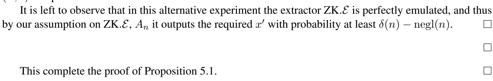

{0}------------------------------------------------

# Weakly Extractable One-Way Functions

Nir Bitansky∗ Noa Eizenstadt† Omer Paneth‡ November 13, 2020

### Abstract

A family of one-way functions is extractable if given a random function in the family, an efficient adversary can only output an element in the image of the function if it knows a corresponding preimage. This knowledge extraction guarantee is particularly powerful since it does not require interaction. However, extractable one-way functions (EFs) are subject to a strong barrier: assuming indistinguishability obfuscation, no EF can have a knowledge extractor that works against all polynomial-size non-uniform adversaries. This holds even for non-black-box extractors that use the adversary's code.

Accordingly, the literature considers either EFs based on non-falsifiable knowledge assumptions, where the extractor is not explicitly given, but it is only *assumed* to exist, or EFs against a restricted class of adversaries with a bounded non-uniform advice. This falls short of cryptography's gold standard of security that requires an explicit reduction against non-uniform adversaries of arbitrary polynomial size.

Motivated by this gap, we put forward a new notion of *weakly extractable* one-way functions (WEFs) that circumvents the known barrier. We then prove that WEFs are inextricably connected to the long standing question of three-message zero knowledge protocols. We show that different flavors of WEFs are sufficient and necessary for three-message zero knowledge to exist. The exact flavor depends on whether the protocol is computational or statistical zero knowledge and whether it is publicly or privately verifiable.

Combined with recent progress on constructing three message zero-knowledge, we derive a new connection between keyless multi-collision resistance and the notion of *incompressibility* and the feasibility of non-interactive knowledge extraction. Another interesting corollary of our result is that in order to construct three-message zero knowledge arguments, it suffices to construct such arguments where the honest prover strategy is *unbounded.*

∗E-mail: nirbitan@tau.ac.il. Member of the Check Point Institute of Information Security. Supported by the Alon Young Faculty Fellowship, by Len Blavatnik and the Blavatnik Family foundation, by the Blavatnik Interdisciplinary Cyber Research Center at Tel Aviv University, and an ISF grant 484/18.

†E-mail: noa.eizenstadt@gmail.com. Supported by ISF grant 484/18.

‡E-mail: omerpa@tauex.tau.ac.il. Member of the Check Point Institute of Information Security. Supported by an Azrieli Faculty Fellowship, by Len Blavatnik and the Blavatnik Foundation, by the Blavatnik Interdisciplinary Cyber Research Center at Tel Aviv University, and ISF grant 1789/19.

{1}------------------------------------------------

# Contents

| 1 | Introduction                                    |                                                        |          |
|---|-------------------------------------------------|--------------------------------------------------------|----------|
|   | 1.1                                             | This Work                                              | 1        |
|   | 1.2                                             | Technical Overview                                     | 3        |
|   | 1.3                                             | Open Questions                                         | 5        |
| 2 | Preliminaries                                   |                                                        |          |
|   | 2.1                                             | Hard On Average Relations                              | 7        |
|   | 2.2                                             | Non-Interactive Commitments                         | 7        |
|   | 2.3                                             | Zero-Knowledge and Witness Indistinguishable Protocols | 7        |
|   | 2.4                                             | Offline-Online Witness Indistinguishable Arguments  | 8        |
|   | 2.5                                             | Secure Function Evaluation                             | 9        |
| 3 | Extractable-One Way Functions: A New Definition |                                                        | 10       |
|   | 3.1                                             | Privately Verifiable GWEF                           | 12       |
| 4 | From Three-Message ZK to GWEF                   |                                                        | 12       |
|   | 4.1                                             | Publicly Verifiable GWEF                            | 13       |
|   | 4.2                                             | Privately Verifiable GWEF                           | 16       |
| 5 | From GWEF to Three-Message ZK                   |                                                        |          |
|   | 5.1                                             | Publicly Verifiable ZK                              | 20 20 |
|   | 5.2                                             | Privately Verifiable ZK                             | 25       |

{2}------------------------------------------------

### 1 Introduction

An extractable one-way function is a family of functions  $\{f_k\}$  that satisfies two properties: *One-wayness:* Given an image  $y = f_k(x)$  for random key k and input x, it is hard to find a corresponding pre-image  $x' \in f_k^{-1}(y)$ ; and *Extraction:* Given a random key k, it is hard to produce an image y obliviously, without knowing a corresponding preimage x'. This is formalized by requiring that for any efficient algorithm A that given k produces an image y, there is an efficient extractor  $\mathcal{E}$  (that depends on A) that given the same key k, extracts a preimage x'.

While their extraction property is reminiscent of *proofs of knowledge* [FS89, BG92], EFs are essentially different — they draw their power from the fact that *extraction can be done without interaction*.

**The Good.** The non-interactive nature of EFs gives rise to killer applications such as encryption with strong CCA security [Dam91, BP04], three-message zero knowledge [HT98, CD08], and by extending one-wayness to collision-resistance, also succinct non-interactive arguments of knowledge (SNARKs) [BCC+14].

**The Bad.** Constructing EFs has proven to be an elusive task. A first barrier is that without interaction, traditional *black-box extraction* techniques, like rewinding, (provably) do not work. Accordingly, extraction must use *the code* of the adversary in a non-black-box way. Bitansky, Canetti, Paneth, and Rosen [BCPR16], following Goldreich's intuition [HT98], demonstrated an even stronger barrier that holds for non-black-box extractors. Assuming indistinguishability obfuscation, they show that no efficient extractor can work against all polynomial-size non-uniform adversaries; that is, even when the extractor is given the adversary's code.

**The Ugly.** One approach that avoids the above barriers is to simply *assume* the existence of an extractor for every adversary, without giving an explicit extraction strategy. An EF with such non-explicit extractors follows, for example, from the *knowledge of exponent assumption* [Dam91]. Such *knowledge assumptions* translate in applications to security reductions that are, at least in part, non-explicit. Knowledge assumptions are arguably unsatisfying, and in particular are not *falsifiable* [Nao03].

Another way to circumvent known barriers is to restrict the class of adversaries. Bitansky et al. construct EFs with an explicit extractor against adversaries with bounded non-uniform advice, under standard assumptions. The restriction on the adversaries carries over to applications — they obtain three-message zero-knowledge, but only against verifiers with bounded non-uniformity. This of course falls short of the gold standard in cryptography of security against non-uniform adversaries of arbitrary polynomial size.

Given this state of affairs, we ask:

*Is there hope for explicit extraction from general non-uniform adversaries?* 

### 1.1 This Work

We put forward a new definition of *weakly extractable* one-way functions (WEFs) that circumvents the [BCPR16] extraction barrier. We then show that WEFs are deeply connected to three-message zero knowledge protocols, establishing a loose equivalence between the two notions.

**The New Definition.** Our notion of WEFs is inspired by simulation-based definitions of multi-party computation. We relax the extraction requirement as follows: instead of requiring that the extractor  $\mathcal{E}$ , given a random key k and the code of the adversary A, is able to find a preimage  $x' \in f_k^{-1}(y)$  for the adversary's image y = A(k), we allow the extractor to sample a *simulated key* k on its own together with an extracted

&lt;sup>1More accurately, they constructed *generalized* EFs under standard assumption and (plain) EFs assuming publicly verifiable delegation, which by now is also known based on standard assumptions [KPY19].

{3}------------------------------------------------

preimage x 0 ∈ f −1 ek (y) for y = A(ek). The simulated key ek must be indistinguishable from a randomly sampled key k.

For this relaxation to be meaningful we must also strengthen the one-wayness requirement. Instead of one-wayness for a random key, we require that fk is hard to invert on *any* key k. More generally, we can require hardness for any key from some NP set of *valid* keys. In this case, we further require that the extractor's simulated keys be valid and thus extraction cannot simply sample "easy to invert" keys. Rather, just as in standard EFs, the WEF extractor must use the code of the adversary to extract a preimage or it could be used to break one-wayness.

Our main motivation for studying WEFs is that they are weak enough to circumvent the impossibility of [\[BCPR16\]](#page-31-1) (see the technical overview for more details) yet, appear to capture a natural and meaningful notion of extraction. We confirm this intuition by showing that WEFs are sufficient for one of the central applications of EFs: three-message zero knowledge arguments.

*Theorem* 1.1 (Informal)*.* Assuming WEFs, two-message witness-indistinguishable arguments, and noninteractive commitments, there exist three-message ZK arguments for NP.

The existence of three-message zero knowledge arguments (with negligible soundness error) is one of the central questions in the area. The main barrier to constructing such arguments is that they require nonblack box simulation [\[GK96\]](#page-33-4). In addition to constructions based on EFs, the only known construction secure against arbitrary polynomial size non-uniform adversaries was given recently by Bitansky, Kalai and Paneth [\[BKP18\]](#page-32-4) based on *keyless multi-collision resistant hash functions* (and other, more standard, assumptions). A feature of the WEF-based zero knowledge argument, which [\[BKP18\]](#page-32-4) protocol lacks, is that it is *publicly verifiable*. This means that the verifier's decision can be inferred from the message transcript alone.

A Tighter Connection. We continue to show a tighter connection between the notions of WEF and threemessage zero knowledge. We show that a slight generalization of WEF is sufficient as well as *necessary* for three-message zero knowledge. Our generalization follows Bitansky et al's [\[BCPR16\]](#page-31-1) generalization of EFs, allowing for a more general forms of hardness than one-wayness. They consider a relation Rk(y, x0 ) on images y = fk(x) and *solutions* x 0 , and replace one-wayness with the hardness of finding solutions. Likewise, the extractor only has to find x 0 that satisfies the relation Rk, rather than a preimage.[2](#page-3-0) We generalize WEFs in an analogous way.

We establish the following equivalence between generalized WEFs (GWEFs) and three-message zero knowledge arguments:

*Theorem* 1.2 (Informal)*.* Assuming two-message witness- indistinguishable and non interactive commitments arguments, GWEFs exist if and only if publicly verifiable three-message zero knowledge arguments exist.

Finally, we ask if there is some natural notion of WEF that corresponds to three-message ZK arguments that are privately verifiable, such as the argument of [\[BKP18\]](#page-32-4). Again following [\[BCPR16\]](#page-31-1), we consider a notion of *privately verifiable* GWEFs where the hard relation Rk is not publicly verifiable — efficiently testing whether (fk(x), x0 ) ∈ Rk requires the preimage x (see the technical overview for a more details on privately verifiable GWEFs).

2 In this formulation, we think of the the preimage x as the private randomness used to sample y. Looking ahead, we will also discuss GWEFs with private verification, where it will be useful to refer to the private randomness x explicitly.

{4}------------------------------------------------

In the privately verifiable settings, we show the following loose equivalence:

*Theorem* 1.3 (Informal)*.*

- 1. Assuming privately verifiable GWEFs and secure function evaluation, there exist privately verifiable three-message computational zero-knowledge arguments for NP.
- 2. Assuming privately verifiable three-message statistical zero-knowledge arguments for NP and noninteractive commitments, there exist privately verifiable GWEFs.

Recently, building on [\[BKP18\]](#page-32-4) and relying on the same assumptions, three-message statistical zeroknowledge arguments were constructed in [\[BP19\]](#page-32-5). Thus, as a corollary from Theorem [1.3](#page-4-1) we obtain privately verifiable GWEFs from keyless multi-collision resistant hashing (and other standard assumptions). This connects between the notion of *incompressibility*, which stands behind keyless multi-collisionresistance and the notion of knowledge extraction. We further note that keyless collision-resistance is a falsifiable assumption, which should be contrasted with the fact that standard EFs all crucially rely on nonfalsifiable assumptions such as the knowledge of exponent assumption.

On WEFs candidates. As mentioned above, the negative result of Bitansky et al. [\[BCPR16\]](#page-31-1) does not extend to WEFs. Therefore, even assuming indistinguishability obfuscation, existing candidate constructions, such as the one based on the knowledge of exponent assumption, may be weakly extractable. In the current work, however, we do not provide any evidence in support of that. Demonstrating, under standard assumptions, a WEF with an explicit extractor against non-uniform adversaries is left as an open question. We view the privately verifiable GWEFs from keyless multi-collision resistant hashing that follows from Theorem [1.3](#page-4-1) as a first step in this direction.

On Zero Knowledge with an Unbounded Honest Prover. Our GWEF constructions from zero knowledge arguments, in fact, work even if the *honest prover* is unbounded. Combined with our results in the reverse direction, this has an interesting implication — to obtain three-message zero knowledge arguments *with an efficient honest prover*, it suffices to obtain such argument with *with an unbounded honest prover.*

### 1.2 Technical Overview

We now provide an overview of the main technical ideas behind our results. We start by explaining how the definition of WEFs circumvents the [\[BCPR16\]](#page-31-1) barrier. We then discuss the equivalence between GWEFs and (publicly verifiable) three-message zero knowledge. Finally, we discuss the case of private verification.

Circumventing the Impossibility. The [\[BCPR16\]](#page-31-1) impossibility constructs a distribution A over obfuscated adversaries, and shows that if the extractor works given a random key k and adversary A sampled from A, then it must also work when the adversary A is sampled *after the key* k from an alternative distribution Ak over adversaries that have a random image fk(x) hardwired in their code. This argument crucially relies on the fact that *the extractor does not control the key* k.

GWEFs to Publicly Verifiable Zero Knowledge. The construction of publicly verifiable zero knowledge from GWEFs is mostly similar to previous constructions (e.g., [\[CD08,](#page-32-3) [BCC](#page-31-0)+14]). We sketch it here briefly, highlighting the differences. To prove some NP statement ϕ ∈ L, the protocol follows the Feige-Lapidot-Shamir *trapdoor paradigm* [\[FLS90\]](#page-33-5). The prover sends a random key k for a GWEF, and the verifier responds with a random image y = fk(x). The prover then provides a witness-indistinguishable proof of knowledge that either the statement ϕ is true, or that (a) the chosen key k is valid (and thus hard), and (b) it knows a solution x 0 for y; namely, (y, x0 ) ∈ Rk.

{5}------------------------------------------------

The protocol is publicly verifiable, as it only requires verifying the witness indistinguishable proof, which is publicly verifiable. Soundness follows from the fact that for a valid key k and a random image  $f_k(x)$ , it is hard to find a solution x' satisfying  $\mathcal{R}_k$ . For zero knowledge, the simulator uses the extractor  $\mathcal{E}(V^*)$  to extract from the verifier a solution x' together with a corresponding simulated key k and an NP certificate for the key's validity. It then uses x' and the certificate of validity as its witness in the witness-indistinguishable proof. The protocol, as described, implicitly assumes that the malicious verifier's message y can indeed be explained as an image  $y = f_k(x)$ . We bridge this gap using standard techniques, based on two-message witness-indistinguishability and commitments, for compiling protocols against explainable verifiers to ones against malicious verifiers [BKP19].

**Publicly Verifiable Zero Knowledge to GWEFs.** The main idea behind the construction of GWEFs from three-message zero knowledge is a natural one — a key k for a function  $f_k$  consists of the first zero knowledge message  $\mathsf{zk}_1$  as well a statement  $\varphi \in \mathcal{L}$  for some language  $\mathcal{L}$  (to be specified), an image under the function  $f_k(x)$  is the honest verifier response  $y = \mathsf{zk}_2$ , when using x as its randomness. The corresponding hard relation  $\mathcal{R}_k(y,x')$  accepts as a solution x' any message  $\mathsf{zk}_3$  that convinces the verifier. Indeed, given that the zero knowledge is publicly verifiable, this can be tested efficiently.

The set of valid keys (for which the relation is hard) consists of false statements  $\varphi \notin \mathcal{L}$ . Indeed, finding a solution  $x' = \mathsf{zk}_3$  to a random image  $y = \mathsf{zk}_2$  under a valid key  $k = (\mathsf{zk}_1, \varphi)$ , amounts to producing an accepting proof for the false statement  $\varphi$ , which is computationally hard due to the soundness of the argument.

The extractor  $\mathcal{E}(A)$  samples a false  $\varphi$  on its own, and runs the zero knowledge simulator  $S(\varphi, V_A)$  on the code of the verifier  $V_A$  induced by the adversary A to produce a simulated transcript  $(\mathsf{zk}_1, \mathsf{zk}_2, \mathsf{zk}_3)$ . It then sets the simulated key to be  $(\mathsf{zk}_1, \varphi)$  and the extracted preimage to be  $\mathsf{zk}_3$ . To argue that the extractor indeed works we have to argue that the simulator produces an accepting transcript. We note that had  $\varphi$  been a *true* statement, then this would have followed from the zero knowledge and completeness of the underlying argument. Indeed, the honest prover necessarily generates accepting transcripts due to completeness, and the simulated transcript must be indistinguishable.

To establish faithful extraction, we choose the language  $\mathcal{L}$  so to guarantee indistinguishable distributions over true-statements and false-statements. Since the simulator is efficient, and cannot tell them apart, it will also generate accepting transcripts on false-statements like the one sampled by the extractor. We also require that false-statements are taken from an NP set. The existence of a language  $\mathcal{L}$  satisfying these properties follow from non-interactive commitments.

**Privately Verifiable GWEFs.** We now move to discuss privately verifiable GWEFs and their connection to privately verifiable zero knowledge. Here the hard relation  $\mathcal{R}_k$  is not publicly verifiable — efficiently testing whether  $(f_k(x), x') \in \mathcal{R}_k$  requires the preimage x.

In the setting of privately verifiable GWEF, where testing a solution x' for y requires private information (a preimage), there are two knowledge-related questions: (1) the usual one: must the adversary know a solution for the produced image y? but also (2) can it even recognize such a solution? The definition we consider essentially says that if the adversary can generate an image y, for which it can verify solutions, then it must also know a solution. If it cannot even verify a solution, we only require that the extractor generates x' that the adversary cannot distinguish from a solution.

Following this intuition, we further relax the previous extraction definition as follows. The extractor  $\mathcal{E}$  may sometime fail to extract. However, there is an additional extractor  $\widetilde{\mathcal{E}}$  that is guaranteed to always succeed and produce a key k and candidate solution x' that are indistinguishable from those generated by  $\mathcal{E}$ . The extractor  $\widetilde{\mathcal{E}}$  is given the extra freedom to solve invalid keys (indeed invalid keys may be indistinguishable from valid keys, if the NP certificate of validity is hidden). Note that in the publicly verifiable setting, or

{6}------------------------------------------------

if the adversary generates images y whose solutions it can recognize, the original extractor E must indeed always succeed just like the alternative Ee (otherwise, we can tell them apart).

Privately Verifiable GWEFs to Privately Verifiable Zero Knowledge. The construction of privately verifiable zero knowledge from privately verifiable GWEFs follows the construction of [\[BCPR16\]](#page-31-1) from privately verifiable GEFs. In a nutshell, in the case of privately verifiable GWEFs, the prover cannot directly prove that it found a solution x 0 , as testing a solution requires the private randomness x used to generate y = fk(x). Instead, the verifier and prover execute a secure function evaluation protocol, which allows to perform this verification in an "encrypted manner". This results in privately verifiable zero knowledge due to the private state of the verifier in the secure function evaluation protocol.

Soundness of the protocol is argued similarly to [\[BCPR16\]](#page-31-1). For zero knowledge, we rely on the relaxed extraction guarantee described above. The simulator uses E to generate a simulated key k along with an NP certificate of validity, and extracted a solution x 0 . Only in the analysis, we switch to indistinguishably generating the keys using the alternative extractor Ee, and use the fact that it successfully extracts.

Privately Verifiable Statistical Zero Knowledge to Privately Verifiable GWEFs. The construction of GWEFs from Privately Verifiable Zero Knowledge is essentially the same as that from publicly verifiable zero knowledge. We address the difference in the analysis, explaining why statistical zero knowledge is needed, and how the alternative extractor relaxation aids the construction.

Recall that in the GWEF construction from publicly verifiable zero knowledge, to prove hardness it is crucial that a valid key corresponds to a false statement ϕ. To show that the extractor faithfully extracts, we had to show that the simulator faithfully generates an accepting transcript. We argued that in two steps: (1) the simulator generates accepting transcripts on true statements, and (2) even though the extractor generates false statements, the simulator would still succeed as it cannot tell false statements from true ones.

In the private verification setting, (1) is not clear. Indeed, testing whether a transcript is accepting cannot be done efficiently, and thus computational zero knowledge is insufficient for arguing that the simulator would also generate accepting transcripts. This is where we resort to statistical zero knowledge — indeed, an unbounded distinguisher can generate verifier coins consistent with the transcript and test acceptance. However, the second argument (2) should also be treated with care. The fact that the simulator generates accepting transcripts on true statements does not necessarily mean that it generates such transcripts on false statements. Indeed these are inherently only computational indistinguishable. However, this argument is sufficient for establishing our relaxed extraction guarantee: the alternative extractor Ee simply chooses true statements rather than false statements. Since these are computationally indistinguishable, and the extracted solution x 0 is efficiently generated from the statement, we are guaranteed that the two extractors are indeed indistinguishable.

# 1.3 Open Questions

The notions of WEFs and GWEFs suggest a new avenue for dealing with knowledge extraction in the noninteractive settings. We address a few of the open questions that arise.

• Can we use our new notions of extraction to go beyond zero knowledge and obtain results on the round complexity of secure computation? One concrete approach is to construct (G)WEFs with a unique hard property. That is, a GWEFs and a property π such that an image y uniquely determines the value π(x 0 ) for any solution x 0 but given only y the value π(x 0 ) is pseudo-random. Indeed, this can be seen as a generalization of WEF that are injective and will lead to *extractable commitments* in two messages.

{7}------------------------------------------------

- Can we construct any form of collision resistant (G)WEFs? Can these suffice for applications such as succinct non-interactive arguments of knowledge (SNARKs)?
- Is there an implication in the reverse direction from (G)WEF to keyless multi-collision-resistance, or, more generally to some non-trivial notion of incompressibility.

### 2 Preliminaries

We rely on the following standard computational concepts and notation:

- A PPT is a probabilistic polynomial-time algorithm.
- We follow the standard practice of modeling any efficient adversary strategy as a family of polynomial size circuits. For an adversary A corresponding to a family of polynomial-size circuits  $\{A_n\}_{n\in\mathbb{N}}$ .
- A distinguisher algorithm is one that has a single output bit.
- We say that a function  $f: \mathbb{N} \to \mathbb{R}$  is negligible if for all constants c > 0, there exists  $N \in \mathbb{N}$  such that for all n > N,  $f(n) < n^{-c}$ . We sometimes denote negligible functions by negl.
- We say that a function  $f: \mathbb{N} \to \mathbb{R}$  is noticeable if there exist constants c > 0 and  $N \in \mathbb{N}$  such that for all n > N,  $f(n) \ge n^{-c}$ .
- Two ensembles of random variables  $\mathcal{X} = \{X_i\}_{n \in \mathbb{N}, i \in I_n}$ ,  $\mathcal{Y} = \{Y_i\}_{n \in \mathbb{N}, i \in I_n}$  over the same set of indices  $I = \bigcup_{n \in \mathbb{N}} I_n$  are said to be *computationally indistinguishable*, denoted by  $\mathcal{X} \approx_c \mathcal{Y}$ , if for every polynomial-size distinguisher  $D = \{D_n\}_{n \in \mathbb{N}}$  there exists a negligible function  $\mu(\cdot)$  such that for all  $n \in \mathbb{N}, i \in I_n$ ,

$$\mathbb{E}D(X_i) - \mathbb{E}D(Y_i) \le \mu(n) .$$

The ensembles are statistically indistinguishable if the above holds also for unbounded (rather than polynomial-size distinguishers).

- For a finite set S, denote by  $x \leftarrow S$  the process of uniformly sampling x from S.
- $\bullet$  For a distribution X, we denote by  $x \in X$  the fact that x is in the support of X.

Let  $\mathcal{R} = \{(\varphi, \omega)\}$  be a relation. Denote by  $\mathcal{L}(\mathcal{R})$  the corresponding language:

$$\mathcal{L}(\mathcal{R}) \coloneqq \{ \varphi \mid \exists \omega \text{ such that } (\varphi, \omega) \in \mathcal{R} \}$$
.

For any  $\varphi$ , we denote by  $\mathcal{R}(\varphi)$  the set of witnesses corresponding to  $\varphi$ :

$$\mathcal{R}(\varphi) := \{ \omega \mid (\varphi, \omega) \in \mathcal{R} \}$$
.

{8}------------------------------------------------

### 2.1 Hard On Average Relations

We define hard-on-average problems with solved instance and co-instance samplers. Such a hard problem is given by two efficient samplers Y, N and corresponding NP relations RY , RN . Y outputs yes-instances along with a witness and N outputs no-instances along with a witness. The two types of instances are computationally indistinguishable.

*Definition* 2.1 (Hard on Average Problem)*.* A hard-on-average problem consists of PPT samplers Y, N supported on NP relations RY , RN . We require

- 1. Disjointness: L(RY ) ∩ L(RN ) = ∅.
- 2. Indistinguishability:

$$\{\varphi \mid (\varphi, \omega) \leftarrow Y(1^n)\}_n \approx_c \{\bar{\varphi} \mid (\bar{\varphi}, \bar{\omega}) \leftarrow N(1^n)\}_n$$
.

The notion is, in fact, equivalent to non-interactive commitments, but will be useful for presenting our constructions of generalized weakly extractable one-way functions, in a conceptually clear manner. To see this equivalence, we can consider the two NP languages corresponding to commitments of 0 and 1, and consider their respective relations. Analogously, we can construct commitments, where committing to 1 is done by sampling from Y , and committing to 0 is done by sampling from N.

# 2.2 Non-Interactive Commitments

*Definition* 2.2 (Non-Interactive Commitment [\[Blu81\]](#page-32-7))*.* A non-interactive commitment scheme consists of a polynomial-time commitment algorithm *Com*(x; r) that given a message x ∈ {0, 1} ∗ and randomness r ∈ {0, 1} n outputs a commitment c. We make the following requirements:

1. Perfect Binding: For every security parameter n ∈ N, and string c ∈ {0, 1} ∗ there exists at most a single x ∈ {0, 1} ∗ such that c is a commitment to x:

$$\forall n \in \mathbb{N}, r_0, r_1 \in \{0, 1\}^n \quad \text{if} \quad \textit{Com}(w_0; r_0) = \textit{Com}(w_1; r_1) \quad \text{then} \quad w_0 = w_1.$$

2. Computational Hiding: for any sequence I = n ∈ N, w0, w1 ∈ {0, 1} poly(n) :

$$\left\{ c_0: \begin{array}{l} r \leftarrow \{0,1\}^n \\ c_0 \leftarrow Com(w_0;r) \end{array} \right\}_{(n,w_0,w_1) \in \mathcal{I}} \approx_c \left\{ c_1: \begin{array}{l} r \leftarrow \{0,1\}^n \\ c_1 \leftarrow Com(w_1;r) \end{array} \right\}_{(n,w_0,w_1) \in \mathcal{I}} .$$

Non-interactive commitments can be constructed from any injective one-way function (or a certifiable collection thereof) [\[Blu81\]](#page-32-7).

### 2.3 Zero-Knowledge and Witness Indistinguishable Protocols

Throughout, for an interactive protocol between a prover P and verifier V (one of which possibly malicious), we denote by hP(ω), V i(ϕ) the transcript of an interaction with prover private input ω (possibly empty), and common input ϕ. We denote by *Acc*/*Rej* out ← hP(ω), V i(ϕ) the output of the (honest) verifier.

*Definition* 2.3 (Zero-Knowledge Arguments)*.* We say that a pair of interactive PPT machines hP , V i is a zero-knowledge argument system for a NP relation R if the following holds:

{9}------------------------------------------------

1. Completeness: For every element  $\varphi \in \mathcal{L}(\mathcal{R})$ , and a witness  $\omega \in \mathcal{R}(\varphi)$ :

$$\Pr\left[Acc \stackrel{\text{out}}{\leftarrow} \langle P(\omega), V \rangle(\varphi)\right] = 1$$
.

2. Soundness: For any family of polynomial-size circuits  $P^* = \{P_n^*\}_n$ , and every  $\varphi \in \{0,1\}^n \setminus \mathcal{L}$ :

$$\Pr\left[Acc \stackrel{\text{out}}{\leftarrow} \langle P_n^*, V \rangle(\varphi)\right] \le \operatorname{negl}(n) .$$

3. **Zero Knowledge:** There exists a PPT simulator S such that for any non-uniform family of polynomial-size circuits  $V^* = \{V_n^*\}_n$ ,

$$\{\langle P(\omega), V_n^* \rangle(\varphi)\}_{\varphi,\omega} \approx_c \{S(V_n^*, \varphi)\}_{\varphi,\omega}$$
,

where  $(\varphi, \omega) \in \mathcal{R}$  and  $|\varphi| = n$ .

The argument is **statistical zero knowledge** if the above indistinguishability is statistical (rather than computational).

The protocol is **publicly verifiable** is the verifier's decision can be determined solely from the protocol's transcript (without the private coins of the verifier).

Definition 2.4 (Argument of Knowledge). An argument system  $\langle P,V\rangle$  is an argument of knowledge for a relation  $\mathcal R$  if there exists a PPT extractor  $\mathcal E$  such that for any non-uniform family of polynomial-size circuits  $P^*=\{P_n^*\}_{n\in\mathbb N}$ , any noticeable function  $\varepsilon(n)$ , any  $n\in\mathbb N$ , and any  $\varphi\in\{0,1\}^n$ :

$$\begin{array}{ll} \text{if} & \Pr\left[Acc \stackrel{\text{out}}{\leftarrow} \langle P_n^*, V \rangle(\varphi)\right] = \varepsilon(n) \\ \\ \text{then} & \\ \Pr\left[\begin{array}{ll} \omega \leftarrow \mathcal{E}^{P_n^*}(1^{1/\varepsilon(n)}, \varphi) \\ \omega \in \mathcal{R}(\varphi) \end{array}\right] \geq \varepsilon(n) - \operatorname{negl}(n) \quad . \end{array}$$

### 2.4 Offline-Online Witness Indistinguishable Arguments

An offline-online interactive argument is a protocol  $\langle P, V \rangle$  that can be divided into two phases: an offline phase independent of the proven statement, and an online phase where the statement (and witness) become available and the proof is completed. We define such witness-indistinguishable arguments (and arguments of knowledge). Our formal definition follows that of [BP19]. Below, we consider sub-protocols  $\langle \text{off} P, \text{off} V \rangle (1^n)$  where both prover and verifier may have an output; we denote this by  $(O_P, O_V) \stackrel{\text{out}}{\leftarrow} \langle \text{off} P, \text{off} V \rangle (1^n)$ .

Definition 2.5 (Offline-Online Witness-Indistinguishable Arguments). An interactive protocol  $\langle P, V \rangle$  is an offline-online witness-indistinguishable argument for an NP relation  $\mathcal{R}$  if it consists of two sub-protocols  $P = (\mathsf{off} P, \mathsf{on} P), V = (\mathsf{off} V, \mathsf{on} V)$ , that satisfy:

1. Completeness: For any  $(\varphi, \omega) \in \mathcal{R}$  where  $|\varphi| = n$ :

$$\Pr\left[ \ \langle Acc \stackrel{\text{out}}{\leftarrow} \mathsf{on} P(\mathit{st}_P, \omega), \mathsf{on} V(\mathit{st}_V) \rangle(\varphi) \ \middle| \ (\mathit{st}_P, \mathit{st}_V) \stackrel{\text{out}}{\leftarrow} \langle \mathsf{off} P, \mathsf{off} V \rangle(1^n) \ \right] = 1 \ .$$

{10}------------------------------------------------

2. Adaptive Soundness: For any non-uniform family of polynomial-size circuits  $P^* = \{ \text{off} P_n^*, \text{on} P_n^* \}_n$ , and for all  $n \in \mathbb{N}$ :

$$\Pr\left[\begin{array}{c|c} Acc \stackrel{\text{out}}{\leftarrow} \langle \mathsf{on}P_n^*(st_P), \mathsf{on}V(st_V) \rangle(\varphi) & \left| & ((st_P, \varphi), st_V) \stackrel{\text{out}}{\leftarrow} \langle \mathsf{off}P_n^*, \mathsf{off}V \rangle(1^n) \end{array}\right] \\ \leq \operatorname{negl}(n) ,$$

where  $\varphi \notin \mathcal{L}$  and  $|\varphi| = n$ .

3. Adaptive Witness-Indistinguishability For any non-uniform family of polynomial size circuits  $V^* = \{V_n^*\}_n$ , all  $n \in \mathbb{N}$ :

$$\Pr\left[b \overset{\text{out}}{\leftarrow} \langle \mathsf{on}P(st_P, \omega_b), \mathsf{on}V_n^*(st_V) \rangle(\varphi) \right. \\ \left. \left. \begin{array}{l} (st_P, (st_V, \varphi, \omega_0, \omega_1)) \overset{\text{out}}{\leftarrow} \langle \mathsf{off}P, \mathsf{off}V_n^* \rangle(1^n), \\ b \leftarrow \{0, 1\} \end{array} \right] \leq \frac{1}{2} + \mathrm{negl}(n) \end{array},$$

where  $(\varphi, \omega_0), (\varphi, \omega_1) \in \mathcal{R}$  and  $|\varphi| = n$ 

Definition 2.6 (Adaptive Argument of Knowledge). We say that the system is an **Adaptive Argument of Knowledge** if there exists a PPT extractor  $\mathcal{E}$  such that for any non-uniform family of polynomial-size circuits  $P^* = \{\mathsf{off} P_n^*, \mathsf{on} P_n^*\}_{n \in \mathbb{N}}$ , and for all  $n \in \mathbb{N}$ :

if 
$$\Pr \left[ \begin{array}{l} Acc \stackrel{\mathrm{out}}{\leftarrow} \langle \mathsf{on} P_n^*(st_P), \mathsf{on} V(st_V) \rangle(\varphi) \mid \\ ((st_P, \varphi), st_V) \stackrel{\mathrm{out}}{\leftarrow} \langle \mathsf{off} P_n^*, \mathsf{off} V \rangle(1^n) \end{array} \right] = \varepsilon$$
then
$$\Pr \left[ \begin{array}{l} Acc \stackrel{\mathrm{out}}{\leftarrow} \langle \mathsf{on} P_n^*(st_P), \mathsf{on} V(st_V) \rangle(\varphi) \\ \omega \leftarrow \mathcal{E}^{(\mathsf{off} P_n^*, \mathsf{on} P_n^*)}(1^{1/\varepsilon}, \varphi, st_P, st_V) \\ \omega \in \mathcal{R}(\varphi) \\ ((st_P, \varphi), st_V) \stackrel{\mathrm{out}}{\leftarrow} \langle \mathsf{off} P_n^*, \mathsf{off} V \rangle(1^n) \right] \geq \varepsilon - \mathrm{negl}(n) \end{array}$$

where  $|\varphi|=n$ . This further holds for randomized circuits off  $P^*$ , on  $P^*$ , provided that the first prover message of off P is deterministic.3

Assuming non-interactive commitments, there exist three-message systems as the one defined above that are adaptive arguments of knowledge, and have two offline (prover and verifier) messages and a single online (prover) message [FLS90].

Two-message systems (that are only sound) are known under a variety of assumptions like trapdoor permutations, or concrete number-theoretic or lattice assumptions (e.g. [DN00, GOS06, KKS18]).

### 2.5 Secure Function Evaluation

We define two-message secure function evaluation.

*Definition* 2.7 (Two-Message Secure Function Evaluation Scheme). A secure function evaluation scheme consists of three algorithms (*Enc*, *Dec*, *Eval*), where *Enc*, *Eval* are probabilistic and *Dec* is deterministic, satisfying:

&lt;sup>3The requirement for randomized circuits is not essential, but simplifies the analysis.

{11}------------------------------------------------

1. Correctness: For any  $n \in \mathbb{N}$ ,  $x \in \{0,1\}^n$  and circuit C:

$$\Pr\left[Dec_{sk}(\widehat{ct}) = C(x) \mid (sk, ct) \leftarrow Enc(x), \widehat{ct} \leftarrow Eval(ct, C)\right] = 1.$$

2. Semantic Security:

$$\{ct \mid (sk, ct) \leftarrow Enc(w_0)\}_{n, w_0, w_1} \approx_c \{ct \mid (sk, ct) \leftarrow Enc(w_1)\}_{n, w_0, w_1},$$
 where  $n \in \mathbb{N}, w_0, w_1 \in \{0, 1\}^n$ .

3. Circuit Privacy:

$$\{Eval(ct, C_0)\}_{n,C_0,C_1,ct} \approx_c \{Eval(ct, C_1)\}_{n,C_0,C_1,ct}$$
,

where  $n \in \mathbb{N}$ ,  $C_0, C_1 \in \{0, 1\}^{\text{poly}(n)}$  compute the same function, and  $ct \in \{0, 1\}^{\ell(n)}$ , where  $\ell(n)$  is the size of encryptions of messages of length n.

Such secure function evaluation schemes are known from a variety of assumptions such as DDH [NP01] and LWE [BD18].

# 3 Extractable-One Way Functions: A New Definition

In this section, we provide our new definition of extractable one-way functions against adversaries with arbitrary polynomial-size non-uniform advice. We start by recalling the concept of *generalized extractable one-way functions* (GEF) [BCPR16], which considers general (hard) relations, rather than the specific preimage relation. We then present our new definition of generalized weakly extractable one-way functions (GWEF). *Definition* 3.1 (GEF [BCPR16]). A polynomial-time computable family of functions

$$\mathcal{F} = \left\{ f_k : \{0, 1\}^{\ell(n)} \to \{0, 1\}^{\ell'(n)} \mid n \in \mathbb{N}, k \in \{0, 1\}^{m(n)} \right\} ,$$

associated with an efficient key sampler K, is a generalized extractable one-way function with respect to a polynomial-time relation  $\mathcal{R}^{\mathcal{F}}$  if the following holds:

1.  $\mathcal{R}^{\mathcal{F}}$ -Hardness: For any non-uniform family of polynomial-size circuits  $A = \{A_n\}_n$  and every  $n \in \mathbb{N}$ ,

$$\Pr\left[ (f_k(x), x') \in \mathcal{R}_k^{\mathcal{F}} \mid k \leftarrow K(1^n), x \leftarrow \{0, 1\}^{\ell(n)}, x' \leftarrow A_n(k, f_k(x)) \right] \le \operatorname{negl}(n) .$$

2.  $\mathcal{R}^{\mathcal{F}}$ -Extractability: There exists a PPT extractor  $\mathcal{E}$  such that for any non-uniform family of polynomial size circuits  $A = \{A_n\}_n$  and every  $n \in \mathbb{N}$ ,

$$\Pr\left[\begin{array}{c} \exists x : y = f_k(x), \\ (y, x') \notin \mathcal{R}_k^{\mathcal{F}} \end{array} \middle| \begin{array}{c} k \leftarrow K(1^n) \\ y \leftarrow A_n(k), \\ x' \leftarrow \mathcal{E}(k, A_n) \end{array} \right] \leq \operatorname{negl}(n) .$$

Definition 3.2 (Privately Verifiable GEF). A GEF is (only) privately verifiable if the relation  $\mathcal{R}_k^{\mathcal{F}}$  is not necessarily polynomial-time, but there exists a polynomial-time tester  $\mathcal{M}$  such that for any (k, x, x'):

$$\mathcal{M}(k, x, x') = 1$$
 iff  $(f_k(x), x') \in \mathcal{R}_k^{\mathcal{F}}$ .

{12}------------------------------------------------

On the Amount of Non-Uniformity. The definition of [BCPR16] also considers PPT adversaries with bounded non-uniform advice. In contrast, the above definition is formulated for non-uniform circuit adversaries of arbitrary polynomial size, which is equivalent to considering PPT adversaries with arbitrary polynomial-size non-uniform advice. As discussed in the introduction, while security against such adversaries is the gold standard in cryptography, such extractable functions are shown in [BCPR16] to be impossible assuming indistinguishability obfuscation.

The New Definition for Arbitrary Non-Uniformity. The main relaxation we introduce in order to overcome the impossibility is to only require that extraction holds with respect to *simulated keys*, indistinguishable from real keys. That is, we allow the extractor to also simulate the key, for which it may use the code of the adversary.

Having relaxed extraction, we also strengthen the hardness requirement — we ask that one-wayness holds with respect to *any* key from a predefined set of valid keys  $\mathcal{L}(\mathcal{K})$ , certifiable by an NP relation  $\mathcal{K}$ , rather than only when the key is chosen at random by the (real) key sampler. (As noted in the introduction, without this strengthening, extraction relative to extractor-simulated keys becomes trivial, assuming trapdoor one-way functions. Indeed, this stronger form of one-wayness will be crucial for the application of three-message zero-knowledge.) We shall require that the simulated keys are also valid and are generated by the extractor along with an NP certificate for their validity.

Definition 3.3 (GWEF). An efficiently computable family of functions

$$\mathcal{F} = \left\{ f_k : \{0, 1\}^{\ell(n)} \to \{0, 1\}^{\ell'(n)} \mid n \in \mathbb{N}, f_k \in \{0, 1\}^{m(n)} \right\} ,$$

associated with an efficient key sampler K and NP relation K, is a generalized weakly extractable one-way function with respect to a polynomial-time relation  $\mathcal{R}^{\mathcal{F}}$  if the following holds:

1. Worst-case  $\mathcal{R}^{\mathcal{F}}$ -Hardness: For any non-uniform family of polynomial-size circuits  $A = \{A_n\}_n$ , every  $n \in \mathbb{N}$ , and every  $k \in \mathcal{L}(\mathcal{K}) \cap \{0,1\}^{m(n)}$ ,

$$\Pr\left[ (f_k(x), x') \in \mathcal{R}^{\mathcal{F}} \mid x \leftarrow \{0, 1\}^{\ell(n)}, x' \leftarrow A_n(k, f_k(x)) \right] \le \operatorname{negl}(n) .$$

- 2. Weak  $\mathcal{R}^{\mathcal{F}}$ -Extractability: There exists a PPT extractor  $\mathcal{E}$  such that for any non-uniform family of polynomial-size circuits  $A = \{A_n\}_n$ , we have:
  - (a) **Extraction:** For all  $n \in \mathbb{N}$ ,

$$\Pr\left[\begin{array}{c|c} \exists x : y = f_k(x), & (k, v, x') \leftarrow \mathcal{E}(1^n, A_n) \\ (y, x') \notin \mathcal{R}_k^{\mathcal{F}} & y \leftarrow A_n(k) \end{array}\right] \leq \operatorname{negl}(n) .$$

(b) Key Indistinguishability:

$$\{k \mid k \leftarrow K(1^n)\}_n \approx_c \{k \mid (k, v, x') \leftarrow \mathcal{E}(1^n, A_n)\}_n.$$

(c) Validity: For all  $n \in \mathbb{N}$ ,

$$\Pr_{k,v,x'\leftarrow\mathcal{E}(1^n,A_n)}\left[(k,v)\in\mathcal{K}\right]\geq 1-\operatorname{negl}(n).$$

Remark 3.1 (On Validity of Keys). We note that we do not insist that random keys sampled by K are valid. Indeed, requiring this is typically not useful in settings where keys are not necessarily generated by trusted parties. We note, however, that due to key-indistinguishability, it is possible to add this additional requirement generically, by having the  $K(1^n)$  sample using  $\mathcal{E}(1^n, C_n)$ , for any fixed circuit  $C_n$ .

{13}------------------------------------------------

### 3.1 Privately Verifiable GWEF

We now turn to define private-verifiable GWEF. Here we relax the definition even further, allowing that simulated keys generated by the extractor are not necessarily valid. Rather, we require that there exists another extractor  $\widetilde{\mathcal{E}}$  that does output valid keys, and such that the key k and extracted w sampled by  $\widetilde{\mathcal{E}}$  are indistinguishable from those sampled by  $\mathcal{E}$ . However,  $\widetilde{\mathcal{E}}$ , may not necessarily succeed in producing w that satisfies the relation  $\mathcal{R}_k^{\mathcal{F}}$ .

We present the definition, and then further discuss the intuition behind it.

Definition 3.4 (Privately Verifiable GWEF). A GWEF is (only) privately verifiable if the relation  $\mathcal{R}_k^{\mathcal{F}}$  is not necessarily polynomial-time, but there exists a polynomial-time tester  $\mathcal{M}(k,x,w)$  for  $(f_k(x),w)\in\mathcal{R}_k^{\mathcal{F}}$  as in Definition 3.2

In addition, Weak  $\mathcal{R}^{\mathcal{F}}$ -Extractability is augmented.

Weak  $\mathcal{R}^{\mathcal{F}}$ -Extractability: There exist PPT extractors  $\mathcal{E}, \widetilde{\mathcal{E}}$  such that for any non-uniform family of polynomial size circuits  $A = \{A_n\}_n$ , we have:

1. **Extraction:** For all  $n \in \mathbb{N}$ ,

$$\Pr\left[\begin{array}{cc} \exists x : y = f_k(x), \\ (y, w) \notin \mathcal{R}_k^{\mathcal{F}} \end{array} \middle| \begin{array}{c} (k, w) \leftarrow \mathcal{E}(1^n, A_n) \\ y \leftarrow A_n(k) \end{array} \right] \le \operatorname{negl}(n) .$$

2. Key Indistinguishability:

$$\{k \mid k \leftarrow K(1^n)\}_n \approx_c \{k \mid (k, w) \leftarrow \mathcal{E}(1^n, A_n)\}_n$$
.

3.  $\widetilde{\mathcal{E}}$ -Validity: For all  $n \in \mathbb{N}$ ,

$$\Pr\left[(k,v) \in \mathcal{K} \mid (k,v,w) \leftarrow \widetilde{\mathcal{E}}(1^n,A_n)\right] \ge 1 - \operatorname{negl}(n)$$
.

4. Extractor Indistinguishability:

$$\{k, w \mid (k, w) \leftarrow \mathcal{E}(1^n, A_n)\}_n \approx_c \{k, w \mid (k, v, w) \leftarrow \widetilde{\mathcal{E}}(1^n, A_n)\}_n$$
.

More on the Definition. In the setting of privately verifiable GWEF, where testing a solution w for y requires private information (a preimage), there are two knowledge-related questions: (1) the usual one: must the adversary know a solution for the produced image y? but also (2) can it even recognize such a solution? The definition we consider essentially says that if the adversary can generate an image y, for which it can verify solutions, then it must also know a solution. If it cannot even verify a solution, we only require that the extractor generates w that the adversary cannot distinguish from a solution.

# 4 From Three-Message ZK to GWEF

In this section, we present our constructions of generalized weakly extractable one-way functions from three-message zero-knowledge arguments.

{14}------------------------------------------------

### 4.1 Publicly Verifiable GWEF

In this section, we construct publicly verifiable three-message zero-knowledge protocols from GWEF.

*Theorem* 4.1*.* Assuming publicly verifiable three-message zero-knowledge argument system for NP and non-interactive commitments, there exists a GWEF.

### Ingredients and Notation:

- H = (Y, N, RY , RN ), a hard-on-average problem with solved instances and co-instances. (Recall that such problems follow from non-interactive commitments.)
- hP , V i, a ZK argument system for RY . We denote the protocol's messages by zk1, zk2, zk3.

We now define our GWEF F with associated key sampler K, key-relation K, and hard relation RF . These are given in Figure [1.](#page-14-1)

### Sampler K(1n ):

- Sample (ϕ, ω) ← Y (1n )
- Let S be the zero-knowledge simulator, and let V0 be the honest verifier circuit with hardwired randomness 0 n . Sample (zk1, zk2, zk3) ← S(V0, ϕ).
- Return k = (ϕ, zk1).

## Key relation K:

• (k, v) ∈ K iff k = (ϕ, zk1) such that (ϕ, v) ∈ RN .

Function fk(r) in family F = {fk : {0, 1} n → {0, 1} ∗}n,k:

- Parse k = (ϕ, zk1).
- Emulate the verifier V with statement ϕ, first prover message zk1, and randomness r. Let zk2 be the produced verifier message.
- Output zk2.

# RF :

- (y, x0 ) ∈ RF k iff
  - Parsing y = zk2, x 0 = zk3, and k = (ϕ, zk1).
  - The transcript (zk1, zk2, zk3) with respect to statement ϕ is accepting.

Figure 1: GWEF

{15}------------------------------------------------

### 4.1.1 Security Analysis

We now show that the described function family  $\mathcal{F}$  (and associated  $K, \mathcal{K}, \mathcal{R}^{\mathcal{F}}$ ) satisfy the requirements of a GWEF.

**Hardness.** We show hardness based on the soundness of the argument system and disjointness property of  $\mathcal{H}$ .

*Proposition* 4.1.  $\mathcal{F}$  satisfies  $\mathcal{R}^{\mathcal{F}}$ -hardness.

*Proof.* Assume toward contradiction there exists a family of polynomial-size circuits  $A = \{A_n\}_n$  and a noticeable function  $\varepsilon(n)$ , such that for infinitely many n, there exists a valid key  $k = (\bar{\varphi}, \mathsf{zk}_1) \in \mathcal{L}(\mathcal{K})$ , such that

$$\Pr\left[ (y, x') \in \mathcal{R}_k^{\mathcal{F}} \middle| \begin{array}{c} x \leftarrow \{0, 1\}^n \\ y = f_k(x) \\ x' = A(k, y) \end{array} \right] \ge \varepsilon(n) .$$

That is, parsing  $y = \mathsf{zk}_2, x' = \mathsf{zk}_3$ , the transcript  $(\mathsf{zk}_1, \mathsf{zk}_2, \mathsf{zk}_3)$  is accepting with respect to statement  $\bar{\varphi}$ .

We construct a corresponding prover  $P^* = \{P_n^*\}_n$  (Figure 2) that convinces the verifier of accepting the statement  $\bar{\varphi}$  with probability  $\varepsilon(n) - \operatorname{negl}(n)$ . Since  $k \in \mathcal{K}$ , it holds that  $\bar{\varphi} \in \mathcal{L}(\mathcal{R}_N)$ . By the disjointness property of  $\mathcal{H}$ , this means that  $\bar{\varphi} \notin \mathcal{L}(\mathcal{R}_Y)$  and thus,  $P^*$  will violate the soundness of the underlying argument system.

$$P_n^*(\bar{\varphi})$$

- 1. Sends zk1 to the verifier.
- 2. Obtains a response  $zk_2$  from the verifier.
- 3. Emulates  $A_n(k, y)$ , where  $y = \mathsf{zk}_2$ , and obtains  $\mathsf{zk}_3$ . Sends  $\mathsf{zk}_3$  to the verifier.

Figure 2: ZK Malicious Prover GWEF

Note that the view of  $A_n$  when emulated by  $P_n^*$  is identical to its view when breaking the hardness of  $\mathcal{R}^{\mathcal{F}}$ . Thus  $P_n^*$  convinces the verifier of accepting the false statement with probability  $\varepsilon(n) - \operatorname{negl}(n)$ .  $\square$ 

**Weak Extractability.** We now prove weak extractability, based on the zero-knowledge and completeness properties of the argument system and indistinguishability of  $\mathcal{H}$ .

*Proposition* 4.2.  $\mathcal{F}$  satisfies weak extractability.

*Proof.* We start by defining the extractors  $\mathcal{E}$ , which is described in Figure 3.

We prove the three properties — extraction, key-indistinguishability and validity — required by weak extractability (Definition 3.3). From hereon, fix a family of polynomial size circuits  $A = \{A_n\}_n$ .

Claim 4.1 (Extraction). For all  $n \in \mathbb{N}$ ,

$$\Pr\left[\begin{array}{cc} \exists x : y = f_k(x), \\ (y, x') \notin \mathcal{R}_k^{\mathcal{F}} \end{array} \middle| \begin{array}{c} (k, x') \leftarrow \mathcal{E}(1^n, A_n) \\ y \leftarrow A_n(k) \end{array} \right] \leq \operatorname{negl}(n) .$$

{16}------------------------------------------------

#  $\mathcal{E}(1^n,A)$ :

- Sample  $(\bar{\varphi}, \bar{\omega}) \leftarrow N(1^n)$ .
- Consider the verifier circuit  $V^*$ , that given a first prover message  $\mathsf{zk}_1$ , computes  $\mathsf{zk}_2 = A(\bar{\varphi}, \mathsf{zk}_1)$ , and responds with  $\mathsf{zk}_2$ .
- Sample a simulated transcript  $(\mathsf{zk}_1, \mathsf{zk}_2, \mathsf{zk}_3) \leftarrow S(V^*, \bar{\varphi})$ , where S is the zero-knowledge simulator.
- Output (k, v, x') where  $k = (\bar{\varphi}, \mathsf{zk}_1), v = \bar{\omega}, \text{ and } x' = \mathsf{zk}_3.$

Figure 3: GWEF Extractor

*Proof.* We start by recalling that whenever y is in the image of  $f_k$ , it is the case that  $y = \mathsf{zk}_2$ , such that  $\mathsf{zk}_2$  is the response of the honest verifier to  $\mathsf{zk}_1$ , using some randomness r, where  $\mathsf{zk}_1$  is given by the key  $k = (\varphi, \mathsf{zk}_1)$ .

Our goal is to show that except with negligible probability, the extractor produces  $zk_3$ , such that the simulated transcript  $(zk_1, zk_2, zk_3)$  is accepting with respect to statement  $\bar{\varphi}$ . We show that this follows from the zero-knowledge and completeness of the underlying argument, and the hardness of the language  $\mathcal{H}$ .

To see this, consider an alternative experiment where  $(\varphi, \omega)$  are sampled from the yes-instances sampler Y. From the ZK guarantee of the simulator, the generated transcript is computationally indistinguishable from the honest interaction. Note that by the (perfect) completeness of the zero-knowledge argument, whenever  $A_n(k)$  outputs  $y = \mathsf{zk}_2$  in the image of  $f_k$ , the interaction results in an accepting transcript. By the zero-knowledge property, it follows that except with negligible probability, the simulator also generates accepting transcripts whenever  $A_n$  outputs y in the image of  $f_k$ .

It is left to note that from the indistinguishability of the hard samplers Y, N, the simulated transcripts of the experiment are indistinguishable from the ones used by the extractor. Therefore they are accepting with the same probability, and thus  $\mathcal{E}$  successfully extracts x' such that  $(y, x') \in \mathcal{R}_k^{\mathcal{F}}$ , as required.

Claim 4.2 (Key Indistinguishability).

$$\{k \mid k \leftarrow K(1^n)\}_n \approx_c \{k \mid (k, v, x') \leftarrow \mathcal{E}(1^n, A_n)\}_n$$

*Proof.* Recall that  $k = (\varphi, \mathsf{zk}_1)$  where the statement  $\varphi$  is sampled from  $Y(1^n)$  in the key sampler, and from  $N(1^n)$  in the simulated case. Consider the hybrid experiment where  $\varphi$  is sampled from  $Y(1^n)$  in the simulated case. The message  $\mathsf{zk}_1$  is then sampled from  $S(V_0, \varphi)$ , where  $V_0$  is the honest verifier with hardwired randomness  $0^n$ , by the key sampler, and from  $S(V^*, \varphi)$ , where  $V^*$  is the verifier constructed from  $A_n$ , by the hybrid extractor. Using zero-knowledge guarantee, and the fact that the honest prover's first message  $\mathsf{zk}_1$  is independent of the verifier, we have:

$$\begin{split} \{\mathsf{zk}_1 \mid (\mathsf{zk}_1, \mathsf{zk}_2, \mathsf{zk}_3) \leftarrow S(V_0, \varphi)\} \approx_c \{\mathsf{zk}_1 \mid (\mathsf{zk}_1, \mathsf{zk}_2, \mathsf{zk}_3) \leftarrow \langle P, V_0 \rangle(\varphi)\} \equiv \\ \{\mathsf{zk}_1 \mid (\mathsf{zk}_1, \mathsf{zk}_2, \mathsf{zk}_3) \leftarrow \langle P, V^* \rangle(\varphi)\} \approx_c \{\mathsf{zk}_1 \mid (\mathsf{zk}_1, \mathsf{zk}_2, \mathsf{zk}_3) \leftarrow S(V^*, \varphi)\} \end{split} ,$$

where throughout  $\varphi \leftarrow Y(1^n)$ .

From the hardness of the samplers, Y-instances are indistinguishable from N- instances, and therefore the simulated transcripts are distinguishable. The extractor indistinguishability follows.

{17}------------------------------------------------

Claim 4.3 (Validity). For all  $n \in \mathbb{N}$ :

$$\Pr\left[(k,v) \in \mathcal{K} \mid (k,v,x') \leftarrow \mathcal{E}(1^n,A_n)\right] \ge 1 - \operatorname{negl}(n) .$$

Recall that  $\mathcal{E}$  always samples  $(\bar{\varphi}, \bar{\omega}) \leftarrow N(1^n)$  and sets  $k = (\bar{\varphi}, \mathsf{zk}_1)$  and  $v = \bar{\omega}$ . Thus  $(k, v) \in \mathcal{K}$  by definition.

## 4.2 Privately Verifiable GWEF

In this section, we construct privately verifiable GWEF from privately verifiable three-message zero knowledge protocols.

Theorem 4.2. Assuming privately verifiable three-message statistical zero-knowledge argument system for NP and non-interactive commitments, there exists a privately verifiable GWEF.

**Adjustments from GWEF.** In this construction we use privately verifiable ZK, rather than publicly verifiable one. Therefore, unlike the previous construction, the verifier's randomness is required in order to efficiently decide whether the transcript is accepting or not. To overcome it, SZK is needed. This will guarantee that the simulated transcripts are indeed accepting (and are not simply hard to distinguish). Note that the definition of the privately GWEF extractor is relaxed as well, allowing two different extractors. One of which will guarantee extraction, and will use the ZK simulator on true statements, and the other will guarantee validity, and will use false statements. From the hardness of the problem  $\mathcal{H}$ , both extractors will be indistinguishable, as required.

### **Ingredients and Notation:**

- $\mathcal{H} = (Y, N, \mathcal{R}_Y, \mathcal{R}_N)$ , a hard-on-average problem with solved instances and co-instances. (Recall that such problems follow from non-interactive commitments.)
- $\langle P, V \rangle$ , an SZK argument system for  $\mathcal{R}_Y$ . We denote the protocol's messages by  $\mathsf{zk}_1, \mathsf{zk}_2, \mathsf{zk}_3$ .
- Com, a non-interactive string commitment scheme.

We now define our privately verifiable GWEF  $\mathcal{F}$  with associated key sampler K, key-relation  $\mathcal{K}$ , hard relation  $\mathcal{R}^{\mathcal{F}}$ , and corresponding tester  $\mathcal{M}$ . These are given in Figure 4.

### 4.2.1 Security Analysis

We now show that the described function family  $\mathcal{F}$  (and associated  $K, \mathcal{K}, \mathcal{R}^{\mathcal{F}}, \mathcal{M}$ ) satisfy the requirements of a GWEF.

**Hardness.** We show hardness based on the soundness of the argument system, disjointness property of  $\mathcal{H}$ , and hiding of the commitment scheme.

*Proposition* 4.3.  $\mathcal{F}$  satisfies  $\mathcal{R}^{\mathcal{F}}$ -hardness.

*Proof.* Assume toward contradiction there exists a family of polynomial-size circuits  $A = \{A_n\}_n$  and a noticeable function  $\varepsilon(n)$ , such that for infinitely many n, there exists a valid key  $k = (\bar{\varphi}, \mathsf{zk}_1) \in \mathcal{L}(\mathcal{K})$ , such that

$$\Pr\left[ (y, x') \in \mathcal{R}_k^{\mathcal{F}} \middle| \begin{array}{c} x \leftarrow \{0, 1\}^{n \times n} \\ y = f_k(x) \\ x' = A(k, y) \end{array} \right] \ge \varepsilon(n) .$$

{18}------------------------------------------------

### Sampler K(1n ):

- Sample (ϕ, ω) ← Y (1n ).
- Let S be the zero-knowledge simulator, and let V0 be the honest verifier circuit with hardwired randomness 0 n . Sample (zk1, zk2, zk3) ← S(V0, ϕ).
- Return k = (ϕ, zk1).

### Key relation K:

• (k, v) ∈ K iff k = (ϕ, zk1) such that (ϕ, v) ∈ RN .

Function fk(r, r0 ) in family F = {fk : {0, 1} n×n → {0, 1} ∗}n,k:

- Parse k = (ϕ, zk1).
- Emulate the verifier V with statement ϕ, first prover message zk1, and randomness r. Let zk2 be the produced verifier message.
- Compute a commitment c = *Com*(r; r 0 ) to the verifier's randomness r.
- Output (zk2, c).

# RF and private tester M:

- (y, x0 ) ∈ RF k iff
  - Parsing y = (zk2, c), x 0 = zk3, and k = (ϕ, zk1).
  - c is a commitment to a string r, such that the verifier V accepts the transcript (zk1, zk2, zk3) with respect to statement ϕ and verifier randomness r.
- The tester M(k, x, x0 ), parses x = (r, r0 ), computes y = fk(x), and efficiently tests if (y, x0 ) ∈ RF k using r, r0 .

Figure 4: Privately Verifiable GWEF

{19}------------------------------------------------

That is, parsing  $y=(\mathsf{zk}_2,c), x=(r,r'), x'=\mathsf{zk}_3$ , the verifier V accepts  $(\mathsf{zk}_1,\mathsf{zk}_2,\mathsf{zk}_3)$  with respect to statement  $\bar{\varphi}$  and verifier randomness r.

We construct a corresponding prover  $P^* = \{P_n^*\}_n$  (Figure 5) that convinces the verifier of accepting the statement  $\bar{\varphi}$  with probability  $\varepsilon(n) - \operatorname{negl}(n)$ . Since  $k \in \mathcal{K}$ , it holds that  $\bar{\varphi} \in \mathcal{L}(\mathcal{R}_N)$ . By the disjointness property of  $\mathcal{H}$ , this means that  $\bar{\varphi} \notin \mathcal{L}(\mathcal{R}_Y)$  and thus,  $P^*$  will violate the soundness of the underlying argument system.

$$P_n^*(\bar{\varphi})$$

- 1. Sends  $zk_1$  to the verifier.
- 2. Obtains a response  $zk_2$  from the verifier.
- 3. Simulates the commitment c as a commitment to  $0^n$ , emulates  $A_n(k, y)$ , where  $y = (\mathsf{zk}_2, c)$ , and obtains  $\mathsf{zk}_3$ . Sends  $\mathsf{zk}_3$  to the verifier.

Figure 5: ZK Malicious Prover GWEF

We then consider a hybrid experiment in which the prover  $P_n^*$  obtains a commitment c to the verifier's randomness r, rather than simulating the commitment c as a commitment to  $0^n$  on its own. By the hiding of the commitment, the prover in this hybrids experiment convinces the verifier of accepting with the same probability as in a real interaction up to a negligible difference negl(n).

It is left to note that the view of  $A_n$  when emulated by  $P_n^*$  in this hybrid experiment is identical to its view, when breaking the hardness of  $\mathcal{R}^{\mathcal{F}}$ . Thus in the hybrids experiment, the verifier is convinces with probability  $\varepsilon(n)$ .

It follows that in a real interaction  $P_n^*$  convinces the verifier of accepting the false statement with probability  $\varepsilon(n) - \operatorname{negl}(n)$ .

**Weak Extractability.** We now prove weak extractability, based on the statistical zero-knowledge and completeness properties of the argument system, indistinguishability of  $\mathcal{H}$ , and binding of the commitment Com. *Proposition* 4.4.  $\mathcal{F}$  satisfies weak extractability.

*Proof.* We start by defining the extractors  $\mathcal{E}, \widetilde{\mathcal{E}}$ . These are described in Figure 6.

We now prove the four properties — extraction, key-indistinguishability,  $\widetilde{\mathcal{E}}$ -validity, and extractor-indistinguishability — required by weak extractability (Definition 3.4). From hereon, fix a family of polynomial size circuits  $A = \{A_n\}_n$ .

Claim 4.4 (Extraction). For all  $n \in \mathbb{N}$ ,

$$\Pr\left[\begin{array}{c|c} \exists x: y = f_k(x), & (k, x') \leftarrow \mathcal{E}(1^n, A_n) \\ (y, x') \notin \mathcal{R}_k^{\mathcal{F}} & y \leftarrow A_n(k) \end{array}\right] \leq \operatorname{negl}(n).$$

*Proof.* We start by recalling that whenever y is in the image of  $f_k$ , it is the case that  $y = (zk_2, c)$ , such that:

- $\mathsf{zk}_2$  is the response to  $\mathsf{zk}_1$  of the honest verifier, using some randomness r, where  $\mathsf{zk}_1$  is given by  $k = (\varphi, \mathsf{zk}_1)$ .
- c is a commitment to the verifier randomness r.

{20}------------------------------------------------

#  $\mathcal{E}(1^n,A)$ :

- Sample  $(\varphi, \omega) \leftarrow Y(1^n)$ .
- Consider the verifier circuit  $V^*$ , that given a first prover message  $\mathsf{zk}_1$ , computes  $(\mathsf{zk}_2, c) = A(\varphi, \mathsf{zk}_1)$ , and responds with  $\mathsf{zk}_2$ .
- Sample a simulated transcript  $(\mathsf{zk}_1, \mathsf{zk}_2, \mathsf{zk}_3) \leftarrow S(V^*, \varphi)$ , where S is the (statistical) zero-knowledge simulator.
- Output (k, x') where  $k = (\varphi, \mathsf{zk}_1)$ , and  $x' = \mathsf{zk}_3$ .

# $\widetilde{\mathcal{E}}(1^n,A)$ :

- Sample  $(\bar{\varphi}, \bar{\omega}) \leftarrow N(1^n)$ .
- Consider the verifier circuit  $V^*$ , that given a first prover message  $\mathsf{zk}_1$ , computes  $(\mathsf{zk}_2,c) = A(\bar{\varphi},\mathsf{zk}_1)$ , and responds with  $\mathsf{zk}_2$ .
- Sample a simulated transcript  $(\mathsf{zk}_1, \mathsf{zk}_2, \mathsf{zk}_3) \leftarrow S(V^*, \bar{\varphi})$ , where S is the (statistical) zero-knowledge simulator.
- Output (k, v, x') where  $k = (\bar{\varphi}, \mathsf{zk}_1), v = \bar{\omega}, \text{ and } x' = \mathsf{zk}_3.$

Figure 6: GWEF Extractors

Our goal is to show that except with negligible probability, whenever this occurs, the extractor produces  $zk_3$ , such that the honest verifier accepts the simulated  $(zk_1, zk_2, zk_3)$  with respect to statement  $\varphi$  and randomness r. We show that this follows from the statistical zero-knowledge and completeness of the underlying argument.

To see this, consider an alternative experiment where  $\mathsf{zk}_1, \mathsf{zk}_3$  are generated by the honest zero knowledge prover  $P(\varphi)$ . Note that by the (perfect) completeness of the zero-knowledge argument, in this experiment, whenever  $A_n(k)$ , where  $k = (\varphi, \mathsf{zk}_1)$ , outputs  $y = (\mathsf{zk}_2, c)$  in the image of  $f_k$ , the prover outputs a message  $\mathsf{zk}_3$  such that the corresponding transcript  $(\mathsf{zk}_1, \mathsf{zk}_2, \mathsf{zk}_3)$  is accepting with respect to the corresponding verifier randomness r, which by the binding of  $\mathit{Com}$  is uniquely defined by the commitment c.

By statistical zero knowledge, it follows that except with negligible probability  $\operatorname{negl}(n)$ , the simulator also generates accepting transcripts whenever  $A_n$  outputs y in the image of  $f_k$ . In this case,  $\mathcal{E}$  successfully extracts x' such that  $(y, x') \in \mathcal{R}_k^{\mathcal{F}}$ , as required.

Claim 4.5 (Key Indistinguishability).

$$\{k \mid k \leftarrow K(1^n)\}_n \approx_c \{k \mid (k, x') \leftarrow \mathcal{E}(1^n, A_n)\}_n$$
.

*Proof.* Recall that  $k = (\varphi, \mathsf{zk}_1)$  where the statement  $\varphi$  is sampled from  $Y(1^n)$  in both distributions. The message  $\mathsf{zk}_1$  is sampled from  $S(V_0, \varphi)$ , where  $V_0$  is the honest verifier with hardwired randomness  $0^n$ , by K, and from  $S(V^*, \varphi)$ , where  $V^*$  is the verifier constructed from  $A_n$ , by  $\mathcal{E}$ .

{21}------------------------------------------------

Using zero-knowledge guarantee, and the fact that the honest prover's first message  $zk_1$  is independent of the verifier, we have:

$$\begin{split} & \{\mathsf{zk}_1 \mid (\mathsf{zk}_1, \mathsf{zk}_2, \mathsf{zk}_3) \leftarrow S(V_0, \varphi)\} \approx_s \{\mathsf{zk}_1 \mid (\mathsf{zk}_1, \mathsf{zk}_2, \mathsf{zk}_3) \leftarrow \langle P, V_0 \rangle(\varphi)\} \equiv \\ & \{\mathsf{zk}_1 \mid (\mathsf{zk}_1, \mathsf{zk}_2, \mathsf{zk}_3) \leftarrow \langle P, V^* \rangle(\varphi)\} \approx_s \{\mathsf{zk}_1 \mid (\mathsf{zk}_1, \mathsf{zk}_2, \mathsf{zk}_3) \leftarrow S(V^*, \varphi)\} \end{split} ,$$

where throughout  $\varphi \leftarrow Y(1^n)$ .

Claim 4.6 ( $\widetilde{\mathcal{E}}$ -Validity). For all  $n \in \mathbb{N}$ :

$$\Pr\left[(k,v) \in \mathcal{K} \mid k,v,x' \leftarrow \widetilde{\mathcal{E}}(1^n,A_n)\right] \ge 1 - \operatorname{negl}(n)$$
.

*Proof.* Recall that  $\widetilde{\mathcal{E}}$  always samples  $(\bar{\varphi}, \bar{\omega}) \leftarrow N(1^n)$  and sets  $k = (\bar{\varphi}, \mathsf{zk}_1)$  and  $v = \bar{\omega}$ . Thus  $(k, v) \in \mathcal{K}$  by definition with all but negligible probability.

Claim 4.7 (Extractor Indistinguishability).

$$\left\{k, x' \mid (k, x') \leftarrow \mathcal{E}(1^n, A_n)\right\}_n \approx_c \left\{k, x' \mid (k, v, x') \leftarrow \widetilde{\mathcal{E}}(1^n, A_n)\right\}_n.$$

*Proof.* Observe that the extractors  $\mathcal{E}$  and  $\widetilde{\mathcal{E}}$  generate (k,x') efficiently from  $\varphi$  sampled using  $Y(1^n)$  and  $\bar{\varphi}$  sampled using  $N(1^n)$ , respectively. Thus, extractor indistinguishability follows from the indistinguishability of Y-instances from N-instances.

# 5 From GWEF to Three-Message ZK

In this section, we show that GWEF (with additional standard assumptions) are sufficient for constructing three-message zero-knowledge arguments.

# 5.1 Publicly Verifiable ZK

In this section, we construct publicly verifiable three-message zero-knowledge arguments from GWEFs. The construction itself is mostly similar to previous constructions (e.g., [CD08, BCC+14]), but requires a new analysis, following the weaker extractability guarantee.

*Theorem* 5.1. Assume there exist GWEF, non-interactive commitments, and two-message witness indistinguishable arguments. Then there exists a publicly verifiable three-message ZK argument.

### **Ingredients and Notation:**

- $\mathcal{F}$ , a GWEF with associated key sampler K, valid key relation  $\mathcal{K}$ , and a hard relation  $\mathcal{R}^{\mathcal{F}}$ .
- Com, a non-interactive string commitment scheme.
- $\langle (\mathsf{off} P, \mathsf{on} P), (\mathsf{off} V, \mathsf{on} V) \rangle$  an offline-online WIAOK system for NP with two offline messages and a single online message. (Recall that such systems follow from non-interactive commitments. We denote its corresponding messages by  $\mathsf{wi}_1, \mathsf{wi}_2, \mathsf{wi}_3$ )
- $\langle \mathsf{on}P', (\mathsf{off}V', \mathsf{on}V') \rangle$  an offline-online WI system for NP with a single offline (verifier) message and a single online (prover) message. We denote its corresponding messages by  $\mathsf{wi}_1', \mathsf{wi}_2'$

The protocol is described in Figure 7.

{22}------------------------------------------------

$$\langle P(\omega), V \rangle(\varphi)$$

Common Input: statement ϕ ∈ L(R). Prover Input: witness ω ∈ R(ϕ).

- 1. P computes:
  - k ← K(1n ), a GWEF key.
  - wi1, the first prover message in the offline WI hoffP, offV i(1n ).
  - wi0 1 , the first offline message the verifier offV 0 .
  - c ← *Com*(ω), a commitment to the witness ω.

Sends zk1 = (k,wi1,wi0 1 , c).

- 2. V computes:
  - x ← {0, 1} `(n) , a random string.
  - y = fk(x), the image of x under the GWEF.
  - wi2, the second verifier message in the offline WI hoffP, offV i(1n ).
  - wi0 2 , the second prover message in the online WI honP 0 (x), onV 0 i(Γ) for the statement Γ = Γ1(ϕ, c) ∨ Γ2(k, y):

$$\exists \bar{\omega} : \left(c \in Com(\bar{\omega}) \bigwedge \bar{\omega} \notin \mathcal{R}(\varphi)\right) \bigvee \exists x : y = f_k(x) ,$$

where the witness x is used.

Sends zk2 = (y,wi2,wi0 2 ).

- 3. P computes:
  - The decision of the online verifier in honP 0 (x 0 ), onV 0 i(Γ). If it rejects, then P aborts.
  - wi3, the third prover message in the online WI honP(ω), onV i(Ψ) for the statement Ψ = Ψ1(ϕ) ∨ Ψ2(k, c, y):

$$\varphi \in \mathcal{L}(\mathcal{R}) \bigvee \left( k \in \mathcal{L}(\mathcal{K}) \bigwedge \exists \omega' : c \in Com(\omega') \bigwedge \exists x' : (y, x') \in \mathcal{R}_k^{\mathcal{F}} \right) ,$$

where the prover uses the witness ω ∈ R(ϕ).

Sends zk3 = wi3

4. V accepts iff the online verifier in honP(ω), onV i(Ψ) accepts.

Figure 7: Privately Verifiable Three-Message ZK protocol for R ∈ NP

{23}------------------------------------------------

### 5.1.1 Security Analysis

The completeness of the protocol follows readily from the completeness and correctness of the underlying primitives. We focus on proving that the protocol is an argument of knowledge and that it is zero knowledge.

*Proposition* 5.1 (Argument of Knowledge)*.* The protocol is an argument of knowledge (and in particular, sound). Specifically, there exists a PPT extractor ZK.E such that for any non-uniform family of polynomialsize circuits P ∗ = {P ∗ n}n∈N , any noticeable function ε(n), any n ∈ N, and any ϕ ∈ {0, 1} n :

$$\begin{split} &\text{if} & &\Pr\left[Acc \overset{\text{out}}{\leftarrow} \langle P_n^*, V \rangle(\varphi)\right] = \varepsilon(n) \\ &\text{then} & \\ & &\Pr\left[\begin{array}{c} \omega \leftarrow \mathsf{ZK}.\mathcal{E}^{P_n^*}(1^{1/\varepsilon(n)}, \varphi) \\ \omega \in \mathcal{R}(\varphi) \end{array}\right] \geq \varepsilon(n) - \mathrm{negl}(n) \quad . \end{split}$$

*Proof.* We define the extractor ZK.E in Figure [8.](#page-23-0)

$$\mathbf{ZK}.\mathcal{E}^{P^*}(1^{1/\varepsilon},\varphi)$$

Oracle: a prover circuit P ∗ .

Input: parameter 1 1/ε and statement ϕ.

- 1. Emulates the prover P ∗ and obtain its first message (k,wi1,wi0 1 , c).
- 2. Constructs prover circuits for the offline-online WI protocol:
  - (a) offP ∗ (1n ):
    - Sends wi1 to onV .
    - Samples x ← {0, 1} `(n) and computes y = fk(x).
    - Samples a the second prover onP 0 message wi0 2 for the statement Γ = Γ(ϕ, c) ∨ Γ(k, y), using x as the witness for Γ(k, y).
    - Given wi2 from verifier offV , feeds (y,wi2,wi0 2 ) to the emulated P ∗ as the response of verifier V , and obtains wi3.
    - Outputs statement Ψ = Ψ1(ϕ) ∨ Ψ2(k, c, y) and internal state stP = wi3.
  - (b) onP ∗ (Ψ;wi3):
    - Sends wi3 to onV .
- 3. Emulates an execution ((stP , Ψ),stV ) out ← hoffP ∗ , offV i(1n ).
- 4. Applies the WI extractor ω ← W I.E (offP ∗,onP ∗) (11/ε , Ψ,stP ,stV ).
- 5. Outputs the extracted ω.

Figure 8: Argument of Knowledge Extractor for the Three-Message ZK protocol

We now prove the validity of the extractor. Let P ∗ = {P ∗ n}n∈N be a non-uniform family of polynomialsize circuits, and assume the for every n, there exists ϕ such that P ∗ n convinces the verifier V of accepting 

{24}------------------------------------------------

 $\varphi$  with probability  $\varepsilon(n)$ . We prove that  $\mathsf{ZK}.\mathcal{E}^{P_n^*}(1^\varepsilon,\varphi)$  outputs  $\omega \in \mathcal{R}(\varphi)$  with probability at least  $\varepsilon(n) - \mathsf{negl}(n)$ .

First note that each execution of ZK.  $\mathcal{E}$  perfectly emulates an interaction  $\langle P_n^*, V \rangle(\varphi)$ .

Claim 5.1. Let  $\Psi$  be the statement induced by the execution of ZK. $\mathcal{E}$ . Then, with probability at least  $\varepsilon(n) - \text{negl}(n)$ , the extracted witness  $\omega$  satisfies  $\Psi$ .

*Proof.* Since  $\mathsf{ZK}.\mathcal{E}$  perfectly emulates an interaction  $\langle P_n^*, V \rangle(\varphi)$ , the verifier V accepts in the induced interaction with probability  $\varepsilon(n)$ . Whenever this occurs the WI verifier  $(\mathsf{off} V, \mathsf{on} V)$  also accepts. Noting that the prover  $(\mathsf{off} P_n^*, \mathsf{on} P_n^*)$  constructed by  $\mathsf{ZK}.\mathcal{E}$  has a deterministic first message, it follows by the adaptive argument of knowledge guarantee of the WI system that except with negligible probability  $\mathsf{negl}(n)$ , whenever the WI verifier accepts,  $\mathsf{WI}.\mathcal{E}$  succeeds in extracting a witness for  $\Psi$ . The claim follows.

To show that the extracted  $\omega$  is a witness for  $\varphi \in \mathcal{L}$ , we consider three cases regarding the prover's commitment c:

- 1. c is a commitment to a witness  $\omega' \in \mathcal{R}(\varphi)$ .
- 2. c is invalid. Namely, there's no  $\omega'$ , such that  $c \in Com(\omega')$ .
- 3. c is a commitment to a value  $\bar{\omega} \notin \mathcal{R}(\varphi)$ .

We first note that for any n, such that one of the two first cases hold, any  $\omega$  that satisfies  $\Psi$ , must satisfy  $\varphi$ . Indeed, either a witness to  $\Psi_1$  or a witness to  $\Psi_2$  both yield a witness for  $\varphi$ . In the second case,  $\Psi_2$  is false, and thus the extracted witness necessarily satisfies  $\Psi_1$  and thus  $\varphi$ .

To complete the proof of Proposition 5.1, we prove that the probability that the extracted  $\omega$  satisfies  $\Psi_2$  in the third case is negligible, and thus it satisfies  $\Psi_1 = (\varphi \in \mathcal{L})$ .

Claim 5.2. For all but finitely many n satisfying Case 3, except with negligible probability  $\operatorname{negl}(n)$ , the extracted witness  $\omega$  does not satisfy  $\Psi_2(k,y)$ .

*Proof.* Assume toward contradiction that for infinitely many n satisfying Case 3, the extracted witness  $\omega$  satisfies  $\Psi_2$  with probability  $\delta(n)$ . That is,  $\omega=(v,\bar{\omega},x')$  such that:

- $(k, v) \in \mathcal{K}$ , the key is valid.
- $c \in Com(\bar{\omega})$  and  $\bar{\omega} \notin \mathcal{R}(\varphi)$ .
- $(y, x') \in \mathcal{R}_k^{\mathcal{F}}$ .

We now construct a polynomial-size adversary  $A = \{A_n\}_n$  that breaks the  $\mathcal{R}^{\mathcal{F}}$ -hardness of  $\mathcal{F}$  with probability  $\delta(n) - \operatorname{negl}(n)$ , relative to the valid key k (deterministically defined by the first prover message). Claim 5.3. For infinitely many n,

$$\Pr\left[\begin{array}{c} x' \leftarrow A_n(f_k(x)) \\ (f_k(x), x') \in \mathcal{R}_k^{\mathcal{F}} \end{array} \middle| x \leftarrow \{0, 1\}^{\ell(n)} \right] \ge \delta(n) - \operatorname{negl}(n) .$$

{25}------------------------------------------------

# Input: $\tilde{y}$ (allegedly an image under $f_k$ ). Hardwired: $(\bar{\omega}, r)$ , where r is the randomness such that $c = Com(\bar{\omega}; r)$ (non-uniformly fixed by the prover's first deterministic message). $A_n$ emulates the extractor $\mathsf{ZK}.\mathcal{E}^{P_n^*}(1^{1/\varepsilon(n)}, \varphi)$ with the following exceptions: 1. The extractor does not sample $(x, y, \mathsf{wi}_2')$ on its own. 2. $A_n$ computes $\widetilde{\mathsf{wi}}_2'$ using the witness $(\bar{\omega}, r)$ for $\Gamma_1(\varphi, c)$ , instead of using the witness x for $\Gamma_1(k, y)$ . 3. $A_n$ then uses $(\widetilde{\mathsf{wi}}_2', \tilde{y})$ in the emulation in place of $(\mathsf{wi}_2', y)$ . 4. When the emulated extractor $\mathsf{ZK}.\mathcal{E}$ outputs $\omega$ , $A_n$ outputs $x' = \omega$ .

Figure 9: adversary for the  $\mathcal{R}^{\mathcal{F}}$  hardness

*Proof.* To see this we first consider an alternative experiment, where  $A_n$  also obtains an a WI second message wi'2 generated using the witness x for  $\Gamma_2(k,y)$ , and uses it in the emulation of ZK. $\mathcal{E}$ , instead of using  $\widetilde{\text{wi}}_2'$ . We argue that in this alternative experiment,  $A_n$  outputs x' such that  $(f_k(x), x') \in \mathcal{R}_k^{\mathcal{F}}$  with the same probability as in the original experiment up to a negligible difference negl(n).

This follows directly from the adaptive witness indistinguishability guarantee of (onP', (offV', onV')). Any noticeable difference between the experiments directly leads to a distinguisher between proofs that use  $(\bar{\omega}, r)$  and proofs that use x.

*Proposition* 5.2 (Zero Knowledge). The protocol  $\langle P, V \rangle$  is zero knowledge.

*Proof.* We start by describing the simulator S in Figure 10. In what follows, let  $\mathcal{E}$  be the GWEF extractor guaranteed by Definition 3.3.

We now prove the validity of the simulator S, using a sequence of hybrids.

 $H_1$ : The transcript ( $zk_1, zk_2, zk_3$ ) is generated by S.

 $H_2$ : Instead of generating wi3, using the witness (v,x') for  $\Psi_2$ , it is generated using a witness  $\omega$  for  $\Psi_1=(\varphi\in\mathcal{L})$ . We note that by the validity property of the GWEF,  $v\in\mathcal{K}(k)$  with overwhelming probability. Also, the offline WI protocol  $\langle \mathsf{off} P, \mathsf{on} V \rangle(1^n)$  is independent of the witness, and if the simulator reaches the third message without aborting, then  $(y,x')\in\mathcal{R}_k^{\mathcal{F}}$ .

Thus, like  $\omega$ , (v, x') is also a valid witness for the statement  $\Psi$ . By the adaptive witness indistinguishability of the WI system, this hybrid is computationally indistinguishable from  $H_1$ .

 $H_3$ : In this hybrid, the prover does not abort if  $(y, x') \notin \mathcal{R}_k^{\mathcal{F}}$ . To show that this hybrid is indistinguishable from the previous one, we argue that the probability that the verifier's WI proof wi'2 is convincing, but the

{26}------------------------------------------------

$$S(V_n^*, \varphi)$$

- 1. Sample:
  - wi1, the first prover message in the offline WI.
  - $wi'_1$ , the first offline message the verifier offV'.
  - $c \leftarrow Com(0^m)$ , where m is the length of witnesses for  $\varphi$ .
  - $(k,v,x') \leftarrow \mathcal{E}(1^n,V_n^*(\cdot,\mathsf{wi}_1,\mathsf{wi}_1',c))$ , a key k, a certificate v for the keys validity, and an extracted solution x'. Here  $V_n^*(\cdot,\mathsf{wi}_1,\mathsf{wi}_1',c)$  is a circuit that given key k, runs  $(y,\mathsf{wi}_2,\mathsf{wi}_2') \leftarrow V_n^*(k,\mathsf{wi}_1,\mathsf{wi}_1',c)$  and outputs y.
  - Let  $zk_1 = (k, wi_1, wi'_1, c)$ .
- 2. Compute the response  $\mathsf{zk}_2 = (y, \mathsf{wi}_2, \mathsf{wi}_2')$  of the verifier  $V^*$  to prover message  $\mathsf{zk}_1$ .
- 3. Compute:
  - The decision of the online verifier in  $\langle \mathsf{on} P'(x'), \mathsf{on} V' \rangle(\Gamma)$ . If it rejects or  $(y, x') \notin \mathcal{R}_k^{\mathcal{F}}$ , then abort and output  $(\mathsf{zk}_1, \mathsf{zk}_2, \bot)$ .
  - wi3, the third prover message in the online WI for statement  $\Psi_1(\varphi) \vee \Psi_2(k, c, y)$ , using the witness (v, x') for  $\Psi_2$ .
  - Let  $zk_3 = wi_3$ .
- 4. Output the transcript  $(zk_1, zk_2, zk_3)$ .

Figure 10: Simulator for the Three-Message ZK protocol

extractor produce x' such that  $(y, x') \notin \mathcal{R}_k^{\mathcal{F}}$  is negligible. This follows from the adaptive soundness of the WI  $(\mathsf{on}P', (\mathsf{off}V', \mathsf{on}V'))$  and the extraction guarantee of  $\mathcal{E}$ . Indeed, by the soundness y is in the image of  $f_k$ , and the probability that this occurs, but the extractor  $\mathcal{E}$  fails is negligible.

 $H_4$ : Instead of generating a commitment c of  $0^m$ , we generate a commitment c of  $\omega$ , like the prover. This hybrid is indistinguishable from the previous one by the hiding of the commitment scheme.

 $H_5$ : Here the transcript is generated as in a real interaction between P and  $V^*$ . The only difference between this hybrids and the previous ones is that in this hybrid the GWEF key  $f_k$  is sampled from  $K(1^n)$  instead of by  $\mathcal{E}$ . Indistinguishability of the hybrids follows by the key-indistinguishability property.

### 5.2 Privately Verifiable ZK

In this section, we construct privately verifiable three-message zero-knowledge arguments from privately verifiable GWEFs. The construction is similar to that of [BCPR16], but requires a new analysis, following the weaker extractability guarantee.

*Theorem* 5.2. Assume there exist privately verifiable GWEF and secure function evaluation. Then there exists a privately verifiable three-message ZK argument.

Adjustments from public verification. There are two main differences between this construction and

{27}------------------------------------------------

the publicly verifiable one. First, as membership in  $\mathcal{R}$  can no longer be tested efficiently given only (y,x'), it will be done homomorphically over the verifier's encrypted input. Second, as membership is already tested homomorphically, the validity of the image can be tested in the same circuit, thus sparing the two-message WI used in the public version.

### **Ingredients and Notation:**

- $\mathcal{F}$ , a privately verifiable GWEF with associated a key sampler K, valid key relation  $\mathcal{K}$ , hard relation  $\mathcal{R}^{\mathcal{F}}$  and an efficient tester  $\mathcal{M}$ . We denote by  $\mathcal{M}_{k,y,x'}$  the augmented  $\mathcal{R}^{\mathcal{F}}$ -tester that on input x returns 1 if either  $y \neq f_k(x)$  or  $\mathcal{M}(k,x,x') = 1$ .
- (Enc, Dec, Eval), a secure function evaluation scheme.
- $\langle (\mathsf{off}P, \mathsf{on}P), (\mathsf{off}V, \mathsf{on}V) \rangle$  an offline-online WIAOK system for NP with two offline messages and a single online message. (Recall that such systems follow from non-interactive commitments, which in turn follow from secure function evaluation [LS19]).

The protocol is described in Figure 11.

### **5.2.1** Security Analysis

The completeness of the protocol follows readily from the completeness and correctness of the underlying primitives. We focus on proving that the protocols is an argument of knowledge and that it is zero knowledge.

Proposition 5.3 (Argument of Knowledge). The protocol is an argument of knowledge (and in particular, sound). Specifically, there exists a PPT extractor ZK. $\mathcal{E}$  such that for any non-uniform family of polynomial-size circuits  $P^* = \{P_n^*\}_{n \in \mathbb{N}}$ , any noticeable function  $\varepsilon(n)$ , any  $n \in \mathbb{N}$ , and any  $\varphi \in \{0,1\}^n$ :

$$\begin{array}{ll} \text{if} & \Pr\left[Acc \overset{\text{out}}{\leftarrow} \langle P_n^*, V \rangle(\varphi)\right] = \varepsilon(n) \\ \\ \text{then} & \\ & \Pr\left[\begin{array}{l} \omega \leftarrow \mathsf{ZK}.\mathcal{E}^{P_n^*}(1^{1/\varepsilon(n)}, \varphi) \\ \omega \in \mathcal{R}(\varphi) \end{array}\right] \geq \varepsilon(n) - \mathrm{negl}(n) \quad . \end{array}$$

*Proof.* We define the extractor  $ZK.\mathcal{E}$  in Figure 12.

We now prove the validity of the extractor. Let  $P^* = \{P_n^*\}_{n \in \mathbb{N}}$  be a non-uniform family of polynomial-size circuits, and assume the for every n, there exists  $\varphi$  such that  $P_n^*$  convinces the verifier V of accepting  $\varphi$  with probability  $\varepsilon(n)$ . We prove that  $\mathsf{ZK}.\mathcal{E}^{P_n^*}(1^\varepsilon,\varphi)$  outputs  $\omega \in \mathcal{R}(\varphi)$  with probability at least  $\varepsilon(n) - \mathsf{negl}(n)$ .

First note that each execution of ZK. $\mathcal{E}$  perfectly emulates an interaction  $\langle P_n^*, V \rangle(\varphi)$ .

Claim 5.4. Let  $\widehat{ct}$  and  $\Psi$  be the evaluated cipher-text and statement induced by the execution of ZK. $\mathcal{E}$ . Then, with probability at least  $\varepsilon(n) - \operatorname{negl}(n)$ , the extracted witness  $\omega$  satisfies  $\Psi$  and in addition  $Dec_{sk}(\widehat{ct}) = 1$ .

*Proof.* Since ZK. $\mathcal{E}$  perfectly emulates an interaction  $\langle P_n^*, V \rangle(\varphi)$ , the verifier V accepts in the induced interaction with probability  $\varepsilon(n)$ . Whenever this occurs:

- The WI verifier (offV, onV) accepts.
- It holds that  $Dec_{sk}(\widehat{ct}) = 1$ .

{28}------------------------------------------------

$$\langle P(\omega), V \rangle(\varphi)$$

Common Input: statement ϕ ∈ L(R). Prover Input: witness ω ∈ R(ϕ).

- 1. P computes:
  - k ← K(1n ), a GWEF key.
  - wi1, the first prover message in the offline WI hoffP, offV i(1n ).

Sends zk1 = (k,wi1).

- 2. V computes:
  - x ← {0, 1} `(n) , a random string.
  - (*sk*, *ct*) ← *Enc*(x), an SFE encryption of x.
  - y = fk(x), the image of x under the GWEF.
  - wi2, the second verifier message in the offline WI hoffP, offV i(1n ).

Sends zk2 = (y, *ct*,wi2).

- 3. P computes:
  - *ct*b ← *Eval*(*ct*, 1), an evaluation of the constant 1 circuit, padded to the size of the circuit Mk,y,x0.
  - wi3, the third prover message in the online WI honP(ω), onV i(Ψ) for the statement Ψ = Ψ1(ϕ) ∨ Ψ2(k, y, *ct*, *ct*b):

$$\varphi \in \mathcal{L}(\mathcal{R}) \bigvee \left( k \in \mathcal{L}(\mathcal{K}) \bigwedge \exists x' : \widehat{ct} \in Eval(ct, \mathcal{M}_{k,y,x'}) \right) ,$$

where the prover uses the witness ω ∈ R(ϕ).

Sends zk3 = (*ct*b,wi3)

- 4. V computes:
  - *Decsk*(*ct*b), the decryption of the test bit.
  - The decision of the online verifier in hoffP(ω), offV i(Ψ).

It accepts if both accept.

Figure 11: Privately Verifiable Three-Message ZK protocol for R ∈ NP

{29}------------------------------------------------

$$\mathbf{ZK}.\mathcal{E}^{P^*}(1^{1/\varepsilon},\varphi)$$

**Oracle:** a prover circuit  $P^*$ .

**Input:** parameter  $1^{1/\varepsilon}$  and statement  $\varphi$ .

- 1. Emulates the prover  $P^*$  and obtain its first message  $(k, wi_1)$ .
- 2. Constructs prover circuits for the offline-online WI protocol:
  - (a) off  $P^*(1^n)$ :
    - Sends wi1 to on V.
    - Samples  $x \leftarrow \{0,1\}^{\ell(n)}$  and  $(sk,ct) \leftarrow Enc(x)$ , and computes  $y = f_k(x)$ .
    - Given  $wi_2$  from verifier off V, feeds  $(y, wi_2, ct)$  to the emulated  $P^*$  as the response of verifier V, and obtains  $(\widehat{ct}, wi_3)$ .
    - Outputs statement  $\Psi = \Psi_1(\varphi) \vee \Psi_2(k, y, ct, \widehat{ct})$  and internal state  $st_P = wi_3$ .
  - (b)  $\mathsf{on}P^*(\Psi;\mathsf{wi}_3)$ :
    - Sends wi $_3$  to on V.
- 3. Emulates an execution  $((st_P, \Psi), st_V) \stackrel{\text{out}}{\leftarrow} \langle \mathsf{off} P^*, \mathsf{off} V \rangle (1^n)$ .
- 4. Applies the WI extractor  $\omega \leftarrow WI.\mathcal{E}^{(\mathsf{off}P^*,\mathsf{on}P^*)}(1^{1/\varepsilon},\Psi,st_P,st_V).$
- 5. Outputs the extracted  $\omega$ .

Figure 12: Argument of Knowledge Extractor for the Three-Message ZK protocol

Noting that the prover  $(\mathsf{off}P_n^*, \mathsf{on}P_n^*)$  constructed by  $\mathsf{ZK}.\mathcal{E}$  has a deterministic first message, it follows by the adaptive argument of knowledge guarantee of the WI system that except with negligible probability  $\mathsf{negl}(n)$ , whenever the WI verifier accepts,  $\mathsf{WI}.\mathcal{E}$  succeeds in extracting a witness for  $\Psi$ . The claim follows.  $\square$ 

To complete the proof of Proposition 5.3, and conclude that the extracted  $\omega$  is a witness for  $\Psi_1(\varphi) = (\varphi \in \mathcal{L})$ , we prove:

Claim 5.5. Except with negligible probability  $\operatorname{negl}(n)$ , either the extracted witness  $\omega$  does not satisfy  $\Psi_2(k,y,ct,\widehat{ct})$  or  $\operatorname{Dec}_{sk}(\widehat{ct})\neq 1$ .

*Proof.* Assume toward contradiction that for infinitely many n, the extracted witness  $\omega$  satisfies  $\Psi_2$  and  $Dec_{sk}(\widehat{ct})=1$  with probability  $\delta(n)$ . That is,  $\omega=(v,x')$  such that:

- $(k, v) \in \mathcal{K}$ , the key is valid.
- $\widehat{ct} \in Eval(ct, \mathcal{M}_{k,y,x'})$ , the cipher-text  $\widehat{ct}$  is a homomorphic evaluation of the augmented  $\mathcal{R}^{\mathcal{F}}$ -tester  $\mathcal{M}_{k,y,x'}$ .

The second condition implies that  $\mathcal{M}(k, x, x') = 1$ , and accordingly  $(y, x') \in \mathcal{R}_k^{\mathcal{F}}$ . Indeed, recalling that  $(ct, sk) \in Enc(x)$  and that  $Dec_{sk}(\widehat{ct}) = 1$ , this follows from the correctness of the SFE scheme.

We now construct a polynomial-size adversary  $A = \{A_n\}_n$  that breaks the  $\mathcal{R}^{\mathcal{F}}$ -hardness of  $\mathcal{F}$  with probability  $\delta(n) - \operatorname{negl}(n)$ , relative to the valid key k (deterministically defined by the first prover message).

{30}------------------------------------------------

$$A_n(y)$$

**Input:**  $\tilde{y}$  (an image under  $f_k$ ).

 $A_n$  emulates the extractor ZK. $\mathcal{E}^{P_n^*}(1^{1/\varepsilon(n)},\varphi)$  with the following exceptions:

- 1. The extractor does not sample (x, y, ct) on its own.
- 2.  $A_n$  samples  $\widetilde{ct} \leftarrow Enc(0^{\ell(n)})$ .
- 3.  $A_n$  then uses  $(\tilde{c}t, \tilde{y})$  in the emulation in place of (ct, y).
- 4. When the emulated extractor ZK. $\mathcal{E}$  outputs  $\omega$ ,  $A_n$  outputs  $x' = \omega$ .

Figure 13: adversary for the  $\mathcal{R}^{\mathcal{F}}$  hardness

Claim 5.6. For infinitely many n,

$$\Pr\left[\begin{array}{c|c} x' \leftarrow A_n(f_k(x)) \\ (f_k(x), x') \in \mathcal{R}_k^{\mathcal{F}} \end{array} \middle| x \leftarrow \{0, 1\}^{\ell(n)} \right] \ge \delta(n) - \operatorname{negl}(n) .$$

*Proof.* To see this we first consider an alternative experiment, where  $A_n$  also obtains an SFE encryption  $ct \leftarrow Enc(x)$  of x and uses it in the emulation of ZK. $\mathcal{E}$ , instead of using  $\widetilde{ct}$ . We argue that in this alternative experiment,  $A_n$  outputs x' such that  $(f_k(x), x') \in \mathcal{R}_k^{\mathcal{F}}$  with the same probability as in the original experiment up to a negligible difference negl(n).

Indeed, this follows directly from the semantic security of SFE encryptions. Any noticeable difference between the experiments directly leads to a distinguisher between encryptions of  $0^{\ell(n)}$  and x. (Note that given x, we can efficiently test the condition  $(f_k(x), x') \in \mathcal{R}_k^{\mathcal{F}}$ , using  $\mathcal{M}(f_k(x), x, x')$ ).

It is left to observe that in this alternative experiment the extractor ZK. $\mathcal{E}$  is perfectly emulated, and thus by our assumption on ZK. $\mathcal{E}$ ,  $A_n$  it outputs the required x' with probability at least  $\delta(n) - \text{negl}(n)$ .

This complete the proof of Proposition 5.3.

\_\_\_\_\_\_\_\_\_\_\_\_\_\_\_\_\_\_\_\_\_\_\_\_\_\_\_\_\_\_\_\_\_\_\_\_\_\_

*Proposition* 5.4 (Zero Knowledge). The protocol  $\langle P, V \rangle$  is zero knowledge.

*Proof.* We start by describing the simulator S in Figure 14. In what follows, let  $\mathcal{E}, \widetilde{\mathcal{E}}$  be the GWEF extractors guaranteed by Definition 3.4.

We now prove the validity of the simulator S, using a sequence of hybrids.

 $H_1$ : The transcript  $(\mathsf{zk}_1, \mathsf{zk}_2, \mathsf{zk}_3)$  is generated by S.

 $H_2$ : Instead of generating wi3, using the witness (v,x') for  $\Psi_2$ , it is generated using a witness  $\omega$  for  $\Psi_1=(\varphi\in\mathcal{L})$ . We note that by the  $\widetilde{\mathcal{E}}$ -validity property of the GWEF,  $v\in\mathcal{K}(k)$  with overwhelming probability. Thus, like  $\omega$ , (v,x') is also a valid witness for the statement  $\Psi$ . By the adaptive witness-indistinguishability of the WI system, this hybrid is computationally indistinguishable from  $H_1$ .

 $H_3$ : Instead of generating k, x' using  $\widetilde{\mathcal{E}}$ , we generate it using  $\mathcal{E}$ . By the extractor-indistinguishability, this hybrid is computationally indistinguishable from  $H_2$ .

{31}------------------------------------------------

$$S(V_n^*, \varphi)$$

- 1. Sample:
  - wi1, the first prover message in the offline WI.
  - $(k, v, x') \leftarrow \widetilde{\mathcal{E}}(1^n, V_n^*(\cdot, \mathsf{wi}_1))$ , a key k, a certificate v for the keys validity, and an extracted solution x'. Here  $V_n^*(\cdot, \mathsf{wi}_1)$  is a circuit that given key k, runs  $(y, ct, \mathsf{wi}_2) \leftarrow V_n^*(k, \mathsf{wi}_1)$  and outputs y.
  - Let  $zk_1 = (k, wi_1)$ .
- 2. Compute the response  $\mathsf{zk}_2 = (y, ct, \mathsf{wi}_2)$  of the verifier  $V^*$  to prover message  $\mathsf{zk}_1$ .
- 3. Compute:
  - $\widehat{ct} \leftarrow Eval(ct, \mathcal{M}_{k,y,x'}).$
  - wi3, the third prover message in the online WI for statement  $\Psi_1(\varphi) \vee \Psi_2(k, y, ct, \widehat{ct})$ , using the witness (v, x') for  $\Psi_2$ .
  - Let  $\mathsf{zk}_3 = (\widehat{\mathit{ct}}, \mathsf{wi}_3)$ .
- 4. Output the transcript  $(zk_1, zk_2, zk_3)$ .

Figure 14: Simulator for the Three-Message ZK protocol

 $H_4$ : Instead of generating  $\widehat{ct} \leftarrow Eval(ct, \mathcal{M}_{k,y,x'})$ , we generate  $\widehat{ct} \leftarrow Eval(ct, 1)$ . By the extraction guarantee of  $\mathcal{E}$  we have that the probability that y is in the image of  $f_k$ , but the extractor  $\mathcal{E}$  fails to extract  $x' \in \mathcal{R}_k^{\mathcal{F}}(y)$ , is negligible. We observe that if it is the case that y is in the image and  $x' \in \mathcal{R}_k^{\mathcal{F}}(y)$ , then by definition  $\mathcal{M}_{k,y,x'} \equiv 1$ ; indeed, for any preimage x of y, it returns 1, since  $\mathcal{M}(k,x,x') = 1$ , and for any x that is not a preimage  $\mathcal{M}_{k,y,x'} \equiv 1$  returns 1. Furthermore, if y is not in the image then no x is a preimage and again  $\mathcal{M}_{k,y,x'} \equiv 1$ . Since the two circuits are of equal size and compute the same function, the indistinguishability of the two hybrids follows by circuit privacy.

 $H_5$ : Here the transcript is generated as in a real interaction between P and  $V^*$ . The only difference between this hybrids and the previous ones is that in this hybrid the GWEF key  $f_k$  is sampled from  $K(1^n)$  instead of by  $\mathcal{E}$ . Indistinguishability of the hybrids follows by the key-indistinguishability property.

### References

- [BCC+14] Nir Bitansky, Ran Canetti, Alessandro Chiesa, Shafi Goldwasser, Huijia Lin, Aviad Rubinstein, and Eran Tromer. The hunting of the SNARK. *IACR Cryptol. ePrint Arch.*, 2014:580, 2014.
- [BCPR16] Nir Bitansky, Ran Canetti, Omer Paneth, and Alon Rosen. On the existence of extractable one-way functions. *SIAM J. Comput.*, 45(5):1910–1952, 2016.
- [BD18] Zvika Brakerski and Nico Döttling. Two-message statistically sender-private OT from LWE. In *Theory of Cryptography - 16th International Conference, TCC 2018, Panaji, India, November*

{32}------------------------------------------------

- *11-14, 2018, Proceedings, Part II*, volume 11240 of *Lecture Notes in Computer Science*, pages 370–390. Springer, 2018.
- [BG92] Mihir Bellare and Oded Goldreich. On defining proofs of knowledge. In *Advances in Cryptology - CRYPTO '92, 12th Annual International Cryptology Conference, Santa Barbara, California, USA, August 16-20, 1992, Proceedings*, volume 740 of *Lecture Notes in Computer Science*, pages 390–420. Springer, 1992.
- [BKP18] Nir Bitansky, Yael Tauman Kalai, and Omer Paneth. Multi-collision resistance: a paradigm for keyless hash functions. In *Proceedings of the 50th Annual ACM SIGACT Symposium on Theory of Computing, STOC 2018, Los Angeles, CA, USA, June 25-29, 2018*, pages 671–684. ACM, 2018.
- [BKP19] Nir Bitansky, Dakshita Khurana, and Omer Paneth. Weak zero-knowledge beyond the black-box barrier. In *Proceedings of the 51st Annual ACM SIGACT Symposium on Theory of Computing, STOC 2019, Phoenix, AZ, USA, June 23-26, 2019*, pages 1091–1102. ACM, 2019.
- [Blu81] Manuel Blum. Coin flipping by telephone. In *Advances in Cryptology: A Report on CRYPTO 81, CRYPTO 81, IEEE Workshop on Communications Security, Santa Barbara, California, USA, August 24-26, 1981*, pages 11–15. U. C. Santa Barbara, Dept. of Elec. and Computer Eng., ECE Report No 82-04, 1981.
- [BP04] Mihir Bellare and Adriana Palacio. Towards plaintext-aware public-key encryption without random oracles. In Pil Joong Lee, editor, *Advances in Cryptology - ASIACRYPT 2004, 10th International Conference on the Theory and Application of Cryptology and Information Security, Jeju Island, Korea, December 5-9, 2004, Proceedings*, volume 3329 of *Lecture Notes in Computer Science*, pages 48–62. Springer, 2004.
- [BP19] Nir Bitansky and Omer Paneth. On round optimal statistical zero knowledge arguments. In *Advances in Cryptology - CRYPTO 2019 - 39th Annual International Cryptology Conference, Santa Barbara, CA, USA, August 18-22, 2019, Proceedings, Part III*, volume 11694 of *Lecture Notes in Computer Science*, pages 128–156. Springer, 2019.
- [CD08] Ran Canetti and Ronny Ramzi Dakdouk. Extractable perfectly one-way functions. In *Automata, Languages and Programming, 35th International Colloquium, ICALP 2008, Reykjavik, Iceland, July 7-11, 2008, Proceedings, Part II - Track B: Logic, Semantics, and Theory of Programming & Track C: Security and Cryptography Foundations*, volume 5126 of *Lecture Notes in Computer Science*, pages 449–460. Springer, 2008.
- [Dam91] Ivan Damgard. Towards practical public key systems secure against chosen ciphertext attacks. ˚ In *Advances in Cryptology - CRYPTO '91, 11th Annual International Cryptology Conference, Santa Barbara, California, USA, August 11-15, 1991, Proceedings*, volume 576 of *Lecture Notes in Computer Science*, pages 445–456. Springer, 1991.
- [DN00] Cynthia Dwork and Moni Naor. Zaps and their applications. In *41st Annual Symposium on Foundations of Computer Science, FOCS 2000, 12-14 November 2000, Redondo Beach, California, USA*, pages 283–293. IEEE Computer Society, 2000.

{33}------------------------------------------------

- [FLS90] Uriel Feige, Dror Lapidot, and Adi Shamir. Multiple non-interactive zero knowledge proofs based on a single random string (extended abstract). In *31st Annual Symposium on Foundations of Computer Science, St. Louis, Missouri, USA, October 22-24, 1990, Volume I*, pages 308–317. IEEE Computer Society, 1990.
- [FS89] Uriel Feige and Adi Shamir. Zero knowledge proofs of knowledge in two rounds. In *Advances in Cryptology - CRYPTO '89, 9th Annual International Cryptology Conference, Santa Barbara, California, USA, August 20-24, 1989, Proceedings*, volume 435 of *Lecture Notes in Computer Science*, pages 526–544. Springer, 1989.
- [GK96] Oded Goldreich and Hugo Krawczyk. On the composition of zero-knowledge proof systems. *SIAM J. Comput.*, 25(1):169–192, 1996.
- [GOS06] Jens Groth, Rafail Ostrovsky, and Amit Sahai. Non-interactive zaps and new techniques for NIZK. In *Advances in Cryptology - CRYPTO 2006, 26th Annual International Cryptology Conference, Santa Barbara, California, USA, August 20-24, 2006, Proceedings*, volume 4117 of *Lecture Notes in Computer Science*, pages 97–111. Springer, 2006.
- [HT98] Satoshi Hada and Toshiaki Tanaka. On the existence of 3-round zero-knowledge protocols. In *Advances in Cryptology - CRYPTO '98, 18th Annual International Cryptology Conference, Santa Barbara, California, USA, August 23-27, 1998, Proceedings*, volume 1462 of *Lecture Notes in Computer Science*, pages 408–423. Springer, 1998.
- [KKS18] Yael Tauman Kalai, Dakshita Khurana, and Amit Sahai. Statistical witness indistinguishability (and more) in two messages. In *Advances in Cryptology - EUROCRYPT 2018 - 37th Annual International Conference on the Theory and Applications of Cryptographic Techniques, Tel Aviv, Israel, April 29 - May 3, 2018 Proceedings, Part III*, volume 10822 of *Lecture Notes in Computer Science*, pages 34–65. Springer, 2018.
- [KPY19] Yael Tauman Kalai, Omer Paneth, and Lisa Yang. How to delegate computations publicly. In *Proceedings of the 51st Annual ACM SIGACT Symposium on Theory of Computing, STOC 2019, Phoenix, AZ, USA, June 23-26, 2019*, pages 1115–1124. ACM, 2019.
- [LS19] Alex Lombardi and Luke Schaeffer. A note on key agreement and non-interactive commitments. *IACR Cryptol. ePrint Arch.*, 2019:279, 2019.
- [Nao03] Moni Naor. On cryptographic assumptions and challenges. In *Advances in Cryptology - CRYPTO 2003, 23rd Annual International Cryptology Conference, Santa Barbara, California, USA, August 17-21, 2003, Proceedings*, volume 2729 of *Lecture Notes in Computer Science*, pages 96–109. Springer, 2003.
- [NP01] Moni Naor and Benny Pinkas. Efficient oblivious transfer protocols. In *Proceedings of the Twelfth Annual Symposium on Discrete Algorithms, January 7-9, 2001, Washington, DC, USA*, pages 448–457. ACM/SIAM, 2001.