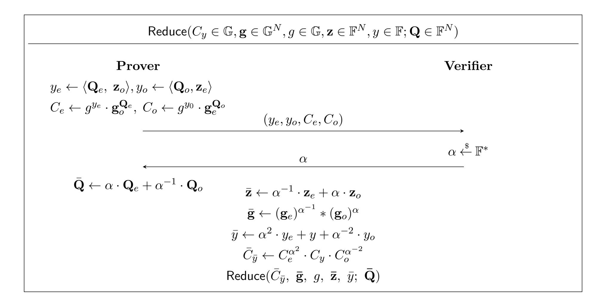

{0}------------------------------------------------

# <span id="page-0-0"></span>Public-Coin Zero-Knowledge Arguments with (almost) Minimal Time and Space Overheads\*

Alexander R. Block<sup>†</sup> Justin Holmgren<sup>‡</sup> Alon Rosen<sup>§</sup> Ron D. Rothblum<sup>¶</sup> Pratik Soni<sup>||</sup>

#### Abstract

Zero-knowledge protocols enable the truth of a mathematical statement to be certified by a verifier without revealing any other information. Such protocols are a cornerstone of modern cryptography and recently are becoming more and more practical. However, a major bottleneck in deployment is the efficiency of the prover and, in particular, the space-efficiency of the protocol.

For every NP relation that can be verified in time T and space S, we construct a public-coin zero-knowledge argument in which the prover runs in time  $T \cdot \operatorname{polylog}(T)$  and space  $S \cdot \operatorname{polylog}(T)$ . Our proofs have length  $\operatorname{polylog}(T)$  and the verifier runs in time  $T \cdot \operatorname{polylog}(T)$  (and space  $\operatorname{polylog}(T)$ ). Our scheme is in the random oracle model and relies on the hardness of discrete log in prime-order groups.

Our main technical contribution is a new space efficient polynomial commitment scheme for multi-linear polynomials. Recall that in such a scheme, a sender commits to a given multi-linear polynomial  $P: \mathbb{F}^n \to \mathbb{F}$  so that later on it can prove to a receiver statements of the form "P(x) = y". In our scheme, which builds on commitments schemes of Bootle et al. (Eurocrypt 2016) and Bünz et al. (S&P 2018), we assume that the sender is given multi-pass streaming access to the evaluations of P on the Boolean hypercube and we show how to implement both the sender and receiver in roughly time  $2^n$  and space n and with communication complexity roughly n.

<sup>\*©</sup> IACR 2020. This article is the full version of the article submitted by the authors to the IACR and to Springer-Verlag on 28 September, 2020. The version published by Springer-Verlag is available at <a href="https://doi.org/10.1007/978-3-030-64378-2\_7">https://doi.org/10.1007/978-3-030-64378-2\_7</a>.

<sup>&</sup>lt;sup>†</sup>Purdue University. Email: block9@purdue.edu.

<sup>&</sup>lt;sup>‡</sup>NTT Research. Email: justin.holmgren@ntt-research.com.

<sup>§</sup>IDC Herzliya. Email: alon.rosen@idc.ac.il.

<sup>¶</sup>Technion. Email: rothblum@cs.technion.ac.il.

University of California, Santa Barbara. Email: pratik\_soni@cs.ucsb.edu.

{1}------------------------------------------------

# **Contents**

| 1 | Introduction                                                                        |    |  |  |  |  |  |
|---|-------------------------------------------------------------------------------------|----|--|--|--|--|--|
|   | 1.1<br>Our Results<br>                                                              | 4  |  |  |  |  |  |
|   | 1.2<br>Prior Work<br>                                                               | 6  |  |  |  |  |  |
| 2 | Technical Overview<br>7                                                             |    |  |  |  |  |  |
|   | 2.1<br>Polynomial Commitment to Multi-linear Polynomials in the Streaming Model<br> | 7  |  |  |  |  |  |
|   | 2.2<br>Polynomial<br>IOPs for RAM Programs<br>                                      | 10 |  |  |  |  |  |
|   | 2.3<br>Obtaining Space-Efficient Interactive Arguments<br>                          | 11 |  |  |  |  |  |
| 3 | Preliminaries                                                                       | 12 |  |  |  |  |  |
|   | 3.1<br>The Discrete-log Relation Assumption<br>                                     | 12 |  |  |  |  |  |
|   | 3.2<br>Interactive Arguments of Knowledge in ROM<br>                                | 13 |  |  |  |  |  |
|   | 3.3<br>Multi-linear Extensions<br>                                                  | 15 |  |  |  |  |  |
|   | 3.4<br>Polynomial Commitment Scheme to Multi-linear Extensions<br>                  | 15 |  |  |  |  |  |
| 4 | Space-Efficient Commitment for Multi-linear Extensions                              | 17 |  |  |  |  |  |
|   | 4.1<br>Commitment Scheme<br>                                                        | 17 |  |  |  |  |  |
|   | 4.2<br>Correctness and Security<br>                                                 | 18 |  |  |  |  |  |
|   | 4.3<br>Efficiency<br>                                                               | 20 |  |  |  |  |  |
| 5 | A Polynomial<br>IOP<br>for Random Access Machines                                   | 23 |  |  |  |  |  |
|   | 5.1<br>RAMs to Circuits.<br>                                                        | 24 |  |  |  |  |  |
|   | 5.2<br>Circuits to Polynomials<br>                                                  | 25 |  |  |  |  |  |
|   | 5.3<br>Polynomial IOP Construction<br>                                              | 26 |  |  |  |  |  |
| 6 | Time- and Space-Efficient Arguments for RAM                                         | 28 |  |  |  |  |  |
|   | 6.1<br>Obtaining<br>Theorem 1<br>                                                   | 30 |  |  |  |  |  |
| 7 | Acknowledgments                                                                     | 31 |  |  |  |  |  |

{2}------------------------------------------------

# <span id="page-2-0"></span>**1 Introduction**

Zero-knowledge protocols are a cornerstone of modern cryptography, enabling the truth of a mathematical statement to be certified by a prover to a verifier without revealing any other information. First conceived by Goldwasser, Micali, and Rackoff [\[GMR89\]](#page-32-0), zero knowledge has myriad applications in both theory and practice and is a thriving research area today. Theoretical work primarily investigates the complexity tradeoffs inherent in zero-knowledge protocols:

- the number of rounds of interaction,
- the number of bits exchanged between the prover and verifier
- the computational complexity of the prover and verifier (e.g. running time, space usage)
- the degree of soundness—in particular, soundness can be statistical or computational, and the protocol may or may not be a proof of knowledge.

ZK-SNARKs (Zero-Knowledge Succinct Non-interactive ARguments of Knowledge) are protocols that achieve particularly appealing parameters: they are *non-interactive* protocols in which to certify an NP statement *x* with witness *w*, the prover sends a proof string *π* of length |*π*| ≪ |*w*|. Such proof systems require setup (namely, a common reference string) and (under widely believed complexitytheoretic assumptions [\[GH98,](#page-32-1) [GVW02\]](#page-32-2)) are limited to achieving computational soundness.

One of the main bottlenecks limiting the scalability of ZK-SNARKs is the high computational complexity of generating proof strings. In particular, a major problem is that even for the lowestoverhead ZK-SNARKs (see e.g. [\[GGPR13,](#page-32-3) [PHGR13,](#page-33-0) [BBHR19\]](#page-30-1) and follow-up works), the prover requires Ω(*T*) *space* to certify correctness of a time-*T* computation, even if that computation uses space *S* ≪ *T*.

As typical computations require much less space than time, such space usage can easily become a hard bottleneck. While it is straight-forward to run a program for as long as one's patience allows, a computer's memory cannot be expanded without purchasing additional hardware. Moreover, the memory architecture of modern computer systems is hierarchical, consisting of different tiers (various cache levels, RAM, and nonvolatile storage), with latencies and capacities that increase by orders of magnitude at each successive level. In other words, high space usage can also incur a heavy penalty in running time.

In this work, we focus on uniform non-deterministic computations—that is, proving that a nondeterministic time-*T* space-*S* Turing machine accepts an input *x*. Our objective is to obtain "complexity-preserving" (ZK-)SNARKs [\[BC12a\]](#page-30-2) for such computations, i.e., SNARKs in which the prover runs in time roughly *T* and space roughly *S*. Relatively efficient *privately verifiable* solutions are known [\[BC12b,](#page-30-3) [HR18\]](#page-32-4). In such schemes the verifier holds some secret state that, if leaked, compromises soundness. However, many applications (such as cryptocurrencies or other massively decentralized protocols) require public verifiability, which is the emphasis of our work.

To date, *publicly verifiable* complexity-preserving SNARKs are known only via recursive composition [\[Val08,](#page-34-0) [BCCT13\]](#page-31-0). This approach indeed yields SNARKs with prover running time *O*˜(*T*) and space usage *S* · polylog(*T*), but with significant concrete overheads. Recursively composed SNARKs require both the prover and verifier to make non-black-box usage of an "inner" verifier for a different SNARK, leading to enormous computational overhead in practice.

Several recent works [\[BGH19,](#page-31-1) [BCMS20,](#page-31-2) [COS20\]](#page-32-5) attempt to solve the inefficiency problems with recursive composition, but the protocols in these works rely on heuristic and poorly understood 

{3}------------------------------------------------

assumptions to justify their soundness. While any SNARK (with a black-box security reduction) inherently relies on non-falsifiable assumptions [\[GW11\]](#page-32-6), these SNARKs possess additional troubling features. They rely on hash functions that are modeled as random oracles in the security proof, despite being used in a non-black-box way by the honest parties. Security thus cannot be reduced to a simple computational hardness assumption, even in the random oracle model. Moreover, the practicality of the schemes crucially requires usage of a novel hash function (e.g., Rescue [\[AAB](#page-30-4)+19]) with algebraic structure designed to maximize the *efficiency* of non-black-box operations. Such hash functions have endured far less scrutiny than standard SHA hash functions, and the algebraic structure could potentially lead to a security vulnerability.

In this work, we ask:

*Can we devise a complexity-preserving ZK-SNARK in the random oracle model based on standard cryptographic assumptions?*

# <span id="page-3-0"></span>**1.1 Our Results**

Our main result is an affirmative answer to this question.

<span id="page-3-1"></span>**Theorem 1.** *Assume that the discrete-log problem is hard in obliviously sampleable*[1](#page-3-2) *prime-order groups. Then, for every* NP *relation that can be verified by a random access machine in time T and space S, there exists a publicly verifiable ZK-SNARK, in the random oracle model, in which both the prover and verifier run in time T* · polylog(*T*)*, the prover uses space S* · polylog(*T*)*, and the verifier uses space* polylog(*T*)*. The proof length is poly-logarithmic in T.*

We emphasize that the verifier in our protocol has similar running time to that of the prover, in contrast to other schemes in the literature that offer *poly-logarithmic* time verification. While this limits the usefulness of our scheme in delegating (deterministic) computations, our scheme is well-geared towards *zero-knowledge* applications in which the prover and verifier are likely to have similar computational resources.

At the heart of our ZK-SNARK for NP relations verifiable by time-*T* space-*S* random access machine (RAM) is a new public-coin *interactive* argument of knowledge, in the random oracle model, for the same relation where the prover runs in time *T* · polylog(*T*) and requires space *S* · polylog(*T*). We make this argument zero-knowledge by using standard techniques which incurs minimal asymptotic blow-up in the efficiency of the argument [\[BGG](#page-31-3)+90, [CD98,](#page-31-4) [WTs](#page-34-1)+18]. Finally, applying the Fiat-Shamir transformation [\[FS87\]](#page-32-7) to our public-coin zero-knowledge argument yields [Theorem 1.](#page-3-1)

## **1.1.1 Space-Efficient Polynomial Commitment for Multi-linear Polynomials**

The key ingredient in our public-coin interactive argument of knowledge is a new space efficient *polynomial commitment scheme*, which we describe next.

Polynomial commitment schemes were introduced by Kate et al. [\[KZG10\]](#page-33-1) and have since received much attention [\[BBHR18,](#page-30-5) [BGKS19,](#page-31-5) [BFS20,](#page-31-6) [WBT](#page-34-2)+17, [KPV19,](#page-33-2) [ZXZS20\]](#page-34-3), in particular due

<span id="page-3-2"></span><sup>1</sup>By *obliviously sampleable* we mean that there exist algorithms *S* and *S* −1 such that on input random coins *r*, the algorithm *S* samples a uniformly random group element *g*, whereas on input *g*, the algorithm *S* −1 samples random coins *r* that are consistent with the choice of *g*. In other words, if *S* uses *ℓ* random bits then the joint distributions (*Uℓ, S*(*Uℓ*)) and (*S* −1 (*S*(*Uℓ*))*, S*(*Uℓ*)) are identically distributed, where *U<sup>ℓ</sup>* denotes the uniform distribution on *ℓ* bit strings.

{4}------------------------------------------------

to their usage in the construction of efficient zero-knowledge arguments. Informally, a polynomial commitment scheme is a cryptographic primitive that allows a committer to send to a receiver a commitment to an *n*-variate polynomial *Q* : F *<sup>n</sup>* → F, over some finite field F, and later reveal evaluations *y* of *Q* on a point **x** ∈ F *<sup>n</sup>* of the receiver's choice along with a proof that indeed *y* = *Q*(**x**).

In this work we construct polynomial commitment schemes where the space complexity is (roughly) *logarithmic* in the description size of the polynomial. In order to state this result more precisely, we must first determine the type of access that the committer has to the polynomial.

We first note that in this work we restrict our attention to *multi-linear* polynomials (i.e., polynomials which have individual degree 1). Note that such a polynomial *Q* : F *<sup>n</sup>* → F is uniquely determined by its evaluations on the Boolean hybercube, that is, *Q*(0)*, . . . , Q*(2*<sup>n</sup>* − 1) , where the integers in Z2*<sup>n</sup>* are associated with vectors in {0*,* 1} *n* in the natural way.

Towards achieving our space efficient implementation, and motivated by our application to the construction of an efficient argument-scheme, we assume that the committer has *multi-pass streaming access* to the evaluations of the polynomial on the Boolean hypercube. Such an access pattern can be modeled by giving the committer access to a read-only tape that is pre-initialized with the values *Q*(0)*, . . . , Q*(2*<sup>n</sup>* − 1) . At every time-step the committer is allowed to either move the machine head to the right or to restart its position to 0.

<span id="page-4-0"></span>**Theorem 2** (Informal, see [Theorem 5\)](#page-16-2)**.** *Let* G *be an obliviously sampleable group of prime-order p and let Q* : F *<sup>n</sup>* → F *be some n-variate multi-linear polynomial. Assuming the hardness of discretelog over* G *and multi-pass streaming access to the sequence* (*Q*(0)*, . . . , Q*(2*<sup>n</sup>* − 1))*, there exists a polynomial commitment scheme for Q in the random oracle model such that*

- *1. The commitment consists of one group element, evaluation proofs consist of O*(*n*) *group and field elements,*
- *2. The committer and receiver perform O*˜(2*<sup>n</sup>* ) *group and field operations, make O*˜(2*<sup>n</sup>* ) *queries to the random oracle, and store only O*(*n*) *group and field elements, and*
- *3. The committer makes O*(*n*) *passes over* (*Q*(0)*, . . . , Q*(2*<sup>n</sup>* − 1))*.*

Following [\[KZG10\]](#page-33-1), a number of works have focussed on achieving asymptotically optimal proof sizes (more generally, communication), and time complexity for both committer and receiver. However, the space complexity of the committer has been largely ignored; naively it is lower-bounded by the size of the committer's input (which is a description of the polynomial). As mentioned above, we believe that obtaining a space-efficient polynomial commitment scheme in the streaming model to be of independent interest and may even eventually lead to significantly improved performance of interactive oracle proofs, SNARKS, and related primitives in practice.

We also mention that the streaming model is especially well-suited to our application of building space-efficient SNARKs. The reason is that in such schemes, the prover typically uses a polynomial commitment scheme to commit to a low-degree extension of the transcript of a RAM program, which, naturally, can be generated as a stream in space that is proportional to the space complexity of the underlying RAM program.

At a high level, we use an algebraic homomorphic commitment (e.g., Pedersen commitment [\[Ped92\]](#page-33-3)) to succinctly commit to the polynomial *Q* (by committing to the sequence (*Q*(0)*, . . . , Q*(2*<sup>n</sup>* − 1)). Next, to provide evaluation proofs, our scheme leverages the fact that evaluating *Q* on point **x** reduces to computing an inner-product between (*Q*(0)*, . . . , Q*(2*<sup>n</sup>* − 1)) and the sequence of Lagrange coefficients defined by the evaluation point **x**. Relying on the homomorphic

{5}------------------------------------------------

properties of our commitment, the basic step of our evaluation protocol is a 2-move (randomized) reduction step which allows the committer to "fold" a statement of size 2 *n* into a statement of size 2 *<sup>n</sup>/*2. Our scheme is inspired from the "inner-product argument" of Bootle et al. [\[BCC](#page-30-6)+16] (and its variants [\[BBB](#page-30-7)+18, [WTs](#page-34-1)+18]) but differs in the 2-move reduction step. More specifically, their reduction step folds the left half of (*Q*(0)*, . . . , Q*(2*<sup>n</sup>* − 1)) with its right half (referred to as msb-based folding as the index of the elements that are folded differ in the most significant bit). This, unfortunately, is not compatible with our streaming model (we explain this shortly). We instead perform the more natural *lsb-based folding* which, indeed, is compatible with the streaming model. We additionally exploit random access to the inner-product argument's setup parameters (defined by the random oracle) and the fact that any component of the coefficient sequence can be computed in polylogarithmic time, i.e. poly(*n*) time. We give a high level overview of our scheme in [Section 2.1.](#page-6-1)

# <span id="page-5-0"></span>**1.2 Prior Work**

**Complexity Preserving ZK-SNARKs.** Bitansky and Chiesa [\[BC12b\]](#page-30-3) proposed to construct complexity preserving ZK-SNARKS by first constructing complexity preserving multi-prover interactive proof (MIPs) and then compile them using cryptographic techniques. While our techniques share the same high-level approach, our compilation with a polynomial-commmitment scheme yields a publicly verifiable scheme whereas [\[BC12b\]](#page-30-3) only obtain a designated verifier scheme.

Blumberg et al. [\[BTVW14\]](#page-31-7) give a 2-prover complexity preserving MIP of knowledge, improving (concretely) on the complexity preserving MIP of [\[BC12b\]](#page-30-3) (who obtain a 2-prover MIP via a reduction from their many-prover MIP). Both Bitansky and Chiesa and Blumberg et al. obtain their MIPs from reducing RAMs to circuits via the reduction of Ben-Sasson et al. [\[BCGT13\]](#page-31-8), then appropriately arithmetize the circuit into an algebraic constraint satisfaction problem. Holmgren and Rothblum [\[HR18\]](#page-32-4) obtain a non-interactive protocol based on standard (falsifiable assumptions) by also constructing a complexity preserving MIP for RAMs (achieving no-signaling soundness) and compiling it into an argument using fully-homomorphic encryption (á la [\[BMW98,](#page-31-9) [KR09,](#page-33-4) [KRR13\]](#page-33-5)). We remark that [\[HR18\]](#page-32-4) reduce a RAM directly to algebraic constraints via a different encoding of the RAM transcript, thereby avoiding the reduction to circuits entirely.

Another direction for obtaining complexity preserving ZK-SNARKS is via recursive composition [\[BCCT13,](#page-31-0) [Val08\]](#page-34-0), or "bootstrapping". Here, one begins with an "inefficient" SNARK and bootstraps it recursively to produce publicly verifiable complexity preserving SNARKs. While these constructions yield good asymptotics, these approaches require running the inefficient SNARK on many sub-computations. Recent works [\[BGH19,](#page-31-1) [BCMS20,](#page-31-2) [COS20\]](#page-32-5) describe a novel approach to recursive composition which attempt to solve the inefficiencies of the aforementioned recursive compositions, though at a cost to the theoretical basis for the soundness of their scheme (as discussed above).

**Interactive Oracle Proofs.** Interactive oracle proofs (IOPs), introduced by Ben-Sasson et al. [\[BCS16\]](#page-31-10) and independently by Reingold et al. [\[RRR16\]](#page-33-6), are interactive protocols where a verifier has oracle access to all prover messages. IOPs capture (and generalize), both interactive proofs and PCPs.

A recent line of work [\[BCGT13,](#page-31-8) [BTVW14,](#page-31-7) [CMT12,](#page-32-8) [GKR08,](#page-32-9) [Set20,](#page-34-4) [Tha13,](#page-34-5) [WTs](#page-34-1)+18, [RR19\]](#page-33-7) follows the framework of Kilian [\[Kil92\]](#page-32-10) and Micali [\[Mic94\]](#page-33-8) to obtain efficient arguments by constructing efficient IOPs and compiling them into interactive arguments using collision resistant

{6}------------------------------------------------

hashing [BCS16, Kil92] or the random oracle model [BCS16, Mic94].

Polynomial Commitments. Polynomial commitment schemes were introduced by Kate et al. [KZG10] and have since been an active area of research. Lines of research for construction polynomial commitment schemes include privately verifiable schemes [KZG10, PST13], publicly-verifiable schemes with trusted setup [BFS20], and zero-knowledge schemes [WBT+17]. More recently, much focus has been on obtaining publicly-verifiable schemes without a trusted setup [BBHR18, BGKS19, BFS20, WBT+17, KPV19, ZXZS20]. We note that in all prior works on polynomial commitments, the space complexity of the sender is proportional to the description size of the polynomial, whereas we achieve *poly-logarithmic* space complexity.

# <span id="page-6-0"></span>2 Technical Overview

As mentioned above, the key component in our construction is that of a public-coin interactive argument for RAM computations. The latter construction itself consists of two key technical ingredients. First, we construct a polynomial interactive oracle proof (polynomial IOP) for time-T space-S RAM computations in which the prover runs in time  $T \cdot \text{polylog}(T)$  and space  $S \cdot \text{polylog}(T)$ . We note that this ingredient is a conceptual contribution which formalizes prior work in the language of polynomial IOPs. Second, we compile this IOP with a space-efficient extractable polynomial commitment scheme where the prover has multi-pass streaming access to the polynomial to which it is committing—a property that plays nicely with the streaming nature of RAM computations. We emphasize that the construction of the space-efficient polynomial commitment scheme is our main technical contribution, and describe our scheme in more detail next.

# <span id="page-6-1"></span>2.1 Polynomial Commitment to Multi-linear Polynomials in the Streaming Model

Fix a finite field  $\mathbb{F}$  of prime order p. Also fix an obliviously sampleable (see Footnote 1) group  $\mathbb{G}$  of order p in which the discrete logarithm is hard. Let  $H: \{0,1\}^* \to \mathbb{G}$  be the random oracle.

In order to describe our polynomial commitment scheme, we start with some notation. Let n be a positive integer and set  $N=2^n$ . We will be considering N-dimensional vectors over  $\mathbb{F}$  and will index such vectors using n dimensional binary vectors. For example, if  $\mathbf{b} \in \mathbb{F}^{2^6}$  then  $\mathbf{b}_{000101} = b_5$ . For convenience, we will denote  $\mathbf{b} \in \mathbb{F}^N$  by  $(b_{\mathbf{c}} : \mathbf{c} \in \{0,1\}^n)$  where  $b_{\mathbf{c}}$  is the  $\mathbf{c}$ -th element of  $\mathbf{b}$ . For  $\mathbf{b} = (b_n, \ldots, b_1) \in \{0,1\}^n$  we refer to  $b_1$  as the least-significant bit (lsb) of  $\mathbf{b}$ . Finally, for  $\mathbf{b} \in \mathbb{F}^N$ , we denote by  $\mathbf{b}_e$  the restriction of  $\mathbf{b}$  to the even indices, that is,  $\mathbf{b}_e = (b_{\mathbf{c}0} : \mathbf{c} \in \{0,1\}^{n-1})$ . Similarly, we denote by  $\mathbf{b}_o = (b_{\mathbf{c}1} : \mathbf{c} \in \{0,1\}^{n-1})$  the restriction of  $\mathbf{b}$  to odd indices.

Let  $Q: \mathbb{F}^n \to \mathbb{F}$  be a multi-linear polynomial. Recall that such a polynomial can be fully described by the sequence of its evaluations over the Boolean hypercube. More specifically, for any  $\mathbf{x} \in \mathbb{F}^n$ , the evaluation of Q on  $\mathbf{x}$  can be expressed as

<span id="page-6-2"></span>
$$Q(\mathbf{x}) = \sum_{\mathbf{b} \in \{0,1\}^n} Q(\mathbf{b}) \cdot z(\mathbf{x}, \mathbf{b}), \tag{1}$$

where  $z(\mathbf{x}, \mathbf{b}) = \prod_{i \in [n]} (b_i \cdot x_i + (1 - b_i) \cdot (1 - x_i))$ . We use  $\mathbf{Q} \in \mathbb{F}^N$  to denote the restriction of Q to the Boolean hybercube (i.e.,  $\mathbf{Q} = (Q(\mathbf{b}) : \mathbf{b} \in \{0, 1\}^n)$ ).

Next, we describe the our commitment scheme which has three phases: (a) Setup, (b) Commit and (c) Evaluation.

{7}------------------------------------------------

#### 2.1.1 Setup and Commit Phase

During setup, the committer and receiver both consistently define a sequence of N generators for  $\mathbb{G}$  using the random oracle, that is,  $\mathbf{g} = (g_{\mathbf{b}} = H(\mathbf{b}) : \mathbf{b} \in \{0,1\}^n)$ . Then, given streaming access to  $\mathbf{Q}$ , the committer computes the Pedersen multi-commitment [Ped92] C defined as

<span id="page-7-0"></span>
$$C = \prod_{\mathbf{b} \in \{0,1\}^n} (g_{\mathbf{b}})^{Q_{\mathbf{b}}} . \tag{2}$$

For  $\mathbf{g} \in \mathbb{G}^{2^n}$  and  $\mathbf{Q} \in \mathbb{F}^{2^n}$ , we use  $\mathbf{g}^{\mathbf{Q}}$  as a shorthand to denote the value  $\prod_{\mathbf{b} \in \{0,1\}^n} (g_{\mathbf{b}})^{Q_{\mathbf{b}}}$ . Assuming the hardness of discrete-log for  $\mathbb{G}$ , we note that C in Equation (2) is a binding commitment to  $\mathbf{Q}$  under generators  $\mathbf{g}$ . Note that the committer only needs to perform a single-pass over  $\mathbf{Q}$  and performs N exponentiations to compute C while storing only O(1) number of group and field elements.<sup>2</sup>

#### 2.1.2 Evaluation Phase

On input an evaluation point  $\mathbf{x} \in \mathbb{F}^n$ , the committer computes and sends  $y = Q(\mathbf{x})$  and defines the auxiliary commitment  $C_y \leftarrow C \cdot g^y$  for some receiver chosen generator g. Then, both engage in an argument (of knowledge) for the following NP statement which we refer to as the "inner-product" statement:

$$\exists \mathbf{Q} \in \mathbb{Z}_p^N : y = \langle \mathbf{Q}, \mathbf{z} \rangle \text{ and } C_y = g^y \cdot \mathbf{g}^\mathbf{Q} ,$$
 (3)

where  $\mathbf{z} = (z(\mathbf{x}, \mathbf{b}) : \mathbf{b} \in \{0, 1\}^n)$  as defined in Equation (1). This step can be viewed as proving knowledge of the decommitment  $\mathbf{Q}$  of the commitment  $C_y$ , which furthermore is consistent with the inner-product claim that  $y = \langle \mathbf{Q}, \mathbf{z} \rangle$ .

Inner-product Argument. A basic step in the argument for the above inner-product statement is a 2-move randomized reduction step which allows the prover to decompose the N-sized statement  $(C_y, \mathbf{z}, y)$  into two N/2-sized statements and then "fold" them into a single N/2-sized statement  $(\bar{C}_{\bar{y}}, \bar{\mathbf{z}} = (\bar{z}_{\mathbf{c}} : \mathbf{c} \in \{0, 1\}^{n-1}), \bar{y})$  using the verifier's random challenge. We explain the two steps below (as well as in Figure 1).

1. Committer computes the cross-product  $y_e = \langle \mathbf{Q}_e, \mathbf{z}_o \rangle$  between the even-indexed elements  $\mathbf{Q}_e$  with the odd-indexed vectors  $\mathbf{z}_o$ . Furthermore, it computes a binding commitment  $C_e$  that binds  $y_e$  (with g) and  $\mathbf{Q}_e$  (with  $\mathbf{g}_o$ ). That is,

$$C_e = g^{y_e} \cdot \mathbf{g}_o^{\mathbf{Q}_e} , \qquad (4)$$

where recall that for  $\mathbf{g} = (g_1, \dots, g_t)$  and  $\mathbf{x} = (x_1, \dots, x_t)$  the expression  $\mathbf{g}^{\mathbf{x}} = \prod_{i \in [t]} g_i^{x_i}$ . This results in an N/2-sized statement  $(C_e, \mathbf{z}_o, y_e)$  with witness  $\mathbf{Q}_e$ . Similarly, as in Figure 1 it computes the second N/2-sized statement  $(C_o, \mathbf{z}_e, y_o)$  with witness  $\mathbf{Q}_o$ . The committer sends  $(y_e, y_o, C_e, C_o)$  to the receiver.

<span id="page-7-1"></span><sup>&</sup>lt;sup>2</sup>Here, we treat exponentiation as an atomic operation but note that computing  $g^{\alpha}$  for  $\alpha \in \mathbb{Z}_p$  can be emulated, via repeated squarings, by  $O(\log p)$  group multiplications while storing only O(1) number of group and field elements.

{8}------------------------------------------------



<span id="page-8-0"></span>Figure 1: Our 2-move randomized reduction step for the inner-product protocol where recall that for any  $\mathbf{Q} \in \mathbb{F}^N$ , we denote by  $\mathbf{Q}_e$  the elements of  $\mathbf{Q}$  indexed by even numbers where  $\mathbf{Q}_o$  denotes the elements with odd indices. On input a statement of size N > 1, Reduce results in a statement of size N/2.

2. After receiving a random challenge  $\alpha \in \mathbb{F}^*$ , committer folds its witness  $\mathbf{Q}$  into an N/2-sized vector  $\mathbf{\bar{Q}} = \alpha \cdot \mathbf{Q}_e + \alpha^{-1} \cdot \mathbf{Q}_o$ . More specifically, for every  $\mathbf{c} \in \{0, 1\}^{n-1}$ ,

$$\bar{Q}_{\mathbf{c}} = \alpha \cdot Q_{\mathbf{c}0} + \alpha^{-1} \cdot Q_{\mathbf{c}1} . \tag{5}$$

Similarly, the committer and receiver both compute the rest of the folded statement  $(\bar{C}_{\bar{y}}, \bar{\mathbf{z}}, \bar{y})$  as shown in Figure 1.

Relying on the homomorphic properties of Pedersen commitments, it can be shown that if  $\mathbf{Q}$  were a witness to  $(C_y, \mathbf{z}, y)$  then  $\bar{\mathbf{Q}}$  is a witness for  $(\bar{C}_{\bar{y}}, \bar{\mathbf{z}}, \bar{y})$ . In the actual protocol, the parties then recurse on smaller statements  $(\bar{C}_{\bar{y}}, \bar{\mathbf{z}}, \bar{y})$  forming a recursion tree. After  $\log N$  steps, the statement is of size 1 in which case the committer sends its witness which is a single field element. This gives an overall communication of  $O(\log N)$  field and group elements. Next we briefly discuss the efficiency of the scheme.

#### 2.1.3 Efficiency

For the purpose of this overview, we focus only on the time and space efficiency of the committer in the inner-product argument (the analysis for the receiver is analogous). Recall that in a particular step of the recursion, suppose we are recursing on the N/2-sized statement  $(\bar{C}_{\bar{y}}, \bar{\mathbf{z}}, \bar{y})$  with witness  $\bar{\mathbf{Q}}$ , the committer's computation includes computing (a) the cross-product  $\langle \bar{\mathbf{Q}}_e, \bar{\mathbf{z}}_o \rangle$  between the

<span id="page-8-1"></span><sup>&</sup>lt;sup>3</sup>albeit under different set of generators but we ignore this for now

{9}------------------------------------------------

| Scheme                 | [BCC <sup>+</sup> 16, BBB <sup>+</sup> 18] (msb-based)             | This work (lsb-based)                                              |
|------------------------|--------------------------------------------------------------------|--------------------------------------------------------------------|
| $\bar{Q}_{\mathbf{b}}$ | $\alpha \cdot Q_{0\mathbf{b}} + \alpha^{-1} \cdot Q_{1\mathbf{b}}$ | $\alpha \cdot Q_{\mathbf{b}0} + \alpha^{-1} \cdot Q_{\mathbf{b}1}$ |
| $\bar{z}_{\mathbf{b}}$ | $\alpha^{-1} \cdot z_{0\mathbf{b}} + \alpha \cdot z_{1\mathbf{b}}$ | $\alpha^{-1} \cdot z_{\mathbf{b}0} + \alpha \cdot z_{\mathbf{b}1}$ |
| $\bar{g}_{\mathbf{b}}$ | $(g_{0\mathbf{b}})^{\alpha^{-1}} * (g_{1\mathbf{b}})^{\alpha}$     | $(g_{\mathbf{b}0})^{\alpha^{-1}} * (g_{\mathbf{b}1})^{\alpha}$     |

<span id="page-9-2"></span>Figure 2: Table highlights the differences between the 2-move randomized reduction steps of the inner-product argument of [BCC<sup>+</sup>16, BBB<sup>+</sup>18] (second column) and our scheme (third column). Specifically, given vectors  $\mathbf{Q}, \mathbf{z}, \mathbf{g}$  of size  $2^n$ , the rows describe the definition of the  $2^n/2$  sized vectors  $\mathbf{Q}, \mathbf{\bar{z}}, \mathbf{\bar{g}}$  respectively where  $\mathbf{b} \in \{0, 1\}^{n-1}$ .

even half of  $\bar{\mathbf{Q}}$  and the odd half of  $\bar{\mathbf{z}}$ , and (b) the "cross-exponentiation"  $\bar{\mathbf{g}}_o^{\bar{\mathbf{Q}}_e}$  of the even half of  $\bar{\mathbf{Q}}$  with the odd half of the generators  $\bar{\mathbf{g}}$ .<sup>4</sup>

A straightforward approach to compute (a) is to have  $\bar{\mathbf{Q}}$  (and  $\bar{\mathbf{z}}$ ) in memory, but this requires the committer to have  $\Omega(N)$  space which we want to avoid. Towards a space efficient implementation, first note every element of  $\bar{\mathbf{Q}}$  depends on only two, more importantly, consecutive elements of  $\bar{\mathbf{Q}}$ . This coupled with streaming access to  $\bar{\mathbf{Q}}$  is sufficient to simulate streaming access to  $\bar{\mathbf{Q}}$  while making only **one** pass over  $\bar{\mathbf{Q}}$ . Secondly, by definition, computing any element of  $\bar{\mathbf{z}}$  requires only  $O(\log N)$  field operations while storing only O(n) field elements This then allows to compute any element of  $\bar{\mathbf{z}}$  on the fly with polylog(N) operations. Given the simulated streaming access to  $\bar{\mathbf{Q}}$  along with the ability to compute any element of  $\bar{\mathbf{z}}$  on the fly is sufficient to compute the  $\langle \bar{\mathbf{Q}}_e, \bar{\mathbf{z}}_o \rangle$ . Note this step, overall, requires performing only a single pass over  $\bar{\mathbf{Q}}$  and  $N \cdot \text{polylog } N$  operations, and storing only the evaluation point  $\bar{\mathbf{x}}$  and verifier challenge  $\alpha$  (along with some book-keeping). The computation of (b) is handled similarly, except that here we crucially leverage the fact that  $\bar{\mathbf{g}}$  is defined using the random oracle, and hence the committer has random access to all of the generators in  $\bar{\mathbf{g}}$ . Relying on similar ideas as in (a), the committer can compute  $\bar{\mathbf{g}}_o^{\bar{\mathbf{Q}}_e}$  while additionally making O(N) queries to the random oracle. Overall, this gives the required prover efficiency. Please see Section 4.3 for a full discussion on the efficiency.

#### 2.1.4 Comparison with the 2-move reduction step of [BCC+16, WTs+18]

In their protocol, a major difference is in how the folding is performed (Step 2, Figure 1). We list concrete differences in Figure 2. But at a high level, since they fold the first element  $Q_{00^{n-1}}$  with the N/2-nd element  $Q_{10^{n-1}}$ , it takes at least a one pass over  $\mathbf{Q}$  to even compute the first element of  $\mathbf{\bar{Q}}$ , thereby requiring  $\Omega(N)$  passes over  $\mathbf{Q}$  which is undesirable.<sup>5</sup> Although we differ in the 2-move reduction steps, the security of our scheme follows from ideas similar to  $[\mathbf{BCC}^{+16}, \mathbf{WTs}^{+18}]$ .

## <span id="page-9-0"></span>2.2 Polynomial IOPs for RAM Programs

The second ingredient we use to obtain space-efficient interactive arguments for NP relations verifiable by time-T space-S RAMs is a space-efficient polynomial interactive oracle proof system [BCS16, RRR16, BFS20]. Informally, an interactive oracle proof (IOP) is an interactive protocol

<span id="page-9-3"></span><span id="page-9-1"></span><sup>&</sup>lt;sup>4</sup>Efficiency for  $\langle \bar{\mathbf{Q}}_o, \bar{\mathbf{z}}_e \rangle$  and  $\bar{\mathbf{g}}_e^{\bar{\mathbf{Q}}_o}$  can be argued similarly.

<sup>&</sup>lt;sup>5</sup>When a polynomial commitment is used in building arguments, it takes O(N) time to stream  $\mathbf{Q}$ , and requiring  $\Omega(N)$  passes results in a prover that runs in quadratic time.

{10}------------------------------------------------

such that in each round the verifier sends a message to the prover, and the prover responds with proof string that the verifier can query in only a few locations. A polynomial IOP is an IOP where the proof string sent by the prover is a polynomial (i.e, all evaluations of a polynomial on a domain), and if a cheating prover successfully convinces a verifier then the proof string is consistent with some polynomial.

We consider a variant of the polynomial IOP model in which the prover sends messages which are encoded by the channel; in particular, the time and space complexity of the encoding computed by the channel do not factor into the complexity of the prover. For our purposes, we use the polynomial IOP that is implicit in [\[BTVW14\]](#page-31-7) and consider it with a channel which computes multi-linear extensions of the prover messages. We briefly describe the IOP construction for completeness (see [Section 5](#page-22-0) for more details). The polynomial IOP at its core first leverages the space-efficient RAM to arithemtic circuit satifsiability reduction of [\[BTVW14\]](#page-31-7) (adapting techniques of [\[BCGT13\]](#page-31-8)). This reduction transforms a time-*T* space-*S* RAM into a circuit of size *T* ·polylog(*T*) and has the desirable property (for our purposes) that the circuit can be accessed by the prover in a streaming manner: the assignment of gate values in the circuit can be streamed "gate-by-gate" in time *T* · polylog(*T*) and space *S* · polylog(*T*), which, in particular, allows a prover to compute a correct transcript of the circuit in time *T* · polylog(*T*) and space *S* · polylog(*T*).

The prover sends the verifier an oracle that is the multi-linear extension of the gate values (i.e., the transcript), where we remark that this extension is computed by the channel. The correctness of the computation is reduced to an algebraic claim about a low degree polynomial which is identically 0 on the Boolean hypercube if and only if the circuit is satisfied by the given witness. Finally, the prover and verifier engage in the classical sum-check protocol [\[LFKN90,](#page-33-10) [Sha90\]](#page-34-6) to verify that the constructed polynomial indeed vanishes on the Boolean hypercube.

<span id="page-10-1"></span>**Theorem 3.** *There exists a public-coin polynomial* IOP *over a channel which encodes prover messages as multi-linear extensions for* NP *relations verifiable by a time-T space-S random access machine M such that if y* = *M*(*x*; *w*) *then*

- *1. The* IOP *has perfect completeness and statistical soundness, and has O*(log(*T*)) *rounds;*
- *2. The prover runs in time T* · polylog(*T*) *and space S* · polylog(*T*) *(not including the space required for the oracle) when given input-witness pair* (*x*; *w*) *for M, sends a single polynomial oracle in the first round, and has* polylog(*T*) *communication in all subsequent rounds; and*
- *3. The verifier runs in time* (|*x*| + |*y*|)· polylog(*T*)*, space* polylog(*T*)*, and has query complexity* 3*.*

# <span id="page-10-0"></span>**2.3 Obtaining Space-Efficient Interactive Arguments**

We compile [Theorem 3](#page-10-1) and [Theorem 2](#page-4-0) into a space-efficient interactive argument scheme for NP relations verifiable by RAM computations.

<span id="page-10-2"></span>**Theorem 4** (Informal, see [Theorem 6\)](#page-27-1)**.** *There exists a public-coin interactive argument for* NP *relations verifiable by a time-T space-S random access machine M, in the random oracle model, under the hardness of discrete-log in obliviously sampleable prime-order groups such that:*

- *1. The prover runs in time T* · polylog(*T*) *and space S* · polylog(*T*)*;*
- *2. The verifier runs in time T* · polylog(*T*) *and space* polylog(*T*)*; and*

{11}------------------------------------------------

3. The round complexity is  $O(\log T)$  and the communication complexity is  $\operatorname{polylog}(T)$ .

The interactive argument of Theorem 4 is obtained by modifying the polynomial IOP of Theorem 3 with the commitment scheme of Theorem 2 in the following manner. First, the prover uses the polynomial commitment scheme to send a commitment to the multi-linear extension of the gate values rather than an oracle. This is possible to do in a space-efficient manner because of the streaming nature of RAM computations and the streaming nature of the IOP. Second, the verifier oracle querie are replaced with the prover and verifier engaging in the evaluation protocol of the polynomial commitment scheme. The remainder of the IOP protocol remains unchanged. Thus we obtain Theorem 4. We obtain Theorem 1 by transforming the interactive argument to a zero-knowledge interactive argument using standard techniques, then apply the Fiat-Shamir transformation [FS87].

# <span id="page-11-0"></span>3 Preliminaries

We let  $\lambda$  denote the security parameter, let  $n \in \mathbb{N}$  and  $N = 2^n$ . For a finite, non-empty set S, we let  $x \stackrel{\$}{\leftarrow} S$  denote sampling element x from S uniformly at random. We let  $\mathsf{Primes}(1^{\lambda})$  denote the set of all  $\lambda$ -bit primes. We let  $\mathbb{F}_p$  denote a finite field of prime cardinality p, often use lower-case Greek letters to denote elements of  $\mathbb{F}$ , e.g.,  $\alpha \in \mathbb{F}$ . For a group  $\mathbb{G}$ , we denote elements of  $\mathbb{G}$  with sans-serif font; e.g.,  $\mathbf{g} \in \mathbb{G}$ . We use boldface lowercase letters to denote binary vectors, e.g.  $\mathbf{b} \in \{0,1\}^n$ . We assume for a bit string  $(b_n, \ldots, b_1) = \mathbf{b} \in \{0,1\}^n$  that  $b_n$  is the most significant bit and  $b_1$  is the least significant bit. For bit string  $\mathbf{b} \in \{0,1\}^n$  and  $b \in \{0,1\}$  we let  $b\mathbf{b}$  (resp.,  $b\mathbf{b}$ ) denote the string  $(b \circ \mathbf{b}) \in \{0,1\}^{n+1}$  (resp., $(\mathbf{b} \circ b) \in \{0,1\}^{n+1}$ ), where " $\circ$ " is the string concatenation operator. We use boldface lowercase Greek denotes  $\mathbb{F}$  vectors, e.g.,  $\boldsymbol{\alpha} \in \mathbb{F}^n$ , and let  $\boldsymbol{\alpha} = (\alpha_n, \ldots, \alpha_1)$  for  $\alpha_i \in \mathbb{F}$ . We let uppercase letters denote sequences and let corresponding lowercase letters to denote its elements, e.g.,  $Y = (y_{\mathbf{b}} \in \mathbb{F} : \mathbf{b} \in \{0,1\}^n)$  is a sequence of  $2^n$  elements in  $\mathbb{F}$ . We denote by  $\mathbb{F}^N$  the set of all sequences over  $\mathbb{F}$  of size N.

#### 3.0.1 Random Oracle.

We let  $\mathcal{U}(\lambda)$  denote the set of all functions that map  $\{0,1\}^*$  to  $\{0,1\}^{\lambda}$ . A random oracle with security parameter  $\lambda$  is a function  $H:\{0,1\}^* \to \{0,1\}^{\lambda}$  sampled uniformly at random from  $\mathcal{U}(\lambda)$ .

#### <span id="page-11-1"></span>3.1 The Discrete-log Relation Assumption

Let **GGen** be an algorithm that on input  $1^{\lambda} \in \mathbb{N}$  returns  $(\mathbb{G}, p, \mathbf{g})$  such that  $\mathbb{G}$  is the description of a finite cyclic group of prime order p, where p has length  $\lambda$ , and  $\mathbf{g}$  is a generator of  $\mathbb{G}$ .

<span id="page-11-2"></span>**Assumption 1** (Discrete-log Assumption). The Discrete-log Assumption holds for GGen if for all PPT adversaries A there exists a negligible function  $\mu(\lambda)$  such that

$$\Pr\left[\alpha' = \alpha : (\mathbb{G}, \mathsf{g}, p) \xleftarrow{\$} \mathsf{GGen}(1^{\lambda}), \ \alpha \xleftarrow{\$} \mathbb{Z}_p, \alpha' \xleftarrow{\$} A(\mathbb{G}, \mathsf{g}, \mathsf{g}^{\alpha})\right] \leq \mu(\lambda) \ .$$

For our purposes, we use the following variant of the discrete-log assumption which is equivalent to Assumption 1.

{12}------------------------------------------------

**Assumption 2** (Discrete-log Relation Assumption [BCC<sup>+</sup>16]). The Discrete-log Relation Assumption holds for GGen if for all PPT adversaries A and for all  $n \ge 2$  there exists a negligible function  $\mu(\lambda)$  such that

$$\Pr\left[\exists \alpha_i \neq 0 \land \prod_{i=1}^n \mathsf{g}_i^{\alpha_i} = 1 : \begin{array}{c} (\mathbb{G}, \mathsf{g}, p) \xleftarrow{\$} \mathsf{GGen}(1^{\lambda}), \ \mathsf{g}_1, \dots, \mathsf{g}_n \xleftarrow{\$} \mathbb{G} , \\ (\alpha_1, \dots, \alpha_n) \in \mathbb{Z}_p^n \xleftarrow{\$} A(\mathbb{G}, \mathsf{g}_1, \dots, \mathsf{g}_n) . \end{array}\right] \leq \mu(\lambda) .$$

We say  $\prod_{i=1}^n g_i^{\alpha_i} = 1$  is a non-trivial discrete log relation between  $g_1, \ldots, g_n$ . The Discrete Log Relation assumption states that an adversary can't find a non-trivial relation between randomly chosen group elements.

# <span id="page-12-0"></span>3.2 Interactive Arguments of Knowledge in ROM

**Definition 1** (Witness Relation Ensemble). A witness relation ensemble or relation ensemble is a ternary relation  $\mathcal{R}_L$  that is polynomially bounded, polynomial time recognizable and defines a language  $\mathcal{L} = \{(pp, x) : \exists w \ s.t. \ (pp, x, w) \in \mathcal{R}_{\mathcal{L}}\}$ . We omit pp when considering languages recognized by binary relations.

**Definition 2** (Interactive Arguments [GMR89]). Let  $\mathcal{R}$  be some relation ensemble. Let (P, V) denote a pair of PPT interactive algorithms and Setup denote a non-interactive setup algorithm that outputs public parameters pp given security parameter  $1^{\lambda}$ . Let  $\langle P(pp, x, w), V(pp, x) \rangle$  denote the output of V's interaction with P on common inputs public parameter pp and statement x where additionally P has the witness w. The triple (Setup, P, V) is an argument for  $\mathcal{R}$  in the random oracle model (ROM) if

1. Perfect Completeness. For any adversary A

$$\Pr\left[(x,w) \notin \mathcal{R} \text{ or } \langle P^H(pp,x,w), V^H(pp,x) \rangle = 1\right] = 1$$
,

where probability is taken over  $H \stackrel{\$}{\leftarrow} \mathcal{U}(\lambda), pp \stackrel{\$}{\leftarrow} \mathsf{Setup}^H(1^{\lambda}), (x, w) \stackrel{\$}{\leftarrow} A^H(pp).$ 

2. Computational Soundness. For any non-uniform PPT adversary A

$$\Pr\left[\forall w \ (x, w) \notin \mathcal{R} \ \text{and} \ \langle A^H(pp, x, st), V^H(pp, x) \rangle = 1\right] \leq \mathsf{negl}(\lambda) \ ,$$

where probability is taken over  $H \stackrel{\$}{\leftarrow} \mathcal{U}(\lambda), pp \stackrel{\$}{\leftarrow} \mathsf{Setup}^H(1^{\lambda}), (x, st) \stackrel{\$}{\leftarrow} A^H(pp).$ 

Remark 1. Usually completeness is required to hold for all  $(x, w) \in \mathcal{R}$ . However, for the argument systems used in this work, statements x depends on pp output by Setup and the random oracle H. We model this by asking for completeness to hold for statements sampled by an adversary A, that is, for  $(x, w) \stackrel{\$}{\leftarrow} A(pp)$ .

For our applications, we will need (Setup, P, V) to be an argument of knowledge. Informally, in an argument of knowledge for  $\mathcal{R}$ , the prover convinces the verifier that it "knows" a witness w for x such that  $(x, w) \in \mathcal{R}$ . In this paper, knowledge means that the argument has witness-extended emulation [GI08, Lin03].

{13}------------------------------------------------

**Definition 3** (Witness-extended Emulation). Given a public-coin interactive argument tuple (Setup, P, V) and some arbitrary prover algorithm  $P^*$ , let  $\mathsf{Record}(P^*, pp, x, st)$  denote the message transcript between  $P^*$  and V on shared input x, initial prover state st, and pp generated by Setup. Furthermore, let  $\mathsf{E}^{\mathsf{Record}(P^*, pp, x, st)}$  denote a machine  $\mathsf{E}$  with a transcript oracle for this interaction that can be rewound to any round and run again on fresh verifier randomness. The tuple (Setup, P, V) has witness-extended emulation if for every deterministic polynomial-time  $P^*$  there exists an expected polynomial-time emulator  $\mathsf{E}$  such that for all non-uniform polynomial-time adversaries A the following holds:

$$\Pr\left[A^{H}(tr) = 1 : \begin{array}{c} H \xleftarrow{\$} \mathcal{U}(\lambda), \ pp \xleftarrow{\$} \operatorname{Setup}^{H}(1^{\lambda}), \\ (x, st) \xleftarrow{\$} A^{H}(pp), \ tr \xleftarrow{\$} \operatorname{Record}^{H}(P^{*}, pp, x, st) \end{array}\right] \approx \\ \Pr\left[\begin{array}{c} A^{H}(tr) = 1 \text{ and} \\ tr \text{ accepting} \implies (x, w) \in \mathcal{R} \end{array} \right. : \begin{array}{c} H \xleftarrow{\$} \mathcal{U}(\lambda), \ pp \xleftarrow{\$} \operatorname{Setup}^{H}(1^{\lambda}), \\ (x, st) \xleftarrow{\$} A^{H}(pp), \\ (tr, w) \xleftarrow{\$} \operatorname{E}^{H,\operatorname{Record}^{H}(P^{*}, pp, x, st)}(pp, x) \end{array}\right]$$

It was shown in [BCC<sup>+</sup>16, BFS20] that witness-extended emulation is implied by an extractor that can extract the witness given a tree of accepting transcripts. For completeness we state this—dubbed Generalized Forking Lemma—more formally below but refer to [BFS20] for the proof.

**Definition 4** (Tree of Accepting Transcripts). An  $(n_1, \ldots, n_r)$ -tree of accepting transcripts for an interactive argument on input x is defined as follows: The root of the tree is labelled with the statement x. The tree has r depth. Each node at depth i < r has  $n_i$  children, and each child is labelled with a distinct value for the i-th challenge. An edge from a parent node to a child node is labelled with a message from P to V. Every path from the root to a leaf corresponds to an accepting transcript, hence there are  $\prod_{i=1}^r n_i$  distinct accepting transcripts overall.

**Lemma 1** (Generalized Forking Lemma [BCC<sup>+</sup>16, BFS20]). Let (Setup, P, V) be an r-round public-coin interactive argument system for a relation  $\mathcal{R}$ . Let T be a tree-finder algorithm that, given access to a Record(·) oracle with rewinding capability, runs in polynomial time and outputs an  $(n_1, \ldots, n_r)$ -tree of accepting transcripts with overwhelming probability. Let Ext be a deterministic polynomial-time extractor algorithm that, given access to T's output, outputs a witness w for the statement x with overwhelming probability over the coins of T. Then, (P, V) has witness-extended emulation.

**Definition 5** (Public-coin). An argument of knowledge is called public-coin if all messages sent from the verifier to the prover are chosen uniformly at random and independently of the prover's messages, i.e., the challenges correspond to the verifier's randomness H.

#### 3.2.1 Zero-knowledge

We also need our argument of knowledge to be zero-knowledge, that is, to not leak partial information about w apart from what can be deduced from  $(x, w) \in \mathcal{R}$ .

**Definition 6** (Zero-knowledge Arguments). Let (Setup, P, V) be an public-coin interactive argument system for witness relation ensemble  $\mathcal{R}$ . Then, (Setup, P, V) has computational zero-knowledge with respect to an auxiliary input if for every PPT interactive machine  $V^*$ , there exists a PPT algorithm

{14}------------------------------------------------

*S*, called the simulator, running in time polynomial in the length of its first input, such that for every (*x, w*) ∈ R and any *z* ∈ {0*,* 1} ∗ :

$$View(\langle P(w), V^*(z)\rangle(x)) \approx_c S(x, z)$$
,

where *V iew*(⟨*P*(*w*)*, V* <sup>∗</sup> (*z*)⟩(*x*)) denotes the distribution of the transcript of interaction between *P* and *V* ∗ , and ≈*<sup>c</sup>* denotes that the two quantities are computationally indistinguishable. If the statistical distance between the two distributions is negligible then the interactive argument is said to be statistical zero-knowledge. If the simulator is allowed to abort with probability at most 1*/*2, but the distribution of its output conditioned on not aborting is identically distributed to *V iew*(⟨*P*(*w*)*, V* <sup>∗</sup> (*z*)⟩(*x*)), then the interactive argument is called perfect zero-knowledge.

# <span id="page-14-0"></span>**3.3 Multi-linear Extensions**

**Definition 7** (Multi-linear Extensions)**.** Let *n* ∈ N, F be some finite field and let *W* : {0*,* 1} *<sup>n</sup>* → F. Then, the multi-linear extension of *W* (denoted as MLE(*W,* ·) : F *<sup>n</sup>* → F) is the (unique) multi-linear polynomial that agrees with *W* on {0*,* 1} *n* . Equivalently,

$$\mathsf{MLE}(W, \boldsymbol{\zeta} \in \mathbb{F}^n) = \sum_{\mathbf{b} \in \{0,1\}^n} W(\mathbf{b}) \cdot \prod_{i=1}^n \beta(b_i, \zeta_i) ,$$

where *β*(*b, ζ*) = *b* · *ζ* + (1 − *b*) · (1 − *ζ*).

For notational convenience, we denote Q *k i*=1 *β*(*b<sup>i</sup> , ζi*) by *β*(**b***,* ζ).

*Remark* 2*.* There is a bijective mapping between the set of all functions from {0*,* 1} *<sup>n</sup>* → F to the set of all *n*-variate multi-linear polynomials over F. More specifically, as seen above every function *W* : {0*,* 1} *<sup>n</sup>* → F defines a (unique) multi-linear polynomial. Furthermore, every multilinear polynomial *Q* : F *<sup>n</sup>* → F is, in fact, the multi-linear extension of the function that maps **b** ∈ {0*,* 1} *<sup>n</sup>* → *Q*(**b**).

#### **3.3.1 Streaming access to multi-linear polynomials**

For our commitment scheme, we assume that the committer will have *multi-pass streaming* access to the function table of *W* (which defines the multi-linear polynomial) in the lexicographic ordering. Specifically, the committer will be given access to a read-only tape that is pre-initialized with the sequence *W* = *w***<sup>b</sup>** = *W*(**b**) : **b** ∈ {0*,* 1} *n* . At every time-step the committer is allowed to either move the machine head to the right or to restart its position to 0.

With the above notation, we can now view MLE(*W,* ζ ∈ F *n* ) as an inner-product between *W* and *Z* = (*z***<sup>b</sup>** = *β*(**b***,* ζ) : **b** ∈ {0*,* 1} *n* ) where computing *z***<sup>b</sup>** requires *O*(*n* = log *N*) field multiplications for fixed ζ any **b** ∈ {0*,* 1} *n* .

## <span id="page-14-1"></span>**3.4 Polynomial Commitment Scheme to Multi-linear Extensions**

Polynomial commitment schemes, introduced by Kate et al. [\[KZG10\]](#page-33-1) and generalized in [\[BFS20,](#page-31-6) [Set20,](#page-34-4) [WTs](#page-34-1)+18], are a cryptographic primitive that allows one to commit to a multivariate polynomial of bounded degree and later provably reveal evaluations of the committed polynomial. Since we consider only multi-linear polynomials, we tailor our definition to them.

{15}------------------------------------------------

**Convention.** In defining the syntax of various protocols, we use the following convention for any list of arguments or returned tuple (a, b, c; d, e) – variables listed before semicolon are known both to the prover and verifier whereas the ones after are only known to the prover. In this case, a, b, c are public whereas d, e are secret. In the absence of secret information the semicolon is omitted.

**Definition 8** (Commitment to Multi-linear Extensions). A polynomial commitment to multi-linear extensions is a tuple of protocols (Setup, Com, Open, Eval):

- 1.  $pp \leftarrow \mathsf{Setup}^H(1^\lambda, 1^N)$  takes as input the unary representations of security parameter  $\lambda \in \mathbb{N}$  and size parameter  $N = 2^n$  corresponding to  $n \in \mathbb{N}$ , and produces public parameter pp. We allow pp to contain the description of the field  $\mathbb{F}$  over which the multi-linear polynomials will be defined.
- 2.  $(\mathsf{C};d) \stackrel{\$}{\leftarrow} \mathsf{Com}^H(pp,Y)$  takes as input public parameter pp and sequence  $Y=(y_{\mathbf{b}}:\mathbf{b}\in\{0,1\}^n)\in\mathbb{F}^N$  that defines the multi-linear polynomial to be committed, and outputs public commitment  $\mathsf{C}$  and secret decommitment d.
- 3.  $b \leftarrow \mathsf{Open}^H(pp,\mathsf{C},Y,d)$  takes as input pp, a commitment  $\mathsf{C}$ , sequence committed Y and a decommitment d and returns a decision bit  $b \in \{0,1\}$ .
- 4.  $\mathsf{Eval}^H(pp,\mathsf{C},\boldsymbol{\zeta},\gamma;Y,d)$  is a public-coin interactive protocol between a prover P and a verifer V with common inputs—public parameter pp, commitment  $\mathsf{C}$ , evaluation point  $\boldsymbol{\zeta} \in \mathbb{F}^n$  and claimed evaluation  $\gamma \in \mathbb{F}$ , and prover has secret inputs Y and d. The prover then engages with the verifier in an interactive argument system for the relation

<span id="page-15-0"></span>
$$\mathcal{R}_{\mathsf{mle}}(pp) = \left\{ (\mathsf{C}, \boldsymbol{\zeta}, \gamma; Y, d) : \mathsf{Open}^H(pp, \mathsf{C}, Y, d) = 1 \land \gamma = \mathsf{MLE}(Y, \boldsymbol{\zeta}) \right\}. \tag{6}$$

The output of V is the output of Eval protocol.

Furthermore, we require the following three properties.

1. Computational Binding. For all PPT adversaries A and  $n \in \mathbb{N}$ 

$$\Pr\left[b_0 = b_1 \neq 0 \land Y_0 \neq Y_1: \begin{array}{c} H \xleftarrow{\$} \mathcal{U}(\lambda), \ pp \xleftarrow{\$} \mathsf{Setup}^H(1^\lambda, 1^N) \\ (\mathsf{C}, Y_0, Y_1, d_0, d_1) \xleftarrow{\$} A^H(pp) \\ b_0 \leftarrow \mathsf{Open}^H(pp, \mathsf{C}, Y_0, d_0) \\ b_1 \leftarrow \mathsf{Open}^H(pp, \mathsf{C}, Y_1, d_1) \end{array}\right] \leq \mathsf{negl}(\lambda) \ .$$

2. <u>Perfect Correctness.</u> For all  $n, \lambda \in \mathbb{N}$  and all  $Y \in \mathbb{F}^N$  and  $\zeta \in \mathbb{F}^n$ ,

$$\Pr\left[1 = \mathsf{Eval}^H(pp, \mathsf{C}, Z, \gamma; Y, d) : \begin{array}{c} H \xleftarrow{\$} \mathcal{U}(\lambda), \ pp \xleftarrow{\$} \mathsf{Setup}^H(1^\lambda, 1^N), \\ (\mathsf{C}; d) \xleftarrow{\$} \mathsf{Com}^H(pp, Y), \ \gamma = \mathsf{MLE}(Y, \pmb{\zeta}) \end{array}\right] = 1 \ .$$

3. Witness-extended Emulation. We say that the polynomial commitment scheme has witness-extended emulation if Eval has a witness-extended emulation as an interactive argument for the relation ensemble  $\{\mathcal{R}_{\mathsf{mle}}(pp)\}_{pp}$  (Equation (6)) except with negligible probability over the choice of H and coins of  $pp \stackrel{\$}{\leftarrow} \mathsf{Setup}^H(1^\lambda, 1^N)$ .

{16}------------------------------------------------

# <span id="page-16-0"></span>4 Space-Efficient Commitment for Multi-linear Extensions

In this section we describe our polynomial commitment scheme for multilinear extensions, a high level overview of which was provided in Section 2.1. We dedicate the remainder of the section to proving our main theorem:

<span id="page-16-2"></span>**Theorem 5.** Let GGen be a generator of obliviously sampleable, prime-order groups. Assuming the hardness of discrete logarithm problem for GGen, the scheme (Setup, Com, Open, Eval) defined in Section 4.1 is a polynomial commitment scheme to multi-linear extensions with witness-extended emulation in the random oracle model. Furthermore, for every  $N \in \mathbb{N}$  and sequence  $Y \in \mathbb{F}^N$ , the committer/prover has multi-pass streaming access to Y and

- 1. Com performs  $O(N \log p)$  group operations, stores O(1) field and group elements, requires one pass over Y, makes N queries to the random oracle, and outputs a single group element. Evaluating  $\mathsf{MLE}(Y,\cdot)$  requires O(N) field operations, storing O(1) field elements and requires one pass over Y.
- 2. Eval is public-coin and has  $O(\log N)$  rounds with O(1) group elements sent in every round. Furthermore,
  - Prover performs  $O(N \cdot (\log^2 N) \cdot \log p)$  field and group operations,  $O(N \log N)$  queries to the random oracle, requires  $O(\log N)$  passes over Y and stores  $O(\log N)$  field and group elements.
  - Verifier performs  $O(N \cdot (\log N) \cdot \log p)$  field and group operations, O(N) queries to the random oracle, and stores  $O(\log N)$  field and group elements.

Section 4.1 describes our scheme, Section 4.2 and Section 4.3 establish its security and efficiency.

## <span id="page-16-1"></span>4.1 Commitment Scheme

We describe a commitment scheme (Setup, Com, Open, Eval) to multi-linear extensions below.

- 1. Setup<sup>H</sup>(1<sup>\lambda</sup>, 1<sup>N</sup>): On inputs security parameter 1<sup>\lambda</sup> and size parameter  $N=2^n$  and access to H, Setup samples ( $\mathbb{G}, p, \mathbf{g}$ )  $\stackrel{\$}{\leftarrow}$  GGen(1<sup>\lambda</sup>), sets  $\mathbb{F} = \mathbb{F}_p$  and returns  $pp = (\mathbb{G}, \mathbb{F}, N, p)$ . Furthermore, it implicitly defines a sequence of generators  $\mathbf{g} = (\mathbf{g_b} = H(\mathbf{b}) : \mathbf{b} \in \{0, 1\}^n)$ .
- 2.  $\mathsf{Com}^H(pp,Y)$  returns  $\mathsf{C} \in \mathbb{G}$  as the commitment and Y as the decommitment where

$$\mathsf{C} \leftarrow \prod_{\mathbf{b} \in \{0,1\}^n} (\mathsf{g}_{\mathbf{b}})^{y_{\mathbf{b}}}$$
.

- 3.  $\mathsf{Open}^H(pp,\mathsf{C},Y)$  returns 1 iff  $\mathsf{C}=\mathsf{Com}^H(pp,Y)$ .
- 4.  $\mathsf{Eval}^H(pp,\mathsf{C},\boldsymbol{\zeta},\gamma;Y)$  is an interactive protocol  $\langle P,V\rangle$  that begins with V sending a random  $\mathsf{g} \overset{\hspace{0.1em}\mathsf{\scriptscriptstyle\$}}{\leftarrow} \mathbb{G}$ . Then, both P and V compute the commitment  $\mathsf{C}_{\gamma} \leftarrow \mathsf{C} \cdot \mathsf{g}^{\gamma}$  to additionally bind the claimed evaluation  $\gamma$ . Then, P and V engage in an interactive protocol EvalReduce on input  $(\mathsf{C}_{\gamma}, Z, \mathsf{g}, \mathsf{g}, \gamma; Y)$  where the prover proves knowledge of Y such that

$$\mathsf{C}_{\gamma} = \mathsf{Com}(\mathbf{g}, Y) \cdot \mathsf{g}^{\gamma} \wedge \langle Y, Z \rangle = \gamma ,$$

where  $Z = (z_{\mathbf{b}} = \bar{\beta}(\mathbf{b}, \boldsymbol{\zeta}) : \mathbf{b} \in \{0, 1\}^n)$ . We define the protocol in Figure 3.

{17}------------------------------------------------

```
Eval(pp, C, ζ, γ; Y )
 1 : V samples and sends g
                               $
                              ← G
 2 : P and V define Cγ ← C · g
                                 γ
 3 : P and V define the sequence Z =

                                          zb =
                                                Yn
                                                i=1
                                                   β(bi
                                                       , ζi) : b ∈ {0, 1}
                                                                       n

 4 : P and V engage in EvalReduce(Cγ, Z, γ, g, g; Y )
EvalReduce(Cγ ∈ G, Z = (zb), γ ∈ F, g = (gb), g; Y = (yb))
proves knowledge of Y such that: Cγ = Com(g, Y ) · g
                                                           γ and ⟨Y, Z⟩ = γ.
 1 : N ← |Z|, n ← log N
 2 : if N = 1 : then
 3 : Let g = (g
                   ′
                    ), Z = (z), Y = (y)
 4 : P sends y to V who accepts iff Cγ = g
                                                ′y
                                                  · g
                                                    y·z
 5 : else
 6 : P computes γL and γR where
              γL ←
                       X
                    b∈{0,1}n−1
                              yb0 · zb1 ; γR ←
                                                  X
                                               b∈{0,1}n−1
                                                         yb1 · zb0.
 7 : P computes and sends CL and CR where
              CL ← g
                     γL
                       ·
                            Y
                         b∈{0,1}n−1
                                   (gb1)
                                        yb0
                                            ; CR ← g
                                                      γR
                                                        ·
                                                             Y
                                                         b∈{0,1}n−1
                                                                    (gb0)
                                                                         yb1
                                                                            .
 8 : V samples α
                       $
                      ← F and sends it to P.
 9 : P computes and sends γ
                                  ′ = α
                                       2
                                        · γL + γ + α
                                                    −2
                                                        · γR.
10 : P and V both compute
              C
               ′
               γ′ ← (CL)
                         α
                          2
                            · Cγ · (CR)
                                      α
                                       −2
                                          ,
              Z
               ′ =

                    z
                     ′
                     b = α
                           −1
                              · zb0 + α · zb1

                                             b∈{0,1}n−1
                                                        ,
              g
               ′ =

                    g
                     ′
                     b = (gb0)
                               α
                                −1
                                   · (gb1)
                                         α

                                            b∈{0,1}n−1
                                                      .
11 : P computes Y
                       ′ =

                            y
                             ′
                             b = α · yb0 + α
                                             −1
                                                · yb1

                                                     b∈{0,1}n−1
                                                                .
12 : return EvalReduce(C
                              ′
                              γ′ , Z′
                                    , γ′
                                       , g
                                         ′
                                          , g; Y
                                               ′
                                               )
```

<span id="page-17-1"></span>Figure 3: Eval protocol for the commitment scheme from [Section 4.1.](#page-16-1)

*Remark* 3*.* In fact, our scheme readily extends to proving any linear relation α about a committed sequence *Y* (i.e., the value ⟨α*, Y* ⟩), as long as each element of α can be generated in poly-logarithmic time.

## <span id="page-17-0"></span>**4.2 Correctness and Security**

<span id="page-17-2"></span>**Lemma 2.** *The scheme from [Section 4.1](#page-16-1) is perfectly correct, computationally binding and* Eval *has witness-extended emulation under the hardness of the discrete logarithm problem for groups sampled*

{18}------------------------------------------------

*by* GGen *in the random oracle model.*

The perfect correctness of the scheme follows from the correctness of EvalReduce protocol, which we prove in [Lemma 3,](#page-18-0) computationally binding follows from that of Pedersen multi-commitments which follows from the hardness of discrete-log (in the random oracle model). The witness-extended emulation of Eval follows from the witness-extended emulation of the inner-product protocol in [\[BBB](#page-30-7)+18]. At a high level, we make two changes to their inner-product protocol: (1) sample the generators using the random oracle *H*, (2) perform the 2-move reduction step using the lsbbased folding approach (see [Section 2.1](#page-6-1) for a discussion). At a high level, given a witness *Y* for the inner-product statement (C*γ,* **g***, Z, γ*), one can compute a witness for the permuted statement (C*γ, π*(**g**)*, π*(*Z*)*, γ*) for any efficiently computable/invertible public permutation *π*. Choosing *π* as the permutation that reverses its input allows us, in principle, to base the extractability of our scheme (lsb-based folding) to the original scheme of [\[BBB](#page-30-7)+18]. We provide a formal proof in the full version. Due to (1) our scheme enjoys security only in the random-oracle model.

<span id="page-18-0"></span>**Lemma 3.** *Let* (C*γ, Z, γ,* **g***,* g; *Y* ) *be inputs to* EvalReduce *and let* (C ′ *γ* ′*, Z*′ *, γ*′ *,* **g** ′ *,* g; *Y* ′ ) *be generated as in [Figure 3.](#page-17-1) Then,*

$$\begin{array}{cccc} \mathsf{C}_{\gamma} = \mathsf{Com}(\mathbf{g},Y) \cdot \mathsf{g}^{\gamma} & & \mathsf{C}'_{\gamma'} = \mathsf{Com}(\mathbf{g}',Y') \cdot \mathsf{g}^{\gamma'} \\ & \wedge & \Longrightarrow & \wedge \\ & \langle Y,Z \rangle = \gamma & & \langle Y',Z' \rangle = \gamma' \end{array}.$$

*Proof.* Let *N* = |*Z*| and let *n* = log *N*. Then,

1. To show *γ* ′ = ⟨*Y* ′ *, Z*′ ⟩:

$$\begin{split} \langle Y', Z' \rangle &= \sum_{\mathbf{b} \in \{0,1\}^{n-1}} y'_{\mathbf{b}} \cdot z'_{\mathbf{b}}, \\ &= \sum_{\mathbf{b} \in \{0,1\}^{n-1}} (\alpha \cdot y_{\mathbf{b}0} + \alpha^{-1} \cdot y_{\mathbf{b}1}) \cdot (\alpha^{-1} \cdot z_{\mathbf{b}0} + \alpha \cdot z_{\mathbf{b}1}), \\ &= \sum_{\mathbf{b} \in \{0,1\}^{n-1}} y_{\mathbf{b}0} \cdot z_{\mathbf{b}0} + \alpha^2 \cdot y_{\mathbf{b}0} \cdot z_{\mathbf{b}1} + y_{\mathbf{b}1} \cdot z_{\mathbf{b}1} + \alpha^{-2} \cdot y_{\mathbf{b}1} \cdot z_{\mathbf{b}1}, \\ &= \gamma + \alpha^2 \cdot \gamma_{\mathsf{L}} + \alpha^{-2} \cdot \gamma_{\mathsf{R}} = \gamma'. \end{split}$$

2. C ′ *γ* ′ = Com(**g** ′ *, Y* ′ ) · g *γ* ′ :

$$\begin{split} \mathsf{Com}(\mathbf{g}',Y') &= \prod_{\mathbf{b} \in \{0,1\}^{n-1}} \left( \mathsf{g}_{\mathbf{b}}' \right)^{y_{\mathbf{b}}'}, = \prod_{\mathbf{b} \in \{0,1\}^{n-1}} \left( \mathsf{g}_{\mathbf{b}0}^{\alpha^{-1}} \cdot g_{\mathbf{b}1}^{\alpha} \right)^{\alpha \cdot y_{\mathbf{b}0} + \alpha^{-1} \cdot y_{\mathbf{b}1}} \\ &= \prod_{\mathbf{b} \in \{0,1\}^{n-1}} \left( \mathsf{g}_{\mathbf{b}0}^{y_{\mathbf{b}0}} \cdot g_{\mathbf{b}0}^{\alpha^{-2} \cdot y_{\mathbf{b}1}} \cdot \mathsf{g}_{\mathbf{b}1}^{\alpha^{2} \cdot y_{\mathbf{b}0}} \cdot \mathsf{g}_{\mathbf{b}1}^{y_{\mathbf{b}1}} \right), \\ &= \prod_{\mathbf{b} \in \{0,1\}^{n-1}} \left( \mathsf{g}_{\mathbf{b}0}^{y_{\mathbf{b}1}} \right)^{\alpha^{-2}} \cdot \mathsf{g}_{\mathbf{b}0}^{y_{\mathbf{b}0}} \cdot \mathsf{g}_{\mathbf{b}1}^{y_{\mathbf{b}1}} \cdot \left( \mathsf{g}_{\mathbf{b}1}^{y_{\mathbf{b}0}} \right)^{\alpha^{2}}. \end{split}$$

Then, above with the definition of *γ* ′ implies that C ′ *γ* ′ = Com(**g** ′ *, Y* ′ ) · g *γ* ′ .

*,*

{19}------------------------------------------------

## <span id="page-19-0"></span>4.3 Efficiency

In this section we discuss the efficiency aspects of each of the protocols defined in Section 4.1 with respect to four complexity measures: (1) queries to the random oracle H, (2) field/group operations performed, (3) field/group elements stored and (4) number of passes over the stream Y.

For the rest of this section, we fix  $n, N = 2^n, H, \mathbb{G}, \mathbb{F}, \zeta \in \mathbb{F}^n$  and furthermore fix  $Y = (y_{\mathbf{b}} : \mathbf{b} \in \{0, 1\}^n)$ ,  $g = (g_{\mathbf{b}} = H(\mathbf{b}) : \mathbf{b} \in \{0, 1\}^n)$  and  $Z = (z_{\mathbf{b}} = \bar{\beta}(\mathbf{b}, \zeta) : \mathbf{b} \in \{0, 1\}^n)$ . Note given  $\zeta$ , any  $z_{\mathbf{b}}$  can be computed by performing O(n) field operations.

First, consider the prover P of Eval protocol (Figure 3). Given the inputs  $(C, Z, \gamma, \mathbf{g}, \mathbf{g}; Y)$ , P and V call the recursive protocol EvalReduce on the N sized statement  $(C_{\gamma}, Z, \gamma, \mathbf{g}, \mathbf{g}; Y)$  where  $C_{\gamma} = C \cdot \mathbf{g}^{\gamma}$ . The prover's computation in this call to EvalReduce is dictated by computing (a)  $\gamma_{\mathsf{L}}, \gamma_{\mathsf{R}}$  (line 6), (2)  $\mathsf{C}_{\mathsf{L}}, \mathsf{C}_{\mathsf{R}}$  (line 7) and (c) inputs for the next recursive call on EvalReduce with N/2 sized statement  $(C'_{\gamma'}, Z', \gamma', \mathbf{g}', \mathbf{g}; Y')$  (line 9,11). The rest of its computation requires O(1) number of operations. The recursion ends on the n-th call with statement of size 1. For  $k \in \{0, \ldots, n\}$ , the inputs at the k-th depth of the recursion be denoted with superscript k, that is,  $\mathsf{C}^{(k)}, \gamma^{(k)}, Z^{(k)}, \mathsf{g}^{(k)}, Y^{(k)}$ . For example,  $Z^{(0)} = Z$ ,  $Y^{(0)} = Y$  denote the initial inputs (at depth 0) where prover computes  $\gamma_{\mathsf{L}}^{(0)}, \gamma_{\mathsf{R}}^{(0)}, \mathsf{C}_{\mathsf{L}}^{(0)}, \mathsf{C}_{\mathsf{R}}^{(0)}$  with verifier challenge  $\alpha^{(0)}$ . The sequences  $Z^{(k)}, Y^{(k)}$  and  $g^{(k)}$  are of size  $2^{n-k}$ .

At a high level, we ask prover to never explicitly compute the sequences  $\mathbf{g}^{(k)}, Z^{(k)}, Y^{(k)}$  (item (c) above) but instead compute elements  $\mathbf{g}^{(k)}_{\mathbf{b}}, z^{(k)}_{\mathbf{b}}, y^{(k)}_{\mathbf{b}}$ , of the respective sequences, on demand, which then can be used to compute  $\gamma^{(k)}_{\mathsf{L}}, \gamma^{(k)}_{\mathsf{R}}, \mathsf{C}^{(k)}_{\mathsf{L}}, \mathsf{C}^{(k)}_{\mathsf{R}}$  in required time and space. For this, first it will be useful to see how the elements of sequences  $Z^{(k)}, Y^{(k)}, \mathbf{g}^{(k)}$  depend on the initial (i.e., depth-0) sequence  $Z^{(0)}, Y^{(0)}, \mathbf{g}^{(0)}$ .

**Relating**  $Y^{(k)}$  with  $Y^{(0)}$ . First, lets consider  $Y^{(k)} = (y_{\mathbf{b}}^{(k)} : \mathbf{b} \in \{0, 1\}^{n-k})$  at depth  $k \in \{0, \dots, n\}$ . Let  $(\alpha^{(0)}, \dots, \alpha^{(k-1)})$  be the verifier's challenges sent in all prior rounds.

**Lemma 4** (Streaming of  $Y^{(k)}$ ). For every  $\mathbf{b} \in \{0,1\}^{n-k}$ ,

<span id="page-19-1"></span>
$$y_{\mathbf{b}}^{(k)} = \sum_{\mathbf{c} \in \{0,1\}^k} \left( \prod_{j=1}^k \operatorname{coeff}(\alpha^{(j-1)}, c_j) \right) \cdot y_{\mathbf{b} \circ \mathbf{c}} , \qquad (7)$$

where  $coeff(\alpha, c) = \alpha \cdot (1 - c) + \alpha^{-1} \cdot c$ .

The proof follows by induction on depth k. Lemma 4 allows us to simulate the stream  $Y^{(k)}$  with one pass over the initial sequence Y, additionally performing  $O(N \cdot k)$  multiplications to compute appropriate coeff functions.

**Relating**  $Z^{(k)}$  with  $Z^{(0)}$ . Next, consider  $Z^{(k)} = (z_{\mathbf{b}}^{(k)} : \mathbf{b} \in \{0, 1\}^{n-k})$  at depth  $k \in \{0, \dots, n\}$ .

**Lemma 5** (Computing  $z_{\mathbf{b}}^{(k)}$ ). For every  $\mathbf{b} \in \{0,1\}^{n-k}$ ,

<span id="page-19-2"></span>
$$z_{\mathbf{b}}^{(k)} = \sum_{\mathbf{c} \in \{0,1\}^k} \left( \prod_{j=1}^k \operatorname{coeff}(\alpha^{(j-1)}, c_j) \right) \cdot z_{\mathbf{b} \circ \mathbf{c}} , \qquad (8)$$

where  $\operatorname{coeff}(\alpha,c) = \alpha \cdot c + \alpha^{-1} \cdot (1-c)$ . Furthermore, computing  $z_{\mathbf{b}}^{(k)}$  requires  $O(2^k \cdot n)$  field multiplications and storing O(n) elements (see algorithm Computez in Figure 4).

{20}------------------------------------------------

| $Computez(k,\mathbf{c},\boldsymbol{\zeta},\boldsymbol{\alpha})$ |                                                                                | $Computeg^H(k,\mathbf{c},\boldsymbol{\alpha})$ |                                                                         |
|-----------------------------------------------------------------|--------------------------------------------------------------------------------|------------------------------------------------|-------------------------------------------------------------------------|
| $1: z_{\mathbf{c}}^{(k)} \leftarrow$                            | - 0                                                                            | 1:                                             | $\mathbf{g}_{\mathbf{c}}^{(k)} \leftarrow 0$                            |
| 2: forea                                                        | $\mathbf{ch} \ \mathbf{a} \in \{0,1\}^k \ \mathbf{do}$                         | 2:                                             | for<br>each $\mathbf{a} \in \{0,1\}^k$ do                               |
| 3: tem                                                          | $p \leftarrow 1_{\mathbb{F}}$                                                  | 3:                                             | $temp \leftarrow 1_{\mathbb{F}}$                                        |
| 4: <b>for</b>                                                   | each $j \in \{1, \dots, k\}$ do                                                | 4:                                             | foreach $j \in \{1, \dots, k\}$ do                                      |
| 5: t                                                            | $emp \leftarrow temp \cdot coeff(\alpha^{(j-1)}, a_j)$                         | <b>5</b> :                                     | $temp \leftarrow temp \cdot coeff(\alpha^{(j-1)}, a_j)$                 |
| $6: \qquad z_{\mathbf{c}}^{(k)}$                                | $\leftarrow temp \cdot \beta(\mathbf{c} \circ \mathbf{a}, \boldsymbol{\zeta})$ | 6:                                             | $g_{\mathbf{c}}^{(k)} \leftarrow H(\mathbf{c} \circ \mathbf{a})^{temp}$ |
| 7: retur                                                        | $\mathbf{rn} \ z_{\mathbf{c}}^{(k)}$                                           | 7:                                             | ${\bf return} \; {\bf g}_{\bf c}^{(k)}$                                 |

<span id="page-20-0"></span>Figure 4: Algorithms for computing  $z_{\mathbf{b}}^{(k)}$  and  $\mathbf{g}_{\mathbf{b}}^{(k)}$ . In both algorithms  $\mathbf{c} \in \{0,1\}^{n-k}$  and  $\boldsymbol{\alpha} = (\alpha^{(0)}, \dots, \alpha^{(k-1)})$ , where  $\beta(\mathbf{b}, \boldsymbol{\zeta}) = \prod_{i=1}^{n} \beta(b_i, \zeta_i)$  for  $\mathbf{b} = \mathbf{c} \circ \mathbf{a}$  and  $\mathbf{coeff}(\alpha, c) = \alpha \cdot c + \alpha^{-1} \cdot (1 - c)$ .

Relating  $\mathbf{g}^{(k)}$  with  $\mathbf{g}^{(0)}$ . Finally, consider  $\mathbf{g}^{(k)} = (\mathbf{g}_{\mathbf{b}}^{(k)} : \mathbf{b} \in \{0, 1\}^{n-k})$  at depth  $k \in \{0, \dots, n\}$ .

**Lemma 6** (Computing  $g_{\mathbf{b}}^{(k)}$ ). For every  $\mathbf{b} \in \{0,1\}^{n-k}$ ,

<span id="page-20-1"></span>
$$\mathsf{g}_{\mathbf{b}}^{(k)} = \prod_{\mathbf{c} \in \{0,1\}^k} \mathsf{g}_{\mathbf{b} \circ \mathbf{c}}^{\mathsf{coeff}(\boldsymbol{\alpha}, \mathbf{c})} \; ; \; \mathsf{coeff}(\boldsymbol{\alpha}, \mathbf{c}) = \prod_{i=1}^k \alpha^{(j-1)} \cdot c_j + (\alpha^{(j-1)})^{-1} \cdot (1 - c_j) \; . \tag{9}$$

Furthermore, computing  $g_{\mathbf{b}}^{(k)}$  requires  $2^k \cdot k$  field multiplications,  $2^k$  queries to H,  $2^k$  group multiplications and exponentiations, and storing O(k) elements (see algorithm Computeg in Figure 4).

We now discuss the efficiency of the commitment scheme.

#### 4.3.1 Commitment Phase

We first note that  $\mathsf{Com}^H$  on input pp and given streaming access to Y can compute the commitment  $\mathsf{C} = \prod_{\mathbf{b}} (H(\mathbf{b}))^{y_{\mathbf{b}}}$  for  $\mathbf{b} \in \{0,1\}^n$  making N queries to H, performing N group exponentiations and a single pass over Y. Furthermore, requires storing only a single group element.

Note that a single group exponentiation  $\mathbf{g}^{\alpha}$  can be emulated while performing  $O(\log p)$  group multiplications while storing O(1) group and field elements. Since,  $\mathbb{G}, \mathbb{F}$  are of order p, field and group operations can, furthermore, be performed in  $\operatorname{polylog}(p(\lambda))$  time.

#### **4.3.2** Evaluating $MLE(Y, \zeta)$

The honest prover (when used in higher level protocols) needs to evaluate  $\mathsf{MLE}(Y, \zeta)$  which requires performing  $O(N\log N)$  field operations overall and a single pass over stream Y.

#### 4.3.3 Prover Efficiency

For every depth-k of the recursion, it is sufficient to discuss the efficiency of computing  $\gamma_{\mathsf{L}}^{(k)}, \gamma_{\mathsf{R}}^{(k)}, \mathsf{C}_{\mathsf{L}}^{(k)}$ , and  $\mathsf{C}_{\mathsf{R}}^{(k)}$ . We argue the complexity of computing  $\gamma_{\mathsf{L}}^{(k)}$  and  $\mathsf{C}_{\mathsf{L}}^{(k)}$  and the analysis for the remaining is similar. We give a formal algorithm Prover in Figure 5.

{21}------------------------------------------------

```
\mathsf{Prover}^H(pp, k, Y, \boldsymbol{\zeta}, \mathsf{g}, \alpha^{(0)}, \dots, \alpha^{(k-1)})
              \gamma_{\mathsf{L}}, \gamma_{\mathsf{R}}, y^{(k)} \leftarrow 0_{\mathbb{F}}, \mathsf{g}^{(k)}, \mathsf{C}_{\mathsf{L}}, \mathsf{C}_{\mathsf{R}} \leftarrow 1_{\mathbb{G}}, count \leftarrow 0
 1:
              foreach \mathbf{b} = (b_n, \dots, b_1) \in \{0, 1\}^n do
 2:
                   \mathsf{temp} \leftarrow 1_{\mathbb{F}}
  3:
                  foreach j \in \{1, \ldots, k\} do
  4:
                             \mathsf{temp} \leftarrow \mathsf{temp} \cdot \mathsf{coeff}(\alpha^{(j-1)}, b_j)
  5:
                  y^{(k)} \leftarrow y^{(k)} + \mathsf{temp} \cdot y_{\mathbf{b}}
  6:
                  count \leftarrow count + 1
  7:
                  if count == 2^k then
  8:
                             z^{(k)} \leftarrow \mathsf{Computez}(k, (b_n, \dots, b_{n-k+1}, 1 - b_{n-k}), \zeta, \alpha^{(0)}, \dots, \alpha^{(k-1)})
  9:
                              g^{(k)} \leftarrow \mathsf{Computeg}^H(k, (b_n, \dots, b_{n-k+1}, 1 - b_{n-k}), \alpha^{(0)}, \dots, \alpha^{(k-1)})
10:
                              if b_{n-k} == 0 then
11:
                                        \gamma_{\mathsf{L}} \leftarrow \gamma_{\mathsf{L}} + z^{(k)} \cdot y^{(k)} \; ; \; \mathsf{C}_{\mathsf{L}} \leftarrow \mathsf{C}_{\mathsf{L}} \cdot (\mathsf{g}^{(k)})^{y^{(k)}}
12:
                              else
13:
                                        \gamma_{\mathsf{R}} \leftarrow \gamma_{\mathsf{R}} + z^{(k)} \cdot y^{(k)} \; ; \; \mathsf{C}_{\mathsf{R}} \leftarrow \mathsf{C}_{\mathsf{R}} \cdot (\mathsf{g}^{(k)})^{y^{(k)}}
14:
                              y^{(k)} \leftarrow 0_{\mathbb{F}}; \ \mathsf{g}^{(k)} \leftarrow 1_{\mathbb{G}}; \ count \leftarrow 0
15:
              C_L \leftarrow C_L \cdot g^{\gamma_L} \; ; \; C_R \leftarrow C_R \cdot g^{\gamma_R}
16:
             return (\gamma_L, C_L, \gamma_R, C_R)
17:
```

<span id="page-21-0"></span>Figure 5: Space-efficient Prover

Computing  $\gamma_{\mathsf{L}}^{(k)}$ . Recall that  $\gamma_{\mathsf{L}}^{(k)} = \sum_{\mathbf{b}} y_{\mathbf{b}0}^{(k)} \cdot z_{\mathbf{b}1}^{(k)}$  for  $\mathbf{b} \in \{0,1\}^{n-k-1}$ . To compute  $\gamma_{\mathsf{L}}^{(k)}$  we stream the initial N-sized sequence Y and generate elements of the sequence  $(y_{\mathbf{b}0}^{(k)} : \mathbf{b} \in \{0,1\}^{n-k-1})$  in a streaming manner. Since each  $y_{\mathbf{b}0}^{(k)}$  depends on a contiguous block of  $2^k$  elements in the initial stream Y, we can compute  $y_{\mathbf{b}0}^{(k)}$  by performing  $2^k \cdot k$  field operations (lines 2-7 in Figure 5). For every  $\mathbf{b} \in \{0,1\}^{n-k-1}$ , after computing  $y_{\mathbf{b}0}^{(k)}$ , we leverage "random access" to Z and compute  $z_{\mathbf{b}1}^{(k)}$  (Lemma 5) which requires  $O(2^k \cdot k)$  field operations. Overall,  $\gamma_{\mathsf{L}}^{(k)}$  can be computed in  $O(N \cdot k)$  field operations and a single pass over Y.

Computing  $C_L^{(k)}$ . The two differences in computing  $C_L^{(k)}$  (see Figure 3 for the definition) is that (a) we need to compute  $g_{b1}^{(k)}$  instead of computing  $z_{b1}^{(k)}$  and (b) perform group exponentiations, that is,  $g_{b1}^{(k)}{}^{(k)}{}^{(k)}$  as opposed to group multiplications as in the computation of  $\gamma_L^{(k)}$ . Both steps overall can be implemented in  $O(N \cdot k \cdot \log p)$  field and group operations and N queries to H (Lemma 6). Overall, at depth k the prover (1) makes O(N) queries to H, (2) performs  $O(N \cdot k \cdot \log(p))$  field and group operations and (3) requires a single pass over Y.

Therefore, the entire prover computation (over all calls to EvalReduce) requires  $O(\log N)$  passes over Y, makes  $O(N\log N)$  queries to H and performs  $O(N\cdot\log^2 N\cdot\log p)$  field/group operations. Furthermore, this requires storing only  $O(\log N)$  field and group elements.

{22}------------------------------------------------

#### 4.3.4 Verifier Efficiency

V only needs to compute folded sequence  $Z^{(n)}$  and folded generators  $\mathbf{g}^{(n)}$  at depth-n of the recursion. These can computed by invoking Computez and Computeg (Figure 4) with k=n and require  $O(N \cdot \log(N, p))$  field and group operations, O(N) queries to H and storing  $O(\log N)$  field and group elements.

<span id="page-22-1"></span>**Lemma 7.** The time and space efficiency of each of the phases of the protocols are listed below:

| Computation                  | H queries     | Y passes    | $\mathbb{F}/\mathbb{G} \ ops^6$ | $\mathbb{G}/\mathbb{F}$ elements |
|------------------------------|---------------|-------------|---------------------------------|----------------------------------|
| Com                          | N             | 1           | O(N)                            | O(1)                             |
| $MLE(Y, \boldsymbol{\zeta})$ | 0             | 1           | $O(N \log N)$                   | O(1)                             |
| P (in Eval)                  | $O(N \log N)$ | $O(\log N)$ | $O(N \log^2 N)$                 | $O(\log N)$                      |
| V (in Eval)                  | O(N)          | 0           | $O(N \log N)$                   | $O(\log N)$                      |

Finally, Theorem 5 follows directly from Lemma 2 and Lemma 7.

# <span id="page-22-0"></span>5 A Polynomial IOP for Random Access Machines

We obtain space efficient arguments for any NP relation verifiable by time-T space-S RAM computations by compiling our polynomial commitment scheme with a suitable space-efficient polynomial interactive oracle proof (IOP) [BCS16, BFS20, RRR16]. Informally, a polynomial IOP is a multiround interactive PCP such that in each round the verifier sends a message to the prover and the prover responds with a proof oracle that the verifier can query via random access, with the additional property that the proof oracle is a polynomial.

We give a detailed overview the construction of our polynomial IOP and prove Theorem 3. We first recall Theorem 3.

**Theorem 3.** There exists a public-coin polynomial IOP over a channel which encodes prover messages as multi-linear extensions for NP relations verifiable by a time-T space-S random access machine M such that if y = M(x; w) then

- 1. The IOP has perfect completeness and statistical soundness, and has  $O(\log(T))$  rounds;
- 2. The prover runs in time  $T \cdot \operatorname{polylog}(T)$  and space  $S \cdot \operatorname{polylog}(T)$  (not including the space required for the oracle) when given input-witness pair (x; w) for M, sends a single polynomial oracle in the first round, and has  $\operatorname{polylog}(T)$  communication in all subsequent rounds; and
- 3. The verifier runs in time  $(|x| + |y|) \cdot \operatorname{polylog}(T)$ , space  $\operatorname{polylog}(T)$ , and has query complexity 3.

To begin, formally define Random Access Machines.

**Definition 9** (Random Access Machine). A *(non-deterministic) Random Access Machine (RAM)* is a tuple  $M = \langle k, r, \mathbb{A}, \mathbb{L} \rangle$  where  $\ell \in \mathbb{N}$  is the register size,  $r \in \mathbb{N}$  is the number of registers,  $\mathbb{A} \subseteq \{f : \{0,1\}^{\ell} \times \{0,1\}^{\ell} \to \{0,1\}^{\ell}\}$  is the arithmetic unit, and  $\mathbb{L} = (I_0, \ldots, I_m)$ , where  $m \in [2^{\ell}]$  and each  $I_j$  is an instruction, is the code. For any input  $x \in \{0,1\}^n$  and witness  $w \in \{0,1\}^*$ , a RAM

 $<sup>^{6}\</sup>log(p)$  factors are omitted.

{23}------------------------------------------------

M runs in time T(n) and space S(n) if M(x; w) halts after executing at most T(n) instructions and uses at most S(n) space.

We let  $\mathcal{R}_{\mathsf{RAM}}$  denote the set of all tuples (M, x, y, T, S; w) such that M is a RAM and M(x; w) outputs y in time T and space S. We define the language  $\mathcal{L}_{\mathsf{RAM}}$  as

$$\mathcal{L}_{\mathsf{RAM}} = \{ (M, x, y, T, S) \mid \exists w \colon (M, x, y, T, S; w) \in \mathcal{R}_{\mathsf{RAM}} \}.$$

Our construction is in fact a polynomial IOP for the NP relation  $\mathcal{R}_{RAM}$ . At a high-level, our IOP construction reduces checking membership of a  $\mathcal{R}_{RAM}$  instance to performing the classical sum-check protocol [LFKN90, Sha90] of some appropriately constructed polynomial. We proceed in two parts. First we reduce an  $\mathcal{R}_{RAM}$  instance into a circuit satisfiability instance for some appropriate circuit. We then reduce the circuit satisfiability instance to a polynomial statement compatible with the sum-check protocol. Our construction is inspired from previous approaches [BCGT13, BTVW14, CMT12, GKR08, Set20, Tha13, WTs<sup>+</sup>18] re-imagined in the language of IOPs.

#### <span id="page-23-0"></span>5.1 RAMs to Circuits.

Let  $(M, x, y, T, S; w) \in \mathcal{R}_{\mathsf{RAM}}$ . The first step in the IOP is for the prover to compile the RAM M into an appropriate (non-deterministic) arithmetic circuit over some appropriate finite field  $\mathbb{F}$ .

For finite field  $\mathbb{F}$  and arithemtic circuit  $C \colon \mathbb{F}^n \to \mathbb{F}^k$ , we let |C| denote the size of the circuit. We assume a canonical ordering on the gates of C (known by both the prover and verifier), and label every gate in C with unique  $a \in \{0,1\}^s$  for  $s = \lceil \log |C| \rceil$ . Without loss of generality we assume the first n input gates of C correspond to the s-bit representation of the integers  $\{1,\ldots,n\}$ .

**Definition 10** (Circuit Transcript). A transcript for arithmetic circuit C with input x and output y is an assignment  $W: \{0,1\}^s \to \mathbb{F}$  of values to the circuit gates, where  $s = \lceil \log |C| \rceil$ . We say that a transcript W is correct for (C,x,y) if  $W(a) = x_a$  for all input gates  $a, W(a) = y_i$  if a is the i-th output gate, and for every  $a,b,c \in \{0,1\}^s$  such that b and c are parents of a, W(a) = W(b) + W(c) if a is an add gate and  $W(a) = W(b) \cdot W(c)$  if a is a multiplication gate. Given a tuple (C,x,y), the problem of determining whether there exists a correct transcript W for (C,x,y) is referred to as the non-deterministic circuit evaluation problem.

We use the RAM to circuit transformation of Blumberg et al. [BTVW14].

<span id="page-23-1"></span>**Lemma 8** ((Non-Deterministic) RAM to Circuit [BTVW14, Lemma 4.2]). For  $(M, x, y, T, S; w) \in \mathcal{R}_{\mathsf{RAM}}$ , M can be transformed into an equivalent (non-deterministic) arithmetic circuit  $C_M$  over a finite field  $\mathbb{F}$  of size  $\mathsf{polylog}(T)$  with the following properties:

- 1.  $C_M$  has size  $T \cdot \text{polylog}(T)$ .
- 2. An (input, witness) pair (x; w) such that  $(M, x, y, T, S; w) \in \mathcal{R}_{\mathsf{RAM}}$  can be mapped to a correct transcript W for  $C_M$  in time  $T \cdot \mathsf{polylog}(T)$  and space  $S \cdot \mathsf{polylog}(T)$  such that  $|W| = 2^s$  for some  $s = O(\log |C_M|)$ . Furthermore, w is a substring of the transcript W, and any correct W' for  $C_M$  possesses a witness w' certifying  $(M, x, y, T, S) \in \mathcal{L}_{\mathsf{RAM}}$  as a substring.
- 3.  $C_M$  can be evaluated "gate-by-gate" in time  $T \cdot \operatorname{polylog}(T)$  and space  $S \cdot \operatorname{polylog}(T)$ .

{24}------------------------------------------------

#### <span id="page-24-0"></span>5.2 Circuits to Polynomials

Consider  $(M, x, y, T, S; w) \in \mathcal{R}_{\mathsf{RAM}}$  and let  $C_M$  be the arithmetic circuit given by Lemma 8, and let  $s = \lceil \log |C_M| \rceil$ . Let W be a correct transcript for  $(C_M, x, y)$ . We reduce showing W is a correct transcript for  $(C_M, x, y)$  to showing that a polynomial we construct over  $\mathbb{F}$  is the 0-polynomial. In particular, the constructed polynomial is the 0-polynomial if and only if W is a correct transcript. Let  $\overline{W}$  be the multi-linear extension of a transcript W.

We associate three wiring predicates add, mult, io:  $\{0,1\}^{3s} \to \{0,1\}$  with  $C_M$  such that the following hold. For all  $a,b,c \in \{0,1\}^s$ ,  $\mathsf{add}(a,b,c) = 1$  if and only if a is an addition gate with parent gates b and c (with  $\mathsf{mult}(a,b,c)$  being defined analogously), and  $\mathsf{io}(a,b,c) = 1$  if and only b and c are parents of a and a is an output gate or a (non-auxiliary) input gate. We also define  $I_{x,y} \colon \{0,1\}^s \to \mathbb{F}$  for  $a \in \{0,1\}^s$  as  $I_{x,y}(a) = x_a$  if a is an input gate,  $I_{x,y}(a) = y_i$  if a is the i-th output gate, and  $I_{x,y}(a) = 0$  otherwise.

Let  $\overline{I}_{x,y}$ ,  $\overline{\mathsf{io}}$  be the multi-linear extensions of  $I_{x,y}$ ,  $\overline{\mathsf{io}}$ , and let  $\overline{\mathsf{add}}$ ,  $\overline{\mathsf{mult}}$  be some degree-3 extensions of  $\overline{\mathsf{add}}$ ,  $\overline{\mathsf{mult}}$ . Define polynomials  $\overline{G}_{x,y} \colon \mathbb{F}^{3s} \to \mathbb{F}$  and  $F_{x,y} \colon \mathbb{F}^{3s} \to \mathbb{F}$  as

$$\overline{G}_{x,y}(\boldsymbol{\zeta}^{(1)}, \boldsymbol{\zeta}^{(2)}, \boldsymbol{\zeta}^{(3)}) = \overline{\operatorname{io}}(\boldsymbol{\zeta}^{(1)}, \boldsymbol{\zeta}^{(2)}, \boldsymbol{\zeta}^{(3)}) \cdot (\overline{I}_{x,y}(\boldsymbol{\zeta}^{(1)}) - \overline{W}(\boldsymbol{\zeta}^{(1)})) 
+ \overline{\operatorname{add}}(\boldsymbol{\zeta}^{(1)}, \boldsymbol{\zeta}^{(2)}, \boldsymbol{\zeta}^{(3)}) \cdot (\overline{W}(\boldsymbol{\zeta}^{(1)}) - \overline{W}(\boldsymbol{\zeta}^{(2)}) - \overline{W}(\boldsymbol{\zeta}^{(3)})) 
+ \overline{\operatorname{mult}}(\boldsymbol{\zeta}^{(1)}, \boldsymbol{\zeta}^{(2)}, \boldsymbol{\zeta}^{(3)}) \cdot (\overline{W}(\boldsymbol{\zeta}^{(1)}) - \overline{W}(\boldsymbol{\zeta}^{(2)}) \cdot \overline{W}(\boldsymbol{\zeta}^{(3)})),$$
(10)

and

$$F_{x,y}(\mathbf{X}) = \sum_{\mathbf{c} \in \{0,1\}^{3s}} \overline{G}_{x,y}(\mathbf{c}) \cdot \prod_{i=1}^{3s} \beta(c_i, X_i) = \sum_{\mathbf{c} \in \{0,1\}^{3s}} \overline{G}_{x,y}(\mathbf{c}) \cdot g(\mathbf{c}, \mathbf{X}) . \tag{11}$$

<span id="page-24-1"></span>**Lemma 9.** The polynomial  $F_{x,y}$  is the 0-polynomial if and only if  $\overline{G}_{x,y}(\mathbf{c}) = 0$  for all  $\mathbf{c} \in \{0,1\}^{3s}$  if and only if  $\overline{W}$  is a multi-linear extension of a correct transcript W of  $C_M$ . Further, there exist degree-3 extensions of  $\overline{\mathsf{add}}$  and  $\overline{\mathsf{mult}}$  such that  $\overline{\mathsf{add}}$  and  $\overline{\mathsf{mult}}$  can be evaluated at any point in  $O(\mathsf{polylog}(T))$  time without explicit access to  $C_M$ .

Proof. We first note that the definition of  $\overline{G}_{x,y}$  immediately gives us that  $\overline{G}_{x,y}|_{\{0,1\}^{3s}} \equiv 0$  if and only if  $\overline{W}$  is a multi-linear extension of a correct transcript W of  $C_M$  [BTVW14, GKR08, Set20, WTs<sup>+</sup>18]. Next, we note that the polynomial  $F_{x,y}$  is defined as the multi-linear extension of the sequence  $(\overline{G}_{x,y}(\mathbf{c}): \mathbf{c} \in \{0,1\}^{3s})$ . In particular,  $F_{x,y}(\mathbf{c}) = \overline{G}_{x,y}(\mathbf{c})$  for all  $\mathbf{c} \in \{0,1\}^{3s}$ . This directly implies that  $F_{x,y}$  is the 0-polynomial if and only if  $\overline{G}_{x,y}(\mathbf{c}) = 0$  for all  $\mathbf{c} \in \{0,1\}^{3s}$ . To finish the proof, we note that existence of degree-3  $\overline{\mathsf{add}}$  and  $\overline{\mathsf{mult}}$  with the desired properties follows directly from [BTVW14, Theorem 4.1 and Lemma 4.2].

Finally, for any  $\tau \in \mathbb{F}^{3s}$ , we define the polynomial  $h_{\tau}(\zeta) := \overline{G}_{x,y}(\zeta) \cdot g(\zeta, \tau)$ . By Lemma 9 the satisfiability of the circuit  $C_M$  is reduced to checking if  $F_{x,y}$  is the 0-polynomial. In particular by Schwartz-Zippel a verifier is convinced that  $F_{x,y}$  is the 0-polynomial if  $F_{x,y}(\tau) = 0$  for  $\tau \stackrel{\$}{\leftarrow} \mathbb{F}^{3s}$ . However, a verifier would perform  $O(|C_M|^3) = T^3 \cdot \text{polylog}(T)$  operations to compute  $F_{x,y}(\tau)$ , which gives a non-succinct verifier. Instead, checking  $F_{x,y}(\tau) = 0$  is offloaded to a prover via a sum-check protocol for the statement

$$0 = \sum_{\mathbf{c} \in \{0,1\}^{3s}} h_{\boldsymbol{\tau}}(\mathbf{c}) = F_{x,y}(\boldsymbol{\tau}).$$

{25}------------------------------------------------

```
PIOP(M, x, T, S; w)
 1 : P compiles circuit CM and transcript W via the reduction of [BTVW14].
 2 : P provides V with an oracle for W .
 3 : V samples τ
                    $
                   ← F
                       3s
                          and sends τ to P.
 4 : P computes polynomial hτ and sets γ ← 0. P sends γ to V .
 5 : V sets γ
              ′ ← γ.
 6 : foreach j ∈ {1, . . . , 3s} do // sum-check
 7 : P sends h
                     (j)
                     τ
                       (Xj ) to V , where h
                                           (j)
                                           τ
                                             (Xj ) ←
                                                         X
                                                      c′∈{0,1}3s−j
                                                                 hτ (α1, . . . , αj−1, Xj , c
                                                                                       ′
                                                                                        ).
 8 : V checks γ
                      ′ ?= h
                           (j)
                           τ
                             (0) + h
                                    (j)
                                    τ
                                       (1), rejecting if equality doesn't hold.
 9 : V samples αj
                          $
                         ← F and sets γ
                                        ′ ← h
                                              (j)
                                              τ
                                                (αj ).
10 : if j < 3s then V sends αj to P endif
11 : V queries the oracle W and obtains γi ← W(α
                                                      (i)
                                                        ) for i ∈ {1, 2, 3}, where α
                                                                                   (i) ← (αi·1, . . . , αi·s).
12 : V computes hτ (α) using oracle queries γi and accepts if and only if γ
                                                                             ′ = hτ (α).
```

<span id="page-25-1"></span>Figure 6: Our Polynomial IOP for time-*T* space-*S* RAM computations.

# <span id="page-25-0"></span>**5.3 Polynomial IOP Construction**

We present our polynomial IOP construction in [Figure 6,](#page-25-1) which we call PIOP. The protocol PIOP takes as input (*M, x, y, T, S*; *w*) and the prover compiles it into circuit instance (*CM, x, y*) via the reduction guaranteed by [Lemma 8.](#page-23-1) The prover next sends an oracle to the multi-linear extension of the transcript of (*CM, x, y*). The prover compiles *C<sup>M</sup>* into a suitable polynomial *Fx,y* given by [Lemma 9,](#page-24-1) receives τ \$ ← F 3*s* from the verifier, and engages in a sum-check with the verifier for the statement P **<sup>c</sup>** *h*<sup>τ</sup> (**c**) = *Fx,y*(τ ) = 0. Finally the verifier uses the challenges α ∈ F <sup>3</sup>*<sup>s</sup>* given by the sum-check to query the oracle at 3 points and evaluates polynomial *h*<sup>τ</sup> (α) locally and compares it to the value output by the sum-check.

We now argue that PIOP satisfies [Theorem 3.](#page-10-1) Perfect completeness follows directly from the protocol description, and the round complexity follows since *s* = *O*(log |*CM*|) = polylog(*T*). To finish proving the theorem, we show the efficiency and soundness of the protocol.

## **5.3.1 Verifier Efficiency**

The verifier samples *O*(log(*T*)) random field elements τ and *α<sup>j</sup>* for *j* ∈ {1*, . . . ,* 3*s*}. During each round of the sum-check the verifier evaluates the polynomial *h* (*j*) <sup>τ</sup> (*X<sup>j</sup>* ) at 3 points {0*,* 1*, αj*} ⊂ F. Since *h*<sup>τ</sup> has individual degree at most 6, each univariate *h* (*j*) <sup>τ</sup> has degree at most 6, giving *O*(1) multiplications to evaluate *h* (*j*) <sup>τ</sup> . This gives that the verifier has complexity polylog(*T*) multiplications and polylog(*T*) communication during the sum-check phase. Next the verifier queries the oracle *W* at 3 points.As a last step, the verifier uses the 3 oracle queries to compute *h*<sup>τ</sup> (α), which by [Lemma 9](#page-24-1) takes time (|*x*| + |*y*|) · polylog(*T*) and is computable without explicit access to *CM*.

During any round of the sum-check, the verifier stores *O*(1) field elements for the description of

{26}------------------------------------------------

 $h_{\tau}^{(j)}$  and stores all challenges  $\tau \in \mathbb{F}^{3s}$  and  $\alpha \in \mathbb{F}^{3s}$ , which is  $\operatorname{polylog}(T)$  field elements of storage. Computing extensions  $\overline{\operatorname{add}}$  and  $\overline{\operatorname{mult}}$  can be done in  $\operatorname{polylog}(T)$  time, so they can be computed using at most  $\operatorname{polylog}(T)$  space. This gives a verifier with space complexity of  $\operatorname{polylog}(T)$ .

#### 5.3.2 Prover Efficiency

We examine the complexity of the prover in PIOP after sending the oracle  $\overline{W}$ , an oracle to the multi-linear extension of a correct transcript W for  $(C_M, x, y, T, S; w)$ . The prover receives verifier challenge  $\tau$  and now must run the sum-check with polynomial  $h_{\tau}(\zeta)$  of Lemma 9. We leverage the following lemma to allow the prover to perform this computation efficiently in each round.

<span id="page-26-0"></span>**Lemma 10** ([BTVW14, Theorem 4.1, Lemma 4.2]). Let  $(M, x, y, T, S; w) \in \mathcal{R}_{\mathsf{RAM}}$  and let  $C_M$  be the equivalent arithmetic circuit given by Lemma 8. Then given (M, x, y, T, S, w), one can run in time  $T \cdot \mathsf{polylog}(T)$  and space  $S \cdot \mathsf{polylog}(T)$  to compute sum-check messages for the polynomial  $h_{\tau}(\mathbf{Y})$ .

In particular, Lemma 10 implies that the prover's computation of the polynomial  $h_{\tau}^{(j)}(X_j)$  in each round of the sum-check can be done in  $T \cdot \operatorname{polylog}(T)$  time and  $S \cdot \operatorname{polylog}(T)$  space. Note also that each polynomial  $h_{\tau}^{(j)}(X_j)$  is a degree at most 6 polynomial, and therefore uses O(1) space. Finally, the prover also stores verifier challenges  $\alpha_j$  for each  $j \in \{1, \ldots, 3s-1\}$ , which requires  $O(\operatorname{polylog}(T))$  space. Since  $s = O(\log |C_M|)$  and  $|C_M| = T \cdot \operatorname{polylog}(T)$ , we have that the total prover time is  $T \cdot \operatorname{polylog}(T)$  and total space is  $S \cdot \operatorname{polylog}(T)$ .

#### 5.3.3 Soundness

<span id="page-26-1"></span>The soundness of PIOP follows from the soundness of the sum-check protocol.

**Lemma 11** (Sum-check Soundness [LFKN90, Sha90]). For  $\gamma \in \mathbb{F}$ ,  $v, d \in \mathbb{N}$ , let  $\mathcal{L}_{\gamma,v,d}$  be the language of all v-variate polynomials f of individual degree at most d such that  $\gamma = \sum_{\mathbf{c} \in \{0,1\}^v} f(\mathbf{c})$ . Then the sum-check protocol is an interactive proof system for  $\mathcal{L}_{\gamma,v,d}$  with perfect completeness and soundness error  $\varepsilon_{sc} \leq dv/|\mathbb{F}|$ , where the verifier is given oracle access to the function f.

We now show the soundness of PIOP.

**Proposition 1.** Let V be the verifier of PIOP. For every  $\mathbf{x} = (M, x, y, T, S) \not\in \mathcal{L}_{\mathsf{RAM}}$  and every  $P^*$ , over the randomness of V we have that  $\langle P^*, V(\mathbf{x}) \rangle = 1$  with probability at most  $\frac{36s}{|\mathbb{F}|}$ .

*Proof.* Let  $P^*$  be an arbitrary prover. Let  $(M, x, y, T, S) \notin \mathcal{L}_{\mathsf{RAM}}$  be the input to both verifier V and  $P^*$ . By assumption, there does not exist a correct transcript W for the circuit  $C_M$ . Let  $W^*$  be the polynomial oracle sent by  $P^*$ .

By Lemma 9, the polynomial  $F_{x,y}$  is the 0-polynomial if and only if  $W^*$  is a multi-linear extension of a correct transcript, so by assumption  $F_{x,y}$  is not the 0-polynomial and has individual degree at most 6. For a verifier to be convinced that  $W^*$  is a correct transcript, it suffices for the verifier to sample  $\tau \stackrel{\$}{\leftarrow} \mathbb{F}^{3s}$  and check  $F_{x,y}(\tau) \stackrel{?}{=} 0$ . Since  $F_{x,y}$  is a polynomial of individual degree at most 6, by Schwartz-Zippel we have

$$\Pr_{\boldsymbol{\tau} \overset{\$}{\leftarrow} \mathbb{F}^{3s}} [F_{x,y}(\boldsymbol{\tau}) = 0 | F_{x,y} \not\equiv 0] \le \frac{6 \cdot 3s}{|\mathbb{F}|}.$$

{27}------------------------------------------------

So after receiving oracle  $W^*$  the verifier samples and sends  $\tau \stackrel{\$}{\leftarrow} \mathbb{F}^{3s}$  to  $P^*$ .

Now  $P^*$  and V engage in a sum-check protocol for the statement

$$0 = \sum_{\mathbf{c} \in \{0,1\}^{3s}} h_{\boldsymbol{\tau}}(\mathbf{c}) = F_{x,y}(\boldsymbol{\tau}). \tag{12}$$

<span id="page-27-2"></span>

Conditioning on  $F_{x,y}(\tau) \neq 0$ , the soundness now reduces to the soundness of the sum-check. In particular,  $P^*$  must convinced V that Equation (12) holds, but  $F_{x,y}(\tau) \neq 0$ . In this case the probability  $P^*$  succeeds is at most  $(3s \cdot 6)/|\mathbb{F}|$  by Lemma 11. Since  $F_{x,y}$  is not the 0-polynomial we have that

$$\Pr[\langle P^*, V(\mathbf{x}) \rangle = 1] \leq \Pr_{\boldsymbol{\tau}}[F_{x,y}(\boldsymbol{\tau}) = 0] + \Pr[P^* \text{ breaks sum-check}] \leq \frac{36s}{|\mathbb{F}|}.$$

# <span id="page-27-0"></span>6 Time- and Space-Efficient Arguments for RAM

We obtain space-efficient arguments  $\langle P_{\mathsf{arg}}, V_{\mathsf{arg}} \rangle$  for NP relations that can be verified by time-T space-S RAMs by composing the polynomial commitment scheme of Theorem 5 and the polynomial IOP of Figure 6. Specifically, the prover  $P_{\mathsf{arg}}$  and  $V_{\mathsf{arg}}$  runs the prover and the verifier of the underlying PIOP except two changes: (1)  $P_{\mathsf{arg}}$  (line 2, Figure 6) instead provides  $V_{\mathsf{arg}}$  with a commitment to the multi-linear extension of the circuit transcript W. Here  $P_{\mathsf{arg}}$  crucially relies on streaming access to W to compute the commitment in small-space using Com. (2)  $P_{\mathsf{arg}}$  and  $V_{\mathsf{arg}}$  run the protocol Eval in place of all verifier queries to the oracle  $\overline{W}$  (line 11, Figure 6). We state the formal theorem.

<span id="page-27-1"></span>**Theorem 6** (Small-space Arguments for RAMs). There exists a public-coin interactive argument for NP relations verifiable by time-T space-S random access machines M, in the random oracle model, under the hardness of discrete-log in obliviously sampleable prime-order groups with the following complexity.

- 1. The protocol has perfect completeness, has  $O(\log(T))$  rounds and  $\operatorname{polylog}(T)$  communication, and has witness-extended emulation.
- 2. The prover runs in time  $T \cdot \operatorname{polylog}(T)$  and space  $S \cdot \operatorname{polylog}(T)$  given input-witness pair (x; w) for M; and
- 3. The verifier runs in time  $T \cdot \text{polylog}(T)$  and space polylog(T).

*Proof.* We compose our commitment scheme of Theorem 5 with the Polynomial IOP of Theorem 3. The algorithm Setup is identical to that of the commitment scheme. The protocol is identical to the protocol PIOP except for the following changes. First, instead of providing the verifier with an oracle  $\overline{W}$ , the prover instead sends  $\mathsf{Com}^H(pp,W)$ , noting that W uniquely defines the multi-linear extension  $\overline{W}$ . Second, the 3 verifier queries to the oracle  $\overline{W}$  are replaced with 3 invocations of the protocol  $\mathsf{Eval}^H$ .

By Lemma 8, the transcript W is computable in a streaming manner in time  $T \cdot \operatorname{polylog}(T)$  and space  $S \cdot \operatorname{polylog}(T)$ , so computing  $\operatorname{Com}^H(pp,W)$  requires  $S \cdot \operatorname{polylog}(T)$  space. Replacing the oracle queries to  $\overline{W}$  with 3 invocations of the Eval protocol requires  $T \cdot \operatorname{polylog}(T)$  time from the verifier, since  $|W| = T \cdot \operatorname{polylog}(T)$ .

Let  $P^*$  be a cheating prover for our argument system. The we construct an emulator  $\mathcal E$  for our scheme which does the following.

{28}------------------------------------------------

- 1. Runs  $P^*$  until the first Eval query is generated, yielding partial transcript  $t_1$ .
- 2. Run the emulator  $\mathcal{E}_{pc}^{H}$  of the polynomial commitment scheme, yielding extracted witness  $W: \{0,1\}^s \to \mathbb{F}$  and some transcript  $t_2$ . We note that if  $\mathcal{E}_{pc}^{H}$  aborts, then  $\mathcal{E}$  aborts.
- 3. Finish the interaction with  $P^*$ , yielding transcript  $t_3$ . Let  $\mathsf{tr} = t_1 \circ t_2 \circ t_3$ .
- 4. If W is not consistent with  $(C_M, x, y)$  or t is rejecting, output  $(\mathsf{tr}, 0)$ . If W is consistent with  $(C_M, x, y)$ , extract witness w from W (since w is a substring of W by Lemma 8). If  $\mathsf{tr}$  is accepting and M(x; w) = y, output  $(\mathsf{tr}, w)$ . Else output  $\bot$ .

Note that  $\mathcal{E}$  as run above runs in expected polynomial time if  $\mathcal{E}_{pc}^H$  runs in expected polynomial time. Fix polynomial time adversary A. We need to show that

<span id="page-28-0"></span>
$$\Pr[\mathsf{tr} \leftarrow \langle P^*, V \rangle \colon A(\mathsf{tr}) = 1] \approx_{\mathsf{negl}(\lambda)}$$

$$\Pr\left[ (\mathsf{tr}, w) \leftarrow \mathcal{E} \colon \begin{array}{c} A(\mathsf{tr}) = 1 \land \\ \mathsf{tr} \text{ is accepting} \implies M(x; w) = y \end{array} \right],$$

$$(13)$$

where  $\lambda$  is the security parameter.

If  $\mathcal{E}$  outputs a pair  $(\mathsf{tr}, w)$ , the transcript  $\mathsf{tr}$  is a transcript produced by an honest verifier interacting with  $P^*$ . In this case, the probability that  $A(\mathsf{tr}) = 1$  when  $\mathcal{E}$  does not abort differs from the probability that  $A(\mathsf{tr}) = 1$  for  $\mathsf{tr}$  output by  $\langle P^*, V \rangle$  by at most  $\mathsf{negl}(\lambda)$ . This is due to the negligible error of the emulator  $\mathcal{E}_{\mathsf{pc}}^H$ . We now turn to show that the probability  $\mathcal{E}$  aborts is negligible.

Let E be the event that  $\mathcal{E}$  aborts. In particular,  $\mathcal{E}$  aborts if  $\mathcal{E}_{pc}^H$  fails to extract a witness, or if  $\mathcal{E}_{pc}^H$  extracts a witness (circuit transcript) W and W is a correct transcript for  $(C_M, x, y)$  and tr is an accepting transcript but  $M(x; w) \neq y$  for witness w that is a substring of W. By the witness-extended emulation property of our polynomial commitment scheme, it holds that  $\mathcal{E}_{pc}^H$  aborts with negligible probability. Now suppose  $\mathcal{E}_{pc}^H$  does not abort and that it successfully extracts a witness W. Let E' be the event that W is a correct transcript for  $(C_M, x, y)$  and tr is accepting but  $M(x; w) \neq y$ , conditioned on  $\mathcal{E}_{pc}^H$  not aborting and successfully extracting witness W. Suppose  $\Pr[E'] = \varepsilon$  for some  $\varepsilon \in [0, 1]$ . We now construct an adversary  $\hat{P}$  which breaks soundness of our IOP with probability at least  $\varepsilon - \mathsf{negl}(\lambda)$ .

We first note the differences between the our argument verifier V and our IOP verifier  $V_{\text{IOP}}$ . The IOP verifier  $V_{\text{IOP}}$  receives a polynomial oracle  $W^*$  from the prover while V does not receive an oracle to the multi-linear extension of a transcript and instead receives a commitment to the the oracle  $W^*$ . Further,  $V_{\text{IOP}}$  simply queries said oracle to check the final statement of the sum-chekc, while V interacts with  $P^*$  to obtain evaluations of this oracle.

We now describe how  $\hat{P}$  breaks the soundness of the IOP.  $\hat{P}$  simulates the interaction between  $P^*$  and V until V makes an eval query.  $\hat{P}$  then runs the emulator  $\mathcal{E}_{pc}^H$  to extract out witness W, rewinding  $P^*$  and V as necessary. Once a witness W is extracted,  $\hat{P}$  rewinds  $P^*$  to the point just after the commitment to W was sent. Now  $\hat{P}$  computes the multi-linear extension of W as  $\overline{W}$  and sends this to  $V_{\mathsf{IOP}}$ .  $\hat{P}$  then forwards all verifier messages to  $P^*$  and forwards all messages from  $P^*$  to  $V_{\mathsf{IOP}}$ . Finally  $V_{\mathsf{IOP}}$  outputs accept or reject after querying the oracle  $\overline{W}$  and computing a final check.

We note that  $\mathcal{E}_{pc}^H$  has error probability  $negl(\lambda)$ ; that is, the emulator may output an incorrect W with negligible probability. Suppose this is not the case and that W is a correct transcript for

{29}------------------------------------------------

 $(C_M, x, y)$  but the witness w extracted from W is such that  $M(x; w) \neq y$ . By assumption, we have that  $P^*$  convinces V to accept this scenario with probability  $\varepsilon$ . By our construction of  $\hat{P}$ , we also have that in this scenario  $V_{\mathsf{IOP}}$  accepts with probability  $\varepsilon$ . So we have that

$$\Pr\left[\langle \hat{P}, V_{\mathsf{IOP}} \rangle = 1\right] \geq \varepsilon (1 - \mathsf{negl}(\lambda)) \geq \varepsilon - \mathsf{negl}(\lambda).$$

Note that by soundness of the IOP we have that

$$\Pr\left[\langle \hat{P}, V_{\mathsf{IOP}} \rangle = 1\right] \le \frac{36s}{|\mathbb{F}|},$$

where  $|\mathbb{F}|$  is exponential in the security parameter and  $s = O(\log T)$ . Thus we have that

$$\varepsilon \leq \frac{36s}{|\mathbb{F}|} + \mathsf{negl}(\lambda) = \mathsf{negl}(\lambda).$$

Therefore  $\Pr[E] = \varepsilon \leq \mathsf{negl}(\lambda)$  as desired, and the total probability that  $\mathcal{E}$  aborts is at most some negligible function of  $\lambda$ . This along with the negligible error of  $\mathcal{E}_{\mathsf{pc}}^H$  gives that Equation (13) holds for some function  $\mathsf{negl}(\lambda)$ , showing witness-extended emulation.

# <span id="page-29-0"></span>6.1 Obtaining Theorem 1

We discuss how to modify our interactive argument of knowledge from Theorem 6 to satisfy zero-knowledge and then make the resulting argument non-interactive, thus obtaining Theorem 1.

## 6.1.1 Zero-knowledge

We use commit-and-prove techniques introduced in [BGG<sup>+</sup>90, CD98] and later implemented in [WTs<sup>+</sup>18]. At a high level, this requires making two changes in our base protocols: (1) modify polynomial commitment from Section 4 to satisfy zero-knowledge—we modify all commitments sent in both Com and Eval protocols (Figure 3) to additionally include blinding factors. For example, commitment to  $x \in \mathbb{F}$  under generator  $g \in \mathbb{G}$  is changed from  $g^x$  to  $g^x \cdot h^r$  for some randomly sampled  $h \stackrel{\$}{\leftarrow} \mathbb{G}$  and  $r \stackrel{\$}{\leftarrow} \mathbb{F}$ . Further, at the end of the EvalReduce protocol when N=1, prover instead of sending the witness in the clear instead engages with the verifier in Schnorr's zero-knowledge proof of dot-product protocol [Sch91]. This along with hiding of the commitments now ensure that the resulting polynomial commitment is zero-knowledge. (2) We replace all messages sent in the argument Theorem 6 in the clear with Pedersen hiding commitments and use techniques developed in [WTs<sup>+</sup>18] to ensure verifier checks go through. We emphasize that these changes do not asymptotically blow up the complexity of the protocol and, in particular, keep the space-complexity low. Furthermore, this transformation preserves the knowledge-soundness and public-coin features of the underlying argument [WTs<sup>+</sup>18].

#### 6.1.2 Non-interactivity

We apply the Fiat-Shamir (FS) transform [FS87] to our zero-knowledge argument of knowledge, thereby obtaining a non-interactive, zero-knowledge argument of knowledge. However, note that it is folklore that applying FS to a t-round public-coin argument of knowledge yields a non-interactive argument of knowledge where the extractor runs in time exponential in t. Since our protocol has  $O(\log T)$  rounds our extractor runs in  $\operatorname{poly}(T)$ -time.

{30}------------------------------------------------

# <span id="page-30-0"></span>**7 Acknowledgments**

This work was done in part while Alexander R. Block and Pratik Soni were visiting the FACT Research Center at IDC Herzliya, Israel. Ron Rothblum was supported in part by a Milgrom family grant, by the Israeli Science Foundation (Grants No. 1262/18 and 2137/19), and the Technion Hiroshi Fujiwara cyber security research center and Israel cyber directorate. Alon Rosen is supported in part by ISF grant No. 1399/17 and Project PROMETHEUS (Grant 780701). Pratik Soni was supported in part by NSF grants CNS-1528178, CNS-1929901 and CNS-1936825 (CAREER), Glen and Susanne Culler Chair, ISF grant 1861/16 and AFOSR Award FA9550-17-1-0069. Alexander R. Block was supported in part by NSF grant CCF-1910659.

# **References**

- <span id="page-30-4"></span>[AAB+19] Abdelrahaman Aly, Tomer Ashur, Eli Ben-Sasson, Siemen Dhooghe, and Alan Szepieniec. Design of symmetric-key primitives for advanced cryptographic protocols. Cryptology ePrint Archive, Report 2019/426, 2019. <https://eprint.iacr.org/2019/426>.
- <span id="page-30-7"></span>[BBB+18] Benedikt Bünz, Jonathan Bootle, Dan Boneh, Andrew Poelstra, Pieter Wuille, and Greg Maxwell. Bulletproofs: Short proofs for confidential transactions and more. In *2018 IEEE Symposium on Security and Privacy*, pages 315–334. IEEE Computer Society Press, May 2018. [doi:10.1109/SP.2018.00020](https://doi.org/10.1109/SP.2018.00020).
- <span id="page-30-5"></span>[BBHR18] Eli Ben-Sasson, Iddo Bentov, Yinon Horesh, and Michael Riabzev. Fast reed-solomon interactive oracle proofs of proximity. In Ioannis Chatzigiannakis, Christos Kaklamanis, Dániel Marx, and Donald Sannella, editors, *ICALP 2018*, volume 107 of *LIPIcs*, pages 14:1–14:17. Schloss Dagstuhl, July 2018. [doi:10.4230/LIPIcs.ICALP.2018.14](https://doi.org/10.4230/LIPIcs.ICALP.2018.14).
- <span id="page-30-1"></span>[BBHR19] Eli Ben-Sasson, Iddo Bentov, Yinon Horesh, and Michael Riabzev. Scalable zero knowledge with no trusted setup. In Alexandra Boldyreva and Daniele Micciancio, editors, *CRYPTO 2019, Part III*, volume 11694 of *LNCS*, pages 701–732. Springer, Heidelberg, August 2019. [doi:10.1007/978-3-030-26954-8\\_23](https://doi.org/10.1007/978-3-030-26954-8_23).
- <span id="page-30-2"></span>[BC12a] Nir Bitansky and Alessandro Chiesa. Succinct arguments from multi-prover interactive proofs and their efficiency benefits. Cryptology ePrint Archive, Report 2012/461, 2012. <http://eprint.iacr.org/2012/461>.
- <span id="page-30-3"></span>[BC12b] Nir Bitansky and Alessandro Chiesa. Succinct arguments from multi-prover interactive proofs and their efficiency benefits. In Reihaneh Safavi-Naini and Ran Canetti, editors, *CRYPTO 2012*, volume 7417 of *LNCS*, pages 255–272. Springer, Heidelberg, August 2012. [doi:10.1007/978-3-642-32009-5\\_16](https://doi.org/10.1007/978-3-642-32009-5_16).
- <span id="page-30-6"></span>[BCC+16] Jonathan Bootle, Andrea Cerulli, Pyrros Chaidos, Jens Groth, and Christophe Petit. Efficient zero-knowledge arguments for arithmetic circuits in the discrete log setting. In Marc Fischlin and Jean-Sébastien Coron, editors, *EUROCRYPT 2016, Part II*, volume 9666 of *LNCS*, pages 327–357. Springer, Heidelberg, May 2016. [doi:10.1007/](https://doi.org/10.1007/978-3-662-49896-5_12) [978-3-662-49896-5\\_12](https://doi.org/10.1007/978-3-662-49896-5_12).

{31}------------------------------------------------

- <span id="page-31-0"></span>[BCCT13] Nir Bitansky, Ran Canetti, Alessandro Chiesa, and Eran Tromer. Recursive composition and bootstrapping for SNARKS and proof-carrying data. In Dan Boneh, Tim Roughgarden, and Joan Feigenbaum, editors, *45th ACM STOC*, pages 111–120. ACM Press, June 2013. [doi:10.1145/2488608.2488623](https://doi.org/10.1145/2488608.2488623).
- <span id="page-31-8"></span>[BCGT13] Eli Ben-Sasson, Alessandro Chiesa, Daniel Genkin, and Eran Tromer. Fast reductions from RAMs to delegatable succinct constraint satisfaction problems: extended abstract. In Robert D. Kleinberg, editor, *ITCS 2013*, pages 401–414. ACM, January 2013. [doi:](https://doi.org/10.1145/2422436.2422481) [10.1145/2422436.2422481](https://doi.org/10.1145/2422436.2422481).
- <span id="page-31-2"></span>[BCMS20] Benedikt Bünz, Alessandro Chiesa, Pratyush Mishra, and Nicholas Spooner. Proofcarrying data from accumulation schemes. Cryptology ePrint Archive, Report 2020/499, 2020. <https://eprint.iacr.org/2020/499>.
- <span id="page-31-10"></span>[BCS16] Eli Ben-Sasson, Alessandro Chiesa, and Nicholas Spooner. Interactive oracle proofs. In Martin Hirt and Adam D. Smith, editors, *TCC 2016-B, Part II*, volume 9986 of *LNCS*, pages 31–60. Springer, Heidelberg, October / November 2016. [doi:10.1007/](https://doi.org/10.1007/978-3-662-53644-5_2) [978-3-662-53644-5\\_2](https://doi.org/10.1007/978-3-662-53644-5_2).
- <span id="page-31-6"></span>[BFS20] Benedikt Bünz, Ben Fisch, and Alan Szepieniec. Transparent SNARKs from DARK compilers. In Anne Canteaut and Yuval Ishai, editors, *EUROCRYPT 2020, Part I*, volume 12105 of *LNCS*, pages 677–706. Springer, Heidelberg, May 2020. [doi:10.1007/](https://doi.org/10.1007/978-3-030-45721-1_24) [978-3-030-45721-1\\_24](https://doi.org/10.1007/978-3-030-45721-1_24).
- <span id="page-31-3"></span>[BGG+90] Michael Ben-Or, Oded Goldreich, Shafi Goldwasser, Johan Håstad, Joe Kilian, Silvio Micali, and Phillip Rogaway. Everything provable is provable in zero-knowledge. In Shafi Goldwasser, editor, *CRYPTO'88*, volume 403 of *LNCS*, pages 37–56. Springer, Heidelberg, August 1990. [doi:10.1007/0-387-34799-2\\_4](https://doi.org/10.1007/0-387-34799-2_4).
- <span id="page-31-1"></span>[BGH19] Sean Bowe, Jack Grigg, and Daira Hopwood. Halo: Recursive proof composition without a trusted setup. Cryptology ePrint Archive, Report 2019/1021, 2019. [https:](https://eprint.iacr.org/2019/1021) [//eprint.iacr.org/2019/1021](https://eprint.iacr.org/2019/1021).
- <span id="page-31-5"></span>[BGKS19] Eli Ben-Sasson, Lior Goldberg, Swastik Kopparty, and Shubhangi Saraf. DEEP-FRI: Sampling outside the box improves soundness. Cryptology ePrint Archive, Report 2019/336, 2019. <https://eprint.iacr.org/2019/336>.
- <span id="page-31-9"></span>[BMW98] Ingrid Biehl, Bernd Meyer, and Susanne Wetzel. Ensuring the integrity of agent-based computations by short proofs. In Kurt Rothermel and Fritz Hohl, editors, *Mobile Agents*, pages 183–194, Berlin, Heidelberg, 1998. Springer Berlin Heidelberg.
- <span id="page-31-7"></span>[BTVW14] Andrew J. Blumberg, Justin Thaler, Victor Vu, and Michael Walfish. Verifiable computation using multiple provers. Cryptology ePrint Archive, Report 2014/846, 2014. <http://eprint.iacr.org/2014/846>.
- <span id="page-31-4"></span>[CD98] Ronald Cramer and Ivan Damgård. Zero-knowledge proofs for finite field arithmetic; or: Can zero-knowledge be for free? In Hugo Krawczyk, editor, *CRYPTO'98*, volume 1462 of *LNCS*, pages 424–441. Springer, Heidelberg, August 1998. [doi:10.1007/BFb0055745](https://doi.org/10.1007/BFb0055745).

{32}------------------------------------------------

- <span id="page-32-8"></span>[CMT12] Graham Cormode, Michael Mitzenmacher, and Justin Thaler. Practical verified computation with streaming interactive proofs. In Shafi Goldwasser, editor, *ITCS 2012*, pages 90–112. ACM, January 2012. [doi:10.1145/2090236.2090245](https://doi.org/10.1145/2090236.2090245).
- <span id="page-32-5"></span>[COS20] Alessandro Chiesa, Dev Ojha, and Nicholas Spooner. Fractal: Post-quantum and transparent recursive proofs from holography. In Anne Canteaut and Yuval Ishai, editors, *EUROCRYPT 2020, Part I*, volume 12105 of *LNCS*, pages 769–793. Springer, Heidelberg, May 2020. [doi:10.1007/978-3-030-45721-1\\_27](https://doi.org/10.1007/978-3-030-45721-1_27).
- <span id="page-32-7"></span>[FS87] Amos Fiat and Adi Shamir. How to prove yourself: Practical solutions to identification and signature problems. In Andrew M. Odlyzko, editor, *CRYPTO'86*, volume 263 of *LNCS*, pages 186–194. Springer, Heidelberg, August 1987. [doi:](https://doi.org/10.1007/3-540-47721-7_12) [10.1007/3-540-47721-7\\_12](https://doi.org/10.1007/3-540-47721-7_12).
- <span id="page-32-3"></span>[GGPR13] Rosario Gennaro, Craig Gentry, Bryan Parno, and Mariana Raykova. Quadratic span programs and succinct NIZKs without PCPs. In Thomas Johansson and Phong Q. Nguyen, editors, *EUROCRYPT 2013*, volume 7881 of *LNCS*, pages 626–645. Springer, Heidelberg, May 2013. [doi:10.1007/978-3-642-38348-9\\_37](https://doi.org/10.1007/978-3-642-38348-9_37).
- <span id="page-32-1"></span>[GH98] Oded Goldreich and Johan Håstad. On the complexity of interactive proofs with bounded communication. *Inf. Process. Lett.*, 67(4):205–214, 1998.
- <span id="page-32-11"></span>[GI08] Jens Groth and Yuval Ishai. Sub-linear zero-knowledge argument for correctness of a shuffle. In Nigel P. Smart, editor, *EUROCRYPT 2008*, volume 4965 of *LNCS*, pages 379–396. Springer, Heidelberg, April 2008. [doi:10.1007/978-3-540-78967-3\\_22](https://doi.org/10.1007/978-3-540-78967-3_22).
- <span id="page-32-9"></span>[GKR08] Shafi Goldwasser, Yael Tauman Kalai, and Guy N. Rothblum. Delegating computation: interactive proofs for muggles. In Richard E. Ladner and Cynthia Dwork, editors, *40th ACM STOC*, pages 113–122. ACM Press, May 2008. [doi:10.1145/1374376.1374396](https://doi.org/10.1145/1374376.1374396).
- <span id="page-32-0"></span>[GMR89] Shafi Goldwasser, Silvio Micali, and Charles Rackoff. The knowledge complexity of interactive proof systems. *SIAM J. Comput.*, 18(1):186–208, 1989. [doi:10.1137/](https://doi.org/10.1137/0218012) [0218012](https://doi.org/10.1137/0218012).
- <span id="page-32-2"></span>[GVW02] Oded Goldreich, Salil P. Vadhan, and Avi Wigderson. On interactive proofs with a laconic prover. *Comput. Complex.*, 11(1-2):1–53, 2002.
- <span id="page-32-6"></span>[GW11] Craig Gentry and Daniel Wichs. Separating succinct non-interactive arguments from all falsifiable assumptions. In Lance Fortnow and Salil P. Vadhan, editors, *43rd ACM STOC*, pages 99–108. ACM Press, June 2011. [doi:10.1145/1993636.1993651](https://doi.org/10.1145/1993636.1993651).
- <span id="page-32-4"></span>[HR18] Justin Holmgren and Ron Rothblum. Delegating computations with (almost) minimal time and space overhead. In Mikkel Thorup, editor, *59th FOCS*, pages 124–135. IEEE Computer Society Press, October 2018. [doi:10.1109/FOCS.2018.00021](https://doi.org/10.1109/FOCS.2018.00021).
- <span id="page-32-10"></span>[Kil92] Joe Kilian. A note on efficient zero-knowledge proofs and arguments (extended abstract). In *24th ACM STOC*, pages 723–732. ACM Press, May 1992. [doi:10.1145/129712.](https://doi.org/10.1145/129712.129782) [129782](https://doi.org/10.1145/129712.129782).

{33}------------------------------------------------

- <span id="page-33-2"></span>[KPV19] Assimakis Kattis, Konstantin Panarin, and Alexander Vlasov. RedShift: Transparent SNARKs from list polynomial commitment IOPs. Cryptology ePrint Archive, Report 2019/1400, 2019. <https://eprint.iacr.org/2019/1400>.
- <span id="page-33-4"></span>[KR09] Yael Tauman Kalai and Ran Raz. Probabilistically checkable arguments. In Shai Halevi, editor, *CRYPTO 2009*, volume 5677 of *LNCS*, pages 143–159. Springer, Heidelberg, August 2009. [doi:10.1007/978-3-642-03356-8\\_9](https://doi.org/10.1007/978-3-642-03356-8_9).
- <span id="page-33-5"></span>[KRR13] Yael Tauman Kalai, Ran Raz, and Ron D. Rothblum. Delegation for bounded space. In Dan Boneh, Tim Roughgarden, and Joan Feigenbaum, editors, *45th ACM STOC*, pages 565–574. ACM Press, June 2013. [doi:10.1145/2488608.2488679](https://doi.org/10.1145/2488608.2488679).
- <span id="page-33-1"></span>[KZG10] Aniket Kate, Gregory M. Zaverucha, and Ian Goldberg. Constant-size commitments to polynomials and their applications. In Masayuki Abe, editor, *ASIACRYPT 2010*, volume 6477 of *LNCS*, pages 177–194. Springer, Heidelberg, December 2010. [doi:](https://doi.org/10.1007/978-3-642-17373-8_11) [10.1007/978-3-642-17373-8\\_11](https://doi.org/10.1007/978-3-642-17373-8_11).
- <span id="page-33-10"></span>[LFKN90] Carsten Lund, Lance Fortnow, Howard J. Karloff, and Noam Nisan. Algebraic methods for interactive proof systems. In *31st FOCS*, pages 2–10. IEEE Computer Society Press, October 1990. [doi:10.1109/FSCS.1990.89518](https://doi.org/10.1109/FSCS.1990.89518).
- <span id="page-33-11"></span>[Lin03] Yehuda Lindell. Parallel coin-tossing and constant-round secure two-party computation. *Journal of Cryptology*, 16(3):143–184, June 2003. [doi:10.1007/s00145-002-0143-7](https://doi.org/10.1007/s00145-002-0143-7).
- <span id="page-33-8"></span>[Mic94] Silvio Micali. CS proofs (extended abstracts). In *35th FOCS*, pages 436–453. IEEE Computer Society Press, November 1994. [doi:10.1109/SFCS.1994.365746](https://doi.org/10.1109/SFCS.1994.365746).
- <span id="page-33-3"></span>[Ped92] Torben P. Pedersen. Non-interactive and information-theoretic secure verifiable secret sharing. In Joan Feigenbaum, editor, *CRYPTO'91*, volume 576 of *LNCS*, pages 129–140. Springer, Heidelberg, August 1992. [doi:10.1007/3-540-46766-1\\_9](https://doi.org/10.1007/3-540-46766-1_9).
- <span id="page-33-0"></span>[PHGR13] Bryan Parno, Jon Howell, Craig Gentry, and Mariana Raykova. Pinocchio: Nearly practical verifiable computation. In *2013 IEEE Symposium on Security and Privacy*, pages 238–252. IEEE Computer Society Press, May 2013. [doi:10.1109/SP.2013.47](https://doi.org/10.1109/SP.2013.47).
- <span id="page-33-9"></span>[PST13] Charalampos Papamanthou, Elaine Shi, and Roberto Tamassia. Signatures of correct computation. In Amit Sahai, editor, *TCC 2013*, volume 7785 of *LNCS*, pages 222–242. Springer, Heidelberg, March 2013. [doi:10.1007/978-3-642-36594-2\\_13](https://doi.org/10.1007/978-3-642-36594-2_13).
- <span id="page-33-7"></span>[RR19] Noga Ron-Zewi and Ron Rothblum. Local proofs approaching the witness length. *Electron. Colloquium Comput. Complex.*, 26:127, 2019. URL: [https://eccc.weizmann.](https://eccc.weizmann.ac.il/report/2019/127) [ac.il/report/2019/127](https://eccc.weizmann.ac.il/report/2019/127).
- <span id="page-33-6"></span>[RRR16] Omer Reingold, Guy N. Rothblum, and Ron D. Rothblum. Constant-round interactive proofs for delegating computation. In Daniel Wichs and Yishay Mansour, editors, *48th ACM STOC*, pages 49–62. ACM Press, June 2016. [doi:10.1145/2897518.2897652](https://doi.org/10.1145/2897518.2897652).
- <span id="page-33-12"></span>[Sch91] Claus-Peter Schnorr. Efficient signature generation by smart cards. *Journal of Cryptology*, 4(3):161–174, January 1991. [doi:10.1007/BF00196725](https://doi.org/10.1007/BF00196725).

{34}------------------------------------------------

- <span id="page-34-4"></span>[Set20] Srinath Setty. Spartan: Efficient and general-purpose zkSNARKs without trusted setup. In Daniele Micciancio and Thomas Ristenpart, editors, *CRYPTO 2020, Part III*, volume 12172 of *LNCS*, pages 704–737. Springer, Heidelberg, August 2020. [doi:](https://doi.org/10.1007/978-3-030-56877-1_25) [10.1007/978-3-030-56877-1\\_25](https://doi.org/10.1007/978-3-030-56877-1_25).
- <span id="page-34-6"></span>[Sha90] Adi Shamir. IP=PSPACE. In *31st FOCS*, pages 11–15. IEEE Computer Society Press, October 1990. [doi:10.1109/FSCS.1990.89519](https://doi.org/10.1109/FSCS.1990.89519).
- <span id="page-34-5"></span>[Tha13] Justin Thaler. Time-optimal interactive proofs for circuit evaluation. In Ran Canetti and Juan A. Garay, editors, *CRYPTO 2013, Part II*, volume 8043 of *LNCS*, pages 71–89. Springer, Heidelberg, August 2013. [doi:10.1007/978-3-642-40084-1\\_5](https://doi.org/10.1007/978-3-642-40084-1_5).
- <span id="page-34-0"></span>[Val08] Paul Valiant. Incrementally verifiable computation or proofs of knowledge imply time/space efficiency. In Ran Canetti, editor, *TCC 2008*, volume 4948 of *LNCS*, pages 1–18. Springer, Heidelberg, March 2008. [doi:10.1007/978-3-540-78524-8\\_1](https://doi.org/10.1007/978-3-540-78524-8_1).
- <span id="page-34-2"></span>[WBT+17] Primal Wijesekera, Arjun Baokar, Lynn Tsai, Joel Reardon, Serge Egelman, David A. Wagner, and Konstantin Beznosov. The feasibility of dynamically granted permissions: Aligning mobile privacy with user preferences. In *2017 IEEE Symposium on Security and Privacy*, pages 1077–1093. IEEE Computer Society Press, May 2017. [doi:10.1109/](https://doi.org/10.1109/SP.2017.51) [SP.2017.51](https://doi.org/10.1109/SP.2017.51).
- <span id="page-34-1"></span>[WTs+18] Riad S. Wahby, Ioanna Tzialla, abhi shelat, Justin Thaler, and Michael Walfish. Doublyefficient zkSNARKs without trusted setup. In *2018 IEEE Symposium on Security and Privacy*, pages 926–943. IEEE Computer Society Press, May 2018. [doi:10.1109/SP.](https://doi.org/10.1109/SP.2018.00060) [2018.00060](https://doi.org/10.1109/SP.2018.00060).
- <span id="page-34-3"></span>[ZXZS20] Jiaheng Zhang, Tiancheng Xie, Yupeng Zhang, and Dawn Song. Transparent polynomial delegation and its applications to zero knowledge proof. In *2020 IEEE Symposium on Security and Privacy*, pages 859–876. IEEE Computer Society Press, May 2020. [doi:10.1109/SP40000.2020.00052](https://doi.org/10.1109/SP40000.2020.00052).