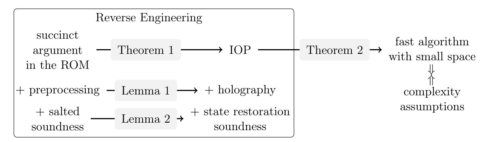
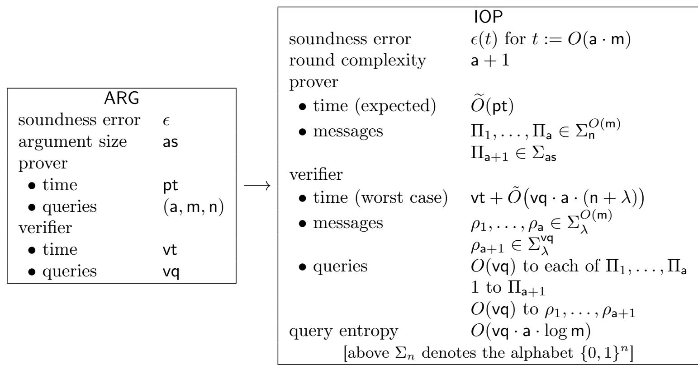
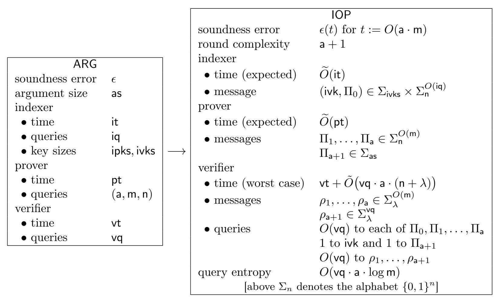

{0}------------------------------------------------

# Barriers for Succinct Arguments in the Random Oracle Model

Alessandro Chiesa alexch@berkeley.edu UC Berkeley

Eylon Yogev eylony@gmail.com Boston University and Tel Aviv University

November 14, 2020

#### Abstract

We establish barriers on the efficiency of succinct arguments in the random oracle model. We give evidence that, under standard complexity assumptions, there do not exist succinct arguments where the argument verifier makes a small number of queries to the random oracle.

The new barriers follow from new insights into how probabilistic proofs play a fundamental role in constructing succinct arguments in the random oracle model.

- IOPs are necessary for succinctness. We prove that any succinct argument in the random oracle model can be transformed into a corresponding interactive oracle proof (IOP). The query complexity of the IOP is related to the succinctness of the argument.
- Algorithms for IOPs. We prove that if a language has an IOP with good soundness relative to query complexity, then it can be decided via a fast algorithm with small space complexity.

By combining these results we obtain barriers for a large class of deterministic and nondeterministic languages. For example, a succinct argument for 3SAT with few verifier queries implies an IOP with good parameters, which in turn implies a fast algorithm for 3SAT that contradicts the Exponential-Time Hypothesis.

We additionally present results that shed light on the necessity of several features of probabilistic proofs that are typically used to construct succinct arguments, such as holography and state restoration soundness. Our results collectively provide an explanation for "why" known constructions of succinct arguments have a certain structure.

Keywords: succinct arguments; interactive oracle proofs

{1}------------------------------------------------

## Contents

| 1 | Introduction                                                | 1        |  |  |
|---|-------------------------------------------------------------|----------|--|--|
|   | 1.1<br>Our contributions                                    | 2        |  |  |
|   | 1.2<br>Related work<br>                                     | 5        |  |  |
| 2 | Techniques                                                  |          |  |  |
|   | 2.1<br>IOPs are necessary for succinctness                  | 7<br>7   |  |  |
|   | 2.2<br>Algorithms for IOPs<br>                              | 9        |  |  |
|   | 2.3<br>Barriers for succinct arguments<br>                  | 11       |  |  |
|   | 2.4<br>Additional results and applications<br>              | 13       |  |  |
|   |                                                             |          |  |  |
| 3 | Definitions                                                 | 15       |  |  |
|   | 3.1<br>Random oracles and oracle algorithms<br>             | 15       |  |  |
|   | 3.2<br>Relations<br>                                        | 15       |  |  |
|   | 3.3<br>Non-interactive arguments in the random oracle model | 16       |  |  |
|   | 3.4<br>Interactive oracle proofs<br>                        | 17       |  |  |
| 4 | From succinct arguments to interactive oracle proofs        | 19       |  |  |
|   | 4.1<br>Tool: perfect hash functions with locality<br>       | 20       |  |  |
|   | 4.2<br>The transformation                                   | 20       |  |  |
|   | 4.3<br>Proof of Theorem 4.1                                 | 21       |  |  |
| 5 | From interactive oracle proofs to algorithms                |          |  |  |
|   |                                                             | 25       |  |  |
|   | 5.1<br>IOP to laconic IP<br>5.2<br>IP to algorithm          | 25<br>27 |  |  |
|   |                                                             |          |  |  |
| 6 | Barriers for succinct arguments                             | 29       |  |  |
|   | 6.1<br>The case of nondeterministic languages               | 29       |  |  |
|   | 6.2<br>The case of deterministic languages                  | 30       |  |  |
| 7 | Preprocessing implies holography<br>32                      |          |  |  |
| 8 | Stronger notions of soundness                               | 35       |  |  |
|   | 8.1<br>Salted soundness<br>                                 | 35       |  |  |
|   | 8.2<br>State restoration soundness<br>                      | 36       |  |  |
|   | 8.3<br>Result<br>                                           | 37       |  |  |
| A | Proof of Folklore 1.2                                       | 39       |  |  |
|   |                                                             |          |  |  |
| B | Known and conjectured succinct arguments in the ROM         | 40       |  |  |
|   | Acknowledgments                                             | 42       |  |  |
|   | References                                                  |          |  |  |
|   |                                                             | 42       |  |  |

{2}------------------------------------------------

# <span id="page-2-0"></span>1 Introduction

A succinct argument is a cryptographic proof system for deterministic and non-deterministic languages, whose communication complexity is "succinct" in the sense that it is sublinear in the time to decide the language (for deterministic languages) or witness size (for non-deterministic languages). In the last decade, succinct arguments have drawn the attention of researchers from multiple communities, being a fundamental cryptographic primitive that has found applications in the real world.

A central goal in the study of succinct arguments is improving their efficiency. An important complexity measure is argument size, which is the number of bits sent from the prover to the verifier. Achieving small argument size is crucial, e.g., in applications where non-interactive succinct arguments are broadcast in a peer-to-peer network and redundantly stored at every node (as in [\[BCGGMTV14\]](#page-43-2)). Other important complexity measures include the running time of the prover and the running time of the verifier — this latter is the complexity measure that we study in this paper.

There are applications where the running time of the verifier is the main bottleneck and call for verifiers that are extremely lightweight. These applications include obfuscating the verifier [\[BISW17\]](#page-43-3), or recursive constructions where an outer succinct argument proves that the verifier of an inner succinct argument has accepted [\[Val08;](#page-44-0) [BCCT13\]](#page-43-4). In these cases, the circuit (or code) representing the verifier's computation is used in a white-box manner and the verifier's running time dominates the complexity of the final scheme. For instance, in the second example, the running time of the outer prover mainly depends on the running time of the inner verifier.

Our goal is to establish lower bounds on the running time of a succinct argument's verifier.

We focus on the random oracle model. We deliberately restrict our attention to studying succinct arguments that are secure in the random oracle model (ROM). This is because the ROM is an elegant information-theoretic model within which we could hope to precisely understand the structure of arbitrary succinct arguments, and prove lower bounds on specific efficiency measures.

Moreover, the ROM supports several well-known constructions of succinct arguments that can be heuristically instantiated via lightweight cryptographic hash functions, are plausibly post-quantum secure [\[CMS19\]](#page-44-1), and have led to realizations that are useful in practice. These constructions include the Fiat–Shamir transformation [\[FS86\]](#page-44-2), which applies to public-coin interactive proofs (IPs); the Micali transformation [\[Mic00\]](#page-44-3), which applies to probabilistically checkable proofs (PCPs); and the BCS transformation [\[BCS16\]](#page-43-5), which applies to public-coin interactive oracle proofs (IOPs).

How small can verifier query complexity be? As mentioned earlier, the running time of the verifier is a crucial efficiency measure in applications of succinct arguments. While in the ROM each query is considered a constant-time operation, each query actually becomes expensive when the random oracle is heuristically instantiated via a cryptographic hash function. Each query becomes a sub-computation involving very many gates for evaluating the cryptographic hash function, which can dominate the verifier's running time. This, for example, is the case in the recursive construction in [\[COS20\]](#page-44-4). In this paper, we ask: how small can the query complexity of a verifier be?

We make our question precise via the notion of bits of security. The soundness error of a succinct argument in the ROM is a function of several parameters: the instance size, the output size of the random oracle, and the number of queries by the cheating prover to the random oracle. Then we say that a succinct argument provides s bits of security if the soundness error is at most 2 −s for every instance size up to 2 s , every prover query complexity up to 2 s , and when the output size of the random oracle is Θ(s). (See [Section 3.3](#page-17-0) for relevant definitions.)

Known constructions of succinct arguments achieve verifier query complexities that are Ω(s).

{3}------------------------------------------------

This is true even if one were to rely on conjectured "holy grail" probabilistic proofs within these constructions. (We explain this in detail in [Appendix B.](#page-41-0)) In particular, no approach is known that could achieve a verifier that makes o(s) queries to the oracle (which would be very desirable).

We are interested in understanding whether small verifier query complexity is possible:

Do there exist succinct arguments with s bits of security and verifier query complexity s?

## <span id="page-3-0"></span>1.1 Our contributions

In this paper we contribute new insights into the structure of succinct arguments in the ROM, which we then use to obtain evidence that the answer to the above question is negative. First we prove that IOPs are an inherent ingredient of any succinct argument in the ROM. Then we prove limitations of the obtained IOPs, thereby obtaining lower bounds on the number of queries to the random oracle by the verifier in the starting succinct argument. The limitations on IOPs that we prove are rather broad (even when applied to the case of a PCP), and may be of independent interest.

Here we remind the reader that an interactive oracle proof (IOP) [\[BCS16;](#page-43-5) [RRR16\]](#page-44-5) is a proof system that combines the notions of interactive proofs (IP) and probabilistically-checkable proofs (PCPs). Namely, it is an interactive proof where the verifier is granted oracle access to the messages sent by the prover and so can probabilistically query them. As opposed to PCPs, IOPs leverage the multiple rounds of communication, which gives them many efficiency improvements in terms of proof size and the running time of the prover. As shown in [\[BCS16\]](#page-43-5), IOPs with suitable soundness properties can be compiled into non-interactive succinct arguments in the ROM. This, along with the concrete efficiency of IOPs, makes them a central component of many succinct arguments today.

#### <span id="page-3-2"></span>1.1.1 IOPs are necessary for succinctness

We prove that IOPs are inherent to succinct arguments in the ROM in a precise sense: any succinct argument in the ROM can be generically transformed into an IOP whose query complexity depends on the "succinctness" of the argument. Namely, if the argument prover sends as bits to the argument verifier, then the IOP verifier makes as queries to proof strings sent by the IOP prover.

Moreover, and less intuitively, the IOP verifier makes O(vq·a) extra queries, where vq is the number of queries made by the argument verifier to the random oracle and a is the number of adaptive rounds of queries by the (honest) argument prover to the random oracle (see [Section 3.1](#page-16-1) for more on adaptivity). The adaptivity parameter a plays a key role in our result, and it is small in all known schemes. (E.g., a = O(log n) in succinct arguments obtained via the Micali transformation [\[Mic00\]](#page-44-3).)

<span id="page-3-1"></span>Theorem 1 (informal). There is an efficient transformation T that satisfies the following. Suppose that ARG is a size-as argument in the ROM for a language L where the honest prover performs pq queries in a rounds and the verifier performs vq queries. Then IOP := T(ARG) is an IOP for L with proof length O(pq + as) and query complexity O(as + vq · a). Other aspects of IOP (such as public coins, soundness, time and space complexities) are essentially the same as in ARG.

Our result provides a way to construct an IOP by "reverse engineering" an arbitrary succinct argument, leading to a standalone compelling message: succinct arguments in the ROM are "hard to construct" because they must contain non-trivial information-theoretic objects. This holds regardless of the complexity of the language proved by the succinct argument. For example, IOPs are inherent even to succinct arguments for deterministic computations (where the primary efficiency goal is 

{4}------------------------------------------------

an argument verifier that is faster than directly deciding the language). Our necessity result is complementary to a result of Rothblum and Vadhan [\[RV09\]](#page-44-6), which showed the necessity of PCPs for succinct arguments obtained via blackbox reductions to falsifiable assumptions (see [Section 1.2\)](#page-6-0). Their result does not apply for succinct arguments in the random oracle model.

In this paper, the necessity of IOPs for succinct arguments in the ROM is more than a compelling message. We demonstrate that the necessity of IOPs is a useful step towards establishing barriers on succinct arguments, because thanks to [Theorem 1](#page-3-1) we have reduced this problem to establishing barriers on IOPs. Our second main contribution concerns this latter task (see below).

We sketch the ideas behind [Theorem 1](#page-3-1) in [Section 2.1;](#page-8-1) the formal statement of the theorem, which gives a precise accounting of many more parameters, is given and proved in [Section 4.](#page-20-0)

#### 1.1.2 From IOPs to algorithms

We show that IOPs with good parameters (small soundness error relative to query complexity) can be translated to fast algorithms with small space complexity. This translation should be viewed as a tool to establish barriers on IOPs: if the language proved by the IOP is hard then the corresponding algorithm may (conjecturally) not exist, contradicting the existence of the IOP to begin with.

<span id="page-4-0"></span>Theorem 2 (informal). Suppose that a language L has a public-coin IOP with soundness error ε, round complexity k, proof length l = poly(n) over an alphabet Σ, query complexity q, and verifier space complexity vs. If ε = o(2−q·log <sup>l</sup> ) then, the language L can be decided by a probabilistic algorithm that runs in time exponential in <sup>O</sup><sup>e</sup> q ·(log |Σ| + k) and that runs in space <sup>O</sup><sup>e</sup> vs· q 2 ·(log |Σ| + k) 2 .

We sketch the ideas behind [Theorem 2](#page-4-0) in [Section 2.2;](#page-10-0) the formal statement is proved in [Section 5.](#page-26-0) Our result in fact provides a broad generalization of folklore results that impose barriers on IPs and PCPs (both are special cases of IOPs) as we discuss in [Section 1.2.](#page-6-0) In particular, the folklore results restrict the verifier and alphabet size, while we do not. For example, [Theorem 2](#page-4-0) rules out a broader class of PCPs for the "small-query high-soundness" regime than what was previously known: under the (randomized) Exponential-Time Hypothesis (rETH),[1](#page-4-1) if the number of queries is constant then the best possible soundness error is 1/poly(n), as long as log |Σ| n (otherwise a trivial PCP exists). We deduce this from the corollary obtained by setting k := 1 in [Theorem 2.](#page-4-0)

<span id="page-4-2"></span>Corollary 1 (informal). Suppose that NP has a PCP with perfect completeness and soundness error ε, and where the verifier tosses r random coins, makes q queries into a proof of length l = poly(n) over an alphabet <sup>Σ</sup>. Under the rETH assumption, if <sup>O</sup>e(<sup>q</sup> log <sup>|</sup>Σ|) = <sup>o</sup>(n), then <sup>ε</sup> <sup>≥</sup> <sup>2</sup> −q·log l .

This yields limitations for PCPs, e.g., in the "cryptographic regime": constant-query PCPs with negligible soundness cannot have polynomial size, even over an exponentially-large alphabet.

#### 1.1.3 Barriers for succinct arguments

We now discuss our barriers for succinct arguments, which state that under standard complexity assumptions there are no succinct arguments where the verifier makes a small number of queries to the random oracle, and the honest prover has a small adaptivity parameter a.

Suppose that 3SAT has a succinct argument that provides s bits of security and has argument size as n, where n is the number of variables in the 3SAT formula. Suppose that the argument

<span id="page-4-1"></span><sup>1</sup>The randomized Exponential Time Hypothesis states that there exist > 0 and c > 1 such that 3SAT on n variables and with c · n clauses cannot be solved by probabilistic algorithms that run in time 2 ·n [\[DHMTW14\]](#page-44-7).

{5}------------------------------------------------

prover makes a adaptive rounds of queries to the random oracle, and the argument verifier makes vq queries to the random oracle. If vq · a s then by [Theorem 1](#page-3-1) we get an IOP with similar efficiency parameters, and with query complexity roughly o(s). Then by [Theorem 2](#page-4-0) we get an algorithm for 3SAT that runs in time 2 o(n) , contradicting the randomized Exponential Time Hypothesis.

Theorem 3 (informal). Suppose that 3SAT has a public-coin succinct argument that provides s bits of security and has argument size as n, where the prover makes a adaptive rounds of queries to the random oracle and the verifier makes vq queries to the random oracle. If vq·a s then rETH is false.

The theorem applies to all constructions, but does not completely answer our motivating question because the theorem has a dependency on the adaptivity parameter a. The question of whether this dependency can be removed remains a challenging open problem. If it turns out that it cannot be removed, then our result suggests a path to construct succinct arguments with more efficient verifiers: the standard Merkle trees (which lead to very small adaptivity) must be replaced with a deeper structure that exploits long adaptive paths of queries. This would be a very exciting development, departing from all paradigms for succinct arguments known to date!

Note that the requirement as n is necessary as if as = n then a trivial argument system, where the prover sends the full satisfying assignment, has no soundness error with no random oracle calls.

We sketch how to derive our barriers in [Section 2.3;](#page-12-0) formal statements can be found in [Section 6,](#page-30-0) in a more general form that separately considers the case of arbitrary nondeterministic languages (of which 3SAT is an example) and the case of arbitrary deterministic languages.

#### 1.1.4 Additional applications and extensions

Our transformation from succinct arguments to IOPs [\(Section 1.1.1\)](#page-3-2) leads to extensions that provide valuable insights into succinct arguments, as we discuss below.

Extension 1: preprocessing implies holography. We now consider succinct arguments in the ROM that have an additional useful feature, known as preprocessing. This means that in an offline phase one can produce a short summary for a given circuit and then, in an online phase, one may use this short summary to verify the satisfiability of the circuit with different partial assignments to its inputs.[2](#page-5-0) The online phase now can be sublinear in the circuit size even for arbitrary circuits.

The BCS transformation extends to obtain preprocessing SNARGs from holographic IOPs [\[COS20\]](#page-44-4), following a connection between preprocessing and holography introduced in [\[CHMMVW20\]](#page-43-6). Therefore, in light of [Theorem 1,](#page-3-1) it is natural to ask: do all preprocessing SNARGs in the random oracle model arise from holographic IOPs? Even if SNARGs "hide" IOPs inside them (due to our result), there may be other approaches to preprocessing beyond holography, at least in principle.

We show that preprocessing does arise from holography. We extend the ideas underlying our [The](#page-3-1)[orem 1](#page-3-1) to obtain a transformation that given a preprocessing SNARG in the random oracle model outputs a holographic IOP with related complexity measures. This reverse direction strengthens the connection between preprocessing and holography established in [\[COS20;](#page-44-4) [CHMMVW20\]](#page-43-6).

<span id="page-5-1"></span>Lemma 1. There is an efficient transformation T that satisfies the following. Suppose that ARG is a size-as preprocessing non-interactive argument in the ROM for an indexed relation R where the honest prover performs pq queries in a rounds, the verifier performs vq queries, and the indexer

<span id="page-5-0"></span><sup>2</sup>Here we focus on succinct arguments for circuit satisfiability for simplicity of exposition. The preprocessing property can be stated more generally, specifically for ternary relations, and we do so in the rest of this paper.

{6}------------------------------------------------

outputs a key of size ivk. Then IOP := T(ARG) is a holographic IOP for R with proof length O(pq + as) and query complexity O(ivk + as + vq · a). Other aspects of IOP (such as public coins, soundness, time and space complexities) are essentially the same as in ARG.

See [Section 7](#page-33-0) for details on this result.

Extension 2: on state restoration soundness. A careful reader may have noticed that our discussion so far did not touch upon a technical, yet important, aspect. Namely, observe that if we applied the transformation in [Theorem 1](#page-3-1) to a SNARG in the ROM then we would obtain a corresponding public-coin IOP. However, given what we said so far, we are not guaranteed that we can compile this IOP back into a SNARG! Indeed, the known approach for constructing SNARGs from IOPs requires the IOP to satisfy a stronger notion of soundness called state restoration soundness [\[BCS16\]](#page-43-5). So we should ask: does the IOP output by [Theorem 1](#page-3-1) satisfy this stronger notion?

We prove that the transformation in [Theorem 1](#page-3-1) yields an IOP with state-restoration soundness as long as the SNARG had a stronger notion of soundness that we introduce and call salted soundness. Informally, this notion allows a cheating SNARG prover to request the random oracle to re-sample the answer for a chosen query (in case the prover did not "like" the prior answer). (See [Section 8.1](#page-36-1) for the definition, which uses a game inspired by the state-restoration game.)

<span id="page-6-1"></span>Lemma 2 (informal). The transformation T in [Theorem 1](#page-3-1) satisfies this additional property: if ARG is a SNARG with salted soundness error s(t) for query budget t and the prover runs in a adaptive rounds then IOP := T(ARG) is a public-coin IOP with state restoration soundness error s(t · m).

This lemma resolves the issue described above because the SNARGs constructed from (staterestoration sound) IOPs in [\[BCS16\]](#page-43-5) do indeed satisfy the stronger notion of salted soundness. See [Section 8](#page-36-0) for details about the stronger soundness notions and the above lemma.



Figure 1: Summary of our results. The left part shows results related to "reverse engineering" succinct arguments, which derive IOPs with certain properties from succinct arguments with certain properties. The right part depicts the fact that IOPs with good enough parameters lead to algorithms that, for hard enough languages, contradict plausible complexity assumptions.

#### <span id="page-6-0"></span>1.2 Related work

Known limitations on IPs and PCPs. Our [Theorem 2](#page-4-0) implies that IOPs with good parameters can be translated into good algorithms. Below we summarize known facts that impose limitations on restrictions of the IOP model: interactive proofs (IPs) and probabilistically checkable proofs (PCPs).

<span id="page-6-2"></span>• IPs. The following fact follows from proof techniques in [\[GH98\]](#page-44-8) (see also [\[RRR16,](#page-44-5) Remark 5.1]).

{7}------------------------------------------------

Folklore 1.1. If a language L has a public-coin IP where the communication and verifier space complexity are bounded by c, then L can be decided by an algorithm running in space O(c).

Since it is believed that DTIME[T] 6⊆ SPACE[o(T)], the above lemma tells us that we should not expect every language in DTIME[T] to have a non-trivial public-coin interactive proof.

Both [Folklore 1.1](#page-6-2) and our [Theorem 2](#page-4-0) lead to an algorithm with small space, and the main difference is that our theorem is a statement about IOPs rather than IPs. We note, however, that within the proof of our theorem we prove a lemma [\(Lemma 5.3\)](#page-28-1) that can be viewed as a refinement of [Folklore 1.1](#page-6-2) as it applies even when the verifier-to-prover communication is large.

<span id="page-7-0"></span>• PCPs. The following fact (whose proof is in [Appendix A\)](#page-40-0) lower bounds a PCP's soundness error.

Folklore 1.2. Suppose that NP has a PCP with perfect completeness and soundness error ε, and where the verifier tosses r random coins and makes q queries into a proof of length l over an alphabet Σ. Then the following holds:

```
1. ε ≥ 2
        −r
           ; and
2. Under the ETH assumption, if r = o(n) and q log |Σ| = o(n) then ε ≥ 2
                                                                              −q·log |Σ|
                                                                                      .
```

In order to understand the implications of the above limitation, we find it helpful to recall a well-known conjecture about possible PCP constructions. The Sliding Scale Conjecture states that, for every ε ∈ [1/poly(n), 1], every language in NP has a PCP with perfect completeness and soundness error ε, and where the verifier uses O(log n) random bits and makes O(1) queries into a proof over an alphabet Σ of size poly(1/ε). The conjecture is tight in the sense that we cannot ask for better soundness with the same parameters.

Yet if we allow the verifier to use ω(log n) random bits or if log |Σ| = ω(log n) then [Folklore 1.2](#page-7-0) does not rule out PCPs with soundness error 1/nω(1). Our [Corollary 1](#page-4-2) amends this by establishing that one cannot get soundness error better than 1/poly(n) even if the verifier uses an arbitrary number of random bits and the alphabet is arbitrarily large.

Probabilistic proofs in succinct arguments. Essentially all known constructions of succinct arguments use some form of probabilistic proof as an ingredient (possibly among other ingredients). Prior to this work, the only known formal statement seeking to explain this phenomenon is a result by Rothblum and Vadhan [\[RV09\]](#page-44-6) stating that succinct arguments proved secure via a black-box reduction to a falsifiable assumption must "contain" a PCP. This is formalized via a transformation that, given such a succinct argument, outputs a PCP with size and query complexity related to the succinctness of the argument system (and also certain aspects of the security reduction).

Our [Theorem 1](#page-3-1) is complementary to the result in [\[RV09\]](#page-44-6), in that we consider succinct arguments that are unconditionally secure in the random oracle model (as opposed to computationally secure in the standard model). Our techniques are also different, in that the technical challenge is to design an efficient sub-protocol to simulate a random oracle (as opposed to detecting if the adversary has "broken cryptography" by using the falsifiability of the cryptographic assumption).

{8}------------------------------------------------

# <span id="page-8-0"></span>2 Techniques

## <span id="page-8-1"></span>2.1 IOPs are necessary for succinctness

We describe the main ideas behind [Theorem 1,](#page-3-1) which states that any succinct argument in the ROM implies an IOP with related parameters (which in particular demonstrates that IOPs are necessary for succinctness in the ROM). Let P and V be the prover and verifier of an arbitrary succinct argument for a language L (e.g., 3SAT). We seek to "remove" the random oracle from the succinct argument by simulating it via an interactive sub-protocol and ending with an IOP for the same language L. We assume, without loss of generality, that P and V each never query the same element more than once.[3](#page-8-2)

Below, we first describe a straightforward approach, then explain problems and challenges on the approach, and finally explain how we overcome the challenges to obtain our result.

A straightforward approach. We can construct an IP with a new prover P and a new verifier V that respectively simulate the argument prover P and argument verifier V . In addition, we task the IP verifier V to simulate the random oracle for both P and V , as we explain.

- Whenever the argument prover P wants to query the oracle at an element x, the IP prover P forwards the query x to the IP verifier V, who replies with a truly random string y that plays the role of the output of the random oracle on x.
- Whenever the argument verifier V queries x, then the IP verifier V checks if x had appeared in the transcript as one of the queries and returns the given answer to V if so, or otherwise it feeds V with a truly random value.

There is a delicate, yet crucial, issue that needs to be taken care of. A cheating IP prover might query x twice (or more) to get two possible answers for the same query, which might affect the soundness of the IP (and indeed there are succinct arguments where this issue has devastating consequences on the soundness of the IP). Thus, when simulating a verifier query x, the IP verifier V must assert that x was not issued twice during the protocol (and otherwise reject).

The approach above perfectly removes the random oracle from the succinct argument and yields an IP with similar completeness and soundness. Henceforth we view the IP constructed above as an IOP whose verifier reads the entire transcript (queries all locations of the exchanged messages).

The problem. The problem with the IOP described above is its parameters. The argument prover P might perform many queries, and in particular more than the witness size (as is the case in known constructions of succinct arguments). This dominates many parameters of the IOP, including the number of rounds, the number of bits read by the verifier, and its running time — and also yields a trivial IOP for the language. Note that proof length (the number of bits sent by P) is fine, as we do not expect all languages in NP to have an IOP with small proof length, but rather only expect the IOP verifier to read a small number of locations from the prover messages.

Achieving small round complexity. We crucially exploit a parameter of the argument prover P not discussed thus far, namely, its adaptivity. We say that P has adaptivity a if it performs a rounds of queries to the random oracle and in each round submits a (possibly long) list of queries and receives corresponding answers. In known constructions, a is very small (e.g., O(log n)). If P has adaptivity a, then the number of rounds in the constructed IOP can be easily reduced to O(a),

<span id="page-8-2"></span><sup>3</sup>We can always modify the prover to store previous query answers, so that no query is performed twice. This might increase the space complexity of the prover, but it does not affect the results in this paper.

{9}------------------------------------------------

where the IOP prover P sends the verifier a list of queries x1, . . . , xm, and the IOP verifier V replies with a list of answers y1, . . . , ym, while applying the same logic as before. This reduces the number of rounds of the IOP, but so far has no effect on the number of queries performed by the IOP verifier V, which remains as large as the number of queries performed by the argument prover P.

Perfect hash functions with locality. Our main goal now is to reduce the number of bits read by the IOP verifier V. Consider a query x performed by the argument verifier V . The IOP verifier V needs to read the transcript to see if the query x was issued and, if so, check that it was issued only once. A simple way to find x in the transcript is to have the IOP prover P assist with locating x. That is, P points to the exact location in the transcript for where x was issued. Then V reads this specific location in the transcript and is assured that x was queried and at the same time reads the corresponding response y. However, how can V check that x was not issued twice? And how can P give a proof that the rest of the transcript does not contain x?

To deal with these challenges, we use perfect hash functions. These are a family of functions H = {h: U → [O(m)]} such that for any S of size m there exists a function h ∈ H that is one-to-one on S. Fixing such a family H, we let the IOP prover P provide with each set of queries (for each round), a perfect hash function h for the set X of submitted queries and send an array of length O(m) such that element x ∈ X resides in the cell at index h(x). This way, instead of the IOP verifier V scanning (and reading) all prover messages, it suffices for V to read the description of h and then query the cell h(x) to determine if x is in the array.

Also, the IOP verifier V writes the response y at the same location h(x) in a dedicated array of random values, Y [h(x)]. This way, V can be convinced that x was not issued at a specific round by looking at a single cell h(x) for the array given by P at that round. Thus, the query complexity of V for simulating a single query of V is mainly determined by the number of rounds of the protocol, which is the rather small value a (the adaptivity of the honest argument prover P). Note that while the entire array Y is sent to the prover, the verifier needs to read only a single location from Y (we elaborate on this further below).

The locality property. Turning the above ideas into our transformation runs into several delicate issues that need to be handled to achieve soundness and good parameters. One issue is that the description of h is, in fact, too large for the verifier to read in its entirety (it is larger than the set itself). However, we observe that V need not read the entire function description, but only the parts required for evaluating h at x.

Therefore, we additionally require the perfect hash family to have a locality property where, in order to evaluate the hash function h on a single element x, only a relatively small number of bits are required to be read from the description of h. Luckily, several known constructions have this locality property and, specifically, we use the construction of Fredman, Komlós, and Szemerédi [\[FKS84\]](#page-44-9). An overview of the [\[FKS84\]](#page-44-9) construction, its locality property, and a bound on the number of bits required to read are given in [Section 4.1.](#page-21-0)

There are additional challenges in realizing the above plan. For example, in terms of soundness, note that a cheating prover might submit a set X and choose a function h that is not perfect for X and contains collision — this could potentially harm soundness. We deal with this and other issues on the way to proving our transformation from succinct arguments to IOPs.

The resulting IOP. This results in an IOP with the following parameters. If the prover had a rounds of adaptivity, then the IOP has a + 1 rounds, where the first a rounds are used to simulate the random oracle for the prover, and the last round is dedicated to sending the final output of the prover. The proof length of the IOP (i.e., the total communication of the protocol) is O(as + pq) 

{10}------------------------------------------------

symbols where each symbol contains an output of the random oracle. Indeed, for each of the pq queries we an additional O(1) symbols, and for the last round we send the final argument which is as bits (and can be read as a single symbol).

The query complexity is O(as + vq · a) as for each of the vq queries of the prover, the verifier needs to scan all a rounds, and performs O(1) queries in each. Then, it reads last prover message entirely which is as bits (which we can view as 1 large symbol of as bits).

The resulting IOP has large communication of randomness from the verifier to the prover. However, the verifier, in order to decide whether to accepts, has to read only a small number of locations, and these are included in the count of the query complexity. Our definition for IOP allows the verifier to have only oracle access to its own randomness and thus the query complexity includes both locations read from the proof and from the randomness. We stress that the compiler of [\[BCS16\]](#page-43-5) works even for this more general definition of IOP. Therefore, we do not expect to get an IOP with small verifier-to-prover communication as it could be that the succinct argument was constructed from an IOP with large communication (see [Section 3.4](#page-18-0) for the precise definition of IOP and a further discussion on this topic).

See [Section 4](#page-20-0) for further details of the proof.

## <span id="page-10-0"></span>2.2 Algorithms for IOPs

We describe the main ideas behind [Theorem 2,](#page-4-0) which states that IOPs with good parameters can be translated to fast algorithms with small space complexity. We proceed in two steps.

- Step 1. We prove that any IOP can be simulated by an IP (interactive proof) with small proverto-verifier communication, at the cost of a (large) completeness error that depends on how well one can guess all of the IOP verifier's query locations (the "query entropy" of the IOP).
- Step 2. We prove a refinement of a result of Goldreich and Håstad [\[GH98\]](#page-44-8) that states that languages with public-coin IPs with small prover-to-verifier communication can be decided via fast probabilistic algorithms with small space complexity.

We elaborate on each of these steps in turn below.

Step 1: IOP to laconic IP [\(Lemma 5.2](#page-26-2) in [Section 5.1\)](#page-26-1). We prove that any IOP with good enough soundness relative to its query entropy can be translated to a laconic IP (an IP with small prover-to-verifier communication). Query entropy is related to the probability of guessing in advance all locations that the IOP verifier will read across the proof strings sent by the IOP prover (see [Definition 3.5](#page-19-0) for how query entropy is formally defined). The translation ensures that if the IOP is public coin (as indeed it is in our case) then the IP is also public coin. Moreover, at the cost of an additional completeness error, the IP verifier can be modified so that it makes a single pass on its (large) randomness tape and runs in small space. (This small-space property will be useful later on for establishing barriers on succinct arguments for deterministic languages; see [Section 2.3.](#page-12-0))

We construct the IP as follows. First, the IP prover guesses the locations that the IOP verifier will read. The probability of guessing all locations correctly is 2 −h , where h is the query entropy. Assuming a correct guess, the IP prover sends the description of these locations together with corresponding values. If the IOP verifier makes q queries across a proof of length l over an alphabet Σ, then the IP prover sends q·log l+q·log |Σ| bits. The soundness of the protocol remains the same. What changes is the completeness error, which drastically increases since guessing all locations has 

{11}------------------------------------------------

a small probability. However, if the soundness error is small enough and as long as there is some difference between completeness and soundness, we get a non-trivial IP. In particular, if the IOP has soundness error ε < 2 −h then the resulting IP has soundness error ε, completeness error 1−2 −h , and prover communication q · log l + q · log |Σ| as mentioned above.

Finally, we show that the IP can be modified (at the expense of the completeness error) to make the IP verifier perform a single pass over its randomness tape. Note that the IOP verifier might read the randomness in an arbitrary manner, which would make the IP verifier read it in a similar one. Here, we exploit the fact that the IOP verifier had only oracle access to its own random tape, and performed only a limited number of queries. We leverage this and let the IP verifier guess these locations in advance. Then, the verifier reads the randomness tape and stores only the locations it guessed. From here on, the verifier will use only the randomness stored explicitly. Assuming that it guessed correctly, it uses these locations to simulate random access for the IOP verifier. This again adds a large completeness error. However, if the soundness error is small enough, then again the resulting IP is non-trivial and, as discussed above, suffices for our purposes.

Step 2: IP to algorithm (see [Lemma 5.3](#page-28-1) in [Section 5.2\)](#page-28-0). Goldreich and Håstad [\[GH98\]](#page-44-8) showed that languages with public-coin IPs with small prover-to-verifier communication can be decided via fast probabilistic algorithms. In particular, if L has a public-coin IP where, for an instance of length n, the prover-to-verifier communication is bounded by c(n) and the number of rounds is bounded by k(n) then it holds that

$$L \in \text{BPTIME}\left[2^{O(c(n)+\mathsf{k}(n)\cdot\log\mathsf{k}(n))}\cdot\operatorname{poly}(n)\right]$$
.

Their result is shown only for IPs with constant completeness and soundness errors, which is not the case for the IP constructed in Step 1. We stress that the IP constructed Step 1 can be amplified via standard repetition to reach the setting of constant completeness and soundness errors, doing so would increase communication and render the IP not laconic, and hence not useful for us in this paper. Instead, we show a refinement of [\[GH98\]](#page-44-8) that is suitable to work in the "large-error" regime of IP parameters. Details follow.

We explicitly show the dependency in the completeness and soundness errors, allowing the theorem to apply to IPs with large completeness errors (which we need). This refinement is technical, where we follow the original proof blueprint of [\[GH98\]](#page-44-8). We explicitly track the completeness and soundness errors rather than hiding them as constants in the Big-O notation, and adjust other parameters as a function of the completeness and soundness error values. The result is a moderately more involved formula for the running time of the final algorithm, which has these parameters in addition to the communication complexity and the number of rounds.

In particular, we get that if a language L has a public-coin IP with completeness error α, soundness error β, round complexity k, and prover-to-verifier communication c, then it holds that

$$L \in \text{BPTIME}\left[2^{O\left(c(n) + \mathsf{k}(n) \cdot \log \frac{\mathsf{k}(n)}{1 - \alpha(n) - \beta(n)}\right)} \cdot \operatorname{poly}(n)\right].$$

For example, plugging in the IP obtained from Step 1, while assuming that ε = o(2−q·log <sup>l</sup> ) (and hiding some terms under the <sup>O</sup><sup>e</sup> notation) we get the expression from [Theorem 2:](#page-4-0)

$$L \in \mathrm{BPTIME}\left[2^{\widetilde{O}(\mathsf{q} \cdot (\log |\Sigma| + \mathsf{k}))}\right]$$
.

{12}------------------------------------------------

Additionally, we show that if the verifier of the IP reads its randomness in a single pass, then the same algorithm can be implemented in small space (the original implementation of [GH98] used space proportional to its running time). Looking ahead, this property is used to achieve the barrier for deterministic languages. We sketch the main idea behind the new algorithm.

The algorithm's main goal is to compute the value of a tree  $A_{x}$  corresponding to (an approximation of) the interaction in the IP protocol. Each node in the tree corresponds to a certain partial transcript of the IP, and computing the value of the tree suffices to decide the language. The straightforward way to compute the value is to compute the value of each node in the tree from the leaves up to the root. This would require space proportional to the size of  $A_{x}$ . Yet, in order to compute the value of the tree it would suffice to store only  $\log |A_{x}|$  values at a time, as for any subtree it suffices to store the value of its root.

There is, however, a major issue with this approach. Namely, the space required to store even a single value of the tree is too large, as writing the location of a node in the tree includes the description of the randomness of the verifier in this partial transcript, which is too large to store explicitly. Here we exploit the fact that the verifier uses a single pass to read its randomness, and show how to compress the description of a node in the tree using the internal memory and state of the verifier, given this partial transcript. This allows us to implicitly store nodes values with small memory. Since it suffices to store only  $\log |A_x|$  values at a time we get an algorithm with small memory.

This results in the following conclusion: if the space complexity of the IP verifier is **vs** when reading its randomness random tape in a single pass then

$$L \in \text{SPACE} \left[ O\left(d \cdot (\mathsf{vs} + d)\right) \right] ,$$

where  $d = c(n) + \mathsf{k}(n) \cdot \log \frac{\mathsf{k}(n)}{1 - \alpha(n) - \beta(n)}$ . Once again, plugging in the IP obtained from Step 1, we get the other expression from Theorem 2:

$$L \in \mathrm{SPACE}\left[\widetilde{O}\!\left(\mathsf{vs} \cdot \mathsf{q}^2 \cdot (\log |\Sigma| + \mathsf{k})^2\right)\right] \ .$$

#### <span id="page-12-0"></span>2.3 Barriers for succinct arguments

Our results provide a methodology for obtaining barriers on succinct arguments for different languages, based on complexity assumptions for the language. We describe this blueprint and give two examples, one for non-deterministic languages and one for deterministic languages, and suggest that additional barriers could be achieved is a similar manner.

This methodology works as follows. Let L be the language for which a barrier is desired, and suppose that one proves (or conjectures) some hardness property about the language L. Now assume that there exists a succinct argument for L with certain efficiency parameters such as soundness, query complexity, prover adaptivity, and so on. First apply Theorem 1 to obtain an IOP with parameters related to the succinct argument, and then apply Theorem 2 to obtain an efficient algorithm for L. If the efficient algorithm violates the hardness of L, then one must conclude that the assumed succinct argument for L does not exist.

**Barriers for 3SAT.** We apply the above methodology to obtain barriers for succinct arguments for NP based on the Exponential-Time Hypothesis. Suppose that 3SAT over n variables has a succinct argument that provides s bits of security and has argument size  $as \ll n$  (of course, if

{13}------------------------------------------------

as = n then the scheme is trivial). Suppose also that the argument prover makes a adaptive rounds of queries to the random oracle, and the argument verifier makes vq queries to the random oracle.

We apply [Theorem 1](#page-3-1) to the argument scheme to get a related IOP. Since the argument scheme provides s bits of security, then for any instance x ≤ 2 <sup>s</sup> and query bound t ≤ 2 <sup>s</sup> and for oracle output size λ = O(s) we get that the resulting IOP has soundness ε(x, t, λ) ≤ 2 −s . Moreover, the verifier reads O(vq · a) symbols from the transcript, the alphabet size is |Σ| = 2<sup>λ</sup> , the number of rounds is O(a), and the proof length is O(as + pq), which is best to think as poly(n) for simplicity.

What is important to note here is that if vq · a s then the query entropy of the IOP is 2 <sup>−</sup><sup>h</sup> = l <sup>−</sup>vq·<sup>a</sup> = ω(2−<sup>s</sup> ) and thus ε = o(2−<sup>h</sup> ). This means that we can apply Step 1 above to get an IP for 3SAT where the prover-to-verifier communication is

$$c(n) = \mathbf{q} \cdot \log \mathbf{I} + \mathbf{q} \cdot \log |\Sigma| = \mathbf{q} \cdot \log n + \mathbf{q} \cdot s = O(s^2)$$
,

and the difference between the completeness and soundness error is 1 − α(n) − β(n) = o(s). Then, using Step 2, we get a (randomized) algorithm for 3SAT that runs in time 2 <sup>O</sup>e(q·(log <sup>|</sup>Σ|+k) = 2o(s) = 2 o(n) , as long as s <sup>2</sup> n. This contradicts the (randomized) Exponential Time Hypothesis. Note that the condition that s <sup>2</sup> n is relatively mild, as s is a lower bound for the size of the argument scheme, and the main objective of a succinct argument is to have argument size much smaller than the trivial n bits of communication (sending the satisfying assignment).

The above reasoning can be generalized to any non-deterministic language in NTIME[T], as we work out in detail in [Section 6.1.](#page-30-1)

Barriers for DTIME[T ]. As a second example of our methodology, we show barriers for deterministic languages. Here, we exploit the fact that the final algorithm obtained in Step 2 has small space complexity. Suppose that there is a succinct argument as above for languages in DTIME[T], for some time bound T, with argument size as T. Assume that DTIME[T] 6⊆ SPACE[o(T)], a rather unlikely inclusion (which is currently outside of known techniques to either prove or disprove).

As before, if vq · a s then by [Theorem 1](#page-3-1) we get an IOP with similar efficiency parameters, and with query complexity vq · a s. Additionally, if the argument's verifier space complexity is sv T (which is naturally the case with a non-trivial argument scheme) then the verifier of the obtained IOP can be implemented with O(sv) space.

Similar to the analysis we did in the non-deterministic case, here we apply [Theorem 2](#page-4-0) and get an algorithm for L that runs in space

$$\widetilde{O}(\operatorname{sv}\cdot\operatorname{q}^2\cdot(\log|\Sigma|+\operatorname{k})^2)=\widetilde{O}(s^4)=o(T)\ ,$$

as long as s <sup>4</sup> T (again, a relatively mild condition). This implies that DTIME[T] ⊆ SPACE[o(T)], which contradicts the initial conjectured hardness.

Is the dependency on a inherent? Our methodology gives meaningful barriers provided that the adaptivity of the honest prover, a, is somewhat small, e.g., sublinear in the security parameter s. While this is indeed the case for all known constructions, it is not clear if a succinct argument could benefit from large adaptivity. We can thus draw the following conclusion. One possibility is that our results could be improved to eliminate the dependency on a, for example by improving the transformation to IOP to be more efficient and contain queries from several adaptivity rounds to be in the same round of the IOP. Another possibility is that there exist succinct arguments with small verifier query complexity and large prover adaptivity. This latter possibility would be a quite surprising and exciting development, which, in particular, would depart from all paradigms for succinct arguments known to date.

{14}------------------------------------------------

#### <span id="page-14-0"></span>2.4 Additional results and applications

**Extension 1: preprocessing implies holography.** Our Lemma 1 states that we can transform any *preprocessing* succinct argument into a corresponding *holographic* IOP. We do so by extending the transformation that underlies our Theorem 1, and below, we summarize the required changes.

Recall that in a holographic IOP there is an algorithm, known as the IOP indexer and denoted I, that receives as input, e.g., the circuit whose satisfiability is proved and outputs an encoding of it that will be given as an oracle to the IOP verifier. Our goal here is to construct the IOP indexer by simulating the argument indexer I, which instead relies on the random oracle to output a short digest of the circuit for the argument verifier.

Similarly to the transformation outlined in Section 2.1, we need to "remove" the random oracle during the simulation. The IOP indexer uses its randomness  $\rho_0$  to answer any oracle query performed by the argument indexer. Let  $X_0$  be the set of queries performed by the argument indexer. Then, the IOP indexer finds a perfect hash function  $h_0$  for  $X_0$  and creates the corresponding arrays  $T_0$  and  $Y_0$  containing the queried elements and responded positioned according to  $h_0$ . Finally, the IOP indexer outputs the string (ivk,  $h_0$ ,  $T_0$ ,  $Y_0$ ), where ivk is the output of the argument indexer.

We are left to ensure that, during the transformation, any query simulated by the IOP verifier is consistent with the queries performed in the preprocessing step. The IOP prover, uses  $\rho_0$  to simulate, in its head, the above (deterministic) process to get the same output (ivk,  $h_0, T_0, Y_0$ ), and thus can act in a consistent way to the queries in  $X_0$ .

The IOP verifier reads ivk and uses it to simulate the argument verifier. Recall that for every query x the verifier ensures that x was not issued in any previous round. Here, we modify the verify to search in the array  $T_0$  in addition to the arrays in all the rounds. In this sense, the preprocessing phase acts as "round 0" of the protocol. Completeness and soundness follow in a similar manner to the original transformation. See Section 7 for details.

Extension 2: on state restoration soundness. Our Lemma 2 states that the transformation in Theorem 1 yields an IOP with state-restoration soundness when applied to a SNARG that satisfies salted soundness, a stronger notion of soundness that we introduce and may be of independent interest (the definition is in Section 8.1). The motivation for this result is that in the "forward" direction we only know how to construct SNARGs from IOPs that do satisfy state-restoration soundness [BCS16], which informally means that the IOP prover cannot convince the IOP verifier with high probability even when the IOP prover is allowed to choose from multiple continuations of the interaction up to some budget. We now sketch salted soundness and the ideas behind Lemma 2.

In a succinct argument with salted soundness, the cheating argument prover is allowed to resample answers of the random oracle, in a specific way. Suppose the prover queried some element  $x_1$  and got response  $y_1$ . If the prover wishes, it may resample  $x_1$  to get a fresh new uniform response  $y_1'$ . This process may happen multiple times within the query budget of the algorithm. Then, the prover selects one of these answers, and proceeds to query another element  $x_2$ , and so on. The prover is additionally allowed to go back, and change its decision for the value of some  $x_i$ . However, this produces a new branch where the values for  $x_j$  for j > i have to be resampled. In general, at any step the prover can choose a brach from the set of all branches so far and choose to extend it. Finally, the prover outputs the argument. When the argument verifier queries an element, then it gets a response that is consistent with the branch the prover chose.

We need this security notion to get an IOP with state restoration soundness since this is precisely what a cheating IOP prover can perform within our transformation. In the state-restoration game,

{15}------------------------------------------------

the cheating IOP prover can go back to a previous round and ask for new randomness from the IOP verifier. In our case, the IOP prover will get new randomness for some set of queries. Since these queries simulate a random oracle, it can get fresh randomness for a query intended for a random oracle.

Thus, we show that any cheating prover playing the state-restoration game can be transformed into a cheating prover to the salted soundness game, and yields the desired proof.

See [Section 8](#page-36-0) for definitions of the soundness notions, and details of the proof.

{16}------------------------------------------------

## <span id="page-16-0"></span>3 Definitions

## <span id="page-16-1"></span>3.1 Random oracles and oracle algorithms

We denote by  $\mathcal{U}(\lambda)$  the uniform distribution over all functions  $\zeta \colon \{0,1\}^* \to \{0,1\}^{\lambda}$  (implicitly defined by the probabilistic algorithm that assigns, uniformly and independently at random, a  $\lambda$ -bit string to each new input). If  $\zeta$  is sampled from  $\mathcal{U}(\lambda)$ , then we say that  $\zeta$  is a random oracle.

In this paper, we restrict our attention to oracle algorithms that are deterministic. This is without loss of generality as we do not restrict the running of the algorithm in the random oracle model only the number of queries.

Given an oracle algorithm A and an oracle  $\zeta \in \mathcal{U}(\lambda)$ ,  $\mathsf{queries}(A,\zeta)$  is the set of oracle queries that  $A^{\zeta}$  makes. We say that A is t-query if  $|\mathsf{queries}(A,\zeta)| \leq t$  for every  $\zeta \in \mathcal{U}(\lambda)$ .

Moreover, we consider complexity measures that quantify how the algorithm A makes queries: some queries may depend on prior answers while other queries do not. Letting  $\zeta^{\mathsf{m}}(x_1,\ldots,x_{\mathsf{m}}):=(\zeta(x_1),\ldots,\zeta(x_{\mathsf{m}}))$ , we say that A makes queries in a rounds of width  $\mathsf{m}$  if there exists an a-query oracle algorithm B such that  $B^{\zeta^{\mathsf{m}}} \equiv A^{\zeta}$  for every  $\zeta \in \mathcal{U}(\lambda)$ . Note that  $t \leq \mathsf{m} \cdot \mathsf{a}$ .

Finally, we consider the size of oracle queries, i.e., the number of bits used to specify the query: we say that A has queries of size  $\mathbf{n}$  if for every  $\zeta \in \mathcal{U}(\lambda)$  and  $x \in \mathsf{queries}(A,\zeta)$  it holds that  $|x| \leq \mathbf{n}$ . We summarize the above via the following definition.

<span id="page-16-3"></span>**Definition 3.1.** An oracle algorithm A is (a, m, n)-query if A makes queries in a rounds of width m, and all queries of A have size at most n.

#### <span id="page-16-2"></span>3.2 Relations

We consider proof systems for binary relations and for ternary relations, as we now explain.

- A binary relation R is a set of tuples (x, w) where x is the instance and w the witness. The corresponding language L = L(R) is the set of x for which there exists w such that  $(x, w) \in R$ .
- A ternary relation R is a set of tuples (i, x, w) where i is the index, x the instance, and w the witness. The corresponding language L = L(R) is the set of tuples (i, x) for which there exists w such that  $(i, x, w) \in R$ . To distinguish this case from the above case, we refer to R as an *indexed* relation and L as an *indexed* language.

A binary relation can be viewed as a special case of a ternary relation, where the same index has been fixed for all instances. For example, the indexed relation of satisfiable boolean circuits consists of triples where i is the description of a boolean circuit, x is an assignment to some of the input wires, and w is an assignment to the remaining input wires that makes the circuit output 0. If we restrict this indexed relation by fixing the same circuit for all instances, we obtain a binary relation.

The proof systems that we consider for binary relations are: (a) non-interactive arguments in the random oracle model; and (b) interactive oracle proofs. The proof systems that we consider for indexed (ternary) relations are (a) *preprocessing* non-interactive arguments in the random oracle model; and (b) *holographic* interactive oracle proofs. We will define only the latter two (in Section 3.3 and Section 3.4 respectively) because the former two can be derived as special cases.

{17}------------------------------------------------

#### <span id="page-17-0"></span>3.3 Non-interactive arguments in the random oracle model

We consider non-interactive arguments in the random oracle model, where security holds against query-bounded, yet possibly computationally-unbounded, adversaries. Recall that a non-interactive argument typically consists of a prover algorithm and a verifier algorithm that prove and validate statements for a binary relation, which represents the valid instance-witness pairs. Here we define a more general notion known as a preprocessing non-interactive argument, which works for indexed relations (see Section 3.2). This notion additionally involves an indexer algorithm, which receives as input an index and deterministically produces a key pair specialized for producing and validating statements relative to the given index. The usual notion of a non-interactive argument corresponds to a preprocessing non-interactive argument where the indexer algorithm is degenerate (it sets the proving key equal to the index, and similarly sets the verification key equal to the index).

Let  $\mathsf{ARG} = (I, P, V)$  be a tuple of (oracle) algorithms, with I deterministic. We say that  $\mathsf{ARG}$  is a (preprocessing) non-interactive argument, in the random oracle model, for an indexed relation R with (non-adaptive) soundness error  $\epsilon$  if the following holds.

• Completeness. For every  $(i, x, w) \in R$  and  $\lambda \in \mathbb{N}$ ,

$$\Pr \left[ \begin{matrix} V^{\zeta}(\mathsf{ivk}, \mathbf{x}, \pi) = 1 \\ \end{matrix} \right| \left. \begin{matrix} \zeta \leftarrow \mathcal{U}(\lambda) \\ (\mathsf{ipk}, \mathsf{ivk}) \leftarrow I^{\zeta}(\mathbf{i}) \\ \pi \leftarrow P^{\zeta}(\mathsf{ipk}, \mathbf{x}, \mathbf{w}) \end{matrix} \right] = 1 \ .$$

• Soundness (non-adaptive). For every  $(i, x) \notin L(R)$ , t-query  $\tilde{P}$ , and  $\lambda \in \mathbb{N}$ ,

$$\Pr\left[ V^{\zeta}(\mathsf{ivk}, \mathbf{x}, \pi) = 1 \, \middle| \, \begin{array}{c} \zeta \leftarrow \mathcal{U}(\lambda) \\ (\mathsf{ipk}, \mathsf{ivk}) \leftarrow I^{\zeta}(\mathbf{i}) \\ \pi \leftarrow \tilde{P}^{\zeta} \end{array} \right] \leq \epsilon(\mathbf{i}, \mathbf{x}, \lambda, t) \enspace .$$

Complexity measures. We consider several complexity measures beyond soundness error. All of these complexity measures are, implicitly, functions of (i, x) and the security parameter  $\lambda$ .

- sizes: proving key size ipks := |ipk|; verification key size ivks := |ivk|; argument size  $as := |\pi|$ .
- times: the indexer I runs in time it; the prover P runs in time pt; the verifier V runs in time vt.
- queries: the indexer I is a iq-query algorithm; the prover P is a (a, m, n)-query algorithm (see Definition 3.1); the verifier V is a vq-query algorithm.

Bits of security. We are interested to discuss complexity measures, most notably argument size, also as a function of bits of security. Note, though, that we cannot directly equate "bits of security" with  $-\log \epsilon(i, x, \lambda, t)$  because this value depends on multiple quantities that we cannot set a priori. Indeed, while we could set the output size  $\lambda$  of the random oracle to be a value of our choice, we may not know which index-instance pairs (i, x) we will consider nor a malicious prover's query bound t. Thus we consider  $all\ (i, x)$  and t up to a large size that depends on the desired bits of security, and say that the scheme has s bits of security if  $-\log \epsilon(i, x, \lambda, t) \leq s$  for all such i, x, t and where  $\lambda$  is linear in s. This is captured is the following definition.

<span id="page-17-1"></span>**Definition 3.2.** We say that ARG provides s bits of security if its soundness error  $\epsilon$  satisfies the following condition with  $\lambda := c \cdot s$  for some constant c > 0: for every index-instance pair  $(i, x) \notin L(R)$  and query bound  $t \in \mathbb{N}$  with  $\max\{|i| + |x|, t\} \leq 2^s$  it holds that  $\epsilon(i, x, \lambda, t) \leq 2^{-s}$ .

{18}------------------------------------------------

The above definition enables us to discuss any complexity measure also, and possibly exclusively, as a function of bits of security as we illustrate in the following definition.

<span id="page-18-1"></span>**Definition 3.3.** We say that ARG has **argument size**  $\mathsf{as}(s)$  if ARG provides s bits of security and, moreover,  $\mathsf{as}(s)$  bounds the size of an honestly-generated  $\pi$  for any index-instance pair  $(\dot{\mathtt{i}}, \mathtt{x}) \in L(R)$  with  $|\dot{\mathtt{i}}| + |\mathtt{x}| \leq 2^s$  and while setting  $\lambda := \Theta(s)$ .

## <span id="page-18-0"></span>3.4 Interactive oracle proofs

Interactive Oracle Proofs (IOPs) [BCS16; RRR16] are information-theoretic proof systems that combine aspects of Interactive Proofs [Bab85; GMR89] and Probabilistically Checkable Proofs [BFLS91; FGLSS91; AS98; ALMSS98], and also generalize the notion of Interactive PCPs [KR08]. Below we describe a generalization of public-coin IOPs that is convenient in this paper.

Recall that a k-round public-coin IOP works as follows. For each round  $i \in [k]$ , the prover sends a proof string  $\Pi_i$  to the verifier; then the verifier sends a uniformly random message  $\rho_i$  to the prover. After k rounds of interaction, the verifier makes some queries to the proof strings  $\Pi_1, \ldots, \Pi_k$  sent by the prover, and then decides if to accept or to reject.

The definition that we use here generalizes the above notion in two ways.

- Holography. The proof system works for indexed relations (see Section 3.2), and involves an indexer algorithm that, given an index as input, samples an encoding  $\Pi_0$  of the index; the randomness  $\rho_0$  used by the indexer to sample the encoding  $\Pi_0$  is public (known to prover and verifier). The verifier receives oracle access to the encoding  $\Pi_0$ , rather than explicit access to the index.
- Randomness as oracle. The verifier has oracle access to its own randomness  $\rho_1, \ldots, \rho_k$  and to the indexer's randomness  $\rho_0$ . This notion, which naturally arises in our results, is compatible with known compilers, as we explain in Remark 3.6. We will count verifier queries to the randomness  $\rho_0, \rho_1, \ldots, \rho_k$  separately from verifier queries to the encoding  $\Pi_0$  and proof strings  $\Pi_1, \ldots, \Pi_k$ .

In more detail, let  $\mathsf{IOP} = (\mathbf{I}, \mathbf{P}, \mathbf{V})$  be a tuple where  $\mathbf{I}$  is a deterministic algorithm,  $\mathbf{P}$  is an interactive algorithm, and  $\mathbf{V}$  is an interactive oracle algorithm. We say that  $\mathsf{IOP}$  is a *public-coin holographic IOP* for an indexed relation R with  $\mathsf{k}$  rounds and soundness error  $\varepsilon$  if the following holds.

• Completeness. For every  $(i, x, w) \in R$ ,

$$\Pr_{\rho_0,\rho_1,\ldots,\rho_k} \left[ \mathbf{V}^{\Pi_0,\Pi_1,\ldots,\Pi_k,\rho_0,\rho_1,\ldots,\rho_k}(\mathbf{x}) = 1 \right| \begin{array}{c} \Pi_0 \leftarrow \mathbf{I}(\mathbf{i},\rho_0) \\ \Pi_1 \leftarrow \mathbf{P}(\mathbf{i},\mathbf{x},\mathbf{w},\rho_0) \\ \Pi_2 \leftarrow \mathbf{P}(\mathbf{i},\mathbf{x},\mathbf{w},\rho_0,\rho_1) \\ \vdots \\ \Pi_k \leftarrow \mathbf{P}(\mathbf{i},\mathbf{x},\mathbf{w},\rho_0,\rho_1,\ldots,\rho_{k-1}) \end{array} \right] = 1 \ .$$

• Soundness. For every  $(i, x) \notin L(R)$  and unbounded malicious prover  $\tilde{\mathbf{P}}$ ,

$$\Pr_{\rho_0,\rho_1,\ldots,\rho_k}\left[\begin{array}{c|c}\mathbf{V}^{\Pi_0,\tilde{\Pi}_1,\ldots,\tilde{\Pi}_k,\rho_0,\rho_1,\ldots,\rho_k}(\mathbbm{x})=1&\begin{array}{c}\Pi_0\leftarrow\mathbf{I}(\mathbbm{i},\rho_0)\\ \tilde{\Pi}_1\leftarrow\tilde{\mathbf{P}}(\rho_0)\\ \tilde{\Pi}_2\leftarrow\tilde{\mathbf{P}}(\rho_0,\rho_1)\\ \vdots\\ \tilde{\Pi}_k\leftarrow\tilde{\mathbf{P}}(\rho_0,\rho_1,\ldots,\rho_{k-1})\end{array}\right]\leq\varepsilon(\mathbbm{x})\ .$$

{19}------------------------------------------------

Complexity measures. We consider several complexity measures beyond soundness error. All of these complexity measures are implicitly functions of the instance x.

- proof length l: the total number of bits in Π0, Π1, . . . , Πk.
- proof queries q: the number of bits read by the verifier from Π0, Π1, . . . , Πk.
- randomness length r: the total number of bits in ρ0, ρ1, . . . , ρk.
- randomness queries q<sup>r</sup> : the total number of bits read by the verifier from ρ0, ρ1, . . . , ρk.
- indexer time it: I runs in time it.
- prover time pt: P runs in time pt.
- verifier time vt: V runs in time vt.

Query entropy. We additionally define a complexity measure called query entropy that, informally, captures the entropy of the query locations read by the IOP verifier in an honest execution. In particular, if the query entropy is at most h then the probability of predicting in advance all the locations that the verifier will read at the end of the protocol is at least 2 −h , where the probability is taken over the randomness of the IOP verifier and (any) randomness of the honest IOP prover.

Definition 3.4. Let X be a random variable. The sample-entropy of x ∈ supp(X) with respect to X is H(x) := − log Pr[X = x]. The min-entropy of X is Hmin(X) := minx∈supp(X) H(x).

<span id="page-19-0"></span>Definition 3.5. Let IOP = (I, P, V) be an IOP with proof length l for an indexed relation R.

- The query distribution of IOP for (i, x, w) ∈ R is the distribution D(i, x, w) over subsets I ⊆ [l] such that the probability of I is the probability that the honest IOP verifier V reads exactly the locations in I in an honest execution with the IOP prover P for the triple (i, x, w).
- The query entropy of IOP for an index-instance pair (i, x) ∈ L(R) is

$$\mathsf{h}(\mathbf{i},\mathbf{x}) := \max_{\mathbf{w} \ s.t. \ (\mathbf{i},\mathbf{x},\mathbf{w}) \in R} H_{\mathsf{min}}(\mathcal{D}(\mathbf{i},\mathbf{x},\mathbf{w})) \ .$$

For any IOP with proof length l and query complexity q it holds that for any (i, x, w) ∈ R the query distribution has no more entropy than the uniform distribution over subsets of size q. Therefore it always holds that h(i, x) ≤ q(i, x) · log l(i, x).

<span id="page-19-1"></span>Remark 3.6 (randomness in known compilers). The definition of public-coin (holographic) IOP that we consider additionally grants the verifier oracle access to its own randomness, which in particular, enables the prover to receive much more randomness than allowed by the verifier's running time. We briefly discuss why this feature is motivated by known cryptographic compilers.

First, the size of arguments produced via known cryptographic compilers does not depend on the verifier's randomness complexity. E.g., the Micali compiler [\[Mic00\]](#page-44-3) maps a PCP into a corresponding non-interactive argument whose size is independent of the PCP verifier's randomness complexity; more generally, the BCS compiler [\[BCS16\]](#page-43-5) maps a public-coin IOP into a corresponding non-interactive argument whose size is independent of the IOP verifier's randomness complexity.

Second, the running time of the argument verifier produced by these compilers only depends on the number of queries to the randomness, but not on randomness complexity. Indeed, both in the Micali compiler and in the BCS compiler, the argument prover only needs to invoke the random oracle to answer randomness queries of the underlying PCP/IOP verifier, and in particular, does not have to materialize the unqueried randomness. This is because the random oracle, which serves as a shared randomness resource, enables the argument prover to suitably materialize all the relevant randomness without impacting the argument verifier.

{20}------------------------------------------------

# <span id="page-20-0"></span>4 From succinct arguments to interactive oracle proofs

We formally re-state [Theorem 1](#page-3-1) and then prove it. The formal theorem statement is somewhat technical, as it contains the precise relationship between parameters of the succinct argument and the corresponding IOP. We advise the reader to first read the informal overview of the proof in [Section 2.1,](#page-8-1) as it gives intuition for the relationships between the parameters.

The theorem is stated with respect to a non-interactive succinct argument, for the sake of simple presentation. The compiler naturally generalizes to succinct arguments with multiple rounds, and we describe this is [Remark 4.2.](#page-20-2) We note that we additionally provide the query entropy of the compiled IOP (see [Definition 3.5\)](#page-19-0) as it is used later in [Theorem 5.1.](#page-26-3)

In the theorem below, an (a, m, n)-query algorithm performs a rounds each containing m queries to a random oracle over defined over {0, 1} n (see [Definition 3.1\)](#page-16-3).

<span id="page-20-1"></span>Theorem 4.1 (ARG → IOP). There exists a polynomial-time transformation T that satisfies the following. If ARG is a non-interactive argument in the ROM for a relation R then IOP := T(ARG) is a public-coin IOP for R, parametrized by a security parameter λ ∈ N, with related complexity as specified below. (All complexity measures take as input an instance x and the security parameter λ.)



Moreover, the IOP prover and IOP verifier make only black-box use of the argument prover and argument verifier respectively (up to intercepting and answering their queries to the random oracle).

The rest of this section is organized as follows: in [Section 4.1](#page-21-0) we introduce the main tool that we use in our transformation; in [Section 4.2](#page-21-1) we describe the transformation; and in [Section 4.3](#page-22-0) we prove the properties of our transformation.

<span id="page-20-2"></span>Remark 4.2 (interactive arguments). While the focus of this paper is non-interactive arguments in the random oracle model (as defined in [Section 3.3\)](#page-17-0), one could also study interactive arguments in the random oracle model. Our proof of [Theorem 4.1](#page-20-1) directly extends to give a result also for this more general case, with the main difference being that the round complexity of the IOP increases by the round complexity of the given argument system.

The reason why the proof directly extends is that the main technique for constructing the IOP is a sub-protocol for simulating queries to a random oracle, and this sub-protocol does not "care" if in the meantime the argument prover and argument verifier engage in a conversation. As a result, if the succinct argument has k rounds, then the compiled IOP has k + a rounds.

{21}------------------------------------------------

#### <span id="page-21-0"></span>4.1 Tool: perfect hash functions with locality

A perfect hash function for a set S of size m in a universe U is a function  $h: U \to \{1, \ldots, O(m)\}$  that is one-to-one on S. We use a seminal construction of Fredman, Komlós, and Szemerédi [FKS84], observing that it has a certain **locality property** that is crucial for us.

**Theorem 4.3** (follows from [FKS84]). For any universe U there is a poly $(m, \log |U|)$ -time deterministic algorithm that, given as input a subset  $S \subseteq U$  of size m, outputs a perfect hash function  $h: U \to \{1, \ldots, O(m)\}$  for S with  $|h| = O(m \cdot \log |U|)$  bits. In fact, evaluating h on a single input requires reading only  $O(\log |U|)$  bits from the description of h, and performing  $\tilde{O}(\log |U|)$  bit operations. In alternative to the deterministic algorithm, h can be found in expected time  $\tilde{O}(m \cdot \log |U|)$ .

Proof. The FKS construction achieves a perfect hash function h via two levels of hashing. The first level is a hash function  $h_0 \colon U \to [m]$  that divides the elements of S among m bins where bin i has  $b_i$  elements, with  $\sum_{i=1}^m b_i^2 = O(m)$ . The second level is a hash function  $h_i \colon [m] \to [b_i^2]$ , one for each bin  $i \in [m]$ , that resolves collisions inside bin i by mapping the  $b_i$  elements in bin i to a range of size  $b_i^2$ . Hence the hash function h consists of a collection of 1 + m hash functions: one for the first level and m for the second level. Each of the 1 + m hash functions is sampled from a family of universal hash functions (see Definition 4.4), which can be instantiated via the standard construction in Lemma 4.5 below.

<span id="page-21-2"></span>**Definition 4.4.** A family  $\mathcal{H}$  of hash functions mapping U to [M] is universal if for any distinct  $x, y \in U$  it holds that  $\Pr_{h \leftarrow \mathcal{H}}[h(x) = h(y)] = 1/M$ .

<span id="page-21-3"></span>**Lemma 4.5** ([CW79]). Let p be a prime with  $|U| . The family <math>\mathcal{H} = \{h_{a,b} : U \to [M]\}_{a \in \mathbb{F}_p^*, b \in \mathbb{F}_p}$  where  $h_{a,b}(x) := (a \cdot x \mod p) \mod M$  is universal. Each  $h_{a,b}$  has bit size  $O(\log |U|)$  and can be evaluated in  $\widetilde{O}(\log |U|)$  time.

The above gives us  $|h_0| = O(\log |U|)$  and  $|h_i| = O(\log |U|)$  for all  $i \in [m]$ , and in particular  $|h| = O(\sum_{i=0}^{m} |h_i|) = O(m \cdot \log |U|)$ .

We now discuss the locality property of the FKS construction. In order to evaluate h on a single element, one needs to use only two hash functions among the 1+m: the first level hash function  $h_0$  and then the appropriate second level hash function  $h_i$ . Thus, to evaluate h on a single element requires reading only the relevant bits of  $h_0$  and  $h_i$  from the description of h, which together amount to  $O(\log |U|)$  bits. The time to evaluate both  $h_0$  and  $h_i$  is  $\widetilde{O}(\log |U|)$ .

We conclude with a discussion of how to find h. Fredman, Komlós, and Szemerédi [FKS84] showed a poly $(m, \log |U|)$ -time deterministic algorithm; Alon and Naor [AN96] showed a faster deterministic algorithm, but the running time remains super-linear. Alternatively, in [FKS84], it was shown that h can be found in expected time  $\tilde{O}(m \cdot \log |U|)$ . This follows since for a random  $h_0$  it holds that  $\sum_{i=1}^m b_i^2 = O(m)$  with high probability, and moreover, for a random  $h_i$ , the mapping to  $[b_i^2]$  is one-to-one with high probability. Thus, in expectation, only a constant number of trials are needed to find  $h_0$  and to find each  $h_i$ .

#### <span id="page-21-1"></span>4.2 The transformation

<span id="page-21-4"></span>Construction 4.6 (transformation  $\mathbb{T}$ ). Let  $\mathsf{ARG} = (P, V)$  be a non-interactive argument in the ROM. We construct a public-coin interactive oracle proof  $\mathsf{IOP} = (\mathbf{P}, \mathbf{V})$ , parametrized by a choice of security parameter  $\lambda \in \mathbb{N}$ . The IOP prover  $\mathbf{P}$  takes as input an instance  $\mathbf{x}$  and a witness  $\mathbf{w}$ , and

{22}------------------------------------------------

will internally simulate the argument prover P on input (x, w), answering P's queries to the random oracle as described below. The IOP verifier V takes as input only the instance x, and will simulate the argument verifier V on input x, answering V's queries to the random oracle as described below.

The interactive phase of the IOP protocol proceeds as follows:

- For round  $j = 1, \ldots, a$ :
  - 1. **P** simulates P to get its j-th query set  $X_j = (x_1, \ldots, x_m)$ , and finds a perfect hash function  $h_j \colon \{0,1\}^n \to [M]$  for the set  $X_j$  where M = O(m). Then, **P** creates an M-cell array  $T_j$  such that  $T_j[h_j(x_i)] = x_i$  for all  $i \in [m]$ , and all other cells of  $T_j$  are  $\bot$ . Finally, **P** sends  $\Pi_j := (h_j, T_j)$  to **V**.
  - 2. V samples  $y_1, \ldots, y_M \in \{0, 1\}^{\lambda}$  uniformly at random and sends  $\rho_j := (y_1, \ldots, y_M)$  to **P**.
  - 3. **P** answers P's query  $x_i$  with the value  $\rho_j[h_j(x_i)]$ , for every  $i \in [m]$ .
- **P** simulates P until it outputs the non-interactive argument  $\pi$ ; **P** sends  $\Pi_{\mathsf{a}+1} := \pi$  to **V**.

The query phase of the IOP protocol proceeds as follows. The IOP verifier V reads the non-interactive argument  $\pi$  sent in the last round (the only symbol in  $\Pi_{a+1}$ ), and simulates the argument verifier V on input  $(x, \pi)$ , answering each oracle query x with an answer y that is derived as follows:

- **V** reads the necessary bits from  $h_j$  (in  $\Pi_j$ ) to evaluate  $h_j(x)$ ;
- V reads  $v_j := T_j[h_j(x)]$  (in  $\Pi_j$ ) for all  $j \in [a]$ ;
- if  $v_j \neq x$  for all  $j \in [a]$  then set y to be a random value in  $\{0,1\}^{\lambda}$ ;
- if there exists  $j \neq j'$  such that  $v_j = x$  and  $v_{j'} = x$  then halt and reject;
- let j be the unique value such that  $v_j = x$ , and set  $y := \rho_j[h_j(x)]$ .

If each query was answered successfully, V rules according to the output of V. (Note that, formally, the randomness used by the IOP verifier V to answer queries of the argument verifier V that were not also asked by the argument prover P should be treated as a last verifier message  $\rho_{a+1}$  consisting of vq random  $\lambda$ -bit strings. The IOP verifier will then "consume" this randomness as needed.)

#### <span id="page-22-0"></span>4.3 Proof of Theorem 4.1

The transformation is given in Construction 4.6. First, we argue completeness, then we argue soundness, and finally, we discuss complexity measures.

**Completeness.** Let  $(x, w) \in R$ . We argue that **P** and **V** answer the queries of P and V like a random oracle would, so that

$$\Pr[\langle \mathbf{P}(\mathbf{x}, \mathbf{w}), \mathbf{V}(\mathbf{x}) \rangle = 1] = \Pr\left[V^{\zeta}(\mathbf{x}, \pi) = 1 \middle| \begin{array}{c} \zeta \leftarrow \mathcal{U}(\lambda) \\ \pi \leftarrow P(\mathbf{x}, \mathbf{w})^{\zeta} \end{array}\right] = 1.$$

For every round  $j \in [a]$  let  $X_j$  be the set of queries output by the argument prover P. The IOP prover  $\mathbf{P}$  will find a perfect hash function  $h_j$  for the set  $X_j$ , i.e., the function  $h_j$  has no collision on  $X_j$ . By construction, when the argument prover P makes a query  $x_i$  in round j, he receives the answer  $y_i = \rho_j[h_j(x_i)]$ . Since for any  $i \neq i'$  it holds that  $h_j(x_i) \neq h_j(x_{i'})$ , the two queries  $x_i$  and  $x_{i'}$  receive answers  $y_i$  and  $y_{i'}$  that are random and independent values in  $\{0,1\}^{\lambda}$ . We conclude that the view of P when accessing a random oracle  $\zeta$  is identical to the view of P when simulated by P in an interaction with P. We now explain how the view of P when accessing the same random oracle  $\zeta$  is identical to the view of P when simulated by P (i.e., the answers to the queries by P) are consistent with the answers to the queries by P). If P has been queried by the argument prover P at some round P at some round P is written in P and P is written in P and P is written in P and P are P and P in P and P is written in P and P in P and P in P are P and P in P are P and P in P and P in P are P and P in P are P and P in P are P and P in P are P in P and P in P are P in P in P in P in P in P in P in P in P in P in P in P in P in P in P in P in P in P in P in P in P in P in P in P in P in P in P in P in P in P in P in P in P in P in P in P in P in P in P in P in P in P in P in P in P in P in P in P in P in P in P in P in P in P in P in P in P in P in P in P in P in P in P in P in P in P in P in P in P in P in P in P in P in P in P in P in P in P in P in P in P in P in P in P in P in P in P in P in P in P in P in P in P in P in P in P in P in P in P in P in P in P in P

{23}------------------------------------------------

argument prover P does not make duplicate queries. Then, if the argument verifier V also queries x, then  $T_j[h_j(x)] = x$  and for all other  $j' \neq j$  it holds that  $T_{j'}[h_{j'}(x)] \neq x$ . Thus, the IOP verifier V answers the argument verifier V with the value  $y = \rho_j[h_j(x)]$ , which is the same value given by the IOP prover P to the argument prover P.

**Soundness.** Suppose that there exists an instance  $x \notin L$  and a cheating IOP prover  $\tilde{\mathbf{P}}$  such that

$$\Pr[\langle \tilde{\mathbf{P}}, \mathbf{V}(\mathbf{x}) \rangle = 1] \ge \varepsilon$$
.

We show how to construct a cheating  $O(a \cdot m)$ -query argument prover  $\tilde{P}$  such that, for  $\epsilon := \varepsilon$ ,

$$\Pr\left[V^{\zeta}(\mathbf{x},\pi) = 1 \middle| \begin{array}{c} \zeta \leftarrow \mathcal{U}(\lambda) \\ \pi \leftarrow \tilde{P}^{\zeta} \end{array} \right] \geq \epsilon .$$

The main idea is that in each round, the IOP protocol is forcing IOP prover  $\tilde{\mathbf{P}}$  to commit to a set of queries, and we can extract these queries and answer according to the random oracle.

The argument prover  $\tilde{P}$  simulates the interactive phase between the IOP prover  $\tilde{\mathbf{P}}$  and the IOP verifier  $\mathbf{V}$ , using the random oracle to replace  $\mathbf{V}$ . For each round  $j \in [\mathbf{a}]$ ,  $\tilde{\mathbf{P}}$  sends some M-cell array  $T_j$  and some hash function  $h_j$ . Let  $X_j$  be the set of all queries that are correctly written in  $T_j$ , that is,  $x \in X_j$  if and only if  $T_j[h_j(x)] = x$ ; note that  $|X_j| \leq M$ . The argument prover  $\tilde{P}$  replies to the IOP prover  $\tilde{\mathbf{P}}$  with a message  $\rho_j = (y_1, \ldots, y_M)$  that is chosen as follows: for every  $x \in X_j$ ,  $\rho_j[h_j(x)]$  is the value of the random oracle on x; all other values of  $\rho_j$  are uniformly and independently chosen at random (without using the random oracle). After  $\mathbf{a}$  such rounds,  $\tilde{\mathbf{P}}$  outputs a final message  $\pi$  for  $\mathbf{V}$ , and  $\tilde{P}$  outputs  $\pi$  as the non-interactive argument for the argument verifier V. Note that the number of queries made by  $\tilde{P}$  to the random oracle is bounded, for instance, by the length of the IOP proof (since each query corresponds to a different part of the proof). Thus,  $\tilde{P}$  is a valid (polynomial-time) cheating prover for the argument system that performs at most  $\mathbf{a} \cdot \mathbf{m}$  queries to the random oracle.

We now argue that the argument prover  $\tilde{P}$  convinces the argument verifier V to accept with the same probability that the IOP prover  $\tilde{\mathbf{P}}$  makes the IOP verifier  $\mathbf{V}$  accept. Suppose that V makes the query x. Observe that the answer to this query is uniformly and independently random and, moreover, is consistent with any previous query performed by  $\tilde{P}$ . Indeed, if  $\tilde{P}$  has also queried x, this means that there exists a single j such that  $T_j[h_j(x)] = x$  (as otherwise, the IOP verifier  $\mathbf{V}$  would reject), and the answer to x is  $\rho_j[h_j(x)]$  which is set to be the random oracle on query x. If instead  $\tilde{P}$  did not query x, then  $x \notin X_j$  for all  $j \in [r]$  and thus we reply with a uniformly random answer. This means that whenever  $\mathbf{V}$  accepts then V also accepts.

#### Complexity measures.

• Interaction. The IOP prover sends  $\mathsf{a}+1$  messages  $\Pi_1,\ldots,\Pi_{\mathsf{a}+1}$ . Each of the first  $\mathsf{a}$  messages contains a hash function  $h_j\colon\{0,1\}^\mathsf{n}\to[M]$  of size  $O(M\cdot\mathsf{n})$  and a M-cell array  $T_j$  of  $\mathsf{n}$ -bit strings. The last message  $\Pi_{\mathsf{a}+1}$  contains a non-interactive argument of  $\mathsf{as}$  bits. Thus, recalling that  $M=O(\mathsf{m})$ , the total number of bits sent by the IOP prover in all of its messages is

$$I = a \cdot O(M \cdot n) + as = O(a \cdot m \cdot n) + as$$
.

The IOP verifier sends a+1 messages  $\rho_1, \ldots, \rho_{a+1}$ . Each of the first a messages is a M-cell array of  $\lambda$ -bit strings. The last message  $\rho_{a+1}$  is a vq-cell array of  $\lambda$ -bit strings. Thus, again recalling that M = O(m), the total number of bits sent by the IOP verifier is

$$\mathbf{r} = \mathbf{a} \cdot O(M \cdot \lambda) + \mathbf{v} \mathbf{q} \cdot \lambda = O(\mathbf{a} \cdot \mathbf{m} \cdot \lambda + \mathbf{v} \mathbf{q} \cdot \lambda) .$$

{24}------------------------------------------------

- Queries. For each query x of the argument verifier (for a total of vq queries), the IOP verifier reads, for all  $j \in [a]$ , the O(n) bits from  $h_j$  (in the prover's j-th message  $\Pi_j$ ) needed to evaluate x and then reads  $T_j[h_j(x)] \in \{0,1\}^n$  (also in the prover's j-th message  $\Pi_j$ ) and  $\rho_j[h_j(x)] \in \{0,1\}^{\lambda}$  (randomness in the verifier's j-th message  $\rho_j$ ). Moreover, the IOP verifier reads the non-interactive argument  $\pi$  (in the prover's last message  $\Pi_{a+1}$ ) as 1 symbol of as bits, and also consumes random  $\lambda$ -bit strings in  $\rho_{a+1}$  as needed. This amounts to:
  - reading O(vq) symbols of  $\lambda$  bits each from the verifier messages  $\rho_1, \ldots, \rho_{a+1}$ ;
  - reading O(vq) symbols of n bits each from each of the prover messages  $\Pi_1, \ldots, \Pi_a$  (totaling  $O(vq \cdot a)$  read symbols) and 1 symbol of as bits from the prover message  $\Pi_{a+1}$  (its only symbol).
- Prover time. The IOP prover simulates the argument prover, which takes time pt. Moreover, for each  $j \in [a]$ , the IOP prover must find (and write down) a perfect hash function  $h_j$  for the set of queries  $X_j$ ; this takes expected time  $\tilde{O}(\mathbf{m} \cdot \mathbf{n})$  for each j. Finally, the IOP prover must write down all the arrays  $T_1, \ldots, T_a$ , which takes time  $\mathbf{a} \cdot \tilde{O}(\mathbf{m} \cdot \mathbf{n})$  (for each round, hash the  $\mathbf{m}$  queries and fill in the rest of the array with empty strings). Overall, the expected running time is

$$\operatorname{pt} + \widetilde{O}(\operatorname{a}\cdot\operatorname{m}\cdot\operatorname{n}) = \widetilde{O}(\operatorname{pt}) \ .$$

• Verifier time. The notion of IOP verifier time that we consider excludes the time to sample randomness in the interactive phase (see Section 3.4), so here we discuss only the query phase. The IOP verifier simulates the argument verifier, which takes time vt, and rules accordingly. In addition, for each query x of the argument verifier (for a total of vq queries), for each round  $j \in [a]$  the IOP verifier reads the O(n) bits needed to evaluate  $h_j$  at x, evaluates  $h_j(x)$  in time  $\widetilde{O}(n)$ , reads  $T_j[h_j(x)] \in \{0,1\}^n$ , and reads  $\rho_j[h_j(x)] \in \{0,1\}^{\lambda}$ . This takes a time of  $\widetilde{O}(n) + O(\lambda)$  per query x. Thus the total running time of the IOP verifier is

$$\mathsf{vt} + \mathsf{vq} \cdot \mathsf{a} \cdot \left(\widetilde{O}(\mathsf{n}) + O(\lambda)\right) = \mathsf{vt} + \widetilde{O}\big(\mathsf{vq} \cdot \mathsf{a} \cdot (\mathsf{n} + \lambda)\big) \enspace .$$

- Query entropy. Some queries of the IOP verifier are to fixed locations (e.g., reading the only symbol in the last prover  $\Pi_{a+1}$ ), and so these queries do not contribute to the query entropy. The queries that contribute to the query entropy are those performed to simulate each random oracle query of the argument verifier. Consider a single query of the argument verifier. For each round  $j \in [a]$ , the IOP verifier reads the required symbols of the hash function  $h_j$  and a single symbol from  $T_j$ , and from  $\rho_j$ . This amounts to reading O(1) symbols from each round, where each round contains O(M) symbols. The probability of guessing all these locations in advance is  $M^{O(1)}$ . Taking this probability over all a rounds and over all vq queries of the argument verifier we get that there must exist a subset  $\mathcal{I}$  that is read with probability at least  $M^{-O(vq \cdot a)} = m^{-O(vq \cdot a)}$ . Thus, we deduce that the query entropy is  $h = \log(m^{O(vq \cdot a)}) = O(vq \cdot a \cdot \log m)$ .
- <span id="page-24-0"></span>• Verifier space complexity. We additionally analyze the space complexity of the IOP verifier. Suppose that the argument verifier runs in space sv. The IOP verifier simulates the argument verifier, and additionally evaluates expressions of the form  $h_j(x)$  and performs other simple tasks that require limited memory. The space required for evaluating a hash function is bounded by  $O(\log \lambda)$  and thus the total space is O(sv) where here we assume, without loss of generality, that in order to perform even a single query to the random oracle the verifier must use at least  $\lambda$  bits of memory.

{25}------------------------------------------------

Remark 4.7 (space complexity). We remark that in the analysis above of the complexity measures we have additionally analyzed the space complexity of the verifier. If the argument verifier has sv space complexity then the IOP verifier has space complexity O(sv).

{26}------------------------------------------------

## <span id="page-26-0"></span>5 From interactive oracle proofs to algorithms

We formally re-state and prove Theorem 2, which states that IOPs with good parameters (small soundness error relative to soundness error or, more precisely, query entropy) can be translated to good algorithms (fast algorithms with small space complexity). We use this transformation in Section 6 to show that, for certain languages, if the IOP parameters are "too good" then the resulting algorithms contradict standard complexity assumptions (and therefore cannot exist).

<span id="page-26-3"></span>**Theorem 5.1** (IOP to algorithm). Suppose that a language L has a public-coin IOP with completeness error c, soundness error  $\varepsilon$ , round complexity k, proof length I over an alphabet  $\Sigma$ , query complexity q, and query entropy h. If  $\delta \coloneqq (1-c) \cdot 2^{-h} - \varepsilon > 0$  then, for  $c \coloneqq q \cdot \log I + q \cdot \log |\Sigma|$  the language L is in

BPTIME 
$$\left[2^{O\left(c(n)+\mathsf{k}(n)\cdot\log\frac{\mathsf{k}(n)}{\delta(n)}\right)}\cdot\operatorname{poly}(n)\right]$$
.

Let the verifier space complexity be vs, randomness length r (over  $\Sigma$ ) and randomness query complexity  $q_r$ . If  $\delta' \coloneqq (1-c) \cdot 2^{-h} \cdot r^{-q_r} - \varepsilon > 0$  then the same algorithm can be implemented in space

$$O\left(\operatorname{vs}\cdot\left(c(n)+\operatorname{k}(n)\cdot\log\frac{\operatorname{k}(n)}{\delta'(n)}\right)^2\right)$$
 .

(Above it suffices to take c to be the number of bits to specify the set of queries by the IOP verifier and their corresponding answers. This is useful when queries are correlated or answers are from different alphabets.)

*Proof.* The proof directly follows from Lemma 5.2 in Section 5.1 and Lemma 5.3 in Section 5.2.  $\Box$ 

In Theorem 5.1 only the verifier's query complexity (to the proof and to the randomness) is bounded, but not its running time or randomness complexity (they can be any polynomial in n). In particular, the result applies to IOPs where the verifier sends more than n random bits to the prover. (Also notice that the first part of the result applies even if the verifier reads all its randomness.)

#### <span id="page-26-1"></span>5.1 IOP to laconic IP

The lemma below states that any IOP with good enough soundness relative to its query entropy can be translated to a laconic IP (an IP with small prover-to-verifier communication). Query entropy is the probability of guessing in advance the exact locations that the IOP verifier will read across the proof strings sent by the IOP prover; see Definition 3.5 for how query entropy is formally defined.

<span id="page-26-2"></span>**Lemma 5.2** (IOP to laconic IP). Suppose that a language L has an IOP with completeness error c, soundness error  $\varepsilon$ , round complexity k, proof length l over an alphabet  $\Sigma$ , query complexity q, and query entropy l. If  $\varepsilon < (1-c) \cdot 2^{-l}$  then L has an IP with completeness error  $l - (1-c) \cdot 2^{-l}$ , soundness error  $\varepsilon$ , round complexity l, and prover-to-verifier communication l of l l l l l l l l l l

Moreover, the IP can be modified so that the IP verifier performs a single pass over the randomness tape, with completeness error  $1-(1-c)\cdot 2^{-h}\cdot r^{-q_r}$ , and space complexity  $O(vs+q_r\cdot \log r+q_r\log |\Sigma|))$  where vs is the space complexity of the IOP verifier.

{27}------------------------------------------------

*Proof.* Let  $(\mathbf{P}, \mathbf{V})$  be the IOP for L with parameters as in the lemma statement, and let k be its number of rounds. Denote by  $(\Pi_1, \rho_1, \dots, \Pi_k, \rho_k)$  a transcript of interaction, and by  $\mathcal{I} = (\mathcal{I}_1, \dots, \mathcal{I}_k)$  the locations of the prover messages  $(\Pi_1, \dots, \Pi_k)$  that the verifier eventually reads in each round.

We construct an IP  $(P_{\mathsf{IP}}, V_{\mathsf{IP}})$  for L that simulates  $(\mathbf{P}, \mathbf{V})$  as follows. The IP prover  $P_{\mathsf{IP}}$  tries to predict in advance the locations  $\mathcal{I}$  that  $\mathbf{V}$  will read. This is done by setting  $\mathcal{I}$  to be the subset that achieves the maximal probability for the query distribution  $\mathcal{D}$ . Namely, he sets  $\mathcal{I}$  such that  $H(\mathcal{I}) = \mathsf{h}$ . Then prover  $\mathbf{P}$  sends  $\mathcal{I}$  to the IP verifier  $V_{\mathsf{IP}}$ ; after that, the IP prover  $P_{\mathsf{IP}}$  and IP verifier  $V_{\mathsf{IP}}$  respectively simulate the IOP prover  $\mathbf{P}$  and IOP verifier  $\mathbf{V}$  with the only difference that  $P_{\mathsf{IP}}$  sends  $[\Pi_i]_{\mathcal{I}_i}$  (the symbols of  $\Pi_i$  at locations  $\mathcal{I}_i$ ) instead of  $\Pi_i$  for each  $i \in [\mathsf{k}]$ . In particular, a transcript of interaction for the IP protocol is of the form  $(\mathcal{I}, [\Pi_1]_{\mathcal{I}_1}, \rho_1, \dots, [\Pi_\mathsf{k}]_{\mathcal{I}_\mathsf{k}}, \rho_\mathsf{k})$ .

Note that the randomness from the IP verifier to the IP prover is the same as the randomness from the IOP verifier to the IOP prover. After the interaction, the IP verifier  $V_{\text{IP}}$  checks that the IP prover  $P_{\text{IP}}$  has correctly guessed all the locations and, if so, simulates the IOP verifier  $\mathbf{V}$  while feeding it the symbols received from the IP prover  $P_{\text{IP}}$ . Note that if  $(\mathbf{P}, \mathbf{V})$  is public coin then  $(P_{\text{IP}}, V_{\text{IP}})$  is public coin. The prover-to-verifier communication complexity is  $\mathbf{q} \cdot \log \mathbf{I} + \mathbf{q} \cdot \log \mathbf{I} = \mathbf{I}$ . This is because specifying the  $\mathbf{q}$  locations in  $\mathcal{I}$  requires  $\mathbf{q} \cdot \log \mathbf{I}$  bits, and then sending a symbol for each of the  $\mathbf{q}$  locations requires  $\log |\Sigma|$  bits each.

We now argue completeness and soundness.

- The completeness error of  $(P_{\mathsf{IP}}, V_{\mathsf{IP}})$  is at most  $1 (1 \mathsf{c}) \cdot 2^{-\mathsf{h}}$ .
  - The IP prover  $P_{\mathsf{IP}}$  simulates the IOP prover  $\mathbf{P}$ , except that  $P_{\mathsf{IP}}$  sends only the locations of the messages sent by  $\mathbf{P}$  as determined by the initial guess of locations  $\mathcal{I}$ . The IP verifier  $V_{\mathsf{IP}}$  simulates the IOP verifier  $\mathbf{V}$  if the IP prover  $P_{\mathsf{IP}}$  predicted all locations  $\mathcal{I}$  correctly. This means that  $P_{\mathsf{IP}}$  convinces  $V_{\mathsf{IP}}$  with probability  $1-\mathbf{c}$  at least whenever  $P_{\mathsf{IP}}$  predicts  $\mathcal{I}$  correctly, which by definition happens with probability  $2^{-\mathsf{h}}$ . Notice that these two events are independent, and therefore the probability of a correct prediction and that the verifier accepts is at least  $(1-\mathbf{c})\cdot 2^{-\mathsf{h}}$ .
- The soundness error of  $(P_{\mathsf{IP}}, V_{\mathsf{IP}})$  is at most  $\varepsilon$ .
  - Suppose that there exists a malicious IP prover  $\tilde{P}_{\mathsf{IP}}$  that convinces  $V_{\mathsf{IP}}$  to accept with probability at least  $\beta$ . We construct a malicious IOP prover  $\tilde{\mathbf{P}}$  that convinces the IOP verifier  $\mathbf{V}$  to accept with probability at least  $\beta$ , which means that  $\beta \leq \varepsilon$ . The IOP prover  $\tilde{\mathbf{P}}$  first runs  $\tilde{P}_{\mathsf{IP}}$  to obtain a choice of  $\mathcal{I}$ . Then,  $\tilde{\mathbf{P}}$  interacts with  $\mathbf{V}$  by simulating the interaction between  $\tilde{P}_{\mathsf{IP}}$  and  $V_{\mathsf{IP}}$  as follows. When  $\tilde{P}_{\mathsf{IP}}$  sends a message  $[\Pi_j]_{\mathcal{I}_j}$ ,  $\tilde{\mathbf{P}}$  sends an arbitrary message  $\Pi_j$  that is consistent with  $[\Pi_j]_{\mathcal{I}_j}$  on the locations defined in  $\mathcal{I}_j$ . Whenever  $V_{\mathsf{IP}}$  accepts,  $\tilde{P}_{\mathsf{IP}}$  has predicted all locations correctly and thus  $\mathbf{V}$  will accept as well.
- Space complexity. We modify the IP verifier  $V_{\mathsf{IP}}$  described so far into another IP verifier  $V'_{\mathsf{IP}}$  that has one-way access to its random tape. First,  $V'_{\mathsf{IP}}$  guesses the  $\mathsf{q_r}$  symbol locations of the random tape that  $V_{\mathsf{IP}}$  will read. Then,  $V'_{\mathsf{IP}}$  reads the randomness tape and stores the symbols in the  $\mathsf{q_r}$  it guessed. Finally,  $V'_{\mathsf{IP}}$  simulates  $V_{\mathsf{IP}}$  while feeding it only the random symbols from its storage. If  $V_{\mathsf{IP}}$  asks to read a symbol that is not stored, then  $V'_{\mathsf{IP}}$  aborts and rejects.

This modification affects completeness, but not soundness. Completeness now holds only if  $V'_{\mathsf{IP}}$  guessed all the locations correctly, which happens with probability  $\mathsf{r}^{-\mathsf{q}_\mathsf{r}}$ . This is an independent event of all other events in the protocol. Thus, the completeness error now is  $1-(1-\mathsf{c})\cdot 2^{-\mathsf{h}}\cdot \mathsf{r}^{-\mathsf{q}_\mathsf{r}}$ . The space complexity  $\mathsf{vs'}$  of the verifier  $V'_{\mathsf{IP}}$  is  $\mathsf{vs'} = O(\mathsf{vs} + \mathsf{q}_\mathsf{r} \cdot \log \mathsf{r} + \mathsf{q}_\mathsf{r} \log |\Sigma|)$ .

{28}------------------------------------------------

#### <span id="page-28-0"></span>5.2 IP to algorithm

Goldreich and Håstad [GH98] have shown that languages with public-coin IPs with small prover-to-verifier communication can be decided via fast probabilistic algorithms. Their result is shown for IPs with constant completeness and soundness errors. Below we show a refinement of their theorem, where we explicitly provide the dependency in the completeness and soundness errors, which allows supporting IPs with large completeness errors (which we need). Moreover, we note that if the IP verifier reads its randomness in a single pass, the probabilistic algorithm for deciding the language can be implemented in small space (which we also need).

<span id="page-28-1"></span>**Lemma 5.3** (IP to algorithm). Suppose that a language L has a public-coin IP with completeness error  $\alpha$ , soundness error  $\beta$ , round complexity k, and prover-to-verifier communication c. Then, for  $d(n) := c(n) + k(n) \cdot \log \frac{k(n)}{1 - \alpha(n) - \beta(n)}$  the language L is in

BPTIME 
$$\left[2^{O(d)} \cdot \operatorname{poly}(n)\right]$$
.

Moreover, if the space complexity of the IP verifier is vs when reading its randomness random tape in a single pass then the language L is in

SPACE 
$$[O(d \cdot (\mathsf{vs} + d))]$$
.

*Proof.* Goldreich and Håstad [GH98] have proved that if a language has a public-coin IP with round complexity k and prover-to-verifier communication c then the language is in

BPTIME 
$$\left[2^{O(c(n)+\mathsf{k}(n)\cdot\log\mathsf{k}(n))}\cdot\operatorname{poly}(n)\right]$$
.

(Note that  $k \leq c$  always holds.)

We do not repeat their proof here. Instead, we describe the modified calculations for a reader that is already familiar with the proof of [GH98, Lemma 7]. The proof considers the game tree  $T_{\mathbb{X}}$  corresponding to the IP protocol. The value of  $T_{\mathbb{X}}$  is the maximum acceptance probability of the IP verifier for the instance  $\mathbb{X}$ , and thus computing this value suffices to decide the language. In fact, because computing this value exactly is too expensive, the proof considers a much smaller tree  $A_{\mathbb{X}}$  that can be probabilistically generated and whose value approximates the value of  $T_{\mathbb{X}}$ . The property of  $A_{\mathbb{X}}$  is that, with probability 0.99, its value is within 0.1 from the value of  $T_{\mathbb{X}}$ . To achieve this, the (possibly exponentially many) children of every even-level node are replaced with  $s = O(c^4)$  randomly sampled children. The difference of 0.1 was sufficient in [GH98] since it is smaller than  $1 - \alpha - \beta$ , and thus the value of  $A_{\mathbb{X}}$  can be used to distinguish whether an instance  $\mathbb{X}$  is in the language or not.

In our case, the difference  $\delta(n)=1-\alpha(n)-\beta(n)$  need not be bounded from below by a constant. Thus, we need the approximation of  $A_{\mathbb{X}}$  to be within, say,  $\delta/2$  of the value of  $T_{\mathbb{X}}$  with probability 0.99 (the success probability remains constant since it translates to the success probability of the resulting probabilistic algorithm, which can always be amplified after the fact). The number of samples s depends on the approximation factor and is hidden in the expression  $s=O(c^4)$ . Formally, for an approximation of  $\delta/2$  one should take  $s=O((c/\delta)^4)$  samples for the corresponding Chernoff bound to hold. This increases the size of the tree  $A_{\mathbb{X}}$  which dominates the running time of the algorithm (the algorithm traverses the entire tree once and performs a polynomial-time computation for each node). We are left to compute the size of the tree  $A_{\mathbb{X}}$ .

{29}------------------------------------------------

For a sample of s children at each level, the size of the tree Ax is:

$$|A_{\mathbf{x}}| = 2^c \cdot s^{\mathbf{k}} = \text{poly}(2^c \cdot (c/\delta)^{\mathbf{k}})$$
.

Observe that 2 c · (c/δ) <sup>k</sup> = poly(2<sup>c</sup> · (k/δ) k ):

- If 2 <sup>c</sup> ≥ (c/δ) k then 2 c · (c/δ) <sup>k</sup> ≤ 2 <sup>2</sup><sup>c</sup> = poly(2<sup>c</sup> · (k/δ) k ).
- If 2 <sup>c</sup> < (c/δ) k then c < (k/δ) <sup>2</sup> and thus 2 c · (c/δ) <sup>k</sup> < 2 c · (k/δ) <sup>2</sup><sup>k</sup> = poly(2<sup>c</sup> · (k/δ) k ). Therefore, we deduce that

$$|A_{\mathbb{X}}| = \text{poly}(2^c \cdot (\mathsf{k}/\delta)^{\mathsf{k}}) = 2^{O(c + \mathsf{k} \cdot \log \frac{\mathsf{k}}{\delta})}$$

.

The running of the final algorithm is |Ax| · poly(n), and with this we conclude the description of our modification to the proof of [\[GH98,](#page-44-8) Lemma 7].

Space complexity. We turn we bound the space required for the algorithm (and prove the second part of the theorem). The way the algorithm is described above is to store the entire tree completely in order to compute its value Ax. However, one can implement the algorithm with relatively small memory. First, we observe that in order to compute the value of a tree one needs to store only O(log |Ax|) values that suffice for the computation. Second, we show that each value for a node can be represented with small memory. Notice that we cannot store a full prefix of the tree that leads to a specific node. This would include not only the prover messages (which are small) but the chosen randomness for the verifier (which might be large).

Instead, we run the verifier on the prefix, feeding it the prover messages and the chosen randomness and store its memory and the prover messages instead of the entire prefix (which includes the randomness messages which might be large). This costs only O(c + vs) bits. When we reach a leaf, we run the verifier to determine if it accepts or rejects and thus determine the value of this leaf. When running the verifier, it might need to read some of the prover messages again, which we give it and they are stored explicitly. Here we use the fact that the verifier is a single pass algorithm with respect to the random tape: the verifier will not ask to read additional symbols from the random take (which is why we do not store them explicitly).

The space required for a single node consists of the state of the verifier (O(vs) bits), the prover's communication (c = O(log |Ax|) bits), the location of the node in the tree (O(log |A|x|) bits) and its value (another O(log |A|x|) bits), which together is O(vs + log |Ax|) bits. Thus, the total space complexity of the algorithm is

$$O(\log |A_{\mathbf{x}}| \cdot (\mathsf{vs} + \log |A_{\mathbf{x}}|)) = O(d \cdot (\mathsf{vs} + d))$$
.

{30}------------------------------------------------

## <span id="page-30-0"></span>6 Barriers for succinct arguments

We prove that, under plausible complexity assumptions, there do not exist succinct arguments where the argument verifier makes a small number of queries to the random oracle and the honest argument prover has a small adaptivity parameter. We separately consider that case of succinct arguments for nondeterministic languages (NTIME) in [Section 6.1,](#page-30-1) and the case of deterministic languages (DTIME) in [Section 6.2.](#page-31-0)

In both cases our approach consists of the following steps: (1) we use [Theorem 4.1](#page-20-1) to transform the succinct argument into a corresponding IOP; then, (2) we use [Theorem 5.1](#page-26-3) to transform the IOP into an algorithm with certain time and space complexity; finally, (3) we argue that, under standard complexity assumptions, such an algorithm does not exist.

## <span id="page-30-1"></span>6.1 The case of nondeterministic languages

<span id="page-30-2"></span>Theorem 6.1. Suppose that NTIME[T] has a non-interactive argument ARG that provides s bits of security and has argument size as = o(T) (see [Definitions 3.2](#page-17-1) and [3.3\)](#page-18-1), where the prover makes a adaptive rounds of m queries to the random oracle, and the verifier makes vq queries to the random oracle. If (1) vq · a · log(m) = o(s); and (2) log n ≤ s ≤ o(T 1/2 ), then NTIME[T(n)] ⊆ BPTIME[2o(T(n))] (an unlikely inclusion).

Remark 6.2 (s vs. T). If as = Ω(T) then the trivial scheme of sending the T bits of a valid witness yields a non-interactive argument (indeed, proof), and so we consider the case as = o(T). For technical reasons, we also need that s = o(T 1/2 ), a rather weak condition. Additionally, we restrict the instance size to be at most exponential in s, and therefore assume that log n ≤ s.

Remark 6.3 ("a" in known compilers). In the Micali transformation [\[Mic00\]](#page-44-3), the argument prover performs a = Θ(log l) rounds of queries to the random oracle (one round for each level of a Merkle tree over a PCP of size l), whereas the argument verifier performs vq = Θ(q · log l + r) queries to the random oracle. When using known or conjectured PCPs in the Micali transformation, we get vq = Ω(s) (see [Table 1\)](#page-42-0). In particular, the hypothesis vq · a · log(m) = o(s) does not apply, and as expected does not lead to the inclusion stated in the theorem.

Remark 6.4 (interactive argument). Similar to the way [Theorem 4.1](#page-20-1) is presented, to get a simple presentation, we state the above theorem for non-interactive succinct arguments. We note, however, that the theorem naturally generalizes to any public-coin succinct argument with k rounds (note that always k ≤ as), as long as s 2 · k = o(T).

Proof of [Theorem 6.1.](#page-30-2) We proceed in two steps.

1. SNARG to IOP. We apply the transformation of [Theorem 4.1](#page-20-1) to the argument system ARG for NTIME[T]. For any choice of output size λ = O(s) of the random oracle and setting t := O(a·m), the transformation yields a public-coin IOP for NTIME[T] with the following parameters: the completeness error is c := 0; the soundness error is ε(x) := (x, λ, t); the round complexity is k = O(a); the prover sends a · m ≤ 2 s symbols of λ bits each, and 1 symbol of as bits; the verifier sends O(a · m) random symbols of λ bits each; the verifier reads q = O(vq · a) = o(s) symbols of λ bits each, and 1 (large) symbol of as bits; and the query entropy is h = O(vq · a · log m).

Note that, by hypothesis, |x| ≤ 2 <sup>s</sup> and t = O(a · m) = o(2<sup>s</sup> ) and so, since ARG has s bits of security, we get for λ = O(s) that ε(x) := (x, λ, t) ≤ 2 −s .

{31}------------------------------------------------

2. IOP to BPTIME. We apply Theorem 5.1 below to the IOP obtained in the above step. This yields a probabilistic algorithm that decides NTIME[T] that runs in time

$$2^{O\left(c(n)+\mathsf{k}(n)\cdot\log\frac{\mathsf{k}(n)}{\delta(n)}\right)}\cdot\operatorname{poly}(n)$$

where

$$\begin{split} c &= O(\mathsf{vq} \cdot \mathsf{a} \cdot (\log(\mathsf{a} \cdot \mathsf{m}) + \lambda)) + \mathsf{as} = O(s^2) + \mathsf{as} \enspace , \\ \delta &= (1 - \mathsf{c}) \cdot 2^{-\mathsf{h}} - \varepsilon = (1 - 0) \cdot 2^{-O(\mathsf{vq} \cdot \mathsf{a} \cdot \log \mathsf{m})} - 2^{-s} = 2^{-o(s)} - 2^{-s} = 2^{-o(s)} \enspace . \end{split}$$

Plugging-in these parameters we can write the running time of the algorithm as

$$2^{O\left(c(n)+\mathsf{k}(n)\cdot\log\frac{\mathsf{k}(n)}{\delta(n)}\right)}\cdot\operatorname{poly}(n) = 2^{O\left((s^2+\mathsf{as})+s\cdot(\log s+s)\right)}\cdot\operatorname{poly}(n) = 2^{O(s^2+\mathsf{as})}\cdot\operatorname{poly}(n) = 2^{o(T)} \ .$$

To conclude, the probabilistic algorithm obtained above decides NTIME[T] and runs in time  $2^{o(T)}$ , concluding the proof.

## <span id="page-31-0"></span>6.2 The case of deterministic languages

**Theorem 6.5.** Suppose that DTIME[T] has a non-interactive argument ARG that provides s bits of security and has argument size as = o(T) (see Definitions 3.2 and 3.3), where the prover makes a adaptive rounds of m queries to the random oracle, and the verifier makes vq queries to the random oracle and has space complexity sv. If (1)  $vq \cdot a \cdot \log(a \cdot m) = o(s)$ ; (2)  $sv \cdot (s^4 + as^2) = o(T)$ ; and (3)  $\log n \le s$  then  $DTIME[T(n)] \subseteq SPACE[o(T(n))]$  (an unlikely inclusion).

*Proof.* We proceed in two steps.

- 1. SNARG to IOP. We apply the transformation of Theorem 4.1 to the argument system ARG for DTIME[T]. For any choice of output size  $\lambda = O(s)$  of the random oracle and setting  $t := O(a \cdot m)$ , the transformation yields a public-coin IOP for DTIME[T] with the following parameters: the completeness error is  $\mathbf{c} := 0$ ; the soundness error is  $\mathbf{c}(\mathbf{x}) := \mathbf{c}(\mathbf{x}, \lambda, t)$ ; the round complexity is  $\mathbf{k} = O(\mathbf{a})$ ; the prover sends  $\mathbf{a} \cdot \mathbf{m} \leq 2^s$  symbols of  $\lambda$  bits each, and 1 symbol of  $\mathbf{a}\mathbf{s}$  bits; the verifier sends  $O(\mathbf{a} \cdot \mathbf{m})$  random symbols of  $\lambda$  bits each; the verifier reads  $\mathbf{q} = O(\mathbf{v}\mathbf{q} \cdot \mathbf{a}) = o(s)$  symbols of  $\lambda$  bits each, and 1 (large) symbol of  $\mathbf{a}\mathbf{s}$  bits (both from the proof and randomness); the query entropy is  $\mathbf{h} = O(\mathbf{v}\mathbf{q} \cdot \mathbf{a} \cdot \log \mathbf{m})$ ; and the verifier space complexity is  $O(\mathbf{s}\mathbf{v})$  (see Remark 4.7).
  - Note that, by hypothesis,  $|\mathbf{x}| \leq 2^s$  and  $t = O(\mathbf{a} \cdot \mathbf{m}) = o(2^s)$  and so, since ARG has s bits of security, we get for  $\lambda = O(s)$  that  $\varepsilon(\mathbf{x}) := \epsilon(\mathbf{x}, \lambda, t) \leq 2^{-s}$ .
- 2. IOP to SPACE. We apply Theorem 5.1 to the IOP obtained in the above step. Let  $\mathbf{r} = O(\mathbf{a} \cdot \mathbf{m})$  be the number of random symbols sent by the prover, and recall that  $\mathbf{q_r} = O(\mathbf{vq} \cdot \mathbf{a})$  is a bound on the number of symbol queried by the verifier to its own randomness. This yields a probabilistic algorithm that decides L with space complexity

$$O\left(\operatorname{sv}\cdot\left(c(n)+\mathsf{k}(n)\cdot\log\frac{\mathsf{k}(n)}{\delta'(n)}\right)^2\right)$$

{32}------------------------------------------------

where

$$\begin{split} c &= O(\mathsf{vq} \cdot \mathsf{a} \cdot (\log(\mathsf{a} \cdot \mathsf{m}) + \lambda)) + \mathsf{as} = O(s^2) + \mathsf{as} \enspace, \\ \delta' &= (1 - \mathsf{c}) \cdot 2^{-\mathsf{h}} \cdot \mathsf{r}^{-\mathsf{q_r}} - \varepsilon = (1 - 0) \cdot 2^{-O(\mathsf{vq} \cdot \mathsf{a} \cdot \log(\mathsf{m} + \mathsf{vq} \cdot \mathsf{a} \cdot \log(\mathsf{a} \cdot \mathsf{m}))} - 2^{-s} = 2^{-o(s)} - 2^{-s} = 2^{-o(s)} \enspace. \end{split}$$

Plugging-in these parameters we can write space complexity of the algorithm as

$$O\left(\operatorname{sv}\cdot\left(c+\mathsf{k}\cdot\log\frac{\mathsf{k}}{\delta'}\right)^2\right) = O\left(\operatorname{sv}\cdot\left((s^2+\mathsf{as})+s\cdot(\log s+s)\right)^2\right) = O\left(\operatorname{sv}\cdot(s^4+\mathsf{as}^2)\right) = o(T)\ .$$

To conclude, the probabilistic algorithm obtained above decides DTIME[T] and runs with space complexity o(T), concluding the proof.

{33}------------------------------------------------

## <span id="page-33-0"></span>7 Preprocessing implies holography

We have shown in Section 4 that any SNARG in the random oracle model implies an IOP with related parameters. We now extend this result to show that any *preprocessing* SNARG (see Section 3.3) implies a *holographic* IOP (see Section 3.4) with related parameters.

<span id="page-33-1"></span>**Theorem 7.1** (preprocessing SNARG  $\rightarrow$  holographic IOP). There exists a polynomial-time transformation  $\mathbb{T}$  that satisfies the following. If ARG is a **preprocessing** non-interactive argument in the ROM for an **indexed** relation R then  $\mathsf{IOP} := \mathbb{T}(\mathsf{ARG})$  is a public-coin **holographic** IOP for R, parametrized by a security parameter  $\lambda \in \mathbb{N}$ , with related complexity as specified below. (All complexity measures take as input an index i, instance x, and the security parameter  $\lambda$ .)



Moreover, the IOP prover and IOP verifier make only black-box use of the argument prover and argument verifier respectively (up to intercepting and answering their queries to the random oracle).

<span id="page-33-2"></span>Construction 7.2 (transformation  $\mathbb{T}$ ). Let  $\mathsf{ARG} = (I, P, V)$  be preprocessing non-interactive argument in the ROM. We construct a public-coin holographic interactive oracle proof  $\mathsf{IOP} = (\mathbf{I}, \mathbf{P}, \mathbf{V})$ , parametrized by a choice of security parameter  $\lambda \in \mathbb{N}$ .

The IOP indexer **I** takes as input an index i, uses randomness  $\rho_0$  to internally simulate the argument indexer I on input i as described below, and then outputs an encoding  $\Pi_0$  of the index.

- Parse the randomness  $\rho_0$  as a list of  $\lambda$ -bit strings  $(y_1, \ldots, y_{iq})$ .
- Simulate  $I^{\zeta}(i)$ , answering the *i*-th query  $x_i$  to the random oracle  $\zeta$  with  $y_i$ . Let  $X_0$  be the set of oracle queries by I and let (ipk, ivk) be the output of I.
- Find a perfect hash function  $h_0: \{0,1\}^n \to [M]$  for the set  $X_0$  where M = O(iq).
- Create an M-cell array  $T_0$  such that  $T_0[h_0(x_i)] = x_i$  for all  $i \in [iq]$ , and all other cells of  $T_0$  are  $\bot$ .
- Create an M-cell array  $Y_0$  such that  $Y_0[h_0(x_i)] = y_i$  for all  $i \in [iq]$ .
- Output the encoding (ivk,  $\Pi_0$ ) where  $\Pi_0 := (h_0, T_0, Y_0)$ .

{34}------------------------------------------------

We are left to describe the IOP prover P and the IOP verifier V. The main difference from [Construction 4.6](#page-21-4) is that we need to make sure that answers to queries by the simulated argument prover and simulated argument verifier are consistent with the answers that have already been given to the simulated argument indexer. For this we modify the IOP P and IOP verifier V to always first check if the query, and its answer, appears in Π0.

Below we highlight in yellow the differences from [Construction 4.6](#page-21-4) for P and V. Recall that here we are constructing a holographic IOP, so the IOP prover P not only takes as input an instance x and a witness w but also takes as input the index i and the randomness ρ0; the IOP verifier V takes as input only the instance x, and has oracle access to the encoding Π<sup>0</sup> of the index i and the randomness ρ0.

Before the interaction, the IOP prover P uses i and ρ<sup>0</sup> to re-derive Π<sup>0</sup> = (ivk, h0, T0, Y0) by following the computation of the IOP indexer I, and also to re-derive the set of queries X<sup>0</sup> and the index proving key ipk. The interactive phase of the IOP protocol proceeds as follows:

- For round j = 1, . . . , a:
  - 1. P simulates P on input (ipk, x, w) to get its j-th query set; any query x from X<sup>0</sup> is assigned the answer Y0[h0(x)]; let the remaining queries be denoted by X<sup>j</sup> = (x1, . . . , xm). Next P finds a perfect hash function h<sup>j</sup> : {0, 1} <sup>n</sup> → [M] for the set X<sup>j</sup> where M = O(m) (see [Section 4.1\)](#page-21-0). Then, P creates an M-cell array T<sup>j</sup> such that T<sup>j</sup> [h<sup>j</sup> (xi)] = x<sup>i</sup> for all i ∈ [m], and all other cells of T<sup>j</sup> are ⊥. Finally, P sends Π<sup>j</sup> := (h<sup>j</sup> , T<sup>j</sup> ) to V.
  - 2. V samples y1, . . . , y<sup>M</sup> ∈ {0, 1} <sup>λ</sup> uniformly at random and sends ρ<sup>j</sup> := (y1, . . . , yM) to P.
  - 3. P answers P's query x<sup>i</sup> with the value ρ<sup>j</sup> [h<sup>j</sup> (xi)], for every i ∈ [m].
- P simulates P until it outputs the non-interactive argument π; P sends Πa+1 := π to V.

The query phase of the IOP protocol proceeds as follows. The IOP verifier V reads the index verification key ivk output by IOP indexer I and reads the non-interactive argument π sent in the last round (the only symbol in Πa+1), and simulates the argument verifier V on input (ivk, x, π), answering each oracle query x with an answer y that is derived as follows:

- V reads the necessary bits from h<sup>j</sup> (in Π<sup>j</sup> ) to evaluate h<sup>j</sup> (x).
- V reads v<sup>j</sup> := T<sup>j</sup> [h<sup>j</sup> (x)] (in Π<sup>j</sup> ) for j = 0 and all j ∈ [a];
- if v<sup>j</sup> 6= x for j = 0 and all j ∈ [a] then set y to be a random value in {0, 1} λ ;
- if there exists j 6= j 0 such that v<sup>j</sup> = x and v<sup>j</sup> <sup>0</sup> = x then halt and reject;
- let j be the unique value such that v<sup>j</sup> = x, and set y := Y0[h0(x)] if j = 0 else y := ρ<sup>j</sup> [h<sup>j</sup> (x)]. If each query was answered successfully, V rules according to the output of V . (As in [Construc](#page-21-4)[tion 4.6,](#page-21-4) the IOP verifier V answers queries of the argument verifier V that were not also asked by the argument prover P by consuming randomness from the last verifier message ρa+1.)

Proof of [Theorem 7.1.](#page-33-1) The transformation is given in [Construction 7.2.](#page-33-2) We sketch completeness and soundness, and then we discuss complexity measures.

Completeness. The completeness follows from the construction and from observing that we are handling all oracle queries consistently. If the argument indexer queries an element x and gets value y then the IOP prover will use the same value (when it reads it from Y0[h0(x)]) and so will the IOP verifier.

Soundness. Soundness follows from a very similar argument to the one for [Construction 4.6.](#page-21-4) Since the IOP verifier ensures that any query asked by the argument prover has not been queried by the argument indexer, we get that any cheating IOP prover can be transformed back into a cheating argument prover for the preprocessing non-interactive argument.

{35}------------------------------------------------

Complexity measures. All complexity measures are (essentially) the same. The IOP prover P and IOP verifier V work the same but additionally check T<sup>0</sup> for queries which has negligible effect on their running time and query complexity. The IOP indexer I simulates the argument indexer I (which has running time it) and finds a perfect hash for its queries; its running time is <sup>O</sup>e(it).

{36}------------------------------------------------

## <span id="page-36-0"></span>8 Stronger notions of soundness

We prove that the transformation in Section 4, when applied to a SNARG, yields an IOP with state-restoration soundness as long as the SNARG had a stronger notion of soundness that we introduce and call *salted soundness*.

This section is organized as follows: in Section 8.1 we define salted soundness; in Section 8.2 we define state restoration soundness; and in Section 8.3 we state and prove our result. The soundness definitions of soundness share similarities but have technical differences, and so we describe them via separate games.

#### <span id="page-36-1"></span>8.1 Salted soundness

We introduce salted soundness, a stronger notion of soundness for non-interactive arguments in the random oracle model that may be of independent interest. This notion requires security against a more powerful class of malicious provers, which can resample answers of the random oracle in a specific way. The prover may query some element  $x_1$  multiple times, within its query budget, each time getting a freshly sampled answer. Then, the prover selects one of these answers, and proceeds to query another element  $x_2$  multiple times. This proceeds with  $x_3$ ,  $x_4$ , and so on. The prover is additionally allowed to go back, and change its decision for the value of some  $x_i$ . However, this produces a new branch where the values for  $x_j$  for j > i have to be resampled. In general, at any step the prover can choose a brach from the set of all branches so far and choose to extend it.

One exception is the set of queries that have already been performed by the indexer. We do not allow the prover to resample an element x if x has been queried by the indexer algorithm. Thus, we change the notation of the indexer to additionally output the set  $S_{\rm s}$  of elements it had queried:

$$(\mathsf{ipk}, \mathsf{ivk}, S_s) \leftarrow I^{\zeta}(\mathbf{i})$$
 .

With this notation, we formulate the security notion via a salted soundness game<sup>4</sup> that takes as input a cheating prover  $\tilde{P}$ , a security parameter  $\lambda \in \mathbb{N}$ , a bound  $t \in \mathbb{N}$ , and a set  $S_s$  (the set of elements queried by the indexer) as follows.

# ${\sf SaltedSoundessGame}(\tilde{P},\lambda,t,S_{\rm s}){:}$

- 1. Repeat the following t times (or until  $\tilde{P}$  decides to exit the loop):
  - (a)  $\tilde{P}$  chooses some  $\sigma \in S_s$ , which is a list of query-answer pairs  $\sigma = [(x_1, y_1), \dots, (x_n, y_n)]$ . Note that it is possible that  $\tilde{P}$  chose  $\sigma$  to be the empty list, in which case we set n := 0.
  - (b)  $\tilde{P}$  chooses a new next query  $x_{n+1} \notin \{x_1, \ldots, x_n\}$ .
  - (c) Sample a random answer  $y_{n+1} \in \{0,1\}^{\lambda}$  for the new next query  $x_{n+1}$ .
  - (d) Add the extended list  $\sigma' := \sigma \| (x_{n+1}, y_{n+1}) = [(x_1, y_1), \dots, (x_{n+1}, y_{n+1})]$  to the set  $S_s$ .
- 2. P outputs a final choice of list  $\sigma \in S_s$  and a proof string  $\pi$ , and the output of the game is  $(\sigma, \pi)$ .

The verifier does not see the above process; instead, the verifier is granted oracle access to a random oracle that is modified with the answers chosen by the cheating prover. Given a list  $\sigma = [(x_1, y_1), \ldots, (x_n, y_n)]$  of query-answer pairs and an oracle  $\zeta \in \mathcal{U}(\lambda)$ , we denote by  $\zeta_{\sigma}$  the modified oracle where  $\zeta_{\sigma}(x_i) := y_i$  for every  $i \in [n]$ , and where  $\zeta_{\sigma}(x) := \zeta(x)$  for every  $x \notin \{x_1, \ldots, x_n\}$ .

<span id="page-36-2"></span><sup>&</sup>lt;sup>4</sup>The term "salt" with respect to a random oracle is usually referred to a random string that is prefixed to the random. The reason is that in practice we have a single random oracle for all applications. By adding a random prefix to all queries, one can implicitly create a new "fresh" random oracle to that is distinguished from the main one. If the prover has the ability to reset this "salt", he is able to get different values for the same query.

{37}------------------------------------------------

The definition of salted soundness below also incorporates the feature of preprocessing. We say that  $\mathsf{ARG} = (I, P, V)$  has salted soundness error  $\epsilon_s$  if the following holds.

• Salted soundness. For every  $(i, x) \notin L(R)$ , malicious  $\tilde{P}$ , security parameter  $\lambda \in \mathbb{N}$ , and  $t \in \mathbb{N}$ ,

$$\Pr\left[ V^{\zeta_{\sigma}}(\mathsf{ivk}, \mathbf{x}, \pi) = 1 \, \middle| \, \begin{array}{c} \zeta \leftarrow \mathcal{U}(\lambda) \\ (\mathsf{ipk}, \mathsf{ivk}, S_{\mathsf{s}}) \leftarrow I^{\zeta}(\dot{\mathbf{i}}) \\ (\sigma, \pi) \leftarrow \mathsf{SaltedSoundessGame}(\tilde{P}, \lambda, t, S_{\mathsf{s}}) \end{array} \right] \leq \epsilon_{\mathsf{s}}(\mathbf{x}, \lambda, t) \ .$$

Remark 8.1 (salted soundness is stronger). Salted soundness is a stronger notion than (standard) soundness (as defined in Section 3.3). In particular, any cheating prover with respect to (standard) soundness is also a cheating prover with respect to salted soundness, but not vice versa. Moreover, there exists a non-interactive argument that satisfies (standard) soundness but not salted soundness.

To see this, consider any non-interactive argument with (standard) soundness and add a "trap-door" to it: the verifier accepts any statement if the set of query answers  $\zeta(0), \ldots, \zeta(\lambda)$  all begin with the bit 0. The standard soundness error of the non-interactive argument increases by at most  $2^{-\lambda}$ , a negligible amount. However, in the salted soundness game, a cheating prover can repeatedly query  $\zeta(i)$  until it starts with the bit 0. After only  $O(\lambda)$  queries, with high probability, the cheating prover will be able to output  $(\sigma, \pi)$  that convince the verifier of any (true or false) statement, by exploiting the trapdoor.

#### <span id="page-37-0"></span>8.2 State restoration soundness

We describe state restoration soundness, a stronger notion of soundness for (public-coin) interactive oracle proofs introduced in [BCS16]. This notion requires security against a more powerful class of malicious provers, called state-restoring provers. Informally, a state-restoring prover seeks to make the verifier accept in a game where, up to t times, it can select any partial transcript seen so far, and play the next round of the protocol to extend the transcript. Here "partial transcript" is a list of proof-challenge pairs; and "playing the next round" consists of choosing a proof string to send to the verifier and then receiving a fresh random challenge from the verifier. We formalize this via a state restoration game that takes as input a state-restoring prover  $\tilde{\mathbf{P}}$  and a bound  $t \in \mathbb{N}$ , as follows.

# ${\sf StateRestorationGame}(\tilde{\mathbf{P}},t){:}$

- 1. Initialize an empty set  $S_{\rm sr}$ .
- <span id="page-37-1"></span>2. Repeat the following t times (or until  $\tilde{\mathbf{P}}$  decides to exit the loop):
  - (a)  $\tilde{\mathbf{P}}$  chooses some  $\mathsf{tr} \in S_{\mathsf{sr}}$  which is a partial transcript  $\mathsf{tr} = [(\tilde{\Pi}_1, \rho_1), \dots, (\tilde{\Pi}_n, \rho_n)].$ Note that it is possible that  $\tilde{\mathbf{P}}$  chose  $\mathsf{tr}$  to be the empty transcript, in which case we set n := 0.
  - (b) **P** chooses a new next proof string  $\tilde{\Pi}_{n+1}$ .
  - (c) Sample a next random message  $\rho_{n+1}$ .
  - (d) Add the extended transcript  $\operatorname{tr}' := \operatorname{tr} \| (\tilde{\Pi}_{n+1}, \rho_{n+1}) = [(\tilde{\Pi}_1, \rho_1), \dots, (\tilde{\Pi}_{n+1}, \rho_{n+1})]$  to the set  $S_{\operatorname{sr}}$ .
- 3.  $\tilde{\mathbf{P}}$  outputs a final choice of transcript  $\mathsf{tr} \in S_{\mathsf{sr}}$ , and the output of the game is  $\mathsf{tr}$ .

The verifier will then be executed on the final choice of transcript  $\mathsf{tr} = [(\tilde{\Pi}_1, \rho_1), \dots, (\tilde{\Pi}_n, \rho_n)]$  chosen by the state-restoring prover  $\tilde{\mathbf{P}}$ . We assume that the final choice of transcript always has  $n = \mathsf{k}$ , where  $\mathsf{k}$  is the round complexity of the protocol (or else the verifier will just reject).

The definition of state restoration soundness below also incorporates the feature of holography. We say that  $\mathsf{IOP} = (\mathbf{I}, \mathbf{P}, \mathbf{V})$  has state-restoration soundness error  $\varepsilon_{\rm sr}(\mathbf{x}, t)$  if the following holds.

{38}------------------------------------------------

• State-restoration soundness. For every  $(i, x) \notin L(R)$ , malicious prover  $\tilde{\mathbf{P}}$ , and  $t \in \mathbb{N}$ ,

$$\Pr\left[\left.\mathbf{V}^{\Pi_0,\tilde{\Pi}_1,\ldots,\tilde{\Pi}_{\mathsf{k}},\rho_0,\rho_1,\ldots,\rho_{\mathsf{k}}}(\mathbf{x})=1\right|_{\substack{[(\tilde{\Pi}_i,\rho_i)]_{i=1}^{\mathsf{k}}\leftarrow\mathsf{StateRestorationGame}(\tilde{\mathbf{P}}(\rho_0),t)}}\right]\leq\varepsilon_{\mathrm{sr}}(\mathbf{x},t)\enspace.$$

Above the probability is taken over the indexer's randomness  $\rho_0$  and the game's randomness.

Remark 8.2 (Fiat–Shamir soundness). The Fiat–Shamir transformation converts any public-coin IP into a corresponding non-interactive argument whose soundness error is determined *not* by the soundness of the IP but by a stronger notion that relaxes state-restoration soundness, which we informally refer to as Fiat–Shamir soundness. This latter is defined as state-restoration soundness, but for a modification of the game StateRestorationGame( $\tilde{\mathbf{P}},t$ ), where we forbid the cheating prover from creating two elements in  $S_{\rm sr}$  that differ only in the randomness  $\rho_{n+1}$  (line 2b is modified to forbid next proof string  $\tilde{\Pi}_{n+1}$  if there is  $\rho_{n+1}$  such that  $[(\tilde{\Pi}_1,\rho_1),\ldots,(\tilde{\Pi}_{n+1},\rho_{n+1})] \in S_{\rm sr}$ ).

The difference arises from the fact that in the Fiat-Shamir transformation for a partial transcript fully determines the next verifier message, while in the BCS transformation [BCS16] there are "salts" (used for zero knowledge) that allow a cheating argument prover to re-sample the next verifier message even given the same partial transcript. Removing these salts from the BCS transformation would, as expected, relax the requirement on the soundness of the underlying public-coin IOP to only require Fiat-Shamir soundness.

#### <span id="page-38-0"></span>8.3 Result

**Lemma 8.3.** The "SNARG to IOP" transformation  $\mathbb{T}$  in Theorem 4.1 (which is specified in Construction 4.6) satisfies the following additional property. If ARG has salted soundness error  $\epsilon_s(\mathbb{x}, \lambda, t)$  and its prover is an (a, m, n)-query algorithm, then  $IOP := \mathbb{T}(ARG)$  has state restoration soundness error  $\epsilon_{sr}(\mathbb{x}, t) := \epsilon_s(\mathbb{x}, \lambda, t \cdot m)$  (where  $\lambda$  is the output size of the random oracle).

*Proof.* Suppose that for an instance  $x \notin L$ , cheating IOP prover  $\tilde{\mathbf{P}}$ , and budget t we have

$$\Pr\left[\left.\mathbf{V}^{\tilde{\Pi}_1,\ldots,\tilde{\Pi}_{\mathsf{k}},\rho_1,\ldots,\rho_{\mathsf{k}}}(\mathbf{x})=1\;\right|\;\left[(\tilde{\Pi}_i,\rho_i)\right]_{i=1}^{\mathsf{k}}\leftarrow\mathsf{StateRestorationGame}(\tilde{\mathbf{P}},t)\right]\geq\varepsilon_{\mathrm{sr}}(\mathbf{x},t)\;\;.$$

We show how to construct a cheating argument prover  $\tilde{P}$  that makes  $t = O(t \cdot \mathsf{m})$  queries such that

$$\Pr\left[ V^{\zeta_{\sigma}}(\mathbf{x}, \pi) = 1 \, \middle| \, \begin{array}{c} \zeta \leftarrow \mathcal{U}(\lambda) \\ S_{\mathbf{s}} \leftarrow \emptyset \\ (\sigma, \pi) \leftarrow \mathsf{SaltedSoundessGame}(\tilde{P}, \lambda, t, S_{\mathbf{s}}) \end{array} \right] \geq \epsilon_{\mathbf{s}}(\mathbf{x}, \lambda, t) \enspace .$$

Note that since here we are considering argument without preprocessing, we set the initial value of  $S_{\rm s}$  to be the empty set. Recall that StateRestorationGame( $\tilde{\bf P},t$ ) involves updating a set  $S_{\rm sr}$  while SaltedSoundessGame( $\tilde{P},\lambda,t,S_{\rm s}$ ) involves updating the set  $S_{\rm s}$ .

The argument prover  $\tilde{P}$  plays in SaltedSoundessGame( $\tilde{P}, \lambda, t, S_s$ ) by simulating the IOP prover  $\tilde{\mathbf{P}}$  playing in StateRestorationGame( $\tilde{\mathbf{P}}, t$ ). One iteration of this latter game is simulated as follows.

- 1. The IOP prover  $\tilde{\mathbf{P}}$  chooses a partial transcript  $\mathsf{tr} \in S_{\mathsf{sr}}$  and a new next proof string  $\tilde{\Pi}'$ .
- 2. The argument prover  $\tilde{P}$  samples a next random message  $\rho'$  generated as specified below.
- 3. The argument prover  $\tilde{P}$  adds the extended transcript  $\operatorname{tr}' := \operatorname{tr} \| (\tilde{\Pi}', \rho')$  to the set  $S_{\operatorname{sr}}$ .

{39}------------------------------------------------

The argument prover  $\tilde{P}$  maintains a mapping  $\phi \colon S_{\mathrm{sr}} \to S_{\mathrm{s}}$ , which it uses in order to play in SaltedSoundessGame( $\tilde{P}, \lambda, t, S_{\mathrm{s}}$ ) and to determine  $\rho'$  as follows.

- 1. The argument prover  $\tilde{P}$  chooses the list of query-answer pairs  $\sigma = \phi(\mathsf{tr})$ .
- 2. Parse the proof string  $\tilde{\Pi}'$  as a hash function h and a M-cell array T.
- 3. Let  $X = \{x : T[h(x)] = x\}$  be the set of queries that are correctly written in T.
- 4. Set the random message  $\rho'$  to be a M-cell array obtained as follows:
  - (a) for every  $x \in X$ , if x appears in the query-answer list  $\sigma$  with response y then set  $\rho'[h(x)] := y$ .
  - (b) for every  $x \in X$ , if x does not appear in the query-answer list  $\sigma$  then set x as the new query element, get response y and set  $\rho'[h(x)] := y$ .
  - (c) all other values of  $\rho'$  are uniformly and independently chosen at random.
- 5. Let  $\sigma'$  be the current state in the game, and set  $\phi(\mathsf{tr}') := \sigma'$ .

Finally,  $\tilde{\mathbf{P}}$  chooses the final tr and outputs a final message  $\pi$  for  $\mathbf{V}$ , and  $\tilde{P}$  chooses  $\sigma = \phi(\mathsf{tr})$  as the final state and outputs  $\pi$  as the non-interactive argument for the argument verifier V.

From the perspective of  $\tilde{\Pi}$  this is a perfect simulation as the responses are distributed exactly as in SaltedSoundessGame( $\tilde{P}, \lambda, t, S_s$ ). Thus, the probability of success of the argument prover  $\tilde{P}$  is exactly the success probability of the IOP prover  $\tilde{\mathbf{P}}$ .

{40}------------------------------------------------

## <span id="page-40-0"></span>A Proof of Folklore 1.2

**Proof of item (1).** Let c be a constant such that  $n^c$  bounds the total running time of the verifier. Fix a language  $L \in \text{NTIME}[n^{c+1}] \notin \text{NTIME}[n^c]$ . Such a language unconditionally exists by the non-deterministic time hierarchy [Zák83]. Assume, towards contradiction, that the conditions of the lemma do not hold for L.

Claim A.1. There exists  $\mathbf{x} \notin L$ , randomness  $\rho \in \{0,1\}^r$ , and proof  $\Pi$  such that  $\mathbf{V}^{\Pi}(\mathbf{x};\rho) = 1$ .

Proof. Assume towards contradiction that the claim does not hold. Then, for every  $x \notin L$ , every  $\rho \in \{0,1\}^r$  and every  $\Pi$ ,  $\mathbf{V}^{\Pi}(\mathbf{x};\rho) = 0$ . Moreover, by the perfect completeness of the PCP, it holds that for every  $\mathbf{x} \in L$  and every  $\rho \in \{0,1\}^r$  there exists a proof  $\Pi$  such that  $\mathbf{V}^{\Pi}(\mathbf{x};\rho) = 1$ . This yields a proof system for L with small witnesses. A witness  $\mathbf{w}$  consists of the randomness  $\rho$  and the corresponding symbols of  $\Pi$  read by  $\mathbf{V}$ . Thus,  $|\mathbf{w}| = \mathbf{r} + \mathbf{q} \cdot \log |\Sigma|$ . Notice that the running time of the verifier must include sampling  $\mathbf{r}$  random coins and then reading  $\mathbf{q}$  symbols each of  $\log |\Sigma|$  bits each. Thus, we have that  $|\mathbf{w}| \leq n^c$ . Therefore, we conclude that  $L \in \text{NTIME}[n^c]$  which is a contradiction.

Let  $x \notin L$  be such that there exist  $\rho \in \{0,1\}^r$  and  $\Pi$  such that  $\mathbf{V}^{\Pi}(\mathbf{x};\rho) = 1$ . A cheating prover uses  $\Pi$  as a good strategy for fooling the verifier. In particular, it holds that  $\Pr_{\rho \in \{0,1\}^r}[\mathbf{V}^{\Pi}(\mathbf{x};\rho) = 1] \geq 2^{-r}$  and thus  $\varepsilon \geq 2^{-r}$ .

#### Proof of item (2).

Claim A.2. Under the ETH assumption, there exists  $x \notin L$ , such that for all randomness  $\rho \in \{0,1\}^r$ , there exists a proof  $\Pi$  such that  $\mathbf{V}^{\Pi}(x;\rho) = 1$ .

Proof. Assume towards contradiction that the claim does not hold. Then, for all  $x \notin L$ , there exists randomness  $\rho \in \{0,1\}^r$ , such that for all  $\Pi$  it holds that  $\mathbf{V}^{\Pi}(\mathbf{x};\rho) = 0$ . As before, by the perfect completeness of the PCP, it holds that for every  $\mathbf{x} \in L$  and every  $\rho \in \{0,1\}^r$  there exists a proof  $\Pi$  such that  $\mathbf{V}^{\Pi}(\mathbf{x};\rho) = 1$ . Thus, we can decide the language by enumerating over all  $\rho \in \{0,1\}^r$  and then over all possible  $|\Sigma|^q$  symbols that the verifier reads, complete them arbitrarily to a full proof  $\Pi$  and check if  $\mathbf{V}^{\Pi}(\mathbf{x};\rho) = 1$ . If such  $\mathbf{r}$  and  $\Pi$  are found then we know that  $\mathbf{x} \in L$ . This takes time exponential in  $O(\mathbf{r} + \mathbf{q} \cdot \log |\Sigma|) = o(n)$  which contradicts the ETH assumption.

Given the claim, there is a  $x \notin L$  such that a cheating prover can simply choose a proof  $\Pi$  at random. Since for any randomness, there exists a proof  $\Pi$  such that  $\mathbf{V}^{\Pi}(\mathbf{x};\rho) = 1$ , we get that the verifier accepts with probability  $2^{-\mathbf{q} \cdot \log |\Sigma|}$  which concludes the proof.

{41}------------------------------------------------

# <span id="page-41-0"></span>B Known and conjectured succinct arguments in the ROM

The goal of this section is to discuss query complexity along with the argument size achievable by plugging known (and conjectured) probabilistic proofs into those constructions. This discussion, summarized in [Table 1,](#page-42-0) highlights how there is no known (or conjectured) approach to achieve noninteractive arguments (in the random oracle model) with query complexity o(s) for s bits of security, regardless of the argument size. It is additionally not known how to achieve optimal argument size of O(s), regardless of the query complexity.

For concreteness, we focus on non-interactive arguments for the canonical NP-complete problem 3SAT, and so below we only consider probabilistic proofs for 3SAT. We denote by n the number of variables in a 3SAT formula, and take the number of clauses in the formula to be proportional to n.

Fiat–Shamir transformation. While useful in general, the Fiat–Shamir transformation is not useful specifically for achieving small argument size for 3SAT, because: (a) this transformation does not compress prover-to-verifier communication compared to the given public-coin IP; (b) public-coin IPs with small prover-to-verifier communication for 3SAT are unlikely [\[GH98\]](#page-44-8).

Micali transformation. Next, we discuss three constructions based on the Micali transformation. The first two we know how to instantiate, while the third one relies on a probabilistic proof whose existence is only conjectured.

This discussion requires us to set the soundness error of the PCP provided as input to the Micali transformation, and we do this by following the notion of "bits of security" from [Definition 3.2.](#page-17-1) We now explain why to obtain a non-interactive argument with s bits of security it suffices for the PCP's soundness error to be 2 −Ω(s) . The soundness error of a non-interactive argument obtained via the Micali transformation is O(t · ε + t <sup>2</sup>/2 λ ), where ε is the PCP's soundness error, λ is the output size of the random oracle, and t is a bound on the number of queries of a malicious prover. In particular, the non-interactive argument provides s bits of security when ε ≤ 2 <sup>−</sup>Ω(s) because, for large-enough constant c > 0, we get O(t · ε + t <sup>2</sup>/2 λ ) ≤ 2 s · 2 <sup>−</sup>c·<sup>s</sup> + 22s/2 <sup>c</sup>·<sup>s</sup> ≤ 2 −s , satisfying [Definition 3.2,](#page-17-1) as claimed.

Since our focus in this section is on information-theoretic complexity measures of an argument (argument size and number of queries to the random oracle), we omit any discussion of running times of PCP provers and PCP verifiers, only restricting them to be polynomial.

- (1) The basic construction. Start with the PCP Theorem [\[AS98;](#page-43-9) [ALMSS98\]](#page-43-10): a PCP for 3SAT with proof length l = poly(n) over the alphabet Σ = {0, 1}, query complexity q = O(1), verifier randomness r = O(log n), and soundness error ε = 1/2. By repeating the verifier s times (and being careful with using randomness), one obtains a PCP for 3SAT with the same proof length l = poly(n) over the same alphabet Σ = {0, 1}, query complexity q = O(s), verifier randomness r = O(s+log n), and soundness error ε = 2−Ω(s) . If we use this latter PCP in the Micali transformation, we obtain a SNARG with argument size O(q ·(log |Σ| + λ · log l)) = O(s · λ · log n) = O(s 2 · log n), prover queries O(l) = poly(n), and verifier queries O(q · log l + r) = O(s · log n); see [Table 1.](#page-42-0)
- (2) An improved construction. One can achieve better argument size by leveraging the fact that in the Micali transformation it is better, for argument size, to reduce the soundness error by increasing the alphabet size of the PCP rather increasing the number of queries of the PCP. Intuitively this is because one alphabet symbol of more bits can be authenticated via one Merkle path (as opposed to authenticating multiple bits in different locations via different Merkle paths).

The state-of-the-art construction in this direction is due to Dinur, Harsha, and Kindler [\[DHK15\]](#page-44-15): a PCP for 3SAT with proof length l = poly(n) over an alphabet Σ of size n 1/polyloglogn , query com

{42}------------------------------------------------

plexity q = O(polyloglogn), verifier randomness r = O(log n), and soundness error ε = 1/poly(n). To achieve a soundness error of ε = 2−Ω(s) , now we need to repeat the verifier only O(s/ log n) times. If we use this latter PCP in the Micali transformation, we obtain a SNARG with an improved argument size of O(s · λ · polyloglogn) = O(s 2 · polyloglogn), prover queries poly(n), and verifier queries O(s · polyloglogn); see [Table 1.](#page-42-0)

(3) An approach based on a conjecture. The best conjectured parameters for constant-query PCPs with small soundness error are captured by the Sliding Scale Conjecture [\[BGLR93\]](#page-43-12), which in one setting of parameters states that there exists a PCP for 3SAT with proof length l = poly(n) over an alphabet Σ of size poly(n), query complexity q = O(1), verifier randomness r = O(log n), and soundness error ε = 1/poly(n). Then, to achieve a soundness error of ε = 2−Ω(s) , we repeat the verifier O(s/ log n) times. If we use this latter PCP in the Micali transformation, we obtain a SNARG with an argument size of O(λ · s) = O(s 2 ), prover queries poly(n), and verifier queries O(s); see [Table 1.](#page-42-0)

BCS transformation. The BCS transformation yields essentially the same argument size as the Micali transformation, except that the starting point is not a PCP, rather, a generalization thereof known as a public-coin IOP. While there are several settings of parameters achievable via IOPs and not known to be achievable by PCPs, we are not aware of any known improvements of IOPs over PCPs solely for argument size. (The main advantage of IOPs over PCPs in the literature is proof length, but argument size only depends logarithmically on it.)

<span id="page-42-0"></span>

| construction                                                             | verifier<br>queries      | argument<br>size              | prover<br>queries |
|--------------------------------------------------------------------------|--------------------------|-------------------------------|-------------------|
| apply Micali compiler<br>to a suitably amplified<br>"standard" PCP       | ·<br>O(s<br>log<br>n)    | 2<br>·<br>O(s<br>log<br>n)    | poly(n)           |
| apply Micali compiler<br>to a suitably amplified<br>"large alphabet" PCP | ·<br>O(s<br>polyloglogn) | 2<br>·<br>O(s<br>polyloglogn) | poly(n)           |
| apply Micali compiler<br>to a suitably amplified<br>"sliding scale" PCP  | O(s)                     | 2<br>O(s<br>)                 | poly(n)           |

Table 1: Summary of known and conjectured SNARGs in the random oracle model for 3SAT (taken as a canonical NP-complete problem). Here n denotes the number of variables/clauses in the 3SAT formula and s denotes the number of bits of security provided by the SNARG (see [Definition 3.2\)](#page-17-1).

{43}------------------------------------------------

# <span id="page-43-0"></span>Acknowledgments

We thank Amey Bhangale, Karthik C. S., and Inbal Livni Navon for fruitful discussions regarding PCPs and the sliding scale conjecture.

Alessandro Chiesa is funded by the Ethereum Foundation and Eylon Yogev is funded by the ISF grants 484/18, 1789/19, Len Blavatnik and the Blavatnik Foundation, and The Blavatnik Interdisciplinary Cyber Research Center at Tel Aviv University. This work was done (in part) while the second author was visiting the Simons Institute for the Theory of Computing.

# <span id="page-43-1"></span>References

<span id="page-43-11"></span><span id="page-43-10"></span><span id="page-43-9"></span><span id="page-43-4"></span><span id="page-43-2"></span>

| [ALMSS98]   | Sanjeev Arora, Carsten Lund, Rajeev Motwani, Madhu Sudan, and Mario Szegedy. "Proof<br>verification and the hardness of approximation problems". In: Journal of the ACM 45.3<br>(1998). Preliminary version in FOCS '92., pp. 501–555.                                                            |
|-------------|---------------------------------------------------------------------------------------------------------------------------------------------------------------------------------------------------------------------------------------------------------------------------------------------------|
| [AN96]      | Noga Alon and Moni Naor. "Derandomization, Witnesses for Boolean Matrix Multiplica<br>tion and Construction of Perfect Hash Functions". In: Algorithmica 16.4/5 (1996), pp. 434–<br>449.                                                                                                          |
| [AS98]      | Sanjeev Arora and Shmuel Safra. "Probabilistic checking of proofs: a new characterization<br>of NP". In: Journal of the ACM 45.1 (1998). Preliminary version in FOCS '92., pp. 70–122.                                                                                                            |
| [BCCT13]    | Nir Bitansky, Ran Canetti, Alessandro Chiesa, and Eran Tromer. "Recursive Composition<br>and Bootstrapping for SNARKs and Proof-Carrying Data". In: Proceedings of the 45th<br>ACM Symposium on the Theory of Computing. STOC '13. 2013, pp. 111–120.                                             |
| [BCGGMTV14] | Eli Ben-Sasson, Alessandro Chiesa, Christina Garman, Matthew Green, Ian Miers, Eran<br>Tromer, and Madars Virza. "Zerocash: Decentralized Anonymous Payments from Bitcoin".<br>In: Proceedings of the 2014 IEEE Symposium on Security and Privacy. SP '14. 2014,<br>pp. 459–474.                  |
| [BCS16]     | Eli Ben-Sasson, Alessandro Chiesa, and Nicholas Spooner. "Interactive Oracle Proofs". In:<br>Proceedings of the 14th Theory of Cryptography Conference. TCC '16-B. 2016, pp. 31–60.                                                                                                               |
| [BFLS91]    | László Babai, Lance Fortnow, Leonid A. Levin, and Mario Szegedy. "Checking computa<br>tions in polylogarithmic time". In: Proceedings of the 23rd Annual ACM Symposium on<br>Theory of Computing. STOC '91. 1991, pp. 21–32.                                                                      |
| [BGLR93]    | M. Bellare, S. Goldwasser, C. Lund, and A. Russell. "Efficient Probabilistically Checkable<br>Proofs and Applications to Approximations". In: Proceedings of the 25th Annual ACM<br>Symposium on Theory of Computing. STOC ?93. 1993, pp. 294–304.                                                |
| [BISW17]    | Dan Boneh, Yuval Ishai, Amit Sahai, and David J. Wu. "Lattice-Based SNARGs and<br>Their Application to More Efficient Obfuscation". In: Proceedings of the 36th Annual In<br>ternational Conference on Theory and Applications of Cryptographic Techniques. EURO<br>CRYPT '17. 2017, pp. 247–277. |
| [Bab85]     | László Babai. "Trading group theory for randomness". In: Proceedings of the 17th Annual                                                                                                                                                                                                           |

Cryptographic Techniques. EUROCRYPT '20. 2020.

<span id="page-43-12"></span><span id="page-43-8"></span><span id="page-43-7"></span><span id="page-43-6"></span><span id="page-43-5"></span><span id="page-43-3"></span>ACM Symposium on Theory of Computing. STOC '85. 1985, pp. 421–429. [CHMMVW20] Alessandro Chiesa, Yuncong Hu, Mary Maller, Pratyush Mishra, Noah Vesely, and Nicholas

> Ward. "Marlin: Preprocessing zkSNARKs with Universal and Updatable SRS". In: Proceedings of the 39th Annual International Conference on the Theory and Applications of

{44}------------------------------------------------

- <span id="page-44-1"></span>[CMS19] Alessandro Chiesa, Peter Manohar, and Nicholas Spooner. "Succinct Arguments in the Quantum Random Oracle Model". In: Proceedings of the 17th Theory of Cryptography Conference. TCC '19. Available as Cryptology ePrint Archive, Report 2019/834. 2019, pp. 1–29.
- <span id="page-44-4"></span>[COS20] Alessandro Chiesa, Dev Ojha, and Nicholas Spooner. "Fractal: Post-Quantum and Transparent Recursive Proofs from Holography". In: Proceedings of the 39th Annual International Conference on the Theory and Applications of Cryptographic Techniques. EURO-CRYPT '20. 2020.
- <span id="page-44-13"></span>[CW79] Larry Carter and Mark N. Wegman. "Universal Classes of Hash Functions". In: Journal of Computer and System Sciences 18.2 (1979), pp. 143–154.
- <span id="page-44-15"></span>[DHK15] Irit Dinur, Prahladh Harsha, and Guy Kindler. "Polynomially Low Error PCPs with polyloglog n Queries via Modular Composition". In: Proceedings of the 47th Annual ACM Symposium on Theory of Computing. STOC '15. 2015, pp. 267–276.
- <span id="page-44-7"></span>[DHMTW14] Holger Dell, Thore Husfeldt, Dániel Marx, Nina Taslaman, and Martin Wahlén. "Exponential time complexity of the permanent and the Tutte polynomial". In: ACM Transactions on Algorithms 10.4 (2014), Art. 21, 32.
- <span id="page-44-11"></span>[FGLSS91] Uriel Feige, Shafi Goldwasser, László Lovász, Shmuel Safra, and Mario Szegedy. "Approximating clique is almost NP-complete (preliminary version)". In: Proceedings of the 32nd Annual Symposium on Foundations of Computer Science. SFCS '91. 1991, pp. 2–12.
- <span id="page-44-9"></span>[FKS84] Michael L. Fredman, János Komlós, and Endre Szemerédi. "Storing a Sparse Table with 0(1) Worst Case Access Time". In: Journal of the ACM 31.3 (1984), pp. 538–544.
- <span id="page-44-2"></span>[FS86] Amos Fiat and Adi Shamir. "How to prove yourself: practical solutions to identification and signature problems". In: Proceedings of the 6th Annual International Cryptology Conference. CRYPTO '86. 1986, pp. 186–194.
- <span id="page-44-8"></span>[GH98] Oded Goldreich and Johan Håstad. "On the complexity of interactive proofs with bounded communication". In: Information Processing Letters 67.4 (1998), pp. 205–214.
- <span id="page-44-10"></span>[GMR89] Shafi Goldwasser, Silvio Micali, and Charles Rackoff. "The knowledge complexity of interactive proof systems". In: SIAM Journal on Computing 18.1 (1989). Preliminary version appeared in STOC '85., pp. 186–208.
- <span id="page-44-12"></span>[KR08] Yael Kalai and Ran Raz. "Interactive PCP". In: Proceedings of the 35th International Colloquium on Automata, Languages and Programming. ICALP '08. 2008, pp. 536–547.
- <span id="page-44-3"></span>[Mic00] Silvio Micali. "Computationally Sound Proofs". In: SIAM Journal on Computing 30.4 (2000). Preliminary version appeared in FOCS '94., pp. 1253–1298.
- <span id="page-44-5"></span>[RRR16] Omer Reingold, Ron Rothblum, and Guy Rothblum. "Constant-Round Interactive Proofs for Delegating Computation". In: Proceedings of the 48th ACM Symposium on the Theory of Computing. STOC '16. 2016, pp. 49–62.
- <span id="page-44-6"></span>[RV09] Guy N. Rothblum and Salil Vadhan. "Are PCPs Inherent in Efficient Arguments?" In: Proceedings of the 24th IEEE Annual Conference on Computational Complexity. CCC '09. 2009, pp. 81–92.
- <span id="page-44-0"></span>[Val08] Paul Valiant. "Incrementally Verifiable Computation or Proofs of Knowledge Imply Time/Space Efficiency". In: Proceedings of the 5th Theory of Cryptography Conference. TCC '08. 2008, pp. 1–18.
- <span id="page-44-14"></span>[Zák83] Stanislav Zák. "A Turing Machine Time Hierarchy". In: Theoretical Computer Science 26 (1983), pp. 327–333.