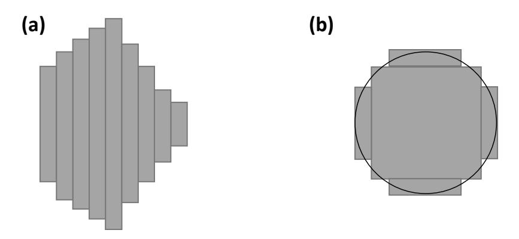
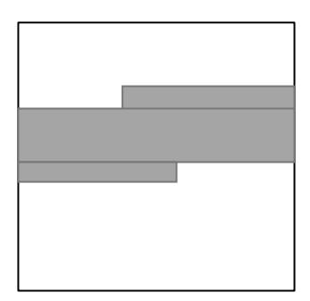
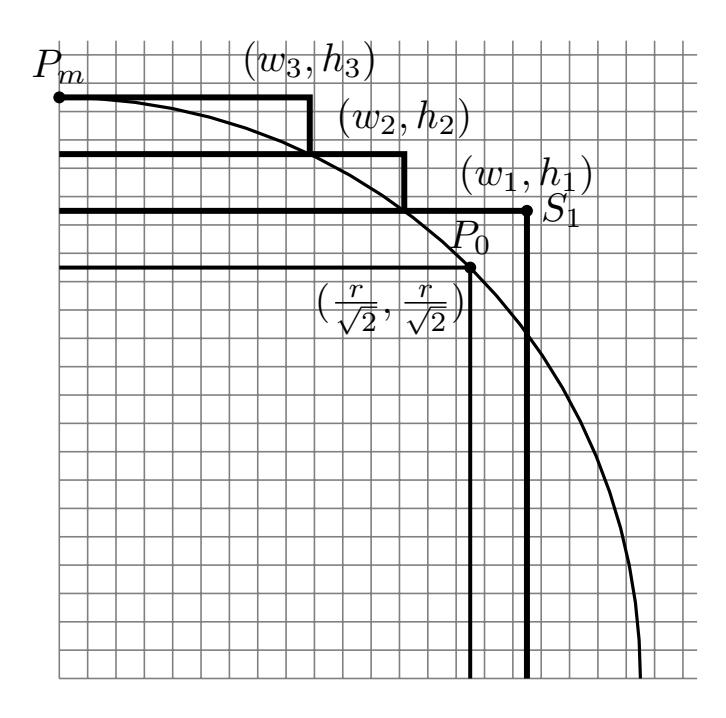

{0}------------------------------------------------

# On Computational Shortcuts for Information-Theoretic PIR

Matthew M. Hong<sup>∗</sup> Yuval Ishai† Victor I. Kolobov† Russell W. F. Lai‡ May 30, 2022

#### **Abstract**

Information-theoretic *private information retrieval* (PIR) schemes have attractive concrete efficiency features. However, in the standard PIR model, the computational complexity of the servers must scale linearly with the database size.

We study the possibility of bypassing this limitation in the case where the database is a truth table of a "simple" function, such as a union of (multi-dimensional) intervals or convex shapes, a decision tree, or a DNF formula. This question is motivated by the goal of obtaining lightweight *homomorphic secret sharing* (HSS) schemes and secure multiparty computation (MPC) protocols for the corresponding families.

We obtain both positive and negative results. For "first-generation" PIR schemes based on Reed-Muller codes, we obtain computational shortcuts for the above function families, with the exception of DNF formulas for which we show a (conditional) hardness result. For "third-generation" PIR schemes based on matching vectors, we obtain stronger hardness results that apply to all of the above families. Our positive results yield new information-theoretic HSS schemes and MPC protocols with attractive efficiency features for simple but useful function families. Our negative results establish new connections between information-theoretic cryptography and fine-grained complexity.

<sup>∗</sup> Institute for Interdisciplinary Information Sciences, Tsinghua University, Beijing, China, hoou8547@hotmail.com. Work done in part while visiting Technion.

<sup>†</sup>Technion, Haifa, Israel, {yuvali,tkolobov}@cs.technion.ac.il. Supported by ERC Project NTSC (742754), NSF-BSF grant 2015782, BSF grant 2018393, ISF grant 2774/20, and a grant from the Ministry of Science and Technology, Israel and Department of Science and Technology, Government of India.

<sup>‡</sup>Friedrich-Alexander University Erlangen-Nuremberg, russell.lai@cs.fau.de. Work done in part while visiting Technion. Supported by the State of Bavaria at the Nuremberg Campus of Technology (NCT). NCT is a research cooperation between the Friedrich-Alexander-Universität Erlangen-Nürnberg (FAU) and the Technische Hochschule Nürnberg Georg Simon Ohm (THN).

{1}------------------------------------------------

## 1 Introduction

Secure multiparty computation (MPC) [68, 55, 17, 29] allows two or more parties to compute a function of their secret inputs while only revealing the output. Much of the large body of research on MPC is focused on minimizing communication complexity, which often forms an efficiency bottleneck. In the setting of computational security, fully homomorphic encryption (FHE) essentially settles the main questions about asymptotic communication complexity of MPC [51, 26, 52, 25]. However, the information-theoretic (IT) analog of the question, i.e., how communication-efficient IT MPC protocols can be, remains wide open, with very limited negative results [49, 59, 41, 40, 4, 38, 7]. These imply superlinear lower bounds only when the number of parties grows with the total input length. Here we will mostly restrict our attention to the simple case of a constant number of parties with security against a single, passively corrupted, party.

On the upper bounds front, the communication complexity of classical IT MPC protocols from [17, 29] scales linearly with the *circuit size* of the function f being computed. With few exceptions, the circuit size remains a barrier even today. One kind of exceptions includes functions f whose (probabilistic) degree is smaller than the number of parties [11, 8]. Another exception includes protocols that have access to a trusted source of correlated randomness [59, 39, 34, 22]. Finally, a very broad class of exceptions that applies in the standard model includes "complex" functions, whose circuit size is super-polynomial in the input length. For instance, the minimal circuit size of most Boolean functions  $f:\{0,1\}^n \to \{0,1\}$  is  $2^{\tilde{\Omega}(n)}$ . However, all such functions admit a 3-party IT MPC protocol with only  $2^{\tilde{O}(\sqrt{n})}$  bits of communication [47, 12]. This means that for most functions, communication is super-polynomially smaller than the circuit size. Curiously, the computational complexity of such protocols is bigger than  $2^n$  even if f has circuits of size  $2^{o(n)}$ . These kind of gaps between communication and computation will be in the center of the present work.

Beyond the theoretical interest in the asymptotic complexity of IT MPC protocols, they also have appealing concrete efficiency features. Indeed, typical implementations of IT MPC protocols in the honest-majority setting are faster by orders of magnitude than those of similar computationally secure protocols for the setting of dishonest majority. Even when considering communication complexity alone, where powerful tools such as FHE asymptotically dominate existing IT MPC techniques, the latter can still have better concrete communication costs when the inputs are relatively short. These potential advantages of IT MPC techniques serve to further motivate this work.

## 1.1 Homomorphic Secret Sharing and Private Information Retrieval

We focus on low-communication MPC in a simple client-server setting, which is captured by the notion of homomorphic secret sharing (HSS) [18, 20, 23]. HSS can be viewed as a relaxation of FHE which, unlike FHE, exists in the IT setting. In an HSS scheme, a client shares a secret input  $x \in \{0,1\}^n$  between k servers. The servers, given a function f from some family  $\mathcal{F}$ , can locally apply an evaluation function on their input shares, and send the resulting output shares to the client. Given the k output shares, the client should recover f(x). In the process, the servers should learn nothing about x, as long as at most t of them collude.

As in the case of MPC, we assume by default that t = 1 and consider a constant number of servers  $k \geq 2$ . A crucial feature of HSS schemes is *compactness* of output shares, typically requiring their size to scale linearly with the output size of f and independently of the complexity of f. This makes HSS a good building block for low-communication MPC. Indeed, HSS schemes can be converted into MPC protocols with comparable efficiency by distributing the input generation and output reconstruction [20].

An important special case of HSS is (multi-server) private information retrieval (PIR) [31]. A PIR scheme allows a client to retrieve a single bit from an N-bit database, which is replicated among  $k \geq 2$  servers, such that no server (more generally, no t servers) learns the identity of the retrieved bit. A PIR scheme with database size  $N = 2^n$  can be seen as an HSS scheme for the family  $\mathcal{F}$  of all functions  $f : \{0, 1\}^n \to \{0, 1\}$ .

PIR in the IT setting has been the subject of a large body of work; see [70] for a partial survey. Known IT PIR schemes can be roughly classified into three generations. The first-generation schemes, originating from

<span id="page-1-0"></span><sup>&</sup>lt;sup>1</sup>It is often useful to combine an IT protocol with a lightweight use of symmetric cryptography in order to reduce communication costs (see, e.g., [53, 35, 5]); we will use such a hybrid approach in the context of optimizing concrete efficiency.

{2}------------------------------------------------

the work of Chor et al. [\[31\]](#page-49-9), are based on Reed-Muller codes. In these schemes the communication complexity is *N*<sup>1</sup>*/*Θ(*k*) . In the second-generation schemes [\[15\]](#page-48-6), the exponent vanishes super-linearly with *k*, but is still constant for any fixed *k*. Finally, the third-generation schemes, originating the works of Yekhanin [\[69\]](#page-51-3) and Efremenko [\[47\]](#page-50-8), have sub-polynomial communication complexity of *No*(1) with only *k* = 3 servers or even *k* = 2 servers [\[45\]](#page-50-10). (An advantage of the 3-server schemes is that the server answer size is constant.) These schemes are based on a nontrivial combinatorial object called a *matching vectors* (MV) family.

As noted above, a PIR scheme with database size *N* = 2*<sup>n</sup>* can be viewed as an HSS scheme for the family F of all functions *f* (in truth-table representation). Our work is motivated by the goal of extending this to more expressive (and succinct) function representations. While a lot of recent progress has been made on the computational variant of the problem for functions represented by circuits or branching programs [\[19,](#page-49-11) [20,](#page-49-7) [42,](#page-50-11) [48,](#page-50-12) [60,](#page-51-4) [24\]](#page-49-12), almost no progress has been made for IT HSS. Known constructions are limited to the following restricted types: (1) HSS for general truth tables, corresponding to PIR, and (2) HSS for low-degree polynomials, which follow from the multiplicative property of Shamir's secret-sharing scheme [\[64,](#page-51-5) [17,](#page-49-0) [29,](#page-49-1) [36\]](#page-49-13). Almost nothing is known about the existence of non-trivial IT HSS schemes for other useful function families, which we aim to explore in this work.

## **1.2 HSS via Computational Shortcuts for PIR**

Viewing PIR as HSS for truth tables, HSS schemes for more succinct function representations can be equivalently viewed as a computationally efficient PIR schemes for *structured* databases, which encode the truth tables of succinctly described functions. While PIR schemes for general databases require linear computation in *N* [\[16\]](#page-48-7), there are no apparent barriers that prevent *computational shortcuts* for *structured databases*. In this work we study the possibility of designing useful HSS schemes by applying such shortcuts to existing IT PIR schemes. Namely, by exploiting the structure of truth tables that encode simple functions, the hope is that the servers can answer PIR queries with *o*(*N*) computation.

We focus on the two main families of IT PIR constructions: (1) first-generation "Reed-Muller based" schemes, or RM PIR for short; and (2) third-generation "matching-vector based" schemes, or MV PIR for short. RM PIR schemes are motivated by their simplicity and their good concrete communication complexity on small to medium size databases, whereas MV PIR schemes are motivated by their superior asymptotic efficiency. Another advantage of RM PIR schemes is that they naturally scale to bigger security thresholds *t >* 1, increasing the number of servers by roughly a factor of *t* but maintaining the per-server communication complexity. For MV PIR schemes, the comparable *t*-private variants require at least 2 *t* servers [\[9\]](#page-48-8).

## **1.3 Our Contribution**

We obtain the following main results. See Section [2](#page-3-0) for a more detailed and more technical overview.

**Positive results for RM PIR.** We show that for some natural function families, such as unions of multidimensional intervals or other convex shapes (capturing, e.g., geographical databases), decision trees, and DNF formulas with disjoint terms, RM PIR schemes do admit computational shortcuts. In some of these cases the shortcut is essentially optimal, in the sense that the computational complexity of the servers is equal to the size of the PIR queries plus the size of the function representation (up to polylogarithmic factors). In terms of concrete efficiency, the resulting HSS schemes can in some cases be competitive with alternative techniques from the literature, including lightweight computational HSS schemes based on symmetric cryptography [\[21\]](#page-49-14), even for large domain sizes such as *N* = 2<sup>40</sup>. This may come at the cost of either using more servers (*k* ≥ 3 or even *k* ≥ 4, compared to *k* = 2 in [\[21\]](#page-49-14)) or alternatively applying communication balancing techniques from [\[31,](#page-49-9) [13,](#page-48-9) [67\]](#page-51-6) that are only efficient for short outputs.

**Negative results for RM PIR.** The above positive result may suggest that "simple" functions admit shortcuts. We show that this can only be true to a limited extent. Assuming the Strong Exponential Time Hypothesis (SETH) assumption [\[28\]](#page-49-15), a conjecture commonly used in fine-grained complexity [\[66\]](#page-51-7), we show 

{3}------------------------------------------------

that there is no computational shortcuts for general DNF formulas. More broadly, there are no shortcuts for function families that contain hard counting problems.

**Negative results for MV PIR.** Somewhat unexpectedly, for MV PIR schemes, the situation appears to be significantly worse. Here we can show conditional hardness results even for the *all-1 database*. Of course, one can trivially realize an HSS scheme for the constant function *f*(*x*) = 1. However, our results effectively rule out obtaining efficient HSS for richer function families via the MV PIR route, even for the simple but useful families to which our positive results for RM PIR apply. This shows a qualitative separation between RM PIR and MV PIR. Our negative results are obtained by exploiting a connection between shortcuts in MV PIR and counting problems in graphs that we prove to be ETH-hard. While this only rules out a specific type of HSS constructions, it can still be viewed as a necessary step towards broader impossibility results. For instance, proving that (computationally efficient) HSS for simple function families cannot have *No*(1) share size *inevitably requires* proving computational hardness of the counting problems we study, simply because if these problems were easy then such HSS schemes would exist. We stress that good computational shortcuts for MV PIR schemes, matching our shortcuts for RM PIR schemes, is a desirable goal. From a theoretical perspective, they would give rise to better information-theoretic HSS schemes for natural function classes. From an applied perspective, they could give concretely efficient HSS schemes and secure computation protocols (for the same natural classes) that outperform all competing protocols on moderate-sized input domains. (See Table [7](#page-42-0) for communication break-even points.) Unfortunately, our negative results give strong evidence that, contrary to prior expectations, such shortcuts for MV PIR do not exist.

**Positive results for tensored and parallel MV PIR.** Finally, we show how to bypass our negative result for MV PIR via a "tensoring" operator and parallel composition. The former allows us to obtain the same shortcuts we get for RM PIR while maintaining the low communication cost of MV PIR, but at the cost of increasing the number of servers. This is done by introducing an exploitable structure similar to that in RM PIR through an operation that we called tensoring. In fact, tensoring can be applied to any PIR schemes with certain natural structural properties to obtain new PIR with shortcuts. The parallel composition approach is restricted to specific function classes and has a significant concrete overhead. Applying either transformation to an MV PIR scheme yields schemes that no longer conform to the baseline template of MV PIR, and thus the previous negative result does not apply.

# <span id="page-3-0"></span>**2 Overview of Results and Techniques**

Recall that the main objective of this work is to study the possibility of obtaining non-trivial IT HSS schemes via computational shortcuts for IT PIR schemes. In this section we give a more detailed overview of our positive and negative results and the underlying techniques.

From here on, we let *N* = 2*<sup>n</sup>* be the size of the (possibly structured) database, which in our case will be a truth table encoding a function *f* : {0*,* 1} *<sup>n</sup>* → {0*,* 1} represented by a bit-string ˆ*f* of length *ℓ* = | ˆ*f*| ≤ *N*. We are mostly interested in the case where *ℓ* ≪ *N*. We will sometimes use *ℓ* to denote a natural size parameter which is upper bounded by | ˆ*f*|. For instance, ˆ*f* can be a DNF formula with *ℓ* terms over *n* input variables. We denote by F the *function family* associating each ˆ*f* with a function *f* and a size parameter *ℓ*, where *ℓ* = | ˆ*f*| by default.

For both HSS and PIR, we consider the following efficiency measures:

- Input share size *α*(*N*): Number of bits that the client sends to each server.
- Output share size *β*(*N*): Number of bits that each server sends to the client.
- Evaluation time *τ* (*N, ℓ*): Running time of server algorithm, mapping an input share in {0*,* 1} *<sup>α</sup>*(*N*) and function representation ˆ*f* ∈ {0*,* 1} *ℓ* to output share in {0*,* 1} *β*(*N*) .

{4}------------------------------------------------

When considering PIR (rather than HSS) schemes, we may also refer to  $\alpha(N)$  and  $\beta(N)$  as query size and answer size respectively. The computational model we use for measuring the running time  $\tau(N,\ell)$  is the standard RAM model by default; however, both our positive and negative results apply (up to polylogarithmic factors) also to other standard complexity measures, such as circuit size.

Any PIR scheme PIR can be viewed as an HSS scheme for a truth-table representation, where the PIR database is the truth-table  $\hat{f}$  of f. For this representation, the corresponding evaluation time  $\tau$  must grow linearly with N. If a function family  $\mathcal{F}$  with more succinctly described functions supports faster evaluation time, we say that PIR admits a computational shortcut for  $\mathcal{F}$ . It will be useful to classify computational shortcuts as strong or weak. A strong shortcut is one in which the evaluation time is optimal up to polylogarithmic factors, namely  $\tau = \tilde{O}(\alpha + \beta + \ell)$ . (Note that  $\alpha + \beta + \ell$  is the total length of input and output.) Weak shortcuts have evaluation time of the form  $\tau = O(\ell \cdot N^{\delta})$ , for some constant  $0 < \delta < 1$ . A weak shortcut gives a meaningful speedup whenever  $\ell = N^{o(1)}$ .

## 2.1 Shortcuts in Reed-Muller PIR

The first generation of PIR schemes, originating from the work of Chor et al. [31], represent the database as a low-degree multivariate polynomial, which the servers evaluate on each of the client's queries. We refer to PIR schemes of this type as Reed-Muller PIR (or RM PIR for short) since the answers to all possible queries form a Reed-Muller encoding of the database. While there are several variations of RM PIR in the literature, the results we describe next are insensitive to the differences. In the following focus on a slight variation of the original k-server RM PIR scheme from [31] (see [13]) that has answer size  $\beta = 1$ , which we denote by  $PIR_{RM}^k$ . For the purpose of this section we will mainly focus on the computation performed by the servers, for the simplest case of k = 3 ( $PIR_{RM}^3$ ), as this is the aspect we aim to optimize. For a full description of the more general case we refer the reader to Section 4.

Let  $\mathbb{F} = \mathbb{F}_4$  be the Galois field of size 4. In the  $\mathsf{PIR}^3_{\mathsf{RM}}$  scheme, the client views its input  $i \in [N]$  as a pair of indices  $i = (i_1, i_2) \in [\sqrt{N}] \times [\sqrt{N}]$  and computes two vectors  $q_1^j, q_2^j \in \mathbb{F}^{\sqrt{N}}$  for each server  $j \in \{1, 2, 3\}$ , such that  $\{q_1^j\}$  depend on  $i_1$  and  $\{q_2^j\}$  depend on  $i_2$ . Note that this implies that  $\alpha(N) = O(\sqrt{N})$ . Next, each server j, which holds a description of a function  $f : [\sqrt{N}] \times [\sqrt{N}] \to \{0, 1\}$ , computes an answer  $a_j = \sum_{i_1', i_2' \in [\sqrt{N}]} f(i_1', i_2') q_1^j [i_1'] q_2^j [i_2']$  with arithmetic over  $\mathbb{F}$  and sends the client a single bit which depends on  $a_j$  (so  $\beta(N) = 1$ ). The client reconstructs  $f(i_1, i_2)$  by taking the exclusive-or of the 3 answer bits.

#### 2.1.1 Positive Results for RM PIR

The computation of each server j,  $a_j = \sum_{i'_1, i'_2 \in [\sqrt{N}]} f(i'_1, i'_2) q_1^j [i'_1] q_2^j [i'_2]$ , can be viewed as an evaluation of a multivariate degree-2 polynomial, where  $\{f(i'_1, i'_1)\}$  are the coefficients, and the entries of  $q_1^j, q_2^j$  are the variables. Therefore, to obtain a computational shortcut, one should look for *structured* polynomials that can be evaluated in time o(N). A simple but useful observation is that computational shortcuts exist for functions f which are *combinatorial rectangles*, that is,  $f(i_1, i_2) = 1$  if and only if  $i_1 \in I_1$  and  $i_2 \in I_2$ , where  $I_1, I_2 \subseteq [\sqrt{N}]$ . Indeed, we may write

$$a_{j} = \sum_{i'_{1}, i'_{2} \in [\sqrt{N}]} f(i'_{1}, i'_{2}) q_{1}^{j}[i'_{1}] q_{2}^{j}[i'_{2}] = \sum_{(i'_{1}, i'_{2}) \in (I_{1}, I_{2})} q_{1}^{j}[i'_{1}] q_{2}^{j}[i'_{2}]$$

$$(1)$$

<span id="page-4-1"></span><span id="page-4-0"></span>
$$= \left(\sum_{i_1' \in I_1} q_1^j[i_1']\right) \left(\sum_{i_2' \in I_2} q_2^j[i_2']\right). \tag{2}$$

<span id="page-4-2"></span>Note that if a server evaluates the expression using Equation (1) the time is O(N), but if it instead uses Equation (2) the time is just  $O(\sqrt{N}) = O(\alpha(N))$ . Following this direction, we obtain non-trivial IT HSS schemes for some natural function classes such as disjoint unions of intervals and decision trees.

{5}------------------------------------------------

**Theorem 1** (Decision trees, formal version Corollary 2).  $\mathsf{PIR}^k_{\mathsf{RM}}$  admits a weak shortcut for decision trees (more generally, disjoint DNF formulas). Concretely, for n variables and  $\ell$  leaves (or terms), we have  $\tau(N,\ell) = O(\ell \cdot N^{1/(k-1)})$ , where  $N = 2^n$ .

**Intervals and convex shapes.** We turn to consider "geometric" function families that may come up, for example, in geographical searches. We start with the case where  $\hat{f}$  represents a union of  $\ell$  disjoint 2-dimensional intervals in  $[\sqrt{N}] \times [\sqrt{N}]$ . For this function family, we can obtain a *strong* shortcut as follows. Suppose we compute the following for every  $i \in [\sqrt{N}]$  and t = 1, 2:

<span id="page-5-0"></span>
$$S_t(i) := \sum_{i'=1}^{i} q_t^j[i'],$$

which overall takes  $O(\sqrt{N})$  time, since this is a prefix sum. Consider the Boolean function f(i) that outputs 1 if and only if  $i=(i_1,i_2)$  is in the union of  $\ell$  disjoint intervals,  $\bigcup_{r=1}^{\ell} [b_r^1,c_r^1] \times [b_r^2,c_r^2]$ . Then the answers  $a_j$  for  $\mathsf{PIR}^3_{\mathsf{RM}}$  on database f can be written as

$$a_{j} = \sum_{i'_{1}, i'_{2} \in [\sqrt{N}]} f(i'_{1}, i'_{2}) q_{1}^{j}[i'_{1}] q_{2}^{j}[i'_{2}] = \sum_{r=1}^{\ell} \sum_{(i'_{1}, i'_{2}) \in [b_{r}^{1}, c_{r}^{1}] \times [b_{r}^{2}, c_{r}^{2}]} q_{1}^{j}[i'_{1}] q_{2}^{j}[i'_{2}]$$

$$(3)$$

$$= \sum_{r=1}^{\ell} \left[ S_1(c_r^1) - S_1(b_r^1 - 1) \right] \left[ S_2(c_r^2) - S_2(b_r^2 - 1) \right], \tag{4}$$

and can be computed in  $O(\sqrt{N} + \ell) = O(\alpha(N) + \ell)$  time (via Equation (4)). Generalizing to  $k \ge 3$  and to dimensions  $d \ge 1$ , we obtain the following.

**Theorem 2** (Union of disjoint intervals, formal version Theorems 16 and 17). For every positive integers  $d \ge 1$  and  $k \ge 3$  such that  $d \mid k-1$ ,  $\mathsf{PIR}^k_{\mathsf{RM}}$  admits a strong shortcut for unions of  $\ell$  disjoint d-dimensional intervals in  $([N^{1/d}])^d$ . Concretely,  $\tau(N,\ell) = O(N^{1/(k-1)} + \ell)$ .

Curiously, we are only able to obtain strong shortcuts when d|k-1. It is an interesting question whether strong shortcuts exist otherwise, the simplest open case being d=3 and k=3.

We turn to the more general case of union of (discretized) convex shapes. By expressing each convex shape as a disjoint union of intervals, we obtain two results. First, we show that it is possible to obtain a weak shortcut for any convex shape (hence also to union of such shapes) via a "Riemann-sum-style" splitting method, requiring  $O(\ell \cdot \sqrt{N})$  time for a union of  $\ell$  arbitrary convex shapes. Then, we show that by utilizing the geometry of natural convex shapes, it is possible to do better. Specifically, we show that for k=3 there is a strong shortcut for the union of  $\ell$  2-dimensional  $\epsilon$ -approximated disks, which can be useful for privacy-preserving geographical queries. Both approaches are illustrated in Figure 1. These shortcuts are captured by the following two theorems.

**Theorem 3** (Convex shapes, formal version Lemma 6).  $\mathsf{PIR}^k_{\mathsf{RM}}$  admits a weak shortcut for unions of  $\ell$  disjoint (k-1)-dimensional convex shapes. Concretely,  $\tau(N,\ell) = \tilde{O}(\ell \cdot N^{(k-2)/(k-1)})$ .

**Theorem 4** (Disk approximation, formal version Theorem 18). For any  $\epsilon > 0$ ,  $\mathsf{PIR}^3_{\mathsf{RM}}$  admits a strong shortcut for unions of  $\ell$  disjoint 2-dimensional  $\epsilon$ -approximated disks. Concretely,  $\tau(N,\ell) = \tilde{O}(N^{1/2} + \ell/\epsilon)$ .

Improved shortcut for decision trees. Next, we obtain a quantitative improvement over Theorem 1 by using a suitable data structure to amortize the cost of handling the  $\ell$  terms in a DNF formula. As in the case of intervals, we obtain the new shortcuts by efficiently retrieving each of the the sums in the product

<span id="page-5-1"></span><sup>&</sup>lt;sup>2</sup>That is, the shape is contained in a  $(1+\epsilon)r$ -radius disk and contains a concentric r-radius disk.

{6}------------------------------------------------



Figure 1: Illustration of covering convex shapes with two dimensional intervals. In (a) an arbitrary convex shape is covered with  $O(\sqrt{N})$  rectangles via a "Riemann-sum-style" splitting method, while in (b) a disk is approximated with relatively few rectangles.

<span id="page-6-0"></span>of Equation (4). While, unlike intervals, for decision trees there is no natural notion of dimension, it will be sufficient for us to arbitrarily assign variables to dimensions such that each dimension has the same number of variables. Thus, when restricted to a single dimension, we can model the computational task as the following data structure problem (denoted by PM-SUM<sub>M</sub>): given  $M = 2^m$  ( $M = \sqrt{N}$  for PIR<sub>RM</sub>) elements  $q_0, \ldots, q_{M-1} \in \mathbb{F}$ , the goal is to efficiently answer  $\ell$  summation queries, each specified by a DNF term:  $\phi_1, \ldots, \phi_\ell$ . Formally, a single query in the problem is associated with a DNF term  $\phi$  (for example,  $\phi = x_1 \wedge \neg x_3$ ) and asks for the value

$$\sum_{x \in \{0,1\}^m : \phi(x) = 1} q_{i(x)},$$

where  $i(x) \in \{0, ..., M-1\}$  is the number represented by the bit string x. An algorithm solving PM-SUM<sub>M</sub> with offline time  $\pi(M)$  and online time  $\zeta(M)$  works by first performing a preprocessing stage on the elements  $q_0, ..., q_{M-1}$  in time  $\pi(M)$ , then answering each of the  $\ell$  queries in time  $\zeta(M)$  by using the precomputed values, having  $O(\pi(M) + \ell \cdot \zeta(M))$  total computation time. By utilizing dynamic programming, we obtain a suitable data structure that implies the following.

**Lemma 1.** There is an algorithm for PM-SUM<sub>M</sub> with offline time  $\tilde{O}(M)$  and online time  $\tilde{O}(M^{1/3})$ .

**Lemma 2.** Given an algorithm for PM-SUM<sub>M</sub> with offline time  $\pi(M)$  and online time  $\zeta(M)$ ,  $\mathsf{PIR}^k_{\mathsf{RM}}$  admits a shortcut for decision trees with n variables and  $\ell$  leaves with  $\tau(N,\ell) = O(\pi(N^{1/(k-1)}) + \ell \cdot \zeta(N^{1/(k-1)}))$ .

Lemmas 8 and 9 together imply the following quantitative improvement over Theorem 1.

**Theorem 5** (Decision trees revisited, formal version Theorem 19).  $\mathsf{PIR}^k_{\mathsf{RM}}$  admits a weak shortcut for decision trees (or disjoint DNF formulas). Concretely, for n variables and  $\ell$  leaves (or terms), we have  $\tau(N,\ell) = \tilde{O}(N^{1/(k-1)} + \ell \cdot N^{1/3(k-1)})$ , where  $N = 2^n$ .

Compressing input shares. The scheme  $\mathsf{PIR}^3_{\mathsf{RM}}$  described above can be strictly improved by using a more dense encoding of the input. This results in a modified scheme  $\mathsf{PIR}^3_{\mathsf{RM}'}$  with  $\alpha'(N) = \sqrt{2} \cdot N^{1/2}$ , a factor  $\sqrt{2}$  improvement over  $\mathsf{PIR}^3_{\mathsf{RM}}$ . This is the best known 3-server PIR scheme with  $\beta = 1$  (up to lower-order additive terms [13]). PIR schemes with 1-bit answers are useful for optimizing the "download rate" in applications where the same queries are reused many times; see, e.g., [57] for a practical application of such schemes.

We show that with some extra effort, similar shortcuts apply also to the optimized  $\mathsf{PIR}^3_{\mathsf{RM}'}$ . In more detail, in  $\mathsf{PIR}^3_{\mathsf{RM}'}$  each query is a vector  $q^j \in \mathbb{F}^h$  such that  $\binom{h}{2} \geq N$ . The computation each server j performs in this

<span id="page-6-1"></span><sup>&</sup>lt;sup>3</sup>The so-called "third generation" PIR schemes based on matching vectors [69, 47, 14] are asymptotically better; however, other than their poor concrete efficiency, it is open whether such schemes can have 1-bit answers.

{7}------------------------------------------------

$$\begin{bmatrix} - & - & - & - & - & - \\ 0 & - & - & - & - & - \\ 0 & 0 & - & - & - & - \\ 0 & 0 & 1 & - & - & - \\ 1 & 1 & 1 & 1 & - & - \\ 1 & 1 & 1 & 1 & 1 & - & - \\ 1 & 1 & 1 & 1 & 1 & 1 & 1 \end{bmatrix} = \begin{bmatrix} - & - & - & - & - & - \\ 1 & - & - & - & - & - \\ 1 & 1 & 1 & - & - & - \\ 1 & 1 & 1 & 1 & - & - \\ 1 & 1 & 1 & 1 & 1 & 1 \end{bmatrix} - \begin{bmatrix} - & - & - & - & - & - \\ 1 & - & - & - & - & - \\ 0 & 0 & 0 & - & - & - \\ 0 & 0 & 0 & 0 & - & - \\ 0 & 0 & 0 & 0 & 0 \end{bmatrix} - \begin{bmatrix} - & - & - & - & - & - \\ 0 & - & - & - & - & - \\ 0 & 0 & 0 & - & - & - \\ 0 & 0 & 0 & 0 & - & - \\ 0 & 0 & 0 & 0 & 0 \end{bmatrix} - \begin{bmatrix} - & - & - & - & - & - \\ 0 & - & - & - & - & - \\ 0 & 0 & 0 & - & - & - \\ 0 & 0 & 0 & 0 & 0 & - & - \\ 0 & 0 & 0 & 0 & 0 \end{bmatrix}$$

<span id="page-7-0"></span>Figure 2: The first matrix is the table for the segment that outputs 1 on [6, 13], over the domain  $N = 15 = \binom{6}{2}$ . Columns and rows are labelled by  $q_1, \ldots, q_6$ . Unrelated entries are filled with -. The right hand side show a decomposition into two triangles and two rectangles. Rows are indexed by  $i_1$  while columns are indexed by  $i_2$ .

case is of the form

$$a_{j} = \sum_{i'_{1}=1}^{h} \sum_{i'_{2}=1}^{i'_{1}-1} f((i'_{1}-2)(i'_{1}-1)/2 + i'_{2})q^{j}[i'_{1}]q^{j}[i'_{2}] =: (q^{j})^{T} M_{f} q^{j},$$

where  $M_f$  is a lower triangular matrix with entries  $(M_f)_{i_1,i_2} = f((i_1 - 2)(i_1 - 1)/2 + i_2)$ . For a single one dimensional interval [b,c], the nonzero coefficients in  $M_f$  correspond to a "ladder shape". For illustration, consider Figure 2. Such a ladder shape can always be decomposed into a linear combination of two rectangle shapes and two triangle shapes. Hence if, after preprocessing, we can compute the quadratic form  $(q^j)^T M_f q^j$  for all  $M_g$  of such shapes g (triangles or rectangles) in constant time, we can support the evaluation of any single one dimensional interval in constant time. It turns out that this is indeed possible. We divide into cases:

**Rectangles** Rectangular shapes such as  $[b^1, c^1] \times [b^2, c^2]$ , corresponding to a summation

$$\sum_{(i'_1, i'_2) \in [b^1, c^1] \times [b^2, c^2]} q^j [i'_1] q^j [i'_2],$$

can be computed in constant time by simply precomputing prefix sums  $S_i = q_j[1] + \ldots + q_j[i]$  for every i in time  $\alpha = O(\sqrt{N})$  and multiplying the corresponding sums, similar to Equation (4).

**Triangles** Let  $T_i$  ( $2 \le i \le n$ ) denotes the triangle that occupies the 2nd to *i*-th row in the lower half of matrix, corresponding to a sum

$$T_i := \sum_{i_1'=1}^{i} \sum_{i_2'=1}^{i_1'-1} q^j [i_1'] q^j [i_2'].$$

We can compute the values  $T_i$  by the recursion  $T_{i+1} = T_i + R_{i+1}$ , where  $R_{i+1}$  is a single rectangular shape that fills the (i+1)-th row of the lower half matrix, corresponding to a sum

$$R_{i+1} := \sum_{i_2'=1}^{i} q^j [i+1] q^j [i_2'].$$

Since, from the previous item, we can compute the value  $R_{i+1}$  in constant time, we can compute all  $T_i$  in a single pass that takes  $\alpha = O(\sqrt{N})$  time.

**Theorem 6** (Intervals revisited, formal version Theorem 21).  $PIR_{RM'}^3$  admits a strong shortcut for the union of  $\ell$  one-dimensional intervals. Concretely,  $\tau(N,\ell) = O(\sqrt{N} + \ell)$ .

{8}------------------------------------------------

#### 2.1.2 Negative Results for RM PIR

All of the previous positive results apply to function families  $\mathcal{F}$  for which there is an efficient counting algorithm that given  $\hat{f} \in \mathcal{F}$  returns the number of satisfying assignments of f. We show that this is not a coincidence: efficient counting can be reduced to finding a shortcut for  $\hat{f}$  in  $\mathsf{PIR}^k_{\mathsf{RM}}$ . This implies that computational shortcuts are impossible for function representations for which the counting problem is hard. Concretely, following a similar idea from [58], we show that a careful choice of PIR query can be used to obtain the parity of all evaluations of f as the PIR answer. The latter is hard to compute even for DNF formulas, let alone stronger representation models, assuming standard conjectures from fine-grained complexity: either the Strong Exponential Time Hypothesis (SETH) or, with weaker parameters, even the standard Exponential Time Hypothesis (ETH) [28, 27]. Similar negative results hold for the more efficient variant  $\mathsf{PIR}^3_{\mathsf{RM}'}$ .

**Theorem 7** (No shortcuts for DNF under ETH, formal version Corollaries 3 and 4). Assuming (standard) ETH,  $\mathsf{PIR}^k_\mathsf{RM}$  does not admit a strong shortcut for DNF formulas for sufficiently large k. Moreover, assuming SETH, for any  $k \geq 3$ ,  $\mathsf{PIR}^k_\mathsf{RM}$  does not admit a weak shortcut for DNF formulas.

Finally, we comment that it is still possible to obtain HSS for DNF (or non-disjoint disjunctions in general) if we are willing to either (1) multiply the input and output share size by a factor of  $O(\log \ell)$ , or (2) make the HSS only  $\epsilon$ -correct<sup>4</sup>, thus multiplying the output share size by  $O(\log(1/\epsilon))$ . See Remark 1 for more details. Note that this does not contradict the lower bound for DNF, since our proof heavily relies on the fact that we work over a small field (which has several efficiency benefits) and that the shortcut is deterministic. Furthermore, this approach for non-disjoint disjunctions also works for the "balanced" RM PIR variants discussed in Section 2.4.

## <span id="page-8-1"></span>2.2 Hardness of Shortcuts for Matching-Vector PIR

The 3-server RM PIR scheme considered in the previous section has query length  $\alpha(N) = O(N^{1/2})$  and minimal answer length  $\beta(N) = 1$ . In contrast, the so-called "third generation" of 3-server PIR schemes have much better asymptotic communication: sub-polynomial query length  $\alpha(N) = N^{o(1)}$  and constant answer length  $\beta(N) = O(1)$  [69, 47, 14].

We refer to the latter family of PIR schemes as *matching-vector PIR* schemes (or MV PIR for short), alluding to the underlying combinatorial object. For such MV PIR schemes, we present strong hardness results that apply even to simple function families for which we have positive results for RM PIR. This establishes a qualitative separation between the two types of PIR schemes with respect to computational shortcuts.

Recall that MV PIR schemes are the only known PIR schemes achieving sub-polynomial communication (that is,  $N^{o(1)}$ ) with a constant number of servers. We give strong evidence for hardness of computational shortcuts for MV PIR. We start with a brief technical overview of MV PIR.

We consider here a representative instance of MV PIR from [47, 14], which we denote by PIR<sup>3</sup><sub>MV,SC</sub>. This MV PIR scheme is based on two crucial combinatorial ingredients: a family of *matching vectors* and a *share conversion* scheme, respectively. We describe each of these ingredients separately.

A family of matching vectors MV consists of N pairs of vectors  $\{u_x, v_x\}$  such that each matching inner product  $\langle u_x, v_x \rangle$  is 0, and each non-matching inner product  $\langle u_x, v_{x'} \rangle$  is nonzero. More precisely, such a family is parameterized by integers m, h, N and a subset  $S \subset \mathbb{Z}_m$  such that  $0 \notin S$ . A matching vector family is defined by two sequences of N vectors  $\{u_x\}_{x \in [N]}$  and  $\{v_x\}_{x \in [N]}$ , where  $u_x, v_x \in \mathbb{Z}_m^h$ , such that for all  $x \in [N]$  we have  $\langle u_x, v_x \rangle = 0$ , and for all  $x, x' \in [N]$  such that  $x \neq x'$  we have  $\langle u_x, v_{x'} \rangle \in S$ . We refer to this as the S-matching requirement. Typical choices of parameters are m = 6 or m = 511 (products of two primes), |S| = 3 (taking the values (0,1), (1,0), (1,1) in Chinese remainder notation), and  $h = N^{o(1)}$  (corresponding to the PIR query length).

A share conversion scheme SC is a local mapping (without interaction) of shares of a secret y to shares of a related secret y', where  $y \in \mathbb{Z}_m$  and y' is in some other Abelian group  $\mathbb{G}$ . Useful choices of  $\mathbb{G}$  include

<span id="page-8-0"></span><sup>&</sup>lt;sup>4</sup>That is, the HSS produces the correct result with probability  $1 - \epsilon$ .

{9}------------------------------------------------

 $\mathbb{F}_2^2$  and  $\mathbb{F}_2^9$  corresponding to m=6 and m=511 respectively. The shares of y and y' are distributed using linear secret-sharing schemes  $\mathcal{L}$  and  $\mathcal{L}'$  respectively, where  $\mathcal{L}'$  is typically additive secret sharing over  $\mathbb{G}$ . The relation between y and y' that SC should comply with is defined by S as follows: if  $y \in S$  then y' = 0 and if y = 0 then  $y' \neq 0$ . More concretely, if  $(y_1, \ldots, y_k)$  are  $\mathcal{L}$ -shares of y, then each server j can run the share conversion scheme on  $(j, y_j)$  and obtain  $y'_j = \mathsf{SC}(j, y_j)$  such that  $(y'_1, \ldots, y'_k)$  are  $\mathcal{L}'$ -shares of some y' satisfying the above relation. What makes share conversion nontrivial is the requirement that the relation between y and y' hold regardless of the randomness used by  $\mathcal{L}$  for sharing y.

Suppose MV and SC are compatible in the sense that they share the same set S. Moreover, suppose that SC applies to a 3-party linear secret-sharing scheme  $\mathcal{L}$  over  $\mathbb{Z}_m$ . Then we can define a 3-server PIR scheme  $\mathsf{PIR}^3_{\mathsf{MV},\mathsf{SC}}$  in the following natural way. Let  $f:[N] \to \{0,1\}$  be the servers' database and  $x \in [N]$  be the client's input. The queries are obtained by applying  $\mathcal{L}$  to independently share each entry of  $u_x$ . Since  $\mathcal{L}$  is linear, the servers can locally compute, for each  $x' \in [N]$ ,  $\mathcal{L}$ -shares of  $y_{x,x'} = \langle u_x, v_{x'} \rangle$ . Note that  $y_{x,x} = 0 \in \mathbb{Z}_m$  and  $y_{x,x'} \in S$  (hence  $y_{x,x'} \neq 0$ ) for  $x \neq x'$ . Letting  $y_{j,x,x'}$  denote the share of  $y_{x,x'}$  known to server j, each server can now apply share conversion to obtain a  $\mathcal{L}'$ -share  $y'_{j,x,x'} = \mathsf{SC}(j,y_{j,x,x'})$  of  $y'_{x,x'}$ , where  $y'_{x,x'} = 0$  if  $x \neq x'$  and  $y'_{x,x'} \neq 0$  if x = x'. Finally, using the linearity of  $\mathcal{L}'$ , the servers can locally compute  $\mathcal{L}'$ -shares  $\tilde{y}_j$  of  $\tilde{y} = \sum_{x' \in [N]} f(x') \cdot y'_{x,x'}$ , which they send as their answers to the client. Note that  $\tilde{y} = 0$  if and only if f(x) = 0. Hence, the client can recover f(x) by applying the reconstruction of  $\mathcal{L}'$  to the answers and comparing  $\tilde{y}$  to 0. When  $\mathcal{L}'$  is additive over  $\mathbb{G}$ , each answer consists of a single element of  $\mathbb{G}$ .

#### 2.2.1 Shortcuts for MV PIR Imply Subgraph Counting

The question we ask in this work is whether the server computation in the above scheme can be sped up when f is a "simple" function, say one for which our positive results for RM PIR apply. Somewhat unexpectedly, we obtain strong evidence against this by establishing a connection between computational shortcuts for  $PIR_{MV,SC}^3$  for useful choices of (MV, SC) and the problem of counting induced subgraphs. Concretely, computing a server's answer on the all-1 database and query  $x^j$  requires computing the parity of the number of subgraphs with certain properties in a graph defined by  $x^j$ . By applying results and techniques from parameterized complexity [30, 46], we prove ETH-hardness of computational shortcuts for variants of the MV PIR schemes from [47, 14]. In contrast to the case of RM PIR, these hardness results apply even for functions as simple as the constant function f(x) = 1.

The variants of MV PIR schemes to which our ETH-hardness results apply differ from the original PIR schemes from [47, 14] only in the parameters of the matching vectors, which are worse asymptotically, but still achieve  $N^{o(1)}$  communication complexity. The obstacle which prevents us from proving a similar hardness result for the original schemes from [47, 14] seems to be an artifact of the proof, instead of an inherent limitation. This obstacle is described briefly after Theorem 11 and in more detail in Appendix A. We therefore formulate a clean hardness-of-counting conjecture (Conjecture 1) that would imply a similar hardness result for the original constructions from [47, 14].

We now outline the ideas behind the negative results, deferring the technical details to Section 5. Recall that the computation of each server j in  $\mathsf{PIR}^3_{\mathsf{MV},\mathsf{SC}}$  takes the form

$$\sum_{x' \in [N]} f(x') \cdot \mathsf{SC}(j, y_{j,x,x'}),$$

where  $y_{j,x,x'}$  is the j-th share of  $\langle u_x, v_{x'} \rangle$ . Therefore, for the all-1 database (f = 1), for every S-matching vector family MV and share conversion scheme SC from  $\mathcal{L}$  to  $\mathcal{L}'$  we can define the (MV, SC)-counting problem  $\#(\mathsf{MV},\mathsf{SC})$ .

<span id="page-9-0"></span>**Definition 1** (Server computation problem). For a Matching Vector family MV and share conversion SC, the problem #(MV,SC) is defined as follows.

- INPUT: a valid  $\mathcal{L}$ -share  $y_j$  of some  $u_x \in \mathbb{Z}_m^h$  (element-wise),
- Output:  $\sum_{x' \in [N]} SC(j, y_{j,x,x'})$ , where  $y_{j,x,x'}$  is the share of  $\langle u_x, v_{x'} \rangle$ .

{10}------------------------------------------------

Essentially, the server computes N shares of an inner product of the secret (which is a vector) and a single matching vector from the matching vector family using the homomorphic property of the linear sharing, maps the results using the share conversion and adds the result to obtain the final output.

Let  $\mathsf{MV}_{\mathsf{Grol}}^w$  be a matching vectors family due to Grolmusz [56, 44], which is used in all third-generation PIR schemes (see Section 5, Fact 3). For presentation, we focus on the special case  $\#(\mathsf{MV}_{\mathsf{Grol}}^w, \mathsf{SC}_{\mathsf{Efr}})$ , where  $\mathsf{SC}_{\mathsf{Efr}}$  is a share conversion due to Efremenko [47], which we present in Section 3.3. Note that all the results that follow also hold for the share conversion of [14], denoted by  $\mathsf{SC}_{\mathsf{BIKO}}$ . The family we consider,  $\mathsf{MV}_{\mathsf{Grol}}^w$ , is associated with the parameters  $r \in \mathbb{N}$  and  $w \colon \mathbb{N} \to \mathbb{N}$ , such that the size of the matching vector family is  $\binom{r}{w(r)}$ , and the length of each vector is  $h = \binom{r}{\leq \Theta(\sqrt{w(r)})}$ . By choosing  $w(r) = \Theta(\sqrt{r})$  and r such that

 $N \leq {r \choose w(r)}$ , the communication complexity of  $\mathsf{PIR}^k_{\mathsf{MV}^w_{\mathsf{Grol}},\mathsf{SC}_{\mathsf{Efr}}}$  is  $h = 2^{O(\sqrt{n\log n})}$ , where  $N = 2^n$ , which is the best asymptotically among known PIR schemes.

Next, we relate  $\#(\mathsf{MV}^w_{\mathsf{Grol}},\mathsf{SC}_{\mathsf{Efr}})$  to  $\oplus \mathsf{Ind}\mathsf{Sub}(\Phi,w)$ , the problem of deciding the parity of the number of w-node subgraphs of a graph G that satisfy graph property  $\Phi$ . Here we consider the parameter w to be a function of the number of nodes of G. We will be specifically interested in graph properties  $\Phi = \Phi_{m,\Delta}$  that include graphs whose number of edges modulo m is equal to  $\Delta$ . Formally:

<span id="page-10-3"></span>**Definition 2** (Subgraph counting problem). For a graph property  $\Phi$  and parameter  $w \colon \mathbb{N} \to \mathbb{N}$  (function of the number of nodes), the problem  $\oplus INDSUB(\Phi, w)$  is defined as follows.

- Input: Graph G with r nodes.
- Output: The parity of the number of induced subgraphs H of G such that: (1) H has w(r) nodes; (2)  $H \in \Phi$ .

We let  $\Phi_{m,\Delta}$  denote the set of graphs H such that  $|E(H)| \equiv \Delta \mod m$ .

The following main technical lemma for this section relates obtaining computational shortcuts for  $\mathsf{PIR}^k_{\mathsf{MV},\mathsf{SC}}$  to counting induced subgraphs.

<span id="page-10-2"></span>**Lemma 3** (From MV PIR to subgraph counting). If  $\#(\mathsf{MV}_{\mathrm{Grol}}^w, \mathsf{SC}_{\mathrm{Efr}})$  can be computed in  $N^{o(1)}$  (=  $r^{o(w)}$ ) time, then  $\oplus IndSub(\Phi_{511,0}, w)$  can be decided in  $r^{o(w)}$  time, for any nondecreasing function  $w \colon \mathbb{N} \to \mathbb{N}$ .

#### 2.2.2 The Hardness of Subgraph Counting

The problem  $\oplus$ INDSUB( $\Phi_{511,0}, w$ ) is studied in parameterized complexity theory [46] and falls into the framework of motif counting problems described as follows in [63]: Given a large structure and a small pattern called the motif, compute the number of occurrences of the motif in the structure. In particular, the following result can be derived from Döfer et al. [46].

<span id="page-10-0"></span>**Theorem 8.** [46, Corollary of Theorem 22]  $\oplus$ INDSUB( $\Phi_{511,0}, w$ ) cannot be solved in time  $r^{o(w)}$  unless ETH fails.

Theorem 8 is insufficient for our purposes since it essentially states that no machine running in time  $r^{o(w)}$  can successfully decide  $\oplus \text{INDSub}(\Phi_{511,0}, w)$  for any pair (r, w). It other words, it implies hardness of counting for *some* weight parameter w, while in our case, we would like to know the how hard the problem  $\#(\mathsf{MV}^w_{\mathsf{Grol}}, \mathsf{SC}_{\mathsf{Efr}})$  is, and hence we care about the specific choice of w, and in particular, the range of w.

Fortunately, in [30] it was shown the counting of cliques, a very central motif, is hard for cliques of any size as long as it is bounded from above by  $O(r^c)$  for an arbitrary constant c < 1 ( $\sqrt{r}$ ,  $\log r$ ,  $\log^* r$ , etc.), assuming ETH. Indeed, after borrowing results from [30] and via a more careful analysis of the proof of [46, Theorem 22], we can prove the following stronger statement about its hardness.

<span id="page-10-1"></span>**Theorem 9.** For some efficiently computable function  $w = \Theta(\log r / \log \log r)$ ,  $\oplus INDSUB(\Phi_{511,0}, w)$  cannot be solved in time  $r^{o(w)}$ , unless ETH fails.

{11}------------------------------------------------

Denote by  $\mathsf{MV}^*$  the family  $\mathsf{MV}^w_{\mathsf{Grol}}$  with  $w(r) = \Theta(\log r/\log\log r)$  as in Theorem 9. Lemma 3 and Theorem 9 imply the impossibility result for strong shortcuts for PIR schemes instantiated with  $\mathsf{MV}^*$ . Note that such an instantiation of  $\mathsf{MV}^w_{\mathsf{Grol}}$  yields PIR schemes with subpolynomial communication  $2^{O(n^{3/4}\mathrm{polylog}\,n)}$ , while schemes instantiated with the best  $\mathsf{MV}$  (with  $w(r) = \Theta(\sqrt{r})$ ) achieve communication  $2^{O(n^{1/2}\mathrm{polylog}\,n)}$ . Moreover, ruling out weak shortcuts for  $\mathsf{MV}$  PIR under SETH seems challenging. This is in contrast to RM PIR where we are able to rule out weak shortcuts for some  $\mathcal F$  under SETH.

<span id="page-11-2"></span>**Theorem 10.** [No shortcuts in Efremenko MV PIR, formal version Theorem 23]  $\#(MV^*, SC_{Efr})$  cannot be computed in  $N^{o(1)}$  (=  $r^{o(w)}$ ) time, unless ETH fails. Consequently, there are no strong shortcuts for the all-1 database for  $PIR_{MV^*,SC_{Efr}}^3$ .

A similar result holds for  $SC_{\rm BIKO}$ .

<span id="page-11-0"></span>**Theorem 11.** [No shortcuts in BIKO MV PIR, formal version Theorem 23]  $\#(MV^*, SC_{BIKO})$  cannot be computed in  $N^{o(1)}$  (=  $r^{o(w)}$ ) time, unless ETH fails. Consequently, there are no strong shortcuts for the all-1 database for  $PIR^3_{MV^*,SC_{BIKO}}$ .

Finally, we give a brief description of the obstacle we encountered when trying to prove stronger versions of Theorems 10 and 11 for optimal  $\mathsf{MV}^w_{\mathsf{Grol}}$  with  $w(r) = \Theta(\sqrt{r})$  in the context of hardness of motif counting problems.

Various motif counting problems are related in a sense that counting one motif is equivalent to computing a linear combination of the counts of other related motifs. This property was utilized in a recent breakthrough result for subgraph counting problems [37].

Roughly speaking, since the count of one motif equals a linear combination of counts of other motifs, this can be viewed as a single linear constraint. The authors in [46] utilize a graph tensoring operation to count the same motif on several related graphs, which yields enough linear constraints that can be shown to be independent. Therefore one performs Gaussian elimination to obtain the count of a specific motif, from which it is possible to deduce the number of cliques in the original graph. Owing to the ETH-hardness of counting cliques [30], the original problem of counting motifs is also ETH-hard.

Unfortunately, the reduction works only when the size of the motifs is not too large, since otherwise the linear system would be too large and the reduction cannot be performed in the desired sub-polynomial time. Specifically,  $w = o(\log r)$  is necessary for the reduction to run in the time limit, and we pick  $w(r) = \Theta(\log r/\log\log r)$  in our reduction.

It is natural to ask whether hardness for other ranges of parameters such as  $w = \Theta(\sqrt{r})$  holds for  $\oplus \text{INDSuB}(\Phi_{511,0},w)$  in the spirit of Theorem 9. This is also of practical concern because the best known  $\text{MV}_{\text{Grol}}^w$  constructions fall within such ranges. In particular, if we can show  $\oplus \text{INDSuB}(\Phi_{511,0},\Theta(\sqrt{r}))$  cannot be decided in  $r^{o(\sqrt{r})}$  time, it will imply that  $\text{PIR}_{\mathcal{P},\mathcal{C}}^k$  for  $\mathcal{P} = \text{MV}_{\text{Grol}}^{\Theta(\sqrt{r})}$  and  $\mathcal{C} = \text{SC}_{\text{Efr}}$  does not admit strong shortcuts for the all-1 database, since  $\alpha(N) = N^{o(1)}$  but  $\tau(N, \ell) = N^{\Omega(1)}$ .

In fact, the problem  $\oplus$ INDSUB( $\Phi_{511,0}, w$ ) is plausibly hard, and can be viewed as a variant of the fine-grained-hard Exact-k-clique problem [66]. Consequently, we make the following conjecture.

<span id="page-11-1"></span>Conjecture 1 (Hardness of counting induced subgraphs).  $\oplus INDSUB(\Phi_{m,\Delta}, w)$  cannot be decided in  $r^{o(w)}$  time, for any integers  $m \geq 2$ ,  $0 \leq \Delta < m$ , and for every function  $w(r) = O(r^c)$ ,  $0 \leq c < 1$ .

In order to get more general impossibility results for MV PIRs, we are only concerned with  $w(r) = \Theta(\sqrt{r})$ , and  $(m, \Delta) = (511, 0)$  or  $(m, \Delta) = (6, 4)$ .

## 2.3 HSS from Generic Compositions of PIRs

Our central technique for obtaining shortcuts in PIR schemes is by exploiting the structure of the database. For certain PIR schemes where the structure is not exploitable, such as those based on matching vectors, we propose to introduce exploitable structures artificially by composing several PIR schemes. Concretely, we present two generic ways, tensoring and parallel PIR composition, to obtain a PIR which admits shortcuts for some function families by composing PIRs which satisfy certain natural properties.

{12}------------------------------------------------

Tensoring introduces an RM-like structrue and allows us to obtain the same shortcuts we get for RM PIR while maintaining the low asymptotic communication cost MV PIR, but comes at the price of increasing the number of servers to at least 9.

Parallel composition yields computationally more efficient 3-server HSS only for intervals (we argue later why this does not apply to decision trees), running in time  $O(\ell\alpha(N))$ , compared to  $O(N^{O(1)} + \ell\alpha(N))$  obtained from tensoring, but which only achieves statistical correctness and has a multiplicative overhead of polylog N in communication, which is undesirable in terms of communication efficiency.

Note that the results we present in this section yield HSS schemes that no longer conform to the baseline template of MV PIR from the previous section, and thus the lower bound we obtained does not apply. However, due to the concrete inefficiency of these constructions, they have mainly asymptotic significance. Indeed, the tensoring construction is concretely less efficient than the Reed-Muller based PIRs for the same number of servers, and the parallel composition approach introduces a multiplicative overhead of  $O(\text{polylog}\,N)$  in communication, which is too prohibitive from a concrete efficiency standpoint.

#### 2.3.1 Tensoring

First we define a tensoring operation on PIR schemes, which generically yields PIRs with shortcuts, at the price of increasing the number of servers. We will demonstrate this idea on the scheme  $PIR_{\mathsf{MV},\mathsf{SC}}^3$  from Section 2.2. For this, further assume that  $\mathcal{L}'$  is a linear secret sharing scheme over a field  $\mathbb{F}$ . Now, instead of 3 servers, the new scheme, denoted by  $\left(\mathsf{PIR}_{\mathsf{MV},\mathsf{SC}}^3\right)^{\otimes 2}$ , will have  $3^2 = 9$  servers. A query to server  $j = (j_1, j_2)$ ,  $j_1, j_2 \in \{1, 2, 3\}$ , for the position  $x = (x_1, x_2), x_1, x_2 \in \{0, 1\}^{n/2}$ , is the  $j_1$ -th  $\mathcal{L}$ -share  $x_1^{j_1}$  of  $u_{x_1}$  and  $j_2$ -th  $\mathcal{L}$ -share  $x_2^{j_2}$  of  $u_{x_2}$ . Upon receiving its share, server j homomorphically computes its  $\mathcal{L}$ -share  $y_{j_1,x_1,x_1'}$  of  $y_{x_1,x_1'} = \langle u_{x_1}, v_{x_1'} \rangle$ , and similarly for  $y_{j_2,x_2,x_2'}$ . Server j then applies a share conversion scheme over its  $\mathcal{L}$ -share of  $y_{x_1,x_1'}$  ( $y_{x_2,x_2'}$ ) and obtain a  $\mathcal{L}'$ -share,  $\mathsf{SC}(j_1,y_{j_1,x_1,x_1'})$  ( $\mathsf{SC}(j_2,y_{j_2,x_2,x_2'})$ ), of  $y'_{x_1,x_1'}$  ( $y'_{x_2,x_2'}$ ), which is nonzero if and only if  $x_1 = x_1'$  ( $x_2 = x_2'$ ). The answer of each server  $j = (j_1,j_2)$  is (compare to the scheme  $\mathsf{PIR}_{\mathsf{MV},\mathsf{SC}}^3$  from Section 2.2):

$$a_{(j_1,j_2)} = \sum_{x_1',x_2' \in \{0,1\}^{n/2}} f(x_1',x_2') \mathsf{SC}(j_1,y_{j_1,x_1,x_1'}) \mathsf{SC}(j_2,y_{j_2,x_2,x_2'}).$$

To reconstruct the result, the client then computes  $\tilde{y} = \sum_{j_1, j_2=1}^{3} \lambda_{j_1} \lambda_{j_2} a_{(j_1, j_2)}$ , where  $\{\lambda_j\}$  are coefficients given by the linear reconstruction algorithm of  $\mathcal{L}'$ .  $\tilde{y}$  should be nonzero if and only if  $f(x_1, x_2) = 1$ .

The privacy of  $(\mathsf{PIR}^3_{\mathsf{MV},\mathsf{SC}})^{\otimes 2}$  follows from the privacy of  $\mathsf{PIR}^3_{\mathsf{MV},\mathsf{SC}}$ , simply because each server  $(j_1,j_2)$  obtains a single query corresponding to  $x_1$  and a single query corresponding to  $x_2$ , where the queries were generated independently. Correctness also follows from that of  $\mathsf{PIR}^3_{\mathsf{MV},\mathsf{SC}}$  because we have that

$$\begin{split} \sum_{j_1,j_2=1}^3 \lambda_{j_1} \lambda_{j_2} a_{(j_1,j_2)} &= \sum_{j_1,j_2=1}^3 \lambda_{j_1} \lambda_{j_2} \sum_{x_1',x_2' \in \{0,1\}^{n/2}} f(x_1',x_2') \mathsf{SC}(j_1,y_{j_1,x_1,x_1'}) \mathsf{SC}(j_2,y_{j_2,x_2,x_2'}) \\ &= \sum_{x_1',x_2' \in \{0,1\}^{n/2}} f(x_1',x_2') \left[ \sum_{j_1=1}^3 \lambda_{j_1} \mathsf{SC}(j_1,y_{j_1,x_1,x_1'}) \right] \left[ \sum_{j_2=1}^3 \lambda_{j_2} \mathsf{SC}(j_2,y_{j_2,x_2,x_2'}) \right] \\ &= \sum_{x_1',x_2' \in \{0,1\}^{n/2}} f(x_1',x_2') y_{x_1,x_1'}' y_{x_2,x_2'}' \end{split}$$

<span id="page-12-0"></span>and  $y'_{x_1,x'_1}y'_{x_2,x'_2}$  is nonzero if and only if  $x'_1 = x_1$  and  $x'_2 = x_2$ , since the product of nonzero elements in  $\mathbb{F}$  is nonzero. Moreover, the computation  $a_{(j_1,j_2)}$  performed by the servers lends itself to the same computational shortcuts as in Equation (2), if f has special structure. Generalizing to higher order of tensoring, we obtain the following.

{13}------------------------------------------------

**Theorem 12** (Tensoring, informal). Let PIR be a k-server PIR scheme satisfying some natural properties. Then there exists a  $k^d$ -server PIR scheme  $\mathsf{PIR}^{\otimes d}$  with the same (per server) communication complexity that admits the same computational shortcuts as  $\mathsf{PIR}^{d+1}_{\mathsf{RM}}$  does.

When PIR is indeed instantiated with a matching-vector PIR, Theorem 12 gives HSS schemes for disjoint DNF formulas or decision trees with the best asymptotic efficiency out of the ones we considered.

**Corollary 1** (Decision trees from tensoring, informal). There is a perfectly-correct  $3^d$ -server HSS for decision trees, or generally disjoint DNF formulas, with  $\alpha(N) = \tilde{O}\left(2^{6\sqrt{n\log n}}\right)$ ,  $\beta(N) = O(1)$  and  $\tau(N, \ell) = \tilde{O}\left(N^{1/d+o(1)} + \ell \cdot N^{1/3d}\right)$ , where n is the number of variables and  $\ell$  is the number of leaves in the decision tree.

Note that the term o(1) appears in the exponent since evaluating  $SC(j, y_{j,x,x'})$  in MV PIR requires  $O(\alpha(n))$  computation, and there are  $O(N^{1/d})$  such evaluations.

The exponential growth in d in the number of servers in Theorem 12 may prove too prohibitive. By exploiting the algebraic structure of  $\mathsf{PIR}^3_{\mathsf{Efr}}$ , there is a non-black-box tensoring,  $\mathsf{PIR}^{\otimes d}_{\mathsf{Efr}}$ , which reduces the number of servers to just  $(d+1)^2$ . Lastly, we comment that such tensored schemes are implicit among the first PIRs in the literature. For example,  $\mathsf{PIR}^k_{\mathsf{RM}}$  can be obtained via tensoring a certain scheme,  $\mathsf{PIR}^2_{\mathsf{Hadarmard}}$ , (see [31, Section 3.1]) with itself (k-1) times in a non-black-box way. Hence,  $\mathsf{PIR}^2_{\mathsf{Hadarmard}}$  seems to have an even more beneficial algebraic structure compared to  $\mathsf{PIR}^3_{\mathsf{Efr}}$ .

**Theorem 13.** There exists a protool  $PIR_{\mathrm{Efr}}^{\otimes d} = (\mathsf{Share}_{\mathrm{Efr}}^{\otimes d}, \mathsf{Eval}_{\mathrm{Efr}}^{\otimes d}, \mathsf{Dec}_{\mathrm{Efr}}^{\otimes d})$  which is a  $(d+1)^2$ -PIR with share size  $O\left(2^8\sqrt{dn\log n}\right)$ , and output share size  $O(d^2)$ , that admits the same computational shortcuts as  $\mathsf{PIR}_{\mathsf{RM}}^{d+1}$  does.

#### 2.3.2 Parallel PIR Composition

By invoking multiple PIR schemes in parallel, one can homomorphically evaluate sparsely-supported DNF formula function families. Roughly speaking, a DNF formula function family is sparsely supported if, by assigning to each DNF term the set of variables it depends on, all the terms of all the formulas in the function family depend on a small ( $\ll 2^n$ ) number of variable sets. We will demonstrate how we utilize this property for the function family consisting of a single formula  $\{\psi = x_1 \lor (\neg x_1 \land x_2) \lor \ldots \lor (\neg x_1 \land \ldots \land x_n)\}$ . Indeed, while the term  $\neg x_1 \land \ldots \land x_n$  is a point function and so can easily be homomorphically computed by any PIR scheme, the term  $x_1$  has  $2^{n-1}$  ones in the truth table, naïvely requiring O(N) computation for any PIR scheme. The observation is that it is possible to significantly reduce the computation of the servers by having the client also provide a PIR query restricted to the domain consisting of only  $\{x_1\}$  (as opposed to the full domain  $\{x_1,\ldots,x_n\}$ ). More generally, for evaluating the above  $\psi$  we will provide the servers with PIR queries for the partial domains  $\{x_1\},\{x_1,x_2\},\ldots,\{x_1,\ldots,x_n\}$ . Therefore, by increasing the communication complexity it is possible to reduce the computation in a generic way.

Next, we argue that unions of intervals can be expressed as DNF formulas belonging to a sparsely supported DNF formula function family. In fact, this yields an HSS for union of intervals with the best asymptotic complexity among our constructions. Indeed, let  $c = (c_1, \ldots, c_m)$  be an m-bit number in binary representation. Then, we can express a DNF formula for the special interval [0, c] as

$$\psi_{[0,c]}(x_1,\ldots,x_m) := \bigvee_{i=1}^m \neg x_i \wedge c_i \wedge \left[ \bigwedge_{j=i+1}^m (x_j \wedge c_j) \vee (\neg x_j \wedge \neg c_j) \right].$$

Therefore the family  $\{\psi_{[0,c]}\}_c$  is sparsely supported on m variable sets  $\{x_1,\ldots,x_m\},\{x_2,\ldots,x_m\},\ldots,\{x_m\}$ . Similarly, the DNF formula function family  $\{\psi_{[b,2^m-1]}\}_b$  for the intervals  $[b,2^m-1]$  is also sparsely supported on the same variable sets. Therefore, the DNF formula function family for the intervals  $[b,c],\{\psi_{[b,2^m-1]}\wedge\psi_{[0,c]}=:\psi_{[b,c]}\}_{b,c}$ , is sparsely supported on at most  $m^2$  variable sets. Note, importantly, that even for a union of disjoint intervals, the DNF formula obtained by this process is  $not\ disjoint$ , which necessitates having only

{14}------------------------------------------------

 $\epsilon$ -correctness. Consequently, if we consider d-dimensional intervals and choose m = n/d, we obtain an HSS scheme with a  $(n/d)^{2d}$  = polylog N multiplicative overhead in communication. The computation in this case is asymptotically more efficient compared to the previous section, and the HSS requires only 3 servers.

**Theorem 14** (Intervals from parallel composition, informal). For any integer  $d \mid n$ , there is an  $\epsilon$ -correct 3-server HSS for unions of  $\ell$  d-dimensional intervals with  $\alpha(N) = \tilde{O}\left(2^{6\sqrt{n\log n}}\right)$ ,  $\beta(N) = O(\log(\frac{1}{\epsilon}))$  and  $\tau(N,\ell) = \tilde{O}\left(\log(\frac{1}{\epsilon})\ell \cdot 2^{6\sqrt{n\log n}}\right)$ .

Applying this approach even to decision trees with O(n) leaves (or even to single term DNF formulas) does not work simply because there are  $2^n$  possible variable sets to choose from, which would yield an O(N) multiplicative blowup in communication. However, one could try a generalized approach where the DNF terms only partially cover the variable sets. For example, if we prepare a PIR query restricted to the domain  $\{x_1, x_3, x_{11}, x_{17}\}$ , then the term  $\psi = x_1 \wedge \neg x_{17}$  has  $2^2 = 4$  ones in the truth table. We show that this generalized approach, unfortunately, does not work, due to lower bounds for asymmetric covering codes [32].

## <span id="page-14-0"></span>2.4 Concrete Efficiency

Motivated by a variety of real-world applications, the concrete efficiency of PIR has been extensively studied in the applied cryptography and computer security communities; see, e.g., [33, 57, 61, 65, 3] and references therein. Many of the application scenarios of PIR can pontentially benefit from the more general HSS functionality we study in this work. To give a sense of the concrete efficiency benefits we can get, consider following MPC task: The client holds a secret input x and wishes to know if x falls in a union of a set of 2-dimensional intervals held by k servers, where at most t servers may collude (t = 1 by default). This can be generalized to return a payload associated with the interval to which x belongs. HSS for this "union of rectangles" function family can be useful for securely querying a geographical database.

We focus here on HSS obtained from the  $\mathsf{PIR}^k_{\mathsf{RM}}$  scheme, which admits strong shortcuts for multidimensional intervals and at the same time offers attractive concrete communication complexity. For the database sizes we consider, the concrete communication and computation costs are much better than those of (computational) single-server schemes based on fully homomorphic encryption. Classical secure computation techniques are not suitable at all for our purposes, since their communication cost would scale linearly with the number of intervals. The closest competing solutions are obtained via symmetric-key-based function secret sharing (FSS) schemes for intervals [19, 21]; see Section 7.2 for more details.

We instantiate the FSS-based constructions with k=2 servers, since the communication complexity in this case is only  $O(\lambda n^2)$  for a security parameter  $\lambda$  [21]. For  $k \geq 3$  (and t=k-1), the best known FSS schemes require  $O(\lambda \sqrt{N})$  communication [19]. Our comparison focuses on communication complexity which is easier to measure analytically. Our shortcuts make the computational cost scale linearly with the server input size, with small concrete constants. Below we give a few data points to compare the IT-PIR and the FSS-based approaches.

For a 2-dimensional database of size  $2^{30} = 2^{15} \times 2^{15}$  (which is sufficient to encode a  $300 \times 300 \ km^2$  area with  $10 \times 10 \ m^2$  precision), the HSS based on PIR<sub>RM</sub> with shortcuts requires 16.1, 1.3, and 0.6 KB of communication for k = 3, 4 and 5 respectively, whereas FSS with k = 2 requires roughly 28 KB<sup>5</sup>. For these parameters, we expect the concrete computational cost of the PIR-based HSS to be smaller as well.

We note that in  $\mathsf{PIR}^k_\mathsf{RM}$  the payload size contributes additively to the communication complexity. If the payload size is small (a few bits), it might be beneficial to base the HSS on a "balanced" variant of  $\mathsf{PIR}^k_\mathsf{RM}$  proposed by Woodruff and Yekhanin [67]. Using the Baur-Strassen algorithm [10], we can get the same shortcuts as for  $\mathsf{PIR}^k_\mathsf{RM}$  with roughly half as many servers, at the cost of longer output shares that have comparable size to the input shares. Such balanced schemes are more attractive for short payloads than for long ones. For a 2-dimensional database of size  $2^{30} = 2^{15} \times 2^{15}$ , the HSS based on balanced  $\mathsf{PIR}^k_\mathsf{RM}$  with 1-bit payload requires 1.5 and 0.2 KB communication for k=2 and 3 respectively.

<span id="page-14-1"></span><sup>&</sup>lt;sup>5</sup>This FSS with k=2 and t=1 is the best scheme known even for the setting  $k\geq 3$  and t=1.

{15}------------------------------------------------

Our approach is even more competitive in the case of a higher corruption threshold  $t \geq 2$ , since (as discussed above) known FSS schemes perform more poorly in this setting, whereas the cost of  $\mathsf{PIR}^k_{\mathsf{RM}}$  scales linearly with t. Finally,  $\mathsf{PIR}^k_{\mathsf{RM}}$  is more "MPC-friendly" than the FSS-based alternative in the sense that its share generation is non-cryptographic and thus is easier to distribute via an MPC protocol.

## 3 Preliminaries

Let  $m, n \in \mathbb{N}$  with  $m \leq n$ . We use  $\{0,1\}^n$  to denote the set of bit strings of length n, [n] to denote the set  $\{1,\ldots,n\}$ , and [m,n] to denote the set  $\{m,m+1,\ldots,n\}$ . The set of all finite-length bit strings is denoted by  $\{0,1\}^*$ . Let  $v=(v_1,\ldots,v_n)$  be a vector. We denote by v[i] or  $v_i$  the i-th entry v. Let S,X be sets with  $S\subseteq X$ . The set membership indicator  $\chi_{S,X}:X\to\{0,1\}$  is a function which outputs 1 on input  $x\in S$ , and outputs 0 otherwise. When X is clear from the context, we omit X from the subscript and simply write  $\chi_S$ .

## 3.1 Function Families

To rigorously talk about a function and its description as separate objects, we define function families in a fashion similar to that in [19].

**Definition 3** (Function Families). A function family  $\mathcal{F}$  is a collection of function descriptions  $\hat{f} \in \{0,1\}^*$ , each specifying a function  $f: \mathcal{X}_f \to \mathcal{Y}_f$ , together with a polynomial-time evaluation algorithm E such that  $E(\hat{f}, x) = f(x)$  for every  $\hat{f} \in \mathcal{F}$  and  $x \in \mathcal{X}_f$ . We assume by default that  $\mathcal{X}_f$  is  $\{0,1\}^n$  for some input length f specified in  $\hat{f}$ , and that  $\mathcal{Y}_f = \{0,1\}$ , which is typically viewed as the finite field  $\mathbb{F}_2$ . We will also associate with each  $\hat{f}$  a size parameter  $\ell$ , defined by default as  $\ell = |\hat{f}|$ , and measure complexity in terms of f and f.

We will use  $\mathcal{F}_n^{\ell}$  to denote  $\mathcal{F}$  restricted to functions of input length n and size parameter  $\ell$ . Moreover, the size of the input domain  $|\mathcal{X}_n|$  is denoted by N, which is by default  $2^n$ . We use the notations f and  $\hat{f}$  interchangeably when there is no ambiguity.

**Definition 4** (Useful function families). We will consider the following function families:

- Truth tables (denoted TT): Here each  $f: \{0,1\}^n \to \{0,1\}$  is represented by its truth table  $\hat{f} \in \{0,1\}^N$  where  $N = 2^n$ ;
- d-dimensional combinatorial rectangles (denoted  $CR^d$ ): A function  $f: \mathcal{X}^1 \times \cdots \times \mathcal{X}^d \to \mathbb{F}_2$  in this family outputs 1 if its input is in a combinatorial rectangle  $\mathcal{S}^1 \times \cdots \times \mathcal{S}^d$  and outputs 0 otherwise. Here we assume that the input length n satisfies  $d \mid n$ , and  $\mathcal{X}^i = \{0,1\}^{n'}$  for n' = n/d. The description  $\hat{f}$  of f is the  $(d \cdot 2^{n'})$ -bit string obtained by concatenating the characteristic vectors of the d sets  $\mathcal{S}^i$ .
- d-dimensional intervals (denoted INT<sup>d</sup>): Each function f in this family is a combinatorial rectangle in which each set  $S^i$  is an interval  $[a_i, b_i]$ , where here we associate the domain  $X^i$  with the set of integers  $\{0, 1, \ldots, 2^{n'} 1\}$ . The description  $\hat{f}$  consists of the binary representations of the 2d endpoints  $a_i, b_i$ .
- Sum of d-dimensional intervals (denoted SUM INT<sup>d</sup>): A function in this class is obtained by summing  $\ell$  functions in INT<sup>d</sup> of the same input length n (where summation is over  $\mathbb{F}_2$ ). It is described by the concatenation of the descriptions of the  $\ell$  intervals. Note that here the same f can have multiple descriptions  $\hat{f}$  of different sizes  $\ell$ . More generally, for any function family  $\mathcal{F}$  in which the output domain  $\mathcal{Y}$  is an Abelian group, we denote by SUM  $\mathcal{F}$  the family obtained by summing functions from  $\mathcal{F}$ .
- **Terms** (denoted TERM): A function  $f: \{0,1\}^n \to \{0,1\}$  in this family is a conjunction of literals (e.g.,  $\bar{x}_2 \wedge x_4 \wedge x_5$ ), naturally described by  $\hat{f} \in \{0,1\}^{2n}$ .
- **DNF formulas** (denoted DNF): A function  $f : \{0,1\}^n \to \{0,1\}$  in this family is a disjunction of  $\ell$  terms in TERM over the same number of variables n. It is described by concatenating the descriptions of the  $\ell$  terms. Here too, the same f can have multiple descriptions  $\hat{f}$  of different sizes  $\ell$ . Generally,

{16}------------------------------------------------

for any function family  $\mathcal{F}$  in which the output domain  $\mathcal{Y} = \{0,1\}$ , we denote by  $OR - \mathcal{F}$  the family obtained by taking disjunction of functions from  $\mathcal{F}$ . Thus DNF is exactly the family OR - TERM. A subcollection of DNF, D - TERM, contains DNF formulas with disjoint terms (i.e. at most one of the terms in the DNF outputs 1 on any input). More generally, for any function family  $\mathcal{F}$  in which the output domain  $\mathcal{Y} = 0, 1$ , we denote by  $D - \mathcal{F}$  the set of family obtained by taking disjunction of functions from  $\mathcal{F}$ , subject to the restriction that at most one of the functions in the disjunction outputs 1 on any input.

• **Decision trees** A function  $f: \{0,1\}^n \to \{0,1\}$  in this family is computed by a decision tree, which is a rooted tree where each internal node is labelled with an input variable and a transition rule, and each leaf is labelled 0 or 1. The computation starts at the root of the tree and transition to another node according to the transition rule and the value of the input variable on the current node. The computation terminates with the value on the leaf that it reaches.

Definitions for additional function families are given in the corresponding sections.

## <span id="page-16-1"></span>3.2 Secret sharing

A secret sharing scheme is a defined by pair of algorithms  $\mathcal{L} = (\mathsf{Share}, \mathsf{Dec})$ , where  $\mathsf{Share}$  is randomized and  $\mathsf{Dec}$  is deterministic. The algorithm  $\mathsf{Share}$  randomly splits a secret message  $s \in S$  into a k-tuple of shares,  $(s^1, \ldots, s^k)$ , where we envision each share as being sent to a different server. The algorithm  $\mathsf{Dec}$  reconstructs s from an authorized subset of the shares. We say that  $\mathcal{L}$  is t-private if each t shares jointly reveal no information about s. Here we will typically consider 1-private schemes.

We say that  $\mathcal{L}$  is *linear* if the secret-domain S is a finite field  $\mathbb{F}$ , and each share  $s^i$  is obtained by applying a linear function over  $\mathbb{F}$  to the vector  $(s, r_1, \ldots, r_\ell) \in \mathbb{F}^{\ell+1}$ , where  $r_1, \ldots, r_\ell$  are random and independent field elements. Here each share  $s^i$  can consist of one or more field elements. We will sometimes use this term more broadly, replacing  $\mathbb{F}$  by a finite ring of the form  $\mathbb{Z}_m = \mathbb{Z}/m\mathbb{Z}$ .

We will use the following 3 types of standard linear secret sharing schemes:

- Additive secret sharing: Share splits  $s \in \mathbb{F}$  into k random field elements that add up to s and Dec reconstructs the secret from all shares by adding them up. This scheme is (k-1)-private.
- CNF sharing: Share first uses additive secret sharing to split  $s \in \mathbb{F}$  into  $\binom{k}{t}$  additive shares  $s_T$ , each labeled by a distinct set  $T \in \binom{[k]}{t}$ , and then lets each  $s^i$  be the concatenation of all  $s_T$  with  $i \notin T$ . This scheme is t-private and allows Dec to reconstruct the secret from each set of t+1 shares.
- Shamir sharing: Here  $s \in \mathbb{F}$  where  $|\mathbb{F}| > k$  and each share index i is identified with a distinct nonzero field element  $\gamma_i$ . Share(s) first picks a random polynomial  $p(X) = s + r_1 X + r_2 X^2 + \ldots + r_t X^t$  (of degree  $\leq t$ ) and lets  $s^i = p(\gamma_i)$ . This scheme too is t-private and allows reconstruction from any t+1 shares. We will also use an alternative variant where the secret s is the leading coefficient of p; see [14].

#### <span id="page-16-0"></span>3.3 HSS and PIR

<span id="page-16-2"></span>**Definition 5** (Information-Theoretic HSS). An information-theoretic k-server homomorphic secret sharing scheme for a function family  $\mathcal{F}$ , or k-HSS for short, is a tuple of algorithms (Share, Eval, Dec) with the following syntax:

- Share(x): On input  $x \in \mathcal{X}_n$ , the sharing algorithm Share outputs k input shares,  $(x^1, \ldots, x^k)$ , where  $x^i \in \{0,1\}^{\alpha(N)}$ , and some decoding information  $\eta$ .
- Eval $(\rho, j, \hat{f}, x^j)$ : On input  $\rho \in \{0, 1\}^{\gamma(n)}$ ,  $j \in [k]$ ,  $\hat{f} \in \mathcal{F}_n$ , and the share  $x^j$ , the evaluation algorithm Eval outputs  $y^j \in \{0, 1\}^{\beta(N)}$ , corresponding to server j's share of f(x). Here  $\rho$  are public random coins common to the servers and j is the label of the server.

{17}------------------------------------------------

•  $\mathsf{Dec}(\eta, y^1, \dots, y^k)$ : On input the decoding information  $\eta$  and  $(y^1, \dots, y^k)$ , the decoding algorithm  $\mathsf{Dec}$  computes a final output  $y \in \mathcal{Y}_n$ .

We require the tuple (Share, Eval, Dec) to satisfy correctness and security.

**Correctness** Let  $0 \le \epsilon < 1$ . We say that the HSS scheme is  $\epsilon$ -correct if for any n, any  $\hat{f} \in \mathcal{F}_n$  and  $x \in \mathcal{X}_n$ 

$$\Pr\left[ \mathsf{Dec}\left(\eta, y^1, \dots, y^k\right) = f(x) : \begin{array}{c} \rho \in_R \{0, 1\}^{\gamma(n)} \\ \left(x^1, \dots, x^k, \eta\right) \leftarrow \mathsf{Share}(x) \\ \forall j \in [k] \ y^j \leftarrow \mathsf{Eval}(\rho, j, \hat{f}, x^j) \end{array} \right] \geq 1 - \epsilon.$$

If the HSS scheme is 0-correct, then we say the scheme is perfectly correct.

**Security** Let  $x, x' \in \mathcal{X}_n$  be such that  $x \neq x'$ . We require that for any  $j \in [k]$  the following distributions are identical

$$\{x^j:(x^1,\ldots,x^k,\eta)\leftarrow\mathsf{Share}(x)\}\equiv\{x'^j:(x'^1,\ldots,x'^k,\eta')\leftarrow\mathsf{Share}(x')\}.$$

This is identical to requiring a security threshold t = 1. Larger security thresholds can also be considered.

For perfectly correct HSS we may assume without loss of generality that Eval uses no randomness and so  $\gamma(n) = 0$ . In general, we will omit the randomness parameter  $\rho$  from Eval for perfectly correct HSS and PIR. Similarly, whenever Dec does not depend on  $\eta$  we omit this parameter from Share and Dec as well.

An HSS is said to be *additive* [23] if Dec simply computes the sum of the output shares over some additive group. This property is useful for composing HSS for simple functions into ones for more complex functions. We will also be interested in the following weaker notion which we term *quasiadditive HSS*.

**Definition 6** (Quasiadditive HSS). Let HSS = (Share, Eval, Dec) be an HSS for a function family  $\mathcal{F}$  such that  $\mathcal{Y}_n = \mathbb{F}_2$ . We say that HSS is quasiadditive if there exists an Abelian group  $\mathbb{G}$  such that Eval outputs elements of  $\mathbb{G}$ , and  $Dec(y^1, \ldots, y^k)$  computes an addition  $\tilde{y} = y^1 + \ldots + y^k \in \mathbb{G}$  and outputs 1 if and only if  $\tilde{y} \neq 0$ .

**Definition 7** (PIR). If the tuple HSS = (Share, Eval, Dec) is a perfectly correct k-HSS for the function family TT, we say that HSS is a k-server private information retrieval scheme, or k-PIR for short.

Finally, the local computation Eval is modelled by a RAM program.

**Definition 8** (Computational shortcut in PIR). Let PIR = (Share, Eval, Dec) be a PIR with share length  $\alpha(N)$ , and  $\mathcal{F}$  be a function family. We say that PIR admits a strong shortcut for  $\mathcal{F}_n^{\ell}$  if there is an algorithm for Eval which runs in quasilinear time  $\tau(N,\ell) = \tilde{O}(\alpha(N) + \beta(N) + \ell)$  for every function  $f \in \mathcal{F}$ . In similar fashion, we say that PIR admits a (weak) shortcut for  $\mathcal{F}$  if there is an algorithm for Eval which runs in time  $\tau(N,\ell) = O(\ell \cdot N^{\delta})$ , for some constant  $0 < \delta < 1$ .

## <span id="page-17-0"></span>4 Shortcuts for Reed-Muller PIR

Let  $3 \le k \in \mathbb{N}$  and d = k - 1 be constants. The k-server Reed-Muller based PIR scheme  $\mathsf{PIR}^k_{\mathsf{RM}} = (\mathsf{Share}_{\mathsf{RM}}, \mathsf{Eval}_{\mathsf{RM}}, \mathsf{Dec}_{\mathsf{RM}})$  is presented in Figure 3.

We observe that, in k-server Reed-Muller PIR  $PIR_{RM}^k$ , the sum of products

$$\sum_{(x'_1,\ldots,x'_d)\in\{0,1\}^n} f(x'_1,\ldots,x'_d) \prod_{i=1}^d (q_i^j)[x'_i]$$

<span id="page-17-1"></span>can be written as a product of sums if f is a combinatorial rectangle function. Consequently  $\mathsf{PIR}^k_\mathsf{RM}$  admits a computational shortcut for d-dimensional combinatorial rectangles, which gives rise to shortcuts for intervals and DNFs as they can be encoded as combinatorial rectangles.

{18}------------------------------------------------

 $\mathsf{Share}_{\mathrm{RM}}(x)$ :

- 1. Let d = k 1. Divide  $x \in \{0, 1\}^n$  into d pieces  $x = (x_1, \dots, x_d) \in (\{0, 1\}^{n/d})^d$ .
- 2. For every  $i \in [d]$  compute a unit vector  $e_i \in \mathbb{F}_2^{N^{1/d}}$  as  $e_i[z] = \begin{cases} 1, & z = x_i \\ 0, & z \neq x_i \end{cases}$ .
- 3. Let  $\mathbb{F} = \mathbb{F}_{2^{\kappa}}$  be a field with  $2^{\kappa} > k$  elements. Let  $\alpha_1, \ldots, \alpha_k \in \mathbb{F}$  be distinct nonzero field elements. Draw random vectors  $r_1, \ldots, r_d \in_R \mathbb{F}^{N^{1/d}}$  and compute  $q_i^j := e_i + r_i \alpha_j$  for  $i \in [d]$  and  $j \in [k]$ .
- 4. The share of each server  $j \in [k]$  is  $x^j := (q_1^j, \dots, q_d^j)$ . Output  $(x^1, \dots, x^k)$ .

 $\mathsf{Eval}_{\mathrm{RM}}(j,\hat{f},x^j=(q^j_1,\ldots,q^j_d))$ :

1. Let  $\lambda_j := \prod_{\ell \neq j} \alpha_\ell / (\alpha_\ell - \alpha_j)$  be the j'th Lagrange coefficient. Compute

$$\tilde{y}^j = \lambda_j \sum_{(x'_1, \dots, x'_d) \in \{0,1\}^n} f(x'_1, \dots, x'_d) \prod_{i=1}^d (q_i^j)[x'_i]$$

2. Output  $y^j = \sigma(\tilde{y}^j)$ , where  $\sigma : \mathbb{F} \to \mathbb{F}_2$  is a homomorphism with respect to addition such that  $\sigma(z) = z$  for  $z \in \mathbb{F}_2$ .

 $\mathsf{Dec}_{\mathrm{RM}}(y^1,\ldots,y^k)$ : Output  $y=y^1+\ldots+y^k$ .

**HSS Parameters:** Input share size  $\alpha(N) = O(N^{1/d})$ , output share size  $\beta(N) = 1$ .

<span id="page-18-1"></span>Figure 3: The scheme  $\mathsf{PIR}^k_\mathsf{RM}$ 

**Lemma 4.**  $\mathsf{PIR}^k_\mathsf{RM}$  admits a strong shortcut for the function family of single d-dimensional combinatorial rectangle, i.e.,  $\mathsf{CR}^d_n$ . More concretely,  $\tau(N,\ell) = O(\alpha(N)) = O(N^{1/d})$ .

*Proof.* Naturally, the client and server associate  $x = (x_1, \ldots, x_d)$  as the input to the funcions f from  $SUM - CR_n^{1,d}$ . Let  $\hat{f} = \hat{cr} = \{S^1, \ldots, S^d\}$  be the combinatorial rectangle representing f. Given  $\hat{f}$ , the computation carried out by server j is

$$\mathsf{Eval}_{\mathrm{RM}}(j, \hat{f}, x^j = (q_1^j, \dots, q_d^j)) = \sigma \left( \lambda_j \sum_{(x_1', \dots, x_d') \in \mathcal{S}^1 \times \dots \times \mathcal{S}^d} \prod_{i=1}^d q_i^j [x_i'] \right)$$
 (5)

<span id="page-18-3"></span><span id="page-18-2"></span>
$$= \sigma \left( \lambda_j \prod_{i=1}^d \sum_{x_i' \in \mathcal{S}^i} q_i^j [x_i'] \right) \tag{6}$$

If the server evaluates the expression using Equation (5) the time is O(N), but if it instead uses Equation (6) the time is  $O(d \max_i \{|S_i|\}) = O(2^{\frac{n}{d}}) = O(\alpha(N))$ .

<span id="page-18-4"></span>**Theorem 15.**  $\mathsf{PIR}^k_\mathsf{RM}$  admits a weak shortcut for  $\mathsf{SUM} - \mathsf{CR}^{\ell,d}_N$ . More concretely,  $\tau(N,\ell) = O(\ell\alpha(N)) = O(\ell N^{1/d})$ .

*Proof.* This is implied by Lemma 4, by noting that  $f = \operatorname{cr}_1 + \ldots \operatorname{cr}_\ell$  over the common input x. In particular, the final Eval algorithm makes  $\ell$  calls to the additive HSS given by Lemma 4, so the running time is  $O(\ell \alpha(N)) = O(\ell 2^{\frac{n}{d}})$ .

<span id="page-18-0"></span>Generally, let PIR be any additive PIR scheme that admits a shortcut for a function family  $\mathcal{F}$ , with time complexity T. Then PIR admits a weak shortcut for the summed function family SUM  $-\mathcal{F}^{\ell}$  with time complexity  $\ell \cdot T$ . Therefore any shortcuts would imply a weak shortcut for the summed family, but a strong shortcut does not necessarily imply a strong shortcut (as demonstrated in Theorem 15).

{19}------------------------------------------------

Remark 1 (Shortcuts for summation and disjunction). Any shortcuts for summed function families can be applied to disjoint disjunctions as well because a disjoint disjunction can be carried out as a summation. However, general disjunction over functions where the outputs could interfere with each other is more challenging. It is possible to perform general disjunction by (1) turning to summations over  $\mathbb{Z}_m$  for a large enough m ( $m > \ell$ ) and interpreting nonzero values to 1 upon decoding, which blows up the input and output share size by a factor of  $O(\log \ell)$ ; or by (2) compromising correctness (getting only  $\epsilon$ -correctness), such as via taking random linear combinations on the outputs, thus multiplying the output share size by  $O(\log(1/\epsilon))$ . Note that this only works for disjunctions and not for more complex predicates. For instance, for depth-3 circuits we don't have a similar technique.

## 4.1 Intervals and Convex Shapes

Any function in  $SUM - INT_n^{\ell,d}$  can be encoded as a function in  $SUM - CR_n^{\ell,d}$ . Consequently, one obtains weak shortcuts for d-dimensional intervals. Furthermore, one can obtain  $strong\ shortcuts$  by the standard technique of precomputing the prefix sums in the summation Equation (6).

<span id="page-19-0"></span>**Theorem 16.**  $\mathsf{PIR}^k_\mathsf{RM}$  admits a strong shortcut for  $\mathsf{SUM} - \mathsf{INT}^{\ell,d}_n$  and  $\mathsf{D} - \mathsf{INT}^{\ell,d}_n$ . More concretely,  $\tau(N,\ell) = O(\alpha(N) + \ell) = O(N^{1/d} + \ell)$ .

*Proof.* We will show it is possible a computational shortcut for the function  $f(x) = \sum_{t=1}^{\ell} \chi_{\prod_{i=1}^{d} [a_t^i, b_t^i]}(x)$ , which is an  $\ell$ -sum of d-dimensional intervals. Suppose we compute the following for every  $x \in [N^{1/d}]$  and  $i \in [d]$ :

$$S_i(x) := \sum_{x'=1}^x q_i^j[x'],$$

which overall takes  $O(N^{1/d})$  time, since this is a prefix sum. Then, the computation carried out by server j is

$$\begin{split} \mathsf{Eval}_{\mathrm{RM}}(j,\hat{f},x^{j} = (q_{1}^{j},\ldots,q_{d}^{j})) &= \sigma \left( \lambda_{j} \sum_{t=1}^{\ell} \sum_{(x_{1}^{\prime},\ldots,x_{d}^{\prime}) \in \prod_{i=1}^{d} [a_{t}^{i},b_{t}^{i}]} \prod_{i=1}^{d} q_{i}^{j} [x_{i}^{\prime}] \right) \\ &= \sigma \left( \sum_{t=1}^{\ell} \prod_{i=1}^{d} \left[ S_{1}(b_{t}^{i}) - S_{1}(a_{t}^{i} - 1) \right] \right) \end{split}$$

in  $O(N^{1/d} + \ell) = O(\alpha(N) + \ell)$  time. This concludes the result for SUM – INT<sub>n</sub><sup> $\ell$ , d</sup>. By Remark 1,

$$\sum_{t=1}^{\ell} \chi_{\prod_{i=1}^{d} [a_t^i, b_t^i]}(x) = \bigvee_{t=1}^{\ell} \chi_{\prod_{i=1}^{d} [a_t^i, b_t^i]}(x)$$

for disjoint intervals, and so the result follows for  $D - INT_n^{\ell,d}$ .

#### 4.1.1 Segments and Low-Dimensional Intervals

The function family  $SEG_n^{\ell} := D - INT_n^{\ell,1}$  corresponds to a disjoint union of one-dimensional intervals.

<span id="page-19-1"></span>From Equation (6) the computation performed by server j can be viewed as summation of shapes in a d-dimensional grid, where the summand  $\prod_{i=1}^d q_i^j[x_i']$  is included whenever  $f(x_1', \ldots, x_d') = 1$ . Therefore, to obtain strong shortcuts for segments (one dimensional intervals), we should look for a way to embed a segment in d dimensions (possibly into several d-dimensional intervals). In the following lemma, we show that given the natural embedding of one dimension into d dimensions, where we serialize the d-dimensional grid into a long vector, it is possible to cover a segment [a, b] by at most (2d - 1) disjoint d-dimensional intervals. In Figure 4 we provide an illustration for d = 2. The covering works by comparing the input  $x \in \{0,1\}^n$  with the endpoints  $a, b \in (\{0,1\}^{n/d})^d$  in a block-wise manner.

{20}------------------------------------------------



Figure 4: Illustration of a covering of a segment embedded in 2 dimensions with 3 2-dimensional intervals.

<span id="page-20-1"></span>**Lemma 5.** Given the natural embedding of one dimension into d dimensions, it is possible to cover a segment with at most (2d-1) disjoint d-dimensional intervals.

*Proof.* In this proof it will be convenient to denote by [P(x)] the set of points satisfying the predicate P, that is,  $[P(x)] := \{x \in \mathcal{X}_n : P(x)\}$ . Consider a single segment defined over  $\mathcal{X}_n = \{0,1\}^n$  by the condition  $[a \le x \le b]$ . Let  $x = (x_1, \ldots, x_d) \in \{0,1\}^{n/d} \times \cdots \times \{0,1\}^{n/d}$  and let  $a = (a_1, \ldots, a_d), b = (b_1, \ldots, b_d)$  be the decompositions of the two indices in the same manner.

Now we can write  $\chi_{[a \le x \le b]}$  in terms of the smaller components:

$$\chi_{[a \le x \le b]} = \chi_{[a_1 < x_1 < b_1 - 1]} 
+ \left( \chi_{[a_1 = x_1 \land a_2 < x_2]} + \chi_{[a_1 = x_1 \land a_2 = x_2 \land a_3 < x_3]} 
+ \dots + \chi_{\left[ \bigwedge_{k=1}^d a_k = x_k \right]} \right) 
+ \left( \chi_{[x_1 = b_1 \land x_2 < b_2]} + \chi_{[x_1 = b_1 \land x_2 = b_2 \land x_3 < b_3]} 
+ \dots + \chi_{\left[ \bigwedge_{k=1}^d x_k = b_k \right]} \right),$$
(8)

<span id="page-20-4"></span><span id="page-20-3"></span><span id="page-20-2"></span>

where the sum is over  $\mathbb{F}_2$ . Each of the above indicators correspond to exactly one d-dimensional intervals.

**Part 7**  $[a_1 < x_1 < b_1 - 1]$  is the interval  $[a_0 + 1, b_0 - 1] \times \prod_{i=2}^d [0, N^{1/d} - 1]$ .

Part 8  $\left[ \bigwedge_{k=1}^{j} a_k = x_k \wedge a_{j+1} < x_{j+1} \right]$  is the interval

$$\prod_{k=1}^{j} [a_k, a_k] \times [a_{j+1} + 1, N^{1/d} - 1] \times \prod_{i=j+2}^{d} [0, N^{1/d} - 1].$$

Part 9 Similar to Part 8.

Therefore any segment can be partitioned into at most 2d-1 disjoint intervals.

The idea of embedding segments into d-dimensional intervals can be generalized, such that we can embed d'-dimensional intervals into d-dimensional intervals whenever  $d' \mid d$ .

<span id="page-20-0"></span>**Theorem 17.**  $\mathsf{PIR}^k_\mathsf{RM}$  admits a strong shortcut for  $\mathsf{SEG}^\ell_n$ . Generally, for every integer  $d' \mid d$ ,  $\mathsf{PIR}^k_\mathsf{RM}$  admits a strong shortcut for  $\mathsf{SUM} - \mathsf{INT}^{d',\ell}_n$  and  $\mathsf{D} - \mathsf{INT}^{d',\ell}_n$ . More concretely,  $\tau(N,\ell) = O(N^{1/d} + \ell)$ .

{21}------------------------------------------------

*Proof.* Lemma 5 and Theorem 16 together imply that  $\mathsf{PIR}^k_{\mathsf{RM}}$  admits a strong shortcut for  $\mathsf{SEG}^\ell_n$ . However, we can further prove a strong shortcut exists for  $\mathsf{D}-\mathsf{INT}^{d',\ell}_n$  (or  $\mathsf{SUM}-\mathsf{INT}^{d',\ell}_n$ ). Indeed, let  $d=r\cdot d'$  for some integer r. Then, by naturally embedding every consecutive r dimensions into a single dimension and employing Lemma 5, the claim follows.

<span id="page-21-1"></span>**Remark 2.** While we were able to obtain strong shortcuts when  $d' \mid d$ , it is not clear if such shortcuts are possible whenever d' > d or more generally  $d' \nmid d$ . To obtain a shortcut one possibly should find an appropriate embedding which allows for a computational shortcut. The simplest open case is d' = 3 and d = k - 1 = 2.

#### 4.1.2 Shortcut for Convex Shapes

In this section we discuss how to achieve shortcuts for (discretized) convex shapes. To this end, we will consider convex shapes  $S \subseteq \mathbb{R}^d$  over the reals, assuming further that S can be described by a string  $\hat{S} \in \{0,1\}^*$ , and that membership in S for points from  $[0, 2^{n/d} - 1]^d$  can be checked in polylog (N) time  $(S \cap [0, 2^{n/d} - 1]^d)$  being called the discretization of S). We will naturally associate elements of  $\{0,1\}^{n/d}$  with elements in  $[0, 2^{n/d} - 1]$ .

**Definition 9** (Geometric function families). Three additional geometric function families that we consider are the following:

- d-dimensional convex shapes (denoted CONVEX<sub>n</sub><sup>d</sup>) A function  $f:(\{0,1\}^{n/d})^d \to \{0,1\}$  in this family corresponds to a convex shape S in  $\mathbb{R}^d$  which outputs 1 for points  $x \in [0,2^{n/d}-1]^d$  if and only if  $x \in S$ . The description of  $\hat{f}$  is  $\hat{S}$ .
- **Disk functions** (denoted DISK<sub>n</sub>) Functions in this family are convex shape functions in the plane (CONVEX<sub>n</sub><sup>2</sup>) whose corresponding shape is a disk of some radius  $r \in \mathbb{R}$ .
- $\epsilon$ -approximated disk functions (denoted DISK<sub>n</sub>( $\epsilon$ )) A function  $f:(\{0,1\}^{n/d})^d \to \{0,1\}$  in this family corresponds to a disk S of radius r such that
  - f outputs 1 for points  $x \in [0, 2^{n/d} 1]^d$  that satisfy  $x \in S$ ;
  - f outputs 0 for points outside the  $(1+\epsilon)r$ -radius disk S', which is concentric to S;
  - f outputs arbitrary values for points inside S' but outside S.

Note that the function family  $\mathrm{DISK}_n(\epsilon)$  is not defined uniquely. We will show our results for some function family  $\mathrm{DISK}_n(\epsilon)$  that satisfies this definition.

<span id="page-21-0"></span>**Lemma 6** (Covering convex shapes by intervals). Let  $S \subseteq \mathbb{R}^d$  be a convex shape. It is possible to cover  $S \cap [0, 2^{n/d} - 1]^d$  by at most  $2^{(d-1) \cdot n/d}$  disjoint d-dimensional intervals. Moreover,  $\mathsf{PIR}^k_\mathsf{RM}$  admits a shortcut for  $\mathsf{SUM-CONVEX}^{\ell,d}_n$  with  $\tau(N,\ell) = \tilde{O}(\ell \cdot N^{(d-1)/d})$ .

*Proof.* We first describe how to cover a single shape S by at most  $2^{(d-1)\cdot n/d}$  intervals, as in Figure 1. For  $i=1,\ldots,2^{(d-1)\cdot n/d}$ , let  $(i_1,\ldots,i_{d-1})\in(\{0,1\}^{n/d})^{d-1}$  be the  $2^{n/d}$ -ary representation of i. We find the boundary values  $a_i$  and  $b_i$  (e.g. by binary search) so that

$$(i_1, \dots, i_{d-1}, a_i), (i_1, \dots, i_{d-1}, b_i) \in S,$$
  
 $(i_1, \dots, i_{d-1}, a_i - 1), (i_1, \dots, i_{d-1}, b_i + 1) \notin S.$ 

The d-dimensional interval  $I_i$  is then defined as  $I_i := \prod_{j=1}^{d-1} [i_j, i_j] \times [a_i, b_i]$ . Since we have shown how to cover a single shape by at most  $2^{(d-1)\cdot n/d}$  intervals, and the shapes are disjoint, we can cover all  $\ell$  shapes with at most  $\ell \cdot 2^{(d-1)\cdot n/d}$  intervals. Applying Theorem 16 completes the proof.

{22}------------------------------------------------

If we wish to exactly cover convex shapes by intervals, it can be shown that the above bound is optimal for d=2. To see this, consider the (discretization of the) right triangle defined by  $\{(x_1,x_2): x_1,x_2 \geq 0, x_1+x_2 \leq 2^{n/2}\}$ , for which covering the points on the "hypotenuse" requires  $2^{n/2}$  two dimensional intervals. Consequently, there is no hope to obtain strong shortcuts with this approach if we require the covering to be exact. In the next section, we show that for d=2 it is possible to obtain a strong shortcut for  $\epsilon$ -approximated disk functions.

#### 4.1.3 Strong Shortcuts for Approximations of Disks

Disk functions, which evaluate to 1 if the input falls into the given disk, are important convex shape functions as they can be given a geographical meaning. For example, consider where a client wishes to privately learn whether a given location is within radius r of a point of interest on the map marked by the servers.

Unfortunately, similarly to the argument in the previous section for arbitrary convex shapes, it is possible to show that exactly covering a disk of radius r requires  $\Omega(r)$  two dimensional intervals, which prevents us from obtaining strong shortcuts for SUM – DISK $_n^{\ell}$  via covering, as the radii can be as large as  $\Theta(\sqrt{N})$ .

Indeed, to see this, consider the a disk of radius r centered at the origin. Let us focus on the arc between the topmost point (0,r) and the point  $\frac{\pi}{4}$  from it, namely the point  $\left(\frac{r}{\sqrt{2}},\frac{r}{\sqrt{2}}\right)$ . For every height  $h \in [0,2^{n/d}-1]$  between  $\frac{r}{\sqrt{2}}$  and r, let  $(w_h,h)$  be the rightmost point belonging to the discretized disk. We claim that the widths  $\{w_h\}$  are strictly decreasing when h increases. This implies that an exact cover requires a total of  $|\{(h,w_h)\}| \approx (1-\frac{1}{\sqrt{2}})r = \Theta(r)$  2-dimension intervals, since otherwise some pair of points  $(w_h,h)$  and  $(w_{h'},h')$  are covered by the same interval (without loss of generality, assume h < h' and so  $w_h > w_{h'}$ ). Then the point  $(w_h,h')$  is also covered by the interval, but it lies outside the disk by the maximality of  $w_{h'}$ .

Therefore we only need to show that  $\{w_h\}$  is decreasing. In fact, for any  $h > \frac{r}{\sqrt{2}}$ , we can shown that  $(w_h + 1, h - 1)$  lies inside the disk and thus  $w_{h-1} \ge w_h + 1 > w_h$ . Since otherwise, when going from  $(w_h, h)$  to  $(w_h + 1, h - 1)$  we encounter the boundary of the disk somewhere in between. But in such a case the tangent line of this boundary has to make an angle larger than  $\frac{\pi}{4}$  with the horizontal line. Such tangent lines do not exist in the region of concern.

Nevertheless, if we settle for approximations of disks, that is, SUM – DISK $_n^{\ell}(\epsilon)$  for  $\epsilon > 0$ , strong shortcuts are possible.

<span id="page-22-0"></span>**Lemma 7.** For any  $r \in \mathbb{R}$  and any  $\epsilon > 0$ , (the discretization of) a disk S of radius r centered at the origin can be covered by  $4m - 3 = O(1/\epsilon)$  disjoint 2-dimensional intervals which are contained in a disk S' of radius  $(1 + \epsilon) r$  centered at the origin, where  $m = \left| \frac{\sqrt{2} - 1}{\epsilon} \right|$ .

*Proof.* First we consider only the upper-right quadrant and show how it can be covered. An example is shown in Figure 5. The other three quadrants can be covered by symmetry.

The idea is that a coarse-grained covering of rectangles is good enough to achieve an  $\epsilon$ -approximation. Specifically, let  $P_0 = (w_0, h_0) = (\frac{r}{\sqrt{2}}, \frac{r}{\sqrt{2}})$  be the upper-right corner of the squares that is inscribed by the disk C, and  $P_m = (0, r)$  be the top of the disk. We divide the height difference  $r - h_0 = r(\frac{\sqrt{2}-1}{\sqrt{2}})$  into  $m = \left|\frac{\sqrt{2}-1}{\epsilon}\right|$  steps, each of length  $\ell = \frac{\epsilon}{\sqrt{2}}r$ . Then we define  $h_i = h_0 + i\ell = \frac{1+i\epsilon}{\sqrt{2}}r$  for  $i = 1, \ldots, m-1$ .

The first rectangle  $R_1$  has its lower-left corner placed at (0,0) and its upper-right corner placed at  $S_1 = (w_1, h_1)$ . For every i = 2, ..., m, the upper right corner  $S_i = (w_i, h_i)$  of the rectangle  $R_i$  is chosen in such a way that  $R_i$  is just wide enough to cover the part of the disk right above  $R_{i-1}$ . This is given by  $w_i := \sqrt{r^2 - h_{i-1}^2}$ . Then we discretize the rectangles to the two dimensional intervals  $R_i' = R_i \cap [0, 2^{n/d} - 1]^2$  for  $i \in [m]$ . Note that we need to avoid double counting the integral points by having a rule on which intervals a point should be assigned to when it falls into a pair of adjacent rectangles.

By construction, the union of the disjoint  $R'_i$ 's contains all integral points in the upper half of the first quadrant. We can apply the same procedure to the lower half of the quadrant, and also to the other

{23}------------------------------------------------



<span id="page-23-1"></span>Figure 5: Example of covering the first quadrant of a disk with r=20.5 and m=3

three quadrants. At the end we merge intervals to form larger ones whenever possible, obtaining a total of 4(m-1)+1=4m-3 two dimensional intervals.

Now we prove that all the above integral points do fall in the disk of radius  $\hat{r} = (1 + \epsilon)r$  centered at (0,0). This can be done by showing the inequality  $r_i^2 := w_i^2 + h_i^2 < \hat{r}^2$  for every  $i = 1, \ldots, m$  because  $S_i$  is the farthest point in  $R_i$  from (0,0).

$$\begin{split} r_i^2 &= w_i^2 + h_i^2 = \left(\sqrt{r^2 - h_{i-1}^2}\right)^2 + h_i^2 \\ &= r^2 + h_i^2 - h_{i-1}^2 \\ &= r^2 + (h_0 + i\ell)^2 - [h_0 + (i-1)\ell]^2 \\ &= r^2 + (2i-1)\ell^2 + 2\ell h_0 \\ &= r^2 + \frac{1}{2}(2i-1)\epsilon^2 r^2 + \epsilon r^2 \\ &\leq r^2 + \frac{1}{2}(2m-1)\epsilon^2 r^2 + \epsilon r^2 \\ &= r^2 + (m\epsilon + 1)\epsilon r^2 - \frac{1}{2}\epsilon^2 r^2 \\ &\leq r^2 + (\sqrt{2} - 1 + 1)\epsilon r^2 - \frac{1}{2}\epsilon^2 r^2 \\ &= (1 + \sqrt{2}\epsilon - \frac{1}{2}\epsilon^2)r^2 < (1 + \epsilon)^2 r^2 = \hat{r}^2. \end{split}$$

Note that when  $\epsilon$  is very small (specifically, when  $\epsilon r < \sqrt{2}$ ), some rectangles  $(R_i$ 's) defined in the above proof may contain no integral points at all. In such a case, one may opt for the exact covering from Lemma 6 since it now requires only  $O(r) = O(\frac{1}{\epsilon})$  intervals. Therefore, an immediate corollary of Theorem 16 and Lemmas 6 and 7 is the following.

<span id="page-23-0"></span>**Theorem 18.**  $\mathsf{PIR}^3_\mathsf{RM}$  admits a strong shortcut for  $\mathsf{SUM} - \mathsf{DISK}^\ell_n(\epsilon)$ . Concretely,  $\tau(N,\ell) = \tilde{O}(\alpha(N) + \frac{1}{\epsilon}\ell)$ .

## 4.2 Improved Shortcut for Disjoint DNF Formulas

While the dimension d is not part of the description of DNF formulas over n boolean variables  $x_1, \ldots, x_n$ , by introducing an intermediate "dimension" parameter d and partitioning the n variables into d parts, we can

{24}------------------------------------------------

represent the DNF formula as a d-dimensional truth table. More concretely, every dimension corresponds to the evaluations of  $\frac{n}{d}$  variables, and each term in the DNF is mapped to a combinatorial rectangle in which each set  $S_i$  ( $i \in [d]$ ) contains the evaluations on the  $\frac{n}{d}$  variables that do not falsify the term.

Therefore, for any dimension  $d \in [n]$ , the family  $\text{SUM} - \text{TERM}_n^{\ell}$  can be encoded as a function in  $\text{SUM} - \text{CR}_n^{\ell,d}$ , so combining Remark 1 we have the following corollary.

<span id="page-24-0"></span>Corollary 2.  $\mathsf{PIR}^k_{\mathsf{RM}}$  admits a weak shortcut for  $\mathsf{SUM} - \mathsf{TERM}^\ell_n$  and  $\mathsf{D} - \mathsf{TERM}^\ell_n$ . Concretely,  $\tau(N,\ell) = O(\ell\alpha(N)) = O(\ell N^{1/d})$ .

Functions computed by decision trees of  $\ell$  leaves can also be computed by  $\ell$ -term disjoint DNF formulas because every accepting path on the tree can be translated to a term in a disjoint DNF formula. Therefore the shortcuts we obtain for disjoint DNFs apply to decision trees as well.

We obtain a series of quantitative improvements over Corollary 2 in this section. As in the case of intervals, we obtain the new shortcuts by efficiently retrieving each of the the sums in the product of Equation (4). When restricted to a single dimension, we can model the computational task as the following data structure problem (denoted by PM-SUM<sub>M</sub>): given  $M = 2^m$  ( $M = \sqrt{N}$  for  $\mathsf{PIR}^3_{\mathsf{RM}}$ ) elements  $q_0, \ldots, q_{M-1} \in \mathbb{F}$ , the goal is to efficiently answer  $\ell$  summation queries, each specified by a DNF term:  $\phi^1, \ldots, \phi^\ell$ . Formally, a single query in the problem is associated with a DNF term  $\phi$  (for example,  $\phi = x_1 \land \neg x_3$ ) and asks for the value

<span id="page-24-2"></span>
$$b_{\phi} := \sum_{x \in \{0,1\}^m : \phi(x) = 1} q_{i(x)}, \tag{10}$$

where  $i(x) \in \{0, ..., M-1\}$  is the number represented by the bit string x. An algorithm solving PM-SUM<sub>M</sub> with offline time  $\pi(M)$  and online time  $\zeta(M)$ ) works by first performing a preprocessing stage on the elements  $q_0, ..., q_{M-1}$  in time  $\pi(M)$ , then answering each of the  $\ell$  queries in time  $\zeta(M)$  by using the precomputed values, having  $O(\pi(M) + \ell \cdot \zeta(M))$  total computation time. By utilizing dynamic programming, we obtain a solution to the data structure problem, thus proving the following.

<span id="page-24-1"></span>**Lemma 8.** There is an algorithm for PM-SUM<sub>M</sub> with offline time  $\tilde{O}(M)$  and online time  $\tilde{O}(M^{1/3})$ .

*Proof.* In the proof it will be convenient to associate with a DNF term  $\phi$  defined over an m bit domain a partial match query  $\sigma \in \{0,1,*\}^m$ . For example, the DNF term  $\phi = x_1 \wedge \neg x_3$  over m=3 bits can be represented as the partial match query 1\*0, as  $\phi$  evaluates to 1 on the strings 100, 110. Therefore, we will abuse notation and write  $\phi, \psi \in \{0,1,*\}^m$  for DNF terms  $\phi, \psi$  defined over an m bit domain. Furthermore, when writing  $\phi\psi$  we will refer to string concatenation.

We will divide the proof into a preprocessing stage and answering the DNF term queries stage.

**Preprocessing:** The inputs  $q_0, \ldots, q_{M-1}$  are exactly the responses to the queries from  $\{0,1\}^m$ , since these queries have only a single string for which they evaluate to 1, and so Equation (10) has only a single summand. We organize these numbers in a table  $T^*$ . We want to precompute the responses to any of the queries from  $\{0,*\}^m$  and store them in a table  $T^1$  in time  $\tilde{O}(M)$  and similarly compute the responses to any queries from  $\{1,*\}^m$  in the table  $T^0$ .

We show how to precompute  $T^0$  in time  $O(m2^m)$  using dynamic programming. For  $0 \le i < m$ , define  $T_i^0$  to be the table of all responses to query of the form  $\{0,1\}^i * \{1,*\}^{m-i-1}$ , and for i=m, denote  $T_m^0$  as the responses to  $\{0,1\}^m$ . Note that  $T^0 \subset \bigcup_{i=0}^m T_i^0$ .

To compute the entries of  $T_i^0$ , we will fill them in for  $i=m-1,\ldots,0$ , in that order. For the base case,  $T_m^0=\{0,1\}^m$  is already given by the inputs  $q_0,\ldots,q_{M-1}$ . For the recursion, assume  $T_k^0$  for  $m\geq k>i$  are all computed, we show how to compute the response  $b_\phi$  to some  $\phi\in T_i^0$ . By definition we can write  $\phi=\psi*\eta$  for some  $\psi\in\{0,1\}^i$  and  $\eta\in\{1,*\}^{m-i-1}$ . Then we make use of the following recursion

$$b_{\psi*\eta} = b_{\psi 0\eta} + b_{\psi 1\eta}$$

Note that both the responses to  $\psi 0\eta$  and  $\psi 1\eta$  are already stored in  $\bigcup_{j=i}^{m} T_i^0$  because they are both of the form  $\{0,1\}^{i+1}\{1,*\}^{m-i-1}$ . Therefore filling in every entry in  $T_i^0$  takes constant time.

{25}------------------------------------------------

Consequently, we can compute all the entries in the tables  $T_i^0$   $(0 \le i \le m)$  using time  $O(m2^m)$ , which is an upper bound on the number of total entries. Similarly we can precompute  $T^1$ .

The total time for the preprocessing is thus  $\pi(M) = \tilde{O}(M)$ .

Answering the queries: Given any partial match query  $\phi \in \{0, 1, *\}^m$ , by the pigeonhole principle some Symbol SYM  $\in \{0, 1, *\}$  occurs at most  $\frac{m}{3}$  times in  $\phi$ . We select the corresponding table  $T^{\text{SYM}}$  and combine the stored values in  $T^{\text{SYM}}$  by subtractions and additions, which takes  $O(2^{m/3})$  time per query. For illustration, suppose we need to answer the query 0011 \*\*1. Since 0 is the least-frequent Symbol, we use values stored in  $T^0$ . Specifically,

$$b_{0011**1} = b_{**11**1} - b_{1*11**1} - b_{*111**1} + b_{1111**1}$$

And in general, if there are r ( $r \le m/3$ ) SYM, we need to combine  $2^r$  terms with the correct sign (if SYM is \* then we only do addition, otherwise the sign is + when the parity of asterisks in place of SYM is even). This give rise to a bound of  $\zeta(M) = O(2^{m/3})$  per query.

<span id="page-25-0"></span>**Lemma 9.** Given an algorithm for PM-SUM<sub>M</sub> with offline time  $\pi(M)$  and online time  $\zeta(M)$ ,  $\mathsf{PIR}^k_{\mathsf{RM}}$  admits a shortcut for  $D - \mathsf{TERM}^\ell_n$  that runs in time  $O(\pi(N^{1/d}) + \ell \cdot \zeta(N^{1/d}))$ .

*Proof.* After receiving the share  $x^j = (q_1^j, \ldots, q_d^j)$  in the scheme, the server parses the share in every dimension and interprets the numbers as the numbers  $q_0, \ldots, q_{M-1}, M = N^{1/d}$ . Then it applies the preprocessing algorithm for PM-SUM<sub>M</sub>. This runs in time  $O(\pi(N^{1/d}))$ . Next, let  $\psi$  be a DNF term. Suppose we decompose  $\psi(x_1, \ldots, x_d) = \psi_1(x_1) \wedge \ldots \wedge \psi_d(x_d)$ . It is possible to compute the sum associated with  $\psi$  as

$$\sum_{(x_1',\dots,x_d')\in\{0,1\}^n:\psi(x_1',\dots,x_d')=1}\prod_{i=1}^d q_i^j[x_i'] = \prod_{i=1}^d \sum_{x_i'\in\{0,1\}^{n/d}:\psi_i(x_i')=1} q_i^j[x_i'],$$

where the latter expression can be computed, by assumption, with only  $O(\zeta(N^{1/d}))$  time. Involving all  $\ell$  terms brings the total running time to  $O(\pi(N^{1/d}) + \ell \cdot \zeta(N^{1/d}))$ .

Lemmas 8 and 9 together imply the following quantitative improvement over Theorem 1.

<span id="page-25-1"></span>**Theorem 19.**  $\mathsf{PIR}^k_{\mathsf{RM}}$  admits a weak shortcut for  $\mathsf{SUM} - \mathsf{TERM}^\ell_n$  and  $\mathsf{D} - \mathsf{TERM}^\ell_n$ . Concretely,  $\tau(N,\ell) = \tilde{O}(N^{1/d} + \ell \cdot N^{1/3d})$ .

We can also obtain the following incomparable result by a simple full-fledged dynamic programming that has preprocessing time  $O(3^m)$ .

<span id="page-25-2"></span>**Lemma 10.** There is an algorithm for PM-SUM<sub>M</sub> with offline time  $O(M^{\log_2(3)})$  and online time O(1).

Proof. Using the language of the proof of Lemma 8, we will compute a table T containing answers  $b_{\phi}$  to all queries  $\phi \in \{0, 1, *\}^m$ , therefore making  $\zeta(M) = O(1)$ . First, we fill T with  $b_{\phi}$  for all  $\phi \in \{0, 1\}^m$ . As in the proof of Lemma 8 because each such  $b_{\phi}$  corresponds to a single element from the set  $\{q_i\}_{i=0}^{M-1}$ . We proceed by induction on the number of \* symbols appearing in  $\phi \in \{0, 1, *\}^m$ . To this end, let  $\phi$  be a string with r \*-symbols so we may write  $\phi = \psi^*\eta$ . Since  $\psi 0\eta$  and  $\psi 1\eta$  have strictly less than r \*-symbols, by the induction assumption,  $b_{\psi 0\eta}$  and  $b_{\psi 1\eta}$  have been already computed in T. From the relation  $b_{\phi} = b_{\psi *\eta} = b_{\psi 0\eta} + b_{\psi 1\eta}$  we can compute  $b_{\phi}$  in O(1) time. Consequently, since there are  $3^m$  elements in  $\{0, 1, *\}^m$  and we have proven each takes O(1) time to compute, the overall preprocessing time is  $\pi(M) = O(3^m)$ .

**Theorem 20.**  $\mathsf{PIR}^k_{\mathsf{RM}}$  admits a weak shortcut for  $\mathsf{SUM} - \mathsf{TERM}^\ell_n$  and  $\mathsf{D} - \mathsf{TERM}^\ell_n$ . Concretely,  $\tau(N,\ell) = O(N^{\log_2(3)/d} + \ell)$ .

Finally, constructions with even better performances can be obtained by making hybrids of Lemmas 8 and 10, but they are omitted since the complexity expressions we obtain are complicated. In particular, we do not achieve the supposedly optimal complexity of  $(\tilde{O}(M), O(1))$  for PM-SUM<sub>M</sub>, which would have yielded strong shortcuts for D – TERM<sub>n</sub><sup> $\ell$ </sup> or SUM – TERM<sub>n</sub><sup> $\ell$ </sup>.

{26}------------------------------------------------

 $\mathsf{Share}_{\mathrm{RM}'}(x)$ :

1. Let h be the smallest integer such that  $\binom{h}{2} \geq N$ . Let  $\varphi(x_1, x_2) = (x_1 - 2)(x_1 - 1)/2 + x_2$  be an (invertible) mapping defined on the domain  $\mathcal{X} := \{(x_1, x_2) : h \geq x_1 > x_2 \geq 1\}$ . Moreover let  $\varphi_1^{-1}, \varphi_2^{-1}$  be mappings such that  $\varphi(\varphi_1^{-1}(x'), \varphi_2^{-1}(x')) = x'$  for every  $x' \in [\binom{h}{2}]$ . Compute  $e_x \in \{0, 1\}^h$  as

$$e_x[z] = \begin{cases} 1, & z \in \{\varphi_1^{-1}(x), \varphi_2^{-1}(x)\}, \\ 0, & \text{otherwise.} \end{cases}$$

- 2. Let  $\mathbb{F} = \mathbb{F}_4$  be a field with 4 elements. Let  $\alpha_1, \alpha_2, \alpha_3 \in \mathbb{F}$  be distinct nonzero field elements. Draw random vectors  $r_1, r_2, r_3 \in_{\mathbb{R}} \mathbb{F}^h$  and compute  $q^j := e_x + r_j \alpha_j$  for  $j \in [3]$ .
- 3. The share of each server  $j \in [3]$  is  $x^j := q^j$ . Output  $(x^1, x^2, x^3)$ .

 $\mathsf{Eval}_{\mathrm{RM}'}(j,\hat{f},x^j=q^j)$ :

1. Let  $\lambda_j := \prod_{\ell \neq j} \alpha_\ell / (\alpha_\ell - \alpha_j)$  be the j'th Lagrange coefficient. Compute

$$\tilde{y}^{j} = \lambda_{j} \sum_{(x'_{1}, x'_{2}) \in \mathcal{X}} f(\varphi(x'_{1}, x'_{2})) q^{j} [x'_{1}] q^{j} [x'_{2}]$$

2. Output  $y^j = \sigma(\tilde{y}^j)$ , where  $\sigma : \mathbb{F} \to \mathbb{F}_2$  is a homomorphism with respect to addition such that  $\sigma(z) = z$  for  $z \in \mathbb{F}_2$ .

 $Dec_{RM'}(y^1, y^2, y^3)$ : Output  $y = y^1 + y^2 + y^3$ .

**HSS Parameters:** Input share size  $\alpha(N) = O(\sqrt{N})$ , output share size  $\beta(N) = 1$ .

<span id="page-26-1"></span>Figure 6: The scheme  $PIR_{RM'}^3$ .

## 4.3 Compressing Input Shares

The scheme  $\mathsf{PIR}^3_{\mathsf{RM}}$  described above can be strictly improved by using a more dense encoding of the input. This results in a modified scheme  $\mathsf{PIR}^3_{\mathsf{RM}'}$  with  $\alpha'(N) = \sqrt{2} \cdot N^{1/2}$ , a factor  $\sqrt{2}$  improvement over  $\mathsf{PIR}^3_{\mathsf{RM}}$ . This is the best known 3-server PIR scheme with  $\beta = 1$  (up to lower-order additive terms [13]).

We show that with some extra effort, similar shortcuts apply also to the optimized  $\mathsf{PIR}^3_{\mathsf{RM}'}$ . We therefore obtain the following result. We refer the reader to Figure 2 for intuition.

<span id="page-26-0"></span>**Theorem 21.**  $\mathsf{PIR}^3_{\mathsf{RM}'}$  admits a strong shortcut for  $\mathsf{SEG}^\ell_n$ . Concretely,  $\tau(N,\ell) = O(\alpha(N) + \ell) = O(\sqrt{N} + \ell)$ .

*Proof.* We will show it is possible a computational shortcut for the function  $f(x) = \sum_{t=1}^{\ell} \chi_{[a_t,b_t]}(x)$ , which is an  $\ell$ -sum of one-dimensional intervals. For this we will need to precompute several quantities, similar to the proof of Theorem 16. First, consider the quantity (rectangles) for every 2-dimensional interval  $[a^1, b^1] \times [a^2, b^2] \subseteq \mathcal{X}$ .

$$R_{[a^1,b^1]\times[a^2,b^2]} := \sum_{(x_1',x_2')\in[a^1,b^1]\times[a^2,b^2]} q^j[x_1']q^j[x_2'].$$

Similar to the proof of Theorem 16, we can precompute these quantities in  $O(\sqrt{N})$  time, such that every  $R_{[a^1,b^1]\times[a^2,b^2]}$  can be obtained in O(1) time. Next, for every  $i\in[h]$ , we will also need to precompute the following quantity (triangles):

$$T_{i} := \sum_{x'_{1}=1}^{i} \sum_{x'_{2}=1}^{x'_{1}-1} q^{j}[x'_{1}]q^{j}[x'_{2}]$$
$$= T_{i-1} + R_{[i,i]\times[1,i-1]},$$

{27}------------------------------------------------

which from the second equality we see that can be precomputed, such that any  $T_i$  can be obtained in O(1) time.

Next, we have to show that we may represent the sum of terms  $q^j[x_1']q^j[x_2']$  associated with a segment [a,b] as a linear combination of O(1) of rectangles and triangles. For this, consider embedding of the one dimensional line [N] into  $\mathcal{X}$ , as given by  $\varphi$  from Figure 6. Therefore, the computation performed by server j to evaluate  $\chi_{[a,b]}$  takes the form

$$\begin{split} \sum_{x \in [N]} \chi_{[a,b]}(x) q^j [\varphi_1^{-1}(x)] q^j [\varphi_2^{-1}(x)] &= \sum_{(x_1',x_2'): \varphi(x_1',x_2') \in [a,b]} q^j [x_1'] q^j [x_2'] \\ &= T_{\varphi_1^{-1}(b)} - R_{[\varphi_1^{-1}(b),\varphi_1^{-1}(b)] \times [\varphi_2^{-1}(b),\varphi_1^{-1}(b)-1]} - R_{[\varphi_1^{-1}(a),\varphi_1^{-1}(a)] \times [1,\varphi_2^{-1}(a)]} - T_{\varphi_1^{-1}(a)-1}, \end{split}$$

where the last equality follows because  $T_{\varphi_1^{-1}(b)}$  corresponds to the interval  $\left[1, \frac{\varphi_1^{-1}(b)(\varphi_1^{-1}(b)+1)}{2}\right]$ ,  $T_{\varphi_1^{-1}(a)-1}$  corresponds to the interval  $\left[1, \frac{(\varphi_1^{-1}(a)-1)\varphi_1^{-1}(a)}{2}\right]$ ,  $R_{[\varphi_1^{-1}(b),\varphi_1^{-1}(b)]\times[\varphi_2^{-1}(b),\varphi_1^{-1}(b)-1]}$  corresponds to the interval  $\left[b+1, \frac{\varphi_1^{-1}(b)(\varphi_1^{-1}(b)+1)}{2}\right]$  and  $R_{[\varphi_1^{-1}(a),\varphi_1^{-1}(a)]\times[1,\varphi_2^{-1}(a)]}$  corresponds to the interval  $\left[\frac{(\varphi_1^{-1}(a)-1)\varphi_1^{-1}(a)}{2}+1,a-1\right]$ , which implies we sum over the points

$$\left[1, \frac{\varphi_1^{-1}(b)(\varphi_1^{-1}(b)+1)}{2}\right] \setminus \left([1, a-1] \cup \left[b+1, \frac{\varphi_1^{-1}(b)(\varphi_1^{-1}(b)+1)}{2}\right]\right) = [a, b].$$

Consequently, a server j can evaluate f in  $O(\ell)$  time, given  $O(\sqrt{N})$  precomputation time.

Similar to Remark 2, obtaining here a strong shortcut for two dimensional intervals is open.

## 4.4 Negative Results for RM PIR

Although we have shortcuts for disjoint DNF formulas, similar shortcut for more expressive families with counting hardness is unlikely. The idea is similar in spirit to [58, Claim 5.4].

<span id="page-27-0"></span>**Theorem 22.** Let  $\mathcal{F}$  be a function family for which  $\mathsf{PIR}^k_{\mathsf{RM}}$  admits a weak shortcut with  $\tau(N,\ell) = T$ . Then, there exists an algorithm  $\mathsf{Count}_2 : \mathcal{F}_n \to \mathbb{F}_2$  running in time  $O(T + \left| \hat{f} \right|)$ , that when given  $\hat{f} \in \mathcal{F}_n$ , computes the parity of  $|\{x \in \mathcal{X}_n : f(x) = 1\}|$ .

*Proof.* Recall that the server computes the following expression in  $PIR_{RM}^k$ :

$$\sigma\left(\lambda_{j} \sum_{(x'_{1},...,x'_{k-1}) \in \mathcal{X}^{n}} f(x'_{1},...,x'_{k-1}) \prod_{i=1}^{k-1} (q_{i}^{j})[x'_{i}]\right).$$

To compute the required parity, instead of using  $e_1, \ldots, e_n$  in the original Share<sub>RM</sub> in step 3 (see Figure 3), we use the vectors  $1^{N^{1/d}}, \ldots, 1^{N^{1/d}}$ , *i.e.*, the all-one vectors. After calling Eval on all the respective shares and decoding the output, one obtains

$$\sum_{(x'_1,\dots,x'_{k-1})\in\{0,1\}^n} f(x'_1,\dots,x'_{k-1}) = |\{x\in\mathcal{X}_n: f(x)=1\}| \pmod{2}.$$

The total time of the algorithm is  $O(T + \left| \hat{f} \right|)$ .

We recall the following conjecture commonly used in complexity theory.

Conjecture 2 (Strong Exponential Time Hypothesis (SETH)). SAT cannot be decided with high probability in time  $O(2^{(1-\epsilon)n})$  for any  $\epsilon > 0$ .

{28}------------------------------------------------

By the isolation lemma from [27], SETH is known to imply that  $\oplus$ SAT, which is similar to SAT except that one need to compute the parity of the number of satisfying assignments, cannot by solved in time  $O(2^{(1-\epsilon)n})$ . The number of satisfying assignments to a CNF formula equals  $2^n - r$ , where r is the number of satisfying assignments to its negation. Since the negation of a CNF formula is a DNF formula, the language consisting of DNF formulas with an even number of satisfying assignments,  $\oplus$ DNF, cannot be decided in  $O(2^{(1-\epsilon)n})$  as well. Therefore we have the following corollary.

<span id="page-28-0"></span>**Corollary 3.** For any k, there exists a polynomially bounded  $\ell$  such that  $\mathsf{PIR}^k_{\mathsf{RM}}$  does not admit a weak shortcut for  $\mathsf{DNF}^\ell_n$ , unless  $\mathsf{SETH}$  fails.

*Proof.* By Theorem 22, if there is a weak shortcut for any polynomially bounded  $\ell$ , *i.e.*, an algorithm computing Eval for any function in  $\mathrm{DNF}_n^\ell$  in time  $O(N^{1-\epsilon})$ , then one can decide  $\oplus \mathrm{DNF}$  in time  $O(N^{1-\epsilon})$ .  $\square$ 

Note that the hardness for  $\mathrm{DNF}_n^\ell$  is not contradictory to the fact that larger field size or random linear combinations help evaluating general DNFs (see Remark 1) because our proof heavily relies on the fact that we work over a small field (which has several efficiency benefits) and that the shortcut is deterministic.

Conjecture 3 (Exponential Time Hypothesis (ETH)). SAT requires time  $O(2^{\delta n})$ , for some  $\delta > 0$ , to be decided with high probability.

In a similar fashion, assuming the ETH, we can obtain the weaker result that only strong shortcuts are impossible given k is large, namely when  $k > \frac{1}{\delta}$ .

<span id="page-28-1"></span>**Corollary 4.** For some large enough k and some polynomially bounded  $\ell$ ,  $\mathsf{PIR}^k_{\mathsf{RM}}$  does not admit a strong shortcut for  $\mathsf{DNF}^\ell_n$ , unless  $\mathsf{ETH}$  fails.

Similar lower bounds exist for  $PIR_{RM'}^3$ .

## <span id="page-28-2"></span>5 On Shortcuts for Matching Vector PIR

Matching vectors (MV) based PIR schemes in the literature can be cast into a template due to [14]. As described in the introduction, this template has two ingredients: (1) a matching vector family; (2) a share conversion for a specific relation that conditionally inverts the input secret.

Matching vectors We begin by defining the former.

**Definition 10** (Matching vectors). Let m, h be integers and let  $S \subseteq \mathbb{Z}_m \setminus \{0\}$  be a set. We say that the vectors  $\mathsf{MV} = \{u_x, v_x \in \mathbb{Z}_m^h\}_{x \in [N]}$  form an S-matching vector family of size  $N = 2^n$  if the following conditions hold:

- 1.  $\langle u_x, v_x \rangle = 0$  for every  $x \in [N]$ ;
- 2.  $\langle u_r, v_{r'} \rangle \in S$  for every  $x \neq x'$ .

**Share conversion** The following *share conversion* is a component used implicitly or explicitly in the MV PIR schemes we consider.

**Definition 11** (Share conversion [14]). Let  $\mathcal{L}$  and  $\mathcal{L}'$  be two secret-sharing schemes over the domains of secrets  $K_1$  and  $K_2$ , respectively, We say that  $\mathcal{L}$  is locally convertible to  $\mathcal{L}'$  with respect to the relation  $R \subset K_1 \times K_2$  if there exists a local conversion function SC such that:

• If  $s^1, \ldots, s^k$  is a valid sharing for some secret s in  $\mathcal{L}$ , then  $SC(1, s^1), \ldots, SC(k, s^k)$  is a valid sharing for some secret  $s' \in \mathcal{L}'$  such that  $(s, s') \in R$ .

{29}------------------------------------------------

**Notation:** Let  $\mathsf{MV} = \{u_x, v_x \in \mathbb{Z}_m^h\}_{x \in [N]}$  be an S-matching vector family, and let  $\mathcal{L}_S = (\mathsf{Share}_S, \mathsf{Dec}_S)$  be a linear secret sharing scheme along with a compatible  $\mathsf{SC} = \mathsf{SC}_S$  that converts shares given by  $\mathcal{L}_S$  to valid shares of the additive secret sharing  $\mathcal{L}_{\mathrm{add}}$  (see Section 3.2) according to the relation  $R_S$ .

 $\mathsf{Share}_{\mathsf{PIR}}(x)$ :

- 1. For every coordinate  $i \in [h]$  of the vector  $u_x$ , compute the shares  $(q_i^1, \ldots, q_i^k) = \mathsf{Share}_S(u_x[i])$ .
- 2. The share to each server  $j \in [k]$  is the vector of shares  $x^j = (q_i^j)_{i \in [h]}$ .
- 3. Output  $(x^1, ..., x^k)$ .

 $\mathsf{Eval}_{\mathrm{PIR}}(j,\hat{f},x^j=(q_i^j)_{i\in[h]}):$ 

- 1. For every  $x' \in [N]$ , obtain a share  $c_{x'}$  (under the same format of output of  $\mathsf{Share}_S$ ) of  $\langle u_x, v_{x'} \rangle$  from  $x^j$  and x', by utilizing the additive homomorphism of  $\mathcal{L}_S$ .
- 2. Compute and output

$$y^j = \sum_{x' \in [N]} f(x') \mathsf{SC}_S(j, c_{x'}).$$

 $\mathsf{Dec}_{\mathrm{PIR}}(y^1,y^2,y^3)$ :

1. Compute  $\tilde{y} = y^1 + y^2 + y^3$  over  $\mathbb{G}$ , and output y = 1 if and only if  $\tilde{y} \neq 0$ .

<span id="page-29-0"></span>Figure 7: The Matching Vectors based PIR scheme template,  $\mathsf{PIR}^k_{\mathsf{MV},\mathsf{SC}}$ .

**Negation with restricted domain** The relation  $R_S$  is defined using the same  $S \subseteq \mathbb{Z}_m \setminus \{0\}$  associated with the matching vector family. Specifically, relation  $R_S \subseteq \mathbb{Z}_m \times \mathcal{Y}_n$  is defined as

$$R_S := \{(s,0) : s \in S\} \cup \{(0,s') : s' \in \mathcal{Y}_n \setminus \{0\}\} \cup \{(s,s') : s \notin S \cup \{0\}, s' \in \mathcal{Y}_n\}.$$

Note that this relation essentially requires the conversion to negate the input with restricted domain  $\{0\} \cup S$  (how the conversion behaves on other input can be arbitrary).

The MV PIR scheme template  $PIR_{MV,SC}^k = (Share_{PIR}, Eval_{PIR}, Dec_{PIR})$  is described in Figure 7.

**Concrete instantiations** Two representative share conversoin are the ones due to Efremenko (implicit in [47]) and Beimel et al. [14]. Both schemes instantiates the MV family  $MV_{Grol}^w$  due to Grolmusz [56, 44] which exhibits  $h = 2^{O(n^{1/2} \text{polylog } n)}$  (introduced formally in Fact 3).

Efremenko's conversion is based on the following S-decoding polynomial over finite fields.

<span id="page-29-1"></span>**Definition 12.** A polynomial  $P \in \mathbb{F}[x]$  is called an S-decoding polynomial with respect to  $\gamma \in \mathbb{F}$  if

- 1.  $P(\gamma^s) = 0$  for every  $s \in S$ ;
- 2.  $P(\gamma^0) = P(1) = 1$ .

**Fact 1.** Choose  $p_1 = 7$ ,  $p_2 = 73$ ,  $m = 511 = 7 \cdot 73$ , and let  $\gamma \in \mathbb{F}_{2^9}$  be an element of multiplicative order m. Then, there exists an  $S_{511}$ -decoding polynomial  $P \in \mathbb{F}_{2^9}[x]$  with respect to  $\gamma$  with only 3 monomials  $P(x) = a_1 x^{b_1} + a_2 x^{b_2} + a_3 x^{b_3}$ . Specifically,  $P(x) = \gamma^{423} x^{65} + \gamma^{257} x^{12} + \gamma^{342}$ .

Using this, Efremenko's share conversion for the relation  $R_S$  is given by

- Share $_S(x) = \mathsf{Share}_{\mathsf{Efr}}(x)$ :
  - 1. Draw uniformly  $w \in \mathbb{Z}_m$ .

{30}------------------------------------------------

- 2. The share of each server  $j \in [3]$  is  $x^j = w + b_j x$ . Output  $(x^1, x^2, x^3)$ .
- $SC_S(j, x^j) = SC_{Efr}(j, x^j)$ : Compute and output

$$y^j = a_j \gamma^{x^j}.$$

PIR Parameters: Share size  $\alpha(N) = O\left(2^{146\sqrt{n\log n}}\right)$ , output share size  $\beta(N) = O(1)$ .

**BIKO's approach** takes m=6 and so  $\mathbb{Z}_m=\mathbb{Z}_6$ . The computation utilizes the finite look-up table of size  $6\times 6$  (see [14, Appendix]), which computes the function  $T_{\text{BIKO}}:\mathbb{Z}_6^2\to\mathbb{F}_2^2$ . See also [62] in this regard.

Fact 2 ([14, Theorem 4.1, Example 4.2]). There exists an explicit share conversion from CNF sharing over  $\mathbb{Z}_6$  to additive sharing over  $\mathbb{F}_2^2$  with respect to the relation  $R_S$ , in which every server has the same computation given by a lookup table of constant size, given in Table 1.

| $T_{\rm BIKO}(a,b)$ | b = 0 | b=1   | b=2   | b=3   | b=4   | b=5   |
|---------------------|-------|-------|-------|-------|-------|-------|
| a = 0               | (1,1) | (0,0) | (1,1) | (0,0) | (0,0) | (1,1) |
| a=1                 | (1,1) | (0,0) | (0,0) | (1,1) | (0,1) | (1,0) |
| a=2                 | (0,0) | (0,0) | (1,1) | (1,0) | (1,0) | (0,0) |
| a=3                 | (1,1) | (1,1) | (0,1) | (0,0) | (1,1) | (0,1) |
| a=4                 | (1,1) | (1,0) | (0,1) | (1,1) | (1,1) | (1,1) |
| a=5                 | (1,1) | (1,0) | (1,1) | (0,1) | (0,0) | (0,0) |

<span id="page-30-0"></span>Table 1: Converting the sharing defined by  $\mathsf{Share}_{\mathsf{BIKO}}$  to additive sharing over  $\mathbb{F}_2^2$  with respect to  $R_S$ . Each party which holds the share (a,b) converts it to the share appearing in entry (a,b) in the array.

Using the table, BIKO's share conversion for the relation  $R_S$  is given by

- Share<sub>S</sub> $(x) = Share_{BIKO}(x)$ :
  - 1. Draw uniformly  $w_1, w_2 \in \mathbb{Z}_6$ .
  - 2. The share of server 1 is  $x^1 = (w_2, x w_1 w_2)$ . The share of server 2 is  $x^2 = (w_1, x w_1 w_2)$ , The share of server 3 is  $x^3 = (w_1, w_2)$ .
  - 3. Output  $(x^1, x^2, x^3)$ .
- $SC_S(j, x^j = (a, b)) = SC_{BIKO}(j, x^j = (a, b))$ : Compute and output

$$y^j = T_{\text{BIKO}}(a, b).$$

PIR Parameters: Share size  $\alpha(N) = O\left(2^{6\sqrt{n\log n}}\right)$ , output share size  $\beta(N) = O(1)$ .

## 5.1 Server Computation and Matching Vectors Structure

We describe the server computation in more detail, in particular, we present the structure of the matching vector family on which MV PIR is based. In  $\mathsf{PIR}^k_{\mathsf{MV},\mathsf{SC}}$  each server j is given as input  $x^j \in \mathbb{Z}^h_m$  which is a secret share of  $u_x$ . Then, for every  $x' \in [N]$ , the server j homomorphically obtains  $y_{j,x,x'}$  which is the j-th share of  $\langle u_x, v_{x'} \rangle$ . Next, each server j computes a response

$$\sum_{x' \in [N]} f(x') \mathsf{SC}(j, y_{j,x,x'}).$$

{31}------------------------------------------------

Therefore, for the all-1 database (f(x) = 1), for every S-matching vector family MV and share conversion scheme SC from  $\mathcal{L}$  to  $\mathcal{L}'$  we can define the (MV, SC)-counting problem,  $\#(\mathsf{MV},\mathsf{SC})$ , see Definition 1.

We consider  $\#(\mathsf{MV}^w_{\mathrm{Grol}},\mathsf{SC})$ , with  $\mathsf{MV}^w_{\mathrm{Grol}}$ , a matching vectors family due to Grolmusz [44] that is used in all third-generation PIR schemes (Fact 3), and  $\mathsf{SC} \in \{\mathsf{SC}_{\mathrm{Efr}}, \mathsf{SC}_{\mathrm{BIKO}}\}$ .

 $\#(\mathsf{MV},\mathsf{SC})$  displays a summation of converted shares of inner products. The actual computation carried out is determined by the structure of  $v_{x'}$  and hence the instance of the  $\mathsf{MV}$  used. Therefore we have to look at the matching vectors in more detail. The following matching vector family, which we termed *hypergraph-based*, was first given in [44].

Instantiation of Grolmusz's family There is an explicitly constructable S-Matching Vector family for  $m = p_1 p_2$  with  $\alpha(N) = N^{o(1)}$  based on the intersecting set family in [56] for the *canonical set*  $S = S_m = \{(0,1),(1,0),(1,1)\} \subseteq \mathbb{Z}_{p_1} \times \mathbb{Z}_{p_2}$  (in Chinese remainder notation). Here we give a more detailed description of their structure in the language of hypergraphs.

<span id="page-31-0"></span>**Fact 3** (The parameterized  $\mathsf{MV}^w_{\mathsf{Grol}}$ , modified from [44]). Let  $m = p_1 p_2$  where  $p_1 < p_2$  are distinct primes. For any integer r and parameter function w(r), one can construct an S-matching vector family  $\{u_x, v_x \in \mathbb{Z}_m^h\}_{x \in [N]}$  where  $N = \binom{r}{w(r)}$  and  $h = \binom{r}{\leq d}$  for  $d \leq p_2 \sqrt{w(r)}$ . Moreover, the construction is hypergraph-based in the following sense:

Let [r] be the set of vertices. Every index  $x \in [N]$  corresponds to a set  $T_x \subset [r]$  of w(r) nodes. The vector  $v_x$  has entires in  $\{0,1\}$  and its coordinates are labelled with  $\zeta \subset [r]$  which are hyperedges of size at most d nodes. Moreover,  $v_x[\zeta] = 1$  iff the vertices of the hyperedge  $\zeta$  are all inside  $T_x$ . Therefore for any vector q, and any  $x \in [N]$ , the inner product can be evaluated as

$$\langle q, v_x \rangle = \sum_{\zeta \subseteq T_x, |\zeta| \le d} v[\zeta].$$

In other words, the inner product is carried out by a summation over all the hyperedges lying within a given vertex subset  $T_x$ . Under this view, we will call  $|T_x| = w(r)$  the clique size parameter.

By setting  $\mathsf{MV}_{\mathsf{Grol}}^w$  with  $w = \Theta(\sqrt{r})$ , we obtain from Fact 3 and the definition of  $\mathsf{PIR}_{\mathsf{MV}_{\mathsf{Grol}}^w,\mathsf{SC}}^k$ , a PIR scheme with  $\alpha(N) = 2^{O(2p_2\sqrt{n\log n})}$ , which is state of the art in terms of asymptotic communication complexity.

To prove Fact 3, we follow the presentation given in [12], which is in turn based on [44]. We invoke without proof the following theorem.

<span id="page-31-1"></span>Fact 4 ([44, Corollary 41]). Let  $m = \prod_{i=1}^t p_i$  be a product of primes. Let w be a positive integer. Suppose integers  $\{e_i\}_{i\in[t]}$  are such that for all i, we have  $p_i^{e_i} > \omega^{1/t}$ . Let  $d = \max_i p_i^{e_i}$ , and  $r \geq w$  be arbitrary. Let S be the canonical set modulo m. There is an explicit multilinear polynomial  $f(z_1, ..., z_r) \in \mathbb{Z}_m[z_1, ..., z_r]$ ,  $\deg(f) \leq \max_{i\in[t]}(p_i^{e_i}-1)$  such that for all  $z \in \{0,1\}^r$ ,

$$f(z) = \begin{cases} 0 \mod m & \text{if } \sum_{\ell=1}^h z_\ell = w, \\ s \mod m, \text{ for some } s \in S & \text{if } \sum_{\ell=1}^h z_\ell < w. \end{cases}$$

where coordinates of z are summed as integers.

Proof of Fact 3. An S-matching vector family that satisfies the hypergraph-based view is given as follows. For every  $T \subseteq [r]$  of size w, define the polynomial  $f_T$  to be the polynomial f with  $z_j$  set to 0 for  $j \notin T$ . For any  $T' \subseteq [r]$ , define  $z^{T'} \in \{0,1\}^r$  to be the indicator of the set T'. It is easy to check that for all  $T, T' \subseteq [r], f_T(z^{T'}) = f(z^{T \cap T'})$ . Therefore by Fact 4,

- For all  $T \subseteq [r]$ , where |T| = w,  $f_T(z^T) = f(z^T) = 0 \mod m$ .
- For all  $T \neq T' \subseteq [r]$ , where |T| = |T'| = w,  $f_T(z^{T'}) = f(z^{T \cap T'}) \in S \mod m$ .

{32}------------------------------------------------

For  $x \in [N]$  with  $N = \binom{r}{w}$ , let  $T_x$  denote the x-th subset of [r] of size w. Let  $u_x$  be the vector of coefficients of  $f_{T_x}$ . Let  $v_x$  be the evaluation of monomials of f at the point  $z^{T_x}$ . Now note that any monomial over  $\{z_1,\ldots,z_r\}$  corresponds to an hyperedge  $\zeta$  over [r] and thus if we associate  $\zeta$  with a coordinate, we get  $v_x[\zeta] = 1$  iff  $\zeta \subset T_x$ . Note  $|u_x| = |v_x| = \binom{r}{\leq d}$  and that for  $x, x' \in [N]$ , we have  $\langle u_x, v_{x'} \rangle = f_{T_x}(z^{T_{x'}})$ . It is easy to see that  $\{u_x\}_{x \in [N]}$  and  $\{v_x\}_{x \in [N]}$  form  $\binom{r}{w}$ -sized family of S-matching vectors in  $\mathbb{Z}_m^h$  where  $h = \binom{r}{\leq d}$ . Now we set t = 2. For any w = w(r), Choose  $e_1, e_2$  to be the smallest integers satisfying  $p_1^{e_1} > \sqrt{w}$  and  $p_2^{e_2} > \sqrt{w}$ . Clearly,  $d = \max(p_1^{e_1}, p_2^{e_2}) \leq p_2\sqrt{w} = O(\sqrt{w})$ . Therefore we have that  $N = \binom{r}{w}$  and  $h \leq \binom{r}{\langle p_2\sqrt{w}\rangle}$ .

## 5.2 A Reduction From a Subgraph Counting Problem for $SC_{Efr}$

In this section we relate the server computation to a subgraph counting problem. For this we rely on the hypergraph-based structure of the matching vector family, in combination with the share conversion  $SC_{Efr}$ . More concretely, we relate  $\#(MV_{Grol}^w, SC_{Efr})$  to the problem  $\oplus IndSub(\Phi_{511,0}, w)$ , see Definition 2 and the preceding discussion.

We prove the following which relates obtaining computational shortcuts for  $\mathsf{PIR}^k_{\mathsf{MV},\mathsf{SC}}$  to counting induced subgraphs.

<span id="page-32-0"></span>**Lemma 11** (Hardness of  $(\mathsf{MV}_{\mathrm{Grol}}^w, \mathsf{SC}_{\mathrm{Efr}})$ -counting). If  $\#(\mathsf{MV}_{\mathrm{Grol}}^w, \mathsf{SC}_{\mathrm{Efr}})$  can be computed in  $N^{o(1)}$  (=  $r^{o(w)}$ ) time, then  $\oplus INDSUB(\Phi_{511,0}, w)$  can be decided in  $r^{o(w)}$  time, for any nondecreasing function  $w \colon \mathbb{N} \to \mathbb{N}$ .

In particular, if we can show  $\oplus \text{INDSUB}(\Phi_{511,0}, \Theta(\sqrt{r}))$  cannot be decided in  $r^{o(\sqrt{r})}$  time under some complexity assumption, it will imply that  $\text{PIR}_{\mathsf{MV}_{\mathsf{Grol}}^k,\mathsf{SC}_{\mathsf{Efr}}}^k$  does not admit strong shortcuts for the all-1 database under the same assumption, as  $\alpha(N) = N^{o(1)}$  holds and  $\tau(N, \ell) = N^{o(1)}$  is impossible.

Proof of Lemma 11. Let m=511. Recall that  $N=\binom{r}{w}$  and  $h=\binom{r}{\leq d}$  where  $d\leq p_2\sqrt{w}$ . Suppose A is an algorithm solving  $\#(\mathsf{MV}^w_{\mathsf{Grol}},\mathsf{SC}_{\mathsf{Efr}})$  with these parameters that runs in time  $N^{o(1)}=r^{o(w)}$ . By definition of  $\mathsf{Share}_{\mathsf{Efr}}$ , the input to A is a vector  $x^j\in\mathbb{Z}_m^h$ . To homomorphically obtain a share of  $\langle u_x,v_{x'}\rangle$ , where x is the client's input, the server first computes  $\langle x^j,v_{x'}\rangle$ . For any instance G in  $\oplus \mathsf{INDSuB}(\Phi_{m,0},w)$  with |V(G)|=r, we define the following vector  $q\in\mathbb{Z}_m^h$ : for every hyperedge  $\zeta$  where  $|\zeta|\leq d$ ,

<span id="page-32-1"></span>
$$q[\zeta] = \begin{cases} 0 & \text{if } \zeta \notin E(G) \\ 1 & \text{if } \zeta \in E(G). \end{cases}$$
 (11)

Note that for any  $|\zeta| \neq 2$  we have  $q[\zeta] = 0$ . By Fact 3 and how q is constructed, for every  $x' \in [N]$ ,

$$\langle q, v_{x'} \rangle = \sum_{\zeta \subset T_{x'}, |\zeta| \le d} q[\zeta] = \sum_{\zeta \subset T_{x'}, \zeta \in E(G)} 1.$$

Therefore the value of the inner product is the number of edges in the subgraph induced by the nodes in  $T_{x'}$ . For  $\ell = 1, \ldots, (m-1)$ , we feed  $\ell \cdot q$  into the algorithm A. The output will be

$$\begin{split} \sum_{x' \in [N]} \mathsf{SC}_{\mathrm{Efr}}(j, \langle \ell \cdot q, v_{x'} \rangle) &= \sum_{x' \in [N]} a_j \gamma^{\langle \ell \cdot q, v_{x'} \rangle} = a_j \sum_{x' \in [N]} \gamma^{\ell \langle q, v_{x'} \rangle} \\ &= a_j \sum_{b \in \{0, \dots, m-1\}} \sum_{x' : \langle q, v_{x'} \rangle = b} \gamma^{b\ell} \\ &= a_j \sum_{b \in \{0, \dots, m-1\}} c_b(\gamma^\ell)^b, \end{split}$$

where  $c_b \in \{0,1\}$  (recall that the field  $\mathbb{F}_{2^9}$  has characteristic 2) is the parity of the number of induced w-subgraphs, whose number of edges is congruent to b modulo m. This is because  $c_b$  counts the number of elements in the set  $\{x' \in [N] : \langle q, x' \rangle = b\} = \{x' \in [N] : \sum_{\zeta \subset T_{x'}, \zeta \in E(G)} 1 = b\}$ . Consequently, the bit  $c_0$  is

{33}------------------------------------------------

the answer bit to the problem  $\oplus \text{INDSUB}(\Phi_{m,0}, w)$ . Note that after each call to A, we obtain evaluation of the degree-(m-1) polynomial  $Q(\Gamma) = a_j \sum_{b \in \{0,\dots,m-1\}} c_b \Gamma^b$  at  $\Gamma = \gamma^{\ell}$ . Since the points  $\{\gamma^{\ell}\}_{\ell=0}^{m-1}$  are distinct, we can perform interpolation to recover  $c_b$  for any  $b \in \{0,\dots,m-1\}$ . In particular, we can compute the desired bit  $c_0$ . The overall running time is  $O(m^2) + mr^{o(w)} = r^{o(w)}$ .

## 5.3 A Reduction From a Subgraph Counting Problem for $SC_{\rm BIKO}$

A similar reduction holds for  $SC_{\rm BIKO}$  as well, except that now the predicate in subgraph counting is  $\Phi_{6,4}$  instead of  $\Phi_{511,0}$ .

**Lemma 12** (Hardness of  $(MV_{Grol}^w, SC_{BIKO})$ -counting). If  $\#(MV_{Grol}^w, SC_{BIKO})$  can be computed in  $N^{o(1)}$  (=  $r^{o(w)}$ ) time, then  $\oplus INDSUB(\Phi_{6,4}, w)$  can be decided in  $r^{o(w)}$  time.

*Proof.* Let A be an oracle solving  $\#(\mathsf{MV}^w_{\mathsf{Grol}}, \mathsf{SC}_{\mathsf{BIKO}})$  and that it runs in time  $N^{o(1)} = r^{o(w)}$ . By definition of  $\mathsf{Share}_{\mathsf{BIKO}}$ , the input to A is a pair of vectors  $x^j = (a,b) \in \mathbb{Z}_6^h \times \mathbb{Z}_6^h$ . To homomorphically obtain a share of  $\langle u_x, v_{x'} \rangle$ , where x is the client's input, the server computes  $(\langle a, v_{x'} \rangle, \langle b, v_{x'} \rangle)$ . The crucial observation (see Table 1) is

$$\forall s \in \mathbb{Z}_6, \mathsf{SC}_{\mathrm{BIKO}}(j, x^j = (s, 0))[1] = T_{\mathrm{BIKO}}(s, 0)[1] = 1 \Leftrightarrow s \neq 2.$$

This allows us to recover the parity of the number of times the input to  $SC_{BIKO}(j, x^j = (\cdot, 0))$  is not 2, which we will show allows us to compute  $\oplus INDSUB(\Phi_{6,4}, w)$ . We design our input vector a, b such that

- 1.  $\langle a, v_{x'} \rangle = \sum_{\zeta \subset T_{x'}, \zeta \in E(G)} 5$  for any x'. This can be done by setting a = 5q from Equation (11).
- 2.  $\langle b, v_{x'} \rangle = 0$  for any x'. This can be done by setting b as the all-0 vector.

Then

$$\mathsf{SC}_{\mathrm{BIKO}}(j,x^j = (\langle a,v_{x'}\rangle,\langle b,v_{x'}\rangle))[1] = 1$$
 iff 
$$\mathsf{SC}_{\mathrm{BIKO}}\left(j,x^j = \left(\sum_{\zeta\subset T_{x'},\zeta\in E(G)}5,0\right)\right)[1] = 1$$
 iff 
$$\sum_{\zeta\subset T_{x'},\zeta\in E(G)}5\neq 2\pmod{6}$$
 iff 
$$\sum_{\zeta\subset T_{x'},\zeta\in E(G)}1\neq 4\pmod{6}.$$

As  $x' \in [N]$ , the set  $T_{x'}$  loops over every subset of [r] with w(r) elements, and the summation of terms  $\mathsf{SC}_{\mathsf{BIKO}}(j,\cdot)$  is done over  $\mathbb{F}_2^2$ . So the bit A(a,b)[1] is exactly  $N - \oplus \mathsf{INDSUB}(\Phi_{6,4},w) \pmod 2$ , because we don't count subsets  $T_{x'}$  whose number of intersecting edges with E(G) is  $4 \pmod 6$ . Thus, it holds that

$$\oplus$$
INDSUB $(\Phi_{6,4}, w) = N - A(a, b)[1] \pmod{2}$ .

Note that the reduction runs in time  $O(r^2) + r^{o(w)} = r^{o(w)}$ .

## 5.4 Hardness of Subgraph Counting

As described in Section 2.2, we have the following plausible conjecture, and it turns out that its hardness can be based on ETH for a suitable choice of parameter.

<span id="page-33-0"></span>Conjecture 4 (Hardness of counting induced subgraphs).  $\oplus INDSUB(\Phi_{m,\Delta}, w)$  cannot be decided in  $r^{o(w)}$  time, for any integers  $m \geq 2$ ,  $0 \leq \Delta < m$ , and for every function  $w(r) = O(r^c)$ ,  $0 \leq c < 1$ .

{34}------------------------------------------------

Note that Conjecture 4 does not rule out weak shortcuts. However, it seems that even weak shortcuts would be difficult to find when instantiated with matching vectors from Fact 3. Indeed, for the related problem of hyperclique counting, algorithms which are faster than the naïve one are known only for the special case when hyperedges are edges (e.g.[6]).

**Basing on ETH.** Proving Conjecture 4 is difficult as it is a fine-grained lower bound. However, by assuming ETH, we can prove Conjecture 4 partially, in the sense that for a specific choice of w(r), the lower bound does hold.

<span id="page-34-3"></span>**Lemma 13.** There is an efficiently computable function  $w(r) = \Theta(\log r / \log \log r)$ , such that if  $\oplus INDSUB(\Phi, w)$  can be decided in  $r^{o(w(r))}$  time, then ETH fails, where  $\Phi \in \{\Phi_{511,0}, \Phi_{6,4}\}$ .

```
Proof. This follows from ETH \stackrel{Lemma}{\leq} CLIQUE(k(r)) \stackrel{Lemma}{\leq} \oplusINDSUB(\Phi, w), where the last reduction applies for \Phi \in \{\Phi_{511,0}, \Phi_{6,4}\}.
```

Next, we sketch how to perform the steps of the reduction in the proof of Lemma 13.

**Reducing clique decision to ETH.** Let CLique(k(r)) be the problem that, given a graph G with r nodes, decide whether a clique of size k(r) exists in G. As a direct corollary of [30, Theorem 5.7], we have the following lemma.

<span id="page-34-1"></span>**Lemma 14.** There is an efficiently computable function  $k(r) = \Theta(\log r / \log \log r)$ , such that if CLIQUE(k(r)) can be solved in  $r^{o(k(r))}$  time, then ETH fails.

Reducing induced subgraph counting to clique decision By reproducing the reduction in [46], we have the following (proofs deferred to Appendix A).

<span id="page-34-2"></span>**Lemma 15.** Let  $k(r) = \Theta(\log r / \log \log r)$  as in Lemma 14. Then, there is an efficiently computable size parameter  $w(r) = \Theta(\log r / \log \log r)$  such that if  $\oplus INDSUB(\Phi, w)$  can be decided in  $r^{o(w(r))}$  time, then one can decide CLIQUE(k(r)) in  $r^{o(k(r))}$  time, where  $\Phi \in \{\Phi_{511,0}, \Phi_{6,4}\}$ .

While Lemma 14 could be proven to hold for  $k(r) = \Theta(\sqrt{r})$  as well, as discussed in Section 2.2, by reproducing the reduction in [46], Lemma 15 only holds for  $k(r) = o(\log r)$ , due to a technical difficulty described in Appendix A, Remark 4.

**Hardness of subgraph counting** Finally, our main theorem follows from Conjecture 4 and Lemmas 11 to 13. To this end, denote by  $\mathsf{MV}^*$  the family  $\mathsf{MV}^w_{\mathsf{Grol}}$  obtained by instantiating w(r) with this specific parameter.

<span id="page-34-0"></span>**Theorem 23.**  $\#(MV^*, SC)$ ,  $SC \in \{SC_{Efr}, SC_{BIKO}\}$ , cannot be computed in  $N^{o(1)} (= r^{o(w)})$  time, unless ETH fails. Moreover, assuming Conjecture  $\checkmark$ , the same holds for  $MV_{Grol}^w$  with  $w = \Theta(\sqrt{r})$ .

# <span id="page-34-4"></span>6 HSS from Generic Compositions of PIRs

In this section we show alternative routes for obtaining HSS schemes for simple families by using any PIR scheme that satisfies some natural structural properties in a black-box way.

#### <span id="page-34-5"></span>6.1 Tensoring

We define a natural tensoring operation on PIR schemes that allows us to obtain (weak) shortcuts in a generic way. In particular, we can apply this operation to the MV PIR schemes to which our previous negative results apply. This allows us to obtain similar shortcuts as in Section 4, at the cost of additional servers. However, the communication with each server stays the same. This technique bears resemblance to the approach in [9], where the servers are arranged in a d-dimensional tensor. We begin with the following definition.

{35}------------------------------------------------

 $\mathsf{Share}^{\otimes d}(x)$ :

- 1. Divide x into d pieces  $x = (x_1, \ldots, x_d)$  of length n/d each.
- 2. For  $i \in [d]$  compute  $(x_i^1, \ldots, x_i^k) = \mathsf{Share}(x_i)$ .
- 3. The share of each server  $j = (j_1, ..., j_d) \in [k]^d$  is  $x^j = (x_1^{j_1}, ..., x_d^{j_d})$ .
- 4. Output  $(x^1, ..., x^{k^d})$ .

 $\mathsf{Eval}^{\otimes d}(j,\hat{f},x^j)$ : Compute and output

$$\sum_{x'_1, \dots, x'_d \in \{0,1\}^{n/d}} f(x'_1, \dots, x'_d) \prod_{i=1}^d SC(j, x_i^{j_i}, x'_i)$$

 $\mathsf{Dec}^{\otimes d}(y^1,\ldots,y^k)$ : Compute  $\tilde{y}=\sum_{j=1}^{k^d}y^j$  over  $\mathbb{F}$ . Output y=1 if  $\tilde{y}\neq 0$ .

<span id="page-35-1"></span>Figure 8: The tensoring operation for PIR.

**Definition 13** (Evaluation linear PIR). Let PIR = (Share, Eval, Dec) be a PIR scheme. Denote by  $\hat{f} : \{0,1\}^n \to \{0,1\}$  the database held by the servers. We say that PIR is evaluation linear if for some function  $SC : [k] \times \{0,1\}^{\alpha(N)} \times \{0,1\}^n \to \mathbb{F}$ , where  $\mathbb{F}$  is a finite field, Eval performs the following computation

$$\mathsf{Eval}(j, \hat{f}, x^j) = \sum_{x' \in \{0,1\}^n} f(x') \mathsf{SC}(j, x^j, x').$$

<span id="page-35-2"></span>**Theorem 24.** Let PIR = (Share, Eval, Dec) be a quasiadditive and evaluation linear k-PIR, whose share size and output share size are  $\alpha(N)$  and  $\beta(N)$  respectively. Then, for every  $d \geq 2$ ,  $PIR^{\otimes d}$ , as defined in Figure 8, is a  $k^d$ -PIR with share size  $d \cdot \alpha(n/d)$  and output share size  $\beta(n/d)$ .

*Proof.* The number of servers used, share size and output share size follow from the definition of  $\mathsf{PIR}^{\otimes d}$ . Moreover, the security of  $\mathsf{Share}^{\otimes d}$  follows from the security of  $\mathsf{Share}$ , since server  $j = (j_1, \ldots, j_d)$  obtains a single share  $x_i^{j_i}$  corresponding to each  $j_i$ . Thus, we need to show that for any  $f \in \mathsf{TT}_n$  and  $x \in \{0,1\}^n$ 

$$\Pr\left[\mathsf{Dec}^{\otimes d}\left(y^1,\dots,y^{k^d}\right) = f(x): \begin{array}{c} \left(x^1,\dots,x^{k^d}\right) \leftarrow \mathsf{Share}^{\otimes d}(x_1,\dots,x_d) \\ \forall j \in [k^d] \ y^j \leftarrow \mathsf{Eval}^{\otimes d}(j,\hat{f},x^j) \end{array}\right] = 1.$$

The statement above holds if  $\tilde{y} = \sum_{j=1}^{k^d} y^j \neq 0$  in the algorithm  $\mathsf{Dec}^{\otimes d}$  whenever  $f(x_1, \ldots, x_d) = 1$ . Indeed, by expanding we get that

$$\begin{split} \sum_{j=1}^{k^d} y^j &= \sum_{j=1}^{k^d} \sum_{x_1', \dots, x_d' \in \{0,1\}^{n/d}} f(x_1', \dots, x_d') \prod_{i=1}^d \mathrm{SC}(j, x_i^{j_i}, x_i') \\ &= \sum_{x_1', \dots, x_d' \in \{0,1\}^{n/d}} f(x_1', \dots, x_d') \sum_{j=1}^{k^d} \prod_{i=1}^d \mathrm{SC}(j, x_i^{j_i}, x_i') \\ &= \sum_{x_1', \dots, x_d' \in \{0,1\}^{n/d}} f(x_1', \dots, x_d') \prod_{i=1}^d \sum_{j_i=1}^k \mathrm{SC}(j, x_i^{j_i}, x_i') \end{split}$$

<span id="page-35-0"></span><sup>&</sup>lt;sup>6</sup>For our purposes SC will be a share conversion so we will reuse notation.

{36}------------------------------------------------

By the correctness of PIR it must be the case that

$$\sum_{j_i=1}^k \mathsf{SC}(j, x_i^{j_i}, x_i') \begin{cases} \in \mathbb{F} \setminus \{0\}, & x_i = x_i' \\ = 0, & x_i \neq x_i' \end{cases}$$

Due to the fact that the product of nonzero elements is nonzero in  $\mathbb{F}$  we may therefore obtain that  $\tilde{y} =$  $f(x_1,\ldots,x_d)\cdot\eta$  for some nonzero element  $\eta\in\mathbb{F}$ . Thus  $\tilde{y}\neq0$  if and only if  $f(x_1,\ldots,x_d)=1$  and the result follows. 

Such tensored schemes are implicit among the first PIRs in the literature. For example,  $\mathsf{PIR}^k_{\mathsf{RM}}$  can be obtained via tensoring  $\mathsf{PIR}^2_{\mathsf{Hadarmard}}$  (see [31, Section 3.1]) (k-1) times with itself in a non-black-box way. Now we may transfer all the results in Section 4 because  $\mathsf{Eval}^{\otimes d}$  essentially computes a degree d polynomial

in the same form as Eval<sub>RM</sub> does, over the variables  $q_i^j[x_i'] := SC(j, x_i^{j_i}, x_i')$  (c.f. Equation (5)).

**Proposition 1.**  $PIR_{\rm Efr}^3$  and  $PIR_{\rm BIKO}^3$  are quasiadditive and evaluation linear. The latter is evaluation linear when the output shares are viewed over  $\mathbb{F}_4$  via an additive homomorphism  $\mathbb{F}_2^2 \mapsto \mathbb{F}_4$ .

When PIR is indeed instantiated with a matching-vector PIR, such as PIR<sub>Efr</sub> or PIR<sub>BIKO</sub>, Theorem 24, with the shortcuts from Section 4, gives HSS schemes for disjoint DNF formulas or decision trees with the best asymptotic efficiency out of the ones we considered.

Corollary 5. There is a perfectly-correct  $3^d$ -server HSS for  $D - TERM_n^{\ell}$ , with  $\alpha(N) = \tilde{O}\left(2^{6\sqrt{n\log n}}\right)$ ,  $\beta(N) = O(1) \text{ and } \tau(N, \ell) = \tilde{O}\left(N^{1/d + o(1)} + \ell \cdot N^{1/3d}\right).$ 

Again note that the term o(1) appears in the exponent since evaluating  $y_{j_i,x_i,x_i'}$ , the share of  $\langle u_{x_i},v_{x_i'}\rangle$ , in MV PIR requires  $O(\alpha(n))$  computation, and there are  $O(N^{1/d})$  such evaluations.

**Remark 3.** It is worth noting that, although the shortcuts from RM transfer directly into the tensored MV schemes, strong shortcuts become weak shortcuts, because while the communication  $\alpha(N) = N^{o(1)}$  is subpolynomial, on the other hand the relevant shortcuts all run in  $N^{\Omega(1)}$  time.

#### Tensoring MV PIR with fewer servers. 6.1.1

The exponential growth in d in the number of servers in Theorem 24 may prove too prohibitive. Here we present a non-black-box tensoring  $\mathsf{PIR}^{\otimes d}_{\mathsf{Efr}}$ , which exploits the algebraic structure of  $\mathsf{PIR}^3_{\mathsf{Efr}}$ , and reduces the number of servers to just  $(d+1)^2$ . For this, recall Definition 12 on decoding polynomials. To obtain this scheme we need the following facts.

<span id="page-36-0"></span>**Fact 5** ([47, Fact 2.4]). For every odd integer m there exists a finite field  $\mathbb{F} = \mathbb{F}_{2^t}$ , where t < m, and an element  $\gamma \in \mathbb{F}$  such that  $\gamma^m = 1$  and  $\gamma^i \neq 1$  for i = 1, 2, ..., m-1.

<span id="page-36-1"></span>**Lemma 16** ([47, Claim 3.1]). For any S such that  $0 \notin S$  and any  $\gamma \in \mathbb{F}$  there exists an S-decoding polynomial in  $\mathbb{F}[x]$  with respect to  $\gamma$  with at most |S| + 1 monomials.

**Theorem 25.** The tensored Efremenko PIR scheme  $PIR_{\rm Efr}^{\otimes d} = (\mathsf{Share}_{\rm Efr}^{\otimes d}, \mathsf{Eval}_{\rm Efr}^{\otimes d}, \mathsf{Dec}_{\rm Efr}^{\otimes d}), \ specified \ in \ Figure \ \ref{eq:pigure}$ is a  $(d+1)^2$ -PIR with share size  $O\left(2^{8\sqrt{dn\log n}}\right)$ , and output share size  $O(d^2)$ .

*Proof.* The security and complexity parameters of the construction are apparent. We analyze the correctness of the construction. We want to prove that

$$\tilde{y} = \sum_{j=1}^{(d+1)^2} a_j \sum_{(x'_1, \dots, x'_d) \in \{0, 1\}^n} f(x'_1, \dots, x'_d) \prod_{i=1}^d \gamma^{\langle q_i^j, v_{x'_i} \rangle}$$

$$= \gamma^{-\sum_{i=1}^d \langle w_i, v_{x'_i} \rangle} \sum_{(x'_1, \dots, x'_d) \in \{0, 1\}^n} f(x'_1, \dots, x'_d) P\left(\gamma^{\sum_{i=1}^d \langle u_{x_i}, v_{x'_i} \rangle}\right)$$

{37}------------------------------------------------

#### **Notation:**

- 1. Let *p*<sup>1</sup> *< p*<sup>2</sup> be two primes such that *p*1*, p*<sup>2</sup> *> d* ≥ 2, and let *m* = *p*1*p*2.
- 2. Use Fact [3](#page-31-0) to obtain an *Sm*-matching vector family in **Z** *h <sup>m</sup>* of size 2 *n/d*, where *h* = *O* 2 2*p*2 √ (*n/d*) log *n* and |*Sm*| = 3.
- 3. Use Fact [5](#page-36-0) to obtain a finite field **F** = **F**2*<sup>t</sup>* , where *t < m*, and an element *γ* ∈ **F** such that *γ <sup>m</sup>* = 1 and *γ i* ̸= 1 for *i* = 1*,* 2*, . . . , m* − 1.
- 4. For *S* = *Sm*, define *dS* := {*s*<sup>1</sup> + *. . .* + *s<sup>d</sup>* mod *m*|*s*1*, . . . , s<sup>d</sup>* ∈ *S* ∪ {0}} \ {0}. Use Lemma [16](#page-36-1) to obtain a *dS*-decoding polynomial *P*(*x*) with respect to *γ* in **F**[*x*] with |*dS*| + 1 = (*d* + 1)<sup>2</sup> monomials. Denote *P*(*x*) = *a*1*x <sup>b</sup>*<sup>1</sup> + *a*2*x <sup>b</sup>*<sup>2</sup> + *. . .* + *a*(*d*+1)<sup>2</sup> *x b* (*d*+1)2 .

Share<sup>⊗</sup>*<sup>d</sup>* Efr(*x*):

- 1. Divide *x* into *d* pieces *x* = (*x*1*, . . . , xd*) of length *n/d* each.
- 2. Draw uniformly *w*1*, . . . , w<sup>d</sup>* ∈ **Z** *h m*.
- 3. For every *i* ∈ [*d*] and *j* ∈ [(*d* + 1)<sup>2</sup> ] compute *q j <sup>i</sup>* = *w<sup>i</sup>* + *bju<sup>x</sup><sup>i</sup>* .
- 4. The share of each server *j* ∈ [(*d* + 1)<sup>2</sup> ] is *x <sup>j</sup>* = (*q j* 1 *, . . . , q j d* ). Output (*x* 1 *, . . . , x*(*d*+1)<sup>2</sup> ).

Eval<sup>⊗</sup>*<sup>d</sup>* Efr(*j,* <sup>ˆ</sup>*f, x<sup>j</sup>* = (*<sup>q</sup> j* 1 *, . . . , q j d* )):

1. Compute and output

$$y^{j} = a_{j} \sum_{(x'_{1}, \dots, x'_{d}) \in \{0,1\}^{n}} f(x'_{1}, \dots, x'_{d}) \prod_{i=1}^{d} \gamma^{\langle q_{i}^{j}, v_{x'_{i}} \rangle}$$

Dec<sup>⊗</sup>*<sup>d</sup>* Efr(*y* 1 *, y*<sup>2</sup> *, . . . , y*(*d*+1)<sup>2</sup> ):

> 1. Compute *y*˜ = P(*d*+1)<sup>2</sup> *<sup>j</sup>*=1 *y j* over **F**, and output *y* = 1 if and only if *y*˜ ̸= 0.

<span id="page-37-0"></span>Figure 9: The tensored Efremenko PIR scheme with (*d* + 1)<sup>2</sup> servers.

{38}------------------------------------------------

is nonzero if and only if  $f(x_1, \ldots, x_d) = 1$ . It holds that

$$\gamma^{-\sum_{i=1}^{d} \langle w_i, v_{x_i'} \rangle} \sum_{(x_1', \dots, x_d') \in \{0, 1\}^n} f(x_1', \dots, x_d') P\left(\gamma^{\sum_{i=1}^{d} \langle u_{x_i}, v_{x_i'} \rangle}\right) = \gamma^{-\sum_{i=1}^{d} \langle w_i, v_{x_i'} \rangle} f(x_1, \dots, x_d)$$

because P is dS decoding and the only combination of elements  $s_1, \ldots, s_d \in S$  such that  $s_1 + \ldots + s_d = 0$  is  $s_1 = \ldots = s_d = 0$  (since we chose  $p_1, p_2 > d$ ). Therefore  $\tilde{y}$  is nonzero if and only if  $f(x_1, \ldots, x_d) = 1$ .

Note that the dependence of share size and output share size on d is different from Theorem 24. This is due to the fact that we have modify  $\mathsf{PIR}^3_{\mathsf{Efr}}$  to work in a ring  $\mathbb{Z}_{p_1p_2}$  where  $\min\{p_1,p_2\} > d$  for the technique to work.

## <span id="page-38-1"></span>6.2 Parallel PIR Composition

**Definition 14** (Size, term, conjunction and disjunction of DNF formulas). Let  $\varphi$  and  $\psi$  be DNF formulas. We denote by  $|\varphi|$  the number of terms in  $\varphi$ . If c is a term in  $\varphi$ , we write  $c \in \varphi$ . We denote by  $\varphi \wedge \psi$  and  $\varphi \vee \psi$  the (expanded) DNF formulas obtained by taking their conjunction and disjunction, respectively.

**Definition 15** (Supports). Let  $\varphi = \varphi(X_1, \ldots, X_n)$  be a DNF formula with Boolean variables  $X_1, \ldots, X_n$ . The support of  $\varphi$ , denoted as  $S(\varphi) \subseteq 2^{[n]}$ , contains a set  $s \in S(\varphi)$  if there exists a term in  $\varphi$  which depends exactly on the variables indexed by s. If  $\Phi$  is a set of DNF formulas then we define  $S(\Phi) := \bigcup_{\varphi \in \Phi} S(\varphi)$ .

For example, for  $\varphi = X_3 \vee (X_5 \wedge \neg X_{17}) \vee (\neg X_5 \wedge X_{17})$ , we have  $S(\varphi) = \{\{3\}, \{5, 17\}\}\}$ .

Then, we need the following notion of *covering families*. Intuitively, a covering family provides an efficient approximation of another collection of sets.

**Definition 16** (Covering families). Let S, S' be families of sets. We say that S' d-covers S if for every  $s \in S$  there is  $s' \in S'$  such that  $s \subseteq s'$  and  $|s'| - |s| \le d$ .

A d-covering family S' of S is usually accompanied by an efficient  $(i.e. \operatorname{poly}(n) \operatorname{time})$  algorithm  $\operatorname{FindCover}_{S,S'}: S \to S'$ , which, given input  $s \in S$ , outputs the covering set  $s' \in S'$  such that  $s \subseteq s'$  and  $|s'| - |s| \le d$ . For example, if d = 0 such an algorithm can simply check if  $s \in S'$ . A more general implementation of  $\operatorname{FindCover}$  is to use a lookup table. However, that is only efficient if the family is of moderate size. In order to obtain generic algorithmic results for HSS, we always assume an efficient  $\operatorname{FindCover}$  for the covering families in what follows, which is given with oracle access.

Finally, we define the family  $DNF[\Phi]$  which contains the DNF formulas given by a set  $\Phi$ .

**Definition 17** (Function family of sparsely-supported DNF formulas). Let  $\Phi$  be a set of DNF formulas. We define the function family of  $\Phi$  as DNF[ $\Phi$ ] := {{0,1}<sup>n</sup>, {0,1},  $\Phi$ , E}, where  $E(\varphi, x)$  outputs 1 if  $\psi(x) = 1$ . Moreover, DNF[ $\Phi$ ] is sparsely supported if it comes with a d-covering family S for  $S(\Phi)$  satisfying

- $|S| = 2^{o(n)}$ , and
- d = o(n).

Covering families for DNF formulas satisfy the following straightforward properties (proof omitted).

<span id="page-38-0"></span>**Lemma 17.** For i = 1, 2 let  $\Phi_i$  be a set of DNF formulas, where formulas  $\varphi = c_1 \vee ... \vee c_{\ell_i} \in \Phi_i$  have at most  $\ell_i$  terms, and let  $S_i \subseteq 2^{[n]}$  be a family that  $d_i$ -covers the support  $S(\Phi_i)$ . Then, the following statements hold:

- 1. There exists a set  $\tilde{S}_{\vee}$  of size  $|\tilde{S}_{\vee}| \leq |S_1| + |S_2|$  which  $(\max\{d_1, d_2\})$ -covers  $S(\Phi_1 \vee \Phi_2)$ , where  $\Phi_1 \vee \Phi_2 := \{\varphi_1 \vee \varphi_2 : \varphi_1 \in \Phi_1, \varphi_2 \in \Phi_2\}$ . Note that formulas in  $\Phi_1 \vee \Phi_2$  have at most  $\ell_1 + \ell_2$  terms.
- 2. There exists a set  $\tilde{S}_{\wedge}$  of size  $|\tilde{S}_{\wedge}| \leq |S_1| \cdot |S_2|$  which  $(d_1 + d_2)$ -covers  $S(\Phi_1 \wedge \Phi_2)$ , where  $\Phi_1 \wedge \Phi_2 := \{\varphi_1 \wedge \varphi_2 : \varphi_1 \in \Phi_1, \varphi_2 \in \Phi_2\}$ . Note that formulas in  $\Phi_1 \wedge \Phi_2$  have at most  $\ell_1 \ell_2$  terms.

{39}------------------------------------------------

Share(x):

- 1. For each  $s \in S$ , run  $(x_s^1, \ldots, x_s^k) \leftarrow \mathsf{Share}_{\mathsf{PIR}}(x|_s)$ , where we denote by  $x|_s$  the vector x restricted to the indices in the set  $s \subseteq [n]$ .
- 2. Output  $(x^1, ..., x^k)$  where  $x^j = \{x_s^j : s \in S\}$ .

 $\mathsf{Eval}^{\mathsf{FindCover}}(\rho,j,\hat{f}=\phi,x^j):$ 

- 1. Parse the input DNF formula  $\phi$  as  $c_1 \vee \ldots \vee c_{|\phi|}$ .
- 2. Parse the randomness as  $\rho$  as  $(\rho_1, \ldots, \rho_\ell)$ .
- 3. For each  $p \in [|\phi|]$ :
  - (a) Run  $s_p = \mathsf{FindCover}(S(c_p))$ .
  - (b) Let  $\{i_1, ..., i_{d'}\} = s_p \setminus S(c_p)$ .
  - (c) Let  $\phi_p = c_p(X|_{S(c_p)}) \wedge \left(\bigvee_{(b_{i_1}, \dots, b_{i_{d'}}) \in \{0,1\}^{d'}} \left( (\neg)^{b_{i_1}} X_{i_1} \wedge \dots \wedge (\neg)^{b_{i_{d'}}} X_{i_{d'}} \right) \right)$  and parse  $\phi_p = c_1^p \vee \dots \vee c_{|\phi_p|}^p$ , where  $|\phi_p| \leq 2^d$ .
  - (d) Note that for each  $\eta = 1, \ldots, |\phi_p|, c_\eta^p$  is a point function over  $X|_{s_p}$ . Run  $y_p^j \leftarrow \sum_{\eta=1}^{|\phi_p|} \mathsf{Eval}_{\mathsf{PIR}}(j, c_\eta^p, x_{s_p}^j)$ .
- 4. Output  $y^{j} = \sum_{p=1}^{|\phi|} \rho_{p} y_{p}^{j}$ .

 $\mathsf{Dec}(y^1,\ldots,y^k)$ : Output  $y=\mathsf{Dec}_{\mathsf{PIR}}(y^1,\ldots,y^k)$ .

<span id="page-39-0"></span>Figure 10: Parallel composition of HSS for point functions.

**Definition 18.** Let  $PIR = (Share_{PIR}, Eval_{PIR}, Dec_{PIR})$  be a PIR. We say that PIR has point evaluation time R(N), if, for every  $f \in TT_n$ , the running time of  $Eval_{PIR}$  is

$$\tau(N, \ell) = O(|\{x \in \mathcal{X}_n : f(x) = 1\}| \cdot R(N)).$$

Naturally,  $\mathsf{PIR}^k_\mathsf{RM}$  has point evaluation time R(N) = O(1), while  $\mathsf{PIR}^3_\mathsf{MV,SC}$  considered in Section 5 have point evaluation time  $R(N) = O(\alpha(N))$ .

<span id="page-39-1"></span>**Theorem 26** (Parallel composition). Let PIR = (Share<sub>PIR</sub>, Eval<sub>PIR</sub>, Dec<sub>PIR</sub>) be a quasiadditive k-PIR with share size  $\alpha(N)$ , output share size  $\beta(N)$ , and point evaluation time R(N). Moreover, let  $\Phi$  be a set of  $\ell$ -term DNF formulas, and let S be a d-cover of  $S(\Phi)$  whose FindCover runs in time T(n). Then, there exists an  $\epsilon$ -correct k-HSS for DNF[ $\Phi$ ], HSS = (Share, Eval<sup>FindCover</sup>, Dec), where Eval<sup>FindCover</sup> has oracle access to FindCover, with

- input share size  $O(\sum_{s \in S} \alpha(|s|)) = O(|S|\alpha(N))$ ,
- output share size  $O(\log(\frac{1}{\epsilon})\beta(N))$ , and
- evaluation time  $O(\ell(T(n) + 2^d \cdot R(N)))$ .

Furthermore, if the terms in each DNF formula  $\varphi \in \Phi$  are disjoint, then the resulting k-HSS for DNF[ $\Phi$ ] can be made perfectly correct, without dependence on  $\epsilon$ .

*Proof.* We construct an HSS HSS = (Share, Eval<sup>FindCover</sup>, Dec) in Figure 10 via a parallel composition of PIR. The security of the construction is apparent. We analyze the correctness of the construction. Since PIR is quasiadditive, the decoding algorithm computes

$$y^{1} + \ldots + y^{k} = \sum_{j=1}^{k} \sum_{p \in [|\phi|]} \rho_{p} y_{p}^{j} = \sum_{p \in [|\phi|]} \rho_{p} \sum_{j=1}^{k} y_{p}^{j} = \sum_{p \in [|\phi|]} \rho_{p} y_{p}$$

{40}------------------------------------------------

where  $y_p = \sum_{j=1}^k y_p^j$ . Using the quasiadditive property of PIR again, we have that if  $c_p(x_1, \ldots, x_n) = 0$  then  $y_p = 0$ , else  $y_p \neq 0$ . Therefore unless  $c(x_1, \ldots, x_n) = 0$  for all  $c \in \phi$ , the probability that y = 0 is upper bounded by  $\frac{1}{|\mathbb{G}|} \leq \frac{1}{2}$ . The error rate can be further reduced by repetition. To achieve an error rate  $\epsilon$ , we repeat the construction  $\log(\frac{1}{\epsilon})$  times, and take the maximum over the outputs of all trials.

The formulas for input share size and output share size are clear from the specification. The evaluation time is that of running  $\log(\frac{1}{\epsilon})$  instances of at most  $2^d$  point evaluation of  $\mathsf{Eval}_{\mathsf{PIR}}$  for each of the (at most)  $\ell$  terms of  $\phi$ , each of which takes time  $O(2^d \cdot R(N))$ .

## 6.3 Union of Intervals

**Theorem 27** (Intervals from Parallel Composition). Let d be a constant and  $N=2^n$ . There exists an  $\epsilon$ -correct 3-HSS for  $\operatorname{INT}_n^{\ell,d}$ , for every  $n \geq d$  and  $\ell \geq 0$ , with

- input share size  $\tilde{O}\left(2^{6\sqrt{n\log n}}\right)$ ,
- output share size  $O(\log(\frac{1}{\epsilon}))$ , and
- evaluation time  $\tilde{O}\left(\log(\frac{1}{\epsilon}) \cdot \ell \cdot 2^{6\sqrt{n\log n}}\right)$ .

*Proof.* Let  $GE_a: \{0,1\}^{n_d} \to \mathbb{F}_2$  be the function which takes the value 1 whenever  $x \geq a$  and let  $LE_a: \{0,1\}^{n_d} \to \mathbb{F}_2$  be the function which takes the value 1 whenever  $x \leq a$ . We write down the DNF formulas  $\varphi_{\geq a}$  and  $\varphi_{\leq a}$  computing  $GE_a$  and  $LE_a$ , respectively.

$$\varphi_{\geq a}(X_1, \dots, X_{n_d}) := \bigvee_{i=1}^{n_d} X_i \wedge \neg a_i \wedge \left[ \bigwedge_{j=i+1}^{n_d} (X_j \wedge a_j) \vee (\neg X_j \wedge \neg a_j) \right]$$

$$\varphi_{\leq a}(X_1, \dots, X_{n_d}) := \bigvee_{i=1}^{n_d} \neg X_i \wedge a_i \wedge \left[ \bigwedge_{j=i+1}^{n_d} (X_j \wedge a_j) \vee (\neg X_j \wedge \neg a_j) \right]$$

Next, let  $\Phi_{GE} := \{\varphi_{\geq a} : a \in \{0,1\}^{n_d}\}$  and  $\Phi_{LE} := \{\varphi_{\leq a} : a \in \{0,1\}^{n_d}\}$ . It is clear that  $S(\Phi_{GE}) = S(\Phi_{LE}) = \{\{n_d\}, \{n_d, n_d - 1\}, \dots, \{n_d, n_d - 1, \dots, 1\}\}$  and thus  $|S(\Phi_{GE})| = |S(\Phi_{LE})| = n_d$ . Consider the 1-dimensional interval function  $INT_{[a,b]}(x) = GE_a(x) \wedge LE_b(x)$  which takes the value 1 whenever  $a \leq x \leq b$ . Clearly the DNF formula  $\varphi_{[a,b]} = \varphi_{\geq a} \wedge \varphi_{\leq b}$  computes  $INT_{[a,b]}$ .

Let  $I = ([a_1, b_1], \ldots, [a_d, b_d])$  be any d-dimensional intervals with  $a_i, b_i \in \{0, 1\}^{n_d}$  and  $i \in [d]$ . The d-dimensional interval function  $INT_I(x)$  can be written as the conjunction of d 1-dimensional interval functions, i.e.,  $INT_I(x) = INT_{[a_1,b_1]}(x_1) \wedge \ldots \wedge INT_{[a_d,b_d]}(x_d)$ . Clearly, the DNF formula  $\varphi_I := \varphi_{[a_1,b_1]} \wedge \ldots \wedge \varphi_{[a_d,b_d]}$  computes  $INT_I$ . Let  $\Phi_{INT,1} := \bigwedge_{i=1}^d (\Phi_{GE} \wedge \Phi_{LE})$ . We have  $\varphi_I \in \Phi_{INT}$  for any d-dimensional intervals I. Let  $S = \{\{n_d\}, \{n_d, n_d - 1\}, \ldots, \{n_d, n_d - 1, \ldots, 1\}\}$  be a set of  $|S| = n_d$  supports. Note that  $S(\Phi_{GE}) = S(\Phi_{LE}) = S$ . Therefore S 0-covers both  $S(\Phi_{GE})$  and  $S(\Phi_{LE})$ . By Lemma 17, there exists a set  $S_1$  of size  $|S_1| = n^{2d}$  which 0-covers  $\Phi_{INT,1}$ .

Generalizing,  $I_1, \ldots, I_\ell$  be  $\ell$  d-dimensional intervals, and let  $INT_{\{I_i\}_{i=1}^\ell}(x) = INT_{I_1}(x) \vee \ldots \vee INT_{I_\ell}(x)$ . Let  $\varphi_{\{I_i\}_{i=1}^\ell} = \varphi_{I_1} \vee \ldots \vee \varphi_{I_\ell}$  be a DNF computing  $INT_{\{I_i\}_{i=1}^\ell}$ , and let  $\Phi_{INT,\ell} := \bigvee_{i=1}^\ell \Phi_{INT,1}$ . Clearly  $\varphi_{\{I_i\}_{i=1}^\ell} \in \Phi_{INT,\ell}$  for all d-dimensional intervals  $I_1, \ldots, I_\ell$ . By Lemma 17, there exists a set  $S_\ell$  of size  $|S_\ell| = \ell \cdot n_d^{2d}$  which 0-covers  $\Phi_{INT,\ell}$ . Finally, by Theorem 26 and instantiating the HSS with  $PIR_{BIKO}^3$  we conclude the result.

## 6.4 DNF Formulas

Applying the same approach as in Theorem 26 to DNF formulas boils down to a positive answer to Question 1, as there are  $2^n$  possible variable sets when considering (even single term) DNF formulas. Indeed, a positive

{41}------------------------------------------------

answer to Question 1 is a necessary condition for the existence of an HSS for (disjoint) DNF formulas with  $2^{o(n)}$  share size and evaluation time if one were to generalize the approach.

<span id="page-41-0"></span>**Question 1.** Is there a collection  $S \subseteq 2^{[n]}$  which d-covers the entire power set  $2^{[n]}$  such that

- 1.  $|S| = 2^{o(n)}$ , for example,  $|S| = 2^{\sqrt{n}}$ ; and
- 2. d = o(n), for example,  $d = \sqrt{n}$ ?

As it turns out, since we wish to cover the entire power set  $2^{[n]}$ , Question 1 is asking for an asymmetric covering code [32] with covering radius d and size |S|. This observation yields a negative answer to Question 1, which we prove based on the sphere packing lower bound [32, Theorem 2].

**Proposition 2.** For a collection  $S \subseteq 2^{[n]}$  which d-covers the entire power set  $2^{[n]}$ , if d = o(n) then  $|S| = 2^{n-o(n)}$  and if  $d = \alpha n$  for some constant  $\alpha$  then  $|S| = 2^{\Omega(n)}$ . In particular, the answer to Question 1 is negative.

*Proof.* By applying the sphere-covering lower bound [32, Theorem 2] we have that

$$|S| \ge \sum_{\ell=0}^{n} \left( \frac{\binom{n}{\ell}}{\sum_{j=0}^{d} \binom{\min\{n,\ell+d\}}{j}} \right).$$

Since  $d, \ell \leq n$ , we have  $\min\{n, \ell + d\} \leq \min\{n, n + d\} = n$ . Using the inequality

$$\sum_{j=0}^{d} \binom{n}{j} \le \sum_{j=0}^{d} \frac{n^{j}}{j!} = \sum_{j=0}^{d} \frac{d^{j}}{j!} (n/d)^{j} \le \sum_{j=0}^{d} \frac{d^{j}}{j!} (n/d)^{d} \le e^{d} (n/d)^{d}$$

we may bound the denominator term as follow:

$$\sum_{j=0}^{d} {\min\{n, \ell + d\} \choose j} \le \sum_{j=0}^{d} {n \choose j} \le (en/d)^d = 2^{d \log(en/d)}.$$

We thus obtain

$$|S| \ge \sum_{\ell=0}^{n} \frac{\binom{n}{\ell}}{2^{d \log(en/d)}} = 2^{n-d \log(en/d)} = 2^{n-o(n)}$$

where the last equality is due to  $\log(en/d) = o(n/d)$ .

Furthermore, if  $d = \alpha n$  for some constant  $\alpha$ , then

$$|S| \ge 2^{n-d\log(en/d)} = 2^{n-\alpha n\log(e/\alpha)} = 2^{(1-\alpha\log(e/\alpha))n} = 2^{\Omega(n)}$$

Nevertheless, we may use Theorem 26 in conjunction with [32, Corollary 15] to construct a 3-HSS for  $D - TERM_n^{\ell,d}$ . First, we present [32, Corollary 15] in our nomenclature.

<span id="page-41-1"></span>**Theorem 28** ([32, Corollary 15]). For every  $0 \le \lambda < 1$  there is a collection  $S \subseteq 2^{[n]}$  which d-covers the entire power set  $2^{[n]}$  such that

1. 
$$|S| \leq \left(\frac{2}{1-\lambda}\right)^{\lceil n(1-\lambda)^2/(1+\lambda)\rceil} \leq 2^{(1-\lambda)n}$$
; and

2.  $d = \lambda n$ .

Denote  $\mathcal{U} := 2^{[n]}$ , and for S as in Theorem 28 fix an algorithm  $\mathsf{FindCover}_{\mathcal{U},S}$  running in time T(n).

Corollary 6. Fix  $0 \le \lambda < 1$ . Suppose FindCover<sub>U,S</sub> runs in time T(n). Then, there is a perfectly correct 3-HSS for the family  $D - TERM_n^{\ell}$  with

- input share size  $O(2^{\log_2[2/(1-\lambda)]\lceil n(1-\lambda)^2/(1+\lambda)\rceil + o(1)})$ ,
- output share size O(1), and
- evaluation time  $O(\ell(T(n) + 2^{\lambda n + o(1)}))$ .

{42}------------------------------------------------

| Domain size | Reed-Muller[31]    | Frankl+BIKO[50, 14] | FSS[21]          |
|-------------|--------------------|---------------------|------------------|
| Domain size | (k=3)              | (k=3)               | (k=2)            |
| $2^{10}$    | $0.05\mathrm{KB}$  | 0.1 KB              | $0.3\mathrm{KB}$ |
| $2^{12}$    | $0.09\mathrm{KB}$  | $0.2\mathrm{KB}$    | 0.4 KB           |
| $2^{16}$    | $0.2\mathrm{KB}$   | $0.2\mathrm{KB}$    | $0.7\mathrm{KB}$ |
| $2^{18}$    | 0.3 KB             | $0.2\mathrm{KB}$    | $0.8\mathrm{KB}$ |
| $2^{20}$    | 0.6 KB             | 0.3 KB              | 0.9 KB           |
| $2^{21}$    | 0.8 KB             | 0.3 KB              | 1.0 KB           |
| $2^{23}$    | 1.5 KB             | 0.4 KB              | 1.1 KB           |
| $2^{24}$    | 2.1 KB             | $0.5\mathrm{KB}$    | 1.2 KB           |
| $2^{26}$    | 4.1 KB             | 0.6 KB              | 1.3 KB           |
| $2^{27}$    | 5.7 KB             | $0.7~\mathrm{KB}$   | 1.4 KB           |
| $2^{30}$    | 16.1 KB            | 1.1 KB              | 1.6 KB           |
| $2^{35}$    | 90.6 KB            | 2.3 KB              | 1.9 KB           |
| $2^{40}$    | 512.1 KB           | 5.1 KB              | $2.2\mathrm{KB}$ |
| $2^{70}$    | 16.0 GB            | 835.9 KB            | 4.1 KB           |
| $2^{100}$   | $512.0\mathrm{TB}$ | 146.6 MB            | 6.0 KB           |

<span id="page-42-1"></span>Table 2: Total communication complexity for the task where the client holds a secret index x in [N] and it wishes to privately learn (with security threshold t=1) if x contained in a set of  $\ell$  points  $D\subseteq [N]$  held by k servers. Data for FSS is taken from [21, Table 1]. Share compression (see Section 7.1) was applied to Reed-Muller and Frankl+BIKO.

# <span id="page-42-0"></span>7 Concrete Efficiency

For the task of PIR, it was already observed in [21] that the PIR scheme of [14] is competitive with FSS for databases with up to tens of millions of records. The scheme of [14] is practically competitive with FSS due to utilization of matching vectors due to Frankl [50], which is not the case for the scheme of [47]. Indeed, in [47] having 3 servers necessiates matching vectors due to Grolmusz [56, 44], which are not practical, despite having the currently best known asymptotic complexity. We compare the communication of the different PIR schemes in Table 2, with query compression performed when applicable. We did not include PIR schemes involving Grolmusz's matching vectors, since they have communication complexity of 16 KB for databases with  $2^{14}$  records and 73 KB for databases with  $2^{20}$  records, which is much higher than alternative approaches. In addition, we compare to the FSS scheme with k=2 and t=1 since it is the best scheme known even for the setting  $k \geq 3$  and t=1.

The comparison in Table 2 applies to the function family of multipoint functions, which has a strong shortcut in all mentioned PIR schemes. We are unable to make the same comparison in the context of more expressive function families with strong shortcuts as we moreover conjecture there are none in the context of existing matching vectors-based PIRs, with partial evidence to support it (see Section 5). Thus we make our comparisons considering the shortcuts we described for Reed-Muller-based PIRs. While this paper deals with computational shortcuts, in this section we will make comparisons exclusively with respect to communication. The main reason we compare communication is that for our main positive results, computation scales at most quasi-linearly with the size of the inputs, and thus is essentially the best one can hope for. Moreover, it is hard to make exact "apples to apples" comparisons for computation (what are the units?) Perhaps most importantly, for the problems to which our positive results apply (e.g., unions of convex shapes), the (asymptotic and concrete) computational efficiency of our schemes dominate those of competing approaches (FHE, brute-force PIR, garbled circuits, GMW-style protocols).

Furthermore, although we have presented alternative HSS constructions in Section 6, these results have mainly asymptotic significance. Indeed, the construction in Section 6.1 is concretely less efficient than the Reed-Muller based PIRs for the same number of servers, and the approach in Section 6.2 introduces a multiplicative

{43}------------------------------------------------

**Notation:** Let  $G: \mathbb{F}_2^{\lambda} \to \mathbb{F}_2^{N^{1/k-1}}$  be a PRG, and let  $\eta: \mathbb{F}_2^{N^{1/k-1}} \to \mathbb{F}_{2^{\kappa}}^{N^{1/k-1}}$  be a function which maps elementwise  $\{0,1\} = \mathbb{F}_2$  into the corresponding elements in  $\{0,1\} \subseteq \mathbb{F}_{2^{\kappa}}$ .

 $\mathsf{Share}'(x)$ :

- 1. Divide x into k-1 pieces  $x=(x_1,\ldots,x_{k-1})$  of length n/(k-1) each.
- 2. For every  $i \in [k-1]$  compute a unit vector  $e_i \in \mathbb{F}_2^{N^{1/(k-1)}}$  as

$$e_i[z] = \begin{cases} 1, & z = x_i \\ 0, & z \neq x_i \end{cases}$$

- 3. For every  $i \in [k-1]$  choose  $\rho_1^i, \ldots, \rho_{k-1}^i \in \mathbb{F}_2^{\lambda}$  at random and find  $r_k^i \in \mathbb{F}_2^{N^{1/(k-1)}}$  such that  $e_i = G(\rho_1^i) + \ldots + G(\rho_{k-1}^i) + r_k^i$ . Also, denote  $\rho_k^i := r_k^i$ .
- 4. The share of each server  $j \in [k]$  is  $x^j = (\{\rho_1^i, \dots, \rho_k^i\} \setminus \{\rho_j^i\})_{i \in [k-1]}$ . Output  $(x^1, \dots, x^k)$ .

Eval' $(j, \hat{f}, x^j = (\{\rho_1^i, \dots, \rho_k^i\} \setminus \{\rho_j^i\})_{i \in [k-1]})$ :

- 1. If  $j \neq k$ , compute  $r_j^i = G(\rho_j^i)$ . Otherwise, recall that  $r_k^i = \rho_k^i$ .
- 2. Let  $\kappa > \lceil \log_2 k \rceil$ . For every  $r_j^i$  compute  $\tilde{r}_j^i = \eta(r_j^i)$ . Consequently, the servers hold a replicated sharing of  $\eta(e_i)$ , for every  $i \in [k-1]$ .
- 3. Let  $\mathbb{F} = \mathbb{F}_{2^{\kappa}}$  and let  $\alpha_1, \ldots, \alpha_k \in \mathbb{F}$  be distinct nonzero field elements. Each server j computes  $y_j^i = \sum_{\nu \in [k] \setminus \{j\}} \tilde{r}_{\nu}^i \cdot \frac{\alpha_j \alpha_{\nu}}{\alpha_{\nu}}$ . It is not difficult to see that  $y_j^i$  are Shamir shares of the vector polynomial

$$f_i(x) = \sum_{\nu \in [k]} \tilde{r}_{\nu}^i \frac{x - \alpha_{\nu}}{\alpha_{\nu}}$$

which satisfies  $f_i(0) = \eta(e_i)$  and  $f_i(\alpha_j) = y_i^i$ .

4. Output  $\text{Eval}(j, \hat{f}, (y_j^1, \dots, y_j^{k-1}))$ , performing the computation with the same set of points  $\alpha_1, \dots, \alpha_k$ .

<span id="page-43-1"></span>Figure 11: Cryptographic share compression applied to  $\mathsf{PIR}^k_\mathsf{RM}$ .

overhead of O(polylog N) in communication, which is too prohibitive in our setting. Consequently, the constructions from Section 6 will not be considered in this section, and we will focus exclusively on the efficiency of  $\mathsf{PIR}^k_\mathsf{RM}$ .

## <span id="page-43-0"></span>7.1 Cryptographic Share Compression

We begin by describing a simple method to compress the queries of  $PIR_{RM}^k = (Share, Eval, Dec)$ , at the cost of making the scheme only computationally secure, utilizing share conversion from Shamir secret sharing to CNF secret sharing (c.f. [14] for relevant definitions). This is done via modified algorithms, Share' and Eval', which we will demonstrate for  $PIR_{RM}^3$ . First, in  $PIR_{RM}^3$  it is possible to compress Shamir shares over  $\mathbb{F}_4$  by a fraction of 1/3 in a straightforward way, by making one share correspond to an expanded PRG seed, thus compressing it. However, CNF sharing over  $\mathbb{F}_2$  has essentially the same communication complexity and allows for compression by a factor of 2/3, by compressing two of the three shares. Next, it is possible to lift the CNF shares into  $\mathbb{F}_4$  locally and convert them into Shamir shares via [35]. For k servers this approach saves roughly a factor of  $\frac{\lceil \log_2 k \rceil \cdot k}{k-1}$  in communication. Formally, this is done via modified algorithms, Share' and Eval', as described in Figure 11.

The compression above utilizes a technique from [35] to convert 1-private CNF shares to 1-private Shamir shares. We note that the same could be applied for larger security threshold. As particular case of [35,

{44}------------------------------------------------

Theorem 1] we deduce the following.

**Theorem 29.** t-private CNF shares are locally convertible to t-private Shamir shares.

## <span id="page-44-0"></span>7.2 An equivalence of FSS and HSS for Intervals

Function secret sharing (FSS) schemes [54, 19, 21] can be considered as a dual notion of HSS. In FSS, the client has a secret function f which is secret-shared to a set of k servers, each of which knows an input  $x \in \{0,1\}^n$ . Each server then locally evaluates its share of f on the common input x and sends the resulting output share to the client. With the output shares the client should recover f(x). While HSS and FSS are generally incomparable, their existence is equivalent for certain function families such as the family of interval functions.

In this section we present the syntax of FSS, modified from [19]. Then, we will state a known result regarding FSS for a single interval [21]. Finally, we show how to obtain an HSS for unions of intervals from the FSS in consideration.

**Definition 19** (FSS: Syntax [19]). A k-server function secret sharing scheme for a function family  $\mathcal{F}_n$  is a tuple of PPT algorithms (Share, Eval, Dec) with the following syntax:

- Share $(1^{\lambda}, \hat{f})$ : On input the security parameter  $1^{\lambda}$  and function description  $\hat{f} \in \mathcal{F}_n$ , the sharing algorithm Share outputs k function shares,  $(\hat{f}^1, \dots, \hat{f}^k)$ , where  $\hat{f}^i \in \{0, 1\}^{\alpha(N)}$ .
- Eval $(j, x, \hat{f}^j)$ : On input  $j \in [k]$ ,  $x \in \mathcal{X}_n$ , and the share  $\hat{f}^j$ , the evaluation algorithm Eval outputs  $y^j \in \{0, 1\}$ , corresponding to server j's share of f(x). Here j is the label of the server.
- $\operatorname{Dec}(y^1,\ldots,y^k)$ : On input  $(y^1,\ldots,y^k)$ , the decoding algorithm  $\operatorname{Dec}$  computes  $y=y^1\oplus\ldots\oplus y^k$ .

The correctness requirement is similar to HSS, while for security we say that the FSS is t-secure if any t corrupted parties are unable to distinguish which  $f \in \mathcal{F}$  is shared among them. In [21, Corollary 3.20] the following was obtained.

<span id="page-44-1"></span>**Theorem 30** (Single interval FSS [21]). For  $d \in \mathbb{N}$  there exists a 1-secure 2-server FSS for the function family of 1-unions of d-dimensional intervals with  $\alpha(N) = O(\lambda n^d)$ ,  $\beta(N) = 1$ , and where the running time of Eval is  $\tilde{O}(\alpha(N))$ .

Note that Theorem 30 gives the best FSS scheme known also for the setting  $k \geq 3$  and t = 1. Next, it is possible to alter Definition 5 to the setting of computational security and higher security threshold t > 1 to obtain a notion of t-secure k-server homomorphic secret sharing. Employing Theorem 30 yields the following.

<span id="page-44-2"></span>Corollary 7. For  $d \in \mathbb{N}$  there exists a 1-secure 2-server HSS for the function family of  $\ell$ -unions of d-dimensional intervals with  $\alpha(N) = O(\lambda n^d)$ ,  $\beta(N) = 1$ , and where the running time of Eval is  $\tilde{O}(\alpha(N)\ell)$ .

We sketch here how to prove Corollary 7 for the case of one dimensional intervals, as the multidimensional case is similar. In the HSS view the client holds a point  $x \in [N]$ , and the database is a union of  $\ell$  disjoint intervals,  $[a_1,b_1],\ldots,[a_\ell,b_\ell]$ . The client should learn whether  $x \in \bigcup_{i=1}^{\ell} [a_i,b_i]$ . FSS for a single interval allows a client to secret share an interval function  $f_{[c,d]}:[N] \to \{0,1\}$  such that f(x)=1 only when  $x \in [c,d]$ . We implement an HSS for the function family above as follows. The client secret shares the the interval function  $f_{[1,x]}$  via FSS, and the servers homomorphically compute  $\sum_{y \in \{b_1,\ldots,b_\ell\}} f_{[1,x]}(y) - \sum_{y \in \{a_1,\ldots,a_\ell\}} f_{[1,x]}(y)$ , which equals 1 if and only if  $x \in \bigcup_{i=1}^{\ell} [a_i,b_i]$ .

## 7.3 Communication Complexity

In Table 3 we compare the communication complexity for unions of disjoint two dimensional intervals. For two dimensional intervals, FSS requires queries of length  $O(\lambda(\log N)^2)$  [21].

{45}------------------------------------------------

| Domain size | Reed-Muller[31] $(k=3)$ | Reed-Muller[31] $(k=4)$ | Reed-Muller[31] $(k=5)$ | FSS[21] $(k=2)$ |
|-------------|-------------------------|-------------------------|-------------------------|-----------------|
| $2^{10}$    | $0.05~\mathrm{KB}$      | $0.05\mathrm{KB}$       | $0.06\mathrm{KB}$       | 3.1 KB          |
| $2^{15}$    | 0.1 KB                  | 0.1 KB                  | 0.1 KB                  | 7.0 KB          |
| $2^{20}$    | $0.6\mathrm{KB}$        | 0.2 KB                  | 0.3 KB                  | 12.5 KB         |
| $2^{25}$    | 2.9 KB                  | $0.5\mathrm{KB}$        | 0.4 KB                  | 19.5 KB         |
| $2^{30}$    | 16.1 KB                 | 1.3 KB                  | 0.6 KB                  | 28.1 KB         |
| $2^{35}$    | 90.6 KB                 | 3.7 KB                  | 1.1 KB                  | 38.3 KB         |
| $2^{40}$    | 512.1 KB                | 11.5 KB                 | 2.2 KB                  | 50.0 KB         |
| $2^{70}$    | $16.0\mathrm{GB}$       | 11.3 MB                 | 362.3 KB                | 153.1 KB        |

<span id="page-45-0"></span>Table 3: Total communication complexity for the task where the client holds a secret index x in a grid  $[\sqrt{N}] \times [\sqrt{N}]$  and it wishes to privately learn (with security threshold t=1) if it is contained in a collection of  $\ell$  two dimensional intervals held by k servers. The computational cost for FSS and Reed-Muller is  $\tilde{O}(\mathsf{comm} + \ell)$ , where  $\mathsf{comm}$  is the communication complexity. The latter is obtained via our shortcuts. Note that for k=4 the aforementioned computational cost is obtainable only when considering grids with dimensions  $[N^{1/3}] \times [N^{2/3}]$ . For grids with dimensions  $[\sqrt{N}] \times [\sqrt{N}]$  the computational cost becomes  $\tilde{O}(\mathsf{comm} + \ell \sqrt{\mathsf{comm}})$ . See [21, Corollary 3.20] for how the numbers in last column were computed. Share compression was applied to Reed-Muller.

It is worth mentioning that such private geographical queries were already considered in [65]. However, there the two dimensional plane is tesselated with overlapping shapes of the same size, which reduces the problem to the task of evaluating multipoint functions. Therefore, this approach can be seen as a simply reducing the size of the problem. In contrast, here we allow for a better tradeoff between precision and computation. Our solution is more expressive, as it allows for shapes of high and low precision simultaneously.

## <span id="page-45-1"></span>7.4 Larger Security Threshold

In this section we consider the applicability of our PIR-based HSS to security models with larger security threshold. Specifically, we will consider the case where we allow at most two (t=2) colluding servers. However, lending to its PIR backbone, our HSS constructions scale well for higher security thresholds.

However, lending to its PIR backbone, our HSS constructions scale well for higher security thresholds. Indeed, there is an analogue of  $\mathsf{PIR}^k_\mathsf{RM}$  with 2 security threshold, such that for  $O(\sqrt{N})$  and  $O(N^{1/3})$  total communication, the number of required servers is 5 and 7, respectively. Moreover, this PIR scheme retains all the computational shortcuts of  $\mathsf{PIR}^k_\mathsf{RM}$  and its shares can be compressed as well. Alternatively, employing multiparty FSS [19] (for multipoint functions) requires only 3 servers. However, in stark contrast to two party FSS, multiparty FSS requires  $O(\lambda\sqrt{N})$  total communication. Moreover, it is not clear how to obtain an FSS for one dimensional intervals in this setting, let alone two dimensional intervals.

In Table 4 we compare the communication complexity of FSS with our HSS for the simple task of PIR, as more expressive function families are unavailable for higher security thresholds for FSS. We conclude our HSS wins by two orders of magnitude.

Finally, another approach to increase the security threshold of FSS, without the communication overhead, is via the generic tensoring technique of [9]. Nevertheless, this scales worse with larger security threshold t, requiring  $2^t$  servers, compared to 2t+1 servers via Reed-Muller PIR. Furthermore, this approach is not computationally efficient, requiring O(N) computation. We describe in Figure 12 the approach of [9] for obtaining a 4-server 2-private PIR from FSS for multipoint functions (which is more efficient than the FSS for two dimensional intervals). One can observe that in the second line of  $\text{Eval}_{2-\text{FSS}}$  there is a computation of a database  $\hat{D}$  where each entry is the output of  $\text{Eval}_{\text{FSS}}$ , and thus not necessarily sparse. Hence, while useful in increasing the security threshold of FSS without the  $O(\lambda \sqrt{N})$  communication cost, this approach might potentially require O(N) computation, making this approach too prohibitive.

{46}------------------------------------------------

| Domain size | Reed-Muller[31]<br>(t = 2, k = 5) | FSS[21]<br>(t = 2, k = 3) |
|-------------|-----------------------------------|---------------------------|
| 10<br>2     | 0.2 KB                            | 3.0 KB                    |
| 15<br>2     | 0.6 KB                            | 17.0 KB                   |
| 20<br>2     | 1.2 KB                            | 96.0 KB                   |
| 25<br>2     | 4.7 KB                            | 543.1 KB                  |
| 30<br>2     | 24.4 KB                           | 3.0 MB                    |
| 35<br>2     | 136.2 KB                          | 17.0 MB                   |
| 40<br>2     | 768.4 KB                          | 96.0 MB                   |
| 70<br>2     | 24.0 GB                           | 3.0 TB                    |

<span id="page-46-0"></span>Table 4: Total communication complexity for the task where the client holds a secret index *x* in [*N*] and it wishes to privately learn (with security threshold *t* = 2) if its contained in a collection of *ℓ* points in [*N*] held by *k* servers. The computational cost for FSS and Reed-Muller is *O*˜(comm + *ℓ*), where comm is the communication complexity. Data for FSS was obtained from [\[19,](#page-49-11) Theorem 7]. Share compression was applied to Reed-Muller.

#### Share2−FSS(*x*):

- 1. Let *x*1*, x*<sup>2</sup> ∈ [*N*] be two randomly chosen indices such that *x*<sup>1</sup> + *x*<sup>2</sup> = *x* mod *N*.
- 2. Compute (*a* 1 *, a*<sup>2</sup> ) = ShareFSS(*x*1), (*b* 1 *, b*<sup>2</sup> ) = ShareFSS(*x*2), and (*c* 1 *, c*<sup>2</sup> ) = ShareFSS(*x*2)
- 3. The shares of the servers are, respectively, *x* <sup>1</sup> = *x* (1*,*1) = (*a* 1 *, b*<sup>1</sup> ), *x* <sup>2</sup> = *x* (1*,*2) = (*a* 1 *, b*<sup>2</sup> ), *x* <sup>3</sup> = *x* (2*,*1) = (*a* 2 *, c*<sup>1</sup> ), *x* <sup>4</sup> = *x* (2*,*2) = (*a* 2 *, c*<sup>2</sup> ).
- 4. Output (*x* 1 *, x*<sup>2</sup> *, x*<sup>3</sup> *, x*<sup>4</sup> ).

Eval2−FSS(*j* = (*j*1*, j*2)*,* ˆ*f, x<sup>j</sup>* = (*α, β*)):

- 1. Interpret ˆ*f* as the truth table of *f* and denote by ˆ*f* ≪ *z* the cyclic shift of ˆ*f* by *z* positions.
- 2. Compute a table *D*ˆ such that for every *z* ∈ [*N*], *D*ˆ*<sup>z</sup>* = EvalFSS(*j*1*,* ˆ*f* ≪ *z, α*).
- 3. Compute and output EvalFSS(*j*2*, D, β* ˆ ).

Dec2−FSS(*y* 1 *, y*<sup>2</sup> *, y*<sup>3</sup> *, y*<sup>4</sup> ):

> <span id="page-46-1"></span>1. Compute and output DecFSS(DecFSS(*y* 1 *, y*<sup>2</sup> )*,* DecFSS(*y* 3 *, y*<sup>4</sup> )).

Figure 12: The tensoring of [\[9\]](#page-48-8) applied to FSS to obtain a 4-server 2-private PIR scheme PIR2−FSS = (Share2−FSS*,* Eval2−FSS*,* Dec2−FSS) from a 2-server 1-private PIR scheme PIRFSS = (ShareFSS*,* EvalFSS*,* DecFSS).

{47}------------------------------------------------

| Domain size | Bln. RM[67]<br>(k = 2,<br>pld = 1) | Bln. RM[67]<br>(k = 3,<br>pld = 1) | Bln. RM[67]<br>(k = 2,<br>pld = 1024) | Bln. RM[67]<br>(k = 3,<br>pld = 1024) | FSS[21] $(k=2)$ |
|-------------|------------------------------------|------------------------------------|---------------------------------------|---------------------------------------|-----------------|
| $2^{10}$    | 0.01 KB                            | 0.01 KB                            | 7.8 KB                                | $7.5\mathrm{KB}$                      | 3.1 KB          |
| $2^{15}$    | $0.05\mathrm{KB}$                  | 0.03 KB                            | 24.0 KB                               | 15.0 KB                               | 7.0 KB          |
| $2^{20}$    | 0.1 KB                             | $0.06\mathrm{KB}$                  | 76.3 KB                               | 30.0 KB                               | 12.5 KB         |
| $2^{25}$    | $0.5\mathrm{KB}$                   | 0.1 KB                             | 242.2 KB                              | 60.1 KB                               | 19.5 KB         |
| $2^{30}$    | 1.5 KB                             | 0.2 KB                             | 768.8 KB                              | 120.1 KB                              | 28.1 KB         |
| $2^{35}$    | 4.8 KB                             | $0.5\mathrm{KB}$                   | 2.4 MB                                | 240.2 KB                              | 38.3 KB         |
| $2^{40}$    | 15.1 KB                            | 0.9 KB                             | 7.6 MB                                | $480.5\mathrm{KB}$                    | 50.0 KB         |
| $2^{70}$    | 15.1 MB                            | 60.0 KB                            | 7.6 GB                                | 30.0 MB                               | 153.1 KB        |

<span id="page-47-0"></span>Table 5: The table refers to the balanced RM PIR schemes from [67]. Total communication complexity for the task where the client holds a secret index x in a grid  $[\sqrt{N}] \times [\sqrt{N}]$  and it wishes to privately learn (with security threshold t=1) if its contained in a collection of  $\ell$  two dimensional intervals (with payloads) held by k servers. The client should also learn the payload of the interval, which is a string of length pld. The computational cost for FSS and Balanced Reed-Muller is  $\tilde{O}(\mathsf{comm} + \ell)$ , where  $\mathsf{comm}$  is the communication complexity. The latter is obtained via our shortcuts. Note that for Balanced Reed-Muller with k=2 and k=3 the aforementioned computational cost is obtainable only when considering grids with dimensions  $[N^{1/3}] \times [N^{2/3}]$  and  $[N^{2/5}] \times [N^{3/5}]$  respectively. For grids with dimensions  $[\sqrt{N}] \times [\sqrt{N}]$  the computational cost becomes  $\tilde{O}(\mathsf{comm} + \ell \sqrt{\mathsf{comm}})$ . See [21, Corollary 3.20] for how the numbers in last column were computed.

## 7.5 HSS from Balanced PIR

In this section we propose to employ balanced PIR schemes to reduce the total communication complexity. Viewing the output of the Eval algorithm in  $PIR_{RM}^k$  as evaluating a polynomial over a finite field  $\mathbb{F}$ , the PIR scheme proposed in [67] extends this viewpoint in that the servers also evaluate a formal gradient of said polynomial. Roughly speaking, in this way the servers provide two datapoints instead of one, and thus we obtain a PIR scheme with half as many servers as before. Crucially, in the PIR scheme of [67] the servers return  $O(N^{1/(2k-1)})$  bit answers for 1 bit of payload, therefore the communication complexity grows multiplicatively with the payload, instead of additively as in the previous subsections. Therefore, this approach is feasible when the payload consists of a few bits. This approach also combines well with Section 7.4.

The main observation in this subsection is that given a polynomial that we can evaluate in time T, by utilizing the Baur-Strassen algorithm [10], we can also evaluate its gradient in O(T) time. Therefore, all shortcuts we have for  $\mathsf{PIR}^k_{\mathsf{RM}}$  translate directly to the scheme of [67] to give an HSS with long output shares for the respective function families. In Table 5 we compare the communication complexity of our HSS (with long output shares) and the FSS for two dimensional intervals with various payload lengths.

#### 7.6 Distributed Query Generation

We consider the distributed client setting, where the input is shared among several parties, and the queries to the servers are generated via an MPC protocol. In this setting, generating FSS queries either requires a non-black-box use of a PRG, which is a theoretical downside and concretely expensive, or alternatively many rounds of interaction and O(N) computation, via the Doerner-shelat protocol [43]. In contrast, the information-theoretic protocols underlying our HSS schemes have query generation that is either information-theoretic or makes black-box use of cryptography, making it MPC friendly.

In  $\mathsf{PIR}^k_\mathsf{RM}$  this involves a small number of AND and NOT gates, and black-box use of PRGs, in case one employs share compression. Indeed, the queries of  $\mathsf{PIR}^3_\mathsf{RM}$  require  $4 \cdot 2^{n/2}$  AND gates. Furthermore, since the query generation is low depth, to implement it via MPC we can use BGW/GMW, which multiplies the number of gates by 4. In contrast, the circuit which generates the FSS queries requires  $\sim 2n$  PRG invocations. The PRG can either be implemented by AES, which necessitates  $\sim 6000$  AND gates [1] per invocation, or

{48}------------------------------------------------

by a dedicated MPC-friendly cipher such as LowMC [2], which require  $\sim 1000$  AND gates per invocation. Furthermore, in both cases we need to use garbled circuits to avoid round complexity which multiply the number of AND gates by an additional 256. Consequently, our query generation is more attractive for domains of size up to  $\sim 2^{40}$ . For domains of size  $\sim 2^{30}$ , PIR $_{\rm RM}^3$  is favored by a factor of  $\sim 30$ .

# References

- <span id="page-48-14"></span>[1] Victor Arribas Abril, Pieter Maene, Nele Mertens, Danilo Sijacic, and Nigel Smart. 'Bristol fashion' MPC circuits, 2018.
- <span id="page-48-15"></span>[2] Martin R. Albrecht, Christian Rechberger, Thomas Schneider, Tyge Tiessen, and Michael Zohner. Ciphers for MPC and FHE. In *EUROCRYPT*, 2015.
- <span id="page-48-11"></span>[3] Sebastian Angel, Hao Chen, Kim Laine, and Srinath T. V. Setty. PIR with compressed queries and amortized query processing. In *IEEE Symposium on Security and Privacy*, 2018.
- <span id="page-48-0"></span>[4] Benny Applebaum, Thomas Holenstein, Manoj Mishra, and Ofer Shayevitz. The communication complexity of private simultaneous messages, revisited. In *EUROCRYPT 2018*, *Part II*, pages 261–286, 2018.
- <span id="page-48-5"></span>[5] Toshinori Araki, Jun Furukawa, Yehuda Lindell, Ariel Nof, and Kazuma Ohara. High-throughput semi-honest secure three-party computation with an honest majority. In *CCS*, 2016.
- <span id="page-48-13"></span>[6] Per Austrin, Petteri Kaski, and Kaie Kubjas. Tensor network complexity of multilinear maps. In *ITCS*, 2019.
- <span id="page-48-1"></span>[7] Marshall Ball, Justin Holmgren, Yuval Ishai, Tianren Liu, and Tal Malkin. On the complexity of decomposable randomized encodings, or: How friendly can a garbling-friendly PRF be? In *ITCS 2020*, pages 86:1–86:22, 2020.
- <span id="page-48-3"></span>[8] Omer Barkol and Yuval Ishai. Secure computation of constant-depth circuits with applications to database search problems. In Victor Shoup, editor, CRYPTO 2005, pages 395–411.
- <span id="page-48-8"></span>[9] Omer Barkol, Yuval Ishai, and Enav Weinreb. On locally decodable codes, self-correctable codes, and t-private PIR. In *Algorithmica*, 2010.
- <span id="page-48-12"></span>[10] Walter Baur and Volker Strassen. The complexity of partial derivatives. Theor. Comput. Sci., 1983.
- <span id="page-48-2"></span>[11] Donald Beaver, Joan Feigenbaum, Joe Kilian, and Phillip Rogaway. Security with low communication overhead. In *CRYPTO '90*, pages 62–76, 1990.
- <span id="page-48-4"></span>[12] Amos Beimel, Yuval Ishai, Ranjit Kumaresan, and Eyal Kushilevitz. On the cryptographic complexity of the worst functions. In TCC, 2014.
- <span id="page-48-9"></span>[13] Amos Beimel, Yuval Ishai, and Eyal Kushilevitz. General constructions for information-theoretic private information retrieval. *Journal of Computer and System Sciences*, 2005.
- <span id="page-48-10"></span>[14] Amos Beimel, Yuval Ishai, Eyal Kushilevitz, and I. N. Orlov. Share conversion and private information retrieval. *IEEE 27th Conference on Computational Complexity*, 2012.
- <span id="page-48-6"></span>[15] Amos Beimel, Yuval Ishai, Eyal Kushilevitz, and Jean-François Raymond. Breaking the  $O(n^1/(2k-1))$  barrier for information-theoretic private information retrieval. In FOCS, 2002.
- <span id="page-48-7"></span>[16] Amos Beimel, Yuval Ishai, and Tal Malkin. Reducing the servers computation in private information retrieval: PIR with preprocessing. In *CRYPTO*, 2000.

{49}------------------------------------------------

- <span id="page-49-0"></span>[17] Michael Ben-Or, Shafi Goldwasser, and Avi Wigderson. Completeness theorems for non-cryptographic fault-tolerant distributed computation (extended abstract). In *STOC*, 1988.
- <span id="page-49-6"></span>[18] Josh Cohen Benaloh. Secret sharing homomorphisms: Keeping shares of A secret sharing. In Andrew M. Odlyzko, editor, *CRYPTO '86*, pages 251–260, 1986.
- <span id="page-49-11"></span>[19] Elette Boyle, Niv Gilboa, and Yuval Ishai. Function secret sharing. In *EUROCRYPT*, 2015.
- <span id="page-49-7"></span>[20] Elette Boyle, Niv Gilboa, and Yuval Ishai. Breaking the circuit size barrier for secure computation under DDH. In *CRYPTO*, 2016.
- <span id="page-49-14"></span>[21] Elette Boyle, Niv Gilboa, and Yuval Ishai. Function secret sharing: Improvements and extensions. In *CCS*, 2016.
- <span id="page-49-5"></span>[22] Elette Boyle, Niv Gilboa, and Yuval Ishai. Secure computation with preprocessing via function secret sharing. In *TCC 2019, Part I*, pages 341–371, 2019.
- <span id="page-49-8"></span>[23] Elette Boyle, Niv Gilboa, Yuval Ishai, Huijia Lin, and Stefano Tessaro. Foundations of homomorphic secret sharing. In *ITCS*, 2018.
- <span id="page-49-12"></span>[24] Elette Boyle, Lisa Kohl, and Peter Scholl. Homomorphic secret sharing from lattices without FHE. In *EUROCRYPT*, 2019.
- <span id="page-49-3"></span>[25] Zvika Brakerski, Nico Döttling, Sanjam Garg, and Giulio Malavolta. Leveraging linear decryption: Rate-1 fully-homomorphic encryption and time-lock puzzles. In *TCC*, 2019.
- <span id="page-49-2"></span>[26] Zvika Brakerski and Vinod Vaikuntanathan. Efficient fully homomorphic encryption from (standard) LWE. In *FOCS*, 2011.
- <span id="page-49-16"></span>[27] Chris Calabro, Russell Impagliazzo, Valentine Kabanets, and Ramamohan Paturi. The complexity of unique k-SAT: An isolation lemma for k-CNFs. *Journal of Computer and System Sciences*, 2008.
- <span id="page-49-15"></span>[28] Chris Calabro, Russell Impagliazzo, and Ramamohan Paturi. The complexity of satisfiability of small depth circuits. In *IWPEC*, 2009.
- <span id="page-49-1"></span>[29] David Chaum, Claude Crépeau, and Ivan Damgård. Multiparty unconditionally secure protocols (extended abstract). In *STOC*, 1988.
- <span id="page-49-17"></span>[30] Jianer Chen, Xiuzhen Huang, Iyad A. Kanj, and Ge Xia. Strong computational lower bounds via parameterized complexity. *Journal of Computer and System Sciences*, 2006.
- <span id="page-49-9"></span>[31] Benny Chor, Oded Goldreich, Eyal Kushilevitz, and Madhu Sudan. Private information retrieval. *J. ACM*, 1998.
- <span id="page-49-18"></span>[32] Joshua N. Cooper, Robert B. Ellis, and Andrew B. Kahng. Asymmetric binary covering codes. *J. Comb. Theory, Ser. A*, 2002.
- <span id="page-49-19"></span>[33] Henry Corrigan-Gibbs, Dan Boneh, and David Mazières. Riposte: An anonymous messaging system handling millions of users. In *IEEE Symposium on Security and Privacy*, 2015.
- <span id="page-49-4"></span>[34] Geoffroy Couteau. A note on the communication complexity of multiparty computation in the correlated randomness model. In *EUROCRYPT 2019, Part II*, pages 473–503, 2019.
- <span id="page-49-10"></span>[35] Ronald Cramer, Ivan Damgård, and Yuval Ishai. Share conversion, pseudorandom secret-sharing and applications to secure computation. In *TCC*, 2005.
- <span id="page-49-13"></span>[36] Ronald Cramer, Ivan Damgård, and Ueli M. Maurer. General secure multi-party computation from any linear secret-sharing scheme. In *EUROCRYPT*, 2000.

{50}------------------------------------------------

- <span id="page-50-18"></span>[37] Radu Curticapean, Holger Dell, and Dániel Marx. Homomorphisms are a good basis for counting small subgraphs. In *STOC*, 2017.
- <span id="page-50-6"></span>[38] Ivan Damgård, Kasper Green Larsen, and Jesper Buus Nielsen. Communication lower bounds for statistically secure mpc, with or without preprocessing. In *CRYPTO 2019, Part II*, pages 61–84, 2019.
- <span id="page-50-7"></span>[39] Ivan Damgård, Jesper Buus Nielsen, Michael Nielsen, and Samuel Ranellucci. The tinytable protocol for 2-party secure computation, or: Gate-scrambling revisited. In *CRYPTO 2017, Part I*, pages 167–187, 2017.
- <span id="page-50-5"></span>[40] Ivan Damgård, Jesper Buus Nielsen, Antigoni Polychroniadou, and Michael A. Raskin. On the communication required for unconditionally secure multiplication. In *CRYPTO 2016, Part II*, pages 459–488, 2016.
- <span id="page-50-4"></span>[41] Deepesh Data, Manoj Prabhakaran, and Vinod M. Prabhakaran. On the communication complexity of secure computation. In *CRYPTO 2014, Part II*, pages 199–216, 2014.
- <span id="page-50-11"></span>[42] Yevgeniy Dodis, Shai Halevi, Ron D. Rothblum, and Daniel Wichs. Spooky encryption and its applications. In *CRYPTO*, 2016.
- <span id="page-50-21"></span>[43] Jack Doerner and Abhi Shelat. Scaling ORAM for secure computation. In *CCS*, 2017.
- <span id="page-50-17"></span>[44] Zeev Dvir, Parikshit Gopalan, and Sergey Yekhanin. Matching vector codes. In *FOCS*, 2010.
- <span id="page-50-10"></span>[45] Zeev Dvir and Sivakanth Gopi. 2-server PIR with sub-polynomial communication. In *FOCS*, 2015.
- <span id="page-50-15"></span>[46] Julian Dörfler, Marc Roth, Johannes Schmitt, and Philip Wellnitz. Counting induced subgraphs: An algebraic approach to #W[1]-hardness. *MFCS*, 2019.
- <span id="page-50-8"></span>[47] Klim Efremenko. 3-query locally decodable codes of subexponential length. In *STOC*, 2009.
- <span id="page-50-12"></span>[48] Nelly Fazio, Rosario Gennaro, Tahereh Jafarikhah, and William E. Skeith III. Homomorphic secret sharing from Paillier encryption. In *Provable Security*, 2017.
- <span id="page-50-3"></span>[49] Uriel Feige, Joe Kilian, and Moni Naor. A minimal model for secure computation (extended abstract). In Frank Thomson Leighton and Michael T. Goodrich, editors, *STOC 1994*, pages 554–563, 1994.
- <span id="page-50-19"></span>[50] Peter Frankl. Constructing finite sets with given intersections. In *Combinatorial Mathematics*. 1983.
- <span id="page-50-1"></span>[51] Craig Gentry. Fully homomorphic encryption using ideal lattices. In *STOC*, 2009.
- <span id="page-50-2"></span>[52] Craig Gentry and Shai Halevi. Compressible FHE with applications to PIR. In *TCC*, 2019.
- <span id="page-50-9"></span>[53] Niv Gilboa and Yuval Ishai. Compressing cryptographic resources. In *CRYPTO*, 1999.
- <span id="page-50-20"></span>[54] Niv Gilboa and Yuval Ishai. Distributed point functions and their applications. In *EUROCRYPT*, 2014.
- <span id="page-50-0"></span>[55] Oded Goldreich, Silvio Micali, and Avi Wigderson. How to play any mental game or A completeness theorem for protocols with honest majority. In *STOC*, 1987.
- <span id="page-50-16"></span>[56] Vince Grolmusz. Superpolynomial size set-systems with restricted intersections mod 6 and explicit ramsey graphs. *Combinatorica*, 2000.
- <span id="page-50-13"></span>[57] Trinabh Gupta, Natacha Crooks, Whitney Mulhern, Srinath T. V. Setty, Lorenzo Alvisi, and Michael Walfish. Scalable and private media consumption with popcorn. In *USENIX*, 2016.
- <span id="page-50-14"></span>[58] Prahladh Harsha, Yuval Ishai, Joe Kilian, Kobbi Nissim, and Srinivasan Venkatesh. Communication versus computation. In *ICALP*, 2004.

{51}------------------------------------------------

- <span id="page-51-1"></span>[59] Yuval Ishai, Eyal Kushilevitz, Sigurd Meldgaard, Claudio Orlandi, and Anat Paskin-Cherniavsky. On the power of correlated randomness in secure computation. In *TCC 2013*, pages 600–620, 2013.
- <span id="page-51-4"></span>[60] Russell W. F. Lai, Giulio Malavolta, and Dominique Schröder. Homomorphic secret sharing for low degree polynomials. In *ASIACRYPT*, 2018.
- <span id="page-51-10"></span>[61] Carlos Aguilar Melchor, Joris Barrier, Laurent Fousse, and Marc-Olivier Killijian. XPIR : Private information retrieval for everyone. *PoPETs*, 2016.
- <span id="page-51-12"></span>[62] Anat Paskin-Cherniavsky and Leora Schmerler. On share conversions for private information retrieval. *Entropy*, 2019.
- <span id="page-51-9"></span>[63] Marc Roth. *Counting Problems on Quantum Graphs*. PhD thesis, 2019.
- <span id="page-51-5"></span>[64] Adi Shamir. How to share a secret. *Communications of the Association for Computing Machinery*, 1979.
- <span id="page-51-11"></span>[65] Frank Wang, Catherine Yun, Shafi Goldwasser, Vinod Vaikuntanathan, and Matei Zaharia. Splinter: Practical private queries on public data. In *USENIX*, 2017.
- <span id="page-51-7"></span>[66] Virginia Vassilevska Williams. On some fine-grained questions in algorithms and complexity. In *Proceedings of the ICM*, 2018.
- <span id="page-51-6"></span>[67] David P. Woodruff and Sergey Yekhanin. A geometric approach to information-theoretic private information retrieval. In *CCC*, 2005.
- <span id="page-51-0"></span>[68] Andrew Chi-Chih Yao. How to generate and exchange secrets (extended abstract). In *FOCS*, 1986.
- <span id="page-51-3"></span>[69] Sergey Yekhanin. Towards 3-query locally decodable codes of subexponential length. In *STOC*, 2007.
- <span id="page-51-2"></span>[70] Sergey Yekhanin. *Private information retrieval*. 2010.

# <span id="page-51-8"></span>**A On the Hardness of Subgraph Counting**

For completeness, we present a careful analysis of the reduction in [\[46\]](#page-50-15). Here we shall import several technical lemmas and definitions along the way, sometimes verbatim.

#### **Peliminaries and outline of the reduction in [\[46\]](#page-50-15)**

Various motif counting problems are related in a sense that counting one motif is equivalent to computing a linear combination of the counts of other related motifs. This property was utilized in a recent breakthrough result for subgraph counting problems [\[37\]](#page-50-18).

Roughly speaking, since the count of one motif equals a linear combination of counts of other motifs, this can be viewed as a single linear constraint. The authors in [\[46\]](#page-50-15) utilize a *graph tensoring* operation to count the same motif on several related graphs, which yields enough linear constraints that can be shown to be independent. Therefore one performs Gaussian elimination to obtain the count of a specific motif, from which it is possible to deduce the number of cliques in the original graph. Owing to the ETH-hardness of counting cliques [\[30\]](#page-49-17), the original problem of counting motifs is also ETH-hard.

Unfortunately, the reduction works only when the size of the motifs is not too large, since otherwise the linear system would be too large and the reduction cannot be performed in required time. Specifically, *w* = *o*(log *r*) is necessary for the following reduction to hold, and we pick *w*(*r*) = Θ(log *r/* log log *r*) in our reduction.

Here, when writing Φ we will either refer to Φ511*,*<sup>0</sup> (associated with SCEfr) or Φ6*,*<sup>4</sup> (associated with SCBIKO).

{52}------------------------------------------------

**Lemma 18** (Lemma 15 restated). Let  $k(r) = \Theta(\log r / \log \log r)$  be given by Lemma 14. There is an efficiently computable size parameter  $w(r) = \Theta(\log r / \log \log r)$  such that if  $\oplus INDSUB(\Phi, w)$  can be decided in  $r^{o(w(r))}$  time, then one can decide CLIQUE(k(r)) in time  $n^{o(k(r))}$  time, where  $\Phi \in \{\Phi_{511,0}, \Phi_{6,4}\}$ .

*Proof.* By the chain of reduction:

CLIQUE(k) Proposition 3 
$$\oplus$$
 CLIQUE(k) Proposition 4  $\oplus$  CP-HOM( $K_{\ell,\ell} \to G$ )

Proposition 5  $\oplus$  CP-INDSUB( $\Phi \to G$ ) Proposition 6  $\oplus$  INDSUB( $\Phi, w$ ).

For an instance (G, k) in CLique(k) where |V(G)| = r, it will be transformed by this chain of reduction (which runs in  $r^{o(k)}$  time) into  $r^{o(k)}$  many instances (G', w) for the problem  $\oplus IndSub(\Phi, w)$  where  $|V(G')| \le 4k^2r$  and  $2k \le w \le 4k$ . Therefore if the latter is solvable in time  $|V(G')|^{o(w)}$ , CLique(k) is solvable in  $r^{o(k)}$ .  $\square$ 

In what follows we will elaborate the intermediate problems, as well as the steps in the reduction. The reduction is the same as the one given in [46].

#### Reducing decision to parity of cliques

 $\oplus$ CLIQUE(k) is the problem to compute the parity of the number of k-cliques in a graph G.

<span id="page-52-0"></span>**Proposition 3.** If one can decide  $\oplus CLIQUE(k)$  in time  $r^{o(k)}$ , then one can decide CLIQUE(k) in time  $r^{o(k)}$ .

We state without proof the following result.

<span id="page-52-2"></span>**Fact 6** ([46, Lemma 27]). Let  $p \ge 2$  be an integer, G, H be undirected graphs. Let  $G_0$  be a random induced subgraph of G such that each vertex is taken with probability 1/2, independently. If there is at least one induced H in G, the number of induced H in  $G_0$  is not a multiple of p with probability at least  $2^{-|H|}$ .

Proof of Proposition 3. Suppose we are given a graph G = (V, E) and needs to decide whether a k-clique  $(K_k)$  is a subgraph of G.

By Fact 6, let G' = (V', E') be a random induced subgraph of G such that every vertex is included with probability 1/2, independently. If there is at least one  $K_k$  (k-clique) in G, the number of induced  $K_k$  in G' is an odd number with probability at least  $2^{-k}$ . Therefore if we repeat the above and call the oracle of  $\oplus \text{CLIQUE}(k)$   $2^k$  times, the probability that we detect a clique is constant. The total running time is

$$2^k r^{o(k)} = r^{k/\log r + o(k)} = r^{o(k)}.$$

#### Reducing parity of cliques to color-prescribed homomorphism counting

A homomorphism from a graph H to a graph G is a mapping  $h:V(H)\to V(G)$  that preserves adjacencies. In other words, for every edge  $\{u,v\}\in E(H)$  it holds that  $\{h(u),h(v)\}\in E(G)$ . We write  $\mathsf{Hom}(H\to G)$  for the set of all homomorphisms from H to G. A homomorphism h inducing a bijection of vertices and satisfying  $\{u,v\}\in E(H)$  if and only if  $\{h(u),h(v)\}\in E(G)$  is called an *isomorphism* and we say that two graphs H and  $\hat{H}$  are isomorphic if there exists an isomorphism from H to  $\hat{H}$ .

Given graphs G and H, we say that G is H-colored if G comes with a homomorphism c from G to H, called an H-coloring. Note that, in particular, every subgraph of H can be H colored by the identity function on V(H), which is assumed to be the given coloring whenever we consider H-colored subgraphs of H. Given a subgraph F of H and a homomorphism h from F to a H-colored graph G, we say that h is color-prescribed if for all  $v \in V(F) = V(H)$  it holds that c(h(v)) = v. We write  $\operatorname{cp-Hom}(F \to G)$  for the set of all color-prescribed homomorphisms from F to G.

<span id="page-52-1"></span>Given a family of graphs  $\mathcal{H}$ , the problem  $\oplus \text{CP-HoM}(\mathcal{H})$  asks, given a graph  $H \in \mathcal{H}$  and an H-colored graph G, to compute  $\oplus \text{cp-Hom}(H \to G)$  (the parity of  $\#\text{cp-Hom}(H \to G)$ ). Denote by  $K_{\ell,\ell}$  the biclique of  $2\ell$  nodes.

{53}------------------------------------------------

**Proposition 4.** Let  $k(r) = \Theta(\log r / \log \log r)$  be given by Lemma 14. There is an efficiently computable size parameter  $\ell(r) = \Theta(\log r / \log \log r)$ , such that If one can decide  $\oplus \text{CP-Hom}(K_{\ell,\ell} \to G)$  in time  $r^{o(\ell)}$ , then one can decide  $\oplus \text{CLIQUE}(k)$  in time  $r^{o(k)}$ .

We state without proof the following result.

<span id="page-53-2"></span>Fact 7 ([46, Lemma 23]). There exists an algorithm that, given a positive integer  $\ell > 1$  and a graph G with r vertices, computes in time  $O(\ell r)$  a  $K_{\ell,\ell}$ -colored graph  $G_0$  with at most  $O(\ell r)$  vertices such that the number of cliques of size  $\ell$  in G equals #CP-HOM $(K_{\ell,\ell} \to G_0)$ .

Proof of Proposition 4. Let (G, k) be an instance of  $\oplus \text{CLique}(k)$  where |V(G)| = r. Define  $\ell(r)$  to be

$$\ell(r) = \min\{2^{\kappa} | 2^{\kappa} \ge k(r)\}.$$

Then  $k \leq \ell \leq 2k$ , so  $\ell(r) = \Theta(\log r / \log \log r)$ . First, we enlarge the clique size from k to  $\ell$ . Specifically, we create a graph  $\hat{G}$  by adding  $\ell(r) - k(r)$  extra nodes to G and connecting

- Every pair of new vertices,
- Every new vertex with every old vertex.

It is clear that the number of  $K_{\ell}$  in  $\hat{G}$  contains  $K_{\ell}$  is equal to the number of  $K_k$  in  $G^7$ .

By Fact 7, one can construct in time  $O(\ell r)$  a graph G' with at most  $\ell r$  vertices, such that the number of  $K_{\ell}$  in  $\hat{G}$  is equal to  $\#\text{CP-Hom}(K_{\ell,\ell} \to G')$ , from which the parity can be deduced. So the total running time is

$$O(\ell r) + (\ell r)^{o(\ell)} = r^{o(k)}.$$

#### Reducing color-prescribed homomorphism counting to induced subgraph counting

We write  $\operatorname{cp-IndSub}(F \to G)$  for the sets color-prescribed strong embeddings from F to G, i.e. subgraphs of G isomorphic to F via colored homomorphisms. Elements of  $\operatorname{cp-IndSub}(F \to G)$  are referred to as color-prescribed induced subgraphs. The problem  $\oplus \operatorname{CP-IndSub}(\Phi)$  asks, given a graph G that is H-colored for some graph H, to compute  $\oplus \operatorname{cp-IndSub}(\Phi \to G)$ , i.e. the party of the number of subgraphs of G that (1) are color-isomophic to H; (2) satisfy  $\Phi$ . Note that the H-coloring of G is in the description of G.

<span id="page-53-0"></span>**Proposition 5.** Let  $w(r) = 2\ell(r)$ , if one can decide  $\oplus$ CP-INDSUB $(\Phi \to G)$  in time  $r^{o(w)}$ , then one can decide  $\oplus$ CP-HOM $(K_{\ell,\ell} \to G)$  in time  $r^{o(\ell)}$ , where  $\Phi \in \{\Phi_{511,0}, \Phi_{6,4}\}$ .

The proof of Proposition 5 is more involved and required (yet) more intermediate definitions. An isomorphism from a graph to itself is called an automorphism. The set of automorphisms of a graph, together with the operation of functional composition constitutes a group, called the automorphism group of a graph. Slightly abusing notation, we will write  $\operatorname{Aut}(H)$  for both the set of automorphisms of a graph H as well as for the automorphism group of H. The automorphism group of a graph H induces a group action on the edges of H, given by  $h\{u,v\} := \{h(u),h(v)\}$ . A group action is transitive if there exists only one orbit and a graph H is called edge-transitive if the group action on the edges is transitive, that is, if for every pair of edges  $\{u,v\}$  and  $\{\hat{u},\hat{v}\}$  there exists an automorphism  $h \in \operatorname{Aut}(H)$  such that  $h\{u,v\} = \{h(u),h(v)\}$ . If additionally the number of edges of an edge-transitive graph is a prime power  $p^{\ell}$  we call the graph p-edge-transitive.

For  $S \subseteq E(H)$ , denote H[S] as the subgraph of H containing only edges in S. We first demonstrate how to use the following lemma, and prove it only afterwards.

<span id="page-53-3"></span><span id="page-53-1"></span><sup>&</sup>lt;sup>7</sup>We perform this step so that the biclique  $K_{\ell,\ell}$  will be 2-edge-transitive, to be defined later (this will be needed to apply Fact 8 in the proof of Proposition 5).

{54}------------------------------------------------

Fact 8 (Modified from [46, Lemma 20]). Let  $\Phi$  be a graph property and let H be a 2-edge-transitive graph such that  $\Phi(H[\varnothing]) \neq \Phi(H)$ . There exists an algorithm A that is given an H-colored graph G as input and has oracle access to the function  $\oplus \text{CP-INDSUB}(\Phi \to \cdot)$  and computes  $\oplus \text{CP-HOM}(H \to G)$  in time  $2^{O(|V(H)|^2)}|V(G)|$ . Furthermore, every oracle query  $\hat{G}$  is H-colored as well and satisfies  $|V(\hat{G})| \leq |V(H)||V(G)|$ .

Proof of Proposition 5. Let G be an instance of  $\oplus \text{CP-Hom}(K_{\ell,\ell} \to G)$  where |V(G)| = n. By the choice of  $\ell$  as a power of 2,  $H = K_{\ell,\ell}$  is 2-transitive. Moreover, the empty graph has 0 edges so

$$\Phi(H[\varnothing]) = 1.$$

Recall that for  $SC_{Efr}$  m = 511 is odd, so  $\Phi_{511,0} = \left(2^{\ell} \cdot 2^{\ell} \stackrel{?}{=} 0 \mod 511\right) = 0$ . So  $\Phi_{511,0}(H[\varnothing]) \neq \Phi_{511,0}(H)$  and we can apply Fact 8. Similarly, for  $SC_{BIKO}$  m = 6 so  $\Phi_{6,4}(H)' = \left(2^{\ell} \cdot 2^{\ell} \stackrel{?}{=} 4 \mod 6\right) = 1$  but  $\Phi_{6,4}(H[\emptyset])' = 0$ . Note that by  $\ell = \Theta(\log r/\log \log r)$  we have  $2^{O(\ell^2)} = r^{o(\ell)}$ . Therefore the running time is bounded by

$$2^{O(\ell^2)} + 2^{O(\ell^2)} (\ell r)^{o(w)} = r^{o(\ell)}.$$

Therefore what is left is to prove Fact 8. This will take some extra steps by utilizing some intermediate results (Lemmas 19 and 22).

Proof of Fact 8. Use Lemma 19 to write  $\oplus \text{CP-INDSUB}(\Phi \to \cdot)$  as a linear combination of color-prescribed homomorphisms. Then again by Lemma 19 and that H is 2-edge-transitive and  $\Phi(H[\varnothing]) \neq \Phi(H)$ , the coefficient of  $\oplus \text{CP-Hom}(H \to \cdot)$  is  $\Phi(H) - \Phi(H[\varnothing]) = 1 \neq 0$  (recall that we work in  $\mathbb{F}_2$ ). Hence we can use the algorithm from Lemma 22 to compute  $\oplus \text{CP-Hom}(H \to G)$ .

<span id="page-54-0"></span>**Remark 4.** Note that Fact 8 is the source of our bottleneck in proving lower bounds for computational shortcuts in MV PIR. Indeed, this is due to the  $2^{O(\ell^2)}$  term which requires  $\ell = o(\log r)$  to have  $2^{O(\ell^2)} = r^{o(\ell)}$ .

<span id="page-54-1"></span>**Lemma 19** ([46, Lemma 9, Lemma 18]). Let H be a graph, let  $\Phi$  be a graph property and let G be an H-colored graph. Then it holds that

$$\oplus \textit{cp-IndSub}(\Phi \to G) = \sum_{S \subseteq E(H)} \Phi(H[S]) \sum_{J \subseteq E(H) \backslash S} \oplus \textit{cp-Hom}(H[S \cup J] \to G).$$

Moreover, if H is 2-edge-transitive then the coefficient of  $\oplus$ cp-Hom $(H \to G)$  is  $\Phi(H) - \Phi(H[\varnothing])$ .

The reduction is implemented by plugging in tensor product of graphs. Here we give the definition: given two H-colored graphs G and  $\hat{G}$  with colorings c and  $\hat{c}$  we define their color-prescribed tensor product  $G \times_H \hat{G}$  as the graph with vertices  $V = \{(v, \hat{v}) \in V(G) \times V(\hat{G}) | c(v) = \hat{c}(\hat{v})\}$  and edges between two vertices  $(v, \hat{v})$  and  $(u, \hat{u})$  if and only if  $(v, u) \in E(G)$  and  $(\hat{v}, \hat{u}) \in E(\hat{G})$ . The next lemma states that  $\oplus \text{CP-Hom}(F \to \cdot)$  is linear with respect to  $\times_H$ . Again here we state without proofs several lemmas.

<span id="page-54-3"></span>**Lemma 20** ([46, Lemma 15]). Let H be a graph, let F be a subgraph of H and let G and  $\hat{G}$  be H-colored. Then we have that  $\oplus \text{CP-HOM}(F \to G \times_H \hat{G}) = \oplus \text{CP-HOM}(F \to G) \cdot \oplus \text{CP-HOM}(F \to \hat{G})$ .

<span id="page-54-4"></span>**Lemma 21** ([46, Lemma 16]). Let H be a graph and let M be a matrix of size  $2^{|E(H)|}$  such that the rows and columns are identified by the subsets of edges of H. Furthermore assume that the entries of M are given by  $M(S,T) := \bigoplus CP-HOM(H[S] \to H[T])$ . Then M is non-singular. This holds true even if M is considered as a matrix over  $\mathbb{Z}_p$ , that is, the field with p elements. In the latter case, the entries are taken modulo p.

<span id="page-54-2"></span>Finally, we prove the following lemma, which gives a more fine-grained time bound on the corresponding result in [46, Lemma 17].

{55}------------------------------------------------

**Lemma 22** (Modified from [46, Lemma 17]). Let H be a graph and let a be a function from subgraphs of H to  $\mathbb{F}_2$ . There exists an algorithm A that is given an H-colored graph G as input and has oracle access to the function

$$\sum_{S\subseteq E(H)} a(H[S])\cdot \oplus \textit{cp-Hom}(H[S]\rightarrow \cdot)$$

and computes  $\oplus \text{cp-Hom}(H[S] \to \cdot)$  for any S satisfying  $a(H[S]) \neq 0$ , with  $2^{O(|E(H)|)}$  oracle queries and  $2^{O(|E(H)|)} \cdot |V(G)|$  additional time. Furthermore, every oracle query  $\hat{G}$  satisfies  $|V(\hat{G})| \leq |V(H)| \cdot |V(G)|$ .

*Proof.* For every edge-subgrpah F of H, it holds that (by Lemma 20),

$$\begin{split} &\sum_{S\subseteq E(H)} a(H[S])\cdot \oplus \text{CP-Hom}(H[S]\to (G\times_H F)) \\ &= \sum_{S\subseteq E(H)} a(H[S])\cdot \oplus \text{CP-Hom}(H[S]\to G)\cdot \oplus \text{CP-Hom}(H[S]\to F), \end{split}$$

which we can evaluate for all the  $2^{O(|E(H)|)}$  choices of  $F = H[\varnothing], \ldots, H[E(H)]$ . Note that  $|V(G \times_H F)| \le |V(G)| \cdot |V(H)|$  as F is a subgraph of H.

Thus we acquire a system of linear equation and by Lemma 21 the system is invertible. Consequently, the numbers  $a(H[S]) \cdot \oplus \text{CP-Hom}(H[S] \to G)$  can be computed in time  $2^{O(|E(H)|)}$ . Finally, as  $a(H[S]) \neq 0$ , we can recover  $\oplus \text{CP-Hom}(H[S] \to G)$  by multiplying with its inverse.

#### Reducing color-prescribed induced subgraph counting to uncolored ones

<span id="page-55-0"></span>**Proposition 6.** If one can decide  $\oplus INDSUB(\Phi, w)$  in time  $r^{o(w)}$ , then one can decide  $\oplus CP$ - $INDSUB(\Phi \to G)$  in time  $r^{o(w)}$ .

We need the following lemma.

<span id="page-55-1"></span>Fact 9 ([46, Lemma 21]). Let  $\Phi$  be a graph property and let H be a graph with k vertices. There exists an algorithm A that is given an H-colored graph G as input and has oracle access to the function  $\oplus IndSub(\Phi, k \to \cdot)$  and computes  $\oplus CP$ - $IndSub(\Phi \to G)$  using  $O(2^k)$  oracle calls and  $O(2^k|V(G)|)$  additional time. Furthermore, every oracle query  $\hat{G}$  satisfies  $|V(\hat{G})| \leq |V(G)|$  and, in particular,  $\hat{G}$  allows an H-coloring as well.

Proof of Proposition 6. Let (G, H) be an instance of  $\oplus \text{CP-IndSub}(\Phi \to G)$  where |V(G)| = r and |V(H)| = w. Apply the algorithm given by Fact 9. The running time is

$$O(2^w) + 2^w r^{o(w)} = r^{o(w)}.$$

Proof of Fact 9. It will be convenient to assume that V(H) = [k]. We first check whether the H-coloring c of G is surjective. If this is not the case then there exists some vertex  $i \in V(H)$  such that i is not in the image of c and hence there is no color-prescribed induced subgraph of G, so A can just output 0. Otherwise, the H-coloring of G induces a partition of V(G) in k many non-empty and pairwise disjoint subsets, each associated with some color  $i \in V(H)$ . This allows us to equivalently express CP-INDSUB( $\Phi \to G$ ) in terms of vertex-colorful induced subgraphs:

$$\operatorname{CP-IndSub}(\Phi \to G) = \left\{ S \subset \binom{V(G)}{k} | c(S) = [k] \land \Phi(G[S]) = 1 \right\}.$$

By the principle of inclusion and exclusion we obtain that,

$$\oplus \text{CP-IndSub}(\Phi \to G) = \sum_{J \subseteq [k]} \oplus \text{IndSub}(\Phi, k \to G_J)$$

{56}------------------------------------------------

where  $G_J$  is the graph obtained from G by deleting all vertices that are colored with some color in J. Hence we can compute  $\oplus \text{CP-IndSub}(\Phi \to G)$  using  $2^k$  oracle calls. Finally, we observe that H-colored graphs are closed under the removal of vertices and therefore every oracle query  $G_J$  allows an H-coloring.  $\square$