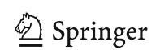
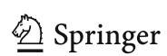
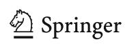
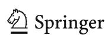
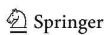
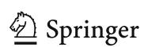
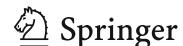
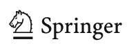

{0}------------------------------------------------

#### **REGULAR PAPER**

# **Removable weak keys for discrete logarithm-based cryptography**

**Michael John Jacobson Jr.1 · Prabhat Kushwaha[2](http://orcid.org/0000-0003-0868-5385)**

Received: 23 February 2020 / Accepted: 9 November 2020 © Springer-Verlag GmbH Germany, part of Springer Nature 2020

#### **Abstract**

We describe a novel type of weak cryptographic private key that can exist in any discrete logarithm-based public-key cryptosystem set in a group of prime order *p* where *p* − 1 has small divisors. Unlike the weak private keys based on numerical size (such as smaller private keys, or private keys lying in an interval) that will always exist in any DLP cryptosystems, our type of weak private keys occurs purely due to parameter choice of *p*, and hence, can be removed with appropriate value of *p*. Using the theory of implicit group representations, we present a method to determine whether a public key comes from a weak private key subject to a given computational bound, and if so, recover the private key from the corresponding public key. We analyze several elliptic curves proposed in the literature and in various standards, giving counts of the number of keys that can be broken with relatively small amounts of computation.. Our results show that many of these curves, including some from standards, have a considerable number of such weak private keys. We also use our methods to show that none of the 14 outstanding Certicom Challenge problem instances are weak in our sense, up to a certain weakness bound.

**Keywords** Discrete logarithm problem · Weak keys · Implicit group representation · Elliptic curves

**Mathematics Subject Classification** 94A60

#### **1 Introduction**

Weak cryptographic private keys are those that cause a cryptographic system to have undesirable, insecure behavior. For example, private keys that can be recovered by an attacker with significantly less computational effort than expected can be considered weak. One recent example of weak keys is described in an April 2019 whitepaper [\[16](#page-14-0)] by the Independent Security Evaluators, where numerous private keys protecting users' Ethereum wallets/accounts were discovered. Private keys are used to generate correspond-

Michael John Jacobson and Prabhat Kushwaha both authors contributed equally to all aspects of the paper, and have read and approved the final manuscript.

- B Prabhat Kushwaha prabkush@gmail.com Michael John Jacobson Jr. jacobs@ucalgary.ca
- 1 Department of Computer Science, University of Calgary, 2500 University Drive NW, Calgary, AB T2N 1N4, Canada
- 2 CSE Department, IIT Kharagpur, Kharagpur, West Bengal, India

ing addresses of Ethereum [\[40](#page-14-1)] or Bitcoin [\[29\]](#page-14-2) wallets, and to create digital signatures needed to spend the cryptocurrency. The Ethereum private keys were found easily because they were very small integers, as opposed to integers of the appropriate bit length. At the time of writing this article, it is not clear whether Ethereum wallets were assigning these poor keys due to oversight or error in the implementation, or whether it was done maliciously. In any case, the end result is that all the currency in the corresponding accounts was gone.

In this paper, we describe another more subtle type of weak private key that can exist in any discrete logarithmbased public-key cryptosystem, even in the case when the order of the associated group is prime. The only other types of weak keys of which we are aware are those for which standard algorithms for solving the discrete logarithm problem work quickly, for example keys of small numerical value such as those found in [\[16\]](#page-14-0) (that can be found by exhaustive search), keys that are known to lie in a small interval (that can be found by the Pollard Kangaroo method given the bounds of the interval), or those that lie in a small subgroup of the group being used. The first two types of weak keys always exist, irrespective of the choice of group used. The third can be eliminated by choosing only prime-order groups or in

{1}------------------------------------------------

some cases via "bit clearing," zeroing some bits in the private keys to ensure that the corresponding public key lies in a sufficiently large subgroup. For example, the three low-order bits of private keys used with the elliptic curve Curve 25519 with group order 8p are typically cleared so that the corresponding public key is guaranteed to lie in the subgroup of order p. Our type of weak keys are distinct in the sense that they occur purely because of factors of p-1, and hence, can be eliminated completely in practice with an appropriate choice of p, in contrast to always-present types of weak keys described above. Moreover, our type of weak keys can be quite large in size unlike the small Ethereum keys discussed above, and they can be spread over the whole interval (1, p), and not necessarily in a small sub-interval of (1, p). The bit clearing approach does not directly eliminate them, and more importantly, they may exist even when the group order is prime.

As an example, consider the elliptic curve secp256k1 given by

$$E: y^2 = x^3 + 7$$

defined over  $\mathbb{F}_q$  with  $q = 2^{256} - 2^{32} - 2^9 - 2^8 - 2^7 - 2^6 - 2^4 - 1$ , and base point

P = (5506626302227734366957871889516853432625060 3453777594175500187360389116729240, 3267051002075881697808308513050704318447127 3380659243275938904335757337482424)

of prime order

p = 115792089237316195423570985008687907852837564279074904382605163141518161494337.

This curve is part of the SEC standard [38] and is the one used to map users' private keys to Ethereum and Bitcoin public addresses. The base-P discrete logarithm of the point Q

$$\begin{split} Q &= (1007602026971618930043352141265911168001173\\ &19792545458764085267675326325395621,\\ &7519344431816503114635930462106279786227214\\ &2296678797285916994295833810377664) \end{split}$$

is

 $\alpha = 64826877121840101682523629462674967702937679$ 580369334126295633893540044112329.

Although the bit-length of  $\alpha$  is 256, and thus not weak in the sense of [16], given only the curve, P and Q, we can compute

 $\alpha$  in less than a second using only 4 scalar multiplications of points on E.

Our results are inspired by the work of Maurer and Wolf who showed the equivalence of the discrete logarithm problem and the Diffie–Hellman problem in certain cases [27,28] using a technique called implicit group representations. Subsequently, this technique has also been used in [24] to estimate a lower bound of the elliptic curve Diffie– Hellman problem for various standard curves. Our work is also closely related to the work of Brown and Gallant [9] on the static Diffie-Hellman problem, which was subsequently rediscovered by and attributed to Cheon [11] in the context of computing discrete logarithms with auxiliary inputs. The observation used in all of these works is that the discrete logarithm  $\alpha$  in a cyclic group G of prime order p can be considered as an element of the order p-1 multiplicative group  $\mathbb{F}_p^*$  provided that  $\alpha \neq 0$ . Thus,  $\alpha = \zeta^i \pmod{p}$  for a primitive root  $\zeta$  and some integer 0 < i < p - 1, and in principal the discrete logarithm can be computed by finding i using a modified version of baby-step giant-step in the order p-1group. Given d dividing p-1, either a number of queries to a Diffie–Hellman oracle or appropriate auxiliary input can be used to "lift" the problem to a order (p-1)/d subgroup, where the discrete logarithm can be computed more easily.

Kushwaha and Mahalanobis [25] observed that when  $\alpha$  already lies in a sufficiently small subgroup of  $\mathbb{F}_p^*$ , the modified baby-step giant-step algorithm of [9] and [11] can be used to find  $\alpha$  without any calls to a Diffie–Hellman oracle [13] or auxiliary input [14]. Our main observation, and first contribution, in this paper is that, although the approach of [25] does not appear to result in a faster method for computing discrete logarithms in general, it does reveal a *new type of weak key* for discrete logarithm-based cryptosystems. In particular, private keys that can be computed directly with the method without any calls to an oracle, provided that the subgroup of  $\mathbb{F}_p^*$  in which the private key lives is sufficiently small, are *weak*.

To illustrate the idea further, the underlying reason that the key in the preceding example can be computed so easily is that  $\alpha$  is in the order d=4 subgroup of  $\mathbb{F}_p^*$ ; in fact, one finds that  $\alpha=\zeta_d^3\pmod p$ , where  $\zeta_d=7^{(p-1)/4}\pmod p$  is a generator of the order 4 subgroup. We can find the discrete logarithm of  $\alpha$  to the base  $\zeta_d$  using the modified baby-step giant-step method in  $O((\log p)\sqrt{d})$  group operations, significantly fewer than what is required to compute the discrete logarithm without these considerations.

The main power of our methods thus occurs when the secret key lies in a small subgroup of  $\mathbb{F}_p^*$ , allowing one to *detect* whether a given private key is weak. In most cases, our numerical results in Sect. 3 show that the probability that a randomly selected key is weak in this sense, given simply by the number of weak keys divided by the total number, is

{2}------------------------------------------------

very low. However, a real concern is that a malicious party could cause users to be assigned weak keys, for example, via hacked or deliberately constructed key generation software such as an Ethereum wallet, or hard-coded system parameters such as in the Dual\_EC pseudo-random number generator. The malicious party, knowing that these users have weak keys, would be able to recover the private keys at will, as is speculated to have occurred in the Ethereum weak keys discovered by the Independent Security Evaluators [16]. To further illustrate the threat, we have independently found that there are 343 Ethereum public addresses and 33 Bitcoin addresses having private keys between 1 and 1000, even though the chances of such occurrences are negligible given that the private key can be any number between 1 and  $2^{256}$ . A similar situation occurred in the well-documented backdoor that was placed in the Dual\_EC pseudo-random number generator, which researchers discovered (see [36]) was enabled in part by specifying elliptic curve points P and Q where the discrete logarithm of Q to the base P serves as trapdoor information for an adversary. Detecting such weak keys is especially important in cryptocurrency applications, as well as other applications where solving a single instance of the discrete logarithm problem compromises the entire system, such as the Dual\_EC standard and various types of identitybased encryption and, more generally, functional encryption.

Coming back to the previous example, notice that  $\alpha$ , lying in the subgroup of order 4, is indeed the private key of a Bitcoin wallet. In fact, there are three active Bitcoin addresses and two Ethereum addresses having private keys in subgroups of size 4 with multiple transactions to those addresses, most occurring within a few months of writing this article. These keys are listed in Tables 1 and 2, where  $\zeta_4$  denotes a generator of the subgroup of order 4 and the keys themselves are given by

 ${\zeta_4}^2=p-1=11579208923731619542357098500868790$  78528375642790749043826051631415181  $61494336\pmod{p},$   ${\zeta_4}^3=\alpha=64826877121840101682523629462674967702$  93767958036933412629563389354004411232  $9\pmod{p},$  and

 $\zeta_4^4 = 1$ . Like the accounts discussed in [16], all these *weak* Bitcoin and Ethereum accounts were also empty as of the time this article was written. Although the keys  $\zeta_4^2 = p - 1$  (equal to  $-1 \pmod{p}$ ) and  $\zeta_4^4 = 1$  fall into the category of keys with small numerical value, the key  $\zeta_4^3$  certainly *does not*.

It is highly unlikely that these keys were generated randomly, demonstrating that relying solely on probabilistic arguments to protect users is not always sufficient. The bit

masking approach used to eliminate small subgroups when using curves such as Curve25519 does not appear to work either. The numerical value of the private key can only directly influence the subgroup the public key lies in, for example, with Curve25518 using private keys that are divisible by 8 to force the public key to belong to the large prime-order subgroup. Applying a similar bit clearing strategy to force the private key to lie in a large subgroup of the associated implicit group  $\mathbb{F}_p^*$  could be done by restricting to private keys that are random powers of  $\zeta^{(p-1)/N}$  where  $\zeta$  is a primitive root modulo p and N is such that p-1 = rN for r a sufficiently large prime, thus forcing the private keys to be in an order r subgroup of  $\mathbb{F}_p^*$ . The difference is that it would not be easy to distinguish these strong keys from weak keys simply by inspecting the keys, unlike the bit clearing approach for Curve25519 which yields private keys that are always multiples of 8.

A conservative approach that does work to eliminate weak keys like  $\alpha$  altogether is to restrict to groups whose order is a safe prime. Failing that, it is fortunately a simple matter to detect weak private keys by computing their multiplicative order modulo p; to ensure no weakness whatsoever, one can demand that this order be equal to p-1.

It is also possible to test whether a given public key was generated from a weak private key by applying the ideas from [25], based on [9] and [11]. This is important because Ethereum or Bitcoin accounts are involved in more than one transaction (see Tables 1 and 2), and if attackers discover the private key from the public key given in an Ethereum or Bitcoin transaction, they would be able to spend the cryptocurrency as if they were the legitimate owner of the account. Our second contribution is therefore a strategy to verify that a public key is not weak in our sense with respect to some bound, i.e., that the associated private key does not lie in a subgroup of  $\mathbb{F}_p^*$  of order less than the bound. Our strategy can use one of two main algorithms. The first is the baby-step giant-step algorithm presented in [25] that on input, a discrete logarithm problem instance will determine whether or not the public key is weak, and output the discrete logarithm if it is. The second is an adaptation of the probabilistic algorithm based on the Pollard kangaroo algorithm described in [12] that will solve the discrete logarithm problem with high probability if the key is in fact weak, but may fail to terminate otherwise. As an application of our methods, we show that none of the solutions to the 14 outstanding Certicom Challenge problem instances [10] are in a subgroup of order less than  $2^{48}$ .

The number of weak keys existing in a particular prime order group can be limited by insisting that the group order p be a safe prime (p-1 equals twice a prime), or at least has only few small prime divisors. Our third contribution is an analysis of many elliptic curve groups proposed for appli-

{3}------------------------------------------------

**Table 1** Bitcoin addresses with private keys lying in the subgroup of order d = 4

| Private key                 | Bitcoin address                    | No. of Txns | Last Txn date |
|-----------------------------|------------------------------------|-------------|---------------|
| $\zeta_4^2$                 | 1GrLCmVQXoyJXaPJQdqssNqwxvha1eUo2E | 6           | 13/05/2020    |
| ζ 4 3 | 1H1jFxaHFUNT9TrLzeJVhXPyiSLq6UecUy | 3           | 16/10/2019    |
| $\zeta_4^4$                 | 1BgGZ9tcN4rm9KBzDn7KprQz87SZ26SAMH | 50          | 28/08/2020    |

**Table 2** Ethereum addresses with private keys lying in the subgroup of order d = 4

| Private key     | Ethereum address                         | No. of Txns | Last Txn date |
|-----------------|------------------------------------------|-------------|---------------|
| $\zeta_4^2$     | 80c0dbf239224071c59dd8970ab9d542e3414ab2 | 30          | 27/09/2020    |
| ζ4 4 | 7e5f4552091a69125d5dfcb7b8c2659029395bdf | 1121        | 18/10/2020    |

cations and standards. We observe that the majority of these curves use prime order groups for which many weak keys exist. For example,  $\sec 256k1$  has more than  $2^{24}$  weak keys lying in subgroups of order less than  $2^{32}$  and more than  $2^{147}$  weak keys lying in subgroups of order less than  $2^{160}$ , which can be computed in roughly  $2^{16}$  and  $2^{80}$  scalar multiplications, respectively. The first type can be computed trivially given the public key, and the latter are on the threshold of what is likely possible for organizations with sufficient computational resources.

Although our numerical investigations were confined to instances of elliptic curve cryptosystems, our observations are directly applicable to any cryptosystem based on the discrete logarithm problem. For example, the field group ffdhe2048, which is included in TLS 1.3, is the subgroup of  $\mathbb{F}_q^*$  for a 2048-bit prime q of prime order p=(q-1)/2, generated by g=2. Private keys are elements of  $\mathbb{F}_p^*$  of order p-1, which has subgroups of order 2, 61, and 389 (we did not attempt to factor p-1 completely). Thus, for example, any power of  $2^{(q-1)/389}$  mod q will have order 389 in  $\mathbb{F}_p^*$ , and will be weak in our sense.

Our paper is organized as follows. In the next section, we recall the idea of implicit group representations, and describe baby-step giant-step and kangaroo algorithms based on algorithms in [25] and [12], respectively, to test whether a given public key comes from a weak private key. In Sect. 3, we present our analysis of elliptic curves proposed for practical applications in terms of the number of weak keys they admit, and in Sect. 4, we present data on experiments using our methods to verify that the private keys from the Certicom Challenge elliptic curve discrete logarithm problem instances do not lie in subgroups of  $\mathbb{F}_p^*$  of order less than  $2^{48}$ . The software used in this paper is available at our GitHub repository [18].

In the following, let G be a cyclic group of prime order p generated by an element g. Given another element  $g_1 \in G$ , the *discrete logarithm problem* is to compute the positive integer  $\alpha$  with  $0 < \alpha < p$  such that  $g_1 = g^{\alpha}$ .

To determine whether a private key is weak, we attempt to compute it by solving the discrete logarithm problem using the idea of implicit group representations from Mauer and Wolf [27,28]. Their ideas were used to prove the equivalence of the discrete logarithm and Diffie–Hellman problems in some cases. They are also closely related to the work of Brown and Gallant [9] on the static Diffie–Hellman problem and Cheon's reformulation [11,12] as the discrete logarithm problem with auxiliary inputs.

The main idea behind all of these works is that  $\alpha$ , an integer modulo p, can also be considered as an element of the multiplicative group of a finite field  $\mathbb{F}_p^*$ , a cyclic group of order p-1. Let  $\zeta$  be a generator of  $\mathbb{F}_p^*$ . Then  $\alpha=\zeta^i\pmod p$  for some integer i such that 0< i< p-1, and we can thus solve the discrete logarithm problem if we can compute i. When trying to solve the discrete logarithm problem we of course do not have to access  $\alpha$  itself, rather we have  $g_1=g^\alpha\in G$ . However, the observation that exponentiating elements in G causes multiplication in the exponent, i.e.,

$$g_1^a = (g^\alpha)^a = g^{a\alpha},$$

means that we can implicitly perform the group operation in  $\mathbb{F}_p^*$  by exponentiation in G. We can also implicitly test for equality in  $\mathbb{F}_p^*$  using the fact that  $g_a = g^a$  and  $g_b = g^b$  are equal if and only if  $a \equiv b \pmod{p}$ .

As a simple example, we can find  $\alpha$  by computing  $\zeta, \zeta^2, \ldots, \zeta^i$  until  $\zeta^i \equiv \alpha \pmod{p-1}$  by performing these computations using implicit representations. Thus, we compute

{4}------------------------------------------------

$$g^{\zeta}, (g^{\zeta})^{\zeta} = g^{\zeta^2}, \dots, (g^{\zeta^{i-1}})^{\zeta} = g^{\zeta^i}$$

in the group G via successive exponentiations by  $\zeta$  until we have  $g^{\zeta^i} = g_1 = g^{\alpha}$ , and thus  $\alpha \equiv \zeta^i \pmod{p}$  is the solution to the discrete logarithm problem.

Brown and Gallant [9] and Cheon [11,12] both observed that this idea can be improved given a divisor d of p-1. Then,  $\zeta_d = \zeta^{(p-1)/d}$  generates the order d subgroup of  $\mathbb{F}_p^*$ , and  $\alpha_d = \alpha^{(p-1)/d}$  lies in this subgroup. If we had  $g^{\alpha_d}$ then we could use the algorithm described above to compute  $\alpha \pmod{d}$  and, by repeating with other divisors of p-1ultimately recover  $\alpha$ . Unfortunately we cannot compute  $g^{\alpha_d}$ from g and  $g^{\alpha}$  using implicit representations, because we would need to exponentiate  $g^{\alpha}$  repeatedly by  $\alpha$ , which we of course do not have. This is exactly where the contributions of Brown and Gallant [9] and Cheon [11,12] come in. Brown and Gallant assume that any group element can be raised to the power  $\alpha$  via calls to a Diffie–Hellman oracle, and Cheon assumes that  $g^{\alpha_d}$  is given as auxiliary input to the discrete logarithm problem. Both then compute  $\alpha \pmod{d}$  using one application of baby-step giant-step, and recover the rest of  $\alpha$ with a second iteration of baby-step giant-step.

However, as observed by Kushwaha and Mahalanobis in [25], if  $\alpha$  itself happens to lie in the order d subgroup D, then we can use the above method to find  $\alpha$  by computing  $g^{\zeta_d}, g^{\zeta_d^2}, \ldots$  until we have  $g^{\zeta_d{}^i} = g^{\alpha}$ , and thus  $\alpha \equiv \zeta_d^i \pmod{p}$ . The difference here is that after at most d iterations we will have either found  $\alpha$  or verified that  $\alpha$  is not in the order d subgroup. Thus, if d is sufficiently small, the discrete logarithm problem can be solved much easier than would otherwise be expected when  $\alpha$  is in the order d subgroup; any public key for which the corresponding private key has this property is thus deemed to be weak.

#### 2.1 Implicit baby-step giant-step for weak keys

The method outlined above can be improved via a direct application of baby-step giant-step to reduce the expected number of implicit group operations (exponentiations in G) from O(d) to  $O(\sqrt{d})$ , as described by Kushwaha and Mahalanobis in [25, Theorem 1]. We summarize the algorithm here. Suppose that  $\alpha = \zeta_d^i$ , so that  $\alpha$  is in an order d subgroup D of  $\mathbb{F}_p^*$ . Then, as in standard baby-step giant-step applied to this order d group, there exist unique integers u and v such that  $0 \le u, v < m$  and i = vm - u with  $m = \lceil \sqrt{d} \rceil$ . We first compute a set of baby steps in G

$$g_1^{\zeta_d^u} = g^{\alpha \zeta_d^u}$$

for  $0 \le u \le m$  via successive exponentiation by  $\zeta_d$ . We next iteratively compute giant steps

$$g^{(\zeta_d^m)^v} = g^{\zeta_d^{vm}}$$

for v = 0, 1, ... via successive exponentiations by  $\zeta_d^m$ . As soon as we find v such that the giant step  $g^{\zeta_d^{vm}}$  equals the baby step  $g^{\alpha \zeta_d^u}$ , we have

$$\zeta_d^{vm} \equiv \alpha \zeta_d^u \pmod{p}$$

and thus

$$\alpha \equiv \zeta_d^i \pmod{p}$$
 with  $i \equiv vm - u \pmod{d}$ 

is a solution to the discrete logarithm problem. On the other hand, if we compute m giant steps without finding a match, then we conclude that  $\alpha$  is not in the order d subgroup. The cost in the worst case is 2m exponentiations in G, or  $O((\log p)\sqrt{d})$  group operations in G.

Note that our algorithm can be considered as the first phase of Cheon's attack using baby-step giant-step, for example, as presented in [17]. The first difference is that since our purpose is to test whether  $\alpha$  is in the order d subgroup of  $\mathbb{F}_p^*$ , only a single application of baby-step giant-step is required to either compute  $\alpha$  (and not just  $\alpha \mod d$ ) or verify that it is not in the subgroup The second difference, again because our purpose is to test whether  $\alpha$  is in the order d subgroup, is that no calls to a Diffie–Hellman oracle nor auxiliary inputs are required to obtain group elements of the form  $g^{\alpha^j}$ .

Various implementations of Cheon's algorithm and numerical results have been reported, including [17,31,32]. One important practical improvement that is also applicable to our setting is the KKM method [23], due to Kozaki, Kutsuma, and Matsuo. The observation is that both the baby steps and giant steps can be written in such a way that each step is computed via an exponentiation with the same base element,  $g_1$  for the baby steps and  $g^{\xi_d^m}$  for the giant steps. As a result, precomputation tables can be constructed for both phases in such a way that each exponentiation is replaced by a constant number of group operations. Specifically, assuming that the base element is  $g_t \in G$ , we select an integer c, compute  $b = \lceil p^{1/c} \rceil$ , and construct the  $c \times b$  dimensional table  $T = \{t_{i,j}\}$  where

$$t_{i,j}=g_t^{jb^i}.$$

Then, to compute  $g_t^{\delta}$ , we write  $\delta$  in base-b as

$$\delta = \delta_0 + \delta_1 b + \delta_2 b^2 + \dots + \delta_{c-1} b^{c-1}$$

and compute

$$g_t^{\delta} = (t_{0,\delta_0})(t_{1,\delta_1})\dots(t_{c-1,\delta_{c-1}})$$

{5}------------------------------------------------

using only c-1 group operations instead of the  $O(\log p)$  required for scalar multiplication. The look-up table requires the storage of cb group elements, and Kozaki et. al. show that the cost to compute the table is  $O(cp^{1/c})$  group operations. The total cost of our algorithm using the KKM improvement is thus  $O(c(p^{1/c}+\sqrt{d}))$  group operations, which is  $O(\sqrt{d})$  as long as  $c \geq 2\log p/\log d$ . In practice, one chooses an optimal value of c that minimizes the total number of group operations for the entire algorithm; we will describe our strategy in Sect. 4.

## 2.2 Implicit Kangaroo algorithm for weak keys

Cheon [11] also describes a low-memory variant of his algorithm to solve the discrete logarithm problem with auxiliary input, where the two applications of baby-step giant-step are replaced with the Pollard kangaroo algorithm. We describe a specialization of this method to our application of determining whether a key is weak. As with the baby-step giant-step algorithm, this amounts to simply running the first kangaroo phase of Cheon's algorithm without using any auxiliary inputs.

As above, we suppose that the discrete logarithm  $\alpha = \zeta_d^i$ (mod p), so that  $\alpha$  is in the order d subgroup D of  $\mathbb{F}_p^*$  generated by  $\zeta_d$ . The main idea is to run the usual kangaroo algorithm in D implicitly to compute i, using a pseudorandom walk  $F: D \to D$ . The kangaroo algorithm would start a wild kangaroo with  $\alpha$  and a tame kangaroo with  $\zeta_d^{\lceil d \rceil/2}$ , and when these two random walks collide, compute i. We cannot do this directly, as we only have access to  $\alpha$  implicitly as  $g_1 = g^{\alpha}$ . However, each of the kangaroo jumps can be mapped to a unique element in G via the one-to-one mapping  $\phi: D \to G, \beta \mapsto \phi(\beta) = g^{\beta}$ , inducing a pseudo-random walk  $\bar{F}: G \to G$  on G. Thus, we start an explicit wild kangaroo at  $g_1 = g^{\alpha}$  and an explicit tame kangaroo at  $g^{\zeta_d^{\lceil d \rceil/2}}$ , and a collision between the two explicit kangaroos happens exactly when the implicit kangaroos would collide, allowing us to compute i and to recover  $\alpha = \zeta_d^i \pmod{p}$ . Collisions can be detected using the distinguished points method on G.

The pseudo-random walk F depends on a pseudo-random function  $f: G \to \{1, 2, ..., L\}$  that partitions the group G into L partitions of almost equal size (typical values of L are 256, 1024, 2048). For the  $k^{th}$  partition, there is a small jump  $s_k$  such that  $1 \le s_k \le \sqrt{d}/2$  subject to the condition that mean step size  $m = (\sum_{k=1}^L s_k)/L$  is close to  $\sqrt{d}/2$ , as this is required to minimize the overall running time. Given f, the implicit pseudo-random walk on D is defined as

$$F: D \to D; \quad x \mapsto x \cdot \zeta_d^{s_{f(g^x)}},$$

inducing the explicit pseudo-random walk  $\bar{F}$  on G defined as

$$\underline{\underline{\mathscr{D}}}$$
 Springer

$$\bar{F}: G \to G; \quad g^x \mapsto g^{x \cdot \zeta_d}{}^{s_{f(g^x)}}.$$

Assuming F is constructed with these properties, Cheon's analysis [12] specializes to our case and yields an expected running time of  $O(\sqrt{d} + \theta^{-1})$  exponentiations in G, where  $\theta$  is the proportion of distinguished points used out of the group G. The number of group elements stored (for the distinguished points) is  $O(\theta \sqrt{d})$ , so  $\theta$  may be selected to favor either the running time or storage requirement as necessary.

As with our baby-step giant-step algorithm, the KKM optimization [23] can be used to replace the exponentiations in G with a constant number of group operations at the cost of computing and storing a precomputed table. We describe the details of our implementation in Sect. 4, including the application of KKM and a precise description of our pseudorandom walk and realization of distinguished points.

# 2.3 Testing whether a key is weak

We present our approach to test whether the private key corresponding to a given public key is weak according to a given bound, i.e., if it belongs to a subgroup of order less than B. This allows one to verify that a key is not weak subject to whatever computational bound is feasible.

A simple approach is to run our baby-step giant-step algorithm on all divisors of p-1 that are less than B. However, this would be inefficient and redundant, because testing whether a key is in a subgroup of order d also covers all subgroups of order divisible by d. Thus, we instead generate a list of integers  $d_1 < d_2 < ... < d_t \le B$  dividing p-1 such that  $d_i \nmid d_j$  for all  $1 \le i < j \le t$ . We then apply our baby-step giant-step algorithm to all subgroups of order  $d_i$  in the list, thereby avoiding redundant computations in subgroups.

For example, for the elliptic curve secp256k1, p-1 has 10 divisors bigger than 1 and  $\leq 48$ , namely 2, 3, 4, 6, 8, 12, 16, 24, 32, 48. In order to test whether a given private key is in any of the subgroups of these orders, it suffices to test only the subgroups of orders 32 and 48, as the first eight subgroup orders divide 48, and thus any element of one of these smaller orders is also an element of the subgroup of order 48.

Note that either baby-step giant-step or the kangaroo method described above can be used here if the purpose is simply to recover a private key. However, if the purpose is to verify rigorously that a key is *not* weak, i.e., does not lie in a subgroup of bounded order, then baby-step giant-step must be used. If baby-step giant-step fails to recover a key by searching in a particular subgroup, we can conclude that the key is not in the subgroup. Due to its probabilistic nature, if the kangaroo method fails to recover a key we cannot make the same conclusion.

{6}------------------------------------------------

**Table 3** Curve nomenclature used for duplicate curves in the tables

| Our label | NIST [30] | Certicom [10] | SEC [38]  | Kiyomura [22] | Barbulescu [1] | CFRG [33] |
|-----------|-----------|---------------|-----------|---------------|----------------|-----------|
| P-192     | P-192     | –             | secp192r1 | –             | –              | –         |
| P-224     | P-224     | –             | secp224r1 | –             | –              | –         |
| P-256     | P-256     |               | secp256r1 | –             | –              | –         |
| P-384     | P-384     | –             | secp384r1 | –             | –              | –         |
| P-521     | P-521     |               | secp521r1 | –             | –              | –         |
| K-163     | K-163     | ECC2K–163     | sect163k1 | –             | –              | –         |
| B-163     | B-163     | –             | sect163r2 | –             | –              | –         |
| K-233     | K-233     | –             | sect233k1 | –             | –              | –         |
| B-233     | B-233     | –             | sect233r1 | –             | –              | –         |
| K-283     | K-283     | –             | sect283t1 | –             | –              | –         |
| B-283     | B-283     | –             | sect283r1 | –             | –              | –         |
| K-409     | K-409     | –             | sect409k1 | –             | –              | –         |
| B-409     | B-409     | –             | sect409r1 | –             | –              | –         |
| K-571     | K-571     | –             | sect571k1 | –             | –              | –         |
| B-571     | B-571     |               | sect571r1 | –             | –              | –         |
| ECC2K-238 | –         | ECC2K-238     | sect239k1 | –             | –              | –         |
| BN        | –         | –             | –         | –             | BN             | BN-462    |
| BLS48     | –         | –             | –         | BLS48         | –              | BLS48-581 |

# **3 Assessment of weak keys in recommended and standard elliptic curves**

# **3.1 Curves investigated**

We have investigated a number of elliptic curves recommended for practical applications and appearing in standards. The sources of the curves we selected include

- NIST curves [\[30](#page-14-17)],
- Safe curves [\[7\]](#page-13-4),
- Certicom challenge curves [\[10\]](#page-13-2),
- SEC curves [\[38](#page-14-3)],
- Brainpool curves [\[26\]](#page-14-20),
- FourQ curve [\[15\]](#page-14-21),
- the pairing-friendly curves BLS [\[5](#page-13-5)], BN [\[6](#page-13-6)] and KSS [\[20](#page-14-22)], but with updated parameters given in [\[1](#page-13-3)[,22\]](#page-14-18) and [\[33](#page-14-19)].

In the tables below, we use the following naming conventions for the various curves considered. Curve ANSSI refers to the safe curve ANSSI FRP256v1, and Ed448 refers to the safe curve Ed448-Goldilocks. The labels of the Brainpool curves have also been abbreviated; for example, BP256r1 refers to the Brainpool curve BrainpoolP256r1 and so on. Note that we do not include the twisted versions of the Brainpool curves, as they have the same point order as the non-twisted versions.

In recent years, there have been tremendous advances in solving the discrete logarithm problem in finite fields. As a result, pairing-based curves over small characteristic fields are no longer safe to use due to the quasi-polynomial attack of Barbulescu et al. [\[2\]](#page-13-7). Moreover, there have also been improvements in the case of medium-sized prime characteristics in a series of papers [\[3](#page-13-8)[,19](#page-14-23)], [\[21](#page-14-24)[,34\]](#page-14-25). Since most of pairing-friendly curve constructions use medium-sized characteristics fields, previous parameters such as those for BN curves [\[6\]](#page-13-6), BLS curves [\[5](#page-13-5)] and KKS curves [\[20](#page-14-22)] are no longer applicable to attain the prescribed security level they were defined for. Therefore, we have examined only the updated parameters as presented in [\[1](#page-13-3)[,22\]](#page-14-18) and [\[33\]](#page-14-19) for these curves at security level 128-, 192-, 256-bits.

It should also be noted that there are many curves that are part of more than one standard. To ensure each curve is mentioned just once in our tables, we follow the label used in the standard which comes first in the list at the beginning of this section. For example, the NIST curve K-163 is the same as the Certicom challenge curve ECC2K-238 and the SEC curve sect163k1, so this curve is listed once in our tables as K-163. Similarly, for pairing-friendly curves at the 128-bit security level with updated parameters, BN given in [\[1](#page-13-3)] and BN-462 given in [\[33\]](#page-14-19) are the same; we use the label BN-462 in our table. We also use the label BLS48 in our tables to denote both BLS48 from [\[22\]](#page-14-18) and BLS48-581 from [\[33\]](#page-14-19) at the 256-bit security level. The nomenclature for the curve labels used in this paper has been described using Table [3.](#page-6-1)

{7}------------------------------------------------

**Table 4** Curves providing

| Table 4 Curves providing security below 128 bits | Curve     | b(p) | b(pm) | N232 | C232 | N264 | C264 | N2128 | C2128 | N2160 | C2160 |
|-----------------------------------------------------|-----------|------|-------|------|------|------|------|-------|-------|-------|-------|
|                                                     | secp224k1 | 225  | 222   | 2.6  | 2.6  | 2.6  | 2.6  | 2.6   | 2.6   | 2.6   | 2.6   |
|                                                     | BP224r1   | 224  | 214   | 10.0 | 6.0  | 10.0 | 6.0  | 10.0  | 6.0   | 10.0  | 6.0   |
|                                                     | secp192k1 | 192  | 167   | 25.4 | 13.7 | 25.4 | 13.7 | 25.4  | 13.7  | 25.4  | 13.7  |
|                                                     | P-224     | 224  | 196   | 29.0 | 15.5 | 29.0 | 15.5 | 29.0  | 15.5  | 29.0  | 15.5  |
|                                                     | BP192r1   | 192  | 97    | 11.7 | 6.9  | 11.7 | 6.9  | 108.1 | 55.1  | 108.1 | 55.1  |
|                                                     | P-192     | 192  | 92    | 17.5 | 9.8  | 17.5 | 9.8  | 109.0 | 55.6  | 109.0 | 55.6  |
|                                                     | secp112r2 | 110  | 42    | 33.7 | 19.5 | 66.3 | 36.0 | 109.8 | 55.9  | 109.8 | 55.9  |
|                                                     | sect193r2 | 193  | 109   | 2.0  | 2.0  | 2.0  | 2.0  | 110.2 | 56.1  | 110.2 | 56.1  |
|                                                     | secp112r1 | 112  | 95    | 17.1 | 9.6  | 17.1 | 9.6  | 111.8 | 56.9  | 111.8 | 56.9  |
|                                                     | sect113r1 | 113  | 49    | 33.1 | 18.6 | 64.7 | 34.2 | 112.0 | 57.0  | 112.0 | 57.0  |
|                                                     | sect113r2 | 113  | 39    | 33.7 | 19.0 | 65.5 | 35.2 | 112.0 | 57.0  | 112.0 | 57.0  |
|                                                     | sect193r1 | 193  | 100   | 22.0 | 12.0 | 22.0 | 12.0 | 121.5 | 61.7  | 121.5 | 61.7  |
|                                                     | E-222     | 220  | 114   | 8.3  | 5.2  | 8.3  | 5.2  | 121.6 | 61.8  | 121.6 | 61.8  |
|                                                     | secp128r2 | 126  | 95    | 31.5 | 16.8 | 31.5 | 16.8 | 126.0 | 64.0  | 126.0 | 64.0  |
|                                                     | secp128r1 | 128  | 57    | 31.8 | 18.0 | 65.9 | 35.4 | 128.0 | 65.0  | 128.0 | 65.0  |
|                                                     | ECC2K-130 | 130  | 75    | 33.8 | 19.2 | 54.8 | 28.4 | 128.1 | 66.2  | 129.0 | 65.5  |
|                                                     | sect131r1 | 131  | 116   | 14.5 | 8.3  | 14.5 | 8.3  | 126.3 | 64.4  | 130.0 | 66.0  |
|                                                     | sect131r2 | 131  | 75    | 30.0 | 16.3 | 55.2 | 28.6 | 104.7 | 53.7  | 130.0 | 66.0  |
|                                                     | ECC2-131  | 131  | 113   | 17.9 | 9.9  | 17.9 | 9.9  | 126.8 | 65.1  | 130.0 | 66.0  |
|                                                     | ECCp-131  | 131  | 63    | 19.9 | 11.0 | 65.2 | 34.7 | 128.3 | 66.0  | 130.2 | 66.1  |
|                                                     | ECCp-191  | 191  | 144   | 1.0  | 2.0  | 47.3 | 24.7 | 47.3  | 24.7  | 144.7 | 73.3  |
|                                                     | ECC2-191  | 191  | 75    | 10.4 | 6.2  | 50.7 | 26.4 | 124.7 | 63.4  | 149.6 | 75.8  |
|                                                     | B-163     | 163  | 133   | 29.7 | 15.8 | 29.7 | 15.8 | 29.7  | 15.8  | 156.5 | 79.6  |
|                                                     | Anomalous | 204  | 71    | 28.2 | 15.5 | 62.9 | 33.3 | 127.2 | 65.5  | 158.1 | 80.2  |
|                                                     | M-221     | 219  | 88    | 32.5 | 17.7 | 62.9 | 32.4 | 127.8 | 65.2  | 158.4 | 80.3  |
|                                                     | secp160r2 | 161  | 72    | 21.6 | 11.8 | 21.6 | 11.8 | 93.1  | 47.8  | 159.0 | 80.6  |
|                                                     | ECCp-163  | 163  | 135   | 28.2 | 15.1 | 28.2 | 15.1 | 28.2  | 15.1  | 159.4 | 80.8  |
|                                                     | BP160r1   | 160  | 42    | 33.6 | 19.4 | 67.0 | 36.5 | 129.9 | 67.3  | 159.9 | 80.9  |
|                                                     | secp160r1 | 161  | 105   | 31.5 | 16.9 | 55.3 | 28.6 | 127.7 | 65.4  | 159.2 | 81.1  |
|                                                     | secp160k1 | 161  | 77    | 18.0 | 10.0 | 18.0 | 10.0 | 94.8  | 48.4  | 159.6 | 81.8  |
|                                                     | K-163     | 163  | 103   | 19.2 | 10.6 | 59.3 | 30.6 | 121.9 | 62.0  | 160.3 | 82.0  |
|                                                     | sect163r1 | 162  | 78    | 30.2 | 16.5 | 65.0 | 34.8 | 126.9 | 64.6  | 160.7 | 82.2  |
|                                                     | ECC2-163  | 163  | 46    | 37.9 | 23.6 | 70.9 | 40.7 | 134.1 | 71.9  | 160.9 | 82.8  |

#### **3.2 Analysis of weak keys**

Our data are presented in Tables [4,](#page-7-0) [5,](#page-8-0) [6,](#page-8-1) [7,](#page-9-0) [8,](#page-9-1) [9](#page-9-2) and [10.](#page-10-1) Table [4](#page-7-0) includes all curves providing less than 128 bits of security, where as usual *b* bits of security indicates that the expected cost to solve the discrete logarithm problem is roughly 2*b*. Table [5](#page-8-0) covers security level of approximately 128 bits but less than 192, Table [6](#page-8-1) covers approximately 192 and up to 256 bits, and Table [7](#page-9-0) covers approximately 256 bits of security and above. Tables [8,](#page-9-1) [9](#page-9-2) and [10](#page-10-1) present the data for updated pairing friendly curves for security level 128-, 192- and 256 bits, respectively. The software used in this paper is available at our GitHub repository [\[18](#page-14-12)].

For each curve appearing in the sources listed above, we enumerated the number of weak keys appearing in subgroups of size bounded by *B* for *B* = 232, 264, 2128, and 2160. The cost to determine whether a given key is weak for each of these bounds is roughly 216, 232, 264, and 280 group operations —these bounds were selected to give two relatively easy bounds and two at the edge of computations that are feasible. Due to the sizes of numbers occurring in the counts, and in order to facilitate an easier comparison, we list the base-2 log (number of bits) of each number as opposed to the number itself. In summary, the data recorded for each curve is as follows:

{8}------------------------------------------------

**Table 5** Curves providing security between 128 and 192 bits

| Curve      | b(p) | b(pm) | N232 | C232 | N264 | C264 | N2128 | C2128 | N2160 | C2160 |
|------------|------|-------|------|------|------|------|-------|-------|-------|-------|
| BP256r1    | 256  | 252   | 4.2  | 3.3  | 4.2  | 3.3  | 4.2   | 3.3   | 4.2   | 3.3   |
| BP320r1    | 320  | 278   | 34.7 | 20.4 | 42.4 | 22.2 | 42.4  | 22.2  | 42.4  | 22.2  |
| ECC2-238   | 238  | 182   | 30.2 | 16.4 | 55.6 | 28.8 | 55.6  | 28.8  | 55.6  | 28.8  |
| 256KM2     | 257  | 192   | 16.4 | 9.2  | 63.2 | 32.6 | 64.2  | 33.1  | 64.2  | 33.1  |
| ANSSI      | 256  | 187   | 33.3 | 18.8 | 64.9 | 34.3 | 69.2  | 35.6  | 69.2  | 35.6  |
| ECCp-239   | 239  | 115   | 22.6 | 12.3 | 22.6 | 12.3 | 128.1 | 65.6  | 136.8 | 69.4  |
| Curve25519 | 253  | 138   | 7.0  | 4.6  | 7.0  | 4.6  | 114.3 | 58.2  | 144.7 | 73.4  |
| secp256k1  | 256  | 109   | 24.1 | 13.1 | 64.7 | 34.2 | 129.4 | 67.0  | 147.9 | 75.0  |
| FourQ      | 246  | 147   | 27.8 | 15.5 | 64.1 | 34.1 | 99.3  | 50.6  | 150.3 | 76.1  |
| K-233      | 232  | 158   | 33.0 | 18.6 | 64.0 | 33.5 | 73.2  | 37.6  | 159.8 | 81.5  |
| B-233      | 233  | 145   | 33.0 | 18.4 | 64.7 | 34.3 | 87.6  | 44.8  | 160.7 | 81.9  |
| B-283      | 282  | 90    | 29.5 | 15.7 | 64.2 | 33.6 | 128.9 | 66.8  | 161.7 | 83.4  |
| sect239k1  | 238  | 104   | 33.0 | 18.8 | 66.5 | 36.0 | 129.0 | 67.0  | 162.1 | 83.7  |
| Curve1174  | 249  | 60    | 35.2 | 21.0 | 68.7 | 38.5 | 133.3 | 71.3  | 164.7 | 86.6  |
| P-256      | 256  | 92    | 36.0 | 21.5 | 69.3 | 38.8 | 133.2 | 70.8  | 165.3 | 86.9  |
| K-283      | 281  | 137   | 38.1 | 23.8 | 71.1 | 40.8 | 133.1 | 70.9  | 165.7 | 87.4  |

**Table 6** Curves providing security between 192 and 256 bits

| Curve       | b(p) | b(pm) | N232 | C232 | N264 | C264 | N2128 | C2128 | N2160 | C2160 |
|-------------|------|-------|------|------|------|------|-------|-------|-------|-------|
| ECCp-359    | 359  | 354   | 5.2  | 3.6  | 5.2  | 3.6  | 5.2   | 3.6   | 5.2   | 3.6   |
| M-383       | 381  | 354   | 26.6 | 14.3 | 26.6 | 14.3 | 26.6  | 14.3  | 26.6  | 14.3  |
| Curve41417  | 411  | 352   | 32.5 | 18.1 | 59.4 | 30.7 | 59.4  | 30.7  | 59.4  | 30.7  |
| Curve383187 | 381  | 299   | 32.0 | 18.1 | 65.5 | 35.3 | 81.4  | 41.7  | 81.4  | 41.7  |
| P-384       | 384  | 281   | 13.5 | 7.8  | 13.5 | 7.8  | 103.3 | 52.7  | 103.3 | 52.7  |
| K-409       | 407  | 299   | 37.2 | 22.9 | 69.0 | 38.8 | 108.8 | 55.4  | 108.8 | 55.4  |
| ECC2K-358   | 358  | 227   | 31.7 | 17.6 | 60.3 | 31.1 | 127.9 | 65.5  | 131.9 | 66.9  |
| ECC2-353    | 353  | 103   | 6.4  | 4.3  | 6.4  | 4.3  | 108.9 | 55.5  | 158.3 | 80.2  |
| E-382       | 381  | 165   | 33.7 | 19.2 | 64.6 | 34.2 | 66.0  | 34.0  | 160.8 | 82.2  |
| Ed448       | 446  | 249   | 33.1 | 18.9 | 64.7 | 34.2 | 128.8 | 66.2  | 160.8 | 82.2  |
| B-409       | 409  | 124   | 29.1 | 15.6 | 63.4 | 33.3 | 129.1 | 66.7  | 160.6 | 82.3  |
| BP384r1     | 384  | 206   | 33.3 | 18.7 | 66.0 | 35.5 | 130.0 | 67.6  | 160.7 | 82.3  |

- Curve label
- *b*(*p*): number of bits of the size of the curve's large prime (subgroup) order
- *b*(*pm*): number of bits of the largest prime divisor of *p*−1
- *NB*: base-2 log of the number of weak keys with order bounded by *B*. Since φ(*d*) is the number of generators of a cyclic group of order *d*, i.e., the number of elements of order exactly equal to *d*, we compute

$$N_B = \log_2 \sum_{\substack{d \mid p-1 \\ d \le B}} \phi(d).$$

– *CB*: base-2 log of the worst-case number of group operations required to test whether a key comes from a subgroup of order bounded by *B* using baby-step giantstep. Let *R*(*p*, *B*) denote the set of divisors of *p* − 1 that must be considered to check whether a key is in a subgroup of order bounded by *B*, i.e.,

$$R(p, B) = \{d_1, \dots, d_t : d_i \nmid d_j \text{ for all } 1 \le i < j <= t\}.$$

We then compute

$$C_B = \log_2 \sum_{d \in R(p,B)} 2\lceil \sqrt{d} \rceil$$

Note that this cost value measures the worst-case number of scalar multiplications required on the curve. However, with the KKM method [\[23\]](#page-14-16), this also measures the worstcase number of point additions required up to a constant factor.

{9}------------------------------------------------

**Table 7** Curves providing

| Table 7 Curves providing security at least 256 bits | Curve   | b(p) | b(pm) | N232 | C232 | N264 | C264 | N2128 | C2128 | N2160 | C2160 |
|--------------------------------------------------------|---------|------|-------|------|------|------|------|-------|-------|-------|-------|
|                                                        | E-521   | 519  | 443   | 18.1 | 10.0 | 58.9 | 30.5 | 76.0  | 39.0  | 76.0  | 39.0  |
|                                                        | P-521   | 521  | 391   | 31.4 | 16.7 | 50.0 | 26.0 | 128.8 | 66.3  | 130.5 | 66.2  |
|                                                        | M-511   | 509  | 164   | 19.7 | 10.9 | 55.3 | 28.7 | 127.4 | 64.7  | 148.0 | 75.5  |
|                                                        | B-571   | 570  | 183   | 27.7 | 14.9 | 63.5 | 33.2 | 105.8 | 53.9  | 156.9 | 79.9  |
|                                                        | BP512r1 | 512  | 314   | 35.0 | 20.6 | 68.1 | 37.7 | 132.7 | 70.3  | 163.3 | 85.0  |
|                                                        | K-571   | 570  | 161   | 36.1 | 21.7 | 67.1 | 36.9 | 131.8 | 69.5  | 164.8 | 86.5  |

**Table 8** Updated pairing friendly curves providing 128-bit security

| Curve          | b(p) | b(pm) | N232 | C232 | N264 | C264 | N2128 | C2128 | N2160 | C2160 |
|----------------|------|-------|------|------|------|------|-------|-------|-------|-------|
| KSS16 [1]      | 263  | 131   | 31.2 | 17.1 | 66.5 | 36.1 | 129.2 | 67.0  | 158.8 | 80.7  |
| KSS18 [1]      | 256  | 120   | 22.2 | 12.1 | 60.1 | 31.1 | 131.6 | 69.4  | 160.9 | 82.4  |
| BN [1] [33]    | 462  | 289   | 35.8 | 21.3 | 67.4 | 37.1 | 131.4 | 69.2  | 162.9 | 84.4  |
| BLS12-381 [33] | 255  | 28    | 37.3 | 22.8 | 72.0 | 41.5 | 137.8 | 75.4  | 169.3 | 91.0  |
| BLS12 [1]      | 308  | 73    | 37.3 | 23.0 | 71.9 | 41.6 | 137.6 | 75.3  | 169.6 | 91.4  |

**Table 9** Updated pairing friendly curves providing 192-bit security

| Curve     | b(p) | b(pm) | N232 | C232 | N264 | C264 | N2128 | C2128 | N2160 | C2160 |
|-----------|------|-------|------|------|------|------|-------|-------|-------|-------|
| BLS24 [1] | 449  | 63    | 38.2 | 24.0 | 72.1 | 42.0 | 138.2 | 76.1  | 170.7 | 92.6  |
| KSS18 [1] | 502  | 87    | 41.6 | 27.4 | 77.7 | 47.5 | 145.3 | 83.2  | 178.2 | 100.0 |

The curves are sorted in increasing order of *CB* for *B* = 2160, i.e., the worst-case cost for determining whether a private key is in a subgroup of order at most 2160.

Note that the time required to count weak keys for a particular curve is dominated by the computation of the divisors of *p*−1, and thus by factoring. We used the SAGE computer algebra system [\[39\]](#page-14-26) to perform the factorizations. We did not track the total time for computing our statistics because the computation was performed intermittently on a heterogeneous group of computers over the period of several weeks. However, we note that, as an example, the time required to process curve K-571, having one of the largest prime order groups we considered, was just under 2 days on a Intel i7- 8700 3.2 GHz processor with 64 GB RAM. Most curves were handled much more quickly; as another example, less than 9 minutes in total was required for the computation of all the curves in Table [5.](#page-8-0)

Our data show that many curves have an abundance of weak keys at all levels, due to rather smooth factorizations of *p* − 1 and, in particular, many divisors of *p* − 1 of size *B* and below. The actual counts of weak keys vary, but roughly half of the curves surveyed have around 2160 weak keys at the level *B* = 2160. There are also some notable examples of curves that have remarkably few weak keys, especially secp224k1, Brainpool256r1, and ECCp-359. Some curves, such as secp193r2, Brainpool224r1, Curve25519, and ECC2- 353 have very few weak keys at lower bounds but many at *B* = 2160.

There does not appear to be any bias of curves from one particular group or standard towards few or many weak keys. For example, curves from the NIST standard span the spectrum, with some curves such as P-224, P-192, P-384, and P-521 having relatively few weak keys, but others such as K-163, P-256, K-283, B-409, and K-571 having relatively many. The Brainpool standard includes some of the curves with the fewest weak keys as indicated above, but also has a few with relatively many such as Brainpool384r1 and Brainpool512r1. The secp256k1 curve mentioned earlier, that is used in Ethereum and Bitcoin, falls roughly in the middle of the curves at the 128-bit security level, and does not generally stand out in any way. Except for KSS36, the pairing-friendly curves tend to have somewhat larger numbers of weak keys than the other curves, due in part to the fact that larger groups are required to compensate for the faster finite field discrete logarithm algorithms. Of the three type of pairing-friendly curves, the BLS curves have the most weak keys at the 128 and 256-bit security levels, but the least at the 192-bit level. All of this is consistent with the fact that current standards and practices place no restrictions on the factorization of *p* − 1, so we would expect its factorization to resemble that of a random integer.

In order to investigate whether mathematical properties of the curve or the finite field it is defined over have any influence on the numbers of weak keys, we also examined our data according to these categories. In Tables [11,](#page-10-2) [12,](#page-10-3) [13,](#page-11-0) [14](#page-11-1) and [15,](#page-11-2) we present the data organized by various

{10}------------------------------------------------

| Table 10   | Updated pairing |
|------------|-----------------|
| friendly c | urves providing |
| 256-bit se | ecurity         |

| Curve           | b(p) | $b(p_m)$ | $N_{2^{32}}$ | $C_{2^{32}}$ | $N_{2^{64}}$ | $C_{2^{64}}$ | $N_{2^{128}}$ | $C_{2^{128}}$ | $N_{2^{160}}$ | $C_{2^{160}}$ |
|-----------------|------|----------|--------------|--------------|--------------|--------------|---------------|---------------|---------------|---------------|
| KSS36 [22]      | 669  | 652      | 17.2         | 9.6          | 17.2         | 9.6          | 17.2          | 9.6           | 17.2          | 9.6           |
| KSS32 [22]      | 738  | 591      | 33.9         | 19.2         | 65.8         | 35.3         | 129.2         | 66.8          | 146.6         | 74.3          |
| KSS18 [1]       | 1108 | 341      | 30.4         | 16.2         | 67.9         | 37.5         | 132.8         | 70.5          | 163.4         | 85.1          |
| BLS42 [22]      | 516  | 178      | 38.6         | 24.5         | 72.2         | 42.1         | 137.3         | 75.2          | 169.7         | 91.5          |
| BLS24 [22]      | 872  | 190      | 40.1         | 25.9         | 74.3         | 44.2         | 139.1         | 76.9          | 171.6         | 93.4          |
| BLS48 [33] [22] | 518  | 91       | 39.9         | 25.7         | 74.8         | 44.6         | 140.7         | 78.6          | 173.1         | 95.0          |
| BLS24 [1]       | 827  | 86       | 41.3         | 27.2         | 77.1         | 47.0         | 145.4         | 83.3          | 178.7         | 100.6         |

 Table 11
 Montgomery curves

| Curve       | <i>b</i> ( <i>p</i> ) | $b(p_m)$ | $N_{2^{32}}$ | $C_{2^{32}}$ | $N_{2^{64}}$ | $C_{2^{64}}$ | $N_{2^{128}}$ | $C_{2^{128}}$ | $N_{2^{160}}$ | $C_{2^{160}}$ |
|-------------|-----------------------|----------|--------------|--------------|--------------|--------------|---------------|---------------|---------------|---------------|
| M-383       | 381                   | 354      | 26.6         | 14.3         | 26.6         | 14.3         | 26.6          | 14.3          | 26.6          | 14.3          |
| Curve383187 | 381                   | 299      | 32.0         | 18.1         | 65.5         | 35.3         | 81.4          | 41.7          | 81.4          | 41.7          |
| Curve25519  | 253                   | 138      | 7.0          | 4.6          | 7.0          | 4.6          | 114.3         | 58.2          | 144.7         | 73.4          |
| M-511       | 509                   | 164      | 19.7         | 10.9         | 55.3         | 28.7         | 127.4         | 64.7          | 148.0         | 75.5          |
| M-221       | 219                   | 88       | 32.5         | 17.7         | 62.9         | 32.4         | 127.8         | 65.2          | 158.4         | 80.3          |

**Table 12** Twisted Edwards curves

| Curve            | <i>b</i> ( <i>p</i> ) | $b(p_m)$ | $N_{2^{32}}$ | $C_{2^{32}}$ | $N_{2^{64}}$ | $C_{2^{64}}$ | $N_{2^{128}}$ | $C_{2^{128}}$ | N 2 160 | $C_{2^{160}}$ |
|------------------|-----------------------|----------|--------------|--------------|--------------|--------------|---------------|---------------|--------------------|---------------|
| Curve41417       | 411                   | 352      | 32.5         | 18.1         | 59.4         | 30.7         | 59.4          | 30.7          | 59.4               | 30.7          |
| E-521            | 519                   | 443      | 18.1         | 10.0         | 58.9         | 30.5         | 76.0          | 39.0          | 76.0               | 39.0          |
| E-222            | 220                   | 114      | 8.3          | 5.2          | 8.3          | 5.2          | 121.6         | 61.8          | 121.6              | 61.8          |
| $Four\mathbb{Q}$ | 246                   | 147      | 27.8         | 15.5         | 64.1         | 34.1         | 99.3          | 50.6          | 150.3              | 76.1          |
| E-382            | 381                   | 165      | 33.7         | 19.2         | 64.6         | 34.2         | 66.0          | 34.0          | 160.8              | 82.2          |
| Ed448            | 446                   | 249      | 33.1         | 18.9         | 64.7         | 34.2         | 128.8         | 66.2          | 160.8              | 82.2          |
| Curve1174        | 249                   | 60       | 35.2         | 21.0         | 68.7         | 38.5         | 133.3         | 71.3          | 164.7              | 86.6          |

mathematical properties of the curves and the defining finite fields, namely Montgomery curves, twisted Edwards curves, Mersenne prime fields, pseudo Mersenne prime fields, and generalized Mersenne prime fields. As before, these properties also do not appear to have any significant influence on the resulting number of weak keys.

# 4 Application to the certicom challenge curves

We have implemented in Sage [39] both the baby-step giant-step and Kangaroo algorithms from Sect. 2 for testing whether a elliptic curve public-key comes from a weak private key. We use the KKM [23] extension for both algorithms, and use Python dictionaries for the required searchable lists so that searching is as efficient as possible.

To use the KKM method, as described at the end of Sect. 2.1 we need to find a value of c that minimizes the total number of group operations. Recall that the total number of group operations, including computing the lookup table, is

at most

$$c(\log_2 p + p^{1/c}) + 2(c-1)\sqrt{d}$$
.

for baby-step giant-step, and the same expression gives a reasonably accurate estimate for the kangaroo method. In our implementation, given p and d, we simply compute a local minimum of this expression. We also set a hard constraint for the size of the lookup table at  $2^{32}$  group elements, so if the value of c obtained via minimization causes the table size  $cp^{1/c}$  to be too large, we increased c until the table size was below this bound.

The additional functions and parameters used in the implicit kangaroo algorithm are as follows:

- Partition function The elliptic curve group E is partitioned into L parts as  $E = S_1 \cup S_2 \cup ... \cup S_L$  via a partition function  $f: E \to \{1, 2, ..., L\}$ . We use  $L = 2^n$ , and for a point  $P \in E$  we set f(P) = j if the n least-significant bits of the integer representation of the x-coordinate of P is j - 1. We used L = 1024 in our implementation.

{11}------------------------------------------------

**Table 13** Curves over

| Table 13 Curves over Mersenne prime fields | Curve | b(p) | b(pm) | N232 | C232 | N264 | C264 | N2128 | C2128 | N2160 | C2160 |
|-----------------------------------------------|-------|------|-------|------|------|------|------|-------|-------|-------|-------|
|                                               | E-521 | 519  | 443   | 18.1 | 10.0 | 58.9 | 30.5 | 76.0  | 39.0  | 76.0  | 39.0  |
|                                               | P-521 | 521  | 391   | 31.4 | 16.7 | 50.0 | 26.0 | 128.8 | 66.3  | 130.5 | 66.2  |
|                                               | FourQ | 246  | 147   | 27.8 | 15.5 | 64.1 | 34.1 | 99.3  | 50.6  | 150.3 | 76.1  |

**Table 14** Curves over

| Table 14 Curves over pseudo-Mersenne prime fields | Curve       | b(p) | b(pm) | N232 | C232 | N264 | C264 | N2128 | C2128 | N2160 | C2160 |
|------------------------------------------------------|-------------|------|-------|------|------|------|------|-------|-------|-------|-------|
|                                                      | M-383       | 381  | 354   | 26.6 | 14.3 | 26.6 | 14.3 | 26.6  | 14.3  | 26.6  | 14.3  |
|                                                      | Curve41417  | 411  | 352   | 32.5 | 18.1 | 59.4 | 30.7 | 59.4  | 30.7  | 59.4  | 30.7  |
|                                                      | Curve383187 | 381  | 299   | 32.0 | 18.1 | 65.5 | 35.3 | 81.4  | 41.7  | 81.4  | 41.7  |
|                                                      | E-222       | 220  | 114   | 8.3  | 5.2  | 8.3  | 5.2  | 121.6 | 61.8  | 121.6 | 61.8  |
|                                                      | Curve25519  | 253  | 138   | 7.0  | 4.6  | 7.0  | 4.6  | 114.3 | 58.2  | 144.7 | 73.4  |
|                                                      | M-511       | 509  | 164   | 19.7 | 10.9 | 55.3 | 28.7 | 127.4 | 64.7  | 148.0 | 75.5  |
|                                                      | M-221       | 219  | 88    | 32.5 | 17.7 | 62.9 | 32.4 | 127.8 | 65.2  | 158.4 | 80.3  |
|                                                      | E-382       | 381  | 165   | 33.7 | 19.2 | 64.6 | 34.2 | 66.0  | 34.0  | 160.8 | 82.2  |
|                                                      | Curve1174   | 249  | 60    | 35.2 | 21.0 | 68.7 | 38.5 | 133.3 | 71.3  | 164.7 | 86.6  |

**Table 15** Curves over Generalized Mersenne prime fields

| Curve     | b(p) | b(pm) | N232 | C232 | N264 | C264 | N2128 | C2128 | N2160 | C2160 |
|-----------|------|-------|------|------|------|------|-------|-------|-------|-------|
| secp224k1 | 225  | 222   | 2.6  | 2.6  | 2.6  | 2.6  | 2.6   | 2.6   | 2.6   | 2.6   |
| secp192k1 | 192  | 167   | 25.4 | 13.7 | 25.4 | 13.7 | 25.4  | 13.7  | 25.4  | 13.7  |
| P-224     | 224  | 196   | 29.0 | 15.5 | 29.0 | 15.5 | 29.0  | 15.5  | 29.0  | 15.5  |
| P-384     | 384  | 281   | 13.5 | 7.8  | 13.5 | 7.8  | 103.3 | 52.7  | 103.3 | 52.7  |
| P-192     | 192  | 92    | 17.5 | 9.8  | 17.5 | 9.8  | 109.0 | 55.6  | 109.0 | 55.6  |
| secp128r2 | 126  | 95    | 31.5 | 16.8 | 31.5 | 16.8 | 126.0 | 64.0  | 126.0 | 64.0  |
| secp128r1 | 128  | 57    | 31.8 | 18.0 | 65.9 | 35.4 | 128.0 | 65.0  | 128.0 | 65.0  |
| secp256k1 | 256  | 109   | 24.1 | 13.1 | 64.7 | 34.2 | 129.4 | 67.0  | 147.9 | 75.0  |
| secp160r2 | 161  | 72    | 21.6 | 11.8 | 21.6 | 11.8 | 93.1  | 47.8  | 159.0 | 80.6  |
| secp160r1 | 161  | 105   | 31.5 | 16.9 | 55.3 | 28.6 | 127.7 | 65.4  | 159.2 | 81.1  |
| secp160k1 | 161  | 77    | 18.0 | 10.0 | 18.0 | 10.0 | 94.8  | 48.4  | 159.6 | 81.8  |
| Ed448     | 446  | 249   | 33.1 | 18.9 | 64.7 | 34.2 | 128.8 | 66.2  | 160.8 | 82.2  |
| P-256     | 256  | 92    | 36.0 | 21.5 | 69.3 | 38.8 | 133.2 | 70.8  | 165.3 | 86.9  |

- *Jump set* For each partition *Sj* , a small kangaroo jump *sj* is selected as a random integer between 1 to √*d*/2 with the aim of maintaining the mean step size of the jumps close to √*d*/2, where *d* is the order of the subgroup *D* of F∗ *p* in which the discrete logarithm is assumed to lie. The first *L* − 1 jumps are selected randomly, and the last is selected to ensure that the mean step size condition is satisfied.
- *Distinguished point property* Distinguished points help to detect collision between the elliptic curve points. For a fixed positive integer *t*, we call a rational point *P* ∈ *E* a distinguished point of the curve if *t* least significant bits of integer representation of its *x*-coordinate are 0. Since the integer *t* determines the proportion of distinguished points in the elliptic curve, the integer *t* can be used to control the storage overhead of the algorithm.

Both implementations were tested using one safe curve M221 and one Certicom curve ECCp131. 1000 random instances of weak discrete logs were generated, and the code for babystep giant-step successfully found weak keys in all cases. The kangaroo algorithm found weak keys with success rate of more than 95 percent, but the failed cases can also be solved in a few more trials if we take different random jump sets.

As an application, we used our baby-step giant-step implementation to verify that each of the 14 remaining unsolved Certicom Challenge [\[10](#page-13-2)] elliptic curve discrete logarithm problem instances is such that the discrete logarithms are not in any subgroup of F∗ *p* of order less than the bound *B* = 248. The Certicom Challenges were put forward by Certicom in 1997 in order to stimulate research into the elliptic curve discrete logarithm problem. Nine problem instances

{12}------------------------------------------------

**Table 16** Certicom challenge data

| Curve     | # Subgroups | $b(d_{\max})$ | Total time     |
|-----------|-------------|---------------|----------------|
| ECC2-131  | 1           | 18            | 0.05 m         |
| ECC2-163  | 186         | 48            | 57d 7h 34.46 m |
| ECC2-191  | 3           | 48            | 11h 22.98 m    |
| ECC2-238  | 3           | 46            | 7h 54.27 m     |
| ECC2-353  | 1           | 7             | 0.03 m         |
| ECC2K-130 | 7           | 48            | 1d 8h 35.92 m  |
| ECC2K-163 | 4           | 48            | 19h 46.66 m    |
| ECC2K-238 | 12          | 48            | 3d 10h 12.92 m |
| ECC2K-358 | 5           | 31            | 2d 16h 43.40 m |
| ECCp131   | 2           | 48            | 5h 16.19 m     |
| ECCp163   | 1           | 29            | 0.95 m         |
| ECCp191   | 1           | 48            | 7h 27.08 m     |
| ECCp239   | 1           | 23            | 0.27 m         |
| ECCp359   | 1           | 6             | 0.02 m         |

over characteristic two finite fields (including four Koblitz curves), and five instances over prime finite fields remain unsolved. The field sizes range from 131 to 359 bits.

Because our expectation was that we would only be able to certify that the discrete logarithms are not weak, rather than actually computing any, we also generated and solved a random discrete logarithm instance that was weak for each curve as an extra test of our implementation. In all cases the random discrete logarithm was successfully recovered.

The data related to our computations is given in Table 16. For each curve, we list the number of subgroups that had to be tested according to the method of Sect. 2.3, the size (in bits) of the largest subgroup order  $b(d_{\text{max}})$ , and the total CPU time in minutes for the test. The breakdown of time spent in the baby step and the giant step stages is not listed, as these each required approximately half of the total time. Each stage performs the same number  $(\sqrt{d})$  of group operations for testing a subgroup of size d. The giant steps were slightly faster, due to the fact that during the baby step stage the list of baby steps is created, and that is slightly more expensive than the searching done in the giant step stage. The computations were run on a shared memory machine with 64 Intel(R) Xeon(R) X7560 2.27 GHz cores and 256 GB of RAM running Linux.

There is some variability in the number of subgroups required to test. In most cases the number is quite small, most often 1, but in the case of ECC2-163, 186 different subgroups had to be tested, with the majority of these being roughly of size  $2^{48}$  and requiring more than 6 hours each; this curve required by far the most computational effort, close to two months. On the other hand, many of the verifications finished very quickly, most notably ECC2-353 and ECCp359 which have only one subgroup of order 82 and 36 less than  $2^{48}$ , respectively.

We note that we did not manage to solve any of the Certicom challenges with this approach. This is of course completely as expected, as the probability that a randomly-selected private key would be weak is very small, and there would have been no reason for Certicom to generate the private keys used for the challenges in any other way.

# **5 Possible generalizations**

Searching for additional types of weak keys is an intriguing possibility. For example, in his first work on the subject, Cheon [11,12] also describes how auxiliary inputs can be used to compute discrete logarithms in a group of order p when p + 1 has small divisors. Subsequent work by Satoh [35], for example, has generalized this to the case where the cyclotomic polynomial  $\Phi_n(p) = p^{n-1} + p^{n-2} + \cdots + 1$ has small divisors (note that  $\Phi_2(p) = p + 1$ ). The main idea behind these extensions is to first embed  $\alpha$  into an element of the order  $\Phi_n(p)$  subgroup of  $\mathbb{F}_{p^n}^*$ , and then use the oracle to lift the problem to a smaller subgroup. In principal, one could hope that after embedding  $\alpha$  into the order  $\Phi_n(p)$  subgroup that it already lands in the smaller subgroup, and then declare the corresponding key  $g^{\alpha}$  to be weak. However, another feature of these extensions is that they generally require the implicit evaluation of g to the power of a polynomial in  $\alpha$ , thereby requiring more auxiliary inputs to obtain  $g^{\alpha^i}$  for various values of i; we were unable to find any families of keys for which these types of generalizations can be applied without requiring auxiliary inputs.

Another interesting question is what other discrete logarithm algorithms can be realized using implicit group representations. Of the generic algorithms, we have seen that both baby-step giant-step and Pollard kangaroo work. Pohlig-Hellman using the implicit group representation would be especially interesting since so many of the recommended elliptic curves are such that p-1 is relatively smooth. However, that would require being able to lift  $g^{\alpha}$  into each prime-power order subgroup of  $\mathbb{F}_p^{\times}$ . It is not clear how that can be done, other than appealing to a Diffie-Hellman oracle or auxiliary inputs as Brown and Gallant [9] and Cheon [11,12] do. Using index calculus to attack the discrete logarithm problem in  $\mathbb{F}_p^*$  using implicit representations in an effort to avoid the need for nice smoothness properties in the group G itself also appear to be fruitless.

## **6 Conclusions and future work**

The weak keys described in this paper are somewhat more subtle than those found in Ethereum [16], in the sense that they do not show any *obvious weaknesses* on the surface,

{13}------------------------------------------------

such as being a very small integer. Rather, they look the same as a typical random integer generated as per standard practices and guidelines such as those in [4, Sect. 5.6.1.2] in terms of expected bit length; their weakness comes from the underlying multiplicative structure of  $\mathbb{F}_p^*$  via implicit group representations. The Ethereum weak keys can also be made to look like random integers by selecting them from any short interval known to the attacker. Such weak keys have the same properties as ours; both look to be random integers, can be easily generated, and can be easily recovered from the public key. The main difference is that keys from a short interval cannot be prevented other than ensuring that keys are generated verifiably at random, whereas ours can be eliminated systematically by ensuring that the group order p is a safe prime.

Our main conclusion is therefore that the prime group order for discrete logarithm-based cryptosystems should be subject to similar considerations as the prime divisors of RSA moduli. Weak RSA keys (RSA moduli that can be factored easily) can be avoided by ensuring that the prime divisors are safe, and our type of weak keys can be avoided by using groups whose prime order is safe. The current best practice for RSA moduli, generating verifiably at random, also applies to discrete logarithm-based cryptosystems as our type of weak keys do not occur with very high probability as long as keys are generated randomly. Thus, random key generation is also sufficient to avoid our type of weak keys, provided that key generation software is audited to ensure that it does in fact generate keys randomly. In the case of discrete logarithmbased systems, where a single group is provided for multiple users (for example, standardized elliptic curves) as opposed to one per user as in RSA, taking the extra step to ensure that safe prime group orders are used is a feasible option that would either completely eliminate or at least reduce the ability of malicious key generators generating our type of weak keys.

One direction of further work is to repeat the experiments of [16] to test Ethereum keys, but instead of searching for small numerical private keys to search for the type of weak keys described in this paper in an attempt to identify more vulnerable Ethereum and Bitcoin wallets than those already given in Tables 1 and 2. Similarly, it would be interesting to expand the search for weak keys in SSH, TLS, and the Australian e-ID card implementations, conducted in [8], to include the type of weak keys described here. Current recommendations for private key generation, including [4, Sec. 5.6.1.2], only demand that the key be selected uniformly at random between 1 and p-1, and investigations such as that in [8] consider only this property. If keys are indeed selected randomly then we would not expect to be able to recover any using our methods because the probability is too low. On the other hand, finding weak keys could be evidence that this vulnerability had been previously discovered and secretly exploited to serve as a trap door for an adversary.

All the ideas and applications of implicit group representations use the fact that exponentiation in G is a group action of the order p-1 multiplicative group  $\mathbb{F}_p^*$  on G. Consequently, as observed by Smith [37, p.23], analogues of the work of Brown and Gallant [9], Cheon [11,12], and others to cryptosystems based on other types of group actions, including isogeny-based cryptography, are possible. We observe that similar types of weak keys as described here will therefore also exist in those settings; a thorough investigation of the numbers of such weak keys existing in recommended settings for these cryptosystems would be an interesting avenue of further research.

**Acknowledgements** The first author is supported in part by NSERC of Canada. The second author is supported by MeitY, India under the ISEA (Phase II) project.

#### References

- 1. Barbulescu, R., Duquesne, S.: Updating key size estimations for pairings. J. Cryptol. **32**(4), 1298–1336 (2019)
- 2. Barbulescu, R., Gaudry, P., Joux, A., Thomé, E.: A heuristic quasipolynomial algorithm for discrete logarithm in finite fields of small characteristic. In: Annual International Conference on the Theory and Applications of Cryptographic Techniques, pp. 1–16. Springer (2014)
- 3. Barbulescu, R., Gaudry, P., Kleinjung, T.: The tower number field sieve. In: International Conference on the Theory and Application of Cryptology and Information Security, pp. 31–55. Springer (2015)
- 4. Barker, E., Chen, L., Roginsky, A., Vassilev, A., Davis, R.: Recommendation for pair-wise key-establishment schemes using discrete logarithm cryptography. NIST Special Publication 800-56A (Revision 3), National Institute of Standards and Technology (NIST) (2018)
- 5. Barreto, P.S., Lynn, B., Scott, M.: Constructing elliptic curves with prescribed embedding degrees. In: International Conference on Security in Communication Networks, pp. 257–267. Springer (2002)
- 6. Barreto, P.S.L.M., Naehrig, M.: Pairing-friendly elliptic curves of prime order. In: Selected Areas in Cryptography, *Lecture Notes in Computer Science*, vol. 3897, pp. 319–331. Springer, Berlin (2006)
- 7. Bernstein, D.J., Lange, T.: SafeCurves: Choosing safe curves for elliptic-curve cryptography (2019). https://safecurves.cr.yp.to. Last Accessed 20 Oct 2020
- 8. Bos, J.W., Halderman, J.A., Heninger, N., Moore, J., Naehrig, M., Wustrow, E.: Elliptic curve cryptography in practice. In: Christin, N., Safavi-Naini, R. (eds.) Financial Cryptography and Data Security, pp. 157–175. Springer, Berlin (2014)
- 9. Brown, D.R.L., Gallant, R.P.: The static Diffie–Hellman problem. Cryptology ePrint Archive, Report 2004/306 (2004). https://eprint.iacr.org/2004/306
- 10. Certicom: Certicom ECC challenge (2009). https://www.certicom.com/content/dam/certicom/images/pdfs/challenge-2009.pdf
- 11. Cheon, J.H.: Security analysis of the strong Diffie-Hellman problem. In: Advances in cryptology—EUROCRYPT 2006, Lecture Notes in Computer Science, vol. 4004, pp. 1–11. Springer, Berlin (2006)

{14}------------------------------------------------

- 12. Cheon, J.H.: Discrete logarithm problems with auxiliary inputs. J. Cryptol. **23**(3), 457–476 (2010)
- 13. Cheon, J.H., Kim, T.: A new approach to the discrete logarithm problem with auxiliary inputs. LMS J. Comput. Math. **19**(1), 1–15 (2016). https://doi.org/10.1112/S1461157015000303
- 14. Cheon, J.H., Kim, T., Song, Y.S.: A group action on  $\mathbb{Z}_p^{\times}$  and the generalized DLP with auxiliary inputs. In: Selected Areas in Cryptography—SAC 2013, Lecture Notes in Computer Science, vol. 8282, pp. 121–135. Springer, Heidelberg (2014)
- 15. Costello, C., Longa, P.: FourQ: four-dimensional decompositions on a Q-curve over the Mersenne prime. In: Advances in Cryptology—ASIACRYPT 2015. Part I, *Lecture Notes in Computer Science*, vol. 9452, pp. 214–235. Springer, Heidelberg (2015)
- 16. Independent security evaluators: ethercombing: finding secrets in popular places (2019). https://www.securityevaluators.com/casestudies/ethercombing/. Last Accessed 20 Oct 2020
- 17. Izu, T., Takenaka, M., Yasuda, M.: Experimental analysis of Cheon's algorithm against pairing-friendly curves. J. Inf. Process. **19**, 441–450 (2011)
- 18. Jacobson Jr., M.J., Kushwaha, P.: DLP-weak-private-keys (2020). https://github.com/Prabhat-Kush/DLP-weak-private-keys
- 19. Joux, A., Lercier, R., Smart, N., Vercauteren, F.: The number field sieve in the medium prime case. In: Annual International Cryptology Conference, pp. 326–344. Springer (2006)
- 20. Kachisa, E.J., Schaefer, E.F., Scott, M.: Constructing Brezing-Weng pairing-friendly elliptic curves using elements in the cyclotomic field. In: International Conference on Pairing-Based Cryptography, pp. 126–135. Springer (2008)
- 21. Kim, T., Barbulescu, R.: Extended tower number field sieve: a new complexity for the medium prime case. In: Annual International Cryptology Conference, pp. 543–571. Springer (2016)
- 22. Kiyomura, Y., Inoue, A., Kawahara, Y., Yasuda, M., Takagi, T., Kobayashi, T.: Secure and efficient pairing at 256-bit security level. In: International Conference on Applied Cryptography and Network Security, pp. 59–79. Springer (2017)
- 23. Kozaki, S., Kutsuma, T., Matsuo, K.: Remarks on Cheon's algorithms for pairing-related problems. In: Pairing-Based Cryptography—Pairing 2007, Lecture Notes in Computer Science, vol. 4575, pp. 302–316. Springer, Berlin (2007)
- 24. Kushwaha, P.: Improved lower bound for Diffie–Hellman problem using multiplicative group of a finite field as auxiliary group. J. Math. Cryptol. **12**(2), 101–118 (2018)
- 25. Kushwaha, P., Mahalanobis, A.: A probabilistic baby-step giant-step algorithm. In: Proceedings of the 14th International Joint Conference on e-Business and Telecommunications - Volume 6: SECRYPT, (ICETE 2017), pp. 401–406. INSTICC, SciTePress (2017)
- 26. Lochter, M., Merkle, J.: Elliptic Curve Cryptography (ECC) Brainpool standard curves and curve generation. RFC 5639, RFC Editor (2010)
- 27. Maurer, U.M.: Towards the equivalence of breaking the Diffie-Hellman protocol and computing discrete logarithms. In: Advances in Cryptology—CRYPTO '94 (Santa Barbara, CA, 1994), *Lecture Notes in Computer Science*, vol. 839, pp. 271–281. Springer, Berlin (1994)

- 28. Maurer, U.M., Wolf, S.: The relationship between breaking the Diffie–Hellman protocol and computing discrete logarithms. SIAM J. Comput. **28**(5), 1689–1721 (1999)
- 29. Nakamoto, S.: Bitcoin: a peer-to-peer electronic cash system (2008). Last Accessed 20 Oct 2020
- 30. NIST: Digital Signature Standard (DSS). Federal Information Processing Standards Publications FIPS 186-4, National Institute of Standards and Technology (2013)
- 31. Sakemi, Y., Hanaoka, G., Izu, T., Takenaka, M., Yasuda, M.: Solving a discrete logarithm problem with auxiliary input on a 160-bit elliptic curve. In: Public Key Cryptography—PKC 2012, Lecture Notes in Computer Science, vol. 7293, pp. 595–608. Springer, Heidelberg (2012)
- 32. Sakemi, Y., Izu, T., Takenaka, M., Yasuda, M.: Solving DLP with auxiliary input over an elliptic curve used in TinyTate library. In: Ardagna, C.A., Zhou, J. (eds.) Information Security Theory and Practice. Security and Privacy of Mobile Devices in Wireless Communication, pp. 116–127. Springer, Berlin (2011)
- 33. Sakemi, Y., Kobayashi, T., Saito, T.: Pairing-friendly curves (Internet-Draft) (2019). https://tools.ietf.org/html/draft-irtf-cfrg-pairing-friendly-curves-00. Last Accessed 20 Oct 2020
- 34. Sarkar, P., Singh, S.: New complexity trade-offs for the (multiple) number field sieve algorithm in non-prime fields. In: Annual International Conference on the Theory and Applications of Cryptographic Techniques, pp. 429–458. Springer (2016)
- 35. Satoh, T.: On generalization of Cheon's algorithm. Cryptology ePrint Archive, Report 2009/058 (2009). https://eprint.iacr.org/2009/058
- 36. Shumow, D., Ferguson, N.: On the Possibility of a Back Door in the NIST SP800-90 Dual Ec Prng (2007). http://rump2007.cr. yp.to/15-shumow.pdf. Talk at CRYPTO 2017 rump session. Last Accessed October 20, 2020
- 37. Smith, B.: Pre- and post-quantum Diffie-Hellman from groups, actions, and isogenies. In: Arithmetic of Finite Fields, Lecture Notes in Computer Science, vol. 11321, pp. 3–40. Springer, Cham (2018)
- 38. Standards for Efficient Cryptography Group (SECG): SEC 2: Recommended elliptic curve domain parameters (2010). https://www.secg.org/sec2-v2.pdf
- 39. The Sage Developers: SageMath, the Sage Mathematics Software System (Version 8.0) (2017). https://www.sagemath.org
- 40. Wood, G., et al.: Ethereum: a secure decentralised generalised transaction ledger. Ethereum Proj. Yellow Pap. **151**, 1–32 (2014)

**Publisher's Note** Springer Nature remains neutral with regard to jurisdictional claims in published maps and institutional affiliations.

