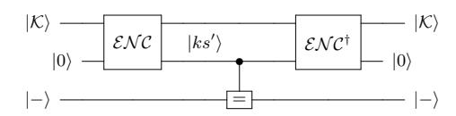
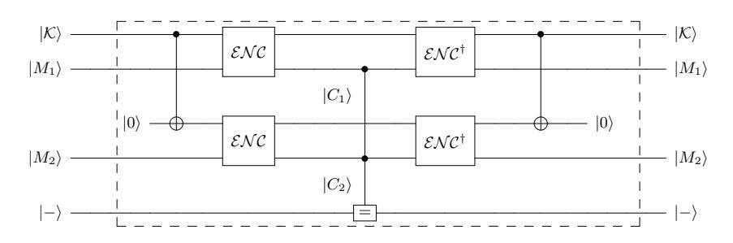
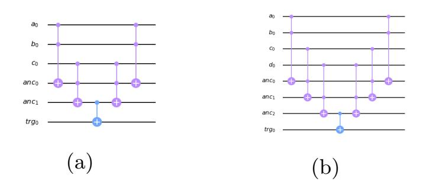

{0}------------------------------------------------

# <span id="page-0-0"></span>Resource Estimation of Grovers-kind Quantum Cryptanalysis against FSR based Symmetric Ciphers

Ravi Anand<sup>1</sup> , Subhamoy Maitra<sup>2</sup> , Arpita Maitra<sup>3</sup> , Chandra Sekhar Mukherjee<sup>2</sup> , Sourav Mukhopadhyay<sup>1</sup> .

1 Indian Institute of Technology Kharagpur, West Bengal, India (ravianandsps@gmail.com, msourav@gmail.com) 2 Indian Statistical Institute Kolkata, West Bengal, India (subho@isical.ac.in, chandrasekhar.mukherjee07@gmail.com)

<sup>3</sup> TCG CREST, Kolkata, West Bengal, India (arpita76b@gmail.com)

Abstract. In this paper, we present a detailed study of the cost of the quantum key search attack using Grover. We consider the popular Feedback Shift Register (FSR) based ciphers Grain-128-AEAD, TinyJAMBU, LIZARD, and Grain-v1 considering the NIST's MAXDEPTH depth restriction. We design reversible quantum circuits for these ciphers and also provide the QISKIT implementations for estimating gate counts. Our results show that cryptanalysis is possible with gates count less than 2<sup>170</sup> . In this direction, we also study the scenario where initial keystreams may be discarded before using it for encryption so that the Grovers attack on key search becomes costly in terms of circuit repetition. Finally, we connect Grover with BSW sampling for stream ciphers with low sampling resistance. We implement this attack on LIZARD (secret key size of 120 bits, state 121 bits, and security equivalent to 80 bits) and successfully recover the internal states with 2<sup>40</sup>.<sup>5</sup> queries to the cryptographic oracle and 2<sup>40</sup> amount of data. Our results provide a clear view of the exact status of quantum cryptanalysis against FSR based symmetric ciphers.

## 1 Introduction

In recent times there has been an extensive study on the impact of Grover's search algorithm [\[7\]](#page-26-0) on block ciphers, especially on AES [\[5,](#page-26-1) [6,](#page-26-2) [13,](#page-27-0) [19\]](#page-27-1). Bernstein presented an attack on the McEliece system and showed that quantum information-set-decoding attacks are asymptotically much faster than non-quantum information-set-decoding attacks [\[2\]](#page-26-3). At the same time, there are many results on symmetric ciphers in the quantum framework suggests that analyzing the ciphers using Grover for the post-quantum world is necessary. Some of the existing works have shown that classically secure ciphers can be broken with quantum algorithms [\[12,](#page-27-2) [14,](#page-27-3) [15,](#page-27-4) [17,](#page-27-5) [18\]](#page-27-6). Some works also show that the quantum algorithm can be used to speed up classical attacks [\[11,](#page-26-4) [16,](#page-27-7) [26\]](#page-28-0).

However, there has been no detailed previous study to evaluate the security of stream ciphers in the quantum framework. Wu, in his thesis [\[29\]](#page-28-1), commented 

{1}------------------------------------------------

that: "The threat of Grover's algorithm on stream ciphers can be simply eliminated by doubling the key size". Though doubling the key length seems to be a good solution, a more accurate analysis is called for. The structure of a stream cipher is different from block ciphers and so requires a different analysis in the quantum framework. As a starting point in this work, we present the application of Grover's algorithm for key search on FSR based ciphers. The ciphers Grain-128-AEAD and TinyJAMBU are Round 2 candidates of NISTs Lightweight Crypto Standardization [\[22\]](#page-27-8). We further show how BSW sampling [\[3,](#page-26-5) [4\]](#page-26-6) of keystream with Grover can be used to recover the state of small state ciphers with time complexity far less than the exhaustive search. We demonstrate this showing the state of LIZARD can be recovered in time less than the application of Grover itself. So just doubling the key size, in this case, might not be a suitable option when the state size is restricted. This attack will be devastating for those ciphers which have small states size compared to the key size and has low sampling resistance.

Since quantum computers are still in a primary stage, it is difficult to decide the exact cost for each gate. Most of the previous works had focused on reducing the number of T gates and the number of qubits in their circuit construction. This work is more inclined towards reducing the depth and the number of quantum gates used in the circuit to study the security of a cipher under NISTs MAXDEPTH constraint [\[23,](#page-27-9) Page 16-18] at the cost of a few qubits. All the circuits described in this work were designed in QISKIT [\[24\]](#page-27-10) and the cost estimates were also done in the same tool. This allows us to obtain precise resource estimates automatically from the circuit descriptions. The source code for all the circuits described in this work will be released soon.

Although a quantum circuit with more than 32 qubits cannot be simulated in QISKIT, we can in fact check the code correctness using classical programming languages. The functionality of the circuits corresponding to the ciphers are such that if the input to circuit is an element of computational basis string (which is essentially a binary string) then the state of the qubits in the circuit always remains in some computational basis state. That is, starting from a computational basis state, the quantum circuit designed for these ciphers acts like a classical circuit and this can be utilized to verify the correctness of the circuit.

Contribution and Organization We mainly focus on FSR based stream ciphers but have included TinyJAMBU because its state gets updated by a non-linear feedback shift register and so a similar technique could be used to construct its circuit. The main contributions of this work are as follows.

- In Section [3,](#page-7-0) we have presented reversible quantum circuits for Grain-128- AEAD, TinyJAMBU, LIZARD, and Grain-v1 and applied Grover's search algorithm for key recovery on these ciphers. We estimate the cost of applying Grover for key recovery in [Table 3](#page-20-0) and then estimate it under the NISTs MAXDEPTH constraint in [Table 4.](#page-21-0) We find that the ciphers Grain-128-AEAD and TinyJAMBU can be considered vulnerable with an attack with gate count complexity 1.569 · 2 <sup>123</sup> and 1.155 · 2 <sup>125</sup>, respectively, with 

{2}------------------------------------------------

MAXDEPTH = 2<sup>40</sup> (see Subsection [2.5](#page-6-0) for definition of vulnerable). As an immediate corollary of these results, we provide a bound on the keystream bits that should be discarded before using them for encryption so that Grover for key recovery might not be effective. For this, we make the following assumptions: the cipher (FSR based stream cipher) is resistant to slide attack (different key/IV pairs should not be easily found that generate shifted keystream) and the feedback/output functions cannot be changed.

- In Section [4,](#page-22-0) we show that using proper sampling of the keystream and Grover's algorithm, states of LFSR based stream ciphers can be recovered in time less than Grover's search complexity in the quantum paradigm. We show significantly low complexity in attacking LIZARD and for the comparison, we also present the corresponding results against Grain-v1. The complexities are presented in [Table 5.](#page-24-0)

## 2 Preliminaries

In this section, we describe about how to apply the Grover's search algorithm for key recovery on stream ciphers. We then give an overview of the circuit for Grover's oracle to be used for key search.

## <span id="page-2-0"></span>2.1 Stream cipher key recovery using Grover

Let for any key K = {0, 1} <sup>k</sup> and IV IV = {0, 1} <sup>m</sup>, SK,IV = ks, we denote the keystream generated by the stream cipher as S. For a given keystream of length ρ we can apply Grover's search for key recovery as follows:

1. Construct a Boolean function f which takes K, IV as input and satisfies

$$f(K) = \begin{cases} 1 & \text{if } S_{K,IV} = ks \\ 0 & \text{otherwise} \end{cases}$$

2. Initialize the system by making a superposition of all possible keys with same amplitude

$$|\mathcal{K}\rangle = \frac{1}{2^{K/2}} \sum_{j=0}^{2^K - 1} |K_j\rangle.$$

- (a) For any state |K<sup>j</sup> i in the superposition |Ki, rotate the phase by π radians if f(K<sup>j</sup> ) = 1 and leave the system unaltered otherwise.
- (b) Apply the diffusion operator.
- 3. Iterate 2(a),(b) for O(2K/<sup>2</sup> ) times.
- 4. Measure the system and observe the state K = K<sup>0</sup> with probability atleast ( 1 2 ), where K<sup>0</sup> is the secret key.

{3}------------------------------------------------

In most cases it is considered that the IV is known to the adversary so the first step can be modified so that the function f takes only K as input and satisfies f(K) = 1, if  $S_K$  generates the given keystream ks.

Also, to apply Grover's algorithm on TinyJAMBU (a block cipher) the first step is modified so that for a given plaintext-ciphertext pair (M, C) encrypted with key K, we construct f such that it satisfies f(K) = 1 if  $\mathcal{S}_K(M) = C$ .

## 2.2 Uniqueness of the recovered key

It is possible that there exists other keys which generates the same keystream (or in case of TinyJambu (block cipher) encrypt the known plaintexts to the same ciphertexts). So, to increase the success probability of the attack we will need extend the search to more keystream bits (plaintext-ciphertext pairs). Interestingly, the corresponding increase in the circuit size is different for block Ciphers and stream ciphers.

Let us first discuss the scenario for a block cipher. We assume a block cipher that has been initialized with a key K of size k and has a block size of k bits to be a pseudo random permutation (PRP)  $C_K : \{0,1\}^k \to \{0,1\}^k$  that takes a message M of size k bit and outputs a cipher text of the same size. Then if we generate t-blocks of cipher-text corresponding to a message, then we have the following collision probability

$$\Pr_{K \neq K'} \Big( C_K(M_1) || C_K(M_2) \dots || C_K(M_t) = \\
C'_K(M_1) || C'_K(M_2) \dots || C'_K(M_t) \Big) \approx 2^k - 1 \prod_{i=1}^t \frac{1}{2^k - i - 1}.$$

Even if we set t=2 then we have a negligibly low probability of collision  $\mathcal{O}\left(2^{-k}\right)$ . However, note that in this case we need to evaluate the cipher to generate 2k bits of cipher text in each application of the Grover oracle which adds to the circuit size.

In this regard, an adversary can get an advantage in terms of the circuit size when applying Grover's oracle for stream ciphers. Suppose a stream cipher has a key of size k bits. Then we can design the following function  $\hat{C}_{\rho}(K):\{0,1\}^k \to \{0,1\}^{\rho}$  which takes in the key K and outputs  $\rho$  bits of keystream. Then we can safely assume

$$\Pr_{K \neq K'} \left( \hat{C}_{\rho}(K) = \hat{C}_{\rho}(K') \right) \approx \frac{2^k - 1}{2^{\rho}}.$$

Even if we set  $\rho = k + c$  for some constant c, the collision probability is approximately  $\mathcal{O}(2^{-c})$ . Then even for c = 10 we have a very low probability of collision and thus less false positive. But in this case there is an advantage in terms of the circuit size as we can design the Grover oracle to only generate k + c bits of keystream each round.

{4}------------------------------------------------

#### 2.3 Grover's oracle

As explained above to implement the Grover's search algorithm we need to design an oracle that generates  $\rho$ -bit keystreams under the same key and then computes a Boolean value which determines if the resulting keystream is equal to the given available keystream. The target qubit will be flipped if the keystreams match. This is called Grover's oracle.

The construction of oralce for the stream ciphers and TinyJAMBU is slightly different and we discuss these constructions in detail below.

Grover's oracle for the stream ciphers To construct the oracle for the stream ciphers we construct the circuit for the cipher which generates  $\rho = k + c = (k+10)$ -bit long keystream and then this keystream is matched with the given keystream. Denote this circuit as  $\mathcal{ENC}$ . The target qubit will be flipped if the keystreams match. The construction of such an oracle is given in Figure 1.



<span id="page-4-0"></span>Fig. 1: Grover oracle for stream ciphers. The (=) operator compares the output of the  $\mathcal{ENC}$  with the given keystreams and flips the target qubit if they are equal.

Grover's oracle for TinyJAMBU Consider that we are given two plaintext-ciphertext pairs  $(M_1, C_1), (M_2, C_2)$ . The oracle is then constructed so that the given plaintexts are encrypted under the same key and then computes a Boolean value which determines if all the resulting ciphertexts are equal to the given available ciphertexts. This can be done by running two encryption circuits in parallel and then the resultant ciphertexts are compared with the given cipertexts. The target qubit will be flipped if the ciphertexts match. In Figure 2, the construction of such an oracle is given for r = 2.

<span id="page-4-1"></span>

Fig. 2: Grover oracle using two blocks. The (=) operator compares the output of the  $\mathcal{ENC}$  with the given ciphertexts and flips the target qubit if they are equal.

{5}------------------------------------------------

### 2.4 Circuit design and resource estimation

The circuits described in this work operates on qubits and are composed of commonly used universal fault-tolerant gate set Clifford (NOT and CNOT) + T gates. These gates allow us to fully simulate the circuits classically. In this work the only source of T gates are the Toffoli gates used in the construction of the circuits.

The NOT gate, also known as flip gate, maps |0i → |1i or |1i → |0i. The CNOT (or controlled-X) gate can be described as the gate that maps |a, bi → |a, a ⊕ bi. The Toffoli gate can be described as the gate which maps |a, b, ci → |a, b, c ⊕ abi.

Resource estimation We construct reversible circuits for implementation of all the ciphers. We then provide the resource estimates for these construction in terms of number of qubits, Toffoli gates, CNOT gates and NOT gates and the depth of the circuit in Table [1.](#page-20-1)

We have assumed full parallelism while constructing the circuits, i.e., any number of gates can be applied in the circuit simultaneously if these gates act on disjoint set of qubits. These circuits were implemented in QISKIT and this compiler allows us to compute the depth of the circuit automatically. It has been generally observed that the depth of two circuits applied in series is less than or equal to the sum of the depth of the individual circuits.

It has generally been assumed that the logical T gate is significantly more expensive than Clifford group gates on the surface code and so while estimating the resources we provide the costs for T gates only as well as the cost of circuit considering all gates equally. While computing the T-depth of a circuit, we assume that all gates have a depth of 0 except the T gate, which is assigned a depth of 1 and for the full depth we assign a depth of 1 to all the gates.

We decompose the Toffoli gates into the set of Clifford+T gates using the decomposition provided by [\[1\]](#page-26-7) that requires 7 T gates and 8 Clifford gates, a T depth of 4 and total depth 8.

We estimate the cost of constructing the Grover's oracle in terms of number of Clifford and T gates, T depth and the full depth (D). The number of Clifford gates required for the oracle of stream ciphers is the number of the Clifford gates required for the cipher instances used in the oracle. In case of TinyJAMBU the number of Clifford gates required for the oracle is the sum of the Clifford gates required for the cipher instances used in the oracle and 2 · k CNOT gates required to make the input key available to the cipher instances. Since EN C† , are constructed by uncomputing EN C respectively, so the total number of Clifford gates is computed as

1. for the stream ciphers

<span id="page-5-1"></span><span id="page-5-0"></span>
$$2 \cdot \# \text{ Clifford gates for } \{(\mathcal{ENC})\}\$$
 (1)

2. for TinyJAMBU

$$2 \cdot k + 4 \cdot \# \text{ Clifford gates for } \{(\mathcal{ENC})\}\$$
 (2)

{6}------------------------------------------------

Now in case of the stream ciphers, the grover oracle consists of comparing ρ = k + c bits of keystream, which can be done using (k + c)-controlled CNOT gates.

For a block cipher, the grover oracle consists of comparing the k-bit outputs of the r cipher instances with the given k-bit keystreams. This can be done using (k ·r)-controlled CNOT gates (we neglect some NOT gates which depend on the given ciphertexts). Following [\[28\]](#page-28-2), we estimate the number of T gates required to implement a t-fold controlled CNOT gates as (32 · t − 84). Since we have assumed r = 2 and c = 10, where k is the keysize, so the total number of T gates is computed as

1. for the stream ciphers

<span id="page-6-1"></span>
$$(32 \cdot (k+10) - 84) + 2 \cdot \# T \text{ gates for } \{(\mathcal{ENC})\}$$
 (3)

2. for TinyJAMBU

<span id="page-6-2"></span>
$$(32 \cdot (k \cdot 2) - 84) + 4 \cdot \# T \text{ gates for } \{(\mathcal{ENC})\}$$
 (4)

To estimate the full depth and the T-depth we only consider the depths of the cipher instances. Since we have assumed full parallelism, it can be seen in Figure [2](#page-4-1) that both cipher instances can be implemented simultaneously as they use disjoint set of qubits, and so for both oracles we have

<span id="page-6-3"></span>the depth of the oracle = 
$$2 \cdot (Depth \text{ of } \mathcal{ENC})$$
 (5)

These estimates are presented in Table [2.](#page-20-2)

The cost of running the complete Grover's key search algorithm can be computed by iterating the oracle b π 4 2 k/2 c times, where k is the key size and is presented in Table [3.](#page-20-0)

### <span id="page-6-0"></span>2.5 Definition of VULNERABLE for some plausible value of MAXDEPTH

In this work we assume that an adversary is bounded by a constraint on the depth of the circuit that (s)he can use for Grover. NIST suggests a parameter MAXDEPTH as such a bound and the plausible values range from 2<sup>40</sup> to 2<sup>96</sup> . We impose a bound of 2<sup>40</sup> in this work.

The idea of proposing that a cipher, which can be attacked with a gate count 2<sup>130</sup> for MAXDEPTH=2<sup>40</sup> is VULNERABLE, was influenced due to the following observations: From [\[23\]](#page-27-9)

1. In, Page 16, it is stated: "In particular, NIST will define a separate category for each of the following security requirements (listed in order of increasing strength): 1) Any attack that breaks the relevant security definition must require computational resources comparable to or greater than those required for key search on a block cipher with a 128-bit key (e.g. AES128). "

{7}------------------------------------------------

2. In Page 18, it is stated: "NIST provides the estimates for optimal key recovery for AES128 as  $2^{170}/\text{MAXDEPTH}$ ."

So, for a MAXDEPTH of  $2^{40}$ , a cipher can be considered VULNERABLE if there exists any attack with gate count  $< 2^{130}$  for ciphers with key size 128.

## <span id="page-7-0"></span>3 Estimating Resources for applying Grover on Grain-128-AEAD, TinyJAMBU, LIZARD, and Grain-v1

In this section, we briefly describe the construction of ciphers Grain-128-AEAD, TinyJAMBU, LIZARD, and Grain-v1. For detailed description the readers are referred to [8–10,27]. Then we provide a detailed description of how to construct a reversible quantum circuit for these ciphers.

Remark 1. Since the structure of Grain-128-AEAD and Grain-v1 are similar so the circuit of Grain-v1 is described in Appendix B.

<span id="page-7-1"></span>**Proposition 1** Consider a FSR of size n, denote its content as  $S = [s_0, s_1, \dots, s_{n-1}]$  and let  $f_i$  be the feedback value at  $i^{th}$  clocking. Then at the  $i^{th}$  clocking the state gets updated as:

for 
$$0 \le j \le (n-2)$$
:  $s_j = s_{j+1}$   
 $s_{n-1} = f_i$ 

Then we can see that after n clockings we have  $s_0 = f_0, s_1 = f_1, \dots, s_{n-1} = f_{n-1}$ 

The ciphers Grain-128-AEAD and TinyJAMBU use 128-bit FSRs and so we can use Proposition 1 to construct compact circuits for these ciphers. Similarly the circuit for Grain-v1 and LIZARD can be constructed. These circuits then reduce the numbers of qubits (width of the circuit) and gates used and in this way reduce the depth of the circuit finally.

#### 3.1 Brief Summary of Grain-128-AEAD

Grain-128-AEAD [9] is a lightweight stream cipher with state of size 256 bits, supports a fixed-length nonce (IV) of size 96 bits and a fixed-length key of size 128 bits. The cipher is constructed using a 128-bit LFSR, a 128-bit NFSR and a pre-output function. Let  $S_t = [s_0^t, s_1^t, \ldots, s_{127}^t]$  denote the contents of the LFSR and  $B_t = [b_0^t, b_1^t, \ldots, b_{127}^t]$  that of the NFSR.

The corresponding update function of the LFSR is given by

$$f(S_t) = s_{127}^{t+1} = s_0^t + s_7^t + s_{38}^t + s_{70}^t + s_{81}^t + s_{96}^t$$

The corresponding update function of the NFSR is given by

$$g(B_t) = b_{127}^{t+1} = s_0^t + b_0^t + b_{26}^t + b_{56}^t + b_{91}^t + b_{96}^t + b_3^t b_{67}^t$$

{8}------------------------------------------------

$$+ b_{11}^t b_{13}^t + b_{17}^t b_{18}^t + b_{27}^t b_{59}^t + b_{40}^t b_{48}^t \\ + b_{61}^t b_{675}^t + b_{68}^t b_{84}^t + b_{22}^t b_{24}^t b_{25}^t + b_{70}^t b_{78}^t b_{82}^t \\ + b_{88}^t b_{92}^t b_{93}^t b_{95}^t$$

The pre-output function is given by

$$y_t = b_{12}^t s_8^t + s_{13}^t s_{20}^t + b_{95}^t s_{42}^t + s_{60}^t s_{79}^t + b_{12}^t s_{95}^t s_{94}^t + s_{93}^t + b_{2}^t + b_{15}^t + b_{36}^t + b_{45}^t + b_{64}^t + b_{73}^t + b_{89}^t$$

Let the key bits be denoted as  $k_i, 0 \le i \le 127$  and the IV bits be denoted as  $iv_i, 0 \le i \le 95$ . Then the internal state of the cipher is initialized by the following steps:

- 1. The 128-bit NFSR is loaded with the key,  $b_i^0 = k_i, 0 \le i \le 127$ . The first 96 bits of the LFSR is loaded with the IV bits,  $s_i^0 = iv_i, 0 \le i \le 95$  and the last 32 bits are filled with 31 ones and one 0,  $s_i^0 = 1, 96 \le i \le 126, s_{127}^0 = 0$ .
- 2. The cipher is clocked 256 times feeding back the pre-output function and XORing it with the input to both the registers.,

$$s_{127}^{t+1} = f(S_t) + y_t, 0 \le 255,$$
  
$$b_{127}^{t+1} = g(B_t) + y_t, 0 \le 255$$

3. Then the key is simultaneously shifted into the LFSR,  $s_{127}^{t+1} = f(S_t) + k_{t-256}, 256 \le 383$ , and the NFSR is updated as  $b_{127}^{t+1} = g(B_t), 256 \le 383$ .

After initialization the output of the pre-output function is used to generate the keystream  $z_i$ . The keystream is generated as  $z_i = y_{384+2i}$ .

#### 3.2 Circuit for Grain-128-AEAD

In Grain-128-AEAD, the state is of size 256-bits and the length of key is 128, so we require 256 qubits for the state and 128 qubits for the key. At any time t, the update function of LFSR  $f(S_t)$  can be implemented as described in Algorithm 1:

#### **Algorithm 1** Implementing $f(S_t)$

```
1: procedure f(S_t)
2: for i = 7, 38, 70, 81, 96 do
```

3: CNOT  $(s_{(i+t)\%128}, s_{t\%128})$ 

 $\triangleright$  %128 is due to Prop. 1

4: end for

5: end procedure

**Proposition 2** The quantum circuit to implement  $f(S_t)$  once requires 5 CNOT gates.

{9}------------------------------------------------

The circuit for constructing update function of the NFSR, g(Bt) is described in Algorithm [2](#page-0-0)

## Algorithm 2 Implementing g(Bt)

```
1: procedure g(Bt)
2: CNOT (s(t)%128, bt%128)
3: for i = 26, 56, 91, 96 do
4: CNOT (b(i+t)%128, bt%128)
5: end for
6: l = [3, 11, 17, 27, 40, 61, 68]
7: m = [67, 13, 18, 59, 48, 65, 84]
8: for i ← 0, 6 do
9: Toffoli (b(l[i]+t)%128, b(m[i]+t)%128, bt%128)
10: end for
11: toffoli3(b(22+t)%128, b(24+t)%128, b(25+t)%128,
              ge00, ge01, bt%128)
12: toffoli3(b(70+t)%128, b(78+t)%128, b(82+t)%128,
              ge10, ge11, bt%128)
13: toffoli4(b(82+t)%128, b(92+t)%128, b(93+t)%128,
              b(95+t)%128, ge20, ge21, ge22, bt%128)
14: end procedure
where ge0i, ge1i, ge2i are ancillae
```

<span id="page-9-0"></span>The functions toffoli3 and toffoli4 used above are compute-copy-uncompute method for implementing Toffoli gates on 3 and 4 qubits respectively. These functions are described in [Figure 3a](#page-9-0) and [Figure 3b](#page-9-0) respectively.



Fig. 3: The circuit for (a) toffoli3. (b) toffoli4

Proposition 3 The quantum circuit to implement g(Bt) once requires requires (5 + 2 + 1) = 8 CNOT gates, (7 + 2 ∗ 4 + 6) = 21 Toffoli gates and requires 7 ancillae.

The pre-output function y(t) can be implemented as described in Algorithm [3:](#page-0-0)

{10}------------------------------------------------

### Algorithm 3 Implementing y(t)

```
1: procedure y(t)
2: l = [12, 13, 95, 60], m = [8, 20, 42, 79]
3: for i ← 0, 3 do
4: Toffoli (b(l[i]+t)%128, s(m[i]+t)%128, yt)
5: end for
6: toffoli3(b(12+t)%128, b(95+t)%128, s(94+t)%128,
             ye0, ye1, yt)
7: CNOT (s(93+t)%128, yt)
8: for i = 2, 15, 36, 45, 64, 73, 89 do
9: CNOT (b(i+t)%128, yt)
10: end for
11: end procedure
where yei are ancillae
```

Proposition 4 The quantum circuit to implement y(t) once requires requires 8 + 1 = 9 CNOT gates and 4 + 4 = 8 Toffoli gates and requires 2 ancillae.

Now, using Algorithms [1, 2,](#page-0-0) and [3,](#page-0-0) we can construct the circuit for full Grain-128-AEAD. The complete Grain-128-AEAD can be divided into two phases: the initialization phase and the key generation phase. The circuit for initialization phase is constructed as described in Algorithm [4.](#page-0-0)

Proposition 5 The key-iv loading procedure requires 128 CNOT gates and a maximum of 96 + 31 = 127 NOT gates (the maximum number of 1 0 s IV can have is 96). Mixing the state 256 times requires 2 ∗ 128 ∗ (5 + 8 + 9) = 5632 CNOT gates and 2 ∗ 128 ∗ (21+ 8) = 7424 Toffoli gates and loading the key again into the LFSR requires 128∗(8+1+5) = 1792 CNOT gates and 128∗(21) = 2688 Toffoli gates.

In the keystream generation phase we generate 128 keystream bits for which we require to clock the cipher 256 times. The keystream is stored in the qubits yt,(0 ≤ t ≤ 127). This phase can be implemented in Algorithm [5.](#page-0-0)

Proposition 6 The keystream generation phase requires 2 ∗ 128 ∗ (5 + 8 + 9) = 5632 CNOT gates and 2 ∗ 128 ∗ (21 + 8) = 7424 Toffoli gates to generate 128 keystream bits.

So, the complete circuit for Grain-128-AEAD to be used in the Grover oracle can be constructed by implementing Algorithms [4](#page-0-0) and [5](#page-0-0) simultaneously.

#### 3.3 Brief Summary of TinyJAMBU

TinyJAMBU [\[27\]](#page-28-3) is a lightweight 128-bit keyed permutation, P<sup>n</sup> with no key schedule. This keyed permutation supports three possible key sizes: 128-bits, 192-bits and 256-bits. The permutation P<sup>n</sup> consists of n rounds and in the i th

{11}------------------------------------------------

#### Algorithm 4 Quantum circuit of initialization phase of Grain-128-AEAD

```
1: procedure key-iv loading
2: for i ← 0, 127 do
3: CNOT (ki, bi)
4: end for
5: for i ← 0, 95 do
6: if ivi == 1 then
7: NOT (si)
8: end if
9: end for
10: for i ← 96, 127 do
11: NOT (si)
12: end for
13: end procedure
14: procedure mixing the state
15: for j ← 0, 1 do
16: for i ← 0, 127 do
17: Implement y(t) as in Algorithm 3 replacing
           yt by s(0+t)%128
18: Implement g(Bt) as in Algorithm 2
19: Implement f(St) as in Algorithm 1
20: end for
21: end for
22: end procedure
23: procedure key loading
24: for i ← 0, 127 do
25: Implement g(Bt) as in Algorithm 2
26: CNOT (ki, si)
27: Implement f(St) as in Algorithm 1
28: end for
29: end procedure
```

## Algorithm 5 Quantum circuit of keystream generation phase of Grain-128- AEAD

```
1: procedure Key Generation
2: for j ← 0, 1 do
3: for i ← 0, 127 do
4: Implement y(t) as in Algorithm 3
5: Implement g(Bt) as in Algorithm 2
6: Implement f(St) as in Algorithm 1
7: end for
8: end for
9: end procedure
```

{12}------------------------------------------------

round the state is updated using the following 128-bit nonlinear feedback shift register:

```
StateUpdate(S, K, i) :
     feedback = s0 ⊕ s47 ⊕ (∼ (s70&s85)) ⊕ s91 ⊕ ki mod k
     for j from 0 to 126: sj = sj+1
     s127 = feedback
 end
                                                                   (6)
```

where k = {128, 192, 256} is the key length.

The initialization phase has two steps: key setup and nonce setup. In key setup phase the initial state (which is all zero state) is updated using the permutation Pr1, where r1 = {1024, 1152, 1280} for klen = {128, 192, 256} respectively. The nonce step consists of three steps. In each step the F ramebits = 1 are XORed with the state and then the state is updated using P<sup>384</sup> and then 32-bits of the nonce is XORed with the state.

Next the associated data, ad, is processed. In each step F ramebits = 3 are XORed with the state and then the state is updated using P<sup>384</sup> and then 32-bits of the ad is XORed with the state.

In the encryption phase the plaintext m is encrypted. In each step F ramebits = 5 are XORed with the state and then the state is updated using Pr<sup>1</sup> and then 32-bits of the m is XORed with the state 32 bits the ciphertext is obtained by XORing the plaintext with another part of the state.

### 3.4 Circuit for TinyJAMBU

In TinyJAMBU the state is updated using the permutation P<sup>n</sup> as described in Eqn [6.](#page-12-0) This permutation P<sup>n</sup> can be implemented as a quantum circuit as described in Algorithm [6.](#page-0-0)

Proposition 7 The quantum circuit for permutation P<sup>n</sup> of n rounds requires (n/128) ∗ 512 = 4n CNOT gates and (n/128) ∗ 256 = 2n Toffoli gates.

Now we show the implementation of the three steps (for the cipher with key size = 128, implementations for other key sizes is similar) in Algorithm [7.](#page-0-0) We need 128 qubits for the state all initialized to 0, 128 qubits for the keys and 1 ancilla initialized to 1 required for the implementation of Pn. For our work we assume associated data of length 96-bits. There is no restriction, by the authors, on the length of associated data to be used for the cipher, so we assume an associated data of length equal to that of NONCE should be sufficient.

Proposition 8 The quantum circuit for key setup of TinyJAMBU requires 4 ∗ 1024 = 4096 CNOT gates and 2 ∗ 1024 = 2048 Toffoli gates and the nonce setup requires 3 ∗ 4 ∗ 384 = 4608 CNOT gates, 3 ∗ 2 ∗ 384 = 2304 Toffoli gates and a maximum of 3 + 96 = 99 NOT gates. The circuit to process the associated

{13}------------------------------------------------

## **Algorithm 6** Quantum circuit of permutation $P_n$

```
1: procedure Permutation P_n
        for j \leftarrow 0, (\frac{n}{128}) do
 2:
 3:
             for i \leftarrow 0, 127 do
 4:
                 CNOT (k_{((128*j+i)\%klen)}, s_{(0+i)\%128})
                                                                            \triangleright %128 is due to Prop. 1
                 CNOT (s_{(47+i)\%128}, s_{(0+i)\%128})
 5:
                 Toffoli (s_{(70+i)\%128}, s_{(85+i)\%128}, anc_0)
 6:
 7:
                 CNOT (anc_0, s_{(0+i)\%128})
                 Toffoli (s_{(70+i)\%128}, s_{(85+i)\%128}, anc_0)
 8:
                 CNOT (s_{(91+i)\%128}, s_{(0+i)\%128})
9:
10:
             end for
11:
         end for
12: end procedure
```

where  $anc_0$  is the ancilla and its value is initialized to 1,  $anc_0 = 1$  and is returned to its value 1 after each iteration so that it can be used in the next iteration.

data requires 3\*4\*384 = 4608 CNOT gates, 3\*2\*384 = 2304 Toffoli gates and a maximum of 6+96 = 102 NOT gates. The encryption of 128 bits of plaintext requires 4\*4\*1024 + 4\*32 + 4\*32 = 16640 CNOT gates, 4\*2\*1024 = 8192 Toffoli gates and 4\*2 = 8 NOT gates.

## 3.5 Description of LIZARD

LIZARD has a 121-bit state and supports 120-bit key and 64-bit IV. The 121-bit inner state of LIZARD is divided into two NFSRs namely NFSR1 and NFSR2. At any time t, the first NFSR, NFSR1 is denoted by  $(S_{(0+t)}, \ldots, S_{(30+t)})$  and the second NFSR, NFSR2 by  $(B_{(0+t)}, \ldots, B_{(89+t)})$ .

NFSR1 is of 31 bit size and the update function is defined as:

```
S_{(31+t)} = S_{(0+t)} \oplus S_{(2+t)} \oplus S_{(5+t)} \oplus S_{(6+t)} \oplus S_{(15+t)} \\ \oplus S_{(17+t)} \oplus S_{(18+t)} \oplus S_{(20+t)} \oplus S_{(25+t)} \\ \oplus S_{(8+t)} S_{(18+t)} \oplus S_{(8+t)} S_{(20+t)} \oplus S_{(12+t)} S_{(21+t)} \\ \oplus S_{(14+t)} S_{(19+t)} \oplus S_{(17+t)} S_{(21+t)} \oplus S_{(20+t)} S_{(22+t)} \\ \oplus S_{(4+t)} S_{(12+t)} S_{(22+t)} \oplus S_{(4+t)} S_{(19+t)} S_{(22+t)} \\ \oplus S_{(7+t)} S_{(20+t)} S_{(21+t)} \oplus S_{(8+t)} S_{(18+t)} S_{(22+t)} \\ \oplus S_{(8+t)} S_{(20+t)} S_{(22+t)} \oplus S_{(12+t)} S_{(19+t)} S_{(22+t)} \\ \oplus S_{(20+t)} S_{(21+t)} S_{(22+t)} \oplus S_{(4+t)} S_{(7+t)} S_{(12+t)} \\ S_{(21+t)} \oplus S_{(4+t)} S_{(7+t)} S_{(19+t)} S_{(21+t)} \oplus S_{(4+t)} \\ S_{(22+t)} \oplus S_{(7+t)} S_{(8+t)} S_{(18+t)} S_{(21+t)} \oplus S_{(7+t)} \\ S_{(8+t)} S_{(20+t)} S_{(21+t)} \oplus S_{(7+t)} S_{(12+t)} S_{(19+t)} \\ S_{(21+t)} \oplus S_{(8+t)} S_{(18+t)} S_{(21+t)} S_{(22+t)} \oplus S_{(8+t)} \\ S_{(20+t)} S_{(21+t)} S_{(22+t)} \oplus S_{(12+t)} S_{(22+t)} \oplus S_{(8+t)} \\ S_{(20+t)} S_{(21+t)} S_{(22+t)} \oplus S_{(12+t)} S_{(21+t)} \oplus S_{(8+t)} \\ S_{(20+t)} S_{(21+t)} S_{(22+t)} \oplus S_{(12+t)} S_{(19+t)} S_{(21+t)}
```

{14}------------------------------------------------

#### Algorithm 7 Quantum circuit for complete TinyJAMBU

```
1: procedure key setup
2: Update the state using P1024
3: end procedure
4: procedure nonce setup
5: for i ← 0, 2 do
6: NOT (s36)
7: Update the state using P384
8: for j ← 0, 31 do
9: if nonce(32i+j) == 1 then
10: NOT (sj+96)
11: end if
12: end for
13: end for
14: end procedure
15: procedure Processing Associated Data
16: for i ← 0, 2 do
17: NOT (s36), NOT (s37)
18: Update the state using P384
19: for j ← 0, 31 do
20: if ad(32i+j) == 1 then
21: NOT (sj+96)
22: end if
23: end for
24: end for
25: end procedure
26: procedure Encryption
27: for j ← 0, 3 do
28: NOT (s36), NOT (s38)
29: Update the state using P1024
30: for i ← 0, 31 do
31: CNOT (pt32∗j+i, s96+i)
32: end for
33: for i ← 0, 31 do
34: CNOT (s64+i, pt32∗j+i)
35: end for
36: end for
37: end procedure
```

{15}------------------------------------------------

$$S_{(22+t)} \tag{7}$$

The second register NFSR2 is of 90 bit and the update function is defined as:

$$B_{(89+t)} = S_{(0+t)} \oplus B_{(0+t)} \oplus B_{(24+t)} \oplus B_{(49+t)} \oplus B_{(79+t)}$$

$$\oplus B_{(84+t)} \oplus B_{(3+t)} B_{(59+t)} \oplus B_{(10+t)} B_{(12+t)}$$

$$\oplus B_{(15+t)} B_{(16+t)} \oplus B_{(25+t)} B_{(53+t)} \oplus B_{(35+t)}$$

$$B_{(42+t)} \oplus B_{(55+t)} B_{(58+t)} \oplus B_{(60+t)} B_{(74+t)}$$

$$\oplus B_{(20+t)} B_{(22+t)} B_{(23+t)} \oplus B_{(62+t)} B_{(68+t)} B_{(72+t)}$$

$$\oplus B_{(77+t)} B_{(80+t)} B_{(81+t)} B_{(83+t)}$$

$$(8)$$

The output bit z<sup>t</sup> is a function from {0, 1} <sup>53</sup> to {0, 1}. For round t,

$$z_t = \mathcal{L}_t \oplus \mathcal{Q}_t \oplus \mathcal{T}_t \oplus \overline{\mathcal{T}}_t \tag{9}$$

where:

$$\mathcal{L}_{t} = B_{(7+t)} \oplus B_{(11+t)} \oplus B_{(30+t)} \oplus B_{(40+t)} \oplus B_{(45+t)}$$
$$\oplus B_{(54+t)} \oplus B_{(71+t)}$$
(10)

$$Q_{t} = B_{(4+t)}B_{(21+t)} \oplus B_{(9+t)}B_{(52+t)} \oplus B_{(18+t)}B_{(37+t)}$$

$$\oplus B_{(44+t)}B_{(76+t)}$$
(11)

$$\mathcal{T}_{t} = B_{(5+t)} \oplus B_{(8+t)} B_{(82+t)} \oplus B_{(34+t)} B_{(67+t)} B_{(73+t)} \\
\oplus B_{(2+t)} B_{(28+t)} B_{(41+t)} B_{(65+t)} \\
\oplus B_{(13+t)} B_{(29+t)} B_{(50+t)} B_{(64+t)} B_{(75+t)} \oplus B_{(6+t)} \\
B_{(14+t)} B_{(26+t)} B_{(32+t)} B_{(47+t)} B_{(61+t)} \oplus B_{(1+t)} \\
B_{(19+t)} B_{(27+t)} B_{(43+t)} B_{(57+t)} B_{(66+t)} B_{(78+t)} \tag{12}$$

$$\overline{\mathcal{T}}_t = S_{(23+t)} \oplus S_{(3+t)} S_{(16+t)} \oplus S_{(9+t)} S_{(13+t)} B_{(48+t)}$$

$$\oplus S_{(1+t)} S_{(24+t)} B_{(38+t)} B_{(63+t)}$$
(13)

The state initialization process is divided into 4 phases.

Phase 1: Key and IV Loading:

Let K = (K0, . . . , K119) be the 120-bit key and IV = (IV0, . . . , IV63) the 64-bit public IV. The state is initialized as follows:

$$B_j^0 = \begin{cases} K_j \oplus IV_j, & \text{for } 0 \le j \le 63 \\ K_j, & \text{for } 64 \le j \le 89 \end{cases}$$

$$S_j^0 = \begin{cases} K_{(j+90)}, & \text{for } 0 \le j \le 28 \\ K_{119} \oplus 1, & \text{for } j = 29 \\ 1 & \text{for } j = 30 \end{cases}$$

{16}------------------------------------------------

Phase 2: Grain-like Mixing:

In this phase the output bit  $z_i$  is fed back into both NFSRs for  $0 \le t \le 127$ . This type of approach is used in Grain family.

Phase 3: Second Key Addition:

In this phase, the 120-bit key is XORed to both NFSRs as follows:

$$B_j^{129} = B_j^{128} \oplus K_j$$
, for  $0 \le j \le 89$ 

$$S_j^{129} = \begin{cases} S_j^{128} \oplus K_{(j+90)}, & \text{for } 0 \le j \le 29\\ 1, & \text{for } j = 30 \end{cases}$$

Phase 4: Final Diffusion:

This phase is exactly similar to phase 2 except  $z_t$  is not fed back into the NFSRs. In this phase, one has to run both NFSRs 128 rounds. So after this phase, registers are  $(S_0^{257}, \ldots, S_{30}^{257})$  and  $(B_0^{257}, \ldots, B_{89}^{257})$ . Now Lizard is ready to produce output key stream bits.

## 3.6 Quantum Circuit for LIZARD

The state size of LIZARD is 121, so we need 121 qubits for the state, 31 for NFSR1 (denoted as n1) and 90 for NFSR2 (denoted as n2). The key size is 120 and the key is used twice in the state initialization phase so we need 120 qubits for keys. For complete description of the cipher the readers are referred to [10]. We first describe the implementation of the feedback functions of the two ciphers and the output function in Algorithm 8. The gates toffoli3,toffoli4,toffoli5,toffoli6 and toffoli7 can be constructed following the circuits described in Figure 3 and  $anc[i], 0 \le i \le 9$  are ancillae.

**Proposition 9** The circuit to implement the feedback function of NFSR1 requires 35 CNOT gates, 17 Toffoli gates and 4 NOT gates, that of NFSR2 requires 8 CNOT gates and 21 Toffoli gates and output function requires 16 CNOT gates and 56 Toffoli gates.

Using the procedures defined in Algorithm 8 the circuit for full LIZARD can be constructed as described below:

- Circuit for Phase 1: The state is initialized by the values of key and IV by using CNOT gates to copy the values of key to the state and then adequate number of NOT gates to initialize the state with IV bits. So in this step we require 120 CNOT gates and a maximum of 66 NOT gates, considering that IV is all 1's.
- Circuit for Phase 2: This phase mixes the state in the same way as Grain family of ciphers, so we can construct the circuit for this phase as described for Grain-128-AEAD for 128 rounds. This phase requires 7808 CNOT gates, 12032 Toffoli gates and 512 NOT gates.

{17}------------------------------------------------

#### Algorithm 8 Quantum circuit for the update and output function of LIZARD

```
1: procedure update function of NFSR1 at any time t
2: for i = 2, 5, 6, 15, 17, 18, 20, 25 do
3: CNOT (n1[(i + t)%31], n1[(t)%31])
4: end for
5: Toffoli (n1[(14 + t)%31], n1[(19 + t)%31], anc[0])
6: Toffoli (n1[(17 + t)%31], n1[(21 + t)%31], anc[0])
7: CNOT (anc[0], n1[(0 + t)%31])
8: Toffoli (n1[(17 + t)%31], n1[(21 + t)%31], anc[0])
9: Toffoli (n1[(14 + t)%31], n1[(19 + t)%31], anc[0])
10: CNOT (n1[(21 + t)%31], anc[1])
11: NOT (anc[1])
12: Toffoli (n1[(20 + t)%31], n1[(22 + t)%31], anc[1])
13: CNOT (anc[1], n1[(0 + t)%31])
14: Toffoli (n1[(20 + t)%31], n1[(22 + t)%31], anc[1])
15: NOT (anc[1])
16: l = [21, 4, 19], m = [1, 3, 3]
17: for i ← 0, 2 do
18: CNOT (n1[(l[i] + t)%31], anc[m[i]])
19: end for
20: CNOT (anc[3], anc[2])
21: Toffoli (n1[(12 + t)%31], n1[(22 + t)%31], anc[2])
```

- Circuit for Phase 3: In this phase the key is XORed into the state which can be implemented using the CNOT gates. So, this step requires 120 CNOT gates and 1 NOT gates
- Circuit for Phase 4: This final phase is similar to Phase 2 with the exception that the feedback is discarded. This phase requires 7552 CNOT gates, 12032 Toffoli gates and 512 NOT gates.
- Circuit for key generation: This step is same as Phase 4, where the keystream are stored instead of discarding it. This phase requires 7552 CNOT gates, 12032 Toffoli gates and 512 NOT gates.

## 3.7 Resource Estimation

Cost of implementing the ciphers We estimate the cost of the stream ciphers when the cipher produces k+c-bit keystream, where k is the key size and c = 10, and the cost of implementing TinyJAMBU when it encrypts 128 bits of plaintext with 96 bits of nonce and associated data each. In our estimates we assume that the nonce and the associated data is known. Table [1](#page-20-1) gives the cost estimates of implementing the ciphers.

Cost of Grover Oracle Using Eqn [1](#page-5-0)[,2,](#page-5-1)[3,](#page-6-1)[4,](#page-6-2)[5](#page-6-3) the cost estimates for all ciphers are presented in Table [2](#page-20-2)

{18}------------------------------------------------

```
22: CNOT (anc[2], n1[(0 + t)%31])
23: Toffoli (n1[(12 + t)%31], n1[(22 + t)%31], anc[2])
24: CNOT (anc[3], anc[2])
25: CNOT (n1[(7 + t)%31], anc[4])
26: CNOT (n1[(22 + t)%31], anc[4])
27: Toffoli (anc[3], anc[4], anc[5])
28: NOT (anc[5])
29: Toffoli (n1[(12 + t)%31], n1[(21 + t)%31], anc[5])
30: CNOT (anc[5], n1[(0 + t)%31])
31: Toffoli (n1[(12 + t)%31], n1[(21 + t)%31], anc[5])
32: NOT (anc[5])
33: Toffoli (anc[3], anc[4], anc[5])
34: l = [22, 7, 19, 4, 18, 20], m = [4, 4, 3, 3, 6, 6]
35: for i ← 0, 5 do
36: CNOT (n1[(l[i] + t)%31], anc[m[i]])
37: end for
38: Toffoli (n1[(8 + t)%31], anc[6], anc[7])
39: CNOT (anc[7], n1[(0 + t)%31])
40: CNOT (n1[(7 + t)%31], anc[8])
41: CNOT (n1[(22 + t)%31], anc[8])
42: Toffoli (n1[(21 + t)%31], anc[8], anc[9])
43: CNOT (n1[(22 + t)%31], anc[9])
44: Toffoli (anc[9], anc[7], n1[(0 + t)%31])
45: CNOT (n1[(22 + t)%31], anc[9])
46: Toffoli (n1[(21 + t)%31], anc[8], anc[9])
47: CNOT (n1[(22 + t)%31], anc[8])
48: CNOT (n1[(7 + t)%31], anc[8])
49: Toffoli (n1[(8 + t)%31], anc[6], anc[7])
50: CNOT (n1[(20 + t)%31], anc[6])
51: CNOT (n1[(18 + t)%31], anc[6])
52: end procedure
53: procedure update function of NFSR2 at any time t
54: for i = 24, 49, 79, 84 do
55: CNOT ((n2[(i + t)%90], n2[(t)%90])
56: end for
57: l = [3, 10, 15, 25, 35, 55, 60]
58: m = [59, 12, 16, 53, 42, 58, 74]
59: for i ← 0, 6 do
60: Toffoli ((n2[(l[i] + t)%90], n2[(m[i] + t)%90],
             n2[(t)%90])
61: end for
62: toffoli3(n2[(20 + t)%90], n2[(22 + t)%90],
             n2[(23 + t)%90], n2[(t)%90])
```

{19}------------------------------------------------

```
63: toffoli3(n2[(62 + t)%90], n2[(68 + t)%90],
             n2[(78 + t)%90], n2[(t)%90])
64: toffoli4(n2[(77 + t)%90], n2[(80 + t)%90],
             n2[(81 + t)%90], n2[(83 + t)%90],
             n2[(t)%90])
65: end procedure
66: procedure output function at any time t
67: for i = 7, 11, 30, 40, 45, 54, 71, 5 do
68: CNOT ((n2[(i + t)%90], y[t])
69: end for
70: l = [4, 9, 18, 44, 8], m = [21, 52, 37, 76, 82]
71: for i ← 0, 4 do
72: Toffoli (n2[(l[i] + t)%90],
             n2[(m[i] + t)%90], y[t])
73: end for
74: toffoli3(n2[(34 + t)%90], n2[(67 + t)%90],
             n2[(73 + t)%90], y[t])
75: toffoli4(n2[(2 + t)%90], n2[(28 + t)%90],
             n2[(41 + t)%90], n2[(65 + t)%90], y[t])
76: toffoli5(n2[(13 + t)%90], n2[(29 + t)%90],
             n2[(50 + t)%90], n2[(64 + t)%90],
             n2[(75 + t)%90], y[t])
77: toffoli6(n2[(6 + t)%90], n2[(14 + t)%90],
             n2[(26 + t)%90], n2[(32 + t)%90],
             n2[(47 + t)%90], n2[(61 + t)%90], y[t])
78: toffoli7(n2[(1 + t)%90], n2[(19 + t)%90],
             n2[(27 + t)%90], n2[(43 + t)%90],
             n2[(57 + t)%90], n2[(66 + t)%90],
             n2[(78 + t)%90], y[t])
79: CNOT ((n1[(23 + t)%31], y[t])
80: Toffoli (n1[(3 + t)%31], n1[(16 + t)%31], y[t])
81: toffoli3(n1[(9 + t)%31], n1[(13 + t)%31],
             n1[(48 + t)%31], y[t])
82: toffoli4(n1[(1 + t)%31], n1[(24 + t)%31],
             n2[(38 + t)%90], n2[(63 + t)%90], y[t])
83: end procedure
```

{20}------------------------------------------------

Table 1: Cost of implementing the ciphers

<span id="page-20-1"></span>

| 20020 21 0000              | op    |        | , <u>I</u> - |       |          |
|----------------------------|-------|--------|--------------|-------|----------|
| ciphers                    | # NOT | # CNOT | # Toffoli    | depth | # qubits |
| Grain-128-AEAD $(k = 128)$ | 127   | 13624  | 18116        | 13068 | 531      |
| TinyJAMBU $(k = 128)$      | 209   | 29824  | 14848        | 22274 | 385      |
| TinyJAMBU $(k = 192)$      | 209   | 32384  | 16128        | 24194 | 449      |
| TinyJAMBU $(k = 256)$      | 209   | 34944  | 17408        | 26114 | 513      |
| LIZARD (k = 120/80)        | 1611  | 23014  | 36284        | 33354 | 392      |
| Grain-v1 (k = 80)          | 580   | 10830  | 15500        | 13031 | 346      |

Table 2: Cost of Grover oracle

<span id="page-20-2"></span>

| cipher                                  | # Clifford gates | # T gates | T-depth | full depth | # qubits |
|-----------------------------------------|------------------|-----------|---------|------------|----------|
| Grain-128-AEAD                          | 317358           | 257956    | 144928  | 151902     | 532      |
| TinyJAMBU $(k = 128)$                   | 595524           | 423852    | 118784  | 252418     | 771      |
| TinyJAMBU $(k = 192)$                   | 646852           | 463788    | 129024  | 274178     | 899      |
| TinyJAMBU $(k = 256)$                   | 698180           | 503724    | 139264  | 295938     | 1027     |
| $\overline{\text{LIZARD} (k = 120/80)}$ | 629794           | 512052    | 290272  | 421986     | 393      |
| Grain-v1 $(k = 80)$                     | 270820           | 219796    | 124000  | 149772     | 347      |

Cost of exhaustive key search Using the estimates in Table 2 of the Grover oracle for the various variants, we provide the cost estimates for the full exhaustive key search Table 3. We consider  $\lfloor \frac{\pi}{4} 2^{k/2} \rfloor$  iterations of the Grover oracle, where k is the key size. The gate cost G is the sum of the Clifford gates and T gates.

<span id="page-20-0"></span>Table 3: Cost estimates of Grover's algorithm with  $\lfloor \frac{\pi}{4} 2^{k/2} \rfloor$  oracle iterations, i.e., multiplication of the values in Table 2 by  $\lfloor \frac{\pi}{4} 2^{k/2} \rfloor$ .

| z = z = z               |                      |                       |                      |                       |                       |          |  |
|-------------------------|----------------------|-----------------------|----------------------|-----------------------|-----------------------|----------|--|
| cipher                  | # Clifford gates     | ı —                   | \ /                  | _                     | Full depth $(D)$      | # qubits |  |
| Grain-128-AEAD          |                      | $1.546 \cdot 2^{81}$  |                      | $1.737 \cdot 2^{80}$  |                       | 523      |  |
| TinyJAMBU $(k = 128)$   |                      | $1.270 \cdot 2^{82}$  | $1.527 \cdot 2^{83}$ | $1.424 \cdot 2^{80}$  |                       | 771      |  |
| TinyJAMBU ( $k = 192$ ) |                      | $1.390 \cdot 2^{114}$ |                      | $1.546 \cdot 2^{112}$ |                       | 889      |  |
| TinyJAMBU $(k = 256)$   |                      | $1.509 \cdot 2^{146}$ |                      | $1.669 \cdot 2^{144}$ | $1.774 \cdot 2^{145}$ | 1027     |  |
| LIZARD $(k = 120/80)$   | $1.887 \cdot 2^{78}$ | $1.534 \cdot 2^{78}$  | $1.711 \cdot 2^{79}$ | $1.739 \cdot 2^{77}$  | $1.264 \cdot 2^{78}$  | 393      |  |
| Grain-v1 $(k = 80)$     | $1.623 \cdot 2^{57}$ | $1.317 \cdot 2^{57}$  | $1.470 \cdot 2^{58}$ | $1.486 \cdot 2^{56}$  | $1.795 \cdot 2^{55}$  | 347      |  |

#### <span id="page-20-3"></span>3.8 Cost of Grover search under NISTs MAXDEPTH limit

NIST provides a table with gate cost estimates depending on the depth bound MAXDEPTH. The security strength categories 1,3 and 5 are defined by the resources needed for key search on AES-128,-192 and -256 respectively. These estimates are deduced as follows:

Let the circuit for a non-parallel Grover search require a depth of  $D=d\cdot \text{MAXDEPTH}$  , for some  $d\geq 1$  and have a total of G gates.

{21}------------------------------------------------

Then for a quantum attack to fit within the MAXDEPTH constraint while attaining the same success probability, about  $d^2$  machines are needed where each machine run for a fraction 1/d of the time and uses almost G/d gates.

So, the total gate count for a parallelized Grover search is approximately  $(G/d) \cdot d^2 = G \frac{D}{\text{MAXDEPTH}}$ .

The cost estimates provided by NIST is deduced from the results in [6]. In Table 4 we provide the gate counts for Grover search on both the ciphers under the constraint of MAXDEPTH.

<span id="page-21-0"></span>Table 4: Cost of Grover search on the ciphers under MAXDEPTH, the final column provides the product of the gate counts in each cell by MAXDEPTH. Note that \* denotes a special case as the attack doesnot require any parallelization and the approximation underestimates the cost.

| ind the approximation underestimates the cost. |                |                       |                        |                        |                       |  |  |
|------------------------------------------------|----------------|-----------------------|------------------------|------------------------|-----------------------|--|--|
| k                                              |                | $MAXDEPTH = 2^{40}$   |                        | $MAXDEPTH = 2^{96}$    |                       |  |  |
|                                                | NIST [23]      | $2^{130}$             | $2^{106}$              | $2^{74}$               | $2^{170}$             |  |  |
| 128                                            | Grain-128-AEAD | $1.569 \cdot 2^{123}$ | $1.569 \cdot 2^{99}$   |                        | $1.569 \cdot 2^{163}$ |  |  |
| 120                                            | TinyJAMBU      | $1.155 \cdot 2^{125}$ | $1.155 \cdot 2^{101}$  |                        | $1.155 \cdot 2^{165}$ |  |  |
|                                                | AES [13]       | $1.07\cdot 2^{117}$   | $1.07 \cdot 2^{93}$    | $1.34 \cdot 2^{83^*}$  | $\approx 2^{157}$     |  |  |
|                                                | NIST [23]      | $2^{193}$             | $2^{169}$              | $2^{137}$              | $2^{233}$             |  |  |
| 192                                            | TinyJAMBU      | $1.367 \cdot 2^{189}$ | $1.367 \cdot 2^{165}$  |                        | $1.367 \cdot 2^{229}$ |  |  |
|                                                | AES [13]       | $1.09\cdot 2^{181}$   | $1.09\cdot 2^{157}$    | $1.09 \cdot 2^{126}$   | $\approx 2^{221}$     |  |  |
|                                                | NIST [23]      | $2^{258}$             | $2^{234}$              | $2^{202}$              | $2^{298}$             |  |  |
| 256                                            | TinyJAMBU      | $1.596 \cdot 2^{253}$ | $1.596 \cdot 2^{229}$  |                        | $1.596 \cdot 2^{293}$ |  |  |
|                                                | AES [13]       | $1.39 \cdot 2^{245}$  | $1.39 \cdot 2^{221}$   | $1.39 \cdot 2^{190}$   | $\approx 2^{285}$     |  |  |
| 120/80                                         | LIZARD         | $1.081 \cdot 2^{118}$ | $1.081\cdot 2^{94}$    | $1.711 \cdot 2^{79}^*$ | $1.081 \cdot 2^{158}$ |  |  |
|                                                |                | _                     |                        |                        | _                     |  |  |
| 80                                             | Grain-v1       | $1.319 \cdot 2^{75}$  | $1.470 \cdot 2^{58}$ * | $1.470 \cdot 2^{58}$ * | $1.319 \cdot 2^{115}$ |  |  |

Table 4 shows that the ciphers Grain-128-AEAD and TinyJAMBU can be considered broken by an attack with gate count  $1.569 \cdot 2^{123}$  and  $1.155 \cdot 2^{125}$ , respectively, in depth MAXDEPTH =  $2^{40}$ . Also, LIZARD provides a better security when compared to Grain-v1 in providing a 80-bit key security. However, in Section 4, we will show how LIZARD can be cryptanalyzed with much less complexity when we exploit the BSW sampling and Grover together.

#### 3.9 Throwing away initial keystreams increases circuit complexity

Most stream ciphers generally have two phases: the state initialization phase and the keystream generation phase. Consider that the circuit for a stream cipher is constructed so that we can carry out the state initialization phase completely and let it require  $C_{init}$  Clifford gates,  $T_{init}$  T-gates and  $Q_{init}$  qubits. Also, let generation of one keystream bit require  $C_{str}$  Clifford gates,  $T_{str}$  T-gates and  $Q_{str}$  qubits, then generating  $\rho$  keystream bits will require  $\rho \cdot C_{str}$  Clifford gates,  $\rho \cdot T_{str}$  T-gates and  $\rho \cdot Q_{str}$  qubits.

Let us assume that the keystream available to us was generated after certain rounds, say  $\gamma$ , of key generation phase. In this case the resources required would

{22}------------------------------------------------

be  $2c \cdot 2^{\frac{k}{2}} \cdot (C_{init} + (\gamma + \rho) \cdot C_{str})$  Clifford gates,  $2c \cdot 2^{\frac{k}{2}} \cdot (T_{init} + (\gamma + \rho) \cdot T_{str})$  T-gates and  $Q_{init} + (\gamma + \rho) \cdot Q_{str}$  qubits, where  $c = \frac{\pi}{4}$ , k is the key size and un-computations add a factor of 2 in each Grover iteration.

Let us assume that a quantum attack on the cipher is said to be successful if it requires  $C_q$  Clifford gates,  $T_q$  T-gates and  $Q_q$  qubits, then we must have

$$\alpha \cdot (C_{init} + (\gamma + \rho) \cdot C_{str}) \leq C_{q}$$

$$\alpha \cdot (T_{init} + (\gamma + \rho) \cdot T_{str}) \leq T_{q}$$

$$(Q_{init} + (\gamma + \rho) \cdot Q_{str}) \leq Q_{q}$$

$$\Rightarrow \gamma \leq \{\min\{\frac{(C_{q}/\alpha) - C_{init}}{C_{str}}, \frac{(T_{q}/\alpha) - T_{init}}{T_{str}}, \frac{Q_{q} - Q_{init}}{Q_{str}}\} - \rho\}$$

$$(14)$$

for a fixed  $\rho$ , where  $\alpha = 2c \cdot 2^{\frac{k}{2}}$ .

Corollary 1. If we have a standard value for  $C_q$ ,  $T_q$  and  $Q_q$ , then for a cipher to be resistant to Grover search algorithm it must satisfy

$$\gamma > \{ \min\{\frac{(C_q/\alpha) - C_{init}}{C_{str}}, \frac{(T_q/\alpha) - T_{init}}{T_{str}}, \frac{Q_q - Q_{init}}{Q_{str}} \} - \rho \}$$

If we consider the bound of  $2^{170}$  to be the standard parameter to measure the security of a cipher in the post-quantum framework and make the following assumptions: the cipher (FSR based stream cipher) is resistant to slide attack (different key/iv pairs should not be easily found that generate shifted key-stream) and the feedback/output functions cannot be changed, then we have the following results:

- 1. Grain-128-AEAD will be secure form the Grover's key search algorithm if the first  $2^{27}$  keystreams are not used for encryption
- 2. For TinyJAMBU (with 128-bit key) to be secure, the keyed permutation  $P_{1024}$  have to be replaced by  $P_{23040}$  and  $P_{384}$  by  $P_{8192}$  (this is one of the minimum values which can be used to replace, for example  $P_{384}$  could be replaced by a higher value and corresponding change made to  $P_{1024}$ ).
- 3. LIZARD cannot be secure as one key/IV pair can be used to produce only  $2^{18}$  bits of keystream and we will need to throw away atleast  $2^{45}$  bits of keystream
- 4. To make Grain-v1 secure we will need to run the key generation phase at least  $2^{58}$  times before using the keystream for encryption.

## <span id="page-22-0"></span>4 Grover with BSW sampling for state recovery

In this section we implement Grover with BSW sampling of keystream to recover the state of a cipher.

{23}------------------------------------------------

Consider a cipher with state size n, i.e., the total search space is N = 2n. We then try to deduce some bits from the secret state by fixing certain key stream bit pattern. So, fixing

- τ bits of the state to a specific pattern
- assuming a specific pattern of ψ keystream bits, and
- assigning values to the rest of the n − τ − ψ state bits

we try to deduce ψ bits of the state. The total search space now reduces to N<sup>0</sup> = 2n−τ−ψ. So, if Grover is applied on this reduced search space the time complexity reduces. We implement this attack on LIZARD and Grain-v1.

The results of sampling presented in [\[21\]](#page-27-11) is used for LIZARD and the results in [\[25\]](#page-27-12) is used for Grain-v1.

## 4.1 Implementation of the attack

For a quantum adversary we assume that he has a knowledge of τ and ψ of the cipher. Then he can apply Grover to recover the state as follows:

- 1. Take a quantum register containing n qubits. Initialize the τ qubits to the given specific pattern using adequate number of NOT gates (for example if the pattern is 000 · · · 011 then we require two NOT gates).
- 2. Implement the circuit to obtain values of the ψ qubits. Each of these ψ bits are recovered using an equation which involves the fixed bits and few guessed bits. These equations can be implemented as circuits and then integrated in the complete circuit of the cipher to be used in Grover oracle.
- 3. Construct a Boolean function f which takes a quantum register S of length (n − τ − ψ) as input and satisfies

$$f(S) = \begin{cases} 1 & \text{if } ks_q = ks_c \\ 0 & \text{otherwise} \end{cases}$$

where ks<sup>q</sup> is the output of the Grover oracle and ks<sup>c</sup> is the keystream available to us. The size of ksq(ksc) depends on the cipher as described in [2.1.](#page-2-0) We only run the Grover's algorithm when a specific ψ bit pattern is found in the key stream.

4. Initialize the system by making a superposition of all possible 2n−τ−ψstates with same amplitude

$$|\mathcal{S}\rangle = \frac{1}{2^{S/2}} \sum_{j=0}^{2^{S}-1} |S_{j}\rangle.$$

- (a) For any state |S<sup>j</sup> i in the superposition |Si, rotate the phase by π radians if f(S<sup>j</sup> ) = 1 and leave the system unaltered otherwise.
- (b) Apply the diffusion operator.
- 5. Iterate 2(a),(b) for O(2(n−τ−ψ)/<sup>2</sup> ) times.
- 6. Measure the system and observe the state S = S<sup>0</sup> with probability atleast ( 1 2 ), where S<sup>0</sup> is the secret key.

{24}------------------------------------------------

#### 4.2 Complexity Analysis

If we consider that querying the cryptographic oracle requires one unit of time, then from Step 5, we see that the time complexity of this attack is  $T=2^{\frac{(n-\tau-\psi)}{2}}$ . Under this assumption the complexity of applying this attack on LIZARD and Grain-v1 is given in Table 5 where T is the number of times the attack queries the cryptographic oracle and D is the amount of data required for the attack to be successful.

The probability of getting a  $\psi$ -bit keystream is  $\frac{1}{2^{\psi}}$ . Also once we obtain a  $n-\psi-\tau$  bit state we try to recover the complete n-bit state by computing the remaining  $\tau$  state bits. Now,  $\tau$  bits of the actual state may not be of the pattern as decided during the preparation of the equations. Thus, obtaining the correct state has a probability of  $\frac{1}{2^{\tau}}$ . Hence, to make the attack successful, the data complexity will be  $D=2^{\psi+\tau}$ .

<span id="page-24-0"></span>Table 5: Grover with BSW sampling on LIZARD and Grain-v1 for state recovery

| Ciphers  | $\overline{\text{Key Size }(k)}$ | State Size $(n)$ | $\psi + \tau$ | Time $(T)$ | Data (D) |
|----------|----------------------------------|------------------|---------------|------------|----------|
| LIZARD   | 120                              | 121              | 40            | $2^{40.5}$ | $2^{40}$ |
| Grain-v1 | 80                               | 160              | 53            | $2^{53.5}$ | $2^{53}$ |

We can see in Table 5 that this attack is more efficient on ciphers with small state size compared to the key size. One solution to this might be increasing  $\psi + \tau$ , i.e. recovering more state bits by fixing more state bits will reduce the time complexity of the attack, but while computing the complexity of an attack we consider the maximum of time and data complexity. So the data should bounded by time i.e.,  $D \leq T$ , which gives  $(\psi + \tau) \leq \frac{(n - \tau - \psi)}{2} \Longrightarrow 3(\psi + \tau) \leq n$ , where n is the state size. So, the parameters obtained in Table 5 is the best parameters for these ciphers.

LIZARD claims a 60-bit security on state recovery. A conditional TMDTO on LIZARD by [21] recovers the state in online time  $2^{54}$ , so the time complexity obtained here is the least.

#### 4.3 Estimating resources required for the attack

Here we estimates the resources required to implement the above described attack on LIZARD and Grain-v1. The estimates are given in Table 6.

For this attack we modify the circuit of the cipher to only run the key generation phase. Let the cost of generating k bits of keystream required for the attack be called keystream generation cost.

The oracle is constructed as described in Figure 2 with  $\mathcal{ENC}$  representing a cipher running only the keystream generation phase. The oracle cost estimates the cost of constructing the Grover oracle for running two cipher instances.

{25}------------------------------------------------

The state recovery cost estimates the cost of iterating the Grover's search algorithm on the above described oracle  $2^{\frac{(n-\tau-\psi)}{2}}$  times.

Table 6: Cost of implementing the attack

<span id="page-25-0"></span>

|                            |          |                      | 0                    |                      |                        |     |
|----------------------------|----------|----------------------|----------------------|----------------------|------------------------|-----|
| Costs                      | Cipher   | # Clifford gates     |                      | -                    |                        |     |
| Uzovetroom conoration coet | LIZARD   |                      | $1.205 \cdot 2^{16}$ |                      |                        |     |
|                            | Grain-v1 |                      | $1.060 \cdot 2^{15}$ | $1.211 \cdot 2^{14}$ | $ 1.468 \cdot 2^{14} $ | 256 |
| Oracle cost                | LIZARD   |                      | $1.239 \cdot 2^{18}$ |                      |                        |     |
|                            | Grain-v1 |                      | $1.105 \cdot 2^{17}$ |                      |                        |     |
| State recovery cost        | LIZARD   |                      | $1.376 \cdot 2^{58}$ | -                    | 1 1                    |     |
|                            | Grain-v1 | $1.478 \cdot 2^{70}$ | $1.227 \cdot 2^{70}$ | $1.362 \cdot 2^{68}$ | $1.651 \cdot 2^{68}$   | 513 |

Cost of the attack under NISTs MAXDEPTH limit Using the results of Table 6, we estimate the cost of state recovery under NISTs MAXDEPTH constraint in Table 7. The process to estimate this cost is described in 3.8.

<span id="page-25-1"></span>Table 7: Cost of Grover state recovery under MAXDEPTH limit, the final column provides the product of the gate counts in each cell by MAXDEPTH.

| k   |          | $MAXDEPTH = 2^{40}$   | $MAXDEPTH = 2^{64}$  | $MAXDEPTH = 2^{96}$  | G*D                   |
|-----|----------|-----------------------|----------------------|----------------------|-----------------------|
| 120 | LIZARD   | $1.684 \cdot 2^{76}$  | $1.376 \cdot 2^{58}$ | $1.376 \cdot 2^{58}$ | $1.684 \cdot 2^{116}$ |
| 128 | Grain-v1 | $1.116 \cdot 2^{100}$ | $1.116 \cdot 2^{76}$ | $1.227 \cdot 2^{70}$ | $1.116 \cdot 2^{140}$ |

Comparing the results in Table 7 and Table 4, we can see that LIZARD can be attacked by Grover with BSW sampling for state recovery with a much lower quantum gate cost as compared to exhaustive key search using Grover. However for Grain-v1 the Grover's key search attack is more efficient.

### 5 Conclusion

In this work we study quantum cryptanalysis of FSR based symmetric ciphers, along with the FSR based block cipher TinyJAMBU. We construct compact reversible quantum circuits for popular Feedback Shift Register (FSR) based ciphers such as Grain-128-AEAD, TinyJAMBU, LIZARD, and Grain-v1. We study the cost of implementing Grover's key search algorithm on these ciphers under the NISTs MAXDEPTH constraint and find that all these ciphers fail to satisfy the security constraints. We observe that the increase in circuit size to reduce chances of getting a false positive is lesser for symmetric ciphers compared to block ciphers, although the difference is that of a constant factor  $\approx 2$ . We also implement Grover for state recovery in conjunction with BSW sampling and

{26}------------------------------------------------

find that LIZARD can be attacked with a much less gate cost as compared to quantum key search using Grover. Our estimates are not tight as we have used some assumptions and obtaining better gate counts for these circuits remains an intriguing problem. We have tried to optimize the cipher as a whole which ofcourse is not optimal. If each sub-operation is optimized individually then one may achieve better results. Also the use of other decompositions of various gates may result in a lower count of the gates or depth of the circuits. Also future works on various quantum error correcting schemes may provide a significantly optimized results in reality.

## References

- <span id="page-26-7"></span>1. Matthew Amy, Dmitri Maslov, Michele Mosca, and Martin Roetteler. A meet-inthe-middle algorithm for fast synthesis of depth-optimal quantum circuits. IEEE Trans. on CAD of Integrated Circuits and Systems, 32(6):818–830, 2013.
- <span id="page-26-3"></span>2. Daniel J. Bernstein. Grover vs. McEliece. In Nicolas Sendrier, editor, Post-Quantum Cryptography, Third International Workshop, PQCrypto 2010, Darmstadt, Germany, May 25-28, 2010. Proceedings, volume 6061 of Lecture Notes in Computer Science, pages 73–80. Springer, 2010.
- <span id="page-26-5"></span>3. A. Biryukov, A. Shamir, and D. Wagner. Real time cryptanalysis of A5/1 on a PC. In Proc. Int. Workshop Fast Softw. Encryption, 2000, pp. 1?18.
- <span id="page-26-6"></span>4. A. Biryukov and A. Shamir. Cryptanalytic time/memory/data tradeoffs for stream ciphers. In Proc. Int. Conf. Theory Appl. Cryptology Inf. Secur., 2000, pp. 1?13.
- <span id="page-26-1"></span>5. Xavier Bonnetain, Mar´ıa Naya-Plasencia, and Andr´e Schrottenloher. Quantum security analysis of AES. IACR Trans. Symmetric Cryptol., 2019(2):55–93, 2019.
- <span id="page-26-2"></span>6. Markus Grassl, Brandon Langenberg, Martin Roetteler, and Rainer Steinwandt. Applying grover's algorithm to AES: quantum resource estimates. In Tsuyoshi Takagi, editor, Post-Quantum Cryptography - 7th International Workshop, PQCrypto 2016, Fukuoka, Japan, February 24-26, 2016, Proceedings, volume 9606 of Lecture Notes in Computer Science, pages 29–43. Springer, 2016.
- <span id="page-26-0"></span>7. Lov K. Grover. A fast quantum mechanical algorithm for database search. In Gary L. Miller, editor, Proceedings of the Twenty-Eighth Annual ACM Symposium on the Theory of Computing, Philadelphia, Pennsylvania, USA, May 22-24, 1996, pages 212–219. ACM, 1996.
- <span id="page-26-8"></span>8. Martin Hell, Thomas Johansson, and Willi Meier. Grain - a stream cipher for constrained environments. 2005. <http://www.ecrypt.eu.org/stream>.
- <span id="page-26-10"></span>9. Martin Hell, Thomas Johansson, Willi Meier, Jonathan Sonnerup, and Hirotaka Yoshida. Grain-128 aead - a lightweight aead stream cipher. 2019. [https://csrc.nist.gov/CSRC/media/Projects/lightweight-cryptography/](https://csrc.nist.gov/CSRC/media/Projects/lightweight-cryptography/documents/round-2/spec-doc-rnd2/grain-128aead-spec-round2.pdf) [documents/round-2/spec-doc-rnd2/grain-128aead-spec-round2.pdf](https://csrc.nist.gov/CSRC/media/Projects/lightweight-cryptography/documents/round-2/spec-doc-rnd2/grain-128aead-spec-round2.pdf).
- <span id="page-26-9"></span>10. Matthias Hamann, Matthias Krause, and Willi Meier. LIZARD - A lightweight stream cipher for power-constrained devices. IACR Trans. Symmetric Cryptol., 2017(1):45–79, 2017.
- <span id="page-26-4"></span>11. Akinori Hosoyamada and Yu Sasaki. Cryptanalysis against symmetric-key schemes with online classical queries and offline quantum computations. In Nigel P. Smart, editor, Topics in Cryptology - CT-RSA 2018 - The Cryptographers' Track at the RSA Conference 2018, San Francisco, CA, USA, April 16-20, 2018, Proceedings, volume 10808 of Lecture Notes in Computer Science, pages 198–218. Springer, 2018.

{27}------------------------------------------------

- <span id="page-27-2"></span>12. Akinori Hosoyamada and Yu Sasaki. Quantum demiric-sel¸cuk meet-in-the-middle attacks: Applications to 6-round generic feistel constructions. In Dario Catalano and Roberto De Prisco, editors, Security and Cryptography for Networks - 11th International Conference, SCN 2018, Amalfi, Italy, September 5-7, 2018, Proceedings, volume 11035 of Lecture Notes in Computer Science, pages 386–403. Springer, 2018.
- <span id="page-27-0"></span>13. Samuel Jaques, Michael Naehrig, Martin Roetteler, and Fernando Virdia. Implementing grover oracles for quantum key search on AES and lowmc. In Anne Canteaut and Yuval Ishai, editors, Advances in Cryptology - EUROCRYPT 2020 - 39th Annual International Conference on the Theory and Applications of Cryptographic Techniques, Zagreb, Croatia, May 10-14, 2020, Proceedings, Part II, volume 12106 of Lecture Notes in Computer Science, pages 280–310. Springer, 2020.
- <span id="page-27-3"></span>14. Marc Kaplan. Quantum attacks against iterated block ciphers. CoRR, abs/1410.1434, 2014.
- <span id="page-27-4"></span>15. Marc Kaplan, Ga¨etan Leurent, Anthony Leverrier, and Mar´ıa Naya-Plasencia. Breaking symmetric cryptosystems using quantum period finding. In Matthew Robshaw and Jonathan Katz, editors, Advances in Cryptology - CRYPTO 2016 - 36th Annual International Cryptology Conference, Santa Barbara, CA, USA, August 14- 18, 2016, Proceedings, Part II, volume 9815 of Lecture Notes in Computer Science, pages 207–237. Springer, 2016.
- <span id="page-27-7"></span>16. Marc Kaplan, Ga¨etan Leurent, Anthony Leverrier, and Mar´ıa Naya-Plasencia. Quantum differential and linear cryptanalysis. IACR Trans. Symmetric Cryptol., 2016(1):71–94, 2016.
- <span id="page-27-5"></span>17. Hidenori Kuwakado and Masakatu Morii. Security on the quantum-type evenmansour cipher. In Proceedings of the International Symposium on Information Theory and its Applications, ISITA 2012, Honolulu, HI, USA, October 28-31, 2012, pages 312–316. IEEE, 2012.
- <span id="page-27-6"></span>18. Gregor Leander and Alexander May. Grover meets simon - quantumly attacking the FX-construction. In Tsuyoshi Takagi and Thomas Peyrin, editors, Advances in Cryptology - ASIACRYPT 2017 - 23rd International Conference on the Theory and Applications of Cryptology and Information Security, Hong Kong, China, December 3-7, 2017, Proceedings, Part II, volume 10625 of Lecture Notes in Computer Science, pages 161–178. Springer, 2017.
- <span id="page-27-1"></span>19. Brandon Langenberg, Hai Pham, and Rainer Steinwandt. Reducing the cost of implementing AES as a quantum circuit. IACR Cryptol. ePrint Arch., 2019:854, 2019.
- <span id="page-27-13"></span>20. Miodrag J. Mihaljevic, Sugata Gangopadhyay, Goutam Paul, and Hideki Imai. Internal state recovery of grain-v1 employing normality order of the filter function. IET Inf. Secur., 6(2):55–64, 2012.
- <span id="page-27-11"></span>21. Subhamoy Maitra, Nishant Sinha, Akhilesh Siddhanti, Ravi Anand, and Sugata Gangopadhyay. A TMDTO attack against lizard. IEEE Trans. Computers, 67(5):733–739, 2018.
- <span id="page-27-8"></span>22. NIST. Lightweight crypto standardization. [https://csrc.nist.gov/Projects/](https://csrc.nist.gov/Projects/lightweight-cryptography/round-2-candidates) [lightweight-cryptography/round-2-candidates](https://csrc.nist.gov/Projects/lightweight-cryptography/round-2-candidates).
- <span id="page-27-9"></span>23. NIST. Submission requirements and evaluation criteria for the postquantum cryptography standardization process, 2016. [https://csrc.](https://csrc.nist.gov/CSRC/media/Projects/Post-Quantum-Cryptography/documents/call-for-proposals-final-dec-2016.pdf) [nist.gov/CSRC/media/Projects/Post-Quantum-Cryptography/documents/](https://csrc.nist.gov/CSRC/media/Projects/Post-Quantum-Cryptography/documents/call-for-proposals-final-dec-2016.pdf) [call-for-proposals-final-dec-2016.pdf](https://csrc.nist.gov/CSRC/media/Projects/Post-Quantum-Cryptography/documents/call-for-proposals-final-dec-2016.pdf)
- <span id="page-27-10"></span>24. QISKIT. <https://qiskit.org/>.
- <span id="page-27-12"></span>25. Akhilesh Anilkumar Siddhanti, Subhamoy Maitra, and Nishant Sinha. Certain observations on ACORN v3 and grain v1 - implications towards TMDTO attacks. J. Hardw. Syst. Secur., 3(1):64–77, 2019.

{28}------------------------------------------------

- <span id="page-28-0"></span>26. Thomas Santoli and Christian Schaffner. Using simon's algorithm to attack symmetric-key cryptographic primitives. Quantum Inf. Comput., 17(1&2):65–78, 2017.
- <span id="page-28-3"></span>27. Hongjun Wu and Tao Huang. Tinyjambu: A family of lightweight authenticated encryption algorithms. 2019. [https://csrc.nist.gov/CSRC/media/](https://csrc.nist.gov/CSRC/media/Projects/lightweight-cryptography/documents/round-2/spec-doc-rnd2/TinyJAMBU-spec-round2.pdf) [Projects/lightweight-cryptography/documents/round-2/spec-doc-rnd2/](https://csrc.nist.gov/CSRC/media/Projects/lightweight-cryptography/documents/round-2/spec-doc-rnd2/TinyJAMBU-spec-round2.pdf) [TinyJAMBU-spec-round2.pdf](https://csrc.nist.gov/CSRC/media/Projects/lightweight-cryptography/documents/round-2/spec-doc-rnd2/TinyJAMBU-spec-round2.pdf).
- <span id="page-28-2"></span>28. Nathan Wiebe and Martin Roetteler. Quantum arithmetic and numerical analysis using repeat-until-success circuits. Quantum Inf. Comput., 16(1&2):134–178, 2016.
- <span id="page-28-1"></span>29. Hongjun Wu. Cryptanalysis and design of stream ciphers. 2008. [https://www.](https://www.esat.kuleuven.be/cosic/publications/thesis-167.pdf) [esat.kuleuven.be/cosic/publications/thesis-167.pdf](https://www.esat.kuleuven.be/cosic/publications/thesis-167.pdf).

## A Circuits for Equation used for state bits recovery

## A.1 For LIZARD

The equations used for recovery of state bits is given in (Table 4, Appendix, [\[21\]](#page-27-11)). We give here the circuit to recover n1[3] considering that the keystream pattern fixed had the first bit as 0, i.e. z<sup>0</sup> = 0. Even if z<sup>0</sup> = 1, it would not affect the circuit immensely as only addition to the circuit would be NOT gate. The equation to recover n1[3] is

```
n1[3] =z0 ⊕ n2[7] ⊕ n2[30] ⊕ n2[40] ⊕ n2[54] ⊕ n2[71]
        ⊕ n2[44]n2[76] ⊕ n2[34]n2[67]n2[73]
        ⊕ n2[2]n2[28]n2[41]n2[65] ⊕ n1[1]n2[38]n2[63]
```

The circuit for this equation is constructed as described in Algorithm [9.](#page-0-0)A similar approach can be followed to construct the circuit for other equations required for state bits recovery.

#### Algorithm 9 Quantum circuit for recovery of state bit n1[3]

```
1: procedure recovery of state bit n1[3]
2: for i = 7,30,40,54,71,5 do
3: CNOT (n2[i], n1[3])
4: end for
5: toffoli3(n2[34], n2[67], n2[73], n1[3])
6: toffoli4(n2[2], n2[28], n2[41], n2[65], n1[3])
7: toffoli3(n1[1], n2[38], n2[63], n1[3])
8: end procedure
```

#### A.2 For Grain-v1

The equations used for recovery of state bits is given in (Appendix [\[20,](#page-27-13) [25\]](#page-27-12)). We give here the circuit to recover b[10] considering that the keystream pattern fixed 

{29}------------------------------------------------

had the first bit as 0, i.e. z<sup>0</sup> = 0. The equation to recover b<sup>10</sup> is given by

```
b10 = b1 ⊕ b2 ⊕ b4 ⊕ b31 ⊕ b43 ⊕ b56 ⊕ h(s3, s25, s46, s64, b63)
```

The circuit for this equation is constructed as described in Algorithm [10.](#page-0-0) The other equations can be constructed similarly.

### Algorithm 10 Quantum circuit for recovery of state bit b[10]

```
1: procedure recovery of state bit b[10]
2: for i=1,2,4,31,43,56 do
3: Apply CNOT (b[i], b[10])
4: end for
5: Toffoli s[(46)%n], b[(63)%n], ye[0])
6: Toffoli s[(3)%n], s[(46)%n], ye[1])
7: for i = 25, 64 do
8: CNOT (s[i%n], ye[2])
9: end for
10: for i = 3, 46, 64 do
11: CNOT (s[i%n], ye[3])
12: end for
13: Toffoli ye[2], ye[0], s[(0)%n])
14: Toffoli ye[2], ye[1], s[(0)%n])
15: Toffoli ye[3], s[(64)%n], s[(0)%n])
16: NOT (ye[1])
17: CNOT (ye[1], b[10])
18: CNOT (b[(63)%n], b[10])
19: NOT (ye[1])
20: for i = 64, 46, 3 do
21: CNOT (s[i%n], ye[3])
22: end for
23: for i = 64, 25 do
24: CNOT (s[i%n], ye[2])
25: end for
26: Toffoli s[(3)%n], s[(46)%n], ye[1])
27: Toffoli s[(46)%n], b[(63)%n], ye[0])
28: end procedure
```

## <span id="page-29-0"></span>B Brief summary of Grain-v1

Grain-v1 has a 160 bit state and supports 120-bit key and 64-bit IV. The 160 bit state is divided into one LFSR and one NFSR each of 80 bits each. At any time t, let the contents of the LFSR be denoted by (st, s1+t, · · · s79+t) and the contents of NFSR be denoted by bt, b1+t, · · · b79+t.

{30}------------------------------------------------

The update function of LFSR is defined as

$$f(S_t) = s_{t+80} = s_t \oplus s_{t+13} \oplus s_{t+23} \oplus s_{t+38} \oplus s_{t+51} \oplus s_{t+62},$$
(15)

and the update function of the NFSR is defined as

$$g(B_{t}) = b_{t+80} = s_{t} \oplus b_{t+62} \oplus b_{t+60} \oplus b_{t+52} \oplus b_{t+45} \oplus b_{t+37}$$

$$\oplus b_{t+33} \oplus b_{t+28} \oplus b_{t+21} \oplus b_{t+14} \oplus b_{t+9} \oplus b_{t}$$

$$\oplus b_{t+63}b_{t+60} \oplus b_{t+37}b_{t+33} \oplus b_{t+15}b_{t+9}$$

$$\oplus b_{t+60}b_{t+52}b_{t+45} \oplus b_{t+33}b_{t+28}b_{t+21} \oplus b_{t+63}$$

$$b_{t+45}b_{t+28}b_{t+9} \oplus b_{t+60}b_{t+52}b_{t+37}b_{t+33} \oplus b_{t+63}$$

$$b_{t+60}b_{t+21}b_{t+15} \oplus b_{t+63}b_{t+60}b_{t+52}b_{t+45}b_{t+37}$$

$$\oplus b_{t+33}b_{t+28}b_{t+21}b_{t+15}b_{t+9}$$

$$\oplus b_{t+52}b_{t+45}b_{t+37}b_{t+33}b_{t+28}b_{t+21},$$

$$(16)$$

and the output function is defined as

$$z_t = \sum_{k \in \mathcal{A}} b_{t+k} \oplus h(s_{t+3}, s_{t+25}, s_{t+46}, s_{t+64}, b_{t+63})$$
(17)

where A = {1, 2, 4, 10, 31, 43, 56} and h is defined as

$$h(x) = x_1 \oplus x_4 \oplus x_0 x_3 \oplus x_2 x_3 \oplus x_3 x_4 \oplus x_0 x_1 x_2 \oplus x_0 x_2 x_3 \oplus x_0 x_2 x_4 \oplus x_1 x_2 x_4 \oplus x_2 x_3 x_4$$

where x0, x1, x2, x3, x<sup>4</sup> corresponds to st+3, st+25, st+46, st+64, bt+63 respectively.

## B.1 Circuit to implement Grain-v1

In Grain-v1, the state is of size 160-bits and the length of key is 80, so we require 160 qubits for the state and 80 qubits for the key. As a keystream of length 128 is sufficient to obtain a unique key, so we need 128 qubits for the keystream.

Using the Algorithm [11](#page-0-0) the complete circuit for Grain-v1 can be constructed following the process used while constructing Grain-128-AEAD.

{31}------------------------------------------------

#### Algorithm 11 Implementing update function of LFSR

```
1: procedure f(St)(UPDATE FUNCTION OF LFSR AT ANY TIME t)
2: for i = 13, 23, 38, 51, 62 do
3: Apply CNOT (s(i+t)%128, st%128)
4: end for
5: end procedure
6: procedure g(Bt)(UPDATE FUNCTION OF NFSR AT ANY TIME t)
7: Apply CNOT (s(t)%128, bt%128)
8: for i = 9, 14, 21, 28, 33, 37, 45, 52, 60, 63 do
9: CNOT (b(i+t)%128, bt%128)
10: end for
11: for i = 0, 9, 14, 21, 28, 33, 37, 45, 52, 60, 62 do
12: CNOT (s[(i + t)%n], b[(t)%n])
13: end for
14: l = [63, 37, 15], m = [60, 33, 9]
15: for i ← 0, 2 do
16: Toffoli b[(l[i] + t)%n], b[(m[i] + t)%n], b[(t)%n])
17: end for
18: toffoli3(b[(60 + t)%n], b[(52 + t)%n],
             b[(45 + t)%n], ge0[0], ge0[1],
             b[(t)%n])
19: toffoli3(b[(33 + t)%n], b[(28 + t)%n],
             b[(21 + t)%n], ge1[0], ge1[1],
             b[(t)%n])
20: toffoli4(b[(63 + t)%n], b[(45 + t)%n],
             b[(28 + t)%n], b[(9 + t)%n],
             ge2[0], ge2[1], ge2[2], b[(t)%n])
21: toffoli4(b[(60 + t)%n], b[(52 + t)%n],
             b[(37 + t)%n], b[(33 + t)%n],
             ge2[0], ge2[1], ge2[2], b[(t)%n])
22: toffoli4(b[(63 + t)%n], b[(60 + t)%n],
             b[(21 + t)%n], b[(15 + t)%n],
             ge2[0], ge2[1], ge2[2], b[(t)%n])
23: toffoli5(b[(63 + t)%n], b[(60 + t)%n],
             b[(52 + t)%n], b[(45 + t)%n],
             b[(37 + t)%n], b[(t)%n])
24: toffoli5(b[(33 + t)%n], b[(28 + t)%n],
             b[(21 + t)%n], b[(15 + t)%n],
             b[(9 + t)%n], b[(t)%n])
25: toffoli6(b[(52 + t)%n], b[(45 + t)%n],
             b[(37 + t)%n], b[(33 + t)%n],
             b[(28 + t)%n], b[(21 + t)%n], b[(t)%n])
26: end procedure
27: procedure zt(OUTPUT FUNCTION AT ANY TIME t)
28: Toffoli s[(46 + t)%n], b[(63 + t)%n], ye[0])
29: Toffoli s[(3 + t)%n], s[(46 + t)%n], ye[1])
30: for i = 25, 64 do
31: CNOT (s[i%n], ye[2])
32: end for
33: for i = 3, 46, 64 do
34: CNOT (s[i%n], ye[3])
35: end for
36: Toffoli ye[2], ye[0], s[(t)%n])
37: Toffoli ye[2], ye[1], s[(t)%n])
38: Toffoli ye[3], s[(64 + t)%n], s[(t)%n])
39: NOT (ye[1])
40: CNOT (ye[1], z[t])
41: CNOT (b[(63 + t)%n], z[t])
42: NOT (ye[1])
```

{32}------------------------------------------------

```
43: for i = 64, 46, 3 do
44: CNOT (s[i%n], ye[3])
45: end for
46: for i = 64, 25 do
47: CNOT (s[i%n], ye[2])
48: end for
49: Toffoli s[(3 + t)%n], s[(46 + t)%n], ye[1])
50: Toffoli s[(46 + t)%n], b[(63 + t)%n], ye[0])
51: for i=1,2,4,31,43,56 do
52: Apply CNOT (b[i + t], z[t])
53: end for
54: end procedure
```