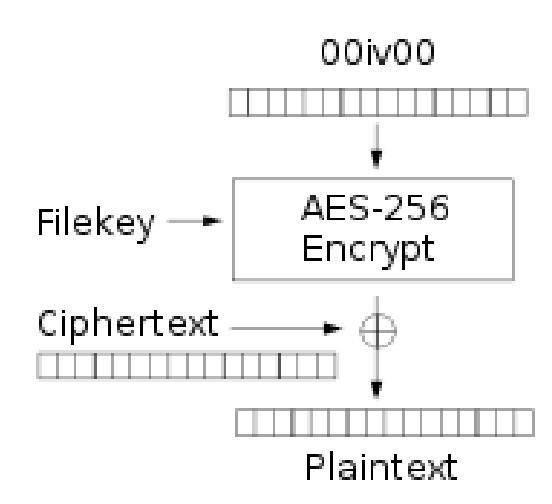

{0}------------------------------------------------

# **Cryptographic Vulnerabilities and Other Shortcomings of the Nextcloud Server Side Encryption as implemented by the Default Encryption Module**

Kevin "Kenny" Niehage *kevin@niehage.name*

# **Abstract**

*Nextcloud provides a server side encryption feature that is implemented by the Default Encryption Module. This paper presents cryptographic vulnerabilities that existed within the Default Encryption Module as well as other shortcomings that still need to be addressed. The vulnerabilities allowed an attacker to break the provided confidentiality and integrity protection guarantees. There is a high risk that ownCloud also contains some of the issues presented in this paper as it still has cryptographic code in common with Nextcloud.*

### **1 Introduction**

Nextcloud is an open-source file hosting software, which is developed by the Nextcloud GmbH. In 2016 it has been forked off ownCloud [\[1](#page-5-0)], which is developed by the ownCloud GmbH.

Nextcloud and ownCloud are deployed in a variety of organizations ranging from small and medium businesses to enterprises, government agencies, schools and universities [[2,](#page-5-3) [3\]](#page-5-2). They are also advertised for use in the healthcare sector [[4](#page-5-1), [5](#page-6-9)].

The server side encryption is a feature that is actively promoted by both companies [[6](#page-6-8), [7](#page-6-7), [8](#page-6-6), [9](#page-6-5), [10](#page-6-4), [11,](#page-6-3) [12\]](#page-6-2) and that is shipped by default. According to the marketing material it *"protects data on storage as long as that storage is not on the same server as [the software] itself."* Furthermore, *"[t]he main usecase of the default encryption module is to protect data stored on remote storage or against a storage administrator checking the content of the files."* Thus, stored files should be protected in a way that prevents external storage providers from decrypting and modifying files.

Nextcloud and ownCloud still have cryptographic code in common, including code that is relevant for the server side encryption. There is a high risk that vulnerabilities and shortcomings presented in this paper also apply to ownCloud.

# **2 Previous Work**

In 2016 Hanno Böck found that ownCloud did not implement an authenticated encryption scheme [[13](#page-6-1)]. As a consequence, the developers of ownCloud implemented the current encryption scheme that will be the subject of this paper.

### **3 Encryption scheme**

This chapter provides a short introduction to the encryption scheme that is implemented by the Default Encryption Module. The description is based on the *Encryption details* document [\[14\]](#page-6-0) that has been provided to the Nextcloud community by the author and that describes the implementation as present at least in the Nextcloud versions 16 up to version 19.

The storage of public and private keys has since been modified in Nextcloud version 20 to mitigate the vulnerabilities presented in chapters 4.1 and 4.3.

#### **3.1 File types**

The Default Encryption Module uses 5 different file types to store most of the relevant information.

**Public keys** are used to encrypt envelope keys. They are stored in *\*.publicKey* files and each file contains a PEM-encoded RSA public key.

**Private keys** are used to decrypt envelope keys. They are stored in *\*.privateKey* files and each file contains a PEM-encoded RSA private key that is encrypted with the master passphrase (stored in the configuration file), a user's passphrase or the optional recovery passphrase. The encrypted private key is prepended with a header and appended with the nonce (called *initialization vector*) used for the encryption, a message authentication code (called *signature*) used to protect the integrity of the encrypted private key and a few padding characters.

{1}------------------------------------------------

**File keys** are used as data encryption keys (DEK) to encrypt files. They are stored in *filekey* files and each file contains a file key in binary format that has been encrypted with a corresponding envelope key.

**Envelope keys** are used as key encryption keys (KEK) to encrypt file keys. They are stored in *\*.shareKey* files and each file contains an envelope key in binary format that has been encrypted with the public key of the corresponding recipient. (Envelope keys introduce an unnecessary additional layer of encryption that adds complexity and vulnerabilities to the encryption scheme as will later be discussed in chapter 5.3.)

**Files** are used to store actual file contents. They are stored using their plain file names. Each file is split into file chunks before being encrypted with the corresponding file key. The encrypted file is prepended with a header and each encrypted file chunk is appended with the nonce (called *initialization vector*) used for the encryption, a message authentication code (called *signature*) used to protect the integrity of the encrypted file chunk and a few padding characters.

### **3.2 Primitives**

The Default Encryption Module uses 3 different pairs of cryptographic primitives provided by the PHP programming language.

**Encrypting** is done using the *openssl\_encrypt()* function [\[15\]](#page-6-16) and denotes the encryption of a file chunk with a file key and a nonce while **decrypting** is done using the *openssl\_decrypt()* function [\[16](#page-6-15)] and denotes the decryption of an encrypted file chunk with a file key and a nonce.

**Sealing** is done using the *openssl\_seal()* function [\[17](#page-6-14)] and denotes the encryption of a file key with an envelope key and the encryption of that envelope key with the public keys of the recipients while **unsealing** is done using the *openssl\_open()* function [\[18\]](#page-6-13) and denotes the decryption of an envelope key with the private key of a recipient and the decryption of a file key with that decrypted envelope key.

**Signing** is done using the *hash\_hmac()* function [\[19](#page-6-12)] and denotes the generation of the message authentication code of an encrypted file chunk while **verifying** is done using the *hash\_equals()* function [\[20](#page-6-11)] and denotes the generation of the message authentication code of an encrypted file chunk and the comparison of that message authentication code with the message authentication code stored in an encrypted file chunk. While message authentication codes are technically not the same as digital signatures, this paper will proceed to use this term for the sake of consistency with the Nextcloud code base.

### **3.3 Encryption**

Encrypting a file is done in several steps:

- the file key is generated randomly
- the file key is sealed
- the encrypted file key is stored in a *filekey* file while the encrypted envelope key is stored in *\*.shareKey* files
- the file content is split into file chunks
- each file chunk is encrypted
- each encrypted file chunk is signed
- for each encrypted file chunk the nonce, the message authentication code and padding characters are appended
- the encrypted file is prepended with a header and stored in a file

### **3.4 Decryption**

Decrypting a file is done in several steps:

- the encrypted private key of the recipient is read from the *\*.privateKey* file and decrypted with the corresponding passphrase
- the encrypted file key is read from the *filekey* file, the encrypted envelope key is read from the *\*.shareKey* file and the file key is unsealed using the private key of the recipient
- the encrypted file is read from the file and split into encrypted file chunks
- each encrypted file chunk is verified and decrypted with the file key and the nonce that had been appended to that encrypted file chunk

# **4 Cryptographic vulnerabilities**

This chapter presents 4 cryptographic vulnerabilities of the Default Encryption Module. All of these have been responsibly disclosed through the bug bounty program of Nextcloud on HackerOne [\[21](#page-6-10)].

As of November 2020 all of these issues have been fixed or mitigated in the newly released Nextcloud version 20. Some of the fixes and mitigations have also been backported to earlier versions of Nextcloud.

{2}------------------------------------------------

### **4.1 Insufficient integrity protection of public keys leads to breach of confidentiality**

This vulnerability has been responsibly disclosed through the bug bounty program of Nextcloud on November 8th, 2019 [\[22](#page-6-33)]. It has been mitigated [\[23](#page-6-32)] in Nextcloud version 20. The vulnerability has been published as CVE-2020-8259 [[24\]](#page-6-31) and Nextcloud Security Advisory NC-SA-2020-041 [\[25](#page-6-30)].

An attacker who has access to the data folder of a Nextcloud server could replace one or more public keys as their integrity was not protected in any way. As the Default Encryption Module trusted the integrity of the public keys that are located in the data folder it would use them without additional checks.

The corresponding file key of an encrypted file is re-sealed for the public keys of all recipients (including replaced ones) whenever that file is modified, when a user is given access to that file or when access of any user to that file is revoked.

The attacker is able to decrypt the file after the re-sealing has been executed by the Default Encryption Module.

This attack could be carried out by an attacker who has compromised the Nextcloud server or by an external storage provider when the whole data directory is stored externally. The complexity of carrying out the cryptographic attack was **low**.

The attacker only had to be able to generate an RSA 4096-bit key, which can trivially be done with existing tooling.

The vulnerability has been mitigated by protecting the integrity of the public keys by means of an authenticated encryption scheme, using a secret key that is stored in the Nextcloud configuration file. An attacker now does not only need to have access to the data folder but also to the configuration file of the Nextcloud instance.

# **4.2 Insufficient integrity protection of files leads to breach of integrity (I)**

This vulnerability has been responsibly disclosed through the bug bounty program of Nextcloud on July 26th, 2019 [[26\]](#page-6-29). It has been fixed [\[27\]](#page-6-28) in Nextcloud version 20 and the fix has also been backported to Nextcloud versions 17, 18 and 19 [\[28](#page-6-27), [29](#page-6-26), [30](#page-6-25), [31](#page-6-24), [32](#page-6-23), [33](#page-6-22)]. The vulnerability has been published as CVE-2020-8133 [[34\]](#page-6-21) and Nextcloud Security Advisory NC-SA-2020-038 [\[35](#page-6-20)].

An attacker who has long-term access to the data folder of a Nextcloud server was able to eventually swap certain encrypted file chunks between different versions of the same file.

When files are modified, Nextcloud increments a file version counter, starting at 1 for the first version of the file. Each encrypted file chunk has a chunk position, starting at 0 for the first encrypted file chunk of the file. Furthermore, all versions of a file share the same file key.

When calculating the message authentication code of an encrypted file chunk, the Default Encryption Module concatenated the file key, the file version, the chunk position and the character "a", created a SHA-512 checksum of the concatenation result and used that SHA-512 checksum as the key for the generation of the message authentication code of that encrypted file chunk.

However, the concatenation result was ambiguous for specific chunk positions in specific file versions as the file version and the chunk position were concatenated in the *symmetricEncryptFileContent()* method [\[36](#page-6-19)] without using a separator. This way the MAC keys for these chunks were identical and the corresponding encrypted file chunks could be swapped between the file versions.

**Example:** The encrypted file chunk with chunk position 10 in file version 1 would have had the same MAC key as the encrypted file chunk with chunk position 0 in file version 11.

This attack could be carried out by an attacker who has compromised the Nextcloud server or by an external storage provider. The complexity of carrying out the cryptographic attack was **medium**.

The attacker had to know the exact file versions of the files. An attacker with long-term access to the data folder as well as an external storage provider can find out the exact file versions by observing the number of file modification events.

The vulnerability has been fixed by introducing a separator between the concatenated values.

# **4.3 Insufficient integrity protection of files leads to breach of integrity (II)**

This vulnerability has been responsibly disclosed through the bug bounty program of Nextcloud on November 21st, 2019 [\[37\]](#page-6-18). It has been mitigated [\[38](#page-6-17)] in Nextcloud version 20. The vulnerability has been

{3}------------------------------------------------

published as CVE-2020-8152 [[39\]](#page-6-52) and Nextcloud Security Advisory NC-SA-2020-040 [\[40](#page-6-51)].

An attacker who has access to the data folder of a Nextcloud server could read the unprotected public keys. As the Default Encryption Module does only implement integrity protection on the file chunk level it cannot detect when a whole file is replaced. Only knowledge of the public keys of the recipients is required to replace an encrypted file.

When a file is decrypted, the Default Encryption Module checks whether the size of the decrypted file matches the size stored in the database. Therefore, the decrypted size of the new file has to match the decrypted size of the replaced file. The decrypted size can be calculated by parsing the encrypted file [\[41](#page-6-50)].

In order to encrypt the file using the authenticated encryption scheme the attacker needs to know the current file version of the file that is going to be replaced. However, the Default Encryption Module also supports legacy ciphers like AES-256-CFB for which the usage of the authenticated encryption scheme is not enforced so that the attacker does not even need to know the correct file version.

After encrypting the file with a random file key [\[42](#page-6-49)], the file key has to be encrypted with a random envelope key [\[43](#page-6-48)]. Finally, the envelope key has to be encrypted with the public keys of the recipients [\[44](#page-6-47)].

This attack could be carried out by an attacker who has compromised the Nextcloud server or by an external storage provider when the whole data directory is stored externally. The complexity of carrying out the cryptographic attack was **low**.

The attacker only had to be able to execute cryptographic tasks, which can trivially be done with existing tooling.

The vulnerability has been mitigated by protecting the confidentiality of the public keys by means of an authenticated encryption scheme, using a secret key that is stored in the Nextcloud configuration file. An attacker now does not only need to have access to the data folder but also to the configuration file of the Nextcloud instance. Additionally, the mitigation for the cryptographic vulnerability presented in chapter 4.4 further increases the complexity of this attack by requiring the attacker to know the current file version of the replaced file to properly sign the file chunks.

### **4.4 Insufficient integrity protection of files leads to breach of integrity (III)**

This vulnerability has been responsibly disclosed through the bug bounty program of Nextcloud on November 20th, 2019 [[45\]](#page-6-46). It has been mitigated [\[46](#page-6-45)] in Nextcloud version 20 and the mitigation has also been backported to Nextcloud versions 17, 18 and 19 [[47,](#page-6-44) [48,](#page-6-43) [49,](#page-6-42) [50,](#page-6-41) [51,](#page-6-40) [52\]](#page-6-39). The vulnerability has been published as CVE-2020-8150 [\[53](#page-6-38)] and Nextcloud Security Advisory NC-SA-2020-039 [[54\]](#page-6-37).

An attacker who has access to the data folder of a Nextcloud server could downgrade files encrypted with the AES-256-CTR default cipher, which enforces the usage of the authenticated encryption scheme, to the AES-256-CFB legacy cipher, which does not enforce the usage of the authenticated encryption scheme, and then mount a known-plaintext attack.

The header of an encrypted file is not integrity protected but instructs the Default Encryption Module which cipher shall be used when decrypting that file.

The Default Encryption Module uses the AES-256-CTR cipher with an Encrypt-then-MAC authenticated encryption scheme by default but also supports legacy ciphers like AES-256-CFB without enforcing the authenticated encryption scheme [\[55\]](#page-6-36).

After the header is changed to the legacy cipher, the message authentication codes, which are appended to each encrypted file chunk, need to be stripped and the appended padding has to be shortened from *"xxx"* to *"xx"*.

After changing the structure of the encrypted file chunk, it does not match the expected length of 8192 bytes. However, as the content within the encrypted file chunks is Base64-encoded, a padding length extension can be performed by appending the necessary number of *"="* characters to the Base64-encoded blob to reach the expected length of 8192 bytes again.

The process of downgrading the file structure to the legacy format has been dubbed *signature stripping* [[56\]](#page-6-35).

The Counter Mode (CTR) and the Cipher Feedback Mode (CFB) are related in that the keystream for the first block of each encrypted file chunk is identical when using the same nonce/initialization vector and the same file key. This provides 16 bytes of space in each encrypted file chunk to mount a known-plaintext attack and *inject content* [[57\]](#page-6-34) into files where the signature has been stripped.

{4}------------------------------------------------

*First Block of CTR/CFB Decryption [[58](#page-6-68)]*

**Example:** When there is an encrypted *\*.py* file, chances are that its decrypted content starts with *"#!/usr/bin/env python"* which is more than the 16 bytes necessary to inject our own content. An exploit that fits into 16 bytes could be *"curl yahe.sh|sh\n",* which downloads the content of a website and executes it in a shell process.

This attack could be carried out by an attacker who has compromised the Nextcloud server or by an external storage provider. The complexity of carrying out the cryptographic attack was **low**.

The attacker only had to be able to execute cryptographic tasks, which can trivially be done with existing tooling.

The vulnerability has been mitigated by requiring the usage of the authenticated encryption scheme on new installations by default. Operators of existing installations have to manually disable the support for the unauthenticated encryption scheme.

### **5 Other shortcomings**

This chapter presents other shortcomings of the server side encryption as implemented by the Default Encryption Module.

These should be taken into account before deciding on using the Default Encryption Module as they increase the risk of data loss and data compromise.

#### **5.1 Non-existence of official rescue tooling**

Problems with the Default Encryption Module are not uncommon and individual users regularly request help on GitHub [\[59](#page-6-67), [60](#page-6-66), [61](#page-6-65), [62](#page-6-64)] and in the Nextcloud support forums [[63,](#page-6-63) [64,](#page-6-62) [65\]](#page-6-61) because they have experienced data loss.

As a consequence, several users have asked for the implementation of official tooling to rescue files that have been encrypted by the Default Encryption Module [[66,](#page-6-60) [67\]](#page-6-59). As of November 2020 only an empty repository of one of the maintainers exists [\[68](#page-6-58)].

The author has developed a standalone script to decrypt all files [\[69\]](#page-6-57) to circumvent the non-existence of official rescue tooling.

### **5.2 Unnecessary file size overhead**

Using the Default Encryption Module increases the size of the encrypted files by roughly 35% [[70\]](#page-6-56).

This is not a consequence of the chosen encryption scheme but of the choices for the file formatting, which seem to be based on the uninformed usage of the cryptographic functions provided by the PHP programming language.

The Default Encryption Module uses the *openssl\_encrypt()* function in the *encrypt()* method [[71\]](#page-6-55) to encrypt the file content and the *openssl\_decrypt()* function in the *decrypt()* method [[72\]](#page-6-54) to decrypt the file content. However, it does not pass the *OPENSSL\_RAW\_DATA* option to the function calls, which instructs the functions to use Base64-encoding with an encoding overhead of 33%.

Furthermore, the Default Encryption Module uses the *hash\_hmac()* function in the *createSignature()* method [\[73](#page-6-53)] to generate the message authentication code of each encrypted file chunk. However, it does not pass the value *true* as the *\$raw\_output* argument to the function call, which instructs the function to use hexadecimal encoding with an encoding overhead of 100%.

Simply using the cryptographic functions provided by the PHP programming language properly would drastically reduce the file size overhead induced by the Default Encryption Module.

#### **5.3 Unnecessary share key mechanism**

According to the marketing material *"[t]he encryption of the file key to the public keys is done using openssl\_seal in RC4 mode with the share key."* Furthermore, *"[t]he share key mechanism is used to avoid having to re-encrypt the files themselves when new users are given access or when access is revoked. This saves significantly on the server overhead of the default encryption module."*

This, however, is a false statement. The files would not have to be re-encrypted when new users are given access or when access is revoked even without the share key mechanism, which introduces the envelope key as an intermediate key between the file key and the 

{5}------------------------------------------------

public keys of the recipients. This reduction in server overhead is already achieved by introducing the file key itself.

The key handling that has been implemented by the Default Encryption Module leads to *one* encryption of the file with the file key, *one* encryption of the file key with the envelope key and *n* encryptions of the envelope key with the public keys of the recipients.

Getting rid of the share key mechanism would lead to *one* encryption of the file with the file key and *n* encryptions of the file key with the public keys of the recipients.

A more likely explanation is that the *openssl\_seal()* function in the *multiKeyEncrypt()* method [\[74](#page-7-10)] and the *openssl\_open()* function in the *multiKeyDecrypt()* method [[75](#page-7-9)] are used to simplify the implementation of the RSA encryption.

Usage of the share key mechanism does not only add more complexity and additional key material in the form of the envelope key but also introduces cryptographic vulnerabilities.

*openssl\_seal()* and *openssl\_open()* use the RC4 cipher by default. The Default Encryption Module does not enforce the usage of a different cipher when invoking the functions. Also, both functions do not implement an authenticated encryption scheme. Furthermore, RC4 is known to have biases in its keystream generator and is not recommended for usage since at least 2013 [[76,](#page-7-8) [77\]](#page-7-7). For example, its use in TLS is prohibited since 2015 [[78](#page-7-6)].

*openssl\_seal()* and *openssl\_open()* also use the RSA-PKCS1.5 padding, which is known to have vulnerabilities since at least 1998 [\[79](#page-7-5)]. The functions do not provide an argument to switch to using RSA-OAEP padding instead.

#### **5.4 Encrypted files are not self-contained**

Not all information that are relevant for verifying the integrity of the encrypted file chunks are stored within the encrypted files. The file versions are stored in the database instead.

Due to this, you have to backup the database in addition to the encrypted files and the key material to be able to properly decrypt the files again. This design decision can also lead to a loss of integrity when a database restore is required as the file versions within the database may not match the files on disk anymore.

The author has developed a standalone script to fix signature problems that arise from version information mismatches [\[80](#page-7-4)].

#### **5.5 Slow reaction to implementation errors**

When looking at the amount and quality of unresolved issues, there seems to be a slow reaction to implementation errors within the Default Encryption Module.

This does not only hold true for individual problems of single users but also extends to fundamental issues like not being able to complete the activation of the Default Encryption Module [\[81](#page-7-3)], decryption failing when S3 is used as primary storage [[82,](#page-7-2) [83\]](#page-7-1) or files breaking when they are moved between shared folders [\[84](#page-7-0)]. Such problems stay unresolved for years.

### **6 Summary**

As has been shown, the server side encryption as implemented by the Default Encryption Module did contain different cryptographic vulnerabilities and also suffers from implementation flaws and a lack of maintenance. Some of the vulnerabilities presented in this paper have been fixed through smaller adjustments while others have only been mitigated and will require a certain degree of rework on the code base to fully resolve the underlying issues.

Each user should assess the risk that arises from using the Default Encryption Module and take into account the problems at hand as well as those potentially arising from a lack of maintenance. Employing a different form of encryption may result in stronger integrity and confidentiality protection guarantees than can be provided by the Default Encryption Module.

Users who decide to use the Default Encryption Module should research appropriate measures to rescue encrypted files ahead of time.

### **Acknowledgements**

Special thanks go to David Manneck from Freie Universität Berlin, to Michael Tremer from The IPFire Project, to Hanno Böck, to J. K., to Florian Köttner and to Karl Engelhardt for providing valuable feedback to improve the quality of this paper.

### **References**

- [1] <https://karlitschek.de/2016/06/nextcloud/>
- [2] <https://nextcloud.com/whitepapers/>
- [3] <https://owncloud.com/customers/>
- [4] <https://nextcloud.com/industries/healthcare/>

{6}------------------------------------------------

- [5] <https://owncloud.com/healthcare-and-life-sciences/>
- [6] <https://nextcloud.com/encryption/>
- [7] <https://nextcloud.com/blog/encryption-in-nextcloud/>
- [8] [https://mautic.nextcloud.com/asset/](https://mautic.nextcloud.com/asset/10:serversideencryptionwhitepaper) [10:serversideencryptionwhitepaper](https://mautic.nextcloud.com/asset/10:serversideencryptionwhitepaper)
- [9] <https://owncloud.com/security/>
- [10] [https://oc.owncloud.com/rs/038-KRL-592/images/](https://oc.owncloud.com/rs/038-KRL-592/images/Whitepaper_Data_Protection_and_Data_Secrecy_in_ownCloud_EN.pdf) [Whitepaper\\_Data\\_Protection\\_and\\_Data\\_](https://oc.owncloud.com/rs/038-KRL-592/images/Whitepaper_Data_Protection_and_Data_Secrecy_in_ownCloud_EN.pdf) [Secrecy\\_in\\_ownCloud\\_EN.pdf](https://oc.owncloud.com/rs/038-KRL-592/images/Whitepaper_Data_Protection_and_Data_Secrecy_in_ownCloud_EN.pdf)
- [11] [https://oc.owncloud.com/rs/038-KRL-592/images/](https://oc.owncloud.com/rs/038-KRL-592/images/Whitepaper_Overview_of_ownCloud_Encryption_Model_ENG.pdf) [Whitepaper\\_Overview\\_of\\_ownCloud\\_](https://oc.owncloud.com/rs/038-KRL-592/images/Whitepaper_Overview_of_ownCloud_Encryption_Model_ENG.pdf) [Encryption\\_Model\\_ENG.pdf](https://oc.owncloud.com/rs/038-KRL-592/images/Whitepaper_Overview_of_ownCloud_Encryption_Model_ENG.pdf)
- [12] [https://oc.owncloud.com/rs/038-KRL-592/images/](https://oc.owncloud.com/rs/038-KRL-592/images/Whitepaper_ownCloud_Security_and_Encryption_ENG.pdf) [Whitepaper\\_ownCloud\\_Security\\_and\\_](https://oc.owncloud.com/rs/038-KRL-592/images/Whitepaper_ownCloud_Security_and_Encryption_ENG.pdf) [Encryption\\_ENG.pdf](https://oc.owncloud.com/rs/038-KRL-592/images/Whitepaper_ownCloud_Security_and_Encryption_ENG.pdf)
- [13] [https://blog.hboeck.de/archives/880-Pwncloud-bad](https://blog.hboeck.de/archives/880-Pwncloud-bad-crypto-in-the-Owncloud-encryption-module.html)[crypto-in-the-Owncloud-encryption-module.html](https://blog.hboeck.de/archives/880-Pwncloud-bad-crypto-in-the-Owncloud-encryption-module.html)
- [14] [https://docs.nextcloud.com/server/19/admin\\_manual/](https://docs.nextcloud.com/server/19/admin_manual/configuration_files/encryption_details.html) [configuration\\_files/encryption\\_details.html](https://docs.nextcloud.com/server/19/admin_manual/configuration_files/encryption_details.html)
- [15] [https://www.php.net/manual/en/](https://www.php.net/manual/en/function.openssl-encrypt.php) [function.openssl-encrypt.php](https://www.php.net/manual/en/function.openssl-encrypt.php)
- [16] [https://www.php.net/manual/en/](https://www.php.net/manual/en/function.openssl-decrypt.php) [function.openssl-decrypt.php](https://www.php.net/manual/en/function.openssl-decrypt.php)
- [17] [https://www.php.net/manual/en/](https://www.php.net/manual/en/function.openssl-seal.php) [function.openssl-seal.php](https://www.php.net/manual/en/function.openssl-seal.php)
- [18] [https://www.php.net/manual/en/](https://www.php.net/manual/en/function.openssl-open.php) [function.openssl-open.php](https://www.php.net/manual/en/function.openssl-open.php)
- [19] <https://www.php.net/manual/en/function.hash-hmac.php>
- [20] [https://www.php.net/manual/en/](https://www.php.net/manual/en/function.hash-equals.php) [function.hash-equals.php](https://www.php.net/manual/en/function.hash-equals.php)
- [21] <https://hackerone.com/nextcloud>
- [22] <https://hackerone.com/reports/732431>
- [23] <https://github.com/nextcloud/server/pull/21529>
- [24] [https://cve.mitre.org/cgi-bin/cvename.cgi](https://cve.mitre.org/cgi-bin/cvename.cgi?name=CVE-2020-8259) [?name=CVE-2020-8259](https://cve.mitre.org/cgi-bin/cvename.cgi?name=CVE-2020-8259)
- [25] [https://nextcloud.com/security/advisory/](https://nextcloud.com/security/advisory/?id=NC-SA-2020-041) [?id=NC-SA-2020-041](https://nextcloud.com/security/advisory/?id=NC-SA-2020-041)
- [26] <https://hackerone.com/reports/661051>
- [27] <https://github.com/nextcloud/server/pull/22196>
- [28] <https://nextcloud.com/changelog/#17-0-9>
- [29] <https://github.com/nextcloud/server/pull/22213>
- [30] <https://nextcloud.com/changelog/#18-0-8>
- [31] <https://github.com/nextcloud/server/pull/22212>
- [32] <https://nextcloud.com/changelog/#19-0-2>
- [33] <https://github.com/nextcloud/server/pull/22210>
- [34] [https://cve.mitre.org/cgi-bin/cvename.cgi](https://cve.mitre.org/cgi-bin/cvename.cgi?name=CVE-2020-8133) [?name=CVE-2020-8133](https://cve.mitre.org/cgi-bin/cvename.cgi?name=CVE-2020-8133)
- [35] [https://nextcloud.com/security/advisory/](https://nextcloud.com/security/advisory/?id=NC-SA-2020-038) [?id=NC-SA-2020-038](https://nextcloud.com/security/advisory/?id=NC-SA-2020-038)
- [36] [https://github.com/nextcloud/server/blob/](https://github.com/nextcloud/server/blob/f04d526681322282dc79ba76c41a8e9b945e9d75/apps/encryption/lib/Crypto/Crypt.php#L192) [f04d526681322282dc79ba76c41a8e9b945e9d75/](https://github.com/nextcloud/server/blob/f04d526681322282dc79ba76c41a8e9b945e9d75/apps/encryption/lib/Crypto/Crypt.php#L192) [apps/encryption/lib/Crypto/Crypt.php#L192](https://github.com/nextcloud/server/blob/f04d526681322282dc79ba76c41a8e9b945e9d75/apps/encryption/lib/Crypto/Crypt.php#L192)
- [37] <https://hackerone.com/reports/743505>
- [38] <https://github.com/nextcloud/server/pull/21529>
- [39] [https://cve.mitre.org/cgi-bin/cvename.cgi](https://cve.mitre.org/cgi-bin/cvename.cgi?name=CVE-2020-8152) [?name=CVE-2020-8152](https://cve.mitre.org/cgi-bin/cvename.cgi?name=CVE-2020-8152)
- [40] [https://nextcloud.com/security/advisory/](https://nextcloud.com/security/advisory/?id=NC-SA-2020-040) [?id=NC-SA-2020-040](https://nextcloud.com/security/advisory/?id=NC-SA-2020-040)

- [41] [https://github.com/syseleven/nextcloud-tools/blob/](https://github.com/syseleven/nextcloud-tools/blob/master/debug/calculate-filesize.php) [master/debug/calculate-filesize.php](https://github.com/syseleven/nextcloud-tools/blob/master/debug/calculate-filesize.php)
- [42] [https://github.com/syseleven/nextcloud-tools/blob/](https://github.com/syseleven/nextcloud-tools/blob/master/debug/encrypt-file.php) [master/debug/encrypt-file.php](https://github.com/syseleven/nextcloud-tools/blob/master/debug/encrypt-file.php)
- [43] [https://github.com/syseleven/nextcloud-tools/blob/](https://github.com/syseleven/nextcloud-tools/blob/master/debug/encrypt-filekey.php) [master/debug/encrypt-filekey.php](https://github.com/syseleven/nextcloud-tools/blob/master/debug/encrypt-filekey.php)
- [44] [https://github.com/syseleven/nextcloud-tools/blob/](https://github.com/syseleven/nextcloud-tools/blob/master/debug/encrypt-envelopekey.php) [master/debug/encrypt-envelopekey.php](https://github.com/syseleven/nextcloud-tools/blob/master/debug/encrypt-envelopekey.php)
- [45] <https://hackerone.com/reports/742588>
- [46] <https://github.com/nextcloud/server/pull/22218>
- [47] <https://nextcloud.com/changelog/#17-0-9>
- [48] <https://github.com/nextcloud/server/pull/22390>
- [49] <https://nextcloud.com/changelog/#18-0-8>
- [50] <https://github.com/nextcloud/server/pull/22405>
- [51] <https://nextcloud.com/changelog/#19-0-2>
- [52] <https://github.com/nextcloud/server/pull/22381>
- [53] [https://cve.mitre.org/cgi-bin/cvename.cgi](https://cve.mitre.org/cgi-bin/cvename.cgi?name=CVE-2020-8150)
- [?name=CVE-2020-8150](https://cve.mitre.org/cgi-bin/cvename.cgi?name=CVE-2020-8150)
- [54] [https://nextcloud.com/security/advisory/](https://nextcloud.com/security/advisory/?id=NC-SA-2020-039) [?id=NC-SA-2020-039](https://nextcloud.com/security/advisory/?id=NC-SA-2020-039)
- [55] [https://github.com/nextcloud/server/blob/](https://github.com/nextcloud/server/blob/f04d526681322282dc79ba76c41a8e9b945e9d75/apps/encryption/lib/Crypto/Crypt.php#L568) [f04d526681322282dc79ba76c41a8e9b945e9d75/](https://github.com/nextcloud/server/blob/f04d526681322282dc79ba76c41a8e9b945e9d75/apps/encryption/lib/Crypto/Crypt.php#L568) [apps/encryption/lib/Crypto/Crypt.php#L568](https://github.com/nextcloud/server/blob/f04d526681322282dc79ba76c41a8e9b945e9d75/apps/encryption/lib/Crypto/Crypt.php#L568)
- [56] [https://github.com/syseleven/nextcloud-tools/blob/](https://github.com/syseleven/nextcloud-tools/blob/master/debug/strip-signature.php) [master/debug/strip-signature.php](https://github.com/syseleven/nextcloud-tools/blob/master/debug/strip-signature.php)
- [57] [https://github.com/syseleven/nextcloud-tools/blob/](https://github.com/syseleven/nextcloud-tools/blob/master/debug/inject-content.php) [master/debug/inject-content.php](https://github.com/syseleven/nextcloud-tools/blob/master/debug/inject-content.php)
- [58] [https://en.wikipedia.org/wiki/](https://en.wikipedia.org/wiki/Block_cipher_mode_of_operation) [Block\\_cipher\\_mode\\_of\\_operation](https://en.wikipedia.org/wiki/Block_cipher_mode_of_operation)
- [59] <https://github.com/nextcloud/server/issues/2206>
- [60] <https://github.com/nextcloud/server/issues/3958>
- [61] <https://github.com/nextcloud/server/issues/5359>
- [62] <https://github.com/nextcloud/server/issues/8311>
- [63] [https://help.nextcloud.com/t/decrypt-encrypted-datas](https://help.nextcloud.com/t/decrypt-encrypted-datas-need-your-help-without-database/7275)[need-your-help-without-database/7275](https://help.nextcloud.com/t/decrypt-encrypted-datas-need-your-help-without-database/7275)
- [64] [https://help.nextcloud.com/t/nc-13-0-1-encryption](https://help.nextcloud.com/t/nc-13-0-1-encryption-shared-folder-bad-signature/30270)[shared-folder-bad-signature/30270](https://help.nextcloud.com/t/nc-13-0-1-encryption-shared-folder-bad-signature/30270)
- [65] [https://help.nextcloud.com/t/encryption-issues-default](https://help.nextcloud.com/t/encryption-issues-default-module-cant-decrypt-and-disable-encryption/42726)[module-cant-decrypt-and-disable-encryption/](https://help.nextcloud.com/t/encryption-issues-default-module-cant-decrypt-and-disable-encryption/42726) [42726](https://help.nextcloud.com/t/encryption-issues-default-module-cant-decrypt-and-disable-encryption/42726)
- [66] <https://github.com/nextcloud/server/issues/6202>
- [67] <https://github.com/nextcloud/server/issues/9196>
- [68] <https://github.com/schiessle/nextcloud-decrypt>
- [69] [https://github.com/syseleven/nextcloud-tools/blob/](https://github.com/syseleven/nextcloud-tools/blob/master/rescue/decrypt-all-files.php) [master/rescue/decrypt-all-files.php](https://github.com/syseleven/nextcloud-tools/blob/master/rescue/decrypt-all-files.php)
- [70] [https://docs.nextcloud.com/server/19/admin\\_manual/](https://docs.nextcloud.com/server/19/admin_manual/configuration_files/encryption_configuration.html) [configuration\\_files/encryption\\_](https://docs.nextcloud.com/server/19/admin_manual/configuration_files/encryption_configuration.html) [configuration.html](https://docs.nextcloud.com/server/19/admin_manual/configuration_files/encryption_configuration.html)
- [71] [https://github.com/nextcloud/server/blob/](https://github.com/nextcloud/server/blob/2a054e6c04e0a40421510eb889cbf59f153c5177/apps/encryption/lib/Crypto/Crypt.php#L238) [2a054e6c04e0a40421510eb889cbf59f153c5177/](https://github.com/nextcloud/server/blob/2a054e6c04e0a40421510eb889cbf59f153c5177/apps/encryption/lib/Crypto/Crypt.php#L238) [apps/encryption/lib/Crypto/Crypt.php#L238](https://github.com/nextcloud/server/blob/2a054e6c04e0a40421510eb889cbf59f153c5177/apps/encryption/lib/Crypto/Crypt.php#L238)
- [72] [https://github.com/nextcloud/server/blob/](https://github.com/nextcloud/server/blob/2a054e6c04e0a40421510eb889cbf59f153c5177/apps/encryption/lib/Crypto/Crypt.php#L607) [2a054e6c04e0a40421510eb889cbf59f153c5177/](https://github.com/nextcloud/server/blob/2a054e6c04e0a40421510eb889cbf59f153c5177/apps/encryption/lib/Crypto/Crypt.php#L607) [apps/encryption/lib/Crypto/Crypt.php#L607](https://github.com/nextcloud/server/blob/2a054e6c04e0a40421510eb889cbf59f153c5177/apps/encryption/lib/Crypto/Crypt.php#L607)
- [73] [https://github.com/nextcloud/server/blob/](https://github.com/nextcloud/server/blob/2a054e6c04e0a40421510eb889cbf59f153c5177/apps/encryption/lib/Crypto/Crypt.php#L519) [2a054e6c04e0a40421510eb889cbf59f153c5177/](https://github.com/nextcloud/server/blob/2a054e6c04e0a40421510eb889cbf59f153c5177/apps/encryption/lib/Crypto/Crypt.php#L519) [apps/encryption/lib/Crypto/Crypt.php#L519](https://github.com/nextcloud/server/blob/2a054e6c04e0a40421510eb889cbf59f153c5177/apps/encryption/lib/Crypto/Crypt.php#L519)

{7}------------------------------------------------

- [74] [https://github.com/nextcloud/server/blob/](https://github.com/nextcloud/server/blob/2a054e6c04e0a40421510eb889cbf59f153c5177/apps/encryption/lib/Crypto/Crypt.php#L704) [2a054e6c04e0a40421510eb889cbf59f153c5177/](https://github.com/nextcloud/server/blob/2a054e6c04e0a40421510eb889cbf59f153c5177/apps/encryption/lib/Crypto/Crypt.php#L704) [apps/encryption/lib/Crypto/Crypt.php#L704](https://github.com/nextcloud/server/blob/2a054e6c04e0a40421510eb889cbf59f153c5177/apps/encryption/lib/Crypto/Crypt.php#L704)
- [75] [https://github.com/nextcloud/server/blob/](https://github.com/nextcloud/server/blob/2a054e6c04e0a40421510eb889cbf59f153c5177/apps/encryption/lib/Crypto/Crypt.php#L679) [2a054e6c04e0a40421510eb889cbf59f153c5177/](https://github.com/nextcloud/server/blob/2a054e6c04e0a40421510eb889cbf59f153c5177/apps/encryption/lib/Crypto/Crypt.php#L679) [apps/encryption/lib/Crypto/Crypt.php#L679](https://github.com/nextcloud/server/blob/2a054e6c04e0a40421510eb889cbf59f153c5177/apps/encryption/lib/Crypto/Crypt.php#L679)
- [76] [https://www.usenix.org/system/files/conference/](https://www.usenix.org/system/files/conference/usenixsecurity13/sec13-paper_alfardan.pdf) [usenixsecurity13/sec13-paper\\_alfardan.pdf](https://www.usenix.org/system/files/conference/usenixsecurity13/sec13-paper_alfardan.pdf)
- [77] [https://www.usenix.org/system/files/conference/](https://www.usenix.org/system/files/conference/usenixsecurity15/sec15-paper-vanhoef.pdf) [usenixsecurity15/sec15-paper-vanhoef.pdf](https://www.usenix.org/system/files/conference/usenixsecurity15/sec15-paper-vanhoef.pdf)

- [78] <https://doi.org/10.17487/RFC7465>
- [79] <https://doi.org/10.1007/BFb0055716>
- [80] [https://github.com/syseleven/nextcloud-tools/blob/](https://github.com/syseleven/nextcloud-tools/blob/master/debug/check-signature.php) [master/debug/check-signature.php](https://github.com/syseleven/nextcloud-tools/blob/master/debug/check-signature.php)
- [81] <https://github.com/nextcloud/server/issues/8546>
- [82] <https://github.com/nextcloud/server/issues/10767>
- [83] <https://github.com/nextcloud/server/issues/11826>
- [84] <https://github.com/nextcloud/server/issues/16419>