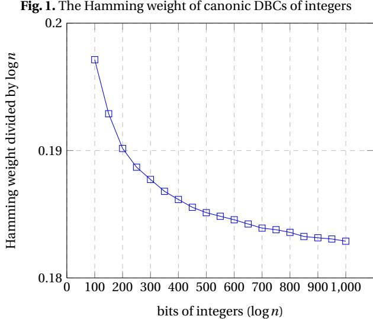
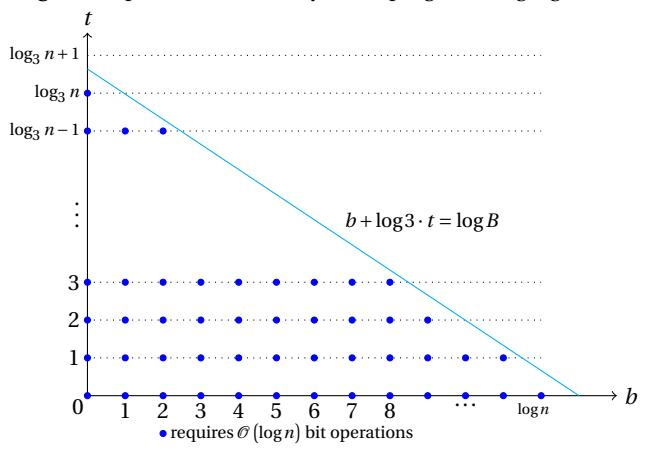
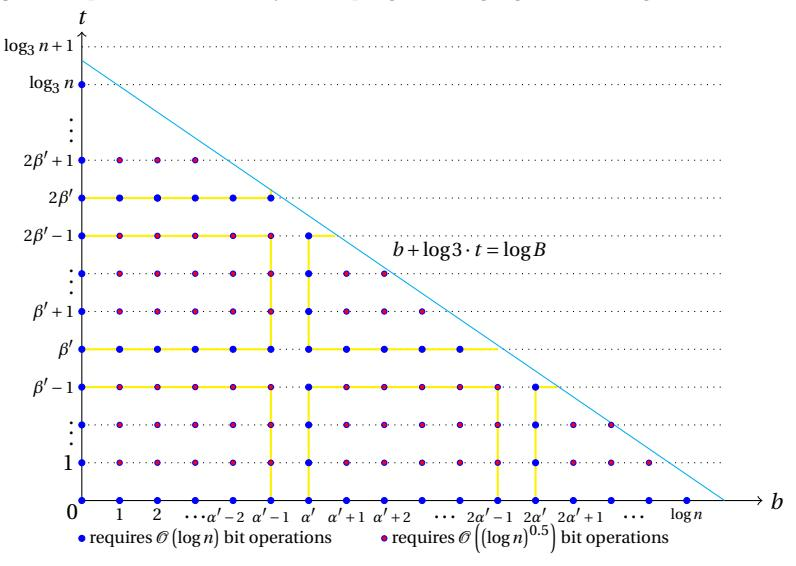

# <span id="page-0-1"></span>Double-Base Chains for Scalar Multiplications on Elliptic Curves\*

Wei Yu<sup>1</sup>, Saud Al Musa<sup>2</sup>, and Bao Li<sup>1,3</sup>

<sup>1</sup> State Key Laboratory of Information Security, Institute of Information Engineering, Chinese Academy of Sciences, Beijing 100093, China yuwei\_1\_yw@163.com

Abstract. Double-base chains (DBCs) are widely used to speed up scalar multiplications on elliptic curves. We present three results of DBCs. First, we display a structure of the set containing all DBCs and propose an iterative algorithm to compute the number of DBCs for a positive integer. This is the first polynomial time algorithm to compute the number of DBCs for positive integers. Secondly, we present an asymptotic lower bound on average Hamming weights of DBCs  $\frac{\log n}{8.25}$  for a positive integer n. This result answers an open question about the Hamming weights of DBCs. Thirdly, we propose a new algorithm to generate an optimal DBC for any positive integer. The time complexity of this algorithm is  $\mathcal{O}((\log n)^2 \log \log n)$  bit operations and the space complexity is  $\mathcal{O}((\log n)^2)$  bits of memory. This algorithm accelerates the recoding procedure by more than 6 times compared to the state-of-theart Bernstein, Chuengsatiansup, and Lange's work. The Hamming weights of optimal DBCs are over 60% smaller than those of NAFs. Scalar multiplication using our optimal DBC is about 13% faster than that using non-adjacent form on elliptic curves over large prime fields.

**Keywords:** Elliptic curve cryptography, Scalar multiplication, Double-base chain, Hamming weight

#### <span id="page-0-0"></span>1 Introduction

A double-base chain (DBC), as a particular double-base number system (DBNS) representation, represents an integer n as  $\sum_{i=1}^{l} c_i 2^{b_i} 3^{t_i}$  where  $c_i \in \{\pm 1\}$ ,  $b_i$ ,  $t_i$  are non-increasing sequences. It is called an unsigned DBC when  $c_i \in \{1\}$ . A DBC was first used in elliptic curve cryptography for its sparseness by Dimitrov, Imbert, and Mishra [1], and Ciet, Joye, Lauter, and Montgomery [2]. Scalar multiplication is the core operation in elliptic curve cryptosystems. A DBC allows one to represent

<sup>&</sup>lt;sup>2</sup> College of Computer Science and Engineering, Taibah University, Medina, Saudi Arabia smusa@taibahu.edu.sa

School of Cyber Security, University of Chinese Academy of Sciences, Beijing 100049, China libao@iie.ac.cn

<sup>\*</sup> The proceeding version of this paper appears at EUROCRYPT 2020 [3]. This is the full version.

an integer in a Horner-like fashion to calculate scalar multiplication such that all partial results can be reused. In the last decade, DBCs were widely investigated to speed up scalar multiplications [4–6] and pairings [7,8]. The generalizations of DBCs were also applied to the arithmetics of elliptic curves. The generalizations include simultaneously representing a pair of numbers to accelerate multi-scalar multiplications [9–11], using double-base representation to speed up scalar multiplication on Koblitz curves [12], and representing an integer in a multi-base number system to promote scalar multiplications [13–15].

Dimitrov, Imbert, and Mishra pointed out that DBC is highly redundant, and counting the exact number of DBCs is useful to generate optimal DBCs [1]. A precise estimate of the number of unsigned DBNS representation of a given positive integer was presented in [16]. 100 has exactly 402 unsigned DBNS representations and 1000 has 1295579 unsigned DBNS representations. For unsigned DBC, Imbert and Philippe [5] introduced an efficient algorithm to compute the number of unsigned DBCs for a given integer. By their algorithm, 100 has 7 unsigned DBCs and 1000 has 30 unsigned DBCs. DBCs are more redundant than unsigned DBCs. For a given integer n, Doche [17] proposed a recursion algorithm to calculate the number of DBCs with a leading term dividing  $2^b3^t$ . His algorithm is efficient to find the number of DBCs with a leading term dividing  $2^b3^t$  for integers less than  $2^{70}$  and b, t < 70. But it does not work for calculating the number of DBCs of a positive integer used in elliptic curve cryptography. We will show how to calculate the number of DBCs of a 256-bit integer or even a larger integer.

The Hamming weight is one of the most important factors that affect the efficiency of scalar multiplications. Dimitrov, Imbert, and Mishra proved an asymptotic upper bound  $\mathcal{O}\left(\frac{\log n}{\log\log n}\right)$  on the Hamming weight of DBNS representation by a greedy approach [16]. Every integer n has a DBC with Hamming weight  $\mathcal{O}\left(\log n\right)$ . The upper bounds of DBNS representations and DBCs have been well investigated, in contrast, the precise lower bounds of DBCs can not be found in any literature. Doche and Habsieger [4] showed that the DBCs produced by the tree approach is shorter than those produced by greedy approach [1] for integers with several hundreds of bits experimentally. They observed that the average Hamming weight of the DBCs produced by the tree approach is  $\frac{\log n}{4.6419}$ . They also posed an open question that the average Hamming weight of DBCs generated by the greedy approach may be not  $\mathcal{O}\left(\frac{\log n}{\log\log n}\right)$ . We will give affirmation to this question.

Canonic DBCs are the DBCs with the lowest Hamming weight for a positive integer and were introduced by Dimitrov, Imbert, and Mishra [1]. Several algorithms were designed to produce near canonic DBCs such as greedy algorithm [1], binary/ternary approach [2], multi-base non-adjacent form (mbNAF) [14], and tree approach [4]. In Asiacrypt 2014, Doche proposed an algorithm to produce a canonic DBC [17]. As Doche's algorithm was in exponential time, Capuñay and Thériault [8] improved Doche's algorithm to generate a canonic DBC or an optimal DBC. This is the first algorithm to generate an optimal DBC in polynomial time, explicitly  $\mathcal{O}\left(\left(\log n\right)^4\right)$  bit operations and  $\mathcal{O}\left(\left(\log n\right)^3\right)$  bits of memory. Bernstein, Chuengsatiansup, and Lange [18] presented a directed acyclic graph algorithm (DAG) to

produce a canonic DBC or an optimal DBC. Their algorithm takes time  $\mathcal{O}\left((\log n)^{2.5}\right)$  bit operations and  $\mathcal{O}\left((\log n)^{2.5}\right)$  bits of memory. As scalar multiplication requires  $\mathcal{O}\left((\log n)^2\log\log n\right)$  when field multiplications use FFTs, we will focus on producing a canonic DBC or an optimal DBC in the same order of magnitude.

In this paper, we are concerned with the theoretical aspects of DBCs arising from their study to speed up scalar multiplication and producing a canonic DBC or an optimal DBC efficiently. The main contributions are detailed as follows.

- <span id="page-2-3"></span>1. As Doche's algorithm is in exponential time to compute the number of DBCs with a leading term dividing  $2^b3^t$  [17], we propose an iterative algorithm in  $\mathcal{O}\left(\left(\log n\right)^3\right)$  bit operations and in  $\mathcal{O}\left(\left(\log n\right)^2\right)$  bits of memory. Our algorithm is based on our new structure of the set containing all DBCs. It requires 10 milliseconds for 256-bit integers and 360 milliseconds for 1024-bit integers. Using the iterative algorithm, 100 has 2590 DBCs with a leading term dividing  $2^{30}3^4$  and 1000 has 28364 DBCs with a leading term dividing  $2^{30}3^6$ . These results show that DBCs are redundant. We show that the number of DBCs with a leading term dividing  $2^b3^t$  is the same when  $t \geq t_{\tau}$  for some  $t_{\tau}$ . The number of DBCs with a leading term dividing  $2^b3^t$  minus the number of DBCs with a leading term dividing  $2^b3^t$  is  $(b-b_{\tau})$   $C_{\tau}$  when  $b \geq b_{\tau}$  for some  $b_{\tau}$  and  $c_{\tau}$ . We also present that the number of DBCs with a leading term dividing  $2^b3^t$  is  $\mathcal{O}\left(\log n\right)$  – bit when both b and t are  $\mathcal{O}\left(\log n\right)$ .
- <span id="page-2-1"></span>2. Doche and Habsieger posed an open question to decide whether the average Hamming weight of DBCs produced by the greedy approach is  $\mathcal{O}\left(\frac{\log n}{\log\log n}\right)$  or not [4]. We show that an asymptotic lower bound of the average Hamming weight of the DBCs returned by any algorithm for a positive integer n is  $\frac{\log n}{8.25}$ . This theoretical result answers their open question. Experimental results show that the Hamming weight of canonic DBCs is  $0.179822\log n$  for 3000-bit integers. It is still a long way from the theoretical bound.
- <span id="page-2-0"></span>3. We propose a dynamic programming algorithm to generate an optimal DBC. We introduce an equivalent representative for large integers to improve the efficiency of the dynamic programming algorithm. Our dynamic programming algorithm using equivalent representatives requires  $\mathcal{O}\left(\left(\log n\right)^2\log\log n\right)$  bit operations and  $\mathcal{O}\left(\left(\log n\right)^2\right)$  bits of memory. It accelerates the recoding procedure by over 6 times compared to Bernstein, Chuengsatiansup, and Lange's algorithm. Many researches [1,2,4,7,8,17,18] indicate that the leading term of an optimal DBC is greater than  $\frac{n}{2}$  and less than 2n. We will prove it in this work.
- <span id="page-2-2"></span>4. Capuñay and Thériault's algorithm [8], Bernstein, Chuengsatiansup, and Lange's DAG algorithm [18], and our algorithms (Algorithms 2 – 4) can generate the same optimal DBC for a given integer. Using optimal DBCs to speed up pairing computations has been fully investigated by Capuñay and Thériault's algorithm in [8]. Using optimal DBCs to speed up scalar multiplication on Edwards curves has been studied by Bernstein, Chuengsatiansup, and Lange in [18]. We will study scalar multiplication on Weierstrass curves using optimal DBCs. Over large prime fields, both theoretical analyses and experimental results show that scalar

#### 4 W. Yu et al.

multiplication protecting against simple side-channel attack using our optimal DBC is about 13% faster than that using NAE

This paper is organized as follows. In Section 2, we present background of elliptic curves and DBCs. In Section 3, we show the structure of the set containing all DBCs, and give an iterative algorithm to compute the number of DBCs. In Section 4, we show an asymptotic lower bound of the average Hamming weights of DBCs. Section 5 shows a dynamic programming algorithm. Section 6 presents equivalent representatives for large numbers to improve our dynamic programming algorithm and presents the comparisons of several algorithms. Section 7 gives some comparisons of scalar multiplications. Finally, we conclude this work in Section 8.

#### 2 Preliminaries

We give some basics about elliptic curves and DBCs.

#### <span id="page-3-2"></span>2.1 Elliptic Curves

In what follows, point doubling (2P), tripling (3P), and mixed addition [19] (P+Q) are denoted by D, T, and A respectively where P and Q are rational points on an elliptic curve. Cost of scalar multiplications are expressed in terms of field multiplications ( $\mathbf{M}$ ) and field squarings ( $\mathbf{S}$ ). To allow easy comparisons, we disregard field additions/subtractions and multiplications/divisions by small constants. Moreover, we assume that  $\mathbf{S} = 0.8\mathbf{M}$  as customary of software implementation (different CPU architectures usually imply different  $\mathbf{S}$  and  $\mathbf{M}$  ration) and that  $\mathbf{S} = \mathbf{M}$  in the case of implementations on a hardware platform or protecting scalar multiplications against some simple side channel attack by side-channel atomicity [20].

Let  $\mathcal{E}_{\mathrm{W}}$  be an elliptic curve over a large prime field  $\mathbb{F}_p$  defined by the Weierstrass equation in Jacobian projective coordinate:  $Y^2 = X^3 + aXZ^4 + bZ^6$ , where a = -3,  $b \in \mathbb{F}_p$ , and  $4a^3 + 27b^2 \neq 0$ . The respective cost of a doubling, a mixed addition, and a tripling are  $3\mathbf{M} + 5\mathbf{S}$ ,  $7\mathbf{M} + 4\mathbf{S}$ , and  $7\mathbf{M} + 7\mathbf{S}$  on  $\mathcal{E}_{\mathrm{W}}$  respectively [21, 22]. More about Weierstrass elliptic curves please refer to [23].

The cost of point operations on  $\mathscr{E}_W$  are summarized in Table 1.  $\mathscr{E}_W$  with  $\mathbf{S} = \mathbf{0.8M}$  and  $\mathscr{E}_W$  with  $\mathbf{S} = \mathbf{M}$  are denoted by  $\mathscr{E}_W$  0.8 and  $\mathscr{E}_W$  1 respectively.

| operation | $\mathscr{E}_{\mathrm{W}}$ 0.8          | € <sub>W</sub> 1 |
|-----------|-----------------------------------------|------------------|
| A         | 7 <b>M</b> +4 <b>S</b> (10.2 <b>M</b> ) | 11 <b>M</b>      |
| D         | 3M+5S(7M)                               | 8 <b>M</b>       |
| T         | 7M + 7S(12.6M)                          | 14 <b>M</b>      |

<span id="page-3-0"></span>Table 1. Cost of elliptic curve point operations

#### <span id="page-3-1"></span>2.2 DBCs

DBNS represents an integer as  $\sum_{i=1}^l c_i 2^{b_i} 3^{t_i}$  where  $c_i \in \{\pm 1\}$ , and  $b_i, t_i$  are nonnegative integers. It was first used in elliptic curve cryptography by Dimitrov, Imbert, and Mishra [1]. Meloni and Hasan proposed new algorithms using DBNS

representation to speed up scalar multiplications [24, 25]. The drawback of DB-NS representation to compute scalar multiplication is that it requires many precomputations and space to compute scalar multiplication. A DBC is a special case of DBNS representations. It allows us to represent n in a Horner-like fashion such that all partial results can be reused. It is defined as follows.

<span id="page-4-0"></span>**Definition 1 (DBC [1])** A DBC represents an integer n as  $\sum_{i=1}^{l} c_i 2^{b_i} 3^{t_i}$  where  $c_i \in \mathcal{C} = \{\pm 1\}$ ,  $b_l \geq b_{l-1} \geq \ldots \geq b_1 \geq 0$  and  $t_l \geq t_{l-1} \geq \ldots \geq t_1 \geq 0$ . We call  $2^{b_i} 3^{t_i}$  a term of the DBC,  $2^{b_l} 3^{t_l}$  the leading term of the DBC, and l the Hamming weight of the DBC.

If  $\mathscr{C} = \{1\}$ , the DBC is called an unsigned DBC. Since computing the negative of a point P can be done virtually at no cost, we usually set  $\mathscr{C} = \{\pm 1\}$ . The leading term of a DBC encapsulates the total number of point doublings and that of point triplings necessary to compute scalar multiplication nP whose total cost is  $(l-1) \cdot A + b_l \cdot D + t_l \cdot T$ .

The number 0 has only one DBC that is 0. If a DBC does not exist, we denote it by NULL. We set the Hamming weight of 0 as 0 and that of NULL as a negative integer. A DBC for a negative integer is the negative of the DBC of its absolute value. Therefore, we usually investigate the DBCs of a positive integer.

Some properties of DBCs are useful. Let  $n = \sum_{i=1}^{l} c_i 2^{b_i} 3^{t_i}$  be a DBC with  $c_i \in \{\pm 1\}, b_l \ge b_{l-1} \ge \ldots \ge b_1$  and  $t_l \ge t_{l-1} \ge \ldots \ge t_1$ . We have

- 1.  $2^{b_k}3^{t_k}$  is a factor of  $\sum_{i=k}^{l_0} c_i 2^{b_i}3^{t_i}$ , when  $k \le l_0 \le l$ ;
- 2.  $\sum_{i=k}^{l_0} c_i 2^{b_i} 3^{t_i}$  is not equal to 0 when  $0 < k \le l_0 \le l$ ;
- 3.  $\frac{2^{b_{k+\zeta}}3^{t_{k+\zeta}}}{2^{\zeta-1}} > \sum_{i=1}^{k} c_i 2^{b_i} 3^{t_i} > -\frac{2^{b_{k+\zeta}}3^{t_{k+\zeta}}}{2^{\zeta-1}}$ , when  $1 \le \zeta \le l-k$ ;
- <span id="page-4-2"></span>4.  $2^{b_l}3^{t_l} > \frac{n}{2}$  [26];
- 5.  $\sum_{i=1}^{\varsigma} c_i 2^{b_i} 3^{t_i} > 0$  if and only if  $c_{\varsigma} = 1$ , when  $1 \le \varsigma \le l$ .

<span id="page-4-1"></span>Following from Dimitrov, Imbert, and Mishra's definition of canonic DBC,

**Definition 2 (Canonic DBC [16])** The canonic DBCs of a positive integer n are the ones with minimal Hamming weight.

The canonic DBCs of a positive integer have the same Hamming weight. When we perform scalar multiplication using a DBC, its Hamming weight is not the only factor affecting the efficiency of scalar multiplication. The cost of point operations should also be considered. The works in [8, 17, 18] indicate the definition of an optimal DBC as follows.

**Definition 3 (Optimal DBC)** Let w be a DBC of a positive integer n whose leading term is  $2^{b_l}3^{t_l}$  and its Hamming weight is l, and the value function of w is defined by  $val(w) = (l-1) \cdot A + b_l \cdot D + t_l \cdot T$  for given numbers A > 0,  $D \ge 0$ , and  $T \ge 0$ . An optimal DBC of n is the DBC with the smallest value in the set  $\{val(w) | w \in X\}$  where X is the set containing all DBCs of n.

Let  $\min\{w_1, w_2, ..., w_m\}$  be a DBC with the smallest Hamming weight among these DBCs. If the Hamming weight of w is the smallest in a corresponding set, we say w is "minimal". Let  $\min\{w_1, w_2, ..., w_m\}$  be a DBC with the smallest  $val(w_i)$  in the set  $\{val(w_1), val(w_2), ..., val(w_m)\}$ . If more than one DBC has the same Hamming weight or the same value of its value function, we choose the one with the smallest position index i where i is the position index of  $w_i$  in the set of  $\{w_1, w_2, ..., w_m\}$ . minL is used to generate canonic DBCs, and minV is used to generate optimal DBCs.

An optimal DBC is associated with an elliptic curve. Let log denote binary logarithm. If the value of  $\frac{T}{D}$  is log3, then the optimal DBC is a canonic DBC. In this case, we usually set D=T=0. For canonic DBCs of a positive integer, our concern is their Hamming weight.

#### <span id="page-5-0"></span>3 The Number of DBCs

DBCs are special cases of DBNS representations. In 2008, Dimitrov, Imbert, and Mishra showed an accurate estimate of the number of unsigned DBNS representations for a given positive integer [16]. The number of signed DBNS representation is still an open question.

Dimitrov, Imbert, and Mishra pointed out that counting the exact number of DBCs is useful to show DBC is redundant [1] and to generate an optimal DBC. Dimitrov, Imbert, and Mishra [1] and Imbert and Philippe [5] both noticed that each positive integer has at least one DBC such as binary representation. Imbert and Philippe [5] proposed an elegant algorithm to compute the number of unsigned DBCs for a given integer and presented the first 400 values. These values behave rather irregularly. To determine the precise number of DBCs for a positive integer is usually hard, but we are convinced that this number is infinity. The number of DBCs with a leading term dividing  $2^b3^t$  for a positive integer was first investigated by Doche [17]. His algorithm is very efficient for less than 70—bit integers with a leading term dividing  $2^b3^t$  for the most b and b. The algorithm requires exponential time. Before we present a polynomial time algorithm to calculate the number of DBCs of large integers, a structure of the set containing all DBCs is introduced.

### <span id="page-5-1"></span>3.1 The Structure of the Set Containing All DBCs

Let  $\Phi(b,t,n)$  be the set containing all DBCs of an integer  $n \ge 0$  with a leading term strictly dividing  $2^b 3^t$ . "Strictly" indicates that the leading term of a DBC  $2^{b_l} 3^{t_l}$  divides  $2^b 3^t$  but is not equal to  $2^b 3^t$ . Let  $\bar{\Phi}(b,t,n)$  be the set containing all DBCs of an integer  $n \le 0$  with a leading term strictly dividing  $2^b 3^t$ . Both definitions of  $\Phi(b,t,n)$  and  $\bar{\Phi}(b,t,n)$  arise from Imbert and Philippe's structure of unsigned DBCs [5] and Capuñay and Thériault's definition of the set containing all DBCs (see Definition 5 of [8]).

Let z be  $2^{b'}3^{t'}$  or  $-2^{b'}3^{t'}$  with integers  $b' \ge 0$  and  $t' \ge 0$ . The set  $\{w + z | w \in \Phi\}$  is denoted by  ${}^z\Phi$  (the similar is for  $\bar{\Phi}$ ).  ${}^z\Phi$  is inspired by Imbert and Philippe's mark [5]. If  $2^b3^t|z$ ,  ${}^z\Phi(b,t,n)$  are the DBCs of n+z. Let  ${}^{z_1,z_2}\Phi={}^{z_1}({}^{z_2}\Phi)$ . Take  $\Phi(1,4,100)=\{3^4+3^3-3^2+1\}$  for example,  ${}^{2\cdot3^4}\Phi(1,4,100)=\{2\cdot3^4+3^4+3^3-3^2+1\}$ .

Some properties of  $\Phi$  and  $\bar{\Phi}$  are given.

- 1. If Φ = ;, then *<sup>z</sup>*Φ = ;; if Φ¯ = ;, then *<sup>z</sup>*Φ¯ = ;.
- 2. If Φ = {0}, then *<sup>z</sup>*Φ = {*z*}; if Φ¯ = {0}, then *<sup>z</sup>*Φ¯ = {*z*}.
- 3. If *n* < 0 or *n* ≥ 2 *b*3 *<sup>t</sup>* or *b* < 0 or *t* < 0, then Φ(*b*,*t*,*n*) = Φ¯ (*b*,*t*,−*n*) = ;.
- 4. Φ(0, 0, 0) = Φ¯ (0, 0, 0) = {0}.
- 5. A DBC 0 plus *z* equals to *z*.
- <span id="page-6-1"></span>6. A DBC NULL plus *z* equals to NULL.

Imbert and Philippe's structure of the set containing unsigned DBCs [\[5\]](#page-26-13) can be used to calculate the number of unsigned DBCs. Since the terms of DBCs of *n* may be larger than *n*, calculating the number of DBCs is usually difficult. Following from Capuñay and Thériault's definition [\[8\]](#page-26-6),

$$n_{b,t} \equiv n \pmod{2^b 3^t}$$
 where  $0 \le n_{b,t} < 2^b 3^t$ .

We redefine

$$\bar{n}_{b,t} = n_{b,t} - 2^b 3^t.$$

To calculate the number of DBCs, Φ(*b*,*t*) and Φ¯ (*b*,*t*) are introduced to describe the structure of the set containing DBCs shown as Lemma [1](#page-6-0) where Φ(*b*,*t*) and Φ¯ (*b*,*t*) represent Φ(*b*,*t*,*nb*,*<sup>t</sup>* ) and Φ¯ (*b*,*t*,*n*¯*b*,*<sup>t</sup>* ) respectively.

<span id="page-6-0"></span>**Lemma 1** *Let n be a positive integer, b* ≥ 0*, t* ≥ 0*, and b* +*t* > 0*. The structure of* Φ(*b*,*t*) *and that of* Φ¯ (*b*,*t*) *are described as follows.*

1. If 
$$n_{b,t} < 2^b 3^{t-1}$$
, i.e.,  $n_{b,t} = n_{b-1,t} = n_{b,t-1}$ , then 
$$\Phi(b,t) = \Phi(b-1,t) \bigcup \left(2^{b-1} 3^t \bar{\Phi}(b-1,t)\right) \bigcup \Phi(b,t-1) \bigcup \left(2^{b} 3^{t-1} \bar{\Phi}(b-1,t)\right)$$

$$\Phi(b,t) = \Phi(b-1,t) \bigcup \left(2^{b-1}3^t \bar{\Phi}(b-1,t)\right) \bigcup \Phi(b,t-1) \bigcup \left(2^{b}3^{t-1} \bar{\Phi}(b,t-1)\right),$$

$$\bar{\Phi}(b,t) = \left(-2^{b-1}3^t \bar{\Phi}(b-1,t)\right).$$

2. If 
$$2^b 3^{t-1} \le n_{b,t} < 2^{b-1} 3^t$$
, i.e.,  $n_{b,t} = n_{b-1,t} = n_{b,t-1} + 2^b 3^{t-1}$ , then

$$\Phi(b,t) = \Phi(b-1,t) \bigcup \left(2^{b-1}3^t \bar{\Phi}(b-1,t)\right) \bigcup \left(2^{b}3^{t-1} \Phi(b,t-1)\right),$$

$$\bar{\Phi}(b,t) = \left(-2^{b-1}3^t \bar{\Phi}(b-1,t)\right) \bigcup \left(-2^b3^{t-1} \bar{\Phi}(b,t-1)\right).$$

3. If 
$$2^{b-1}3^t \le n_{b,t} < 2 \cdot 2^b 3^{t-1}$$
, i.e.,  $n_{b,t} = n_{b-1,t} + 2^{b-1}3^t = n_{b,t-1} + 2^b 3^{t-1}$ , then

$$\begin{split} &\Phi(b,t) = \left(2^{b-1}3^t \Phi(b-1,t)\right) \bigcup \left(2^b 3^{t-1} \Phi(b,t-1)\right), \\ &\bar{\Phi}(b,t) = \left(-2^{b-1}3^t \Phi(b-1,t)\right) \bigcup \bar{\Phi}(b-1,t) \bigcup \left(-2^b 3^{t-1} \bar{\Phi}(b,t-1)\right). \end{split}$$

4. If 
$$n_{b,t} \ge 2 \cdot 2^b 3^{t-1}$$
, i.e.,  $n_{b,t} = n_{b-1,t} + 2^{b-1} 3^t = n_{b,t-1} + 2 \times 2^b 3^{t-1}$ , then

$$\begin{split} & \Phi(b,t) = \left( ^{2^{b-1}3^t} \Phi(b-1,t) \right), \\ & \bar{\Phi}(b,t,) = \left( ^{-2^{b-1}3^t} \Phi(b-1,t) \right) \bigcup \bar{\Phi}(b-1,t) \bigcup \left( ^{-2^b3^{t-1}} \Phi(b,t-1) \right) \bigcup \bar{\Phi}(b,t-1). \end{split}$$

#### The proof is shown as Appendix A.1.

The definitions of  $n_{b,t}$  and  $\bar{n}_{b,t}$  indicate that both  $n_{b,t}=n_{b-1,t}=n_{b,t-1}+2^{b+1}3^{t-1}$  and  $n_{b,t}=n_{b-1,t}+2^{b-1}3^t=n_{b,t-1}$  are impossible. From Lemma 1,  $\Phi(b,t)$  and  $\bar{\Phi}(b,t)$  only rely on  $\Phi(b-1,t)$ ,  $\bar{\Phi}(b-1,t)$ ,  $\Phi(b,t-1)$  and  $\bar{\Phi}(b,t-1)$ . By the definitions of  $n_{b,t}$  and  $\bar{n}_{b,t}$ , the structure of  $\Phi(b,t)$  and that of  $\bar{\Phi}(b,t)$  still work for  $n_{b,t}=0$  in Case 1,  $n_{b,t}=2^b3^{t-1}$  in Case 2,  $n_{b,t}=2^{b-1}3^t$  in Case 3, and  $n_{b,t}=2\cdot2^b3^{t-1}$  in Case 4.

This is the first structure of the set containing all DBCs with a leading term strictly dividing  $2^b3^t$  in the literature. Based on this structure, we will show the number of DBCs with a leading term dividing  $2^b3^t$  for a positive integer n.

#### 3.2 The Number of DBCs

Let  $|\mathcal{S}|$  be the cardinality of the set  $\mathcal{S}$ . The number of DBCs with a leading term dividing  $2^b 3^t$  for representing  $n_{b,t}$  is  $|\Phi(b,t)| + |\bar{\Phi}(b,t)|$ . We will provide some initial values of  $|\Phi|$  and  $|\bar{\Phi}|$ . If n < 0 or  $n \ge 2^b 3^t$  or b < 0 or t < 0,  $|\Phi(b,t,n)| = |\bar{\Phi}(b,t,-n)| = 0$ .  $|\Phi(0,0,0)| = |\bar{\Phi}(0,0,0)| = 1$ .

Based on Lemma 1, the cardinality of  $\Phi(b,t)$  and that of  $\bar{\Phi}(b,t)$  are shown as Theorem 1. Its proof is given in Appendix A.2.

<span id="page-7-0"></span>**Theorem 1** Let n be a positive integer,  $b \ge 0$ ,  $t \ge 0$ , and b + t > 0. We have

1. If 
$$n_{b,t} < 2^{b-1}3^{t-1}$$
, then

$$\begin{split} |\Phi(b,t)| = & |\Phi(b-1,t)| + |\bar{\Phi}(b-1,t)| + |\Phi(b,t-1)| + |\bar{\Phi}(b,t-1)| \\ & - |\Phi(b-1,t-1)| - |\bar{\Phi}(b-1,t-1)|, \\ |\bar{\Phi}(b,t)| = & |\bar{\Phi}(b-1,t)|. \end{split}$$

2. If 
$$2^{b-1}3^{t-1} \le n_{b,t} < 2^b3^{t-1}$$
, then

$$\begin{split} |\Phi(b,t)| = & |\Phi(b-1,t)| + |\bar{\Phi}(b-1,t)| + |\Phi(b,t-1)| \\ & + |\bar{\Phi}(b,t-1)| - |\Phi(b-1,t-1)|, \\ |\bar{\Phi}(b,t)| = & |\bar{\Phi}(b-1,t)|. \end{split}$$

3. If 
$$2^b 3^{t-1} \le n_{b,t} < 2^{b-1} 3^t$$
, then

$$\begin{split} |\Phi(b,t)| = & |\Phi(b-1,t)| + |\bar{\Phi}(b-1,t)| + |\Phi(b,t-1)|, \\ |\bar{\Phi}(b,t)| = & |\bar{\Phi}(b-1,t)| + |\bar{\Phi}(b,t-1)|. \end{split}$$

4. If 
$$2^{b-1}3^t \le n_{h,t} < 2 \cdot 2^b 3^{t-1}$$
, then

$$\begin{split} |\Phi(b,t)| = & |\Phi(b-1,t)| + |\Phi(b,t-1)|, \\ |\bar{\Phi}(b,t)| = & |\Phi(b-1,t)| + |\bar{\Phi}(b-1,t)| + |\bar{\Phi}(b,t-1)|. \end{split}$$

5. If 
$$2 \cdot 2^b 3^{t-1} \le n_{h,t} < 5 \cdot 2^{b-1} 3^{t-1}$$
, then

$$\begin{split} |\Phi(b,t)| &= |\Phi(b-1,t)|, \\ |\bar{\Phi}(b,t)| &= |\Phi(b-1,t)| + |\bar{\Phi}(b-1,t)| + |\Phi(b,t-1)| \\ &+ |\bar{\Phi}(b,t-1)| - |\bar{\Phi}(b-1,t-1)|. \end{split}$$

```
6. If n_{b,t} \ge 5 \cdot 2^{b-1} 3^{t-1}, then \begin{split} |\Phi(b,t)| &= |\Phi(b-1,t)|, \\ |\bar{\Phi}(b,t)| &= |\Phi(b-1,t)| + |\bar{\Phi}(b-1,t) + |\Phi(b,t-1)| \\ &+ |\bar{\Phi}(b,t-1)| - |\bar{\Phi}(b-1,t-1)| - |\Phi(b-1,t-1)|. \end{split}
```

<span id="page-8-0"></span>Based on Theorem 1, we have

**Corollary 1** 1. If  $b \ge 0$  and  $t \ge 0$ , then  $|\Phi(b,t)| \ge |\Phi(b-1,t)|$ ,  $|\Phi(b,t)| \ge |\Phi(b,t-1)|$ ,  $|\bar{\Phi}(b,t)| \ge |\bar{\Phi}(b-1,t)|$ , and  $|\bar{\Phi}(b,t)| \ge |\bar{\Phi}(b,t-1)|$ . 2. If  $b \ge 0$  and  $t \ge 0$ , then  $|\Phi(b,t)| \le 4^{b+t}$  and  $|\bar{\Phi}(b,t)| \le 4^{b+t}$ .

By Corollary 1,  $|\Phi(b, t)|$  and  $|\bar{\Phi}(b, t)|$  are both  $\mathcal{O}(\log n)$ -bit integers when both b and t are  $\mathcal{O}(\log n)$ .

Based on Theorem 1, we employ an iterative algorithm to compute the number of DBCs with a leading term strictly dividing  $2^b3^t$  for  $n_{b,t}$  and  $\bar{n}_{b,t}$  shown as Algorithm 1. The number of DBCs with a leading term dividing  $2^b3^t$  for n is

```
1. |\Phi(b,t)| + |\bar{\Phi}(b,t)| when 2^b 3^t > n;
2. |\Phi(b,t)| when \frac{n}{2} < 2^b 3^t \le n;
3. 0 when 2^b 3^t \le \frac{n}{2}.
```

#### <span id="page-8-1"></span>Algorithm 1 Iterative algorithm to compute the number of DBCs

```
Input: A positive integer n, b \ge 0, and t \ge 0
Output: The number of DBCs with a leading term strictly dividing 2^b 3^t for n_{b,t} and \bar{n}_{b,t}
1. |\Phi(0,0)| \leftarrow 1, |\bar{\Phi}(0,0)| \leftarrow 0
2. For i from 0 to b, |\Phi(i,-1)| = |\bar{\Phi}(i,-1)| \leftarrow 0
3. For j from 0 to t, |\Phi(-1,j)| = |\bar{\Phi}(-1,j)| \leftarrow 0
4. For j from 0 to t
```

7. **return**  $|\Phi(b, t)|, |\bar{\Phi}(b, t)|$ 

6.

Algorithm 1 terminates in  $\mathcal{O}\left((\log n)^3\right)$  bit operations and  $\mathcal{O}\left((\log n)^2\right)$  bits of memory when b and t are both in  $\mathcal{O}\left(\log n\right)$ .

If i + j > 0, using Theorem 1 to compute  $|\Phi(i, j)|$  and  $|\bar{\Phi}(i, j)|$ 

Miracl lib [27] is used to implement big number arithmetic. Our experiments in this paper are compiled and executed on Intel  $^{\circledR}$  Core  $^{TM}$  i7–6567U 3.3 GHZ with Skylake architecture (our algorithms may have different running time on other architectures). Algorithm 1 requires 34, 177, 551, and 1184 million cpu cycles (10, 50, 170, and 360 milliseconds) for 256–bit, 512–bit, 768–bit, and 1024–bit integers respectively. The details are shown in Table 2.

By Algorithm 1, the number of DBCs of  $\left[\pi\times10^{120}\right]$  with a leading term dividing  $2^{240}3^{120}$  is 405694512689803328570475272448020332384436179545046727328115784

<span id="page-9-0"></span>Table 2. Cost of Algorithm 1

| bits of n                | 256    | 512      | 768     | 1024    |
|--------------------------|--------|----------|---------|---------|
| b, t                     | 128,81 | 256, 161 | 384,242 | 512,323 |
| cost(million cpu cycles) | 34     | 177      | 551     | 1184    |

3672719846213086211542270726702592261797036105303878574879. The number of DBCs with a leading term dividing  $2^b 3^t$  for 100 when b < 50 and t < 50 is shown as Table 3. There exist 405 DBCs with a leading term dividing  $2^73^4$  for representing 100. These results all show a redundance of DBCs for a positive integer. The number of DBCs with a leading term dividing  $2^b 3^t$  of 100 is the same for  $4 \le t < 50$ . For the same b, we guess the number is the same when  $t \ge 50$ . For each  $8 \le b < 50$ , the number of DBCs with a leading term dividing  $2^b3^t$  of 100 minus the number of DBCs with a leading term dividing  $2^{b-1}3^t$  of 100 is 7. We guess this result is still true for  $b \ge 50$ .

<span id="page-9-1"></span>**Table 3.** Number of DBCs with a leading term dividing  $2^b 3^t$  for 100

|        | t = 0            | t = 1             | t = 2            | t = 3              | t < 50             |
|--------|------------------|-------------------|------------------|--------------------|--------------------|
| b = 0  | 0                | 0                 | 0                | 0                  | 1                  |
| b = 1  | 0                | 0                 | 0                | 0                  | 7                  |
| b = 2  | 0                | 0                 | 0                | 11                 | 24                 |
| b = 3  | 0                | 0                 | 18               | 51                 | 70                 |
| b = 4  | 0                | 0                 | 57               | 112                | 137                |
| b = 5  | 0                | 13                | 111              | 188                | 219                |
| b = 6  | 3                | 35                | 174              | 273                | 310                |
| b = 7  | 10               | 61                | 241              | 362                | 405                |
| b < 50 | 10 + 7 * (b - 7) | 61 + 26 * (b - 7) | 241 + 67 * (b-7) | 362 + 89 * (b - 7) | 405 + 95 * (b - 7) |

## 3.3 The Number of DBCs for Large b or t

<span id="page-9-2"></span>If b or t is large, the number of DBCs are shown as Corollary 2. Its proof is shown as Appendix A.3.

**Corollary 2** Let n be a given positive integer,  $t_{\tau}$  be a positive integer satisfying  $3^{t_{\tau}-1} >$ n and  $3^{t_{\tau}-2} \le n$ , and  $b_{\tau}$  be a positive integer satisfying  $2^{b_{\tau}} > 3n$  and  $2^{b_{\tau}-1} \le 3n$ . Then

- 1. If  $t \ge t_{\tau}$  and  $b \in \mathbb{Z}$ , then  $|\Phi(b, t)| = |\Phi(b, t_{\tau})|$ .
- 2. If  $b \ge b_{\tau}$  and  $t \in \mathbb{Z}$ , then  $|\Phi(b, t)| = |\Phi(b_{\tau}, t)| + (b b_{\tau})C_{\tau}$  where  $C_{\tau} = \sum_{i=0}^{t} |\bar{\Phi}(b_{\tau}, i)|$ . 3. If  $b \ge b_{\tau}$  and  $t \ge t_{\tau}$ , then  $|\Phi(b, t)| = |\Phi(b_{\tau}, t)| + (b b_{\tau})C_{\tau}$  where  $C_{\tau} = \sum_{i=0}^{t} |\bar{\Phi}(b_{\tau}, i)|$ .

These three properties of Corollary 2 are used to compute the number of DBCs with a leading term dividing  $2^b3^t$  for some large b and t. The number of DBCs with a leading term dividing  $2^b 3^t$  is a constant when  $t > t_\tau$ . The number of DBCs with a leading term dividing  $2^b 3^t$  adds a constant  $\sum_{i=0}^t |\bar{\Phi}(b_{\tau},i)|$  is the number of DBCs with a leading term dividing  $2^{b+1}3^t$  when  $b > b_{\tau}$ . Take 100 for example, 100 has 137 DBCs with a leading term dividing  $2^43^t$  for each  $t \ge t_{\tau}$ , and has 405 + 95 \* (b - 7) DBCs with a leading term dividing  $2^b 3^t$  for each  $b \ge 9$  and  $t \ge 6$ . These results may be associated with that  $1 = 2^b - \sum_{i=0}^{b-1} 2^i$  as b becomes larger and that  $1 = 3^0$  can not be represented as other ternary representation with its coefficients in  $\{\pm 1\}$ .

#### <span id="page-10-2"></span>4 Hamming Weight of DBCs

For a positive integer n, Avanzi and Sica [28] showed that the Hamming weight of unsigned DBNS representations obtained from the greedy approach proposed by Dimitrov, Imbert, and Mishra [1] is  $\theta\left(\frac{\log n}{\log\log n}\right)$ . Chalermsook, Imai, and Suppakitpaisarn [29] showed that the Hamming weight of unsigned DBCs produced by greedy approach [1] is  $\theta\left(\log n\right)$ .

For the Hamming weights of (signed) DBNS representations and DBCs, Dimitrov, Imbert, and Mishra [1] showed that every integer n has a DBNS representation with Hamming weight  $\mathcal{O}\left(\frac{\log n}{\log\log n}\right)$ . Every integer n has a DBC with Hamming weight  $\mathcal{O}(\log n)$ . These are upper bounds on the Hamming weight of DBNS representations and DBCs. The number of DBCs of a positive integer is infinite and the leading term of its DBC may be infinite. The range of the leading term of canonic DBCs is useful to show the lower bounds of the Hamming weight of DBCs.

#### <span id="page-10-4"></span>4.1 The Range of the Leading Term of Optimal DBCs and Canonic DBCs

Doche [17] proved that a DBC with leading term  $2^b3^t$  belongs to the interval  $\left[\frac{3^t+1}{2}\right]$ ,  $2^{b+1}3^t-\frac{3^t+1}{2}$ . His result showed the range of integers for a leading term. The leading term of a DBC  $2^{b_l}3^{t_l}$  for a positive integer does not have an upper bound for  $1=2^{b_l}-2^{b_l-1}-\ldots-2-1$  where  $b_l$  is an arbitrary positive integer. We will show the range of the leading term of optimal DBCs and that of canonic DBCs for a given integer in Lemma 2. Its proof is in Appendix A.4.

<span id="page-10-0"></span>**Lemma 2** Let n be a positive integer represented as  $w: \sum_{i=1}^{l} c_i 2^{b_i} 3^{t_i}$ ,  $c_l = 1, c_i \in \{\pm 1\}$  for  $1 \le i \le l-1$ . Then  $\frac{n}{2} < 2^{b_l} 3^{t_l} < 2n$  when w is an optimal DBC, and  $\frac{16n}{21} < 2^{b_l} 3^{t_l} < \frac{9n}{7}$  when w is a canonic DBC.

The range of the leading term of optimal DBCs is useful to prove that the DBC produced by Capuñay and Thériault's algorithm [8] and that produced by Bernstein, Chuengsatiansup, and Lange's algorithm [18] both are optimal DBCs. The leading term of canonic DBCs of n is in the interval  $\left(\frac{16n}{21}, \frac{9n}{7}\right)$ . It is useful to prove that the DBCs generated by Doche's algorithm is a canonic DBC [17], and to prove the asymptotic lower bound on the Hamming weights of DBCs in the following.

#### <span id="page-10-3"></span>4.2 A Lower Bound on the Hamming Weights of DBCs

<span id="page-10-1"></span>Dimitrov and Howe proved that there exist infinitely many integers n whose shortest DBNS representations have Hamming weights  $\Omega\left(\frac{\log n}{\log\log n\log\log\log n}\right)$  [30]. The minimum Hamming weight of DBCs for a positive integer n is also called Kolmogorov complexity [31] of a DBC of n, i.e., the Hamming weight of canonic DBCs of n. Lou, Sun, and Tartary [6] proved a similar result for DBCs: there exists at least one  $\lfloor \log n \rfloor$  —bit integer such that any DBC representing this integer needs at least  $\Omega\left(\lfloor \log n \rfloor\right)$  terms. We will give a stronger result in Lemma 3.

**Lemma 3** For arbitrary  $\alpha \in (0,1)$  and  $0 < C < \frac{\alpha^2}{8.25}$ , more than  $n - n^{\alpha}$  integers in [1,n] satisfy that the Hamming weight of the canonic DBCs of each integer is greater than  $C \log n$  when n > N (N is some constant shown as Claim 1).

For convenience, we first give some conventions and definitions. s(m) denotes the Hamming weight of canonic DBCs of m, and e is the base of the natural logarithm. Let  $\varphi_l$  be the number of DBCs  $\sum_{i=1}^l c_i 2^{b_i} 3^{t_i}$  with  $2^{b_l} 3^{t_l} < \frac{9n}{7}, c_i \in \{\pm 1\}$ , and  $c_l = 1$ .

**Definition 4** ( $\varphi(L)$ ) For a given positive integer n and a constant L,  $\varphi(L) = \sum_{l=1}^{L} \varphi_l$ , i.e.,  $\varphi(L)$  is the number of DBCs  $\sum_{i=1}^{l} c_i 2^{b_i} 3^{t_i}$  with  $2^{b_l} 3^{t_l} < \frac{9n}{7}$ ,  $1 \le l \le L$ .

By Lemma 2, in a canonic DBC,  $\frac{16n}{21} < 2^{b_l} 3^{t_l} < \frac{9n}{7}$ . Then, the number of integers of m in [1,n] represented as a canonic DBC with Hamming weight no greater than L is not more than the number of integers of m in [1,n] represented as a DBC with a leading term dividing  $2^{b_l} 3^{t_l} < \frac{9n}{7}$ ,  $l \le L$ . Since every DBC corresponds to only one integer and each integer has at least one DBC, the number of integers in [1,n] represented as a canonic DBC with Hamming weight no greater than L is no greater than  $\varphi(L)$ .

An outline of the proof of Lemma 3 is as follows. The number of integers of m in [1,n] can not be represented as a DBC of Hamming weight  $j, 0 < j \le L$  is equal to n minus the number of integers of m in [1,n] represented in that way. There are at least  $n-\varphi(L)$  integers of m in [1,n] can not be represented as a DBC of Hamming weight j with  $2^{b_j}3^{t_j} \le \frac{9n}{7}, 0 < j \le L$ . Thus there are at least  $n-\varphi(L)$  integers of m in [1,n] satisfying s(m) > L. Hence,  $\varphi(C\log n) < n^\alpha$  is enough to prove Lemma 3.

Since  $\varphi_j$  where  $0 < j \le C \log n$  is the number of DBCs of Hamming weight j with  $2^{b_l} 3^{t_l} < \frac{9n}{7}$ , we have

$$\varphi_j \leq 2^{j-1} \sum_{\zeta + \nu \log 3 < \log \frac{9n}{7}} \binom{\zeta + j}{j-1} \binom{\nu + j}{j-1}.$$

Then

<span id="page-11-1"></span>
$$\varphi(C\log n) = \sum_{j=1}^{C\log n} \varphi_j \le \sum_{j=1}^{C\log n} \left( 2^{j-1} \sum_{\zeta + \nu \log 3 < \log \frac{9n}{7}} {\binom{\zeta + j}{j - 1}} {\binom{\nu + j}{j - 1}} \right). \tag{1}$$

For this estimate of  $\varphi(C \log n)$  is too complex to be dealt with, we simplify its estimate by Claim 1 and its proof requires the tools of Pascal's triangle and Stirling's formula shown in Appendix A.5.

<span id="page-11-0"></span>**Claim 1** For any 0 < C < 1, when n > N where N satisfies that  $N > 2^{10000 \cdot (3 - 0.5 \log_3 7)}$  and  $\log N < 1.0001^{C \log N}$ ,

$$\sum_{j=1}^{C\log n} \left( 2^{j-1} \sum_{\zeta + v \log_2 3 < \log \frac{9n}{7}} \binom{\zeta + j}{j-1} \binom{v + j}{j-1} \right) < n^{C\log \left( \frac{2.0002e^2(0.5001\log_3 2 + C)^2}{C^2} \right)}.$$

According to Equation (1) and Claim 1, we have

$$\varphi(C\log n) < n^{C\log\left(\frac{2.0002e^2\log 3\cdot (0.5001\log_3 2 + C)^2}{C^2}\right)}.$$

For some larger N, the coefficients of  $\log_3 2$  and  $e^2$  will be smaller than 0.50001 and 2.0002 respectively in this inequation, and for some smaller N, the coefficients of  $\log_3 2$  and  $e^2$  will be larger than 0.50001 and 2.0002. The proof of Lemma 3 is as follows.

*Proof.* To prove Lemma 3, it is sufficient to show that the number of integers of m in [1,n], represented as a DBC of Hamming weight j with  $j \leq C \log n$  and  $2^{b_j} 3^{t_j} < \frac{9n}{7}$ , is no greater than  $n^{\alpha}$ .

The number of integers of m in [1,n] can be represented as DBCs of Hamming weight j with  $2^{b_j}3^{t_j}<\frac{9n}{7}, 0< j\leq C\log n$  is no greater than  $\varphi(C\log n)$ . This result is sufficient to show that  $\varphi(C\log n)< n^\alpha$ , i.e., the number of DBCs of Hamming weight j with  $j\leq C\log n$  is less than  $n^\alpha$ .

Since 
$$\varphi(C\log n) < n^{C\log\left(\frac{2.0002e^2\log3\cdot(0.5001\log_32+C)^2}{C^2}\right)}$$
, then 
$$n^{C\log\left(\frac{2.0002e^2\log3\cdot(0.5001\log_32+C)^2}{C^2}\right)} < n^{\alpha}. \text{ We have}$$

$$\frac{2.0002e^2\log3\cdot(0.5001\log_32+C)^2}{C^2} < 2^{\frac{\alpha}{C}}.$$

When  $0 < C < \frac{\alpha^2}{8.25}$ , this inequality holds.

Thus, for any real numbers  $\alpha$  and C with  $0 < \alpha < 1$  and  $0 < C < \frac{\alpha^2}{8.25}$ , when n > N, at least  $n - n^{\alpha}$  integers of m in [1, n] satisfy  $s(m) > C \log n$ .

As a corollary of Lemma 3, for any given positive number  $\alpha < 1$ , there exist two efficiently computable constants C and N, such that when n > N, there are at least  $n - n^{\alpha}$  integers m in [1, n] satisfying  $s(m) > C \log n > C \log m$ . This result is easy to understand and more advanced than Lou, Sun, and Tartary's result [6].

Doche and Habsieger [4] showed that the DBC produced by the tree approach is shorter than that produced by greedy approach experimentally. The average Hamming weight of the DBCs produced by the tree approach is  $\frac{\log n}{4.6419}$ . Then they posed an open question that the average Hamming weight of DBCs generated by the greedy approach may be not  $\mathcal{O}\left(\frac{\log n}{\log\log n}\right)$ . Lemma 3 is sufficient to solve this question.

The average Hamming weight of DBCs of  $(\log n)$ —bit integers is the average value of the Hamming weights of the DBCs of all  $(\log n)$ —bit integers where we choose one DBC for each integer. An asymptotic lower bound of the Hamming weights of DBCs is shown in Theorem 2. Its proof is shown in Appendix A.6.

<span id="page-12-0"></span>**Theorem 2** An asymptotic lower bound of the average Hamming weights of canonic DBCs for  $(\log n)$  – bit integers is  $\frac{\log n}{8.25}$ .

All existing algorithms confirm the asymptotic lower bound of Theorem 2. The average Hamming weight of binary representation is  $0.5 \log n$ , that of NAF is  $\frac{\log n}{3}$ ,

that of the DBC produced by binary/ternary approach is 0.2284log*n* [\[2\]](#page-26-1), and that of the DBC produced by tree approach is 0.2154log*n* [\[4\]](#page-26-3). The Hamming weights of the DBCs produced by these algorithms are still a long way from the lower bound log*<sup>n</sup>* 8.25 in Theorem [2.](#page-12-0)



<span id="page-13-0"></span>

The average Hamming weight of canonic DBCs of integers is shown as Figure [1.](#page-13-0) The data is gained by Algorithm [3](#page-20-0) which will be given in Section 6 for 1000 random integers for each size. It is 0.19713log*n* for 100−bit integers, 0.190165log*n* for 200−bit integers, 0.18773log*n* for 300−bit integers, 0.186158log*n* for 400−bit integers, 0.185124log*n* for 500−bit integers, 0.184568log*n* for 600−bit integers, 0.183913log*n* for 700−bit integers, 0.183579log*n* for 800−bit integers, 0.183153log*n* for 900−bit integers, 0.182887log*n* for 1000−bit integers, 0.181867log*n* for 1500−bit integers, 0.181101log*n* for 2000−bit integers, 0.180495log*n* for 2500−bit integers, and 0.179822log*n* for 3000−bit integers. This value of the Hamming weight given for 3000−bit integers still has a distance from the lower bound given in Theorem 2. The Hamming weight divided by log*n* is decreased as the integers become larger.

Our method of calculating the asymptotic lower bound of the average Hamming weight of DBCs may be useful to calculate the asymptotic lower bound of the average Hamming weight of extended DBCs [\[32\]](#page-27-14) where C = {±1,±3,...}.

We will propose an efficient algorithm to generate optimal DBCs.

#### <span id="page-13-1"></span>**5 Dynamic Programming Algorithm to Produce Optimal DBCs**

Several algorithms were designed to produce near optimal DBCs such as greedy approach [\[1\]](#page-26-0), binary/ternary approach [\[2\]](#page-26-1), tree approach [\[4\]](#page-26-3), and mbNAF [\[14\]](#page-26-15). Doche [17] generalized Erdös and Loxton's recursive equation of the number of unsigned chain partition [33] and presented an algorithm to produce a canonic DBC. As Doche's algorithm requires exponential time, in 2015, Capuñay and Thériault [8] generalized tree approach and improved Doche's algorithm to produce a canonic DBC or an optimal DBC in polynomial time, explicitly in  $\mathcal{O}\left(\left(\log n\right)^4\right)$  bit operations and  $\mathcal{O}\left(\left(\log n\right)^3\right)$  bits of memory. This is the first polynomial algorithm to compute an optimal DBC. In 2017, Bernstein, Chuengsatiansup, and Lange [18] presented a DAG algorithm to produce an optimal DBC in  $\mathcal{O}\left(\left(\log n\right)^{2.5}\right)$  bits of memory. Bernstein, Chuengsatiansup, and Lange's algorithm was the state-of-the-art.

We will employ dynamic programming [34] to produce an optimal DBC.

#### <span id="page-14-1"></span>5.1 Basics for Dynamic Programming Algorithm

Dynamic programming [34] solves problems by combining the solutions of subproblems. Optimal substructure and overlapping subproblems are two key characteristics that a problem must have for dynamic programming to be a viable solution technique.

**Optimal Substructure** We will show our problem has optimal substructure, i.e., an optimal solution to a problem contains optimal solutions to subproblems. First, we define sub-chain.

**Definition 5 (Sub-chain)** A DBC  $\sum_{i=1}^{l} c_i 2^{b_i} 3^{t_i}$  is a sub-chain of a DBC  $\sum_{j=1}^{l_0} a_j 2^{d_j} 3^{e_j}$ , if it satisfies both of the following conditions:

- 1.  $b_l \le d_{l_0}$ ,  $t_l \le e_{l_0}$ , and  $l \le l_0$ ;
- 2. For each i satisfies  $1 \le i \le l$ , there exists one j satisfying  $c_i = a_j, b_i = d_j$ , and  $t_i = e_i$ .

Let w(b, t) (resp.  $\bar{w}(b, t)$ ) be one of the DBCs in  $\Phi(b, t)$  (resp.  $\bar{\Phi}(b, t)$ ) with the smallest Hamming weight. The optimal substructure of the problem of finding w(b, t) (resp.  $\bar{w}(b, t)$ ) is shown in Lemma 4. Its proof is shown in Appendix A.7.

<span id="page-14-0"></span>**Lemma 4** Let w(b,t) be a minimal chain for  $n_{b,t}$  in  $\Phi(b,t)$  and  $\bar{w}(b,t)$  be a minimal chain for  $\bar{n}_{b,t}$  in  $\bar{\Phi}(b,t)$ . If w(b,t) or  $\bar{w}(b,t)$  contains a sub-chain w(i,j) for  $n_{i,j}$ , then w(i,j) is minimal for  $n_{i,j}$  in  $\Phi(i,j)$ ; If w(b,t) or  $\bar{w}(b,t)$  contains a sub-chain  $\bar{w}(i,j)$  for  $\bar{n}_{i,j}$ , then  $\bar{w}(i,j)$  is minimal for  $\bar{n}_{i,j}$  in  $\bar{\Phi}(i,j)$ .

Lemma 4 shows that the problem of finding a minimal chain has optimal substructure. We can partition this problem into subproblems. These subproblems may share the same new problems. For example, subproblems for  $n_{b,t-1}$  and subproblems for  $n_{b-1,t}$  share the same problems for  $n_{b-1,t-1}$  and for  $\bar{n}_{b-1,t-1}$ .

**Overlapping Subproblems** When a recursive algorithm revisits the same problem over and over again rather than always generating new problems, we say that the optimization problem has overlapping subproblems. Dynamic programming algorithms typically take advantage of overlapping subproblems by solving each subproblem once and then storing the solution in a table where it can be looked up when needed.

Based on Lemma 1, using the range of the leading term of a canonic DBC in Lemma 2, we simplify the possible sources of w(b,t) and  $\bar{w}(b,t)$  shown as Lemma 5. Its proof is shown in Appendix A.8.

<span id="page-15-0"></span>**Lemma 5** Let n be a positive integer,  $b \ge 0$ ,  $t \ge 0$ , and b + t > 0.

1. If 
$$\frac{n_{b,t}}{2^{b-1}3^{t-1}} < 2$$
, then
$$w(b,t) = \min \left\{ w(b-1,t), w(b,t-1), 2^b 3^{t-1} + \bar{w}(b,t-1) \right\},$$

$$\bar{w}(b,t) = -2^{b-1}3^t + \bar{w}(b-1,t).$$

2. If 
$$2 \le \frac{n_{b,t}}{2^{b-1}3^{t-1}} < 3$$
, then
$$w(b,t) = \min \left\{ w(b-1,t), 2^{b-1}3^t + \bar{w}(b-1,t), 2^b3^{t-1} + w(b,t-1) \right\},$$

$$\bar{w}(b,t) = -2^{b-1}3^t + \bar{w}(b-1,t).$$

3. If 
$$3 \le \frac{n_{b,t}}{2^{b-1}3^{t-1}} < 4$$
, then 
$$w(b,t) = 2^{b-1}3^t + w(b-1,t),$$
 
$$\bar{w}(b,t) = \min \left\{ -2^{b-1}3^t + w(b-1,t), \bar{w}(b-1,t), -2^b3^{t-1} + \bar{w}(b,t-1) \right\}.$$

4. If 
$$\frac{n_{b,t}}{2^{b-1}3^{t-1}} \ge 4$$
, then 
$$\begin{aligned} \mathbf{w}(b,t) &= 2^{b-1}3^t + \mathbf{w}(b-1,t), \\ \bar{\mathbf{w}}(b,t) &= \min \left\{ \bar{\mathbf{w}}(b-1,t), -2^b3^{t-1} + \mathbf{w}(b,t-1), \bar{\mathbf{w}}(b,t-1) \right\}. \end{aligned}$$

We give some conventions for initial values of w(b,t) and  $\bar{w}(b,t)$ . If b < 0 or t < 0,  $w(b,t) = \bar{w}(b,t) = \text{NULL}$ . If  $b \ge 0$ ,  $t \ge 0$ , and  $n_{b,t} = 0$ , then  $w(b,t) = \{0\}$  and  $\bar{w}(b,t) = \text{NULL}$ .

Lemma 5 reveals the relationship between problems of finding  $\mathbf{w}(b,t)$  and  $\bar{\mathbf{w}}(b,t)$  and problems of finding their subproblems. Dynamic programming is efficient when a given subproblem may arise from more than one partial set of choices. Each problem of finding  $\mathbf{w}(b,t)$  and  $\bar{\mathbf{w}}(b,t)$  has at most 4 partial sets of choices. The key technique in the overlapping subproblems is to store the solution of each such subproblem in case it should reappear.

#### 5.2 Dynamic Programming to Compute an Optimal DBC

The main blueprint of our dynamic programming algorithm to produce an optimal DBC contains four steps.

- 1. Characterize the structure of an optimal solution whose two key ingredients are optimal substructure and overlapping subproblems.
- 2. Recursively define the value of an optimal solution by minL.
- 3. Compute a DBC with the smallest Hamming weight and its leading term dividing  $2^b 3^t$  for each  $n_{b,t}$  and  $\bar{n}_{b,t}$  in a bottom-up fashion.
- 4. Construct an optimal DBC from computed information.

The dynamic programming algorithm to compute an optimal DBC is shown as Algorithm 2. In Algorithm 2, set B=2n in general cases, and set  $B=\frac{9n}{7}$  in the case D=T=0 by Lemma 2.

#### <span id="page-16-0"></span>Algorithm 2 Dynamic programming to compute an optimal DBC

```
Input: a positive integer n, its binary representation n_{\text{binary}}, three non-negative constants A > 0, D \ge 0, T \ge 0
```

```
Output: an optimal DBC for n
```

```
1. If D = 0 and T = 0, B \leftarrow \frac{9n}{7}, else B \leftarrow 2n. w(0,0) \leftarrow 0, \bar{w}(0,0) \leftarrow \text{NULL}, w_{\min} \leftarrow n_{\text{binary}}

2. For b from 0 to \lfloor \log B \rfloor, w(b,-1) \leftarrow \text{NULL}, \bar{w}(b,-1) \leftarrow \text{NULL}

3. For t from 0 to \lfloor \log_2 B \rfloor, w(-1,t) \leftarrow \text{NULL}, \bar{w}(-1,t) \leftarrow \text{NULL}, because L
```

3. For t from 0 to  $\lfloor \log_3 B \rfloor$ ,  $w(-1, t) \leftarrow \text{NULL}$ ,  $\bar{w}(-1, t) \leftarrow \text{NULL}$ , bBound $[t] \leftarrow \lfloor \log \frac{B}{3^t} \rfloor$ 4. For t from 0 to  $\lfloor \log_3 B \rfloor$ 

6. If b+t>0, compute w(b,t) and  $\bar{w}(b,t)$  using Lemma 5

For b from 0 to bBound[t]

7. If  $n > n_{b,t}$ ,  $w_{\min} \leftarrow \min V\left\{2^b 3^t + w(b,t), w_{\min}\right\}$ 

8. **else if**  $n = n_{b,t}$ ,  $w_{\min} \leftarrow \min V \left\{ w(b,t), 2^b 3^t + \bar{w}(b,t), w_{\min} \right\}$ 

9. **return** w<sub>min</sub>

5.

In Lines 1-3 of Algorithm 2, the initial values of w(0,0),  $\bar{w}(0,0)$ ,  $w_{\min}$ , w(b,-1),  $\bar{w}(b,-1)$ , w(-1,t) and  $\bar{w}(-1,t)$  are given.  $w_{\min}$  stores the resulting DBC for n whose initial value is  $n_{\text{binary}}$ , i.e., the binary representation of n.

In the Lines 4-8 of Algorithm 2, a two-layer cycle computes a DBC  $w_{min}$ . Line 6 shows that the problem of computing w(b,t) and  $\bar{w}(b,t)$  are partitioned into subproblems of computing w(b-1,t),  $\bar{w}(b-1,t)$ , w(b,t-1), and  $\bar{w}(b,t-1)$  using Lemma 5. This is a bottom-up fashion. For the same t, we compute w(0,t) (the same for  $\bar{w}(0,t)$ ); next, compute w(1,t), ...,  $w\left(\left\lfloor\log\frac{B}{3^t}\right\rfloor,t\right)$ . Since w(b,t-1) and  $\bar{w}(b,t-1)$  have been computed by Lines 4 and 6 in the last loop of t and w(b-1,t) and w(b-1,t) have been computed by Lines 5 and 6 in the last loop of t, we compute w(b,t) and w(b,t) successfully. Using these results to solve the subproblems recursively, we can avoid calculating a problem twice or more.

<span id="page-16-1"></span>By Lemma 4 and the bottom-up fashion, w(b,t) and  $\bar{w}(b,t)$  have been computed by Algorithm 2 for all b and t satisfying  $2^b3^t < B$ . We will show that the DBC returned by Algorithm 2 is an optimal DBC in Theorem 3. Its proof is shown in Appendix A.9.

**Theorem 3** Algorithm 2 produces a canonic DBC when D = T = 0, and an optimal DBC when D + T > 0.

Algorithm 2 has a procedure of 4 steps of dynamic programming. Step 1 is shown as Section 5.1. We employ minL to define the value of an optimal solution recursively in Step 2. Lines 4-6 are the Step 3 of the sequence of this dynamic programming. Lines 4,7, and 8 are the Step 4 of the sequence of this dynamic programming algorithm. By the definition of  $n_{b,t}$  and  $\bar{n}_{b,t}$ , only one of  $n-n_{b,t}=2^b3^t$  and  $n=n_{b,t}$  is executed (Lines 7,8). When we generate an optimal DBC and B=2n, Line 8 will be executed.

The Lines 4 and 5 of Algorithm 2 show a two-layer cycle and can be replaced as "4. For b from 0 to  $\lfloor \log B \rfloor$ , 5. For t from 0 to  $\lfloor \log_3 \frac{B}{2^b} \rfloor$ ". The replacement does not affect the DBC returned by Algorithm 2. The variable of b is in outer cycle, and the variable of t is in the inner cycle in Algorithm 2. Then this algorithm requires more operations of 3 or  $3^t$ . The change may lead to the recoding process of this algorithm a bit slower for original Algorithm 2 requires more operation of 2 or  $2^b$ . If we choose B = 2n, Algorithm 2 still generates a canonic DBC when A > 0, D = 0, T = 0. This also leads to a slower recoding procedure.

Three examples of generating canonic DBC for 100 and generating optimal DBCs for 100 and 1000 are shown in Appendix B.2.

If one wants to generate a different optimal DBC or canonic DBC, one possibility is to adjust the function minL and minV when two or more DBCs have the same value. Doing this, we can favor doubling or tripling. In our algorithm, we favor tripling.

Optimal DBCs are usually varied with Hamming weight by different costs of point operations. Canonic DBCs returned by Algorithm 2 are with the same Hamming weight and are not affected by the cost of point operations. Take a positive integer  $\left\lfloor \pi \times 10^{10} \right\rfloor = 31415926535$  for example. Its optimal DBC returned by Algorithm 2 is  $2^{30}3^3 + 2^{28}3^2 + 2^{20}3^2 - 2^{17}3^1 - 2^{16}3^0 - 2^83^0 + 2^33^0 - 2^03^0$  with Hamming weight 8 for  $\mathscr{E}_W$  0.8. The value of the cost of this DBC is 319.2. Its optimal DBC returned by Algorithm 2 is  $2^{19}3^{10} + 2^{13}3^{10} - 2^{12}3^8 + 2^93^6 + 2^63^5 + 2^33^2 - 2^03^0$  with Hamming weight 7 for  $\mathscr{E}_W$  1. The value of the cost of this DBC is 358. This DBC with Hamming weight 7 is one of the canonic DBCs of  $\left\lfloor \pi \times 10^{10} \right\rfloor$ . The canonic and optimal DBCs of  $\left\lfloor \pi \times 10^{240} \right\rfloor$  is shown in Appendix C.3 and C.4.

#### 5.3 The Time Complexity and Space Complexity of Algorithm 2

The running time of a dynamic programming algorithm depends on the product of two factors: the number of subproblems overall and how many choices we look at for each subproblem. Our dynamic programming algorithm has  $(\log n + 1)(\log_3 n + 1)$  subproblems. If we store the value of  $n_{b,t}$  and  $n/(2^b3^t)$  for the use of next cycle, each subproblems requires  $\mathcal{O}\left(\log n\right)$  bit operations. Algorithm 2 terminates in  $\mathcal{O}\left(\left(\log n\right)^3\right)$  bit operations. The details are illustrated by Figure 2. Each node (b,t) of computing  $\left\lfloor \frac{n_{b,t}}{2^{b-1}3^{t-1}} \right\rfloor$ , w(b,t), and  $\bar{w}(b,t)$  requires  $\mathcal{O}\left(\log n\right)$  bit operations.



<span id="page-18-0"></span>Fig. 2. The procedure of our dynamic programming algorithm

If the powers of 2 and 3 are recorded by their differences as Remark 5 of Capuñay and Thériault's work [8], our algorithm terminates in  $\mathcal{O}\left(\left(\log n\right)^2\right)$  bits of memory. The details are shown as follows. The term  $c_i 2^{b_i} 3^{t_i}$  in the chain is stored as the pair  $(c_i, b_i, t_i)$ . For example,  $1000 = 2^{10} - 2^5 + 2^3$  is recorded as (1, 3, 0), (-1, 2, 0), and (1, 5, 0). If DBCs are recorded as their difference with the previous term, then the memory requirement per chain is  $\mathcal{O}\left(\log n\right)$ . Thus, Algorithm 2 requires  $\mathcal{O}\left(\left(\log n\right)^2\right)$  bits of memory.

We will focus on improving the time complexity of Algorithm 2.

### <span id="page-18-1"></span>6 Equivalent Representatives for Large Numbers

The most time-consuming part of Lemma 5 is to compute  $\frac{n_{b,t}}{2^{b-1}3^{t-1}}$ . It can be improved by reduced representatives for large numbers [18]. Bernstein, Chuengsatiansup, and Lange [18] noticed that arbitrary divisions of  $\mathcal{O}(\log n)$  –bit numbers take time  $(\log n)^{1+o(1)}$  shown in pages 81-86 of "on the minimum computation time of functions" by Cook [35]. Based on this novel representative, the time complexity of dynamic programming algorithm is shown as Figure 3. In Figure 3,  $\alpha' = (\log B)^{0.5}$  and  $\beta' = (\log_3 B)^{0.5}$ . Each node (b,t) satisfying  $\alpha' | b$  or  $\beta' | t$  is named a boundary node in Figure 3. Each boundary node requires  $\log n$  bit operations and each of the other nodes requires  $(\log n)^{0.5}$  bit operations. Then Algorithm 2 terminates in  $\mathcal{O}\left((\log n)^{2.5}\right)$  bit operations using reduced representatives.

Motivated by their reduced representatives for large numbers, we will give a new representative named equivalent representative.

**Definition 6 (Equivalent representative)** If one expression of an integer n' is equal to the value of  $\left|\frac{n_{b,t}}{2^{b-1}3^{t-1}}\right|$  in Lemma 5, then n' is an equivalent representative of n.

Our equivalent representative is a generalization of Bernstein, Chuengsatiansup, and Lange's reduced representative. Reduced representatives for large numbers do

Fig. 3. The procedure of our dynamic programming algorithm using the trick in [18]

<span id="page-19-0"></span>

not work for  $\log n + \log_3 n$  boundary nodes. Our equivalent representatives will solve this problem.

## 6.1 Use Equivalent Representatives in Algorithm 2

We employ equivalent representatives to improve the recode procedure of Algorithm 2 shown as Algorithm 3.  $n_1$  is an equivalent representative in Algorithm 3 shown by Claim 2. The proof is shown as Appendix A.10.

<span id="page-19-1"></span>Claim 2 Let 
$$n_1' = \left\lfloor \frac{6 \cdot n}{2^{ii_1 \cdot \alpha_1^2} 3^{ji_1 \cdot \beta_1^2}} \right\rfloor \% \left( 2^{\alpha_1^2 + 1} 3^{\beta_1^2 + 1} \right), n_1 = \left\lfloor \frac{n_1'}{2^{i_1 \cdot \alpha_1} 3^{j_1 \cdot \beta_1}} \right\rfloor \% \left( 2^{\alpha_1 + 1} 3^{\beta_1 + 1} \right), \alpha_1 = \left\lfloor \left( \log B \right)^{\frac{1}{3}} \right\rfloor, \beta_1 = \left\lfloor \left( \log B \right)^{\frac{1}{3}} \right\rfloor, b = ii_1 \cdot \alpha_1^2 + i_1 \cdot \alpha_1 + i, t = jj_1 \cdot \beta_1^2 + j_1 \cdot \beta_1 + j, i_1 \ge 0, j_1 \ge 0, 0 \le i < \alpha, 0 \le j < \beta \text{ shown as Algorithm 3. Then } \left( \left\lfloor \frac{n_1}{2^{i_3 j}} \right\rfloor \% 6 \right) = \left\lfloor \frac{n_{b,t}}{2^{b-1} 3^{t-1}} \right\rfloor.$$

Notice that  $t = jj_1 \cdot \beta_1^2 + j_1 \cdot \beta_1 + j$ ,  $b = ii_1 \cdot \alpha_1^2 + i_1 \cdot \alpha_1 + i$  in Line 11 of Algorithm 3. Algorithm 3 is similar as Algorithm 2 whose total cycles are at most  $\log B \log_3 B$ .

Algorithm 3 uses a trick of an equivalence representative  $n_1$ . The middle variable  $n_1'$  is used to calculate the equivalent representative  $n_1$ . Each  $n_1'$  is a  $\mathcal{O}\left(\alpha_1^2\right)$ -bit integers shown as Algorithm 3. There are at most  $\left(\left\lfloor\frac{\log_3 B}{\beta_1^2}\right\rfloor+1\right)\left(\left\lfloor\frac{\log B}{\alpha_1^2}\right\rfloor+1\right)$  such numbers  $n_1'$ , i.e.,  $\mathcal{O}\left(\alpha_1^2\right)$ . Calculating each  $n_1'$  requires  $\mathcal{O}\left(\log n\right)$  bit operations. Calculating all  $n_1'$  requires  $\mathcal{O}\left(\left(\log n\right)^{\frac{5}{3}}\right)$  bit operations. Calculating each representative  $n_1$  requires  $\mathcal{O}\left(\alpha_1^2\right)$  bit operations. Then calculating equivalent representatives requires  $\mathcal{O}\left(\left(\log n\right)^2\right)$  bit operations.

<span id="page-19-2"></span>Based on equivalent representatives, each node (b,t) requires  $\mathcal{O}(\alpha_1)$  bit operations.  $(\log B) \cdot (\log_3 B)$  nodes requiring  $\mathcal{O}\left((\log n)^{\frac{7}{3}}\right)$  bit operations. The time complexity of Algorithm 3 is shown in Lemma 6.

## <span id="page-20-0"></span>**Algorithm 3** Dynamic programming to compute an optimal DBC using equivalent representatives once

**Input**: a positive integer n and its binary representation  $n_{binary}$ , three non-negative constants  $A > 0, D \ge 0, T \ge 0$ **Output**: an optimal DBC for *n* 1. Lines 1-3 of Algorithm 2  $2.\ \alpha_0 \leftarrow \left\lfloor \log B \right\rfloor, \ \beta_0 \leftarrow \left\lfloor \log_3 B \right\rfloor, \ \alpha_1 \leftarrow \left\lfloor \left(\log B \right)^{\frac{1}{3}} \right\rfloor, \ \beta_1 \leftarrow \left\lfloor \left(\log B \right)^{\frac{1}{3}} \right\rfloor$ 3. For  $jj_1$  from 0 to  $\left|\frac{\log_3 B}{\beta_1^2}\right| + 1$ For ii<sub>1</sub> from 0 to  $\left\lfloor \frac{\text{bBound}[j \cdot \beta_1^2]}{\alpha_1^2} \right\rfloor + 1$   $n_1' \leftarrow \left\lfloor \frac{6 \cdot n}{2^{\text{ii}_1 \cdot \alpha_1^2} 3^{\text{ji}_1 \cdot \beta_1^2}} \right\rfloor \% \left( 2^{\alpha_1^2 + 1} 3^{\beta_1^2 + 1} \right)$ For  $j_1$  from 0 to  $\beta_1 - 1$ 4. 5. 6. For  $i_1$  from 0 to  $\alpha_1 - 1$   $n_1 \leftarrow \left\lfloor \frac{n_1'}{2^{i_1 \cdot \alpha_1} 3^{j_1 \cdot \beta_1}} \right\rfloor \% \left( 2^{\alpha_1 + 1} 3^{\beta_1 + 1} \right)$ For j from 0 to  $\beta_1 - 1$ 7 8. 9. 10. For *i* from 0 to  $\alpha_1 - 1$  $t \leftarrow \mathrm{j} \mathrm{j}_1 \cdot \beta_1^2 + j_1 \cdot \beta_1 + j_* b \leftarrow \mathrm{i} \mathrm{i}_1 \cdot \alpha_1^2 + i_1 \cdot \alpha_1 + i$ 11. 12. If b + t > 0 & b < bBound[t] &  $t \le \lceil \log_3 B \rceil$ compute w(b, t),  $\bar{\mathbf{w}}(b, t)$  using Lemma 5  $\Rightarrow \left\lfloor \frac{n_{b,t}}{2^{b-1}3^{t-1}} \right\rfloor$  is calculated by  $\left( \left\lfloor \frac{n_1}{2^t 3^j} \right\rfloor \%6 \right)$  else if  $b = \mathsf{bBound}[t] \& t \le \left\lfloor \log_3 B \right\rfloor$ , Lines 7,8 of Algorithm 2 13. 14. 15. **return** w<sub>min</sub>

**Lemma 6** Algorithm 3 terminates in  $\mathcal{O}\left(\left(\log n\right)^{2+\frac{1}{3}}\right)$  bit operations.

The details of the time cost of Algorithm 3 are shown as Figure 4.

Remark: In the implementation of Algorithm 3, Line 8 can be implemented as 1.

Before Line 7, we calculate 
$$\frac{n_1'}{3^{j_1 \cdot \beta_1}}$$
. 2. In Line 8, calculate  $n_1 \leftarrow \begin{bmatrix} \frac{n_1'}{3^{j_1 \cdot \beta_1}} \\ \frac{2^{j_1 \cdot \beta_1}}{2^{j_1 \cdot \alpha_1}} \end{bmatrix} \% 2^{\alpha_1 + 1} 3^{\beta_1 + 1}$ .

Calculating  $n'_1$  and t also can use this trick. This version of Algorithm 3 is easy to understand and easy to explain the process of equivalent representatives. Moreover, this trick can be used in Algorithm 4.

An example to find an optimal DBC for 1000 on Weierstrass form elliptic curve by Algorithm 3 using equivalent representatives is shown in Appendix B.3.

Based on Algorithm 3, we will use equivalent representatives repeatedly.

#### 6.2 Dynamic Programming using Equivalent Representatives k-th

We generate Algorithm 3 and use equivalent representatives k-th in Algorithm 2 shown as Algorithm 4.  $\left\lfloor \frac{n_{b,t}}{2^{b-1}3^{t-1}} \right\rfloor$  in Lemma 5 is calculated by  $\left( \left\lfloor \frac{n_k}{2^i3^j} \right\rfloor \%6 \right)$ . Algorithm 3 is a special case of Algorithm 4 with k=1.

t  $\log_3 n + 1$   $\vdots$   $\beta_1^{p_1^2 + 1}$   $\beta_1^{p_1^2 - 1}$   $\beta_1$   $\beta_1$   $\beta_1$   $\beta_1$   $\beta_1$   $\beta_1$   $\beta_1$   $\beta_1$   $\beta_1$ 

<span id="page-21-0"></span>Fig. 4. The procedure of Algorithm 3 using equivalent representatives

• requires  $\mathcal{O}(\log n)$  bit operations • requires  $\mathcal{O}\left(\left(\log n\right)^{2/3}\right)$  bit operations • requires  $\mathcal{O}\left(\left(\log n\right)^{1/3}\right)$  bit operations

 $\alpha_1^2 - 2 \quad \alpha_1^2 - 1 \quad \alpha_1^2 \quad \alpha_1^2 + 1 \quad \alpha_1^2 + 2 \cdots$ 

When y=0,  $\alpha_0$  in Line 4 of Algorithm 4 can be replaced by bBound[ $j \cdot \beta_1^2$ ] to get a high speed. The condition of Line 12 of Algorithm 4 is that  $\beta_y$  is a factor of  $\beta_{y-1}$  and  $\alpha_y$  is a factor of  $\alpha_{y-1}$  for  $2 \le y \le k$ . Otherwise, let  $t_y = j + \sum_{x=y}^k (jj_x \cdot \beta_x^2 + j_x \cdot \beta_x)$  and  $b_y = i + \sum_{x=y}^k (ii_x \cdot \beta_x^2 + i_x \cdot \beta_x)$ . For  $2 \le y \le k$ ,  $b_y < \alpha_y$  is required when  $\alpha_y$  is not a factor of  $\alpha_{y-1}$ , and  $t_y < \beta_y$  is required when  $\beta_y$  is not a factor of  $\beta_{y-1}$ .

The time complexity of Algorithm 4 is shown in Theorem 4. Its proof is shown in Appendix A.11.

<span id="page-21-1"></span>**Theorem 4** Algorithm 4 terminates in  $\mathcal{O}\left((\log n)^2\left((\log n)^{\frac{1}{3^k}} + k + \log\log n\right)\right)$  bit operations. It requires  $\mathcal{O}\left((\log n)^2\log\log n\right)$  bit operations when  $k = \log_3\log n$ .

Notice that  $\alpha_2 \le 7$  when  $n < 2^{134217728}$ . Then k in Algorithm 4 is usually 1 or 2. Algorithms 2, 3, and 4 generate the same DBC with the same A, D, T, and n.

#### <span id="page-21-2"></span>6.3 Comparison of These Algorithms

The time complexity, space complexity, and method of Doche's algorithm [17], Capuñay and Thériault's algorithm [8], Bernstein , Chuengsatiansup, and Lange's algorithm [18], and Algorithms 2-4 are summarized in Table 4. Table 4 shows the advantage of our dynamic programming algorithms.

From the time costs of different algorithms to generate optimal DBCs in Table 5, Algorithm 4 is about 20,25,28,32, and 40 times faster than Capuñay and Thériault's algorithm and 6.1,6.6,7.7,8.7, and 9.3 times faster than Bernstein, Chuengsatiansup and Lange's algorithm for each size ranges in 256,384,512,640, and 768 respectively. As the integer becomes larger, Algorithm 4 will gain more compared to Bernstein, Chuengsatiansup and Lange's algorithm.

### <span id="page-22-0"></span>Algorithm 4 Dynamic programming to compute an optimal DBC using equivalent representatives k-th

**Input**: a positive integer n, a positive integer k, and its binary representation  $n_{\text{binary}}$ , three non-negative constants  $A > 0, D \ge 0, T \ge 0$ 

**Output**: an optimal DBC for n

- 1. Lines 1-3 of Algorithm 2,  $n_0 \leftarrow 6 \cdot n$
- 2. For y from 0 to k,  $\alpha_y \leftarrow \left[ (\log B)^{\frac{1}{3^y}} \right], \beta_y \leftarrow \left[ (\log_3 B)^{\frac{1}{3^y}} \right]$

3. For 
$$jj_y$$
 from 0 to  $\left[\frac{\beta_{y-1}}{\beta_y^2}\right] + 1$ 

4. For ii<sub>y</sub> from 0 to 
$$\left\lfloor \frac{\alpha_{y-1}}{\alpha_y^2} \right\rfloor + 1$$
  
5.  $n_y' \leftarrow \left\lfloor \frac{n_{y-1}}{2^{\text{ii}y \cdot \alpha_y^2} 3^{\text{ij}y \cdot \beta_y^2}} \right\rfloor \% \left( 2^{\alpha_y^2 + 1} 3^{\beta_y^2 + 1} \right)$   
6. For  $j_y$  from 0 to  $\beta_y - 1$ 

6. For 
$$i_V$$
 from 0 to  $\beta_V - 1$ 

6. For 
$$j_y$$
 from 0 to  $\beta_y - 1$ 

For 
$$i_y$$
 from 0 to  $\alpha_y - 1$ 

7. For 
$$i_y$$
 from 0 to  $\alpha_y - 1$   
8.  $n_y \leftarrow \left\lfloor \frac{n_y'}{2^{i_y \cdot \alpha_y} 3^{j_y \cdot \beta_y}} \right\rfloor \% \left( 2^{\alpha_y + 1} 3^{\beta_y + 1} \right)$   
 $\triangleright$  For each  $y$  from 1 to  $k$ , Lines 3-8 are repeatedly as  $y$  is outer loop and  $y + 1$  is inner loop

9. For 
$$j$$
 from 0 to  $\beta_k - 1$   
10. For  $i$  from 0 to  $\alpha_k - 1$ 

11. 
$$t \leftarrow \sum_{y=1}^{k} \left( |jj_{y} \cdot \beta_{y}^{2} + j_{y} \cdot \beta_{y} \right) + j, b \leftarrow \sum_{y=1}^{k} \left( |ij_{y} \cdot \alpha_{y}^{2} + i_{y} \cdot \alpha_{y} \right) + i$$
12. 
$$\mathbf{If} \ b + t > 0 \& \ b < \mathrm{bBound}[t] \& \ t \leq \lfloor \log_{3} B \rfloor$$
13. 
$$\mathrm{compute} \ w(b, t), \ \bar{w}(b, t) \ \mathrm{using} \ \mathrm{Lemma 5}$$

$$\Rightarrow \$$

12. **If** 
$$b + t > 0$$
 &  $b < bBound[t] & t \le \lfloor \log_3 B \rfloor$ 

13. compute 
$$w(b, t)$$
,  $\bar{w}(b, t)$  using Lemma 5

14. **else if** 
$$b = bBound[t] \& t \le \lfloor \log_3 B \rfloor$$
, Lines 7,8 of Algorithm 2

15. return w<sub>min</sub>

<span id="page-22-1"></span>Table 4. Comparison of algorithms to generate optimal DRCs

| Table 4. Comparison of algorithms to generate optimal DBCs |                            |                      |                                                         |  |  |  |
|------------------------------------------------------------|----------------------------|----------------------|---------------------------------------------------------|--|--|--|
| algorithm                                                  | time complexity (Ø)        | space complexity (@) | method                                                  |  |  |  |
| Doche [17]                                                 | exponential                | $(\log n)^2$         | enumeration                                             |  |  |  |
| CT [8]                                                     | $(\log n)^4$               | $(\log n)^3$         | two cycles                                              |  |  |  |
| BCL [18]                                                   | $(\log n)^{2.5}$           | $(\log n)^{2.5}$     | DAG                                                     |  |  |  |
| Algorithm 2 (new)                                          | $(\log n)^3$               | $(\log n)^2$         | dynamic programming                                     |  |  |  |
| Algorithm 3 (new)                                          | $(\log n)^{2+\frac{1}{3}}$ | $(\log n)^2$         | using equivalent representatives                        |  |  |  |
| Algorithm 4 (new)                                          | $(\log n)^2 \log \log n$   | $(\log n)^2$         | using equivalent representatives $(\log_3 \log n)$ – th |  |  |  |

Table 5. Time Costs of different algorithms to generate optimal DBCs in million cpu cycles for integers with different size

<span id="page-22-2"></span>

|                   | 256-bit | 384-bit | 512-bit | 640-bit | 768-bit |
|-------------------|---------|---------|---------|---------|---------|
| CT [8]            | 41.9    | 106     | 217     | 386     | 645     |
| BCL [18]          | 12.1    | 28.9    | 60.1    | 108     | 164     |
| Algorithm 4 (new) | 1.98    | 4.32    | 7.72    | 11.8    | 18.0    |

#### <span id="page-22-3"></span>6.4 The Hamming Weights and Leading Terms of Canonic DBCs and Optimal **DBCs**

The Hamming weights and leading terms of the DBC produced by greedy approach [1] (greedy-DBC), canonic DBCs, and optimal DBCs are shown in Table 6 for the same 1000 integers by Algorithm 3. The Hamming weight of NAF is  $\frac{\log n}{3}$ . The Hamming weight of mbNAF, that of the DBC produced by binary/ternary approach(bt-DBC), and that of the DBC produced by tree approach (tree-DBC) are  $0.2637\log n$ ,  $0.2284\log n$ , and  $0.2154\log n$  respectively and the leading terms are  $2^{0.791\log n}3^{0.1318\log n}$ ,  $2^{0.4569\log n}3^{0.3427\log n}$ , and  $2^{0.5569\log n}3^{0.2796\log n}$  respectively. The Hamming weights of canonic DBCs are usually smaller than those of optimal DBCs. By Table 6, the Hamming weights of optimal DBCs are over 60% smaller than those of NAFs. As the integer becomes larger, the Hamming weight dividing  $\log n$  will be smaller with a limitation  $\frac{1}{8.25}$  by Theorem 2. Please refer to Figure 1 to get more details of the Hamming weight of canonic DBCs.

<span id="page-23-0"></span> $\textbf{Table 6.} \ Hamming weights and leading terms of optimal DBCs on elliptic curves with different size$ 

| SEC .                          |                           |                 |                  |                  |                  |                  |
|--------------------------------|---------------------------|-----------------|------------------|------------------|------------------|------------------|
|                                |                           | 256-bit         | 384-bit          | 512-bit          | 640-bit          | 768-bit          |
| greedy-DBC [1]                 | Hamming weight            | 62.784          | 94.175           | 125.48           | 155.307          | 188.764          |
| greedy DDC [1]                 | leading term $(b_l, t_l)$ | 124.282,82.168  | 183.256, 125.779 | 258.908, 159.309 | 314.954, 204.158 | 384.604, 240.957 |
| canonic DBC                    | Hamming weight            | 48.319          | 71.572           | 94.75            | 118.108          | 141.097          |
|                                | leading term $(b_l, t_l)$ | 128.275,80.316  | 197.183, 117.582 | 261.227, 157.903 | 328.541, 196.231 | 396.162,234.330  |
| optimal DBC                    | Hamming weight            | 50.027          | 74.163           | 98.234           | 122.544          | 146.493          |
| $\mathcal{E}_{\mathrm{W}}$ 0.8 | leading term $(b_l, t_l)$ | 176.675, 49.750 | 265.369,74.549   | 353.175,99.895   | 444.538, 123.015 | 532.690, 148.162 |
| optimal DBC                    | Hamming weight            | 49.393          | 73.210           | 96.993           | 121.134          | 144.684          |
| $\mathcal{E}_{\mathrm{W}}$ 1   | leading term $(b_l, t_l)$ | 169.026, 54.578 | 253.989,81.731   | 338.509, 109.154 | 426.218, 134.577 | 509.540, 162.764 |

We will discuss scalar multiplications using our optimal DBCs.

#### 7 Comparison of Scalar Multiplications

The scalar multiplication algorithm using a DBC is a Horner-like scheme for the evaluation of nP utilizing the DBC of  $n = \sum_{i=1}^l c_i 2^{b_i} 3^{t_i}$  as  $nP = \sum_{i=1}^l c_i 2^{b_i} 3^{t_i} P$ . Theoretical cost of scalar multiplications on elliptic curves using NAF, greedy-DBC, bt-DBC, mbNAF, tree-DBC, canonic DBC, and optimal DBC on  $\mathcal{E}_W$  0.8 and  $\mathcal{E}_W$  1 are shown in Table 7.

Table 7 shows that scalar multiplication using an optimal DBC is more efficient than that using a canonic DBC. Scalar multiplication using an optimal DBC on  $\mathcal{E}_W$  0.8 and  $\mathcal{E}_W$  1 is about 13% and 13% faster than that using NAF, 7.5% and 7.1% faster than that using greedy-DBC, 6.5% and 6% faster than that using bt-DBC, 7% and 7% faster than that using mbNAF, 4% and 4% faster than that using a tree-DBC, and 0.9% and 0.7% faster than that using a canonic DBC respectively. Scalar multiplication using an optimal DBC is usually faster than that using a canonic DBC. Take  $\left\lfloor \pi \times 10^{240} \right\rfloor$  on  $\mathcal{E}_W$  1 for example, scalar multiplication using our optimal DBC is 14% faster and 3.8% faster than that using NAF and tree-DBC respectively. The details are shown in Appendix C.

In Table 7, the value of  $\frac{T}{D}$  on  $\mathscr{E}_W$  0.8 is greater than that on  $\mathscr{E}_W$  1. The ratio of the cost of scalar multiplication using an optimal DBC to that using NAF on  $\mathscr{E}_W$  0.8 is greater than that on  $\mathscr{E}_W$  1 for integers of each size in Table 7. The ratio of

NAF 2976 4469 5962 7456 8949 greedy-DBC [\[1\]](#page-26-0) 2824 4252 5671 7075 8516 bt-DBC [\[2\]](#page-26-1) 2796 4200 5603 7007 8410

tree-DBC [\[4\]](#page-26-3) 2738 4113 5488 6862 8237 canonic DBC(this work) 2671 4000 5332 6664 7991 optimal DBC(this work) 2649 3970 5292 6615 7936

bits of *n* representation 256−bit 384−bit 512−bit 640−bit 768−bit NAF 2652 3983 5315 6646 7977 greedy-DBC [\[1\]](#page-26-0) 2535 3818 5089 6351 7643 bt-DBC [\[2\]](#page-26-1) 2510 3771 5031 6291 7552 EW 0.8 mbNAF [\[14\]](#page-26-15) 2521 3787 5052 6318 7583 tree-DBC [\[4\]](#page-26-3) 2452 3683 4914 6146 7377 canonic DBC(this work) 2393 3582 4774 5967 7155 optimal DBC(this work) 2364 3543 4722 5902 7080

<span id="page-24-0"></span>**Table 7.** Theoretical costs of scalar multiplications on elliptic curves using optimal DBC, canonic DBC, tree-DBC, and NAF in **M**

the improvement of scalar multiplication using an optimal DBC compared to NAF is increasing as the value of *<sup>T</sup> D* becomes larger.

EW 1 mbNAF [\[14\]](#page-26-15) 2824 4241 5659 7076 8494

A constant-time software implementation is used to protect the scalar multiplication algorithms for avoiding some side-channel attacks by side channel atomicity. Multiplication and squaring are both executed by one multiplication and two additions. For each size ranges in 256, 384, 512, 640, and 768, we generate a prime number *p* with the same size and create a random curve for E<sup>W</sup> over a finite field F*<sup>p</sup>* . Scalar multiplications using NAF, greedy-DBC, bt-DBC, mbNAF, tree-DBC, canonic DBC, and optimal DBC are shown in Table [8.](#page-24-1)

<span id="page-24-1"></span>**Table 8.** Experimental cost of scalar multiplications on elliptic curves using optimal DBC, canonic DBC, tree-DBC, and NAF on EW in million cpu cycles

| representation         | 256−bit | 384−bit | 512−bit | 640−bit | 768−bit |
|------------------------|---------|---------|---------|---------|---------|
| NAF                    | 4.038   | 8.151   | 13.94   | 22.34   | 34.05   |
| greedy-DBC [1]         | 3.836   | 7.751   | 13.27   | 21.23   | 32.43   |
| bt-DBC [2]             | 3.798   | 7.656   | 13.12   | 21.02   | 32.03   |
| mbNAF [14]             | 3.837   | 7.731   | 13.25   | 21.23   | 32.35   |
| tree-DBC [4]           | 3.734   | 7.575   | 12.92   | 20.68   | 31.54   |
| canonic DBC(this work) | 3.624   | 7.279   | 12.44   | 19.95   | 30.35   |
| optimal DBC(this work) | 3.594   | 7.168   | 12.37   | 19.83   | 30.17   |

Experimental results show that scalar multiplication using an optimal DBC is 13% faster than that using NAF, 7% faster than that using greedy-DBC, 6% faster than that using bt-DBC, 7% faster than that using mbNAF, and 4.1% faster than that using a tree-DBC on E<sup>W</sup> respectively. Within the bounds of the errors, the practical implementations are consistent with these theoretical analyses. The theoretical analyses and practical implementations both show that the Hamming weight is not the only factor affecting the efficiency of scalar multiplications and that scalar multiplications using optimal DBCs are the fastest.

Those computations do not take the time of producing the expansions into account. The recoding of our optimal DBC takes up a small amount of time to compute scalar multiplication where both take time  $\mathcal{O}\left((\log n)^2 \log \log n\right)$  when field multiplications use FFTs. It can't be ignored. Optimal DBCs are suitable for computing scalar multiplications when the multiplier n is fixed.

#### 8 Conclusion

We first proposed a polynomial time algorithm to compute the number of DBCs for a positive integer with a leading term dividing  $2^b3^t$ . We showed theoretical results of the number of DBCs for large b and t and gave an estimate of this number. The asymptotic lower bound of the Hamming weights of DBCs produced by any algorithm for n is linear  $\frac{\log n}{8.25}$ . This result changed the traditional idea that the asymptotic lower bound of the Hamming weight of a DBC produced by any algorithm may be sub-linear  $\frac{\log n}{\log\log n}$ . The time complexity and the space complexity of our dynamic programming algorithm to produce an optimal DBC were both the state-of-the-art. The recoding procedure of our algorithm was more than 20 times faster than Capuñay and Thériault's algorithm and more than 6 times faster than Bernstein, Chuengsatiansup, and Lange's algorithm.

Let S(i) denote the smallest positive integer whose Hamming weight of its canonic DBCs is i. Our dynamic programming algorithm allowed us to find S(i) for  $i \le 12$  immediately where S(1) = 1, S(2) = 5, S(3) = 29, S(4) = 173, S(5) = 2093, S(6) = 14515, S(7) = 87091, S(8) = 597197, S(9) = 3583181, S(10) = 34936013, S(11) = 263363789, and S(12) = 1580182733. This numerical fact provides a good impression about the sparseness of DBCs.

The cost function in this study was associated with P+Q, 2P, and 3P for scalar multiplications. A direct promotion of the cost function is defined by P+Q, P-Q, 2P, 2P+Q, 3P, and 3P+Q. As the cost function is defined more precisely, an optimal DBC will improve scalar multiplications more. The optimal DBC can be directly generalized to a DBC with a large coefficient set of integers. Algorithm 1 can be generated to calculate the number of triple-base chains, and Algorithms 2-4 can be extended to produce optimal extended DBCs and optimal triple-base chains. The number of extended DBCs, DBNS, multi-base chains, and extended multi-base chains are hard to be calculated. The asymptotic lower bound of the Hamming weights of extended DBCs, DBNS, multi-base chains, and extended multi-base chains are still open problems. We guess that the asymptotic lower bounds of the Hamming weights of extended DBCs, multi-base chains, and extended multi-base chains are all  $\Omega(\log n)$ .

#### Acknowledgments

The authors would like to thank the anonymous reviewers for many helpful comments of Eurocrypt 2020 and thank Guangwu Xu, Kunpeng Wang, Song Tian and Bei Liang for their helpful suggestions, especially for Guangwu Xu's suggestions on the parts of "Abstract" and "Introduction". This work is supported by the National Natural Science Foundation of China (Grants 61872442, 61502487, and 61772515)

and the National Cryptography Development Fund (No.MMJJ20180216). W. Yu is supported by China Scholarship Council (No. 201804910201).

## **References**

- <span id="page-26-0"></span>1. Dimitrov V., Imbert L., Mishra P.K.: Efficient and secure elliptic curve point multiplication using double-base chains, Advances in Cryptology - ASIACRYPT 2005, Springer, LNCS 3788, pp. 59-78, 2005. [1,](#page-0-0) [3,](#page-2-0) [2.2,](#page-3-1) [1,](#page-4-0) [3,](#page-5-0) [4,](#page-10-2) [5,](#page-13-1) [6.4,](#page-22-3) [6,](#page-23-0) [7,](#page-24-0) [8](#page-24-1)
- <span id="page-26-1"></span>2. Ciet M., Joye M., Lauter K., Montgomery P.L.: Trading inversions for multiplications in elliptic curve cryptography, Designs, codes and cryptography 39(6), pp. 189-206, 2006. [1,](#page-0-0) [3,](#page-2-0) [4.2,](#page-12-0) [5,](#page-13-1) [7,](#page-24-0) [8](#page-24-1)
- <span id="page-26-2"></span>3. Yu W., Al Musa S., Li B.: Double-base chain for scalar multiplication. Annual International Conference on the Theory and Applications of Cryptographic Techniques (Advances in Cryptology-EUROCRYPT 2020), Part III, LNCS 12107, pp 538-565. https://doi.org/10.1007/978-3-030-45727-3\_18 [?](#page-0-1)
- <span id="page-26-3"></span>4. Doche C., Habsieger L.: A tree-based approach for computing double-base chains, ACISP 2008, LNCS 5107, pp. 433-446, 2008. [1,](#page-0-0) [2,](#page-2-1) [3,](#page-2-0) [4.2,](#page-11-0) [4.2,](#page-12-0) [5,](#page-13-1) [7,](#page-24-0) [8](#page-24-1)
- <span id="page-26-13"></span>5. Imbert L., Philippe F.: strictly chained (*p*,*q*)−ary partitions, Contibutions to Discrete Matheimatics 2010, pp.119-136, 2010. [1,](#page-0-0) [3,](#page-5-0) [3.1,](#page-5-1) [3.1](#page-6-1)
- <span id="page-26-4"></span>6. Lou T., Sun X., Tartary C.: Bounds and trade-offs for double-base number systems, Information Processing Letters, vol. 111, no. 10, pp. 488-493, 2011. [1,](#page-0-0) [4.2,](#page-10-3) [4.2](#page-11-0)
- <span id="page-26-5"></span>7. Zhao C.A., Zhang F.G., Huang J.W.: Efficient Tate pairing computation using double-base chains, Sci. China Ser. F 51 , no. 8, pp. 1096-1105, 2008. [1,](#page-0-0) [3](#page-2-0)
- <span id="page-26-6"></span>8. Capuñay A., Thériault N.: Computing optimal 2-3 chains for pairings. LATINCRYPT 2015, Springer-Verlag, volume 9230, pp. 225-244, 2015. [1,](#page-0-0) [3,](#page-2-0) [4,](#page-2-2) [2.2,](#page-4-1) [3.1,](#page-5-1) [3.1,](#page-6-1) [4.1,](#page-10-0) [5,](#page-13-1) [5.3,](#page-18-0) [6.3,](#page-21-2) [4,](#page-22-1) [5](#page-22-2)
- <span id="page-26-7"></span>9. Doche C., Kohel D., Sica F.: Double base number system for multi-scalar multiplications, EUROCRYPT 2009, LNCS 5479, pp. 502-519, Springer, 2009. [1](#page-0-0)
- 10. Adikari J., Dimitrov V.S., Imbert L.: Hybrid binary ternary number system for elliptic curve cryptosystems, IEEE Trans. Computers, vol. 60, pp. 254-265, Feb. 2011. [1](#page-0-0)
- <span id="page-26-8"></span>11. Doche C., Sutantyo D.: New and improved methods to analyze and compute doublescalar multiplications, IEEE Trans. Computers, 63(1), pp. 230-242, 2014. [1](#page-0-0)
- <span id="page-26-9"></span>12. Avanzi R.M., Dimitrov V.S., Doche C., Sica F.: Extending scalar multiplication using double bases. In: Lai, X., Chen, K. (eds.) ASIACRYPT 2006. LNCS, vol. 4284, pp. 130-144. Springer, Heidelberg, 2006. [1](#page-0-0)
- <span id="page-26-10"></span>13. Mishra P.K., Dimitrov V.S.: Efficient quintuple formulas for elliptic curves and efficient scalar multiplication using multibase number representation, ISC 2007, Springer-Verlag, volume 4779, pp. 390-406, 2007. [1](#page-0-0)
- <span id="page-26-15"></span>14. Longa P., Gebotys C.: Fast multibase methods and other several optimizations for elliptic curve scalar multiplication, in PKC 2009: Proceedings of Public Key Cryptography, LNCS 5443, Springer, pp. 443-462, 2009. [1,](#page-0-0) [5,](#page-13-1) [7,](#page-24-0) [8](#page-24-1)
- <span id="page-26-11"></span>15. Yu W., Wang K., Li B., Tian S.: Triple-base number system for scalar multiplications, AFRICACRYPT 2013, LNCS 7918, pp. 433-451, 2013. [1](#page-0-0)
- <span id="page-26-12"></span>16. Dimitrov V.S., Imbert L., Mishra P.K.: The double-base number system and its application to elliptic curve cryptography, Math. Comp. 77, no. 262, pp. 1075-1104, 2008. [1,](#page-0-0) [2,](#page-4-1) [3](#page-5-0)
- <span id="page-26-14"></span>17. Doche C.: on the enumeration of double-base chains with applications to elliptic curve cryptography, ASIACRYPT 2014, LNCS 8873, pp. 297-316, 2014. [1,](#page-0-0) [1,](#page-2-3) [3,](#page-2-0) [2.2,](#page-4-1) [3,](#page-5-0) [4.1,](#page-10-4) [4.1,](#page-10-0) [5,](#page-13-1) [6.3,](#page-21-2) [4](#page-22-1)
- <span id="page-26-16"></span>18. Bernstein D.J., Chuengsatiansup C., Lange T.: Double-base scalar multiplication revisited. <http://eprint.iacr.org/2017/037> [1,](#page-0-0) [3,](#page-2-0) [4,](#page-2-2) [2.2,](#page-4-1) [4.1,](#page-10-0) [5,](#page-13-1) [6,](#page-18-1) [3,](#page-19-0) [6.3,](#page-21-2) [4,](#page-22-1) [5](#page-22-2)

- <span id="page-27-0"></span>19. Cohen H., Miyaji A., Ono T.: Efficient elliptic curve exponentiation using mixed coordinates, ASIACRYPT 1998, LNCS 1514, Springer, pp.51-65, 1998. 2.1
- <span id="page-27-1"></span> Chevallier-Mames B., Ciet M., Joye M.: Low-cost solutions for preventing simple sidechannel analysis: side-channel atomicity, *IEEE Trans. Computers*, vol. 53, no. 6, pp. 760-768, June 2004. 2.1
- <span id="page-27-2"></span>21. Longa P, Miri A.: Fast and flexible elliptic curve point arithmetic over prime fields, IEEE Trans. Computers, VOL. 57, NO. 3, pp. 289-302, March 2008. 2.1
- <span id="page-27-3"></span> Bernstein D.J., Lange T.: Explicit-formulas database, http://www.hyperelliptic.org/ EFD/ 2.1
- <span id="page-27-4"></span>Renes J., Costello C., Batina L.: Complete addition formulas for prime order elliptic curves.
   Advances in Cryptology - EUROCRYPT 2016, pp. 403-428. Springer, Heidelberg, 2016. 2.1
- <span id="page-27-5"></span>24. Meloni N., Hasan M.: Elliptic curve scalar multiplication combining Yao's algorithm and double Bases. CHES 2009, LNCS 5747, pp. 304-316, 2009. 2.2
- <span id="page-27-6"></span>25. Meloni N., Hasan M.: Efficient double bases for scalar multiplication. IEEE Trans. Computers, 64(8), pp. 2204-2212, 2015. 2.2
- <span id="page-27-7"></span>26. Disanto F, Imbert L., Philippe F: On the maximal weight of (p,q)-ary chain partitions with bounded parts. https://www.emis.de/journals/INTEGERS/vol14.html 4
- <span id="page-27-9"></span>27. Scott M.: MIRACL-Multiprecision integer and rational arithmetic cryptographic library, C/C++ Library, ftp://ftp.computing.dcu.ie/pub/crypto/miracl.zip 3.2
- <span id="page-27-10"></span>28. Avanzi R., Sica E: Scalar Multiplication on Koblitz Curves Using Double Bases, VIETCRYPT 2006, LNCS 4341, pp. 131-146, 2006. 4
- <span id="page-27-11"></span> Chalermsook P., Imai H., Suppakitpaisarn V.: Two Lower Bounds for Shortest Double-Base Number System. IEICE Transactions on Fundamentals of Electronics, Communications and Computer Sciences, Vol.E98-A, No.6, pp.1310-1312, 2015 4
- <span id="page-27-12"></span>30. Dimitrov V.S., Howe E.W.: Lower bounds on the lengths of double-base representations, *Proceedings of the American mathematical society*, vol. 139, Number 10, October, pp.3423-3430, 2011. 4.2
- <span id="page-27-13"></span>31. Kolmogorov A.N.: On tables of random numbers. Theoretical Computer Science. 207, pp. 387-395, 1998. 4.2
- <span id="page-27-14"></span>32. Doche C., Imbert L.: Extended Double-base number system with applications to elliptic curve cryptography. INDOCRYPT 2006, LNCS 4329, pp. 335-348, 2006. 4.2
- <span id="page-27-15"></span>33. Erdös P., Loxton J.H.: Some problems in partitio numerorum. J. Austral. Math. Soc. Ser. A 27(3), pp. 319-331, 1979. 5
- <span id="page-27-16"></span>34. Cormen T.H., Leiserson C.E., Rivest R.L., Stein C.: Introduction to algorithms, third edition. The MIT Press, Cambridge, Massachusetts London, England, 2009. 5, 5.1
- <span id="page-27-17"></span>35. Cook S.A.: On the minimum computation time of functions, Ph.D. thesis, Department of Mathematics, Harvard University, 1966. URL: https://cr.yp.to/bib/1966/cook.html. 6

#### A Proofs

#### <span id="page-27-8"></span>A.1 Proof of Lemma 1

Proof.

1. If  $n_{b,t}=n_{b-1,t}=n_{b,t-1}$ ,  $n_{b,t}$  with leading term strictly divides  $2^b 3^t$ . There are at most four possible sources for  $\Phi(b,t)$  including  $\Phi(b-1,t)$ ,  $2^{b-1} 3^t \bar{\Phi}(b-1,t)$ ,  $\Phi(b,t-1)$ , and  $2^b 3^{t-1} \bar{\Phi}(b,t-1)$ . In this case,  $\bar{\Phi}(b,t)$  has one source  $\left(-2^{b-1} 3^t \bar{\Phi}(b-1,t)\right)$ . The conclusion is proved.

2. The other cases are discussed similarly.

#### <span id="page-28-0"></span>A.2 Proof of Theorem 1

*Proof.* We will prove the first case. The other cases are discussed similarly. By Lemma 1, if  $n_{b,t} < 2^{b-1}3^{t-1}$ ,

$$\begin{split} \Phi(b,t) = & \Phi(b-1,t) \bigcup \left( 2^{b-1}3^t \bar{\Phi}(b-1,t) \right) \\ & \bigcup \Phi(b,t-1) \bigcup \left( 2^{b}3^{t-1} \bar{\Phi}(b,t-1) \right), \\ \bar{\Phi}(b,t) = & \left( -2^{b-1}3^t \bar{\Phi}(b-1,t) \right). \end{split}$$

 $|\Phi(b-1,t)\cup\Phi(b,t-1)| \text{ is equal to the cardinality of set } \Phi(b-1,t) \text{ adds the cardinality of the set } \Phi(b,t-1) \text{ and minuses the cardinality of the set } \Phi(b-1,t)\cap\Phi(b,t-1).$  When  $n_{b,t}<2^{b-1}3^{t-1}$ ,  $\Phi(b-1,t)\cap\Phi(b,t-1)$  is the number of the DBCs of  $n_{b-1,t-1}$  with a leading term dividing  $2^{b-1}3^{t-1}$  which is  $|\Phi(b-1,t-1)|+|\bar{\Phi}(b-1,t-1)|$ . Then  $|\Phi(b-1,t)\cup\Phi(b,t-1)|=|\Phi(b-1,t)|+|\Phi(b,t-1)|-|\Phi(b-1,t-1)|-|\bar{\Phi}(b-1,t-1)|$ . Thus

$$\begin{split} |\Phi(b,t)| = & |\Phi(b-1,t)| + |\bar{\Phi}(b-1,t)| + |\Phi(b,t-1)| \\ & + |\bar{\Phi}(b,t-1)| - |\Phi(b-1,t-1)| - |\bar{\Phi}(b-1,t-1)|, \\ |\bar{\Phi}(b,t)| = & |\bar{\Phi}(b-1,t)|. \end{split}$$

When  $n_{b,t}=i\cdot 2^{b-1}3^{t-1}, 0< i\leq 5$ , the variants  $n_{b-1,t-1}, n_{b,t-1}$ , or  $n_{b-1,t}$  may appear irregularly. For example, in Case 2 of Theorem 1,  $n_{b-1,t-1}=0$  when  $n_{b,t}=2^{b-1}3^{t-1}$ . Then we should specially verify the cases  $n_{b,t}=i\cdot 2^{b-1}3^{t-1}, 0< i\leq 5$ . Fortunately,  $\Phi(b,t)$ , and  $\bar{\Phi}(b,t)$  are still correctly calculated in this special situation by the definitions of  $n_{b,t}$  and  $\bar{n}_{b,t}$ .

#### <span id="page-28-1"></span>A.3 Proof of Corollary 2

*Proof.* 1. By Theorem 1, if  $n < 2^b 3^{t-1}$ , then  $|\bar{\Phi}(b,t)| = |\bar{\Phi}(b-1,t)|$ . Thus  $|\bar{\Phi}(b,t)| = 0$  when  $t \ge t_{\tau}$ .

If  $t > t_{\tau}$ ,  $n_{b,t} < 2^{b-1}3^{t-1}$ .

Then  $|\Phi(b,t)| - |\Phi(b,t-1)| = |\Phi(b-1,t)| - |\Phi(b-1,t-1)|$ .

Thus,

$$\begin{split} |\Phi(b,t)| - |\Phi(b,t-1)| = & |\Phi(b-1,t)| - |\Phi(b-1,t-1)| \\ = & |\Phi(b-2,t)| - |\Phi(b-2,t-1)| \\ = & \dots \\ = & |\Phi(0,t)| - |\Phi(0,t-1)| \\ = & 0. \end{split}$$

The conclusion  $|\Phi(b, t)| = |\Phi(b, t_{\tau})|$  when  $t \ge t_{\tau}$  has been proved.

П

2. By Theorem 1, if  $n < 2^b 3^{t-1}$ , then  $|\bar{\Phi}(b,t)| = |\bar{\Phi}(b-1,t)|$ . We have  $|\bar{\Phi}(b,t)| = |\bar{\Phi}(b_\tau,t)|$  when  $b > b_\tau$ . Thus, when  $b > b_0$ ,

$$\begin{aligned} |\Phi(b,t)| = & |\Phi(b-1,t)| + |\bar{\Phi}(b_{\tau},t)| \\ & + |\Phi(b,t-1)| - |\Phi(b-1,t-1)|. \end{aligned}$$

We deduce as follows.

$$\begin{split} &|\Phi(b,t)|-|\Phi(b-1,t)|\\ &=|\Phi(b,t-1)|-|\Phi(b-1,t-1)|+|\bar{\Phi}(b_{\tau},t)|\\ &=|\Phi(b,t-2)|-|\Phi(b-1,t-2)|+\sum_{i=t-1}^{t}|\bar{\Phi}(b_{\tau},i)|\\ &\vdots\\ &=|\Phi(b,0)|-|\Phi(b-1,0)|+\sum_{i=1}^{t}|\bar{\Phi}(b_{\tau},i)|\\ &=|\bar{\Phi}(b-1,0)|+\sum_{i=1}^{t}|\bar{\Phi}(b_{\tau},i)|\\ &=|\bar{\Phi}(b_{\tau},0)|+\sum_{i=1}^{t}|\bar{\Phi}(b_{\tau},i)|\\ &=|\bar{\Phi}(b_{\tau},0)|+\sum_{i=1}^{t}|\bar{\Phi}(b_{\tau},i)|\\ &=\sum_{i=0}^{t}|\bar{\Phi}(b_{\tau},i)|. \end{split}$$

Thus

$$|\Phi(b,t)| - |\Phi(b_{\tau},t)| = (b-b_{\tau}) \left( \sum_{i=0}^{t} |\bar{\Phi}(b_{\tau},i)| \right).$$

3. It is deduced from Items 1 and 2.

#### <span id="page-29-0"></span>A.4 Proof of Lemma 2

#### Proof of the range of the leading term of optimal DBCs

*Proof.* Let  $r_i = 2^{b_i} 3^{t_i}$ . Then  $n = \sum_{i=1}^l c_i r_i$ ,  $c_l = 1$ ,  $c_i \in \{\pm 1\}$  for  $1 \le i \le l-1$  is an optimal DBC. The total cost is  $b_l D + t_l T + (l-1)A$ . Let  $a_i = \frac{r_i}{r_{i-1}}$ ,  $2 \le i \le l$ . If  $r_l < n$ , then  $r_l > \frac{n}{2}$ .

We first prove that there is at most one term of each optimal DBC is greater than or equal to n. Let j be the index satisfying that  $r_j \ge n$  and  $r_{j-1} < n$ . Then  $r_j | \sum_{i=j}^l c_i r_i$ .

Let  $\sum_{i=j}^{l} c_i r_i = a \cdot r_j$ . If  $a \ge 2$  which leads a contradiction that  $n = a \cdot r_j + \sum_{i=1}^{j} c_i r_i > a \cdot r_j - 2r_{j+1} \ge r_j \ge n$ . Thus, at most one term of an optimal DBC is greater than or equal to n.

If  $r_l \ge 3n$ , then  $n = r_l + \sum_{i=1}^{l-1} c_i r_i > r_l - 2r_{l-1} > n$ . Thus,  $r_l < 3n$ .

We will prove that  $2n \le r_l < 3n$  is impossible. If l=1,  $r_l=n$  is the only possible optimal DBC of n. If l=2,  $2n \le r_l < 3n$  and  $r_{l-1} < 3n$  lead to a contradiction. Now, we address the case of  $l \ge 3$ . If  $c_{l-1}=1$ , then  $r_l < n$ . If  $c_{l-1}=-1$ ,

- 1.  $a_l = 2$ .  $\sum_{i=1}^{l} c_i r_i = r_{l-1} + \sum_{i=1}^{l-2} c_i r_i$  leads to a contradiction.
- 2.  $a_l = 3$ . if  $c_{l-2} = 1$ ,  $r_l < 2n$ . If  $c_{l-2} = -1$ 
  - (a)  $a_{l-1} = 2$  leads to a contradiction or  $a_{l-1} \ge 4$  leads to  $r_l < 2n$ .
  - (b)  $a_{l-1} = 3$ . If  $c_{l-2} = 1$ ,  $r_l < 2n$ .

If 
$$c_{l-2} = -1$$
,

 $a_{l-2} = 2$  leads to a contradiction or  $a_{l-2} \ge 4$  leads to  $r_l < 2n$ .

 $a_{l-2} \geq 3$ . If l=3,  $r_l < 2n$ . We need to discuss the case  $l \geq 4$ . if  $c_{l-3}=1$ ,  $r_l < 2n$ . In the case of  $c_{l-3}=-1$ ,  $a_{l-3}=2$  leads to a contradiction or  $a_{l-3} \geq 4$  leads to  $r_l < 2n$ ; if  $a_{l-3}=3$ , we discuss it similarly and finally get  $r_l < 2n$ .

3.  $a_l \ge 4$ .  $r_l < 2n$  for  $n > r_l - 2r_{l-1} \ge \frac{r_l}{2}$ .

Thus, the leading term of an optimal DBC satisfies that  $\frac{n}{2} < r_l < 2n$ .

For the case of l = 3, when n = 4,  $3^2 - 3 - 1$  may be an optimal DBC for 2D ( $4 = 2^2$ ) may be not smaller than 2T + 2A.

#### Proof of the range of the leading term of canonic DBCs

*Proof.* Let  $r_i=2^{b_i}3^{t_i}$ . Then  $n=\sum_{i=1}^lc_ir_i$ ,  $c_l=1$ ,  $c_i\in\{\pm 1\}$  for  $1\leq i\leq l-1$  is a canonic DBC. Let  $a_l=\frac{r_l}{r_{l-1}}$ ,  $a_{l-1}=\frac{r_{l-1}}{r_{l-2}}$ . We will prove that this result is true when l=1 and l=2.

If 
$$l = 1$$
,  $r_1 = n$ . If  $l = 2$ ,  $n = r_2 + r_1$  or  $n = r_2 - r_1$ .

- 1.  $n = r_2 + r_1$ . If  $a_2 < 4$ , n is with the form  $2^b 3^t$ . It reaches a contradiction. Hence,  $r_2 \ge 4r_1$ . Then  $r_2 \ge \frac{4n}{5}$ .
- 2.  $n = r_2 r_1$ . If  $a_2 < 6$ , n is with the form  $2^b 3^t$ . This reaches a contradiction. Hence,  $r_2 \ge 6r_1$ . Thus,  $r_2 \le \frac{6n}{5}$ .

 $\frac{16n}{21} < r_l < \frac{9n}{7}$  is proved when  $l \le 2$ .

When  $l \ge 3$ , we will classify  $c_{l-1}$ ,  $a_l$ , cl-2,  $a_{l-1}$  into different cases and show that in each case  $\frac{16n}{21} < r_l < \frac{9n}{7}$ .

When  $c_{l-1} = 1$ ,  $r_l < n$ .

If 
$$c_{l-2} = -1$$
,  $n = r_l + r_{l-1} - r_{l-2} \dots < r_l + r_{l-1}$ . Then  $r_l > \frac{4n}{5}$ .

If  $c_{l-2} = 1$ ,  $n = r_l + r_{l-1} + r_{l-2} + \ldots + r_1$ . Classify  $a_l$  into different cases.

- 1.  $a_l \le 3$ . It reaches a contradiction that  $\sum_{i=1}^{l} c_i r_i$  is a canonic DBC.
- 2.  $a_l = 4$ , i.e.,  $R_l = 4r_{l-1}$ .
  - (a)  $a_{l-1}=2$ .  $r_l+r_{l-1}+r_{l-2}=12r_{l-2}-r_{l-2}$ . It reaches a contradiction that  $\sum_{l=1}^{l}c_lr_l$  is a canonic DBC.
  - (b)  $a_{l-1} = 3,4,6$ . These cases are deduced similar to Case (a).
  - (c)  $a_{l-1} \ge 8$ .  $n = r_l + r_{l-1} + r_{l-2} \dots < r_l + r_{l-1} + 2r_{l-2}$ . Then  $r_l > \frac{16n}{21}$ .
- 3.  $a_l = 6$ , i.e.,  $r_l = 6r_{l-1}$ .
  - (a)  $a_{l-1}=2$ .  $r_l+r_{l-1}+r_{l-2}=12r_{l-2}+3r_{l-2}$ . It reaches a contradiction that  $\sum_{l=1}^{l}c_lr_l$  is a CDBC.
  - (b)  $a_{l-1} = 3$ . This case is deduced similar to Case (a).

(c) 
$$a_{l-1} \ge 4$$
.  $n = r_l + r_{l-1} + r_{l-2} \dots < r_l + r_{l-1} + 2r_{l-2}$ . Then  $r_l > \frac{4n}{5}$ .

4. 
$$a_l \ge 8$$
.  $n = r_l + r_{l-1} + \dots + r_1 < r_l + 2r_{l-1}$ , then  $r_l > \frac{4n}{5}$ .

Thus <sup>16</sup>*<sup>n</sup>* <sup>21</sup> <sup>&</sup>lt; *<sup>r</sup><sup>l</sup>* <sup>&</sup>lt; *<sup>n</sup>* when *<sup>c</sup>l*−<sup>1</sup> <sup>=</sup> 1.

When *cl*−<sup>1</sup> = −1, *r<sup>l</sup>* > *n*. If *cl*−<sup>2</sup> = 1, *n* > *r<sup>l</sup>* − *rl*−1. Then *r<sup>l</sup>* < 6*n* 5 . If *cl*−<sup>2</sup> = −1, then *n* = *r<sup>l</sup>* −*rl*−<sup>1</sup> −*rl*−<sup>2</sup> +...+*c*1*r*1. Classify *a<sup>l</sup>* into different cases.

- 1. *a<sup>l</sup>* ≤ 4. It reaches a contradiction that P*<sup>l</sup> i*=1 *c<sup>i</sup> r<sup>i</sup>* is a canonic DBC.
- 2. *a<sup>l</sup>* = 6.
  - (a) *al*−<sup>1</sup> = 2. *r<sup>l</sup>* −*rl*−<sup>1</sup> −*rl*−<sup>2</sup> = 9*rl*−2. It reaches a contradiction.
  - (b) *al*−<sup>1</sup> = 3, 4. Both cases can be deduced similar to Case (a).
  - (c) *al*−<sup>1</sup> Ê 6. *n* > *r<sup>l</sup>* −*rl*−<sup>1</sup> −2*rl*−2. Then *r<sup>l</sup>* < 9*n* 7 .
- 3. *a<sup>l</sup>* = 8. This case is deduced similar to Case (2) and we have *r<sup>l</sup>* < 6*n* 5 .
- 4. *a<sup>l</sup>* Ê 9. *r<sup>l</sup>* −*rl*−<sup>1</sup> +...+*r*<sup>1</sup> > *r<sup>l</sup>* −2*rl*−1, we obtain *r<sup>l</sup>* < 9*n* 7 .

Overall, 
$$\frac{16n}{21} < r_l < \frac{9n}{7}$$
.

### <span id="page-31-0"></span>**A.5 Proof of Claim [1](#page-11-0)**

*Proof.*

$$\sum_{\zeta+v\log_2 3 < \log \frac{9n}{7}} \left( \binom{\zeta+j}{j-1} \binom{v+j}{j-1} \right)$$

is equal to

$$\sum_{v \log_2 3 < \log \frac{9n}{7}} \left( \binom{v+j}{j-1} \sum_{\zeta + v \log_2 3 < \log \frac{9n}{7}} \binom{\zeta + j}{j-1} \right).$$

It is less than

$$\begin{split} & \sum_{v < \log_3 \frac{9n}{7}} \binom{v+j}{j-1} \binom{\log \frac{9n}{7} - v \log_2 3 + j + 1}{j} \\ < & \sum_{v < \log_3 \frac{9n}{7}} \binom{v+j+1}{j} \binom{\log \frac{9n}{7} - v \log_2 3 + j + 1}{j}. \end{split}$$

It is equal to

$$\begin{split} &\sum_{v < \log_3 \frac{9n}{7}} \left(\log_3 \frac{9n}{7} - v + j + 1\right) \binom{v + j + 1}{j} \frac{\binom{v \log_3 + j + 1}{j}}{\binom{v + j + 1}{j}} \\ < &\sum_{v < \log_3 \frac{9n}{7}} \left(\log_3 \frac{9n}{7} - v + j + 1\right) \binom{v + j + 1}{j} \left(\frac{v \log_3 + 2}{v + 2}\right)^j \\ < &\left(\frac{\log_3 \frac{9n}{7} \log_3 + 2}{\log_3 \frac{9n}{7} + 2}\right)^j \sum_{v < \log_3 \frac{9n}{7}} \left(\log_3 \frac{9n}{7} - v + j + 1\right) \binom{v + j + 1}{j} \\ < &\log_3 \frac{9n}{7} \left(\log_3\right)^j \binom{0.5 \log_3 \frac{9n}{7} + j + 1}{j}^2 . \end{split}$$

Thus,

$$\begin{split} &\sum_{j=1}^{C\log n} \left( 2^{j-1} \sum_{\zeta + v \log_2 3 < \log \frac{9n}{7}} {\binom{\zeta + j}{j-1}} {\binom{v + j}{j-1}} \right) \\ < &0.5 \log_3 \frac{9n}{7} \sum_{j=1}^{C\log n} \left( 2\log_3 \right)^j {\binom{0.5 \log_3 \frac{9n}{7} + j + 1}{j}}^2 \\ \le &0.5 \log_3 \frac{9n}{7} \left( 2\log_3 \right)^{C\log n} \sum_{j=1}^{C\log n} {\binom{0.5 \log_3 \frac{9n}{7} + j + 1}{j}}^2 \\ \le &0.5 \log_3 \frac{9n}{7} \left( 2\log_3 \right)^{C\log n} \left( \sum_{j=1}^{C\log n} {\binom{0.5 \log_3 \frac{9n}{7} + j + 1}{j}} \right)^2. \end{split}$$

By Pascal's triangle,

$$\sum_{j=1}^{C\log n} \binom{0.5\log_3 \frac{9n}{7} + j + 1}{j} < \binom{0.5\log_3 \frac{9n}{7} + 2 + C\log n}{C\log n}.$$

By Stirling's formula,

$$\binom{0.5\log_3\frac{9n}{7} + 2 + C\log n}{C\log n}^2 < \left(\frac{e[0.5\log_3\frac{9n}{7} + 2 + C\log n]}{C\log n}\right)^{2C\log n}.$$

There exists a positive integer N, satisfying  $N > 2^{10000(2+0.5\log_3\frac{9}{7})}$  and  $\log N < 1.0001^{C\log N}$ . When  $n \ge N$ ,

$$0.5\log_{3} \frac{9n}{7} \left(2\log 3\right)^{C\log n} \left(\frac{e[0.5\log_{3} \frac{9n}{7} + 2 + C\log n]}{C\log n}\right)^{2C\log n}$$

$$<1.0001^{C\log n} \left(2\log 3\right)^{C\log n} \left(\frac{e[0.5001\log_{3} n + C\log n]}{C\log n}\right)^{2C\log n}$$

$$= n^{C\log \left(\frac{2e^{2}\log 3(0.5001\log_{3} 2 + C)^{2}}{C^{2}}\right)}$$

Hence, this claim has been proved.

#### <span id="page-33-0"></span>A.6 Proof of Theorem 2

*Proof.* Let n be a  $\gamma$ -bit integer. We need to prove that the average Hamming weight of DBCs of  $\gamma$ -bit integers produced by any algorithm has a lower bound  $\overline{Hm}(\gamma) = \Omega\left(\gamma\right)$ . By Lemma 3, when  $2^{\gamma} > N$ , there are at least  $2^{\gamma} - 2^{\alpha \cdot \gamma}$  integers m in  $[1, 2^{\gamma}]$  satisfying  $s(m) > C \cdot \gamma$ , where  $0 < \alpha < 1$  and  $0 < C < \frac{\alpha^2}{8.25}$ ,  $N = \max\left\{2^{100}, 2^{\frac{1}{C}}\right\}$ .

When  $\gamma > \frac{2}{1-\alpha}$ ,  $\frac{2^{\gamma-1}-2^{\alpha\cdot\gamma}}{2^{\gamma-1}} > \frac{1}{2}$ . We have

$$\overline{\operatorname{Hm}}(\gamma) \ge \frac{1}{2^{\gamma - 1}} \sum_{j=2^{\gamma - 1}}^{2^{\gamma} - 1} s(j)$$

$$\ge \frac{1}{2^{r - 1}} \left( (2^{\gamma - 1} - 2^{\alpha \cdot \gamma}) \cdot C \cdot \gamma + 2^{\alpha \cdot \gamma} \cdot 1 \right)$$

$$> \frac{2^{\gamma - 1} - 2^{\alpha \cdot \gamma}}{2^{\gamma - 1}} \cdot C \cdot \gamma.$$

It follows that  $\overline{\mathrm{Hm}}(n) > \frac{C \cdot \gamma}{2}$  when  $2^{\gamma - 1} > \max \left\{ N, 2^{\frac{2}{1 - \alpha} + 1} \right\}$ .

Thus

$$\overline{\mathrm{Hm}}(\gamma) = \Omega(\gamma)$$
.

Notice that  $\overline{\mathrm{Hm}}(\gamma) > \frac{2^{\gamma-1}-2^{\alpha\cdot\gamma}}{2^{\gamma-1}} \cdot C \cdot \gamma$ . When  $\gamma$  tends to infinity and  $\alpha < \frac{\gamma-1}{\gamma}$ ,  $\overline{\mathrm{Hm}}(\gamma) > C \cdot \gamma$ .

When  $\gamma$  tends to infinity and  $\alpha$  tends to 1, an asymptotic lower bound of the average Hamming weights of canonic DBCs for  $\gamma$ -bit integers is  $\frac{\gamma}{8.25}$ .

#### <span id="page-33-1"></span>A.7 Proof of Lemma 4

*Proof.* If w(i, j) is not minimal for  $n_{i,j}$ , then there exists a chain w'(i, j) which has a lower Hamming weight than the Hamming weight of w(i, j). Replacing w(i, j) by w'(i, j) in w(b, t), we gain a new DBC for  $n_{b,t}$  with a lower Hamming weight than w(b, t). Thus, it contradicts that w(b, t) is a minimal DBC for  $n_{b,t}$  in  $\Phi(b, t)$ .

The similar result is suitable for  $\bar{\mathbf{w}}(b,t)$ .

#### <span id="page-34-0"></span>A.8 Proof of Lemma 5

Proof.

1. By Lemma 1, if  $n_{b,t} < 2^b 3^{t-1}$ , then

$$\begin{aligned} \mathbf{w}(b,t) = & \min \mathbf{L} \{ \mathbf{w}(b-1,t), 2^{b-1} 3^t + \bar{\mathbf{w}}(b-1,t), \\ & \mathbf{w}(b,t-1), 2^b 3^{t-1} + \bar{\mathbf{w}}(b,t-1) \}, \\ & \bar{\mathbf{w}}(b,t) = & -2^{b-1} 3^t + \bar{\mathbf{w}}(b-1,t). \end{aligned}$$

By Lemma 2,  $2^{b-1}3^t + \bar{w}(b-1,t)$  is not minimal in  $\Phi(b,t)$ . Then we prove Case 1.

2. The other cases are discussed the similar as Case 1.

#### <span id="page-34-1"></span>A.9 Proof of Theorem 3

*Proof.* Let us show the DBC of  $w_{min}$  returned by Algorithm 2 is a canonic DBC when D = T = 0 and an optimal DBC when D + T > 0.

1. When D = T = 0.

For each b and t satisfying  $2^b 3^t < \frac{9n}{7}$ , Algorithm 2 has computed w(b,t) and  $\bar{w}(b,t)$ . If  $n=n_{b,t}+2^b 3^t$ , then  $w(b,t)+2^b 3^t$  may be a canonic DBC of n. If  $n=n_{b,t}$ , then both w(b,t) and  $\bar{w}(b,t)+2^b 3^t$  may be canonic DBCs of n. In Algorithm 2, checking the case  $b=\left\lfloor\log\frac{B}{3^t}\right\rfloor$  for each t is enough to generate an optimal DBC or a canonic DBC. If  $n=n_{b,t}+2^b 3^t$ , this case has been considered in  $w_{\min}$ . If  $n=n_{b,t}$ , the case  $n=n_{b-1,t}+2^{b-1} 3^t$  should be considered in  $w_{\min}$ . That is  $w(b,t)=w(b-1,t)+2^{b-1} 3^t$ . This is equivalent to check all b,t where  $\frac{n}{2}<2^b 3^t<\frac{9n}{7}$  to compute  $w_{\min}$ . By Lemma 2,  $w_{\min}$  is one of canonic DBCs. Thus, Algorithm 2 produces one canonic DBC of n.

2. When D + T > 0.

This case can be proved using Lemma 2 and discussed as Case 1.

#### <span id="page-34-2"></span>A.10 Proof of Claim 2

Proof. The value of 
$$n'_1$$
 is  $\left\lfloor \frac{6 \cdot n}{2^{\text{ii}_1 \cdot \alpha_1^2} 3^{\text{ij}_1 \cdot \beta_1^2}} \right\rfloor \% \left( 2^{\alpha_1^2 + 1} 3^{\beta_1^2 + 1} \right)$ . It is equal to  $\left\lfloor \frac{6 n_{b,t}}{2^{\text{ii}_1 \cdot \alpha_1^2} 3^{\text{ij}_1 \cdot \beta_1^2}} \right\rfloor \% \left( 2^{\alpha_1^2 + 1} 3^{\beta_1^2 + 1} \right)$ . It is equal to  $\left\lfloor \frac{6 n_{b,t}}{2^{\text{ii}_1 \cdot \alpha_1^2} 3^{\text{ij}_1 \cdot \beta_1^2}} \right\rfloor \% \left( 2^{\alpha_1 + 1} 3^{\beta_1 + 1} \right)$  is equal to  $\left\lfloor \frac{6 n_{b,t}}{2^{\text{ii}_1 \cdot \alpha_1^2 + i_1 \cdot \alpha_1} 3^{\text{ij}_1 \cdot \beta_1^2 + j_1 \cdot \beta_1}} \right\rfloor \% \left( 2^{\alpha_1 + 1} 3^{\beta_1 + 1} \right)$ . Then  $\left\lfloor \frac{n_1}{2^{\text{i}_3} 3^{\text{i}}} \right\rfloor \% 6$  can be represented as  $\left\lfloor \frac{6 n_{b,t}}{2^{\text{ii}_1 \cdot \alpha_1^2 + i_1 \cdot \alpha_1} 3^{\text{ij}_1 \cdot \beta_1^2 + j_1 \cdot \beta_1}}{2^{\text{i}_3} j} \right\rfloor \% 6$ . That is  $\left\lfloor \frac{n_{b,t}}{2^{b-1} 3^{t-1}} \right\rfloor \% 6$ . As the value of  $\left\lfloor \frac{n_{b,t}}{2^{b-1} 3^{t-1}} \right\rfloor$  is nonnegative and less than 6. Thus  $\left( \left\lfloor \frac{n_1}{2^{\text{i}_3} 3^{\text{i}}} \right\rfloor \% 6 \right) = \left\lfloor \frac{n_{b,t}}{2^{b-1} 3^{t-1}} \right\rfloor$ . □

#### <span id="page-35-0"></span>A.11 Proof of Theorem 4

*Proof.* In Algorithm 4, calculating each  $n_y'$  requires  $\mathcal{O}\left(\left(\log n\right)^{2-\frac{1}{3^y}}\right)$  for  $1 \le y \le k$ . Calculating each equivalent representative  $n_y$  requires  $\mathcal{O}\left(\left(\log n\right)^2\right)$  for  $1 \le y \le k$ . Then calculating all  $n_y'$  and  $n_y$  requires  $\mathcal{O}\left(k\left(\log n\right)^2\right)$ .

Calculating each  $\left(\left\lfloor \frac{n_k}{2^i 3^j}\right\rfloor \%6\right)$  requires  $\mathcal{O}\left(\left(\log n\right)^{\frac{1}{3^k}}\right)$ . There are  $\mathcal{O}\left(\left(\log n\right)^2\right)$  such expressions. These expressions require  $\mathcal{O}\left(\left(\log n\right)^{2+\frac{1}{3^k}}\right)$ .

In Line 10, we need to calculate the value of b and t. These operations require  $\mathcal{O}\left(\left(\log n\right)^2\log\log n\right)$ . Algorithm 4 may require to calculate  $b_y$  or  $t_y$  for  $2 \le y \le k$ . Calculating  $b_y$  and  $t_y$ ,  $2 \le y \le k$  requires  $\mathcal{O}\left(\log\log n\right)$  bit operations. These require  $\mathcal{O}\left(\left(\log n\right)^2\log\log n\right)$ .

#### **B** Examples

#### B.1 Two Examples for Algorithm 1

b = 0, t = 4, n = 100 Since  $\frac{100}{2} < 2^0 3^4 < 100$ , there exist  $|\Phi(0,4)|$  DBCs with a leading term dividing by  $2^0 3^4$  for n = 100. Let us show the details of procedure of Algorithm 1. At first, the initial values are  $|\Phi(0,0)| = 1$  and  $|\bar{\Phi}(0,0)| = 0$ .

Since  $2^0 3^{1-1} \le n_{0,1} = 1 < 2^{0-1} 3^1$ , we employ the Item 3 of Theorem 1 to calculate  $|\Phi(0,1)| = 1$  and  $|\bar{\Phi}(0,1)| = 0$ . Since  $n_{0,2} = 1 < 2^{0-1} 3^{2-1}$ , we employ the Item 1 of Theorem 1 to calculate  $|\Phi(0,2)| = 1$ ,  $|\bar{\Phi}(0,2)| = 0$ .

Since  $4 \cdot 2^{0-1} 3^{3-1} \le n_{0,3} = 19 < 5 \cdot 2^{0-1} 3^{3-1}$ , we employ the Item 5 of Theorem 1 to calculate  $|\Phi(0,3)| = 0$ ,  $|\bar{\Phi}(0,3)| = 1$ .

Since  $2^{0-1}3^{4-1} \le n_{0,4} = 19 < 2 \cdot 2^{0-1}3^{4-1}$ , we employ the Item 2 of Theorem 1 to calculate  $|\Phi(0,4)| = 1$ ,  $|\bar{\Phi}(0,4)| = 0$ .

Thus, there is 1 DBC with a leading term dividing  $2^{0}3^{4}$  for 100.

b = 1, t = 3, n = 100 Since  $\frac{100}{2} < 2^1 3^3 < 100$ , there exist  $|\Phi(1,3)|$  DBCs with a leading term dividing by  $2^1 3^3$  for n = 100.

Let us show the details of procedure of Algorithm 1 for this example. At first, the initial values are  $|\Phi(0,0)| = 1$ ,  $|\bar{\Phi}(0,0)| = 0$ .

Since  $n_{1,0} = 0 < 2^{1-1}3^{0-1}$ , we employ the Item 1 of Theorem 1 to calculate  $|\Phi(1,0)| = 1$ ,  $|\bar{\Phi}(1,0)| = 0$ .

Since  $2^0 3^{1-1} \le n_{0,1} = 1 < 2^{0-1} 3^1$ , we employ the Item 3 of Theorem 1 to calculate  $|\Phi(0,1)|=1$ ,  $|\bar{\Phi}(0,1)|=0$ .

Since  $2 \cdot 2^1 3^{1-1} \le n_{1,1} = 4 < 5 \cdot 2^{1-1} 3^{1-1}$ , we employ the Item 5 of Theorem 1 to calculate  $|\Phi(1,1)| = 1$ ,  $|\bar{\Phi}(1,1)| = 2$ .

Since  $n_{0,2} = 1 < 2^{0-1}3^{2-1}$ , we employ the Item 1 of Theorem 1 to calculate  $|\Phi(0,2)| = 1$ ,  $|\bar{\Phi}(0,2)| = 0$ .

Since  $2^{1-1}3^2 \le n_{1,2} = 10 < 2 \cdot 2^13^{2-1}$ , we employ the Item 4 of Theorem 1 to calculate  $|\Phi(1,2)| = 2$ ,  $|\bar{\Phi}(1,2)| = 3$ .

Since  $2 \cdot 2^0 3^{3-1} \le n_{0,3} = 19 < 5 \cdot 2^{0-1} 3^{3-1}$ , we employ the Item 5 of Theorem 1 to calculate  $|\Phi(0,3)| = 0$ ,  $|\bar{\Phi}(0,3)| = 1$ .

Since  $n_{1,3} = 46 \ge 5 \cdot 2^{1-1}3^{3-1}$ , we employ the Item 6 of Theorem 1 to calculate  $|\Phi(1,3)| = 0$ ,  $|\bar{\Phi}(1,3)| = 5$ .

Thus, there is no DBC with a leading term dividing  $2^13^3$  for 100.

#### <span id="page-36-0"></span>**B.2** Three Examples For Algorithm 2

We will show the procedures of Algorithm 2 to produce a canonic DBC for 100 and optimal DBCs for 100 and 1000.

**A Canonic DBC for 100** Take 100 for example to produce a canonic DBC for 100 by Algorithm 2. Then A > 0, B = 0, T = 0.  $w(0,0) \leftarrow 0$ ,  $\bar{w}(0,0) \leftarrow \text{NULL}$ . Set  $w_{\min} = 2^6 + 2^5 + 2^2$ . First,  $B = \frac{900}{7}$ ,  $\lfloor \log B \rfloor = 7$ ,  $\lfloor \log_3 B \rfloor = 4$ .

When t = 0,

```
1. b = 1, n_{1,0} = 0, w(1,0) = 0, \bar{w}(1,0) = \text{NULL (Lemma 5, Case 1)}.
```

2. 
$$b = 2$$
,  $n_{2,0} = 0$ ,  $w(2,0) = 0$ ,  $\bar{w}(2,0) = NULL$  (Lemma 5, Case 1).

3. 
$$b = 3$$
,  $n_{3,0} = 4$ ,  $w(3,0) = 2^2$ ,  $\bar{w}(3,0) = -2^2$  (Lemma 5, Case 3).

4. 
$$b = 4$$
,  $u_{4,0} = 4$ ,  $u_{4,0} = 2^2$ ,  $\bar{u}_{4,0} = -2^3 - 2^2$  (Lemma 5, Case 1).

5. 
$$b = 5$$
,  $n_{5,0} = 4$ ,  $w(5,0) = 2^2$ ,  $\bar{w}(5,0) = -2^4 - 2^3 - 2^2$  (Lemma 5, Case 1).

6. 
$$b = 6$$
,  $n_{6,0} = 36$ ,  $w(6,0) = 2^5 + 2^2$ ,  $\bar{w}(6,0) = -2^5 + 2^2$  (Lemma 5, Case 3).

7. 
$$b = 7$$
,  $n_{7,0} = 100$ ,  $w(7,0) = 2^6 + 2^5 + 2^2$ ,  $\bar{w}(7,0) = -2^5 + 2^2$  (Lemma 5, Case 4).

Using Line 8 of Algorithm 2,  $w_{min} = 2^6 + 2^5 + 2^2$ .

When t = 1,

```
1. b = 0, n_{0,1} = 1, w(0,1) = 1, \bar{w}(0,1) = NULL (Lemma 5, Case 2).
```

2. 
$$b = 1$$
,  $n_{1,1} = 4$ ,  $w(1,1) = 3^1 + 1$ ,  $\bar{w}(1,1) = -2$  (Lemma 5, Case 4).

3. 
$$b = 2$$
,  $n_{2,1} = 4$ ,  $w(2,1) = 2^2$ ,  $\bar{w}(2,1) = -2 \cdot 3 - 2$  (Lemma 5, Case 2).

4. 
$$b = 3$$
,  $n_{3,1} = 4$ ,  $w(3,1) = 2^2$ ,  $\bar{w}(3,1) = -2^2 \cdot 3 - 2 \cdot 3 - 2$  (Lemma 5, Case 1).

5. 
$$b = 4$$
,  $n_{4,1} = 4$ ,  $w(4,1) = 2^2$ ,  $\bar{w}(4,1) = -2^3 3 - 2^2 3 - 2 \cdot 3 - 2$  (Lemma 5, Case 1).

6. 
$$b = 5$$
,  $n_{5,1} = 4$ ,  $w(5,1) = 2^2$ ,  $\bar{w}(5,1) = -2^4 \cdot 3 - 2^3 \cdot 3 - 2^2 \cdot 3 - 2 \cdot 3 - 2$  (Lemma 5, Case 1).

Using Line 7 of Algorithm 2,  $w_{min} = 2^5 3^1 + 2^2$ .

When t = 2,

```
1. b = 0, n_{0,2} = 1, w(0,2) = 1, \bar{w}(0,2) = \text{NULL} (Lemma 5, Case 1).
```

2. 
$$b = 1$$
,  $n_{1,2} = 10$ ,  $w(1,2) = 3^2 + 1$ ,  $\bar{w}(1,2) = -3^2 + 1$  (Lemma 5, Case 3).

3. 
$$b = 2$$
,  $n_{2,2} = 28$ ,  $w(2,2) = 2^1 3^2 + 3^2 + 1$ ,  $\bar{w}(2,2) = -3^2 + 1$  (Lemma 5, Case 4).

4. 
$$b = 3$$
,  $n_{3,2} = 28$ ,  $w(3,2) = 2^3 3^1 + 2^2$ ,  $\bar{w}(3,2) = -2^2 3^2 - 3^2 + 1$  (Lemma 5, Case 2).

Using Line 7 of Algorithm 2,  $w_{min} = 2^5 3^1 + 2^2$ .

When t = 3

1. 
$$b = 0$$
,  $n_{0,3} = 19$ ,  $w(0,3) = NULL$ ,  $\bar{w}(0,3) = -3^2 + 1$  (Lemma 5, Case 4).

2. 
$$b = 1$$
,  $n_{1,3} = 46$ ,  $w(1,3) = NULL$ ,  $\bar{w}(1,3) = -3^2 + 1$  (Lemma 5, Case 4).

3. 
$$b = 2$$
,  $n_{2,3} = 100$ ,  $w(2,3) = NULL$ ,  $\bar{w}(2,3) = -3^2 + 1$  (Lemma 5, Case 4).

```
Using Line 8 of Algorithm 2, w_{min} = 2^5 3^1 + 2^2.
```

When t = 4.

1. b = 0,  $n_{0.4} = 19$ ,  $w(0,4) = 3^3 - 3^2 - 1$ ,  $\bar{w}(0,4) = NULL$  (Lemma 5, Case 1).

Using Line 7 of Algorithm 2,  $w_{min} = 2^5 3^1 + 2^2$ .

Thus, one of the canonic DBC of 100 is  $2^53^1 + 2^2$ .

An optimal DBC for 100 Generating an optimal DBC for 100 on Weierstrass form elliptic curve is similar as producing a canonic DBC. It means that A = 11, B = 8, T =14. This example is similar to the previous example.  $w(0,0) \leftarrow 0$ ,  $\bar{w}(0,0) \leftarrow NULL$ . Set  $w_{min} = 2^6 + 2^5 + 2^2$ . First, B = 200,  $|\log B| = 7$ ,  $|\log_2 B| = 4$ .

When t = 0.

- 1. b = 1,  $n_{1,0} = 0$ , w(1,0) = 0,  $\bar{w}(1,0) = \text{NULL}$  (Lemma 5, Case 1).
- 2. b = 2,  $n_{2,0} = 0$ , w(2,0) = 0,  $\bar{w}(2,0) = \text{NULL}$  (Lemma 5, Case 1).
- 3. b = 3,  $n_{3,0} = 4$ ,  $w(3,0) = 2^2$ ,  $\bar{w}(3,0) = -2^2$  (Lemma 5, Case 3). 4. b = 4,  $n_{4,0} = 4$ ,  $w(4,0) = 2^2$ ,  $\bar{w}(4,0) = -2^3 2^2$  (Lemma 5, Case 1).
- 5. b = 5,  $n_{5,0} = 4$ ,  $w(5,0) = 2^2$ ,  $\bar{w}(5,0) = -2^4 2^3 2^2$  (Lemma 5, Case 1).
- 6. b = 6,  $n_{6,0} = 36$ ,  $w(6,0) = 2^5 + 2^2$ ,  $\bar{w}(6,0) = -2^5 + 2^2$  (Lemma 5, Case 3).
- 7. b = 7,  $n_{7.0} = 100$ ,  $w(7,0) = 2^6 + 2^5 + 2^2$ ,  $\bar{w}(7,0) = -2^5 + 2^2$  (Lemma 5, Case 4).

Using Line 8 of Algorithm 2,  $w_{min} = 2^6 + 2^5 + 2^2$ .

When t = 1.

- 1. b = 0,  $n_{0,1} = 1$ ,  $w(0, 1, n_{0,1}) = 1$ ,  $\bar{w}(0, 1, \bar{n}_{0,1}) = \text{NULL}$  (Lemma 5, Case 2).
- 2. b = 1,  $n_{1,1} = 4$ ,  $w(1,1) = 3^1 + 1$ ,  $\bar{w}(1,1) = -2$  (Lemma 5, Case 4).
- 3. b = 2,  $n_{2,1} = 4$ ,  $w(2,1) = 2^2$ ,  $\bar{w}(2,1) = -2 \cdot 3 2$  (Lemma 5, Case 2).
- 4. b = 3,  $n_{3,1} = 4$ ,  $w(3,1) = 2^2$ ,  $\bar{w}(3,1) = -2^2 \cdot 3 2 \cdot 3 2$  (Lemma 5, Case 1).
- 5. b = 4,  $n_{4,1} = 4$ ,  $w(4,1) = 2^2$ ,  $\bar{w}(4,1) = -2^3 2^2 2 \cdot 3 2$  (Lemma 5, Case 1).
- 6. b = 5,  $n_{5,1} = 4$ ,  $w(5,1) = 2^2$ ,  $\bar{w}(5,1) = -2^4 \cdot 3 2^3 \cdot 3 2^2 \cdot 3 2$  (Lemma 5, Case 1).

Using Line 7 of Algorithm 2,  $w_{min} = 2^5 3^1 + 2^2$ .

- 1. b = 0,  $n_{0,2} = 1$ , w(0,2) = 1,  $\bar{w}(0,2) = NULL$  (Lemma 5, Case 1).
- 2. b = 1,  $n_{1,2} = 10$ ,  $w(1,2) = 3^2 + 1$ ,  $\bar{w}(1,2) = -3^2 + 1$  (Lemma 5, Case 3).
- 3. b = 2,  $n_{2,2} = 28$ ,  $w(2,2) = 2^1 3^2 + 3^2 + 1$ ,  $\bar{w}(2,2) = -3^2 + 1$  (Lemma 5, Case 4). 4. b = 3,  $n_{3,2} = 28$ ,  $w(3,2) = 2^3 3^1 + 2^2$ ,  $\bar{w}(3,2) = -2^2 3^2 3^2 + 1$  (Lemma 5, Case 2).
- 5. b = 4,  $n_{4,2} = 100$ ,  $w(4,2) = 2^3 2^2 + 2^3 3^1 + 2^2$ ,  $\bar{w}(4,2) = -2^4 3^1 + 2^2$  (Lemma 5. Case 4).

Using Line 8 of Algorithm 2,  $w_{min} = 2^5 3^1 + 2^2$ .

When t = 3.

- 1. b = 0,  $n_{0.3} = 19$ , w(0,3) = NULL,  $\bar{w}(0,3) = -3^2 + 1$  (Lemma 5, Case 4).
- 2. b = 1,  $n_{1,3} = 46$ , w(1,3) = NULL,  $\bar{w}(1,3) = -3^2 + 1$  (Lemma 5, Case 4).
- 3. b = 2,  $n_{2,3} = 100$ , w(2,3) = NULL,  $\bar{w}(2,3) = -3^2 + 1$  (Lemma 5, Case 4).

Using Line 8 of Algorithm 2,  $w_{min} = 2^5 3^1 + 2^2$ .

When t = 4,

1. b = 0,  $n_{0.4} = 19$ ,  $w(0,4) = 3^3 - 3^2 - 1$ ,  $\bar{w}(0,4) = \text{NULL}$  (Lemma 5, Case 1).

Using Line 7 of Algorithm 2,  $w_{min} = 2^5 3^1 + 2^2$ .

Thus, one of the optimal DBC of 100 on Weierstrass form elliptic curve is  $2^53^1+2^2$ .

**An optimal DBC for 1000** An optimal DBC for 1000 on Weierstrass form elliptic curve by Algorithm 2 will be shown as follows where A = 11, B = 8, T = 14.  $w(0,0) \leftarrow 0$ ,  $\bar{w}(0,0) \leftarrow \text{NULL}$ . Set  $w_{\text{min}} = 2^9 + 2^8 + 2^7 + 2^6 + 2^5 + 2^3$ . First, B = 2000,  $\lfloor \log B \rfloor = 10$ ,  $\lfloor \log_3 B \rfloor = 6$ .

When t = 0,

- 1. b = 1,  $n_{1,0} = 0$ , w(1,0) = 0,  $\bar{w}(1,0) = \text{NULL}$  (Lemma 5, Case 1).
- 2. b = 2,  $n_{2,0} = 0$ , w(2,0) = 0,  $\bar{w}(2,0) = NULL$  (Lemma 5, Case 1).
- 3. b = 3,  $n_{3,0} = 0$ , w(3,0) = 0,  $\bar{w}(3,0) = \text{NULL}$  (Lemma 5, Case 1).
- 4. b = 4,  $n_{4,0} = 8$ ,  $w(4,0) = 2^3$ ,  $\bar{w}(4,0) = -2^3$  (Lemma 5, Case 3).
- 5. b = 5,  $n_{5,0} = 8$ ,  $w(5,0) = 2^3$ ,  $\bar{w}(5,0) = -2^4 2^3$  (Lemma 5, Case 1).
- 6. b = 6,  $n_{6,0} = 40$ ,  $w(6,0) = 2^5 + 2^3$ ,  $\bar{w}(6,0) = -2^5 + 2^3$  (Lemma 5, Case 3).
- 7. b = 7,  $n_{7,0} = 104$ ,  $w(7,0) = 2^6 + 2^5 + 2^3$ ,  $\bar{w}(7,0) = -2^5 + 2^3$  (Lemma 5, Case 4).
- 8. b = 8,  $n_{8,0} = 232$ ,  $w(8,0) = 2^7 + 2^6 + 2^5 + 2^3$ ,  $\bar{w}(8,0) = -2^5 + 2^3$  (Lemma 5, Case 4).
- 9. b = 9,  $n_{9,0} = 488$ ,  $w(9,0) = 2^8 + 2^7 + 2^6 + 2^5 + 2^3$ ,  $\bar{w}(9,0) = -2^5 + 2^3$  (Lemma 5, Case 4).
- 10. b = 10,  $n_{10,0} = 1000$ ,  $w(10,0) = 2^9 + 2^8 + 2^7 + 2^6 + 2^5 + 2^3$ ,  $\bar{w}(10,0) = -2^5 + 2^3$  (Lemma 5, Case 4).

Using Line 8 of Algorithm 2,  $w_{min} = 2^{10} - 2^5 + 2^3$ . When t = 1.

- 1. b = 0,  $n_{0.1} = 1$ , w(0, 1) = 1,  $\bar{w}(0, 1) = NULL$  (Lemma 5, Case 2).
- 2. b = 1,  $n_{1,1} = 4$ ,  $w(1,1) = 3^1 + 1$ ,  $\bar{w}(1,1) = \text{NULL}$  (Lemma 5, Case 4).
- 3. b = 2,  $n_{2,1} = 4$ ,  $w(2,1) = 2^2$ ,  $\bar{w}(2,1) = NULL$  (Lemma 5, Case 2).
- 4. b = 3,  $n_{3,1} = 16$ ,  $w(3,1) = 2^2 + 2^2$ ,  $\bar{w}(3,1) = -2^3$  (Lemma 5, Case 4).
- 5. b = 4,  $n_{4,1} = 40$ ,  $w(4,1) = 2^3 + 2^2 + 2^2$ ,  $\bar{w}(4,1) = -2^3$  (Lemma 5, Case 4).
- 6. b = 5,  $n_{5,1} = 40$ ,  $w(5,1) = 2^4 3 2^3$ ,  $\bar{w}(5,1) = -2^4 3 2^3$  (Lemma 5, Case 2).
- 7. b = 6,  $n_{6,1} = 40$ ,  $w(6,1) = 2^43 2^3$ ,  $\bar{w}(6,1) = -2^53 2^43 2^3$  (Lemma 5, Case 1).
- 8. b = 7,  $n_{7,1} = 232$ ,  $w(7,1) = 2^6 3 + 2^4 3 2^3$ ,  $\bar{w}(7,1) = -2^6 3 + 2^4 3 2^3$  (Lemma 5, Case 3).
- 9. b = 8,  $n_{8,1} = 232$ ,  $w(8,1) = 2^6 3 + 2^4 3 2^3$ ,  $\bar{w}(8,1) = -2^7 3 2^6 3 + 2^4 3 2^3$  (Lemma 5, Case 1).
- 10. b = 9,  $n_{9,1} = 1000$ ,  $w(9,1) = 2^8 3 + 2^6 3 + 2^4 3 2^3$ ,  $\bar{w}(9,1) = -2^9 2^5 + 2^3$  (Lemma 5, Case 3).

Using Line 8 of Algorithm 2,  $w_{min} = 2^{10} - 2^5 + 2^3$ .

When t = 2,

- 1. b = 0,  $n_{0,2} = 1$ , w(0,2) = 1,  $\bar{w}(0,2) = NULL$  (Lemma 5, Case 1).
- 2. b = 1,  $n_{1,2} = 10$ ,  $w(1,2) = 3^2 + 1$ ,  $\bar{w}(1,2) = -3^2 + 1$  (Lemma 5, Case 3).
- 3. b = 2,  $n_{2,2} = 28$ ,  $w(2,2) = 2^1 3^2 + 3^2 + 1$ ,  $\bar{w}(2,2) = -3^2 + 1$  (Lemma 5, Case 4).
- 4. b = 3,  $n_{3,2} = 64$ ,  $w(3,2) = 2^2 3^2 + 2^1 3^2 + 3^2 + 1$ ,  $\bar{w}(3,2) = -2^3$  (Lemma 5, Case 4).
- 5. b = 4,  $n_{4,2} = 136$ ,  $w(4,2) = 2^3 3^2 + 2^2 3^2 + 2^1 3^2 + 3^2 + 1$ ,  $\bar{w}(4,2) = -2^3$  (Lemma 5, Case
- 6. b = 5,  $n_{5,2} = 136$ ,  $w(5,2) = 2^4 3^2 2^3$ ,  $\bar{w}(5,2) = -2^4 3^2 2^3$  (Lemma 5, Case 2).
- 7. b = 6,  $n_{6,2} = 424$ ,  $w(6,2) = 2^5 3^2 + 2^4 3^2 2^3$ ,  $\bar{w}(6,2) = -2^4 3^2 2^3$  (Lemma 5, Case 4).

8. *b* = 7, *n*7,2 = 1000, w(7, 2) = 2 3 +2 3 +2 3 −2 ,w(7, 2) ¯ = −2 3 −2 (Lemma [5,](#page-15-0) Case 4).

Using Line 8 of Algorithm [2,](#page-16-0) wmin = 2 −2 +2 . When *t* = 3,

- 1. *b* = 0, *n*0,3 = 1, w(0, 3) = 1,w(0, 3) ¯ = NULL (Lemma [5,](#page-15-0) Case 1).
- 2. *b* = 1, *n*1,3 = 28, w(1, 3) = 3 +1,w(1, 3) ¯ = −3 +1 (Lemma [5,](#page-15-0) Case 3).
- 3. *b* = 2, *n*2,3 = 28, w(2, 3) = 3 +1,w(2, 3) ¯ = −2 3 −3 +1 (Lemma [5,](#page-15-0) Case 1).
- 4. *b* = 3, *n*3,3 = 136, w(3, 3) = 2 3 +3 +1,w(3, 3) ¯ = −2 3 −2 (Lemma [5,](#page-15-0) Case 3).
- 5. *b* = 4, *n*4,3 = 136, w(4, 3) = 2 3 −2 ,w(4, 3) ¯ = −2 3 −2 3 −2 (Lemma [5,](#page-15-0) Case 1).
- 6. *b* = 5, *n*5,3 = 136, w(5, 3) = 2 3 −2 ,w(5, 3) ¯ = −2 3 +2 3 −2 (Lemma [5,](#page-15-0) Case 1).
- 7. *b* = 6, *n*6,3 = 1000, w(6, 3) = 2 3 +2 3 −2 ,w(6, 3) ¯ = −2 3 +2 3 −2 (Lemma [5,](#page-15-0) Case 3).

Using Line 8 of Algorithm [2,](#page-16-0) wmin = 2 −2 +2 . When *t* = 4,

- 1. *b* = 0, *n*0,4 = 28, w(0, 4) = 3 +1,w(0, 4) ¯ = NULL (Lemma [5,](#page-15-0) Case 2).
- 2. *b* = 1, *n*1,4 = 28, w(1, 4) = 3 +1,w(1, 4) ¯ = NULL (Lemma [5,](#page-15-0) Case 1).
- 3. *b* = 2, *n*2,4 = 28, w(2, 4) = 3 +1,w(2, 4) ¯ = NULL (Lemma [5,](#page-15-0) Case 1).
- 4. *b* = 3, *n*3,4 = 352, w(3, 4) = 2 3 +3 +1,w(3, 4) ¯ = −2 3 +3 +1 (Lemma [5,](#page-15-0) Case 3).
- 5. *b* = 4, *n*4,4 = 1000, w(4, 4) = 2 3 +3 +1,w(4, 4) ¯ = −2 3 +3 +1 (Lemma [5,](#page-15-0) Case 4).

Using Line 8 of Algorithm [2,](#page-16-0) wmin = 2 −2 +2 . When *t* = 5,

- 1. *b* = 0, *n*0,5 = 28, w(0, 5) = 3 +1,w(0, 5) ¯ = NULL (Lemma [5,](#page-15-0) Case 1).
- 2. *b* = 1, *n*1,5 = 28, w(1, 5) = 3 +1,w(1, 5) ¯ = NULL (Lemma [5,](#page-15-0) Case 1).
- 3. *b* = 2, *n*2,5 = 28, w(2, 5) = 3 +1,w(2, 5) ¯ = NULL (Lemma [5,](#page-15-0) Case 1).
- 4. *b* = 3, *n*3,5 = 1000, w(3, 5) = 2 3 +3 +1,w(3, 5) ¯ = −2 3 +3 +1 (Lemma [5,](#page-15-0) Case 3).

Using Line 8 of Algorithm [2,](#page-16-0) wmin = 2 −2 +2 . When *t* = 6,

- 1. *b* = 0, *n*0,6 = 271, w(0, 6) = 3 +3 +1,w(0, 6) ¯ = NULL (Lemma [5,](#page-15-0) Case 2).
- 2. *b* = 1, *n*1,6 = 1000, w(1, 6) = 3 +3 +3 +1,w(1, 6) ¯ = −2 3 +3 +1 (Lemma [5,](#page-15-0) Case 4).

Using Line 8 of Algorithm [2,](#page-16-0) wmin = 2 −2 +2 .

Thus, one of the optimal DBC of 1000 on Weierstrass form elliptic curve is 2<sup>10</sup> − +2 .

## <span id="page-40-0"></span>B.3 An example to find an optimal DBC for 1000 on Weierstrass form elliptic curve by Algorithm 3 using equivalent representatives

```
A = 11, B = 8, T = 14. \text{ w}(0,0) \leftarrow 0, \bar{\text{w}}(0,0) \leftarrow \text{NULL. Set w}_{\text{min}} = 2^9 + 2^8 + 2^7 + 2^6 + 2^5 + 2^3. First, B = 2000, \lfloor \log B \rfloor = 10, \lfloor \log_3 B \rfloor = 6, \alpha_1 = 2, \beta_1 = 1. When jj_1 = 0,
```

- 1.  $ii_1=0$ ,  $n'_1=240$ 
  - (a)  $j_1 = 0, i_1 = 0, n_1 = 24$

i. 
$$j=0,\,i=1:\,t=0,\,b=1,\,\mathrm{w}(1,0)=0,\bar{\mathrm{w}}(1,0)=\mathrm{NULL}$$
 (Lemma 5, Case 1).

(b)  $j_1 = 0, i_1 = 1, n_1 = 60$ 

i. 
$$j = 0$$
,  $i = 0$ :  $t = 0$ ,  $b = 2$ ,  $w(2,0) = 0$ ,  $\bar{w}(2,0) = NULL$  (Lemma 5, Case 1).

ii. 
$$j = 0$$
,  $i = 1$ :  $t = 0$ ,  $b = 3$ ,  $w(3,0) = 0$ ,  $\bar{w}(3,0) = NULL$  (Lemma 5, Case 1).

- 2.  $ii_1=1$ ,  $n'_1=87$ 
  - (a) i' = 2,  $n_1 = 15$

i. 
$$j = 0$$
,  $i = 0$ :  $t = 0$ ,  $b = 4$ ,  $w(4,0) = 2^3$ ,  $\bar{w}(4,0) = -2^3$  (Lemma 5, Case 3).

ii. 
$$j = 0$$
,  $i = 1$ :  $t = 0$ ,  $b = 5$ ,  $w(5, 0) = 2^3$ ,  $\bar{w}(5, 0) = -2^4 - 2^3$  (Lemma 5, Case 1).

- (b) i' = 3,  $n_1 = 21$ 
  - i. j = 0, i = 0: t = 0, b = 6,  $w(6,0) = 2^5 + 2^3$ ,  $\bar{w}(6,0) = -2^5 + 2^3$  (Lemma 5, Case 3)
  - ii. j = 0, i = 1: t = 0, b = 7,  $w(7,0) = 2^6 + 2^5 + 2^3$ ,  $\bar{w}(7,0) = -2^5 + 2^3$  (Lemma 5. Case 4).
- 3.  $ii_1=2$ ,  $n'_1=23$ 
  - (a) i' = 4,  $n_1 = 23$ 
    - i. j = 0, i = 0: t = 0, b = 8,  $w(8, 0) = 2^7 + 2^6 + 2^5 + 2^3$ ,  $\bar{w}(8, 0) = -2^5 + 2^3$  (Lemma 5, Case 4).
    - ii. j=0, i=1:  $t=0, b=9, w(9,0)=2^8+2^7+2^6+2^5+2^3, \bar{w}(9,0)=-2^5+2^3$  (Lemma 5, Case 4).
  - (b) i' = 5,  $n_1 = 5$

i. 
$$j = 0$$
,  $i = 0$ :  $t = 0$ ,  $b = 10$ ,  $w(10,0) = 2^9 + 2^8 + 2^7 + 2^6 + 2^5 + 2^3$ ,  $\bar{w}(10,0) = -2^5 + 2^3$  (Lemma 5, Case 4).

Using Line 8 of Algorithm 2,  $w_{min} = 2^{10} - 2^5 + 2^3$ .

When  $jj_1 = 1$ ,

- 1.  $ii_1=0$ ,  $n'_1=272$ 
  - (a)  $j_1 = 0, i_1 = 0, n_1 = 56$

i. 
$$j = 0$$
,  $i = 0$ :  $t = 1$ ,  $b = 0$ ,  $w(0, 1) = 1$ ,  $\bar{w}(0, 1) = NULL$  (Lemma 5, Case 2).

- ii. j = 0, i = 1: t = 1, b = 1,  $w(1, 1) = 3^1 + 1$ ,  $\bar{w}(1, 1) = NULL$  (Lemma 5, Case 4).
- (b) i' = 1,  $n_1 = 68$

i. 
$$i = 0$$
,  $i = 0$ ;  $t = 1$ ,  $b = 2$ ,  $w(2, 1) = 2^2$ ,  $\bar{w}(2, 1) = NULL$  (Lemma 5, Case 2).

ii. 
$$j = 0$$
,  $i = 1$ :  $t = 1$ ,  $b = 3$ ,  $w(3, 1) = 2^2 3 + 2^2$ ,  $\bar{w}(3, 1) = -2^3$  (Lemma 5, Case 4).

- 2.  $ii_1=1$ ,  $n'_1=240$ 
  - (a)  $j_1 = 0, i_1 = 0, n_1 = 24$
  - (b) i' = 2,  $n_1 = 53$

i. 
$$j = 0$$
,  $i = 0$ :  $t = 1$ ,  $b = 4$ ,  $w(4, 1) = 2^3 3 + 2^2 3 + 2^2$ ,  $\bar{w}(4, 1) = -2^3$  (Lemma 5, Case 4).

ii. 
$$j = 0$$
,  $i = 1$ :  $t = 1$ ,  $b = 5$ ,  $w(5, 1) = 2^4 3 - 2^3$ ,  $\bar{w}(5, 1) = -2^4 3 - 2^3$  (Lemma 5, Case 2).

(c) 
$$i' = 3$$
,  $n_1 = 31$ 

i. 
$$j = 0$$
,  $i = 0$ :  $t = 1$ ,  $b = 6$ ,  $w(6, 1) = 2^4 3 - 2^3$ ,  $\bar{w}(6, 1) = -2^5 3 - 2^4 3 - 2^3$  (Lemma 5. Case 1).

ii. 
$$j = 0$$
,  $i = 1$ :  $t = 1$ ,  $b = 7$ ,  $w(7,1) = 2^6 3 + 2^4 3 - 2^3$ ,  $\bar{w}(7,1) = -2^6 3 + 2^4 3 - 2^3$  (Lemma 5, Case 3).

3. 
$$ii_1=2$$
,  $n'_1=240$ 

(a) 
$$i' = 4$$
,  $n_1 = 7$ 

i. 
$$j = 0$$
,  $i = 0$ :  $t = 1$ ,  $b = 8$ ,  $w(8, 1) = 2^6 3 + 2^4 3 - 2^3$ ,  $\bar{w}(8, 1) = -2^7 3 - 2^6 3 + 2^4 3 - 2^3$  (Lemma 5, Case 1).

ii. 
$$j = 0$$
,  $i = 1$ :  $t = 1$ ,  $b = 9$ ,  $w(9, 1) = 2^8 3 + 2^6 3 + 2^4 3 - 2^3$ ,  $\bar{w}(9, 1) = -2^9 - 2^5 + 2^3$  (Lemma 5, Case 3).

Using Line 8 of Algorithm 2,  $w_{min} = 2^{10} - 2^5 + 2^3$ .

When  $jj_1 = 2$ ,

1. 
$$ii_1=0$$
,  $n'_1=90$ 

(a) 
$$j_1 = 0, i_1 = 0, n_1 = 18$$

i. 
$$i = 0$$
,  $i = 0$ :  $t = 2$ ,  $b = 0$ ,  $w(0,2) = 1$ ,  $\bar{w}(0,2) = NULL$  (Lemma 5, Case 1).

ii. 
$$j = 0$$
,  $i = 1$ :  $t = 2$ ,  $b = 1$ ,  $w(1,2) = 3^2 + 1$ ,  $\bar{w}(1,2) = -3^2 + 1$  (Lemma 5, Case 3).

(b) 
$$i' = 1$$
,  $n_1 = 22$ 

i. 
$$j = 0$$
,  $i = 0$ :  $t = 2$ ,  $b = 2$ ,  $w(2,2) = 2^1 3^2 + 3^2 + 1$ ,  $\bar{w}(2,2) = -3^2 + 1$  (Lemma 5, Case 4).

ii. 
$$j = 0$$
,  $i = 1$ :  $t = 2$ ,  $b = 3$ ,  $w(3, 2) = 2^2 3^2 + 2^1 3^2 + 3^2 + 1$ ,  $\bar{w}(3, 2) = -2^3$  (Lemma 5, Case 4).

2. 
$$ii_1=1$$
,  $n'_1=41$ 

(a) 
$$i' = 2$$
,  $n_1 = 41$ 

i. 
$$j = 0$$
,  $i = 0$ :  $t = 2$ ,  $b = 4$ ,  $w(4,2) = 2^3 3^2 + 2^2 3^2 + 2^1 3^2 + 3^2 + 1$ ,  $\bar{w}(4,2) = -2^3$  (Lemma 5, Case 4).

ii. 
$$j = 0$$
,  $i = 1$ :  $t = 2$ ,  $b = 5$ ,  $w(5,2) = 2^4 3^2 - 2^3$ ,  $\bar{w}(5,2) = -2^4 3^2 - 2^3$  (Lemma 5, Case 2).

(b) 
$$i' = 3$$
,  $n_1 = 10$ 

i. 
$$j = 0$$
,  $i = 0$ :  $t = 2$ ,  $b = 6$ ,  $w(6,2) = 2^5 3^2 + 2^4 3^2 - 2^3$ ,  $\bar{w}(6,2) = -2^4 3^2 - 2^3$  (Lemma 5, Case 4).

ii. 
$$j=0,\ i=1$$
:  $t=2,\ b=7,\ n_{7,2}=1000,\ \mathrm{w}(7,2)=2^63^2+2^53^2+2^43^2-2^3, \bar{\mathrm{w}}(7,2)=-2^43^2-2^3$  (Lemma 5, Case 4).

Using Line 8 of Algorithm 2,  $w_{min} = 2^{10} - 2^5 + 2^3$ .

When  $jj_1 = 3$ ,

1. 
$$ii_1=0$$
,  $n'_1=222$ 

(a) 
$$j_1 = 0, i_1 = 0, n_1 = 6$$

i. 
$$j = 0$$
,  $i = 0$ :  $t = 3$ ,  $b = 0$ ,  $w(0,3) = 1$ ,  $\bar{w}(0,3) = NULL$  (Lemma 5, Case 1).

ii. 
$$j = 0$$
,  $i = 1$ :  $t = 3$ ,  $b = 1$ ,  $w(1,3) = 3^3 + 1$ ,  $\bar{w}(1,3) = -3^3 + 1$  (Lemma 5, Case 3).

(b) 
$$i' = 1$$
,  $n_1 = 55$ 

i. 
$$j = 0$$
,  $i = 0$ :  $t = 3$ ,  $b = 2$ ,  $w(2,3) = 3^3 + 1$ ,  $\bar{w}(2,3) = -2^1 3^3 - 3^3 + 1$  (Lemma 5. Case 1).

ii. 
$$j = 0$$
,  $i = 1$ :  $t = 3$ ,  $b = 3$ ,  $w(3,3) = 2^2 3^3 + 3^3 + 1$ ,  $\bar{w}(3,3) = -2^3 3^2 - 2^3$  (Lemma 5, Case 3).

2. 
$$ii_1=1$$
,  $n'_1=13$ 

(a) 
$$i' = 2$$
,  $n_1 = 13$ 

i. 
$$j = 0$$
,  $i = 0$ :  $t = 3$ ,  $b = 4$ ,  $w(4,3) = 2^4 3^2 - 2^3$ ,  $\bar{w}(4,3) = -2^3 3^3 - 2^3 3^2 - 2^3$  (Lemma 5, Case 1).

ii. 
$$j = 0$$
,  $i = 1$ :  $t = 3$ ,  $b = 5$ ,  $w(5,3) = 2^4 3^2 - 2^3$ ,  $\bar{w}(5,3) = -2^5 3^3 + 2^4 3^2 - 2^3$  (Lemma 5, Case 1).

(b) 
$$i' = 3$$
,  $n_1 = 3$ 

i. 
$$j = 0$$
,  $i = 0$ :  $t = 3$ ,  $b = 6$ ,  $w(6,3) = 2^5 3^3 + 2^4 3^2 - 2^3$ ,  $\bar{w}(6,3) = -2^5 3^3 + 2^4 3^2 - 2^3$  (Lemma 5, Case 3).

Using Line 8 of Algorithm 2,  $w_{min} = 2^{10} - 2^5 + 2^3$ .

When  $jj_1 = 4$ ,

1. 
$$ii_1=0$$
,  $n'_1=74$ 

(a) 
$$j_1 = 0, i_1 = 0, n_1 = 2$$

i. 
$$j = 0$$
,  $i = 0$ :  $t = 4$ ,  $b = 0$ ,  $w(0, 4) = 3^3 + 1$ ,  $\bar{w}(0, 4) = NULL$  (Lemma 5, Case 2).

ii. 
$$j = 0$$
,  $i = 1$ :  $t = 4$ ,  $b = 1$ ,  $w(1, 4) = 3^3 + 1$ ,  $\bar{w}(1, 4) = NULL$  (Lemma 5, Case 1).

(b) 
$$i' = 1$$
,  $n_1 = 18$ 

i. 
$$j = 0$$
,  $i = 0$ :  $t = 4$ ,  $b = 2$ ,  $w(2, 4) = 3^3 + 1$ ,  $\bar{w}(2, 4) = NULL$  (Lemma 5, Case

ii. 
$$j = 0$$
,  $i = 1$ :  $t = 4$ ,  $b = 3$ ,  $w(3,4) = 2^2 3^4 + 3^3 + 1$ ,  $\bar{w}(3,4) = -2^2 3^4 + 3^2 + 1$  (Lemma 5, Case 3).

2. 
$$ii_1=1$$
,  $n'_1=4$ 

(a) 
$$i' = 2$$
,  $n_1 = 4$ 

i. 
$$j = 0$$
,  $i = 0$ :  $t = 4$ ,  $b = 4$ ,  $w(4,4) = 2^2 3^4 + 3^3 + 1$ ,  $\bar{w}(4,4) = -2^2 3^4 + 3^2 + 1$  (Lemma 5, Case 4).

Using Line 8 of Algorithm 2,  $w_{min} = 2^{10} - 2^5 + 2^3$ .

When  $jj_1 = 5$ ,

1. 
$$ii_1=0$$
,  $n'_1=24$ 

(a) 
$$j_1 = 0, i_1 = 0, n_1 = 24$$

i. 
$$j = 0$$
,  $i = 0$ :  $t = 5$ ,  $b = 0$ ,  $w(0,5) = 3^3 + 1$ ,  $\bar{w}(0,5) = \text{NULL}$  (Lemma 5, Case 1).

ii. 
$$j = 0$$
,  $i = 1$ :  $t = 5$ ,  $b = 1$ ,  $w(1,5) = 3^3 + 1$ ,  $\bar{w}(1,5) = NULL$  (Lemma 5, Case 1).

(b) 
$$i' = 1$$
,  $n_1 = 6$ 

i. 
$$j = 0$$
,  $i = 0$ :  $t = 5$ ,  $b = 2$ ,  $w(2,5) = 3^3 + 1$ ,  $\bar{w}(2,5) = NULL$  (Lemma 5, Case 1).

ii. 
$$j = 0$$
,  $i = 1$ :  $t = 5$ ,  $b = 3$ ,  $w(3,5) = 2^2 3^5 + 3^3 + 1$ ,  $\bar{w}(3,5) = -2^2 3^5 + 3^2 + 1$  (Lemma 5, Case 3).

Using Line 8 of Algorithm [2,](#page-16-0) wmin = 2 −2 +2 .

When jj<sup>1</sup> <sup>=</sup> 5,

- 1. ii1=0, *n* <sup>=</sup> <sup>8</sup>
  - (a) *j*<sup>1</sup> = 0,*i*<sup>1</sup> = 0, *n*<sup>1</sup> = 8
    - i. *j* = 0, *i* = 0: *t* = 6, *b* = 0, w(0, 6) = 3 + 3 + 1,w(0, 6) ¯ = NULL (Lemma [5,](#page-15-0) Case 2).
    - ii. *j* = 0, *i* = 1: *t* = 6, *b* = 1, w(1, 6) = 3 + 3 + 3 + 1,w(1, 6) ¯ = −2 3 + 3 + 1 (Lemma [5,](#page-15-0) Case 4).

Using Line 8 of Algorithm [2,](#page-16-0) wmin = 2 −2 +2 .

Thus, one of the optimal DBC of 1000 on Weierstrass form elliptic curve is 2<sup>10</sup> − +2 .

#### <span id="page-43-0"></span>**C DBCs for** ¥ *π*×**10240**¦ **on** E*<sup>W</sup>* **1**

#### **C.1 NAF of** ¥ *π*×**10240**¦

 −2 +2 +2 −2 +2 −2 −2 −2 +2 −2 −2 +2 −2 + +2 −2 +2 −2 −2 +2 −2 +2 −2 −2 +2 +2 −2 − −2 −2 −2 +2 −2 +2 −2 +2 +2 −2 +2 −2 +2 + −2 +2 +2 −2 −2 −2 +2 +2 −2 +2 +2 +2 −2 − −2 +2 +2 −2 +2 +2 −2 +2 −2 −2 −2 +2 +2 − +2 −2 −2 +2 +2 +2 −2 +2 −2 +2 +2 −2 −2 − −2 −2 +2 +2 −2 −2 −2 +2 +2 −2 +2 +2 −2 + −2 −2 −2 +2 +2 +2 −2 +2 +2 +2 +2 −2 −2 + −2 +2 −2 −2 −2 +2 −2 −2 −2 +2 −2 +2 +2 + +2 +2 −2 −2 −2 −2 +2 −2 +2 +2 +2 −2 +2 − −2 −2 +2 +2 +2 +2 −2 −2 −2 −2 +2 −2 −2 + −2 +2 −2 −2 −2 +2 +2 −2 +2 −2 −2 −2 +2 − −2 −2 +2 −2 +2 +2 −2 −2 −2 −2 −2 +2 +2 − −2 −2 +2 −2 −2 +2 −2 −2 −2 +2 −2 +2 +2 + −2 +2 +2 −2 −2 −2 −2 +2 −2 +2 +2 +2 −2 −2 + +2 −2 −2 +2 −2 +2 +2 +2 +2 +2 −2 +2 +2 −2 − −2 −2 +2 −2 −2 −2 +2 +2 −2 −2 −2 −2 +2 +2 − −2 −2 +2 +2 +2 −2 −2 −2 +2 +2 −2 −2 −2 +2 −2 −2 − −2 −2 +2 +2 +2 +2 −2 +2 +2 +2 −2 +2 −2 −2 −2 −2 +2 

Its Hamming weight is 276. Scalar multiplication using NAF costs 9417 **M** on E*<sup>W</sup>* 1.

#### **C.2 A DBC of** ¥ *π*×**10240**¦ **Produced by Tree Approach**

```
2
 4603
      214 − 2
              4593
                   213 − 2
                           4533
                                213 − 2
                                        4503
                                            212 + 2
                                                    4453
                                                         211 + 2
                                                                 4413
                                                                      211 + 2
                                                                              4363
                                                                                   210 + 2
                                                                                           4323
                                                                                                209 −
2
 4313
      208 − 2
              4303
                   207 − 2
                           4293
                                206 + 2
                                        4273
                                            204 − 2
                                                    4253
                                                         202 + 2
                                                                 4243
                                                                      201 + 2
                                                                              4203
                                                                                   201 + 2
                                                                                           4123
                                                                                                200 −
2
 4113
      199 − 2
              4053
                   199 + 2
                           4033
                                198 − 2
                                        4023
                                            197 + 2
                                                    4013
                                                         194 − 2
                                                                 3963
                                                                      194 + 2
                                                                              3943
                                                                                   193 + 2
                                                                                           3883
                                                                                                190 −
2
 3873
      188 + 2
              3863
                   186 − 2
                           3833
                                186 + 2
                                        3823
                                            185 + 2
                                                    3783
                                                         185 − 2
                                                                 3763
                                                                      182 + 2
                                                                              3753
                                                                                   181 + 2
                                                                                           3693
                                                                                                181 −
2
 3653
      181 + 2
              3643
                   180 + 2
                           3633
                                179 + 2
                                        3623
                                            178 + 2
                                                    3613
                                                         177 − 2
                                                                 3563
                                                                      177 + 2
                                                                              3523
                                                                                   175 + 2
                                                                                           3493
                                                                                                173 +
2
 3433
      173 − 2
              3423
                   169 + 2
                           3403
                                168 + 2
                                        3383
                                            167 + 2
                                                    3353
                                                         166 − 2
                                                                 3343
                                                                      163 + 2
                                                                              3333
                                                                                   159 − 2
                                                                                           3263
                                                                                                159 +
2
 3243
      158 − 2
              3223
                   157 + 2
                           3213
                                155 + 2
                                        3183
                                            154 − 2
                                                    3163
                                                         153 − 2
                                                                 3143
                                                                      152 + 2
                                                                              3133
                                                                                   151 + 2
                                                                                           3123
                                                                                                149 +
2
 3093
      147 − 2
              3083
                   146 + 2
                           3053
                                145 − 2
                                        3033
                                            144 − 2
                                                    3023
                                                         142 + 2
                                                                 3003
                                                                      141 + 2
                                                                              2943
                                                                                   141 − 2
                                                                                           2933
                                                                                                137 +
2
 2893
      136 + 2
              2863
                   135 − 2
                           2823
                                134 + 2
                                        2803
                                            133 − 2
                                                    2793
                                                         132 − 2
                                                                 2783
                                                                      130 − 2
                                                                              2713
                                                                                   129 − 2
                                                                                           2693
                                                                                                127 −
2
 2673
      125 + 2
              2643
                   124 + 2
                           2613
                                122 − 2
                                        2563
                                            121 − 2
                                                    2553
                                                         119 − 2
                                                                 2513
                                                                      118 + 2
                                                                              2503
                                                                                   116 + 2
                                                                                           2493
                                                                                                115 −
2
 2473
      113 − 2
              2453
                   112 + 2
                           2433
                                110 − 2
                                        2413
                                            109 − 2
                                                    2393
                                                         108 + 2
                                                                 2363
                                                                      108 − 2
                                                                              2353
                                                                                   105 − 2
                                                                                           2323
                                                                                                103 +
2
 2303
      102−2
             2283
                  101−2
                         2213
                              100+2
                                     2203
                                          99−2
                                                2153
                                                     99−2
                                                           2123
                                                                99−2
                                                                      2113
                                                                           97+2
                                                                                 2083
                                                                                      97−2
                                                                                             2023
                                                                                                 97+
2
 2013
      96 + 2
            1983
                 95 + 2
                        1943
                             95 + 2
                                   1933
                                        92 − 2
                                               1913
                                                    91 + 2
                                                          1903
                                                               90 + 2
                                                                     1863
                                                                          88 + 2
                                                                                 1853
                                                                                      86 + 2
                                                                                            1833
                                                                                                 84 +
2
 1813
      83 − 2
            1803
                 82 + 2
                        1793
                             78 − 2
                                   1763
                                        77 + 2
                                               1743
                                                    76 − 2
                                                          1733
                                                               73 + 2
                                                                     1703
                                                                          73 − 2
                                                                                 1683
                                                                                      72 + 2
                                                                                            1673
                                                                                                 71 −
2
 1653
      70 − 2
            1633
                 69 + 2
                        1623
                             68 + 2
                                   1603
                                        67 − 2
                                               1593
                                                    66 − 2
                                                          1583
                                                               65 − 2
                                                                     1563
                                                                          64 − 2
                                                                                 1523
                                                                                      61 + 2
                                                                                            1503
                                                                                                 60 −
2
 1453
      60 + 2
            1393
                 59 + 2
                        1373
                             58 + 2
                                   1353
                                        57 − 2
                                               1343
                                                    54 − 2
                                                          1283
                                                               54 − 2
                                                                     1263
                                                                          53 + 2
                                                                                 1213
                                                                                      53 − 2
                                                                                            1193
                                                                                                 52 −
2
 1173
      51+2
            1143
                51+2
                      1133
                           49+2
                                 1073
                                      48+2
                                            1033
                                                 46−2
                                                      1003
                                                           46+2
                                                                 973
                                                                     45−2
                                                                           953
                                                                              44−2
                                                                                    913
                                                                                        44−2
                                                                                              883
                                                                                                  44+
2
 843
     44 +2
           823
               42 +2
                      813
                         38 +2
                                753
                                    38 −2
                                          713
                                              38 −2
                                                    683
                                                        38 −2
                                                               653
                                                                  38 −2
                                                                         613
                                                                             37 −2
                                                                                   573
                                                                                       37 −2
                                                                                             563
                                                                                                 33 −
2
 543
     30 −2
           513
               27 −2
                      483
                         24 −2
                                443
                                    23 +2
                                          413
                                              20 −2
                                                    403
                                                        17 −2
                                                               383
                                                                  16 −2
                                                                         363
                                                                             15 −2
                                                                                   333
                                                                                       14 −2
                                                                                             293
                                                                                                 14 −
2
 243
     14−2
           213
               13+2
                     193
                        12+2
                              183
                                  8−2
                                       153
                                           8+2
                                                113
                                                    8−2
                                                         103
                                                             4−2
                                                                 73
                                                                    3−2
                                                                         63
                                                                            1−2
                                                                                 03
                                                                                   1
                                                                                     . Its Hamming
weight is 173. Scalar multiplication using this DBC costs 8568 M on EW 1.
```

#### <span id="page-44-0"></span>**C.3 A Canonic DBC of** ¥ *π*×**10240**¦ **produced by Algorithm [2](#page-16-0)**

A canonic DBC of a 799-bit integer b*π* × 10240c is 24283 + 2 3 + 2 3 − 3 + 2 3 + 2 3 + 2 3 − 2 3 − 2 3 − 2 3 + 2 3 + 3 + 2 3 − 2 3 − 2 3 + 2 3 − 2 3 + 2 3 − 2 3 + 3 − 2 3 + 2 3 − 2 3 + 2 3 − 2 3 − 2 3 − 2 3 + 3 − 2 3 + 2 3 + 2 3 − 2 3 + 2 3 + 2 3 − 2 3 + 3 + 2 3 + 2 3 − 2 3 + 2 3 − 2 3 − 2 3 − 2 3 − 3 + 2 3 + 2 3 + 2 3 + 2 3 + 2 3 + 2 3 − 2 3 + 3 − 2 3 + 2 3 + 2 3 − 2 3 + 2 3 − 2 3 − 2 3 + 3 + 2 3 − 2 3 + 2 3 + 2 3 − 2 3 − 2 3 + 2 3 + 3 −2 3 −2 3 +2 3 +2 3 +2 3 −2 3 +2 3 −2 3 + 3 + 2 3 − 2 3 + 2 3 − 2 3 − 2 3 − 2 3 − 2 3 + 2 3 + 3 + 2 3 + 2 3 + 2 3 − 2 3 + 2 3 − 2 3 + 2 3 + 2 3 + 3 − 2 3 − 2 3 + 2 3 − 2 3 + 2 3 + 2 3 + 2 3 + 2 3 − 3 + 2 3 + 2 3 − 2 3 + 2 3 − 2 3 − 2 3 + 2 3 − 2 3 − 3 − 2 3 + 2 3 + 2 3 − 2 3 − 2 3 + 2 3 − 2 3 + 2 3 + 3 +2 3 +2 3 +2 3 +2 3 +2 3 −2 3 +2 3 −2 3 +2 3 − 3 +2 3 −2 3 −2 3 −2 3 +2 3 +2 3 +2 3 −2 3 +2 3 −2 3 − 3 −2 3 . Its Hamming weight is 144. Scalar multiplication using this canonic DBC costs 8273 **M** on E*<sup>W</sup>* 1.

#### <span id="page-45-0"></span>**C.4 An optimal DBC of** ¥ *π*×**10240**¦ **produced by Algorithm [2](#page-16-0)**

```
An optimal DBC of bπ × 10240c is 25393
                                              164 − 2
                                                      5333
                                                           164 + 2
                                                                  5303
                                                                       164 + 2
                                                                               5283
                                                                                    163 + 2
                                                                                           5233
                                                                                                163 +
2
 5223
      163 + 2
              5073
                   163 − 2
                           5033
                                163 − 2
                                        4973
                                            163 + 2
                                                    4933
                                                         163 + 2
                                                                 4923
                                                                      162 + 2
                                                                              4883
                                                                                   161 − 2
                                                                                           4833
                                                                                                161 −
2
 4833
      158 − 2
              4803
                   157 + 2
                           4753
                                157 + 2
                                        4683
                                            157 − 2
                                                    4653
                                                         157 − 2
                                                                 4633
                                                                      156 + 2
                                                                              4603
                                                                                   154 − 2
                                                                                           4573
                                                                                                153 +
2
 4513
      152 + 2
              4473
                   152 + 2
                           4393
                                149 − 2
                                        4343
                                            149 − 2
                                                    4333
                                                         148 + 2
                                                                 4263
                                                                      148 − 2
                                                                              4223
                                                                                   148 − 2
                                                                                           4193
                                                                                                148 −
2
 4163
      148 − 2
              4143
                   148 + 2
                           4113
                                147 − 2
                                        4093
                                            146 + 2
                                                    3973
                                                         146 − 2
                                                                 3943
                                                                      146 − 2
                                                                              3933
                                                                                   145 + 2
                                                                                           3873
                                                                                                145 +
2
 3863
      145 + 2
              3833
                   145 + 2
                           3793
                                145 + 2
                                        3743
                                            145 + 2
                                                    3733
                                                         144 + 2
                                                                 3723
                                                                      143 − 2
                                                                              3663
                                                                                   143 + 2
                                                                                           3643
                                                                                                143 −
2
 3593
      143 + 2
              3543
                   143 + 2
                           3533
                                143 + 2
                                        3433
                                            143 + 2
                                                    3413
                                                         141 + 2
                                                                 3353
                                                                      141 + 2
                                                                              3353
                                                                                   139 − 2
                                                                                           3273
                                                                                                139 +
2
 3233
      138 + 2
              3223
                   137 + 2
                           3203
                                135 + 2
                                        3183
                                            132 − 2
                                                    3153
                                                         129 + 2
                                                                 3093
                                                                      128 − 2
                                                                              3023
                                                                                   125 + 2
                                                                                           3023
                                                                                                122 +
2
 3023
      120 − 2
              3013
                   116 + 2
                           2943
                                113 − 2
                                        2853
                                            113 − 2
                                                    2833
                                                         112 + 2
                                                                 2813
                                                                      111 + 2
                                                                              2723
                                                                                   111 − 2
                                                                                           2723
                                                                                                108 +
2
 2693
      106+2
             2613
                  106−2
                        2583
                             106−2
                                    2543
                                         106+2
                                                2533
                                                     104+2
                                                            2533
                                                                 101−2
                                                                       2523
                                                                            99−2
                                                                                  2463
                                                                                       98+2
                                                                                             2433
                                                                                                  97+
2
 2393
      97 + 2
            2353
                 97 − 2
                        2343
                             96 + 2
                                   2273
                                        96 − 2
                                               2233
                                                    96 + 2
                                                          2153
                                                               96 + 2
                                                                      2143
                                                                          96 − 2
                                                                                 2123
                                                                                      95 + 2
                                                                                            2113
                                                                                                 93 −
2
 2053
      92 − 2
            2033
                 91 − 2
                        2023
                             89 − 2
                                   1993
                                        88 + 2
                                               1953
                                                    87 + 2
                                                          1953
                                                               84 + 2
                                                                      1903
                                                                          83 + 2
                                                                                 1893
                                                                                      81 + 2
                                                                                            1863
                                                                                                 79 −
2
 1833
      77 + 2
            1823
                 75 − 2
                        1823
                             70 + 2
                                   1823
                                        65 + 2
                                               1793
                                                    63 + 2
                                                          1753
                                                               61 − 2
                                                                      1743
                                                                          59 − 2
                                                                                 1733
                                                                                      57 + 2
                                                                                            1723
                                                                                                 56 −
2
 1723
      54 + 2
            1703
                 53 + 2
                        1613
                             47 + 2
                                   1593
                                        46 + 2
                                               1593
                                                    41 − 2
                                                          1593
                                                               39 + 2
                                                                      1533
                                                                          38 + 2
                                                                                 1533
                                                                                      36 − 2
                                                                                            1453
                                                                                                 35 +
2
 1433
      34 − 2
            1383
                 33 − 2
                        1383
                             31 + 2
                                   1383
                                        29 − 2
                                               1373
                                                    26 − 2
                                                          1223
                                                               26 − 2
                                                                      1203
                                                                          26 + 2
                                                                                 1133
                                                                                      26 + 2
                                                                                            1093
                                                                                                 26 −
2
 1083
      24−2
            1053
                 22+2
                       1023
                            21−2
                                  933
                                      21+2
                                            913
                                                21+2
                                                      833
                                                          21+2
                                                                793
                                                                    21+2
                                                                          753
                                                                              21+2
                                                                                    733
                                                                                        21+2
                                                                                              663
                                                                                                  21+
2
 613
     21−2
           593
              20+2
                    543
                        19−2
                              453
                                  18+2
                                       443
                                           16−2
                                                 423
                                                     15+2
                                                           413
                                                              13−2
                                                                    403
                                                                        12−2
                                                                              403
                                                                                  8−2
                                                                                      303
                                                                                          7+2
                                                                                               243
                                                                                                   7+
2
 233
     7 + 2
          193
              6 − 2
                    173
                       4 + 2
                             103
                                 4 − 2
                                      73
                                         3 − 2
                                              63
                                                 1 − 2
                                                      03
                                                         1
                                                          . Its Hamming weight is 151. Scalar
multiplication using this DBC costs 8258 M on EW 1.
```