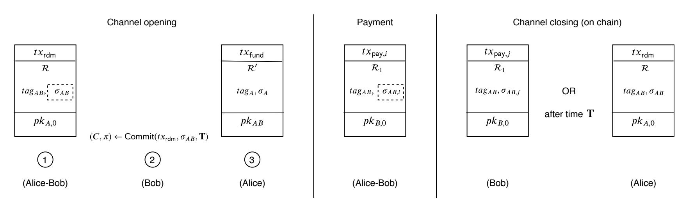
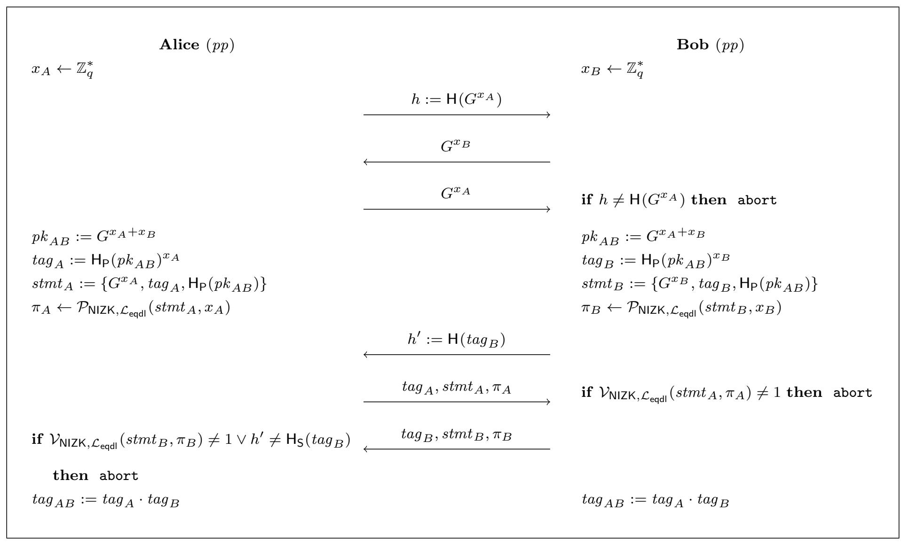

{0}------------------------------------------------

# PAYMO: Payment Channels For Monero

Sri AravindaKrishnan Thyagarajan \*1, Giulio Malavolta †2, Fritz Schmidt ‡3, Dominique Schröder §3

 $^1{\rm Carnegie~Mellon~University}$   $^2{\rm Max~Planck~Institute~of~Security~and~Privacy}$   $^3{\rm Friedrich~Alexander~Universit\"at~Erlangen-N\"urnberg}$ 

September 12, 2022

#### **Abstract**

Decentralized cryptocurrencies still suffer from three interrelated weaknesses: Low transaction rates, high transaction fees, and long confirmation times. Payment Channels promise to be a solution to these issues, and many constructions for real-life cryptocurrencies, such as Bitcoin, are known. Somewhat surprisingly, no such solution is known for Monero, the largest privacy-preserving cryptocurrency, without requiring system-wide changes like a hard-fork of its blockchain.

In this work, we close this gap by presenting PAYMo. This first payment channel protocol is fully compatible with Monero's transaction scheme and can be readily used to perform off-chain payments. Notably, transactions in PAYMo are identical to standard transactions in Monero, therefore not hampering the coins' fungibility. Using PAYMo, we also construct a provably secure and scriptless atomic-swap protocol compatible with the transaction scheme of Monero: One can now securely swap a token of Monero with a token of several major cryptocurrencies such as Bitcoin, Ethereum, Ripple, Cardano, etc. Before our work, atomic swaps protocol for Monero existed only for a limited set of other currencies via ad-hoc approaches.

Our main technical contribution is a new construction of an efficient verifiable timed linkable ring signature, where signatures can be hidden for a pre-determined amount of time in a verifiable way. Our scheme is fully compatible with the transaction scheme of Monero, and it might be of independent interest to develop other applications on Monero.

We implemented PAYMO and our results show that, even with high network latency and with a single CPU core, two regular users can perform up to 93500 payments over 2 minutes (the block production rate of Monero). This is approximately five orders of magnitude improvement over the current payment rate of Monero.

<sup>\*</sup>E-mail: t.srikrishnan@gmail.com

<sup>†</sup>E-mail: giulio.malavolta@hotmail.it

<sup>&</sup>lt;sup>‡</sup>E-mail: fritz.schmid@fau.de

<sup>§</sup>E-mail: dominique.schroeder@fau.de

{1}------------------------------------------------

### Contents

| 1<br>Introduction                                  |                                                                                                                                                                                                                                                                                                                                                                                                                                                                                          |  |  |  |
|----------------------------------------------------|------------------------------------------------------------------------------------------------------------------------------------------------------------------------------------------------------------------------------------------------------------------------------------------------------------------------------------------------------------------------------------------------------------------------------------------------------------------------------------------|--|--|--|
| 1.1<br>Our Contribution                            | 4<br>5                                                                                                                                                                                                                                                                                                                                                                                                                                                                                   |  |  |  |
| 1.2<br>Related Work and Discussion<br>             | 5                                                                                                                                                                                                                                                                                                                                                                                                                                                                                        |  |  |  |
| 1.3<br>Organization<br>                            | 7                                                                                                                                                                                                                                                                                                                                                                                                                                                                                        |  |  |  |
|                                                    | 7                                                                                                                                                                                                                                                                                                                                                                                                                                                                                        |  |  |  |
|                                                    | 7                                                                                                                                                                                                                                                                                                                                                                                                                                                                                        |  |  |  |
|                                                    | 8                                                                                                                                                                                                                                                                                                                                                                                                                                                                                        |  |  |  |
|                                                    | 9                                                                                                                                                                                                                                                                                                                                                                                                                                                                                        |  |  |  |
|                                                    | 10                                                                                                                                                                                                                                                                                                                                                                                                                                                                                       |  |  |  |
| 2.5<br>Extensions                                  | 11                                                                                                                                                                                                                                                                                                                                                                                                                                                                                       |  |  |  |
| Preliminaries                                      | 11                                                                                                                                                                                                                                                                                                                                                                                                                                                                                       |  |  |  |
|                                                    | 12                                                                                                                                                                                                                                                                                                                                                                                                                                                                                       |  |  |  |
|                                                    | 12                                                                                                                                                                                                                                                                                                                                                                                                                                                                                       |  |  |  |
| 4.2<br>LRS-TS Construction in Monero<br>           | 14                                                                                                                                                                                                                                                                                                                                                                                                                                                                                       |  |  |  |
|                                                    | 15                                                                                                                                                                                                                                                                                                                                                                                                                                                                                       |  |  |  |
| 5.1<br>Definition<br>                              | 15                                                                                                                                                                                                                                                                                                                                                                                                                                                                                       |  |  |  |
| 5.2<br>Our VTLRS Construction<br>                  | 16                                                                                                                                                                                                                                                                                                                                                                                                                                                                                       |  |  |  |
| 5.3<br>Optimizations                               | 20                                                                                                                                                                                                                                                                                                                                                                                                                                                                                       |  |  |  |
| PayMo                                              | 20                                                                                                                                                                                                                                                                                                                                                                                                                                                                                       |  |  |  |
|                                                    | 20                                                                                                                                                                                                                                                                                                                                                                                                                                                                                       |  |  |  |
|                                                    | 21                                                                                                                                                                                                                                                                                                                                                                                                                                                                                       |  |  |  |
| PayMo<br>6.3<br>Protocol<br>                       | 23                                                                                                                                                                                                                                                                                                                                                                                                                                                                                       |  |  |  |
| Benchmarking                                       | 23                                                                                                                                                                                                                                                                                                                                                                                                                                                                                       |  |  |  |
| PayMo<br>7.1<br>Evaluation of<br>                  | 25                                                                                                                                                                                                                                                                                                                                                                                                                                                                                       |  |  |  |
| Conclusions                                        | 26                                                                                                                                                                                                                                                                                                                                                                                                                                                                                       |  |  |  |
|                                                    | 30                                                                                                                                                                                                                                                                                                                                                                                                                                                                                       |  |  |  |
|                                                    | 31                                                                                                                                                                                                                                                                                                                                                                                                                                                                                       |  |  |  |
| A.2<br>Non-Slanderability (and Unforgeability)<br> | 31                                                                                                                                                                                                                                                                                                                                                                                                                                                                                       |  |  |  |
| A.3<br>Linkability                                 | 33                                                                                                                                                                                                                                                                                                                                                                                                                                                                                       |  |  |  |
| A.4<br>Security Analysis of Monero's LRS-TS<br>    | 34                                                                                                                                                                                                                                                                                                                                                                                                                                                                                       |  |  |  |
| A.4.1<br>Privacy<br>                               | 34                                                                                                                                                                                                                                                                                                                                                                                                                                                                                       |  |  |  |
| A.4.2<br>Non-Slanderability<br>                    | 36                                                                                                                                                                                                                                                                                                                                                                                                                                                                                       |  |  |  |
| A.4.3<br>Linkability                               | 39                                                                                                                                                                                                                                                                                                                                                                                                                                                                                       |  |  |  |
| Formal Definition of Payment Channel<br>41         |                                                                                                                                                                                                                                                                                                                                                                                                                                                                                          |  |  |  |
| 41                                                 |                                                                                                                                                                                                                                                                                                                                                                                                                                                                                          |  |  |  |
| D<br>44                                            |                                                                                                                                                                                                                                                                                                                                                                                                                                                                                          |  |  |  |
|                                                    | Technical Overview<br>2.1<br>VTLRS for Monero<br>2.2<br>Payment Channels in Monero<br><br>2.3<br>Atomic Swaps for Monero<br><br>2.4<br>Integration in Monero<br><br>Transaction Scheme of Monero<br>4.1<br>Definition<br><br>Verifiable Timed Linkable Ring Signature<br>6.1<br>Payment Channel Definition<br>6.2<br>Auxiliary Interfaces<br>Formal Definitions of LRS-TS<br>A.1<br>Privacy<br><br>Security Analysis of VTLRS For Transaction Scheme of Monero<br>Range Proofs for HTLPs |  |  |  |

{2}------------------------------------------------

| E | Joint Key Generation And Joint Spending Protocols<br>E.1<br>Security Analysis of<br>FJ−LRS<br> | 45<br>45 |
|---|------------------------------------------------------------------------------------------------|----------|
| F | Security Analysis of Payment Channels in Monero Using VTLRS                                    | 50       |
| G | More Details on Integration in Monero                                                          | 53       |
| H | Security Analysis of Atomic Multi-Hop Locks In Monero                                          | 56       |

{3}------------------------------------------------

## <span id="page-3-0"></span>1 Introduction

Modern cryptocurrencies, such as Bitcoin or Monero, realize the digital analog of a fiat currency without a trusted central authority. They typically consist of two main components: (i) A public ledger that publishes all transactions, and (ii) a transaction scheme that describes the structure and validity of transactions. Compared to traditional centralized solutions, decentralized cryptocurrencies suffer from three weaknesses: First, they have a relatively low transaction rate; for example, the current transaction rate of Bitcoin is about four transactions per second while it is 0.1 transactions per second in case of Monero [\[1\]](#page-26-0). Second, the transaction fees are relatively high, about 0,60\$ per transaction in the case of Bitcoin and about 0.25\$ in Monero [\[2\]](#page-26-1). Third, the confirmation of a transaction takes (on average) one hour in the case of Bitcoin and 20 minutes in the case of Monero. Payment Channels (PC) [\[3\]](#page-26-2), and its generalization Payment Channel Networks (PCN) [\[3\]](#page-26-2)–[\[6\]](#page-26-3) have emerged as one of the most promising solutions to mitigate these issues and have been widely deployed to scale payment in major cryptocurrencies, such as Bitcoin [\[7\]](#page-26-4), Ethereum [\[8\]](#page-26-5) or Ripple [\[9\]](#page-26-6). These solutions are commonly referred to as layer 2 or off-chain solutions.

A PC allows a pair of users to perform multiple payments without committing every intermediate payment to the blockchain. Abstractly, a PC consists of three phases: (i) Two users Alice and Bob, open a payment channel by adding a single transaction to the blockchain. This transaction is a promise from Alice that she may pay up to a certain amount of coins to Bob, which he must claim before a certain time T. (ii) Within this time window, Alice and Bob may send coins from the joint address to either of them by sending a corresponding transaction to the other user. (iii) The channel closes when one of those payment transactions is posted on the chain, thus spending coins from the joint address. While realizing PCs for Bitcoin is an established task due to the functionality available in the Bitcoin scripting language, several challenges arise when considering privacy-preserving cryptocurrencies like Monero or Zcash [\[10\]](#page-26-7). Bolt [\[11\]](#page-26-8) is a PC proposal for Zcash while Moreno-Sanchez et al. [\[12\]](#page-26-9) developed a PC protocol for Monero. However, their proposal has various shortcomings (see below for a more details) and, as a consequence, is unlikely to be integrated into Monero. In this work, we aim to close this gap by constructing a PC protocol that is fully compatible with the transaction scheme of Monero and can be used to make off-chain transactions. Brief Look into Monero. Monero is the largest privacy-preserving cryptocurrency [\[13\]](#page-26-10), and the notion of privacy it offers is that: Any external observer cannot learn who the sender or the receiver of a transaction are and the number of coins being transferred. Monero achieves these properties with Ring Confidential Transactions (RingCT) as its cryptographic bedrock. Briefly, a RingCT is a transaction scheme where the sender of the transaction 'hides' his key in an anonymity set (ring). Comparing with Bitcoin, where transactions have typically one source address, the amount in plain, one or two recipient address(es), and a simple signature (ECDSA), the RingCT based Monero transactions contain a ring of addresses, destination addresses, commitments to amounts, related consistency proofs, and a (linkable ring) signature, making the transactions considerably larger. Moreover, the size of a Monero transaction grows linearly with the size of the anonymity set. This results in a major setback to the scalability of Monero and often requires users to make tough choices between better privacy (high transaction fee) and smaller transactions (lower transaction fees). There has been a line of research [\[14\]](#page-26-11)–[\[17\]](#page-27-0) that proposes new and efficient RingCT constructions that result in smaller transaction sizes. These approaches help to increase privacy because they support larger ring sizes and therefore do not increase the transaction fees. However, the central three issues that PCs are addressing remain open: Increasing the transaction rate, reducing the transaction fees in general, and therefore supporting fast micro-payments, as well as fast verification time. Moreover, all these on-chain solutions require system-wide changes in the Monero protocol, and it is unclear if Monero will fork and adapt to one of these schemes.

{4}------------------------------------------------

Unfortunately, layer two solutions (such as PCs) proposed for Bitcoin do not extend to Monero as they crucially rely on some scripting functionalities offered by the Bitcoin blockchain absent in Monero. To the best of our knowledge, all layer two solutions that have been proposed for Monero (like that of [\[12\]](#page-26-9)) are not compatible with its transaction scheme and require a hard fork.

### <span id="page-4-0"></span>1.1 Our Contribution

The contributions of this work can be summarized as follows.

- 1. We propose PayMo (Section [6\)](#page-19-1), the first payment channel protocol that is fully compatible with the transaction scheme of Monero (Section [4\)](#page-11-0). A notable feature of our solution is that PC transactions are syntactically identical to standard transactions in Monero, thus retaining the fungibility[1](#page-4-2) of the Monero coins.
- 2. At the heart of our proposal is a new cryptographic primitive, called verifiable timed linkable ring signatures (VTLRS), that we define and construct (Section [5\)](#page-14-0). Our solution relies on wellestablished cryptographic assumptions and our techniques used in building a VTLRS may be of independent interest.
- 3. We show that PayMo also enables the first secure scriptless atomic-swap protocol for Monero, compatible with its transaction scheme. With our solution, one can securely (atomically) exchange Monero tokens with other prominent currency tokens like Bitcoin, Ethereum, Ripple, Cardano, etc.
- 4. We demonstrate the practicality of our approach by benchmarking PayMo (Section [7\)](#page-22-1). Our analysis shows that PayMo can be used on today's hardware by Monero's users. In terms of performance, at its full power, PayMo supports close to 93500 payments for 2 minutes between two regular users with one CPU core each. Here 2 minutes is the block production rate of Monero. This is a significant increase in payments in Monero, which currently supports only one payment from an address per 2 minutes.

### <span id="page-4-1"></span>1.2 Related Work and Discussion

In the following we compare our approach with existing systems and we discuss some of the choices behind practical aspects of our design.

Comparison with [\[12\]](#page-26-9). The first PC proposal for Monero was recently put forth by Moreno-Sanchez et al. [\[12\]](#page-26-9), however, their solution requires a hard fork with major changes to the Monero transaction scheme and is not backward compatible. Specifically, a PC in their protocol is a joint address comprising two public keys (left and right) and the linkability tag of such a joint address is generated differently from the current specification of Monero, to facilitate either keys to spend from the joint address and preserve double-spend linkability. They also require an explicit time-lock functionality for the joint address which allows the left key to spend before the time-lock expires and the right key after the expiry.

We stress that, even assuming that Monero will fork in the near future to integrate their scheme, the adoption procedure still requires one to solve some challenges: Since the tag generation in [\[12\]](#page-26-9) is different from the currently used algorithm, one needs to perform massive system-wide changes to the Monero protocol itself, requiring every Monero user to spend from their existing, unspent keys (with old tag generation) to a new key (with the new tag generation) during a specific time interval. And after this time, interval spending is allowed only with the new tag generation algorithm, and all spending attempts with the old tag will be rejected. This is highly undesirable as it requires every

<span id="page-4-2"></span><sup>1</sup>Fungibility is a property of a currency whereby two units can be substituted in place of one another. This means that all tokens are essentially the same in value, and therefore there is no specialty for some coins due to some transactions operating on them.

{5}------------------------------------------------

Monero user to be online and make transactions, and any user unable to make this switch during this time interval loses his coins permanently. At the time of writing, it is not clear whether such a proposal will ever be implemented in Monero [18]. An additional limitation of their proposal in terms of transaction privacy is that, since the time-lock information of the payment channel or the payment channel expiry time is publicly available on-chain, it could lead to censorship from miners. A miner could refuse to accept a payment channel transaction if it is too close or too far away from the corresponding channel expiry time.

On the contrary, PAYMO does not require any changes to the transaction scheme of Monero, nor it needs to add any functionality to the scripting language. Any interested pair of users can run PAYMO without the knowledge of any other user in the Monero system. Furthermore, any PAYMO related transaction posted on-chain is *identical* to posting any other regular transaction in Monero. Consequently, our PC protocol is readily usable in Monero today, without making any system-wide modifications. However, we note that our PC protocol cannot be extended to a PCN without modifying some features of the Monero blockchain, while in [12], they have a PCN protocol (still requiring the same modifications to Monero as in their PC protocol).

**Time-Lock Puzzles.** One of the main challenges that we face in constructing a fully-compatible PC for Monero is the lack of a *time-lock* functionality of its scripting language. To "simulate" this functionality off-chain, our constructions will resort to the usage of time-lock puzzles [19]. This approach translates waiting time into performing some inherently sequential computational task, such as repeated squares on unknown order groups. The drawback of this solution is that PC users must run a background process for each PC that they are part of.

We believe that the benefits offered by PCs (e.g. the significant increase in transaction volume) largely outweigh the burden of maintaining an additional background computation running. Considering that the typical time-lock duration for channels is in the order of a couple of days, the computational cost associated with it appears to be modest, especially in comparison with the one required to run proof-of-work based consensus. To further mitigate this issue, we also propose an approach to batch multiple puzzles' solution into a single one (see Section 5.2 for details).

In terms of practicality, the sequential function that we consider (repeated squaring) has been the subject of a large academic [20]–[22] and industrial [23]–[25] effort to study its exact complexity on commodity machines. Functionalities that rely on repeated computation of squares have been integrated in the Chia network [26], [27] and is currently being considered by Ethereum [25], [28], [29].

It is possible that some parties possess hardware with more powerful processing power and could solve time-lock puzzles much earlier than other parties. In a recent work [30], it was shown that this hardware disparity could result in a 60% difference in the time taken to solve a time-lock puzzle using reasonable AWS machines. This could affect security for a party who is caught off-guard by another party who ended up solving the puzzle much earlier (in real-time) than expected. One way to deal with this problem is for the "victim" party to take action well before a conservative estimate (based on concrete lower bounds on sequential squaring [31]) of when the other party might solve the puzzle. For instance, if Alice has to solve a time-lock puzzle for time  $\mathbf{T}$  to take some action against Bob, Bob must make sure to counter this step well ahead of time corresponding to  $\mathbf{T}$ .

Uni-directional vs Bi-directional Channels. While the protocol in [12] with the system-wide changes to Monero supports bi-directional PCs, PAYMO only supports uni-directional PCs. That is, payments from Alice to Bob and from Bob to Alice require opening two separate channels. Bi-directional is desirable in practice as they increase the payment network's capacity, and achieving them in a Monero-compatible way is an interesting open problem.

Other Related Work. Payment Channels and Payment Channel Networks [3], [4] have been proposed as solutions to address the problem of high-frequency payments in Bitcoin. Typical

{6}------------------------------------------------

proposals use a special Hash Time-Lock Contract (HTLC) that lets a user get paid if he produces a pre-image of a certain hash value before a specific time, referred to as the time-lock of the payment. Malavolta et al. [\[5\]](#page-26-13) propose a PCN protocol that does not rely on HTLC and offers better on-chain privacy using a new tool called Anonymous Multi-Hop Locks (AMHL). Bolt [\[11\]](#page-26-8) is a payment channel protocol specially tailored for Zcash [\[10\]](#page-26-7) which uses zk-SNARKs [\[32\]](#page-27-13)–[\[34\]](#page-27-14), and is not compatible with the transaction scheme of Monero, which is the focus of this work. Specifically, BOLT relies on a relative time-lock script offered by the blockchain layer (during channel closure) that is not offered by Monero. As a result, it is unclear how to adapt BOLT to Monero. A generalisation of a payment channel with complex conditional payments is a state channel [\[35\]](#page-27-15)–[\[37\]](#page-28-0) that requires highly expressive scripting functionalities from the underlying blockchain. Since Monero does not offer such expressive scripting functionalities and since our focus is only on fast micro-payments, we focus only on payment channels. Recently Gugger [\[38\]](#page-28-1) proposed a mechanism for atomic swaps between Bitcoin and Monero. However their swap protocol is only semi-scriptless because they require a hash function verification from the bitcoin script. On the other hand, all PayMo requires signature verification from the Bitcoin and Monero and, therefore, improves both the coins' fungibility in their respective chains.

#### <span id="page-6-0"></span>1.3 Organization

The rest of the paper is organized as follows. In Section [2,](#page-6-1) we give a brief technical overview of our core techniques and intuition into our PayMo protocol. In Section [3](#page-10-1) we introduce the building blocks required for our protocols and in Section [4](#page-11-0) we formally present the definitions, security and construction of the transaction scheme of Monero. We present the formal definitions and the construction of VTLRS in Section [5.](#page-14-0) In Section [6](#page-19-1) and ?? we present the PayMo protocol and our atomic swap protocol, respectively. Finally, we benchmark our protocol and present the experimental results in Section [7.](#page-22-1)

### <span id="page-6-1"></span>2 Technical Overview

In the following outline we first introduce the notion of Verifiable Timed Linkable Ring Signature (VTLRS) and we show a construction compatible with the transaction scheme in Monero. Then we describe how to leverage VTLRS to construct payment channels (PCs) that are fully compatible with Monero. Finally, we discuss how to extend our protocol to support atomic swaps with tokens from other currencies and how to integrate our approach in the current implementation of Monero.

For ease of presentation, we consider a simplified representation of a transaction in Monero consisting of: A ring of one-time public keys (addresses) R, a linkability tag tag, a signature σ and the target public key (recipient address). We omit other components of a Monero transaction as our tools and techniques only deal with the above components and it can be naturally extended to the current transaction scheme of Monero with all components in place[2](#page-6-3) .

### <span id="page-6-2"></span>2.1 VTLRS for Monero

We introduce and formalize the notion of Verifiable Timed Linkable Ring Signature (VTLRS). A VTLRS lets a user create a timed commitment of a linkable ring signature on a message (transaction) such that the recipient of the commitment can force open the commitment and learn the signature only after a pre-specified time T. The recipient also receives a proof that convinces him that the

<span id="page-6-3"></span><sup>2</sup>A Monero transaction is based on RingCT [\[17\]](#page-27-0) which additionally consists of commitments to hide the amounts and range proofs to prove that they are well-formed.

{7}------------------------------------------------

force opening would indeed reveal the valid linkable ring signature on the message. Our construction of VTLRS is compatible with the linkable ring signature transaction scheme that is currently implemented in Monero, where the message is now a Monero transaction.

On a high-level, to commit to a VTLRS, the committer takes a (linkable ring) signature on a transaction tx and encodes it into a time-lock puzzle [\[19\]](#page-27-2), which keeps it hidden until time T. To convince the verifier that the puzzle contains a valid signature on the transaction tx , the committer also computes a non-interactive zero-knowledge (NIZK) proof for such a statement. The challenge here is to design an efficient NIZK proof that certifies the validity of the encoded signature. General solutions exist [\[30\]](#page-27-11), [\[39\]](#page-28-2), [\[40\]](#page-28-3) only for common signature schemes, like Schnorr, ECDSA and BLS. Efficient NIZKs. To design an efficient NIZK, we adopt a cut-and-choose approach, where the signature is redundantly encoded into many puzzles and the validity can be checked by revealing the random coins corresponding to a subset of them. If implemented naively, this would clearly compromise the privacy of the signature. Instead, we harness the structural properties of signature of Monero to reveal only isolated components, while at the same time keeping the signature hidden. More specifically, the committer computes a t-out-of-n secret sharing of a special component of the signature. Given a t − 1 subset of the shares (which are revealed by the cut-and-choose) the verifier can check whether these opened shares are valid shares of the signature component and that the opened puzzles were indeed valid puzzles (using the random coins supplied by the prover). If the check is successful, then the verifier is convinced that at least one of the unopened puzzles contains a well-formed share, which is enough to reconstruct a valid signature. The scheme is made non-interactive using the Fiat-Shamir transformation [\[41\]](#page-28-4).

Time-Lock Puzzles. We then instantiate the time-lock puzzles with [\[42\]](#page-28-5) and use the homomorphic properties of such a scheme to combine puzzles in such a way that the computation needed to force open is the same as that to force open a single puzzle. We stress that the use of homomorphism is not just crucial for the efficiency of the solver (verifier), but is also important for security. Without homomorphism, a user with n˜ = n − (t − 1) processors can solve n˜ puzzles in parallel and in total time T. On the other hand, users with less number of processors will have to solve the puzzles one after another, thereby spending more time than T time. This could lead to scenarios in PCs where an adversarial party has an unfair advantage with respect to an honest user and could post a valid transaction ahead of time, effectively stealing coins.

#### <span id="page-7-0"></span>2.2 Payment Channels in Monero

<span id="page-7-1"></span>

Figure 1: Three phases to a (uni-directional) payment channel protocol between Alice and Bob in PayMo. The channel opening phase has three steps. Steps run individually and jointly through interaction are denoted with (Alice) or (Bob) and (Alice-Bob) respectively. Signature σAB inside a dotted box indicates that only Bob learns the signature after interaction with Alice.

Equipped with our efficient VTLRS scheme, we show how Alice and Bob can run a payment

{8}------------------------------------------------

channel protocol to make payments (i.e., a joint address where both signatures are needed in order to perform a transaction). A pictorial description of our PC protocol (PayMo) is given in Figure [1](#page-7-1) and its three main subroutines (channel opening, payment, and channel closing) are discussed below briefly.

Channel opening. Alice and Bob jointly generate a spending key pkAB and a redeem transaction tx rdm that spends the coins from pkAB (belonging to some ring R) to some address of Alice pkA,<sup>0</sup> . The transaction tx rdm also contains the joint tag tagAB that is needed to prevent double-spending. Note that pkAB is an address that is not yet present on the chain. Bob then generates a VTLRS of the signature σAB on tx rdm with timing hardness T. Bob gives the VTLRS commitment and proof (generated using Com(tx rdm, σAB, T) in Figure [1\)](#page-7-1) to Alice, who then posts the transaction tx fund on the Monero blockchain. Such a transaction initializes the channel by sending funds from one of her addresses pk<sup>A</sup> to the joint key pkAB. The channel is now created and initialized on-chain and its expiry time is set to T. Note that after time T Alice will be able to recover the signature tx rdm and therefore redeem the remaining funds in the address pkAB, if any.

Payment. When Alice wishes to pay Bob, they jointly generate a transaction tx pay,i for the i-th payment. tx pay,i spends from pkAB (in some ring R1) and sends it to some address of Bob pk B,<sup>0</sup> . They jointly generate a signature σAB,i on tx pay,i, in such a way that only Bob learns the signature. Channel closing. If Bob wishes to close the channel, he takes the last exchanged transaction payment tx pay,j with Alice and posts it along with σAB,j on the Monero blockchain. In case Bob has not posted any such payment and time T has passed, Alice by then learns σAB from the VTLRS on tx rdm (that was given by Bob during channel opening). Alice can now post tx rdm and σAB on the Monero blockchain and redeem the coins from the channel. In either case, once a transaction spending from pkAB is posted on-chain, the payment channel is considered closed.

### <span id="page-8-0"></span>2.3 Atomic Swaps for Monero

Consider a scenario where Alice has a Monero token that she wants to swap with a token of another currency (Bitcoin, Ethereum, Ripple, etc.) held by Bob, which we denote by

$$B \to^C A \to^M B$$

The atomicity guarantee in this swap states that Bob transfers a token of the currency to Alice if and only if Alice transfers a token of Monero to Bob. The first step to build such a protocol is to construct an atomic multi-hop lock (AMHL) [\[5\]](#page-26-13) protocol compatible with our VTLRS scheme. An AMHL allows several parties to establish n + 1 locks in a path, denoted by `0, `1, . . . , `n. On a high level, AMHL guarantees that the lock `<sup>i</sup> can be "unlocked" if and only if `i+1 is also released. Furthermore, locks are associated with signatures over transactions and unlocking `<sup>i</sup> implies that the i-th party learns the corresponding signature σ<sup>i</sup> . Given an AMHL, one can setup a multi-hop payment by locking transactions over all the intermediaries and release the last lock only once the receiver is reached. This triggers a cascade reaction where each intermediary unlocks the corresponding signature σ<sup>i</sup> and can therefore redeem its payment. To build an AMHL compatible with our VTLRS, we adapt the scheme from [\[5\]](#page-26-13) to the linkable ring signature used in Monero. We defer the details of the construction to ??.

Equipped with this tool, our approach consists in setting up payment channels between the parties in both currencies: On the Monero front the (uni-directional) payment channel is denoted by pk<sup>M</sup> AB, and on the other currency, the channel is denoted by pk<sup>C</sup> BA. Then, using AMHL, the parties setup payment locks on payment transactions from these channels, which enforces the conditional payment: If Bob posts a transaction paying the coin from pk<sup>M</sup> AB, then Alice recovers enough information to compute a valid transaction from pk<sup>C</sup> BA, by the security of the AMHL scheme. On the other hand, if

{9}------------------------------------------------

Bob does not post any transaction, eventually the channels expire and the respective parties recover their coins.

One important aspect that we need to address is to ensure that the timelock  $t_M$  of the payment channel  $pk_{AB}^M$  is less than the timelock  $t_C$  of the channel  $pk_{BA}^C$ . Precisely we want  $t_C = t_M + \delta$  for some conservatively chosen  $\delta > 0$ . This is because Alice wants to ensure that after Bob releases the lock of AMHL and gets the Monero token from  $pk_{AB}^M$ , she has some time  $(\delta)$  to release her lock and get the currency token from  $pk_{AB}^C$ . This means that, the timing hardness  $\mathbf{T}$  of VTLRS that is used in (the PayMo) channel  $pk_{AB}^M$  is set such that the associated time  $t_M$  satisfies  $t_M := t_C - \delta$ .

Interoperability. Our AMHL protocol is compatible with the LRS-based transaction scheme of Monero (that uses ed25519 curve) and Schnorr signature (that use the ed25519 curve) transaction schemes of [5]. In case of atomic swaps, this means that we can swap a Monero token with any currency that uses Schnorr signatures with ed25519 curve, for example, Ripple [43] or Cardano [44]. To atomically swap with cryptocurrencies that implement Schnorr/ECDSA signatures over different curves, one has to additionally include a NIZK proof of equality of discrete logarithms over different groups [38]. For a comprehensive overview of atomic swaps over different curves, we refer the reader to [12].

### <span id="page-9-0"></span>2.4 Integration in Monero

We finally discuss how to integrate our proposal in the current code of Monero. An additional challenge stems from the fact that each public key in the ring used in a transaction is associated with a key\_offset field [45]. This field stores the index of the key with respect to the global set of public keys as a way to optimise the look up of keys during transaction verification. Recall that, during channel opening, Alice and Bob need to generate the redeem transaction  $tx_{rdm}$  that spends from the payment channel key  $pk_{AB}$  before  $tx_{fund}$  (that spends to  $pk_{AB}$ ) is posted on the blockchain. This means that, in order to sign a correctly formed transaction  $tx_{rdm}$ , one needs to guess ahead of time the offset position of  $pk_{AB}$ .

There are two ways to bypass this obstacle. (1) Modify the current implementation (not the transaction scheme) to adopt a different look up strategy for public keys, that allows users to sign transactions that spend from a key that is not posted on the blockchain yet. (2) Instead of generating a VTLRS commitment of a signature on  $tx_{\mathsf{rdm}}$ , Bob can generate a timed commitment to his share of the joint secret key  $sk_{AB}$ , for time **T**. After force opening the commitment, Alice learns  $sk_{AB}$  and can use it to correctly sign  $tx_{\mathsf{rdm}}$ , since the offset of  $pk_{AB}$  is fixed at this point. Clearly, one needs an efficient mechanism to ensure that the timed commitment of Bob indeed contains a valid share of  $sk_{AB}$ . This can be realized using a verifiable timed discrete-log (VTDLog) scheme, and an efficient instantiation was recently proposed in [30].

While using VTDLog is a viable option to construct Monero-compatible PCs, we argue that VTLRS is a more desirable solution, since it enables the usage of stealth addresses [17]. Stealth addressing reduces interaction between the sender and the receiver of a payment in the following way: Alice (sender) generates a one-time public key  $\mathsf{opk}_B$  for Bob (recipient) given access to Bob's master public key  $\mathsf{mpk}_B$ , and then sends coins to  $\mathsf{opk}_B$ . Bob can later spend from  $\mathsf{opk}_B$  by generating the one time secret key  $\mathsf{osk}_B$  using his master secret key  $\mathsf{msk}_B$ . This way the receiver is not required to send a recipient key to the sender every time he wishes to receive funds. Since the VTDLog-based solution leaks information about the long term secret key of a party, stealth addressing scheme used currently in Monero, is no longer a viable option, as one could link all future transactions of Bob once  $\mathsf{osk}_B$  is disclosed [46]. Note that this issue does not arise in the VTLRS-based scheme, since neither user learns the secret key shares of the other user involved.

More details about integrating payment channels in the current code of Monero can be found

{10}------------------------------------------------

in Appendix [G.](#page-52-0)

### <span id="page-10-0"></span>2.5 Extensions

Notice that Alice is required to perform persistent computation to open her VTLRS commitments. This could limit the number of channels that Alice can operate simultaneously. However, the persistent computation of opening a VTLRS commitment can be securely outsourced to a decentralized service [\[47\]](#page-28-10) at a market determined cost. This relieves Alice of any potentially heavy computation related to VTLRS opening, provided she has enough funds to outsource using the service from [\[47\]](#page-28-10). Therefore the number of channels Alice operates is no longer limited by her computational power.

PayMo supports payment channels with uni-directional payments. A payment channel with bi-directional payments allows both Alice and Bob to make payments to each other using their channel. A recent work [\[48\]](#page-28-11) proposed Sleepy Channels, the first bi-directional payment channel protocol compatible with Monero. However, the key tools that they require to achieve this, are based on our work. Specifically, they crucially rely on VTLRS and the channel operations of PayMo, to realise timed payments and payment revocation, which are essential for bi-directional payment channels.

## <span id="page-10-1"></span>3 Preliminaries

We denote by λ ∈ N the security parameter and by x ← A(in; r) the output of the algorithm A on input in using r ← {0, 1} <sup>∗</sup> as its randomness. We omit this randomness and only mention it explicitly when required. We denote the set {1, . . . , n} by [n]. We model parallel algorithms as Parallel Random Access Machines (PRAM): In this model multiple processors are attached to a single block of memory and n number of processors can perform independent operations on n number of data in a particular unit of time. We consider probabilistic polynomial time (PPT) machines as efficient algorithms. We briefly recall the cryptographic primitives used in our protocols and

Time-Lock Puzzles. Time-lock puzzles [\[19\]](#page-27-2) allow one to conceal a secret for a certain amount of time T. Homomorphic Time-Lock Puzzles (HTLPs) [\[42\]](#page-28-5) allow one to perform homomorphic computation on honestly generated puzzles. It consists of a setup algorithm (PSetup), that takes as input a time hardness parameter T and outputs public parameters of the system pp, a puzzle generation algorithm (PGen) that, on input the public parameter and a message, generates the corresponding puzzle. One can then evaluate homomorphically functions over encrypted messages (PEval) and solve the resulting puzzle in time T (PSolve). The security requirement is that for every PRAM adversary A of running time ≤ T<sup>ε</sup> (λ) the messages encrypted are computationally hidden.

In [\[42\]](#page-28-5), Malavolta and Thyagarajan show an efficient construction that is linearly homomorphic over the ring ZN<sup>s</sup> , where N is an RSA modulus and s is any positive integer. The scheme is perfectly correct and is secure under the sequential squaring assumption [\[19\]](#page-27-2).

Non-Interactive Zero-Knowledge. Let R : {0, 1} <sup>∗</sup> × {0, 1} <sup>∗</sup> → {0, 1} be an NP relation with corresponding NP-language L := {stmt : ∃wit s.t. R(stmt, wit) = 1}. A non-interactive zeroknowledge proof (NIZK) [\[49\]](#page-28-12) system for L is initialized with a setup algorithm Setup(1<sup>λ</sup> ) that outputs a common reference string crs. A prover can show the validity of a statement stmt with a witness wit by invoking PNIZK,L(crs, stmt, wit), which outputs a proof π. The proof π can be efficiently checked by the verification algorithm VNIZK,L(crs, stmt, π). A NIZK proof for language L is simulation extractable if one can extract a valid wit from adversarially generated proofs, even if the adversary sees arbitrarily many simulated proofs. A NIZK must also be zero knowledge in the sense that nothing beyond the validity of the statement is leaked to the verifier.

{11}------------------------------------------------

Threshold Secret Sharing. Secret sharing is a method of creating shares of a given secret and later reconstructing the secret itself only if given a threshold number of shares. Shamir [\[50\]](#page-28-13) proposed a threshold secret sharing scheme where the sharing algorithm takes a secret s ∈ Z<sup>q</sup> and generates shares (s1, . . . , sn) each in Zq. The reconstruction algorithm takes as input at least t shares and outputs a secret s. The security of the secret sharing scheme demands that knowing only a set of shares smaller than the threshold size does not help in learning any information about the secret s. Universal composability. To model security and privacy in the presence of concurrent executions we resort to the universal composability framework from Canetti [\[51\]](#page-28-14) extended to support a global setup [\[52\]](#page-28-15). In this framework, parties interact with a trusted ideal functionality through secure authenticated channels. A protocol is executed in the presence of any adversary A that corrupts any subset of the parties, prior to the beginning of the execution (static corruption). Both honest parties and the adversary receive their input from a special entity, called the environment. Let EXECτ,A,<sup>E</sup> be the ensemble of the outputs of the environment E when interacting with the attacker A and users running protocol τ (over the random coins of all the involved machines).

Definition 1 (Universal Composability) A protocol τ UC-realizes an ideal functionality F if for any PPT adversary A there exists a simulator S such that for any environment E the ensembles EXECτ,A,<sup>E</sup> and EXECF,S,<sup>E</sup> are computationally indistinguishable.

Synchrony and Communication. We assume synchronous communication between users, where the execution of the protocol happens in rounds. We model this via an ideal functionality Fclock as it is done in [\[53\]](#page-28-16), [\[54\]](#page-29-1), where all honest parties are required to indicate that are ready to proceed to the next round before the clock proceeds. The clock functionality that we consider is fully described in [\[52\]](#page-28-15). This means that all entities are always aware of the given round[3](#page-11-2) . We also assume the existence of secure message transmission channels between users modelled by Fsmt.

Blockchain. We assume the existence of a blockchain B (just as in [\[4\]](#page-26-12), [\[5\]](#page-26-13), [\[55\]](#page-29-2)) that we model as a trusted append-only bulletin board: The corresponding ideal functionality FB maintains the chain B locally and updates it according to the transactions between users. The functionality is also parameterized by a signature scheme that lets any user generate key pairs and can post a signed transaction transferring coins from one user to another. At any point in the execution, any user U can send a distinguished message read to FB, who sends the whole transcript of B to U. We denote the number of entries of B (or the length of the chain) by |B|. We refer the reader to [\[55\]](#page-29-2) for a formal definition of this functionality. In all of our protocols we model the Monero blockchain as FB.

## <span id="page-11-0"></span>4 Transaction Scheme of Monero

We review the basic definitions of Linkable Ring Signatures (LRS) following Lai et al. [\[17\]](#page-27-0). In contrast to their work, our definitions do not consider the "confidential transaction" part, and only focus on the signature of the transaction scheme, for conceptual simplicity.

#### <span id="page-11-1"></span>4.1 Definition

A ring signature [\[56\]](#page-29-3) scheme allows to sign messages such that the signer is anonymous within a set a possible signers, called the ring. The members associated to the ring are chosen "on-the-fly" by the signer using their public-keys. Linkability [\[57\]](#page-29-4) means that anonymity is retained unless the same user signing key is used to sign twice. This is achieved by associating a unique linkability tag to each signing key that is revealed while generating a signature.

<span id="page-11-2"></span><sup>3</sup>Parties could synchronise their clocks over the internet

{12}------------------------------------------------

In a transaction scheme, we have a block of data referred to as a transaction, that determines the amount of coins transferred from one user address (source) to another user address (target) and it is accompanied by an authentication token (signature) of the sending user. Since the sending user is represented through the source address in the transaction, the signature is checked for validity with respect to the source account. Combining linkable ring signatures and a transaction scheme, we have a linkable ring signature based transaction scheme (LRS-TS), where the message signed is the transaction which consists of: A ring of addresses (LRS public keys) and their associated coins (out of which one of the addresses is the source account), and one or more target addresses. The authentication token of the transaction is a linkable ring signature on the transaction (as message), with the ring of addresses as the ring, and the secret authentication key of the source address as the the signing key of the linkable ring signature scheme. To prevent leakage of the source address it is assumed that each address in the ring of addresses have the same amount of associated coins[4](#page-12-0) .

Definition 2 A Linkable Ring Signature (LRS) transaction scheme ΠLRS consists of the PPT algorithms (Setup, OTKGen,TagGen, Spend, Vf) which are defined as follows:

pp ← Setup(1<sup>λ</sup> ): outputs the public parameter pp.

(pk, sk) ← OTKGen(pp): The one-time key generation algorithm outputs a public-secret key-pair (pk, sk).

tag ← TagGen(sk): The tag-generation algorithm takes as input a secret key sk. It outputs a tag tag.

(tx , σ) ← Spend(R, I, O, µ): The spend algorithm takes as input a set R of public keys with each key associated with c coins, a tuple I = (j, sk, tag) consisting of an index j, a secret key sk, and a tag tag, a set O consisting of target public keys and some metadata µ . It outputs a transaction tx := (R, tag, O, µ) and a signature σ.

b ← Vf(tx , σ): The verify algorithm inputs a transaction tx and a signature σ. It outputs a bit b denoting the validity of σ.

Security. We have three properties of LRS-TS, namely (1) Privacy: LRS-TS should ensure privacy of the source account, meaning an adversarial observer on the blockchain should not learn any information about the source address from a transaction other than the fact that it is a member of the ring of one-time addresses, (2) Non-Slanderability (Unforgeability): LRS-TS must ensure that an adversarial user cannot steal the coins of an honest user (unforgeability) or spend coins on behalf of an honest user (non-slanderability), and (3) Linkability: LRS-TS must ensure that an adversary cannot double spend his coins and any such attempts must be linkable. We refer the reader to Appendix [A](#page-29-0) for the formal definitions.

The subtle difference between these two properties is that an adversary stealing funds has to produce a valid authentication token (a signature) for the honest user's one-time key. While an adversary spending on behalf of an honest user (or slandering an honest user) may use only the tag of the honest user's key in his transaction and not necessarily generate the authentication token for the honest user's key. This way of spending makes the honest user's coins unspendable: as the corresponding tag has been used by the adversary already which makes any attempt by the honest user to spend his funds (marked) as a double spend and therefore rejected by the blockchain.

We note that it is enough to prove that a LRS-TS satisfies our privacy, linkability and nonslanderability definitions, as our formal definitions of linkability (Definition [9\)](#page-32-1) and non-slanderability (Definition [8\)](#page-31-0) actually imply the notion of unforgeability.

<span id="page-12-0"></span><sup>4</sup>This assumption can be relaxed with the use of confidential transactions [\[58\]](#page-29-5) where an account's associated amount is hidden using commitments.

{13}------------------------------------------------

#### <span id="page-13-0"></span>4.2 LRS-TS Construction in Monero

We give a formal description of the LRS-TS scheme deployed in Monero. The scheme (Figure 2) is defined over a cyclic group  $\mathbb G$  of prime order q with generator G and uses two different hash functions  $\mathsf{H}_\mathsf{P}:\mathbb G\to\mathbb G,\mathsf{H}_\mathsf{S}:\{0,1\}^*\to\mathbb Z_q^*.$ 

The private-public key pair is the tuple  $(x, G^x) \in \mathbb{Z}_q^* \times \mathbb{G}$ . Each secret key is associated with a unique linkability tag that is set as  $tag := \mathsf{H}_{\mathsf{P}}(pk)^{sk}$ . The spend algorithm takes as input a ring of public keys, the secret key and the tag of the public key that is a member of the ring. For ease of understanding we make the assumption that the spending public key is always  $pk_{|\mathcal{R}|}$ . The algorithm samples  $(s'_0, s_1, \ldots, s_{|\mathcal{R}|-1}) \leftarrow \mathbb{Z}_q^*$  and computes  $L_0, R_0, h_0$  and  $L_i, R_i, h_i$  for each index  $i \in [|\mathcal{R}|-1]$  (as shown in Figure 2). The algorithm finally sets  $s_0 := s'_0 - h_{|\mathcal{R}|-1} \cdot sk$  and the signature consists of  $\sigma := (s_0, s_1, \ldots, s_{|\mathcal{R}|-1}, h_0)$ . The verification algorithm runs the same loop as in the spend algorithm (except that it now ranges over the full ring) to obtain  $h_{|\mathcal{R}|}$  and it accepts only if  $h_0 = h_{|\mathcal{R}|}$ .

<span id="page-13-1"></span>

| $Setup(1^\lambda,1^\alpha)$                                                                                                                                                                       | $Spend(\mathcal{R},\mathcal{I},\mathcal{O},\mu)$                                                                                                                                                                                                                                                                                                                                                                                                                                                                                                                                        | $Vf(tx,\sigma)$                                                                                                                                                                                                                                                                                                                                                                                                                                                                                                                                                         |
|---------------------------------------------------------------------------------------------------------------------------------------------------------------------------------------------------|-----------------------------------------------------------------------------------------------------------------------------------------------------------------------------------------------------------------------------------------------------------------------------------------------------------------------------------------------------------------------------------------------------------------------------------------------------------------------------------------------------------------------------------------------------------------------------------------|-------------------------------------------------------------------------------------------------------------------------------------------------------------------------------------------------------------------------------------------------------------------------------------------------------------------------------------------------------------------------------------------------------------------------------------------------------------------------------------------------------------------------------------------------------------------------|
| $\begin{aligned} H_P : \mathbb{G} & \to \mathbb{G} \ H_S : \{0,1\}^* & \to \mathbb{Z}_q^* \ pp := (\mathbb{G},q,G,H_P,H_S) \ \mathbf{return} \ pp \end{aligned} \ \ \ \ \ \ \ \ \ \ \ \ \ \ \ \ $ | $\begin{aligned} \mathbf{parse} \ \mathcal{R} &:= (pk_1, \dots, pk_{ \mathcal{R} }) \\ \mathbf{parse} \ \mathcal{I} &:= (j, sk, tag), \ s.t. \\ j &=  \mathcal{R}  \ \text{and} \ pk_{ \mathcal{R} } = G^{sk} \\ tx &:= tx(\mathcal{R}, \mathcal{I}, \mathcal{O}, \mu) \\ (s'_0, s_1, \dots, s_{ \mathcal{R} -1}) \leftarrow \mathbb{Z}_q^* \\ L_0 &:= G^{s'_0}, R_0 := H_P(pk_{ \mathcal{R} })^{s'_0} \\ h_0 &:= H_S(tx  L_0  R_0) \\ \mathbf{for} \ i &\in [ \mathcal{R} -1] \ \mathbf{do} \\ L_i &:= G^{s_i} pk_i^{h_{i-1}}, \\ R_i &:= H_P(pk_i)^{s_i} tag^{h_{i-1}} \end{aligned}$ | $\begin{aligned} & \mathbf{parse} \ tx := \left( \left\{ pk_i^{\mathcal{R}} \right\}_{i=1}^{ \mathcal{R} }, tag, \left\{ pk_i^{\mathcal{O}} \right\}_{i=1}^{ \mathcal{O} }, \mu \right) \\ & \mathbf{parse} \ \sigma := (s_0, \dots, s_{ \mathcal{R} -1}, h_0) \\ & \mathbf{set} \ s_{ \mathcal{R} } := s_0 \\ & \mathbf{for} \ i \in [ \mathcal{R} ] \ \mathbf{do} \\ & L_i := G^{s_i} pk_i^{h_{i-1}} \\ & R_i := H_{P}(pk_i)^{s_i} tag^{h_{i-1}} \\ & h_i := H_{S}(tx  L_i  R_i) \\ & \mathbf{endfor} \\ & \mathbf{return} \ (h_0 = h_{ \mathcal{R} }) \end{aligned}$ |
| $\frac{TagGen(sk)}{\mathbf{set}\ tag := H_P\left(G^{sk}\right)^{sk}}$ $\mathbf{return}\ tag$                                                                                                      | $h_i := H_S(tx  L_i  R_i)$ $h_i := H_S(tx  L_i  R_i)$ $endfor$ $set\ s_0 := s_0' - h_{ \mathcal{R} -1}sk$ $\sigma := (s_0, s_1, \dots, s_{ \mathcal{R} -1}, h_0)$ $return\ (tx, \sigma)$                                                                                                                                                                                                                                                                                                                                                                                                |                                                                                                                                                                                                                                                                                                                                                                                                                                                                                                                                                                         |

**Figure 2:** LRS transaction scheme  $\Pi_{LRS}$  used in Monero. Here the spending key  $G^{sk}$  is assumed to be the  $|\mathcal{R}|$ -th element of the ring  $\mathcal{R}$ .

Using the following theorems, we show that the construction shown in Figure 2 satisfies the security notions of a LRS-TS as defined in Section 4.1. The formal proofs of the theorems are deferred to Appendix A.4.

**Theorem 4.1 (Privacy)** If the Decisional Diffie-Hellman problem (DDH) is hard over the group  $\mathbb{G}$  (??) then the LRS transaction scheme used in Monero is private Definition 7 in the ROM.

**Theorem 4.2 (Non-Slanderability)** If the Discrete Logarithm problem (DL) is hard over the group  $\mathbb{G}$  (??), then the LRS transaction scheme used in Monero is non-slanderable Definition 8 in the ROM.

**Theorem 4.3 (Linkability)** The LRS construction used in Monero is linkable Definition 9 in the ROM.

{14}------------------------------------------------

### <span id="page-14-0"></span>5 Verifiable Timed Linkable Ring Signature

In the following we define and construct a Verifiable Timed Linkable Ring Signature (VTLRS) transaction scheme.

### <span id="page-14-1"></span>5.1 Definition

A VTLRS is a linkable ring signature based transaction scheme with the additional property that one can commit to such a signature in a verifiable and extractable way.

Definition 3 (VTLRS) A Verifiable Timed Linkable Ring Signature Transaction Scheme, ΠVTLRS for a LRS transaction scheme ΠLRS is a tuple of five algorithms (Setup, Com, Vfy, Op, FOp) where: crs ← Setup(1<sup>λ</sup> ): the setup algorithm outputs a common reference string crs which is implicitly taken as input in all other algorithms.

(C, π) ← Com(σ, tx , T; r): the commit algorithm takes as input a signature σ, the transaction tx , a hiding time T and randomness r. It outputs a commitment C and a proof π.

0/1 ← Vfy(tx , C, π): the verify algorithm takes as input a transaction m, a commitment C of hardness T and a proof π and accepts the proof if and only if, the value σ embedded in C is a valid signature on the transaction tx (i.e., LRS.Vf(tx , σ) = 1). Else it outputs 0.

(σ, r) ← Op(C; r): the opening algorithm is run by the committer that as input a commitment C and outputs the committed signature σ and the randomness r used in generating the commitment C.

σ ← FOp(C): the deterministic FOp algorithm takes as input the commitment C and outputs a signature σ.

The correctness requirement of a VTLRS transaction scheme is formalized in the definitions below.

Definition 4 (Correctness of VTLRS) A Verifiable Timed Linkable Ring Signature Transaction Scheme, ΠVTLRS := (Setup, Com, Vfy, Op, FOp) construction for a linkable ring signature transaction scheme ΠLRS := (LRS.Setup, LRS.OTKGen, LRS.TagGen, LRS.Spend, LRS.Vf) is said to satisfy correctness, if (i) for all λ ∈ N, (ii) all crs output by Setup(1<sup>λ</sup> ), (iii) all transactions tx , all hiding times T ∈ N, and (iv) all signature σ output by LRS.Spend, the following conditions hold

- 1. Vfy(tx , Com(σ, tx , T)) = 1,
- 2. for all randomness r such that (C, π) ← Com(σ, tx , T; r) we have (σ, r) ← Op(C; r), and σ ← FOp(C).

Beyond security of LRS-TS, a VTLRS must satisfy the notions of timed privacy and soundness, defined below.

Timed Privacy. This notion requires that all PRAM algorithms whose running time is at most t (where t < T), succeed in extracting σ from the commitment C and π with at most negligible probability. The adversary is given the spending public key and the tag as input, and gets access to a spending oracle. The challenge for the adversary here is to distinguish (within time T even with parallelism) a commitment from being a commitment to a valid LRS signature with the above attributes, to a simulated commitment.

<span id="page-14-2"></span>Definition 5 (Timed Privacy) A VTLRS scheme ΠVTLRS = (Setup, Com, Vfy, Op, FOp) for a LRS transaction scheme ΠLRS = (LRS.Setup, LRS.OTKGen, LRS.TagGen, LRS.Spend, LRS.Vf) is timed private if there exists a PPT simulator S, a negligible function negl, and a polynomial T˜ such that

{15}------------------------------------------------

for all polynomials  $\mathbf{T} > \tilde{\mathbf{T}}$ , all algorithms  $\mathcal{A} = (\mathcal{A}_1, \mathcal{A}_2)$  where  $\mathcal{A}_1$  is PPT and  $\mathcal{A}_2$  is a PRAM whose running time is at most  $t < \mathbf{T}$ , and all  $\lambda \in \mathbb{N}$  it holds that

$$\Pr\left[\begin{array}{c|c} (pk,sk) \leftarrow \mathsf{LRS.OTKGen}(pp) \\ tag \leftarrow \mathsf{TagGen}(sk) \\ (\mathcal{R},\mathcal{O},\mu) \leftarrow \mathcal{A}_1^{\mathsf{Spend}\mathcal{O}}(pk,tag,pp) \\ s.t. \ pk = pk_{|\mathcal{R}|} \ and \ tx := \{\mathcal{R},tag,\mathcal{O},\mu\} \\ b \leftarrow \{0,1\}, \ b' \leftarrow \mathcal{A}_2^{\mathsf{Spend}\mathcal{O}}(tx,C_b,\pi_b) \end{array}\right] \leq \mathsf{negl}(\lambda)$$

where,  $pp \leftarrow \mathsf{LRS.Setup}(1^\lambda), crs \leftarrow \mathsf{Setup}(1^\lambda)$  and if b = 0, then  $(C_0, \pi_0) \leftarrow \mathsf{Com}(\sigma, tx, \mathbf{T})$  where  $\sigma \leftarrow \mathsf{LRS.Spend}(\mathcal{R}, (|\mathcal{R}|, sk, tag), \mathcal{O}, \mu)$  and if b = 1,  $(C_1, \pi_1) \leftarrow \mathcal{S}(pk, tx, \mathbf{T})$ .

**Soundness.** This says that the accepting verifier is convinced that given C, the FOp algorithm will return a valid signature  $\sigma$  on transaction tx in time  $\mathbf{T}$ . A VTLRS is simulation-sound if it is sound even when the prover has access to simulated proofs for (possibly false) statements of his choice; i.e., the prover must not be able to compute a valid proof for a fresh false statement of his choice.

<span id="page-15-1"></span>**Definition 6 (Soundness)** A VTLRS scheme  $\Pi_{VTLRS} = (Setup, Com, Vfy, Op, FOp)$  for a LRS transaction scheme  $\Pi_{LRS} = (LRS.Setup, LRS.OTKGen, LRS.TagGen, LRS.Spend, LRS.Vf)$  is sound if there is a negligible function negl such that for all PPT adversaries  $\mathcal{A}$  and all  $\lambda \in \mathbb{N}$ , we have:

$$\Pr\left[\begin{array}{c|c} crs \leftarrow \mathsf{Setup}(1^\lambda) \\ b_1 = 1 \land b_2 = 0 \\ \hline \\ (\sigma,r) \leftarrow \mathsf{FOp}(C) \\ b_1 := \mathsf{Vfy}(tx,C,\pi) \\ b_2 := \mathsf{LRS.Vf}(tx,\sigma) \\ \end{array}\right] \leq \mathsf{negl}(\lambda) \,.$$

#### <span id="page-15-0"></span>5.2 Our VTLRS Construction

We give a construction of VTLRS transaction scheme for the LRS transaction scheme used in Monero. Throughout the following overview, we describe the VTLRS as an interactive protocol between a committer and a verifier, which can be made non-interactive using the Fiat-Shamir transformation [41]. A formal description of our VTLRS is given in Figures 3 and 4, where hash function  $\mathsf{H}':\{0,1\}^*\to J$ , with J being a set of indices in [n] such that |J|=t-1, is used used to implement the Fiat-Shamir transformation. We now give an intuitive description of the VTLRS construction.

**High-Level Overview.** The commit algorithm proceeds as follows: Consider a signature  $\sigma := (s_0, s_1, \ldots, s_{|\mathcal{R}|-1}, h_0)$  generated by Spend algorithm of Figure 2 on a transaction  $tx := (\{pk_i\}_{i=1}^{|\mathcal{R}|}, tag, \mathcal{O}, \mu)$ . Let  $pk_{|\mathcal{R}|}$  be the spending key and the committer is privy to this knowledge (which we justify below). The commit algorithm takes as input this transaction tx, signature  $\sigma$  and the hiding time  $\mathbf{T}$ . To generate a VTLRS on transaction tx, the committer secret shares the values in  $sc := (s_0, G^{s_0}, \mathsf{H}_{\mathsf{P}}(pk_{|\mathcal{R}|})^{s_0})$  using a t-out-of-n threshold sharing scheme in the following way:

1. For the first t-1 shares, choose  $\alpha_i \in \mathbb{Z}_q$  uniformly at random and set  $K_i := G^{\alpha_i}$  and  $Y_i := \mathsf{H}_{\mathsf{P}}(pk_{|\mathcal{R}|})^{\alpha_i}$ , respectively. Note that each share  $\alpha_i$  can be publicly verified for consistency by recomputing  $K_i$  and  $Y_i$ .

{16}------------------------------------------------

2. For the remaining n-(t-1) shares, use Lagrange interpolation in the exponent, i.e., for  $i \in \{t, t+1, \ldots, n\}$  set

$$\alpha_i = \left(s_0 - \sum_{j \in [t-1]} \alpha_j^{\ell_j(0)}\right)^{\ell_i(0)^{-1}}$$

$$K_i = \left(\frac{G^{s_0}}{\prod_{j \in [t-1]} K_j^{\ell_j(0)}}\right)^{\ell_i(0)^{-1}} Y_i = \left(\frac{\operatorname{H}_{\mathsf{P}}(pk_{|\mathcal{R}|})^{s_0}}{\prod_{j \in [t-1]} Y_j^{\ell_j(0)}}\right)^{\ell_i(0)^{-1}}$$

where  $\ell_i(\cdot)$  is the *i*-th Lagrange polynomial basis. Note that here  $\alpha_i$ 's are integers in  $\mathbb{Z}_q$  while  $K_i, Y_i \in \mathbb{G}$ .

The above steps ensure that we can reconstruct (via Lagrange interpolation) the valid  $s_0$  value that is part of the signature  $\sigma$  from any t-sized set of shares of sc.

The committer then computes a time-lock puzzle  $Z_i$  with time parameter  $\mathbf{T}$  for each share  $\alpha_i$  separately. The first message consists of all puzzles  $(Z_1, \ldots, Z_n)$  together with  $G^{s_0}$ ,  $\mathsf{H}_\mathsf{P}(pk_{|\mathcal{R}|})^{s_0}$  and all  $(K_i, Y_i)$  as defined above.

Consistency Proof via Cut-and-Choose. After receiving the above first message, the verifier chooses a random set I of size (t-1) as the challenge set. For this set, the committer opens the time-lock puzzles  $\{Z_i\}_{i\in I}$  and reveals the underlying value  $\alpha_i$  (together with the corresponding random coins) that it committed to. The verifier wants to ensure that, (i) the puzzles are indeed generated for the correct timing hardness  $\mathbf{T}$  and can be successfully solved in that time and (ii) as long as at least one of the shares in the unopened puzzles  $(\{Z_i\}_{i\in[n]/I})$  is consistent with respect to the corresponding partial commitments  $(K_i, Y_i)$ , then we can use it to reconstruct  $s_0$  and therefore a valid  $\sigma$ . To do this, the verifier performs the following checks and accepts the commitment as legitimate only if they are all successful:

- 1. All puzzles  $\{Z_i\}_{i\in I}$  are correctly generated using  $\alpha_i$  and the corresponding randomness (which was also revealed above) with timing hardness **T**
- 2. All  $\{\alpha_i\}_{i\in I}$  are consistent with the corresponding  $K_i, Y_i$ , i.e.,  $K_i = G^{\alpha_i}, Y_i = \mathsf{H}_\mathsf{P}(pk_{|\mathcal{R}|})^{\alpha_i}$ .
- 3. All  $K_i, Y_i$  are valid shares of  $G^{s_0}$  and  $\mathsf{H}_\mathsf{P}(pk_{|\mathcal{R}|})^{s_0}$  respectively, i.e.,  $K_i^{\ell_i(0)} \cdot \prod_{j \in I} K_j^{\ell_j(0)} = G^{s_0}$  and  $Y_i^{\ell_i(0)} \cdot \prod_{j \in I} Y_j^{\ell_j(0)} = \mathsf{H}_\mathsf{P}(pk_{|\mathcal{R}|})^{s_0}$ .

Consequently, to fool a verifier, a malicious prover has to guess the challenge set I ahead of time to pass the above checks without actually committing a valid  $s_0$  (signature  $\sigma$ ). Setting the parameters appropriately, we can guarantee that this happens only with negligible probability.

Signature Recovery via Homomorphic Packing. To recover  $s_0$  and the valid signature, the verifier has to solve  $\tilde{n} = (n - t + 1)$  puzzles to force the opening of a VTLRS. To close the gap between honest and malicious verifiers, we would like to reduce his workload to the minimal one of solving a single puzzle. To achieve this goal, we use the linearly homomorphic time-lock puzzle construction [42], combined with standard packing techniques to compress  $\tilde{n}$  puzzles into a single one. Concretely, the verifier, on input  $(Z_1, \ldots, Z_{\tilde{n}})$  homomorphically evaluates the linear function

$$f(x_1, \dots, x_{\tilde{n}}) = \sum_{i=1}^{\tilde{n}} 2^{(i-1)\cdot\lambda} \cdot x_i$$
(1)

to obtain a single puzzle  $\tilde{Z}$ , which he can solve in time **T**. Observe that, once the puzzle is solved, all signatures can be decoded from the bit-representations of the resulting message. However we

{17}------------------------------------------------

need to ensure that: (1) The message space of the homomorphic time-lock puzzle must be large enough to accommodate all n˜ signatures and (2) The values α<sup>i</sup> encoded in the the input puzzles must not exceed the maximum size of a signature (say λ bits).

Condition (1) can be satisfied instantiating the linearly homomorphic time-lock puzzles with a large enough message space. On the other hand, condition (2) is enforced by including a range NIZK (PNIZK,Lrng , VNIZK,Lrng ) for the language Lrng (defined below), which certifies that the message of each time-lock puzzles falls into the range [0, 2 λ ].

$$\mathcal{L}_{\mathsf{rng}} := \left\{ \begin{aligned} stmt &= (Z, 0, 2^{\lambda}, \mathbf{T}) : \exists wit = (\alpha, r) \quad s.t. \\ (Z \leftarrow \mathsf{LHTLP.PGen}(pp, \alpha; r)) \ \land (\alpha \in [0, 2^{\lambda}]) \end{aligned} \right\}$$

We instantiate the range proof with the recently introduced protocol [\[30\]](#page-27-11) which we recall for completeness in Appendix [D.](#page-43-0)

<span id="page-17-0"></span>
$$\begin{array}{lll} & \underline{\mathsf{Setup}}(1^\lambda) & \underline{\mathsf{Com}}(\sigma,tx,\mathbf{T}) \\ & \underline{\mathsf{crs}}_{\mathsf{mg}} \leftarrow \mathsf{ZK}.\mathsf{Setup}(1^\lambda) & \underline{\mathsf{parse}} \ \mathsf{crs}_{\mathsf{mg}} \leftarrow \mathsf{PKS}.\mathsf{Setup}(1^\lambda) \\ & \underline{\mathsf{pp}}_{\mathsf{LRS}} \leftarrow \mathsf{LRS}.\mathsf{Setup}(1^\lambda, 1^\alpha) & \underline{\mathsf{tx}} := \left( cts_{\mathsf{mg}}, pp_{\mathsf{LRS}}, pp_{\mathsf{LHTLP}} \right) \\ & \underline{\mathsf{pr}}_{\mathsf{LHTLP}} \leftarrow \mathsf{LHTLP}.\mathsf{Setup}(1^\lambda, \mathbf{T}) & \underline{\mathsf{tx}} := \left( (pk_i)_{i=1}^{|\mathcal{K}|}, tag, \mathcal{O}, \mu \right) \\ & \underline{\mathsf{crs}} := (crs_{\mathsf{mg}}, pp_{\mathsf{LRS}}, pp_{\mathsf{LHTLP}}) & \underline{\mathsf{tx}} := \left( (pk_i)_{i=1}^{|\mathcal{K}|}, tag, \mathcal{O}, \mu \right) \\ & \underline{\mathsf{crs}} := (crs_{\mathsf{mg}}, pp_{\mathsf{LRS}}, pp_{\mathsf{LHTLP}}) & \underline{\mathsf{tx}} := \left( (pk_i)_{i=1}^{|\mathcal{K}|}, tag, \mathcal{O}, \mu \right) \\ & \underline{\mathsf{crs}} := (crs_{\mathsf{mg}}, pp_{\mathsf{LRS}}, pp_{\mathsf{LHTLP}}) & \underline{\mathsf{tx}} := (pk_i)_{i=1}^{|\mathcal{K}|}, tag, \mathcal{O}, \mu ) \\ & \underline{\mathsf{crs}} := (crs_{\mathsf{mg}}, pp_{\mathsf{LRS}}, pp_{\mathsf{LHTLP}}) & \underline{\mathsf{tx}} := (pk_i)_{i=1}^{|\mathcal{K}|}, tag, \mathcal{O}, \mu ) \\ & \underline{\mathsf{crs}} := (crs_{\mathsf{mg}}, pp_{\mathsf{LRS}}, pp_{\mathsf{LHTLP}}) & \underline{\mathsf{tx}} := (pk_i)_{i=1}^{|\mathcal{K}|}, tag, \mathcal{O}, \mu ) \\ & \underline{\mathsf{crs}} := (crs_{\mathsf{mg}}, pp_{\mathsf{LRS}}, pp_{\mathsf{LHTLP}}) & \underline{\mathsf{crs}} := (pk_i)_{\mathsf{l}}^{|\mathcal{K}|}, tag, \mathcal{O}, \mu ) \\ & \underline{\mathsf{crs}} := (crs_{\mathsf{mg}}, pp_{\mathsf{LRS}}, pp_{\mathsf{LHTLP}}) & \underline{\mathsf{crs}} := (pk_i)_{\mathsf{l}}^{|\mathcal{K}|}, tag, \mathcal{O}, \mu ) \\ & \underline{\mathsf{crs}} := (crs_{\mathsf{mg}}, pp_{\mathsf{LRS}}, pp_{\mathsf{LHTLP}}, ho) \\ & \underline{\mathsf{crs}} := (crs_{\mathsf{mg}}, pp_{\mathsf{LHTLP}}, ho) \\ & \underline{\mathsf{crs}} := (crs_{\mathsf{mg}}, pp_{\mathsf{LHTLP}}, ho) \\ & \underline{\mathsf{crs}} := (crs_{\mathsf{mg}}, pp_{\mathsf{LHTLP}}, ho) \\ & \underline{\mathsf{crs}} := (crs_{\mathsf{mg}}, pp_{\mathsf{LHTLP}}, ho) \\ & \underline{\mathsf{crs}} := (crs_{\mathsf{mg}}, pp_{\mathsf{LHTLP}}, ho) \\ & \underline{\mathsf{crs}} := (crs_{\mathsf{mg}}, pp_{\mathsf{LHTLP}}, ho) \\ & \underline{\mathsf{crs}} := (crs_{\mathsf{mg}}, pp_{\mathsf{LHTLP}}, ho) \\ & \underline{\mathsf{crs}} := (crs_{\mathsf{mg}}, pp_{\mathsf{LHTLP}}, ho) \\ & \underline{\mathsf{crs}} := (crs_{\mathsf{mg}}, pp_{\mathsf{LHTLP}}, ho) \\ & \underline{\mathsf{crs}} := (crs_{\mathsf{mg}}, pp_{\mathsf{LHTLP}}, ho) \\ & \underline{\mathsf{crs}} := (crs_{\mathsf{mg}}, pp_{\mathsf{LHTLP}}, ho) \\ & \underline{\mathsf{crs}} := (crs_{\mathsf{mg}}, pp_{\mathsf{LHTLP}}, ho) \\ & \underline{\mathsf{crs}} := (cs_{\mathsf{ms}}, pp_{\mathsf{LHTLP}}, ho) \\ & \underline{\mathsf{crs}} := (cs_{\mathsf{ms}}, pp_{\mathsf{LHTLP}}, ho) \\ & \underline{\mathsf{crs}} := (cs_{\mathsf{ms}}, pp_{\mathsf{LHTLP}}, ho, pp_{\mathsf{LHTLP}}, ho, pp_{\mathsf{LHTLP}}, ho, pp_{\mathsf{LHTLP}}, ho, pp_{\mathsf{LHTLP}}, ho,$$

Figure 3: Verifiable Timed Linkable Ring Signature-Transaction Scheme

<span id="page-17-1"></span>Security Analysis. In the following theorems we argue the security of our VTLRS construction. The formal proofs of the theorems are deferred to Appendix [C.](#page-40-1)

{18}------------------------------------------------

```
Vfy(tx , C, π)
parse crs := (crsrng, ppLRS, ppLHTLP)
  tx := 
          {pki }
                 |R|
                 i=1 , tag, O, µ
  C := (G, ˜ H, ˜ {si}i∈[|R|−1], h0, {Zi}i∈[n]
                                              , T)
  π := ({Ki, Yi, πrng,i}i∈[n]
                              , I, {αi, ri}i∈I )
for i ∈ [|R| − 1] do
  Li := G
           si pk hi−1
                i
                     , Ri := HP(pki
                                      )
                                       si
                                         taghi−1
                                                  ,
  hi := HS(tx ||Li||Ri)
endfor
L|R| := G˜ · pk h|R|−1
                |R| , R|R| := H˜ · tagh|R|−1
h|R| := HS(tx ||L|R|||R|R|)
b1 := (h0 6= h|R|)
b2 := ∃j /∈ I

                K
                  `j (0)
                  j
                        ·
                         Y
                         i∈I
                             K
                               `i(0)
                               i
                                     6= G˜
                                         !
b3 := ∃j /∈ I

                Y
                  `j (0)
                 j
                       ·
                         Y
                         i∈I
                             Y
                               `i(0)
                              i
                                    6= H˜
                                         !
b4 := ∃i ∈ [n]

                 VNIZK,Lrng (crsrng,(Zi, 0, 2
                                            λ
                                              , T), πrng,i) 6= 1
b5 := ∃i ∈ I (Zi 6= LHTLP.PGen(pp, αi; ri))
b6 := ∃i ∈ I (Ki 6= G
                        αi
                          )
b7 := ∃i ∈ I

               Yi 6= HP(pk|R|)
                                αi

b8 := 
        I 6= H
              0

                 G, ˜ H, ˜ {(Ki, Yi, Zi, πrng,i)}i∈[n]

if _
   i∈[8]
        bi = 1 then return 0
else return 1
```

Figure 4: Verifiable Timed Linkable Ring Signature-Transaction Scheme

{19}------------------------------------------------

Theorem 5.1 (Timed Privacy, Soundness) Let (SetupNIZK,Lrng ,PNIZK,Lrng , VNIZK,Lrng ) be a NIZK for Lrng and let LHTLP be a secure time-lock puzzle with perfect correctness. Then the protocol as described in Figures [3](#page-17-0) and [4](#page-18-0) satisfies timed privacy (Definition [5\)](#page-14-2) and soundness (Definition [6\)](#page-15-1) in the ROM.

Knowing the Spending Key. In our VTLRS construction, the committer knows the spending key pk|R| in the ring R that was used to generate σ on transaction tx . This is justified because, in our applications the committer and the verifier are aware of the spending key as it is the joint public key pk|R| for which the committer generates a VTLRS commitment (C, π) of a signature σ (that the committer generates by interacting with the verifier).

### <span id="page-19-0"></span>5.3 Optimizations

We now discuss how to deal with the presence of a trusted setup and further optimize the computation for solving puzzles.

On The Setup Assumption. Our VTLRS protocol requires a one-time setup that is computed by a trusted party. The output of this setup procedure consists of the common reference string crsrng for the range proof and the public parameters pp of the homomorphic time-lock puzzles. Specifically, crsrng consists of sampling a random oracle and pp is a (uniformly sampled) RSA modulus N = p · q. For our applications, it suffices that the verifier/solver of VTLRS does not learn the factorization of N. This implies that the VTLRS commitment generator can sample N himself and make it part of his public key. That is, our VTLRS can be implemented without a trusted setup (in the ROM). However, there are some advantages in assuming a global modulus N (with unknown factors) which is shared across all users, as discussed below.

Batch Force-Opening of VTLRS Commitments. Looking ahead to our PC application, the VTLRS will substitute the time-lock functionality of a blockchain, i.e. the channel can be closed once the signature is recovered. This however means that a user has to continuously solve as many puzzles as currently open channels. This might limit the number of channels that one can keep open at the same time. To mitigate this issue, we observe that assuming (i) a large enough message space of the time-lock puzzles and (ii) global public parameters pp, one can batch the solution of different puzzle into a single one using known constructions from [\[42\]](#page-28-5). This can be done by homomorphically packing the messages in each puzzle into a single puzzle with a linear function (see Equation (1)) as discussed before. Now, each user will have to solve at most a single puzzles at all times, regardless of how many channels are open.

# <span id="page-19-1"></span>6 PayMo

In the following we describe our protocol PayMo, for (uni-directional) payment channels in Monero.

#### <span id="page-19-2"></span>6.1 Payment Channel Definition

We formally define payment channels as an ideal functionality FPC in Figure [5,](#page-20-1) closely following the functionality from [\[4\]](#page-26-12).

Payment channels in the Blockchain B are of the form (chu0,u1<sup>i</sup> , v, t), where chu0,u1<sup>i</sup> is a unique channel identifier for the channel between users u<sup>0</sup> and u1, v is the capacity of the channel, and t is the expiration time of the channel. Note that any two users may have multiple channels open simultaneously. The functionality maintains two additional internal lists C and P. The former is used to keep track of the closed channels, while the latter records the the off-chain payments in a open

{20}------------------------------------------------

channel. Entries in P are of the form (chu0,u1<sup>i</sup> , v, t, h), where chu0,u1<sup>i</sup> is the corresponding identifier, v is the amount of credit used, t is the expiration time of the channel, and h is the identifier for this entry.

The functionality has access to the current time via the global clock. It provides the users with interfaces open, close and pay using which the user can open a channel, close the channel and make payments using the channel, respectively. FPC initializes a pair of empty lists P, C. Users can query FPC to open channels and close them to any valid state in P. On input a value µ and a channel chu0,u1<sup>i</sup> from some user u0, FPC checks whether the channel is open and if the value µ is less than the channel capacity. If so, the functionality updates the channel capacity and adds the new state d<sup>i</sup> (after the i-th payment) to P.

In terms of security of PC, observe that a payment in the channel or it can be closed only by one of the users involved in the channel. If the time exceeds the channel expiry time and there is a close channel request, the functionality ignores all the payments and everything returns to the state as it were before any payments. Notice that payment amounts cannot exceed the channel's latest capacity, thereby ensuring users cannot pay with outdated state of balance or even mint new coins out of thin air.

<span id="page-20-1"></span>Open Channel: On input (open, c<sup>h</sup>u,u0<sup>i</sup> , v, u<sup>0</sup> , t) from a user u:

- Check whether c<sup>h</sup>u,u0<sup>i</sup> is well-formed (contains valid identifiers and it is not a duplicate).
- Send (c<sup>h</sup>u,u0<sup>i</sup> , v, t) to u 0 , who can either abort or authorize the operation.
- In the latter case, append the tuple (c<sup>h</sup>u,u0<sup>i</sup> , v, t) to B and the tuple (c<sup>h</sup>u,u0<sup>i</sup> , v, t, h) to P, for some random h.
- Return h to u and u 0 .

Close Channel: On input (close, c<sup>h</sup>u,u0<sup>i</sup> , h) from either user u or u 0 :

- Parse B for an entry (c<sup>h</sup>u,u0<sup>i</sup> , v, t) and P for (c<sup>h</sup>u,u0<sup>i</sup> , v<sup>0</sup> , t, h), for h 6= ⊥.
- If c<sup>h</sup>u,u0<sup>i</sup> ∈ C and the current time T (according to the global clock) is greater than t, abort.
- Otherwise add (c<sup>h</sup>u,u0<sup>i</sup> , u<sup>0</sup> , v<sup>0</sup> , t) to B and add c<sup>h</sup>u,u0<sup>i</sup> to C.
- Notify the other user with the message (c<sup>h</sup>u,u0<sup>i</sup> , ⊥, h).

Pay: On input (pay, µ, c<sup>h</sup>u0,u1<sup>i</sup> , t0) from a user u0:

- Parse B for an entry of the form (c<sup>h</sup>u0,u1<sup>i</sup> , v, t).
- If the entry exists, sample random h and send (h, chu0,u1<sup>i</sup> , µ) to user u1.
- Check whether for all entries of the form (c, v<sup>0</sup> , ·, ·) ∈ P it holds that v <sup>0</sup> ≥ µ and that t<sup>0</sup> > T (where T is the current time).
- If this is the case add d<sup>i</sup> = (c<sup>h</sup>u0,u1<sup>i</sup> , v<sup>0</sup> − µ, t0, ⊥) to P, where (c<sup>h</sup>u0,u1<sup>i</sup> , v<sup>0</sup> , ·, ·) ∈ P is the entry with the lowest v 0 .
- If any of the conditions above is not met, remove from P all the entries d<sup>i</sup> added in this phase and abort.

Figure 5: Ideal functionality FPC for Payment Channels.

### <span id="page-20-0"></span>6.2 Auxiliary Interfaces

To ease the presentation of our main PC protocol, we introduce two interfaces that allow a pair of users to generate a joint key and to jointly sign a transaction using the LRS of Monero. We define 

{21}------------------------------------------------

the corresponding ideal functionality  $\mathcal{F}_{J-LRS}$  in Figure 6. Our PC protocol will then be described in a hybrid world where parties have oracle access to the these ideal functionalities.

More concretely, the functionality  $\mathcal{F}_{\mathsf{J-LRS}}$  consists of two interfaces: (i) The KTGen interface enables two users to generate joint one-time public keys and corresponding tags of the LRS transaction scheme in such a way that neither user learns the corresponding secret key of the one-time joint public key. (ii) The JSpend interface enables two users to spend from a joint one-time key by generating a signature on a transaction of the users' choice and letting users choose the  $\{s_i\}_{i\in[|\mathcal{R}|-1]}$  values of the signature (refer to Figure 2). The interface returns the valid signature to one of the users.

```
\mathsf{JSpend}(U_b, (s_1, \dots, s_{|\mathcal{R}|-1}), U_0, U_1, tx)
\mathsf{KTGen}(\mathbb{G},G,q)
                                                                               Upon invocation by both users U_0 and U_1:
Upon invocation by both users U_0 and U_1:
sample x \leftarrow \mathbb{Z}_q and compute pk := G^x
                                                                                where U_b (b \in \{0,1\}) gives inputs (s_1, \ldots, s_{|\mathcal{R}|-1})
set sk_{U_0U_1} := x
                                                                               Retrieve pk_{U_0U_1} that was generated
                                                                               parse tx := (\mathcal{R}, tag_{U_0, U_1}, pk^{\mathcal{O}}, \mu)
Sample hash functions H_S: \{0,1\}^* \to \mathbb{Z}_q^*
 and H_P:\mathbb{G}\to\mathbb{G}
                                                                               parse \mathcal{R} := (pk_1, \dots, pk_{|\mathcal{R}|}), \ s.t. \ pk_{|\mathcal{R}|} := pk_{U_0U_1}
set tag_{U_0U_1} \leftarrow \mathbb{G}
                                                                               choose s_0' \leftarrow \mathbb{Z}_q^*
choose random x_0, x_1 such that x_0 + x_1 = x
                                                                               Compute
record (pk, tag, sk_{U_0U_1}, x_0, x_1)
                                                                                  L_0 := G^{s'_0}, R_0 := \mathsf{H}_\mathsf{P}(pk_{|\mathcal{R}|})^{s'_0}
send x_0, pk, tag, H_S, H_P to U_0
                                                                                  h_0 := \mathsf{H}_\mathsf{S}(tx||L_0||R_0)
send x_1, pk, tag, H_S, H_P to U_1
                                                                                  for i \in [|\mathcal{R}| - 1] do
ignore future calls from (U_0, U_1)
                                                                                     L_i := G^{s_i} p k_i^{h_{i-1}}
                                                                                      R_i := \mathsf{H}_\mathsf{P}(pk_i)^{s_i} tag^{h_{i-1}}
                                                                                      h_i := \mathsf{H}_\mathsf{S}(tx||L_i||R_i)
                                                                                   endfor
                                                                                  \mathbf{set} \ s_0 := s_0' - h_{|\mathcal{R}| - 1} s k_{U_0 U_1}
                                                                                  \sigma := (s_0, s_1, \dots, s_{|\mathcal{R}|-1}, h_0)
                                                                               return \sigma to U_b
```

Figure 6: Ideal functionality  $\mathcal{F}_{J-LRS}$ 

**Instantiations.** Due to space constraints, we only give a brief overview of the protocols that we design to realize these ideal interfaces and we refer the reader to Appendix E for formal descriptions and for the security analysis.

The joint key and tag generation (Figure 13) is standard extension of the protocol in [59]. The interaction is between Alice and Bob, where Alice and Bob generate the joint public key  $pk_{AB}$  similar to a Diffie-Hellman key exchange. The parties then jointly generate the joint tag  $tag_{AB}$  for  $pk_{AB}$ , with the exception that now the parties have to additionally prove in zero-knowledge that their messages are consistent with the key exchange protocol. At the end of the protocol Alice and Bob learn  $x_A$  and  $x_B$ , respectively, which are the shares of the joint secret key  $sk_{AB} := x_A + x_B$ . And both Alice and Bob obtain the joint key  $pk_{AB} := G^{x_A + x_B}$ , the joint tag  $tag_{AB} := \mathsf{H}_\mathsf{P}(pk_{AB})^{x_A + x_B}$ .

In the joint spending protocol (Figure 14), Alice and Bob generate a transaction tx that they wish to sign on. The transaction contains  $tag_{AB}$  as the spending tag and the ring  $\mathcal{R}$  in the transaction consists of the joint one-time key  $pk_{AB}$ . Parties exchange messages in a consistent manner and run the spending algorithm from Figure 2 in a joint manner. The interaction is scheduled such that Alice sends the last message to Bob with which Bob can obtain a valid signature  $\sigma$  on tx with  $pk_{AB}$  as the spending key and  $tag_{AB}$  as the spending tag. Note that Alice does not obtain  $\sigma$  at the end of the interaction, which is crucial for our PC protocol.

{22}------------------------------------------------

### <span id="page-22-0"></span>6.3 PayMo Protocol

With these tools we describe our main protocol. Our construction consists of three phases: Channel opening, payment, and channel closing. We present a formal description of PayMo in Figure [7.](#page-23-0) Throughout the following overview, we consider an example of a uni-directional channel from Alice to Bob, where only Alice makes payments to Bob via the channel.

Channel Opening. The first step is for Alice and Bob to open a channel. This is done by generating a joint address and tag via the KTGen interface of FJ−LRS, which returns pkAB and tagAB to both parties. Alice and Bob then call the JSpend interface of FJ−LRS on a transaction tx rdm (that spends the coins from pkAB to some address of Alice). The functionality returns the signature σ to Bob. Bob then generates a VTLRS on a transaction tx rdm on σ and hands it over to Alice. The VTLRS is generated with timing hardness parameter T, meaning that Alice learns the valid signature σ on tx rdm only after time corresponding to the timing parameter T. This means that after time T, Alice will learn a the signature σ and therefore will be able to redeem any remaining coin in the address (if any). The channel is considered opened after Alice's last step, which consists in posting a transaction tx <sup>0</sup> that sends v coins to pkAB. It is crucial for security that Alice performs this step only after she obtains a valid VTLRS on tx rdm.

Payments. For i-th payment Alice and Bob generate joint signatures on transactions tx rdm,i (that spend from pkAB to some key of Bob) using JSpend interface of FJ−LRS. The transaction and the corresponding signature are stored as Lpay := (tx rdm,i, σrdm,i).

Channel Closing. Whenever (before time T) Bob wishes to close the channel he can simply post the most recent tx rdm,i and the corresponding valid signature tx rdm,i retrieved from Lpay. As it is standard with payment channels, it is imperative that Bob posts a closing transaction before time T has elapsed. After time T, Alice has had enough time to solve the VTLRS on tx rdm and consequently recover a valid signature on it. Thus, she can redeem all unspent coins from the channel by posting tx rdm and σ on the blockchain.

The following theorem states the security of PayMo. The savvy reader might notice that VTLRS hides the signature only for a bounded (polynomial) amount of time, which seems to be at odds with the standard UC setting, where the environment is a PPT machine of potentially unbounded depth. We however stress that our simulator does not make any assumption on the depth of the distinguisher and the security of VTLRS is called only in intermediate hybrids. We refer the reader to Appendix [F](#page-49-0) for the formal proof.

<span id="page-22-2"></span>Theorem 6.1 Let ΠVTLRS be a VTLRS scheme with timed privacy and soundness as defined in Definitions [5](#page-14-2) and [6](#page-15-1) and ΠLRS be a secure transaction scheme. Then, the payment channel protocol PayMo described in Figure [7](#page-23-0) with access to (FJ−LRS, FB, Fsmt, Fclock) UC realizes the functionality FPC Figure [5.](#page-20-1)

# <span id="page-22-1"></span>7 Benchmarking

We implement prototypes of our VTLRS construction as described in Figure [3](#page-17-0) and the PayMo protocol as shown in Figure [7.](#page-23-0) We build our VTLRS prototype with rust using the curve25519 dalek [\[60\]](#page-29-7) library and primitives (LRS transaction scheme, and NIZK proof for Leqdl) built over this curve have the security parameter λ = 128. All measurements were done on on a single CPU core of an AWS t2 micro instance for easier comparison with the following specifications: 1 core of a Intel Xeon E5-2676 v3 @ 2.40Ghz, 1GB of RAM, Ubuntu Linux 18.04.2 LTS (4.15.0-1045-aws) and rust 1.41.

{23}------------------------------------------------

```
Alice(crs, T) Bob(crs, T)
. . . . . . . . . . . . . . . . . . . . . . . . . . . . . . . . . . . . . OpChannel(Alice, Bob, µ, T) . . . . . . . . . . . . . . . . . . . . . . . . . . . . . . . . . . . . .
call KTGen(G, G, q) of FJ−LRS call KTGen(G, G, q) of FJ−LRS
obtain (xA, pk AB, tagAB, HS, HP) obtain (xB, pk AB, tagAB, HS, HP)
obtain (pk A,1
             , sk A,1) from B set Lpay := ∅
R := (pk 1
         , . . . , pk|R|)
 where pk|R| := pk AB
(
˜pk,
   ˜sk) ← OTKGen(pp)
set tx rdm := 
            R, tagAB,
                     ˜pk, µ
                                           tx rdm (s1, . . . , s|R|−1) ← Z
                                                                               ∗
                                                                               q
call JSpend 
           B, {si}i∈[|R|−1], tx rdm
                                       (s1, . . . , s|R|−1) call JSpend 
                                                                         B, {si}i∈[|R|−1], tx rdm
 of FJ−LRS of FJ−LRS, obtain σ
if Vfy(tx rdm, C, π) 6= 1 then abort C, π (C, π) ← Com(tx rdm, σ, T)
post (tx 0
        , σ
          0
           ) to FB
 where tx 0
          := 
              R
                0
                , tag0
                     , pk AB, µ
. . . . . . . . . . . . . . . . . . . . . . . . . . . . . . . . . . . . .i-th Payment, Pay(pk AB, µ0
                                                           ). . . . . . . . . . . . . . . . . . . . . . . . . . . . . . . . . . . . .
R := (pk 1
         , . . . , pk|R|),
                                           pk B,i (pk B,i, sk B,i) ← OTKGen(pp)
where pk|R| := pk AB
set tx rdm,i := 
             R, tagAB, pk B,i, µ
                             0

                                           tx rdm,i (s1, . . . , s|R|−1) ← Z
                                                                               ∗
                                                                               q
call JSpend 
           B, {si}i∈[|R|−1], tx rdm,i
                                       (s1, . . . , s|R|−1) call JSpend 
                                                                         B, {si}i∈[|R|−1], tx rdm,i
of FJ−LRS of FJ−LRS, obtain σrdm,i
                                                             Lpay := (tx rdm,i, σrdm,i)
. . . . . . . . . . . . . . . . . . . . . . . . . . . . . . . . . . . . . . . . . ClChannel(pk AB, ·) . . . . . . . . . . . . . . . . . . . . . . . . . . . . . . . . . . . . . . . . .
ClChannel(pk AB, µ) ClChannel(pk AB, µ
                                                                              0
                                                                              )
σ ← FOp(C) // After time T parse Lpay := (tx rdm,k, σrdm,k)
post (tx rdm, σ) to FB post (tx rdm,k, σrdm,k) to FB
```

Figure 7: PayMo protocol in Monero using VTLRS.

{24}------------------------------------------------

Our evaluation covers several cryptographic primitives that are used as tools in the paper and they are listed below. The measurements of the primitives were executed for 1000 times and the median of all executions is reported.

Hash functions. All hashing operations (HS, HP, H and H 0 ) are implemented using SHA-512 or the Keccak variant used in Monero.

Elliptic Curve. For all Elliptic Curve Operations the Curve25519 implementation from curve25519 dalek [\[60\]](#page-29-7) in Ristretto form [\[61\]](#page-29-8) was used. This curve is comparable in terms of speed to Monero. NIZK Proofs. We implemented the NIZK proof from [\[62\]](#page-29-9) for Leqdl (Appendix [E\)](#page-44-0) and the NIZK range proof described in Figure [12](#page-43-1) for Lrng. The prover and verifier times for the NIZK proof for Leqdl is 0.079ms and 0.143ms, respectively. For the NIZK range proof Figure [12,](#page-43-1) we report the measurements in Table [1](#page-24-1) for two different choices of k (statistical soundness parameter). For better security, in all our experiments below, we use k = 64 for the range proofs. Note that the choice of k only affects the channel opening time of PayMo and not the channel's payment throughput.

<span id="page-24-1"></span>Table 1: Measurements for NIZK proof for Lrng (Figure [12\)](#page-43-1) for different choice of statistical security parameter k.

| k  | Soundness error | Prover (in ms) | Verifier (in ms) |
|----|-----------------|----------------|------------------|
| 32 | 2.32 × 10−10    | 129.33         | 145.47           |
| 64 | 5.42 × 10−20    | 258.66         | 289.56           |

Linearly Homomorphic Time-Lock Puzzles (LHTLP). We implemented the LHTLP construction [\[42\]](#page-28-5) with a 1024 bit RSA modulus N. In our benchmark, the time taken for (one-time) puzzle setup PSetup (including prime generation) is 730.43ms, the time taken for puzzle generation PGen is 3.557ms. And the time taken by PSolve for solving a LHTLP puzzle of timing hardness T := 1024, 2048 and 4096 is 2.708 ms, 4.070ms and 6.795ms, respectively.

VTLRS. We evaluated our VTLRS construction (Figure [3\)](#page-17-0) by setting the cut-and-choose parameters as n = 80 and t = 40 (probability of adversary breaking soundness is 9.3 × 10−24). We observe that the time needed for committing and verification in the VTLRS transaction scheme is dominated by PGen. This is because during the generation of the range proofs, the committer needs to generate k + n = 144 puzzles and the verifier needs to recompute (t − 1) + 1 = 40 puzzles during verification. Our results show that Com and Vfy algorithms of our VTLRS construction take 586.76ms and 467.84ms in CPU time, respectively. For this, we implemented the LRS transaction scheme of Monero with a ring size of 10 keys (which is the common size used in Monero today [\[63\]](#page-29-10)), with one spending key and one receiving key.

### <span id="page-24-0"></span>7.1 Evaluation of PayMo

We consider two different measurements: (i) Only the computation operations and not the cost of serialisation and network transmission in PayMo. This shows the performance of the protocol on the sender and receiver side of a PayMo channel. (ii) Total time taken by operations including network operations and latency. To show the impact of network transmission in this measurement, two settings with different network latency are considered.

We consider Alice and Bob who share a payment channel. To evaluate the performance of PayMo, we measure the computation time of both users during the channel opening and payment phase. Specifically, we measure the CPU time required by either users individually. Our results are summarised in Table [2.](#page-25-1) In Table [3,](#page-25-2) we measure the total time taken for PayMo operations that includes network latency between parties. Our results from Table [3](#page-25-2) show that the time taken for finishing a single payment is less a third of second even under high latency scenarios.

{25}------------------------------------------------

Table 2: PayMo operations excluding network overhead.

<span id="page-25-1"></span>

|                            | Alice (in ms) | Bob (in ms) |
|----------------------------|---------------|-------------|
| Joint key/tag (Figure 13)  | 0.13          | 0.31        |
| Channel opening (Figure 7) | 468.1         | 588.4       |
| Channel payment (Figure 7) | 1.30          | 1.28        |

<span id="page-25-2"></span>Table 3: Evaluation of PayMo: Total time taken for PC operations including network latency. We consider low latency setup S1 and high latency setup S2 with Round Trip Times between the two users of 0.3ms and 144 ms, respectively.

|                            | Setup S1 (in ms) | Setup S2 (in ms) |
|----------------------------|------------------|------------------|
| Joint key/tag (Figure 13)  | 1.85             | 440.7            |
| Channel opening (Figure 7) | 1060             | 1351             |
| Channel payment (Figure 7) | 3.61             | 297.9            |

Interpretation. Our results from Table [2](#page-25-1) show that by exploiting parallel request processing, the receiver of one or more channel(s) can process around 780 payments per second per CPU core, while the sender of one of more channel(s) can process around 770 payments per second per CPU core. The parties can easily scale up their processing power if they spawn more PC nodes (or cores) as done in the Lightning Network.

For instance, from the perspective of a payment service provider who has payment channels with several users as the receiver of the channels, it can accept more than 93600 payments per CPU core over a span of 2 minutes (average block production rate in Monero), from users with PayMo channels with the service provider. In this case, only the receiver's CPU time for payments is considered, excluding the overhead for serialization and network.

To showcase the power of PayMo, in case of payments from Alice to Bob and assuming a round trip latency time of 144ms per message, Alice and Bob can process close to 93500 payments per CPU core (with acknowledgement of payment) over a span of 2 minutes. This is because during message transmission, parties do not stay idle but instead spawn new payments in parallel. In case the parties only make sequential payments, Alice can still make more than 400 payments over the span of 2 minutes.

### <span id="page-25-0"></span>8 Conclusions

We presented PayMo, the first payment channel protocol that is fully compatible with Monero, the largest privacy-preserving cryptocurrency. Our results show an increase in the transaction throughput of several orders of magnitudes when compared with the current implementation of Monero. As an exciting next step, we plan to test the large scale adoption of our approach for real transactions in Monero.

# Acknowledgments

The work was in part supported by THE DAVID AND LUCILLE PACKARD FOUNDATION - Award #202071730, SRI INTERNATIONAL - Award #53978 / Prime: DEFENSE ADVANCED RESEARCH PROJECTS AGENCY - Award #HR00110C0086 and NATIONAL SCIENCE FOUN-DATION - Award #2212746. The work was also partially supported by the German research

{26}------------------------------------------------

foundation (DFG) through the collaborative research center 1223, and by the state of Bavaria at the Nuremberg Campus of Technology (NCT). NCT is a research cooperation between FAU and the Technische Hochschule Nürnberg Georg Simon Ohm (THN).

## References

- <span id="page-26-0"></span>[1] [Online]. Available: <https://www.blockchain.com/en/charts/transactions-per-second>.
- <span id="page-26-1"></span>[2] [Online]. Available: [https : / / bitinfocharts . com / comparison / transactionfees - btc](https://bitinfocharts.com/comparison/transactionfees-btc-xmr.html)  [xmr.html](https://bitinfocharts.com/comparison/transactionfees-btc-xmr.html).
- <span id="page-26-2"></span>[3] J. Poon and T. Dryja, The bitcoin lightning network: Scalable off-chain instant payments, 2016.
- <span id="page-26-12"></span>[4] G. Malavolta, P. Moreno-Sanchez, A. Kate, M. Maffei, and S. Ravi, "Concurrency and privacy with payment-channel networks," in ACM CCS 17, ACM Press, 2017, pp. 455–471. doi: [10.1145/3133956.3134096](https://doi.org/10.1145/3133956.3134096).
- <span id="page-26-13"></span>[5] G. Malavolta, P. Moreno-Sanchez, C. Schneidewind, A. Kate, and M. Maffei, "Anonymous multi-hop locks for blockchain scalability and interoperability," in NDSS 2019, The Internet Society, 2019.
- <span id="page-26-3"></span>[6] C. Egger, P. Moreno-Sanchez, and M. Maffei, "Atomic multi-channel updates with constant collateral in bitcoin-compatible payment-channel networks," in ACM CCS 19, ACM Press, 2019, pp. 801–815. doi: [10.1145/3319535.3345666](https://doi.org/10.1145/3319535.3345666).
- <span id="page-26-4"></span>[7] Lightning network, <https://lightning.network/>.
- <span id="page-26-5"></span>[8] Raiden network, <https://raiden.network/>.
- <span id="page-26-6"></span>[9] Payment channels in ripple, <https://xrpl.org/use-payment-channels.html>.
- <span id="page-26-7"></span>[10] E. Ben-Sasson, A. Chiesa, C. Garman, M. Green, I. Miers, E. Tromer, and M. Virza, "Zerocash: Decentralized anonymous payments from bitcoin," in 2014 IEEE Symposium on Security and Privacy, IEEE Computer Society Press, May 2014, pp. 459–474. doi: [10.1109/SP.2014.36](https://doi.org/10.1109/SP.2014.36).
- <span id="page-26-8"></span>[11] M. Green and I. Miers, "Bolt: Anonymous payment channels for decentralized currencies," in ACM CCS 17, ACM Press, 2017, pp. 473–489. doi: [10.1145/3133956.3134093](https://doi.org/10.1145/3133956.3134093).
- <span id="page-26-9"></span>[12] P. Moreno-Sanchez, D. V. Le, S. Noether, B. Goodell, and A. Kate, "Dlsag: Non-interactive refund transactions for interoperable payment channels in monero," Cryptology ePrint Archive, Report 2019/595, 2019, https://eprint. iacr. org . . ., Tech. Rep., 2019.
- <span id="page-26-10"></span>[13] Market capitalisation. [Online]. Available: <https://coinmarketcap.com>.
- <span id="page-26-11"></span>[14] S.-F. Sun, M. H. Au, J. K. Liu, and T. H. Yuen, "RingCT 2.0: A compact accumulator-based (linkable ring signature) protocol for blockchain cryptocurrency monero," in ESORICS 2017, Part II, S. N. Foley, D. Gollmann, and E. Snekkenes, Eds., ser. LNCS, vol. 10493, Springer, Heidelberg, Sep. 2017, pp. 456–474. doi: [10.1007/978-3-319-66399-9\\_25](https://doi.org/10.1007/978-3-319-66399-9_25).
- [15] W. A. A. Torres, V. Kuchta, R. Steinfeld, A. Sakzad, J. K. Liu, and J. Cheng, "Lattice RingCT V2.0 with multiple input and multiple output wallets," in ACISP 19, ser. LNCS, Springer, Heidelberg, 2019, pp. 156–175. doi: [10.1007/978-3-030-21548-4\\_9](https://doi.org/10.1007/978-3-030-21548-4_9).
- [16] T. H. Yuen, S. feng Sun, J. K. Liu, M. H. Au, M. F. Esgin, Q. Zhang, and D. Gu, RingCT 3.0 for blockchain confidential transaction: Shorter size and stronger security, Cryptology ePrint Archive, Report 2019/508, <https://eprint.iacr.org/2019/508>, 2019.

{27}------------------------------------------------

- <span id="page-27-0"></span>[17] R. W. F. Lai, V. Ronge, T. Ruffing, D. Schröder, S. A. K. Thyagarajan, and J. Wang, "Omniring: Scaling private payments without trusted setup," in ACM CCS 19, ACM Press, 2019, pp. 31–48. doi: [10.1145/3319535.3345655](https://doi.org/10.1145/3319535.3345655).
- <span id="page-27-1"></span>[18] What can we expect from monero in 2020? [https://www.reddit.com/r/Monero/comments/](https://www.reddit.com/r/Monero/comments/eehfp2/what_can_we_expect_about_monero_in_2020/) [eehfp2/what\\_can\\_we\\_expect\\_about\\_monero\\_in\\_2020/](https://www.reddit.com/r/Monero/comments/eehfp2/what_can_we_expect_about_monero_in_2020/).
- <span id="page-27-2"></span>[19] R. L. Rivest, A. Shamir, and D. A. Wagner, "Time-lock puzzles and timed-release crypto," Cambridge, MA, USA, Tech. Rep., 1996.
- <span id="page-27-3"></span>[20] K. Pietrzak, "Simple verifiable delay functions," in ITCS 2019, Jan. 2019, 60:1–60:15. doi: [10.4230/LIPIcs.ITCS.2019.60](https://doi.org/10.4230/LIPIcs.ITCS.2019.60).
- [21] B. Wesolowski, "Efficient verifiable delay functions," pp. 379–407. doi: [10.1007/978-3-030-](https://doi.org/10.1007/978-3-030-17659-4_13) [17659-4\\_13](https://doi.org/10.1007/978-3-030-17659-4_13).
- <span id="page-27-4"></span>[22] N. Ephraim, C. Freitag, I. Komargodski, and R. Pass, "Continuous verifiable delay functions," in Annual International Conference on the Theory and Applications of Cryptographic Techniques, Springer, 2020, pp. 125–154.
- <span id="page-27-5"></span>[23] Chia network, <https://www.chia.net/>.
- [24] Vdf research, <https://vdfresearch.org/>.
- <span id="page-27-6"></span>[25] Protocol labs and ethereum foundation team up to research verifiable delay functions, [https:](https://cointelegraph.com/news/protocol-labs-and-ethereum-foundation-team-up-to-research-verifiable-delay-functions) [//cointelegraph.com/news/protocol- labs- and- ethereum- foundation- team- up- to](https://cointelegraph.com/news/protocol-labs-and-ethereum-foundation-team-up-to-research-verifiable-delay-functions)[research-verifiable-delay-functions](https://cointelegraph.com/news/protocol-labs-and-ethereum-foundation-team-up-to-research-verifiable-delay-functions).
- <span id="page-27-7"></span>[26] B. Cohen and K. Pietrzak, The chia network blockchain, 2019.
- <span id="page-27-8"></span>[27] Chia network competition, [https://github.com/Chia-Network/vdf-competition,https:](https://github.com/Chia-Network/vdf-competition, https://medium.com/@chia.net/chia-vdf-competition-guide-5382e1f4bd39) [//medium.com/@chia.net/chia-vdf-competition-guide-5382e1f4bd39](https://github.com/Chia-Network/vdf-competition, https://medium.com/@chia.net/chia-vdf-competition-guide-5382e1f4bd39).
- <span id="page-27-9"></span>[28] Verifiable delay functions and attacks, [https : / / ethresear . ch / t / verifiable - delay](https://ethresear.ch/t/verifiable-delay-functions-and-attacks/2365)  [functions-and-attacks/2365](https://ethresear.ch/t/verifiable-delay-functions-and-attacks/2365).
- <span id="page-27-10"></span>[29] B. Bünz, S. Goldfeder, and J. Bonneau, "Proofs-of-delay and randomness beacons in ethereum," IEEE Security and Privacy on the blockchain (IEEE S&B), 2017.
- <span id="page-27-11"></span>[30] S. A. K. Thyagarajan, A. Bhat, G. Malavolta, N. Döttling, A. Kate, and D. Schröder, "Verifiable timed signatures made practical," in Proceedings of the 2020 ACM SIGSAC Conference on Computer and Communications Security, ser. CCS '20, Virtual Event, USA: Association for Computing Machinery, 2020, 1733–1750, isbn: 9781450370899. doi: [10.1145/3372297.](https://doi.org/10.1145/3372297.3417263) [3417263](https://doi.org/10.1145/3372297.3417263). [Online]. Available: <https://doi.org/10.1145/3372297.3417263>.
- <span id="page-27-12"></span>[31] B. Wesolowski and R. Williams, Lower bounds for the depth of modular squaring, Cryptology ePrint Archive, Report 2020/1461, <https://eprint.iacr.org/2020/1461>, 2020.
- <span id="page-27-13"></span>[32] J. Kilian, "A note on efficient zero-knowledge proofs and arguments (extended abstract)," in 24th ACM STOC, ACM Press, May 1992, pp. 723–732. doi: [10.1145/129712.129782](https://doi.org/10.1145/129712.129782).
- [33] S. Micali, "CS proofs (extended abstracts)," in 35th FOCS, IEEE Computer Society Press, Nov. 1994, pp. 436–453. doi: [10.1109/SFCS.1994.365746](https://doi.org/10.1109/SFCS.1994.365746).
- <span id="page-27-14"></span>[34] R. Gennaro, C. Gentry, B. Parno, and M. Raykova, "Quadratic span programs and succinct NIZKs without PCPs," in EUROCRYPT 2013, T. Johansson and P. Q. Nguyen, Eds., ser. LNCS, vol. 7881, Springer, Heidelberg, May 2013, pp. 626–645. doi: [10.1007/978-3-642-38348-9\\_37](https://doi.org/10.1007/978-3-642-38348-9_37).
- <span id="page-27-15"></span>[35] S. Dziembowski, L. Eckey, S. Faust, and D. Malinowski, "Perun: Virtual payment hubs over cryptocurrencies," in 2019 IEEE Symposium on Security and Privacy, IEEE Computer Society Press, 2019, pp. 106–123. doi: [10.1109/SP.2019.00020](https://doi.org/10.1109/SP.2019.00020).

{28}------------------------------------------------

- [36] S. Dziembowski, S. Faust, and K. Hostáková, "General state channel networks," in ACM CCS 18, ACM Press, 2018, pp. 949–966. doi: [10.1145/3243734.3243856](https://doi.org/10.1145/3243734.3243856).
- <span id="page-28-0"></span>[37] A. Miller, I. Bentov, S. Bakshi, R. Kumaresan, and P. McCorry, "Sprites and state channels: Payment networks that go faster than lightning," in FC 2019, ser. LNCS, Springer, Heidelberg, 2019, pp. 508–526. doi: [10.1007/978-3-030-32101-7\\_30](https://doi.org/10.1007/978-3-030-32101-7_30).
- <span id="page-28-1"></span>[38] J. Gugger, Bitcoin-monero cross-chain atomic swap, Cryptology ePrint Archive, Report 2020/1126, <https://eprint.iacr.org/2020/1126>, 2020.
- <span id="page-28-2"></span>[39] J. A. Garay and M. Jakobsson, "Timed release of standard digital signatures," in FC 2002, M. Blaze, Ed., ser. LNCS, vol. 2357, Springer, Heidelberg, Mar. 2003, pp. 168–182.
- <span id="page-28-3"></span>[40] J. A. Garay and C. Pomerance, "Timed fair exchange of standard signatures: [extended abstract]," in FC 2003, R. Wright, Ed., ser. LNCS, vol. 2742, Springer, Heidelberg, Jan. 2003, pp. 190–207.
- <span id="page-28-4"></span>[41] A. Fiat and A. Shamir, "How to prove yourself: Practical solutions to identification and signature problems," in CRYPTO'86, A. M. Odlyzko, Ed., ser. LNCS, vol. 263, Springer, Heidelberg, Aug. 1987, pp. 186–194. doi: [10.1007/3-540-47721-7\\_12](https://doi.org/10.1007/3-540-47721-7_12).
- <span id="page-28-5"></span>[42] G. Malavolta and S. A. K. Thyagarajan, "Homomorphic time-lock puzzles and applications," pp. 620–649. doi: [10.1007/978-3-030-26948-7\\_22](https://doi.org/10.1007/978-3-030-26948-7_22).
- <span id="page-28-6"></span>[43] Ripple ledger cryptographic keys, <https://xrpl.org/cryptographic-keys.html>.
- <span id="page-28-7"></span>[44] Cryptocurrencies, signing algorithms and curves, <https://www.susanka.eu/coins-crypto/>.
- <span id="page-28-8"></span>[45] [https://monero.stackexchange.com/questions/7576/rpc-method-to-translate-key](https://monero.stackexchange.com/questions/7576/rpc-method-to-translate-key-offsets)[offsets](https://monero.stackexchange.com/questions/7576/rpc-method-to-translate-key-offsets).
- <span id="page-28-9"></span>[46] N. van Saberhagen, "Cryptonote v 2.0," 2013, Available at [https : / / cryptonote . org /](https://cryptonote.org/whitepaper.pdf) [whitepaper.pdf](https://cryptonote.org/whitepaper.pdf).
- <span id="page-28-10"></span>[47] S. A. K. Thyagarajan, T. Gong, A. Bhat, A. Kate, and D. Schröder, "Opensquare: Decentralized repeated modular squaring service," ser. CCS '21, 2021.
- <span id="page-28-11"></span>[48] L. Aumayr, S. A. Thyagarajan, G. Malavolta, P. Monero-Sánchez, and M. Maffei, Sleepy channels: Bitcoin-compatible bi-directional payment channels without watchtowers, (To Appear at ACM CCS 2022)., 2021.
- <span id="page-28-12"></span>[49] A. De Santis, S. Micali, and G. Persiano, "Non-interactive zero-knowledge proof systems," in Conference on the Theory and Application of Cryptographic Techniques, Springer, 1987, pp. 52–72.
- <span id="page-28-13"></span>[50] A. Shamir, "How to share a secret," Communications of the ACM, vol. 22, no. 11, pp. 612–613, 1979.
- <span id="page-28-14"></span>[51] R. Canetti, "Universally composable security: A new paradigm for cryptographic protocols," in Proceedings 42nd IEEE Symposium on Foundations of Computer Science, IEEE, 2001, pp. 136–145.
- <span id="page-28-15"></span>[52] R. Canetti, Y. Dodis, R. Pass, and S. Walfish, "Universally composable security with global setup," in TCC 2007, S. P. Vadhan, Ed., ser. LNCS, vol. 4392, Springer, Heidelberg, Feb. 2007, pp. 61–85. doi: [10.1007/978-3-540-70936-7\\_4](https://doi.org/10.1007/978-3-540-70936-7_4).
- <span id="page-28-16"></span>[53] J. Katz, U. Maurer, B. Tackmann, and V. Zikas, "Universally composable synchronous computation," in TCC 2013, A. Sahai, Ed., ser. LNCS, vol. 7785, Springer, Heidelberg, Mar. 2013, pp. 477–498. doi: [10.1007/978-3-642-36594-2\\_27](https://doi.org/10.1007/978-3-642-36594-2_27).

{29}------------------------------------------------

- <span id="page-29-1"></span>[54] S. Dziembowski, L. Eckey, S. Faust, J. Hesse, and K. Hostáková, "Multi-party virtual state channels," pp. 625–656. doi: [10.1007/978-3-030-17653-2\\_21](https://doi.org/10.1007/978-3-030-17653-2_21).
- <span id="page-29-2"></span>[55] L. Aumayr, O. Ersoy, A. Erwig, S. Faust, K. Hostakova, M. Maffei, P. Moreno-Sanchez, and S. Riahi, "Generalized bitcoin-compatible channels.," IACR Cryptol. ePrint Arch., vol. 2020, p. 476, 2020.
- <span id="page-29-3"></span>[56] R. L. Rivest, A. Shamir, and Y. Tauman, "How to leak a secret," in International Conference on the Theory and Application of Cryptology and Information Security, Springer, 2001, pp. 552– 565.
- <span id="page-29-4"></span>[57] J. K. Liu, V. K. Wei, and D. S. Wong, "Linkable spontaneous anonymous group signature for ad hoc groups (extended abstract)," in ACISP 04, H. Wang, J. Pieprzyk, and V. Varadharajan, Eds., ser. LNCS, vol. 3108, Springer, Heidelberg, Jul. 2004, pp. 325–335. doi: [10.1007/978-3-](https://doi.org/10.1007/978-3-540-27800-9_28) [540-27800-9\\_28](https://doi.org/10.1007/978-3-540-27800-9_28).
- <span id="page-29-5"></span>[58] G. Maxwell, "Confidential transactions," Available at [https://people.xiph.org/~greg/](https://people.xiph.org/~greg/confidential_values.txt) [confidential\\_values.txt](https://people.xiph.org/~greg/confidential_values.txt), 2015.
- <span id="page-29-6"></span>[59] A. Nicolosi, M. N. Krohn, Y. Dodis, and D. Mazières, "Proactive two-party signatures for user authentication," in NDSS 2003, The Internet Society, Feb. 2003.
- <span id="page-29-7"></span>[60] "Curve25519-dalek," 2019. [Online]. Available: [https://github.com/dalek-cryptography/](https://github.com/dalek-cryptography/curve25519-dalek) [curve25519-dalek](https://github.com/dalek-cryptography/curve25519-dalek).
- <span id="page-29-8"></span>[61] d. V. H. L. I. Arcieri T., "The ristretto group," 2019. [Online]. Available: [https://ristretto.](https://ristretto.group/ristretto.html) [group/ristretto.html](https://ristretto.group/ristretto.html).
- <span id="page-29-9"></span>[62] J. Camenisch and M. Stadler, "Proof systems for general statements about discrete logarithms," Technical report/Dept. of Computer Science, ETH Zürich, vol. 260, 1997.
- <span id="page-29-10"></span>[63] [Online]. Available: <https://moneroblocks.info/block/2047966>.
- <span id="page-29-11"></span>[64] M. Bellare and G. Neven, "Multi-signatures in the plain public-key model and a general forking lemma," in ACM CCS 06, A. Juels, R. N. Wright, and S. Vimercati, Eds., ACM Press, 2006, pp. 390–399. doi: [10.1145/1180405.1180453](https://doi.org/10.1145/1180405.1180453).
- [65] ACM CCS 19, ACM Press, 2019.
- [66] ACM CCS 17, ACM Press, 2017.

## <span id="page-29-0"></span>A Formal Definitions of LRS-TS

For the formalization of our security notions, we need to define the oracles shown in Figure [8.](#page-30-3) The one-time key generation oracle OTAccGenO generates a fresh one-time key pair and returns the one-time public key as the response to the oracle. The spend oracle SpendO takes as input the index of the source one-time public key, the ring, a set of target public keys and metadata. The oracle retrieves the corresponding one-time secret key and the tag previously generated and then runs the Spend algorithm to generate a signature σ. It returns σ as the oracle reply. The tag generation oracle TagGenO takes as input the index k and a flag value f. It retrieves the one-time secret key generated before and generates the corresponding tag tag using TagGen algorithm. It additionally checks if the flag f is set to 1. If so, it adds tag returns tag as the reply of the oracle. Otherwise, it just returns a simple success message and does not reveal the tag.

{30}------------------------------------------------

```
InitOracles()
// Initialize Lists
PK := SK := Wallet := ∅
// Initialize Sets
Spent := Rev := Σ := ∅
OTKGenO()
// Generate keys for a new honest user.
(pk, sk) ← OTKGen(pp)
PK := PKkpk, SK := SKksk
return pk
                                          TagGenO(k, f)
                                           // Instruct user k to generate the tag
                                           // and optionally learn the tag.
                                           // Store the output in Wallet[k] for SpendO.
                                           tag ← TagGen(SK[k])
                                           Wallet[k] := tag
                                           if f = 1 then
                                           Rev := Rev ∪ {tag}
                                           return tag
                                           else return "Success"
                                                                                           SpendO(I, R, O, µ)
                                                                                           // Instruct honest spender(s) to generate a signature.
                                                                                           // R is (incomplete) list containing malicious information.
                                                                                           // I instructs how to populate R and I
                                                                                           // with information of honest spenders.
                                                                                           // For each (j, k) in I, fill in I and R[j]
                                                                                           // using data retrieved from Wallet[k].
                                                                                           parse I := {(j, k)}
                                                                                           sk := SK[k]
                                                                                           tag := Wallet[k]
                                                                                           R[j] := pk
                                                                                           I := (j, sk,tag)
                                                                                           tx := tx(R, I, O, µ)
                                                                                           σ ← Spend(R, I, O, µ)
                                                                                           Σ := Σ ∪ {(tx, σ)}
                                                                                           if Vf(tx, σ) = 0 then return 0
                                                                                           Spent := Spent ∪ {tag }
                                                                                           return σ
```

Figure 8: Oracles for Security Experiments

### <span id="page-30-0"></span>A.1 Privacy

In order to define privacy, we consider an adversary that takes part in the PrivExp experiment. The adversary is given access to the one-time key generation oracle, the spending oracle and the tag generation oracle. It then outputs two challenge indices representing two one-time public keys previously generated during some oracle query. It also outputs a ring, a set of target accounts and some metadata. Both the one-time public keys are included in the ring The secret keys and the tags of both the one-time keys are retrieved The experiment runs the spend algorithm and generates a signature using one of the secret keys. The signature and the transaction are given to the adversary. The adversary finally outputs a bit guessing which of the one-time keys was the spending key. The adversary is said to win the experiment if the guess is correct, and the tags have not been revealed to the adversary in some oracle query. The formal specification is given in Figure [9](#page-31-1) and the definition of the privacy property is given in Definition [7.](#page-30-2)

Definition 7 (LRS-TS Privacy) A LRS transaction scheme is private if for all PPT adversaries A and all positive integers α ∈ poly(λ),

<span id="page-30-2"></span>
$$\Pr\big[\mathsf{PrivExp}_{\mathsf{LRS},\mathcal{A}}(1^{\lambda}) = 1\big] \leq \tfrac{1}{2} + \mathsf{negl}(\lambda)$$

where PrivExp<sup>b</sup> LRS,<sup>A</sup> is defined in Figure [9.](#page-31-1)

### <span id="page-30-1"></span>A.2 Non-Slanderability (and Unforgeability)

As explained above, slandering is the act of producing a valid signature on a trasnaction on behalf of another user. Formally, we model non-slanderability (Definition [8\)](#page-31-0) by defining a security experiment in which the adversary produces a transaction-signature tuple, after several queries to the oracles (Figure [8\)](#page-30-3). The adversary is successful if the tuple is valid, not produced by the spend oracle, and the tag specified in the slandering transaction was previously obtained in a spend oracle query or a tag generation oracle query. Since a tag is computationally bound to a unique one-time key (as

{31}------------------------------------------------

```
PrivExpLRS,A(1λ
                     )
pp ← Setup(1λ
               ), InitOracles()
O := {OTKGenO, SpendO, TagGenO }
(I, R, O, µ) ← AO(pp)
I0 := I1 := ∅ // Preparing honest spenders as instructed by adversary.
parse I as {jt, kI
                  t }
                    1
                    t=0
for t ∈ {0, 1}
  sk I
    t
      := SK[k
               I
               t
  tagt
       := Wallet[k
                   I
                   t
                    ]
  R[jt] := pk I
              t
endfor
b ← {0, 1}
Ib := (jb, sk I
            b
              ,tagb
                   )
tx b := tx(R, Ib, O, µ)
σb ← Spend(R, Ib, O, µ)
if Vf(txt, σt) = 0 then return 0
b
 0 ← AO (tx b, σb)
b0 := b = b
           0
b1 := tag0 6= tag1
b2 := {tag0
           ,tag1} ∩ Spent = ∅
b3 := {tag0
           ,tag1} ∩ Rev = ∅
return b0 ∧ b1 ∧ b2 ∧ b3
```

Figure 9: Privacy Experiment

required by the linkability property Figure [11\)](#page-32-2), non-slanderability (which states that no adversary can forge under a tag of a honest user key), naturally implies that no adversary can forge signatures for honest keys. As a consequence, we do not need to define an unforgeability property explicitly.

<span id="page-31-0"></span>Definition 8 (LRS-TS Non-slanderability) A LRS transaction scheme is non-slanderable if for all PPT adversaries A and all α ∈ poly(λ),

$$Pr\Big[\mathsf{NSlandExp}_{\mathsf{LRS},\mathcal{A}}(1^{\lambda}) = 1\Big] \leq \mathsf{negl}(\lambda)$$

where the experiment NSlandExpLRS,<sup>A</sup> is defined in Figure [10.](#page-31-2)

```
NSlandExpLRS,A(1λ
                         )
pp ← Setup(1λ
               ), InitOracles()
(tx ∗
    , σ∗
        ) ← AOTKGenO,TagGenO,SpendO(pp)
parse tx ∗as n
                 pkR
                    i
                      o|R|
                        i=1
                            ,tag,
                                 n
                                   pkO
                                     i
                                       o|O|
                                         i=1
                                             , µ
b0 := Vf(tx ∗
             , σ∗
                )
b1 := ((tx ∗
           , σ∗
               ) 6∈ Σ)
b2 := (tag ∈ Spent ∨ tag ∈ Rev)
return b0 ∧ b1 ∧ b2
```

Figure 10: Non-slanderability Experiment

{32}------------------------------------------------

### <span id="page-32-0"></span>A.3 Linkability

Linkability (Definition 9) roughly means that a user cannot double-spend coins from an account. In more detail, we say that a LRS transaction scheme is balanced if the following two properties are satisfied. First, the predicate CheckTag is required to be "binding" in a sense similar to a commitment scheme. The binding property of CheckTag ensures that a tag is computationally bound to a source one-time key (i.e., it is hard to come up with two tags for the same one-time public key), which in turn ensures that checking for duplicate tags is sufficient to prevent double-spending. The second property requires that, for any efficient adversary  $\mathcal A$  which produces a transaction with a signature, there exists an extractor  $\mathcal E_{\mathcal A}$  such that, if the signature is valid (Event 0), then the probability of the following inconsistency occurring is negligible. (Event 1), the extractor  $\mathcal E_{\mathcal A}$  extracted an index j and a secret key sk, yet sk is inconsistent with the j-th ring key  $pk_j^{\mathcal R}$  the tag tag according to the predicate ChkTag, i.e., ChkTag $(pk_j^{\mathcal R}, sk, tag) = 0$ . The two properties can be interpreted in the following way. If the spender attempts to spend from the same account twice by producing different tags for the account, then with the spender and the extractor  $\mathcal E_{\mathcal A}$  one can break the binding property of ChkTag. Therefore double-spending is infeasible.

#### <span id="page-32-1"></span>**Definition 9 (LRS-TS Linkability)** A LRS transaction scheme is linkable if:

1. ChkTag is binding. That is, for any PPT adversary A, for all positive integers  $\alpha \in \mathsf{poly}(\lambda)$ ,

$$Pr\begin{bmatrix} \mathsf{ChkTag}(pk, sk, tag) = 1 \\ \mathsf{ChkTag}(pk, sk', tag') = 1 \\ (sk, \mathsf{tag}) \neq (sk', \mathsf{tag'}) \end{bmatrix} pp \leftarrow \mathsf{Setup}(1^{\lambda}) \\ (sk, \mathsf{tag}) \neq (sk', \mathsf{tag'}) \end{bmatrix} \leq \mathsf{negl}(\lambda)$$

2. For all PPT adversaries A, and all positive integers  $\alpha \in \mathsf{poly}(\lambda)$ , there exists a PPT extractor  $\mathcal{E}_A$  such that

$$Pr\left[\mathsf{LinkExp}_{\mathsf{LRS},\mathcal{A},\mathcal{E}_{\mathcal{A}}}(1^{\lambda},1^{\alpha})=1\right] \leq \mathsf{negl}\left(\lambda\right)$$

where LinkExp<sub>LRS</sub>, $\mathcal{A},\mathcal{E}_{\mathcal{A}}(1^{\lambda},1^{\alpha})$  is defined in Figure 11.

<span id="page-32-2"></span>
$$\frac{\mathsf{LinkExp}_{\mathsf{LRS},\mathcal{A},\mathcal{E}_{\mathcal{A}}}(1^{\lambda},1^{\alpha})}{pp \leftarrow \mathsf{Setup}(1^{\lambda})}$$

$$(tx,\sigma) \leftarrow \mathcal{A}(pp)$$

$$(\mathcal{R},\mathcal{I},\mathcal{O},\mu) \leftarrow \mathcal{E}_{\mathcal{A}}(pp,tx,\sigma)$$

$$\mathbf{parse} \ \mathcal{R} \ \mathbf{as} \ \left\{ pk_{i}^{\mathcal{R}} \right\}_{i=1}^{|\mathcal{R}|}$$

$$\mathbf{parse} \ \mathcal{I} \ \mathbf{as} \ (j,sk,tag)$$

$$b_{0} := \mathsf{Vf}(tx,\sigma)$$

$$b_{1} := \mathsf{ChkTag}(pk_{j}^{\mathcal{R}},sk,tag) = 0$$

$$\mathbf{return} \ b_{0} \wedge b_{1}$$

Figure 11: Linkability Experiment

{33}------------------------------------------------

#### <span id="page-33-0"></span>A.4 Security Analysis of Monero's LRS-TS

#### <span id="page-33-1"></span>A.4.1 Privacy

Intuition. The adversary is challenged in distinguishing a signature that was generated by one of the two challenge indices. The challenge indices and the challenge ring are of the adversary's choice. If the adversary identifies the signer correctly then the signature is assumed to be correctly generated with a valid DDH instance. If the adversary fails, then the DDH instance is assumed to be an invalid one.

**Proof 1 (Privacy)** Consider an adversary A that violates the privacy of the LRS scheme of Monero. This means that we have

$$Pr\Big[\mathsf{PrivExp}_{\mathsf{LRS},\mathcal{A}}(1^{\lambda},1^{\alpha}) = 1\Big] > \frac{1}{2} + \mathsf{negl}(\lambda)$$

We construct a reduction S that simulates the privacy experiment for A and based on its output solve the DDH problem. S answers the oracle queries made by A that it is given access to in the privacy experiment. Specifically, let us denote the total queries made by A to OTKGenO as  $q_K$ , to SpendO as  $q_S$  and to TagGenO as  $q_T$ . Additionally, A can makes  $q_{Hp}$  and  $q_{Hs}$  oracle queries to  $H_P$  and  $H_S$  respectively. We assume w.l.o.g that the adversary A does not make redundant queries to any of the oracles. The total number of queries made by A to all oracles are upper bounded by some polynomial  $p(\lambda)$ .

We now describe the reduction procedure. S first receives as input  $(\mathbb{G}, q, G, G^a, G^b, G^c)$  as the DDH challenge. It runs the setup for LRS by running  $\mathsf{Setup}(1^\lambda, 1^\alpha)$  and obtains pp. It then invokes  $\mathcal{A}$  by giving it pp as input.

**Oracle Queries** S guesses some  $i \in [q_K]$  such that in the i-th query to the OTKGenO it sets  $pk := G^a$ . It adds pk as the i-th entry to PK and set the i-th entry of SK as  $\bot$ . It then returns pk.

For the spend oracle queries made by  $\mathcal{A}$  of the form  $(\{j,k\},\mathcal{R},\mathcal{O},\mu)$  if k=i, then  $\mathcal{S}$  aborts the execution. For all other cases of  $k\neq i$ , the reduction  $\mathcal{S}$  runs the spend oracle as described in Figure 8 where it generates the signature honestly according to the algorithm in Figure 2.

For the tag generation queries from  $\mathcal{A}$  of the form (k, f), if  $k \neq i$ , the reduction retrieves the secret key from SK and generates the tag as specified in Figure 8. This involves checking if  $\mathsf{H}_\mathsf{P}(G^{\mathsf{SK}[k]})$  is already set, if not, it calls the  $\mathsf{H}_\mathsf{P}$  oracle and retrieves the response. If additionally, f=1, the reduction reveals the tag tag. If k=i and f=0, the reduction adds  $G^c$  to  $\mathsf{Wallet}[k]$ .

For oracle queries to  $H_P$  of the form pk, the reduction checks if  $pk = G^a$ , and if so, sets the oracle reply as  $G^b$ . For other cases, the reduction samples fresh random coins  $r_j \leftarrow \mathbb{Z}_q^*$  for the j-th query and sets the response as  $G^{r_j}$ . It records the oracle response  $(pk, g^{r_j})$  into the list  $\mathcal{L}_{H_P}$ .

For oracle queries to  $H_S$  of the form (tx||L||R), the reduction samples random coins  $r'_j \leftarrow \mathbb{Z}_q^*$  and responds to the adversary with  $r'_j$ .

Challenge phase S obtains the response from A in the form of  $(I, \mathcal{R}, \mathcal{O}, \mu)$ , where  $|\mathcal{R}| = |\mathcal{R}|$ . Parse  $I := \{j_0, k_0, j_1, k_1\}$ . If  $k_0 \neq i$  and  $k_1 \neq i$ , the reduction aborts by outputting  $\mathtt{abort}_1$ . For ease of understanding w.l.o.g, let us assume that  $k_0 = i$  and that  $j_0 = |\mathcal{R}|$ . The reduction sets  $\mathcal{R}[j_0] = G^a$  and retrieves  $G^c$  from  $\mathsf{Wallet}[k_0]$ . It then sets  $\mathcal{R}[j_1] = \mathsf{PK}[k_1]$  and parse  $\mathcal{R} := (pk_1, \ldots, pk_{|\mathcal{R}|})$ . In order to generate the challenge signature, the reduction does the following steps:

- $Set \ tx^* := \{\mathcal{R}, G^c, \mathcal{O}, \mu\}$
- Sample  $h_{|\mathcal{R}|}, s_{|\mathcal{R}|} \leftarrow \mathbb{Z}_q^*$  and set  $h_0 = h_{|\mathcal{R}|}$ , for  $j \in [|\mathcal{R}| 1]$ ,

{34}------------------------------------------------

- Check if (pk<sup>j</sup> , Ge<sup>j</sup> ) ∈ LH<sup>P</sup> , and if not set HP(pk<sup>j</sup> ) := Ge<sup>j</sup> for random e<sup>j</sup> ← Z ∗ q – Sample s<sup>j</sup> , h<sup>j</sup> ← Z ∗ <sup>q</sup> and set HS(tx <sup>∗</sup> ||Gs<sup>j</sup> pkhj−<sup>1</sup> j ||Ge<sup>j</sup> <sup>s</sup><sup>j</sup> (Gchj−<sup>1</sup> )) = h<sup>j</sup>
- Set HS(tx <sup>∗</sup> ||G <sup>s</sup>|R|(G<sup>a</sup> ) <sup>h</sup>|R|−<sup>1</sup> ||(G<sup>b</sup> ) <sup>s</sup>|R|(G<sup>c</sup> ) <sup>h</sup>|R|−<sup>1</sup> ) = h|R|
- Set σ ∗ := (s|R|, s1, . . . , s|R|−<sup>1</sup> , h0) and return (tx <sup>∗</sup> , σ<sup>∗</sup> ) to A.

Note that the random oracle queries set in this challenge phase are not queried by the adversary before this phase except with negligible probability.

For any query made by the adversary to any of the oracles, the reduction answers by ensuring consistency with the query-response set during the previous phases.

Adversary A outputs a bit b <sup>0</sup> as its guess of the signer being R[j<sup>b</sup> 0].

Analysis Let us denote b <sup>00</sup> to be the challenge bit for the reduction S: if b <sup>00</sup> = 1 then the DDH challenge given to S is a valid DDH tuple and if b <sup>00</sup> = 0 then the DDH challenge is a random tuple. We have the following:

$$\begin{split} ⪻\left[\mathcal{S}(G^a,G^b,G^c)=b''\right]=\\ ⪻\left[\mathcal{S}(G^a,G^b,G^c)=b''\wedge \texttt{abort}_1\right]\\ &+Pr\left[\mathcal{S}(G^a,G^b,G^c)=b''\wedge \neg \texttt{abort}_1\right] \end{split}$$

We have Pr -S(G, q, G, G<sup>a</sup> , G<sup>b</sup> , G<sup>c</sup> ) = b <sup>00</sup> ∧ abort<sup>1</sup> = 0 because, S outputs 0 or 1 only if it does not abort the execution. We now rewrite,

$$\begin{split} ⪻\Big[\mathcal{S}(G^a,G^b,G^c)=b''\wedge\neg\texttt{abort}_1\Big]=\\ ⪻[\neg\texttt{abort}_1]\cdot Pr\Big[\mathcal{S}(G^a,G^b,G^c)=b''|\neg\texttt{abort}_1\Big] \end{split}$$

We calculate the above probability as follows:

$$\begin{split} Pr\Big[\mathcal{S}(G^a,G^b,G^c) &= b'' \,|\, b'' = 1 \land \neg \mathtt{abort}_1\Big] \\ &= Pr\Big[\mathcal{S}(G^a,G^b,G^c) = b'' \,|\, b'' = 1 \land \neg \mathtt{abort}_1 \\ &\wedge \mathsf{PrivExp}_{\mathsf{LRS},\mathcal{A}}(1^\lambda,1^\alpha) = 1\Big] \\ &+ Pr\Big[\mathcal{S}(G^a,G^b,G^c) = b'' \,|\, b'' = 1 \land \neg \mathtt{abort}_1 \\ &\wedge \mathsf{PrivExp}_{\mathsf{LRS},\mathcal{A}}(1^\lambda,1^\alpha) = 0\Big] \\ &\geq 1 \cdot \left(\frac{1}{2} + \mathsf{negl}(\lambda)\right) + \frac{1}{2} \cdot \left(1 - \frac{1}{2} - \mathsf{negl}(\lambda)\right) \\ &= \frac{3}{4} + \frac{\mathsf{negl}(\lambda)}{2} \end{split}$$

and

{35}------------------------------------------------

$$\begin{split} \Pr \Big[ \mathcal{S}(G^a, G^b, G^c) &= b'' \, | \, b'' = 0 \land \neg \mathtt{abort}_1 \Big] \\ &= \Pr \Big[ \mathcal{S}(G^a, G^b, G^c) = b'' \, | \, b'' = 0 \land \neg \mathtt{abort}_1 \\ &\wedge \operatorname{PrivExp}_{\mathsf{LRS}, \mathcal{A}}(1^\lambda, 1^\alpha) = 1 \Big] \\ &+ \Pr \Big[ \mathcal{S}(G^a, G^b, G^c) = b'' \, | \, b'' = 0 \land \neg \mathtt{abort}_1 \\ &\wedge \operatorname{PrivExp}_{\mathsf{LRS}, \mathcal{A}}(1^\lambda, 1^\alpha) = 0 \Big] \\ &\geq 0 \cdot \frac{1}{2} + \frac{1}{2} \cdot \left(1 - \frac{1}{2}\right) = \frac{1}{4}. \end{split}$$

The probabilities for b'' = 1 and b'' = 0 are both  $\frac{1}{2}$  as it is a coin toss. We have the factor  $\frac{1}{q_K}$  lower bounded by  $\frac{1}{p(\lambda)}$  which is the probability with which  $\mathcal{S}$  does not abort with output  $\mathsf{abort}_1$  (meaning that its guess of the challenge key was correct). This leads to

$$\begin{split} ⪻\left[\mathcal{S}(G^a,G^b,G^c)=b''\right]\\ &=\frac{1}{2}Pr[\neg \mathtt{abort}_1]\,Pr\Big[\mathcal{S}(G^a,G^b,G^c)=b''\,|\,\neg \mathtt{abort}_1\\ &\quad \wedge (b''=1\vee b''=0)\Big]\\ &\geq \frac{2}{p(\lambda)}\frac{1}{2}\left(\frac{3}{4}+\frac{\mathsf{negl}(\lambda)}{2}+\frac{1}{4}\right)\\ &=\frac{2}{p(\lambda)}\left(\frac{1}{2}+\frac{\mathsf{negl}(\lambda)}{4}\right). \end{split}$$

For the case where S aborts the simulation by outputting  $abort_1$ , it can do no better than guessing to solve the DDH problem instance. From this we learn that S solves the DDH instance with probability greater than  $\left(\frac{1}{2} + \frac{1}{p(\lambda)} + \frac{\mathsf{negl}(\lambda)}{4}\right)$  which is non-negligibly larger than  $\frac{1}{2}$ . This proves the contradiction and hence privacy follows.

#### <span id="page-35-0"></span>A.4.2 Non-Slanderability

Intuition. We make use of the forking lemma that is discussed by Bellare et al. [64]. The interaction with the adversary breaking the non-slanderability of our scheme is recorded on a transcript tape. After a successful slander, we rewind this tape to a forking point and repeat the interaction with independent coins except maintaining consistency with the previous exchanges. This forking point is chosen based on the queries to the random oracle and the slander. In the end, we solve the DLP in relation to the forking point.

**Proof 2** Consider an adversary A that violates the non-slanderability of the LRS scheme of Monero. This means that we have

 $Pr\left[\mathsf{NSlandExp}_{\mathsf{LRS},\mathcal{A}}(1^{\lambda},1^{\alpha})=1\right] > \epsilon(\lambda)$ 

where  $\epsilon$  is some polynomial. We construct a reduction S that simulates the non-slanderability experiment for A and based on its output solve the DL problem. S answers the oracle queries made by A that it is given access to in the non-slanderability experiment. Specifically, let us denote the

{36}------------------------------------------------

total queries made by  $\mathcal{A}$  to OTKGen $\mathcal{O}$  as  $q_K$ , to Spend $\mathcal{O}$  as  $q_S$  and to TagGen $\mathcal{O}$  as  $q_T$ . Additionally,  $\mathcal{A}$  can makes  $q_{\mathsf{H}_\mathsf{P}}$  and  $q_{\mathsf{H}_\mathsf{S}}$  oracle queries to  $\mathsf{H}_\mathsf{P}$  and  $\mathsf{H}_\mathsf{S}$  respectively. We assume w.l.o.g that the adversary  $\mathcal{A}$  does not make redundant queries to any of the oracles. The total number of queries made by  $\mathcal{A}$  to all oracles are upper bounded by some polynomial  $p(\lambda)$ .

We now describe the reduction procedure. S first receives as input  $(\mathbb{G}, q, G, G^a)$  as the DL challenge. It runs the setup for LRS by running  $\mathsf{Setup}(1^\lambda, 1^\alpha)$  and obtains pp. It then invokes  $\mathcal{A}$  by giving it pp as input.

**Oracle Queries** S guesses some  $i \in [q_K]$  such that in the i-th query to the  $\mathsf{OTKGen}\mathcal{O}$ . It sets  $pk = G^a$  and  $sk = \bot$ . For all other queries, it generates  $(pk, sk) \leftarrow \mathsf{OTKGen}(pp)$ . It then adds pk to the list  $\mathsf{PK}$  and sk to the list  $\mathsf{SK}$ . It then returns pk to the adversary  $\mathcal{A}$ .

For oracle queries to  $H_P$  of the form pk, the reduction samples fresh random coins  $r_j \leftarrow \mathbb{Z}_q^*$  for the j-th query and sets the response as  $G^{r_j}$ . It records the oracle response  $(pk, G^{r_j}, r_j)$  into the list  $\mathcal{L}_{H_P}$ .

For the tag generation queries from  $\mathcal{A}$  of the form (k, f), if  $k \neq i$ , the reduction retrieves the secret key from SK and generates the tag as specified in Figure 8. If additionally, f = 1, the reduction reveals the tag tag. If k = i, the reduction retrieves  $(PK[i], G^r, r)$  from  $\mathcal{L}_{H_P}$  and adds  $(G^a)^r$  to Wallet[k] and return  $(G^a)^r$  if f = 1.

For the spend oracle queries made by  $\mathcal{A}$  of the form  $(\{j,k\},\mathcal{R},\mathcal{O},\mu)$ , where  $|\mathcal{R}| = |\mathcal{R}|$  and (w.l.o.g.)  $j = |\mathcal{R}|$ , if k = i, then  $\mathcal{S}$  does the following:

- Parse  $\mathcal{R} := (pk_1, \dots, pk_{|\mathcal{R}|})$ , notice that  $pk_{|\mathcal{R}|} = G^a$
- $Retrieve (G^a)^r from Wallet[k]$
- Retrieve  $(PK[k], G^r, r)$  from  $\mathcal{L}_{H_D}$
- Set  $tx := \{\mathcal{R}, (G^a)^r, \mathcal{O}, \mu\}$
- Sample  $h_{|\mathcal{R}|}, s_{|\mathcal{R}|} \leftarrow \mathbb{Z}_q^*$  and set  $h_0 = h_{|\mathcal{R}|}$ , for  $j \in [|\mathcal{R}| 1]$ ,
  - Check if  $(pk_j, G^{e_j}) \in \mathcal{L}_{\mathsf{H}_{\mathsf{P}}}$ , and if not set  $\mathsf{H}_{\mathsf{P}}(pk_j) := G^{e_j}$  for random  $e_j \leftarrow \mathbb{Z}_q^*$
  - Sample  $s_j, h_j \leftarrow \mathbb{Z}_q^*$
  - $set H_{S}(tx^{*}||G^{s_{j}}pk_{j}^{h_{j-1}}||G^{e_{j}s_{j}}(G^{ch_{j-1}})) = h_{j}$
- $Set \ \mathsf{H}_{\mathsf{S}}(tx||G^{s_{|\mathcal{R}|}}(G^a)^{h_{|\mathcal{R}|-1}}||(G^r)^{s_{|\mathcal{R}|}}(G^{ar})^{h_{|\mathcal{R}|-1}}) = h_{|\mathcal{R}|}$
- Set  $\sigma := (s_{|\mathcal{R}|}, s_1, \dots, s_{|\mathcal{R}|-1}, h_0)$  and return  $(tx, \sigma)$  to  $\mathcal{A}$ .

For spend oracle queries where  $k \neq i$ , the reduction simulates as described in Figure 8 checking for query response for other oracles namely,  $H_P$  and  $H_S$ . The reduction sets new responses for the oracles if any query was not made previously.

Finally,  $\mathcal{A}$  outputs its slander  $(tx^*, \sigma^*)$ . The reduction aborts the execution if it is not a valid signature, or if the pair was previously obtained through a spend oracle query. Let  $tx^* := \{\mathcal{R}, tag, \mathcal{O}, \mu\}$  and the reduction also aborts if  $tag \neq (G^a)^r$ .

{37}------------------------------------------------

**Operations of** S Note that  $H_S$  and  $H_P$  queries are made by S during the verification process of the slander. To be more precise, a total of  $|\mathcal{R}|$  number of ' $H_S$  operations' are needed to verify the signature (in this case the slander). We therefore have two events. Firstly, the event  $\mathbf{E}$  where each of the  $|\mathcal{R}|$  queries corresponding to the  $|\mathcal{R}|$  verification queries (to verify the slander) have already been included in the  $q_{H_S}$  number of hash queries (made by A) or in the  $q_S$  number of spending oracle queries. Secondly, the event  $\neg \mathbf{E}$  which denotes the complement of the above event, where S aborts the execution by outputting  $\mathbf{abort}_1$ .

If **E** happens, consider the set of  $|\mathcal{R}|$  queries made by  $\mathcal{A}$  to  $\mathsf{H}_{\mathsf{S}}$  that match the  $|\mathcal{R}|$  queries made in the verification process ( $|\mathcal{R}|$  queries per slander) by  $\mathcal{S}$ . We let  $X_{i_1}, X_{i_2}, \ldots, X_{i_{|\mathcal{R}|}}$  denote the first appearance on the transcript T of each of the queries to  $\mathsf{H}_{\mathsf{S}}$  used by  $\mathcal{S}$  for verification of the slander where  $1 \leq i_1 \leq \ldots \leq i_{|\mathcal{R}|}$ . (This is to consider the case of repetition of queries)

Let  $\ell$  be such that

$$X_{i_{|\mathcal{R}|}} = \mathsf{H}_{\mathsf{S}}(tx^*||G^{s_{\ell}}pk_{\ell}^{h_{\ell-1}}||(G^{r_{\ell}})^{s_{\ell}}(tag)^{h_{\ell-1}})$$

in the verification process by S. We call this  $\ell$  as the gap of  $\sigma^*$ .

We annotate a successful slander  $\sigma^*$  by S as a  $(w,\ell)$ -slander if  $i_1 = w$  i.e, the first appearance of all verification related queries is the w-th query to the  $H_S$  oracle and  $\ell$  is the gap. Queries made during the spending oracle simulation to the random oracles are counted. S aborts by outputting  $abort_2$  if  $tag \neq (G^a)^r$  and continues to perform a rewind simulation otherwise.

 $\mathcal{S}$  has recorded the transcript T for the  $(w,\ell)$  slander output by  $\mathcal{A}$ . Given this successful  $(w,\ell)$  slander,  $\mathcal{S}$  now rewinds the transcript T to the w-th query and gives it to  $\mathcal{A}$  as a rewind simulation to obtain another transcript T' which is a successful  $(w,\ell)$  slander again. If T' is not a successful  $(w,\ell)$  slander again then  $\mathcal{S}$  aborts by outputting  $abort_3$ , and if not, it continues. New coin flips that are independent to T are made for all queries subsequent to the w-th query (where w is learnt from the  $(w,\ell)$  slander from T). Note that consistency is maintained with the previous queries and also that both T and T' use the same program in  $\mathcal{A}$ .

Let the w-th query common to T and T' be denoted by  $H_S(tx^*, G^u, G^v)$ .

Here, S knows  $G^u$  and  $G^v$  but not u and v at the time of rewind. After A returns the output from the rewind simulation, S proceeds to compute the discrete log a of  $G^a$ .

The transcript T and the rewind simulation transcript T' contain two  $(w, \ell)$ -slander signatures such that the following pairs of equalities hold.

$$G^{u} = G^{s_{\ell}} p k_{\ell}^{h_{\ell-1}} = G^{s_{\ell} + x_{\ell} h_{\ell-1}}$$

$$G^{u} = G^{s'_{\ell}} p k_{\ell}^{h'_{\ell-1}} = G^{s'_{\ell} + x_{\ell} h'_{\ell-1}}$$
(2)

$$G^{v} = G^{r_{\ell}s_{\ell}}(G^{ar})^{h_{\ell}} = G^{r_{\ell}s_{\pi} + arh_{\ell-1}}$$

$$G^{v} = G^{r_{\ell}s'_{\ell}}(G^{ar})^{h'_{\ell-1}} = G^{r_{\ell}s'_{\ell} + arh'_{\ell-1}}$$
(3)

Notice that in equation (1) the public key  $pk_{\ell}$  may be of adversary's choice. Therefore  $x_{\ell}$  is not known to the reduction. Therefore the reduction uses the equation (2) to solve the DL problem and retrieve a. As the reduction knows  $r_{\ell}, s_{\ell}, r, h_{\ell-1}, h'_{\ell-1}$ , it can do the following:

$$a = \frac{r_{\ell}s_{\ell} - r_{\ell}s'_{\ell}}{rh'_{\ell-1} - rh_{\ell-1}} \mod q$$

Analysis We first analyze the probability of S outputting  $abort_1$ . We can see that in the case of event  $\neg \mathbf{E}$  the conditional probability of  $h_0$  in the forged signature  $\sigma^*$  satisfying the final equation in

{38}------------------------------------------------

the verification process is at most  $\frac{1}{t-q_H-|\mathcal{R}|q_S}$  (where t denotes all possible hash values for an input) which is negligible. For the given adversary  $\mathcal{A}$  we have

$$\epsilon(\lambda) < \Pr[\mathbf{E}] \Pr[\mathcal{A} \ slanders | \mathbf{E}] + \Pr[\neg \mathbf{E}] \Pr[\mathcal{A} \ slanders | \neg \mathbf{E}]$$

$$\leq \Pr[\mathbf{E}] \Pr[\mathcal{A} \ slanders | \mathbf{E}] + 1 \left(\frac{1}{t - q_H - |\mathcal{R}| q_S}\right)$$

The probability of  $\mathcal{A}$  returning a slander and having already queried for all  $|\mathcal{R}|$  queries used in verification is greater than  $\epsilon(\lambda)$  as  $\left(\frac{1}{t-q_H-|\mathcal{R}|q_S}\right)$  is negligible.

For analyzing the probabilities  $\Pr[\neg \mathtt{abort}_2]$  and  $\Pr[\neg \mathtt{abort}_3]$ , we do the following. We refer to the run of  $\mathcal S$  resulting in transcript T as the first and T' as the second. The probability of a slander in the first run is  $\left(\frac{1}{q_K} \cdot \epsilon(\lambda)\right)$ . This is because the  $\Pr[\neg \mathtt{abort}_2]$  which is the probability of  $\mathcal S$  correctly guessing the slander tag is equal to  $\left(\frac{1}{q_K}\right)$ . We can compute  $\Pr[\neg \mathtt{abort}_3]$  which is the probability of the second run of  $\mathcal S$  also resulting in a  $(w,\ell)$  slander as  $\left(\frac{\epsilon(\lambda)}{q_K(q_H+q_Kq_S)}\right)$ .

To bound the success of reduction S we refer to the forking lemma proposed by Bellare et al. [64]. By the forking lemma we have that S solves the DL problem with probability

$$Pr[S \ succeeds] \ge \frac{1}{q_K} \epsilon(\lambda) \cdot \left( \frac{\epsilon(\lambda)}{q_K(q_H + q_K q_S)} - \frac{1}{h} \right).$$

Here  $\frac{1}{h}$  refers to the probability with which the randomness used in the second run is the same as that in the first run and this is negligible.

We can see that the complexity of S is no more than  $q_K(q_H + q_K q_S)$  times that of A and the probability of success of S against the DL problem is at least  $\frac{1}{q_H + q_K q_S} \cdot \left(\frac{\epsilon(\lambda)}{q_K}\right)^2$  which is non-negligible. Therefore we arrive at the contradiction, thereby proving non-slanderability.

#### <span id="page-38-0"></span>A.4.3 Linkability

**Proof 3** We first argue that the tag generated in the LRS construction is binding to the secret key. Consider an adversary that outputs  $(pk, sk_1, sk_2, tag_1, tag_2)$  such that  $\mathsf{ChkTag}(pk, sk_i, tag_i) = 1$  for  $i \in [2]$ .

The ChkTag procedure for the LRS construction of Monero checks the following:

- $pk = G^{sk_i}$
- $tag_i = \mathsf{H}_\mathsf{P}(pk)^{sk_i}$

We therefore have

$$pk = G^{sk_1} = G^{sk_2}$$

which implies  $sk_1 = sk_2$ . Since  $H_P$  is modeled as a random oracle, it is deterministic and therefore we have

$$\begin{split} \mathsf{H}_{\mathsf{P}}(pk) &= \mathsf{H}_{\mathsf{P}}(G^{sk_1}) = \mathsf{H}_{\mathsf{P}}(G^{sk_2}) \\ tag_1 &= \mathsf{H}_{\mathsf{P}}(G^{sk_1})^{sk_1} = \mathsf{H}_{\mathsf{P}}(G^{sk_2})^{sk_1} = \mathsf{H}_{\mathsf{P}}(G^{sk_2})^{sk_2} = tag_2 \end{split}$$

We now have  $(sk_1, tag_1) = (sk_2, tag_2)$ . Therefore we conclude that the tag in the LRS construction of Monero is indeed binding.

{39}------------------------------------------------

We now proceed to the LinkExp<sub>LRS,A,E,A</sub>  $(1^{\lambda},1^{\alpha})$  experiment. If the adversary A wins the experiment it has to output a tuple  $(tx,\sigma)$  such that the signature is valid and the tag is not consistent with the secret key and public key used for generating the signature.

We construct the extractor  $\mathcal{E}_{\mathcal{A}}$  similar to the technique used in the non-slanderability proof. Note that now the adversary  $\mathcal{A}$  only queries for the random oracles  $H_S$  and  $H_P$  (Figure 8). The extractor picks random coins and sets the oracle responses for both  $H_P$  and  $H_S$ . In both cases, the extractor locally maintains a list of query-response pair. Let the total number of queries made to the oracles be denoted by  $q_{H_P}$  and  $q_{H_S}$  respectively.

When  $\mathcal{A}$  outputs a tuple  $(tx, \sigma)$  where  $tx := \{\{pk_i^{\mathcal{R}}\}_{i \in [|\mathcal{R}|]}, tag, \mathcal{O}, \mu\}$  and  $\sigma := (s_0, s_1, \dots, s_{|\mathcal{R}|-1}, h_0)$ , the extractor verifies if the signature is valid. During this signature verification, the extractor makes its own queries to the random oracles. Similar to what we saw in the non-slanderability proof, we have the event  $\mathbf{E}$  where each of the  $|\mathcal{R}|$  queries corresponding to the  $|\mathcal{R}|$  verification queries (to verify the signature) have already been included in the  $q_{\mathsf{H}_{\mathsf{S}}}$  number of hash queries (made by  $\mathcal{A}$ ). Secondly, the event  $\neg \mathbf{E}$  which denotes the complement of the above event, where  $\mathcal{E}_{\mathcal{A}}$  aborts the execution by outputting  $\mathsf{abort}_1$ .

If **E** happens, consider the set of  $|\mathcal{R}|$  queries made by  $\mathcal{A}$  to  $\mathsf{H}_\mathsf{S}$  that match the  $|\mathcal{R}|$  queries made in the verification process by  $\mathcal{E}_{\mathcal{A}}$ . We let  $X_{i_1}, X_{i_2}, \ldots, X_{i_{|\mathcal{R}|}}$  denote the first appearance on the transcript T of each of the queries to  $\mathsf{H}_\mathsf{S}$  used by  $\mathcal{E}_{\mathcal{A}}$  for verification of the signature where  $1 \leq i_1 \leq \ldots \leq i_{|\mathcal{R}|}$ . (This is to consider the case of repetition of queries)

Let  $\ell$  be such that

$$X_{i_{|\mathcal{R}|}} = \mathsf{H}_{\mathsf{S}}(tx||G^{s_{\ell}}pk_{\ell}^{h_{\ell-1}}||(G^{r_{\ell}})^{s_{\ell}}(tag)^{h_{\ell-1}})$$

in the verification process by  $\mathcal{E}_{\mathcal{A}}$ . We call this  $\ell$  as the gap of  $\sigma$ .

We annotate a successful  $\sigma$  by  $\mathcal{A}$  as a  $(w,\ell)$ -signature if  $i_1=w$  i.e, the first appearance of all verification related queries is the w-th query to the  $H_S$  oracle and  $\ell$  is the gap.

 $\mathcal{E}_{\mathcal{A}}$  has recorded the transcript T for the  $(w,\ell)$ -signature output by  $\mathcal{A}$ . Given this successful  $(w,\ell)$ -signature,  $\mathcal{E}_{\mathcal{A}}$  now rewinds the transcript T to the w-th query and gives it to  $\mathcal{A}$  as a rewind simulation to obtain another transcript T' which is a successful  $(w,\ell)$ -signature again. The second such successful signature for tx is denoted by  $\sigma' := (s'_0, s'_1, \ldots, s'_{|\mathcal{R}|-1}, h'_0)$ .

New coin flips that are independent to T are made for all queries subsequent to the w-th query (where w is learnt from the  $(w,\ell)$ -signature from T). Note that consistency is maintained with the previous queries and also that both T and T' use the same program in A. If T' is not a successful  $(w,\ell)$ -signature again then  $\mathcal{E}_A$  aborts by outputting  $abort_3$ , and if not, it continues.

Let the w-th query common to T and T' be denoted by  $H_S(tx, G^u, G^v)$ .

Here,  $\mathcal{E}_{\mathcal{A}}$  knows  $G^u$  and  $G^v$  but not u and v at the time of rewind. The transcript T and the rewind simulation transcript T' contain two  $(w, \ell)$ -signatures such that the following pairs of equalities hold, where  $(G^{r_{\ell}})^y = tag$ .

$$G^{u} = G^{s_{\ell}} p k_{\ell}^{h_{\ell-1}} = G^{s_{\ell} + x_{\ell} h_{\ell-1}}$$

$$G^{u} = G^{s'_{\ell}} p k_{\ell}^{h'_{\ell-1}} = G^{s'_{\ell} + x_{\ell} h'_{\ell-1}}$$

$$(4)$$

$$G^{v} = G^{r_{\ell}s_{\ell}}(G^{r_{\ell}})^{yh_{\ell}} = G^{r_{\ell}s_{\pi} + yr_{\ell}h_{\ell-1}}$$

$$G^{v} = G^{r_{\ell}s'_{\ell}}(G^{r_{\ell}})^{yh'_{\ell-1}} = G^{r_{\ell}s'_{\ell} + r_{\ell}yh'_{\ell-1}}$$
(5)

Notice that in the first equation the public key  $pk_{\ell}$  is of adversary's choice. Since the extractor knows  $s_{\ell}, s'_{\ell}, h_{\ell-1}, h'_{\ell-1}$ , it retrieves the secret key by doing the following:

$$x_{\ell} := \frac{s_{\ell} - s'_{\ell}}{h'_{\ell-1} - h_{\ell-1}} \mod q$$

{40}------------------------------------------------

The extractor  $\mathcal{E}_{\mathcal{A}}$  outputs  $(\{pk_i\}_{i\in[|\mathcal{R}|]}, (\ell, x_\ell, tag), \mathcal{O}, \mu)$ . For the adversary to win the  $\mathsf{LinkExp}_{\mathsf{LRS},\mathcal{A},\mathcal{E}_{\mathcal{A}}}(1^\lambda, 1^\alpha)$  experiment it has to be that  $\mathsf{ChkTag}(pk_\ell, x_\ell, tag) = 0$ . Since we have  $pk_\ell := G^{x_\ell}$  it must be the case that  $tag \neq \mathsf{H}_{\mathsf{P}}(pk_\ell)^{x_\ell}$ .

Notice that using equation (2) we can do the following:

$$y := \frac{r_{\ell}s_{\ell} - r_{\ell}s'_{\ell}}{r_{\ell}h'_{\ell-1} - r_{\ell}h_{\ell-1}} \mod q$$
$$y := \frac{s_{\ell} - s'_{\ell}}{h'_{\ell-1} - h_{\ell-1}} \mod q$$
$$y := x_{\ell}$$

Since  $tag \neq H_P(pk_\ell)^{x_\ell}$ , we have  $(G^{r_\ell})^y = H_P(pk_\ell)^y \neq H_P(pk_\ell)^{x_\ell}$ . This implies that we have  $\mathsf{ChkTag}(pk_\ell,y,tag) = 1$ ,

 $\mathsf{ChkTag}(pk_\ell, x_\ell, \mathsf{H}_\mathsf{P}(pk_\ell)^{x_\ell}) = 1 \ \ and \ (y, tag) \neq (x_\ell, \mathsf{H}_\mathsf{P}(pk_\ell)^{x_\ell}) \ \ which \ \ is \ \ contradiction \ \ to \ \ the \ \ binding \ \ property \ \ of \ the \ tag \ generation \ \ in \ \ the \ \ LRS \ \ construction \ \ of \ \ Monero.$ 

Therefore we have that  $\mathsf{LinkExp}_{\mathsf{LRS},\mathcal{A},\mathcal{E}_{\mathcal{A}}}(1^{\lambda},1^{\alpha}) \leq \mathsf{negl}(\lambda)$ .

The analysis of the probability of success of  $\mathcal{E}_{\mathcal{A}}$  is similar to what we saw in the non-slanderability proof except now there are no spending oracle and key generation oracle queries to account for.

We have thus showed that LRS construction in Monero satisfies the two notions required for linkability and this concludes the proof.

## <span id="page-40-0"></span>B Formal Definition of Payment Channel

**Definition 10 (Payment Channel [4])** A PC is defined with respect to a blockchain  $\mathbb{B}$  and is equipped with three operations (OpChannel, ClChannel, Pay) described below:

 $\{0,1\} \leftarrow \mathsf{OpChannel}(u_1,u_2,\beta,t)$ : On input two users  $u_1,u_2$ , an initial channel capacity  $\beta$ , and a timeout t, if the operation is authorized by  $u_1$ , and  $u_1$  owns at least  $\beta$  coins,  $\mathsf{OpChannel}$  creates a new payment channel  $(c_{\langle u_1,u_2\rangle},\beta,t)$ , where  $c_{\langle u_1,u_2\rangle}$  is a fresh channel identifier and adds to a list  $\mathcal{L}$ . Then it uploads it to  $\mathbb B$  and returns 1. Otherwise, it returns 0.

 $\{0,1\} \leftarrow \mathsf{ClChannel}(c_{\langle u_1,u_2\rangle},v)$ : On input a channel identifier  $c_{\langle u_1,u_2\rangle}$  and a balance v (i.e., the distribution of coins locked in the channel between  $u_1$  and  $u_2$ ), if the operation is authorized by both  $u_1$  and  $u_2$ ,  $\mathsf{ClChannel}$  removes the corresponding channel from  $\mathcal{L}$ , includes the balance v in  $\mathbb{B}$  and returns 1. Otherwise, it returns 0.

 $\{0,1\} \leftarrow \mathsf{Pay}(c_{\langle u_1,u_2\rangle},v)$ : On input a channel identifier  $c_{\langle u_1,u_2\rangle}$  and a payment value v, and if the payment channel has at least a current balance  $\gamma \geq v$ , the pay operation decreases the current balance of the payment channel by v and returns 1. In any other case, Pay returns 0.

# <span id="page-40-1"></span>C Security Analysis of VTLRS For Transaction Scheme of Monero

We now give the security analysis of Theorem 5.1.

**Proof 4 (Timed Privacy)** We show that the protocol (Figure 3) is private against an adversary  $\mathcal{A} = (\mathcal{A}_1, \mathcal{A}_2)$  where  $\mathcal{A}_1$  is PPT and  $\mathcal{A}_2$  is of depth bounded by  $\mathbf{T}^{\epsilon}$ , for some non-negative  $\epsilon < 1$ . We now gradually change the simulation through a series of hybrids and then we argue about the proximity of neighbouring experiments. The following hybrids only deal with the if-else portion of the experiment where if b = 0 we have the honest prover generating  $C, \pi$ , while if b = 1 we have the simulator generating the same without access to the  $\mathcal{I}$  or  $\sigma$ .

{41}------------------------------------------------

Hybrid  $\mathcal{H}_0$ : This is the original execution corresponding to b=0.

<u>Hybrid  $\mathcal{H}_1$ :</u> This is identical to the previous hybrid except that the random oracle  $\mathsf{H}'$  is simulated by lazy sampling. In addition a random set  $I^*$  (where  $|I^*| = t - 1$ ) is sampled ahead of time, and the output of the random oracle on the cut-and-choose instance is programmed to  $I^*$ . Note that the changes of this hybrid are only syntactical and therefore the distribution is unchanged.

<u>Hybrid  $\mathcal{H}_2$ </u>: This is identical to the previous hybrid except that the random oracle  $H_S$  and  $H_P$  are simulated by lazy sampling. As before, the changes of the hybrids are only syntactical and therefore the distribution is unchanged.

 $\underline{\mathit{Hybrid}\,\mathcal{H}_3}$ : In this hybrid we sample a simulated common reference string  $\mathit{crs}_{\mathsf{rng}}$ . By the zero-knowledge property of  $(\mathsf{Setup}_{\mathsf{NIZK},\mathcal{L}_{\mathsf{rng}}},\mathcal{P}_{\mathsf{NIZK},\mathcal{L}_{\mathsf{rng}}},\mathcal{V}_{\mathsf{NIZK},\mathcal{L}_{\mathsf{rng}}})$  this change is computationally indistinguishable.

<u>Hybrid  $\mathcal{H}_4 \dots \mathcal{H}_{4+n}$ :</u> In the hybrid  $\mathcal{H}_{4+i}$ , for all  $i \in [n]$ , the proof  $\pi_{\mathsf{rng},i}$  is computed via the simulator provided by the underlying NIZK proof. By the zero-knowledge property of (Setup<sub>NIZK, $\mathcal{L}_{\mathsf{rng}}$ </sub>,  $\mathcal{P}_{\mathsf{NIZK},\mathcal{L}_{\mathsf{rng}}}$ ,  $\mathcal{V}_{\mathsf{NIZK},\mathcal{L}_{\mathsf{rng}}}$ ), the distance between neighboring hybrids is bounded by a negligible function in the security parameter.

<u>Hybrid</u>  $\mathcal{H}_{4+n} \dots \mathcal{H}_{4+2n-t+1}$ : In the *i*-th hybrid  $\mathcal{H}_{4+i}$ , for all  $i \in [n-(t-1)]$ , the puzzle corresponding to the *i*-th element of the set  $\bar{I}^*$  is computed as LHTLP.PGen(p,  $0^{\lambda}; r_i$ ), where  $\bar{I}^*$  is the complement of  $I^*$ . Since the distinguisher is depth-bounded, indistinguishability follows from an invocation of the security of LHTLP.

Hybrid  $\mathcal{H}_{4+2n-t+2}$ : In this hybrid the prover behaves as follows.

$$\begin{aligned} &\mathbf{parse}\ tx := \left(\left\{pk_i^{\mathcal{R}}\right\}_{i=1}^{|\mathcal{R}|}, tag, \left\{pk_i^{\mathcal{O}}\right\}_{i=1}^{|\mathcal{O}|}, \mu\right) \\ &(s_1, \dots, s_{|\mathcal{R}|-1}) \leftarrow \mathbb{Z}_q^* \\ &(h_0, h_1, \dots, h_{|\mathcal{R}|-1}) \leftarrow \mathbb{Z}_q^* \\ &r_L, r_R \leftarrow \mathbb{Z}_q^* \\ &\mathbf{set}\ L_{|\mathcal{R}|} := G^{r_L}, R_{|\mathcal{R}|} := G^{r_R} \\ &\mathbf{for}\ i \in [|\mathcal{R}|-1]\ \mathbf{do} \\ &L_i := G^{s_i} pk_i^{h_{i-1}} \\ &R_i := \mathsf{H}_{\mathsf{P}}(pk_i)^{s_i} tag^{h_{i-1}} \\ &\mathbf{set}\ \mathsf{H}_{\mathsf{S}}(tx||L_i||R_i) := h_i \\ &\mathbf{endfor} \\ &\mathbf{set}\ \mathsf{H}_{\mathsf{S}}(tx||L_{|\mathcal{R}|}||R_{|\mathcal{R}|}) := h_0 \\ &\mathbf{set}\ \tilde{G} := \frac{L_{|\mathcal{R}|}}{pk_{|\mathcal{R}|-1}} \\ &\mathbf{set}\ \tilde{H} := \frac{R_{|\mathcal{R}|}}{tag^{h_{|\mathcal{R}|-1}}} \end{aligned}$$

The prover then samples  $\forall i \in I^* \ \alpha_i \leftarrow \mathbb{Z}_q^*, K_i := G^{\alpha_i}, Y_i := \mathsf{H}_\mathsf{P}(pk_{|\mathcal{R}|})^{\alpha_i}$  and computes the puzzles for these indices as described in the protocol. On the other hand, for all  $i \notin I^*$  it computes

$$K_{i} = \left(\frac{\tilde{G}}{\prod_{j \in I^{*}} K_{j}^{\ell_{j}(0)}}\right)^{\ell_{i}(0)^{-1}}$$

{42}------------------------------------------------

$$Y_i = \left(\frac{\tilde{H}}{\prod_{j \in I^*} Y_j^{\ell_j(0)}}\right)^{\ell_i(0)^{-1}}.$$

The rest of the committing algorithm is unchanged. Specifically, the commitment C is set as  $C := (\tilde{G}, \tilde{H}, \{s_i\}_{i \in [|\mathcal{R}|-1]}, h_0, \{Z_i\}_{i \in [n]}, \mathbf{T})$  and the proof  $\pi := (\{K_i, Y_i, \pi_{\mathsf{rng},i}\}_{i \in [n]}, I^*, \{\alpha_i, r_i\}_{i \in I^*})$  Note that for all  $i \notin I^*$ , we have

$$\left(K_i^{\ell_j(0)} \cdot \prod_{j \in I^*} K_j^{\ell_j(0)} = \tilde{G}\right)$$

$$\left(Y_i^{\ell_j(0)} \cdot \prod_{j \in I^*} Y_j^{\ell_j(0)} = \tilde{H}\right).$$

Furthermore, observe that the distribution induced by the terms  $(\tilde{G}, \tilde{H}\{s_i\}_{i \in [|\mathcal{R}|-1]}, h_0)$  is identical to that of the previous hybrid. It follows that the changes here are only syntactical and the distribution induced by this hybrid is identical to that of the previous one.

<u>Simulator S</u>: The simulator is defined to be identical to the last hybrid. Note that no information about the signing key sk or the signature  $\sigma$  is used to compute the proof. This is identical to the real execution when b=1. Therefore we have successfully switched hybrids in an indistinguishable manner to arrive at the execution where b=1. This concludes our proof.

We now show that our protocol (Figure 3) is sound and the proof of Theorem 5.1.

**Proof 5 (Soundness)** We analyze the protocol in its interactive version and the soundness of non-interactive protocol follows from the Fiat-Shamir transformation [41] for constant-round protocols. Let  $\mathcal{A}$  be an adversary that efficiently breaks the soundness of the protocol. In particular this means that the adversary produces a commitment  $(G^{s_0}, \mathsf{H}_\mathsf{P}(pk_{|\mathcal{R}|})^{s_0}, \{s_i\}_{i \in [|\mathcal{R}|-]}, h_0, Z_1, \ldots, Z_n, \mathbf{T})$  such that for all  $Z_i \notin I$  it holds that LHTLP.PSolve $(\mathsf{p}, Z_i) = \tilde{\alpha}_i$  such that

$$\forall i \notin I \ K_i \neq G^{\alpha_i}$$

or if,

$$\forall i \notin I \ Y_i \neq \mathsf{H}_\mathsf{P}(pk_|\mathcal{R}|)^{\alpha_i}$$

Assume the contrary, then we could recover a valid signature on tx by interpolating  $\tilde{\alpha}_i$  with  $\{\sigma_i\}_{i\in I}$ , which satisfy the above relation by definition of the verification algorithm. Further observe that all puzzles  $(Z_1,\ldots,Z_n)$  are well-formed, i.e., the solving algorithm always outputs some well-defined value, except with negligible probability, by the soundness of the range NIZK.

It follows that, given  $(Z_1, \ldots, Z_n)$  we can recover some set I' in polynomial time by solving the puzzles and checking which of the  $\alpha$ 's satisfy the above relation. In order for the verifier to accept, it must be the case that I' = I which means that the prover correctly guesses a random n-bit string uniformly chosen from the set of strings with exactly n/2-many 0's. This happens with probability exactly  $\frac{(n/2!)^2}{n!}$ .

Observe that, in the non-interactive variant of the protocol, the above argument holds even in the presence of an arbitrary (polynomial) number of simulated proofs, as long as the range NIZK is simulation-sound. Therefore, if we instantiate the range NIZK with a simulation-sound scheme, then so is the resulting VTLRS-TS.

{43}------------------------------------------------

Privacy, Non-Slanderability and Linkability. We require that VTLRS inherits privacy, nonslanderability, and linkability from its LRS transaction scheme. These notions are immediately satisfied by our modified scheme because the commit algorithm takes no secret information about the spender. Instead it takes the transaction and the signature and generates a commitment and a proof. Therefore, these operations can be performed by the LRS adversary itself and thus it gains no additional information.

## <span id="page-43-0"></span>D Range Proofs for HTLPs

be found in [\[30\]](#page-27-11).

In this Section we describe a protocol from [\[30\]](#page-27-11) which allows a prover to convince a verifier in zero-knowledge that a list of linearly homomorphic time-lock puzzles are well formed. This allows us to homomorphically pack them into a single time-lock puzzle.

The construction requires a linearly homomorphic time-lock puzzle which is also homomorphic in the random coins. The construction of [\[42\]](#page-28-5) satisfies this property.

We assume that plaintexts in a ring Z<sup>q</sup> are represented via the central representation in [−q/2, q/2]. The protocol ensures that every plaintext is in the interval [−L, L], given that 2L is smaller than the modulus of the plaintext space. This protocol can be readily used to prove that plaintexts are in a non-centered interval [a, b] via homomorphically shifting plaintexts by −(a + b)/2, mapping the interval [a, b] to [−(b − a)/2,(b − a)/2]. Consequently, for the sake of simplicity we will only discuss the case of centered intervals. Formal analysis of soundness and zero-knowledge of the protocol can

```
Setup: An RSA modulus N, public parameters pp for LHTLP, interval parameters L and B with B < L. In
this protocol we use k as a statistical security parameter.
Common input: time-lock puzzles Z1, . . . , Z`.
Prover: On input wit, where wit := ((α1, r1), . . . ,(α`, r`)) and αi ∈ [−B, B] such that for all i it holds
Zi ← LHTLP.PGen(pp, αi
                           ; ri), the prover algorithm P does the following.
– Choose y1, . . . , yk ← [−L/4, L/4] and random coins r
                                                           0
                                                           1
                                                            , . . . , r0
                                                                   k
                                                                     from their corresponding ring.
– For i = 1, . . . , k compute Di ← LHTLP.PGen(pp, yi
                                                         ; r
                                                           0
                                                           i
                                                            )
– Compute (t1, . . . , tk) ← H(Z1, . . . , Z`, D1, . . . , Dk), where the ti ∈ {0, 1}
                                                                                `
                                                                                 .
– For i = 1, . . . k compute vi ← yi +
                                       P`
                                          j=1 ti,j · αj and wi ← r
                                                                   0
                                                                   i +
                                                                      P`
                                                                         j=1 ti,j · rj
– Set π ← (Di
                , vi
                   , wi)i∈[k] and output π
Verifier: On input π = (Di
                              , vi
                                 , wi)i∈[k] then do the following.
– Compute (t1, . . . , tk) ← H(Z1, . . . , Z`, D1, . . . , Dk)
– For i = 1, . . . k check if vi ∈ [−L/2, L/2], compute Fi ← Di
                                                                  ·
                                                                   Q`
                                                                      j=1 Z
                                                                           ti,j
                                                                           j
                                                                               and check if
  Fi = LHTLP.PGen(pp, vi
                            ; wi).
– If all checks pass output 1, otherwise 0.
```

Figure 12: NIZK protocol for wellformedness of a vector of homomorphic time-lock puzzles

{44}------------------------------------------------

<span id="page-44-2"></span>

Figure 13: Joint Address and tag Generation

## <span id="page-44-0"></span>E Joint Key Generation And Joint Spending Protocols

In Figure [13](#page-44-2) we describe our protocol for a joint generation of a public key and a tag. And in Figure [14](#page-45-0) we present our protocol for the joint signature of a transaction. Together they realise the ideal functionality FJ−LRS.

In the formal description of the interactive protocols, we define the hash function H : {0, 1} <sup>∗</sup> → {0, 1} λ , that is used to commit different values at different stages. We also make use of a NIZK proof system (PNIZK, VNIZK) for the language Leqdl is defined as follows [\[62\]](#page-29-9):

$$\mathcal{L}_{\mathsf{eqdI}} := \left\{ \begin{aligned} stmt &= (Y, X, K) : \exists wit = y \text{ s.t.} \\ (Y &= G^y \ \land X = K^y) \end{aligned} \right\}$$

Proving the security of Figures [13](#page-44-2) and [14](#page-45-0) means that we have to show they securely realize the functionality FJ−LRS. The formal statement is given in Theorem [E.1.](#page-44-3) In the security analysis of the theorem the hash functions H, HP, H<sup>P</sup> are modelled as random oracles, where H<sup>P</sup> and H<sup>S</sup> are from Section [4.2.](#page-13-0)

<span id="page-44-3"></span>Theorem E.1 Let (PNIZK,LeqdlVNIZK,Leqdl) be a simulation sound NIZK for the language Leqdl. Then protocol described in Figure [13](#page-44-2) and Figure [14](#page-45-0) UC realize FJ−LRS in the random oracle model.

## <span id="page-44-1"></span>E.1 Security Analysis of FJ−LRS

Below we give the ideal functionalities for joint key generation and joint signing of transactions in Monero.

{45}------------------------------------------------

<span id="page-45-0"></span>

Figure 14: Joint Spending of Alice and Bob in Monero

{46}------------------------------------------------

**Proof 6** We consider the case where either parties are corrupted. We denote  $U_0$  and  $U_1$  by Alice and Bob, respectively.

Alice is corrupt: We describe a sequence of hybrid executions and argue that they are indistinguishable from each other.

Hybrid  $\mathcal{H}_0$ : is identical to the real protocol execution with an honest Bob.

 $\overline{Hybrid \mathcal{H}_1}$ : is the same as the previous hybrid except now the simulator answers the adversary's random oracle H queries with random responses and stores the query response pair locally. This is otherwise referred to as lazy sampling. This change is purely syntactical and therefore this hybrid is identical to the previous one.

<u>Hybrid  $\mathcal{H}_2$ </u>: is identical to the previous hybrid except that all NIZK proofs produced by Bob are computed using the simulator and all proofs output by Alice are extracted using the extractor algorithm of the NIZK system. If the extraction fails, then Bob aborts. By the simulation extractability of the NIZK system, this event happens only with negligible probability and therefore the difference with respect to the previous hybrid is bounded by a negligible function.

Hybrid  $\mathcal{H}_3$ : is the same as the previous hybrid except that when the adversary sends h, the simulator checks if h was previously queried to some H oracle query. If not, the simulator aborts. If yes, it retrieves  $(G_1,h)$  where  $G_1$  was the query. The simulator generates  $G_2:=\frac{pk}{G_1}$ , where pk is sampled by the ideal functionality. It responds to the adversary with  $G_2$ . If the adversary responds with  $G_1'$  such that  $G_1 \neq G_1'$  and  $H(G_1) = H(G_1')$ , then the simulator aborts. The rest of the execution is the same as the previous hybrid. The only difference from the previous hybrid is when the simulator aborts when the adversary finds a collision on H. This happens with at most negligible probability and therefore the hybrids are indistinguishable.

<u>Hybrid  $\mathcal{H}_4$ </u>: is the same as the previous hybrid except now the simulator sends h' chosen randomly as the random oracle H's evaluation at some point to be determined later. It sets  $H_P(pk) := G^r$  for some random r and hands it over to the adversary when it queries the random oracle on pk. The rest of the execution is unchanged. Note that the change here is only syntactical and therefore the view of the adversary is unchanged.

<u>Hybrid  $\mathcal{H}_5$ </u>: the simulator sets  $tag_B := \frac{tag}{tag_A}$  and sets  $(tag_B, h')$  as the query response pair for H. Notice that when the adversary checks if  $h' = H(tag_B)$ , the check is successful. Again this hybrid is identical to the previous one.

The simulator is defined as the previous hybrid. Notice that the simulator resembles (up to a negligible factor) the honest Bob for the adversary and succeeds in setting the joint key as pk and the joint tag as tag for the adversary.

**Bob** is corrupt: What is left is to analyse the case of corrupt Bob. We begin by describing a series of hybrid executions where we argue that each neighbouring hybrid executions are indistinguishable. The hybrids are given in the following.

Hybrid  $\mathcal{H}_0$ : the execution is the same as the real protocol.

 $\overline{Hybrid \mathcal{H}_1}$ : is the same as for the case of a corrupted Alice.

 $\overline{Hybrid \mathcal{H}_2}$ : is the same as for the case of a corrupted Alice.

 $\overline{Hybrid \mathcal{H}_3}$ : is the same as the previous hybrid except that the simulator sends a random value h. When the adversary responds with  $G_1$ , the simulator samples sets  $G_2 := \frac{pk}{G_1}$ , where pk is sampled by the ideal functionality. It then sets  $(G_2,h)$  as the random oracle query response for H. It sends  $G_2$  to the adversary. The rest of the execution is the same as the previous hybrid. The distribution is identical to that of the previous hybrid.

<u>Hybrid  $\mathcal{H}_4$ </u>: is the same as the previous hybrid, except now when the adversary sends h', the simulator checks for previous queries from the adversary of the form (T,h') to H. If no such query exists, the simulator aborts. Else, it sets  $tag_A := \frac{tag}{T}$ . The rest of the execution is unchanged. Note that this

{47}------------------------------------------------

hybrid differs from the previous one only if the adversary finds a collision in the random oracle, which happens only with negligible probability.

<u>Hybrid</u>  $\mathcal{H}_5$ : the simulator as before checks if  $\mathcal{V}_{\mathsf{NIZK},\mathcal{L}_{\mathsf{eqdl}}}(stmt_B,\pi_B)=1$  where  $stmt_B:=(G_1,tag_B,G^r)$ . If the check is successful, the simulator extracts a witness  $x_B$  such that it holds that  $G_1=G^{x_B}$  and  $tag_B=G^{rx_B}$ . Rest of the execution is as before. Notice that the only difference between the hybrids is that the simulator extracts a witness if the proof verifies successfully. This directly reduces to the simulation extractability of the NIZK proof and therefore the hybrids are indistinguishable.

<u>Hybrid  $\mathcal{H}_6$ </u>: the execution proceeds as above except now the simulators sends a random hash value  $h_A$  to the adversary. It additionally invokes  $\mathsf{JSpend}(U_1,(s_1,\ldots,s_{|\mathcal{R}|-1}),pk_{U_0U_1},tx)$  of  $\mathcal{F}_{\mathsf{J-LRS}}$ . The interface returns a signature  $\sigma:=(s_0,s_1,\ldots,h_0)$ . The simulator completes the rest of the simulation by first computing

for 
$$i \in [|\mathcal{R}| - 1]$$
 do
$$L_i := G^{s_i} p k_i^{h_{i-1}}$$

$$R_i := \mathsf{H}_{\mathsf{P}}(p k_i)^{s_i} tag^{h_{i-1}}$$

$$h_i := \mathsf{H}_{\mathsf{S}}(tx||L_i||R_i)$$

and  $s_{0,B} := s'_{0,B} - h_{|\mathcal{R}|-1}x_B$  and  $s_{0,A} := s_0 - s_{0,B}$ , where  $s'_{0,B}$  and  $x_B$  are extracted from the NIZKs produced by the adversary. It then computes  $G^{s'_{0,A}} = G^{s_{0,A}}pk_A^{h_{|\mathcal{R}|-1}}$  and  $\mathsf{H}_\mathsf{P}(pk_{|\mathcal{R}|})^{s'_{0,A}} = \mathsf{H}_\mathsf{P}(pk_{|\mathcal{R}|})^{s_{0,A}}tag_A^{h_{|\mathcal{R}|-1}}$  and sets the pre-image of  $h_A$  appropriately. Note that this change is only syntactical and does not change the view of the adversary.

The final simulator for the case of corrupted Bob is defined as execution in the previous hybrid. Notice that the simulator succeeds in setting the joint key as pk and the joint tag as tag for the adversary and the joint signature as  $\sigma$  that was returned by  $\mathcal{F}_{J-LRS}$ . This concludes the proof.

In the following we prove a useful fact about our ideal functionality, i.e., that the resulting signature is non-slanderable for all (possibly adversarial) choices of  $(s_1, \ldots, s_{|\mathcal{R}|-1})$ .

<span id="page-47-0"></span>**Lemma 1** If DL problem is hard, then  $\mathcal{F}_{J-LRS}$  is non-slanderable.

**Proof 7** Consider an adversary A that violates the non-slanderability of  $\mathcal{F}_{J-LRS}$ . This means that we can construct a reduction S that simulates the interfaces of  $\mathcal{F}_{J-LRS}$  for A and based on its output solve the DL problem. Specifically, let us denote the total interactions of A with **JointSpend** as  $q_S$ . The total number of queries made by A to all oracles are upper bounded by some polynomial  $p(\lambda)$ .

We now describe the reduction procedure. S first receives as input  $(\mathbb{G}, q, G, G^a)$  as the DL challenge. S gives the adversary  $(\mathbb{G}, q, G)$  as input. When the adversary calls the interface **KeyTagGen** as user  $U_0$  along with another user id  $U_1$ , it samples  $x_0, r \leftarrow \mathbb{Z}_q^*$ . It sets  $pk := G^a$  and  $H_P(pk) := G^r$ . The reduction then returns  $(x_0, pk, (G^a)^r, H_S, H_P)$  to the adversary. A makes  $q_{H_P}$  and  $q_{H_S}$  oracle queries to  $H_P$  and  $H_S$  respectively. We assume w.l.o.g that the adversary A does not make redundant queries to any of the oracles. It runs the setup for LRS by running  $Setup(1^\lambda, 1^\alpha)$  and obtains pp. It then invokes A by giving it pp as input.

For oracle queries to  $H_P$  of the form pk', the reduction samples fresh random coins  $r_j \leftarrow \mathbb{Z}_q^*$  for the j-th query and sets the response as  $G^{r_j}$ . It records the oracle response  $(pk', G^{r_j}, r_j)$  into the list  $\mathcal{L}_{H_P}$ .

When the adversary queries the **JointSpend** interface with inputs  $(U_0, (s_1, \ldots, s_{|\mathcal{R}|-1}), pk, tx)$  then  $\mathcal{S}$  does the following:

{48}------------------------------------------------

- Parse  $tx := \{\mathcal{R}, tag, pk^{\mathcal{O}}, \mu\}$
- Parse  $\mathcal{R} := (pk_1, \dots, pk_{|\mathcal{R}|})$ , notice that  $pk_{|\mathcal{R}|} = G^a$  and  $tag = G^{ar}$
- Sample  $h_{|\mathcal{R}|}, s_{|\mathcal{R}|} \leftarrow \mathbb{Z}_q^*$  and set  $h_0 = h_{|\mathcal{R}|}$ , for  $j \in [|\mathcal{R}| 1]$ ,
  - Check if  $(pk_j, G^{e_j}) \in \mathcal{L}_{\mathsf{H}_\mathsf{P}}$ , and if not set  $\mathsf{H}_\mathsf{P}(pk_j) := G^{e_j}$  for random  $e_j \leftarrow \mathbb{Z}_q^*$
  - $Set H_{S}(tx^{*}||G^{s_{j}}pk_{j}^{h_{j-1}}||G^{e_{j}s_{j}}(G^{ch_{j-1}})) = h_{j}$
- $Set \ \mathsf{H}_{\mathsf{S}}(tx||G^{s|\mathcal{R}|}(G^a)^{h_{|\mathcal{R}|-1}}||(G^r)^{s_{|\mathcal{R}|}}(G^{ar})^{h_{|\mathcal{R}|-1}}) = h_{|\mathcal{R}|}$
- Set  $\sigma := (s_{|\mathcal{R}|}, s_1, \dots, s_{|\mathcal{R}|-1}, h_0)$  and return  $\sigma$  to  $\mathcal{A}$ .

Finally,  $\mathcal{A}$  outputs its slander  $(tx^*, \sigma^*)$ . The reduction aborts the execution if it is not a valid signature, or if the pair was previously obtained through the **JointSpend** interface. Let  $tx^* := \{\mathcal{R}, tag, \mathcal{O}, \mu\}$  and the reduction also aborts if  $tag \neq (G^a)^r$ .

**Operations of** S Note that  $H_S$  and  $H_P$  queries are made by S during the verification process of the slander. To be more precise, a total of  $|\mathcal{R}|$  number of  $H_S$  operations' are needed to verify the signature (in this case the slander). We therefore have two events. Firstly, the event  $\mathbf{E}$  where each of the  $|\mathcal{R}|$  queries corresponding to the  $|\mathcal{R}|$  verification queries (to verify the slander) have already been included in the  $q_{H_S}$  number of hash queries (made by  $\mathcal{A}$ ) or in the  $q_S$  number of **JointSpend** interactions. Secondly, the event  $\neg \mathbf{E}$  which denotes the complement of the above event, where S aborts the execution by outputting  $\mathbf{abort}_1$ .

If **E** happens, consider the set of  $|\mathcal{R}|$  queries made by  $\mathcal{A}$  to  $\mathsf{H}_\mathsf{S}$  that match the  $|\mathcal{R}|$  queries made in the verification process ( $|\mathcal{R}|$  queries per slander) by  $\mathcal{S}$ . We let  $X_{i_1}, X_{i_2}, \ldots, X_{i_{|\mathcal{R}|}}$  denote the first appearance on the transcript T of each of the queries to  $\mathsf{H}_\mathsf{S}$  used by  $\mathcal{S}$  for verification of the slander where  $1 \leq i_1 \leq \ldots \leq i_{|\mathcal{R}|}$ . (This is to consider the case of repetition of queries)

Let  $\ell$  be such that

$$X_{i_{|\mathcal{R}|}} = \mathsf{H}_{\mathsf{S}}(tx^*||G^{s_{\ell}}pk_{\ell}^{h_{\ell-1}}||(G^{r_{\ell}})^{s_{\ell}}(tag)^{h_{\ell-1}})$$

in the verification process by S. We call this  $\ell$  as the gap of  $\sigma^*$ .

We annotate a successful slander  $\sigma^*$  by S as a  $(w,\ell)$ -slander if  $i_1 = w$  i.e, the first appearance of all verification related queries is the w-th query to the  $H_S$  oracle and  $\ell$  is the gap. S aborts by outputting  $abort_2$  if  $tag \neq (G^a)^r$  and continues to perform a rewind simulation otherwise.

S has recorded the transcript T for the  $(w,\ell)$  slander output by A. Given this successful  $(w,\ell)$  slander, S now rewinds the transcript T to the w-th query and gives it to A as a rewind simulation to obtain another transcript T' which is a successful  $(w,\ell)$  slander again. If T' is not a successful  $(w,\ell)$  slander again then S aborts by outputting  $abort_3$ , and if not, it continues. New coin flips that are independent to T are made for all queries subsequent to the w-th query (where w is learnt from the  $(w,\ell)$  slander from T). Note that consistency is maintained with the previous queries and also that both T and T' use the same program in A.

Let the w-th query common to T and T' be denoted by  $H_S(tx^*, G^u, G^v)$ .

Here, S knows  $G^u$  and  $G^v$  but not u and v at the time of rewind. After A returns the output from the rewind simulation, S proceeds to compute the discrete log a of  $G^a$ .

The transcript T and the rewind simulation transcript T' contain two  $(w, \ell)$ -slander signatures such that the following pairs of equalities hold.

{49}------------------------------------------------

$$G^{u} = G^{s_{\ell}} p k_{\ell}^{h_{\ell-1}} = G^{s_{\ell} + x_{\ell} h_{\ell-1}}$$

$$G^{u} = G^{s'_{\ell}} p k_{\ell}^{h'_{\ell-1}} = G^{s'_{\ell} + x_{\ell} h'_{\ell-1}}$$
(6)

$$G^{v} = G^{r_{\ell}s_{\ell}}(G^{ar})^{h_{\ell}} = G^{r_{\ell}s_{\pi} + arh_{\ell-1}}$$

$$G^{v} = G^{r_{\ell}s'_{\ell}}(G^{ar})^{h'_{\ell-1}} = G^{r_{\ell}s'_{\ell} + arh'_{\ell-1}}$$
(7)

Notice that in equation (1) the public key  $pk_{\ell}$  may be of adversary's choice. Therefore  $x_{\ell}$  is not known to the reduction. Therefore the reduction uses the equation (2) to solve the DL problem and retrieve a. As the reduction knows  $r_{\ell}, s_{\ell}, s'_{\ell}, r, h_{\ell-1}, h'_{\ell-1}$ , it can do the following:

$$a = \frac{r_{\ell}s_{\ell} - r_{\ell}s'_{\ell}}{rh'_{\ell-1} - rh_{\ell-1}} \mod q$$

**Analysis** We first analyze the probability of S outputting  $abort_1$ . We can see that in the case of event  $\neg \mathbf{E}$  the conditional probability of  $h_0$  in the forged signature  $\sigma^*$  satisfying the final equation in the verification process is at most  $\frac{1}{t-q_H-|\mathcal{R}|q_S}$  (where t denotes all possible hash values for an input) which is negligible. For the given adversary  $\mathcal{A}$  we have

$$\epsilon(\lambda) < \Pr[\mathbf{E}] \Pr[\mathcal{A} \ slanders | \mathbf{E}] + \Pr[\neg \mathbf{E}] \Pr[\mathcal{A} \ slanders | \neg \mathbf{E}]$$

$$\leq \Pr[\mathbf{E}] \Pr[\mathcal{A} \ slanders | \mathbf{E}] + 1 \left(\frac{1}{t - q_H - |\mathcal{R}| q_S}\right)$$

The probability of  $\mathcal{A}$  returning a slander and having already queried for all  $|\mathcal{R}|$  queries used in verification is greater than  $\epsilon(\lambda)$  as  $\left(\frac{1}{t-q_H-|\mathcal{R}|q_S}\right)$  is negligible.

For analyzing the probabilities  $\Pr[\neg abort_2]$  and  $\Pr[\neg abort_3]$ , we do the following. We refer to the run of  $\mathcal S$  resulting in transcript T as the first and T' as the second. The probability of a slander in the first run is  $(\epsilon(\lambda))$ . We can compute  $\Pr[\neg abort_3]$  which is the probability of the second run of  $\mathcal S$  also resulting in a  $(w,\ell)$  slander as  $\left(\frac{\epsilon(\lambda)}{(q_H+q_S)}\right)$ .

To bound the success of reduction S we refer to the forking lemma proposed by Bellare et al. [64]. By the forking lemma we have that S solves the DL problem with probability

$$Pr[\mathcal{S} \ succeeds] \ge \epsilon(\lambda) \cdot \left(\frac{\epsilon(\lambda)}{(q_H + q_S)} - \frac{1}{h}\right).$$

Here  $\frac{1}{h}$  refers to the probability with which the randomness used in the second run is the same as that in the first run and this is negligible.

We can see that the complexity of S is no more than  $(q_H + q_S)$  times that of A and the probability of success of S against the DL problem is at least  $\frac{1}{q_H + q_S} \cdot (\epsilon(\lambda))^2$  which is non-negligible. Therefore we arrive at the contradiction, thereby proving non-slanderability.

## <span id="page-49-0"></span>F Security Analysis of Payment Channels in Monero Using VTLRS

Following is the proof for Theorem 6.1.

Intuition. A in the security analysis is that the privacy property of our VTLRS is against PRAM adversaries, meaning that such an adversary cannot violate the privacy of the VTLRS commitments before the hiding time  $\mathbf{T}$ . To prove security, we want to switch from a hybrid execution where the

{50}------------------------------------------------

VTLRS commitments are commitments to valid signatures to a hybrid where the commitments are to a zero string. To model this in the analysis (UC setting), we cannot simply switch between the hybrids as we do for standard commitment or encryption schemes. This is because the environment E is a polynomial time machine that will force open the VTLRS commitment eventually and thereby can distinguish the two hybrids. We deal with this by still having the second hybrid having a commitment to the valid signature but letting the simulator abort the simulation with abortpriv if the adversary sends the valid signature committed to in the VTLRS commitment before hiding time T. We can then argue that two hybrid executions are indistinguishable provided the probability of abortpriv is negligible, which is guaranteed by the privacy of VTLRS. Below is the detailed proof.

Proof 8 In order to prove that payment channel protocol is secure, we need to describe a simulator S that simulates the PC operations to an adversary. Below we describe the simulation for the channel opening, channel closing and payment operation of FPC. Let VTLRS-TS (Setup, Com, Vfy, Op, FOp) constitute the LRS transaction scheme of monero (LRS.Setup, LRS.OTKGen, LRS.TagGen, LRS.Spend, LRS.Vf). Let SVTLRS-TS be the simulator guaranteed for the privacy property that simulates a proof without the knowledge of the signature.

OpChannel(chu1,u2<sup>i</sup> , µ, u1, t): Let u<sup>1</sup> be Alice and u<sup>2</sup> be Bob. Let Alice be the user who wants to open a channel. We have two cases to analyze: (1) Alice is corrupt by adversary A, and (2) Bob is corrupt by adversary A.

Alice is corrupt: We begin by describing a series of hybrid executions where we argue that each neighbouring hybrid executions are indistinguishable. If at some point, the adversary responds with a abort, the simulator reports a failure message to the ideal functionality FPC thereby not allowing the channel creation.

Hybrid H0: is the the same as the real protocol execution.

Hybrid H1: The simulator receives the adversary's messages that are calls to FJ−LRS and simulates the execution by running the simulator for FJ−LRS for a corrupt user U0. The hybrids are indistinguishable given the security of FJ−LRS.

We define our final simulator as following the same execution as the final hybrid. Additionally, when the adversary sends (tx<sup>0</sup> , σ<sup>0</sup> ), the simulator checks if it is well formed and the signature is valid. If so, the simulator forwards the message (open, chu,u0<sup>i</sup> , µ, u<sup>0</sup> , T) to the ideal functionality FPC, where µ is the initial channel capacity. When the functionality responds with (chu,u0<sup>i</sup> , µ, T), the simulator authorises the operation. If everything is successful, then the simulator receives a h from FPC, the simulator stores it locally.

Bob is corrupt: The simulator initiates the channel opening with FPC by sending (open, chu,u0<sup>i</sup> , µ, u<sup>0</sup> , T) on behalf of a honest Alice. When the ideal functionality responds with (chu,u0<sup>i</sup> , µ, T) to Bob, the simulator intercepts the message performs an execution as detailed below.

We begin by describing a series of hybrid executions where we argue that each neighbouring hybrid executions are indistinguishable. Finally we arrive at the simulator's execution that simulates the ideal world.

Hybrid H0: the execution is the same as the real protocol where a honest Alice's operations are performed. If at point, the adversary responds with abort, the simulator reports a failure message to the ideal functionality FPC thereby not allowing the channel creation.

Hybrid H1: is the same as the previous hybrid except that the simulator receives the adversary's messages that are calls to FJ−LRS and simulates the execution by running the simulator for FJ−LRS for a corrupt user U1. The hybrids are indistinguishable given the security of FJ−LRS.

Hybrid H2: is the same as the previous execution except, the simulator receives (C, π) from the adversary, it obtains σ ← FOp(C). It then checks if Vfy(tx rdm, C, π) = 1 and LRS.Vf(tx rdm, σ) = 0. 

{51}------------------------------------------------

If both checks are successful, the simulator aborts by outputting abort<sub>sound</sub>. Notice that the only difference between the hybrids is the case where the simulator aborts by outputting abort<sub>sound</sub>. We argue that the probability of the simulator aborting is negligible which is implied by the simulation soundness of VTLRS.

We define the final simulator as the last hybrid execution. When the adversary responds with  $(C, \pi)$ , the simulator checks if

$$\mathsf{Vfy}(\mathit{tx}_{\mathsf{rdm}}, C, \pi) = 1$$

and other checks as in Alice's execution. If the checks are successful, it completes the execution on behalf Alice (posting to blockchain, etc.) and sends a message authorising the channel opening to  $\mathcal{F}_{PC}$  on behalf of the corrupt Bob. If the check above fails, then the simulator sends a failure message to the ideal functionality  $\mathcal{F}_{PC}$  thereby not authorising the channel creation. If everything is successful, then the simulator receives a h from  $\mathcal{F}_{PC}$ , the simulator stores it locally.

CIChannel $(c_{\langle u_1,u_2\rangle},h)$ : We have two cases where either Alice  $(u_1)$  or Bob  $(u_2)$  requests for channel. Alice is corrupt and requests closing: we have the following hybrids,

<u>Hybrid</u>  $\mathcal{H}_0$ :  $\mathcal{S}$  receives a closing request from the adversary on behalf of Alice, in the form of  $(tx_{\mathsf{rdm}}, \sigma)$ . The simulator sends  $(\mathsf{close}, c_{\langle u_1, u_2 \rangle}, h)$  where the simulator obtains h from when it stored during the opening of the channel. If the functionality aborts, then the simulator ignores the request from Alice and does not forward the transaction and signature to the blockchain. Otherwise, the functionality responds with  $c_{\langle u_1, u_2 \rangle}, \bot, h$ , the simulator then forwards the transaction and the signature to the blockchain.

<u>Hybrid  $\mathcal{H}_1$ </u>: the execution is the same as before except now, the simulator aborts by outputting abort<sub>priv</sub> if the adversary outputs  $(tx_{\mathsf{rdm}}, \sigma)$  such that LRS.Vf $(tx_{\mathsf{rdm}}, \sigma) = 1$  before time  $\mathbf{T}$ . We argue that the probability with which the simulator aborts by outputting abort<sub>priv</sub> is negligible. To see this, consider an adversary who succeeds in outputting a valid transaction, signature pair given only the VTLRS on  $tx_{\mathsf{rdm}}$  with non-negligible probability (the simulator aborts with abort<sub>priv</sub> with non-negligible probability). We can then construct a reduction that uses the adversary to break the timed privacy of the VTLRS. This is a contradiction and therefore the hybrids are indistinguishable.

The simulator is defined as the execution of the final hybrid.

Bob is corrupt and request closing: we have the following hybrids,

<u>Hybrid</u>  $\mathcal{H}_0$ :  $\mathcal{S}$  receives a closing request from the adversary on behalf of Bob, in the form of a valid pair  $(tx_{\mathsf{rdm},k},\sigma_k)$ . The simulator sends  $(\mathsf{close},c_{\langle u_1,u_2\rangle},h)$  where it obtains h corresponding to  $tx_{\mathsf{rdm},k}$  from the local list. If the functionality aborts, then the simulator ignores the request from Alice and does not forward the transaction and signature to the blockchain. Otherwise, the functionality responds with  $c_{\langle u_1,u_2\rangle}, \bot, h$ , the simulator then forwards the transaction and the signature to the blockchain.

<u>Hybrid  $\mathcal{H}_1$ </u>: the execution is the same as before except now the simulator aborts in case Bob returns a signature  $\sigma'_k$  that was not previously generated by Alice and Bob for payment  $tx_{\mathsf{rdm},k}$ . That is, if  $L_{\mathsf{pay}} \neq (tx_{\mathsf{rdm},k}, \sigma'_k)$ , the simulator aborts by outputting  $\mathsf{abort}_{\mathsf{slander}}$ . From Lemma 1 we see that this event occurs only with negligible probability and therefore we have that the hybrids are indistinguishable.

The simulator is defined as the execution of the final hybrid.

 $\frac{\mathsf{Pay}(c_{\langle u_0,u_1\rangle},v)}{to\ Bob\ (u_1).}$  is invoked by Alice  $(u_0)$  who wishes to make a payment of v coins through the channel to  $Bob\ (u_1)$ . We have two possible cases of either Alice being corrupt or bob being corrupt.

Alice is Corrupt: We begin by describing a series of hybrid executions where we argue that each neighbouring hybrid executions are indistinguishable. If at point, the adversary responds with abort, the simulator reports a failure message to the ideal functionality  $\mathcal{F}_{PC}$  thereby not allowing the channel creation.

{52}------------------------------------------------

Hybrid H0: is the the same as the real protocol execution with a honest Bob.

Hybrid H1: The simulator receives the adversary's messages that are calls to FJ−LRS and simulates the execution by running the simulator for FJ−LRS for a corrupt user U0. The hybrids are indistinguishable given the security of FJ−LRS.

The final simulator is the same execution as the previous hybrid. If the adversary did not abort at any stage, the simulator forwards the message (pay, v, chu0,u1<sup>i</sup> , T) to the ideal functionality FPC. The ideal functionality responds with (h, chu0,u1<sup>i</sup> , v) which the simulator locally stores as (h, tx rdm,i, σrdm,i) denoting the i-th successful payment. If the adversary aborts at any stage, the simulator simply ignores the pay request from the adversary. If the ideal functionality aborts, the simulator does nothing.

Bob is corrupt: We begin by describing a series of hybrid executions where we argue that each neighbouring hybrid executions are indistinguishable. If at point, the adversary responds with a return 0, the simulator reports a failure message to the ideal functionality FPC thereby not allowing the channel creation.

Hybrid H0: is the same as the real world execution with a honest Alice.

Hybrid H1: is the same as the previous hybrid except that the simulator receives the adversary's messages that are calls to FJ−LRS and simulates the execution by running the simulator for FJ−LRS for a corrupt user U1. The hybrids are indistinguishable given the security of FJ−LRS.

The simulator is the execution according to the last hybrid. If the adversary at no stage aborted, the simulator sends (pay, v, chu0,u1<sup>i</sup> , T) to FPC. The ideal functionality responds with (h, chu0,u1<sup>i</sup> , v) which the simulator locally stores as (h, tx rdm,i, σrdm,i) denoting the i-th successful payment. If the ideal functionality aborts, the simulator does nothing.

Thus we have described simulators for corruptions of Alice and Bob for various operations pertaining to FPC. This concludes the proof.

## <span id="page-52-0"></span>G More Details on Integration in Monero

We present here in more detail the VTDLog approach of doing payment channels in Monero, which circumvents the problems of key\_offset in current code of Monero.

Verifiable Timed DLog. We briefly recall the definitions and construction of VTDLog [\[30\]](#page-27-11). For completeness, the formal construction is given in Figure [15.](#page-54-0)

Definition 11 (Verifiable Timed Dlog) A VTDL for the group G with generator G and order q is a tuple of four algorithms (Com, Vfy, Op, FOp) where:

(C, π) ← Com(x, T): the commit algorithm (randomized) takes as input a discrete log value x ∈ Z<sup>q</sup> (generated using KGen(1<sup>λ</sup> )) and a hiding time T and outputs a commitment C and a proof π.

0/1 ← Vfy(H, C, π): the verify algorithm takes as input a group element H, a commitment C of hardness T and a proof π and accepts the proof by outputting 1 if and only if, the value x embedded in C satisfies H = G<sup>x</sup> . Otherwise it outputs 0.

(x, r) ← Op(C): the open algorithm (run by committer) takes as input a commitment C and outputs the committed value x and the randomness r used in generating C.

x ← FOp(C): the force open algorithm takes as input the commitment C and outputs a discrete log value x.

Definition 12 (Soundness) A VTDLog scheme ΠVTDL = (Com, Vfy, Op, FOp) for a group G with generator G and order q is sound if there is a negligible function negl(λ) such that for all probabilistic

{53}------------------------------------------------

polynomial time adversaries A and all  $\lambda \in \mathbb{N}$ , we have:

$$\Pr \begin{bmatrix} (H, C, \pi, \mathbf{T}) \leftarrow \mathcal{A}(1^{\lambda}) \\ b_1 = 1 \land b_2 = 0 : \\ b_1 := \mathsf{Vfy}(H, C, \pi) \\ b_2 := (H = G^x) \end{bmatrix} \le \mathsf{negl}(\lambda)$$

We say that a VTDLog is *simulation-sound* if it is sound even when the prover has access to simulated proofs for (possibly false) statements of his choice; i.e., the prover must not be able to compute a valid proof for a fresh false statement of his choice. In the following definition we present the definition of privacy.

**Definition 13 (Timed Privacy)** A VTDLog scheme  $\Pi_{VTDL} = (Com, Vfy, Op, FOp)$  for a group  $\mathbb{G}$  with generator G and order q is private if there exists a PPT simulator S, a negligible function  $negl(\lambda)$ , and a polynomial  $\tilde{\mathbf{T}}$  such that for all polynomials  $\mathbf{T} > \tilde{\mathbf{T}}$ , all PRAM algorithms A whose running time is at most  $t < \mathbf{T}$ , all messages  $m \in \{0,1\}^*$ , and all  $\lambda \in \mathbb{N}$  it holds that

$$\Pr\left[ \begin{array}{c} x \leftarrow \{0,1\}^{\lambda} \\ \mathcal{A}(H,C,\pi) = 1: & H := G^{x} \\ (C,\pi) \leftarrow \mathsf{Com}(x,\mathbf{T}) \end{array} \right] \leq \mathsf{negl}(\lambda)$$

$$-\Pr\left[ \begin{array}{c} x \leftarrow \{0,1\}^{\lambda} \\ \mathcal{A}(H,C,\pi) = 1: & H := G^{x} \\ (C,\pi) \leftarrow \mathcal{S}(H,\mathbf{T}) \end{array} \right]$$

**Payment Channels Via VTDLog.** We sketch the main ideas to construct payment channels using VTDLog commitments. Using VTDLog, a user can generate a timed commitment to a discrete logarithm value x for a group element H such that  $H := G^x$ , where  $(\mathbb{G}, G, q)$  are the public parameters. As for any timed commitment, the verifier/solver is guaranteed that after force opening the commitment for time  $\mathbf{T}$ , he learns the correct discrete logarithm value x such that  $H = G^x$ .

Since Monero keys are of similar structure, where the secret key is  $sk := x \leftarrow \mathbb{Z}_q$  and a public key is of the form  $pk := G^x$ , the secret key holder can generate a timed commitment to the secret key sk using a VTDLog commitment. To use this in a payment channel setting, recall that the payment channel key is set as  $pk_{AB} := G^{x_A} \cdot G^{x_B}$  where  $G^{x_A}$  and  $G^{x_B}$  are the partial public keys of Alice and Bob, respectively. Before posting the funding transaction  $tx_{\text{fund}}$  that sends coins from some key of Alice to the payment channel key  $pk^{AB}$ , Bob gives a VTDLog commitment of  $x_B$  with the timing hardness  $\mathbf{T}$ , to Alice. Alice can verify that the commitment is well-formed with respect to the partial public key  $pk' := G^{x_B}$ , using the verification of VTDLog.

The payment phase proceeds as described for PAYMO, and during the channel closing phase, i.e., after time  $\mathbf{T}$ , Alice manages to force open the commitment to learn  $x_B$ . This allows Alice to learn the joint secret key  $sk_{AB} := x_A + x_B$ , using which she can spend from  $pk_{AB}$ . To do this, she generates a  $tx_{\mathsf{rdm}}$  as in PAYMO, and a signature  $\sigma_{\mathsf{rdm}}$  using  $sk_{AB}$ . Alice can now close the channel after time  $\mathbf{T}$ .

{54}------------------------------------------------

<span id="page-54-0"></span>Setup: On input 1 λ the setup algorithm does the following.

- Run ZK.Setup(1<sup>λ</sup> ) to generate crsrng
- Generate the public parameters pp ← PSetup(1<sup>λ</sup> , T)
- Output crs := (crsrng, pp)

Commit and Prove: On input (crs, wit) the Com algorithm does the following.

- Parse wit := x, crs := (crsrng, pp), H := G<sup>x</sup>
- For all i ∈ [t − 1] sample a uniform x<sup>i</sup> ← Z<sup>q</sup> and set H<sup>i</sup> := Gx<sup>i</sup>
- For all i ∈ {t, . . . , n} compute

$$x_i = \left(x - \sum_{j \in [t]} x_j \cdot \ell_j(0)\right) \cdot \ell_i(0)^{-1} H_i = \left(\frac{H}{\prod_{j \in [t]} H_j^{\ell_j(0)}}\right)^{\ell_i(0)^{-1}}$$

where `i(·) is the i-th Lagrange polynomial basis.

• For i ∈ [n], generate puzzles with corresponding range proofs as shown below

$$r_i \leftarrow \{0,1\}^{\lambda}, Z_i \leftarrow \mathsf{PGen}(\mathsf{pp}, x_i; r_i)$$
$$\pi_{\mathsf{rng},i} \leftarrow \mathcal{P}_{\mathsf{NIZK},\mathcal{L}_{\mathsf{rng}}}(\mathit{crs}_{\mathsf{rng}}, (Z_i, a, b, \mathbf{T}), (x_i, r_i))$$

- Compute I ← H<sup>0</sup> (H,(H1, Z1, πrng,1), . . . ,(Hn, Zn, πrng,n))
- The Com algorithm outputs C := (Z1, . . . , Zn, T) and π := ({H<sup>i</sup> , πrng,i}i∈[n] , I, {x<sup>i</sup> , ri}i∈<sup>I</sup> )
- Finally output (H, C, π)

Verification: On input (crs, H, C, π) the Vfy algorithm does the following.

- Parse C := (Z1, . . . , Zn, T), π := ({H<sup>i</sup> , πrng,i}i∈[n] , I, {x<sup>i</sup> , ri}i∈<sup>I</sup> ) and crs := (crsrng, pp)
- If any of the following conditions is satisfied output 0, else return 1:
  - 1. There exists some j /∈ I such that Q <sup>i</sup>∈<sup>I</sup> H `i(0) i · H `<sup>j</sup> (0) j 6= H
  - 2. There exists some i ∈ [n] such that VNIZK,Lrng (crsrng,(Z<sup>i</sup> , a, b, T), πrng,i) 6= 1
  - 3. There exists some i ∈ I such that Z<sup>i</sup> 6= PGen(pp, x<sup>i</sup> ; ri) or H<sup>i</sup> = Gx<sup>i</sup>
  - 4. I 6= H<sup>0</sup> (H,(H1, Z1, πrng,1), . . . ,(Hn, Zn, πrng,n))

Open: The Op algorithm outputs (x, {ri}i∈[n] ).

Force Open: The FOp algorithm take as input C := (Z1, . . . , Zn, T) and works as follows:

- Runs x<sup>i</sup> ← PSolve(pp, Zi) for i ∈ [n] to obtain all shares. FOp has to solve only (n − t + 1) puzzles, as t − 1 puzzles are already opened.
- Output x := P j∈[t] (x<sup>j</sup> ) · `<sup>j</sup> (0) where wlog., the first t are valid shares.

Figure 15: Verifiable Timed Dlog for a group G with generator G and order q, where H = G<sup>x</sup> , and <sup>x</sup> is the discrete log value committed to <sup>55</sup>

{55}------------------------------------------------

#### $\mathbf{KeyGen}(\mathsf{sid},U_j,\{L,R\})$ $\mathbf{GetStatus}(\mathsf{sid}, \mathit{lid})$ upon invocation by $U_i$ upon invocation by $U_i$ sends (sid, $U_i$ , $\{L, R\}$ ) to $U_j$ return (sid, lid, getStatus(lid)) to $U_i$ if $b = \bot$ send $\bot$ to $U_i$ and abortif L insert $(U_i, U_j)$ into $\mathcal{U}$ and sends $(\operatorname{sid}, U_i, U_j)$ to $U_i$ $\mathbf{Setup}(\mathsf{sid}, U_0, \dots, U_n)$ if R insert $(U_j, U_i)$ into $\mathcal{U}$ and sends $(\operatorname{sid}, U_j, U_i)$ to $U_i$ upon invocation by $U_i$ if $\forall i \in [0, n-1] : (U_i, U_{i+1}) \notin \mathcal{U}$ then abort $\mathbf{Lock}(\mathsf{sid}, \mathit{lid})$ $\forall i \in [0, n-1] : lid_i \leftarrow \{0, 1\}\lambda$ insert $(lid_0, U_0, U_1, init, lid_1), (lid_{n-1}, U_{n-1}, U_n, init, \bot)$ into $\mathcal{L}$ upon invocation by $U_i$ if getStatus(lid) $\neq$ init $\vee$ getLeft(lid) $\neq$ $U_i$ then abort send<sub>an</sub> (sid, $\perp$ , $lid_0$ , $\perp$ , $U_1$ , init) to $U_0$ send<sub>an</sub> (sid, $lid_{n-1}, \perp, U_{n-1}, \perp, init$ ) to $U_n$ $send_s$ (sid, lid, Lock) to getRight(lid) $\forall i \in [1, n-1]$ : insert $(lid_i, U_i, U_{i+1}, \mathtt{init}, lid_{i+1})$ into $\mathcal{L}$ receive<sub>s</sub> (sid, b) from getRight(lid) send<sub>an</sub> (sid, $lid_{i-1}$ , $lid_i$ , $U_{i-1}$ , $U_{i+1}$ , init) to $U_i$ if $b = \bot$ send $\bot$ to $U_i$ and abort updateStatus(lid, Lock) send<sub>s</sub> (sid, lid, Lock) to $U_i$ $\mathbf{Release}(\mathsf{sid}, \mathit{lid})$ upon invocation by $U_i$ if getRight(lid) $\neq U_i$ or getStatus(lid) $\neq$ Lock or $getStatus(getNextLock(lid)) \neq Rel$ and getNextLock(lid) $\neq \perp$ then abort ${\sf updateStatus}(\mathit{lid}, \mathsf{Rel})$

Figure 16: Ideal functionality  $\mathcal{F}_{\mathsf{AMHL}}$  for cryptographic locks (AMHL) [5]

 $\operatorname{send}_s(\operatorname{sid}, \operatorname{lid}, \operatorname{Rel})$  to  $\operatorname{getLeft}(\operatorname{lid})$ 

## <span id="page-55-0"></span>H Security Analysis of Atomic Multi-Hop Locks In Monero

Below we analyse ??.

**Proof 9** We define the following sequence of hybrids, where we gradually modify the initial experiment. Unlike before, here we first describe the hybrids and later argue their indistinguishability.

Hybrid  $\mathcal{H}_0$ : is identical to the protocol described in ????.

 $\overline{Hybrid\ \mathcal{H}_1}$ : all calls to the hash function H are simulated via lazy sampling. The simulator picks a random  $\lambda$  bit string and responds to any query and ensures that repeated queries have consistent responses.

<u>Hybrid  $\mathcal{H}_2$ </u>: is the same as the previous hybrid except that all calls to the NIZK scheme are simulated using the simulator for the NIZK proof. And for any NIZK proof output by the adversary, the execution extracts the corresponding witness from the proof.

<u>Hybrid  $\mathcal{H}_3$ </u>: Consider the following ensemble of variables in the interaction with  $\mathcal{A}$ : A honest user  $\overline{U_j}$ , a key pair  $(sk_j, pk)$ , a state  $s^I$ , a tuple  $(\ell_j, \ell_{j+1}, s^L, s^R)$  such that

$$\begin{split} & \{\cdot, (\ell_j, s^L)\} \leftarrow \langle \cdot, \mathsf{Lock}^{\mathsf{amhl}}_{U_j}(s^I_j, sk_j, pk) \rangle \\ & \{(\ell_{j+1}, s^R), \cdot\} \leftarrow \langle \mathsf{Lock}^{\mathsf{amhl}}_{U_j}(s^I_j, sk_j, pk), \cdot \rangle \end{split}$$

If for any set of these variables, the adversary returns some k such that  $\mathsf{Vf}^{\mathsf{amhl}}(\ell_{j+1}, k) = 1$  and  $\mathsf{Vf}^{\mathsf{amhl}}(\ell_j, \mathsf{Rel}^{\mathsf{amhl}}(k, (s^I, s^L, s^R))) \neq 1$ , then the experiment aborts.

<u>Hybrid  $\mathcal{H}_4$ </u>: Consider the following ensemble of variables in the interaction with  $\mathcal{A}$ : a pair of honest users  $(U_0, U_1)$  a set of (possibly corrupted) users  $(U_1, \ldots, U_n)$ , a key pair  $(sk_j, pk)$ , a set of initial states

{56}------------------------------------------------

$$(s_0^I, \dots, s_n^I) \leftarrow \left\langle \begin{array}{c} \mathsf{Setup}_{U_0}^{\mathsf{amhl}}(1^\lambda, U_1, \dots, U_n), \\ & \dots, \\ \\ \mathsf{Setup}_{U_n}^{\mathsf{amhl}}(1^\lambda) \end{array} \right\rangle$$

and a pair of locks  $(\ell_{j-1}, \ell_j)$  such that

$$\begin{split} \{\cdot, (\ell_{j-1}, \cdot)\} &\leftarrow \langle \cdot, \mathsf{Lock}^{\mathsf{amhl}}_{U_j}(s_j^I, sk_j, pk) \rangle \\ \\ \{(\ell_j, \cdot), \cdot\} &\leftarrow \langle \mathsf{Lock}^{\mathsf{amhl}}_{U_j}(s_j^I, sk_j, pk), \cdot \rangle \end{split}$$

If for any set of these variables, the adversary returns some  $k_{j-1}$  such that  $\mathsf{Vf}^{\mathsf{amhl}}(\ell_{j-1}, k_{j-1}) = 1$  before the user  $U_j$  outputs a key  $k_j$ , such that  $\mathsf{Vf}^{\mathsf{amhl}}(\ell_j, k_j) = 1$ , then the experiment aborts.  $\underbrace{Hybrid\ \mathcal{H}_5}: \ Let\ S = (U_0, \ldots, U_n) \ be \ an \ ordered \ set \ of \ (possibly \ corrupted) \ users. We \ say \ that \ an \ ordered \ subset \ A = (U_1, \ldots, U_j) \ is \ adversarial \ if \ U_i \ is \ honest \ and \ (U_{i+1}, \ldots, U_j) \ are \ corrupted.$  Note that every set of users can be expressed as a concatenation of adversarial subsets, that is  $S = (A_1||\ldots||A_{m'})$ , for some  $m' \leq m$ . Whenever a honest user is requested to set up a lock for a certain set  $S = (A_1||\ldots||A_{m'})$ , it initialises an independent lock for each subset  $(A_i, A_{i+1}^0)$ , where  $A_{i+1}^0$  is the first element of the (i+1)-th set, if present. Whenever some  $A_{i+1}^0$  is requested to release the key for the corresponding lock (recall that all  $A_{i+1}^0$  are honest nodes) it releases the key for the fresh lock  $(A_i, A_{i+1}^0)$  instead.

 $\mathcal{H}_0 \approx \mathcal{H}_1$ : The indistinguishability of  $\mathcal{H}_0$  and  $\mathcal{H}_1$  follows because the distributions are identical given that H is modelled as a random oracle.

 $\mathcal{H}_1 \approx \mathcal{H}_2$ : The indistinguishability of  $\mathcal{H}_1$  and  $\mathcal{H}_2$  follows directly from the security of the NIZK scheme.

 $\mathcal{H}_2 \approx \mathcal{H}_3$ : To see the indistinguishability of  $\mathcal{H}_2$  and  $\mathcal{H}_3$  we introduce an intermediate hybrid  $\mathcal{H}_2'$ .

<u>Hybrid  $\mathcal{H}_2'$ </u>: The locking algorithms are substituted with the following ideal functionality. Such an interface is called by both users on input tx and  $y = \sum_{k=0}^{j} y_k$ , where j is the position of the lock in the chains and the  $y_k$  are defined as in the original protocol. Note that the key  $pk_{U_0,U_1}$ ,  $sk_{U_0,U_1}$  and  $tag_{U_0U_1}$  refers to the previously established keys and tag in the call to  $\mathcal{F}_{J-LRS}$ .

We defer the proof of indistinguishability of  $\mathcal{H}_2$  and  $\mathcal{H}'_2$  to Lemma 2.

We now argue the indistinguishability of  $\mathcal{H}'_2$  and  $\mathcal{H}_3$ .

Let cheat be the event that triggers the abort of the execution of  $\mathcal{H}_3$ . This happens when the adversary returns k such that  $\mathsf{Vf}^{\mathsf{amhl}}(\ell_{j+1},k) = 1$  and that  $\mathsf{Vf}^{\mathsf{amhl}}(\ell_j,\mathsf{Rel}^{\mathsf{amhl}}(k,(s^I,s^L,s^R))) \neq 1$ . Assume towards contradiction that  $\Pr[\mathsf{cheat}|\mathcal{H}_3] \geq \frac{1}{p(\lambda)}$  for some polynomial p(). Then we can construct the following reduction against the non-slanderability of  $\mathcal{F}_{\mathsf{J-LRS}}$  (Lemma 1). The reduction gets  $(x,pk,tag,\mathsf{H_S},\mathsf{H_P})$  as input. All calls to the spending algorithm are redirected to  $\mathsf{JointSpend}$  interface of  $\mathcal{F}_{\mathsf{J-LRS}}$ . If the event cheat happens, the reduction obtains  $(\ell^*,k^*)=(tx^*,pk,\sigma^*)$  where  $\sigma^*:=(s_0^*,\ldots,s_{|\mathcal{R}|-1}^*,h_0^*)$ . The reduction returns  $tx^*,\sigma^*$  as its slander for the tag tag corresponding to pk that is included in the transaction  $tx^*$ .

The reduction is clearly efficient. Assume for the moment that  $t \in [q]$  where  $q \in p(\lambda)$  is the interaction where cheat happens. Let j+1 be the index that identifies the lock  $\ell^*$  in the corresponding payment path. Since cheat happens we have that LRS.Vf $(tx^*, k^*) = 1$  and the release fails, i.e., Vf $^{\mathsf{amhl}}(\ell_j, \mathsf{Rel}^{\mathsf{amhl}}(k, (s_j^I, s_i^L, s_j^R))) \neq 1$  (where  $\ell_j$  is the lock in the previous position of  $\ell^*$ ). Recall that

{57}------------------------------------------------

```
Spend(U_b, (s_1, \ldots, s_{|\mathcal{R}|-1}), pk_{U_0U_1}, tx, y)
Upon invocation by both users U_0 and U_1:
 where U_b (b \in \{0,1\}) gives inputs (s_1, \ldots, s_{|\mathcal{R}|-1})
parse tx := (\mathcal{R}, tag_{U_0, U_1}, pk^{\mathcal{O}}, \mu)
parse \mathcal{R} := (pk_1, ..., pk_{|\mathcal{R}|}), \ s.t. \ pk_{|\mathcal{R}|} := pk_{U_0U_1}
choose s_0' \leftarrow \mathbb{Z}_a^*
Compute
L_0 := G^{s'_0}, R_0 := \mathsf{H}_\mathsf{P}(pk_{|\mathcal{R}|})^{s'_0}
h_0 := \mathsf{H}_\mathsf{S}(tx||L_0||R_0)
for i \in [|\mathcal{R}| - 1] do
   L_i := G^{s_i} p k_i^{h_{i-1}}
    R_i := \mathsf{H}_\mathsf{P}(pk_i)^{s_i} tag^{h_{i-1}}
    h_i := \mathsf{H}_\mathsf{S}(tx||L_i||R_i)
endfor
\mathbf{set} \ s_0 := s'_0 - h_{|\mathcal{R}|-1} s k_{U_0 U_1}
\sigma := (s_0, s_1, \dots, s_{|\mathcal{R}|-1}, h_0)
\sigma' := (s_0 - y, s_1, \dots, s_{|\mathcal{R}|-1}, h_0)
return \sigma' to U_h
```

the release algorithm parses  $s_j^L := (s', s'_1, \dots, s'_{|\mathcal{R}'|-1}, h'_0)$  and  $\sigma^* := (s_0^*, \dots, s_{|\mathcal{R}|-1}^*, h_0^*)$  and returns  $((s' + s_0^* - s_j^R - y), s'_1, \dots, s'_{|\mathcal{R}'|-1}, h'_0)$ . We see that

$$(s' + s_0^* - s_j^R - y)$$

$$= \left( \left( s_{j,0} - \sum_{i=0}^{j-1} y_i \right) + s_0^* - \left( s_{t,0} - \sum_{i=0}^{j} y_i \right) - y \right)$$

$$= (s_{j,0} + s_0^* - s_{t,0})$$

where  $s_{t,0}$  is part of the answer of the **JointSpend** interface in the t-th session. This implies that  $s^* \neq s_{t,0}$ , otherwise we have that  $(s_{j,0}, s'_1, \ldots, s'_{|\mathcal{R}'|-1}, h'_0)$  as a valid signature since it is an output of the **JointSpend** interface. Since no transaction is queried twice in the same session to the interface (**Spend**), we have that  $(tx^*, \sigma^*)$  as a valid slander. By assumption this happened with probability at least  $\frac{1}{q \cdot p(\lambda)}$  which is a contradiction to the non-slanderability property of  $\mathcal{F}_{\mathsf{J-LRS}}$ . Therefore we have  $Pr[\mathsf{cheat}|\mathcal{H}'_2] \leq \mathsf{negl}(\lambda)$ . Since  $\mathcal{H}_2$  and  $\mathcal{H}_3$  differ only when  $\mathsf{cheat}$  happens and  $\mathcal{H}_3$  aborts, we from Lemma 2 that  $\mathcal{H}_2$  and  $\mathcal{H}_3$  are indistinguishable.

 $\mathcal{H}_3 \approx \mathcal{H}_4$ : Let  $q \in p(\lambda)$  where p() is some polynomial be a bound on the number of interactions. Let cheat be the event that triggers an abort in  $\mathcal{H}_4$  but not in  $\mathcal{H}_3$ . We show that  $\Pr[\mathsf{cheat}|\mathcal{H}_4] \leq \mathsf{negl}(\lambda)$  which shows the indistinguishability between the hybrids. Assume towards contradiction, then we construct the following reduction against the discrete logarithm problem. The reduction takes as input some  $Y^* \in \mathbb{G}$  and it guesses a session  $j \in [q]$  and some index  $i \in [n]$ . The setup algorithm of the j-th session is modified as follows: it receives  $\mathsf{H}_\mathsf{P}(pk_{i-1,i}), \mathsf{H}_\mathsf{P}(pk_{i,i+1})$ . It sets  $\mathsf{H}_\mathsf{P}(pk_{i,i+1}) := G^{\alpha_i}$  where  $\alpha_i \leftarrow \mathbb{Z}_q^*$ . It then sets  $Y_i := Y^*$  and  $X_i := (Y^*)^{\alpha_i}$ . Set  $Y_{i-1} := \frac{Y_i}{G^{y_i}}$  for some randomly chosen  $y_i \leftarrow \mathbb{Z}_q^*$ .

{58}------------------------------------------------

Then for all  $u \in \{i-1,\ldots,0\}$ , the setup samples some  $y_u, \alpha_u, \alpha_{u-1} \in \mathbb{Z}_q^*$ , sets  $\mathsf{H}_\mathsf{P}(pk_{u,u+1}) := G^{\alpha_u}, \mathsf{H}_\mathsf{P}(pk_{u-1,u}) := G^{\alpha_{u-1}}$  and returns  $(Y_{u-1}, Y_u, X_{u-1}, X_u, y_u, \pi_u)$  where  $Y_{u-1} := \frac{Y_u}{G^{y_u}}, X_u := Y_u^{\alpha_u}, X_{u-1} := (Y_{u-1})^{\alpha_{u-1}}$  and  $\pi_u := (\pi_{0,u}, \pi_{1,u})$  are both simulated proofs for statements  $stmt_{0,u} := \{Y_{u-1}, X_{u-1}, G^{\alpha_{u-1}}\}$  and  $stmt_{1,u} := \{Y_u, X_u, G^{\alpha_u}\}$  respectively.

Then for all  $u \in [i+1, n-1]$ , the setup gets  $\mathsf{H}_\mathsf{P}(pk_{u-1,u}), \mathsf{H}_\mathsf{P}(pk_{u,u+1})$ . It samples  $y_u, \alpha_u \in Z_q^*$  and returns  $(Y_{u-1}, Y_u, X_{u-1}, X_u, y_u, \pi_u)$  where  $Y_u := Y_{u-1} \cdot G^{y_u}, X_u := Y_u^{\alpha_u}$  and  $\pi_u := (\pi_{0,u}, \pi_{1,u})$  are both simulated proofs for statements  $stmt_{0,u} := \{Y_{u-1}, X_{u-1}, G^{\alpha_{u-1}}\}$  and  $stmt_{1,u} := \{Y_u, X_u, G^{\alpha_u}\}$  respectively.

The outputs are given to the parties where specifically to  $U_n$  the setup gives  $(Y_{n-1}, X_{n-1}, x_n := \Sigma_{j=i}^{n-1} y_j)$ , where  $X_{n-1} := \mathsf{H}_\mathsf{P}(pk_{n-1,n})^{x_n}$ . If the node  $U_i$  is requested to release the lock, the reduction aborts. At some point the adversary  $\mathcal{A}$  outputs  $k^* = (s_0^*, s_1^*, \dots, s_{|\mathcal{R}|-1}^*, h_0^*)$ . The reduction parses  $s^R$  of user  $U_{i-1}$  and returns  $(s_0^* + y_i - s^R)$ .

The reduction does not abort whenever j and i are guessed correctly. Since  $U_i$  is honest, the distribution induced by the modified setup algorithm is identical to the original to the eyes of the adversary. The even cheat happens only when  $k^*$  is a valid opening for  $\ell_{i-1}$  and the release algorithm is successful. Therefore, we have  $s^R$  which is of the form  $s'_{0,0} + s'_{0,1} - h_{|\mathcal{R}|-1} \cdot (sk_{i-1} + sk_i) = s_0^* - y$  for some  $y \in \mathbb{Z}_q^*$ . We have

$$G^{(s_0^* + y_i - s^R)} = G^{(s^R + y + y_i - s^R)}$$

$$= G^{(y+y_i)}$$

$$= G^{y_i}G^y$$

$$= G^{y_i}Y_{i-1}$$

$$= G^{y_i}\frac{Y^*}{G^{y_i}}$$

$$= Y^*$$

Notice that if we have  $s^R = s' - y$  where  $s' \neq s_0^*$ , then this is a valid slander as we saw previously in the case of  $\mathcal{H}_2' \approx \mathcal{H}_3$ . Therefore the reduction is able to solve the DL problem with probability at least  $\frac{1}{qnp(\lambda)}$ . This is a contradiction and therefore we have that hybrids are indistinguishable.

 $\dot{\mathcal{H}}_4 \approx \mathcal{H}_5$ : Adversarial sets are always interleaved by a hones node. Therefore in  $\mathcal{H}_4$  for each adversarial set starting at index i there exists a y such that  $Y_i := Y_{i-1}G^y$  and  $\mathcal{A}$  is not given y. Since y is chosen randomly we have that  $Y' = Y_{i-1}G^y$  for some uniformly sampled Y' from  $\mathbb{G}$  which corresponds to the view of  $\mathcal{A}$  in  $\mathcal{H}_5$ . Notice that for corresponding  $X_i$ 's and  $\pi_i$ 's we have simulated proofs and therefore the simulator in the execution need know the secret exponent of Y'.

The simulator therefore is defined as the last hybrid except that the actions of S are determined by the interaction with the ideal functionality  $\mathcal{F}_{\mathsf{AMHL}}$ . The simulator intercepts the communications of the adversary and receives queries from  $\mathcal{F}_{\mathsf{AMHL}}$ :

- $(\cdot, \cdot, \cdot, \cdot, \cdot, \mathsf{Init})$ : the simulator reconstructs the adversarial set from the id's and sets up a fresh lock chain.
- $(\cdot, lock)$ : the simulator initiates the locking procedure with the adversary and replies with  $\bot$  if the execution is not successful.
- (·, Rel): the simulator releases the lock and publishes the key.

If A interacts with a honest user the simulator queries the corresponding interface of  $\mathcal{F}_{\mathsf{AMHL}}$ .

<span id="page-58-0"></span>Note that the simulator is efficient and interacts as the adversary with the ideal world. Furthermore, the simulator is always consistent with the ideal world regarding invalid messages and aborts.

{59}------------------------------------------------

#### **Lemma 2** For all PPT distinguishers $\mathcal{E}$ it holds that

$$\mathsf{EXEC}_{\mathcal{H}_2,\mathcal{A},\mathcal{E}} \approx \mathsf{EXEC}_{\mathcal{H}_2',\mathcal{A},\mathcal{E}}$$

**Proof 10** The proof consists of the description of the simulator for the interactive lock algorithm. We describe two simulators depending on whether the adversary is playing the role of the left or right user. For each proof, both the simulators implicitly check that the given witness is valid and abort if not.

Left user  $U_0$  is corrupt: Prior to the interaction the simulator is sent  $(Y', Y, X', X, y, \pi)$  where  $\pi := (\pi_0, \pi_1)$ , such that  $\pi_0 := (\text{prove}, stmt_0, y_0^*)$ ,  $\pi_1 := (\text{prove}, stmt_1, y_1^*)$ ,  $stmt_0 := \{Y', X', h'\}$  and  $stmt_1 := \{Y, X, h\}$  for language  $\mathcal{L}_{\text{eqdl}}$ . All these constitute the state corresponding to the execution of the lock. After agreeing on tx (which contains ring  $\mathcal{R}$  and tag tag), the simulator chooses random  $(s_1, \ldots, s_{|\mathcal{R}|-1}, h^1)$  and sends  $h^1$  to the adversary. The simulator queries the interface **Spend** on input  $(U_0, (s_1, \ldots, s_{|\mathcal{R}|-1}), pk_{U_0U_1}, tx, y_0^*)$  and receives a signature  $\sigma := (s_0, s_1, \ldots, s_{|\mathcal{R}|-1}, h_0)$ . At some point the adversary sends  $(L'_{0,0}, R'_{0,0}, \pi)$  where  $\pi := (\text{prove}, stmt, s'_{0,0})$ ,  $stmt := (L'_{0,0}, R'_{0,0}, h)$ . The simulator does the following:

for 
$$i \in [|\mathcal{R}| - 1]$$
 do
$$L_i := G^{s_i} p k_i^{h_{i-1}}$$

$$R_i := \mathsf{H}_{\mathsf{P}}(pk_i)^{s_i} tag^{h_{i-1}}$$

$$h_i := \mathsf{H}_{\mathsf{S}}(tx||L_i||R_i)$$

$$L_{|\mathcal{R}|} := G^{s_0} p k_{|\mathcal{R}|}^{h_{|\mathcal{R}|-1}}$$

$$R_{|\mathcal{R}|} := \mathsf{H}_{\mathsf{P}}(p k_{|\mathcal{R}|})^{s_0} tag^{h_{|\mathcal{R}|-1}}$$

The simulator then sets

$$L'_{0,1} := \frac{L_{|\mathcal{R}|}}{L'_{0,0} \cdot Y}$$

and

$$R'_{0,1} := \frac{R_{|\mathcal{R}|}}{R'_{0,0} \cdot X}$$

$$\pi' := (\mathsf{proof}, sid, stmt')$$

where  $stmt' := (L'_{0,1}, R'_{0,1}, h)$ . It sets

$$\sigma' := ((s_0 - s'_{0,0} - h_{|\mathcal{R}|-1} \cdot x_0), s_1, \dots, s_{|\mathcal{R}|-1})$$

Here  $x_0$  is the extracted by the simulator during the joint key and tag generation functionality from A. The simulator sends  $(L'_{0,1}, R'_{0,1}, \pi', s_1, \ldots, s_{|\mathcal{R}|-1}, (s_0 - s'_{0,0} - h_{|\mathcal{R}|-1} \cdot x_0))$ .

Right user  $U_1$  is corrupt: Prior to the interaction the simulator is sent  $(Y', Y, X', X, y, \pi)$  where  $\pi := (\pi_0, \pi_1)$ , such that  $\pi_0 := (\text{prove}, stmt_0, y_0^*)$ ,  $\pi_1 := (\text{prove}, stmt_1, y_1^*)$ ,  $stmt_0 := \{Y', X', h'\}$  and  $stmt_1 := \{Y, X, h\}$  for language  $\mathcal{L}_{eqdl}$ . All these constitute the state corresponding to the execution of the lock. After agreeing on tx (which contains ring  $\mathcal{R}$  and tag tag) the simulator

{60}------------------------------------------------

receives  $((L'_{0,1}, R'_{0,1}, \pi', s_1, \ldots, s_{|\mathcal{R}|-1}))$  as a hash oracle query where  $\pi' := (\mathsf{prove}, stmt', s'_{0,1})$  such that  $stmt' := (L'_{0,1}, R'_{0,1}, h')$ . Here  $h' := \mathsf{H}_{\mathsf{P}}(pk_{|\mathcal{R}|})$  where  $pk_{|\mathcal{R}|}$  is the shared key. The simulator then queries the interface  $\mathbf{Spend}$  with  $(U_1, (s_1, \ldots, s_{|\mathcal{R}|-1}), pk_{U_0U_1}, tx, y_1^*)$  as input and receives a signature  $\sigma := (s_0, s_1, \ldots, s_{|\mathcal{R}|-1}, h_0)$ . The simulator does the following:

for 
$$i \in [|\mathcal{R}| - 1]$$
 do
$$L_i := G^{s_i} p k_i^{h_{i-1}}$$

$$R_i := \mathsf{H}_{\mathsf{P}}(pk_i)^{s_i} tag^{h_{i-1}}$$

$$h_i := \mathsf{H}_{\mathsf{S}}(tx||L_i||R_i)$$

$$L_{|\mathcal{R}|} := G^{s_0} p k_{|\mathcal{R}|}^{h_{|\mathcal{R}|-1}}$$

$$R_{|\mathcal{R}|} := \mathsf{H}_{\mathsf{P}} (p k_{|\mathcal{R}|})^{s_0} tag^{h_{|\mathcal{R}|-1}}$$

In the above computation, the simulator sets random oracle values  $H_S$  and  $H_P$  on the fly (if not set already). The simulator then sets

 $L'_{0,0} := \frac{L_{|\mathcal{R}|}}{L'_{0,1} \cdot Y'}$ 

and

$$R'_{0,1} := \frac{R_{|\mathcal{R}|}}{R'_{0,0} \cdot X'}$$

$$\pi' := (\mathsf{proof}, sid, stmt')$$

where  $stmt' := (L'_{0,0}, R'_{0,0}, h)$ . The simulator specifically sets  $\mathsf{H}_{\mathsf{S}}(tx||L_{|\mathcal{R}|}||R_{|\mathcal{R}|}) := h_0$  that it obtained from the interface **Spend**. It receives  $(L_{0,1'}, R'_{0,1}, \pi', s)$ 

 $\mathsf{H}_{\mathsf{S}}(tx||L_{|\mathcal{R}|}||R_{|\mathcal{R}|}) := h_0 \ that \ it \ obtained \ from \ the \ interface \ \mathbf{Spend}.$  It receives  $(L_{0,1'},R'_{0,1},\pi',s'_1,\ldots,s'_{|\mathcal{R}|-1},s_{0,1})$  from the adversary and checks as in the protocol. The simulator computes the following:

for 
$$i \in [|\mathcal{R}| - 1]$$
 do
$$L'_i := G^{s'_i} p k_i^{h'_{i-1}}$$

$$R'_i := \mathsf{H}_{\mathsf{P}}(p k_i)^{s'_i} tag^{h'_{i-1}}$$

$$h'_i := \mathsf{H}_{\mathsf{S}}(tx ||L'_i||R'_i)$$

The simulator then checks if  $s_{0,1} = s'_{0,1} - h'_{|\mathcal{R}|-1} \cdot x_1$ . Here  $x_1$  denotes the right user's secret that was extracted by the simulator of the joint key and tag generation functionality for  $\mathcal{A}$ . If the above checks are successful, the simulator responds with  $s_0$  (obtained from the interface **Spend**) to the adversary.

Both simulators are efficient and the distributions induced by the simulated views are negligibly close to the real execution. This concludes the proof of Lemma 2.