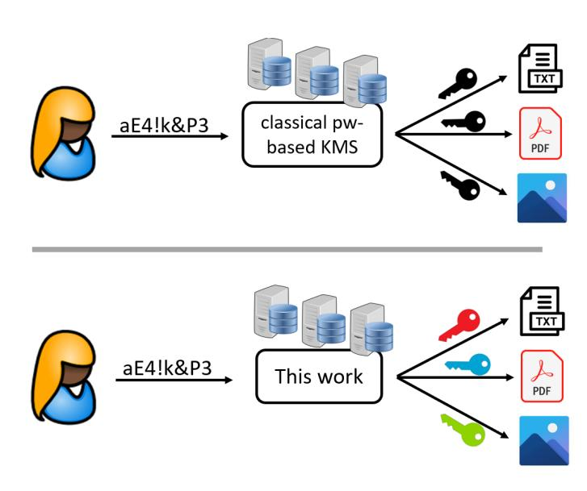
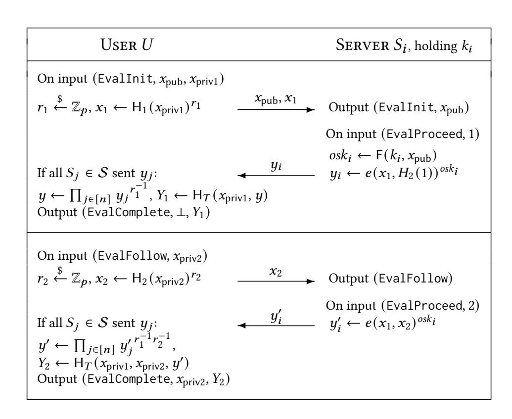
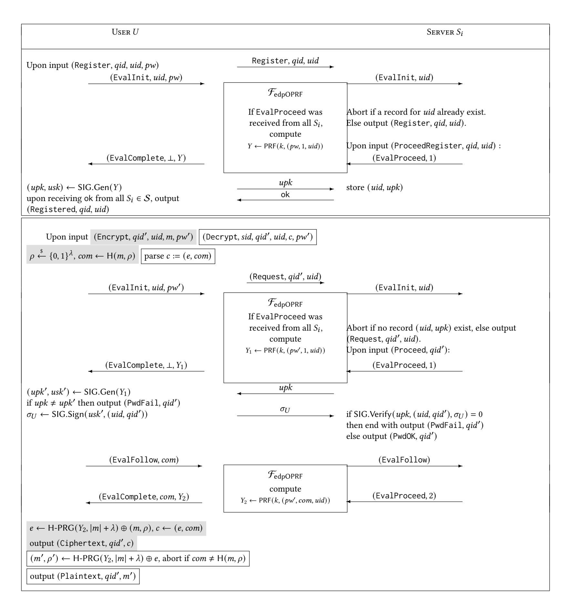

{0}------------------------------------------------

# DPaSE: Distributed Password-Authenticated Symmetric-Key Encryption, or How to Get Many Keys from One Password

Poulami Das\* TU Darmstadt, Germany poulami.das@tu-darmstadt.de Julia Hesse<sup>†</sup>
IBM Research Europe - Zurich,
Switzerland
jhs@zurich.ibm.com

Anja Lehmann Hasso-Plattner-Institute, University of Potsdam, Germany anja.lehmann@hpi.de

#### **ABSTRACT**

Cloud storage is becoming increasingly popular among end users that outsource their personal data to services such as Dropbox or Google Drive. For security, uploaded data should ideally be encrypted under a key that is controlled and only known by the user. Current solutions that support user-centric encryption either require the user to manage strong cryptographic keys, or derive keys from weak passwords. While the former has massive usability issues and requires secure storage by the user, the latter approach is more convenient but offers only little security since encrypted data is susceptible to offline attacks. The recent concept of passwordauthenticated secret-sharing (PASS) enables users to securely derive strong keys from weak passwords by leveraging a distributed server setup, and has been considered a promising step towards secure and usable encryption. However, using PASS for encryption is not as suitable as originally thought: it only considers the (re)construction of a *single*, static key – whereas practical encryption will require the management of many, object-specific keys. Using a dedicated PASS instance for every key makes the solution vulnerable against online attacks, inherently leaks access patterns to the servers and poses the risk of permanent data loss when an incorrect password is used at encryption. We therefore propose a new protocol that directly targets the problem of boostrapping encryption from a single password: distributed password-authenticated symmetric encryption (DPaSE).

DPaSE offers strong security and usability, such as protecting the user's password against online and offline attacks, and ensuring message privacy and ciphertext integrity as long as at least one server is honest. We formally define the desired security properties in the UC framework and propose a provably secure instantiation. The core of our protocol is a new type of Oblivious Pseudorandom Function (OPRF) that allows to extend a previous partially-blind query with a follow-up request and will be used to blindly carry over passwords across evaluations and avoid online attacks. Our (proof-of-concept) implementation of DPaSE uses 10 exponentiations at the user, 4 exponentiations and 2 pairings at each server, and has a server throughput of 76 account creations and 37 (user authentication followed by) encryptions per second, when run between a user and 2-10 servers.

#### <span id="page-0-0"></span>1 INTRODUCTION

Outsourcing storage to cloud providers is not only a common approach in enterprise settings, but is also widely appreciated by end users relying on services such as Dropbox, Google Drive, iCloud or Microsoft OneDrive to manage their personal data. With data breaches happening on a daily basis, it is essential that personal data kept in such cloud storage must be protected accordingly. The prevalent approach is to trust the cloud with properly encrypting the data, where the service provider controls access to the respective encryption keys via standard user authentication, mostly relying on username-password authentication. Clearly, such a solution crucially relies on the honesty of the service provider who can otherwise gain plaintext access to the users' data.

A different approach is let the user already encrypt the data before storing it in the cloud, which is offered e.g., by Tresorit [4] or Mega [3]. Therein a user client is locally encrypting the data and only uploads ciphertexts to the cloud. The cryptographic keys are either generated and stored directly by the user client, or (re)-derived from a human-memorizable password that the user enters into the local client. The former provides strong security guarantees, but is cumbersome to use as it relies on users' being able to manage and securely store cryptographic keys. The latter provides (roughly) the same convenience and usability as standard cloud provides as it does not require secure storage on the user side, but is inherently vulnerable to so-called offline attacks: Since encryption keys are derived from a low-entropy password, a corrupt service provider or an attacker gaining access to the ciphertexts, can attempt to decrypt the files by guessing the user's password.

While recently some service providers have moved away from password and deploy solutions where users are required to store key material (e.g., [2]), password-based systems remain the only truly device-independent solution at our disposal. In this paper, we investigate how users can password-encrypt their cloud data *with-out* storing any key material, and *without* making their encrypted data prone to offline password-guessing attacks.

Known approaches to password-based encryption. One way to avoid the two aforementioned issues is to use a distributed password-based key management system: a user retrieves her encryption key from a set of servers, using only a password as input. This does not require the user to store any cryptograhpic material, since the servers take over this role, and the distribution of keys among servers thwarts of offline attacks on the password. There exist various cryptographic primitives suitable to implement such password-protected key retrieval, for example Password-Authenticated Secret Sharing (PASS/PPSS) [6] and Oblivious Key Management [19], which we discuss more in related work below.

<sup>\*</sup>partially supported by the German Research Foundation DFG - SFB 1119 - 236615297 (CROSSING Project S7), by the German Federal Ministry of Education and Research and the Hessen State Ministry for Higher Education, Research and the Arts within their joint support of the National Research Center for Applied Cybersecurity ATHENE.

<sup>†</sup>partially supported by the EU Horizon 2020 research and innovation programme under grant agreement No 786725 OLYMPUS.

{1}------------------------------------------------

All aforementioned schemes allow users to turn a password into an encryption key. In practice, this means that users either encrypt all their data with the same key, or they must memorize as many passwords as keys that they want to use. For optimal usability and security, in a password-based key management scheme, we want to ask the user to remember only few but strong passwords, and "behind the scenes" still use different encryption keys for every piece of data she wants to encrypt. Varying encryption keys is desirable to mitigate the effect of security breaches of the user's device, or of irresponsible handling of secret keys on the user side. We note that there exist other ways to mitigate the effect of such attacks, for example allowing for efficient updates of the encryption key, which however provide no protection in case the attacker is already in posession of ciphertexts. In this work, we prefer one-time usage of encryption keys over updatability, since then revelance of one key upon compromise does not impact the confidentiality of more than one encrypted piece of data.



Figure 1: Classical password-based server-assisted KMS yields one key per password to encrypt all the different user data. In this work we develop a server-assisted encryption scheme that allows to derive different encryption keys from only one password.

#### 1.1 Our Contributions

In this work we develop usable yet strongly secure distributed password-based symmetric encryption (DPaSE). DPaSE allows users to securely and conveniently encrypt and decrypt their data with different encryption keys while relying only on a single password and the assistance of n servers. We provide an efficient realization based on a new type of Oblivious Pseudorandom Function (OPRF) that supports correlated evaluations of blind inputs, which we believe to be of independent interest. DPaSE is not a mere key management system, but has built-in encryption of data with the retrieved keys already. Encryption and decryption is carried out locally by the user using the retrieved key. This integrated modeling allows us to demand the following strong security and functionality from a DPaSE system, covering guarantees with respect to both passwords and encryption of data.

**Correct Encryption:** If a user types an incorrect password upon encryption, her data is not encrypted and the user instead obtains an error message. This property is important to avoid that a user accidentally encrypts her data with unrecoverable secret keys.

**No Reuse of Keys:** Every ciphertext is created with an individual key. Hence, in case a user loses one of her encryption keys, all but one of her encrypted files remain confidential.

**Security against Offline Attacks:** As long as at least one server is honest, the encrypted data (or rather the underlying password) cannot be offline attacked. And even if eventually *all* servers are corrupted, they cannot decrypt the data immediately but must still perform an offline attack on the password – thus when users have chosen strong passwords, their data remains secure.

**Security against Online Attacks:** To detect and prevent online guessing attacks, the servers learn which user is trying to encrypt or decrypt, and whether her entered password was correct. In particular, we require that every file access/decryption requires explicit approval of all servers. When an honest server has recognized suspicious behaviour or was alerted by the user herself, it can enforce user-specific rate limiting or even fully block a certain account.

**Obliviousness:** Servers do not learn anything about the files (plainor ciphertext) the user wants to access<sup>1</sup>. It was demonstrated [15, 24] that such leakage would have devastating effects on the user's privacy.

**Authenticated Encryption:** An adversary cannot plant wrong information into the outsourced storage. Thus, unless the adversary knows the user's password (and is assisted by all servers) it must be infeasible to create valid ciphertexts.

Security Model in the UC Framework. We formally define these properties by means of an ideal functionality  $\mathcal{F}_{\mathsf{DPaSE}}$  using the Universal Composability (UC) framework [12], which is known to allow for the most realistic modeling for how users (mis)handle passwords. In game-based security models, users choose their passwords at random from known distributions and are assumed to behave perfectly, i.e., never make a typo when using a password. This clearly does not reflect reality, where users share or re-use passwords, and make mistakes when typing them. The UC framework models that much more naturally as therein the environment provides the passwords. Thus, a UC security notion guarantees the desired security properties without making any assumptions regarding the passwords' distributions or usages. Our modeling also ensures that any DPaSE protocol is secure when executed concurrently with other systems, thanks to the strong composability guarantees of the UC framework.

However, these desirable features come at a cost. In order to end up with a manageable and understandable security definition (i.e., UC functionality), we need to make compromises and protect against some attacks that might not be of high relevance to DPaSE in practise<sup>2</sup>. For example, we need to prevent servers from intentionally deriving encryption keys from wrong passwords, which makes our protocol a bit more costly and restricted to security against semi-honest servers. There exist many ways of protecting against such attacks, each with different trade-offs. For example, we

<span id="page-1-0"></span><sup>&</sup>lt;sup>1</sup>We do not want to go further and hide the identity of the user in his requests, since otherwise we would not be able to protect against online guessing attacks.

<span id="page-1-1"></span><sup>&</sup>lt;sup>2</sup>A UC functionality needs to "list" *all* potential attacks that can be mounted against a protocol. While some attacks might be benign in practise and we might be okay with the threat they are imposing on us, every such attack still shows in the functionality. It is one of the main challenges in using the UC framework to find a mid-way between a not overly strong notion that still allows for efficient instantiations, and one that is not overly cluttered with such benign attacks.

{2}------------------------------------------------

could use client-side caching of password-dependent inputs, leaving it up to the client to use the correct password. Such a solution would however not suffice for our purpose of achieving a concise UC definition (a malicious client could simply mess up the caching then, introducing valid encryptions under wrong passwords to the system). Hence, in this paper, we opt for a stronger and cleaner definition, at the cost of slightly worse efficiency and slightly weaker corruption model.

**Efficient** DPaSE **Protocol.** We present an efficient protocol that provably realizes our functionality  $\mathcal{F}_{DPaSE}$ . The high-level idea of the protocol is very simple and follows the known paradigm of password-based protocols to turn the password into cryptographic key material using an OPRF [7, 20]. More detailed, to create an account, the user derives a signing key  $(upk, usk) \leftarrow OPRF(K, uid, pw)$  from her username and password, where the OPRF key K is split among the n servers and the evaluation reveals the username to the servers to later allow for user-specific rate limiting. The servers store (uid, upk) upon registration.

To encrypt a file, the user again enters uid, pw' and starts by re-running the steps from account creation to recover her signing key pair (upk, usk). She then signs a fresh nonce with usk and sends it to the servers who verify it against the stored upk, thereby verifying that pw = pw'. If the password is correct, the user and server engage in a follow-up OPRF evaluation where an object-specific encryption key is derived. The OPRF evaluation thereby "reuses" the previously entered uid, pw' to ensure that the actual encryption keys are also bound to the user' identity and correct password. This prevents users from accidentally encrypting data under a wrong password. To ensure obliviousness, the object for which the key is derived is hidden in the evaluation.

Decryption works almost analogously to encryption, verifying the password and – if correct – recovering the object-specific encryption key via the distributed OPRF. The generated ciphertexts and decryption proceeds also include checks to guarantee the desired ciphertext integrity.

Extendable Distributed Partially-Oblivious PRF. The core of our DPaSE protocol is a new type of OPRF that we believe to be of independent interest for many password-based applications. So far, OPRFs have been designed as *single*-evaluation primitives<sup>3</sup> that can either be fully or partially-blind. Thus, the user sends a (partially) blind query, and receives a single output related to that input. What we need for DPaSE though is an OPRF that "remembers" the blindly provided password from a previous query and re-uses it in a follow-up evaluation: we need to perform a dedicated password check and also want to ensure that encryption is done with the same password that was verified. We model that as an extension query, where a second OPRF query re-uses the blinded input from a previous request. This extension feature is required on top of partial-blindness (as the uid's must be a known input to all parties) and the distributed setting. We formalize the desired properties of such an extendable OPRF in the UC framework and propose a secure instantiation. We believe that this is a contribution of independent interest. Namely, using an extendable OPRF instead of a

single-evaluation OPRF could generally add secure password verification to protocols that deploy an OPRF to bootstrap cryptographic material from passwords.

Our OPRF construction is based on the classical double-hash DH scheme, basically combining all tricks that have been used in this context into a single scheme. The challenge thereby is that our second OPRF call which blindly carries over the input from the first call now has *three* inputs: the non-blind part  $(x_{pub} = uid)$ , and two blinded values, namely the blinded  $(x_{priv1} = pw)$  from the previous evaluation and the new input  $(x_{priv2} = oid)$ . Previous partially-blind OPRFs deal with two inputs only  $x_{pub}$  and  $x_{priv}$  which are mostly combined through a pairing [7, 14], with the final PRF being of the form  $H_T(e(H_1(x_{priv}), x_{pub})^K, x_{priv})$ . In our construction, we will already need both "slots" of the pairing to combine the two blinded inputs, and therefore must find a different place to include the public input. We take inspiration from [19] and replace the direct use of the server's secret key K by  $K' \leftarrow F(K, uid)$  where F is a standard PRF. Thus, overall our new OPRF computes the output for an extended query as  $H_T(e(H_1(x_{priv1}), H_2(x_{priv2}))^{F(K,x_{pub})}, x_{priv1}, x_{priv2})$ . The first (non-extended) query, just consisting of  $x_{pub}$  and  $x_{priv1}$  has the same form and simply sets  $x_{priv2} = 1$ .

This construction allows us to combine three values into a single evaluation, but this extendability feature comes for a price. First, relying on exponents that are derived from a standard PRF  $K' \leftarrow F(K, uid)$  only allows for a distributed, but not threshold protocol. The distributed version simply considers the additive combination of all K' as the implicit overall secret key (per  $x_{\text{pub}}$ ). Second, there are currently no efficient proofs that allow to check whether the servers have computed the second evaluation correctly - which again stems from the use of the standard PRF to derive the OPRF secret key share. As we will require correct computation of OPRF outputs in our DPaSE protocol, we must assume that the servers in the OPRF are at most honest-but-curious. We stress that considering honest-but-curious servers already captures the main threat to passwords: an adversary stealing the password database (or other offline-attackable information). To our knowledge, DPaSE is currently the only protocol being secure in the presence of such attacks.

Lastly, we note that extendability is a property that could as well be ensured on the application level by, e.g., caching the user's password on the client machine. While this would enable using DPaSE with a standard, i.e., single-evaluation OPRF and make our protocol simpler and more efficient, it allows for a "benign" attack which prevents a security proof. Namely, an adversary knowing the password of an honest user could produce encryption keys under bogus passwords. If the honest user later tries to decrypt such a maliciously crafted ciphertext, decryption would fail – yet the adversary can decrypt using the bogus password again. While this attack is rather harmless in practice, to prove the password-caching version secure one would have to include this imperfection into the security definition, with a different set of "shadow passwords" for each (!) ciphertext that the adversary could use (even for honest accounts). With the extendability property, we enforce password consistency on the protocol level and hence avoid cluttering the security definition of DPaSE with attacks resulting from inconsistent usage of passwords.

<span id="page-2-0"></span> $<sup>^3</sup>$ With the exception of OPRF with batch evaluations under several keys [23, 26]. This is orthogonal to our problem since we have a single OPRF key.

{3}------------------------------------------------

Implementation and Evaluation. Instantiating DPaSE with our OPRF yields an efficient scheme that requires 10 exponentiations at the user, 4 exponentiations and 2 pairings at each server. We further provide a proof-of-concept implementation of  $\Pi_{DPaSE}$  which respectively takes 13 ms for an account creation and 27 ms for each encryption and decryption on the server side, when run between an user and any number of servers; currently the implementation has a server throughput of 76 account creation and 37 (user authentication followed by) encryption or decryption requests per second.

#### 1.2 Related Work

Password-authenticated secret sharing (PASS/PPSS) allows a user to recover a strong secret that is shared among n servers when she can enter the correct password [6, 16–18]. In contrast to end users, servers can easily maintain strong cryptographic keys which is leveraged by PASS to thwart offline attacks against the password (and consequently on the shared secret key) if at least one, or a certain threshold, of the servers is not compromised. While this concept is shared between PASS and DPaSE, PASS can only be used to derive one encryption key per password, while DPaSE is required to encrypt each piece of data under different keys, yet enabling the user to encrypt all her data under the same password.

Password-hardened encryption (PHE) [25] targets a related setting, where a user outsources key management, encryption and decryption to a so-called rate limiter. The user can send encryption/decryption requests through a server, but needs to provide a correct password. The rate limiter can be implemented in a threshold version [8] to further enhance PHE's security. The scheme allows a mechanism of key rotation, to mitigate against compromises or simply as a routine process. Key rotation involves the server and the rate limiter updating their respective keys as well as the ciphertexts accordingly. In PHE the frontend server is fully trusted, as it learns the user's password and keys. PHE schemes are very efficient (no OPRF is required!) and a good option in settings where the client fully trusts the server, since both password and access pattern on user's data are shared with the server. In our work, we do not want to assume such trust and hence opt for client-side encryption of data to hide access patterns.

Updatable Oblivious Key Management [19] also relies on a OPRF to derive file-specific encryption keys with the help of a (single) external server for increased security. Their work focuses on an enterprise setting for storage systems though, i.e., it relies on strong authentication between the client (that wants to encrypt or decrypt) and the server that holds the OPRF key. This is a first difference to DPaSE: our scheme achieves oblivious key management without strong client-authentication. Second, their system uses key rotation - similar to PHE and the general concept of *updatable encryption* with post-compromise security [22, 27] – to update encryption keys and the corresponding ciphertexts as a measure to mitigate the effect of security breaches. The approach of our DPaSE protocol is orthogonal: we mitigate the risk of data breaches by using a distributed setting instead of key rotation: the information to recover the encryption keys is split across *n* servers, and the filespecific encryption keys are secure as long as one server remains uncompromised.

The DiSE protocol [5] and its improvements [13, 28] for distributed symmetric encryption consider strong authentication only.

In these protocols, a group of n parties jointly controls encryption keys under which ciphertexts for the group get encrypted. The secret key material is split among the group and any member of the group can request decryption of ciphertexts which is again done jointly by all member. DiSE implicitly – yet crucially – relies on strong authentication to ensure that only valid members of the group can make such requests, whereas we want only a single user to encrypt or decrypt her files from a password. Nevertheless, the authenticity checks in the encryption/decryption process of our protocol are build upon the ideas of the DiSE protocol.

Finally, the PESTO protocol [7] for distributed single sign-on (SSO) relies on a similar idea of first deriving a strong key pair from a distributed OPRF in order to let a user authenticate to a number of servers. The overall application is different though, SSO vs. encryption, and consequently also the desired functionality and security are different. PESTO is in one aspect stronger than DPaSE since it features *proactive security*, meaning that a once corrupted server can be sanitized to be honest again. This strong aspect comes at a cost that is much more critical for the targeted encryption use case than in SSO: PESTO guarantees no security whatsoever when all servers are corrupt. In DPaSE, even in case of a full corruption of all servers, the user's data still remains confidential unless all servers jointly mount a successful offline attack on her password. Thus, a dedicated offline attack for each user (on top of corrupting all servers) would be required, and the encrypted files of users with reasonably strong passwords can remain secure.

We give a detailed comparison of properties of the schemes that are closely related to DPaSE in Table 1.

<span id="page-3-0"></span>The functionality is parametrized by a security parameter  $\lambda$ . It interacts with servers  $S := \{S_1, ..., S_n\}$  (specified in the sid), arbitrary other parties and an adversary  $\mathcal{A}$ .  $\mathcal{F}_{edpOPRF}$  maintains a table  $T(x_{pub}, x_{priv1}, x_{priv2})$  initially undefined everywhere, counters  $ctr[x_{pub}]$  initially set to 0.  $\mathcal{F}_{edpOPRF}$  sends all inputs to  $\mathcal{A}$  except for  $x_{priv1}, x_{priv2}$ .

#### Key Generation

On input (KeyGen, sid) from  $S_i$ , ignore this query if the sid is marked ready. Otherwise, if (KeyGen, sid) was received from all  $S_i$ , mark sid as ready, and output (KeyConf, sid) to all  $S_i$ .

#### Evaluation

**On input** (EvalInit, sid, qid,  $x_{pub}$ ,  $x_{priv1}$ ) from any party U (including  $\mathcal{H}$ : record (eval, sid, qid, U,  $x_{pub}$ ,  $x_{priv1}$ ,  $\bot$ ), and output (EvalInit, sid, qid,  $x_{pub}$ ) to all  $S_i$ .

On input (EvalProceed, R, sid, qid) from  $S_i$  where  $R \in \{1, 2\}$ :

- Retrieve record (eval, sid, qid, U,  $x_{pub}$ ,  $x_{priv1}$ ,  $x_{priv2}$ ), where  $x_{priv2} = \bot$  if R = 1, and  $x_{priv2} \neq \bot$  if R = 2.
- If (EvalProceed, R, sid, qid) has been received from all  $S_i$ , set  $\operatorname{ctr}[x_{\operatorname{pub}}] \leftarrow \operatorname{ctr}[x_{\operatorname{pub}}] + 1$ .

**On input** (EvalFollow, *sid*, *qid*,  $x_{priv2}$ ) from any party U (including  $\mathcal{A}$ ):

- Retrieve record (eval, sid, qid, U,  $x_{pub}$ ,  $x_{priv1}$ ,  $\bot$ ) for (sid, qid, U).
- Update record to (eval, sid, qid, U,  $x_{pub}$ ,  $x_{priv1}$ ,  $x_{priv2}$ ), and send output (EvalFollow, sid, qid) to every  $S_i$ .

On input (EvalComplete, sid, qid) from  $\mathcal{A}$ :

- Retrieve record (eval, sid, qid, U,  $x_{pub}$ ,  $x_{priv1}$ ,  $x_{priv2}$ ), only proceed if  $ctr[x_{pub}] > 0$ , set  $ctr[x_{pub}] \leftarrow ctr[x_{pub}] 1$ .
- If  $T(x_{\text{pub}}, x_{\text{priv}1}, x_{\text{priv}2})$  is undefined, then pick  $\rho \leftarrow \{0, 1\}^{\lambda}$  and set  $T(x_{\text{pub}}, x_{\text{priv}1}, x_{\text{priv}2}) \leftarrow \rho$ .
- $\bullet \quad \text{Output (EvalComplete, } \textit{sid}, \textit{qid}, \textit{x}_{\text{priv2}}, \textit{T}(\textit{x}_{\text{pub}}, \textit{x}_{\text{priv1}}, \textit{x}_{\text{priv2}})) \text{ to } \textit{U}.$

Figure 2: Ideal functionality  $\mathcal{F}_{edpOPRF}$ 

{4}------------------------------------------------

<span id="page-4-0"></span>

|                                           | Key Management Schemes (KMS) |              | <b>Encryption Schemes</b> |      |                 |           |
|-------------------------------------------|------------------------------|--------------|---------------------------|------|-----------------|-----------|
| Properties\Schemes                        | PASS scheme                  | PASS scheme  | OKMS                      | DiSE | (Threshold) PHE | DPaSE     |
|                                           | [18]                         | Memento [10] | [19]                      | [5]  | [25], [8]       | this work |
| Password correctness ensured              | -                            | -            |                           |      | ✓               | ✓         |
| Can derive multiple keys per password     | -                            | -            |                           |      | -               | ✓         |
| Security against online attacks           | -                            | ✓            |                           |      | ✓               | ✓         |
| Security against offline attacks          | <b>✓</b>                     | ✓            |                           |      | ✓               | ✓         |
| Password remains private                  | <b>✓</b>                     | ✓            |                           |      | -               | 1         |
| Access pattern remains private            | '                            |              | -                         | -    | ✓               | ✓         |
| Authenticated encryption                  |                              |              | ✓                         | 1    | ✓               | ✓         |
| Who encrypts? (U=User, S=Server)          |                              |              | U                         | S    | S               | U         |
| Mitigation of compromised encryption keys |                              |              | no reuse & key rotation   | -    | key rotation    | no reuse  |
| Secure in concurrent settings             | ✓                            | ✓            | -                         | _    | -               | ✓         |

Table 1: Properties of server-assisted encryption and encryption key retrieval (KMS) schemes. Gray cells are not applicable. Password properties do not apply to OKMS and DiSE schemes, as they rely on strong user authentication. Likewise, encryption properties do not apply to the KMS schemes, since they are only used to recover an encryption key from a password.

# 2 EXTENDABLE DISTRIBUTED PARTIALLY-OBLIVIOUS PRF

Our DPaSE construction relies on a new type of oblivious PRF (OPRF) that allows for extension queries and which we believe to be of interest for password-based protocols in general. In this section, we define this new type of OPRF and present a provably secure construction.

An OPRF is an interactive protocol between at least one user and one server. The server holds the key K of a pseudorandom function PRF, the user contributes the input x to the function. After the protocol runs, the user holds the PRF evaluation at x,  $PRF_K(x)$ . The obliviousness property demands that, while the server actively participated in the protocol, he did not learn anything about the value x he helped in evaluating the function for. On the other side, the user requires participation of the server to evaluate  $PRF_K()$  at any input. In a distributed OPRF, the key K is split among n servers.

Recently, there has been a flurry of OPRF constructions in the literature all featuring different (combinations of) properties on top of the above mentioned [7, 9, 14, 16–18, 20, 21]. For constructing DPaSE, we require a new combination of properties that we detail now. Our OPRF is called a *extendable distributed partially-oblivious PRF* (edpOPRF).

**Partial Obliviousness:** The *obliviousness* property guarantees that the servers do not learn on which input ( $x_{priv1}$  and  $x_{priv2}$ ) the user wants to evaluate the function. *Partial* obliviousness allows for an additional public part ( $x_{pub}$ ) of the input.

**Distribution:** Obtaining a PRF value requires the active participation of all n servers. No subset of n-1 servers can evaluate the function themselves.

**Extendability:** After the user has provided an input  $(x_{pub}, x_{priv1})$  and learned the corresponding output  $PRF_K(x_{pub}, x_{priv1})$ , he can extend the query with a second blind input  $x_{priv2}$  upon which he receives  $PRF_K(x_{pub}, x_{priv1}, x_{priv2})$  (in both cases the output is conditioned on the participation of all servers of course).

While the first two properties exist (individually) already (partial obliviousness [14], and distribution [18], the concept of extendability of an OPRF is new. What is so special about this property that could not be achieved by simply evaluating the OPRF twice? The crucial difference is that an extendable OPRF guarantees that certain *blinded inputs are reused* in the second evaluation. With separate evaluation requests this cannot be guaranteed since blindings information-theoretically hide inputs and thus users can

easily cheat. For DPaSE, we require such an OPRF to allow for dedicated password verification and ensuring that actual encryption/decryption happens with the *same* password. We envision extendable OPRFs to be generally useful in protocols requiring more than one OPRF evaluation and where secret inputs of these single evaluations need to be correlated.

# 2.1 Ideal functionality for edpOPRF

We define a extendable distributed partially-oblivious PRF in the Universal Composability framework [12] in terms of an ideal functionality  $\mathcal{F}_{edpOPRF}$  in Figure 2. For brevity, we assume the following writing conventions.

- The functionality considers a specific session  $sid = (S_1, ..., S_n, sid')$  and only accepts inputs from servers  $S_i$  that are contained in the sid.
- When the functionality is supposed to retrieve an internal record, but no such record can be found, then the query is ignored.
- We assume private delayed outputs, meaning that the adversary can schedule their delivery but not read their contents beyond session and sub-session identifiers.

The functionality  $\mathcal{F}_{edpOPRF}$  is inspired by functionalities from the literature [7, 9, 16-18, 20] and introduces extendability as a new OPRF feature.  $\mathcal{F}_{edpOPRF}$  talks to arbitrary users and a fixed set of servers  $S_1, \ldots, S_n$ . Initially, all servers are required to call the KeyGen interface, to activate the functionality. Modeling an ideal PRF,  $\mathcal{F}_{edpOPRF}$  chooses outputs at random, maintaining a function table T() to ensure consistency. Implementing a partially-oblivious function,  $\mathcal{F}_{edpOPRF}$  tells the servers public input  $x_{pub}$  before they have to decide about their participation in the request. Participation is signaled by calling (or not calling) EvalProceed. The adversary may also evaluate the function, but crucially requires participation of all servers as well. If all servers are corrupted, the adversary can freely evaluate the function by sending EvalProceed on behalf of all the corrupted servers. To allow for efficient protocols, we employ an "evaluation ticket" counter ctr[] allowing mixing-and-matching evaluations w.r.t the public input, as common for OPRF notions (see, e.g., [7]).

Our  $\mathcal{F}_{\text{edpOPRF}}$  provides a new feature: it can be extended to output a second PRF value which is related to the first evaluation. This works as follows. A user obtains an evaluation on  $x_{\text{pub}}$ ,  $x_{\text{priv1}}$  by calling EvalInit with session identifier qid. (The output is only generated if all servers participate and the adversary allows the output by calling EvalComplete, which is standard procedure for

{5}------------------------------------------------

distributed OPRFs and we thus not elaborate here.) Afterwards, the user can provide a third input  $x_{\text{priv2}}$  via interface EvalFollow, using the still active session qid.  $\mathcal{F}_{\text{edpOPRF}}$  outputs the function value at  $x_{\text{pub}}$ ,  $x_{\text{priv1}}$ ,  $x_{\text{priv2}}$ , ensuring that inputs  $x_{\text{pub}}$ ,  $x_{\text{priv1}}$  from the first evaluation are reused by looking them up using qid.

# <span id="page-5-2"></span>2.2 Our edpOPRF Construction

We now present our construction of a extendable distributed partially-oblivious PRF.  $\Pi_{edpOPRF}$  computes the function

$$PRF(K(x_{pub}), x_{priv1}, 1) = H_T(x_{priv1}, e(H_1(x_{priv1}), H_2(1))^{K(x_{pub})})$$

$$PRF(K(x_{pub}), x_{priv1}, x_{priv2}) =$$

$$\mathsf{H}_T(x_{\mathsf{priv}1}, x_{\mathsf{priv}2}, e(\mathsf{H}_1(x_{\mathsf{priv}1}), \mathsf{H}_2(x_{\mathsf{priv}2}))^{K(x_{\mathsf{pub}})})$$

with  $K(x_{\text{pub}}) \leftarrow \sum_{i=1}^{n} \mathsf{F}(k_i, x_{\text{pub}})$  for (standard) PRF  $\mathsf{F} : \{0, 1\}^* \rightarrow \mathbb{Z}_q$ , and  $k_i$  from F's key space is held by server  $S_i$ .  $x_{\text{pub}}$  denotes the public input and  $x_{\text{priv}1}, x_{\text{priv}2}$  the private inputs. The function e() denotes a pairing, and  $\mathsf{H}_i$  denote hash functions.

**Setup and Key Generation:** We require an asymmetric bilinear group  $(g_1, g_2, g_T, \mathbb{G}_1, \mathbb{G}_2, \mathbb{G}_T, e)$  and hash functions  $H_1 : \{0, 1\}^* \to \mathbb{G}_1$ ,  $H_2 : \{0, 1\}^* \to \mathbb{G}_2$ ,  $H_T : \{0, 1\}^* \to \mathbb{G}_T$ . We assume servers to choose keys  $k_i \leftarrow \mathbb{Z}_q$ ,  $i \in [n]$  at the beginning of the protocol.

**Evaluation:** Our PRF is essentially the "2Hash Diffie-Hellman" function [16, 17] PRF $(k, x_{priv1}) = H(x_{priv1}, H'(x_{priv1})^k)$ . Let us briefly explain how evaluating this function would work. A user *blinds* his input  $x_{priv1}$  with randomness r as  $H'(x_{priv1})^r$  and sends this value to the server. The server sends back  $H'(x_{priv1})^{rk}$ , from which the user can compute  $H'(x_{priv1})^k$  by exponentiation with 1/r. This is enough for the user to compute  $H(x_{priv1}, H'(x_{priv1})^k)$ .

Partial obliviousness is now achieved as in Everspaugh et al. [14] by combining blinded private inputs as  $e(H_1(x_{priv1})^r, H_2(x_{priv2})^k)$  using the pairing e(). Due to the bilinear property of e() this is equal to  $e(H_1(x_{priv1}), H_2(x_{priv2}))^{rk}$ , which again allows the user to remove the blinding factor r. One can additively share k among all servers and let the client combine evaluation shares using the group operation in  $\mathbb{G}_T$ . The function is computed as  $PRF(k, x_{priv1}, x_{priv2}) = H_T(x_{priv1}, x_{priv2}, e(H_1(x_{priv1}), H_2(x_{priv2}))^k)$ .

For our new extendability property we require a PRF evaluated on three inputs. Fortunately, we can efficiently and securely augment the function given above with another input by "squeezing" it into the function's key. This technique is inspired by the work of Jarecki et al. [19]. We set  $K(x_{\text{pub}}) := k \leftarrow \sum_{i \in [n]} F(k_i, x_{\text{pub}})$  for a (standard) PRF F and  $k_i$  being the servers' secret keys. One subtlety here occurs in the first evaluation on  $x_{\text{pub}}$  and  $x_{\text{priv1}}$  only. We cannot save the pairing evaluation and simply use  $H_1(x_{\text{priv1}})^k$  as k-dependent value instead: with this value, a user could compute arbitrary function evaluations on input  $x_{\text{priv1}}$  by himself by applying the pairing. We therefore let servers use a "dummy" value  $H_2(1)$  and pair it with the user's blinded input  $x_{\text{priv1}}$ .

A full formal description of our OPRF construction  $\Pi_{edpOPRF}$  can be found in Figure 3. Its security is stated in the following theorem, for which a proof sketch can be found in Appendix B.

<span id="page-5-1"></span>Theorem 2.1. Let  $\mathbb{G}=(p,g_1,g_2,g_T,\mathbb{G}_1,\mathbb{G}_2,\mathbb{G}_T,e)$  be a bilinear group. If the Gap One-More BDH (Gapom-BDH) assumption (c.f. Definition A.3) holds for  $\mathbb{G}$  then the protocol  $\Pi_{edpOPRF}$  given in Figure 3, with  $H_1, H_2$  and  $H_T$  modeled as random oracles and F being a

<span id="page-5-0"></span>

Figure 3: Protocol  $\Pi_{edpOPRF}$ . We assume all messages, inputs and outputs to include sid, qid.

(standard) PRF, UC-emulates  $\mathcal{F}_{edpOPRF}$  in the random oracle model assuming secure and server-side authenticated channels, static honest-but-curious corruption of servers and static malicious corruption of clients.

On malicious security. As detailed above, our  $\mathcal{F}_{edpOPRF}$  ensures that the PRF is always evaluated w.r.t the same key. This rules out protocols where servers can freely decide what key material to use in an evaluation. Let us note that it is quite common in the literature [7, 18, 20] to relax this property by letting the OPRF functionality maintain different lists representing different PRF keys. The adversary can then determine which list is going to be used (in case of server corruption). And indeed, it turns out that our  $\mathcal{F}_{\mathsf{edpOPRF}}$ enforcing such consistency in keys is challenging to realize in the presence of malicious servers. The reason is that we cannot use standard techniques such as NIZK proofs of honest behavior with respect to some public server key (e.g., [14]), since our server keys are user-specific. Reliable distribution of such keys would involve frequent interaction with a trusted authority. Another inefficient way to obtain malicious security is to use a 3-linear map instead of a 2-linear map (pairing), together with a NIZK. The map would allow us to have (NIZK-compatible) *uid*-independent key shares simply by putting *uid* as third input parameter to the map. We choose not to give a maliciously secure protocol with such inefficient techniques, and leave the construction of an efficient maliciously secure (i.e., verifiable) extendable distributed partially-oblivious PRF as an open problem.

#### 3 DPASE

In this section we introduce distributed password-authenticated symmetric encryption (DPaSE). DPaSE is an interactive protocol between many users and a fixed set of *n* servers, where the servers assist users in conveniently and securely encrypting their data under a single password. DPaSE operates account-based: First, users register with a username and a single password at all servers. After account creation, the servers (blindly) assist users in encryption and decryption provided that they are using the correct password.

{6}------------------------------------------------

We recall the key security properties of DPaSE as already explained in more detail in Section 1: correct and authenticated encryption, no reuse of encryption keys, security against offline and online attacks, and confidentiality of password and access patterns. We will detail in the upcoming subsection how our definition ensures these properties.

Our concrete scheme will leverage the servers mainly to (re)construct object-specific encryption keys, whereas encryption and decryption happens locally at the user side. This might pose the question why we are modelling DPaSE as an encryption and not key management protocol. Capturing the full encryption/decryption process is necessary to avoid similar misconceptions as with PASS, which was believed to be a suitable out-of-the-box tool for password-based encryption. Only with modelling and considering the full encryption process this can be ensured.

# 3.1 An ideal functionality for DPaSE

We define DPaSE in terms of an ideal functionality  $\mathcal{F}_{DPaSE}$ , which takes inputs of parties and hands them their securely computed outputs.  $\mathcal{F}_{DPaSE}$  abstracts away any protocol details and states only the required functionality and leakage and influence (i.e., attacks) allowed by an adversary.

We assume the same writing conventions as for  $\mathcal{F}_{edpOPRF}$ . In addition, we assume the adversary gets to acknowledge all inputs, but not learn their private content. For example, if the functionality receives input "(Encrypt, sid, qid, x) from a party P" and "keeps x private", we assume that the functionality sends (Encrypt, sid, qid, P) to the adversary and only processes the original input after input an acknowledgement from the adversary.

Our ideal functionality  $\mathcal{F}_{DPaSE}$  is depicted in Figure 4, with labeled instructions to enable easy matching to the explanations in this section. On a high level,  $\mathcal{F}_{DPaSE}$  is a password-protected lookup table for (username,message,ciphertext) tuples. Users can create new such tupes by first logging in to their account stored by  $\mathcal{F}_{DPaSE}$  with a username and password, and then encrypt a message of their choice, obtaining back the ciphertext. Decryption works in a similar fashion.  $\mathcal{F}_{DPaSE}$  stores a password for every registered user, and refuses service if a user does not remember his password correctly when he wants to encrypt or decrypt. In order to perform registration, encryption or decryption,  $\mathcal{F}_{DPaSE}$  requires participation of n distributed servers.

Let us first give some intuition on how  $\mathcal{F}_{DPaSE}$  ensures the required security and privacy properties of DPaSE.  $\mathcal{F}_{DPaSE}$  associates a password with each username uid and creates an "encryption" entry (uid, m, c) upon request of user uid if and only if the user provided the password that is associated with uid. This ensures **correct** and **authenticated encryption**. By verifying password matches internally and not revealing passwords nor message/ciphertext from encryption/decryption requests to the servers,  $\mathcal{F}_{DPaSE}$  ensures **obliviousness**. By requiring all servers to assist in proceeding any request (register, encryption, or decryption),  $\mathcal{F}_{DPaSE}$  ensures security against **offline attacks**.  $\mathcal{F}_{DPaSE}$  however leaks the username uid to the servers, which allows servers to refuse participation if they are suspicious of an **online password guessing attack** against user uid.

We now describe the interfaces of  $\mathcal{F}_{DPaSE}$  in more detail. The functionality talks to arbitrary users and a fixed set of servers  $S_1, \ldots, S_n$ .

**Account Creation:** Any user can register with  $\mathcal{F}_{DPaSE}$  by calling its Register interface with a username uid and a password pw. If no account uid exists yet (R.3),  $\mathcal{F}_{DPaSE}$  informs all servers about the new registration request and the uid, but keeps the password private (R.4). Servers can now decide to participate in the registration by sending ProceedRegister to  $\mathcal{F}_{DPaSE}$ . Only if all servers do so (PR.2),  $\mathcal{F}_{DPaSE}$  stores the account (uid, pw) and confirms the registration to the user. ProceedRegister inputs of servers are matched with their corresponding registration requests via subsession identifiers qid. Since those identifiers are unique, collecting servers' participation among different requests is prevented by  $\mathcal{F}_{DPaSE}$ .

**Encryption:** A message encryption is initiated by a user sending an Encrypt request to  $\mathcal{F}_{DPaSE}$  which includes *uid*, *pw* and a message m. If account (uid, pw') exists (E.3),  $\mathcal{F}_{DPaSE}$  first informs all servers about an incoming request for *uid*, keeping the password as well as the message private (E.4). Only if all server agree to participate in this request for *uid* by using the Proceed interface for the corresponding subsession ( P.2 ),  $\mathcal{F}_{\mathsf{DPaSE}}$  continues the encryption request. By not giving away any information before,  $\mathcal{F}_{\mathsf{DPaSE}}$ prevents offline attacks.  $\mathcal{F}_{\mathsf{DPaSE}}$  now verifies that the provided password pw is equal to pw' stored with uid ( P.2.3 ). All servers and the user are informed about the outcome of password verification by input either PwdOK or PwdFail (P.2.5). Being informed about failed password attempts and requests of *uid* in general allows servers to protect accounts against online guessing attacks: based on this information, they can decide to throttle requests by refusing to send Proceed, e.g., after 5 failed attempts within 1 minute. Such throttling is however decided by the application using  $\mathcal{F}_{\mathsf{DPaSE}}$ .

Finally, if verification was successful, the user obtains a ciphertext c from  $\mathcal{F}_{DPaSE}$ . While c is adversarially chosen, we stress that, in an honest encryption procedure, the adversary only learns the length of the message from  $\mathcal{F}_{DPaSE}$  (P.2.2). Thus,  $\mathcal{F}_{DPaSE}$  ensures that the ciphertext does not contain any information about m beyond its length. Further,  $\mathcal{F}_{DPaSE}$  ensures that no two encryption requests yield the same ciphertext by rejecting repeated ciphertexts sent by the adversary (P.2.2).  $\mathcal{F}_{DPaSE}$  stores the pair (m, c) together with uid, and sends the ciphertext to the user (P.2.7). Handing out the (fresh) ciphertext only if the correct password was provided ensures correct encryption. For this, note that for honestly registered accounts (which would not have  $pw = \bot$ )  $\mathcal{F}_{DPaSE}$  prevents the adversary from influencing the "verification bit" b in encryption procedures in any way.

**Decryption:** A user initiates a decryption procedure by calling the Decryptinterface of  $\mathcal{F}_{DPaSE}$  with uid, pw and a ciphertext c. It is instructive to note that  $\mathcal{F}_{DPaSE}$  does not give out any information about ciphertexts it is not explicitly queried for, and thus cannot be used as a storage for ciphertexts.  $\mathcal{F}_{DPaSE}$  informs servers about a request for uid, keeping password and ciphertext private (D.2). Similar to an encryption procedure, all servers are required to call Proceed in order for  $\mathcal{F}_{DPaSE}$  to continue with password verification (P.2). However,  $\mathcal{F}_{DPaSE}$  does not inform servers about which

{7}------------------------------------------------

ciphertext should be decrypted, in order to hide access patterns on user data. We choose to not even inform servers about the type of request - encrypt or decrypt - in order to allow also for protocols where password verification requests do not yet reveal what a user wants to do. Coming back to the decryption procedure,  $\mathcal{F}_{DPaSE}$  now verifies the password (P.2.3). In case of success and if  $\mathcal{F}_{DPaSE}$  finds a record (uid, m, c), the message m is given to the requesting user (P.2.7). By storing uid along with message-ciphertext pairs and revealing m only if uid's password was provided in the decryption query,  $\mathcal{F}_{DPaSE}$  enforces authenticated encryption.

**Adversarial Interfaces:** As explained before, we let  $\mathcal{A}$  determine ciphertexts as common for functionalities modeling symmetric encryption. However, ciphertexts cannot depend on the message beyond its length, since  $\mathcal{F}_{\mathsf{DPaSE}}$  ensures that the adversary is oblivious of messages to be encrypted (E.2 and P.2.2).  $\mathcal{A}$  may also influence password verification in the following ways. First, modeling DoS attacks, we allow  $\mathcal{A}$  to make individual servers believe that password verification failed even though the password might have been correct. This attack is carried out by setting  $b_{S_i} \leftarrow 0$  for the corresponding server  $S_i$  (P.2.2 and P.2.4, "otherwise" case). Second,  $\mathcal{A}$  may make servers believe that password verification suceeded even when a wrong password was used, but only for accounts belonging to the adversary.  $\mathcal{F}_{DPaSE}$  marks a *uid* corrupted if this is the case, i.e., if a corrupted user performed a successful password verification with respect to username *uid* ( P.2.1 ). The adversary then can fake successful password verification towards  $S_i$  by setting  $b_{S_i} \leftarrow 1$  (P.2.4, "Else, if" case). The motivation is that for such corrupted accounts we have to assume that the adversary knows all secrets. It is then plausible that he can compute whatever proof a protocol requires to convince servers of knowledge of the correct password.

We further weaken  $\mathcal{F}_{DPaSE}$  by allowing the adversary to start, e.g., an encryption request without yet knowing what message to decrypt, and under which password. Technically, this is enabled by  $\mathcal{F}_{DPaSE}$  accepting overwrite requests in adversarial records (R.1, E.1 and D.1). While this does not constitute a meaningful attack for real-world applications (we stress that the adversary is only allowed to change inputs for his own requests, not for the ones of honest users), it allows for efficient realizations of  $\mathcal{F}_{DPaSE}$  such as ours based on oblivious pseudo-random functions and random oracles.

A special case - all servers corrupted: We want to highlight which guarantees  $\mathcal{F}_{DPaSE}$  gives in this worst case scenario. In any DPaSE protocol with n servers storing a somehow shared information about the user's password, these servers can always throw their data together, guess a password and run the password verification procedure of the DPaSE protocol to learn whether the guess was correct. This is unavoidable unless we involve more parties (such as an external password hardening service), which is not the scope of this work. However, we require that this is the best possible attack on the user's password when all servers are corrupted: they have to invest some computation to test each of their password guesses. This way, users with strong passwords will remain safe even in this worst case scenario. Since  $\mathcal{F}_{DPaSE}$  enforces authenticated encryption by revealing messages only if the correct password was supplied ( P.2.3 and P.2.7 ) - regardless of how many servers are

corrupted - not only passwords but also encrypted data of users with strong passwords remain secure.

```
The functionality is parametrized by a security parameter \lambda. It interacts with
servers S := \{S_1, ..., S_n\} (specified in the sid), as well as arbitrary users and an
adversary \mathcal{A}.
Account Creation
On input (Register, qid, uid, pw) from U or \mathcal{A}:
   R.1 If \exists record (register, qid, U, uid, pw'), if U = \mathcal{A} then overwrite pw'
          with pw and if U \neq \mathcal{A} then ignore the query.
   R.2 Keep pw private
   R.3 If \nexists record (account, uid, *): create record (register, qid, U, uid, pw)
          and R.4 send delayed output (Register, qid, uid) to all S_i \in S.
On input (ProceedRegister, qid, uid) from server S_i:
  PR.1 Retrieve record (register, qid, U, uid, pw).
  PR.2 If (ProceedRegister, qid, uid) has been received from all S_i:
              - Record (account, uid, pw); if U is corrupted mark uid
                 corrupted. Send delayed output (Registered, qid, uid) to U.
Encryption and Decryption
On input (Encrypt, qid', uid, m, pw') from party U or \mathcal{A}:
    E.1 If \exists record (*, qid', U, uid, m', pw), if U = \mathcal{A} then overwrite it with
           (enc, qid', U, uid, m, pw') and if U \neq \mathcal{A} then ignore the query.
          // {\mathcal A} can change mode, password and message in his own requests
    E.2 Keep Encrypt, m and pw' private, leak Request tag and \ell(m) to \mathcal{A}
    E.3
                  \exists
         If
                         record
                                       (account, uid, pw):
                                                                  create
                                                                              record
          (enc, qid', U, uid, m, pw') and
                                                 E.4 send
                                                                 delayed output
          (Request, qid', uid) to all S_i \in S.
On input (Decrypt, qid', uid, c, pw') from party U or \mathcal{A}:
   D.1 If \exists record (*, qid', U, uid, pw), if U = \mathcal{A} then overwrite it with
           (dec, qid', U, uid, c, pw') and if U \neq \mathcal{A} then ignore the query.
   D.2 Keep Decrypt, c and pw' private, leak Request tag and \ell(c) to \mathcal A
   D.3
         If \exists (account, uid, pw): record (dec, qid', U, uid, c, pw') and
           D.4 send a delayed output (Request, qid', uid) to all S_i \in S.
On input (Proceed, qid') from server S_i:
    P.1 Retrieve records (mode, qid', U, uid, obj, pw') and (account, uid, pw)
          with mode \in {enc, dec}.
    P.2 If (Proceed, qid') has been received from all S_i:
           P.2.1 If U corrupted and pw == pw' then mark uid corrupted.
                 // DoS attacks: {\mathcal A} can prevent or sometimes even fake password
                 confirmation (send b_{S_i} = 0 or b_{S_i} = 1)
           P.2.2 Send (Complete, qid', pw == pw') to \mathcal{A} and receive back
                 (Complete, qid', b_{S_1}, \ldots, b_{S_n}, c). Abort if mode = enc and c has
                 been sent before.
           P.2.3 If pw = \bot then set b \leftarrow \bot; otherwise set b \leftarrow (pw = pw').
           P.2.4 For i \in [n], if pw = \bot set b'_i \leftarrow 0. Else, if U and uid corrupted
                 then set b'_i \leftarrow b_{S_i}, otherwise set b'_i \leftarrow b \wedge b_{S_i}.
           P.2.5 For i \in [n], if b'_i = 0 output (PwdFail, qid') and otherwise
                 output (PwdOK, qid') to all S_i.
           P.2.6 If b = 0 output (PwdFail, qid') to U.
           P.2.7 If b = 1 then
                      * If mode = dec and \exists record (uid, m, obj), output
                         (Plaintext, qid', m) to U.
                                      = enc: store (uid, obj, c), output
                      * If mode
                         (Ciphertext, qid', c) to U.
```

Figure 4: Ideal functionality  $\mathcal{F}_{DPaSE}$  for distributed password-authenticated symmetric encryption. For easy access to explanations we use highlighted numbering in both figure and text.

{8}------------------------------------------------

<span id="page-8-0"></span>

Figure 5: Our protocol  $\Pi_{DPaSE}$  using a signature scheme SIG,  $\Pi_{edpOPRF}$  protocol and hash functions H, H-PRG. Top box shows registration, bottom box shows encryption and decryption. Gray instructions are only executed in encryption, framed ones only in decryption. Each encryption and decryption query has to use a fresh subsession identifier qid'.

# <span id="page-8-1"></span>3.2 A DPaSE protocol $\Pi_{DPaSE}$

We now present our DPaSE protocol  $\Pi_{DPaSE}$ . The detailed formal description can be found in Figure 5.  $\Pi_{DPaSE}$  uses hash functions  $H\colon\{0,1\}^*\to\{0,1\}^\lambda$  and  $H\text{-PRG}\colon\{0,1\}^\lambda\to\{0,1\}^*$ , a signature scheme SIG and  $\mathcal{F}_{edpOPRF}$  as ideal building block. The main principle of  $\Pi_{DPaSE}$  is that the servers assist the user in turning his (low-entropy, but unique) authentication data, i.e., username and password, into various (high-entropy) cryptographic keys. Those keys are subsequently used for proving knowledge of the password to servers, and to encrypt or decrypt the data. We describe the three

phases of  $\Pi_{\text{DPaSE}}$ , account creation, encryption and decryption, in more detail in the below.

**Account Creation:** To create an account, a user derives a signing key pair (usk, upk) from its username uid and password pw. For this,  $\mathcal{F}_{edpOPRF}$  is queried with inputs uid, pw by the user, yielding  $Y \leftarrow \mathsf{PRF}(k, (pw, 1, uid))$  if all servers participate in the evaluation. Partial blindness ensures that servers learn uid but not pw. The user then computes  $(usk, upk) \leftarrow \mathsf{SIG}.\mathsf{Gen}(Y)$ , sends upk to all servers and can afterwards delete the key pair. Servers are required to store (uid, upk).

{9}------------------------------------------------

**Encryption:** Users are required to provide their correct password whenever they want to encrypt (or decrypt) any data. This is now straightforward: as in account creation, the user calls  $\mathcal{F}_{edpOPRF}$  with inputs (uid, pw'), receiving PRF value  $Y_1$  if again all servers participate in the PRF evaluation. The user now computes a signing key pair from  $Y_1$ , signs part of the transcript (we mention that the identifier of this encryption session, qid', is globally unique) and sends the resulting signature  $\sigma_U$  to each server. Servers will accept (i.e., output PwdOK) only if  $\sigma_U$  is a verifying signature under upk stored with uid, which happens if and only if pw = pw'. Of course, this verification technique only works if servers reliably learn uid used in the PRF computation, which is ensured by the partial obliviousness of  $\mathcal{F}_{edpOPRF}$ .

Symmetric encryption in  $\Pi_{\mathsf{DPaSE}}$  is simply a one-time pad, with an object-specific encryption key which is computed again from a PRF value and with the help of all servers. But now,  $\Pi_{\mathsf{DPaSE}}$  crucially relies on the extendability of the PRF to ensure correct and authenticated encryption of message m under encryption randomness  $\rho$ . Namely, the key is computed from  $\mathsf{H}(m,\rho)$  and uid,pw that successfully verified before. Note that this requires to evaluate the PRF on three inputs, while the two latter are reused from the password verification procedure detailed above. The extendability property of  $\mathcal{F}_{\mathsf{edpOPRF}}$  allows this by calling EvalFollow with input  $\mathsf{H}(m,\rho)$ , still using the identifier qid' of the ongoing encryption session. The user obtains  $Y_2 \leftarrow \mathsf{PRF}(k,(pw,\mathsf{H}(m,\rho),uid))$  from  $\mathcal{F}_{\mathsf{edpOPRF}}$ .

To encrypt,  $Y_2$  is XORed with  $(m, \rho)$  (applying H-PRG first to account for differences in lengths). The resulting ciphertext is augmented with  $H(m, \rho)$ . The reason for appending this auxiliary information will become apparent below.

**Decryption:** In order to compute a decryption key, a user first has to successfully pass password verification. This is done in the exact same way as for an encryption request (in fact, in our protocol, servers cannot distinguish an encryption request from a decryption request). Computation of the decryption key is also done the exact same way as in encryption – now it becomes apparent why  $com \leftarrow H(m, \rho)$  is required to be part of the ciphertext. The user decrypts  $m, \rho$  by XORing the decryption key with the first part of the ciphertext. Finally, the user verifies correct decryption by recomputing com from  $m, \rho$ . While  $\mathcal{F}_{edpOPRF}$  already provides correct results, the latter check is still required since otherwise faulty ciphertexts (where the com contains another message) would decrypt faithfully and users would recover data that they never encrypted.

# 3.3 Security of $\Pi_{DPaSE}$

For analyzing the security of  $\Pi_{DPaSE}$  we assume that honest users delete all protocol values such as  $Y_1, Y_2, usk$  after performing an encryption or decryption, i.e., upon closing a subsession. Further, we assume that within ongoing subsessions (the identifier qid indicates one such session) an honest user does not get corrupted. This seems reasonable given the fact that, in reality, the time between password verification and encryption (or decryption) will be only very few seconds.

<span id="page-9-0"></span>Theorem 3.1. The protocol  $\Pi_{DPaSE}$  given in Figure 5 with H, H-PRG modeled as random oracles and SIG = (Gen, Sign, Verify) an EUF-CMA-secure signature scheme UC-emulates  $\mathcal{F}_{DPaSE}$  in the  $\mathcal{F}_{edpOPRF}$ -hybrid random oracle model w.r.t static malicious user corruptions, semi-honest server corruptions, and assuming server-side authenticated and secure channels.

PROOF Sketch. A detailed description of simulated cases can be found in Table 5 in the Appendix.

**Simulation of honest servers.** Since servers do not obtain any secret input that is kept from the adversary, simulating honest servers is quite trivial: the simulator S just follows the server's protocol. **Simulate honest user without password.** First note that the password influences the outputs of the (deterministic) PRF. To know whether former PRF values have to be reused as output (i.e., in case of a correct password), it is enough for the simulator to learn whether password verification was successful. Fortunately, S learns this information from  $\mathcal{F}_{DPaSE}$  on time (via (Complete, . . . ) message) before having to commit to any  $\mathcal{F}_{edpOPRF}$  output.

**Extraction of corrupted user's secrets.** Since any user, even a corrupted one, needs to use  $\mathcal{F}_{\mathsf{edpOPRF}}$  in order to obtain a key,  $\mathcal{S}$ can extract a corrupted user's password and message or ciphertext from his inputs to  $\mathcal{F}_{edpOPRF}$ . Another way to see this is that, while usage of  $\mathcal{F}_{edpOPRF}$  simplifies our DPaSE simulator's life in this case, the burden is on the protocol realizing  $\mathcal{F}_{edpOPRF}$ . This protocol has to ensure that secrets can be extracted from adversarial messages. **Three different ways to encrypt or decrypt.** The simulation is complicated by the fact that  $\mathcal{Z}$  can initiate, e.g., an encryption procedure either via an honest user and then recompute the symmetric decryption key via either a corrupted user or via  $\mathcal{Z}$ 's adversarial interface at  $\mathcal{F}_{edpOPRF}$ . Knowing only the ciphertext so far,  $\mathcal{S}$  now needs to produce the symmetric key without knowing the plaintext it should decrypt to. However, all honest servers need to agree to help  $\mathcal{Z}$  in computation of the symmetric key.  $\mathcal{S}$  can use the server's agreement to obtain the plaintext message from  $\mathcal{F}_{\mathsf{DPaSE}}$ , compute the key linking this message with the ciphertext and send it to  ${\mathcal Z}$ (for this, S has to program the random oracle H-PRG to point to the key). 

We obtain the following by combining Theorems 3.1 and 2.1.

COROLLARY 3.2. Let  $\mathbb{G}=(p,g_1,g_2,g_T,\mathbb{G}_1,\mathbb{G}_2,\mathbb{G}_T,e)$  be a bilinear group and  $H_1,H_2,H_T,H,H-PRG$  hash functions as described in  $\Pi_{edpOPRF}$  and  $\Pi_{DPaSE}$ , modeled as random oracles. If the Gapom-BDH assumption holds for  $\mathbb{G}$ , SIG = (Gen, Sign, Verify) is an EUF-CMA-secure signature scheme and F a (standard) PRF, then  $\Pi_{DPaSE}$  with  $\mathcal{F}_{edpOPRF}$  instantiated by  $\Pi_{edpOPRF}$  UC-emulates  $\mathcal{F}_{DPaSE}$  in the random oracle model w.r.t static honest-but-curious server corruption and assuming server-side authenticated and secure channels.

Towards security against malicious servers. In Theorem 3.1 we restrict to static server corruptions, which is a limitation inherited from building block  $\Pi_{\text{edpOPRF}}$ , which only features semihonest security. Our proof however directly carries over to the malicious setting: any maliciously secure realization of  $\mathcal{F}_{\text{edpOPRF}}$  plugged into  $\Pi_{\text{DPaSE}}$  would yield a maliciously secure  $\mathcal{F}_{\text{DPaSE}}$  realization. This is witnessed by our simulation (cf. Table 5 in the Appendix), which considers malicious server behavior except for

{10}------------------------------------------------

instructions handled by  $\mathcal{F}_{edpOPRF}$ . We mention again that considering honest-but-curious servers already captures the main threat to passwords: an adversary stealing the password database (or other offline-attackable information).

#### 4 EVALUATION & COMPARISON

| Scheme                        | #(Exponentiations + Pairings) per Encryption   |                                                    |  |
|-------------------------------|------------------------------------------------|----------------------------------------------------|--|
| Scheme                        | client/rate limiter                            | server                                             |  |
| PHE [25]                      | 7 exps (in G)                                  | 10 exps (in G)                                     |  |
| Π <sub>DPaSE</sub> (Our Work) | $10 \exp s (= 2\mathbb{G}_1 + 2\mathbb{G}_2 +$ | $4 \exp s (= 2\mathbb{G}_T + 2\mathbb{G}_{p-256})$ |  |
|                               | $4\mathbb{G}_T + 2\mathbb{G}_{p-256}$          | +2 pairings                                        |  |

Table 2: Comparison of  $\Pi_{\mathsf{DPaSE}}$  with closest password-based encryption scheme PHE, where the exponentiations are counted per group  $\mathbb{G}$ ,  $\mathbb{G}_1$ ,  $\mathbb{G}_2$ ,  $\mathbb{G}_T$ , the pairing is mapped as  $\mathbb{G}_1 \times \mathbb{G}_2 \colon \to \mathbb{G}_T$  and  $\mathbb{G}_{\mathsf{p-256}}$  represents the prime group in the ECDSA signature scheme secp256r1.

In this section, we consider an instantiation of the  $\Pi_{DPaSE}$  protocol (from Section 3.2), where the functionality  $\mathcal{F}_{edpOPRF}$  is instantiated with  $\Pi_{edpOPRF}$  (from Section 2.2), and the signature scheme SIG with ECDSA. We report on the efficiency of our scheme, by counting the number of exponentiations per group and pairings, being the most expensive operations of such protocols. We compare our  $\Pi_{DPaSE}$  protocol with what we believe to be the closest related password-based encryption scheme, namely Password Hardened Encryption (PHE) [25] (see also Table 1 for the overlap of properties of both schemes). Considering each exchange of messages between the client and servers as one round of communication,  $\Pi_{DPaSE}$  requires 2 rounds for Account Creation and 3 rounds for Authentication followed by a Encryption (Decryption) request.

<span id="page-10-0"></span>

|                        | No. of  | Execution    |        | Requests     |  |
|------------------------|---------|--------------|--------|--------------|--|
| Protocol               | Servers | Time (in ms) |        | per server   |  |
|                        |         | user         | server | (per second) |  |
| Account Creation       | 2       | 18           | 13     | 76           |  |
|                        | 6       | 19           | 13     | 76           |  |
|                        | 8       | 19           | 13     | 76           |  |
|                        | 10      | 19           | 13     | 76           |  |
|                        | 2       | 32           | 27     | 37           |  |
| Authorizata   Engrant  | 6       | 37           | 27     | 37           |  |
| Authenticate + Encrypt | 8       | 40           | 27     | 37           |  |
|                        | 10      | 43           | 27     | 37           |  |

Table 3: Timing measurements of the protocol  $\Pi_{\mathsf{DPaSE}}$  run between one user and  $k = \{2, 6, 8, 10\}$  number of servers.

**Benchmarks.** We carried out a proof-of-concept implementation [1] of our  $\Pi_{DPaSE}$  protocol and report preliminary benchmarks on the same. We implement in Java, and use the MIRACL - AMCL library for the pairing computation and exponentiation operations. We use the Boneh-Lynn-Shacham pairing with 461 bit curves for the pairing  $\mathbb{G}_1 \times \mathbb{G}_2 \to \mathbb{G}_T$  in  $\Pi_{edpOPRF}$ , ECDSA with sec256r1, SHA-512 as the underlying hash function H, AES-256 to construct the standard PRF function F and H-PRG and the Java's inbuilt KeyPairGenerator class for user key pair generation SIG.Gen. The elements in groups  $\mathbb{G}_1$ ,  $\mathbb{G}_2$  and  $\mathbb{G}_T$  are implemented using single exponentiation operations with the respective group generators. The hash functions H<sub>1</sub>, H<sub>2</sub> and H<sub>T</sub> are implemented by first applying SHA-512 followed by an exponentiation in the groups  $\mathbb{G}_1$ ,  $\mathbb{G}_2$  and  $\mathbb{G}_T$  respectively.

We measured our implementation on a machine running a Intel Core i7-7500U series CPU with 4 virtual CPUs, 16 GiB of RAM. We focused on measuring the local computation times both on the client and the server sides, and did not consider delays due to network latency. The details of our timing measurements corresponding to a  $\Pi_{DPaSE}$  protocol run between one user and a number of servers can be found in the Table 3. The time taken by each server for processing an account creation is 13 milliseconds, while that required for processing an user authentication followed by an encryption request is 27 milliseconds. Consequently, each server is able to process 76 account creation requests and 37 encryption requests per second. Since the computation underlying an encryption or a decryption is almost the same, we have only detailed the encryption timings. We stress here that the timing benchmarks can be further improved by exploiting the parallelizability of the underlying algorithms as well as utilizing the capabilities of multiple cores of a computer. Since this enhancement was not the focus of our work, in our implementation, we have relied on standard cryptographic libraries as mentioned above, which create the bottleneck in our timing measures. Close to our work, Pythia achieves a throughput of 130 requests ps [ECS+15] (also pointed in [LER+18]). In theory, efficiency of our  $\Pi_{DPaSE}$  protocol is lower-bounded by half the throughput of Pythia, which is 65 enc/dec requests ps. This is because each enc/dec request in  $\Pi_{\mathsf{DPaSE}}$  requires 2 OPRF evaluations, and each has the same computational cost as one Pythia evaluation. We note that password verification and encryption both add only little overhead.

On Scalability. Our  $\Pi_{DPaSE}$  protocol is highly scalable as can be observed from the benchmarks in Table 3. The time required by an individual server to process an account creation request or an encryption (decryption) request is independent of the number of servers used. While on the other hand, the time taken by the client only slightly increases with increased number of servers.

Deployment Considerations. Let us now address some of the key points to be considered when deploying the  $\Pi_{DPaSE}$  protocol in a real-world environment. Availability is an inherent challenge in any distributed protocol, naturally also in  $\Pi_{DPaSE}$ . If one of the servers goes offline due to a Denial-of-Service attack or simply because of a network connection problem, then this would lead to an abort in  $\Pi_{DPaSE}$ . This issue can be addressed by using multiple machines for each server and load balancing between them.

In a real-world deployment, servers would ideally be run by different organisations on different physical machines/locations. But  $\Pi_{DPaSE}$  could also be used by a single organization providing all servers, which uses the protocol to "internally" distribute the secret key and thereby minimize the risk of a detrimental server breach.

From the usability perspective, if end-users wish to change their passwords at a later point of time, that is possible and will require decrypting the files under the old password first, and re-encrypt them under the new password. This seems (somewhat) inherent in any scheme where ciphertexts truly depend on passwords, which is needed to protect against a full set of corrupt servers.

{11}------------------------------------------------

#### 5 CONCLUSION AND OPEN QUESTIONS

In this paper, we attempted to answer the following question: *Can we design a device-independent cryptographic protocol for password-based encryption with very strong security and privacy?* We formalize our interpretation of strong security and privacy by introducing the notion of *Distributed Password-Authenticated Symmetric Encryption* (DPaSE). DPaSE uses ciphertext-specific encryption keys, prevents encryption under mistyped passwords, hides users' access pattern, protects against on- and offline attacks on the user password, and maintains all these guarantees even in a concurrent setting with arbitrary other protocols.

We answer the question above in the affirmative, by providing a DPaSE protocol based on a new type of oblivious pseudorandom functions (OPRF). The OPRF is evaluated twice: first, to let the user turn her password into high-entropy authentication data, and second, to let the user compute a password- and ciphertext-dependent symmetric key. We give a construction for such an OPRF, which we believe is of independent interest as a new building block for password-based cryptographic protocols. We provide proof-of-concept implementations for our DPaSE construction (including our OPRF construction) and compare efficiency to related protocols in the literature. Our protocol provides only little overhead over existing solutions for password-based key retrieval/encryption, scales well in the number of users and servers, and features provable security under standard bilinear discrete-log based assumptions in the random oracle model.

An interesting future direction is the construction of a *threshold* version of DPaSE, where only an arbitrary subset of all servers is required to participate in each user request. This would improve usability of the protocol, since users would not have to wait for answers of busy servers. Our user-specific OPRF keys  $(osk_i = F(k, uid))$  hinders us to choose  $osk_i$  as shares of standard threshold scheme. However constructing F as threshold PRF might give an interesting solution towards thresholdization.

Finally, security in the presence of malicious servers would be enabled by constructing a maliciously secure extendable distributed partially-oblivious PRF. Alternatively, for ensuring correct encryption it seems to be sufficient to have servers use the same keys in both OPRF evaluations. This flavor of verifiability in our OPRF seems to be achievable with standard techniques. Although key switching between different requests of a specific user would not significantly weaken but clutter the description of  $\mathcal{F}_{DPaSE}$ , we decide to present the more secure and cleaner version here, and leave the slightly weaker but maliciously secure version as future work.

#### **REFERENCES**

- <span id="page-11-26"></span>[1] [n. d.]. DPaSE PoC Implementation. https://gitlab.com/DPaSEcode/dpase-submission-code.
- <span id="page-11-2"></span>[2] [n. d.]. Internet Identity: The End of Usernames and Passwords. https://tinyurl.com/6rrhvzr2.
- <span id="page-11-1"></span>[3] [n. d.]. MEGA: Secure Cloud Storage and Communication Privacy by Design. https://mega.nz/.
- <span id="page-11-0"></span>[4] [n. d.]. Tresorit: Cloud Storage + End-to-end Encryption. https://tresorit.com/security/encryption.
- <span id="page-11-19"></span>[5] Shashank Agrawal, Payman Mohassel, Pratyay Mukherjee, and Peter Rindal. 2018. DiSE: Distributed Symmetric-key Encryption. 1993–2010. https://doi.org/10.1145/3243734.3243774
- <span id="page-11-3"></span>[6] Ali Bagherzandi, Stanislaw Jarecki, Nitesh Saxena, and Yanbin Lu. 2011. Password-protected secret sharing. 433–444. https://doi.org/10.1145/2046707. 2046758

- <span id="page-11-8"></span>[7] Carsten Baum, Tore K. Frederiksen, Julia Hesse, Anja Lehmann, and Avishay Yanai. 2020. PESTO: Proactively Secure Distributed Single Sign-On, or How to Trust a Hacked Server. IEEE European Symposium on Security and Privacy.
- <span id="page-11-16"></span>[8] Julian Brost, Christoph Egger, Russell W. F. Lai, Fritz Schmid, Dominique Schröder, and Markus Zoppelt. 2020. Threshold Password-Hardened Encryption Services. In CCS '20: 2020 ACM SIGSAC Conference on Computer and Communications Security. https://doi.org/10.1145/3372297.3417266
- <span id="page-11-23"></span>[9] Jan Camenisch and Anja Lehmann. 2017. Privacy-Preserving User-Auditable Pseudonym Systems. In 2017 IEEE European Symposium on Security and Privacy, EuroS&P. IEEE.
- <span id="page-11-22"></span>[10] Jan Camenisch, Anja Lehmann, Anna Lysyanskaya, and Gregory Neven. 2014. Memento: How to Reconstruct Your Secrets from a Single Password in a Hostile Environment. 256–275. https://doi.org/10.1007/978-3-662-44381-1\_15
- <span id="page-11-27"></span>[11] Jan Camenisch, Anja Lehmann, and Gregory Neven. 2015. Optimal Distributed Password Verification. 182–194. https://doi.org/10.1145/2810103.2813722
- <span id="page-11-7"></span>[12] Ran Canetti. 2001. Universally Composable Security: A New Paradigm for Cryptographic Protocols. 136–145. https://doi.org/10.1109/SFCS.2001.959888
- <span id="page-11-20"></span>[13] Mihai Christodorescu, Sivanarayana Gaddam, Pratyay Mukherjee, and Rohit Sinha. 2021. Amortized Threshold Symmetric-key Encryption. In *CCS '21: 2021 ACM SIGSAC Conference on Computer and Communications Security*, Yongdae Kim, Jong Kim, Giovanni Vigna, and Elaine Shi (Eds.). https://doi.org/10.1145/3460120.3485256
- <span id="page-11-12"></span>[14] Adam Everspaugh, Rahul Chatterjee, Samuel Scott, Ari Juels, and Thomas Ristenpart. 2015. The Pythia PRF Service. 547–562.
- <span id="page-11-5"></span>[15] Mohammad Saiful Islam, Mehmet Kuzu, and Murat Kantarcioglu. 2012. Access Pattern disclosure on Searchable Encryption: Ramification, Attack and Mitigation.
- <span id="page-11-13"></span>[16] Stanislaw Jarecki, Aggelos Kiayias, and Hugo Krawczyk. 2014. Round-Optimal Password-Protected Secret Sharing and T-PAKE in the Password-Only Model. 233–253. https://doi.org/10.1007/978-3-662-45608-8\_13
- <span id="page-11-25"></span>[17] Stanislaw Jarecki, Aggelos Kiayias, Hugo Krawczyk, and Jiayu Xu. 2016. Highly-Efficient and Composable Password-Protected Secret Sharing (Or: How to Protect Your Bitcoin Wallet Online). In *IEEE European Symposium on Security and Privacy, EuroS&P.*
- <span id="page-11-14"></span>[18] Stanislaw Jarecki, Aggelos Kiayias, Hugo Krawczyk, and Jiayu Xu. 2017. TOPPSS: Cost-Minimal Password-Protected Secret Sharing Based on Threshold OPRF. 39–58. https://doi.org/10.1007/978-3-319-61204-1\_3
- <span id="page-11-4"></span>[19] Stanislaw Jarecki, Hugo Krawczyk, and Jason K. Resch. 2019. Updatable Oblivious Key Management for Storage Systems. 379–393. https://doi.org/10.1145/3319535. 3363196
- <span id="page-11-9"></span>[20] Stanislaw Jarecki, Hugo Krawczyk, and Jiayu Xu. 2018. OPAQUE: An Asymmetric PAKE Protocol Secure Against Pre-computation Attacks. 456–486. https://doi.org/10.1007/978-3-319-78372-7\_15
- <span id="page-11-24"></span>[21] Stanislaw Jarecki and Xiaomin Liu. 2009. Efficient Oblivious Pseudorandom Function with Applications to Adaptive OT and Secure Computation of Set Intersection. 577–594. https://doi.org/10.1007/978-3-642-00457-5\_34
- <span id="page-11-17"></span>[22] Michael Klooß, Anja Lehmann, and Andy Rupp. 2019. (R)CCA Secure Updatable Encryption with Integrity Protection. 68–99. https://doi.org/10.1007/978-3-030-17653-2 3
- <span id="page-11-10"></span>[23] Vladimir Kolesnikov, Ranjit Kumaresan, Mike Rosulek, and Ni Trieu. 2016. Efficient Batched Oblivious PRF with Applications to Private Set Intersection. 818–829. https://doi.org/10.1145/2976749.2978381
- <span id="page-11-6"></span>[24] Marie-Sarah Lacharité, Brice Minaud, and Kenneth G. Paterson. 2018. Improved Reconstruction Attacks on Encrypted Data Using Range Query Leakage. 297–314. https://doi.org/10.1109/SP.2018.00002
- <span id="page-11-15"></span>[25] Russell W. F. Lai, Christoph Egger, Manuel Reinert, Sherman S. M. Chow, Matteo Maffei, and Dominique Schröder. 2018. Simple Password-Hardened Encryption Services. In *27th USENIX Security Symposium, USENIX Security*. https://www.usenix.org/conference/usenixsecurity18/presentation/lai
- <span id="page-11-11"></span>[26] Anja Lehmann. 2019. ScrambleDB: Oblivious (Chameleon) Pseudonymization-as-a-Service. *Proc. Priv. Enhancing Technol.* (2019). https://doi.org/10.2478/popets-2019-0048
- <span id="page-11-18"></span>[27] Anja Lehmann and Björn Tackmann. 2018. Updatable Encryption with Post-Compromise Security. 685–716. https://doi.org/10.1007/978-3-319-78372-7\_22
- <span id="page-11-21"></span>[28] Xunhua Wang and Ben Huson. 2020. Robust distributed symmetric-key encryption. *IACR ePrint* (2020).

{12}------------------------------------------------

#### **A DEFINITIONS**

Definition A.1 (Signature Schemes). A signature scheme SIG is a triple of algorithms (Gen, Sign, Verify) with the following properties. On input the security parameter  $\lambda$ , the randomized key generation algorithm Gen outputs a key pair (pk, sk). On a message  $m \in \{0, 1\}^*$  and a secret key sk, the randomized signing algorithm Sign outputs a signature  $\sigma$ . On input a public key pk, a message  $m \in \{0, 1\}^*$ , and a signature  $\sigma$ , the deterministic verification algorithm Verify outputs 1 if the signature is correct or 0 otherwise.

We require that the scheme satisfies *correctness*, i.e., for all  $m \in \{0,1\}^*$  and (pk,sk) output by Gen it holds that: Verify(pk,m, Sign(sk,m)) = 1. Additionally, the scheme needs to satisfy *un-forgeability under chosen message attacks (UF-CMA-security)*, i.e., after learning signatures for q number of adaptively chosen messages  $\{m_1,...,m_q\} \in \mathcal{M}$ , it should be impossible to find a signature/message pair  $(\sigma,m)$  s.t.  $\text{Verify}(pk,m,\sigma) = 1$  and  $m \notin \{m_1,...,m_q\}$ .

# A.1 Bilinear Groups

Definition A.2 (Asymmetric Pairing). Let  $\mathbb{G}_1$ ,  $\mathbb{G}_2$ ,  $\mathbb{G}_T$  be cyclic groups of order p with generators  $g_1,g_2,g_T$ , respectively. Let  $e:\mathbb{G}_1\times\mathbb{G}_2\to\mathbb{G}_T$  be an efficiently computable non-degenerate function such that  $\forall a,b\in\mathbb{Z}_p:e(g_1^a,g_2^b)=g_T^{ab}$ . Then e is called an asymmetric pairing.  $\mathbb{G}=(p,g_1,g_2,g_T,\mathbb{G}_1,\mathbb{G}_2,\mathbb{G}_T,e)$  is called an asymmetric bilinear group setting, or bilinear group for short.

<span id="page-12-1"></span>Definition A.3 (Gap One-More BDH Assumption). Let  $\lambda \in \mathbb{N}$  be a security parameter and  $\mathbb{G} = (p, g_1, g_2, g_T, \mathbb{G}_1, \mathbb{G}_2, \mathbb{G}_T, e)$  be a bilinear group with  $\log(p) = poly(\lambda)$ , then we then say that the Gap One-More Bilinear Diffie-Hellman (Gapom-BDH) assumption holds for  $\mathbb{G}$  if for all PPT adversaries  $\mathcal{P}$  there is a negligible function neglesuch that  $\Pr[\mathsf{Exp}_{\mathcal{A},\mathsf{Gapom-BDH}}^{\mathbb{G}}(\lambda) = 1] \leq \mathsf{negl}\lambda$ .

The underlying experiment is defined as follows.

```
Experiment \operatorname{Exp}_{\mathcal{A},\operatorname{Gapom-BDH}}^{\mathbb{G}}(\lambda):

k \stackrel{\$}{\leftarrow} \mathbb{Z}_p, q_C \leftarrow 0, X_1 \leftarrow \emptyset, X_2 \leftarrow \emptyset.

\{(x_i, y_i, z_i)\}_{i \in [\ell]} \leftarrow \mathcal{A}^{O_{\mathbb{G}-1}, O_{\mathbb{G}-2}, O_{\mathbb{D}-\mathsf{help}}, O_{\mathbb{C}-\mathsf{help}}}(\mathbb{G}, g_2^k)

return 0 if

0 \leq \ell - 1 < q_C or

\exists i \in [\ell] : (x_i \notin X_1 \vee y_i \notin X_2) or

\exists i, j \in [\ell], i < j : (x_i = x_j \wedge y_i = y_j)

return 1 if \forall i \in [\ell] : e(x_i, y_i)^k = z_i and 0 otherwise.
```

where the experiment uses the following oracles

$$\frac{O_{\mathbb{G}\text{-r}}()}{\text{return } \perp \text{ if } r \notin \{1,2\}} \qquad \frac{O_{\text{C-help}}(m)}{\text{return } \perp \text{ if } m \notin \mathbb{G}_T.} \\
x \stackrel{\$}{\leftarrow} \mathbb{G}_r \qquad q_C \leftarrow q_C + 1 \\
\text{return } x$$

$$\frac{O_{\text{D-help}}(m, w, m', w')}{\text{return } \perp \text{ if either } m, w, m', w' \text{ not in } \mathbb{G}_T}$$

$$\text{return 1 if } \log_m(w) = \log_{m'}(w') \text{ and else 0}$$

To win,  $\mathcal{A}$  needs to find pairs  $(x, y, e(x, y)^k)$  without querying e(x, y) to  $O_{C\text{-help}}$  and where  $\mathcal{A}$  could not rerandomize previous

such pairs as it does not know the discrete logarithm of any x,y (enforced by sampling them at random using  $O_{\mathbb{G}-r}$ ).  $\mathcal{A}$  is equipped with a DDH oracle  $O_{\text{D-help}}$  in the group  $\mathbb{G}_T$ . The game Gapom-BDH follows the definition in [14].

# <span id="page-12-0"></span>**B PROOF SKETCH OF THEOREM 2.1**

We assume that users delete all protocol values such as  $r_1, r_2, y$  and y' after outputting both PRF evaluations. Further, we assume that within ongoing subsessions (the identifier qid indicates one subsession) an honest user does not get corrupted. We further assume static honest-but-curious server corruptions. Essentially, a corrupted server's inputs and outputs are handled by the adversary, while its code is still executed as in the protocol instruction.

PROOF SKETCH. Our proof combines aspects of the OPRF proofs given in [14], [11] and [7], which all follow initial ideas of [18].

In Table 4 we provide details of the simulation of our extendable distributed partially-oblivious PRF when interacting with  $\mathcal{F}_{edpOPRF}$ . The rows of the table consider all possible corruption scenarios, while the columns focus on different tasks of the simulator.

*Usage of random oracles.* The random oracles are used in different ways: either S choses outputs such that he knows their discrete logarithms, or he observes queries to the oracle, or he programs the oracle's output to match other values from the simulation. More detailed, S uses discrete logarithms of  $H_1$  and  $H_2$  outputs to generate U's randomness r upon learning U's private input  $x_{priv}$ . With all three oracles, observability is exploited (to learn  $x_{priv1}$ ,  $x_{priv2}$  and  $x_{pub}$  values). And finally,  $H_T$  is programmed to PRF values generated by  $\mathcal{F}_{edpOPRF}$ . Cf. Table 4 for more details on the simulation of the oracles.

*Simulating without secrets.* First, we note that simulation of servers is trivial since inputs towards servers do not carry any secrets. The simulation works by, for all  $i \in [n]$ , simply running the code of  $S_i$  on a  $k_i$  randomly chosen in the beginning.

Contrarily, simulation of honest users must work without knowing secret values  $x_{\text{priv1}}$ ,  $x_{\text{priv2}}$ . Observe that, in our OPRF protocol, a user computes PRF( $x_{\text{pub}}$ ,  $x_{\text{priv1}}$ ,  $x_{\text{priv2}}$ ) by hashing  $H_T(x_{\text{priv1}}, x_{\text{priv2}}, y')$ , where y' depends on all inputs and the server's keys. However, since a PRF is a deterministic function,  $\mathcal{Z}$  might obtain PRF( $x_{\text{pub}}$ ,  $x_{\text{priv1}}x_{\text{priv2}}$ ) via two ways: computing the Hash on its own through a corrupted user, or by running evaluation via an honest user. To make things look consistent, the simulator needs to make sure the result is the same both ways. For this, he recognizes *consistent* queries to  $H_T$  made by  $\mathcal{Z}$  using knowledge of all  $k_i$ . If a consistent query is detected,  $\mathcal{S}$  programs the result to the same PRF value that  $\mathcal{F}_{\text{edpOPRF}}$  would output. We show below that, if the Gapom-BDH assumption holds in the underlying group,  $\mathcal{S}$  will always obtain a PRF value from  $\mathcal{F}_{\text{edpOPRF}}$  for each consistent  $H_T$  query made by  $\mathcal{Z}$ .

The challenge of simulating extendable evaluation. One technicality that stems from extendable evaluations is the order in which  $\mathcal{Z}$  computes PRF values through a corrupted user. Essentially,  $\mathcal{Z}$  can complete a full run of the protocol without querying  $H_T$  for the final PRF values, and then query them in an arbitrary order. Our simulation has to deal with all possible orders, where it is crucial that  $\mathcal{S}$  can match queries belonging to each other (note that due

{13}------------------------------------------------

<span id="page-13-0"></span>

|                                                | Transcript                                                                                                                                                                                                   | Input/output of user $U$                                                                                                                                                                                                                                                                                                                                                                                                                                                                                                                                                                                                                                                                                                                                                         | Random oracles                                                                                                                                                                                                                                                                                                                                                                                                                                                                                                                                                                                                                                                                                                                                                                                                                                                                                                                                                                                                                                                                                                                                                                                                                                                                                                                                                                                                                                                                                                                                                                                                                                                                                                                                                                                                                                                                                                                                                                                                                                                                                                                                                                                                          |
|------------------------------------------------|--------------------------------------------------------------------------------------------------------------------------------------------------------------------------------------------------------------|----------------------------------------------------------------------------------------------------------------------------------------------------------------------------------------------------------------------------------------------------------------------------------------------------------------------------------------------------------------------------------------------------------------------------------------------------------------------------------------------------------------------------------------------------------------------------------------------------------------------------------------------------------------------------------------------------------------------------------------------------------------------------------|-------------------------------------------------------------------------------------------------------------------------------------------------------------------------------------------------------------------------------------------------------------------------------------------------------------------------------------------------------------------------------------------------------------------------------------------------------------------------------------------------------------------------------------------------------------------------------------------------------------------------------------------------------------------------------------------------------------------------------------------------------------------------------------------------------------------------------------------------------------------------------------------------------------------------------------------------------------------------------------------------------------------------------------------------------------------------------------------------------------------------------------------------------------------------------------------------------------------------------------------------------------------------------------------------------------------------------------------------------------------------------------------------------------------------------------------------------------------------------------------------------------------------------------------------------------------------------------------------------------------------------------------------------------------------------------------------------------------------------------------------------------------------------------------------------------------------------------------------------------------------------------------------------------------------------------------------------------------------------------------------------------------------------------------------------------------------------------------------------------------------------------------------------------------------------------------------------------------------|
| All honest $U$ and up to $n-1$ $S_i$ corrupted | Transcript  Trivial due to usage of secure channels  Choose $k_1, \ldots, k_n$ at random. Simulate server messages as in protocol (servers do not have secret inputs) using those key shares.                | Input/output of user $U$ To make sure that $U$ gets output, $S$ sends (EvalComplete, $sid$ , $qid$ , hon) to $\mathcal{F}_{\text{edpOPRF}}$ each time all $S_i$ messages are delivered to $U$ .  Input: upon $U$ sending $x_{\text{pub}}, x_1$ $S$ chooses $x_{\text{priv}1} \leftarrow G_1$ at random and inputs (EvalInit, $sid$ , $qid$ , $x_{\text{pub}}, x_{\text{priv}1}$ ) to $\mathcal{F}_{\text{edpOPRF}}$ so that servers get Eval output for $qid$ (note that the simulated private input cannot be recognized by $\mathcal{Z}$ since the output towards $S_i$ does not contain any $x_{\text{priv}}$ value). Similarly, $S$ chooses a random $x_{\text{priv}} \leftarrow G_2$ upon $U$ sending $x_2$ to provide input EvalFollow to $\mathcal{F}_{\text{edpOPRF}}$ . | Random oracles $S$ perfectly simulates all random oracles, meaning that he chooses fresh and uniformly random values from the groups $G_1, G_2$ and $G_T$ for the functions $H_1, H_2$ and $H_T$ , respectively. For each function $S$ maintains a list of the form $(H_1, x, y)$ where $H_1(x) = y$ .  On $H_T(x_{priv1}, y_1)$ of $Z$ (first such query), $S$ only proceeds if $y_1 = e(H_1(x_{priv1}), g_2)^{\sum F(k_i, x'_{pub})}$ for some $x'_{pub}$ used before by some corrupted $U$ . If there is a record $(*, x_{priv1}, *, x'_{pub}, Y''_1, *)$ ( $Z$ already queried second Hash) then $S$ programs $(H_T, (x_{priv1}, y_1), Y''_1)$ and answers $Z$ 's $H_T$ query with $Y''_1$ . If there is no such record ( $Z$ queries 1st Hash first), then $S$ queries $\mathcal{F}_{edpOPRF}$ with (EvalInit, $sid$ , $qid'$ , $x'_{pub}$ , $x_{priv1}$ ) with a fresh identifier $qid'$ . $S$ delays the output (EvalInit, $sid$ , $qid'$ , $x'_{pub}$ , $x_{priv1}$ ) with a fresh identifier $qid'$ . $S$ delays the output (EvalInit, $x_1$ ) to servers infinitely. Then, $S$ sends (EvalComplete, $sid$ , $qid'$ , hon) to $\mathcal{F}_{edpOPRF}$ . This will let $\mathcal{F}_{edpOPRF}$ use the counter increased due to the simulated $x_{priv1}$ and give $S$ one PRF value (EvalComplete, $sid$ , $qid'$ , $x_1$ ). $S$ then programs $(H_T, (x_{priv1}, y_1), Y'_1$ ) and answers $Z$ 's $H_T$ query with $Y'_1$ . $S$ stores the tuple $(qid', x_{priv1}, x_{pub}, Y'_1, \bot)$ . If $S$ does not receive any $Y'_1$ from $\mathcal{F}_{edpOPRF}$ , we say that event fail happens.  On $H_T(x_{priv1}, x_{priv2}, y_2)$ of $Z$ (first such query), if $y_2 = e(H_1(x_{priv1}), H_2(x_{priv2}))^{\sum F(k_1, x''_{pub})}$ for some $x''_1$ used before by some corrupted $U$ , then $S$ looks for a recorded tuple $(qid'', x_{priv1}, *, x''_{pub}, *, *)$ for some $y''_1$ . Afterwards, and also in case such a record already exists ( $Z$ already queried 1st Hash) $S$ sends (EvalFollow, $sid$ , $qid''$ , $x_{priv2}$ ) to $\mathcal{F}_{edpOPRF}$ , infinitely delaying outputs to servers again. $S$ sends (EvalComplete, $sid$ , $qid''$ , hon) to $\mathcal{F}_{edpOPRF}$ . Upon receiv |
| $U$ honest, up to $n-1$ $S_i$ corrupted        | $S$ simulates the user's messages towards the corrupted $S_i$ by choosing $x_1 \leftarrow G_1, x_2 \leftarrow G_2$ at random. Note that $x_{\text{pub}}$ is given to $S$ by $\mathcal{F}_{\text{edpOPRF}}$ . | Input: comes from $\mathcal{Z}$ . Output: since even corrupted servers follow the protocol, the simulation works as in the first row.                                                                                                                                                                                                                                                                                                                                                                                                                                                                                                                                                                                                                                            | say that event fail happens.<br>$S$ might learn a honest user's input $x_{\text{priv1}}$ via a $H_T(x_{\text{priv1}}, y_1)$ or $H_T(x_{\text{priv1}}, x_{\text{priv2}}, y_2)$ query by $Z$ for an $y_1$ or $y_2$ that he can compute as follows: $S$ looks for a record $(x_{\text{pub}}, v, w)$ (see leftmost column in this row how such records are created) such that $y_1^{v-1} = e(H_1(x_{\text{priv1}}), g_2)^{\sum F(k_i, x_{\text{pub}})}$ , or $y_1^{w-1} = e(H_1(x_{\text{priv1}}), H_2(x_{\text{priv2}}))^{\sum F(k_i, x_{\text{pub}})}$ . If such a record is found then $S$ recovers or creates an $H_1$ entry $(H_1, x_{\text{priv1}}, g^z, z)$ and sets the client's randomness to $r_1 = v/z$ such that $x_1 = g^v = g^{zr_1}$ and the simulated $x_1$ (see first column) is consistent with his simulation of the RO $H_1$ . $r_2$ is set analogously.                                                                                                                                                                                                                                                                                                                                                                                                                                                                                                                                                                                                                                                                                                                                                                                                                                                                                                                                                                                                                                                                                                                                                                                                                                                                                                                                                |
| $U$ honest, all $S_i$ corrupted                | Same as above                                                                                                                                                                                                | Same as above                                                                                                                                                                                                                                                                                                                                                                                                                                                                                                                                                                                                                                                                                                                                                                    | The simulation is a simpler version of the " $U$ and up to $n-1$ $S_i$ corrupted" case above, since now $S$ can let corrupted servers proceed requests. Thus, $S$ can always use fresh $qid$ identifiers to get PRF evaluations from $\mathcal{F}_{\text{edpOPRF}}$ to program them into $H_T$ . We let $S$ always send all necessary proceeds such that event fail never happens.                                                                                                                                                                                                                                                                                                                                                                                                                                                                                                                                                                                                                                                                                                                                                                                                                                                                                                                                                                                                                                                                                                                                                                                                                                                                                                                                                                                                                                                                                                                                                                                                                                                                                                                                                                                                                                      |

**Table 4: Simulation of**  $\Pi_{edpOPRF}$ 

to the determinstic nature of a PRF, we cannot simply include subsession identifiers qid in  $H_T$  inputs to allow for such matching). Reduction to the one-more BDH assumption. Our simulation relies on  $\mathcal{F}_{\mathsf{edpOPRF}}$  leaking specific PRF values to  $\mathcal{S}$  and we specify in Table 4 an event fail in which S does *not* receive this leakage. We show that fail happens only with negligible probability if the Gapom-BDH assumption holds in G by constructing a successful attacker  ${\mathcal B}$  exploiting fail. On a high level, the idea is as follows. If  $\mathcal{F}_{edpOPRF}$  does not provide a PRF value for inputs  $x_{pub}$ ,  $x_{priv1}$ ,  $x_{priv2}$ , then at least one honest server did not proceed the request. This corresponds to one missing evaluation share. Thus,  $\mathcal{Z}$  submitting a hash query  $H_T(x_{priv1}, y_1)$  or  $H_T(x_{priv1}, x_{priv2}, y_2)$  solves a hard problem by computing a consistent  $y_1$  or  $y_2$ . Namely,  $\mathcal{Z}$  provides either a CDH tuple  $(x, y, e(x, y)^k)$  or a CDH tuple  $(x, z, e(x, z)^k)$ , where  $x \leftarrow H_1(x_{\text{priv}1}), y \leftarrow H_2(x_{\text{priv}2})$  and  $z \leftarrow H_2(1)$ .  $\mathcal{B}$  will use its oracles to detect consistency and to simulate the execution without knowing discrete logs and server keys.

As a preparatory step, we choose all values  $F(k_i, x_{pub})$  for honest servers  $S_i$  truly at random, which goes unnoticed by the environment due to pseudorandomness of F. This is needed to ensure that embedding of a Gapom-BDH challenge does not change any distribution.

Let us now state the reduction in more detail. Since fail only occurs if at least one server is honest, w.l.o.g we assume that all but one server eventually get corrupted.  $\mathcal{B}$  chooses  $j \in [n]$  at random and aborts if  $S_j$  gets corrupted. We show now how  $\mathcal{B}$  emulates the ideal execution using the oracles provided by the Gapom-BDH experiment.

As a warm up, let us first assume that  $\mathcal{Z}$  always uses the same  $x_{\text{pub}}$  in all inputs.  $\mathcal{B}$ , on input  $(\mathbb{G},K)$ , where  $K=g_2^k$  for some secret k, stores a "DDH reference tuple" (ref,  $g_1,g_2,e(g_1,K)$ ).  $\mathcal{B}$  chooses random keys  $k_i$  for  $i\neq j$  and implicitly sets  $osk_j\leftarrow k-\sum_{i\neq j}\mathsf{F}(k_i,x_{\text{pub}})$ . Servers  $S_i\neq S_j$  are simulated as in the protocol using keys  $k_i$ . Note that the distribution of  $osk_j$  does not change by this embedding since  $\mathsf{F}(k_j,x_{\text{pub}})$  was chosen uniformly at random in our preparatory step above.

 $\mathcal{B}$  uses his oracles  $O_{\mathbb{G}-1}, O_{\mathbb{G}-2}$  to answer  $\mathcal{Z}$ 's queries to  $H_1$  and  $H_2$ , respectively. Whenever  $S_j$  receives input (EvalProceed, R) with  $R \in \{1,2\}$  and corresponding messages  $x_{\text{pub}}, x_1$  or  $x_2$  with  $x_1 \in G_1, x_2 \in G_2$  sent to  $S_j$  from a corrupted user,  $\mathcal{B}$  proceeds as follows: if R = 1,  $\mathcal{B}$  obtains  $z \leftarrow O_{\text{C-help}}(e(x_1, H_2(1)))$ , adds (sol,  $x_1, H_2(1), z$ ) to a list of CDH solutions replies to the user with  $y_j \leftarrow z/e(x_1, H_2(1))^{\sum_{i \neq j} F(k_i, x_{\text{pub}})}$ . The case R = 2 is handled the same way.

{14}------------------------------------------------

<span id="page-14-0"></span>

|                                         | Transcript                                                                                                                                                                                                                                                                                                                                                                                                                                                                                                                                                                                                                                                                                                                                                                                                                                                                                                                                                                                                                                                                                                                                                                                                                                                                    | Input/output of user $U$ and server $S_i$                                                                                                                                                                                                                                                                                                                                                                                                                                                                                                                                                                                                                                                                                                                                                 | $\mathcal{F}_{edpOPRF}$ and random oracles H, H-PRG                                                                                                                                                                                                                                                                                                                                                                                                                                                                                                                                                                                                                                                                                                                                                                                                                                                                                                                                                                                                                                                                                                                                                                                                                                                                                                                                                                                                                                                                                                                                                                                                                                                                                                                                                                                                                                                                                                                                                                                                                                                                                                                                                                                                                                                                                                      |
|-----------------------------------------|-------------------------------------------------------------------------------------------------------------------------------------------------------------------------------------------------------------------------------------------------------------------------------------------------------------------------------------------------------------------------------------------------------------------------------------------------------------------------------------------------------------------------------------------------------------------------------------------------------------------------------------------------------------------------------------------------------------------------------------------------------------------------------------------------------------------------------------------------------------------------------------------------------------------------------------------------------------------------------------------------------------------------------------------------------------------------------------------------------------------------------------------------------------------------------------------------------------------------------------------------------------------------------|-------------------------------------------------------------------------------------------------------------------------------------------------------------------------------------------------------------------------------------------------------------------------------------------------------------------------------------------------------------------------------------------------------------------------------------------------------------------------------------------------------------------------------------------------------------------------------------------------------------------------------------------------------------------------------------------------------------------------------------------------------------------------------------------|----------------------------------------------------------------------------------------------------------------------------------------------------------------------------------------------------------------------------------------------------------------------------------------------------------------------------------------------------------------------------------------------------------------------------------------------------------------------------------------------------------------------------------------------------------------------------------------------------------------------------------------------------------------------------------------------------------------------------------------------------------------------------------------------------------------------------------------------------------------------------------------------------------------------------------------------------------------------------------------------------------------------------------------------------------------------------------------------------------------------------------------------------------------------------------------------------------------------------------------------------------------------------------------------------------------------------------------------------------------------------------------------------------------------------------------------------------------------------------------------------------------------------------------------------------------------------------------------------------------------------------------------------------------------------------------------------------------------------------------------------------------------------------------------------------------------------------------------------------------------------------------------------------------------------------------------------------------------------------------------------------------------------------------------------------------------------------------------------------------------------------------------------------------------------------------------------------------------------------------------------------------------------------------------------------------------------------------------------------|
| All honest $ Only \ U \ corrupted $     | Summary: Simulate random messages due to secure channels. Discover when client and server abort using $pw == pw'$ info from $\mathcal{F}_{DPaSE}$ and the simulated $bs_i$ bits. Due to usage of secure channels, all messages look random. $S$ however needs to know if to simulate a message or not. For registration, $S$ always simulates all messages. For Encryptand Decrypt, upon receiving (Complete, $qid', b$ ), $S$ only sends the client's last message if $b=1$ (since a real world client aborts if $b=0$ ). In that case, $S$ simulates $S_i$ 's last message only if $S_i$ received PwdOK from $\mathcal{F}_{DPaSE}$ . $S$ knows if that is the case due to knowing $b$ and $bs_i$ which he computes himself (see simulation on the right).  Summary: $S$ follows $\Pi_{DPaSE}$ with simulated $k_i$ to simulate honest servers' messages. $S$ determines which messages to simulate the same way as above. But now $S$ actually has to simulate cleartext messages of honest servers. Upon $U$ sending message $upk_i$ to $si$ , $si$ sends back $upk_i$ from $si$ . Then, if $si$ , is ent by corrupted $si$ to $si$ verifies w.r.t $si$ , $si$ sets $si$ $si$ corrupted $si$ to $si$ verifies w.r.t $si$ $si$ sets $si$ $si$ $si$ $si$ $si$ $si$ $si$ $si$ | Summary: Acknowledge inputs/outputs according to $\mathcal{A}$ 's scheduling of messages. $S$ acknowledges all inputs and outputs according to the message scheduling of $\mathcal{A}$ . Choose a random ciphertext of length $\ell$ using $uid$ and $\ell$ learned via message Request from $\mathcal{F}_{DPaSE}$ . If $\mathcal{A}$ delivers all $n$ messages $qid'$ , $uid$ unmodified then $S$ sends (Complete, $sid$ , $qid$ , 1, , 1, $c$ ) to $\mathcal{F}_{DPaSE}$ . $S$ delays outputs PwdOK/PwdFail towards a server until $\mathcal{A}$ delivers the corresponding message. (Register, $qid$ , $uid$ , $pw$ ) to $\mathcal{F}_{DPaSE}$ on behalf of the corrupted $U$ . After sending $\mathcal{F}_{edpOPRF}$ so output $g$ to $g$ , $g$ , $g$ , $g$ , $g$ , $g$ , $g$ , $g$ , | If $Z$ sends (EvalInit, $qid$ , $uid$ , $pw$ ) to $\mathcal{F}_{edpOPRF}$ via $\mathcal{A}$ (we can assume this is the first EvalInit query with $qid$ ), if a corrupted $U$ already sent (Register, $qid$ , $uid$ ) to all $S_i$ , then $S$ inputs (Register, $qid$ , $uid$ , $pw$ ) to $\mathcal{F}_{DPASE}$ . In case of $Z$ switching to $pw'$ by sending (EvalInit, $qid'$ , $uid$ , $pw'$ ) to $\mathcal{F}_{edpOPRF}$ via $\mathcal{A}$ , $S$ sends (Register, $qid$ , $uid$ , $pw'$ ) to $\mathcal{F}_{DPASE}$ , but this time delays outputs (Register, $qid$ , $uid$ ) towards all $S_i$ infinitely. After sending $\mathcal{F}_{edpOPRF}$ so output $y$ to $Z$ , if $U$ sends some $upk$ not obtained from SIG.Gen( $y$ ), Then there are two cases. Case 1: Say there exists a pair ( $pw'$ , $y'$ ) such that SIG.Gen( $y'$ ) = $upk$ and $y'$ was given as output to some previous $\mathcal{F}_{edpOPRF}$ computation on input password $pw'$ (during either registration or encryption/decryption requests), then $S$ sends (Register, $qid$ , $uid$ , $pw'$ ) to $\mathcal{F}_{DPASE}$ . Case 2: If $upk$ does not correspond to any $\mathcal{F}_{edpOPRF}$ output, $S$ sends (Register, $qid$ , $uid$ , $uid$ , $uid$ ) to $\mathcal{F}_{DPASE}$ . Case 2: If $upk$ does not belong to any registration query, but $Z$ wants to compute a key for encryption or decryption. $S$ waits for $Z$ to sent (EvalFollow, $com$ ) to $\mathcal{F}_{edpOPRF}$ via $\mathcal{A}$ . Let $c:=(e,uid,com)$ denote the ciphertext containing $com$ sent already by $S$ to $\mathcal{F}_{DPASE}$ , otherwise let $c\leftarrow \bot$ . $S$ sends (Decrypt, $qid$ , $uid$ , $c$ , $pw$ ) to $\mathcal{F}_{DPASE}$ . If $Z$ now sends EvalComplete to $\mathcal{F}_{edpOPRF}$ let $y_2$ denote the second $\mathcal{F}_{edpOPRF}$ output sent to $Z$ by $S$ via EvalComplete. Otherwise, $Z$ possibly switches to values $pw'$ , $com'$ (by re-sending EvalInit and EvalFollow for same $uid$ but fresh $qid''$ to $\mathcal{F}_{edpOPRF}$ before fetching the PRF evaluations. Then let $pw\leftarrow pw'$ , $com \leftarrow com'$ , $y_2$ the second PRF value sent to $Z$ and $c:=(e,uid,com)$ the already sent ciphertext containing $com$ , or $c\leftarrow \bot$ if none was sent. Now that $Z$ has committed to obtain a key for $pw$ and $com$ |
| $U$ and up to $n-1$ $S_i$ corrupted     | Same as above, but only w.r.t all honest $S_i$ .  Summary: simulate OPRF usage of honest client                                                                                                                                                                                                                                                                                                                                                                                                                                                                                                                                                                                                                                                                                                                                                                                                                                                                                                                                                                                                                                                                                                                                                                               | Same as above. Additionally, upon a corrupted $S_i$ sending (EvalProceed, $qid$ ) to $\mathcal{F}_{edpOPRF}$ , $\mathcal{S}$ sends (ProceedRegister, $qid$ ) to $\mathcal{F}_{DPaSE}$ on behalf of this $S_i$ in case $qid$ is a registration query, and (Proceed, $qid$ ) otherwise.                                                                                                                                                                                                                                                                                                                                                                                                                                                                                                     | Case 2: $c = \bot$ ( $S$ never sent $com$ to $\mathcal{F}_{DPaSE}$ ). $S$ looks for record ( $(m, \rho), com$ ) in H list, creating a random one if none exists. $S$ sends (Encrypt, $qid, uid, m, pw$ ) to $\mathcal{F}_{DPaSE}$ and delays outputs (Request, $qid, uid$ ) towards all $S_i$ infinitely . Upon sending $\mathcal{F}_{edpOPRF}$ 's output $y_2$ to $\mathcal{Z}$ , $S$ programs H-PRG( $y_2$ , $ m  + \lambda$ ) := $e \oplus (m, \rho)$ for a randomly chosen $e$ . Finally, upon $\mathcal{F}_{DPaSE}$ sending (Complete, $qid, b$ ), if $\mathcal{A}$ delivers all $n$ messages $qid, uid$ unmodified, $S$ replies with (Complete, $qid, b_{S_1}, \ldots, b_{S_n}, (e, uid, com)$ ), where $b_{S_i} \leftarrow 0$ if $\mathcal{Z}$ sends a non-verifying signature to $S_i$ and $b_{S_i} \leftarrow 1$ otherwise. Case 3: $c$ was sent by $S$ to $\mathcal{F}_{DPaSE}$ as in case 2 above. $S$ does not provide any further input to $\mathcal{F}_{DPaSE}$ . Since all necessary records in H, H-PRG and $\mathcal{F}_{edpOPRF}$ already exist, no additional programming is necessary.                                                                                                                                                                                                                                                                                                                                                                                                                                                                                                                                                                                                                                                                                                                                                                                                                                                                                                                                                                                                                                                                                                                                                                                                                                               |
| $n-1S_i$ corrupted  U honest, all $S_i$ | without password. When $U$ registers with $uid$ , $S$ simulates $\mathcal{F}_{\text{edpOPRF}}$ without a password as input, choosing a fresh output $y$ as response to the simulated $U$ and storing $((\cdot, uid), y)$ in the list of PRF values. Upon $U$ encrypting or decrypting with $uid$ , $S$ again simulates $\mathcal{F}_{\text{edpOPRF}}$ without a password, and postpones                                                                                                                                                                                                                                                                                                                                                                                                                                                                                                                                                                                                                                                                                                                                                                                                                                                                                       | Additionally, upon a corrupted $S_i$ sending (EvalProceed, $qid$ ) to $\mathcal{F}_{edpOPRF}$ , $S$ sends (ProceedRegister, $qid$ ) to $\mathcal{F}_{DPaSE}$ on behalf of this $S_i$ in case $qid$ is a registration query, and (Proceed, $qid$ ) otherwise.                                                                                                                                                                                                                                                                                                                                                                                                                                                                                                                              | honestly registered $uid$ by sending (EvalInit, $qid$ , $uid$ , $pw$ ) to $\mathcal{F}_{edpOPRF}$ via $\mathcal{A}$ , after all servers proceeded, $\mathcal{S}$ obtains (Complete, $qid$ , $b$ ) and sets $\mathcal{F}_{edpOPRF}$ 's output to $y_1 \leftarrow y$ in case of $b=1$ . Here, $y$ denotes the PRF value sent to the simulated honest user who registered $uid$ . $\mathcal{S}$ fills the corresponding PRF record with $pw$ (see leftmost column). In case of $b=0$ $\mathcal{S}$ chooses a random fresh $y_1$ . $\mathcal{S}$ sends $y_1$ as $\mathcal{F}_{edpOPRF}$ 's output to $\mathcal{Z}$ .                                                                                                                                                                                                                                                                                                                                                                                                                                                                                                                                                                                                                                                                                                                                                                                                                                                                                                                                                                                                                                                                                                                                                                                                                                                                                                                                                                                                                                                                                                                                                                                                                                                                                                                                         |
| corrupted                               | giving $\mathcal{F}_{\text{edpOPRF}}$ output to the simulated $U$ unless it receives (Complete, $qid$ , $b$ ) from $\mathcal{F}_{\text{DPaSE}}$ . If $b=1$ , $\mathcal{S}$ sets $y_1 \leftarrow y$ , else chooses a random fresh $y_1$ . $\mathcal{S}$ chooses a fresh $y_2$ and continues simulation of $U$ with $\mathcal{F}_{\text{edpOPRF}}$ output $y_1, y_2$ .                                                                                                                                                                                                                                                                                                                                                                                                                                                                                                                                                                                                                                                                                                                                                                                                                                                                                                          | now jointly switch to a $upk$ different from the simulated honest user's verification key. In this case, $\mathcal S$ lets $U$ output PwdFail.                                                                                                                                                                                                                                                                                                                                                                                                                                                                                                                                                                                                                                            |                                                                                                                                                                                                                                                                                                                                                                                                                                                                                                                                                                                                                                                                                                                                                                                                                                                                                                                                                                                                                                                                                                                                                                                                                                                                                                                                                                                                                                                                                                                                                                                                                                                                                                                                                                                                                                                                                                                                                                                                                                                                                                                                                                                                                                                                                                                                                          |

**Table 5: Simulation of**  $\Pi_{DPaSE}$ 

If  $\mathcal{Z}$  queries  $H_T(x_{\mathsf{priv1}}, y)$ ,  $\mathcal{B}$  retrieves record (ref,  $g_1, g_2, Z$ ) and submits  $(e(g_1, g_2), z, e(H_1(x_{\mathsf{priv1}}), H_2(1)), y)$  to  $O_{\mathsf{D-help}}$ . In case of receiving 1, y is correctly computed and  $\mathcal{B}$  submits EvalInit to  $\mathcal{F}_{\mathsf{edpOPRF}}$  as described in the simulation.  $\mathcal{B}$  adds (sol,  $H_1(x_{\mathsf{priv1}})$ ,  $H_2(1)$ ), y) to the list of CDH solutions. Upon  $\mathcal{F}_{\mathsf{edpOPRF}}$  outputting a PRF value  $Y_T$ ,  $\mathcal{B}$  programs  $H_T(x_{\mathsf{priv1}}, y) := Y_T$ .  $\mathcal{B}$  proceeds analogously for queries  $H_T(x_{\mathsf{priv1}}, x_{\mathsf{priv2}}, y')$  made by  $\mathcal{Z}$ .

If even fail occurs, then  $\mathcal B$  submits his list of CDH solutions (sol, ...). In this case, this list contains one more non-trivial CDH solution that the number of queries to  $O_{\text{C-help}}$  and thus  $\mathcal B$  wins the Gapom-BDH experiment.

Now we lift the restriction to one  $x_{\text{pub}}$ . Let  $osk_j^{x_{\text{pub},\ell}}$  denote the secret key that is used by  $S_j$  in a session for  $x_{\text{pub},\ell}$ . The issue with different such  $x_{\text{pub},\ell}$  values is that  $\mathcal{Z}$  knows a relation between (the unknown) Gapom-BDH exponent k and  $osk_j^{x_{\text{pub},\ell}}$  namely that their difference is  $\sum_{i\neq j} \mathsf{F}(k_i,x_{\text{pub},\ell})$ . To make  $osk_j^{x_{\text{pub},\ell}}$  pseudorandom from  $\mathcal{Z}$ ' viewpoint again,  $\mathcal{B}$  implicitly sets  $osk_j^{x_{\text{pub},\ell}} \leftarrow (k - \sum_{i\neq j} \mathsf{F}(k_i,x_{\text{pub},\ell}))\alpha_\ell + \beta_\ell$  for  $\alpha_\ell,\beta_\ell \leftarrow \mathbb{Z}_p$  uniformly at random.  $\mathcal{B}$  stores extended DDH reference tuples of the form (ref,  $g_1,g_2,e(g_1,k_1)$ )

 $K)^{\beta_{\ell}} \cdot e(g_1, g_2^{\alpha_{\ell}}), \alpha_{\ell}, \beta_{\ell}, x_{\mathsf{pub},\ell})$  (one for each  $x_{\mathsf{pub},\ell}$ ).  $\mathcal{B}$  proceeds as in the simulation with one  $x_{\mathsf{pub}}$ , with two changes: first,  $\mathcal{B}$  adds randomizing factors  $\alpha_{\ell}$ ,  $\beta_{\ell}$  to simulated shares  $y_j$  by setting  $y_j \leftarrow z^{\alpha_{\ell}}/e(x_1, H_2(1))^{\sum_{i \neq j} \alpha_{\ell} \cdot \mathsf{F}(k_i, x_{\mathsf{pub}}) + \beta_{\ell}}$  s.t.  $y_j = e(x_1, H_2(1))^{osk_j^{x_{\mathsf{pub},\ell}}}$ . Second,  $\mathcal{B}$  checks consistency w.r.t all ref tuples now using oracle  $O_{\mathsf{D-help}}$ . Assume the oracle outputs 1 for tuple (ref,  $g_1, g_2, *, \alpha_{\ell}, \beta_{\ell}, x_{\mathsf{pub},\ell})$  and query  $\mathsf{H}_T(x_{\mathsf{priv}1}, y)$ . Let  $e \leftarrow e(\mathsf{H}_1(x_{\mathsf{priv}1}), \mathsf{H}_2(1))$ . Then  $\mathcal{B}$  adds (sol,  $\mathsf{H}_1(x_{\mathsf{priv}1}), \mathsf{H}_2(1), (y/e^{\beta_{\ell} - \sum_{i \neq j} \mathsf{F}(k_i, x_{\mathsf{pub},\ell})})^{\alpha_{\ell}^{-1}})$  to the list of CDH solutions and proceeds with querying  $\mathcal{F}_{\mathsf{edpOPRF}}$  as before.