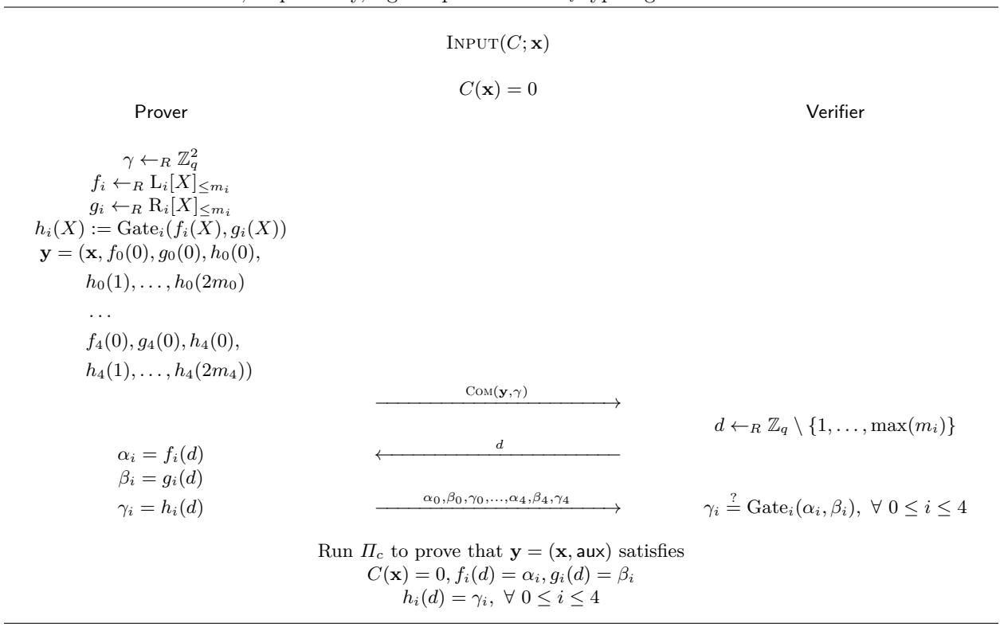

# **Compressed** *Σ***-Protocols for Bilinear Group Arithmetic Circuits and Application to Logarithmic Transparent Threshold Signatures**

Thomas Attema1*,*2*,*4*,* <sup>∗</sup> , Ronald Cramer1*,*2*,* † , and Matthieu Rambaud3*,* ‡

- <sup>1</sup> CWI, Cryptology Group, Amsterdam, The Netherlands
- <sup>2</sup> Leiden University, Mathematical Institute, Leiden, The Netherlands
- <sup>3</sup> Telecom Paris, Institut Polytechnique de Paris, Palaiseau, France
- <sup>4</sup> TNO, Cyber Security and Robustness, The Hague, The Netherlands

Version 4 - January 10, 2023<sup>5</sup>

**Abstract.** Lai et al. (CCS 2019) have shown how Bulletproofs arithmetic circuit zero-knowledge protocol (Bootle et al., EUROCRYPT 2016 and Bünz et al., S&P 2018) can be generalized to work for bilinear group arithmetic circuits directly, i.e., without requiring these circuits to be translated into arithmetic circuits.

In a nutshell, a bilinear group arithmetic circuit is a standard arithmetic circuit augmented with special gates capturing group exponentiations or pairings. Such circuits are highly relevant, e.g., in the context of zero-knowledge statements over pairing-based languages. As expressing these special gates in terms of a standard arithmetic circuit results in a significant overhead in circuit size, an approach to zeroknowledge via standard arithmetic circuits may incur substantial additional costs. The approach due to Lai et al. shows how to avoid this by integrating additional zero-knowledge techniques into the Bulletproof framework so as to handle the special gates very efficiently.

We take a different approach by generalizing *Compressed Σ-Protocol Theory* (CRYPTO 2020) from arithmetic circuit relations to bilinear group arithmetic circuit relations. Besides its conceptual simplicity, our approach has the practical advantage of reducing the communication costs of Lai et al.'s protocol by roughly a multiplicative factor 3.

Finally, we show an application of our results which may be of independent interest. We construct the first *k*-out-of-*n* threshold signature scheme (TSS) that allows for transparent setup *and* that yields threshold signatures of size logarithmic in *n*. The threshold signature hides the identities of the *k* signers and the threshold *k* can be dynamically chosen at aggregation time.

**Keywords:** Zero-Knowledge, Bilinear Groups, Pairings, Compressed *Σ*-Protocol Theory, Threshold Signature Schemes.

### **1 Introduction**

Bulletproofs [[BCC](#page-26-0)<sup>+</sup>16, [BBB](#page-26-1)<sup>+</sup>18] introduced an ingenious technique to compress the communication complexity of discrete logarithm (DL) based circuit zero-knowledge (ZK) protocols from linear to logarithmic. Their approach was presented as a drop-in replacement for the well-established *Σ*-protocol theory and it results in efficient zero-knowledge protocols for relations captured by a circuit defined over Z*<sup>q</sup> ∼*= Z*/*(*q*Z). In [\[AC20](#page-26-2)], Bulletproofs and *Σ*-protocol theory were reconciled by repurposing an appropriate adaptation of

<sup>∗</sup> thomas.attema@tno.nl

cramer@cwi.nl, cramer@math.leidenuniv.nl

rambaud@enst.fr

<sup>5</sup>Sections 1-6 were published in the same title work at ASIACRYPT 2021. Section [7](#page-22-0) and Appendix [A](#page-28-0) did not appear in that work.

<sup>5</sup>**Change log** w.r.t. Version 3 - March 10, 2021: (a) editorial changes throughout, (b) corrected a technical oversight in Appendix [A](#page-28-0) without affecting the rest of the paper, and (c) added a short discussion on seemingly contradictory complexity assumptions (Section [5.2\)](#page-15-0).

Bulletproofs as a black-box compression mechanism for basic *Σ*-protocols. They first show how to handle linear arithmetic relations by deploying a basic *Σ*-protocol. Second, they show how an adaptation of Bulletproofs allows the communication complexity of the basic *Σ*-protocol to be compressed from linear to logarithmic. Hence, the resulting *compressed Σ-protocol* allows a prover to prove *linear* statements with a communication complexity that is *logarithmic* in the size of the witness. Finally, to handle arbitrary non-linear relations, arithmetic secret sharing based techniques [[CDP12](#page-26-3)] are deployed to *linearize* these non-linearities. Cryptographic protocol design can now follow well-established approaches from *Σ*-protocol theory, but with the additional black-box compression mechanism to reduce the communication complexity down to logarithmic.

These, and other, recent advances in communication-efficient circuit ZK lead to an obvious, but *indirect*, approach for efficient protocols for arbitrary relations:

- 1. Construct an arithmetic circuit capturing the relation;
- 2. Apply an efficient circuit ZK protocol to this arithmetic circuit.

However, for some relations, the associated arithmetic circuits can be large and complex. Thereby losing the conceptual simplicity and possibly even the concrete efficiency over a more *direct* approach. The work of [[ACF21\]](#page-26-4), for instance, describes a number of efficiency advantages of their direct approach for proving knowledge of *k* discrete logarithms out of *n* public group elements.

Moreover, Lai et al. [[LMR19](#page-27-0)] construct a zero-knowledge proof system for directly handling relations captured by *bilinear group arithmetic circuits*. A bilinear group is a tuple (*q,* G1*,* G2*,* G*<sup>T</sup> , e, G, H*), where *e* : G1*×*G<sup>2</sup> *→* G*<sup>T</sup>* is a bilinear map, also called a pairing, and G1, G<sup>2</sup> and G*<sup>T</sup>* are groups (group operations are written additively) of prime order *q* generated by *G*, *H* and *e*(*G, H*), respectively. A bilinear group arithmetic circuit, or a bilinear circuit, is a circuit in which each wire takes values in *W ∈ {*Z*q,* G1*,* G2*,* G*<sup>T</sup> }* and the gates all have fan-in 2 and unbounded fan-out. Gates are either group operations, Z*q*-scalar multiplications or bilinear pairings. For more details see Section [6](#page-18-0). Bilinear circuits directly capture relations encountered in, e.g., identity based encryption [[SW05](#page-27-1)] and structure preserving signatures [[AFG](#page-26-5)<sup>+</sup>10]. We note that, for a highly optimized group of order *q ≈* 2 <sup>256</sup>, multiplying a single group element with a Z*q*-scalar requires an arithmetic circuit with approximately 800 multiplication gates [[HBHW20](#page-27-2)], instead of a single gate in the bilinear circuit model. Hence, besides conceptual simplicity there can be significant efficiency advantages of the *direct* approach over the *indirect* approach that uses generic solutions for arithmetic circuit ZK.

In this work, we focus on one application of our bilinear circuit ZK protocols: *Threshold Signature Schemes* (TSSs) [[DF89\]](#page-26-6). A *k*-out-of-*n* TSS is a standard signature scheme, allowing each of the *n* players to individually sign arbitrary messages *m*, enriched with a public *k*-aggregation algorithm. The *k*-aggregation algorithm takes as input *k* signatures, issued by *any k* distinct players, on the same message *m* and outputs a *threshold signature σ*. A naive TSS is obtained by exhibiting the *k* individual signatures directly. However, this approach results in threshold signatures with size linear in the threshold *k*. The main goal for TSSs is to have *succinct* threshold signatures, i.e., with size sub-linear in *k*. The succinct TSS of [\[Sho00](#page-27-3)] immediately found an application in reducing the communication complexity of consensus protocols [\[CKS05\]](#page-26-7). The impact of succinctness is significant since, in consensus applications, the threshold *k* is of the same order of magnitude as *n* (typically *k* = *n/*2 or *k* = 2*n/*3). Although desirable in some applications, it is not required that a threshold signature *hides* the *k*-subset of signers.

### **1.1 Contributions**

In this work, we present a novel ZK protocol for relations captured by bilinear circuits. We show that there is a generalization of the approach of [[AC20](#page-26-2)] for arithmetic circuit relations to bilinear circuit relations. Generalizing [[AC20](#page-26-2)], our approach is to first *compress* a basic *Σ*-protocol for proving linear statements about committed vectors and, second, to show how to handle arbitrary bilinear circuit relations by *linearizing* nonlinearities. This leads to a conceptually simple and modular construction of ZK protocols for bilinear circuit relations.

In [[ACF21\]](#page-26-4), an abstraction of the compressed *Σ*-protocols for proving linear relations was introduced. An appropriate instantiation of these abstract protocols immediately results in a compressed *Σ*-protocol for proving that a mixed vector  $\mathbf{x} \in \mathbb{Z}_q^{n_0} \times \mathbb{G}_1^{n_1} \times \mathbb{G}_2^{n_2} \times \mathbb{G}_T^{n_T}$  satisfies a linear constraint defined over a bilinear circuit. The main ingredient in this instantiation is a homomorphic commitment scheme [AFG<sup>+</sup>10, LMR19] that allows a prover to commit to such mixed vectors. However, a number of modification to this straightforward approach are warranted.

First, in contrast to the Pedersen commitment scheme for  $\mathbb{Z}_q$ -vectors, the commitment scheme for mixed vectors is not *compact*, i.e., the size of a commitment is not constant in the size of the committed vector. More precisely, the size of a commitment to a vector  $\mathbf{x} \in \mathbb{Z}_q^{n_0} \times \mathbb{G}_1^{n_1} \times \mathbb{G}_2^{n_2} \times \mathbb{G}_T^{n_T}$  is constant in the dimensions  $n_0$ ,  $n_1$  and  $n_2$ , but it is linear in the dimension  $n_T$ . For this reason, compression should only be applied to the compact part of the commitment scheme. We handle this complication in an abstract manner by considering homomorphisms  $\Psi(\mathbf{x}_1, \mathbf{x}_2)$ , where the input consists of two parts and compressing is only applied to the first part  $\mathbf{x}_1$ .

Second, the arithmetic circuit instantiation of the abstract protocol allows for an additional reduction of the communication costs by roughly a factor 2. This technique stems from [BBB<sup>+</sup>18] and was also applied in the compressed  $\Sigma$ -protocols of [AC20]. However, it is not applicable in general, i.e., for arbitrary homomorphisms  $\Psi$ , and has therefore been omitted in the abstract framework of [ACF21]. Here, we show how this technique can be adapted to the bilinear circuit setting. Again, and in contrast to prior works, the compact part and the non-compact part of the commitment must be treated separately.

Third, the non-compact part of the commitment scheme has an "El Gamal structure". We adapt the basic  $\Sigma$ -protocols, used in compressed  $\Sigma$ -protocol, to exploit this structure. Informally, to prove knowledge of an opening of an El Gamal commitment it is sufficient to prove knowledge of commitment randomness  $\gamma \in \mathbb{Z}_q$  satisfying certain properties. Altogether, this technique reduces the constant in the linear component of the communication costs from 3 down to 1 (the other components are logarithmic).

Finally, the abstract framework of [ACF21] only considers linear relations. To handle non-linear relations, we show how the linearization techniques from the arithmetic circuit setting of [AC20] can be adapted to the bilinear circuit setting.

The communication complexity of our protocols is logarithmic in  $n_0$ ,  $n_1$  and  $n_2$ , but linear in  $n_T$ . Asymptotically this is comparable to the prior work of [LMR19]. However, we consider a strictly stronger application scenario, i.e., [LMR19] only considers bilinear relations captured by a limited class of circuits. Moreover, in comparison to [LMR19], we improve upon the *concrete* communication costs by roughly a factor 3. More precisely, we reduce the constant in the logarithmic component of the communication costs from 16 down to 6, and the constant in the linear component from 3 down to 1. See Section 6.3 for a detailed comparison.

Another application of the commitment scheme of [AFG<sup>+</sup>10, LMR19] is that it allows a prover to commit to Pedersen commitments in a pairing-based platform. This layered approach, of committing to commitments, was already suggested in [AFG<sup>+</sup>10] and it allows a prover to commit to  $n^2 \mathbb{Z}_q$ -coefficients using only 2n+1 public group elements, instead of the  $n^2+1$  public group elements required when using Pedersen commitments directly. Replacing the Pedersen commitment scheme, in circuit ZK protocols derived from Bulletproofs [BCC<sup>+</sup>16, BBB<sup>+</sup>18] or Compressed  $\Sigma$ -Protocol Theory [AC20], by this layered commitment scheme immediately gives a square root reduction in the size of the set of public parameters while leaving the logarithmic communication costs exactly the same.

An additional advantage of our approach is that we can handle linear relations directly. By contrast, Lai et al. [LMR19] generalize the Bulletproof approach [BCC<sup>+</sup>16, BBB<sup>+</sup>18] where the pivotal protocol handles a specific non-linear inner-product relation. Applying this approach to a linear relation requires a cumbersome approach of capturing this linear relation by a set of non-linear inner-product constraints, leading to unnecessarily complicated protocols.

As an application of our compressed  $\Sigma$ -protocol for proving linear relations, we construct a transparent k-out-of-n threshold signature scheme (TSS) with threshold signatures that are  $O(\kappa \log(n))$  bits, where  $\kappa$  is the security parameter. Recall that a TSS enables any set of at least k players, in a group of n, to issue a "threshold" signature on a message m, but no subset of less than k players is able to issue one. A TSS is called transparent if it does not require a trusted setup phase, i.e., all public parameters are random coins.

 $<sup>^6</sup>$ This is perhaps not immediate from the paper [LMR19], but it has been confirmed by the authors. See also Section 6.3.

Given recent advances in efficient circuit zero-knowledge, an obvious solution is to construct a threshold signature as a proof of knowledge attesting the knowledge of *k*-out-of-*n* signatures. With the appropriate ZK protocol this would immediately result in a transparent TSS with sublinear size threshold signatures. However, this approach requires an inefficient reduction from the corresponding threshold signature relation to a relation defined over an arithmetic circuit. More precisely, the arithmetic circuits capturing these relations are typically large.

For this reason, we follow a more *direct* approach avoiding this inefficient reduction. Namely, we append the BLS signature scheme [\[BLS01](#page-26-8), [BLS04\]](#page-26-9) with a *k*-aggregation algorithm. The BLS signature scheme is defined over a bilinear group. In particular, the BLS verification algorithms naturally fit with our compressed *Σ*-protocols for relations defined over bilinear groups. A key feature of this signature scheme is that its signing algorithm does not contain the evaluation of a hash function. This would namely require the hash function to be expressed in terms of a (typically large) bilinear circuit. To derive the required threshold functionality, we use an appropriated adaptation of *k*-out-of-*n* proofs of partial knowledge from a recent work [[ACF21\]](#page-26-4).

The compressed *Σ*-protocols are interactive and can be made non-interactive by the Fiat-Shamir transform [[FS86\]](#page-27-4). In general, the Fiat-Shamir transformation of a (2*µ*+ 1)-move protocol increases the knowledge error from *κ* to *Q<sup>µ</sup> · κ*, where *Q* is the number of random oracle queries the non-interactive prover is allowed to make, i.e., the security loss is *exponential* in the number of rounds. However, for (*k*1*, . . . , kµ*)-special sound protocols such as ours, it is believed that this loss is actually constant in the number of rounds. This claim was recently proven in the algebraic group model [[GT21\]](#page-27-5).

The non-interactive proofs contain precisely the messages sent from the prover to the verifier. Hence, the logarithmic proof size is inherited by the logarithmic communication complexity of the compressed *Σ*protocol. More precisely, a *k*-out-of-*n* threshold signature contains 4 *d*log<sup>2</sup> (*n*)*e*+ 3 G*<sup>T</sup>* -elements, 1 G1-element and 1 Z*q*-element.

The *k*-aggregation algorithm can be evaluated by any party with input at least *k* valid signatures from distinct signers. Besides the signatures, the *k*-aggregation algorithm only takes public input values. Moreover, the threshold *k* can be chosen at aggregation time independent of the set-up phase. By contrast, Shoup's construction [[Sho00\]](#page-27-3) requires a different trusted setup phase for every threshold *k*. Since the compressed *Σ*-protocol is zero-knowledge, an additional property of our TSS is that a threshold signature hides the *k*-subset of signers *S*. Our TSS does not require a trusted setup and is therefore transparent. More precisely, the players can generate their own public-private key-pairs and the *Σ*-protocol only requires an unstructured public random string defined by the public parameters of the commitment scheme.

### **1.2 Related Work**

**Zero-Knowledge Proof Systems.** Groth and Sahai [[GS08](#page-27-6)] were the first to consider zero-knowledge proof systems for relations defined over bilinear groups *directly*. In contrast to more standard indirect approaches, their work avoids inefficient reductions to arithmetic circuit relations. Bilinear groups have found applications in many areas of cryptography. For instance, in digital signatures, identity based encryption and efficient zeroknowledge proof systems. For this reason many relevant relations are naturally defined over bilinear groups. The goal is not only to achieve efficiency, but also modularity in the design of cryptographic protocols.

A drawback of the Groth-Sahai proof system is that its proof sizes are linear in the size of the statements. By contrast, Bulletproofs [\[BCC](#page-26-0)<sup>+</sup>16, [BBB](#page-26-1)<sup>+</sup>18] are practically efficient DL-based proof systems for arithmetic circuit relations with logarithmic proof sizes. Their main building block is an efficient protocol for proving a specific non-linear inner-product relation. Arbitrary relations captured by an arithmetic circuit are reduced to a set of inner-product constraints. Lai et al. [[LMR19\]](#page-27-0) adapted the techniques from Bulletproofs to the bilinear circuit model achieving a communication-efficient ZKP system for relations defined over bilinear circuits. More precisely, the communication complexity is logarithmic in the number of Z*q*, G<sup>1</sup> and G<sup>2</sup> inputs, but linear in the number of G*<sup>T</sup>* inputs. They first reduce the bilinear circuit relation to a set of inner-products constraints, and subsequently describe protocols for proving various inner-product relations. The work of [[BMMV19](#page-26-10)] improves the efficiency for a specific subset of bilinear *inner-product* relations. Hence, although these approaches avoid reductions to arithmetic circuits, they do rely on the reduction to a set of inner-product constraints.

In [\[AC20\]](#page-26-2), an alternative approach for arithmetic circuit relations is described. Their pivotal protocol is a basic *Σ*-protocol for proving linear relations. They show how to compress the communication complexity down to logarithmic and how to handle non-linearities in arbitrary arithmetic circuit relations. This approach is compatible with standard *Σ*-protocol theory and avoids the need for reinventing cryptographic protocol design around non-linear inner-product relations. Here, we generalize compressed *Σ*-protocols to the bilinear circuit model.

**Threshold Signature Schemes.** Shoup's TSS [\[Sho00](#page-27-3)] already achieves threshold signatures of constant size. However, his approach, and all other approaches with threshold signature sizes sub-linear in *k* and *n* are not transparent [\[GJKR96](#page-27-7), [GJKR03,](#page-27-8) [Bol03](#page-26-11), [LJY16,](#page-27-9) [HAP18](#page-27-10), [KG20,](#page-27-11) [KSM20,](#page-27-12) [GG20](#page-27-13)]. These works require either an explicit trusted dealer, or they have implemented this trusted dealer by an MPC (or other interactive) protocol that is evaluated before messages are signed. At first glance it might seem that [[GG20](#page-27-13)] also achieves a transparent setup. However, in their protocol the *k* signing players first have to run an interactive protocol before they can generate threshold signatures. This interactive protocol has to be evaluated before players can produce their inputs to the aggregation algorithm, therefore we consider this as a trusted setup.

The standard approach, introduced by Desmedt and Frankel [[DF89\]](#page-26-6), works by secret sharing the private key amongst the *n* players. This requires the private key to be generated by either a trusted dealer or an MPC protocol, i.e., this approach has a trusted set-up and is not transparent. Moreover, in contrast to our scheme, the threshold *k* should be fixed during the setup phase.

By contrast, all known *transparent* TSSs have size at least linear in the threshold *k*. Besides the naive implementation of simply outputting *k* valid signatures, there is also the following approach used by the decentralized transaction system Libra [[Lib19\]](#page-27-14) and by [[NRS](#page-27-15)+20]. Every player generates its own publicprivate key-pair. A threshold signature is computed as the sum of *k* individual BLS signatures, and it can be verified by running the BLS verification algorithm using the sum of the public keys of the *k* signers. Hence, the threshold signature should contain a list of the *k* signers, i.e., it is of size *O*(*n*) or *O*(*k* log(*n*)) depending on the exact encoding of this list. Moreover, these threshold signatures clearly do not hide the *k*-subset of signers. By contrast, Haque et al. [[HKSS20](#page-27-16)] construct a transparent TSS that does hide the *k*-subset of signers. However, while individual signature sizes are logarithmic in *n*, the threshold signatures are linear in the threshold *k*.

Finally, a recent work [\[BCG21](#page-26-12)] presents a different variant of a TSS, which they call *succinctly reconstructed distributed signatures* (SRDS). Their SRDS is most similar to the obvious approach of reducing the problem to an arithmetic circuit relation. It indeed applies a general (unspecified) SNARK in a black-box manner to achieve *O*(polylog(*n*))-size signatures. However, their SRDS can only tolerate up to *n/*3 corruptions.

### **1.3 Organization of the Paper**

The remainder of the paper is organized as follows. In Section [2](#page-4-0), we recall basic notation and definitions regarding bilinear groups and zero-knowledge proof systems. In Section [3](#page-6-0), we define a number of commitment schemes generalizing Pedersen vector commitments. In Section [4](#page-8-0), we describe a compressed *Σ*-protocol for proving linear relations about committed vectors, with logarithmic communication complexity. In Section [5](#page-14-0), as an application of our compressed *Σ*-protocol, we construct a novel threshold signature scheme. In Section [6](#page-18-0), we describe our linearization strategy for handling non-linear relations.

### <span id="page-4-0"></span>**2 Preliminaries**

### <span id="page-4-1"></span>**2.1 Bilinear Groups**

We consider the ring Z*<sup>q</sup> ∼*= Z*/*(*q*Z) for a prime *q*. Moreover, we let G1*,* G<sup>2</sup> and G*<sup>T</sup>* be groups of prime order *q* supporting discrete-log (DL) based cryptography, hence log(*q*) = *O*(*κ*) for security parameter *κ*. Some properties of commitment schemes used in this work rely on the stronger *Decisional Diffie-Hellman* (DDH) assumption. Therefore, we assume the DDH assumption to hold in all groups.

We write the group operations additively. Clearly, all groups  $\mathbb{G}_i$  are  $\mathbb{Z}_q$ -modules and, for all  $a \in \mathbb{Z}_q$  and  $g \in \mathbb{G}_i$ , the product  $ag \in \mathbb{G}_i$  is well-defined. We write vectors in boldface and inner-products are defined naturally, i.e., for all  $\mathbf{a} = (a_1, \ldots, a_n) \in \mathbb{Z}_q^n$  and  $\mathbf{g} = (g_1, \ldots, g_n) \in \mathbb{G}_i^n$  we define  $\langle \mathbf{a}, \mathbf{g} \rangle := \sum_{i=1}^n a_i g_i$ .

Let  $G \in \mathbb{G}_1$  and  $H \in \mathbb{G}_2$  be generators and let  $e : \mathbb{G}_1 \times \mathbb{G}_2 \to \mathbb{G}_T$  be a non-trivial bilinear mapping, i.e., e is a pairing such that e(G, H) generates  $\mathbb{G}_T$ . Then, a tuple  $(q, \mathbb{G}_1, \mathbb{G}_2, \mathbb{G}_T, e, G, H)$  defines a bilinear group. For vectors  $\mathbf{G} \in \mathbb{G}_1^n$  and  $\mathbf{H} \in \mathbb{G}_2^n$  the following inner-product is defined  $e(\mathbf{G}, \mathbf{H}) := \sum_{i=1}^n e(G_i, H_i)$ .

We say that the Symmetrical External Diffie-Hellman (SXDH) holds in a bilinear group  $(q, \mathbb{G}_1, \mathbb{G}_2, \mathbb{G}_T, e, G, H)$ , if the DDH assumption holds in both  $\mathbb{G}_1$  and  $\mathbb{G}_2$  [BGdMM05]. By the above assumption that the DDH assumption holds in all  $\mathbb{G}_i$ , it follows that the SXDH assumption holds for all bilinear groups that are considered in this work. The SXDH assumption implies that there is no efficiently computable isomorphism from  $\mathbb{G}_1$  to  $\mathbb{G}_2$  or from  $\mathbb{G}_2$  to  $\mathbb{G}_1$  [ACHdM05], i.e., we only consider bilinear groups of Type III [GPS08].

#### 2.2 Proofs of Knowledge

We recall some standard notions regarding Proofs of Knowledge (PoKs) following the notation and definitions of [AC20, ACF21]. A relation R is a set of statement-witness pairs (x; w). A  $\mu$ -move protocol  $\Pi$  for relation R is an interactive protocol with  $\mu$  communication rounds between a prover  $\mathcal{P}$  and verifier  $\mathcal{V}$ . It allows  $\mathcal{P}$  to convince  $\mathcal{V}$  that it knows a witness w for statement x, i.e.,  $(x; w) \in R$ . Protocol  $\Pi$  is also called an interactive proof for relation R. The statement x is public input for both  $\mathcal{P}$  and  $\mathcal{V}$  and the witness w is private input only for  $\mathcal{P}$ . In our protocol descriptions this is written as INPUT(x; w), i.e., the public and private input are separated by a semicolon. As the output of the protocol  $\mathcal{V}$  either accepts or rejects  $\mathcal{P}$ 's claim. The messages sent between  $\mathcal{P}$  and  $\mathcal{V}$  in one protocol execution are also referred to as a conversation or transcript. If  $\mathcal{V}$  accepts the associated transcript, it is called accepting.

An interactive proof is said to be *public coin*, if all messages from  $\mathcal{V}$  are chosen uniformly at random and independent from prior messages. Interactive protocols that are public-coin can be made *non-interactive* by the Fiat-Shamir transformation [FS86], as proven in [BR93], without increasing the communication costs from  $\mathcal{P}$  to  $\mathcal{V}$ . All interactive proofs in this work are public-coin.

Let us now describe some desirable (security) properties.

**Definition 1 (Completeness).** An interactive proof  $\Pi$  is called perfectly complete, if on any input  $(x; w) \in R$ , the verifier V always accepts.

**Definition 2 (Knowledge Soundness).** An interactive proof  $\Pi = (\mathcal{P}, \mathcal{V})$  is said to be knowledge sound with knowledge error  $\kappa : \mathbb{N} \to [0,1)$ , if there exists a polynomial  $q : \mathbb{N} \to \mathbb{N}$  and an algorithm  $\chi$  (extractor) with the following properties. For each (potentially dishonest) PPT prover  $\mathcal{P}^*$ , for each  $x \in \{0,1\}^*$ , whenever  $(\mathcal{P}^*, \mathcal{V})(x)$  outputs accept with probability  $\epsilon(x) \geq \kappa(|x|)$ , the extractor  $\chi$ , given input x and rewindable oracle access to the  $\mathcal{P}^*$ , runs in expected polynomial time and successfully outputs a witness w for statement x with probability at least  $(\epsilon(x) - \kappa(|x|))/q(|x|)$ .

**Definition 3 (Proof/Argument of Knowledge).** An interactive proof that is both complete and knowledge sound is said to be a Proof or Knowledge (PoK). PoKs for which knowledge soundness only holds under computational assumptions are also referred to as Arguments of Knowledge.

Witness extended emulation [Lin03] gives an alternative notion for knowledge soundness, sufficient for most practical scenarios, and it is known to be implied by knowledge soundness [Lin03]. For details we refer to [Lin03, HKR19, AC20].

We now recall a generalization of the *special-soundness* property. Special soundness is in general easier to handle than knowledge soundness. We first introduce the notion of a tree of accepting transcripts.

**Definition 4 (Tree of Accepting Transcripts).** Let  $\Pi$  be a  $(2\mu+1)$ -move protocol. A  $(k_1,k_2,\ldots,k_{\mu})$ -tree of accepting transcripts for protocol  $\Pi$  is a set of  $\prod_{i=1}^{\mu} k_i$  accepting transcripts that are arranged in the following tree structure. The nodes in this tree correspond to the prover's messages and the edges correspond to the verifier's challenges. Every node at depth i has precisely  $k_i$  children corresponding to  $k_i$  pairwise distinct challenges. Every transcript corresponds to exactly one path from the root node to a leaf node.

**Definition 5 (Special Soundness).** A  $(2\mu + 1)$ -move protocol is said to be  $(k_1, k_2, \ldots, k_{\mu})$ -special-sound, if there exists an efficient algorithm that on input a  $(k_1, k_2, \ldots, k_{\mu})$ -tree of accepting transcripts for statement x, outputs a witness w for x. A 3-move protocol is said to be special-sound if it is 2-special-sound.

Recently, it was shown that  $(k_1, k_2, ..., k_{\mu})$ -special-soundness *tightly* implies knowledge soundness [ACK21]. Therefore, protocols that are complete and special-sound are also referred to as proofs of knowledge (PoKs).

In some protocols there are rounds in which  $\mathcal{V}$  sends multiple challenges per round, i.e.,  $\mu$  challenges are sent in less than  $2\mu + 1$  rounds. For these protocols we also consider the  $(k_1, \ldots, k_{\mu})$ -special-soundness property. However, in this case a tree of accepting transcripts contains nodes that do not correspond to a message sent from  $\mathcal{P}$  to  $\mathcal{V}$ .

**Definition 6 (Honest Verifier Zero-Knowledge (HVZK)).** An interactive proof  $\Pi$  is said to be honest verifier zero-knowledge (HVZK), if there exists a PPT simulator that, on input a statement x that admits a witness w, outputs an accepting transcript, such that simulated transcripts follow exactly the same distribution as transcripts between an honest prover and an honest verifier. If the simulator proceeds by first sampling the random challenges, the protocol is said to be special honest verifier zero-knowledge (SHVZK).

Finally, we recall that two protocols,  $\Pi_a$  for relation  $R_a$  and  $\Pi_b$  for relation  $R_b$ , are said to be *composable*, if the final message of protocol  $\Pi_a$  contains a witness for relation  $R_b$  [AC20]. In this case, the composition  $\Pi_b \diamond \Pi_a$  runs Protocol  $\Pi_a$  but replaces the witness for relation  $R_b$  in its final message by an appropriate instantiation of Protocol  $\Pi_b$ . If protocol  $\Pi_a$  is  $(k_1, \ldots, k_{\mu_1})$ -special-sound and protocol  $\Pi_b$  is  $(k'_1, \ldots, k'_{\mu_2})$ -special-sound, then the composition  $\Pi_b \diamond \Pi_a$  is easily seen to be  $(k_1, \ldots, k_{\mu_1}, k'_1, \ldots, k'_{\mu_2})$ -special-sound.

### <span id="page-6-0"></span>3 Commitment Schemes

Compressed  $\Sigma$ -protocols allow a prover to prove that a committed vector satisfies some public constraint. These protocols crucially depend on the homomorphic properties of the commitment scheme. In this section, we describe a number of homomorphic commitment schemes for committing to vector  $\mathbf{x} \in \mathbb{Z}_q^{n_0} \times \mathbb{G}_1^{n_1} \times \mathbb{G}_2^{n_2} \times \mathbb{G}_T^{n_T}$  with coefficients in a bilinear group  $(q, \mathbb{G}_1, \mathbb{G}_2, \mathbb{G}_T, e, G, H)$ .

First, the Pedersen vector commitment scheme [Ped91] considers the case  $n_1 = n_2 = n_T = 0$ , i.e., the committed vector is a  $\mathbb{Z}_q$ -vector. Recall that group operations are written additively.

<span id="page-6-2"></span>**Definition 7 (Pedersen Vector Commitment [Ped91]).** Let  $\mathbb{G}$  be an Abelian group of prime order q. Pedersen vector commitments to vectors  $\mathbf{x} \in \mathbb{Z}_q^n$  are defined by the following setup and commitment phase:

```
- Setup: \mathbf{g} = (g_1, \dots, g_n) \leftarrow_R \mathbb{G}^n, \ h \leftarrow_R \mathbb{G}.

- Commit: Com: \mathbb{Z}_q^n \times \mathbb{Z}_q \to \mathbb{G}, \quad (\mathbf{x}, \gamma) \mapsto h\gamma + \langle \mathbf{g}, \mathbf{x} \rangle.
```

Abe et al. [AFG<sup>+</sup>10] constructed a similar commitment scheme that works with bilinear groups  $(q, \mathbb{G}_1, \mathbb{G}_2, \mathbb{G}_T, e, G, H)$  and allows a prover to commit to vectors of group elements  $\mathbf{x} \in \mathbb{G}_1^n$ . Lai, Malavolta and Ronge [LMR19] showed how a variation of this commitment scheme can be generalized to allow a prover to commit to vectors  $\mathbf{x} \in \mathbb{Z}_q^{n_0} \times \mathbb{G}_1^{n_1}$ . The commitment scheme is perfectly hiding and computationally binding under the DDH assumption in  $\mathbb{G}_2$ . Analogously, this construction results in a commitment scheme for vectors  $\mathbf{x} \in \mathbb{Z}_q^{n_0} \times \mathbb{G}_2^{n_2}$ .

<span id="page-6-1"></span>**Definition 8 (Commitment to**  $(\mathbb{Z}_q, \mathbb{G}_1)$ -vectors [AFG<sup>+</sup>10, LMR19]). Let  $(q, \mathbb{G}_1, \mathbb{G}_2, \mathbb{G}_T, e, G, H)$  be a bilinear group and let  $n_0, n_1 \geq 0$ . The following setup and commitment phase define a commitment scheme for vectors in  $\mathbb{Z}_q^{n_0} \times \mathbb{G}_1^{n_1}$ :

```
- Setup: \mathbf{g} = (g_1, \dots, g_{n_0}) \leftarrow_R \mathbb{G}_T^{n_0}, h \leftarrow_R \mathbb{G}_T, \mathbf{H} = (H_1, \dots, H_{n_1}) \leftarrow_R \mathbb{G}_2^{n_1}.

- Commit: Com: \mathbb{Z}_q^{n_0} \times \mathbb{G}_1^{n_1} \times \mathbb{Z}_q \to \mathbb{G}_T, (\mathbf{x}, \mathbf{y}, \gamma) \mapsto h\gamma + \langle \mathbf{g}, \mathbf{x} \rangle + e(\mathbf{y}, \mathbf{H}).
```

Remark 1. As an application of the commitment scheme of Definition 8, Abe et al. [AFG<sup>+</sup>10] mention commitments to Pedersen vector commitments. A commitment to n n-dimensional Pedersen vector commitments is namely a commitment to an  $n^2$ -dimensional  $\mathbb{Z}_q$ -vector. This two-tiered commitment scheme only requires 2n+1 public group elements. By contrast, Pedersen's commitment scheme requires  $n^2+1$  public group elements to commit to an  $n^2$ -dimensional  $\mathbb{Z}_q$ -vector. Replacing the Pedersen vector commitment scheme in, for example, [BCC<sup>+</sup>16, BBB<sup>+</sup>18, AC20] by this two-tiered commitment scheme results in arithmetic circuit ZK protocols with exactly the same communication complexity, but with a square root improvement in the size of the public parameters.

In addition, Lai et al. [LMR19] show how this approach can be extended to construct a commitment scheme for vectors with coefficients in  $\mathbb{Z}_q$ ,  $\mathbb{G}_1$  and  $\mathbb{G}_2$ . In contrast to the previous commitments, a commitment to a vector  $\mathbf{x} \in \mathbb{Z}_q^{n_0} \times \mathbb{G}_1^{n_1} \times \mathbb{G}_2^{n_2}$  consists of two target group elements. Informally, the reason is that, with high probability,  $(S, -R) \in \mathbb{G}_1 \times \mathbb{G}_2$  is a non-trivial solution for the equation e(x, R) + e(S, y) = 1, where  $(S, R) \in \mathbb{G}_1 \times \mathbb{G}_2$  is sampled uniformly at random. Such a solution would break the binding property of the naive generalization in which commitments consist of only one target group element. However, with high probability, there does not exist a solution  $(x, y) \in \mathbb{G}_1 \times \mathbb{G}_2$  to the system of equations  $e(x, R_1) + e(S_1, y) = 1$  and  $e(x, R_2) + e(S_2, y) = 1$ , where  $(S_1, R_1), (S_2, R_2) \in \mathbb{G}_1 \times \mathbb{G}_2$  are sampled uniformly at random. For this reason, the commitments consist of two target group elements and breaking their binding property can be reduced to solving a similar system of equations. The resulting commitment scheme is described in Definition 9. It is computationally hiding under the DDH assumption in  $\mathbb{G}_T$ , and it is computationally binding under the SXDH assumption [LMR19]. The scheme can be made perfectly hiding by introducing an additional randomizer  $\gamma_2 \in \mathbb{Z}_q$ .

<span id="page-7-0"></span>**Definition 9 (Commitment to**  $(\mathbb{Z}_q, \mathbb{G}_1, \mathbb{G}_2)$ -vectors [LMR19]). Let  $(q, \mathbb{G}_1, \mathbb{G}_2, \mathbb{G}_T, e, G, H)$  be a bilinear group and let  $n_0, n_1, n_2 \geq 0$ . The following setup and commitment phase define a commitment scheme for vectors in  $\mathbb{Z}_q^{n_0} \times \mathbb{G}_1^{n_1} \times \mathbb{G}_2^{n_2}$ :

- Setup: 
$$\mathbf{g} \leftarrow_R \mathbb{G}_T^{2 \times n_0}$$
,  $h \leftarrow_R \mathbb{G}_T^2$ ,  $\mathbf{H} \leftarrow_R \mathbb{G}_2^{2 \times n_1}$ ,  $\mathbf{G} \leftarrow_R \mathbb{G}_1^{2 \times n_2}$ .  
- Commit:  $\mathrm{Com}_1 : \mathbb{Z}_q^{n_0} \times \mathbb{G}_1^{n_1} \times \mathbb{G}_2^{n_2} \times \mathbb{Z}_q \to \mathbb{G}_T^2$ ,  $(\mathbf{x}, \mathbf{y}, \mathbf{z}, \gamma) \mapsto h\gamma + \langle \mathbf{g}, \mathbf{x} \rangle + e(\mathbf{y}, \mathbf{H}) + e(\mathbf{G}, \mathbf{z})$ , where

$$h\gamma + \langle \mathbf{g}, \mathbf{x} \rangle + e(\mathbf{y}, \mathbf{H}) + e(\mathbf{G}, \mathbf{z}) := \begin{pmatrix} h_1\gamma + \langle \mathbf{g}_1, \mathbf{x} \rangle + e(\mathbf{y}, \mathbf{H}_1) + e(\mathbf{G}_1, \mathbf{z}) \\ h_2\gamma + \langle \mathbf{g}_2, \mathbf{x} \rangle + e(\mathbf{y}, \mathbf{H}_2) + e(\mathbf{G}_2, \mathbf{z}) \end{pmatrix}. \tag{1}$$

The aforementioned commitment schemes do not allow a prover to commit to elements of the target group  $\mathbb{G}_T$  of the bilinear pairing  $e: \mathbb{G}_1 \times \mathbb{G}_2 \to \mathbb{G}_T$ . For this reason, we introduce the homomorphic commitment scheme of Definition 10. This scheme is based on the El Gamal encryption scheme [Gam84]. The commitment scheme is unconditionally binding and hiding under the DDH assumption in  $\mathbb{G}_T$ .

<span id="page-7-1"></span>**Definition 10 (Commitment to**  $(\mathbb{G}_T)$ -vectors [Gam84, LMR19]). Let  $\mathbb{G}_T$  be an Abelian group of prime order q. The following setup and commitment phase define a commitment scheme for vectors in  $\mathbb{G}_T^{n_T}$ :

- Setup: 
$$\mathbf{g} \leftarrow_R \mathbb{G}_T^{n_T}$$
,  $h \leftarrow_R \mathbb{G}_T$ .  
- Commit:  $Com_2 : \mathbb{G}_T^{n_T} \times \mathbb{Z}_q \to \mathbb{G}_T^{n_T+1}$ ,  $(\mathbf{x}, \gamma) \mapsto \begin{pmatrix} h\gamma \\ \mathbf{g}\gamma + \mathbf{x} \end{pmatrix}$ .

Note that, in contrast to the schemes of Definitions 7, 8 and 9, this commitment scheme is not compact, i.e, a commitment to a vector  $\mathbf{x} \in \mathbb{G}_T^{n_T}$  contains  $n_T + 1$  group elements. For this reason, the compression techniques applicable to compact commitments are of no benefit for commitments to  $\mathbb{G}_T$ -vectors, and we will treat commitments to target group elements separately.

Altogether, for a bilinear group  $(q, \mathbb{G}_1, \mathbb{G}_2, \mathbb{G}_T, e, G, H)$ , we obtain the following commitment scheme:

$$\operatorname{Com}: \mathbb{Z}_q^{n_0} \times \mathbb{G}_1^{n_1} \times \mathbb{G}_2^{n_2} \times \mathbb{G}_T^{n_T} \times \mathbb{Z}_q^2 \to \mathbb{G}_T^{n_T+3}, \quad (\mathbf{x}, \mathbf{y}, \gamma_1, \gamma_2) \mapsto \begin{pmatrix} \operatorname{Com}_1(\mathbf{x}; \gamma_1) \\ \operatorname{Com}_2(\mathbf{y}; \gamma_2) \end{pmatrix}, \tag{2}$$

where  $\mathbf{x} \in \mathbb{Z}_q^{n_0} \times \mathbb{G}_1^{n_1} \times \mathbb{G}_2^{n_2}$ ,  $\mathbf{y} \in \mathbb{G}_T^{n_T}$ , CoM<sub>1</sub> is the commitment scheme from Definition 9, and CoM<sub>2</sub> is the commitment scheme from Definition 10.

### <span id="page-8-0"></span>4 Compressed $\Sigma$ -Protocol for Opening Homomorphisms

In this section, we describe a compressed  $\Sigma$ -protocol for proving that a committed vector  $\mathbf{x} \in \mathbb{Z}_q^{n_0} \times \mathbb{G}_1^{n_1} \times \mathbb{G}_2^{n_2} \times \mathbb{G}_T^{n_T}$  satisfies a linear constraint  $f(\mathbf{x}) = y$  captured by an arbitrary homomorphism f. We also say that this protocol allows a prover to *open* a homomorphism f.

We present our protocols in an abstract language. More precisely, let

$$\Psi \colon \mathbb{H}_1 \times \mathbb{H}_2 \to \mathbb{H}, \quad (x_1, x_2) \to \Psi(x_1, x_2),$$

be a homomorphism between  $\mathbb{Z}_q$ -modules. We construct a compressed  $\Sigma$ -protocol for proving knowledge of a pre-image  $x=(x_1,x_2)$  of  $y=\Psi(x)$ . Instantiating this abstract protocol with  $\mathbb{H}_1=\mathbb{Z}_q^{n_0+1}\times\mathbb{G}_1^{n_1}\times\mathbb{G}_2^{n_2}$ ,  $\mathbb{H}_2=\mathbb{Z}_q\times\mathbb{G}_T^{n_T}$  and  $\Psi=(\mathrm{Com}_1,\mathrm{Com}_2,f)$ , where f is understood to ignore the commitment randomness in  $x_1$  and  $x_2$ , results in exactly the desired functionality.

Prior works [ACF21, ACK21] have considered similar abstractions of compressed  $\Sigma$ -protocols. However, we adapt these approaches in order to be able to treat the compact and non-compact parts of the commitment scheme separately. More precisely, we explicitly consider homomorphism where the domain is a Cartesian product  $\mathbb{H}_1 \times \mathbb{H}_2$  and apply the compression techniques only to the  $\mathbb{H}_1$ -part.

In Section 4.1, we construct a basic  $\Sigma$ -protocol for proving knowledge of a  $\Psi$ -pre-image. In Section 4.2, we describe the compression mechanism that reduces the communication complexity of a  $\Sigma$ -protocol. In Section 4.3, we introduce the compressed  $\Sigma$ -protocol for our abstract problem. This protocol is the recursive composition of the  $\Sigma$ -protocol and the compression mechanism. In Section 4.4 and Section 4.5, we describe efficiency improvements applicable to the special case where the homomorphism  $\Psi$  is defined over a bilinear group. Finally, in Section 4.6, we compose the different building blocks and describe our compressed  $\Sigma$ -protocol for opening homomorphisms on a committed vector  $\mathbf{x} \in \mathbb{Z}_q^{n_0} \times \mathbb{G}_1^{n_1} \times \mathbb{G}_2^{n_2} \times \mathbb{G}_T^{n_T}$ .

### <span id="page-8-1"></span>4.1 Basic $\Sigma$ -Protocol

Protocol 0, denoted by  $\Pi_0$ , is a basic  $\Sigma$ -protocol for proving knowledge of a pre-image of a homomorphism  $\Psi \colon \mathbb{H}_1 \times \mathbb{H}_2 \to \mathbb{H}$ . More precisely, it is a  $\Sigma$ -protocol for the following relation

$$R_{\Psi} = \{ (y; x) : y = \Psi(x) \}.$$
 (3)

Protocol 0 follows the generic design for q-one-way homomorphisms [Cra96, CD98] and its main properties are summarized in Theorem 1. Note that this  $\Sigma$ -protocol does not yet rely on the special structure of the homomorphism  $\Psi$ , i.e., it does not rely on the fact that the domain of  $\Psi$  is a Cartesian product  $\mathbb{H}_1 \times \mathbb{H}_2$ .

<span id="page-8-2"></span>Theorem 1 (Homomorphism Evaluation).  $\Pi_0$  is a  $\Sigma$ -protocol for relation  $R_{\Psi}$ . It is perfectly complete, special honest-verifier zero-knowledge and unconditionally special-sound. Moreover, the communication costs are:

- $-\mathcal{P} \to \mathcal{V}$ : 1  $\mathbb{H}$ -element, 1  $\mathbb{H}_1$ -element and 1  $\mathbb{H}_2$ -element.
- $\mathcal{V} \to \mathcal{P} \colon 1 \mathbb{Z}_q$ -element.

### <span id="page-9-1"></span>**Protocol 0** $\Sigma$ -protocol $\Pi_0$ for relation $R_{\Psi}$

 $\Sigma$ -protocol for proving knowledge of the pre-image of a  $\mathbb{Z}_q$ -module homomorphism  $\Psi \colon \mathbb{H}_1 \times \mathbb{H}_2 \to \mathbb{H}$ .

INPUT
$$(y;x)$$

$$y = \Psi(x)$$
Prover
$$r \leftarrow_R \mathbb{H}_1 \times \mathbb{H}_2$$

$$t = \Psi(r)$$

$$c \leftarrow_R \mathbb{Z}_q$$

$$c \leftarrow_R \mathbb{Z}_q$$

$$z = cx + r$$

$$z \to \Psi(z) \stackrel{?}{=} cy + t$$

### <span id="page-9-0"></span>4.2 Compression Mechanism

In [AC20], it was observed that the final message z of  $\Sigma$ -protocol  $\Pi_0$  is actually a witness for the statement cy + t of relation  $R_{\Psi}$ , i.e., the final message of this  $\Sigma$ -protocol constitutes a trivial proof of knowledge for relation  $R_{\Psi}$  in which the witness is simply revealed. Moreover, replacing this trivial PoK by a PoK with smaller communication costs would improve the communication-efficiency of the overall protocol. Note that the alternative protocol does not have to be zero-knowledge, because the trivial PoK clearly is not.

In order to construct a more efficient PoK for relation  $R_{\Psi}$ , let us assume that  $\mathbb{H}_1$  is the Cartesian product of a group  $\mathbb{H}_0$  with itself, i.e.,  $\mathbb{H}_1 = \mathbb{H}_0 \times \mathbb{H}_0$ . In this case, for all  $x_1 \in \mathbb{H}_1$ , we can write  $x_1 = (x_1^L, x_1^R)$  with  $x_1^L, x_1^R \in \mathbb{H}_0$ .

The compression mechanism is a proof of knowledge for relation  $R_{\Psi}$  with communication costs smaller than the communication-costs of the trivial PoK. The main idea of this compression mechanism is that, after receiving a challenge c from the verifier, the prover folds the secret element  $x_1 \in \mathbb{H}_1$  in half by computing the response  $z = x_1^L + cx_1^R \in \mathbb{H}_0$ . Note that  $z \in \mathbb{H}_0$  and  $x_1 \in \mathbb{H}_1 = \mathbb{H}_0 \times \mathbb{H}_0$ , so this folding procedure indeed reduces the size of the witness. The cost of this reduction is that the prover has to send two "cross-terms"  $a = \Psi((0, x_1^L), 0)$  and  $b = \Psi_1((x_1^R, 0), 0)$  to the verifier before receiving the challenge.

This compression mechanism is an adaptation of the compression mechanisms of [AC20, ACF21]. The difference with these prior works is that here the folding procedure is only applied on the first part of the secret witness, i.e., the  $\mathbb{H}_1$ -part. The compression mechanism, denoted by  $\Pi_1$ , is described in Protocol 1 and its main properties are summarized in Theorem 2.

### <span id="page-9-2"></span>**Protocol 1** Compression Mechanism $\Pi_1$ for relation $R_{\Psi}$

<span id="page-9-3"></span>
$$y = \Psi(x)$$
 Verifier 
$$a = \Psi((0, x_1^L), 0)$$
 
$$b = \Psi((x_1^R, 0), 0)$$
 
$$\xrightarrow{a,b}$$
 
$$c \leftarrow_R \mathbb{Z}_q$$
 
$$z = x_1^L + cx_1^R$$
 
$$\xrightarrow{z,x_2}$$
 
$$\Psi((cz, z), cx_2) \stackrel{?}{=} a + cy + c^2b$$

**Theorem 2 (Compression Mechanism).**  $\Pi_1$  is a 3-move protocol for relation  $R_{\Psi}$ . It is perfectly complete and unconditionally 3-special-sound. Moreover, the communication costs are:

- $-\mathcal{P} \to \mathcal{V}$ : 2  $\mathbb{H}$ -elements, 1  $\mathbb{H}_0$ -element and 1  $\mathbb{H}_2$ -element.
- $\mathcal{V} \to \mathcal{P} : 1 \mathbb{Z}_q$ -element.

The proof of Theorem 2 is almost identical to the proofs of [AC20, Theorem 2] and [ACF21, Theorem 2].

*Proof.* Completeness follows directly.

3-Special Soundness: Let  $(a, b; c_1; z_1, x_1)$ ,  $(a, b; c_2; z_2, x_2)$  and  $(a, b; c_3; z_3, x_3)$  be three accepting transcripts for distinct challenges  $c_1, c_2, c_3 \in \mathbb{Z}_q$  and with common first message (a, b). Let  $\alpha_1, \alpha_2, \alpha_3 \in \mathbb{Z}_q$  be such that

$$\begin{pmatrix} 1 & 1 & 1 \\ c_1 & c_2 & c_3 \\ c_1^2 & c_2^2 & c_3^2 \end{pmatrix} \begin{pmatrix} \alpha_1 \\ \alpha_2 \\ \alpha_3 \end{pmatrix} = \begin{pmatrix} 0 \\ 1 \\ 0 \end{pmatrix}.$$

Note that, since the challenges are distinct, this Vandermonde matrix is invertible and a solution to this equation exists. Let  $\bar{z} = \sum_{i=1}^{3} \alpha_i((c_i z_i, z_i), c_i x_i)$ . Then, since  $\Psi$  is a homomorphism, it follows that  $\Psi(\bar{z}) = y$ . Hence,  $\bar{z}$  is a witness for statement y of relation  $R_{\Psi}$ , which completes the proof.

#### <span id="page-10-0"></span>4.3 Abstract Compressed $\Sigma$ -Protocol

The the final message  $(z, x_2)$  of  $\Pi_1$  is again a witness, but now for statement  $a+cy+c^2b$  of relation  $R_{\Psi'}$  where  $\Psi'(z, x_2) = \Psi((cz, z), cx_2)$ . Hence, if  $\mathbb{H}_0$  is the Cartesian product of a group  $\mathbb{H}'_0$  with itself, the compression mechanism can be applied again, i.e., instead of sending  $(z, x_2)$  the prover and verifier run an appropriately instantiated compression mechanism. In particular, if  $\mathbb{H}_1 = \mathbb{H}^n_0$ , the compression mechanism can be applied recursively, i.e., the first part of the witness is folded until it consists of only one  $\mathbb{H}_0$  element.

The recursive composition of  $\Sigma$ -protocol  $\Pi_0$  and compression mechanism  $\Pi_1$  is a compressed  $\Sigma$ -protocol for relation  $R_{\Psi}$ . It is denoted by

$$\Pi_{\text{abs}} = \underbrace{\Pi_1 \diamond \dots \diamond \Pi_1}_{\mu \text{ times}} \diamond \Pi_0, \tag{4}$$

where  $\mu = \lceil \log_2(n) \rceil$ . Note that if n is not a power of 2 it can be appended with zeros. The basic  $\Sigma$ -protocol requires the prover to send one  $\mathbb{H}_1$ -element, or equivalently n  $\mathbb{H}_0$ -elements. By contrast, the compressed  $\Sigma$ -protocol only has to send 1  $\mathbb{H}_0$ -element. However, this reduction comes at the cost of sending a logarithmic number of  $2\mu + 3$   $\mathbb{H}$ -elements. The properties of  $\Pi_{\rm abs}$  are summarized in Theorem 3. Note that  $\Pi_{\rm abs}$  is SHVZK because  $\Pi_0$  is.

<span id="page-10-2"></span>**Theorem 3 (Abstract Compressed**  $\Sigma$ -Protocol). Let  $n \in \mathbb{N}$ ,  $\mu = \lceil \log_2(n) \rceil$  and  $\Psi \colon \mathbb{H}_0^n \times \mathbb{H}_2 \to \mathbb{H}$  be a  $\mathbb{Z}_q$ -module homomorphism. Then  $\Pi_{abs}$  is a  $2\mu + 3$ -move protocol for relation  $R_{\Psi}$ . It is perfectly complete, special honest-verifier zero-knowledge and unconditionally 3-special-sound. Moreover, the communication costs are:

- $-\mathcal{P} \to \mathcal{V}: 2\mu + 1 \mathbb{H}$ -elements,  $1 \mathbb{H}_0$ -element and  $1 \mathbb{H}_2$ -element.
- $\mathcal{V} \to \mathcal{P}: \mu + 1 \mathbb{Z}_q$ -elements.

### <span id="page-10-1"></span>4.4 Efficiency Improvements for Bilinear Instances

In this section, we consider the following  $\mathbb{Z}_q$ -module homomorphism

$$\Psi \colon \mathbb{Z}_q^{n_0+2} \times \mathbb{G}_1^{n_1} \times \mathbb{G}_2^{n_2} \times \mathbb{G}_T^{n_T} \to \mathbb{G}_T^{n_T+3} \times \mathbb{Z}_q \times \mathbb{G}_1 \times \mathbb{G}_2 \times \mathbb{G}_T,$$
$$(\mathbf{x}_1, \mathbf{x}_2) \mapsto \left( \text{CoM}_1(\mathbf{x}_1), \text{CoM}_2(\mathbf{x}_2), f(\mathbf{x}_1, \mathbf{x}_2) \right),$$

where the vectors  $\mathbf{x}_1 = (\mathbf{x}_1', \gamma_1) \in \mathbb{Z}_q^{n_0+1} \times \mathbb{G}_1^{n_1} \times \mathbb{G}_2^{n_2}$  and  $\mathbf{x}_2 = (\mathbf{x}_2', \gamma_2) \in \mathbb{G}_T^{n_T} \times \mathbb{Z}_q$  both include the commitment randomness  $\gamma_1, \gamma_2 \in \mathbb{Z}_q$  and the homomorphism f is understood to ignore this commitment randomness. This notation allows the commitment randomness to be treated implicitly.

Instantiating compressed  $\Sigma$ -protocol  $\Pi_{abs}$  with homomorphism  $\Psi$  allows a prover to show that a committed vector  $\mathbf{x} \in \mathbb{Z}_q^{n_0} \times \mathbb{G}_1^{n_1} \times \mathbb{G}_2^{n_2} \times \mathbb{G}_T^{n_T}$  satisfies the linear constraint  $f(\mathbf{x}) = \mathbf{y}$ . In Section 4.7, it is explained why we can restrict ourselves to linear relation captured by homomorphisms with codomain  $\mathbb{Z}_q \times \mathbb{G}_1 \times \mathbb{G}_2 \times \mathbb{G}_T$ . This instantiation therefore immediately results in the desired *linear* functionality. However, we describe two improvements that are applicable to this specific instantiation of compressed  $\Sigma$ -protocol  $\Pi_{abs}$ .

First, we note that in this case the first message (a,b) of compression mechanism  $\Pi_1$  is always of the form

$$a = \Psi((0, x_1^L), 0) = (\text{CoM}_1(0, x_1^L), \text{CoM}_2(0), f((0, x_1^L), 0)),$$
  
$$b = \Psi((x_1^R, 0), 0) = (\text{CoM}_1(x_1^R, 0), \text{CoM}_2(0), f((x_1^R, 0), 0)).$$

Hence, the second component of both a and b equals  $Com_2(0) = 0$  and does not have to be sent to the verifier. For this reason, we understand  $\Pi_{abs}$  to omit this information from the first message.

Second, we observe that in every iteration of the compression mechanism the prover has to send two evaluations of the homomorphism f to the verifier. This step can be made more efficient by a pre-processing step in which part of the evaluation of f is "incorporated into the commitment". The goal is not to hide the evaluation  $y = f(\mathbf{x})$ , in fact y is still public, but to reduce the overall communication complexity that is achieved after compression. Ultimately, this step will reduce a relevant constant in the communication costs of our compressed  $\Sigma$ -protocol by a factor 1/2. This technique was first deployed in [BBB<sup>+</sup>18] to improve the communication complexity of certain protocols [BCC<sup>+</sup>16] for inner-product relations defined over  $\mathbb{Z}_q$ . Here, it is generalized to our bilinear setting.

To this end, we write  $f = (f_1, f_2)$  with  $f_1(x) \in \mathbb{Z}_q \times \mathbb{G}_1 \times \mathbb{G}_2$  and  $f_2(x) \in \mathbb{G}_T$  for all x. The reason is that the commitment scheme is not compact on the  $\mathbb{G}_T$ -part. Hence incorporating  $f_2(x)$  into the commitment will not reduce the communication complexity of the protocol.

The pre-processing step proceeds as follows. After the verifier has sent a random challenge  $\rho$  to the prover, the problem of proving knowledge of a pre-image for  $\Psi$  is reduced to proving knowledge of a pre-image for

$$\Psi_{\rho}(\mathbf{x}_1, \mathbf{x}_2) = (\text{Com}_1(\mathbf{x}_1, \rho \cdot f_1(\mathbf{x}_1, \mathbf{x}_2)), \text{Com}_2(\mathbf{x}_2), f_2(\mathbf{x}_1, \mathbf{x}_2)),$$

where the domain of  $Com_1$  has been increased from  $\mathbb{Z}_q^{n_0+1} \times \mathbb{G}_1^{n_1} \times \mathbb{G}_2^{n_2}$  to  $\mathbb{Z}_q^{n_0+2} \times \mathbb{G}_1^{n_1+1} \times \mathbb{G}_2^{n_2+1}$ . Note that, since  $Com_1$  is compact, the codomain of  $\Psi_\rho$  is smaller than the codomain of  $\Psi$ . Because the challenge  $\rho$  is sampled uniformly at random and the commitment scheme  $Com_1$  is binding, the reduction is sound, i.e., a prover that knows a pre-image for  $\Psi_\rho$  must also know a pre-image for  $\Psi$ .

The reduction, denoted by  $\Pi_r$ , is formalized in Protocol 2 and its main properties are summarized in Lemma 1. Note that, in contrast to the previous protocols,  $\Pi_r$  only has *computational* soundness. Moreover, this protocol is clearly not special-honest verifier zero-knowledge; the secret witness  $\mathbf{x}$  is sent to the verifier. However, since the final message of this reduction will be replaced by an appropriate compressed  $\Sigma$ -protocol  $\Pi_{\text{abs}}$ , it does not have to be SHVZK.

<span id="page-11-0"></span>**Lemma 1.**  $\Pi_r$  is a 2-move protocol for relation  $R_{\Psi}$ . It is perfectly complete and computationally special-sound, under the assumption that the commitment scheme  $Com_1$  is binding. Moreover, the communication costs are:

```
\begin{array}{l} - \ \mathcal{P} \to \mathcal{V} \colon 1 \ \ element \ \ of \ \mathbb{Z}_q^{n_0+2} \times \mathbb{G}_1^{n_1} \times \mathbb{G}_2^{n_2} \times \mathbb{G}_T^{n_T}. \\ - \ \mathcal{V} \to \mathcal{P} \colon 1 \ \ element \ \ of \ \mathbb{Z}_q. \end{array}
```

*Proof.* Completeness follows directly.

**Special soundness:** We show that there exists an efficient algorithm  $\chi$  that, on input two accepting transcripts, either extracts a witness for  $R_{\psi}$ , or finds two different openings to the same commitment, and thereby breaks the binding property of the COM<sub>1</sub>.

<span id="page-12-1"></span>**Protocol 2** Argument of Knowledge  $\Pi_r$  for  $R_{\Psi}$ 

Reduction from relation  $R_{\Psi}$  to relation  $R_{\Psi_0}$ , where  $\Psi(\mathbf{x}_1, \mathbf{x}_2) = (\text{Com}_1(\mathbf{x}_1), \text{Com}_2(\mathbf{x}_2), f(\mathbf{x}_1, \mathbf{x}_2))$ .

$$Input(z = (P_1, P_2, y_1, y_2); \mathbf{x})$$
 
$$z = \Psi(\mathbf{x})$$
 
$$y_1 = f_1(\mathbf{x})$$
 
$$y_2 = f_2(\mathbf{x})$$
 
$$Verifier$$
 
$$\leftarrow \frac{\rho}{\mathbf{x}} \qquad \qquad \rho \leftarrow_R \mathbb{Z}_q$$
 
$$\Psi_{\rho}(\mathbf{x}) \stackrel{?}{=} z + (\operatorname{Com}_1(0, \rho \cdot y_1), 0, 0)$$

So let  $(\rho, \mathbf{x})$  and  $(\rho', \mathbf{x}')$  be two accepting transcripts with  $\rho \neq \rho'$ , then by subtracting the two verification equations and since  $Com_1(\cdot)$  is a homomorphism,

$$Com_1(\mathbf{x} - \mathbf{x}', \rho f_1(\mathbf{x}) - \rho' f_1(\mathbf{x}')) = Com(0, (\rho - \rho')y_1, 0).$$

Hence, either we have extracted two different openings to the same commitment, or  $\mathbf{x} = \mathbf{x}'$ ,  $\rho f_1(\mathbf{x}) - \rho' f_1(\mathbf{x}') = (\rho - \rho') y_1$ . In the latter case, it follows that  $f_1(\mathbf{x}) = f_1(\mathbf{x}') = y_1$ . Moreover, in this case it follows that

$$Com_1(\mathbf{x}_1, \rho f_1(\mathbf{x})) = P_1 + Com_1(0, \rho y_1),$$

which implies that  $Com_1(\mathbf{x}_1) = P_1$ . Hence,  $\Psi(\mathbf{x}) = z$  and  $\mathbf{x}$  is a witness for statement z of relation  $R_{\Psi}$ , which completes the proof.

#### <span id="page-12-0"></span>4.5 Reduced Communication for El Gamal Based Commitments

The basic  $\Sigma$ -protocol  $\Pi_0$  of Section 4.1 follows the generic design for q-one-way group homomorphisms  $\Psi$  [Cra96, CD98]. However, for some instantiations of  $\Psi$  this generic approach is sub-optimal as it leads to unnecessarily high communication costs. This is the case for our bilinear instantiation that makes use of the El Gamal based commitment scheme CoM<sub>2</sub> of Definition 10,

$$\mathrm{Com}_2: \mathbb{G}_T^{n_T} \times \mathbb{Z}_q \to \mathbb{G}_T^{n_T+1}, \quad (\mathbf{x}, \gamma) \mapsto \begin{pmatrix} h \gamma \\ \mathbf{g} \gamma + \mathbf{x} \end{pmatrix}.$$

Here, we describe a more efficient approach tailored to the commitment scheme  $Com_2$ . Subsequently, we explain how this improvement translates to a reduction of the communication costs of our compressed  $\Sigma$ -protocol.

The main observation is that to open a CoM<sub>2</sub>-commitment  $P = (P_1, P_2) \in \mathbb{G}_T \times \mathbb{G}_T^{n_T}$ , a prover merely has to reveal  $\gamma \in \mathbb{Z}_q$  with  $h\gamma = P_1$ . The committed vector  $\mathbf{x} \in \mathbb{G}_T^{n_T}$  can be computed from the commitment P and the opening  $\gamma$ , i.e.,  $\mathbf{x} = P_2 - \mathbf{g}\gamma$ . Hence, proving knowledge of a commitment opening is equivalent to proving knowledge of a discrete logarithm (in base h). The latter problem has a natural  $\Sigma$ -protocol with constant communication complexity. By contrast, the natural  $\Sigma$ -protocol for proving knowledge of a pre-image of the homomorphism CoM<sub>2</sub> has communication costs linear in the dimension  $n_T$  of the committed vector. A straightforward extension of this protocol allows a prover to prove that the committed vector satisfies an arbitrary *linear* relation.

<span id="page-12-2"></span>The resulting protocol, denoted by  $\Pi_{EG}$ , is a protocol for relation  $R_{EG} = \{ (P \in \mathbb{G}_T^{n_T+1}, y \in \mathbb{H}; \mathbf{x} \in \mathbb{G}_T^{n_T}, \gamma \in \mathbb{Z}_q) : P = \text{Com}_2(\mathbf{x}, \gamma), f(\mathbf{x}) = y \}$ . It is described in Protocol 3 and its properties are summarized in Theorem 4.

Theorem 4 ( $\Sigma$ -Protocol for El Gamal Based Commitments).  $\Pi_{EG}$  is a  $\Sigma$ -protocol for relation  $R_{EG}$ . It is perfectly complete, special honest-verifier zero-knowledge and unconditionally special-sound. Moreover, the communication costs are:

- $-\mathcal{P} \to \mathcal{V}: 1 \mathbb{G}_T$ -element,  $1 \mathbb{H}$ -element,  $1 \mathbb{Z}_q$ -element.
- $-\mathcal{V} \to \mathcal{P} \colon 1 \mathbb{Z}_q$ -element.

*Proof.* Completeness follows directly.

**Special Honest-Verifier Zero-Knowledge** (SHVZK): Upon receiving a random challenge  $c \in \mathbb{Z}_q$  a simulator proceeds as follows. The simulator samples  $\phi \in \mathbb{Z}_q$  uniformly at random and computes  $A = h\phi - cP_1$  and  $t = cy - f(cP_2 - \mathbf{g}\phi)$ . It is easily seen that the transcript  $(A, t, c, \phi)$  is accepting and that simulated transcripts follow exactly the same distribution as transcripts between an honest prover and an honest verifier.

**Special Soundness:** We show that there exists an efficient algorithm, that on input two accepting transcripts, computes a witness for relation  $R_{EG}$ . Let  $(A, t, c, \phi)$  and  $(A, t, c', \phi')$  be accepting transcripts, for challenges  $c \neq c'$  and with common first message (A, t). We define  $\bar{\phi} = (\phi - \phi')/(c - c') \in \mathbb{Z}_q$  and  $\bar{\mathbf{z}} = P_2 - \mathbf{g}\bar{\phi} \in \mathbb{G}_T^{n_T}$ . Then it is easily verified that  $\mathrm{Com}_2(\bar{z}, \bar{\phi}) = P$  and that  $f(\bar{\mathbf{z}}) = y$ . Hence,  $(\bar{\mathbf{z}}, \bar{\phi})$  is a witness for statement (P, y) of relation  $R_{EG}$ , which completes the proof.

<span id="page-13-1"></span>**Protocol 3**  $\Sigma$ -protocol  $\Pi_{EG}$  for relation  $R_{EG}$ 

 $\Sigma$ -protocol for opening a homomorphism on a committed  $\mathbb{G}_T$  vector.

$$Input(P, y; \mathbf{x}, \gamma)$$

$$P = (P_1, P_2) = Com_2(\mathbf{x}, \gamma)$$

$$y = f(\mathbf{x})$$

$$Verifier$$

$$\rho \leftarrow_R \mathbb{Z}_q$$

$$A = h\rho, \ t = f(\mathbf{g}\rho)$$

$$\phi = c\gamma + \rho$$

$$\frac{c}{\phi}$$

$$h\phi \stackrel{?}{=} cP_1 + A$$

$$f(cP_2 - \mathbf{g}\phi) \stackrel{?}{=} cy - t$$

### <span id="page-13-0"></span>4.6 Composition of the Protocols

Let  $\Pi_c$  be the compressed  $\Sigma$ -protocol obtained by instantiating  $\Pi_{abs}$  with homomorphism

$$\Psi \colon \mathbb{Z}_q^{n_0+2} \times \mathbb{G}_1^{n_1} \times \mathbb{G}_2^{n_2} \times \mathbb{G}_T^{n_T} \to \mathbb{G}_T^{n_T+3} \times \mathbb{Z}_q \times \mathbb{G}_1 \times \mathbb{G}_2 \times \mathbb{G}_T,$$
$$(\mathbf{x}_1, \mathbf{x}_2) \mapsto \left( \text{CoM}_1(\mathbf{x}_1), \text{CoM}_2(\mathbf{x}_2), f(\mathbf{x}_1, \mathbf{x}_2) \right),$$

and incorporating the efficiency improvements of Section 4.4 and Section 4.5. These efficiency improvements are applicable, because we restrict ourselves to homomorphisms  $\Psi$  defined over a bilinear group. More precisely, for  $\mu = \lceil \log_2(\max(n_0 + 1, n_1, n_2)) \rceil$ ,

$$\Pi_c = \underbrace{\Pi_1 \diamond \dots \diamond \Pi_1}_{\mu \text{ times}} \diamond \Pi_0 \diamond \Pi_r,$$
(5)

where  $\Pi_0$  is understood to apply the improved  $\Sigma$ -protocol of Section 4.5 to  $\Psi$ 's  $\mathbb{G}_T$ -part. This protocol allows a prover to prove that a committed vector  $\mathbf{x} \in \mathbb{Z}_q^{n_0} \times \mathbb{G}_1^{n_1} \times \mathbb{G}_2^{n_2} \times \mathbb{G}_T^{n_T}$  satisfies a linear constraint  $f(\mathbf{x}) = y$ . The properties of  $\Pi_c$  are summarized in the Theorem 5. Note that, by the improvement of Section 4.5, the communication costs are independent of the dimension  $n_T$  of the  $\mathbb{G}_T$ -part of the committed vector, even though the size of the commitment is linear in  $n_T$ .

<span id="page-14-2"></span>Theorem 5 (Compressed  $\Sigma$ -Protocol for Opening Homomorphisms).  $\Pi_c$  is a  $(2\mu + 4)$ -move protocol for relation  $R_{\Psi}$ , where  $\mu = \lceil \log_2(\max(n_0 + 1, n_1, n_2)) \rceil$ . It is perfectly complete, special honest-verifier zero-knowledge and computationally  $(2, 2, 3, \ldots, 3)$ -special-sound, under the assumption that the commitment scheme  $Com_1$  is binding. Moreover, the communication costs are:

```
-\mathcal{P} \to \mathcal{V}: 6\mu + 3 \mathbb{G}_T-elements, 2 \mathbb{Z}_q-elements, 1 \mathbb{G}_1-element and 1 \mathbb{G}_2-element.
```

Remark 2. The compressed  $\Sigma$ -protocols of [AC20], for relations defined over  $\mathbb{Z}_q$ , have a similar structure as  $\Pi_c$ . However, there a variant of the reduction  $\Pi_r$  is applied after applying the  $\Sigma$ -protocol. By contrast, we first apply reduction  $\Pi_r$  and subsequently apply the basic  $\Sigma$ -protocol  $\Pi_0$ . This adaptation yields a minor improvement as it reduces the communication costs by 3 elements.

#### <span id="page-14-1"></span>4.7 Amortization

Standard amortization techniques apply to the basic  $\Sigma$ -protocol  $\Pi_0$  for relation  $R_{\Psi}$ , and thereby also to compressed  $\Sigma$ -protocol  $\Pi_c$ . These amortization techniques allow a prover to open many homomorphisms on one commitment, or one homomorphism on many commitments, without increasing the communication costs from the prover to the verifier. For details we refer to [AC20, Section 5.1].

These amortization techniques allow us to restrict ourselves to homomorphisms with the codomain  $\mathbb{Z}_q \times \mathbb{G}_1 \times \mathbb{G}_2 \times \mathbb{G}_T$ . Namely, opening a homomorphism f with codomain  $\mathbb{Z}_q^{s_0} \times \mathbb{G}_1^{s_1} \times \mathbb{G}_2^{s_2} \times \mathbb{G}_T^{s_T}$  can be casted as opening  $\max(s_i)$  homomorphisms with codomain  $\mathbb{Z}_q \times \mathbb{G}_1 \times \mathbb{G}_2 \times \mathbb{G}_T$ .

### <span id="page-14-0"></span>5 Threshold Signature Schemes

In this section, we describe a threshold signature scheme (TSS), as an application of the compressed  $\Sigma$ protocol  $\Pi_c$  for proving linear statements on committed vectors  $\mathbf{x}$ . Informally a k-out-of-n threshold signature
can only be computed given k valid signatures issued by a k-subset of n players. We first describe the formal
definition of a TSS. Subsequently, we give our construction based on the compressed  $\Sigma$ -protocol  $\Pi_c$ .

#### <span id="page-14-3"></span>5.1 Definition and Security Model

We deviate from standard TSS definitions and aim for a strictly stronger functionality. In standard TSS definitions [Sho00, Bol03], a non-transparent mechanism generates a single public key and n private keys that are distributed amongst the n players. The private keys allow individual players to generate partial signatures on messages m. There is a public algorithm to aggregate k partial signatures into a threshold signature. The threshold signature can be verified with the public key.

By contrast, we define a TSS as an extension of a digital signature scheme. Our fundamental strengthening of the definitions of [Sho00, Bol03] and related works, is that the public and private keys are generated by the players locally. Public keys are published on a bulletin board and thereby publicly tied to the player's identities. This setup is thus transparent (called "bulletin board" in [BCG21] and formalized as  $\mathcal{F}_{CA}$  in the UC framework [Can04]). The players can individually sign messages by using their private keys. The aggregation algorithm now takes as input k signatures, instead of partial signatures, to generate a threshold signature.

For simplicity we assume the threshold k to be fixed. We will explain later why our construction (trivially) satisfies some stronger properties.

Let us first give a definition for the basic building block of our TSS.

 $<sup>- \</sup>mathcal{V} \to \mathcal{P}: \mu + 2 \mathbb{Z}_q$ -elements.

**Definition 11 (Digital Signature).** A digital signature scheme consists of three algorithms:

- KEYGEN is a randomized key generation algorithm that outputs a public-private key-pair (pk, sk).
- SIGN is a (possibly randomized) signing algorithm. On input a message  $m \in \{0,1\}^*$  and a secret key sk, it outputs a signature  $\sigma = \text{SIGN}(\mathsf{sk}, m)$ .
- VERIFY is a deterministic verification algorithm. On input a public key pk, a message m and a signature  $\sigma$ , it outputs either accept or reject.

A signature scheme is *correct* if Verify (pk, m, Sign(sk, m)) = accept for all key-pairs (pk, sk)  $\leftarrow$  Keygen and messages  $m \in \{0,1\}^*$ . If Verify(pk,  $m,\sigma$ ) = accept we say that  $\sigma$  is a *valid* signature on message m. Moreover, an adversary that does not know the secret key sk should not be able to forge a valid signature. This security property is formally captured in the widely accepted definition *Existential Unforgeability under Chosen-Message Attacks* (EUF-CMA) [Bol03]. We assume digital signature schemes to be correct and EUF-CMA by definition.

**Definition 12 (Threshold Signature).** A k-out-of-n threshold signature scheme (TSS) is a digital signature scheme (KEYGEN, SIGN, VERIFY) appended with two algorithms:

- k-AGGREGATE is a (possibly randomized) aggregation algorithm. On input n public keys  $(\mathsf{pk}_1, \ldots, \mathsf{pk}_n)$ , k signatures  $(\sigma_i)_{i \in \mathcal{S}}$  for a k-subset  $\mathcal{S} \subset \{1, \ldots, n\}$  and a message  $m \in \{0, 1\}^*$ , it outputs a threshold signature  $\Sigma$ .
- k-VERIFY is a deterministic verification algorithm. On input n public keys  $(pk_1, ..., pk_n)$ , a message m and a threshold signature  $\Sigma$ , it outputs either accept or reject.

Let  $\mathcal{S} \subset \{1,\ldots,n\}$  be some k-subset of indices and let  $(\sigma)_{i\in\mathcal{S}}$  be signatures, such that VERIFY $(\mathsf{pk}_i,m,\sigma_i)=\mathsf{accept}$ , for all  $i\in\mathcal{S}$ , and for some message  $m\in\{0,1\}^*$ . Then a TSS is *correct*, if for all  $(\mathsf{pk}_1,\ldots,\mathsf{pk}_n)$ , m,  $\mathcal{S}$  and  $(\sigma)_{i\in\mathcal{S}}$ ,

$$k\text{-VERIFY}\Big((\mathsf{pk}_1,\dots,\mathsf{pk}_n),m,k\text{-AGGREGATE}\big(m,(\sigma_i)_{i\in\mathcal{S}}\big)\Big) = \mathsf{accept}.$$

If k-VERIFY  $\Big((\mathsf{pk}_1,\ldots,\mathsf{pk}_n),m,\mathcal{E}\Big)=\mathsf{accept}$  we say that  $\mathcal{E}$  is a valid threshold signature. Moreover, an adversary with at most k-1 valid signatures on a message m should not be able to construct a valid threshold signature. This  $\mathit{unforgeability}$  property can be formalized by the following security game. Consider an adversary that is allowed to choose a subset of k-1 indices  $\mathcal{I}\subset\{1,\ldots,n\}$  and impose the values of the keys  $\mathsf{pk}_i$  in this subset. Assume that all remaining keys  $\mathsf{pk}_i$  were generated honestly from KEYGEN and therefore correspond to secret keys  $\mathsf{sk}_i$ . The adversary is allowed to query polynomially many signatures  $\sigma_i'=\mathsf{SIGN}(sk_i,m')$  for arbitrary messages m'. The TSS is said to be  $\mathit{unforgeable}$ , if the adversary is incapable of producing a valid k-out-of-n threshold signature on some message m that has not been queried. We assume threshold signatures schemes to be correct and unforgeable by definition.

### <span id="page-15-0"></span>5.2 Our Threshold Signature Scheme

We follow a non-standard, but conceptually simple, approach for constructing a threshold signature scheme. The starting point of our TSS is a digital signature scheme (KEYGEN, SIGN, VERIFY) and the k-aggregation algorithm k-AGGREGATE simply produces a proof of knowledge of k valid signatures on a message m, i.e., a PoK for the following relation:

$$R_T = \{ (\mathsf{pk}_1, \dots, \mathsf{pk}_n, m; \mathcal{S}, (\sigma_i)_{i \in \mathcal{S}}) : \\ |\mathcal{S}| = k, \ \text{VERIFY}(\mathsf{pk}_i, m, \sigma_i) = \mathsf{accept} \ \forall i \in \mathcal{S} \}.$$
 (6)

<span id="page-15-1"></span>The obvious approach is to capture this relation by an arithmetic circuit, i.e., reduce it to a number of constraints defined over  $\mathbb{Z}_q$ , and apply a communication-efficient proof of knowledge for arithmetic circuit relations in a black-box manner. A significant drawback of this *indirect* approach is that it relies on an

in efficient reduction to arithmetic circuit relations. For this reason, we follow a direct approach avoiding these in efficient reductions.

We instantiate our TSS with the BLS signature scheme [BLS01, BLS04] defined over a bilinear group  $(q, \mathbb{G}_1, \mathbb{G}_2, \mathbb{G}_T, e, G, H)$ . Let us now briefly recall the BLS signature scheme, instantiated in our *n*-player setting. All players  $i, 1 \leq i \leq n$ , generate their own private key  $u_i \in \mathbb{Z}_q$ , and publish the associated public key  $P_i = u_i H \in \mathbb{G}_2$ . To sign a message  $m \in \{0,1\}^*$ , player i computes signature  $\sigma_i = u_i \mathcal{H}(m) \in \mathbb{G}_1$ , where  $\mathcal{H}: \{0,1\}^* \to \mathbb{G}_1$  is some public hash function. The public verification algorithm accepts a signature  $\sigma_i$  if

$$e(\sigma_i, H) = e(\mathcal{H}(m), P_i). \tag{7}$$

By the bilinearity of e, all honestly generated signatures are accepted.

The BLS signature scheme was originally instantiated such that  $\mathbb{G}_1 = \mathbb{G}_2$ , i.e., both input coordinates of the pairing e are elements of the same group. However, the authors already showed that the scheme can be instantiated in a more general setting, where  $\mathbb{G}_1$  and  $\mathbb{G}_2$  are possibly different. But still, their security proof, showing that unforgeability follows from the Computational co-Diffie-Hellman (co-CDH) assumption, requires the existence of an efficiently computable isomorphism  $\psi \colon \mathbb{G}_2 \to \mathbb{G}_1$ . As discussed in Section 2.1, the existence of such an isomorphism contradicts the SXDH assumption; more precisely, the DDH assumption in  $\mathbb{G}_2$  cannot hold if there exists an efficiently computable isomorphism  $\psi \colon \mathbb{G}_2 \to \mathbb{G}_1$ . Now recall that the binding properties of the commitment schemes of Definition 8 and Definition 9 are derived from the DDH assumption in  $\mathbb{G}_2$  and the SXDH assumption, respectively. Hence, at first glance the BLS signature scheme and the aforementioned commitment schemes seem to be incompatible, i.e., they appear to require different bilinear groups. Fortunately, Boneh, Lynn and Shacham already commented on the necessity of the isomorphism  $\psi$ in the journal version of their work [BLS04]. They mention that, by relying on a slightly different complexity assumption referred to as the co-CDH\* assumption [SV07], the BLS signature scheme can also be instantiated in bilinear groups  $(q, \mathbb{G}_1, \mathbb{G}_2, \mathbb{G}_T, e, G, H)$  without an efficiently computable isomorphism  $\psi \colon \mathbb{G}_2 \to \mathbb{G}_1$ . This shows that, under the co-CDH\* assumption, we can safely instantiate the BLS signature scheme and the commitment scheme in the same bilinear group of Type III. A more detailed analysis of certain pairing-based signature schemes, instantiated with Type III bilinear groups, is provided in [CHKM10]. In particular, they show that the co-DHP and co-DHP\* assumptions are equivalent if the generators are suitably chosen and conclude that existing evidence suggests that Type III pairings offer at least as much security as Type II pairings when used to implement the BLS signature scheme.

In this section, we do not need to commit to  $\mathbb{G}_2$ -coefficients. Therefore, instead of the commitment scheme from Definition 9, we can use the somewhat simpler commitment scheme of Definition 8 defined by the commitment function:

$$\operatorname{Com}: \mathbb{Z}_q^{n_0} \times \mathbb{G}_1^{n_1} \times \mathbb{Z}_q \to \mathbb{G}_T, \ (\mathbf{x}_{\mathbb{Z}_q}, \mathbf{x}_{G_1}, \gamma) \mapsto h\gamma + \left\langle \mathbf{g}, \mathbf{x}_{\mathbb{Z}_q} \right\rangle + e(\mathbf{x}_{G_1}, \mathbf{H}).$$

In particular, these commitments consist of only 1 instead of 2  $\mathbb{G}_T$ -elements.

Instantiating relation  $R_T$  with the BLS signature scheme therefore results in the following relation,

$$R_{TSS} = \{(P_1, \dots, P_n, m; \mathcal{S}, (\sigma_i)_{i \in \mathcal{S}}) : |\mathcal{S}| = k, \ e(\sigma_i, H) = e(\mathcal{H}(m), P_i) \ \forall i \in \mathcal{S}\}.$$

The k-AGGREGATE algorithm simply computes a proof of knowledge for relation  $R_{TSS}$ . The main challenge is that the prover only knows k-out-of-n signatures. To handle this problem the k-out-of-n case is reduced to the n-out-of-n case as follows. The k signatures are appended with n-k signatures  $\sigma_i=0$  and a binary vector that allows the prover to eliminate the n-k new and invalid signatures. The left hand side of the verification remains the same, while the right hand side is multiplied by the corresponding coefficient of the binary vector. This approach results in a TSS with the desired properties. However, it requires the prover to prove a number of non-linear statements, i.e., that the committed binary vector is binary and contains at most n-k zeros. Although this can be done efficiently, e.g., with the range proofs of [AC20], a recent result on k-out-of-n proofs of partial knowledge [ACF21] gives an even more efficient solution, that completely avoids non-linearities.

The proof of partial knowledge technique allows us to reduce relation  $R_{TSS}$  to a linear relation defined over the bilinear group  $(q, \mathbb{G}_1, \mathbb{G}_2, \mathbb{G}_T, e, G, H)$ . Let  $p(X) = 1 + \sum_{j=1}^{n-k} a_j X^j \in \mathbb{Z}_q[X]$  be the unique polynomial

of degree at most n-k with p(i)=0 for all  $i\in\{1,\ldots,n\}\setminus\mathcal{S}$ . Note that this polynomial defines an (n-k,n)secret sharing of 1, with shares  $s_i = 0$  for all  $i \notin \mathcal{S}$ . The k-aggregator defines  $\widetilde{\sigma}_i = p(i)\sigma_i$ , where  $\widetilde{\sigma}_i$  is understood to be equal to 0 for  $i \notin \mathcal{S}$ , i.e., the secret sharing defined by p(X) eliminates the signatures  $(\sigma_i)_{i \notin \mathcal{S}}$  that the k-aggregator does not know. Subsequently, the k-aggregator commits to

$$\mathbf{x} = (a_1, \dots, a_{n-k}, \widetilde{\sigma}_1, \dots, \widetilde{\sigma}_n) \in \mathbb{Z}_q^{n-k} \times \mathbb{G}_1^n.$$

Now note that the committed vector  $\mathbf{x}$  satisfies  $f_i(\mathbf{x}) = f_i(a_1, \dots, a_{n-k}, \widetilde{\sigma}_1, \dots \widetilde{\sigma}_n) = e(\mathcal{H}(m), P_i)$  for all  $1 \leq i \leq n$ , where

$$f_i: \mathbb{Z}_q^{n-k} \times \mathbb{G}_1^n \to \mathbb{G}_T, \quad \mathbf{x} \mapsto e(\widetilde{\sigma}_i, H) - \sum_{j=1}^{n-k} a_j i^j e(\mathcal{H}(m), P_i).$$
 (8)

<span id="page-17-0"></span>Hence, by proving that the committed vector satisfies these relations, it follows that the k-aggregator knows a non-zero polynomial p(X) of degree at most n-k and group elements  $\widetilde{\sigma}_1, \ldots \widetilde{\sigma}_n \in \mathbb{G}_1$  such that  $e(\widetilde{\sigma}_i, H) =$  $p(i)e(\mathcal{H}(m), P_i)$  for all  $1 \leq i \leq n$ . Therefore, the k-aggregator must know valid signatures for all indices i with  $p(i) \neq 0$ , and since p(X) is non-zero and of degree at most n-k, at least k of its evaluations are non-zero. Because the mappings  $f_i$  are homomorphisms, the required proof of knowledge follows from an appropriate instantiation of compressed  $\Sigma$ -protocol  $\Pi_c$ . We apply the amortization techniques of Section 4.7 to prove all n relations of eq. (8) for essentially the price of one. Moreover, we apply the Fiat-Shamir transform to make protocol  $\Pi_c$  non-interactive. Altogether the threshold signature contains a commitment  $P \in \mathbb{G}_T$  to the vector **x** together with a non-interactive proof of knowledge  $\pi$  of an opening of P that satisfies the aforementioned linear constraints. The k-aggregate algorithm is summarized in Algorithm 4. The associated k-verification algorithm k-Verify simply runs the verifier of  $\Pi_c$ . Correctness of the resulting threshold signature follows immediately from the completeness of  $\Pi_c$ , and unforgeability follows from the soundness of  $\Pi_c$ . The properties of the TSS are summarized in Theorem 6. Note that our TSS has some additional properties not required by the definition of Section 5.1. For instance, since the proof of knowledge  $\Pi_c$  is special honest-verifier zero-knowledge, our threshold signatures hide the k-subset S of signers.

#### <span id="page-17-1"></span>**Algorithm 4** k-Aggregation Algorithm k-AGGREGATE

Public Input: Public Keys  $P_1, \ldots, P_n \in \mathbb{G}_2$ 

Message  $m \in \{0, 1\}$ 

k – Subset  $S \subset \{1, \ldots, n\}$ PRIVATE INPUT:

Signatures  $(\sigma_i)_{i\in\mathcal{S}}\in\mathbb{G}_1^k$ 

Threshold Signature.  $\Sigma = (\pi, P) \in \mathbb{Z}_q \times \mathbb{G}_1 \times \mathbb{G}_T^{4\lceil \log_2(n) \rceil + 3} \cup \{\bot\}$ OUTPUT:

- 1. If  $\exists i \in \mathcal{S}$  such that  $e(\sigma_i, H) \neq e(\mathcal{H}(m), P_i)$  output  $\bot$  and abort. 2. Compute the unique polynomial  $p(X) = 1 + \sum_{i=1}^{n-k} a_j X^j \in \mathbb{Z}_q[X]$  of degree at most n-k such that p(i) = 0 for all  $i \in \{1, \ldots, n\} \setminus \mathcal{S}$ .
- 3. Compute  $\widetilde{\sigma}_i := p(i)\sigma_i$  for all  $i \in \mathcal{S}$  and set  $\widetilde{\sigma}_i = 0$  for all  $i \notin \mathcal{S}$ .
- 4. Let  $\mathbf{x} = (a_1, \dots, a_{n-k}, \widetilde{\sigma}_1, \dots, \widetilde{\sigma}_n) \in \mathbb{Z}_q^{n-k} \times \mathbb{G}_1^n$  and compute commitment  $P = \text{Com}(\mathbf{x}, \gamma) \in \mathbb{G}_T$  for  $\gamma \in \mathbb{Z}_q$ sampled uniformly at random.
- 5. Run the non-interactive variant of  $\Pi_c$  to produce a proof  $\pi$  attesting that the committed vector  $\mathbf{x}$  satisfies  $f_i(\mathbf{x}) = f_i(a_1, \dots, a_{n-k}, \widetilde{\sigma}_1, \dots \widetilde{\sigma}_n) = e(\mathcal{H}(m), P_i)$  for all  $1 \leq i \leq n$ , where  $f_i$  are homomorphisms defined
- 6. Output commitment P and the non-interactive proof  $\pi \in \mathbb{Z}_q \times \mathbb{G}_1 \times \mathbb{G}_T^{4\lceil \log_2(n) \rceil + 2}$ .

<span id="page-17-2"></span>Theorem 6 (Threshold Signature Scheme). The k-out-of-n threshold signature scheme defined by the BLS signatures scheme [BLS01, BLS04] appended with the algorithms (k-AGGREGATE, k-VERIFY) is correct and unforgeable. Moreover:

- A threshold signature contains exactly  $4\lceil \log_2(n) \rceil + 3 \mathbb{G}_T$ -elements,  $1 \mathbb{G}_1$ -element and  $1 \mathbb{Z}_q$ -element.
- A threshold signature is zero-knowledge on the identities of the k signers.
- The threshold k can be chosen at aggregation time.
- It resists against an adaptive adversary which can replace the public keys of corrupted players.

*Proof.* Correctness immediately follows from the completeness of  $\Pi_c$ .

Unforgeability. The proof is similar to the proof of [ACF21, Theorem 6]. From special-soundness of  $\Pi_c$  (Theorem 5), it follows that there exists an efficient extractor  $\chi$  that outputs a vector  $\mathbf{x}' = (\mathbf{a}', S_1, \dots, S_n) \in \mathbb{Z}_q^{n-k} \times \mathbb{G}_1^n$  such that  $f_i(\mathbf{x}) = e(\mathcal{H}(m), P_i)$  for all  $1 \leq i \leq n$ , where  $f_i$  are as in Equation (8). Let us denote  $p'(X) = 1 + \sum_{i=1}^{n-k} a'_j X^k \in \mathbb{Z}_q[X]$ , then  $S' = \{i : p'(i) \neq 0\}$  has cardinality at least k. Moreover, it is easily seen that  $p'(i)^{-1}S_i$  is a valid BLS signature on message m associated to public key  $P_i$ . Hence, an adversary capable of forging a threshold signature is also capable of computing k distinct valid signatures on m. Since the adversary is capable of corrupting at most k-1 players, this contradicts the unforgeability of the BLS signature scheme.

The remaining properties are trivially verified.

### <span id="page-18-0"></span>6 Generalized Circuit Zero-Knowledge Protocols

The Compressed  $\Sigma$ -Protocol  $\Pi_c$  of Section 4 allows a prover to prove linear statements. In this section, we show how to handle non-linear statements. Our approach is a generalization of the linearization techniques of [AC20], where it was shown how to linearize non-linearities in arithmetic circuit relations. More precisely, we aim to find a SHVZK PoK for proving knowledge of a witness  $\mathbf{x}$  such that  $C(\mathbf{x}) = 0$  for some circuit C defined over a bilinear group, i.e., a protocol for the following circuit satisfiability relation:

$$R_{cs} = \{ (C; \mathbf{x}) : C(\mathbf{x}) = 0 \}. \tag{9}$$

Circuits defined over a bilinear group have the following form:

$$C: \mathbb{Z}_q^{n_0} \times \mathbb{G}_1^{n_1} \times \mathbb{G}_2^{n_2} \times \mathbb{G}_T^{n_T} \to \mathbb{Z}_q^{s_0} \times \mathbb{G}_1^{s_1} \times \mathbb{G}_2^{s_2} \times \mathbb{G}_T^{s_T}.$$

These circuits are also called *bilinear group arithmetic circuits* [LMR19] and they are composed of addition gates and the following 5 types of bilinear gates:

$$\begin{aligned} & \text{Gate}_0: \mathbb{Z}_q \times \mathbb{Z}_q \to \mathbb{Z}_q, & (a,b) \to ab, \\ & \text{Gate}_1: \mathbb{G}_1 \times \mathbb{Z}_q \to \mathbb{G}_1, & (g,a) \to ga, \\ & \text{Gate}_2: \mathbb{G}_2 \times \mathbb{Z}_q \to \mathbb{G}_2, & (h,a) \to ha, \\ & \text{Gate}_3: \mathbb{G}_T \times \mathbb{Z}_q \to \mathbb{G}_T, & (k,a) \to ka, \\ & \text{Gate}_4: \mathbb{G}_1 \times \mathbb{G}_2 \to \mathbb{G}_T, & (g,h) \to e(g,h). \end{aligned}$$

Each wire of C corresponds to a variable that takes values in a group  $W \in \{\mathbb{Z}_q, \mathbb{G}_1, \mathbb{G}_2, \mathbb{G}_T\}$ . We assume all gates to have fan-in two and unbounded fan-out. Note that these circuits are indeed generalizations of arithmetic circuits, where wires take values in  $\mathbb{Z}_q$ , and gates are addition or multiplication gates.

Bilinear gates taking one constant and one variable input value are linear mappings. Hence, circuits C containing no bilinear gates with two variable inputs are handled directly by the techniques from Section 4. In this case,  $C(\mathbf{x}) = f(\mathbf{x}) + a$  for a homomorphism f and a fixed constant a. A protocol for relation  $R_{cs}$  then goes as follows:

- 1. The prover commits to  $\mathbf{x} \in \mathbb{Z}_q^{n_0} \times \mathbb{G}_1^{n_1} \times \mathbb{G}_2^{n_2} \times \mathbb{G}_T^{n_T}$ .
- 2. The prover and the verifier run  $\Pi_c$  to open the homomorphism f, i.e., the prover reveals a value y and proves that  $f(\mathbf{x}) = y$ .
- 3. The verifier checks that y + a = 0.

When C contains bilinear gates, we cannot express the circuit in this *linear* manner. To handle non-linearities, the prover appends the secret vector  $\mathbf{x}$  with a vector  $\mathbf{aux}$  containing auxiliary information, i.e., in the first step of the protocol the prover commits to the appended vector  $(\mathbf{x}, \mathbf{aux})$ . The approach is a generalization of the secret sharing based techniques from [AC20]; linearizing non-linearities.

Let  $\mathbf{c}$  be the vector of wire values associated to the output wires of all the bilinear gates in  $C(\mathbf{x})$ . Note that  $\mathbf{c}$  depends on the secret vector  $\mathbf{x}$ . Then, there exists a homomorphism f and a constant a, independent from  $\mathbf{x}$ , such that  $C(\mathbf{x}) = f(\mathbf{x}, \mathbf{c}) + a$ . A naive generalization of the above approach to arbitrary circuits is now obtained by taking  $\mathbf{a}\mathbf{u}\mathbf{x} = \mathbf{c}$ . However, this approach does not guarantee that the committed vector  $(\mathbf{x}, \mathbf{c})$  is of the appropriate form, i.e., that  $\mathbf{c}$  corresponds to the outputs of bilinear gates when C is evaluated in  $\mathbf{x}$ 

To prove that the committed vector  $(\mathbf{x}, \mathbf{c})$  is of the appropriate form the inputs and outputs of the bilinear gates are *encoded* in polynomials  $f \in A[X]$  where  $A \in \{\mathbb{Z}_q, \mathbb{G}_1, \mathbb{G}_2, \mathbb{G}_T\}$ . We first describe some properties of these polynomials.

### 6.1 Polynomials over Groups of Prime Order

The  $\mathbb{Z}_q$ -module structure of the groups  $\mathbb{G}_i$  naturally extends to their polynomial rings, i.e.,  $\mathbb{G}_i[X]$  is a  $\mathbb{Z}_q[X]$ -module for all i and the product h(X) of two polynomials  $f(X) = \sum_{i=0}^n a_i X^i \in \mathbb{Z}_q[X]$  and  $g(X) = \sum_{i=0}^m g_i X^i \in \mathbb{G}_i[X]$  is defined as follows

$$h(X) = f(X)g(X) := \sum_{i=0}^{n} \sum_{j=0}^{m} (a_i g_j) X^{i+j} \in \mathbb{G}_i[X].$$

Since  $\mathbb{G}_i$  is a  $\mathbb{Z}_q$ -module, a polynomial  $f = \sum_{i=0}^n a_i X^i \in \mathbb{G}_i[X]$  defines a mapping  $f : \mathbb{Z}_q \to \mathbb{G}_i$ ,  $\rho \to f(\rho) = \sum_{i=0}^n a_i \rho^i$ , called the "evaluation" mapping. Moreover, every  $\rho \in \mathbb{Z}_q$  defines a mapping:

$$F_{\rho}: \mathbb{G}_i[X] \to \mathbb{G}_i, \quad f = \sum_{i=0}^n a_i X^i \to f(\rho) = \sum_{i=0}^n a_i \rho^i,$$

called the "evaluation at  $\rho$ " mapping, which is linear.

A bilinear gate Gate :  $L \times R \to U$  can be extended to act on polynomials:

Gate 
$$\left(\sum_{i=0}^{n} a_i X^i, \sum_{j=0}^{m} b_j X^j\right) = \sum_{i=0}^{n} \sum_{j=0}^{m} \text{Gate}(a_i, b_j) X^{i+j} \in U[X].$$
 (11)

By the bilinearity of Gate it follows that this mapping commutes with polynomial evaluation, i.e., for all  $\rho \in \mathbb{Z}_q$  it holds that  $\text{Gate}(f(\rho), g(\rho)) = \text{Gate}(f, g)(\rho)$ .

<span id="page-19-0"></span>The following lemma shows that a non-zero polynomial f has at most  $\deg(f)$  zeros. From this it follows that, for a fixed non-zero polynomial f and a random challenge c, the probability that f(c) = 0 is at most  $\deg(f)/q$ .

**Lemma 2.** Let  $f(X) \in A[X]$  be non-zero, for some  $A \in \{\mathbb{Z}_q, \mathbb{G}_1, \mathbb{G}_2, \mathbb{G}_T\}$ . Then f(X) has at most  $\deg(f)$  zeros.

*Proof.* Recall that A has prime order q and let g be a generator of A. Then it is easily seen that f(X) = f'(X)g for some polynomial  $f'(X) \in \mathbb{Z}_q[X]$  with  $\deg(f) = \deg(f')$ . Moreover, since g is a generator of A, it holds that f(a) = 0 if and only if f'(a) = 0. The lemma now follows from the fact that a non-zero polynomial f' defined over the field  $\mathbb{Z}_q$  has at most  $\deg(f')$  zeros.

<span id="page-19-1"></span>The following lemma describes an approach for testing whether three polynomials f(X), g(X) and h(X) satisfy a bilinear relation defined by Gate:  $L \times R \to U$ . More precisely, when the bilinear relation holds in a random evaluation point  $c \in \mathbb{Z}_q$  then, with high probability, it holds for the polynomials f, g and h.

**Lemma 3.** Let  $f(X) \in L[X]$ ,  $g(X) \in R[X]$  and  $h(X) \in U[X]$  with  $\deg(f), \deg(g) \leq n$  and  $\deg(h) \leq 2n$ . Then, for  $d \in \mathcal{C} \subset \mathbb{Z}_q$  sampled uniformly at random, it holds that

$$\Pr\left(\operatorname{Gate}\left(f(d),g(d)\right)=h(d)\right|\operatorname{Gate}\left(f(X),g(X)\right)\neq h(X)\right)\leq 2n/\left|\mathcal{C}\right|.$$

*Proof.* The polynomial h(X) – Gate  $(f(X), g(X)) \in U[X]$  has degree at most 2n. The lemma now follows from Lemma 2.

#### 6.2 Linearization of Bilinear Gates

We are now ready to describe the linearization approach. To this end, for  $0 \le i \le 4$ , let  $m_i$  be the number of gates  $\operatorname{Gate}_i \colon \operatorname{L}_i \times \operatorname{R}_i \to \operatorname{U}_i$  of type i in circuit C. Then, for a circuit evaluation  $C(\mathbf{x})$ , we let  $\mathbf{a}_i \in \operatorname{L}_i^{m_i}$  and  $\mathbf{b}_i \in \operatorname{R}_i^{m_i}$  be the vectors of left and right input values of these gates. Similarly, we let  $\mathbf{c}_i \in \operatorname{U}_i^{m_i}$  be the vector of output values for the gates of type i.

The protocol now goes as follows. First, for each i, the prover samples two polynomials  $f_i(X) \in L_i[X]_{\leq m_i}$  and  $g_i(X) \in R_i[X]_{\leq m_i}$  of degree at most  $m_i$  uniformly at random under the condition that  $f_i(j) = a_{i,j}$  and  $g_i(j) = b_{i,j}$  for all  $1 \leq j \leq m_i$ . Note that these polynomials define packed Shamir secret sharings [Sha79] with  $(m_i+1)$ -reconstruction and 1-privacy of the vectors  $\mathbf{a}_i$  and  $\mathbf{b}_i$ , i.e., the vectors  $\mathbf{a}_i$  and  $\mathbf{b}_i$  can be reconstructed from any  $m_i+1$  evaluations of  $f_i(X)$  and  $g_i(X)$  and any single evaluation outside  $\{1,\ldots,m_i\}$  is independent from the vectors  $\mathbf{a}_i$  and  $\mathbf{b}_i$ .

Second, the prover computes the polynomial  $h_i(X) = \operatorname{Gate}_i(f_i(X), g_i(X))$ . By the strong-multiplicativity of Shamir's secret sharing scheme,  $h_i(X) \in \operatorname{U}_i[X]$  defines a packed secret sharing of the vector  $\mathbf{c}_i \in \operatorname{U}_i^{m_i}$  with  $2m_i + 1$  reconstruction. More precisely,  $h_i(X)$  is of degree at most  $2m_i$  and  $h_i(j) = c_{i,j}$  for all  $1 \leq j \leq m_i$ . Subsequently, the prover sends a commitment to the following secret vector to the verifier:

$$\mathbf{y} = (\mathbf{x}, f_0(0), g_0(0), h_0(0), \dots, h_0(2m_0), \dots, f_4(0), g_4(0), h_4(0), h_4(1), \dots, h_4(2m_4)).$$

The vector  $\mathbf{y} = (\mathbf{x}, \mathsf{aux})$  contains the vector  $\mathbf{c} = (\mathbf{c}_1, \dots, \mathbf{c}_\ell)$  of the output values of all bilinear gates as a sub-vector. Hence, all wire values can be expressed as the evaluation of some public homomorphism in  $\mathbf{y}$  plus a public constant value. This holds in particular for the evaluations  $f_i(j)$  and  $g_i(j)$  for all  $1 \leq i \leq \ell$  and  $1 \leq j \leq m_j$ . Hence, for every  $i, m_i + 1$  evaluations of  $f_i$  and  $g_i$  can be computed as affine functions evaluated in  $\mathbf{y}$ , i.e.,  $\mathbf{y}$  uniquely defines polynomials  $f_i(X)$  and  $g_i(X)$  of degree at most  $m_i$ . Similarly,  $\mathbf{y}$  uniquely defines polynomials  $h_i(X)$  of degree at most  $2m_i$ . By the linearity of Lagrange interpolation it follows that, in addition to the wire values, all evaluations of the polynomials  $f_i(X)$ ,  $g_i(X)$  and  $h_i(X)$  can be expressed as some homomorphism evaluated in  $\mathbf{y}$  plus a constant.

These properties allow the prover to convince the verifier that the vector  $\mathbf{y}$  is of the appropriate form by proving that certain linear constraints hold. Namely, in the next step of the protocol, the verifier samples a random challenge  $d \in \mathbb{Z}_q \setminus \{1, \ldots, \max(m_i)\}$  uniformly at random and asks the prover to run protocol  $\Pi_c$  to open  $C(\mathbf{x})$ ,  $f_i(d)$ ,  $g_i(d)$  and  $h_i(d)$  for all  $1 \le i \le \ell$ . Note that all these values correspond to homomorphisms evaluated in the committed vector  $\mathbf{y} = (\mathbf{x}, \mathsf{aux})$ . To further reduce the communication costs, the amortization techniques mentioned in 4.7 are applied. Finally, the verifier verifies that  $C(\mathbf{x}) = 0$  and that  $\mathrm{Gate}(f_i(d), g_i(d)) = h_i(d)$  for all  $0 \le i \le 4$ . By Lemma 3 this final verification implies that  $\mathrm{Gate}(f_i(X), g_i(X)) = h_i(X)$ , and therefore that  $\mathrm{Gate}(a_{i,j}, b_{i,j}) = c_{i,j}$  for all j, with probability at least  $1 - 2m_i/(q - m_i)$ . If  $m_i$  is polynomial and q is exponential in the security parameter, this probability is overwhelming. The protocol is SHVZK because the polynomials  $f_i(X)$ ,  $g_i(X)$  and  $h_i(X)$  define secret sharings with 1-privacy, and because protocol  $\Pi_c$  is SHVZK. For a more detailed discussion we refer to [AC20] in which this approach is restricted to arithmetic circuits.

The resulting protocol, denoted by  $\Pi_{cs}$ , is described in Protocol 5. To state the properties of protocol  $\Pi_{cs}$  observe that

$$\mathbf{y} = (\mathbf{x}, \mathsf{aux}) \in \mathbb{Z}_q^{n_0 + 2m_0 + 6} \times \mathbb{G}_1^{n_1 + 2m_1 + 3} \times \mathbb{G}_1^{n_2 + 2m_2 + 3} \times \mathbb{G}_T^{n_T + 2m_3 + 2m_4 + 3},$$

where  $\mathbf{y}$  is the vector to which the prover commits in the first round of protocol  $\Pi_{cs}$ . For ease of notation we define the following parameters:

$$m := \max(m_i), \quad s := \max(s_0 + 6, s_1 + 3, s_2 + 3, s_T + 3),$$

$$N := \max(n_0 + 2m_0 + 7, n_1 + 2m_1 + 3, n_2 + 2m_2 + 3),$$

$$N_T := n_T + 2m_3 + 2m_4 + 3.$$

Note that we make a distinction between the  $(\mathbb{Z}_q, \mathbb{G}_1, \mathbb{G}_2)$ -part, for which the commitment scheme is compact, and the  $\mathbb{G}_T$ -part of the vector  $\mathbf{y}$ . Using this notation, the properties of  $\Pi_{cs}$  are summarized in Theorem 7.

<span id="page-21-1"></span>Theorem 7 (Circuit Zero-Knowledge Protocol for Bilinear Circuits).  $\Pi_{cs}$  is a  $(2\mu + 7)$ -move protocol for circuit relation  $R_{cs}$ , where  $\mu = \lceil \log_2(N) \rceil$ . It is perfectly complete, special honest-verifier zero-knowledge, under the DDH assumption in  $\mathbb{G}_T$ , and computationally (2m + 1, s, 2, 2, 3, ..., 3)-special-sound under the SXDH assumption. Moreover, the communication costs are:

```
-\mathcal{P} \to \mathcal{V}: 6\mu + N_T + 9 \mathbb{G}_T-elements, 4 \mathbb{G}_1-elements, 4 \mathbb{G}_2-elements and 8 \mathbb{Z}_q-elements.

-\mathcal{V} \to \mathcal{P}: \mu + 4 \mathbb{Z}_q-elements.
```

Remark 3. Without the improvement of Section 4.5, for El Gamal based commitments, the prover would have to communicate  $2N_T$  additional  $\mathbb{G}_T$  elements in protocol  $\Pi_{cs}$ . Hence, this improvement causes the constant in front of the only linear term of the communication costs to be reduced from 3 down to 1.

### <span id="page-21-0"></span>**Protocol 5** Circuit Satisfiability Argument $\Pi_{cs}$ for Relation $R_{cs}$

The polynomials  $f_i$  and  $g_i$  are sampled uniformly at random such that their evaluations in  $1, \ldots, m_i \in \mathbb{Z}_q$  coincide with the left and, respectively, right inputs of the  $m_i$  type i gates of C evaluated in  $\mathbf{x}$ .



#### <span id="page-22-1"></span>6.3 Comparison of the Communication Costs

In this section, we compare the communication costs of our protocol  $\Pi_{cs}$  to the bilinear circuit ZK protocol of [LMR19]. We note that, a rigorous comparison is difficult, for the following two reasons. First, we consider arbitrary bilinear circuits, whereas they assume certain structural properties. The communication costs stated in [LMR19] hold only for circuits in which the gates with  $\mathbb{G}_T$  outputs are output gates. Second, we consider a strictly stronger scenario in which the prover proves that the *committed* input values satisfy some bilinear relation, instead of merely proving knowledge of a satisfying input vector without being committed to this input vector, i.e., we consider a *commit-and-proof* functionality. This difference explains why their communications costs are independent of the input dimensions  $n_0$ ,  $n_1$  and  $n_2$ .

Despite these two aspects, showing that we consider a stronger application scenario, it is interesting to note that our communication costs are smaller in certain parameter regimes. From Theorem 7 it follows that our Protocol  $\Pi_{cs}$  requires the prover to send a total of

$$6 \lceil \log_2(N) \rceil + N_T + 28$$

elements (group and field elements) to the verifier, i.e., the communication costs associated to the  $(\mathbb{Z}_q, \mathbb{G}_1, \mathbb{G}_2)$ -part are logarithmic and the communications costs associated to the  $\mathbb{G}_T$ -part are linear. By contrast, the protocol of [LMR19] results in a total communication cost of

$$16\log_2(\ell_{mix}) + 3n_T + 71$$

elements, where  $\ell_{mix} = 2m'_0 + m'_1 + m'_2 + n_T m'_3 + m'_4$ . Here, the variable  $m'_i$  counts all gates of type i, including the ones taking a constant input value, i.e.,  $m'_i \geq m_i$ . Hence, we have reduced the constant of the logarithmic part from 16 down to 6, and the constant of the linear part from 3 down to 1. However, when comparing the linear parts of the communication complexity, we note that there exist bilinear circuits for which  $3n_T < N_T = n_T + 2m_3 + 2m_4 + 3$ , e.g., circuits with  $n_T = 0$  and  $m_4 > 0$ . Therefore, depending on the bilinear circuit our linear communication costs can be larger. This can partially be explained by the fact that Lai et al. [LMR19] make structural assumptions on the bilinear circuit. For instance, they assume that only input and output wires can take values in  $\mathbb{G}_T$ , whereas our protocol works for arbitrary bilinear circuits.

Nevertheless, as opposed to general bilinear circuits, there are specific quadratic inner-product relations for which the approach of Lai et al. [LMR19] can result in communication costs lower than those obtained by applying our generic approach. These relations exploit the fact that their approach reduces bilinear circuit relations to sets of inner-product constraints. These techniques are further improved in Bünz et al. [BMMV19], who focus on communication-efficient protocols for quadratic inner-product relations. By contrast, for the example of threshold signature schemes, which only rely on linear circuits, application of the latter approach would result in unnecessary overhead as compared to our compressed  $\Sigma$ -protocol approach.

### <span id="page-22-0"></span>7 Proving Knowledge of Signed Messages Satisfying a Public Predicate

In this section, we consider a functionality more general than that of threshold signature schemes. Namely, proving knowledge of a set of signed messages  $m_1, \ldots, m_n$  satisfying a public predicate  $F(m_1, \ldots, m_n) = 0$ . Moreover, we allow the prover to choose n - k input messages  $m_i$  freely, i.e., the prover is only required to prove knowledge of k-out-of-n valid signatures.

More precisely, we aim to construct a proof-of-knowledge for relation

$$R_{\mathsf{pred}} = \left\{ (\mathsf{pk}_1, \dots, \mathsf{pk}_n, \mathsf{tag}; m_1, \dots, m_n, \mathcal{S}, (\sigma_i)_{i \in \mathcal{S}}) : \right.$$

$$F(m_1, \dots, m_n) = 0, \ |\mathcal{S}| = k,$$

$$VERIFY(\mathsf{pk}_i, (m_i, \mathsf{tag}), \sigma_i) = \mathsf{accept} \ \forall i \in \mathcal{S} \right\}.$$

$$(12)$$

The public statement contains the public-keys of the n players and a tag. The tag is a unique identifier that, for example, ensures that a dishonest player can not reuse signatures received in previous rounds of the protocol. Signatures  $\sigma_i$  on the pair  $(m_i, \mathsf{tag})$  can be verified by running the algorithm Verify.

In [Ram20], a communication-efficient proof (or argument) of knowledge for relation  $R_{pred}$  is used for communication-efficient consensus; zero-knowledge is not required in their application. Black-box application of such a PoK suffices, but typically requires relation  $R_{pred}$  to be captured by an arithmetic circuit. As stated before, this generic black-box approach results in large arithmetic circuits with sub-optimal concrete efficiency. Using our techniques, we avoid this cumbersome transformation by directly constructing a PoK for relation  $R_{pred}$ . However, the required functionality does not follow straightforwardly and some adaptations are required. We demonstrate the plug-and-play nature of compressed  $\Sigma$ -protocol theory by composing the different elements of this theory with a novel building block to construct the required protocol.

#### 7.1 Communication-Efficient Protocol

Let us now describe our approach. By assuming that the input messages  $m_i$  are elements of  $\mathbb{Z}_q$  and that F can be described by an arithmetic circuit, proving that the constraint  $F(m_1, \ldots, m_n) = 0$  is satisfied follows directly from the techniques from Section 6. Hence, for simplicity, we consider the relation

$$R'_{\mathsf{pred}} = \{ (\mathsf{pk}_1, \dots, \mathsf{pk}_n, \mathsf{tag}; m_1, \dots, m_n, \mathcal{S}, (\sigma_i)_{i \in \mathcal{S}}) : \\ |\mathcal{S}| = k, \ \text{VERIFY}(\mathsf{pk}_i, (m_i, \mathsf{tag}), \sigma_i) = \mathsf{accept} \ \forall i \in \mathcal{S} \}.$$
 (13)

This relation is very similar to the threshold signature relation  $R_T$  of Equation 6. However, there is one important difference that requires us to make certain protocol adaptations. Namely, in the TSS relation all players sign the *same* public message. Here, the players sign secret and possibly different messages  $m_1, \ldots, m_n$ .

The BLS verification algorithm involves the evaluation of a hash function  $H(m_i)$ . Because the messages in relation  $R'_{pred}$  are secret, a direct application of our circuit ZK approach to BLS signatures requires the cumbersome and inefficient approach of expressing the hash function as an arithmetic circuit. Recall that, the protocol is not required to be zero-knowledge. However, revealing the messages  $m_i$  requires a linear communication complexity. For this reason, we consider the structure preserving signature (SPS) scheme of [AGHO11], that avoids the use of hash functions. For a complete description of the signature scheme we refer to [AGHO11]. Here, we are mainly interested in the verification algorithm.

Structure Preserving Signature Scheme. The SPS scheme works over a bilinear group  $(q, \mathbb{G}_1, \mathbb{G}_2, \mathbb{G}_T, e, G, H)$  and it allows a prover to sign a pair of group elements  $(M, N) \in \mathbb{G}_1 \times \mathbb{G}_2$ . The verification key is of the form  $(U, V, W, Z) \in \mathbb{G}_1 \times \mathbb{G}_2^3$  and a signature is of the form  $(R, S, T) \in \mathbb{G}_1^2 \times \mathbb{G}_2$ . A signature (R, S, T) on a message (M, N) is accepted by a verifier if the following two equations hold

(1) 
$$e(R,V) + e(S,H) + e(M,W) = e(G,Z),$$
  
(2)  $e(R,T) + e(U,N) = e(G,H).$  (14)

Recall that group operations in  $\mathbb{G}_T$  are written additively. Note that this signature scheme allows a prover to sign pairs of group elements, while what we actually need is a scheme for signing pairs of field elements  $(m_i, \mathsf{tag}) \in \mathbb{Z}_q^2$ . However, to sign a pair  $(m, \mathsf{tag}) \in \mathbb{Z}_q^2$  the prover simply uses the SPS scheme to create a signature on  $(mG, \mathsf{tag}H) \in \mathbb{G}_1 \times \mathbb{G}_2$ . Because, group exponentiation is a linear operation this additional step is easily dealt with in our proofs of knowledge. For simplicity, we therefore assume that the input messages and tag of relation  $R'_{\mathsf{pred}}$  are group elements, i.e.,  $(M, \mathsf{tag}) \in \mathbb{G}_1 \times \mathbb{G}_2$ .

Hence, the SPS scheme avoids the hash function and the verification only consists of a small number of bilinear-group operations. This means that, using this signature scheme, both relations  $R_{pred}$  and  $R'_{pred}$  can be captured by small bilinear circuits. Our proofs for bilinear circuit relations, combined with the proofs of partial knowledge [ACF21], directly result in the required protocols.

Inner-Product Argument of Knowledge. However, this approach still results in communication complexity that is linear in the number of players. The second verification equation of the SPS scheme is not

linear in the input, i.e., it contains a pairing gate e(R,T) taking two variable input values. Combined with the fact that our bilinear circuit protocols have a complexity that is linear in the number of pairing gates with two variable input values, a linear communication complexity follows. To avoid this linear complexity, we make an adaptation to our generic approach. Instead of using the linearization strategy of Section 6, we deploy a protocol that proves a quadratic inner-product relation directly, i.e., without linearizing the non-linearities first. Combined with our techniques this results in PoK for relation  $R'_{pred}$  with a logarithmic communication complexity.

In Appendix A, we present a natural abstraction of an inner-product compression mechanism. Various instantiations of this protocol can be found in literature [BCC<sup>+</sup>16, BBB<sup>+</sup>18, LMR19, BMMV19]. The protocol is defined for arbitrary group homomorphisms  $\Psi$ . In our instantiation,  $\Psi: \mathbb{G}_1^n \times \mathbb{G}_2^n \to \mathbb{G}_T^n$  will simply be the commitment function of Definition 9 (omitting the commitment randomness). The compression mechanism  $\Pi_{\text{IP}}$ , is a proof-of-knowledge for the following inner-product relation,

$$R_{\text{IP}} = \{ (P, u; x, y) : \Psi(x, y) = P, \langle x, y \rangle = u \}.$$

This protocol is knowledge sound under the assumption that a prover can not find a non-trivial pre-image in  $\Psi^{-1}(0)$ , i.e., the commitment scheme must be binding. When this protocol is applied recursively (as before), the communication complexity is roughly equal to  $6\log_2(n)$ . This can be reduced to roughly  $4\log_2(n)$  by applying the techniques from Section 4.4.

Composing the Building Blocks. We are now ready to describe the composition of the different building blocks resulting in a protocol  $H'_{pred}$  for relation  $R'_{pred}$ . Similar to our TSS approach, we use the proof-of-partial knowledge techniques [ACF21] to reduces the k-out-of-n case to the n-out-of-n. To this end, the prover uses an appropriate polynomial p(X) to modify the signatures  $\sigma_i = (R_i, S_i, T_i)$ , messages  $M_i$  and verification equations such that n-out-of-n, instead of k-out-of-n will be satisfied. What remains is for the prover to prove knowledge of a polynomial  $p(X) = 1 + \sum_{j=1}^{n-k} a_j X^j$  and modified messages  $\widetilde{M}_i = p(i)M_i$  and signatures  $(\widetilde{R}_i, \widetilde{S}_i, T_i) = (p(i)R_i, p(i)S_i, T_i)$  such that

$$(1) \quad e(\widetilde{R}_i, V_i) + e(\widetilde{S}_i, H) + e(\widetilde{M}_i, W_i) = p(i)e(G, Z_i),$$

$$(2) \quad e(\widetilde{R}_i, T_i) = p(i)e(G, H) - p(i)e(U_i, \mathsf{tag}).$$

$$(15)$$

<span id="page-24-0"></span>To this end the prover commits to a vector  $\mathbf{y}$  containing the coefficients of p(X) and the modified messages and signatures in a single compact commitment P. Using compressed  $\Sigma$ -protocol  $\Pi_c$  the linear constraint (1) can easily be proven to be satisfied for all i. To prove that the second non-linear constraint is satisfied for all i, we transform these n constraints into a single inner-product constraint and apply the inner-product protocol  $\Pi_{\text{IP}}$  described in Appendix A. To this end the verifier sends a challenge  $\rho \in \mathbb{Z}_q$  sampled uniformly at random to the prover. The prover computes a compact (non-hiding) commitment  $Q = \text{CoM}((\mathbf{x}', \mathbf{y}'), 0)$  to the vector  $(\mathbf{x}', \mathbf{y}') = (\widetilde{R}_1, \dots, \widetilde{R}_n, T_1, \rho T_2, \dots, \rho^{n-1} T_n)$  and sends Q to the verifier, together with the value

$$u:=\sum_{i=1}^n \rho^{i-1}\left(p(i)e(G,H)-p(i)e(U_i,\mathsf{tag})\right)\in \mathbb{G}_T.$$

Note that Q is the output of a public homomorphism evaluated in  $\mathbf{y}$ . Hence, the prover can prove that it has been computed honestly by running compressed  $\Sigma$ -protocol  $\Pi_c$  on public input P. Similarly, the prover shows that u has been computed honestly. As final step of the protocol, the prover uses the inner-product protocol  $\Pi_{\text{IP}}$  on public input Q to prove that the committed vector  $(\mathbf{x}', \mathbf{y}')$  satisfies the inner product relation

<span id="page-24-1"></span>
$$\sum_{i=1}^{n} e(x_i', y_i') = u. \tag{16}$$

From this it follows, with probability at least 1 - (n-1)/q, that non-linear equation (2) is satisfied for all  $\widetilde{R}_i$  and  $T_i$  committed to in commitment Q. Here, the probability is taken over the randomness of the challenge  $\rho$ .

Protocol  $\Pi'_{pred}$  for relation  $R'_{pred}$  is formally described in Algorithm 6. Its communication complexity is easily seen to be logarithmic, because all its components have logarithmic communication. The concrete efficiency of  $\Pi'_{\mathsf{pred}}$  can be further improved by amortizing certain steps of the protocol. To improve the presentation we have omitted these concrete efficiency improvements.

As mentioned above, the protocol is easily adaptable to messages and tags that are field elements instead of group elements. From there it is straightforward to prove additional constraints (captured by an arithmetic circuit) on the input messages  $m_1, \ldots, m_n$ . In particular, a protocol  $\Pi_{pred}$  for relation  $R_{pred}$ . The communication complexity of  $\Pi_{\mathsf{pred}}$  is logarithmic in n and the size of the circuit capturing the predicate  $F(m_1,\ldots,m_n)=0.$ 

<span id="page-25-0"></span>Algorithm 6 Interactive Protocol  $\Pi'_{pred}$  for relation  $R'_{pred}$ Proving knowledge of k-out-of-n signed messages.

Public Keys  $\mathsf{pk}_i = (U_i, V_i, W_i, Z_i) \in \mathbb{G}_1 \times \mathbb{G}_2^3 \text{ for } 1 \leq i \leq n,$ PUBLIC INPUT:

Tag tag  $\in \mathbb{G}_2$ .

Messages  $M_i \in \mathbb{G}_1$  for  $1 \leq i \leq n$ , PRIVATE INPUT:

Signatures  $\sigma_i = (R_i, S_i, T_i) \in \mathbb{G}_1^2 \times \mathbb{G}_2$  for  $1 \leq i \leq n$ ,

k – Subset  $S \subset \{1, \ldots, n\}$  such that  $\mathsf{Verify}(\mathsf{pk}_i, (M_i, \mathsf{tag}), \sigma_i) = \mathsf{accept} \ \forall i \in \mathcal{S}.$ 

OUTPUT: Proof  $\pi$ 

1. Prover computes the unique polynomial  $p(X) = 1 + \sum_{j=1}^{n-k} a_j X^j \in \mathbb{Z}_q[X]$  of degree at most n-k such that p(i) = 0 for all  $i \in \{1, \dots, n\} \setminus \mathcal{S}$ .

- 2. Prover computes  $\widetilde{M}_i = p(i)M_i$  and  $(\widetilde{R}_i, \widetilde{S}_i, T_i) = (p(i)R_i, p(i)S_i, T_i)$  for all  $1 \le i \le n$ .
- 3. Prover sends a commitment P to the vector

$$\mathbf{y} = \left(a_1, \dots, a_{n-k}, \widetilde{M}_1, \dots, \widetilde{M}_n, \widetilde{R}_1, \widetilde{S}_1, T_1, \dots, \widetilde{R}_n, \widetilde{S}_n, T_n\right) \in \mathbb{Z}_q^{n-k} \times \mathbb{G}_1^{3n} \times \mathbb{G}_2^n.$$

- 4. Verifier sends a challenge  $\rho \leftarrow_R \mathbb{Z}_q$  sampled uniformly at random. 5. Prover computes  $u = \sum_{i=1}^n \rho^{i-1} \left( p(i) e(G, H) p(i) e(U_i, \mathsf{tag}) \right) \in \mathbb{G}_T$  and sends it together with a commitment  $Q = \mathrm{Com}_1((\mathbf{x}', \mathbf{y}'), 0)$  to the vector

$$(\mathbf{x}',\mathbf{y}') = (\widetilde{R}_1,\ldots,\widetilde{R}_n,T_1,\rho T_2,\ldots,\rho^{n-1}T_n) \in \mathbb{G}_1^n \times \mathbb{G}_2^n$$

- 6. Prover and verifier run compressed  $\Sigma$ -protocol  $\Pi_c$  on public input P to show that (1) of Equation 15 is satisfied, and to prove that u and Q were computed honestly.
- 7. Prover and verifier run the recursive composition of inner-product protocol  $\Pi_{\rm IP}$  to prove that the committed vector  $(\mathbf{x}', \mathbf{y}')$  satisfies the inner-product relation of Equation 16.

#### Acknowledgments

We are grateful for the constructive and encouraging comments from Hieu Phan. We also thank Thijs Veugen for numerous helpful editorial comments. We thank Russell Lai for answering some relevant questions regarding his prior work [LMR19] and for explaining their techniques. Further, we would like to thank Christophe Levrat for pointing out a technical oversight in the appendix of an earlier preprint of our work. Thomas Attema has been supported by the Vraaggestuurd Programma Veilige Maatschappij, supervised by the Innovation Team of the Dutch Ministry of Justice and Security, and the Vraaggestuurd Programma Cyber Security, part of the Dutch Top Sector High Tech Systems and Materials programme. Ronald Cramer has been supported by ERC ADG project No 74079 (ALGSTRONGCRYPTO) and by the NWO Gravitation Programme (QSC).

## **References**

- AAR21. Mark Abspoel, Thomas Attema, and Matthieu Rambaud. Brief announcement: Malicious security comes for free in consensus with leaders. In Avery Miller, Keren Censor-Hillel, and Janne H. Korhonen, editors, *Principles of Distributed Computing (PODC)*, pages 195–198. ACM, 2021.
- <span id="page-26-2"></span>AC20. Thomas Attema and Ronald Cramer. Compressed *Σ*-protocol theory and practical application to plug & play secure algorithmics. In *CRYPTO (3)*, volume 12172 of *Lecture Notes in Computer Science*, pages 513–543. Springer, 2020.
- <span id="page-26-4"></span>ACF21. Thomas Attema, Ronald Cramer, and Serge Fehr. Compressing proofs of k-out-of-n partial knowledge. In *CRYPTO (4)*, volume 12828 of *Lecture Notes in Computer Science*, pages 65–91. Springer, 2021.
- <span id="page-26-14"></span>ACHdM05. Giuseppe Ateniese, Jan Camenisch, Susan Hohenberger, and Breno de Medeiros. Practical group signatures without random oracles. *IACR Cryptol. ePrint Arch.*, 2005:385, 2005.
- <span id="page-26-16"></span>ACK21. Thomas Attema, Ronald Cramer, and Lisa Kohl. A compressed *Σ*-protocol theory for lattices. In *CRYPTO (2)*, volume 12826 of *Lecture Notes in Computer Science*, pages 549–579. Springer, 2021.
- <span id="page-26-5"></span>AFG<sup>+</sup>10. Masayuki Abe, Georg Fuchsbauer, Jens Groth, Kristiyan Haralambiev, and Miyako Ohkubo. Structurepreserving signatures and commitments to group elements. In *CRYPTO*, volume 6223 of *Lecture Notes in Computer Science*, pages 209–236. Springer, 2010.
- <span id="page-26-21"></span>AGHO11. Masayuki Abe, Jens Groth, Kristiyan Haralambiev, and Miyako Ohkubo. Optimal structure-preserving signatures in asymmetric bilinear groups. In *CRYPTO*, volume 6841 of *Lecture Notes in Computer Science*, pages 649–666. Springer, 2011.
- <span id="page-26-1"></span>BBB<sup>+</sup>18. Benedikt Bünz, Jonathan Bootle, Dan Boneh, Andrew Poelstra, Pieter Wuille, and Gregory Maxwell. Bulletproofs: Short proofs for confidential transactions and more. In *IEEE Symposium on Security and Privacy*, pages 315–334. IEEE Computer Society, 2018.
- <span id="page-26-0"></span>BCC<sup>+</sup>16. Jonathan Bootle, Andrea Cerulli, Pyrros Chaidos, Jens Groth, and Christophe Petit. Efficient zeroknowledge arguments for arithmetic circuits in the discrete log setting. In *EUROCRYPT (2)*, volume 9666 of *Lecture Notes in Computer Science*, pages 327–357. Springer, 2016.
- <span id="page-26-12"></span>BCG21. Elette Boyle, Ran Cohen, and Aarushi Goel. Breaking the *O*( *√ n*)-bits barrier: Balanced byzantine agreement with polylog bits per-party. In *PODC*. ACM, 2021.
- <span id="page-26-13"></span>BGdMM05. Lucas Ballard, Matthew Green, Breno de Medeiros, and Fabian Monrose. Correlation-resistant storage via keyword-searchable encryption. *IACR Cryptol. ePrint Arch.*, 2005:417, 2005.
- <span id="page-26-8"></span>BLS01. Dan Boneh, Ben Lynn, and Hovav Shacham. Short signatures from the Weil pairing. In *ASIACRYPT*, volume 2248 of *Lecture Notes in Computer Science*, pages 514–532. Springer, 2001.
- <span id="page-26-9"></span>BLS04. Dan Boneh, Ben Lynn, and Hovav Shacham. Short signatures from the Weil pairing. *Journal of Cryptology*, 17(4):297–319, 2004.
- <span id="page-26-10"></span>BMMV19. Benedikt Bünz, Mary Maller, Pratyush Mishra, and Noah Vesely. Proofs for inner pairing products and applications. *IACR Cryptol. ePrint Arch.*, 2019:1177, 2019.
- <span id="page-26-11"></span>Bol03. Alexandra Boldyreva. Threshold signatures, multisignatures and blind signatures based on the gapdiffie-hellman-group signature scheme. In *Public Key Cryptography*, volume 2567 of *Lecture Notes in Computer Science*, pages 31–46. Springer, 2003.
- <span id="page-26-15"></span>BR93. Mihir Bellare and Phillip Rogaway. Random oracles are practical: A paradigm for designing efficient protocols. In *ACM Conference on Computer and Communications Security*, pages 62–73. ACM, 1993.
- <span id="page-26-19"></span>Can04. Ran Canetti. Universally composable signature, certification, and authentication. In *CSFW*, page 219. IEEE Computer Society, 2004.
- <span id="page-26-18"></span>CD98. Ronald Cramer and Ivan Damgård. Zero-knowledge proofs for finite field arithmetic; or: Can zeroknowledge be for free? In *CRYPTO*, volume 1462 of *Lecture Notes in Computer Science*, pages 424–441. Springer, 1998.
- <span id="page-26-3"></span>CDP12. Ronald Cramer, Ivan Damgård, and Valerio Pastro. On the amortized complexity of zero knowledge protocols for multiplicative relations. In *ICITS*, volume 7412 of *Lecture Notes in Computer Science*, pages 62–79. Springer, 2012.
- <span id="page-26-20"></span>CHKM10. Sanjit Chatterjee, Darrel Hankerson, Edward Knapp, and Alfred Menezes. Comparing two pairing-based aggregate signature schemes. *Designs, Codes and Cryptography*, 55(2-3):141–167, 2010.
- <span id="page-26-7"></span>CKS05. Christian Cachin, Klaus Kursawe, and Victor Shoup. Random oracles in constantinople: Practical asynchronous byzantine agreement using cryptography. *J. Cryptol.*, 18(3):219–246, 2005.
- <span id="page-26-17"></span>Cra96. Ronald Cramer. *Modular Design of Secure yet Practical Cryptographic Protocols*. PhD thesis, CWI and University of Amsterdam, 1996.
- <span id="page-26-6"></span>DF89. Yvo Desmedt and Yair Frankel. Threshold cryptosystems. In *CRYPTO*, volume 435 of *Lecture Notes in Computer Science*, pages 307–315. Springer, 1989.

- <span id="page-27-4"></span>FS86. Amos Fiat and Adi Shamir. How to prove yourself: Practical solutions to identification and signature problems. In *CRYPTO*, volume 263 of *Lecture Notes in Computer Science*, pages 186–194. Springer, 1986.
- <span id="page-27-21"></span>Gam84. Taher El Gamal. A public key cryptosystem and a signature scheme based on discrete logarithms. In *CRYPTO*, volume 196 of *Lecture Notes in Computer Science*, pages 10–18. Springer, 1984.
- <span id="page-27-13"></span>GG20. Rosario Gennaro and Steven Goldfeder. One round threshold ECDSA with identifiable abort. *IACR Cryptol. ePrint Arch.*, 2020:540, 2020.
- <span id="page-27-7"></span>GJKR96. Rosario Gennaro, Stanislaw Jarecki, Hugo Krawczyk, and Tal Rabin. Robust threshold DSS signatures. In *EUROCRYPT*, volume 1070 of *Lecture Notes in Computer Science*, pages 354–371. Springer, 1996.
- <span id="page-27-8"></span>GJKR03. Rosario Gennaro, Stanislaw Jarecki, Hugo Krawczyk, and Tal Rabin. Secure applications of pedersen's distributed key generation protocol. In *CT-RSA*, volume 2612 of *Lecture Notes in Computer Science*, pages 373–390. Springer, 2003.
- <span id="page-27-17"></span>GPS08. Steven D. Galbraith, Kenneth G. Paterson, and Nigel P. Smart. Pairings for cryptographers. *Discret. Appl. Math.*, 156(16):3113–3121, 2008.
- <span id="page-27-6"></span>GS08. Jens Groth and Amit Sahai. Efficient non-interactive proof systems for bilinear groups. In *EUROCRYPT*, volume 4965 of *Lecture Notes in Computer Science*, pages 415–432. Springer, 2008.
- <span id="page-27-5"></span>GT21. Ashrujit Ghoshal and Stefano Tessaro. Tight state-restoration soundness in the algebraic group model. In *CRYPTO (3)*, volume 12827 of *Lecture Notes in Computer Science*, pages 64–93. Springer, 2021.
- <span id="page-27-10"></span>HAP18. Yotam Harchol, Ittai Abraham, and Benny Pinkas. Distributed SSH key management with proactive RSA threshold signatures. In *ACNS*, volume 10892 of *Lecture Notes in Computer Science*, pages 22–43. Springer, 2018.
- <span id="page-27-2"></span>HBHW20. Daira Hopwood, Sean Bowe, Taylor Hornby, and Nathan Wilcox. *Zcash Protocol Specication - Version 2020.1.7*, 2020.
- <span id="page-27-19"></span>HKR19. Max Hoffmann, Michael Klooß, and Andy Rupp. Efficient zero-knowledge arguments in the discrete log setting, revisited. In *ACM Conference on Computer and Communications Security*, pages 2093–2110. ACM, 2019.
- <span id="page-27-16"></span>HKSS20. Abida Haque, Stephan Krenn, Daniel Slamanig, and Christoph Striecks. Logarithmic-size (linkable) threshold ring signatures in the plain model. *IACR Cryptol. ePrint Arch.*, 2020:683, 2020.
- <span id="page-27-11"></span>KG20. Chelsea Komlo and Ian Goldberg. FROST: flexible round-optimized schnorr threshold signatures. In *SAC*, volume 12804 of *Lecture Notes in Computer Science*, pages 34–65. Springer, 2020.
- <span id="page-27-12"></span>KSM20. Eleftherios Kokoris-Kogias, Alexander Spiegelman, and Dahlia Malkhi. Asynchronous distributed key generation for computationally-secure randomness, consensus, and threshold signatures. In *ACM Conference on Computer and Communications Security*. ACM, 2020.
- <span id="page-27-14"></span>Lib19. Libra Team. *State Machine Replication in the LibraBlockchain*, 2019. Version 2019-10-24.
- <span id="page-27-18"></span>Lin03. Yehuda Lindell. Parallel coin-tossing and constant-round secure two-party computation. *J. Cryptology*, 16(3):143–184, 2003.
- <span id="page-27-9"></span>LJY16. Benoît Libert, Marc Joye, and Moti Yung. Born and raised distributively: Fully distributed noninteractive adaptively-secure threshold signatures with short shares. *Theor. Comput. Sci.*, 645:1–24, 2016.
- <span id="page-27-0"></span>LMR19. Russell W. F. Lai, Giulio Malavolta, and Viktoria Ronge. Succinct arguments for bilinear group arithmetic: Practical structure-preserving cryptography. In *ACM Conference on Computer and Communications Security*, pages 2057–2074. ACM, 2019.
- <span id="page-27-15"></span>NRS<sup>+</sup>20. Kartik Nayak, Ling Ren, Elaine Shi, Nitin H. Vaidya, and Zhuolun Xiang. Improved extension protocols for byzantine broadcast and agreement. In *DISC*, volume 179 of *LIPIcs*, pages 28:1–28:17. Schloss Dagstuhl - Leibniz-Zentrum für Informatik, 2020.
- <span id="page-27-20"></span>Ped91. Torben P. Pedersen. Non-interactive and information-theoretic secure verifiable secret sharing. In *CRYPTO*, volume 576 of *Lecture Notes in Computer Science*, pages 129–140. Springer, 1991.
- <span id="page-27-24"></span>Ram20. Matthieu Rambaud. Malicious security comes for free in consensus with leaders. *IACR Cryptol. ePrint Arch.*, page 1480, 2020.
- <span id="page-27-23"></span>Sha79. Adi Shamir. How to share a secret. *Commun. ACM*, 22(11):612–613, 1979.
- <span id="page-27-3"></span>Sho00. Victor Shoup. Practical threshold signatures. In *EUROCRYPT*, volume 1807 of *Lecture Notes in Computer Science*, pages 207–220. Springer, 2000.
- <span id="page-27-22"></span>SV07. Nigel P. Smart and Frederik Vercauteren. On computable isomorphisms in efficient asymmetric pairingbased systems. *Discrete Applied Mathematics*, 155(4):538–547, 2007.
- <span id="page-27-1"></span>SW05. Amit Sahai and Brent Waters. Fuzzy identity-based encryption. In *EUROCRYPT*, volume 3494 of *Lecture Notes in Computer Science*, pages 457–473. Springer, 2005.

## Appendix

#### <span id="page-28-0"></span>Compression Mechanism for Inner Product Relation Α

This section describes an abstract compression mechanism for proving that the pre-image of a one-way homomorphism  $\Psi$  satisfies an inner-product relation. When composing this compression mechanism recursively the communication complexity drops from linear down to logarithmic. This protocol is not zero-knowledge, but can easily be made zero-knowledge by composing it with the appropriate SHVZK  $\Sigma$ -protocol. The protocol, denoted by  $\Pi_{\rm IP}$ , is described in Protocol 7 and its properties are summarized in Theorem 8.

<span id="page-28-1"></span>Theorem 8 (Abstract Inner Product Argument). Let  $\mathbb{H} = \mathbb{H}' \oplus \mathbb{H}'$  for some group  $\mathbb{H}'$  with prime  $exponent^7$  q and let  $\Psi: \mathbb{H} \oplus \mathbb{H} \to \mathbb{G}$  be a group homomorphism. Then  $\Pi_{\mathrm{IP}}$  is a 3-move protocol for relation

$$R_{\text{IP}} = \{ (P, u; x, y) : \Psi(x, y) = P, \langle x, y \rangle = u \}.$$

It is perfectly complete and computationally 4-special sound, under the assumption that it is computationally hard to compute a non-trivial pre-image of 0 for  $\Psi$ . Moreover, the communication costs are:

- $-\mathcal{P} \to \mathcal{V}$ : 2 elements of  $\mathbb{G}$  and 2 element of  $\mathbb{H}'$  and 2 elements of  $\mathbb{Z}_q$ .  $-\mathcal{V} \to \mathcal{P}$ : 1 element of  $\mathbb{Z}_q$ .

*Proof.* Completeness follows directly.

Special Soundness: We show that the protocol is computationally 4-special sound. Let  $(A, B, a, b, c_1, z_{1,1}, z_{2,1}), (A, B, a, b, c_2, z_{1,2}, z_{2,2}), (A, B, a, b, c_3, z_{1,3}, z_{2,3})$  and  $(A, B, a, b, c_4, z_{1,4}, z_{2,4})$  be four accepting transcripts for pairwise distinct challenges  $c_1, c_2, c_3, c_4 \in \mathbb{Z}_q$ .

Let  $V^{-1} \in \mathbb{Z}_q^{3\times 4}$  be a left inverse of the Vandermonde matrix defined by  $c_1, c_2, c_3, c_4$ , i.e.,

$$V^{-1} \begin{pmatrix} 1 & c_1 & c_1^2 \\ 1 & c_2 & c_2^2 \\ 1 & c_3 & c_3^2 \\ 1 & c_4 & c_4^2 \end{pmatrix} = \begin{pmatrix} 1 & 0 & 0 \\ 0 & 1 & 0 \\ 0 & 0 & 1 \end{pmatrix}.$$

Since the challenges are distinct, this Vandermonde matrix has maximum rank and admits a left inverse  $V^{-1} \in \mathbb{Z}_q^{3 \times 4}$ . Note that the left inverse  $V^{-1}$  is not unique, however for this proof we merely need the existence of a left inverse and taking  $V^{-1}$  to be any other left inverse of V would also suffice. We now define

$$\begin{pmatrix} \bar{\mathbf{a}} \\ \bar{\mathbf{z}} \\ \bar{\mathbf{b}} \end{pmatrix} = \begin{pmatrix} \bar{a}_1 \ \bar{a}_2 \ \bar{a}_3 \ \bar{a}_4 \\ \bar{x}_1 \ \bar{x}_2 \ \bar{y}_1 \ \bar{y}_2 \\ \bar{b}_1 \ \bar{b}_2 \ \bar{b}_3 \ \bar{b}_4 \end{pmatrix} = V^{-1} \begin{pmatrix} c_1 z_{1,1} \ z_{1,1} \ z_{2,1} \ c_2 z_{1,2} \ z_{2,2} \ c_2 z_{2,2} \\ c_3 z_{1,3} \ z_{1,3} \ z_{2,3} \ c_3 z_{2,3} \\ c_4 z_{1,4} \ z_{1,4} \ z_{2,4} \ c_4 z_{2,4} \end{pmatrix}.$$

Then, by the first verification equation of  $\Pi_{\Psi}$ , it follows that  $\Psi(\bar{\mathbf{a}}) = A$ ,  $\Psi(\bar{\mathbf{z}}) = P$  and  $\Psi(\bar{\mathbf{b}}) = B$ . Hence,

$$\psi(\bar{\mathbf{a}} + c_i\bar{\mathbf{z}} + c_i^2\bar{\mathbf{b}}) = AP^{c_i}B^{c_i^2} = \Psi(c_iz_{1,i}, z_{1,i}, z_{1,i}, c_iz_{1,i}),$$

for all  $1 \leq i \leq 4$ . Therefore, by the assumption that it is computationally hard to compute a non-trivial pre-image of 0 for  $\Psi$ , it follows that

$$c_{i}z_{1,i} = \bar{a}_{1} + c_{i}\bar{x}_{1} + c_{i}^{2}\bar{b}_{1},$$

$$z_{1,i} = \bar{a}_{2} + c_{i}\bar{x}_{2} + c_{i}^{2}\bar{b}_{2},$$

$$z_{2,i} = \bar{a}_{3} + c_{i}\bar{y}_{1} + c_{i}^{2}\bar{b}_{3},$$

$$c_{i}z_{2,i} = \bar{a}_{4} + c_{i}\bar{y}_{2} + c_{i}^{2}\bar{b}_{4},$$

 $<sup>\</sup>overline{^{7}\text{Recall}}$  that the exponent of group is the smallest e such that  $g^{e}=1$  for all group elements g.

for all 1 *≤ i ≤* 4. Hence,

$$\bar{a}_1 + c_i \bar{x}_1 + c_i^2 \bar{b}_1 = c_i \bar{a}_2 + c_i^2 \bar{x}_2 + c_i^3 \bar{b}_2,$$

$$c_i \bar{a}_3 + c_i^2 \bar{y}_1 + c_i^3 \bar{b}_3 = \bar{a}_4 + c_i \bar{y}_2 + c_i^2 \bar{b}_4,$$

for all 1 *≤ i ≤* 4. Sine the four *c<sup>i</sup>* are pairwise distinct and the above equations are of degree 3, it follows that

$$\begin{split} \bar{a}_1 &= \bar{a}_4 = \bar{b}_2 = \bar{b}_3 = 0, \\ \bar{a}_2 &= \bar{x}_1, \quad \bar{a}_3 = \bar{y}_2, \\ \bar{b}_1 &= \bar{x}_2, \quad \bar{b}_4 = \bar{y}_1, \end{split}$$

which implies that

$$z_{1,i} = \bar{x}_1 + c_i \bar{x}_2, z_{2,i} = c_i \bar{y}_1 + \bar{y}_2,$$

for all 1 *≤ i ≤* 4.

Hence, by the second verification equation of Protocol [7](#page-29-0), it holds that, for all 1 *≤ i ≤* 3,

$$a + c_i u + c_i^2 b = \langle z_{1,i}, z_{2,i} \rangle,$$
  
=  $\langle \bar{x}_1 + c_i \bar{x}_2, c_i \bar{y}_1 + \bar{y}_2 \rangle,$   
=  $\langle \bar{x}_1, \bar{y}_2 \rangle + c_i \langle (\bar{x}_1, \bar{x}_2), (\bar{y}_1, \bar{y}_2) \rangle + c_i^2 \langle \bar{x}_2, \bar{y}_1 \rangle.$ 

Since, this equality holds for four pairwise distinct challenges it follows that *h*(¯*x*1*, x*¯2)*,*(¯*y*1*, y*¯2)*i* = *u*. Hence *z*¯ = (¯*x*1*, x*¯2*, y*¯1*, y*¯2) is a witness for relation *R*IP, which completes the proof.

### <span id="page-29-0"></span>**Protocol 7** Generic Compression Mechanism *Π*IP for inner-product relation *R*IP.

$$Input(P, u; x = (x_L, x_R), y = (y_L, y_R))$$

$$P = \Psi(x, y) \in \mathbb{G}$$

$$\langle x, y \rangle = u \in \mathbb{Z}_q$$

$$A = \Psi(0, x_L, y_R, 0), a = \langle x_L, y_R \rangle$$

$$B = \Psi(x_R, 0, 0, y_L), b = \langle x_R, y_L \rangle$$

$$Z_1 = x_L + cx_R$$

$$z_2 = cy_L + y_R$$

$$2z = cy_L + y_R$$

$$Z_1 = x_L + cx_R$$

$$z_2 = cy_L + y_R$$

$$Z_1 = x_L + cx_R$$

$$Z_2 = cy_L + y_R$$

$$Z_1 = x_L + cx_R$$

$$Z_2 = cy_L + y_R$$

$$Z_1, z_2 = x_L + cx_R$$

$$Z_1, z_2 = x_L + cx_R$$

$$Z_1, z_2 = x_L + cx_R$$

$$Z_1, z_2 = x_L + cx_R$$

$$Z_1, z_2 = x_L + cx_R$$

$$Z_1, z_2 = x_L + cx_R$$