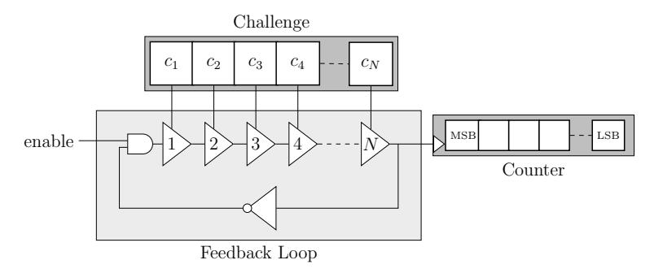
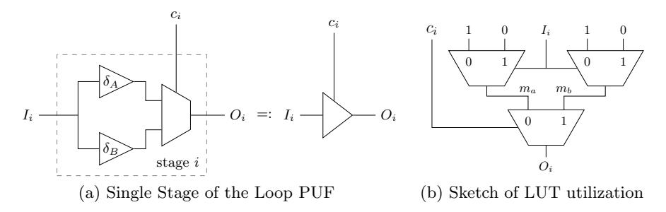
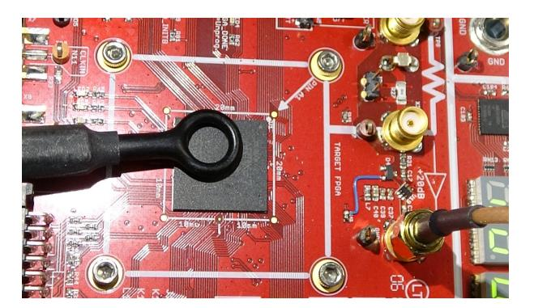
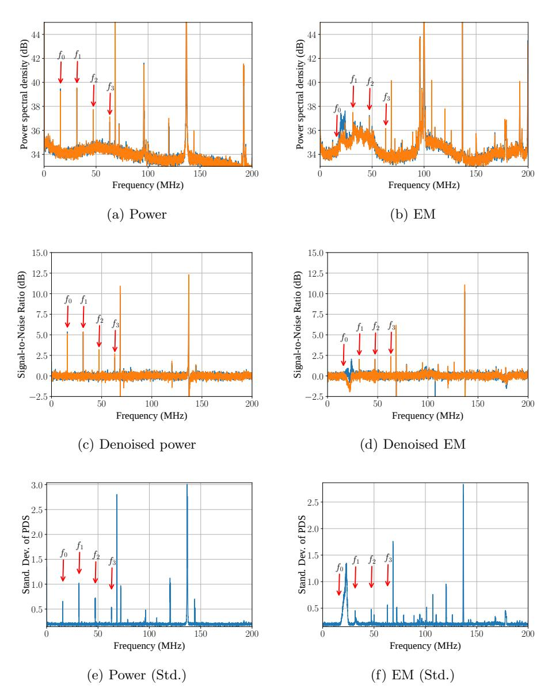
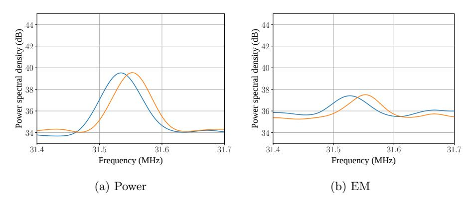
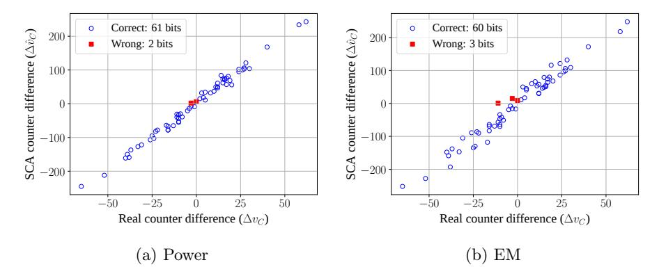
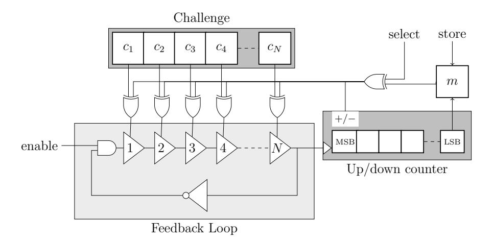
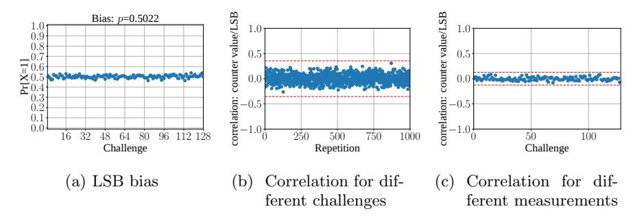
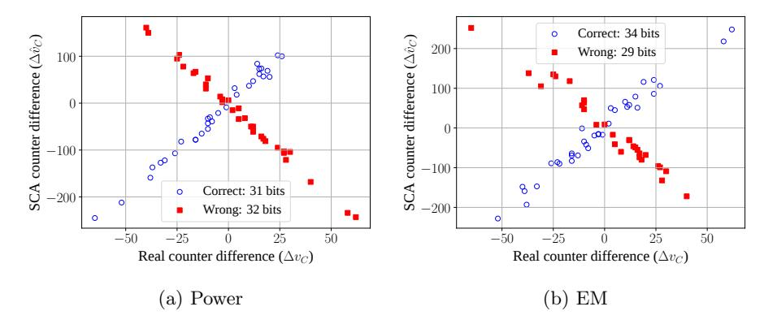

# Self-Secured PUF: Protecting the Loop PUF by Masking\*

 $\begin{array}{c} Lars\ Tebelmann^{1[0000-0003-2014-7184]},\ Jean\text{-}Luc\ Danger}^{2[0000-0001-5063-7964]},\ and\ Michael\ Pehl^{1[0000-0001-6100-7714]} \end{array}$ 

<sup>1</sup> Technical University Munich, Munich, Germany
TUM Department of Electrical and Computer Engineering
Chair of Security in Information Technology
{lars.tebelmann,m.pehl}@tum.de

<sup>2</sup> Télécom Paristech, Paris, France
jean-luc.danger@telecom-paris.fr

**Abstract.** Physical Unclonable Functions (PUFs) provide means to generate chip individual keys, especially for low-cost applications such as the Internet of Things (IoT). They are intrinsically robust against reverse engineering, and more cost-effective than non-volatile memory (NVM). For several PUF primitives, countermeasures have been proposed to mitigate side-channel weaknesses. However, most mitigation techniques require substantial design effort and/or complexity overhead, which cannot be tolerated in low-cost IoT scenarios. In this paper, we first analyze side-channel vulnerabilities of the Loop PUF, an area efficient PUF implementation with a configurable delay path based on a single ring oscillator (RO). We provide side-channel analysis (SCA) results from power and electromagnetic measurements. We confirm that oscillation frequencies are easily observable and distinguishable, breaking the security of unprotected Loop PUF implementations. Second, we present a low-cost countermeasure based on temporal masking to thwart SCA that requires only one bit of randomness per PUF response bit. The randomness is extracted from the PUF itself creating a self-secured PUF. The concept is highly effective regarding security, low complexity, and low design constraints making it ideal for applications like IoT. Finally, we discuss trade-offs of side-channel resistance, reliability, and latency as well as the transfer of the countermeasure to other RO-based PUFs.

**Keywords:** Physically Unclonable Function Side-Channel Analysis RO PUF Loop PUF Masking Countermeasure IoT.

<sup>\*</sup> This work was partly funded by the German Ministry of Education and Research in the project SecForCARs under grant number 01KIS0795 and under the SPARTA project, which has received funding from the European Union's Horizon 2020 research and innovation programme under grant agreement number 830892. The paper was accepted at COSADE 2020. The final authenticated version is avail-

The paper was accepted at COSADE 2020. The final authenticated version is available online at https://doi.org/10.1007/978-3-030-68773-1\_14

# 1 Introduction

In an increasingly interconnected world, hardware trust anchors play an important role to avoid that vulnerabilities in single nodes break security of entire systems. Especially low-cost devices used in the Internet of Things (IoT) are physically accessible and may serve as an entry point for attacks. While such devices require decent security mechanisms, their low-cost nature limits the acceptable cost overhead. One major issue is secure key storage to provide the credentials for e.g., secure firmware updates or authenticated communication. However, secured non-volatile memory (NVM) is frequently not affordable. Also, NVM protection mechanisms, needed to store the key securely, require permanent power, draining the limited energy resources of the IoT device.

Physical Unclonable Functions (PUFs) provide a solution by deriving a secret from manufacturing variation that are unique, unpredictable, and individual for every chip. A PUF measures a property related to the variations, such as the delay, and derives secret bits from the measurement when the device is powered on. Due to noise, the secret bits are not perfectly stable and are typically processed by an error correction algorithm to derive a stable key. As soon as the chip is powered off, the secret vanishes from volatile memory and can no longer be attacked. The conjunction with the fact that PUFs are readily built from standard cells, makes them an ideal low-cost solution for the IoT.

In this work, we focus on PUFs based on ring oscillators (ROs) that measure the delay at a certain position of the chip through the oscillation frequency of an RO [18]. Specifically, we consider the Loop PUF [3, 4], a configurable RO PUF based on a single configurable RO. In general, other configurable PUFs are primarily used in challenge-response protocols, and are therefore subject to machine learning attacks [15, 1, 6]. In contrast, the Loop PUF is used for key generation and the configuration by challenges is only used to maximize the entropy extracted from a certain chip area. As an attacker does not have access to the responses of the key generation and the challenges are generated online from a Hadamard matrix [14], i.e., linearly independent, machine learning attacks are out of the scope for the Loop PUF.

Since machine learning attacks and key retrieval during power off are out of scope for the Loop PUF, physical attacks during runtime have to be considered. Regarding the IoT scenario the most relevant case are non-invasive attacks with affordable equipment, i.e., capable of performing power and global EM measurements. We consider in this work side-channel analysis (SCA) attacks on the PUF primitive itself. Other attack vectors for SCA are at the postprocessing stage of the PUF to get a reliable key [12, 21] but they are not addressed in this study.

Related Work Several SCA attacks on PUF primitives have been proposed in literature, most of them being semi-invasive attacks. For some attacks, dedicated countermeasures have been suggested. However, existing countermeasures come with a high design overhead or require a large amount of random numbers.

For SRAM PUFs a cloning attack was proposed that measures near infrared photonic emissions of the SRAM cells to characterize the PUF and subsequently clone it using a focused ion beam [7]. Furthermore, an attack is proposed that exploits the remanesence decay effect of SRAM cells if an attacker is able to overwrite the SRAM used for the PUF [13, 22]. The Arbiter PUF is characterized by analyzing the photonic emissions of the different delay stages in order to deduce a linear model for the Arbiter PUF that can be solved with little effort [19]. For the transient effect ring oscillator (TERO) PUF, EM-based SCA allows for determining the oscillation duration of single instances by using a Short-Time Fourier Transform (STFT). Knowledge of the oscillation duration allows for reducing the PUF's entropy. The leakage stems from counters that are placed in an interleaved manner [20].

Most relevant to this work, several attacks have been carried out on RO PUFs: (i) Using Laser Voltage Probing exposing the backside of a die to an nearinfrared laser beam [8]: The intensity of the reflected beam is altered through absorption or interference effects and allows for the recovery of the RO frequencies. (ii) Using localized electromagnetic emissions of the ROs over a decapsulated die [11]: Frequencies from simultaneously activated ROs can be identified and exploited if ROs are used in several comparisons, i.e., are activated more than once. Consequently, a possible countermeasures consists in limiting the use of each RO to a single comparison. Additionally, it is suggested to measure multiple, i.e., more than two, ROs in parallel to increase the number of frequencies an attacker has to distinguish. (iii) Using localized EM measurement over a decapsulated FPGA die, single ROs can be resolved if placed far from each other [10]: However, for ROs placed in proximity to each other, separation of single ROs is deemed unlikely. Yet, multiplexers and counters exhibit leakage about the RO frequencies that can be resolved spatially. To impede the attack on counters and multiplexers, measurement path randomization, i.e., using different counters or multiplexers for each evaluation, and interleaved placement of the components are proposed. (iv) Geometric leaks in the EM spectrum of an ASIC enable the resolution of adjacently placed counters [17]: The RO PUF under attack follows a low-power design to reduce SCA leaks. However, depending on the measurement position on the decapsulated die, the counter frequencies have different amplitudes and can be distinguished. The authors conclude that interleaved placement of components is therefore not sufficient. Parallel comparison of multiple ROs, as proposed by [11], increases the number of possibilities, but does not protect from brute force attacks. Ultra-low-power counters are proposed as a possible hiding countermeasure.

Contributions In this work, we propose a hardened, yet low complexity, implementation of a PUF primitive, that is based on the Loop PUF [3, 4]. In most other oscillation-based PUF primitives, such as the RO PUF or the TERO PUF, multiple instances of an oscillator are implemented and compared in parallel. In contrast, the Loop PUF implements a single instance of the primitive, that is evaluated sequentially. We take advantage of the sequential evaluation method by randomizing the order of the challenges used to generate PUF bits. In particular, the randomness to determine the order is derived from the Loop PUF itself, making our proposed design a self-secured PUF primitive. The contributions of this work include:

## 4 L. Tebelmann et al.



Fig. 1: Schematic of the Loop PUF structure.

- 1. Side-channel analysis of the Loop PUF using a single measurement.
- 2. Temporal masking countermeasure for the Loop PUF that benefits from the sequential evaluation method.
- 3. Proposal of a self-secured PUF by drawing the randomness from the PUF itself.

Structure The rest of this work is structured as follows: Section 2 recapitulates the functional principle of the Loop PUF and introduces our implementation used for the experiments. Section 3 performs a practical side-channel attack on the Loop PUF and analyzes the results. The countermeasure against the SCA as well as the concept of the self-secured PUF is provided in Section 4. Subsequently, Section 5 discusses the application of the scheme to RO PUFs and the impact of measurement time, before we draw our conclusion in Section 6.

# 2 The Loop PUF

This work mainly analyzes and improves a simple PUF based on a ring oscillator, the Loop PUF, w.r.t. side channel attacks. One goal of this study is to check if the low complexity property of this PUF can be kept when inserting countermeasures against SCA. Another interest is the potential transfer of security solutions to other RO PUFs. In this section the working principle of the Loop PUF as well as its implementation on Xilinx Artix-7 FPGAs is presented.

## 2.1 Architecture

The Loop PUF is a delay PUF introduced by Cherif et al. [3, 4]. Its main component is a delay chain composed of N identical controllable delay stages. A ring oscillator (RO) is formed when the output of the delay chain is feedback to the chain's input through an inverting gate. An enable signal allows for starting and stopping the oscillation. Fig. 1 illustrates the Loop PUF schematic.

Each of the N delay stages of the PUF contains two delay elements such as inverters or buffers, as depicted in Fig. 2a. A challenge bit c<sup>i</sup> applied to the i th stage selects, e.g., via a multiplexer, one of the two elements that is included in the RO path. The challenge C applied to the PUF is the N-bit word composed of the  $c_i$ . The frequency of the RO depends on the sum of selected delays. Neglecting noise and aging, it is constant for given environmental conditions but unique for each hardware realization of a Loop PUF due to local process variations of the individual delay elements during the device fabrication.

### 2.2 Operating Mode

The Loop PUF requires an operating mode to derive secret bits from the oscillation frequencies obtained for given challenges. The basic operating mode is presented in Algorithm 1. It consists of two subsequent measurements: The first using the challenge C and the second with the complementary challenge  $\neg C$  applied (Lines 1, 3). In other words, the frequencies of the RO with different delay elements in the ring are measured.

## Algorithm 1 Basic Loop PUF Operation

**Input:** Challenge C (a word of N bits)

**Input:** Measurement time in terms of periods  $n_{acq}$  of the reference clock

**Output:** Response  $\delta_C$  (a signed integer whose sign is mapped to the secret bit  $k_C$ )

- 1: Set current challenge to C
- 2: Count oscillations of Loop PUF for  $n_{acq}$  cycles of reference clock  $\Rightarrow v_C$
- 3: Set current challenge  $\neg C$
- 4: Count oscillations of Loop PUF for  $n_{acq}$  cycles of reference clock  $\Rightarrow v_{\neg C}$
- 5: Compute  $\delta_C = v_C v_{\neg C}$
- 6: **return**  $\delta_C$  with  $k_C = MSB(\delta_C) \in \{0, 1\}$

The challenge dependent frequency of the RO is the underlying secret to be observed. It is measured by counting the number of oscillations of the loop for a fixed predefined measurement time (Lines 2, 4). For this purpose, the N-bit challenge C is applied to the Loop PUF. Then, the enable signal is set to logical 1 while a reference counter counts a predefined number  $n_{acq}$  of periods of a reference clock oscillating with frequency  $f_{clk}$ . After the acquisition time  $T_{acq}$  is finished, the oscillation frequency is approximated from the counter value  $v_C$  as

$$f_C \approx f_{clk} \cdot \frac{v_C}{n_{acq}} = \frac{v_C}{T_{acq}}.$$
 (1)

Note that due to the discrete counter values,  $f_C$  is subject to quantization noise. After deriving  $f_C$  the respective counter value  $v_{\neg C}$  and frequency  $f(\neg C)$  for the complementary challenge  $\neg C$  are derived accordingly. The sign of the frequency difference  $\Delta f = f(C) - f(\neg C)$  is the secret response bit  $k_C$  obtained from the Loop PUF. The secret PUF response bit  $k_C$  is therefore derived from the most significant bit (MSB) of the counter differences  $\delta_C = v_C - v_{\neg C}$  (Line 6):

$$k_C = \text{MSB}(\delta_C) = \begin{cases} 1 \text{ if } \operatorname{sign}(\Delta f) \ge 0\\ 0 \text{ otherwise.} \end{cases}$$
 (2)



Fig. 2: Schematic and LUT utilization of stage i of a Loop PUF

The differential measurement process compensates for a large amount of influences through environmental conditions and aging effects. Since these effects happen on a larger time scale than the measurement time, subsequently measured frequencies are affected similarly. Therefore, the most significant bit of δ<sup>C</sup> and, thus, the response bit k<sup>C</sup> has high stability if the oscillation frequency for challenges C and ¬C are sufficiently distinct. Compared to other oscillation based PUF primitives, such as the RO and TERO PUF, spatial biases are avoided by using the same oscillator sequentially.

## 2.3 Loop PUF Challenges for Maximum Entropy

It was shown by Rioul et al. [14], that one solution to get an entropy of Nkey bits out of the Loop PUF, is to compose it of N = Nkey delay stages and challenge it by Nkey Hadamard codewords [2] from a N × N Hadamard Matrix. Hadamard codewords are pairwise orthogonal; They have a minimum Hamming distance of N/2 from each other and share a Hamming weight of N/2, except for the null codeword. Hadamard codewords can be constructed on chip with low effort, preserving the low-complexity property of the design as there is no need of memory to store the challenges.

As the PUF is natively unreliable, it is necessary to have a sufficiently high number of challenges to run postprocessing based on error correcting codes or to filter out unreliable challenges as shown in [16]. This implies that the required number N of delay stages and Hadamard codewords has to be bigger than the number of key bits. Alternatively, multiple Loop PUFs can be instantiated.

## 2.4 Loop PUF Implementation

The most sophisticated part of a Loop PUF design is the implementation of the delay chain. Ideally, the expected delay of the Loop PUF is independent of the challenge and a difference in the delay is only due to process variations affecting the delay elements. I.e., wiring should have no influence and the delay elements in a delay stage according to Fig. 2a should be as similar as possible.

To reach this goal, the Loop PUF implementation in this work utilizes the multiplexer structure of the FPGA in accordance to the suggestions for a ringoscillator PUF design in [5]: Every slice of the Xilinx Artix-7 FPGA used in this work contains four 6-input-2-output LUTs. The inputs to a LUT select a path from functionality dependent initialized SRAM cells through a multiplexer tree to the LUT output. Fig. 2b sketches the concept for a delay element implemented in a 2-input-1-output LUT. To implement two distinct inverter gates as the basic delay elements (alternatively buffers can be realized) of a delay stage in one LUT, the SRAM at the input of two multiplexers in the same hierarchy level is initialized so that their outputs  $(m_a, m_b)$  correspond to the inverse of a certain input  $(I_i)$ . An additional challenge input  $(c_i)$  selects if the LUT output  $O_i$  is  $O_i = m_a$  or  $O_i = m_b$ . Consequently, the routing between delay stages, i.e., from  $O_i$  to  $I_{i+1}$  etc., is independent from the challenges and does not influence the delay differences.

For  $c_i$  and  $I_i$ , inputs of the LUT are selected such that the *expected* delay is independent from the challenge bit. Still, due to the FPGA internal routing and implementation of the path from SRAM cells through multiplexers to the output, a certain challenge dependent systematic delay bias might be caused. This corresponds to delay elements in Fig. 2a, which are faster or slower on all devices and would result in a reduced entropy of the Loop PUF. If the same amount of fast and slow paths are active for the challenges which are compared, i.e., for C and  $\neg C$ , the effect is mitigated assuming all LUTs are affected by the same systematic effect. Challenges  $C/\neg C$ , which are selected correspondingly, have the same Hamming weight. For challenges that are Hadamard codewords, this property is inherently fulfilled if the null challenge  $C_0 = \mathbf{0}$  is discarded.

From the described delay elements, we realize a 64-stage Loop PUF that is implemented in only 17 slices in 8 CLBs. The Loop PUF is realized within a closed domain with fixed placement and routing such that it does not interfere with other parts of the design. The other parts of the design are placed in a separate area but without additional constraints regarding placement and routing.

Using Hadamard codewords and discarding  $C_0$ , the design suffices to generate 63 bits. For a key-storage scenario, either more stages in the delay path or multiple Loop PUFs are required on a chip. A longer delay chain causes, however, lower frequency and therefore longer measurement time. A shorter delay chain is less efficient in terms of challenges due to discarding  $C_0$ . Thus, we consider a length of 64 delay stages a realistic size.

We decided having a single Loop PUF on the device since it corresponds to the best case for an attacker. Using multiple Loop PUFs in parallel, the attacker faces the additional obstacle of spatially resolving different counters, which has been shown to be feasible using localized EM measurements [17]. The additional barrier of localized measurements does, however, not change the overall results and is deemed out of the scope of this work. To further support the analysis, the design supports supplying challenges externally and reading back the measured counter values allowing for validation of leakage observed in the side-channel. Responses are computed on a PC receiving the counter values from the device, since the analysis in Section 3 does not consider the potential leakage in the comparison step. Note however, that in a practical scenario the attacker is not required to have access to any of the internal counter values or being able to apply challenges.

# 3 Side-Channel Analysis of the Loop PUF

This section provides the methodology and results for the SCA of the Loop PUF. First, the experimental setup is described in Section 3.1. Subsequently, methods to detect the Frequencies of Interest at which the Loop PUF oscillates are proposed in Section 3.2 and a side-channel attack is conducted in Section 3.3. Finally in Section 3.4, the results are generalized regarding limitations and constraints of the attack and possible countermeasures.

## 3.1 Experimental Setup

The experimental setup for the SCA evaluation of the Loop PUF consists of a ChipWhisperer 305 Artix FPGA Target (CW305), that features an Artix-7 (XC7A100TFTG256) running at fclk=100 MHz. A PicoScope 6402D USB oscilloscope performs the acquisition at a sampling frequency of fs=1.25 GHz. The input bandwidth of the scope is 250 MHz, which is sufficient regarding the oscillations frequencies of the Loop PUF and their harmonics that are in the range from 15 MHz to 65 MHz as shown in Section 3.2. Measurements are performed in parallel for both, power and EM side-channel as depicted in Fig. 3. Power measurements are acquired using the SMA jack X4 of the CW305, which outputs the voltage drop of the FPGA's internal supply voltage VCCint over a 100 mΩ shunt amplified by a 20 dB low-noise amplifier. EM measurements are taken using a Langer EMV RF-R 50-1 near field probe with a diameter of approximately 10 mm. A 30 dB Langer EMV PA303 pre-amplifier is used to enhance the signal amplitudes in order to benefit from the oscilloscope's dynamic range. The EM probe is placed on the front-side about 1 mm above the package to capture field lines that are orthogonal to the package surface. A coarse positioning procedure is applied to find the location of interest above the package: For each quadrant on the package measurements are taken and the procedure in Section 3.2 is used to determine whether the relevant frequencies are present. The position providing the highest peak at the frequency of interest, depicted in Fig. 3, is chosen for all further evaluations.



Fig. 3: CW305 measurement setup. The RF-R 50-1 EM probe position and the power jack are depicted.

#### 3.2 Frequency of Interest Detection

In order to attack the Loop PUF, an attacker has to determine the frequencies of the oscillation termed as Frequency of Interest (FoI) in the following. In Fig. 4 the spectral representation of different detection methods are depicted. All figures are based on a single measurement per challenge, where the Loop PUF is activated for  $T_{acq} \approx 5.24\,\mathrm{ms}$ . The first 5.2 ms are transformed into the frequency domain using a Fast Fourier Transform (FFT) of  $N_{FFT}=2,684,359$  frequency bins and a Hanning window to minimize aliasing effects. The resulting spectra exhibit various spikes which makes automatic evaluation difficult. Thus, low-pass filtering is applied along the frequencies to smooth the spectrum. Using the filtering technique, single frequency noise form perturbations and artifacts are reduced, while Loop PUF frequencies, that have a small fluctuation, remain.

Figs. 4a and 4b show the spectra X(f) of two challenges C and  $\neg C$  for power and EM measurements respectively. The Loop PUF frequency  $f_0 \approx 15.77\,\mathrm{MHz}$ , verified by Eq. (1), is indicated as well as the multiples  $f_1,\ldots,f_3$ . In the power side-channel, the frequencies show notable peaks, while in the EM side-channel, peaks are partly covered by other signals. Furthermore, in both side-channels, frequency peaks unrelated to the Loop PUF show up. While some frequency components can be attributed to expected sources such as the system clock  $f_{clk} = 100\,\mathrm{MHz}$ , other frequencies are a priori indistinguishable from the Loop PUF frequency. Therefore, two methods for reliable Frequency of Interest (FoI) detection are proposed.

FoI Based on Signal-to-Noise Ratio. The first method subtracts an estimated noise floor N(f) from the spectra X(f), generating a Signal-to-Noise Ratio  $SNR(f) = {}^{X(f)}/{N(f)}$ . Results are depicted in Figs. 4c and 4d. The noise floor is estimated from measurements with inactive Loop PUF, eliminating certain irrelevant frequencies, such as the clock frequency. In Figs. 4c and 4d the noise floor estimate N(f) is based on averaging over the frequency spectra of 128 measurements, where the Loop PUF was not active. Compared to the spectra X(f) in Figs. 4a and 4b, the frequencies  $f_1, f_2, f_3$  show up more clearly in SNR(f) and other frequency components are canceled out. The basic frequency  $f_0$  is covered by other signals in the EM side-channel. The peaks at 68.6 MHz and it multiple at 137.2 MHz are unrelated to the Loop PUF, yet the candidate frequencies for an attacker are reduced.

FoI Based on Standard Deviation. An attacker may not be able to estimate the noise floor reliably by idle measurements, e.g., if other operations, which are not active in the idle measurements, run in parallel to the Loop PUF. Thus, a second FoI detection method is proposed based on the standard deviation over frequency spectra of all challenges. The basic idea is that frequency components present in all measurements, such as the clock frequency, show a low standard deviation, while frequencies that vary for different measurements produce a higher standard deviation. In Figs. 4e and 4f, the standard deviation of the frequency spectrum among the different challenges is depicted for power and EM measurements. Indeed, the FoI detection in the power side-channel in Fig. 4e reveals the



Fig. 4: FoI detection methods for the Loop PUF frequency. (a)-(b): power spectral density (PSD) of exemplary side-channel measurements for C and  $\neg C$ . (c)-(d): PSD subtracted by PSD from noise measurement. (e)-(f): FoI method using the standard deviation of the PSD among all challenges.

Loop PUF frequency  $f_0$  as well as multiples  $f_1, f_2, f_3$ . In the EM side-channel, Figs. 4e and 4f, a frequency ramp is visible between 15 MHz and 24 MHz, that partly covers  $f_0$ . Thus, the fundamental Loop PUF frequency of  $f_0$  can still be sensed with priory knowledge, but is hardly identifiable for an attacker. Only  $f_1, f_2, f_3$  are clearly visible. Similar to the Signal-to-Noise Ratio (SNR)-based method, additional frequencies are detected around 68.6 MHz and 72 MHz that are unrelated to the Loop PUF. Overall, more unrelated peaks occur compared to the SNR-based method, but FOIs can be more clearly distinguished compared to the raw spectra in Figs. 4a and 4b.

Concluding, two methods to detect the FOIs are proposed that allow an attacker to determine the frequencies related to the Loop PUF. If possible, the SNR-based method is preferable, otherwise calculating the standard deviations across challenges provides sufficient information.

## 3.3 Side-Channel Analysis of the Loop PUF

The frequencies in range of the FOIs determined in Section 3.2, are evaluated regarding the possibility of extracting information about the Loop PUF. The following evaluations focus on a spectral range from 31.4 MHz to 31.7 MHz, because a frequency around 31.54 MHz is identified as a FoI in the EM side-channel. The same frequency range is used for power side-channel to ease comparison.

As noted in Algorithm 1, the counter value  $v_C$  that results from the challenge C is compared to the counter value  $v_{\neg C}$  that results from the complementary challenge  $\neg C$ . The challenges are applied sequentially, thus an attacker can observe the resulting frequencies  $f_C$  and  $f_{\neg C}$  separately. If the order in which C and  $\neg C$  are applied is known, as is the case for the design presented in Section 2.2, the attacker can guess the PUF bit  $k_C$  by comparing the frequency spectra of the challenges.



Fig. 5: Zoom of the power spectral density for a challenge C (blue) and its complement  $\neg C$  (orange).

In Fig. 5 the typically observed spectra for challenge C and its complement  $\neg C$  are depicted. The peaks  $\hat{f}_C$  and  $\hat{f}_{\neg C}$  are clearly different and can be distinguished by an attacker. The sign of the comparison  $\Delta \hat{f} = \hat{f}_C - \hat{f}_{\neg C}$  is used as the guess for the PUF response bit, i.e.,

$$\hat{k}_C = \begin{cases} 1 \text{ if } \operatorname{sign}(\Delta \hat{f}_C) \ge 0\\ 0 \text{ if } \operatorname{sign}(\Delta \hat{f}_C) < 0. \end{cases}$$
(3)

In order to determine the success of an attack on all Loop PUF bits, the actual counter difference  $\Delta v_C = v_C - v_{\neg C}$  is compared to its estimate

$$\Delta \hat{v}_C = \left[ \hat{f}_C \cdot T_{acq} \right] - \left[ \hat{f}_{\neg C} \cdot T_{acq} \right] \tag{4}$$

determined by the side-channel observations. The floor operator reflects the assumption that the counter value is incremented after every Loop PUF oscillation.

Fig. 6 depicts the match between  $\Delta v_C$  and  $\Delta \hat{v}_C$ . Estimated differences  $\Delta \hat{v}_C$  with  $\operatorname{sign}(\Delta \hat{v}_C) \neq \operatorname{sign}(\Delta v_C)$  are depicted as filled red squares. Using the method in Eq. (3), from 63 Loop PUF bits, only two and, respectively, three bits result in a wrong guess for the power/EM side-channel. Notably, the wrong guesses correspond to smaller frequency differences that are more difficult to resolve by the attack. However, smaller frequency differences also correspond to unstable PUF bits that are compensated by an error-correcting step in key generation or even discarded. I.e., an attacker can afford a certain number of wrong bit guesses since also on the device not all 63 bits might be derived correctly<sup>3</sup>.

Summing up, the response of the Loop PUF can be recovered from non-invasive power and EM measurements using a single measurement per challenge for all but a few unstable bits. Thus, the unprotected Loop PUF design is broken by side-channel attacks.

## 3.4 Limitations and Constraints: Frequency Resolution

In order to understand general limitations of both, the SCA presented in Section 3.3 as well as the countermeasures proposed in Section 4, this section provides constraints regarding the possible frequency resolution of observations.

The smallest frequency  $f_{min}$ , which can be resolved by measurement, is the frequency where exactly one complete period of the oscillation fits into the observation window. In case of the Loop PUF, the maximum observation time is the acquisition time  $T_{acq}$ , i.e.,

$$f_{min} := \frac{1}{T_{acq}} = \frac{f_{clk}}{n_{acq}}. (5)$$

<sup>&</sup>lt;sup>3</sup> An additional attack vector is the enhancement of the frequency leakage by leakage of the helper data and the error-correcting code that would allow for setting up a system of linear equations to retain the individual delays of the Loop PUF. However, the entire attack surface could only be considered, if the complete PUF architecture was evaluated and we focus on the primitive only.



Fig. 6: Attack results from SCA on the Loop PUF: Match of real counter differences and estimated counter differences from frequency measurements using maxima around 31.55 MHz.

For measurements with an oscilloscope in the time domain, the maximum frequency  $f_{max}$  that can be resolved, is determined by the Shannon-Nyquist sampling theorem as  $f_{max} = f_s/2$  for the sampling frequency  $f_s$ . Thus, the observable frequency range<sup>4</sup> is bounded to

$$\frac{1}{T_{aca}} = f_{min} \le f \le f_{max} = \frac{f_s}{2}.$$
 (6)

An attacker is expected to get the best result if the entire acquisition time  $T_{acq}$  is measured. For a measurement period of  $T_{acq}$ , the number of sampling points, i.e., the length of the applied FFT is

$$N_{FFT} = f_s \cdot T_{acq}. (7)$$

For real valued time domain signals, the spectrum is symmetric. Therefore, an FFT of length  $N_{FFT}$  maps the signal into  $N_{FFT}/2+1$  frequency bins ranging from DC to  $f_{max}$ . The frequency resolution of the FFT frequency bins is

$$\Delta_{FFT} = \frac{f_{max}}{N_{FFT}/2} = \frac{f_s}{N_{FFT}} = \frac{1}{T_{acq}}.$$
 (8)

In other words, a longer acquisition time  $T_{acq}$  allows the attacker to obtain a better resolution of the frequency differences.

From an attackers perspective, the observed bin center frequency  $\hat{f}$  corresponds to some real oscillation frequency  $f_{real}$  of the Loop PUF. From Eq. (8),  $f_{real}$  is bounded by the width of the frequency bins to

$$\hat{f} - \frac{1}{2 \cdot T_{acq}} \le f_{real} \le \hat{f} + \frac{1}{2 \cdot T_{acq}}.$$
(9)

<sup>&</sup>lt;sup>4</sup> Note that technically, the smallest frequency that can be resolved is 0 Hz, i.e., the DC component. However, in Eq. (6) we are concerned with the *observable* frequencies.

Assuming all frequencies within a specific bin appear with the same probability, the best guess an attacker can make for the counter value according to Eq. (4) from the observed ˆf is therefore

$$\hat{v}_C = \left\lfloor \left( \hat{f} \pm \frac{1}{2 \cdot T_{acq}} \right) \cdot T_{acq} \right\rfloor = \left\lfloor \hat{f} \cdot T_{acq} \right\rfloor \pm 1. \tag{10}$$

Regarding limitations and constraints for shown attacks and countermeasure below, from Eqs. (9) and (10) we conclude that:

- 1. If the frequency difference of two challenges C and ¬C is |f<sup>C</sup> −f¬<sup>C</sup> | > ∆F F T , the resulting PUF response bit k<sup>C</sup> is always revealed by an attack.
- 2. If |f<sup>C</sup> − f¬<sup>C</sup> | ≤ ∆F F T , the probability that both f<sup>C</sup> and f¬<sup>C</sup> are in the same FFT bin, i.e., indistinguishable for an attacker, increases with decreasing distance of the frequencies. The attack will succeed for small frequency differences only with a certain probability.
- 3. While the sign of the counter difference can be revealed, an attacker will fail in deriving the least significant bit (LSB) of the counters.

Note that regarding Item 2, intentionally designing a Loop PUF with closeby frequencies does not serve as a countermeasure: The comparison of frequencies close to each other is not desirable from a PUF perspective, because bits derived from such a comparison are less robust against noise. The conclusions in Items 1 and 2 emphasize the necessity for countermeasures to protect the Loop PUF. Additionally, Item 3 substantiates that the LSB of a counter cannot be revealed by the attack. Consequently, the LSB is used in the next section as a random bit to protect the Loop PUF.

# 4 Securing the Loop PUF

To thwart the SCA on the Loop PUF presented in Section 3, a masking countermeasure is introduced in this section. We first present the general concept of the temporal masking scheme in Section 4.1 and show in Section 4.2 how it can be used to make the Loop PUF self-secured by using the counter LSB as random bit. In Sections 4.3 and 4.4 we evaluate the mask quality and provide results for SCA for the proposed countermeasure.

## 4.1 Temporal Masking

The measurement of the Loop PUF is performed sequentially: Measurement for challenge C is followed by measurement for its complement ¬C. The order of the frequency measurements is important since it determines the secret bit according to Eq. (2). At the same time, the ordered sequential measurement is exploited by the SCA in Section 3.3. To protect the sequential measurements against SCA, the order of measurements to derive a certain PUF response bit

## Algorithm 2 Protected Loop PUF Operation

**Input:** Challenge C (a word of N bits)

**Input:** Measurement time in terms of periods  $n_{acq}$  of the reference clock

**Input:** mask m (1-bit random variable)

**Output:** Response  $\delta_C$  (a signed integer whose sign is mapped to the secret bit  $k_C$ )

- 1: Set current challenge C' = m?  $C : \neg C$
- 2: Count oscillations of Loop PUF for  $n_{acq}$  cycles of reference clock  $\Rightarrow v_{C'}$
- 3: Set current challenge  $\neg C'$
- 4: Count oscillations of Loop PUF for  $n_{acq}$  cycles of reference clock  $\Rightarrow v_{\neg C'}$
- 5: Compute  $\delta_C = m ? v_{C'} v_{\neg C'} : v_{\neg C'} v_{C'}$
- 6: **return**  $\delta_C$  with  $k_C = \text{MSB}(\delta_C) \in \{0, 1\}$

 $k_C$  is randomized by a 1-bit mask m in Algorithm  $2^5$ . The algorithm requires as input a mask bit that is unpredictable for an attacker.

Comparing Algorithm 2 to Algorithm 1, the mask bit m determines if C or  $\neg C$  is applied first (Lines 1, 3). If m is logically 0, the sequence of challenges is  $C \prec \neg C$ ; Otherwise, if m is logically 1, the order is  $\neg C \prec C$ . Since m is – by definition – unknown to an attacker, he/she cannot determine the order of frequency measurement. Consequently the described SCA does no longer succeed.

Without further modification, a changed order of measurements leads to a wrong sign derived from the frequency difference on-chip. The sign is corrected by considering the order of measurement also in the subtraction (Line 5). The mask bit m determines the order in which the frequencies are subtracted such that the final result is independent from m but still cannot be observed by an attacker.

## 4.2 Self-Secured Loop PUF Using 1-Bit RNG from LSB

The question how to efficiently implement the masking scheme from Section 4.1 without the effort of an additional Random Number Generator (RNG) remains. We suggest to use the LSB of the frequency counter m = LSB(v) for this purpose and discuss the quality of the mask in Section 4.3.

Algorithm 3 describes the key generation with masking to avoid side-channel leakages. The algorithm takes the acquisition time  $n_{acq}$  in clock cycles of a reference clock as an input during design time. When executed, it derives all Hadamard codewords except of the null challenge  $C_0 = \mathbf{0}$  (Line 1). Note that the Hadamard codewords can be computed during runtime and do not require additional memory. The succesive codeword can be computed parallel to applying the current codeword to the PUF.

The null challenge cannot be used to extract a key bit as it is a source of bias if the delay stage is imbalanced (cf. Section 2.4). However, it can be used to derive a mask bit (Lines 2 to 4) for the generation of the first response bit. The oscillations of the Loop PUF for  $C_0$  are measured for a fixed time and the LSB of the resulting counter value is taken as m.

<sup>&</sup>lt;sup>5</sup> Note, that the reordering of measurements does not affect PUF quality metrics as it has not effect on the oscillation frequency.

## Algorithm 3 Protected Loop PUF

```
Input: Measurement time in terms of periods n_{acq} of the reference clock
Output: k = [k_{N-1}, ..., k_1] = \text{key of } (N-1) \text{ bits}
 1: Compute the Hadamard codewords set \mathcal{C} = \{C_1, \dots, C_{N-1}\} with HW(C_i) = N/2
 2: Set current challenge C' = C_0 = \mathbf{0}
 3: Count oscillations of Loop PUF for n_{acq} cycles of reference clock \Rightarrow v_{C'}
 4: Set mask m = LSB(v_{C'})
 5: for all i = N - 1 down to and including 1 do
       Set current challenge C' = m? C_i : \neg C_i
 6:
 7:
       Count oscillations of Loop PUF for n_{acq} cycles of reference clock \Rightarrow v_{C'_{-}}
       Set current challenge \neg C'_i
 8:
       Count oscillations of Loop PUF for n_{acq} cycles of reference clock \Rightarrow v_{\neg C'_i}
 9:
10:
        Compute \delta_C = m ? v_{C'_i} - v_{\neg C'_i} : v_{\neg C'_i} - v_{C'_i}
        Set k_i = MSB(\delta_C) \in \{0, 1\}
11:
12:
        Set mask m = LSB(v_{C'})
13: end for
```

Subsequently, all other  $i=1,\ldots,N-1$  Hadamard codewords  $C_i$  and their complements  $\neg C_i$  are applied to the Loop PUF. The measurement order of  $C_i$  and  $\neg C_i$  is randomized by the current mask bit m (Line 6 to 10) reflecting the steps from Algorithm 2. A secret PUF bit  $k_i$  is derived from the MSB of the counter difference. Finally, the mask bit is updated to the random LSB of the counter value  $v_{C_i}$  protecting the next measurement.

Fig. 7 sketches a possible hardware implementation of the self-secured Loop PUF omitting generation of the Hadamard codewords, reference counter, state machine, output registers, and reset tree. In an actual design, the state machine would cause generation of Hadamard codewords and loading of codewords to the challenge register while resetting the counter. An up/down counter might be used for counting the periods of the Loop PUF.

Starting with the null challenge, m=0 and select=0, the number of Loop PUF oscillations within the acquisition time are measured. Without loss of generality, it can be assumed that the counter is counting upwards in this mode. Setting store=1 for one cycle after  $n_{acq}$  clock cycles, the LSB of the resulting counter value is buffered as the first mask bit.

Subsequently, four main states are repeated until all N-1 challenges have been applied to the Loop PUF: (i) The mask bit from the buffer is applied to the input of the XOR tree, another challenge is loaded, and the counter is reset. (ii) The select signal in the design is set to logical 0 and enable is set to logical 1. (iii) After  $n_{acq}$  cycles of the reference clock, the LSB is buffered but not yet used as m, select is switched to logical 1. (iv) After another  $n_{acq}$  cycles of the reference clock, the MSB is taken as a secret bit.

The structure of the design causes that if  $m \oplus select = 0$ , the counter counts upwards and C is applied to the PUF. If  $m \oplus select = 1$ ,  $\neg C$  is used while counting downwards. I.e. if m = 0, first C is applied while counting upwards before  $\neg C$  is applied while counting downwards; If m = 1 the order of C and  $\neg C$  as well as the counting direction in state (ii) and (iii) is reversed, so that



Fig. 7: Schematic of the protected Loop PUF structure.

after the complete sequence of states the up/down counter always contains the correct frequency difference and no inversion of the MSB is required.

## 4.3 Empirical Analysis of the LSB-Mask

Temporal masking is effective, if the attacker cannot predict the mask bit m. Section 3.3 shows that the LSB is not resolvable by the suggested measurement strategy. Hence, the question remains if the attacker can predict the LSB by some other means. This would be the case if (i) the LSB has an exploitable bias or (ii) is correlated to some observable property, namely the oscillation frequency.



Fig. 8: (a) Relative frequency of the LSB for all Hadamard codeword challenges. Correlation between LSB and frequency over (b) multiple challenges, (c) repeated measurements.

**Bias.** A bias is considered exploitable if LSB(v) for the same challenge is equal for all devices or if LSB(v) exhibits a global bias w.r.t. all challenges. We exclude the former case from further analysis, since a bias over devices implies the same frequencies for a challenge over all devices. Consequently the PUF quality is low and some redesign is required. To rule out a bias on the device that influences the quality of the mask bit, Fig. 8a depicts the relative frequencies of the LSB for different challenges, where each challenge is measured 1,000 times. It is evident that no apparent bias exists among challenges. The global bias of all LSBs from all challenges is 0.5022, which is within the expected range. Note that the counter values of all 128 challenges are used to increase the sample size and to evaluate all possible LSBs as the 63 challenges used to produce the random bits are not known a priori.

Correlations with Frequency. Regarding correlations to the oscillation frequency, two cases are considered: First, the attacker might take advantage from correlation between the LSB and the frequency over multiple repeated measurements for a fixed challenge. This would indicate that a certain guessed frequency corresponds to a certain LSB. Second, the attacker might take advantage of a correlation between the LSB and the frequency over multiple challenges, which would indicate a general dependency between frequency and the LSB. Figs. 8b and 8c refute the existence of both kinds of correlations in our design. Both figures show the respective correlation values between frequency and LSB along with a threshold depicted in dashed red. Values below the threshold, given by  $\pm 4/\sqrt{n}$ , are not significantly different from zero with a confidence of 99.99% [9]. The number of observations n used to calculate the correlation is n = 128, i.e., the number of different challenges, and the experiment is repeated for 1,000 measurements in Fig. 8b. In Fig. 8c, n = 1,000 different measurements are correlated and the experiment is repeated for each challenge. In neither case is the significance threshold exceeded indicating no correlations between LSB and frequency.

To sum up, the LSB of the Loop PUF counter is suited for the use as a masking bit. It does not show significant bias, nor is the LSB correlated to the frequency of the oscillation, which an attacker could observe. Establishing these properties makes the self-secured Loop PUF a low-complexity and secure design.

## 4.4 Side-Channel Analysis of the Self-Secured Loop PUF

Finally, we evaluate the effectiveness of the self-secured PUF design on practical measurements. In order to assure a fair comparison, the exact same measurements as in Section 3.3 are used, but the order of measurements for C and  $\neg C$  presented to the attacker is modified according to Algorithm 3. The random bit m is determined from the counter values obtained from the device.

In Fig. 9, the attacker's capability to estimate the counter difference is depicted. Note, that the attacker tries to guess the MSB as well as the LSB. From the remarks from Section 3.4 it is evident that the LSB cannot be retrieved, which is reflected in Fig. 9. Due to the randomized acquisition order, the relationship



Fig. 9: Attack results from SCA on the self-secured Loop PUF: Match of real counter differences and estimated counter differences.

between real counter differences and SCA-based counter difference estimates is broken and the self-secured Loop PUF is effectively hardened against SCA.

## 5 Remarks on the Proposed Solution

Previous sections show strong benefits of the temporal masking scheme when applied to the Loop PUF. In Section 5.1, we show that the naïve reduction of the measurement time is not sufficient to protect against SCA. In Section 5.2, we elaborate the application of temporal masking to other RO PUFs.

## 5.1 Impact of Measurement Time

The frequency measurement depends largely on the measurement window  $T_{acq}$ . From Section 3.4 the attack becomes more difficult with the reduction of  $T_{acq}$ , as the FFT accuracy decreases. Thus, a naïve countermeasure would be the reduction of the measurement time. Additionally, the latency is proportional to  $T_{acq}$  making a design with smaller  $T_{acq}$  more efficient. However, a small  $T_{acq}$  significantly reduces the reliability because the quantization noise of the counting process is increased. Hence, the best compromise depends on different factors such as the required latency and reliability of the key generation.

Neglecting latency, a large  $T_{acq}$  provides a higher reliability of the PUF response bits. As a larger  $T_{acq}$  comes at the cost of leakages for SCA attacks, a countermeasure like temporal masking is inevitable. Yet, temporal masking provides security benefits independent of the measurement time, since it impedes attacks independent of the capability of the attacker to resolve frequencies. It is, e.g., still effective against fault attacks where an attacker is able to extend the measurement time by decreasing the frequency of the reference counter.

## 5.2 Application of Temporal Masking to RO PUFs

Temporal masking is a simple, yet secure countermeasure for Loop PUFs based on sequential measurement of delays. Classical RO PUFs require parallel frequency measurement of two ROs connected to separate counters. However, the countermeasure can be applied if the frequency of the two selected ROs is measured sequentially by the same counter, as for the Loop PUF.

Temporal masking of RO PUFs renders attacks infeasible that spatially resolve the counters, like [10, 17], as long as the ROs itself cannot be spatially resolved. As multiple RO pairs are measured to derive a sufficient number of bits from an RO PUF, different design trade-offs are possible: (i) For sequential measurements using the same counter, the latency to get the PUF response is doubled while the number of counters is halved. (ii) Keeping the number of counters constant allows measurement of the same amount of ROs in parallel as in the classical RO PUF design. But in order to avoid side-channel leakages, the measured ROs must belong to different RO pairs. Otherwise the same attacks as for classical RO PUFs would be possible. As only the way of parallelization is changed, the latency stays the same in this second case. Additional overhead may be required, e.g., in form of additional memory to cache measured frequencies and required random bits for the first activated ROs.

Summarizing, in terms of complexity, the number of counters can be reduced down to a single counter. However, the area required for the large number of ROs in a typical RO PUF design is much larger than the area of a single counter. Hence, the number of counters is not limited by area constraints but rather by the latency requirement as outlined above. More interestingly, there is no specific design effort required for the protection, contrary to the path randomization method proposed by Merli et al. [10, 11].

# 6 Conclusion

In this work, we showed that SCA of the Loop PUF poses an imminent threat to its security. We proposed detection methods for the oscillation frequencies of the configurable RO and exploited non-invasive power and EM side-channels to break the unprotected Loop PUF. In order to mitigate the attacks, we introduced a low-cost yet secure and robust countermeasure suitable for IoT applications. Temporal masking randomly alters the order of challenges retaining the security subject to physical attacks. An implementation of the Loop PUF was introduced that leverages the low reliability of the LSB by using it as a random bit for masking. The dual use as PUF and random number generator enables a low-complexity and efficient integration, making the protected Loop PUF selfsecured. Measurement results verified the high level of security provided by the protection mechanism. Finally, we indicated that the low-cost protection is easily ported to other RO PUFs avoiding additional complexity or design effort unlike existing countermeasures. Future work includes the study of fault injection attacks on RO-based PUFs and further analysis of the SCA protection.

# References

- 1. Becker, G.T.: The gap between promise and reality: On the insecurity of XOR arbiter PUFs. In: G¨uneysu, T., Handschuh, H. (eds.) Cryptographic Hardware and Embedded Systems – CHES 2015. pp. 535–555. Springer Berlin Heidelberg, Berlin, Heidelberg (2015)
- 2. Bossert, M.: Hadamard Matrices and Codes, chap. Wiley Encyclopedia of Telecommunications. American Cancer Society (2003)
- 3. Cherif, Z., Danger, J., Guilley, S., Bossuet, L.: An easy-to-design PUF based on a single oscillator: The loop PUF. In: 2012 15th Euromicro Conference on Digital System Design. pp. 156–162 (Sep 2012)
- 4. Cherif, Z., Danger, J., Lozach, F., Mathieu, Y., Bossuet, L.: Evaluation of delay PUFs on CMOS 65 nm technology: ASIC vs FPGA. In: HASP 2013. p. 4. Tel-Aviv, Israel (2013)
- 5. Feiten, L., Scheibler, K., Becker, B., Sauer, M.: Using different LUT paths to increase area efficiency of RO-PUFs on Altera FPGAs. In: TRUDEVICE Workshop, Dresden (2018)
- 6. Ganji, F., Tajik, S., F¨aßler, F., Seifert, J.P.: Strong Machine Learning Attack Against PUFs with No Mathematical Model, pp. 391–411. Springer Berlin Heidelberg (2016)
- 7. Helfmeier, C., Boit, C., Nedospasov, D., Seifert, J.: Cloning physically unclonable functions. In: 2013 IEEE International Symposium on Hardware-Oriented Security and Trust (HOST). pp. 1–6 (June 2013)
- 8. Lohrke, H., Tajik, S., Boit, C., Seifert, J.P.: No place to hide: Contactless probing of secret data on FPGAs. In: Gierlichs, B., Poschmann, A.Y. (eds.) Cryptographic Hardware and Embedded Systems – CHES 2016. pp. 147–167. Springer Berlin Heidelberg, Berlin, Heidelberg (2016)
- 9. Mangard, S.: Power Analysis Attacks. Springer (2007)
- 10. Merli, D., Heyszl, J., Heinz, B., Schuster, D., Stumpf, F., Sigl, G.: Localized electromagnetic analysis of RO PUFs. In: 2013 IEEE International Symposium on Hardware-Oriented Security and Trust (HOST). pp. 19–24 (June 2013)
- 11. Merli, D., Schuster, D., Stumpf, F., Sigl, G.: Semi-invasive EM attack on FPGA RO PUFs and countermeasures. In: 6th Workshop on Embedded Systems Security (WESS'2011). ACM (Mar 2011)
- 12. Merli, D., Stumpf, F., Sigl, G.: Protecting PUF error correction by codeword masking. Cryptology ePrint Archive, Report 2013/334 (2013), http://eprint.iacr.org/2013/334
- 13. Oren, Y., Sadeghi, A.R., Wachsmann, C.: On the effectiveness of the remanence decay side-channel to clone memory-based PUFs. In: Bertoni, G., Coron, J.S. (eds.) Cryptographic Hardware and Embedded Systems - CHES 2013. pp. 107– 125. Springer Berlin Heidelberg, Berlin, Heidelberg (2013)
- 14. Rioul, O., Sol´e, P., Guilley, S., Danger, J.: On the entropy of physically unclonable functions. In: 2016 IEEE International Symposium on Information Theory (ISIT). pp. 2928–2932 (July 2016)
- 15. R¨uhrmair, U., S¨olter, J., Sehnke, F., Xu, X., Mahmoud, A., Stoyanova, V., Dror, G., Schmidhuber, J., Burleson, W., Devadas, S.: PUF modeling attacks on simulated and silicon data. IEEE Transactions on Information Forensics and Security 8(11), 1876–1891 (Nov 2013)
- 16. Schaub, A., Danger, J.L., Guilley, S., Rioul, O.: An improved analysis of reliability and entropy for delay PUFs. In: 2018 21st Euromicro Conference on Digital System Design (DSD). pp. 553–560. IEEE (2018)

- 17. Shiozaki, M., Fujino, T.: Simple electromagnetic analysis attacks based on geometric leak on an ASIC implementation of ring-oscillator PUF. In: Proceedings of the 3rd ACM Workshop on Attacks and Solutions in Hardware Security Workshop. pp. 13–21. ASHES'19, ACM, New York, NY, USA (2019)
- 18. Suh, G.E., Devadas, S.: Physical unclonable functions for device authentication and secret key generation. Design Automation Conference, 2007. DAC '07. 44th ACM/IEEE pp. 9–14 (2007)
- 19. Tajik, S., Dietz, E., Frohmann, S., Seifert, J.P., Nedospasov, D., Helfmeier, C., Boit, C., Dittrich, H.: Physical characterization of arbiter PUFs. In: Batina, L., Robshaw, M. (eds.) Cryptographic Hardware and Embedded Systems – CHES 2014. pp. 493–509. Springer Berlin Heidelberg, Berlin, Heidelberg (2014)
- 20. Tebelmann, L., Pehl, M., Immler, V.: Side-Channel Analysis of the TERO PUF. In: Polian, I., St¨ottinger, M. (eds.) Constructive Side-Channel Analysis and Secure Design. pp. 43–60. Springer International Publishing, Cham (2019)
- 21. Tebelmann, L., Pehl, M., Sigl, G.: EM side-channel analysis of BCH-based error correction for PUF-based key generation. In: Proceedings of the 2017 Workshop on Attacks and Solutions in Hardware Security. pp. 43–52. ASHES '17, ACM, New York, NY, USA (2017)
- 22. Zeitouni, S., Oren, Y., Wachsmann, C., Koeberl, P., Sadeghi, A.: Remanence decay side-channel: The PUF case. IEEE Transactions on Information Forensics and Security 11(6), 1106–1116 (June 2016)