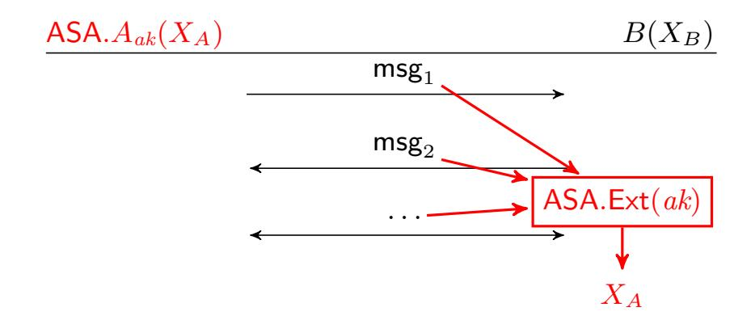
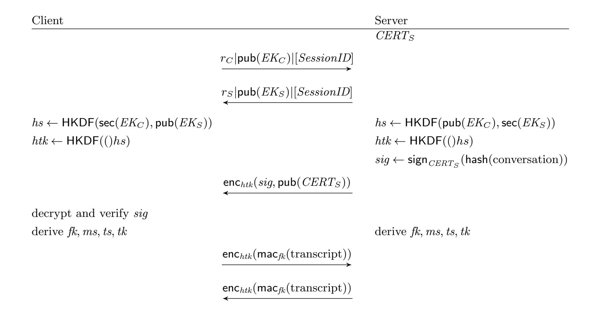
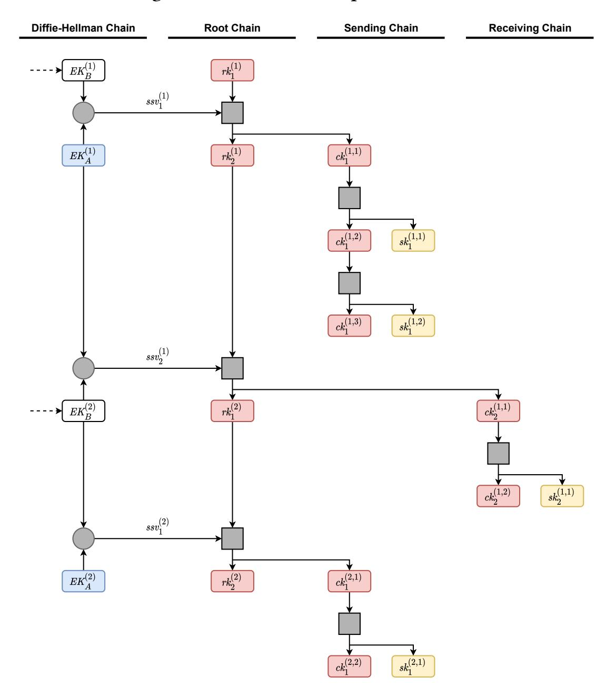

{0}------------------------------------------------

## ASAP: Algorithm Substitution Attacks on Cryptographic Protocols

[Sebastian Berndt](https://orcid.org/0000-0003-4177-8081) s.berndt@uni-luebeck.de University of Lübeck Institute for IT Security Germany

[Jan Wichelmann](https://orcid.org/0000-0002-5748-5462) j.wichelmann@uni-luebeck.de University of Lübeck Institute for IT Security Germany

[Claudius Pott](https://orcid.org/0000-0002-1266-378X) c.pott@uni-luebeck.de University of Lübeck Institute for IT Security Germany

Tim-Henrik Traving timhenrik.traving@student.uniluebeck.de University of Lübeck Institute for IT Security Germany

[Thomas Eisenbarth](https://orcid.org/0000-0003-1116-6973) thomas.eisenbarth@uni-luebeck.de University of Lübeck Institute for IT Security Germany

## ABSTRACT

The security of digital communication relies on few cryptographic protocols that are used to protect internet traffic, from web sessions to instant messaging. These protocols and the cryptographic primitives they rely on have been extensively studied and are considered secure. Yet, sophisticated attackers are often able to bypass rather than break security mechanisms. Kleptography or algorithm substitution attacks (ASA) describe techniques to place backdoors right into cryptographic primitives. While highly relevant as a building block, we show that the real danger of ASAs is their use in cryptographic protocols. In fact, we show that highly desirable security properties of these protocols—forward secrecy and postcompromise security—imply the applicability of ASAs. We then analyze the application of ASAs in three widely used protocols: TLS, WireGuard, and Signal. We show that these protocols can be easily subverted by carefully placing ASAs. Our analysis shows that careful design of ASAs makes detection unlikely while leaking long-term secrets within a few messages in the case of TLS and WireGuard, allowing impersonation attacks. In contrast, Signal's double-ratchet protocol shows higher immunity to ASAs, as the leakage requires much more messages.

## CCS CONCEPTS

• Security and privacy → Cryptography; Security protocols.

## KEYWORDS

subversion attacks; security protocols; tls; wireguard; signal

## 1 INTRODUCTION

In the past few years, the widespread use of cryptography to protect digital communication has become the norm. More than 90% of web traffic are now end-to-end encrypted via protocols such as TLS for synchronous web sessions or the popular Signal protocol for asynchronous instant messaging [\[1\]](#page-12-0). With the use of standardized cryptographic protocols for virtually all digital communication from web traffic to messengers, these protocols receive increased attention from intelligence agencies, law enforcement and criminals alike. Besides increased awareness and new privacy

laws requiring better protection, leaks like the Snowden revelations showed that government agencies are heavily invested in eavesdropping and intercepting web traffic. In conformance with Shamir's third law of security, that states that cryptographic systems are circumvented, not broken, these actors do not only apply cryptanalytic techniques, but also circumvent cryptosystems. More recently, such capabilities have become available to police forces and less well-funded governments, which have been reported to bypass highly protected messenger communications of Telegram [\[2\]](#page-12-1) and EncroChat [\[3\]](#page-12-2). While the latter examples rely on exploitation of implementation bugs and phishing, Snowden's documents also revealed efforts to achieve longer-term access. One class of attacks tries to manipulate the algorithms used in implementations. The main idea behind this manipulation is the injection of a backdoor into otherwise secure implementations, e.g. via the compiler, as proposed by Ken Thompson and later observed as XCodeGhost [\[4\]](#page-12-3). Another way to introduce backdoors is the exploitation of ambiguous dependencies which has been done to plant code in software of major vendors [\[5\]](#page-12-4). Even cryptographically secure algorithms can be subverted in stealthy ways. One prominent example was the standardization of Dual\_EC\_DRBG, where an attacker knowing certain properties of used parameters can predict future generated bits based on previously observed outputs [\[6](#page-12-5)[–8\]](#page-12-6)). In a sense, the standardized version of Dual\_EC\_DRBG is thus a subversion of a version of it with honestly chosen parameters. This shows that an attacker able to choose these parameters in widely used implementations (and thus creating subverted implementations) can use their knowledge to break cryptographic algorithms based on that implementation. Another angle for such attacks is targeting open source projects where everyone can suggest changes to the code. Here, an attacker can look for existing bugs and propose according patches, that in the same turn introduce new vulnerabilities, that are hard to detect and can be exploited by the attacker. Just recently, this approach has been shown to work even for the Linux kernel [\[9\]](#page-12-7), although in a ethically questionable way.

A formal treatment of these manipulations was first given by Young and Yung under the name kleptography [\[10,](#page-12-8) [11\]](#page-12-9). The recent developments started by Snowden's publication reignited the interest in this kind of attacks, starting with the work of Bellare, 

{1}------------------------------------------------

Paterson, and Rogaway [12], that studied the attacks under the name of *algorithm substitution attacks* (ASA).

#### 1.1 Our Contributions

Algorithm substitution attacks have been widely studied in the literature and are applicable in the real world. Usually cryptographic primitives are not used in isolation, but in the context of *cryptographic protocols*. Previous works on ASAs only studied the subversion of a single primitive, but protocols usually involve multiple different primitives to obtain their security guarantees.

Due to the widespread usage of cryptographic protocols and their essential role in modern communication, our goal is to understand the feasibility of ASAs against these protocols. To do so, we first formally define an appropriate notion of such attacks and the capabilities of the *watchdogs* that aim to distinguish the subverted implementation from a non-modified implementation. We then prove in Sec. 2.3 that two important properties of modern protocols — *forward secrecy* and *post-compromise security* — directly imply the vulnerability against ASAs even against *omniscient* watchdogs aware of all secret keys of the implementation.

As shown by the controversy around [9], it is very difficult to find real-world vulnerabilities to such substitution attacks in an ethical way. To understand the possible ways that substitution attacks can be used in practice, we analyze the attack surfaces present in modern protocols by taking a closer look at three different, yet widely used protocols — TLS, WireGuard, and Signal — and show in Sec. 3 that all of these protocols have multiple vulnerabilities against ASAs. In two of these protocols, TLS and WireGuard, these vulnerabilities can be used to leak the long-term secret key with at most four messages. Given that key, the ASA adversary can then perform Man-in-the-Middle attacks. Leaking the long-term secret key from Signal takes significantly more messages due to the ratcheting protocol. Yet, the consequences are still dramatic: the forward secrecy of the Signal protocol can be circumvented by using Signal's multi-device option to register a new device with the leaked key. That new device is then able to access all subsequent communication of the subverted identity as shown by Wichelmann et al. [13]. Our analysis highlights that small differences in the protocols (such as between TLS 1.2 and TLS 1.3) can have large implications with regard to the vulnerability against ASAs.

In order to show that these vulnerabilities are not only theoretical, we modify the implementation of these protocols in OpenSSL (TLS), the Linux kernel (WireGuard), and the Signal desktop client in Sec. 4. We experimentally verify that these modified implementations are able to leak the long-term keys with minimal computational overhead and only a few changed lines of code, making the attacks hardly detectable.

We conclude the paper with a discussion about possible countermeasures against ASAs and general design lessons to help developers in hardening their protocols in Sec. 5.

Scope of our results. While the core of modern cryptographic protocols is often very slick and optimized, interoperability and backwards compatibility issues lead to a large number of optional fields, negotiable configuration parameters, and complicated extensions. The receiving parties usually ignore such fields not needed

for their functionality. On the one hand, such fields may be a convenient location to innocuously embed sensitive information. On the other hand, the concrete distribution underlying these fields might be very complicated as it depends on the used implementation, the version, and on the used configuration instead of the core protocol specification. An attentive watchdog — aiming to detect the subversion — might thus be able to detect suspicious behavior. We thus focus on the *core* aspects of the underlying protocols, i. e., on messages/fields that are (nearly) always sent and will ignore more advanced or optional aspects of the protocols. This way, the presence of these components will not be suspicious and our attacks are not limited to a certain implementation, version, or configuration.

As cryptographic protocols allow for much more interaction than primitives with their very strict information flow, these interactions open up many more possibilities for subversion. An attacker might directly interact with the subverted server and, e.g., time their messages or send messages in a certain order to trigger some unwanted behaviour of a subverted implementation. Again, the distribution of unsuspicious behavior of clients might be rather complicated and any deviation from this behavior might allow an attentive watchdog to detect the subversion. A careful subverter will aim to avoid any behavior distinguishable from normal behavior to avoid detection, thus restricting changes to message parts for which the the output distributions are known and changes are provably undetectable, such as cryptographic nonces. In our work, we thus focus on attackers that, after installing the subverted implementation, behave completely passive: They only observe the traffic between the subverted server and non-subverted honest clients and aim to extract sensitive information from this traffic. Hence, we make the attacker as weak as possible and, in a similar vein, we will make the watchdog aiming to detect the subversion, as strong as possible. More concretely, we will assume that the watchdog has complete knowledge about all private keys of the (possibly) subverted implementation (known in the literature as omniscient).

Summing up, in our paper, we concentrate on a *very weak at-tacker*, a *very strong watchdog*, and on the *core components* of each protocol and we were still able to show that subversion attacks are possible (and unavoidable in the case of forward secrecy or post-compromise security).

*Code.* Our proof of concept code modifications are available on GitHub: https://github.com/balasdansb/asa-on-protocols.

#### 1.2 Related Work

As described above, the concept of algorithm substitution attacks was first formalized by Young and Yung under the name *kleptogra-phy* [10, 11]. The current name of algorithm substitution attacks was proposed by Bellare, Paterson, and Rogaway, who also presented several attacks on certain symmetric encryption schemes [12]. Degabriele, Farshim, and Poettering criticised this model as it relied on the assumption that all ciphertexts produced by the subverted algorithm must be valid [14]. The model of Bellare, Paterson, and Rogaway was extended to signature schemes by Ateniese, Magri, and Venturi [15]. Bellare, Jaeger, and Kane strengthened the result of Bellare, Paterson, and Rogaway by showing the proposed attacks

{2}------------------------------------------------

can be made stateless [16]. Berndt and Liśkiewicz showed that algorithm substitution attacks can be interpreted as steganographic systems, which allowed them to generalize the above results and give upper bounds for the amount of information embeddable in a single message via black-box attacks [17]. Just recently, Chen et al. showed that this upper bound can indeed be beaten via non-black-box attacks against certain key encapsulation mechanisms [18]. As the authors only focus on algorithms and aim to replace the encapsulation algorithm, they can only embed the (often short-lived) session key in their algorithms, as this is the only sensitive information that the encapsulation algorithm can access. Furthermore, Chen et al. also introduced asymmetric algorithm substitution attacks that use asymmetric keys. Several methods to protect against ASAs have been proposed. We discuss these approaches and our design lessons in more depth in Section 5.

#### **2 PRELIMINARIES**

In the following, we fix the notations used in this work, introduce the notion of algorithm substitution attacks against protocols, and show that a widely used property of cryptographic protocols — *forward secrecy* — always leads to vulnerabilities against such substitution attacks. We often consider randomized algorithms R, and for fixed randomness r, we denote their deterministic output on input x as R(x; r). We also define  $\log(x) := \lceil \log_2(x) \rceil$ .

To distinguish between symmetric keys and asymmetric keys, we denote symmetric keys with lower case letters and asymmetric keys with upper case letters. Furthermore, for an asymmetric keypair K, we denote the secret key by  $\sec(K)$  and the public key by  $\operatorname{pub}(K)$ . We refer to the textbook of Katz and Lindell [19] for formal definitions of the cryptographic primitives used in our work such as pseudorandom functions or symmetric encryption schemes.

#### 2.1 Cryptographic Protocols

Let *A* and *B* be two stateful randomized algorithms, called *parties*. In a protocol  $\Pi_{A,B}$ , both of these algorithms exchange messages  $msg_i$  back and forth. Each party  $P \in \{A, B\}$  is given the history  $h_i = \text{msg}_1, \dots, \text{msg}_i$  of the first i messages, their state  $\text{st}_{P,i}$  and some input  $X_P$ . Upon these inputs, P outputs a message  $msg_{i+1}$ , sent to the other party, and an updated state  $st_{P,i+1}$ , which is kept private. For the sake of simplicity, we set  $h_0 = \operatorname{st}_{P,0} = \epsilon$  for the empty string  $\epsilon$ . The *run* run of a protocol  $\Pi_{A,B}$  on inputs  $X_A$  and  $X_B$  is now produced as follows for i = 0, ..., n: Obtain  $(msg_{i+1}, st_{P,i+1}) \leftarrow$  $P(X_P, h_i, \operatorname{st}_{P,i})$  from party P and send  $\operatorname{msg}_{i+1}$  to the other party. For even i, party P is A and for odd i, party P is B. (see Fig. 1). This naturally gives a probability distribution on the runs of a protocol  $\Pi_{A,B}$  with regard to the inputs  $X_A$  and  $X_B$ . The *transcript* transcript(run) of such a run run contains the inputs  $X_A$ ,  $X_B$ , all messages  $msg_1, \ldots, msg_n$ , and all states  $st_{P,i}$  for both parties. For a party  $P \in \{A, B\}$ , we denote their view by view<sub>P</sub>(run), which contains their parts of the transcript transcript (run), i. e.  $X_P$ , all messages  $msg_1, \ldots, msg_n$ , and all states  $st_{P,i}$  of themself (but not the states of the other party).

In this work, we assume that the protocols models the *complete* communication between A and B, i. e. there is no information shared between A and B before. Throughout the paper, we assume that  $X_A$  and  $X_B$  contain some secret information, called *long-term keys* 

that A and B can use to guarantee different cryptographic properties of the protocol such as integrity or authenticity. Usually such protocols are used to transfer information between A and B in a secure manner. For example, in a zero-knowledge protocol, A wants to convince B that  $f(X_A) = 1$  for some public f without revealing the input  $X_A$ . Protocols play an essential part in cryptography and are widely used. Adversaries trying to attack such a cryptographic protocol are typically characterized by their abilities. A passive adversary or eavesdropper can only listen to the communication between the parties and thus sees  $msg_1, \ldots, msg_n$ . In contrast, an active attacker can directly interact with the parties and e. g. can try to impersonate A and convince B to share sensitive information.

## <span id="page-2-1"></span>2.2 Algorithm Substitution Attacks

In this work, we consider algorithm substitution attacks against cryptographic protocols. As noted above, all previous work concentrated on at most the replacement of a single cryptographic primitive, but not on protocols. In the work of Chen et al., this led to the problem that they were only able to leak short-term session keys in this model [18]. But primitives are usually embedded in protocols and usually, *both* parties of a key encapsulation mechanism have some secret. Hence, in this scenario, an attack against the protocol allows a subverted encapsulation to leak the long-term secret key of a party instead of the short-term session key.

Usually, at least one of the inputs  $X_A$  or  $X_B$  of a cryptographic protocol contains some value that is to be kept secret. The goal of an algorithm substitution attack against  $\Pi_{A,B}$  is to manipulate one of the parties such that the run of the protocol leaks this secret to an observer knowing some attacker key ak. For everyone but this observer, the run of the manipulated protocol should be indistinguishable from the original protocol, in contrast to classical backdoors which could be used by everyone.

Subverting Protocols. For the sake of simplicity, we only consider algorithm substitution attacks against party A, but the adaption against party B is straightforward. As the concrete protocols we are interested in later on have a wide number of cryptographic properties that they aim to establish, we will focus on a special kind of subversion attacks, where the subverted implementation leaks the long-term secret  $X_A$  to an *extraction algorithm* ASA.Ext. Throughout this work, we make the following assumption for all protocols  $\Pi_{A,B}$ :

<span id="page-2-0"></span>**Assumption 1.** An attacker ASA that knows the long-term secret  $X_A$  can impersonate A and thus break the cryptographic properties of the protocol  $\Pi_{A,B}$ .

Note that this assumption directly implies that  $X_A$  needs to be sufficiently long to avoid brute-force attacks.

Formally, an *algorithm substitution attack* ASA against  $\Pi_{A,B}$  is a tuple of randomized algorithms (ASA.A, ASA.Ext). Here, the honest implementation of party A is replaced by ASA.A and ASA.Ext is used to extract the long-term key  $X_A$  from the exchanged messages. In addition to the inputs  $X_A$  and  $h_i$  given to A, the algorithm ASA.A is also given a symmetric *attacker key ak* of length  $\kappa$ . To separate the input in the protocol from this key, we write ASA. $A_{ak}$  to denote that ASA.A has knowledge about ak. The *extraction algorithm* 

{3}------------------------------------------------

<span id="page-3-0"></span>

Figure 1: A run of the ASA

ASA.Ext is also given this attacker key and the sequence of messages  $msg_1, msg_2, \ldots$  and tries to extract the secret  $X_A$  from these messages. (see Fig. 1). We allows both ASA.A and ASA.Ext to be stateful, but stress that ASA.A now has two states: one is similar to the state of an honest party A and denoted by  $st_{ASA.A}$  and another state used for the observation, which is not part of transcript $_{ASA.A}$ .

Undetectability. We need to formalize the requirement that a successful substitution attack remains undetected. To do this, Russel, Tang, Yung, and Zhou formalized three different watchdogs that try to detect a possible subversion [20]. In this work, we only focus on the strongest watchdog, called omniscient online watchdog. Such a watchdog W is a PPTM which is given an oracle, that is either an honest party A or the subverted implementation ASA.A. Furthermore, W is also given the view view $_A(\text{run})$  of A of a run run of  $\Pi_{A,B}$  to model the fact such a watchdog observes the behaviour of A in an online fashion. The detection advantage  $\operatorname{Adv}_W^{X_A,X_B}(\kappa)$  of a watchdog W with regard to the inputs  $X_A$  and  $X_B$  against a algorithm substitution attack ASA is defined as

$$\left|\Pr[\mathsf{W}^A(\mathsf{view}_A(\mathsf{run})) = 1] - \Pr[\mathsf{W}^{\mathsf{ASA}.A}(\mathsf{view}_A(\mathsf{run}')) = 1]\right|.$$

Here, the attacker key ak used by ASA.A is randomly chosen, run is a random run of  $\Pi_{A,B}$  on  $X_A$  and  $X_B$ , and run' is a random run of  $\Pi_{ASA.A,B}$  on  $X_A$  and  $X_B$ . Note that the oracle (which is either A or ASA.A) can be queried on arbitrary inputs X, arbitrary histories h, and arbitrary states st. We say that ASA is undetectable, if for all watchdogs W and all  $X_A$  and  $X_B$ , the advantage  $\mathbf{Adv}_{W}^{X_A,X_B}(\kappa)$  is negligible in  $\kappa$ .

*Reliability.* As discussed above, the ASA should also be able to reliably extract the long-term key  $X_A$  from the public communication between ASA.A and B. We say that ASA is reliable with regard to the inputs  $X_A$  and  $X_B$  if  $\Pr[\mathsf{ASA}.\mathsf{Ext}(\mathsf{msg}_1,\ldots,\mathsf{msg}_n) = X_A] \geq 1 - \mathsf{negl}(\kappa)$  for some negligible function negl. Here, the probability is taken over the random choice of the attacker key ak and the run  $\mathsf{run}' = \mathsf{msg}_1,\ldots,\mathsf{msg}_n$  of  $\Pi_{\mathsf{ASA}.A_{ak},B}$  on  $X_A$  and  $X_B$ . We say that ASA is reliable, if it is reliable for all  $X_A$  and  $X_B$ .

Universal ASA. Bellare et al. showed the existence of a black-box (or universal) algorithm substitution attack, i. e. an undetectable algorithm substitution attack, based on rejection sampling, that works against every randomized symmetric encryption scheme [12]. Berndt and Liśkiewicz were able to show that this substitution attack can be used against every randomized algorithm with sufficient high min-entropy [17].

The general idea behind this universal ASA is the following: Suppose that we want to embed  $\lambda$  bits of the secret s in the output of the randomized algorithm R on input x. Let  $s_i$  be the i-th block of s of length  $\lambda$ , i. e.  $s = s_1 \mid\mid s_2 \mid\mid \dots s_L$  with  $L = |s|/\lambda$ . We assume that we have access to a pseudorandom function F that — equipped with key ak — on some input y outputs a pair (b, i), where  $|b| = \lambda$  and  $|i| = \log(L)$ . The universal ASA now samples random bits r until it finds  $r^*$  with  $F_{ak}(R(x; r^*)) = (s_i, i)$ , i. e. until the pseudorandom function outputs the *i*-th block of *s* and the index *i* for some *i*. It can easily be seen that the probability that we do not find a suitable candidate after  $2^{\lambda} \cdot \kappa$  samples of random bits is negligible in  $\kappa$ . Using the analysis of the *coupon collector problem*, it is easy to see that  $O(L \cdot \log(L))$  received ciphertexts are sufficient to reconstruct s with high probability. In fact, for sufficiently large values of L, the probability that more than  $L \ln(L) + \beta L$  samples are needed is at most  $1 - \exp(-\exp(-\beta))$  [21, Theorem 5.13]. For example, the probability to need more than  $L \ln(L) + 4L$  samples is at most 0.02.

Clearly, this approach only works if the min-entropy  $H_{\infty}(R(x))$  of R on input x is sufficiently high. To apply this idea in substitution attacks, ASA.A identifies situations, where the min-entropy is sufficiently high and embeds parts of the long-term key  $X_A$  into the outgoing message. We call this the *universal ASA*. A common target for our attack in this work is the Diffie-Hellman key exchange and we thus illustrate the attack here for clarity. Given a finite cyclic group  $\mathbb G$  of order n and some generator  $g \in \mathbb G$ , a non-subverted party generates 1 < a < n, keeps a secret and sends  $g^a$  to the other party. Our goal is now to embed information about  $X_A$  into  $g^a$ . Hence, to embed a single bit  $(\lambda = 1)$  in the universal attack, we sample  $a \leftarrow \{2, \ldots, n-1\}$  until we obtain  $a^*$  such that  $F_{ak}(g^{a^*}) = (X_A[i], i)$ , where  $X_A[i]$  is the i-th bit of the  $X_A$ .

For the sake of completeness, we repeat the Theorem of Berndt and Liśkiewicz [17] adapted to our notation here.

<span id="page-3-1"></span>**Theorem 1** (Theorem 7.1 in [17]). Let  $\Pi_{A,B}$  be a protocol. For the universal algorithm substitution attack ASA, both  $\mathbf{Adv}_{\mathbf{W}}^{X_A,X_B}(\kappa)$  as well as the unreliability of ASA are bounded by

$$\operatorname{poly}(\kappa) \cdot (\exp(-|X_A|) + \exp(-H_\infty)) + \operatorname{InSec}_F^{\operatorname{prf}}(\kappa)$$

for all watchdogs W. Here,  $|X_A|$  is the length of  $X_A$ , the term  $H_\infty$  describes the smallest min-entropy of the messages where ASA embeds information, and  $\mathbf{InSec}_F^{prf}(\kappa)$  is the maximum advantage of any attacker against the pseudorandom function F.

Public-coin-replacement ASA. Another important non-universal algorithm substitution attack can be applied, whenever a uniformly random string is transferred. This is often the case, if both parties communicate via a symmetric encryption scheme that requires a random nonce or IV. Suppose that we use the counter mode with random IV to encrypt messages: The first block of the ciphertexts of this mode consists of uniformly distributed bits. Hence, an ASA could replace this block by an encryption of the long-term secret  $X_A$  using an encryption scheme with pseudorandom ciphertexts.

This coin-replacement attack is a simple adaption of the IV-replacement attack described by Bellare et al. in [12]. For the sake of simplicity, we assume in the following that the complete message  $\mathsf{msg}_i$  is a uniformly random string (otherwise, we only apply the technique on the random part). Again, if we want to embed  $\lambda$  bits of

{4}------------------------------------------------

the secret s, split into  $s_1 \mid\mid s_2 \mid\mid \ldots \mid\mid s_L$ , we first choose a string r of length  $\mid \mathsf{msg}_i \mid -\lambda$  completely random. This string r encodes some index j consisting of  $\log(L)$  bits (e. g. via its most significant bits or its least significant bits). Then, we compute  $\mathsf{msg}_i' = r \mid\mid (F_{ak}(r) \oplus s_j)$  via a pseudorandom function F and output  $\mathsf{msg}_i'$ . The extractor, knowing  $\lambda$  and ak, can easily compute both j and  $s_j$  from  $\mathsf{msg}_i'$ . As described above, about  $O(L \cdot \log(L))$  samples are needed to reconstruct the secret s. The main advantage of this attack is that no repeated sampling is necessary, i. e. the running time of the protocol is only increased by a single call to the pseudorandom function F. The optimal value for  $\lambda$  here depends on the length of  $\mathsf{msg}_i$ , but must be small enough that the length of r is sufficiently high to avoid detection. Clearly, this attack can only be used, if the random part of the message  $\mathsf{msg}_i$  is sufficiently long.

The security of the public-coin-replacement ASA was shown by Bellare et al. in [12] and, for the sake of completeness, we repeat their theorem adapted to our notation.

<span id="page-4-3"></span>**Theorem 2** (Theorem 2 in [12]). Let  $\Pi_{A,B}$  be a protocol. For the public-coin-replacement algorithm substitution attack ASA, the advantage  $\mathbf{Adv}_{W}^{X_{A},X_{B}}(\kappa)$  and the unreliability of ASA are bounded by

$$\operatorname{poly}(\kappa) \cdot \exp(-m + \log(|X_A|)) + \operatorname{InSec}_F^{\operatorname{prf}}(\kappa)$$

for all watchdogs W. Here,  $|X_A|$  is the length of  $X_A$ , the term m describes the shortest random string where ASA embedded information, and  $\mathbf{InSec}_F^{prf}(\kappa)$  is the maximum advantage of any attacker against the pseudorandom function F.

Impossibility Results. As we concentrate on the omniscient watch-dog scenario, we can also make use of known impossibility results. It is relatively easy to see that deterministic algorithms cannot be subverted without detection by an omniscient watchdogs: Such a watchdog knows all of the relevant inputs (including the secret  $X_A$  and the states  $\operatorname{st}_{A,i}$ ) and can thus also do the computation all by itself. More formally, this is captured by the following theorem of Berndt and Liśkiewicz [17], adapted to our setting:

<span id="page-4-4"></span>**Theorem 3** (Theorem 7.2 in [17]). Whenever  $A(X_A, h_i, \operatorname{st}_{A,i})$  is deterministic, it holds  $A(X_A, h_i, \operatorname{st}_{A,i}) = \operatorname{ASA}.A(X_A, h_i, \operatorname{st}_{A,i})$  for all undetectable algorithm substitution attacks ASA.

Passive and Active Attacks. While the deployment of the modified algorithm (i. e. exchanging A with ASA.A) is an active attack, the extraction of the information via ASA.Ext is done in a purely passive way. In this work, we do not consider how to deploy the modified algorithm ASA.A, but focus on the possible places where such a substitution attack might be used in *cryptographic protocols*. Furthermore, we also study how the long-term keys can be used after extraction, both by a passive attacker and an active attacker.

#### <span id="page-4-0"></span>2.3 ASA and Forward Secrecy

Two important features of modern cryptographic protocols are called *forward secrecy* and *post-compromise security*, which concern encrypted communication. Informally, these mean that a breach of the long-term keys is not sufficient for the decryption of the messages encrypted before the breach (forward secrecy) or for messages encrypted sufficiently long after this breach (post-compromise security). In our setting introduced above, some of the messages

 $msg_i$  are encryptions, i. e.  $msg_i = Enc(k_i, p_i)$  for some plaintext  $p_i$ , some key  $k_i$  and a symmetric encryption scheme Enc. Forward secrecy now means that an attacker that knows the secret inputs  $X_A$  and  $X_B$  of the parties and all of the  $msg_i$  (but neither  $k_i$  nor  $p_i$ ) cannot distinguish the key  $k_i$  from a random key, as defined by Krawczyk [22]. On the other hand, post-compromise security means that even if  $k_i$ ,  $p_i$ ,  $X_A$ , and  $X_B$  are known to the attacker, there is some index  $i^*$  > i such that the attacker cannot distinguish  $k_{i^*}$  from a random key as defined by Cohn-Gordon et. al. [23].

A common way to enable these properties is to only use *ephemeral keys* for some part of the communication. For example, in TLS, a handshake starting a session consists of a key exchange of such an ephemeral key. At the end of the session these ephemeral keys are completely discarded and the next communication between the parties starts a new session with new ephemeral keys.

We will now argue that both of these properties directly lead to potential subversion attacks. The argument boils down to the fact that, in order to guarantee these properties, the ephemeral keys  $k_i$  need be constructed randomly with a sufficient amount of entropy. This allows us to use the universal ASA of Theorem 1. We stress that the lemma depends on the fact that the run of  $\Pi_{A,B}$  captures the *complete communication* between A and B.

<span id="page-4-2"></span>LEMMA 1. If  $\Pi_{A,B}$  is a cryptographic protocol with forward secrecy or post-compromise security, then there is an ASA against A or B.

PROOF. We only prove the statement for forward secrecy here. The proof for post-compromise security is analogous. We will make use of the universal algorithm substitution attack ASA of Theorem 1. To do so, we need to guarantee two things: First, the long-term secret  $X_A$  needs to be sufficiently long. Second, there need to be enough messages sent by A with high enough min-entropy to guarantee that  $H_{\infty}$  is large enough. As discussed above, the first property is implied by Assumption 1. We thus only need to argue about the existence of messages with high min-entropy.

Consider the earliest message  $\operatorname{msg}_i = \operatorname{Enc}(k_i, p_i)$ , where some attacker cannot distinguish  $k_i$  from a random key. As the attacker knows both  $X_A$  and  $X_B$ , the key  $k_i$  is not part of these secrets, but needs to be stored in the states  $\operatorname{st}_{A,i}$  and  $\operatorname{st}_{B,i}$  not known to the attacker. Hence, the communication between the parties must include some messages  $\operatorname{msg}_j$ ,  $\operatorname{msg}_{j+1}$ , ... where this key  $k_i$  is exchanged, as  $\Pi_{A,B}$  contains the complete communication between the parties. If all of the messages  $\operatorname{msg}_1$ ,  $\operatorname{msg}_2$ , ...,  $\operatorname{msg}_i$  are chosen deterministically, the attacker can simulate this with their knowledge of  $X_A$  and  $X_B$  and can thus also reconstruct the key  $k_i$ , which would contradict the forward secrecy of the protocol. Therefore, there is a message  $\operatorname{msg}_{i^*}$  chosen randomly. Furthermore, as the protocol has forward secrecy, the attacker is not able to brute-force the randomness for the construction of  $\operatorname{msg}_{i^*}$ . Hence,  $\operatorname{msg}_{i^*}$  has sufficient min-entropy to embed information about  $X_A$  via Theorem 1.  $\square$ 

<span id="page-4-1"></span> $<sup>^1</sup>$ Note that this notion is called *weak forward secrecy* in [22], as it does not prevent active attacks.

{5}------------------------------------------------

# <span id="page-5-0"></span>3 SUBSTITUTION ATTACKS AGAINST PROTOCOLS

In light of Lemma 1, we looked at multiple widely used protocols that support forward secrecy and analyzed their vulnerability with regard to algorithm substitution attacks. In addition to the attacks on the forward secrecy parts of the protocols, we also discovered that TLS 1.2 and WireGuard are vulnerable to public-coin-replacement attacks. To simplify the presentation, we say that an algorithm substitution attack is undetectable, if the detection advantage of any watchdog is sufficiently small, e. g. at most  $2^{-128}$  or  $2^{-64}$ . In our above formal model, we only modeled the leakage of the long-term secret  $X_A$  and used Assumption 1 to guarantee the breach of some security property this way. In the following, we focus on concrete protocols and thus also discuss leaking other secrets and which properties can be broken this way.

#### 3.1 TLS

The Transport Layer Security (TLS) protocol is arguably one of the most important protocols for secure communication, providing encryption, integrity protection and authenticity confirmation. TLS is located between the application-layer and transport-layer of the Internet Protocol (IP) Stack. It provides a transparent way of secure communication to the application-layer. In general, TLS supports a large number of different algorithms used for key exchange, signatures, and encryption.

The protocol is split into two (main) layers: The Handshake layer (composed by the Handshake-, Change Cipher Spec-, and Alert Protocols), which initiates a connection between the parties, and the Record layer (formed by the Record Protocol), which is used to send application data. Usually, TLS is used for communication between a server S and a client C. The protocol distinguishes between sessions, which are an association between the parties with some state that specifies the used algorithms, and connections, which are secure streams within a session. The most current version of TLS is TLS 1.3, but it is currently only supported by 40% of servers. Its predecessor, TLS 1.2, is supported by nearly 99% of the servers [24].

We first introduce the two layers of TLS 1.3, highlight the differences to TLS 1.2, and discuss possible targets for ASAs afterwards.

*Handshake layer* [25]. To initiate a session, a handshake between the parties is performed (Figure 3 in the appendix). The server *S* has a certificate *CERTS* to authenticate itself. The client *C* sends a "Hello" message to the server which includes a list of preferred algorithms and a random string  $r_C$  of length 32 bytes. It also guesses, which key exchange algorithm will be chosen by the server, generates an appropriate ephemeral key  $EK_C$  and send its public component pub( $EK_C$ ) to the server. If C tries to resume a session, it also send a session ID. The server *S* chooses the algorithms to be used from the client's list, a random string  $r_S$  of length 32 bytes, and an ephemeral key *EK<sub>S</sub>* and sends all of this as "Hello" message to the client. If the client wanted to resume a session, *S* can also send a session ID. Both parties then derive a handshake secret hs from the ephemeral keys *EK<sub>C</sub>* and *EK<sub>S</sub>* and from a hash of both "Hello" messages via HKDF [26]. From hs, both parties also derive the handshake traffic key htk via HKDF. Then, the server computes a hash of the current communication and signs it using its certificate. The

server *S* encrypts this signature and the public key of the certificate via *htk* and sends it to the client. The client decrypts these values and verifies the signature. Both parties then derive several other symmetric secrets/keys from *hs* via HKDF: the finished key *fk*, the master secret *ms*, the traffic secret *ts*, and the traffic key *tk*. The client now computes a MAC of the current transcript via *fk* and encrypts this with *htk* and sends this "Finish" message to the server. The server then also computes such a MAC in the same way and sends this encrypted with *htk* as "Finish" message to the client. A more detailed description of the handshake can be found, e. g., in the work of Diemert and Jager [27].

In TLS 1.2 [28], the client does not guess the key exchange algorithm, causing the need for another roundtrip between the parties. Furthermore, the handshake messages are not encrypted, i. e. htk is not present in the protocol.

Record layer [25]. In the record layer, the application data is encrypted via the symmetric traffic key tk. The encryption is performed via an authenticated encryption with associated data (AEAD) encryption scheme as defined by Rogaway et. al [29, 30] chosen during the handshake, which is either AES GCM, AES CCM, or ChaCha20-Poly1305 [31, 32]. The nonce needed for this AEAD is produced by XOR-ing the sequence number (describing how many messages were already sent) and an initialization vector derived from the master secret ms.

In contrast, TLS 1.2 allows a much wider range of encryption schemes, not only AEADs. Also, the nonce used for the schemes is constructed differently. It consists of an initialization vector derived from the master secret *ms* concatenated with an *explicit initialization vector (eIV)*, chosen randomly and transmitted. In earlier versions of TLS, no eIV was used, which led to vulnerabilities [33].

3.1.1 Security Analysis w.r.t. Substitution Attacks. In the following, we identify possible attack vectors against both versions of TLS. The first thing to consider is which key-material we want to leak. By leaking the short-term keys (either  $\sec(EK_S)$ ,  $\sec(EK_C)$ , or hs and the derived keys), an attacker is able to decrypt the complete communication within a single connection. Usually, the only long-term key that exists is the certificate of the server, allowing an attacker to impersonate the server and perform Man-in-the-Middle attacks. Note that the short-term keys are only derived from later messages in the Handshake layer. Attacks on early messages in the Handshake layer can thus only leak long-term keys.

Leaking in the Handshake Layer. The TLS handshake consists of different messages that may or may not be sent when initiating a connection. These messages may or may not be encrypted. These factors vary between the specific setup, as well as TLS versions. But one message always contains a nonce, is always unencrypted, and will always be sent: The "Hello" message. This nonce can be chosen in a way that reveals information without compromising the subsequent calculations. As the "Hello" messages are unencrypted, they allow an public-coin-replacement ASA, resulting in a setup independent attack across all versions of TLS. As the "Hello" message consists of 28 bytes, Theorem 2 implies that this is undetectable.

Furthermore, the key shares  $pub(EK_C)$  and  $pub(EK_S)$  are also transmitted in the clear. As both of these shares are public keys, we cannot simply replace them by random strings (as obtaining

{6}------------------------------------------------

the corresponding private keys would be very expensive), but the universal ASA can be used to repeatedly sample EK until the public key contains some information. As both public keys need to have a sufficient amount of randomness, their min-entropy is high enough such that Theorem 1 implies that the universal ASA is undetectable.

Leaking in the Record layer. In TLS 1.3, all communication deterministically depends on the master secret *ms*. As deterministic algorithms cannot be used for ASAs due to Theorem 3, no attack vector exists against the record layer of TLS 1.3.

In contrast, the usage of the explicit IV in the Record layer of TLS 1.2 introduces randomness, which we can use for an attack. As described above, the nonce used in the encryption scheme is split in two halves: the *implicit IV* or *static IV* (sIV) and the *explicit* IV (eIV). The sIV is usually a session number, which is known to both client and server. As both parties know the sIV, there is no need to transmit this part. The eIV is randomly chosen and transmitted with the ciphertext. The other party does not know this random number and has no way to derive it from previously shared knowledge. Therefore it is necessary to transmit the eIV with the ciphertext. If the eIV was transmitted in the clear, then a straight-forward public-coin-replacement attack could be used. Unfortunately (for the attacker), the eIV is not transmitted in the clear, but concatenated with the plaintext and then encrypted via the static IV. We thus need to use the universal substitution attack to find an eIV such that this ciphertext contains information about the long-term secret. As AES has block size 128 bit, the min-entropy of this ciphertext is sufficiently high to apply Theorem 1. We explain the corresponding attack in more depth in Sec. 4.

#### 3.2 WireGuard

WireGuard is a Virtual Private Network (VPN) solution that has recently been added to the Linux kernel [34]. It is becoming increasingly popular due to its simple design and implementation, especially compared to other widely used protocols, and it uses generally acknowledged and fast algorithms. For example, all public-key operations are performed on Curve25519, all hashes are computed via blake2s, all keys are derived via HKDF, and the symmetric authenticated encryption schemes used are either ChaCha20Poly1305 or XChaCha20Poly1305 [26, 32, 35, 36]. As usual for VPNs, WireGuard allows peers to communicate with each other in a secure manner. A central part in the design and one reason for the simplicity of the protocol is that each peer is identified only by its static asymmetric key pair. Before they can create a connection, both peers have to share their static public key via a secure channel, such that they can prove that each is communicating with the correct party.

Again we give an overview of the protocol and afterwards discuss potential targets for ASA.

Handshake. The WireGuard protocol (Figure 2 in the appendix) does not distinguish between clients and servers, however, to distinguish between the two parties one is called the *initiator I* and the other one the *responder R*. Both parties have an asymmetric static key  $SK_I$ , resp.  $SK_R$ . To communicate, I also needs to know  $pub(SK_R)$  and R needs  $pub(SK_I)$ . In addition, I needs an IP address of R in order to send the initial message. As a first step, I

generates an ephemeral key  $EK_I$  and computes a symmetric handshake key hsk by performing a Diffie-Hellman key exchange on  $pub(SK_R)$  and  $sec(EK_I)$  and a second symmetric handshake key hsk' by performing a Diffie-Hellman key exchange on  $pub(SK_R)$ and  $sec(SK_I)$ . Then, it initiates the connection via the handshake initiation message. This message contains among other things the public key pub( $EK_I$ ), an encryption of pub( $SK_I$ ) using hsk, a random string  $r_I$  consisting of 4 bytes used for the session ID, and a timestamp encrypted with hsk'. All encryptions are AEADs and the authenticated data are hashes of the currently computed values given to R. The responder uses  $pub(EK_I)$  and  $sec(SK_R)$  to also derive the symmetric handshake key hsk and another key exchange on  $pub(SK_I)$  and  $sec(SK_R)$  to derive hsk'. It then decrypts the encrypted messages and verifies them. Afterwards, R generates an ephemeral key  $EK_R$  and derives another symmetric handshake key hsk'' from key exchanges on the pairs  $(pub(EK_I), sec(EK_R))$ and  $(pub(SK_I), sec(EK_R))$ . They then send a message containing  $pub(EK_R)$ , a random string  $r_R$  of 4 bytes used for the session ID, the string  $r_I$ , and an encryption of the the empty string with hsk''. After this message exchange, both parties derive their transport data keys  $tdk_I$  (for sending) and  $tdk_R$  (for receiving) from the ephemeral keys  $EK_I$  and  $EK_R$  and the handshake is complete.

*Transport Data.* In the following, every message sent between I and R contains a counter used as a nonce and an encryption of the application data either with  $tdk_I$  (if I sends a message to R) or  $tdk_R$  (if R sends a message to I).

Denial-of-Service Protection. To avoid that a malicious party performs a Denial-of-Service (DoS) attack by abusing the CPU-intensive asymmetric cryptographic operations of a handshake, WireGuard introduces a special cookie mechanism: If a peer (initiator or responder) P receives a handshake packet with a valid MAC, but currently cannot perform the necessary elliptic curve computations due to being under load, it returns a cookie message. This message contains a randomly generated nonce *rn* of 24 bytes, which is used alongside the peer's public key pub( $SK_P$ ) to encrypt a secret number s, that is randomly generated by P every two minutes. The other peer P'decrypts the cookie, and waits until the initiator's internal rekey timeout has passed. During the ensuing restarted handshake, P' sends their handshake message along with an additional MAC, using the secret number s as the MAC key. The peer P then checks whether that MAC is valid, and if it is, continues the handshake. Note that the random nonce *rn* is transported in the clear.

<span id="page-6-0"></span>3.2.1 Security Analysis w.r.t. Substitution Attacks. As discussed above, the identity of a peer P is given by an asymmetric key pair  $SK_P$ . The 256-bit private key  $\sec(SK_P)$  is therefore the most valuable target for attackers, as it allows stealing the identity of the victim: An attacker who has obtained  $\sec(SK_P)$  can perform Man-in-the-Middle attacks or impersonate the victim, thus gaining access to a formerly secure VPN. The public keys of other peers are designed to be kept secret within a VPN, and are only accessible when one is able to decrypt a handshake initiation packet; if a peer I sends a handshake initiation packet to the attacker, the attacker can use  $\sec(SK_R)$  to decrypt the packet and obtain  $\operatorname{pub}(SK_I)$ , possibly enabling other attacks. Since only the handshake initiation message contains an encryption of the public key of the initiator I, leaking

{7}------------------------------------------------

the secret key of a responder *R* allows an attacker to also collect public keys. If a victim on the other hand only acts as initiator, no public keys of other peers in the VPN can be decrypted by an attacker. In this case one could additionally leak the public key of the responder, thus enabling an attacker to connect to the VPN as *I*.

Another possible target are the symmetric short-term transport keys: If, for example, the attacker obtains  $tdk_I$ , they may decrypt all messages sent from I to R, until a new handshake occurs. In order to be able to decrypt the entire communication between I and R over multiple sessions, the attacker needs a way to leak both transport keys  $tdk_I$  and  $tdk_R$  within one session. Alternatively this could be achieved by leaking the private static key  $sec(SK_P)$  of the victim once and then leaking the private ephemeral key within each session, thus enabling the attacker to compute both transport keys.

WireGuard presents three opportunities for embedding data into randomly generated values: The ephemeral keys  $pub(EK_P)$  exchanged during the handshake, the random session IDs  $r_P$ , and the nonce  $r_R$  of the cookie message.

Leaking via Handshake Messages. WireGuard's handshake messages have two sources of randomness: The session IDs  $r_I$  or  $r_R$ , and the public ephemeral keys  $EK_I$  or  $EK_R$ . Handshake messages are suitable to leak long-term secrets, e. g., the static private key of the transmitting party. The short-term secrets are refreshed every few minutes, so leaking them via handshake messages is not feasible.

The session IDs of both I and R have a length of 4 bytes and are chosen uniformly at random for each handshake, thus the attacker could perform a public-coin-replacement ASA. However, this attack may be easily detectable due to the short length of the session IDs: If an attacker decides to embed one byte of secret data, the number of possible session IDs decreases to  $2^{24}$ . Since handshakes are designed to be executed every few minutes, one can thus expect a collision within a few days, as opposed to several months. This also matches the security guarantee of Theorem 2 which only guarantees security for sufficiently long randomness.

The public ephemeral keys can be used to conduct an universal ASA, by sampling random private keys until the resulting public key contains the desired secret. By Theorem 1, this is undetectable. From a practical point of view, this approach requires repeated elliptic curve computations, and it is thus quite expensive to embed more than a few bits per handshake. Long delays may get noticed by the user, due to slow connection or frequent connection losses.

Leaking via Cookie Messages. As describe above, the cookie message consists of an encryption of a secret number s via an AEAD that uses a uniformly random nonce rn that is sent in the clear (in contrast to TLS, where the nonce is encrypted). Since its length of 24 bytes is quite high, the nonce is well-suited for a public-coin-replacement attack. By generating the first 8 bytes (64 bits) randomly, detecting the attack becomes practically infeasible (see Theorem 2). This leaves 16 bytes (128 bits) for payload, which means that one half of a 256-bit key can be leaked in a single message.

This approach allows leaking long-term secrets as well as previous short-term secrets, since cookie messages are only sent prior to completing a handshake. Also, cookie messages are only sent when a peer is under load.

#### 3.3 Signal

The *Signal* (formerly *Axolotl*) protocol [37] provides end-to-end encryption for text messages and multimedia files. It is widely used in different communication applications such as WhatsApp [38], Skype [39], and the Signal messenger itself. The protocol is based on the Double Ratchet algorithm and uses a triple Elliptic-curve Diffie–Hellman handshake (X3DH) to initiate new conversations. The Sesame protocol is used to enable multi-device support. Signal uses a number of cryptographic primitives including Elliptic Curve Diffie-Hellman functions (implemented by X25519 or X448 [36]), a signature scheme called XEdDSA producing EdDSA-compatible signatures from X25519 or X448 using the hash function SHA-512 [37], and an authenticated encryption (AEAD) scheme [29, 30] based on HKDF. We explain the three protocol parts and discuss possible targets for ASAs afterwards.

X3DH [37]. Every user in the Signal protocol has an *identity key* IK. These keys are long-term keys and are needed to setup the initial communication between two parties. All of the public keys are stored on the central server. Furthermore, in order to enable an initial communication even if one of the parties is offline, all parties store a signed prekey pub(SPK) along with its signature and a set of one-time prekeys  $pub(OPK^{(1)})$ ,  $pub(OPK^{(2)})$ , . . . on the server. If party A now wants to initialize communication with party B, they obtain the following information from the server: The public identity key pub( $IK_B$ ), the signed prekey pub( $SPK_B$ ) along with its signature, and a one-time prekey  $pub(OPK_B)$  (if available). Now, A produces an ephemeral key  $EK_A$  and verifies the signature of  $pub(SPK_B)$ . Afterwards, three Diffie-Hellman key agreements are performed: Between  $sec(IK_A)$  and  $pub(SPK_B)$ , between  $sec(EK_A)$ and pub( $IK_B$ ), and between  $sec(EK_A)$  and pub( $SPK_B$ ). A symmetric key sk is then derived from these agreements. If a one-time prekey pub( $OPK_B$ ) was available, a fourth key agreement between  $sec(EK_A)$  and  $pub(OPK_B)$  is performed and also taken into account in the computation of sk. Finally, A sends an initial message to B that contains  $pub(IK_A)$ ,  $pub(EK_A)$ , the index of  $pub(OPK_B)$  (if available), and an initial ciphertext encrypted with key sk. After B got this initial message, B performs the same computations as A to obtain *sk* and then decrypts the initial ciphertext to verify *sk*.

Double Ratchet [37]. The Double Ratchet protocol (Figure 4 in appendix) tracks the cryptographic state of communication between two parties A and B. It is designed to provide forward secrecy and a weak version of post-compromise security<sup>2</sup> even when several keys get leaked.

The protocol state consists of four *chains*, which are stored by each party: The asymmetric *Diffie-Hellman (DH) chain* as well as the symmetric *root*, *sending*, and *receiving chains*.

Diffie-Hellman Chain: The DH chain is a sequence of Diffie-Hellman key exchanges on ephemeral keys. Let  $EK_P^{(i)}$  denote the ephemeral key of party  $P \in \{A, B\}$  in round i. Each round is partitioned into two phases. At the start of the first phase of round i, party A knows  $\operatorname{pub}(EK_B^{(i)})$  and generates an ephemeral key  $EK_A^{(i)}$ . First, A performs a Diffie-Hellman key-exchange between  $\operatorname{sec}(EK_A^{(i)})$  and  $\operatorname{pub}(EK_B^{(i)})$ 

<span id="page-7-0"></span> $<sup>^2</sup>$ This weaker version provides security after the leakage of the short-term keys, but not if the long-term keys are leaked.

{8}------------------------------------------------

to derive a shared secret  $ssv_1^{(i)}$ . Now, A sends  $pub(EK_A^{(i)})$  to B. All further messages send from A to B are encrypted via a key derived from  $ssv_1^{(i)}$  (see below for details) until B sends a response. A response of B starts the second phase, in which B generates a new ephemeral key  $EK_B^{(i+1)}$ . Then, B performs a Diffie-Hellman key-exchange between  $pub(EK_A^{(i)})$  and  $sec(EK_B^{(i+1)})$  to derive a shared secret value  $ssv_2^{(i)}$ . Now, B sends  $pub(EK_B^{(i+1)})$  to A. All further messages sent from B to A are encrypted via a key derived from  $ssv_2^{(i)}$ , until A sends a response, which ends round i and starts round i+1.

Root Chain: The root chain is a sequence of symmetric-key derivations. Given the shared secret value  $ssv_j^{(i)}$  from the DH chain and the current root chain  $key\ rk_j^{(i)}$ , it computes  $(rk_{j'}^{(i')},ck_j^{(i,1)}):= KDF(rk_j^{(i)},ssv_j^{(i)})$ , where  $ck_j^{(i)}$  is the first chain key of a sending or receiving chain and  $rk_{j'}^{(i')}$  is the next root chain key, with (i',j'):=(i,2) if j=1, or (i',j')=(i+1,1) if j=2. The root chain is initialized with  $rk_1^{(1)}=rk$ , where rk corresponds to the initial ciphertext key generated by X3DH.

Sending Chain / Receiving Chain: Like the root chain, the sending and the receiving chains are sequences of symmetric key derivations. The receiving chain of A matches the sending chain of B and vice versa. The first chain  $key\ ck_j^{(i,1)}$  is generated by the root chain. In the first phase of round i, party A sends messages to B. For each message, the chain is advanced by one step, which yields  $(ck_1^{(i,k+1)},sk_1^{(i,k)}):= \mathrm{KDF}(ck_1^{(i,k)})$ . The k-th message from A to B in round i (i. e. in the first phase) is encrypted with  $sk_1^{(i,k)}$ . Similarly, messages from B to A in round i (the second phase) are encrypted with  $sk_2^{(i,k)}$ , where  $(ck_2^{(i,k+1)},sk_2^{(i,k)}):= \mathrm{KDF}(ck_2^{(i,k)})$ .

Sesame [37]. The Sesame protocol [37] enables the usage of multiple devices for users. In general, the protocol describes two scenarios: the *per-user* scenario, where the identity key of the user is used on all devices of that user and the *per-device* scenario, where every device has its own identity key. Each device has a set of *sessions* on the server, which are initialized via the X3DH protocol and maintained by the double ratchet protocol. Whenever a device of user *A* sends a message to user *B*, it sends this message to every device associated with *A* or *B* either via its current active session or by initializing a new session via X3DH. The server then puts the messages in the mailbox of the receiving devices. The receiving device simply obtains the message from the mailbox and decrypts it via the corresponding session key.

The registration of new devices in the system is not explained in the specification and highly depends on whether a per-device or a per-user scenario is used.

3.3.1 Security Analysis w.r.t. Substitution Attacks. In this section, we investigate whether an attacker is able to conduct an algorithm substitution attack in order to circumvent/break end-to-end encryption, allowing them to read messages sent by the victim and its peers. We discuss the requirements of attacks against the end-to-end encryption, and identify possible attack vectors for algorithm substitution attacks in the protocol.

For simplicity, in this analysis, we assume that the protocol messages are sent via an insecure channel, which can be accessed by the attacker. In practice, the Signal protocol is wrapped into a TLS layer, but our discussion above shows how to leak the long-term key of TLS and thus justifies the insecure channel assumption. Without loss of generality, we also assume that we attack *A*'s side of the protocol, as illustrated in Figure 4 in the appendix.

Prerequisites for decrypting messages. In order to decrypt a message, the attacker needs to get access to the respective symmetric key  $sk_j^{(i,k)}$ . This key directly depends on the chain key  $ck_j^{(i,k)}$ , which directly depends on the root chain key  $rk_j^{(i)}$ . The root chain key depends on the previous root chain key, and the shared secret from the DH ratchet.

The attacker can thus choose one of the following:

- (1) Leak  $sk_i^{(i,k)}$ : This allows to decrypt a single message.
- (2) Leak  $ck_j^{(i,k)}$ : This allows to compute an entire send/receive chain, leading to decryption of one or more messages.
- (3) Leak  $rk_1^{(i)}$  and the private ephemeral key  $sec(EK_A^{(i)})$ : This informs the attacker about the current state of the root chain, which they can use to compute the next two states of the root chain and learn the next send and receive chains.
- (4) Leak one or multiple long-term keys and conduct a Man-in-the-Middle attack against new conversations: If the identity key  $sec(IK_A)$  gets leaked, the attacker can register new prekeys  $SPK_A$  and  $OPK_A^{(i)}$ , which allows them to control the next X3DH key exchange. Also, it was recently shown by Wichelmann et. al [13] that the leakage of the identity key is sufficient to register new devices via Sesame and thereby circumvent Signal's end-to-end encryption.

*Leaking via X3DH.* The X3DH handshake fully relies on the presence of several randomly generated inputs, which are stored on the server: The signed public prekey pub(SPK), and, most notably, a list of public one-time prekeys  $pub(OPK^{(1)})$ ,  $pub(OPK^{(2)})$ , . . .. Each client device tracks the available prekeys, and, if necessary, generates new ones.

While the identity key and the signed prekey are long-lived, the one-time prekeys are replaced on a regular basis, whenever a new encryption session (conversation) is started. The attacker may thus choose to use the universal ASA to embed secret values into these one-time prekeys, and subsequently drain the pool of available prekeys by conducting a lot of X3DH handshakes, so the client is forced to generate new ones. While in theory this straightforward approach is sufficient to implement the proposed attack strategies (see Theorem 1), it has a few drawbacks in practice: First, the key generation is usually triggered whenever the client restarts or receives a new conversation, which may not be frequent enough to leak a meaningful amount of short-term secrets. Second, if this is compensated by modifying the prekey generation job to generate a large amount of prekeys at once (i.e., a sufficient amount to leak a short-term secret), the high processor usage (and energy consumption, on mobile devices) may be noticed by the user. Last, the server owners (and possibly other peers) can detect this type of attack, if the affected device uploads unreasonably large amounts 

{9}------------------------------------------------

of one-time prekeys, and the extractor consumes these without starting new conversations.

Leaking via Double Ratchet. The only source of randomness in the Double Ratchet is provided by the ephemeral keys; all other shared secrets, states and keys are derived deterministically, making the Double Ratchet very resistant against algorithm substitution attacks, as these deterministic parts cannot be used for subversion due to Theorem 3. This property restricts the attacker to leaking information via the ephemeral keys  $pub(EK_A^{(i)})$ , which are re-generated each time the peers exchange messages. By Theorem 1, this is undetectable and, as we show in Section 4.3, embedding secret data into ephemeral keys is computationally cheap and practically undetectable due to the asynchronous nature of the protocol. However, this also thwarts attacks that try to leak an entire conversation: For each ephemeral key  $EK_A^{(i)}$ , there are two root keys  $rk_1^{(i)}$  and  $rk_2^{(i)}$ , which in turn lead to two sending/receiving chains and multiple message encryption keys  $sk_i^{(i,k)}$ , where each of them cannot be leaked in a single step. The attacker thus needs to focus on specific parts of the conversation, and leak the involved secrets over multiple rounds. However, this method is sufficient to leak long-term secrets, as we demonstrate by implementing attack approach (4) using ephemeral keys in Section 4.3.

#### <span id="page-9-0"></span>**4 ATTACKS ON IMPLEMENTATIONS**

In this section, we show the results of applying ASAs on implementations of the analyzed protocols. We describe the changes to the implementations and ASA design decisions. As described above, all of our attacks are guaranteed to be undetectable in our formal model, even in the presence of a watchdog program running on the user's machine, with access to all private keys and the network interface, but separated from the altered process. While this guarantees that the input-output-behavior of the subverted implementation is indistinguishable from an honest implementation, there are other practical aspects that may be used to detect an ASA, which are hard to capture in a formal model: a modified runtime behavior or a modified source code. To understand the practical applicability of our ASAs, we will also discuss these aspects here.

For all implementations, the number of lines of code that we changed is negligible compared to the rest of the code-base of the implementations. Furthermore, we can easily compare our patches to other commits in the respective repositories of OpenSSL<sup>3</sup>, Wire-Guard<sup>4</sup>, and Signal-Desktop<sup>5</sup>. Our attack on OpenSSL takes 45 changed lines. In comparison, 30.52% of all typical commits to OpenSSL affect more lines. For WireGuard, these numbers are 43 lines and 21.75%; for Signal, 58 lines and 26.71%. We thus believe malicious commits containing ASAs will not stick out due to the number of changed lines of code. We remark that the implementations of our attacks are not optimized with regard to this metric<sup>6</sup>. We thus believe that an optimized attack would be even smaller.

To verify empirically that the change of the runtime of the algorithm is sufficiently small, we did an experimental performance

analysis and calculated the corresponding overhead. All experiments were performed on a machine with an Intel Core i3-5010U processor and 8 GB RAM. In all of the attacks, the parameters can be chosen such that this overhead becomes hardly detectable (see Table 1 and Table 2): The overhead for the public-coin-replacement ASAs is negligible and for the universal ASA, the time needed to leak  $\lambda = 4$  bits is in the range of the latency caused by CPU utilization and operating system scheduling. Furthermore, our experiments showed a high variance in the running time of the unmodified code (the ratio between maximal and minimal time typically exceeded 10).

#### 4.1 TLS

To evaluate our theoretical attacks in practice, we modified the widely used OpenSSL<sup>7</sup> library, which offers extensive cryptographic functionality, including an implementation of the TLS protocol. We focused on leaking the long-term private key  $\sec(CERT_S)$ . We captured the generated data using the tshark<sup>8</sup> command-line utility, and subsequently invoked a script which did a majority based key material reconstruction once every captured data block was processed.

"Hello" message. We applied our public-coin-replacement attack in the ssl\_fill\_hello\_random() function of the s3lib.c file, which generates the random string embedded in the "Hello" message of the server. The function ssl\_fill\_hello\_random() provides this randomness. We used the pseudorandm function  $F_{ak}(x) = AES-128(x, ak)$ , already available in the given code base.

The runtime of this attack was measured in the state machine OpenSSL uses to implement the message flow of the TLS protocol. Therefore, the generation of the complete "Hello" message was measured. This is based on the assumption that a victim, who wants to monitor the runtime of their implementation, does monitor the generation of a whole message, instead of the individual operations used to generate a message. The corresponding times are given in Table 2. The results show that we are able to leak a significant amount of key material (64 bit) per session with only a very small overhead of less than 5% in the running time. This attack works both against TLS 1.2 and against TLS 1.3.

Explicit IV. Without loss of generality, we assume that we use the AES-CBC block cipher in this section. To securely transmit the eIV, it is concatenated with the plaintext and then encrypted using the static IV, so we cannot perform a public-coin-replacement ASA on eIV: Instead, we need to find an eIV such that the evaluation  $F_{ak}(AES-CBC(eIV.plain, sIV))$  encodes the desired secret, which is achieved on the protocol level by sampling random eIVs.

The data encryption and decryption functionality of TLS is implemented in tls1\_enc() in s3record.c. We adjusted this function to generate a random eIV, encrypt the entire message, and check whether the resulting ciphertext encodes a part of  $sec(CERT_S)$ . If it does not, we reset the function's encryption state and try again with a different eIV. This trial-and-error approach required us to encrypt the entire record several times, increasing the computation

<span id="page-9-1"></span><sup>&</sup>lt;sup>3</sup>https://github.com/openssl/openssl

<span id="page-9-2"></span> $<sup>^4</sup> https://git.zx2c4.com/WireGuard-linux-compat\\$ 

<span id="page-9-3"></span> $<sup>^5</sup> https://github.com/signalapp/Signal-Desktop \\$ 

<span id="page-9-4"></span><sup>&</sup>lt;sup>6</sup>We removed comments and debug commands from our code.

<span id="page-9-5"></span> $<sup>^7</sup> https://github.com/openssl/openssl/tree/3952c5a312bde6479578dcbc162ec6ce77318924$ 

<span id="page-9-6"></span><sup>&</sup>lt;sup>8</sup>https://www.wireshark.org/

{10}------------------------------------------------

<span id="page-10-0"></span>Table 1: Benchmark results for generating 1000 ephemeral keys while embedding  $\lambda$  bits of the secret via the universal ASA.

| Protocol  | original | $\lambda = 1$       |         | $\lambda = 2$ |         | $\lambda = 4$ |          | $\lambda = 8$ |           |
|-----------|----------|---------------------|---------|---------------|---------|---------------|----------|---------------|-----------|
| TLS       | 0.0084ms | 0.0188ms            | (2.22x) | 0.0277ms      | (3.28x) | 0.0809ms      | (9.58x)  | 1.1108ms      | (131.55x) |
| WireGuard | 0.182ms  | $0.227 \mathrm{ms}$ | (1.25x) | 0.300ms       | (1.65x) | 0.776ms       | (4.27x)  | 9.925ms       | (54.65x)  |
| Signal    | 0.29ms   | 1.55ms              | (5.35x) | 2.46ms        | (8.48x) | 8.07ms        | (27.83x) | 94.85ms       | (327.08x) |

<span id="page-10-1"></span>Table 2: Benchmark results for the leakage of  $\lambda$  bits via the public-coin-replacement ASA.

| Protocol  | original | abs.     | rel.  | λ   |
|-----------|----------|----------|-------|-----|
| TLS       | 0.2255ms | 0.2354ms | 1.04x | 64  |
| WireGuard | 0.0043ms | 0.0052ms | 1.22x | 128 |

time. As an optimization, an attacker may perform this attack at the algorithm level instead, by encrypting a single block (which will contain the eIV) and then checking for embedded secrets. However, this comes with the cost of having to make these adjustments for each available cipher, instead of doing one generic attack on the protocol level. The resulting measurements for different amounts of leaked bits are shown in Table 1. We conclude that even due to the higher overhead of repeatedly encrypting a record, the required computation time for embedding 8 bits still resides well below a common network latency, making this attack hard to notice. We did not notice any decrease in protocol stability.

Note that this attack can only be used against TLS 1.2, as explicit IVs do not exist anymore in TLS 1.3.

#### 4.2 WireGuard

For WireGuard we implemented a proof-of-concept for attacks against both the handshake and the cookie messages, as discussed in Section 3.2.1. We picked the Linux kernel module<sup>9</sup>, which can be installed on systems with older Linux kernels, where no built-in WireGuard support is available yet. Both proof-of-concept attacks leak the private component  $\sec(SK_R)$  of the static identity key, from which the public component is trivially derived.

#### 4.2.1 Implementation.

*Handshake.* The ephemeral key generation for the handshake is used in two places: One is called whenever the peer initiates a new handshake, the other when the peer responds to a handshake message. Both are located in /src/noise.c, which we modified to implement our universal ASA: We changed the key generation, such that it samples a new random private key  $\sec(EK^{\mathrm{cand}})$ , tests whether the associated public key  $\operatorname{pub}(EK^{\mathrm{cand}})$  contains a part of the secret which is designated to be leaked, and repeats if necessary. Since the code base already offers the blake2s hash function, we used it in conjunction with an attacker key ak as the pseudo random function for hiding the leaked secret.

Cookie Message. To implement the public-coin-replacement attack for cookie messages, we modified the generation of the random

nonce *rn* in /src/cookie.c, such that it only chooses the first 8 bytes at random. Subsequently, we inserted code that embeds the private key into the remaining 16 bytes of *rn* by XOR-ing it with a pseudorandom value generated with the blake2s hash function. Like described in Section 2.2, the first 8 bytes of randomness as well as an attacker key *ak* are used for the hashing.

4.2.2 Results. We tested the validity of our modifications on a simple setup consisting of two peers. For both attacks, WireGuard connections could be established correctly with both the original and another modified version, meaning that the attack does not influence the stability of the protocol. Further, we tested that the desired key is actually leaked by the modified implementation, by using pyshark<sup>10</sup> to trace the communication between the peers. We were able to reconstruct the leaked bits correctly in all cases.

To evaluate the impact of our attacks on the computation time, we benchmarked our proof-of-concept and compared it to the original implementation of WireGuard. We measured the time to create a whole message, in order to get an impression of the relative overhead that is introduced by our attacks.

Handshake. The results for embedding the private key  $\sec(SK_R)$  into the handshake response messages can be found in Table 1. We conclude that embedding one or two bits into the ephemeral key does not produce a significant overhead relative to the original code. Increasing the number of embedded bits to four or eight results in a significantly higher relative overhead; however, in absolute terms the delays introduced by our attack may still be difficult to notice, since WireGuard operates over networks, where one can expect latencies in the range of tens to hundreds of milliseconds.

Embedding eight bits into the ephemeral keys results in a feasible attack, since  $8 \cdot 32 = 256$  handshake messages have to be recorded by an attacker to reconstruct the key with a 98% chance (see the discussion on the universal ASA in Section 2.2). The default WireGuard configuration swaps the symmetric key every 2 minutes by initiating a new handshake, meaning that at most 9 hours of a running session would have to be recorded in order to leak a victim's key. This means that eavesdropping on a victim for a single work day would be sufficient to obtain their private key and steal their identity.

Cookie Message. Table 2 shows the results for embedding the private static identity key  $sec(SK_R)$  into cookie messages. As this attack is not probabilistic, one half of the private key can be embedded into the random nonce with nearly no computational overhead.

Here it is also noteworthy, that the victim has to be under load to send cookie messages, however, an active attacker can easily cause this load on their victim by sending forged messages or resending

<span id="page-10-2"></span> $<sup>^9\,</sup>https://git.zx2c4.com/wireguard-linux-compat/tree/?id=8118c247a75ae95169f0a9a539dfc661ffda8bc5$ 

<span id="page-10-3"></span><sup>&</sup>lt;sup>10</sup>https://github.com/KimiNewt/pyshark

{11}------------------------------------------------

recorded handshake initiations. This does not ease a detection of the ASA, because such an attack cannot be distinguished from a DoS attack. Note, that the load needs to be caused by other handshake messages, whereas the number of parallel requests needed depends on the WireGuard configuration (the default is 4096).

### <span id="page-11-1"></span>4.3 Signal

For our proof-of-concept attack against the Signal protocol, we modified the desktop client implementation of Signal<sup>11</sup> to leak the long-term identity key  $IK_A$  of A. The desktop client is based on Electron and written in JavaScript and TypeScript. Its core Signal protocol implementation is contained in a single file, which, coincidentally, is a textbook target for an ASA: the source file /libtextsecure/libsignal-protocol.js has more than 25.000 lines, where around 20.000 lines are taken up by an emscripten runtime and corresponding pre-compiled code, interleaved with manually written logic.

4.3.1 Implementation. We modified the mentioned source file and added an alternative key generation function for ephemeral keys in the asymmetric ratchet. The original key generation function is called in two places: When a new chat conversation is started, and whenever a message is received. We used the universal ASA method: Given an ephemeral key candidate  $\sec(EK_A^{(i),\text{cand}})$  and our ASA key ak, we checked whether the value  $F_{ak}(\text{pub}(EK_A^{(i),\text{cand}}))$  encoded a part of the identity key  $IK_A$ . As a pseudorandom function we picked  $F_{ak}(x) = \text{HMAC}(x, ak)$ , which was already available in the code. Finally, we modified the *new conversation* and *message received* event handlers to use our modified key generation.

We tested our implementation by setting up two accounts on Signal's staging (development) servers, exchanging messages between those, and writing the generated keys to the debug log. Afterwards, we used a small script to verify that the keys indeed contained parts of the secret identity key.

4.3.2 Results. To benchmark our implementation, we generated 1000 manipulated ephemeral keys and measured the total computation time. The results can be found in Table 1. As the measurements show, even encoding 8 secret bits per ephemeral key leads to a hardly noticeable overhead of around 95 milliseconds in the average case. Note that, in contrast to TLS and WireGuard, the generation of the new ephemeral keys is done in a non-interactive way, after a message is received. Thus, a watchdog listening at network interface level is not able to detect this attack. Since the Signal protocol is designed to be used in such an asynchronous setting, perceptibility by the user is small as well: Peer A cannot be sure whether peer B does read and answer messages immediately, and *A* also doesn't know the time *B* needs for typing an answer. We thus conclude that we can efficiently transmit 1 byte of *A*'s secret identity key  $IK_A$  per round, without risking detection by the user. If it is known that the users only rarely exchange messages (i. e. the time between two messages is sufficiently long), we can increase this payload even more, without severely affecting perceptibility or protocol stability.

## <span id="page-11-0"></span>5 COUNTERMEASURES AND GENERAL DESIGN LESSONS

In this section, we discuss general lessons learned by our analysis of TLS, WireGuard, and Signal and look at possible mitigations against substitution attacks.

### 5.1 Design Lessons on High Bandwidth Attacks

As clearly seen in Table 1 and Table 2, the public-coin-replacement ASAs against TLS and WireGuard allow for a very high bandwidth for a possible subversion attacker. Hence, only a few messages modified by these ASAs are needed to transfer the both long-term or short-term secrets, allowing to break multiple security guarantees. While Theorem 2 shows that these attacks are not detectable in our formal model, Table 2 shows that the computational overhead is minimal, which makes the attack also hard to detect in practice. To prevent the public-coin-replacement ASAs, one needs to stay away from sending high-entropy strings in the clear. Interestingly, in both TLS and WireGuard, these high-entropy strings are used to prevent replay attacks as described by Malladi et. al [40], which is especially important for the zero round-trips of TLS 1.3 (see also Fischlin and Günther [41]). In order to prevent the high-bandwidth attacks, one thus needs to find an alternative way to protect against these replay attacks. One possibility, the use of a timestamp, is already implemented in TLS 1.3, but is completely optional. By using the timestamp  $\tau$  as nonce and checking that the answer comes within the time interval  $[\tau, \tau + \Delta]$  for some  $\Delta$ , slow replay attacks can be prevented. A similar approach also reduces the bandwidth of the public-coin-replacement ASA, as the number of possible timestamps is now greatly reduced to a value basically defined by  $\Delta$ . For WireGuard, a possibility would be to replace the nonce by something derived from values available to peer P', e.g. a hash of the message causing the cookie to be sent (which already contains randomness due to the session ID and the ephemeral key). This way it is possible to remove the nonce from the cookie message, leaving only the universal ASA on the encrypted cookie.

#### 5.2 Design Lessons on Low Bandwidth Attacks

As shown in Lemma 1, it is impossible to remove the low-bandwidth attacks based on the universal ASA, if the protocol wants to support useful features such as forward secrecy or post-compromise security. But, as is the case for Signal's Double Ratchet protocol, if short-term keys are refreshed frequently enough, these low-bandwidth attacks cannot be used to leak these ephemeral short-term keys. The only remaining attack surface is thus to leak the long-term keys over several messages. Note that forward secrecy now implies that the knowledge of these long-term keys does not allow a purely *passive* attacker to read the encrypted messages. If an attacker wants to use these long-term keys, they need to be *active*, e. g. by performing a Man-in-the-Middle attack, or, in case of Signal, by registering a malicious device [13]. To protect against passive attackers, it is thus sufficient to prevent high-bandwidth attacks if the protocol supports forward secrecy.

Another approach to circumvent Lemma 1 is by realising that impersonation attacks with the long-term key  $X_A$  are only possible, because the long-term keys are static and never change. For the case of low-bandwidth attacks, this also gives the attackers enough

<span id="page-11-2"></span> $<sup>^{11}\</sup>mbox{https://github.com/signalapp/Signal-Desktop/tree/943cb3eb1a4edbb0991f69ee4a885f7800ba5dfc}$ 

{12}------------------------------------------------

time to completely leak these long-term keys. While the long-term keys are practically static for all concrete protocols discussed in this work, it is not necessary to achieve forward security, as discussed by Boyd and Gellert [42]. It is also possible that the long-term keys evolve over time (e. g. by puncturing operations). One such example for 0-RTT protocols was described by Günther et. al [43]. One possible approach to prevent substitution attacks is thus to design protocols that only allow low-bandwidth attacks and adapt the long-term key with a high enough frequency such that current long-term keys can never be leaked completely.

#### 5.3 General Countermeasures

As algorithm substitution attacks have found wide interest in the literature, several countermeasures against them were developed. The two countermeasures that found the most success are *reverse firewalls* and the *split-program* model.

Reverse Firewalls. Reverse Firewalls against passive attackers were introduced by Mironov and Stephens-Davidowitz [44] and generalized to active attackers by Dodis et. al [45]. The main idea behind this approach is that another party F, the reverse firewall, is introduced to the ASA setting. This party has three main properties: It maintains the functionality of the protocol or primitive, it preserves the security of an honest implementation, and it resists exfiltration by preventing a subverted implementation to leak information.

Split-Program Model. The split-program model was introduced by Russell et. al [20]. The general idea is that an algorithm can be decomposed into several components, i. e. we expect the algorithm to follow a certain pattern. While all of the single components in this pattern could be subverted, the pattern itself (which combines the components into the algorithm) is trusted. Note that the decomposition assumption implies that the split-program model is a non-black-box model. A very useful consequence of this approach is that one is even able to dismantle the universal ASA by using a technique called *double splitting* [20]. Russell et. al [46] showed that one can also protect the random oracle from subversion. Just recently, it was shown that this technique allows for the design of very efficient *offline* watchdogs, which can detect the subversion of public key encryption by Bemmann et. al [47].

To the best of our knowledge, none of these general countermeasures have been used in actual implementations. Nevertheless, both approaches seem very promising to protect the protocols discussed in this work from subversion attacks, especially the limited-time watchdogs of [47]. There are also other approaches, which might become feasible, including the use of purely deterministic primitives [12], self-guarding mechanisms, which contain an untamperable initial first phase [48], and backdoored pseudorandom generators that add a salt to the pseudorandom generator [49].

#### **6 CONCLUSION**

In this work, we introduced algorithm substitution attacks against cryptographic protocols. We first showed that such attacks are always possible against any protocol achieving forward secrecy or post-compromise security. Afterward, we analyzed the three widely used protocols TLS, WireGuard, and Signal on their vulnerabilities

against such attacks. We discovered that TLS and WireGuard are especially vulnerable to these attacks, as the secret long-term key could be leaked using only few messages. For Signal, we found that the Double Ratchet construction is mostly immune against ASAs, but still allows to extract long-term secrets, which may subsequently be used by an active attacker. We experimentally verified that all of these attacks are indeed practically relevant.

We believe that many more cryptographic protocols are indeed vulnerable to ASAs as well. Especially in times where the majority of users download their software from few controlled app stores, it is not unlikely that state level players can apply ASAs on select targets with ease. It is therefore important to study how countermeasures developed to prevent ASAs against single algorithms can be applied at the protocol-level, and how one can protect the integrity of binary software releases, such that the end user can easily verify whether a downloaded app does correspond to its public source code.

#### **ACKNOWLEDGEMENTS**

The authors thank the anonymous USENIX reviewers for their very helpful feedback. This work has been supported by Deutsche Forschungsgemeinschaft (DFG) under grant 427774779 and Bundesministerium für Bildung und Forschung (BMBF) under grant 16ME0234.

#### **REFERENCES**

- <span id="page-12-0"></span>[1] M. Meeker, "Internet Trends 2019," https://www.bondcap.com/pdf/Internet\_Trends\_2019.pdf, accessed 2020-10-08.
- <span id="page-12-1"></span>[2] R. Bergman and F. Fassihi, "Iranian hackers found way into encrypted apps, researchers say," 2020, https://www.nytimes.com/2020/09/18/world/middleeast/ir an-hacking-encryption.html. Accessed 2020-10-13.
- <span id="page-12-2"></span>[3] J. Cox, "How police secretly took over a global phone network for organized crime," Motherboard Tech by VICE, July 2, 2020, https://www.vice.com/en/article/3aza95/how-police-took-over-encrochat-hacked. Accessed 2020-10-13.
- <span id="page-12-3"></span>[4] C. Xiao, "Novel malware xcodeghost modifies xcode, infects apple ios apps and hits app store," Palo Alto Networks Blog, Sept. 17, 2015, https://unit42.paloalton etworks.com/novel-malware-xcodeghost-modifies-xcode-infects-apple-ios-apps-and-hits-app-store/. Accessed 2020-10-14.
- <span id="page-12-4"></span>[5] A. Birsan, "Dependency confusion: How i hacked into apple, microsoft and dozens of other companies," Medium, February 9, 2021, https://medium.com/@alex.birs an/dependency-confusion-4a5d60fec610. Accessed 2021-04-29.
- <span id="page-12-5"></span>[6] S. Checkoway, R. Niederhagen, A. Everspaugh, M. Green, T. Lange, T. Ristenpart, D. J. Bernstein, J. Maskiewicz, H. Shacham, and M. Fredrikson, "On the practical exploitability of dual EC in TLS implementations," in *Proc. USENIX*. USENIX Association, 2014, pp. 319–335.
- [7] B. Schneier, "Did nsa put a secret backdoor in new encryption standard?" 2007, https://www.schneier.com/essays/archives/2007/11/did\_nsa\_put\_a\_secret.ht ml.
- <span id="page-12-6"></span>[8] D. Shumow and N. Ferguson, "On the possibility of a back door in the nist sp800-90 dual ec prng," Presentation at the CRYPTO 2007 Rump Session, 2007.
- <span id="page-12-7"></span>[9] Q. Wu and K. Lu, "On the feasibility of stealthily introducing vulnerabilities in open-source software via hypocrite commits," 2021, https://github.com/QiushiW u/QiushiWu.github.io/blob/main/papers/OpenSourceInsecurity.pdf (withdrawn from S&P 2021). Accessed 2021-05-05.
- <span id="page-12-8"></span>[10] A. Young and M. Yung, "The dark side of "black-box" cryptography or: Should we trust capstone?" in *Proc. CRYPTO*, ser. Lecture Notes in Computer Science, vol. 1109. Springer, 1996, pp. 89–103.
- <span id="page-12-9"></span>[11] —, "Kleptography: Using cryptography against cryptography," in *Proc. EURO-CRYPT*, ser. Lecture Notes in Computer Science, vol. 1233. Springer, 1997, pp. 62–74.
- <span id="page-12-10"></span>[12] M. Bellare, K. G. Paterson, and P. Rogaway, "Security of symmetric encryption against mass surveillance," in *Proc. CRYPTO*, ser. Lecture Notes in Computer Science, vol. 8616. Springer, 2014, pp. 1–19.
- <span id="page-12-11"></span>[13] J. Wichelmann, S. Berndt, C. Pott, and T. Eisenbarth, "Help, my signal has bad device! - breaking the signal messenger's post-compromise security through a malicious device," in *DIMVA*, ser. Lecture Notes in Computer Science, vol. 12756. Springer, 2021, pp. 88–105.
- <span id="page-12-12"></span>[14] J. P. Degabriele, P. Farshim, and B. Poettering, "A more cautious approach to security against mass surveillance," in *Proc. FSE*, ser. Lecture Notes in Computer

{13}------------------------------------------------

- Science, vol. 9054. Springer, 2015, pp. 579–598.
- <span id="page-13-0"></span>[15] G. Ateniese, B. Magri, and D. Venturi, "Subversion-resilient signature schemes," in *Proc. CCS.* ACM, 2015, pp. 364–375.
- <span id="page-13-1"></span>[16] M. Bellare, J. Jaeger, and D. Kane, "Mass-surveillance without the state: Strongly undetectable algorithm-substitution attacks," in *Proc. CCS*. ACM, 2015, pp. 1431–1440.
- <span id="page-13-2"></span>[17] S. Berndt and M. Liśkiewicz, "Algorithm substitution attacks from a steganographic perspective," in *Proc. CCS.* ACM, 2017, pp. 1649–1660.
- <span id="page-13-3"></span>[18] R. Chen, X. Huang, and M. Yung, "Subvert KEM to break DEM: practical algorithm-substitution attacks on public-key encryption," in *ASIACRYPT (accepted)*, 2020.
- <span id="page-13-4"></span>[19] J. Katz and Y. Lindell, *Introduction to Modern Cryptography, Second Edition*. CRC Press, 2014.
- <span id="page-13-5"></span>[20] A. Russell, Q. Tang, M. Yung, and H. Zhou, "Cliptography: Clipping the power of kleptographic attacks," in *ASIACRYPT* (2), ser. Lecture Notes in Computer Science, vol. 10032, 2016, pp. 34–64.
- <span id="page-13-6"></span>[21] M. Mitzenmacher and E. Upfal, *Probability and computing: Randomization and probabilistic techniques in algorithms and data analysis.* Cambridge university press, 2017.
- <span id="page-13-7"></span>[22] H. Krawczyk, "HMQV: A high-performance secure diffie-hellman protocol," in *CRYPTO*, ser. Lecture Notes in Computer Science, vol. 3621. Springer, 2005, pp. 546–566.
- <span id="page-13-8"></span>[23] K. Cohn-Gordon, C. J. F. Cremers, and L. Garratt, "On post-compromise security," in *CSF*. IEEE Computer Society, 2016, pp. 164–178.
- <span id="page-13-9"></span>[24] Qualys, Inc, "SSL Pulse," https://www.ssllabs.com/ssl-pulse/, accessed 2020-10-07.
- <span id="page-13-10"></span>[25] E. Rescorla, "The transport layer security (TLS) protocol version 1.3," *RFC*, vol. 8446, pp. 1–160, 2018.
- <span id="page-13-11"></span>[26] H. Krawczyk and P. Eronen, "Hmac-based extract-and-expand key derivation function (HKDF)," *RFC*, vol. 5869, pp. 1–14, 2010.
- <span id="page-13-12"></span>[27] D. Diemert and T. Jager, "On the tight security of TLS 1.3: Theoretically-sound cryptographic parameters for real-world deployments," *IACR Cryptol. ePrint Arch.*, vol. 2020, p. 726, 2020.
- <span id="page-13-13"></span>[28] T. Dierks and E. Rescorla, "The transport layer security (TLS) protocol version 1.2," *RFC*, vol. 5246, pp. 1–104, 2008.
- <span id="page-13-14"></span>[29] P. Rogaway, "Authenticated-encryption with associated-data," in *ACM Conference on Computer and Communications Security.* ACM, 2002, pp. 98–107.
- <span id="page-13-15"></span>[30] P. Rogaway and T. Shrimpton, "A provable-security treatment of the key-wrap problem," in *EUROCRYPT*, ser. Lecture Notes in Computer Science, vol. 4004. Springer, 2006, pp. 373–390.
- <span id="page-13-16"></span>[31] D. A. McGrew, "Ān interface and algorithms for authenticated encryption," *RFC*, vol. 5116, pp. 1–22, 2008.
- <span id="page-13-17"></span>[32] Y. Nir and A. Langley, "Chacha20 and poly1305 for IETF protocols," *RFC*, vol. 8439, pp. 1–46, 2018.

- <span id="page-13-18"></span>[33] B. Moller, "Security of cbc ciphersuites in ssl/tls: Problems and countermeasures," http://www. openssl. org/~bodo/tls-cbc. txt, 2004.
- <span id="page-13-19"></span>[34] J. A. Donenfeld, "Wireguard: Next generation kernel network tunnel," https://www.wireguard.com/papers/wireguard.pdf, 2020, accessed 2020-10-08.
- <span id="page-13-20"></span>[35] M. O. Saarinen and J. Aumasson, "The BLAKE2 cryptographic hash and message authentication code (MAC)," *RFC*, vol. 7693, pp. 1–30, 2015.
- <span id="page-13-21"></span>[36] A. Langley, M. Hamburg, and S. Turner, "Elliptic curves for security," *RFC*, vol. 7748, pp. 1–22, 2016.
- <span id="page-13-23"></span>[37] O. W. Systems, "Signal protocol specifications," https://signal.org/docs/, accessed 2020-09-28.
- <span id="page-13-24"></span>[38] WhatsApp, "Whatsapp encryption overview," https://www.whatsapp.com/security/WhatsApp-Security-Whitepaper.pdf, 2017, accessed 2020-09-28.
- <span id="page-13-25"></span>[39] Microsoft, "Skype private conversation," https://az705183.vo.msecnd.net/onl inesupportmedia/onlinesupport/media/skype/documents/skype-private-conversation-white-paper.pdf, 2018, accessed 2020-09-28.
- <span id="page-13-26"></span>[40] S. Malladi, J. Alves-Foss, and R. B. Heckendorn, "On preventing replay attacks on security protocols," IDAHO UNIV MOSCOW DEPT OF COMPUTER SCIENCE, Tech. Rep., 2002.
- <span id="page-13-27"></span>[41] M. Fischlin and F. Günther, "Replay attacks on zero round-trip time: The case of the TLS 1.3 handshake candidates," in *EuroS&P*. IEEE, 2017, pp. 60–75.
- <span id="page-13-28"></span>[42] C. Boyd and K. Gellert, "A modern view on forward security," *Comput. J.*, vol. 64, no. 4, pp. 639–652, 2021.
- <span id="page-13-29"></span>[43] F. Günther, B. Hale, T. Jager, and S. Lauer, "0-rtt key exchange with full forward secrecy," in *EUROCRYPT (3)*, ser. Lecture Notes in Computer Science, vol. 10212, 2017, pp. 519–548.
- <span id="page-13-30"></span>[44] I. Mironov and N. Stephens-Davidowitz, "Cryptographic reverse firewalls," in *EUROCRYPT (2)*, ser. Lecture Notes in Computer Science, vol. 9057. Springer, 2015, pp. 657–686.
- <span id="page-13-31"></span>[45] Y. Dodis, I. Mironov, and N. Stephens-Davidowitz, "Message transmission with reverse firewalls - secure communication on corrupted machines," in *CRYPTO (1)*, ser. Lecture Notes in Computer Science, vol. 9814. Springer, 2016, pp. 341–372.
- <span id="page-13-32"></span>[46] A. Russell, Q. Tang, M. Yung, and H. Zhou, "Correcting subverted random oracles," in *CRYPTO* (2), ser. Lecture Notes in Computer Science, vol. 10992. Springer, 2018, pp. 241–271.
- <span id="page-13-33"></span>[47] P. Bemmann, R. Chen, and T. Jager, "Subversion-resilient public key encryption with practical watchdogs," in *Public Key Cryptography (1)*, ser. Lecture Notes in Computer Science, vol. 12710. Springer, 2021, pp. 627–658.
- <span id="page-13-34"></span>[48] M. Fischlin and S. Mazaheri, "Self-guarding cryptographic protocols against algorithm substitution attacks," in CSF. IEEE Computer Society, 2018, pp. 76–90.
- <span id="page-13-35"></span>[49] Y. Dodis, C. Ganesh, A. Golovnev, A. Juels, and T. Ristenpart, "A formal treatment of backdoored pseudorandom generators," in *EUROCRYPT (1)*, ser. Lecture Notes in Computer Science, vol. 9056. Springer, 2015, pp. 101–126.

```
 \begin{array}{llllllllllllllllllllllllllllllllllll
```

Figure 2: The handshake protocol of WireGuard.

{14}------------------------------------------------

<span id="page-14-0"></span>

Figure 3: The handshake protocol of TLS.

<span id="page-14-1"></span>

Figure 4: The Signal Double Ratchet protocol, from 's perspective. Each step in the DH ratchet leads to a step in the root chain, which in turn spawns new sending and receiving chains.