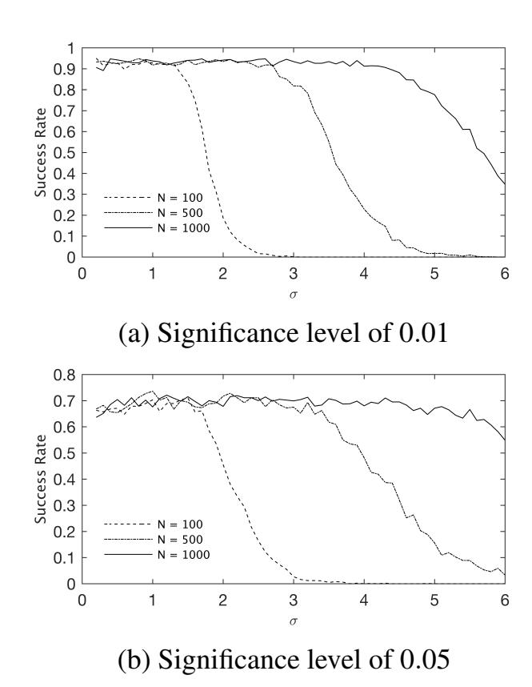

{0}------------------------------------------------

# An Analytic Attack Against ARX Addition Exploiting Standard Side-Channel Leakage

Yan Yan<sup>1</sup> , Elisabeth Oswald<sup>1</sup> and Srinivas Vivek<sup>2</sup> <sup>1</sup>*University of Klagenfurt, Klagenfurt, Austria* 2 *IIIT Bangalore, India* {*yan.yan, elisabeth.oswald*}*@aau.at, srinivas.vivek@iiitb.ac.in*

Keywords: ARX construction, Side-channel analysis, Hamming weight, Chosen plaintext attack

Abstract: In the last few years a new design paradigm, the so-called ARX (modular addition, rotation, exclusive-or)

ciphers, have gained popularity in part because of their non-linear operation's seemingly 'inherent resilience' against Differential Power Analysis (DPA) Attacks: the non-linear modular addition is not only known to be a poor target for DPA attacks, but also the computational complexity of DPA-style attacks grows exponentially with the operand size and thus DPA-style attacks quickly become practically infeasible. We however propose a novel DPA-style attack strategy that scales linearly with respect to the operand size in the chosen-message

attack setting.

# 1 Introduction

Ciphers that base their round function on the simple combination of modular addition, rotation, and exclusive-or, (short ARX) have gained recent popularity for their lightweight implementations that are suitable for resource constrained devices. Some recent examples include Chacha20 (Nir and Langley, 2015) and Salsa20 (Bernstein, 2008) family stream ciphers, SHA-3 finalists BLAKE (Aumasson et al., 2008) and SKEIN (Ferguson et al., 2010), as well as other block ciphers such as SPECK (Beaulieu et al., 2015), SPARX (Dinu et al., 2016) and the related SPARKLE (Beierle et al., 2008) which made into the second round of the NIST lightweight cipher competition. Another second round candidate of the NIST lightweight competition Gimli (Bernstein et al., 2017) also proposed a variation, namely Gimli-SPARX, that has adopted the ARX paradigm.

The fact that the round function has an efficient and simple expression via functions that are typically available as instructions on small embedded devices enables excellent performance with respect to code size, execution time and energy consumption. Any implementation on an embedded device however also needs to be able to withstand the threat of Side-Channel (timing, power, EM, cache) Attacks (SCA, for short). The absence of key dependent loops, or indeed tables, implies resistance to timing and cache attacks. Power (and synonymously EM) attacks however are different: they offer a potentially 'high resolution' for the adversary. In principle, under suitably strong assumptions, adversaries can not only observe leaks for all instructions that are executed on a processor, but indeed attribute leakage points (more or less accurately) to instructions (Mangard et al., 2007).

Achieving security in this scenario has proven to be extremely challenging, and countermeasures such as masking (secret sharing) are well understood but costly (Schneider et al., 2015). In the case of ARX constructions one has to cope with the fact that there are Boolean operations (requiring Boolean masking or secret sharing) and arithmetic operations (requiring arithmetic masking or secret sharing). Thus securing ARX ciphers against power (and EM) attacks is potentially very costly; unless, it could be argued that they are inherently 'secure enough' against such attacks that "non-provable" countermeasures (such as hiding via randomisation of instructions, etc.) could possibly suffice. The most recent work on securing ARX implementations is (Jungk et al., 2018).

It is well known that completely linear targets such as the rotation and the exclusive-or operation are difficult to attack with differential (power or EM) analysis (DPA for short): attacks on such targets require many more traces than attacks on highly non-linear target functions, and even with a very large number of leakage traces there remains some keys that cannot be distinguished from each other (Prouff, 2005).

{1}------------------------------------------------

# 1.1 Background and Related Work on SCA on ARX Ciphers

The idea of combining addition modulo 2*<sup>n</sup>* , exclusiveor, and rotation as a round function, has been suggested as early as 1987 in the block cipher FEAL (Shimizu and Miyaguchi, 1988). Since NIST kickstarted its lightweight cryptography project in 2015, the interest in ARX constructions has received renewed interest. The ciphers SIMON and SPECK (Beaulieu et al., 2015), which were submitted to the first of the two workshops hosted by NIST, gained a considerable amount of interest from within the crypto community. In 2016 the SPARX family of ciphers was introduced (Dinu et al., 2016).

The appeal of the ARX construction is primarily in the fact that when choosing *n* equal to the word size of a processor, software implementations gain considerable speedups. Furthermore, because the non-linear component is given by the addition modulo 2*<sup>n</sup>* , it does not need to be encoded as a table lookup which significantly reduces the memory usage. The absence of lookup tables is also perceived as a distinctive advantage when the threats of various side channel attacks are considered (Biryukov et al., 2016; Biryukov and Perrin, 2017; Dinu et al., 2016). The absence of cache also implies that the instructions are always performed in a constant time and thus there is unlikely any key dependent leakage exploitable in the execution time (Dinu et al., 2016). Being free from the tables also significantly reduces the number of memory accesses as these instructions have shown to be the most exploitable targets in power analysis attacks (Biryukov et al., 2016).

However, it has been shown in (Yan and Oswald, 2019) that na¨ıve implementations of ARX ciphers may still leave vulnerabilities easily exploitable. In (Yan and Oswald, 2019), the authors simply attempted straightforward correlation power analysis attacks on the reference implementation of the SPARX cipher (Dinu et al., 2016) on some real platforms, and found that the key was efficiently recovered exploiting the leakage amplified by consecutive XOR and shifting instructions.

Nevertheless, for the modular addition in ARX-Boxes, the authors of (Yan and Oswald, 2019) reported unsuccessful attacks targeting the addition instruction which coincide with the previous results reported by (Biryukov et al., 2016) and that align with (Yan and Oswald, 2019; Zohner et al., 2012; Dinu et al., 2016): their argument is that the weak nonlinearity of modular addition leaves a relatively lower margin in distinguishing the keys comparing to a typical S-Box instruction.

To date, the Butterfly attack (Zohner et al., 2012) remains the most effective result in attacking modular addition. This attack demonstrated that it is possible to improve on straightforward DPA-style attacks when targeting modular additions by testing pairs of correlations induced by the symmetrical structure of modular additions. However Butterfly attacks are constrained by the fact that knowledge of one adder is required which does not hold for some ARX ciphers such as SPECK (Beaulieu et al., 2015) and SPARX (Dinu et al., 2016).

# 1.2 Our Contribution

In this paper we propose a novel attack strategy against the modular addition in ARX-Boxes. Our method, in comparison to previous work, requires no knowledge of the adders and thus is more generally applicable on targets where a Butterfly attack is not an option, such as SPECK (Beaulieu et al., 2015) and SPARX (Dinu et al., 2016).

Our method requires to obtain the leakage from the result of the modular addition only, which we need to be a bit-linear function (e.g. Hamming Weight, or weighted Hamming weight with positive weights of similar magnitude). We only need to be able to observe if the leakage increases, decreases, or remains the same upon a single-bit flip in the plaintext. Based on this information, we show how to reconstruct the adder output. With the adder output, and based on a further related plaintext, we then show how to reconstruct the secret key.

We consider our novel methodology of independent theoretical interest as we leverage minimal side channel leakage to perform a cryptanalytic-style analysis for ARX constructions.

## 1.3 Organisation of the Paper

In Section 2 we formalise our attack on ARX-Boxes as the (Noisy) Hidden Adder Problem, (N)HAP, and propose its sub-problem the (Noisy) Hidden Sum Problem, (N)HSP. In Section 3 we explain how HSP can be solved, then use the solution to solve HAP in Section 4 thus providing a full key recovery attack given ideal leakage. Section 5 completes the attack by adapting the attack to noisy leakage. We present simulation results in Section 5.1 and also discuss practical considerations.

## 1.4 Notation

In this work we frequently use both the integer and the binary representation of operands. The notation [*x*] 

{2}------------------------------------------------

indicates the binary representation of a non-negative integer x:

$$x = [x]_{n-1}[x]_{n-2}...[x]_1[x]_0 = \sum_{i=0}^{n-1} 2^i[x]_i,$$

hence  $[x]_i$  denotes the *i*-th bit of [x]. The notation [x][y] implies the concatenation of two bit strings [x] and [y]. The notation  $[x]^k$  denotes k times repetition of [x]. Specifically,  $[*]^k$  denotes an arbitrary k-bit string.

In this paper we assume that all integers are drawn from  $\mathbb{Z}_{2^n}$ , where  $n \in \mathbb{N}^+$ . The  $\boxplus$  denotes modular addition over  $\mathbb{Z}_{2^n}$ . HW(x) denotes the Hamming weight of [x]. For a n-bit integer x,  $\widetilde{x}$  refers to the (one's) complement of x, where all the bits are flipped. That is,

$$\widetilde{x} = x \oplus (2^n - 1).$$

We often require to be able to change the value of a single bit to its complement (i.e. we flip a bit, but leave all other bits unchanged). For this purpose we define the flip function  $\mathcal{F}_i(x)$  which returns x with the i-th bit flipped:

$$\mathcal{F}_i(x) = x \oplus 2^i$$
.

# 2 Problem Description

In this work we explore alternative SCA strategies when targeting the modular addition in a more general setting as described by the generalised ARX-Box in (Yan and Oswald, 2019):

$$s(x,y) := (x \oplus \alpha) \boxplus (y \oplus \beta),$$
 (1)

where (x,y) are some known input values and  $(\alpha,\beta)$  are the unknown sub-keys. All  $x,y,\alpha,\beta$  and s(x,y) are n-bit variables. We further assume an adversary who is able to choose input pairs (x,y), and observe the (noisy) leakage of s(x,y). For simplicity we assume that the (noisy) leakage is the Hamming weight with Gaussian noise, which is the most commonly considered leakage model in side-channel literature:

 $\mathcal{L}(x,y) = HW(s(x,y)) + e = HW((x \oplus \alpha) \boxplus (y \oplus \beta)) + e$ , where the Gaussian noise  $e \sim \mathcal{N}(0, \sigma^2)$ . We note that our statements also hold for a more general bit-linear model assuming that all coefficients have the same sign.

The goal of the adversary is to recover the subkeys  $(\alpha, \beta)$  given a set of chosen inputs (x, y) and their associated leakage  $\mathcal{L}(x, y)$ . Later in Section 5 we explain that how the chosen inputs requirement can be relaxed in different settings.

We model our attack that exploits ideal and noisy leakage as the Hidden Adder Problem (HAP) and Noisy Hidden Adder Problem (NHAP), respectively, as formalised in Definition 1 and Definition 2.

## 2.1 Outline of Our Attack

In a nutshell, there are two steps in our attack strategy. The first step is to recover the sum s(x,y) from the leakage. From there, we then recover the subkeys  $(\alpha, \beta)$  by solving equations involving x, y and s(x, y). We begin by explaining how the attack works in an ideal world where the adversary observes ideal leakage without the Gaussian noise e, and then we show how such solution can be adapted to realistic noisy leakage by using statistical methods. To this end, we define the following problems:

**Definition 1** (Hidden Adder Problem (HAP)). Let  $(\alpha, \beta)$  be randomly chosen from  $\mathbb{Z}_{2^n} \times \mathbb{Z}_{2^n}$ . The adversary chooses as many pairs  $x, y \in \mathbb{Z}_{2^n}$  and obtains leakage of the form  $HW(s(x,y)) = HW((x \oplus \alpha) \boxplus (y \oplus \beta))$  for each pair. The adversary must then recover  $(\alpha, \beta)$ .

**Definition 2** (Noisy Hidden Adder Problem (NHAP)). Let  $(\alpha, \beta)$  be randomly chosen from  $\mathbb{Z}_{2^n} \times \mathbb{Z}_{2^n}$ . The adversary chooses as many pairs  $x, y \in \mathbb{Z}_{2^n}$  and obtains leakage of the form  $\mathcal{L}_{\alpha,\beta}(x,y) = HW(s(x,y)) + e = HW((x \oplus \alpha) \boxplus (y \oplus \beta)) + e$  where  $e \sim \mathcal{N}(0,\sigma^2)$ . The adversary must then recover  $(\alpha,\beta)$ .

Note that HAP (and so is NHAP) reflects the ultimate goal of the adversary to reveal the subkeys  $(\alpha,\beta)$ . To explain our attack, we further define two sub-problems of HAP and NHAP called Hidden Sum Problem (HSP) and Noisy Hidden Sum Problem (NHSP):

**Definition 3** (Hidden Sum Problem (HSP)). Let  $(\alpha, \beta)$  be randomly chosen from  $\mathbb{Z}_{2^n} \times \mathbb{Z}_{2^n}$ . The adversary chooses as many pairs  $x, y \in \mathbb{Z}_{2^n}$  and obtains leakage of the form  $HW(s(x,y)) = HW((x \oplus \alpha) \boxplus (y \oplus \beta))$  for each pair. The adversary must then recover s(x,y).

**Definition 4** (Noisy Hidden Sum Problem (NHSP)). Let  $(\alpha, \beta)$  be randomly chosen from  $\mathbb{Z}_{2^n} \times \mathbb{Z}_{2^n}$ . The adversary chooses pairs  $x, y \in \mathbb{Z}_{2^n}$  and obtains leakage of the form  $\mathcal{L}_{\alpha,\beta}(x,y) = HW(s(x,y)) + e = HW((x \oplus \alpha) \boxplus (y \oplus \beta)) + e$  where  $e \sim \mathcal{N}(0,\sigma^2)$ . The adversary must then recover s(x,y).

The adversaries in the problems HSP and NHSP are given exactly the same form of leakage as the adder problems (HAP and NHAP). Only their goals are changed to recover the sum s(x,y) in the sum problems rather than the sub-keys in the adder problems.

In this paper, we always consider the general case where  $n \ge 2$ . For the special case where n = 1, we have

$$HW(s(x,y)) = s(x,y) = x \oplus \alpha \oplus y \oplus \beta$$

{3}------------------------------------------------

which immediately gives  $\alpha \oplus \beta$  given HW(s(x,y)), x and y. It should also be noted that as shown in (Yan and Oswald, 2019), any side-channel attack targeting the modular addition of the generalised ARX-Box will yield at least two pairs of the subkeys. Consequently, as we will see later in Section 4, all the above problems have at least two pairs of solutions in  $(\alpha, \beta)$ .

# 3 Solving the Hidden Sum Problem

Our solution to the HSP recovers s(x,y) one bit at a time. Starting from the MSB down to the LSB, we flip each bit of x and observe the resulting differences in the Hamming weight leakage. In the end we recover all bits of the hidden sum s(x,y). We abbreviate s := s(x,y) and  $s'_i := s(\mathcal{F}_i(x),y)$ , which are the sum, and the sum with  $[x]_i$  flipped, respectively.

Since flipping  $[x]_i$  also flips the bit  $[x \oplus \alpha]_i$ , this effectively changes the sum by  $\pm 2^i$  due to commutativity of addition. In the following sections we explain how to exploit this property of s(x,y) to solve HSP.

Define  $\Delta s_y([x]_i)$  to be the difference in s(x,y) induced by flipping  $[x]_i$ . We have:

$$\Delta s_y([x]_i) \equiv s(\mathcal{F}_i(x), y) - s(x, y) \equiv \pm 2^i \pmod{2^n}.$$
(2)

Equivalently,

$$s(\mathcal{F}_i(x), y) = s(x, y) \pm 2^i. \tag{3}$$

## 3.1 Recovering the MSB

In this section we give a solution that recovers the MSB of *s*, which is the base case for our algorithm.

Note that the MSB of s can be reduced to XORing the carry bit c from the sum of the lower-order bits, and the MSBs of  $x \oplus \alpha$  and  $y \oplus \beta$ . Because flipping  $[x]_{n-1}$  flips  $[x \oplus \alpha]_{n-1}$  and thus  $[s]_{n-1}$ , the adversary can determine that  $[s]_{n-1} = 0$  if the Hamming weight increases (from 0 to 1) and vice versa.

**Lemma 1.** Given x, y, Hamming weights of the sums s(x,y) and  $s(\mathcal{F}_{n-1}(x),y)$ , the MSB of the sum s is:

$$[s]_{n-1} = \begin{cases} 0 & \text{if} & HW(s'_{n-1}) - HW(s) > 0, \\ 1 & \text{if} & HW(s'_{n-1}) - HW(s) < 0. \end{cases}$$

*Proof.* We can write HW(s) as:

$$HW(s) = HW([s]_{n-1}) + HW([s]_{n-2}[s]_{n-3}...[s]_1[s]_0).$$
(4)

Also,

$$s'_{n-1} \equiv \Delta s_y([x]_{n-1}) + s$$

$$\equiv \Delta s_y([x]_{n-1}) + [s]_{n-1}2^{n-1} + \sum_{i=0}^{n-2} [s]_i \cdot 2^i \pmod{2^n}.$$

Note that  $[s]_{n-1} \in \{0,1\}$ ,  $\Delta s_y([x]_{n-1}) \in \{+2^{n-1}, -2^{n-1}\}$  according to Equation (2), and  $-2^{n-1} \mod 2^n = +2^{n-1}$ . Equation (5) can, therefore, be categorised into four cases:

1. If  $[s]_{n-1} = 0$ ,  $\Delta s_y([x]_{n-1}) = +2^{n-1}$ , then

$$s'_{n-1} = (+2^{n-1} + 0 \cdot 2^{n-1} + \sum_{i=0}^{n-2} [s]_i 2^i) \pmod{2^n}$$
  
=  $[1][s]_{n-2}...[s]_1[s]_0.$ 

2. If  $[s]_{n-1} = 0$ ,  $\Delta s_y([x]_{n-1}) = -2^{n-1}$ , then

$$s'_{n-1} = (-2^{n-1} + 0 \cdot 2^{n-1} + \sum_{i=0}^{n-2} [s]_i 2^i) \pmod{2^n}$$
$$= [1][s]_{n-2}...[s]_1[s]_0.$$

3. If  $[s]_{n-1} = 1$ ,  $\Delta s_y([x]_{n-1}) = +2^{n-1}$ , then

$$s'_{n-1} = (+2^{n-1} + 1 \cdot 2^{n-1} + \sum_{i=0}^{n-2} [s]_i 2^i) \pmod{2^n}$$
$$= [0][s]_{n-2}...[s]_1[s]_0.$$

4. If  $[s]_{n-1} = 1$ ,  $\Delta s_{\nu}([x]_{n-1}) = -2^{n-1}$ , then

$$s'_{n-1} = (-2^{n-1} + 1 \cdot 2^{n-1} + \sum_{i=0}^{n-2} [s]_i 2^i) \pmod{2^n}$$
$$= [0][s]_{n-2}...[s]_1[s]_0.$$

Observe that in Cases 1 and 2, where  $[s]_{n-1} = 0$ , we have

$$s'_{n-1} = [1][s]_{n-2}...[s]_1[s]_0.$$

Similarly, in Cases 3 and 4 where  $[s]_{n-1} = 1$ , we have

$$s'_{n-1} = [0][s]_{n-2}...[s]_1[s]_0.$$

Therefore, we obtain

$$HW(s'_{n-1}) =$$

(5)

$$\begin{cases}
HW(1) + HW([s]_{n-2}[s]_{n-3}...[s]_1[s]_0) & \text{if } [s]_{n-1} = 0, \\
HW(0) + HW([s]_{n-2}[s]_{n-3}...[s]_1[s]_0) & \text{if } [s]_{n-1} = 1.
\end{cases}$$
(6)

Denote by  $\Delta HW_{n-1}$  the (signed) difference in Hamming weight between s to  $s'_{n-1}$ . Subtracting Equation (6) by Equation (4), we have:

$$\Delta HW_{n-1} = HW(s'_{n-1}) - HW(s)$$

$$= \begin{cases} HW(1) - HW(0) = +1 & \text{if } [s]_{n-1} = 0, \\ HW(0) - HW(1) = -1 & \text{if } [s]_{n-1} = 1. \end{cases}$$
(7)

Observing Equation (7), we can see that the sign of  $\Delta HW_{n-1}$  solely depends on  $[s]_{n-1}$ . Since both  $HW(s'_{n-1})$  and HW(s) can be obtained as (ideal) leakage, we can thus recover  $[s]_{n-1}$  by computing  $\Delta HW_{n-1}$  and then applying Equation (7).

Algorithm 1 provides the pseudo code for recovering the MSB.

{4}------------------------------------------------

# Algorithm 1 Compute MSB of sfunction $[s]_{n-1} = GetMsb(x,y)$ $\Delta HW = HW(s'_{n-1}) - HW(s);$ \nif $\Delta HW > 0$ then return 0;\nelse return 1;\nend if\nend function

## 3.2 Recovering the *m*-th bit

In Section 3.1 we explained how the MSB of s = s(x,y) can be recovered by the noiseless Hamming weight leakage. We now show how to recover the remaining bits.

**Lemma 2.** Suppose we flip the bit  $[x]_{n-m}$ . If:

- $HW(s'_{n-m}) > HW(s)$ , then  $[s]_{n-m} = 0$ ,
- $HW(s'_{n-m}) = HW(s)$ , then  $[s]_{n-m} = [\tilde{s}]_{n-(m-1)}$ ,
- $HW(s'_{n-m}) < HW(s)$ , then  $[s]_{n-m} = 1$ ,

for  $2 \le m \le n$ .

*Proof.* We assume that the higher-order m-1 bits of s:

$$s_{known} = [s]_{n-1}[s]_{n-2}...[s]_{n-(m-1)}$$

has been determined. The goal is then to recover the next bit  $[s]_{n-m}$ . According to Equation (3), when  $[x]_{n-m}$  is flipped, we have the flipped sum  $s'_{n-m}$ :

$$s'_{n-m} = s + \Delta s_y([x]_{n-m})$$
 (8)

where  $\Delta s_y([x]_{n-m}) = \pm 2^{n-m}$ .

In the RHS of Equation (8), bits "lower" than  $[s]_{n-m}$  is unchanged after the addition operation and thus does not affect the Hamming weight. On the other hand, the addition to (or subtraction from)  $[s]_{n-m}$  may potentially generate a carry bit that propagates through bits "higher" than  $[s]_{n-m}$  and result into a change of Hamming weight.

Let  $\Delta HW_{n-m}$  be the (signed) change of Hamming weight induced by flipping  $[x]_{n-m}$ :

$$\Delta HW_{n-m} = HW(s'_{n-m}) - HW(s). \tag{9}$$

We can categorise  $\Delta HW_{n-m}$  by:

- Whether there exists or not a carry bit (either positive or negative),
- If there exists a carry bit, then
  - Whether the carry triggers an overflow (and hence modular reduction).

We next analyse each of the above cases.

| Conditions  |                           |           |                         | $\Delta HW_{n-m}$                    |
|-------------|---------------------------|-----------|-------------------------|--------------------------------------|
| $[s]_{n-m}$ | $\Delta s_{y}([x]_{n-m})$ | Overflow? | Sknown                  | $\Delta \mathbf{H} \mathbf{W}_{n-m}$ |
| [0]         | $+2^{n-m}$                | No        | $[*]^{m-1}$             | +1                                   |
|             | $-2^{n-m}$                | Yes       | $[0]^{m-1}$             | +m                                   |
|             |                           | No        | $[*]^{m-(k+2)}[1][0]^k$ | +k                                   |
| [1]         | $+2^{n-m}$                | Yes       | $[1]^{m-1}$             | -m                                   |
|             |                           | No        | $[*]^{m-(k+2)}[0][1]^k$ | -k                                   |
|             | $-2^{n-m}$                | No        | $[*]^{m-1}$             | -1                                   |

Table 1:  $\Delta HW$  under different conditions, where  $2 \le m \le n$ ,  $0 \le k \le m$ .

**No carry bit.** In the following conditions there is no carry bit:

- 1. If  $[s]_{n-m} = 0$  and  $\Delta s_y([x]_{n-m}) = +2^{n-m}$ , then  $\Delta HW_{n-m} = +1$ .
- 2. If  $[s]_{n-m} = 1$  and  $\Delta s_y([x]_{n-m}) = -2^{n-m}$ , then  $\Delta HW_{n-m} = -1$ .

Otherwise there must exist a carry bit.

**Carry bit.** The existence of a carry bit implies either one of the following conditions:

- Case  $C_1: [s]_{n-m} = 1$  and  $\Delta s_y([x]_{n-m}) = +2^{n-m}$ .
- Case  $C_2: [s]_{n-m} = 0$  and  $\Delta s_y([x]_{n-m}) = -2^{n-m}$ .

is satisfied. This can be further categorised into:

**Overflow.** In this case, all the bits of  $s_{known}$  are flipped after the addition:

- 1. In the Case  $C_1$ , it is required that  $s_{known} = [1]^{m-1}$ . The propagation results in  $s_{known}$  flipped to  $[0]^{m-1}$ , with  $\Delta HW_{n-m} = -m$ .
- 2. In the Case  $C_2$ , it is required that  $s_{known} = [0]^{m-1}$ . The propagation results in  $s_{known}$  flipped to  $[1]^{m-1}$ , with  $\Delta HW_{n-m} = +m$ .

**No overflow.** In this case, only a part of  $s_{known}$  is flipped after adding  $\Delta s_y([x]_{n-m})$ . Denote by  $k \in [0, m-2]$  the number of bits flipped in  $s_{known}$  before the carry propagation terminates, then

1. In the Case  $C_1$ , the carry propagation terminates at the least significant [0] of  $s_{known}$  which is required to have the form

$$s_{known} = [s]_{n-1}...[s]_{n-(m-(k+2))}[0][1]^k.$$

After the addition with  $\Delta s_y([x]_{n-m}) = +2^{n-m}$ ,  $s_{known}$  changes to

$$[s]_{n-1}...[s]_{n-(m-(k+2))}[1][0]^k$$
.

Therefore  $\Delta HW_{n-m} = -k$ .

2. The Case  $C_2$  is just the opposite of  $C_1$  with  $\Delta HW_{n-m} = +k$ .

Table 1 summarises the above scenarios. It is shown that positive  $\Delta HW_{n-m}$  implies  $[s]_{n-m} = [0]$  and negative  $\Delta HW_{n-m}$  implies  $[s]_{n-m} = [1]$  as both  $m,k \geq 0$ . The case  $\Delta HW_{n-m} = 0$  is only possible when k=0, which indicates a carry bit exists without overflow. In such a case  $s_{known}$  is required to be either:

{5}------------------------------------------------

# Algorithm 2 Compute *m*-th significant bit $[s]_{n-m}$ (2 $\leq$ $m \leq n$ )

```
[s]_{n-m}
function
                                                          =
GetNextBit(x, y, m, [s]_{n-1}[s]_{n-2}...[s]_{n-(m-1)})
    \Delta HW = HW(s'_{n-1}) - HW(s);
    if \Delta HW > 0 then
         return 0;
    else if \Delta HW < 0 then
         return 1;
    else
                                           \triangleright \Delta HW == 0
         if |s|_{n-m+1} == 0 then
             return 1;
         else
             return 0;
         end if
    end if
end function
```

- $s_{known} = [*]^{m-2}[1]$ , for  $[s]_{n-m} = 0$ , or
- $s_{known} = [*]^{m-2}[0]$ , for  $[s]_{n-m} = 1$ .

In either case,  $[s]_{n-m}$  can be determined by the LSB of  $s_{known}$ .

To summarise, given  $\Delta HW_{n-m}$ , we can uniquely determine  $[s]_{n-m}$ .

Algorithm 2 provides the pseudo code that computes  $s_{n-m}$  for  $2 \le m \le n$ .

## 3.3 Complete Solution to HSP

Combining the methods described in Section 3.1 and Section 3.2, we now have a full solution to the HSP, as summarised in Algorithm 3. Notice that the same HW(s) can indeed be reused in Algorithm 1 and Algorithm 2; hence Algorithm 3 only needs n+1 traces to recover s(x,y).

## Algorithm 3 Compute s

```
function s = GetSum(x, y)

\Rightarrow We initialise the sum to its MSB

s = GetMsb(x, y);

\Rightarrow Recover one bit at a time from 2nd MSB to LSB

for (m = 2; m \le n; m + +) do

s = [s][GetNextBit(x, y, m, s)];
\nend for return s;\nend function
```

# 4 Solving HAP

In this section we show how HAP (cf. Definition 1) can be solved using a solution to HSP (cf. Section 3).

**Lemma 3.** Let  $\Delta := ((s(x,y) - s(\widetilde{x},y) - 1) \pmod{2^n}) \gg 1$  (here  $\gg$  refers to the right shift operator).

The solutions to HAP are:

$$\begin{cases} \alpha = \Delta \oplus x \\ \beta = y \oplus ((s(x,y) - \Delta) \pmod{2^n}) \end{cases}$$
or
$$\begin{cases} \alpha = (\Delta \boxplus 2^{n-1}) \oplus x \\ \beta = y \oplus ((s(x,y) - (\Delta + 2^{n-1})) \pmod{2^n}), \end{cases}$$

for arbitrary  $x, y \in \mathbb{Z}_{2^n}$ .

*Proof.* Observe that for any  $x \in \mathbb{Z}_{2^n}$ , we have

$$\widetilde{x} \oplus \alpha = \widetilde{x \oplus \alpha} = 2^n - 1 - (x \oplus \alpha).$$

Hence

$$s(x,y) - s(\widetilde{x},y)$$

$$= ((x \oplus \alpha) + (y \oplus \beta)) - ((\widetilde{x} \oplus \alpha) + (y \oplus \beta)) \pmod{2^n},$$

$$= (x \oplus \alpha) - (2^n - 1 - (x \oplus \alpha)) \pmod{2^n},$$

$$= 2(x \oplus \alpha) + 1 \pmod{2^n}.$$

Note that we have already computed the values s(x,y) and  $s(\widetilde{x},y)$  in Section 3. Since 2 is not co-prime to the modulo  $2^n$ , there are exactly two values of  $x \oplus \alpha$  that satisfy the above equation:  $\Delta$  and  $\Delta \boxplus 2^{n-1}$ . Hence the lemma follows.

Algorithm 4 provides the pseudo code for solving HAP. The algorithm has trace complexity O(n) - requiring 2n+2 calls to the (ideal) leakage function.

## **Algorithm 4** Compute $(\alpha, \beta)$

```
function (\alpha, \beta) = GetAlphaBeta(void)

Pick arbitrary (x, y);

\triangleright Compute s(x, y) and s(\widetilde{x}, y) by Algorithm 3

S0 = GetSum(x, y);

S1 = GetSum(\widetilde{x}, y);

\triangleright Recover (\alpha, \beta) using Lemma 3

a1 = ((S0 - S1 - 1) \pmod{2^n}) >> 1;

a2 = a1 \oplus 2^{n-1};

b1 = y \oplus ((S0 - a1) \mod 2^n);

b2 = y \oplus ((S0 - a2) \mod 2^n);

return \{(a1, b1), (a2, b2)\};

end function
```

{6}------------------------------------------------

#### **Algorithm 5** Determine sign of $\Delta HW$

```
function \Delta HW = CompareHW(S_1, S_2)
     (t,p) = test(S_1,S_2)
    if p/2 \ge Significance Level then

\Delta HW = 0
          return 0
    else
          if t > 0 then
                                    \triangleright +1 for positive \triangle HW.
               return +1
          else
                                  \triangleright -1 for negative \triangle HW.
               return - 1
          end if
    end if
end function
```

# 5 Converting to Noisy Leakage

In a real world attack setting an adversary is unlikely to have noise free leakages. We thus now consider how to translate the developed attack strategy into a more realistic setting.

In principle, the reduction explained in Section 4 also holds for NHAP to NHSP, as long as the adversary is able to recover s(x,y) given the noisy leakage in NHSP. Further examining the HSP solution in Section 3, we see it is indeed sufficient to solve HSP given only the signs of the difference  $\Delta HW_i = HW(s_i') - HW(s), i \in [0, n-1]$ . In the case of noisy leakages we can reveal this difference by sampling the leakage function (i.e. the device) multiple times on the same input. We thus get two sets of leakages:

$$S_1 = \{HW(s_i') + e\},\$$
  
 $S_2 = \{HW(s) + e\}.$ 

Clearly by subtracting the averages of these sets, we can recover  $\Delta HW_i$  also in the noisy case. Moreover because we are only interested in the sign of  $\Delta HW_i$ , we can hope that in practice we don't require 'large' sets. To add a bit more rigour, we opted to implement a standard two-tailed t-test in our experiments. A two-tailed test can tell us if

- $HW(s'_i) = HW(s)$ , •  $HW(s'_i) > HW(s)$ , or
- $HW(s_i') < HW(s)$ .

Algorithm 5 summarises the pseudo code that determines the sign of  $\Delta HW$ . It first conducts a two-tailed test:

$$H_0: \overline{S_1} = \overline{S_2}$$

$$H_1: \overline{S_1} \neq \overline{S_2}$$

using a set significance level, and interprets the result in terms of the sign of  $\Delta HW_i$ .

Alternative to Chosen Input Requirement. Due to the symmetric structure of Equation (1), Lemma 2 also applies when the i-th bit of y is flipped. It should also be noted that flipping the i-th bit of  $\alpha$  is effectively equivalent of flipping the i-th bit of x:

$$x \oplus \mathcal{F}_i(\alpha) = \mathcal{F}_i(x) \oplus \alpha = \mathcal{F}_i(x \oplus \alpha)$$

and vice versa for y and  $\beta$ . Therefore our attack can also be achieved in a fault attack set up where the plaintexts are known to the adversary and for each bit the adversary can induce an i-th bit flip of either x, y,  $\alpha$  or  $\beta$ .

**Checking the recovered key-pair.** In many attacks utilising side channel information another practically relevant question is that of which part of the side channel trace to use (often not just a single value is available but a vector of leakages). Typical side channel attacks proceed via applying the analysis to all leakage points independently (this lends itself to an efficiently parallelisable algorithm). This technique applies also to our attack: each leakage point eventually gives one key pair. We can test each key pair via a pair of known plaintext and ciphertext. In case of a plaintext only attack, another test would be possible: if we set  $x = \alpha$  and  $y = \beta$  then both adder inputs are equal to 0 which can be detected by a collision analysis (Schramm et al., 2004; Bogdanov, 2007; Moradi et al., 2010).

## 5.1 Experiments

Attack simulations are a valuable tool because they enable us to produce results quickly for different sets of parameter choices. In the absence of detailed characterisations of devices and their actual power models, one cannot fall back on established statistical techniques such as a power-based sample size analysis to derive how many leakage traces are necessary in practice to conduct successful attacks. Thus simulations are the established 'workaround' when examining new attack techniques. The attack is mainly affected by three parameters in practice. These are the noise distribution (characterised by  $\sigma$ ), the number of repeat queries to the leakage function N, and the significance level of the two-tailed test. It is well understood that these three quantities jointly determine how well a test performs, and thus in turn, how often our attack succeeds.

We simulated the attack with 16-bit word size (n = 16) which has been chosen in certain ARX ciphers such as SPARX. Algorithm 5 is implemented using a t-test<sup>1</sup>.  $S_1$  and  $S_2$  are chosen to have the same sample size for simplicity. We simulated the attack

<sup>&</sup>lt;sup>1</sup>We follow the assumption of Gaussian noise, which

{7}------------------------------------------------



Figure 1: Simulation results for the attack. The left figure shows the success rate as a function of the number of leakage traces (per query) when choosing a significance of 0.01. The right figure is identical but for a significance of 0.05.

using different configurations where σ ∈ [0.1,6] and *N* ∈ [100,1000]. Recall that *N* is the number of samples used for each tests. A complete attack hence uses 2*N*(*n*+1) traces.

The result follows our expectations in general. For the same choice of significance level, the number of traces required to achieve the same success rate increases as the noise variance increases. This directly derives from the fact that the power of t-test weakens as the noise variance increases. With the same amount of traces and the same noise level, the significance level of 0.05 has a lower success rate cap than 0.01, which are around 0.74 and 0.96, respectively. But in return the former also showed a better noise tolerance than the latter. Since the significance level of 0.05 implies a higher rate of false positives in return for less traces required; thus the results follow an expected and natural trend.

## 6 Conclusions

We present a novel theoretical concept to attack the modular addition in the context of ARX ciphers using side channel leakage. Our assumptions are minimal w.r.t. the leakage because we only require to observe a change in the leakage magnitude relating to the adder output in an implementation. Our paper details the mathematical idea using idealised Hamming

motivates the choice of the t-test. Thus if noise follows a different distribution, then a different two-tailed test could be used.

weight leakage information at first, and then discusses an adaptation to cope with a noisy leakage function. To ascertain the impact of noise we provide a case study and via simulations we demonstrate the impact and trade-off between noise and significance level that would need to be considered in practice.

Purely from a practical perspective, there exists a more powerful attack for ARX ciphers on a specific class of devices as described in (Yan and Oswald, 2019). They observe a device specific effect called leakage amplification that makes the attack on the rotation very trace efficient on a specific type of device. We are not aware of any successful attack however, beyond the Butterfly attack that requires a known adder input, on the modular addition in the context of an ARX cipher.

Thus we believe our contribution is of general cryptanalytic interest because it opens up a new avenue for analysing modular additions utilising rather generic leakage from the adder output.

# 7 Acknowledgements

This work has been funded in parts by the European Union (EU) via the ERC project 725042 (acronym SEAL). The third author's work was funded by the INSPIRE Faculty Award (DST, Govt. of India).

# REFERENCES

Aumasson, J.-P., Henzen, L., Meier, W., and Phan, R. C.- W. (2008). SHA-3 proposal BLAKE. *Submission to NIST*.

Beaulieu, R., Shors, D., Smith, J., Treatman-Clark, S., Weeks, B., and Wingers, L. (2015). The SIMON and SPECK lightweight block ciphers. In *Proceedings of the 52nd Annual Design Automation Conference, San Francisco, CA, USA, June 7-11, 2015*, pages 175:1– 175:6. ACM.

Beierle, C., Biryukov, A., dos Santos, L. C., Großschadl, ¨ J., Perrin, L., Udovenko, A., Velichkov, V., and Wang, Q. (2008). SchwaemmandEsch: Lightweight Authenticated Encryption andHashing using the Sparkle Permutation Family. *Inf. Comput.*, 206(2-4):378–401.

Bernstein, D. J. (2008). The Salsa20 Family of Stream Ciphers. In Robshaw, M. J. B. and Billet, O., editors, *New Stream Cipher Designs - The eSTREAM Finalists*, volume 4986 of *Lecture Notes in Computer Science*, pages 84–97. Springer.

Bernstein, D. J., Kolbl, S., Lucks, S., Massolino, P. M. C., ¨ Mendel, F., Nawaz, K., Schneider, T., Schwabe, P., Standaert, F.-X., Todo, Y., and Viguier, B. (2017). Gimli : A cross-platform permutation. In Fischer, W. and Homma, N., editors, *Cryptographic Hardware*

{8}------------------------------------------------

- *and Embedded Systems CHES 2017*, pages 299– 320, Cham. Springer International Publishing.
- Biryukov, A., Dinu, D., and Großschadl, J. (2016). Cor- ¨ relation power analysis of lightweight block ciphers: From theory to practice. In Manulis, M., Sadeghi, A., and Schneider, S., editors, *Applied Cryptography and Network Security - 14th International Conference, ACNS 2016, Guildford, UK, June 19-22, 2016. Proceedings*, volume 9696 of *Lecture Notes in Computer Science*, pages 537–557. Springer.
- Biryukov, A. and Perrin, L. (2017). State of the art in lightweight symmetric cryptography. *IACR Cryptology ePrint Archive*, 2017:511.
- Bogdanov, A. (2007). Improved side-channel collision attacks on AES. In Adams, C. M., Miri, A., and Wiener, M. J., editors, *Selected Areas in Cryptography, 14th International Workshop, SAC 2007, Ottawa, Canada, August 16-17, 2007, Revised Selected Papers*, volume 4876 of *Lecture Notes in Computer Science*, pages 84–95. Springer.
- Dinu, D., Perrin, L., Udovenko, A., Velichkov, V., Großschadl, J., and Biryukov, A. (2016). Design ¨ strategies for ARX with provable bounds: SPARX and LAX. In Cheon, J. H. and Takagi, T., editors, *Advances in Cryptology - ASIACRYPT 2016 - 22nd International Conference on the Theory and Application of Cryptology and Information Security, Hanoi, Vietnam, December 4-8, 2016, Proceedings, Part I*, volume 10031 of *Lecture Notes in Computer Science*, pages 484–513.
- Ferguson, N., Lucks, S., Schneier, B., Whiting, D., Bellare, M., Kohno, T., Callas, J., and Walker, J. (2010). The Skein hash function family. *Submission to NIST (round 3)*, 7(7.5):3.
- Jungk, B., Petri, R., and Stottinger, M. (2018). Effi- ¨ cient side-channel protections of ARX ciphers. *IACR Transactions on Cryptographic Hardware and Embedded Systems*, 2018(3):627–653.
- Mangard, S., Oswald, E., and Popp, T. (2007). *Power analysis attacks - revealing the secrets of smart cards*. Springer.
- Moradi, A., Mischke, O., and Eisenbarth, T. (2010). Correlation-enhanced power analysis collision attack. In Mangard, S. and Standaert, F., editors, *Cryptographic Hardware and Embedded Systems, CHES 2010, 12th International Workshop, Santa Barbara, CA, USA, August 17-20, 2010. Proceedings*, volume 6225 of *Lecture Notes in Computer Science*, pages 125–139. Springer.
- Nir, Y. and Langley, A. (2015). ChaCha20 and Poly1305 for IETF Protocols. RFC 7539 (Informational).
- Prouff, E. (2005). DPA attacks and s-boxes. In *Fast Software Encryption: 12th International Workshop, FSE 2005, Paris, France, February 21-23, 2005, Revised Selected Papers*, pages 424–441.
- Schneider, T., Moradi, A., and Guneysu, T. (2015). Arith- ¨ metic addition over boolean masking - towards firstand second-order resistance in hardware. In *Applied Cryptography and Network Security - 13th International Conference, ACNS 2015, New York, NY, USA,*

- *June 2-5, 2015, Revised Selected Papers*, pages 559– 578.
- Schramm, K., Leander, G., Felke, P., and Paar, C. (2004). A collision-attack on AES: combining side channeland differential-attack. In Joye, M. and Quisquater, J., editors, *Cryptographic Hardware and Embedded Systems - CHES 2004: 6th International Workshop Cambridge, MA, USA, August 11-13, 2004. Proceedings*, volume 3156 of *Lecture Notes in Computer Science*, pages 163–175. Springer.
- Shimizu, A. and Miyaguchi, S. (1988). FEAL fast data encipherment algorithm. *Systems and Computers in Japan*, 19(7):20–34.
- Yan, Y. and Oswald, E. (2019). Examining the practical side channel resilience of ARX-boxes. In Palumbo, F., Becchi, M., Schulz, M., and Sato, K., editors, *Proceedings of the 16th ACM International Conference on Computing Frontiers, CF 2019, Alghero, Italy, April 30 - May 2, 2019.*, pages 373–379. ACM.
- Zohner, M., Kasper, M., and Stottinger, M. (2012). ¨ Butterfly-attack on Skein's modular addition. In Schindler, W. and Huss, S. A., editors, *Constructive Side-Channel Analysis and Secure Design - Third International Workshop, COSADE 2012, Darmstadt, Germany, May 3-4, 2012. Proceedings*, volume 7275 of *Lecture Notes in Computer Science*, pages 215– 230. Springer.