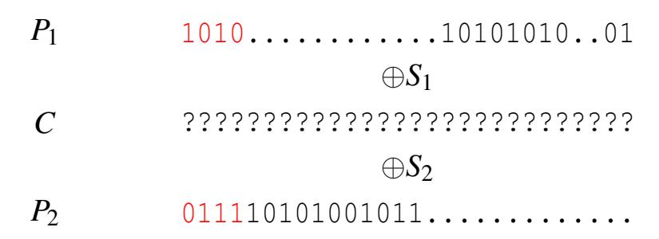
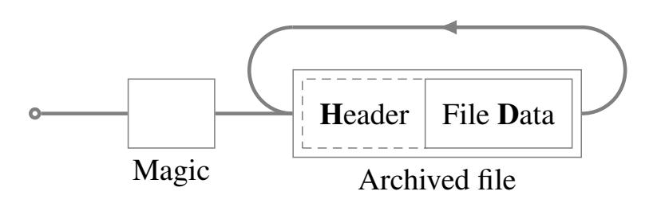
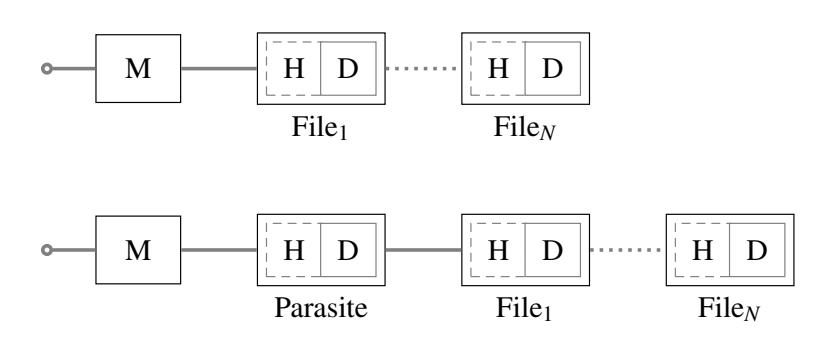
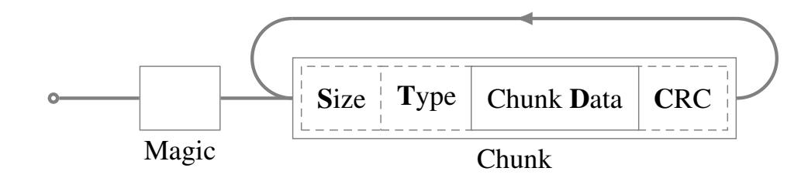
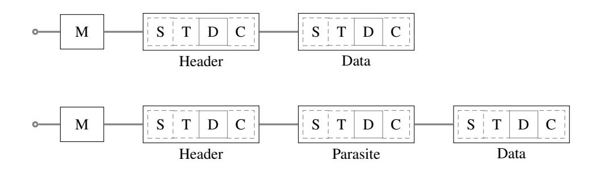
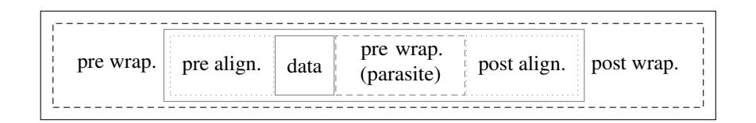
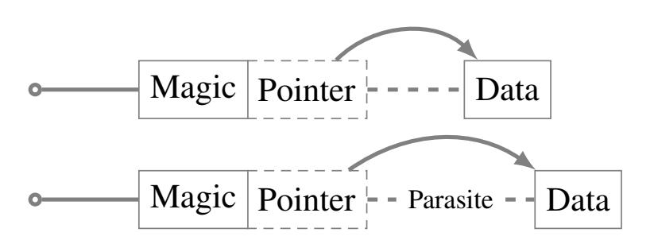
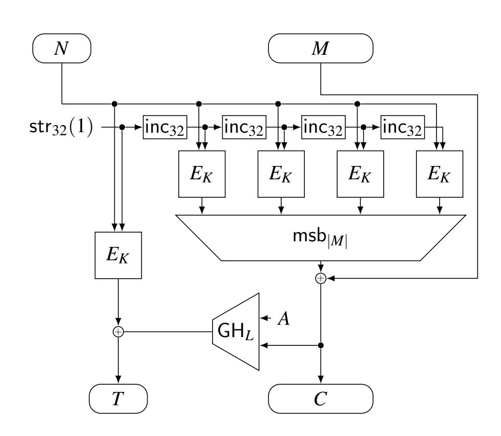
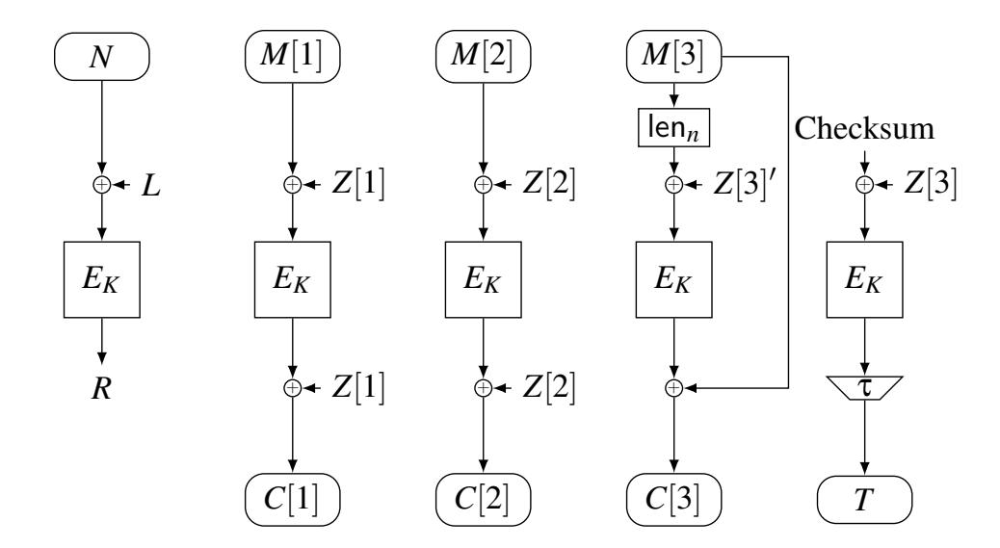

{0}------------------------------------------------


# <span id="page-0-0"></span>How to Abuse and Fix Authenticated Encryption Without Key Commitment

Ange Albertini<sup>1</sup>, Thai Duong<sup>1</sup>, Shay Gueron<sup>2,3</sup>, Stefan Kölbl<sup>1</sup>, Atul Luykx<sup>1</sup>, and Sophie Schmieg<sup>1</sup>

<sup>1</sup>Security Engineering Research, Google <sup>2</sup>University of Haifa <sup>3</sup>Amazon

#### **Abstract**

Authenticated encryption (AE) is used in a wide variety of applications, potentially in settings for which it was not originally designed. Recent research tries to understand what happens when AE is not used as prescribed by its designers. A question given relatively little attention is whether an AE scheme guarantees "key commitment": ciphertext should only decrypt to a valid plaintext under the key used to generate the ciphertext. Generally, AE schemes do not guarantee key commitment as it is not part of AE's design goal. Nevertheless, one would not expect this seemingly obscure property to have much impact on the security of actual products. In reality, however, products do rely on key commitment. We discuss three recent applications where missing key commitment is exploitable in practice. We provide proof-of-concept attacks via a tool that constructs AES-GCM ciphertext which can be decrypted to two plaintexts valid under a wide variety of file formats, such as PDF, Windows executables, and DICOM. Finally we discuss two solutions to add key commitment to AE schemes which have not been analyzed in the literature: a generic approach that adds an explicit key commitment scheme to the AE scheme, and a simple fix which works for AE schemes like AES-GCM and ChaCha20Poly1305, but requires separate analysis for each scheme.

## 1 Introduction

**Authenticated Encryption.** Symmetric-key encryption (SKE) has been the source of many attacks over the years. The main culprit is the use of malleable, unauthenticated schemes like CBC, and their susceptibility to padding oracle [Vau02] and related attacks. Such attacks are found as frequently against systems designed in the 90's as they are today; recent research [FIM20] shows that CBC continues to be an attack vector.

Beck et al. [BZG20] cite flaws in Apple iMessage, OpenPGP, and PDF encryption as examples to argue that practitioners are often only convinced that unauthenticated SKE is insecure when they see a proof-of-concept exploit. Similar efforts are deemed necessary to demonstrate the exploitability of cryptographic algorithms such as SHA-1 [SBK<sup>+</sup>17].

The vast majority of applications should default to using authenticated encryption (AE) [BN00, KY00], a well-studied primitive which avoids the pitfalls of unauthenticated SKE with relatively small performance overhead. AE schemes are used in widely adopted protocols like TLS [Res18], standardized by NIST [NIS07a, NIS07b] and ISO [ISO09], and are the default SKE option in modern cryptographic libraries such as NaCl [nac] and Tink [tin].

With AE more widely used, recent research focuses on its security guarantees in settings which push the boundaries and assumptions of conventional AE, such as understanding nonces [RS06], multiple decryption errors [BDPS13], unverified plaintext [ABL+14], side channel leakage [BMOS17], multi-user attacks [BT16], boundary hiding [BDPS12], streaming AE [HRRV15], and variable-length tags [RVV16]. Furthermore, constructions and security models have received additional scrutiny due to two recent competitions focusing on AE: CAESAR [CAE14] and the NIST lightweight cryptography competition [nis].

**Key Commitment.** Among the extended, desirable properties explored is the relatively little-studied idea of AE *key commitment*, which we intuitively explain as follows.

One of the defining design goals of AE is ciphertext integrity: if recipient A decrypts a ciphertext with the key  $K_A$  into a valid plaintext, meaning authentication succeeds, then A knows that the ciphertext has not been modified during transmission. Intuitively, one might mistakenly extend that integrity guarantee to keys, i.e., if some other recipient B decrypts the same ciphertext with their key  $K_B$ , then decryption would fail. However, this is neither an AE design goal, nor a guaranteed property, and there are secure and globally deployed AE schemes where both recipients can successfully decrypt the same ciphertext.

Key commitment guarantees that a ciphertext C can only be decrypted under the same key used to produce C from some

{1}------------------------------------------------

plaintext. Schemes where it is possible to find a ciphertext which decrypts to valid plaintexts under two different keys do *not* commit to the key.

Initially studied and formalized for AE by Farshim et al. [\[FOR17\]](#page-15-6) under the name "robustness", key commitment might seem like an academic pursuit. Yet Dodis et al. [\[DGRW18\]](#page-15-7) and Grubbs et al. [\[GLR17a\]](#page-15-8) show how to exploit AE schemes which do not commit to the key in the context of abuse reporting in Facebook Messenger. Nevertheless, AE key commitment has not received much attention and the concept can be overlooked during deployment.

# 1.1 Contributions

Facebook Messenger might seem like a niche use of AE which implicitly relies on key commitment, and was exploitable. However, we show that is not the case. We conduct a thorough study of AE key commitment.

*Exploration of vulnerable settings or products:*

We found three settings in the past year: key rotation in key management services, envelope encryption, and Subscribe with Google [\[Albb\]](#page-14-3) (see [Section 2\)](#page-2-0). In concurrent work, Len et al. [\[LGR\]](#page-16-8) found another. We expect there to be more.

*Study of practical ways to exploit lack of key commitment:* We introduce new key commitment attacks against standardized AE schemes, such as AES-GCM-SIV and OCB, to complement the known attack against AES-GCM. These cryptographic attacks place restrictions on adversarially generated plaintext and ciphertext (see [Section 3.4\)](#page-4-0), thereby preventing their direct application to real-world settings. To turn the cryptographic attacks into practical ones, one can create *binary polyglots*, files which are valid in two different file formats. Whereas Dodis et al. [\[DGRW18\]](#page-15-7) demonstrate binary polyglots for JPEG and BMP, we perform an extensive study of over 40 formats, extracting common characteristics and properties of these file formats which enable the creation of polyglots; we demonstrate practicality by creating a tool[1](#page-0-0) to mix files of specific file formats, then tries to combine the input contents following various layouts, resulting in working binary polyglots made of more than 250 format combinations (see [Section 4\)](#page-6-0). Combined with another tool we made, we demonstrate how to efficiently turn the binary polyglot into AES-GCM ciphertext.

*Simple and efficient ways to add key commitment to AE schemes:*

Farshim et al. [\[FOR17\]](#page-15-6), Grubbs et al. [\[GLR17a\]](#page-15-8), and Dodis et al. [\[DGRW18\]](#page-15-7) present both generic and optimized encryption algorithms which include key commitment. However, none achieve the efficiency of AES-GCM, and require changes to the cryptographic algorithms used[2](#page-0-0) .

We propose simple solutions which have not been analyzed in the literature — amounting to black-box use of the AE schemes, with one additional block output — and analyze their security. One solution simply prepends a constant block of all zero's to the plaintext and encrypts the padded plaintext as normal; decryption looks for the presence of a leading block of zero's to verify the correct key was used (similarly, Krawczyk [\[Kra19,](#page-16-9) Section 3.1.1], too, proposed padding the last block in GCM). This padding solution does not necessarily work for any AE scheme and must be analyzed on a case-by-case basis, which we do for AES-GCM and ChaCha20Poly1305.

Another solution applies a generic composition to any given AE: the scheme's key is first used to derive a key commitment string and an encryption key; the encryption key is then used in the underlying AE scheme; the scheme outputs the ciphertext and the commitment string.

An instantiation of our generic composition is already publicly deployed as part of the latest version (2.0) of the AWS Encryption SDK [\[AWSa\]](#page-14-4), an open source client-side encryption library. Key commitment is included in its default configuration. More details can be found in [\[Tri\]](#page-17-5).

# 1.2 How to choose a fix

*If your setting cannot tolerate ciphertext expansion, or needs a compact commitment*, that is, where just a substring of the ciphertext (like the tag) must suffice to prevent key commitment attacks, then you must rely on prior solutions such as those proposed by Farshim et al. [\[FOR17\]](#page-15-6), Grubbs et al. [\[GLR17a\]](#page-15-8), and Dodis et al. [\[DGRW18\]](#page-15-7). Such compact commitments could also be useful to produce compact audit trails, where just the tag of a ciphertext is stored instead of the full ciphertext.

*If your setting can tolerate a small amount of ciphertext expansion and does not need a compact commitment*, then:

- 1. If you are using AES-GCM or ChaCha20+Poly1305 and cannot easily change algorithms or need a quick fix, use the padding fix [\(Section 5.3\)](#page-10-0) and prepend 2κ zeroes for κ bits of security against key commitment attacks, e.g. 256 zeroes for 128 bits of security. For short-lived ciphertexts, or settings where the cost of executing 2 <sup>6</sup>4 computation outweighs the benefit of performing the attack, it suffices to use a single block to achieve only 64 bit key commitment security — this will not impact AE security.
- 2. Otherwise use our generic solution which works with any AE scheme. We give a sample instantiation in [Section 5.4](#page-11-0)

<sup>1</sup><https://github.com/corkami/mitra>

<sup>2</sup> In fact, as explained by Dodis et al. [\[DGRW18\]](#page-15-7), performance was the primary reason Facebook Messenger used AES-GCM for attachments, making Facebook Messenger vulnerable to attack, despite the fact that Grubbs et al. [\[GLR17a\]](#page-15-8) had already proposed secure alternatives.

{2}------------------------------------------------

and Appendix E achieving 128-bit security.

## <span id="page-2-0"></span>2 Real-World Settings

We highlight real-world scenarios where lack of AE key commitment could lead to vulnerabilities. These attacks do not break any properties of the underlying AE scheme, but rely on the fact that their applications implicitly assume that the schemes are key committing. We found vulnerabilities in real-world applications (see CVE-2020-8897) and this led to changes to widely used products like the AWS encryption SDK [Tri] and Subscribe with Google [Albb].

**Key Rotation.** A key management service (KMS) creates, removes, controls access to, and audits use of cryptographic keys. In such a service users typically identify and access cryptographic keys through URIs. An important feature of KMS's is key rotation, where keys are updated to limit the amount of data encrypted under a single key and reduce damage in case of a compromise.

After key rotation, the old key should still be available to decrypt old ciphertext but not be used to encrypt new data. Therefore different versions of a key exist simultaneously and there must be some mechanism to decide which key is used for encryption and decryption. If the AE used for encrypting the data is not committing to a key, then this could be exploited by an attacker. A user might assume that a ciphertext will decrypt to the same plaintext, independent of key rotations happening, which might not be the case in practice.

The scenario we are interested in here is, multiple users are accessing a key through a URI. One of the users is malicious and wants to distribute e.g., a malicious file and the AE scheme used is AES-GCM. The attacker proceeds as follows. First, create two keys  $K_1$ ,  $K_2$  and produce a ciphertext C which decrypts to a "good" file M under  $K_1$  and to a "bad" file M' under  $K_2$ . Next, import  $K_1$  into the KMS and send everyone the ciphertext C which they can store and decrypt to M when needed. At a later point in time, the adversary imports  $K_2$  to the KMS.

Now at this stage the question arises which key will be used to decrypt *C* if a user calls the KMS API with the key URI. The KMS might choose the right decryption key in one of the following ways:

- 1. By adding metadata to the ciphertext to identify the key. If the metadata is ensured to be authentic and bound to the ciphertext,  $K_1$  will be used to decrypt C.
- <span id="page-2-1"></span>2. By trying out the keys until one successfully decrypts, starting with oldest version. In this case  $K_1$  would successfully decrypt and reveal M.
- 3. By trying out the keys until one successfully decrypts, starting with newest version. In this case  $K_2$  would successfully decrypt and reveal the malicious file M'.

4. By allowing the user to select the key version used to decrypt.

Note that if the adversary may delete or disable old key versions, a solution relying on (2) can still cause a decryption of C to the malicious file M'. This gives the adversary a simple trigger to enable/disable when the ciphertext should be decrypted to harmful content. The user will not detect that a different key was used, as the decryption is authentic.

**Envelope Encryption.** Envelope encryption is the term used by cloud service providers to describe the process where data is encrypted with a symmetric key, which in turn is encrypted under multiple symmetric or asymmetric recipient keys (i.e. a KEM). All major cloud service providers use envelope encryption, and typically use an AE scheme like AES-GCM for the symmetric encryption; see for example AWS [awsb] and Google Cloud [goo].

Envelope encryption users often — intuitively — expect that if the recipients receive the same ciphertext, then all will decrypt to the same plaintext. However this expectation is false: cloud services without key commitment can fall victim to attacks, where the same ciphertext will decrypt to different plaintexts under different keys. The AWS encryption SDK was vulnerable to this and as a result added the option for a key commitment [Tri].

The encryption of a message for two users can be summarized as follows. First, a random data encryption key  $K_{\text{DEK}}$  is generated and wrapped by the two users' keys which are provided through the encrypt API. Next, a per-message AES-GCM key K is derived using HKDF from  $K_{DEK}$ , a randomly generated message ID and fixed algorithm ID. A header is formed from the wrapped keys, the encryption context and other metadata. The header is authenticated using AES-GMAC with K and zero IV. The message M is then encrypted using AES-GCM with K, non-zero IV and fixed associated data. In the end this gives us a ciphertext which consists of a header H, header tag  $H_T$ , encrypted message C and authentication tag T. To decrypt, the SDK loops over the wrapped keys and returns the first one which it can successfully unwrap, which is then used to decrypt the ciphertext and obtain the message.

An attacker which wants to send different messages M, M' to two recipients, can do so by exploiting the lack of key commitment in GCM/GMAC. The attacker generates a random pair of  $(K_{\text{DEK}}, K'_{\text{DEK}})$ , derives (K, K') and encrypts (M, M') such that they form a single ciphertext C with a single valid authentication tag T (see Section 3.4 for details). The attacker then wraps  $K_{\text{DEK}}$  for one user and  $K'_{\text{DEK}}$  for the other user. At last there is still the header H and tag  $H_T$  which need to be valid. For this we can use the same approach as for the ciphertext encryption, as GMAC is used for authentication. The encryption context can be used as an additional block and allows to *correct* the authentication tag, such that it is valid

{3}------------------------------------------------

for both K and K'.

**Subscribe with Google [Albb].** SwG is a service which allows users to subscribe to publications using Google accounts. Users pay to access "premium" content. Paying users see the content immediately, while others might see a preview, or nothing. Either the publisher or third party authorizers give users access to the premium content; examples of third party authorizers include a search indexer, content distribution network, or a third-party paywall service.

Publishers include both premium and preview content in a single document, with the premium content encrypted [Cry]. To do so, the publisher creates a random symmetric key, the *document key*, and a structure that includes the document key with access requirements, the *document crypt*. The document key encrypts the premium content using an AE scheme, and the document crypt is encrypted under the authorizers' public keys. The encrypted document crypts are placed in the document's header.

Whenever a client requests authorization, the authorizer decrypts the document crypt and checks the access requirements. If a client may access the premium content, then the document key is used to decrypt the content.

Analogous to the envelope encryption setting, if the AE scheme used to encrypt the premium content with the document key does not include a key commitment, then malicious publishers can display different contents to different authorizers: prepare multiple document keys and a ciphertext which decrypts to different plaintexts under those keys; place the different document keys in different document crypts; when an authorizer decrypts its document crypt, it will receive its own document key, and therefore will see its own view of the decrypted premium content.

Initially, SwG was designed to use an AE scheme which did not have a key commitment. This issue was caught before launch and fixed by including a key commitment.

# 3 Authenticated Encryption and Key Commitment

#### 3.1 Notation and Concepts

The set of strings of length not greater than x bits is  $\{0,1\}^{\leq x}$ , and the set of strings of arbitrary length is  $\{0,1\}^*$ . Unless specified otherwise, all sets are subsets of  $\{0,1\}^*$ . If  $X,Y \in \{0,1\}^*$ , then |X| is the length of X, and  $X \parallel Y$  and XY denote the concatenation of X and Y.

An adversary  $\mathbf{A}$  is an algorithm which interacts with an oracle O. Let  $\mathbf{A}^O = 1$  be the event that  $\mathbf{A}$  outputs 1 when interacting with O, then define

$$\underline{\mathbf{A}}_{\mathbf{A}}(f;g) := \left| \mathbf{P} \left[ \mathbf{A}^f = 1 \right] - \mathbf{P} \left[ \mathbf{A}^g = 1 \right] \right|,$$
 (1)

which is the advantage of **A** in distinguishing f from g, where f and g are viewed as random variables. The notation can be extended to multiple oracles by setting  $O = (O_1, \ldots, O_l)$ .

We assume that all keyed functions do not change their output length under different keys, that is,  $|F_K(X)|$  is the same for all  $K \in K$ . Given a keyed function F, define  $\$_F$  to be the algorithm which, given X as input, outputs a string chosen uniformly at random from the set of strings of length  $|F_K(X)|$  for any key K. When given the same input,  $\$_F$  returns the same output. Often  $\$_F$  is called a *random oracle*.

# 3.2 Authenticated Encryption Schemes

Authenticated encryption with associated data, which we call AE, consists of stateless, deterministic encryption (Enc) and decryption (Dec) algorithms, where decryption may output either plaintext or a single, pre-defined error symbol:

Enc: 
$$K \times N \times A \times M \rightarrow C$$
, (2)

Dec: 
$$K \times N \times A \times C \rightarrow M \cup \{\bot\}$$
, (3)

with K the keys, N the nonces, A the associated data, M the messages, C the ciphertexts, and  $\bot$  an error symbol not contained in M, which represents verification failure. It must be the case that for all  $K \in K$ ,  $N \in N$ ,  $A \in A$ ,  $M \in M$ ,

$$Dec(K, N, A, Enc(K, N, A, M)) = M .$$
 (4)

Let  $\Pi_K = (\operatorname{Enc}_K, \operatorname{Dec}_K)$  be an AE scheme using key K. Let  $\Pi^{\$} := (\$_{\operatorname{Enc}}, \bot)$  be an 'idealized' AE scheme with the same interface as  $\Pi$ , where  $\$_{\operatorname{Enc}}$  outputs uniform random strings and  $\bot$  only outputs  $\bot$ ; let  $\Pi_1^{\$}, \Pi_2^{\$}, \ldots$  denote independent, idealized copies. Then the multi-key AE advantage of adversary  $\mathbf{A}$  against  $\Pi$  is

$$\mu$$
-AE $_{\Pi}(\mathbf{A}) := \Delta \left( \Pi_{K_1}, \Pi_{K_2}, \dots, \Pi_{K_{\mu}}; \Pi_1^{\$}, \Pi_2^{\$}, \dots, \Pi_{\mu}^{\$} \right), (5)$ 

where  $K_1, \ldots, K_{\mu}$  are chosen independently and uniformly at random, and **A** is *nonce-respecting*, meaning **A** never queries the same nonce twice to Enc. Nonces may be repeated with Dec. Furthermore, **A** cannot use the output of an  $O_1^N$  query as the input to an  $O_2^N$  with the same nonce N.

# 3.3 AE Key Commitment Definition

Key committing AE schemes are 'collision resistant' in the sense that it is computationally difficult to find two keys which either encrypt two plaintexts to the same ciphertext, or, equivalently, decrypt the same ciphertext to two plaintexts.

We follow Farshim et al.'s [FOR17] formalization ('CROB'). Since we focus on concrete bounds, we only define an adversary's advantage in breaking an AE scheme's key commitment and refrain from defining when a scheme 'commits to the key'. Our results allow users to pick parameters according to their security needs.

{4}------------------------------------------------

**Definition 1** (Key Commitment Advantage). Let  $\Pi = (\text{Enc}, \text{Dec})$  denote an AE scheme. Let **A** be an adversary interacting with  $\Pi$ ; let  $Q_1, Q_2, \ldots$  denote the sequence of queries **A** makes to either Enc or Dec, where  $Q_i = (K_i, N_i, A_i, M_i, C_i)$  and  $\text{Enc}(K_i, N_i, A_i, M_i) = C_i$  or  $\text{Dec}(K_i, N_i, A_i, C_i) = M_i$ . Then **A**'s q-KC advantage against  $\Pi$  is the probability that there are two queries  $Q_i$  and  $Q_j$  where  $K_i \neq K_j, N_i = N_j, C_i = C_j \neq \bot$ ,  $M_i \neq \bot, M_j \neq \bot$ , and  $i, j \leq q$ .

# <span id="page-4-0"></span>3.4 Absence of Key Commitment in AE schemes

We show that several commonly used AE schemes AES-GCM, ChaCha20Poly1305, AES-GCM-SIV and OCB3 do not commit to their keys. This property has been noted before for AES-GCM and ChaCha20Poly1305 [LGR21]. Our attacks not only confirm that key commitment does not follow from the usual AE security properties, but also that protecting against key commitment must be a conscious choice since some of the most commonly used AE schemes do not guarantee it.

Apart from OCB, all these schemes produce ciphertext by generating a (pseudorandom) key stream and XORing it with the plaintext. Two different keys  $K_1, K_2$  produce different key streams  $S_1, S_2$ , and for a given ciphertext C this decrypts to  $M_1 = S_1 + C$  and  $M_2 = S_2 + C$ . To mount a successful attack, we have to ensure that the given C and authentication tag T are valid so authentication passes.

We implemented the attacks on GCM-SIV and OCB3, publicly available at <a href="https://github.com/kste/keycommitment">https://github.com/kste/keycommitment</a>. Solving these system of equations is very efficient and only takes  $\approx 1$  second using Sage 9.0 on an Intel Xeon(R) W-2135 CPU @ 3.70GHz.

#### 3.4.1 Polynomial MAC based schemes

We generalize Dodis et al.'s [DGRW18] AES-GCM attack to schemes which compute a polynomial MAC over the ciphertext, like ChaCha20Poly1305. The general construction we consider is as follows:

- 1. Derive two keys  $(r_1, s_1)$  from  $K_1$  (resp.  $(r_2, s_2)$  from  $K_2$ ).
- 2. Split the ciphertext in blocks  $C[1], \ldots, C[m]$ .
- 3. Compute the tag as  $T = s_1 + \sum_{i=1}^{m} C[i] \cdot r_1^{m-i}$ , where addition and multiplication are done over a finite field.

To generate valid tags with such an authentication scheme, we have to ensure that the given ciphertext leads to the same tag being computed under  $K_1$  and  $K_2$ . We fix all ciphertext blocks apart from a single block C[j], which gives us the

following equation:

$$s_{1} + C[j] \cdot r_{1}^{m-j} + \sum_{i=1, i \neq j}^{m} C[i] \cdot r_{1}^{m-i} =$$

$$s_{2} + C[j] \cdot r_{2}^{m-j} + \sum_{i=1, i \neq j}^{m} C[i] \cdot r_{2}^{m-i}.$$

$$(6)$$

All the variables here are known to the adversary, therefore this equation can be rearranged (note that we here assume that this is a finite field of characteristic 2 as is the case in most schemes used in practice) to isolate C[j]

$$C[j] \cdot r_1^{m-j} + C[j] \cdot r_2^{m-j} = s_1 + s_2 + \sum_{i=1, i \neq j}^{m} C[i] \cdot r_1^{m-i} + C[i] \cdot r_2^{m-i}.$$
(7)

$$C[j] \cdot (r_1^{m-j} + r_2^{m-j}) = s_1 + s_2 + \sum_{i=1, i \neq j}^{m} C[i] \cdot r_1^{m-i} + C[i] \cdot r_2^{m-i}.$$
(8)

$$C[j] = (r_1^{m-j} + r_2^{m-j})^{-1} \cdot (s_1 + s_2 + \sum_{i=1, i \neq j}^{m} C[i] \cdot r_1^{m-i} + C[i] \cdot r_2^{m-i}),$$

$$(9)$$

which fully determines C and T. In the case of ChaCha20Poly1305, additional restrictions have to be fulfilled and we refer the reader to [LGR21] for a detailed description on how to handle those.

Instead of computing the polynomial MAC over the ciphertext, AES-GCM-SIV computes it over the plaintext, which is then XORed with the nonce and encrypted to get the tag T (see [GLL19]). T is then further used as the first counter block for encryption. In this case we will first pick T, which fixes the corresponding key streams  $S_1, S_2$ . Next, we decrypt the tag with  $K_1, K_2$  and XOR the nonce to obtain  $T_1$  and  $T_2$ :

$$T_1 = \sum_{i=1}^{m} M_1[i] \cdot r_1^{m-i}$$
 and  $T_2 = \sum_{i=1}^{m} M_2[i] \cdot r_2^{m-i}$ . (10)

Additionally, we have the condition that the ciphertext should be equal after adding the key streams, therefore we get m equations of the form

$$M_{1}[1] + S_{1}[1] = M_{2}[1] + S_{2}[1]$$

$$M_{1}[2] + S_{1}[2] = M_{2}[2] + S_{2}[2]$$

$$\vdots$$

$$M_{1}[m] + S_{1}[m] = M_{2}[m] + S_{2}[m].$$
(11)

In total this gives us m+2 linear equations in 2m variables (the plaintext blocks), which we can find a solution for if m>1. In general this still gives us a lot of freedom in the message blocks as for longer messages we can fix parts and still find a solution to the system of linear equations.

{5}------------------------------------------------

#### 3.4.2 OCB3

As a final example we consider OCB3 [KR14], which does not follow the paradigm of creating a key stream and is therefore a particularly interesting case. It is also one of the most efficient AE schemes and has become popular in the variant  $\theta$ CB using a tweakable block cipher. For example Deoxys [JNP15] from the final CAESAR portfolio uses a similar mode and several candidates in the ongoing NIST Lightweight Competition are based on it.

We describe the OCB mode of operation [KR14, Rog04, RBB03]. We do not include associated data as we do not need it for the OCB attacks. The reference used for the figure, pseudocode, and notation below is from [RBB03]. Let  $E: K \times \{0,1\}^n \to \{0,1\}^n$  be a block cipher and let  $\tau$  denote the tag length, which is an integer between 0 and n. Let  $\gamma_1, \gamma_2, \ldots$  be constants. Then Algorithm 1 gives pseudocode describing OCB encryption, and Figure 9 in Section B.3 provides an accompanying diagram.

```
Algorithm 1: OCB_K(N,M)
```

```
Input: K \in \{0,1\}^n, M \in \{0,1\}^*
    Output: C \in \{0,1\}^*
 1 M[1]M[2]\cdots M[m] \stackrel{n}{\leftarrow} M
 2 L \leftarrow E_K(0^n)
 R \leftarrow E_K(N \oplus L)
 4 for i = 1 to m do
 S \mid Z[i] = \gamma_i \cdot L \oplus R
 6 end
 7 for i = 1 to m do
 8 C[i] \leftarrow E_K(M[i] \oplus Z[i]) \oplus Z[i]
 9 end
10 X[m] \leftarrow \operatorname{len}_n(M[m]) \oplus L \cdot \mathbf{x}^{-1} \oplus Z[m]
11 Y[m] \leftarrow E_K(X[m])
12 C[m] \leftarrow Y[m] \oplus M[m]
13 Checksum \leftarrow M[1] \oplus \cdots \oplus M[m-1] \oplus C[m]0^{*n} \oplus Y[m]
14 T \leftarrow \mathsf{msb}_{\tau}\Big(E_K(\mathsf{Checksum} \oplus Z[m])\Big)
15 return C[1] \cdots C[m]T
```

<span id="page-5-0"></span>The tag is computed as a simple checksum which is then encrypted. For the attack we can start with a similar approach to AES-GCM-SIV and will first fix the tag T and the message length m in order to be able to compute all the mask values Z. We can then decrypt the tag under the two keys and apply the mask which gives us

$$T_1 = \sum_{i=1}^{m} M_1[i]$$
 and  $T_2 = \sum_{i=1}^{m} M_2[i]$ . (12)

Each message block M[i] is encrypted as  $C[i] = E_K(M[i] \oplus Z[i]) \oplus Z[i] = E_{K,Z[i]}(M[i])$  for some mask values Z[i] (the concrete values for Z[i] are not important for the attack here, and therefore it can also be instantiated with a tweakable

block cipher). Hence we get equations of the form

$$E_{K_{1},Z[1]}(M_{1}[1]) = E_{K_{2},Z[1]}(M_{2}[1])$$

$$E_{K_{1},Z[2]}(M_{1}[2]) = E_{K_{2},Z[2]}(M_{2}[2])$$

$$\vdots$$

$$E_{K_{1},Z[m]}(M_{1}[m]) = E_{K_{2},Z[m]}(M_{2}[m]),$$
(13)

if we want to have the same ciphertext. However as these equations are non-linear the approach used for AES-GCM-SIV can not work here.

The total message length is m, and we will now split the message blocks up into t+1 blocks which we will need to control for the attack, and m-t-1 blocks for the actual message content. As a first step, we will ensure that  $T_1$  is correct, by adding a message block  $M_1[m-t] = T_1 \oplus \sum_{i=1}^{m-t-1} M_1[i]$ .

As long as the remaining blocks after index m-t are  $\sum_{i=m-t+1}^{m} M_1[i] = 0$  we get the correct tag T in the end for  $M_1$ . To get the correct  $T_2$  we can do the following:

- Generate two sets of messages  $A_0, A_1$  of size t, where  $\forall a \in A_0, a = 0$  and  $\forall a \in A_1, a = 1$ . We require here that t is even, in order to have a checksum of 0.
- We encrypt those messages with  $K_1$ , decrypt them with  $K_2$  and add them pairwise to obtain the values

$$\gamma_{j}[i+1] = E_{K_{2},Z[m-t+2i+1]}^{-1}(E_{K_{1},Z[m-t+2i+1]}(A_{j}[2i+1])) + E_{K_{2},Z[m-t+2(i+1)]}^{-1}(E_{K_{1},Z[m-t+2(i+1)]}(A_{j}[2(i+1)])), 
\forall i, j: 0 \le i < t/2, j \in \{0,1\}.$$
(14)

• The next step is to find values  $x_i \in \{0,1\}$ , such that

$$\gamma_{x_1}[1] + \dots + \gamma_{x_{t/2}}[t/2] = T_2 + \sum_{i=1}^{m-t-1} M_2[i].$$
 (15)

If we can find such values, then this will give us the correct tag for  $T_2$ .

• We can rewrite this equation to

$$\sum_{i=1}^{t/2} \gamma_1[i] x_i + \gamma_2[i] (1 - x_i) = T_2 + \sum_{i=1}^{m-t} M_2[i].$$
 (16)

• In order to solve this equation, we introduce a new variable  $\bar{x}$  and denote X[j] as the jth bit of X. This gives us the following system of linear equations over  $\mathbb{F}_2$ 

$$\sum_{i=1}^{t/2} \gamma_1[i][j]x_i + \gamma_2[i][j]\overline{x}_i = (T_2 + \sum_{i=1}^{m-t} M_2[i])[j]. \quad 1 \le j \le b$$

$$x_i + \overline{x}_i = 1 \quad 1 \le i \le t/2.$$
(17)

Here, b is the blocksize of E. This gives us t/2 + b equations in 2b unknowns, therefore if we set t/2 > b + 1 we get a solution with a probability > 0.5.

{6}------------------------------------------------

• Finally, we set

$$M_{1}[m-t+i] = \begin{cases} 0, & \text{if } x_{\lfloor i/2 \rfloor} = 1\\ 1, & \text{if } \overline{x}_{\lfloor i/2 \rfloor} = 1 \end{cases} \qquad 1 \le i \le t, \qquad (18)$$

and compute the corresponding values for *M*2. This guarantees that both *M*1,*M*<sup>2</sup> will give us the correct tag *T*.

#### <span id="page-6-0"></span>4 Creating Meaningful Plaintexts

In the settings discussed in [Section 2](#page-2-0) the adversary seeks a single ciphertext *C* and two keys *K*<sup>1</sup> and *K*<sup>2</sup> such that Dec(*K*1,*C*) = *P*<sup>1</sup> and Dec(*K*2,*C*) = *P*<sup>2</sup> are *meaningful* messages in the relevant setting — we call such a ciphertext *ambiguous*. Although we have demonstrated how to generate ambiguous ciphertext, ensuring it decrypts to meaningful plaintext requires controlling bits in the resulting plaintexts.

In this section we demonstrate how to construct ambiguous ciphertext which decrypts to different valid files, potentially satisfying different formats. Crafting ambiguous ciphertext requires understanding file format characteristics and how they relate to each other, to satisfy the constraints imposed by the cryptographic attacks. Below we discuss those constraints, followed by a discussion of file format characteristics, and how to structure the files.

# <span id="page-6-2"></span>4.1 Cryptographic Attack Constraints

Inclusion of random blocks to repair the tag. As discussed in [Section 3.4,](#page-4-0) for AES-GCM and ChaCha20Poly1305 we need a single block fixed in both *P*<sup>1</sup> and *P*<sup>2</sup> at the same position to *repair* the tag, while for AES-GCM-SIV this will typically require 2 controlled blocks. For OCB we need on average *b* + 1 blocks where *b* is the blocksize of the block cipher used.

Computational impact of fixing bits in the plaintext. The plaintexts *P*<sup>1</sup> and *P*<sup>2</sup> must satisfy *C* = *P*<sup>1</sup> ⊕*S*<sup>1</sup> = *P*<sup>2</sup> ⊕*S*2, where *S*1,*S*<sup>2</sup> are known to the adversary. Fixing a single bit in *P*<sup>1</sup> determines the corresponding bit in *C*, resp. *P*2.

If we want to set a bit position in *P*<sup>1</sup> and have no requirement on that same bit in *P*2, then we can just do so. However, controlling the same bit position in both *P*<sup>1</sup> and *P*2, requires finding a collision in the key streams *S*<sup>1</sup> and *S*<sup>2</sup> at this position. See [Figure 1](#page-6-1) for an example.

OCB works on 16-byte blocks, therefore if we have conditions in both *P*<sup>1</sup> and *P*<sup>2</sup> which fall into the same 16-byte block this will also require brute-force to find the keys which can fulfill these conditions simultaneously.

File formats will impose constraints on how our target plaintexts *P*<sup>1</sup> and *P*<sup>2</sup> must be encoded and structured, and if there is significant overlap in the bit positions of the constraints in *P*<sup>1</sup> and *P*<sup>2</sup> — the red bits of [Figure 1](#page-6-1) — then the cryptographic



<span id="page-6-1"></span>Figure 1: Example of constructing two plaintexts *P*1, *P*<sup>2</sup> from the generated key streams *S*1, *S*<sup>2</sup> and the conditions on the single bits. The keystreams are fixed and the adversary can choose the ciphertext *C* to determine the plaintexts. A "?" denotes a bit that can be freely chosen by the adversary, a "." that the bit can be any value in the plaintext, and "1", "0" that the bit should have this value. In this example the conditions on the first 4 bits (red), would have to be fulfilled by finding the two key stream *S*1,*S*2, while all the other conditions can simply be solved by choosing the corresponding bits in *C*.

attacks become infeasible. Therefore, we need to minimize the overlap in the constraints imposed by the file formats.

# 4.2 Binary versus near polyglots

Overlap in the plaintexts is not necessary if the 2 file formats combined in the same ambiguous ciphertext can start at different offsets and leave enough place for each other — in this case, the two formats could co-exist in plaintexts in a single *binary polyglot* file.

Some combinations of file formats might not be able to coexist in a single file, and would require, for example, changing a few bytes in the file header. We use the term *near polyglot* to describe a pair of files, potentially satisfying different formats, which differ in a few bytes. We call the bytes where the files differ their *overlap*.

From a binary polyglot or from a near polyglot and its overlap, one can create an ambiguous ciphertext by keeping track of the ranges of the file that belong to which format, encrypting each set of ranges separately and combining them in a single file.

There are many file formats with their own requirements and restrictions, but we found more than 280 working combinations of formats without overlap, and more than 50 with overlap — in reasonable duration of bruteforcing.

#### 4.3 File Format Characteristics

In this section, we introduce the aspects of file formats that are important in generating binary polyglots and near polyglots. We refer to [\[fil\]](#page-15-12) for a description of the file formats referenced below.

Enforced offset Most formats require files structure to start at offset zero, but some formats allow files structure to start

{7}------------------------------------------------

at any offset. Pure compressors — software which compress one block of data with no notion of file such as Bzip2, Gzip or XZ — typically start at offset zero, as does storage software such as TAR or Unix Archive. Typically, archive formats such as ZIP, RAR, 7z or Arj and flexible web-oriented formats such as Html and PHP allow files structure to start at any offset.

Pre-cavity Some formats start with a cavity that can hold any content. This could be by design, as with the raw dump of sectors of an ISO image, or by courtesy, as for DICOM or PDF, or by abuse, such as archiving a null-named file with TAR or overwriting the deprecated DOS header of a Portable Executable.

Appended data Once a parser has determined that a file is complete, any data appended to the rest of the file is typically ignored. Most file formats have one or more ways of determining whether a file is complete:

- The file size or the number of elements is declared in advance, such as in RIFF or Java Class.
- The format has a terminator or footer to declare that the file structure is valid or that it should not be parsed any further. For example, the terminator could be the last element with a specific bit set, or any element with its pointer to the next element set to null. Some formats like XZ actively check that the file ends with its footer, but in practice, most parsers process the file until a terminator is encountered and all subsequent data is ignored.
- It is also possible to force the parser to terminate, for example by exhausting a recursion limit by triggering an infinite recursion on purpose.
- If the previous conditions are not met but at some point, enough elements have been correctly parsed in the file to declare it valid, the parser might consider it valid and ignore any further missing or invalid data. Typically, truncating the terminator is silently ignored.

Parasite Most file formats allow for *parasitic data* that is left as-is and not parsed:

• Archive formats are like a stack of labelled storage boxes (cf. [Figure 2\)](#page-7-0). To add parasitic data to such a file, just store it, i.e. keep as-is without any compression (see [Figure 3\)](#page-7-1). Optionally prevent the newly added file to show like the other ones in the archive listing, by for example corrupting a checksum or giving it a null name. Note that some archive formats like XZ always process the data with some light compression, and therefore modify data even at their lowest compression level, but often they implement storage without any form of processing.



Figure 2: Layout of an archive format (like AR).

<span id="page-7-0"></span>

<span id="page-7-1"></span>Figure 3: Adding parasitic data to an archive format (like [Fig](#page-7-0)[ure 2\)](#page-7-0).

• Sequence-based formats are like trains: one locomotive for the header, and one or several wagons for the chunks(cf. [Fig](#page-7-2)[ure 4\)](#page-7-2). To add anything in that train, just load your goods on another wagon, and insert it in the train at any wagon boundary(see [Figure 5\)](#page-8-0). For such formats, use a comment/junk block. While a comment is typically expected to be text, short and unique, such chunks can in practice contain anything, with length which only limitation is how it is stored, and be repeated: parsers just treat comments as data to ignore, they do not count them or check their contents. If the format does not have such a kind of element, it is still possible to rely on redundant or unused element, such as an extra ILDA palette, a picture in an RTF, or just a block of data in PDF. These chunks typically declare their type and size before their data — pre-wrapping — and occasionally store some extra information — post-wrapping — after their data such as CRC, size (redundantly for error detection), chunk terminator (see [Fig](#page-8-1)[ure 6\)](#page-8-1). In some cases such as inline comments or unused functions in PostScript, the data still has to follow some minor requirements, such as no newline characters or balanced parenthesis.



Figure 4: Layout of a sequence format (like PNG).

<span id="page-7-2"></span>• Some formats such as WAD or ICO are like books. They have at the start a table of contents that points to each chapter. If you just add more pages, just update the indexes in the table of contents. Some formats such as TIFF or BMP are like towed dinghies, where a tugboat just has a rope - a pointer - to the next boat, and each boat is linked to the next by another

{8}------------------------------------------------



<span id="page-8-0"></span>Figure 5: Adding parasitic data to a sequence format (like Figure 4).



Figure 6: Generic layout of a parasitic chunk.

<span id="page-8-1"></span>rope. If you want to carry more, just put something between two boats, and make the rope longer. In practice, you can for example make some space that will be ignored by moving format data further and adjusting all pointers accordingly (see Figure 7).



Figure 7: Adding parasitic data to a pointer-based format.

<span id="page-8-2"></span>**Stopping parsers** The parasite payload might be executed but some trailing bytes might still be executed. It might be better or even required to break out of the hosting format (JavaScript) or to terminate parsing forcibly with some specific keyword in Ruby \_\_END\_\_ or PostScript stop or some tricks such as forcing recursion and exhausting the parser.

**Wrappending** Some formats do not tolerate appended data as they parse specific structures until the end of a file, but it is still possible to add a trailing structure wrapping a parasite, as most format structures are declared before the data they contain. Such appended data wrapped in a structure we call *wrappended*.

Wrappending needs to be used if a format that does not tolerate appended data is used as a parasite into another one, such as DICOM/PNG polyglots: PNG starts at offset zero, DICOM at 128, so DICOM is a parasite of PNG, yet DICOM does not tolerate appended data, so the body of the PNG cannot be just following the DICOM parasite (cf. Table 5).

## 4.4 Polyglot combination strategies

Knowing the typical characteristics of file formats, we can infer the following strategies to create a file valid according to more than one format:

- Combining a format that starts with a cavity and another format that tolerates appended or wrappended data. The cavity should be big enough so that the other payload fits.
- Appending to a format tolerating appended or wrappended data another format that is valid at a far enough offset, after the first payload. This means that the feasibility depends on the size of the first file.
- Inserting a format valid at a far enough offset as a parasite inside another format. A chunk of it must be able to fit all the parasite. Otherwise, it may be possible to split the parasite in several pieces, making it a zipper: the pieces of each format are parasites to the other.

**Zippers** Some formats like GIF start at offset zero and only tolerate parasites of limited length, as the comment length is encoded as a single byte — limited to 255 — which is likely too small to contain a complete payload. A workaround for that is to split the parasite payload in headers and parasite declaration, so that the body of the host itself is a parasite to the hosted file.

Therefore, both payloads' bodies are parasite to each other. They both set up the structure to tolerate the other's body, exactly like the teeth of each side of a zipper embrace the other side's teeth. This can be also extended to more than one body, for example like splitting a JPEG image into hundreds of scans — as opposed to the typical 1–6 — so that each of them is small enough to fit in a parasite.

#### 4.4.1 Binary polyglots

We see that it is usually possible for two different formats to coexist in the same file without any overlap, therefore we can avoid the computational costs associated with overlap discussed in Section 4.1. In practice, few formats — two to our knowledge: ID3v1 and XZ — cannot be made to coexist with any other format: they enforce parsing at offset zero, actively enforce a footer preventing appended data, and prevent any form of parasite.

Binary polyglot files are instant to make, even generically: some data has to be moved around, and some counters, pointers or checksums have to be updated. Our tool<sup>3</sup> takes two input files, identifies the supported file formats, then tries different layouts and generates the final binary polyglot file.

We could take the next PDF article that you would want to open, combine it with malware — even without the source — and turn it into a standard PDF that once encrypted with

<sup>&</sup>lt;sup>3</sup>redactedforanonymity

{9}------------------------------------------------

the right key and then decrypted with another given key (both known in advance), will result in the original malware.

It is easy to turn such a binary polyglot file into two valid plaintexts that will be combined as the same ciphertext, using the offsets where the file contents change side, and each side does not depend on the contents of the other one (except checksums of parasite chunks). It is like slicing two sausages at the same locations and mixing their contents.

# 4.5 Crypto-polyglots

As mentioned before, near polyglots are invalid binary polyglots with interchangeable, overlapping data. The file type changes depending upon which overlapping data is put in the file. When the data is exchanged via a cryptographic operation, we call these *crypto-polyglots*: files which are one cryptographic step away from each other.[4](#page-0-0) .

Each format has its own length requirements to declare its type, header and declare a parasite (see [Table 1\)](#page-10-1). We only need to deal with the minimum overlap of both formats; for example, PE/JP2 ambiguous ciphertexts only have 2 bytes of overlap, as PE requires 2 bytes of overlap even though JP2 requires 40.

Dodis et al. [\[DGRW18\]](#page-15-7) create an ambiguous ciphertext using a JPEG-BMP near polyglot, which has 6 bytes of overlap. We show in [Appendix J](#page-21-0) that we can combine most formats with PostScript with one byte of overlap at best — otherwise 3 bytes. We also combined most formats with Portable Executables with 2 bytes of overlap, and reduced the overlap with JPEG files to 4 bytes.

Using twice the same format cancels this advantage, so it is only possible for formats that can start at variable offset and make several instances of the same format coexist in the same file.

Any formats requiring no controlled offset at zero can also be combined with itself or another format, such as archives like 7zip, Arj, Rar, Zip and cavities like Dicom, Iso, PDF.

Note that, since the two payloads of an ambiguous ciphertext are not simultaneously in the clear, crypto-polyglots are useful to bypass blacklisting and scanning: the malicious payload is out of reach when the clean one is in clear.

#### 4.5.1 Tag correction

In the case of AES-GCM, one block needs to be used to correct the authentication tag (see [Section 4.1\)](#page-6-2), respectively more blocks are required for AES-GCM-SIV and OCB. In practice, most formats support appended data, so just appending the extra block(s) is enough. For the few formats that do not tolerate appended data, wrappending, increasing the size of

the internal parasite, or using a small space of a cavity are effective solutions. They all depend on the formats combination used in the file.

# 4.6 An Example Attack Scenario

Consider the scenario described in [Section 2,](#page-2-0) Subscribe with Google, but assume that the encryption scheme did not use a key commitment. A malicious publisher wishing to exploit the setting would want to display different premium content to their premium users versus, for example, the search indexer — perhaps to undermine the search indexer, or if the publisher were compromised, then to display malicious content to the premium users while minimizing detection.

To do so, the publisher would need to put two HTML payloads in the same file, interleaved with comment declarations. The layout of the generated ambiguous file is as follows :

```
<!--[cut 1]-->
[payload1]
<!--[cut 2]-->
[payload2]
<!--
[padding]
[tag correction]
```

Each payload will be commented out from the other. Given the ambiguous file, the publisher creates a ciphertext which when decrypted under one key will display only one payload and garbled data for the other payload, the latter of which is commented out. This is easy for the publisher to do as they generate the keys used for encryption (see [Section 2\)](#page-2-0).

There's a risk that encrypted content accidentally instantiates a comment closing --> statement, in which case generating the file again with a different nonce should do the trick.

The four first characters <!-- may show up as garbage once encrypted, but it's easy to hide them or make them disappear with CSS or Javascript, for example with this script :

```
<div id='mypage'>
  Hello World!
</div>
<script language=javascript
  type="text/javascript">
  document.documentElement.innerHTML =
    document.getElementById('mypage').innerHTML;
</script>
```

[Appendix K](#page-22-0) shows an example ambiguous HTML file, and its two different decryptions. The ambiguous HTML file was generated with our htmhtm.py tool; see [https://github.com/corkami/mitra/blob/](https://github.com/corkami/mitra/blob/master/utils/extra/htmhtm.md) [master/utils/extra/htmhtm.md](https://github.com/corkami/mitra/blob/master/utils/extra/htmhtm.md) for the tools and an explanation for how to generate our examples.

<sup>4</sup>This concept is not limited to ambiguous ciphertexts : for example, the two files of a hash collision pair (see [\[Alba\]](#page-14-6)), or a file changing its type via encryption (see [\[AA14\]](#page-14-7))

{10}------------------------------------------------

| 1   | 2   | 4-6      | 8             |     | 9   | 12         |                 | 16 |      | 20         |     |
|-----|-----|----------|---------------|-----|-----|------------|-----------------|----|------|------------|-----|
| PS  | PE  | JPG      | Flac MP4 Tiff |     | Flv | Wad Wasm   | Bpg Gif Nes Png |    |      | Riff Id3v2 |     |
| 23  | 26  | 28       | 32            | 34  | 36  | 40         | 64              | 68 | 94   | 112        | 132 |
| Rtf | Bmp | Cpio Ogg | Ilda          | Psd | Cab | Jp2 PcapNg | Elf             | Ar | Pcap | Ico        | Icc |

<span id="page-10-1"></span>Table 1: Required amount of controlled bytes at offset zero (best cases).

#### 5 Adding Key Commitment to AE

## 5.1 Hash Function Use in Prior Work

Recall that key committing AE schemes (Enc,Dec) need to be collision resistant, that is, it should be difficult to find two inputs *X* = (*K*,*N*,*A*,*M*) and *X* <sup>0</sup> = (*K* 0 ,*N* 0 ,*A* 0 ,*M*<sup>0</sup> ) such that Enc(*X*) = Enc(*X* 0 ). As we discuss below, all prior work relies on schemes which explicitly or implicitly contain hash functions to achieve collision resistance.

Farshim et al. [\[FOR17\]](#page-15-6), the first to study key commitment which they call "robustness", propose generic composition — like encrypt-then-MAC [\[BN08\]](#page-15-13) — which send either the entire message or ciphertext into a collision-resistant pseudorandom function (PRF). As a practical instantiation, they propose using a hash function with a key, for example HMAC [\[BCK96\]](#page-14-8) or KMAC [\[NIS16\]](#page-16-14).

Grubbs et al. [\[GLR17a\]](#page-15-8) design *compactly committing* AE, where a small portion of the ciphertext commits to the message. Due to differences in security definitions, GLR's compactly committing AE does not formally guarantee FOR's robustness, yet GLR need collision resistance and, like FOR, they propose using collision resistant PRFs which process the entire message or ciphertext.

Dodis et al. [\[DGRW18\]](#page-15-7) design *encryptment* schemes, which they propose as a building block to achieve robust or compactly committing AE. Their schemes are more efficient than FOR and GLR's, yet they still need to process the message through a hash function, and even prove that block cipher-based encryptment schemes cannot be more efficient than hash functions. They also conjecture that block cipherbased key robust schemes as defined by FOR cannot be more efficient than hash functions.

There are two drawbacks to these approaches:

- 1. Since commonly used AE algorithms like AES-GCM and ChaCha20Poly1305 do not follow the above hash-based designs, avoiding attacks requires using less widely deployed algorithms, or entirely new ones.
- 2. The performance of hash-based designs is limited by the fact that commonly used hash functions are serial, whereas widely used AE schemes are parallelizable. This becomes an issue when the message or ciphertext is large, and in fact led Facebook Messenger to rely on AES-GCM to encrypt message attachments, exposing the application to attack [\[DGRW18\]](#page-15-7).

Ideally, a solution would require minimal changes to widely deployed, highly efficient AE schemes like AES-GCM.

# 5.2 Overview of Our Solutions

The message or ciphertext does not need to be processed as in a hash-based design: if the ciphertext contains a commitment to just the key, verified during decryption, then the adversary cannot generate ciphertext valid under two keys. We propose the following:

Padding Fix[5](#page-0-0) . Let *X* denote an `-bit string of 0's. Prepend *X* to the message *M* for each encryption, Enc(*K*,*N*,*A*,*X* k *M*), and check for the presence of *X* at the start of the message after decryption; decryption fails if *X* is not present. This solution is not generic, and must be analyzed per scheme. Furthermore, it is implicitly assumed that *X* k *M* is a legitimate input to Enc, i.e., that it is still shorter than the longest legitimate message.

Generic solution. Given a key *K*, derive an encryption key and a commitment using collision-resistant PRFs: *K*enc = *F*enc(*K*) and *K*com = *F*com(*K*). The ciphertext is a combination of the normal ciphertext computed with *K*enc and Enc, and *K*com: (Enc(*K*enc,*N*,*A*,*M*),*K*com). A nonce *N* 0 can be used to compute *K*enc = *F*enc(*K*,*N* 0 ) or *K*com = *F*com(*K*,*N* 0 ). The presence or absence of *N* 0 to derive *K*enc and *K*com results in four constructions named in [Table 2.](#page-12-0)

#### <span id="page-10-0"></span>5.3 Padding Fix

Our padding solution Pad`Π = (Pad`ΠEnc ,Pad`ΠDec) for some predetermined integer ` > 0 and AE scheme Π = (Enc,Dec) is algorithmically described in [Appendix D.](#page-20-2) We discuss the security of Pad`Π when Π is instantiated with 96-bit-nonce AES-GCM and ChaCha20Poly1305, followed by performance considerations.

AE Security. Since the padding fix uses the underlying AE scheme in a black-box manner, conventional AE security follows immediately. Note that the AE security bounds change since the plaintext length increases by ` bits. However, for all practical values of `, e.g. one or two block lengths, the difference is negligible.

<sup>5</sup>Similar solution also proposed by Krawczyk [\[Kra19,](#page-16-9) Section 3.1.1]

{11}------------------------------------------------

**Key Commitment Security.** An ideal cipher is a random variable chosen uniformly at random from the set of all block ciphers with interface  $K \times X \to X$ 

<span id="page-11-1"></span>**Theorem 1.** Let  $\Pi$  denote GCM with 96-bit nonces using ideal cipher  $\pi: K \times X \to X$  as an idealization of AES. Assume that  $\ell < 128 \cdot (2^{32} - 2)$ , so that the  $\ell$ -bit padding does not violate GCM's message length constraint. Consider an adversary  $\mathbf{A}$  with access to  $\pi$ . Then  $\mathbf{A}$ 's q-KC advantage against  $\operatorname{Pad}_{\ell}\Pi$  is at most  $(q+p)^2/2^{\ell}$ , where  $\mathbf{A}$  makes at most p queries to  $\pi$ .

The proof is in Appendix F. We recommend  $\ell$  to be shorter than  $4 \cdot 128 = 512$  bits, or four blocks, as anything longer would exceed 256 bit security.

**Theorem 2.** Let  $\Pi$  denote ChaCha20Poly1305 using ideal random function  $\rho: \{0,1\}^{256} \times \{0,1\}^{32} \times \{0,1\}^{96} \rightarrow \{0,1\}^{512}$  as an idealization of the ChaCha20 block function. Consider an adversary  $\mathbf{A}$  with access to  $\rho$ . Then  $\mathbf{A}$ 's q-KC advantage against  $\mathsf{Pad}_{\ell}\Pi$  is at most  $(q+p)^2/2^{\ell}$ , where  $\mathbf{A}$  makes at most p queries to  $\rho$ .

Analysis of ChaCha20Poly1305 is similar to AES-GCM since ChaCha20Poly1305 uses CTR mode (see Section B.2), but with the ChaCha20 block function instead of AES.

Assumptions on the Underlying Primitives. GLR [GLR17b] and DGRW [DGRW19] justify security assuming either key-dependent message security, related-key security, or by modelling the primitives as ideal. Similarly, our analysis assumes the primitives are ideal.

To build a conventional AE scheme with a block cipher or hash function, it suffices to assume that the underlying primitive behaves like a PRP or PRF when keyed with a uniformly random key unknown to the adversary. In contrast, supporting AE key commitment requires understanding what happens when the adversary can choose the key used in the block cipher or hash function. As a result, practical instantiations require a stronger assumption on the underlying primitives. Since the adversary can choose the key, related-key attacks [Bih94] and known-key [KR07] or chosen-key attacks become relevant.

In fact AE schemes might not achieve key commitment when instantiated with *weak* primitives. Take for example HMAC, which is commonly used to build AE with e.g. CTR-mode. HMAC does not require a collision resistant hash function, therefore the use of HMAC-SHA-1 could be justified, and it is still used in TLS in practice. However, if an adversary can find a collision efficiently for the hash function it is possible to find two different tags under two different keys to break the key commitment. As chosen-prefix collisions are practical for SHA-1 [LP20], HMAC-SHA1 is insufficient to provide key commitment while this is not the case for HMAC used with a collision resistant hash function.

In particular, the padding fix with AES-GCM assumes an ideal cipher, and therefore raises the following interesting problem: Is it possible to find two keys  $k_1, k_2$  such that  $AES_{k_1}(0) = AES_{k_2}(0)$  in less than  $\approx 2^{64}$  trials. If the keysize is larger than the blocksize, then such a pair of keys must exist. While there has been some work on the chosen-key setting [FJP13] or using AES in a hashing mode [Sas11], we are not aware of any results on this specific problem.

**Performance.** The performance overhead of the Padding solution is minimal. Let  $T_{GCM}(a,p)$  denote the performance (e.g., in processor cycles, where smaller is better) for AES-GCM encryption with a 128-bit key, over an input with AAD A of length a blocks and message M of length p blocks. For convenience, assume that A and M consist of full 128-bit blocks, and set |A| = 128a and |M| = 128p for some  $a \ge 0$ ,  $p \ge 0$ .

The performance of the Padding solution is  $T_{\mathsf{Pad}_{\ell}}$   $GCM(a, p) = T_{GCM}(a, p + \lceil \ell / 128 \rceil)$ . The actual differences depends on factors such as the computing platform, and potentially also the values of a and p. For example, well aligned buffers may fit better in the caches, and can be accessed more efficiently.

To illustrate, we consider a=0 (no AAD) and measurement carried out on OpenSSL (version 1.0.2m). This code is optimized to leverage the potential pipelining that the processor can offer. We ran the code on a 7th Generation Intel Core i7-7700 processor ("Kaby Lake"). On this processor, the latency of the AESENC instruction is 4 cycles. Given that AES128 has ten rounds, and accounting for the initial whitening steps, the latency for AES encryption of one block is  $\sim$  41 cycles (the throughput is 10 cycles).

For p=128 (a 2048 bytes message) and  $\ell=128$ , we measured  $T'_{\mathsf{Pad}_{\ell}\ GCM}(0,128)=1,739$  cycles and  $T_{GCM}(0,128)=1,665$  cycles, indicating an overhead of 74 cycles for the Padding solution and relative impact of  $\sim 4.4\%$ . With p=127 (a 2032 bytes message), we measured  $T'_{\mathsf{Pad}_{\ell}\ GCM}(0,128)=1,665$  cycles and  $T_{GCM}(0,128)=1,636$  cycles. In this case, The overhead is 29 cycles, and the relative impact is  $\sim 1.8\%$ . For a longer message we measured  $T'_{\mathsf{Pad}_{\ell}\ GCM}(0,384)=4,263$  cycles and  $T_{GCM}(0,384)=4,203$  cycles, with relative impact of  $\sim 1.4\%$ .

#### <span id="page-11-0"></span>5.4 Generic Solution

Let  $\Pi = (\mathsf{Enc}, \mathsf{Dec})$  be an AE scheme where  $\mathsf{K} = \{0,1\}^{\kappa}$  and  $\mathsf{N} = \{0,1\}^{\nu}$ . We describe the scheme CommitKey $\Pi$  over  $\Pi$ . Let  $\kappa_0, \nu', c$  be positive integers where, without loss of generality,  $\kappa_0 \geq \max (\kappa, c)$ . Let

$$F_{\text{enc}}: \{0,1\}^{\kappa_0} \times \{0,1\}^{\leq \nu'} \to \{0,1\}^{\kappa}$$
 (19)

$$F_{\text{com}}: \{0,1\}^{\kappa_0} \times \{0,1\}^{\leq \nu'} \to \{0,1\}^c$$
 (20)

be independent PRFs. Both schemes use the same key  $K \in \{0,1\}^{\kappa_0}$ , called the *main key*, but must guarantee that their

{12}------------------------------------------------

outputs remain independent.

CommitKey $\Pi$  has four types, depending on whether a nonce is used in  $F_{\rm enc}$  or  $F_{\rm com}$  (see Table 2). We describe Type IV in Algorithm 2 and Algorithm 3. The remaining types are described in Appendix C.

Note that CommitKey $\Pi$  includes a nonce N' in addition to the nonce N used for the underlying AE scheme  $\Pi$ . This is done for backwards compatibility, as  $\Pi$  might already be deployed and re-using  $\Pi$ 's nonce for CommitKey $\Pi$  might not be feasible. The security requirements for N' and N are the same, so if possible, they can be set to equal each other as long as uniqueness is guaranteed; however care must be taken to ensure the nonces are sufficiently long — |N| and |N'| may not be the same, and depending upon the exact requirements of the application (e.g. N' needs to be generated randomly), one might want a larger |N'|.

Table 2: The four types of key derivation for the generic solution. Each key is either derived with a nonce, or without.

<span id="page-12-0"></span>

|               |       | $K_{\rm com}$ |          |  |  |
|---------------|-------|---------------|----------|--|--|
|               |       | fixed nonce   |          |  |  |
| V             | fixed | Type I        | Type III |  |  |
| $K_{\rm enc}$ | nonce | Type II       | Type IV  |  |  |

# **Algorithm 2:** CommitKey<sub>IV</sub> $\Pi^{Enc}(K, N', N, A, M)$

**Input:**  $K \in \{0,1\}^{\kappa_0}, N' \in \{0,1\}^{\nu'}, N \in \mathbb{N}, A \in A, M \in M$ 

**Output:**  $C \in C$ ,  $K_{com} \in \{0,1\}^c$ 

- 1  $K_{\text{enc}} \leftarrow F_{\text{enc}}(K, N')$
- 2  $K_{\text{com}} \leftarrow F_{\text{com}}(K, N')$
- $3 C \leftarrow \mathsf{Enc}(K_{\mathsf{enc}}, N, A, M)$
- <span id="page-12-1"></span>4 return  $(C, K_{com})$

Using the Different CommitKey $\Pi$  Types. The different CommitKey $\Pi$  types have different incremental computational and bandwidth overheads over  $\Pi$ ; see Table 3. CommitKey $\Pi$  Type I and type II carry the lowest incremental overheads over  $\Pi$  as they use a fixed key identifier

<span id="page-12-3"></span>Table 3: The overheads compared to  $\Pi$  involved with the different flavors of CommitKey $\Pi$ , when encrypting or decrypting q payloads with the main key K.

| Type | Fenc calls | $F_{\rm com}$ calls | Communication     |  |  |
|------|------------|---------------------|-------------------|--|--|
| I    | 1          | 1                   | c                 |  |  |
| II   | q          | 1                   | c+v' $c+v'$       |  |  |
| III  | 1          | q                   | $c + \mathbf{v}'$ |  |  |
| IV   | q          | q                   | $c+\mathbf{v'}$   |  |  |

**Algorithm 3:** CommitKey $_{IV}\Pi^{\mathsf{Dec}}(K,N',N,A,C,K_{\mathsf{com}})$ 

**Input:**  $K \in \{0,1\}^{\kappa_0}, N' \in \{0,1\}^{\nu'}, N \in \mathbb{N}, A \in A, C \in \mathbb{C}, K_{\text{com}} \in \{0,1\}^c$ 

Output:  $M \in M \cup \{\bot\}$ 

- 1  $K'_{com} \leftarrow F_{com}(K, N')$
- 2  $K'_{\text{enc}} \leftarrow F_{\text{enc}}(K, N')$
- $M \leftarrow \mathsf{Dec}(K'_{\mathsf{enc}}, N, A, C)$
- 4 if  $K_{com} \neq K'_{com}$  or  $M \stackrel{?}{=} \bot$  then return  $\bot$
- <span id="page-12-2"></span>5 return M

 $K_{\rm com}$ . These are useful when leaking an identifier for the key used to produce ciphertext does not violate privacy requirements, for example, when a main key is used for only one session between the communicating parties. Deriving a nonce-dependent  $K_{\rm com}$  value, as in Types III and IV, does not leak any key identifiers, but comes at some incremental cost. Deriving a new key for each encryption in Type IV comes with the added benefit of avoiding encryption data limits imposed by the underlying encryption algorithm.

Simple Instantiation of  $F_{\text{enc}}$  and  $F_{\text{com}}$  Let  $\kappa_0 = \kappa = 256$ , assume that  $\nu_1 \leq 256$ , and set c = 256. Let  $L_{\text{enc}}$  and  $L_{\text{com}}$  be fixed labels and define

$$F_{\text{enc}}(K,N) = \text{SHA256}(K \parallel L_{\text{enc}} \parallel N) \tag{21}$$

$$F_{\text{com}}(K,N) = \text{SHA256}(K \parallel L_{\text{com}} \parallel N) \tag{22}$$

For concreteness, we give examples of labels  $L_{\rm enc}$  and  $L_{\rm com}$  in Table 4. The different CommitKey $\Pi$  types are encoded in the labels  $L_{\rm enc}$ ,  $L_{\rm com}$ . With this choice,

$$|K \parallel L_{\text{enc}} \parallel N| = |K \parallel L_{\text{com}} \parallel N| \le 576 \text{ bits},$$
 (23)

so deriving  $K_{\rm enc}$  and  $K_{\rm com}$  require for each computation at most two calls to the SHA256 compression function. Furthermore, for Type I, computing  $K_{\rm enc}$  and  $K_{\rm com}$  invokes the SHA256 compression function only once, and for Type II, computing  $K_{\rm com}$  calls the compression function only once (but twice to compute  $K_{\rm enc}$ ). Appendix E demonstrates how to instantiate a Type I key committing AES-GCM.

<span id="page-12-4"></span>Table 4: Sample labels for use in our instantiation of  $F_{\rm enc}$  and  $F_{\rm com}$ . Define some fixed label L0 of length 48 bits; for example  $L0 = 0 \times 436 \text{f} 6 \text{d} 6 \text{d} 6 \text{d} 74$ , which is Commit in hexadecimal notation.

| Type | $L_{\rm enc}$                      | $L_{\mathrm{com}}$                 |
|------|------------------------------------|------------------------------------|
| I    | $L0 \parallel 0x01 \parallel 0x01$ | $L0 \parallel 0x01 \parallel 0x02$ |
| II   | $L0 \parallel 0x02 \parallel 0x01$ | $L0 \parallel 0x02 \parallel 0x02$ |
| III  | $L0 \parallel 0x03 \parallel 0x01$ | $L0 \parallel 0x03 \parallel 0x02$ |
| IV   | $L0 \parallel 0x04 \parallel 0x01$ | $L0 \parallel 0x04 \parallel 0x02$ |

{13}------------------------------------------------

**Key Commitment Security.** To meet the CommitKey $\Pi$  design goal, the PRFs  $F_{\text{enc}}$  and  $F_{\text{com}}$  must be collision-resistant (24); our instantiation achieves collision-resistance with SHA256. Furthermore, c should be large enough to make brute-force collision search impractical.

**Claim 1.** If adversary **A** produces a winning tuple  $(N,A,C,T,K_{com})$  for keys  $K_1 \neq K_2$ , then **A** has found a collision (on  $K_{com}$ ), i.e.,

<span id="page-13-0"></span>
$$F_{com}(K_1, N) = F_{com}(K_2, N)$$
. (24)

Note that the claim holds even if the adversary may freely choose two different nonces  $N_1$  and  $N_2$  as input.

**AE Security.** Say the PRF's used by CommitKey $\Pi$  are secure, that is, each PRF output looks uniformly random and independent of other PRF output against computationally bounded adversaries, then:

- 1.  $\Pi$  is called using  $K_{\text{enc}}$ , which is uniformly random and independent, hence if  $\Pi$  is a secure AE scheme, then  $\Pi$ 's output maintains confidentiality and integrity, and
- 2.  $K_{\text{com}}$  is uniformly random and independent of  $\Pi$ 's output, hence  $K_{\text{com}}$  does not affect AE security.

As with other generic compositions involving key derivation functions, we can use a straightforward hybrid argument with the result that CommitKey $\Pi$  preserves  $\Pi$ 's AE security.

We state AE security for CommitKey $\Pi$  Type IV; Types I, II, III are analogous.

**Definition 2.** Let  $F : K \times X \to Y, F' : K \times X' \to Y'$  be PRFs, then the PRF advantage of adversary **A** against (F, F') is

$$\mathsf{PRF}_{F,F'}(\mathbf{A}) := \Delta_{\mathbf{A}} \left( F_K, F_K'; \$_F, \$_{F'} \right), \tag{25}$$

where *K* is chosen uniformly at random from K.

<span id="page-13-1"></span>**Theorem 3** (CommitKey<sub>IV</sub> $\Pi$  AE Security). Let **A** be a nonce-respecting AE adversary against CommitKey<sub>IV</sub> $\Pi$  making at most q queries with associated data, message, and ciphertext length at most  $\ell$ . Let **B** be a PRF adversary and **C** an AE adversary against  $\Pi$ , then **A**'s multi-key AE advantage with  $\mu$  instances is

$$\mu\text{-AE}_{\mathsf{CommitKey}_{IV}\Pi}(\mathbf{A}) \leq \mathsf{PRF}_{F_{com},F_{enc}}(\mathbf{B}) + (\mu \cdot q)\text{-AE}_{\Pi}(\mathbf{C}),$$
(26)

where **B** makes at most q queries to each of its oracles, and **C** makes at most 1 query to each of its oracles with associated data, message, and ciphertext length at most  $\ell$ .

Appendix G shows how to use the bounds of Theorem 3.

**Design rationale and alternatives.** We require CommitKeyΠ to use  $\kappa_0 \ge \kappa$  to keep a key hierarchy: the derived encryption keys  $(K_{\rm enc})$  are not longer than the main key. Similarly, we require  $\kappa_0 \ge |K_{\rm com}|$  and set  $K_{\rm com}$  to be sufficiently long to make brute force collision and pre-image search unfeasible. The power-of-two choice  $\kappa_0 = \kappa = c = 256$  seems adequate and convenient. However, it is also reasonable to settle with c = 192 or 160 to reduce the overhead of CommitKeyΠ encryption.

We point out that defining  $F(K,L) = \mathbb{H}(K \parallel L)$  with any NIST standard collision-resistant hash function  $\mathbb{H}$ , with a sufficiently long digest, is an acceptable choice. This makes it is easy to choose a main key (K) of a desired length, and also to truncate the digests to c or  $\kappa$  bits, as needed. Note that it is implicitly assumed here that for this usage,  $\mathbb{H}$  is invoked with equal-length arguments.

#### **6** Related Work

Other possible techniques to generate polyglots include [Alb15, SBK<sup>+</sup>17, LP20, AAE<sup>+</sup>14, Alba]; these techniques are not generic to all file formats.

Hoang, Krovetz, and Rogaway introduce the concept of "robust AE" (RAE) [HKR15], formalizing one of the strongest types of security that an AE scheme can satisfy. We do not use the term robust in the sense of "robust AE."

Abdalla et al. [ABN10] initiate a provable-security treatment of robust encryption. Canetti et al. [CKVW10] consider "wrong-key detection", which is similar to robustness.

The OPAQUE protocol [JKX18] requires an AE scheme with random key robustness: robustness where the attacker may not choose the two keys under which it finds a collision. An early draft of an OPAQUE protocol RFC describes a way to fix GCM similar to what we propose [Kra19, Section 3.1.1], by appending a constant string to the plaintext. Subsequent drafts of the RFC remove mention of the fix.

Everspaugh et al. [EPRS17] discuss how to securely support key rotation without decryption in key management services via updatable AE; as part of their motivation, they discuss how Amazon and Google perform key rotation. To achieve ciphertext integrity while rekeying, they require the underlying symmetric encryption scheme to be *compactly robust*, where the adversary should not be able to find two keys and two ciphertexts with the same tag.

#### 7 Conclusions

Section 2 demonstrates products and settings where key commitment naturally arises and a lack thereof violates expectations, resulting in attacks. We conclude that key commitment is an important property to consider for AE schemes.

We see that a lack of collision-resistance results in AE schemes' lack of key commitment; the fastest, widely de-

{14}------------------------------------------------

ployed AE schemes are often not collision resistant and are easy to exploit. Adversaries can choose encryption keys as they please, and our automated tools demonstrate how easy it is to generate binary polyglots with a wide variety of file formats.

We also conclude that it is easy to add key commitment via blackbox use of AE schemes. We note that, while the generic solution mainly relies on collision resistance of hash functions, the padding fix does rely on additional assumptions on its underlying primitives.

## Acknowledgments

The authors would like to thank Daniel Bleichenbacher for highlighting the impact of binary polyglots, Jean-Philippe Aumasson, Maria Eichlseder and Marc Stevens for helping with crypto-polyglots, Joseph Jaeger and Stefano Tessaro for pointing out an oversight in the key commitment definition, and Peter Valchev and Christoph Kern for their helpful feedback.

This research was partly supported by: NSF-BSF Grant 2018640; The Israel Science Foundation (grant No. 3380/19); The BIU Center for Research in Applied Cryptography and Cyber Security, and the Center for Cyber Law and Policy at the University of Haifa, both in conjunction with the Israel National Cyber Bureau in the Prime Minister's Office.

# Availability

The polyglot and GCM tools along with proof-of-concepts are available at <https://github.com/corkami/mitra> and <https://github.com/kste/keycommitment>.

# References

- <span id="page-14-7"></span>[AA14] Ange Albertini and Jean-Philippe Aumasson. A binary magic trick, angecryption. *International Journal of Proof-of-Concept or GTFO*, 0x03:37– 41, 2014. [https://archive.org/details/](https://archive.org/details/pocorgtfo03) [pocorgtfo03](https://archive.org/details/pocorgtfo03).
- <span id="page-14-10"></span>[AAE+14] Ange Albertini, Jean-Philippe Aumasson, Maria Eichlseder, Florian Mendel, and Martin Schläffer. Malicious hashing: Eve's variant of sha-1. In *Selected Areas in Cryptography – SAC 2014*, pages 1–19, Cham, 2014. Springer International Publishing.
- <span id="page-14-1"></span>[ABL+14] Elena Andreeva, Andrey Bogdanov, Atul Luykx, Bart Mennink, Nicky Mouha, and Kan Yasuda. How to securely release unverified plaintext in authenticated encryption. In *ASIACRYPT (1)*, volume 8873 of *Lecture Notes in Computer Science*, pages 105– 125. Springer, 2014.

- <span id="page-14-11"></span>[ABN10] Michel Abdalla, Mihir Bellare, and Gregory Neven. Robust encryption. In *TCC*, volume 5978 of *Lecture Notes in Computer Science*, pages 480–497. Springer, 2010.
- <span id="page-14-6"></span>[Alba] Ange Albertini. Hash collisions and exploitations. Date Accessed: Oct. 13, 2020. [https://github.](https://github.com/corkami/collisions) [com/corkami/collisions](https://github.com/corkami/collisions).
- <span id="page-14-3"></span>[Albb] Jim Albrecht. Introducing Subscribe with Google. Date Accessed: Oct 4, 2020. [https:](https://blog.google/outreach-initiatives/google-news-initiative/introducing-subscribe-google/) [//blog.google/outreach-initiatives/](https://blog.google/outreach-initiatives/google-news-initiative/introducing-subscribe-google/) [google-news-initiative/](https://blog.google/outreach-initiatives/google-news-initiative/introducing-subscribe-google/) [introducing-subscribe-google/](https://blog.google/outreach-initiatives/google-news-initiative/introducing-subscribe-google/).
- <span id="page-14-9"></span>[Alb15] Ange Albertini. Abusing file formats. *International Journal of Proof-of-Concept or GTFO*, 0x07:18– 41, 2015. [https://archive.org/details/](https://archive.org/details/pocorgtfo07) [pocorgtfo07](https://archive.org/details/pocorgtfo07).
- <span id="page-14-4"></span>[AWSa] AWS Encryption SDK. Date Accessed: Oct. 13, 2020. [https://docs.aws.amazon.com/](https://docs.aws.amazon.com/encryption-sdk/latest/developer-guide/introduction.html) [encryption-sdk/latest/developer-guide/](https://docs.aws.amazon.com/encryption-sdk/latest/developer-guide/introduction.html) [introduction.html](https://docs.aws.amazon.com/encryption-sdk/latest/developer-guide/introduction.html).
- <span id="page-14-5"></span>[awsb] AWS Key Management Service concepts - AWS Key Management Service. Date Accessed: Sep 1, 2020. [https://docs.aws.amazon.com/kms/](https://docs.aws.amazon.com/kms/latest/developerguide/concepts.html) [latest/developerguide/concepts.html](https://docs.aws.amazon.com/kms/latest/developerguide/concepts.html).
- <span id="page-14-8"></span>[BCK96] Mihir Bellare, Ran Canetti, and Hugo Krawczyk. Keying hash functions for message authentication. In *CRYPTO*, volume 1109 of *Lecture Notes in Computer Science*, pages 1–15. Springer, 1996.
- <span id="page-14-2"></span>[BDPS12] Alexandra Boldyreva, Jean Paul Degabriele, Kenneth G. Paterson, and Martijn Stam. Security of symmetric encryption in the presence of ciphertext fragmentation. In *EUROCRYPT*, volume 7237 of *Lecture Notes in Computer Science*, pages 682–699. Springer, 2012.
- <span id="page-14-0"></span>[BDPS13] Alexandra Boldyreva, Jean Paul Degabriele, Kenneth G. Paterson, and Martijn Stam. On symmetric encryption with distinguishable decryption failures. In *FSE*, volume 8424 of *Lecture Notes in Computer Science*, pages 367–390. Springer, 2013.
- <span id="page-14-13"></span>[Ber05] Daniel J. Bernstein. The poly1305-aes messageauthentication code. In *Fast Software Encryption: 12th International Workshop, FSE 2005, February 21-23, 2005, Revised Selected Papers*, volume 3557 of *Lecture Notes in Computer Science*, pages 32–49. Springer, 2005.
- <span id="page-14-12"></span>[Ber08] Daniel J. Bernstein. ChaCha, a variant of Salsa20. <http://cr.yp.to/papers.html#chacha>, 2008.

{15}------------------------------------------------

- <span id="page-15-16"></span>[Bih94] Eli Biham. New types of cryptanalytic attacks using related keys. *J. Cryptol.*, 7(4):229–246, 1994.
- <span id="page-15-3"></span>[BMOS17] Guy Barwell, Daniel P. Martin, Elisabeth Oswald, and Martijn Stam. Authenticated encryption in the face of protocol and side channel leakage. In *ASIACRYPT (1)*, volume 10624 of *Lecture Notes in Computer Science*, pages 693–723. Springer, 2017.
- <span id="page-15-2"></span>[BN00] Mihir Bellare and Chanathip Namprempre. Authenticated encryption: Relations among notions and analysis of the generic composition paradigm. In *ASIACRYPT*, volume 1976 of *Lecture Notes in Computer Science*, pages 531–545. Springer, 2000.
- <span id="page-15-13"></span>[BN08] Mihir Bellare and Chanathip Namprempre. Authenticated encryption: Relations among notions and analysis of the generic composition paradigm. *J. Cryptology*, 21(4):469–491, 2008.
- <span id="page-15-4"></span>[BT16] Mihir Bellare and Björn Tackmann. The multi-user security of authenticated encryption: AES-GCM in TLS 1.3. In *Advances in Cryptology - CRYPTO 2016 - 36th Annual International Cryptology Conference, August 14-18, 2016, Proceedings, Part I*, volume 9814 of *Lecture Notes in Computer Science*, pages 247–276. Springer, 2016.
- <span id="page-15-1"></span>[BZG20] Gabrielle Beck, Maximilian Zinkus, and Matthew Green. Automating the development of chosen ciphertext attacks. In *29th USENIX Security Symposium, USENIX Security 2020, August 12-14, 2020*, pages 1821–1837. USENIX Association, 2020.
- <span id="page-15-5"></span>[CAE14] CAESAR: Competition for Authenticated Encryption: Security, Applicability, and Robustness, May 2014. [http://competitions.cr.yp.to/](http://competitions.cr.yp.to/caesar.html) [caesar.html](http://competitions.cr.yp.to/caesar.html). Date Accessed: 14 Oct 2020.
- <span id="page-15-19"></span>[CKVW10] Ran Canetti, Yael Tauman Kalai, Mayank Varia, and Daniel Wichs. On symmetric encryption and point obfuscation. In *TCC*, volume 5978 of *Lecture Notes in Computer Science*, pages 52–71. Springer, 2010.
- <span id="page-15-10"></span>[Cry] CrystalOnScript. Protect your subscription content with client-side encryption. Date Accessed: Oct 4, 2020. [https://amp.dev/documentation/](https://amp.dev/documentation/guides-and-tutorials/develop/monetization/content_encryption/) [guides-and-tutorials/develop/](https://amp.dev/documentation/guides-and-tutorials/develop/monetization/content_encryption/) [monetization/content\\_encryption/](https://amp.dev/documentation/guides-and-tutorials/develop/monetization/content_encryption/).
- <span id="page-15-7"></span>[DGRW18] Yevgeniy Dodis, Paul Grubbs, Thomas Ristenpart, and Joanne Woodage. Fast message franking: From invisible salamanders to encryptment. In *CRYPTO (1)*, volume 10991 of *Lecture Notes in Computer Science*, pages 155–186. Springer, 2018.

- <span id="page-15-15"></span>[DGRW19] Yevgeniy Dodis, Paul Grubbs, Thomas Ristenpart, and Joanne Woodage. Fast message franking: From invisible salamanders to encryptment. Cryptology ePrint Archive, Report 2019/016, 2019. <https://eprint.iacr.org/2019/016>.
- <span id="page-15-20"></span>[EPRS17] Adam Everspaugh, Kenneth G. Paterson, Thomas Ristenpart, and Samuel Scott. Key rotation for authenticated encryption. In *CRYPTO (3)*, volume 10403 of *Lecture Notes in Computer Science*, pages 98–129. Springer, 2017.
- <span id="page-15-12"></span>[fil] Just Solve the File Format Problem. Date Accessed: Oct 4, 2020. [http://fileformats.](http://fileformats.archiveteam.org/) [archiveteam.org/](http://fileformats.archiveteam.org/).
- <span id="page-15-0"></span>[FIM20] Rintaro Fujita, Takanori Isobe, and Kazuhiko Minematsu. ACE in chains: How risky is CBC encryption of binary executable files? In *ACNS (1)*, volume 12146 of *Lecture Notes in Computer Science*, pages 187–207. Springer, 2020.
- <span id="page-15-17"></span>[FJP13] Pierre-Alain Fouque, Jérémy Jean, and Thomas Peyrin. Structural evaluation of AES and chosenkey distinguisher of 9-round AES-128. In *CRYPTO (1)*, volume 8042 of *Lecture Notes in Computer Science*, pages 183–203. Springer, 2013.
- <span id="page-15-6"></span>[FOR17] Pooya Farshim, Claudio Orlandi, and Razvan ˘ Ro¸sie. Security of symmetric primitives under incorrect usage of keys. *IACR Trans. Symmetric Cryptol.*, 2017(1):449–473, 2017.
- <span id="page-15-11"></span>[GLL19] Shay Gueron, Adam Langley, and Yehuda Lindell. AES-GCM-SIV: Nonce Misuse-Resistant Authenticated Encryption. RFC 8452, April 2019.
- <span id="page-15-8"></span>[GLR17a] Paul Grubbs, Jiahui Lu, and Thomas Ristenpart. Message franking via committing authenticated encryption. In *CRYPTO (3)*, volume 10403 of *Lecture Notes in Computer Science*, pages 66–97. Springer, 2017.
- <span id="page-15-14"></span>[GLR17b] Paul Grubbs, Jiahui Lu, and Thomas Ristenpart. Message franking via committing authenticated encryption. Cryptology ePrint Archive, Report 2017/664, 2017. [https://eprint.iacr.org/](https://eprint.iacr.org/2017/664) [2017/664](https://eprint.iacr.org/2017/664).
- <span id="page-15-9"></span>[goo] Envelope encryption | Cloud KMS Documentation | Google Cloud. Date Accessed: Sep 1, 2020. [https://cloud.google.com/kms/docs/](https://cloud.google.com/kms/docs/envelope-encryption) [envelope-encryption](https://cloud.google.com/kms/docs/envelope-encryption).
- <span id="page-15-18"></span>[HKR15] Viet Tung Hoang, Ted Krovetz, and Phillip Rogaway. Robust authenticated-encryption AEZ and the problem that it solves. In *EUROCRYPT (1)*, volume 9056 of *Lecture Notes in Computer Science*, pages 15–44. Springer, 2015.

{16}------------------------------------------------

- <span id="page-16-6"></span>[HRRV15] Viet Tung Hoang, Reza Reyhanitabar, Phillip Rogaway, and Damian Vizár. Online authenticatedencryption and its nonce-reuse misuse-resistance. In *CRYPTO (1)*, volume 9215 of *Lecture Notes in Computer Science*, pages 493–517. Springer, 2015.
- <span id="page-16-18"></span>[IOM12] Tetsu Iwata, Keisuke Ohashi, and Kazuhiko Minematsu. Breaking and repairing GCM security proofs. In *CRYPTO*, volume 7417 of *Lecture Notes in Computer Science*, pages 31–49. Springer, 2012.
- <span id="page-16-4"></span>[ISO09] Information technology — Security techniques — Authenticated encryption. Standard, International Organization for Standardization, Geneva, CH, February 2009.
- <span id="page-16-17"></span>[JKX18] Stanislaw Jarecki, Hugo Krawczyk, and Jiayu Xu. OPAQUE: an asymmetric PAKE protocol secure against pre-computation attacks. In *EUROCRYPT (3)*, volume 10822 of *Lecture Notes in Computer Science*, pages 456–486. Springer, 2018.
- <span id="page-16-12"></span>[JNP15] Jérémy Jean, Ivica Nikolic, and Thomas Peyrin. ´ Deoxys v1.3. CAESAR submissions, 2015. [http://competitions.cr.yp.to/round2/](http://competitions.cr.yp.to/round2/deoxysv13.pdf) [deoxysv13.pdf](http://competitions.cr.yp.to/round2/deoxysv13.pdf).
- <span id="page-16-15"></span>[KR07] Lars R. Knudsen and Vincent Rijmen. Knownkey distinguishers for some block ciphers. In *ASI-ACRYPT*, volume 4833 of *Lecture Notes in Computer Science*, pages 315–324. Springer, 2007.
- <span id="page-16-11"></span>[KR14] Ted Krovetz and Phillip Rogaway. The OCB Authenticated-Encryption Algorithm. RFC 7253, May 2014.
- <span id="page-16-9"></span>[Kra19] Dr. Hugo Krawczyk. The OPAQUE Asymmetric PAKE Protocol. Internet-Draft draft-krawczyk-cfrgopaque-03, Internet Engineering Task Force, 2019. Work in Progress.
- <span id="page-16-0"></span>[KY00] Jonathan Katz and Moti Yung. Unforgeable encryption and chosen ciphertext secure modes of operation. In *FSE*, volume 1978 of *Lecture Notes in Computer Science*, pages 284–299. Springer, 2000.
- <span id="page-16-8"></span>[LGR] Julia Len, Paul Grubbs, and Tom Ristenpart. Re: [Cfrg] Second RGLC on draftirtf-cfrg-hpke. Date Accessed: Oct 4, 2020. [https://mailarchive.ietf.org/arch/](https://mailarchive.ietf.org/arch/msg/cfrg/culAsRgMOvpPQcdvmXBrb8Muai8/) [msg/cfrg/culAsRgMOvpPQcdvmXBrb8Muai8/](https://mailarchive.ietf.org/arch/msg/cfrg/culAsRgMOvpPQcdvmXBrb8Muai8/).
- <span id="page-16-10"></span>[LGR21] Julia Len, Paul Grubbs, and Thomas Ristenpart. Partitioning oracle attacks. In *30th USENIX Security Symposium (USENIX Security 21)*. USENIX Association, August 2021.

- <span id="page-16-16"></span>[LP20] Gaëtan Leurent and Thomas Peyrin. SHA-1 is a shambles: First chosen-prefix collision on SHA-1 and application to the PGP web of trust. In *USENIX Security Symposium*, pages 1839–1856. USENIX Association, 2020.
- <span id="page-16-21"></span>[MV04a] David A. McGrew and John Viega. The Security and Performance of the Galois/Counter Mode (GCM) of Operation. In *INDOCRYPT*, volume 3348 of *Lecture Notes in Computer Science*, pages 343–355. Springer, 2004.
- <span id="page-16-22"></span>[MV04b] David A. McGrew and John Viega. The Security and Performance of the Galois/Counter Mode of Operation (Full Version). *IACR Cryptology ePrint Archive*, 2004:193, 2004.
- <span id="page-16-5"></span>[nac] NaCl: Networking and Cryptography library. Date Accessed: Oct 4, 2020. [https://nacl.cr.yp.](https://nacl.cr.yp.to/) [to/](https://nacl.cr.yp.to/), version 2016.03.15 of the index.html web page.
- <span id="page-16-7"></span>[nis] Lightweight Cryptography. [https://csrc.nist.](https://csrc.nist.gov/projects/lightweight-cryptography) [gov/projects/lightweight-cryptography](https://csrc.nist.gov/projects/lightweight-cryptography). Date Accessed: 14 Oct 2020.
- <span id="page-16-2"></span>[NIS07a] NIST Special Publication 800-38C. Recommendation for Block Cipher Modes of Operation: the CCM Mode for Authentication and Confidentiality. National Institute of Standards and Technology, 2007.
- <span id="page-16-3"></span>[NIS07b] NIST Special Publication 800-38D. Recommendation for Block Cipher Modes of Operation: Galois/Counter Mode (GCM) and GMAC. National Institute of Standards and Technology, 2007.
- <span id="page-16-14"></span>[NIS16] NIST Special Publication 800-185. SHA-3 Derived Functions: cSHAKE, KMAC, TupleHash, and ParallelHash. National Institute of Standards and Technology, 2016.
- <span id="page-16-23"></span>[NL15] Yoav Nir and Adam Langley. ChaCha20 and Poly1305 for IETF Protocols. RFC 7539, May 2015.
- <span id="page-16-20"></span>[Pro14] Gordon Procter. A security analysis of the composition of chacha20 and poly1305. *IACR Cryptology ePrint Archive*, 2014:613, 2014.
- <span id="page-16-19"></span>[Pro15] Gordon Procter. *The Design and Analysis of Symmetric Cryptosystems*. PhD thesis, 2015.
- <span id="page-16-13"></span>[RBB03] Phillip Rogaway, Mihir Bellare, and John Black. OCB: A Block-Cipher Mode of Operation for Efficient Authenticated Encryption. *ACM Trans. Inf. Syst. Secur.*, 6(3):365–403, 2003.
- <span id="page-16-1"></span>[Res18] Eric Rescorla. The Transport Layer Security (TLS) Protocol Version 1.3. RFC 8446, August 2018.

{17}------------------------------------------------

- <span id="page-17-6"></span>[Rog04] Phillip Rogaway. Efficient Instantiations of Tweakable Blockciphers and Refinements to Modes OCB and PMAC. In *ASIACRYPT*, volume 3329 of *Lecture Notes in Computer Science*, pages 16–31. Springer, 2004.
- <span id="page-17-3"></span>[RS06] Phillip Rogaway and Thomas Shrimpton. Deterministic authenticated-encryption: A provable-security treatment of the key-wrap problem. *IACR Cryptology ePrint Archive*, 2006:221, 2006.
- <span id="page-17-4"></span>[RVV16] Reza Reyhanitabar, Serge Vaudenay, and Damian Vizár. Authenticated encryption with variable stretch. In *ASIACRYPT* (1), volume 10031 of *Lecture Notes in Computer Science*, pages 396–425, 2016.
- <span id="page-17-7"></span>[Sas11] Yu Sasaki. Meet-in-the-middle preimage attacks on AES hashing modes and an application to whirlpool. In *FSE*, volume 6733 of *Lecture Notes in Computer Science*, pages 378–396. Springer, 2011.
- <span id="page-17-1"></span>[SBK<sup>+</sup>17] Marc Stevens, Elie Bursztein, Pierre Karpman, Ange Albertini, and Yarik Markov. The first collision for full SHA-1. In *CRYPTO* (1), volume 10401 of *Lecture Notes in Computer Science*, pages 570–596. Springer, 2017.
- <span id="page-17-2"></span>[tin] GitHub - google/tink: Tink is a multi-language, cross-platform, open source library that provides cryptographic APIs that are secure, easy to use correctly, and hard(er) to misuse. Date Accessed: Oct 4, 2020. https://github.com/google/tink.
- <span id="page-17-5"></span>[Tri] Alex Tribble. Improved client-side encryption: Explicit Keylds and key commitment. Date Accessed: Oct. 13, 2020. https://docs.aws.amazon.com/encryption-sdk/latest/developer-guide/introduction.html.
- <span id="page-17-0"></span>[Vau02] Serge Vaudenay. Security flaws induced by CBC padding - applications to ssl, ipsec, WTLS ... In *EUROCRYPT*, volume 2332 of *Lecture Notes in Computer Science*, pages 534–546. Springer, 2002.

#### <span id="page-17-8"></span>**A** Notation

Let  $\varepsilon$  denote the empty string, and let  $0^n$  denote the n-bit string consisting of only zeros. Given a block size n, the function  $\operatorname{len}_n(X)$  represents the length of X modulo  $2^n$  as an n-bit string, and  $X0^{*n}$  is X padded on the right with 0-bits to get a string of length a multiple of n. If  $X \in \{0,1\}^*$ , then  $|X|_n = \lceil |X|/n \rceil$  is X's length in n-bit blocks. The operation

$$X[1]X[2]\cdots X[x] \stackrel{n}{\leftarrow} X$$
 (27)

denotes splitting X into substrings such that |X[i]| = n for  $i = 1, ..., x - 1, 0 < |X[x]| \le n$ , and  $X[1]||X[2]|| \cdots ||X[x] = X$ .

The set of *n*-bit strings is also viewed as the finite field  $GF(2^n)$ , by mapping  $a_{n-1} \dots a_1 a_0$  to the polynomial  $a(x) = a_{n-1} + a_{n-2}x + \dots + a_1x^{n-1} + a_0x^{n-1} \in GF(2)[x]$ , and fixing an irreducible polynomial which defines multiplication in the field. For n = 128, the irreducible polynomial is  $1 + x + x^2 + x^7 + x^{128}$ , the one used for GCM.

The function  $\operatorname{int}(Y)$  maps the *j*-bit string  $Y = a_{j-1} \dots a_1 a_0$  to the integer  $i = a_{j-1} 2^{j-1} + \dots + a_1 2 + a_0$ , and  $\operatorname{str}_j(i)$  maps the integer  $i = a_{j-1} 2^{j-1} + \dots + a_1 2 + a_0 < 2^j$  to the *j*-bit string  $a_{j-1} \dots a_1 a_0$ . Let  $\operatorname{inc}_m(X)$  denote the function which adds one modulo  $2^m$  to X when viewed as an integer:

$$\operatorname{inc}_m(X) := \operatorname{str}_m(\operatorname{int}(X) + 1 \mod 2^m).$$

Define  $msb_j(X)$  to be the function that returns the j most significant bits of X, and  $lsb_j(X)$  the j least significant bits.

The expression  $a \stackrel{?}{=} b$  evaluates to  $\top$  if a equals b, and  $\bot$  otherwise.

For a keyed function defined on a domain  $K \times X$ , we write F(K,X) and  $F_K(X)$  interchangeably. If the function has three or more inputs,  $K \times N \times X$ , then the second input can be written as a superscript,  $F(K,N,X) = F_K^N(X)$ . If  $E: \{0,1\}^n \to \{0,1\}^m$  is a function, then the notation

$$F \leftarrow E(C \parallel \cdot) \tag{28}$$

defines F to be the function from  $\{0,1\}^{n-|C|}$  to  $\{0,1\}^m$  which maps an element  $X \in \{0,1\}^{n-|C|}$  to  $E(C \parallel X)$ .

# **B** Algorithm Descriptions

In this section we provide descriptions of GCM, ChaCha20Poly1305, and OCB. The descriptions are only given to the level of detail sufficient for the paper. The notation is borrowed from various sources: the description of OCB by Rogaway, Bellare, and Black [RBB03], the description of GCM by Iwata, Ohashi, and Minematsu [IOM12], and the documents by Procter analyzing ChaCha20Poly1305 [Pro15, Pro14].

#### <span id="page-17-9"></span>B.1 GCM

We describe the GCM mode of operation [MV04a, MV04b] with nonces of 96-bit length. We let  $E: \{0,1\}^{128} \times \{0,1\}^{128} \to \{0,1\}^{128}$  denote a block cipher. The function GHASH is defined in Algorithm 4. Algorithm 6 provides pseudocode for GCM encryption, which also uses the keystream generator CTR mode in Algorithm 5. See Figure 8 for an illustration.

{18}------------------------------------------------

<span id="page-18-0"></span>

| Table 5. A | PNG/DICOM zipp | er (shown | in HexII)    |
|------------|----------------|-----------|--------------|
| Table J. A |                | or (Shown | III IICAII). |

| Offset | Content                             | PNG             | DICOM           |
|--------|-------------------------------------|-----------------|-----------------|
| 000    | 89 .P .N .G \r \n ^Z \n             | magic sig.      |                 |
| +08    | 00 00 01 52 .c .O .M .M             | comment chunk { |                 |
| 080    | .D .I .C .M                         |                 | magic sig.      |
| +04    | 02 00 00 00 .U .L 04 00 C6 00 00 00 |                 | metadata tags { |
| 150    | .K3 .6 .3 .                         |                 | } // tags       |
| +06    | 09 00 00 00 .O .B 00 00 62 00       |                 | private tag     |
| 160    | 00 00                               |                 | {               |
| +02    | AO B7 45 37                         | } // chunk      |                 |
| +04    | 00 00 00 .I .H .D .R 00 00          | body {          |                 |
| 1B0+08 | 00 00 00 .I .E .N .D                | }               |                 |
| 1C0    | AE 42 60 82                         | // body         |                 |
| +04    |                                     |                 | } // tag        |
|        | 08 00 16 00 .U .I 1A 00 .12         |                 | body {          |
| 540    | FF FF FF FF FF FF FF FF 00          |                 | } // body       |

#### **Algorithm 4:** $GHASH_L(A,C)$

Input: 
$$L \in \{0,1\}^n$$
,  $A \in \{0,1\}^{\leq n(2^{n/2}-1)}$ ,  $C \in \{0,1\}^{\leq n(2^{n/2}-1)}$ 

**Output:**  $Y \in \{0,1\}^n$ 

1 
$$X \leftarrow A0^{*n} \parallel C0^{*n} \parallel \text{str}_{n/2}(|A|) \parallel \text{str}_{n/2}(|C|)$$

$$\mathbf{Z} X[1]X[2]\cdots X[x] \stackrel{n}{\leftarrow} X$$

 $\mathbf{3} \ Y \leftarrow \mathbf{0}^n$ 

4 **for** 
$$j = 1$$
 **to**  $x$  **do**

$$f \mid Y \leftarrow L \cdot (Y \oplus X[j])$$

6 end

<span id="page-18-2"></span>7 return Y

#### **Algorithm 5:** CTR[F](X,m)

**Input:**  $F: \{0,1\}^x \to \{0,1\}^n, X \in \{0,1\}^x, m \in \mathbb{N}$ **Output:**  $S \in \{0,1\}^{mn}$ 

1  $I \leftarrow X$ 

**2 for** j = 1 **to** m **do** 

 $S[j] \leftarrow F(I)$ 

 $I \leftarrow \mathsf{inc}_{x}(I)$ 4

5 end

6  $S \leftarrow S[1]S[2] \cdots S[m]$ 

<span id="page-18-3"></span>7 return S



<span id="page-18-4"></span>Figure 8: The GCM mode of operation with 96-bit nonces. GH is GHASH. The value *L* is  $E_K(\operatorname{str}_n(0))$ .

#### <span id="page-18-1"></span>ChaCha20Poly1305 **B.2**

Our description of ChaCha20Poly1305 is taken from RFC 7539 [NL15], as well as Procter's analysis [Pro15, Pro14]. The combination of ChaCha20 [Ber08] and Poly1305 [Ber05] is similar to that of GCM, with the main differences being the fact that block cipher calls are replaced by ChaCha20's block function calls, and the key for Poly1305 is generated differently.

The ChaCha20 block function is denoted by

$$CC: \{0,1\}^{256} \times \{0,1\}^{32} \times \{0,1\}^{96} \to \{0,1\}^{512}$$
, (29)

which operates on keys of length 256 bits, a block number of length 32 bits, a nonce of length 96 bits, and with an output of size 512 bits. The Poly1305 universal hash function is denoted by

Poly: 
$$\{0,1\}^{128} \times \{0,1\}^* \to \{0,1\}^{128}$$
. (30)

{19}------------------------------------------------

## **Algorithm 6:** $GCM_K(N,A,\overline{M})$

Input: 
$$K \in \{0,1\}^{128}, N \in \{0,1\}^{128},$$
  
 $A \in \{0,1\}^{\leq 128 \cdot 2^{32}}, M \in \{0,1\}^{\leq 128 \cdot 2^{32}}$   
Output:  $(C,T) \in \{0,1\}^{\leq 128 \cdot 2^{32}} \times \{0,1\}^{128}$   
1  $L \leftarrow E_K(\text{str}_{128}(0))$   
2  $I \leftarrow N \parallel \text{str}_{32}(1)$   
3  $m \leftarrow |M|_{128}$   
4  $F \leftarrow E_K(\text{msb}_{96}(I) \parallel \cdot)$   
5  $C \leftarrow M \oplus \text{msb}_{|M|}\left(\text{CTR}[F]\left(\text{inc}_{32}(\text{lsb}_{32}(I)), m\right)\right)$   
6  $T \leftarrow E_K(I) \oplus \text{GHASH}_L(A,C)$   
7 **return**  $(C,T)$ 

<span id="page-19-2"></span>The description of ChaCha20Poly1305 encryption is given in Algorithm 7.

# **Algorithm 7:** $CC\&Poly_K(N,A,M)$

Input: 
$$K \in \{0,1\}^{256}, N \in \{0,1\}^{96},$$
 $A \in \{0,1\}^{\leq 8 \cdot (2^{64}-1)}, M \in \{0,1\}^{\leq 512 \cdot (2^{32}-1)}$ 
Output:  $(C,T) \in \{0,1\}^{|M|} \times \{0,1\}^{128}$ 

1  $F \leftarrow \mathsf{CC}_K(\cdot,N)$ 
2  $C \leftarrow M \oplus \mathsf{msb}_{|M|} \Big(\mathsf{CTR}[F] (\mathsf{str}_{32}(1),|M|_{512}) \Big)$ 
3  $L \leftarrow \mathsf{msb}_{256} (F(\mathsf{str}_{32}(0)))$ 
4  $T \leftarrow \mathsf{lsb}_{128}(L) \oplus$ 
 $\mathsf{Poly}_{\mathsf{msb}_{128}(L)} \Big(A0^{*128} \|C0^{*128}\|\mathsf{str}_{64}(|A|_8)\|\mathsf{str}_{64}(|C|_8) \Big)$ 

<span id="page-19-3"></span>5 return (C,T)

# <span id="page-19-0"></span>**B.3** OCB3 Diagram

# <span id="page-19-1"></span>С Type I, II, and III CommitKeyП Encryption

# **Algorithm 8:** CommitKey $_I\Pi^{\mathsf{Enc}}(K,N,A,M)$

**Input:**  $K \in \{0,1\}^{\kappa_0}, N \in \mathbb{N}, A \in \mathbb{A}, M \in \mathbb{M}$ **Output:**  $C \in \mathbb{C}, K_{\text{com}} \in \{0,1\}^c$ 

- 1  $K_{\text{enc}} \leftarrow F_{\text{enc}}(K)$
- 2  $K_{\text{com}} \leftarrow F_{\text{com}}(K)$
- $3 C \leftarrow \mathsf{Enc}(K_{\mathsf{enc}}, N, A, M)$
- 4 return  $(C, K_{com})$

# **Algorithm 9:** CommitKey $_{II}\Pi^{\mathsf{E}\overline{\mathsf{nc}}}(K,N_1,N,A,M)$

**Input:**  $K \in \{0,1\}^{\kappa_0}, N_1 \in \{0,1\}^{\nu_1}, N \in \mathbb{N}, A \in \mathbb{A}, M \in \mathbb{M}$ 

**Output:**  $C \in C$ ,  $K_{com} \in \{0,1\}^c$ 

- 1  $K_{\text{enc}} \leftarrow F_{\text{enc}}(K, N_1)$
- 2  $K_{\text{com}} \leftarrow F_{\text{com}}(K)$
- $C \leftarrow \mathsf{Enc}(K_{\mathsf{enc}}, N, A, M)$
- 4 return  $(C, K_{com})$

# **Algorithm 10:** CommitKey<sub>III</sub> $\Pi^{Enc}(K, N_1, N, A, M)$

**Input:**  $K \in \{0,1\}^{\kappa_0}, N_1 \in \{0,1\}^{\nu_1}, N \in \mathbb{N}, A \in A, M \in M$ 

**Output:**  $C \in C$ ,  $K_{com} \in \{0, 1\}^c$ 

- 1  $K_{\text{enc}} \leftarrow F_{\text{enc}}(K)$
- 2  $K_{\text{com}} \leftarrow F_{\text{com}}(K, N_1)$
- $3 C \leftarrow \mathsf{Enc}(K_{\mathsf{enc}}, N, A, M)$
- 4 return  $(C, K_{com})$

**Algorithm 11:** Pad $_{\ell}\Pi^{\mathsf{Enc}}(K,N,A,M)$ 

**Input:**  $K \in K$ ,  $N \in N$ ,  $A \in A$ ,  $M \in M$ 

Output:  $C \in C$ 

1 **return**  $\operatorname{Enc}(K, N, A, \operatorname{str}_{\ell}(0) \parallel M)$ 

# **Algorithm 12:** $\mathsf{Pad}_{\ell}\Pi^{\mathsf{Dec}}(K,N,A,C)$

**Input:**  $K \in \mathsf{K}, N \in \mathsf{N}, A \in \mathsf{A}, C \in \mathsf{C}$ 

**Output:**  $M \in M \cup \{\bot\}$ 

- $_{1}\ M \leftarrow \overline{\mathsf{Dec}(K,N,A,C)}$
- 2 if  $M \neq \perp$  and  $msb_{\ell}(M) \stackrel{?}{=} str_{\ell}(0)$  then return M
- $_{3}$  return  $\perp$

{20}------------------------------------------------



<span id="page-20-1"></span>Figure 9: The OCB mode of operation applied to a plaintext of length at most three blocks. The value L is  $E_K(0^n)$  and  $Z[3]' = Z[3] \oplus L \cdot x^{-1}$ .

# <span id="page-20-2"></span>D Algorithmic Descriptions of the Padding Fix

#### <span id="page-20-0"></span>**E** A Type I Key Committing AES-GCM

Let  $\Pi$  be the standard AES-GCM scheme with parameters  $\kappa=256$ ,  $\nu=96$  and block size n=128. Select parameter values  $\kappa_0=256$  (=  $\kappa$ ), c=256,  $\ell=\ell_L=48$  (there is no N' nonce, so  $\nu'=0$ ) and consider CommitKey $_I\Pi$ . Define  $F_{\rm enc}$  and  $F_{\rm com}$  as instantiated above with SHA256, with  $L_{\rm enc}=L0\parallel 0x01\parallel 0x01$  and  $L_{\rm com}=L0\parallel 0x01\parallel 0x02$  where L0=0x41455347434d, which is AESGCM in hexadecimal notation. The resulting CommitKey $_I\Pi$  is a "key committing AES-GCM". At setup, encryption requires AES key expansion for the encryption key  $K_{\rm enc}$ , and also one computation of AES( $K_{\rm enc},0^{128}$ ) for the GHASH key. This setup overhead is the same as the setup for AES-GCM.

#### <span id="page-20-3"></span>F Proof of Theorem 1

We use the notation and definitions of Appendix A and Section B.1. Let  $E: K \times X \to X$  denote AES with any key size, where  $X = \{0,1\}^n$  and n = 128. Let (N,A,M,C) be GCM input. GCM uses the 96-bit nonce N to produce an initial value  $I = N \parallel \operatorname{str}_{32}(1)$ , which in turn is used to generate AES input in CTR mode. When prepending a string of  $\ell$  zero's to M, GCM's ciphertext includes CTR mode output of length  $\ell$ .

Using the notation of Section B.1, we let  $F := \mathsf{E}_K(\mathsf{msb}_{96}(I) \parallel \cdot)$  denote an evaluation of  $\mathsf{E}_K$  with the first 96 bits fixed to  $\mathsf{msb}_{96}(I)$ . Let L be the smallest integer such that  $n \cdot L \ge \ell$ , that is, L is the number of complete n bit blocks not less than  $\ell$ . Then the following is added to GCM's ciphertext:

$$\operatorname{msb}_{\ell}\left(\operatorname{CTR}[F](\operatorname{lsb}_{32}(I),L)\right).$$
 (31)

Note that it must be the case that the length of the message plus  $\ell$ -bit is less than  $128 \cdot (2^{32} - 2)$ , hence it must be that  $L < 2^{32} - 2$ .

A key commitment adversary would have to find two different keys such that the first  $\ell$  bits of CTR mode under initial value I are the same under those two different keys, otherwise the GCM ciphertext would not be the same and the adversary would not have broken the key commitment.

We rewrite the constraints the adversary needs to satisfy in terms of block cipher calls. Letting  $I_1, \ldots, I_L$  denote the AES inputs used in the above CTR mode call, the adversary needs to find  $K_1$  and  $K_2$  such that

$$\mathsf{E}_{K_1}(I_i) = \mathsf{E}_{K_2}(I_i) \quad \text{for } i = 1, \dots, L - 1 \quad \text{and}$$
  
 $\mathsf{msb}_R(\mathsf{E}_{K_1}(I_L)) = \mathsf{msb}_R(\mathsf{E}_{K_2}(I_L)), \quad (32)$ 

where  $R = \ell - n \cdot (L - 1)$ , that is,  $0 \le R \le n$  is the number of bits in the last, possibly incomplete, block.

We model AES as an *ideal cipher*, meaning a random variable chosen uniformly at random from the set of all block ciphers with interface  $K \times X \to X$ . In particular, for each key K, the ideal cipher chooses a permutation  $E_K$  uniformly at random from the set of all permutations on X.

Let  $s = (J_1, J_2, \dots, J_{L-1}, J_L)$  be a sequence where  $J_i \in X$  for i < L and  $J_L \in \{0, 1\}^R$ . Fix  $I_i \in X$  for  $i = 1, \dots, L$ . We say that a permutation p over X satisfies the sequence s if  $p(I_i) = J_i$  for i < L and  $\mathsf{msb}_R(p(I_L)) = J_L$ . Let S be the set of sequences in  $X^{L-1} \times \{0, 1\}^R$  for which there exists a permutation p over X satisfying the sequence. This means, for example, for any  $s \in S$  that  $J_i \neq J_j$  for i, j < L, although  $J_L$  could equal the first R bits of some other  $J_i$ .

Fixing  $s \in S$ , let  $P_s$  be the set of permutations satisfying s. Say the adversary queries E under u different keys. The probability that the adversary finds two keys which select two permutations satisfying the same  $s \in S$  for any s is at most

<span id="page-20-4"></span>
$$\binom{u}{2} \cdot \sum_{s \in S} \left( \frac{|P_s|}{2^n!} \right)^2. \tag{33}$$

The size of  $P_s$  is at most  $2^{n-R} \cdot (2^n - L)!$ , and the size of S is at most  $2^R \cdot 2^n!/(2^n - L + 1)!$  hence Equation 33 is bounded by

$$\binom{u}{2} \cdot \left(2^R \cdot \frac{2^n!}{(2^n - L + 1)!}\right) \cdot \left(\frac{2^{n-R} \cdot (2^n - L)!}{2^n!}\right)^2 \tag{34}$$

$$= \binom{u}{2} \frac{2^{n-R}}{2^n - L + 1} \frac{(2^n - L)!}{(2^n - 1)!}$$
(35)

$$\leq \binom{u}{2} \frac{2^{n-R}}{2^n - 1} \cdot \frac{1}{(2^n - L + 1)^{L-1}}. (36)$$

Given that  $L \le 2^{32} - 2 \le 2^{n/2} + 1$  due to GCM's message length constraints, the above is bounded by

$$\binom{u}{2} \cdot \frac{1}{2^R \cdot 2^{n(L-1)}} \cdot \left(\frac{2^n}{2^n - 1}\right) \cdot \frac{1}{\left(1 - \frac{1}{2^{n/2}}\right)^{L-1}}.$$
 (37)

Using the fact that  $\ell = R + n(L - 1)$ , and that for n = 128, the product of the right two terms in the above equation are less than 2, and  $\binom{u}{2} \le u^2/2$ , we get our desired result.

{21}------------------------------------------------

## <span id="page-21-1"></span>**G** Instantiating the Bounds of Theorem 3

We show how to use the bounds of Theorem 3. Consider the case where  $\kappa_0 = \kappa = c = 256$  and  $\Pi$  is the 96-bit-nonce AES-GCM. Suppose that a main key K is used  $q \le 2^{32}$  times, with different nonces  $N'_1, \ldots N'_q$  resulting in derived values  $K_{\text{enc}i} = F_{\text{enc}}(K, N_i')$  and  $K_{\text{com}i} = F_{\text{com}}(K, N_i')$ . Every nonce from  $N'_1, \dots, N'_d$  and the respective derived key is used to encrypt a payload with the following characteristics. Payload j consists of  $\bar{q}_i$  chunks of data. Every chunk is encrypted with AES-GCM under the key  $K_{\text{enc }i}$ . The total number of blocks encrypted with  $K_{\text{enc }i}$  is  $\sigma_i$ . For CommitKey $\Pi$ , we make the assumption that AES behaves like an ideal cipher in the multi-key scenario, and ignore the PRP advantage of distinguishing AES from a random permutation on  $\{0,1\}^{128}$ . With probability at most  $(2q)^2/2^{\kappa+1}$ , we may assume that the q values of  $K_{\text{enc}}$  and the q values of  $K_{\text{com}}$  are distinct. With  $T_0$  key guessing attempts (for either K or a derive  $K_{enc}$ ), correct guessing succeeds with probability  $(T_0q)/2^{\kappa}$ . Therefore, we can upper bound the advantage of an adversary against CommitKey $\Pi$  by

<span id="page-21-2"></span>
$$\max \mathsf{PRF}(F_{\mathsf{enc}}, F_{\mathsf{com}}) + \frac{4q^2}{2^{\kappa+1}} + T_0 \frac{q}{2^{\kappa}} + \sum_{j=1}^{q} \frac{(\sigma_j + \bar{q}_j + 1)^2}{2^{129}}$$
(38)

where  $\max \mathsf{PRF}(F_{\mathsf{enc}}, F_{\mathsf{com}})$  is the maximum distinguishing advantage for F, with 2q queries.

We set the limits  $q \le 2^{32}$ ,  $\bar{q}_j = 2^{30}$  and  $\sigma_j = 2^{30}$ ,  $j = 1, \ldots, q$ , and assume  $T_0 \le 2^{96}$ . This implies  $(\sigma_j + \bar{q}_j + 1) < 2^{32}$ , and consequently, the dominant term in (38) is at most  $2^{32} \times 2^{-65} = 2^{-33}$ . With a judicious choice for a PRF F (e.g., SHA256), we can assume that the PRF distinguishing advantage with 2q queries (for F) is or order  $O(4q^2/2^{257})$ . The amount of data that can be encrypted using CommitKey $\Pi$  and a main key K, is up to  $2^{60}$  blocks (i.e.,  $2^{64}$  bytes), and the indistinguishability bound is at most  $O(2^{-32})$ .

## H Example (this file)

This file is actually a proof of concept itself, containing this paper under its PDF form, but also a PDF viewer as a Windows executable. The parameters are :

- $K_1 = 0 \times 4 = 6 \times 7 \times 3 \times 100000000000000000000000000000000$
- $K_2 = 0$ x4c34743372212121000000000000000000000000000000
- $N = 0 \times 00000000000000000000000000000000$
- A = 0x4d79566f69636549734d795061737321.

If this PDF is encrypted with  $K_1$  and decrypted with  $K_2$ , it will give you a fully working executable which is a PDF viewer. There is no widely available CLI for AES-GCM, but OpenSSL can be used to simulate the encryption/decryption process without authentication in the following way

```
openssl enc -in paper.pdf -out ciphertext
  -aes-128-ctr
  -iv 0000000000000000000000000000000000
```

# I Creating ambiguous ciphertexts with Mitra

To invoke Mitra, just run the main script on 2 given files. The first file argument has to go first in the file structure, so swapping file arguments will give different results. To try both directions, you can use the --reverse flag. If you want more information, use the --verbose flag. By default, near polyglots (with overlapping data) are not generated, since they are not functional as-is. To generate such polyglots, use the --overlap flag. An example of a command line to get a near polyglot of a JPEG and a Portable Executable is

```
$ python3 ./mitra.py jpg.jpg pe32.exe --overlap
It
    takes
             less
                    than
                            a
                                 second
                                           to
                                                 create
                             called
     near
            polyglot
a
                       ___
                                      in
                                            our
                                                  case
OR(6-a00)-JPG[PE(hdr)]{4D5A}.e1d0b0d9.jpg.exe —
after the following output:
```

```
jpg.jpg
File 1: JFIF / JPEG File Interchange Format
pe32.exe
File 2: Portable Executable (hdr)
```

You can then use the output file directly with our Sage script.

```
$ sage mitra_gcm.sage
OR(6-a00)-JPG[PE(hdr)]{4D5A}.eld0b0d9.jpg.exe
```

It will generate the ciphertext — with default values unless specified — after bruteforcing the nonce and correcting the tag.

```
Overlap file found - bruteforced nonce: 11671
Key1: b'0101010101010101010101010101010101
Key2: b'0202020202020202020202020202020202
Nonce: b'000000000000000000000000000000000000
```

You can use the --dump\_plaintexts flag to generate decrypted plaintexts to confirm that the payloads are working.

## <span id="page-21-0"></span>J Reducing overlap in near polyglots

We found ways to create near polyglots with very little overlap in specific file formats.

{22}------------------------------------------------

PostScript (1–3 bytes) This format is parsed from the start of the file. It is possible to start with a line comment % which enables parasites as long as they do not contain any newline or Form Feed (0C) character. Note that the parasite might be encrypted so these requirements apply after encryption. This line comment must just be followed by a newline before the start of the actual PostScript payload.

Another form of parasitizing with PostScript is to declare a nameless unused function with /{( in which case the parasite can contain newlines, but should have balanced parenthesis. This parasite must be followed by )} to close the function declaration.

Portable Executable (2 bytes) The PE file format starts at offset zero with a 64 bytes DOS header, which is mostly deprecated. It requires a magic MZ at offset zero and a 4 bytes pointer to the PE header at offset 60. The remaining 58 bytes of the DOS header can be overwritten and used as a cavity. This can be used if another file format and a parasite can be declared in these 58 bytes. Room can be made after the PE header pointer, as its position can be freely moved further: in this case, only the 4 bytes pointer need to be ignored — for example by declaring a dummy RGBA value in a palette.

JPEG (4–6 bytes) The JPEG format requires a minimum of 6 bytes at its start:

- 1. a signature FF D8.
- 2. a comment declaration FF FE.
- 3. the length of the comment, little-endian, on 2 bytes.

So intuitively, 6 bytes of overlapping data are required. But, unless the highest byte of the length is already FF, we can just increase that byte and leave the lower byte uncontrolled, saving one byte of overlapping.

For example, for a BMP/JPG polyglot, the required length of a tiny BMP file to host in a JPEG comment is 01 4A. Since the BMP file requires a 00 at that last offset (value of 4A), we'll just use a JPEG comment length of 02 XX, where XX is the byte controlled by the 00 byte of the BMP, after the 2 encryption operations with the chosen keys and the nonce determined to overlap the first 5 bytes of each headers.

For example. for headers ff d8 ff fe 02 and BM N 01 00 for BMP, with the keys 01\*16 and 02\*16, we can compute a nonce of 0x1e0000000af2a63bd. With this parameters, the 6th byte 00 of the BMP file will be encrypted as 70 on the JPEG side, which means we need to grow the parasite by 0x170 bytes compared to its original value with 6 bytes of overlap. it is a small sacrifice of 0x1ff bytes maximum, but speeds up the process by a factor of 2<sup>8</sup> .

It is also possible to control no bytes of the length: in this case, a small file - most file formats can be valid in a few kilobytes - with padding - provided the format supports appended data or wrappending - will fit in the random length given by the bytes of the other files after the 2 encryption steps. At worse, the random length will be 65535 bytes, which is a small growth. This saves another byte of encryption making bruteforcing of JPEG doable in a few minutes. In practice, JPEG overlap can indeed be reduced to 4 bytes with most formats we tried.

Another use of this format is to get 2 JPEG images decrypted from the same ciphertext, with only 4 bytes of overlap to declare the magic and a comment, and introduce differences in the first comment length, and abusing the difference in comment length by declaring further comments, hiding one of the image contents or the other.

# <span id="page-22-0"></span>K Example HTML Files

{23}------------------------------------------------

```
0000: < ! - -
              | swap offset 1
  4: .. .. .. .. - - > < h t m l > H e l << top file
0010: l o W o r l d ! < / h t m l >
0020: \r \n < ! - -
                   | swap offset 2
 26: .. .. .. .. .. .. - - > < h t m l > < << bottom file
0030: a h r e f = " h t t p : / / w
0040: w w . e v i l . c o m " > C l i
0050: c k h e r e ! < / a > < / h t
0060: m l > < ! - - 00 00 00 00 00 00 00 00 00 << padding
0070: 00 00 00 00 00 00 00 00 00 00 00 00 00 00 00 00 << tag correction
```

Figure 10: Ambiguous HTML file.

```
0000: < ! - - E4 04 01 D3 D0 C2 85 FB E1 66 15 EA << commented out ciphertext
0010: 7C 5D 12 E7 BD 42 56 80 D1 0A 7D 5E 88 BE 24 AD
0020: 2E F2 A0 A5 00 9A - - >
 29: .. .. .. .. .. .. .. .. .. < h t m l > < << bottom file
0030: a h r e f = " h t t p : / / w
0040: w w . e v i l . c o m " > C l i
0050: c k h e r e ! < / a > < / h t
0060: m l > < ! - -
 67: .. .. .. .. .. .. .. 00 00 00 00 00 00 00 00 00 << padding
0070: 97 66 DA A7 E2 4C 2D 67 C6 CE BB 87 C1 02 D7 16 << tag correction
```

Figure 11: Decrypted ciphertext under one key.

```
0000: 7C FA A9 B5 - - > << commented out ciphertext
  7: .. .. .. .. .. .. .. < h t m l > H e l << top file
0010: l o W o r l d ! < / h t m l >
0020: \r \n
 22: .. .. < ! - - DB 15 FD 8A 87 3D FB 47 11 D6 << commented out ciphertext
0030: 28 37 F6 85 67 72 CB 13 24 6C 30 52 40 1E D7 D9
0040: 01 C4 21 A9 03 F5 CA 96 B3 58 EB BE A5 6E 84 62
0050: 30 A6 11 EA A6 D8 0D DF 52 E5 34 76 65 7C C3 31
0060: CE 5B 68 CF A8 8C 33 A6 8D E2 F8 8C 19 97 C0 3F
0070: 84 D3 61 88 2B 93 E4 89 EF D9 09 28 2E 38 53 50 << tag correction
```

Figure 12: Decrypted ciphertext under the other key.

{24}------------------------------------------------

## L Artifact Appendix

# L.1 Abstract

Our artifacts provide a program to identify files of different formats and pair them together if these formats makes it possible, as polyglot or optionally as near polyglots. Other programs we provide can then turn these files into ambiguous ciphertexts, and then decrypt these ciphertexts to verify the validity of the payloads.

Many examples of input files and ambiguous ciphertexts are also provided.

# L.2 Artifact check-list (meta-information)

- Program: Mitra, Key Commitment
- Compilation: Python 3 (Mitra), SageMath (Key Commitment)
- Output: [near] polyglots and ambiguous ciphertexts
- How much disk space required (approximately)?: 6 Mb
- How much time is needed to prepare workflow (approximately)?: 5 min
- How much time is needed to complete experiments (approximately)?: 5 mins
- Publicly available?: Y
- Code licenses (if publicly available)?: MIT

## L.3 Description

#### L.3.1 How to access

Complete source and examples are available at :

- the Mitra repository ([https://github.com/corkami/](https://github.com/corkami/mitra/) [mitra/](https://github.com/corkami/mitra/) at tag Usenix22) – for file manipulation and ciphertext generation with GCM.
- the Key Commitment repository ([https://github.](https://github.com/kste/keycommitment/) [com/kste/keycommitment/](https://github.com/kste/keycommitment/) at tag Usenix22) – for ciphertext generation with GCM, GCM-SIV and OCB3.

#### L.3.2 Software dependencies

Python 3 and SageMath with the Cryptography, Py-Cryptodome, PyMuPDF and BitVector packages.

## L.4 Installation

Clone or download the repositories and install the extra packages if needed. Note that, depending on your SageMath installation, you might have to install the Python packages *within* SageMath, e.g.: sage -python3 -m pip install pycryptodome.

#### L.5 Evaluation and expected results

#### L.5.1 Ambiguous PDF/PE file

The PDF/PE combination was used because it can be included in the release of the IACR archive ([https://ia.cr/2020/](https://ia.cr/2020/1456) [1456](https://ia.cr/2020/1456)) – the article file itself is a proof of concept.

#### 1. Generate a near polyglot

From any PDF file, in mitra/utils/extra run pdfpe.py <file.pdf> SumatraPDF18fixed.exe (it works with other Windows executables – this one is provided as an example).

You get a near polyglot file named like Z(2-33-211420).exe.pdf.

Keep the file name intact, as it uses a special syntax to store extra information: in this case 2, 33 and 221420 are the offsets where the polyglot content switches to the other file type.

#### 2. Generate an ambiguous ciphertext

From the Key Commitments repository, run the following command :

```
sage mitra_gcm.sage
  -k 4e6f773f000000000000000000000000
     4c347433722121210000000000000000
  -n 00000000000000000000e7c6
  -a 4d79566f69636549734d795061737321
  "Z(2-33-211420).exe.pdf" -p > poly.gcm
```

3. Decrypt and validate the different payloads from the ambiguous ciphertext

From the directory mitra/utils/gcm, run the decrypt.py poly.gcm command line.

You obtain from the same ciphertext the original PDF document and a windows executable – that is a PDF viewer in this case.

The files have changed of course, but they behave like the original input files.

#### L.5.2 Ambiguous HTML file

The HTML/HTML combination was used because it's tiny and demonstrates the vulnerability which can occur in a service like *Subscribe with Google* if an AEAD without keycommitment is used.

- 1. Use the following example files
  - normal.htm : <html>Hello World!</html>

{25}------------------------------------------------

• evil.htm :

<html><a href="http://www.evil.com">Click here!</a></html>

#### 2. Generate an ambiguous HTML file

From mitra/utils/extra, run htmhtm.py normal.htm evil.htm, and you'll get a file called (4-26)7.d3f286cd.htm.htm.

#### 3. Generate an ambiguous ciphertext

in mitra/utils/gcm, run the following command:

```
meringue.py
  -i 7 "(4-26)7.d3f286cd.htm.htm"
  attack.gcm
```

4. Validate the ambiguous ciphertext by extracting the different plaintexts

From the mitra/utils/gcm directory, run decrypt.py attack.gcm.

#### L.5.3 Ambiguous JPEG/? file

This combination is mentioned because the brute-forcing was reduced to 4 bytes (as opposed to 6 bytes in prior works) and requires a special workflow with post-processing of the near polyglot.

1. Generate a (non-working) near polyglot

Use with any file that is supported with JPEG near polyglots, for example ICC files.

```
mitra.py <file.jpg> <file2.bin> --verbose
--overlap
```

If ran on a JPEG, it will output the following warning :

```
> Jpeg overlap file: reducing two bytes
> (don't forget to post-process
    after bruteforcing)
```

and generate a near polyglot file.

#### 2. Find a valid nonce for the near polyglot

From mitra/utils/gcm/, run the command nonce.py <near\_polyglot>.

This bruteforcing operation will use the 2-bytes shortcut but requires extra post-processing. This script will output a nonce value.

3. Post-process the near polyglot

Run jpg4fix.py <near\_polyglot> <nonce>. It will generate a fixed near polyglot starting with 4-.

4. Generate the ambiguous ciphertext

Run the following command:

```
meringue.py
```

- -k 01010101010101010101010101010101 02020202020202020202020202020202
- -i <index\_offset>
- -n <nonce>

<fixed\_near\_poly> ambiguous.gcm

This execution will generate an ambiguous ciphertext.

The index argument is the block index of the file where the TAG will be written. The indexed block should be blank : if the near polyglot file doesn't have such a block, you might want to add appended data to the polyglot itself or to the parasite inside.

5. Generate and validate the different payloads

In the mitra/utils/gcm/ folder, run the following decrypt.py ambiguous.gcm command.

Once again, you'll get different files that just work like the input files.

# L.6 Experiment customization

These file operations will work with different cryptographic parameters (keys, nonces, index), and other block ciphers with reasonable code modifications.

Many other file formats are supported by Mitra and can be combined as polyglots or near polyglots. Make sure you use standard input files: weird files created by Mitra might not be supported by Mitra itself as they may not have a standard structure anymore – you may want to use the input/\* files provided in Mitra as a start.

Use the --verbose flag to get more feedback (e.g. why a polyglot was not generated). Use the --reverse flag if you're not sure which files should come first and last in the command line.

Other block cipher modes such as OCB and GCM-SIV are supported and included in the Key Commitment repository.

Use the mitra\_ocb.sage or mitra\_siv.sage scripts to generate ambiguous ciphertexts, and the decrypt\_ocb.sage or decrypt\_siv.sage scripts accordingly to decrypt payloads.

Unlike other modes that have byte granularity, GCM-SIV and OCB3 require block alignment. You may want to add two blocks of pre-padding and post-padding to the parasite when generating the [near] polyglot files.

For GCM-SIV, the complexity of generating an ambiguous ciphertext requires solving a system of linear equations of size relative to the files size, while it's constant for the other modes. The other expensive operation is bruteforcing the nonce of ambiguous ciphertext from near polyglots, which depends on the size of the overlap.