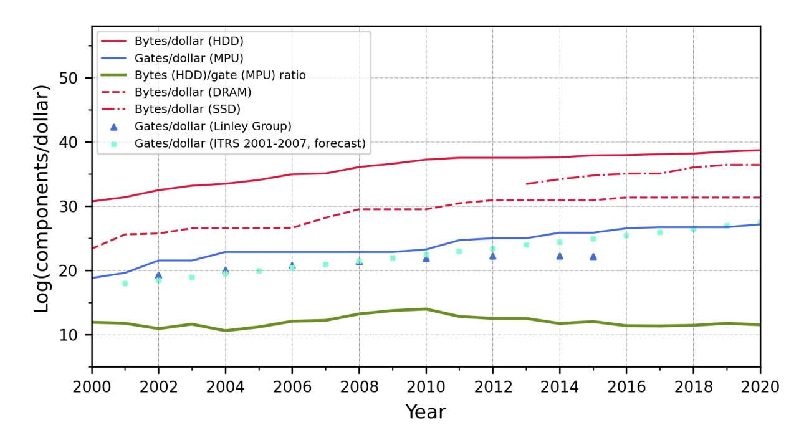
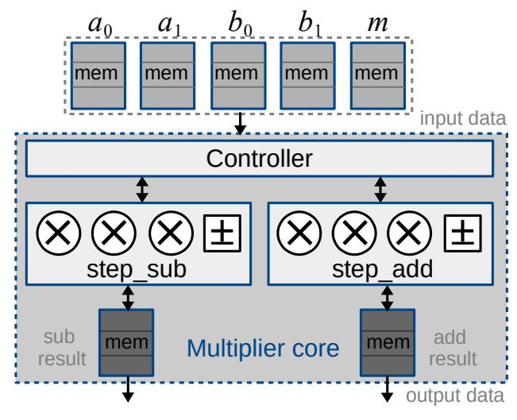
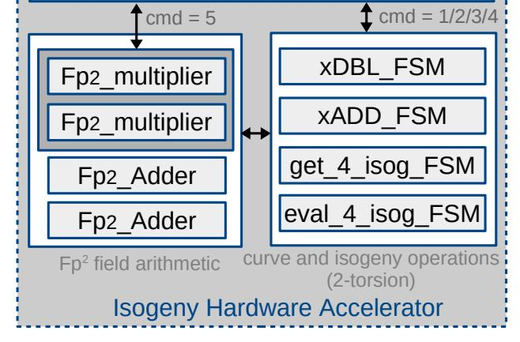
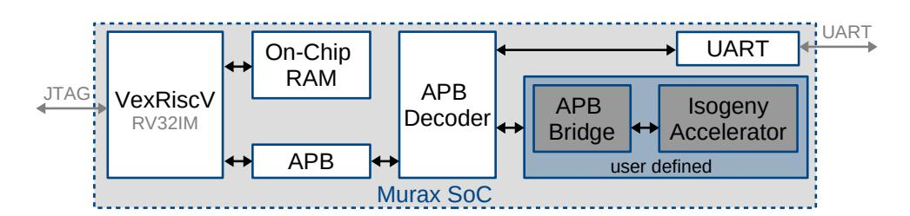
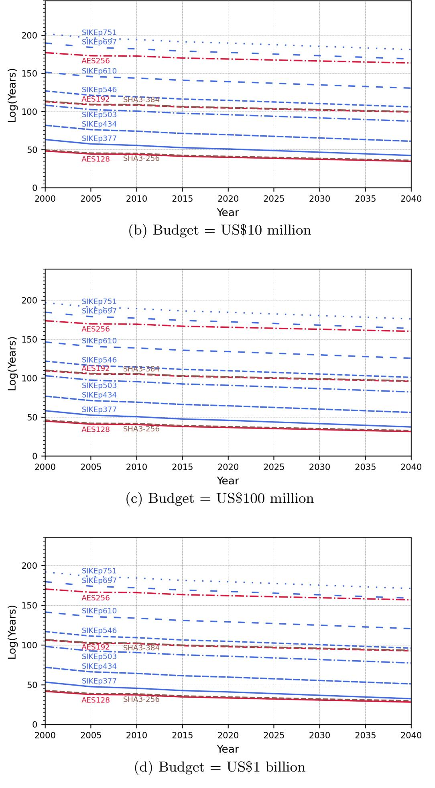
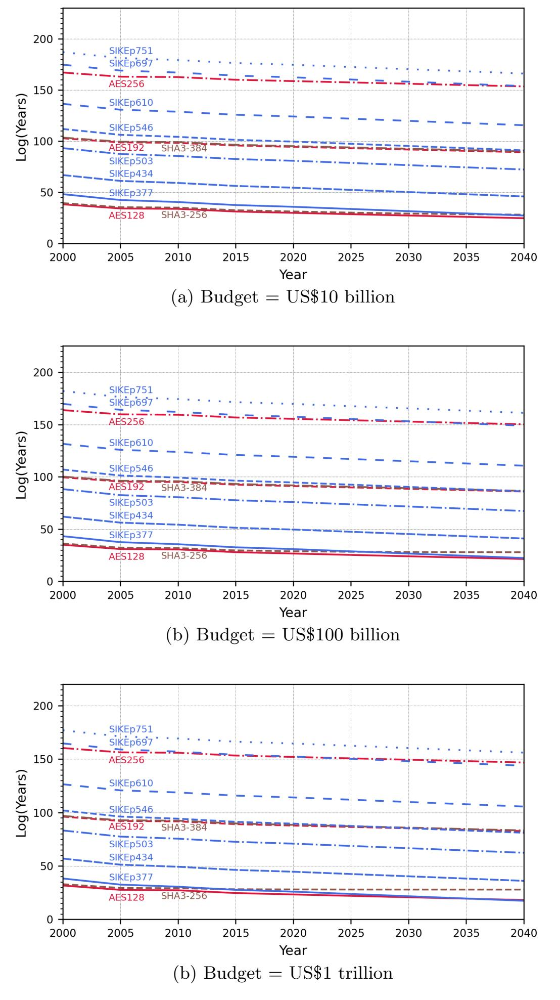

{0}------------------------------------------------

# The Cost to Break SIKE: A Comparative Hardware-Based Analysis with AES and SHA-3

Patrick Longa<sup>1</sup> , Wen Wang<sup>2</sup> , and Jakub Szefer<sup>2</sup>

<sup>1</sup> Microsoft Research, USA 2 plonga@microsoft.com Yale University, USA {wen.wang.ww349,jakub.szefer}@yale.edu

Abstract. This work presents a detailed study of the classical security of the post-quantum supersingular isogeny key encapsulation (SIKE) protocol using a realistic budget-based cost model that considers the actual computing and memory costs that are needed for cryptanalysis. In this effort, we design especially-tailored hardware accelerators for the time-critical multiplication and isogeny computations that we use to model an ASIC-powered instance of the van Oorschot-Wiener (vOW) parallel collision search algorithm. We then extend the analysis to AES and SHA-3 in the context of the NIST post-quantum cryptography standardization process to carry out a parameter analysis based on our cost model. This analysis, together with the state-of-the-art quantum security analysis of SIKE, indicates that the current SIKE parameters offer higher practical security than currently believed, closing an open issue on the suitability of the parameters to match NIST's security levels. In addition, we explore the possibility of using significantly smaller primes to enable more efficient and compact implementations with reduced bandwidth. Our improved cost model and analysis can be applied to other cryptographic settings and primitives, and can have implications for other postquantum candidates in the NIST process.

Keywords: Cost model · cryptanalysis · SIKE · efficient hardware and software implementations.

### 1 Introduction

The post-quantum cryptography (PQC) standardization process organized by the National Institute of Standards and Technology (NIST) has recently entered its third round with the selection of 15 key encapsulation mechanisms (KEM) and digital signature schemes [\[34\]](#page-30-0). Among them, the Supersingular Isogeny Key Encapsulation (SIKE) protocol [\[4\]](#page-28-0) stands out by featuring the smallest public key sizes of all of the encryption and KEM candidates and by being the only isogeny-based submission. In its second round status report, NIST highlights that it sees SIKE "as a strong candidate for future standardization with continued improvements" [\[35\]](#page-30-1).

{1}------------------------------------------------

SIKE's security history. SIKE is the actively-secure version of Jao-De Feo's Supersingular Isogeny Diffie-Hellman (SIDH) key exchange proposed in 2011 [\[21\]](#page-29-0). SIDH, in contrast to preceding public-key isogeny-based protocols [\[11,](#page-28-1)[42,](#page-30-2)[46\]](#page-30-3), bases its security on the difficulty of computing an isogeny between two isogenous supersingular elliptic curves defined over a field of characteristic p. This problem, which was studied by Kohel in 1996 [\[27\]](#page-29-1) and by Galbraith in 1999 [\[18\]](#page-29-2), continues to be considered hard, as no algorithm is known to reduce its classical and quantum exponential-time complexity. In contrast, the problem of computing isogenies between ordinary curves has endured a more turbulent history. While this problem is still considered exponential on classical computers [\[19\]](#page-29-3), in 2010, Childs, Jao and Soukharev proposed a quantum algorithm that solves it in subexponential time [\[8\]](#page-28-2). Since supersingular curves have a non-commutative endomorphism ring, SIDH inherently avoids this attack which requires the endomorphism ring to be commutative. More precisely, SIDH and SIKE are based on a problem—called the computational supersingular isogeny (CSSI) problem in [\[12\]](#page-28-3)—that is more special than the general problem of constructing an isogeny between two supersingular curves. In these protocols, the degree of the isogeny is smooth and public, and both parties in the key exchange each publish two images of some fixed points under their corresponding secret isogenies. However, so far no passive attack has been able to advantageously exploit this extra information. Hence, it is still the case that the CSSI problem can be seen as an instance of the general claw problem, as originally suggested by the SIDH authors back in 2011. The black-box claw problem, and thus CSSI, can be solved with asymptotic exponential complexities O(p 1/4 ) and O(p 1/6 ) on classical and quantum computers, respectively [\[21\]](#page-29-0).

SIKE's parameter selection. Since 2011, parameters for SIDH, and later for SIKE, have been selected following the above classical and quantum complexities [\[21](#page-29-0)[,9,](#page-28-4)[4\]](#page-28-0). Accordingly, the initial SIKE submission to the NIST PQC effort in 2017 [\[4\]](#page-28-0) included the parameter sets SIKEp503, SIKEp751 and SIKEp964,[3](#page-1-0) to match or exceed the computational resources required for key searches on AES128, AES192 and AES256, respectively. These, in turn, correspond to NIST's security levels 1, 3 and 5 [\[36\]](#page-30-4). Levels 2 and 4 are defined by matching or exceeding the computational resources required for collision searches on SHA3- 256 and SHA3-384, respectively. It was not until 2019 that Adj, Cervantes-V´azquez, Chi-Dom´ınguez, Menezes and Rodr´ıguez-Henr´ıquez [\[1\]](#page-27-0) showed that the van Oorschot-Wiener (vOW) parallel collision finding algorithm [\[49\]](#page-30-5) is the best classical algorithm for CSSI in practice. This was based on the observation that the vOW algorithm allows a time-memory trade-off that enables the reduction of the significant memory requirements (also of O(p 1/4 )) of the meet-in-themiddle attack against the claw problem. Shortly afterwards, after studying the best known quantum algorithms for CSSI, Jaques and Schank [\[23\]](#page-29-4) confirmed that the classical vOW algorithm should be used to establish the post-quantum security of SIKE and to choose its parameters; see [\[10\]](#page-28-5) for a posterior study

<span id="page-1-0"></span><sup>3</sup> The name of the parameter set is assembled by concatenating "SIKEp" and the bitlength of the underlying prime p.

{2}------------------------------------------------

with recent cryptanalytic results. Accordingly, the SIKE team updated their parameter selection for Round 2 of the NIST PQC process, proposing SIKEp434, SIKEp503, SIKEp610 and SIKEp751 for levels 1, 2, 3 and 5, respectively [\[4\]](#page-28-0).[4](#page-2-0)

One problem that arises, and pointed out by NIST in [\[35,](#page-30-1) pp.14], is that the studies mentioned above arbitrarily limit the total amount of memory available to an attacker. In [\[1,](#page-27-0)[10\]](#page-28-5), that memory limit is set to 2<sup>80</sup> memory units, while in [\[23\]](#page-29-4) it is set to 2<sup>96</sup> bits. Moreover, in some cases the security estimates from these works either match exactly or even fall below the classical gate requirements of the NIST levels (see [\[4,](#page-28-0) Table 5.1]).[5](#page-2-1) This is justified in the SIKE specification document by conjecturing that "the corresponding conversion to gate counts would see these parameters comfortably exceed NIST's requirements". But no further explanation is provided.

Cost models for cryptographic schemes. There are several approaches in the literature to assess the security of cryptographic schemes. A standard and platform-independent method is the random access machine (RAM) model. A simplistic abstraction of this model estimates security directly from the query complexity of the corresponding attacks, while refined versions incorporate algorithmic time complexity, instruction or cycle counts corresponding to an implementation of the atomic operations in the cryptanalysis. For example, in the case of SIKE, Adj et al. [\[1\]](#page-27-0) derived security directly from the query complexity of the vOW algorithm, assuming 2e/<sup>2</sup> -isogenies as the unit of time. Later refinements by Jaques and Schank [\[23\]](#page-29-4) and Costello et al. [\[10\]](#page-28-5) incorporated estimates of the algorithmic complexity of the half-degree isogeny computation in the first case, and the number of x64 instructions to implement the same computation in the second case. One main drawback of these approaches based on the RAM model is that they ignore the cost of memory and do not capture the significant cost of memory access of algorithms with large shared-memory requirements, as is the case of SIKE. It is also unclear how precisely counting the number of gates, instructions or cycles relates to actual attacks.

Wiener [\[52\]](#page-31-0) gave a step forward by considering a 3-dimensional machine model and analyzing its cost in terms of the processing, storage and wiring (communication) components that are required by an attack. This approach is slightly more complex but gives a more precise approximation of the actual security of a given cryptosystem. A positive side-effect of this more holistic approach is that, for example, it permits to identify parallel attacks that are practically more efficient than the serial versions.[6](#page-2-2) This, in general, motivates cryptographers to use the most efficient attacks when evaluating security.

We note, however, that Wiener was only "concerned with asymptotics". In his model, the different components (processors, memory, wires) are assigned the same cost or "weight". Moreover, an algorithm's total cost is estimated by

<span id="page-2-0"></span><sup>4</sup> We note that there were no parameter changes for Round 3.

<span id="page-2-1"></span><sup>5</sup> The issue is particularly problematic for level 5 for which the gap between the security estimates for SIKEp751 and AES256 is relatively large.

<span id="page-2-2"></span><sup>6</sup> A point emphasized by Bernstein [\[5\]](#page-28-6), for example, is that some studies focus on serial attacks and their improvement, ignoring the existence of better parallel attacks.

{3}------------------------------------------------

multiplying the total number of components by the number of steps that are executed per processing unit, giving both sides an equal weight.[7](#page-3-0)

Some works in the literature apply an even more realistic budget-based cost model that avoids the issues above and is still relatively simple (e.g., see van Oorschot and Wiener [\[48,](#page-30-6)[49\]](#page-30-5)): Assume a fixed budget for the attacker and then let her/him allocate the money to get all the necessary hardware in such a way that the time it takes to break a scheme is minimized. The strength of the scheme is determined by such a lower bound for the attack time.

This approach has several advantages. First, it motivates searching for the most cost-effective solution for a problem to help establish a good practical approximation of the security of a scheme (expressed in terms of the time it takes to break it). Thus, it promotes the use of the most efficient algorithms in practice, in place of slower ones (e.g., parallel versus serial attacks). Economically, it motivates the use of the most cost-efficient hardware to achieve a successful break in the least amount of time. More to the point, most effective cryptanalytic efforts aimed at breaking cryptographically strong schemes are expected to use application-specific integrated circuits (ASICs), which demand high nonrecurring engineering expenses but are the best alternative in large production volumes. Establishing lower bounds for security using ASICs guarantees that any other approach taken by an attacker (e.g., using an army of hijacked PCs over the Internet or renting cloud infrastructure or using GPUs) is going to take either more time or money (or both).

As Wiener [\[52\]](#page-31-0) argued, one potential disadvantage of considering the cost of the various hardware components required in an attack is the risk of overestimating security if new cryptanalytic attacks are discovered that are able to reduce the memory and communication requirements without increasing the number of processing steps. However, by not including all the large costs in the analysis of the best known attacks, one is left chasing "future" attacks that could never materialize in practice. In our opinion, if our understanding of the underlying hardness problem of a scheme is mature enough, it is preferable to estimate the actual cost of the best known attacks and then decide on the security margin we want to add on top—one can argue that this is actually the role of having different security levels—, instead of disregarding some costs and assuming this provides a security margin.

Contributions. In this paper, taking advantage of the relatively stable history of SIKE's underlying hardness problem, we analyze its security under a budgetbased cost model. Compared to previous work on cryptanalytic costs, the robustness of the model is strengthened by carrying out an analysis of historical price data of semiconductors and memory, and by making simple yet informative projections to the future.

To determine actual hardware costs for the model, we design especiallytailored, ASIC-friendly hardware accelerators for the multiplication in Fp<sup>2</sup> and

<span id="page-3-0"></span><sup>7</sup> Wiener's approach is unable to identify the best attack if, for example, an algorithm takes O(n 1/2 ) steps per processor and O(n 1/2 ) components, while another algorithm takes O(n 2/3 ) steps per processor and O(n 1/3 ) components.

{4}------------------------------------------------

the large-degree isogeny computation, which are the most critical operations in the cryptanalysis of SIKE. The architectures, which are of independent interest for constructive purposes, are optimized for area-time (AT) product, matching the requirements in a real cryptanalytic setup. Using ASIC synthesis results, we estimate the cost of running the vOW algorithm on SIKE and produce security estimates for the SIKE Round 3 parameters and for a set of new parameters that we introduce.

To verify the soundness of our design, we implemented a proof-of-concept hardware/software co-design of the vOW algorithm on FPGA, leveraging the software developed by Costello, Longa, Naehrig, Renes and Virdia [\[10\]](#page-28-5). We hope that this implementation serves as basis for real-world, large-scale cryptanalytic efforts intended to assess the security of isogeny-based cryptosystems.

The cost model is also applied to AES [\[38\]](#page-30-7) and SHA-3 [\[39\]](#page-30-8), yielding more realistic security estimates for these primitives that are relevant for the ongoing NIST PQC process. A comparison with our SIKE estimates—complemented by the state-of-the-art results for quantum attacks—leads us to conclude that the current SIKE parameters are conservative and exceed the security required by their intended NIST levels by wide margins. This solves an open issue about the practical security of the SIKE parameters.

In addition, to explore the potential of using parameters that match more closely the NIST security targets, we generate the following three new alternative parameters: [8](#page-4-0)

```
– SIKEp377, with p = 21913
                            117 − 1 (Level 1),
– SIKEp546, with p = 22733
                            172 − 1 (Level 3),
– SIKEp697, with p = 23563
                            215 − 1 (Level 5).
```

Finally, we report optimized implementations of these parameters for x64 platforms that show the potential improvement in performance. For example, SIKEp377, which is intended for level 1, is roughly 1.4× faster than the Round 3 parameter SIKEp434 on an x64 Intel processor. In addition, the public key size is reduced by roughly 13%. Even smaller key sizes would be possible with compressed variants of the parameters [\[4,](#page-28-0)[33,](#page-30-9)[40\]](#page-30-10).

Open-source release. Our Python security estimation script for SIKE, AES and SHA-3, the proof-of-concept hardware/software co-design of vOW for ASIC/ FPGA, and the software implementation of the alternative SIKE parameters proposed in this work, have been publicly released and can be found at:

```
https://github.com/microsoft/vOW4SIKE_on_HW
```

and

<https://caslab.csl.yale.edu/code/sikehwcryptanalysis>

<span id="page-4-0"></span><sup>8</sup> The use of the prime p546 was previously suggested in [\[1\]](#page-27-0) to match "the 160-bit security level".

{5}------------------------------------------------

Outline. After giving some preliminary background about SIKE and the vOW algorithm in §2, we describe the details of our improved budget-based cost model in §3. In §4, we describe the attack setup of the vOW algorithm on SIKE, present the design of our cryptanalysis hardware accelerators, as well as the hardware/software co-design of vOW, and summarize the synthesis results that are used to determine the cost of attacking SIKE. In §5, we revisit the cost analysis of attacking AES and SHA-3. The comparative security analysis of SIKE, AES and SHA-3 appears in §6, together with an analysis of SIKE parameters and their optimized implementations on x64 platforms. We end with a discussion about the implications of our analysis in §7.

#### <span id="page-5-0"></span>2 Preliminaries

#### 2.1 SIKE and the CSSI problem

SIKE is a key encapsulation mechanism that is an actively-secure variant of the SIDH protocol [4], i.e., it offers resistance against indistinguishability under adaptive chosen ciphertext (IND-CCA2) attacks. In practice, this means that SIDH keys are *ephemeral* while SIKE's do not need to be.

Fix a prime  $p = 2^{e_2}3^{e_3} - 1$  with  $2^{e_2} \approx 3^{e_3}$ . The protocol works with the roughly p/12 isomorphism classes of supersingular elliptic curves that exist in characteristic p and that are all defined over  $\mathbb{F}_{p^2}$ . Each of these classes is uniquely identified by its  $\mathbb{F}_{p^2}$ -rational j-invariant. If we define an isogeny as a separable non-constant rational map between two elliptic curves, its degree is assumed to be equal to the number of elements in its kernel. Let E be a (supersingular) elliptic curve defined over  $\mathbb{F}_{p^2}$ , for which  $\#E = (p+1)^2$ , and G be any subgroup of E. Then, there is a one-to-one correspondence (up to isomorphism) between subgroups  $G \subset E$  and isogenies  $\phi : E \to E/G$  whose kernel are G. Vélu's formulas can be used to compute these isogenies [50].

SIKE has as public parameters the two positive integers  $e_2$  and  $e_3$  that define p and the finite field  $\mathbb{F}_{p^2}$ , a starting supersingular elliptic curve  $E_0/\mathbb{F}_{p^2}$ , and bases  $\{P_2,Q_2\}$  and  $\{P_3,Q_3\}$  for the  $2^{e_2}$ - and  $3^{e_3}$ -torsion groups  $E_0[2^{e_2}]$  and  $E_0[3^{e_3}]$ , respectively. A simplified version of the computational supersingular isogeny (CSSI) problem can then be described as follows [1].

**Definition 1.** (CSSI). Let  $(\ell, e) \in \{(2, e_2), (3, e_3)\}$ . Given the public parameters  $e_2, e_3, E_0/\mathbb{F}_{p^2}, P_\ell$ ,  $Q_\ell$  and the elliptic curve  $E_0/G$  defined over  $\mathbb{F}_{p^2}$ , where G is an order- $\ell^e$  subgroup of  $E_0[\ell^e]$ , compute the degree- $\ell^e$  isogeny  $\phi: E_0 \to E_0/G$  with kernel G or, equivalently, find a generator for G.

#### <span id="page-5-1"></span>2.2 The vOW parallel collision finding algorithm

Let  $f: S \to S$  be a (pseudo-)random function on a finite set S. The van Oorschot-Wiener (vOW) algorithm finds collisions f(r) = f(r') for distinct values  $r, r' \in S$ . Define distinguished points as elements in S that have a distinguishing property that is easy to test, and denote by  $\theta$  the proportion of points of S that are

{6}------------------------------------------------

distinguished. The vOW algorithm proceeds by executing collision searches in parallel, where each search starts at a freshly chosen point x<sup>0</sup> ∈ S and produces a trail of points r<sup>i</sup> = f(ri−1), for i = 1, 2, . . ., until a distinguished point r<sup>d</sup> is reached. Let a shared memory have capacity to collect up to w triples of the form (r0, rd, d), where each triple represents a distinguished point and its corresponding trail. Also assume that a given triple is stored at a memory address that is a function of its distinguished point. Every time in a search that a distinguished point is reached, two cases arise: (i) if the respective memory address is empty or holds a triple with a distinct distinguished point, the new triple (r0, rd, d) is added to memory and a new search is launched with a new starting point r0, or (ii) if the distinguished point in the respective address is a match, a collision was detected. Note that it is possible that trails fall into loops that do not lead to distinguished points. To handle these cases, [\[49\]](#page-30-5) suggests to abandon trails that exceed certain maximum length (e.g., 20/θ). The expected length d of the trails is 1/θ on average.

In [\[49\]](#page-30-5), van Oorschot and Wiener classified different cryptanalytic applications according to whether collision searches are required to find a small or a large number of collisions. Relevant to this work is that the first case matches collisionsearch on SHA-3 while the second one applies to golden collision-search for SIKE; see §[5.2](#page-20-0) and §[4](#page-10-0) for the application of each case.

Finding one (or a small number of) collision(s). p In this case, since π|S|/2 points are expected to be produced before one trail touches another, the work required by each search engine is p π|S|/2/m when m search engines are running in parallel. If we add to this the cost to reach a distinguished point after a useful collision has been detected (i.e., 1/θ steps) and the cost of locating the initial point of collision (i.e, 1.5/θ steps),[9](#page-6-0) the total runtime to locate the first useful collision with probability close to 1 is [\[49\]](#page-30-5)

<span id="page-6-1"></span>
$$T = \left(\frac{1}{m}\sqrt{\pi|S|/2} + \frac{2.5}{\theta}\right)t,\tag{1}$$

where t is the time for one run of f.

Finding a large number of collisions. For the case where a large number of collisions exist, we follow convention and call golden collision to the unique collision that leads to solving the targeted cryptanalytic problem. In this case, since the number of collisions for f is approximately |S|/2, one would expect to have to detect this same number of collisions on average before finding the golden collision. However, the golden collision might have a low probability of detection for a given f. This suggests that the best performance on average should be achieved by using different function versions, each one running for a fixed period of time, until the golden collision is found. In the remainder, we denote the different function versions by fn, with n ∈ Z +.

<span id="page-6-0"></span><sup>9</sup> As pointed out in [\[49\]](#page-30-5), some applications such as discrete logarithms do not require locating the initial point of collision of two colliding trails. In these cases, it suffices to detect that the trails merged.

{7}------------------------------------------------

Assisted by a heuristic analysis, van Oorschot and Wiener determined that the total runtime of the algorithm is minimized when fixing w ≥ 2 <sup>10</sup> and θ = 2.25p w/|S|, and the total number of distinguished points generated by each function version is set to 10w, where, as before, w represents the number of memory units that are available to store the triples (r0, rd, d). Under these conditions, the total runtime to find a golden collision is estimated as

<span id="page-7-4"></span>
$$T = \left(\frac{2.5}{m}\sqrt{|S|^3/w}\right)t\tag{2}$$

where t is the time for one run of f<sup>n</sup> and m is the number of search engines that are run in parallel. The value 2.5 is another constant determined experimentally in [\[49\]](#page-30-5).

# <span id="page-7-0"></span>3 Budget-Based Cost Model

In this section, we describe the budget-based cost model that we use to estimate the security of SIKE in §[4](#page-10-0) and the security of AES and SHA-3 in §[6.](#page-21-0)

The basic idea under this model is that the attacker is assigned a fixed budget that he/she then uses to get computing and storage resources.[10](#page-7-1) The specific amount of each of these two resources is determined such that the time to successfully break the targeted scheme is minimized. The security of the scheme is given by the time it takes to break it.[11](#page-7-2)

While our model is inspired by the analysis in [\[48,](#page-30-6)[49\]](#page-30-5), we expand it by considering historical price information of semiconductors and memory components. As we argue later on, an analysis of technological and economic trends gives confidence to using this data to help determine the strength of cryptographic schemes.

Remark 1. While there is a long list of components that are required to build and support the full infrastructure for a large-scale, real-world attack, we simplify the analysis and only consider sufficiently large costs, namely those for the purchase of computation and storage resources, without losing much precision. We also note that wiring and communication costs can be significant. However, for the targeted cryptographic schemes these other costs can be considered relatively small, as the analysis in [\[52\]](#page-31-0) showed for some cryptosystems. One way to improve the model can be done by including the cost of energy consumption and heat dissipation. Nevertheless, we note that this is expected to lead to similar results since both costs are correlated to memory and computing power.[12](#page-7-3)

<span id="page-7-1"></span><sup>10</sup> We use U.S. dollars (USD) as currency, without loss of generality.

<span id="page-7-2"></span><sup>11</sup> We use "years" as the unit of security strength, without loss of generality.

<span id="page-7-3"></span><sup>12</sup> For a relevant discussion, refer to Ray Perlner's post in the NIST PQC mailing list on 08-17-2020 [https://csrc.nist.gov/projects/post-quantum-cryptography/](https://csrc.nist.gov/projects/post-quantum-cryptography/email-list) [email-list](https://csrc.nist.gov/projects/post-quantum-cryptography/email-list).

{8}------------------------------------------------

The cost model. The time in years that it takes to break a cryptographic scheme, under a budget of B dollars, is given by

<span id="page-8-3"></span>
$$Y = \left(\frac{\#par\_ops}{m} + \#ser\_ops\right) \cdot \frac{1}{ct},\tag{3}$$

where:

- m represents the number of processing engines,
- ct is the computing throughput expressed in terms of the number of operations computed per year by one processing engine,
- #par ops is the total number of operations that can be perfectly parallelized, and
- #ser ops is the total number of serial operations.

The number of processing engines (m) and memory units (w) are constrained according to

<span id="page-8-2"></span>
$$B = m \cdot c_m + w \cdot c_w, \tag{4}$$

where c<sup>m</sup> and c<sup>w</sup> represent the cost (in dollars) of one processing engine and one memory unit, respectively.

The cost of computation power and memory The inclusion of the costs of memory and computing resources is a key ingredient to better reflect the true cost of cryptanalysis. This is particularly relevant for memory-intensive cryptanalytic attacks (such as the vOW-based attack against SIKE), especially when analyzed in relation to attacks that require negligible use of memory (such as brute-force attacks against AES).

An important aspect commonly overlooked is how these computing/memory costs have behaved historically and how they are expected to behave in the future. Most analyses in the literature use costs that correspond to one specific point in history (typically, the "present time" for a certain study). But providing security estimates for different security levels involves an attempt at predicting the future looking at lifespans of 10, 15, 20 years or more. Thus, a natural question that arises is how a budget-based estimate could vary or is expected to vary over time.[13](#page-8-0)

Barred the chance of a flux capacitor ever working,[14](#page-8-1) one imperfect but practical approach to predict such a future is to observe the historical evolution of transistors and memory prices. Specifically, we use the public release prices of microprocessor units (MPUs) from Intel and AMD, together with their corresponding transistor counts, to derive an approximation of the cost an attacker would have to pay to fabricate his/her own ASIC chips. As is standard, to get gate counts we assume that a so-called gate equivalent (GE) represents a 2-input

<span id="page-8-0"></span><sup>13</sup> More generally, the question is how the security of a given cryptosystem is expected to change over time due to technological advances and increases in capital, which is an aspect that is frequently ignored.

<span id="page-8-1"></span><sup>14</sup> "Back to the future" fans will love the reference to the DeLorean time machine [https://en.wikipedia.org/wiki/DeLorean\\_time\\_machine](https://en.wikipedia.org/wiki/DeLorean_time_machine).

{9}------------------------------------------------

<span id="page-9-0"></span>

Fig. 1: Historical release prices of Intel and AMD MPUs in terms of number of gates per dollar, and prices of memory in terms of bytes per dollar. The prices are scaled by dividing the values by 7.4 (see App. [A\)](#page-31-2). Data corresponds to the lowest price found for each category (MPU, HDD, DRAM or SSD) per year from 2000 to 2020. Refer to App. [D](#page-33-0) for the original price values and their respective sources. To estimate the number of gates, we use the standard assumption that each gate consists of four transistors. The (forecast) values by the Linley Group and the ITRS are taken from [\[16\]](#page-29-5).

NAND gate in CMOS technology, and that in turn each of these gates consists of four transistors. Similarly, we use the public prices of memory technologies that are most suitable for the task, including hard disk drive (HDD), dynamic random-access memory (DRAM) and solid-state drive (SSD), to get memory costs per byte. These costs are depicted in Figure [1.](#page-9-0) It is important to note that to deal with the relatively small gap between release prices and the actual production cost of fabricating a chip at very large scale, we apply a scaling factor to the transistor and memory prices, which was calculated from the estimates in [\[25\]](#page-29-6); see App. [A](#page-31-2) for the exact derivation of the factor value.

It can be observed that, historically, the bytes to gates cost ratio has been quite stable, which highlights the strong correlation between the cost of transistors (gates) and memory (bytes). This is not surprising since, in general, semiconductors—including transistors for logic and memory means such as DRAM—have evolved under the same economic and technological stress forces, and have followed the same fundamental projections such as those dictated by Moore's law [\[32\]](#page-29-7) and Dennard scaling [\[13\]](#page-28-7). Over time the development of the different processes involved in the fabrication of semiconductor devices has been coordinated under the umbrella of so-called "technological roadmaps". These wide efforts started at the national level (e.g., with the National Technology Roadmap for Semiconductors (NTRS) [\[45\]](#page-30-11) organized by the Semiconductor Industry Association (SIA) [\[43\]](#page-30-12) in the U.S.), but then in the late 90's morphed into a unified and

{10}------------------------------------------------

global initiative known as the International Technology Roadmap for Semiconductors (ITRS) [20], which in 2016 was succeeded by the International Roadmap for Devices and Systems (IRDS) [15]. These large coordination efforts—in part responsible for the meteoric progress of semiconductors—have led to a steady and uniform progress in the miniaturization of transistors and other related components that, in turn, has led to a steady and uniform reduction in the cost of semiconductors overall [16].<sup>15</sup>

Figure 1 also includes a forecast of the transistor prices for "high-performance MPUs" done by the ITRS in 2007 for the years between 2000 and 2020 (see Tables 7a and 7b of the "Executive Summary", 2007 edition [16]), and includes the costs of transistors reported by the Linley Group for the years between 2002 and 2012 and its forecast for the years 2014 and 2015 (see §8 in the "More Moore – ITRS 2.0" white paper [16]). Overall, the stability of the data and its consistency across different sources suggest that the adjusted prices of MPUs for logic and HDDs for memory can be used as good approximations to the lower bounds of the costs a real attacker would encounter in practice.

# <span id="page-10-0"></span>4 Cost of Attacking SIKE

In this section, we describe and adapt the vOW attack to Round-3 SIKE, and produce operation counts corresponding to the different parameter sets. Then, we describe the cryptanalysis design strategy, introduce our hardware implementation that covers efficient accelerators for the multiplication in  $\mathbb{F}_{p^2}$  and the isogeny computation, and describe the proof-of-concept HW/SW co-design of vOW on SIKE. The synthesis results that we produce are used in combination with our operation counts to give area/time estimates that are later used in §6 to estimate the cost of breaking SIKE on ASICs.

#### <span id="page-10-2"></span>4.1 vOW on SIKE

We start by adapting the attack setup in [10] to Round-3 SIKE for the most commonly found scenario, i.e.,  $\ell=2$  with even  $e_2$ . Refer to App. B for the explicit details for two other cases:  $\ell=2$  with odd  $e_2$ , and  $\ell=3$  with odd  $e_3$ .

The SIKE Round 3 specification sets the Montgomery curve  $E_6/\mathbb{F}_{p^2}: y^2 = x^3 + 6x^2 + x$  with  $j(E_6) = 287496$  as the starting curve of the protocol. Fix  $\ell = 2$  and assume  $e_2$  is even. Let the final curve be defined as  $E = E_6/G$ , where G is an order- $2^{e_2}$  subgroup of  $E_6[2^{e_2}]$ . Taking into account the use of  $E_6$  and the savings in the final step of the large-degree isogeny computation [10, §3.1], attackers are left with the task of finding the isogeny of degree  $2^{e_2-2}$  between  $E_6$  and a certain challenge curve  $E_A$ .

Let  $S = \{0, 1, \dots, 2^{e_2/2-1} - 1\}$ . In an efficient version of the attack, the attacker can fix bases  $\{P, Q\}$  and  $\{U, V\}$  for  $E_6[2^{e_2/2}]$  and  $E_A[2^{e_2/2-2}]$ , where  $\pi(P) = -P$  and  $\pi(Q) = Q$  with  $\pi$  representing the Frobenius endomorphism.

<span id="page-10-1"></span>Although the core technology behind HDDs is not based on semiconductors, they have also followed a similar pattern of growth and cost reduction, arguably because of being under similar economic and technological forces.

{11}------------------------------------------------

We use the efficient instantiation for f<sup>n</sup> proposed in [\[10\]](#page-28-5). They define f<sup>n</sup> : S → S by fn(r) = gn(h(r)), where g<sup>n</sup> is a hash function with index n and h is given by

$$h: r \mapsto \begin{cases} j, & \text{if } lsb(b) = 0 \text{ for } j = a + b \cdot i \in \mathbb{F}_{p^2} \\ \overline{j}, & \text{otherwise} \end{cases}$$

where

$$j = \begin{cases} j(E_6/\langle P + [r >> 1]Q \rangle), & \text{if } lsb(r) = 0\\ j(E_A/\langle U + [r >> 1]V \rangle), & \text{if } lsb(r) = 1 \end{cases}$$

.

As can be seen, the function h uses a canonical representation of the conjugate classes in Fp<sup>2</sup> , such that it is always the case that we land on a j-invariant where the least significant bit of the imaginary part is 0. Note that >> represents the right shift operator. Thus, the least significant bit of r is used to select whether we compute an isogeny from E<sup>6</sup> or from E<sup>A</sup> and, therefore, we have that r ∈ {0, 1, . . . , 2 <sup>e</sup>2/2−<sup>2</sup> − 1}.

The kernels P + [r]Q determine degree-2e2/<sup>2</sup> isogenies from E6. However, by exploiting the Frobenius endomorphism [\[10,](#page-28-5) §3.1], it follows that the search space reduces to 2e2/2−<sup>1</sup> distinct equivalence classes of j-invariants. The kernels U +[r]V determine degree-2e2/2−<sup>2</sup> isogenies from EA, leading to 2e2/2−<sup>2</sup> distinct equivalence classes of j-invariants. In the remainder, we slightly underestimate the attack cost and only consider the use of 2e2/2−<sup>2</sup> -isogenies as the core operation that is needed to approximate the cost of f. This also means that we ignore the cost of the hash function gn, in an effort to be conservative in our security estimates.

Another crucial ingredient to estimate the cost of attacking SIKE is the memory required to store distinguished point triples (§[2.2\)](#page-5-1). For a triple (r0, rd, d) the starting and distinguished points have a length of log |S| = e2/2 − 1 bits. However, if we apply van Oorschot and Wiener's recommendation of defining a fixed number of top 0 bits as the distinguishing property [\[49,](#page-30-5) §4.1], distinguished points can be efficiently stored using only log |S| + log θ bits, where θ is the distinguished point rate. If we fix the maximum length of the trails to 20/θ then the counter d can be represented with log (20/θ) bits. Thus, a memory unit in a vOW attack against SIKE requires approximately the following number of bytes

<span id="page-11-0"></span>
$$[(2 \log |S| + \log 20)/8].$$
 (5)

Operation counts. The two operations that make up the computation of a full large-degree isogeny as described above are the construction of kernels with the form P + [r]Q and the computation of the half-degree isogeny itself. Hence, estimating their computing time and plugging the total "t" into Eq. [\(2\)](#page-7-4) is expected to give a good approximation to a practical lower bound of the attack runtime.

For the kernel computation, it is standard to use the efficient Montgomery ladder, which computes χ(P + [r]Q) given input values χ(P), χ(Q), χ(Q − P) for elliptic curve points P, Q, Q − P, where χ(·) represents the x-coordinate of a given point. We note that the vOW implementation reported in [\[10\]](#page-28-5) makes use of the 3-point Montgomery ladder for variable input points proposed by Faz

{12}------------------------------------------------

<span id="page-12-0"></span>Table 1: Operation counts for the isogeny and elliptic curve operations in the kernel and isogeny tree traversal computations corresponding to a 2<sup>e</sup>2/2−<sup>2</sup> -isogeny for even exponent (resp. 2(e2−3)/<sup>2</sup> -isogeny for odd exponent, omitting single 2-isogenies). Tree traversal uses an optimal strategy consisting of point quadrupling and 4-isogeny steps; ADD denotes a differential point addition, DBL a point doubling, 4-get a 4-isogeny computation, and 4-eval a 4-isogeny evaluation. Round 3 parameters appear at the top, while the new parameters proposed in this work are at the bottom.

|          | Kernel | Tree traversal |       |        |  |  |  |  |
|----------|--------|----------------|-------|--------|--|--|--|--|
|          | ADD    | DBL            | 4-get | 4-eval |  |  |  |  |
| SIKEp434 | 106    | 282            | 53    | 166    |  |  |  |  |
| SIKEp503 | 123    | 352            | 61    | 187    |  |  |  |  |
| SIKEp610 | 151    | 434            | 75    | 255    |  |  |  |  |
| SIKEp751 | 184    | 548            | 92    | 334    |  |  |  |  |
| SIKEp377 | 94     | 236            | 47    | 147    |  |  |  |  |
| SIKEp546 | 135    | 394            | 67    | 211    |  |  |  |  |
| SIKEp697 | 176    | 516            | 88    | 318    |  |  |  |  |

et al. [\[14\]](#page-28-8). However, for cryptanalysis one can employ the ladder version that exploits precomputations [\[14,](#page-28-8) Alg. 3], since the input points are fixed in this case. This algorithm speeds up the kernel computation by roughly 2 times at the expense of storing about e2/2 points.

Recall that ` ∈ {2, 3}. For the case of the half-degree isogeny itself, the computation can be visualized as traversing a tree, from top to bottom, doing point multiplications by ` and `-isogeny computations which are guided by a so-called optimal strategy [\[12,](#page-28-3) §4.2.2]. This optimal strategy is derived by using the relative cost of point multiplication by ` and `-isogeny evaluation.

Table [1](#page-12-0) summarizes the operation counts for a full large-degree isogeny operation as required for cryptanalysis. The table only includes the 2-power torsion case which is the preferable option for cryptanalysis as it is more efficient than the 3-power torsion case for all the SIKE parameters under study. For the kernel, we take into account the optimization using a fixed-point Montgomery ladder. In contrast to [\[10,](#page-28-5) §5], we include the cost of the kernel computation as well as the costs of both the `-isogeny computation and the `-isogeny evaluation when assessing the cost of the full isogeny.

#### <span id="page-12-1"></span>4.2 Hardware implementation of the attack

"Ideal" cryptanalysis design. Here we discuss our idealized design of a full attack, under the assumption that the main goal of the analysis is to help define conservative lower bounds for the cost of cryptanalyzing SIKE on ASICs. Likewise, with the budget-based cost model in mind, the main optimization goal for a hardware implementation of the attack is the minimization of the area-time (AT) product.

{13}------------------------------------------------

One core aspect of setting up a real-world, large-scale attack on SIKE using vOW is the configuration of the shared memory that stores the distinguished points. Each of the standard options, e.g., the use of a centralized database or a peer-to-peer system, has its advantages and disadvantages, and introduces non-negligible bottlenecks (see [10, App. C] for a discussion). In our analysis of the attack runtime, we abstract away from these engineering complexities and only consider the CPU time (i.e., we ignore communication costs for memory access).

A second core aspect is related to the hardware implementation of the "processing engine" that runs vOW on SIKE. While the critical part of this vOW engine is the isogeny step in the random function iteration for searching distinguished points and in the collision detection mechanism (a.k.a. backtracking), other associated costs include, for example, the pseudorandom sampling of starting points and the hashing of the j-invariants. There is also the cost associated to all the control circuitry to manage the algorithm flow outside the isogeny step (e.g., see [10, App. C] for a discussion about the synchronization of function versions across engines). Thus, by focusing the area and timing analysis on the isogeny function only, one can safely produce lower bounds for the attack cost.

It remains to discuss parallelization opportunities for the isogeny computation itself. In a typical setup that facilitates synchronization across engines, the prefixed number of distinguished points per function version can be evenly split between those engines, which then get to work to collect them. Beyond that, the parallel searches hardly stay in-sync at the arithmetic level, which makes difficult to save area by using controllers that manage multiple isogeny engines simultaneously, or by batching elliptic curve and small-degree isogeny operations from different engines (e.g., using Montgomery's inversion batching trick).

Internally, one can try to parallelize operations in the kernel computation P+[r]Q and the isogeny tree traversal operation. However, existing approaches offer poor area utilization, which conflicts with our goal of minimizing the AT product. In contrast, we note that the elliptic curve and small-degree isogeny formulas, as well as the underlying arithmetic over  $\mathbb{F}_{p^2}$ , do offer good opportunities for parallelization of multiplications in  $\mathbb{F}_{p^2}$  and  $\mathbb{F}_p$ .

Following this discussion, we designed a flexible and efficient hardware accelerator for the cost-intensive large-degree isogeny computation. This includes the hardware acceleration of the kernel construction as well as the isogeny computation itself. In turn, this accelerator is built on top of an efficient multiplier architecture that exploits a novel approach to optimize and exploit internal parallelism in the multiplication over  $\mathbb{F}_{p^2}$  in hardware.

We describe our accelerators next, starting with the critical  $\mathbb{F}_{p^2}$  multiplication.

Multiplier core. The basic idea of our design is to merge the inner multiplications in a schoolbook-like computation of the  $\mathbb{F}_{p^2}$  multiplication using a radix-r Montgomery multiplication algorithm. This allows us to parallelize digit multiplications while saving a full Montgomery reduction. Thus, the method can be seen as an application of lazy reduction to radix-r multiplication algorithms. While it is possible to apply the approach to most of the several radix-r variants of the Montgomery multiplication, in our application we use the finely integrated

{14}------------------------------------------------

<span id="page-14-0"></span>**Algorithm 1** Modified FIOS algorithm for Montgomery multiplier in  $\mathbb{F}_{p^2}$   $\triangleright$  for computing:  $c_0 = (a_0 \cdot b_0 - a_1 \cdot b_1) \bmod p$ , where p is a SIKE prime.

**Require:** operands  $a_0, a_1, b_0, b_1$ , each of n digits, each digit  $\in [0, 2^r)$  for radix of r bits; m = p + 1 and  $\lambda$  represents the number of 0 digits in m.

Ensure:  $[t_0, \ldots, t_{n-1}] \leftarrow \text{MontRed}(a_0 \cdot b_0 - a_1 \cdot b_1)$ 

```
1: t_i = 0 for i = 0, \dots, n-1
 2: for i = 0, ..., n-1 do
         (C,S) = a_{0,0} \cdot b_{0,i} - a_{1,0} \cdot b_{1,i} + t_0
 3:
         mm = S
 4:
         for j = 1, ..., n - 1 do
 5:
                                                                  // optimization for 0 digits in m
 6:
             if j < \lambda then
                  (C,S) = a_{0,j} \cdot b_{0,i} - a_{1,j} \cdot b_{1,i} + t_j + C
 7:
             else
                                                                  // mult. integrated with reduction
 8:
                 (C,S) = a_{0,j} \cdot b_{0,i} - a_{1,j} \cdot b_{1,i} + mm \cdot m_j + t_j + C
 9:
             t_{j-1} = S
10:
11:
         t_{n-1} = C
```

operand scanning (FIOS) algorithm [26]. In hardware, this algorithm allows us to maximize the number of parallel multiplications, while minimizing the control circuitry.

The proposed algorithm is depicted in Algorithm 1. We assume that, given inputs  $a=(a_0,a_1)$  and  $b=(b_0,b_1)$  in  $\mathbb{F}_{p^2}$ ,  $a\cdot b$  is computed as  $(a_0\cdot b_0-a_1\cdot b_1,a_0\cdot b_1+a_1\cdot b_0)$ . We only show the computation of the left-half of the result (the right-half computation easily follows). The algorithm also includes an additional optimization to save multiplications when the corresponding digit of the modulus is 0, as first noted by Costello et al. [9] in the context of SIDH. Ignoring this optimization, the method reduces the number of digit multiplications in one  $\mathbb{F}_{p^2}$  multiplication from  $2\cdot 2\cdot (2n^2-n)=8n^2-4n$  (using the standard approach on a SIKE prime) to  $2\cdot (3n^2-n)=6n^2-2n$ . We note that, in comparison, the Karatsuba method is able to trade one  $\mathbb{F}_p$  multiplication with a few much cheaper  $\mathbb{F}_p$  additions and subtractions, roughly matching the number of digit multiplications of our method. However, as discussed in [29], when mapping the Karatsuba algorithm to hardware, there are more data dependencies that can easily lead to complex data scheduling in pipelined architectures.

A simplified diagram depicting our hardware multiplier core  $\mathbb{F}_{p^2}$ \_Multiplier is presented in Figure 2a. The input operands  $a_0, a_1, b_0, b_1$  as well as the constant value m are all stored in memory blocks of width r and depth n, where r is the size of the radix and n is the number of digits per operand. Two separate modules step\_sub and step\_add are implemented for realizing the two inner loop variants in Alg. 1, which gives a total of six digit multipliers and two digit adders for optimal parallel execution. Finally, a Controller module is responsible for coordinating the memory accesses as well as the interactions between the memory blocks and the computation units. Since our design is fully pipelined, step\_sub and step\_add execute their computations in one cycle on average, which means that a full  $\mathbb{F}_{p^2}$  multiplication is completed in approximately  $n^2$  cycles.

{15}------------------------------------------------

<span id="page-15-0"></span>



Top\_Controller

- (a) Diagram of the  $\mathbb{F}_{p^2}$  multiplier core.
- (b) Diagram of the isogeny hardware accelerator.

Fig. 2: Simplified diagrams of the  $\mathbb{F}_{p^2}$ -Multiplier and the isogeny hardware accelerator.

As desired for the cryptanalysis application, our approach gives great flexibility to balance area and computing time by tuning the value of the radix. This can be observed when comparing our implementation with similar works in the literature (refer to App. C for the details).

Isogeny hardware accelerator. Figure 2b shows the diagram of our isogeny hardware accelerator. A lightweight Top\_Controller module sitting at the top of the design contains a state machine that implements the kernel and isogeny computations as described in the subsection "Operation counts" (§4.1). Accordingly, it supports all the necessary elliptic curve and small-degree isogeny computations for the 2-power torsion case, including doubling, differential addition, 4-isogeny evaluation and 4-isogeny computation. Separate compact state machines (called xDBL\_FSM, xADD\_FSM, get\_4\_isog\_FSM and eval\_4\_isog\_FSM) were designed for accelerating the respective operations above. As shown in the figure, these computations are carried out by the accelerator depending on the value of the cmd signal.

In our design, the  $\mathbb{F}_{p^2}$ -level arithmetic underlying these sub-modules is supported by two parallel blocks of our novel  $\mathbb{F}_{p^2}$ -Multiplier core, as well as two parallel  $\mathbb{F}_{p^2}$ -Adder blocks. This setup is optimal to minimize the AT product when using the Montgomery formulas for the small-degree isogeny and elliptic curve operations. As shown in Fig. 2b, the Top\_Controller can also directly trigger  $\mathbb{F}_{p^2}$  multiplications and additions using the cmd signal. This is done in order to accelerate these functions when invoked outside the elliptic curve and isogeny computations.

Comparison with other implementations. A relevant task for our analysis is to determine the suitability of using the proposed isogeny hardware accelerator for analyzing the security of SIKE under a realistic cost model. The main challenge that we face is that our implementation appears to be the first one intended for ASICs for cryptanalytic purposes. Nevertheless, we exploit the fact that a large-degree isogeny operation is also the main part of a typical hardware

{16}------------------------------------------------

<span id="page-16-0"></span>Table 2: Comparison of our isogeny HW accelerator with SIKE implementations (encapsulation function Enc only, w/o SHAKE) on a Xilinx Virtex 7 690T FPGA of partname XC7VX690TFFG1157-3. Synthesis results were obtained with Vivado Software Version 2018.3. The use of FPGA DSPs was disallowed during synthesis.

|                         |       |        |        | Resources | Freq | Enc    | Slices × |        |
|-------------------------|-------|--------|--------|-----------|------|--------|----------|--------|
| Design                  | log p | Slices | LUTs   | FFs       | RAMs | (MHz)  | (msec.)  | Time   |
| This work (radix = 232) | 434   | 6260   | 22347  | 4023      | 6.5  | 164.00 | 19.70    | 123.7  |
| This work (radix = 264) |       | 19120  | 69636  | 8808      | 12.5 | 116.84 | 10.51    | 200.9  |
| [28]                    |       | 20620  | 64553  | 21064     | 37.0 | 146.91 | 6.33     | 130.5  |
| [29], 128-bit ALU       |       | 7472   | 24855  | 8477      | 23.5 | 162.20 | 22.88    | 171.0  |
| [29], 256-bit ALU       |       | 24400  | 82143  | 18509     | 20.5 | 163.85 | 10.21    | 249.0  |
| This work (radix = 232) | 751   | 6031   | 21745  | 3273      | 19.5 | 161.00 | 94.31    | 568.8  |
| This work (radix = 264) |       | 18587  | 67699  | 6925      | 38.5 | 115.92 | 40.36    | 750.1  |
| [28]                    |       | 52941  | 151411 | 46095     | 45.5 | 116.88 | 18.91    | 1001.1 |
| [29], 128-bit ALU       |       | 7472   | 24855  | 8477      | 23.5 | 162.20 | 81.09    | 605.9  |
| [29], 256-bit ALU       |       | 24400  | 82143  | 18509     | 20.5 | 163.85 | 25.38    | 619.3  |

implementation of SIKE to carry out a first-order comparison between our isogeny accelerator and the most efficient open-source FPGA implementations of SIKE in the literature: the area-efficient implementation by Massolino et al. [\[29\]](#page-29-11) and the speed-oriented implementation by Koziel et al. [\[28\]](#page-29-12). While ours is not a full SIKE implementation we argue that the resources and timing information it provides only introduce a small error. The isogeny function is by far the most resource and time-consuming operation in SIKE, and implementations like the ones from [\[28,](#page-29-12)[29\]](#page-29-11) only incorporate a specialized, lightweight controller to provide the rest of the functionality. Note that to have a more fair comparison we eliminated the SHAKE circuitry from the implementations of both works.

Another issue is that the implementations above are specialized for FPGA and, hence, make use of the internal digital signal processors (DSPs). However, what matters for our security analysis is the performance on ASICs. Therefore, to make the results more comparable to what would be observed on an ASIC, we have synthesized the implementations without DSPs.

Table [2](#page-16-0) summarizes the resource utilization and encapsulation timing results for our and the aforementioned SIKE implementations.[16](#page-16-1) As can be seen, our accelerator using radix 2<sup>32</sup> achieves the lowest values for the slices/time product in comparison with [\[28\]](#page-29-12) and [\[29\]](#page-29-11). More importantly, we achieve so for both the smallest and the largest SIKE Round 3 parameter sets, while the competing implementations do not scale as efficiently for different parameters. This is due to the efficiency and flexibility of our multiplier and isogeny designs, which have been especially tailored to achieve a low area-time product. We remark that this

<span id="page-16-1"></span><sup>16</sup> We only compare the encapsulation operation, as this is the only high-level function in SIKE that fully works on the 2<sup>e</sup><sup>2</sup> -torsion subgroup, as in our isogeny accelerator.

{17}------------------------------------------------

<span id="page-17-1"></span>Table 3: Cycle results from synthesis for the isogeny and elliptic curve operations in the kernel and tree traversal computations using our hardware accelerators based on two Fp<sup>2</sup> parallel multipliers. The parallel formula for ADD costs 3M + 3add + 3sub, for DBL it costs 3M + 2add + 2sub, for 4-get it costs 2M + 4add + 1sub, and for 4-eval it costs 4M + 3add + 3sub, where M denotes multiplication, add addition and sub subtraction in Fp<sup>2</sup> . Each case reports the results for the radix that achieves the lowest AT product.

|          |       | Kernel | Tree traversal |       |        |  |  |
|----------|-------|--------|----------------|-------|--------|--|--|
|          | Radix | ADD    | DBL            | 4-get | 4-eval |  |  |
| SIKEp434 | 232   | 874    | 841            | 598   | 1105   |  |  |
| SIKEp503 | 232   | 1088   | 1051           | 742   | 1383   |  |  |
| SIKEp610 | 264   | 518    | 496            | 360   | 649    |  |  |
| SIKEp751 | 264   | 684    | 658            | 472   | 863    |  |  |
| SIKEp377 | 232   | 684    | 655            | 470   | 859    |  |  |
| SIKEp546 | 232   | 1326   | 1288           | 904   | 1697   |  |  |
| SIKEp697 | 264   | 634    | 610            | 438   | 800    |  |  |

first-order comparison is conservative because it ignores some costly resources like Block RAMs.[17](#page-17-0)

Synthesis results. We now proceed to obtain area and timing synthesis results for our isogeny accelerator, which are used in §[6](#page-21-0) to determine the cost and performance of a "processing engine" to run vOW on SIKE.

We use Synopsis version Q-2019.12-SP1 with the NanGate 45nm open-cell library v1.3 (v2010.12) [\[44\]](#page-30-13). Table [3](#page-17-1) summarizes the cycle counts obtained for each of the individual elliptic curve and small-degree isogeny operations. To estimate conservative lower bounds for the computing cost of the full isogeny, we treat the individual accelerators (xDBL FSM, xADD FSM, get 4 isog FSM, and eval 4 isog FSM) as independent units, ignoring the controller computation cost and the timing overhead due to data communication. That is, the cycle counts from Table [3](#page-17-1) are multiplied with the operation counts in Table [1](#page-12-0) to calculate the total cycle counts for a full isogeny (see Table [4\)](#page-18-0). The total time (msec) is then calculated by multiplying the isogeny cycle count by the clock period. Table [4](#page-18-0) also reports the area (kGEs) occupied by our isogeny hardware accelerator.

HW/SW co-design prototype. To validate the soundness of our cryptanalytic design as well as the hardware accelerators, we devised a hardware prototype of the vOW algorithm on SIKE using HW/SW co-design based on the popular RISC-V platform [\[41\]](#page-30-14). An approach based on HW/SW co-design facilitates prototyping and analyzing cryptanalytic targets by combining the flexibility and

<span id="page-17-0"></span><sup>17</sup> Each Block RAM on the Virtex-7 consists of 36Kb which our accelerator uses very scarcely (see Table [2\)](#page-16-0).

{18}------------------------------------------------

<span id="page-18-0"></span>Table 4: Area and timing synthesis results for a full  $2^{e_2/2-2}$ -isogeny (for even exponent) and a full  $2^{(e_2-3)/2}$ -isogeny (for odd exponent; omitting single 2-isogenies), using NanGate 45nm technology. The estimated computing time ignores the controller computation and the data communication overhead. Total cycles are estimated using the operation counts from Table 1 and the cycle counts for each individual elliptic curve and small-degree isogeny operation (Table 3). The total time (msec) is calculated by multiplying the total cycle count by the clock period. Total area (kGEs) corresponds to the full isogeny hardware accelerator. For each case, results are reported for the radix that achieves the lowest AT product.

|          |          | Area  | Freq  | Period | $\mathbf{Speed}$ |       |  |
|----------|----------|-------|-------|--------|------------------|-------|--|
|          | Radix    | (kGE) | (MHz) | (nsec) | cycles           | msec  |  |
| SIKEp434 | $2^{32}$ | 372.2 | 167.5 | 5.97   | 544930           | 3.253 |  |
| SIKEp503 | $2^{32}$ | 409.5 | 167.8 | 5.96   | 807659           | 4.814 |  |
| SIKEp610 | $2^{64}$ | 748.0 | 83.75 | 11.94  | 485977           | 5.803 |  |
| SIKEp751 | $2^{64}$ | 822.3 | 84.32 | 11.86  | 818106           | 9.703 |  |
| SIKEp377 | $2^{32}$ | 341.3 | 156.5 | 6.39   | 367239           | 2.347 |  |
| SIKEp546 | $2^{32}$ | 441.1 | 155.8 | 6.42   | 1105117          | 7.095 |  |
| SIKEp697 | $2^{64}$ | 798.9 | 83.68 | 11.95  | 719288           | 8.595 |  |

<span id="page-18-1"></span>

Fig. 3: Diagram of the HW/SW co-design for SIKE cryptanalysis based on Murax SoC. Blue box represents the user-defined logic, including the the dedicated isogeny hardware accelerator and the APB bridge module ApbController.

portability of a processor like RISC-V with the power of rapidly-reprogrammable hardware acceleration on FPGA. The design uses as basis the software implementation of vOW by Costello, Longa, Naehrig, Renes and Virdia [10,31]. Since their software targets SIKE Round 1 parameters, our first task was to adapt it to the Round 3 parameters and to the parameters proposed in this work, as described in §4.1. The HW/SW co-design is based on an open-source RISC-V platform, namely, VexRiscv [51]. It supports the RV32IM instruction set and implements a 5-stage in-order pipeline. The VexRiscv ecosystem also provides a complete predefined processor setup called "Murax SoC" that has a compact and modular design and aims at small resource usage. Due to the modularity of the VexRiscv implementation, dedicated hardware modules can be easily integrated to the system as an APB peripheral before synthesis of the System-on-a-Chip (SoC).

Figure 3 depicts the high-level view of the HW/SW co-design. As we can see, the dedicated isogeny hardware accelerator was integrated to the Murax SoC

{19}------------------------------------------------

as an APB peripheral, and the communication between the two was realized by implementing a dedicated memory-mapped bridge module ApbController.

# <span id="page-19-0"></span>5 Cost of Attacking Symmetric Primitives

In this section, we revisit the cost of cryptanalyzing AES and SHA-3 using efficient ASIC implementations from the literature. The analysis results are applied in §[6](#page-21-0) to produce estimates for the security of these primitives using the budget-based cost model.

#### 5.1 Cost of attacking AES

We revisit the problem of how costly it is for an attacker to find a secret key k that was used to encrypt a plaintext P as C = Ek(P) using a block cipher E, assuming knowledge of the plaintext/ciphertext pair (P, C). In this scenario, one of the most efficient key-extraction algorithms is the rainbow chains method by Oechslin [\[37\]](#page-30-15). Herein, we treat E as a black box since the attack applies generically to block ciphers.

Let fn(r) = gn(h(r)) define a function where h(r) = Er(P) for a fixed plaintext P and g<sup>n</sup> is a function with index n that produces (pseudo-)random values. The attack works as follows. In the precomputation stage, the attacker first chooses a random value k0, then generates a rainbow chain of values ki+1 = fi(ki) for i = 0, . . . , t − 2 (the term "rainbow" precisely originates from the use of distinct function versions at each step of the chain generation), and finally stores the starting and ending values k<sup>0</sup> and kt−1. This process is repeated to create a table with l entries, corresponding to l rainbow chains of length t each.

In the online stage, the attacker tries to determine if the key k used to encrypt P as C = Ek(P) is among all the keys k<sup>i</sup> used during the precomputation stage. To do so, he/she generates a new chain of length t starting from gn(C), and proceeds to compare the intermediate key values with the ending values kt−<sup>1</sup> stored in the table. If one of those values was indeed used to construct the table, a collision with one of the ending values kt−<sup>1</sup> will be detected and the attacker can proceed to reconstruct the stored chain using its corresponding starting value k0. The key k is expected to be found in the step right before computing the value gn(C).

To implement the function g<sup>n</sup> one can exploit that the block cipher itself can be used to generate pseudo-random values. Let β be a value chosen randomly. Since each execution of g<sup>n</sup> is preceded by a computation of the form Er(P), we can use the pair (β, i) to represent the index n, for i = 1, . . . , t − 2, and set gβ,i(x) = x ⊕ (β ||i) using a simple logical XOR operation, as suggested in [\[5\]](#page-28-6).

The probability of finding k with the rainbow chains method is roughly l·t/2 b , where b is the cipher key bitlength. To increase this probability efficiently (i.e., without increasing the memory requirement excessively), the attacker can repeat the procedure above as many times as required, each time with a new table and a fresh value for β.

{20}------------------------------------------------

Cost of parallel attack. The precomputation and online key search stages can be perfectly parallelized and distributed across multiple processors with minimal communication. The sorting process for collision search of the precomputed and online key values can be done serially using some efficient sorting algorithm. The cost of this part can be made negligible in comparison to the rest of the computation for suitably chosen parameters.

The regeneration of the chain after a collision is detected needs to be executed serially. Therefore, to guarantee that this cost is relatively negligible we need  $t \ll \frac{l \cdot t}{m}$  to hold or, equivalently,  $m \ll l$ , for m key-search engines. In this case, the time to find k with probability close to 1 using m engines is approximately

<span id="page-20-3"></span>
$$T = \frac{2^b}{m} \cdot t,\tag{6}$$

where t denotes the time to compute one iteration of E.

**Hardware cost.** The main building block in the attack is the targeted cipher itself. In the case of AES, there is a plethora of implementations in the literature ranging in scope from low-power/low-area to high-throughput/low-latency applications. As explained before, in a budget-based cost model trying to replicate a real-world setup the focus shifts instead to implementations that minimize the area-time product and are efficient on ASICs.

In that direction, we use the efficient round-based AES implementation by Ueno et al. [47]. A summary of their results for AES128/192/256, using the exact same Synopsis synthesis tool with the NanGate 45nm library that we use for the case of SIKE in §4.2, is given in Table 5.

It is worth highlighting that Ueno et al.'s implementation compares favorably against the AES implementation used by NIST to estimate the gate counts that determine security levels 1, 3 and 5 [36]. For example, in the case of AES128 this implementation requires about  $2^{15}$  AND, XOR and INV gates. Doing a more "cross-technology"-friendly count based on gate equivalents, the gate count is estimated at approximately  $100,000 \approx 2^{17}$  GEs, which is about  $10 \times$  larger than Ueno et al.'s gate results. 19

#### <span id="page-20-0"></span>5.2 Cost of attacking SHA-3

Finding hash collisions in SHA-3 can be done efficiently using the vOW algorithm in the scenario targeting a small number of collisions [49, 4.1]; see  $\S 2.2$ . In this case, the total runtime to locate the first useful collision with probability close to 1 using m collision-search engines is given by Eq. (1). However, this estimate is slightly optimistic since it does not consider that in a real setting an attacker runs out of memory at some point and new distinguished points need to replace old ones. See [49,  $\S 6.5$ ] for an analysis for MD5 that also applies to SHA-3.

<span id="page-20-1"></span>The gate counts of the AES implementation used by NIST can be found at https://homes.esat.kuleuven.be/~nsmart/MPC/.

<span id="page-20-2"></span><sup>&</sup>lt;sup>19</sup> Assuming that AND gate  $\equiv$  1.5GE, XOR gate  $\equiv$  FF  $\equiv$  3GE.

{21}------------------------------------------------

<span id="page-21-1"></span>Table 5: Area and timing synthesis results for the AES implementation by Ueno et al. [\[47\]](#page-30-16) and the Keccak-f[1600] implementation by Akin et al. [\[2\]](#page-27-1) using 45nm technology. InvThr represents the inverse throughput given in nanoseconds per operation (nsec/op). The latency for the Keccak-f[1600] (90nm) implementation is scaled using the factor 1.5 · (45/90)<sup>2</sup> = 0.375 to approximate it to SHA-3 on 45nm. The area is scaled by the factor 1.2.

|        | Area<br>(kGE) | Freq<br>(GHz) | Latency<br>(nsec) | InvThr<br>(nsec/op) |
|--------|---------------|---------------|-------------------|---------------------|
| AES128 | 11.59         | 787.40        | 13.97             | 12.70               |
| AES192 | 13.32         | 757.58        | 17.16             | 15.84               |
| AES256 | 13.97         | 775.19        | 19.35             | 18.06               |
| SHA-3  | 12.60         | –             | 20.61             | 20.61               |

Hardware cost. Similar to the case of AES, the main building block of the attack is the targeted primitive itself. For our analysis, we use the efficient, ASICfriendly implementation of Keccak by Akin, Aysu, Can Ulusel and Sava¸s [\[2\]](#page-27-1). Their single-message hash (SMH) approach takes one cycle per round and achieves, to our knowledge, the lowest AT product on ASIC in the literature.

Akin et al. only report synthesis results for the Keccak-f[1600] permutation function with rate r = 1088—which corresponds to the standardized instance SHA3-256—on 90nm technology. Table [5](#page-21-1) presents the timing results scaled to 45nm using the factor (45/90)<sup>2</sup> = 0.25 and scaled with a factor 1.5 to account for the initialization and absorb stages not considered by Akin et al. To account for the extra area required by the standardized instances SHA3-256 and SHA3-384, we scale the results by the factor 1.2.

# <span id="page-21-0"></span>6 Security Estimation: A Comparative Hardware-Based Analysis

We now proceed to put all the pieces together and estimate the security strength of SIKE, AES and SHA-3 using the budget-based cost model described in §[3.](#page-7-0)

To get security estimates we set fixed budgets of ten million, one hundred million and one billion dollars. Arguably, these choices apply to the vast majority of scenarios that involve sufficiently motivated actors.[20](#page-21-2) We note that our threat model only considers single-target attacks. In the case of multi-target attacks (or more generally, attacks that have large-scale application), it might be conservative yet prudent to assume the possibility of a billion-dollar budget or more.

To estimate the security provided by SIKE, AES and SHA-3, we first proceed to calculate the cost of one processing engine using the area information (in GEs) from Tables [4](#page-18-0) and [5](#page-21-1) and multiplying it by the adjusted cost per gate of a given

<span id="page-21-2"></span><sup>20</sup> As a relevant point of reference, the annual budget of the NSA in 2013 was estimated at US\$10.8 billion [https://en.wikipedia.org/wiki/National\\_Security\\_Agency](https://en.wikipedia.org/wiki/National_Security_Agency).

{22}------------------------------------------------

year (Tables [10](#page-36-0) and [11](#page-37-0) in App. [D\)](#page-33-0). We proceed to do a similar calculation to get the cost of one memory unit; in the case of SIKE we use Eq. [\(5\)](#page-11-0). Our setup for the attacks against AES and SHA-3 guarantees that the total cost of memory is significantly smaller than the cost of computing power.

Recall that the operation complexity for SIKE, AES and SHA-3 is given by Eq. [\(2\)](#page-7-4), [\(6\)](#page-20-3) and [\(1\)](#page-6-1), respectively (after setting t = 1). The security strength in terms of years is then estimated as follows. We fix B to a given budget value in Eq. [\(4\)](#page-8-2) and determine the optimal values for the number of processing engines and memory units that minimize Eq. [\(3\)](#page-8-3) using the respective operation complexity and the costs for the processing and memory units established above. The minimal value found for Eq. [\(3\)](#page-8-3), in years, is set as our security estimate.

In a first calculation, we use the yearly historical prices of MPUs and HDDs from 2000 to 2020 to determine the costs of processing and memory units. In each case we consider the lowest price per component (dollar/GE and dollar/byte) that we found per year. The exact prices as well as the respective sources are detailed in Table [10,](#page-36-0) App. [D.](#page-33-0)

In a second calculation, we make projections of the prices of MPUs and HDDs for the years 2025, 2030, 2035 and 2040 by assuming a constant reduction rate starting at year 2020 and estimated from data for the latest 5-year period, i.e., 2015–2020. Specifically, the reduction rate for MPUs is taken as the ratio between a gate cost in 2015 and its cost in 2020. Similarly, for HDDs it is taken as the ratio between the cost of a byte of SSD memory in 2015 and its cost in 2020.[21](#page-22-0) The projected prices that we derived are detailed in Table [11,](#page-37-0) App. [D.](#page-33-0)

We emphasize that making forecasts of future prices is a difficult task and, hence, we use a simple approach that is not expected to be highly precise. Nevertheless, the error is expected to have a negligible effect in the security estimates, and be largely compensated by our conservative approach that favors SIKE attackers. In particular, it is widely argued that Moore's law is expected to slow down in the next years, which would put the actual prices above our projections and, consequently, increase the gap between the costs of attacking SIKE and AES/SHA-3.

The estimates for the various budget options for the years 2000–2020, as well as the estimates using projected data for the years 2025–2040, are depicted in Fig. [4](#page-23-0) (refer to App. [E](#page-37-1) for extreme budget scenarios of up to one trillion dollars). For the case of SIKE, Fig. [4](#page-23-0) covers the four Round 3 parameter sets as well as our three alternative parameters.

All our results were obtained with a Python script that we wrote for the task and is available at [https://github.com/microsoft/vOW4SIKE\\_on\\_HW](https://github.com/microsoft/vOW4SIKE_on_HW).

<span id="page-22-0"></span><sup>21</sup> The use of SSD memory for calculating the cost reduction rate is to be conservative in our estimates: HDD memory is currently cheaper, but SSD is expected to become more cost-effective in the next years.

{23}------------------------------------------------

<span id="page-23-0"></span>

Fig. 4: Security estimates using historical GEs/HDDs prices from 2000 to 2020 and using projections of the same prices from 2025 to 2040, at intervals of five years. Security estimates are expressed as the base-2 logarithms of the number of years required to break a given primitive under a fixed budget. AES is depicted in red, SHA-3 in brown and SIKE in blue. SIKEp377 (new) and SIKEp434 (Round 3) are intended for level 1 (AES128), SIKEp546 (new) and SIKEp610 (Round 3) are intended for level 3 (AES192), and SIKEp697 (new) and SIKEp751 (Round 3) are intended for level 5 (AES256). SIKEp503 (Round 3) is for level 2 (SHA3-128). SHA3-384 determines level 4.

{24}------------------------------------------------

<span id="page-24-0"></span>Table 6: Quantum security estimates in terms of gate (G) and depth-width (DW) costs. Results correspond to key-search on AES [22], collision-search on SHA-3 [7,24] and golden collision-search on SIKE. The displayed values for SIKE are the lowest achieved for the respective circuit Maxdepth (MD) assumption and cost metric by either Jaques-Schanck [23] (Grover and Tani), Jaques-Schrottenloher [24] (parallel local prefix-based walk and parallel local multi-Grover) or Biasse-Pring [6] (improved Grover oracle). Estimates for the alternative SIKE parameters were obtained using Jaques-Schrottenloher's script.

|                   |                            | AES                   | key-s                       | earch                    | SHA-                           | ·3 coll.                 | l. SIKE collisions       |                          |                          |                          |                          |                          |                          |
|-------------------|----------------------------|-----------------------|-----------------------------|--------------------------|--------------------------------|--------------------------|--------------------------|--------------------------|--------------------------|--------------------------|--------------------------|--------------------------|--------------------------|
|                   |                            | Sec                   | curity level Security level |                          |                                | $\log p$                 |                          |                          |                          | $\log p$ (This work)     |                          |                          |                          |
| $\mathbf{Metric}$ | MD                         | 1                     | 3                           | 5                        | 2                              | 4                        | 434                      | 503                      | 610                      | 751                      | 377                      | 546                      | 697                      |
| G-cost            | $2^{96}$ $2^{64}$ $2^{40}$ | 83<br>83<br>93<br>117 | 116<br>126<br>157<br>181    | 148<br>191<br>222<br>246 | 124<br>  134<br>  148<br>  187 | 184<br>221<br>268<br>340 | 109<br>110<br>145<br>184 | 124<br>134<br>181<br>219 | 147<br>179<br>235<br>274 | 178<br>234<br>307<br>345 | 96<br>96<br>116<br>155   | 133<br>152<br>203<br>241 | 166<br>213<br>279<br>318 |
| DW-cost           | $2^{96}$ $2^{64}$ $2^{40}$ | 87<br>87<br>97<br>121 | 119<br>130<br>161<br>185    | 152<br>194<br>225<br>249 | 134<br>145<br>159<br>198       | 201<br>239<br>285<br>357 | 126<br>131<br>163<br>187 | 148<br>158<br>198<br>222 | 170<br>189<br>252<br>276 | 211<br>244<br>322<br>346 | 116<br>116<br>134<br>158 | 159<br>169<br>219<br>243 | 198<br>223<br>295<br>319 |

Quantum security. Initially, SIDH and SIKE proposals used Tani's algorithm (of  $\mathcal{O}(p^{1/6})$  time and memory complexity) to establish the quantum security of their parameters [21,9,4]. In 2019, Jaques and Schanck [23] established that the complexity of this algorithm is expected to actually achieve a time complexity of  $\mathcal{O}(p^{1/4})$  due to costly random memory accesses in the quantum circuit model. More recently, Jaques and Schrottenloher [24] proposed efficient parallel golden collision finding algorithms that use Grover searches and a quantum analogue of vOW to achieve lower gate complexities, also in the quantum circuit model.

In Table 6, we summarize the gate (G-cost) and depth-width (DW-cost) complexities corresponding to all the SIKE parameters under analysis, as well as the respective complexities for AES and SHA-3 taken from [22] and [7,24], respectively. We present the lowest values achieved by either Jaques and Schanck [23] using Grover or Tani's algorithm, Jaques and Schrottenloher's parallel local prefix-based walk or parallel local multi-Grover method [24], or Biasse and Pring's improved Grover oracle for very deep maxdepths (beyond 2<sup>115</sup>) [6]. Note that the maxdepth values suggested by NIST in [36] are 2<sup>40</sup>, 2<sup>64</sup> and 2<sup>96</sup>. The estimates for our newly proposed parameters use the same procedure followed in [24, §6] and were obtained with Jaques and Schrottenloher's script.

**Security levels.** We now have the tools to assess the security of the various SIKE parameters under our model. After observing the estimates in Fig. 4 and Table 6 (also see the summary of results in Table 12, App. F), we can conclude that the SIKE Round 3 parameters achieve higher security than previously assumed. For example, if we look at the calculation for year 2040 with a billion dollar budget (worst case analyzed in Table 12), the security margin is of at least

{25}------------------------------------------------

<span id="page-25-1"></span>Table 7: Performance results comparing SIKE Round 3 parameters and the alternative parameters proposed in this work. The speed results (rounded to 10<sup>5</sup> cycles) were obtained on a 3.4GHz Intel Core i7-6700 (Skylake) processor for the three SIKE operations: key generation (Gen), encapsulation (Enc), and decapsulation (Dec). Public keys are measured in bytes B.

|           |       |       | Round 3 SIKE [30,4] |              |      |       | Proposed (this work) |      |              |      |
|-----------|-------|-------|---------------------|--------------|------|-------|----------------------|------|--------------|------|
| NIST      | log p | PK    |                     | Speed (× 106 | cc)  | log p | PK                   |      | Speed (× 106 | cc)  |
| sec level |       |       | Gen                 | Enc          | Dec  |       |                      | Gen  | Enc          | Dec  |
| 1         | 434   | 330 B | 5.9                 | 9.7          | 10.3 | 377   | 288 B                | 3.9  | 7.3          | 7.2  |
| 2         | 503   | 378 B | 8.2                 | 13.5         | 14.4 | –     | –                    | –    | –            | –    |
| 3         | 610   | 462 B | 14.9                | 27.3         | 27.4 | 546   | 414 B                | 11.5 | 19.9         | 19.9 |
| 5         | 751   | 564 B | 25.2                | 40.7         | 43.9 | 697   | 528 B                | 19.8 | 33.3         | 35.0 |

2 <sup>15</sup> years (case between SIKEp751 and AES256 at level 5) and as high as 2<sup>48</sup> years (case between SIKEp503 and SHA3-256 at level 2).

When we examine the case of our alternative parameters it can be seen that they approximate levels 1, 3 and 5 more closely. For example, the classical and quantum security of SIKEp377 meets the requirements for level 1, even when considering our most stringent budget scenarios. If we assume the case for the year 2020 with a billion dollar budget, SIKEp377 achieves a security estimate of 2<sup>40</sup> years, which is above the estimate of 2<sup>33</sup> for AES128. For the year 2040, AES128 is projected to provide a security of 2<sup>28</sup> years, while SIKEp377 would achieve 232. Similar observations hold for SIKEp546 and SIKEp697 with respect to levels 3 (AES192) and 5 (AES256), respectively. SIDHp503 appears to hold its Round 3 position (i.e., level 2), although with a very large margin.[22](#page-25-0)

Our results show that the gap between SIKE and AES reduces over time and with larger budgets. Nevertheless, security estimates for the Round 3 and our alternative parameters stay above or virtually match the corresponding AES estimates even for unrealistic budgets (Fig [5,](#page-38-0) App. [E\)](#page-37-1) and taking into account that our approach is still conservative and favors SIKE attackers. Conveniently, we comment that these results are also confirmed by the estimates obtained with a simplistic but more standard cost model (see the security estimation using a non-local gate model in App. [G\)](#page-39-2).

Benchmarking results. To assess the potential impact of using the alternative smaller parameters, we wrote hand-optimized x64 assembly implementations of the field arithmetic for p377, p546 and p697, and integrated them into the SIDH library, version 3.4 [\[30\]](#page-29-16). The implementations are written in constant time, i.e., there are no secret memory accesses and no secret data branches. Therefore, the software is protected against timing and cache attacks. Our

<span id="page-25-0"></span><sup>22</sup> The classical security of SIKEp503 is actually closer to that of AES192 and SHA3- 384. It would be interesting to investigate if further analysis can reduce or eliminate the small gap.

{26}------------------------------------------------

software implementations can be found at [https://github.com/microsoft/](https://github.com/microsoft/vOW4SIKE_on_HW) [vOW4SIKE\\_on\\_HW](https://github.com/microsoft/vOW4SIKE_on_HW).

The results on a 3.4GHz Intel Core i7-6700 (Skylake) processor are shown in Table [7.](#page-25-1) Following standard practice, TurboBoost was disabled during the tests. For compilation we used clang v3.8.0 with the command clang -O3.

Our results show that the new parameters introduce large speedups in the range 1.25–1.40 (comparing the total costs), in addition to reductions in the public key and ciphertext sizes. For example, SIKEp377 is shown to be about 1.4× faster than SIKEp434, while reducing the public key size by ∼ 13%.

### <span id="page-26-0"></span>7 Discussion and Future Work

The analysis in [\[1](#page-27-0)[,23,](#page-29-4)[10\]](#page-28-5) gave a step forward in the understanding of the security of SIDH and SIKE by restricting the use of "unrealistic amounts" of memory for cryptanalysis. Specifically, [\[1\]](#page-27-0) suggested to fix the number of memory units to the somewhat arbitrary value 280, and this was the setup that was used to choose the current (Round 3) parameters. A key insight leveraged in this work is that the memory size is crucial for security estimation using certain attack setups, such as the case of vOW on SIKE. So a first challenge to produce more realistic scenarios is to find a relatively precise relationship between memory and computing resources. We argue that actual hardware costs can be used as a natural tool to define such a relationship. A budget-based cost model then fits into this approach, since it imposes hardware cost limitations that an actual attacker would have to face in practice. Moreover, it models security as a "moving target", instead of a static one, reflecting that attack costs (and hence the security of cryptographic schemes) change over time.

Our security estimates for SIKE using this realistic approach show that simplistic metrics such as those solely based on algorithmic time complexity, and gate, instruction or cycle counts can be imprecise and lead to more expensive parameters. These metrics do not consider memory use and reflect poorly the attacker's perspective for which implementation cost, size and speed matter. On a positive note, we believe our analysis gives solid confidence in the security of the current Round 3 SIKE parameters in the NIST PQC standardization effort. Moreover, the obtained results can be used to complement and provide further evidence to the results obtained with simpler cost models such as the non-local gate model, as shown in App. [G.](#page-39-2)

We comment that the analysis with a budget-based cost model is somewhat more complicated, and that obtaining satisfactory hardware prices to predict the future cost of attacks can be difficult. However, we think the advantages above outweigh the difficulties, especially for schemes with a relatively stable security history like SIKE. To minimize the effect of the error or of unexpected changes in some of the system variables (e.g., the occurrence of some unexpected technological advance, potential improvements in isogeny-based hardware, etc.), we make our analysis conservative in several aspects. For example, we ignore the area occupied by the hash function, and in the isogeny accelerator we ignore the main controller computation and the data communication costs; see §[4.1](#page-10-2) 

{27}------------------------------------------------

and §[4.2.](#page-12-1) We also note that, in favor of SIKE attackers, we apply a constant cost reduction rate to get future price projections, even though a slowdown in the progress of semiconductors (reflecting a slowdown in Moore's law) is expected to occur in the next years. In addition, we mention that there is still room for improvement of AES and SHA-3 designs on ASICs for cryptanalytic purposes, using pipelined designs and multi-message hashing techniques that have the potential of increasing the throughput per gate [\[2\]](#page-27-1). We welcome research efforts in this direction.

On another aspect, further research is needed to gain a better understanding of the real cost of quantum attacks. While much work is being done to improve quantum algorithms for cryptanalysis, it is still hard to determine which algorithms are (expected to be) the most cost-effective ones in practice and in which cases they might outperform the best classical attacks. Current metrics typically equate one classical operation to one logical qubit operation. In contrast, some works suggest that it would be more precise to assign one full classical operation, such as a hash function iteration [\[3\]](#page-28-11), to one physical (surface code) qubit-cycle, under the assumption that a qubit-cycle reaches a time of about 100 nsec. [\[17\]](#page-29-17).

Finally, it would be interesting to investigate the impact of using a budgetbased cost model on other schemes based on, for example, lattices. A special challenge in this case would be to deal with the arguably complex and fastpaced progress of cryptanalysis in lattice cryptography.

# Acknowledgments

We would like to thank Rei Ueno and Naofumi Homma for providing very valuable information about their AES implementation on ASIC for different security levels, and for answering our many questions. We thank Joseph Ku and Lou Kordus II for providing useful information on chip technology and its associated costs. We also thank Sam Jaques and Andr´e Schrottenloher for answering our questions on quantum algorithms and for giving us early access to their quantum security estimation script. Finally, we thank Craig Costello and Michael Naehrig for proofreading an early version of this paper and for their valuable feedback.

# References

- <span id="page-27-0"></span>1. Gora Adj, Daniel Cervantes-V´azquez, Jes´us-Javier Chi-Dom´ınguez, Alfred Menezes, and Francisco Rodr´ıguez-Henr´ıquez. On the cost of computing isogenies between supersingular elliptic curves. In Carlos Cid and Michael J. Jacobson Jr., editors, Selected Areas in Cryptography - SAC 2018, volume 11349 of LNCS, pages 322–343. Springer, 2019.
- <span id="page-27-1"></span>2. Abdulkadir Akin, Aydin Aysu, Onur Can Ulusel, and Erkay Sava¸s. Efficient hardware implementations of high throughput SHA-3 candidates Keccak, Luffa and Blue Midnight Wish for single- and multi-message hashing. In Oleg B. Makarevich, Atilla El¸ci, Mehmet A. Orgun, Sorin A. Huss, Ludmila K. Babenko, Alexander G.

{28}------------------------------------------------

- Chefranov, and Vijay Varadharajan, editors, International Conference on Security of Information and Networks (SIN 2010), pages 168–177. ACM, 2010.
- <span id="page-28-11"></span>3. Matthew Amy, Olivia Di Matteo, Vlad Gheorghiu, Michele Mosca, Alex Parent, and John M. Schanck. Estimating the cost of generic quantum pre-image attacks on SHA-2 and SHA-3. In Roberto Avanzi and Howard M. Heys, editors, Selected Areas in Cryptography - SAC 2016, volume 10532 of LNCS, pages 317–337. Springer, 2016.
- <span id="page-28-0"></span>4. Reza Azarderakhsh, Matthew Campagna, Craig Costello, Luca De Feo, Basil Hess, Aaron Hutchinson, Amir Jalali, Koray Karabina, David Jao, Brian Koziel, Brian LaMacchia, Patrick Longa, Michael Naehrig, Geovandro Pereira, Joost Renes, Vladimir Soukharev, and David Urbanik. Supersingular Isogeny Key Encapsulation (SIKE), 2017–2020. Latest specification available at <https://sike.org>. Round 1 submission available at [https://csrc.nist.gov/CSRC/media/Projects/Post-Quantum-Cryptography/](https://csrc.nist.gov/CSRC/media/Projects/Post-Quantum-Cryptography/documents/round-1/submissions/SIKE.zip) [documents/round-1/submissions/SIKE.zip](https://csrc.nist.gov/CSRC/media/Projects/Post-Quantum-Cryptography/documents/round-1/submissions/SIKE.zip). Round 2 submission available at [https://csrc.nist.gov/CSRC/media/Projects/Post-Quantum-Cryptography/](https://csrc.nist.gov/CSRC/media/Projects/Post-Quantum-Cryptography/documents/round-2/submissions/SIKE-Round2.zip) [documents/round-2/submissions/SIKE-Round2.zip](https://csrc.nist.gov/CSRC/media/Projects/Post-Quantum-Cryptography/documents/round-2/submissions/SIKE-Round2.zip).
- <span id="page-28-6"></span>5. Daniel J. Bernstein. Understanding brute force. In Workshop Record of ECRYPT STVL Workshop on Symmetric Key Encryption, eSTREAM report 2005/036, 2005.
- <span id="page-28-10"></span>6. Jean-Francois Biasse and Benjamin Pring. A framework for reducing the overhead of the quantum oracle for use with Grover's algorithm with applications to cryptanalysis of SIKE. MathCrypt 2019, 2019.
- <span id="page-28-9"></span>7. Andr´e Chailloux, Mar´ıa Naya-Plasencia, and Andr´e Schrottenloher. An efficient quantum collision search algorithm and implications on symmetric cryptography. In Tsuyoshi Takagi and Thomas Peyrin, editors, Advances in Cryptology - ASIACRYPT 2017, volume 10625 of LNCS, pages 211–240. Springer, 2017.
- <span id="page-28-2"></span>8. Andrew M. Childs, David Jao, and Vladimir Soukharev. Constructing elliptic curve isogenies in quantum subexponential time. J. Mathematical Cryptology, 8(1):1–29, 2014. Available at <https://arxiv.org/abs/1012.4019>.
- <span id="page-28-4"></span>9. Craig Costello, Patrick Longa, and Michael Naehrig. Efficient algorithms for supersingular isogeny Diffie-Hellman. In Matthew Robshaw and Jonathan Katz, editors, Advances in Cryptology - CRYPTO 2016, volume 9814 of LNCS, pages 572–601. Springer, 2016.
- <span id="page-28-5"></span>10. Craig Costello, Patrick Longa, Michael Naehrig, Joost Renes, and Fernando Virdia. Improved classical cryptanalysis of SIKE in practice. In Aggelos Kiayias, Markulf Kohlweiss, Petros Wallden, and Vassilis Zikas, editors, Public-Key Cryptography - PKC 2020, volume 12111 of LNCS, pages 505–534. Springer, 2020.
- <span id="page-28-1"></span>11. Jean-Marc Couveignes. Hard homogeneous spaces. Cryptology ePrint Archive, Report 2006/291, 2006. <http://eprint.iacr.org/2006/291>.
- <span id="page-28-3"></span>12. Luca De Feo, David Jao, and J´erˆome Plˆut. Towards quantum-resistant cryptosystems from supersingular elliptic curve isogenies. Journal of Mathematical Cryptology, 8(3):209–247, 2014.
- <span id="page-28-7"></span>13. Robert H. Dennard, Fritz Gaensslen, Hwa-Nien Yu, Leo Rideout, Ernest Bassous, and Andre LeBlanc. Design of ion-implanted MOSFET's with very small physical dimensions. IEEE Journal of Solid-State Circuits, SC-9(5):256–268, 1974.
- <span id="page-28-8"></span>14. Armando Faz-Hern´andez, Julio L´opez Hernandez, Eduardo Ochoa-Jim´enez, and Francisco Rodr´ıguez-Henr´ıquez. A faster software implementation of the supersingular isogeny Diffie-Hellman key exchange protocol. IEEE Trans. Computers, 67(11):1622–1636, 2018.

{29}------------------------------------------------

- <span id="page-29-9"></span>15. International Roadmap for Devices and Systems (IRDS), 2016–2020. [https://](https://irds.ieee.org/) [irds.ieee.org/](https://irds.ieee.org/).
- <span id="page-29-5"></span>16. The International Technology Roadmap for Semiconductors (ITRS). ITRS reports, 2001–2015. <http://www.itrs2.net/itrs-reports.html>.
- <span id="page-29-17"></span>17. Austin G. Fowler, Matteo Mariantoni, John M. Martinis, and Andrew N. Cleland. Surface codes: Towards practical large-scale quantum computation. Phys. Rev. A, 86(3)(032324), 2012.
- <span id="page-29-2"></span>18. Steven D. Galbraith. Constructing isogenies between elliptic curves over finite fields. LMS J. Comput. Math., 2:118–138 (electronic), 1999.
- <span id="page-29-3"></span>19. Steven D. Galbraith and Anton Stolbunov. Improved algorithm for the isogeny problem for ordinary elliptic curves. Appl. Algebra Eng. Commun. Comput., 24(2):107–131, 2013.
- <span id="page-29-8"></span>20. Paolo Gargini. The International Technology Roadmap for Semiconductors (ITRS): "Past, present and future". In IEEE Gallium Arsenide Integrated Circuits (GaAs IC) Symposium, pages 3–5. IEEE, 2000.
- <span id="page-29-0"></span>21. David Jao and Luca De Feo. Towards quantum-resistant cryptosystems from supersingular elliptic curve isogenies. In Bo-Yin Yang, editor, Post-Quantum Cryptography - PQCrypto 2011, volume 7071 of LNCS. Springer, 2011.
- <span id="page-29-14"></span>22. Samuel Jaques, Michael Naehrig, Martin Roetteler, and Fernando Virdia. Implementing Grover oracles for quantum key search on AES and LowMC. In Anne Canteaut and Yuval Ishai, editors, Advances in Cryptology - EUROCRYPT 2020, volume 12106 of LNCS, pages 280–310. Springer, 2020.
- <span id="page-29-4"></span>23. Samuel Jaques and John M. Schanck. Quantum cryptanalysis in the RAM model: Claw-finding attacks on SIKE. In Alexandra Boldyreva and Daniele Micciancio, editors, Advances in Cryptology - CRYPTO 2019, volume 11692 of LNCS, pages 32–61. Springer, 2019.
- <span id="page-29-15"></span>24. Samuel Jaques and Andr´e Schrottenloher. Low-gate quantum golden collision finding. In Selected Areas in Cryptography - SAC 2020, 2020. [http://eprint.](http://eprint.iacr.org/2020/424) [iacr.org/2020/424](http://eprint.iacr.org/2020/424).
- <span id="page-29-6"></span>25. Saif M. Khan and Alexander Mann. AI chips: What they are and why they matter. Center for Security and Emerging Technology, 2020.
- <span id="page-29-10"></span>26. C¸ etin K. Ko¸c, Tolga Acar, and Burton S. Kaliski Jr. Analyzing and comparing Montgomery multiplication algorithms. Micro, IEEE, 16(3):26–33, 1996.
- <span id="page-29-1"></span>27. David Kohel. Endomorphism rings of elliptic curves over finite fields. PhD thesis, University of California, Berkeley, 1996.
- <span id="page-29-12"></span>28. Brian Koziel, A.-Bon Ackie, Rami El Khatib, Reza Azarderakhsh, and Mehran Mozaffari Kermani. SIKE'd Up: Fast and secure hardware architectures for supersingular isogeny key encapsulation. IEEE Transactions on Circuits and Systems I: Regular Papers, 2020. Software Available at [https://github.com/](https://github.com/kozielbrian/VHDL-SIKE_R2) [kozielbrian/VHDL-SIKE\\_R2](https://github.com/kozielbrian/VHDL-SIKE_R2).
- <span id="page-29-11"></span>29. Pedro Maat C. Massolino, Patrick Longa, Joost Renes, and Lejla Batina. A compact and scalable hardware/software co-design of SIKE. IACR Trans. Cryptogr. Hardw. Embed. Syst., 2020(2):245–271, 2020. Software Available at <https://github.com/pmassolino/hw-sike>.
- <span id="page-29-16"></span>30. Microsoft. SIDH Library v3.4. Available at [https://github.com/Microsoft/](https://github.com/Microsoft/PQCrypto-SIDH) [PQCrypto-SIDH](https://github.com/Microsoft/PQCrypto-SIDH), 2015–2021.
- <span id="page-29-13"></span>31. Microsoft. vOW4SIKE Library. Available at [https://github.com/microsoft/](https://github.com/microsoft/vOW4SIKE) [vOW4SIKE](https://github.com/microsoft/vOW4SIKE), 2020.
- <span id="page-29-7"></span>32. Gordon E. Moore. Cramming more components onto integrated circuits. Electronics, 38(8):114–117, 1965.

{30}------------------------------------------------

- <span id="page-30-9"></span>33. Michael Naehrig and Joost Renes. Dual isogenies and their application to publickey compression for isogeny-based cryptography. In Steven D. Galbraith and Shiho Moriai, editors, Advances in Cryptology - ASIACRYPT 2019, volume 11922 of LNCS, pages 243–272. Springer, 2019.
- <span id="page-30-0"></span>34. National Institute of Standards and Technology (NIST). Post-quantum cryptography standardization – round 3 submissions, 2020. [https://csrc.nist.](https://csrc.nist.gov/Projects/Post-Quantum-Cryptography/Round-3-Submissions) [gov/Projects/Post-Quantum-Cryptography/Round-3-Submissions](https://csrc.nist.gov/Projects/Post-Quantum-Cryptography/Round-3-Submissions).
- <span id="page-30-1"></span>35. National Institute of Standards and Technology (NIST). Status report on the second round of the NIST post-quantum cryptography standardization process, 2020. <https://nvlpubs.nist.gov/nistpubs/ir/2020/NIST.IR.8309.pdf>.
- <span id="page-30-4"></span>36. National Institute of Standards and Technology (NIST). Submission requirements and evaluation criteria for the post-quantum cryptography standardization process, December, 2016. [https://csrc.nist.](https://csrc.nist.gov/CSRC/media/Projects/Post-Quantum-Cryptography/documents/call-for-proposals-final-dec-2016.pdf) [gov/CSRC/media/Projects/Post-Quantum-Cryptography/documents/](https://csrc.nist.gov/CSRC/media/Projects/Post-Quantum-Cryptography/documents/call-for-proposals-final-dec-2016.pdf) [call-for-proposals-final-dec-2016.pdf](https://csrc.nist.gov/CSRC/media/Projects/Post-Quantum-Cryptography/documents/call-for-proposals-final-dec-2016.pdf).
- <span id="page-30-15"></span>37. Philippe Oechslin. Making a faster cryptanalytic time-memory trade-off. In Dan Boneh, editor, Advances in Cryptology - CRYPTO 2003, volume 2729 of LNCS, pages 617–630. Springer, 2003.
- <span id="page-30-7"></span>38. National Institute of Standards and Technology (NIST). Advanced Encryption Standard (AES. Federal Inf. Process. Stds. (FIPS PUBS) – 197, 2001. [https:](https://nvlpubs.nist.gov/nistpubs/FIPS/NIST.FIPS.197.pdf) [//nvlpubs.nist.gov/nistpubs/FIPS/NIST.FIPS.197.pdf](https://nvlpubs.nist.gov/nistpubs/FIPS/NIST.FIPS.197.pdf).
- <span id="page-30-8"></span>39. National Institute of Standards and Technology (NIST). SHA-3 standard: Permutation-based hash and extendable-output functions. Federal Inf. Process. Stds. (FIPS PUBS) – 202, 2015. [https://nvlpubs.nist.gov/nistpubs/FIPS/](https://nvlpubs.nist.gov/nistpubs/FIPS/NIST.FIPS.202.pdf) [NIST.FIPS.202.pdf](https://nvlpubs.nist.gov/nistpubs/FIPS/NIST.FIPS.202.pdf).
- <span id="page-30-10"></span>40. Geovandro C. C. F. Pereira, Javad Doliskani, and David Jao. x-only point addition formula and faster compressed SIKE. J. Cryptogr. Eng., 11(1):57–69, 2021.
- <span id="page-30-14"></span>41. RISC-V, 2010-2020. <https://riscv.org/>.
- <span id="page-30-2"></span>42. Alexander Rostovtsev and Anton Stolbunov. Public-key cryptosystem based on isogenies. Cryptology ePrint Archive, Report 2006/145, 2006. [http://eprint.](http://eprint.iacr.org/2006/145) [iacr.org/2006/145](http://eprint.iacr.org/2006/145).
- <span id="page-30-12"></span>43. Semiconductor Industry Association (SIA), 1977–2020. [https://www.](https://www.semiconductors.org/) [semiconductors.org/](https://www.semiconductors.org/).
- <span id="page-30-13"></span>44. Silvaco. NanGate FreePDK45 open-cell library. Available at [https://si2.org/](https://si2.org/open-cell-library/) [open-cell-library/](https://si2.org/open-cell-library/), accessed on 09/2020.
- <span id="page-30-11"></span>45. William J. Spencer and Thomas E. Seidel. National technology roadmaps: the U.S. semiconductor experience. In International Conference on Solid-State and IC Technology (ICSICT). IEEE, 1995.
- <span id="page-30-3"></span>46. Anton Stolbunov. Constructing public-key cryptographic schemes based on class group action on a set of isogenous elliptic curves. Adv. Math. Commun., 4(2):215– 235, 2010.
- <span id="page-30-16"></span>47. Rei Ueno, Naofumi Homma, Sumio Morioka, Noriyuki Miura, Kohei Matsuda, Makoto Nagata, Shivam Bhasin, Yves Mathieu, Tarik Graba, and Jean-Luc Danger. High throughput/gate AES hardware architectures based on datapath compression. IEEE Trans. Computers, 69(4):534–548, 2020.
- <span id="page-30-6"></span>48. Paul C. van Oorschot and Michael J. Wiener. Parallel collision search with application to hash functions and discrete logarithms. In Dorothy E. Denning, Raymond Pyle, Ravi Ganesan, and Ravi S. Sandhu, editors, ACM Conference on Computer and Communications Security - CCS'94, pages 210–218. ACM, 1994.
- <span id="page-30-5"></span>49. Paul C. van Oorschot and Michael J. Wiener. Parallel collision search with cryptanalytic applications. Journal of Cryptology, 12(1):1–28, 1999.

{31}------------------------------------------------

- <span id="page-31-1"></span>50. Jacques V´elu. Isog´enies entre courbes elliptiques. Comptes Rendus de l'Acad´emie des Sciences des Paris, 273:238–241, 1971.
- <span id="page-31-4"></span>51. VexRiscv, 2017-2020. <https://github.com/SpinalHDL/VexRiscv/>.
- <span id="page-31-0"></span>52. Michael J. Wiener. The full cost of cryptanalytic attacks. Journal of Cryptology, 17(2):105–124, 2004.

# <span id="page-31-2"></span>A Adjusting factor for release prices

To estimate an approximation of the gap between the release MPU prices and the actual cost of producing a chip from the viewpoint of a foundry, we use the estimation procedure by Khan and Mann [\[25\]](#page-29-6). They estimate that in the year 2020 the capital invested per 300mm wafer is approximately \$16,746 using 5nm technology. To estimate the cost (or the "capital consumed") per wafer (cpw) we apply the formula:

$$cpw = (cinv \cdot crt \cdot (100 - op)/cc)(1 + tap), \tag{7}$$

where cinv is the capital invested per 300mm wafer, crt is the capital depreciation rate which is estimated at 0.2529, op is the operating profit which is estimated at 35.91%, and cc is the capital consumed (depreciated) which is estimated at 24.93%. Note that in contrast to [\[25\]](#page-29-6) we exclude the operating profit to obtain a better approximation of the production cost. We also add the cost of testing, assembling and packaging (tap), which is estimated at 0.3348 of the total cost of the wafer. Thus, we arrive at the estimated value cpw = \$14, 532.

We then calculate the total wafer area available for chip fabrication. For this we use the online "die-per-wafer" calculator ([https://anysilicon.com/](https://anysilicon.com/die-per-wafer-formula-free-calculators/) [die-per-wafer-formula-free-calculators/](https://anysilicon.com/die-per-wafer-formula-free-calculators/)). Assuming a (small) square die size of 76.04 mm<sup>2</sup> with a 85% production yield gives us a total area of 76.04 × 798 × 0.85 = 51, 578mm<sup>2</sup> . Finally, using the transistor density estimated at 171.3 × 10<sup>6</sup> transistors per mm<sup>2</sup> [\[25,](#page-29-6) Table 7], assuming that a gate equivalent consists of four transistors and using the total area above, we arrive at an estimate of (4 × 14, 532)/(area × 171.3 × 10<sup>6</sup> ) = 6.58 × 10<sup>−</sup><sup>9</sup> for the cost per gate, and this value is 7.4 times smaller than the cost per gate at year 2020 from Table [10](#page-36-0) (i.e., 4.86 × 10<sup>−</sup><sup>8</sup> ). This factor 7.4 is used in App. [D](#page-33-0) to estimate the "adjusted" costs used in §[6.](#page-21-0)

### <span id="page-31-3"></span>B Variants to attack SIKE

In this section, we describe the vOW attack setup on SIKE for the cases ` = 2 with odd e<sup>2</sup> and ` = 3 with odd e3. As in §[4,](#page-10-0) we assume an attacker has the challenge of finding the isogeny between the starting curve E<sup>6</sup> and a given challenge curve EA.

{32}------------------------------------------------

Case  $\ell = 2$ , odd  $e_2$ . This case applies to SIKEp377, SIKEp546 and SIKEp610. As in the even  $e_2$  case, the attacker's challenge is to find the isogeny of degree  $2^{e_2-2}$  that connects  $E_6$  and  $E_A$ .

Let  $S = \{0, 1, \dots, 2^{(e_2-1)/2} - 1\}$ . To run an efficient version of the attack, the attacker can fix bases  $\{P, Q\}$  and  $\{U, V\}$  for  $E_6[2^{(e_2-1)/2}]$  and  $E_A[2^{(e_2-3)/2}]$ , where  $\pi(P) = -P$  and  $\pi(Q) = Q$ . Since  $r \in \{0, 1, \dots, 2^{(e_2-3)/2} - 1\}$ , kernels of the form P + [r]Q determine degree- $2^{(e_2-1)/2}$  isogenies from  $E_6$ . The Frobenius endomorphism then enables a reduction of the search space to  $2^{(e_2-3)/2}$  distinct equivalence classes of j-invariants. Kernels of the form U + [r]V determine degree- $2^{(e_2-3)/2}$  isogenies from  $E_A$ , leading to  $2^{(e_2-3)/2}$  distinct equivalence classes of j-invariants. For the cost analysis (§4), we slightly overestimate the attack cost and consider the use of  $2^{(e_2-3)/2}$ -isogenies only.

Case  $\ell = 3$ , odd  $e_3$ . In this case, the attacker's challenge is to find the isogeny of degree  $3^{e_3}$  that connects  $E_6$  and a challenge curve  $E_A$ .

Let  $S = \{0, 1, \ldots, 2 \cdot 3^{(e_3-1)/2} - 1\}$ . To run an efficient version of the attack, the attacker can fix bases  $\{P,Q\}$  and  $\{U,V\}$  for  $E_6[3^{(e_3+1)/2}]$  and  $E_A[3^{(e_3-1)/2}]$ , where  $\pi(P) = -P$  and  $\pi(Q) = Q$ . Since  $r \in \{0, 1, \ldots, 3^{(e_3-1)/2} - 1\}$ , kernels of the form P + [r]Q determine degree- $3^{(e_3+1)/2}$  isogenies from  $E_6$ . However, the Frobenius endomorphism enables a reduction of the search space to  $2^{-1} \cdot 3^{(e_3+1)/2}$  distinct equivalence classes of j-invariants. Kernels of the form U + [r]V determine degree- $3^{(e_3-1)/2}$  isogenies from  $E_A$ , leading to  $3^{(e_3-1)/2}$  distinct equivalence classes of j-invariants. For the cost analysis, we slightly overestimate the attack cost and consider the use of  $3^{(e_3-1)/2}$ -isogenies only.

The 3-power torsion case is relevant for SIKEp377 and SIKEp697 for which  $2^{e_2} > 3^{e_3}$ . Nevertheless, under the budget-based cost model, we determined that the 3-power torsion case is still more expensive than a 2-power torsion based attack.

### <span id="page-32-0"></span>C Comparison of hardware multipliers

Tables 8 and 9 show the comparison results on FPGA of our hardware core  $\mathbb{F}_{p^2}$  Multiplier with multiplication units from existing works in the literature [28,29]. In the first case (Table 8), the comparison includes the use of DSPs. To have a better approximation to an ASIC setting, the use of DSPs is disallowed during synthesis in the second case (Table 9). In both scenarios, we compare the results corresponding to two  $\mathbb{F}_{p^2}$  multiplications executed in parallel.

In the high-performance category of SIKE hardware [28], an interleaved systolic architecture is implemented to compute the high-radix Montgomery product. In this design, n processing units are arranged in parallel, where  $n = \lceil \frac{\log_2 p}{t} \rceil$  is the number of digits of the input and output operands. These parallel processing units enable fast computation but, at the same time, bring a large area overhead, especially in terms of DSP usage. Note that the design from Koziel et al. [28] can simultaneously fit two  $\mathbb{F}_p$  modular multiplications in parallel with a single dual-multiplier, therefore arranging three of these dual-multipliers in

{33}------------------------------------------------

<span id="page-33-1"></span>Table 8: Performance comparison of our hardware module Fp<sup>2</sup> Multiplier with related work for SIKEp434 and SIKEp751. Results correspond to two Fp<sup>2</sup> multiplications. Estimates for [\[28\]](#page-29-12) assume optimal parallelization for three dual-multipliers. All implementations were synthesized with DSPs on a Virtex-7 690T FPGA partname XC7VX690TFFG1157-3. Synthesis results were obtained with Vivado Software v2018.3.

|                                                             |                          |                             |                                 | Resources                      |                    |                        |                           |                          |                                |  |
|-------------------------------------------------------------|--------------------------|-----------------------------|---------------------------------|--------------------------------|--------------------|------------------------|---------------------------|--------------------------|--------------------------------|--|
| Design                                                      | Radix r                  | Slices                      | LUTs                            | FFs                            | RAMs               | DSPs                   | Cycles                    | Freq<br>(MHz)            | Slices ×<br>Time               |  |
|                                                             |                          |                             |                                 | p434                           |                    |                        |                           |                          |                                |  |
| This work<br>[28]                                           | 22<br>2<br>222           | 454<br>4638                 | 1308<br>7356                    | 1294<br>14901                  | 0<br>0             | 24<br>240              | 446<br>64                 | 269<br>164               | 7.5<br>18.0                    |  |
|                                                             |                          |                             |                                 | p751                           |                    |                        |                           |                          |                                |  |
| This work<br>[28]<br>[29], 128-bit ALU<br>[29], 256-bit ALU | 24<br>2<br>224<br>–<br>– | 452<br>6897<br>3855<br>8131 | 1310<br>12879<br>11984<br>21321 | 1382<br>25971<br>7268<br>13756 | 0<br>0<br>21<br>39 | 24<br>384<br>57<br>162 | 1090<br>100<br>634<br>178 | 280<br>167<br>152<br>142 | 17.6<br>41.3<br>160.8<br>101.9 |  |

parallel can enable the computation of two parallel Fp<sup>2</sup> multiplications (assuming the use of Karatsuba). As shown in Table [8,](#page-33-1) our implementation takes less than 8× and 13× the number of slices and DSPs that Koziel et al. require, respectively, which translates to much smaller area-time products. This is achieved even considering that our estimates for [\[28\]](#page-29-12) assume optimal parallelization of multiplications in their implementation, which is not always achieved due to their complex scheduling design.

The comparison results with the compact SIKE hardware design by Massolino et al. [\[29\]](#page-29-11) are also included in the tables. Since the multiplier accumulator (MAC) unit from [\[29\]](#page-29-11) is designed to be unified for all the Round 3 SIKE parameter sets, for a fair comparison we only consider the largest SIKE parameter set, namely SIKEp751. Their MAC unit can be configured as either 128-bit or 256-bit to provide different area/time trade-offs. Note that in both cases the MAC unit features an 8-stage pipeline architecture, thus, it is able to perform 8 F<sup>p</sup> multiplications in parallel corresponding to two Fp<sup>2</sup> multiplications. The results show that our hardware multiplier is significantly more lightweight in terms of slices, memory usage and DSP blocks, while it also achieves much better area-time products.

### <span id="page-33-0"></span>D Price data

Table [10](#page-36-0) summarizes the price information that we collected per year for memory (HDD, DRAM and SSD) and Intel/AMD MPUs. For our security estimates, we used the lowest prices available per byte, which in all the cases considered correspond to HDDs. To estimate the cost per gate we considered the MPU (Intel or AMD) that provided the cheapest cost per transistor for a given year. We used

{34}------------------------------------------------

<span id="page-34-0"></span>Table 9: Performance comparison of our hardware module  $\mathbb{F}_{p^2}$ \_Multiplier with related work for SIKEp434 and SIKEp751. Results correspond to two  $\mathbb{F}_{p^2}$  multiplications. Estimates for [28] assume optimal parallelization for three dual-multipliers. All implementations were synthesized without DSPs on a Virtex-7 690T FPGA partname XC7VX690TFFG1157-3. Synthesis results were obtained with Vivado Software v2018.3.

|                   |           |        | Reso   | urces |      | Cycles | Freq  | Slices × |  |  |  |  |  |  |
|-------------------|-----------|--------|--------|-------|------|--------|-------|----------|--|--|--|--|--|--|
| Design            | Radix $r$ | Slices | LUTs   | FFs   | RAMs | v      | (MHz) | Time     |  |  |  |  |  |  |
|                   | p434      |        |        |       |      |        |       |          |  |  |  |  |  |  |
| This work         | $2^{22}$  | 2302   | 7882   | 1838  | 0    | 446    | 205   | 50.1     |  |  |  |  |  |  |
| [28]              | $2^{22}$  | 18669  | 55188  | 15033 | 0    | 64     | 122   | 98.0     |  |  |  |  |  |  |
|                   |           |        | p75    | 1     |      |        |       |          |  |  |  |  |  |  |
| This work         | $2^{24}$  | 2526   | 8776   | 1994  | 0    | 1090   | 195   | 141.2    |  |  |  |  |  |  |
| [28]              | $2^{24}$  | 34794  | 101898 | 26115 | 0    | 100    | 123   | 283.0    |  |  |  |  |  |  |
| [29], 128-bit ALU | _         | 7131   | 23417  | 8080  | 6    | 634    | 161   | 281.2    |  |  |  |  |  |  |
| [29], 256-bit ALU | _         | 24188  | 81503  | 18004 | 0    | 178    | 159   | 270.3    |  |  |  |  |  |  |

the standard assumption that one gate equivalent consists of four transistors. The rows with the "adjusted" costs per byte or gate are obtained by dividing the corresponding costs by the factor 7.40 which approximates the release prices to the chip production cost, as described in App. A.

Table 11 summarizes our projections of HDD memory and gate costs for the years between 2025 and 2040. To obtain these values we used a constant cost reduction rate applied starting at the year 2020's prices. Specifically, the reduction rate that we used for MPUs is taken as the ratio between a gate cost in 2015 and its cost in 2020. Similarly, for HDDs it is taken as the ratio between the cost of a byte on SSD memory in 2015 and its cost in 2020. The use of data from SSD memory in this case is to derive conservative estimates, so that SSD is expected to become more cost-effective than HDD in the next years.

The "adjusted" costs were used to calculate the costs of the memory and processing units that are needed to set up the cryptanalytic attacks against SIKE, AES and SHA-3 (see §6).

Sources. We used the following sources for data collection:

```
- https://en.wikipedia.org/wiki/List_of_Intel_Core_2_microprocessors
- https://en.wikipedia.org/wiki/List_of_Intel_Core_i3_microprocessors
- https://en.wikipedia.org/wiki/List_of_Intel_Core_i5_microprocessors
- https://en.wikipedia.org/wiki/List_of_Intel_Celeron_microprocessors
- https://en.wikipedia.org/wiki/List_of_Intel_Pentium_D_microprocessors
- https://en.wikipedia.org/wiki/List_of_AMD_Athlon_microprocessors
- https://en.wikipedia.org/wiki/List_of_AMD_Ryzen_microprocessors
- https://en.wikichip.org
- https://en.wikichip.org
- https://www.cpu-world.com
- https://www.newegg.com
- http://jcmit.net/memoryprice.htm
- http://jcmit.net/diskprice.htm
```

{35}------------------------------------------------

#### 36 Longa et al.

– <http://jcmit.net/flashprice.htm>

And other several chip manufacturer websites.

{36}------------------------------------------------

<span id="page-36-0"></span>Table 10: Historical release prices collected for memory (HDD, DRAM and SSD) and Intel/AMD MPUs from 2000 to 2020. To estimate the cost per gate we considered the MPU (Intel or AMD) that provided the cheapest cost per transistor ("trans.") for a given year. We used the standard assumption that one gate equivalent consists of four transistors. "Adjusted" costs approximate costs based on release prices to costs at production by dividing the corresponding costs by the factor 7.4 (see App. A).

| 97.50 1<br>16<br>6.09<br>8.23<br>39.00<br>5.24<br>744.3<br>100.6                    |                                                        | 2004 2005 2006 2007                                                            | 2008                           | 2009                                   | 2010 2                             | 2011 2                                          | 2012 20                                                     | 2013 2                                                     | 2014 2                                                      | 2015 2                                                | 2016 2C                                              | 2017 2018                                                                                                           | 18 2019                                           | 9 2020                                               |
|-------------------------------------------------------------------------------------|--------------------------------------------------------|--------------------------------------------------------------------------------|--------------------------------|----------------------------------------|------------------------------------|-------------------------------------------------|-------------------------------------------------------------|------------------------------------------------------------|-------------------------------------------------------------|-------------------------------------------------------|------------------------------------------------------|---------------------------------------------------------------------------------------------------------------------|---------------------------------------------------|------------------------------------------------------|
| 89.00 18.89 34.19 39.00 39.00 1.31 1.31 2.62 5.24 5.24 5.24 5.24 5.24 5.24 5.24 5.2 | 89.99 9<br>12<br>7.50                                  | 69.99 99.99<br>32 50<br>2.19 2.00<br>2.96 2.70                                 | 99.99<br>100<br>1.00           | 69.99<br>100<br>0.70<br>0.95           | 89.99 5.<br>200<br>0.45 (          | 54.99 54<br>150<br>0.37 (                       | 150<br>0.37<br>0.50                                         | 54.99 104<br>150<br>0.37 C                                 | 300 35 0.47 0                                               | 84.99 221<br>300<br>0.28 C                            | 221.63 99.<br>800 4<br>0.28 0                        | 99.99 93.49<br>400 400<br>0.25 0.23<br>0.34 0.31                                                                    | 3.49 149.99<br>400 800<br>0.23 0.19<br>0.31 0.26  | 9 129.99<br>0 800<br>9 0.16<br>5 0.22                |
| 112.0 64.0 33.0 33.0 30.0                                                           | 39.00 39.00<br>5.24 5.24<br>744.3 744.3<br>100.6 100.6 | 39.00 148.99 49.95<br>5.24 20.97 20.97<br>744.3 710.5 238.2<br>100.6 96.0 32.2 | 39.99<br>41.94<br>95.4<br>12.9 | 39.99<br>41.94<br>95.4<br>12.9         | 39.99 4<br>41.94 8:<br>95.4 1      | 41.99 29<br>83.89 83<br>50.1 3                  | 29.99 29<br>83.89 83<br>35.7 3                              | 29.99 29<br>83.89 83<br>35.7 3                             | 29.99 29<br>83.89 83<br>35.7 3                              | 29.99 44<br>83.89 167<br>35.7 2                       | 44.99 44<br>67.77 167<br>26.8 20<br>3.6              | 44.99     44.99     44.99       167.77     167.77     167.77       26.8     26.8     26.8       3.6     3.6     3.6 | 4.99 44.99<br>7.77 167.77<br>26.8 26.8<br>3.6 3.6 | 44.99 44.99<br>167.77 167.77<br>26.8 26.8<br>3.6 3.6 |
| 112.0 64.0 33.0 33.0 30.0                                                           |                                                        |                                                                                |                                | 1 1 1 1                                |                                    |                                                 | - 159<br>- 2<br>- 6<br>- 8                                  | 59.99 179<br>2.56 4<br>6.25 3<br>8.45 5                    | 179.99 59<br>4.80 2<br>3.75 2<br>5.07 3                     | 59.99 194<br>2.40 9<br>2.50 2<br>3.38 2               | 194.99 194.99<br>9.60 9.60<br>2.03 2.03<br>2.74 2.74 | 4                                                                                                                   | 9.99 75.99<br>4.80 9.60<br>1.04 0.79<br>1.41 1.07 | 9 75.99<br>0 9.60<br>9 0.79<br>7 1.07                |
|                                                                                     |                                                        | 30.0 30.0<br>125 125<br><br>96.0 96.0<br>129.7 129.7                           | 30.0<br>125<br>-<br>-<br>96.0  | 30.0<br>125<br>-<br>-<br>96.0<br>129.7 | 70.0<br>382<br>- 1<br>73.3<br>99.1 | 42.0<br>624 1<br>79.0<br>1178 1<br>26.8<br>36.2 | 42.0 12<br>1400 1,<br>71.0 7<br>1303 1;<br>21.8 2<br>29.5 2 | 122.0 4<br>1400 1<br>71.0 1C<br>1303 2<br>21.8 1<br>29.5 1 | 42.0 4<br>1400 1.<br>101.0 7<br>2410 2.<br>12.0 1<br>16.2 1 | 42.0<br>1400<br>79.0 E<br>2410 3<br>112.0 7<br>16.2 1 | -<br>-<br>58.0 5<br>3100 31<br>7.48 6<br>10.1 8      | 51.0 51.0<br>3100 3100<br>6.58 6.58<br>8.89 8.89                                                                    | 51.0 51.0<br>3100 3100<br>6.58 6.58<br>8.89 8.89  | 60.0<br>4940<br>8 4.86<br>9 6.57                     |

{37}------------------------------------------------

<span id="page-37-0"></span>Table 11: Projected prices for HDD memory and gates for 2025-2040, at 5-year intervals. The values were obtained by applying a constant reduction factor starting at the adjusted cost in 2020. For MPUs the factor (2.47) is computed by diving a gate cost in 2015 by its cost in 2020. For HDDs the factor (3.16) is computed by dividing the cost of an SSD byte in 2015 by its cost in 2020.

|                                            | 2025   | 2030   | 2035   | 2040   |
|--------------------------------------------|--------|--------|--------|--------|
| "Adjusted " cost (US\$) / byte (×10−13)    | 6.95   | 2.20   | 0.70   | 0.22   |
| "Adjusted " cost (US\$) / gate (×10−9<br>) | 2.66   | 1.08   | 0.44   | 0.18   |
| Bytes/gate                                 | 3822.5 | 4886.9 | 6247.7 | 7987.4 |

# <span id="page-37-1"></span>E Extreme budget estimates

Figure [5](#page-38-0) depicts the security estimates for SIKE, AES and SHA-3 considering very high, arguably unrealistic budgets (ten billion, one hundred billion and one trillion dollars). The estimates use the budget-based cost model with price information for MPUs and HDDs for the years 2000–2020, and projected price data for the years 2025–2040, as explained in §[6.](#page-21-0)

{38}------------------------------------------------

<span id="page-38-0"></span>

Fig. 5: Security estimates using historical GEs/HDDs prices from 2000 to 2020 and using projections of the same prices from 2025 to 2040, at intervals of five years. Security estimates are expressed as the base-2 logarithms of the number of years required to break a given primitive under a fixed budget. AES is depicted in red, SHA-3 in brown and SIKE in blue. SIKEp377 (new) and SIKEp434 (Round 3) are intended for level 1 (AES128), SIKEp546 (new) and SIKEp610 (Round 3) are intended for level 3 (AES192), and SIKEp697 (new) and SIKEp751 (Round 3) are intended for level 5 (AES256). SIKEp503 (Round 3) is for level 2 (SHA3-128). SHA3-384 determines level 4.

{39}------------------------------------------------

### <span id="page-39-1"></span>F Security estimates

<span id="page-39-0"></span>Table 12: Security estimates in terms of years produced by the budget-based cost model and following the procedure from §[6.](#page-21-0) The estimates are expressed as the base-2 logarithms of the number of years required to break a given primitive under a fixed budget. Results correspond to key-search on AES using Oechslin's rainbow chains, collision-search on SHA-3 using vOW (case of small number of collisions) and golden collision-search on SIKE using vOW (case of large number of collisions). The hardware (computing power and memory) costs used for the analysis can be found in App. [D.](#page-33-0)

|               |      |    | AES key-search |     | SHA-3 coll. |                |     |     |       | SIKE collisions |     |     |                   |
|---------------|------|----|----------------|-----|-------------|----------------|-----|-----|-------|-----------------|-----|-----|-------------------|
|               |      |    | Security level |     |             | Security level |     |     | log p |                 |     |     | log p (This work) |
| Budget        | year | 1  | 3              | 5   | 2           | 4              | 434 | 503 | 610   | 751             | 377 | 546 | 697               |
|               | 2020 | 39 | 104            | 168 | 41          | 105            | 69  | 95  | 139   | 189             | 50  | 114 | 177               |
| US\$10 mill.  | 2030 | 37 | 101            | 166 | 38          | 102            | 65  | 91  | 134   | 185             | 46  | 110 | 173               |
|               | 2040 | 34 | 99             | 163 | 35          | 99             | 60  | 87  | 130   | 181             | 42  | 106 | 168               |
|               | 2020 | 36 | 101            | 165 | 37          | 105            | 64  | 90  | 134   | 184             | 45  | 109 | 172               |
| US\$100 mill. | 2030 | 33 | 98             | 162 | 35          | 99             | 60  | 86  | 129   | 180             | 41  | 105 | 168               |
|               | 2040 | 31 | 95             | 160 | 32          | 96             | 55  | 82  | 125   | 176             | 37  | 101 | 163               |
|               | 2020 | 33 | 97             | 162 | 34          | 98             | 59  | 85  | 129   | 179             | 40  | 104 | 167               |
| US\$1 billion | 2030 | 30 | 95             | 159 | 31          | 95             | 55  | 81  | 124   | 175             | 36  | 100 | 163               |
|               | 2040 | 28 | 92             | 156 | 29          | 93             | 51  | 77  | 120   | 171             | 32  | 96  | 158               |

# <span id="page-39-2"></span>G Cost using the non-local gate model

Here we estimate the security of the various SIKE parameters using the standard non-local gate model applied to the vOW algorithm. In this model, the cost is estimated as

<span id="page-39-3"></span>
$$query\ complexity \times gates \times memory\ access. \tag{8}$$

Table [13](#page-40-0) details the SIKE security estimates using this model in comparison to the classical gate requirements provided by NIST. We assume that the cost of accessing memory is either O(w 1/2 ) or O(w 1/3 ), where, again, w represents the number of memory units to store the vOW triples.

As can be seen, all the parameters under consideration essentially fulfill their intended targets, with a slight outlier in the form of SIKEp697 for level 5 in the case of cube-root memory access cost. These estimates provide further evidence that the Round 3 and the alternative SIKE parameters proposed in this work match their corresponding NIST security levels.

{40}------------------------------------------------

<span id="page-40-0"></span>Table 13: Classical cost to run vOW on the 2-torsion using the non-local gate model. The set size is given by |S| = 2<sup>e</sup>2/2−<sup>1</sup> for even e<sup>2</sup> and |S| = 2(e2−1)/<sup>2</sup> for odd e2. vOW's query complexity is calculated by setting m = t = 1 in Eq. [\(2\)](#page-7-4). The gate complexities are taken from Table [4.](#page-18-0) The cost of memory is assumed to be either O(w 1/2 ) or O(w 1/3 ). For the latter, to estimate the number of memory units w we assume a budget of 2<sup>64</sup> US dollars, that a byte of memory costs 0.22 × 10<sup>−</sup><sup>11</sup> US dollars (see Table [10\)](#page-36-0), and that each memory unit occupies d(2 log |S| + log 20)/8e bytes (see Eq. [\(5\)](#page-11-0)). The total security estimates are obtained using Eq. [\(8\)](#page-39-3). Numbers are shown as the floor of their base-2 logarithms.

|          | Memory access cost |                 | Classical gate |
|----------|--------------------|-----------------|----------------|
|          | 1/2<br>O(w<br>)    | 1/3<br>O(w<br>) | requirement    |
| SIKEp377 | 162                | 145             | 143 (AES128)   |
| SIKEp434 | 180                | 164             |                |
| SIKEp546 | 224                | 207             | 207 (AES192)   |
| SIKEp610 | 248                | 232             |                |
| SIKEp697 | 286                | 270             | 272 (AES256)   |
| SIKEp751 | 298                | 282             |                |