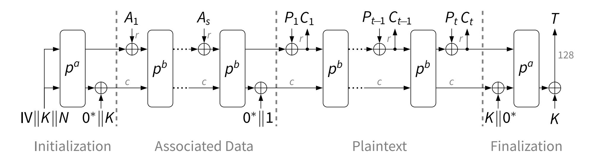

{0}------------------------------------------------

# Analysis of Ascon, DryGASCON, and Shamash Permutations

### Cihangir Tezcan

Informatics Institute, Department of Cyber Security, CyDeS Laboratory, Middle East Technical University, Ankara, Turkey e-mail: cihangir@metu.edu.tr

ORCID iD: 000-0002-9041-1932

Research Paper Received: 16.07.2020 Revised: 14.09.2020 Accepted: 21.09.2020

**Abstract**—ASCON, DRYGASCON, and SHAMASH are submissions to NIST's lightweight cryptography standardization process and have similar designs. We analyze these algorithms against subspace trails, truncated differentials, and differential-linear distinguishers. We provide probability one 4-round subspace trails for DRYGASCON-256, 3-round subspace trails for DRYGASCON-128, and 2-round subspace trails for SHAMASH permutations. Moreover, we provide the first 3.5-round truncated differential and 5-round differential-linear distinguisher for DRYGASCON-128. Finally, we improve the data and time complexity of the 4 and 5-round differential-linear attacks on ASCON.

**Keywords**—Lightweight cryptography, Authenticated encryption, Cryptanalysis

# 1. Introduction

Due to increase in the number of resourceconstrained devices, having cryptographic algorithms that require less energy, power, and latency and better throughput and side-channel resistance became a necessity. In this respect, lightweight cryptography aims to provide solutions that are tailored for resource-constrained devices. In 2019,

*An earlier version of this paper is sent to Lightweight Cryptography Workshop 2019 with the title* Distinguishers for Reduced Round Ascon, DryGASCON, and Shamash Permutations *to aid NIST in the Round 2 selection process. However, since that workshop had no proceedings, it has never been published in any journal or proceedings.*

*This paper is published in International Journal of Information Security Science https://www.ijiss.org/ijiss/index.php/ijiss/article/view/762* the National Institute of Standards and Technology (NIST) initiated a new cryptography competition [23] for selecting one or more authenticated encryption and hashing schemes that are suitable for constrained environments. Namely, algorithms that can provide acceptable performance and security for constrained devices. This competition-like process received 57 candidate algorithms in February 2019 and 56 of them were accepted as first-round candidates in April 2019. 32 candidate algorithms are selected for the second-round in August 2019. NIST recently has decided to modify the timeline for the lightweight cryptography project by 3 months. The selection of the round 3 candidates is now planned for December 2020 due to ongoing pandemic. The competition will last 2-3 years and cryptanaly

{1}------------------------------------------------

sis results of these algorithms are expected from cryptography community. With the help of these results, the best algorithm is expected to be the winner and standardized around 2023. NIST has not decided yet if the competition will have a single or multiple winners. ASCON [11], DRYGASCON [25], and SHAMASH [24] are submissions to NIST's Lightweight Cryptography Standardization Process. Moreover, ASCON has been included in the CAE-SAR competition's (2014-2019) final portfolio in the category for lightweight authenticated encryption as the primary choice.

Since DRYGASCON and SHAMASH have AS-CON like designs, in this work we analyze them together and compare their security against subspace trails, truncated differentials, and differential-linear distinguishers. We first focus on probability one truncated differentials and subspace trails of these three candidate algoritms. We provide probability one 4-round subspace trails for DRYGASCON-256, 3-round subspace trail for DRYGASCON-128, and 2-round subspace trail for SHAMASH permutations. Moreover, we provide the first 3.5-round truncated differential for DRYGASCON. Finally, we combine our probability one truncated differentials with known linear approximations to provide the first 5-round differential-linear distinguisher for DRYGASCON-128 and to reduce the data and time complexity of the 4 and 5-round differential-linear attacks of [8] on ASCON.

Our analysis shows that the similarity in the designs of ASCON and DRYGASCON makes analysis result of one cipher can also be applied to the other with some modifications. However, the changes applied in the permutation of SHAMASH makes it completely a different cipher. Thus, analysis of ASCON does not shed much light on the cryptanalysis of SHAMASH.

This paper is organized as follows: in Section

2 we briefly define ASCON, DRYGASCON, and SHAMASH algorithms, mention their differences and recall undisturbed bits. In Section 3 and Section 4 we provide probability one truncated differentials and subspace trails, respectively. In Section 5 we provide differential-linear distinguishers for DRYGASCON and ASCON and provide the best differential-linear attacks on ASCON. Section 6 concludes the paper.

Our attacks on ASCON are provided in Table 1 together with the best attacks on this cipher. We do not include the attacks of [19] in this table because our analysis are for the nonce-respecting scenario and the attacks of [19] work in the nonce-misuse scenario.

TABLE 1 Summary of key-recovery attacks on ASCON

| Type                | Attacked Rounds | Time       | Source    |
|---------------------|-----------------|------------|-----------|
| Differential-Linear | 4/12            | 18 2    | [8]       |
| Differential-Linear | 4/12            | 15 2    | Section 5 |
| Differential-Linear | 5/12            | 36 2    | [8]       |
| Differential-Linear | 5/12            | 31.44 2 | Section 5 |
| Cube-like Method    | 5/12            | 35 2    | [8]       |
| Cube-like Method    | 5/12            | 24 2    | [20]      |
| Cube-like Method    | 6/12            | 66 2    | [8]       |
| Cube-like Method    | 6/12            | 40 2    | [20]      |
| Cube-like Method    | 7/12            | 103.9 2 | [20]      |

We compare our distinguishers on DRYGASCON-128 with the best known results in Table 2.

## 2. Preliminaries

#### *2.1. ASCON*

ASCON is a sponge-based family of authenticated encryption and hashing algorithms and it is selected as one of the 32 second round candidates

{2}------------------------------------------------

TABLE 2
Best known analysis of the DRYGASCON-128
permutation

| Method                 | Rounds | Time        | Source      |
|------------------------|--------|-------------|-------------|
| Linear                 | 3/11   | $2^{75}$    | [25]        |
| Truncated Differential | 3/11   | 1           | [25]        |
| Subspace Trail         | 3/11   | 1           | Section 4   |
| Truncated Differential | 3.5/11 | 1           | Section 3   |
| Differential-Linear    | 5/11   | $2^{61.28}$ | Section 5.2 |

in the NIST Lightweight Cryptography competition. Moreover, ASCON has been included in the CAE-SAR competition's (2014-2019) final portfolio in the category for lightweight authenticated encryption as the primary choice. It is a permutation-based algorithm where the permutation is actually a substitution-permutation network with a state of 320 bits. ASCON is based on the monkeyDuplex construction and therefore its security requires uniqueness of a nonce [7].

The first version of ASCON [9], which is called ASCON v1.0, supported two key lengths of 96 and 128 bits. Later in ASCON v1.1 the 96-bit key support is removed and it is no longer available in v1.2 in [11], which is currently the final version. This final version has two variants, namely ASCON-128 and ASCON-128a.

The encryption phase consists of 4 steps: Initialization, processing of associated data if it exists, processing the plaintext, and finally the finalization. We represent the 320-bit state as five words  $x_0, \ldots, x_4$  of 64 bits. The scheme uses the round transformation p iteratively a and b times and thus they are represented as  $p^a$  and  $p^b$ . In each round of the permutation p of ASCON, first we add a 5-bit constant to  $x_2$ . Then we apply a nonlinear substitution layer which is the application of a  $5 \times 5$ 

substitution box (S-box) 64 times in parallel. This S-box is chosen to be affine equivalent to the Keccak [2]  $\chi$  mapping and is provided in Table 3. These steps are illustrated in Figure 1.

The parameters for ASCON-128 are a=12 and b=6. On the other hand, we have a=12 and b=8 for ASCON-128a. Key, nonce, and tag sizes are 128 bits for both versions. However, for ASCON-128 the data block size is 64 bits and for ASCON-128a it is 128 bits.

Finally we apply a linear layer which only consists of XOR and right rotation of the 64-bit words  $x_0, \ldots, x_4$ . The linear layer can be described as follows:

$$\Sigma_{0}(x_{0}) = x_{0} \oplus (x_{0} \gg 19) \oplus (x_{0} \gg 28)$$

$$\Sigma_{1}(x_{1}) = x_{1} \oplus (x_{1} \gg 61) \oplus (x_{1} \gg 39)$$

$$\Sigma_{2}(x_{2}) = x_{2} \oplus (x_{2} \gg 1) \oplus (x_{2} \gg 6)$$

$$\Sigma_{3}(x_{3}) = x_{3} \oplus (x_{3} \gg 10) \oplus (x_{3} \gg 17)$$

$$\Sigma_{4}(x_{4}) = x_{4} \oplus (x_{4} \gg 7) \oplus (x_{4} \gg 41).$$

The attacks on ASCON can be divided into two categories: forgery and key recovery. Forgery attacks focus on the finalization phase to forge tags. In this category, suitable characteristics may contain masks or differences in stateword  $x_0$  at the input of the permutation because this part comes from the plaintexts. The other words cannot have any difference or mask because the attacker has no control over them. And in the output of the finalization, the attacker can only observe the differences or masks on the words  $x_3$  and  $x_4$  because the tag is generated from these words together with the key.

In the second category, one focuses on the initialization phase of ASCON for key recovery attacks. Depending on whether we allow the usage of the same nonce or not, one can target either the initialization phase in a nonce-respecting scenario, or the processing of the plaintext in a nonce-misuse

{3}------------------------------------------------

Fig. 1. ASCON v1.2 encryption phase, figure is taken from the cipher's official website *http://ascon.iaik.tugraz.at/*

TABLE 3 ASCON's 5 × 5 S-box in hexadecimal notation

| x    | 0  | 1  | 2  | 3  | 4  | 5  | 6  | 7  | 8  | 9  | A  | B  | C  | D  | E  | F  |
|------|----|----|----|----|----|----|----|----|----|----|----|----|----|----|----|----|
| S(x) | 4  | B  | 1F | 14 | 1A | 15 | 9  | 2  | 1B | 5  | 8  | 12 | 1D | 3  | 6  | 1C |
| x    | 10 | 11 | 12 | 13 | 14 | 15 | 16 | 17 | 18 | 19 | 1A | 1B | 1C | 1D | 1E | 1F |
| S(x) | 1E | 13 | 7  | E  | 0  | D  | 11 | 18 | 10 | C  | 1  | 19 | 16 | A  | F  | 17 |

scenario. In this category, masks or differences are allowed in the nonce, namely x3 and x4, and the output is observed only for x0 because it is XORed to the plaintext to produce ciphertext. Thus one can observe the output masks or differences at x0. In this work we focus on the permutation of the ASCON to obtain distinguishers but for the attacks we focus in this second category, namely the initialization phase of ASCON for key recovery.

Designers of ASCON provided their cryptanalysis results in their CAESAR competition submission document [9]. It contained collision-producing differentials and 5-round impossible differential for the permutation. Better impossible differentials and other 5-round truncated and improbable differentials are provided in [30]. Initial analysis results are improved in [10] by providing 4-round differential forgery attack, 5-round differential-linear attacks, and 6-round cube-like attacks. Moreover, integral distinguishers for the ASCON permutation is provided by Todo in [31]. It was shown in [14] that even for higher rates ASCON's sponge mode is secure. Finally, Leander *et al.* showed in [18] that there are no good probability one subspace trails exist for ASCON's permutation.

#### *2.2. DryGASCON*

DRYGASCON in [25] combines the DrySponge construction with a generalized variant of ASCON. It is also submitted to NIST's Lightweight Cryptography competition and selected as a second round candidate, together with other 31 candidates. Unlike ASCON, DRYGASCON supports two key lengths: 128 bits and 256 bits. They are referred to as DRYGASCON-128 and DRYGASCON-256, respectively.

{4}------------------------------------------------

DRYGASCON-128 is very similar to ASCON with 320-bit state from five 64-bit words. It uses ASCON's  $5 \times 5$  S-box but represents it in little endian. For DRYGASCON-128, round number is reduced to 11 from 12. Thus, this version is referred to as  $GASCON_{C5R11}$ . The rotations of two rows are also changed, namely  $\Sigma_1$  and  $\Sigma_4$ . Moreover, each 64 bit word is in bit interleaved representation in DRYGASCON which makes the linear layer different than ASCON's. DryGASCON-256 has a state of 576 bits from nine 64-bit words and has 12 rounds. Since DRYGASCON-256 has nine words, the S-box is replaced with a  $9 \times 9$  one. The linear layer of DRYGASCON-128 and DRYGASCON-256 can be described as follows:

$$\Sigma_{0}(x_{0}) = x_{0} \oplus (x_{0} \gg 19) \oplus (x_{0} \gg 28)$$

$$\Sigma_{1}(x_{1}) = x_{1} \oplus (x_{1} \gg 61) \oplus (x_{1} \gg 38)$$

$$\Sigma_{2}(x_{2}) = x_{2} \oplus (x_{2} \gg 1) \oplus (x_{2} \gg 6)$$

$$\Sigma_{3}(x_{3}) = x_{3} \oplus (x_{3} \gg 10) \oplus (x_{3} \gg 17)$$

$$\Sigma_{4}(x_{4}) = x_{4} \oplus (x_{4} \gg 7) \oplus (x_{4} \gg 40)$$

$$\Sigma_{5}(x_{5}) = x_{5} \oplus (x_{5} \gg 31) \oplus (x_{5} \gg 26)$$

$$\Sigma_{6}(x_{6}) = x_{6} \oplus (x_{6} \gg 53) \oplus (x_{6} \gg 58)$$

$$\Sigma_{7}(x_{7}) = x_{7} \oplus (x_{7} \gg 9) \oplus (x_{7} \gg 46)$$

$$\Sigma_{8}(x_{8}) = x_{8} \oplus (x_{8} \gg 43) \oplus (x_{8} \gg 50).$$

#### 2.3. SHAMASH

SHAMASH in [24] is an ASCON like authenticated encryption algorithm and a submission to the NIST Lightweight Cryptography competition but it is not selected as one of the 32 second round candidates. It is stated in NIST's status report [32] on the first round of the NIST lightweight cryptography standardization process that although the security of SHAMASH is claimed to rely on the analysis of ASCON, the specification of SHAMASH did not sufficiently address the security implications of the differences between two designs.

SHAMASH uses a  $5 \times 5$  S-box that is different from

ASCON's and DRYGASCON's and it is given in Table 4. It has less linear structures and undisturbed bits compared to ASCON's S-box.

SHAMASH's row rotations are different than ASCON's and DRYGASCON's:

$$\Sigma_0(x_0) = x_0 \oplus (x_0 \gg 43) \oplus (x_0 \gg 62)$$
  
 $\Sigma_1(x_1) = x_1 \oplus (x_1 \gg 21) \oplus (x_1 \gg 46)$   
 $\Sigma_2(x_2) = x_2 \oplus (x_2 \gg 58) \oplus (x_2 \gg 61)$   
 $\Sigma_3(x_3) = x_3 \oplus (x_3 \gg 57) \oplus (x_3 \gg 63)$   
 $\Sigma_4(x_4) = x_4 \oplus (x_4 \gg 3) \oplus (x_4 \gg 26).$ 

Moreover, diffusion layer of SHAMASH has further steps. In order to provide diffusion vertically, every column of the state is also multiplied by a  $5\times 5$  matrix over  $\mathbb{F}_2$  and the differential and linear branch number of this matrix equals to 4. The matrix is

$$\left[\begin{array}{cccccccccc}
1 & 0 & 0 & 1 & 1 \\
0 & 1 & 0 & 1 & 1 \\
0 & 0 & 1 & 1 & 1 \\
1 & 1 & 1 & 0 & 1 \\
1 & 1 & 1 & 1 & 0
\end{array}\right]$$

which is given in [24] as

$$x_i = x_i \oplus x_3 \oplus x_4, \qquad i = 0, 1, 2$$
  
 $x_i = x_i \oplus x_0 \oplus x_1 \oplus x_2, \quad i = 3, 4.$ 

Finally, SHAMASH has a final rotation of words,  $x_i$  is rotated 2i + 1 bytes to the right, i = 0, 1, 2, 3, while  $x_4$  is left fixed. SHAMASH permutation consists of 9 rounds.

#### 2.4. Undisturbed Bits

Undisturbed bits are invariant output bit differences of S-boxes and can be seen as probability one truncated differentials for S-boxes. They are introduced in [29] as follows.

**Definition 1** (Undisturbed Bits [29]) For a fixed input difference, an output bit is called undisturbed if its difference remains invariant.

{5}------------------------------------------------

TABLE 4 SHAMASH'S  $5 \times 5$  S-box

|      |     |     |     |     |     |    |    |    |    |    |    |    |    | 0D |    |    |
|------|-----|-----|-----|-----|-----|----|----|----|----|----|----|----|----|----|----|----|
| S(x) | 10  | 14  | 13  | 2   | 11  | 11 | 15 | 1E | 7  | 18 | 12 | 1C | 1A | 1  | 12 | 6  |
|      | 1.0 | 4.4 | 1.0 | 1.0 | 4.4 |    |    |    |    |    |    |    |    |    |    |    |
| X    | 10  | 11  | 12  | 13  | 14  | 15 | 16 | 17 | 18 | 19 | 1A | 1B | 1C | 1D | 1E | 1F |

Although these bits were used in cryptanalysis for the first time in [29], it was later shown in [21] that undisturbed bits are no different than linear structures of an S-box that are in coordinate functions. Linear structures can be defined as follows.

**Definition 2 (Linear Structures [12])** For a nonzero vector  $\alpha \in \mathbb{F}_2^n$ , if an  $n \times m$  S-box S has a nonzero vector  $b \in \mathbb{F}_2^m$  such that  $b \cdot S(x) \oplus b \cdot S(x \oplus \alpha)$  has the same value  $c \in \mathbb{F}_2$  for all  $x \in \mathbb{F}_2^n$ , then we say that S has a linear structure.

ASCON's  $5 \times 5$  S-box has 91 linear structures and 35 of them corresponds to coordinate functions, thus they are undisturbed bits for ASCON's S-box and they are provided in Table 5. Moreover, the inverse of ASCON's S-box has 2 undisturbed bits. Since ASCON is inverse free, the inverse S-box is not used in the decryption phase. However, these undisturbed bits can be useful in miss-in-the-middle technique to construct longer impossible differentials.

In [30], these undisturbed bits are used to provide 5-round improbable, truncated, and impossible differential distinguishers for ASCON. Similar analysis performed by the designer of DRYGASCON in [25] to obtain 3-round and 3.5-round probability one truncated differentials for DRYGASCON-128 and DRYGASCON-256, respectively.

SHAMASH's  $5 \times 5$  S-box has 31 linear structures and only 5 of them corresponds to coordinate functions, thus they are undisturbed bits for SHAMASH's

TABLE 5
The 35 Undisturbed Bits of DRYGASCON's and ASCON's S-boxes from [30]

| Input Difference | Output Difference | Input Difference | Output Difference |
|---------------------|----------------------|---------------------|----------------------|
| 00001               | ?1???                | 10000               | ?10??                |
| 00010               | 1???1                | 10001               | 10??1                |
| 00011               | ???0?                | 10011               | 0???0                |
| 00100               | ??110                | 10100               | 0?1??                |
| 00101               | 1????                | 10101               | ????1                |
| 00110               | ????1                | 10110               | 1????                |
| 00111               | 0??1?                | 10111               | ????0                |
| 01000               | ??11?                | 11000               | ??1??                |
| 01011               | ???1?                | 11100               | ??0??                |
| 01100               | ??00?                | 11110               | ?1???                |
| 01110               | ?0???                | 11111               | ?0???                |
| 01111               | ?1?0?                |                     |                      |

S-box and they are provided in Table 6. The inverse of this S-box has no undisturbed bits.

TABLE 6
Undisturbed Bits of Shamash's S-box

| Input      | Output     |
|------------|------------|
| Difference | Difference |
| 00001      | ???1?      |
| 00010      | ??1??      |
| 00100      | ?1???      |
| 01000      | 1????      |
| 10000      | ????1      |

The  $9 \times 9$  S-box of DRYGASCON-256 has 7459 linear structures and 1143 undisturbed bits in the forward direction. Moreover, it has 4 undisturbed

{6}------------------------------------------------

bits in the backward direction.

Although undisturbed bits are useful for finding longer or better distinguishers, they are also used in [27] in a different context to show that full 31-round PRESENT is secure against differential crypranalysis in the related-key setting.

## 3. Truncated Differentials

Truncated [15], impossible [3], and improbable differential [28] distinguishers for ASCON are provided in [30]. The 3.5-round truncated differential with probability one of [30] extensively uses undisturbed bits. Due to the changes in the linear layer of DRYGASCON, namely the two rotations, it was claimed in [25] that it is not possible to obtain 3.5 round truncated differentials for DRYGASCON-128 with probability one. Moreover, they provide 3-round and 3.5-round truncated differentials with probability one for DRYGASCON-128 and DRYGASCON-256, respectively.

As it is going to be mentioned in Section 4, although the subspace search tool of [18] provided 4-round subspace trails for ASCON with dimension 313, we could not get a 4-round subspace trail for DRYGASCON-128 with dimension less than 320. However, as explained in [18], a differential with full dimension can still provide a truncated differential with probability one and may be used for constructing impossible differentials via the miss-inthe-middle-technique because we may deduce some parts of the output has non-zero difference. For instance, we obtain a 3.5-round truncated differential with probability one for DRYGASCON-128 where we observe that two S-boxes are active after 3.5 rounds (i.e. they have non-zero output difference). We provide this differential in Table 7.

SHAMASH has a more complicated diffusion layer and its S-box has no zero undisturbed bits, by a similar analysis the longest probability one truncated differentials we can get for SHAMASH are of 1.5 rounds.

# 4. Subspace Trails

Subspace trail cryptanalysis was introduced in [13] as a generalization of invariant subspace cryptanalysis [17]. However, it was shown in [18] that subspace trails are in fact a special case of truncated differentials and efficient algorithms are provided in [18] to find probability one subspace trails.

We recall the definition of a subspace trail next. For this, let F denote a round function of a keyalternating block cipher, and let U ⊕ a denote a coset of a vector space U. By U c we denote the complementary subspace of U.

## Definition 3 (Subspace Trails [13]) *Let*

(U1, U2, . . . , Ur+1) *denote a set of* r + 1 *subspaces with* dim(Ui) 6 dim(Ui+1)*. If for each* i = 1, . . . , r *and for each* ai *, there exists (unique)* ai+1 ∈ U c i+1 *such that*

$$F(U_i \oplus a_i) \subseteq U_{i+1} \oplus a_{i+1},$$

*then* (U1, U2, . . . , Ur+1) *is a* subspace trail *for the function* F *with length* r*.*

*If all these relations hold with equality, then the trail is called a subspace trail of* constantdimension*.*

When searching for truncated differentials or subspace trails, cryptanalysts intuitively give difference to a single S-box to obtain the longest differential or subspace trail. For SPN ciphers, it was proven in [18] that this approach is correct for subspace trail search only when the S-boxes of the cipher do not contain any linear structures. When the cipher has linear structures, Algorithm 3 of [18] provides the longest subspace trail that starts from the linear

{7}------------------------------------------------

TABLE 7 3.5-round truncated differential  $\Delta_1$  with probability one for DRYGASCON-128.  $S_i$  and  $P_i$  represent the result of substitution and permutation layers of the i-th round, respectively

|       | 3.5-Round Probability 1 Truncated Differential $\Delta_1$    |
|-------|--------------------------------------------------------------|
| I     | 100000000000000000000000000000000000000                      |
|       | 000000000000000000000000000000000000000                      |
|       | 000000000000000000000000000000000000000                      |
|       | 000000000000000000000000000000000000000                      |
|       | 000000000000000000000000000000000000000                      |
| $S_1$ | 200000000000000000000000000000000000000                      |
|       | 100000000000000000000000000000000000000                      |
|       | 000000000000000000000000000000000000000                      |
|       | 200000000000000000000000000000000000000                      |
|       | 200000000000000000000000000000000000000                      |
|       | 300000000000000030000000000000000000000                      |
|       | 100000000000100000000000000001000000000                      |
| $P_1$ | 000000000000000000000000000000000000000                      |
|       | ?00000000000000000000000?00000000000000                      |
|       | 300000000000000000000000000000000000000                      |
|       | 300000000033000030000003000003000000000                      |
|       | 300000000033000030000000300000300000000                      |
| $S_2$ | ?0000000000?100000000000?00001000000000                      |
|       | ?000000000?10000?000000?000010000000000                      |
|       | 300000000033000030000000300000000000000                      |
|       | 300030000003330003300030030330333300003300303                |
|       | 3003000030003300003000003333003303300003000330003300033000   |
| $P_2$ | ?10000000?10?100000000??00???00010000000                     |
|       | ?000000?1000?????00?0?0010?0000010?10000?000000              |
|       | 300000030000330000333000330300333000033000330000             |
|       | ??0??00????00????0?????????????000??0??                      |
|       | ??0??00????00????0?????????????000??0??                      |
| $S_3$ | ?10?000???10????00???0???????????000??0?1??00?????0???0?01?  |
|       | ?10??00???10????00???0????????????000??0?1??00?????0???0?01? |
|       | 3003300330003333003330303333003300330003300330003000         |
|       | ???????????????????????????????????????                      |
| _     | ??0????????????????????????????????????                      |
| $P_3$ | ???????????????????????????????????????                      |
|       | ???????????????????????????????????????                      |
|       | 3,3,3,3,3,3,3,3,3,3,3,3,3,3,3,3,3,3,3,3,                     |
|       | ???????????????????????????????a???????                      |
| $S_4$ | ???????????????????????????????a???????                      |
|       | ???????????????????????????????a???????                      |
|       | ???????????????????????????????a???????                      |
|       | ??????????????????????????????a????????                      |

layer with  $r_e$  rounds and it is proven that the longest subspace trail for this cipher can be at most  $r_e+1$ . Thus, it provides an upper bound for the longest probability one subspace trail and lower bound for its dimension.

For instance, Algorithm 3 of [18] obtains a 3-

round subspace trail for ASCON with dimension 298, showing that the longest subspace trail for this cipher can be at most 4 rounds with the dimension greater than or equal to 298. Using this algorithm from the substitution layer shows that there actually is a 4-round subpsace trail for ASCON with dimension 313. Actually this subspace trail was used as

{8}------------------------------------------------

a truncated differential in [30] but it was obtained via the undisturbed bits [29] and for this reason it stops at 3.5 rounds, with dimension 315, because the attacker cannot follow the differences after the final linear layer.

We use the Algorithm 3 of [18] which starts from the linear layer to obtain an upper bound for the longest probability one subspace trails for ASCON, DRYGASCON-128, DRYGASCON-256, and SHAMASH. Results that are provided in Table 8 show that theoretically the longest subspace trails can be achieved except for DRYGASCON-128.

The best 4-round subspace trails we obtain for DRYASCON-256 has dimension 558. We could not find a 4-round subspace trail for DRYASCON-128 with dimension less than 320. However, a 3.5 round truncated differential with dimension 320 is provided in the previous section.

Although all three algorithms are inverse free, in order to find the subspace trails in the backward direction or to apply techniques like missin-the-middle or meet-in-the-middle, we require the inverses of the permutations. For the rotations of the rows, [26] shows that these operations are invertible since they consist of XOR of odd number of values. Moreover, the inverses can also be represented as XOR of t rotations. We calculate the values of the t as 31, 33, 33, 33, 35 for ASCON, 31, 37, 33, 33, 27, 31, 35, 37, 37 for DRYGASCON, and 37, 37, 43, 37, 37 for SHAMASH.

# 5. Differential-Linear Distinguishers

The two main cryptanalysis techniques called differential cryptanalysis [5] and linear cryptanalysis [22] are introduced in early 1990s and since then every cipher is designed in order to be resistant against them. Combining the two different cryptanalysis techniques sometimes provides better attacks for some ciphers and the first example of such a combination is due to Langford and Hellman. In 1994 they combined these two techniques and introduced differential-linear cryptanalysis [16]. They suggested using a probability one truncated differential and concatenating a linear approximation with probability 1/2 + q where q is referred to as the bias. In such a combination, the output difference of the truncated differential should not contain any non-zero differences in the places that correspond to the masked bits of the input of the linear approximation. Such a construction of a differentiallinear distinguisher has a data complexity of O(q −4 ) chosen plaintexts where O is the big O notation. Note that the exact number of the data complexity depends on factors like the success probability and the number of candidate subkeys.

In 2002, Biham *et al.* enhanced this new technique by showing that it is possible to construct a differential-linear distinguisher where the used differential is no longer probability one but it holds with probability p < 1 and referred it as enhanced differential-linear cryptanalysis [4]. Morover, they also showed that the attack can still be applied when the output difference of the truncated differential has differences of 1 in the places that correspond to the masked bits of the input of the linear approximation. When p is less than 1, the bias of the attack becomes 2pq2 and the data complexity becomes O(p −2 q −4 ) chosen plaintexts. Note that the data complexity is O(p −1 ) for differential cryptanalysis and O(q −2 ) for linear cryptanalysis.

#### *5.1. Ascon*

Differential-linear attacks are applied to 4 and 5 rounds of ASCON in [10] for key recovery. Such an attack should focus on the initialization part where the input difference can be given to the nonce, namely the words x3 and x4. Moreover, the linear

{9}------------------------------------------------

TABLE 8

Obtained longest probability one subspace trails both for forward re and backward rd directions and their dimensions d with theoretical upper bounds for ASCON, DRYGASCON and SHAMASH

| Cipher        | Theoretical/Obtained re (d) | Theoretical/Obtained rd (d) |
|---------------|-----------------------------|-----------------------------|
| ASCON         | 4 (298) / 4 (313)           | 2 (125) / 2 (309)           |
| DRYGASCON-128 | 4 (293) / 3 (154)           | 2 (125) / 2 (308)           |
| DRYGASCON-256 | 4 (408) / 4 (558)           | 2 (217) / 1 (9)             |
| SHAMASH       | 2 (45) / 2 (149)            | -                           |

active bits have to be observable and therefore must be in x0. In this respect, a 2-round differential characteristic with probability 2 −5 was combined with a 2-round linear approximation with bias 2 −8 in [10]. Thus, the bias of the generated differential-linear characteristic becomes approximately 2pq2 = 2−20 . In practice this theoretically obtained bias can be higher.

However, these attacks can be improved when the used differential characteristic is replaced with a truncated differential that has probability one. In this work we show that a similar 4-round attack can be performed with a 2-round probability one truncated differential. Namely we combine the probability one 2-round truncated differential ∆2 of Table 9 and the 2-round linear approximation with bias 2 −8 of [8] which is also provided in Table 10. Thus, our differential-linear characteristic has a bias of 2pq2 = 2−15, contrary to the bias of 2 −20 that is obtained in [10]. Therefore, the attack can be performed with significantly lower time and data complexity.

Although the theoretical bias is computed as 2 −20 in [10], the authors also observed in their experiments that in practice this bias can be as high as 2 −2 . This huge difference between the theoretical and practical results were explained in [10] as the existence of multiple differential and linear characteristics that also satisfy the differential-linear characteristic. However, in a recent study Bar-On *et al.* [1] introduced a new tool called differentiallinear connectivity table (DLCT) which tries to remove the independence assumption between the two parts of the cipher where differential and linear characteristics applied. Their analysis shows that the theoretical bias 2 −20 is actually 2 −5 . Although this is still much lower than 2 −2 , the difference might be explained by the existence of multiple characteristics and the slow diffusion.

Since we are attacking the initialization phase of ASCON, we need a distinguisher so that we can decide which key bits are used in the initial state only by looking at the keystream that is produced by the first word x0 after initialization. The 4-round differential-linear attack of [10] observed that when a single S-box is activated as we did for our 4 round distinguisher, their 4-round differential-linear distinguisher has biases 2 −2.68 , 2 −3.68 , 2 −3.30, and 2 −2.30 when the two key bits for the activated Sbox are (0, 0), (0, 1), (1, 0), and (1, 1), respectively. Thus, to capture these two bits, the authors of [10] require 2 12 samples. Since ASCON is rotationinvariant, the same method can be used 64 times by rotating the initial difference and the whole 128-bit secret key can be captured with a time complexity of 2 18 .

To perform our attack, for each of these four possible key pairs, we perform 4-round permutation of ASCON for 2 24 randomly chosen nonces and repeat the experiment for 1000 randomly chosen

{10}------------------------------------------------

TABLE 9 Our 2-round truncated differential ∆2 with probability one for ASCON. Si and Pi represent the result of substitution and permutation layers of the i-th round, respectively

|    | 2-Round Truncated Differential ∆2                                |
|----|------------------------------------------------------------------|
|    | 0000000000000000000000000000000000000000000000000000000000000000 |
|    | 0000000000000000000000000000000000000000000000000000000000000000 |
| I  | 0000000000000000000000000000000000000000000000000000000000000000 |
|    | 0000000001000000000000000000000000000000000000000000000000000000 |
|    | 0000000001000000000000000000000000000000000000000000000000000000 |
|    | 000000000?000000000000000000000000000000000000000000000000000000 |
|    | 000000000?000000000000000000000000000000000000000000000000000000 |
| S1 | 000000000?000000000000000000000000000000000000000000000000000000 |
|    | 0000000000000000000000000000000000000000000000000000000000000000 |
|    | 000000000?000000000000000000000000000000000000000000000000000000 |
|    | 000000000?000000000000000000?00000000?00000000000000000000000000 |
|    | 000000?00?00000000000000000000000000000000000000?000000000000000 |
| P1 | 000000000??0000?000000000000000000000000000000000000000000000000 |
|    | 0000000000000000000000000000000000000000000000000000000000000000 |
|    | 000000000?000000?000000000000000000000000000000000?0000000000000 |
|    | 000000?00??0000??00000000000?00000000?0000000000?0?0000000000000 |
|    | 000000?00??0000??00000000000?00000000?0000000000?0?0000000000000 |
| S2 | 000000?00??0000??0000000000000000000000000000000?0?0000000000000 |
|    | 000000?00??0000??00000000000?00000000?0000000000?0?0000000000000 |
|    | 000000?00?000000?00000000000?00000000?0000000000?0?0000000000000 |
|    | 0?0?0??00??0?0???00000000?00??0000??0??0000??00??0?00000?0000000 |
|    | 000?00??0??0??0??000000?0?00?00000?00?0000000?0????000??00000000 |
| P2 | 000000??0????00???000??0000000000000000000000000????00?0?0000000 |
|    |                                                                  |
|    | 0?0?00?00??0000??00??00?0????000??000??000000?0??0?000?000?0?000 |

TABLE 10 Type-II linear characteristic for 2-round ASCON-128 permutation with bias 2 −8 in hexadecimal notation

| Round | State            |
|-------|------------------|
| 0     | 2.42.4.12828.    |
| 1     | 11               |
| 2     | 9224b6d24b6eda49 |

keys. Our experiments show that our distinguisher has the biases 2 −2.41 , 2 −1.68 , 2 −2.41, and 2 −1.68 when the two key bits for the activated S-box are (0, 0), (0, 1), (1, 0), and (1, 1), respectively. Since our biases are better than the biases obtained in [10], we can capture the first key bit using only 2 8 samples, compared to 2 12 samples used in [10]. We cannot distinguish the second key bit from this distinguisher because the biases are the same regardless of the second key bit. However, now we can distinguish the second key bit by performing the attack of [10] with 2 8 samples instead of 2 12 because we already know the first key bit. Thus, we can now capture the whole 128-bit secret key with a time complexity of 2 · 64 · 2 8 = 215 using the rotation-invariantness of ASCON.

In [10], authors extend their 4-round attack to 5 rounds by performing some precomputations. Their 

{11}------------------------------------------------

attack requires  $2^{36}$  time complexity in average. However, since they did not explain their method, we cannot determine whether our improved 4-round attack can be extended to a 5-round attack with time complexity  $2^{33}$  or lower using their technique. Instead, in the following we experimentally obtain the biases of the 5-round distinguisher and show that we can perform a 5-round differential-linear attack with a time complexity of  $2^{31.44}$ .

The huge gap between the theoretical and practical biases shows that the differential does not diffuse in two rounds. Moreover, the differential depends on the key bits of the activated S-box. Therefore, instead of trying to obtain a theoretical 5-round differential-linear distinguisher by finding a suitable 3-round differential, we kept the 2-round linear characteristic provided in Table 10 and performed experiments on 5 rounds of ASCON to obtain the best suitable 3-round differential experimentally. We kept the 2-round linear characteristic because it has the largest bias and smallest number of active Sboxes for 2 rounds of ASCON. Thus, for each of the four key pairs, we activated a single S-box by giving the input difference to the bits  $x_3[i]$  and  $x_4[i]$  where  $0 \le i \le 63$  and checked the biases. We performed this experiment on 5-round permutation of ASCON for  $2^{32}$  randomly chosen nonces and repeated the experiment for 1000 randomly chosen keys. Our experiments showed that the highest possible biases are  $2^{-8.03}$ ,  $2^{-15.05}$ ,  $2^{-14.87}$ , and  $2^{-11.91}$  when the two key bits for the activated S-box are (0,0), (0,1), (1,0), and (1,1), respectively. These values are observed when i is 16, 19, 12, and 16, respectively.

All statistical attacks use a distinguisher to distinguish the correct round key bits from the wrong ones. For instance, the bias of  $2^{-8.03}$  that we experimentally obtained means that this distinguisher has probability  $p_0 = \frac{1}{2} + \frac{1}{2^{8.03}}$  when the two key bits that we are going to attack is (0,0). For a random

permutation, the distinguisher holds with a probability of  $p=\frac{1}{2}$  and wrong keys are assumed to act like a random permutation. This assumption is commonly referred to as the wrong key randomization hypothesis. If gather N samples with the desired input difference and check if the desired output is observed, the expected value of this experiment is  $E_0=N\cdot p_0$  for the correct key and  $E=N\cdot p$  for a random permutation because such an experiment is actually a binomial distribution with parameters  $(N,p_0)$  or (N,p).

Thus, capturing the correct key bits via statistical attacks boils down to distinguishing binomial distributions. In this work, we use Algorithm 1 of [6] to calculate data and time complexities of the presented attacks. Algorithm 1 of [6] has four input: probability of the distinguisher for the correct key  $p_0$ , probability of the distinguisher for a random permutation  $p_0$ , non-detection probability  $\alpha$ , and false alarm probability  $\beta$ . The algorithm tells the required samples N to perform the attack and the threshold  $\tau$ . This means that the experiment result of observed value is higher than  $\tau$  for the correct key with probability  $1-\alpha$  and it is less than  $\tau$ for the wrong keys with probability  $1 - \beta$ . In our calculations, we choose  $\alpha = \beta = \frac{1}{1000}$ . Thus, our attacks have success probability of 99.99%. Algorithm 1 of [6] with these parameters says that  $2^{19.24}$ ,  $2^{33.38}$ ,  $2^{33.02}$ , and  $2^{27.10}$  samples are enough to distinguish when the attacked two bits are (0,0), (0,1), (1,0),and (1,1),respectively.

Our experiments show that the key pair (0,0) can be reliably obtained with a very low time complexity of  $2^{20}$ . Rotating the distinguisher and repeating the attack 64 times would provide the whole 128-bit key with a time complexity of  $2^{26}$  if all the attacked key pairs are (0,0). However, the attacked key pair would be (0,0) one-fourth of the time. So the average time complexity is higher than

{12}------------------------------------------------

2 26. Our experiments show that by choosing i = 19, we can recover the whole 128-bit secret key with a time complexity of 2 31.44. This number may be further reduced by different choices of i.

We could not find a 6-round differential-linear attack for ASCON by the known techniques. However, since we obtained the best differential-linear attack by experiments and the input differences and the outputs masks we use are optimal for the number of active S-boxes, we experimentally checked if this input difference provide this output mask with a non-trivial bias. Thus, we performed this experiment on 6-round permutation of ASCON via GPUs for 2 42 randomly chosen nonces and repeated the experiment for 128 randomly chosen keys and for every 64 possible rotation of the input difference. We repeated this experiment for every 4 possibility of the 2 key bits corresponding to the initially activated S-box. Thus, in total we performed 2·2 42 ·128·64·4 = 258 6-round ASCON permutations. Our experiments did not provide any non-trivial biases, therefore if such a 6-round differential-linear distinguisher exists, its bias should be lower than 2 −21 .

## *5.2. DryGASCON*

In a similar manner, we provide a 5-round differential-linear distinguisher by combining the 2 round truncated differential ∆3 of Table 11 and the 3-round linear approximation of [25] which is also provided in Table 12. Note that this linear approximation does not take into account the M ix128 function which is a unique feature of DRYGASCON. Hence, it is referred to as an *unconstrained* linear approximation. Otherwise the characteristics should be limited to the lower half of each 64 bit word.

Our 5-round differential-linear characteristic for DRYGASCON-128 has a bias of 2pq2 = 2−29 . Thus, we need around 2 61.28 samples to distinguish 5-round GASCONC5R11 from a random permutation. To the best of our knowledge, this is the first 5-round distinguisher for GASCONC5R11.

# 6. Conclusion

The distinguishers obtained in this work that are better than the best known ones can be summarized as follows:

- 2-round probability 1 subspace trail for SHAMASH
- 3-round probability 1 subspace trail for DRYGASCON-128
- 3.5-round probability 1 truncated differential for DRYGASCON-128
- 4-round probability 1 subspace trail for DRYGASCON-256
- 5-round differential-linear characteristic for DRYGASCON-128

These are the best distinguishers obtained for these ciphers. Moreover, in this work we provided the best 4-round and 5-round differential-linear attacks for ASCON and experimentally checked the correctness of them.

Our analysis also shows that the similarity in the designs of ASCON and DRYGASCON makes analysis result of one cipher can also be applied to the other with some modifications. However, the changes applied in the permutation of SHAMASH makes it completely a different cipher. Thus, NIST's reasoning for eliminating it from the competition looks justified.

# Acknowledgments

I would like to thank the designers of ASCON, DRYGASCON and SHAMASH for their helpful comments.

{13}------------------------------------------------

TABLE 11 2-round truncated differential ∆3 with probability one for DRYGASCON-128. Si and Pi represent the result of substitution and permutation layers of the i-th round, respectively

|    | 2-Round Truncated Differential ∆3                                |
|----|------------------------------------------------------------------|
|    | 0000000000000000000000000000000000000000000000000000000000000000 |
|    | 0000000000000000000000000010000000000000000000000000000000000000 |
| I  | 0000000000000000000000000010000000000000000000000000000000000000 |
|    | 0000000000000000000000000000000000000000000000000000000000000000 |
|    | 0000000000000000000000000000000000000000000000000000000000000000 |
|    | 00000000000000000000000000?0000000000000000000000000000000000000 |
|    | 00000000000000000000000000?0000000000000000000000000000000000000 |
| S1 | 0000000000000000000000000000000000000000000000000000000000000000 |
|    | 0000000000000000000000000000000000000000000000000000000000000000 |
|    | 00000000000000000000000000?0000000000000000000000000000000000000 |
|    | 000000000000?0000000000000?000000000000000000000?000000000000000 |
|    | 0000000?000000000000000000?00000000000000000000000000000000?0000 |
| P1 | 0000000000000000000000000000000000000000000000000000000000000000 |
|    | 0000000000000000000000000000000000000000000000000000000000000000 |
|    | 000000?0000000000000000000?000000000000000000000000000?000000000 |
|    | 000000??0000?0000000000000?000000000000000000000?00000?0000?0000 |
|    | 000000??0000?0000000000000?000000000000000000000?00000?0000?0000 |
| S2 | 000000??000000000000000000?000000000000000000000000000?0000?0000 |
|    | 000000??0000?0000000000000?000000000000000000000?00000?0000?0000 |
|    | 000000??0000?0000000000000?000000000000000000000?00000?0000?0000 |
|    | 000000??0000??0000?00000???000?000?00000?0000?00?00000?0000???00 |
| P2 | 000000??0000?00000???000???00?00000?000??0000?00?00000?0000?0?00 |
|    | 000??0??00000000000000??00??000000000??000000000000?00?0??0?0000 |
|    | 0??000???000?0?0000?0?0000?00000000?0000000?0000??0000?0000?0??0 |
|    | 000000??0000??0000??0000?0?0000000??000??0000000?00000?0000??000 |

TABLE 12 Type-I GASCONC5R11 unconstrained linear characteristic for 3 rounds with bias 2 −15 in hexadecimal notation

| Round | State                             |
|-------|-----------------------------------|
| 0     | 18.21.1.2118. 18.21.11a.          |
| 1     | 811811                            |
| 2     | 1                                 |
| 3     | e37c4f1b6e8d53e6 e.8629e8e4b766af |

## References

- [1] A. Bar-On, O. Dunkelman, N. Keller and A. Weizman, *DLCT: A New Tool for Differential-Linear Cryptanalysis*. In: Ishai Y, Rijmen V (editors) Advances in Cryptology – EUROCRYPT 2019. Lecture Notes in Computer Science, Springer 2019, vol 11476, pp. 313-342. doi:/10.1007/978-3-030-17653-2 11
- [2] G. Bertoni, J. Daemen, M. Peeters and G. V. Assche, *The Keccak SHA-3 Submission. Submission to NIST (Round 3 3) 2011*, http://keccak.noekeon.org/Keccak-submission-3.pdf. Accessed: September 23, 2020
- [3] E. Biham, A. Biryukov and A. Shamir, *Cryptanalysis of SKIP-JACK Reduced to 31 Rounds using Impossible Differentials*, Journal of Cryptology 2005; vol. 18(4), pp. 291-311. doi: 10.1007/s00145-005-0129-3
- [4] E. Biham, O. Dunkelman and N. Keller, *Enhancing Differential-Linear Cryptanalysis*, In: Zheng Y (editor). Advances in Cryptology - ASIACRYPT 2002, 8th International Conference on the Theory and Application of Cryptology and Information Security, Queenstown, New Zealand, December 1-5, 2002, Proceedings. Lecture Notes in Computer Science, Springer 2002, vol. 2501, pp. 254-266. doi:10.1007/3-540-36178-2 16
- [5] E. Biham and A. Shamir, *Differential Cryptanalysis of DES-like*

{14}------------------------------------------------

- *Cryptosystems* In: Menezes A, Vanstone S A (editors). Advances in Cryptology - CRYPTO '90, 10th Annual International Cryptology Conference, Santa Barbara, California, USA, August 11-15, 1990, Proceedings. Lecture Notes in Computer Science, Springer 1990, vol. 537, pp. 2-21. doi:10.1007/3-540-38424-3 1
- [6] C. Blondeau, B. Gerard and J. Tillich, ´ *Accurate Estimates of the Data Complexity and Success Probability for Various Cryptanalyses*, Des. Codes Cryptogr. vol. 59, pp. 3–34 (2011). doi:10.1007/s10623-010-9452-2
- [7] J. Daemen, *Permutation-based Encryption, Authentication and Authenticated Encryption* DIAC - Directions in Authenticated Ciphers, 2012, https://keccak.team/files/KeccakDIAC2012.pdf. Accessed: September 23, 2020
- [8] C. Dobraunig, M. Eichlseder and F. Mendel, *Heuristic Tool for Linear Cryptanalysis with Applications to CAESAR Candidates*, In: Iwata T, Cheon J H (editors). Advances in Cryptology - ASI-ACRYPT 2015 - 21st International Conference on the Theory and Application of Cryptology and Information Security, Auckland, New Zealand, November 29 - December 3, 2015, Proceedings, Part II. Lecture Notes in Computer Science, Springer 2015, vol. 9453, pp. 490-509. doi:10.1007/978-3-662-48800-3 20
- [9] C. Dobraunig, M. Eichlseder, F. Mendel and M. Schlaaffer, ¨ *ASCON v1*, Submission to the CAESAR Competition 2014, https://competitions.cr.yp.to/round1/asconv1.pdf. Accessed: September 23, 2020
- [10] C. Dobraunig, M. Eichlseder, F. Mendel and M. Schlaffer, ¨ *Cryptanalysis of ASCON*, In: Nyberg K (editor). Topics in Cryptology - CT-RSA 2015, The Cryptographer's Track at the RSA Conference 2015, San Francisco, CA, USA, April 20-24, 2015. Proceedings. Lecture Notes in Computer Science, Springer 2015, vol. 9048, pp. 371-387. doi:10.1007/978-3-319-16715-2 20
- [11] C. Dobraunig, M. Eichlseder, F. Mendel and M. Schlaaffer, ¨ *Ascon v1.2*, In: Lightweight Cryptography Standardization Process round 1 submission, NIST 2019, https://csrc.nist.gov/CSRC/media/Projects/Lightweight-Cryptography/documents/round-1/spec-doc/ascon-spec.pdf. Accessed: September 23, 2020
- [12] J. H. Evertse, *Linear Structures in Blockciphers*, In: Chaum D, Price W L (editors). EUROCRYPT. Lecture Notes in Computer Science, Springer 1987, vol. 304, pp. 249-266.
- [13] L. Grassi, C. Rechberger and S. Rønjom, *Subspace Trail Cryptanalysis and its Applications to AES*, IACR Transactions on Symmetric Cryptology 2016; vol. 2016(2), pp. 192-225. doi:10.13154/tosc.v2016.i2.192-225
- [14] P. Jovanovic, A. Luykx and B. Mennink, *Beyond 2 c/2 Security in Sponge-based Authenticated Encryption Modes*, In: Sarkar P, Iwata T (editors). Advances in Cryptology - ASIACRYPT 2014 - 20th International Conference on the Theory and Application of Cryptology and Information Security, Kaoshiung, Taiwan, R.O.C., December 7-11, 2014. Proceedings, Part I. Lecture Notes in Computer Science, Springer 2014, vol. 8873, pp. 85-104. doi:10.1007/978-3-662-45611-8 5
- [15] L. R. Knudsen, *Truncated and Higher Order Differentials*, In:

- Preneel B (editor). Fast Software Encryption: Second International Workshop. Leuven, Belgium, 14-16 December 1994, Proceedings. Lecture Notes in Computer Science, Springer (1994), vol. 1008, pp. 196-211. doi:10.1007/3-540-60590-8 16
- [16] S. K. Langford and M. E. Hellman, *Differential-Linear Cryptanalysis*, In: Desmedt Y (editor). Advances in Cryptology - CRYPTO '94, 14th Annual International Cryptology Conference, Santa Barbara, California, USA, August 21-25, 1994, Proceedings. Lecture Notes in Computer Science, Springer 1994, vol. 839, pp. 17-25. doi:10.1007/3-540-48658-5 3
- [17] G. Leander, M. A. Abdelraheem, H. AlKhzaimi and E. Zenner, *A Cryptanalysis of PRINTcipher: The Invariant Subspace Attack*, In: Rogaway P (editor). Advances in Cryptology - CRYPTO 2011 - 31st Annual Cryptology Conference, Santa Barbara, CA, USA, August 14-18, 2011. Proceedings. Lecture Notes in Computer Science, Springer 2011, vol. 6841, pp. 206-221. doi:10.1007/978- 3-642-22792-9 12
- [18] G. Leander, C. Tezcan and F. Wiemer, *Searching for Subspace Trails and Truncated Differentials*, IACR Transactions on Symmetric Cryptology 2018; vol. 2018(1), pp. 74-100. doi:10.13154/tosc.v2018.i1.74-100
- [19] Y. Li, G. Zhang, W. and W. Wang, *Cryptanalysis of Round-Reduced ASCON*, Sci. China Inf. Sci. 2017, 60, 038102. doi:10.1007/s11432-016-0283-3
- [20] Z. Li, X. Dong and X. Wang, *Conditional Cube Attack on Round-Reduced ASCON*, IACR Transactions on Symmetric Cryptology 2017, vol. 2017(1), pp. 175-202. doi:10.13154/tosc.v2017.i1.175-202
- [21] R. H. Makarim and C. Tezcan, *Relating Undisturbed Bits to Other Properties of Substitution Boxes*, In: Eisenbarth T, Ozt ¨ urk ¨ E (editors). Lightweight Cryptography for Security and Privacy - Third International Workshop, LightSec 2014, Istanbul, Turkey, September 1-2, 2014, Revised Selected Papers. Lecture Notes in Computer Science, Springer 2014, vol. 8898, pp. 109-125. doi:10.1007/978-3-319-16363-5 7
- [22] M. Matsui, *Linear Cryptanalysis Method for DES Cipher*, In: Helleseth T (editor). Advances in Cryptology - EUROCRYPT '93, Workshop on the Theory and Application of of Cryptographic Techniques, Lofthus, Norway, May 23-27, 1993, Proceedings. Lecture Notes in Computer Science, Springer 1993, vol. 765, pp. 386-397. doi:10.1007/3-540-48285-7 33
- [23] K. McKay, L. Bassham, M. S. Turan and N. Mouha, *Report on Lightweight Cryptography*, NIST Internal Report NISTIR 8114, 2017. doi:10.6028/NIST.IR.8114
- [24] D. Penazzi and M. Montes, *Shamash (and shamashash) (version 1)*, In: Lightweight Cryptography Standardization Process round 1 submission, NIST 2019, https://csrc.nist.gov/CSRC/media/Projects/Lightweight-Cryptography/documents/round-1/specdoc/ShamashAndShamashash-spec.pdf Accessed: September 23, 2020
- [25] S. Riour, *Drygascon*, In: Lightweight Cryptography Standardization Process Round 1 Submission, NIST 2019,

{15}------------------------------------------------

- https://csrc.nist.gov/CSRC/media/Projects/Lightweight-Cryptography/documents/round-1/spec-doc/drygascon-spec.pdf. Accessed: September 23, 2020
- [26] R. L. Rivest, *The invertibility of the XOR of Rotations of a Binary Word*, International Journal of Computer Mathematics 2011; vol. 88(2), pp. 281-284. doi:10.1080/00207161003596708
- [27] S. Sun, L. Hu, P. Wang, K. Qiao, X. Ma and L. Song, *Automatic Security Evaluation and (Related-key) Differential Characteristic Search: Application to SIMON, PRESENT, LBlock, DES(L) and Other Bit-oriented Block Ciphers*, In: Sarkar P, Iwata T (editors). Advances in Cryptology - ASIACRYPT 2014 - 20th International Conference on the Theory and Application of Cryptology and Information Security, Kaoshiung, Taiwan, R.O.C., December 7-11, 2014. Proceedings, Part I. Lecture Notes in Computer Science, Springer 2014, vol. 8873, pp. 158-178. doi:10.1007/978- 3-662-45611-8 9
- [28] C. Tezcan, *The Improbable Differential Attack: Cryptanalysis of Reduced Round CLEFIA*, In: Gong G, Gupta K C (editors). Progress in Cryptology - INDOCRYPT 2010 - 11th International Conference on Cryptology in India, Hyderabad, India, December 12-15, 2010. Proceedings. Lecture Notes in Computer Science, Springer 2010, vol. 6498, pp. 197-209. doi:10.1007/978-3-642- 17401-8 15
- [29] C. Tezcan, *Improbable Differential Attacks on Present using Undisturbed Bits*, Journal of Computational and Applied Mathematics 2014; vol. 259, pp. 503-511. doi:10.1016/j.cam.2013.06.023
- [30] C. Tezcan, *Truncated, Impossible, and Improbable Differential Analysis of ASCON*, In: Camp O, Furnell S, Mori P (editors). Proceedings of the 2nd International Conference on Information Systems Security and Privacy, ICISSP 2016, Rome, Italy, February 19-21, 2016. SciTePress (2016), pp. 325-332. doi:10.5220/0005689903250332
- [31] Y. Todo, *Structural Evaluation by Generalized Integral Property*, In: Oswald E, Fischlin M (editors) Advances in Cryptology - EUROCRYPT 2015 - 34th Annual International Conference on the Theory and Applications of Cryptographic Techniques, Sofia, Bulgaria, April 26-30, 2015, Proceedings, Part I. Lecture Notes in Computer Science, Springer 2015, vol. 9056, pp. 287-314. doi:10.1007/978-3-662-46800-5 12
- [32] M. S. Turan, K. McKay, C. Calik, D. Chang and L. Bassham, *Status Report on the First Round of the NIST Lightweight Cryptography Standardization Process*, NIST Internal Report NISTIR 8268, 2019 . doi: 10.6028/NIST.IR.8268