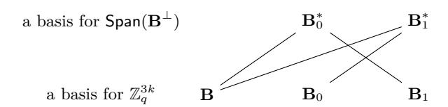
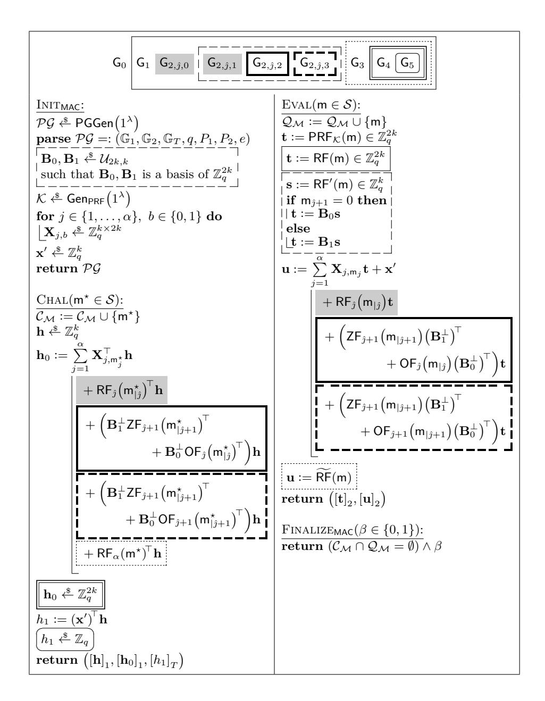
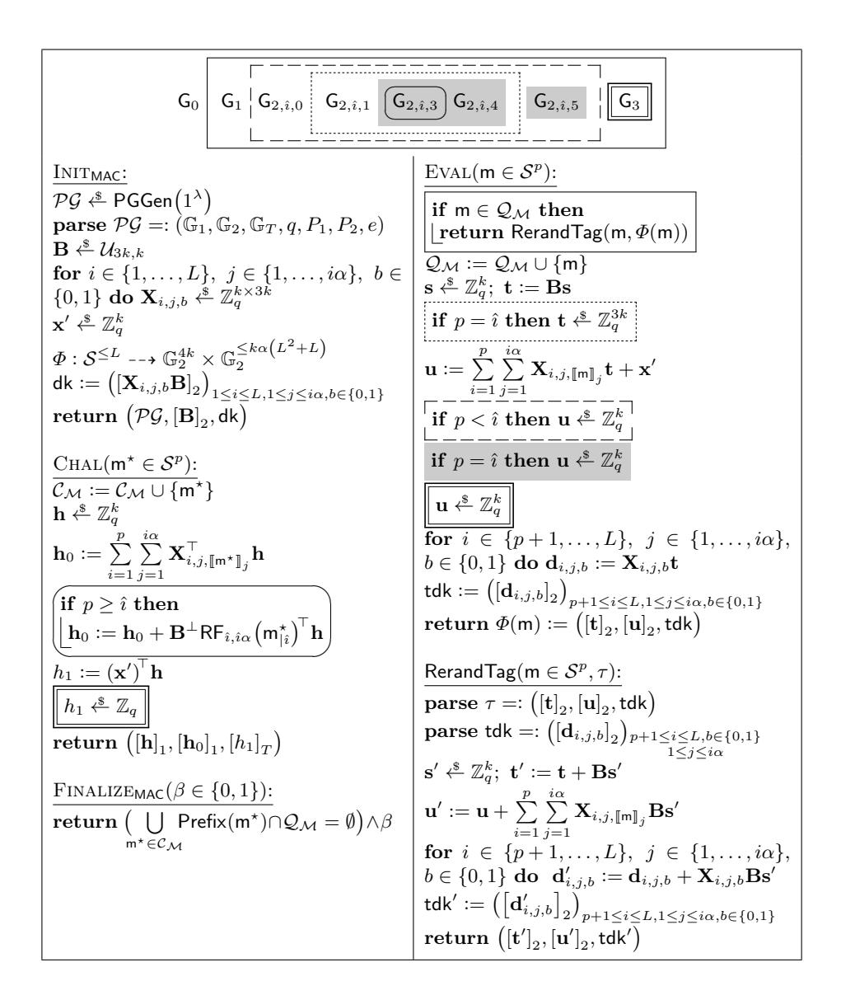
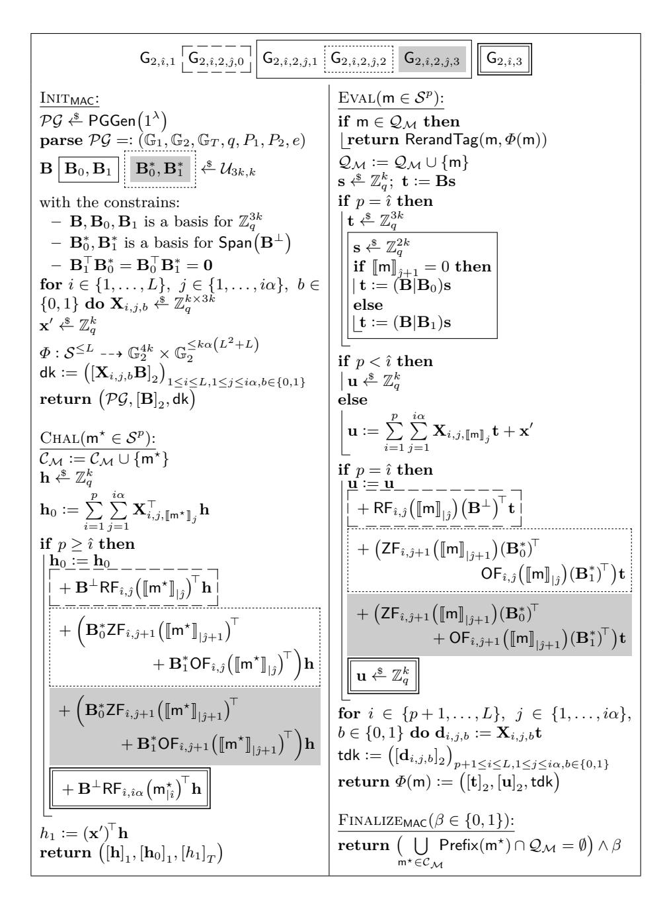
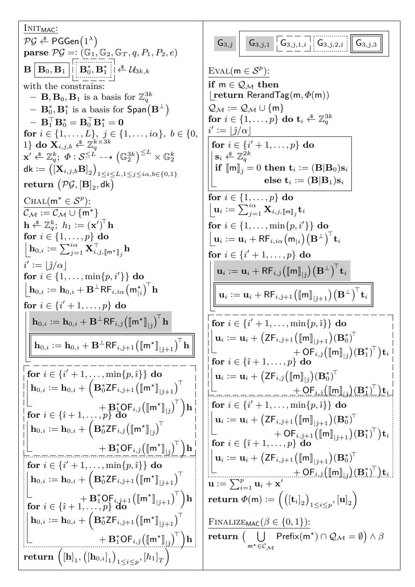
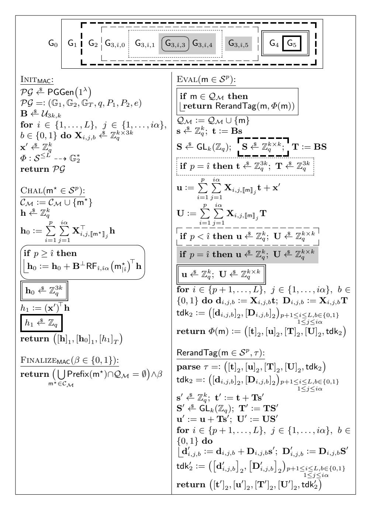
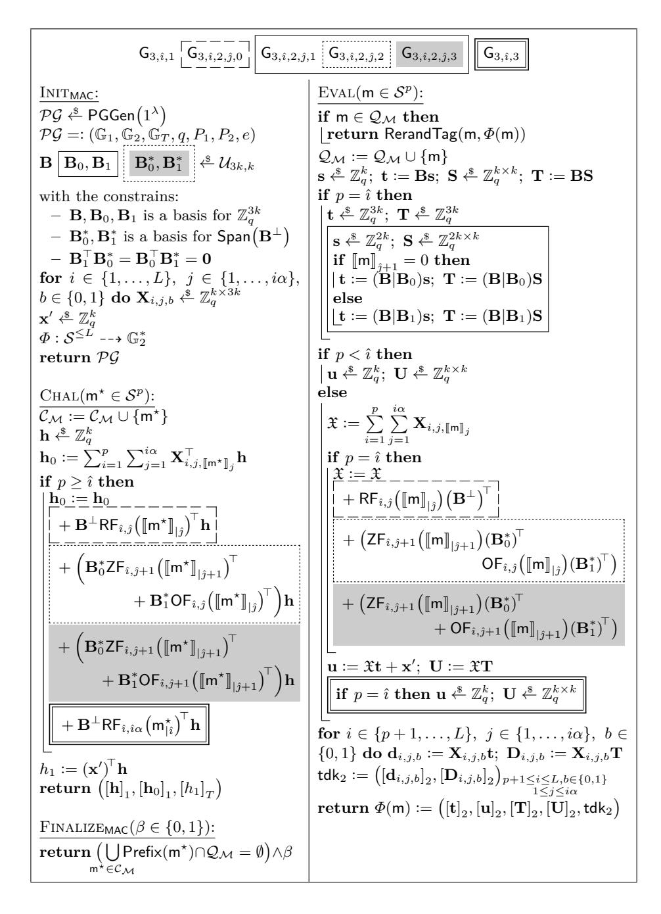
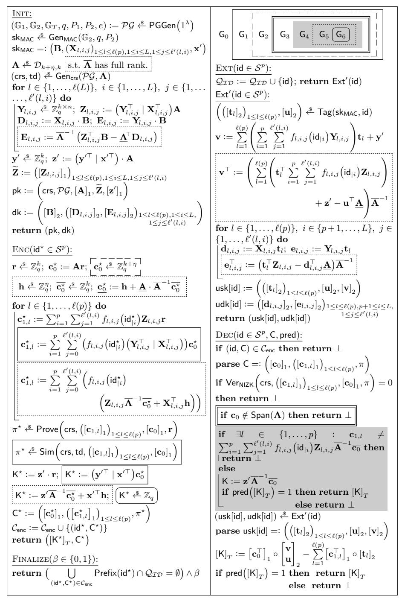
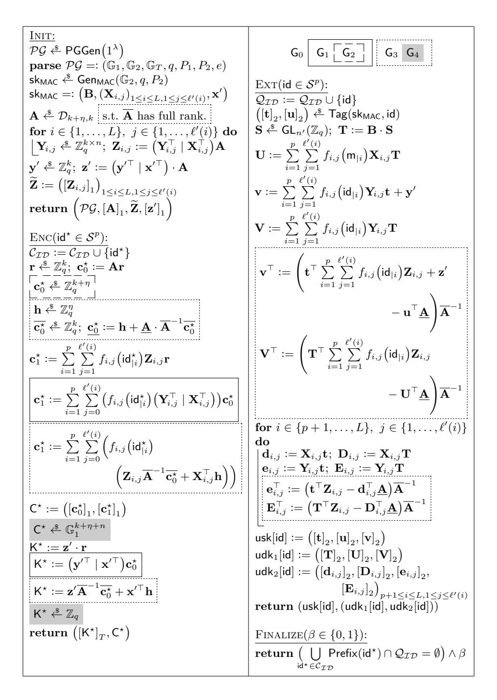
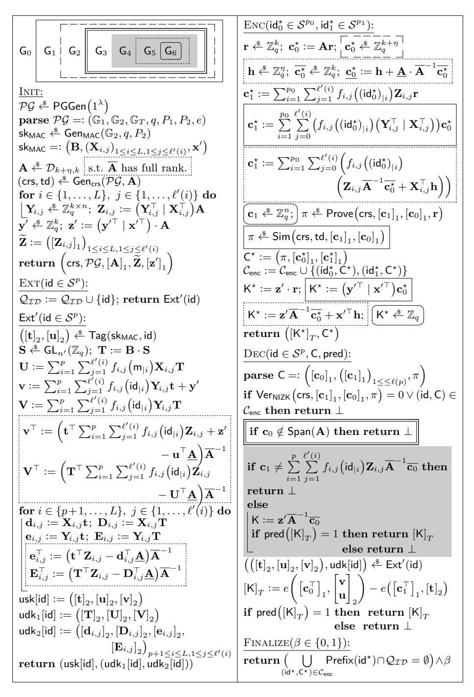

# <span id="page-0-0"></span>**Hierarchical Identity-Based Encryption with Tight Multi-Challenge Security**

Roman Langrehr*?*<sup>1</sup> and Jiaxin Pan<sup>2</sup>

<sup>1</sup> ETH Zurich, Zurich, Switzerland [roman.langrehr@inf.ethz.ch](mailto:roman.langrehr@inf.ethz.ch, jiaxin.pan@ntnu.no )

<sup>2</sup> Department of Mathematical Sciences

NTNU – Norwegian University of Science and Technology, Trondheim, Norway [jiaxin.pan@ntnu.no](mailto:roman.langrehr@inf.ethz.ch, jiaxin.pan@ntnu.no )

**Abstract.** We construct the *first* hierarchical identity-based encryption (HIBE) scheme with tight adaptive security in the multi-challenge setting, where adversaries are allowed to ask for ciphertexts for multiple adaptively chosen identities. Technically, we develop a novel technique that can tightly introduce randomness into user secret keys for hierarchical identities in the multi-challenge setting, which cannot be easily achieved by the existing techniques for tightly multi-challenge secure IBE.

In contrast to the previous constructions, the security of our scheme is independent of the number of user secret key queries and that of challenge ciphertext queries. We prove the tight security of our scheme based on the Matrix Decisional Diffie-Hellman Assumption, which is an abstraction of standard and simple decisional Diffie-Hellman assumptions, such as the *k*-Linear and SXDH assumptions.

Finally, we also extend our ideas to achieve tight chosen-ciphertext security and anonymity, respectively. These security notions for HIBE have not been tightly achieved in the multi-challenge setting before.

**Keywords.** Hierarchical identity-based encryption, tight security, multichallenge security, chosen-ciphertext security, anonymity.

# **1 Introduction**

Tight Reductions. In public-key cryptography, most of the schemes are constructed with reduction-based security proofs. A security reduction efficiently maps an adversary A against the security of a scheme with success probability *ε*<sup>A</sup> to a solver B that breaks the hardness of a suitable computational problem with success probability *ε*B. We call the quotient *`* := *ε*A*/ε*<sup>B</sup> the security loss of a reduction, which can be viewed as a quantitative measurement of the distance between the security of the scheme and the hardness of the problem. Ideally, we want (1) the underlying problem to be standard and well-established, (2) the security notion to be realistic, and (3) the security of the scheme to be as close to the hardness of the problem as possible, namely, *`* to be as close to 1 as possible.

*<sup>?</sup>* Parts of the work were done at Karlsruhe Institute of Technology, Karlsruhe, Germany

c IACR 2020. This is the full version of a paper with the same title in the proceedings of PKC 2020 [\[34\]](#page-30-0).

<span id="page-1-0"></span>We consider a reduction *tight* if *`* is a small constant and the running time of B is approximately the same as that of A. Many existing works [\[10,](#page-28-0)[14](#page-29-0)[,15,](#page-29-1)[16\]](#page-29-2) consider a notion of tightness called "almost tight security". Different to the (full) tightness, almost tight security allows the security loss *`* to be a small polynomial, which is usually a linear function of the security parameter, but still independent of the size of A. We do not distinguish these two notions, but we are precise about the security loss in our comparison tables and security proofs.

Tight reductions are not only theoretically interesting but also beneficial in practice. A tight reduction enables us to give universal key-length recommendations that are independent of the size of an application and shorter than the non-tight ones. This is, in particular, useful in the setting where the envisioned size of an application cannot be reasonably bounded a priori. As a result of that, many recent works have been pursuing efficient tightly secure cryptographic schemes, including digital signature [\[24,](#page-30-1)[30,](#page-30-2)[16\]](#page-29-2), public-key encryption [\[14,](#page-29-0)[23,](#page-29-3)[15\]](#page-29-1), identity-based encryption [\[10](#page-28-0)[,5\]](#page-28-1) schemes, and authenticated key exchange protocols [\[18\]](#page-29-4).

HIBE meets Tight Security. In this paper, we focus on hierarchical identitybased encryption (HIBE) schemes [\[28,](#page-30-3)[17\]](#page-29-5). In an *L*-level HIBE, an identity is a vector of maximal *L* identities. It is considered to be more difficult to construct HIBE than IBE and PKE since an HIBE scheme provides more functionalities. For instance, an *L*-level HIBE scheme allows a user at level *α < L* to delegate a secret key for its descendants at level *α* <sup>0</sup> *> α*.

Constructing tightly secure HIBE appears to be much more challenging. The first tightly secure IBE from standard assumptions was constructed in 2013 [\[10\]](#page-28-0), while the first tightly secure HIBE was just proposed very recently [\[32\]](#page-30-4). We believe that it is not a coincidence. Firstly, Lewko and Waters [\[37\]](#page-31-0) showed the potential difficulty of constructing tightly secure HIBE. More precisely, they proved that there is a (relatively) large class of HIBE schemes that cannot be tightly proven secure. Secondly, Blazy, Kiltz, and Pan (BKP) [\[5\]](#page-28-1) made the first attempt to bypass the aforementioned impossibility result. Unfortunately, it has been found that the BKP proof strategy is insufficient for the tight adaptive security of HIBE (cf. [\[6\]](#page-28-2) and Appendix A of [\[33\]](#page-30-5)). Adaptive security allows an adversary A to adaptively choose a challenge identity id*?* after it sees the master public key and asks for polynomial many user secret keys for identities chosen by A.

Very recently, Langrehr and Pan (LP) proposed the first tightly secure HIBE based on standard assumptions. Their proof strategy improves the one of BKP in the sense that the LP strategy can tightly introduce (suitable) randomness in user secret keys for identities with flexible lengths. Inherently, the LP proof strategy seems to only work tightly in the *single-challenge* setting, where an adversary is restricted to ask for a ciphertext for at most one challenge identity.

From Single- to Multi-Challenge Security. In the real world, an adversary can learn ciphertexts of multiple challenge identities. This is captured by the more realistic multi-challenge security. We note that single-challenge security implies multi-challenge security via a straightforward, but non-tight reduction. This is

<span id="page-2-0"></span>mainly the reason why the security of many (H)IBE schemes (e.g. [\[42,](#page-31-1)[36](#page-31-2)[,35,](#page-30-6)[5,](#page-28-1)[32\]](#page-30-4)) is analyzed in this simple single-challenge setting. However, this straightforward "single- to multi-challenge" reduction loses a relatively large polynomial factor. Namely, if an adversary makes *Q<sup>c</sup>* many queries for challenge ciphertexts, then the overall security loses a factor of *Qc*. This defeats the purpose of establishing tight reductions for the overall scheme in a more realistic setting.

Our Goal: HIBE with Tight Multi-Challenge Security. We aim at constructing tightly secure HIBE schemes in the more realistic multi-challenge setting. We note that there exist several techniques in constructing tightly multi-challenge secure IBE schemes (for instance, [\[27,](#page-30-7)[20,](#page-29-6)[21,](#page-29-7)[25\]](#page-30-8)) in composite- or prime-order pairing groups. However, as already observed by the LP paper, these techniques cannot be easily used in the HIBE setting. Thus, to achieve our goal, it requires us to develop a new technique for tight multi-challenge security that is useful for HIBE schemes.

### **1.1 Our Contribution**

We construct the *first* tightly chosen-plaintext secure HIBE schemes in the multi-challenge setting. The main novelty of this paper is a new randomization technique that enables us to randomize user secret keys for hierarchical identities in the multi-challenge setting. We highlight that our technique improves the existing techniques [\[27](#page-30-7)[,20,](#page-29-6)[21,](#page-29-7)[25\]](#page-30-8) for tightly multi-challenge secure IBE schemes in the sense that ours can handle randomization for identities with flexible lengths. We postpone the detailed comparison of these techniques in [Section 1.3.](#page-8-0)

Following the "MAC-to-(H)IBE" framework [\[5,](#page-28-1)[32\]](#page-30-4), we capture our core technique with the notion of affine MACs with levels (which was firstly proposed in [\[32\]](#page-30-4)) in the multi-challenge setting. By using prime-order pairings and the Matrix Decisional Diffie-Hellman (MDDH) assumption [\[13\]](#page-29-8), we compile any of these MAC schemes to an HIBE tightly in the multi-challenge setting. We have two main constructions of the affine MACs, MAC<sup>1</sup> and MAC2, and they give us two HIBE with different advantages and disadvantages, respectively: Considering identity space ID := ({0*,* 1} *n*) <sup>≤</sup>*<sup>L</sup>*, our first scheme has constant amount of group elements in the ciphertext, but **O**(*nL*) many elements in the user secret key; and our second scheme has shorter user secret key that contains **O**(*L*) many elements, but its ciphertext contains **O**(*L*) many elements. Both schemes have security loss **O**(*n* · *L* 2 ) and independent of the numbers of challenge ciphertext queries and user secret key queries. [Table 1](#page-3-0) compares our schemes with the existing HIBE schemes in prime-order pairing groups.

We extend our main results in the following directions by using known techniques:

Anonymity. Additionally, the first construction of our MACs, MAC1, has tight anonymity. By using the anonymity-preserving transformation of [\[5\]](#page-28-1), we construct the *first* tightly secure, anonymous HIBE scheme in the multi-challenge setting. An (H)IBE scheme is anonymous if its challenge ciphertexts hide the corresponding identities. An application of anonymous HIBE is PKE with keyword search [\[1\]](#page-28-3).

<span id="page-3-1"></span><span id="page-3-0"></span>

| Scheme                         | mpk                                                                      | usk                                          | C                                            | Loss                    | MC | Ass.  |
|--------------------------------|--------------------------------------------------------------------------|----------------------------------------------|----------------------------------------------|-------------------------|----|-------|
| Wat05 [42]                     | $\mathbf{O}(nL) \mathbb{G} $                                             | $O(nL) \mathbb{G} $                          | $(1+p) \mathbb{G} $                          | $\mathbf{O}(nQ_{e})^L$  | Х  | DBDH  |
| Wat $09$ $[41]$                | $\mathbf{O}(L) \mathbb{G} $                                              | $\mathbf{O}(p)( \mathbb{G} + \mathbb{Z}_q )$ | $\mathbf{O}(p)( \mathbb{G} + \mathbb{Z}_q )$ | $\mathbf{O}(Q_{e})$     | X  | 2-LIN |
| Lew12 [35]                     | $60 \mathbb{G}  + 2 \mathbb{G}_T $                                       | $(60+10p) \mathbb{G} $                       | $10p \mathbb{G} $                            | $\mathbf{O}(Q_{e}L)$    | Х  | 2-LIN |
| CW13 [10]                      | $\mathbf{O}(Lk^2)( \mathbb{G}_1 + \mathbb{G}_2 )$                        | $O(Lk) \mathbb{G}_2 $                        | $(2k+2) \mathbb{G}_1 $                       | $\mathbf{O}(Q_{e})$     | X  | k-LIN |
| BKP14 [5]                      | $\mathbf{O}(Lk^2)( \mathbb{G}_1 + \mathbb{G}_2 )$                        | $O(Lk) \mathbb{G}_2 $                        | $(2k+2) \mathbb{G}_1 $                       | $\mathbf{O}(Q_{e})$     | Х  | k-LIN |
| GCTC16 [19]                    | $  (6k^2 + 12k)( \mathbb{G}_1  +  \mathbb{G}_2 ) + (k+2) \mathbb{G}_T  $ |                                              | $(3k+6)\lceil p/3\rceil  \mathbb{G}_1 $      | $\mathbf{O}(QL)$        | ×  | k-LIN |
| $LP19_1$ [32]                  | $\mathbf{O}(nL^2k^2)( \mathbb{G}_1 + \mathbb{G}_2 )$                     | $O(nL^2k) \mathbb{G}_2 $                     | $(4k+1) \mathbb{G}_1 $                       | $\mathbf{O}(nL^2k)$     | Х  | k-LIN |
| LP19 $_{1}^{\mathcal{H}}$ [32] | $\mathbf{O}(\gamma Lk^2)( \mathbb{G}_1  +  \mathbb{G}_2 )$               | $\mathbf{O}(\gamma Lk) \mathbb{G}_2 $        | $(4k+1) \mathbb{G}_1 $                       | $\mathbf{O}(\gamma Lk)$ | X  | k-LIN |
| $LP19_2$ [32]                  | $\mathbf{O}(nL^2k^2)( \mathbb{G}_1 + \mathbb{G}_2 )$                     | $ (3kp+k+1) \mathbb{G}_2 $                   | $(3kp+k+1) \mathbb{G}_1 $                    | $\mathbf{O}(nLk)$       | Х  | k-LIN |
| LP19 $_{2}^{\mathcal{H}}$ [32] | $\mathbf{O}(\gamma Lk^2)( \mathbb{G}_1  +  \mathbb{G}_2 )$               | $ (3kp+k+1) \mathbb{G}_2 $                   | $(3kp+k+1) \mathbb{G}_1 $                    | $\mathbf{O}(\gamma k)$  | X  | k-LIN |
| HIBKEM <sub>1</sub>            | $\mathbf{O}(nL^2k^2)( \mathbb{G}_1 + \mathbb{G}_2 )$                     | $\mathbf{O}(nL^2k) \mathbb{G}_2 $            | $5k \mathbb{G}_1 $                           | $\mathbf{O}(nL^2k)$     | 1  | k-LIN |
| $HIBKEM_1^{\mathcal{H}}$       | $\mathbf{O}(\gamma Lk^2)( \mathbb{G}_1  +  \mathbb{G}_2 )$               | $\mathbf{O}(\gamma Lk) \mathbb{G}_2 $        | $5k \mathbb{G}_1 $                           | $\mathbf{O}(\gamma Lk)$ | 1  | k-LIN |
| $HIBKEM_2$                     | $\mathbf{O}(nL^2k^2)( \mathbb{G}_1 + \mathbb{G}_2 )$                     | $(3kp+2k) \mathbb{G}_2 $                     | $(3kp+2k) \mathbb{G}_1 $                     | $\mathbf{O}(nLk)$       | 1  | k-LIN |
| $HIBKEM_2^{\mathcal{H}}$       | $\mathbf{O}(\gamma Lk^2)( \mathbb{G}_1 + \mathbb{G}_2 )$                 | $(3kp+2k) \mathbb{G}_2 $                     | $(3kp+2k) \mathbb{G}_1 $                     | $\mathbf{O}(\gamma k)$  | 1  | k-LIN |

**Table 1.** Comparison of HIBEs in prime-order pairing groups with adaptive security in the standard model based on static assumptions. The highlighted rows are from this paper.  $HIBKEM_1$  can be found in Figure 40, and  $HIBKEM_2$  can be found in Figure 41. The schemes with  $\mathcal{H}$  in the superscript are obtained by hashing the identities as described in the full version of [32].

The hierarchical identity space is  $(\{0,1\}^n)^{\leq L}$ , and  $\gamma$  is the bit length of the range of a collision-resistant hash function. ' $|\mathsf{mpk}|$ ,' ' $|\mathsf{usk}|$ ,' and ' $|\mathsf{C}|$ ' stand for the size of the master public key, a user secret key and a ciphertext, respectively. We count the number of group elements in  $\mathbb{G}_1, \mathbb{G}_2$ , and  $\mathbb{G}_T$ . For a scheme that works in symmetric pairing groups, we write  $\mathbb{G}(:=\mathbb{G}_1=\mathbb{G}_2)$ . The schemes that work in asymmetric pairing groups can be instantiated with SXDH=1-LIN. In the ' $|\mathsf{usk}|$ ' and ' $|\mathsf{C}|$ ' columns p stands for the hierarchy depth of the identity vector. In bounded HIBEs, L denotes the maximum hierarchy depth. In the security loss,  $Q_e$  denotes the number of user secret key queries by the adversary. The last but one column indicates whether the adversary is allowed to query multiple challenge ciphertexts ( $\checkmark$ ) or just one (x). The last column shows the underlying security assumption.

We note that it was unknown how to construct a tightly adaptively secure anonymous HIBE scheme even in the single-challenge setting.

CHOSEN-CIPHERTEXT SECURITY. We note that ciphertexts of our HIBE schemes have compatible structure to use Quasi-Adaptive Non-Interactive Zero-Knowledge (QANIZK) argument for linear subspace systems [29,31,25,2]. Similar to [25], we upgrade our schemes to chosen-ciphertext security by using any tightly unbounded simulation-sound QANIZK scheme. These schemes are the first tightly chosen-ciphertext secure HIBE schemes in the multi-challenge setting. Combining with the technique in the first extension, we also construct a tightly chosen-ciphertext secure and anonymous HIBE.

<span id="page-4-0"></span>More (Minor) Extensions. Additionally, our schemes have tight multi-instance security. In the multi-instance setting, an adversary can get multiple instances of the HIBE scheme. It is trivial that our HIBE schemes are tightly secure in this setting, since, given an instance of our HIBE, it can be easily rerandomized to get multiple instances from it.

In the full version of [\[32\]](#page-30-4), they use a collision-resistant hash function to further improve the security loss and master public key size of their schemes. Here we can also do the same improvement.

These two extensions are rather minor and we skip the technical details here, but include them in [Table 1](#page-3-0) for a more complete comparison of different HIBE schemes.

### **1.2 Technical Details**

We give an overview of our main technique in achieving tight adaptive security for HIBE in the multi-challenge setting. Here we restrict ourselves to chosen-plaintext security.

Starting Point: The BKP Framework. To set up the stage of our discussion, we recall the BKP framework [\[5\]](#page-28-1), which transforms an algebraic MAC scheme to an IBE scheme in prime-order pairing groups. The algebraic MAC is called affine MAC, due to its affine structure. Their framework is an abstraction of the Chen-Wee (CW) IBE [\[10\]](#page-28-0) and can also be viewed as an extension of the "MAC-to-Signature" framework by Bellare and Goldwasser (BG) [\[4\]](#page-28-5) in the IBE context. In particular, the BKP framework can be viewed as a fine-grained reverse of the Naor transformation [\[7\]](#page-28-6) on the BG signature scheme.

We give some informal ideas about how an affine MAC can be turned into an IBE. The master public key of an IBE, pk := Com(skMAC), is a commitment of the MAC secret key, skMAC. A user secret key usk[id] of an identity id consists of a BG signature, namely, a MAC tag *τ*id on the message id and a NIZK proof of the validity of *τ*id w.r.t. the secret key committed in pk. The observation of BKP is that one can implement these commitments and NIZK proofs with the (tuned) Groth-Sahai proof system [\[22\]](#page-29-10).

Due to the fact that the BKP MAC has affine structures, the NIZK verification involves only linear equations and can be randomized. Indeed, the BKP IBE ciphertext Cid can be viewed as a randomized linear combination of pk w.r.t. id. Implicitly, the decryption algorithm is a randomized NIZK verification of the validity of *τ*id (from usk[id]): If *τ*id is valid, then the ciphertext Cid can be correctly decrypted.

Obstacles in Achieving our Goal with BKP. The BKP framework has a nice property that the security of the IBE scheme can be tightly reduced to the security of the MAC scheme. Thus, we can only focus on constructing tightly secure MAC, which is more fundamental. In particular, the BKP framework has a tightly secure MAC scheme MACNR in the single-challenge setting under a standard assumption. MACNR is implicitly in the CW IBE and borrows some idea from the Naor-Reingold PRF [\[38\]](#page-31-4). However, MACNR has limitations that

- <span id="page-5-3"></span><span id="page-5-0"></span>(a) it can only be used to handle at most one IBE challenge ciphertext, and
- <span id="page-5-1"></span>(b) it cannot provide tight adaptive security for HIBE.

We recall  $\mathsf{MAC}_{\mathsf{NR}}$  and give more technical discussion about these two limitations. Let  $\mathbb{G}_2 := \langle P_2 \rangle$  be an additive prime-order group. We use the implicit notation  $[x]_2 := xP_2$  as in [13].  $\mathsf{MAC}_{\mathsf{NR}}$  chooses  $\mathbf{B} \in \mathbb{Z}_q^{(k+1)\times k}$  according to the underlying assumption.  $\mathbf{B}$  always has rank k and, for simplicity, we assume that the first k rows of  $\mathbf{B}$ , denoted by  $\overline{\mathbf{B}}$ , forms a full-rank square matrix. For message space  $\mathcal{M} := \{0,1\}^n$ , which is the same as the identity space of the resulting IBE, its secret key is chosen uniformly at random and has the form of

$$\mathsf{sk}_{\mathsf{MAC}} := \left( (\mathbf{x}_{i,b})_{1 \leq i \leq n, b \in \{0,1\}}, x_0' \right) \in \left( \mathbb{Z}_q^{k \cdot 2} \right)^n \times \mathbb{Z}_q \,.$$

Its MAC tag  $\tau := ([\mathbf{t}]_2, [u]_2)$  contains a random vector  $[\mathbf{t}]_2$  and a message-dependent value  $[u]_2$  in the form of

$$\mathbf{t} = \overline{\mathbf{B}}\mathbf{s} \in \mathbb{Z}_q^k \quad \text{for random } \mathbf{s} \in \mathbb{Z}_q^k$$

$$u = \sum_{i} \mathbf{x}_{i,\mathsf{m}_i}^{\mathsf{T}} \mathbf{t} + x_0' \in \mathbb{Z}_q. \tag{1}$$

Based on the MDDH assumption,  $\mathsf{MAC}_\mathsf{NR}$  is tightly pseudorandom against chosen-message attacks (PR-CMA security), which is a decisional variant of the standard existential unforgeability against chosen-message attacks (EUF-CMA security) for MAC schemes [11]. Essentially, the PR-CMA security of  $\mathsf{MAC}_\mathsf{NR}$  shows that  $[u]_2$  is pseudorandom.

To understand the intuition of the BKP proof strategy, we consider the standard EUF-CMA security, where an adversary  $\mathcal{A}$  can ask for polynomial many MAC tags  $\tau_{\mathsf{m}} := ([\mathbf{t}_{\mathsf{m}}]_2, [u_{\mathsf{m}}]_2)$  on messages  $\mathsf{m}$  of its adaptive choice and submit a forgery  $\tau^* := ([\mathbf{t}^*]_2, [u^*]_2)$  for one single verification. The MAC tag query is corresponding to the IBE user secret key query, and the verification query is related to the IBE challenge ciphertext query.

The overall proof strategy of  $\mathsf{MAC}_{\mathsf{NR}}$  is to gradually randomize all the u values in answering  $\mathcal{A}$ 's tag queries. During this process, the reduction must be able to compute  $u^\star = \sum_i \mathbf{x}_{i,\mathsf{m}_i^\star}^\top \mathbf{t}^\star + x_0'$  for a fresh  $\mathsf{m}^\star$ , which is the main difficulty in the proof. To solve it, the BKP argument conceptually replace  $x_0'$  with a constant random function  $\mathsf{RF}_0(\varepsilon)$ . Then, by using the MDDH assumption, it develops a random function  $\mathsf{RF}_{i+1}:\{0,1\}^{i+1}\to\mathbb{Z}_q$  from another random function  $\mathsf{RF}_i:\{0,1\}^i\to\mathbb{Z}_q$  on-the-fly for some integer  $0\leq i< n$ . After n recursions, a random function  $\mathsf{RF}:\{0,1\}^n\to\mathbb{Z}_q$  is developed and thus the security loss of  $\mathsf{MAC}_{\mathsf{NR}}$  is  $\mathsf{O}(n)$ . More precisely, in each step, the reduction guesses the (i+1)-th bit of  $\mathsf{m}^\star$  as  $b^\star\in\{0,1\}$  and defines the function  $\mathsf{RF}_{i+1}$  as:

<span id="page-5-2"></span>
$$\mathsf{RF}_{i+1}(\mathsf{m}_{|i+1}) := \begin{cases} \mathsf{RF}_i(\mathsf{m}_{|i}) & \text{(if } \mathsf{m}_{i+1} = b^\star) \\ \mathsf{RF}_i(\mathsf{m}_{|i}) + R_{\mathsf{m}_{|i}} & \text{(if } \mathsf{m}_{i+1} = 1 - b^\star) \end{cases}, \tag{2}$$

where  $\mathsf{m}_{|i}$  is the first i bits of  $\mathsf{m}$  and  $R_{\mathsf{m}_{|i}}$  is a random value from  $\mathbb{Z}_q$  chosen for  $\mathsf{m}_{|i}$ . Alternatively, the BKP strategy can be viewed as gradually injecting randomness directly into  $x_0'$ , during developing the random function above.

<span id="page-6-0"></span>There are two important observations of this strategy, which lead to Limitations (a) and (b) above. These observations are in the proof step from Hybrid i (using  $\mathsf{RF}_i$ ) to Hybrid (i+1) (using  $\mathsf{RF}_{i+1}$ ):

REASON FOR LIMITATION (a): In this step, the reduction embeds a MDDH problem instance in  $[\mathbf{x}_{i+1,1-b^*}]_2$  and chooses the other  $\mathbf{x}_{j,b}$  in  $\mathbb{Z}_q$ . Thus,  $\mathbf{x}_{i+1,1-b^*}$  in  $\mathbb{Z}_q$  is unknown to the reduction during this step, but  $\mathbf{x}_{i+1,b^*}$  is known in  $\mathbb{Z}_q$  for verifying the forgery on a single  $\mathbf{m}^*$ . However, this strategy cannot work tightly if there is more than one verification queries, which is required in the multi-challenge setting. For instance, after guessing  $b^*$ , the reduction fails to answer two verification queries for challenge messages,  $0^n$  and  $1^n$ , respectively.

REASON FOR LIMITATION (b):  $\mathsf{RF}_{i+1}$  defined via Equation (2) is a random function for message spaces with fixed length based on the crucial fact that the outputs of  $\mathsf{RF}_{i+1}$  and  $\mathsf{RF}_i$  are not revealed at the same time. However, for hierarchical identity spaces,  $\mathcal{ID} := (\{0,1\}^n)^{\leq L}$ , it is not the case anymore.

As a concrete example, we consider the transition from Hybrids n to (n+1). Via Equation (2),  $\mathsf{RF}_n(\mathsf{m}) = \mathsf{RF}_{n+1}(\mathsf{m}||b^\star)$  and adversaries can learn this by asking MAC tags for  $\mathsf{m}$  and  $\mathsf{m}||b^\star||\mathsf{m}'$  (where  $\mathsf{m}' \in \{0,1\}^{n-1}$ ). Thus, the tags for these two message are not independent and we cannot continue the hybrid argument.

In order to solve our task, we need to develop new techniques to overcome both limitations described above. Our approach essentially has two main steps: In the first step, we target at tight multi-challenge security, and, at the same time, we are looking ahead and making it suitable for handling hierarchical identities; and, in the second step, we upgrade the technique developed in the first step to the HIBE setting.

STEP 1: NEW STRATEGY FOR TIGHT MULTI-CHALLENGE SECURITY. We call this randomization strategy subspace randomization, since it first increases the dimension of  ${\bf t}$  in the tag so that there exist subspaces, and our crucial randomization happens in some of these subspaces. This subspace randomization is compatible with the independent randomization of Langrehr and Pan [32] and, thus, it gets extended in Step 2 to randomize MAC tags for messages with flexible length, namely, hierarchical identities.

Our starting point of achieving tight multi-challenge security is to design a new randomization strategy that does not depend on any bit of  $\mathbf{m}^*$ . To implement this strategy, our first attempt is to choose the random vector  $\mathbf{t}$  in the MAC tag from a larger vector space  $\mathbb{Z}_q^{2k}$ . Accordingly, we choose  $\mathbf{x}_{j,b}$  values in  $\mathsf{sk}_{\mathsf{MAC}}$  from  $\mathbb{Z}_q^{2k}$  and compute  $([\mathbf{t}]_2, [u]_2)$  in the MAC tag as

$$\mathbf{t} \stackrel{\$}{\leftarrow} \mathbb{Z}_q^{2k}$$

$$u = \sum_i \mathbf{x}_{i,\mathsf{m}_i}^{\top} \mathbf{t} + x_0' \in \mathbb{Z}_q.$$
(3)

Our proof strategy is rather algebraic and make use of some simple facts about the vector space  $\mathbb{Z}_q^{2k}$ . We choose two random matrices  $\mathbf{B}_0, \mathbf{B}_1 \triangleq \mathbb{Z}_q^{2k \times k}$  and  $\mathbf{B}_0^{\perp}, \mathbf{B}_1^{\perp} \in \mathbb{Z}_q^{2k \times k}$  are the corresponding non-zero kernel matrices, respectively.

Namely,

<span id="page-7-0"></span>
$$\mathbf{B}_0^{\top} \cdot \mathbf{B}_0^{\perp} = \mathbf{B}_1^{\top} \mathbf{B}_1^{\perp} = \mathbf{0} \in \mathbb{Z}_q^{k \times k} \tag{4}$$

 $(\mathbf{B}_0 \mid \mathbf{B}_1)$  is a basis of  $\mathbb{Z}_q^{2k}$ .  $\mathsf{Span}(\mathbf{B}_0) := \{ \mathbf{v} \in \mathbb{Z}_q \mid \exists \mathbf{w} \in \mathbb{Z}_q^k \text{ s.t. } \mathbf{v} = \mathbf{B}_0 \cdot \mathbf{w} \}$  is a linear subspace of  $\mathbb{Z}_q^{2k}$  and it is the same for  $\mathsf{Span}(\mathbf{B}_1)$ .

We note that in the value u the information of the secret  $\mathbf{x}_{j,b}$  values is only projected to  $\mathbf{t}$ . When we answer a tag query on message  $\mathbf{m}$ , we can switch  $\mathbf{t}$  to a suitable subspace (either  $\mathsf{Span}(\mathbf{B}_0)$  or  $\mathsf{Span}(\mathbf{B}_1)$ ) by the MDDH assumption. After the switch, some information about  $\mathbf{x}_{j,b}$  values is perfectly hidden, and we can use it to gradually randomize the u values. Choosing  $\mathbf{t}$  from the suitable subspace depends on the corresponding bit of  $\mathbf{m}$ , but independent of the guess of  $\mathbf{m}^*$ .

More precisely, in our Hybrid i, for a tag query on m, our  $u_m$  has the form

$$u_{\mathsf{m}} := \Big(\sum\nolimits_{j} \mathbf{x}_{j,\mathsf{m}_{j}}^{\top} + \underbrace{\mathsf{OF}_{i}(\mathsf{m}_{|i})(\mathbf{B}_{0}^{\perp})^{\top} + \mathsf{ZF}_{i}(\mathsf{m}_{|i})(\mathbf{B}_{1}^{\perp})^{\top}}_{=:\mathsf{RF}_{i}(\mathsf{m}_{|i})}\Big)\mathbf{t}_{\mathsf{m}} + x_{0}'\,,$$

where  $\mathsf{OF}_i, \mathsf{ZF}_i : \{0,1\}^i \to \mathbb{Z}_q^{1 \times k}$  are two independent random functions. Since  $(\mathbf{B}_0^{\perp} \mid \mathbf{B}_1^{\perp})^{\top} \in \mathbb{Z}_q^{2k \times 2k}$  is full-rank with overwhelming probability, we can view  $(\mathsf{OF}_i(\mathsf{m}_{\mid i}) \mid \mathsf{ZF}_i(\mathsf{m}_{\mid i}))(\mathbf{B}_0^{\perp} \mid \mathbf{B}_1^{\perp})^{\top}$  as a random function  $\mathsf{RF}_i : \{0,1\}^i \to \mathbb{Z}_q^{1 \times 2k}$ . In the transition to Hybrid (i+1), we do the following two sub-steps:

- Step 1.1 (using MDDH): If  $m_{i+1} = 0$ , then we choose  $\mathbf{t}_m$  from  $\mathsf{Span}(\mathbf{B}_0)$ , otherwise, from  $\mathsf{Span}(\mathbf{B}_1)$ .
- Step 1.2 (information-theoretic argument): For all tag queries with  $\mathsf{m}_{i+1} = 0$ , we increase the entropy in  $\mathsf{OF}_i$  and develop  $\mathsf{OF}_{i+1}$ . By Equation (4), this change is perfectly hidden from the adversary  $\mathcal{A}$ . Similarly, we also develop  $\mathsf{ZF}_{i+1}$  from  $\mathsf{ZF}_i$ .

Now we can introduce  $\mathsf{RF}_{i+1}$  and, after n of these recursions, we can have  $\mathsf{RF}_n$  to randomize all the tags.

The only thing left is to handle multiple verification queries. To this end, in our scheme, we choose random  $\mathbf{X}_{j,b} \in \mathbb{Z}_q^{k \times 2k}$ . Compared with  $\mathbf{x}_{j,b}^{\top} \in \mathbb{Z}_q^{2k}$ , our new  $\mathbf{X}_{j,b}$  has more rows such that we can embed the MDDH challenge to randomize multiple verification queries as well. We do not always know all the whole  $\mathbf{X}_{j,b}$  values over  $\mathbb{Z}_q$ . However, different to the BKP or CW strategy, we multiply the unknown part in  $\mathbf{X}_{j,b}$  with the suitable kernel matrix, either  $\mathbf{B}_0^{\perp}$  or  $\mathbf{B}_1^{\perp}$ . This is done implicitly. Since, in all the tag queries,  $\mathbf{t}_m$  has already been chosen in the correct subspace, the unknown part will not appear, and we can simulate the tag queries. When we answer the verification queries, this unknown part will "react with" these queries and randomize them, which will later be the challenge ciphertext queries of the resulting IBE.

To sum up the discussion above, our strategy increases the dimension of  $\mathbf{x}_{j,b}^{\top} \in \mathbb{Z}_q^{1 \times k}$  to  $\mathbf{X}_{j,b} \in \mathbb{Z}_q^{k \times 2k}$  in such a way that we have enough entropy from the row vectors to randomize tag queries and, combining it with the entropy from the column vectors, we can handle the verification queries at the same time.

We capture all the above discussion formally by presenting an affine MAC in Section 3.1, which can be used to construct a tightly multi-challenge secure IBE.

<span id="page-8-3"></span>We are not claiming any efficiency improvement with this IBE, but technical achievement, instead, since it has roughly the same efficiency as its counterparts from [20,21,25]. However, our techniques involved in this IBE scheme improves those in [20,21,25] in the sense that ours can be extended to randomize user secret keys for hierarchical identities, while those in [20,21,25] cannot.

STEP 2: UPGRADE TO HIERARCHICAL IDENTITIES. For the random function  $\mathsf{RF}_i$  developed via the strategy above, an important observation is that its output is only projected in  $\mathbf{t}$  during the hybrid argument. This gives us "room" to upgrade the subspace randomization to handle hierarchical identities: By controlling the choice of  $\mathbf{t}$ , we can make sure that the outputs of  $\mathsf{RF}_i$  and  $\mathsf{RF}_{i+1}$  will not appear at the same time via the value u.

The strategy in this step is motivated by the work of Langrehr and Pan [32], where their core technique is to isolate the randomization for messages at different levels (which will be identities at different levels in the HIBE). To implement this, we add a "layer" to  $\mathbf{t}$  by choosing  $\mathbf{t}$  from  $\mathbb{Z}_q^{3k}$ . Similar to Step 1, we exploit some properties of the linear space  $\mathbb{Z}_q^{3k}$ . We choose two random matrices  $\mathbf{B}_0, \mathbf{B}_1 \overset{\$}{=} \mathbb{Z}_q^{3k \times k}$  and decompose  $\mathbb{Z}_q^{3k}$  into  $\mathrm{Span}(\mathbf{B} \mid \mathbf{B}_0 \mid \mathbf{B}_1)$ . The span of  $\mathbf{B}^{\perp}$  is decomposed into that of  $\mathbf{B}_0^* \in \mathbb{Z}_q^{3k \times k}$  and  $\mathbf{B}_1^* \in \mathbb{Z}_q^{3k \times k}$ . An overview of the orthogonal relations between all these matrices is given in Figure 1.

<span id="page-8-1"></span>

Fig. 1. Solid lines mean orthogonal:  $\mathbf{B}^{\top}\mathbf{B}_{0}^{*} = \mathbf{B}_{1}^{\top}\mathbf{B}_{0}^{*} = \mathbf{0} = \mathbf{B}^{\top}\mathbf{B}_{1}^{*} = \mathbf{B}_{0}^{\top}\mathbf{B}_{1}^{*} \in \mathbb{Z}_{q}^{k \times k}$ .

The intuition of our technique is that we develop a random function in  $\mathsf{Span}(\mathbf{B}^{\perp})$ , which is orthogonal to  $\mathsf{Span}(\mathbf{B})$ . Thus, it is easy to isolate the randomization for messages at level  $\alpha (\leq L)^3$  from that at other levels by choosing  $\mathbf{t_m}$  from  $\mathsf{Span}(\mathbf{B})$  for  $\mathsf{m} \in (\{0,1\}^n)^{\alpha'}$  and  $\alpha' \neq \alpha$ . The randomization with a level  $\alpha$  is done similar to Step 1. In particular,  $(\mathbf{B}_0, \mathbf{B}_1^*)$  functions similar to  $(\mathbf{B}_0, \mathbf{B}_0^\perp)$  in Step 1, and the same for  $(\mathbf{B}_1, \mathbf{B}_0^+)$  vs.  $(\mathbf{B}_1, \mathbf{B}_1^\perp)$ .

We only present our intuitions here and refer Section 3.2 and Appendix B for the actual constructions and formal proofs.

### <span id="page-8-0"></span>1.3 More on Related Works

As we discussed before, there are different techniques [3,27,20,21,25] to achieve tight multi-challenge security for IBE schemes. Schemes in [21,25] are based on

<span id="page-8-2"></span>For message space with flexible length  $\mathcal{M} := (\{0,1\}^n)^{\leq L}$ , a message at level  $\alpha$  means  $\mathsf{m} \in (\{0,1\}^n)^{\alpha}$ .

<span id="page-9-1"></span>the BKP framework and close to ours, while the other schemes are either using composite-order pairings [27] or based on stronger, non-standard assumptions [3,20]. We suppose the proof strategy in the work of Hofheinz, Jia, and Pan (HJP) [25] cannot be easily extended to randomize MAC tags for hierarchical identities, since their technique develops the random function RF<sub>i</sub> in the full space  $\mathbb{Z}_q$  and directly introduce randomness into  $x_0'$ . Inherently, in the HIBE setting, this strategy has the same limitation as BKP, namely, the outputs of RF<sub>i</sub> and RF<sub>i+1</sub> are both leaked when identities have different lengths. The work of Gong et al. [21] has the same issue as well. This limitation explains why some proof steps of LP HIBE schemes cannot be done in the multi-challenge setting, even with the HJP technique.

# 1.4 Open Problems

As mentioned before and observed in Table 1, the tighter security loss of our schemes is  $\mathbf{O}(\gamma k)$ , but with relatively larger ciphertext. We leave further improving the security loss with compact ciphertext as an open problem.

Another interesting direction is to make our schemes more efficient. A main disadvantage of our schemes is that they require relatively large master public keys. More precisely, ignoring the small constant k, mpk contains either  $\mathbf{O}(\alpha L^2)$  or  $\mathbf{O}(\gamma L)$  group elements, because of the use of the LP technique [32]. An interesting open problem is to construct a tightly secure HIBE with shorter master public keys, probably first in the single-challenge setting. A similar interesting open problem is to shorten the size of either user secret keys or ciphertexts to have a more efficient, tightly secure HIBE scheme in the multi-challenge setting.

### 1.5 Roadmap

We recall useful definitions in Section 2. Section 3 proposes affine MACs that can be used to construct tightly multi-challenge secure IBE and HIBE, respectively. It presents our core techniques as described above in a detailed and formal manner. Appendix C constructs an affine MAC, which is anonymous and can be used to construct anonymous HIBE. Appendix D transforms our MAC schemes to CPA-and CCA-secure HIBE schemes, respectively, based on the frameworks from [5,25]. Appendix E transforms our anonymous MAC to anonymous CPA- and CCA-secure HIBE schemes, respectively. Appendix F gives concrete instantiations of our schemes. For readers only interested in our core techniques, we refer Section 3 to them, and other sections are for completeness of our claims.

### <span id="page-9-0"></span>2 Preliminaries

NOTATIONS. We use  $x \overset{\$}{\leftarrow} \mathcal{S}$  to denote the process of sampling an element x from  $\mathcal{S}$  uniformly at random if  $\mathcal{S}$  is a set and to denote the process of running  $\mathcal{S}$  with its internal randomness and assign the output to x if  $\mathcal{S}$  is an algorithm. The expression

<span id="page-10-0"></span> $a\stackrel{?}{=}b$  stands for comparing a and b on equality and returning the result in Boolean value. For positive integers  $k, \eta \in \mathbb{N}_+$  and a matrix  $\mathbf{A} \in \mathbb{Z}_q^{(k+\eta) \times k}$ , we denote the upper square matrix of  $\mathbf{A}$  by  $\overline{\mathbf{A}} \in \mathbb{Z}_q^{k \times k}$  and the lower  $\eta$  rows of  $\mathbf{A}$  by  $\underline{\mathbf{A}} \in \mathbb{Z}_q^{\eta \times k}$ . Similarly, for a column vector  $\mathbf{v} \in \mathbb{Z}_q^{k+\eta}$ , we denote the upper k elements by  $\overline{\mathbf{v}} \in \mathbb{Z}_q^k$  and the lower  $\eta$  elements of  $\mathbf{v}$  by  $\underline{\mathbf{v}} \in \mathbb{Z}_q^\eta$ . We use  $\mathbf{A}^{-\top}$  as shorthand for  $(\mathbf{A}^{-1})^{\top}$ . For a matrix  $\mathbf{A} \in \mathbb{Z}_q^{n \times m}$ , we use  $\mathrm{Span}(\mathbf{A}) := \{\mathbf{A}\mathbf{v} \mid \mathbf{v} \in \mathbb{Z}_q^m\}$  to denote the linear span of  $\mathbf{A}$  and  $\mathbf{A}^{\perp}$  denotes an arbitrary matrix with  $\mathrm{Span}(\mathbf{A}^{\perp}) = \{\mathbf{v} \mid \mathbf{A}^{\top}\mathbf{v} = \mathbf{0}\}$ .

For a set S and  $n \in \mathbb{N}_+$ ,  $S^n$  denotes the set of all n-tuples with components in S. For a string  $\mathbf{m} \in \Sigma^n$ ,  $\mathbf{m}_i$  denotes the i-th component of  $\mathbf{m}$   $(1 \le i \le n)$  and  $\mathbf{m}_{|i}$  denotes the prefix of length i of  $\mathbf{m}$ . Furthermore for a p-tuple of bit strings  $\mathbf{m} \in (\{0,1\}^n)^p$ , we use  $[\![\mathbf{m}]\!]$  to denote the string  $\mathbf{m}_1||\dots||\mathbf{m}_p$ . Thus for  $1 \le i \le np$ ,  $[\![\mathbf{m}]\!]_i$  denotes the i-th bit of  $\mathbf{m}_1||\dots||\mathbf{m}_p$  and  $[\![\mathbf{m}]\!]_{|i}$  denotes the i-bit-long prefix of  $\mathbf{m}_1||\dots||\mathbf{m}_p$ .

All algorithms in this paper are probabilistic polynomial-time unless we state otherwise. If  $\mathcal{A}$  is an algorithm, then we write  $a \stackrel{\$}{\leftarrow} \mathcal{A}(b)$  to denote the random variable outputted by  $\mathcal{A}$  on input b.

GAMES. Following [5], we use code-based games to define and prove security. A game G contains procedures Init and Finalize, and some additional procedures  $P_1, \ldots, P_n$ , which are defined in pseudo-code. Initially all variables in a game are undefined (denoted by  $\bot$ ), all sets are empty (denote by  $\emptyset$ ), and all partial maps (denoted by  $f: A \dashrightarrow B$ ) are totally undefined. An adversary  $\mathcal A$  is executed in game G (denote by  $G^{\mathcal A}$ ) if it first calls Init, obtaining its output. Next, it may make arbitrary queries to  $P_i$  (according to their specification), again obtaining their output. Finally, it makes one single call to Finalize( $\cdot$ ) and stops. We use  $G^{\mathcal A} \Rightarrow d$  to denote that G outputs d after interacting with  $\mathcal A$ , and d is the output of Finalize.

 $T(\mathcal{A})$  denotes the running time of  $\mathcal{A}$ .

### 2.1 Pairing Groups and Matrix Diffie-Hellman Assumptions

Let GGen be a probabilistic polynomial-time (PPT) algorithm that on input  $1^{\lambda}$  returns a description  $\mathcal{G} := (\mathbb{G}_1, \mathbb{G}_2, \mathbb{G}_T, q, P_1, P_2, e)$  of asymmetric pairing groups where  $\mathbb{G}_1$ ,  $\mathbb{G}_2$ ,  $\mathbb{G}_T$  are cyclic groups of order q for a  $\lambda$ -bit prime q. The group elements  $P_1$  and  $P_2$  are generators of  $\mathbb{G}_1$  and  $\mathbb{G}_2$ , respectively. The function  $e: \mathbb{G}_1 \times \mathbb{G}_2 \to \mathbb{G}_T$  is an efficient computable (non-degenerated) bilinear map. Define  $P_T := e(P_1, P_2)$ , which is a generator in  $\mathbb{G}_T$ . In this paper, we only consider Type III pairings, where  $\mathbb{G}_1 \neq \mathbb{G}_2$  and there is no efficient homomorphism between them. All constructions in this paper can be easily instantiated with Type I pairings by setting  $\mathbb{G}_1 = \mathbb{G}_2$  and defining the dimension k to be greater than 1.

We use the implicit representation of group elements as in [13]. For  $s \in \{1, 2, T\}$  and  $a \in \mathbb{Z}_q$  define  $[a]_s = aP_s \in \mathbb{G}_s$  as the implicit representation of a in  $\mathbb{G}_s$ . Similarly, for a matrix  $\mathbf{A} = (a_{ij}) \in \mathbb{Z}_q^{n \times m}$  we define  $[\mathbf{A}]_s$  as the implicit representation of  $\mathbf{A}$  in  $\mathbb{G}_s$ . Span $(\mathbf{A}) := \{\mathbf{Ar} | \mathbf{r} \in \mathbb{Z}_q^m\} \subset \mathbb{Z}_q^n$  denotes the linear span of  $\mathbf{A}$ , and similarly  $\mathsf{Span}([\mathbf{A}]_s) := \{[\mathbf{Ar}]_s | \mathbf{r} \in \mathbb{Z}_q^m\} \subset \mathbb{G}_s^n$ . Note that it is

<span id="page-11-1"></span>efficient to compute  $[\mathbf{AB}]_s$  given  $([\mathbf{A}]_s, \mathbf{B})$  or  $(\mathbf{A}, [\mathbf{B}]_s)$  with matching dimensions. We define  $[\mathbf{A}]_1 \circ [\mathbf{B}]_2 := e([\mathbf{A}]_1, [\mathbf{B}]_2) = [\mathbf{AB}]_T$ , which can be efficiently computed given  $[\mathbf{A}]_1$  and  $[\mathbf{B}]_2$ .

Next we recall the definition of the matrix Diffie-Hellman (MDDH) and related assumptions [13].

**Definition 1 (Matrix Distribution).** Let  $k, \ell \in \mathbb{N}$  with  $\ell > k$ . We call  $\mathcal{D}_{\ell,k}$  a matrix distribution if it outputs matrices in  $\mathbb{Z}_q^{\ell \times k}$  of full rank k in polynomial time.

Without loss of generality, we assume the first k rows of  $\mathbf{A} \stackrel{\$}{\leftarrow} \mathcal{D}_{\ell,k}$  form an invertible matrix. The  $\mathcal{D}_{\ell,k}$ -matrix Diffie-Hellman problem is to distinguish the two distributions ( $[\mathbf{A}], [\mathbf{A}\mathbf{w}]$ ) and ( $[\mathbf{A}], [\mathbf{u}]$ ) where  $\mathbf{A} \stackrel{\$}{\leftarrow} \mathcal{D}_{\ell,k}$ ,  $\mathbf{w} \stackrel{\$}{\leftarrow} \mathbb{Z}_q^k$  and  $\mathbf{u} \stackrel{\$}{\leftarrow} \mathbb{Z}_q^\ell$ .

**Definition 2** ( $\mathcal{D}_{\ell,k}$ -matrix **Diffie-Hellman Assumption**). Let  $\mathcal{D}_{\ell,k}$  be a matrix distribution and  $s \in \{1,2,T\}$ . We say that the  $\mathcal{D}_{\ell,k}$ -matrix Diffie-Hellman ( $\mathcal{D}_{\ell,k}$ -MDDH) assumption holds relative to PGGen in group  $\mathbb{G}_s$  if for all PPT adversaries  $\mathcal{A}$ , it holds that

$$\mathsf{Adv}^{\mathsf{mddh}}_{\mathcal{D}_{\ell,k},\mathsf{PGGen},s}(\mathcal{A}) := |\Pr[\mathcal{A}(\mathcal{PG},[\mathbf{A}]_s,[\mathbf{Aw}]_s) = 1] - \Pr[\mathcal{A}(\mathcal{PG},[\mathbf{A}]_s,[\mathbf{u}]_s) = 1]|$$

is negligible where the probability is taken over  $\mathcal{PG} \stackrel{\$}{\leftarrow} \mathsf{PGGen}(1^{\lambda})$ ,  $\mathbf{A} \stackrel{\$}{\leftarrow} \mathcal{D}_{\ell,k}$ ,  $\mathbf{w} \stackrel{\$}{\leftarrow} \mathbb{Z}_q^k$  and  $\mathbf{u} \stackrel{\$}{\leftarrow} \mathbb{Z}_q^\ell$ .

The uniform distribution is a particular matrix distribution that deserves special attention, as an adversary breaking the  $\mathcal{U}_{\ell,k}$  assumption can also distinguish between real MDDH tuples and random tuples for all other possible matrix distributions. For uniform distributions, they stated in [14] that  $\mathcal{U}_k$ -MDDH and  $\mathcal{U}_{\ell,k}$ -MDDH assumptions are equivalent.

**Definition 3 (Uniform Distribution).** Let  $k, \ell \in \mathbb{N}_+$  with  $\ell > k$ . We call  $\mathcal{U}_{\ell,k}$  a uniform distribution if it outputs uniformly random matrices in  $\mathbb{Z}_q^{\ell \times k}$  of rank k in polynomial time. Let  $\mathcal{U}_k := \mathcal{U}_{k+1,k}$ .

<span id="page-11-0"></span>**Lemma 1** ( $\mathcal{U}_{\ell,k}$ -MDDH  $\Leftrightarrow \mathcal{U}_k$ -MDDH [14]). Let  $\ell, k \in \mathbb{N}_+$  with  $\ell > k$ . An  $\mathcal{U}_{\ell,k}$ -MDDH instance is as hard as an  $\mathcal{U}_k$ -MDDH instance. More precisely, for each adversary  $\mathcal{A}$  there exists an adversary  $\mathcal{B}$  and vice versa with

$$\mathsf{Adv}^{\mathsf{mddh}}_{\mathcal{U}_{\ell,k},\mathsf{PGGen},s}(\mathcal{A}) = \mathsf{Adv}^{\mathsf{mddh}}_{\mathcal{U}_{k},\mathsf{PGGen},s}(\mathcal{B})$$

and  $T(A) \approx T(B)$ .

*Proof.* An  $\mathcal{U}_{\ell,k}$ -MDDH instance  $(\mathcal{PG}, [\mathbf{A}]_s, [\mathbf{v}]_s)$  can be transformed into an  $\mathcal{U}_k$ -MDDH by picking uniformly random a full-rank matrix  $\mathbf{T} \in \mathbb{Z}_q^{(k+1) \times \ell}$  and returning  $(\mathcal{PG}, [\mathbf{TA}]_s, [\mathbf{Tv}]_s)$ .

For the other direction one picks uniformly random a full-rank matrix  $\mathbf{T}' \in \mathbb{Z}_q^{\ell \times (k+1)}$  to turn the  $\mathcal{U}_k$ -MDDH instance  $(\mathcal{PG}, [\mathbf{A}]_s, [\mathbf{v}]_s)$  into an  $\mathcal{U}_{\ell,k}$ -MDDH instance  $(\mathcal{PG}, [\mathbf{T'A}]_s, [\mathbf{T'v}]_s)$ .

<span id="page-12-1"></span>**Lemma 2** ( $\mathcal{D}_{\ell,k}$ -MDDH  $\Rightarrow \mathcal{U}_k$ -MDDH [13]). Let  $\ell, k \in \mathbb{N}_+$  with  $\ell > k$  and let  $\mathcal{D}_{\ell,k}$  be a matrix distribution. A  $\mathcal{U}_k$ -MDDH instance is at least as hard as an  $\mathcal{D}_{\ell,k}$  instance. More precisely, for each adversary  $\mathcal{A}$  there exists an adversary  $\mathcal{B}$  with

$$\mathsf{Adv}^{\mathsf{mddh}}_{\mathcal{U}_k,\mathsf{PGGen},s}(\mathcal{A}) \leq \mathsf{Adv}^{\mathsf{mddh}}_{\mathcal{D}_{\ell,k},\mathsf{PGGen},s}(\mathcal{B})$$

and  $T(A) \approx T(B)$ .

For  $Q \in \mathbb{N}_+$ ,  $\mathbf{W} \stackrel{\hspace{0.1em}\raisebox{0.7em}{$\scriptscriptstyle \bullet$}}{\leftarrow} \mathbb{Z}_q^{k \times Q}$ ,  $\mathbf{U} \stackrel{\hspace{0.1em}\raisebox{0.7em}{$\scriptscriptstyle \bullet$}}{\leftarrow} \mathbb{Z}_q^{\ell \times Q}$ , consider the Q-fold  $\mathcal{D}_{\ell,k}$ -MDDH problem which is distinguishing the distributions  $(\mathcal{PG}, [\mathbf{A}], [\mathbf{AW}])$  and  $(\mathcal{PG}, [\mathbf{A}], [\mathbf{U}])$ . That is, the Q-fold  $\mathcal{D}_{\ell,k}$ -MDDH problem contains Q independent instances of the  $\mathcal{D}_{\ell,k}$ -MDDH problem (with the same  $\mathbf{A}$  but different  $\mathbf{w}_i$ ). By a hybrid argument, one can show that the two problems are equivalent, where the reduction loses a factor Q. The following lemma gives a tight reduction.

<span id="page-12-0"></span>**Lemma 3 (Random Self-reducibility [13]).** For  $\ell > k$  and any matrix distribution  $\mathcal{D}_{\ell,k}$ , the  $\mathcal{D}_{\ell,k}$ -MDDH assumption is random self-reducible. In particular, for any  $Q \in \mathbb{N}_+$  and any adversary  $\mathcal{A}$  there exists an adversary  $\mathcal{B}$  with

$$\begin{split} (\ell-k)\mathsf{Adv}^{\mathsf{mddh}}_{\mathcal{D}_{\ell,k},\mathsf{PGGen},s}(\mathcal{A}) + \frac{1}{q-1} & \geq \mathsf{Adv}^{Q\text{-mddh}}_{\mathcal{D}_{\ell,k},\mathsf{PGGen},s}(\mathcal{B}) := \\ & \left| \Pr[\mathcal{B}(\mathcal{PG},[\mathbf{A}],[\mathbf{AW}] \Rightarrow 1)] - \Pr[\mathcal{B}(\mathcal{PG},[\mathbf{A}],[\mathbf{U}] \Rightarrow 1)] \right|, \end{split}$$

where  $\mathcal{PG} \stackrel{\hspace{0.1em}\mathsf{\scriptscriptstyle\$}}{\leftarrow} \mathsf{PGGen}\big(1^{\lambda}\big)$ ,  $\mathbf{A} \stackrel{\hspace{0.1em}\mathsf{\scriptscriptstyle\$}}{\leftarrow} \mathcal{D}_{\ell,k}$ ,  $\mathbf{W} \stackrel{\hspace{0.1em}\mathsf{\scriptscriptstyle\$}}{\leftarrow} \mathbb{Z}_q^{k \times Q}$ ,  $\mathbf{U} \stackrel{\hspace{0.1em}\mathsf{\scriptscriptstyle\$}}{\leftarrow} \mathbb{Z}_q^{(k+1) \times Q}$ , and  $T(\mathcal{B}) \approx T(\mathcal{A}) + Q \cdot \mathsf{poly}(\lambda)$ , where  $\mathsf{poly}$  is a polynomial independent of  $\mathcal{A}$ .

To reduce the Q-fold  $\mathcal{U}_{\ell,k}$ -MDDH assumption to the  $\mathcal{U}_k$ -MDDH assumption we have to apply Lemma 3 to get from Q-fold  $\mathcal{U}_{\ell,k}$ -MDDH to standard  $\mathcal{U}_{\ell,k}$ -MDDH and then Lemma 1 to get from  $\mathcal{U}_{\ell,k}$ -MDDH to  $\mathcal{U}_k$ -MDDH. Thus for every adversary  $\mathcal{A}$  there exists an adversary  $\mathcal{B}$  with

$$\mathsf{Adv}^{Q\operatorname{-mddh}}_{\mathcal{U}_{\ell,k},\mathsf{PGGen},s}(\mathcal{A}) \leq (\ell-k)\mathsf{Adv}^{\mathsf{mddh}}_{\mathcal{U}_k,\mathsf{PGGen},s}(\mathcal{B}) + \frac{1}{q-1}\,.$$

<span id="page-12-2"></span>The following Lemma is often helpful with the uniform matrix distribution.

### Lemma 4.

$$\Pr[\operatorname{rank}(\mathbf{A}) = k \mid \mathbf{A} \stackrel{\$}{\leftarrow} \mathbb{Z}_q^{k \times k}] \ge 1 - \frac{1}{q-1}$$

A proof can be found in Appendix A.

### 2.2 Pseudorandom Functions

For the IBE construction we need pseudorandom functions (PRFs).

**Definition 4 (Pseudorandom Function).** A family of pseudorandom functions is a tuple  $\mathcal{F} := (\mathsf{Gen}_{\mathsf{PRF}}, \mathsf{PRF})$  of polynomial-time algorithms with:

- $-\mathcal{K} \stackrel{\$}{\leftarrow} \mathsf{Gen}_{\mathsf{PRF}}(1^{\lambda})$  is a probabilistic algorithm that gets the security parameter  $1^{\lambda}$  and returns a (private) key  $\mathcal{K}$ .
- PRF is a deterministic algorithm that gets a key K and an input  $X \in \mathcal{D}$  and outputs  $\mathsf{PRF}_{K}(X) \in \mathcal{R}$ , where  $\mathcal{D}$  is the domain set and  $\mathcal{R}$  is the finite range set.

The security notion for pseudorandom functions is pseudorandomness.

**Definition 5 (Pseudorandomness).** A family of pseudorandom functions  $\mathcal{F} := (\mathsf{Gen}_{\mathsf{PRF}}, \mathsf{PRF})$  is pseudorandom if for all PPT adversaries  $\mathcal{A}$ ,

$$\mathsf{Adv}^{\mathsf{pr}}_{\mathcal{F}}(\mathcal{A}) := \left| \Pr \Big[ \mathcal{A}^{\mathsf{PRF}_{\mathcal{K}}(\cdot)} \Rightarrow 1 \mid \mathcal{K} \xleftarrow{\hspace{0.1em}} \mathsf{Gen}_{\mathsf{PRF}} \big( 1^{\lambda} \big) \Big] - \Pr \Big[ \mathcal{A}^{\mathsf{RF}(\cdot)} \Rightarrow 1 \Big] \right|$$

is negligible in  $\lambda$ . The notion  $\mathcal{A}^{f(\cdot)}$  means  $\mathcal{A}$  has oracle access to the function f and  $\mathsf{RF}: \mathcal{D} \to \mathcal{R}$  is random function (i.e. a function that maps every input to a uniform random value from  $\mathcal{R}$ ).

### 2.3 Affine MACs

The HIBEs in this paper are constructed in the BKP framework: The HIBEs are obtained from a Message Authentication Code with suitable algebraic structures (affine MAC with levels). The main work is to achieve tight security in the multi-challenge setting for the MACs.

To achieve this, we need to generalize the structure of the affine MAC with levels slightly and allow that  $\mathbf{X}$  can be a matrix (instead of a vector) and  $\mathbf{x}'$  can be a vector (instead of only a scalar value). Please note that in the definition in this paper,  $\mathbf{X}$  is transposed compared to the original affine MAC with levels definition.

**Definition 6 (Affine MAC with Levels).** An affine MAC with levels MAC consists of three PPT algorithms (Gen<sub>MAC</sub>, Tag, Ver<sub>MAC</sub>) with the following properties:

- $\mathsf{Gen}_{\mathsf{MAC}}(\mathbb{G}_2, q, P_2)$  gets a description of a prime-order group  $(\mathbb{G}_2, q, P_2)$  and returns a secret key  $\mathsf{sk}_{\mathsf{MAC}} := \left(\mathbf{B}, (\mathbf{X}_{l,i,j})_{1 \leq l \leq \ell(p), 1 \leq i \leq L, 1 \leq j \leq \ell'(l,i)}, \mathbf{x}'\right)$  where  $\mathbf{B} \in \mathbb{Z}_q^{n \times n'}$ ,  $\mathbf{X}_{l,i,j} \in \mathbb{Z}_q^{n \times n}$  for  $l \in \{1, \ldots, \ell(L)\}$ ,  $i \in \{1, \ldots, L\}$ , and  $j \in \{0, \ldots, \ell'(l,i)\}$  and  $\mathbf{x}' \in \mathbb{Z}_q^n$ .
- $\ \operatorname{Tag} \left( \operatorname{sk}_{\operatorname{MAC}}, \operatorname{m} \in \mathcal{S}^{p \leq L} \right) \ returns \ a \ tag \ \tau := \left( ([\mathbf{t}_l]_2)_{1 \leq l \leq \ell(p)}, [\mathbf{u}]_2 \right) \ where$

<span id="page-13-0"></span>
$$\mathbf{t}_{l} := \mathbf{B}\mathbf{s}_{l} \quad \text{for } \mathbf{s}_{l} \stackrel{\$}{=} \mathbb{Z}_{q}^{n'} \quad (1 \leq l \leq \ell(p))$$

$$\mathbf{u} := \sum_{l=1}^{\ell(p)} \left( \sum_{i=1}^{p} \sum_{j=1}^{\ell'(l,i)} f_{l,i,j}(\mathbf{m}_{|i}) \mathbf{X}_{l,i,j} \right) \mathbf{t}_{l} + \mathbf{x}'.$$
(5)

-  $\operatorname{Ver}_{\operatorname{MAC}}\left(\operatorname{sk}_{\operatorname{MAC}}, \operatorname{m}, \tau = \left(\left(\left[\mathbf{t}_{l}\right]_{2}\right)_{1 \leq l \leq \ell(p)}, \left[\mathbf{u}\right]_{2}\right)\right) \ checks, \ whether \ Equation \ (5) \ holds.$ 

```
 \begin{array}{|l|l|} \hline \underline{INIT_{MAC}:} \\ \mathcal{PG} \overset{\$}{\otimes} \mathsf{PGGen} \big( 1^{\lambda} \big) \\ \mathbf{parse} \ \mathcal{PG} =: \big( \mathbb{G}_1, \mathbb{G}_2, \mathbb{G}_T, q, P_1, P_2, e \big) \\ \mathsf{sk}_{\mathsf{MAC}} \overset{\$}{\otimes} \mathsf{Gen}_{\mathsf{MAC}} \big( \mathbb{G}_2, q, P_2 \big) \\ \mathsf{parse} \ \mathsf{sk}_{\mathsf{MAC}} =: \big( \mathbf{B}, (\mathbf{X}_j)_{1 \leq j \leq \ell}, \mathbf{x}' \big) \\ \mathbf{return} \ \mathcal{PG} \\ \hline \underline{EVAL} \big( \mathsf{m} \in \mathcal{S} \big): \\ \overline{\mathcal{Q}_{\mathcal{M}}} := \mathcal{Q}_{\mathcal{M}} \cup \{ \mathsf{m} \} \\ \mathbf{return} \ \mathsf{Tag} \big( \mathsf{sk}_{\mathsf{MAC}}, \mathsf{m} \big) \\ \hline \underline{FINALIZE_{\mathsf{MAC}}} \big( \beta \in \{0, 1\} \big): \\ \mathbf{return} \ \big( \mathcal{C}_{\mathcal{M}} \cap \mathcal{Q}_{\mathcal{M}} = \emptyset \big) \land \beta \\ \hline \end{array} \begin{array}{|l|l|} \underline{CHAL} \big( \mathsf{m}^* \in \mathcal{S} \big): \\ \overline{\mathcal{C}_{\mathcal{M}}} := \mathcal{C}_{\mathcal{M}} \cup \{ \mathsf{m}^* \} \\ \mathbf{h}_1 \overset{\$}{\otimes} \mathbb{Z}_q^n \\ h_0 := \left( \sum_{j=1}^{\ell} f_j(\mathsf{m}^*) \mathbf{X}_j^\top \right) \mathbf{h} \\ \hline \mathbf{h}_0 \overset{\$}{\otimes} \mathbb{Z}_q^n \\ \hline h_1 = (\mathbf{x}')^\top \mathbf{h} \in \mathbb{Z}_q \\ \hline \mathbf{return} \ \big( [\mathbf{h}]_1, [\mathbf{h}_0]_1, [h_1]_T \big) \\ \hline \end{array}
```

**Fig. 2.** Games  $mPR-CMA_{real}$  and  $\boxed{mPR-CMA_{rand}}$  for defining mPR-CMA security for affine MACs.

The messages of MAC have the form  $\mathbf{m} = (\mathbf{m}_1, \dots, \mathbf{m}_p)$  where  $p \leq L$  and  $\mathbf{m}_i \in \mathcal{S}$ . After the transformation to an HIBE,  $\mathcal{S}$  will be the base set of the identity space and L will be the maximum number of levels. The functions  $f_{l,i,j}: \mathcal{S}^i \to \mathbb{Z}_q$  must be public, efficiently computable functions. The parameters  $\ell: \{1, \dots, p\} \to \mathbb{N}_+$ ,  $n, n', \eta \in \mathbb{N}_+$  and  $\ell': \{1, \dots, p\} \times \{1, \dots, L\} \to \mathbb{N}_+$  ( $1 \leq i \leq L$ ) are arbitrary, scheme-depending parameters. The function  $\ell$  must be monotonous increasing.

A delegatable affine MAC is an affine MAC with levels with  $\ell(p)=1$  and an affine MAC is a delegatable affine MAC with L=1. We can use affine MACs with levels to build HIBEs, delegatable affine MACs to build anonymous HIBEs and affine MACs to build anonymous IBEs.

SECURITY. To build anonymous IBE, we need an affine MAC that satisfies multi-challenge pseudorandomness against chosen message attacks (mPR-CMA) security.

We require multi-challenge hierarchical pseudorandomness against chosen-message attacks (mHPR-CMA) for affine MACs with levels to obtain mIND-HID-CPA and mIND-HID-CCA secure HIBEs. The security notion is defined by the games in Figure 3.

**Definition 7** (mXPR-CMA Security). An affine MAC (with levels) MAC is mXPR-CMA-secure for  $X \in \{\varepsilon, H\}$  in  $\mathbb{G}_2$  if for all PPT adversaries  $\mathcal{A}$  the function

$$\mathsf{Adv}_{\mathsf{MAC},\mathbb{G}_2}^{\mathsf{m}x\mathsf{pr-cma}}(\mathcal{A}) := \left| \Pr \Big[ \mathsf{mXPR-CMA}_{\mathsf{real}}^{\mathcal{A}} \Rightarrow 1 \Big] - \Pr \Big[ \mathsf{mXPR-CMA}_{\mathsf{rand}}^{\mathcal{A}} \Rightarrow 1 \Big] \right|$$

is negligible.

<span id="page-15-4"></span><span id="page-15-2"></span>
$$\begin{array}{l} \frac{\operatorname{INIT}_{\mathsf{MAC}}:}{\mathcal{P}\mathcal{G}} \overset{\$}{\rightleftharpoons} \operatorname{\mathsf{PGGen}}(1^{\lambda}) \\ \operatorname{\mathbf{parse}} \mathcal{P}\mathcal{G} =: \left(\mathbb{G}_{1}, \mathbb{G}_{2}, \mathbb{G}_{T}, q, P_{1}, P_{2}, e\right) \\ \operatorname{\mathsf{sk}}_{\mathsf{MAC}} \overset{\$}{\rightleftharpoons} \operatorname{\mathsf{Gen}}_{\mathsf{MAC}}(\mathbb{G}_{2}, q, P_{2}) \\ \operatorname{\mathsf{sk}}_{\mathsf{MAC}} =: \left(\mathbf{B}, (\mathbf{X}_{l,i,j})_{1 \leq l \leq \ell(p), 1 \leq i \leq L}, \mathbf{x}'\right) \\ \operatorname{\mathsf{dk}} := \left([\mathbf{X}_{l,i,j}\mathbf{B}]_{2}\right)_{1 \leq l \leq \ell(p), 1 \leq i \leq L} \\ \operatorname{\mathsf{return}} \left(\mathcal{P}\mathcal{G}, [\mathbf{B}]_{2}, \operatorname{\mathsf{dk}}\right) \\ \\ \operatorname{\mathsf{EVAL}}(\mathsf{m} \in \mathcal{S}^{p}): \\ \overline{\mathcal{Q}}_{\mathcal{M}} := \mathcal{Q}_{\mathcal{M}} \cup \{\mathsf{m}\} \\ \left(\left([\mathsf{t}_{l}]_{2}\right)_{1 \leq l \leq \ell(p)}, [\mathsf{u}]_{2}\right) \overset{\$}{\rightleftharpoons} \operatorname{\mathsf{Tag}}(\mathsf{\mathsf{sk}}_{\mathsf{MAC}}, \mathsf{m}) \\ \operatorname{\mathsf{for}} \ l \in \{1, \dots, \ell(p)\}, \ i \in \{p+1, \dots, L\}, \\ j \in \{1, \dots, \ell'(l, i)\} \ \operatorname{\mathsf{do}} \ \operatorname{\mathsf{d}}_{l,i,j} := \mathbf{X}_{l,i,j} \operatorname{\mathsf{t}}_{l} \\ \operatorname{\mathsf{tdk}} := \left([\mathsf{d}_{l,i,j}]_{2}\right)_{1 \leq l \leq \ell(p)}, \mathsf{p}+1 \leq i \leq L, 1 \leq j \leq \ell'(l, i)} \\ \operatorname{\mathsf{return}} \left(\left([\mathsf{t}_{l}]_{2}\right)_{1 \leq l \leq \ell(p)}, [\mathsf{ul}]_{2}, \operatorname{\mathsf{tdk}}\right) \\ \end{array}$$

**Fig. 3.** Games  $mHPR-CMA_{real}$  and  $\boxed{mHPR-CMA_{rand}}$  for defining mHPR-CMA security for affine MACs with levels.

# <span id="page-15-1"></span>3 Delegatable Affine MACs with Tight Multi-Challenge Security.

### <span id="page-15-0"></span>3.1 Warm-up: IBE

First, we present the technique to handle multiple challenge queries in the IBE setting (L=1). The MAC is given in Figure 4. This affine MAC has identity space  $\mathcal{S} = \{0,1\}^{\alpha}$  (for arbitrary  $\alpha \in \mathbb{N}_+$ ) and uses  $n=2k, n'=k, \eta=k$  and  $\ell'=\alpha$ . To match the formal definition,  $\mathbf{X}_{j,b}$  should be renamed to  $\mathbf{X}_{2j-b}$  and  $f_{2j-b}(\mathsf{m}) := \left(\mathsf{m}_j \stackrel{?}{=} b\right)$ . The MAC looks very similar to the one in [25] and achieves the same security and very similar efficiency, however the security proof is quite different. A comparison of the resulting IBE with other tightly secure IBEs can be found in Table 2.

<span id="page-15-3"></span>As in [25], we need to ensure that the adversary can only query one tag per message. The key generator can ensure this by making the tags deterministic. He can achieve this by storing the generated tags for duplicated queries (stateful scheme) or by generating the randomness with a pseudorandom function. We have done the later in our presentation. The affine MACs with levels we present later solve this by having rerandomizable tags. Of course, they can be used as affine MAC as well by setting L=1, but this comes at the cost of being slightly less efficient.

<span id="page-16-2"></span><span id="page-16-1"></span>

| Scheme           | A | mpk                                                             | usk                     | C                       | Loss                  | МС | Ass.    |
|------------------|---|-----------------------------------------------------------------|-------------------------|-------------------------|-----------------------|----|---------|
| CW13 [10]        | Х | $2k^2(2n+1) \mathbb{G}_1 +k \mathbb{G}_T $                      | $4k \mathbb{G}_2$       | $4k \mathbb{G}_1$       | $\mathbf{O}(n)$       | Х  | k-LIN   |
| BKP14 [5]        | 1 | $(2nk^2 + 2k)\mathbb{G}_1$                                      | $ (2k+1) \mathbb{G}_2 $ | $ (2k+1) \mathbb{G}_1 $ | $\mathbf{O}(\lambda)$ | X  | k-LIN   |
| AHY15 [3]        | 1 | $(16n+8) \mathbb{G}_1 +2 \mathbb{G}_T $                         | $8 \mathbb{G}_2 $       | $8 \mathbb{G}_1 $       | $\mathbf{O}(n)$       | 1  | DLIN    |
| $GCD^+16_1$ [20] | X | $\left  (6nk^2 + 3k^2) \mathbb{G}_1  + k \mathbb{G}_T  \right $ | $6k \mathbb{G}_2 $      | $6k \mathbb{G}_1 $      | $\mathbf{O}(n)$       | 1  | k-LIN   |
| $GCD^+16_2$ [20] | X | $\left  (4nk^2 + 2k^2) \mathbb{G}_1  + k \mathbb{G}_T  \right $ | $4k \mathbb{G}_2 $      | $4k \mathbb{G}_1 $      | $\mathbf{O}(n)$       | 1  | k-LINAI |
| GDCC16 [21]      | 1 | $\left  (2nk^2 + 3k^2) \mathbb{G}_1  + k \mathbb{G}_T  \right $ | $4k \mathbb{G}_2 $      | $4k \mathbb{G}_1 $      | $\mathbf{O}(n)$       | 1  | k-LIN   |
| HJP18 [25]       | 1 | $((3+n)k^2+k) \mathbb{G}_1 $                                    | $4k \mathbb{G}_2 $      | $4k \mathbb{G}_1 $      | $\mathbf{O}(n)$       | 1  | k-LIN   |
| Ours             | 1 | $((2+2n)k^2+k) \mathbb{G}_1 $                                   | $4k \mathbb{G}_2 $      | $4k \mathbb{G}_1 $      | $\mathbf{O}(n)$       | 1  | k-LIN   |

**Table 2.** Comparison of IBEs in prime-order pairing groups with tight adaptive IND-ID-CPA-security in the standard model based on static assumptions. The schemes in the last two rows can also be made IND-ID-CCA secure. The second column indicates whether an IBE is anonymous ( $\checkmark$ ) or not ( $\checkmark$ ). The identity space is  $\{0,1\}^n$ . '|mpk|,' '|usk|,' and '|C|' stand for the size of the master public key, the user secret key and a ciphertext, respectively. We count the number of group elements in  $\mathbb{G}_1, \mathbb{G}_2$ , and  $\mathbb{G}_T$ . For a scheme that works in symmetric pairing groups, we write  $\mathbb{G}(:=\mathbb{G}_1=\mathbb{G}_2)$ . The last but one column indicates whether the adversary is allowed to query multiple challenge ciphertexts ( $\checkmark$ ) or just one ( $\checkmark$ ). The last column shows the underlying security assumption.

```
 \frac{\mathsf{Gen}_{\mathsf{MAC}}(\mathbb{G}_2,q,P_2):}{\mathcal{K} \overset{\$}{\Leftarrow} \mathsf{Gen}_{\mathsf{PRF}}(1^\lambda)} \\ \mathsf{for} \ j \in \{1,\dots,\alpha\}, \ b \in \{0,1\} \ \mathsf{do} \ \mathbf{X}_{j,b} \overset{\$}{\Leftarrow} \mathbb{Z}_q^{k \times 2k} \\ \mathbf{x}' \overset{\$}{\Leftarrow} \mathbb{Z}_q^k \\ \mathsf{return} \ \mathsf{sk}_{\mathsf{MAC}} := \left(\mathcal{K}, (\mathbf{X}_{j,b})_{1 \leq j \leq \alpha, b \in \{0,1\}}, \mathbf{x}'\right) \\ \frac{\mathsf{Tag}(\mathsf{sk}_{\mathsf{MAC}}, \mathsf{m} \in \mathcal{S}):}{\mathsf{parse}} \ \mathsf{sk}_{\mathsf{MAC}} := \left(\mathcal{K}, (\mathbf{X}_{j,b})_{1 \leq j \leq \alpha, b \in \{0,1\}}, \mathbf{x}'\right) \\ \mathsf{t} := \mathsf{PRF}_{\mathcal{K}}(\mathsf{m}) \in \mathbb{Z}_q^{2k} \\ \mathsf{u} := \sum_{j=1}^{\alpha} \mathbf{X}_{j,\mathsf{m}_j} \mathbf{t} + \mathsf{x}' \\ \mathsf{return} \ \left([\mathbf{t}]_2, [\mathbf{u}]_2\right) \\ \frac{\mathsf{Ver}_{\mathsf{MAC}}(\mathsf{sk}_{\mathsf{MAC}}, \mathsf{m} \in \mathcal{S}, \tau):}{\mathsf{parse}} \ \mathsf{sk}_{\mathsf{MAC}} := \left(\mathcal{K}, (\mathbf{X}_{j,b})_{1 \leq j \leq \alpha, b \in \{0,1\}}, \mathbf{x}'\right) \\ \mathsf{parse} \ \tau := \left([\mathbf{t}]_2, [\mathbf{u}]_2\right) \\ \mathsf{return} \ \mathbf{u} \overset{?}{=} \sum_{j=1}^{\alpha} \mathbf{X}_{j,\mathsf{m}_j} \mathbf{t} + \mathbf{x}'
```

Fig. 4. The new multi-challenge tightly secure affine MAC  $MAC_{mc}$ .

**Theorem 1** (Security of MAC<sub>mc</sub>). MAC<sub>mc</sub> is tightly mPR-CMA secure in  $\mathbb{G}_2$  under the  $\mathcal{U}_k$ -MDDH assumption for  $\mathbb{G}_1$ , the  $\mathcal{U}_k$ -MDDH assumption for  $\mathbb{G}_2$  and the pseudorandomness of  $\mathcal{F} := (\mathsf{Gen}_{\mathsf{PRF}}, \mathsf{PRF})$ . More precisely, for all adversaries  $\mathcal{A}$  there exists adversaries  $\mathcal{B}_1$ ,  $\mathcal{B}_2$  and  $\mathcal{B}_3$  with

$$\begin{split} \mathsf{Adv}^{\mathsf{mpr-cma}}_{\mathsf{MAC}_{mc}}(\mathcal{A}) \leq 8k\alpha \mathsf{Adv}^{\mathsf{mddh}}_{\mathcal{U}_k,\mathsf{PGGen},2}(\mathcal{B}_1) + (k\alpha + 2k + 1)\mathsf{Adv}^{\mathsf{mddh}}_{\mathcal{U}_k,\mathsf{PGGen},1}(\mathcal{B}_2) \\ &+ 2\mathsf{Adv}^{\mathsf{pr}}_{\mathcal{F}}(\mathcal{B}_3) + \frac{(Q_c + 10)\alpha + 4}{q-1} + \frac{2Q_e}{q^{2k}} \end{split}$$

and  $T(\mathcal{B}_1) \approx T(\mathcal{B}_2) \approx T(\mathcal{B}_3) \approx T(\mathcal{A}) + (Q_e + Q_c) \cdot \mathsf{poly}(\lambda)$ , where  $Q_e$  resp.  $Q_c$  denotes the number of EVAL resp. CHAL queries of  $\mathcal{A}$  and  $\mathsf{poly}$  is a polynomial independent of  $\mathcal{A}$ .

*Proof.* The proof uses a hybrid argument with the hybrids  $\mathsf{G}_0$ ,  $\mathsf{G}_1$ ,  $\mathsf{G}_{2,\hat{\jmath},0}$  for  $\hat{\jmath} \in \{0,\dots,\alpha\}$ ,  $\mathsf{G}_{2,\hat{\jmath},1}\text{-}\mathsf{G}_{2,\hat{\jmath},3}$  for  $\hat{\jmath} \in \{0,\dots,\alpha-1\}$  and finally  $\mathsf{G}_3\text{-}\mathsf{G}_5$ . They are given in Table 3. They make use of the random functions  $\mathsf{RF}: \mathcal{S} \to \mathbb{Z}_q^{2k}$ ,  $\mathsf{RF}': \mathcal{S} \to \mathbb{Z}_q^k$ ,  $\mathsf{RF}_{\hat{\jmath}}: \{0,1\}^{\hat{\jmath}} \to \mathbb{Z}_q^{k \times 2k}$ ,  $\mathsf{ZF}_{\hat{\jmath}}: \{0,1\}^{\hat{\jmath}} \to \mathbb{Z}_q^{k \times k}$  and  $\mathsf{OF}_{\hat{\jmath}}: \{0,1\}^{\hat{\jmath}} \to \mathbb{Z}_q^{k \times k}$  for  $\hat{\jmath} \in \{1,\dots,\alpha\}$  and  $\widetilde{\mathsf{RF}}: \mathcal{S} \to \mathbb{Z}_q^k$ .

<span id="page-17-2"></span>**Lemma 5** ( $G_0 \rightsquigarrow G_1$ ). For all adversaries A there exists an adversary B with

$$\left|\Pr\big[\mathsf{G}_0^{\mathcal{A}}\Rightarrow 1\big]-\Pr\big[\mathsf{G}_1^{\mathcal{A}}\Rightarrow 1\big]\right|\leq \mathsf{Adv}^{\mathsf{pr}}_{\mathcal{F}}(\mathcal{B})$$

and 
$$T(\mathcal{B}) \approx T(\mathcal{A}) + (Q_e + Q_c) \cdot \mathsf{poly}(\lambda)$$
.

*Proof.* The value  $\mathbf{t}$  for in the EVAL oracle is chosen randomly in game  $\mathsf{G}_1$  instead of pseudorandom in game  $\mathsf{G}_0$ . This leads to a straightforward reduction to the pseudorandomness of  $\mathcal{F} := (\mathsf{Gen}_\mathsf{PRF}, \mathsf{PRF})$ .

Lemma 6  $(G_1 \rightsquigarrow G_{2,0,0})$ 

$$\Pr\bigl[\mathsf{G}_1^{\mathcal{A}}\Rightarrow 1\bigr] = \Pr\bigl[\mathsf{G}_{2,0,0}^{\mathcal{A}}\Rightarrow 1\bigr]$$

*Proof.* In game  $\mathsf{G}_1$  replace  $\mathbf{X}_{1,b}$  with  $\mathbf{X}_{1,b} + \mathsf{RF}_0(\varepsilon)$  for  $b \in \{0,1\}$  to obtain game  $\mathsf{G}_{2,0,0}$ .

<span id="page-17-1"></span>**Lemma 7** ( $G_{2,\hat{\jmath},0} \rightsquigarrow G_{2,\hat{\jmath},1}$ ). For  $\hat{\jmath} < \alpha$  and all adversaries  $\mathcal{A}$  there exists an adversary  $\mathcal{B}$  with

$$\left|\Pr\!\left[\mathsf{G}_{2,\hat{\jmath},0}^{\mathcal{A}}\Rightarrow1\right]-\Pr\!\left[\mathsf{G}_{2,\hat{\jmath},1}^{\mathcal{A}}\Rightarrow1\right]\right|\leq 2k\mathsf{Adv}^{\mathsf{mddh}}_{\mathcal{U}_{k},\mathsf{PGGen},2}(\mathcal{B})+\frac{2}{q-1}$$

and 
$$T(\mathcal{B}) \approx T(\mathcal{A}) + (Q_e + Q_c) \cdot \mathsf{poly}(\lambda)$$
.

<span id="page-17-0"></span>A proof can be found in Appendix A.

<span id="page-18-0"></span>

**Fig. 5.** Hybrids for the security proof of  $MAC_{mc}$ .

<span id="page-19-0"></span>

| Hybrid                   | ${\bf t}$ uniform in                                                                                         | $r_{\mathbf{u}}(m)$                                                                                                                                                                                                                    | $r_{\mathbf{h}_0}(m)$                   | Transition                              |  |
|--------------------------|--------------------------------------------------------------------------------------------------------------|----------------------------------------------------------------------------------------------------------------------------------------------------------------------------------------------------------------------------------------|-----------------------------------------|-----------------------------------------|--|
| $G_0$                    | $\mathbb{Z}_q^{2k}$ (pseudorandom)                                                                           | (                                                                                                                                                                                                                                      | Original game                           |                                         |  |
| $G_1$                    | $\mathbb{Z}_q^{2k}$                                                                                          |                                                                                                                                                                                                                                        | )                                       | PRF                                     |  |
| $G_{2,\hat{\jmath},0}$   | $\mathbb{Z}_q^{2k}$                                                                                          | $RF_{\hat{\jmath}}($                                                                                                                                                                                                                   | Identical                               |                                         |  |
| $G_{2,\hat{\jmath},1}$   |                                                                                                              | $RF_{\hat{\jmath}}($                                                                                                                                                                                                                   | $\mathcal{U}_k$ -MDDH in $\mathbb{G}_2$ |                                         |  |
| $G_{2,\hat{\jmath},2}$   | $\begin{array}{l} \mathbf{if} \ m_{\hat{\jmath}+1} = 0 \ \mathbf{then} \\    Span(\mathbf{B}_0) \end{array}$ | $\left(ZF_{\hat{\jmath}+1}\left(m_{\mid \hat{\jmath}+1}\right)\right. + OF$                                                                                                                                                            | $\mathcal{U}_k$ -MDDH in $\mathbb{G}_1$ |                                         |  |
| $G_{2,\hat{\jmath},3}$   |                                                                                                              | $ \begin{pmatrix} \left(ZF_{\hat{\jmath}+1} \left(m_{ \hat{\jmath}+1}\right) \left(\mathbf{B}_{1}^{\perp}\right)^{T} \\ + OF_{\hat{\jmath}+1} \left(m_{ \hat{\jmath}+1}\right) \left(\mathbf{B}_{0}^{\perp}\right)^{T} \end{pmatrix} $ |                                         | $\mathcal{U}_k$ -MDDH in $\mathbb{G}_1$ |  |
| $G_{2,\hat{\jmath}+1,0}$ | $\mathbb{Z}_q^{2k}$                                                                                          | $RF_{\hat{\jmath}+1}$                                                                                                                                                                                                                  | $(m_{ \hat{\jmath}+1})$                 | $\mathcal{U}_k$ -MDDH in $\mathbb{G}_2$ |  |
| $G_3$                    | $\mathbb{Z}_q^{2k}$                                                                                          | uniform random $RF_{\alpha}(m)$                                                                                                                                                                                                        |                                         | Statistically close                     |  |
| $G_4$                    | $\mathbb{Z}_q^{2k}$                                                                                          | uniform random uniform random                                                                                                                                                                                                          |                                         | $\mathcal{U}_k$ -MDDH in $\mathbb{G}_1$ |  |
| $G_5$                    | $\mathbb{Z}_q^{2k}$                                                                                          | uniform random                                                                                                                                                                                                                         | uniform random                          | $\mathcal{U}_k$ -MDDH in $\mathbb{G}_1$ |  |

**Table 3.** Summary of the hybrids of Figure 5. Non-duplicated EVAL queries draw (pseudo-)randomly  $\mathbf{t}$  from the set described by the second column and add the randomness  $r_{\mathbf{u}}(\mathbf{m})\mathbf{t}$  to  $\mathbf{u}$  or choose  $\mathbf{u}$  uniform random. The CHAL queries add the term  $r_{\mathbf{h}_0}(\mathbf{m}^{\star})^{\mathsf{T}}\mathbf{h}$  to  $\mathbf{h}_0$  or choose  $\mathbf{h}_0$  uniform random. The column "Transition" displays how we can switch to this hybrid from the previous one. The background color indicates repeated transitions.

**Lemma 8** ( $G_{2,\hat{\jmath},1} \leadsto G_{2,\hat{\jmath},2}$ ). For all adversaries  $\mathcal{A}$  there exists an adversary  $\mathcal{B}$  with

$$\left|\Pr\!\left[\mathsf{G}_{2,\hat{\jmath},1}^{\mathcal{A}}\Rightarrow1\right]-\Pr\!\left[\mathsf{G}_{2,\hat{\jmath},2}^{\mathcal{A}}\Rightarrow1\right]\right|\leq k\mathsf{Adv}^{\mathsf{mddh}}_{\mathcal{U}_{k},\mathsf{PGGen},1}(\mathcal{B})+\frac{Q_{c}+2}{q-1}$$

and 
$$T(\mathcal{B}) \approx T(\mathcal{A}) + (Q_e + Q_c) \cdot \mathsf{poly}(\lambda)$$
.

*Proof.* First of all, we replace the term  $\mathsf{RF}_{\hat{\jmath}}(\mathsf{m}_{|\hat{\jmath}})$  in  $\mathsf{G}_{2,\hat{\jmath},1}$  with  $\mathsf{ZF}_{\hat{\jmath}}(\mathsf{m}_{|\hat{\jmath}}) \left(\mathbf{B}_{1}^{\perp}\right)^{\top} + \mathsf{OF}_{\hat{\jmath}}(\mathsf{m}_{|\hat{\jmath}}) \left(\mathbf{B}_{0}^{\perp}\right)^{\top}$ . This does not change the distribution, since  $\mathbf{B}_{1}^{\perp}, \mathbf{B}_{0}^{\perp}$  is a basis of  $\mathbb{Z}_{q}^{2k}$ . To show this, we assume  $\left(\mathbf{B}_{1}^{\perp}|\mathbf{B}_{0}^{\perp}\right)$  does not have full rank. Since both  $\mathbf{B}_{1}^{\perp}$  and  $\mathbf{B}_{0}^{\perp}$  have rank k, there is a non-zero vector  $\mathbf{v} \in \mathsf{Span}\left(\mathbf{B}_{1}^{\perp}\right) \cap \mathsf{Span}\left(\mathbf{B}_{0}^{\perp}\right)$  such that  $\left(\mathbf{B}_{0}|\mathbf{B}_{1}\right)\mathbf{v} = 0$ , which contradicts the fact that  $\mathbf{B}_{0}, \mathbf{B}_{1}$  is a basis of  $\mathbb{Z}_{q}^{2k}$ . Define

$$\mathsf{ZF}_{\hat{\jmath}+1}\big(\mathsf{m}_{|\hat{\jmath}+1}\big) := \begin{cases} \mathsf{ZF}_{\hat{\jmath}}\big(\mathsf{m}_{|\hat{\jmath}}\big) & \text{if } \mathsf{m}_{\hat{\jmath}+1} = 0 \\ \mathsf{ZF}_{\hat{\jmath}}\big(\mathsf{m}_{|\hat{\jmath}}\big) + \mathsf{ZF}_{\hat{\jmath}}'\big(\mathsf{m}_{|\hat{\jmath}}\big) & \text{if } \mathsf{m}_{\hat{\jmath}+1} = 1 \end{cases},$$

where  $\mathsf{ZF}_{\hat{\jmath}}':\{0,1\}^{\hat{\jmath}}\to\mathbb{Z}_q^{1\times k}$  is another independent random function. Since  $\mathsf{ZF}_{\hat{\jmath}}$  does not appear in game  $\mathsf{G}_{2,\hat{\jmath},2}$  anymore,  $\mathsf{ZF}_{\hat{\jmath}+1}$  is a random function.

Let  $([\mathbf{D}]_1, [\mathbf{f}_1]_1, \dots, [\mathbf{f}_{kQ_c}]_1)$  be a  $(kQ_c)$ -fold  $\mathcal{U}_{2k,k}$ -MDDH challenge and define  $\mathbf{F}_c := (\mathbf{f}_{(c-1)k+1}|\dots|\mathbf{f}_{ck})$  to get  $Q_c$   $2k \times k$  matrices, whose column vectors are uniformly random chosen from either  $\mathsf{Span}(\mathbf{D})$  or  $\mathbb{Z}_q^{2k}$ . Then the reduction in Figure 6 can be used to bound the difference between  $\mathsf{G}_{2,\hat{\jmath},1}$  and  $\mathsf{G}_{2,\hat{\jmath},2}$ .

```
INIT<sub>MAC</sub>:
                                                                                                                                                                              Chal(m^* \in \mathcal{S}):
parse \mathcal{PG} =: (\mathbb{G}_1, \mathbb{G}_2, \mathbb{G}_T, q, P_1, P_2, e)
                                                                                                                                                                             \overline{\mathcal{C}_{\mathcal{M}}} := \overline{\mathcal{C}_{\mathcal{M}}} \cup \{\mathsf{m}^{\star}\}
\mathbf{B}_0, \mathbf{B}_1 \stackrel{\$}{\leftarrow} \mathcal{U}_{2k,k}
                                                                                                                                                                             Let c be the index of the first Chal
                                                                                                                                                                             query on a message with prefix m_{|\hat{i}}^{\star}.
such that \mathbf{B}_0, \mathbf{B}_1 is a basis of \mathbb{Z}_q^{2k}
for j \in \{1, ..., \alpha\}, b \in \{0, 1\} do
\begin{vmatrix} \mathbf{J}_{j,b} & \overset{\$}{\sim} \mathbb{Z}_q^{k \times 2k} \\ \mathbf{if} & (j, b) \neq (\hat{j} + 1, 1) \text{ then } \mathbf{X}_{j,b} := \mathbf{J}_{j,b} \end{vmatrix}
                                                                                                                                                                             \mathbf{h} := \overline{\mathbf{F}_c} \mathbf{h}
                                                                                                                                                                            \mathbf{h}_0 \coloneqq \bigg(\sum_{j=1}^{\alpha} \mathbf{J}_{j,\mathsf{m}_{\hat{j}}^{\boldsymbol{\tau}}}^{\boldsymbol{\tau}} + \mathbf{B}_1^{\boldsymbol{\tau}} \mathsf{ZF}_{\hat{\jmath}} \big(\mathsf{m}_{|\hat{\jmath}}^{\boldsymbol{\tau}}\big)^{\boldsymbol{\tau}}
// Implicit: \mathbf{X}_{\hat{\jmath}+1,1} := \mathbf{J}_{\hat{\jmath}+1,1} + \left(\mathbf{B}_{1}^{\perp} \underline{\mathbf{D}} \overline{\mathbf{D}}^{-1}\right)^{\top}
                                                                                                                                                                                                                                             + \mathbf{B}_0^{\perp} \mathsf{OF}_{\hat{\jmath}} \big( \mathsf{m}_{|\hat{\jmath}}^{\star} \big)^{\! \top} \big) \mathbf{h}
\mathbf{x}' \overset{\hspace{0.1em}\mathsf{\scriptscriptstyle\$}}{\leftarrow} \mathbb{Z}_q^k
return \mathcal{PG}
                                                                                                                                                                             \mathbf{if}\ \mathsf{m}_{\hat{\jmath}+1}^{\star} = 1\ \mathbf{then}\ \mathbf{h}_0 \vcentcolon= \mathbf{h}_0 + \mathbf{B}_1^{\perp}\underline{\mathbf{F}_c}\mathbf{h}'
EVAL(m \in S):
                                                                                                                                                                             h_1 := (\mathbf{x}')^{\mathsf{T}} \mathbf{h}
 \overline{\mathcal{Q}_{\mathcal{M}} := \mathcal{Q}_{\mathcal{M}} \cup \{\mathsf{m}\}}
                                                                                                                                                                             return ([\mathbf{h}]_1, [\mathbf{h}_0]_1, [h_1]_T)
\mathbf{s} := \mathsf{RF}'(\mathsf{m}) \in \mathbb{Z}_q^k
                                                                                                                                                                             FINALIZEMAC(\beta \in \{0, 1\}):

return (\mathcal{C}_{\mathcal{M}} \cap \mathcal{Q}_{\mathcal{M}} = \emptyset) \wedge \beta
if m_{\hat{i}+1} = 0 then
\mid \mathbf{t} := \mathbf{B}_0 \mathbf{s}
else
 \mathbf{\underline{t}} := \mathbf{B}_1 \mathbf{s}
\mathbf{u} \coloneqq \bigg(\sum_{j=1}^{\alpha} \mathbf{J}_{j,\mathsf{m}_j} + \mathsf{ZF}_{\hat{\jmath}} \Big(\mathsf{m}_{|\hat{\jmath}}\Big) \Big(\mathbf{B}_1^{\perp}\Big)^{\mathsf{T}}
                                                                + \, \mathsf{OF}_{\hat{\jmath}} \big( \mathsf{m}_{|\hat{\jmath}} \big) \big( \mathbf{B}_0^\perp \big)^\top \, \bigg) \mathbf{t} + \mathbf{x}'
return ([t]_2, [u]_2)
```

**Fig. 6.** Reduction for the transition from  $\mathsf{G}_{2,\hat{\jmath},1}$  to  $\mathsf{G}_{2,\hat{\jmath},2}$  to the  $kQ_c$ -fold  $\mathcal{U}_{2k,k}$ -MDDH challenge  $([\mathbf{D}]_1, [\mathbf{F}_1]_1, \dots, [\mathbf{F}_{Q_c}]_1)$ .

EVAL queries are distributed identically in game  $\mathsf{G}_{2,\hat{\jmath},1}$  and  $\mathsf{G}_{2,\hat{\jmath},2}$ : If  $\mathsf{m}_{\hat{\jmath}+1}=0$ , they are the same by the definition of  $\mathsf{ZF}_{\hat{\jmath}+1}$ . If  $\mathsf{m}_{\hat{\jmath}+1}=1$ ,  $\mathbf{t}\in\mathsf{Span}(\mathbf{B}_0)$  and thus the term  $\mathsf{ZF}_{\hat{\jmath}}(\mathsf{m}_{|\hat{\jmath}})\big(\mathbf{B}_1^\perp\big)^\top$  resp.  $\mathsf{ZF}_{\hat{\jmath}+1}(\mathsf{m}_{|\hat{\jmath}+1})\big(\mathbf{B}_1^\perp\big)^\top$  cancels out in this query. Note that  $\mathsf{ZF}_{\hat{\jmath}}'$  is not evaluated in EVAL queries.

Assume that  $\overline{\mathbf{D}}$  is invertible. This happens with probability at least (1 - 1/(q-1)). For Chal queries we write  $\mathbf{F}_c =: \begin{pmatrix} \overline{\mathbf{D}} \mathbf{W}_c \\ \underline{\mathbf{D}} \mathbf{W}_c + \mathbf{R}_c \end{pmatrix}$  where  $\mathbf{W}_c$  is uniform random in  $\mathbb{Z}_q^{k \times k}$  and  $\mathbf{R}_c$  is  $\mathbf{0} \in \mathbb{Z}_q^{k \times k}$  or uniform random in  $\mathbb{Z}_q^{k \times k}$ . In the following we will assume that  $\mathbf{W}_c$  has full rank. This happens with probability at least (1 - 1/(q-1)).

The value **h** is uniform random in  $\mathbb{Z}_q^k$ , since **h**' is uniformly random and  $\overline{\mathbf{F}_c}$  is an invertible  $k \times k$  matrix, since  $\overline{\mathbf{D}}$  and  $\mathbf{W}_c$  are invertible.

If  $\mathsf{m}_{\hat{\jmath}+1}^\star=0$  the Chal queries are distributed identically in  $\mathsf{G}_{2,\hat{\jmath},1}$  and  $\mathsf{G}_{2,\hat{\jmath},2}$ . If  $\mathsf{m}_{\hat{\jmath}+1}^\star=1$  The reduction computes  $\mathbf{h}_0$  as

$$\begin{split} \mathbf{h}_0 &\coloneqq \left(\sum_{j=1}^{\alpha} \mathbf{J}_{j,\mathsf{m}_j^{\star}}^{\top} + \mathsf{F} \Big( \mathsf{m}_{|\hat{\jmath}}^{\star} \Big) \right) \mathbf{h} + \mathbf{B}_{1}^{\perp} \underline{\mathbf{F}_{c}} \mathbf{h}' \\ &= \left(\sum_{j=1}^{\alpha} \mathbf{J}_{j,\mathsf{m}_j^{\star}}^{\top} + \mathsf{F} \Big( \mathsf{m}_{|\hat{\jmath}}^{\star} \Big) \right) \mathbf{h} + \mathbf{B}_{1}^{\perp} \underline{\mathbf{D}} \overline{\mathbf{D}}^{-1} \overline{\mathbf{F}_{c}} \mathbf{h}' + \mathbf{B}_{1}^{\perp} \mathbf{R}_{c} \mathbf{h}' \\ &= \left(\sum_{j=1}^{\alpha} \mathbf{X}_{j,\mathsf{m}_j^{\star}}^{\top} + \mathsf{F} \Big( \mathsf{m}_{|\hat{\jmath}}^{\star} \Big) \right) \mathbf{h} + \mathbf{B}_{1}^{\perp} \mathbf{R}_{c} \overline{\mathbf{F}_{c}}^{-1} \mathbf{h} \end{split}$$

with

$$\mathsf{F}\Big(\mathsf{m}_{|\hat{\jmath}}^{\star}\Big) \mathrel{\mathop:}= \mathbf{B}_{1}^{\perp} \mathsf{ZF}_{\hat{\jmath}}\Big(\mathsf{m}_{|\hat{\jmath}}^{\star}\Big)^{\!\top} + \mathbf{B}_{0}^{\perp} \mathsf{OF}_{\hat{\jmath}}\Big(\mathsf{m}_{|\hat{\jmath}}^{\star}\Big)^{\!\top} \,.$$

If  $\mathbf{R}_c = \mathbf{0}$ , the reduction is simulating  $\mathsf{G}_{2,\hat{\jmath},1}$ . If  $\mathbf{R}_c$  is uniformly random, we implicitly set  $\mathsf{ZF}_{\hat{\jmath}}'(\mathsf{m}_{|\hat{\jmath}}) := \mathbf{R}_c \overline{\mathbf{F}_c}^{-1}$  and are simulating game  $\mathsf{G}_{2,\hat{\jmath},2}$ .

<span id="page-21-0"></span>**Lemma 9** ( $G_{2,\hat{\jmath},2} \leadsto G_{2,\hat{\jmath},3}$ ). For all adversaries  $\mathcal{A}$  there exists an adversary  $\mathcal{B}$  with

$$\left|\Pr\!\left[\mathsf{G}_{2,\hat{\jmath},2}^{\mathcal{A}}\Rightarrow1\right]-\Pr\!\left[\mathsf{G}_{2,\hat{\jmath},3}^{\mathcal{A}}\Rightarrow1\right]\right|\leq k\mathsf{Adv}^{\mathsf{mddh}}_{\mathcal{U}_{k},\mathsf{PGGen},1}(\mathcal{B})+\frac{Q_{c}+2}{q-1}$$

and  $T(\mathcal{B}) \approx T(\mathcal{A}) + (Q_e + Q_c) \cdot \mathsf{poly}(\lambda)$ .

*Proof.* We define

$$\mathsf{OF}_{\hat{\jmath}+1}\big(\mathsf{m}_{|\hat{\jmath}+1}\big) := \begin{cases} \mathsf{OF}_{\hat{\jmath}}\big(\mathsf{m}_{|\hat{\jmath}}\big) + \mathsf{OF}_{\hat{\jmath}}'\big(\mathsf{m}_{|\hat{\jmath}}\big) & \text{ if } \mathsf{m}_{\hat{\jmath}+1} = 0 \\ \mathsf{OF}_{\hat{\jmath}}\big(\mathsf{m}_{|\hat{\jmath}}\big) & \text{ if } \mathsf{m}_{\hat{\jmath}+1} = 1 \end{cases}$$

where  $\mathsf{OF}'_{\hat{\jmath}}:\{0,1\}^{\hat{\jmath}}\to\mathbb{Z}_q^{1\times k}$  is another independent random function. Since  $\mathsf{OF}_{\hat{\jmath}}$  in not used in game  $\mathsf{G}_{2,\hat{\jmath},3},\,\mathsf{OF}_{\hat{\jmath}+1}$  is a random function.

The argument that the games  $\mathsf{G}_{2,\hat{\jmath},2}$  and  $\mathsf{G}_{2,\hat{\jmath},3}$  are computationally indistinguishable under an MDDH assumption in  $\mathbb{G}_1$  is the same as in Lemma 8, just with the roles of 0 and 1 swapped.

<span id="page-21-1"></span>**Lemma 10 (Optimization:**  $G_{2,\hat{\jmath},1} \rightsquigarrow G_{2,\hat{\jmath},3}$ ). For all adversaries  $\mathcal{A}$  there exists an adversary  $\mathcal{B}$  with

$$\left|\Pr\!\left[\mathsf{G}_{2,\hat{\jmath},1}^{\mathcal{A}}\Rightarrow1\right]-\Pr\!\left[\mathsf{G}_{2,\hat{\jmath},3}^{\mathcal{A}}\Rightarrow1\right]\right|\leq k\mathsf{Adv}^{\mathsf{mddh}}_{\mathcal{U}_{k},\mathsf{PGGen},1}(\mathcal{B})+\frac{Q_{c}+2}{q-1}$$

and  $T(\mathcal{B}) \approx T(\mathcal{A}) + (Q_e + Q_c) \cdot \mathsf{poly}(\lambda)$ .

*Proof.* We can do the reduction of Lemmata 8 and 9 in one step using only one MDDH challenge in  $\mathbb{G}_1$ . This combined reduction embeds the challenge in both  $\mathbf{X}_{\hat{\jmath}+1,1}$  as  $\mathbf{X}_{\hat{\jmath}+1,1} := \mathbf{J}_{\hat{\jmath}+1,1} + \mathbf{B}_{1}^{\perp} \underline{\mathbf{D}} \overline{\mathbf{D}}^{-1}$  and  $\mathbf{X}_{\hat{\jmath}+1,0}$  as  $\mathbf{X}_{\hat{\jmath}+1,0} := \mathbf{J}_{\hat{\jmath}+1,0} + \mathbf{B}_{0}^{\perp} \underline{\mathbf{D}} \overline{\mathbf{D}}^{-1}$  and picks in each CHAL query on  $\mathbf{m}^{\star} c$  as the index of the first CHAL query on a message with prefix  $\mathbf{m}_{\hat{\jmath}+1}^{\star}$ .

**Lemma 11** ( $G_{2,\hat{\jmath},3} \leadsto G_{2,\hat{\jmath}+1,0}$ ). For all adversaries  $\mathcal{A}$  there exists an adversary  $\mathcal{B}$  with

$$\left|\Pr\big[\mathsf{G}_{2,\hat{\jmath},3}^{\mathcal{A}}\Rightarrow 1\big]-\Pr\big[\mathsf{G}_{2,\hat{\jmath}+1,0}^{\mathcal{A}}\Rightarrow 1\big]\right|\leq 2k\mathsf{Adv}^{\mathsf{mddh}}_{\mathcal{U}_k,\mathsf{PGGen},2}(\mathcal{B})+\frac{2}{q-1}$$

and  $T(\mathcal{B}) \approx T(\mathcal{A}) + (Q_e + Q_c) \cdot \mathsf{poly}(\lambda)$ .

*Proof.* In  $\mathsf{G}_{2,\hat{\jmath},3}$  we replace the term  $\mathsf{ZF}_{\hat{\jmath}+1}\big(\mathsf{m}_{|\hat{\jmath}+1}\big)\big(\mathbf{B}_{1}^{\perp}\big)^{\top} + \mathsf{OF}_{\hat{\jmath}+1}\big(\mathsf{m}_{|\hat{\jmath}+1}\big)\big(\mathbf{B}_{0}^{\perp}\big)^{\top}$  with  $\mathsf{RF}_{\hat{\jmath}+1}\big(\mathsf{m}_{|\hat{\jmath}+1}\big)$ . This does not change the distribution, since  $\mathbf{B}_{1}^{\perp}, \mathbf{B}_{0}^{\perp}$  is a basis of  $\mathbb{Z}_{a}^{2k}$ .

The remaining transition is the reverse of Lemma 7.

<span id="page-22-0"></span>**Lemma 12** ( $G_{2,\alpha,0} \leadsto G_3$ ). For all adversaries  $\mathcal A$  there exists an adversary  $\mathcal B$  with

$$\left|\Pr\!\left[\mathsf{G}_{2,\alpha,0}^{\mathcal{A}}\Rightarrow1\right]-\Pr\!\left[\mathsf{G}_{3}^{\mathcal{A}}\Rightarrow1\right]\right|\leq\frac{Q_{e}}{q^{2k}}$$

and  $T(\mathcal{B}) \approx T(\mathcal{A}) + (Q_e + Q_c) \cdot \mathsf{poly}(\lambda)$ .

*Proof.* Assume  $Q_e \cap Q_c = \emptyset$ ; otherwise, the adversary has lost the game regardless of her output. Furthermore assume, that  $\mathbf{t} \neq \mathbf{0} \in \mathbb{Z}_q^{2k}$ . This happens with probability at least  $(1 - 1/q^{2k})$ .

In each EVAL query the value  $\mathsf{RF}_{\alpha}(\mathsf{m})\mathbf{t}$  is then distributed like a fresh random vector from  $\mathbb{Z}_q^k$  the first time a tag for  $\mathsf{m}$  is queried. We can ignore duplicated queries for  $\mathsf{m}$  since they will be answered with the same tag.

**Lemma 13** ( $G_3 \leadsto G_4$ ). For all adversaries A there exists an adversary B with

$$\left|\Pr\!\left[\mathsf{G}_{3}^{\mathcal{A}}\Rightarrow1\right]-\Pr\!\left[\mathsf{G}_{4}^{\mathcal{A}}\Rightarrow1\right]\right|\leq2k\mathsf{Adv}^{\mathsf{mddh}}_{\mathcal{U}_{k},\mathsf{PGGen},1}(\mathcal{B})+\frac{2}{q-1}$$

and  $T(\mathcal{B}) \approx T(\mathcal{A}) + (Q_e + Q_c) \cdot \mathsf{poly}(\lambda)$ .

*Proof.* We pick a  $Q_c$  fold  $\mathcal{U}_{3k,k}$ -MDDH challenge  $([\mathbf{D}]_1, [\mathbf{f}_1]_1, \dots, [\mathbf{f}_{Q_c}]_1)$  and use the reduction given in Figure 7.

Assume that  $\overline{\mathbf{D}}$  is invertible. This happens with probability at least (1 - 1/(q-1)). Write  $\mathbf{f}_c =: \left(\frac{\overline{\mathbf{D}}\mathbf{w}_c}{\mathbf{D}\mathbf{w}_c + \mathbf{r}_c}\right)$  where  $\mathbf{w}_c$  is uniform random in  $\mathbb{Z}_q^k$  and  $\mathbf{r}_c$  is  $\mathbf{0} \in \mathbb{Z}_q^{2k}$  or uniform random in  $\mathbb{Z}_q^{2k}$ . Then  $\mathbf{h} := \overline{\mathbf{f}_c}$  is a uniform random vector in  $\mathbb{Z}_q^k$ , since  $\overline{\mathbf{D}}$  has full rank and  $\mathbf{w}_c$  is uniformly random.

<span id="page-23-0"></span>
$$\begin{array}{l} \frac{\text{INIT}_{\mathsf{MAC}}:}{\mathbf{parse}} \ \mathcal{PG} =: (\mathbb{G}_1, \mathbb{G}_2, \mathbb{G}_T, q, P_1, P_2, e) \\ \mathbf{B}_0, \mathbf{B}_1 \overset{\$}{\leftarrow} \mathcal{U}_{2k,k} \\ \text{such that } \mathbf{B}_0, \mathbf{B}_1 \text{ is a basis of } \mathbb{Z}_q^{2k} \\ \text{for } j \in \{1, \dots, \alpha\}, \ b \in \{0, 1\} \text{ do} \\ \begin{vmatrix} \mathbf{J}_{j,b} \overset{\$}{\leftarrow} \mathbb{Z}_q^{k \times 2k} \\ \text{if } j \neq 1 \text{ then } \mathbf{X}_{j,b} := \mathbf{J}_{j,b} \\ // \text{ Implicit: For } b \in \{0, 1\} : \\ // \mathbf{X}_{1,b} := \mathbf{J}_{1,b} + \left(\underline{\mathbf{D}}\overline{\mathbf{D}}^{-1}\right)^{\mathsf{T}} \\ \mathbf{x}' \overset{\$}{\leftarrow} \mathbb{Z}_q^k \\ \mathbf{return} \ \mathcal{PG} \\ \hline \\ \frac{\mathrm{FINALIZE}_{\mathsf{MAC}}(\beta \in \{0, 1\}):}{\mathbf{return}} \ \begin{pmatrix} \mathbf{E}^{\mathsf{VAL}}(\mathbf{m} \in \mathcal{S}): \\ \mathcal{Q}_{\mathcal{M}} := \mathcal{Q}_{\mathcal{M}} \cup \{\mathbf{m}\} \\ \mathbf{u} := \widetilde{\mathsf{RF}}(\mathbf{m}) \\ \mathbf{return} \ ([\mathbf{t}]_2, [\mathbf{u}]_2) \\ \\ \mathcal{C}_{\mathcal{M}} := \mathcal{C}_{\mathcal{M}} \cup \{\mathbf{m}^*\} \\ \mathcal{C}_{\mathcal{M}} := \mathcal{C}_{\mathcal{M}} \cup \{\mathbf{m}^*\} \\ \mathbf{h} := \overline{\mathbf{f}_c} \\ \mathbf{h}_0 := \left(\sum_{j=1}^{\alpha} \mathbf{J}_{j, \mathbf{m}_j^*}^{\mathsf{T}} + \mathbf{B}_1^{\mathsf{T}} \mathsf{RF}_{\alpha} (\mathbf{m}^*)^{\mathsf{T}} \right) \mathbf{h} + \underline{\mathbf{f}_c} \\ \\ \mathbf{h}_1 := (\mathbf{x}')^{\mathsf{T}} \mathbf{h} \\ \mathbf{return} \ ([\mathbf{h}]_1, [\mathbf{h}_0]_1, [h_1]_T) \\ \end{array}$$

**Fig. 7.** Reduction for the transition from  $G_3$  to  $G_4$  to the  $Q_c$ -fold  $\mathcal{U}_{3k,k}$ -MDDH challenge  $([\mathbf{D}]_1, [\mathbf{f}_1]_1, \ldots, [\mathbf{f}_{Q_c}]_1)$ .

The value  $\mathbf{h}_0$  is calculated as

$$\begin{split} \mathbf{h}_0 &:= \left(\sum_{j=1}^{\alpha} \mathbf{J}_{j,\mathsf{m}_j^{\star}}^{\top} + \mathbf{B}_1^{\perp} \mathsf{RF}_{\alpha} (\mathsf{m}^{\star})^{\top} \right) \mathbf{h} + \underline{\mathbf{f}}_c \\ &= \left(\sum_{j=1}^{\alpha} \mathbf{J}_{j,\mathsf{m}_j^{\star}}^{\top} + \mathbf{B}_1^{\perp} \mathsf{RF}_{\alpha} (\mathsf{m}^{\star})^{\top} \right) \mathbf{h} + \underline{\mathbf{D}} \overline{\mathbf{D}}^{-1} \overline{\mathbf{f}_c} + \mathbf{r}_c \\ &= \left(\sum_{j=1}^{\alpha} \mathbf{X}_{j,\mathsf{m}_j^{\star}}^{\top} + \mathbf{B}_1^{\perp} \mathsf{RF}_{\alpha} (\mathsf{m}^{\star})^{\top} \right) \mathbf{h} + \mathbf{r}_c \,. \end{split}$$

If  $\mathbf{r}_c = \mathbf{0}$ , we are simulating game  $\mathsf{G}_3$ . If  $\mathbf{r}_c$  is uniform random, then  $\mathbf{h}_0$  is uniform random and we are simulating game  $\mathsf{G}_4$ .

<span id="page-23-1"></span>**Lemma 14** ( $G_4 \rightsquigarrow G_5$ ). For all adversaries A there exists an adversary B with

$$\left|\Pr\big[\mathsf{G}_4^{\mathcal{A}}\Rightarrow 1\big]-\Pr\big[\mathsf{G}_5^{\mathcal{A}}\Rightarrow 1\big]\right|\leq \mathsf{Adv}^{\mathsf{mddh}}_{\mathcal{U}_k,\mathsf{PGGen},1}(\mathcal{B})+\frac{2}{q-1}$$

and  $T(\mathcal{B}) \approx T(\mathcal{A}) + (Q_e + Q_c) \cdot \mathsf{poly}(\lambda)$ .

*Proof.* We pick a  $Q_c$  fold  $\mathcal{U}_k$ -MDDH challenge  $([\mathbf{D}]_1, [\mathbf{f}_1]_1, \dots, [\mathbf{f}_{Q_c}]_1)$  and use the reduction given in Figure 8.

Assume that  $\overline{\mathbf{D}}$  is invertible. This happens with probability at least (1 - 1/(q-1)). Write  $\mathbf{f}_c =: \begin{pmatrix} \overline{\mathbf{D}} \mathbf{w}_c \\ \underline{\mathbf{D}} \mathbf{w}_c + r_c \end{pmatrix}$  where  $\mathbf{w}_c$  is uniform random in  $\mathbb{Z}_q^k$  and  $r_c$  is 0

```
INITMAC:
                                                                                                                                                              EVAL(m \in S):

\overline{\mathcal{Q}_{\mathcal{M}}} := \overline{\mathcal{Q}_{\mathcal{M}}} \cup \{\mathbf{m}\} 

\mathbf{t} := \mathsf{RF}(\mathbf{m}) \in \mathbb{Z}_q^{2k}

\overline{\mathbf{parse}} \ \mathcal{PG} =: (\mathbb{G}_1, \mathbb{G}_2, \mathbb{G}_T, q, P_1, P_2, e)
\mathbf{B}_0, \mathbf{B}_1 \stackrel{\hspace{0.1em}\mathsf{\scriptscriptstyle\$}}{\leftarrow} \mathcal{U}_{2k,k}
such that \mathbf{B}_0, \mathbf{B}_1 is a basis of \mathbb{Z}_q^{2k}
                                                                                                                                                              \mathbf{u} := \mathsf{RF}(\mathsf{m})
for j \in \{1, \dots, \alpha\}, \ b \in \{0, 1\} do \lfloor \mathbf{X}_{j,b} \stackrel{\$}{\leftarrow} \mathbb{Z}_q^{k \times 2k}
                                                                                                                                                             return ([t]_2, [u]_2)
                                                                                                                                                             \frac{\text{Chal}(m^\star \in \mathcal{S}):}{\mathcal{C}_\mathcal{M} := \mathcal{C}_\mathcal{M} \cup \{m^\star\}}
\mathbf{j}' \stackrel{\$}{\leftarrow} \mathbb{Z}_q^k
// Implicit: \mathbf{x}' := \mathbf{j}' + \left(\underline{\mathbf{D}}\overline{\mathbf{D}}^{-1}\right)^{\mathsf{T}}
                                                                                                                                                             Let this be the c-th Chal query.
                                                                                                                                                             \mathbf{h} \coloneqq \overline{\mathbf{f}_c} \\ \mathbf{h}_0 \stackrel{\$}{\leftarrow} \mathbb{Z}_q^{2k}
\frac{\text{FINALIZE}_{\mathsf{MAC}}(\beta \in \{0,1\}):}{\mathbf{return}\ (\mathcal{C}_{\mathcal{M}} \cap \mathcal{Q}_{\mathcal{M}} = \emptyset) \land \beta}
                                                                                                                                                              h_1 := (\mathbf{j}')^{\mathsf{T}} \mathbf{h} + \mathbf{f}_c
                                                                                                                                                              return ([\mathbf{h}]_1, [\mathbf{h}_0]_1, [h_1]_T)
```

**Fig. 8.** Reduction for the transition from  $G_4$  to  $G_5$  to the  $Q_c$ -fold  $\mathcal{U}_k$ -MDDH challenge  $([\mathbf{D}]_1, [\mathbf{f}_1]_1, \ldots, [\mathbf{f}_{Q_c}]_1)$ .

or uniform random in  $\mathbb{Z}_q$ . Then, just like in the previous Lemma,  $\mathbf{h} := \overline{\mathbf{f}_c}$  is a uniform random vector in  $\mathbb{Z}_q^k$ , since  $\overline{\mathbf{D}}$  has full rank and  $\mathbf{w}_c$  is uniformly random. The value  $h_1$  is calculated as

$$h_1 := (\mathbf{j}')^{\top} \mathbf{h} + \underline{\mathbf{f}_c} = (\mathbf{j}')^{\top} \mathbf{h} + \underline{\mathbf{D}} \overline{\mathbf{D}}^{-1} \overline{\mathbf{f}_c} + r_c = (\mathbf{x}')^{\top} \mathbf{h} + r_c.$$

If  $r_c = 0$ , we are simulating game  $G_4$ . If  $r_c$  is uniform random, then  $h_1$  is uniform random and we are simulating game  $G_5$ .

SUMMARY. To prove Theorem 1, we combine Lemmata 5–14 to change  $\mathbf{h}_0$  and  $h_1$  from real to random and then apply Lemmata 12–5 in reverse order to undo all changes to the EVAL oracle to get to the mPR-CMA<sub>rand</sub> game. The Lemmata 8 and 9 resp. Lemma 10 get information theoretic arguments then.

### <span id="page-24-0"></span>3.2 Tight Multi-challenge Security for the first LP MAC

Here we show how tight multi-challenge security can be obtained for the first HIBE from [32]. The MAC, given in Figure 9, only differs in the parameter  $\eta$ , that is k here. Furthermore this MAC has identity space base set  $\mathcal{S} = \{0,1\}^{\alpha}$  (for arbitrary  $\alpha \in \mathbb{N}_+$ ) and uses  $n=3k, \ n'=k, \ \ell(p)=1$  (thus also satisfies the delegatable, affine MAC notion) and  $\ell'(l,i)=2i\alpha$ . To match the formal definition,  $\mathbf{X}_{i,j,b}$  should be renamed to  $\mathbf{X}_{i,2j-b}$  and  $f_{i,2j-b}(\mathbf{m}):=\left(\llbracket \mathbf{m}_{|i} \rrbracket_{j} \stackrel{?}{=} b\right)$ . In the single-challenge setting, all of these transitions are information-theoretic secure, but in the multi-challenge setting we need a MDDH-assumption in  $\mathbb{G}_1$  to proof them.

<span id="page-24-2"></span>**Theorem 2** (Security of MAC<sub>1</sub>). MAC<sub>1</sub> is tightly mHPR-CMA secure under the  $\mathcal{U}_k$ -MDDH assumption for  $\mathbb{G}_1$  and  $\mathbb{G}_2$ . More precisely, for all adversaries  $\mathcal{A}$ 

```
\begin{split} &\frac{\mathsf{Gen}_{\mathsf{MAC}}(\mathbb{G}_2,q,P_2):}{\mathbf{B} \overset{\$}{\leftarrow} \mathcal{U}_{3k,k}} \\ &\text{for } i \in \{1,\dots,L\}, \ j \in \{1,\dots,i\alpha\}, \ b \in \{0,1\} \ \mathbf{do} \ \mathbf{X}_{i,j,b} \overset{\$}{\leftarrow} \mathbb{Z}_q^{k \times 3k} \\ &\mathbf{x}' \overset{\$}{\leftarrow} \mathbb{Z}_q^k \\ &\mathbf{return} \ \mathsf{sk}_{\mathsf{MAC}} := \left(\mathbf{B}, (\mathbf{X}_{i,j,b})_{1 \leq i \leq L,1 \leq j \leq i\alpha,b \in \{0,1\}}, \mathbf{x}'\right) \\ &\frac{\mathsf{Tag}(\mathsf{sk}_{\mathsf{MAC}},\mathsf{m} \in \mathcal{S}^p):}{\mathsf{parse} \ \mathsf{sk}_{\mathsf{MAC}} := \left(\mathbf{B}, (\mathbf{X}_{i,j,b})_{1 \leq i \leq L,1 \leq j \leq i\alpha,b \in \{0,1\}}, \mathbf{x}'\right)} \\ &\mathbf{s} \overset{\$}{\leftarrow} \mathbb{Z}_q^k; \ \mathbf{t} := \mathbf{B}\mathbf{s} \\ &\mathbf{u} := \sum_{i=1}^p \sum_{j=1}^{i\alpha} \mathbf{X}_{i,j,\llbracket \mathbf{m} \rrbracket_j} \mathbf{t} + \mathbf{x}' \\ &\mathbf{return} \ \left([\mathbf{t}]_2, [\mathbf{u}]_2\right) \\ &\frac{\mathsf{Ver}_{\mathsf{MAC}}(\mathsf{sk}_{\mathsf{MAC}}, \mathsf{m} \in \mathcal{S}^p, \tau):}{\mathsf{parse} \ \mathsf{sk}_{\mathsf{MAC}} := \left(\mathbf{B}, (\mathbf{X}_{i,j,b})_{1 \leq i \leq L,1 \leq j \leq i\alpha,b \in \{0,1\}}, \mathbf{x}'\right)} \\ &\mathbf{parse} \ \tau := \left([\mathbf{t}]_2, [\mathbf{u}]_2\right) \\ &\mathbf{return} \ \mathbf{u} \overset{?}{=} \sum_{i=1}^p \sum_{j=1}^{i\alpha} \mathbf{X}_{i,j,\llbracket \mathbf{m} \rrbracket_j} \mathbf{t} + \mathbf{x}' \end{split}
```

Fig. 9. The new multi-challenge tightly secure delegatable affine MAC MAC<sub>1</sub>.

there exist adversaries  $\mathcal{B}_1$  and  $\mathcal{B}_2$  with

$$\begin{split} \mathsf{Adv}^{\mathsf{mhpr-cma}}_{\mathsf{MAC}_1,\mathsf{PGGen}}(\mathcal{A}) &\leq \left(8k(\alpha+1)L + 8k\alpha L^2\right) \mathsf{Adv}^{\mathsf{mddh}}_{\mathcal{U}_k,\mathsf{PGGen},2}(\mathcal{B}_1) \\ &\quad + \left(1 + k(\alpha+4)L + k\alpha L^2\right) \mathsf{Adv}^{\mathsf{mddh}}_{\mathcal{U}_k,\mathsf{PGGen},1}(\mathcal{B}_2) \\ &\quad + \frac{10 + 2Q_c + (Q_c + 6)\alpha \left(L^2 + L\right)}{q-1} + \frac{2Q_e}{q^{2k}} \end{split}$$

and  $T(\mathcal{B}_1) \approx T(\mathcal{B}_2) \approx T(\mathcal{A}) + (Q_e + Q_c) \cdot \mathsf{poly}(\lambda)$ , where  $Q_e$  resp.  $Q_c$  denotes the number of EVAL resp. CHAL queries of  $\mathcal{A}$  and  $\mathsf{poly}$  is a polynomial independent of  $\mathcal{A}$ .

The proof can be found in Appendix A.1. A summary of the hybrids can be found in Table 4.

### 3.3 Tight Multi-challenge Security for the second LP MAC

The second MAC of [32] can be made tightly secure in a similar way to the first MAC. Details can be found in Appendix B.

# 4 Anonymous Delegatable Affine MACs

A proof that  $\mathsf{MAC}_1$  is suitable for constructing an anonymous HIBE can be found in Appendix C.

<span id="page-26-1"></span><span id="page-26-0"></span>

| Hybrid                                  | t uniform in                                                                                                                                                                  | $r_{\mathbf{u}}(m)$                                                                                                                                                                                                                             | Transition                                                       |                                         |  |
|-----------------------------------------|-------------------------------------------------------------------------------------------------------------------------------------------------------------------------------|-------------------------------------------------------------------------------------------------------------------------------------------------------------------------------------------------------------------------------------------------|------------------------------------------------------------------|-----------------------------------------|--|
| $G_0$                                   | $Span(\mathbf{B})$                                                                                                                                                            | 0                                                                                                                                                                                                                                               |                                                                  | Original game                           |  |
| $G_1$                                   | $Span(\mathbf{B})$                                                                                                                                                            | (                                                                                                                                                                                                                                               | )                                                                | Identical                               |  |
| $G_{2,\hat{\imath},0}$                  | $Span(\mathbf{B})$                                                                                                                                                            | (                                                                                                                                                                                                                                               | )                                                                | Identical                               |  |
| $G_{2,\hat{\imath},1}$                  | $\mathbb{Z}_q^{3k}$                                                                                                                                                           | (                                                                                                                                                                                                                                               | )                                                                | $\mathcal{U}_k$ -MDDH in $\mathbb{G}_2$ |  |
| $G_{2,\hat{\imath},2,\hat{\jmath},0}$   | $\mathbb{Z}_q^{3k}$                                                                                                                                                           | $RF_{\hat{\imath},\hat{\jmath}}\big( \llbracket m \rrbracket_{ \hat{\jmath}} \big) \big( \mathbf{B}^\perp \big)^{\!\top}$                                                                                                                       |                                                                  | Identical                               |  |
| $G_{2,\hat{\imath},2,\hat{\jmath},1}$   |                                                                                                                                                                               | $RF_{\hat{\imath},\hat{\jmath}}\big( \llbracket m \rrbracket_{ \hat{\jmath}} \big) \big( \mathbf{B}^\perp \big)^\top$                                                                                                                           |                                                                  | $\mathcal{U}_k$ -MDDH in $\mathbb{G}_2$ |  |
| $G_{2,\hat{\imath},2,\hat{\jmath},2}$   | $\begin{aligned} & \mathbf{if} \ \llbracket \mathbf{m} \rrbracket_{\hat{\jmath}+1} = 0 \ \mathbf{then} \\ &   Span(\mathbf{B} \mathbf{B}_0) \\ & \mathbf{else} \end{aligned}$ | $ \begin{array}{l} \left(ZF_{i,j+1} \big(\llbracket m \rrbracket_{\mid j+1} \big) (\mathbf{B}_0^*)^\top \\ + OF_{i,j} \big(\llbracket m \rrbracket_{\mid j} \big) (\mathbf{B}_1^*)^\top \right) \end{array} $                                   |                                                                  | $\mathcal{U}_k$ -MDDH in $\mathbb{G}_1$ |  |
| $G_{2,\hat{\imath},2,\hat{\jmath},3}$   | $\lfloor Span(\mathbf{B} \mathbf{B}_1)$                                                                                                                                       | $ \begin{array}{l} \left(ZF_{i,\hat{\jmath}+1}\big(\llbracket m \rrbracket_{ \hat{\jmath}+1}\big)(\mathbf{B}_0^*)^\top \\ + OF_{i,\hat{\jmath}+1}\big(\llbracket m \rrbracket_{ \hat{\jmath}+1}\big)(\mathbf{B}_1^*)^\top \right) \end{array} $ |                                                                  | $\mathcal{U}_k$ -MDDH in $\mathbb{G}_1$ |  |
| $G_{2,\hat{\imath},2,\hat{\jmath}+1,0}$ | $\mathbb{Z}_q^{3k}$                                                                                                                                                           | $RF_{\hat{\imath},\hat{\jmath}+1}\big(\llbracketm\rbracket$                                                                                                                                                                                     | $_{ \hat{\jmath}+1}\big)\big(\mathbf{B}^{\perp}\big)^{\!\top}$   | $\mathcal{U}_k$ -MDDH in $\mathbb{G}_2$ |  |
| $G_{2,\hat{\imath},3}$                  | $\mathbb{Z}_q^{3k}$                                                                                                                                                           | uniform random                                                                                                                                                                                                                                  | $RF_{\hat{\imath}} (m_{ \hat{\imath}}) (\mathbf{B}^{\perp})^{T}$ | Statistically close                     |  |
| $G_{2,\hat{\imath},4}$                  | $\mathbb{Z}_q^{3k}$                                                                                                                                                           | uniform random                                                                                                                                                                                                                                  | 0                                                                | $\mathcal{U}_k$ -MDDH in $\mathbb{G}_1$ |  |
| $G_{2,\hat{\imath},5}$                  | $Span(\mathbf{B})$                                                                                                                                                            | uniform random                                                                                                                                                                                                                                  | 0                                                                | $\mathcal{U}_k$ -MDDH in $\mathbb{G}_2$ |  |
| $G_3$                                   | $Span(\mathbf{B})$                                                                                                                                                            | uniform random                                                                                                                                                                                                                                  | 0                                                                | $\mathcal{U}_k$ -MDDH in $\mathbb{G}_1$ |  |

**Table 4.** Summary of the hybrids for the security proof of Theorem 2. Non-duplicated EVAL queries (with  $p = \hat{\imath}$ ) draw  $\mathbf{t}$  from the set described by the second column and add the randomness  $r_{\mathbf{u}}(\mathbf{m})\mathbf{t}$  to  $\mathbf{u}$  or choose  $\mathbf{u}$  uniform random. The CHAL queries add the term  $r_{\mathbf{h}_0}(\mathbf{m}^{\star})^{\mathsf{T}}\mathbf{h}$  to  $\mathbf{h}_0$  (if  $\mathbf{m}^{\star}$  has length  $\geq \hat{\imath}$ ). The column "Transition" displays how we can switch to this hybrid from the previous one. The background colors indicate repeated transitions.

### 5 Transformation to HIBE

Any mHPR-CMA affine MAC with levels can be tightly transformed to an hierarchical identity-based key encapsulation mechanism (HIBKEM) under the  $\mathcal{D}_{k+\eta,k}$ -MDDH assumption in  $\mathbb{G}_1$  with the transformation given in Figure 10. The transformation follows the same idea as [5]. A security proof can be found in Appendix D.2. With a QANIZK for linear subspaces we can use the idea of [25] to obtain an IND-HID-CCA-secure HIBE. Details can be found in Appendix D.3.

The anonymity-preserving variants of these transformations for mAPR-CMA-secure delegatable affine MACs can be found in Appendix E.

### 6 Instantiations

The resulting HIBEs can be instantiated with any MDDH assumption. The result for both general MDDH assumptions and the  $\mathsf{SXDH}$  assumption can be found in Appendix F.

<span id="page-27-0"></span>

Fig. 10. The Transformation HIBKEM<sub>CPA</sub> of an affine MAC with levels to an HIBKEM.

# **References**

- <span id="page-28-3"></span>1. Abdalla, M., Bellare, M., Catalano, D., Kiltz, E., Kohno, T., Lange, T., Malone-Lee, J., Neven, G., Paillier, P., Shi, H.: Searchable encryption revisited: Consistency properties, relation to anonymous IBE, and extensions. In: Shoup, V. (ed.) Advances in Cryptology – CRYPTO 2005. Lecture Notes in Computer Science, vol. 3621, pp. 205–222. Springer, Heidelberg, Germany, Santa Barbara, CA, USA (Aug 14–18, 2005) [3](#page-2-0)
- <span id="page-28-4"></span>2. Abe, M., Jutla, C.S., Ohkubo, M., Pan, J., Roy, A., Wang, Y.: Shorter QA-NIZK and SPS with tighter security. In: Galbraith, S.D., Moriai, S. (eds.) Advances in Cryptology – ASIACRYPT 2019, Part III. Lecture Notes in Computer Science, vol. 11923, pp. 669–699. Springer, Heidelberg, Germany, Kobe, Japan (Dec 8–12, 2019) [4](#page-3-1)
- <span id="page-28-8"></span>3. Attrapadung, N., Hanaoka, G., Yamada, S.: A framework for identity-based encryption with almost tight security. In: Iwata, T., Cheon, J.H. (eds.) Advances in Cryptology – ASIACRYPT 2015, Part I. Lecture Notes in Computer Science, vol. 9452, pp. 521–549. Springer, Heidelberg, Germany, Auckland, New Zealand (Nov 30 – Dec 3, 2015) [9,](#page-8-3) [10,](#page-9-1) [17](#page-16-2)
- <span id="page-28-5"></span>4. Bellare, M., Goldwasser, S.: New paradigms for digital signatures and message authentication based on non-interative zero knowledge proofs. In: Brassard, G. (ed.) Advances in Cryptology – CRYPTO'89. Lecture Notes in Computer Science, vol. 435, pp. 194–211. Springer, Heidelberg, Germany, Santa Barbara, CA, USA (Aug 20–24, 1990) [5](#page-4-0)
- <span id="page-28-1"></span>5. Blazy, O., Kiltz, E., Pan, J.: (Hierarchical) identity-based encryption from affine message authentication. In: Garay, J.A., Gennaro, R. (eds.) Advances in Cryptology – CRYPTO 2014, Part I. Lecture Notes in Computer Science, vol. 8616, pp. 408–425. Springer, Heidelberg, Germany, Santa Barbara, CA, USA (Aug 17–21, 2014) [2,](#page-1-0) [3,](#page-2-0) [4,](#page-3-1) [5,](#page-4-0) [10,](#page-9-1) [11,](#page-10-0) [17,](#page-16-2) [27,](#page-26-1) [51,](#page-50-1) [52,](#page-51-0) [53,](#page-52-0) [77](#page-76-1)
- <span id="page-28-2"></span>6. Blazy, O., Kiltz, E., Pan, J.: (Hierarchical) identity-based encryption from affine message authentication. Cryptology ePrint Archive, Report 2014/581 (2014), [http:](http://eprint.iacr.org/2014/581) [//eprint.iacr.org/2014/581](http://eprint.iacr.org/2014/581) [2](#page-1-0)
- <span id="page-28-6"></span>7. Boneh, D., Franklin, M.K.: Identity-based encryption from the Weil pairing. In: Kilian, J. (ed.) Advances in Cryptology – CRYPTO 2001. Lecture Notes in Computer Science, vol. 2139, pp. 213–229. Springer, Heidelberg, Germany, Santa Barbara, CA, USA (Aug 19–23, 2001) [5](#page-4-0)
- <span id="page-28-9"></span>8. Boyen, X., Waters, B.: Anonymous hierarchical identity-based encryption (without random oracles). In: Dwork, C. (ed.) Advances in Cryptology – CRYPTO 2006. Lecture Notes in Computer Science, vol. 4117, pp. 290–307. Springer, Heidelberg, Germany, Santa Barbara, CA, USA (Aug 20–24, 2006) [53](#page-52-0)
- <span id="page-28-10"></span>9. Canetti, R., Halevi, S., Katz, J.: Chosen-ciphertext security from identity-based encryption. In: Cachin, C., Camenisch, J. (eds.) Advances in Cryptology – EURO-CRYPT 2004. Lecture Notes in Computer Science, vol. 3027, pp. 207–222. Springer, Heidelberg, Germany, Interlaken, Switzerland (May 2–6, 2004) [68](#page-67-1)
- <span id="page-28-0"></span>10. Chen, J., Wee, H.: Fully, (almost) tightly secure IBE and dual system groups. In: Canetti, R., Garay, J.A. (eds.) Advances in Cryptology – CRYPTO 2013, Part II. Lecture Notes in Computer Science, vol. 8043, pp. 435–460. Springer, Heidelberg, Germany, Santa Barbara, CA, USA (Aug 18–22, 2013) [2,](#page-1-0) [4,](#page-3-1) [5,](#page-4-0) [17](#page-16-2)
- <span id="page-28-7"></span>11. Dodis, Y., Kiltz, E., Pietrzak, K., Wichs, D.: Message authentication, revisited. In: Pointcheval, D., Johansson, T. (eds.) Advances in Cryptology – EUROCRYPT 2012. Lecture Notes in Computer Science, vol. 7237, pp. 355–374. Springer, Heidelberg, Germany, Cambridge, UK (Apr 15–19, 2012) [6](#page-5-3)

- <span id="page-29-11"></span>12. Ducas, L.: Anonymity from asymmetry: New constructions for anonymous HIBE. In: Pieprzyk, J. (ed.) Topics in Cryptology – CT-RSA 2010. Lecture Notes in Computer Science, vol. 5985, pp. 148–164. Springer, Heidelberg, Germany, San Francisco, CA, USA (Mar 1–5, 2010) [53](#page-52-0)
- <span id="page-29-8"></span>13. Escala, A., Herold, G., Kiltz, E., Ràfols, C., Villar, J.: An algebraic framework for Diffie-Hellman assumptions. In: Canetti, R., Garay, J.A. (eds.) Advances in Cryptology – CRYPTO 2013, Part II. Lecture Notes in Computer Science, vol. 8043, pp. 129–147. Springer, Heidelberg, Germany, Santa Barbara, CA, USA (Aug 18–22, 2013) [3,](#page-2-0) [6,](#page-5-3) [11,](#page-10-0) [12,](#page-11-1) [13](#page-12-1)
- <span id="page-29-0"></span>14. Gay, R., Hofheinz, D., Kiltz, E., Wee, H.: Tightly CCA-secure encryption without pairings. In: Fischlin, M., Coron, J.S. (eds.) Advances in Cryptology – EURO-CRYPT 2016, Part I. Lecture Notes in Computer Science, vol. 9665, pp. 1–27. Springer, Heidelberg, Germany, Vienna, Austria (May 8–12, 2016) [2,](#page-1-0) [12,](#page-11-1) [70,](#page-69-0) [72](#page-71-0)
- <span id="page-29-1"></span>15. Gay, R., Hofheinz, D., Kohl, L.: Kurosawa-desmedt meets tight security. In: Katz, J., Shacham, H. (eds.) Advances in Cryptology – CRYPTO 2017, Part III. Lecture Notes in Computer Science, vol. 10403, pp. 133–160. Springer, Heidelberg, Germany, Santa Barbara, CA, USA (Aug 20–24, 2017) [2](#page-1-0)
- <span id="page-29-2"></span>16. Gay, R., Hofheinz, D., Kohl, L., Pan, J.: More efficient (almost) tightly secure structure-preserving signatures. In: Nielsen, J.B., Rijmen, V. (eds.) Advances in Cryptology – EUROCRYPT 2018, Part II. Lecture Notes in Computer Science, vol. 10821, pp. 230–258. Springer, Heidelberg, Germany, Tel Aviv, Israel (Apr 29 – May 3, 2018) [2](#page-1-0)
- <span id="page-29-5"></span>17. Gentry, C., Silverberg, A.: Hierarchical ID-based cryptography. In: Zheng, Y. (ed.) Advances in Cryptology – ASIACRYPT 2002. Lecture Notes in Computer Science, vol. 2501, pp. 548–566. Springer, Heidelberg, Germany, Queenstown, New Zealand (Dec 1–5, 2002) [2](#page-1-0)
- <span id="page-29-4"></span>18. Gjøsteen, K., Jager, T.: Practical and tightly-secure digital signatures and authenticated key exchange. In: Shacham, H., Boldyreva, A. (eds.) Advances in Cryptology – CRYPTO 2018, Part II. Lecture Notes in Computer Science, vol. 10992, pp. 95–125. Springer, Heidelberg, Germany, Santa Barbara, CA, USA (Aug 19–23, 2018) [2](#page-1-0)
- <span id="page-29-9"></span>19. Gong, J., Cao, Z., Tang, S., Chen, J.: Extended dual system group and shorter unbounded hierarchical identity based encryption. Designs, Codes and Cryptography 80(3), 525–559 (Sep 2016), <https://doi.org/10.1007/s10623-015-0117-z> [4](#page-3-1)
- <span id="page-29-6"></span>20. Gong, J., Chen, J., Dong, X., Cao, Z., Tang, S.: Extended nested dual system groups, revisited. In: Cheng, C.M., Chung, K.M., Persiano, G., Yang, B.Y. (eds.) PKC 2016: 19th International Conference on Theory and Practice of Public Key Cryptography, Part I. Lecture Notes in Computer Science, vol. 9614, pp. 133–163. Springer, Heidelberg, Germany, Taipei, Taiwan (Mar 6–9, 2016) [3,](#page-2-0) [9,](#page-8-3) [10,](#page-9-1) [17](#page-16-2)
- <span id="page-29-7"></span>21. Gong, J., Dong, X., Chen, J., Cao, Z.: Efficient IBE with tight reduction to standard assumption in the multi-challenge setting. In: Cheon, J.H., Takagi, T. (eds.) Advances in Cryptology – ASIACRYPT 2016, Part II. Lecture Notes in Computer Science, vol. 10032, pp. 624–654. Springer, Heidelberg, Germany, Hanoi, Vietnam (Dec 4–8, 2016) [3,](#page-2-0) [9,](#page-8-3) [10,](#page-9-1) [17](#page-16-2)
- <span id="page-29-10"></span>22. Groth, J., Sahai, A.: Efficient non-interactive proof systems for bilinear groups. In: Smart, N.P. (ed.) Advances in Cryptology – EUROCRYPT 2008. Lecture Notes in Computer Science, vol. 4965, pp. 415–432. Springer, Heidelberg, Germany, Istanbul, Turkey (Apr 13–17, 2008) [5](#page-4-0)
- <span id="page-29-3"></span>23. Hofheinz, D.: Adaptive partitioning. In: Coron, J., Nielsen, J.B. (eds.) Advances in Cryptology – EUROCRYPT 2017, Part III. Lecture Notes in Computer Science, vol. 10212, pp. 489–518. Springer, Heidelberg, Germany, Paris, France (Apr 30 – May 4, 2017) [2](#page-1-0)

- <span id="page-30-1"></span>24. Hofheinz, D., Jager, T.: Tightly secure signatures and public-key encryption. In: Safavi-Naini, R., Canetti, R. (eds.) Advances in Cryptology – CRYPTO 2012. Lecture Notes in Computer Science, vol. 7417, pp. 590–607. Springer, Heidelberg, Germany, Santa Barbara, CA, USA (Aug 19–23, 2012) [2](#page-1-0)
- <span id="page-30-8"></span>25. Hofheinz, D., Jia, D., Pan, J.: Identity-based encryption tightly secure under chosenciphertext attacks. In: Peyrin, T., Galbraith, S. (eds.) Advances in Cryptology – ASIACRYPT 2018, Part II. Lecture Notes in Computer Science, vol. 11273, pp. 190–220. Springer, Heidelberg, Germany, Brisbane, Queensland, Australia (Dec 2–6, 2018) [3,](#page-2-0) [4,](#page-3-1) [9,](#page-8-3) [10,](#page-9-1) [16,](#page-15-4) [17,](#page-16-2) [27,](#page-26-1) [68,](#page-67-1) [70,](#page-69-0) [72,](#page-71-0) [81,](#page-80-0) [83](#page-82-0)
- <span id="page-30-11"></span>26. Hofheinz, D., Kiltz, E.: Secure hybrid encryption from weakened key encapsulation. In: Menezes, A. (ed.) Advances in Cryptology – CRYPTO 2007. Lecture Notes in Computer Science, vol. 4622, pp. 553–571. Springer, Heidelberg, Germany, Santa Barbara, CA, USA (Aug 19–23, 2007) [61,](#page-60-1) [68,](#page-67-1) [72](#page-71-0)
- <span id="page-30-7"></span>27. Hofheinz, D., Koch, J., Striecks, C.: Identity-based encryption with (almost) tight security in the multi-instance, multi-ciphertext setting. In: Katz, J. (ed.) PKC 2015: 18th International Conference on Theory and Practice of Public Key Cryptography. Lecture Notes in Computer Science, vol. 9020, pp. 799–822. Springer, Heidelberg, Germany, Gaithersburg, MD, USA (Mar 30 – Apr 1, 2015) [3,](#page-2-0) [9,](#page-8-3) [10](#page-9-1)
- <span id="page-30-3"></span>28. Horwitz, J., Lynn, B.: Toward hierarchical identity-based encryption. In: Knudsen, L.R. (ed.) Advances in Cryptology – EUROCRYPT 2002. Lecture Notes in Computer Science, vol. 2332, pp. 466–481. Springer, Heidelberg, Germany, Amsterdam, The Netherlands (Apr 28 – May 2, 2002) [2](#page-1-0)
- <span id="page-30-9"></span>29. Jutla, C.S., Roy, A.: Shorter quasi-adaptive NIZK proofs for linear subspaces. In: Sako, K., Sarkar, P. (eds.) Advances in Cryptology – ASIACRYPT 2013, Part I. Lecture Notes in Computer Science, vol. 8269, pp. 1–20. Springer, Heidelberg, Germany, Bengalore, India (Dec 1–5, 2013) [4,](#page-3-1) [68](#page-67-1)
- <span id="page-30-2"></span>30. Kiltz, E., Loss, J., Pan, J.: Tightly-secure signatures from five-move identification protocols. In: Takagi, T., Peyrin, T. (eds.) Advances in Cryptology – ASI-ACRYPT 2017, Part III. Lecture Notes in Computer Science, vol. 10626, pp. 68–94. Springer, Heidelberg, Germany, Hong Kong, China (Dec 3–7, 2017) [2](#page-1-0)
- <span id="page-30-10"></span>31. Kiltz, E., Wee, H.: Quasi-adaptive NIZK for linear subspaces revisited. In: Oswald, E., Fischlin, M. (eds.) Advances in Cryptology – EUROCRYPT 2015, Part II. Lecture Notes in Computer Science, vol. 9057, pp. 101–128. Springer, Heidelberg, Germany, Sofia, Bulgaria (Apr 26–30, 2015) [4](#page-3-1)
- <span id="page-30-4"></span>32. Langrehr, R., Pan, J.: Tightly secure hierarchical identity-based encryption. In: Lin, D., Sako, K. (eds.) PKC 2019: 22nd International Conference on Theory and Practice of Public Key Cryptography, Part I. Lecture Notes in Computer Science, vol. 11442, pp. 436–465. Springer, Heidelberg, Germany, Beijing, China (Apr 14–17, 2019) [2,](#page-1-0) [3,](#page-2-0) [4,](#page-3-1) [5,](#page-4-0) [7,](#page-6-0) [9,](#page-8-3) [10,](#page-9-1) [25,](#page-24-3) [26,](#page-25-1) [44,](#page-43-1) [53,](#page-52-0) [63](#page-62-1)
- <span id="page-30-5"></span>33. Langrehr, R., Pan, J.: Tightly secure hierarchical identity-based encryption. Cryptology ePrint Archive, Report 2019/058 (2019), <https://eprint.iacr.org/2019/058> [2](#page-1-0)
- <span id="page-30-0"></span>34. Langrehr, R., Pan, J.: Hierarchical identity-based encryption with tight multichallenge security. In: PKC 2020 (To appear) (2020) [1](#page-0-0)
- <span id="page-30-6"></span>35. Lewko, A.B.: Tools for simulating features of composite order bilinear groups in the prime order setting. In: Pointcheval, D., Johansson, T. (eds.) Advances in Cryptology – EUROCRYPT 2012. Lecture Notes in Computer Science, vol. 7237, pp. 318–335. Springer, Heidelberg, Germany, Cambridge, UK (Apr 15–19, 2012) [3,](#page-2-0) [4](#page-3-1)

- <span id="page-31-2"></span>36. Lewko, A.B., Waters, B.: New techniques for dual system encryption and fully secure HIBE with short ciphertexts. In: Micciancio, D. (ed.) TCC 2010: 7th Theory of Cryptography Conference. Lecture Notes in Computer Science, vol. 5978, pp. 455–479. Springer, Heidelberg, Germany, Zurich, Switzerland (Feb 9–11, 2010) [3](#page-2-0)
- <span id="page-31-0"></span>37. Lewko, A.B., Waters, B.: Why proving HIBE systems secure is difficult. In: Nguyen, P.Q., Oswald, E. (eds.) Advances in Cryptology – EUROCRYPT 2014. Lecture Notes in Computer Science, vol. 8441, pp. 58–76. Springer, Heidelberg, Germany, Copenhagen, Denmark (May 11–15, 2014) [2](#page-1-0)
- <span id="page-31-4"></span>38. Naor, M., Reingold, O.: On the construction of pseudo-random permutations: Luby-Rackoff revisited (extended abstract). In: 29th Annual ACM Symposium on Theory of Computing. pp. 189–199. ACM Press, El Paso, TX, USA (May 4–6, 1997) [5](#page-4-0)
- <span id="page-31-5"></span>39. Okamoto, T., Takashima, K.: Fully secure unbounded inner-product and attributebased encryption. In: Wang, X., Sako, K. (eds.) Advances in Cryptology – ASI-ACRYPT 2012. Lecture Notes in Computer Science, vol. 7658, pp. 349–366. Springer, Heidelberg, Germany, Beijing, China (Dec 2–6, 2012) [53](#page-52-0)
- <span id="page-31-6"></span>40. Shi, E., Waters, B.: Delegating capabilities in predicate encryption systems. In: Aceto, L., Damgård, I., Goldberg, L.A., Halldórsson, M.M., Ingólfsdóttir, A., Walukiewicz, I. (eds.) ICALP 2008: 35th International Colloquium on Automata, Languages and Programming, Part II. Lecture Notes in Computer Science, vol. 5126, pp. 560–578. Springer, Heidelberg, Germany, Reykjavik, Iceland (Jul 7–11, 2008) [62](#page-61-0)
- <span id="page-31-3"></span>41. Waters, B.: Dual system encryption: Realizing fully secure IBE and HIBE under simple assumptions. In: Halevi, S. (ed.) Advances in Cryptology – CRYPTO 2009. Lecture Notes in Computer Science, vol. 5677, pp. 619–636. Springer, Heidelberg, Germany, Santa Barbara, CA, USA (Aug 16–20, 2009) [4](#page-3-1)
- <span id="page-31-1"></span>42. Waters, B.R.: Efficient identity-based encryption without random oracles. In: Cramer, R. (ed.) Advances in Cryptology – EUROCRYPT 2005. Lecture Notes in Computer Science, vol. 3494, pp. 114–127. Springer, Heidelberg, Germany, Aarhus, Denmark (May 22–26, 2005) [3,](#page-2-0) [4](#page-3-1)

# Supplementary Material

### A Omitted Proofs

<span id="page-32-0"></span>*Proof* (of Lemma 4). We calculate the probability by counting the number of column vectors that can be added successively to a  $k \times n$  matrix with  $n \in \{0, \ldots, k-1\}$  without losing full rank:

$$\frac{\left|\mathbb{Z}_{q}^{k \times k} \setminus \mathsf{GL}_{k}(\mathbb{Z}_{q})\right|}{\left|\mathbb{Z}_{q}^{k \times k}\right|} = \frac{1}{q^{k}} + \frac{q}{q^{k}} + \dots + \frac{q^{k-1}}{q^{k}} = \frac{1 + q + \dots + q^{k-1}}{q^{k}}$$
$$= \frac{q^{k} - 1}{q^{k}(q - 1)} = \frac{1}{q - 1} - \frac{1}{q^{k}(q - 1)} \le \frac{1}{q - 1}$$

<span id="page-32-1"></span>Proof (of Lemma 7). We first switch to an intermediate hybrid where EVAL queries with  $\mathsf{m}_{\hat{\jmath}+1}=0$  are distributed as in  $\mathsf{G}_{2,\hat{\jmath},1}$  and EVAL queries with  $\mathsf{m}_{\hat{\jmath}+1}=1$  are distributed as in  $\mathsf{G}_{2,\hat{\jmath},0}$ . Therefore use a  $Q_e$ -fold  $\mathcal{U}_{2k,k}$ -MDDH challenge on  $\mathbf{B}_0$  in  $\mathbb{G}_2$  to switch in EVAL queries  $\mathbf{t}$  from uniform random in  $\mathbb{Z}_q^{2k}$  to  $\mathsf{Span}(\mathbf{B}_0)$  if  $\mathsf{m}_{\hat{\jmath}+1}=0$ . During the reduction, only  $[\mathbf{B}_0]_2$  and not  $\mathbf{B}_0$  is known, but this is sufficient to answer all oracle queries. The column vectors of  $\mathbf{B}_0$  and  $\mathbf{B}_1$  form a basis of  $\mathbb{Z}_q^{2k}$  iff the kernels of  $\mathbf{B}_0^{\top}$  and  $\mathbf{B}_1^{\top}$  are disjoint. This is the case iff all column vectors  $\mathbf{b}$  of  $\mathbf{B}_1^{\perp}$  satisfy  $\mathbf{B}_0^{\top}\mathbf{b} \neq \mathbf{0}$ . The later can be tested in the group, so the reduction can still ensure that  $\mathbf{B}_0$ ,  $\mathbf{B}_1$  is a basis of  $\mathbb{Z}_q^{2k}$ , by generating new  $\mathbf{B}_1$  until the condition from above is satisfied.

After this we can switch from the intermediate hybrid to  $\mathsf{G}_{2,\hat{\jmath},1}$  using another  $Q_e$ -fold  $\mathcal{U}_{2k,k}$ -MDDH challenge on  $\mathbf{B}_1$  to switch  $\mathbf{t}$  from  $\mathbb{Z}_q^{2k}$  to  $\mathsf{Span}(\mathbf{B}_1)$  if  $\mathsf{m}_{\hat{\jmath}+1}=1$ . The argument is the same as before, just with the roles of 0 and 1 swapped.

By Lemma 3 the  $Q_e$ -fold  $\mathcal{U}_{2k,k}$ -MDDH assumption is at most k times harder then the  $\mathcal{U}_{2k,k}$ -MDDH assumption, which is equivalent to the  $\mathcal{U}_k$ -MDDH by Lemma 1.

### <span id="page-32-2"></span>A.1 Security Proof for MAC<sub>1</sub>

*Proof (of Theorem 2)*. The security proof differs in Lemmata 21 to 23, 26 and 29 to the single-challenge setting.

The proof uses a hybrid argument with the hybrids  $\mathsf{G}_0$  (the mHPR-CMA<sub>real</sub> game),  $\mathsf{G}_1$ ,  $\mathsf{G}_{2,\hat{\imath},0}$ ,  $\mathsf{G}_{2,\hat{\imath},1}$  and  $\mathsf{G}_{2,\hat{\imath},3}\text{-}\mathsf{G}_{2,\hat{\imath},5}$  for  $\hat{\imath}\in\{1,\ldots,L\}$ ,  $\mathsf{G}_{2,\hat{\imath},2,\hat{\jmath},0}$  for  $\hat{\imath}\in\{1,\ldots,L\}$  and  $\hat{\jmath}\in\{0,\ldots,\hat{\imath}\alpha\}$ ,  $\mathsf{G}_{2,\hat{\imath},2,\hat{\jmath},1}\text{-}\mathsf{G}_{2,\hat{\imath},2,\hat{\jmath},3}$  for  $\hat{\imath}\in\{1,\ldots,L\}$  and  $\hat{\jmath}\in\{0,\ldots,\hat{\imath}\alpha-1\}$  and finally  $\mathsf{G}_3$ . The hybrids are given in Figure 11 and 12. A summary can be found in Table 4. They make use of random functions  $\mathsf{RF}_{\hat{\imath},\hat{\jmath}}:\{0,1\}^{\hat{\jmath}}\to\mathbb{Z}_q^{k\times 2k}$ ,  $\mathsf{ZF}_{\hat{\imath},\hat{\jmath}},\mathsf{OF}_{\hat{\imath},\hat{\jmath}}:\{0,1\}^{\hat{\jmath}}\to\mathbb{Z}_q^{k\times k}$ , defined on-the-fly.

<span id="page-32-3"></span>Lemma 15 ( $G_0 \rightsquigarrow G_1$ ).

$$\Pr\big[\mathsf{G}_0^{\mathcal{A}}\Rightarrow 1\big]=\Pr\big[\mathsf{G}_1^{\mathcal{A}}\Rightarrow 1\big]$$

<span id="page-33-0"></span>

**Fig. 11.** Hybrids for the mHPR-CMA-security proof of MAC<sub>1</sub>. The algorithm RerandTag is only a helper algorithm that rerandomizes tags publicly and not an oracle for the adversary. The partial map  $\Phi$  is initially totally undefined.

*Proof.* In game  $G_1$  each time the adversary queries a tag for a message m, where he queried a tag for m before, the adversary will get a rerandomized version of the first tag he queried. The RerandTag algorithm chooses  $\mathbf{t}' := \mathbf{t} + \mathbf{B}\mathbf{s}'$ , which is uniformly random in  $\mathsf{Span}(\mathbf{B})$  and independent of  $\mathbf{t}$ , because  $\mathbf{s}'$  is uniform random in  $\mathbb{Z}_q^k$ . The RerandTag algorithm then computes  $\mathbf{u}'$  and a tag delegation key  $\mathsf{tdk}'$  that forms together with  $\mathbf{t}'$  another valid tag for m, that is distributed like a fresh tag, independent of the input tag. Thus the games are equivalent.

Note that the rerandomization uses only the "public key" returned by the INIT oracle so that it could be carried out by the adversary herself. In the following, we will ignore these duplicated EVAL queries.

Lemma 16  $(G_1 \rightsquigarrow G_{2,1,0})$ .

$$\Pr[\mathsf{G}_1^{\mathcal{A}} \Rightarrow 1] = \Pr[\mathsf{G}_{2,1,0}^{\mathcal{A}} \Rightarrow 1]$$

*Proof.* These two games are equivalent.

<span id="page-34-2"></span>**Lemma 17** ( $G_{2,\hat{\imath},0} \leadsto G_{2,\hat{\imath},1}$ ). For all adversaries  $\mathcal{A}$  there exists an adversary  $\mathcal{B}$  with

$$\left|\Pr\big[\mathsf{G}_{2,\hat{\imath},0}^{\mathcal{A}}\Rightarrow 1\big]-\Pr\big[\mathsf{G}_{2,\hat{\imath},1}^{\mathcal{A}}\Rightarrow 1\big]\right|\leq 2k\mathsf{Adv}^{\mathsf{mddh}}_{\mathcal{U}_k,\mathsf{PGGen},2}(\mathcal{B})+\frac{1}{q-1}$$

and 
$$T(\mathcal{B}) \approx T(\mathcal{A}) + (Q_e + Q_c) \cdot \mathsf{poly}(\lambda)$$
.

Proof. These two games are equivalent except that in EVAL-queries with  $p=\hat{\imath}$  the value  ${\bf t}$  is chosen uniformly random from  $\mathsf{Span}({\bf B})$  in  $\mathsf{G}_{2,\hat{\imath},0}$  and uniformly random from  $\mathbb{Z}_q^{3k}$  in game  $\mathsf{G}_{2,\hat{\imath},1}$ . Since for all computed values it is enough to have  $[{\bf B}]_2$  instead of  ${\bf B}$ , this leads to a straightforward reduction to the  $Q_e$ -fold  $\mathcal{U}_{3k,k}$ -MDDH assumption. By Lemma 3 the  $Q_e$ -fold  $\mathcal{U}_{3k,k}$ -MDDH assumption is at most 2k times harder then the  $\mathcal{U}_{3k,k}$ -MDDH assumption and this assumption is equivalent to the  $\mathcal{U}_k$ -MDDH assumption by Lemma 1.

The running time of  $\mathcal{B}$  is dominated by the running time of  $\mathcal{A}$  plus some (polynomial) overhead that is independent of  $T(\mathcal{A})$  for the group operations in each oracle query.

<span id="page-34-0"></span>**Lemma 18** ( $G_{2,\hat{\imath},1} \leadsto G_{2,\hat{\imath},3}$ ). For all  $\hat{\imath} \in \{1,\ldots,L\}$  and all adversaries  $\mathcal{A}$  there exist adversaries  $\mathcal{B}_1$ ,  $\mathcal{B}_2$  with

$$\begin{split} |\mathrm{Pr}[\mathsf{G}_{2,\hat{\imath},1} \Rightarrow 1] - \mathrm{Pr}[\mathsf{G}_{2,\hat{\imath},3} \Rightarrow 1]| &\leq 8k\hat{\imath}\alpha \Big(\mathsf{Adv}^{\mathsf{mddh}}_{\mathcal{U}_k,\mathsf{PGGen},2}(\mathcal{B}_2)\Big) \\ &\quad + k\hat{\imath}\alpha \mathsf{Adv}^{\mathsf{mddh}}_{\mathcal{U}_k,\mathsf{PGGen},1}(\mathcal{B}_1) + \frac{(Q_c+6)\hat{\imath}\alpha}{q-1} + \frac{Q_{e,\hat{\imath}}}{q^{2k}} \end{split}$$

and  $T(\mathcal{B}_1) \approx T(\mathcal{B}_2) \approx T(\mathcal{A}) + (Q_e + Q_c) \cdot \mathsf{poly}(\lambda)$ .  $Q_{e,\hat{\imath}}$  denotes the number of EVAL queries with  $p = \hat{\imath}$ .

<span id="page-34-1"></span>*Proof.* To prove this transition, we use the hybrids  $\mathsf{G}_{2,\hat{\imath},2,\hat{\jmath},0}$  for  $\hat{\jmath} \in \{1,\ldots,\hat{\imath}\alpha\}$ ,  $\mathsf{G}_{2,\hat{\imath},2,\hat{\jmath},1}-\mathsf{G}_{2,\hat{\imath},2,\hat{\jmath},3}$  for  $\hat{\jmath} \in \{1,\ldots,\hat{\imath}\alpha-1\}$ . The hybrids are given in Figure 12. Lemma 18 follows directly from Lemmata 19–25.

<span id="page-35-0"></span>

**Fig. 12.** Hybrids for the transition from  $G_{2,\hat{\imath},1}$  to  $G_{2,\hat{\imath},3}$ . The helper algorithm RerandTag that rerandomizes tags publicly is defined in Figure 11.

**Lemma 19**  $(G_{2,\hat{i},1} \leadsto G_{2,\hat{i},2,0,0})$ .

$$\Pr\big[\mathsf{G}_{2,\hat{\imath},1}^{\mathcal{A}}\Rightarrow 1\big]=\Pr\big[\mathsf{G}_{2,\hat{\imath},2,0,0}^{\mathcal{A}}\Rightarrow 1\big]$$

*Proof.* These two games are equivalent. When replacing in  $\mathsf{G}_{2,\hat{\imath},1}$  the secret values  $\mathbf{X}_{\hat{\imath},1,b}$  with  $\mathbf{X}_{\hat{\imath},1,b} + \mathsf{RF}_{\hat{\imath},0}(\varepsilon) \left(\mathbf{B}^{\perp}\right)^{\top}$  (for  $b \in \{0,1\}$ ), we get game  $\mathsf{G}_{2,\hat{\imath},2,0,0}$ . The distribution of  $\mathbf{X}_{\hat{\imath},1,b}$  and  $\mathbf{X}_{\hat{\imath},1,b} + \mathsf{RF}_{\hat{\imath},0}(\varepsilon) \left(\mathbf{B}^{\perp}\right)^{\top}$  is identical. Note that the term  $\mathsf{RF}_{\hat{\imath},0}(\varepsilon) \left(\mathbf{B}^{\perp}\right)^{\top}$  cancels out in the master public key and in the user delegation keys of EVAL-queries with  $p < \hat{\imath}$ .

<span id="page-36-1"></span>**Lemma 20** ( $G_{2,\hat{\imath},2,\hat{\jmath},0} \leadsto G_{2,\hat{\imath},2,\hat{\jmath},1}$ ). For all  $\hat{\jmath} < \hat{\imath} \alpha$  adversaries  $\mathcal{A}$  there exists an adversary  $\mathcal{B}$  with

$$\left|\Pr\!\left[\mathsf{G}_{2,\hat{\imath},2,\hat{\jmath},0}^{\mathcal{A}}\Rightarrow1\right]-\Pr\!\left[\mathsf{G}_{2,\hat{\imath},2,\hat{\jmath},1}^{\mathcal{A}}\Rightarrow1\right]\right|\leq 4k\mathsf{Adv}^{\mathsf{mddh}}_{\mathcal{U}_k,\mathsf{PGGen},2}(\mathcal{B})+\frac{2}{q-1}$$

and 
$$T(\mathcal{B}) \approx T(\mathcal{A}) + (Q_e + Q_c) \cdot \mathsf{poly}(\lambda)$$
.

*Proof.* These two games are equivalent except that in the EVAL queries the vector  $\mathbf{t}$  is generated uniformly random from  $\mathbb{Z}_q^{3k}$  in game  $\mathsf{G}_{2,\hat{\imath},2,\hat{\jmath},0}$  and from either  $\mathsf{Span}(\mathbf{B}|\mathbf{B}_0)$  or  $\mathsf{Span}(\mathbf{B}|\mathbf{B}_1)$  depending on the bit  $[\![\mathbf{m}]\!]_{\hat{\jmath}+1}$  in game  $\mathsf{G}_{2,\hat{\imath},2,\hat{\jmath},1}$ . We can switch from  $\mathsf{G}_{2,\hat{\imath},2,\hat{\jmath},0}$  to  $\mathsf{G}_{2,\hat{\imath},2,\hat{\jmath},1}$  with two  $Q_e$ -fold  $\mathcal{U}_{3k,k}$ -MDDH challenges.

To achieve that, we first switch  $\mathbf{t}$  in EVAL queries with  $[\![\mathbf{m}]\!]_{\hat{j}+1} = 0$  from a random vector in  $\mathbb{Z}_q^{3k}$  to  $\mathbf{t} := \mathbf{B}\mathbf{s}_1 + \mathbf{s}_2$  where  $\mathbf{s}_1 \stackrel{\$}{\leftarrow} \mathbb{Z}_q^k$  and  $\mathbf{s}_2 \stackrel{\$}{\leftarrow} \mathbb{Z}_q^{3k}$ . This change is only conceptual. Then we change  $\mathbf{s}_2$  from a random vector in  $\mathbb{Z}_q^{3k}$  to a random vector in the span of  $\mathbf{B}_0$  with a  $Q_e$ -fold  $\mathcal{U}_{3k,k}$ -MDDH challenge.

To ensure that the column vectors of  $(\mathbf{B}|\mathbf{B}_0|\mathbf{B}_1)$  form a basis of  $\mathbb{Z}_q^{3k}$ , the reduction chooses  $\mathbf{B}, \mathbf{B}_1 \stackrel{\hspace{0.1em}\mathsf{\scriptscriptstyle\$}}{\leftarrow} \mathcal{U}_{3k,k}$  such that  $(\mathbf{B}|\mathbf{B}_1)$  has rank 2k and checks whether the kernels of  $\mathbf{B}_0^\top$  and  $(\mathbf{B}|\mathbf{B}_1)^\top$  are disjoint. This is equivalent to  $(\mathbf{B}|\mathbf{B}_0|\mathbf{B}_1)$  forming a basis of  $\mathbb{Z}_q^{3k}$  and can be done over the group by testing for all column vectors  $\mathbf{b}$  of  $(\mathbf{B}|\mathbf{B}_1)^\perp$  whether  $\mathbf{B}_0^\top \mathbf{b} \neq \mathbf{0}$ . By generating new matrices  $\mathbf{B}, \mathbf{B}_1 \stackrel{\hspace{0.1em}\mathsf{\scriptscriptstyle\$}}{\leftarrow} \mathcal{U}_{3k,k}$  until this is satisfied, we can ensure that  $\mathbf{B}, \mathbf{B}_0, \mathbf{B}_1$  is a basis of  $\mathbb{Z}_q^{3k}$ .

With the same argument, we can switch  $\mathbf{t}$  from a random vector in  $\mathbb{Z}_q^{3k}$  to a random vector in  $\mathsf{Span}(\mathbf{B}|\mathbf{B}_1)$  in EVAL queries with  $[\![\mathbf{m}]\!]_{\hat{\imath}+1}=1$ .

The running time of  $\mathcal{B}$  is dominated by the running time of  $\mathcal{A}$  plus some (polynomial) overhead that is independent of  $T(\mathcal{A})$  for the group operations in each oracle query.

<span id="page-36-0"></span>**Lemma 21**  $(G_{2,\hat{\imath},2,\hat{\jmath},1} \leadsto G_{2,\hat{\imath},2,\hat{\jmath},2})$ . For all adversaries  $\mathcal{A}$  there exists an adversary  $\mathcal{B}$  with

$$\left|\Pr\!\left[\mathsf{G}_{2,\hat{\imath},2,\hat{\jmath},1}^{\mathcal{A}}\Rightarrow1\right]-\Pr\!\left[\mathsf{G}_{2,\hat{\imath},2,\hat{\jmath},2}^{\mathcal{A}}\Rightarrow1\right]\right|\leq k\mathsf{Adv}^{\mathsf{mddh}}_{\mathcal{U}_{k},\mathsf{PGGen},1}(\mathcal{B})+\frac{Q_{c}+2}{q-1}$$

and 
$$T(\mathcal{B}) \approx T(\mathcal{A}) + (Q_e + Q_c) \cdot \mathsf{poly}(\lambda)$$
.

*Proof.* First of all, we replace in game  $\mathsf{G}_{2,\hat{\imath},2,\hat{\jmath},1}$  the term  $\mathsf{RF}_{\hat{\imath},\hat{\jmath}}\left(\llbracket \mathsf{m} \rrbracket_{|\hat{\jmath}}\right)\left(\mathbf{B}^{\perp}\right)^{\top}$  with  $\mathsf{ZF}_{\hat{\imath},\hat{\jmath}}\left(\llbracket \mathsf{m} \rrbracket_{|\hat{\jmath}}\right)\left(\mathbf{B}_{0}^{*}\right)^{\top} + \mathsf{OF}_{\hat{\imath},\hat{\jmath}}\left(\llbracket \mathsf{m} \rrbracket_{|\hat{\jmath}}\right)\left(\mathbf{B}_{1}^{*}\right)^{\top}$ . This does not change the distribution, since  $\mathbf{B}_{0},\mathbf{B}_{1}$  is a basis for  $\mathsf{Span}(\mathbf{B}^{\perp})$ .

We define

$$\mathsf{ZF}_{\hat{\imath},\hat{\jmath}+1}\Big(\llbracket \mathsf{m} \rrbracket_{|\hat{\jmath}+1}\Big) := \begin{cases} \mathsf{ZF}_{\hat{\imath},\hat{\jmath}}\Big(\llbracket \mathsf{m} \rrbracket_{|\hat{\jmath}}\Big) & \text{if } \llbracket \mathsf{m} \rrbracket_{\hat{\jmath}+1} = 0 \\ \mathsf{ZF}_{\hat{\imath},\hat{\jmath}}\Big(\llbracket \mathsf{m} \rrbracket_{|\hat{\jmath}}\Big) + \mathsf{ZF}'_{\hat{\imath},\hat{\jmath}}\Big(\llbracket \mathsf{m} \rrbracket_{|\hat{\jmath}}\Big) & \text{if } \llbracket \mathsf{m} \rrbracket_{\hat{\jmath}+1} = 1 \end{cases},$$

where  $\mathsf{ZF}'_{\hat{\imath},\hat{\jmath}}:\{0,1\}^{\hat{\jmath}}\to\mathbb{Z}_q^{k\times k}$  is another independent random function. Since  $\mathsf{ZF}_{\hat{\imath},\hat{\jmath}}$  does not appear in game  $\mathsf{G}_{2,\hat{\imath},2,\hat{\jmath},2}$  anymore,  $\mathsf{ZF}_{\hat{\imath},\hat{\jmath}+1}$  is a random function.

Take a  $kQ_c$ -fold  $\mathcal{U}_{2k,k}$ -MDDH challenge  $([\mathbf{D}]_1, [\mathbf{f}_1]_1, \dots, [\mathbf{f}_{kQ_c}]_1)$  and define  $\mathbf{F}_c := (\mathbf{f}_{(c-1)k+1}|\dots|\mathbf{f}_{ck})$  to get  $Q_c$   $2k \times k$  matrices, whose column vectors are uniformly random chosen from either  $\mathsf{Span}(\mathbf{D})$  or  $\mathbb{Z}_q^{2k}$ . Then the reduction in Figure 13 can be used to bound the difference between  $\mathsf{G}_{2,\hat{\imath},2,\hat{\jmath},1}$  and  $\mathsf{G}_{2,\hat{\imath},2,\hat{\jmath},2}$ .

EVAL queries with  $p \neq \hat{\imath}$  use the same code in both games and in the reduction. EVAL queries with  $p = \hat{\imath}$  and  $[m]_{\hat{j}+1} = 0$  are distributed identically in both games, by definition of  $\mathsf{RF}^{(0)}_{\hat{\imath},\hat{j}+1}$ . They are simulated correctly in the reduction since  $\mathbf{X}_{\hat{\imath},\hat{\jmath}+1,1}$  is not used to answer those queries.

EVAL queries with  $p = \hat{\imath}$  and  $[\![m]\!]_{\hat{\jmath}+1} = 1$  are distributed identically in both games, since for those queries  $\mathbf{t} \in \mathsf{Span}(\mathbf{B}|\mathbf{B}_1)$  and both  $\mathbf{B}$  and  $\mathbf{B}_1$  are orthogonal to  $\mathbf{B}_0^*$ . Thus  $\mathsf{ZF}_{\hat{\imath},\hat{\jmath}+1}\Big([\![m]\!]_{|\hat{\jmath}+1}\Big)(\mathbf{B}_0^*)^{\mathsf{T}}\mathbf{t} = 0$ . They are simulated correctly in the reduction because  $\mathbf{X}_{\hat{\imath},\hat{\jmath}+1,1}\mathbf{t} = \mathbf{J}_{\hat{\imath},\hat{\jmath}+1,1}\mathbf{t}$ .

Assume that  $\overline{\mathbf{D}}$  is invertible. This happens with probability at least (1-1/(q-1)). To analyze the Chal queries define  $\mathbf{F}_c := \left(\frac{\overline{\mathbf{D}}\mathbf{W}_c}{\mathbf{D}\mathbf{W}_c+\mathbf{R}_c}\right)$  where  $\mathbf{W}_c$  is uniform random in  $\mathbb{Z}_q^{k\times k}$  and  $\mathbf{R}_c$  is  $\mathbf{0}\in\mathbb{Z}_q^{k\times k}$  or uniform random in  $\mathbb{Z}_q^{k\times k}$ . Assume in the following that  $\mathbf{W}_c$  has full rank. This happens with probability at least (1-1/(q-1)). The reduction uses in Chal queries  $\mathbf{h} := \overline{\mathbf{F}_c}\mathbf{h}'$ . Since  $\overline{\mathbf{F}_c}$  has full rank and  $\mathbf{h}'$  is uniformly random in  $\mathbb{Z}_q^k$ ,  $\mathbf{h}$  is distributed correctly.

Chal queries with  $p < \hat{\imath}$  or  $[\![m^*]\!]_{\hat{\jmath}+1} = 0$  are distributed identically in both games. They are simulated correctly by the reduction because  $\mathbf{X}_{\hat{\imath},\hat{\jmath}+1,1}$  is not used to answer those queries.

The reduction computes in Chal queries with  $p \geq \hat{\imath}$  and  $[\![\mathbf{m}^{\star}]\!]_{\hat{\imath}+1} = 1$  h<sub>0</sub> as

$$\begin{split} \mathbf{h}_0 &:= \left(\sum_{i=1}^p \sum_{j=1}^{i\alpha} \mathbf{J}_{i,j,\llbracket \mathbf{m}^\star \rrbracket_j}^\top + \mathsf{F} \Big(\llbracket \mathbf{m}^\star \rrbracket_{|\hat{\jmath}} \Big) \right) \mathbf{h} + \mathbf{B}_0^* \underline{\mathbf{F}}_c \mathbf{h}' \\ &= \left(\sum_{i=1}^p \sum_{j=1}^{i\alpha} \mathbf{J}_{i,j,\llbracket \mathbf{m}^\star \rrbracket_j}^\top + \mathsf{F} \Big(\llbracket \mathbf{m}^\star \rrbracket_{|\hat{\jmath}} \Big) \right) \mathbf{h} + \mathbf{B}_0^* \underline{\mathbf{D}} \overline{\mathbf{D}}^{-1} \mathbf{h} \overline{\mathbf{F}}_c \mathbf{h}' + \mathbf{B}_0^* \mathbf{R}_c \mathbf{h}' \\ &= \left(\sum_{i=1}^p \sum_{j=1}^{i\alpha} \mathbf{X}_{i,j,\llbracket \mathbf{m}^\star \rrbracket_j}^\top + \mathsf{F} \Big(\llbracket \mathbf{m}^\star \rrbracket_{|\hat{\jmath}} \Big) \right) \mathbf{h} + \mathbf{B}_0^* \mathbf{R}_c \overline{\mathbf{F}}_c^{-1} \mathbf{h} \,. \end{split}$$

```
INITMAC:
                                                                                                                                              EVAL(m \in S^p):
parse \mathcal{PG} =: (\mathbb{G}_1, \mathbb{G}_2, \mathbb{G}_T, q, P_1, P_2, e)
                                                                                                                                              if m \in \mathcal{Q}_{\mathcal{M}} then
\mathbf{B},\mathbf{B}_0,\mathbf{B}_1,\mathbf{B}_0^*,\mathbf{B}_1^* \xleftarrow{\$} \mathcal{U}_{3k,k}
                                                                                                                                               | \mathbf{return} | \mathbf{RerandTag}(\mathsf{m}, \Phi(\mathsf{m})) |
with the constrains:
                                                                                                                                               Q_{\mathcal{M}} := Q_{\mathcal{M}} \cup \{\mathsf{m}\}
     -\mathbf{B},\mathbf{B}_0,\mathbf{B}_1 is a basis for \mathbb{Z}_a^{3k}
                                                                                                                                              \mathbf{s} \stackrel{\$}{\leftarrow} \mathbb{Z}_q^k; \ \mathbf{t} := \mathbf{B}\mathbf{s}
     -\mathbf{B}_0^*, \mathbf{B}_1^* is a basis for \mathsf{Span}(\mathbf{B}^\perp)
                                                                                                                                             if p = \hat{\imath} then
     - \ \mathbf{B}_{1}^{\top} \mathbf{B}_{0}^{*} = \mathbf{B}_{0}^{\top} \mathbf{B}_{1}^{*} = \mathbf{0}
                                                                                                                                                |\mathbf{s} \stackrel{\$}{\leftarrow} \mathbb{Z}_q^{2k}
                                                                                                                                                \begin{vmatrix} \mathbf{if} \ \llbracket \mathbf{m} \rrbracket_{\hat{\jmath}+1}^{\mathbf{1}} = 0 \ \mathbf{then} \\ | \ \mathbf{t} := (\mathbf{B} | \mathbf{B}_0) \mathbf{s} \end{vmatrix}
for i \in \{1, \ldots, L\}, j \in \{1, \ldots, i\alpha\}, b \in
 \{0,1\} do
  \mathbf{J}_{i,j,b} \stackrel{\$}{\leftarrow} \mathbb{Z}_q^{k \times 3k}
                                                                                                                                                  else
   \begin{vmatrix} \mathbf{if} \ (i,j,b) \neq \hat{(i,j+1,1)} \ \mathbf{then} \\ \lfloor \mathbf{X}_{i,j,b} := \mathbf{J}_{i,j,b} \end{vmatrix}
                                                                                                                                                  \mid \mathbf{t} := (\mathbf{B}|\mathbf{B}_1)\mathbf{s}
                                                                                                                                              if p < \hat{\imath} then
// Implicit:
                                                                                                                                              \mathbf{u} \overset{\$}{\leftarrow} \mathbb{Z}_q^k
/\!/ \ \mathbf{X}_{i,j+1,1} \coloneqq \mathbf{J}_{i,j+1,1} + \overline{\mathbf{D}}^{-\top} \underline{\mathbf{D}}^{\top} (\mathbf{B}_0^*)^{\top} \\ \mathbf{x}' \stackrel{\$}{\leftarrow} \mathbb{Z}_q^k
                                                                                                                                                \Phi: \mathcal{S}^{\leq L} \longrightarrow \mathbb{G}_2^{4k} \times \mathbb{G}_2^{\leq k\alpha(L^2 + L)}
\mathsf{dk} \coloneqq \left( [\mathbf{J}_{i,j,b} \mathbf{B}]_2 \right)_{1 \le i \le L, 1 \le j \le i\alpha, b \in \{0,1\}}
                                                                                                                                              if p = \hat{\imath} then
                                                                                                                                                \Big| \, \mathbf{u} := \mathbf{u} + \big( \mathsf{ZF}_{\hat{\imath},\hat{\jmath}} \big( \llbracket \mathsf{m} \rrbracket_{|\hat{\jmath}} \big) (\mathbf{B}_0^*)^{\!\top}
\mathbf{return}\ \left(\mathcal{PG}, [\mathbf{B}]_2, \mathsf{dk}\right)
                                                                                                                                                                                                           + \mathsf{OF}_{\hat{\imath},\hat{\jmath}} (\llbracket \mathsf{m} \rrbracket_{\mid \hat{\jmath}}) (\mathbf{B}_1^*)^{\mathsf{T}} ) \mathbf{t}
Chal(\mathsf{m}^\star \in \mathcal{S}^p):
                                                                                                                                              for i \in \{p+1, ..., L\}, j \in \{1, ..., i\alpha\},\
\overline{\mathcal{C}_{\mathcal{M}}} := \overline{\mathcal{C}_{\mathcal{M}}} \cup \{\mathbf{m}^{\star}\}
                                                                                                                                              b \in \{0,1\} do \mathbf{d}_{i,j,b} \vcentcolon= \mathbf{J}_{i,j,b}\mathbf{t}
Let c be the index of the first Chal query
                                                                                                                                             \mathsf{tdk} \coloneqq \left( \left[ \mathbf{d}_{i,j,b} \right]_2 \right)_{p+1 \leq i \leq L, 1 \leq j \leq i\alpha, b \in \{0,1\}}
on a message with prefix [\![m^{\star}]\!]_{|\hat{i}}.
\mathbf{h}' \stackrel{\$}{\leftarrow} \frac{\mathbb{Z}_q^k}{\mathbf{F}_c} \mathbf{h}'
                                                                                                                                              \mathbf{return}\ \varPhi(\mathsf{m}) \vcentcolon= \left( \left[ \mathbf{t} \right]_2, \left[ \mathbf{u} \right]_2, \mathsf{tdk} \right)
\mathbf{h}_0 := \sum_{i=1}^p \sum_{j=1}^{i\alpha} \mathbf{J}_{i,j,\llbracket \mathbf{m}^{\star} \rrbracket_j}^{\top} \mathbf{h}
                                                                                                                                              Finalize<sub>MAC</sub>(\beta \in \{0,1\}):
                                                                                                                                             \mathbf{return} \; \big( \; \bigcup \; \mathsf{Prefix}(\mathsf{m}^\star) \cap \mathcal{Q}_{\mathcal{M}} = \emptyset \big) \land \beta
if p \geq \hat{\imath} then
  \begin{vmatrix} \mathbf{h}_0 := \mathbf{h}_0 + \left( \mathbf{B}_0^* \mathsf{ZF}_{i,j} (\llbracket \mathbf{m}^* \rrbracket_{|j})^\top \right. \\ + \left. \mathbf{B}_1^* \mathsf{OF}_{i,j} (\llbracket \mathbf{m}^* \rrbracket_{|j})^\top \right) \mathbf{h} \end{vmatrix}
   \begin{vmatrix} \mathbf{if} \ \llbracket \mathbf{m}^{\star} \rrbracket_{\hat{\jmath}+1} = 1 \ \mathbf{then} \\ \lfloor \mathbf{h}_0 := \mathbf{h}_0 + \mathbf{B}_0^* \underline{\mathbf{F}_c} \mathbf{h}' \end{vmatrix}
h_1 := (\mathbf{x}')^{\mathsf{T}} \mathbf{h}
\mathbf{return} ([\mathbf{h}]_1, [\mathbf{h}_0]_1, [h_1]_T)
```

**Fig. 13.** Reduction for the transition from  $\mathsf{G}_{2,\hat{\imath},2,\hat{\jmath},1}$  to  $\mathsf{G}_{2,\hat{\imath},2,\hat{\jmath},2}$  to the  $kQ_c$ -fold  $\mathcal{U}_{2k,k}$ -MDDH challenge  $([\mathbf{D}]_1,[\mathbf{F}_1]_1,\ldots,[\mathbf{F}_{Q_c}]_1)$ .

with

$$\mathsf{F}\Big(\llbracket\mathsf{m}^{\star}\rrbracket_{\mid\hat{\jmath}}\Big) := \mathbf{B}_0^{\star} \mathsf{ZF}_{\hat{\imath},\hat{\jmath}}\Big(\llbracket\mathsf{m}^{\star}\rrbracket_{\mid\hat{\jmath}}\Big)^{\!\top} + \mathbf{B}_1^{\star} \mathsf{OF}_{\hat{\imath},\hat{\jmath}}\Big(\llbracket\mathsf{m}^{\star}\rrbracket_{\mid\hat{\jmath}}\Big)^{\!\top} \,.$$

If  $\mathbf{R}_c = \mathbf{0}$ , the reduction is simulating  $\mathsf{G}_{2,\hat{\imath},2,\hat{\jmath},1}$ . If  $\mathbf{R}_c$  is uniformly random, we implicitly set  $\mathsf{ZF}'_{\hat{\imath},\hat{\jmath}}\Big(\llbracket\mathsf{m}^\star\rrbracket_{|\hat{\jmath}}\Big)^\top := \mathbf{R}_c\overline{\mathbf{F}_c}^{-1}$  and are simulating game  $\mathsf{G}_{2,\hat{\imath},2,\hat{\jmath},2}$ .

<span id="page-39-1"></span>**Lemma 22**  $(G_{2,\hat{\imath},2,\hat{\jmath},2} \leadsto G_{2,\hat{\imath},2,\hat{\jmath},3})$ . For all adversaries  $\mathcal{A}$  there exists an adversary  $\mathcal{B}$  with

$$\left|\Pr\!\left[\mathsf{G}_{2,\hat{\imath},2,\hat{\jmath},2}^{\mathcal{A}}\Rightarrow1\right]-\Pr\!\left[\mathsf{G}_{2,\hat{\imath},2,\hat{\jmath},3}^{\mathcal{A}}\Rightarrow1\right]\right|\leq k\mathsf{Adv}^{\mathsf{mddh}}_{\mathcal{U}_{k},\mathsf{PGGen},1}(\mathcal{B})+\frac{Q_{c}+2}{q-1}$$

and 
$$T(\mathcal{B}) \approx T(\mathcal{A}) + (Q_e + Q_c) \cdot \mathsf{poly}(\lambda)$$
.

Proof. We define

$$\mathsf{OF}_{\hat{\imath},\hat{\jmath}+1}\Big(\llbracket \mathsf{m}\rrbracket_{|\hat{\jmath}+1}\Big) := \begin{cases} \mathsf{OF}_{\hat{\imath},\hat{\jmath}}\Big(\llbracket \mathsf{m}\rrbracket_{|\hat{\jmath}}\Big) + \mathsf{OF}'_{\hat{\imath},\hat{\jmath}}\Big(\llbracket \mathsf{m}\rrbracket_{|\hat{\jmath}}\Big) & \text{ if } \llbracket \mathsf{m}\rrbracket_{\hat{\jmath}+1} = 0 \\ \mathsf{OF}_{\hat{\imath},\hat{\jmath}}\Big(\llbracket \mathsf{m}\rrbracket_{|\hat{\jmath}}\Big) & \text{ if } \llbracket \mathsf{m}\rrbracket_{\hat{\jmath}+1} = 1 \end{cases},$$

where  $\mathsf{OF}'_{\hat{\imath},\hat{\jmath}}:\{0,1\}^{\hat{\jmath}}\to\mathbb{Z}_q^{k\times k}$  is another independent random function. Since  $\mathsf{OF}_{\hat{\imath},\hat{\jmath}}$  does not appear in game  $\mathsf{G}_{2,\hat{\imath},2,\hat{\jmath},3}$  anymore,  $\mathsf{OF}_{\hat{\imath},\hat{\jmath}+1}$  is a random function.

The proof for this Lemma is analogous to the proof of Lemma 21, just with the roles of 0 and 1 swapped.  $\Box$ 

<span id="page-39-0"></span>**Lemma 23 (Optimization:**  $G_{2,\hat{\imath},2,\hat{\jmath},1} \rightsquigarrow G_{2,\hat{\imath},2,\hat{\jmath},3}$ ). For all adversaries  $\mathcal{A}$  there exists an adversary  $\mathcal{B}$  with

$$\left|\Pr\!\left[\mathsf{G}_{2,\hat{\imath},2,\hat{\jmath},1}^{\mathcal{A}}\Rightarrow1\right]-\Pr\!\left[\mathsf{G}_{2,\hat{\imath},2,\hat{\jmath},3}^{\mathcal{A}}\Rightarrow1\right]\right|\leq k\mathsf{Adv}^{\mathsf{mddh}}_{\mathcal{U}_{k},\mathsf{PGGen},1}(\mathcal{B})+\frac{Q_{c}+2}{q-1}$$

and 
$$T(\mathcal{B}) \approx T(\mathcal{A}) + (Q_e + Q_c) \cdot \mathsf{poly}(\lambda)$$
.

*Proof.* We can do the reduction of Lemmata 21 and 22 in one step using only one MDDH challenge in  $\mathbb{G}_1$ . This combined reduction embeds the challenge in both  $\mathbf{X}_{\hat{\imath},\hat{\jmath}+1,1}$  as  $\mathbf{X}_{\hat{\imath},\hat{\jmath}+1,1} := \mathbf{J}_{\hat{\imath},\hat{\jmath}+1,1} + \mathbf{B}_0^* \underline{\mathbf{D}} \overline{\mathbf{D}}^{-1}$  and  $\mathbf{X}_{\hat{\imath},\hat{\jmath}+1,0}$  as  $\mathbf{X}_{\hat{\imath},\hat{\jmath}+1,0} := \mathbf{J}_{\hat{\imath},\hat{\jmath}+1,0} + \mathbf{B}_1^* \underline{\mathbf{D}} \overline{\mathbf{D}}^{-1}$  and picks in each Chal query on  $\mathbf{m}^*$  c as the index of the first Chal query on a message with prefix  $[\![\mathbf{m}^*]\!]_{\hat{\imath}+1}$ .

<span id="page-39-2"></span>**Lemma 24**  $(G_{2,\hat{\imath},2,\hat{\jmath},3} \leadsto G_{2,\hat{\imath},2,\hat{\jmath}+1,0})$ . For  $\hat{\jmath} < \hat{\imath}\alpha$  and all adversaries  $\mathcal{A}$  there exists an adversary  $\mathcal{B}$  with

$$\left|\Pr\!\left[\mathsf{G}_{2,\hat{\imath},2,\hat{\jmath},3}^{\mathcal{A}}\Rightarrow1\right]-\Pr\!\left[\mathsf{G}_{2,\hat{\imath},2,\hat{\jmath}+1,0}^{\mathcal{A}}\Rightarrow1\right]\right|\leq 4k\mathsf{Adv}^{\mathsf{mddh}}_{\mathcal{U}_{k},\mathsf{PGGen},2}(\mathcal{B})+\frac{2}{q-1}$$

and 
$$T(\mathcal{B}) \approx T(\mathcal{A}) + (Q_e + Q_c) \cdot \mathsf{poly}(\lambda)$$
.

*Proof.* First of all, we replace in game  $\mathsf{G}_{2,\hat{\imath},2,\hat{\jmath},3}$  the term  $\mathsf{ZF}_{\hat{\imath},\hat{\jmath}+1}\Big([\![\mathsf{m}]\!]_{|\hat{\jmath}+1}\Big)(\mathbf{B}_0^*)^\top + \mathsf{OF}_{\hat{\imath},\hat{\jmath}+1}\Big([\![\mathsf{m}]\!]_{|\hat{\jmath}+1}\Big)(\mathbf{B}_1^*)^\top$  with  $\mathsf{RF}_{\hat{\imath},\hat{\jmath}+1}\Big([\![\mathsf{m}]\!]_{|\hat{\jmath}+1}\Big)(\mathbf{B}^\perp)^\top$  to avoid computing  $\mathbf{B}_0^*$  and  $\mathbf{B}_1^*$ . This does not change the distribution, since  $\mathbf{B}_0^*, \mathbf{B}_1^*$  is a basis for  $\mathsf{Span}(\mathbf{B}^\perp)$ . It remains to switch the distribution from  $\mathbf{t}$  back to uniform random using two  $Q_e$ -fold  $\mathcal{U}_{3k,k}$ -MDDH challenges. This part is the reverse of Lemma 20.

<span id="page-40-1"></span>**Lemma 25** ( $G_{2,\hat{i},2,\hat{i}\alpha,0} \rightsquigarrow G_{2,\hat{i},3}$ ). Let  $Q_{e,\hat{i}}$  denote the number of EVAL queries with  $p = \hat{i}$ .

$$\left|\Pr\left[\mathsf{G}_{2,\hat{\imath},2,\hat{\imath}\alpha,0}^{\mathcal{A}}\Rightarrow1\right]-\Pr\left[\mathsf{G}_{2,\hat{\imath},3}^{\mathcal{A}}\Rightarrow1\right]\right|\leq\frac{Q_{e,\hat{\imath}}}{q^{2k}}$$

Proof. Assume  $\forall \mathsf{m}^\star \in \mathcal{C}_{\mathcal{M}} : \mathsf{Prefix}(\mathsf{m}^\star) \cap \mathcal{Q}_{\mathcal{M}} \neq \emptyset$ , otherwise the adversary has lost the game anyway. In each user secret key query with  $p = \hat{\imath}$  the value  $\mathsf{RF}_{\hat{\imath},\hat{\imath}\alpha}(\mathsf{m}) \left(\mathbf{B}^\perp\right)^\mathsf{T} \mathbf{t}$  is added to  $\mathbf{u}$ . This is the only place where  $\mathsf{RF}_{\hat{\imath},\hat{\imath}\alpha}(\mathsf{m})$  is used, since only the first EVAL query for each message evaluates the random function and CHAL queries evaluate  $\mathsf{RF}_{\hat{\imath},\hat{\imath}\alpha}$  only on prefixes of  $\mathsf{m}^\star \in \mathcal{C}_{\mathcal{M}}$ . Thus each non-duplicated EVAL query outputs a uniformly random vector for  $\mathbf{u}$  when  $\mathbf{t} \notin \mathsf{Span}(\mathbf{B})$ , which happens with probability at least  $(1-1/(q^{2k}))$ . In this case the games are distributed identically.

<span id="page-40-0"></span>**Lemma 26**  $(G_{2,\hat{\imath},3} \leadsto G_{2,\hat{\imath},4})$ . For all adversaries  $\mathcal{A}$  there exists an adversary  $\mathcal{B}$  with

$$\left|\Pr\!\left[\mathsf{G}_{2,\hat{\imath},3}^{\mathcal{A}}\Rightarrow1\right]-\Pr\!\left[\mathsf{G}_{2,\hat{\imath},4}^{\mathcal{A}}\Rightarrow1\right]\right|\leq 2k\mathsf{Adv}^{\mathsf{mddh}}_{\mathcal{U}_{k},\mathsf{PGGen},1}(\mathcal{B})+\frac{Q_{c}+2}{q-1}$$

and 
$$T(\mathcal{B}) \approx T(\mathcal{A}) + (Q_e + Q_c) \cdot \mathsf{poly}(\lambda)$$
.

*Proof.* In  $\mathsf{G}_{2,\hat{\imath},4}$  we remove the random function term from  $\mathbf{h}_0$  compared to  $\mathsf{G}_{2,\hat{\imath},3}$ . This step is necessary to avoid having to compute  $\mathbf{B}^{\perp}$  and thus being able to perform MDDH challenges on  $\mathbf{B}$ .

To bound the difference between these two games, we need a  $kQ_c$ -fold  $\mathcal{U}_{3k,k}$ -MDDH challenge  $([\mathbf{D}]_1, [\mathbf{f}_1]_1, \ldots, [\mathbf{f}_{kQ_c}]_1)$  and group the  $kQ_c$  vectors  $[\mathbf{f}_1]_1, \ldots, [\mathbf{f}_{kQ_c}]_1$  to  $Q_c$   $3k \times k$  matrices  $[\mathbf{F}_1]_1, \ldots, [\mathbf{F}_{kQ_c}]_1$ . Then use the reduction given in Figure 14.

The reduction correctly simulates the INIT oracle and EVAL queries with  $p \neq \hat{\imath}$  because the  $\mathbf{B}^{\perp}$  part of  $\mathbf{X}_{\hat{\imath},1,b}$  cancels out there. EVAL queries with  $p = \hat{\imath}$  are also simulated correctly because they pick  $\mathbf{u}$  uniformly random and do not use  $\mathbf{X}_{\hat{\imath},1,b}$ .

Assume that  $\overline{\mathbf{D}}$  is invertible. This happens with probability at least (1-1/(q-1)). To analyze the Chal queries define  $\mathbf{F}_c =: \left( \frac{\overline{\mathbf{D}} \mathbf{W}_c}{\mathbf{D} \mathbf{W}_c + \mathbf{R}_c} \right)$  where  $\mathbf{W}_c$  is uniform random in  $\mathbb{Z}_q^{k \times k}$  and  $\mathbf{R}_c$  is  $\mathbf{0} \in \mathbb{Z}_q^{2k \times k}$  or uniform random in  $\mathbb{Z}_q^{2k \times k}$ . Assume that  $\mathbf{W}_c$  has full rank. This happens with probability at least (1-1/(q-1)). The reduction uses in Chal queries  $\mathbf{h} := \overline{\mathbf{F}_c} \mathbf{h}'$ . This is correctly distributed since  $\overline{\mathbf{F}}_c$  has full rank and  $\mathbf{h}'$  is uniformly random in  $\mathbb{Z}_q^k$ .

```
Ini\underline{\mathrm{T}_{\mathsf{MAC}}}:
                                                                                                                                      EVAL(m \in \mathcal{S}^p):
\mathbf{parse}\ \mathcal{PG} =: (\mathbb{G}_1, \mathbb{G}_2, \mathbb{G}_T, q, P_1, P_2, e)
                                                                                                                                      if m\in\mathcal{Q}_{\mathcal{M}} then
                                                                                                                                       | \mathbf{return} | \mathbf{RerandTag}(\mathsf{m}, \Phi(\mathsf{m})) |
for i \in \{1, ..., L\}, j \in \{1, ..., i\alpha\}, b \in
                                                                                                                                       \mathcal{Q}_{\mathcal{M}} := \mathcal{Q}_{\mathcal{M}} \cup \{m\}
 \{0,1\} do
                                                                                                                                      \mathbf{s} \overset{\$}{\Leftarrow} \mathbb{Z}_q^k; \ \mathbf{t} := \mathbf{B}\mathbf{s}
\mathbf{if} \ p = \hat{\imath} \ \mathbf{then} \ \mathbf{t} \overset{\$}{\Leftarrow} \mathbb{Z}_q^{3k}
  \mathbf{J}_{i,j,b} \overset{\$}{\leftarrow} \mathbb{Z}_q^{k \times 3k}
 if (i,j) \neq (\hat{i},1) then \mathbf{X}_{i,j,b} := \mathbf{J}_{i,j,b}
                                                                                                                                      \mathbf{u} \coloneqq \sum_{i=1}^p \sum_{j=1}^{i\alpha} \mathbf{J}_{i,j,\llbracket \mathsf{m} \rrbracket}_j \mathbf{t} + \mathbf{x}'
// Implicit: For b \in \{0, 1\}:
// \ \mathbf{X}_{i,1,b} \coloneqq \mathbf{J}_{i,1,b} + \mathbf{\overline{D}}^{-\top} \mathbf{\underline{D}}^{\top} \mathbf{B}^{\perp}
\mathbf{x}' \stackrel{\$}{\sim} \mathbb{Z}_q^k
                                                                                                                                      if p \leq \hat{\imath} then \mathbf{u} \stackrel{\$}{\leftarrow} \mathbb{Z}_q^k
                                                                                                                                      for i \in \{p+1, ..., L\}, j \in \{1, ..., i\alpha\},\
\Phi: \mathcal{S}^{\leq L} \dashrightarrow \mathbb{G}_2^{4k} \times \mathbb{G}_2^{\leq k\alpha(L^2+L)}
                                                                                                                                      b \in \{0,1\}do \mathbf{d}_{i,j,b} \vcentcolon= \mathbf{J}_{i,j,b}\mathbf{t}
\mathsf{dk} := \left( \left[ \mathbf{J}_{i,j,b} \mathbf{B} \right]_2 \right)_{1 \leq i \leq L, 1 \leq j \leq i\alpha, b \in \{0,1\}}
                                                                                                                                      \begin{split} \mathsf{tdk} &:= \left( \left[ \mathbf{d}_{i,j,b} \right]_2 \right)_{p+1 \leq i \leq L, 1 \leq j \leq i\alpha, b \in \{0,1\}} \\ \mathbf{return} \ \varPhi(\mathsf{m}) &:= \left( \left[ \mathbf{t} \right]_2, \left[ \mathbf{u} \right]_2, \mathsf{tdk} \right) \end{split}
return (\mathcal{PG}, [\mathbf{B}]_2, dk)
FINALIZE<sub>MAC</sub> (\beta \in \{0,1\}):
                                                                                                                                      Chal(\mathsf{m}^{\star} \in \mathcal{S}^p):
                                                                                                                                      \overline{\mathcal{C}_{\mathcal{M}} := \mathcal{C}_{\mathcal{M}} \cup \{\mathsf{m}^{\star}\}}
\mathbf{return} \; \big( \; \; \bigcup \; \; \mathsf{Prefix}(\mathsf{m}^\star) \cap \mathcal{Q}_{\mathcal{M}} = \emptyset \big) \land \beta
                                                                                                                                      Let c be the index of the first Chal query
                                                                                                                                      on a message with prefix \mathbf{m}_{|\hat{i}}^{\star}.
                                                                                                                                      \mathbf{h}' \overset{\$}{\leftarrow} \mathbb{Z}_q^k
                                                                                                                                      \mathbf{h} := \overline{\mathbf{F}_c} \mathbf{h}'
                                                                                                                                     \mathbf{h}_0 := \sum_{i=1}^p \sum_{j=1}^{i\alpha} \mathbf{J}_{i,j,\llbracket \mathsf{m}^\star \rrbracket_j}^\top \mathbf{h}
                                                                                                                                      if p \geq \hat{\imath} then \mathbf{h}_0 := \mathbf{h}_0 + \mathbf{B}^{\perp} \underline{\mathbf{F}_c} \mathbf{h}'
                                                                                                                                      h_1 := (\mathbf{x}')^{\mathsf{T}} \mathbf{h}
                                                                                                                                      return ([\mathbf{h}]_1, [\mathbf{h}_0]_1, [h_1]_T)
```

**Fig. 14.** Reduction for the transition from  $\mathsf{G}_{2,\hat{\imath},3}$  to  $\mathsf{G}_{2,\hat{\imath},4}$  to the  $kQ_c$ -fold  $\mathcal{U}_{2k,k}$ -MDDH challenge  $([\mathbf{D}]_1,[\mathbf{F}_1]_1,\ldots,[\mathbf{F}_{Q_c}]_1)$ .

The reduction computes in Chal queries with  $p \geq \hat{\imath} \mathbf{h}_0$  as

$$\begin{aligned} \mathbf{h}_0 &:= \sum_{i=1}^p \sum_{j=1}^{i\alpha} \mathbf{J}_{i,j,\llbracket \mathsf{m}^\star \rrbracket}^\top \mathbf{h} + \mathbf{B}^\perp \underline{\mathbf{F}}_c \mathbf{h}' \ &= \sum_{i=1}^p \sum_{j=1}^{i\alpha} \mathbf{J}_{i,j,\llbracket \mathsf{m}^\star \rrbracket}^\top \mathbf{h} + \mathbf{B}^\perp \underline{\mathbf{D}} \overline{\mathbf{D}}^{-1} \overline{\mathbf{F}}_c \mathbf{h}' + \mathbf{B}^\perp \mathbf{R}_c \mathbf{h}' \ &= \sum_{i=1}^p \sum_{j=1}^{i\alpha} \mathbf{X}_{i,j,\llbracket \mathsf{m}^\star \rrbracket}^\top \mathbf{h} + \mathbf{B}^\perp \mathbf{R}_c \overline{\mathbf{F}}_c^{-1} \mathbf{h} \,. \end{aligned}$$

If  $\mathbf{R}_c$  is uniformly random implicitly set  $\mathsf{RF}_{\hat{\imath},\hat{\imath}\alpha}\Big(\mathsf{m}_{|\hat{\imath}}^{\star}\Big)^{\top} := \mathbf{R}_c\overline{\mathbf{F}_c}^{-1}$  and the reduction is simulating game  $\mathsf{G}_{2,\hat{\imath},4}$ .

**Lemma 27** ( $G_{2,\hat{\imath},4} \leadsto G_{2,\hat{\imath},5}$ ). For all adversaries  $\mathcal{A}$  there exists an adversary  $\mathcal{B}$  with

$$\left|\Pr\!\left[\mathsf{G}_{2,\hat{\imath},4}^{\mathcal{A}}\Rightarrow1\right]-\Pr\!\left[\mathsf{G}_{2,\hat{\imath},5}\Rightarrow1\right]\right|\leq2k\mathsf{Adv}^{\mathsf{mddh}}_{\mathcal{U}_{k},\mathsf{PGGen},2}(\mathcal{B})+\frac{1}{q-1}$$

and 
$$T(\mathcal{B}) \approx T(\mathcal{A}) + (Q_e + Q_c) \cdot \mathsf{poly}(\lambda)$$
.

*Proof.* The reduction is the reverse of Lemma 17. We use a  $Q_e$ -fold  $\mathcal{U}_{3k,k}$ -MDDH assumption on  $\mathbf{B}$  to switch in EVAL queries with  $p = \hat{\imath}$  the distribution of  $\mathbf{t}$  from uniform random in  $\mathbb{Z}_q^{3k}$  to  $\mathsf{Span}(\mathbf{B})$ .

**Lemma 28** ( $G_{2,\hat{i},5} \leadsto G_{2,\hat{i}+1,0}$ ). For  $\hat{i} < L$ 

$$\Pr[\mathsf{G}_{2,\hat{\imath},5}\Rightarrow 1] = \Pr[\mathsf{G}_{2,\hat{\imath}+1,0}\Rightarrow 1].$$

<span id="page-42-0"></span>*Proof.* These two games are equivalent.

Lemma 29  $(G_{2,L,5} \rightsquigarrow G_3)$ .

$$\left|\Pr[\mathsf{G}_{2,L,5}\Rightarrow 1] - \Pr\big[\mathsf{G}_3^{\mathcal{A}}\Rightarrow 1\big]\right| \leq \mathsf{Adv}^{\mathsf{mddh}}_{\mathcal{U}_k,\mathsf{PGGen},1}(\mathcal{B}) + \frac{2}{q-1}$$

*Proof.* In game  $\mathsf{G}_{2,L,0}$  the value  $h_1$  is computed honestly while in  $\mathsf{G}_3$  it is chosen uniformly random.

To bound the difference between these two games, we need a  $Q_c$ -fold  $\mathcal{U}_k$ -MDDH challenge  $([\mathbf{D}]_1, [\mathbf{f}_1]_1, \dots, [\mathbf{f}_{Q_c}]_1)$  to execute the reduction given in Figure 15.

The INIT and EVAL oracles are identical in both games and simulated correctly by the reduction, because they do not return anything depending on  $\mathbf{x}'$ . Assume that  $\overline{\mathbf{D}}$  is invertible. This happens with probability at least (1-1/(q-1)). Write  $\mathbf{f}_c =: \left(\frac{\overline{\mathbf{D}}\mathbf{w}_c}{\mathbf{D}\mathbf{w}_c + r_c}\right)$  where  $\mathbf{w}_c$  is uniform random in  $\mathbb{Z}_q^k$  and  $r_c$  is 0 or uniform random

```
INITMAC:
                                                                                                                                                EVAL(m \in S^p):
 parse \mathcal{PG} =: (\mathbb{G}_1, \mathbb{G}_2, \mathbb{G}_T, q, P_1, P_2, e)
                                                                                                                                                if m \in \mathcal{Q}_{\mathcal{M}} then
 \mathbf{B} \stackrel{\hspace{0.1em}\mathsf{\scriptscriptstyle\$}}{\leftarrow} \mathcal{U}_{3k,k}
                                                                                                                                                 \lfloor \mathbf{return} \ \mathsf{RerandTag}(\mathsf{m}, \varPhi(\mathsf{m}))
  \begin{array}{l} \textbf{for} \ i \in \{1,\dots,L\}, \ j \in \{1,\dots,i\alpha\}, \ b \in \\ \{0,1\} \ \textbf{do} \ \mathbf{X}_{i,j,b} \xleftarrow{\$} \mathbb{Z}_q^{k \times 3k} \end{array} 
                                                                                                                                                \mathcal{Q}_{\mathcal{M}} := \mathcal{Q}_{\mathcal{M}} \cup \{m\}
                                                                                                                                               \mathbf{s} \overset{\$}{\Leftarrow} \mathbb{Z}_q^k; \ \mathbf{t} \coloneqq \mathbf{B}\mathbf{s} \ \mathbf{u} \overset{\$}{\Leftarrow} \mathbb{Z}_q^k
 \mathbf{j}' \stackrel{\$}{\leftarrow} \mathbb{Z}_q^k
// Implicit: \mathbf{x}' := \mathbf{j}' + \left(\underline{\mathbf{D}}\overline{\mathbf{D}}^{-1}\right)^{\mathsf{T}}
\Phi : \mathcal{S}^{\leq L} \dashrightarrow \mathbb{G}_2^{4k} \times \mathbb{G}_2^{\leq k\alpha(L^2 + L)}
                                                                                                                                               for i \in \{p+1,...,L\}, j \in \{1,...,i\alpha\},\
                                                                                                                                               b \in \{0,1\} do \mathbf{d}_{i,j,b} \coloneqq \mathbf{X}_{i,j,b} \mathbf{t}
                                                                                                                                               \mathsf{tdk} \coloneqq \left( [\mathbf{d}_{i,j,b}]_2 \right)_{p+1 \leq i \leq L, 1 \leq j \leq i\alpha, b \in \{0,1\}}
\mathsf{dk} \coloneqq \left( [\mathbf{X}_{i,j,b} \mathbf{B}]_2 \right)_{1 \leq i \leq L, 1 \leq j \leq i\alpha, b \in \{0,1\}}
                                                                                                                                                \mathbf{return}\ \Phi(\mathsf{m}) := \big([\mathsf{t}]_2, [\mathsf{u}]_2, \mathsf{tdk}\big)
 return (\mathcal{PG}, [\mathbf{B}]_2, dk)
                                                                                                                                               \frac{\mathrm{CHAL}(\mathsf{m}^\star \in \mathcal{S}^{\mathit{p}}):}{\mathcal{C}_{\mathcal{M}} := \mathcal{C}_{\mathcal{M}} \cup \{\mathsf{m}^\star\}}
 FINALIZE<sub>MAC</sub>(\beta \in \{0, 1\}):
                                                                                                                                               Let this be the c-th CHAL query.
 \mathbf{return} \ \big( \ \bigcup \ \mathsf{Prefix}(\mathsf{m}^{\star}) \cap \mathcal{Q}_{\mathcal{M}} = \emptyset \big) \land \beta
                                                                                                                                               \mathbf{h}_0 := \sum_{i=1}^p \sum_{j=1}^{i\alpha} \mathbf{X}_{i,j,\llbracket \mathsf{m}^\star \rrbracket}^\top \mathbf{h}
                                                                                                                                                h_1 := (\mathbf{j}')^{\mathsf{T}} \mathbf{h} + \underline{\mathbf{f}}_c
                                                                                                                                                return ([\mathbf{h}]_1, [\overline{\mathbf{h}}_0]_1, [h_1]_T)
```

**Fig. 15.** Reduction for the transition from  $\mathsf{G}_{2,L,5}$  to  $\mathsf{G}_3$  to the  $Q_c$ -fold  $\mathcal{U}_k$ -MDDH challenge  $([\mathbf{D}]_1,[\mathbf{f}_1]_1,\ldots,[\mathbf{f}_{Q_c}]_1)$ .

in  $\mathbb{Z}_q$ . In Chal queries the reduction picks  $\mathbf{h} := \overline{\mathbf{f}_c}$ . Since  $\overline{\mathbf{f}_c}$  is a uniform random vector,  $\mathbf{h}$  is distributed correctly. Furthermore,  $h_1$  is computed as:

$$h_1 := (\mathbf{j}')^{\top} \mathbf{h} + \underline{\mathbf{f}_c} = (\mathbf{j}')^{\top} \mathbf{h} + \underline{\mathbf{D}} \overline{\mathbf{D}}^{-1} \overline{\mathbf{f}_c} + r_c = (\mathbf{x}')^{\top} \mathbf{h} + r_c$$
.

If  $r_c = 0$ , we are simulating game  $\mathsf{G}_{2,L,5}$ . If  $r_c$  is uniform random we are simulating game  $\mathsf{G}_3$ .

SUMMARY. To prove Theorem 2, we combine Lemmata 15–29 to change  $h_1$  from real to random and then apply all Lemmata (except Lemma 29) in reverse order to get to the mHPR-CMA<sub>rand</sub> game.

# <span id="page-43-0"></span>B Tight Multi-challenge Security for the second LP MAC

This section deals with achieving tight security in the multi-challenge setting for the second HIBE from [32]. Again, the MAC, given in Figure 16, only differs in the parameter  $\eta$ , that is k here. Furthermore this MAC has identity space base set  $\mathcal{S} = \{0,1\}^{\alpha}$  (for arbitrary  $\alpha \in \mathbb{N}_+$ ) and uses  $n=3k, n'=k, \ell(p)=p$  and  $\ell'(l,i)=0$  for i< p and  $\ell'(l,i)=2i\alpha$  for i=p. To match the formal definition,  $\mathbf{X}_{i,j,b}$  should be renamed to  $\mathbf{X}_{i,i,2j-b}$  and  $f_{i,i,2j-b}(\mathbf{m}) := \left( \left[ \mathbf{m}_{|i|} \right]_{j} \stackrel{?}{=} b \right)$ . Similar to construction 1, certain transitions require now an MDDH challenge in  $\mathbb{G}_1$  that

```
\begin{split} &\frac{\mathsf{Gen}_{\mathsf{MAC}}(\mathbb{G}_2,q,P_2):}{\mathbf{B}} \overset{\$}{\leftarrow} \mathcal{U}_{3k,k} \\ &\text{for } i \in \{1,\dots,L\}, \ j \in \{1,\dots,i\alpha\}, \ b \in \{0,1\} \ \mathbf{do} \ \mathbf{X}_{i,j,b} \overset{\$}{\leftarrow} \mathbb{Z}_q^{k \times 3k} \\ &\mathbf{x}' \overset{\$}{\leftarrow} \mathbb{Z}_q^k \\ &\mathbf{return} \ \mathsf{sk}_{\mathsf{MAC}} := \left(\mathbf{B}, (\mathbf{X}_{i,j,b})_{1 \leq i \leq L,1 \leq j \leq i\alpha,b \in \{0,1\}}, \mathbf{x}'\right) \\ &\frac{\mathsf{Tag}(\mathsf{sk}_{\mathsf{MAC}}, \mathsf{m} \in \mathcal{S}^p):}{\mathsf{parse} \ \mathsf{sk}_{\mathsf{MAC}} := \left(\mathbf{B}, (\mathbf{X}_{i,j,b})_{1 \leq i \leq L,1 \leq j \leq i\alpha,b \in \{0,1\}}, \mathbf{x}'\right)} \\ &\text{for } i \in \{1,\dots,p\} \ \mathbf{do} \ \mathbf{s}_i \overset{\$}{\leftarrow} \mathbb{Z}_q^k; \ \mathbf{t}_i := \mathbf{B}\mathbf{s}_i \\ &\mathbf{u} := \sum_{i=1}^p \sum_{j=1}^{i\alpha} \mathbf{X}_{i,j,\llbracket \mathsf{m} \rrbracket_j} \mathbf{t}_i + \mathbf{x}' \\ &\mathbf{return} \left(\left(\llbracket \mathbf{t}_i \rrbracket_2\right)_{1 \leq i \leq p}, \llbracket \mathbf{u} \rrbracket_2\right) \\ &\frac{\mathsf{Ver}_{\mathsf{MAC}}(\mathsf{sk}_{\mathsf{MAC}}, \mathsf{m} \in \mathcal{S}^p, \tau):}{\mathsf{parse} \ \mathsf{sk}_{\mathsf{MAC}} := \left(\llbracket \mathbf{B}, (\mathbf{X}_{i,j,b})_{1 \leq i \leq L,1 \leq j \leq i\alpha,b \in \{0,1\}}, \mathbf{x}'\right)} \\ &\mathbf{parse} \ \tau := \left(\left[\llbracket \mathbf{t}_i \rrbracket_2\right]_{1 \leq i \leq p}, \llbracket \mathbf{u} \rrbracket_2\right) \\ &\mathbf{return} \ \mathbf{u} \overset{?}{=} \sum_{i=1}^p \sum_{j=1}^{i\alpha} \mathbf{X}_{i,j,\llbracket \mathsf{m} \rrbracket_j} \mathbf{t}_i + \mathbf{x}' \end{aligned}
```

Fig. 16. The new multi-challenge tightly secure affine MAC with levels MAC<sub>2</sub>.

are information theoretic in the single challenge setting. Moreover, the security loss increases by a factor of L compared to the single-challenge version. Compared to construction 1, construction 2 needs no user delegation keys, but this comes at the cost of larger ciphertexts.

<span id="page-44-1"></span>**Theorem 3 (Security of MAC<sub>2</sub>).** MAC<sub>2</sub> is tightly mHPR-CMA secure under the  $\mathcal{U}_k$ -MDDH assumption for  $\mathbb{G}_1$  and  $\mathbb{G}_2$ . More precisely, for all adversaries  $\mathcal{A}$  there exist adversaries  $\mathcal{B}_1$  and  $\mathcal{B}_2$  with

$$\begin{split} \mathsf{Adv}^{\mathsf{mhpr-cma}}_{\mathsf{MAC}_2,\mathsf{PGGen}}(\mathcal{A}) &\leq (4k+16k\alpha L)\mathsf{Adv}^{\mathsf{mddh}}_{\mathcal{U}_k,\mathsf{PGGen},2}(\mathcal{B}_1) \\ &+ \left(1+k\alpha \big(L^2+L\big)\right)\mathsf{Adv}^{\mathsf{mddh}}_{\mathcal{U}_k,\mathsf{PGGen},1}(\mathcal{B}_2) + \frac{8+\frac{1}{2}\alpha (Q_c+2)\big(L^2+L\big)}{q-1} + \frac{2Q_e}{q^{2k}} \end{split}$$

and  $T(\mathcal{B}_1) \approx T(\mathcal{B}_2) \approx T(\mathcal{A}) + (Q_e + Q_c) \cdot \mathsf{poly}(\lambda)$ , where  $Q_e$  resp.  $Q_c$  denotes the number of EVAL resp. CHAL queries of  $\mathcal{A}$  and  $\mathsf{poly}$  is a polynomial independent of  $\mathcal{A}$ .

*Proof.* The proof uses a hybrid argument with the hybrids  $\mathsf{G}_0$  (the mHPR-CMA<sub>real</sub> game),  $\mathsf{G}_1$ ,  $\mathsf{G}_2$ ,  $\mathsf{G}_{3,\hat{\jmath}}$ , for  $\hat{\jmath} \in \{0,\ldots,L\alpha\}$ ,  $\mathsf{G}_{3,\hat{\jmath},1}$  and  $\mathsf{G}_{3,\hat{\jmath},3}$  for  $\hat{\jmath} \in \{0,\ldots,L\alpha-1\}$ ,  $\mathsf{G}_{3,\hat{\jmath},1,\hat{\imath}}$  and  $\mathsf{G}_{3,\hat{\jmath},2,\hat{\imath}}$  for  $\hat{\jmath} \in \{0,\ldots,L\alpha-1\}$  and  $\hat{\imath} \in \{\lfloor \hat{\jmath}/\alpha \rfloor,\ldots,L\}$   $\mathsf{G}_4$  and finally  $\mathsf{G}_5$ . The hybrids are given in Figure 17 and 18. A summary can be found in

Table 5. They make use of random functions  $\mathsf{RF}_{i,\hat{\jmath}}:\{0,1\}^{\hat{\jmath}}\to\mathbb{Z}_q^{k\times 2k},\ \mathsf{ZF}_{i,\hat{\jmath}},\ \mathsf{OF}_{i,\hat{\jmath}}:\{0,1\}^{\hat{\jmath}}\to\mathbb{Z}_q^{k\times k},$  defined on-the-fly.

<span id="page-45-0"></span>

| Hybrid                              | $\mathbf{t}_i$ uniform in                                                                                |                         |                                                                                                              | Transition                              |  |
|-------------------------------------|----------------------------------------------------------------------------------------------------------|-------------------------|--------------------------------------------------------------------------------------------------------------|-----------------------------------------|--|
| $G_0$                               | $Span(\mathbf{B})$                                                                                       | 0                       |                                                                                                              | Original game                           |  |
| $G_1$                               | $Span(\mathbf{B})$                                                                                       |                         | 0                                                                                                            | Identical                               |  |
| $G_2$                               | $\mathbb{Z}_q^{3k}$                                                                                      |                         | $\mathcal{U}_k$ -MDDH in $\mathbb{G}_2$                                                                      |                                         |  |
| $G_{3,\hat{\jmath}}$                | $\mathbb{Z}_q^{3k}$                                                                                      | $RF_{i,\hat{\jmath}}$   | Identical                                                                                                    |                                         |  |
| $G_{3,\hat{\jmath},1}$              |                                                                                                          | $RF_{i,\hat{\jmath}}$   | $\left( \left[\!\left[m\right]\!\right]_{\mid \hat{\jmath}}\right) \left(\mathbf{B}^{\perp}\right)^{\!\top}$ | $\mathcal{U}_k$ -MDDH in $\mathbb{G}_2$ |  |
| $G_{3,\hat{\jmath},1,\hat{\imath}}$ | $\mathbf{if} \; \llbracket m \rrbracket_{j+1} = 0 \; \mathbf{then} \   \; Span(\mathbf{B} \mathbf{B}_0)$ |                         | $\mathcal{U}_k$ -MDDH in $\mathbb{G}_1$                                                                      |                                         |  |
| $G_{3,\hat{\jmath},2,\hat{\imath}}$ | $\frac{else}{\lfloor Span(\mathbf{B} \mathbf{B}_1)}$                                                     |                         | $\mathcal{U}_k$ -MDDH in $\mathbb{G}_1$                                                                      |                                         |  |
| $G_{3,\hat{\jmath},3}$              |                                                                                                          | $RF_{i,\hat{\jmath}+1}$ | Identical                                                                                                    |                                         |  |
| $G_{3,\hat{\jmath}+1}$              | $\mathbb{Z}_q^{3k}$                                                                                      | $RF_{i,\hat{\jmath}+1}$ | $\left(\llbracket m \rrbracket_{ \hat{\jmath}+1}\right) \left(\mathbf{B}^{\perp}\right)^{\!\top}$            | $\mathcal{U}_k$ -MDDH in $\mathbb{G}_2$ |  |
| $G_4$                               | $\mathbb{Z}_q^{3k}$                                                                                      | unif. random            | $RF_{i,i\alpha}\big(m_{ i}\big)\big(\mathbf{B}^{\perp}\big)^{\!\top}$                                        | Statistically close                     |  |
| $G_5$                               | $\mathbb{Z}_q^{3k}$                                                                                      | unif. random            | $RF_{i,i\alpha}\big(m_{ i}\big)\big(\mathbf{B}^\perp\big)^{\!\top}$                                          | $\mathcal{U}_k$ -MDDH in $\mathbb{G}_1$ |  |

**Table 5.** Summary of the hybrids of Figure 17 and 18. Non-duplicated EVAL queries draw  $\mathbf{t}_i$  from the set described by the second column and add the randomness  $\sum_{i=1}^p r_{\mathbf{u}}(\mathbf{m},i)\mathbf{t}_i$  to  $\mathbf{u}$  or choose  $\mathbf{u}$  uniform random. The Chal query adds the term  $r_{\mathbf{h}_0}(\mathbf{m}^*,i)h$  to each  $\mathbf{h}_{0,i}$ . Throughout this table  $g(\hat{\jmath},i) := \max\{\hat{\jmath},i\alpha\}$ . The background color indicates repeated transitions.

<span id="page-45-1"></span>Lemma 30  $(G_0 \rightsquigarrow G_1)$ .

$$\Pr\big[\mathsf{G}_0^{\mathcal{A}}\Rightarrow 1\big]=\Pr\big[\mathsf{G}_1^{\mathcal{A}}\Rightarrow 1\big]$$

*Proof.* In game  $\mathsf{G}_1$  each time the adversary queries a tag for a message  $\mathsf{m}$ , where he queried a tag for  $\mathsf{m}$  before, the adversary will get a rerandomized version of the first tag he queried. The RerandTag algorithm chooses  $\mathbf{t}_i' := \mathbf{t}_i + \mathbf{B}\mathbf{s}_i'$ , which is uniformly random in  $\mathsf{Span}(\mathbf{B})$  independent of  $\mathbf{t}$ , because  $\mathbf{s}_i'$  is uniform random in  $\mathbb{Z}_q^k$ . The RerandTag algorithm then computes  $\mathbf{u}'$  such that all  $\mathbf{t}_i'$  and  $\mathbf{u}'$  form

<span id="page-46-0"></span>
$$\begin{array}{c|c} & & \\ \hline \text{INIT}_{\text{MAC}}: \\ \hline \mathcal{P}\mathcal{G} \overset{?}{\leftarrow} \operatorname{PGGen}(1^{\lambda}) \\ \text{parse } \mathcal{P}\mathcal{G} =: (\mathbb{G}_1, \mathbb{G}_2, \mathbb{G}_T, q, P_1, P_2, e) \\ \text{B} \overset{?}{\leftarrow} L_{dsk,k} \\ \text{for } i \in \{1, \dots, L\}, \ j \in \{1, \dots, i\alpha\}, \ b \in \{0, 1\} \ \text{do } X_{i,j,b} \overset{?}{\leftarrow} \mathbb{Z}_q^{k \times 3k} \\ \text{$\phi: \mathcal{S}^{\leq L} \longrightarrow (\mathbb{G}_2^{2k})^{\leq L} \times \mathbb{G}_2^{k}$} \\ \text{dk} := \left( [\mathbf{X}_{i,j,b} \mathbf{B}]_2 \right)_{1 \leq i \leq L, 1 \leq j \leq i\alpha, b \in \{0, 1\}$} \\ \text{return } (\mathcal{P}\mathcal{G}, [\mathbf{B}]_2, \mathbf{dk}) \\ \hline \text{CHAL}(\mathbf{m}^* \in \mathcal{S}^p): \\ \hline \mathcal{C}_{\mathcal{M}} := \mathcal{C}_{\mathcal{M}} \cup \{\mathbf{m}^*\} \\ \text{h} \overset{?}{\leftarrow} \mathbb{Z}_q^{k} \\ \text{for } i \in \{1, \dots, p\} \ \text{do} \\ \hline \mathbf{h}_{0,i} := \sum_{j=1}^{i\alpha} \mathbf{X}_{i,j,[\mathbf{m}^*]_j}^{\top} \mathbf{h} \\ \hline \text{if } := [j/\alpha] \\ \hline i' := [j/\alpha] \\ \hline i' := [j/\alpha] \\ \hline i' := [j/\alpha] \\ \hline \text{if } \text{in } \in \{i'+1, \dots, p\} \ \text{do} \\ \hline \mathbf{h}_{0,i} := \mathbf{h}_{0,i} + \mathbf{B}^\perp \mathbf{R} \mathbf{F}_{i,i\alpha} (\mathbf{m}^*_{i,j})^\top \mathbf{h} \\ \hline \mathbf{h}_{1} := (\mathbf{x}')^\top \mathbf{h} \\ \hline \hline \mathbf{h}_{1} := (\mathbf{x}')^\top \mathbf{h} \\ \hline \hline \mathbf{h}_{1} \overset{?}{\leftarrow} \mathbb{Z}_q^{\mathbf{m}} \\ \hline \text{return } \left( [\mathbf{h}]_1, ([\mathbf{h}_{0,i}]_1)_{1 \leq i \leq p}, [\mathbf{h}_1]_T \right) \\ \hline \mathbf{return } \left( \bigcup_{\mathbf{prefix}} \operatorname{Prefix}(\mathbf{m}^*) \cap \mathcal{Q}_{\mathcal{M}} = \emptyset \right) \land \beta \\ \hline \end{array} \right. \begin{array}{c} \mathbf{E} \text{VAL}(\mathbf{m} \in \mathcal{S}^p): \\ \mathbf{if} \ \mathbf{m} \in \mathcal{Q}_{\mathcal{M}} \ \mathbf{then} \\ \mathbf{leturn} \ \mathbf{m} \in \mathcal{Q}_{\mathcal{M}} \ \mathbf{then} \\ \mathbf{leturn} \ \mathbf{m} \in \{1, \dots, p\} \ \mathbf{do} \\ \mathbf{lo}_{i} := \{1, \dots, p\} \ \mathbf{do} \\ \mathbf{lo}_{i} := \sum_{j=1}^{i\alpha} \mathbf{X}_{i,j,[\mathbf{m}]_j} \mathbf{t} \end{aligned} \\ \mathbf{lo} \ \mathbf{lo} \ \mathbf{lo} \ \mathbf{lo}_{i} := \sum_{j=1}^{i\alpha} \mathbf{lo} \ \mathbf{lo}_{i} := \mathbf{lo}_{i} + \mathbf{lo} \mathbf{lo}_{i} := \mathbf{lo}_{i} + \mathbf{lo} \mathbf{lo}_{i} \end{aligned} \\ \mathbf{lo} \ \mathbf{lo} \ \mathbf{lo} \ \mathbf{lo} \ \mathbf{lo} \ \mathbf{lo} \ \mathbf{lo} \ \mathbf{lo} \ \mathbf{lo} \ \mathbf{lo} \ \mathbf{lo} \ \mathbf{lo} \ \mathbf{lo} \ \mathbf{lo} \ \mathbf{lo} \ \mathbf{lo} \ \mathbf{lo} \ \mathbf{lo} \ \mathbf{lo} \ \mathbf{lo} \ \mathbf{lo} \ \mathbf{lo} \ \mathbf{lo} \ \mathbf{lo} \ \mathbf{lo} \ \mathbf{lo} \ \mathbf{lo} \ \mathbf{lo} \ \mathbf{lo} \ \mathbf{lo} \ \mathbf{lo} \ \mathbf{lo} \ \mathbf{lo} \ \mathbf{lo} \ \mathbf{lo} \ \mathbf{lo} \ \mathbf{lo} \ \mathbf{lo} \ \mathbf{lo} \ \mathbf{lo} \ \mathbf{lo} \ \mathbf{lo} \ \mathbf{lo} \ \mathbf{lo} \ \mathbf{lo} \ \mathbf{lo} \ \mathbf{lo} \ \mathbf{lo} \ \mathbf{lo} \ \mathbf{lo} \ \mathbf{lo} \ \mathbf{lo} \ \mathbf{lo} \ \mathbf{lo} \ \mathbf{lo} \ \mathbf{lo} \ \mathbf{lo} \ \mathbf{lo} \ \mathbf{lo} \ \mathbf{lo} \ \mathbf{lo} \ \mathbf{lo} \ \mathbf{lo} \ \mathbf{lo} \ \mathbf{lo} \ \mathbf{lo} \ \mathbf{lo} \ \mathbf{lo} \ \mathbf{lo} \ \mathbf{lo} \ \mathbf{lo} \ \mathbf{lo} \ \mathbf{lo} \ \mathbf{lo} \ \mathbf{lo}$$

**Fig. 17.** Hybrids for the security proof of MAC2. The algorithm RerandTag is only helper function and not an oracle for the adversary. The partial map *Φ* is initially totally undefined.

another valid tag for m, that is distributed like a fresh tag, independent of the input tag. Thus the games are equivalent.

Note that the rerandomization uses only the "public key" returned by the INIT oracle, so it could actually be carried out by the adversary herself. In the following, we will ignore these duplicated EVAL queries.

**Lemma 31** ( $G_1 \leadsto G_2$ ). For all adversaries  $\mathcal A$  there exists an adversary  $\mathcal B$  with

$$\left|\Pr\big[\mathsf{G}_1^{\mathcal{A}}\Rightarrow 1\big]-\Pr\big[\mathsf{G}_2^{\mathcal{A}}\Rightarrow 1\big]\right|\leq 2k\mathsf{Adv}^{\mathsf{mddh}}_{\mathcal{U}_k,\mathsf{PGGen},2}(\mathcal{B})+\frac{1}{q-1}$$

and  $T(\mathcal{B}) \approx T(\mathcal{A}) + (Q_e + Q_c) \cdot \mathsf{poly}(\lambda)$ .

*Proof.* The only difference between these two games is, that the non-duplicated EVAL queries pick the vectors  $\mathbf{t}_i$  uniformly random from  $\mathbb{Z}_q^{3k}$  instead of only from Span(B). This leads to a straightforward reduction to a  $Q_eL$ -fold  $\mathcal{U}_{3k,k}$ -MDDH assumption on B. By Lemma 3 the  $Q_eL$ -fold  $\mathcal{U}_{3k,k}$ -MDDH assumption is at most 2k times harder then the  $\mathcal{U}_{3k,k}$ -MDDH assumption and this assumption is equivalent to the  $\mathcal{U}_k$ -MDDH assumption by Lemma 1.

Lemma 32  $(G_2 \rightsquigarrow G_{3,0})$ .

$$\Pr\big[\mathsf{G}_2^{\mathcal{A}}\Rightarrow 1\big]=\Pr\big[\mathsf{G}_{3,0}^{\mathcal{A}}\Rightarrow 1\big]$$

*Proof.* These two games are equivalent. When replacing in  $G_2$  all the secret values  $\mathbf{X}_{i,1,b}$  with  $\mathbf{X}_{i,1,b} + \mathsf{RF}_{i,0}(\varepsilon) \left(\mathbf{B}^{\perp}\right)^{\top}$  (for  $i \in \{1, \ldots, L\}$  and  $b \in \{0, 1\}$ ), we get game  $G_{3,0}$ . The distribution of  $\mathbf{X}_{i,1,b}$  and  $\mathbf{X}_{i,1,b} + \mathsf{RF}_{i,0}(\varepsilon) \left(\mathbf{B}^{\perp}\right)^{\top}$  is identical. Note that the term  $\mathsf{RF}_{i,0}(\varepsilon) \left(\mathbf{B}^{\perp}\right)^{\top}$  cancels out in the master public key.

<span id="page-47-0"></span>**Lemma 33** ( $G_{3,\hat{j}} \leadsto G_{3,\hat{j}+1}$ ). For all  $\hat{j} \in \{0, \dots, L\alpha - 1\}$  and all adversaries A there exist adversaries  $B_1$ ,  $B_2$  with

$$\begin{split} \left| \Pr \left[ \mathsf{G}_{3,\hat{\jmath}}^{\mathcal{A}} \Rightarrow 1 \right] - \Pr \left[ \mathsf{G}_{3,\hat{\jmath}+1}^{\mathcal{A}} \Rightarrow 1 \right] \right| & \leq 8k \mathsf{Adv}^{\mathsf{mddh}}_{\mathcal{U}_k,\mathsf{PGGen},2}(\mathcal{B}_2) \\ & + k(L-i') \mathsf{Adv}^{\mathsf{mddh}}_{\mathcal{U}_k,\mathsf{PGGen},1}(\mathcal{B}_1) + \frac{4 + (Q_c + 2)(L-i')}{g-1} \,, \end{split}$$

where  $i' := \lfloor \hat{\jmath}/\alpha \rfloor$  and  $T(\mathcal{B}_1) \approx T(\mathcal{B}_2) \approx T(\mathcal{A}) + (Q_e + Q_c) \cdot \mathsf{poly}(\lambda)$ .

*Proof.* To prove this transition, we use the hybrids  $\mathsf{G}_{3,\hat{\jmath},1}$ ,  $\mathsf{G}_{3,\hat{\jmath},1,\hat{\imath}}$  and  $\mathsf{G}_{3,\hat{\jmath},2,\hat{\imath}}$  for  $\hat{\imath} \in \{i',\ldots,L\}$  and  $\mathsf{G}_{3,\hat{\jmath},3}$ . The hybrids are given in Figure 18.

Lemma 33 follows directly from Lemmata 34–40.

<span id="page-47-1"></span>Lemma 34  $(G_{3,\hat{i}} \rightsquigarrow G_{3,\hat{i},1})$ .

$$\left|\Pr\left[\mathsf{G}_{3,\hat{\jmath}}^{\mathcal{A}}\Rightarrow1\right]-\Pr\left[\mathsf{G}_{3,\hat{\jmath},1}^{\mathcal{A}}\Rightarrow1\right]\right|\leq 4k\mathsf{Adv}^{\mathsf{mddh}}_{\mathcal{U}_{k},\mathsf{PGGen},2}(\mathcal{B})+\frac{2}{q-1}$$

<span id="page-48-0"></span>

**Fig. 18.** Hybrids for the transition from  $G_{3,j}$  to  $G_{3,j+1}$ . The algorithm RerandTag is defined in Figure 17.

*Proof.* These two games are equivalent except that in the EVAL queries the vectors  $\mathbf{t}_i$  (for  $i \geq i'+1$ ) are generated uniformly random from  $\mathbb{Z}_q^{3k}$  in game  $\mathsf{G}_{3,\hat{\jmath}}$  and from either  $\mathsf{Span}(\mathbf{B}|\mathbf{B}_0)$  or  $\mathsf{Span}(\mathbf{B}|\mathbf{B}_1)$  depending on the bit  $[\![\mathsf{m}]\!]_{\hat{\jmath}+1}$  in game  $\mathsf{G}_{3,\hat{\jmath},1}$ . We can switch from  $\mathsf{G}_{3,\hat{\jmath}}$  to  $\mathsf{G}_{3,\hat{\jmath},1}$  with two  $Q_eL$ -fold  $\mathcal{U}_{3k,k}$ -MDDH challenges.

The proof is analogous to Lemma 20.

Lemma 35 ( $G_{3,\hat{\jmath},1} \rightsquigarrow G_{3,\hat{\jmath},1,i'}$ ). Let  $i' := \lfloor \hat{\jmath}/\alpha \rfloor$ .

$$\Pr\left[\mathsf{G}_{3,\hat{\jmath},1}^{\mathcal{A}}\Rightarrow1\right]=\Pr\left[\mathsf{G}_{3,\hat{\jmath},1,i'}^{\mathcal{A}}\Rightarrow1\right]$$

*Proof.* These two games are equivalent. In game  $\mathsf{G}_{3,\hat{\jmath},1,i'}$  we have only replaced  $\mathsf{RF}_{i,\hat{\jmath}}\Big(\llbracket \mathsf{m} \rrbracket_{|\hat{\jmath}}\Big) \big(\mathbf{B}^{\perp}\big)^{\top}$  with  $\mathsf{ZF}_{i,\hat{\jmath}}\Big(\llbracket \mathsf{m} \rrbracket_{|\hat{\jmath}}\Big) (\mathbf{B}^*_0)^{\top} + \mathsf{OF}_{i,\hat{\jmath}}\Big(\llbracket \mathsf{m} \rrbracket_{|\hat{\jmath}}\Big) (\mathbf{B}^*_1)^{\top}$  compared to game  $\mathsf{G}_{3,\hat{\jmath},1}$ . But this does not change the distribution, since  $\mathbf{B}^*_0, \mathbf{B}^*_1$  is a basis of  $\mathsf{Span}(\mathbf{B}^{\perp})$ .

**Lemma 36**  $(G_{3,\hat{\jmath},1,\hat{\imath}} \leadsto G_{3,\hat{\jmath},1,\hat{\imath}+1})$ . For all adversaries  $\mathcal{A}$  there exists an adversary  $\mathcal{B}$  with

$$\left|\Pr\!\left[\mathsf{G}_{3,\hat{\jmath},1,\hat{\imath}}^{\mathcal{A}}\Rightarrow1\right]-\Pr\!\left[\mathsf{G}_{3,\hat{\jmath},1,\hat{\imath}+1}\Rightarrow1\right]\right|\leq k\mathsf{Adv}^{\mathsf{mddh}}_{\mathcal{U}_{k},\mathsf{PGGen},1}(\mathcal{B})+\frac{Q_{c}+2}{q-1}$$

and  $T(\mathcal{B}) \approx T(\mathcal{A}) + (Q_e + Q_c) \cdot \mathsf{poly}(\lambda)$ .

*Proof.* The proof is analogous to Lemma 21.

Lemma 37  $(G_{3\hat{i},1,L} \rightsquigarrow G_{3\hat{i},2,i'})$ . Let  $i' := |\hat{i}/\alpha|$ .

$$\Pr\left[\mathsf{G}_{3,\hat{\jmath},1,L}^{\mathcal{A}}\Rightarrow1\right]=\Pr\left[\mathsf{G}_{3,\hat{\jmath},2,i'}^{\mathcal{A}}\Rightarrow1\right]$$

*Proof.* The games are equivalent.

**Lemma 38**  $(G_{3,\hat{\jmath},2,\hat{\imath}} \leadsto G_{3,\hat{\jmath},2,\hat{\imath}+1})$ . For all adversaries  $\mathcal{A}$  there exists an adversary  $\mathcal{B}$  with

$$\left|\Pr\!\left[\mathsf{G}_{3,\hat{\jmath},1,\hat{\imath}}^{\mathcal{A}}\Rightarrow1\right]-\Pr\!\left[\mathsf{G}_{3,\hat{\jmath},1,\hat{\imath}+1}\Rightarrow1\right]\right|\leq k\mathsf{Adv}^{\mathsf{mddh}}_{\mathcal{U}_{k},\mathsf{PGGen},1}(\mathcal{B})+\frac{Q_{c}+2}{q-1}$$

and  $T(\mathcal{B}) \approx T(\mathcal{A}) + (Q_e + Q_c) \cdot \mathsf{poly}(\lambda)$ .

*Proof.* The proof is analogous to Lemma 22.

Remark 1. Analogous to Lemma 23, we can reduce the number of necessary MDDH challenges in  $\mathbb{G}_1$  by one half by simultaneously adding one more input bit to  $\mathsf{ZF}_{i,.}$  and  $\mathsf{OF}_{i,.}$ .

Lemma 39  $(\mathsf{G}_{3,\hat{\jmath},2,L} \leadsto \mathsf{G}_{3,\hat{\jmath},3})$ . Let  $i' := \lfloor \hat{\jmath}/\alpha \rfloor$ .

$$\Pr[\mathsf{G}_{3,\hat{\imath},2,L} \Rightarrow 1] = \Pr[\mathsf{G}_{3,\hat{\imath},3} \Rightarrow 1]$$

<span id="page-50-1"></span>*Proof.* These two games are equivalent. In game  $G_{3,\hat{j},3}$  we have only replaced  $\mathsf{ZF}_{i,\hat{j}+1}\Big(\llbracket \mathsf{m}\rrbracket_{|\hat{j}+1}\Big)(\mathbf{B}_0^*)^\top + \mathsf{OF}_{i,\hat{j}+1}\Big(\llbracket \mathsf{m}\rrbracket_{|\hat{j}+1}\Big)(\mathbf{B}_1^*)^\top$  with  $\mathsf{RF}_{i,\hat{j}+1}\Big(\llbracket \mathsf{m}\rrbracket_{|\hat{j}+1}\Big)(\mathbf{B}^\perp)^\top$  compared to game  $G_{3,\hat{j},2,L}$ . But this does not change the distribution, since  $\mathbf{B}_0^*, \mathbf{B}_1^*$  is a basis of  $\mathsf{Span}(\mathbf{B}^\perp)$ 

<span id="page-50-2"></span>**Lemma 40** ( $G_{3,\hat{\jmath},3} \leadsto G_{3,\hat{\jmath}+1}$ ). For  $\hat{\jmath} < L\alpha$  and all adversaries  $\mathcal{A}$  there exists an adversary  $\mathcal{B}$  with

$$\left|\Pr\left[\mathsf{G}_{3,\hat{\jmath},3}^{\mathcal{A}}\Rightarrow1\right]-\Pr\left[\mathsf{G}_{3,\hat{\jmath}+1}^{\mathcal{A}}\Rightarrow1\right]\right|\leq 4k\mathsf{Adv}^{\mathsf{mddh}}_{\mathcal{U}_{k},\mathsf{PGGen},2}(\mathcal{B})+\frac{2}{q-1}$$

and  $T(\mathcal{B}) \approx T(\mathcal{A}) + (Q_e + Q_c) \cdot \mathsf{poly}(\lambda)$ .

*Proof.* The transition is the reverse of Lemma 34.

Lemma 41  $(G_{3,L\alpha} \rightsquigarrow G_4)$ .

$$\left|\Pr\left[\mathsf{G}_{3,L\alpha}^{\mathcal{A}}\Rightarrow1\right]-\Pr\left[\mathsf{G}_{4}\Rightarrow1\right]\right|\leq\frac{Q_{e}}{q^{2k}}$$

Proof. Assume  $\forall \mathsf{m}^\star \in \mathcal{C}_{\mathcal{M}} : \mathsf{Prefix}(\mathsf{m}^\star) \cap \mathcal{Q}_{\mathcal{M}} \neq \emptyset$ , otherwise the adversary has lost the game anyway. In each user secret key query the value  $\mathsf{RF}_{p,p\alpha}(\mathsf{m}) \big( \mathbf{B}^\perp \big)^\top \mathbf{t}_p$  is added to  $\mathbf{u}$ . This is the only place where  $\mathsf{RF}_{p,p\alpha}(\mathsf{m}) \big( \mathbf{B}^\perp \big)^\top$  is used, since only the first EVAL query for each message evaluates the random function and CHAL queries evaluate  $\mathsf{RF}_{p,p\alpha}$  only on prefixes of  $\mathsf{m}^\star \in \mathcal{C}_{\mathcal{M}}$ . Thus each non-duplicated EVAL query outputs a uniformly random vector for  $\mathbf{u}$  when  $\mathbf{t}_p \notin \mathsf{Span}(\mathbf{B})$ , which happens with probability at least  $(1-1/(q^{2k}))$ . In this case the games are distributed identically.

<span id="page-50-3"></span>Lemma 42 ( $G_4 \rightsquigarrow G_5$ ).

$$\left|\Pr\big[\mathsf{G}_4^{\mathcal{A}}\Rightarrow 1\big] - \Pr\big[\mathsf{G}_5^{\mathcal{A}}\Rightarrow 1\big]\right| \leq \mathsf{Adv}^{\mathsf{mddh}}_{\mathcal{U}_k,\mathsf{PGGen},1}(\mathcal{B}) + \frac{2}{q-1}$$

*Proof.* The proof is analogous to Lemma 29.

SUMMARY. To prove Theorem 3, we combine Lemmata 30–42 to change  $h_1$  from real to random and then apply all Lemmas (except Lemma 42) in reverse order to get to the mHPR-CMA<sub>rand</sub> game.

# <span id="page-50-0"></span>C Anonymous Delegatable Affine MACs

### C.1 Definition

To achieve mPR-HID-CPA security (and thus anonymity) for HIBKEMs, the underlying MAC needs to satisfy the mAPR-CMA security notion from [5]. We recap this definition for delegatable affine MACs here for completeness.<sup>4</sup> Basically,

<span id="page-50-4"></span><sup>&</sup>lt;sup>4</sup> There is no need to generalize this notion for affine MACs with levels since we will only proof anonymity for the first MAC, that is a delegatable affine MAC.

<span id="page-51-1"></span><span id="page-51-0"></span>
$$\begin{array}{|c|c|c|}\hline & \underline{\operatorname{INIT}_{\mathsf{MAC}}} \\ \hline \mathcal{P}\mathcal{G} \overset{\$}{\otimes} \operatorname{\mathsf{PGGen}}(1^{\lambda}) \\ & \mathbf{parse} \ \mathcal{P}\mathcal{G} =: \left(\mathbb{G}_{1}, \mathbb{G}_{2}, \mathbb{G}_{T}, q, P_{1}, P_{2}, e\right) \\ & \mathsf{sk}_{\mathsf{MAC}} \overset{\$}{\otimes} \operatorname{\mathsf{Gen}}_{\mathsf{MAC}}(\mathbb{G}_{2}, q, P_{2}) \\ & \mathsf{sk}_{\mathsf{MAC}} =: \left(\mathbf{B}, (\mathbf{X}_{l,i,j})_{1 \leq l \leq \ell(p), 1 \leq i \leq L}, \mathbf{x}'\right) \\ & \mathbf{return} \ \mathcal{P}\mathcal{G} \\ \hline & \underline{\mathbf{C}}_{\mathsf{HAL}}(\mathsf{m}^{\star} \in \mathcal{S}^{p}) : \\ & \underline{\mathbf{C}}_{\mathsf{HAL}}(\mathsf{m}^{\star} \in \mathcal{S}^{p}) : \\ & \underline{\mathbf{C}}_{\mathsf{HAL}}(\mathsf{m}^{\star} \in \mathcal{S}^{p}) : \\ & \underline{\mathbf{C}}_{\mathsf{HAL}}(\mathsf{m}^{\star} \in \mathcal{S}^{p}) : \\ & \underline{\mathbf{C}}_{\mathsf{M}} := \mathcal{C}_{\mathcal{M}} \cup \{\mathsf{m}^{\star}\} \\ & \mathbf{h} \overset{\$}{\otimes} \mathbb{Z}^{n}_{q} \\ & \mathbf{h}_{0} := \left(\sum_{i=1}^{L} \sum_{j=1}^{\ell'(i)} f_{i,j} \left(\mathsf{m}^{\star}_{|i|}\right) \mathbf{X}^{\top}_{i,j}\right) \mathbf{h} \\ & h_{1} = (\mathbf{x}')^{\mathsf{T}} \mathbf{h} \in \mathbb{Z}_{q} \\ & \underline{\mathbf{return}} \ \left([\mathbf{h}]_{1}, [\mathbf{h}_{0}]_{1}, [h_{1}]_{T}\right) \\ \hline \end{array} \begin{array}{c} \underline{\mathbf{E}}_{\mathsf{VAL}}(\mathsf{m} \in \mathcal{S}^{p}) : \\ & \underline{\mathcal{Q}}_{\mathcal{M}} := \mathcal{Q}_{\mathcal{M}} \cup \{\mathsf{m}\} \\ & \left([\mathsf{t}]_{2}, [\mathsf{u}]_{2}\right) \overset{\$}{\otimes} \operatorname{\mathsf{Tag}}(\mathsf{sk}_{\mathsf{MAC}}, \mathsf{m}) \\ & \mathbf{S} \overset{\$}{\otimes} \operatorname{\mathsf{GL}}_{n'}(\mathbb{Z}_{q}) ; \ \mathbf{T} := \mathbf{BS} \\ & \mathbf{U} := \sum_{i=1}^{p} \sum_{j=1}^{\ell'(i)} f_{i,j} \left(\mathsf{m}_{|i}\right) \mathbf{X}_{i,j} \mathbf{T} \\ & \mathbf{for} \ i \in \{p+1, \dots, L\}, \ j \in \{1, \dots, \ell'(l, i)\} \\ & \mathbf{do} \\ & \lfloor \mathbf{d}_{i,j} := \mathbf{X}_{i,j} \mathbf{t}; \ \mathbf{D}_{i,j} := \mathbf{X}_{i,j} \mathbf{T} \\ & \mathbf{tdk} := \left([\mathbf{d}_{l,i,j}]_{2}, [\mathbf{D}_{l,i,j}]_{2}\right)_{p+1 \leq i, \leq L} \\ & 1 \leq j \leq \ell'(i) \\ & \mathbf{return} \ \left([\mathbf{t}]_{2}, [\mathbf{u}]_{2}, [\mathbf{T}]_{2}, [\mathbf{U}]_{2}, \mathbf{tdk}\right) \\ & \mathbf{FINALIZE}_{\mathsf{MAC}}(\beta \in \{0, 1\}) : \\ & \mathbf{return} \ \left(\bigcup_{\mathbf{prefix}} \mathsf{Prefix}(\mathsf{m}^{\star}) \cap \mathcal{Q}_{\mathcal{M}} = \emptyset\right) \land \beta \\ & \mathbf{m}^{\star} \in \mathcal{C}_{\mathcal{M}} \end{array}$$

**Fig. 19.** Games  $mAPR-CMA_{real}$  and  $\boxed{mAPR-CMA_{rand}}$  for defining mAPR-CMA security for delegatable affine MACs.

this notion requires that the vector  $\mathbf{h}_0$  is also pseudorandom to the adversary. However, this can not be achieved when the adversary knows the matrices  $\left[\mathbf{X}_{i,j}^{\top}\mathbf{B}\right]_2$ , that are given to him in INIT in the mPR-CMA game. Thus, the mAPR-CMA games use a different tag rerandomization mechanism. They are defined in Figure 19. Compared to the original definition of [5], we require the matrix  $\mathbf{S}$  in the EVAL oracle to be invertible, to ensure the rerandomized tags are exactly distributed like fresh tags and not only statistical close.

**Definition 8** (mAPR-CMA Security). An affine MAC (with levels) MAC is mAPR-CMA-secure in  $\mathbb{G}_2$  if for all PPT adversaries  $\mathcal{A}$  the function

$$\mathsf{Adv}_{\mathsf{MAC}}^{\mathsf{mapr-cma}}(\mathcal{A}) := \left| \Pr \Big[ \mathsf{mAPR-CMA}_{\mathsf{real}}^{\mathcal{A}} \Rightarrow 1 \Big] - \Pr \Big[ \mathsf{mAPR-CMA}_{\mathsf{rand}}^{\mathcal{A}} \Rightarrow 1 \Big] \right|$$

is negligible.

### C.2 Construction

<span id="page-51-2"></span>The delegatable affine MAC  $MAC_1$  is mAPR-CMA-secure. Thus it can be transformed to an anonymous HIBE scheme with the anonymity-preserving transformation from [5]. We recap the transformation in Appendix E for completeness. The resulting anonymous HIBE's user secret keys are larger (by a constant factor) compared to the HIBE obtained from the non-anonymous transformation. A comparison of the resulting HIBE with other anonymous HIBEs can be found in Table 6.

<span id="page-52-1"></span><span id="page-52-0"></span>

| Scheme                   | mpk                                            | usk                                     | C                      | Loss                    | MC | Ass.               |
|--------------------------|------------------------------------------------|-----------------------------------------|------------------------|-------------------------|----|--------------------|
| BW06 [8]                 | $\mathbf{O}(L^2) \mathbb{G}_1 $                | $\mathbf{O}(L^2) \mathbb{G}_2 $         | $(2p+5) \mathbb{G}_1 $ | $\mathbf{O}(Q_{e}L^2)$  | X  | DBDH               |
| Duc10 [12]               | $\mathbf{O}(L)( \mathbb{G}_1 + \mathbb{G}_2 )$ | $\mathbf{O}(L^2) \mathbb{G}_2 $         | $(p+2) \mathbb{G}_1 $  | $\mathbf{O}(L)$         | X  | $\mathcal{P}$ -BDH |
| OT12 [39]                | 160 G                                          | $\mathbf{O}(p^2L) \mathbb{G} $          | $3+6p \mathbb{G} $     | $\mathbf{O}(Q_{e}L^2)$  | Х  | 2-LIN              |
| BKP14 [5]                | $\mathbf{O}(Lk^2) \mathbb{G}_1 $               | $\mathbf{O}(Lk^2) \mathbb{G}_2 $        | $(2k+2) \mathbb{G}_1 $ | $\mathbf{O}(Q_{e})$     | X  | k-LIN              |
| $HIBKEM_3$               | $\mathbf{O}(nL^2k^2) \mathbb{G}_1 $            | $\mathbf{O}(nL^2k^2) \mathbb{G}_2 $     | $5k \mathbb{G}_1 $     | $\mathbf{O}(nL^2k)$     | 1  | k-LIN              |
| $HIBKEM_3^{\mathcal{H}}$ | $\mathbf{O}(\gamma Lk^2) \mathbb{G}_1 $        | $\mathbf{O}(\gamma Lk^2) \mathbb{G}_2 $ | $5k \mathbb{G}_1 $     | $\mathbf{O}(\gamma Lk)$ | 1  | k-LIN              |

**Table 6.** Comparison of anonymous HIBEs in prime-order pairing groups in the standard model based on static assumptions. The schemes BW06 and Duc10 are selectively secure, the other ones are adaptively secure. The highlighted rows are from this paper. HIBKEM<sub>3</sub> can be found in Figure 42. HIBKEM $_3^{\mathcal{H}}$  is obtained by hashing the identities as described in the full version of [32].

The identity space is  $(\{0,1\}^n)^{\leq L}$  and  $\gamma$  is the bit length of the range of a collision-resistant hash function. ' $|\mathsf{mpk}|$ ,' ' $|\mathsf{usk}|$ ,' and ' $|\mathsf{C}|$ ' stand for the size of the master public key, a user secret key and a ciphertext, respectively. We count the number of group elements in  $\mathbb{G}_1, \mathbb{G}_2$ , and  $\mathbb{G}_T$ . For a scheme that works in symmetric pairing groups, we write  $\mathbb{G}(:=\mathbb{G}_1=\mathbb{G}_2)$ . The schemes that work in asymmetric pairing groups can be instantiated with SXDH=1-LIN. In the ' $|\mathsf{usk}|$ ' and ' $|\mathsf{C}|$ ' columns p stands for the hierarchy depth of the identity vector. In bounded HIBEs, L denotes the maximum hierarchy depth. In the security loss,  $Q_e$  denotes the number of user secret key queries by the adversary. The last but one column indicates whether the adversary is allowed to query multiple challenge ciphertexts ( $\checkmark$ ) or just one ( $\checkmark$ ). The last column shows the underlying security assumption.

**Theorem 4 (Anonymity of MAC**<sub>1</sub>). MAC<sub>1</sub> is tightly mAPR-CMA secure in  $\mathbb{G}_2$  under the  $\mathcal{U}_k$ -MDDH assumption for  $\mathbb{G}_1$  and  $\mathbb{G}_2$ . More precisely, for all adversaries  $\mathcal{A}$  there exist adversaries  $\mathcal{B}_1$  and  $\mathcal{B}_2$  with

$$\begin{split} \mathsf{Adv}_{\mathsf{MAC}_1}^{\mathsf{mapr-cma}}(\mathcal{A}) &\leq \left(8k(\alpha+1)L + 8k\alpha L^2\right) \mathsf{Adv}_{\mathcal{U}_k,\mathsf{PGGen},2}^{\mathsf{mddh}}(\mathcal{B}_1) \\ &+ \left(1 + 3k + 2kL + \frac{1}{2}k\alpha \left(L + L^2\right)\right) \mathsf{Adv}_{\mathcal{U}_k,\mathsf{PGGen},1}^{\mathsf{mddh}}(\mathcal{B}_2) \\ &+ \frac{4 + 4L + 2Q_e + (5 + Q_c/2)\alpha \left(L + L^2\right)}{q - 1} + \frac{2Q_e}{q^{k - 1}(q - 1)} \end{split}$$

and  $T(\mathcal{B}_1) \approx T(\mathcal{B}_2) \approx T(\mathcal{A}) + (Q_e + Q_c) \cdot \mathsf{poly}(\lambda)$ , where  $Q_e$  resp.  $Q_c$  denotes the number of EVAL resp. CHAL queries of  $\mathcal{A}$  and  $\mathsf{poly}$  is a polynomial independent of  $\mathcal{A}$ .

*Proof.* The proof uses a hybrid argument with the hybrids  $\mathsf{G}_0$  (the mAPR-CMA<sub>real</sub> game),  $\mathsf{G}_1$ ,  $\mathsf{G}_2$ ,  $\mathsf{G}_{3,\hat{\imath},0}$ ,  $\mathsf{G}_{3,\hat{\imath},1}$  and  $\mathsf{G}_{3,\hat{\imath},3}$ – $\mathsf{G}_{3,\hat{\imath},5}$  for  $\hat{\imath} \in \{1,\ldots,L\}$ ,  $\mathsf{G}_{3,\hat{\imath},2,\hat{\jmath},0}$  for  $\hat{\imath} \in \{1,\ldots,L\}$  and  $\hat{\jmath} \in \{0,\ldots,\hat{\imath}\alpha\}$ ,  $\mathsf{G}_{3,\hat{\imath},2,\hat{\jmath},1}$ – $\mathsf{G}_{3,\hat{\imath},2,\hat{\jmath},3}$  for  $\hat{\imath} \in \{1,\ldots,L\}$  and  $\hat{\jmath} \in \{0,\ldots,\hat{\imath}\alpha-1\}$ ,  $\mathsf{G}_4$  and finally  $\mathsf{G}_5$ . The hybrids are given in Figure 20 and

21. A summary can be found in Table 7. They make use of random functions  $\mathsf{RF}_{\hat{\imath},\hat{\jmath}}:\{0,1\}^{\hat{\jmath}}\to\mathbb{Z}_q^{k\times 2k},\,\mathsf{ZF}_{\hat{\imath},\hat{\jmath}},\mathsf{OF}_{\hat{\imath},\hat{\jmath}}:\{0,1\}^{\hat{\jmath}}\to\mathbb{Z}_q^{k\times k},\,\mathsf{defined}$  on-the-fly.

<span id="page-53-0"></span>

| Hybrid                                  | $(\mathbf{t} \mathbf{T})$ uniform in                                                                                                              | $r_{\mathbf{u}}(m)$                                                                                                                                                                                                                                                   | $r_{\mathbf{h}_0}(m)$                                                                         | Transition                              |
|-----------------------------------------|---------------------------------------------------------------------------------------------------------------------------------------------------|-----------------------------------------------------------------------------------------------------------------------------------------------------------------------------------------------------------------------------------------------------------------------|-----------------------------------------------------------------------------------------------|-----------------------------------------|
| $G_0$                                   | $(Span(\mathbf{B}) GL_k(\mathbb{Z}_q))$                                                                                                           | 0                                                                                                                                                                                                                                                                     |                                                                                               | Original game                           |
| $G_1$                                   | $(Span(\mathbf{B}) GL_k(\mathbb{Z}_q))$                                                                                                           | 0                                                                                                                                                                                                                                                                     |                                                                                               | Identical                               |
| $G_2$                                   | $Span(\mathbf{B})^{k+1}$                                                                                                                          | 0                                                                                                                                                                                                                                                                     |                                                                                               | Statistically close                     |
| $G_{3,\hat{\imath},0}$                  | $Span(\mathbf{B})^{k+1}$                                                                                                                          | 0                                                                                                                                                                                                                                                                     |                                                                                               | Identical                               |
| $G_{3,\hat{\imath},1}$                  | $\left(\mathbb{Z}_q^{3k}\right)^{k+1}$                                                                                                            | 0                                                                                                                                                                                                                                                                     |                                                                                               | $\mathcal{U}_k$ -MDDH in $\mathbb{G}_2$ |
| $G_{3,\hat{\imath},2,\hat{\jmath},0}$   | $\left(\mathbb{Z}_q^{3k}\right)^{k+1}$                                                                                                            | $RF_{\hat{\imath},\hat{\jmath}}\big(\llbracket m \rrbracket_{ \hat{\jmath}}\big) \big(\mathbf{B}^{\perp}\big)^{\!\top}$                                                                                                                                               |                                                                                               | Identical                               |
| $G_{3,\hat{\imath},2,\hat{\jmath},1}$   |                                                                                                                                                   | $RF_{\hat{\imath},\hat{\jmath}}\big(\llbracketm\rrbracket_{ \hat{\jmath}}\big)\big(\mathbf{B}^\perp\big)^{\!\top}$                                                                                                                                                    |                                                                                               | $\mathcal{U}_k$ -MDDH in $\mathbb{G}_2$ |
| $G_{3,\hat{\imath},2,\hat{\jmath},2}$   | $\mathbf{if} \ \llbracket \mathbf{m} \rrbracket_{\hat{\jmath}+1} = 0 \ \mathbf{then} \ \big  Span(\mathbf{B} \mathbf{B}_0)^{k+1} \ \mathbf{else}$ | $ \begin{aligned} \left(ZF_{\hat{\imath},\hat{\jmath}+1}\big(\llbracket m \rrbracket_{ \hat{\jmath}+1}\big)(\mathbf{B}_0^*)^\top \\ + OF_{\hat{\imath},\hat{\jmath}}\big(\llbracket m \rrbracket_{ \hat{\jmath}}\big)(\mathbf{B}_1^*)^\top \right) \end{aligned} $    |                                                                                               | $\mathcal{U}_k$ -MDDH in $\mathbb{G}_1$ |
| $G_{3,\hat{\imath},2,\hat{\jmath},3}$   | $\bigl\lfloor Span(\mathbf{B} \mathbf{B}_1)^{k+1}$                                                                                                | $ \begin{aligned} \big(ZF_{\hat{\imath},\hat{\jmath}+1}\big(\llbracket m \rrbracket_{ \hat{\jmath}+1}\big) (\mathbf{B}_0^*)^\top \\ &+ OF_{\hat{\imath},\hat{\jmath}+1}\big(\llbracket m \rrbracket_{ \hat{\jmath}+1}\big) (\mathbf{B}_1^*)^\top \big) \end{aligned}$ |                                                                                               | $\mathcal{U}_k$ -MDDH in $\mathbb{G}_1$ |
| $G_{3,\hat{\imath},2,\hat{\jmath}+1,0}$ | $\left(\mathbb{Z}_q^{3k}\right)^{k+1}$                                                                                                            | $RF_{\hat{\imath},\hat{\jmath}+1}\big(\llbracketm\rrbracket_{ \hat{\jmath}+1}\big)\big(\mathbf{B}^\perp\big)^{\!\top}$                                                                                                                                                |                                                                                               | $\mathcal{U}_k$ -MDDH in $\mathbb{G}_2$ |
| $G_{3,\hat{\imath},3}$                  | $\left(\mathbb{Z}_q^{3k}\right)^{k+1}$                                                                                                            | uniform random                                                                                                                                                                                                                                                        | $RF_{\hat{\imath}}\!\left(m_{ \hat{\imath}}\right)\!\left(\mathbf{B}^{\perp}\right)^{\!\top}$ | Statistically close                     |
| $G_{3,\hat{\imath},4}$                  | $\left(\mathbb{Z}_q^{3k}\right)^{k+1}$                                                                                                            | uniform random                                                                                                                                                                                                                                                        | 0                                                                                             | $\mathcal{U}_k$ -MDDH in $\mathbb{G}_1$ |
| $G_{3,\hat{\imath},5}$                  | $Span(\mathbf{B})^{k+1}$                                                                                                                          | uniform random                                                                                                                                                                                                                                                        | 0                                                                                             | $\mathcal{U}_k$ -MDDH in $\mathbb{G}_2$ |
| $G_4$                                   | $Span(\mathbf{B})^{k+1}$                                                                                                                          | uniform random                                                                                                                                                                                                                                                        | uniform random                                                                                | $\mathcal{U}_k$ -MDDH in $\mathbb{G}_1$ |
| $G_5$                                   | $Span(\mathbf{B})^{k+1}$                                                                                                                          | uniform random                                                                                                                                                                                                                                                        | uniform random                                                                                | $\mathcal{U}_k$ -MDDH in $\mathbb{G}_1$ |

**Table 7.** Summary of the hybrids of Figure 20 and 21. Non-duplicated EVAL queries (with  $p = \hat{\imath}$ ) draw  $\mathbf{t}$  and  $\mathbf{T}$  from the set described by the second column and add the randomness  $r_{\mathbf{u}}(\mathbf{m})\mathbf{t}$  to  $\mathbf{u}$  and add  $r_{\mathbf{u}}(\mathbf{m})\mathbf{T}$  to  $\mathbf{U}$  or choose  $\mathbf{u}$  and  $\mathbf{U}$  uniform random. The CHAL queries add the term  $r_{\mathbf{h}_0}(\mathbf{m}^{\star})^{\mathsf{T}}\mathbf{h}$  to  $\mathbf{h}_0$  (if  $\mathbf{m}^{\star}$  has length  $\geq \hat{\imath}$ ). The column "Transition" displays how we can switch to this hybrid from the previous one. The background colors indicate repeated transitions.

<span id="page-53-1"></span>Lemma 43 ( $G_0 \rightsquigarrow G_1$ ).

$$\Pr\big[\mathsf{G}_0^{\mathcal{A}}\Rightarrow 1\big]=\Pr\big[\mathsf{G}_1^{\mathcal{A}}\Rightarrow 1\big]$$

*Proof.* In game  $G_1$  each time the adversary queries a tag for a message m, where he queried a tag for m before, the adversary will get a rerandomized version of the first tag he queried. The RerandTag algorithm chooses  $\mathbf{t}' := \mathbf{t} + \mathbf{T}\mathbf{s}'$ , which is uniformly random in  $\mathsf{Span}(\mathbf{B})$  and independent of  $\mathbf{t}$  and  $\mathbf{T}$ , since  $\mathbf{s}'$  is uniform

<span id="page-54-0"></span>

**Fig. 20.** Hybrids for the mAPR-CMA-security proof of MAC<sub>1</sub>. The algorithm RerandTag is only helper function and not an oracle for the adversary. The partial map  $\Phi$  is initially totally undefined.

random in  $\mathbb{Z}_q^k$  and  $\mathbf{T} = \mathbf{BS}$  for an invertible matrix  $\mathbf{S}$ . Furthermore the algorithm chooses  $\mathbf{T}' := \mathbf{TS}'$  for an invertible matrix  $\mathbf{S}'$ , so  $\mathbf{T}'$  is distributed correctly.

Note that the rerandomization uses only the input tag, so it could actually be carried out by the adversary herself. In the following we will ignore these duplicated EVAL queries.

Lemma 44 ( $G_1 \rightsquigarrow G_2$ ).

$$\left|\Pr\left[\mathsf{G}_{1}^{\mathcal{A}}\Rightarrow1\right]-\Pr\left[\mathsf{G}_{2}^{\mathcal{A}}\Rightarrow1\right]\right|\leq\frac{Q_{e}}{q-1}$$

*Proof.* In game  $\mathsf{G}_2$  **S** is chosen uniformly random from  $\mathbb{Z}_q^{k \times k}$  instead of  $\mathsf{GL}_k(\mathbb{Z}_q)$ . With probability at least (1-1/(q-1)) a matrix uniformly random in  $\mathbb{Z}_q^{k \times k}$  is invertible and then the adversary can not notice any difference between these two games.

Lemma 45 ( $G_2 \rightsquigarrow G_{3,1,0}$ ).

$$\Pr\big[\mathsf{G}_2^{\mathcal{A}}\Rightarrow 1\big]=\Pr\big[\mathsf{G}_{3,1,0}^{\mathcal{A}}\Rightarrow 1\big]$$

*Proof.* These two games are equivalent.

<span id="page-55-1"></span>**Lemma 46** ( $G_{3,\hat{\imath},0} \leadsto G_{3,\hat{\imath},1}$ ). For all adversaries  $\mathcal{A}$  there exists an adversary  $\mathcal{B}$  with

$$\left|\Pr\!\left[\mathsf{G}_{3,\hat{\imath},0}^{\mathcal{A}}\Rightarrow1\right]-\Pr\!\left[\mathsf{G}_{3,\hat{\imath},1}^{\mathcal{A}}\Rightarrow1\right]\right|\leq 2k\mathsf{Adv}^{\mathsf{mddh}}_{\mathcal{U}_{k},\mathsf{PGGen},2}(\mathcal{B})+\frac{1}{q-1}$$

and 
$$T(\mathcal{B}) \approx T(\mathcal{A}) + (Q_e + Q_c) \cdot \mathsf{poly}(\lambda)$$
.

Proof. These two games are equivalent except that in Eval-queries with  $p=\hat{\imath}$  the  ${\bf t}$  and the column vectors of  ${\bf T}$  are chosen uniformly random from  ${\sf Span}({\bf B})$  in  ${\sf G}_{3,\hat{\imath},0}$  and uniformly random from  $\mathbb{Z}_q^{3k}$  in game  ${\sf G}_{3,\hat{\imath},1}$ . Since for all computed values it is enough to have  $[{\bf B}]_2$  instead of  ${\bf B}$  (see Lemma 20 for details), this leads to a straightforward reduction to the  $(k+1)Q_e$ -fold  $\mathcal{U}_{3k,k}$ -MDDH assumption. By Lemma 3 this assumption is at most 2k times harder then the  $\mathcal{U}_{3k,k}$ -MDDH assumption, which is equivalent to the  $\mathcal{U}_k$ -MDDH by Lemma 1.

The running time of  $\mathcal{B}$  is dominated by the running time of  $\mathcal{A}$  plus some (polynomial) overhead that is independent of  $T(\mathcal{A})$  for the group operations in each oracle query.

<span id="page-55-0"></span>**Lemma 47** ( $G_{3,\hat{\imath},1} \rightsquigarrow G_{3,\hat{\imath},3}$ ). For all  $\hat{\imath} \in \{1,\ldots,L\}$  and all adversaries  $\mathcal{A}$  there exist adversaries  $\mathcal{B}_1$ ,  $\mathcal{B}_2$  with

$$\begin{split} |\Pr[\mathsf{G}_{3,\hat{\imath},1} \Rightarrow 1] - \Pr[\mathsf{G}_{3,\hat{\imath},3} \Rightarrow 1]| &\leq 8k\hat{\imath}\alpha \Big(\mathsf{Adv}^{\mathsf{mddh}}_{\mathcal{U}_k,\mathsf{PGGen},2}(\mathcal{B}_2)\Big) \\ &+ k\hat{\imath}\alpha \mathsf{Adv}^{\mathsf{mddh}}_{\mathcal{U}_k,\mathsf{PGGen},1}(\mathcal{B}_1) + \frac{(Q_c+6)\hat{\imath}\alpha}{q-1} + \frac{Q_{e,\hat{\imath}}}{q^{k-1}(q-1)} \end{split}$$

and  $T(\mathcal{B}_1) \approx T(\mathcal{B}_2) \approx T(\mathcal{A}) + (Q_e + Q_c) \cdot \mathsf{poly}(\lambda)$ .  $Q_{e,\hat{\imath}}$  denotes the number of EVAL queries with  $p = \hat{\imath}$ .

*Proof.* To prove this transition, we use the hybrids  $\mathsf{G}_{3,\hat{\imath},2,\hat{\jmath},0}$  for  $\hat{\jmath} \in \{1,\ldots,\hat{\imath}\alpha\}$ ,  $\mathsf{G}_{3,\hat{\imath},2,\hat{\jmath},1}$ – $\mathsf{G}_{3,\hat{\imath},2,\hat{\jmath},3}$  for  $\hat{\jmath} \in \{1,\ldots,\hat{\imath}\alpha-1\}$ . The hybrids are given in Figure 21. Lemma 47 follows directly from Lemmata 48–54.

<span id="page-56-0"></span>**Lemma 48**  $(G_{3,\hat{i},1} \leadsto G_{3,\hat{i},2,0,0})$ .

$$\Pr\left[\mathsf{G}_{3,\hat{\imath},1}^{\mathcal{A}}\Rightarrow1\right]=\Pr\left[\mathsf{G}_{3,\hat{\imath},2,0,0}^{\mathcal{A}}\Rightarrow1\right]$$

*Proof.* The proof is analogous to Lemma 19.

**Lemma 49** ( $G_{3,\hat{\imath},2,\hat{\jmath},0} \rightsquigarrow G_{3,\hat{\imath},2,\hat{\jmath},1}$ ). For  $\hat{\jmath} < \hat{\imath}\alpha$  and all adversaries  $\mathcal{A}$  there exists an adversary  $\mathcal{B}$  with

$$\left|\Pr\!\left[\mathsf{G}_{3,\hat{\imath},2,\hat{\jmath},0}^{\mathcal{A}}\Rightarrow1\right]-\Pr\!\left[\mathsf{G}_{3,\hat{\imath},2,\hat{\jmath},1}^{\mathcal{A}}\Rightarrow1\right]\right|\leq 4k\mathsf{Adv}^{\mathsf{mddh}}_{\mathcal{U}_k,\mathsf{PGGen},2}(\mathcal{B})+\frac{2}{q-1}$$

and 
$$T(\mathcal{B}) \approx T(\mathcal{A}) + (Q_e + Q_c) \cdot \mathsf{poly}(\lambda)$$
.

*Proof.* The proof is analogous to Lemma 20, except that we change the distribution of the column vectors of  $\mathbf{T}$  additional to the distribution of  $\mathbf{t}$ .

<span id="page-56-1"></span>**Lemma 50**  $(G_{3,\hat{\imath},2,\hat{\jmath},1} \leadsto G_{3,\hat{\imath},2,\hat{\jmath},2})$ . For all adversaries  $\mathcal{A}$  there exists an adversary  $\mathcal{B}$  with

$$\left|\Pr\!\left[\mathsf{G}_{3,\hat{\imath},2,\hat{\jmath},1}^{\mathcal{A}}\Rightarrow1\right]-\Pr\!\left[\mathsf{G}_{3,\hat{\imath},2,\hat{\jmath},2}^{\mathcal{A}}\Rightarrow1\right]\right|\leq k\mathsf{Adv}^{\mathsf{mddh}}_{\mathcal{U}_{k},\mathsf{PGGen},1}(\mathcal{B})+\frac{Q_{c}+2}{q-1}$$

and 
$$T(\mathcal{B}) \approx T(\mathcal{A}) + (Q_e + Q_c) \cdot \mathsf{poly}(\lambda)$$
.

<span id="page-56-2"></span>*Proof.* The proof is analogous to Lemma 21.

**Lemma 51**  $(G_{3,\hat{\imath},2,\hat{\jmath},2} \leadsto G_{3,\hat{\imath},2,\hat{\jmath},3})$ . For all adversaries  $\mathcal{A}$  there exists an adversary  $\mathcal{B}$  with

$$\left|\Pr\!\left[\mathsf{G}_{3,\hat{\imath},2,\hat{\jmath},2}^{\mathcal{A}}\Rightarrow1\right]-\Pr\!\left[\mathsf{G}_{3,\hat{\imath},2,\hat{\jmath},3}^{\mathcal{A}}\Rightarrow1\right]\right|\leq k\mathsf{Adv}^{\mathsf{mddh}}_{\mathcal{U}_{k},\mathsf{PGGen},1}(\mathcal{B})+\frac{Q_{c}+2}{q-1}$$

and  $T(\mathcal{B}) \approx T(\mathcal{A}) + (Q_e + Q_c) \cdot \mathsf{poly}(\lambda)$ .

<span id="page-56-3"></span>*Proof.* The proof is analogous to Lemma 22.

**Lemma 52 (Optimization:**  $G_{3,\hat{\imath},2,\hat{\jmath},1} \rightsquigarrow G_{3,\hat{\imath},2,\hat{\jmath},3}$ ). For all adversaries  $\mathcal{A}$  there exists an adversary  $\mathcal{B}$  with

$$\left|\Pr\!\left[\mathsf{G}_{3,\hat{\imath},2,\hat{\jmath},1}^{\mathcal{A}}\Rightarrow1\right]-\Pr\!\left[\mathsf{G}_{3,\hat{\imath},2,\hat{\jmath},3}^{\mathcal{A}}\Rightarrow1\right]\right|\leq k\mathsf{Adv}^{\mathsf{mddh}}_{\mathcal{U}_{k},\mathsf{PGGen},1}(\mathcal{B})+\frac{Q_{c}+2}{q-1}$$

and 
$$T(\mathcal{B}) \approx T(\mathcal{A}) + (Q_e + Q_c) \cdot \mathsf{poly}(\lambda)$$
.

*Proof.* The proof is analogous to Lemma 23.

<span id="page-57-0"></span>

**Fig. 21.** Hybrids for the transition from  $G_{3,i,1}$  to  $G_{3,i,3}$ . The algorithm RerandTag is defined in Figure 20.

**Lemma 53**  $(G_{3,\hat{\imath},2,\hat{\jmath},3} \rightsquigarrow G_{3,\hat{\imath},2,\hat{\jmath}+1,0})$ . For all adversaries  $\mathcal{A}$  there exists an adversary  $\mathcal{B}$  with

$$\left|\Pr\left[\mathsf{G}_{3,\hat{\imath},2,\hat{\jmath},3}^{\mathcal{A}}\Rightarrow1\right]-\Pr\left[\mathsf{G}_{3,\hat{\imath},2,\hat{\jmath}+1,0}^{\mathcal{A}}\Rightarrow1\right]\right|\leq 4k\mathsf{Adv}^{\mathsf{mddh}}_{\mathcal{U}_{k},\mathsf{PGGen},2}(\mathcal{B})+\frac{2}{q-1}$$

and  $T(\mathcal{B}) \approx T(\mathcal{A}) + (Q_e + Q_c) \cdot \mathsf{poly}(\lambda)$ .

Proof. The proof is analogous to Lemma 24.

<span id="page-58-0"></span>**Lemma 54** ( $G_{3,\hat{\imath},2,\hat{\imath}\alpha,0} \rightsquigarrow G_{3,\hat{\imath},3}$ ). Let  $Q_{e,\hat{\imath}}$  denote the number of EVAL queries with  $p = \hat{\imath}$ .

$$\left| \Pr \left[ \mathsf{G}_{3,\hat{\imath},2,\hat{\imath}\alpha,0}^{\mathcal{A}} \Rightarrow 1 \right] - \Pr \left[ \mathsf{G}_{3,\hat{\imath},3}^{\mathcal{A}} \Rightarrow 1 \right] \right| \leq \frac{Q_{e,\hat{\imath}}}{q^{k-1}(q-1)}$$

*Proof.* Assume  $\forall \mathsf{m}^* \in \mathcal{C}_{\mathcal{M}} : \mathsf{Prefix}(\mathsf{m}^*) \cap \mathcal{Q}_{\mathcal{M}} \neq \emptyset$ , otherwise the adversary has lost the game anyway. In each user secret key query with  $p = \hat{\imath}$  the value  $\mathsf{RF}_{\hat{\imath},\hat{\imath}\alpha}(\mathsf{m}) \left(\mathbf{B}^{\perp}\right)^{\mathsf{T}} \mathbf{t}$  is added to u. This is the only place where  $\mathsf{RF}_{\hat{\imath},\hat{\imath}\alpha}(\mathsf{m})$  is used, since only the first EVAL query for each message evaluates the random function and CHAL queries evaluate  $\mathsf{RF}_{\hat{\imath},\hat{\imath}\alpha}$  only on prefixes of  $\mathsf{m}^* \in \mathcal{C}_{\mathcal{M}}$ .

Furthermore assume, that  $\mathbf{t}$  and the column vectors of  $\mathbf{T}$  are linear independent and none of them lies in  $\mathsf{Span}(\mathbf{B})$ . This happens with probability at least  $(1-1/(q^{k-1}(q-1)))$ . In this case each non-duplicated EVAL query outputs a uniformly random vector for  $\mathbf{U}$  and the games are distributed identically.

**Lemma 55** ( $G_{3,\hat{\imath},3} \leadsto G_{3,\hat{\imath},4}$ ). For all adversaries  $\mathcal{A}$  there exists an adversary  $\mathcal{B}$  with

$$\left|\Pr\!\left[\mathsf{G}_{3,\hat{\imath},3}^{\mathcal{A}}\Rightarrow1\right]-\Pr\!\left[\mathsf{G}_{3,\hat{\imath},4}^{\mathcal{A}}\Rightarrow1\right]\right|\leq 2k\mathsf{Adv}^{\mathsf{mddh}}_{\mathcal{U}_{k},\mathsf{PGGen},1}(\mathcal{B})+\frac{Q_{c}+2}{q-1}$$

and  $T(\mathcal{B}) \approx T(\mathcal{A}) + (Q_e + Q_c) \cdot \mathsf{poly}(\lambda)$ .

*Proof.* The proof is analogous to Lemma 26.

**Lemma 56** ( $G_{3,\hat{\imath},4} \leadsto G_{3,\hat{\imath},5}$ ). For all adversaries  $\mathcal{A}$  there exists an adversary  $\mathcal{B}$  with

$$\left|\Pr\!\left[\mathsf{G}_{3,\hat{\imath},4}^{\mathcal{A}} \Rightarrow 1\right] - \Pr\!\left[\mathsf{G}_{3,\hat{\imath},5} \Rightarrow 1\right]\right| \leq 2k\mathsf{Adv}^{\mathsf{mddh}}_{\mathcal{U}_k,\mathsf{PGGen},2}(\mathcal{B}) + \frac{1}{q-1}$$

and  $T(\mathcal{B}) \approx T(\mathcal{A}) + (Q_e + Q_c) \cdot \mathsf{poly}(\lambda)$ .

*Proof.* The reduction is the reverse of Lemma 46.

<span id="page-58-1"></span>**Lemma 57** ( $G_{3,\hat{\imath},5} \leadsto G_{3,\hat{\imath}+1,0}$ ). For  $\hat{\imath} < L$ 

$$\Pr[\mathsf{G}_{3,\hat{\imath},5}\Rightarrow 1] = \Pr[\mathsf{G}_{3,\hat{\imath}+1,0}\Rightarrow 1].$$

*Proof.* These two games are equivalent.

```
INITMAC:
                                                                                                                                                                                                                                                                                                                          EVAL(m \in S^p):
  \mathcal{PG} =: (\mathbb{G}_1, \mathbb{G}_2, \mathbb{G}_T, q, P_1, P_2, e)
                                                                                                                                                                                                                                                                                                                       if m \in \mathcal{Q}_{\mathcal{M}} then
  \mathbf{B} \stackrel{\$}{\leftarrow} \mathcal{U}_{3k,k}
                                                                                                                                                                                                                                                                                                                          | return RerandTag(m,\Phi(m))
  for i \in \{1, ..., L\}, j \in \{1, ..., i\alpha\},\
                                                                                                                                                                                                                                                                                                                  \begin{array}{l} \mathbb{Z}_{\mathcal{M}} := \mathcal{Q}_{\mathcal{M}} \cup \{\mathsf{m}\} \\ \mathbf{s} \overset{\$}{\leftarrow} \mathbb{Z}_q^k, \ \mathbf{t} := \mathbf{B}\mathbf{s}; \ \mathbf{S} \overset{\$}{\leftarrow} \mathbb{Z}_q^{k \times k}; \ \mathbf{T} := \mathbf{B}\mathbf{S} \\ \mathbf{u} \overset{\$}{\leftarrow} \mathbb{Z}_q^k; \ \mathbf{U} \overset{\$}{\leftarrow} \mathbb{Z}_q^{k \times k} \\ \text{for } i \in \{p+1, \dots, L\}, \ j \in \{1, \dots, i\alpha\}, \ b \in \{1, \dots, k\}, \ k \in \{1, \dots, k\}, \ k \in \{1, \dots, k\}, \ k \in \{1, \dots, k\}, \ k \in \{1, \dots, k\}, \ k \in \{1, \dots, k\}, \ k \in \{1, \dots, k\}, \ k \in \{1, \dots, k\}, \ k \in \{1, \dots, k\}, \ k \in \{1, \dots, k\}, \ k \in \{1, \dots, k\}, \ k \in \{1, \dots, k\}, \ k \in \{1, \dots, k\}, \ k \in \{1, \dots, k\}, \ k \in \{1, \dots, k\}, \ k \in \{1, \dots, k\}, \ k \in \{1, \dots, k\}, \ k \in \{1, \dots, k\}, \ k \in \{1, \dots, k\}, \ k \in \{1, \dots, k\}, \ k \in \{1, \dots, k\}, \ k \in \{1, \dots, k\}, \ k \in \{1, \dots, k\}, \ k \in \{1, \dots, k\}, \ k \in \{1, \dots, k\}, \ k \in \{1, \dots, k\}, \ k \in \{1, \dots, k\}, \ k \in \{1, \dots, k\}, \ k \in \{1, \dots, k\}, \ k \in \{1, \dots, k\}, \ k \in \{1, \dots, k\}, \ k \in \{1, \dots, k\}, \ k \in \{1, \dots, k\}, \ k \in \{1, \dots, k\}, \ k \in \{1, \dots, k\}, \ k \in \{1, \dots, k\}, \ k \in \{1, \dots, k\}, \ k \in \{1, \dots, k\}, \ k \in \{1, \dots, k\}, \ k \in \{1, \dots, k\}, \ k \in \{1, \dots, k\}, \ k \in \{1, \dots, k\}, \ k \in \{1, \dots, k\}, \ k \in \{1, \dots, k\}, \ k \in \{1, \dots, k\}, \ k \in \{1, \dots, k\}, \ k \in \{1, \dots, k\}, \ k \in \{1, \dots, k\}, \ k \in \{1, \dots, k\}, \ k \in \{1, \dots, k\}, \ k \in \{1, \dots, k\}, \ k \in \{1, \dots, k\}, \ k \in \{1, \dots, k\}, \ k \in \{1, \dots, k\}, \ k \in \{1, \dots, k\}, \ k \in \{1, \dots, k\}, \ k \in \{1, \dots, k\}, \ k \in \{1, \dots, k\}, \ k \in \{1, \dots, k\}, \ k \in \{1, \dots, k\}, \ k \in \{1, \dots, k\}, \ k \in \{1, \dots, k\}, \ k \in \{1, \dots, k\}, \ k \in \{1, \dots, k\}, \ k \in \{1, \dots, k\}, \ k \in \{1, \dots, k\}, \ k \in \{1, \dots, k\}, \ k \in \{1, \dots, k\}, \ k \in \{1, \dots, k\}, \ k \in \{1, \dots, k\}, \ k \in \{1, \dots, k\}, \ k \in \{1, \dots, k\}, \ k \in \{1, \dots, k\}, \ k \in \{1, \dots, k\}, \ k \in \{1, \dots, k\}, \ k \in \{1, \dots, k\}, \ k \in \{1, \dots, k\}, \ k \in \{1, \dots, k\}, \ k \in \{1, \dots, k\}, \ k \in \{1, \dots, k\}, \ k \in \{1, \dots, k\}, \ k \in \{1, \dots, k\}, \ k \in \{1, \dots, k\}, \ k \in \{1, \dots, k\}, \ k \in \{1, \dots, k\}, \ k \in \{1, \dots, k\}, \ k \in \{1, \dots, k\}, \ k \in \{1, \dots, k\}, \ k \in \{1, \dots, k\}, \ k \in \{1, \dots, k\}, \ k \in \{1, \dots, k\}, \ k \in \{1, \dots, k\}, \ k \in \{1, \dots, k\}, \ k \in \{1, \dots, k\}, \ k \in \{1, \dots, k\}, \ k \in \{1, \dots, k\}, \ k \in \{1, \dots, k\}, \ k \in \{1, \dots, k\}, \ k \in \{1, \dots, k\}, \ k \in \{1, \dots, k\}, \ k \in \{1, \dots, k\}, \ k \in \{1, \dots, k\}, \ k \in \{1, \dots, k\}, \ k \in \{1, \dots, k\}, \ k \in \{1, \dots, k\}, \ k \in \{1, \dots, k\}, \ k \in 
  b \in \{0,1\} \ \mathbf{do}
     |\mathbf{J}_{i,j,b} \overset{\$}{\leftarrow} \mathbb{Z}_q^{k \times 3k}
     if (i,j) \neq (1,1) then \mathbf{X}_{i,j,b} := \mathbf{J}_{i,j,b}
                                                                                                                                                                                                                                                                                                                       \{0,1\} do \mathbf{d}_{i,j,b} \coloneqq \mathbf{X}_{i,j,b}\mathbf{t}; \ \mathbf{D}_{i,j,b} \coloneqq \mathbf{X}_{i,j,b}\mathbf{T}
  // Implicit: For b \in \{0, 1\}:
 // \mathbf{X}_{1,1,b} \coloneqq \mathbf{J}_{1,1,b} + \overline{\mathbf{D}}^{-\top} \underline{\mathbf{D}}^{\top}
                                                                                                                                                                                                                                                                                                                    \mathsf{tdk}_2 \vcentcolon= \big([\mathbf{d}_{i,j,b}]_2, [\mathbf{D}_{i,j,b}]_2\big)_{p+1 \leq i \leq L, b \in \{0,1\}}
 \mathbf{x}' \overset{\$}{\leftarrow} \mathbb{Z}_q^k
\Phi : \mathcal{S}^{\leq L} \dashrightarrow \mathbb{G}_2^*
                                                                                                                                                                                                                                                                                                                     \mathbf{return}\ \Phi(\mathsf{m}) \coloneqq \left( [\mathbf{t}]_2, [\mathbf{u}]_2, [\mathbf{T}]_2, [\mathbf{U}]_2, \mathsf{tdk}_2 \right)
  return \mathcal{PG}
                                                                                                                                                                                                                                                                                                                     \frac{\mathrm{Chal}(\mathsf{m}^\star \in \mathcal{S}^{\mathit{p}}) \text{:}}{\mathcal{C}_{\mathcal{M}} := \mathcal{C}_{\mathcal{M}} \cup \{\mathsf{m}^\star\}}
\frac{\text{Finalize}_{\mathsf{MAC}}(\beta \in \{0,1\}):}{\mathbf{return} \big( \bigcup\limits_{\mathsf{m}^{\star} \in \mathcal{C}_{\mathcal{M}}} \mathsf{Prefix}(\mathsf{m}^{\star}) \cap \mathcal{Q}_{\mathcal{M}} = \emptyset \big) \wedge \beta}
                                                                                                                                                                                                                                                                                                                     Let this be the c-th CHAL query.
                                                                                                                                                                                                                                                                                                                  \mathbf{h}_0 := \sum_{i=1}^p \sum_{\underline{j}=1}^{i\alpha} \mathbf{J}_{i,j,\llbracket \mathbf{m}^{\star} \rrbracket_j}^{\top} \mathbf{h} + \underline{\mathbf{f}_c}
                                                                                                                                                                                                                                                                                                                        return ([\mathbf{h}]_1, [\mathbf{h}_0]_1, [h_1]_T)
```

**Fig. 22.** Reduction for the transition from  $\mathsf{G}_{3,L,5}$  to  $\mathsf{G}_4$  to the  $Q_c$ -fold  $\mathcal{U}_{2k,k}$  challenge  $([\mathbf{D}]_1, [\mathbf{f}_1]_1, \ldots, [\mathbf{f}_{Q_c}]_1)$ .

Lemma 58  $(G_{3,L,5} \rightsquigarrow G_4)$ .

$$\left|\Pr[\mathsf{G}_{3,L,5}\Rightarrow 1] - \Pr\big[\mathsf{G}_4^{\mathcal{A}}\Rightarrow 1\big]\right| \leq 3k\mathsf{Adv}^{\mathsf{mddh}}_{\mathcal{U}_k,\mathsf{PGGen},1}(\mathcal{B}) + \frac{2}{q-1}$$

*Proof.* To bound the difference between these two games, pick a  $Q_c$ -fold  $\mathcal{U}_{4k,k}$ -MDDH challenge  $([\mathbf{D}]_1, [\mathbf{f}_1]_1, \dots, [\mathbf{f}_{Q_c}]_1)$  and use the reduction given in Figure 22.

INIT and EVAL are identical in game  $G_{3,L,5}$  and  $G_4$ . EVAL is simulated correctly by the reduction because  $\mathbf{X}_{1,1,0}$  and  $\mathbf{X}_{1,1,1}$  are not used there.

Assume that  $\overline{\mathbf{D}}$  is invertible. This happens with probability at least (1 - 1/(q-1)). To analyze the Chal queries write  $\mathbf{f}_c := (\underline{\mathbf{D}}_{\mathbf{w}_c}^{\overline{\mathbf{D}}\mathbf{w}_c})$  where  $\mathbf{w}_c$  is uniform random in  $\mathbb{Z}_q^k$  and  $\mathbf{r}_c$  is  $\mathbf{0} \in \mathbb{Z}_q^{3k}$  or uniform random in  $\mathbb{Z}_q^{3k}$ . Then  $\mathbf{h} := \overline{\mathbf{f}_c}$  is a uniform random vector in  $\mathbb{Z}_q^k$ , since  $\overline{\mathbf{D}}$  has full rank and  $\mathbf{w}_c$  is uniformly random.

The value  $\mathbf{h}_0$  is calculated as

$$\begin{split} \mathbf{h}_0 &:= \sum_{i=1}^p \sum_{j=1}^{i\alpha} \mathbf{J}_{i,j,\llbracket \mathsf{m}^\star \rrbracket_j}^\top \mathbf{h} + \underline{\mathbf{f}_c} = \sum_{i=1}^p \sum_{j=1}^{i\alpha} \mathbf{J}_{i,j,\llbracket \mathsf{m}^\star \rrbracket_j}^\top \mathbf{h} + \underline{\mathbf{D}} \overline{\mathbf{D}}^{-1} \overline{\mathbf{f}_c} + \mathbf{r}_c \\ &= \sum_{i=1}^p \sum_{j=1}^{i\alpha} \mathbf{X}_{i,j,\llbracket \mathsf{m}^\star \rrbracket_j}^\top \mathbf{h} + \mathbf{r}_c \,. \end{split}$$

<span id="page-60-1"></span>If  $\mathbf{r}_c = \mathbf{0}$ , we are simulating game  $\mathsf{G}_{3,L,5}$ . If  $\mathbf{r}_c$  is uniform random, then  $\mathbf{h}_0$  is uniform random and we are simulating game  $\mathsf{G}_4$ .

<span id="page-60-2"></span>Lemma 59 ( $G_4 \rightsquigarrow G_5$ ).

$$\left|\Pr\big[\mathsf{G}_4^{\mathcal{A}}\Rightarrow 1\big]-\Pr\big[\mathsf{G}_5^{\mathcal{A}}\Rightarrow 1\big]\right|\leq \mathsf{Adv}^{\mathsf{mddh}}_{\mathcal{U}_k,\mathsf{PGGen},1}(\mathcal{B})+\frac{2}{q-1}$$

*Proof.* The proof is analogous to Lemma 29.

SUMMARY. To prove Theorem 4, we combine Lemmata 43–59 to change  $\mathbf{h}_0$  and  $h_1$  from real to random and then apply Lemmata 57–43 in reverse order to get to the mAPR-CMA<sub>rand</sub> game. The Lemmata 50 and 51 resp. Lemma 52 get information theoretic arguments then.

# <span id="page-60-0"></span>D Transformation to standard HIBE

# D.1 Hierarchical Identity-based Key Encapsulation

We recall syntax and security of a hierarchical identity-based key encapsulation mechanism (HIBKEM). We only consider HIBKEM in this paper. By adapting the transformation for public-key encryption in [26] to the HIBE setting, one can easily prove that every HIBKEM can be transformed (tightly) into an HIBE scheme with a (one-time secure) symmetric cipher.

Definition 9 (Hierarchical identity-based key encapsulation mechanism). A hierarchical identity-based key encapsulation mechanism (HIBKEM) HIBKEM consists of five polynomial-time algorithms HIBKEM := (Gen, Del, Ext, Enc, Dec) with the following properties.

- The probabilistic key generation algorithm  $\mathsf{Gen}(1^\lambda)$  returns the (master) public/delegation/secret key (pk, dk, sk). Note that for some of the constructions in this paper dk is empty. We assume that pk implicitly defines a hierarchical identity space  $\mathcal{ID} = \mathcal{S}^{\leq L}$ , for some base identity set  $\mathcal{S}$ , a user secret key space  $\mathcal{USK}$  a key space  $\mathcal{K}$  and a ciphertext space  $\mathcal{C}$ .
- The probabilistic user secret key generation algorithm  $\mathsf{Ext}(\mathsf{sk},\mathsf{id})$  returns a secret key  $\mathsf{usk}[\mathsf{id}]$  and a delegation key  $\mathsf{udk}[\mathsf{id}]$  for a hierarchical identity  $\mathsf{id} \in \mathcal{ID}$ . Note that for some of the constructions in this paper  $\mathsf{udk}[\mathsf{id}]$  is empty.
- The probabilistic key delegation algorithm  $Del(dk, usk[id], udk[id], id \in \mathcal{S}^p, id_{p+1} \in \mathcal{S})$  returns a user secret key  $usk[id|id_{p+1}]$  for the hierarchical identity  $id' = id \mid id_{p+1} \in \mathcal{S}^{p+1}$  and the user delegation key udk[id']. We require  $1 \leq |id| \leq L 1$ .
- The probabilistic encapsulation algorithm Enc(pk, id) returns a symmetric key  $K \in \mathcal{K}$  together with a ciphertext C with respect to the hierarchical identity  $id \in \mathcal{ID}$ .
- The deterministic decapsulation algorithm Dec(usk[id], id, C) returns a decapsulated key  $K \in \mathcal{K}$  or the reject symbol  $\bot$ .

```
Init:
(pk, dk,sk) ←$ Gen(λ)
return (pk, dk)
Ext(id):
QID ← QID ∪ {id}
return (usk[id], udk[id]) ←$ Ext(sk, id)
                                               Enc(id?
                                                        ):
                                               CID := CID ∪ {id?
                                                                   }
                                               (K
                                                  ?
                                                   , C
                                                      ?
                                                       ) ←$ Enc(pk, id?
                                                                       )
                                                K
                                                  ? ← K$
                                                (K
                                                   ?
                                                    , C
                                                       ?
                                                        ) ← K × C $
                                               return (K
                                                           ?
                                                            , C
                                                               ?
                                                                )
                                               Finalize(β ∈ {0, 1}):
                                               return  S
                                                       id?∈CID
                                                             Prefix(id?
                                                                       ) ∩ QID = ∅

                                                                                      ∧ β
```

**Fig. 23.** Games mIND-HID-CPAreal, mIND-HID-CPArand , and mPR-HID-CPArand for defining mIND-HID-CPA and mPR-HID-CPA security. For any identity id ∈ S*<sup>p</sup>* , Prefix(id) denotes the set of all prefixes of id.

We make the delegation key dk explicit to make the constructions in this paper more readable. We define indistinguishability (IND-HID-CPA) against adaptively chosen identity and plaintext attacks for a HIBKEM via games IND-HID-CPAreal and IND-HID-CPArand from Figure [23.](#page-61-1)

**Definition 10 (Delegation Invariance).** *An HIBKEM* HIBKEM := (Gen*,* Del*,* Ext*,* Enc*,* Dec) *is* delegation invariant*, if the distribution of* usk[id|id*p*+1] *generated by* Del(usk[id]*,* udk[id]*,* id*,* id*p*+1) *for any valid user secret key* usk[id]*,* udk[id] *for* id *is independent of* usk[id]*,* udk[id] *and identical to the distribution of keys generated by* Ext(sk*,* id|id*p*+1)*.*

In this paper, we focus only on HIBKEM schemes with delegation invariance. The following definitions of correctness and security are only suitable for delegation invariant schemes. For general HIBKEMs, a more involved definition that takes the Del algorithm into account is necessary (see [\[40\]](#page-31-6)).

**Definition 11 (Correctness).** *A delegation invariant HIBKEM* HIBKEM := (Gen*,* Del*,* Ext*,* Enc*,* Dec) *is* correct*, if for all λ* ∈ N+*, all pairs* (pk*,*sk) *generated by* Gen(*λ*)*, all* id ∈ ID*, all* usk[id] *generated by* Ext(sk*,* id) *and all* (K*, c*) *generated by* Enc(pk*,* id)*:*

$$\Pr[\mathsf{Dec}(\mathsf{usk}[\mathsf{id}],\mathsf{id},\mathsf{C})=\mathsf{K}]=1.$$

An IBKEM is an HIBKEM with *L* = 1. The algorithm Del and the keys dk and udk[id] are unnecessary in this case.

We consider two different security notions for HIBKEMs in this work. The first one is indistinguishability under chosen plaintext attacks, the standard notion (here in the multi-challenge setting) that guarantees that the encapsulated key is hidden from the adversary.

<span id="page-62-1"></span>**Definition 12** (mIND-HID-CPA Security). A delegation invariant hierarchical identity-based key encapsulation scheme HIBKEM is mIND-HID-CPA-secure if for all PPT adversaries A,

$$\mathsf{Adv}^{\mathsf{mind-hid-cpa}}_{\mathsf{HIBKEM},\mathsf{PGGen}}(\mathcal{A}) := |\Pr[\mathsf{mIND-HID-CPA}^{\mathcal{A}}_{\mathsf{real}} \Rightarrow 1] - \Pr[\mathsf{mIND-HID-CPA}^{\mathcal{A}}_{\mathsf{rand}}]|$$

is negligible. The games mIND-HID-CPA $_{real}$  and mIND-HID-CPA $_{rand}$  are defined in Figure 23.

The second notion we consider here is pseudorandomness under chosenplaintext attacks. This notion also guarantees the pseudorandomness of the challenge ciphertexts and thus implies anonymity, i.e., the adversary can not distinguish ciphertexts encrypted under different identities, when he has not queried a user secret key for one of the identities.

**Definition 13** (mPR-HID-CPA **Security**). A delegation invariant hierarchical identity-based key encapsulation scheme HIBKEM is mPR-HID-CPA-secure if for all PPT adversaries A.

$$\mathsf{Adv}^{\mathsf{pr-hid-cpa}}_{\mathsf{HIBKEM}}(\mathcal{A}) := |\Pr[\mathsf{mIND-HID-CPA}^{\mathcal{A}}_{\mathsf{real}} \Rightarrow 1] - \Pr[\mathsf{mPR-HID-CPA}^{\mathcal{A}}_{\mathsf{rand}} \Rightarrow 1]|$$

is negligible. The games mIND-HID-CPA  $_{\rm real}$  and mPR-HID-CPA  $_{\rm rand}$  are defined in Figure 23.

For an IBKEM this security notion is called mPR-CPA.

#### <span id="page-62-0"></span>D.2 CPA-secure Transformation

Any affine MAC with levels can be transformed tightly to an IND-HID-CPA-secure hierarchical identity-based key encapsulation mechanism (HIBKEM) under the  $\mathcal{D}_{k+\eta,k}$ -MDDH assumption in  $\mathbb{G}_1$ . The transformation is shown in Figure 10. It is identical to the one in [32], except that we consider multi-challenge security here.

<span id="page-62-2"></span>**Theorem 5 (Delegation Invariance).** For an affine MAC with levels MAC, the HIBKEM HIBKEM<sub>CPA</sub>[MAC,  $\mathcal{D}_{k+\eta,k}$ ] is delegation invariant.

*Proof.* The user secret keys outputted by the Del algorithm are valid user secret keys with randomness  $(\mathbf{t}'_l)_{1 \leq l \leq \ell(p)}$  where  $\mathbf{t}_l := \mathbf{t}_l + \mathbf{B}\mathbf{s}'_l$  for  $l \in \{1, \ldots, p\}$ . Since  $\mathbf{s}'_l$  is a fresh uniform random vector and  $\mathbf{t}_l \in \mathsf{Span}(\mathbf{B})$ ,  $\mathbf{t}'_l$  is a fresh random vector from  $\mathsf{Span}(\mathbf{B})$ . Thus a delegated user secret key is distributed like an user secret key generated with the Ext algorithm.

<span id="page-62-3"></span>Theorem 6 (Correctness). The HIBKEM HIBKEM<sub>CPA</sub>[MAC,  $\mathcal{D}_{k+\eta,k}$ ] is correct.

*Proof.* The  $\mathsf{Dec}$  algorithm returns – when used with a user secret key for the identity used for encryption –  $[\mathsf{K}]_T$  with

$$\begin{split} \mathsf{K} &:= \mathbf{c}_0^\top \begin{pmatrix} \mathbf{v} \\ \mathbf{u} \end{pmatrix} - \sum_{l=1}^{\ell(p)} \mathbf{c}_{1,l}^\top \mathbf{t}_l \\ &= \mathbf{r}^\top \mathbf{A}^\top \left( \sum_{l=1}^{\ell(p)} \sum_{i=1}^p \sum_{j=1}^{\ell'(l,i)} f_{l,i,j} (\mathsf{id}_{|i}) \begin{pmatrix} \mathbf{Y}_{l,i,j} \\ \mathbf{X}l,i,j \end{pmatrix} \mathbf{t}_l + \begin{pmatrix} \mathbf{y}' \\ \mathbf{x}' \end{pmatrix} \right) \\ &- \sum_{l=1}^{\ell(p)} \left( \sum_{i=1}^p \sum_{j=1}^{\ell'(l,i)} f_{l,i,j} (\mathsf{id}_{|i}) \mathbf{Z}_{l,i,j} \mathbf{r} \right)^\top \mathbf{t}_l \\ &= \mathbf{r}^\top \mathbf{A}^\top \begin{pmatrix} \mathbf{y}' \\ \mathbf{x}' \end{pmatrix} = \mathbf{z}' \mathbf{r} \,, \end{split}$$

which is the key the Enc algorithm returned as well.

<span id="page-63-0"></span>**Theorem 7 (Security).** The HIBKEM HIBKEM<sub>CPA</sub>[MAC,  $\mathcal{D}_{k+\eta,k}$ ] is mIND-HID-CPA secure under the  $\mathcal{D}_{k+\eta,k}$ -MDDH assumption for  $\mathbb{G}_1$  if MAC is mHPR-CMA secure. More precisely, for all adversaries  $\mathcal{A}$  there exist adversaries  $\mathcal{B}_1$  and  $\mathcal{B}_2$  with

$$\begin{split} \mathsf{Adv}^{\mathsf{mind-hid-cpa}}_{\mathsf{HIBKEM}_{\mathsf{CPA}}[\mathsf{MAC},\mathcal{D}_{k+\eta,k}],\mathsf{PGGen}}(\mathcal{A}) &\leq \mathsf{Adv}^{\mathsf{mhpr-cma}}_{\mathsf{MAC},\mathsf{PGGen}}(\mathcal{B}_1) \\ &+ 2\eta \mathsf{Adv}^{\mathsf{mddh}}_{\mathcal{D}_{k+\eta,k},\mathsf{PGGen},1}(\mathcal{B}_2) + \frac{4}{g-1} \end{split}$$

and  $T(\mathcal{B}_1) \approx T(\mathcal{B}_2) \approx T(\mathcal{A}) + (Q_e + Q_c) \cdot \mathsf{poly}(\lambda)$ , where  $Q_e$  resp.  $Q_c$  denotes the number of EVAL resp. CHAL queries of  $\mathcal{A}$  and  $\mathsf{poly}$  is a polynomial independent of  $\mathcal{A}$ .

*Proof.* The proof makes use of the hybrids  $\mathsf{G}_0\text{-}\mathsf{G}_4$  defined in Figure 24.  $\mathsf{G}_0$  is the mIND-HID-CPA<sub>real</sub> game.

<span id="page-63-1"></span>Lemma 60 ( $G_0 \rightsquigarrow G_1$ ).

$$\Pr[\mathsf{G}_0^{\mathcal{A}} \Rightarrow 1] = \Pr[\mathsf{G}_1^{\mathcal{A}} \Rightarrow 1]$$

*Proof.* The only difference between these games is that  $\mathbf{c}_{1,l}^{\star}$  and  $\mathsf{K}^{\star}$  are computed with the public value  $\mathbf{Z}_{l,i,j}$  in game  $\mathsf{G}_0$  and with the secret key  $\mathbf{X}_{l,i,j}$  and  $\mathbf{Y}_{l,i,j}$  in  $\mathsf{G}_1$ .

<span id="page-63-2"></span>**Lemma 61** ( $G_1 \rightsquigarrow G_2$ ). For all adversaries A there exists an adversary B with

$$\left|\Pr\big[\mathsf{G}_1^{\mathcal{A}}\Rightarrow 1\big] - \Pr\big[\mathsf{G}_2^{\mathcal{A}}\Rightarrow 1\big]\right| \leq \eta \mathsf{Adv}^{\mathsf{mddh}}_{\mathcal{D}_{k+\eta,k},\mathsf{PGGen},1}(\mathcal{B}) + \frac{1}{q-1}$$

and  $T(\mathcal{B}) \approx T(\mathcal{A}) + (Q_e + Q_c) \cdot \mathsf{poly}(\lambda)$ .

<span id="page-64-0"></span>
$$\begin{array}{l} \frac{|\operatorname{NIT}:}{\mathcal{PG}} \overset{\mathcal{E}}{\mathcal{E}} \operatorname{PGGen}(1^{\lambda}) \\ \operatorname{parse} \mathcal{PG} = : (\mathbb{G}_1, \mathbb{G}_2, \mathbb{G}_T, q, P_1, P_2, e) \\ \operatorname{skmac} \overset{\mathcal{E}}{\mathcal{E}} \operatorname{Genmac}(\mathbb{G}_2, q, P_2) \\ \operatorname{skmac} : \left( \mathbf{B}, (\mathbf{X}_{i,,i,j})_{1 \leq i \leq \ell(p,1) \leq i \leq L}, \mathbf{X}' \right) \\ \operatorname{A} \overset{\mathcal{E}}{\mathcal{E}} \operatorname{Denmac}(\mathbb{G}_2, q, P_2) \\ \operatorname{A} \overset{\mathcal{E}}{\mathcal{E}} \operatorname{Cenmac}(\mathbb{G}_2, q, P_2) \\ \operatorname{A} \overset{\mathcal{E}}{\mathcal{E}} \operatorname{Cenmac}(\mathbb{G}_2, q, P_2) \\ \operatorname{A} \overset{\mathcal{E}}{\mathcal{E}} \operatorname{Cenmac}(\mathbb{G}_2, q, P_2) \\ \operatorname{A} \overset{\mathcal{E}}{\mathcal{E}} \operatorname{Cenmac}(\mathbb{G}_2, q, P_2) \\ \operatorname{A} \overset{\mathcal{E}}{\mathcal{E}} \operatorname{Cenmac}(\mathbb{G}_2, q, P_2) \\ \operatorname{A} \overset{\mathcal{E}}{\mathcal{E}} \operatorname{Cenmac}(\mathbb{G}_2, q, P_2) \\ \operatorname{A} \overset{\mathcal{E}}{\mathcal{E}} \operatorname{Cenmac}(\mathbb{G}_2, q, P_2) \\ \operatorname{A} \overset{\mathcal{E}}{\mathcal{E}} \operatorname{Cenmac}(\mathbb{G}_2, q, P_2) \\ \operatorname{A} \overset{\mathcal{E}}{\mathcal{E}} \operatorname{Cenmac}(\mathbb{G}_2, q, P_2) \\ \operatorname{A} \overset{\mathcal{E}}{\mathcal{E}} \operatorname{Cenmac}(\mathbb{G}_2, q, P_2) \\ \operatorname{A} \overset{\mathcal{E}}{\mathcal{E}} \operatorname{Cenmac}(\mathbb{G}_2, q, P_2) \\ \operatorname{A} \overset{\mathcal{E}}{\mathcal{E}} \operatorname{Cenmac}(\mathbb{G}_2, q, P_2) \\ \operatorname{A} \overset{\mathcal{E}}{\mathcal{E}} \operatorname{Cenmac}(\mathbb{G}_2, q, P_2) \\ \operatorname{A} \overset{\mathcal{E}}{\mathcal{E}} \operatorname{Cenmac}(\mathbb{G}_2, q, P_2) \\ \operatorname{A} \overset{\mathcal{E}}{\mathcal{E}} \operatorname{Cenmac}(\mathbb{G}_2, q, P_2) \\ \operatorname{A} \overset{\mathcal{E}}{\mathcal{E}} \operatorname{Cenmac}(\mathbb{G}_2, q, P_2) \\ \operatorname{A} \overset{\mathcal{E}}{\mathcal{E}} \operatorname{Cenmac}(\mathbb{G}_2, q, P_2) \\ \operatorname{A} \overset{\mathcal{E}}{\mathcal{E}} \operatorname{Cenmac}(\mathbb{G}_2, q, P_2) \\ \operatorname{A} \operatorname{Cenmac}(\mathbb{G}_2, q, P_2) \\ \operatorname{A} \operatorname{Cenmac}(\mathbb{G}_2, q, P_2) \\ \operatorname{A} \operatorname{Cenmac}(\mathbb{G}_2, q, P_2) \\ \operatorname{A} \operatorname{Cenmac}(\mathbb{G}_2, q, P_2) \\ \operatorname{A} \operatorname{Cenmac}(\mathbb{G}_2, q, P_2) \\ \operatorname{Cenmac}(\mathbb{G}_2, q, P_2) \\ \operatorname{Cenmac}(\mathbb{G}_2, q, P_2) \\ \operatorname{Cenmac}(\mathbb{G}, \mathbb{G} \operatorname{Cenmac}(\mathbb{G}_2, q, P_2) \\ \operatorname{Cenmac}(\mathbb{G}_2, q, P_2) \\ \operatorname{Cenmac}(\mathbb{G}_2, q, P_2) \\ \operatorname{Cenmac}(\mathbb{G}_2, q, P_2) \\ \operatorname{Cenmac}(\mathbb{G}_2, q, P_2) \\ \operatorname{Cenmac}(\mathbb{G}_2, q, P_2) \\ \operatorname{Cenmac}(\mathbb{G}_2, q, P_2) \\ \operatorname{Cenmac}(\mathbb{G}_2, q, P_2) \\ \operatorname{Cenmac}(\mathbb{G}_2, q, P_2) \\ \operatorname{Cenmac}(\mathbb{G}_2, q, P_2) \\ \operatorname{Cenmac}(\mathbb{G}_2, q, P_2) \\ \operatorname{Cenmac}(\mathbb{G}_2, q, P_2) \\ \operatorname{Cenmac}(\mathbb{G}_2, q, P_2) \\ \operatorname{Cenmac}(\mathbb{G}_2, q, P_2) \\ \operatorname{Cenmac}(\mathbb{G}_2, \mathbb{G}_2, \mathbb{G}_2, \mathbb{G}_2, \mathbb{G}_2, \mathbb{G}_2, \mathbb{G}_2, \mathbb{G}_2, \mathbb{G}_2, \mathbb{G}_2, \mathbb{G}_2, \mathbb{G}_2, \mathbb{G}_2, \mathbb{G}_2, \mathbb{G}_2, \mathbb{G}_2, \mathbb{G}_2, \mathbb{G}_2, \mathbb{G}_2, \mathbb{G}_2, \mathbb{G}_2, \mathbb{G}_2, \mathbb{G}_2, \mathbb{G}_2, \mathbb{G}_2, \mathbb{G}_2, \mathbb{G}_2, \mathbb{G}_2, \mathbb{G}_2, \mathbb{G}_2, \mathbb{G}_2, \mathbb{G}_2, \mathbb{G}_2,$$

Fig. 24. Hybrids for the security proof of the HIBKEM<sub>CPA</sub> transformation.

*Proof.* The only difference between these games is that  $\mathbf{c}_0^{\star}$  is chosen from  $\mathsf{Span}(\mathbf{A})$  in  $\mathsf{G}_1$  and from  $\mathbb{Z}_q^{k+\eta}$  in  $\mathsf{G}_2$ . This leads to a straightforward reduction to the  $Q_c$ -fold  $\mathcal{D}_{k+\eta,k}$ -MDDH assumption, where  $Q_c$  denotes the number of challenge queries.

The running time of  $\mathcal{B}$  is dominated by the running time of  $\mathcal{A}$  plus some (polynomial) overhead that is independent of  $T(\mathcal{A})$  for the group operations in each oracle query.

<span id="page-65-1"></span>Lemma 62 ( $G_2 \rightsquigarrow G_3$ ).

$$\left|\Pr\big[\mathsf{G}_2^{\mathcal{A}}\Rightarrow 1\big]-\Pr\big[\mathsf{G}_3^{\mathcal{A}}\Rightarrow 1\big]\right|\leq \frac{1}{q-1}$$

*Proof.* We assume from now on that  $\overline{\mathbf{A}}$  has full rank. This happens with probability at least (1 - 1/(q - 1)). Next notice that the values  $\mathbf{Z}_{l,i,j}$  and  $\mathbf{z}'$  are uniform random when  $\mathbf{Y}_{l,i,j}$  and  $\mathbf{y}'$  are hidden, so  $\mathbf{Z}_{l,i,j}$  and  $\mathbf{z}'$  are distributed identical in both games. Second notice

$$\mathbf{Z}_{l,i,j} := \left(\mathbf{Y}_{l,i,j}^{\top} \mid \mathbf{X}_{l,i,j}^{\top}\right) \cdot \mathbf{A} \Longleftrightarrow \mathbf{Y}_{l,i,j}^{\top} = \left(\mathbf{Z}_{l,i,j} - \mathbf{X}_{l,i,j}^{\top}\underline{\mathbf{A}}\right)\overline{\mathbf{A}}^{-1}$$

and similarly

$$\mathbf{z}' \coloneqq \left(\mathbf{y}'^\top \mid \mathbf{x}'^\top\right) \cdot \mathbf{A} \Longleftrightarrow \mathbf{y}'^\top = \left(\mathbf{z}' - \mathbf{x}'^\top \underline{\mathbf{A}}\right) \overline{\mathbf{A}}^{-1} \,.$$

Game  $G_3$  is obtained from  $G_2$  by choosing  $\mathbf{Z}_{l,i,j}$  and  $\mathbf{z}'$  uniform random and replacing all occurrences of the values  $\mathbf{Y}_{l,i,j}$  and  $\mathbf{y}'$  by the terms described by the above equations. Thus the games are almost equally distributed.

<span id="page-65-0"></span>**Lemma 63** ( $G_3 \rightsquigarrow G_4$ ). For all adversaries A there exists an adversary B with

$$\left|\Pr\big[\mathsf{G}_3^{\mathcal{A}}\Rightarrow 1\big] - \Pr\big[\mathsf{G}_4^{\mathcal{A}}\Rightarrow 1\big]\right| \leq \mathsf{Adv}^{\mathsf{mhpr-cma}}_{\mathsf{MAC},\mathsf{PGGen}}(\mathcal{B})$$

and 
$$T(\mathcal{B}) \approx T(\mathcal{A}) + (Q_e + Q_c) \cdot \mathsf{poly}(\lambda)$$
.

*Proof.* The adversary  $\mathcal{B}$  is given in Figure 25. When  $\mathcal{B}$  plays the mHPR-CMA<sub>real</sub> game with the affine MAC with levels challenger, he simulates the game  $\mathsf{G}_3$  for  $\mathcal{A}$ . On the other hand, when  $\mathcal{B}$  plays the mHPR-CMA<sub>rand</sub> game with the MAC challenger, he simulates the game  $\mathsf{G}_4$  for  $\mathcal{A}$ .

The running time of  $\mathcal{B}$  is dominated by the running time of  $\mathcal{A}$  plus some (polynomial) overhead that is independent of  $T(\mathcal{A})$  for the group operations in each oracle query.

SUMMARY. To prove Theorem 7, we combine Lemmata 60–63 to change the challenge keys  $K^*$  from real to random and then apply all Lemmata (except Lemma 63) in reverse order to get to the mIND-HID-CPA<sub>rand</sub> game.

<span id="page-66-0"></span>

Fig. 25. Adversary  $\mathcal{B}$  for Lemma 63.

### <span id="page-67-1"></span><span id="page-67-0"></span>D.3 CCA-secure Transformation

The transformation from the previous section gives us an HIBE that is only IND-HID-CPA-secure. However, the stronger IND-HID-CCA security notion, that gives an adversary access to a decryption oracle, is more realistic.

An IND-HID-CPA-secure HIBE can be transformed tightly in an IND-HID-CCA-secure one with the CHK-transformation [9] using a strong<sup>5</sup> one-time secure signature: Therefore the identity space of the IND-HID-CPA-secure HIBE is splitted into to distinct parts: The new identity space of the IND-HID-CCA-secure HIBE and the verification key space of the signature scheme. To encrypt a message m for id one generates a signing and verification key pair (sk, vk). The message m is then encrypted for the identity id||vk and signed with sk. The ciphertext is equipped with the signature and vk. To decrypt, one verfies the signature with vk and – if the signature was correct — decrypts the actual ciphertext.

The reduction can now simulate the decryption oracle, because when the ciphertext uses a new verification key, i.e. a verification key vk that has not been used for the identity id before, the reduction can ask for usk[id||vk] and decrypt with this key. Even when id turns (later) out to be the challenge identity, it is unproblematic to query for usk[id||vk]. If vk is not new, i.e. vk was generated in a challenge query for id during the reduction, the adversary must have forged a signature (assuming the queried ciphertext is not one of the challenge ciphertexts, in this case the decryption query would be invalid).

The CHK transformation is tightly secure in the single-challenge setting. In the multi-challenge setting it is also tightly secure, if the signature scheme used is tightly secure in the multi-instance setting.

Another approach is to construct a IND-HID-CCA-secure HIBE directly. With an unbounded simulation-sound (USS) tag-based quasi-adaptive non-interactive zero-knowledge argument (QANIZK) [29] for linear subspaces we can transform an affine MAC with levels directly to an constrained chosen-ciphertext (IND-HID-CCCA) secure HIBEKEM. This has been represented in [25] for IBEs, but it works likewise for HIBEs. IND-HID-CCCA-secure HIBEKEMs can be transformed to IND-HID-CCA-secure HIBEs with a (one-time secure) authenticated symmetric cipher by adapting a similar transformation for public-key encryption in [26].

**Definition 14** (IND-HID-CCCA security). An HIBKEM HIBKEM is IND-HID-CCCA-secure in  $\mathbb{G}_2$  if for all PPT adversaries  $\mathcal{A}$  where

$$\mathsf{uncert}(\mathcal{A}) := \frac{1}{Q_d} \sum_{i=1}^{Q_d} \Pr_{\mathsf{K} \in \mathcal{K}}[\mathsf{pred}_i(\mathsf{K}) = 1]$$

is negligible in  $\lambda$ , the function

$$\begin{split} \mathsf{Adv}^{\mathsf{mind-hid-ccca}}_{\mathsf{HIBKEM}}(\mathcal{A}) &:= \Big|\Pr\Big[\mathsf{IND-HID-CCCA}^{\mathcal{A}}_{\mathsf{real}} \Rightarrow 1\Big] \\ &- \Pr\Big[\mathsf{IND-HID-CCCA}^{\mathcal{A}}_{\mathsf{rand}} \Rightarrow 1\Big] \Big| \end{split}$$

<span id="page-67-2"></span><sup>&</sup>lt;sup>5</sup> A signature is *strong* if it is infeasible to generate a new signature for a message **m**, even when other signatures for **m** are known.

```
INIT:
                                                                                                                             Dec(id \in S^p, C, pred):
(pk, dk, sk) \stackrel{\$}{\leftarrow} Gen(\lambda)
                                                                                                                            (\mathsf{usk}[\mathsf{id}], \mathsf{udk}[\mathsf{id}]) \overset{\hspace{0.1em}\mathsf{\scriptscriptstyle\$}}{\leftarrow} \mathsf{Ext}(\mathsf{sk}, \mathsf{id})
return (pk, dk)
                                                                                                                             K \stackrel{\$}{\leftarrow} Dec(usk[id], id, C)
                                                                                                                            \mathbf{if}\ (\mathsf{id},\mathsf{C}) \notin \mathcal{C}_{\mathsf{enc}} \land \mathsf{pred}(\mathsf{K}) = 1\ \mathbf{then}
 Ext(id):
                                                                                                                             | return K
                                                                                                                             else
 Q_{\mathcal{I}\mathcal{D}} \leftarrow Q_{\mathcal{I}\mathcal{D}} \cup \{\mathsf{id}\}
                                                                                                                              | return \perp
return (usk[id], udk[id]) \stackrel{\$}{\leftarrow} Ext(sk, id)
                                                                                                                             FINALIZE(\beta \in \{0, 1\}):
 Enc(id^*):
                                                                                                                             return ( \bigcup Prefix(id*)\cap \mathcal{Q}_{\mathcal{ID}} = \emptyset)\wedge \beta
(\mathsf{K}^\star,\mathsf{C}^\star) \overset{\hspace{0.1em}\mathsf{\scriptscriptstyle\$}}{\leftarrow} \mathsf{Enc}(\mathsf{pk},\mathsf{id}^\star)
\mathcal{C}_{\mathsf{enc}} := \mathcal{C}_{\mathsf{enc}} \cup \{(\mathsf{id}^\star, \mathsf{C}^\star)\}
 \mathsf{K}^\star \stackrel{\hspace{0.1em}\mathsf{\scriptscriptstyle\$}}{\leftarrow} \mathcal{K}
\overline{\mathbf{return}} (K^*, C^*)
```

**Fig. 26.** Games IND-HID-CCCA $_{real}$  and IND-HID-CCCA $_{real}$  for defining IND-HID-CCCA security. In DEC the time need for evaluating the polynomial-time algorithm pred is charged to the adversaries run time.

is negligible as well. The games IND-HID-CCCA<sub>real</sub> and IND-HID-CCCA<sub>rand</sub> are defined in Figure 26. The number of DEC queries of  $\mathcal A$  is denoted by  $Q_d$  and  $\operatorname{pred}_i \ (1 \leq i \leq Q_d)$  is the  $\operatorname{pred}$  algorithm of the i-th DEC query of  $\mathcal A$ .

A QANIZK is a NIZK for a class of languages. The common reference string crs is allowed to depend on the language, but for the zero-knowledge property there has to be a single simulator for all the entire class.

More formally, let  $\mathcal{D}_{\mathsf{par}}$  be a probability distribution on a class of languages  $\{\mathcal{L}_{\rho}\}$  where  $\rho$  is a description of each language. The languages  $\mathcal{L}_{\rho}$  are defined via a witness relation  $\mathcal{R}_{\rho}$ , i.e.  $\mathcal{L}_{\rho} := \{x \mid \exists w : (x, w) \in \mathcal{R}_{\rho}\}$ . For the case of linear subspaces we have  $\mathcal{R}_{[\mathbf{A}]_1} = ([\mathbf{Ar}]_1, \mathbf{r}) \in \mathbb{G}_1^m \times \mathbb{Z}_q^n$  for a matrix  $\mathbf{A}$  generated by a  $\mathcal{D}_{m,n}$  matrix distribution. The languages are described by  $[\mathbf{A}]_1$ . The parameters  $\mathbf{par}$  contain a description of  $\mathbb{G}_1$ .

**Definition 15.** A quasi-adaptive non-interactive zero-knowledge argument  $\Pi$  for a language distribution  $\mathcal{D}_{\mathsf{par}}$  is a five-tuple  $\Pi := (\mathsf{Gen}_{\mathsf{par}}, \mathsf{Gen}_{\mathsf{NIZK}}, \mathsf{Prove}, \mathsf{Ver}_{\mathsf{NIZK}}, \mathsf{Sim})$  of polynomial time algorithms with the following properties:

- The probabilistic algorithm  $\mathsf{Gen}_\mathsf{par}(\lambda)$  generates  $\mathsf{par}.$
- The probabilistic common reference string (crs) generator  $\mathsf{Gen}_{\mathsf{crs}}(\mathsf{par},\rho)$  generates a public crs  $\mathsf{crs}$  and a secret trapdoor  $\mathsf{td}$ . The crs implicitly defines a tag space  $\mathcal{T}$ .
- The probabilistic proof generating algorithm Prove(crs, tag  $\in \mathcal{T}, (x, w) \in \mathcal{R}_{\rho}$ ) generates a proof  $\pi$  for the statement  $x \in \mathcal{L}_{\rho}$ .
- The deterministic proof checking algorithm  $\mathsf{Ver}_{\mathsf{NIZK}}(\mathsf{crs}, \mathsf{tag} \in \mathcal{T}, x, \pi)$  returns a bit, where 1 indicates a valid proof for  $x \in \mathcal{L}_{\rho}$ .

```
\begin{array}{|l|l|} \hline \underline{INIT:} \\ & \text{par} \stackrel{\$}{\leftarrow} \mathsf{Gen}_{\mathsf{par}}(\lambda) \\ & \rho \stackrel{\$}{\leftarrow} \mathcal{D}_{\mathsf{par}} \\ & (\mathsf{crs}, \mathsf{td}) \stackrel{\$}{\leftarrow} \mathsf{Gen}_{\mathsf{crs}}(\mathsf{par}, \rho) \\ & \mathbf{return} \ \mathsf{crs} \\ \hline & & \hline \\ & & \hline \\ & & & \hline \\ & & & \hline \\ & & & \hline \\ & & & \hline \\ & & & \hline \\ & & & \hline \\ & & & \hline \\ & & & &
```

Fig. 27. The game USS for defining unbounded simulation-soundness for QANIZKs.

- The probabilistic proof simulating algorithm  $Sim(crs, tag \in \mathcal{T}, x, td)$  generates proofs, but - in contrast to Prove - without using the witness, but with the trapdoor instead.

For our purposes we require the QANIZK to satisfy the following three properties:

**Definition 16 (Perfect Completeness).** A QANIZK  $\Pi$  is perfectly complete iff for all  $\lambda$ , all par output by  $\mathsf{Gen}_{\mathsf{par}}(\lambda)$ , all  $\rho$ , all tags  $\mathsf{tag} \in \mathcal{T}$  and all  $(x, w) \in \mathcal{R}_{\rho}$ , we have

$$\begin{split} \Pr[\mathsf{Ver}_{\mathsf{NIZK}}(\mathsf{crs},\mathsf{tag} \in \mathcal{T},x,\pi) &= 1 \mid (\mathsf{crs},\mathsf{td}) \overset{\hspace{0.1em}\mathsf{\scriptscriptstyle\$}}{\leftarrow} \mathsf{Gen}_{\mathsf{crs}}(\mathsf{par},\rho), \\ &\quad \pi \overset{\hspace{0.1em}\mathsf{\scriptscriptstyle\$}}{\leftarrow} \mathsf{Prove}(\mathsf{crs},\mathsf{tag} \in \mathcal{T},(x,w) \in \mathcal{R}_{\varrho})] = 1 \end{split}$$

**Definition 17 (Perfect Zero-knowledge).** A QANIZK  $\Pi$  is perfectly zero-knowledge iff for all  $\lambda$ , all par output by  $\mathsf{Gen}_{\mathsf{par}}(\lambda)$ , all  $\rho$ , all (crs, td) output by  $\mathsf{Gen}_{\mathsf{crs}}(\mathsf{par},\rho)$ , all tags  $\mathsf{tag} \in \mathcal{T}$  and all  $(x,w) \in \mathcal{R}_{\rho}$ , the output distribution of

$$\mathsf{Ver}_{\mathsf{NIZK}}(\mathsf{crs},\mathsf{tag} \in \mathcal{T},x,\pi) \ \ and \ \mathsf{Sim}(\mathsf{crs},\mathsf{tag} \in \mathcal{T},x,\mathsf{td})$$

is identical.

**Definition 18 (Unbounded Simulation-soundness).** A QANIZK  $\Pi$  is unbounded simulation-soundness (USS) iff for all PPT adversaries A,

$$\mathsf{Adv}^{\mathsf{uss}}_{\varPi}(\mathcal{A}) \coloneqq \Pr \Big[ \mathsf{USS}^{\mathcal{A}} \Rightarrow 1 \Big]$$

is negligible. The game USS is defined in Figure 27.

The definition of USS is the stronger variant of [25], where the simulator oracle can be asked for proofs with the challenge tag tag\* as well.

An efficient USS QANIZK for linear subspaces is  $\Pi_{uss}$ , shown in Figure 28. It was proposed by [14] and slightly modified by [25] to match the stronger USS definition. It makes use of a hash function  $\mathcal{H} := (\mathsf{HGen}, \mathsf{HEval})$  with domain  $\mathcal{T} \times \mathbb{G}_1^m \times \mathbb{G}_1^k$  and range  $\{0,1\}^{\gamma}$ .

```
Gencrs
       PG, [A]
                1 ∈ G
                      m×n
                      1

                            :
parse PG =: (G1, G2, GT , q, P1, P2, e)
K ←$ HGen
             1
              λ

M, N ← D$
            k; K ←$ Z
                       m×(k+1)
                       q
for j ∈ {1, . . . , γ}, b ∈ {0, 1} do
 Kj,b ←$ Z
            k×(k+1)
            q
crs :=

         K, [M]
                2
                 , [KM]
                         2
                          ,
                             N
                                1
                                 ,
                                    A>K

                                           1

  [Kj,bM]
            2
             ,
              h
               N
                  >Kj,bi
                          1

                             1≤j≤γ,b∈{0,1}

td := K
return (crs,td)
Prove
       crs,tag ∈ T , [c]1 ∈ G
                              m
                              1 , r ∈ Z
                                        n
                                        q

                                          :
assert c
           ?
          = Ar
s ←$ Z
      k
      q ; t := Ns
τ := HEvalK

               tag, [c]
                       , [t]
                           1

u := s
       > Pγ
            j=1 N
                  >Kj,τj + r
                              >A>K
return π :=

                [t]1
                    , [u]1

                                                VerNIZK
                                                         crs,tag, [c]
                                                                     1 ∈ G
                                                                           m
                                                                           1 , r ∈ Z
                                                                                    n
                                                                                    q , π
                                                                                          :
                                                parse π =:

                                                               [t]
                                                                 1
                                                                   , [u]
                                                                       1

                                                τ := HEvalK

                                                               tag, [c]1
                                                                        , [t]1

                                                return e

                                                           [u]1
                                                                , [M]2
                                                                       ?
                                                                        = e
                                                                            -
                                                                               c
                                                                                >

                                                                                   1
                                                                                    , [KM]2

                                                            + e
                                                                -
                                                                  t
                                                                    >

                                                                       1
                                                                        ,
                                                                         hPγ
                                                                             j=1 Kj,τjM
                                                                                          i
                                                                                            2

                                                Sim
                                                     crs,td,tag ∈ T , [c]
                                                                          1 ∈ G
                                                                                m
                                                                                1

                                                                                   :
                                                s ←$ Z
                                                       k
                                                       q ; t := Ns
                                                τ := HEvalK

                                                               tag, [c]
                                                                       1
                                                                        , [t]
                                                                           1

                                                u := s
                                                       > Pγ
                                                            j=1 N
                                                                   >Kj,τj + c
                                                                               >K
                                                return π :=

                                                                [t]
                                                                   1
                                                                    , [u]
                                                                        1
```

**Fig. 28.** The USS QANIZK *Π*uss.

<span id="page-71-0"></span>**Theorem 8** ([14,25]). The QANIZK  $\Pi_{uss}$  is perfectly complete, prefectly zero-knowledge and – if  $\mathbf{A}$  was sampled with a  $\mathcal{D}_{m,n}$  matrix distribution – unbounded simulation soundness under the  $\mathcal{D}_k$ -MDDH assumption for  $\mathbb{G}_1$ , the  $\mathcal{D}_k$ -MDDH assumption for  $\mathbb{G}_2$  and the collision resistance of  $\mathcal{H}$ . More precisely, for all adversaries  $\mathcal{A}$  there exist adversaries  $\mathcal{B}_1$ ,  $\mathcal{B}_2$  and  $\mathcal{B}_3$  with

$$\mathsf{Adv}^{\mathsf{uss}}_{H_{\mathsf{uss}}}(\mathcal{A}) \leq \mathsf{Adv}^{\mathsf{mddh}}_{\mathcal{D}_k,\mathsf{PGGen},2}(\mathcal{B}_1) + 4\gamma \mathsf{Adv}^{\mathsf{mddh}}_{\mathcal{D}_k,\mathsf{PGGen},1}(\mathcal{B}_2) + \mathsf{Adv}^{\mathsf{cr}}_{\mathcal{H}}(\mathcal{B}_3) + 2^{-\Omega(\lambda)}$$

and  $T(\mathcal{B}_1) \approx T(\mathcal{B}_2) \approx T(\mathcal{B}_3) \approx T(\mathcal{A}) + Q_s \cdot \mathsf{poly}(\lambda)$ , where  $Q_s$  denotes the number of SIM queries of  $\mathcal{A}$  and  $\mathsf{poly}$  is a polynomial independent of  $\mathcal{A}$ .

Any affine MAC with levels can be transformed with a USS QANIZK for linear subspaces  $\Pi:=(\mathsf{Gen}_{\mathsf{par}},\mathsf{Gen}_{\mathsf{NIZK}},\mathsf{Prove},\mathsf{Ver}_{\mathsf{NIZK}},\mathsf{Sim})$  tightly to an IND-HID-CCCA-secure hierarchical identity-based key encapsulation mechanism (HI-BKEM) under the  $\mathcal{D}_{k+\eta,k}$ -MDDH assumption in  $\mathbb{G}_1$ . The transformation is shown in Figure 29. It is a straightforward generalization of the one in [25]. We only consider HIBKEM here, and one can prove that every IND-HID-CCCA-secure HIBKEM can be transformed (tightly) to an IND-HID-CCA-secure HIBE scheme with a (one-time secure) authenticated symmetric cipher by adapting a similar transformation for public-key encryption in [26].

**Theorem 9 (Delegation Invariance).** For an affine MAC with levels MAC, the HIBKEM HIBKEM<sub>CCA</sub>[MAC,  $\mathcal{D}_{k+\eta,k}$ ] is delegation invariant.

*Proof.* The proof is identical to Theorem 5, because the user secret keys are identical to  $\mathsf{HIBKEM}_{\mathsf{CPA}}[\mathsf{MAC}, \mathcal{D}_{k+\eta,k}]$ .

<span id="page-71-2"></span>Theorem 10 (Correctness). The HIBKEM HIBKEM $_{CCA}[MAC, \mathcal{D}_{k+\eta,k}]$  is correct.

*Proof.* The Dec algorithm will never return  $\bot$  for ciphertexts generated by Enc due to the perfect completeness of the QANIZK. The remaining argument is identical to Theorem 6.

<span id="page-71-1"></span>**Theorem 11 (Security).** The HIBKEM HIBKEM $_{CCA}[MAC, \mathcal{D}_{k+\eta,k}]$  is IND-HID-CCCA secure under the  $\mathcal{D}_{k+\eta,k}$ -MDDH assumption for  $\mathbb{G}_1$  if MAC is mHPR-CMA secure and  $\Pi$  is zero-knowledge und unbounded simulation-sound. More precisely, for all adversaries  $\mathcal{A}$  there exist adversaries  $\mathcal{B}_1$ ,  $\mathcal{B}_2$ , and  $\mathcal{B}_3$  with

$$\begin{split} \mathsf{Adv}^{\mathsf{mind-hid-ccca}}_{\mathsf{HIBKEM}_{\mathsf{CPA}}[\mathsf{MAC},\mathcal{D}_{k+\eta,k}]}(\mathcal{A}) &\leq \mathsf{Adv}^{\mathsf{mhpr-cma}}_{\mathsf{MAC},\mathsf{PGGen}}(\mathcal{B}_1) + 2\eta \mathsf{Adv}^{\mathsf{mddh}}_{\mathcal{D}_{k+\eta,k},\mathsf{PGGen},1}(\mathcal{B}_2) \\ & 2\mathsf{Adv}^{\mathsf{uss}}_{\varPi}(\mathcal{B}_3) + 4Q_d\mathsf{uncert}(\mathcal{A}) + \frac{4}{q-1} \end{split}$$

and  $T(\mathcal{B}_1) \approx T(\mathcal{B}_2) \approx T(\mathcal{A}) + (Q_e + Q_c + Q_d) \cdot \mathsf{poly}(\lambda)$ , where  $Q_e$  resp.  $Q_c$  resp.  $Q_d$  denotes the number of EVAL resp. CHAL resp. DEC queries of  $\mathcal{A}$  and  $\mathsf{poly}$  is a polynomial independent of  $\mathcal{A}$ .

<span id="page-72-0"></span>
$$\begin{array}{l} \overline{\frac{\text{Gen}(1^{\lambda}):}{(\mathbb{G}_{1},\mathbb{G}_{2},\mathbb{G}_{T},q,P_{1},P_{2},e):=\mathcal{PG}}} \\ \overline{\frac{\text{gen}}{(\mathbb{G}_{1},\mathbb{G}_{2},\mathbb{G}_{T},q,P_{1},P_{2},e):=\mathcal{PG}}} \\ \mathbf{gen}_{\text{SMAC}} \in \left( \mathbf{B}, (\mathbf{X}_{l,i,j})_{1 \leq l \leq \ell(p),1 \leq i \leq L}, \mathbf{x}' \right) \\ \mathbf{gen}_{\text{SMAC}} \in \left( \mathbf{B}, (\mathbf{X}_{l,i,j})_{1 \leq l \leq \ell(p),1 \leq i \leq L}, \mathbf{x}' \right) \\ \mathbf{gen}_{\text{SMAC}} \in \left( \mathbf{B}, (\mathbf{X}_{l,i,j})_{1 \leq l \leq \ell(p),1 \leq i \leq L}, \mathbf{x}' \right) \\ \mathbf{gen}_{\text{SMAC}} \in \left( \mathbf{B}, (\mathbf{X}_{l,i,j})_{1 \leq l \leq \ell(p),1 \leq i \leq L}, \mathbf{x}' \right) \\ \mathbf{gen}_{\text{SMAC}} \in \left( \mathbf{B}, (\mathbf{X}_{l,i,j})_{1 \leq l \leq \ell(p),1 \leq i \leq L}, \mathbf{x}' \right) \\ \mathbf{gen}_{\text{SMAC}} \in \left( \mathbf{B}, (\mathbf{X}_{l,i,j})_{1 \leq l \leq \ell(p),1 \leq i \leq L}, \mathbf{x}' \right) \\ \mathbf{gen}_{\text{SMAC}} \in \left( \mathbf{B}, (\mathbf{X}_{l,i,j})_{1 \leq l \leq \ell(p),1 \leq i \leq L}, \mathbf{X}' \right) \\ \mathbf{gen}_{\text{SMAC}} \in \left( \mathbf{B}, (\mathbf{X}_{l,i,j})_{1 \leq l \leq \ell(p),1 \leq i \leq L}, \mathbf{X}' \right) \\ \mathbf{gen}_{\text{SMAC}} \in \left( \mathbf{B}, (\mathbf{X}_{l,i,j})_{1 \leq l \leq \ell(p),1 \leq i \leq L}, \mathbf{X}' \right) \\ \mathbf{gen}_{\text{SMAC}} \in \left( \mathbf{B}, (\mathbf{X}_{l,i,j})_{1 \leq l \leq \ell(p),1 \leq i \leq L}, \mathbf{X}' \right) \\ \mathbf{gen}_{\text{SMAC}} \in \left( \mathbf{B}, (\mathbf{X}_{l,i,j})_{1 \leq l \leq \ell(p),1 \leq i \leq L}, \mathbf{X}' \right) \\ \mathbf{gen}_{\text{SMAC}} \in \left( \mathbf{B}, (\mathbf{X}_{l,i,j})_{1 \leq l \leq \ell(p),1 \leq i \leq L}, \mathbf{X}' \right) \\ \mathbf{gen}_{\text{SMAC}} \in \left( \mathbf{B}, (\mathbf{X}_{l,i,j})_{1 \leq l \leq \ell(p),1 \leq i \leq L}, \mathbf{X}' \right) \\ \mathbf{gen}_{\text{SMAC}} \in \left( \mathbf{B}, (\mathbf{X}_{l,i,j})_{1 \leq l \leq \ell(p),1 \leq i \leq L}, \mathbf{X}' \right) \\ \mathbf{gen}_{\text{SMAC}} \in \left( \mathbf{B}, (\mathbf{X}_{l,i,j})_{1 \leq l \leq \ell(p),1 \leq i \leq L}, \mathbf{X}' \right) \\ \mathbf{gen}_{\text{SMAC}} \in \left( \mathbf{B}, (\mathbf{X}_{l,i,j})_{1 \leq l \leq \ell(p),1 \leq i \leq L}, \mathbf{X}' \right) \\ \mathbf{gen}_{\text{SMAC}} \in \left( \mathbf{B}, (\mathbf{X}_{l,i,j})_{1 \leq l \leq \ell(p),1 \leq i \leq L}, \mathbf{X}' \right) \\ \mathbf{gen}_{\text{SMAC}} \in \left( \mathbf{B}, (\mathbf{X}_{l,i,j})_{1 \leq l \leq \ell(p),1 \leq i \leq L}, \mathbf{X}' \right) \\ \mathbf{gen}_{\text{SMAC}} \in \left( \mathbf{B}, (\mathbf{X}_{l,i,j})_{1 \leq l \leq \ell(p),1 \leq i \leq L}, \mathbf{X}' \right) \\ \mathbf{gen}_{\text{SMAC}} \in \left( \mathbf{B}, (\mathbf{X}_{l,i,j})_{1 \leq l \leq \ell(p),1 \leq i \leq L}, \mathbf{X}' \right) \\ \mathbf{gen}_{\text{SMAC}} \in \left( \mathbf{B}, (\mathbf{X}_{l,i,j})_{1 \leq l \leq \ell(p),1 \leq i \leq L}, \mathbf{X}' \right) \\ \mathbf{gen}_{\text{SMAC}} \in \left( \mathbf{B}, (\mathbf{X}_{l,i,j})_{1 \leq l \leq \ell(p),1 \leq l \leq L}, \mathbf{X}' \right) \\ \mathbf{gen}_{\text{SMAC}} \in \left( \mathbf{B}, (\mathbf{X}_{l,i,j})_{1 \leq l \leq \ell(p),1 \leq l \leq L}, \mathbf{X}' \right) \\ \mathbf{gen}_{\text{SMAC}} \in \left( \mathbf{B}, (\mathbf{X}_{l,i,j})_{1 \leq l \leq \ell($$

Fig. 29. The Transformation  $HIBKEM_{CCA}$  of an affine MAC with levels to an HIBKEM. Differences to the  $HIBKEM_{CPA}$  transformation are highlighted gray.

<span id="page-73-0"></span>

Fig. 30. Hybrids for the security proof of the  $HIBKEM_{CCA}$  transformation. Ext' is just a helper function, not an oracle for the adversary.

<span id="page-74-0"></span>*Proof.* The proof makes use of the hybrids  $G_0$ – $G_6$  defined in Figure 30.  $G_0$  is the IND-HID-CCCA<sub>real</sub> game.

Lemma 64 ( $G_0 \rightsquigarrow G_1$ ).

$$\Pr[\mathsf{G}_0^{\mathcal{A}} \Rightarrow 1] = \Pr[\mathsf{G}_1^{\mathcal{A}} \Rightarrow 1]$$

*Proof.* The proof is identical to Lemma 60.

**Lemma 65** ( $G_1 \leadsto G_2$ ). For all adversaries  $\mathcal{A}$  there exists an adversary  $\mathcal{B}$  with

$$\left|\Pr\big[\mathsf{G}_1^{\mathcal{A}}\Rightarrow 1\big] - \Pr\big[\mathsf{G}_2^{\mathcal{A}}\Rightarrow 1\big]\right| \leq \eta \mathsf{Adv}^{\mathsf{mddh}}_{\mathcal{D}_{k+\eta,k},\mathsf{PGGen},1}(\mathcal{B}) + \frac{1}{q-1}$$

and 
$$T(\mathcal{B}) \approx T(\mathcal{A}) + (Q_e + Q_c + Q_d) \cdot \mathsf{poly}(\lambda)$$
.

*Proof.* In  $\mathsf{G}_2$  Sim is used to generate the QANIZK proofs in the Enc queries instead of Prove in  $\mathsf{G}_1$ . The adversary can not notice the difference due to the perfect zero-knowledge of  $\Pi$ . The remaining argument is identical to Lemma 61.

**Lemma 66** ( $G_2 \rightsquigarrow G_3$ ). For all adversaries A there exists an adversary B with

$$\left|\Pr\big[\mathsf{G}_2^{\mathcal{A}}\Rightarrow 1\big]-\Pr\big[\mathsf{G}_3^{\mathcal{A}}\Rightarrow 1\big]\right|\leq \mathsf{Adv}^{\mathsf{uss}}_{I\!I}(\mathcal{B})+Q_d\mathsf{uncert}(\mathcal{A})$$

and 
$$T(\mathcal{B}) \approx T(\mathcal{A}) + (Q_e + Q_c + Q_d) \cdot \mathsf{poly}(\lambda)$$
.

Proof. A difference between  $G_2$  and  $G_3$  occurs iff the adversary issues a DEC query with  $\left(\mathsf{id},\mathsf{C} = \left(\pi, \left[\mathbf{c}_0\right]_1, \left(\left[\mathbf{c}_{1,l}\right]_1\right)_{1 \leq l \leq \ell(p)}\right), \mathsf{pred}\right)$  where  $\left(\mathsf{id},\mathsf{C}\right) \notin \mathcal{C}_{\mathsf{enc}}$  and  $\mathbf{c}_0 \notin \mathsf{Span}(\mathbf{A})$ , but still  $\mathsf{Ver}_{\mathsf{NIZK}}\left(\mathsf{crs}, \left(\left[\mathbf{c}_{1,l}\right]_1\right)_{1 \leq l \leq \ell(p)}, \left[\mathbf{c}_0\right]_1, \pi\right) = 1$  and  $\mathsf{pred}(\mathsf{Dec}(\mathsf{usk}[\mathsf{id}], \mathsf{id}, \mathsf{C})) = 1$  for a valid user secret key  $\mathsf{usk}[\mathsf{id}]$  for  $\mathsf{id}$ . In this case, however, the adversary can be used to break the USS property of  $\mathit{II}$ : The reduction can use the SIM oracle to compute the QANIZK proofs in the Enc queries. When the adversary issues the DEC query with  $\left(\mathsf{id},\mathsf{C} = \left(\pi, \left[\mathbf{c}_0\right]_1, \left(\left[\mathbf{c}_{1,l}\right]_1\right)_{1 \leq l \leq \ell(p)}\right), \mathsf{pred}\right)$  that satisfies the above properties, we have to distinguish the following two cases:

— The ciphertext C was returned by the ENC oracle before for an identity  $\mathsf{id}^* \neq \mathsf{id}$ . (If  $\mathsf{id} = \mathsf{id}^*$ , the DEC query would not be allowed.) Let  $\left([\mathbf{t}]_2, [\mathbf{u}]_2, [\mathbf{u}]_2, [\mathbf{u}]_2, [\mathbf{u}]_2, [\mathbf{u}]_2, [\mathbf{u}]_2, [\mathbf{u}]_2, [\mathbf{u}]_2, [\mathbf{u}]_2, [\mathbf{u}]_2, [\mathbf{u}]_2, [\mathbf{u}]_2, [\mathbf{u}]_2, [\mathbf{u}]_2, [\mathbf{u}]_2, [\mathbf{u}]_2, [\mathbf{u}]_2, [\mathbf{u}]_2, [\mathbf{u}]_2, [\mathbf{u}]_2, [\mathbf{u}]_2, [\mathbf{u}]_2, [\mathbf{u}]_2, [\mathbf{u}]_2, [\mathbf{u}]_2, [\mathbf{u}]_2, [\mathbf{u}]_2, [\mathbf{u}]_2, [\mathbf{u}]_2, [\mathbf{u}]_2, [\mathbf{u}]_2, [\mathbf{u}]_2, [\mathbf{u}]_2, [\mathbf{u}]_2, [\mathbf{u}]_2, [\mathbf{u}]_2, [\mathbf{u}]_2, [\mathbf{u}]_2, [\mathbf{u}]_2, [\mathbf{u}]_2, [\mathbf{u}]_2, [\mathbf{u}]_2, [\mathbf{u}]_2, [\mathbf{u}]_2, [\mathbf{u}]_2, [\mathbf{u}]_2, [\mathbf{u}]_2, [\mathbf{u}]_2, [\mathbf{u}]_2, [\mathbf{u}]_2, [\mathbf{u}]_2, [\mathbf{u}]_2, [\mathbf{u}]_2, [\mathbf{u}]_2, [\mathbf{u}]_2, [\mathbf{u}]_2, [\mathbf{u}]_2, [\mathbf{u}]_2, [\mathbf{u}]_2, [\mathbf{u}]_2, [\mathbf{u}]_2, [\mathbf{u}]_2, [\mathbf{u}]_2, [\mathbf{u}]_2, [\mathbf{u}]_2, [\mathbf{u}]_2, [\mathbf{u}]_2, [\mathbf{u}]_2, [\mathbf{u}]_2, [\mathbf{u}]_2, [\mathbf{u}]_2, [\mathbf{u}]_2, [\mathbf{u}]_2, [\mathbf{u}]_2, [\mathbf{u}]_2, [\mathbf{u}]_2, [\mathbf{u}]_2, [\mathbf{u}]_2, [\mathbf{u}]_2, [\mathbf{u}]_2, [\mathbf{u}]_2, [\mathbf{u}]_2, [\mathbf{u}]_2, [\mathbf{u}]_2, [\mathbf{u}]_2, [\mathbf{u}]_2, [\mathbf{u}]_2, [\mathbf{u}]_2, [\mathbf{u}]_2, [\mathbf{u}]_2, [\mathbf{u}]_2, [\mathbf{u}]_2, [\mathbf{u}]_2, [\mathbf{u}]_2, [\mathbf{u}]_2, [\mathbf{u}]_2, [\mathbf{u}]_2, [\mathbf{u}]_2, [\mathbf{u}]_2, [\mathbf{u}]_2, [\mathbf{u}]_2, [\mathbf{u}]_2, [\mathbf{u}]_2, [\mathbf$ 

 $[\mathbf{v}]_2$  be a user secret key for id. Then

$$\begin{split} \mathsf{K} &= \mathbf{c}_0^\top \begin{pmatrix} \mathbf{v} \\ \mathbf{u} \end{pmatrix} - \sum_{l=1}^{\ell(p)} \mathbf{c}_{1,l}^\top \mathbf{t}_l \\ &= \mathbf{c}_0^\top \left( \sum_{l=1}^{\ell(p)} \sum_{i=1}^p \sum_{j=1}^{\ell'(l,i)} f_{l,i,j} \big( \mathsf{id}_{|i} \big) \begin{pmatrix} \mathbf{Y}_{l,i,j} \\ \mathbf{X}_{l,i,j} \big) \mathbf{t}_l + \begin{pmatrix} \mathbf{y}' \\ \mathbf{x}' \end{pmatrix} \right) \\ &- \sum_{l=1}^{\ell(p)} \mathbf{c}_0^\top \sum_{i=1}^p \sum_{j=1}^{\ell'(l,i)} f_{l,i,j} \big( \mathsf{id}_{|i}^\star \big) \begin{pmatrix} \mathbf{Y}_{l,i,j} \\ \mathbf{X}_{l,i,j} \big) \mathbf{t}_l \\ &= \mathbf{c}_0^\top \begin{pmatrix} \mathbf{y}' \\ \mathbf{x}' \end{pmatrix} + \mathbf{c}_0^\top \sum_{l=1}^p \sum_{i=1}^{\ell(p)} \sum_{j=1}^p \sum_{j=1}^{\ell'(l,i)} \Big( f_{l,i,j} \big( \mathsf{id}_{|i} \big) - f_{l,i,j} \Big( \mathsf{id}_{|i}^\star \big) \Big) \begin{pmatrix} \mathbf{X}_{l,i,j} \\ \mathbf{Y}_{l,i,j} \big) \mathbf{t}_l \,. \end{split}$$

Assume  $\sum_{i=1}^{p}\sum_{j=1}^{\ell'(l,i)}\left(f_{l,i,j}\left(\operatorname{id}_{|i}\right)-f_{l,i,j}\left(\operatorname{id}_{|i}^{\star}\right)\right)\neq 0$  for a  $l\in\{1,\ldots,p\}$  – if such an l would not exist, the underlying affine MAC with levels could be trivially broken. Since  $\mathbf{t}_l$  is a uniform random vector,  $\mathsf{K}$  is uniformly random to the adversary. Thus DEC queries of this type are rejected due to  $\operatorname{pred}([\mathsf{K}]_T)=0$  anyway with probability at least  $(1-Q_d\operatorname{uncert}(\mathcal{A}))$ . So in this case the adversary will not notice any difference between  $\mathsf{G}_2$  and  $\mathsf{G}_3$  for these queries.

- The ciphertext C was not returned by the ENC oracle before. In this case the ciphertext can be send to the Finalize<sub>NIZK</sub> oracle to win the USS game.

Lemma 67 ( $G_3 \rightsquigarrow G_4$ ).

$$\left|\Pr\left[\mathsf{G}_{3}^{\mathcal{A}}\Rightarrow1\right]-\Pr\left[\mathsf{G}_{4}^{\mathcal{A}}\Rightarrow1\right]\right|\leq Q_{d}\mathsf{uncert}(\mathcal{A})$$

Proof. A difference between  $G_3$  and  $G_4$  occurs iff the adversary issues a DEC query with  $(id, C = (\pi, [\mathbf{c}_0]_1, ([\mathbf{c}_{1,l}]_1)_{1 \leq l \leq \ell(p)}), \text{pred})$  where  $(id, C) \notin \mathcal{C}_{enc}, \mathbf{c}_0 \in \text{Span}(\mathbf{A}), \text{ and } \mathbf{c}_{1,l} \neq \sum_{i=1}^p \sum_{j=1}^{\ell'(l,i)} f_{l,i,j} (id_{|i}) \mathbf{Z}_{l,i,j} \overline{\mathbf{A}}^{-1} \overline{\mathbf{c}_0} \text{ for some } l \in \{1, \ldots, p\},$  but still  $\text{Ver}_{\text{NIZK}} \left( \text{crs}, ([\mathbf{c}_{1,l}]_1)_{1 \leq l \leq \ell(p)}, [\mathbf{c}_0]_1, \pi \right) = 1$  and pred(Dec(usk[id], id, C)) = 1 for a valid user secret key usk[id] for id. Let  $\left( ([\mathbf{t}_l]_2)_{1 \leq l \leq \ell(p)}, [\mathbf{u}]_2, [\mathbf{v}]_2 \right)$  be a user

<span id="page-76-1"></span>secret key for id. Then

$$\begin{split} \mathsf{K} &= \mathbf{c}_0^\top \begin{pmatrix} \mathbf{v} \\ \mathbf{u} \end{pmatrix} - \sum_{l=1}^{\ell(p)} \mathbf{c}_{1,l}^\top \mathbf{t}_l \\ &= \mathbf{c}_0^\top \left( \sum_{l=1}^{\ell(p)} \sum_{i=1}^p \sum_{j=1}^{\ell'(l,i)} f_{l,i,j} \big( \mathsf{id}_{|i} \big) \begin{pmatrix} \mathbf{Y}_{l,i,j} \\ \mathbf{X}_{l,i,j} \big) \mathbf{t}_l + \begin{pmatrix} \mathbf{y}' \\ \mathbf{x}' \end{pmatrix} \right) - \sum_{l=1}^{\ell(p)} \mathbf{c}_{1,l}^\top \mathbf{t}_l \\ &\stackrel{(*)}{=} \mathbf{c}_0^\top \begin{pmatrix} \mathbf{y}' \\ \mathbf{x}' \end{pmatrix} + \sum_{l=1}^{\ell(p)} \underbrace{\left( \overline{\mathbf{c}_0}^\top \overline{\mathbf{A}}^{-\top} \sum_{i=1}^p \sum_{j=1}^{\ell'(l,i)} f_{l,i,j} \big( \mathsf{id}_{|i} \big) \mathbf{Z}_{l,i,j}^\top - \mathbf{c}_{1,l}^\top \right)}_{=:\Delta_l} \mathbf{t}_l \,. \end{split}$$

In step (\*) we use that  $\mathbf{c}_0 \in \mathsf{Span}(\mathbf{A})$ . A DEC query with the properties from above has  $\Delta_l \neq \mathbf{0}$  for at least one l. Since  $\mathbf{t}_l$  is uniformly random to the adversary,  $\mathsf{pred}([\mathsf{K}]_T)$  can output 1 only with probability at most  $Q_d\mathsf{uncert}(\mathcal{A})$ .

In  $\mathsf{G}_4$  all Dec queries are answered without using a user secret key for the queried identity.  $\square$ 

Lemma 68 ( $G_4 \rightsquigarrow G_5$ ).

$$\left|\Pr\big[\mathsf{G}_4^{\mathcal{A}}\Rightarrow 1\big] - \Pr\big[\mathsf{G}_5^{\mathcal{A}}\Rightarrow 1\big]\right| \leq \frac{1}{q-1}$$

<span id="page-76-2"></span>*Proof.* The proof is identical to Lemma 62.

**Lemma 69** ( $G_5 \rightsquigarrow G_6$ ). For all adversaries A there exists an adversary B with

$$\left|\Pr\big[\mathsf{G}_5^{\mathcal{A}}\Rightarrow 1\big] - \Pr\big[\mathsf{G}_6^{\mathcal{A}}\Rightarrow 1\big]\right| \leq \mathsf{Adv}_{\mathsf{MAC},\mathsf{PGGen}}^{\mathsf{mhpr-cma}}(\mathcal{B})$$

and 
$$T(\mathcal{B}) \approx T(\mathcal{A}) + (Q_e + Q_c + Q_d) \cdot \mathsf{poly}(\lambda)$$
.

*Proof.* The proof is identical to Lemma 63.

SUMMARY. To prove Theorem 11, we combine Lemmata 64–69 to change the challenge keys  $K^*$  from real to random and then apply all Lemmata (except Lemma 69) in reverse order to get to the IND-HID-CCCA<sub>rand</sub> game.

# <span id="page-76-0"></span>E Transformation to Anonymous HIBE

#### E.1 CPA-secure Transformation

<span id="page-76-3"></span>Any mAPR-CMA-secure delegatable affine MAC can be transformed tightly to an anonymous hierarchical identity-based key encapsulation mechanism (HIBKEM) under the  $\mathcal{D}_{k+\eta,k}$ -MDDH assumption in  $\mathbb{G}_1$ . The transformation is shown in Figure 31. It is identical to the one in [5], except that we consider multi-challenge security here.

```
\mathsf{Gen}\big(1^\lambda\big):
                                                                                                                                                                                       \mathsf{Del}(\mathsf{dk},\mathsf{usk}[\mathsf{id}],\mathsf{udk}[\mathsf{id}],\mathsf{id} \in \mathcal{S}^p,\mathsf{id}_{p+1}):
                                                                                                                                                                                       \mathbf{parse} \ \mathsf{usk}[\mathsf{id}] =: ([\mathbf{t}]_2, [\mathbf{u}]_2, [\mathbf{v}]_2)
 \mathcal{PG} \stackrel{\$}{\leftarrow} \mathsf{PGGen}(1^{\lambda})
 parse \mathcal{PG} =: (\mathbb{G}_1, \mathbb{G}_2, \mathbb{G}_T, q, P_1, P_2, e)
                                                                                                                                                                                       \mathbf{parse} \ \mathsf{udk}[\mathsf{id}] =: ([\mathbf{T}]_2, [\mathbf{U}]_2, [\mathbf{V}]_2, \mathsf{udk}_2)
 \mathsf{sk}_{\mathsf{MAC}} \overset{\hspace{0.1em}\mathsf{\rlap{\$}}}{\leftarrow} \mathsf{Gen}_{\mathsf{MAC}}(\mathbb{G}_2,q,P_2)
                                                                                                                                                                                        \mathbf{parse} \ \mathsf{udk}_2 =: \left( \left[ \mathbf{d}_{i,j} \right]_2, \left[ \mathbf{D}_{i,j} \right]_2, \left[ \mathbf{e}_{i,j} \right]_2, \right.
 \mathsf{sk}_{\mathsf{MAC}} =: \left(\mathbf{B}, (\mathbf{X}_{i,j})_{1 \leq i \leq L, 1 \leq j \leq \ell'(i)}, \mathbf{x}'\right)
                                                                                                                                                                                                                                                                   [\mathbf{E}_{i,j}]_2)<sub>p+1<i<L,1<j<\ell'(i)</sub>
 \mathbf{A} \stackrel{\hspace{0.1em}\mathsf{\scriptscriptstyle\$}}{\leftarrow} \mathcal{D}_{k+\eta,k}
                                                                                                                                                                                        \mathsf{id}' := (\mathsf{id}_1, \dots, \mathsf{id}_p, \mathsf{id}_{p+1})
 \begin{array}{l} \mathbf{for} \ i \in \{1,\dots,L\}, \ j \in \{1,\dots,\ell'(i)\} \ \mathbf{do} \\ \left\lfloor \mathbf{Y}_{i,j} \stackrel{\leqslant}{\leftarrow} \mathbb{Z}_q^{k \times n}; \ \mathbf{Z}_{i,j} \coloneqq \left(\mathbf{Y}_{i,j}^\top \mid \mathbf{X}_{i,j}^\top\right) \mathbf{A} \end{array} \right.
                                                                                                                                                                                      \mathbf{u}' \coloneqq \mathbf{u} + \sum_{i=1}^{\ell'(p+1)} f_{p+1,j}(\mathsf{id}') \mathbf{d}_{p+1,j}
 \mathbf{y}' \stackrel{\$}{\leftarrow} \mathbb{Z}_q^k; \ \mathbf{z}' := \left(\mathbf{y}'^{\top} \mid \mathbf{x}'^{\top}\right) \cdot \mathbf{A}
                                                                                                                                                                                     \mathbf{U}' := \mathbf{U} + \sum_{i=1}^{\ell'(p+1)} f_{p+1,j}(\mathsf{id}') \mathbf{D}_{p+1,j}
 \widetilde{\mathbf{Z}} := \left( \left[ \mathbf{Z}_{i,j} \right]_1 \right)_{1 \leq i \leq L, 1 \leq j \leq \ell'(i)}
\mathsf{pk} \coloneqq \left(\mathcal{PG}, \left[\mathbf{A}\right]_1, \widetilde{\mathbf{Z}}, \left[\mathbf{z}'\right]_1\right)
                                                                                                                                                                                   \mathbf{v}' \coloneqq \mathbf{v} + \sum_{j=1}^{\ell'(p+1)} f_{p+1,j}(\mathsf{id}') \mathbf{e}_{p+1,j}
\mathbf{V}' \coloneqq \mathbf{V} + \sum_{j=1}^{\ell'(p+1)} f_{p+1,j}(\mathsf{id}') \mathbf{E}_{p+1,j}
\begin{split} \mathsf{sk} &:= \left( \mathbf{\hat{s}k_{MAC}}, (\mathbf{Y}_{i,j})_{1 \leq i \leq L, 1 \leq j \leq \ell'(i)}, \mathbf{y}' \right) \\ \mathbf{return} \ (\mathsf{pk}, \mathsf{sk}) \end{split}
 \mathsf{Ext}(\mathsf{sk},\mathsf{id}\in\mathcal{S}^p):
                                                                                                                                                                                     \begin{array}{l} \mathbf{s}' \overset{\$}{\rightleftharpoons} \mathbb{Z}_q^{n'}; \ \mathbf{t}' \coloneqq \mathbf{t} + \mathbf{T} \cdot \mathbf{s}' \\ \mathbf{S}' \overset{\$}{\leftrightharpoons} \mathsf{GL}_{n'}(\mathbb{Z}_q); \ \mathbf{T}' \coloneqq \mathbf{TS}' \\ \mathbf{u}'' \coloneqq \mathbf{u} + \mathbf{U}\mathbf{s}'; \ \mathbf{v} \coloneqq \mathbf{v} + \mathbf{V}\mathbf{s}' \\ \mathbf{U} \coloneqq \mathbf{U} \cdot \mathbf{S}'; \ \mathbf{V} \coloneqq \mathbf{V} \cdot \mathbf{S}' \end{array}
\frac{}{\left(\left[\mathbf{t}\right]_{2},\left[\mathbf{u}\right]_{2}\right)\overset{\$}{\leftarrow}\mathsf{Tag}(\mathsf{sk}_{\mathsf{MAC}},\mathsf{id})}{\mathbf{S}\overset{\$}{\leftarrow}\mathsf{GL}_{n'}(\mathbb{Z}_{q});\ \mathbf{T}:=\mathbf{B}\cdot\mathbf{S}}
\mathbf{U} := \sum\limits_{i=1}^{p}\sum\limits_{i=1}^{\ell'(i)}f_{i,j}\big(\mathsf{m}_{|i}\big)\mathbf{X}_{i,j}\mathbf{T}
                                                                                                                                                                                       for i \in \{p+2,\ldots,L\}, j \in \{1,\ldots,\ell'(i)\}
\mathbf{v} := \sum_{i=1}^p \sum_{i=1}^{\ell'(i)} f_{i,j} \big(\mathsf{id}_{|i}\big) \mathbf{Y}_{i,j} \mathbf{t} + \mathbf{y}'
                                                                                                                                                                                        \begin{aligned} \mathbf{d}'_{i,j} &\coloneqq \mathbf{d}_{i,j} + \mathbf{D}_{i,j}\mathbf{s}' \ \mathbf{e}'_{i,j} &\coloneqq \mathbf{e}_{i,j} + \mathbf{E}_{i,j}\mathbf{s}' \ \mathbf{D}'_{i,j} &\coloneqq \mathbf{D} \cdot \mathbf{S}'; \ \mathbf{E}'_{i,j} &\coloneqq \mathbf{E} \cdot \mathbf{S}' \end{aligned}
\mathbf{V} \coloneqq \sum_{i=1}^p \sum_{j=1}^{\ell'(i)} f_{i,j} \big(\mathsf{id}_{|i}\big) \mathbf{Y}_{i,j} \mathbf{T}
                                                                                                                                                                                        \mathsf{usk}[\mathsf{id}'] := ([\mathbf{t}']_2, [\mathbf{u}'']_2, [\mathbf{v}'']_2)
                                                                                                                                                                                       \mathsf{udk}_1[\mathsf{id}'] := \left( \left[ \mathbf{T}' \right]_2, \left[ \mathbf{U}'' \right]_2, \left[ \mathbf{V}'' \right]_2 \right)
 for i \in \{p+1, \ldots, L\}, j \in \{1, \ldots, \ell'(i)\}
                                                                                                                                                                                      \mathsf{udk}_2[\mathsf{id}'] =: \left( \left[ \mathbf{d}'_{i,j} \right]_2, \left[ \mathbf{D}'_{i,j} \right]_2, \left[ \mathbf{e}'_{i,j} \right]_2, \right.
   \mid \mathbf{d}_{i,j} \vcentcolon= \mathbf{X}_{i,j}\mathbf{t}; \ \mathbf{D}_{i,j} \vcentcolon= \mathbf{X}_{i,j}\mathbf{T}
                                                                                                                                                                                      \begin{split} & \left[ \mathbf{\tilde{E}}_{i,j}' \right]_2 \big)_{p+1 \leq i \leq L, 1 \leq j \leq \ell'(i)} \\ \mathbf{return} \ \big( \mathsf{usk}[\mathsf{id}'], \mathsf{udk}_1[\mathsf{id}'], \mathsf{udk}_2[\mathsf{id}'] \big) \end{split}
   \boxed{\mathbf{e}_{i,j} \coloneqq \mathbf{Y}_{i,j}\mathbf{t}; \ \mathbf{E}_{i,j} \coloneqq \mathbf{Y}_{i,j}\mathbf{T}}
 \mathsf{usk}[\mathsf{id}] := ([\mathbf{t}]_2, [\mathbf{u}]_2, [\mathbf{v}]_2)
 \mathsf{udk}_1[\mathsf{id}] := ([\mathbf{T}]_2, [\mathbf{U}]_2, [\mathbf{V}]_2)
                                                                                                                                                                                      Dec(usk[id], id \in S^p, C):
 \mathsf{udk}_2[\mathsf{id}] := ([\mathbf{d}_{i,j}]_2, [\mathbf{D}_{i,j}]_2, [\mathbf{e}_{i,j}]_2,
                                                                                                                                                                                       \mathbf{parse} \ \mathsf{usk[id]} =: ([\mathbf{t}]_2, [\mathbf{u}]_2, [\mathbf{v}]_2)
\begin{split} \left[\mathbf{E}_{i,j}\right]_2 \Big)_{p+1 \leq i \leq L, 1 \leq j \leq \ell'(i)} \\ \mathbf{return} \ \left(\mathsf{usk}[\mathsf{id}], \left(\mathsf{udk}_1[\mathsf{id}], \mathsf{udk}_2[\mathsf{id}]\right)\right) \end{split}
                                                                                                                                                                                      \mathbf{parse}\ \mathsf{C} =: \left(\left[\mathbf{c}_{0}\right]_{1},\left[\mathbf{c}_{1}\right]_{1}\right)
                                                                                                                                                                                      \left[\mathsf{K}\right]_T := e\bigg(\left[\mathbf{c}_0^\intercal\right]_1, \left[\begin{matrix}\mathbf{v}\\\mathbf{u}\end{matrix}\right]_2\bigg) - e\bigg(\left[\mathbf{c}_1^\intercal\right]_1, \left[\mathbf{t}\right]_2\bigg)
 \mathsf{Enc}(\mathsf{pk},\mathsf{id}\in\mathcal{S}^p)\text{:}
                                                                                                                                                                                       return [K]
 r \stackrel{\$}{\leftarrow} \mathbb{Z}_a^k; \mathbf{c}_0 := \mathbf{A} \mathbf{r}
\mathbf{c}_1 := \sum_{i=1}^p \sum_{j=1}^{\ell'(i)} f_{i,j} (\mathsf{id}_{|i}) \mathbf{Z}_{i,j} \mathbf{r}
 \mathbf{return} \; \left( \left[ \mathsf{K} \right]_T, \mathsf{C} \coloneqq \left( \left[ \mathbf{c}_0 \right]_1, \left[ \mathbf{c}_1 \right]_1 \right) \right)
```

Fig. 31. The Transformation AHIBKEM<sub>CPA</sub> of delegatable affine MAC to an HIBKEM.

Theorem 12 (Delegation Invariance). For a delegatable affine MAC MAC, the HIBKEM AHIBKEM<sub>CPA</sub>[MAC,  $\mathcal{D}_{k+\eta,k}$ ] is delegation invariant.

*Proof.* The user secret keys outputted by the Del algorithm are valid user secret keys with randomness  $\mathbf{t}'$  and  $\mathbf{T}'$ , where  $\mathbf{t}' := \mathbf{t} + \mathbf{T} \cdot \mathbf{s}'$ . This is fresh random vector from  $\mathsf{Span}(\mathbf{B})$  since  $\mathbf{s}'$  is a fresh uniform random vector and  $\mathsf{Span}(\mathbf{T}) = \mathsf{Span}(\mathbf{B})$ . Furthermore  $\mathbf{T}' := \mathbf{TS}'$  is a fresh random matrix with  $\mathsf{Span}(\mathbf{T}') = \mathsf{Span}(\mathbf{B})$ , because  $\mathbf{S}'$  is a uniform random matrix with full rank.

Theorem 13 (Correctness). The HIBKEM AHIBKEM<sub>CPA</sub>[MAC,  $\mathcal{D}_{k+\eta,k}$ ] is correct.

*Proof.* The proof is identical to Theorem 6.

<span id="page-78-0"></span>**Theorem 14 (Security).** The HIBKEM AHIBKEM<sub>CPA</sub>[MAC,  $\mathcal{D}_{k+\eta,k}$ ] is mPR-HID-CPA secure under the  $\mathcal{D}_{k+\eta,k}$ -MDDH assumption for  $\mathbb{G}_1$  if MAC is mAPR-CMA secure. More precisely, for all adversaries  $\mathcal{A}$  there exist adversaries  $\mathcal{B}_1$  and  $\mathcal{B}_2$  with

$$\mathsf{Adv}_{\mathsf{AHIBKEM}_{\mathsf{CPA}}[\mathsf{MAC},\mathcal{D}_{k+\eta,k}]}^{\mathsf{pr-hid-cpa}}(\mathcal{A}) \leq \mathsf{Adv}_{\mathsf{MAC}}^{\mathsf{mapr-cma}}(\mathcal{B}_1) + \eta \mathsf{Adv}_{\mathcal{D}_{k+\eta,k},\mathsf{PGGen},1}^{\mathsf{mddh}}(\mathcal{B}_2) + \frac{3}{q-1}$$

and  $T(\mathcal{B}_1) \approx T(\mathcal{B}_2) \approx T(\mathcal{A}) + (Q_e + Q_c) \cdot \mathsf{poly}(\lambda)$ , where  $Q_e$  resp.  $Q_c$  denotes the number of EVAL resp. CHAL queries of  $\mathcal{A}$  and  $\mathsf{poly}$  is a polynomial independent of  $\mathcal{A}$ .

*Proof.* The proof makes use of the hybrids  $G_0$ – $G_4$  defined in Figure 32.  $G_0$  is the mIND-HID-CPA<sub>real</sub> game.

<span id="page-78-1"></span>Lemma 70  $(G_0 \rightsquigarrow G_1)$ .

$$\Pr[\mathsf{G}_0^{\mathcal{A}} \Rightarrow 1] = \Pr[\mathsf{G}_1^{\mathcal{A}} \Rightarrow 1]$$

*Proof.* The only difference between these games is that  $\mathbf{c}_1^{\star}$  and  $\mathsf{K}^{\star}$  are computed with the public value  $\mathbf{Z}_{i,j}$  in game  $\mathsf{G}_0$  and with the secret key  $\mathbf{X}_{i,j}$  and  $\mathbf{Y}_{i,j}$  in  $\mathsf{G}_1$ .

<span id="page-78-2"></span>**Lemma 71** ( $G_1 \rightsquigarrow G_2$ ). For all adversaries A there exists an adversary B with

$$\left|\Pr\big[\mathsf{G}_1^{\mathcal{A}}\Rightarrow 1\big] - \Pr\big[\mathsf{G}_2^{\mathcal{A}}\Rightarrow 1\big]\right| \leq \eta \mathsf{Adv}^{\mathsf{mddh}}_{\mathcal{D}_{k+\eta,k},\mathsf{PGGen},1}(\mathcal{B}) + \frac{1}{q-1}$$

and 
$$T(\mathcal{B}) \approx T(\mathcal{A}) + (Q_e + Q_c) \cdot \mathsf{poly}(\lambda)$$
.

*Proof.* The only difference between these games is that  $\mathbf{c}_0^{\star}$  is chosen from  $\mathsf{Span}(\mathbf{A})$  in  $\mathsf{G}_1$  and from  $\mathbb{Z}_q^{k+\eta}$  in  $\mathsf{G}_2$ . This leads to a straightforward reduction to the  $Q_c$ -fold  $\mathcal{D}_{k+\eta,k}$ -MDDH assumption, where  $Q_c$  denotes the number of challenge queries.

<span id="page-78-3"></span>The running time of  $\mathcal{B}$  is dominated by the running time of  $\mathcal{A}$  plus some (polynomial) overhead that is independent of  $T(\mathcal{A})$  for the group operations in each oracle query.

<span id="page-79-0"></span>

Fig. 32. Hybrids for the security proof of the AHIBKEM<sub>CPA</sub> transformation.

<span id="page-80-0"></span>Lemma 72 ( $G_2 \rightsquigarrow G_3$ ).

$$\left| \Pr \left[ \mathsf{G}_2^{\mathcal{A}} \Rightarrow 1 \right] - \Pr \left[ \mathsf{G}_3^{\mathcal{A}} \Rightarrow 1 \right] \right| \leq \frac{1}{q-1}$$

*Proof.* We assume from now on that  $\overline{\mathbf{A}}$  has full rank. This happens with probability at least (1-1/(q-1)). Next notice that the values  $\mathbf{Z}_{i,j}$  and  $\mathbf{z}'$  are uniform random when  $\mathbf{Y}_{i,j}$  and  $\mathbf{y}'$  are hidden, so  $\mathbf{Z}_{i,j}$  and  $\mathbf{z}'$  are distributed identical in both games. Second notice

$$\mathbf{Z}_{i,j} \coloneqq \left(\mathbf{Y}_{i,j}^\top \mid \mathbf{X}_{i,j}^\top\right) \cdot \mathbf{A} \Longleftrightarrow \mathbf{Y}_{i,j}^\top = \left(\mathbf{Z}_{i,j} - \mathbf{X}_{i,j}^\top \underline{\mathbf{A}}\right) \overline{\mathbf{A}}^{-1}$$

and similarly

$$\mathbf{z}' := \left(\mathbf{y}'^\top \mid \mathbf{x}'^\top\right) \cdot \mathbf{A} \Longleftrightarrow \mathbf{y}'^\top = \left(\mathbf{z}' - \mathbf{x}'^\top \underline{\mathbf{A}}\right) \overline{\mathbf{A}}^{-1} \,.$$

Game  $G_3$  is obtained from  $G_2$  by choosing  $\mathbf{Z}_{i,j}$  and  $\mathbf{z}'$  uniform random and replacing all occurrences of the values  $\mathbf{Y}_{i,j}$  and  $\mathbf{y}'$  by the terms described by the above equations. Thus the games are almost equally distributed.

<span id="page-80-1"></span>**Lemma 73** ( $G_3 \rightsquigarrow G_4$ ). For all adversaries A there exists an adversary B with

$$\left|\Pr[\mathsf{G}_3^{\mathcal{A}}\Rightarrow 1] - \Pr\big[\mathsf{G}_4^{\mathcal{A}}\Rightarrow 1\big]\right| \leq \mathsf{Adv}_{\mathsf{MAC},\mathsf{PGGen}}^{\mathsf{mhpr-cma}}(\mathcal{B})$$

and 
$$T(\mathcal{B}) \approx T(\mathcal{A}) + (Q_e + Q_c) \cdot \mathsf{poly}(\lambda)$$
.

*Proof.* The adversary  $\mathcal{B}$  is given in Figure 33. When  $\mathcal{B}$  plays the mHPR-CMA<sub>real</sub> game with the affine MAC with levels challenger, he simulates the game  $\mathsf{G}_3$  for  $\mathcal{A}$ . On the other hand, when  $\mathcal{B}$  plays the mHPR-CMA<sub>rand</sub> game with the MAC challenger, he simulates the game  $\mathsf{G}_4$  for  $\mathcal{A}$ .

The running time of  $\mathcal{B}$  is dominated by the running time of  $\mathcal{A}$  plus some (polynomial) overhead that is independent of  $T(\mathcal{A})$  for the group operations in each oracle query.

SUMMARY. To prove Theorem 14, we combine Lemmas 70–73 to change the challenge keys  $K^*$  and ciphertexts  $C^*$  from real to random and then apply all Lemmata (except Lemma 73) in reverse order to get to the mPR-HID-CPA<sub>rand</sub> game. Lemma 71 becomes an information theoretic argument then, because the values  $\mathbf{c}_0^*$  are hidden from the adversary when the challenge ciphertexts are chosen uniform random.

### E.2 CCA-secure Transformation

Like in the situation for non-anonymous HIBE, we can obtain an IND-HID-CCA-secure anonymous HIBE with the CHK-transformation using one-time signatures or with the [25] technique using USS QANIZKs.

Therefore we define the IND-AHID-CCCA-security for HIBE schemes. Unlike in the PR-HID-CPA-security, we can not guarantee that the ciphertexts are pseudorandom, because the proofs are not pseudorandom. However, we can still guarantee that the target identity is computationally hidden from the adversary, which is enough for anonymity.

<span id="page-81-0"></span>

Fig. 33. Adversary  $\mathcal{B}$  for Lemma 73.

```
INIT:
                                                                                                                               Dec(id \in S^p, C, pred):
(pk, dk, sk) \stackrel{\$}{\leftarrow} Gen(\lambda)
                                                                                                                               (\mathsf{usk}[\mathsf{id}], \mathsf{udk}[\mathsf{id}]) \overset{\hspace{0.1em}\mathsf{\scriptscriptstyle\$}}{\leftarrow} \mathsf{Ext}(\mathsf{sk}, \mathsf{id})
return (pk, dk)
                                                                                                                               K \stackrel{\$}{\leftarrow} Dec(usk[id], id, C)
                                                                                                                               \mathbf{if}\ (\mathsf{id},\mathsf{C}) \notin \mathcal{C}_{\mathsf{enc}} \land \mathsf{pred}(\mathsf{K}) = 1\ \mathbf{then}
Ext(id):
                                                                                                                               | return K
                                                                                                                               else
 \overline{\mathcal{Q}_{\mathcal{I}\mathcal{D}} \leftarrow \mathcal{Q}_{\mathcal{I}\mathcal{D}}} \cup \{\mathsf{id}\}
                                                                                                                                \perpreturn \perp
return (usk[id], udk[id]) \stackrel{\$}{\leftarrow} Ext(sk, id)
                                                                                                                               FINALIZE(\beta \in \{0, 1\}):
\operatorname{Enc}(\mathsf{id}_0^\star,\mathsf{id}_1^\star):
                                                                                                                               \mathbf{return} \ ( \bigcup \ \mathsf{Prefix}(\mathsf{id}^{\star}) \cap \mathcal{Q}_{\mathcal{ID}} = \emptyset) \land 
(\mathsf{K}^\star,\mathsf{C}^\star) \stackrel{\hspace{0.1em}\mathsf{\scriptscriptstyle\$}}{\leftarrow} \mathsf{Enc}(\mathsf{pk},\mathsf{id}_d^\star)
\mathcal{C}_{\mathsf{enc}} := \mathcal{C}_{\mathsf{enc}} \cup \{(\mathsf{id}_0^\star, \mathsf{C}^\star), (\mathsf{id}_1^\star, \mathsf{C}^\star)\}
if d = 1 then K^* \stackrel{\$}{\leftarrow} \mathcal{K}
return (K^*, C^*)
```

Fig. 34. Games mIND-AHID-CCCA<sub>d</sub> ( $d \in \{0,1\}$ ) for defining mIND-AHID-CCCA security. In DEC the time need for evaluating the polynomial-time algorithm pred is charged to the adversaries run time.

**Definition 19** (mIND-AHID-CCCA security). An HIBKEM HIBKEM is mIND-AHID-CCCA-secure in  $\mathbb{G}_2$  if for all PPT adversaries  $\mathcal{A}$  where

$$\mathsf{uncert}(\mathcal{A}) := \frac{1}{Q_d} \sum_{i=1}^{Q_d} \Pr_{\mathsf{K} \in \mathcal{K}}[\mathsf{pred}_i(\mathsf{K}) = 1]$$

is negligible in  $\lambda$ , the function

$$\begin{split} \mathsf{Adv}^{\mathsf{mind-hid-ccca}}_{\mathsf{HIBKEM}}(\mathcal{A}) &:= \Big| \Pr \Big[ \mathsf{mIND-AHID-CCCA}_0^{\mathcal{A}} \Rightarrow 1 \Big] \\ &- \Pr \Big[ \mathsf{mIND-AHID-CCCA}_1^{\mathcal{A}} \Rightarrow 1 \Big] \Big| \end{split}$$

is negligible as well. The games mIND-AHID-CCCA<sub>d</sub> ( $d \in \{0,1\}$ ) are defined in Figure 34. The number of DEC queries of  $\mathcal A$  is denoted by  $Q_d$  and  $\operatorname{pred}_i$  ( $1 \le i \le Q_d$ ) is the pred algorithm of the i-th DEC query of  $\mathcal A$ .

Any mAPR-CMA-secure delegatable affine MAC can be transformed with a USS QANIZK for linear subspaces  $\Pi:=(\mathsf{Gen}_{\mathsf{par}},\mathsf{Gen}_{\mathsf{NIZK}},\mathsf{Prove},\mathsf{Ver}_{\mathsf{NIZK}},\mathsf{Sim})$  tightly to an IND-AHID-CCCA-secure anonymous hierarchical identity-based key encapsulation mechanism (HIBKEM) under the  $\mathcal{D}_{k+\eta,k}$ -MDDH assumption in  $\mathbb{G}_1$ . The transformation is shown in Figure 35. It is a straightforward generalization of the one in [25].

Theorem 15 (Delegation Invariance). For a delegatable affine MAC MAC, the HIBKEM AHIBKEM<sub>CCA</sub>[MAC,  $\mathcal{D}_{k+\eta,k}$ ] is delegation invariant.

*Proof.* The proof is identical to Theorem 12, because the user secret keys are identical to AHIBKEM<sub>CCA</sub>[MAC,  $\mathcal{D}_{k+\eta,k}$ ].

```
\mathsf{Gen}(1^{\lambda}):
                                                                                                                                                                \mathsf{Del}(\mathsf{dk}, \mathsf{usk}[\mathsf{id}], \mathsf{udk}[\mathsf{id}], \mathsf{id} \in \mathcal{S}^p, \mathsf{id}_{p+1}):
  \mathcal{PG} \stackrel{\$}{\leftarrow} \mathsf{PGGen}(1^{\lambda})
                                                                                                                                                               \mathbf{parse} \ \mathsf{usk}[\mathsf{id}] =: ([\mathbf{t}]_2, [\mathbf{u}]_2, [\mathbf{v}]_2)
 \mathbf{parse}\ \mathcal{PG} =: (\mathbb{G}_1, \mathbb{G}_2, \mathbb{G}_T, q, P_1, P_2, e)
                                                                                                                                                                \mathbf{parse} \ \mathsf{udk}[\mathsf{id}] =: \left( \left[ \mathbf{T} \right]_2, \left[ \mathbf{U} \right]_2, \left[ \mathbf{V} \right]_2, \mathsf{udk}_2 \right)
 \mathsf{sk}_{\mathsf{MAC}} \overset{\hspace{0.1em}\mathsf{\scriptscriptstyle\$}}{\leftarrow} \mathsf{Gen}_{\mathsf{MAC}}(\mathbb{G}_2,q,P_2)
                                                                                                                                                                parse udk_2 =: ([\mathbf{d}_{i,j}]_2, [\mathbf{D}_{i,j}]_2, [\mathbf{e}_{i,j}]_2,
 \mathsf{sk}_{\mathsf{MAC}} =: \left(\mathbf{B}, (\mathbf{X}_{i,j})_{1 < i < L, 1 < j \le \ell'(i)}, \mathbf{x}'\right)
                                                                                                                                                                                                                            \left[\mathbf{E}_{i,j}\right]_2\Big)_{p+1 \le i \le L, 1 \le j \le \ell'(i)}
 \mathbf{A} \stackrel{\$}{\leftarrow} \mathcal{D}_{k+\eta,k}
                                                                                                                                                                \mathsf{id}' := (\mathsf{id}_1, \dots, \mathsf{id}_p, \mathsf{id}_{p+1})
  (\mathsf{crs},\mathsf{td}) \overset{\hspace{0.1em}\mathsf{\scriptscriptstyle\$}}{\leftarrow} \mathsf{Gen}_{\mathsf{crs}}(\mathcal{PG},\mathbf{A})
                                                                                                                                                               \mathbf{u}' := \mathbf{u} + \sum_{j=1}^{\ell'(p+1)} f_{p+1,j}(\mathsf{id}') \mathbf{d}_{p+1,j}
 for i \in \{1, ..., L\}, j \in \{1, ..., \ell'(i)\} do
  \big| \mathbf{Y}_{i,j} \overset{\$}{\leftarrow} \mathbb{Z}_q^{k \times n}; \ \mathbf{Z}_{i,j} \coloneqq \big( \mathbf{Y}_{i,j}^\top \mid \mathbf{X}_{i,j}^\top \big) \mathbf{A}
                                                                                                                                                               \mathbf{U}' := \mathbf{U} + \sum_{j=1}^{\ell'(p+1)} f_{p+1,j}(\mathsf{id}') \mathbf{D}_{p+1,j}
\mathbf{y}' \stackrel{\$}{\leftarrow} \mathbb{Z}_q^k; \; \mathbf{z}' \coloneqq \left(\mathbf{y}'^{\top} \mid \mathbf{x}'^{\top}\right) \cdot \mathbf{A}
\widetilde{\widetilde{\mathbf{Z}}} := \left( [\mathbf{Z}_{i,j}]_1 \right)_{1 \leq i \leq L, 1 \leq j \leq \ell'(i)}
                                                                                                                                                            \mathbf{v}' \coloneqq \mathbf{v} + \sum_{j=1}^{\ell'(p+1)} f_{p+1,j}(\mathsf{id}') \mathbf{e}_{p+1,j}
 \mathsf{pk} := \left( \mathsf{crs} \;, \mathcal{PG}, [\mathbf{A}]_1, \widetilde{\mathbf{Z}}, [\mathbf{z}']_1 \right)
                                                                                                                                                              \mathbf{V}' \coloneqq \mathbf{V} + \sum_{i=1}^{\ell'(p+1)} f_{p+1,j}(\mathsf{id}') \mathbf{E}_{p+1,j}
\mathsf{sk} \coloneqq \left(\mathsf{sk}_{\mathsf{MAC}}, \left(\mathbf{Y}_{i,j}\right)_{1 \leq i \leq L, 1 \leq j \leq \ell'(i)}, \mathbf{y}'\right)
 return (pk, sk)
                                                                                                                                                               \mathbf{s}' \overset{\$}{\leftarrow} \mathbb{Z}_q^{n'}; \ \mathbf{t}' := \mathbf{t} + \mathbf{T} \cdot \mathbf{s}' \\ \mathbf{S}' \overset{\$}{\leftarrow} \mathsf{GL}_{n'}(\mathbb{Z}_q); \ \mathbf{T}' := \mathbf{TS}'
 \mathsf{Ext}(\mathsf{sk},\mathsf{id}\in\mathcal{S}^p):
                                                                                                                                                                \mathbf{u}'' := \mathbf{u} + \mathbf{U}\mathbf{s}'; \ \mathbf{v} := \mathbf{v} + \mathbf{V}\mathbf{s}'
 \overline{\left( \left[ \mathbf{t} \right]_2, \left[ \mathbf{u} \right]_2 \right)} \overset{\$}{\leftarrow} \mathsf{Tag}(\mathsf{sk}_{\mathsf{MAC}}, \mathsf{id})
                                                                                                                                                                \mathbf{U} := \mathbf{U} \cdot \mathbf{S}'; \ \mathbf{V} := \mathbf{V} \cdot \mathbf{S}'
 \mathbf{\hat{S}} \stackrel{\$}{\leftarrow} \mathsf{GL}_{n'}(\mathbb{Z}_q); \ \mathbf{T} := \mathbf{B} \cdot \mathbf{S}
                                                                                                                                                               for i \in \{p+2,...,L\}, j \in \{1,...,\ell'(i)\}
\mathbf{U} := \sum_{i=1}^{p} \sum_{j=1}^{\ell'(i)} f_{i,j}(\mathbf{m}_{|i}) \mathbf{X}_{i,j} \mathbf{T}
\mathbf{v} := \sum_{i=1}^{p} \sum_{j=1}^{\ell'(i)} f_{i,j}(\mathsf{id}_{|i}) \mathbf{Y}_{i,j} \mathbf{t} + \mathbf{y}'
                                                                                                                                                                \begin{aligned} \mathbf{d}'_{i,j} &:= \mathbf{d}_{i,j} + \mathbf{D}_{i,j} \mathbf{s}' \ \mathbf{e}'_{i,j} &:= \mathbf{e}_{i,j} + \mathbf{E}_{i,j} \mathbf{s}' \ \mathbf{D}'_{i,j} &:= \mathbf{D} \cdot \mathbf{S}'; \ \mathbf{E}'_{i,j} &:= \mathbf{E} \cdot \mathbf{S}' \end{aligned}
\mathbf{V} := \sum_{i=1}^{p} \sum_{j=1}^{\ell'(i)} f_{i,j}(\mathsf{id}_{\mid i}) \mathbf{Y}_{i,j} \mathbf{T}
\mathbf{for} \ i \in \{p+1,\dots,L\}, \ j \in \{1,\dots,\ell'(i)\}
                                                                                                                                                                \mathsf{usk}[\mathsf{id}'] := ([\mathbf{t}']_2, [\mathbf{u}'']_2, [\mathbf{v}'']_2)
  \begin{aligned} \mathbf{d}_{i,j} \coloneqq \mathbf{X}_{i,j}\mathbf{t}; \ \mathbf{D}_{i,j} \coloneqq \mathbf{X}_{i,j}\mathbf{T} \ \mathbf{e}_{i,j} \coloneqq \mathbf{Y}_{i,j}\mathbf{t}; \ \mathbf{E}_{i,j} \coloneqq \mathbf{Y}_{i,j}\mathbf{T} \end{aligned}
                                                                                                                                                                \mathsf{udk}_1[\mathsf{id}'] := \left( \left[ \mathbf{T}' \right]_2, \left[ \mathbf{U}'' \right]_2, \left[ \mathbf{V}'' \right]_2 \right)
                                                                                                                                                               \mathsf{udk}_2[\mathsf{id}'] =: \left( \left[ \mathbf{d}'_{i,j} \right]_2, \left[ \mathbf{D}'_{i,j} \right]_2, \left[ \mathbf{e}'_{i,j} \right]_2, \right.
 \mathsf{usk}[\mathsf{id}] := ([\mathbf{t}]_2, [\mathbf{u}]_2, [\mathbf{v}]_2)
 \mathsf{udk}_1[\mathsf{id}] := ([\mathbf{T}]_2, [\mathbf{U}]_2, [\mathbf{V}]_2)
                                                                                                                                                               return (usk[id'], udk<sub>1</sub>[id'], udk<sub>2</sub>[id'])
 \mathsf{udk}_2[\mathsf{id}] := ([\mathbf{d}_{i,j}]_2, [\mathbf{D}_{i,j}]_2, [\mathbf{e}_{i,j}]_2,
                                                                                                                                                               \mathsf{Dec}(\mathsf{usk}[\mathsf{id}],\mathsf{id} \in \mathcal{S}^p,\mathsf{C}):
                                                            \left[\mathbf{E}_{i,j}\right]_2 _{p+1 \leq i \leq L, 1 \leq j \leq \ell'(i)}
                                                                                                                                                                \mathbf{parse} \ \mathsf{usk[id]} =: ([\mathbf{t}]_2, [\mathbf{u}]_2, [\mathbf{v}]_2)
 \mathbf{return} (usk[id], (udk<sub>1</sub>[id], udk<sub>2</sub>[id]))
                                                                                                                                                                \mathbf{parse}\ \mathsf{C} =: \left(\left[\pi\right], \left[\mathbf{c}_{0}\right]_{1}, \left[\mathbf{c}_{1}\right]_{1}\right)
 \mathsf{Enc}(\mathsf{pk},\mathsf{id}\in\mathcal{S}^p):
                                                                                                                                                                  if Ver_{NIZK}(crs, [\mathbf{c}_1]_1, [\mathbf{c}_0]_1, \pi) = 0 then
 \mathbf{r} \stackrel{\$}{\leftarrow} \mathbb{Z}_q^k; \ \mathbf{c}_0 \vcentcolon= \mathbf{Ar}
                                                                                                                                                                  return \perp
 \mathbf{c}_1 := \sum_{i=1}^p \sum_{j=1}^{\ell'(i)} f_{i,j} (\mathsf{id}_{|i}) \mathbf{Z}_{i,j} \mathbf{r}
                                                                                                                                                               \left[\mathsf{K}\right]_T := e\bigg(\left[\mathbf{c}_0^\top\right]_1, \left. \begin{vmatrix} \mathbf{v} \\ \mathbf{u} \end{vmatrix}_2 \right) - e\bigg(\left[\mathbf{c}_1^\top\right]_1, \left[\mathbf{t}\right]_2 \bigg)
  \pi \stackrel{\$}{\leftarrow} \mathsf{Prove} \big( \mathsf{crs}, [\mathbf{c}_1]_1, [\mathbf{c}_0]_1, \mathbf{r} \big)
 K := \mathbf{z}' \cdot \mathbf{r}
                                                                                                                                                                return [K]<sub>7</sub>
 \mathbf{return} \; \left( \left[ \mathsf{K} \right]_T, \mathsf{C} \coloneqq \left( \left[ \pi \right], \left[ \mathbf{c}_0 \right]_1, \left[ \mathbf{c}_1 \right]_1 \right) \right)
```

Fig. 35. The Transformation AHIBKEM<sub>CCA</sub> of delegatable affine MAC to an HIBKEM. Differences to the AHIBKEM<sub>CPA</sub> transformation are highlighted gray.

Theorem 16 (Correctness). The HIBKEM AHIBKEM<sub>CCA</sub>[MAC,  $\mathcal{D}_{k+\eta,k}$ ] is correct.

*Proof.* The proof is identical to Theorem 10.

<span id="page-84-0"></span>**Theorem 17 (Security).** The HIBKEM AHIBKEM<sub>CCA</sub>[MAC,  $\mathcal{D}_{k+\eta,k}$ ] is mIND-AHID-CCCA secure under the  $\mathcal{D}_{k+\eta,k}$ -MDDH assumption for  $\mathbb{G}_1$  if MAC is mAPR-CMA secure and  $\Pi$  is zero-knowledge und unbounded simulation-sound. More precisely, for all adversaries  $\mathcal{A}$  there exist adversaries  $\mathcal{B}_1$ ,  $\mathcal{B}_2$ , and  $\mathcal{B}_3$  with

$$\begin{split} \mathsf{Adv}^{\mathsf{mind-ahid-ccca}}_{\mathsf{AHIBKEM}_{\mathsf{CCA}}[\mathsf{MAC},\mathcal{D}_{k+\eta,k}]}(\mathcal{A}) &\leq \mathsf{Adv}^{\mathsf{mapr-cma}}_{\mathsf{MAC}}(\mathcal{B}_1) + 2\eta \mathsf{Adv}^{\mathsf{mddh}}_{\mathcal{D}_{k+\eta,k},\mathsf{PGGen},1}(\mathcal{B}_2) \\ &+ 2\mathsf{Adv}^{\mathsf{uss}}_{\varPi}(\mathcal{B}_3) + 4Q_d\mathsf{uncert}(\mathcal{A}) + \frac{3}{q-1} \end{split}$$

and  $T(\mathcal{B}_1) \approx T(\mathcal{B}_2) \approx T(\mathcal{A}) + (Q_e + Q_c + Q_d) \cdot \mathsf{poly}(\lambda)$ , where  $Q_e$  resp.  $Q_c$  resp.  $Q_d$  denotes the number of EVAL resp. CHAL resp. DEC queries of  $\mathcal{A}$  and  $\mathsf{poly}$  is a polynomial independent of  $\mathcal{A}$ .

*Proof.* The proof makes use of the hybrids  $\mathsf{G}_0\text{-}\mathsf{G}_6$  defined in Figure 36.  $\mathsf{G}_0$  is the mIND-AHID-CCCA $_0$  game.

<span id="page-84-1"></span>Lemma 74 ( $G_0 \rightsquigarrow G_1$ ).

$$\Pr[\mathsf{G}_0^{\mathcal{A}} \Rightarrow 1] = \Pr[\mathsf{G}_1^{\mathcal{A}} \Rightarrow 1]$$

*Proof.* The proof is identical to Lemma 70.

**Lemma 75** ( $G_1 \leadsto G_2$ ). For all adversaries  $\mathcal{A}$  there exists an adversary  $\mathcal{B}$  with

$$\left|\Pr\big[\mathsf{G}_1^{\mathcal{A}}\Rightarrow 1\big] - \Pr\big[\mathsf{G}_2^{\mathcal{A}}\Rightarrow 1\big]\right| \leq \eta \mathsf{Adv}^{\mathsf{mddh}}_{\mathcal{D}_{k+\eta,k},\mathsf{PGGen},1}(\mathcal{B}) + \frac{1}{q-1}$$

and 
$$T(\mathcal{B}) \approx T(\mathcal{A}) + (Q_e + Q_c + Q_d) \cdot \mathsf{poly}(\lambda)$$
.

*Proof.* In  $\mathsf{G}_2$  Sim is used to generate the QANIZK proofs in the ENC queries instead of Prove in  $\mathsf{G}_1$ . The adversary can not notice the difference due to the perfect zero-knowledge of  $\Pi$ . The remaining argument is identical to Lemma 71.

**Lemma 76** ( $G_2 \rightsquigarrow G_3$ ). For all adversaries A there exists an adversary B with

$$\left|\Pr\big[\mathsf{G}_2^{\mathcal{A}}\Rightarrow 1\big] - \Pr\big[\mathsf{G}_3^{\mathcal{A}}\Rightarrow 1\big]\right| \leq \mathsf{Adv}^{\mathsf{uss}}_{I\!I}(\mathcal{B}) + Q_d\mathsf{uncert}(\mathcal{A})$$

and 
$$T(\mathcal{B}) \approx T(\mathcal{A}) + (Q_e + Q_c + Q_d) \cdot \text{poly}(\lambda)$$
.

*Proof.* A difference between  $G_2$  and  $G_3$  occurs iff the adversary issues a DEC query with  $(id, C = (\pi, [\mathbf{c}_0]_1, [\mathbf{c}_1]_1), \mathsf{pred})$  where  $(id, C) \notin \mathcal{C}_{\mathsf{enc}}$  and  $\mathbf{c}_0 \notin \mathsf{Span}(\mathbf{A}),$  but still  $\mathsf{Ver}_{\mathsf{NIZK}}(\mathsf{crs}, [\mathbf{c}_1]_1, [\mathbf{c}_0]_1, \pi) = 1$  and  $\mathsf{pred}(\mathsf{Dec}(\mathsf{usk}[\mathsf{id}], \mathsf{id}, C)) = 1$  for a valid user secret key  $\mathsf{usk}[\mathsf{id}]$  for id. In this case, however, the adversary can be used to break the USS property of  $\Pi$ : The reduction can use the SIM oracle to compute the QANIZK proofs in the Enc queries. When the adversary issues the DEC query with  $(\mathsf{id}, \mathsf{C} = (\pi, [\mathbf{c}_0]_1, [\mathbf{c}_1]_1), \mathsf{pred})$  that satisfies the above properties, we have to distinguish the following two cases:

<span id="page-85-0"></span>

Fig. 36. Hybrids for the security proof of the AHIBKEM<sub>CCA</sub> transformation. Ext' is just a helper function, not an oracle for the adversary.

– The ciphertext C was returned by the ENC oracle before for an identity  $id^* \neq id$ . (If  $id = id^*$ , the DEC query would not be allowed.) Let  $([t]_2, [u]_2, [v]_2)$  be a user secret key for id. Then

$$\begin{split} \mathsf{K} &= \mathbf{c}_0^\top \begin{pmatrix} \mathbf{v} \\ \mathbf{u} \end{pmatrix} - \mathbf{c}_1^\top \mathbf{t} \\ &= \mathbf{c}_0^\top \left( \sum_{i=1}^p \sum_{j=1}^{\ell'(i)} f_{i,j} \big( \mathsf{id}_{|i} \big) \begin{pmatrix} \mathbf{Y}_{i,j} \\ \mathbf{X}_{i,j} \end{pmatrix} \mathbf{t} + \begin{pmatrix} \mathbf{y}' \\ \mathbf{x}' \end{pmatrix} \right) - \mathbf{c}_0^\top \sum_{i=1}^p \sum_{j=1}^{\ell'(i)} f_{i,j} \big( \mathsf{id}_{|i}^\star \big) \begin{pmatrix} \mathbf{Y}_{i,j} \\ \mathbf{X}_{i,j} \end{pmatrix} \mathbf{t} \\ &= \mathbf{c}_0^\top \begin{pmatrix} \mathbf{y}' \\ \mathbf{x}' \end{pmatrix} + \mathbf{c}_0^\top \sum_{i=1}^p \sum_{j=1}^{\ell'(i)} \Big( f_{i,j} \big( \mathsf{id}_{|i} \big) - f_{i,j} \Big( \mathsf{id}_{|i}^\star \big) \Big) \begin{pmatrix} \mathbf{X}_{i,j} \\ \mathbf{Y}_{i,j} \end{pmatrix} \mathbf{t} \;. \end{split}$$

Assume  $\sum_{i=1}^{p} \sum_{j=1}^{\ell'(i)} \left( f_{i,j} (\mathsf{id}_{|i}) - f_{i,j} (\mathsf{id}_{|i}^{\star}) \right) \neq 0$  – if this would not be the case, the underlying affine MAC with levels could be trivially broken. Since  $\mathbf{t}$  is a uniform random vector,  $\mathbf{K}$  is uniformly random to the adversary. Thus DEC queries of this type are rejected due to  $\operatorname{pred}([\mathbf{K}]_T) = 0$  anyway with probability at least  $(1 - Q_d \operatorname{uncert}(\mathcal{A}))$ . So in this case the adversary will not notice any difference between  $\mathsf{G}_2$  and  $\mathsf{G}_3$  for these queries.

 The ciphertext C was not returned by the ENC oracle before. In this case the ciphertext can be send to the FINALIZENIZK oracle to win the USS game.

Lemma 77 ( $G_3 \rightsquigarrow G_4$ ).

$$\left|\Pr\left[\mathsf{G}_{3}^{\mathcal{A}}\Rightarrow1\right]-\Pr\left[\mathsf{G}_{4}^{\mathcal{A}}\Rightarrow1\right]\right|\leq Q_{d}\mathsf{uncert}(\mathcal{A})$$

*Proof.* A difference between  $G_3$  and  $G_4$  occurs iff the adversary issues a DEC query with  $(id, C = (\pi, [\mathbf{c}_0]_1, [\mathbf{c}_1]_1), \mathsf{pred})$  where  $(id, C) \notin \mathcal{C}_{\mathsf{enc}}, \ \mathbf{c}_0 \in \mathsf{Span}(\mathbf{A}),$  and  $\mathbf{c}_1 \neq \sum_{i=1}^p \sum_{j=1}^{\ell'(i)} f_{i,j} (id_{|i}) \mathbf{Z}_{i,j} \overline{\mathbf{A}}^{-1} \overline{\mathbf{c}_0},$  but still  $\mathsf{Ver}_{\mathsf{NIZK}}(\mathsf{crs}, [\mathbf{c}_1]_1, [\mathbf{c}_0]_1, \pi) = 1$  and  $\mathsf{pred}(\mathsf{Dec}(\mathsf{usk}[id], id, C)) = 1$  for a valid user secret key  $\mathsf{usk}[id]$  for id. Let  $([\mathbf{t}]_2, [\mathbf{u}]_2, [\mathbf{v}]_2)$  be a user secret key for id. Then

$$\begin{split} \mathsf{K} &= \mathbf{c}_0^\top \begin{pmatrix} \mathbf{v} \\ \mathbf{u} \end{pmatrix} - \mathbf{c}_1^\top \mathbf{t} \\ &= \mathbf{c}_0^\top \left( \sum_{i=1}^p \sum_{j=1}^{\ell'(i)} f_{i,j} (\mathsf{id}_{|i}) \begin{pmatrix} \mathbf{Y}_{i,j} \\ \mathbf{X}_{i,j} \end{pmatrix} \mathbf{t} + \begin{pmatrix} \mathbf{y}' \\ \mathbf{x}' \end{pmatrix} \right) - \mathbf{c}_1^\top \mathbf{t} \\ &\stackrel{(*)}{=} \mathbf{c}_0^\top \begin{pmatrix} \mathbf{y}' \\ \mathbf{x}' \end{pmatrix} + \underbrace{\left( \overline{\mathbf{c}_0}^\top \overline{\mathbf{A}}^{-\top} \sum_{i=1}^p \sum_{j=1}^{\ell'(i)} f_{i,j} (\mathsf{id}_{|i}) \mathbf{Z}_{i,j}^\top - \mathbf{c}_1^\top \right)}_{=:A} \mathbf{t} \,. \end{split}$$

In step (\*) we use that  $\mathbf{c}_0 \in \mathsf{Span}(\mathbf{A})$ . A DEC query with the properties from above has  $\Delta \neq \mathbf{0}$ . Since  $\mathbf{t}$  is uniformly random to the adversary,  $\mathsf{pred}([\mathsf{K}]_T)$  can output 1 only with probability at most  $Q_d\mathsf{uncert}(\mathcal{A})$ .

In  $\mathsf{G}_4$  all DEC queries are answered without using a user secret key for the queried identity.  $\square$ 

Lemma 78 ( $G_4 \rightsquigarrow G_5$ ).

$$\left|\Pr\big[\mathsf{G}_4^{\mathcal{A}}\Rightarrow 1\big] - \Pr\big[\mathsf{G}_5^{\mathcal{A}}\Rightarrow 1\big]\right| \leq \frac{1}{q-1}$$

<span id="page-87-1"></span>*Proof.* The proof is identical to Lemma 72.

**Lemma 79** ( $G_5 \leadsto G_6$ ). For all adversaries  $\mathcal{A}$  there exists an adversary  $\mathcal{B}$  with

$$\left|\Pr\big[\mathsf{G}_5^{\mathcal{A}}\Rightarrow 1\big] - \Pr\big[\mathsf{G}_6^{\mathcal{A}}\Rightarrow 1\big]\right| \leq \mathsf{Adv}_{\mathsf{MAC},\mathsf{PGGen}}^{\mathsf{mhpr-cma}}(\mathcal{B})$$

and 
$$T(\mathcal{B}) \approx T(\mathcal{A}) + (Q_e + Q_c + Q_d) \cdot \mathsf{poly}(\lambda)$$
.

*Proof.* The proof is identical to Lemma 73. In  $G_6$   $C^*$  is information-theoretically independent of the challenge identity.

SUMMARY. To prove Theorem 17, we combine Lemmas 74–79 to change the challenge keys  $K^*$  and the challenge identities from  $\mathsf{id}_0^*$  to  $\mathsf{id}_1^*$  and then apply all Lemmata (except Lemma 79) in reverse order to get to the mIND-AHID-CCCA<sub>1</sub> game.

### <span id="page-87-0"></span>F Instantiations

### F.1 MDDH

The result of applying the HIBKEM transformation to MAC<sub>1</sub> is shown in Figure 37. The scheme has  $5\alpha(L^2+L)k^2+5k^2+k$  group elements in the master public key (including the delegation key) and 5k group elements in the ciphertext. The user secret keys (including the delegation key) have at most  $2\alpha(L^2+L-2)k+5k$  group elements. Identities that are deeper in the hierarchy have smaller secret keys since the size of the delegation keys dominates the user secret key size. On the last level, the user secret keys consist of only 5k group elements. The scheme is IND-HID-CPA secure under the  $\mathcal{U}_k$ -MDDH assumption for pairing groups.

The result of applying the HIBKEM<sub>CPA</sub> transformation to MAC<sub>2</sub> is shown in Figure 38. The scheme has  $5\alpha(L^2+L)k^2+5k^2+k$  group elements in the master public key (including the delegation key). Ciphertext and user secret keys both have at most 3Lk+2k group elements. Identities that are deeper in the hierarchy have larger secret keys and require larger ciphertexts. The scheme is IND-HID-CPA secure under the  $\mathcal{U}_k$ -MDDH assumption for pairing groups.

The schemes have both the same public key. The first scheme has smaller ciphertexts, while the second has smaller user secret keys in the worst case.

The result of applying the AHIBKEM transformation to MAC<sub>1</sub> is shown in Figure 39. The scheme has  $3\alpha(L^2+L)k^2+2k^2+k$  group elements in the master public key (including the delegation key) and 5k group elements in the ciphertext. The user secret keys (including the delegation key) have at most

<span id="page-88-0"></span>

Fig. 37. The resulting scheme  $HIBKEM_1 := HIBKEM_{CPA}[MAC_1, \mathcal{U}_{2k,k}]$ .

<span id="page-89-0"></span>
$$\begin{array}{|c|c|c|} \hline {\rm Gen}(1^{\lambda}) : \\ \hline \mathcal{PG} \overset{\$}{\leftarrow} {\rm PGGen}(1^{\lambda}) \\ {\rm parse} \ \mathcal{PG} = : (\mathbb{G}_{1}, \mathbb{G}_{2}, \mathbb{G}_{T}, q, P_{1}, P_{2}, e) \\ {\rm B} \overset{\$}{\leftarrow} \mathcal{U}_{3k,k}; \ {\bf A} \overset{\$}{\leftarrow} \mathcal{U}_{2k,k} \\ {\rm for} \ i \in \{1, \dots, L\}, \ j \in \{1, \dots, i\alpha\}, \ b \in \{0, 1\} \ {\rm do} \\ {\rm IX}_{i,j,b} \overset{\$}{\leftarrow} \mathbb{Z}_{q}^{k \times 3k}; \ {\bf Y}_{i,j,b} \overset{\$}{\leftarrow} \mathbb{Z}_{q}^{k \times 3k} \\ {\bf Z}_{i,j,b} : = ({\bf Y}_{1,j,b}^{\top} | {\bf X}_{1,j,b}^{\top}, {\bf B} \\ {\bf D}_{1,j,b} : {\bf X}_{i,j,b} \overset{\$}{\leftarrow} \mathbb{Z}_{q}^{k}; \ {\bf Z}' : = ({\bf y}^{\top} | {\bf x}^{\top}) \cdot {\bf A} \\ {\bf Z} : : ([{\bf Z}_{i,j,b}]_{1})_{1 \le i \le L, 1 \le j \le i\alpha, b \in \{0,1\}} \\ {\rm pk} : = (\mathcal{PG}, [{\bf A}]_{1}, \widetilde{\bf Z}, [{\bf z}']_{1}) \\ {\rm dk} : = ([{\bf D}_{i,j,b}]_{2}, [{\bf E}_{i,j,b}]_{2})_{1 \le i \le L, b \in \{0,1\}, k} \\ {\rm dk} : = ([{\bf B}]_{2}, \widetilde{\bf dk}) \\ {\rm sk} : = ({\bf sk_{MAC}}, ({\bf Y}_{i,j,b})_{1 \le i \le L, b \in \{0,1\}, k}) \\ {\rm sk} : = ({\bf sk_{MAC}}, ({\bf Y}_{i,j,b})_{1 \le i \le L, b \in \{0,1\}, k}) \\ {\rm return} \ ({\rm pk}, {\rm dk}, {\rm sk}) \\ \\ Ext({\bf sk}, {\rm id} \in \mathcal{S}^{p}) : \\ {\rm for} \ i \in \{1, \dots, p\} \ {\rm do} \ {\bf s}_{i} \overset{\$}{\sim} \mathbb{Z}_{q}^{k}; \ {\bf t}_{i} := {\bf Bs}_{i} \\ {\bf u} : = \sum_{i=1}^{p} \sum_{j=1}^{i\alpha} {\bf X}_{i,j,[{\rm im}]_{j}} {\bf t}_{i} + {\bf x}' \\ {\bf v} : = \sum_{i=1}^{p} \sum_{j=1}^{i\alpha} {\bf Y}_{i,j,[{\rm id}]_{j}} {\bf t}_{i} + {\bf y}' \\ {\bf return} \ \left( ([{\bf t}_{i}]_{2})_{1 \le i \le p}, [{\bf u}]_{2}, [{\bf v}]_{2} \right) \\ {\bf return} \ \left( ([{\bf t}_{i}]_{2})_{1 \le i \le p}, [{\bf u}]_{2}, [{\bf v}]_{2} \right) \\ {\bf return} \ \left( ([{\bf t}_{i}]_{2})_{1 \le i \le p}, [{\bf u}]_{2}, [{\bf v}]_{2} \right) \\ {\bf return} \ \left( ([{\bf t}_{i}]_{2})_{1 \le i \le p}, [{\bf u}]_{2}, [{\bf v}]_{2} \right) \\ {\bf return} \ \left( ([{\bf t}_{i}]_{2})_{1 \le i \le p}, [{\bf u}]_{2}, [{\bf v}]_{2} \right) \\ {\bf return} \ \left( ([{\bf t}_{i}]_{2})_{1 \le i \le p}, [{\bf u}]_{2}, [{\bf v}]_{2} \right) \\ {\bf return} \ \left( ([{\bf t}_{i}]_{2})_{1 \le i \le p}, [{\bf u}]_{2}, [{\bf v}]_{2} \right) \\ {\bf return} \ \left( ([{\bf t}_{i}]_{2})_{1 \le i \le p}, [{\bf u}]_{2}, [{\bf v}]_{2} \right) \\ {\bf return} \ \left( ([{\bf t}_{i}]_{2})_{1 \le i \le p}, [{\bf u}]_{2}, [{\bf v}]_{2} \right) \\ {\bf return} \ \left( ([{\bf t}_{i}]_{2})_{1 \le i \le p}, [{\bf u}]_{2}, [{\bf v}]_{2} \right) \\ {\bf return} \ \left( ([{\bf t}_{i}]_{2})_{1$$

Fig. 38. The resulting scheme  $HIBKEM_2 := HIBKEM_{CPA}[MAC_2, \mathcal{U}_{2k,k}].$ 

2*α L* <sup>2</sup> + *L* − 2 *k* <sup>2</sup> + *k* + 5*k* <sup>2</sup> + 5*k* group elements. Identities that are deeper in the hierarchy have smaller secret keys since the size of the delegation keys dominates the user secret key size. On the last level, the user secret keys consist of only 5*k* <sup>2</sup> + 5*k* group elements. The scheme is PR-HID-CPA secure under the U*k*-MDDH assumption for pairing groups.

# **F.2 SXDH**

With a type III pairing, all of the schemes in this paper can be instantiated with the SXDH assumption.

The result (HIBKEM1) of instantiating scheme HIBKEMCPA[MAC1*,* U2*k,k*] with the SXDH assumption is shown in [Figure 40.](#page-92-0) The scheme has 5*α L* <sup>2</sup> + *L* + 6 group elements in the public key and 5 group elements in the ciphertext. The user secret keys have at most 2*α L* <sup>2</sup> + *L* − 2 + 5 group elements.

The result (HIBKEM2) of instantiating scheme HIBKEMCPA[MAC2*,* U2*k,k*] with the SXDH assumption is shown in [Figure 41.](#page-93-0) The scheme has 5*α L* <sup>2</sup> + *L* + 6 group elements in the public key and at most 3*L*+2 group elements in a ciphertext or a user secret key.

The result (HIBKEM3) of instantiating scheme AHIBKEMCPA[MAC1*,* U2*k,k*] with the SXDH assumption is shown in [Figure 42.](#page-94-0) The scheme has 3*α L* <sup>2</sup> + *L* +3 group elements in the public key and 5 group elements in the ciphertext. The user secret keys have at most 4*α L* <sup>2</sup> + *L* − 2 + 10 group elements.

```
\mathsf{Gen}(1^{\lambda}):
                                                                                                                                                                                          \mathsf{Del}(\mathsf{dk},\mathsf{usk}[\mathsf{id}],\mathsf{udk}[\mathsf{id}],\mathsf{id} \in \mathcal{S}^p,\mathsf{id}_{p+1}):
                                                                                                                                                                                          \mathbf{parse} \ \mathsf{usk}[\mathsf{id}] =: \left( \left[ \mathbf{t} \right]_2, \left[ \mathbf{u} \right]_2, \left[ \mathbf{v} \right]_2 \right)
 \mathcal{PG} \stackrel{\$}{\leftarrow} \mathsf{PGGen}(1^{\lambda})
 \mathbf{parse}\ \mathcal{PG} =: (\mathbb{G}_1, \mathbb{G}_2, \mathbb{G}_T, q, P_1, P_2, e)
                                                                                                                                                                                          \mathbf{parse} \ \mathsf{udk}[\mathsf{id}] =: ([\mathbf{T}]_2, [\mathbf{U}]_2, [\mathbf{V}]_2, \mathsf{udk}_2)
 \mathsf{sk}_{\mathsf{MAC}} \overset{\$}{\leftarrow} \mathsf{Gen}_{\mathsf{MAC}}(\mathbb{G}_2, q, P_2)
                                                                                                                                                                                          \mathbf{parse} \ \mathsf{udk}_2 =: \left( \left[ \mathbf{d}_{i,j,b} \right]_2, \left[ \mathbf{D}_{i,j,b} \right]_2, \right.
 sk_{MAC}
                                                                                                                                                                                                                             \left[\mathbf{e}_{i,j,b}\right]_{2}, \left[\mathbf{E}_{i,j,b}\right]_{2})_{p+1 \leq i \leq L, 1 \leq j \leq i\alpha}
         (\mathbf{B}, (\mathbf{X}_{i,j,b})_{1 \leq i \leq L, b \in \{0,1\}, \mathbf{X}'})_{1 \leq j \leq i \alpha}
                                                                                                                                                                                        \begin{bmatrix} \mathsf{G}_{i,j,b} \end{bmatrix}_2, \begin{bmatrix} \mathsf{B}_{i,j,b} \end{bmatrix}_2 \end{bmatrix}_{p+1 \le i}
\mathsf{id}' \coloneqq (\mathsf{id}_1, \dots, \mathsf{id}_p, \mathsf{id}_{p+1})
\mathbf{u}' \coloneqq \mathbf{u} + \sum_{j=1}^{(p+1)\alpha} \mathbf{d}_{p+1,j,[\mathsf{id}]_j}
\mathbf{U}' \coloneqq \mathbf{U} + \sum_{j=1}^{(p+1)\alpha} \mathbf{D}_{p+1,j,[\mathsf{id}]_j}
\mathbf{v}' \coloneqq \mathbf{v} + \sum_{j=1}^{(p+1)\alpha} \mathbf{E}_{p+1,j,[\mathsf{id}]_j}
\mathbf{v}' \coloneqq \mathbf{V} + \sum_{j=1}^{(p+1)\alpha} \mathbf{E}_{p+1,j,[\mathsf{id}]_j}
\mathbf{v}' \coloneqq \mathbf{V} + \sum_{j=1}^{(p+1)\alpha} \mathbf{E}_{p+1,j,[\mathsf{id}]_j}
\mathbf{v}' \Leftarrow \mathbb{Z}_q^k; \ \mathbf{t}' \coloneqq \mathbf{t} + \mathbf{T} \cdot \mathbf{s}'
\mathbf{v}' \Leftarrow \mathsf{GL}_k(\mathbb{Z}_q); \ \mathbf{T}' \coloneqq \mathbf{TS}'
\mathbf{v}'' = \mathbf{v} + \mathbf{J} \mathbf{v}' \cdot \mathbf{v} + \mathbf{v} + \mathbf{V} \mathbf{s}'
  \mathbf{A} \overset{\$}{\leftarrow} \mathcal{U}_{2k,k}
   for  i \in \{1,\ldots,L\}, \ j \in \{1,\ldots,i\alpha\}, \ b \in 
   \{0,1\}\ \mathbf{do}
   \ \ | \ \mathbf{Y}_{i,j,b} \overset{\text{--}}{\leftarrow} \mathbb{Z}_q^{k \times 3k}
  \big| \mathbf{Z}_{i,j,b}^{i,j,b} := \big( \mathbf{Y}_{i,j,b}^\top \mid \mathbf{X}_{i,j,b}^\top \big) \mathbf{A}
 \mathbf{y}' \overset{\$}{\leftarrow} \mathbb{Z}_q^k; \; \mathbf{z}' \vcentcolone \left( \mathbf{y}'^\top \mid \mathbf{x}'^\top \right) \cdot \mathbf{A}
\widetilde{\widetilde{\mathbf{Z}}} := \left( \left[ \widetilde{\mathbf{Z}}_{i,j,b} \right]_1 \right)_{1 \leq i \leq L, 1 \leq j \leq i\alpha, b \in \{0,1\}}
                                                                                                                                                                                          \mathbf{u}'' := \mathbf{u} + \mathbf{U}\mathbf{s}'; \ \mathbf{v} := \mathbf{v} + \mathbf{V}\mathbf{s}'
                                                                                                                                                                                          \mathbf{U} := \mathbf{U} \cdot \mathbf{S}'; \ \mathbf{V} := \mathbf{V} \cdot \mathbf{S}'
\mathsf{pk} := \left(\mathcal{PG}, \left[\mathbf{A}\right]_1, \widetilde{\mathbf{Z}}, \left[\mathbf{z}'\right]_1 \right)
                                                                                                                                                                                          for i \in \{p+2,...,L\}, j \in \{1,...,\ell'(i)\}
\mathsf{sk} := \left(\mathsf{sk}_{\mathsf{MAC}}, \left(\mathbf{Y}_{i,j,b}\right)_{\substack{1 \leq i \leq L, b \in \{0,1\}, \\ 1 \leq j \leq i\alpha}}, \mathbf{y}'\right)
                                                                                                                                                                                          \begin{aligned} \mathbf{d}'_{i,j,b} &:= \mathbf{d}_{i,j,b} + \mathbf{D}_{i,j,b} \mathbf{s}' \\ \mathbf{e}'_{i,j,b} &:= \mathbf{e}_{i,j,b} + \mathbf{E}_{i,j,b} \mathbf{s}' \\ \mathbf{D}'_{i,j,b} &:= \mathbf{D} \cdot \mathbf{S}'; \ \mathbf{E}'_{i,j,b} &:= \mathbf{E} \cdot \mathbf{S}' \end{aligned}
 return (pk, sk)
 \mathsf{Ext}(\mathsf{sk},\mathsf{id}\in\mathcal{S}^p):
                                                                                                                                                                                          \mathsf{usk}[\mathsf{id}'] := ([\mathbf{t}']_2, [\mathbf{u}'']_2, [\mathbf{v}'']_2)
 \mathbf{s} \stackrel{\$}{\leftarrow} \mathbb{Z}_q^k; \ \mathbf{t} := \mathbf{B}\mathbf{s}
                                                                                                                                                                                          \mathsf{udk}_1[\mathsf{id}'] \vcentcolon= \left( \left[ \mathbf{T}' \right]_2, \left[ \mathbf{U}'' \right]_2, \left[ \mathbf{V}'' \right]_2 \right)
 \mathbf{S} \stackrel{\$}{\leftarrow} \mathsf{GL}_k(\mathbb{Z}_q); \ \mathbf{T} := \mathbf{B} \cdot \mathbf{S}
                                                                                                                                                                                          \mathsf{udk}_2[\mathsf{id}'] =: \Big( \Big[\mathbf{d}'_{i,j,b}\Big]_2, \Big[\mathbf{D}'_{i,j,b}\Big]_2, \Big[\mathbf{e}'_{i,j,b}\Big]_2,
\mathbf{u} \coloneqq \sum_{i=1}^p \sum_{j=1}^{i\alpha} \mathbf{X}_{i,j,\llbracket \mathsf{id} \rrbracket_j} \mathbf{t} + \mathbf{x}'
                                                                                                                                                                                                                                                                 \left[\mathbf{E}_{i,j,b}'\right]_{2})_{p+1\leq i\leq L,1\leq j\leq i\alpha}
\mathbf{U} := \sum_{i=1}^p \sum_{j=1}^{i\alpha} \mathbf{X}_{i,j,\llbracket \mathrm{id} \rrbracket_j} \mathbf{T}
                                                                                                                                                                                          return (usk[id'], udk<sub>1</sub>[id'], udk<sub>2</sub>[id'])
\mathbf{v} \coloneqq \sum\limits_{i=1}^{p}\sum\limits_{i=1}^{i\alpha}\mathbf{Y}_{i,j,\llbracket \mathsf{id}\rrbracket_{j}}\mathbf{t} + \mathbf{y}'
                                                                                                                                                                                         \frac{\mathsf{Enc}(\mathsf{pk},\mathsf{id}\in\mathcal{S}^p):}{\mathbf{r} \overset{\$}{\leftarrow} \mathbb{Z}_q^k; \ \mathbf{c}_0 := \mathbf{Ar}}
\mathbf{V} := \sum_{i=1}^p \sum_{i=1}^{i\alpha} \mathbf{Y}_{i,j, \llbracket \mathsf{id} \rrbracket_j} \mathbf{T}
                                                                                                                                                                                          \mathbf{c}_1 \coloneqq \sum_{i=1}^p \sum_{j=1}^{i\alpha} \mathbf{Z}_{i,j,\llbracket \mathsf{id} \rrbracket_j} \mathbf{r}
for i \in \{p+1, ..., L\}, j \in \{1, ..., i\alpha\},
                                                                                                                                                                                          \begin{split} \mathsf{C} &:= \left( \left[ \mathbf{c}_0 \right]_1, \left[ \mathbf{c}_1 \right]_1 \right) \\ \mathsf{K} &:= \mathbf{z}' \cdot \mathbf{r} \end{split}
\begin{array}{l} b \in \{0,1\} \text{ do} \\ \mid \mathbf{d}_{i,j,b} \coloneqq \mathbf{X}_{i,j,b} \mathbf{t}; \ \mathbf{D}_{i,j,b} \coloneqq \mathbf{X}_{i,j,b} \mathbf{T} \\ \mathbf{e}_{i,j,b} \coloneqq \mathbf{Y}_{i,j,b} \mathbf{t}; \ \mathbf{E}_{i,j,b} \coloneqq \mathbf{Y}_{i,j,b} \mathbf{T} \end{array}
                                                                                                                                                                                          return ([K]_T, C)
 \mathsf{usk}[\mathsf{id}] := ([\mathbf{t}]_2, [\mathbf{u}]_2, [\mathbf{v}]_2)
                                                                                                                                                                                          \mathsf{Dec}(\mathsf{usk}[\mathsf{id}],\mathsf{id}\in\mathcal{S}^p,\mathsf{C}):
 \mathsf{udk}_1[\mathsf{id}] := \left( [\mathbf{T}]_2, [\mathbf{U}]_2, [\mathbf{V}]_2 \right)
                                                                                                                                                                                          \mathbf{parse} \ \mathsf{usk}[\mathsf{id}] =: ([\mathbf{t}]_2, [\mathbf{u}]_2, [\mathbf{v}]_2)
 \mathsf{udk}_2[\mathsf{id}] := \left( \left[ \mathbf{d}_{i,j,b} \right]_2, \left[ \mathbf{D}_{i,j,b} \right]_2, \right.
                                                                                                                                                                                          \mathbf{parse}\ \mathsf{C} =: \left( \left[ \mathbf{c}_0 \right]_1, \left[ \mathbf{c}_1 \right]_1 \right)
                           \left[\mathbf{e}_{i,j,b}\right]_2, \left[\mathbf{E}_{i,j,b}\right]_2 \big)_{p+1 \leq i \leq L, 1 \leq j \leq i\alpha}
 return (usk[id], (udk<sub>1</sub>[id], udk<sub>2</sub>[id]))
                                                                                                                                                                                          return [K]_{\tau}
```

**Fig. 39.** The resulting scheme  $HIBKEM_3 := AHIBKEM_{CPA}[MAC_1, \mathcal{U}_{2k,k}].$ 

<span id="page-92-0"></span>
$$\begin{array}{l} \overline{\text{Gen}(1^{\lambda}):} \\ \overline{\mathcal{PG}} \notin \text{PGGen}(1^{\lambda}) \\ \text{parse } \mathcal{PG} = : (\mathbb{G}_1, \mathbb{G}_2, \mathbb{G}_T, q, P_1, P_2, e) \\ \text{B } \notin \mathcal{U}_{3,1}; \ \mathbf{A} \notin \mathcal{U}_{1} \\ \text{for } i \in \{1, \dots, L\}, \ j \in \{1, \dots, i\alpha\}, \ b \in \{0, 1\} \ \text{do} \\ \text{IX}_{i,j,b} \notin \mathbb{Z}_{q}^{1 \times 3}; \ \mathbf{Y}_{i,j,b} \notin \mathbb{Z}_{q}^{1 \times 3} \\ \mathbf{Z}_{i,j,b} := (\mathbf{Y}_{1}^{\top}, \mathbf{X}_{i,j,b}^{\top}) \ \mathbf{A} \\ \mathbf{D}_{i,j,b} := \mathbf{X}_{i,j,b} \cdot \mathbf{B}; \ \mathbf{B}_{i,j,b}^{i,j,b} := \mathbf{Y}_{i,j,b}^{i,b} \cdot \mathbf{B} \\ \mathbf{X}' \notin \mathbb{Z}_{q}; \ \mathbf{Y}' \notin \mathbb{Z}_{q}; \ \mathbf{X}' := (\mathbf{y}' \mid \mathbf{X}') \cdot \mathbf{A} \\ \mathbf{Z} := ([\mathbf{Z}_{i,j,b}]_{1})_{1 \leq i \leq L, 1 \leq j \leq i\alpha, b \in \{0,1\}} \\ \text{pk} := \left(\mathcal{PG}, [\mathbf{A}]_{1}, \mathbf{\tilde{Z}}, [\mathbf{Z}']_{1}\right) \\ \text{dk} := \left([\mathbf{B}]_{2}, \widetilde{\mathbf{dk}}\right) \\ \text{sk} := \left(\mathbf{s}_{\mathbf{MAC}}, (\mathbf{Y}_{i,j,b})_{1 \leq i \leq L, b \in \{0,1\}, t} \\ \mathbf{1} \le j \le i\alpha} \\ \text{sk} := (\mathbf{g}_{\mathbf{M}}, \mathbf{g}_{\mathbf{M}}) \\ \text{return } (\mathbf{pk}, \mathbf{dk} \in \mathcal{S}^{p}): \\ \mathbf{parse } \mathbf{uk}[\mathbf{id}] := ([\mathbf{c}_{\mathbf{0}}]_{1}, [\mathbf{c}_{\mathbf{1}}]_{1}) \\ \mathbf{K} := \mathbf{z}' \cdot \mathbf{r} \\ \text{return } ((\mathbf{k}]_{T}, \mathbf{C}) \\ \mathbf{Dec}(\mathbf{usk}[\mathbf{id}], \mathbf{id} \in \mathcal{S}^{p}, \mathbf{C}): \\ \mathbf{parse } \mathbf{uk}[\mathbf{id}] := ([\mathbf{c}_{\mathbf{0}}]_{1}, [\mathbf{c}_{\mathbf{1}}]_{1}) \\ \mathbf{K} := \mathbf{z}' \cdot \mathbf{r} \\ \text{return } ((\mathbf{k}]_{T}, \mathbf{c}) \\ \mathbf{Dec}(\mathbf{usk}[\mathbf{id}], \mathbf{id} \in \mathcal{S}^{p}, \mathbf{C}): \\ \mathbf{parse } \mathbf{uk}[\mathbf{id}] := ([\mathbf{c}_{\mathbf{0}}]_{1}, [\mathbf{c}_{\mathbf{1}}]_{1}) \\ \mathbf{K} := \mathbf{z}' \cdot \mathbf{r} \\ \mathbf{return } (\mathbf{k}]_{T}, \mathbf{c} \\ \mathbf{uk}[\mathbf{id}] := ([\mathbf{c}_{\mathbf{0}}]_{1}, [\mathbf{c}_{\mathbf{1}}]_{1}) \\ \mathbf{K} := \mathbf{z}' \cdot \mathbf{r} \\ \mathbf{return } (\mathbf{k}]_{T}, \mathbf{c} \\ \mathbf{uk}[\mathbf{id}] := ([\mathbf{c}_{\mathbf{0}}]_{1}, [\mathbf{c}_{\mathbf{1}}]_{1}) \\ \mathbf{u}' := \mathbf{uk}[\mathbf{id}] := ([\mathbf{c}_{\mathbf{0}}]_{1}, [\mathbf{c}_{\mathbf{1}}]_{1}) \\ \mathbf{u}' := \mathbf{uk}[\mathbf{id}] := ([\mathbf{i}]_{1}, [\mathbf{id}]_{1}) \\ \mathbf{v}' := \mathbf{v} \cdot \mathbf{v} \\ \mathbf{parse } \mathbf{uk}[\mathbf{id}] := ([\mathbf{i}]_{1}, [\mathbf{id}]_{1}) \\ \mathbf{v}' := \mathbf{v} \cdot \mathbf{v} \\ \mathbf{parse } \mathbf{uk}[\mathbf{id}] := ([\mathbf{i}]_{1}, [\mathbf{id}]_{1}) \\ \mathbf{v}' := \mathbf{v} \cdot \mathbf{v} \\ \mathbf{parse } \mathbf{uk}[\mathbf{id}] := ([\mathbf{i}]_{1}, [\mathbf{id}]_{1}) \\ \mathbf{v}' := \mathbf{v} \cdot \mathbf{v} \\ \mathbf{v} := \mathbf{v} \\ \mathbf{v} := \mathbf{v} \\ \mathbf{v} := \mathbf{v} \\ \mathbf{v} := \mathbf{v} \\ \mathbf{v} := \mathbf{v} \\ \mathbf{v} := \mathbf{v} \\ \mathbf{v} := \mathbf{v} \\ \mathbf{v} := \mathbf{v} \\ \mathbf{v} := \mathbf{v} \\ \mathbf{v} := \mathbf{v} \\ \mathbf{v} := \mathbf{v} \\ \mathbf{v} := \mathbf{v} \\ \mathbf{v} := \mathbf{v} \\ \mathbf{v} := \mathbf{v$$

**Fig. 40.** The scheme obtained by instantiating HIBKEM<sub>CPA</sub>[MAC<sub>1</sub>,  $\mathcal{U}_{2k,k}$ ] with the SXDH assumption.

<span id="page-93-0"></span>

**Fig. 41.** The scheme obtained by instantiating HIBKEM<sub>CPA</sub>[MAC<sub>2</sub>,  $\mathcal{U}_{2k,k}$ ] with the SXDH assumption.

```
\mathsf{Gen}(1^{\lambda}):
                                                                                                                                                                                                           \mathsf{Del}(\mathsf{dk},\mathsf{usk}[\mathsf{id}],\mathsf{udk}[\mathsf{id}],\mathsf{id} \in \mathcal{S}^p,\mathsf{id}_{p+1}):
 \mathcal{PG} \stackrel{\$}{\leftarrow} \mathsf{PGGen}(1^{\lambda})
                                                                                                                                                                                                           \mathbf{parse} \ \mathsf{usk}[\mathsf{id}] =: ([\mathbf{t}]_2, [\mathbf{u}]_2, [\mathbf{v}]_2)
                                                                                                                                                                                                          \mathbf{parse} \ \mathsf{udk}[\mathsf{id}] =: \left( \left[ \mathbf{T} \right]_2, \left[ \mathbf{U} \right]_2, \left[ \mathbf{V} \right]_2, \mathsf{udk}_2 \right)
  parse \mathcal{PG} =: (\mathbb{G}_1, \mathbb{G}_2, \mathbb{G}_T, q, P_1, P_2, e)
 \mathbf{B} \stackrel{\$}{\leftarrow} \mathcal{U}_{3,1}; \ \mathbf{A} \stackrel{\$}{\leftarrow} \mathcal{U}_1
                                                                                                                                                                                                           \mathbf{parse} \ \mathsf{udk}_2 =: \left( \left[ \mathbf{d}_{i,j,b} \right]_2, \left[ \mathbf{D}_{i,j,b} \right]_2, \right.
 for i \in \{1, ..., L\}, j \in \{1, ..., i\alpha\}, b \in
                                                                                                                                                                                                                                                 \left[\mathbf{e}_{i,j,b}\right]_{2},\left[\mathbf{E}_{i,j,b}\right]_{2}\right)_{p+1\leq i\leq L,1\leq j\leq i\alpha}
 \begin{cases} \{0,1\} & \mathbf{do} \\ \|\mathbf{X}_{i,j,b} \triangleq \mathbb{Z}_q^{1 \times 3}; \ \mathbf{Y}_{i,j,b} \triangleq \mathbb{Z}_q^{1 \times 3} \\ \|\mathbf{Z}_{i,j,b} \coloneqq (\mathbf{Y}_{i,j,b}^\top \| \mathbf{X}_{i,j,b}^\top) \mathbf{A} \\ \|\mathbf{x}' \triangleq \mathbb{Z}_q; \ \mathbf{y}' \triangleq \mathbb{Z}_q; \ \mathbf{z}' \coloneqq (\mathbf{y}' \| \mathbf{x}') \cdot \mathbf{A} \end{cases} 
                                                                                                                                                                                                          \mathsf{id}' \vcentcolon= (\mathsf{id}_1, \dots, \mathsf{id}_p, \mathsf{id}_{p+1})
                                                                                                                                                                                                         \begin{split} & \mathsf{id}' \coloneqq (\mathsf{id}_1, \dots, \mathsf{id}_p, \mathsf{id}_{p+1}) \\ & \mathsf{u}' \coloneqq \mathsf{u} + \sum_{j=1}^{(p+1)\alpha} \mathbf{d}_{p+1,j,\llbracket \mathsf{id} \rrbracket_j} \\ & \mathsf{U}' \coloneqq \mathsf{U} + \sum_{j=1}^{(p+1)\alpha} \mathbf{D}_{p+1,j,\llbracket \mathsf{id} \rrbracket_j} \\ & \mathsf{v}' \coloneqq \mathsf{v} + \sum_{j=1}^{(p+1)\alpha} \mathbf{e}_{p+1,j,\llbracket \mathsf{id} \rrbracket_j} \\ & \mathsf{V}' \coloneqq \mathsf{V} + \sum_{j=1}^{(p+1)\alpha} \mathbf{E}_{p+1,j,\llbracket \mathsf{id} \rrbracket_j} \\ & \mathsf{s}' \overset{\$}{=} \mathbb{Z}_q^1; \ \ \mathsf{t}' \coloneqq \mathsf{t} + \mathbf{T} \cdot \mathsf{s}' \\ & \mathsf{S}' \overset{\$}{=} \mathbb{Z}_q \setminus \{0\}; \ \ \mathsf{T}' \coloneqq \mathbf{TS}' \\ & \mathsf{u}'' \coloneqq \mathsf{u} + \mathsf{U} \mathsf{s}'; \ \ \mathsf{v} \coloneqq \mathsf{v} + \mathsf{V} \mathsf{s}' \\ & \mathsf{U} \coloneqq \mathsf{U} \cdot \mathsf{S}' \cdot \mathsf{V} \coloneqq \mathsf{V} \cdot \mathsf{S}' \end{split}
 \widetilde{\mathbf{Z}} := \left( \left[ \mathbf{Z}_{i,j,b} \right]_1 \right)_{1 \leq i \leq L, 1 \leq j \leq i\alpha, b \in \{0,1\}}
\mathsf{pk} \coloneqq \left(\mathcal{PG}, \left[\mathbf{A}\right]_1, \widetilde{\mathbf{Z}}, \left[\mathbf{z}'\right]_1\right)
\mathsf{sk} \coloneqq \left(\mathsf{sk}_{\mathsf{MAC}}, \left(\mathbf{Y}_{i,j,b}\right)_{\substack{1 \leq i \leq L, b \in \{0,1\}, \ 1 \leq i \leq i\alpha}}, \mathbf{y}'\right)
 \mathbf{return}\ (\mathsf{pk},\mathsf{sk})
                                                                                                                                                                                                           \mathbf{U} := \mathbf{U} \cdot \mathbf{S}'; \ \mathbf{V} := \mathbf{V} \cdot \mathbf{S}'
                                                                                                                                                                                                           for i \in \{p+2,...,L\}, j \in \{1,...,\ell'(i)\}
\frac{\mathsf{Ext}(\mathsf{sk},\mathsf{id} \in \mathcal{S}^p):}{\mathbf{s} \overset{\$}{\leftarrow} \mathbb{Z}_q; \ \mathbf{t} := \mathbf{Bs}}
                                                                                                                                                                                                           \label{eq:distance} \left| \begin{array}{l} \mathbf{d}'_{i,j,b} := \mathbf{d}_{i,j,b} + \mathbf{D}_{i,j,b} \mathbf{s}' \\ \mathbf{e}'_{i,j,b} := \mathbf{e}_{i,j,b} + \mathbf{E}_{i,j,b} \mathbf{s}' \\ \mathbf{D}'_{i,j,b} := \mathbf{D} \cdot \mathbf{S}'; \ \mathbf{E}'_{i,j,b} := \mathbf{E} \cdot \mathbf{S}' \end{array} \right.
 \mathbf{S} \stackrel{\$}{\leftarrow} \mathbb{Z}_q \setminus \{0\}; \ \mathbf{T} := \mathbf{B} \cdot \mathbf{S}
\mathbf{u} \coloneqq \sum_{i=1}^p \sum_{j=1}^{i\alpha} \mathbf{X}_{i,j,\llbracket \operatorname{\mathsf{id}} \rbrace_j} \mathbf{t} + \mathbf{x}'
                                                                                                                                                                                                           \mathsf{usk}[\mathsf{id}'] := ([\mathbf{t}']_2, [\mathbf{u}'']_2, [\mathbf{v}'']_2)
\mathbf{U} \coloneqq \sum_{i=1}^p \sum_{j=1}^{i\alpha} \mathbf{X}_{i,j,\llbracket \mathsf{id} \rrbracket}_j \mathbf{T}
                                                                                                                                                                                                           \mathsf{udk}_1[\mathsf{id}'] := \left( [\mathbf{T}']_2, [\mathbf{U}'']_2, [\mathbf{V}'']_2 \right)
                                                                                                                                                                                                          \mathsf{udk}_2[\mathsf{id}'] =: \left( \left[ \mathbf{d}'_{i,j,b} \right]_2, \left[ \mathbf{D}'_{i,j,b} \right]_2, \left[ \mathbf{e}'_{i,j,b} \right]_2, \right.
\mathbf{v} := \sum_{i=1}^p \sum_{j=1}^{i\alpha} \mathbf{Y}_{i,j,\llbracket \mathsf{id} \rrbracket_j} \mathbf{t} + \mathbf{y}'
                                                                                                                                                                                                          \begin{split} & \left[\mathbf{E}_{i,j,b}'\right]_2 \Big)_{p+1 \leq i \leq L, 1 \leq j \leq i\alpha} \\ \mathbf{return} \ (\mathsf{usk}[\mathsf{id}'], \mathsf{udk}_1[\mathsf{id}'], \mathsf{udk}_2[\mathsf{id}']) \end{split}
\mathbf{V} \coloneqq \sum_{i=1}^p \sum_{i=1}^{i\alpha} \mathbf{Y}_{i,j, \llbracket \mathsf{id} \rrbracket_j} \mathbf{T}
 for i \in \{p+1, ..., L\}, j \in \{1, ..., i\alpha\},
                                                                                                                                                                                                           \mathsf{Enc}(\mathsf{pk},\mathsf{id}\in\mathcal{S}^p):
\begin{array}{l} b \in \{0,1\} \ \mathbf{do} \\ \mid \mathbf{d}_{i,j,b} \coloneqq \mathbf{X}_{i,j,b} \mathbf{t}; \ \mathbf{D}_{i,j,b} \coloneqq \mathbf{X}_{i,j,b} \mathbf{T} \\ \mathbf{e}_{i,j,b} \coloneqq \mathbf{Y}_{i,j,b} \mathbf{t}; \ \mathbf{E}_{i,j,b} \coloneqq \mathbf{Y}_{i,j,b} \mathbf{T} \end{array}
                                                                                                                                                                                                          \overline{\mathbf{r}} \stackrel{\$}{\leftarrow} \mathbb{Z}_a; \ \mathbf{c}_0 := \mathbf{A}\mathbf{r}
                                                                                                                                                                                                          \mathbf{c}_1 := \sum\limits_{i=1}^{p} \sum\limits_{j=1}^{i\alpha} \mathbf{Z}_{i,j,\llbracket \mathsf{id} \rrbracket_j} \mathbf{r}
 \mathsf{usk}[\mathsf{id}] := ([\mathbf{t}]_2, [\mathbf{u}]_2, [\mathbf{v}]_2)
                                                                                                                                                                                                           C := ([\mathbf{c}_0]_1, [\mathbf{c}_1]_1)
 \mathsf{udk}_1[\mathsf{id}] := \left( \left[ \mathbf{T} \right]_2, \left[ \mathbf{U} \right]_2, \left[ \mathbf{V} \right]_2 \right)
                                                                                                                                                                                                           \mathsf{K} := \dot{\mathbf{z}}' \cdot \mathbf{r}
\mathsf{udk}_2[\mathsf{id}] := \left( \left[ \mathbf{d}_{i,j,b} \right]_2, \left[ \mathbf{D}_{i,j,b} \right]_2, \right.
                                                                                                                                                                                                           return ([K]_T, C)
                              \begin{bmatrix} \mathbf{e}_{i,j,b} \end{bmatrix}_2, \begin{bmatrix} \mathbf{E}_{i,j,b} \end{bmatrix}_2 \end{pmatrix}_{p+1 \leq i \leq L, 1 \leq j \leq i\alpha}
 return (usk[id], (udk<sub>1</sub>[id], udk<sub>2</sub>[id]))
                                                                                                                                                                                                           \mathsf{Dec}(\mathsf{usk}[\mathsf{id}],\mathsf{id}\in\mathcal{S}^p,\mathsf{C}):
                                                                                                                                                                                                           \mathbf{parse} \ \mathsf{usk[id]} =: ([\mathbf{t}]_2, [\mathbf{u}]_2, [\mathbf{v}]_2)
                                                                                                                                                                                                           \mathbf{parse}\ \mathsf{C} =: \left( \left[ \mathbf{c}_0 \right]_1, \left[ \mathbf{c}_1 \right]_1 \right)
                                                                                                                                                                                                           return [K]_{\tau}
```

**Fig. 42.** The scheme obtained by instantiating  $\mathsf{AHIBKEM}_{\mathsf{CPA}}[\mathsf{MAC}_1,\mathcal{U}_{2k,k}]$  with the SXDH assumption.